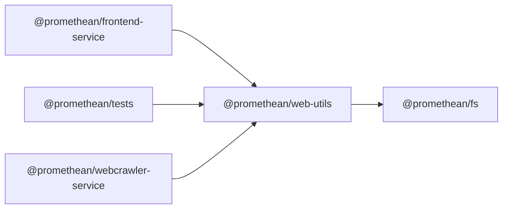

```
<!-- SYMPKG:PKG:BEGIN -->
```
# @promethean/web-utils
```
**Folder:** `packages/web-utils`
```
```
**Version:** `0.0.1`
```
```
**Domain:** `_root`
```

## Dependencies
- @promethean/fs$../fs/README.md
## Dependents
- @promethean/frontend-service$../frontend-service/README.md
- @promethean/tests$../tests/README.md
- @promethean/webcrawler-service$../webcrawler-service/README.md
```
<!-- SYMPKG:PKG:END -->
```