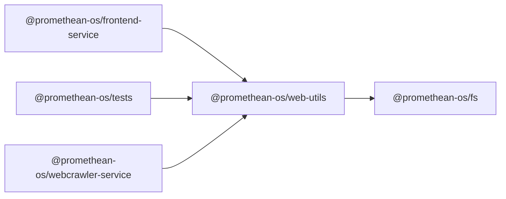

```
<!-- SYMPKG:PKG:BEGIN -->
```
# @promethean-os/web-utils
```
**Folder:** `packages/web-utils`
```
```
**Version:** `0.0.1`
```
```
**Domain:** `_root`
```

## Dependencies
- @promethean-os/fs$../fs/README.md
## Dependents
- @promethean-os/frontend-service$../frontend-service/README.md
- @promethean-os/tests$../tests/README.md
- @promethean-os/webcrawler-service$../webcrawler-service/README.md
```


## 📁 Implementation

### Core Files

- [17](../../../packages/web-utils/src/17)

### View Source

- [GitHub](https://github.com/promethean-ai/promethean/tree/main/packages/web-utils/src)
- [VS Code](vscode://file/packages/web-utils/src)


## 📚 API Reference

### Interfaces

#### [- **core.ts**](../../../packages/web-utils/src/[src/core.ts](../../../packages/web-utils/src/core.ts) (78 lines)#L1)

#### [- **crawler.ts**](../../../packages/web-utils/src/[src/crawler.ts](../../../packages/web-utils/src/crawler.ts) (102 lines)#L1)

#### [- **image-links.ts**](../../../packages/web-utils/src/[src/image-links.ts](../../../packages/web-utils/src/image-links.ts) (245 lines)#L1)

#### [- **index.ts**](../../../packages/web-utils/src/[src/index.ts](../../../packages/web-utils/src/index.ts) (5 lines)#L1)

#### [- **interfaces.ts**](../../../packages/web-utils/src/[src/interfaces.ts](../../../packages/web-utils/src/interfaces.ts) (53 lines)#L1)

#### [- **tests/core.test.ts**](../../../packages/web-utils/src/[src/tests/core.test.ts](../../../packages/web-utils/src/tests/core.test.ts) (30 lines)#L1)

#### [- **tests/crawler.test.ts**](../../../packages/web-utils/src/[src/tests/crawler.test.ts](../../../packages/web-utils/src/tests/crawler.test.ts) (28 lines)#L1)

#### [- **tests/image-links.test.ts**](../../../packages/web-utils/src/[src/tests/image-links.test.ts](../../../packages/web-utils/src/tests/image-links.test.ts) (41 lines)#L1)

#### [- **url.ts**](../../../packages/web-utils/src/[src/url.ts](../../../packages/web-utils/src/url.ts) (86 lines)#L1)

#### [- **createHealthCheck()**](../../../packages/web-utils/src/[createHealthCheck()](../../../packages/web-utils/src/core.ts#L34)

#### [- **registerHealthRoute()**](../../../packages/web-utils/src/[registerHealthRoute()](../../../packages/web-utils/src/core.ts#L44)

#### [- **registerDiagnosticsRoute()**](../../../packages/web-utils/src/[registerDiagnosticsRoute()](../../../packages/web-utils/src/core.ts#L55)

#### [- **createValidationHandler()**](../../../packages/web-utils/src/[createValidationHandler()](../../../packages/web-utils/src/core.ts#L71)

#### [- **crawlPage()**](../../../packages/web-utils/src/[crawlPage()](../../../packages/web-utils/src/crawler.ts#L60)

#### [- **GitHub**](../../../packages/web-utils/src/[View on GitHub](https#L1)

#### [- **VS Code**](../../../packages/web-utils/src/[Open in VS Code](vscode#L1)

#### [**Location**](../../../packages/web-utils/src/[createHealthCheck()](../../../packages/web-utils/src/core.ts#L34)

#### [**Description**](../../../packages/web-utils/src/Key function for createhealthcheck operations.#L1)

#### [**File**](../../../packages/web-utils/src/`src/core.ts`#L1)

#### [**Location**](../../../packages/web-utils/src/[registerHealthRoute()](../../../packages/web-utils/src/core.ts#L44)

#### [**Description**](../../../packages/web-utils/src/Key function for registerhealthroute operations.#L1)

#### [**File**](../../../packages/web-utils/src/`src/core.ts`#L1)

#### [**Location**](../../../packages/web-utils/src/[registerDiagnosticsRoute()](../../../packages/web-utils/src/core.ts#L55)

#### [**Description**](../../../packages/web-utils/src/Key function for registerdiagnosticsroute operations.#L1)

#### [**File**](../../../packages/web-utils/src/`src/core.ts`#L1)

#### [**Location**](../../../packages/web-utils/src/[createValidationHandler()](../../../packages/web-utils/src/core.ts#L71)

#### [**Description**](../../../packages/web-utils/src/Key function for createvalidationhandler operations.#L1)

#### [**File**](../../../packages/web-utils/src/`src/core.ts`#L1)

#### [**Location**](../../../packages/web-utils/src/[crawlPage()](../../../packages/web-utils/src/crawler.ts#L60)

#### [**Description**](../../../packages/web-utils/src/Key function for crawlpage operations.#L1)

#### [**File**](../../../packages/web-utils/src/`src/crawler.ts`#L1)

#### [**Location**](../../../packages/web-utils/src/[findBrokenImageLinks()](../../../packages/web-utils/src/image-links.ts#L85)

#### [**Description**](../../../packages/web-utils/src/Key function for findbrokenimagelinks operations.#L1)

#### [**File**](../../../packages/web-utils/src/`src/image-links.ts`#L1)

#### [**Location**](../../../packages/web-utils/src/[defaultImageGenerator()](../../../packages/web-utils/src/image-links.ts#L201)

#### [**Description**](../../../packages/web-utils/src/Key function for defaultimagegenerator operations.#L1)

#### [**File**](../../../packages/web-utils/src/`src/image-links.ts`#L1)

#### [**Location**](../../../packages/web-utils/src/[fixBrokenImageLinks()](../../../packages/web-utils/src/image-links.ts#L212)

#### [**Description**](../../../packages/web-utils/src/Key function for fixbrokenimagelinks operations.#L1)

#### [**File**](../../../packages/web-utils/src/`src/image-links.ts`#L1)

#### [**Location**](../../../packages/web-utils/src/[canonicalUrl()](../../../packages/web-utils/src/url.ts#L25)

#### [**Description**](../../../packages/web-utils/src/Key function for canonicalurl operations.#L1)

#### [**File**](../../../packages/web-utils/src/`src/url.ts`#L1)

#### [**Location**](../../../packages/web-utils/src/[urlHash()](../../../packages/web-utils/src/url.ts#L62)

#### [**Description**](../../../packages/web-utils/src/Key function for urlhash operations.#L1)

#### [**File**](../../../packages/web-utils/src/`src/url.ts`#L1)

#### [**Location**](../../../packages/web-utils/src/[isUrlAllowed()](../../../packages/web-utils/src/url.ts#L66)

#### [**Description**](../../../packages/web-utils/src/Key function for isurlallowed operations.#L1)

#### [**File**](../../../packages/web-utils/src/`src/url.ts`#L1)

#### [**Location**](../../../packages/web-utils/src/[DEFAULT_DENY_PATTERNS()](../../../packages/web-utils/src/url.ts#L79)

#### [**Description**](../../../packages/web-utils/src/Key function for default_deny_patterns operations.#L1)

#### [**File**](../../../packages/web-utils/src/`src/url.ts`#L1)

#### [**Location**](../../../packages/web-utils/src/[ApiResponse](../../../packages/web-utils/src/interfaces.ts#L5)

#### [**Description**](../../../packages/web-utils/src/Type definition for apiresponse.#L1)

#### [**File**](../../../packages/web-utils/src/`src/interfaces.ts`#L1)

#### [**Location**](../../../packages/web-utils/src/[FetchOptions](../../../packages/web-utils/src/interfaces.ts#L13)

#### [**Description**](../../../packages/web-utils/src/Type definition for fetchoptions.#L1)

#### [**File**](../../../packages/web-utils/src/`src/interfaces.ts`#L1)

#### [**Location**](../../../packages/web-utils/src/[ParsedUrl](../../../packages/web-utils/src/interfaces.ts#L27)

#### [**Description**](../../../packages/web-utils/src/Type definition for parsedurl.#L1)

#### [**File**](../../../packages/web-utils/src/`src/interfaces.ts`#L1)

#### [**Location**](../../../packages/web-utils/src/[LinkExtractor](../../../packages/web-utils/src/interfaces.ts#L37)

#### [**Description**](../../../packages/web-utils/src/Type definition for linkextractor.#L1)

#### [**File**](../../../packages/web-utils/src/`src/interfaces.ts`#L1)

#### [**Location**](../../../packages/web-utils/src/[CrawlMetrics](../../../packages/web-utils/src/interfaces.ts#L45)

#### [**Description**](../../../packages/web-utils/src/Type definition for crawlmetrics.#L1)

#### [**File**](../../../packages/web-utils/src/`src/interfaces.ts`#L1)

#### [Code links saved to](../../../packages/web-utils/src//home/err/devel/promethean/tmp/web-utils-code-links.json#L1)


---

*Enhanced with code links via SYMPKG documentation enhancer*