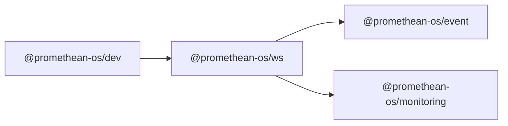

```
<!-- SYMPKG:PKG:BEGIN -->
```
# @promethean-os/ws
```
**Folder:** `packages/ws`
```
```
**Version:** `0.0.1`
```
```
**Domain:** `_root`
```

## Dependencies
- @promethean-os/event$../event/README.md
- @promethean-os/monitoring$../monitoring/README.md
## Dependents
- @promethean-os/dev$../dev/README.md
```


## 📁 Implementation

### Core Files

- [5](../../../packages/ws/src/5)

### View Source

- [GitHub](https://github.com/promethean-ai/promethean/tree/main/packages/ws/src)
- [VS Code](vscode://file/packages/ws/src)


## 📚 API Reference

### Interfaces

#### [- **client.ts**](../../../packages/ws/src/[src/client.ts](../../../packages/ws/src/client.ts) (96 lines)#L1)

#### [- **server.rate.ts**](../../../packages/ws/src/[src/server.rate.ts](../../../packages/ws/src/server.rate.ts) (10 lines)#L1)

#### [- **server.ts**](../../../packages/ws/src/[src/server.ts](../../../packages/ws/src/server.ts) (240 lines)#L1)

#### [- **tests/server.test.ts**](../../../packages/ws/src/[src/tests/server.test.ts](../../../packages/ws/src/tests/server.test.ts) (104 lines)#L1)

#### [- **EventClient**](../../../packages/ws/src/[EventClient](../../../packages/ws/src/client.ts#L5)

#### [- **makeConnLimiter()**](../../../packages/ws/src/[makeConnLimiter()](../../../packages/ws/src/server.rate.ts#L3)

#### [- **makeTopicLimiter()**](../../../packages/ws/src/[makeTopicLimiter()](../../../packages/ws/src/server.rate.ts#L7)

#### [- **startWSGateway()**](../../../packages/ws/src/[startWSGateway()](../../../packages/ws/src/server.ts#L51)

#### [- **GitHub**](../../../packages/ws/src/[View on GitHub](https#L1)

#### [- **VS Code**](../../../packages/ws/src/[Open in VS Code](vscode#L1)

#### [**Location**](../../../packages/ws/src/[EventClient](../../../packages/ws/src/client.ts#L5)

#### [**Description**](../../../packages/ws/src/Main class for eventclient functionality.#L1)

#### [**File**](../../../packages/ws/src/`src/client.ts`#L1)

#### [**Location**](../../../packages/ws/src/[makeConnLimiter()](../../../packages/ws/src/server.rate.ts#L3)

#### [**Description**](../../../packages/ws/src/Key function for makeconnlimiter operations.#L1)

#### [**File**](../../../packages/ws/src/`src/server.rate.ts`#L1)

#### [**Location**](../../../packages/ws/src/[makeTopicLimiter()](../../../packages/ws/src/server.rate.ts#L7)

#### [**Description**](../../../packages/ws/src/Key function for maketopiclimiter operations.#L1)

#### [**File**](../../../packages/ws/src/`src/server.rate.ts`#L1)

#### [**Location**](../../../packages/ws/src/[startWSGateway()](../../../packages/ws/src/server.ts#L51)

#### [**Description**](../../../packages/ws/src/Key function for startwsgateway operations.#L1)

#### [**File**](../../../packages/ws/src/`src/server.ts`#L1)

#### [**Location**](../../../packages/ws/src/[MessageBus](../../../packages/ws/src/server.ts#L16)

#### [**Description**](../../../packages/ws/src/Type definition for messagebus.#L1)

#### [**File**](../../../packages/ws/src/`src/server.ts`#L1)

#### [Code links saved to](../../../packages/ws/src//home/err/devel/promethean/tmp/ws-code-links.json#L1)


---

*Enhanced with code links via SYMPKG documentation enhancer*