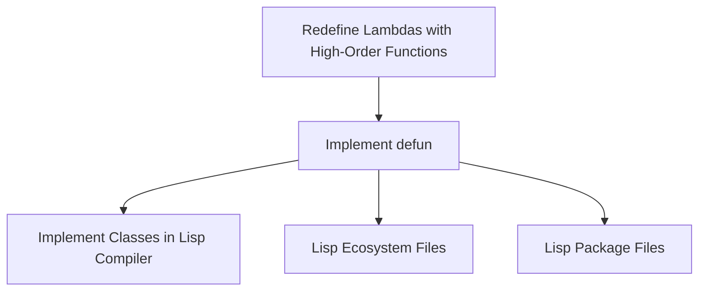
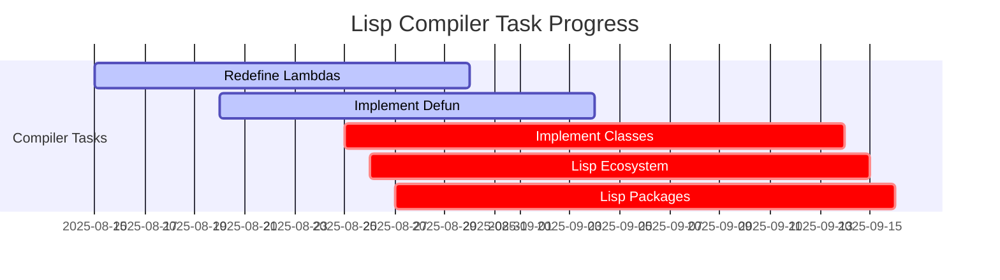

# 🔗 Lisp Compiler — `defun` Dependency Graph

This diagram shows how the `defun` task relates to other compiler/lisp tasks.

---

## 🌱 Current Dependencies

---

## 📊 Progress Heatmap

Legend:
- ✅ done = complete
- 🔄 active = in progress
- ⚠️ crit = blocked / not started

---

## 📝 Notes
- **Defun** sits at the core: lambdas must be redefined before it, and classes/packages build on top of it.
- Once `defun` is stable, Lisp can support recursion and modular abstraction, enabling **class system design**.

---

> 🌍 This task is the keystone of Promethean Lisp — it connects lambdas to future class and package systems.