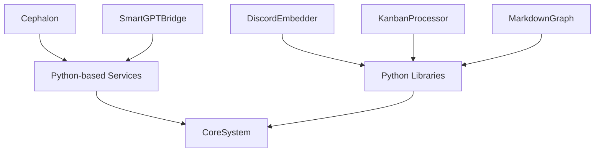
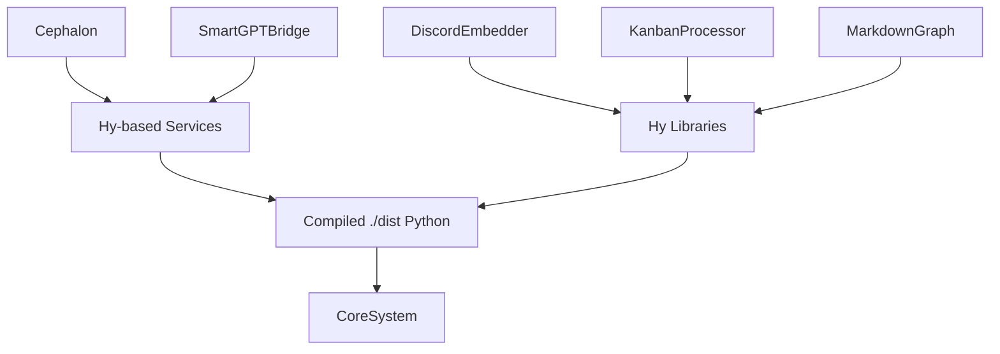
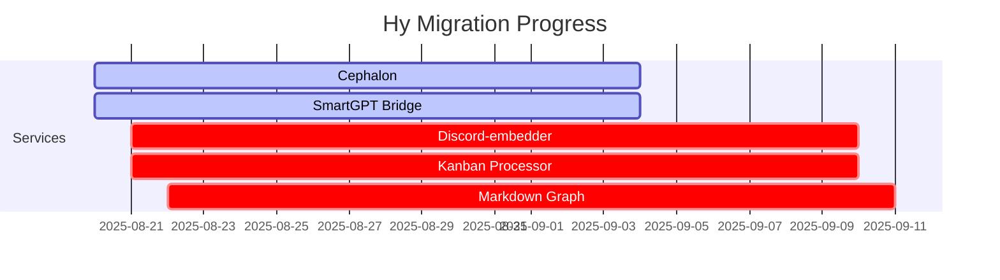

# 🔗 Hy Migration Dependency Graph

This diagram shows the dependency state for the Hy migration.

---

## ❌ Before Migration (Legacy State)

---

## ✅ After Migration (Target State)

---

## 📊 Progress Heatmap

Legend:
- ✅ done = migrated to Hy
- 🔄 active = partial migration
- ⚠️ crit = still in Python

---

> 🌍 Goal: *zero raw Python source* — everything in Hy, compiled into `./dist` for runtime compatibility.