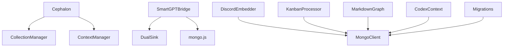
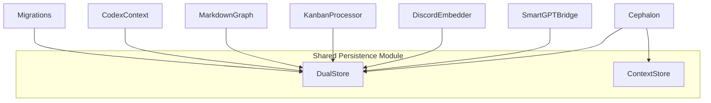
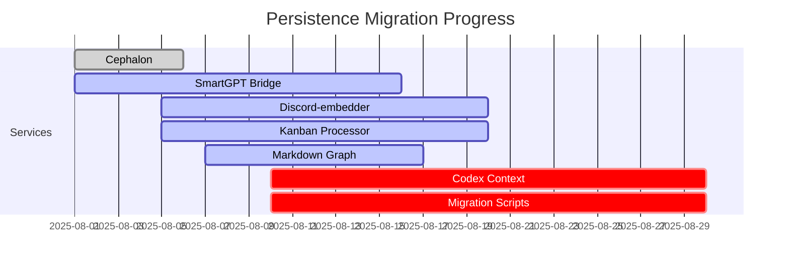

# 🔗 Persistence Dependency Graph

This diagram shows the evolution of persistence dependencies in Promethean services.

---

## ❌ Before Migration (Legacy State)

---

## ✅ After Migration (Target State)

---

## 📊 Progress Heatmap

Legend:
- ✅ **done** = fully migrated (Cephalon)
- 🔄 **active** = partially migrated (Bridge, Embedder, Kanban, Markdown Graph)
- ⚠️ **crit** = untouched/raw Mongo (Codex, Migrations)

---

> 🌍 Once migration is complete, *all services converge on a single shared persistence layer*, simplifying maintenance and ensuring consistent behavior across Promethean.