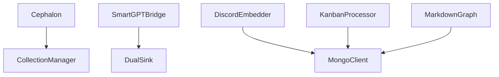
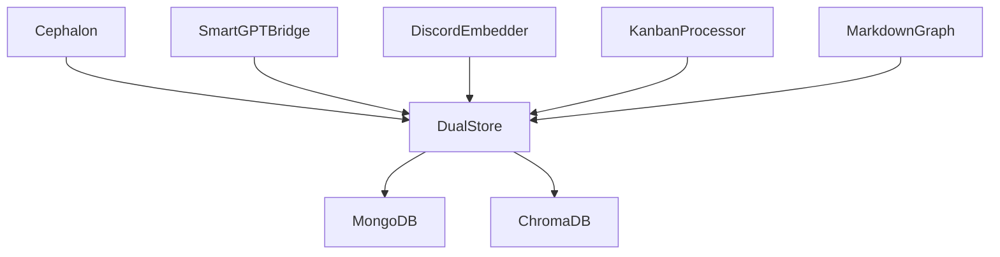

# Persistence Dependency Graph

## Before

```mermaid
graph TD
    Cephalon --> CollectionManager
    SmartGPTBridge --> DualSink
    DiscordEmbedder --> MongoClient
    KanbanProcessor --> MongoClient
    MarkdownGraph --> MongoClient
```

## After

```mermaid
graph TD
    Cephalon --> DualStore
    SmartGPTBridge --> DualStore
    DiscordEmbedder --> DualStore
    KanbanProcessor --> DualStore
    MarkdownGraph --> DualStore
    DualStore --> MongoDB
    DualStore --> ChromaDB
```
