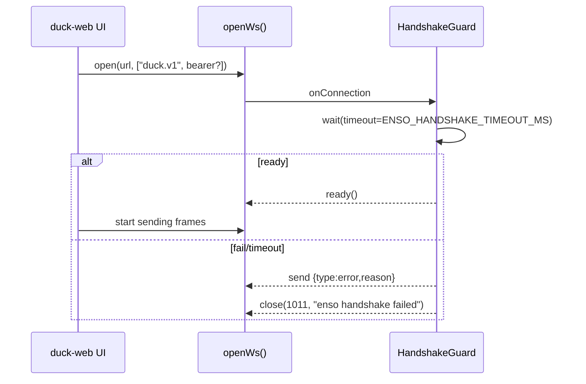

# enso-browser-gateway — Handshake Guard

Status: ✅ implemented in PR #1451.

The handshake guard blocks all WS I/O until ENSO signals readiness, with a hard timeout (`ENSO_HANDSHAKE_TIMEOUT_MS`, default 10000). On failure, an error frame is emitted and the socket is closed with 1011.

## Diagram

## Notes
- Cache readiness after first success to avoid repeated awaits in hot paths.
- Expose timeout via env for ops.
- Close reason keeps 1011; mirror short failure reason in server logs.

## Related
- openWs helper (duck-web) — subprotocol setup.
- Voice forwarder — depends on readiness to gate media frames.
