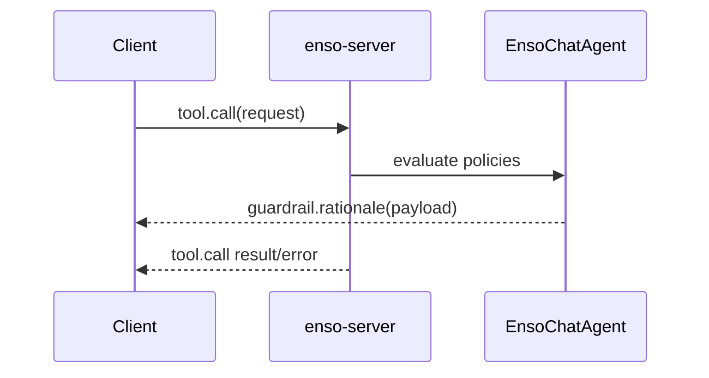

# enso-server — Guardrail Rationale Events

Status: 🔧 in PR #1450.

Emits a rationale before tool invocation when evaluation mode is on.

## Suggested Payload
```ts
export type ActRationalePayload = {
  callId: string;
  rationale: string;
  policy?: string;            // e.g., "morganna@1"
  evidence?: readonly string[];
  evidenceKind?: 'url' | 'messageId' | 'note';
};
```

## Diagram


## Notes
- Consider renaming event from `act.rationale` to `guardrail.rationale`.
- Keep payload slim; let UI render text/links based on `evidenceKind`.
- Expose room flags `{ eval: true|false }` for clients.
