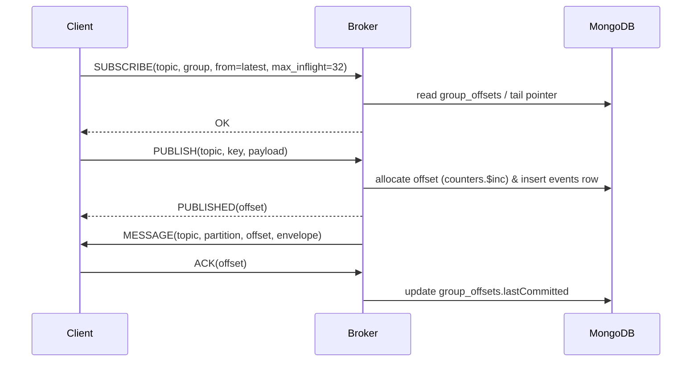

# Promethean Event Bus — MVP v0.1

A small, durable, **at-least-once** event bus that fits our stack (Node.js, WebSocket, MongoDB), integrates with the existing WS broker, and is easy to extend toward task queues.

---

## Goals & Constraints

- **Durable**: events persisted in MongoDB, replayable by consumer groups.
    
- **At-least-once** delivery** with **consumer-group offsets** and **acks**.
    
- **Simple partitions**: hash(key) → partition (default `1`).
    
- **Backpressure**: per-connection `max_inflight` (credit-based optional).
    
- **Replay**: subscribe from `latest | offset | timestamp`.
    
- **Observability**: minimal counters + system topics for metrics.
    
- **Fits what we have**: plugs into the current `ws`-based broker and heartbeat.
    

---

## Core Data Structures (TypeScript)

```ts
export type UUID = string;
export type Vec8 = [number,number,number,number,number,number,number,number];

export interface BrokerEnvelope<T = unknown> {
  id: UUID;              // message id (uuidv7)
  ts: number;            // epoch ms
  topic: string;         // e.g. "heartbeat.received"
  key?: string;          // partitioning key
  partition?: number;    // assigned by broker
  headers?: Record<string, string>;
  payload_sha256?: string; // optional integrity
  payload: T;            // the actual message/event body
}

export interface EventRow<T = unknown> extends BrokerEnvelope<T> {
  offset: number;        // monotonically increasing per (topic, partition)
  attempts?: number;     // redelivery attempts (for DLQ policy)
}

export interface TopicConfig {
  topic: string;
  partitions: number;      // default 1
  retentionMs?: number;    // optional retention policy
  maxAttempts?: number;    // before DLQ
}

export interface GroupOffset {
  topic: string;
  partition: number;
  group: string;           // consumer group id
  lastCommitted: number;   // last acked offset
  updatedTs: number;
}

export interface SubscribeRequest {
  type: 'SUBSCRIBE';
  topic: string;
  group: string;                   // consumer group id
  from?: { kind: 'latest'|'offset'|'timestamp'; value?: number };
  max_inflight?: number;           // backpressure window
  filter?: { key?: string; header?: [string,string] };
}

export interface PublishRequest<T = unknown> {
  type: 'PUBLISH';
  topic: string;
  key?: string;
  headers?: Record<string,string>;
  payload: T;
}

export interface Ack {
  type: 'ACK'|'NACK';
  topic: string;
  partition: number;
  group: string;
  offset: number;
  reason?: string;         // for NACK
}
```

---

## MongoDB Schema (collections & indexes)

**collections**

- `events`: append-only rows per event
    
    - fields: `{ _id, topic, partition, offset, ts, id, key, headers, payload_sha256, payload, attempts }`
        
    - unique index: `{ topic:1, partition:1, offset:1 }` (unique)
        
    - index: `{ topic:1, partition:1, ts:1 }`
        
- `counters`: one doc per `{topic, partition}` to allocate offsets
    
    - fields: `{ _id:` ${topic}:${partition}`, nextOffset: number }`
        
- `group_offsets`: commit state per consumer group
    
    - fields: `{ _id:` ${topic}:${partition}:${group}`, topic, partition, group, lastCommitted, updatedTs }`
        
    - index: `{ topic:1, partition:1, group:1 }` (unique)
        
- `topic_configs`: optional static configs `{ topic, partitions, retentionMs?, maxAttempts? }`
    

**retention**

- Optional TTL if we don’t need infinite replay: use a job to purge `events` with `ts < now - retentionMs` per topic.
    

---

## Partitioning

```ts
function assignPartition(topic: string, key: string|undefined, partitions = 1): number {
  if (!partitions || partitions <= 1) return 0;
  const k = key ?? `${Math.random()}`; // if no key, round-robin could be used instead
  let h = 0; for (let i = 0; i < k.length; i++) h = ((h << 5) - h) + k.charCodeAt(i) | 0;
  return Math.abs(h) % partitions;
}
```

---

## Wire Protocol (WebSocket frames)

Frames are JSON objects with a `type` discriminator.

**Publish**

```json
{ "type":"PUBLISH", "topic":"system.metrics", "key":"duck-1", "headers":{ "ct":"json" }, "payload":{ "cpu":12.3 } }
```

**Subscribe**

```json
{ "type":"SUBSCRIBE", "topic":"heartbeat.received", "group":"monitor", "from":{ "kind":"latest" }, "max_inflight":32 }
```

**Server → Client delivery**

```json
{
  "type":"MESSAGE",
  "topic":"heartbeat.received",
  "partition":0,
  "group":"monitor",
  "offset":1042,
  "envelope":{ "id":"01J9...", "ts":1723140000000, "topic":"heartbeat.received", "key":"proc:stt", "partition":0, "payload":{ "pid":1234, "name":"stt" } }
}
```

**Ack/Nack**

```json
{ "type":"ACK", "topic":"heartbeat.received", "partition":0, "group":"monitor", "offset":1042 }
```

**Optional flow control (credits)**

```json
{ "type":"FLOW", "credits":50 }
```

---

## Delivery Semantics

- **At-least-once**: messages may redeliver after timeouts or broker restarts.
    
- **Ack** commits the consumer group’s offset up to `offset` (inclusive).
    
- **In-flight window**: server won’t exceed `max_inflight` unacked messages per connection/group.
    
- **Redelivery**: if `ACK` not received within `ACK_TIMEOUT_MS` (e.g., 30s), the message is eligible for redelivery to any active connection in the same group.
    
- **DLQ**: if attempts > `maxAttempts`, broker moves the event to `${topic}.DLQ` with original metadata.
    

---

## Minimal Broker Flow (high-level)



---

## Broker Algorithms (pseudo)

**Publisher**

```ts
async function publish(req: PublishRequest) {
  const cfg = await topics.getConfig(req.topic);
  const p = assignPartition(req.topic, req.key, cfg.partitions);
  const { value: nextOffset } = await counters.inc(`${req.topic}:${p}`);
  const row: EventRow = { ...req, id: uuidv7(), ts: Date.now(), partition: p, offset: nextOffset, headers: req.headers ?? {} };
  await events.insert(row);
  deliverer.wake(req.topic, p); // nudge delivery loop
}
```

**Delivery loop (per topic/partition/group)**

```ts
async function deliver(topic: string, p: number, group: string, conn: WsConn) {
  const window = conn.window(group); // max_inflight - inflight
  if (window <= 0) return;
  const from = await offsets.getCommitted(topic, p, group) + 1;
  const rows = await events.find({ topic, partition: p, offset: { $gte: from } }).limit(window).toArray();
  for (const row of rows) {
    conn.send({ type:'MESSAGE', topic, partition:p, group, offset: row.offset, envelope: row });
    tracker.addInflight(conn, group, topic, p, row.offset, Date.now() + ACK_TIMEOUT_MS);
  }
}
```

**Ack**

```ts
async function ack({ topic, partition, group, offset }: Ack) {
  await offsets.commitMax(topic, partition, group, offset);
  tracker.clearInflight(group, topic, partition, offset);
}
```

**Redelivery sweep**

```ts
setInterval(() => {
  for (const lease of tracker.expiredLeases()) {
    const conn = pickActiveConnection(lease.group, lease.topic, lease.partition);
    if (conn) replay(lease, conn); else /* wait */
  }
}, 1000);
```

---

## System Topics (built-ins)

- `system.metrics` — counters, gauges (emitted by broker)
    
- `system.bus.dlq` — DLQ mirror (or per-topic `${topic}.DLQ`)
    
- `system.bus.audit` — broker decisions (publish, ack, redelivery)
    

---

## Security / Permissions (hook points)

- **Publish ACL**: per-topic `allow:[agents]`/`deny:[agents]` in `topic_configs`.
    
- **Subscribe ACL**: per-topic/group allowlist.
    
- **Headers**: carry `agent_id`, `sid`, `scopes` (aligns with your Circuit 2 permissions).
    

---

## Minimal Node.js Service Skeleton

```ts
import WebSocket, { WebSocketServer } from 'ws';
import { MongoClient } from 'mongodb';

const wss = new WebSocketServer({ port: process.env.BUS_PORT ? Number(process.env.BUS_PORT) : 7070 });
const mongo = new MongoClient(process.env.MONGO_URL!);

// maps: topic->partition->group->Set<Conn>
const subs = new Map<string, Map<number, Map<string, Set<WebSocket>>>>();

wss.on('connection', (ws) => {
  ws.on('message', async (buf) => {
    const msg = JSON.parse(buf.toString());
    switch (msg.type) {
      case 'SUBSCRIBE': /* register, start delivery loop */ break;
      case 'PUBLISH':   /* append and notify */ break;
      case 'ACK':       /* commit and free inflight */ break;
      case 'NACK':      /* bump attempts, maybe DLQ */ break;
      case 'FLOW':      /* adjust window */ break;
    }
  });
});

async function main(){ await mongo.connect(); /* create indexes & start sweeps */ }
main().catch(console.error);
```

---

## Testing Recipe (dev harness)

1. Start MongoDB; run broker.
    
2. `ws-pub` script publishes N events/sec on `test.topic`.
    
3. `ws-sub` script joins group `g1`, `from=offset(0)`, `max_inflight=10`; verify acks advance offsets.
    
4. Kill/restart broker: ensure subscriber resumes from committed offset.
    
5. Disable ACK: observe redeliveries and DLQ after `maxAttempts`.
    

---

## Kanban — Event Bus Track (add these)

-  Create Mongo indexes & counters bootstrap script
    
-  Implement `PUBLISH` → counters `$inc` + insert + notify
    
-  Implement `SUBSCRIBE` + delivery loop w/ `max_inflight`
    
-  Implement `ACK` commit + redelivery sweep
    
-  Add `${topic}.DLQ` publishing
    
-  Emit `system.bus.audit` events for publish/ack/redelivery
    
-  Add optional `FLOW` credits (beyond `max_inflight`)
    
-  Add HTTP endpoints: `POST /topics`, `GET /topics/:id/offsets`, `GET /stats`
    
-  Integrate with Heartbeat service (publish heartbeats to `heartbeat.received`)
    
-  Bench: 1k msgs/sec, 10 consumers, latency < 50ms p50 on LAN
    

---

## Nice-to-haves (later)

- Consumer **sticky sessions** per partition for locality
    
- **Change Streams** fast-path for new events
    
- **Outbox** pattern helper (service-local table → bus drainer)
    
- **Compaction** mode for key-based state (à la Kafka compacted topics)
    
- **Schema registry** (zod types, versioning)
    

---

## Appendix — zod Types (optional)

```ts
import { z } from 'zod';
export const EnvelopeZ = z.object({
  id: z.string(), ts: z.number(), topic: z.string(), key: z.string().optional(), partition: z.number().optional(), headers: z.record(z.string()).optional(), payload_sha256: z.string().optional(), payload: z.unknown(),
});
export const EventRowZ = EnvelopeZ.extend({ offset: z.number(), attempts: z.number().optional() });
export const SubscribeZ = z.object({ type: z.literal('SUBSCRIBE'), topic: z.string(), group: z.string(), from: z.object({ kind: z.enum(['latest','offset','timestamp']), value: z.number().optional() }).optional(), max_inflight: z.number().default(32), filter: z.object({ key: z.string().optional(), header: z.tuple([z.string(), z.string()]).optional() }).optional() });
```

---

# prom-lib (JS/TS SDK)

A general-purpose library to minimize service-specific code. Lives in `shared/js/prom-lib`.

```text
shared/js/prom-lib/
  src/
    bus/
      types.ts
      schema.ts
      util.ts
      acls.ts
      metrics.ts
      client.ts
      server.ts
      storage/
        memory.ts
        mongo.ts
    outbox/
      mongo_outbox.ts
    task/
      types.ts
      queue.ts
    logging/
      logger.ts
  package.json
  tsconfig.json
  README.md
```

## `bus/types.ts`

```ts
export type UUID = string;
export type Millis = number;
export type Partition = number;

export type Vec8 = [number,number,number,number,number,number,number,number];

export interface BrokerEnvelope<T = unknown> {
  id: UUID;
  ts: Millis;
  topic: string;
  key?: string;
  partition?: Partition;
  headers?: Record<string, string>;
  payload_sha256?: string;
  payload: T;
}

export interface EventRow<T = unknown> extends BrokerEnvelope<T> {
  offset: number;
  attempts?: number;
}

export interface TopicConfig {
  topic: string;
  partitions: number;
  retentionMs?: number;
  maxAttempts?: number;
  publishACL?: string[];   // agent ids or roles
  subscribeACL?: string[]; // agent ids or roles
}

export interface GroupOffset { topic: string; partition: number; group: string; lastCommitted: number; updatedTs: number; }

export type FromSpec = { kind: 'latest'|'offset'|'timestamp'; value?: number };

export interface SubscribeRequest {
  type: 'SUBSCRIBE'; topic: string; group: string; from?: FromSpec; max_inflight?: number;
  filter?: { key?: string; header?: [string,string] };
}

export interface PublishRequest<T = unknown> { type: 'PUBLISH'; topic: string; key?: string; headers?: Record<string,string>; payload: T; }
export interface Ack { type: 'ACK'|'NACK'; topic: string; partition: number; group: string; offset: number; reason?: string; }

export interface IMessageFrame<T = unknown> { type: 'MESSAGE'; topic: string; partition: number; group: string; offset: number; envelope: BrokerEnvelope<T> & { offset?: number } }

export interface Flow { type: 'FLOW'; credits: number }
```

## `bus/schema.ts` (zod)

```ts
import { z } from 'zod';

export const EnvelopeZ = z.object({
  id: z.string(), ts: z.number(), topic: z.string(), key: z.string().optional(), partition: z.number().optional(),
  headers: z.record(z.string()).optional(), payload_sha256: z.string().optional(), payload: z.unknown(),
});

export const EventRowZ = EnvelopeZ.extend({ offset: z.number(), attempts: z.number().optional() });

export const SubscribeZ = z.object({
  type: z.literal('SUBSCRIBE'), topic: z.string(), group: z.string(),
  from: z.object({ kind: z.enum(['latest','offset','timestamp']), value: z.number().optional() }).optional(),
  max_inflight: z.number().default(32),
  filter: z.object({ key: z.string().optional(), header: z.tuple([z.string(), z.string()]).optional() }).optional(),
});

export const PublishZ = z.object({ type: z.literal('PUBLISH'), topic: z.string(), key: z.string().optional(), headers: z.record(z.string()).optional(), payload: z.unknown() });
export const AckZ = z.object({ type: z.enum(['ACK','NACK']), topic: z.string(), partition: z.number(), group: z.string(), offset: z.number(), reason: z.string().optional() });
```

## `bus/util.ts`

```ts
export function uuidv7(): string { /* pluggable impl; use @lukeed/uuid or your own */ return crypto.randomUUID(); }
export function now(): number { return Date.now(); }
export function assignPartition(key: string|undefined, partitions = 1): number {
  if (!partitions || partitions <= 1) return 0;
  const k = key ?? `${Math.random()}`;
  let h = 0; for (let i = 0; i < k.length; i++) h = ((h << 5) - h) + k.charCodeAt(i) | 0;
  return Math.abs(h) % partitions;
}
```

## `bus/storage/mongo.ts`

```ts
import { Collection, Db, MongoClient } from 'mongodb';
import { EventRow, GroupOffset, TopicConfig } from '../types';

export class MongoStorage {
  private events!: Collection<EventRow>;
  private counters!: Collection<{ _id: string; nextOffset: number }>; // _id: `${topic}:${partition}`
  private offsets!: Collection<GroupOffset>;
  private topicConfigs!: Collection<TopicConfig>;

  constructor(private db: Db) {}

  static async connect(url: string, dbName: string) {
    const client = new MongoClient(url); await client.connect();
    const db = client.db(dbName); const store = new MongoStorage(db); await store.init(); return store;
  }

  async init() {
    this.events = this.db.collection('events');
    this.counters = this.db.collection('counters');
    this.offsets = this.db.collection('group_offsets');
    this.topicConfigs = this.db.collection('topic_configs');
    await this.events.createIndex({ topic:1, partition:1, offset:1 }, { unique: true });
    await this.events.createIndex({ topic:1, partition:1, ts:1 });
    await this.offsets.createIndex({ topic:1, partition:1, group:1 }, { unique: true });
  }

  async getConfig(topic: string): Promise<TopicConfig> {
    return await this.topicConfigs.findOne({ topic }) || { topic, partitions: 1 };
  }

  async nextOffset(topic: string, partition: number): Promise<number> {
    const id = `${topic}:${partition}`;
    const res = await this.counters.findOneAndUpdate(
      { _id: id }, { $inc: { nextOffset: 1 } }, { upsert: true, returnDocument: 'after' },
    );
    return res.value!.nextOffset;
  }

  async insertEvent(row: EventRow) { await this.events.insertOne(row); }

  async readFrom(topic: string, partition: number, offset: number, limit: number) {
    return await this.events.find({ topic, partition, offset: { $gte: offset } }).sort({ offset: 1 }).limit(limit).toArray();
  }

  async committed(topic: string, partition: number, group: string): Promise<number> {
    const g = await this.offsets.findOne({ topic, partition, group });
    return g?.lastCommitted ?? 0;
  }

  async commit(topic: string, partition: number, group: string, offset: number) {
    await this.offsets.updateOne(
      { topic, partition, group },
      { $max: { lastCommitted: offset }, $set: { updatedTs: Date.now() } },
      { upsert: true },
    );
  }
}
```

## `bus/storage/memory.ts` (for tests)

```ts
import { EventRow } from '../types';

export class MemoryStorage {
  private rows = new Map<string, EventRow[]>();
  private commits = new Map<string, number>();
  private counters = new Map<string, number>();

  key(topic: string, p: number) { return `${topic}:${p}`; }

  async nextOffset(topic: string, p: number) {
    const k = this.key(topic, p);
    const n = (this.counters.get(k) ?? 0) + 1; this.counters.set(k, n); return n;
  }

  async insertEvent(row: EventRow) {
    const k = this.key(row.topic, row.partition!);
    const arr = this.rows.get(k) ?? []; arr.push(row); this.rows.set(k, arr);
  }

  async readFrom(topic: string, p: number, offset: number, limit: number) {
    const arr = this.rows.get(this.key(topic, p)) ?? [];
    return arr.filter(r => r.offset >= offset).slice(0, limit);
  }

  async committed(topic: string, p: number, g: string) { return this.commits.get(`${topic}:${p}:${g}`) ?? 0; }
  async commit(topic: string, p: number, g: string, off: number) { this.commits.set(`${topic}:${p}:${g}`, Math.max(off, await this.committed(topic,p,g))); }
}
```

## `bus/server.ts`

```ts
import WebSocket, { WebSocketServer } from 'ws';
import { MongoStorage } from './storage/mongo';
import { PublishRequest, SubscribeRequest, Ack, EventRow } from './types';
import { assignPartition } from './util';

export class BrokerServer {
  private subs = new Map<string, Map<number, Map<string, Set<WebSocket>>>>();
  private inflight = new Map<string, { deadline: number; ws: WebSocket }>();
  private ACK_TIMEOUT_MS = 30_000;

  constructor(private store: MongoStorage, private wss: WebSocketServer) {
    wss.on('connection', (ws) => this.onConn(ws));
    setInterval(() => this.redeliverySweep(), 1000);
  }

  private subset(topic: string, p: number, group: string) {
    if (!this.subs.has(topic)) this.subs.set(topic, new Map());
    const parts = this.subs.get(topic)!; if (!parts.has(p)) parts.set(p, new Map());
    const groups = parts.get(p)!; if (!groups.has(group)) groups.set(group, new Set());
    return groups.get(group)!;
  }

  private onConn(ws: WebSocket) {
    ws.on('message', (buf) => this.onMessage(ws, buf));
  }

  private async onMessage(ws: WebSocket, buf: WebSocket.RawData) {
    const msg = JSON.parse(buf.toString());
    if (msg.type === 'PUBLISH') return this.handlePublish(ws, msg as PublishRequest);
    if (msg.type === 'SUBSCRIBE') return this.handleSubscribe(ws, msg as SubscribeRequest);
    if (msg.type === 'ACK' || msg.type === 'NACK') return this.handleAck(ws, msg as Ack);
    if (msg.type === 'FLOW') { /* TODO: adjust window */ return; }
  }

  private async handlePublish(ws: WebSocket, req: PublishRequest) {
    const cfg = await this.store.getConfig(req.topic);
    const p = assignPartition(req.key, cfg.partitions);
    const offset = await this.store.nextOffset(req.topic, p);
    const row: EventRow = { id: crypto.randomUUID(), ts: Date.now(), topic: req.topic, key: req.key, partition: p, headers: req.headers, payload: req.payload, offset };
    await this.store.insertEvent(row);
    this.notify(req.topic, p);
    ws.send(JSON.stringify({ type: 'PUBLISHED', topic: req.topic, partition: p, offset }));
  }

  private async handleSubscribe(ws: WebSocket, req: SubscribeRequest) {
    const p = 0; // TODO: multi-partition fan-in per connection
    this.subset(req.topic, p, req.group).add(ws);
    await this.deliver(req.topic, p, req.group, ws, req.max_inflight ?? 32, req.from);
  }

  private inflightKey(topic: string, p: number, g: string, off: number) { return `${topic}:${p}:${g}:${off}`; }

  private async deliver(topic: string, p: number, g: string, ws: WebSocket, window: number, from?: SubscribeRequest['from']) {
    const start = from?.kind === 'offset' ? (from.value ?? 0) : (await this.store.committed(topic, p, g)) + 1;
    const rows = await this.store.readFrom(topic, p, start, window);
    for (const row of rows) {
      const frame = { type:'MESSAGE', topic, partition:p, group:g, offset: row.offset, envelope: row };
      ws.send(JSON.stringify(frame));
      this.inflight.set(this.inflightKey(topic,p,g,row.offset), { deadline: Date.now() + this.ACK_TIMEOUT_MS, ws });
    }
  }

  private async handleAck(_ws: WebSocket, ack: Ack) {
    if (ack.type === 'ACK') await this.store.commit(ack.topic, ack.partition, ack.group, ack.offset);
    this.inflight.delete(this.inflightKey(ack.topic, ack.partition, ack.group, ack.offset));
  }

  private async redeliverySweep() {
    const now = Date.now();
    for (const [k, lease] of this.inflight) {
      if (lease.deadline <= now) {
        const [topic, pStr, g, offStr] = k.split(':');
        const p = Number(pStr), off = Number(offStr);
        // naive replay to the same socket if open (else drop and rely on next notify)
        try {
          const [row] = await this.store.readFrom(topic, p, off, 1);
          if (row) lease.ws.send(JSON.stringify({ type:'MESSAGE', topic, partition:p, group:g, offset: row.offset, envelope: row }));
          lease.deadline = now + this.ACK_TIMEOUT_MS;
        } catch {}
      }
    }
  }

  private async notify(topic: string, p: number) {
    const groups = this.subs.get(topic)?.get(p); if (!groups) return;
    for (const [g, set] of groups) for (const ws of set) this.deliver(topic, p, g, ws, 32);
  }
}
```

## `bus/client.ts` (WS client with autoretry)

```ts
import WebSocket from 'ws';
import { Ack, IMessageFrame, PublishRequest, SubscribeRequest } from './types';

export class BusClient {
  private ws?: WebSocket; private url: string; private backoff = 500; private max = 10_000; private pending: any[] = [];
  constructor(url = process.env.BUS_URL || 'ws://127.0.0.1:7070') { this.url = url; this.connect(); }

  private connect() {
    this.ws = new WebSocket(this.url);
    this.ws.on('open', () => { this.backoff = 500; for (const m of this.pending.splice(0)) this.ws!.send(JSON.stringify(m)); });
    this.ws.on('message', (buf) => this.onMessage(JSON.parse(buf.toString())));
    this.ws.on('close', () => setTimeout(() => this.connect(), this.backoff = Math.min(this.max, this.backoff * 2)));
    this.ws.on('error', () => {});
  }

  private send(obj: any) { const s = JSON.stringify(obj); if (this.ws?.readyState === this.ws.OPEN) this.ws.send(s); else this.pending.push(obj); }

  publish<T>(topic: string, payload: T, key?: string, headers?: Record<string,string>) {
    const msg: PublishRequest<T> = { type:'PUBLISH', topic, key, headers, payload }; this.send(msg);
  }

  subscribe(req: Omit<SubscribeRequest,'type'>, onMessage: (m: IMessageFrame) => void, onError?: (e: any) => void) {
    this.onMessage = (m) => { if (m.type === 'MESSAGE' && m.topic === req.topic) onMessage(m as IMessageFrame); };
    this.send({ type:'SUBSCRIBE', ...req });
  }

  ack(ack: Ack) { this.send(ack); }

  // overrideable hook
  protected onMessage(_m: any) {}
}
```

## `bus/metrics.ts`

```ts
export interface BrokerMetrics { published: number; delivered: number; acks: number; redeliveries: number; inflight: number; byTopic: Record<string, { pub: number; del: number; }>; }
export class Metrics { s: BrokerMetrics = { published:0, delivered:0, acks:0, redeliveries:0, inflight:0, byTopic:{} }; inc(t: keyof BrokerMetrics, topic?: string) { (this.s as any)[t]++; if (topic) { const bt = this.s.byTopic[topic] ?? (this.s.byTopic[topic] = { pub:0, del:0 }); if (t==='published') bt.pub++; if (t==='delivered') bt.del++; } } snapshot(){ return JSON.parse(JSON.stringify(this.s)); } }
```

## `bus/acls.ts`

```ts
export type ACLCtx = { agent?: string; scopes?: string[] };
export type ACLChecker = (topic: string, action: 'publish'|'subscribe', ctx: ACLCtx) => boolean | Promise<boolean>;
```

## Outbox helper — `outbox/mongo_outbox.ts`

```ts
import { Collection } from 'mongodb';
import { BusClient } from '../bus/client';

export interface OutboxRow { _id: string; topic: string; key?: string; headers?: Record<string,string>; payload: any; createdTs: number; sentTs?: number; attempts?: number; }

export async function drainOutbox(col: Collection<OutboxRow>, bus: BusClient, { batch = 100, maxAttempts = 10 } = {}) {
  const rows = await col.find({ $or: [ { sentTs: { $exists: false } }, { attempts: { $lt: maxAttempts } } ] }).limit(batch).toArray();
  for (const r of rows) {
    try { bus.publish(r.topic, r.payload, r.key, r.headers); await col.updateOne({ _id: r._id }, { $set: { sentTs: Date.now() }, $inc: { attempts: 1 } }); }
    catch { await col.updateOne({ _id: r._id }, { $inc: { attempts: 1 } }); }
  }
}
```

## Task Queue on the Bus — `task/queue.ts`

```ts
import { BusClient } from '../bus/client';
import { IMessageFrame } from '../bus/types';

export type Task<T = any> = { id: string; topic: string; payload: T; priority?: number };

export class TaskQueue {
  constructor(private bus: BusClient, private topic: string, private group = 'workers') {}

  enqueue<T>(payload: T, key?: string) { this.bus.publish(this.topic, { payload }, key); }

  start(handler: (task: Task) => Promise<void>) {
    this.bus.subscribe({ topic: this.topic, group: this.group, from: { kind:'latest' }, max_inflight: 16 }, async (m: IMessageFrame) => {
      const task: Task = { id: m.envelope.id, topic: m.topic, payload: (m.envelope as any).payload };
      try { await handler(task); this.bus.ack({ type:'ACK', topic: m.topic, partition: m.partition, group: m.group, offset: m.offset }); }
      catch (e) { this.bus.ack({ type:'NACK', topic: m.topic, partition: m.partition, group: m.group, offset: m.offset, reason: String(e) }); }
    });
  }
}
```

## Example: Heartbeat publisher (service)

```ts
import { BusClient } from 'shared/js/prom-lib/src/bus/client';
const bus = new BusClient();
setInterval(() => {
  bus.publish('heartbeat.received', { pid: process.pid, name: process.env.name, ts: Date.now() }, `proc:${process.pid}`);
}, 3000);
```

## Example: Monitor (consumer)

```ts
import { BusClient } from 'shared/js/prom-lib/src/bus/client';
const bus = new BusClient();

bus.subscribe({ topic: 'heartbeat.received', group: 'monitor', from: { kind: 'latest' }, max_inflight: 32 }, (m) => {
  console.log('HB', m.envelope.payload);
  bus.ack({ type:'ACK', topic: m.topic, partition: m.partition, group: m.group, offset: m.offset });
});
```

## Sibilant helpers (DSL sprinkles)

```lisp
(defn mk-env [topic payload &optional key headers]
  {:type "PUBLISH" :topic topic :key key :headers headers :payload payload})

(defmacro deftopic (name &rest kvs)
  `(register-topic ~(str name) ~(apply hash-map kvs)))

(defmacro defconsumer (topic group &rest body)
  `(bus.subscribe {:topic ~(str topic) :group ~(str group) :from {:kind "latest"} :max_inflight 32}
     (fn [m]
       ~@body
       (bus.ack {:type "ACK" :topic m.topic :partition m.partition :group m.group :offset m.offset}))))
```

## ENV & Config

- `BUS_PORT` (server), `BUS_URL` (client), `MONGO_URL`, `MONGO_DB`.
    
- Optional: `BUS_ACK_TIMEOUT_MS`, `BUS_MAX_INFLIGHT`.
    

## Architecture overview

```mermaid
flowchart LR
  subgraph Producer Services
    A[stt] -->|PUBLISH| B
    C[tts] -->|PUBLISH| B
    D[discord_indexer] -->|PUBLISH| B
  end

  subgraph Event Bus
    B[BrokerServer (WS)] --> E[(Mongo events)]
    B --> F[(Group Offsets)]
  end

  subgraph Consumers
    G[monitor] -->|SUBSCRIBE g=monitor| B
    H[task workers] -->|SUBSCRIBE g=workers| B
  end

  B -->|system.metrics| I[observability]
```

## Extended Kanban (library build-out)

-  Package skeleton in `shared/js/prom-lib`
    
-  Implement `MongoStorage` + indexes + env wiring
    
-  Implement `MemoryStorage` + unit tests
    
-  Implement `BrokerServer` minimal paths (publish/subscribe/ack)
    
-  Add redelivery sweep + DLQ topic emission
    
-  Add `BusClient` with reconnect + backoff
    
-  Add `TaskQueue` helper + sample worker
    
-  Add `Outbox` helper + sample drainer
    
-  Add `Metrics` + `system.metrics` publisher
    
-  Add ACL hook surface + sample checker
    
-  Ship examples + README  
    ``