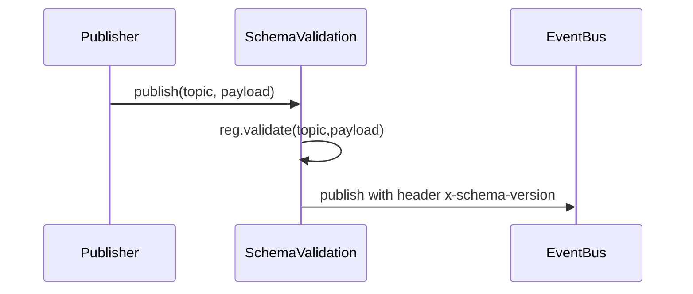

Note: Consolidated here → ../notes/services/partitions-schema-registry-projector.md

Alright, **Part 5**: stateful partitions + rebalancing, a tiny schema-registry (Zod) with compat rules, and a **Changelog Projector** that materializes a topic into a Mongo collection with upserts & tombstones. All drop-in. ⚙️

---

# 1) Stateful partitions + rebalance

## 1a) Jump consistent hash (deterministic partition id)

```ts
// shared/js/prom-lib/partition/jump.ts
// Jump Consistent Hash (Lamping & Veach) — stable mapping key -> [0..buckets-1]
export function jumpHash(key: string, buckets: number): number {
  // convert to 64-bit int hash (xorshift-ish)
  let h1 = 0xdeadbeef ^ key.length, h2 = 0x41c6ce57 ^ key.length;
  for (let i=0;i<key.length;i++) {
    const ch = key.charCodeAt(i);
    h1 = Math.imul(h1 ^ ch, 2654435761);
    h2 = Math.imul(h2 ^ ch, 1597334677);
  }
  let x = (h1 ^ (h2<<1)) >>> 0;
  let b = -1, j = 0;
  while (j < buckets) {
    b = j;
    x = (x * 2862933555777941757n + 1n) & 0xffffffffffffffffn as any;
    const inv = Number((x >> 33n) + 1n) / 2**31;
    j = Math.floor((b + 1) / inv);
  }
  return b;
}
```

## 1b) Coordinator (in-memory) with rebalance hooks

```ts
// shared/js/prom-lib/partition/coordinator.ts
type Member = { id: string; group: string; lastSeen: number; meta?: Record<string, any> };

export type Assignment = { group: string; partitions: number; owners: Record<number, string> }; // partitionId -> memberId

export class PartitionCoordinator {
  private ttlMs: number;
  private byGroup = new Map<string, Map<string, Member>>();

  constructor({ ttlMs = 15_000 } = {}) { this.ttlMs = ttlMs; }

  join(group: string, id: string, meta?: Record<string, any>) {
    const g = this.byGroup.get(group) ?? new Map();
    g.set(id, { id, group, lastSeen: Date.now(), meta });
    this.byGroup.set(group, g);
  }
  heartbeat(group: string, id: string) {
    const g = this.byGroup.get(group); if (!g) return;
    const m = g.get(id); if (m) m.lastSeen = Date.now();
  }
  leave(group: string, id: string) {
    const g = this.byGroup.get(group); if (!g) return;
    g.delete(id);
  }
  sweep() {
    const now = Date.now();
    for (const [group, g] of this.byGroup) {
      for (const [id, m] of g) if (now - m.lastSeen > this.ttlMs) g.delete(id);
    }
  }

  // Rendezvous-style assignment: for each partition choose the highest-scoring member.
  // Score = hash(`${partitionId}:${memberId}`)
  assign(group: string, partitions: number): Assignment {
    const g = this.byGroup.get(group) ?? new Map();
    const owners: Record<number,string> = {};
    const ids = [...g.keys()];
    if (ids.length === 0) return { group, partitions, owners: {} };
    for (let p=0; p<partitions; p++) {
      let bestId = ids[0], best = -Infinity;
      for (const id of ids) {
        const s = score(`${p}:${id}`);
        if (s > best) { best = s; bestId = id; }
      }
      owners[p] = bestId;
    }
    return { group, partitions, owners };
  }
}

function score(s: string): number {
  // 32-bit FNV-1a normalized to [0,1)
  let h = 2166136261 >>> 0;
  for (let i=0;i<s.length;i++) { h ^= s.charCodeAt(i); h = Math.imul(h, 16777619); }
  return (h >>> 0) / 2**32;
}
```

## 1c) Partition-aware subscribe wrapper

* Computes `partition = jumpHash(key || id, partitions)`
* Filters deliveries to only the partitions assigned to this member
* Reacts to rebalances

```ts
// shared/js/prom-lib/partition/subscribe.ts
import { EventBus, EventRecord, PublishOptions } from "../event/types";
import { PartitionCoordinator } from "./coordinator";
import { jumpHash } from "./jump";

export type PartitionOpts = {
  group: string;
  memberId: string;
  partitions: number;
  keyOf?: (e: EventRecord) => string | undefined; // default: e.key || e.id
  rebalanceEveryMs?: number; // how often to recompute assignment
};

export async function subscribePartitioned(
  bus: EventBus,
  topic: string,
  handler: (e: EventRecord) => Promise<void>,
  coord: PartitionCoordinator,
  opts: PartitionOpts
) {
  const keyOf = opts.keyOf ?? ((e: EventRecord) => e.key ?? e.id);
  let myParts = new Set<number>();

  function refreshAssignment() {
    coord.sweep();
    coord.heartbeat(opts.group, opts.memberId);
    const a = coord.assign(opts.group, opts.partitions);
    myParts = new Set<number>(Object.entries(a.owners)
      .filter(([pid, owner]) => owner === opts.memberId)
      .map(([pid]) => Number(pid)));
  }

  coord.join(opts.group, opts.memberId, {});
  refreshAssignment();
  const t = setInterval(refreshAssignment, opts.rebalanceEveryMs ?? 3000);

  // filter: deliver only my partitions
  const unsubscribe = await bus.subscribe(
    topic,
    opts.group,
    handler,
    {
      from: "latest",
      manualAck: false,
      filter: (e: EventRecord) => {
        const key = keyOf(e) ?? e.id;
        const pid = jumpHash(String(key), opts.partitions);
        return myParts.has(pid);
      }
    }
  );

  return async () => {
    clearInterval(t);
    await unsubscribe();
    coord.leave(opts.group, opts.memberId);
  };
}
```

## 1d) Partition on publish (optional, stores `partition`)

If you want `partition` persisted (nice for Mongo scans), wrap `publish`:

```ts
// shared/js/prom-lib/partition/publish.ts
import { EventBus, PublishOptions } from "../event/types";
import { jumpHash } from "./jump";

export function withPartitioning(bus: EventBus, partitions: number, keyOf?: (payload: any, opts?: PublishOptions) => string | undefined): EventBus {
  return {
    ...bus,
    async publish(topic, payload, opts = {}) {
      if (opts.partition == null) {
        const key = keyOf?.(payload, opts) ?? opts.key ?? JSON.stringify(payload).slice(0,64);
        opts.partition = jumpHash(String(key ?? ""), partitions);
      }
      return bus.publish(topic, payload, opts);
    }
  };
}
```

**Mermaid (rebalance loop):**

```mermaid
flowchart LR
  Sub[Subscriber] -->|join/heartbeat| Coord
  Coord -->|assign| Sub
  Sub -->|filter by myPartitions| Bus
  Bus --> Sub
  Timer[interval](interval.md) -->|rebalance| Coord
```

---

# 2) Schema Registry (Zod, lite compat)

## 2a) Registry

```ts
// shared/js/prom-lib/schema/registry.ts
import { z, ZodTypeAny } from "zod";

export type Compat = "none" | "backward" | "forward";
export type TopicId = string;

export interface TopicSchema {
  topic: TopicId;
  version: number;
  schema: ZodTypeAny;
  compat: Compat; // evolution rule vs previous version(s)
}

export class SchemaRegistry {
  private versions = new Map<TopicId, TopicSchema[]>(); // ascending by version

  register(def: TopicSchema) {
    const list = this.versions.get(def.topic) ?? [];
    // ensure monotonic
    if (list.length && def.version <= list[list.length-1].version) {
      throw new Error(`version must increase for ${def.topic}`);
    }
    // validate compatibility (very light check via zod "shape" introspection best-effort)
    if (list.length && def.compat !== "none") {
      const prev = list[list.length-1];
      checkCompat(prev.schema, def.schema, def.compat);
    }
    list.push(def);
    this.versions.set(def.topic, list);
  }

  latest(topic: TopicId): TopicSchema | undefined {
    const list = this.versions.get(topic); if (!list || !list.length) return;
    return list[list.length-1];
  }

  validate(topic: TopicId, payload: unknown, version?: number) {
    const list = this.versions.get(topic);
    if (!list || !list.length) return; // no schema → allow
    const schema = version
      ? (list.find(s => s.version === version)?.schema)
      : list[list.length-1].schema;
    schema?.parse(payload);
  }
}

function checkCompat(prev: ZodTypeAny, next: ZodTypeAny, compat: Compat) {
  // Minimal heuristic:
  // - backward: next must accept all fields prev accepted (no required field added)
  // - forward: prev must accept all fields next accepted (no required field removed)
  // We approximate using `.partial()` and safeParse roundtrips.
  if (compat === "backward") {
    const res = next.safeParse((prev as any).parse({} as any));
    if (!res.success) throw new Error("backward compatibility check failed");
  }
  if (compat === "forward") {
    const res = prev.safeParse((next as any).parse({} as any));
    if (!res.success) throw new Error("forward compatibility check failed");
  }
}
```

## 2b) Publish validator middleware

```ts
// shared/js/prom-lib/schema/enforce.ts
import { EventBus, PublishOptions, EventRecord } from "../event/types";
import { SchemaRegistry } from "./registry";

export function withSchemaValidation(bus: EventBus, reg: SchemaRegistry): EventBus {
  return {
    ...bus,
    async publish<T>(topic: string, payload: T, opts: PublishOptions = {}): Promise<EventRecord<T>> {
      // optional: stash schema version in headers
      const latest = reg.latest(topic);
      if (latest) {
        reg.validate(topic, payload, latest.version);
        opts.headers = { ...(opts.headers || {}), "x-schema-version": String(latest.version) };
      }
      return bus.publish(topic, payload, opts);
    }
  };
}
```

## 2c) Example schema defs

```ts
// shared/js/prom-lib/schema/topics.ts
import { z } from "zod";
import { SchemaRegistry } from "./registry";

export const reg = new SchemaRegistry();

reg.register({
  topic: "heartbeat.received",
  version: 1,
  compat: "backward",
  schema: z.object({
    pid: z.number(), name: z.string(), host: z.string(),
    cpu_pct: z.number(), mem_mb: z.number(),
    sid: z.string().optional()
  })
});

reg.register({
  topic: "process.state",
  version: 1,
  compat: "backward",
  schema: z.object({
    processId: z.string(),
    name: z.string(),
    host: z.string(),
    pid: z.number(),
    sid: z.string().optional(),
    cpu_pct: z.number(),
    mem_mb: z.number(),
    last_seen_ts: z.number(),
    status: z.enum(["alive","stale"])
  })
});
```

**Mermaid (publish path):**



---

# 3) Changelog Projector (topic → Mongo collection)

Materializes a compaction-like stream into a Mongo **collection**:

* **Upsert** by key
* **Tombstone** deletes (payload `null` or `{ _deleted: true }`)
* Optional **version** field & optimistic concurrency
* Works standalone or with **subscribeExactlyOnce**

## 3a) Projector

```ts
// shared/js/prom-lib/projectors/changelog.ts
import type { Db, Collection } from "mongodb";
import type { EventBus, EventRecord } from "../event/types";

export interface ChangelogOpts<T = any> {
  topic: string;
  collection: string;
  keyOf: (event: EventRecord<T>) => string;                // derive key
  map: (event: EventRecord<T>) => Record<string, any>;     // event -> doc (without _id)
  tombstone?: (event: EventRecord<T>) => boolean;          // default: payload === null || payload._deleted === true
  indexes?: { keys: Record<string, 1|-1>, unique?: boolean }[];
  versionOf?: (event: EventRecord<T>) => number | undefined; // optional version
}

export async function startChangelogProjector<T>(db: Db, bus: EventBus, opts: ChangelogOpts<T>) {
  const coll: Collection = db.collection(opts.collection);
  // ensure key uniqueness
  await coll.createIndex({ _key: 1 }, { unique: true });
  for (const idx of (opts.indexes ?? [])) await coll.createIndex(idx.keys as any, { unique: !!idx.unique });

  const isTomb = (e: EventRecord<any>) => {
    const p = e.payload as any;
    return p == null || p?._deleted === true || opts.tombstone?.(e) === true;
  };

  async function handle(e: EventRecord<T>) {
    const _key = opts.keyOf(e);
    if (!_key) return;

    if (isTomb(e)) {
      await coll.deleteOne({ _key });
      return;
    }

    const base = opts.map(e);
    const version = opts.versionOf?.(e);
    if (version != null) {
      // optimistic: only upsert if newer (assumes monotonic version)
      await coll.updateOne(
        { _key, $or: [ { _v: { $lt: version } }, { _v: { $exists: false } } ] },
        { $set: { ...base, _key, _v: version, _ts: e.ts } },
        { upsert: true }
      );
    } else {
      await coll.updateOne(
        { _key },
        { $set: { ...base, _key, _ts: e.ts } },
        { upsert: true }
      );
    }
  }

  const stop = await bus.subscribe(
    opts.topic,
    `changelog:${opts.collection}`,
    async (e) => { await handle(e); },
    { from: "earliest", batchSize: 500, manualAck: false }
  );

  return stop;
}
```

## 3b) Example: materialize `process.state` → `processes` collection

```ts
// shared/js/prom-lib/examples/process/changelog.ts
import type { Db } from "mongodb";
import { EventBus } from "../../event/types";
import { startChangelogProjector } from "../../projectors/changelog";

export async function startProcessChangelog(db: Db, bus: EventBus) {
  return startChangelogProjector(db, bus, {
    topic: "process.state",
    collection: "processes",
    keyOf: (e) => (e.payload as any)?.processId,
    map: (e) => {
      const p = e.payload as any;
      return {
        processId: p.processId, name: p.name, host: p.host, pid: p.pid,
        sid: p.sid, cpu_pct: p.cpu_pct, mem_mb: p.mem_mb, status: p.status,
        last_seen_ts: p.last_seen_ts
      };
    },
    indexes: [
      { keys: { host: 1, name: 1 } },
      { keys: { status: 1 } }
    ]
  });
}
```

---

# 4) Glue example (partitioned consumer + schema + changelog)

```ts
// services/js/event-hub/partitioned.ts
import { MongoClient } from "mongodb";
import { MongoEventBus, MongoEventStore, MongoCursorStore } from "../../shared/js/prom-lib/event/mongo";
import { SchemaRegistry } from "../../shared/js/prom-lib/schema/registry";
import { withSchemaValidation } from "../../shared/js/prom-lib/schema/enforce";
import { subscribePartitioned } from "../../shared/js/prom-lib/partition/subscribe";
import { PartitionCoordinator } from "../../shared/js/prom-lib/partition/coordinator";
import { startProcessChangelog } from "../../shared/js/prom-lib/examples/process/changelog";
import { startProcessProjector } from "../../shared/js/prom-lib/examples/process/projector";
import { reg as topicSchemas } from "../../shared/js/prom-lib/schema/topics";

async function main() {
  const client = await MongoClient.connect(process.env.MONGO_URL || "mongodb://127.0.0.1:27017/prom");
  const db = client.db();

  const rawBus = new MongoEventBus(new MongoEventStore(db), new MongoCursorStore(db));
  const reg = topicSchemas instanceof SchemaRegistry ? topicSchemas : new SchemaRegistry();
  const bus = withSchemaValidation(rawBus, reg);

  // Heartbeat -> ProcessState projector (as before)
  await startProcessProjector(bus);

  // Materialize ProcessState into Mongo collection
  await startProcessChangelog(db, bus);

  // Partitioned consumer (e.g., heavy analyzer) with 8 partitions
  const coord = new PartitionCoordinator({ ttlMs: 10_000 });
  const memberId = `worker-${Math.random().toString(16).slice(2)}`;

  await subscribePartitioned(
    bus,
    "process.state",
    async (e) => {
      // do expensive work only for assigned partitions
      void e; // placeholder
    },
    coord,
    { group: "analyzers", memberId, partitions: 8, rebalanceEveryMs: 2500 }
  );

  console.log("[partitioned] up");
}

main().catch((e)=>{ console.error(e); process.exit(1); });
```

---

# 5) Sibilant sugar (pseudo)

```lisp
; shared/sibilant/prom/partition.sib (pseudo)
(defn partition-of [key partitions] (jumpHash (str key) partitions))

(defn start-partitioned [bus topic group member-id partitions handler]
  (subscribePartitioned bus topic handler (new PartitionCoordinator {}) {:group group :memberId member-id :partitions partitions}))
```

---

# 6) Kanban adds

* [ ] Wrap `event-hub` publish path with **withSchemaValidation**; fail fast on bad payloads
* [ ] Use **subscribePartitioned** for CPU-heavy consumers; tune `partitions` (power of 2 is fine)
* [ ] Add **startChangelogProjector** for any compaction-like topic you want live-queryable
* [ ] Ensure Mongo indexes: `{ _key: 1 } unique` + common query fields
* [ ] Add `/ops` endpoint to list **partition assignments** (optional: dump coordinator state)
* [ ] Write a replay job that replays `process.state.snapshot` to warm the `processes` collection

---

Want **Part 6** next? I can ship:

* **Schema evolution workflow** (migrations + dual-write + cutover),
* **Dead letter queue** with replay,
* **Changefeeds** (watch Mongo changelog and republish),
* and a **linter** that checks topic names, headers, and schema coverage in CI.
