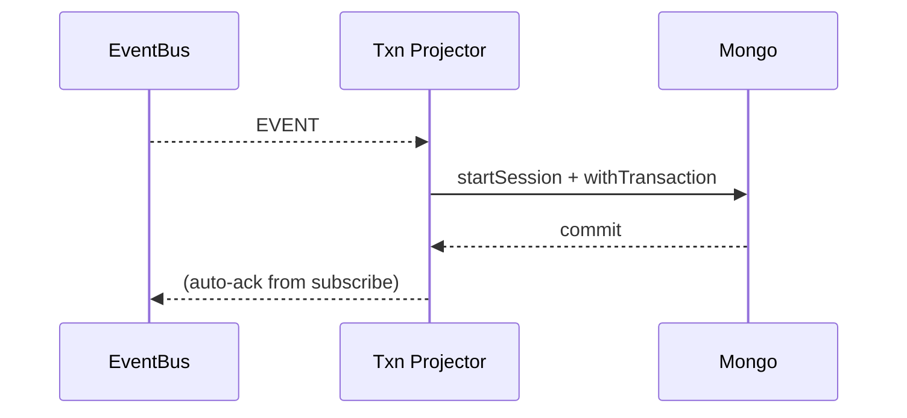

Note: Consolidated here → ../notes/services/state-snapshots-transactional-projector-timetravel-devharness.md

Alright, **Part 7**: **State Snapshots API**, **Transactional Projector**, **Time-Travel queries**, and a tiny **Dev Harness** for end-to-end tests. Paste ’em under `shared/js/prom-lib/` (plus one `tests/` file).

---

# State Snapshots API (HTTP with ETags)

```ts
// shared/js/prom-lib/snapshots/api.ts
import express from "express";
import type { Db } from "mongodb";
import crypto from "crypto";

export interface SnapshotApiOptions {
  collection: string;              // e.g., "processes.snapshot"
  keyField?: string;               // default "_key"
  bodyLimit?: string;              // default "200kb"
  maxAgeSeconds?: number;          // default 5 (client cache)
}

function etagOf(doc: any) {
  const s = JSON.stringify(doc);
  return '"' + crypto.createHash("sha1").update(s).digest("hex") + '"';
}

export function startSnapshotApi(db: Db, port = 8091, opts: SnapshotApiOptions) {
  const app = express();
  app.set("etag", false);
  app.use(express.json({ limit: opts.bodyLimit ?? "200kb" }));

  const coll = db.collection(opts.collection);
  const keyField = opts.keyField ?? "_key";
  const cacheCtl = `public, max-age=${opts.maxAgeSeconds ?? 5}`;

  // GET /snap/:key
  app.get("/snap/:key", async (req, res) => {
    const key = req.params.key;
    const doc = await coll.findOne({ [keyField]: key });
    if (!doc) return res.status(404).json({ error: "not_found" });

    const etag = etagOf({ ...doc, _id: undefined });
    if (req.headers["if-none-match"] === etag) {
      return res.status(304).end();
    }
    res.setHeader("ETag", etag);
    res.setHeader("Cache-Control", cacheCtl);
    res.json(doc);
  });

  // GET /list?offset=0&limit=100&status=alive
  app.get("/list", async (req, res) => {
    const limit = Math.min(Number(req.query.limit ?? 100), 1000);
    const offset = Number(req.query.offset ?? 0);
    const q: any = {};
    // simple filters
    for (const k of Object.keys(req.query)) {
      if (["limit","offset"].includes(k)) continue;
      q[k] = req.query[k];
    }
    const cursor = coll.find(q).sort({ _ts: -1 }).skip(offset).limit(limit);
    const items = await cursor.toArray();
    res.setHeader("Cache-Control", "no-store");
    res.json({ offset, limit, count: items.length, items });
  });

  // HEAD /snap/:key (for cheap freshness checks)
  app.head("/snap/:key", async (req, res) => {
    const key = req.params.key;
    const doc = await coll.findOne({ [keyField]: key }, { projection: { _id: 0, _ts: 1 } });
    if (!doc) return res.status(404).end();
    const etag = etagOf(doc);
    if (req.headers["if-none-match"] === etag) return res.status(304).end();
    res.setHeader("ETag", etag);
    res.setHeader("Cache-Control", cacheCtl);
    res.status(200).end();
  });

  return app.listen(port, () => console.log(`[snapshot-api] on :${port} (${opts.collection})`));
}
```

**Indexes you want on the snapshot collection:**

* `{ _key: 1 } unique`
* Optional filter fields (e.g., `{ status: 1 }`)
* `{ _ts: -1 }`

---

# Transactional Projector (multi-collection, atomic)

```ts
// shared/js/prom-lib/projectors/transactional.ts
import type { Db, ClientSession } from "mongodb";
import type { EventBus, EventRecord } from "../event/types";

export interface TxnProjectorOpts<E=any> {
  topic: string;
  group: string;
  handler: (e: EventRecord<E>, db: Db, s: ClientSession) => Promise<void>;
  from?: "earliest" | "latest";
  retries?: number;
}

export async function startTransactionalProjector<E=any>(bus: EventBus, db: Db, opts: TxnProjectorOpts<E>) {
  const from = opts.from ?? "earliest";
  const retries = opts.retries ?? 3;

  return bus.subscribe(opts.topic, opts.group, async (e) => {
    for (let i=0; i<=retries; i++) {
      const s = db.client.startSession();
      try {
        await s.withTransaction(async () => {
          await opts.handler(e, db, s);
        }, { writeConcern: { w: "majority" } });
        // success → exit retry loop
        return;
      } catch (err) {
        if (i === retries) throw err;
        await new Promise(r => setTimeout(r, 100 * (i+1)));
      } finally {
        await s.endSession();
      }
    }
  }, { from, manualAck: false, batchSize: 200 });
}
```

**Usage example (process state → processes + stats):**

```ts
// services/js/projectors/process.txn.ts
import { startTransactionalProjector } from "../../shared/js/prom-lib/projectors/transactional";
import { MongoEventBus } from "../../shared/js/prom-lib/event/mongo";

export async function startProcessTxnProjector(bus: MongoEventBus, db: any) {
  await startTransactionalProjector(bus, db, {
    topic: "process.state",
    group: "processes.txn",
    async handler(e, db, s) {
      const p = e.payload as any;
      // Collection A: upsert processes
      await db.collection("processes").updateOne(
        { _key: p.processId },
        { $set: { ...p, _key: p.processId, _ts: e.ts } },
        { upsert: true, session: s }
      );
      // Collection B: aggregate a simple host counter (idempotent upsert)
      await db.collection("host_stats").updateOne(
        { _key: p.host },
        { $setOnInsert: { _key: p.host }, $inc: { seen: 1 }, $set: { last_ts: e.ts } },
        { upsert: true, session: s }
      );
    },
  });
}
```

**Mermaid (ack-after-commit):**



---

# Time-Travel Query Helper (reconstruct state at T)

Works with compaction topics (latest-by-key) + periodic snapshots.

```ts
// shared/js/prom-lib/timetravel/reconstruct.ts
import type { MongoEventStore } from "../event/mongo";
import type { EventRecord } from "../event/types";

export interface ReconstructOpts<T=any> {
  topic: string;                // e.g., "process.state"
  snapshotTopic?: string;       // e.g., "process.state.snapshot" (optional)
  key: string;                  // entity key
  atTs: number;                 // target timestamp (epoch ms)
  apply: (prev: T | null, e: EventRecord<T>) => T | null; // reducer: apply event->state
  // fetchSnapshot: override to load nearest <= atTs (if not using events-only)
  fetchSnapshot?: (key: string, upTo: number) => Promise<{ state: T | null, ts: number } | null>;
}

export async function reconstructAt<T=any>(store: MongoEventStore, opts: ReconstructOpts<T>) {
  let baseState: T | null = null;
  let baseTs = 0;

  // optional snapshot as baseline
  if (opts.fetchSnapshot) {
    const snap = await opts.fetchSnapshot(opts.key, opts.atTs);
    if (snap) { baseState = snap.state; baseTs = snap.ts; }
  }

  // scan events after baseline up to atTs
  const events = await store.scan(opts.topic, { ts: baseTs, limit: 1_000_000 });
  for (const e of events) {
    if (e.ts > opts.atTs) break;
    if (e.key !== opts.key) continue;
    baseState = opts.apply(baseState, e as EventRecord<T>);
    baseTs = e.ts;
  }
  return { state: baseState, ts: baseTs };
}
```

**Example reducer (process.state is full upsert):**

```ts
// shared/js/prom-lib/timetravel/examples.ts
import { reconstructAt } from "./reconstruct";
import { MongoEventStore } from "../event/mongo";

export async function processAt(store: MongoEventStore, processId: string, atTs: number) {
  return reconstructAt(store, {
    topic: "process.state",
    key: processId,
    atTs,
    apply: (_prev, e) => e.payload as any
  });
}
```

**Mermaid:**

```mermaid
flowchart LR
  Snap[Snapshot <= T] --> Base
  Base -->|scan events (Base.ts..T)| Reduce
  Reduce --> State[State@T]
```

> If you don’t have snapshots, set `fetchSnapshot` to `null` and it’ll reconstruct purely from events (longer scans).

---

# Dev Harness (spin in-memory bus + fake services)

```ts
// shared/js/prom-lib/dev/harness.ts
import { InMemoryEventBus } from "../event/memory";
import { startWSGateway } from "../ws/server";
import { startHttpPublisher } from "../http/publish";
import { startProcessProjector } from "../examples/process/projector";

export interface Harness {
  bus: InMemoryEventBus;
  stop(): Promise<void>;
}

export async function startHarness({ wsPort = 9090, httpPort = 9091 } = {}): Promise<Harness> {
  const bus = new InMemoryEventBus();

  const wss = startWSGateway(bus, wsPort, { auth: async () => ({ ok: true }) });
  const http = startHttpPublisher(bus, httpPort);
  const stopProj = await startProcessProjector(bus);

  return {
    bus,
    async stop() {
      await new Promise(r => (http as any).close(r));
      wss.close();
      stopProj();
    }
  };
}
```

**Integration test (Jest)**

```ts
// tests/dev.harness.int.test.ts
import { startHarness } from "../shared/js/prom-lib/dev/harness";

test("harness end-to-end", async () => {
  const h = await startHarness({ wsPort: 9190, httpPort: 9191 });

  // publish a heartbeat and wait a tick
  await h.bus.publish("heartbeat.received", { pid: 1, name: "stt", host: "local", cpu_pct: 1, mem_mb: 2 });
  await new Promise(r => setTimeout(r, 50));

  // ensure projector emitted process.state
  const cur = await h.bus.getCursor("process.state", "process-projector"); // from projector group
  expect(cur).toBeTruthy();

  await h.stop();
}, 10_000);
```

---

# Sibilant sprinkles (pseudo)

```lisp
; shared/sibilant/prom/snapshots.sib (pseudo)
(defn start-snapshot-api [db port coll]
  (startSnapshotApi db port {:collection coll}))

; transactional projector macro-ish feel
(defmacro def-txn-projector [topic group & body]
  `(startTransactionalProjector bus db {:topic ~topic :group ~group :handler (fn [e db s] ~@body)}))
```

---

# Kanban adds

* [ ] Expose **Snapshot API** for `processes` (collection `processes`)
* [ ] Add `process.txn` projector to upsert `processes` + `host_stats` atomically
* [ ] Implement `timetravel.processAt(processId, T)` in a small CLI for debugging
* [ ] Add `dev.harness.int.test.ts` to CI integration stage
* [ ] Document ETag semantics and cache headers for `/snap/:key`

---

Want **Part 8** next? I can deliver:

* **Multi-tenant topics** (namespace + policy isolation),
* **SLO monitor** (lag, ack time, error rate with alarms),
* **Bulk replayer** (topic→topic with filter/map),
* and **JS/Hy generators** to autowire schemas/topics → typed clients + validators.
