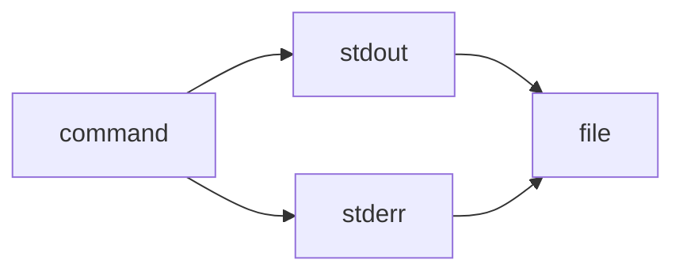

> 2>&1 is the explicit redirection operator:

> It means “send file descriptor 2 (stderr) to wherever file descriptor 1 (stdout) is currently going.”

> Works in all POSIX shells (sh, bash, zsh, dash, etc.).

> &> is a bash/zsh shorthand:

> It means “redirect both stdout and stderr to the same target.”

> Not POSIX; won’t work in plain sh or some other shells.

gg