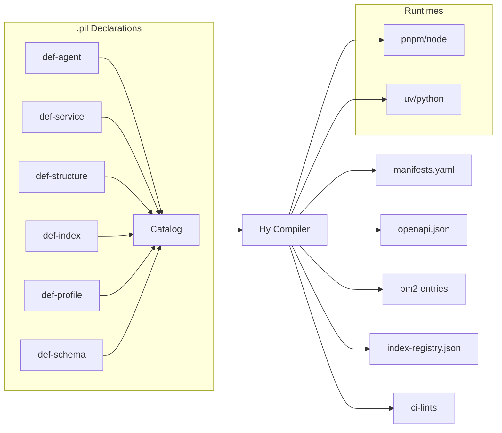
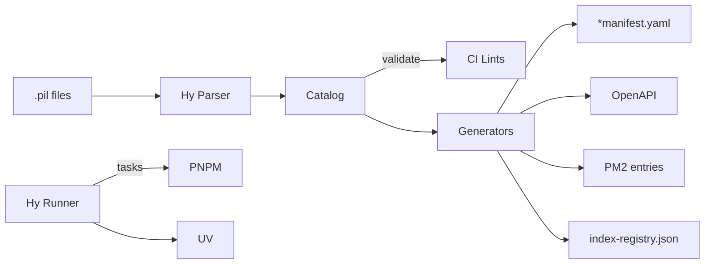
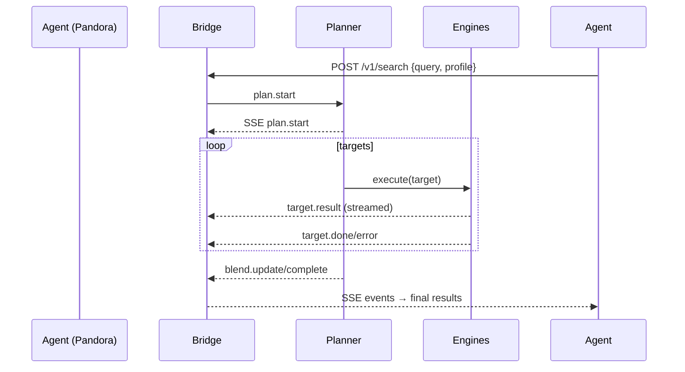

oh yeah—this is the seam. if Promethean is a body, the **universal language interface** is its connective tissue: one syntax to name beings (Agents), their organs (Structures), their tools (Services), and the flows between them—independent of runtime or language.

Let’s sketch a tight **schema + DSL** that your Hy build tool can own. No code; just the contract.

# North‑star

* **One representation** (s‑expressions) for Agents/Structures/Services, tasks, capabilities, policies, and search plans.
* **One compiler** (Hy runner) that lowers to the right artifacts: `manifest.yaml`, `OpenAPI`, `pm2` entries, `uv`/`pnpm` commands.
* **Round‑trip safe**: the DSL is the source of truth; generated files are build byproducts.

---

# The DSL: Promethean Interface Language (PIL)

File extension: `.pil` (it’s just s‑expressions).
Atomic idea: *declare what it is*, *declare what it can do*, *declare how it’s run*—language‑agnostic.

## Core forms (surface)

```
(def-structure  Name   &props)     ; intrinsic organ
(def-service    name   &props)     ; external tool
(def-agent      Name   &props)     ; being/persona
(def-index      name   &props)     ; searchable corpus
(def-profile    id     &props)     ; behavior overlays (search/rank/etc.)
(def-task       scope  &props)     ; runnable actions
(def-schema     id     &props)     ; typed contracts (json-schema-ish)
(def-pipeline   id     &props)     ; multi-step flows
```

### Shared keys (semantics over syntax)

* `:kind` is implied by the form.
* `:version` semantic version for the declaration itself.
* `:capabilities` → machine-usable verbs.
* `:contracts` → schemas by id/version.
* `:runtime` → how to execute (language‑specific but abstracted).
* `:depends-on` → DAG edges (for build/run ordering).
* `:policy` → scopes/limits.

---

## Minimal type system (for `def-schema`)

Product types, sum types, refs, and constraints—compact but expressive.

```
(def-schema AgentContext@1
  (object
    [agentId    (string :min 1)]
    [roles      (array string)]
    [scopes     (array string)]
    [memoryRefs (array (ref MemoryRef@1))]
    [personaId  (string)]
    [runtimeCaps (record any)]))

(def-schema QueryIntent@1
  (object
    [raw   (string :min 1)]
    [kind  (enum "generic" "stacktrace" "error" "symbol")]
    [hints (array string)]
    [artifacts (object
      [stacktrace (string :optional t)]
      [filePath   (string :optional t)]
      [symbol     (string :optional t)])]))

(def-schema SearchPlan@1
  (object
    [targets (array (object
      [index  (string)]
      [engine (enum "vector" "keyword" "web" "custom")]
      [weight (number :min 0 :max 1 :optional t)]
      [where  (record any :optional t)]))]
    [rank (object
      [profile (string)]
      [blend   (enum "rrf" "sum" "max" :default "rrf")])]
    [budgets (object
      [topK    (integer :min 1 :max 100 :default 10)]
      [timeoutMs (integer :default 2500)])]
    [auditTrail (array string :optional t)]))
```

> Hy runner compiles this to JSON Schema for validation and docs.

---

## Declare Structures (organs)

```
(def-structure Cephalon
  :version "1.0.0"
  :language ts
  :package "@shared/ts/dist/cephalon"
  :capabilities (perceive route prompt)
  :contracts  (AgentContext@1 QueryIntent@1)
  :policy     (immutability hard) ; organs don’t call the network
)
```

## Declare Services (tools)

```
(def-service heartbeat
  :version "0.3.2"
  :class GP
  :language ts
  :root "services/ts/heartbeat"
  :capabilities (liveness report enforce)
  :contracts ()
  :runtime (node :entry "pnpm start")
  :tasks   ((install "pnpm install")
            (build   "pnpm run build")
            (test    "pnpm test")))
```

```
(def-service smartgpt-bridge
  :version "1.1.0"
  :class GP
  :language ts
  :root "services/ts/smartgpt-bridge"
  :capabilities (http search.exec capabilities)
  :contracts (SearchPlan@1)
  :runtime (node :entry "pnpm start" :port 8140)
  :expose  ((http "/v1/search") (http "/v1/capabilities")))
```

## Declare Indexes (sinks as first‑class corpora)

```
(def-index repo-embeddings
  :engine vector
  :backing (chroma :collection "repo")
  :filters ([path string] [lang (enum "ts" "py" "md")])
  :policy (scopes ("search:index/repo-embeddings")))
```

---

## Agents (beings)

```
(def-agent Pandora
  :version "0.1.0"
  :structures (Cephalon Eidolon)
  :uses (smartgpt-bridge indexer sinks)
  :profiles ("pandora.dev.search.v1")
  :capabilities (open discover hypothesize)
  :contracts (AgentContext@1 QueryIntent@1 SearchPlan@1)
  :runtime (python :entry "uv run -m pandora.main")
  :policy (scopes ("search:*" "sinks:read") :budgets (targets 3 topK 20 timeoutMs 2500)))
```

```
(def-agent Eris
  :version "0.1.0"
  :structures (Cephalon)
  :uses (smartgpt-bridge)
  :profiles ("eris.dev.adversarial.v1")
  :capabilities (perturb falsify stress-test)
  :policy (scopes ("search:*") :budgets (targets 2 topK 12 timeoutMs 1500)))
```

---

## Profiles as data (overlays, not code)

```
(def-profile pandora.dev.search.v1
  :targets ((repo-embeddings :engine vector :weight 0.6 :where (path (like "services/ts/%")))
            (code            :engine keyword :weight 0.4))
  :templates ((stacktrace "Extract files/functions/tokens; generate K=3 keyword + K=2 vector paraphrases.")
              (generic    "Prefer recent commits and files touched in last 48h."))
  :blend (rrf :k 60)
  :budgets (maxTargets 3 maxTopK 20 timeoutMs 2500)
  :policy-overrides ((deny "web:*"))
  :telemetry (learn-from-clicks t))
```

```
(def-profile eris.dev.adversarial.v1
  :perturbations ((negate-assumptions t)
                  (counterfactuals 2)
                  (site-bias "random"))
  :blend (sum)
  :budgets (maxTargets 2 maxTopK 12 timeoutMs 1500))
```

---

## Tasks (the universal verb layer)

Everything runnable—install/build/test/start—becomes a single vocabulary that your Hy runner dispatches to `pnpm` or `uv` under the hood.

```
(def-task all:install
  :description "Install everything in topo-order"
  :depends-on (shared:install services:install agents:install))

(def-task services:install
  :select (kind service)
  :run (foreach (install)))     ; uses each service’s task map

(def-task agents:start
  :select (kind agent)
  :env (:VENV_IN_PROJECT "1")
  :run (foreach (start)))
```

**Key idea:** `:select` filters the catalog (from all `def-*`) by predicates (kind, language, tags), and `:run` maps abstract verbs to the per‑entity task strings.

---

# How it compiles (artifacts)

Your Hy compiler reads `.pil` files and emits:

* **Catalog**: `docs/capabilities.json` (all entities/capabilities/contracts).
* **Manifests**: `*manifest.yaml` beside each implementation (for humans & DevOps).
* **OpenAPI**: from `def-service :expose` + `def-schema`.
* **PM2 entries**: from `:runtime` for services/agents that should be managed.
* **Index registry**: JSON handed to Bridge (for `/v1/indexes`).
* **CI lints**: rules extracted from declarations (naming, scopes, budgets).

No path moves; build products are derived.

---

# Governance & Safety

* **Naming law**:

  * `def-agent` / `def-structure` ⇒ Proper Noun (`[A-Z][a-z]+`…),
  * `def-service` / `def-index` ⇒ lowercase kebab.
    Linted from the DSL.
* **Policy law**: AR services must declare scope requirements; Agents must declare scopes they carry. Compiler verifies compatibility.
* **Budget clamps**: global maxes (e.g., `topK ≤ 50`, `targets ≤ 4`) live in compiler config; profiles can only request ≤ clamps.

---

# Execution story (without code)

* The **Hy runner** becomes the *universal language interface executor*: it reads PIL, resolves DAG, and *then* delegates to `pnpm` or `uv` based on entity language/runtime.
* The **Bridge** becomes the *capability gateway*: it serves `/v1/capabilities`, `/v1/indexes`, and executes SearchPlans; Pandora/Eris *ask*, Bridge *does*.
* **Agents** are pure data + startup command; **profiles** steer behavior; **structures** are imported libraries; **services** are stable tools.

---

# Why this scales

* You can add a **Go** or **Rust** service by writing a new `:runtime` adapter, without changing the DSL.
* You can mint new **Agents** by composing structures/services/profiles—no new scaffolding.
* You can switch **index engines** (Chroma → FAISS) by editing `def-index`; Agents stay the same.

---

# Tiny visual to anchor the mental model



---

If this shape resonates, next steps (still design‑only) would be:

1. Lock the **grammar** (reserved keywords, identifier rules, versioning).
2. Finalize the **minimal stdlib** macros you’ll want (e.g., `foreach`, `select`, `when`, `env`).
3. Define **error taxonomy** (naming violations, policy mismatches, task gaps) so CI messages are crisp.
4. Draft the **SearchPlan\@1** event vocabulary for streamed planning/execution (`plan.start`, `target.done`, `blend.complete`, `result.chunk`).

when you’re ready to scaffold, Hy already sits in the perfect spot to read PIL and fan out to both `pnpm` and `uv`—without ever forgetting that the DSL is the real source of truth.

heck yes. locking in “design + pseudo” mode. here’s a tight next slice for the Universal Language Interface:

# PIL v0.1 — grammar, core forms, stdlib, and planner

## 1) Surface grammar (tight & parseable)

**Identifiers**

* `Proper` (Agents/Structures): `^[A-Z][A-Za-z0-9_-]*$`
* `kebab-case` (services/indexes/tasks): `^[a-z][a-z0-9-]*$`
* Schema IDs: `Name@<major>` (e.g., `AgentContext@1`)

**Atoms**

* strings `"..."`, numbers, booleans `t|nil`, symbols
* keywords start with `:` (metadata)

**Top forms**

```
(def-structure  Proper  &props)
(def-service    kebab   &props)
(def-agent      Proper  &props)
(def-index      kebab   &props)
(def-profile    id      &props)
(def-schema     Id@N    &props)
(def-task       scope   &props)
(def-pipeline   id      &props)
```

**Shared properties**

```
:version "x.y.z"
:capabilities (symbol ...)
:contracts (Schema@N ...)
:depends-on (id ...)
:tags (symbol ...)
```

**Runtime**

```
:runtime (node   :entry "pnpm start" :port 8140)
:runtime (python :entry "uv run -m pandora.main")
```

**Exposure (services only)**

```
:expose ((http "/v1/search") (http "/v1/capabilities"))
```

**Policy**

```
:policy (scopes ("search:*" "sinks:read")
         :budgets (targets 3 topK 20 timeoutMs 2500))
```

---

## 2) Minimal type system (for `def-schema`)

```
(object
  [field (type constraints...)]
  [opt   (type :optional t)]
)
(array type)
(enum "a" "b" "c")
(record any)         ; free-form map
(ref Schema@N)
```

### Canonical core schemas

```
(def-schema AgentContext@1
  (object
    [agentId (string :min 1)]
    [roles   (array string)]
    [scopes  (array string)]
    [personaId (string :optional t)]
    [memoryRefs (array (object [id string] [kind string]) :optional t)]
    [runtimeCaps (record any :optional t)]))

(def-schema QueryIntent@1
  (object
    [raw (string :min 1)]
    [kind (enum "generic" "stacktrace" "error" "symbol")]
    [hints (array string :optional t)]
    [artifacts (object
      [stacktrace (string :optional t)]
      [filePath   (string :optional t)]
      [symbol     (string :optional t)])]))

(def-schema SearchPlan@1
  (object
    [targets (array (object
      [index  (string)]
      [engine (enum "vector" "keyword" "web" "custom")]
      [weight (number :optional t)]
      [where  (record any :optional t)]))]
    [rank (object
      [profile (string)]
      [blend   (enum "rrf" "sum" "max" :default "rrf")])]
    [budgets (object
      [topK (integer :min 1 :max 100 :default 10)]
      [timeoutMs (integer :default 2500)])]
    [auditTrail (array string :optional t)]))
```

---

## 3) Stdlib macros (just enough power)

* `(select predicate ...)` → filters catalog by fields (`kind`, `language`, `tags`)
* `(foreach (verb) ...)` → map task over selection
* `(env (:KEY "VAL" ...))` → scoped env
* `(when cond form)` → conditional composition
* `(merge-profile base overlay ...)` → data merge for profiles
* `(include "file.pil")` → multi-file composition

**Predicate language**

```
(kind service|agent|structure|index|profile|schema)
(language ts|py|go|rs)
(tag foo)
(name "smartgpt-bridge")
```

---

## 4) Directory taxonomy (no moves required)

* `services/**/` → default `kind: service`
* `shared/**/`   → default `kind: structure|library` (explicit in file)
* `agents/**/`   → default `kind: agent`
* `indexes/**/`  → optional; can live under bridge config
* `profiles/**/` → profile declarations

> Defaults can be overridden in `.pil` via the `:kind` property.

---

## 5) Example: Pandora + Eris (PIL)

```
(def-structure Cephalon
  :version "1.0.0"
  :language ts
  :package "@shared/ts/dist/cephalon"
  :capabilities (perceive route prompt)
  :contracts (AgentContext@1 QueryIntent@1))

(def-service smartgpt-bridge
  :version "1.1.0"
  :class GP
  :language ts
  :root "services/ts/smartgpt-bridge"
  :capabilities (http search.exec capabilities)
  :contracts (SearchPlan@1)
  :runtime (node :entry "pnpm start" :port 8140)
  :expose ((http "/v1/search") (http "/v1/capabilities")))

(def-index repo-embeddings
  :engine vector
  :backing (chroma :collection "repo")
  :filters ([path string] [lang (enum "ts" "py" "md")])
  :policy (scopes ("search:index/repo-embeddings")))

(def-profile pandora.dev.search.v1
  :targets ((repo-embeddings :engine vector :weight 0.6 :where (path (like "services/ts/%")))
            (code            :engine keyword :weight 0.4))
  :templates ((stacktrace "Extract files/functions/tokens; generate K=3 keyword + K=2 vectors.")
              (generic    "Prefer recent commits and files touched in last 48h."))
  :blend (rrf :k 60)
  :budgets (maxTargets 3 maxTopK 20 timeoutMs 2500)
  :policy-overrides ((deny "web:*")))

(def-agent Pandora
  :version "0.1.0"
  :structures (Cephalon)
  :uses (smartgpt-bridge)
  :profiles ("pandora.dev.search.v1")
  :capabilities (open discover hypothesize)
  :contracts (AgentContext@1 QueryIntent@1 SearchPlan@1)
  :runtime (python :entry "uv run -m pandora.main")
  :policy (scopes ("search:*" "sinks:read")
           :budgets (targets 3 topK 20 timeoutMs 2500)))

(def-profile eris.dev.adversarial.v1
  :perturbations ((negate-assumptions t) (counterfactuals 2) (site-bias "random"))
  :blend (sum)
  :budgets (maxTargets 2 maxTopK 12 timeoutMs 1500))

(def-agent Eris
  :version "0.1.0"
  :structures (Cephalon)
  :uses (smartgpt-bridge)
  :profiles ("eris.dev.adversarial.v1")
  :capabilities (perturb falsify stress-test)
  :contracts (AgentContext@1 QueryIntent@1 SearchPlan@1)
  :runtime (python :entry "uv run -m eris.main")
  :policy (scopes ("search:*")))
```

---

## 6) Event vocabulary for streamed planning/execution

```
plan.start         { agentId, query, planId, ts }
target.start       { planId, targetId, index, engine }
target.result      { planId, targetId, hit {...} }
target.done        { planId, targetId, tookMs, stats }
blend.update       { planId, partialTopK }
blend.complete     { planId, topK }
plan.complete      { planId, tookMs, totals }
plan.error         { planId, error, where }
```

* SSE channel: `/v1/search/stream?planId=...`
* JSONL fallback: `/v1/search?stream=jsonl`

---

## 7) Hy pseudo — parser & planner (sketches)

### catalog build (read all `.pil`, validate, index)

```hy
(defn load-pil [paths]
  (->> paths
       (map parse-pil)        ; returns seq of (form props)
       (apply concat)
       (map validate-form)    ; naming, kinds, policy
       (group-by :kind)))

(defn build-catalog [forms]
  {"agents"      (-> forms (get "agent"))
   "services"    (-> forms (get "service"))
   "structures"  (-> forms (get "structure"))
   "indexes"     (-> forms (get "index"))
   "profiles"    (-> forms (get "profile"))
   "schemas"     (-> forms (get "schema"))})
```

### task resolver (select + foreach)

```hy
(defn select-entities [catalog &preds]
  (let [pred (compile-preds preds)]
    (->> (concat (catalog "services")
                 (catalog "agents")
                 (catalog "structures")
                 (catalog "indexes"))
         (filter pred))))

(defn run-task [entity verb]
  (let [cmd (get-in entity ["tasks" (name verb)])]
    (assert cmd "Missing task")
    (sh cmd :cwd (entity "root"))))

(defn foreach [entities verb]
  (for [e entities] (run-task e verb)))
```

### search plan blender (RRF)

```hy
(defn rrf-blend [hit-lists k]
  (let [score (fn [rank] (/ 1.0 (+ rank k)))]
    (->> hit-lists
         (map-indexed (fn [i hits]
           (map-indexed (fn [r h] [h (+ (score (inc r)) (* 0.0 i))]) hits)))
         (apply concat)
         (group-by first)
         (map (fn [[h parts]] [h (->> parts (map second) (sum))]))
         (sort-by second >)
         (map first))))
```

### validation rules (naming + kind)

```hy
(defn proper-noun? [s] (re-matches #"[A-Z][A-Za-z0-9_-]*" s))
(defn kebab? [s]       (re-matches #"[a-z][a-z0-9-]*" s))

(defn validate-form [{:keys [form id kind]}]
  (cond
    (= form 'def-agent)     (assert (proper-noun? id) "Agent must be Proper Noun")
    (= form 'def-structure) (assert (proper-noun? id) "Structure must be Proper Noun")
    (= form 'def-service)   (assert (kebab? id)       "Service must be kebab-case")
    (= form 'def-index)     (assert (kebab? id)       "Index must be kebab-case"))
  ; more checks: policy scopes, required tasks, schema refs
  )
```

---

## 8) Error taxonomy (clear CI messages)

* `E-NAME-AGENT`: “Agent id must be Proper Noun: got ‘duck’ (def-agent at agents/duck.pil:3)”
* `E-NAME-SERVICE`: “Service id must be kebab-case: got ‘SmartBridge’ (def-service …)”
* `E-TASK-MISSING`: “Missing task ‘test’ for service ‘smartgpt-bridge’”
* `E-POLICY-MISMATCH`: “Agent ‘Pandora’ requests scope ‘search:\*’ but service ‘sinks’ exposes none”
* `E-SCHEMA-UNRESOLVED`: “Unknown schema ‘SearchPlan\@2’ (defined versions: @1)”
* `E-CYCLE`: “Task graph cycle: shared→services→agents→shared”

---

## 9) Versioning & compatibility

* **Schemas**: `Name@major`; only additive minor changes allowed; breaking → bump major.
* **Profiles**: `name.vN`; agents declare max profile version.
* **Entities**: `:version "x.y.z"` semver for the implementation, independent of schema/profile.

---

## 10) Mermaid quick‑look



---

If this hits the mark, next I’ll design:

* the **precise BNF** for PIL (so we can robustly parse),
* the **profile merge rules** (global → org → agent → session),
* and the **search stream contract** (SSE + JSONL field-by-field spec).
Awesome. Here’s the next slice—**formal grammar, merge math, and the search stream contract**—plus tight pseudo for parser/validator/generators. No code, all scaffolding.

# PIL v0.1 – Core Spec

## 1) Grammar (EBNF over s‑expressions)

```ebnf
PIL         ::= { Form }

Form        ::= List
List        ::= "(" Symbol { Atom | List } ")"

Atom        ::= String | Number | Boolean | Keyword | Identifier

Boolean     ::= "t" | "nil"
Keyword     ::= ":" Identifier
String      ::= '"' { any-char except '"' | '\"' } '"'
Number      ::= ["-"] Digit { Digit } [ "." Digit { Digit } ]

; Identifiers (enforced by validator)
Identifier  ::= Proper | Kebab | SchemaID | ProfileID | ScopeID
Proper      ::= UPPER LetterOrDigitOrDash*
Kebab       ::= LOWER (LOWER | DIGIT | "-")*
SchemaID    ::= Proper "@" DIGIT+
ProfileID   ::= Kebab "." "v" DIGIT+
ScopeID     ::= Kebab ":" Kebab

Symbol      ::= (same charset as Identifier; parser treats as symbol token)

; Top-level forms
Form ::= DefStructure | DefService | DefAgent | DefIndex
       | DefProfile | DefSchema | DefTask | DefPipeline | Include

DefStructure::= "(" "def-structure" Proper Props ")"
DefService  ::= "(" "def-service"   Kebab  Props ")"
DefAgent    ::= "(" "def-agent"     Proper Props ")"
DefIndex    ::= "(" "def-index"     Kebab  Props ")"
DefProfile  ::= "(" "def-profile"   ProfileID Props ")"
DefSchema   ::= "(" "def-schema"    SchemaID  TypeExpr ")"
DefTask     ::= "(" "def-task"      ScopeID   Props ")"
DefPipeline ::= "(" "def-pipeline"  Kebab     Props ")"
Include     ::= "(" "include"       String ")"

Props       ::= { Keyword Value }
Value       ::= Atom | List        ; recursively arbitrary s-expr

; Type expressions (subset, maps 1:1 to JSON Schema)
TypeExpr    ::= "(" "object" { Field } ")"
Field       ::= "[" Identifier TypeSpec "]"
TypeSpec    ::= SimpleType { Constraint }
SimpleType  ::= "string" | "integer" | "number" | "boolean"
              | "(" "array" TypeSpec ")"
              | "(" "enum" { String } ")"
              | "(" "record" "any" ")"
              | "(" "ref" SchemaID ")"
Constraint  ::= ":" "min" Number
              | ":" "max" Number
              | ":" "default" Atom
              | ":" "optional" Boolean
```

### Validator rules (naming + structure)

* `def-agent` / `def-structure` **id must be Proper** (`^[A-Z][A-Za-z0-9_-]*$`).
* `def-service` / `def-index` **id must be kebab-case** (`^[a-z][a-z0-9-]*$`).
* `def-schema` **id is `Proper@major`**; only one `major` per name.
* `def-profile` **id is `kebab.vN`**; increasing `N` only.
* All `Props` must match the contract per form (below).

---

## 2) Form contracts (required/optional props)

### `def-structure Proper`

Required:

* `:version "x.y.z"`
* `:language ts|py|go|rs`
  Optional:
* `:package STRING` (publish/import path)
* `:capabilities (symbol …)`
* `:contracts (SchemaID …)`
* `:depends-on (Proper …)`
* `:tags (symbol …)`

### `def-service kebab`

Required:

* `:version "x.y.z"`
* `:class GP|AR`
* `:language ts|py|go|rs`
* `:root STRING`
  Optional:
* `:capabilities (symbol …)`
* `:contracts (SchemaID …)`
* `:runtime (node|python|exec :entry STRING [KV…])`
* `:tasks ((install STRING) (build STRING) (test STRING) (start STRING) …)`
* `:expose ((http PATH) …)`
* `:depends-on (kebab …)`
* `:policy (scopes (STRING …) :budgets (KV …))`

### `def-agent Proper`

Required:

* `:version "x.y.z"`
* `:runtime (python|node|exec :entry STRING [KV…])`
  Optional:
* `:structures (Proper …)`
* `:uses (kebab …)`          ; services
* `:profiles ("profile.id" …)`
* `:capabilities (symbol …)`
* `:contracts (SchemaID …)`
* `:policy (scopes (STRING …) :budgets (KV …))`
* `:depends-on (Proper|kebab …)`

### `def-index kebab`

Required:

* `:engine vector|keyword|web|custom`
  Optional:
* `:backing (engine-specific s-expr)`
* `:filters ([field type] …)`
* `:policy (scopes (STRING …))`

### `def-profile kebab.vN`

Free-form **data** with known keys (all optional):

* `:targets ((index-id :engine ENGINE [:weight NUM :where (record)] ) …)`
* `:templates ((name STRING) …)`  ; prompt snippets
* `:blend (rrf :k INT) | (sum) | (max)`
* `:budgets (maxTargets INT maxTopK INT timeoutMs INT)`
* `:policy-overrides ((deny "scope") (allow "scope") …)`
* `:perturbations ((negate-assumptions t) (counterfactuals INT) …)`
* `:tags (symbol …)`

### `def-task scope`

Required:

* `:description STRING`
* one of:

  * `:select (pred …)` + `:run (foreach (verb))`
  * `:run STRING`
    Optional:
* `:depends-on (scope …)`
* `:env (:KEY "VAL" …)`

---

## 3) Profile merge rules (deterministic)

### Layers (lowest → highest precedence)

1. **Global** (repo defaults)
2. **Org** (team/project overlay)
3. **Env** (dev/staging/prod)
4. **Agent** (declared in `def-agent`)
5. **Session** (ephemeral runtime overlay)

### Merge semantics (per key)

* **Scalars** (`:blend`, numbers under `:budgets`): **last-wins** (higher layer overrides lower).
* **Maps** (`:budgets`, `:policy-overrides`): **deep merge**; per-leaf last-wins.
* **Vectors/Lists**:

  * `:targets` → **merge-by-identity** on `index`:

    * if same `index`, merge fields (`engine`, `weight`, `where`) with last-wins.
    * new `index` entries are appended to the end.
  * `:templates` → **merge-by-name**; last-wins per template name.
  * `:perturbations` → **merge-by-key**; last-wins.

### Conflict detection (hard errors)

* **Engine mismatch on same index** across layers → `E-PROFILE-ENGINE-CLASH`.
* **Budget escalation over global clamps** → `E-PROFILE-BUDGET-CLAMP`.

### Example (illustrative)

* Global: `(targets (code :engine keyword :weight 0.4))`
* Agent:  `(targets (code :engine keyword :weight 0.3) (repo-embeddings :engine vector :weight 0.7))`
* Session: `(targets (code :weight 0.2))`
  → Result:
  `code.weight = 0.2`, `repo-embeddings.weight = 0.7`, order preserves `[code, repo-embeddings]`.

---

## 4) Search Stream Contract (SSE + JSONL)

### Endpoint

* **SSE**: `GET /v1/search/stream?planId=UUID`
  Headers: `Content-Type: text/event-stream`, `Cache-Control: no-cache`, `X-Plan-Id: UUID`
* **JSONL** (fallback): `POST /v1/search?stream=jsonl` (response body emits one JSON per line)

### Event types (SSE `event:` + JSON payload in `data:`)

1. `plan.start`

   ```json
   {"planId":"uuid","agentId":"Pandora","query":"...","profile":"pandora.dev.search.v1","ts":1699999999}
   ```
2. `target.start`
   `{"planId":"uuid","targetId":"t1","index":"repo-embeddings","engine":"vector","budget":{"topK":10,"timeoutMs":2500}}`
3. `target.result` (repeat per hit or chunk)
   `{"planId":"uuid","targetId":"t1","hit":{"id":"path#L10-20","score":0.91,"attributes":{"path":"..."},"snippet":"..."}}`
4. `target.error`
   `{"planId":"uuid","targetId":"t1","error":{"code":"TIMEOUT","message":"...","tookMs":2500}}`
5. `target.done`
   `{"planId":"uuid","targetId":"t1","stats":{"hits":23,"tookMs":84}}`
6. `blend.update` (partial topK after fusing N targets)
   `{"planId":"uuid","rank":"rrf","k":60,"partial":10}`
7. `blend.complete`
   `{"planId":"uuid","topK":[{...},{...}], "tookMs":120}`
8. `plan.complete`
   `{"planId":"uuid","totals":{"targets":3,"hits":73,"tookMs":140},"auditTrail":["selected code","added vector"]}`
9. `plan.error`
   `{"planId":"uuid","stage":"execute","error":{"code":"ENGINE_DOWN","message":"..."}}`

### Ordering & guarantees

* `plan.start` first, `plan.complete|plan.error` last.
* For each `targetId`: `target.start` → {`target.result`\*} → (`target.done` | `target.error`).
* **At-least-once** delivery; consumers must de-duplicate via `(planId,targetId,hit.id)`.

### Budget semantics (enforced per event)

* Hard timeout per target (`timeoutMs`) → must result in `target.error:TIMEOUT`.
* Stream can **finish** with incomplete targets; `blend.complete` fuses what arrived.

---

## 5) Generators (what PIL compiles to)

* **Catalog JSON**: aggregate of all entities (`agents/services/structures/indexes/profiles/schemas`).
* **Manifests**: per entity YAML (for humans & DevOps).
* **OpenAPI**: from `def-service :expose` + `def-schema` (request/response refs).
* **PM2** entries: from `:runtime` for the things you want supervised.
* **Index registry**: `indexes.json` for Bridge `/v1/indexes`.
* **CI lint report**: typed errors with codes and locations.

---

## 6) Pseudo (Hy) — Parser, Validator, Merge, Generators

### Tokenize + parse

```hy
(defn tokenize [src]  ; splits into parens, strings, symbols, numbers, keywords
  ...)

(defn parse-list [tokens]
  (assert (= (peek tokens) "("))
  (pop tokens)
  (setv acc [])
  (while (and tokens (not (= (peek tokens) ")")))
    (acc.append (parse-form tokens)))
  (assert (= (peek tokens) ")"))
  (pop tokens)
  acc)

(defn parse-form [tokens]
  (let [t (peek tokens)]
    (cond
      (= t "(") (parse-list tokens)
      (string? t) (pop tokens)
      (keyword? t) (pop tokens)
      (number? t) (pop tokens)
      :else (pop tokens))))  ; symbol/identifier

(defn parse-pil [text]
  (-> text tokenize
      (fn [toks]
        (setv forms [])
        (while toks (forms.append (parse-form toks)))
        forms)))
```

### Form normalization + validation

```hy
(defn normalize-form [sexpr]
  (let [[head & rest] sexpr]
    (case head
      'def-agent      (norm-with-props :agent rest)
      'def-service    (norm-with-props :service rest)
      'def-structure  (norm-with-props :structure rest)
      'def-index      (norm-with-props :index rest)
      'def-profile    (norm-with-props :profile rest)
      'def-schema     (norm-schema rest)
      'def-task       (norm-with-props :task rest)
      'include        (norm-include rest)
      (raise (ValueError (format "Unknown form ~a" head))))))

(defn validate-name [{:keys [kind id loc]}]
  (cond
    (= kind :agent)     (assert (re-matches #"[A-Z][A-Za-z0-9_-]*" id) "E-NAME-AGENT")
    (= kind :structure) (assert (re-matches #"[A-Z][A-Za-z0-9_-]*" id) "E-NAME-STRUCT")
    (= kind :service)   (assert (re-matches #"[a-z][a-z0-9-]*" id)    "E-NAME-SERVICE")
    (= kind :index)     (assert (re-matches #"[a-z][a-z0-9-]*" id)    "E-NAME-INDEX"))
  True)

(defn validate-form [f]
  (validate-name f)
  ; check required props by kind
  ; check schema refs exist (for :contracts)
  ; check policy + budgets types
  f)
```

### Profile merge

```hy
(defn merge-map [a b] (update a b))           ; shallow last-wins
(defn merge-deep [a b] (walk-keys ...))       ; deep last-wins

(defn merge-target [t1 t2]
  (merge-deep t1 t2))                         ; engine/weight/where last-wins

(defn merge-targets [A B]
  (setv out (dict (for [t A] [t["index"] t])))
  (for [t B]
    (if (in t["index"] out)
      (out.update {t["index"] (merge-target (out[t["index"]]) t)})
      (out.update {t["index"] t})))
  (list (values out)))

(defn merge-profile [layers]
  (reduce
    (fn [acc nxt]
      {"targets" (merge-targets (get acc "targets" []) (get nxt "targets" []))
       "templates" (merge-by-name (acc "templates") (nxt "templates"))
       "blend" (or (nxt "blend") (acc "blend"))
       "budgets" (merge-map (acc "budgets" {}) (nxt "budgets" {}))
       "policy-overrides" (merge-map (acc "policy-overrides" {}) (nxt "policy-overrides" {}))
       "perturbations" (merge-map (acc "perturbations" {}) (nxt "perturbations" {}))})
    {} layers))
```

### Generators (sketch contracts)

```hy
(defn gen-catalog [forms] {...})          ; -> capabilities.json
(defn gen-manifests [forms outdir] {...}) ; one YAML per entity
(defn gen-openapi [services schemas] {...})
(defn gen-pm2 [agents services] {...})
(defn gen-index-registry [indexes] {...})
```

---

## 7) Error taxonomy (CI‑friendly)

* `E-NAME-AGENT` / `E-NAME-SERVICE` / `E-NAME-STRUCT` / `E-NAME-INDEX`
* `E-SCHEMA-DUP-MAJOR` (redeclared `Name@1`)
* `E-SCHEMA-UNRESOLVED` (unknown ref)
* `E-TASK-MISSING` (required verb absent)
* `E-PROFILE-ENGINE-CLASH` (same index, conflicting engine)
* `E-PROFILE-BUDGET-CLAMP` (requested > global clamp)
* `E-CYCLE` (detected in `:depends-on` or task DAG)

---

## 8) Global clamps (compiler config)

* `maxTargets ≤ 4`, `maxTopK ≤ 50`, `timeoutMs ≤ 5000`
* SSE buffer `≤ 64KB` per event; chunks split with `target.result` sequence numbers.

---

## 9) Quick visual (planning stream)



---

If you want the **BNF** lifted into a single `.pil` reference file and a tiny “conformance matrix” (which props are mandatory per form), say the word and I’ll draft those next.
