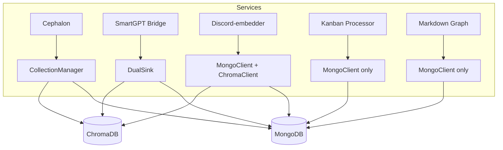
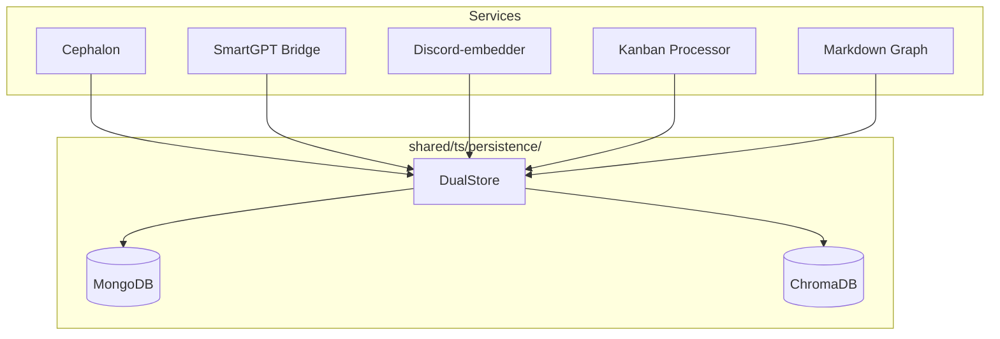

📌 Roadmap
----------

*   Add retention policy to `cleanupChroma` (delete oldest first).

*   Add batch insert/query for efficiency.

*   Add metrics hooks (count, latency).


* * *

✅ With this module, **all services in Promethean share the same persistence layer**, ensuring consistency and reducing duplication.

```yaml
---

👉 Do you want me to also draft a **migration checklist file** (`docs/reports/persistence-migration-checklist.md`) that engineers can use to track progress service by service?
```

## User
yeap

## ChatGPT
Excellent ⚡ — let’s make a **persistent migration checklist** so engineers can track service-by-service adoption of the new `DualStore`.

I’ll write this as an **Obsidian-friendly Markdown file** you can commit at:
`docs/reports/persistence-migration-checklist.md`

* * *

📂 `docs/reports/persistence-migration-checklist.md`
----------------------------------------------------

```markdown
---
project: Promethean
tags: [reports, migration, persistence, dualstore, mongo, chroma]
---

# ✅ Persistence Migration Checklist
**Objective:** Consolidate all Mongo + Chroma persistence logic under `shared/ts/persistence/DualStore`.
**Reference:** [[shared/ts/persistence/README.md]]

---

## 🗂 Services Status

### Cephalon (`services/ts/cephalon`)
- [ ] Remove `collectionManager.ts`
- [ ] Switch imports to `DualStore`
- [ ] Update AGENTS.md to reference shared persistence

---

### SmartGPT Bridge (`services/ts/smartgpt-bridge`)
- [ ] Remove `DualSink.js`
- [ ] Remove/replace `mongo.js`
- [ ] Switch to `DualStore`
- [ ] Update AGENTS.md to reference shared persistence
- [ ] Move cleanup logic → `maintenance.ts`

---

### Discord-embedder (`services/ts/discord-embedder`)
- [ ] Remove raw `MongoClient` + `ChromaClient`
- [ ] Use `DualStore.create("discord_messages")`
- [ ] Update AGENTS.md to reference shared persistence

---

### Kanban Processor (`services/ts/kanban-processor`)
- [ ] Replace raw `MongoClient` with `DualStore`
- [ ] Add Chroma indexing option (future-proof)
- [ ] Update AGENTS.md to reference shared persistence

---

### Markdown Graph (`services/ts/markdown-graph`)
- [ ] Replace raw `MongoClient` with `DualStore`
- [ ] Chroma optional for graph embeddings
- [ ] Update AGENTS.md to reference shared persistence

---

## 🔧 Shared Tasks
- [ ] Implement `shared/ts/persistence/dualStore.ts`
- [ ] Implement `clients.ts`, `types.ts`, `maintenance.ts`, `index.ts`
- [ ] Write `shared/ts/persistence/README.md`
- [ ] Add root-level AGENTS.md entry under "Shared Persistence"

---

## 📌 Notes
- All retention/cleanup should call **`cleanupMongo`** + **`cleanupChroma`**.
- `CollectionManager` (Cephalon) and `DualSink` (Bridge) must be **deprecated**.
- All new services must use `DualStore` — no direct `MongoClient` or `ChromaClient`.

---

✅ Once all boxes are checked, Promethean persistence is **fully consolidated**.
```

* * *

👉 Do you want me to also make a **Mermaid progress tracker diagram** (like a kanban board) so Obsidian can visualize where each service stands in the migration?

## User
yeap

## ChatGPT
Excellent 🔥 — let’s make a **Mermaid Kanban-style tracker** so you can see migration progress at a glance inside Obsidian.
We’ll embed it in the same checklist file (`docs/reports/persistence-migration-checklist.md`).

* * *

📂 Updated `docs/reports/persistence-migration-checklist.md`
------------------------------------------------------------

```markdown
---
project: Promethean
tags: [reports, migration, persistence, dualstore, mongo, chroma]
---

# ✅ Persistence Migration Checklist
**Objective:** Consolidate all Mongo + Chroma persistence logic under `shared/ts/persistence/DualStore`.
**Reference:** [[shared/ts/persistence/README.md]]

---

## 📊 Migration Progress (Kanban)

```mermaid
kanban
section Todo
Cephalon
      SmartGPT Bridge
      Discord-embedder
      Kanban Processor
      Markdown Graph

   section In Progress
      shared/ts/persistence module
      AGENTS.md updates

   section Done
```

* * *

🗂 Services Status
------------------

### Cephalon (`services/ts/cephalon`)

*    Remove `collectionManager.ts`

*    Switch imports to `DualStore`

*    Update AGENTS.md to reference shared persistence


* * *

### SmartGPT Bridge (`services/ts/smartgpt-bridge`)

*    Remove `DualSink.js`

*    Remove/replace `mongo.js`

*    Switch to `DualStore`

*    Update AGENTS.md to reference shared persistence

*    Move cleanup logic → `maintenance.ts`


* * *

### Discord-embedder (`services/ts/discord-embedder`)

*    Remove raw `MongoClient` + `ChromaClient`

*    Use `DualStore.create("discord_messages")`

*    Update AGENTS.md to reference shared persistence


* * *

### Kanban Processor (`services/ts/kanban-processor`)

*    Replace raw `MongoClient` with `DualStore`

*    Add Chroma indexing option (future-proof)

*    Update AGENTS.md to reference shared persistence


* * *

### Markdown Graph (`services/ts/markdown-graph`)

*    Replace raw `MongoClient` with `DualStore`

*    Chroma optional for graph embeddings

*    Update AGENTS.md to reference shared persistence


* * *

🔧 Shared Tasks
---------------

*    Implement `shared/ts/persistence/dualStore.ts`

*    Implement `clients.ts`, `types.ts`, `maintenance.ts`, `index.ts`

*    Write `shared/ts/persistence/README.md`

*    Add root-level AGENTS.md entry under "Shared Persistence"


* * *

📌 Notes
--------

*   All retention/cleanup should call **`cleanupMongo`** + **`cleanupChroma`**.

*   `CollectionManager` (Cephalon) and `DualSink` (Bridge) must be **deprecated**.

*   All new services must use `DualStore` — no direct `MongoClient` or `ChromaClient`.


* * *

✅ Once all boxes are checked, Promethean persistence is **fully consolidated**.

```yaml
---

âš¡ This gives you:
- **Checkbox tracking per service** (line-by-line).
- A **Kanban view** in Obsidian for high-level migration status.

👉 Do you also want me to make a **Mermaid dependency graph** (services → persistence layer → databases), so you can visualize how migration reduces duplication across Mongo/Chroma connections?
```

* * *

📂 `docs/reports/persistence-dependency-graph.md`
-------------------------------------------------

```markdown
---
project: Promethean
tags: [reports, architecture, persistence, dualstore, mongo, chroma]
---

# 🔗 Persistence Dependency Graph

---

## ⌠Before (Duplication Everywhere)



* * *

✅ After (Unified via DualStore)
-------------------------------



* * *

📌 Notes
--------

*   **Before**: Each service rolled its own persistence (CollectionManager, DualSink, raw clients).

*   **After**: All services import from `@shared/ts/persistence`.

*   Retention, cleanup, and embedding functions are centralized.


✅ This reduces **duplication**, enforces **consistency**, and makes retention policies manageable in one place.
