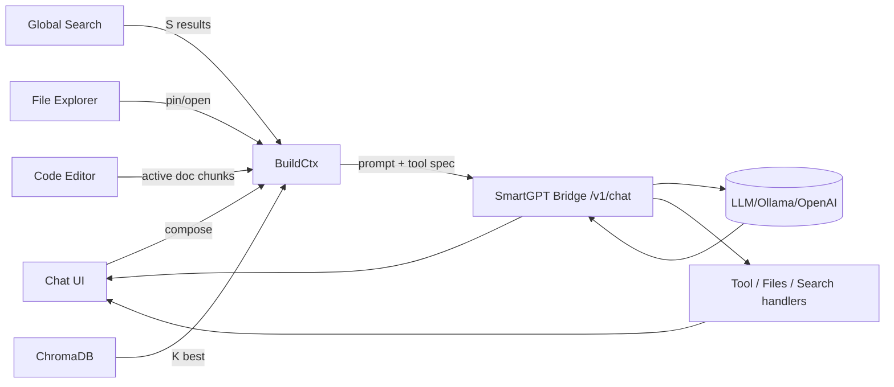

love this direction. here’s a concrete, no‑react, web‑components-first design you can build toward. it gives you: a markdown chat, file explorer, search bar, tiny code editor with evil-ish keys, and a **dynamic chat context** (latest n + recalled context + rag k).

---

# high-level layout (split panes)

```text
┌────────────────────────────────────────────────────────────────────────┐
│ Top Bar: [⌕ global search]  [model] [temperature] [run ▶] [pin 📌]    │
├─────────────┬──────────────────────────────────────────────────────────┤
│ File Tree   │ Chat (markdown) + Context Strip                          │
│ (left)      │ ─ messages                                               │
│             │ ─ inline citations / source chips                        │
│             │ ─ system / tool traces (collapsible)                     │
│             │ ─ Context Strip (active: latest n msgs + k RAG + files)  │
├─────────────┼──────────────────────────────────────────────────────────┤
│ Inspector   │ Code Editor (minimal, vim/evil keys)                     │
│ (right)     │ ─ diff/preview tab                                       │
│             │ ─ chunk view / embeddings viz                            │
└─────────────┴──────────────────────────────────────────────────────────┘
```

* **Left**: file explorer (your existing component), shows repo tree, supports “open”, “pin to context”, “embed chunk”.
* **Center**: markdown chat; above the composer: a **Context Strip** of chips showing what will be sent (last N msgs, K RAG hits, pinned file chunks, top search results).
* **Right**: inspector / code editor; toggles between code edit, diff, chunk view, and “embedding neighborhood”.

---

# dynamic context model (what gets sent)

* keep only:

  * **M latest user+assistant messages** (defaults: `M=6`, configurable).
  * **Pinned items** (explicit overrides; never evicted unless unpinned).
  * **K best RAG matches** from Chroma (defaults: `K=8`, per-query).
  * **S top search results** (filename/title + short snippet) (defaults: `S=3`).
  * **F top file chunks** from currently open files (defaults: `F=4`).

* eviction order when token budget tight: search→open-file chunks→RAG hits→older chat msgs→(never evict pinned).

* hard **token budget** you compute each send: `B_total` (e.g., 12k).

  * reserve headroom for reply: `B_reply_reserve` (e.g., 3k).
  * available for context: `B_ctx = B_total - B_reply_reserve - B_sys`.
  * greedy pack by priority & per‑item cap (e.g., chunk cap 400–800 tokens).

---

# data flow (mermaid)



---

# prompt assembly (deterministic & transparent)

**System** (static, short)

* who you are (Cephalon/Duck), coding style prefs, **“answer with citations using \[#id] chips the UI provides”**.
* keep it <600 tokens.

**Context blocks** (ordered):

1. **Pinned** `[PIN:…]`
2. **OpenFileChunks** `[FILE: path#Lx-Ly]`
3. **RAG** `[RAG: source-id score=…]`
4. **Search** `[WEB: title url-hash]`
5. **ChatTail** (last `M` messages, condensed if needed)

**User message** last.

UI shows a **live preview** of this prompt (collapsible), so you always see what gets sent.

---

# minimal state shape

```ts
type Chip = {
  id: string;              // stable id used in prompt
  kind: 'pin'|'file'|'rag'|'search'|'msg';
  title: string;
  meta?: Record<string, any>;
  tokens: number;          // estimated by tiktoken-like lib
  selected: boolean;       // user may toggle off before send
  payload: { text: string, citation?: string };
};

type ChatState = {
  messages: Array<{ id: string; role: 'user'|'assistant'|'system'; text: string; ts: number; }>;
  chips: Chip[];           // computed each keystroke / on search / on open
  budget: { total: number; reserve: number; used: number; remaining: number };
  params: { M: number; K: number; S: number; F: number; model: string; temp: number };
};
```

---

# event bus (simple, decoupled)

Use a tiny pub/sub (no framework):

```ts
type Event =
  | { type: 'SEARCH_REQUEST'; q: string }
  | { type: 'SEARCH_RESULTS'; items: Chip[] }
  | { type: 'FILES_OPEN'; path: string }
  | { type: 'FILES_PIN'; chip: Chip }
  | { type: 'RAG_QUERY'; q: string }
  | { type: 'RAG_RESULTS'; items: Chip[] }
  | { type: 'CHAT_SEND'; text: string }
  | { type: 'CHAT_RESPONSE'; msg: string; toolCalls?: any[] }
  | { type: 'BUDGET_RECALC' }
  | { type: 'CHIP_TOGGLE'; id: string; selected: boolean }
  | { type: 'EDITOR_SET_ACTIVE'; path: string }
  | { type: 'TRACE_UPDATE'; tool: string; data: any };

const bus = (() => {
  const subs = new Map<string, Set<(e:any)=>void>>();
  function on(type: Event['type'], fn: (e:any)=>void){ (subs.get(type) ?? subs.set(type, new Set()).get(type))!.add(fn); }
  function emit(e: Event){ subs.get(e.type)?.forEach(fn => fn(e)); }
  return { on, emit };
})();
```

Each Web Component listens/emits only the events it cares about.

---

# web components (custom elements)

* `<app-shell>`: owns layout + global state
* `<chat-panel>`: markdown rendering, composer, context strip
* `<context-strip>`: renders chips, toggles, drag‑to‑reorder
* `<file-tree-panel>`: your explorer, emits `FILES_OPEN`, `FILES_PIN`
* `<search-bar>`: emits `SEARCH_REQUEST`, shows `SEARCH_RESULTS`
* `<code-editor-panel>`: lightweight editor w/ evil keys
* `<inspector-panel>`: diff/preview/chunk/embedding tabs
* `<token-budget-meter>`: visual budget bar

**Communication:** only through the event bus + attributes for initial props.

---

# keyboard scheme (Spacemacs/Evil vibes)

Global (while focus in chat or editor):

* `Space` opens **Leader menu** (overlay palette).
* Leader chords:

  * `SPC f f` open file (focus file tree)
  * `SPC f p` pin active chunk
  * `SPC s s` focus search bar
  * `SPC c c` send chat
  * `SPC t t` toggle token preview
  * `SPC m m` model selector
* Editor (modal):

  * Normal mode: `h j k l`, `dd`, `yw`, `p`, `/` search
  * Insert mode: standard typing
  * `Esc` → normal, `i` → insert, `v` → visual
* Chat:

  * `Ctrl+Enter` send
  * `Alt+↑/↓` adjust temp
  * `Alt+[` / `Alt+]` adjust K (RAG hits)
  * `Alt+Shift+[` / `]` adjust M (chat tail)

---

# dynamic chunking + ids

* When a file is opened, client requests `/v1/files/view?path=…&lines=…&context=…` (you already sketched this).
* Chunk by semantic boundaries (AST if available) or fallback to **sliding windows** with overlaps.
* Assign stable deterministic ids: `hash(repo@commit:path#Lx-Ly)`.
* Emit chips for the **top F** most-recently viewed chunks (unless deselected).

---

# retrieval policy (simple & effective)

1. **Live query**: build from the composer text (+ open file path context).
2. **Chroma**: `collection.query({ queryEmbeddings, topK: K, where: { repo: current } })`
3. **Search** (optional): code‑aware BM25 over filename & headings; take top S.
4. **Dedup**: prefer unique sources; rerank by **(semantic score + recency boost + pin bonus)**.
5. **Trim to budget** with per‑type caps (e.g., `ragChunkCap=500`, `fileChunkCap=700`, `searchCap=150`, `chatMsgCap=350`).

Show the final set as chips; user can toggle any off **before** send.

---

# example “build context” (pseudo)

```ts
function buildContext(state: ChatState) {
  const { M, K, S, F } = state.params;
  const pinned = state.chips.filter(c => c.kind === 'pin' && c.selected);
  const openFile = pickRecent(state.chips, 'file', F);
  const rag = topK(state.chips, 'rag', K);
  const search = topK(state.chips, 'search', S);
  const tail = takeLastM(state.messages, M);

  let blocks = [
    ["[PIN]", pinned],
    ["[FILE]", openFile],
    ["[RAG]", rag],
    ["[SEARCH]", search],
    ["[CHAT]", tail.map(m=>({...m, kind:'msg'}))],
  ];

  blocks = trimToBudget(blocks, state.budget.remaining);
  return flattenBlocks(blocks);
}
```

---

# prompt example (assembled)

```
<System>
You are Cephalon, assistant for the Promethean project. Prefer JS/TS & Lisp-like pseudo. Cite using chip ids like [#chip-abc].
</System>

[PIN]
[#pin-1] AGENTS.md excerpt…
[#pin-2] process.md state machine…

[FILE]
[#file-a] services/ts/cephalon/contextManager.ts#L40-L132 …
[#file-b] services/ts/cephalon/collectionManager.ts#L10-L88 …

[RAG]
[#rag-1] (score 0.89) commit 437: “dual store types”… 
[#rag-2] (0.86) “tool calling patch”…

[SEARCH]
[#web-1] “Ollama tool support” blog summary…
[#web-2] “Fastify response schema oneOf tip”…

[CHAT]
user: how do I forward tool calls through codex context?
assistant: …
user: I think the backend.chat signature needs opts.tools…
assistant: …

<User>
Please propose a minimal diff for backend.ts and index.ts.
</User>
```

UI shows those bracketed blocks as collapsible sections; each `[#id]` is clickable to preview the source.

---

# minimal tool interface (bridge)

Define a neutral payload you already support:

```ts
type ToolSpec = {
  name: string;
  description?: string;
  json_schema?: Record<string, any>;
};

type ChatRequest = {
  model: string;
  messages: { role: 'system'|'user'|'assistant'|'tool'; content: string; name?: string }[];
  tools?: ToolSpec[];
  tool_choice?: 'auto' | { type: 'function', function: { name: string } };
  stream?: boolean;
  temperature?: number;
  metadata?: any;
  context_preview?: Chip[]; // for logging/trace
};
```

**Streaming**: parse tool calls and forward as `TRACE_UPDATE` events so the UI shows tool execution and responses inline.

---

# code editor choice (no React, still nice)

* Start with **CodeMirror 6** (vanilla) for a tiny footprint.
* Layer **Vim** keymap + a small Evil bridge:

  * normal/insert/visual modes
  * `dd`, `dw`, `p`, `ci(`, etc.
* Map Leader overlay to CodeMirror commands + app actions.

---

# persistence + replay

* Persist only **messages** and **pins** to local DB (IndexedDB) per “conversation id”.
* **Rebuild chips** deterministically on load by re-running:

  * open-file chunking (if file exists)
  * RAG query for last user message (store its embedding to seed)
  * search (optional cached)
* This gives you the “dynamic history” feel: lightweight saved chat, context always re‑computed.

---

# quick milestones

1. **Shell + Bus**

* app-shell, chat-panel, file-tree-panel, search-bar, code-editor-panel
* events wired, no backend yet
* dummy chips + token meter

2. **Bridge integration**

* `/v1/chat` streaming
* `/v1/files/view`, `/v1/files/list`
* `/v1/search` (or call your search service)

3. **Chroma hookup**

* query for top K with a basic reranker
* chip de‑dup + eviction

4. **Editor + evil keys**

* CodeMirror 6 + vim keymap + leader palette

5. **Prompt preview + citations**

* render assembled prompt sections
* enforce chip id usage in assistant replies

---

# tiny HTML skeleton (illustrative only)

```html
<body>
  <app-shell>
    <file-tree-panel slot="left"></file-tree-panel>
    <chat-panel slot="center"></chat-panel>
    <inspector-panel slot="right"></inspector-panel>
  </app-shell>
  <script type="module" src="/app-shell.js"></script>
</body>
```

Each module defines a custom element, subscribes to `bus`, and updates with attributes/props.

---

# where to start (today)

* implement `bus`, `tokenBudget()` (rough tiktoken estimator), and `trimToBudget()`.
* stub chips and render a **Context Strip** that lets you toggle items on/off and see live budget.
* wire `/v1/chat` with streaming and the **prompt preview**.
* once that loop feels good, bolt on RAG + file chunks.

if you want, I can open a fresh canvas next to this chat with:

* a mermaid end‑to‑end diagram,
* the event bus and chip models,
* a minimal `<chat-panel>` custom element,
* and the prompt assembly util.
