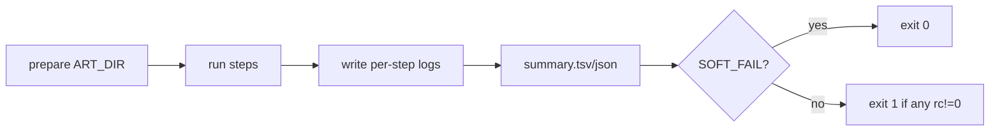

facts 💯. if you’re just orchestrating tools, bash is a great hammer—as long as you give it guardrails.

here’s a tiny, hard-wearing **“batch runner”** you can drop in. it runs a bunch of commands, never bails early, writes per-step logs + a summary, and lets you choose to fail only at the end. perfect for “prime caches, keep artifacts, exit 0.”

```bash
#!/usr/bin/env bash
set -euo pipefail

# ---- knobs ----
SOFT_FAIL="${SOFT_FAIL:-1}"     # 1 = always exit 0, 0 = fail at end if anything failed
RUN_RETRIES="${RUN_RETRIES:-0}" # per-step retries with exponential backoff
ART_ROOT="${ART_ROOT:-docs/reports/codex_cloud}"

# ---- setup ----
TS="$(date -u +"%Y.%m.%d.%H.%M.%S")"
ART_DIR="$ART_ROOT/runs/$TS"
mkdir -p "$ART_DIR/logs"

SUMMARY_TSV="$ART_DIR/summary.tsv"
printf 'ts\tname\trc\tlog\n' > "$SUMMARY_TSV"

retry() { # retry N cmd...
  local max="$1"; shift
  local n=0
  until bash -lc "$*"; do
    (( n++ )); (( n>max )) && return 1
    sleep $((2**n))
  done
}

run() {  # run "name" "command"
  local name="$1"; shift
  local cmd="$*"
  local log="$ART_DIR/logs/${name}.log"
  local t="$(date -Is)"
  set +e
  if (( RUN_RETRIES > 0 )); then retry "$RUN_RETRIES" "$cmd" >"$log" 2>&1; rc=$?
  else                                bash -lc "$cmd"   >"$log" 2>&1; rc=$?
  fi
  set -e
  printf '%s\t%s\t%d\t%s\n' "$t" "$name" "$rc" "$log" >> "$SUMMARY_TSV"
  return "$rc"
}

# ---- your steps (examples) ----
run env-dump '(set -o posix; set)'
run corepack-enable 'corepack enable'
run pnpm-activate   'corepack prepare pnpm@9.0.0 --activate'
run pnpm-install    'pnpm install --frozen-lockfile'

# use nx if available to prime caches fast; otherwise fall back
if pnpm exec nx --version >/dev/null 2>&1; then
  BASE="${NX_BASE:-origin/main}"; HEAD="${NX_HEAD:-HEAD}"
  run nx-affected-build 'pnpm exec nx affected -t build --parallel --output-style=stream --base='"$BASE"' --head='"$HEAD"
  run nx-affected-lint  'pnpm exec nx affected -t lint  --parallel --output-style=stream --base='"$BASE"' --head='"$HEAD"
  run nx-graph          'pnpm exec nx graph --affected --base='"$BASE"' --head='"$HEAD"' --file="'"$ART_DIR"'/affected-graph.html"'
else
  run pnpm-build 'pnpm -r --no-bail build'
fi

# human + machine-readable lint artifacts (prime eslint cache)
run eslint-stylish 'pnpm exec eslint --cache -f stylish .'
run eslint-json    'pnpm exec eslint --cache -f json . > "'"$ART_DIR"'/eslint.json"'

# ---- summary JSON (optional, if jq is present) ----
if command -v jq >/dev/null 2>&1; then
  awk -F'\t' 'NR>1{print "{\"ts\":\""$1"\",\"name\":\""$2"\",\"rc\":"$3",\"log\":\""$4"\"}"}' "$SUMMARY_TSV" \
    | jq -s --arg ts "$TS" --arg dir "$ART_DIR" '{run_ts:$ts, dir:$dir, steps:., failed:[.[]|select(.rc!=0)]}' \
    > "$ART_DIR/summary.json"
fi

echo "Artifacts in $ART_DIR"
echo "  - per-step logs: $ART_DIR/logs/*.log"
echo "  - eslint.json:   $ART_DIR/eslint.json"
echo "  - summary.tsv:   $SUMMARY_TSV"
[ -f "$ART_DIR/affected-graph.html" ] && echo "  - graph:         $ART_DIR/affected-graph.html"

# ---- exit policy ----
if (( SOFT_FAIL )); then
  exit 0
else
  awk 'NR>1 && $3!="0"{bad=1} END{exit bad?1:0}' "$SUMMARY_TSV"
fi
```

quick tweaks:

* want a **single place** to look? read `summary.json` (if `jq` available) or `summary.tsv`.
* want **warnings to fail** lint? add `--max-warnings=0` to the `eslint` runs.
* want **more speed**? keep the `nx affected` path; it’s the fastest way to warm caches on only-changed projects.
* want **concurrency** for unrelated one-offs? wrap independent steps in `&` and `wait`, or use `xargs -P`.

tiny map of the flow:



bash it till it purrs.
