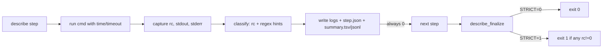

yep — you can make any step “never fail” while recording *exactly how it failed* (exit code, signal, timeout, OOM, disk/network issues, etc.). drop this helper in your repo and call it for each task.

## `run/describe.sh` — classify failures, always return 0

```bash
#!/usr/bin/env bash
# Classifying runner: executes a command, never fails the script, emits rich artifacts.
# Requires: bash, coreutils, (optional) jq, /usr/bin/time
set -euo pipefail

# ---- knobs ----
ART_ROOT="${ART_ROOT:-docs/reports/codex_cloud}"
RUN_TS="${RUN_TS:-$(date -u +"%Y.%m.%d.%H.%M.%S")}"
TIMEOUT_SECS="${TIMEOUT_SECS:-0}"     # 0 = no timeout; otherwise e.g. 600
STRICT="${STRICT:-0}"                 # 0 = never fail; 1 = fail at end if any step failed

# ---- setup ----
RUN_DIR="$ART_ROOT/describe/$RUN_TS"
LOG_DIR="$RUN_DIR/logs"
STEP_DIR="$RUN_DIR/steps"
mkdir -p "$LOG_DIR" "$STEP_DIR"

SUMMARY_TSV="$RUN_DIR/summary.tsv"
SUMMARY_JSON="$RUN_DIR/summary.jsonl"   # JSONL per step (easy to stream/parse)
printf 'ts\tname\trc\tsignal\tstatus\tlog_out\tlog_err\n' > "$SUMMARY_TSV"

_have() { command -v "$1" >/dev/null 2>&1; }

# classify based on rc + stderr/out patterns
_classify() {
  local rc="$1" out="$2" err="$3" cmd="$4" name="$5"
  local status="ok" signal=""

  # signals: rc > 128 means signal = rc - 128
  if (( rc > 128 )); then signal=$((rc-128)); status="signal:$signal"; fi
  (( rc == 124 )) && status="timeout"   # GNU timeout default
  (( rc == 126 )) && status="permission"
  (( rc == 127 )) && status="not_found"

  # content heuristics (stderr first)
  if grep -Eiq 'No space left on device|ENOSPC' "$err" "$out"; then status="disk_full"; fi
  if grep -Eiq 'Out of memory|Cannot allocate memory|ENOMEM|JavaScript heap out of memory|Killed' "$err" "$out"; then status="oom"; fi
  if grep -Eiq 'ECONNREFUSED|ECONNRESET|EAI_AGAIN|ENOTFOUND|network is unreachable|timed out|TLS handshake timeout' "$err" "$out"; then status="network"; fi
  if grep -Eiq 'Unknown option|unrecognized option|invalid option|Usage:' "$err" "$out"; then status="cli_usage"; fi
  if grep -Eiq 'Cannot find module|Module not found|TS2307' "$err" "$out"; then status="dep_missing"; fi
  if grep -Eiq 'ELIFECYCLE|ERR_PNPM|npm ERR!' "$err" "$out"; then status="build_failed"; fi
  if echo "$cmd" | grep -Eq '\beslint\b'; then
    (( rc != 0 )) && status="lint_failed"
  fi
  if echo "$cmd" | grep -Eq '\bnx\b'; then
    grep -Eiq 'Target .* failed|Nothing to run|Cannot find project' "$err" "$out" && status="nx_failed"
  fi

  echo "$status" "$signal"
}

# run and record one step; always return 0
describe() {
  local name="$1"; shift
  local cmd=( "$@" )
  local out="$LOG_DIR/${name}.out.log"
  local err="$LOG_DIR/${name}.err.log"
  local merged="$LOG_DIR/${name}.log"

  local started ended rc=0
  started="$(date -Is)"

  set +e
  if (( TIMEOUT_SECS > 0 )); then
    if _have /usr/bin/time; then
      timeout --preserve-status "${TIMEOUT_SECS}s" /usr/bin/time -v "${cmd[@]}" >"$out" 2>"$err"
    else
      timeout --preserve-status "${TIMEOUT_SECS}s" "${cmd[@]}" >"$out" 2>"$err"
    fi
  else
    if _have /usr/bin/time; then
      /usr/bin/time -v "${cmd[@]}" >"$out" 2>"$err"
    else
      "${cmd[@]}" >"$out" 2>"$err"
    fi
  fi
  rc=$?
  set -e
  ended="$(date -Is)"

  # merged log (handy to open in CI)
  { cat "$out"; echo; echo "------ STDERR ------"; cat "$err"; } >"$merged" || true

  read -r status signal <<< "$(_classify "$rc" "$out" "$err" "${cmd[*]}" "$name")"

  # write per-step JSON (plus JSONL line)
  if _have jq; then
    jq -n \
      --arg name "$name" --arg cmd "${cmd[*]}" \
      --arg started "$started" --arg ended "$ended" \
      --arg out "$out" --arg err "$err" --arg merged "$merged" \
      --arg status "$status" --argjson rc "$rc" --arg signal "${signal:-}" \
      '{
        name:$name, cmd:$cmd, started:$started, ended:$ended,
        logs:{out:$out, err:$err, merged:$merged},
        result:{rc:$rc, status:$status} + ( $signal|length>0 ? {signal:($signal|tonumber)} : {} )
      }' | tee "$STEP_DIR/${name}.json" >> "$SUMMARY_JSON"
  fi

  printf '%s\t%s\t%d\t%s\t%s\t%s\t%s\n' \
    "$started" "$name" "$rc" "${signal:-}" "$status" "$out" "$err" >> "$SUMMARY_TSV"

  # never fail outward
  return 0
}

# finalize report; exit policy
describe_finalize() {
  echo "Artifacts in: $RUN_DIR"
  echo "  - logs:     $LOG_DIR/*.log"
  echo "  - per-step: $STEP_DIR/*.json"
  [ -s "$SUMMARY_JSON" ] && echo "  - summary:  $SUMMARY_JSON"
  echo "  - table:    $SUMMARY_TSV"

  # optional “fail at end” if STRICT=1
  if (( STRICT )); then
    awk 'NR>1 && $3!="0"{bad=1} END{exit bad?1:0}' "$SUMMARY_TSV" || exit 1
  fi
  exit 0
}
```

### Example use in your bootstrap

```bash
# at top of your script
set -euo pipefail
ART_ROOT="docs/reports/codex_cloud" source run/describe.sh

# steps — each one “can fail”, but describe() always returns 0
describe env-dump            bash -lc '(set -o posix; set)'
describe corepack-enable     corepack enable
describe pnpm-activate       corepack prepare pnpm@9.0.0 --activate
describe pnpm-install        pnpm install --frozen-lockfile

# use Nx when present (faster cache priming)
if pnpm exec nx --version >/dev/null 2>&1; then
  BASE="${NX_BASE:-origin/main}"; HEAD="${NX_HEAD:-HEAD}"
  describe nx-affected-build pnpm exec nx affected -t build --parallel --output-style=stream --base="$BASE" --head="$HEAD"
  describe nx-affected-lint  pnpm exec nx affected -t lint  --parallel --output-style=stream --base="$BASE" --head="$HEAD"
else
  describe pnpm-build        pnpm -r --no-bail build
fi

# eslint artifacts (human + JSON)
describe eslint-stylish      pnpm exec eslint --cache -f stylish .
describe eslint-json         bash -lc 'pnpm exec eslint --cache -f json . > docs/reports/codex_cloud/eslint.json'

# finalize once at the end (keeps exit 0 unless STRICT=1)
describe_finalize
```

What you get every run (even if commands “fail”):

* **`summary.tsv`**: quick tabular view (ts, name, rc, signal, status, log paths).
* **`steps/*.json`**: per-step structured records (cmd, timestamps, rc, status, logs).
* **`logs/*.log`**: split+merged logs for eyeballing or agent ingestion.

#### Status taxonomy (extensible)

* `ok`, `timeout`, `signal:<n>`, `permission`, `not_found`
* `disk_full`, `oom`, `network`, `cli_usage`, `dep_missing`
* `build_failed`, `lint_failed`, `nx_failed`

Tweak `_classify` to add repo-specific failure paths (e.g., “Playwright not installed”, “Chromadb unhealthy”, etc.). Because each `describe` **never propagates non-zero**, you can keep `set -euo pipefail` globally without tripping it.

---

tiny map of the flow:



If you want, I can add a tiny TS reader (`packages/failure-report`) that ingests `summary.jsonl` and prints guidance per failure class (e.g., disk full → show du/df suggestions; eslint failed → point to top rules/files).
