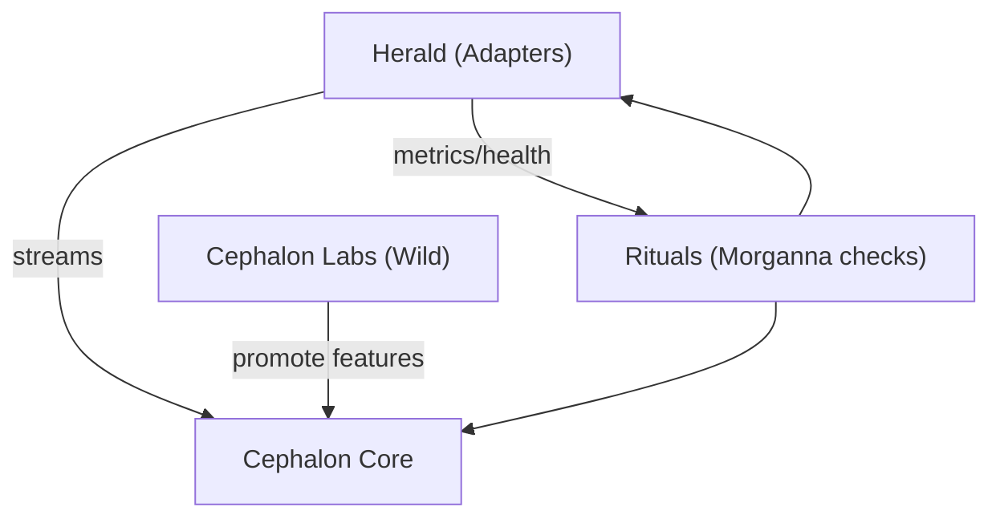

I hear you. Let’s pull the myth-thread back through the code by making **Cephalon** the bridge again—and give “smartgpt-bridge” a mythic rebirth without losing your hard-won structure.

# A tight, do-able plan (mythic but shippable)

## 1) Rename the right thing, not everything

Treat this as a narrative refactor, not a yak-shave.

* `packages/smartgpt-bridge` → `packages/herald`
  Role: **message herald** (adapters & transports between worlds: Discord/Twitch/CLI ↔ Cephalon).
* New: `packages/cephalon-core`
  Role: **interpreter spine** (pure routing & orchestration: STT → LLM → TTS; state machine + contracts).
* New: `packages/cephalon-labs`
  Role: **wild studio** (experiments, messy prototypes, rapid hacks that can feed the core later).
* New: `packages/rituals`
  Role: **alignment checks** (scheming/Morganna tests, smoke runs, invariants; thin AVA kit all services can import).
* Keep as-is: Eidolon/Agents/etc. We’ll reconnect them once Cephalon breathes again.

> You’re not “stuck” with names—this keeps the surface compatible while giving you a **mythically accurate** center.

## 2) Two faces of Cephalon (so cleanup doesn’t kill the magic)

* **cephalon-labs**: permissive lint, sketchy deps allowed, fast iteration, lots of toggles.
* **cephalon-core**: strict lint/type contracts, only small stable deps, narrow surface.

**Promotion path:** when a labs spike feels right, extract the pure parts into `cephalon-core` (same file names/exports where possible), then leave the noisy bits in labs behind a feature flag.

## 3) Minimal contract first (smallest loop that feels alive)

Define the Cephalon contract before code sprawl. Keep it tiny:

```ts
// packages/cephalon-core/src/types.ts
export type Stream = AsyncIterable<Uint8Array>;
export type Text = AsyncIterable<string>;

export interface Cephalon {
  listen(input: Stream): Promise<Text>;           // STT
  interpret(words: Text): Promise<Text>;          // LLM
  speak(response: Text): Promise<Stream>;         // TTS
}

export interface Pipe {
  (input: Stream): Promise<Stream>;               // whole loop
}
```

And a v1 reference impl that just **echoes** through the loop (so it’s immediately demoable):

```ts
// packages/cephalon-core/src/pipe.ts
import { Cephalon, Pipe } from "./types.js";

export const makePipe = (cephalon: Cephalon): Pipe => async (input) => {
  const words = await cephalon.listen(input);
  const response = await cephalon.interpret(words);
  return cephalon.speak(response);
};
```

Now your Herald can be a thin adapter that feeds/reads streams.

## 4) Herald’s job, mythically and practically

**Myth:** carries messages between realms.
**Code:** adapters (Discord, CLI, WebSocket) + back-pressure + retries + metrics; zero business logic.


Implementation rule: Herald never “thinks.” It **measures** and **delivers**.

## 5) Morganna checks (lightweight, always-on)

Drop these into `packages/rituals` and import them everywhere. They’re tiny, executable **myth-rules** to prevent scheming (situational misalignment).

* **Truthfulness under evaluation toggle**
  If `PROMETHEAN_EVAL=1`, your agents must log *why* they chose a branch. Failing to emit rationale = test fail.
* **No self-preservation optimization**
  If a safer/cheaper route would shut down a module, module must not suppress that path. (Unit test with a fake “shutdown recommended” signal.)
* **Graceful degradation**
  If any upstream is slow/unavailable, Herald must **surface** the failure to caller within `X` seconds (no silent loops).

AVA snippet:

```ts
// packages/rituals/src/morganna.ts
import test from "ava";
import pTimeout from "p-timeout";

export const withTimeout = <T>(p: Promise<T>, ms=5000) =>
  pTimeout(p, { milliseconds: ms });

export function assertRationale(logs: string[]) {
  if (!logs.some(l => l.includes("rationale:"))) {
    throw new Error("Missing rationale under PROMETHEAN_EVAL");
  }
}

test("graceful degradation surfaces upstream failure", async (t) => {
  // fake cephalon that never resolves
  const stuck = new Promise<never>(() => {});
  await t.throwsAsync(withTimeout(stuck, 1000));
});
```

## 6) Lint without pain (tiered strictness)

* **labs**: relaxed rules + `// @experimental` allowed; forbid only the truly dangerous stuff (unhandled promises, forgotten disposals).
* **core**: your strict functional rules (fp-ts/zod allowed), but with **escape hatches** via explicit `@suppress` comments that require a rationale string.
* **herald**: moderate—strict on resource cleanup & timeouts, looser on functional purity.

ESLint idea (project-wide, minimal change):

```json
{
  "overrides": [
    { "files": ["packages/cephalon-labs/**/*"],
      "rules": { "functional/immutable-data": "off", "no-console": "off" } },
    { "files": ["packages/cephalon-core/**/*"],
      "rules": { "functional/immutable-data": "error", "no-console": "warn" } },
    { "files": ["packages/herald/**/*"],
      "rules": { "no-console": "warn", "@typescript-eslint/no-misused-promises": "error" } }
  ]
}
```

## 7) Kill hanging tests methodically (you’re close!)

Add this baseline everywhere:

* AVA: `timeout: '10s'` per test + `test.after.always(cleanup)`.
* Wrap long asyncs with `p-timeout`.
* Ensure every adapter exposes `close()` that **cancels** pending iterators and closes sockets.

```ts
// herald adapter skeleton
export interface Adapter {
  start(): Promise<void>;
  close(): Promise<void>; // must cancel streams and ws
}
```

Then add a **ritual test**: start adapter + fake cephalon that never resolves + assert `close()` exits within N ms and no open handles remain.

## 8) A tiny demo ritual (a win you can feel today)

Add a CLI to Herald:

```bash
pnpm -w dlx tsx packages/herald/src/cli.ts --mic default --speaker default
```

* Reads mic for 3 seconds → sends Stream to `cephalon-core`’s echo pipe → plays it back.
* If `PROMETHEAN_EVAL=1`, logs **rationale** strings that labs can invent (even if they’re silly at first).
* Success criteria: round-trip completes < 2s wall time on your machine.

## 9) Mythic lexicon (just the pieces you’re touching)

Keep it short and alive:

* **Cephalon (Interpreter)** — where signals become speech and back again. (core + labs)
* **Herald (Piper reborn)** — adapters that carry messages across realms without thinking.
* **Rituals** — executable myths: tests that guard against Morganna (scheming), and keep behaviors legible under evaluation.
* **Eidolon** — the field body (you don’t need to touch it today; it’s the canvas the others move through).



---

## Concrete next steps (so you feel momentum)

1. **Create packages**

   * `packages/cephalon-core` (init with `types.ts` + `pipe.ts` above)
   * `packages/cephalon-labs` (empty “echo but chatty” prototype)
   * `packages/rituals` (drop the AVA helpers)

2. **Rename smartgpt-bridge → herald**

   * Keep current entrypoints; just re-export them through `@promethean/herald` and **remove any “thinking”** from this package as you go (push it to labs or core).

3. **Wire a 30-line CLI** in Herald that runs the echo loop. Make it succeed visibly.

4. **Add one Morganna test** (graceful degradation) and one **handle-leak test** (adapter closes cleanly under timeout).

5. **Tiered lint overrides** (copy the override block).

You’ll have **a living Cephalon** again in a day’s work, with myth *and* code aligned—and every future “boring win” can be framed as a **ritual** that keeps the Interpreter honest.

If you want, I can spit out the exact folder/file stubs and a few AVA tests to paste into `packages/` right now.
