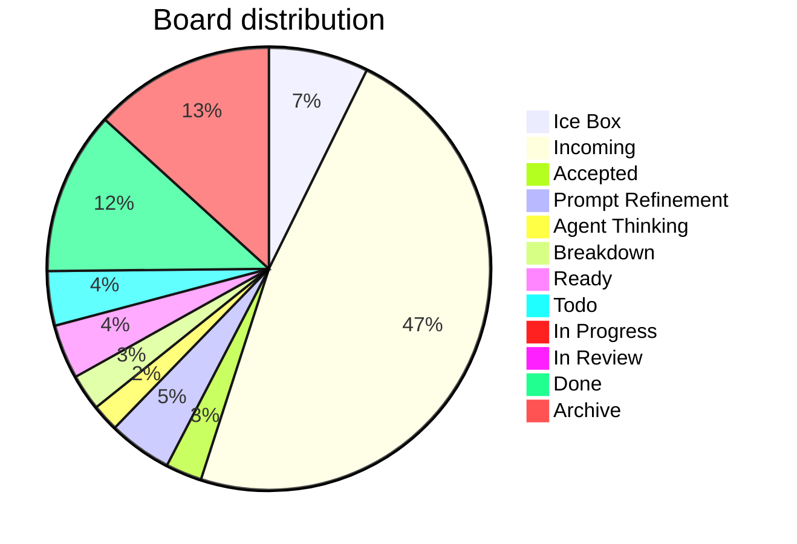

# Board Walk – 2025-08-11

**Assumptions** ^ref-7aa1eb92-3-0

* WIP limit (global Doing) = **3** (change if you want). ^ref-7aa1eb92-5-0
* Doing lanes (for now): **Prompt Refinement**, **Agent Thinking**, **Breakdown**, **In Progress**. ^ref-7aa1eb92-6-0
* Aging threshold: **> 2 days** in a Doing lane. ^ref-7aa1eb92-7-0

---

## Column counts (actual from pasted board)

| Column            | Count | ^ref-7aa1eb92-13-0
| ----------------- | ----- |
| Ice Box           | 11    |
| Incoming          | 72    |
| Accepted          | 4     |
| Prompt Refinement | 7     |
| Agent Thinking    | 3     |
| Breakdown         | 4     |
| Ready             | 6     |
| Todo              | 6     |
| In Progress       | 0     |
| In Review         | 1     |
| Done              | 18    |
| Archive           | 20    |

> Header ↔ actual mismatches detected: ^ref-7aa1eb92-28-0
>
> * **Accepted (8)** → has **4** items ^ref-7aa1eb92-30-0
> * **Prompt Refinement (24)** → has **7** items ^ref-7aa1eb92-31-0
> * **Agent Thinking (24)** → has **3** items
> * **Breakdown (16)** → has **4** items ^ref-7aa1eb92-33-0
> * **Ready (24)** → has **6** items
> * **Todo (16)** → has **6** items ^ref-7aa1eb92-35-0
> * **In Progress (8)** → has **0** items

^ref-7aa1eb92-38-0 ^ref-7aa1eb92-53-0

---

## Blockers

* No items tagged **#blocked** found in the paste.
 ^ref-7aa1eb92-60-0
> If any are blocked, add **#blocked** (and optionally a short reason), e.g., `#blocked:waiting-on-PR-123`.

---

## WIP check (Doing lanes)

* Current **Doing total** (Prompt Refinement + Agent Thinking + Breakdown + In Progress): **14**
* With WIP limit **3**, we’re **over**.
 ^ref-7aa1eb92-69-0
**Proposal**
 ^ref-7aa1eb92-71-0
* Confirm which lanes count as Doing. If all four above are Doing, pull back to **≤3** by:

  1. Moving non‑active cards back to **Ready**. ^ref-7aa1eb92-74-0
  2. Splitting any large Doing card into a small slice that can finish in ≤1 day; park the rest in Ready.

---

## Aging WIP (>2 days)
 ^ref-7aa1eb92-80-0
* Not evaluated: timestamps weren’t provided in the paste.
 ^ref-7aa1eb92-82-0
**Recommendation**
 ^ref-7aa1eb92-84-0
* Add `last_touched: YYYY‑MM‑DD` to frontmatter, or let me read file mtimes; then I’ll auto‑flag aging WIP.

---

## Next pull (single)
 ^ref-7aa1eb92-90-0
**Flow goal (stated recently):** extend WS message broker with **queue semantics** and connect services.
 ^ref-7aa1eb92-92-0
* **Best pull (promote from Incoming → Ready):** `[[add_manualack_to_event_bus_and_re_run_tests.md|Add manualAck to event bus and re-run tests]]` (unblocks reliable delivery & retries). ^ref-7aa1eb92-93-0
* **If restricted to current Ready only:** `[[Update makefile to have commands specific for agents.md|Update Makefile for agent commands]]` (quick win that improves daily flow) **or** `[[Mirror shared utils with language-specific doc folders.md]]` (reduces duplication before deeper queue work).
 ^ref-7aa1eb92-95-0
> Pick **one**. Everything else waits.

---

## Tag hygiene / normalization
 ^ref-7aa1eb92-101-0
You said you want **column-normalized** hashtags on tasks and files. Proposed canonical set:
 ^ref-7aa1eb92-103-0
* `#ice-box`, `#incoming`, `#accepted`, `#prompt-refinement`, `#agent-thinking`, `#breakdown`, `#ready`, `#todo`, `#in-progress`, `#in-review`, `#done`, `#archive`

**Findings**
 ^ref-7aa1eb92-107-0
* Many **Incoming** items are tagged `#todo`. Suggest adding **`#incoming`** (you can keep `#todo` if you like, but column tag should exist).
* Several **Accepted** items still carry `#todo`.
 ^ref-7aa1eb92-110-0
**Action**
 ^ref-7aa1eb92-112-0
* Run/finish the hashtag-normalizer so each card has both:
 ^ref-7aa1eb92-114-0
  1. the **column tag** (normalized), and ^ref-7aa1eb92-115-0
  2. any **status/phase** tag you want (e.g., `#todo`, `#accepted`).

---

## Quick decisions (checklist)

*

---

## Notes / Misc
 ^ref-7aa1eb92-127-0
* **In Progress** is empty—nice. Let’s keep it that way until we explicitly pull the next slice. ^ref-7aa1eb92-128-0
* Incoming is **72** items; consider a 10‑minute nightly triage to keep it from ballooning.
1
  - uuid: f2d83a77-7f86-4c56-8538-1350167a0c6c
    line: 151
    col: 0
    score: 1 ^ref-7aa1eb92-134-0
  - uuid: f2d83a77-7f86-4c56-8538-1350167a0c6c ^ref-7aa1eb92-135-0
    line: 152
    col: 0
    score: 1 ^ref-7aa1eb92-138-0
  - uuid: 0580dcd3-533d-4834-8a2f-eae3771960a9
    line: 286
    col: 0
    score: 1
  - uuid: 0580dcd3-533d-4834-8a2f-eae3771960a9
    line: 288
    col: 0
    score: 1
  - uuid: d3e7db72-2e07-4dae-8920-0e07c499a1e5
    line: 299 ^ref-7aa1eb92-148-0
    col: 0
    score: 1
  - uuid: ac60a1d6-fd9f-46dc-bbe7-176dd8017c59
    line: 12
    col: 0
    score: 1
  - uuid: de34f84b-270b-4f16-92a8-a681a869b823
    line: 35
    col: 0
    score: 1
  - uuid: 938eca9c-97e2-4bcc-8653-b0ef1a5ac7a3
    line: 57 ^ref-7aa1eb92-160-0
    col: 0
    score: 1 ^ref-7aa1eb92-162-0
  - uuid: 5e408692-0e74-400e-a617-84247c7353ad ^ref-7aa1eb92-163-0
    line: 124 ^ref-7aa1eb92-164-0
    col: 0 ^ref-7aa1eb92-165-0
    score: 1
  - uuid: 291c7d91-da8c-486c-9bc0-bd2254536e2d ^ref-7aa1eb92-167-0
    line: 81
    col: 0
    score: 1
  - uuid: 64a9f9f9-58ee-4996-bdaf-9373845c6b29
    line: 183
    col: 0
    score: 1
  - uuid: e87bc036-1570-419e-a558-f45b9c0db698
    line: 69
    col: 0
    score: 1 ^ref-7aa1eb92-178-0
  - uuid: f1add613-656e-4bec-b52b-193fd78c4642
    line: 36
    col: 0
    score: 1
  - uuid: 557309a3-c906-4e97-8867-89ffe151790c
    line: 46
    col: 0
    score: 1
  - uuid: 6cb4943e-8267-4e27-8618-2ce0a464d173
    line: 40
    col: 0
    score: 1
  - uuid: 9e8ae388-767a-4ea8-9f2e-88801291d947
    line: 53
    col: 0
    score: 1
  - uuid: 10d98225-12e0-4212-8e15-88b57cf7bee5 ^ref-7aa1eb92-195-0
    line: 33 ^ref-7aa1eb92-196-0
    col: 0
    score: 1
  - uuid: 0580dcd3-533d-4834-8a2f-eae3771960a9
    line: 287
    col: 0
    score: 1
  - uuid: ac60a1d6-fd9f-46dc-bbe7-176dd8017c59
    line: 15
    col: 0
    score: 1
  - uuid: d17d3a96-c84d-4738-a403-6c733b874da2
    line: 593
    col: 0
    score: 1
  - uuid: d8059b6a-c1ec-487d-8e0b-3ce33d6b4d06
    line: 561
    col: 0
    score: 1
  - uuid: 4330e8f0-5f46-4235-918b-39b6b93fa561
    line: 607
    col: 0
    score: 1
  - uuid: 7b7ca860-780c-44fa-8d3f-be8bd9496fba
    line: 548
    col: 0
    score: 1
  - uuid: 18344cf9-0c49-4a71-b6c8-b8d84d660fca
    line: 50
    col: 0
    score: 1
  - uuid: 9fab9e76-e283-4c9d-a8cd-cb76892ea7ac
    line: 28
    col: 0
    score: 1
  - uuid: 3a3bf2c9-c0f6-4d7b-bf84-c83c70dece3f
    line: 232
    col: 0
    score: 1
  - uuid: c0392040-16a2-41e8-bd54-75110319e3c0
    line: 29
    col: 0 ^ref-7aa1eb92-237-0
    score: 1
  - uuid: b22d79c6-825b-4cd3-b0d3-1cef0532bb54
    line: 1342
    col: 0
    score: 1
  - uuid: d3e7db72-2e07-4dae-8920-0e07c499a1e5
    line: 383 ^ref-7aa1eb92-244-0
    col: 0
    score: 1
  - uuid: 10d98225-12e0-4212-8e15-88b57cf7bee5
    line: 1333
    col: 0
    score: 1
  - uuid: 13951643-1741-46bb-89dc-1beebb122633
    line: 2911
    col: 0
    score: 1
  - uuid: 18138627-a348-4fbb-b447-410dfb400564
    line: 3603
    col: 0
    score: 1
  - uuid: 0580dcd3-533d-4834-8a2f-eae3771960a9
    line: 293
    col: 0
    score: 1
  - uuid: ac60a1d6-fd9f-46dc-bbe7-176dd8017c59
    line: 27
    col: 0
    score: 1
  - uuid: 10d98225-12e0-4212-8e15-88b57cf7bee5
    line: 176
    col: 0
    score: 1
  - uuid: 13951643-1741-46bb-89dc-1beebb122633
    line: 366
    col: 0
    score: 1
  - uuid: a4d90289-798d-44a0-a8e8-a055ae12fb52
    line: 632
    col: 0
    score: 1
---
# Board Walk – 2025-08-11

**Assumptions** ^ref-7aa1eb92-3-0

* WIP limit (global Doing) = **3** (change if you want). ^ref-7aa1eb92-5-0
* Doing lanes (for now): **Prompt Refinement**, **Agent Thinking**, **Breakdown**, **In Progress**. ^ref-7aa1eb92-6-0
* Aging threshold: **> 2 days** in a Doing lane. ^ref-7aa1eb92-7-0

---

## Column counts (actual from pasted board)

| Column            | Count | ^ref-7aa1eb92-13-0
| ----------------- | ----- |
| Ice Box           | 11    |
| Incoming          | 72    |
| Accepted          | 4     |
| Prompt Refinement | 7     |
| Agent Thinking    | 3     |
| Breakdown         | 4     |
| Ready             | 6     |
| Todo              | 6     |
| In Progress       | 0     |
| In Review         | 1     |
| Done              | 18    |
| Archive           | 20    |

> Header ↔ actual mismatches detected: ^ref-7aa1eb92-28-0
>
> * **Accepted (8)** → has **4** items ^ref-7aa1eb92-30-0
> * **Prompt Refinement (24)** → has **7** items ^ref-7aa1eb92-31-0
> * **Agent Thinking (24)** → has **3** items
> * **Breakdown (16)** → has **4** items ^ref-7aa1eb92-33-0
> * **Ready (24)** → has **6** items
> * **Todo (16)** → has **6** items ^ref-7aa1eb92-35-0
> * **In Progress (8)** → has **0** items

^ref-7aa1eb92-38-0 ^ref-7aa1eb92-53-0

---

## Blockers

* No items tagged **#blocked** found in the paste.
 ^ref-7aa1eb92-60-0
> If any are blocked, add **#blocked** (and optionally a short reason), e.g., `#blocked:waiting-on-PR-123`.

---

## WIP check (Doing lanes)

* Current **Doing total** (Prompt Refinement + Agent Thinking + Breakdown + In Progress): **14**
* With WIP limit **3**, we’re **over**.
 ^ref-7aa1eb92-69-0
**Proposal**
 ^ref-7aa1eb92-71-0
* Confirm which lanes count as Doing. If all four above are Doing, pull back to **≤3** by:

  1. Moving non‑active cards back to **Ready**. ^ref-7aa1eb92-74-0
  2. Splitting any large Doing card into a small slice that can finish in ≤1 day; park the rest in Ready.

---

## Aging WIP (>2 days)
 ^ref-7aa1eb92-80-0
* Not evaluated: timestamps weren’t provided in the paste.
 ^ref-7aa1eb92-82-0
**Recommendation**
 ^ref-7aa1eb92-84-0
* Add `last_touched: YYYY‑MM‑DD` to frontmatter, or let me read file mtimes; then I’ll auto‑flag aging WIP.

---

## Next pull (single)
 ^ref-7aa1eb92-90-0
**Flow goal (stated recently):** extend WS message broker with **queue semantics** and connect services.
 ^ref-7aa1eb92-92-0
* **Best pull (promote from Incoming → Ready):** `[[add_manualack_to_event_bus_and_re_run_tests.md|Add manualAck to event bus and re-run tests]]` (unblocks reliable delivery & retries). ^ref-7aa1eb92-93-0
* **If restricted to current Ready only:** `[[Update makefile to have commands specific for agents.md|Update Makefile for agent commands]]` (quick win that improves daily flow) **or** `[[Mirror shared utils with language-specific doc folders.md]]` (reduces duplication before deeper queue work).
 ^ref-7aa1eb92-95-0
> Pick **one**. Everything else waits.

---

## Tag hygiene / normalization
 ^ref-7aa1eb92-101-0
You said you want **column-normalized** hashtags on tasks and files. Proposed canonical set:
 ^ref-7aa1eb92-103-0
* `#ice-box`, `#incoming`, `#accepted`, `#prompt-refinement`, `#agent-thinking`, `#breakdown`, `#ready`, `#todo`, `#in-progress`, `#in-review`, `#done`, `#archive`

**Findings**
 ^ref-7aa1eb92-107-0
* Many **Incoming** items are tagged `#todo`. Suggest adding **`#incoming`** (you can keep `#todo` if you like, but column tag should exist).
* Several **Accepted** items still carry `#todo`.
 ^ref-7aa1eb92-110-0
**Action**
 ^ref-7aa1eb92-112-0
* Run/finish the hashtag-normalizer so each card has both:
 ^ref-7aa1eb92-114-0
  1. the **column tag** (normalized), and ^ref-7aa1eb92-115-0
  2. any **status/phase** tag you want (e.g., `#todo`, `#accepted`).

---

## Quick decisions (checklist)

*

---

## Notes / Misc
 ^ref-7aa1eb92-127-0
* **In Progress** is empty—nice. Let’s keep it that way until we explicitly pull the next slice. ^ref-7aa1eb92-128-0
* Incoming is **72** items; consider a 10‑minute nightly triage to keep it from ballooning.
<!-- GENERATED-SECTIONS:DO-NOT-EDIT-BELOW -->
## Related content
- [[docs/unique/eidolon-field-math-foundations|eidolon-field-math-foundations]]
- [[docs/unique/field-dynamics-math-blocks|field-dynamics-math-blocks]]
- [[heartbeat-fragment-demo]]
- [[docs/unique/field-interaction-equations|field-interaction-equations]]
- [[board-automation-improvements|Board Automation Improvements]]
- [[git-commit-optimization-for-code-reviews|Git Commit Optimization for Code Reviews]]
- [[run-step-api]]
- [[api-gateway-versioning]]
- [[ai-first-os-model-context-protocol]]
- [[balanced-bst]]
- [Promethean Documentation Update](promethean-documentation-update-3.md)
- [[self-improving-documentation-tool|Self-Improving Documentation Tool]]
- [[creative-moments|Creative Moments]]
- [[promethean-chat-activity-report|Promethean Chat Activity Report]]
- [[promethean-dev-workflow-update|Promethean Dev Workflow Update]]
- [[promethean-documentation-update.txt|Promethean Documentation Update]]
- [[promethean-notes|Promethean Notes]]
- [[the-jar-of-echoes|The Jar of Echoes]]
- [[ducks-attractor-states|Duck's Attractor States]]
- [[functional-refactor-of-typescript-document-processing|Functional Refactor of TypeScript Document Processing]]
- [[windows-tiling-with-autohotkey]]
- [Canonical Org-Babel Matplotlib Animation Template](canonical-org-babel-matplotlib-animation-template.md)
- [[pure-typescript-search-microservice|Pure TypeScript Search Microservice]]
- [[schema-evolution-workflow]]
- [[stateful-partitions-and-rebalancing|Stateful Partitions and Rebalancing]]
## Sources
- [[docs/unique/typed-struct-compiler#^ref-78eeedf7-1016-0|typed-struct-compiler — L1016]] (line 1016, col 0, score 1)
- [[unique-concepts#^ref-ed6f3fc9-175-0|Unique Concepts — L175]] (line 175, col 0, score 1)
- [[unique-info-dump-index#^ref-30ec3ba6-1221-0|Unique Info Dump Index — L1221]] (line 1221, col 0, score 1)
- [[docs/unique/zero-copy-snapshots-and-workers#^ref-62bec6f0-1058-0|zero-copy-snapshots-and-workers — L1058]] (line 1058, col 0, score 1)
- [Canonical Org-Babel Matplotlib Animation Template — L515](canonical-org-babel-matplotlib-animation-template.md#^ref-1b1338fc-515-0) (line 515, col 0, score 1)
- [[creative-moments#^ref-10d98225-251-0|Creative Moments — L251]] (line 251, col 0, score 1)
- [[ducks-attractor-states#^ref-13951643-559-0|Duck's Attractor States — L559]] (line 559, col 0, score 1)
- [[docs/unique/eidolon-field-math-foundations#^ref-008f2ac0-1033-0|eidolon-field-math-foundations — L1033]] (line 1033, col 0, score 1)
- [[docops-feature-updates#^ref-2792d448-226-0|Docops Feature Updates — L226]] (line 226, col 0, score 1)
- [[field-node-diagram-outline#^ref-1f32c94a-705-0|field-node-diagram-outline — L705]] (line 705, col 0, score 1)
- [[field-node-diagram-set#^ref-22b989d5-719-0|field-node-diagram-set — L719]] (line 719, col 0, score 1)
- [field-node-diagram-visualizations — L601](field-node-diagram-visualizations.md#^ref-e9b27b06-601-0) (line 601, col 0, score 1)
- [[fnord-tracer-protocol#^ref-fc21f824-1060-0|Fnord Tracer Protocol — L1060]] (line 1060, col 0, score 1)
- [[functional-embedding-pipeline-refactor#^ref-a4a25141-726-0|Functional Embedding Pipeline Refactor — L726]] (line 726, col 0, score 1)
- [[graph-ds#^ref-6620e2f2-996-0|graph-ds — L996]] (line 996, col 0, score 1)
- [[heartbeat-fragment-demo#^ref-dd00677a-667-0|heartbeat-fragment-demo — L667]] (line 667, col 0, score 1)
- [[i3-bluetooth-setup#^ref-5e408692-736-0|i3-bluetooth-setup — L736]] (line 736, col 0, score 1)
- [[ice-box-reorganization#^ref-291c7d91-645-0|Ice Box Reorganization — L645]] (line 645, col 0, score 1)
- [komorebi-group-window-hack — L739](komorebi-group-window-hack.md#^ref-dd89372d-739-0) (line 739, col 0, score 1)
- [Layer1SurvivabilityEnvelope — L816](layer1survivabilityenvelope.md#^ref-64a9f9f9-816-0) (line 816, col 0, score 1)
- [[typescript-patch-for-tool-calling-support#^ref-7b7ca860-32-0|TypeScript Patch for Tool Calling Support — L32]] (line 32, col 0, score 1)
- [[typescript-patch-for-tool-calling-support#^ref-7b7ca860-560-0|TypeScript Patch for Tool Calling Support — L560]] (line 560, col 0, score 1)
- [[agent-reflections-and-prompt-evolution#^ref-bb7f0835-187-0|Agent Reflections and Prompt Evolution — L187]] (line 187, col 0, score 1)
- [[field-node-diagram-outline#^ref-1f32c94a-186-0|field-node-diagram-outline — L186]] (line 186, col 0, score 1)
- [[field-node-diagram-set#^ref-22b989d5-212-0|field-node-diagram-set — L212]] (line 212, col 0, score 1)
- [field-node-diagram-visualizations — L162](field-node-diagram-visualizations.md#^ref-e9b27b06-162-0) (line 162, col 0, score 1)
- [[heartbeat-fragment-demo#^ref-dd00677a-191-0|heartbeat-fragment-demo — L191]] (line 191, col 0, score 1)
- [[homeostasis-decay-formulas#^ref-37b5d236-233-0|homeostasis-decay-formulas — L233]] (line 233, col 0, score 1)
- [[ice-box-reorganization#^ref-291c7d91-129-0|Ice Box Reorganization — L129]] (line 129, col 0, score 1)
- [[model-selection-for-lightweight-conversational-tasks#^ref-d144aa62-212-0|Model Selection for Lightweight Conversational Tasks — L212]] (line 212, col 0, score 1)
- [[docs/unique/aionian-circuit-math#^ref-f2d83a77-149-0|aionian-circuit-math — L149]] (line 149, col 0, score 1)
- [[api-gateway-versioning#^ref-0580dcd3-285-0|api-gateway-versioning — L285]] (line 285, col 0, score 1)
- [[board-automation-improvements#^ref-ac60a1d6-11-0|Board Automation Improvements — L11]] (line 11, col 0, score 1)
- [[docs/unique/field-dynamics-math-blocks#^ref-7cfc230d-193-0|field-dynamics-math-blocks — L193]] (line 193, col 0, score 1)
- [[field-node-diagram-set#^ref-22b989d5-203-0|field-node-diagram-set — L203]] (line 203, col 0, score 1)
- [field-node-diagram-visualizations — L151](field-node-diagram-visualizations.md#^ref-e9b27b06-151-0) (line 151, col 0, score 1)
- [[functional-refactor-of-typescript-document-processing#^ref-1cfae310-281-0|Functional Refactor of TypeScript Document Processing — L281]] (line 281, col 0, score 1)
- [[heartbeat-fragment-demo#^ref-dd00677a-181-0|heartbeat-fragment-demo — L181]] (line 181, col 0, score 1)
- [[homeostasis-decay-formulas#^ref-37b5d236-220-0|homeostasis-decay-formulas — L220]] (line 220, col 0, score 1)
- [[ice-box-reorganization#^ref-291c7d91-110-0|Ice Box Reorganization — L110]] (line 110, col 0, score 1)
- [[docs/unique/obsidian-ignore-node-modules-regex#^ref-ffb9b2a9-118-0|obsidian-ignore-node-modules-regex — L118]] (line 118, col 0, score 1)
- [ParticleSimulationWithCanvasAndFFmpeg — L329](particlesimulationwithcanvasandffmpeg.md#^ref-e018dd7a-329-0) (line 329, col 0, score 1)
- [[ai-first-os-model-context-protocol#^ref-618198f4-11-0|AI-First-OS-Model-Context-Protocol — L11]] (line 11, col 0, score 1)
- [[docs/unique/aionian-circuit-math#^ref-f2d83a77-151-0|aionian-circuit-math — L151]] (line 151, col 0, score 1)
- [[docs/unique/aionian-circuit-math#^ref-f2d83a77-152-0|aionian-circuit-math — L152]] (line 152, col 0, score 1)
- [[api-gateway-versioning#^ref-0580dcd3-286-0|api-gateway-versioning — L286]] (line 286, col 0, score 1)
- [[api-gateway-versioning#^ref-0580dcd3-288-0|api-gateway-versioning — L288]] (line 288, col 0, score 1)
- [[balanced-bst#^ref-d3e7db72-299-0|balanced-bst — L299]] (line 299, col 0, score 1)
- [[board-automation-improvements#^ref-ac60a1d6-12-0|Board Automation Improvements — L12]] (line 12, col 0, score 1)
- [Promethean Documentation Update — L35](promethean-documentation-update-3.md#^ref-de34f84b-35-0) (line 35, col 0, score 1)
- [[plan-update-confirmation#^ref-b22d79c6-1342-0|plan-update-confirmation — L1342]] (line 1342, col 0, score 1)
- [[windows-tiling-with-autohotkey#^ref-0f6f8f38-2295-0|windows-tiling-with-autohotkey — L2295]] (line 2295, col 0, score 1)
- [[ai-first-os-model-context-protocol#^ref-618198f4-400-0|AI-First-OS-Model-Context-Protocol — L400]] (line 400, col 0, score 1)
- [[docs/unique/aionian-circuit-math#^ref-f2d83a77-235-0|aionian-circuit-math — L235]] (line 235, col 0, score 1)
- [[promethean-dev-workflow-update#^ref-03a5578f-2363-0|Promethean Dev Workflow Update — L2363]] (line 2363, col 0, score 1)
- [Canonical Org-Babel Matplotlib Animation Template — L2134](canonical-org-babel-matplotlib-animation-template.md#^ref-1b1338fc-2134-0) (line 2134, col 0, score 1)
- [[ai-first-os-model-context-protocol#^ref-618198f4-380-0|AI-First-OS-Model-Context-Protocol — L380]] (line 380, col 0, score 1)
- [[windows-tiling-with-autohotkey#^ref-0f6f8f38-2878-0|windows-tiling-with-autohotkey — L2878]] (line 2878, col 0, score 1)
- [Canonical Org-Babel Matplotlib Animation Template — L518](canonical-org-babel-matplotlib-animation-template.md#^ref-1b1338fc-518-0) (line 518, col 0, score 1)
- [[promethean-notes#^ref-1c4046b5-998-0|Promethean Notes — L998]] (line 998, col 0, score 1)
- [[the-jar-of-echoes#^ref-18138627-1507-0|The Jar of Echoes — L1507]] (line 1507, col 0, score 1)
- [[windows-tiling-with-autohotkey#^ref-0f6f8f38-1006-0|windows-tiling-with-autohotkey — L1006]] (line 1006, col 0, score 1)
- [[functional-refactor-of-typescript-document-processing#^ref-1cfae310-730-0|Functional Refactor of TypeScript Document Processing — L730]] (line 730, col 0, score 1)
- [[promethean-chat-activity-report#^ref-18344cf9-752-0|Promethean Chat Activity Report — L752]] (line 752, col 0, score 1)
- [[promethean-dev-workflow-update#^ref-03a5578f-1060-0|Promethean Dev Workflow Update — L1060]] (line 1060, col 0, score 1)
- [[promethean-documentation-update.txt#^ref-0b872af2-699-0|Promethean Documentation Update — L699]] (line 699, col 0, score 1)
- [[promethean-notes#^ref-1c4046b5-730-0|Promethean Notes — L730]] (line 730, col 0, score 1)
- [[the-jar-of-echoes#^ref-18138627-1004-0|The Jar of Echoes — L1004]] (line 1004, col 0, score 1)
- [[docs/unique/aionian-circuit-math#^ref-f2d83a77-160-0|aionian-circuit-math — L160]] (line 160, col 0, score 1)
- [[balanced-bst#^ref-d3e7db72-306-0|balanced-bst — L306]] (line 306, col 0, score 1)
- [[board-automation-improvements#^ref-ac60a1d6-19-0|Board Automation Improvements — L19]] (line 19, col 0, score 1)
- [Debugging Broker Connections and Agent Behavior — L426](debugging-broker-connections-and-agent-behavior.md#^ref-73d3dbf6-426-0) (line 426, col 0, score 1)
- [[dynamic-context-model-for-web-components#^ref-f7702bf8-1534-0|Dynamic Context Model for Web Components — L1534]] (line 1534, col 0, score 1)
- [[promethean-copilot-intent-engine#^ref-ae24a280-610-0|Promethean-Copilot-Intent-Engine — L610]] (line 610, col 0, score 1)
- [[promethean-infrastructure-setup#^ref-6deed6ac-1262-0|Promethean Infrastructure Setup — L1262]] (line 1262, col 0, score 1)
- [[prometheus-observability-stack#^ref-e90b5a16-863-0|Prometheus Observability Stack — L863]] (line 863, col 0, score 1)
- [[docs/unique/aionian-circuit-math#^ref-f2d83a77-161-0|aionian-circuit-math — L161]] (line 161, col 0, score 1)
- [[board-automation-improvements#^ref-ac60a1d6-22-0|Board Automation Improvements — L22]] (line 22, col 0, score 1)
- [[balanced-bst#^ref-d3e7db72-309-0|balanced-bst — L309]] (line 309, col 0, score 1)
- [[docs/unique/aionian-circuit-math#^ref-f2d83a77-162-0|aionian-circuit-math — L162]] (line 162, col 0, score 1)
- [[i3-bluetooth-setup#^ref-5e408692-247-0|i3-bluetooth-setup — L247]] (line 247, col 0, score 1)
- [[docs/unique/aionian-circuit-math#^ref-f2d83a77-163-0|aionian-circuit-math — L163]] (line 163, col 0, score 1)
- [[board-automation-improvements#^ref-ac60a1d6-23-0|Board Automation Improvements — L23]] (line 23, col 0, score 1)
- [[balanced-bst#^ref-d3e7db72-310-0|balanced-bst — L310]] (line 310, col 0, score 1)
- [[board-automation-improvements#^ref-ac60a1d6-24-0|Board Automation Improvements — L24]] (line 24, col 0, score 1)
- [[balanced-bst#^ref-d3e7db72-311-0|balanced-bst — L311]] (line 311, col 0, score 1)
- [[docs/unique/aionian-circuit-math#^ref-f2d83a77-164-0|aionian-circuit-math — L164]] (line 164, col 0, score 1)
- [[board-automation-improvements#^ref-ac60a1d6-26-0|Board Automation Improvements — L26]] (line 26, col 0, score 1)
- [[balanced-bst#^ref-d3e7db72-313-0|balanced-bst — L313]] (line 313, col 0, score 1)
- [[windows-tiling-with-autohotkey#^ref-0f6f8f38-958-0|windows-tiling-with-autohotkey — L958]] (line 958, col 0, score 1)
- [[balanced-bst#^ref-d3e7db72-324-0|balanced-bst — L324]] (line 324, col 0, score 1)
- [Canonical Org-Babel Matplotlib Animation Template — L1167](canonical-org-babel-matplotlib-animation-template.md#^ref-1b1338fc-1167-0) (line 1167, col 0, score 1)
- [[creative-moments#^ref-10d98225-881-0|Creative Moments — L881]] (line 881, col 0, score 1)
- [[ducks-attractor-states#^ref-13951643-1621-0|Duck's Attractor States — L1621]] (line 1621, col 0, score 1)
- [[docs/unique/eidolon-field-math-foundations#^ref-008f2ac0-1860-0|eidolon-field-math-foundations — L1860]] (line 1860, col 0, score 1)
- [[functional-refactor-of-typescript-document-processing#^ref-1cfae310-924-0|Functional Refactor of TypeScript Document Processing — L924]] (line 924, col 0, score 1)
- [[promethean-chat-activity-report#^ref-18344cf9-873-0|Promethean Chat Activity Report — L873]] (line 873, col 0, score 1)
- [[promethean-dev-workflow-update#^ref-03a5578f-1656-0|Promethean Dev Workflow Update — L1656]] (line 1656, col 0, score 1)
- [[board-automation-improvements#^ref-ac60a1d6-45-0|Board Automation Improvements — L45]] (line 45, col 0, score 1)
- [[windows-tiling-with-autohotkey#^ref-0f6f8f38-2074-0|windows-tiling-with-autohotkey — L2074]] (line 2074, col 0, score 1)
<!-- GENERATED-SECTIONS:DO-NOT-EDIT-ABOVE -->
