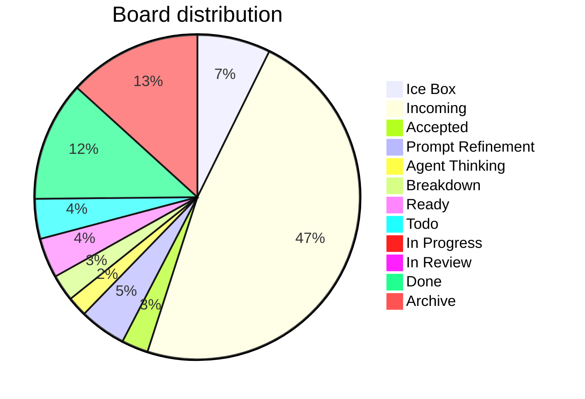

# Board Walk – 2025-08-11

**Assumptions** ^ref-7aa1eb92-3-0

* WIP limit (global Doing) = **3** (change if you want). ^ref-7aa1eb92-5-0
* Doing lanes (for now): **Prompt Refinement**, **Agent Thinking**, **Breakdown**, **In Progress**. ^ref-7aa1eb92-6-0
* Aging threshold: **> 2 days** in a Doing lane. ^ref-7aa1eb92-7-0

---

## Column counts (actual from pasted board)

| Column            | Count | ^ref-7aa1eb92-13-0
| ----------------- | ----- |
| Ice Box           | 11    |
| Incoming          | 72    |
| Accepted          | 4     |
| Prompt Refinement | 7     |
| Agent Thinking    | 3     |
| Breakdown         | 4     |
| Ready             | 6     |
| Todo              | 6     |
| In Progress       | 0     |
| In Review         | 1     |
| Done              | 18    |
| Archive           | 20    |

> Header ↔ actual mismatches detected: ^ref-7aa1eb92-28-0
>
> * **Accepted (8)** → has **4** items ^ref-7aa1eb92-30-0
> * **Prompt Refinement (24)** → has **7** items ^ref-7aa1eb92-31-0
> * **Agent Thinking (24)** → has **3** items
> * **Breakdown (16)** → has **4** items ^ref-7aa1eb92-33-0
> * **Ready (24)** → has **6** items
> * **Todo (16)** → has **6** items ^ref-7aa1eb92-35-0
> * **In Progress (8)** → has **0** items

^ref-7aa1eb92-38-0 ^ref-7aa1eb92-53-0

---

## Blockers

* No items tagged **#blocked** found in the paste.
 ^ref-7aa1eb92-60-0
> If any are blocked, add **#blocked** (and optionally a short reason), e.g., `#blocked:waiting-on-PR-123`.

---

## WIP check (Doing lanes)

* Current **Doing total** (Prompt Refinement + Agent Thinking + Breakdown + In Progress): **14**
* With WIP limit **3**, we’re **over**.
 ^ref-7aa1eb92-69-0
**Proposal**
 ^ref-7aa1eb92-71-0
* Confirm which lanes count as Doing. If all four above are Doing, pull back to **≤3** by:

  1. Moving non‑active cards back to **Ready**. ^ref-7aa1eb92-74-0
  2. Splitting any large Doing card into a small slice that can finish in ≤1 day; park the rest in Ready.

---

## Aging WIP (>2 days)
 ^ref-7aa1eb92-80-0
* Not evaluated: timestamps weren’t provided in the paste.
 ^ref-7aa1eb92-82-0
**Recommendation**
 ^ref-7aa1eb92-84-0
* Add `last_touched: YYYY‑MM‑DD` to frontmatter, or let me read file mtimes; then I’ll auto‑flag aging WIP.

---

## Next pull (single)
 ^ref-7aa1eb92-90-0
**Flow goal (stated recently):** extend WS message broker with **queue semantics** and connect services.
 ^ref-7aa1eb92-92-0
* **Best pull (promote from Incoming → Ready):** `[[add_manualack_to_event_bus_and_re_run_tests.md|Add manualAck to event bus and re-run tests]]` (unblocks reliable delivery & retries). ^ref-7aa1eb92-93-0
* **If restricted to current Ready only:** `[[Update makefile to have commands specific for agents.md|Update Makefile for agent commands]]` (quick win that improves daily flow) **or** `[[Mirror shared utils with language-specific doc folders.md]]` (reduces duplication before deeper queue work).
 ^ref-7aa1eb92-95-0
> Pick **one**. Everything else waits.

---

## Tag hygiene / normalization
 ^ref-7aa1eb92-101-0
You said you want **column-normalized** hashtags on tasks and files. Proposed canonical set:
 ^ref-7aa1eb92-103-0
* `#ice-box`, `#incoming`, `#accepted`, `#prompt-refinement`, `#agent-thinking`, `#breakdown`, `#ready`, `#todo`, `#in-progress`, `#in-review`, `#done`, `#archive`

**Findings**
 ^ref-7aa1eb92-107-0
* Many **Incoming** items are tagged `#todo`. Suggest adding **`#incoming`** (you can keep `#todo` if you like, but column tag should exist).
* Several **Accepted** items still carry `#todo`.
 ^ref-7aa1eb92-110-0
**Action**
 ^ref-7aa1eb92-112-0
* Run/finish the hashtag-normalizer so each card has both:
 ^ref-7aa1eb92-114-0
  1. the **column tag** (normalized), and ^ref-7aa1eb92-115-0
  2. any **status/phase** tag you want (e.g., `#todo`, `#accepted`).

---

## Quick decisions (checklist)

*

---

## Notes / Misc
 ^ref-7aa1eb92-127-0
* **In Progress** is empty—nice. Let’s keep it that way until we explicitly pull the next slice. ^ref-7aa1eb92-128-0
* Incoming is **72** items; consider a 10‑minute nightly triage to keep it from ballooning.<!-- GENERATED-SECTIONS:DO-NOT-EDIT-BELOW -->
## Related content
- [eidolon-field-math-foundations](eidolon-field-math-foundations.md)
- [field-dynamics-math-blocks](field-dynamics-math-blocks.md)
- [heartbeat-fragment-demo](heartbeat-fragment-demo.md)
- [field-interaction-equations](field-interaction-equations.md)
- [Board Automation Improvements](board-automation-improvements.md)
- [Git Commit Optimization for Code Reviews](git-commit-optimization-for-code-reviews.md)
- [run-step-api](run-step-api.md)
- [api-gateway-versioning](api-gateway-versioning.md)
- [AI-First-OS-Model-Context-Protocol](ai-first-os-model-context-protocol.md)
- [balanced-bst](balanced-bst.md)
- [Promethean Documentation Update](promethean-documentation-update-3.md)
- [Self-Improving Documentation Tool](self-improving-documentation-tool.md)
- [Math Fundamentals](chunks/math-fundamentals.md)
- [Creative Moments](creative-moments.md)
- [Promethean Chat Activity Report](promethean-chat-activity-report.md)
- [Promethean Dev Workflow Update](promethean-dev-workflow-update.md)
- [Promethean Documentation Update](promethean-documentation-update.txt)
- [Promethean Notes](promethean-notes.md)
- [The Jar of Echoes](the-jar-of-echoes.md)
- [Duck's Attractor States](ducks-attractor-states.md)
- [Functional Refactor of TypeScript Document Processing](functional-refactor-of-typescript-document-processing.md)
- [windows-tiling-with-autohotkey](windows-tiling-with-autohotkey.md)
- [Canonical Org-Babel Matplotlib Animation Template](canonical-org-babel-matplotlib-animation-template.md)
- [Pure TypeScript Search Microservice](pure-typescript-search-microservice.md)
- [schema-evolution-workflow](schema-evolution-workflow.md)
- [Stateful Partitions and Rebalancing](stateful-partitions-and-rebalancing.md)
- [Promethean Documentation Pipeline Overview](promethean-documentation-pipeline-overview.md)
- [TypeScript Patch for Tool Calling Support](typescript-patch-for-tool-calling-support.md)
- [AGENTS.md](agents-md.md)
- [Promethean Documentation Update](promethean-documentation-update.md)
- [Promethean Data Sync Protocol](promethean-data-sync-protocol.md)
- [Debugging Broker Connections and Agent Behavior](debugging-broker-connections-and-agent-behavior.md)
- [typed-struct-compiler](typed-struct-compiler.md)
- [Duck's Self-Referential Perceptual Loop](ducks-self-referential-perceptual-loop.md)
- [plan-update-confirmation](plan-update-confirmation.md)
- [Ice Box Reorganization](ice-box-reorganization.md)
- [graph-ds](graph-ds.md)
- [i3-bluetooth-setup](i3-bluetooth-setup.md)
- [Layer1SurvivabilityEnvelope](layer1survivabilityenvelope.md)
- [Promethean-Copilot-Intent-Engine](promethean-copilot-intent-engine.md)
- [Per-Domain Policy System for JS Crawler](per-domain-policy-system-for-js-crawler.md)
- [Factorio AI with External Agents](factorio-ai-with-external-agents.md)
- [DSL](chunks/dsl.md)
- [Operations](chunks/operations.md)
- [obsidian-ignore-node-modules-regex](obsidian-ignore-node-modules-regex.md)
- [Performance-Optimized-Polyglot-Bridge](performance-optimized-polyglot-bridge.md)
- [aionian-circuit-math](aionian-circuit-math.md)
- [Obsidian ChatGPT Plugin Integration](obsidian-chatgpt-plugin-integration.md)
- [Obsidian Task Generation](obsidian-task-generation.md)
- [Admin Dashboard for User Management](admin-dashboard-for-user-management.md)
- [ParticleSimulationWithCanvasAndFFmpeg](particlesimulationwithcanvasandffmpeg.md)
- [polyglot-repl-interface-layer](polyglot-repl-interface-layer.md)
- [Promethean State Format](promethean-state-format.md)
- [OpenAPI Validation Report](openapi-validation-report.md)
- [Optimizing Command Limitations in System Design](optimizing-command-limitations-in-system-design.md)
- [eidolon-node-lifecycle](eidolon-node-lifecycle.md)
- [Simulation Demo](chunks/simulation-demo.md)
- [Tooling](chunks/tooling.md)
- [Window Management](chunks/window-management.md)
- [DuckDuckGoSearchPipeline](duckduckgosearchpipeline.md)
- [Prometheus Observability Stack](prometheus-observability-stack.md)
- [Dynamic Context Model for Web Components](dynamic-context-model-for-web-components.md)
- [Promethean Infrastructure Setup](promethean-infrastructure-setup.md)
- [Docops Feature Updates](docops-feature-updates.md)
- [field-node-diagram-outline](field-node-diagram-outline.md)
- [field-node-diagram-set](field-node-diagram-set.md)
- [field-node-diagram-visualizations](field-node-diagram-visualizations.md)
- [Fnord Tracer Protocol](fnord-tracer-protocol.md)
- [Functional Embedding Pipeline Refactor](functional-embedding-pipeline-refactor.md)
- [komorebi-group-window-hack](komorebi-group-window-hack.md)
- [Model Selection for Lightweight Conversational Tasks](model-selection-for-lightweight-conversational-tasks.md)
- [Agent Reflections and Prompt Evolution](agent-reflections-and-prompt-evolution.md)
- [homeostasis-decay-formulas](homeostasis-decay-formulas.md)
- [JavaScript](chunks/javascript.md)
- [Unique Concepts](unique-concepts.md)
- [Unique Info Dump Index](unique-info-dump-index.md)
- [zero-copy-snapshots-and-workers](zero-copy-snapshots-and-workers.md)
- [Migrate to Provider-Tenant Architecture](migrate-to-provider-tenant-architecture.md)
- [Agent Tasks: Persistence Migration to DualStore](agent-tasks-persistence-migration-to-dualstore.md)
- [AGENTS.md](agents-md-3.md)
- [Diagrams](chunks/diagrams.md)
- [Model Upgrade Calm-Down Guide](model-upgrade-calm-down-guide.md)
- [Chroma Toolkit Consolidation Plan](chroma-toolkit-consolidation-plan.md)
- [promethean-requirements](promethean-requirements.md)
- [Provider-Agnostic Chat Panel Implementation](provider-agnostic-chat-panel-implementation.md)
- [Promethean Workflow Optimization](promethean-workflow-optimization.md)
- [Eidolon Field Abstract Model](eidolon-field-abstract-model.md)
- [Obsidian Templating Plugins Integration Guide](obsidian-templating-plugins-integration-guide.md)
- [Reawakening Duck](reawakening-duck.md)
- [sibilant-macro-targets](sibilant-macro-targets.md)
- [Redirecting Standard Error](redirecting-standard-error.md)
- [Self-Agency in AI Interaction](self-agency-in-ai-interaction.md)
- [polymorphic-meta-programming-engine](polymorphic-meta-programming-engine.md)
- [Local-Only-LLM-Workflow](local-only-llm-workflow.md)
- [Local-First Intention→Code Loop with Free Models](local-first-intention-code-loop-with-free-models.md)
- [Shared Package Structure](shared-package-structure.md)
- [Promethean-native config design](promethean-native-config-design.md)
- [ChatGPT Custom Prompts](chatgpt-custom-prompts.md)
- [Sibilant Meta-Prompt DSL](sibilant-meta-prompt-dsl.md)
## Sources
- [typed-struct-compiler — L1016](typed-struct-compiler.md#^ref-78eeedf7-1016-0) (line 1016, col 0, score 1)
- [Unique Concepts — L175](unique-concepts.md#^ref-ed6f3fc9-175-0) (line 175, col 0, score 1)
- [Unique Info Dump Index — L1221](unique-info-dump-index.md#^ref-30ec3ba6-1221-0) (line 1221, col 0, score 1)
- [zero-copy-snapshots-and-workers — L1058](zero-copy-snapshots-and-workers.md#^ref-62bec6f0-1058-0) (line 1058, col 0, score 1)
- [Canonical Org-Babel Matplotlib Animation Template — L515](canonical-org-babel-matplotlib-animation-template.md#^ref-1b1338fc-515-0) (line 515, col 0, score 1)
- [Creative Moments — L251](creative-moments.md#^ref-10d98225-251-0) (line 251, col 0, score 1)
- [Duck's Attractor States — L559](ducks-attractor-states.md#^ref-13951643-559-0) (line 559, col 0, score 1)
- [eidolon-field-math-foundations — L1033](eidolon-field-math-foundations.md#^ref-008f2ac0-1033-0) (line 1033, col 0, score 1)
- [Docops Feature Updates — L226](docops-feature-updates.md#^ref-2792d448-226-0) (line 226, col 0, score 1)
- [field-node-diagram-outline — L705](field-node-diagram-outline.md#^ref-1f32c94a-705-0) (line 705, col 0, score 1)
- [field-node-diagram-set — L719](field-node-diagram-set.md#^ref-22b989d5-719-0) (line 719, col 0, score 1)
- [field-node-diagram-visualizations — L601](field-node-diagram-visualizations.md#^ref-e9b27b06-601-0) (line 601, col 0, score 1)
- [Fnord Tracer Protocol — L1060](fnord-tracer-protocol.md#^ref-fc21f824-1060-0) (line 1060, col 0, score 1)
- [Functional Embedding Pipeline Refactor — L726](functional-embedding-pipeline-refactor.md#^ref-a4a25141-726-0) (line 726, col 0, score 1)
- [graph-ds — L996](graph-ds.md#^ref-6620e2f2-996-0) (line 996, col 0, score 1)
- [heartbeat-fragment-demo — L667](heartbeat-fragment-demo.md#^ref-dd00677a-667-0) (line 667, col 0, score 1)
- [i3-bluetooth-setup — L736](i3-bluetooth-setup.md#^ref-5e408692-736-0) (line 736, col 0, score 1)
- [Ice Box Reorganization — L645](ice-box-reorganization.md#^ref-291c7d91-645-0) (line 645, col 0, score 1)
- [komorebi-group-window-hack — L739](komorebi-group-window-hack.md#^ref-dd89372d-739-0) (line 739, col 0, score 1)
- [Layer1SurvivabilityEnvelope — L816](layer1survivabilityenvelope.md#^ref-64a9f9f9-816-0) (line 816, col 0, score 1)
- [Promethean Chat Activity Report — L1157](promethean-chat-activity-report.md#^ref-18344cf9-1157-0) (line 1157, col 0, score 0.96)
- [eidolon-field-math-foundations — L3097](eidolon-field-math-foundations.md#^ref-008f2ac0-3097-0) (line 3097, col 0, score 0.94)
- [The Jar of Echoes — L2827](the-jar-of-echoes.md#^ref-18138627-2827-0) (line 2827, col 0, score 0.94)
- [Canonical Org-Babel Matplotlib Animation Template — L2418](canonical-org-babel-matplotlib-animation-template.md#^ref-1b1338fc-2418-0) (line 2418, col 0, score 0.93)
- [windows-tiling-with-autohotkey — L2761](windows-tiling-with-autohotkey.md#^ref-0f6f8f38-2761-0) (line 2761, col 0, score 0.93)
- [Promethean Dev Workflow Update — L1359](promethean-dev-workflow-update.md#^ref-03a5578f-1359-0) (line 1359, col 0, score 0.93)
- [The Jar of Echoes — L1643](the-jar-of-echoes.md#^ref-18138627-1643-0) (line 1643, col 0, score 0.93)
- [windows-tiling-with-autohotkey — L1574](windows-tiling-with-autohotkey.md#^ref-0f6f8f38-1574-0) (line 1574, col 0, score 0.93)
- [TypeScript Patch for Tool Calling Support — L32](typescript-patch-for-tool-calling-support.md#^ref-7b7ca860-32-0) (line 32, col 0, score 1)
- [TypeScript Patch for Tool Calling Support — L88](typescript-patch-for-tool-calling-support.md#^ref-7b7ca860-88-0) (line 88, col 0, score 0.96)
- [TypeScript Patch for Tool Calling Support — L35](typescript-patch-for-tool-calling-support.md#^ref-7b7ca860-35-0) (line 35, col 0, score 0.93)
- [TypeScript Patch for Tool Calling Support — L110](typescript-patch-for-tool-calling-support.md#^ref-7b7ca860-110-0) (line 110, col 0, score 0.95)
- [TypeScript Patch for Tool Calling Support — L104](typescript-patch-for-tool-calling-support.md#^ref-7b7ca860-104-0) (line 104, col 0, score 0.93)
- [Local-Only-LLM-Workflow — L36](local-only-llm-workflow.md#^ref-9a8ab57e-36-0) (line 36, col 0, score 0.86)
- [polymorphic-meta-programming-engine — L112](polymorphic-meta-programming-engine.md#^ref-7bed0b9a-112-0) (line 112, col 0, score 0.91)
- [TypeScript Patch for Tool Calling Support — L115](typescript-patch-for-tool-calling-support.md#^ref-7b7ca860-115-0) (line 115, col 0, score 0.95)
- [run-step-api — L819](run-step-api.md#^ref-15d25922-819-0) (line 819, col 0, score 0.96)
- [Admin Dashboard for User Management — L45](admin-dashboard-for-user-management.md#^ref-2901a3e9-45-0) (line 45, col 0, score 1)
- [TypeScript Patch for Tool Calling Support — L560](typescript-patch-for-tool-calling-support.md#^ref-7b7ca860-560-0) (line 560, col 0, score 1)
- [Agent Reflections and Prompt Evolution — L187](agent-reflections-and-prompt-evolution.md#^ref-bb7f0835-187-0) (line 187, col 0, score 1)
- [JavaScript — L66](chunks/javascript.md#^ref-c1618c66-66-0) (line 66, col 0, score 1)
- [field-node-diagram-outline — L186](field-node-diagram-outline.md#^ref-1f32c94a-186-0) (line 186, col 0, score 1)
- [field-node-diagram-set — L212](field-node-diagram-set.md#^ref-22b989d5-212-0) (line 212, col 0, score 1)
- [field-node-diagram-visualizations — L162](field-node-diagram-visualizations.md#^ref-e9b27b06-162-0) (line 162, col 0, score 1)
- [heartbeat-fragment-demo — L191](heartbeat-fragment-demo.md#^ref-dd00677a-191-0) (line 191, col 0, score 1)
- [homeostasis-decay-formulas — L233](homeostasis-decay-formulas.md#^ref-37b5d236-233-0) (line 233, col 0, score 1)
- [Ice Box Reorganization — L129](ice-box-reorganization.md#^ref-291c7d91-129-0) (line 129, col 0, score 1)
- [Model Selection for Lightweight Conversational Tasks — L212](model-selection-for-lightweight-conversational-tasks.md#^ref-d144aa62-212-0) (line 212, col 0, score 1)
- [TypeScript Patch for Tool Calling Support — L559](typescript-patch-for-tool-calling-support.md#^ref-7b7ca860-559-0) (line 559, col 0, score 1)
- [obsidian-ignore-node-modules-regex — L119](obsidian-ignore-node-modules-regex.md#^ref-ffb9b2a9-119-0) (line 119, col 0, score 1)
- [ParticleSimulationWithCanvasAndFFmpeg — L315](particlesimulationwithcanvasandffmpeg.md#^ref-e018dd7a-315-0) (line 315, col 0, score 1)
- [Per-Domain Policy System for JS Crawler — L548](per-domain-policy-system-for-js-crawler.md#^ref-c03020e1-548-0) (line 548, col 0, score 1)
- [Performance-Optimized-Polyglot-Bridge — L496](performance-optimized-polyglot-bridge.md#^ref-f5579967-496-0) (line 496, col 0, score 1)
- [polyglot-repl-interface-layer — L224](polyglot-repl-interface-layer.md#^ref-9c79206d-224-0) (line 224, col 0, score 1)
- [Promethean-Copilot-Intent-Engine — L125](promethean-copilot-intent-engine.md#^ref-ae24a280-125-0) (line 125, col 0, score 1)
- [Promethean State Format — L165](promethean-state-format.md#^ref-23df6ddb-165-0) (line 165, col 0, score 1)
- [Pure TypeScript Search Microservice — L598](pure-typescript-search-microservice.md#^ref-d17d3a96-598-0) (line 598, col 0, score 1)
- [Stateful Partitions and Rebalancing — L605](stateful-partitions-and-rebalancing.md#^ref-4330e8f0-605-0) (line 605, col 0, score 1)
- [typed-struct-compiler — L393](typed-struct-compiler.md#^ref-78eeedf7-393-0) (line 393, col 0, score 1)
- [TypeScript Patch for Tool Calling Support — L567](typescript-patch-for-tool-calling-support.md#^ref-7b7ca860-567-0) (line 567, col 0, score 1)
- [Duck's Self-Referential Perceptual Loop — L92](ducks-self-referential-perceptual-loop.md#^ref-71726f04-92-0) (line 92, col 0, score 1)
- [Obsidian ChatGPT Plugin Integration — L75](obsidian-chatgpt-plugin-integration.md#^ref-ca8e1399-75-0) (line 75, col 0, score 1)
- [Obsidian Task Generation — L72](obsidian-task-generation.md#^ref-9b694a91-72-0) (line 72, col 0, score 1)
- [OpenAPI Validation Report — L89](openapi-validation-report.md#^ref-5c152b08-89-0) (line 89, col 0, score 1)
- [Optimizing Command Limitations in System Design — L125](optimizing-command-limitations-in-system-design.md#^ref-98c8ff62-125-0) (line 125, col 0, score 1)
- [plan-update-confirmation — L1054](plan-update-confirmation.md#^ref-b22d79c6-1054-0) (line 1054, col 0, score 1)
- [Promethean Chat Activity Report — L84](promethean-chat-activity-report.md#^ref-18344cf9-84-0) (line 84, col 0, score 1)
- [aionian-circuit-math — L149](aionian-circuit-math.md#^ref-f2d83a77-149-0) (line 149, col 0, score 1)
- [api-gateway-versioning — L285](api-gateway-versioning.md#^ref-0580dcd3-285-0) (line 285, col 0, score 1)
- [Board Automation Improvements — L11](board-automation-improvements.md#^ref-ac60a1d6-11-0) (line 11, col 0, score 1)
- [field-dynamics-math-blocks — L193](field-dynamics-math-blocks.md#^ref-7cfc230d-193-0) (line 193, col 0, score 1)
- [field-node-diagram-set — L203](field-node-diagram-set.md#^ref-22b989d5-203-0) (line 203, col 0, score 1)
- [field-node-diagram-visualizations — L151](field-node-diagram-visualizations.md#^ref-e9b27b06-151-0) (line 151, col 0, score 1)
- [Functional Refactor of TypeScript Document Processing — L281](functional-refactor-of-typescript-document-processing.md#^ref-1cfae310-281-0) (line 281, col 0, score 1)
- [heartbeat-fragment-demo — L181](heartbeat-fragment-demo.md#^ref-dd00677a-181-0) (line 181, col 0, score 1)
- [homeostasis-decay-formulas — L220](homeostasis-decay-formulas.md#^ref-37b5d236-220-0) (line 220, col 0, score 1)
- [Ice Box Reorganization — L110](ice-box-reorganization.md#^ref-291c7d91-110-0) (line 110, col 0, score 1)
- [obsidian-ignore-node-modules-regex — L118](obsidian-ignore-node-modules-regex.md#^ref-ffb9b2a9-118-0) (line 118, col 0, score 1)
- [ParticleSimulationWithCanvasAndFFmpeg — L329](particlesimulationwithcanvasandffmpeg.md#^ref-e018dd7a-329-0) (line 329, col 0, score 1)
- [AI-First-OS-Model-Context-Protocol — L11](ai-first-os-model-context-protocol.md#^ref-618198f4-11-0) (line 11, col 0, score 1)
- [aionian-circuit-math — L151](aionian-circuit-math.md#^ref-f2d83a77-151-0) (line 151, col 0, score 1)
- [aionian-circuit-math — L152](aionian-circuit-math.md#^ref-f2d83a77-152-0) (line 152, col 0, score 1)
- [api-gateway-versioning — L286](api-gateway-versioning.md#^ref-0580dcd3-286-0) (line 286, col 0, score 1)
- [api-gateway-versioning — L288](api-gateway-versioning.md#^ref-0580dcd3-288-0) (line 288, col 0, score 1)
- [balanced-bst — L299](balanced-bst.md#^ref-d3e7db72-299-0) (line 299, col 0, score 1)
- [Board Automation Improvements — L12](board-automation-improvements.md#^ref-ac60a1d6-12-0) (line 12, col 0, score 1)
- [Promethean Documentation Update — L35](promethean-documentation-update-3.md#^ref-de34f84b-35-0) (line 35, col 0, score 1)
- [eidolon-node-lifecycle — L57](eidolon-node-lifecycle.md#^ref-938eca9c-57-0) (line 57, col 0, score 1)
- [i3-bluetooth-setup — L124](i3-bluetooth-setup.md#^ref-5e408692-124-0) (line 124, col 0, score 1)
- [Ice Box Reorganization — L81](ice-box-reorganization.md#^ref-291c7d91-81-0) (line 81, col 0, score 1)
- [Layer1SurvivabilityEnvelope — L183](layer1survivabilityenvelope.md#^ref-64a9f9f9-183-0) (line 183, col 0, score 1)
- [DSL — L69](chunks/dsl.md#^ref-e87bc036-69-0) (line 69, col 0, score 1)
- [Operations — L36](chunks/operations.md#^ref-f1add613-36-0) (line 36, col 0, score 1)
- [Simulation Demo — L46](chunks/simulation-demo.md#^ref-557309a3-46-0) (line 46, col 0, score 1)
- [Tooling — L40](chunks/tooling.md#^ref-6cb4943e-40-0) (line 40, col 0, score 1)
- [Window Management — L53](chunks/window-management.md#^ref-9e8ae388-53-0) (line 53, col 0, score 1)
- [Creative Moments — L33](creative-moments.md#^ref-10d98225-33-0) (line 33, col 0, score 1)
- [api-gateway-versioning — L287](api-gateway-versioning.md#^ref-0580dcd3-287-0) (line 287, col 0, score 1)
- [balanced-bst — L302](balanced-bst.md#^ref-d3e7db72-302-0) (line 302, col 0, score 1)
- [Board Automation Improvements — L15](board-automation-improvements.md#^ref-ac60a1d6-15-0) (line 15, col 0, score 1)
- [Pure TypeScript Search Microservice — L593](pure-typescript-search-microservice.md#^ref-d17d3a96-593-0) (line 593, col 0, score 1)
- [schema-evolution-workflow — L561](schema-evolution-workflow.md#^ref-d8059b6a-561-0) (line 561, col 0, score 1)
- [Stateful Partitions and Rebalancing — L607](stateful-partitions-and-rebalancing.md#^ref-4330e8f0-607-0) (line 607, col 0, score 1)
- [TypeScript Patch for Tool Calling Support — L548](typescript-patch-for-tool-calling-support.md#^ref-7b7ca860-548-0) (line 548, col 0, score 1)
- [Promethean Chat Activity Report — L50](promethean-chat-activity-report.md#^ref-18344cf9-50-0) (line 50, col 0, score 1)
- [Promethean Data Sync Protocol — L28](promethean-data-sync-protocol.md#^ref-9fab9e76-28-0) (line 28, col 0, score 1)
- [Promethean Documentation Pipeline Overview — L232](promethean-documentation-pipeline-overview.md#^ref-3a3bf2c9-232-0) (line 232, col 0, score 1)
- [Promethean Documentation Update — L29](promethean-documentation-update.md#^ref-c0392040-29-0) (line 29, col 0, score 1)
- [plan-update-confirmation — L1342](plan-update-confirmation.md#^ref-b22d79c6-1342-0) (line 1342, col 0, score 1)
- [balanced-bst — L345](balanced-bst.md#^ref-d3e7db72-345-0) (line 345, col 0, score 0.95)
- [Factorio AI with External Agents — L546](factorio-ai-with-external-agents.md#^ref-a4d90289-546-0) (line 546, col 0, score 0.95)
- [balanced-bst — L383](balanced-bst.md#^ref-d3e7db72-383-0) (line 383, col 0, score 1)
- [Creative Moments — L1333](creative-moments.md#^ref-10d98225-1333-0) (line 1333, col 0, score 1)
- [Duck's Attractor States — L2911](ducks-attractor-states.md#^ref-13951643-2911-0) (line 2911, col 0, score 1)
- [The Jar of Echoes — L3603](the-jar-of-echoes.md#^ref-18138627-3603-0) (line 3603, col 0, score 1)
- [Canonical Org-Babel Matplotlib Animation Template — L1138](canonical-org-babel-matplotlib-animation-template.md#^ref-1b1338fc-1138-0) (line 1138, col 0, score 0.95)
- [aionian-circuit-math — L234](aionian-circuit-math.md#^ref-f2d83a77-234-0) (line 234, col 0, score 0.98)
- [Promethean Dev Workflow Update — L2140](promethean-dev-workflow-update.md#^ref-03a5578f-2140-0) (line 2140, col 0, score 0.98)
- [eidolon-field-math-foundations — L2554](eidolon-field-math-foundations.md#^ref-008f2ac0-2554-0) (line 2554, col 0, score 0.99)
- [The Jar of Echoes — L2728](the-jar-of-echoes.md#^ref-18138627-2728-0) (line 2728, col 0, score 0.99)
- [api-gateway-versioning — L293](api-gateway-versioning.md#^ref-0580dcd3-293-0) (line 293, col 0, score 1)
- [balanced-bst — L315](balanced-bst.md#^ref-d3e7db72-315-0) (line 315, col 0, score 1)
- [Board Automation Improvements — L27](board-automation-improvements.md#^ref-ac60a1d6-27-0) (line 27, col 0, score 1)
- [Creative Moments — L176](creative-moments.md#^ref-10d98225-176-0) (line 176, col 0, score 1)
- [Duck's Attractor States — L366](ducks-attractor-states.md#^ref-13951643-366-0) (line 366, col 0, score 1)
- [Factorio AI with External Agents — L632](factorio-ai-with-external-agents.md#^ref-a4d90289-632-0) (line 632, col 0, score 1)
- [AI-First-OS-Model-Context-Protocol — L381](ai-first-os-model-context-protocol.md#^ref-618198f4-381-0) (line 381, col 0, score 0.99)
- [Promethean Dev Workflow Update — L2150](promethean-dev-workflow-update.md#^ref-03a5578f-2150-0) (line 2150, col 0, score 0.99)
- [windows-tiling-with-autohotkey — L3103](windows-tiling-with-autohotkey.md#^ref-0f6f8f38-3103-0) (line 3103, col 0, score 0.99)
- [AI-First-OS-Model-Context-Protocol — L278](ai-first-os-model-context-protocol.md#^ref-618198f4-278-0) (line 278, col 0, score 0.97)
- [AI-First-OS-Model-Context-Protocol — L205](ai-first-os-model-context-protocol.md#^ref-618198f4-205-0) (line 205, col 0, score 0.97)
- [AGENTS.md — L233](agents-md.md#^ref-bb90903a-233-0) (line 233, col 0, score 0.97)
- [AI-First-OS-Model-Context-Protocol — L317](ai-first-os-model-context-protocol.md#^ref-618198f4-317-0) (line 317, col 0, score 0.97)
- [AGENTS.md — L227](agents-md.md#^ref-bb90903a-227-0) (line 227, col 0, score 0.97)
- [AI-First-OS-Model-Context-Protocol — L274](ai-first-os-model-context-protocol.md#^ref-618198f4-274-0) (line 274, col 0, score 0.96)
- [windows-tiling-with-autohotkey — L2295](windows-tiling-with-autohotkey.md#^ref-0f6f8f38-2295-0) (line 2295, col 0, score 1)
- [AI-First-OS-Model-Context-Protocol — L400](ai-first-os-model-context-protocol.md#^ref-618198f4-400-0) (line 400, col 0, score 1)
- [The Jar of Echoes — L3142](the-jar-of-echoes.md#^ref-18138627-3142-0) (line 3142, col 0, score 0.99)
- [AI-First-OS-Model-Context-Protocol — L403](ai-first-os-model-context-protocol.md#^ref-618198f4-403-0) (line 403, col 0, score 1)
- [eidolon-field-math-foundations — L4029](eidolon-field-math-foundations.md#^ref-008f2ac0-4029-0) (line 4029, col 0, score 0.99)
- [windows-tiling-with-autohotkey — L3151](windows-tiling-with-autohotkey.md#^ref-0f6f8f38-3151-0) (line 3151, col 0, score 0.99)
- [eidolon-field-math-foundations — L4320](eidolon-field-math-foundations.md#^ref-008f2ac0-4320-0) (line 4320, col 0, score 0.95)
- [windows-tiling-with-autohotkey — L2966](windows-tiling-with-autohotkey.md#^ref-0f6f8f38-2966-0) (line 2966, col 0, score 0.96)
- [aionian-circuit-math — L235](aionian-circuit-math.md#^ref-f2d83a77-235-0) (line 235, col 0, score 1)
- [Promethean Dev Workflow Update — L2363](promethean-dev-workflow-update.md#^ref-03a5578f-2363-0) (line 2363, col 0, score 1)
- [Promethean Dev Workflow Update — L3566](promethean-dev-workflow-update.md#^ref-03a5578f-3566-0) (line 3566, col 0, score 0.98)
- [eidolon-field-math-foundations — L3953](eidolon-field-math-foundations.md#^ref-008f2ac0-3953-0) (line 3953, col 0, score 0.98)
- [Canonical Org-Babel Matplotlib Animation Template — L2134](canonical-org-babel-matplotlib-animation-template.md#^ref-1b1338fc-2134-0) (line 2134, col 0, score 1)
- [AI-First-OS-Model-Context-Protocol — L401](ai-first-os-model-context-protocol.md#^ref-618198f4-401-0) (line 401, col 0, score 0.96)
- [eidolon-field-math-foundations — L4278](eidolon-field-math-foundations.md#^ref-008f2ac0-4278-0) (line 4278, col 0, score 0.97)
- [eidolon-field-math-foundations — L4295](eidolon-field-math-foundations.md#^ref-008f2ac0-4295-0) (line 4295, col 0, score 0.97)
- [eidolon-field-math-foundations — L4312](eidolon-field-math-foundations.md#^ref-008f2ac0-4312-0) (line 4312, col 0, score 0.97)
- [Canonical Org-Babel Matplotlib Animation Template — L3133](canonical-org-babel-matplotlib-animation-template.md#^ref-1b1338fc-3133-0) (line 3133, col 0, score 0.96)
- [Duck's Attractor States — L3101](ducks-attractor-states.md#^ref-13951643-3101-0) (line 3101, col 0, score 0.96)
- [eidolon-field-math-foundations — L4287](eidolon-field-math-foundations.md#^ref-008f2ac0-4287-0) (line 4287, col 0, score 0.96)
- [ParticleSimulationWithCanvasAndFFmpeg — L907](particlesimulationwithcanvasandffmpeg.md#^ref-e018dd7a-907-0) (line 907, col 0, score 0.93)
- [Provider-Agnostic Chat Panel Implementation — L709](provider-agnostic-chat-panel-implementation.md#^ref-43bfe9dd-709-0) (line 709, col 0, score 0.93)
- [Pure TypeScript Search Microservice — L1041](pure-typescript-search-microservice.md#^ref-d17d3a96-1041-0) (line 1041, col 0, score 0.93)
- [Reawakening Duck — L534](reawakening-duck.md#^ref-59b5670f-534-0) (line 534, col 0, score 0.93)
- [Redirecting Standard Error — L204](redirecting-standard-error.md#^ref-b3555ede-204-0) (line 204, col 0, score 0.93)
- [schema-evolution-workflow — L1245](schema-evolution-workflow.md#^ref-d8059b6a-1245-0) (line 1245, col 0, score 0.93)
- [Self-Agency in AI Interaction — L333](self-agency-in-ai-interaction.md#^ref-49a9a860-333-0) (line 333, col 0, score 0.93)
- [sibilant-macro-targets — L903](sibilant-macro-targets.md#^ref-c5c9a5c6-903-0) (line 903, col 0, score 0.93)
- [Stateful Partitions and Rebalancing — L1253](stateful-partitions-and-rebalancing.md#^ref-4330e8f0-1253-0) (line 1253, col 0, score 0.93)
- [AI-First-OS-Model-Context-Protocol — L402](ai-first-os-model-context-protocol.md#^ref-618198f4-402-0) (line 402, col 0, score 0.98)
- [eidolon-field-math-foundations — L3876](eidolon-field-math-foundations.md#^ref-008f2ac0-3876-0) (line 3876, col 0, score 0.97)
- [AI-First-OS-Model-Context-Protocol — L163](ai-first-os-model-context-protocol.md#^ref-618198f4-163-0) (line 163, col 0, score 0.97)
- [AI-First-OS-Model-Context-Protocol — L242](ai-first-os-model-context-protocol.md#^ref-618198f4-242-0) (line 242, col 0, score 0.96)
- [AI-First-OS-Model-Context-Protocol — L327](ai-first-os-model-context-protocol.md#^ref-618198f4-327-0) (line 327, col 0, score 0.97)
- [The Jar of Echoes — L2629](the-jar-of-echoes.md#^ref-18138627-2629-0) (line 2629, col 0, score 0.96)
- [AI-First-OS-Model-Context-Protocol — L27](ai-first-os-model-context-protocol.md#^ref-618198f4-27-0) (line 27, col 0, score 0.97)
- [AI-First-OS-Model-Context-Protocol — L335](ai-first-os-model-context-protocol.md#^ref-618198f4-335-0) (line 335, col 0, score 0.96)
- [AI-First-OS-Model-Context-Protocol — L380](ai-first-os-model-context-protocol.md#^ref-618198f4-380-0) (line 380, col 0, score 1)
- [windows-tiling-with-autohotkey — L2878](windows-tiling-with-autohotkey.md#^ref-0f6f8f38-2878-0) (line 2878, col 0, score 1)
- [AGENTS.md — L242](agents-md.md#^ref-bb90903a-242-0) (line 242, col 0, score 0.97)
- [AI-First-OS-Model-Context-Protocol — L75](ai-first-os-model-context-protocol.md#^ref-618198f4-75-0) (line 75, col 0, score 0.97)
- [eidolon-field-math-foundations — L3372](eidolon-field-math-foundations.md#^ref-008f2ac0-3372-0) (line 3372, col 0, score 0.97)
- [AI-First-OS-Model-Context-Protocol — L158](ai-first-os-model-context-protocol.md#^ref-618198f4-158-0) (line 158, col 0, score 0.97)
- [eidolon-field-math-foundations — L2388](eidolon-field-math-foundations.md#^ref-008f2ac0-2388-0) (line 2388, col 0, score 0.97)
- [AI-First-OS-Model-Context-Protocol — L80](ai-first-os-model-context-protocol.md#^ref-618198f4-80-0) (line 80, col 0, score 0.96)
- [AI-First-OS-Model-Context-Protocol — L101](ai-first-os-model-context-protocol.md#^ref-618198f4-101-0) (line 101, col 0, score 0.97)
- [AI-First-OS-Model-Context-Protocol — L57](ai-first-os-model-context-protocol.md#^ref-618198f4-57-0) (line 57, col 0, score 0.96)
- [Duck's Attractor States — L3978](ducks-attractor-states.md#^ref-13951643-3978-0) (line 3978, col 0, score 0.96)
- [AI-First-OS-Model-Context-Protocol — L379](ai-first-os-model-context-protocol.md#^ref-618198f4-379-0) (line 379, col 0, score 1)
- [Canonical Org-Babel Matplotlib Animation Template — L518](canonical-org-babel-matplotlib-animation-template.md#^ref-1b1338fc-518-0) (line 518, col 0, score 1)
- [AI-First-OS-Model-Context-Protocol — L175](ai-first-os-model-context-protocol.md#^ref-618198f4-175-0) (line 175, col 0, score 0.96)
- [AI-First-OS-Model-Context-Protocol — L174](ai-first-os-model-context-protocol.md#^ref-618198f4-174-0) (line 174, col 0, score 0.96)
- [AI-First-OS-Model-Context-Protocol — L236](ai-first-os-model-context-protocol.md#^ref-618198f4-236-0) (line 236, col 0, score 0.96)
- [AGENTS.md — L234](agents-md.md#^ref-bb90903a-234-0) (line 234, col 0, score 0.96)
- [AI-First-OS-Model-Context-Protocol — L126](ai-first-os-model-context-protocol.md#^ref-618198f4-126-0) (line 126, col 0, score 0.95)
- [AI-First-OS-Model-Context-Protocol — L118](ai-first-os-model-context-protocol.md#^ref-618198f4-118-0) (line 118, col 0, score 0.95)
- [Promethean Notes — L998](promethean-notes.md#^ref-1c4046b5-998-0) (line 998, col 0, score 1)
- [The Jar of Echoes — L1507](the-jar-of-echoes.md#^ref-18138627-1507-0) (line 1507, col 0, score 1)
- [windows-tiling-with-autohotkey — L1006](windows-tiling-with-autohotkey.md#^ref-0f6f8f38-1006-0) (line 1006, col 0, score 1)
- [Functional Refactor of TypeScript Document Processing — L730](functional-refactor-of-typescript-document-processing.md#^ref-1cfae310-730-0) (line 730, col 0, score 1)
- [Promethean Chat Activity Report — L752](promethean-chat-activity-report.md#^ref-18344cf9-752-0) (line 752, col 0, score 1)
- [Promethean Dev Workflow Update — L1060](promethean-dev-workflow-update.md#^ref-03a5578f-1060-0) (line 1060, col 0, score 1)
- [Promethean Documentation Update — L699](promethean-documentation-update.txt#^ref-0b872af2-699-0) (line 699, col 0, score 1)
- [Promethean Notes — L730](promethean-notes.md#^ref-1c4046b5-730-0) (line 730, col 0, score 1)
- [The Jar of Echoes — L1004](the-jar-of-echoes.md#^ref-18138627-1004-0) (line 1004, col 0, score 1)
- [eidolon-field-math-foundations — L1228](eidolon-field-math-foundations.md#^ref-008f2ac0-1228-0) (line 1228, col 0, score 1)
- [Functional Refactor of TypeScript Document Processing — L822](functional-refactor-of-typescript-document-processing.md#^ref-1cfae310-822-0) (line 822, col 0, score 1)
- [Promethean Chat Activity Report — L1062](promethean-chat-activity-report.md#^ref-18344cf9-1062-0) (line 1062, col 0, score 1)
- [Promethean Dev Workflow Update — L763](promethean-dev-workflow-update.md#^ref-03a5578f-763-0) (line 763, col 0, score 1)
- [Promethean Notes — L999](promethean-notes.md#^ref-1c4046b5-999-0) (line 999, col 0, score 1)
- [The Jar of Echoes — L1508](the-jar-of-echoes.md#^ref-18138627-1508-0) (line 1508, col 0, score 1)
- [windows-tiling-with-autohotkey — L1007](windows-tiling-with-autohotkey.md#^ref-0f6f8f38-1007-0) (line 1007, col 0, score 1)
- [Canonical Org-Babel Matplotlib Animation Template — L921](canonical-org-babel-matplotlib-animation-template.md#^ref-1b1338fc-921-0) (line 921, col 0, score 0.95)
- [eidolon-field-math-foundations — L1453](eidolon-field-math-foundations.md#^ref-008f2ac0-1453-0) (line 1453, col 0, score 1)
- [Functional Refactor of TypeScript Document Processing — L691](functional-refactor-of-typescript-document-processing.md#^ref-1cfae310-691-0) (line 691, col 0, score 1)
- [Promethean Chat Activity Report — L723](promethean-chat-activity-report.md#^ref-18344cf9-723-0) (line 723, col 0, score 1)
- [Promethean Dev Workflow Update — L666](promethean-dev-workflow-update.md#^ref-03a5578f-666-0) (line 666, col 0, score 1)
- [Promethean Documentation Update — L671](promethean-documentation-update.txt#^ref-0b872af2-671-0) (line 671, col 0, score 1)
- [windows-tiling-with-autohotkey — L918](windows-tiling-with-autohotkey.md#^ref-0f6f8f38-918-0) (line 918, col 0, score 1)
- [Canonical Org-Babel Matplotlib Animation Template — L920](canonical-org-babel-matplotlib-animation-template.md#^ref-1b1338fc-920-0) (line 920, col 0, score 0.95)
- [Duck's Attractor States — L1178](ducks-attractor-states.md#^ref-13951643-1178-0) (line 1178, col 0, score 0.95)
- [Admin Dashboard for User Management — L478](admin-dashboard-for-user-management.md#^ref-2901a3e9-478-0) (line 478, col 0, score 1)
- [Debugging Broker Connections and Agent Behavior — L455](debugging-broker-connections-and-agent-behavior.md#^ref-73d3dbf6-455-0) (line 455, col 0, score 1)
- [DuckDuckGoSearchPipeline — L123](duckduckgosearchpipeline.md#^ref-e979c50f-123-0) (line 123, col 0, score 1)
- [graph-ds — L829](graph-ds.md#^ref-6620e2f2-829-0) (line 829, col 0, score 1)
- [AI-First-OS-Model-Context-Protocol — L15](ai-first-os-model-context-protocol.md#^ref-618198f4-15-0) (line 15, col 0, score 1)
- [balanced-bst — L316](balanced-bst.md#^ref-d3e7db72-316-0) (line 316, col 0, score 1)
- [Board Automation Improvements — L28](board-automation-improvements.md#^ref-ac60a1d6-28-0) (line 28, col 0, score 1)
- [AGENTS.md — L191](agents-md.md#^ref-bb90903a-191-0) (line 191, col 0, score 1)
- [Debugging Broker Connections and Agent Behavior — L198](debugging-broker-connections-and-agent-behavior.md#^ref-73d3dbf6-198-0) (line 198, col 0, score 0.99)
- [aionian-circuit-math — L167](aionian-circuit-math.md#^ref-f2d83a77-167-0) (line 167, col 0, score 0.99)
- [AGENTS.md — L331](agents-md-3.md#^ref-d5b16703-331-0) (line 331, col 0, score 0.99)
- [Diagrams — L427](chunks/diagrams.md#^ref-45cd25b5-427-0) (line 427, col 0, score 0.99)
- [DSL — L442](chunks/dsl.md#^ref-e87bc036-442-0) (line 442, col 0, score 0.99)
- [AI-First-OS-Model-Context-Protocol — L16](ai-first-os-model-context-protocol.md#^ref-618198f4-16-0) (line 16, col 0, score 1)
- [api-gateway-versioning — L294](api-gateway-versioning.md#^ref-0580dcd3-294-0) (line 294, col 0, score 1)
- [balanced-bst — L317](balanced-bst.md#^ref-d3e7db72-317-0) (line 317, col 0, score 1)
- [Board Automation Improvements — L29](board-automation-improvements.md#^ref-ac60a1d6-29-0) (line 29, col 0, score 1)
- [Git Commit Optimization for Code Reviews — L166](git-commit-optimization-for-code-reviews.md#^ref-72e4fd3c-166-0) (line 166, col 0, score 1)
- [Promethean Documentation Update — L42](promethean-documentation-update-3.md#^ref-de34f84b-42-0) (line 42, col 0, score 1)
- [run-step-api — L1033](run-step-api.md#^ref-15d25922-1033-0) (line 1033, col 0, score 1)
- [Self-Improving Documentation Tool — L29](self-improving-documentation-tool.md#^ref-5c307293-29-0) (line 29, col 0, score 1)
- [api-gateway-versioning — L295](api-gateway-versioning.md#^ref-0580dcd3-295-0) (line 295, col 0, score 1)
- [balanced-bst — L305](balanced-bst.md#^ref-d3e7db72-305-0) (line 305, col 0, score 1)
- [Board Automation Improvements — L18](board-automation-improvements.md#^ref-ac60a1d6-18-0) (line 18, col 0, score 1)
- [Math Fundamentals — L134](chunks/math-fundamentals.md#^ref-c6e87433-134-0) (line 134, col 0, score 1)
- [eidolon-field-math-foundations — L592](eidolon-field-math-foundations.md#^ref-008f2ac0-592-0) (line 592, col 0, score 1)
- [field-dynamics-math-blocks — L658](field-dynamics-math-blocks.md#^ref-7cfc230d-658-0) (line 658, col 0, score 1)
- [field-interaction-equations — L683](field-interaction-equations.md#^ref-b09141b7-683-0) (line 683, col 0, score 1)
- [heartbeat-fragment-demo — L407](heartbeat-fragment-demo.md#^ref-dd00677a-407-0) (line 407, col 0, score 1)
- [aionian-circuit-math — L160](aionian-circuit-math.md#^ref-f2d83a77-160-0) (line 160, col 0, score 1)
- [balanced-bst — L306](balanced-bst.md#^ref-d3e7db72-306-0) (line 306, col 0, score 1)
- [Board Automation Improvements — L19](board-automation-improvements.md#^ref-ac60a1d6-19-0) (line 19, col 0, score 1)
- [Debugging Broker Connections and Agent Behavior — L426](debugging-broker-connections-and-agent-behavior.md#^ref-73d3dbf6-426-0) (line 426, col 0, score 1)
- [Dynamic Context Model for Web Components — L1534](dynamic-context-model-for-web-components.md#^ref-f7702bf8-1534-0) (line 1534, col 0, score 1)
- [Promethean-Copilot-Intent-Engine — L610](promethean-copilot-intent-engine.md#^ref-ae24a280-610-0) (line 610, col 0, score 1)
- [Promethean Infrastructure Setup — L1262](promethean-infrastructure-setup.md#^ref-6deed6ac-1262-0) (line 1262, col 0, score 1)
- [Prometheus Observability Stack — L863](prometheus-observability-stack.md#^ref-e90b5a16-863-0) (line 863, col 0, score 1)
- [Eidolon Field Abstract Model — L658](eidolon-field-abstract-model.md#^ref-5e8b2388-658-0) (line 658, col 0, score 0.95)
- [Ice Box Reorganization — L423](ice-box-reorganization.md#^ref-291c7d91-423-0) (line 423, col 0, score 0.95)
- [Layer1SurvivabilityEnvelope — L642](layer1survivabilityenvelope.md#^ref-64a9f9f9-642-0) (line 642, col 0, score 0.95)
- [Migrate to Provider-Tenant Architecture — L1272](migrate-to-provider-tenant-architecture.md#^ref-54382370-1272-0) (line 1272, col 0, score 0.95)
- [Debugging Broker Connections and Agent Behavior — L507](debugging-broker-connections-and-agent-behavior.md#^ref-73d3dbf6-507-0) (line 507, col 0, score 0.94)
- [Dynamic Context Model for Web Components — L1597](dynamic-context-model-for-web-components.md#^ref-f7702bf8-1597-0) (line 1597, col 0, score 0.94)
- [eidolon-field-math-foundations — L1002](eidolon-field-math-foundations.md#^ref-008f2ac0-1002-0) (line 1002, col 0, score 0.94)
- [Fnord Tracer Protocol — L966](fnord-tracer-protocol.md#^ref-fc21f824-966-0) (line 966, col 0, score 0.94)
- [heartbeat-fragment-demo — L605](heartbeat-fragment-demo.md#^ref-dd00677a-605-0) (line 605, col 0, score 0.94)
- [balanced-bst — L308](balanced-bst.md#^ref-d3e7db72-308-0) (line 308, col 0, score 1)
- [Board Automation Improvements — L21](board-automation-improvements.md#^ref-ac60a1d6-21-0) (line 21, col 0, score 1)
- [aionian-circuit-math — L161](aionian-circuit-math.md#^ref-f2d83a77-161-0) (line 161, col 0, score 1)
- [Performance-Optimized-Polyglot-Bridge — L708](performance-optimized-polyglot-bridge.md#^ref-f5579967-708-0) (line 708, col 0, score 0.99)
- [Model Upgrade Calm-Down Guide — L289](model-upgrade-calm-down-guide.md#^ref-db74343f-289-0) (line 289, col 0, score 0.99)
- [Migrate to Provider-Tenant Architecture — L633](migrate-to-provider-tenant-architecture.md#^ref-54382370-633-0) (line 633, col 0, score 0.98)
- [AI-First-OS-Model-Context-Protocol — L112](ai-first-os-model-context-protocol.md#^ref-618198f4-112-0) (line 112, col 0, score 0.98)
- [Optimizing Command Limitations in System Design — L394](optimizing-command-limitations-in-system-design.md#^ref-98c8ff62-394-0) (line 394, col 0, score 0.98)
- [Promethean Infrastructure Setup — L1656](promethean-infrastructure-setup.md#^ref-6deed6ac-1656-0) (line 1656, col 0, score 0.98)
- [Board Automation Improvements — L22](board-automation-improvements.md#^ref-ac60a1d6-22-0) (line 22, col 0, score 1)
- [balanced-bst — L309](balanced-bst.md#^ref-d3e7db72-309-0) (line 309, col 0, score 1)
- [aionian-circuit-math — L162](aionian-circuit-math.md#^ref-f2d83a77-162-0) (line 162, col 0, score 1)
- [Duck's Attractor States — L2184](ducks-attractor-states.md#^ref-13951643-2184-0) (line 2184, col 0, score 0.99)
- [Promethean Dev Workflow Update — L3128](promethean-dev-workflow-update.md#^ref-03a5578f-3128-0) (line 3128, col 0, score 0.99)
- [AGENTS.md — L272](agents-md.md#^ref-bb90903a-272-0) (line 272, col 0, score 0.99)
- [aionian-circuit-math — L291](aionian-circuit-math.md#^ref-f2d83a77-291-0) (line 291, col 0, score 0.98)
- [balanced-bst — L365](balanced-bst.md#^ref-d3e7db72-365-0) (line 365, col 0, score 0.98)
- [i3-bluetooth-setup — L247](i3-bluetooth-setup.md#^ref-5e408692-247-0) (line 247, col 0, score 1)
- [aionian-circuit-math — L163](aionian-circuit-math.md#^ref-f2d83a77-163-0) (line 163, col 0, score 1)
- [Board Automation Improvements — L23](board-automation-improvements.md#^ref-ac60a1d6-23-0) (line 23, col 0, score 1)
- [balanced-bst — L310](balanced-bst.md#^ref-d3e7db72-310-0) (line 310, col 0, score 1)
- [Dynamic Context Model for Web Components — L1705](dynamic-context-model-for-web-components.md#^ref-f7702bf8-1705-0) (line 1705, col 0, score 0.99)
- [Migrate to Provider-Tenant Architecture — L1352](migrate-to-provider-tenant-architecture.md#^ref-54382370-1352-0) (line 1352, col 0, score 0.99)
- [Model Selection for Lightweight Conversational Tasks — L597](model-selection-for-lightweight-conversational-tasks.md#^ref-d144aa62-597-0) (line 597, col 0, score 0.99)
- [Per-Domain Policy System for JS Crawler — L1149](per-domain-policy-system-for-js-crawler.md#^ref-c03020e1-1149-0) (line 1149, col 0, score 0.99)
- [Board Automation Improvements — L24](board-automation-improvements.md#^ref-ac60a1d6-24-0) (line 24, col 0, score 1)
- [balanced-bst — L311](balanced-bst.md#^ref-d3e7db72-311-0) (line 311, col 0, score 1)
- [aionian-circuit-math — L164](aionian-circuit-math.md#^ref-f2d83a77-164-0) (line 164, col 0, score 1)
- [AI-First-OS-Model-Context-Protocol — L226](ai-first-os-model-context-protocol.md#^ref-618198f4-226-0) (line 226, col 0, score 0.98)
- [aionian-circuit-math — L169](aionian-circuit-math.md#^ref-f2d83a77-169-0) (line 169, col 0, score 0.98)
- [AGENTS.md — L332](agents-md-3.md#^ref-d5b16703-332-0) (line 332, col 0, score 0.98)
- [aionian-circuit-math — L171](aionian-circuit-math.md#^ref-f2d83a77-171-0) (line 171, col 0, score 0.98)
- [AGENTS.md — L333](agents-md-3.md#^ref-d5b16703-333-0) (line 333, col 0, score 0.98)
- [Board Automation Improvements — L25](board-automation-improvements.md#^ref-ac60a1d6-25-0) (line 25, col 0, score 0.99)
- [balanced-bst — L312](balanced-bst.md#^ref-d3e7db72-312-0) (line 312, col 0, score 0.99)
- [aionian-circuit-math — L165](aionian-circuit-math.md#^ref-f2d83a77-165-0) (line 165, col 0, score 0.99)
- [eidolon-field-math-foundations — L2156](eidolon-field-math-foundations.md#^ref-008f2ac0-2156-0) (line 2156, col 0, score 0.99)
- [Functional Refactor of TypeScript Document Processing — L517](functional-refactor-of-typescript-document-processing.md#^ref-1cfae310-517-0) (line 517, col 0, score 0.99)
- [Promethean Dev Workflow Update — L1761](promethean-dev-workflow-update.md#^ref-03a5578f-1761-0) (line 1761, col 0, score 0.99)
- [balanced-bst — L390](balanced-bst.md#^ref-d3e7db72-390-0) (line 390, col 0, score 0.99)
- [Board Automation Improvements — L96](board-automation-improvements.md#^ref-ac60a1d6-96-0) (line 96, col 0, score 0.99)
- [Board Automation Improvements — L26](board-automation-improvements.md#^ref-ac60a1d6-26-0) (line 26, col 0, score 1)
- [balanced-bst — L313](balanced-bst.md#^ref-d3e7db72-313-0) (line 313, col 0, score 1)
- [aionian-circuit-math — L166](aionian-circuit-math.md#^ref-f2d83a77-166-0) (line 166, col 0, score 0.99)
- [eidolon-field-math-foundations — L939](eidolon-field-math-foundations.md#^ref-008f2ac0-939-0) (line 939, col 0, score 0.99)
- [Migrate to Provider-Tenant Architecture — L1433](migrate-to-provider-tenant-architecture.md#^ref-54382370-1433-0) (line 1433, col 0, score 0.99)
- [Per-Domain Policy System for JS Crawler — L1092](per-domain-policy-system-for-js-crawler.md#^ref-c03020e1-1092-0) (line 1092, col 0, score 0.99)
- [Promethean Infrastructure Setup — L1306](promethean-infrastructure-setup.md#^ref-6deed6ac-1306-0) (line 1306, col 0, score 0.99)
- [Prometheus Observability Stack — L829](prometheus-observability-stack.md#^ref-e90b5a16-829-0) (line 829, col 0, score 0.99)
- [Promethean Dev Workflow Update — L842](promethean-dev-workflow-update.md#^ref-03a5578f-842-0) (line 842, col 0, score 1)
- [Promethean Documentation Update — L310](promethean-documentation-update.txt#^ref-0b872af2-310-0) (line 310, col 0, score 1)
- [Promethean Notes — L331](promethean-notes.md#^ref-1c4046b5-331-0) (line 331, col 0, score 1)
- [The Jar of Echoes — L810](the-jar-of-echoes.md#^ref-18138627-810-0) (line 810, col 0, score 1)
- [windows-tiling-with-autohotkey — L1034](windows-tiling-with-autohotkey.md#^ref-0f6f8f38-1034-0) (line 1034, col 0, score 1)
- [Duck's Self-Referential Perceptual Loop — L423](ducks-self-referential-perceptual-loop.md#^ref-71726f04-423-0) (line 423, col 0, score 0.98)
- [Dynamic Context Model for Web Components — L1558](dynamic-context-model-for-web-components.md#^ref-f7702bf8-1558-0) (line 1558, col 0, score 0.98)
- [Factorio AI with External Agents — L650](factorio-ai-with-external-agents.md#^ref-a4d90289-650-0) (line 650, col 0, score 0.98)
- [i3-bluetooth-setup — L633](i3-bluetooth-setup.md#^ref-5e408692-633-0) (line 633, col 0, score 0.98)
- [komorebi-group-window-hack — L647](komorebi-group-window-hack.md#^ref-dd89372d-647-0) (line 647, col 0, score 0.98)
- [windows-tiling-with-autohotkey — L958](windows-tiling-with-autohotkey.md#^ref-0f6f8f38-958-0) (line 958, col 0, score 1)
- [Functional Refactor of TypeScript Document Processing — L1040](functional-refactor-of-typescript-document-processing.md#^ref-1cfae310-1040-0) (line 1040, col 0, score 0.98)
- [Promethean Chat Activity Report — L500](promethean-chat-activity-report.md#^ref-18344cf9-500-0) (line 500, col 0, score 0.98)
- [balanced-bst — L318](balanced-bst.md#^ref-d3e7db72-318-0) (line 318, col 0, score 1)
- [Canonical Org-Babel Matplotlib Animation Template — L858](canonical-org-babel-matplotlib-animation-template.md#^ref-1b1338fc-858-0) (line 858, col 0, score 1)
- [Creative Moments — L746](creative-moments.md#^ref-10d98225-746-0) (line 746, col 0, score 1)
- [Duck's Attractor States — L996](ducks-attractor-states.md#^ref-13951643-996-0) (line 996, col 0, score 1)
- [eidolon-field-math-foundations — L1144](eidolon-field-math-foundations.md#^ref-008f2ac0-1144-0) (line 1144, col 0, score 1)
- [Functional Refactor of TypeScript Document Processing — L731](functional-refactor-of-typescript-document-processing.md#^ref-1cfae310-731-0) (line 731, col 0, score 1)
- [Promethean Chat Activity Report — L753](promethean-chat-activity-report.md#^ref-18344cf9-753-0) (line 753, col 0, score 1)
- [Promethean Dev Workflow Update — L1061](promethean-dev-workflow-update.md#^ref-03a5578f-1061-0) (line 1061, col 0, score 1)
- [Promethean Notes — L572](promethean-notes.md#^ref-1c4046b5-572-0) (line 572, col 0, score 0.93)
- [The Jar of Echoes — L680](the-jar-of-echoes.md#^ref-18138627-680-0) (line 680, col 0, score 0.93)
- [windows-tiling-with-autohotkey — L1388](windows-tiling-with-autohotkey.md#^ref-0f6f8f38-1388-0) (line 1388, col 0, score 0.93)
- [Promethean Dev Workflow Update — L1655](promethean-dev-workflow-update.md#^ref-03a5578f-1655-0) (line 1655, col 0, score 0.95)
- [Promethean Documentation Update — L819](promethean-documentation-update.txt#^ref-0b872af2-819-0) (line 819, col 0, score 0.95)
- [Promethean Notes — L850](promethean-notes.md#^ref-1c4046b5-850-0) (line 850, col 0, score 0.95)
- [The Jar of Echoes — L1374](the-jar-of-echoes.md#^ref-18138627-1374-0) (line 1374, col 0, score 0.95)
- [windows-tiling-with-autohotkey — L1734](windows-tiling-with-autohotkey.md#^ref-0f6f8f38-1734-0) (line 1734, col 0, score 0.95)
- [Canonical Org-Babel Matplotlib Animation Template — L3441](canonical-org-babel-matplotlib-animation-template.md#^ref-1b1338fc-3441-0) (line 3441, col 0, score 0.92)
- [windows-tiling-with-autohotkey — L1389](windows-tiling-with-autohotkey.md#^ref-0f6f8f38-1389-0) (line 1389, col 0, score 1)
- [Promethean Chat Activity Report — L810](promethean-chat-activity-report.md#^ref-18344cf9-810-0) (line 810, col 0, score 0.95)
- [Promethean Documentation Update — L1653](promethean-documentation-update.txt#^ref-0b872af2-1653-0) (line 1653, col 0, score 0.93)
- [eidolon-field-math-foundations — L2109](eidolon-field-math-foundations.md#^ref-008f2ac0-2109-0) (line 2109, col 0, score 1)
- [Promethean Dev Workflow Update — L1832](promethean-dev-workflow-update.md#^ref-03a5578f-1832-0) (line 1832, col 0, score 1)
- [The Jar of Echoes — L1464](the-jar-of-echoes.md#^ref-18138627-1464-0) (line 1464, col 0, score 1)
- [windows-tiling-with-autohotkey — L1839](windows-tiling-with-autohotkey.md#^ref-0f6f8f38-1839-0) (line 1839, col 0, score 1)
- [Canonical Org-Babel Matplotlib Animation Template — L1579](canonical-org-babel-matplotlib-animation-template.md#^ref-1b1338fc-1579-0) (line 1579, col 0, score 0.96)
- [Creative Moments — L1000](creative-moments.md#^ref-10d98225-1000-0) (line 1000, col 0, score 0.96)
- [Duck's Attractor States — L592](ducks-attractor-states.md#^ref-13951643-592-0) (line 592, col 0, score 0.97)
- [Promethean Dev Workflow Update — L1970](promethean-dev-workflow-update.md#^ref-03a5578f-1970-0) (line 1970, col 0, score 0.97)
- [Promethean Notes — L702](promethean-notes.md#^ref-1c4046b5-702-0) (line 702, col 0, score 0.98)
- [The Jar of Echoes — L776](the-jar-of-echoes.md#^ref-18138627-776-0) (line 776, col 0, score 0.98)
- [The Jar of Echoes — L1290](the-jar-of-echoes.md#^ref-18138627-1290-0) (line 1290, col 0, score 0.95)
- [windows-tiling-with-autohotkey — L1645](windows-tiling-with-autohotkey.md#^ref-0f6f8f38-1645-0) (line 1645, col 0, score 0.95)
- [balanced-bst — L322](balanced-bst.md#^ref-d3e7db72-322-0) (line 322, col 0, score 0.97)
- [Canonical Org-Babel Matplotlib Animation Template — L1378](canonical-org-babel-matplotlib-animation-template.md#^ref-1b1338fc-1378-0) (line 1378, col 0, score 0.97)
- [Creative Moments — L663](creative-moments.md#^ref-10d98225-663-0) (line 663, col 0, score 0.97)
- [Duck's Attractor States — L1405](ducks-attractor-states.md#^ref-13951643-1405-0) (line 1405, col 0, score 0.97)
- [eidolon-field-math-foundations — L1727](eidolon-field-math-foundations.md#^ref-008f2ac0-1727-0) (line 1727, col 0, score 0.97)
- [Promethean Chat Activity Report — L593](promethean-chat-activity-report.md#^ref-18344cf9-593-0) (line 593, col 0, score 0.97)
- [Promethean Dev Workflow Update — L1387](promethean-dev-workflow-update.md#^ref-03a5578f-1387-0) (line 1387, col 0, score 0.97)
- [Promethean Documentation Update — L542](promethean-documentation-update.txt#^ref-0b872af2-542-0) (line 542, col 0, score 0.97)
- [balanced-bst — L324](balanced-bst.md#^ref-d3e7db72-324-0) (line 324, col 0, score 1)
- [Canonical Org-Babel Matplotlib Animation Template — L1167](canonical-org-babel-matplotlib-animation-template.md#^ref-1b1338fc-1167-0) (line 1167, col 0, score 1)
- [Creative Moments — L881](creative-moments.md#^ref-10d98225-881-0) (line 881, col 0, score 1)
- [Duck's Attractor States — L1621](ducks-attractor-states.md#^ref-13951643-1621-0) (line 1621, col 0, score 1)
- [eidolon-field-math-foundations — L1860](eidolon-field-math-foundations.md#^ref-008f2ac0-1860-0) (line 1860, col 0, score 1)
- [Functional Refactor of TypeScript Document Processing — L924](functional-refactor-of-typescript-document-processing.md#^ref-1cfae310-924-0) (line 924, col 0, score 1)
- [Promethean Chat Activity Report — L873](promethean-chat-activity-report.md#^ref-18344cf9-873-0) (line 873, col 0, score 1)
- [Promethean Dev Workflow Update — L1656](promethean-dev-workflow-update.md#^ref-03a5578f-1656-0) (line 1656, col 0, score 1)
- [eidolon-field-math-foundations — L1690](eidolon-field-math-foundations.md#^ref-008f2ac0-1690-0) (line 1690, col 0, score 0.97)
- [The Jar of Echoes — L1599](the-jar-of-echoes.md#^ref-18138627-1599-0) (line 1599, col 0, score 0.97)
- [AI-First-OS-Model-Context-Protocol — L262](ai-first-os-model-context-protocol.md#^ref-618198f4-262-0) (line 262, col 0, score 0.99)
- [Promethean Dev Workflow Update — L2547](promethean-dev-workflow-update.md#^ref-03a5578f-2547-0) (line 2547, col 0, score 0.99)
- [AI-First-OS-Model-Context-Protocol — L330](ai-first-os-model-context-protocol.md#^ref-618198f4-330-0) (line 330, col 0, score 0.99)
- [AI-First-OS-Model-Context-Protocol — L187](ai-first-os-model-context-protocol.md#^ref-618198f4-187-0) (line 187, col 0, score 0.98)
- [aionian-circuit-math — L274](aionian-circuit-math.md#^ref-f2d83a77-274-0) (line 274, col 0, score 0.98)
- [AI-First-OS-Model-Context-Protocol — L229](ai-first-os-model-context-protocol.md#^ref-618198f4-229-0) (line 229, col 0, score 0.97)
- [balanced-bst — L331](balanced-bst.md#^ref-d3e7db72-331-0) (line 331, col 0, score 0.99)
- [aionian-circuit-math — L240](aionian-circuit-math.md#^ref-f2d83a77-240-0) (line 240, col 0, score 0.99)
- [aionian-circuit-math — L242](aionian-circuit-math.md#^ref-f2d83a77-242-0) (line 242, col 0, score 0.99)
- [AI-First-OS-Model-Context-Protocol — L322](ai-first-os-model-context-protocol.md#^ref-618198f4-322-0) (line 322, col 0, score 0.99)
- [AI-First-OS-Model-Context-Protocol — L137](ai-first-os-model-context-protocol.md#^ref-618198f4-137-0) (line 137, col 0, score 0.99)
- [Promethean Dev Workflow Update — L3324](promethean-dev-workflow-update.md#^ref-03a5578f-3324-0) (line 3324, col 0, score 0.98)
- [Promethean Dev Workflow Update — L2033](promethean-dev-workflow-update.md#^ref-03a5578f-2033-0) (line 2033, col 0, score 0.98)
- [AI-First-OS-Model-Context-Protocol — L265](ai-first-os-model-context-protocol.md#^ref-618198f4-265-0) (line 265, col 0, score 0.97)
- [AI-First-OS-Model-Context-Protocol — L141](ai-first-os-model-context-protocol.md#^ref-618198f4-141-0) (line 141, col 0, score 0.99)
- [AI-First-OS-Model-Context-Protocol — L266](ai-first-os-model-context-protocol.md#^ref-618198f4-266-0) (line 266, col 0, score 0.99)
- [AI-First-OS-Model-Context-Protocol — L114](ai-first-os-model-context-protocol.md#^ref-618198f4-114-0) (line 114, col 0, score 0.99)
- [eidolon-field-math-foundations — L1196](eidolon-field-math-foundations.md#^ref-008f2ac0-1196-0) (line 1196, col 0, score 0.98)
- [The Jar of Echoes — L1523](the-jar-of-echoes.md#^ref-18138627-1523-0) (line 1523, col 0, score 0.98)
- [AI-First-OS-Model-Context-Protocol — L323](ai-first-os-model-context-protocol.md#^ref-618198f4-323-0) (line 323, col 0, score 0.98)
- [aionian-circuit-math — L238](aionian-circuit-math.md#^ref-f2d83a77-238-0) (line 238, col 0, score 0.99)
- [AI-First-OS-Model-Context-Protocol — L193](ai-first-os-model-context-protocol.md#^ref-618198f4-193-0) (line 193, col 0, score 0.98)
- [Canonical Org-Babel Matplotlib Animation Template — L1107](canonical-org-babel-matplotlib-animation-template.md#^ref-1b1338fc-1107-0) (line 1107, col 0, score 0.98)
- [Creative Moments — L806](creative-moments.md#^ref-10d98225-806-0) (line 806, col 0, score 0.98)
- [Per-Domain Policy System for JS Crawler — L612](per-domain-policy-system-for-js-crawler.md#^ref-c03020e1-612-0) (line 612, col 0, score 0.98)
- [AI-First-OS-Model-Context-Protocol — L111](ai-first-os-model-context-protocol.md#^ref-618198f4-111-0) (line 111, col 0, score 0.98)
- [JavaScript — L144](chunks/javascript.md#^ref-c1618c66-144-0) (line 144, col 0, score 0.98)
- [Unique Info Dump Index — L417](unique-info-dump-index.md#^ref-30ec3ba6-417-0) (line 417, col 0, score 0.98)
- [AI-First-OS-Model-Context-Protocol — L232](ai-first-os-model-context-protocol.md#^ref-618198f4-232-0) (line 232, col 0, score 0.98)
- [Chroma Toolkit Consolidation Plan — L466](chroma-toolkit-consolidation-plan.md#^ref-5020e892-466-0) (line 466, col 0, score 0.98)
- [aionian-circuit-math — L172](aionian-circuit-math.md#^ref-f2d83a77-172-0) (line 172, col 0, score 0.98)
- [AGENTS.md — L337](agents-md-3.md#^ref-d5b16703-337-0) (line 337, col 0, score 0.98)
- [eidolon-field-math-foundations — L3342](eidolon-field-math-foundations.md#^ref-008f2ac0-3342-0) (line 3342, col 0, score 0.96)
- [Promethean Chat Activity Report — L1182](promethean-chat-activity-report.md#^ref-18344cf9-1182-0) (line 1182, col 0, score 0.96)
- [windows-tiling-with-autohotkey — L2173](windows-tiling-with-autohotkey.md#^ref-0f6f8f38-2173-0) (line 2173, col 0, score 0.96)
- [Promethean Chat Activity Report — L1214](promethean-chat-activity-report.md#^ref-18344cf9-1214-0) (line 1214, col 0, score 0.97)
- [Promethean Dev Workflow Update — L1994](promethean-dev-workflow-update.md#^ref-03a5578f-1994-0) (line 1994, col 0, score 0.94)
- [Board Automation Improvements — L69](board-automation-improvements.md#^ref-ac60a1d6-69-0) (line 69, col 0, score 0.99)
- [eidolon-field-math-foundations — L7795](eidolon-field-math-foundations.md#^ref-008f2ac0-7795-0) (line 7795, col 0, score 0.99)
- [Promethean Dev Workflow Update — L5154](promethean-dev-workflow-update.md#^ref-03a5578f-5154-0) (line 5154, col 0, score 0.99)
- [Board Automation Improvements — L45](board-automation-improvements.md#^ref-ac60a1d6-45-0) (line 45, col 0, score 1)
- [The Jar of Echoes — L2898](the-jar-of-echoes.md#^ref-18138627-2898-0) (line 2898, col 0, score 0.95)
- [windows-tiling-with-autohotkey — L3379](windows-tiling-with-autohotkey.md#^ref-0f6f8f38-3379-0) (line 3379, col 0, score 0.95)
- [Board Automation Improvements — L60](board-automation-improvements.md#^ref-ac60a1d6-60-0) (line 60, col 0, score 0.92)
- [windows-tiling-with-autohotkey — L2074](windows-tiling-with-autohotkey.md#^ref-0f6f8f38-2074-0) (line 2074, col 0, score 1)
- [Promethean Workflow Optimization — L208](promethean-workflow-optimization.md#^ref-d614d983-208-0) (line 208, col 0, score 0.92)
- [Creative Moments — L164](creative-moments.md#^ref-10d98225-164-0) (line 164, col 0, score 0.93)
- [Duck's Attractor States — L353](ducks-attractor-states.md#^ref-13951643-353-0) (line 353, col 0, score 0.93)
- [Obsidian Templating Plugins Integration Guide — L519](obsidian-templating-plugins-integration-guide.md#^ref-b39dc9d4-519-0) (line 519, col 0, score 0.93)
- [OpenAPI Validation Report — L145](openapi-validation-report.md#^ref-5c152b08-145-0) (line 145, col 0, score 0.93)
- [Optimizing Command Limitations in System Design — L248](optimizing-command-limitations-in-system-design.md#^ref-98c8ff62-248-0) (line 248, col 0, score 0.93)
- [ParticleSimulationWithCanvasAndFFmpeg — L910](particlesimulationwithcanvasandffmpeg.md#^ref-e018dd7a-910-0) (line 910, col 0, score 0.93)
- [Per-Domain Policy System for JS Crawler — L1080](per-domain-policy-system-for-js-crawler.md#^ref-c03020e1-1080-0) (line 1080, col 0, score 0.93)
- [plan-update-confirmation — L1909](plan-update-confirmation.md#^ref-b22d79c6-1909-0) (line 1909, col 0, score 0.93)
- [polyglot-repl-interface-layer — L566](polyglot-repl-interface-layer.md#^ref-9c79206d-566-0) (line 566, col 0, score 0.93)
- [Promethean Dev Workflow Update — L518](promethean-dev-workflow-update.md#^ref-03a5578f-518-0) (line 518, col 0, score 0.93)
- [balanced-bst — L339](balanced-bst.md#^ref-d3e7db72-339-0) (line 339, col 0, score 0.97)
- [Canonical Org-Babel Matplotlib Animation Template — L2284](canonical-org-babel-matplotlib-animation-template.md#^ref-1b1338fc-2284-0) (line 2284, col 0, score 0.97)
- [Duck's Attractor States — L1880](ducks-attractor-states.md#^ref-13951643-1880-0) (line 1880, col 0, score 0.97)
- [eidolon-field-math-foundations — L3569](eidolon-field-math-foundations.md#^ref-008f2ac0-3569-0) (line 3569, col 0, score 0.97)
- [Promethean Chat Activity Report — L1917](promethean-chat-activity-report.md#^ref-18344cf9-1917-0) (line 1917, col 0, score 0.97)
- [Promethean Dev Workflow Update — L3411](promethean-dev-workflow-update.md#^ref-03a5578f-3411-0) (line 3411, col 0, score 0.97)
- [Promethean Documentation Update — L1620](promethean-documentation-update.txt#^ref-0b872af2-1620-0) (line 1620, col 0, score 0.97)
- [Promethean Notes — L1816](promethean-notes.md#^ref-1c4046b5-1816-0) (line 1816, col 0, score 0.97)
- [windows-tiling-with-autohotkey — L4011](windows-tiling-with-autohotkey.md#^ref-0f6f8f38-4011-0) (line 4011, col 0, score 0.94)
- [Board Automation Improvements — L41](board-automation-improvements.md#^ref-ac60a1d6-41-0) (line 41, col 0, score 0.94)
- [Canonical Org-Babel Matplotlib Animation Template — L3458](canonical-org-babel-matplotlib-animation-template.md#^ref-1b1338fc-3458-0) (line 3458, col 0, score 0.93)
- [Creative Moments — L1775](creative-moments.md#^ref-10d98225-1775-0) (line 1775, col 0, score 0.93)
- [Duck's Attractor States — L3394](ducks-attractor-states.md#^ref-13951643-3394-0) (line 3394, col 0, score 0.93)
- [Canonical Org-Babel Matplotlib Animation Template — L2310](canonical-org-babel-matplotlib-animation-template.md#^ref-1b1338fc-2310-0) (line 2310, col 0, score 0.95)
- [Creative Moments — L1692](creative-moments.md#^ref-10d98225-1692-0) (line 1692, col 0, score 0.95)
- [Duck's Attractor States — L1906](ducks-attractor-states.md#^ref-13951643-1906-0) (line 1906, col 0, score 0.95)
- [The Jar of Echoes — L2011](the-jar-of-echoes.md#^ref-18138627-2011-0) (line 2011, col 0, score 1)
- [windows-tiling-with-autohotkey — L4012](windows-tiling-with-autohotkey.md#^ref-0f6f8f38-4012-0) (line 4012, col 0, score 1)
- [Canonical Org-Babel Matplotlib Animation Template — L2317](canonical-org-babel-matplotlib-animation-template.md#^ref-1b1338fc-2317-0) (line 2317, col 0, score 0.97)
- [Creative Moments — L1698](creative-moments.md#^ref-10d98225-1698-0) (line 1698, col 0, score 0.97)
- [Duck's Attractor States — L1914](ducks-attractor-states.md#^ref-13951643-1914-0) (line 1914, col 0, score 0.97)
- [eidolon-field-math-foundations — L3604](eidolon-field-math-foundations.md#^ref-008f2ac0-3604-0) (line 3604, col 0, score 0.97)
- [Promethean Chat Activity Report — L1950](promethean-chat-activity-report.md#^ref-18344cf9-1950-0) (line 1950, col 0, score 0.97)
- [Promethean Dev Workflow Update — L3444](promethean-dev-workflow-update.md#^ref-03a5578f-3444-0) (line 3444, col 0, score 0.97)
- [eidolon-field-math-foundations — L4168](eidolon-field-math-foundations.md#^ref-008f2ac0-4168-0) (line 4168, col 0, score 0.96)
- [eidolon-field-math-foundations — L4149](eidolon-field-math-foundations.md#^ref-008f2ac0-4149-0) (line 4149, col 0, score 0.96)
- [eidolon-field-math-foundations — L3666](eidolon-field-math-foundations.md#^ref-008f2ac0-3666-0) (line 3666, col 0, score 0.97)
- [The Jar of Echoes — L2213](the-jar-of-echoes.md#^ref-18138627-2213-0) (line 2213, col 0, score 0.94)
- [The Jar of Echoes — L2448](the-jar-of-echoes.md#^ref-18138627-2448-0) (line 2448, col 0, score 0.96)
- [Duck's Attractor States — L3203](ducks-attractor-states.md#^ref-13951643-3203-0) (line 3203, col 0, score 0.95)
- [eidolon-field-math-foundations — L7406](eidolon-field-math-foundations.md#^ref-008f2ac0-7406-0) (line 7406, col 0, score 0.96)
- [aionian-circuit-math — L293](aionian-circuit-math.md#^ref-f2d83a77-293-0) (line 293, col 0, score 0.98)
- [eidolon-field-math-foundations — L3303](eidolon-field-math-foundations.md#^ref-008f2ac0-3303-0) (line 3303, col 0, score 0.95)
- [eidolon-field-math-foundations — L2706](eidolon-field-math-foundations.md#^ref-008f2ac0-2706-0) (line 2706, col 0, score 0.96)
- [windows-tiling-with-autohotkey — L2323](windows-tiling-with-autohotkey.md#^ref-0f6f8f38-2323-0) (line 2323, col 0, score 0.98)
- [eidolon-field-math-foundations — L4188](eidolon-field-math-foundations.md#^ref-008f2ac0-4188-0) (line 4188, col 0, score 0.96)
- [The Jar of Echoes — L2146](the-jar-of-echoes.md#^ref-18138627-2146-0) (line 2146, col 0, score 0.96)
- [Creative Moments — L1560](creative-moments.md#^ref-10d98225-1560-0) (line 1560, col 0, score 0.99)
- [Duck's Attractor States — L3798](ducks-attractor-states.md#^ref-13951643-3798-0) (line 3798, col 0, score 0.99)
- [Promethean Chat Activity Report — L1632](promethean-chat-activity-report.md#^ref-18344cf9-1632-0) (line 1632, col 0, score 0.99)
- [Promethean Dev Workflow Update — L4987](promethean-dev-workflow-update.md#^ref-03a5578f-4987-0) (line 4987, col 0, score 0.99)
- [Promethean Documentation Update — L1336](promethean-documentation-update.txt#^ref-0b872af2-1336-0) (line 1336, col 0, score 0.99)
- [Promethean Notes — L1531](promethean-notes.md#^ref-1c4046b5-1531-0) (line 1531, col 0, score 0.99)
- [The Jar of Echoes — L4093](the-jar-of-echoes.md#^ref-18138627-4093-0) (line 4093, col 0, score 0.99)
- [Board Automation Improvements — L55](board-automation-improvements.md#^ref-ac60a1d6-55-0) (line 55, col 0, score 0.99)
- [Creative Moments — L1561](creative-moments.md#^ref-10d98225-1561-0) (line 1561, col 0, score 0.99)
- [Duck's Attractor States — L3799](ducks-attractor-states.md#^ref-13951643-3799-0) (line 3799, col 0, score 0.99)
- [Promethean Chat Activity Report — L1633](promethean-chat-activity-report.md#^ref-18344cf9-1633-0) (line 1633, col 0, score 0.99)
- [Promethean Dev Workflow Update — L4988](promethean-dev-workflow-update.md#^ref-03a5578f-4988-0) (line 4988, col 0, score 0.99)
- [Promethean Documentation Update — L1337](promethean-documentation-update.txt#^ref-0b872af2-1337-0) (line 1337, col 0, score 0.99)
- [Promethean Notes — L1532](promethean-notes.md#^ref-1c4046b5-1532-0) (line 1532, col 0, score 0.99)
- [The Jar of Echoes — L4094](the-jar-of-echoes.md#^ref-18138627-4094-0) (line 4094, col 0, score 0.99)
- [aionian-circuit-math — L294](aionian-circuit-math.md#^ref-f2d83a77-294-0) (line 294, col 0, score 0.98)
- [aionian-circuit-math — L280](aionian-circuit-math.md#^ref-f2d83a77-280-0) (line 280, col 0, score 0.96)
- [api-gateway-versioning — L324](api-gateway-versioning.md#^ref-0580dcd3-324-0) (line 324, col 0, score 0.96)
- [Duck's Attractor States — L4363](ducks-attractor-states.md#^ref-13951643-4363-0) (line 4363, col 0, score 0.95)
- [eidolon-field-math-foundations — L7073](eidolon-field-math-foundations.md#^ref-008f2ac0-7073-0) (line 7073, col 0, score 0.95)
- [Promethean Chat Activity Report — L1798](promethean-chat-activity-report.md#^ref-18344cf9-1798-0) (line 1798, col 0, score 0.97)
- [aionian-circuit-math — L281](aionian-circuit-math.md#^ref-f2d83a77-281-0) (line 281, col 0, score 1)
- [balanced-bst — L395](balanced-bst.md#^ref-d3e7db72-395-0) (line 395, col 0, score 0.99)
- [eidolon-field-math-foundations — L7796](eidolon-field-math-foundations.md#^ref-008f2ac0-7796-0) (line 7796, col 0, score 0.99)
- [eidolon-field-math-foundations — L7829](eidolon-field-math-foundations.md#^ref-008f2ac0-7829-0) (line 7829, col 0, score 0.97)
- [eidolon-field-math-foundations — L7819](eidolon-field-math-foundations.md#^ref-008f2ac0-7819-0) (line 7819, col 0, score 0.97)
- [Promethean Dev Workflow Update — L5184](promethean-dev-workflow-update.md#^ref-03a5578f-5184-0) (line 5184, col 0, score 0.97)
- [eidolon-field-math-foundations — L3676](eidolon-field-math-foundations.md#^ref-008f2ac0-3676-0) (line 3676, col 0, score 0.96)
- [Creative Moments — L1166](creative-moments.md#^ref-10d98225-1166-0) (line 1166, col 0, score 0.95)
- [Duck's Attractor States — L2736](ducks-attractor-states.md#^ref-13951643-2736-0) (line 2736, col 0, score 0.95)
- [windows-tiling-with-autohotkey — L2041](windows-tiling-with-autohotkey.md#^ref-0f6f8f38-2041-0) (line 2041, col 0, score 0.97)
- [windows-tiling-with-autohotkey — L2369](windows-tiling-with-autohotkey.md#^ref-0f6f8f38-2369-0) (line 2369, col 0, score 0.97)
- [windows-tiling-with-autohotkey — L2936](windows-tiling-with-autohotkey.md#^ref-0f6f8f38-2936-0) (line 2936, col 0, score 0.97)
- [Duck's Attractor States — L1956](ducks-attractor-states.md#^ref-13951643-1956-0) (line 1956, col 0, score 0.96)
- [windows-tiling-with-autohotkey — L2354](windows-tiling-with-autohotkey.md#^ref-0f6f8f38-2354-0) (line 2354, col 0, score 0.96)
- [Duck's Attractor States — L1972](ducks-attractor-states.md#^ref-13951643-1972-0) (line 1972, col 0, score 0.96)
- [windows-tiling-with-autohotkey — L2344](windows-tiling-with-autohotkey.md#^ref-0f6f8f38-2344-0) (line 2344, col 0, score 0.97)
- [Canonical Org-Babel Matplotlib Animation Template — L2046](canonical-org-babel-matplotlib-animation-template.md#^ref-1b1338fc-2046-0) (line 2046, col 0, score 0.97)
- [windows-tiling-with-autohotkey — L2929](windows-tiling-with-autohotkey.md#^ref-0f6f8f38-2929-0) (line 2929, col 0, score 0.97)
- [Board Automation Improvements — L95](board-automation-improvements.md#^ref-ac60a1d6-95-0) (line 95, col 0, score 0.95)
- [Promethean Dev Workflow Update — L1999](promethean-dev-workflow-update.md#^ref-03a5578f-1999-0) (line 1999, col 0, score 0.97)
- [Duck's Attractor States — L2379](ducks-attractor-states.md#^ref-13951643-2379-0) (line 2379, col 0, score 0.97)
- [windows-tiling-with-autohotkey — L2358](windows-tiling-with-autohotkey.md#^ref-0f6f8f38-2358-0) (line 2358, col 0, score 1)
- [windows-tiling-with-autohotkey — L2375](windows-tiling-with-autohotkey.md#^ref-0f6f8f38-2375-0) (line 2375, col 0, score 0.93)
- [promethean-requirements — L164](promethean-requirements.md#^ref-95205cd3-164-0) (line 164, col 0, score 0.92)
- [Prometheus Observability Stack — L1089](prometheus-observability-stack.md#^ref-e90b5a16-1089-0) (line 1089, col 0, score 0.92)
- [Provider-Agnostic Chat Panel Implementation — L788](provider-agnostic-chat-panel-implementation.md#^ref-43bfe9dd-788-0) (line 788, col 0, score 0.92)
- [Pure TypeScript Search Microservice — L1275](pure-typescript-search-microservice.md#^ref-d17d3a96-1275-0) (line 1275, col 0, score 0.92)
- [The Jar of Echoes — L2280](the-jar-of-echoes.md#^ref-18138627-2280-0) (line 2280, col 0, score 0.97)
- [windows-tiling-with-autohotkey — L3267](windows-tiling-with-autohotkey.md#^ref-0f6f8f38-3267-0) (line 3267, col 0, score 0.97)
- [balanced-bst — L375](balanced-bst.md#^ref-d3e7db72-375-0) (line 375, col 0, score 0.97)
- [Promethean Dev Workflow Update — L2723](promethean-dev-workflow-update.md#^ref-03a5578f-2723-0) (line 2723, col 0, score 0.97)
- [Dynamic Context Model for Web Components — L822](dynamic-context-model-for-web-components.md#^ref-f7702bf8-822-0) (line 822, col 0, score 0.97)
- [eidolon-field-math-foundations — L3817](eidolon-field-math-foundations.md#^ref-008f2ac0-3817-0) (line 3817, col 0, score 0.97)
- [windows-tiling-with-autohotkey — L2590](windows-tiling-with-autohotkey.md#^ref-0f6f8f38-2590-0) (line 2590, col 0, score 0.98)
- [eidolon-field-math-foundations — L3933](eidolon-field-math-foundations.md#^ref-008f2ac0-3933-0) (line 3933, col 0, score 0.97)
- [The Jar of Echoes — L2552](the-jar-of-echoes.md#^ref-18138627-2552-0) (line 2552, col 0, score 0.97)
- [Board Automation Improvements — L52](board-automation-improvements.md#^ref-ac60a1d6-52-0) (line 52, col 0, score 1)
- [Board Automation Improvements — L75](board-automation-improvements.md#^ref-ac60a1d6-75-0) (line 75, col 0, score 1)
- [Creative Moments — L1246](creative-moments.md#^ref-10d98225-1246-0) (line 1246, col 0, score 1)
- [Board Automation Improvements — L90](board-automation-improvements.md#^ref-ac60a1d6-90-0) (line 90, col 0, score 0.99)
- [Creative Moments — L1552](creative-moments.md#^ref-10d98225-1552-0) (line 1552, col 0, score 0.99)
- [Duck's Attractor States — L3790](ducks-attractor-states.md#^ref-13951643-3790-0) (line 3790, col 0, score 0.99)
- [eidolon-field-math-foundations — L2566](eidolon-field-math-foundations.md#^ref-008f2ac0-2566-0) (line 2566, col 0, score 0.97)
- [Canonical Org-Babel Matplotlib Animation Template — L2201](canonical-org-babel-matplotlib-animation-template.md#^ref-1b1338fc-2201-0) (line 2201, col 0, score 0.97)
- [The Jar of Echoes — L1840](the-jar-of-echoes.md#^ref-18138627-1840-0) (line 1840, col 0, score 0.97)
- [Board Automation Improvements — L58](board-automation-improvements.md#^ref-ac60a1d6-58-0) (line 58, col 0, score 0.95)
- [eidolon-field-math-foundations — L5513](eidolon-field-math-foundations.md#^ref-008f2ac0-5513-0) (line 5513, col 0, score 0.95)
- [Promethean Chat Activity Report — L1746](promethean-chat-activity-report.md#^ref-18344cf9-1746-0) (line 1746, col 0, score 0.95)
- [Promethean Dev Workflow Update — L5371](promethean-dev-workflow-update.md#^ref-03a5578f-5371-0) (line 5371, col 0, score 0.95)
- [Creative Moments — L1095](creative-moments.md#^ref-10d98225-1095-0) (line 1095, col 0, score 0.98)
- [Promethean Dev Workflow Update — L2809](promethean-dev-workflow-update.md#^ref-03a5578f-2809-0) (line 2809, col 0, score 0.98)
- [windows-tiling-with-autohotkey — L2482](windows-tiling-with-autohotkey.md#^ref-0f6f8f38-2482-0) (line 2482, col 0, score 0.98)
- [Creative Moments — L1046](creative-moments.md#^ref-10d98225-1046-0) (line 1046, col 0, score 0.98)
- [The Jar of Echoes — L3048](the-jar-of-echoes.md#^ref-18138627-3048-0) (line 3048, col 0, score 0.98)
- [Promethean Documentation Pipeline Overview — L749](promethean-documentation-pipeline-overview.md#^ref-3a3bf2c9-749-0) (line 749, col 0, score 0.96)
- [Promethean Documentation Update — L99](promethean-documentation-update.md#^ref-c0392040-99-0) (line 99, col 0, score 0.96)
- [Promethean Documentation Update — L156](promethean-documentation-update.txt#^ref-0b872af2-156-0) (line 156, col 0, score 0.96)
- [Promethean Notes — L176](promethean-notes.md#^ref-1c4046b5-176-0) (line 176, col 0, score 0.96)
- [promethean-requirements — L148](promethean-requirements.md#^ref-95205cd3-148-0) (line 148, col 0, score 0.96)
- [Promethean Workflow Optimization — L192](promethean-workflow-optimization.md#^ref-d614d983-192-0) (line 192, col 0, score 0.96)
- [Prometheus Observability Stack — L1073](prometheus-observability-stack.md#^ref-e90b5a16-1073-0) (line 1073, col 0, score 0.96)
- [Provider-Agnostic Chat Panel Implementation — L725](provider-agnostic-chat-panel-implementation.md#^ref-43bfe9dd-725-0) (line 725, col 0, score 0.96)
- [Pure TypeScript Search Microservice — L1259](pure-typescript-search-microservice.md#^ref-d17d3a96-1259-0) (line 1259, col 0, score 0.96)
- [Duck's Attractor States — L2384](ducks-attractor-states.md#^ref-13951643-2384-0) (line 2384, col 0, score 0.97)
- [eidolon-field-math-foundations — L3718](eidolon-field-math-foundations.md#^ref-008f2ac0-3718-0) (line 3718, col 0, score 0.97)
- [eidolon-field-math-foundations — L3737](eidolon-field-math-foundations.md#^ref-008f2ac0-3737-0) (line 3737, col 0, score 0.97)
- [balanced-bst — L371](balanced-bst.md#^ref-d3e7db72-371-0) (line 371, col 0, score 0.97)
- [Duck's Attractor States — L2401](ducks-attractor-states.md#^ref-13951643-2401-0) (line 2401, col 0, score 0.97)
- [Promethean Dev Workflow Update — L3257](promethean-dev-workflow-update.md#^ref-03a5578f-3257-0) (line 3257, col 0, score 0.97)
- [windows-tiling-with-autohotkey — L2011](windows-tiling-with-autohotkey.md#^ref-0f6f8f38-2011-0) (line 2011, col 0, score 0.97)
- [The Jar of Echoes — L2559](the-jar-of-echoes.md#^ref-18138627-2559-0) (line 2559, col 0, score 0.97)
- [Promethean Dev Workflow Update — L3299](promethean-dev-workflow-update.md#^ref-03a5578f-3299-0) (line 3299, col 0, score 1)
- [Promethean Dev Workflow Update — L3097](promethean-dev-workflow-update.md#^ref-03a5578f-3097-0) (line 3097, col 0, score 1)
- [eidolon-field-math-foundations — L7552](eidolon-field-math-foundations.md#^ref-008f2ac0-7552-0) (line 7552, col 0, score 0.95)
- [Promethean Chat Activity Report — L1606](promethean-chat-activity-report.md#^ref-18344cf9-1606-0) (line 1606, col 0, score 0.95)
- [Promethean Dev Workflow Update — L4525](promethean-dev-workflow-update.md#^ref-03a5578f-4525-0) (line 4525, col 0, score 0.95)
- [Promethean Documentation Update — L1310](promethean-documentation-update.txt#^ref-0b872af2-1310-0) (line 1310, col 0, score 0.95)
- [Promethean Notes — L1505](promethean-notes.md#^ref-1c4046b5-1505-0) (line 1505, col 0, score 0.95)
- [The Jar of Echoes — L4067](the-jar-of-echoes.md#^ref-18138627-4067-0) (line 4067, col 0, score 0.95)
- [aionian-circuit-math — L292](aionian-circuit-math.md#^ref-f2d83a77-292-0) (line 292, col 0, score 0.95)
- [api-gateway-versioning — L337](api-gateway-versioning.md#^ref-0580dcd3-337-0) (line 337, col 0, score 0.95)
- [Duck's Attractor States — L1960](ducks-attractor-states.md#^ref-13951643-1960-0) (line 1960, col 0, score 0.96)
- [eidolon-field-math-foundations — L3300](eidolon-field-math-foundations.md#^ref-008f2ac0-3300-0) (line 3300, col 0, score 0.99)
- [The Jar of Echoes — L1828](the-jar-of-echoes.md#^ref-18138627-1828-0) (line 1828, col 0, score 1)
- [Canonical Org-Babel Matplotlib Animation Template — L2364](canonical-org-babel-matplotlib-animation-template.md#^ref-1b1338fc-2364-0) (line 2364, col 0, score 0.96)
- [windows-tiling-with-autohotkey — L2563](windows-tiling-with-autohotkey.md#^ref-0f6f8f38-2563-0) (line 2563, col 0, score 0.96)
- [windows-tiling-with-autohotkey — L2314](windows-tiling-with-autohotkey.md#^ref-0f6f8f38-2314-0) (line 2314, col 0, score 0.96)
- [windows-tiling-with-autohotkey — L5384](windows-tiling-with-autohotkey.md#^ref-0f6f8f38-5384-0) (line 5384, col 0, score 0.94)
- [Creative Moments — L1756](creative-moments.md#^ref-10d98225-1756-0) (line 1756, col 0, score 0.92)
- [graph-ds — L586](graph-ds.md#^ref-6620e2f2-586-0) (line 586, col 0, score 0.96)
- [Board Automation Improvements — L80](board-automation-improvements.md#^ref-ac60a1d6-80-0) (line 80, col 0, score 1)
- [Creative Moments — L1332](creative-moments.md#^ref-10d98225-1332-0) (line 1332, col 0, score 1)
- [Board Automation Improvements — L91](board-automation-improvements.md#^ref-ac60a1d6-91-0) (line 91, col 0, score 0.99)
- [Promethean Chat Activity Report — L1654](promethean-chat-activity-report.md#^ref-18344cf9-1654-0) (line 1654, col 0, score 0.99)
- [Promethean Dev Workflow Update — L5009](promethean-dev-workflow-update.md#^ref-03a5578f-5009-0) (line 5009, col 0, score 0.99)
- [Promethean Documentation Update — L1358](promethean-documentation-update.txt#^ref-0b872af2-1358-0) (line 1358, col 0, score 0.99)
- [Promethean Notes — L1553](promethean-notes.md#^ref-1c4046b5-1553-0) (line 1553, col 0, score 0.99)
- [Promethean Dev Workflow Update — L3061](promethean-dev-workflow-update.md#^ref-03a5578f-3061-0) (line 3061, col 0, score 0.96)
- [eidolon-field-math-foundations — L2541](eidolon-field-math-foundations.md#^ref-008f2ac0-2541-0) (line 2541, col 0, score 0.96)
- [windows-tiling-with-autohotkey — L2920](windows-tiling-with-autohotkey.md#^ref-0f6f8f38-2920-0) (line 2920, col 0, score 0.99)
- [eidolon-field-math-foundations — L2229](eidolon-field-math-foundations.md#^ref-008f2ac0-2229-0) (line 2229, col 0, score 0.96)
- [Canonical Org-Babel Matplotlib Animation Template — L1137](canonical-org-babel-matplotlib-animation-template.md#^ref-1b1338fc-1137-0) (line 1137, col 0, score 0.95)
- [Creative Moments — L833](creative-moments.md#^ref-10d98225-833-0) (line 833, col 0, score 0.95)
- [Duck's Attractor States — L1556](ducks-attractor-states.md#^ref-13951643-1556-0) (line 1556, col 0, score 0.95)
- [eidolon-field-math-foundations — L1378](eidolon-field-math-foundations.md#^ref-008f2ac0-1378-0) (line 1378, col 0, score 0.95)
- [Functional Refactor of TypeScript Document Processing — L767](functional-refactor-of-typescript-document-processing.md#^ref-1cfae310-767-0) (line 767, col 0, score 0.95)
- [Promethean Chat Activity Report — L848](promethean-chat-activity-report.md#^ref-18344cf9-848-0) (line 848, col 0, score 0.95)
- [Board Automation Improvements — L70](board-automation-improvements.md#^ref-ac60a1d6-70-0) (line 70, col 0, score 0.95)
- [Board Automation Improvements — L92](board-automation-improvements.md#^ref-ac60a1d6-92-0) (line 92, col 0, score 0.99)
- [Promethean Chat Activity Report — L1623](promethean-chat-activity-report.md#^ref-18344cf9-1623-0) (line 1623, col 0, score 0.99)
- [Promethean Dev Workflow Update — L4978](promethean-dev-workflow-update.md#^ref-03a5578f-4978-0) (line 4978, col 0, score 0.99)
- [Promethean Documentation Update — L1327](promethean-documentation-update.txt#^ref-0b872af2-1327-0) (line 1327, col 0, score 0.99)
- [Promethean Notes — L1522](promethean-notes.md#^ref-1c4046b5-1522-0) (line 1522, col 0, score 0.99)
- [The Jar of Echoes — L4084](the-jar-of-echoes.md#^ref-18138627-4084-0) (line 4084, col 0, score 0.99)
- [balanced-bst — L385](balanced-bst.md#^ref-d3e7db72-385-0) (line 385, col 0, score 0.99)
- [Creative Moments — L1553](creative-moments.md#^ref-10d98225-1553-0) (line 1553, col 0, score 0.99)
- [Duck's Attractor States — L3791](ducks-attractor-states.md#^ref-13951643-3791-0) (line 3791, col 0, score 0.99)
- [Promethean Chat Activity Report — L1624](promethean-chat-activity-report.md#^ref-18344cf9-1624-0) (line 1624, col 0, score 0.99)
- [Promethean Dev Workflow Update — L4979](promethean-dev-workflow-update.md#^ref-03a5578f-4979-0) (line 4979, col 0, score 0.99)
- [Promethean Documentation Update — L1328](promethean-documentation-update.txt#^ref-0b872af2-1328-0) (line 1328, col 0, score 0.99)
- [Promethean Notes — L1523](promethean-notes.md#^ref-1c4046b5-1523-0) (line 1523, col 0, score 0.99)
- [The Jar of Echoes — L4085](the-jar-of-echoes.md#^ref-18138627-4085-0) (line 4085, col 0, score 0.99)
- [The Jar of Echoes — L4115](the-jar-of-echoes.md#^ref-18138627-4115-0) (line 4115, col 0, score 0.99)
- [Board Automation Improvements — L94](board-automation-improvements.md#^ref-ac60a1d6-94-0) (line 94, col 0, score 0.98)
- [Duck's Attractor States — L3212](ducks-attractor-states.md#^ref-13951643-3212-0) (line 3212, col 0, score 0.98)
- [Creative Moments — L1602](creative-moments.md#^ref-10d98225-1602-0) (line 1602, col 0, score 0.99)
- [Duck's Attractor States — L3838](ducks-attractor-states.md#^ref-13951643-3838-0) (line 3838, col 0, score 0.99)
- [balanced-bst — L389](balanced-bst.md#^ref-d3e7db72-389-0) (line 389, col 0, score 0.97)
- [Duck's Attractor States — L3213](ducks-attractor-states.md#^ref-13951643-3213-0) (line 3213, col 0, score 0.97)
- [eidolon-field-math-foundations — L7567](eidolon-field-math-foundations.md#^ref-008f2ac0-7567-0) (line 7567, col 0, score 0.97)
- [Duck's Attractor States — L3220](ducks-attractor-states.md#^ref-13951643-3220-0) (line 3220, col 0, score 0.97)
- [eidolon-field-math-foundations — L7574](eidolon-field-math-foundations.md#^ref-008f2ac0-7574-0) (line 7574, col 0, score 0.97)
- [Creative Moments — L1622](creative-moments.md#^ref-10d98225-1622-0) (line 1622, col 0, score 0.99)
- [Duck's Attractor States — L3858](ducks-attractor-states.md#^ref-13951643-3858-0) (line 3858, col 0, score 0.99)
- [Promethean Chat Activity Report — L1692](promethean-chat-activity-report.md#^ref-18344cf9-1692-0) (line 1692, col 0, score 0.99)
- [Promethean Dev Workflow Update — L5047](promethean-dev-workflow-update.md#^ref-03a5578f-5047-0) (line 5047, col 0, score 0.99)
- [Promethean Documentation Update — L1396](promethean-documentation-update.txt#^ref-0b872af2-1396-0) (line 1396, col 0, score 0.99)
- [Promethean Notes — L1591](promethean-notes.md#^ref-1c4046b5-1591-0) (line 1591, col 0, score 0.99)
- [The Jar of Echoes — L4154](the-jar-of-echoes.md#^ref-18138627-4154-0) (line 4154, col 0, score 0.99)
- [The Jar of Echoes — L4155](the-jar-of-echoes.md#^ref-18138627-4155-0) (line 4155, col 0, score 0.95)
- [The Jar of Echoes — L4471](the-jar-of-echoes.md#^ref-18138627-4471-0) (line 4471, col 0, score 0.98)
- [windows-tiling-with-autohotkey — L3746](windows-tiling-with-autohotkey.md#^ref-0f6f8f38-3746-0) (line 3746, col 0, score 0.98)
- [The Jar of Echoes — L4498](the-jar-of-echoes.md#^ref-18138627-4498-0) (line 4498, col 0, score 1)
- [windows-tiling-with-autohotkey — L3781](windows-tiling-with-autohotkey.md#^ref-0f6f8f38-3781-0) (line 3781, col 0, score 1)
- [The Jar of Echoes — L4582](the-jar-of-echoes.md#^ref-18138627-4582-0) (line 4582, col 0, score 0.97)
- [The Jar of Echoes — L3458](the-jar-of-echoes.md#^ref-18138627-3458-0) (line 3458, col 0, score 0.95)
- [The Jar of Echoes — L2613](the-jar-of-echoes.md#^ref-18138627-2613-0) (line 2613, col 0, score 0.94)
- [graph-ds — L523](graph-ds.md#^ref-6620e2f2-523-0) (line 523, col 0, score 0.94)
- [schema-evolution-workflow — L921](schema-evolution-workflow.md#^ref-d8059b6a-921-0) (line 921, col 0, score 0.94)
- [Duck's Attractor States — L3383](ducks-attractor-states.md#^ref-13951643-3383-0) (line 3383, col 0, score 0.92)
- [Admin Dashboard for User Management — L438](admin-dashboard-for-user-management.md#^ref-2901a3e9-438-0) (line 438, col 0, score 0.98)
- [Agent Reflections and Prompt Evolution — L609](agent-reflections-and-prompt-evolution.md#^ref-bb7f0835-609-0) (line 609, col 0, score 0.98)
- [Agent Tasks: Persistence Migration to DualStore — L880](agent-tasks-persistence-migration-to-dualstore.md#^ref-93d2ba51-880-0) (line 880, col 0, score 0.98)
- [Board Automation Improvements — L72](board-automation-improvements.md#^ref-ac60a1d6-72-0) (line 72, col 0, score 1)
- [Canonical Org-Babel Matplotlib Animation Template — L3100](canonical-org-babel-matplotlib-animation-template.md#^ref-1b1338fc-3100-0) (line 3100, col 0, score 1)
- [Creative Moments — L1861](creative-moments.md#^ref-10d98225-1861-0) (line 1861, col 0, score 1)
- [Duck's Attractor States — L2836](ducks-attractor-states.md#^ref-13951643-2836-0) (line 2836, col 0, score 1)
- [eidolon-field-math-foundations — L7120](eidolon-field-math-foundations.md#^ref-008f2ac0-7120-0) (line 7120, col 0, score 1)
- [Promethean Chat Activity Report — L1342](promethean-chat-activity-report.md#^ref-18344cf9-1342-0) (line 1342, col 0, score 1)
- [Promethean Dev Workflow Update — L4164](promethean-dev-workflow-update.md#^ref-03a5578f-4164-0) (line 4164, col 0, score 1)
- [Promethean Documentation Update — L1042](promethean-documentation-update.txt#^ref-0b872af2-1042-0) (line 1042, col 0, score 1)
- [Promethean Notes — L1227](promethean-notes.md#^ref-1c4046b5-1227-0) (line 1227, col 0, score 0.99)
- [windows-tiling-with-autohotkey — L2238](windows-tiling-with-autohotkey.md#^ref-0f6f8f38-2238-0) (line 2238, col 0, score 0.99)
- [Unique Info Dump Index — L405](unique-info-dump-index.md#^ref-30ec3ba6-405-0) (line 405, col 0, score 0.97)
- [Canonical Org-Babel Matplotlib Animation Template — L3063](canonical-org-babel-matplotlib-animation-template.md#^ref-1b1338fc-3063-0) (line 3063, col 0, score 0.97)
- [Creative Moments — L1810](creative-moments.md#^ref-10d98225-1810-0) (line 1810, col 0, score 0.97)
- [Promethean Chat Activity Report — L1799](promethean-chat-activity-report.md#^ref-18344cf9-1799-0) (line 1799, col 0, score 0.97)
- [Promethean Dev Workflow Update — L4897](promethean-dev-workflow-update.md#^ref-03a5578f-4897-0) (line 4897, col 0, score 0.97)
- [Promethean Documentation Update — L1502](promethean-documentation-update.txt#^ref-0b872af2-1502-0) (line 1502, col 0, score 0.97)
- [Creative Moments — L1469](creative-moments.md#^ref-10d98225-1469-0) (line 1469, col 0, score 0.98)
- [Duck's Attractor States — L3707](ducks-attractor-states.md#^ref-13951643-3707-0) (line 3707, col 0, score 0.98)
- [Promethean Chat Activity Report — L1529](promethean-chat-activity-report.md#^ref-18344cf9-1529-0) (line 1529, col 0, score 0.98)
- [Promethean Dev Workflow Update — L4448](promethean-dev-workflow-update.md#^ref-03a5578f-4448-0) (line 4448, col 0, score 0.98)
- [Promethean Documentation Update — L1233](promethean-documentation-update.txt#^ref-0b872af2-1233-0) (line 1233, col 0, score 0.98)
- [Promethean Notes — L1428](promethean-notes.md#^ref-1c4046b5-1428-0) (line 1428, col 0, score 0.99)
- [The Jar of Echoes — L3990](the-jar-of-echoes.md#^ref-18138627-3990-0) (line 3990, col 0, score 0.99)
- [Creative Moments — L1501](creative-moments.md#^ref-10d98225-1501-0) (line 1501, col 0, score 1)
- [Duck's Attractor States — L3739](ducks-attractor-states.md#^ref-13951643-3739-0) (line 3739, col 0, score 1)
- [Promethean Chat Activity Report — L1560](promethean-chat-activity-report.md#^ref-18344cf9-1560-0) (line 1560, col 0, score 1)
- [Promethean Dev Workflow Update — L4479](promethean-dev-workflow-update.md#^ref-03a5578f-4479-0) (line 4479, col 0, score 1)
- [Promethean Documentation Update — L1264](promethean-documentation-update.txt#^ref-0b872af2-1264-0) (line 1264, col 0, score 1)
- [Promethean Notes — L1459](promethean-notes.md#^ref-1c4046b5-1459-0) (line 1459, col 0, score 1)
- [The Jar of Echoes — L4021](the-jar-of-echoes.md#^ref-18138627-4021-0) (line 4021, col 0, score 1)
- [Creative Moments — L1242](creative-moments.md#^ref-10d98225-1242-0) (line 1242, col 0, score 0.97)
- [Duck's Attractor States — L2811](ducks-attractor-states.md#^ref-13951643-2811-0) (line 2811, col 0, score 0.97)
- [eidolon-field-math-foundations — L7312](eidolon-field-math-foundations.md#^ref-008f2ac0-7312-0) (line 7312, col 0, score 0.97)
- [Promethean Chat Activity Report — L1315](promethean-chat-activity-report.md#^ref-18344cf9-1315-0) (line 1315, col 0, score 0.97)
- [Promethean Dev Workflow Update — L4329](promethean-dev-workflow-update.md#^ref-03a5578f-4329-0) (line 4329, col 0, score 1)
- [Promethean Documentation Update — L1015](promethean-documentation-update.txt#^ref-0b872af2-1015-0) (line 1015, col 0, score 1)
- [Promethean Notes — L1199](promethean-notes.md#^ref-1c4046b5-1199-0) (line 1199, col 0, score 1)
- [The Jar of Echoes — L3532](the-jar-of-echoes.md#^ref-18138627-3532-0) (line 3532, col 0, score 1)
- [Duck's Attractor States — L2824](ducks-attractor-states.md#^ref-13951643-2824-0) (line 2824, col 0, score 1)
- [balanced-bst — L378](balanced-bst.md#^ref-d3e7db72-378-0) (line 378, col 0, score 1)
- [Creative Moments — L1247](creative-moments.md#^ref-10d98225-1247-0) (line 1247, col 0, score 1)
- [Creative Moments — L1230](creative-moments.md#^ref-10d98225-1230-0) (line 1230, col 0, score 0.97)
- [The Jar of Echoes — L3520](the-jar-of-echoes.md#^ref-18138627-3520-0) (line 3520, col 0, score 0.97)
- [Board Automation Improvements — L77](board-automation-improvements.md#^ref-ac60a1d6-77-0) (line 77, col 0, score 1)
- [Creative Moments — L1254](creative-moments.md#^ref-10d98225-1254-0) (line 1254, col 0, score 1)
- [The Jar of Echoes — L2905](the-jar-of-echoes.md#^ref-18138627-2905-0) (line 2905, col 0, score 0.99)
- [Duck's Attractor States — L2910](ducks-attractor-states.md#^ref-13951643-2910-0) (line 2910, col 0, score 1)
- [Promethean Chat Activity Report — L1355](promethean-chat-activity-report.md#^ref-18344cf9-1355-0) (line 1355, col 0, score 0.98)
- [Promethean Dev Workflow Update — L4177](promethean-dev-workflow-update.md#^ref-03a5578f-4177-0) (line 4177, col 0, score 0.98)
- [Promethean Dev Workflow Update — L4317](promethean-dev-workflow-update.md#^ref-03a5578f-4317-0) (line 4317, col 0, score 0.97)
- [Promethean Documentation Update — L1003](promethean-documentation-update.txt#^ref-0b872af2-1003-0) (line 1003, col 0, score 0.97)
- [Promethean Notes — L1187](promethean-notes.md#^ref-1c4046b5-1187-0) (line 1187, col 0, score 0.97)
- [Creative Moments — L1425](creative-moments.md#^ref-10d98225-1425-0) (line 1425, col 0, score 0.97)
- [Duck's Attractor States — L3000](ducks-attractor-states.md#^ref-13951643-3000-0) (line 3000, col 0, score 0.97)
- [Agent Tasks: Persistence Migration to DualStore — L386](agent-tasks-persistence-migration-to-dualstore.md#^ref-93d2ba51-386-0) (line 386, col 0, score 0.97)
- [Chroma Toolkit Consolidation Plan — L948](chroma-toolkit-consolidation-plan.md#^ref-5020e892-948-0) (line 948, col 0, score 0.97)
- [Creative Moments — L1343](creative-moments.md#^ref-10d98225-1343-0) (line 1343, col 0, score 1)
- [Duck's Attractor States — L2921](ducks-attractor-states.md#^ref-13951643-2921-0) (line 2921, col 0, score 1)
- [Promethean Chat Activity Report — L1433](promethean-chat-activity-report.md#^ref-18344cf9-1433-0) (line 1433, col 0, score 1)
- [Promethean Dev Workflow Update — L4342](promethean-dev-workflow-update.md#^ref-03a5578f-4342-0) (line 4342, col 0, score 1)
- [Promethean Documentation Update — L1132](promethean-documentation-update.txt#^ref-0b872af2-1132-0) (line 1132, col 0, score 1)
- [Promethean Notes — L1316](promethean-notes.md#^ref-1c4046b5-1316-0) (line 1316, col 0, score 1)
- [The Jar of Echoes — L3623](the-jar-of-echoes.md#^ref-18138627-3623-0) (line 3623, col 0, score 1)
- [balanced-bst — L328](balanced-bst.md#^ref-d3e7db72-328-0) (line 328, col 0, score 0.99)
- [balanced-bst — L343](balanced-bst.md#^ref-d3e7db72-343-0) (line 343, col 0, score 0.98)
- [Creative Moments — L1416](creative-moments.md#^ref-10d98225-1416-0) (line 1416, col 0, score 1)
- [Duck's Attractor States — L2991](ducks-attractor-states.md#^ref-13951643-2991-0) (line 2991, col 0, score 1)
- [Promethean Chat Activity Report — L1499](promethean-chat-activity-report.md#^ref-18344cf9-1499-0) (line 1499, col 0, score 1)
- [Promethean Dev Workflow Update — L4404](promethean-dev-workflow-update.md#^ref-03a5578f-4404-0) (line 4404, col 0, score 1)
- [Promethean Documentation Update — L1200](promethean-documentation-update.txt#^ref-0b872af2-1200-0) (line 1200, col 0, score 1)
- [Promethean Notes — L1384](promethean-notes.md#^ref-1c4046b5-1384-0) (line 1384, col 0, score 1)
- [The Jar of Echoes — L3691](the-jar-of-echoes.md#^ref-18138627-3691-0) (line 3691, col 0, score 1)
- [Creative Moments — L1434](creative-moments.md#^ref-10d98225-1434-0) (line 1434, col 0, score 1)
- [Duck's Attractor States — L3009](ducks-attractor-states.md#^ref-13951643-3009-0) (line 3009, col 0, score 1)
- [Promethean Chat Activity Report — L1508](promethean-chat-activity-report.md#^ref-18344cf9-1508-0) (line 1508, col 0, score 1)
- [Promethean Dev Workflow Update — L4413](promethean-dev-workflow-update.md#^ref-03a5578f-4413-0) (line 4413, col 0, score 1)
- [Promethean Documentation Update — L1209](promethean-documentation-update.txt#^ref-0b872af2-1209-0) (line 1209, col 0, score 1)
- [Promethean Notes — L1393](promethean-notes.md#^ref-1c4046b5-1393-0) (line 1393, col 0, score 1)
- [The Jar of Echoes — L3700](the-jar-of-echoes.md#^ref-18138627-3700-0) (line 3700, col 0, score 1)
- [Creative Moments — L1453](creative-moments.md#^ref-10d98225-1453-0) (line 1453, col 0, score 0.97)
- [Duck's Attractor States — L3027](ducks-attractor-states.md#^ref-13951643-3027-0) (line 3027, col 0, score 0.97)
- [Promethean Dev Workflow Update — L4431](promethean-dev-workflow-update.md#^ref-03a5578f-4431-0) (line 4431, col 0, score 0.97)
- [Promethean Documentation Update — L1217](promethean-documentation-update.txt#^ref-0b872af2-1217-0) (line 1217, col 0, score 0.97)
- [Promethean Notes — L1412](promethean-notes.md#^ref-1c4046b5-1412-0) (line 1412, col 0, score 1)
- [The Jar of Echoes — L3709](the-jar-of-echoes.md#^ref-18138627-3709-0) (line 3709, col 0, score 1)
- [Canonical Org-Babel Matplotlib Animation Template — L2992](canonical-org-babel-matplotlib-animation-template.md#^ref-1b1338fc-2992-0) (line 2992, col 0, score 0.97)
- [eidolon-field-math-foundations — L4606](eidolon-field-math-foundations.md#^ref-008f2ac0-4606-0) (line 4606, col 0, score 0.97)
- [Promethean Dev Workflow Update — L619](promethean-dev-workflow-update.md#^ref-03a5578f-619-0) (line 619, col 0, score 0.92)
- [Promethean Infrastructure Setup — L889](promethean-infrastructure-setup.md#^ref-6deed6ac-889-0) (line 889, col 0, score 0.92)
- [windows-tiling-with-autohotkey — L2422](windows-tiling-with-autohotkey.md#^ref-0f6f8f38-2422-0) (line 2422, col 0, score 0.99)
- [The Jar of Echoes — L3650](the-jar-of-echoes.md#^ref-18138627-3650-0) (line 3650, col 0, score 0.98)
- [eidolon-field-math-foundations — L6544](eidolon-field-math-foundations.md#^ref-008f2ac0-6544-0) (line 6544, col 0, score 0.97)
- [Promethean Dev Workflow Update — L5247](promethean-dev-workflow-update.md#^ref-03a5578f-5247-0) (line 5247, col 0, score 0.97)
- [api-gateway-versioning — L313](api-gateway-versioning.md#^ref-0580dcd3-313-0) (line 313, col 0, score 0.98)
- [aionian-circuit-math — L173](aionian-circuit-math.md#^ref-f2d83a77-173-0) (line 173, col 0, score 0.98)
- [api-gateway-versioning — L314](api-gateway-versioning.md#^ref-0580dcd3-314-0) (line 314, col 0, score 0.98)
- [aionian-circuit-math — L170](aionian-circuit-math.md#^ref-f2d83a77-170-0) (line 170, col 0, score 0.98)
- [aionian-circuit-math — L158](aionian-circuit-math.md#^ref-f2d83a77-158-0) (line 158, col 0, score 0.98)
- [aionian-circuit-math — L159](aionian-circuit-math.md#^ref-f2d83a77-159-0) (line 159, col 0, score 0.98)
- [aionian-circuit-math — L174](aionian-circuit-math.md#^ref-f2d83a77-174-0) (line 174, col 0, score 0.96)
- [api-gateway-versioning — L315](api-gateway-versioning.md#^ref-0580dcd3-315-0) (line 315, col 0, score 0.96)
- [Canonical Org-Babel Matplotlib Animation Template — L2756](canonical-org-babel-matplotlib-animation-template.md#^ref-1b1338fc-2756-0) (line 2756, col 0, score 0.98)
- [balanced-bst — L392](balanced-bst.md#^ref-d3e7db72-392-0) (line 392, col 0, score 0.98)
- [Duck's Attractor States — L3253](ducks-attractor-states.md#^ref-13951643-3253-0) (line 3253, col 0, score 0.98)
- [eidolon-field-math-foundations — L7607](eidolon-field-math-foundations.md#^ref-008f2ac0-7607-0) (line 7607, col 0, score 0.98)
- [eidolon-field-math-foundations — L4831](eidolon-field-math-foundations.md#^ref-008f2ac0-4831-0) (line 4831, col 0, score 0.98)
- [balanced-bst — L391](balanced-bst.md#^ref-d3e7db72-391-0) (line 391, col 0, score 0.98)
- [Duck's Attractor States — L3245](ducks-attractor-states.md#^ref-13951643-3245-0) (line 3245, col 0, score 0.98)
- [eidolon-field-math-foundations — L7599](eidolon-field-math-foundations.md#^ref-008f2ac0-7599-0) (line 7599, col 0, score 0.98)
- [eidolon-field-math-foundations — L4803](eidolon-field-math-foundations.md#^ref-008f2ac0-4803-0) (line 4803, col 0, score 1)
- [Canonical Org-Babel Matplotlib Animation Template — L2764](canonical-org-babel-matplotlib-animation-template.md#^ref-1b1338fc-2764-0) (line 2764, col 0, score 0.98)
- [TypeScript Patch for Tool Calling Support — L1](typescript-patch-for-tool-calling-support.md#^ref-7b7ca860-1-0) (line 1, col 0, score 1)
- [TypeScript Patch for Tool Calling Support — L9](typescript-patch-for-tool-calling-support.md#^ref-7b7ca860-9-0) (line 9, col 0, score 1)
- [TypeScript Patch for Tool Calling Support — L417](typescript-patch-for-tool-calling-support.md#^ref-7b7ca860-417-0) (line 417, col 0, score 0.91)
- [TypeScript Patch for Tool Calling Support — L514](typescript-patch-for-tool-calling-support.md#^ref-7b7ca860-514-0) (line 514, col 0, score 0.91)
- [polymorphic-meta-programming-engine — L95](polymorphic-meta-programming-engine.md#^ref-7bed0b9a-95-0) (line 95, col 0, score 0.9)
- [heartbeat-fragment-demo — L12](heartbeat-fragment-demo.md#^ref-dd00677a-12-0) (line 12, col 0, score 0.87)
- [polyglot-repl-interface-layer — L76](polyglot-repl-interface-layer.md#^ref-9c79206d-76-0) (line 76, col 0, score 0.87)
- [polymorphic-meta-programming-engine — L139](polymorphic-meta-programming-engine.md#^ref-7bed0b9a-139-0) (line 139, col 0, score 0.86)
- [polyglot-repl-interface-layer — L114](polyglot-repl-interface-layer.md#^ref-9c79206d-114-0) (line 114, col 0, score 0.85)
- [polyglot-repl-interface-layer — L71](polyglot-repl-interface-layer.md#^ref-9c79206d-71-0) (line 71, col 0, score 0.85)
- [Board Automation Improvements — L105](board-automation-improvements.md#^ref-ac60a1d6-105-0) (line 105, col 0, score 1)
- [Canonical Org-Babel Matplotlib Animation Template — L3479](canonical-org-babel-matplotlib-animation-template.md#^ref-1b1338fc-3479-0) (line 3479, col 0, score 1)
- [Creative Moments — L1793](creative-moments.md#^ref-10d98225-1793-0) (line 1793, col 0, score 1)
- [Duck's Attractor States — L3412](ducks-attractor-states.md#^ref-13951643-3412-0) (line 3412, col 0, score 1)
- [eidolon-field-math-foundations — L5550](eidolon-field-math-foundations.md#^ref-008f2ac0-5550-0) (line 5550, col 0, score 1)
- [Promethean Chat Activity Report — L1783](promethean-chat-activity-report.md#^ref-18344cf9-1783-0) (line 1783, col 0, score 1)
- [Promethean Dev Workflow Update — L5408](promethean-dev-workflow-update.md#^ref-03a5578f-5408-0) (line 5408, col 0, score 1)
- [Promethean Documentation Update — L1486](promethean-documentation-update.txt#^ref-0b872af2-1486-0) (line 1486, col 0, score 1)
- [schema-evolution-workflow — L742](schema-evolution-workflow.md#^ref-d8059b6a-742-0) (line 742, col 0, score 0.93)
- [TypeScript Patch for Tool Calling Support — L998](typescript-patch-for-tool-calling-support.md#^ref-7b7ca860-998-0) (line 998, col 0, score 0.93)
- [Agent Tasks: Persistence Migration to DualStore — L304](agent-tasks-persistence-migration-to-dualstore.md#^ref-93d2ba51-304-0) (line 304, col 0, score 0.99)
- [obsidian-ignore-node-modules-regex — L285](obsidian-ignore-node-modules-regex.md#^ref-ffb9b2a9-285-0) (line 285, col 0, score 0.99)
- [windows-tiling-with-autohotkey — L499](windows-tiling-with-autohotkey.md#^ref-0f6f8f38-499-0) (line 499, col 0, score 0.99)
- [Promethean Documentation Pipeline Overview — L327](promethean-documentation-pipeline-overview.md#^ref-3a3bf2c9-327-0) (line 327, col 0, score 0.99)
- [graph-ds — L529](graph-ds.md#^ref-6620e2f2-529-0) (line 529, col 0, score 0.99)
- [zero-copy-snapshots-and-workers — L536](zero-copy-snapshots-and-workers.md#^ref-62bec6f0-536-0) (line 536, col 0, score 0.99)
- [schema-evolution-workflow — L696](schema-evolution-workflow.md#^ref-d8059b6a-696-0) (line 696, col 0, score 0.95)
- [Chroma Toolkit Consolidation Plan — L817](chroma-toolkit-consolidation-plan.md#^ref-5020e892-817-0) (line 817, col 0, score 0.95)
<!-- GENERATED-SECTIONS:DO-NOT-EDIT-ABOVE -->
