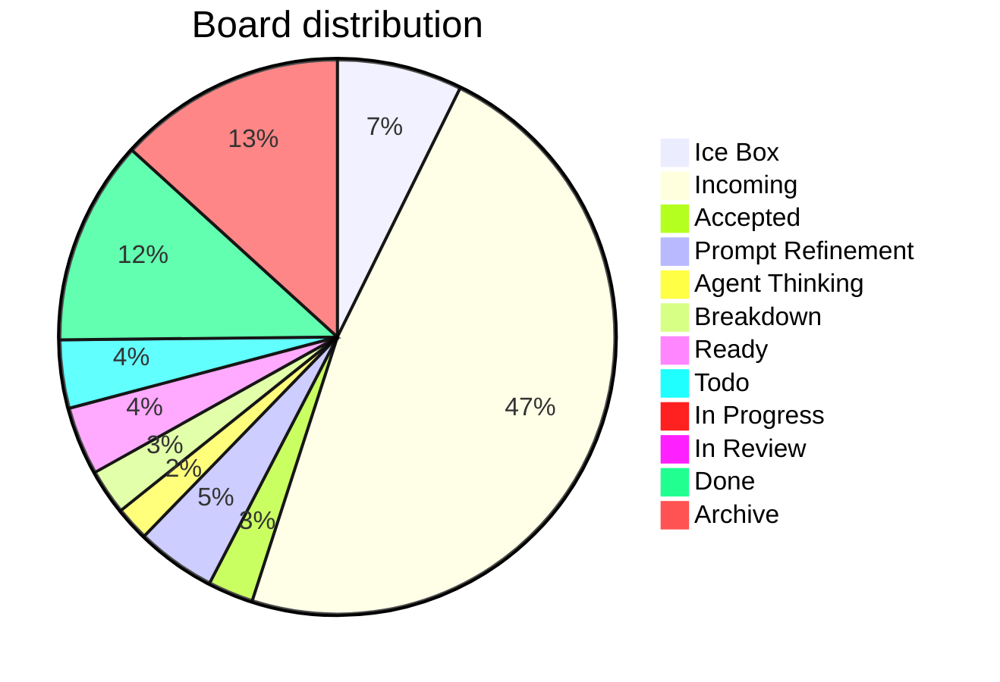

# Board Walk – 2025-08-11

**Assumptions** ^ref-7aa1eb92-3-0

* WIP limit (global Doing) = **3** (change if you want). ^ref-7aa1eb92-5-0
* Doing lanes (for now): **Prompt Refinement**, **Agent Thinking**, **Breakdown**, **In Progress**. ^ref-7aa1eb92-6-0
* Aging threshold: **> 2 days** in a Doing lane. ^ref-7aa1eb92-7-0

---

## Column counts (actual from pasted board)

| Column            | Count | ^ref-7aa1eb92-13-0
| ----------------- | ----- |
| Ice Box           | 11    |
| Incoming          | 72    |
| Accepted          | 4     |
| Prompt Refinement | 7     |
| Agent Thinking    | 3     |
| Breakdown         | 4     |
| Ready             | 6     |
| Todo              | 6     |
| In Progress       | 0     |
| In Review         | 1     |
| Done              | 18    |
| Archive           | 20    |

> Header ↔ actual mismatches detected: ^ref-7aa1eb92-28-0
>
> * **Accepted (8)** → has **4** items ^ref-7aa1eb92-30-0
> * **Prompt Refinement (24)** → has **7** items ^ref-7aa1eb92-31-0
> * **Agent Thinking (24)** → has **3** items
> * **Breakdown (16)** → has **4** items ^ref-7aa1eb92-33-0
> * **Ready (24)** → has **6** items
> * **Todo (16)** → has **6** items ^ref-7aa1eb92-35-0
> * **In Progress (8)** → has **0** items

^ref-7aa1eb92-38-0

---

## Blockers

* No items tagged **#blocked** found in the paste.
 ^ref-7aa1eb92-60-0
> If any are blocked, add **#blocked** (and optionally a short reason), e.g., `#blocked:waiting-on-PR-123`.

---

## WIP check (Doing lanes)

* Current **Doing total** (Prompt Refinement + Agent Thinking + Breakdown + In Progress): **14**
* With WIP limit **3**, we’re **over**.
 ^ref-7aa1eb92-69-0
**Proposal**
 ^ref-7aa1eb92-71-0
* Confirm which lanes count as Doing. If all four above are Doing, pull back to **≤3** by:

  1. Moving non‑active cards back to **Ready**. ^ref-7aa1eb92-74-0
  2. Splitting any large Doing card into a small slice that can finish in ≤1 day; park the rest in Ready.

---

## Aging WIP (>2 days)
 ^ref-7aa1eb92-80-0
* Not evaluated: timestamps weren’t provided in the paste.
 ^ref-7aa1eb92-82-0
**Recommendation**
 ^ref-7aa1eb92-84-0
* Add `last_touched: YYYY‑MM‑DD` to frontmatter, or let me read file mtimes; then I’ll auto‑flag aging WIP.

---

## Next pull (single)
 ^ref-7aa1eb92-90-0
**Flow goal (stated recently):** extend WS message broker with **queue semantics** and connect services.
 ^ref-7aa1eb92-92-0
* **Best pull (promote from Incoming → Ready):** `[[add_manualack_to_event_bus_and_re_run_tests.md|Add manualAck to event bus and re-run tests]]` (unblocks reliable delivery & retries). ^ref-7aa1eb92-93-0
* **If restricted to current Ready only:** `[[Update makefile to have commands specific for agents.md|Update Makefile for agent commands]]` (quick win that improves daily flow) **or** `[[Mirror shared utils with language-specific doc folders.md]]` (reduces duplication before deeper queue work).
 ^ref-7aa1eb92-95-0
> Pick **one**. Everything else waits.

---

## Tag hygiene / normalization
 ^ref-7aa1eb92-101-0
You said you want **column-normalized** hashtags on tasks and files. Proposed canonical set:
 ^ref-7aa1eb92-103-0
* `#ice-box`, `#incoming`, `#accepted`, `#prompt-refinement`, `#agent-thinking`, `#breakdown`, `#ready`, `#todo`, `#in-progress`, `#in-review`, `#done`, `#archive`

**Findings**
 ^ref-7aa1eb92-107-0
* Many **Incoming** items are tagged `#todo`. Suggest adding **`#incoming`** (you can keep `#todo` if you like, but column tag should exist).
* Several **Accepted** items still carry `#todo`.
 ^ref-7aa1eb92-110-0
**Action**
 ^ref-7aa1eb92-112-0
* Run/finish the hashtag-normalizer so each card has both:
 ^ref-7aa1eb92-114-0
  1. the **column tag** (normalized), and ^ref-7aa1eb92-115-0
  2. any **status/phase** tag you want (e.g., `#todo`, `#accepted`).

---

## Quick decisions (checklist)

*

---

## Notes / Misc
 ^ref-7aa1eb92-127-0
* **In Progress** is empty—nice. Let’s keep it that way until we explicitly pull the next slice. ^ref-7aa1eb92-128-0
* Incoming is **72** items; consider a 10‑minute nightly triage to keep it from ballooning.<!-- GENERATED-SECTIONS:DO-NOT-EDIT-BELOW -->
## Related content
- [Admin Dashboard for User Management](admin-dashboard-for-user-management.md)
- [Board Automation Improvements](board-automation-improvements.md)
- [Promethean-native config design](promethean-native-config-design.md)
- [Dynamic Context Model for Web Components](dynamic-context-model-for-web-components.md)
- [Chroma Toolkit Consolidation Plan](chroma-toolkit-consolidation-plan.md)
- [Exception Layer Analysis](exception-layer-analysis.md)
- [Agent Tasks: Persistence Migration to DualStore](agent-tasks-persistence-migration-to-dualstore.md)
- [Cross-Language Runtime Polymorphism](cross-language-runtime-polymorphism.md)
- [Cross-Target Macro System in Sibilant](cross-target-macro-system-in-sibilant.md)
- [aionian-circuit-math](aionian-circuit-math.md)
- [api-gateway-versioning](api-gateway-versioning.md)
- [Performance-Optimized-Polyglot-Bridge](performance-optimized-polyglot-bridge.md)
- [AI-Centric OS with MCP Layer](ai-centric-os-with-mcp-layer.md)
- [AI-First-OS-Model-Context-Protocol](ai-first-os-model-context-protocol.md)
- [balanced-bst](balanced-bst.md)
- [ecs-offload-workers](ecs-offload-workers.md)
- [2d-sandbox-field](2d-sandbox-field.md)
- [archetype-ecs](archetype-ecs.md)
- [ecs-scheduler-and-prefabs](ecs-scheduler-and-prefabs.md)
- [Services](chunks/services.md)
- [Debugging Broker Connections and Agent Behavior](debugging-broker-connections-and-agent-behavior.md)
- [JavaScript](chunks/javascript.md)
- [Agent Reflections and Prompt Evolution](agent-reflections-and-prompt-evolution.md)
- [Math Fundamentals](chunks/math-fundamentals.md)
- [Chroma-Embedding-Refactor](chroma-embedding-refactor.md)
- [eidolon-field-math-foundations](eidolon-field-math-foundations.md)
- [i3-config-validation-methods](i3-config-validation-methods.md)
- [Interop and Source Maps](interop-and-source-maps.md)
- [compiler-kit-foundations](compiler-kit-foundations.md)
- [Migrate to Provider-Tenant Architecture](migrate-to-provider-tenant-architecture.md)
- [Model Selection for Lightweight Conversational Tasks](model-selection-for-lightweight-conversational-tasks.md)
- [Obsidian ChatGPT Plugin Integration Guide](obsidian-chatgpt-plugin-integration-guide.md)
- [Obsidian ChatGPT Plugin Integration](obsidian-chatgpt-plugin-integration.md)
- [Event Bus MVP](event-bus-mvp.md)
- [Per-Domain Policy System for JS Crawler](per-domain-policy-system-for-js-crawler.md)
- [prom-lib-rate-limiters-and-replay-api](prom-lib-rate-limiters-and-replay-api.md)
- [observability-infrastructure-setup](observability-infrastructure-setup.md)
- [Factorio AI with External Agents](factorio-ai-with-external-agents.md)
- [Simulation Demo](chunks/simulation-demo.md)
- [Tooling](chunks/tooling.md)
- [Window Management](chunks/window-management.md)
- [Eidolon Field Abstract Model](eidolon-field-abstract-model.md)
- [Mongo Outbox Implementation](mongo-outbox-implementation.md)
- [eidolon-node-lifecycle](eidolon-node-lifecycle.md)
- [EidolonField](eidolonfield.md)
- [field-dynamics-math-blocks](field-dynamics-math-blocks.md)
- [Promethean Agent Config DSL](promethean-agent-config-dsl.md)
- [field-interaction-equations](field-interaction-equations.md)
- [Diagrams](chunks/diagrams.md)
- [DSL](chunks/dsl.md)
- [Ollama-LLM-Provider-for-Pseudo-Code-Transpiler](ollama-llm-provider-for-pseudo-code-transpiler.md)
- [polymorphic-meta-programming-engine](polymorphic-meta-programming-engine.md)
- [Event Bus Projections Architecture](event-bus-projections-architecture.md)
- [field-node-diagram-outline](field-node-diagram-outline.md)
- [Duck's Self-Referential Perceptual Loop](ducks-self-referential-perceptual-loop.md)
- [Shared](chunks/shared.md)
- [markdown-to-org-transpiler](markdown-to-org-transpiler.md)
- [Obsidian Templating Plugins Integration Guide](obsidian-templating-plugins-integration-guide.md)
- [Matplotlib Animation with Async Execution](matplotlib-animation-with-async-execution.md)
- [obsidian-ignore-node-modules-regex](obsidian-ignore-node-modules-regex.md)
- [ParticleSimulationWithCanvasAndFFmpeg](particlesimulationwithcanvasandffmpeg.md)
- [Promethean Web UI Setup](promethean-web-ui-setup.md)
- [Prompt_Folder_Bootstrap](prompt-folder-bootstrap.md)
- [Promethean Documentation Pipeline Overview](promethean-documentation-pipeline-overview.md)
- [graph-ds](graph-ds.md)
- [Promethean Event Bus MVP v0.1](promethean-event-bus-mvp-v0-1.md)
- [Promethean Infrastructure Setup](promethean-infrastructure-setup.md)
- [Duck's Attractor States](ducks-attractor-states.md)
- [Canonical Org-Babel Matplotlib Animation Template](canonical-org-babel-matplotlib-animation-template.md)
- [Post-Linguistic Transhuman Design Frameworks](post-linguistic-transhuman-design-frameworks.md)
- [Promethean Chat Activity Report](promethean-chat-activity-report.md)
- [Promethean Data Sync Protocol](promethean-data-sync-protocol.md)
- [Promethean Dev Workflow Update](promethean-dev-workflow-update.md)
- [Promethean Documentation Update](promethean-documentation-update.txt)
- [promethean-system-diagrams](promethean-system-diagrams.md)
- [prompt-programming-language-lisp](prompt-programming-language-lisp.md)
- [field-node-diagram-set](field-node-diagram-set.md)
- [field-node-diagram-visualizations](field-node-diagram-visualizations.md)
- [heartbeat-fragment-demo](heartbeat-fragment-demo.md)
- [heartbeat-simulation-snippets](heartbeat-simulation-snippets.md)
- [Promethean_Eidolon_Synchronicity_Model](promethean-eidolon-synchronicity-model.md)
- [Protocol_0_The_Contradiction_Engine](protocol-0-the-contradiction-engine.md)
- [DuckDuckGoSearchPipeline](duckduckgosearchpipeline.md)
- [Local-First Intention→Code Loop with Free Models](local-first-intention-code-loop-with-free-models.md)
- [Model Upgrade Calm-Down Guide](model-upgrade-calm-down-guide.md)
- [Polyglot S-expr Bridge: Python-JS-Lisp Interop](polyglot-s-expr-bridge-python-js-lisp-interop.md)
- [plan-update-confirmation](plan-update-confirmation.md)
- [Optimizing Command Limitations in System Design](optimizing-command-limitations-in-system-design.md)
- [Local-Only-LLM-Workflow](local-only-llm-workflow.md)
- [Local-Offline-Model-Deployment-Strategy](local-offline-model-deployment-strategy.md)
- [NPU Voice Code and Sensory Integration](npu-voice-code-and-sensory-integration.md)
- [Lispy Macros with syntax-rules](lispy-macros-with-syntax-rules.md)
- [Operations](chunks/operations.md)
- [OpenAPI Validation Report](openapi-validation-report.md)
- [pm2-orchestration-patterns](pm2-orchestration-patterns.md)
- [Functional Refactor of TypeScript Document Processing](functional-refactor-of-typescript-document-processing.md)
- [Provider-Agnostic Chat Panel Implementation](provider-agnostic-chat-panel-implementation.md)
- [Shared Package Structure](shared-package-structure.md)
- [zero-copy-snapshots-and-workers](zero-copy-snapshots-and-workers.md)
- [Promethean Workflow Optimization](promethean-workflow-optimization.md)
- [Prometheus Observability Stack](prometheus-observability-stack.md)
- [Pure-Node Crawl Stack with Playwright and Crawlee](pure-node-crawl-stack-with-playwright-and-crawlee.md)
- [Functional Embedding Pipeline Refactor](functional-embedding-pipeline-refactor.md)
- [sibilant-macro-targets](sibilant-macro-targets.md)
- [schema-evolution-workflow](schema-evolution-workflow.md)
- [Sibilant Meta-Prompt DSL](sibilant-meta-prompt-dsl.md)
- [Pure TypeScript Search Microservice](pure-typescript-search-microservice.md)
- [RAG UI Panel with Qdrant and PostgREST](rag-ui-panel-with-qdrant-and-postgrest.md)
- [ripple-propagation-demo](ripple-propagation-demo.md)
- [Self-Agency in AI Interaction](self-agency-in-ai-interaction.md)
- [set-assignment-in-lisp-ast](set-assignment-in-lisp-ast.md)
- [shared-package-layout-clarification](shared-package-layout-clarification.md)
- [Creative Moments](creative-moments.md)
- [TypeScript Patch for Tool Calling Support](typescript-patch-for-tool-calling-support.md)
- [Mindful Prioritization](mindful-prioritization.md)
- [MindfulRobotIntegration](mindfulrobotintegration.md)
- [Ice Box Reorganization](ice-box-reorganization.md)
- [i3-bluetooth-setup](i3-bluetooth-setup.md)
- [Stateful Partitions and Rebalancing](stateful-partitions-and-rebalancing.md)
- [Fnord Tracer Protocol](fnord-tracer-protocol.md)
- [State Snapshots API and Transactional Projector](state-snapshots-api-and-transactional-projector.md)
- [Language-Agnostic Mirror System](language-agnostic-mirror-system.md)
- [Promethean-Copilot-Intent-Engine](promethean-copilot-intent-engine.md)
- [universal-intention-code-fabric](universal-intention-code-fabric.md)
- [Voice Access Layer Design](voice-access-layer-design.md)
- [WebSocket Gateway Implementation](websocket-gateway-implementation.md)
- [Refactor Frontmatter Processing](refactor-frontmatter-processing.md)
- [i3-layout-saver](i3-layout-saver.md)
- [sibilant-metacompiler-overview](sibilant-metacompiler-overview.md)
- [Mathematics Sampler](mathematics-sampler.md)
- [Lisp-Compiler-Integration](lisp-compiler-integration.md)
- [Mathematical Samplers](mathematical-samplers.md)
- [Reawakening Duck](reawakening-duck.md)
- [Promethean Full-Stack Docker Setup](promethean-full-stack-docker-setup.md)
- [Unique Info Dump Index](unique-info-dump-index.md)
- [Tracing the Signal](tracing-the-signal.md)
- [sibilant-meta-string-templating-runtime](sibilant-meta-string-templating-runtime.md)
- [lisp-dsl-for-window-management](lisp-dsl-for-window-management.md)
- [Promethean Agent DSL TS Scaffold](promethean-agent-dsl-ts-scaffold.md)
- [layer-1-uptime-diagrams](layer-1-uptime-diagrams.md)
- [Ghostly Smoke Interference](ghostly-smoke-interference.md)
- [template-based-compilation](template-based-compilation.md)
- [Vectorial Exception Descent](vectorial-exception-descent.md)
- [Promethean State Format](promethean-state-format.md)
- [Recursive Prompt Construction Engine](recursive-prompt-construction-engine.md)
## Sources
- [Protocol_0_The_Contradiction_Engine — L42](protocol-0-the-contradiction-engine.md#^ref-9a93a756-42-0) (line 42, col 0, score 0.69)
- [Promethean-Copilot-Intent-Engine — L47](promethean-copilot-intent-engine.md#^ref-ae24a280-47-0) (line 47, col 0, score 0.65)
- [Dynamic Context Model for Web Components — L331](dynamic-context-model-for-web-components.md#^ref-f7702bf8-331-0) (line 331, col 0, score 0.83)
- [Promethean-native config design — L31](promethean-native-config-design.md#^ref-ab748541-31-0) (line 31, col 0, score 0.83)
- [aionian-circuit-math — L43](aionian-circuit-math.md#^ref-f2d83a77-43-0) (line 43, col 0, score 0.6)
- [Chroma-Embedding-Refactor — L64](chroma-embedding-refactor.md#^ref-8b256935-64-0) (line 64, col 0, score 0.61)
- [Chroma-Embedding-Refactor — L109](chroma-embedding-refactor.md#^ref-8b256935-109-0) (line 109, col 0, score 0.61)
- [Chroma-Embedding-Refactor — L258](chroma-embedding-refactor.md#^ref-8b256935-258-0) (line 258, col 0, score 0.61)
- [Chroma Toolkit Consolidation Plan — L72](chroma-toolkit-consolidation-plan.md#^ref-5020e892-72-0) (line 72, col 0, score 0.61)
- [Chroma Toolkit Consolidation Plan — L88](chroma-toolkit-consolidation-plan.md#^ref-5020e892-88-0) (line 88, col 0, score 0.61)
- [Chroma Toolkit Consolidation Plan — L107](chroma-toolkit-consolidation-plan.md#^ref-5020e892-107-0) (line 107, col 0, score 0.61)
- [Chroma Toolkit Consolidation Plan — L148](chroma-toolkit-consolidation-plan.md#^ref-5020e892-148-0) (line 148, col 0, score 0.61)
- [Board Automation Improvements — L2](board-automation-improvements.md#^ref-ac60a1d6-2-0) (line 2, col 0, score 0.68)
- [sibilant-metacompiler-overview — L49](sibilant-metacompiler-overview.md#^ref-61d4086b-49-0) (line 49, col 0, score 0.62)
- [universal-intention-code-fabric — L393](universal-intention-code-fabric.md#^ref-c14edce7-393-0) (line 393, col 0, score 0.62)
- [Per-Domain Policy System for JS Crawler — L27](per-domain-policy-system-for-js-crawler.md#^ref-c03020e1-27-0) (line 27, col 0, score 0.62)
- [prom-lib-rate-limiters-and-replay-api — L1](prom-lib-rate-limiters-and-replay-api.md#^ref-aee4718b-1-0) (line 1, col 0, score 0.59)
- [Fnord Tracer Protocol — L46](fnord-tracer-protocol.md#^ref-fc21f824-46-0) (line 46, col 0, score 0.61)
- [Promethean Web UI Setup — L44](promethean-web-ui-setup.md#^ref-bc5172ca-44-0) (line 44, col 0, score 0.61)
- [observability-infrastructure-setup — L189](observability-infrastructure-setup.md#^ref-b4e64f8c-189-0) (line 189, col 0, score 0.6)
- [prom-lib-rate-limiters-and-replay-api — L92](prom-lib-rate-limiters-and-replay-api.md#^ref-aee4718b-92-0) (line 92, col 0, score 0.6)
- [Promethean Full-Stack Docker Setup — L169](promethean-full-stack-docker-setup.md#^ref-2c2b48ca-169-0) (line 169, col 0, score 0.6)
- [Exception Layer Analysis — L117](exception-layer-analysis.md#^ref-21d5cc09-117-0) (line 117, col 0, score 0.56)
- [Factorio AI with External Agents — L15](factorio-ai-with-external-agents.md#^ref-a4d90289-15-0) (line 15, col 0, score 0.59)
- [AI-Centric OS with MCP Layer — L30](ai-centric-os-with-mcp-layer.md#^ref-0f1f8cc1-30-0) (line 30, col 0, score 0.59)
- [Simulation Demo — L32](chunks/simulation-demo.md#^ref-557309a3-32-0) (line 32, col 0, score 1)
- [Tooling — L26](chunks/tooling.md#^ref-6cb4943e-26-0) (line 26, col 0, score 1)
- [Window Management — L36](chunks/window-management.md#^ref-9e8ae388-36-0) (line 36, col 0, score 1)
- [compiler-kit-foundations — L639](compiler-kit-foundations.md#^ref-01b21543-639-0) (line 639, col 0, score 1)
- [Creative Moments — L10](creative-moments.md#^ref-10d98225-10-0) (line 10, col 0, score 1)
- [Cross-Language Runtime Polymorphism — L258](cross-language-runtime-polymorphism.md#^ref-c34c36a6-258-0) (line 258, col 0, score 1)
- [Cross-Target Macro System in Sibilant — L215](cross-target-macro-system-in-sibilant.md#^ref-5f210ca2-215-0) (line 215, col 0, score 1)
- [Debugging Broker Connections and Agent Behavior — L50](debugging-broker-connections-and-agent-behavior.md#^ref-73d3dbf6-50-0) (line 50, col 0, score 1)
- [DuckDuckGoSearchPipeline — L16](duckduckgosearchpipeline.md#^ref-e979c50f-16-0) (line 16, col 0, score 1)
- [Local-First Intention→Code Loop with Free Models — L117](local-first-intention-code-loop-with-free-models.md#^ref-871490c7-117-0) (line 117, col 0, score 0.57)
- [prom-lib-rate-limiters-and-replay-api — L335](prom-lib-rate-limiters-and-replay-api.md#^ref-aee4718b-335-0) (line 335, col 0, score 0.56)
- [prom-lib-rate-limiters-and-replay-api — L337](prom-lib-rate-limiters-and-replay-api.md#^ref-aee4718b-337-0) (line 337, col 0, score 0.56)
- [Model Upgrade Calm-Down Guide — L16](model-upgrade-calm-down-guide.md#^ref-db74343f-16-0) (line 16, col 0, score 0.58)
- [aionian-circuit-math — L45](aionian-circuit-math.md#^ref-f2d83a77-45-0) (line 45, col 0, score 0.56)
- [Mindful Prioritization — L1](mindful-prioritization.md#^ref-40185d05-1-0) (line 1, col 0, score 0.57)
- [2d-sandbox-field — L218](2d-sandbox-field.md#^ref-c710dc93-218-0) (line 218, col 0, score 0.55)
- [Admin Dashboard for User Management — L38](admin-dashboard-for-user-management.md#^ref-2901a3e9-38-0) (line 38, col 0, score 0.55)
- [AI-First-OS-Model-Context-Protocol — L13](ai-first-os-model-context-protocol.md#^ref-618198f4-13-0) (line 13, col 0, score 0.55)
- [Cross-Language Runtime Polymorphism — L90](cross-language-runtime-polymorphism.md#^ref-c34c36a6-90-0) (line 90, col 0, score 0.65)
- [Ice Box Reorganization — L13](ice-box-reorganization.md#^ref-291c7d91-13-0) (line 13, col 0, score 0.63)
- [Cross-Target Macro System in Sibilant — L154](cross-target-macro-system-in-sibilant.md#^ref-5f210ca2-154-0) (line 154, col 0, score 0.62)
- [Per-Domain Policy System for JS Crawler — L109](per-domain-policy-system-for-js-crawler.md#^ref-c03020e1-109-0) (line 109, col 0, score 0.61)
- [Polyglot S-expr Bridge: Python-JS-Lisp Interop — L489](polyglot-s-expr-bridge-python-js-lisp-interop.md#^ref-63a1cc28-489-0) (line 489, col 0, score 0.61)
- [Refactor Frontmatter Processing — L1](refactor-frontmatter-processing.md#^ref-cfbdca2f-1-0) (line 1, col 0, score 0.64)
- [Agent Tasks: Persistence Migration to DualStore — L8](agent-tasks-persistence-migration-to-dualstore.md#^ref-93d2ba51-8-0) (line 8, col 0, score 0.6)
- [Mathematics Sampler — L25](mathematics-sampler.md#^ref-b5e0183e-25-0) (line 25, col 0, score 0.59)
- [Prompt_Folder_Bootstrap — L18](prompt-folder-bootstrap.md#^ref-bd4f0976-18-0) (line 18, col 0, score 0.55)
- [Prompt_Folder_Bootstrap — L36](prompt-folder-bootstrap.md#^ref-bd4f0976-36-0) (line 36, col 0, score 0.55)
- [Prompt_Folder_Bootstrap — L55](prompt-folder-bootstrap.md#^ref-bd4f0976-55-0) (line 55, col 0, score 0.55)
- [Prompt_Folder_Bootstrap — L78](prompt-folder-bootstrap.md#^ref-bd4f0976-78-0) (line 78, col 0, score 0.55)
- [Prompt_Folder_Bootstrap — L97](prompt-folder-bootstrap.md#^ref-bd4f0976-97-0) (line 97, col 0, score 0.55)
- [Prompt_Folder_Bootstrap — L116](prompt-folder-bootstrap.md#^ref-bd4f0976-116-0) (line 116, col 0, score 0.55)
- [Mathematical Samplers — L16](mathematical-samplers.md#^ref-86a691ec-16-0) (line 16, col 0, score 0.6)
- [ecs-offload-workers — L359](ecs-offload-workers.md#^ref-6498b9d7-359-0) (line 359, col 0, score 0.62)
- [Functional Refactor of TypeScript Document Processing — L120](functional-refactor-of-typescript-document-processing.md#^ref-1cfae310-120-0) (line 120, col 0, score 0.58)
- [Mathematical Samplers — L25](mathematical-samplers.md#^ref-86a691ec-25-0) (line 25, col 0, score 0.59)
- [Eidolon Field Abstract Model — L105](eidolon-field-abstract-model.md#^ref-5e8b2388-105-0) (line 105, col 0, score 0.57)
- [template-based-compilation — L21](template-based-compilation.md#^ref-f8877e5e-21-0) (line 21, col 0, score 0.55)
- [Chroma Toolkit Consolidation Plan — L162](chroma-toolkit-consolidation-plan.md#^ref-5020e892-162-0) (line 162, col 0, score 0.61)
- [plan-update-confirmation — L406](plan-update-confirmation.md#^ref-b22d79c6-406-0) (line 406, col 0, score 0.65)
- [plan-update-confirmation — L120](plan-update-confirmation.md#^ref-b22d79c6-120-0) (line 120, col 0, score 0.59)
- [Prompt_Folder_Bootstrap — L143](prompt-folder-bootstrap.md#^ref-bd4f0976-143-0) (line 143, col 0, score 0.55)
- [Migrate to Provider-Tenant Architecture — L96](migrate-to-provider-tenant-architecture.md#^ref-54382370-96-0) (line 96, col 0, score 0.58)
- [Agent Tasks: Persistence Migration to DualStore — L154](agent-tasks-persistence-migration-to-dualstore.md#^ref-93d2ba51-154-0) (line 154, col 0, score 0.57)
- [AI-Centric OS with MCP Layer — L399](ai-centric-os-with-mcp-layer.md#^ref-0f1f8cc1-399-0) (line 399, col 0, score 0.57)
- [Dynamic Context Model for Web Components — L409](dynamic-context-model-for-web-components.md#^ref-f7702bf8-409-0) (line 409, col 0, score 0.57)
- [Mongo Outbox Implementation — L74](mongo-outbox-implementation.md#^ref-9c1acd1e-74-0) (line 74, col 0, score 0.62)
- [Local-First Intention→Code Loop with Free Models — L120](local-first-intention-code-loop-with-free-models.md#^ref-871490c7-120-0) (line 120, col 0, score 0.57)
- [Chroma Toolkit Consolidation Plan — L122](chroma-toolkit-consolidation-plan.md#^ref-5020e892-122-0) (line 122, col 0, score 0.57)
- [2d-sandbox-field — L227](2d-sandbox-field.md#^ref-c710dc93-227-0) (line 227, col 0, score 0.57)
- [Board Automation Improvements — L5](board-automation-improvements.md#^ref-ac60a1d6-5-0) (line 5, col 0, score 0.69)
- [Ice Box Reorganization — L1](ice-box-reorganization.md#^ref-291c7d91-1-0) (line 1, col 0, score 0.67)
- [2d-sandbox-field — L198](2d-sandbox-field.md#^ref-c710dc93-198-0) (line 198, col 0, score 0.62)
- [Math Fundamentals — L30](chunks/math-fundamentals.md#^ref-c6e87433-30-0) (line 30, col 0, score 0.62)
- [Eidolon Field Abstract Model — L196](eidolon-field-abstract-model.md#^ref-5e8b2388-196-0) (line 196, col 0, score 0.62)
- [eidolon-node-lifecycle — L52](eidolon-node-lifecycle.md#^ref-938eca9c-52-0) (line 52, col 0, score 0.62)
- [EidolonField — L239](eidolonfield.md#^ref-49d1e1e5-239-0) (line 239, col 0, score 0.62)
- [Exception Layer Analysis — L152](exception-layer-analysis.md#^ref-21d5cc09-152-0) (line 152, col 0, score 0.62)
- [field-dynamics-math-blocks — L147](field-dynamics-math-blocks.md#^ref-7cfc230d-147-0) (line 147, col 0, score 0.62)
- [Dynamic Context Model for Web Components — L34](dynamic-context-model-for-web-components.md#^ref-f7702bf8-34-0) (line 34, col 0, score 0.61)
- [Migrate to Provider-Tenant Architecture — L86](migrate-to-provider-tenant-architecture.md#^ref-54382370-86-0) (line 86, col 0, score 0.59)
- [Lisp-Compiler-Integration — L9](lisp-compiler-integration.md#^ref-cfee6d36-9-0) (line 9, col 0, score 0.59)
- [Promethean Agent DSL TS Scaffold — L518](promethean-agent-dsl-ts-scaffold.md#^ref-5158f742-518-0) (line 518, col 0, score 0.57)
- [Promethean Web UI Setup — L574](promethean-web-ui-setup.md#^ref-bc5172ca-574-0) (line 574, col 0, score 0.57)
- [Dynamic Context Model for Web Components — L31](dynamic-context-model-for-web-components.md#^ref-f7702bf8-31-0) (line 31, col 0, score 0.63)
- [Model Upgrade Calm-Down Guide — L41](model-upgrade-calm-down-guide.md#^ref-db74343f-41-0) (line 41, col 0, score 0.57)
- [Promethean Agent Config DSL — L9](promethean-agent-config-dsl.md#^ref-2c00ce45-9-0) (line 9, col 0, score 0.57)
- [Migrate to Provider-Tenant Architecture — L11](migrate-to-provider-tenant-architecture.md#^ref-54382370-11-0) (line 11, col 0, score 0.58)
- [sibilant-meta-string-templating-runtime — L114](sibilant-meta-string-templating-runtime.md#^ref-2aafc801-114-0) (line 114, col 0, score 0.57)
- [sibilant-metacompiler-overview — L42](sibilant-metacompiler-overview.md#^ref-61d4086b-42-0) (line 42, col 0, score 0.58)
- [Migrate to Provider-Tenant Architecture — L21](migrate-to-provider-tenant-architecture.md#^ref-54382370-21-0) (line 21, col 0, score 0.57)
- [sibilant-macro-targets — L95](sibilant-macro-targets.md#^ref-c5c9a5c6-95-0) (line 95, col 0, score 0.56)
- [Prompt_Folder_Bootstrap — L113](prompt-folder-bootstrap.md#^ref-bd4f0976-113-0) (line 113, col 0, score 0.55)
- [Vectorial Exception Descent — L142](vectorial-exception-descent.md#^ref-d771154e-142-0) (line 142, col 0, score 0.56)
- [Reawakening Duck — L94](reawakening-duck.md#^ref-59b5670f-94-0) (line 94, col 0, score 0.55)
- [plan-update-confirmation — L27](plan-update-confirmation.md#^ref-b22d79c6-27-0) (line 27, col 0, score 0.55)
- [Recursive Prompt Construction Engine — L9](recursive-prompt-construction-engine.md#^ref-babdb9eb-9-0) (line 9, col 0, score 0.55)
- [prom-lib-rate-limiters-and-replay-api — L367](prom-lib-rate-limiters-and-replay-api.md#^ref-aee4718b-367-0) (line 367, col 0, score 0.55)
- [Tracing the Signal — L97](tracing-the-signal.md#^ref-c3cd4f65-97-0) (line 97, col 0, score 0.58)
- [lisp-dsl-for-window-management — L204](lisp-dsl-for-window-management.md#^ref-c5c5ff1c-204-0) (line 204, col 0, score 0.57)
- [layer-1-uptime-diagrams — L146](layer-1-uptime-diagrams.md#^ref-4127189a-146-0) (line 146, col 0, score 0.57)
- [WebSocket Gateway Implementation — L623](websocket-gateway-implementation.md#^ref-e811123d-623-0) (line 623, col 0, score 0.57)
- [Ghostly Smoke Interference — L1](ghostly-smoke-interference.md#^ref-b6ae7dfa-1-0) (line 1, col 0, score 0.57)
- [State Snapshots API and Transactional Projector — L3](state-snapshots-api-and-transactional-projector.md#^ref-509e1cd5-3-0) (line 3, col 0, score 0.62)
- [Mongo Outbox Implementation — L542](mongo-outbox-implementation.md#^ref-9c1acd1e-542-0) (line 542, col 0, score 0.56)
- [field-interaction-equations — L48](field-interaction-equations.md#^ref-b09141b7-48-0) (line 48, col 0, score 0.56)
- [EidolonField — L1](eidolonfield.md#^ref-49d1e1e5-1-0) (line 1, col 0, score 0.56)
- [Optimizing Command Limitations in System Design — L12](optimizing-command-limitations-in-system-design.md#^ref-98c8ff62-12-0) (line 12, col 0, score 0.56)
- [2d-sandbox-field — L217](2d-sandbox-field.md#^ref-c710dc93-217-0) (line 217, col 0, score 0.49)
- [Agent Tasks: Persistence Migration to DualStore — L173](agent-tasks-persistence-migration-to-dualstore.md#^ref-93d2ba51-173-0) (line 173, col 0, score 0.49)
- [Diagrams — L33](chunks/diagrams.md#^ref-45cd25b5-33-0) (line 33, col 0, score 0.49)
- [DSL — L40](chunks/dsl.md#^ref-e87bc036-40-0) (line 40, col 0, score 0.49)
- [JavaScript — L30](chunks/javascript.md#^ref-c1618c66-30-0) (line 30, col 0, score 0.49)
- [Services — L39](chunks/services.md#^ref-75ea4a6a-39-0) (line 39, col 0, score 0.49)
- [Cross-Language Runtime Polymorphism — L248](cross-language-runtime-polymorphism.md#^ref-c34c36a6-248-0) (line 248, col 0, score 0.49)
- [Eidolon Field Abstract Model — L205](eidolon-field-abstract-model.md#^ref-5e8b2388-205-0) (line 205, col 0, score 0.49)
- [eidolon-field-math-foundations — L172](eidolon-field-math-foundations.md#^ref-008f2ac0-172-0) (line 172, col 0, score 0.49)
- [Board Automation Improvements — L1](board-automation-improvements.md#^ref-ac60a1d6-1-0) (line 1, col 0, score 0.59)
- [schema-evolution-workflow — L126](schema-evolution-workflow.md#^ref-d8059b6a-126-0) (line 126, col 0, score 0.59)
- [Local-First Intention→Code Loop with Free Models — L119](local-first-intention-code-loop-with-free-models.md#^ref-871490c7-119-0) (line 119, col 0, score 0.58)
- [universal-intention-code-fabric — L417](universal-intention-code-fabric.md#^ref-c14edce7-417-0) (line 417, col 0, score 0.59)
- [universal-intention-code-fabric — L26](universal-intention-code-fabric.md#^ref-c14edce7-26-0) (line 26, col 0, score 0.59)
- [Stateful Partitions and Rebalancing — L516](stateful-partitions-and-rebalancing.md#^ref-4330e8f0-516-0) (line 516, col 0, score 0.66)
- [Agent Tasks: Persistence Migration to DualStore — L95](agent-tasks-persistence-migration-to-dualstore.md#^ref-93d2ba51-95-0) (line 95, col 0, score 0.62)
- [Fnord Tracer Protocol — L54](fnord-tracer-protocol.md#^ref-fc21f824-54-0) (line 54, col 0, score 0.59)
- [Fnord Tracer Protocol — L90](fnord-tracer-protocol.md#^ref-fc21f824-90-0) (line 90, col 0, score 0.59)
- [prom-lib-rate-limiters-and-replay-api — L88](prom-lib-rate-limiters-and-replay-api.md#^ref-aee4718b-88-0) (line 88, col 0, score 0.62)
- [Agent Tasks: Persistence Migration to DualStore — L55](agent-tasks-persistence-migration-to-dualstore.md#^ref-93d2ba51-55-0) (line 55, col 0, score 0.57)
- [i3-bluetooth-setup — L27](i3-bluetooth-setup.md#^ref-5e408692-27-0) (line 27, col 0, score 0.55)
- [Eidolon Field Abstract Model — L111](eidolon-field-abstract-model.md#^ref-5e8b2388-111-0) (line 111, col 0, score 0.55)
- [WebSocket Gateway Implementation — L473](websocket-gateway-implementation.md#^ref-e811123d-473-0) (line 473, col 0, score 0.55)
- [plan-update-confirmation — L363](plan-update-confirmation.md#^ref-b22d79c6-363-0) (line 363, col 0, score 0.64)
- [plan-update-confirmation — L556](plan-update-confirmation.md#^ref-b22d79c6-556-0) (line 556, col 0, score 0.55)
- [plan-update-confirmation — L341](plan-update-confirmation.md#^ref-b22d79c6-341-0) (line 341, col 0, score 0.55)
- [plan-update-confirmation — L484](plan-update-confirmation.md#^ref-b22d79c6-484-0) (line 484, col 0, score 0.68)
- [plan-update-confirmation — L369](plan-update-confirmation.md#^ref-b22d79c6-369-0) (line 369, col 0, score 0.54)
- [Ollama-LLM-Provider-for-Pseudo-Code-Transpiler — L150](ollama-llm-provider-for-pseudo-code-transpiler.md#^ref-b362e12e-150-0) (line 150, col 0, score 0.62)
- [Local-Only-LLM-Workflow — L158](local-only-llm-workflow.md#^ref-9a8ab57e-158-0) (line 158, col 0, score 0.61)
- [Agent Reflections and Prompt Evolution — L105](agent-reflections-and-prompt-evolution.md#^ref-bb7f0835-105-0) (line 105, col 0, score 0.59)
- [Model Upgrade Calm-Down Guide — L31](model-upgrade-calm-down-guide.md#^ref-db74343f-31-0) (line 31, col 0, score 0.58)
- [i3-layout-saver — L81](i3-layout-saver.md#^ref-31f0166e-81-0) (line 81, col 0, score 0.64)
- [Model Upgrade Calm-Down Guide — L43](model-upgrade-calm-down-guide.md#^ref-db74343f-43-0) (line 43, col 0, score 0.63)
- [Agent Reflections and Prompt Evolution — L104](agent-reflections-and-prompt-evolution.md#^ref-bb7f0835-104-0) (line 104, col 0, score 0.62)
- [Promethean Agent Config DSL — L103](promethean-agent-config-dsl.md#^ref-2c00ce45-103-0) (line 103, col 0, score 0.6)
- [plan-update-confirmation — L318](plan-update-confirmation.md#^ref-b22d79c6-318-0) (line 318, col 0, score 0.6)
- [ecs-offload-workers — L450](ecs-offload-workers.md#^ref-6498b9d7-450-0) (line 450, col 0, score 0.6)
- [Unique Info Dump Index — L3](unique-info-dump-index.md#^ref-30ec3ba6-3-0) (line 3, col 0, score 0.6)
- [Promethean Documentation Pipeline Overview — L148](promethean-documentation-pipeline-overview.md#^ref-3a3bf2c9-148-0) (line 148, col 0, score 0.59)
- [Protocol_0_The_Contradiction_Engine — L109](protocol-0-the-contradiction-engine.md#^ref-9a93a756-109-0) (line 109, col 0, score 0.59)
- [Agent Tasks: Persistence Migration to DualStore — L12](agent-tasks-persistence-migration-to-dualstore.md#^ref-93d2ba51-12-0) (line 12, col 0, score 0.59)
- [sibilant-macro-targets — L27](sibilant-macro-targets.md#^ref-c5c9a5c6-27-0) (line 27, col 0, score 0.63)
- [schema-evolution-workflow — L123](schema-evolution-workflow.md#^ref-d8059b6a-123-0) (line 123, col 0, score 0.59)
- [Admin Dashboard for User Management — L36](admin-dashboard-for-user-management.md#^ref-2901a3e9-36-0) (line 36, col 0, score 0.58)
- [Dynamic Context Model for Web Components — L80](dynamic-context-model-for-web-components.md#^ref-f7702bf8-80-0) (line 80, col 0, score 0.64)
- [Promethean-native config design — L342](promethean-native-config-design.md#^ref-ab748541-342-0) (line 342, col 0, score 0.56)
- [Model Selection for Lightweight Conversational Tasks — L74](model-selection-for-lightweight-conversational-tasks.md#^ref-d144aa62-74-0) (line 74, col 0, score 0.68)
- [Model Selection for Lightweight Conversational Tasks — L79](model-selection-for-lightweight-conversational-tasks.md#^ref-d144aa62-79-0) (line 79, col 0, score 0.65)
- [Chroma-Embedding-Refactor — L330](chroma-embedding-refactor.md#^ref-8b256935-330-0) (line 330, col 0, score 0.63)
- [Functional Refactor of TypeScript Document Processing — L148](functional-refactor-of-typescript-document-processing.md#^ref-1cfae310-148-0) (line 148, col 0, score 0.63)
- [graph-ds — L361](graph-ds.md#^ref-6620e2f2-361-0) (line 361, col 0, score 0.62)
- [Migrate to Provider-Tenant Architecture — L103](migrate-to-provider-tenant-architecture.md#^ref-54382370-103-0) (line 103, col 0, score 0.61)
- [Model Selection for Lightweight Conversational Tasks — L90](model-selection-for-lightweight-conversational-tasks.md#^ref-d144aa62-90-0) (line 90, col 0, score 0.61)
- [observability-infrastructure-setup — L1](observability-infrastructure-setup.md#^ref-b4e64f8c-1-0) (line 1, col 0, score 0.61)
- [Language-Agnostic Mirror System — L512](language-agnostic-mirror-system.md#^ref-d2b3628c-512-0) (line 512, col 0, score 0.6)
- [Promethean Event Bus MVP v0.1 — L3](promethean-event-bus-mvp-v0-1.md#^ref-fe7193a2-3-0) (line 3, col 0, score 0.71)
- [Provider-Agnostic Chat Panel Implementation — L183](provider-agnostic-chat-panel-implementation.md#^ref-43bfe9dd-183-0) (line 183, col 0, score 0.7)
- [prom-lib-rate-limiters-and-replay-api — L364](prom-lib-rate-limiters-and-replay-api.md#^ref-aee4718b-364-0) (line 364, col 0, score 0.68)
- [ecs-offload-workers — L434](ecs-offload-workers.md#^ref-6498b9d7-434-0) (line 434, col 0, score 0.67)
- [Promethean Infrastructure Setup — L561](promethean-infrastructure-setup.md#^ref-6deed6ac-561-0) (line 561, col 0, score 0.67)
- [prom-lib-rate-limiters-and-replay-api — L43](prom-lib-rate-limiters-and-replay-api.md#^ref-aee4718b-43-0) (line 43, col 0, score 0.66)
- [Promethean Infrastructure Setup — L564](promethean-infrastructure-setup.md#^ref-6deed6ac-564-0) (line 564, col 0, score 0.66)
- [Migrate to Provider-Tenant Architecture — L138](migrate-to-provider-tenant-architecture.md#^ref-54382370-138-0) (line 138, col 0, score 0.65)
- [Migrate to Provider-Tenant Architecture — L140](migrate-to-provider-tenant-architecture.md#^ref-54382370-140-0) (line 140, col 0, score 0.62)
- [WebSocket Gateway Implementation — L296](websocket-gateway-implementation.md#^ref-e811123d-296-0) (line 296, col 0, score 0.64)
- [Promethean Event Bus MVP v0.1 — L182](promethean-event-bus-mvp-v0-1.md#^ref-fe7193a2-182-0) (line 182, col 0, score 0.62)
- [AI-Centric OS with MCP Layer — L384](ai-centric-os-with-mcp-layer.md#^ref-0f1f8cc1-384-0) (line 384, col 0, score 0.64)
- [Polyglot S-expr Bridge: Python-JS-Lisp Interop — L490](polyglot-s-expr-bridge-python-js-lisp-interop.md#^ref-63a1cc28-490-0) (line 490, col 0, score 0.63)
- [Stateful Partitions and Rebalancing — L351](stateful-partitions-and-rebalancing.md#^ref-4330e8f0-351-0) (line 351, col 0, score 0.63)
- [prom-lib-rate-limiters-and-replay-api — L73](prom-lib-rate-limiters-and-replay-api.md#^ref-aee4718b-73-0) (line 73, col 0, score 0.63)
- [Promethean Infrastructure Setup — L415](promethean-infrastructure-setup.md#^ref-6deed6ac-415-0) (line 415, col 0, score 0.61)
- [Stateful Partitions and Rebalancing — L511](stateful-partitions-and-rebalancing.md#^ref-4330e8f0-511-0) (line 511, col 0, score 0.61)
- [Dynamic Context Model for Web Components — L147](dynamic-context-model-for-web-components.md#^ref-f7702bf8-147-0) (line 147, col 0, score 0.61)
- [Performance-Optimized-Polyglot-Bridge — L170](performance-optimized-polyglot-bridge.md#^ref-f5579967-170-0) (line 170, col 0, score 0.61)
- [ecs-offload-workers — L207](ecs-offload-workers.md#^ref-6498b9d7-207-0) (line 207, col 0, score 0.6)
- [Voice Access Layer Design — L216](voice-access-layer-design.md#^ref-543ed9b3-216-0) (line 216, col 0, score 0.65)
- [Performance-Optimized-Polyglot-Bridge — L10](performance-optimized-polyglot-bridge.md#^ref-f5579967-10-0) (line 10, col 0, score 0.64)
- [Performance-Optimized-Polyglot-Bridge — L13](performance-optimized-polyglot-bridge.md#^ref-f5579967-13-0) (line 13, col 0, score 0.63)
- [plan-update-confirmation — L474](plan-update-confirmation.md#^ref-b22d79c6-474-0) (line 474, col 0, score 0.63)
- [graph-ds — L357](graph-ds.md#^ref-6620e2f2-357-0) (line 357, col 0, score 0.61)
- [plan-update-confirmation — L540](plan-update-confirmation.md#^ref-b22d79c6-540-0) (line 540, col 0, score 0.63)
- [i3-bluetooth-setup — L37](i3-bluetooth-setup.md#^ref-5e408692-37-0) (line 37, col 0, score 0.66)
- [Factorio AI with External Agents — L29](factorio-ai-with-external-agents.md#^ref-a4d90289-29-0) (line 29, col 0, score 0.63)
- [Local-Offline-Model-Deployment-Strategy — L246](local-offline-model-deployment-strategy.md#^ref-ad7f1ed3-246-0) (line 246, col 0, score 0.63)
- [Promethean-native config design — L73](promethean-native-config-design.md#^ref-ab748541-73-0) (line 73, col 0, score 0.63)
- [Migrate to Provider-Tenant Architecture — L253](migrate-to-provider-tenant-architecture.md#^ref-54382370-253-0) (line 253, col 0, score 0.65)
- [Language-Agnostic Mirror System — L27](language-agnostic-mirror-system.md#^ref-d2b3628c-27-0) (line 27, col 0, score 0.65)
- [Migrate to Provider-Tenant Architecture — L261](migrate-to-provider-tenant-architecture.md#^ref-54382370-261-0) (line 261, col 0, score 0.62)
- [Agent Reflections and Prompt Evolution — L106](agent-reflections-and-prompt-evolution.md#^ref-bb7f0835-106-0) (line 106, col 0, score 0.64)
- [Chroma-Embedding-Refactor — L311](chroma-embedding-refactor.md#^ref-8b256935-311-0) (line 311, col 0, score 0.63)
- [Shared Package Structure — L159](shared-package-structure.md#^ref-66a72fc3-159-0) (line 159, col 0, score 0.62)
- [Agent Tasks: Persistence Migration to DualStore — L65](agent-tasks-persistence-migration-to-dualstore.md#^ref-93d2ba51-65-0) (line 65, col 0, score 0.63)
- [Model Selection for Lightweight Conversational Tasks — L55](model-selection-for-lightweight-conversational-tasks.md#^ref-d144aa62-55-0) (line 55, col 0, score 0.62)
- [Promethean Agent Config DSL — L11](promethean-agent-config-dsl.md#^ref-2c00ce45-11-0) (line 11, col 0, score 0.62)
- [Promethean-Copilot-Intent-Engine — L30](promethean-copilot-intent-engine.md#^ref-ae24a280-30-0) (line 30, col 0, score 0.62)
- [Dynamic Context Model for Web Components — L303](dynamic-context-model-for-web-components.md#^ref-f7702bf8-303-0) (line 303, col 0, score 0.82)
- [Promethean-native config design — L32](promethean-native-config-design.md#^ref-ab748541-32-0) (line 32, col 0, score 0.8)
- [Promethean-native config design — L33](promethean-native-config-design.md#^ref-ab748541-33-0) (line 33, col 0, score 0.8)
- [TypeScript Patch for Tool Calling Support — L104](typescript-patch-for-tool-calling-support.md#^ref-7b7ca860-104-0) (line 104, col 0, score 0.7)
- [field-interaction-equations — L45](field-interaction-equations.md#^ref-b09141b7-45-0) (line 45, col 0, score 0.69)
- [Promethean-Copilot-Intent-Engine — L32](promethean-copilot-intent-engine.md#^ref-ae24a280-32-0) (line 32, col 0, score 0.62)
- [Shared Package Structure — L49](shared-package-structure.md#^ref-66a72fc3-49-0) (line 49, col 0, score 0.61)
- [Migrate to Provider-Tenant Architecture — L69](migrate-to-provider-tenant-architecture.md#^ref-54382370-69-0) (line 69, col 0, score 0.61)
- [Board Automation Improvements — L4](board-automation-improvements.md#^ref-ac60a1d6-4-0) (line 4, col 0, score 0.63)
- [Ice Box Reorganization — L61](ice-box-reorganization.md#^ref-291c7d91-61-0) (line 61, col 0, score 0.62)
- [Ice Box Reorganization — L3](ice-box-reorganization.md#^ref-291c7d91-3-0) (line 3, col 0, score 0.62)
- [Fnord Tracer Protocol — L41](fnord-tracer-protocol.md#^ref-fc21f824-41-0) (line 41, col 0, score 0.64)
- [Fnord Tracer Protocol — L151](fnord-tracer-protocol.md#^ref-fc21f824-151-0) (line 151, col 0, score 0.61)
- [Chroma-Embedding-Refactor — L26](chroma-embedding-refactor.md#^ref-8b256935-26-0) (line 26, col 0, score 0.61)
- [prom-lib-rate-limiters-and-replay-api — L353](prom-lib-rate-limiters-and-replay-api.md#^ref-aee4718b-353-0) (line 353, col 0, score 0.6)
- [Ice Box Reorganization — L59](ice-box-reorganization.md#^ref-291c7d91-59-0) (line 59, col 0, score 0.59)
- [polymorphic-meta-programming-engine — L142](polymorphic-meta-programming-engine.md#^ref-7bed0b9a-142-0) (line 142, col 0, score 0.61)
- [Local-Offline-Model-Deployment-Strategy — L234](local-offline-model-deployment-strategy.md#^ref-ad7f1ed3-234-0) (line 234, col 0, score 0.6)
- [Promethean Event Bus MVP v0.1 — L287](promethean-event-bus-mvp-v0-1.md#^ref-fe7193a2-287-0) (line 287, col 0, score 0.58)
- [field-dynamics-math-blocks — L46](field-dynamics-math-blocks.md#^ref-7cfc230d-46-0) (line 46, col 0, score 0.57)
- [Migrate to Provider-Tenant Architecture — L80](migrate-to-provider-tenant-architecture.md#^ref-54382370-80-0) (line 80, col 0, score 0.55)
- [Migrate to Provider-Tenant Architecture — L179](migrate-to-provider-tenant-architecture.md#^ref-54382370-179-0) (line 179, col 0, score 0.55)
- [Local-Offline-Model-Deployment-Strategy — L305](local-offline-model-deployment-strategy.md#^ref-ad7f1ed3-305-0) (line 305, col 0, score 0.68)
- [Migrate to Provider-Tenant Architecture — L331](migrate-to-provider-tenant-architecture.md#^ref-54382370-331-0) (line 331, col 0, score 0.68)
- [Mindful Prioritization — L9](mindful-prioritization.md#^ref-40185d05-9-0) (line 9, col 0, score 0.68)
- [MindfulRobotIntegration — L7](mindfulrobotintegration.md#^ref-5f65dfa5-7-0) (line 7, col 0, score 0.68)
- [Model Upgrade Calm-Down Guide — L66](model-upgrade-calm-down-guide.md#^ref-db74343f-66-0) (line 66, col 0, score 0.68)
- [NPU Voice Code and Sensory Integration — L13](npu-voice-code-and-sensory-integration.md#^ref-5a02283e-13-0) (line 13, col 0, score 0.68)
- [observability-infrastructure-setup — L393](observability-infrastructure-setup.md#^ref-b4e64f8c-393-0) (line 393, col 0, score 0.68)
- [Obsidian ChatGPT Plugin Integration Guide — L59](obsidian-chatgpt-plugin-integration-guide.md#^ref-1d3d6c3a-59-0) (line 59, col 0, score 0.68)
- [Obsidian ChatGPT Plugin Integration — L56](obsidian-chatgpt-plugin-integration.md#^ref-ca8e1399-56-0) (line 56, col 0, score 0.68)
- [universal-intention-code-fabric — L33](universal-intention-code-fabric.md#^ref-c14edce7-33-0) (line 33, col 0, score 0.65)
- [Dynamic Context Model for Web Components — L171](dynamic-context-model-for-web-components.md#^ref-f7702bf8-171-0) (line 171, col 0, score 0.63)
- [archetype-ecs — L7](archetype-ecs.md#^ref-8f4c1e86-7-0) (line 7, col 0, score 0.64)
- [Migrate to Provider-Tenant Architecture — L141](migrate-to-provider-tenant-architecture.md#^ref-54382370-141-0) (line 141, col 0, score 0.62)
- [Migrate to Provider-Tenant Architecture — L240](migrate-to-provider-tenant-architecture.md#^ref-54382370-240-0) (line 240, col 0, score 0.63)
- [Local-Only-LLM-Workflow — L139](local-only-llm-workflow.md#^ref-9a8ab57e-139-0) (line 139, col 0, score 0.61)
- [Fnord Tracer Protocol — L157](fnord-tracer-protocol.md#^ref-fc21f824-157-0) (line 157, col 0, score 0.62)
- [Model Selection for Lightweight Conversational Tasks — L13](model-selection-for-lightweight-conversational-tasks.md#^ref-d144aa62-13-0) (line 13, col 0, score 0.63)
- [eidolon-node-lifecycle — L21](eidolon-node-lifecycle.md#^ref-938eca9c-21-0) (line 21, col 0, score 0.63)
- [Lisp-Compiler-Integration — L531](lisp-compiler-integration.md#^ref-cfee6d36-531-0) (line 531, col 0, score 0.61)
- [Promethean-native config design — L51](promethean-native-config-design.md#^ref-ab748541-51-0) (line 51, col 0, score 0.61)
- [Model Selection for Lightweight Conversational Tasks — L53](model-selection-for-lightweight-conversational-tasks.md#^ref-d144aa62-53-0) (line 53, col 0, score 0.64)
- [Dynamic Context Model for Web Components — L173](dynamic-context-model-for-web-components.md#^ref-f7702bf8-173-0) (line 173, col 0, score 0.62)
- [field-dynamics-math-blocks — L78](field-dynamics-math-blocks.md#^ref-7cfc230d-78-0) (line 78, col 0, score 0.61)
- [Shared Package Structure — L58](shared-package-structure.md#^ref-66a72fc3-58-0) (line 58, col 0, score 0.61)
- [Reawakening Duck — L110](reawakening-duck.md#^ref-59b5670f-110-0) (line 110, col 0, score 0.6)
- [Sibilant Meta-Prompt DSL — L169](sibilant-meta-prompt-dsl.md#^ref-af5d2824-169-0) (line 169, col 0, score 0.58)
- [universal-intention-code-fabric — L23](universal-intention-code-fabric.md#^ref-c14edce7-23-0) (line 23, col 0, score 0.58)
- [Prompt_Folder_Bootstrap — L87](prompt-folder-bootstrap.md#^ref-bd4f0976-87-0) (line 87, col 0, score 0.57)
- [sibilant-meta-string-templating-runtime — L73](sibilant-meta-string-templating-runtime.md#^ref-2aafc801-73-0) (line 73, col 0, score 0.56)
- [Prompt_Folder_Bootstrap — L33](prompt-folder-bootstrap.md#^ref-bd4f0976-33-0) (line 33, col 0, score 0.56)
- [sibilant-meta-string-templating-runtime — L11](sibilant-meta-string-templating-runtime.md#^ref-2aafc801-11-0) (line 11, col 0, score 0.56)
- [Promethean State Format — L17](promethean-state-format.md#^ref-23df6ddb-17-0) (line 17, col 0, score 0.55)
- [Voice Access Layer Design — L121](voice-access-layer-design.md#^ref-543ed9b3-121-0) (line 121, col 0, score 0.55)
- [Lispy Macros with syntax-rules — L395](lispy-macros-with-syntax-rules.md#^ref-cbfe3513-395-0) (line 395, col 0, score 0.68)
- [Fnord Tracer Protocol — L166](fnord-tracer-protocol.md#^ref-fc21f824-166-0) (line 166, col 0, score 0.65)
- [plan-update-confirmation — L456](plan-update-confirmation.md#^ref-b22d79c6-456-0) (line 456, col 0, score 0.63)
- [plan-update-confirmation — L450](plan-update-confirmation.md#^ref-b22d79c6-450-0) (line 450, col 0, score 0.62)
- [plan-update-confirmation — L443](plan-update-confirmation.md#^ref-b22d79c6-443-0) (line 443, col 0, score 0.61)
- [Ollama-LLM-Provider-for-Pseudo-Code-Transpiler — L149](ollama-llm-provider-for-pseudo-code-transpiler.md#^ref-b362e12e-149-0) (line 149, col 0, score 0.61)
- [Dynamic Context Model for Web Components — L45](dynamic-context-model-for-web-components.md#^ref-f7702bf8-45-0) (line 45, col 0, score 0.58)
- [prom-lib-rate-limiters-and-replay-api — L340](prom-lib-rate-limiters-and-replay-api.md#^ref-aee4718b-340-0) (line 340, col 0, score 0.58)
- [Lisp-Compiler-Integration — L521](lisp-compiler-integration.md#^ref-cfee6d36-521-0) (line 521, col 0, score 0.58)
- [Dynamic Context Model for Web Components — L41](dynamic-context-model-for-web-components.md#^ref-f7702bf8-41-0) (line 41, col 0, score 0.58)
- [Promethean Event Bus MVP v0.1 — L149](promethean-event-bus-mvp-v0-1.md#^ref-fe7193a2-149-0) (line 149, col 0, score 0.56)
- [aionian-circuit-math — L3](aionian-circuit-math.md#^ref-f2d83a77-3-0) (line 3, col 0, score 0.56)
- [Model Upgrade Calm-Down Guide — L11](model-upgrade-calm-down-guide.md#^ref-db74343f-11-0) (line 11, col 0, score 0.56)
- [Promethean Event Bus MVP v0.1 — L233](promethean-event-bus-mvp-v0-1.md#^ref-fe7193a2-233-0) (line 233, col 0, score 0.56)
- [prom-lib-rate-limiters-and-replay-api — L345](prom-lib-rate-limiters-and-replay-api.md#^ref-aee4718b-345-0) (line 345, col 0, score 0.56)
- [eidolon-node-lifecycle — L63](eidolon-node-lifecycle.md#^ref-938eca9c-63-0) (line 63, col 0, score 1)
- [EidolonField — L269](eidolonfield.md#^ref-49d1e1e5-269-0) (line 269, col 0, score 1)
- [Event Bus MVP — L566](event-bus-mvp.md#^ref-534fe91d-566-0) (line 566, col 0, score 1)
- [Event Bus Projections Architecture — L185](event-bus-projections-architecture.md#^ref-cf6b9b17-185-0) (line 185, col 0, score 1)
- [Exception Layer Analysis — L165](exception-layer-analysis.md#^ref-21d5cc09-165-0) (line 165, col 0, score 1)
- [Factorio AI with External Agents — L160](factorio-ai-with-external-agents.md#^ref-a4d90289-160-0) (line 160, col 0, score 1)
- [field-dynamics-math-blocks — L165](field-dynamics-math-blocks.md#^ref-7cfc230d-165-0) (line 165, col 0, score 1)
- [field-interaction-equations — L184](field-interaction-equations.md#^ref-b09141b7-184-0) (line 184, col 0, score 1)
- [field-node-diagram-outline — L132](field-node-diagram-outline.md#^ref-1f32c94a-132-0) (line 132, col 0, score 1)
- [Admin Dashboard for User Management — L45](admin-dashboard-for-user-management.md#^ref-2901a3e9-45-0) (line 45, col 0, score 1)
- [Agent Tasks: Persistence Migration to DualStore — L170](agent-tasks-persistence-migration-to-dualstore.md#^ref-93d2ba51-170-0) (line 170, col 0, score 1)
- [AI-Centric OS with MCP Layer — L416](ai-centric-os-with-mcp-layer.md#^ref-0f1f8cc1-416-0) (line 416, col 0, score 1)
- [AI-First-OS-Model-Context-Protocol — L11](ai-first-os-model-context-protocol.md#^ref-618198f4-11-0) (line 11, col 0, score 1)
- [aionian-circuit-math — L178](aionian-circuit-math.md#^ref-f2d83a77-178-0) (line 178, col 0, score 1)
- [api-gateway-versioning — L312](api-gateway-versioning.md#^ref-0580dcd3-312-0) (line 312, col 0, score 1)
- [balanced-bst — L297](balanced-bst.md#^ref-d3e7db72-297-0) (line 297, col 0, score 1)
- [Operations — L8](chunks/operations.md#^ref-f1add613-8-0) (line 8, col 0, score 1)
- [Chroma Toolkit Consolidation Plan — L166](chroma-toolkit-consolidation-plan.md#^ref-5020e892-166-0) (line 166, col 0, score 1)
- [Cross-Language Runtime Polymorphism — L207](cross-language-runtime-polymorphism.md#^ref-c34c36a6-207-0) (line 207, col 0, score 1)
- [Cross-Target Macro System in Sibilant — L193](cross-target-macro-system-in-sibilant.md#^ref-5f210ca2-193-0) (line 193, col 0, score 1)
- [Dynamic Context Model for Web Components — L381](dynamic-context-model-for-web-components.md#^ref-f7702bf8-381-0) (line 381, col 0, score 1)
- [Exception Layer Analysis — L154](exception-layer-analysis.md#^ref-21d5cc09-154-0) (line 154, col 0, score 1)
- [Migrate to Provider-Tenant Architecture — L265](migrate-to-provider-tenant-architecture.md#^ref-54382370-265-0) (line 265, col 0, score 1)
- [Model Selection for Lightweight Conversational Tasks — L130](model-selection-for-lightweight-conversational-tasks.md#^ref-d144aa62-130-0) (line 130, col 0, score 1)
- [Obsidian ChatGPT Plugin Integration Guide — L39](obsidian-chatgpt-plugin-integration-guide.md#^ref-1d3d6c3a-39-0) (line 39, col 0, score 1)
- [Obsidian ChatGPT Plugin Integration — L38](obsidian-chatgpt-plugin-integration.md#^ref-ca8e1399-38-0) (line 38, col 0, score 1)
- [zero-copy-snapshots-and-workers — L363](zero-copy-snapshots-and-workers.md#^ref-62bec6f0-363-0) (line 363, col 0, score 1)
- [Math Fundamentals — L31](chunks/math-fundamentals.md#^ref-c6e87433-31-0) (line 31, col 0, score 1)
- [Tooling — L19](chunks/tooling.md#^ref-6cb4943e-19-0) (line 19, col 0, score 1)
- [compiler-kit-foundations — L634](compiler-kit-foundations.md#^ref-01b21543-634-0) (line 634, col 0, score 1)
- [Cross-Language Runtime Polymorphism — L212](cross-language-runtime-polymorphism.md#^ref-c34c36a6-212-0) (line 212, col 0, score 1)
- [Cross-Target Macro System in Sibilant — L180](cross-target-macro-system-in-sibilant.md#^ref-5f210ca2-180-0) (line 180, col 0, score 1)
- [Debugging Broker Connections and Agent Behavior — L56](debugging-broker-connections-and-agent-behavior.md#^ref-73d3dbf6-56-0) (line 56, col 0, score 1)
- [Duck's Self-Referential Perceptual Loop — L45](ducks-self-referential-perceptual-loop.md#^ref-71726f04-45-0) (line 45, col 0, score 1)
- [Dynamic Context Model for Web Components — L384](dynamic-context-model-for-web-components.md#^ref-f7702bf8-384-0) (line 384, col 0, score 1)
- [ecs-offload-workers — L468](ecs-offload-workers.md#^ref-6498b9d7-468-0) (line 468, col 0, score 1)
- [ecs-scheduler-and-prefabs — L413](ecs-scheduler-and-prefabs.md#^ref-c62a1815-413-0) (line 413, col 0, score 1)
- [Eidolon Field Abstract Model — L214](eidolon-field-abstract-model.md#^ref-5e8b2388-214-0) (line 214, col 0, score 1)
- [aionian-circuit-math — L169](aionian-circuit-math.md#^ref-f2d83a77-169-0) (line 169, col 0, score 1)
- [api-gateway-versioning — L290](api-gateway-versioning.md#^ref-0580dcd3-290-0) (line 290, col 0, score 1)
- [Chroma Toolkit Consolidation Plan — L180](chroma-toolkit-consolidation-plan.md#^ref-5020e892-180-0) (line 180, col 0, score 1)
- [Cross-Target Macro System in Sibilant — L185](cross-target-macro-system-in-sibilant.md#^ref-5f210ca2-185-0) (line 185, col 0, score 1)
- [Dynamic Context Model for Web Components — L402](dynamic-context-model-for-web-components.md#^ref-f7702bf8-402-0) (line 402, col 0, score 1)
- [Eidolon Field Abstract Model — L191](eidolon-field-abstract-model.md#^ref-5e8b2388-191-0) (line 191, col 0, score 1)
- [eidolon-node-lifecycle — L53](eidolon-node-lifecycle.md#^ref-938eca9c-53-0) (line 53, col 0, score 1)
- [EidolonField — L243](eidolonfield.md#^ref-49d1e1e5-243-0) (line 243, col 0, score 1)
- [field-dynamics-math-blocks — L145](field-dynamics-math-blocks.md#^ref-7cfc230d-145-0) (line 145, col 0, score 1)
- [field-node-diagram-outline — L107](field-node-diagram-outline.md#^ref-1f32c94a-107-0) (line 107, col 0, score 1)
- [Pure TypeScript Search Microservice — L538](pure-typescript-search-microservice.md#^ref-d17d3a96-538-0) (line 538, col 0, score 1)
- [RAG UI Panel with Qdrant and PostgREST — L374](rag-ui-panel-with-qdrant-and-postgrest.md#^ref-e1056831-374-0) (line 374, col 0, score 1)
- [ripple-propagation-demo — L120](ripple-propagation-demo.md#^ref-8430617b-120-0) (line 120, col 0, score 1)
- [schema-evolution-workflow — L502](schema-evolution-workflow.md#^ref-d8059b6a-502-0) (line 502, col 0, score 1)
- [Self-Agency in AI Interaction — L53](self-agency-in-ai-interaction.md#^ref-49a9a860-53-0) (line 53, col 0, score 1)
- [set-assignment-in-lisp-ast — L161](set-assignment-in-lisp-ast.md#^ref-c5fba0a0-161-0) (line 161, col 0, score 1)
- [shared-package-layout-clarification — L185](shared-package-layout-clarification.md#^ref-36c8882a-185-0) (line 185, col 0, score 1)
- [Shared Package Structure — L181](shared-package-structure.md#^ref-66a72fc3-181-0) (line 181, col 0, score 1)
- [sibilant-macro-targets — L173](sibilant-macro-targets.md#^ref-c5c9a5c6-173-0) (line 173, col 0, score 1)
- [Sibilant Meta-Prompt DSL — L194](sibilant-meta-prompt-dsl.md#^ref-af5d2824-194-0) (line 194, col 0, score 1)
- [Math Fundamentals — L34](chunks/math-fundamentals.md#^ref-c6e87433-34-0) (line 34, col 0, score 1)
- [Services — L22](chunks/services.md#^ref-75ea4a6a-22-0) (line 22, col 0, score 1)
- [Shared — L29](chunks/shared.md#^ref-623a55f7-29-0) (line 29, col 0, score 1)
- [Simulation Demo — L23](chunks/simulation-demo.md#^ref-557309a3-23-0) (line 23, col 0, score 1)
- [Tooling — L16](chunks/tooling.md#^ref-6cb4943e-16-0) (line 16, col 0, score 1)
- [Window Management — L25](chunks/window-management.md#^ref-9e8ae388-25-0) (line 25, col 0, score 1)
- [compiler-kit-foundations — L627](compiler-kit-foundations.md#^ref-01b21543-627-0) (line 627, col 0, score 1)
- [Cross-Target Macro System in Sibilant — L171](cross-target-macro-system-in-sibilant.md#^ref-5f210ca2-171-0) (line 171, col 0, score 1)
- [Duck's Attractor States — L81](ducks-attractor-states.md#^ref-13951643-81-0) (line 81, col 0, score 1)
- [Lispy Macros with syntax-rules — L408](lispy-macros-with-syntax-rules.md#^ref-cbfe3513-408-0) (line 408, col 0, score 1)
- [Local-First Intention→Code Loop with Free Models — L182](local-first-intention-code-loop-with-free-models.md#^ref-871490c7-182-0) (line 182, col 0, score 1)
- [Local-Offline-Model-Deployment-Strategy — L307](local-offline-model-deployment-strategy.md#^ref-ad7f1ed3-307-0) (line 307, col 0, score 1)
- [Local-Only-LLM-Workflow — L210](local-only-llm-workflow.md#^ref-9a8ab57e-210-0) (line 210, col 0, score 1)
- [markdown-to-org-transpiler — L320](markdown-to-org-transpiler.md#^ref-ab54cdd8-320-0) (line 320, col 0, score 1)
- [Migrate to Provider-Tenant Architecture — L272](migrate-to-provider-tenant-architecture.md#^ref-54382370-272-0) (line 272, col 0, score 1)
- [Model Selection for Lightweight Conversational Tasks — L136](model-selection-for-lightweight-conversational-tasks.md#^ref-d144aa62-136-0) (line 136, col 0, score 1)
- [Mongo Outbox Implementation — L583](mongo-outbox-implementation.md#^ref-9c1acd1e-583-0) (line 583, col 0, score 1)
- [Obsidian ChatGPT Plugin Integration — L48](obsidian-chatgpt-plugin-integration.md#^ref-ca8e1399-48-0) (line 48, col 0, score 1)
- [Obsidian Templating Plugins Integration Guide — L109](obsidian-templating-plugins-integration-guide.md#^ref-b39dc9d4-109-0) (line 109, col 0, score 1)
- [Polyglot S-expr Bridge: Python-JS-Lisp Interop — L529](polyglot-s-expr-bridge-python-js-lisp-interop.md#^ref-63a1cc28-529-0) (line 529, col 0, score 1)
- [Protocol_0_The_Contradiction_Engine — L138](protocol-0-the-contradiction-engine.md#^ref-9a93a756-138-0) (line 138, col 0, score 1)
- [Diagrams — L13](chunks/diagrams.md#^ref-45cd25b5-13-0) (line 13, col 0, score 1)
- [DSL — L15](chunks/dsl.md#^ref-e87bc036-15-0) (line 15, col 0, score 1)
- [JavaScript — L18](chunks/javascript.md#^ref-c1618c66-18-0) (line 18, col 0, score 1)
- [Math Fundamentals — L14](chunks/math-fundamentals.md#^ref-c6e87433-14-0) (line 14, col 0, score 1)
- [Services — L14](chunks/services.md#^ref-75ea4a6a-14-0) (line 14, col 0, score 1)
- [Shared — L7](chunks/shared.md#^ref-623a55f7-7-0) (line 7, col 0, score 1)
- [Simulation Demo — L10](chunks/simulation-demo.md#^ref-557309a3-10-0) (line 10, col 0, score 1)
- [Tooling — L9](chunks/tooling.md#^ref-6cb4943e-9-0) (line 9, col 0, score 1)
- [Window Management — L15](chunks/window-management.md#^ref-9e8ae388-15-0) (line 15, col 0, score 1)
- [AI-Centric OS with MCP Layer — L420](ai-centric-os-with-mcp-layer.md#^ref-0f1f8cc1-420-0) (line 420, col 0, score 1)
- [aionian-circuit-math — L177](aionian-circuit-math.md#^ref-f2d83a77-177-0) (line 177, col 0, score 1)
- [archetype-ecs — L477](archetype-ecs.md#^ref-8f4c1e86-477-0) (line 477, col 0, score 1)
- [Canonical Org-Babel Matplotlib Animation Template — L118](canonical-org-babel-matplotlib-animation-template.md#^ref-1b1338fc-118-0) (line 118, col 0, score 1)
- [Chroma Toolkit Consolidation Plan — L177](chroma-toolkit-consolidation-plan.md#^ref-5020e892-177-0) (line 177, col 0, score 1)
- [Diagrams — L47](chunks/diagrams.md#^ref-45cd25b5-47-0) (line 47, col 0, score 1)
- [JavaScript — L35](chunks/javascript.md#^ref-c1618c66-35-0) (line 35, col 0, score 1)
- [Math Fundamentals — L33](chunks/math-fundamentals.md#^ref-c6e87433-33-0) (line 33, col 0, score 1)
- [Services — L31](chunks/services.md#^ref-75ea4a6a-31-0) (line 31, col 0, score 1)
- [compiler-kit-foundations — L640](compiler-kit-foundations.md#^ref-01b21543-640-0) (line 640, col 0, score 1)
- [Admin Dashboard for User Management — L39](admin-dashboard-for-user-management.md#^ref-2901a3e9-39-0) (line 39, col 0, score 1)
- [archetype-ecs — L471](archetype-ecs.md#^ref-8f4c1e86-471-0) (line 471, col 0, score 1)
- [JavaScript — L31](chunks/javascript.md#^ref-c1618c66-31-0) (line 31, col 0, score 1)
- [ecs-offload-workers — L459](ecs-offload-workers.md#^ref-6498b9d7-459-0) (line 459, col 0, score 1)
- [ecs-scheduler-and-prefabs — L395](ecs-scheduler-and-prefabs.md#^ref-c62a1815-395-0) (line 395, col 0, score 1)
- [eidolon-field-math-foundations — L156](eidolon-field-math-foundations.md#^ref-008f2ac0-156-0) (line 156, col 0, score 1)
- [i3-config-validation-methods — L64](i3-config-validation-methods.md#^ref-d28090ac-64-0) (line 64, col 0, score 1)
- [Interop and Source Maps — L533](interop-and-source-maps.md#^ref-cdfac40c-533-0) (line 533, col 0, score 1)
- [2d-sandbox-field — L225](2d-sandbox-field.md#^ref-c710dc93-225-0) (line 225, col 0, score 1)
- [Admin Dashboard for User Management — L49](admin-dashboard-for-user-management.md#^ref-2901a3e9-49-0) (line 49, col 0, score 1)
- [Agent Reflections and Prompt Evolution — L150](agent-reflections-and-prompt-evolution.md#^ref-bb7f0835-150-0) (line 150, col 0, score 1)
- [Agent Tasks: Persistence Migration to DualStore — L163](agent-tasks-persistence-migration-to-dualstore.md#^ref-93d2ba51-163-0) (line 163, col 0, score 1)
- [AI-First-OS-Model-Context-Protocol — L9](ai-first-os-model-context-protocol.md#^ref-618198f4-9-0) (line 9, col 0, score 1)
- [aionian-circuit-math — L179](aionian-circuit-math.md#^ref-f2d83a77-179-0) (line 179, col 0, score 1)
- [api-gateway-versioning — L304](api-gateway-versioning.md#^ref-0580dcd3-304-0) (line 304, col 0, score 1)
- [archetype-ecs — L479](archetype-ecs.md#^ref-8f4c1e86-479-0) (line 479, col 0, score 1)
- [balanced-bst — L295](balanced-bst.md#^ref-d3e7db72-295-0) (line 295, col 0, score 1)
- [DuckDuckGoSearchPipeline — L10](duckduckgosearchpipeline.md#^ref-e979c50f-10-0) (line 10, col 0, score 1)
- [Event Bus Projections Architecture — L169](event-bus-projections-architecture.md#^ref-cf6b9b17-169-0) (line 169, col 0, score 1)
- [Model Upgrade Calm-Down Guide — L63](model-upgrade-calm-down-guide.md#^ref-db74343f-63-0) (line 63, col 0, score 1)
- [NPU Voice Code and Sensory Integration — L10](npu-voice-code-and-sensory-integration.md#^ref-5a02283e-10-0) (line 10, col 0, score 1)
- [observability-infrastructure-setup — L391](observability-infrastructure-setup.md#^ref-b4e64f8c-391-0) (line 391, col 0, score 1)
- [Obsidian Templating Plugins Integration Guide — L111](obsidian-templating-plugins-integration-guide.md#^ref-b39dc9d4-111-0) (line 111, col 0, score 1)
- [OpenAPI Validation Report — L29](openapi-validation-report.md#^ref-5c152b08-29-0) (line 29, col 0, score 1)
- [Optimizing Command Limitations in System Design — L36](optimizing-command-limitations-in-system-design.md#^ref-98c8ff62-36-0) (line 36, col 0, score 1)
- [plan-update-confirmation — L1013](plan-update-confirmation.md#^ref-b22d79c6-1013-0) (line 1013, col 0, score 1)
- [pm2-orchestration-patterns — L252](pm2-orchestration-patterns.md#^ref-51932e7b-252-0) (line 252, col 0, score 1)
- [AI-Centric OS with MCP Layer — L414](ai-centric-os-with-mcp-layer.md#^ref-0f1f8cc1-414-0) (line 414, col 0, score 1)
- [Shared — L15](chunks/shared.md#^ref-623a55f7-15-0) (line 15, col 0, score 1)
- [Window Management — L23](chunks/window-management.md#^ref-9e8ae388-23-0) (line 23, col 0, score 1)
- [Debugging Broker Connections and Agent Behavior — L47](debugging-broker-connections-and-agent-behavior.md#^ref-73d3dbf6-47-0) (line 47, col 0, score 1)
- [Duck's Attractor States — L68](ducks-attractor-states.md#^ref-13951643-68-0) (line 68, col 0, score 1)
- [Duck's Self-Referential Perceptual Loop — L44](ducks-self-referential-perceptual-loop.md#^ref-71726f04-44-0) (line 44, col 0, score 1)
- [Dynamic Context Model for Web Components — L424](dynamic-context-model-for-web-components.md#^ref-f7702bf8-424-0) (line 424, col 0, score 1)
- [Post-Linguistic Transhuman Design Frameworks — L96](post-linguistic-transhuman-design-frameworks.md#^ref-6bcff92c-96-0) (line 96, col 0, score 1)
- [Promethean Agent Config DSL — L348](promethean-agent-config-dsl.md#^ref-2c00ce45-348-0) (line 348, col 0, score 1)
- [Promethean Chat Activity Report — L22](promethean-chat-activity-report.md#^ref-18344cf9-22-0) (line 22, col 0, score 1)
- [Promethean Data Sync Protocol — L5](promethean-data-sync-protocol.md#^ref-9fab9e76-5-0) (line 5, col 0, score 1)
- [Promethean Dev Workflow Update — L66](promethean-dev-workflow-update.md#^ref-03a5578f-66-0) (line 66, col 0, score 1)
- [Promethean Documentation Pipeline Overview — L165](promethean-documentation-pipeline-overview.md#^ref-3a3bf2c9-165-0) (line 165, col 0, score 1)
- [Promethean Documentation Update — L5](promethean-documentation-update.txt#^ref-0b872af2-5-0) (line 5, col 0, score 1)
- [Math Fundamentals — L20](chunks/math-fundamentals.md#^ref-c6e87433-20-0) (line 20, col 0, score 1)
- [Services — L20](chunks/services.md#^ref-75ea4a6a-20-0) (line 20, col 0, score 1)
- [compiler-kit-foundations — L620](compiler-kit-foundations.md#^ref-01b21543-620-0) (line 620, col 0, score 1)
- [Cross-Language Runtime Polymorphism — L237](cross-language-runtime-polymorphism.md#^ref-c34c36a6-237-0) (line 237, col 0, score 1)
- [Debugging Broker Connections and Agent Behavior — L40](debugging-broker-connections-and-agent-behavior.md#^ref-73d3dbf6-40-0) (line 40, col 0, score 1)
- [Dynamic Context Model for Web Components — L401](dynamic-context-model-for-web-components.md#^ref-f7702bf8-401-0) (line 401, col 0, score 1)
- [ecs-scheduler-and-prefabs — L386](ecs-scheduler-and-prefabs.md#^ref-c62a1815-386-0) (line 386, col 0, score 1)
- [eidolon-field-math-foundations — L127](eidolon-field-math-foundations.md#^ref-008f2ac0-127-0) (line 127, col 0, score 1)
- [Event Bus MVP — L557](event-bus-mvp.md#^ref-534fe91d-557-0) (line 557, col 0, score 1)
- [promethean-system-diagrams — L207](promethean-system-diagrams.md#^ref-b51e19b4-207-0) (line 207, col 0, score 1)
- [Promethean Web UI Setup — L633](promethean-web-ui-setup.md#^ref-bc5172ca-633-0) (line 633, col 0, score 1)
- [Promethean Workflow Optimization — L20](promethean-workflow-optimization.md#^ref-d614d983-20-0) (line 20, col 0, score 1)
- [Prometheus Observability Stack — L543](prometheus-observability-stack.md#^ref-e90b5a16-543-0) (line 543, col 0, score 1)
- [Prompt_Folder_Bootstrap — L216](prompt-folder-bootstrap.md#^ref-bd4f0976-216-0) (line 216, col 0, score 1)
- [prompt-programming-language-lisp — L116](prompt-programming-language-lisp.md#^ref-d41a06d1-116-0) (line 116, col 0, score 1)
- [Protocol_0_The_Contradiction_Engine — L156](protocol-0-the-contradiction-engine.md#^ref-9a93a756-156-0) (line 156, col 0, score 1)
- [Provider-Agnostic Chat Panel Implementation — L238](provider-agnostic-chat-panel-implementation.md#^ref-43bfe9dd-238-0) (line 238, col 0, score 1)
- [Pure-Node Crawl Stack with Playwright and Crawlee — L445](pure-node-crawl-stack-with-playwright-and-crawlee.md#^ref-d527c05d-445-0) (line 445, col 0, score 1)
- [Shared Package Structure — L195](shared-package-structure.md#^ref-66a72fc3-195-0) (line 195, col 0, score 1)
- [Exception Layer Analysis — L172](exception-layer-analysis.md#^ref-21d5cc09-172-0) (line 172, col 0, score 1)
- [field-dynamics-math-blocks — L154](field-dynamics-math-blocks.md#^ref-7cfc230d-154-0) (line 154, col 0, score 1)
- [field-interaction-equations — L164](field-interaction-equations.md#^ref-b09141b7-164-0) (line 164, col 0, score 1)
- [field-node-diagram-outline — L120](field-node-diagram-outline.md#^ref-1f32c94a-120-0) (line 120, col 0, score 1)
- [field-node-diagram-set — L149](field-node-diagram-set.md#^ref-22b989d5-149-0) (line 149, col 0, score 1)
- [field-node-diagram-visualizations — L99](field-node-diagram-visualizations.md#^ref-e9b27b06-99-0) (line 99, col 0, score 1)
- [graph-ds — L365](graph-ds.md#^ref-6620e2f2-365-0) (line 365, col 0, score 1)
- [heartbeat-fragment-demo — L111](heartbeat-fragment-demo.md#^ref-dd00677a-111-0) (line 111, col 0, score 1)
- [heartbeat-simulation-snippets — L101](heartbeat-simulation-snippets.md#^ref-23e221e9-101-0) (line 101, col 0, score 1)
- [Agent Tasks: Persistence Migration to DualStore — L172](agent-tasks-persistence-migration-to-dualstore.md#^ref-93d2ba51-172-0) (line 172, col 0, score 1)
- [AI-Centric OS with MCP Layer — L424](ai-centric-os-with-mcp-layer.md#^ref-0f1f8cc1-424-0) (line 424, col 0, score 1)
- [aionian-circuit-math — L183](aionian-circuit-math.md#^ref-f2d83a77-183-0) (line 183, col 0, score 1)
- [api-gateway-versioning — L310](api-gateway-versioning.md#^ref-0580dcd3-310-0) (line 310, col 0, score 1)
- [Chroma Toolkit Consolidation Plan — L211](chroma-toolkit-consolidation-plan.md#^ref-5020e892-211-0) (line 211, col 0, score 1)
- [Diagrams — L23](chunks/diagrams.md#^ref-45cd25b5-23-0) (line 23, col 0, score 1)
- [DSL — L27](chunks/dsl.md#^ref-e87bc036-27-0) (line 27, col 0, score 1)
- [Shared — L28](chunks/shared.md#^ref-623a55f7-28-0) (line 28, col 0, score 1)
- [Simulation Demo — L29](chunks/simulation-demo.md#^ref-557309a3-29-0) (line 29, col 0, score 1)
- [Tooling — L14](chunks/tooling.md#^ref-6cb4943e-14-0) (line 14, col 0, score 1)
- [Debugging Broker Connections and Agent Behavior — L53](debugging-broker-connections-and-agent-behavior.md#^ref-73d3dbf6-53-0) (line 53, col 0, score 1)
- [markdown-to-org-transpiler — L318](markdown-to-org-transpiler.md#^ref-ab54cdd8-318-0) (line 318, col 0, score 1)
- [Migrate to Provider-Tenant Architecture — L322](migrate-to-provider-tenant-architecture.md#^ref-54382370-322-0) (line 322, col 0, score 1)
- [Mongo Outbox Implementation — L579](mongo-outbox-implementation.md#^ref-9c1acd1e-579-0) (line 579, col 0, score 1)
- [observability-infrastructure-setup — L369](observability-infrastructure-setup.md#^ref-b4e64f8c-369-0) (line 369, col 0, score 1)
- [Ollama-LLM-Provider-for-Pseudo-Code-Transpiler — L183](ollama-llm-provider-for-pseudo-code-transpiler.md#^ref-b362e12e-183-0) (line 183, col 0, score 1)
- [Per-Domain Policy System for JS Crawler — L483](per-domain-policy-system-for-js-crawler.md#^ref-c03020e1-483-0) (line 483, col 0, score 1)
- [polymorphic-meta-programming-engine — L241](polymorphic-meta-programming-engine.md#^ref-7bed0b9a-241-0) (line 241, col 0, score 1)
- [prom-lib-rate-limiters-and-replay-api — L415](prom-lib-rate-limiters-and-replay-api.md#^ref-aee4718b-415-0) (line 415, col 0, score 1)
- [Promethean Agent Config DSL — L352](promethean-agent-config-dsl.md#^ref-2c00ce45-352-0) (line 352, col 0, score 1)
- [Promethean_Eidolon_Synchronicity_Model — L74](promethean-eidolon-synchronicity-model.md#^ref-2d6e5553-74-0) (line 74, col 0, score 1)
- [Promethean Event Bus MVP v0.1 — L929](promethean-event-bus-mvp-v0-1.md#^ref-fe7193a2-929-0) (line 929, col 0, score 1)
- [Promethean Infrastructure Setup — L597](promethean-infrastructure-setup.md#^ref-6deed6ac-597-0) (line 597, col 0, score 1)
- [Promethean-native config design — L421](promethean-native-config-design.md#^ref-ab748541-421-0) (line 421, col 0, score 1)
- [promethean-system-diagrams — L217](promethean-system-diagrams.md#^ref-b51e19b4-217-0) (line 217, col 0, score 1)
- [Promethean Web UI Setup — L629](promethean-web-ui-setup.md#^ref-bc5172ca-629-0) (line 629, col 0, score 1)
- [Prompt_Folder_Bootstrap — L193](prompt-folder-bootstrap.md#^ref-bd4f0976-193-0) (line 193, col 0, score 1)
- [prompt-programming-language-lisp — L107](prompt-programming-language-lisp.md#^ref-d41a06d1-107-0) (line 107, col 0, score 1)
- [markdown-to-org-transpiler — L313](markdown-to-org-transpiler.md#^ref-ab54cdd8-313-0) (line 313, col 0, score 1)
- [Matplotlib Animation with Async Execution — L79](matplotlib-animation-with-async-execution.md#^ref-687439f9-79-0) (line 79, col 0, score 1)
- [Migrate to Provider-Tenant Architecture — L299](migrate-to-provider-tenant-architecture.md#^ref-54382370-299-0) (line 299, col 0, score 1)
- [Model Selection for Lightweight Conversational Tasks — L151](model-selection-for-lightweight-conversational-tasks.md#^ref-d144aa62-151-0) (line 151, col 0, score 1)
- [Mongo Outbox Implementation — L587](mongo-outbox-implementation.md#^ref-9c1acd1e-587-0) (line 587, col 0, score 1)
- [obsidian-ignore-node-modules-regex — L77](obsidian-ignore-node-modules-regex.md#^ref-ffb9b2a9-77-0) (line 77, col 0, score 1)
- [Obsidian Templating Plugins Integration Guide — L120](obsidian-templating-plugins-integration-guide.md#^ref-b39dc9d4-120-0) (line 120, col 0, score 1)
- [Ollama-LLM-Provider-for-Pseudo-Code-Transpiler — L179](ollama-llm-provider-for-pseudo-code-transpiler.md#^ref-b362e12e-179-0) (line 179, col 0, score 1)
- [ParticleSimulationWithCanvasAndFFmpeg — L282](particlesimulationwithcanvasandffmpeg.md#^ref-e018dd7a-282-0) (line 282, col 0, score 1)
- [Agent Tasks: Persistence Migration to DualStore — L182](agent-tasks-persistence-migration-to-dualstore.md#^ref-93d2ba51-182-0) (line 182, col 0, score 1)
- [aionian-circuit-math — L184](aionian-circuit-math.md#^ref-f2d83a77-184-0) (line 184, col 0, score 1)
- [Chroma Toolkit Consolidation Plan — L208](chroma-toolkit-consolidation-plan.md#^ref-5020e892-208-0) (line 208, col 0, score 1)
- [Dynamic Context Model for Web Components — L437](dynamic-context-model-for-web-components.md#^ref-f7702bf8-437-0) (line 437, col 0, score 1)
- [eidolon-field-math-foundations — L175](eidolon-field-math-foundations.md#^ref-008f2ac0-175-0) (line 175, col 0, score 1)
- [eidolon-node-lifecycle — L64](eidolon-node-lifecycle.md#^ref-938eca9c-64-0) (line 64, col 0, score 1)
- [Exception Layer Analysis — L173](exception-layer-analysis.md#^ref-21d5cc09-173-0) (line 173, col 0, score 1)
- [Factorio AI with External Agents — L162](factorio-ai-with-external-agents.md#^ref-a4d90289-162-0) (line 162, col 0, score 1)
- [Functional Embedding Pipeline Refactor — L317](functional-embedding-pipeline-refactor.md#^ref-a4a25141-317-0) (line 317, col 0, score 1)
- [Functional Refactor of TypeScript Document Processing — L145](functional-refactor-of-typescript-document-processing.md#^ref-1cfae310-145-0) (line 145, col 0, score 1)
- [DSL — L44](chunks/dsl.md#^ref-e87bc036-44-0) (line 44, col 0, score 1)
- [JavaScript — L48](chunks/javascript.md#^ref-c1618c66-48-0) (line 48, col 0, score 1)
- [Math Fundamentals — L43](chunks/math-fundamentals.md#^ref-c6e87433-43-0) (line 43, col 0, score 1)
- [Operations — L15](chunks/operations.md#^ref-f1add613-15-0) (line 15, col 0, score 1)
- [Services — L43](chunks/services.md#^ref-75ea4a6a-43-0) (line 43, col 0, score 1)
- [Shared — L31](chunks/shared.md#^ref-623a55f7-31-0) (line 31, col 0, score 1)
- [Tooling — L28](chunks/tooling.md#^ref-6cb4943e-28-0) (line 28, col 0, score 1)
- [Window Management — L38](chunks/window-management.md#^ref-9e8ae388-38-0) (line 38, col 0, score 1)
- [compiler-kit-foundations — L651](compiler-kit-foundations.md#^ref-01b21543-651-0) (line 651, col 0, score 1)
<!-- GENERATED-SECTIONS:DO-NOT-EDIT-ABOVE -->
