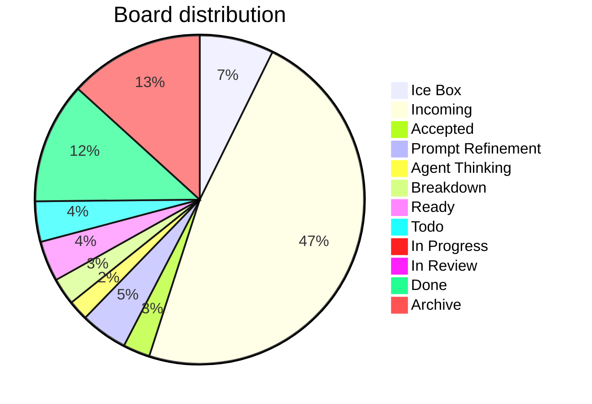

# Board Walk – 2025-08-11

**Assumptions** ^ref-7aa1eb92-3-0

* WIP limit (global Doing) = **3** (change if you want). ^ref-7aa1eb92-5-0
* Doing lanes (for now): **Prompt Refinement**, **Agent Thinking**, **Breakdown**, **In Progress**. ^ref-7aa1eb92-6-0
* Aging threshold: **> 2 days** in a Doing lane. ^ref-7aa1eb92-7-0

---

## Column counts (actual from pasted board)

| Column            | Count | ^ref-7aa1eb92-13-0
| ----------------- | ----- |
| Ice Box           | 11    |
| Incoming          | 72    |
| Accepted          | 4     |
| Prompt Refinement | 7     |
| Agent Thinking    | 3     |
| Breakdown         | 4     |
| Ready             | 6     |
| Todo              | 6     |
| In Progress       | 0     |
| In Review         | 1     |
| Done              | 18    |
| Archive           | 20    |

> Header ↔ actual mismatches detected: ^ref-7aa1eb92-28-0
>
> * **Accepted (8)** → has **4** items ^ref-7aa1eb92-30-0
> * **Prompt Refinement (24)** → has **7** items ^ref-7aa1eb92-31-0
> * **Agent Thinking (24)** → has **3** items
> * **Breakdown (16)** → has **4** items ^ref-7aa1eb92-33-0
> * **Ready (24)** → has **6** items
> * **Todo (16)** → has **6** items ^ref-7aa1eb92-35-0
> * **In Progress (8)** → has **0** items

^ref-7aa1eb92-38-0 ^ref-7aa1eb92-53-0

---

## Blockers

* No items tagged **#blocked** found in the paste.
 ^ref-7aa1eb92-60-0
> If any are blocked, add **#blocked** (and optionally a short reason), e.g., `#blocked:waiting-on-PR-123`.

---

## WIP check (Doing lanes)

* Current **Doing total** (Prompt Refinement + Agent Thinking + Breakdown + In Progress): **14**
* With WIP limit **3**, we’re **over**.
 ^ref-7aa1eb92-69-0
**Proposal**
 ^ref-7aa1eb92-71-0
* Confirm which lanes count as Doing. If all four above are Doing, pull back to **≤3** by:

  1. Moving non‑active cards back to **Ready**. ^ref-7aa1eb92-74-0
  2. Splitting any large Doing card into a small slice that can finish in ≤1 day; park the rest in Ready.

---

## Aging WIP (>2 days)
 ^ref-7aa1eb92-80-0
* Not evaluated: timestamps weren’t provided in the paste.
 ^ref-7aa1eb92-82-0
**Recommendation**
 ^ref-7aa1eb92-84-0
* Add `last_touched: YYYY‑MM‑DD` to frontmatter, or let me read file mtimes; then I’ll auto‑flag aging WIP.

---

## Next pull (single)
 ^ref-7aa1eb92-90-0
**Flow goal (stated recently):** extend WS message broker with **queue semantics** and connect services.
 ^ref-7aa1eb92-92-0
* **Best pull (promote from Incoming → Ready):** `[[add_manualack_to_event_bus_and_re_run_tests.md|Add manualAck to event bus and re-run tests]]` (unblocks reliable delivery & retries). ^ref-7aa1eb92-93-0
* **If restricted to current Ready only:** `[[Update makefile to have commands specific for agents.md|Update Makefile for agent commands]]` (quick win that improves daily flow) **or** `[[Mirror shared utils with language-specific doc folders.md]]` (reduces duplication before deeper queue work).
 ^ref-7aa1eb92-95-0
> Pick **one**. Everything else waits.

---

## Tag hygiene / normalization
 ^ref-7aa1eb92-101-0
You said you want **column-normalized** hashtags on tasks and files. Proposed canonical set:
 ^ref-7aa1eb92-103-0
* `#ice-box`, `#incoming`, `#accepted`, `#prompt-refinement`, `#agent-thinking`, `#breakdown`, `#ready`, `#todo`, `#in-progress`, `#in-review`, `#done`, `#archive`

**Findings**
 ^ref-7aa1eb92-107-0
* Many **Incoming** items are tagged `#todo`. Suggest adding **`#incoming`** (you can keep `#todo` if you like, but column tag should exist).
* Several **Accepted** items still carry `#todo`.
 ^ref-7aa1eb92-110-0
**Action**
 ^ref-7aa1eb92-112-0
* Run/finish the hashtag-normalizer so each card has both:
 ^ref-7aa1eb92-114-0
  1. the **column tag** (normalized), and ^ref-7aa1eb92-115-0
  2. any **status/phase** tag you want (e.g., `#todo`, `#accepted`).

---

## Quick decisions (checklist)

*

---

## Notes / Misc
 ^ref-7aa1eb92-127-0
* **In Progress** is empty—nice. Let’s keep it that way until we explicitly pull the next slice. ^ref-7aa1eb92-128-0
* Incoming is **72** items; consider a 10‑minute nightly triage to keep it from ballooning.
