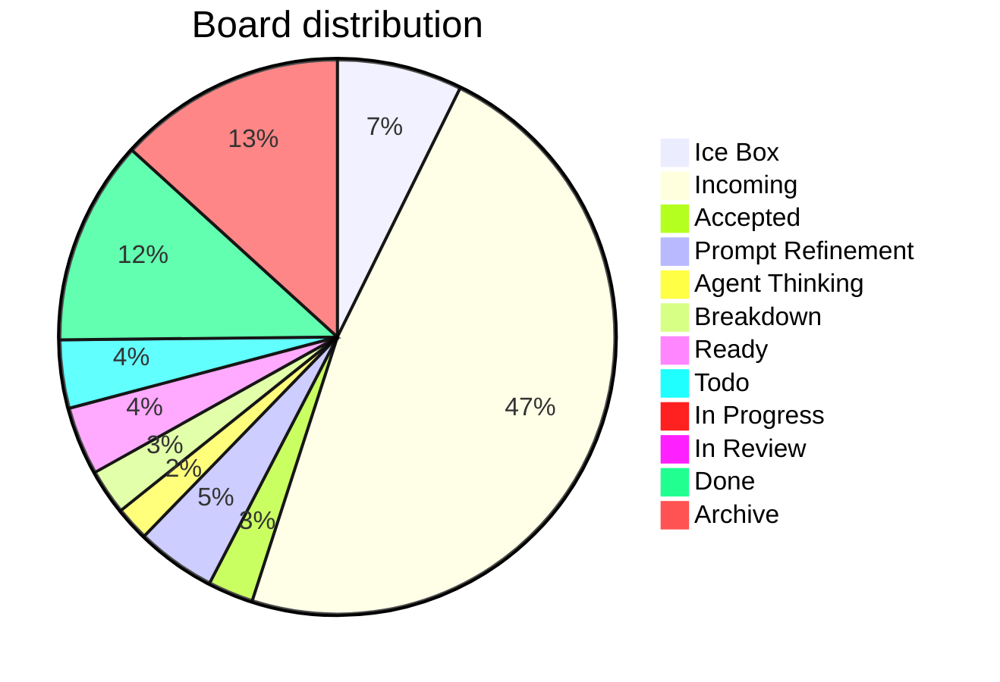

# Board Walk – 2025-08-11

**Assumptions** ^ref-7aa1eb92-3-0

* WIP limit (global Doing) = **3** (change if you want). ^ref-7aa1eb92-5-0
* Doing lanes (for now): **Prompt Refinement**, **Agent Thinking**, **Breakdown**, **In Progress**. ^ref-7aa1eb92-6-0
* Aging threshold: **> 2 days** in a Doing lane. ^ref-7aa1eb92-7-0

---

## Column counts (actual from pasted board)

| Column            | Count | ^ref-7aa1eb92-13-0
| ----------------- | ----- |
| Ice Box           | 11    |
| Incoming          | 72    |
| Accepted          | 4     |
| Prompt Refinement | 7     |
| Agent Thinking    | 3     |
| Breakdown         | 4     |
| Ready             | 6     |
| Todo              | 6     |
| In Progress       | 0     |
| In Review         | 1     |
| Done              | 18    |
| Archive           | 20    |

> Header ↔ actual mismatches detected: ^ref-7aa1eb92-28-0
>
> * **Accepted (8)** → has **4** items ^ref-7aa1eb92-30-0
> * **Prompt Refinement (24)** → has **7** items ^ref-7aa1eb92-31-0
> * **Agent Thinking (24)** → has **3** items
> * **Breakdown (16)** → has **4** items ^ref-7aa1eb92-33-0
> * **Ready (24)** → has **6** items
> * **Todo (16)** → has **6** items ^ref-7aa1eb92-35-0
> * **In Progress (8)** → has **0** items

^ref-7aa1eb92-38-0 ^ref-7aa1eb92-53-0

---

## Blockers

* No items tagged **#blocked** found in the paste.
 ^ref-7aa1eb92-60-0
> If any are blocked, add **#blocked** (and optionally a short reason), e.g., `#blocked:waiting-on-PR-123`.

---

## WIP check (Doing lanes)

* Current **Doing total** (Prompt Refinement + Agent Thinking + Breakdown + In Progress): **14**
* With WIP limit **3**, we’re **over**.
 ^ref-7aa1eb92-69-0
**Proposal**
 ^ref-7aa1eb92-71-0
* Confirm which lanes count as Doing. If all four above are Doing, pull back to **≤3** by:

  1. Moving non‑active cards back to **Ready**. ^ref-7aa1eb92-74-0
  2. Splitting any large Doing card into a small slice that can finish in ≤1 day; park the rest in Ready.

---

## Aging WIP (>2 days)
 ^ref-7aa1eb92-80-0
* Not evaluated: timestamps weren’t provided in the paste.
 ^ref-7aa1eb92-82-0
**Recommendation**
 ^ref-7aa1eb92-84-0
* Add `last_touched: YYYY‑MM‑DD` to frontmatter, or let me read file mtimes; then I’ll auto‑flag aging WIP.

---

## Next pull (single)
 ^ref-7aa1eb92-90-0
**Flow goal (stated recently):** extend WS message broker with **queue semantics** and connect services.
 ^ref-7aa1eb92-92-0
* **Best pull (promote from Incoming → Ready):** `[[add_manualack_to_event_bus_and_re_run_tests.md|Add manualAck to event bus and re-run tests]]` (unblocks reliable delivery & retries). ^ref-7aa1eb92-93-0
* **If restricted to current Ready only:** `[[Update makefile to have commands specific for agents.md|Update Makefile for agent commands]]` (quick win that improves daily flow) **or** `[[Mirror shared utils with language-specific doc folders.md]]` (reduces duplication before deeper queue work).
 ^ref-7aa1eb92-95-0
> Pick **one**. Everything else waits.

---

## Tag hygiene / normalization
 ^ref-7aa1eb92-101-0
You said you want **column-normalized** hashtags on tasks and files. Proposed canonical set:
 ^ref-7aa1eb92-103-0
* `#ice-box`, `#incoming`, `#accepted`, `#prompt-refinement`, `#agent-thinking`, `#breakdown`, `#ready`, `#todo`, `#in-progress`, `#in-review`, `#done`, `#archive`

**Findings**
 ^ref-7aa1eb92-107-0
* Many **Incoming** items are tagged `#todo`. Suggest adding **`#incoming`** (you can keep `#todo` if you like, but column tag should exist).
* Several **Accepted** items still carry `#todo`.
 ^ref-7aa1eb92-110-0
**Action**
 ^ref-7aa1eb92-112-0
* Run/finish the hashtag-normalizer so each card has both:
 ^ref-7aa1eb92-114-0
  1. the **column tag** (normalized), and ^ref-7aa1eb92-115-0
  2. any **status/phase** tag you want (e.g., `#todo`, `#accepted`).

---

## Quick decisions (checklist)

*

---

## Notes / Misc
 ^ref-7aa1eb92-127-0
* **In Progress** is empty—nice. Let’s keep it that way until we explicitly pull the next slice. ^ref-7aa1eb92-128-0
* Incoming is **72** items; consider a 10‑minute nightly triage to keep it from ballooning.
1
  - uuid: f2d83a77-7f86-4c56-8538-1350167a0c6c
    line: 151
    col: 0
    score: 1
  - uuid: f2d83a77-7f86-4c56-8538-1350167a0c6c
    line: 152
    col: 0
    score: 1
  - uuid: 0580dcd3-533d-4834-8a2f-eae3771960a9
    line: 286
    col: 0
    score: 1
  - uuid: 0580dcd3-533d-4834-8a2f-eae3771960a9
    line: 288
    col: 0
    score: 1
  - uuid: d3e7db72-2e07-4dae-8920-0e07c499a1e5
    line: 299
    col: 0
    score: 1
  - uuid: ac60a1d6-fd9f-46dc-bbe7-176dd8017c59
    line: 12
    col: 0
    score: 1
  - uuid: de34f84b-270b-4f16-92a8-a681a869b823
    line: 35
    col: 0
    score: 1
  - uuid: 938eca9c-97e2-4bcc-8653-b0ef1a5ac7a3
    line: 57
    col: 0
    score: 1
  - uuid: 5e408692-0e74-400e-a617-84247c7353ad
    line: 124
    col: 0
    score: 1
  - uuid: 291c7d91-da8c-486c-9bc0-bd2254536e2d
    line: 81
    col: 0
    score: 1
  - uuid: 64a9f9f9-58ee-4996-bdaf-9373845c6b29
    line: 183
    col: 0
    score: 1
  - uuid: e87bc036-1570-419e-a558-f45b9c0db698
    line: 69
    col: 0
    score: 1
  - uuid: f1add613-656e-4bec-b52b-193fd78c4642
    line: 36
    col: 0
    score: 1
  - uuid: 557309a3-c906-4e97-8867-89ffe151790c
    line: 46
    col: 0
    score: 1
  - uuid: 6cb4943e-8267-4e27-8618-2ce0a464d173
    line: 40
    col: 0
    score: 1
  - uuid: 9e8ae388-767a-4ea8-9f2e-88801291d947
    line: 53
    col: 0
    score: 1
  - uuid: 10d98225-12e0-4212-8e15-88b57cf7bee5
    line: 33
    col: 0
    score: 1
  - uuid: 0580dcd3-533d-4834-8a2f-eae3771960a9
    line: 287
    col: 0
    score: 1
  - uuid: ac60a1d6-fd9f-46dc-bbe7-176dd8017c59
    line: 15
    col: 0
    score: 1
  - uuid: d17d3a96-c84d-4738-a403-6c733b874da2
    line: 593
    col: 0
    score: 1
  - uuid: d8059b6a-c1ec-487d-8e0b-3ce33d6b4d06
    line: 561
    col: 0
    score: 1
  - uuid: 4330e8f0-5f46-4235-918b-39b6b93fa561
    line: 607
    col: 0
    score: 1
  - uuid: 7b7ca860-780c-44fa-8d3f-be8bd9496fba
    line: 548
    col: 0
    score: 1
  - uuid: 18344cf9-0c49-4a71-b6c8-b8d84d660fca
    line: 50
    col: 0
    score: 1
  - uuid: 9fab9e76-e283-4c9d-a8cd-cb76892ea7ac
    line: 28
    col: 0
    score: 1
  - uuid: 3a3bf2c9-c0f6-4d7b-bf84-c83c70dece3f
    line: 232
    col: 0
    score: 1
  - uuid: c0392040-16a2-41e8-bd54-75110319e3c0
    line: 29
    col: 0
    score: 1
  - uuid: b22d79c6-825b-4cd3-b0d3-1cef0532bb54
    line: 1342
    col: 0
    score: 1
  - uuid: d3e7db72-2e07-4dae-8920-0e07c499a1e5
    line: 383
    col: 0
    score: 1
  - uuid: 10d98225-12e0-4212-8e15-88b57cf7bee5
    line: 1333
    col: 0
    score: 1
  - uuid: 13951643-1741-46bb-89dc-1beebb122633
    line: 2911
    col: 0
    score: 1
  - uuid: 18138627-a348-4fbb-b447-410dfb400564
    line: 3603
    col: 0
    score: 1
  - uuid: 0580dcd3-533d-4834-8a2f-eae3771960a9
    line: 293
    col: 0
    score: 1
  - uuid: ac60a1d6-fd9f-46dc-bbe7-176dd8017c59
    line: 27
    col: 0
    score: 1
  - uuid: 10d98225-12e0-4212-8e15-88b57cf7bee5
    line: 176
    col: 0
    score: 1
  - uuid: 13951643-1741-46bb-89dc-1beebb122633
    line: 366
    col: 0
    score: 1
  - uuid: a4d90289-798d-44a0-a8e8-a055ae12fb52
    line: 632
    col: 0
    score: 1
---
# Board Walk – 2025-08-11

**Assumptions** ^ref-7aa1eb92-3-0

* WIP limit (global Doing) = **3** (change if you want). ^ref-7aa1eb92-5-0
* Doing lanes (for now): **Prompt Refinement**, **Agent Thinking**, **Breakdown**, **In Progress**. ^ref-7aa1eb92-6-0
* Aging threshold: **> 2 days** in a Doing lane. ^ref-7aa1eb92-7-0

---

## Column counts (actual from pasted board)

| Column            | Count | ^ref-7aa1eb92-13-0
| ----------------- | ----- |
| Ice Box           | 11    |
| Incoming          | 72    |
| Accepted          | 4     |
| Prompt Refinement | 7     |
| Agent Thinking    | 3     |
| Breakdown         | 4     |
| Ready             | 6     |
| Todo              | 6     |
| In Progress       | 0     |
| In Review         | 1     |
| Done              | 18    |
| Archive           | 20    |

> Header ↔ actual mismatches detected: ^ref-7aa1eb92-28-0
>
> * **Accepted (8)** → has **4** items ^ref-7aa1eb92-30-0
> * **Prompt Refinement (24)** → has **7** items ^ref-7aa1eb92-31-0
> * **Agent Thinking (24)** → has **3** items
> * **Breakdown (16)** → has **4** items ^ref-7aa1eb92-33-0
> * **Ready (24)** → has **6** items
> * **Todo (16)** → has **6** items ^ref-7aa1eb92-35-0
> * **In Progress (8)** → has **0** items

^ref-7aa1eb92-38-0 ^ref-7aa1eb92-53-0

---

## Blockers

* No items tagged **#blocked** found in the paste.
 ^ref-7aa1eb92-60-0
> If any are blocked, add **#blocked** (and optionally a short reason), e.g., `#blocked:waiting-on-PR-123`.

---

## WIP check (Doing lanes)

* Current **Doing total** (Prompt Refinement + Agent Thinking + Breakdown + In Progress): **14**
* With WIP limit **3**, we’re **over**.
 ^ref-7aa1eb92-69-0
**Proposal**
 ^ref-7aa1eb92-71-0
* Confirm which lanes count as Doing. If all four above are Doing, pull back to **≤3** by:

  1. Moving non‑active cards back to **Ready**. ^ref-7aa1eb92-74-0
  2. Splitting any large Doing card into a small slice that can finish in ≤1 day; park the rest in Ready.

---

## Aging WIP (>2 days)
 ^ref-7aa1eb92-80-0
* Not evaluated: timestamps weren’t provided in the paste.
 ^ref-7aa1eb92-82-0
**Recommendation**
 ^ref-7aa1eb92-84-0
* Add `last_touched: YYYY‑MM‑DD` to frontmatter, or let me read file mtimes; then I’ll auto‑flag aging WIP.

---

## Next pull (single)
 ^ref-7aa1eb92-90-0
**Flow goal (stated recently):** extend WS message broker with **queue semantics** and connect services.
 ^ref-7aa1eb92-92-0
* **Best pull (promote from Incoming → Ready):** `[[add_manualack_to_event_bus_and_re_run_tests.md|Add manualAck to event bus and re-run tests]]` (unblocks reliable delivery & retries). ^ref-7aa1eb92-93-0
* **If restricted to current Ready only:** `[[Update makefile to have commands specific for agents.md|Update Makefile for agent commands]]` (quick win that improves daily flow) **or** `[[Mirror shared utils with language-specific doc folders.md]]` (reduces duplication before deeper queue work).
 ^ref-7aa1eb92-95-0
> Pick **one**. Everything else waits.

---

## Tag hygiene / normalization
 ^ref-7aa1eb92-101-0
You said you want **column-normalized** hashtags on tasks and files. Proposed canonical set:
 ^ref-7aa1eb92-103-0
* `#ice-box`, `#incoming`, `#accepted`, `#prompt-refinement`, `#agent-thinking`, `#breakdown`, `#ready`, `#todo`, `#in-progress`, `#in-review`, `#done`, `#archive`

**Findings**
 ^ref-7aa1eb92-107-0
* Many **Incoming** items are tagged `#todo`. Suggest adding **`#incoming`** (you can keep `#todo` if you like, but column tag should exist).
* Several **Accepted** items still carry `#todo`.
 ^ref-7aa1eb92-110-0
**Action**
 ^ref-7aa1eb92-112-0
* Run/finish the hashtag-normalizer so each card has both:
 ^ref-7aa1eb92-114-0
  1. the **column tag** (normalized), and ^ref-7aa1eb92-115-0
  2. any **status/phase** tag you want (e.g., `#todo`, `#accepted`).

---

## Quick decisions (checklist)

*

---

## Notes / Misc
 ^ref-7aa1eb92-127-0
* **In Progress** is empty—nice. Let’s keep it that way until we explicitly pull the next slice. ^ref-7aa1eb92-128-0
* Incoming is **72** items; consider a 10‑minute nightly triage to keep it from ballooning.
