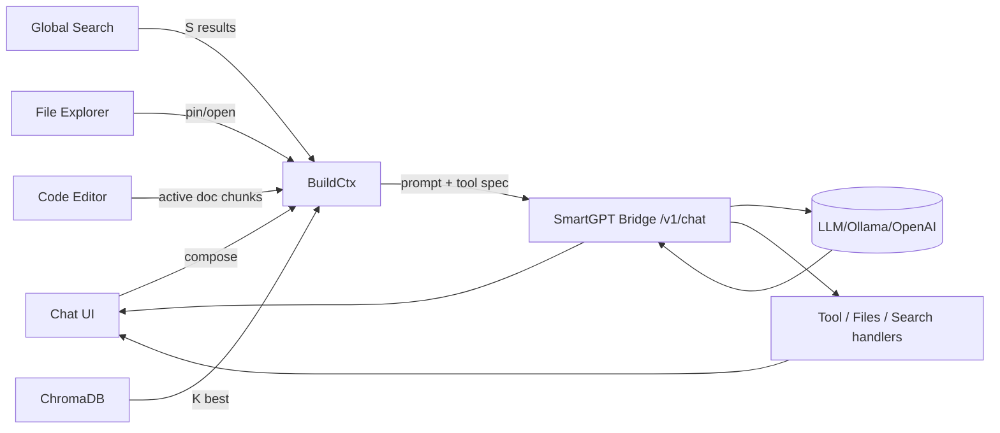

love this direction. here’s a concrete, no‑react, web‑components-first design you can build toward. it gives you: a markdown chat, file explorer, search bar, tiny code editor with evil-ish keys, and a **dynamic chat context** (latest n + recalled context + rag k). ^ref-f7702bf8-1-0

---

# high-level layout (split panes)

```text
┌────────────────────────────────────────────────────────────────────────┐
│ Top Bar: [⌕ global search]  [model] [temperature] [run ▶] [pin 📌]    │
├─────────────┬──────────────────────────────────────────────────────────┤
│ File Tree   │ Chat (markdown) + Context Strip                          │
│ (left)      │ ─ messages                                               │
│             │ ─ inline citations / source chips                        │
│             │ ─ system / tool traces (collapsible)                     │
│             │ ─ Context Strip (active: latest n msgs + k RAG + files)  │
├─────────────┼──────────────────────────────────────────────────────────┤
│ Inspector   │ Code Editor (minimal, vim/evil keys)                     │
│ (right)     │ ─ diff/preview tab                                       │
│             │ ─ chunk view / embeddings viz                            │
└─────────────┴──────────────────────────────────────────────────────────┘
```

* **Left**: file explorer (your existing component), shows repo tree, supports “open”, “pin to context”, “embed chunk”. ^ref-f7702bf8-23-0
* **Center**: markdown chat; above the composer: a **Context Strip** of chips showing what will be sent (last N msgs, K RAG hits, pinned file chunks, top search results). ^ref-f7702bf8-24-0
* **Right**: inspector / code editor; toggles between code edit, diff, chunk view, and “embedding neighborhood”. ^ref-f7702bf8-25-0

---

# dynamic context model (what gets sent)

* keep only: ^ref-f7702bf8-31-0

  * **M latest user+assistant messages** (defaults: `M=6`, configurable). ^ref-f7702bf8-33-0
  * **Pinned items** (explicit overrides; never evicted unless unpinned). ^ref-f7702bf8-34-0
  * **K best RAG matches** from Chroma (defaults: `K=8`, per-query). ^ref-f7702bf8-35-0
  * **S top search results** (filename/title + short snippet) (defaults: `S=3`). ^ref-f7702bf8-36-0
  * **F top file chunks** from currently open files (defaults: `F=4`). ^ref-f7702bf8-37-0

* eviction order when token budget tight: search→open-file chunks→RAG hits→older chat msgs→(never evict pinned). ^ref-f7702bf8-39-0

* hard **token budget** you compute each send: `B_total` (e.g., 12k). ^ref-f7702bf8-41-0

  * reserve headroom for reply: `B_reply_reserve` (e.g., 3k).
  * available for context: `B_ctx = B_total - B_reply_reserve - B_sys`. ^ref-f7702bf8-44-0
  * greedy pack by priority & per‑item cap (e.g., chunk cap 400–800 tokens). ^ref-f7702bf8-45-0

---

# data flow (mermaid)


^ref-f7702bf8-51-0 ^ref-f7702bf8-65-0

---

# prompt assembly (deterministic & transparent)

**System** (static, short)

* who you are (Cephalon/Duck), coding style prefs, **“answer with citations using \[#id] chips the UI provides”**. ^ref-f7702bf8-73-0
* keep it <600 tokens.
 ^ref-f7702bf8-75-0
**Context blocks** (ordered):

1. **Pinned** `[PIN:…]` ^ref-f7702bf8-78-0
2. **OpenFileChunks** `[FILE: path#Lx-Ly]` ^ref-f7702bf8-79-0
3. **RAG** `[RAG: source-id score=…]` ^ref-f7702bf8-80-0
4. **Search** `[WEB: title url-hash]` ^ref-f7702bf8-81-0
5. **ChatTail** (last `M` messages, condensed if needed)
 ^ref-f7702bf8-83-0
**User message** last.
 ^ref-f7702bf8-85-0
UI shows a **live preview** of this prompt (collapsible), so you always see what gets sent.

---

# minimal state shape
 ^ref-f7702bf8-91-0
```ts
type Chip = {
  id: string;              // stable id used in prompt
  kind: 'pin'|'file'|'rag'|'search'|'msg';
  title: string;
  meta?: Record<string, any>;
  tokens: number;          // estimated by tiktoken-like lib
  selected: boolean;       // user may toggle off before send
  payload: { text: string, citation?: string };
};

type ChatState = {
  messages: Array<{ id: string; role: 'user'|'assistant'|'system'; text: string; ts: number; }>;
  chips: Chip[];           // computed each keystroke / on search / on open
  budget: { total: number; reserve: number; used: number; remaining: number };
  params: { M: number; K: number; S: number; F: number; model: string; temp: number };
};
^ref-f7702bf8-91-0
```

---

# event bus (simple, decoupled) ^ref-f7702bf8-114-0

Use a tiny pub/sub (no framework): ^ref-f7702bf8-116-0

```ts
type Event =
  | { type: 'SEARCH_REQUEST'; q: string }
  | { type: 'SEARCH_RESULTS'; items: Chip[] }
  | { type: 'FILES_OPEN'; path: string }
  | { type: 'FILES_PIN'; chip: Chip }
  | { type: 'RAG_QUERY'; q: string }
  | { type: 'RAG_RESULTS'; items: Chip[] }
  | { type: 'CHAT_SEND'; text: string }
  | { type: 'CHAT_RESPONSE'; msg: string; toolCalls?: any[] }
  | { type: 'BUDGET_RECALC' }
  | { type: 'CHIP_TOGGLE'; id: string; selected: boolean }
  | { type: 'EDITOR_SET_ACTIVE'; path: string }
  | { type: 'TRACE_UPDATE'; tool: string; data: any };

const bus = (() => {
  const subs = new Map<string, Set<(e:any)=>void>>();
  function on(type: Event['type'], fn: (e:any)=>void){ (subs.get(type) ?? subs.set(type, new Set()).get(type))!.add(fn); }
  function emit(e: Event){ subs.get(e.type)?.forEach(fn => fn(e)); }
  return { on, emit };
^ref-f7702bf8-116-0
})(); ^ref-f7702bf8-139-0
```

Each Web Component listens/emits only the events it cares about.

---
 ^ref-f7702bf8-145-0
# web components (custom elements) ^ref-f7702bf8-146-0
 ^ref-f7702bf8-147-0
* `<app-shell>`: owns layout + global state ^ref-f7702bf8-148-0
* `<chat-panel>`: markdown rendering, composer, context strip ^ref-f7702bf8-149-0
* `<context-strip>`: renders chips, toggles, drag‑to‑reorder ^ref-f7702bf8-150-0
* `<file-tree-panel>`: your explorer, emits `FILES_OPEN`, `FILES_PIN` ^ref-f7702bf8-151-0
* `<search-bar>`: emits `SEARCH_REQUEST`, shows `SEARCH_RESULTS`
* `<code-editor-panel>`: lightweight editor w/ evil keys
* `<inspector-panel>`: diff/preview/chunk/embedding tabs ^ref-f7702bf8-154-0
* `<token-budget-meter>`: visual budget bar

**Communication:** only through the event bus + attributes for initial props.

---
 ^ref-f7702bf8-160-0
# keyboard scheme (Spacemacs/Evil vibes)
 ^ref-f7702bf8-162-0
Global (while focus in chat or editor): ^ref-f7702bf8-163-0

* `Space` opens **Leader menu** (overlay palette). ^ref-f7702bf8-165-0
* Leader chords: ^ref-f7702bf8-166-0
 ^ref-f7702bf8-167-0
  * `SPC f f` open file (focus file tree) ^ref-f7702bf8-168-0
  * `SPC f p` pin active chunk ^ref-f7702bf8-169-0
  * `SPC s s` focus search bar ^ref-f7702bf8-170-0
  * `SPC c c` send chat ^ref-f7702bf8-171-0
  * `SPC t t` toggle token preview
  * `SPC m m` model selector ^ref-f7702bf8-173-0
* Editor (modal): ^ref-f7702bf8-174-0
 ^ref-f7702bf8-175-0
  * Normal mode: `h j k l`, `dd`, `yw`, `p`, `/` search ^ref-f7702bf8-176-0
  * Insert mode: standard typing
  * `Esc` → normal, `i` → insert, `v` → visual
* Chat: ^ref-f7702bf8-179-0
 ^ref-f7702bf8-180-0
  * `Ctrl+Enter` send
  * `Alt+↑/↓` adjust temp
  * `Alt+[` / `Alt+]` adjust K (RAG hits)
  * `Alt+Shift+[` / `]` adjust M (chat tail)

---
 ^ref-f7702bf8-187-0
# dynamic chunking + ids ^ref-f7702bf8-188-0
 ^ref-f7702bf8-189-0
* When a file is opened, client requests `/v1/files/view?path=…&lines=…&context=…` (you already sketched this).
* Chunk by semantic boundaries (AST if available) or fallback to **sliding windows** with overlaps.
* Assign stable deterministic ids: `hash(repo@commit:path#Lx-Ly)`.
* Emit chips for the **top F** most-recently viewed chunks (unless deselected).

---
 ^ref-f7702bf8-196-0
# retrieval policy (simple & effective) ^ref-f7702bf8-197-0
 ^ref-f7702bf8-198-0
1. **Live query**: build from the composer text (+ open file path context). ^ref-f7702bf8-199-0
2. **Chroma**: `collection.query({ queryEmbeddings, topK: K, where: { repo: current } })` ^ref-f7702bf8-200-0
3. **Search** (optional): code‑aware BM25 over filename & headings; take top S.
4. **Dedup**: prefer unique sources; rerank by **(semantic score + recency boost + pin bonus)**.
5. **Trim to budget** with per‑type caps (e.g., `ragChunkCap=500`, `fileChunkCap=700`, `searchCap=150`, `chatMsgCap=350`).

Show the final set as chips; user can toggle any off **before** send.

---

# example “build context” (pseudo)

```ts
function buildContext(state: ChatState) {
  const { M, K, S, F } = state.params;
  const pinned = state.chips.filter(c => c.kind === 'pin' && c.selected);
  const openFile = pickRecent(state.chips, 'file', F);
  const rag = topK(state.chips, 'rag', K);
  const search = topK(state.chips, 'search', S);
  const tail = takeLastM(state.messages, M);

  let blocks = [
    ["[PIN]", pinned],
    ["[FILE]", openFile],
    ["[RAG]", rag],
    ["[SEARCH]", search],
    ["[CHAT]", tail.map(m=>({...m, kind:'msg'}))],
  ];

  blocks = trimToBudget(blocks, state.budget.remaining);
  return flattenBlocks(blocks);
}
```

---
 ^ref-f7702bf8-234-0
# prompt example (assembled)

```
<System>
You are Cephalon, assistant for the Promethean project. Prefer JS/TS & Lisp-like pseudo. Cite using chip ids like [#chip-abc].
</System>

[PIN]
[#pin-1] AGENTS.md excerpt…
[#pin-2] process.md state machine…

[FILE]
[#file-a] services/ts/cephalon/contextManager.ts#L40-L132 …
[#file-b] services/ts/cephalon/collectionManager.ts#L10-L88 …

[RAG]
[#rag-1] (score 0.89) commit 437: “dual store types”… 
[#rag-2] (0.86) “tool calling patch”…

[SEARCH]
[#web-1] “Ollama tool support” blog summary…
[#web-2] “Fastify response schema oneOf tip”…

[CHAT]
user: how do I forward tool calls through codex context?
assistant: …
user: I think the backend.chat signature needs opts.tools…
assistant: …

<User>
^ref-f7702bf8-234-0
Please propose a minimal diff for backend.ts and index.ts. ^ref-f7702bf8-266-0
</User>
```

UI shows those bracketed blocks as collapsible sections; each `[#id]` is clickable to preview the source.

--- ^ref-f7702bf8-272-0

# minimal tool interface (bridge) ^ref-f7702bf8-274-0

Define a neutral payload you already support:

```ts
type ToolSpec = {
  name: string;
  description?: string;
  json_schema?: Record<string, any>;
};

type ChatRequest = {
  model: string;
  messages: { role: 'system'|'user'|'assistant'|'tool'; content: string; name?: string }[];
  tools?: ToolSpec[];
  tool_choice?: 'auto' | { type: 'function', function: { name: string } };
  stream?: boolean;
  temperature?: number;
^ref-f7702bf8-274-0
  metadata?: any; ^ref-f7702bf8-293-0
  context_preview?: Chip[]; // for logging/trace
};
```

**Streaming**: parse tool calls and forward as `TRACE_UPDATE` events so the UI shows tool execution and responses inline.
 ^ref-f7702bf8-299-0
--- ^ref-f7702bf8-300-0

# code editor choice (no React, still nice)
 ^ref-f7702bf8-303-0
* Start with **CodeMirror 6** (vanilla) for a tiny footprint.
* Layer **Vim** keymap + a small Evil bridge:

  * normal/insert/visual modes
  * `dd`, `dw`, `p`, `ci(`, etc.
* Map Leader overlay to CodeMirror commands + app actions.
 ^ref-f7702bf8-310-0
--- ^ref-f7702bf8-311-0

# persistence + replay ^ref-f7702bf8-313-0

* Persist only **messages** and **pins** to local DB (IndexedDB) per “conversation id”. ^ref-f7702bf8-315-0
* **Rebuild chips** deterministically on load by re-running: ^ref-f7702bf8-316-0

  * open-file chunking (if file exists)
  * RAG query for last user message (store its embedding to seed)
  * search (optional cached)
* This gives you the “dynamic history” feel: lightweight saved chat, context always re‑computed.

---
 ^ref-f7702bf8-324-0
# quick milestones ^ref-f7702bf8-325-0
 ^ref-f7702bf8-326-0
1. **Shell + Bus**

* app-shell, chat-panel, file-tree-panel, search-bar, code-editor-panel
* events wired, no backend yet ^ref-f7702bf8-330-0
* dummy chips + token meter ^ref-f7702bf8-331-0
 ^ref-f7702bf8-332-0
2. **Bridge integration**
 ^ref-f7702bf8-334-0
* `/v1/chat` streaming
* `/v1/files/view`, `/v1/files/list` ^ref-f7702bf8-336-0
* `/v1/search` (or call your search service) ^ref-f7702bf8-337-0

3. **Chroma hookup** ^ref-f7702bf8-339-0

* query for top K with a basic reranker
* chip de‑dup + eviction
 ^ref-f7702bf8-343-0
4. **Editor + evil keys**
 ^ref-f7702bf8-345-0
* CodeMirror 6 + vim keymap + leader palette

5. **Prompt preview + citations**

* render assembled prompt sections
* enforce chip id usage in assistant replies
 ^ref-f7702bf8-352-0
---

# tiny HTML skeleton (illustrative only)

```html
<body>
  <app-shell>
    <file-tree-panel slot="left"></file-tree-panel>
    <chat-panel slot="center"></chat-panel>
^ref-f7702bf8-352-0
    <inspector-panel slot="right"></inspector-panel> ^ref-f7702bf8-363-0
  </app-shell>
  <script type="module" src="/app-shell.js"></script>
</body>
```

Each module defines a custom element, subscribes to `bus`, and updates with attributes/props.
 ^ref-f7702bf8-370-0
--- ^ref-f7702bf8-371-0
 ^ref-f7702bf8-372-0
# where to start (today)
 ^ref-f7702bf8-374-0
* implement `bus`, `tokenBudget()` (rough tiktoken estimator), and `trimToBudget()`.
* stub chips and render a **Context Strip** that lets you toggle items on/off and see live budget. ^ref-f7702bf8-376-0
* wire `/v1/chat` with streaming and the **prompt preview**. ^ref-f7702bf8-377-0
* once that loop feels good, bolt on RAG + file chunks. ^ref-f7702bf8-378-0
 ^ref-f7702bf8-379-0
if you want, I can open a fresh canvas next to this chat with:
 ^ref-f7702bf8-381-0
* a mermaid end‑to‑end diagram, ^ref-f7702bf8-382-0
* the event bus and chip models,
* a minimal `<chat-panel>` custom element, ^ref-f7702bf8-384-0
* and the prompt assembly util.<!-- GENERATED-SECTIONS:DO-NOT-EDIT-BELOW -->
## Related content
- [Promethean-Copilot-Intent-Engine](promethean-copilot-intent-engine.md)
- [Promethean Infrastructure Setup](promethean-infrastructure-setup.md)
- [Redirecting Standard Error](redirecting-standard-error.md)
- [Model Selection for Lightweight Conversational Tasks](model-selection-for-lightweight-conversational-tasks.md)
- [Optimizing Command Limitations in System Design](optimizing-command-limitations-in-system-design.md)
- [Obsidian ChatGPT Plugin Integration](obsidian-chatgpt-plugin-integration.md)
- [Obsidian Templating Plugins Integration Guide](obsidian-templating-plugins-integration-guide.md)
- [Obsidian ChatGPT Plugin Integration Guide](obsidian-chatgpt-plugin-integration-guide.md)
- [Model Upgrade Calm-Down Guide](model-upgrade-calm-down-guide.md)
- [Reawakening Duck](reawakening-duck.md)
- [Agent Tasks: Persistence Migration to DualStore](agent-tasks-persistence-migration-to-dualstore.md)
- [Canonical Org-Babel Matplotlib Animation Template](canonical-org-babel-matplotlib-animation-template.md)
- [windows-tiling-with-autohotkey](windows-tiling-with-autohotkey.md)
- [The Jar of Echoes](the-jar-of-echoes.md)
- [Duck's Attractor States](ducks-attractor-states.md)
- [obsidian-ignore-node-modules-regex](obsidian-ignore-node-modules-regex.md)
- [Migrate to Provider-Tenant Architecture](migrate-to-provider-tenant-architecture.md)
- [Performance-Optimized-Polyglot-Bridge](performance-optimized-polyglot-bridge.md)
- [Pure TypeScript Search Microservice](pure-typescript-search-microservice.md)
- [Factorio AI with External Agents](factorio-ai-with-external-agents.md)
- [Chroma Toolkit Consolidation Plan](chroma-toolkit-consolidation-plan.md)
- [Tracing the Signal](tracing-the-signal.md)
- [plan-update-confirmation](plan-update-confirmation.md)
- [i3-bluetooth-setup](i3-bluetooth-setup.md)
- [Duck's Self-Referential Perceptual Loop](ducks-self-referential-perceptual-loop.md)
- [typed-struct-compiler](typed-struct-compiler.md)
- [Unique Concepts](unique-concepts.md)
- [Unique Info Dump Index](unique-info-dump-index.md)
- [zero-copy-snapshots-and-workers](zero-copy-snapshots-and-workers.md)
- [Creative Moments](creative-moments.md)
- [eidolon-field-math-foundations](eidolon-field-math-foundations.md)
- [field-node-diagram-outline](field-node-diagram-outline.md)
- [field-node-diagram-set](field-node-diagram-set.md)
- [field-node-diagram-visualizations](field-node-diagram-visualizations.md)
- [Fnord Tracer Protocol](fnord-tracer-protocol.md)
- [graph-ds](graph-ds.md)
- [heartbeat-fragment-demo](heartbeat-fragment-demo.md)
- [Ice Box Reorganization](ice-box-reorganization.md)
- [komorebi-group-window-hack](komorebi-group-window-hack.md)
- [Layer1SurvivabilityEnvelope](layer1survivabilityenvelope.md)
- [Diagrams](chunks/diagrams.md)
- [DSL](chunks/dsl.md)
- [JavaScript](chunks/javascript.md)
- [Math Fundamentals](chunks/math-fundamentals.md)
- [Shared](chunks/shared.md)
- [Functional Refactor of TypeScript Document Processing](functional-refactor-of-typescript-document-processing.md)
- [Per-Domain Policy System for JS Crawler](per-domain-policy-system-for-js-crawler.md)
- [Promethean Dev Workflow Update](promethean-dev-workflow-update.md)
- [Obsidian Task Generation](obsidian-task-generation.md)
- [polyglot-repl-interface-layer](polyglot-repl-interface-layer.md)
- [Post-Linguistic Transhuman Design Frameworks](post-linguistic-transhuman-design-frameworks.md)
- [Promethean Workflow Optimization](promethean-workflow-optimization.md)
- [Prometheus Observability Stack](prometheus-observability-stack.md)
- [Prompt_Folder_Bootstrap](prompt-folder-bootstrap.md)
- [Protocol_0_The_Contradiction_Engine](protocol-0-the-contradiction-engine.md)
- [Stateful Partitions and Rebalancing](stateful-partitions-and-rebalancing.md)
- [Debugging Broker Connections and Agent Behavior](debugging-broker-connections-and-agent-behavior.md)
- [field-dynamics-math-blocks](field-dynamics-math-blocks.md)
- [field-interaction-equations](field-interaction-equations.md)
- [homeostasis-decay-formulas](homeostasis-decay-formulas.md)
- [schema-evolution-workflow](schema-evolution-workflow.md)
- [TypeScript Patch for Tool Calling Support](typescript-patch-for-tool-calling-support.md)
- [Promethean Pipelines](promethean-pipelines.md)
- [promethean-requirements](promethean-requirements.md)
- [Provider-Agnostic Chat Panel Implementation](provider-agnostic-chat-panel-implementation.md)
- [Self-Agency in AI Interaction](self-agency-in-ai-interaction.md)
- [sibilant-macro-targets](sibilant-macro-targets.md)
- [ripple-propagation-demo](ripple-propagation-demo.md)
- [Eidolon Field Abstract Model](eidolon-field-abstract-model.md)
- [ParticleSimulationWithCanvasAndFFmpeg](particlesimulationwithcanvasandffmpeg.md)
- [Promethean State Format](promethean-state-format.md)
- [Simulation Demo](chunks/simulation-demo.md)
- [Synchronicity Waves and Web](synchronicity-waves-and-web.md)
- [unique-templates](templates/unique-templates.md)
- [ts-to-lisp-transpiler](ts-to-lisp-transpiler.md)
- [Smoke Resonance Visualizations](smoke-resonance-visualizations.md)
- [NPU Voice Code and Sensory Integration](npu-voice-code-and-sensory-integration.md)
- [eidolon-node-lifecycle](eidolon-node-lifecycle.md)
- [Promethean_Eidolon_Synchronicity_Model](promethean-eidolon-synchronicity-model.md)
- [Tooling](chunks/tooling.md)
- [OpenAPI Validation Report](openapi-validation-report.md)
- [Services](chunks/services.md)
- [Promethean Chat Activity Report](promethean-chat-activity-report.md)
- [Docops Feature Updates](docops-feature-updates.md)
- [Functional Embedding Pipeline Refactor](functional-embedding-pipeline-refactor.md)
- [Admin Dashboard for User Management](admin-dashboard-for-user-management.md)
- [ChatGPT Custom Prompts](chatgpt-custom-prompts.md)
- [Window Management](chunks/window-management.md)
- [Pipeline Enhancements](pipeline-enhancements.md)
- [Promethean Data Sync Protocol](promethean-data-sync-protocol.md)
- [Promethean Documentation Pipeline Overview](promethean-documentation-pipeline-overview.md)
- [Board Walk – 2025-08-11](board-walk-2025-08-11.md)
- [template-based-compilation](template-based-compilation.md)
- [balanced-bst](balanced-bst.md)
- [Operations](chunks/operations.md)
- [Promethean Notes](promethean-notes.md)
- [Promethean Documentation Update](promethean-documentation-update.txt)
- [api-gateway-versioning](api-gateway-versioning.md)
- [Board Automation Improvements](board-automation-improvements.md)
- [Docops Feature Updates](docops-feature-updates-3.md)
- [Mathematical Samplers](mathematical-samplers.md)
- [DuckDuckGoSearchPipeline](duckduckgosearchpipeline.md)
- [Promethean Documentation Update](promethean-documentation-update.md)
- [Mathematics Sampler](mathematics-sampler.md)
- [Mindful Prioritization](mindful-prioritization.md)
- [MindfulRobotIntegration](mindfulrobotintegration.md)
- [Promethean Documentation Overview](promethean-documentation-overview.md)
- [Agent Reflections and Prompt Evolution](agent-reflections-and-prompt-evolution.md)
- [aionian-circuit-math](aionian-circuit-math.md)
- [AGENTS.md](agents-md-3.md)
- [AI-First-OS-Model-Context-Protocol](ai-first-os-model-context-protocol.md)
- [AGENTS.md](agents-md.md)
- [Mongo Outbox Implementation](mongo-outbox-implementation.md)
- [Promethean Event Bus MVP v0.1](promethean-event-bus-mvp-v0-1.md)
- [ecs-offload-workers](ecs-offload-workers.md)
- [i3-layout-saver](i3-layout-saver.md)
- [ecs-scheduler-and-prefabs](ecs-scheduler-and-prefabs.md)
- [run-step-api](run-step-api.md)
- [Promethean Web UI Setup](promethean-web-ui-setup.md)
- [lisp-dsl-for-window-management](lisp-dsl-for-window-management.md)
- [Universal Lisp Interface](universal-lisp-interface.md)
- [Event Bus Projections Architecture](event-bus-projections-architecture.md)
- [pm2-orchestration-patterns](pm2-orchestration-patterns.md)
- [mystery-lisp-search-session](mystery-lisp-search-session.md)
- [Polyglot S-expr Bridge: Python-JS-Lisp Interop](polyglot-s-expr-bridge-python-js-lisp-interop.md)
- [Promethean-native config design](promethean-native-config-design.md)
- [WebSocket Gateway Implementation](websocket-gateway-implementation.md)
- [Sibilant Meta-Prompt DSL](sibilant-meta-prompt-dsl.md)
- [shared-package-layout-clarification](shared-package-layout-clarification.md)
- [Matplotlib Animation with Async Execution](matplotlib-animation-with-async-execution.md)
- [Chroma-Embedding-Refactor](chroma-embedding-refactor.md)
## Sources
- [typed-struct-compiler — L1016](typed-struct-compiler.md#^ref-78eeedf7-1016-0) (line 1016, col 0, score 1)
- [Unique Concepts — L175](unique-concepts.md#^ref-ed6f3fc9-175-0) (line 175, col 0, score 1)
- [Unique Info Dump Index — L1221](unique-info-dump-index.md#^ref-30ec3ba6-1221-0) (line 1221, col 0, score 1)
- [zero-copy-snapshots-and-workers — L1058](zero-copy-snapshots-and-workers.md#^ref-62bec6f0-1058-0) (line 1058, col 0, score 1)
- [Canonical Org-Babel Matplotlib Animation Template — L515](canonical-org-babel-matplotlib-animation-template.md#^ref-1b1338fc-515-0) (line 515, col 0, score 1)
- [Creative Moments — L251](creative-moments.md#^ref-10d98225-251-0) (line 251, col 0, score 1)
- [Duck's Attractor States — L559](ducks-attractor-states.md#^ref-13951643-559-0) (line 559, col 0, score 1)
- [eidolon-field-math-foundations — L1033](eidolon-field-math-foundations.md#^ref-008f2ac0-1033-0) (line 1033, col 0, score 1)
- [Docops Feature Updates — L226](docops-feature-updates.md#^ref-2792d448-226-0) (line 226, col 0, score 1)
- [field-node-diagram-outline — L705](field-node-diagram-outline.md#^ref-1f32c94a-705-0) (line 705, col 0, score 1)
- [field-node-diagram-set — L719](field-node-diagram-set.md#^ref-22b989d5-719-0) (line 719, col 0, score 1)
- [field-node-diagram-visualizations — L601](field-node-diagram-visualizations.md#^ref-e9b27b06-601-0) (line 601, col 0, score 1)
- [Fnord Tracer Protocol — L1060](fnord-tracer-protocol.md#^ref-fc21f824-1060-0) (line 1060, col 0, score 1)
- [Functional Embedding Pipeline Refactor — L726](functional-embedding-pipeline-refactor.md#^ref-a4a25141-726-0) (line 726, col 0, score 1)
- [graph-ds — L996](graph-ds.md#^ref-6620e2f2-996-0) (line 996, col 0, score 1)
- [heartbeat-fragment-demo — L667](heartbeat-fragment-demo.md#^ref-dd00677a-667-0) (line 667, col 0, score 1)
- [i3-bluetooth-setup — L736](i3-bluetooth-setup.md#^ref-5e408692-736-0) (line 736, col 0, score 1)
- [Ice Box Reorganization — L645](ice-box-reorganization.md#^ref-291c7d91-645-0) (line 645, col 0, score 1)
- [komorebi-group-window-hack — L739](komorebi-group-window-hack.md#^ref-dd89372d-739-0) (line 739, col 0, score 1)
- [Layer1SurvivabilityEnvelope — L816](layer1survivabilityenvelope.md#^ref-64a9f9f9-816-0) (line 816, col 0, score 1)
- [Performance-Optimized-Polyglot-Bridge — L170](performance-optimized-polyglot-bridge.md#^ref-f5579967-170-0) (line 170, col 0, score 0.86)
- [api-gateway-versioning — L278](api-gateway-versioning.md#^ref-0580dcd3-278-0) (line 278, col 0, score 0.87)
- [Promethean Workflow Optimization — L95](promethean-workflow-optimization.md#^ref-d614d983-95-0) (line 95, col 0, score 1)
- [Prometheus Observability Stack — L621](prometheus-observability-stack.md#^ref-e90b5a16-621-0) (line 621, col 0, score 1)
- [Protocol_0_The_Contradiction_Engine — L238](protocol-0-the-contradiction-engine.md#^ref-9a93a756-238-0) (line 238, col 0, score 1)
- [Provider-Agnostic Chat Panel Implementation — L344](provider-agnostic-chat-panel-implementation.md#^ref-43bfe9dd-344-0) (line 344, col 0, score 1)
- [Pure TypeScript Search Microservice — L640](pure-typescript-search-microservice.md#^ref-d17d3a96-640-0) (line 640, col 0, score 1)
- [Reawakening Duck — L232](reawakening-duck.md#^ref-59b5670f-232-0) (line 232, col 0, score 1)
- [Redirecting Standard Error — L102](redirecting-standard-error.md#^ref-b3555ede-102-0) (line 102, col 0, score 1)
- [ripple-propagation-demo — L180](ripple-propagation-demo.md#^ref-8430617b-180-0) (line 180, col 0, score 1)
- [Self-Agency in AI Interaction — L120](self-agency-in-ai-interaction.md#^ref-49a9a860-120-0) (line 120, col 0, score 1)
- [Post-Linguistic Transhuman Design Frameworks — L93](post-linguistic-transhuman-design-frameworks.md#^ref-6bcff92c-93-0) (line 93, col 0, score 1)
- [Window Management — L81](chunks/window-management.md#^ref-9e8ae388-81-0) (line 81, col 0, score 1)
- [field-interaction-equations — L228](field-interaction-equations.md#^ref-b09141b7-228-0) (line 228, col 0, score 1)
- [field-node-diagram-outline — L183](field-node-diagram-outline.md#^ref-1f32c94a-183-0) (line 183, col 0, score 1)
- [field-node-diagram-set — L213](field-node-diagram-set.md#^ref-22b989d5-213-0) (line 213, col 0, score 1)
- [field-node-diagram-visualizations — L160](field-node-diagram-visualizations.md#^ref-e9b27b06-160-0) (line 160, col 0, score 1)
- [Fnord Tracer Protocol — L371](fnord-tracer-protocol.md#^ref-fc21f824-371-0) (line 371, col 0, score 1)
- [Functional Embedding Pipeline Refactor — L385](functional-embedding-pipeline-refactor.md#^ref-a4a25141-385-0) (line 385, col 0, score 1)
- [Functional Refactor of TypeScript Document Processing — L206](functional-refactor-of-typescript-document-processing.md#^ref-1cfae310-206-0) (line 206, col 0, score 1)
- [graph-ds — L440](graph-ds.md#^ref-6620e2f2-440-0) (line 440, col 0, score 1)
- [heartbeat-fragment-demo — L189](heartbeat-fragment-demo.md#^ref-dd00677a-189-0) (line 189, col 0, score 1)
- [eidolon-node-lifecycle — L57](eidolon-node-lifecycle.md#^ref-938eca9c-57-0) (line 57, col 0, score 1)
- [i3-bluetooth-setup — L124](i3-bluetooth-setup.md#^ref-5e408692-124-0) (line 124, col 0, score 1)
- [Ice Box Reorganization — L81](ice-box-reorganization.md#^ref-291c7d91-81-0) (line 81, col 0, score 1)
- [Layer1SurvivabilityEnvelope — L183](layer1survivabilityenvelope.md#^ref-64a9f9f9-183-0) (line 183, col 0, score 1)
- [DSL — L69](chunks/dsl.md#^ref-e87bc036-69-0) (line 69, col 0, score 1)
- [Operations — L36](chunks/operations.md#^ref-f1add613-36-0) (line 36, col 0, score 1)
- [Simulation Demo — L46](chunks/simulation-demo.md#^ref-557309a3-46-0) (line 46, col 0, score 1)
- [Tooling — L40](chunks/tooling.md#^ref-6cb4943e-40-0) (line 40, col 0, score 1)
- [Window Management — L53](chunks/window-management.md#^ref-9e8ae388-53-0) (line 53, col 0, score 1)
- [Creative Moments — L33](creative-moments.md#^ref-10d98225-33-0) (line 33, col 0, score 1)
- [eidolon-field-math-foundations — L140](eidolon-field-math-foundations.md#^ref-008f2ac0-140-0) (line 140, col 0, score 1)
- [Admin Dashboard for User Management — L76](admin-dashboard-for-user-management.md#^ref-2901a3e9-76-0) (line 76, col 0, score 1)
- [Operations — L33](chunks/operations.md#^ref-f1add613-33-0) (line 33, col 0, score 1)
- [Duck's Attractor States — L98](ducks-attractor-states.md#^ref-13951643-98-0) (line 98, col 0, score 1)
- [Functional Refactor of TypeScript Document Processing — L179](functional-refactor-of-typescript-document-processing.md#^ref-1cfae310-179-0) (line 179, col 0, score 1)
- [Mathematical Samplers — L116](mathematical-samplers.md#^ref-86a691ec-116-0) (line 116, col 0, score 1)
- [Model Upgrade Calm-Down Guide — L136](model-upgrade-calm-down-guide.md#^ref-db74343f-136-0) (line 136, col 0, score 1)
- [NPU Voice Code and Sensory Integration — L95](npu-voice-code-and-sensory-integration.md#^ref-5a02283e-95-0) (line 95, col 0, score 1)
- [Optimizing Command Limitations in System Design — L133](optimizing-command-limitations-in-system-design.md#^ref-98c8ff62-133-0) (line 133, col 0, score 1)
- [Services — L61](chunks/services.md#^ref-75ea4a6a-61-0) (line 61, col 0, score 1)
- [Docops Feature Updates — L37](docops-feature-updates-3.md#^ref-cdbd21ee-37-0) (line 37, col 0, score 1)
- [Docops Feature Updates — L59](docops-feature-updates.md#^ref-2792d448-59-0) (line 59, col 0, score 1)
- [DuckDuckGoSearchPipeline — L34](duckduckgosearchpipeline.md#^ref-e979c50f-34-0) (line 34, col 0, score 1)
- [Duck's Attractor States — L117](ducks-attractor-states.md#^ref-13951643-117-0) (line 117, col 0, score 1)
- [Duck's Self-Referential Perceptual Loop — L93](ducks-self-referential-perceptual-loop.md#^ref-71726f04-93-0) (line 93, col 0, score 1)
- [Eidolon Field Abstract Model — L310](eidolon-field-abstract-model.md#^ref-5e8b2388-310-0) (line 310, col 0, score 1)
- [eidolon-field-math-foundations — L208](eidolon-field-math-foundations.md#^ref-008f2ac0-208-0) (line 208, col 0, score 1)
- [Factorio AI with External Agents — L192](factorio-ai-with-external-agents.md#^ref-a4d90289-192-0) (line 192, col 0, score 1)
- [field-interaction-equations — L272](field-interaction-equations.md#^ref-b09141b7-272-0) (line 272, col 0, score 1)
- [Fnord Tracer Protocol — L307](fnord-tracer-protocol.md#^ref-fc21f824-307-0) (line 307, col 0, score 1)
- [Pure TypeScript Search Microservice — L676](pure-typescript-search-microservice.md#^ref-d17d3a96-676-0) (line 676, col 0, score 1)
- [Redirecting Standard Error — L81](redirecting-standard-error.md#^ref-b3555ede-81-0) (line 81, col 0, score 1)
- [ripple-propagation-demo — L194](ripple-propagation-demo.md#^ref-8430617b-194-0) (line 194, col 0, score 1)
- [schema-evolution-workflow — L650](schema-evolution-workflow.md#^ref-d8059b6a-650-0) (line 650, col 0, score 1)
- [Self-Agency in AI Interaction — L100](self-agency-in-ai-interaction.md#^ref-49a9a860-100-0) (line 100, col 0, score 1)
- [sibilant-macro-targets — L285](sibilant-macro-targets.md#^ref-c5c9a5c6-285-0) (line 285, col 0, score 1)
- [Smoke Resonance Visualizations — L170](smoke-resonance-visualizations.md#^ref-ac9d3ac5-170-0) (line 170, col 0, score 1)
- [Stateful Partitions and Rebalancing — L686](stateful-partitions-and-rebalancing.md#^ref-4330e8f0-686-0) (line 686, col 0, score 1)
- [Synchronicity Waves and Web — L171](synchronicity-waves-and-web.md#^ref-91295f3a-171-0) (line 171, col 0, score 1)
- [eidolon-field-math-foundations — L145](eidolon-field-math-foundations.md#^ref-008f2ac0-145-0) (line 145, col 0, score 1)
- [Canonical Org-Babel Matplotlib Animation Template — L208](canonical-org-babel-matplotlib-animation-template.md#^ref-1b1338fc-208-0) (line 208, col 0, score 1)
- [Diagrams — L76](chunks/diagrams.md#^ref-45cd25b5-76-0) (line 76, col 0, score 1)
- [Tooling — L106](chunks/tooling.md#^ref-6cb4943e-106-0) (line 106, col 0, score 1)
- [Window Management — L127](chunks/window-management.md#^ref-9e8ae388-127-0) (line 127, col 0, score 1)
- [Debugging Broker Connections and Agent Behavior — L146](debugging-broker-connections-and-agent-behavior.md#^ref-73d3dbf6-146-0) (line 146, col 0, score 1)
- [Eidolon Field Abstract Model — L241](eidolon-field-abstract-model.md#^ref-5e8b2388-241-0) (line 241, col 0, score 1)
- [Factorio AI with External Agents — L272](factorio-ai-with-external-agents.md#^ref-a4d90289-272-0) (line 272, col 0, score 1)
- [field-node-diagram-outline — L165](field-node-diagram-outline.md#^ref-1f32c94a-165-0) (line 165, col 0, score 1)
- [Functional Refactor of TypeScript Document Processing — L219](functional-refactor-of-typescript-document-processing.md#^ref-1cfae310-219-0) (line 219, col 0, score 1)
- [Promethean Infrastructure Setup — L756](promethean-infrastructure-setup.md#^ref-6deed6ac-756-0) (line 756, col 0, score 1)
- [Promethean Pipelines — L176](promethean-pipelines.md#^ref-8b8e6103-176-0) (line 176, col 0, score 1)
- [promethean-requirements — L91](promethean-requirements.md#^ref-95205cd3-91-0) (line 91, col 0, score 1)
- [Promethean State Format — L200](promethean-state-format.md#^ref-23df6ddb-200-0) (line 200, col 0, score 1)
- [Prometheus Observability Stack — L552](prometheus-observability-stack.md#^ref-e90b5a16-552-0) (line 552, col 0, score 1)
- [Prompt_Folder_Bootstrap — L288](prompt-folder-bootstrap.md#^ref-bd4f0976-288-0) (line 288, col 0, score 1)
- [Protocol_0_The_Contradiction_Engine — L188](protocol-0-the-contradiction-engine.md#^ref-9a93a756-188-0) (line 188, col 0, score 1)
- [Provider-Agnostic Chat Panel Implementation — L323](provider-agnostic-chat-panel-implementation.md#^ref-43bfe9dd-323-0) (line 323, col 0, score 1)
- [Pure TypeScript Search Microservice — L600](pure-typescript-search-microservice.md#^ref-d17d3a96-600-0) (line 600, col 0, score 1)
- [schema-evolution-workflow — L583](schema-evolution-workflow.md#^ref-d8059b6a-583-0) (line 583, col 0, score 1)
- [Stateful Partitions and Rebalancing — L610](stateful-partitions-and-rebalancing.md#^ref-4330e8f0-610-0) (line 610, col 0, score 1)
- [TypeScript Patch for Tool Calling Support — L546](typescript-patch-for-tool-calling-support.md#^ref-7b7ca860-546-0) (line 546, col 0, score 1)
- [Unique Info Dump Index — L150](unique-info-dump-index.md#^ref-30ec3ba6-150-0) (line 150, col 0, score 1)
- [DuckDuckGoSearchPipeline — L30](duckduckgosearchpipeline.md#^ref-e979c50f-30-0) (line 30, col 0, score 1)
- [OpenAPI Validation Report — L47](openapi-validation-report.md#^ref-5c152b08-47-0) (line 47, col 0, score 1)
- [Optimizing Command Limitations in System Design — L82](optimizing-command-limitations-in-system-design.md#^ref-98c8ff62-82-0) (line 82, col 0, score 1)
- [Post-Linguistic Transhuman Design Frameworks — L148](post-linguistic-transhuman-design-frameworks.md#^ref-6bcff92c-148-0) (line 148, col 0, score 1)
- [Promethean Chat Activity Report — L60](promethean-chat-activity-report.md#^ref-18344cf9-60-0) (line 60, col 0, score 1)
- [Promethean Data Sync Protocol — L39](promethean-data-sync-protocol.md#^ref-9fab9e76-39-0) (line 39, col 0, score 1)
- [Promethean Documentation Pipeline Overview — L168](promethean-documentation-pipeline-overview.md#^ref-3a3bf2c9-168-0) (line 168, col 0, score 1)
- [Promethean Documentation Update — L40](promethean-documentation-update.md#^ref-c0392040-40-0) (line 40, col 0, score 1)
- [Shared — L68](chunks/shared.md#^ref-623a55f7-68-0) (line 68, col 0, score 1)
- [Simulation Demo — L49](chunks/simulation-demo.md#^ref-557309a3-49-0) (line 49, col 0, score 1)
- [Window Management — L73](chunks/window-management.md#^ref-9e8ae388-73-0) (line 73, col 0, score 1)
- [Creative Moments — L43](creative-moments.md#^ref-10d98225-43-0) (line 43, col 0, score 1)
- [Debugging Broker Connections and Agent Behavior — L104](debugging-broker-connections-and-agent-behavior.md#^ref-73d3dbf6-104-0) (line 104, col 0, score 1)
- [Docops Feature Updates — L44](docops-feature-updates-3.md#^ref-cdbd21ee-44-0) (line 44, col 0, score 1)
- [Docops Feature Updates — L75](docops-feature-updates.md#^ref-2792d448-75-0) (line 75, col 0, score 1)
- [DuckDuckGoSearchPipeline — L48](duckduckgosearchpipeline.md#^ref-e979c50f-48-0) (line 48, col 0, score 1)
- [Duck's Attractor States — L127](ducks-attractor-states.md#^ref-13951643-127-0) (line 127, col 0, score 1)
- [Duck's Self-Referential Perceptual Loop — L105](ducks-self-referential-perceptual-loop.md#^ref-71726f04-105-0) (line 105, col 0, score 1)
- [TypeScript Patch for Tool Calling Support — L547](typescript-patch-for-tool-calling-support.md#^ref-7b7ca860-547-0) (line 547, col 0, score 1)
- [Promethean Documentation Update — L21](promethean-documentation-update.txt#^ref-0b872af2-21-0) (line 21, col 0, score 1)
- [Promethean_Eidolon_Synchronicity_Model — L87](promethean-eidolon-synchronicity-model.md#^ref-2d6e5553-87-0) (line 87, col 0, score 1)
- [Promethean Notes — L24](promethean-notes.md#^ref-1c4046b5-24-0) (line 24, col 0, score 1)
- [Promethean Pipelines — L128](promethean-pipelines.md#^ref-8b8e6103-128-0) (line 128, col 0, score 1)
- [promethean-requirements — L35](promethean-requirements.md#^ref-95205cd3-35-0) (line 35, col 0, score 1)
- [Promethean State Format — L131](promethean-state-format.md#^ref-23df6ddb-131-0) (line 131, col 0, score 1)
- [Promethean Workflow Optimization — L33](promethean-workflow-optimization.md#^ref-d614d983-33-0) (line 33, col 0, score 1)
- [Provider-Agnostic Chat Panel Implementation — L268](provider-agnostic-chat-panel-implementation.md#^ref-43bfe9dd-268-0) (line 268, col 0, score 1)
- [Promethean Infrastructure Setup — L809](promethean-infrastructure-setup.md#^ref-6deed6ac-809-0) (line 809, col 0, score 1)
- [Promethean Pipelines — L202](promethean-pipelines.md#^ref-8b8e6103-202-0) (line 202, col 0, score 1)
- [Promethean State Format — L171](promethean-state-format.md#^ref-23df6ddb-171-0) (line 171, col 0, score 1)
- [Promethean Workflow Optimization — L87](promethean-workflow-optimization.md#^ref-d614d983-87-0) (line 87, col 0, score 1)
- [Prometheus Observability Stack — L617](prometheus-observability-stack.md#^ref-e90b5a16-617-0) (line 617, col 0, score 1)
- [Prompt_Folder_Bootstrap — L315](prompt-folder-bootstrap.md#^ref-bd4f0976-315-0) (line 315, col 0, score 1)
- [Provider-Agnostic Chat Panel Implementation — L338](provider-agnostic-chat-panel-implementation.md#^ref-43bfe9dd-338-0) (line 338, col 0, score 1)
- [Pure TypeScript Search Microservice — L698](pure-typescript-search-microservice.md#^ref-d17d3a96-698-0) (line 698, col 0, score 1)
- [Reawakening Duck — L242](reawakening-duck.md#^ref-59b5670f-242-0) (line 242, col 0, score 1)
- [Pure TypeScript Search Microservice — L590](pure-typescript-search-microservice.md#^ref-d17d3a96-590-0) (line 590, col 0, score 1)
- [schema-evolution-workflow — L574](schema-evolution-workflow.md#^ref-d8059b6a-574-0) (line 574, col 0, score 1)
- [Stateful Partitions and Rebalancing — L604](stateful-partitions-and-rebalancing.md#^ref-4330e8f0-604-0) (line 604, col 0, score 1)
- [unique-templates — L13](templates/unique-templates.md#^ref-c26f0044-13-0) (line 13, col 0, score 1)
- [The Jar of Echoes — L131](the-jar-of-echoes.md#^ref-18138627-131-0) (line 131, col 0, score 1)
- [Tracing the Signal — L107](tracing-the-signal.md#^ref-c3cd4f65-107-0) (line 107, col 0, score 1)
- [ts-to-lisp-transpiler — L38](ts-to-lisp-transpiler.md#^ref-ba11486b-38-0) (line 38, col 0, score 1)
- [typed-struct-compiler — L407](typed-struct-compiler.md#^ref-78eeedf7-407-0) (line 407, col 0, score 1)
- [TypeScript Patch for Tool Calling Support — L538](typescript-patch-for-tool-calling-support.md#^ref-7b7ca860-538-0) (line 538, col 0, score 1)
- [Unique Concepts — L11](unique-concepts.md#^ref-ed6f3fc9-11-0) (line 11, col 0, score 1)
- [Protocol_0_The_Contradiction_Engine — L133](protocol-0-the-contradiction-engine.md#^ref-9a93a756-133-0) (line 133, col 0, score 1)
- [The Jar of Echoes — L126](the-jar-of-echoes.md#^ref-18138627-126-0) (line 126, col 0, score 1)
- [ts-to-lisp-transpiler — L42](ts-to-lisp-transpiler.md#^ref-ba11486b-42-0) (line 42, col 0, score 1)
- [Agent Reflections and Prompt Evolution — L225](agent-reflections-and-prompt-evolution.md#^ref-bb7f0835-225-0) (line 225, col 0, score 1)
- [Canonical Org-Babel Matplotlib Animation Template — L195](canonical-org-babel-matplotlib-animation-template.md#^ref-1b1338fc-195-0) (line 195, col 0, score 1)
- [ChatGPT Custom Prompts — L67](chatgpt-custom-prompts.md#^ref-930054b3-67-0) (line 67, col 0, score 1)
- [Chroma Toolkit Consolidation Plan — L232](chroma-toolkit-consolidation-plan.md#^ref-5020e892-232-0) (line 232, col 0, score 1)
- [Diagrams — L82](chunks/diagrams.md#^ref-45cd25b5-82-0) (line 82, col 0, score 1)
- [Tooling — L41](chunks/tooling.md#^ref-6cb4943e-41-0) (line 41, col 0, score 1)
- [Docops Feature Updates — L48](docops-feature-updates-3.md#^ref-cdbd21ee-48-0) (line 48, col 0, score 1)
- [Docops Feature Updates — L79](docops-feature-updates.md#^ref-2792d448-79-0) (line 79, col 0, score 1)
- [eidolon-node-lifecycle — L69](eidolon-node-lifecycle.md#^ref-938eca9c-69-0) (line 69, col 0, score 1)
- [field-node-diagram-outline — L158](field-node-diagram-outline.md#^ref-1f32c94a-158-0) (line 158, col 0, score 1)
- [field-node-diagram-set — L178](field-node-diagram-set.md#^ref-22b989d5-178-0) (line 178, col 0, score 1)
- [field-node-diagram-visualizations — L126](field-node-diagram-visualizations.md#^ref-e9b27b06-126-0) (line 126, col 0, score 1)
- [Functional Embedding Pipeline Refactor — L410](functional-embedding-pipeline-refactor.md#^ref-a4a25141-410-0) (line 410, col 0, score 1)
- [Functional Refactor of TypeScript Document Processing — L228](functional-refactor-of-typescript-document-processing.md#^ref-1cfae310-228-0) (line 228, col 0, score 1)
- [api-gateway-versioning — L287](api-gateway-versioning.md#^ref-0580dcd3-287-0) (line 287, col 0, score 1)
- [balanced-bst — L302](balanced-bst.md#^ref-d3e7db72-302-0) (line 302, col 0, score 1)
- [Board Automation Improvements — L15](board-automation-improvements.md#^ref-ac60a1d6-15-0) (line 15, col 0, score 1)
- [Board Walk – 2025-08-11 — L137](board-walk-2025-08-11.md#^ref-7aa1eb92-137-0) (line 137, col 0, score 1)
- [Pure TypeScript Search Microservice — L593](pure-typescript-search-microservice.md#^ref-d17d3a96-593-0) (line 593, col 0, score 1)
- [schema-evolution-workflow — L561](schema-evolution-workflow.md#^ref-d8059b6a-561-0) (line 561, col 0, score 1)
- [Stateful Partitions and Rebalancing — L607](stateful-partitions-and-rebalancing.md#^ref-4330e8f0-607-0) (line 607, col 0, score 1)
- [TypeScript Patch for Tool Calling Support — L548](typescript-patch-for-tool-calling-support.md#^ref-7b7ca860-548-0) (line 548, col 0, score 1)
- [Promethean Chat Activity Report — L50](promethean-chat-activity-report.md#^ref-18344cf9-50-0) (line 50, col 0, score 1)
- [Promethean Data Sync Protocol — L28](promethean-data-sync-protocol.md#^ref-9fab9e76-28-0) (line 28, col 0, score 1)
- [Promethean Documentation Pipeline Overview — L232](promethean-documentation-pipeline-overview.md#^ref-3a3bf2c9-232-0) (line 232, col 0, score 1)
- [Promethean Documentation Update — L29](promethean-documentation-update.md#^ref-c0392040-29-0) (line 29, col 0, score 1)
- [Model Upgrade Calm-Down Guide — L71](model-upgrade-calm-down-guide.md#^ref-db74343f-71-0) (line 71, col 0, score 1)
- [Duck's Attractor States — L105](ducks-attractor-states.md#^ref-13951643-105-0) (line 105, col 0, score 1)
- [Duck's Self-Referential Perceptual Loop — L71](ducks-self-referential-perceptual-loop.md#^ref-71726f04-71-0) (line 71, col 0, score 1)
- [Factorio AI with External Agents — L183](factorio-ai-with-external-agents.md#^ref-a4d90289-183-0) (line 183, col 0, score 1)
- [Fnord Tracer Protocol — L279](fnord-tracer-protocol.md#^ref-fc21f824-279-0) (line 279, col 0, score 1)
- [Functional Embedding Pipeline Refactor — L335](functional-embedding-pipeline-refactor.md#^ref-a4a25141-335-0) (line 335, col 0, score 1)
- [Functional Refactor of TypeScript Document Processing — L159](functional-refactor-of-typescript-document-processing.md#^ref-1cfae310-159-0) (line 159, col 0, score 1)
- [graph-ds — L423](graph-ds.md#^ref-6620e2f2-423-0) (line 423, col 0, score 1)
- [i3-bluetooth-setup — L158](i3-bluetooth-setup.md#^ref-5e408692-158-0) (line 158, col 0, score 1)
- [Ice Box Reorganization — L103](ice-box-reorganization.md#^ref-291c7d91-103-0) (line 103, col 0, score 1)
- [komorebi-group-window-hack — L253](komorebi-group-window-hack.md#^ref-dd89372d-253-0) (line 253, col 0, score 1)
- [eidolon-field-math-foundations — L163](eidolon-field-math-foundations.md#^ref-008f2ac0-163-0) (line 163, col 0, score 1)
- [schema-evolution-workflow — L559](schema-evolution-workflow.md#^ref-d8059b6a-559-0) (line 559, col 0, score 1)
- [Stateful Partitions and Rebalancing — L615](stateful-partitions-and-rebalancing.md#^ref-4330e8f0-615-0) (line 615, col 0, score 1)
- [TypeScript Patch for Tool Calling Support — L556](typescript-patch-for-tool-calling-support.md#^ref-7b7ca860-556-0) (line 556, col 0, score 1)
- [zero-copy-snapshots-and-workers — L409](zero-copy-snapshots-and-workers.md#^ref-62bec6f0-409-0) (line 409, col 0, score 1)
- [Agent Reflections and Prompt Evolution — L156](agent-reflections-and-prompt-evolution.md#^ref-bb7f0835-156-0) (line 156, col 0, score 1)
- [Canonical Org-Babel Matplotlib Animation Template — L127](canonical-org-babel-matplotlib-animation-template.md#^ref-1b1338fc-127-0) (line 127, col 0, score 1)
- [ChatGPT Custom Prompts — L36](chatgpt-custom-prompts.md#^ref-930054b3-36-0) (line 36, col 0, score 1)
- [Operations — L48](chunks/operations.md#^ref-f1add613-48-0) (line 48, col 0, score 1)
- [Creative Moments — L51](creative-moments.md#^ref-10d98225-51-0) (line 51, col 0, score 1)
- [Model Upgrade Calm-Down Guide — L190](model-upgrade-calm-down-guide.md#^ref-db74343f-190-0) (line 190, col 0, score 1)
- [NPU Voice Code and Sensory Integration — L83](npu-voice-code-and-sensory-integration.md#^ref-5a02283e-83-0) (line 83, col 0, score 1)
- [Obsidian ChatGPT Plugin Integration — L104](obsidian-chatgpt-plugin-integration.md#^ref-ca8e1399-104-0) (line 104, col 0, score 1)
- [Obsidian Templating Plugins Integration Guide — L179](obsidian-templating-plugins-integration-guide.md#^ref-b39dc9d4-179-0) (line 179, col 0, score 1)
- [plan-update-confirmation — L1070](plan-update-confirmation.md#^ref-b22d79c6-1070-0) (line 1070, col 0, score 1)
- [Post-Linguistic Transhuman Design Frameworks — L199](post-linguistic-transhuman-design-frameworks.md#^ref-6bcff92c-199-0) (line 199, col 0, score 1)
- [Promethean Chat Activity Report — L148](promethean-chat-activity-report.md#^ref-18344cf9-148-0) (line 148, col 0, score 1)
- [Promethean-Copilot-Intent-Engine — L196](promethean-copilot-intent-engine.md#^ref-ae24a280-196-0) (line 196, col 0, score 1)
- [Promethean Dev Workflow Update — L191](promethean-dev-workflow-update.md#^ref-03a5578f-191-0) (line 191, col 0, score 1)
- [Debugging Broker Connections and Agent Behavior — L150](debugging-broker-connections-and-agent-behavior.md#^ref-73d3dbf6-150-0) (line 150, col 0, score 1)
- [Eidolon Field Abstract Model — L281](eidolon-field-abstract-model.md#^ref-5e8b2388-281-0) (line 281, col 0, score 1)
- [eidolon-field-math-foundations — L237](eidolon-field-math-foundations.md#^ref-008f2ac0-237-0) (line 237, col 0, score 1)
- [eidolon-node-lifecycle — L112](eidolon-node-lifecycle.md#^ref-938eca9c-112-0) (line 112, col 0, score 1)
- [field-dynamics-math-blocks — L240](field-dynamics-math-blocks.md#^ref-7cfc230d-240-0) (line 240, col 0, score 1)
- [field-interaction-equations — L248](field-interaction-equations.md#^ref-b09141b7-248-0) (line 248, col 0, score 1)
- [field-node-diagram-outline — L206](field-node-diagram-outline.md#^ref-1f32c94a-206-0) (line 206, col 0, score 1)
- [field-node-diagram-set — L231](field-node-diagram-set.md#^ref-22b989d5-231-0) (line 231, col 0, score 1)
- [field-node-diagram-visualizations — L179](field-node-diagram-visualizations.md#^ref-e9b27b06-179-0) (line 179, col 0, score 1)
- [Fnord Tracer Protocol — L379](fnord-tracer-protocol.md#^ref-fc21f824-379-0) (line 379, col 0, score 1)
- [Functional Embedding Pipeline Refactor — L423](functional-embedding-pipeline-refactor.md#^ref-a4a25141-423-0) (line 423, col 0, score 1)
- [komorebi-group-window-hack — L242](komorebi-group-window-hack.md#^ref-dd89372d-242-0) (line 242, col 0, score 1)
- [Layer1SurvivabilityEnvelope — L200](layer1survivabilityenvelope.md#^ref-64a9f9f9-200-0) (line 200, col 0, score 1)
- [Model Selection for Lightweight Conversational Tasks — L194](model-selection-for-lightweight-conversational-tasks.md#^ref-d144aa62-194-0) (line 194, col 0, score 1)
- [Model Upgrade Calm-Down Guide — L172](model-upgrade-calm-down-guide.md#^ref-db74343f-172-0) (line 172, col 0, score 1)
- [Obsidian ChatGPT Plugin Integration Guide — L91](obsidian-chatgpt-plugin-integration-guide.md#^ref-1d3d6c3a-91-0) (line 91, col 0, score 1)
- [Obsidian ChatGPT Plugin Integration — L87](obsidian-chatgpt-plugin-integration.md#^ref-ca8e1399-87-0) (line 87, col 0, score 1)
- [Obsidian Task Generation — L88](obsidian-task-generation.md#^ref-9b694a91-88-0) (line 88, col 0, score 1)
- [Obsidian Templating Plugins Integration Guide — L150](obsidian-templating-plugins-integration-guide.md#^ref-b39dc9d4-150-0) (line 150, col 0, score 1)
- [Optimizing Command Limitations in System Design — L132](optimizing-command-limitations-in-system-design.md#^ref-98c8ff62-132-0) (line 132, col 0, score 1)
- [plan-update-confirmation — L1046](plan-update-confirmation.md#^ref-b22d79c6-1046-0) (line 1046, col 0, score 1)
- [Tooling — L36](chunks/tooling.md#^ref-6cb4943e-36-0) (line 36, col 0, score 1)
- [Window Management — L49](chunks/window-management.md#^ref-9e8ae388-49-0) (line 49, col 0, score 1)
- [Creative Moments — L18](creative-moments.md#^ref-10d98225-18-0) (line 18, col 0, score 1)
- [Debugging Broker Connections and Agent Behavior — L77](debugging-broker-connections-and-agent-behavior.md#^ref-73d3dbf6-77-0) (line 77, col 0, score 1)
- [Docops Feature Updates — L39](docops-feature-updates-3.md#^ref-cdbd21ee-39-0) (line 39, col 0, score 1)
- [Docops Feature Updates — L67](docops-feature-updates.md#^ref-2792d448-67-0) (line 67, col 0, score 1)
- [DuckDuckGoSearchPipeline — L22](duckduckgosearchpipeline.md#^ref-e979c50f-22-0) (line 22, col 0, score 1)
- [Duck's Attractor States — L107](ducks-attractor-states.md#^ref-13951643-107-0) (line 107, col 0, score 1)
- [Duck's Self-Referential Perceptual Loop — L88](ducks-self-referential-perceptual-loop.md#^ref-71726f04-88-0) (line 88, col 0, score 1)
- [eidolon-field-math-foundations — L198](eidolon-field-math-foundations.md#^ref-008f2ac0-198-0) (line 198, col 0, score 1)
- [TypeScript Patch for Tool Calling Support — L570](typescript-patch-for-tool-calling-support.md#^ref-7b7ca860-570-0) (line 570, col 0, score 1)
- [Pipeline Enhancements — L52](pipeline-enhancements.md#^ref-e2135d9f-52-0) (line 52, col 0, score 1)
- [Post-Linguistic Transhuman Design Frameworks — L197](post-linguistic-transhuman-design-frameworks.md#^ref-6bcff92c-197-0) (line 197, col 0, score 1)
- [Promethean-Copilot-Intent-Engine — L101](promethean-copilot-intent-engine.md#^ref-ae24a280-101-0) (line 101, col 0, score 1)
- [Promethean Dev Workflow Update — L139](promethean-dev-workflow-update.md#^ref-03a5578f-139-0) (line 139, col 0, score 1)
- [Promethean Documentation Pipeline Overview — L260](promethean-documentation-pipeline-overview.md#^ref-3a3bf2c9-260-0) (line 260, col 0, score 1)
- [Promethean Pipelines — L167](promethean-pipelines.md#^ref-8b8e6103-167-0) (line 167, col 0, score 1)
- [Promethean State Format — L188](promethean-state-format.md#^ref-23df6ddb-188-0) (line 188, col 0, score 1)
- [Protocol_0_The_Contradiction_Engine — L197](protocol-0-the-contradiction-engine.md#^ref-9a93a756-197-0) (line 197, col 0, score 1)
- [Provider-Agnostic Chat Panel Implementation — L270](provider-agnostic-chat-panel-implementation.md#^ref-43bfe9dd-270-0) (line 270, col 0, score 1)
- [Pure TypeScript Search Microservice — L594](pure-typescript-search-microservice.md#^ref-d17d3a96-594-0) (line 594, col 0, score 1)
- [schema-evolution-workflow — L578](schema-evolution-workflow.md#^ref-d8059b6a-578-0) (line 578, col 0, score 1)
- [Stateful Partitions and Rebalancing — L616](stateful-partitions-and-rebalancing.md#^ref-4330e8f0-616-0) (line 616, col 0, score 1)
- [TypeScript Patch for Tool Calling Support — L571](typescript-patch-for-tool-calling-support.md#^ref-7b7ca860-571-0) (line 571, col 0, score 1)
- [zero-copy-snapshots-and-workers — L385](zero-copy-snapshots-and-workers.md#^ref-62bec6f0-385-0) (line 385, col 0, score 1)
- [field-node-diagram-set — L176](field-node-diagram-set.md#^ref-22b989d5-176-0) (line 176, col 0, score 1)
- [homeostasis-decay-formulas — L195](homeostasis-decay-formulas.md#^ref-37b5d236-195-0) (line 195, col 0, score 1)
- [Layer1SurvivabilityEnvelope — L198](layer1survivabilityenvelope.md#^ref-64a9f9f9-198-0) (line 198, col 0, score 1)
- [Obsidian ChatGPT Plugin Integration — L65](obsidian-chatgpt-plugin-integration.md#^ref-ca8e1399-65-0) (line 65, col 0, score 1)
- [plan-update-confirmation — L1028](plan-update-confirmation.md#^ref-b22d79c6-1028-0) (line 1028, col 0, score 1)
- [polyglot-repl-interface-layer — L208](polyglot-repl-interface-layer.md#^ref-9c79206d-208-0) (line 208, col 0, score 1)
- [Post-Linguistic Transhuman Design Frameworks — L127](post-linguistic-transhuman-design-frameworks.md#^ref-6bcff92c-127-0) (line 127, col 0, score 1)
- [Prometheus Observability Stack — L517](prometheus-observability-stack.md#^ref-e90b5a16-517-0) (line 517, col 0, score 1)
- [Optimizing Command Limitations in System Design — L69](optimizing-command-limitations-in-system-design.md#^ref-98c8ff62-69-0) (line 69, col 0, score 1)
- [ParticleSimulationWithCanvasAndFFmpeg — L305](particlesimulationwithcanvasandffmpeg.md#^ref-e018dd7a-305-0) (line 305, col 0, score 1)
- [Performance-Optimized-Polyglot-Bridge — L487](performance-optimized-polyglot-bridge.md#^ref-f5579967-487-0) (line 487, col 0, score 1)
- [Pipeline Enhancements — L49](pipeline-enhancements.md#^ref-e2135d9f-49-0) (line 49, col 0, score 1)
- [plan-update-confirmation — L1032](plan-update-confirmation.md#^ref-b22d79c6-1032-0) (line 1032, col 0, score 1)
- [polyglot-repl-interface-layer — L213](polyglot-repl-interface-layer.md#^ref-9c79206d-213-0) (line 213, col 0, score 1)
- [Post-Linguistic Transhuman Design Frameworks — L129](post-linguistic-transhuman-design-frameworks.md#^ref-6bcff92c-129-0) (line 129, col 0, score 1)
- [Promethean Chat Activity Report — L95](promethean-chat-activity-report.md#^ref-18344cf9-95-0) (line 95, col 0, score 1)
- [Promethean Data Sync Protocol — L74](promethean-data-sync-protocol.md#^ref-9fab9e76-74-0) (line 74, col 0, score 1)
- [Promethean Dev Workflow Update — L88](promethean-dev-workflow-update.md#^ref-03a5578f-88-0) (line 88, col 0, score 1)
- [Protocol_0_The_Contradiction_Engine — L184](protocol-0-the-contradiction-engine.md#^ref-9a93a756-184-0) (line 184, col 0, score 1)
- [Provider-Agnostic Chat Panel Implementation — L283](provider-agnostic-chat-panel-implementation.md#^ref-43bfe9dd-283-0) (line 283, col 0, score 1)
- [Pure TypeScript Search Microservice — L629](pure-typescript-search-microservice.md#^ref-d17d3a96-629-0) (line 629, col 0, score 1)
- [Redirecting Standard Error — L36](redirecting-standard-error.md#^ref-b3555ede-36-0) (line 36, col 0, score 1)
- [schema-evolution-workflow — L623](schema-evolution-workflow.md#^ref-d8059b6a-623-0) (line 623, col 0, score 1)
- [Self-Agency in AI Interaction — L58](self-agency-in-ai-interaction.md#^ref-49a9a860-58-0) (line 58, col 0, score 1)
- [Smoke Resonance Visualizations — L108](smoke-resonance-visualizations.md#^ref-ac9d3ac5-108-0) (line 108, col 0, score 1)
- [Stateful Partitions and Rebalancing — L654](stateful-partitions-and-rebalancing.md#^ref-4330e8f0-654-0) (line 654, col 0, score 1)
- [Synchronicity Waves and Web — L123](synchronicity-waves-and-web.md#^ref-91295f3a-123-0) (line 123, col 0, score 1)
- [Obsidian ChatGPT Plugin Integration Guide — L75](obsidian-chatgpt-plugin-integration-guide.md#^ref-1d3d6c3a-75-0) (line 75, col 0, score 1)
- [Obsidian ChatGPT Plugin Integration — L74](obsidian-chatgpt-plugin-integration.md#^ref-ca8e1399-74-0) (line 74, col 0, score 1)
- [obsidian-ignore-node-modules-regex — L145](obsidian-ignore-node-modules-regex.md#^ref-ffb9b2a9-145-0) (line 145, col 0, score 1)
- [Obsidian Task Generation — L47](obsidian-task-generation.md#^ref-9b694a91-47-0) (line 47, col 0, score 1)
- [Obsidian Templating Plugins Integration Guide — L146](obsidian-templating-plugins-integration-guide.md#^ref-b39dc9d4-146-0) (line 146, col 0, score 1)
- [OpenAPI Validation Report — L63](openapi-validation-report.md#^ref-5c152b08-63-0) (line 63, col 0, score 1)
- [Optimizing Command Limitations in System Design — L72](optimizing-command-limitations-in-system-design.md#^ref-98c8ff62-72-0) (line 72, col 0, score 1)
- [Promethean Notes — L36](promethean-notes.md#^ref-1c4046b5-36-0) (line 36, col 0, score 1)
- [promethean-requirements — L49](promethean-requirements.md#^ref-95205cd3-49-0) (line 49, col 0, score 1)
- [Promethean State Format — L126](promethean-state-format.md#^ref-23df6ddb-126-0) (line 126, col 0, score 1)
- [Promethean Workflow Optimization — L51](promethean-workflow-optimization.md#^ref-d614d983-51-0) (line 51, col 0, score 1)
- [Ice Box Reorganization — L146](ice-box-reorganization.md#^ref-291c7d91-146-0) (line 146, col 0, score 1)
- [komorebi-group-window-hack — L289](komorebi-group-window-hack.md#^ref-dd89372d-289-0) (line 289, col 0, score 1)
- [Layer1SurvivabilityEnvelope — L281](layer1survivabilityenvelope.md#^ref-64a9f9f9-281-0) (line 281, col 0, score 1)
- [Model Selection for Lightweight Conversational Tasks — L265](model-selection-for-lightweight-conversational-tasks.md#^ref-d144aa62-265-0) (line 265, col 0, score 1)
- [Model Upgrade Calm-Down Guide — L160](model-upgrade-calm-down-guide.md#^ref-db74343f-160-0) (line 160, col 0, score 1)
- [Obsidian Templating Plugins Integration Guide — L195](obsidian-templating-plugins-integration-guide.md#^ref-b39dc9d4-195-0) (line 195, col 0, score 1)
- [Optimizing Command Limitations in System Design — L110](optimizing-command-limitations-in-system-design.md#^ref-98c8ff62-110-0) (line 110, col 0, score 1)
- [ParticleSimulationWithCanvasAndFFmpeg — L343](particlesimulationwithcanvasandffmpeg.md#^ref-e018dd7a-343-0) (line 343, col 0, score 1)
- [Per-Domain Policy System for JS Crawler — L572](per-domain-policy-system-for-js-crawler.md#^ref-c03020e1-572-0) (line 572, col 0, score 1)
- [Prometheus Observability Stack — L512](prometheus-observability-stack.md#^ref-e90b5a16-512-0) (line 512, col 0, score 1)
- [Creative Moments — L40](creative-moments.md#^ref-10d98225-40-0) (line 40, col 0, score 1)
- [Debugging Broker Connections and Agent Behavior — L108](debugging-broker-connections-and-agent-behavior.md#^ref-73d3dbf6-108-0) (line 108, col 0, score 1)
- [Docops Feature Updates — L60](docops-feature-updates-3.md#^ref-cdbd21ee-60-0) (line 60, col 0, score 1)
- [Docops Feature Updates — L89](docops-feature-updates.md#^ref-2792d448-89-0) (line 89, col 0, score 1)
- [DuckDuckGoSearchPipeline — L45](duckduckgosearchpipeline.md#^ref-e979c50f-45-0) (line 45, col 0, score 1)
- [Duck's Attractor States — L126](ducks-attractor-states.md#^ref-13951643-126-0) (line 126, col 0, score 1)
- [Duck's Self-Referential Perceptual Loop — L117](ducks-self-referential-perceptual-loop.md#^ref-71726f04-117-0) (line 117, col 0, score 1)
- [field-node-diagram-visualizations — L142](field-node-diagram-visualizations.md#^ref-e9b27b06-142-0) (line 142, col 0, score 1)
- [komorebi-group-window-hack — L288](komorebi-group-window-hack.md#^ref-dd89372d-288-0) (line 288, col 0, score 1)
- [NPU Voice Code and Sensory Integration — L37](npu-voice-code-and-sensory-integration.md#^ref-5a02283e-37-0) (line 37, col 0, score 1)
- [Functional Embedding Pipeline Refactor — L366](functional-embedding-pipeline-refactor.md#^ref-a4a25141-366-0) (line 366, col 0, score 1)
- [heartbeat-fragment-demo — L219](heartbeat-fragment-demo.md#^ref-dd00677a-219-0) (line 219, col 0, score 1)
- [homeostasis-decay-formulas — L258](homeostasis-decay-formulas.md#^ref-37b5d236-258-0) (line 258, col 0, score 1)
- [Ice Box Reorganization — L161](ice-box-reorganization.md#^ref-291c7d91-161-0) (line 161, col 0, score 1)
- [Layer1SurvivabilityEnvelope — L267](layer1survivabilityenvelope.md#^ref-64a9f9f9-267-0) (line 267, col 0, score 1)
- [Mathematics Sampler — L100](mathematics-sampler.md#^ref-b5e0183e-100-0) (line 100, col 0, score 1)
- [Migrate to Provider-Tenant Architecture — L388](migrate-to-provider-tenant-architecture.md#^ref-54382370-388-0) (line 388, col 0, score 1)
- [Mindful Prioritization — L69](mindful-prioritization.md#^ref-40185d05-69-0) (line 69, col 0, score 1)
- [MindfulRobotIntegration — L67](mindfulrobotintegration.md#^ref-5f65dfa5-67-0) (line 67, col 0, score 1)
- [Model Selection for Lightweight Conversational Tasks — L234](model-selection-for-lightweight-conversational-tasks.md#^ref-d144aa62-234-0) (line 234, col 0, score 1)
- [Model Upgrade Calm-Down Guide — L129](model-upgrade-calm-down-guide.md#^ref-db74343f-129-0) (line 129, col 0, score 1)
- [NPU Voice Code and Sensory Integration — L74](npu-voice-code-and-sensory-integration.md#^ref-5a02283e-74-0) (line 74, col 0, score 1)
- [Obsidian ChatGPT Plugin Integration Guide — L130](obsidian-chatgpt-plugin-integration-guide.md#^ref-1d3d6c3a-130-0) (line 130, col 0, score 1)
- [Obsidian ChatGPT Plugin Integration — L131](obsidian-chatgpt-plugin-integration.md#^ref-ca8e1399-131-0) (line 131, col 0, score 1)
- [Eidolon Field Abstract Model — L224](eidolon-field-abstract-model.md#^ref-5e8b2388-224-0) (line 224, col 0, score 1)
- [schema-evolution-workflow — L582](schema-evolution-workflow.md#^ref-d8059b6a-582-0) (line 582, col 0, score 1)
- [Stateful Partitions and Rebalancing — L620](stateful-partitions-and-rebalancing.md#^ref-4330e8f0-620-0) (line 620, col 0, score 1)
- [unique-templates — L11](templates/unique-templates.md#^ref-c26f0044-11-0) (line 11, col 0, score 1)
- [The Jar of Echoes — L130](the-jar-of-echoes.md#^ref-18138627-130-0) (line 130, col 0, score 1)
- [Tracing the Signal — L106](tracing-the-signal.md#^ref-c3cd4f65-106-0) (line 106, col 0, score 1)
- [ts-to-lisp-transpiler — L44](ts-to-lisp-transpiler.md#^ref-ba11486b-44-0) (line 44, col 0, score 1)
- [typed-struct-compiler — L409](typed-struct-compiler.md#^ref-78eeedf7-409-0) (line 409, col 0, score 1)
- [TypeScript Patch for Tool Calling Support — L554](typescript-patch-for-tool-calling-support.md#^ref-7b7ca860-554-0) (line 554, col 0, score 1)
- [Unique Concepts — L9](unique-concepts.md#^ref-ed6f3fc9-9-0) (line 9, col 0, score 1)
- [eidolon-field-math-foundations — L181](eidolon-field-math-foundations.md#^ref-008f2ac0-181-0) (line 181, col 0, score 1)
- [Fnord Tracer Protocol — L372](fnord-tracer-protocol.md#^ref-fc21f824-372-0) (line 372, col 0, score 1)
- [Functional Embedding Pipeline Refactor — L401](functional-embedding-pipeline-refactor.md#^ref-a4a25141-401-0) (line 401, col 0, score 1)
- [Functional Refactor of TypeScript Document Processing — L207](functional-refactor-of-typescript-document-processing.md#^ref-1cfae310-207-0) (line 207, col 0, score 1)
- [graph-ds — L469](graph-ds.md#^ref-6620e2f2-469-0) (line 469, col 0, score 1)
- [heartbeat-fragment-demo — L217](heartbeat-fragment-demo.md#^ref-dd00677a-217-0) (line 217, col 0, score 1)
- [i3-bluetooth-setup — L226](i3-bluetooth-setup.md#^ref-5e408692-226-0) (line 226, col 0, score 1)
- [Ice Box Reorganization — L191](ice-box-reorganization.md#^ref-291c7d91-191-0) (line 191, col 0, score 1)
- [Mathematical Samplers — L121](mathematical-samplers.md#^ref-86a691ec-121-0) (line 121, col 0, score 1)
- [Obsidian Templating Plugins Integration Guide — L160](obsidian-templating-plugins-integration-guide.md#^ref-b39dc9d4-160-0) (line 160, col 0, score 1)
- [Optimizing Command Limitations in System Design — L75](optimizing-command-limitations-in-system-design.md#^ref-98c8ff62-75-0) (line 75, col 0, score 1)
- [Per-Domain Policy System for JS Crawler — L601](per-domain-policy-system-for-js-crawler.md#^ref-c03020e1-601-0) (line 601, col 0, score 1)
- [Admin Dashboard for User Management — L45](admin-dashboard-for-user-management.md#^ref-2901a3e9-45-0) (line 45, col 0, score 1)
- [TypeScript Patch for Tool Calling Support — L560](typescript-patch-for-tool-calling-support.md#^ref-7b7ca860-560-0) (line 560, col 0, score 1)
- [Agent Reflections and Prompt Evolution — L187](agent-reflections-and-prompt-evolution.md#^ref-bb7f0835-187-0) (line 187, col 0, score 1)
- [JavaScript — L66](chunks/javascript.md#^ref-c1618c66-66-0) (line 66, col 0, score 1)
- [field-node-diagram-outline — L186](field-node-diagram-outline.md#^ref-1f32c94a-186-0) (line 186, col 0, score 1)
- [field-node-diagram-set — L212](field-node-diagram-set.md#^ref-22b989d5-212-0) (line 212, col 0, score 1)
- [field-node-diagram-visualizations — L162](field-node-diagram-visualizations.md#^ref-e9b27b06-162-0) (line 162, col 0, score 1)
- [heartbeat-fragment-demo — L191](heartbeat-fragment-demo.md#^ref-dd00677a-191-0) (line 191, col 0, score 1)
- [homeostasis-decay-formulas — L233](homeostasis-decay-formulas.md#^ref-37b5d236-233-0) (line 233, col 0, score 1)
- [Ice Box Reorganization — L129](ice-box-reorganization.md#^ref-291c7d91-129-0) (line 129, col 0, score 1)
- [Model Selection for Lightweight Conversational Tasks — L212](model-selection-for-lightweight-conversational-tasks.md#^ref-d144aa62-212-0) (line 212, col 0, score 1)
- [i3-bluetooth-setup — L104](i3-bluetooth-setup.md#^ref-5e408692-104-0) (line 104, col 0, score 1)
- [Fnord Tracer Protocol — L374](fnord-tracer-protocol.md#^ref-fc21f824-374-0) (line 374, col 0, score 1)
- [Functional Embedding Pipeline Refactor — L407](functional-embedding-pipeline-refactor.md#^ref-a4a25141-407-0) (line 407, col 0, score 1)
- [homeostasis-decay-formulas — L270](homeostasis-decay-formulas.md#^ref-37b5d236-270-0) (line 270, col 0, score 1)
- [Promethean Dev Workflow Update — L164](promethean-dev-workflow-update.md#^ref-03a5578f-164-0) (line 164, col 0, score 1)
- [Promethean Documentation Pipeline Overview — L282](promethean-documentation-pipeline-overview.md#^ref-3a3bf2c9-282-0) (line 282, col 0, score 1)
- [Promethean Pipelines — L207](promethean-pipelines.md#^ref-8b8e6103-207-0) (line 207, col 0, score 1)
- [promethean-requirements — L89](promethean-requirements.md#^ref-95205cd3-89-0) (line 89, col 0, score 1)
- [Promethean State Format — L197](promethean-state-format.md#^ref-23df6ddb-197-0) (line 197, col 0, score 1)
- [Prometheus Observability Stack — L608](prometheus-observability-stack.md#^ref-e90b5a16-608-0) (line 608, col 0, score 1)
- [Protocol_0_The_Contradiction_Engine — L224](protocol-0-the-contradiction-engine.md#^ref-9a93a756-224-0) (line 224, col 0, score 1)
- [Provider-Agnostic Chat Panel Implementation — L329](provider-agnostic-chat-panel-implementation.md#^ref-43bfe9dd-329-0) (line 329, col 0, score 1)
- [Pure TypeScript Search Microservice — L686](pure-typescript-search-microservice.md#^ref-d17d3a96-686-0) (line 686, col 0, score 1)
- [Redirecting Standard Error — L93](redirecting-standard-error.md#^ref-b3555ede-93-0) (line 93, col 0, score 1)
- [ripple-propagation-demo — L212](ripple-propagation-demo.md#^ref-8430617b-212-0) (line 212, col 0, score 1)
- [schema-evolution-workflow — L592](schema-evolution-workflow.md#^ref-d8059b6a-592-0) (line 592, col 0, score 1)
- [Self-Agency in AI Interaction — L106](self-agency-in-ai-interaction.md#^ref-49a9a860-106-0) (line 106, col 0, score 1)
- [Synchronicity Waves and Web — L192](synchronicity-waves-and-web.md#^ref-91295f3a-192-0) (line 192, col 0, score 1)
- [schema-evolution-workflow — L589](schema-evolution-workflow.md#^ref-d8059b6a-589-0) (line 589, col 0, score 1)
- [windows-tiling-with-autohotkey — L130](windows-tiling-with-autohotkey.md#^ref-0f6f8f38-130-0) (line 130, col 0, score 1)
- [Layer1SurvivabilityEnvelope — L283](layer1survivabilityenvelope.md#^ref-64a9f9f9-283-0) (line 283, col 0, score 1)
- [ParticleSimulationWithCanvasAndFFmpeg — L301](particlesimulationwithcanvasandffmpeg.md#^ref-e018dd7a-301-0) (line 301, col 0, score 1)
- [plan-update-confirmation — L1078](plan-update-confirmation.md#^ref-b22d79c6-1078-0) (line 1078, col 0, score 1)
- [Promethean-Copilot-Intent-Engine — L91](promethean-copilot-intent-engine.md#^ref-ae24a280-91-0) (line 91, col 0, score 1)
- [Promethean Dev Workflow Update — L82](promethean-dev-workflow-update.md#^ref-03a5578f-82-0) (line 82, col 0, score 1)
- [Promethean Documentation Pipeline Overview — L284](promethean-documentation-pipeline-overview.md#^ref-3a3bf2c9-284-0) (line 284, col 0, score 1)
- [Promethean_Eidolon_Synchronicity_Model — L164](promethean-eidolon-synchronicity-model.md#^ref-2d6e5553-164-0) (line 164, col 0, score 1)
- [Promethean Infrastructure Setup — L739](promethean-infrastructure-setup.md#^ref-6deed6ac-739-0) (line 739, col 0, score 1)
- [Promethean Pipelines — L170](promethean-pipelines.md#^ref-8b8e6103-170-0) (line 170, col 0, score 1)
- [Promethean Workflow Optimization — L88](promethean-workflow-optimization.md#^ref-d614d983-88-0) (line 88, col 0, score 1)
- [Prometheus Observability Stack — L609](prometheus-observability-stack.md#^ref-e90b5a16-609-0) (line 609, col 0, score 1)
- [Prompt_Folder_Bootstrap — L313](prompt-folder-bootstrap.md#^ref-bd4f0976-313-0) (line 313, col 0, score 1)
- [Protocol_0_The_Contradiction_Engine — L226](protocol-0-the-contradiction-engine.md#^ref-9a93a756-226-0) (line 226, col 0, score 1)
- [Provider-Agnostic Chat Panel Implementation — L369](provider-agnostic-chat-panel-implementation.md#^ref-43bfe9dd-369-0) (line 369, col 0, score 1)
- [Pure TypeScript Search Microservice — L689](pure-typescript-search-microservice.md#^ref-d17d3a96-689-0) (line 689, col 0, score 1)
- [Reawakening Duck — L253](reawakening-duck.md#^ref-59b5670f-253-0) (line 253, col 0, score 1)
- [Self-Agency in AI Interaction — L127](self-agency-in-ai-interaction.md#^ref-49a9a860-127-0) (line 127, col 0, score 1)
- [ts-to-lisp-transpiler — L159](ts-to-lisp-transpiler.md#^ref-ba11486b-159-0) (line 159, col 0, score 0.86)
- [Window Management — L140](chunks/window-management.md#^ref-9e8ae388-140-0) (line 140, col 0, score 0.86)
- [Chroma Toolkit Consolidation Plan — L304](chroma-toolkit-consolidation-plan.md#^ref-5020e892-304-0) (line 304, col 0, score 0.86)
- [typed-struct-compiler — L684](typed-struct-compiler.md#^ref-78eeedf7-684-0) (line 684, col 0, score 0.86)
- [DSL — L390](chunks/dsl.md#^ref-e87bc036-390-0) (line 390, col 0, score 0.86)
- [Simulation Demo — L311](chunks/simulation-demo.md#^ref-557309a3-311-0) (line 311, col 0, score 0.86)
- [Tooling — L223](chunks/tooling.md#^ref-6cb4943e-223-0) (line 223, col 0, score 0.86)
- [Window Management — L388](chunks/window-management.md#^ref-9e8ae388-388-0) (line 388, col 0, score 1)
- [Debugging Broker Connections and Agent Behavior — L537](debugging-broker-connections-and-agent-behavior.md#^ref-73d3dbf6-537-0) (line 537, col 0, score 0.86)
- [Duck's Self-Referential Perceptual Loop — L360](ducks-self-referential-perceptual-loop.md#^ref-71726f04-360-0) (line 360, col 0, score 1)
- [field-dynamics-math-blocks — L850](field-dynamics-math-blocks.md#^ref-7cfc230d-850-0) (line 850, col 0, score 0.86)
- [ChatGPT Custom Prompts — L18](chatgpt-custom-prompts.md#^ref-930054b3-18-0) (line 18, col 0, score 1)
- [unique-templates — L12](templates/unique-templates.md#^ref-c26f0044-12-0) (line 12, col 0, score 1)
- [The Jar of Echoes — L139](the-jar-of-echoes.md#^ref-18138627-139-0) (line 139, col 0, score 1)
- [Tracing the Signal — L104](tracing-the-signal.md#^ref-c3cd4f65-104-0) (line 104, col 0, score 1)
- [ts-to-lisp-transpiler — L45](ts-to-lisp-transpiler.md#^ref-ba11486b-45-0) (line 45, col 0, score 1)
- [typed-struct-compiler — L411](typed-struct-compiler.md#^ref-78eeedf7-411-0) (line 411, col 0, score 1)
- [TypeScript Patch for Tool Calling Support — L566](typescript-patch-for-tool-calling-support.md#^ref-7b7ca860-566-0) (line 566, col 0, score 1)
- [Unique Concepts — L10](unique-concepts.md#^ref-ed6f3fc9-10-0) (line 10, col 0, score 1)
- [Unique Info Dump Index — L144](unique-info-dump-index.md#^ref-30ec3ba6-144-0) (line 144, col 0, score 1)
- [heartbeat-fragment-demo — L142](heartbeat-fragment-demo.md#^ref-dd00677a-142-0) (line 142, col 0, score 1)
- [Factorio AI with External Agents — L193](factorio-ai-with-external-agents.md#^ref-a4d90289-193-0) (line 193, col 0, score 1)
- [field-dynamics-math-blocks — L183](field-dynamics-math-blocks.md#^ref-7cfc230d-183-0) (line 183, col 0, score 1)
- [field-interaction-equations — L197](field-interaction-equations.md#^ref-b09141b7-197-0) (line 197, col 0, score 1)
- [field-node-diagram-outline — L157](field-node-diagram-outline.md#^ref-1f32c94a-157-0) (line 157, col 0, score 1)
- [field-node-diagram-set — L189](field-node-diagram-set.md#^ref-22b989d5-189-0) (line 189, col 0, score 1)
- [field-node-diagram-visualizations — L135](field-node-diagram-visualizations.md#^ref-e9b27b06-135-0) (line 135, col 0, score 1)
- [Functional Embedding Pipeline Refactor — L424](functional-embedding-pipeline-refactor.md#^ref-a4a25141-424-0) (line 424, col 0, score 1)
- [graph-ds — L415](graph-ds.md#^ref-6620e2f2-415-0) (line 415, col 0, score 1)
- [Obsidian Templating Plugins Integration Guide — L148](obsidian-templating-plugins-integration-guide.md#^ref-b39dc9d4-148-0) (line 148, col 0, score 1)
- [Model Selection for Lightweight Conversational Tasks — L209](model-selection-for-lightweight-conversational-tasks.md#^ref-d144aa62-209-0) (line 209, col 0, score 1)
- [Obsidian ChatGPT Plugin Integration Guide — L137](obsidian-chatgpt-plugin-integration-guide.md#^ref-1d3d6c3a-137-0) (line 137, col 0, score 1)
- [Obsidian ChatGPT Plugin Integration — L138](obsidian-chatgpt-plugin-integration.md#^ref-ca8e1399-138-0) (line 138, col 0, score 1)
- [Obsidian Templating Plugins Integration Guide — L207](obsidian-templating-plugins-integration-guide.md#^ref-b39dc9d4-207-0) (line 207, col 0, score 1)
- [Pipeline Enhancements — L59](pipeline-enhancements.md#^ref-e2135d9f-59-0) (line 59, col 0, score 1)
- [plan-update-confirmation — L1100](plan-update-confirmation.md#^ref-b22d79c6-1100-0) (line 1100, col 0, score 1)
- [polyglot-repl-interface-layer — L230](polyglot-repl-interface-layer.md#^ref-9c79206d-230-0) (line 230, col 0, score 1)
- [Post-Linguistic Transhuman Design Frameworks — L125](post-linguistic-transhuman-design-frameworks.md#^ref-6bcff92c-125-0) (line 125, col 0, score 1)
- [Promethean Chat Activity Report — L147](promethean-chat-activity-report.md#^ref-18344cf9-147-0) (line 147, col 0, score 1)
- [Prometheus Observability Stack — L541](prometheus-observability-stack.md#^ref-e90b5a16-541-0) (line 541, col 0, score 1)
- [Prompt_Folder_Bootstrap — L222](prompt-folder-bootstrap.md#^ref-bd4f0976-222-0) (line 222, col 0, score 1)
- [Reawakening Duck — L131](reawakening-duck.md#^ref-59b5670f-131-0) (line 131, col 0, score 1)
- [typed-struct-compiler — L416](typed-struct-compiler.md#^ref-78eeedf7-416-0) (line 416, col 0, score 1)
- [Docops Feature Updates — L20](docops-feature-updates-3.md#^ref-cdbd21ee-20-0) (line 20, col 0, score 1)
- [Docops Feature Updates — L37](docops-feature-updates.md#^ref-2792d448-37-0) (line 37, col 0, score 1)
- [DuckDuckGoSearchPipeline — L59](duckduckgosearchpipeline.md#^ref-e979c50f-59-0) (line 59, col 0, score 1)
- [Duck's Attractor States — L103](ducks-attractor-states.md#^ref-13951643-103-0) (line 103, col 0, score 1)
- [Duck's Self-Referential Perceptual Loop — L84](ducks-self-referential-perceptual-loop.md#^ref-71726f04-84-0) (line 84, col 0, score 1)
- [Post-Linguistic Transhuman Design Frameworks — L134](post-linguistic-transhuman-design-frameworks.md#^ref-6bcff92c-134-0) (line 134, col 0, score 1)
- [aionian-circuit-math — L149](aionian-circuit-math.md#^ref-f2d83a77-149-0) (line 149, col 0, score 1)
- [api-gateway-versioning — L285](api-gateway-versioning.md#^ref-0580dcd3-285-0) (line 285, col 0, score 1)
- [Board Automation Improvements — L11](board-automation-improvements.md#^ref-ac60a1d6-11-0) (line 11, col 0, score 1)
- [Board Walk – 2025-08-11 — L134](board-walk-2025-08-11.md#^ref-7aa1eb92-134-0) (line 134, col 0, score 1)
- [field-dynamics-math-blocks — L193](field-dynamics-math-blocks.md#^ref-7cfc230d-193-0) (line 193, col 0, score 1)
- [field-node-diagram-set — L203](field-node-diagram-set.md#^ref-22b989d5-203-0) (line 203, col 0, score 1)
- [field-node-diagram-visualizations — L151](field-node-diagram-visualizations.md#^ref-e9b27b06-151-0) (line 151, col 0, score 1)
- [Functional Refactor of TypeScript Document Processing — L281](functional-refactor-of-typescript-document-processing.md#^ref-1cfae310-281-0) (line 281, col 0, score 1)
- [heartbeat-fragment-demo — L181](heartbeat-fragment-demo.md#^ref-dd00677a-181-0) (line 181, col 0, score 1)
- [homeostasis-decay-formulas — L220](homeostasis-decay-formulas.md#^ref-37b5d236-220-0) (line 220, col 0, score 1)
- [Ice Box Reorganization — L110](ice-box-reorganization.md#^ref-291c7d91-110-0) (line 110, col 0, score 1)
- [obsidian-ignore-node-modules-regex — L118](obsidian-ignore-node-modules-regex.md#^ref-ffb9b2a9-118-0) (line 118, col 0, score 1)
- [ParticleSimulationWithCanvasAndFFmpeg — L329](particlesimulationwithcanvasandffmpeg.md#^ref-e018dd7a-329-0) (line 329, col 0, score 1)
- [TypeScript Patch for Tool Calling Support — L559](typescript-patch-for-tool-calling-support.md#^ref-7b7ca860-559-0) (line 559, col 0, score 1)
- [obsidian-ignore-node-modules-regex — L119](obsidian-ignore-node-modules-regex.md#^ref-ffb9b2a9-119-0) (line 119, col 0, score 1)
- [ParticleSimulationWithCanvasAndFFmpeg — L315](particlesimulationwithcanvasandffmpeg.md#^ref-e018dd7a-315-0) (line 315, col 0, score 1)
- [Per-Domain Policy System for JS Crawler — L548](per-domain-policy-system-for-js-crawler.md#^ref-c03020e1-548-0) (line 548, col 0, score 1)
- [Performance-Optimized-Polyglot-Bridge — L496](performance-optimized-polyglot-bridge.md#^ref-f5579967-496-0) (line 496, col 0, score 1)
- [polyglot-repl-interface-layer — L224](polyglot-repl-interface-layer.md#^ref-9c79206d-224-0) (line 224, col 0, score 1)
- [Promethean-Copilot-Intent-Engine — L125](promethean-copilot-intent-engine.md#^ref-ae24a280-125-0) (line 125, col 0, score 1)
- [Promethean State Format — L165](promethean-state-format.md#^ref-23df6ddb-165-0) (line 165, col 0, score 1)
- [DuckDuckGoSearchPipeline — L52](duckduckgosearchpipeline.md#^ref-e979c50f-52-0) (line 52, col 0, score 1)
- [Promethean_Eidolon_Synchronicity_Model — L120](promethean-eidolon-synchronicity-model.md#^ref-2d6e5553-120-0) (line 120, col 0, score 1)
- [Promethean Infrastructure Setup — L744](promethean-infrastructure-setup.md#^ref-6deed6ac-744-0) (line 744, col 0, score 1)
- [Promethean Notes — L47](promethean-notes.md#^ref-1c4046b5-47-0) (line 47, col 0, score 1)
- [Promethean Pipelines — L183](promethean-pipelines.md#^ref-8b8e6103-183-0) (line 183, col 0, score 1)
- [promethean-requirements — L58](promethean-requirements.md#^ref-95205cd3-58-0) (line 58, col 0, score 1)
- [Promethean Workflow Optimization — L42](promethean-workflow-optimization.md#^ref-d614d983-42-0) (line 42, col 0, score 1)
- [Prometheus Observability Stack — L589](prometheus-observability-stack.md#^ref-e90b5a16-589-0) (line 589, col 0, score 1)
- [Provider-Agnostic Chat Panel Implementation — L314](provider-agnostic-chat-panel-implementation.md#^ref-43bfe9dd-314-0) (line 314, col 0, score 1)
- [TypeScript Patch for Tool Calling Support — L552](typescript-patch-for-tool-calling-support.md#^ref-7b7ca860-552-0) (line 552, col 0, score 1)
- [Functional Refactor of TypeScript Document Processing — L245](functional-refactor-of-typescript-document-processing.md#^ref-1cfae310-245-0) (line 245, col 0, score 1)
- [Prompt_Folder_Bootstrap — L242](prompt-folder-bootstrap.md#^ref-bd4f0976-242-0) (line 242, col 0, score 1)
- [Provider-Agnostic Chat Panel Implementation — L285](provider-agnostic-chat-panel-implementation.md#^ref-43bfe9dd-285-0) (line 285, col 0, score 1)
- [Pure TypeScript Search Microservice — L659](pure-typescript-search-microservice.md#^ref-d17d3a96-659-0) (line 659, col 0, score 1)
- [Reawakening Duck — L169](reawakening-duck.md#^ref-59b5670f-169-0) (line 169, col 0, score 1)
- [Redirecting Standard Error — L58](redirecting-standard-error.md#^ref-b3555ede-58-0) (line 58, col 0, score 1)
- [ripple-propagation-demo — L155](ripple-propagation-demo.md#^ref-8430617b-155-0) (line 155, col 0, score 1)
- [schema-evolution-workflow — L621](schema-evolution-workflow.md#^ref-d8059b6a-621-0) (line 621, col 0, score 1)
- [Board Walk – 2025-08-11 — L133](board-walk-2025-08-11.md#^ref-7aa1eb92-133-0) (line 133, col 0, score 1)
- [Pure TypeScript Search Microservice — L598](pure-typescript-search-microservice.md#^ref-d17d3a96-598-0) (line 598, col 0, score 1)
- [Stateful Partitions and Rebalancing — L605](stateful-partitions-and-rebalancing.md#^ref-4330e8f0-605-0) (line 605, col 0, score 1)
- [typed-struct-compiler — L393](typed-struct-compiler.md#^ref-78eeedf7-393-0) (line 393, col 0, score 1)
- [TypeScript Patch for Tool Calling Support — L567](typescript-patch-for-tool-calling-support.md#^ref-7b7ca860-567-0) (line 567, col 0, score 1)
- [Duck's Self-Referential Perceptual Loop — L92](ducks-self-referential-perceptual-loop.md#^ref-71726f04-92-0) (line 92, col 0, score 1)
- [Obsidian ChatGPT Plugin Integration — L75](obsidian-chatgpt-plugin-integration.md#^ref-ca8e1399-75-0) (line 75, col 0, score 1)
- [Obsidian Task Generation — L72](obsidian-task-generation.md#^ref-9b694a91-72-0) (line 72, col 0, score 1)
- [OpenAPI Validation Report — L89](openapi-validation-report.md#^ref-5c152b08-89-0) (line 89, col 0, score 1)
- [Optimizing Command Limitations in System Design — L125](optimizing-command-limitations-in-system-design.md#^ref-98c8ff62-125-0) (line 125, col 0, score 1)
- [plan-update-confirmation — L1054](plan-update-confirmation.md#^ref-b22d79c6-1054-0) (line 1054, col 0, score 1)
- [Pure TypeScript Search Microservice — L606](pure-typescript-search-microservice.md#^ref-d17d3a96-606-0) (line 606, col 0, score 1)
- [Stateful Partitions and Rebalancing — L619](stateful-partitions-and-rebalancing.md#^ref-4330e8f0-619-0) (line 619, col 0, score 1)
- [Creative Moments — L90](creative-moments.md#^ref-10d98225-90-0) (line 90, col 0, score 1)
- [Promethean Documentation Update — L80](promethean-documentation-update.txt#^ref-0b872af2-80-0) (line 80, col 0, score 1)
- [Promethean Notes — L87](promethean-notes.md#^ref-1c4046b5-87-0) (line 87, col 0, score 1)
- [TypeScript Patch for Tool Calling Support — L582](typescript-patch-for-tool-calling-support.md#^ref-7b7ca860-582-0) (line 582, col 0, score 1)
- [polyglot-repl-interface-layer — L242](polyglot-repl-interface-layer.md#^ref-9c79206d-242-0) (line 242, col 0, score 1)
- [Post-Linguistic Transhuman Design Frameworks — L154](post-linguistic-transhuman-design-frameworks.md#^ref-6bcff92c-154-0) (line 154, col 0, score 1)
- [Promethean_Eidolon_Synchronicity_Model — L108](promethean-eidolon-synchronicity-model.md#^ref-2d6e5553-108-0) (line 108, col 0, score 1)
- [Promethean Infrastructure Setup — L773](promethean-infrastructure-setup.md#^ref-6deed6ac-773-0) (line 773, col 0, score 1)
- [Prometheus Observability Stack — L582](prometheus-observability-stack.md#^ref-e90b5a16-582-0) (line 582, col 0, score 1)
- [Provider-Agnostic Chat Panel Implementation — L300](provider-agnostic-chat-panel-implementation.md#^ref-43bfe9dd-300-0) (line 300, col 0, score 1)
- [Pure TypeScript Search Microservice — L648](pure-typescript-search-microservice.md#^ref-d17d3a96-648-0) (line 648, col 0, score 1)
- [Reawakening Duck — L203](reawakening-duck.md#^ref-59b5670f-203-0) (line 203, col 0, score 1)
- [Pure TypeScript Search Microservice — L605](pure-typescript-search-microservice.md#^ref-d17d3a96-605-0) (line 605, col 0, score 1)
- [TypeScript Patch for Tool Calling Support — L561](typescript-patch-for-tool-calling-support.md#^ref-7b7ca860-561-0) (line 561, col 0, score 1)
- [schema-evolution-workflow — L645](schema-evolution-workflow.md#^ref-d8059b6a-645-0) (line 645, col 0, score 1)
- [Stateful Partitions and Rebalancing — L671](stateful-partitions-and-rebalancing.md#^ref-4330e8f0-671-0) (line 671, col 0, score 1)
- [Performance-Optimized-Polyglot-Bridge — L483](performance-optimized-polyglot-bridge.md#^ref-f5579967-483-0) (line 483, col 0, score 1)
- [Pipeline Enhancements — L11](pipeline-enhancements.md#^ref-e2135d9f-11-0) (line 11, col 0, score 1)
- [plan-update-confirmation — L1026](plan-update-confirmation.md#^ref-b22d79c6-1026-0) (line 1026, col 0, score 1)
- [polyglot-repl-interface-layer — L219](polyglot-repl-interface-layer.md#^ref-9c79206d-219-0) (line 219, col 0, score 1)
- [Post-Linguistic Transhuman Design Frameworks — L126](post-linguistic-transhuman-design-frameworks.md#^ref-6bcff92c-126-0) (line 126, col 0, score 1)
- [Promethean Chat Activity Report — L33](promethean-chat-activity-report.md#^ref-18344cf9-33-0) (line 33, col 0, score 1)
- [Promethean-Copilot-Intent-Engine — L100](promethean-copilot-intent-engine.md#^ref-ae24a280-100-0) (line 100, col 0, score 1)
- [Promethean Data Sync Protocol — L15](promethean-data-sync-protocol.md#^ref-9fab9e76-15-0) (line 15, col 0, score 1)
- [Promethean Dev Workflow Update — L107](promethean-dev-workflow-update.md#^ref-03a5578f-107-0) (line 107, col 0, score 1)
- [Promethean Documentation Overview — L9](promethean-documentation-overview.md#^ref-9413237f-9-0) (line 9, col 0, score 1)
- [Promethean Notes — L96](promethean-notes.md#^ref-1c4046b5-96-0) (line 96, col 0, score 1)
- [Promethean Pipelines — L215](promethean-pipelines.md#^ref-8b8e6103-215-0) (line 215, col 0, score 1)
- [Promethean State Format — L199](promethean-state-format.md#^ref-23df6ddb-199-0) (line 199, col 0, score 1)
- [Prompt_Folder_Bootstrap — L280](prompt-folder-bootstrap.md#^ref-bd4f0976-280-0) (line 280, col 0, score 1)
- [Provider-Agnostic Chat Panel Implementation — L291](provider-agnostic-chat-panel-implementation.md#^ref-43bfe9dd-291-0) (line 291, col 0, score 1)
- [Reawakening Duck — L208](reawakening-duck.md#^ref-59b5670f-208-0) (line 208, col 0, score 1)
- [ripple-propagation-demo — L192](ripple-propagation-demo.md#^ref-8430617b-192-0) (line 192, col 0, score 1)
- [schema-evolution-workflow — L620](schema-evolution-workflow.md#^ref-d8059b6a-620-0) (line 620, col 0, score 1)
- [sibilant-macro-targets — L244](sibilant-macro-targets.md#^ref-c5c9a5c6-244-0) (line 244, col 0, score 1)
- [Promethean Documentation Update — L50](promethean-documentation-update.txt#^ref-0b872af2-50-0) (line 50, col 0, score 1)
- [Promethean Notes — L53](promethean-notes.md#^ref-1c4046b5-53-0) (line 53, col 0, score 1)
- [Promethean Pipelines — L132](promethean-pipelines.md#^ref-8b8e6103-132-0) (line 132, col 0, score 1)
- [promethean-requirements — L64](promethean-requirements.md#^ref-95205cd3-64-0) (line 64, col 0, score 1)
- [Promethean Workflow Optimization — L62](promethean-workflow-optimization.md#^ref-d614d983-62-0) (line 62, col 0, score 1)
- [Prometheus Observability Stack — L570](prometheus-observability-stack.md#^ref-e90b5a16-570-0) (line 570, col 0, score 1)
- [Protocol_0_The_Contradiction_Engine — L167](protocol-0-the-contradiction-engine.md#^ref-9a93a756-167-0) (line 167, col 0, score 1)
- [Provider-Agnostic Chat Panel Implementation — L288](provider-agnostic-chat-panel-implementation.md#^ref-43bfe9dd-288-0) (line 288, col 0, score 1)
- [Pure TypeScript Search Microservice — L634](pure-typescript-search-microservice.md#^ref-d17d3a96-634-0) (line 634, col 0, score 1)
- [Promethean Documentation Overview — L22](promethean-documentation-overview.md#^ref-9413237f-22-0) (line 22, col 0, score 1)
- [Promethean Documentation Pipeline Overview — L176](promethean-documentation-pipeline-overview.md#^ref-3a3bf2c9-176-0) (line 176, col 0, score 1)
- [Promethean Documentation Update — L50](promethean-documentation-update.md#^ref-c0392040-50-0) (line 50, col 0, score 1)
- [Promethean Documentation Update — L49](promethean-documentation-update.txt#^ref-0b872af2-49-0) (line 49, col 0, score 1)
- [Promethean Notes — L52](promethean-notes.md#^ref-1c4046b5-52-0) (line 52, col 0, score 1)
- [Promethean Pipelines — L122](promethean-pipelines.md#^ref-8b8e6103-122-0) (line 122, col 0, score 1)
- [promethean-requirements — L63](promethean-requirements.md#^ref-95205cd3-63-0) (line 63, col 0, score 1)
- [Promethean State Format — L136](promethean-state-format.md#^ref-23df6ddb-136-0) (line 136, col 0, score 1)
- [Promethean Workflow Optimization — L61](promethean-workflow-optimization.md#^ref-d614d983-61-0) (line 61, col 0, score 1)
- [TypeScript Patch for Tool Calling Support — L588](typescript-patch-for-tool-calling-support.md#^ref-7b7ca860-588-0) (line 588, col 0, score 1)
- [graph-ds — L465](graph-ds.md#^ref-6620e2f2-465-0) (line 465, col 0, score 1)
- [heartbeat-fragment-demo — L202](heartbeat-fragment-demo.md#^ref-dd00677a-202-0) (line 202, col 0, score 1)
- [homeostasis-decay-formulas — L242](homeostasis-decay-formulas.md#^ref-37b5d236-242-0) (line 242, col 0, score 1)
- [i3-bluetooth-setup — L190](i3-bluetooth-setup.md#^ref-5e408692-190-0) (line 190, col 0, score 1)
- [Ice Box Reorganization — L142](ice-box-reorganization.md#^ref-291c7d91-142-0) (line 142, col 0, score 1)
- [komorebi-group-window-hack — L325](komorebi-group-window-hack.md#^ref-dd89372d-325-0) (line 325, col 0, score 1)
- [Layer1SurvivabilityEnvelope — L297](layer1survivabilityenvelope.md#^ref-64a9f9f9-297-0) (line 297, col 0, score 1)
- [Mathematical Samplers — L115](mathematical-samplers.md#^ref-86a691ec-115-0) (line 115, col 0, score 1)
- [Migrate to Provider-Tenant Architecture — L342](migrate-to-provider-tenant-architecture.md#^ref-54382370-342-0) (line 342, col 0, score 1)
- [Model Upgrade Calm-Down Guide — L151](model-upgrade-calm-down-guide.md#^ref-db74343f-151-0) (line 151, col 0, score 1)
- [NPU Voice Code and Sensory Integration — L94](npu-voice-code-and-sensory-integration.md#^ref-5a02283e-94-0) (line 94, col 0, score 1)
- [Obsidian ChatGPT Plugin Integration Guide — L117](obsidian-chatgpt-plugin-integration-guide.md#^ref-1d3d6c3a-117-0) (line 117, col 0, score 1)
- [homeostasis-decay-formulas — L187](homeostasis-decay-formulas.md#^ref-37b5d236-187-0) (line 187, col 0, score 1)
- [Migrate to Provider-Tenant Architecture — L343](migrate-to-provider-tenant-architecture.md#^ref-54382370-343-0) (line 343, col 0, score 1)
- [Model Selection for Lightweight Conversational Tasks — L170](model-selection-for-lightweight-conversational-tasks.md#^ref-d144aa62-170-0) (line 170, col 0, score 1)
- [Model Upgrade Calm-Down Guide — L181](model-upgrade-calm-down-guide.md#^ref-db74343f-181-0) (line 181, col 0, score 1)
- [NPU Voice Code and Sensory Integration — L99](npu-voice-code-and-sensory-integration.md#^ref-5a02283e-99-0) (line 99, col 0, score 1)
- [ParticleSimulationWithCanvasAndFFmpeg — L298](particlesimulationwithcanvasandffmpeg.md#^ref-e018dd7a-298-0) (line 298, col 0, score 1)
- [Performance-Optimized-Polyglot-Bridge — L479](performance-optimized-polyglot-bridge.md#^ref-f5579967-479-0) (line 479, col 0, score 1)
- [plan-update-confirmation — L1147](plan-update-confirmation.md#^ref-b22d79c6-1147-0) (line 1147, col 0, score 1)
- [Promethean-Copilot-Intent-Engine — L88](promethean-copilot-intent-engine.md#^ref-ae24a280-88-0) (line 88, col 0, score 1)
- [Promethean Documentation Pipeline Overview — L266](promethean-documentation-pipeline-overview.md#^ref-3a3bf2c9-266-0) (line 266, col 0, score 1)
- [Promethean Infrastructure Setup — L738](promethean-infrastructure-setup.md#^ref-6deed6ac-738-0) (line 738, col 0, score 1)
- [Eidolon Field Abstract Model — L320](eidolon-field-abstract-model.md#^ref-5e8b2388-320-0) (line 320, col 0, score 1)
- [eidolon-field-math-foundations — L183](eidolon-field-math-foundations.md#^ref-008f2ac0-183-0) (line 183, col 0, score 1)
- [Factorio AI with External Agents — L250](factorio-ai-with-external-agents.md#^ref-a4d90289-250-0) (line 250, col 0, score 1)
- [field-dynamics-math-blocks — L177](field-dynamics-math-blocks.md#^ref-7cfc230d-177-0) (line 177, col 0, score 1)
- [field-interaction-equations — L191](field-interaction-equations.md#^ref-b09141b7-191-0) (line 191, col 0, score 1)
- [field-node-diagram-outline — L149](field-node-diagram-outline.md#^ref-1f32c94a-149-0) (line 149, col 0, score 1)
- [Fnord Tracer Protocol — L366](fnord-tracer-protocol.md#^ref-fc21f824-366-0) (line 366, col 0, score 1)
- [Functional Embedding Pipeline Refactor — L382](functional-embedding-pipeline-refactor.md#^ref-a4a25141-382-0) (line 382, col 0, score 1)
- [Functional Refactor of TypeScript Document Processing — L220](functional-refactor-of-typescript-document-processing.md#^ref-1cfae310-220-0) (line 220, col 0, score 1)
- [Promethean Infrastructure Setup — L737](promethean-infrastructure-setup.md#^ref-6deed6ac-737-0) (line 737, col 0, score 1)
- [Promethean Notes — L74](promethean-notes.md#^ref-1c4046b5-74-0) (line 74, col 0, score 1)
- [Promethean Pipelines — L147](promethean-pipelines.md#^ref-8b8e6103-147-0) (line 147, col 0, score 1)
- [promethean-requirements — L77](promethean-requirements.md#^ref-95205cd3-77-0) (line 77, col 0, score 1)
- [Promethean State Format — L107](promethean-state-format.md#^ref-23df6ddb-107-0) (line 107, col 0, score 1)
- [Promethean Workflow Optimization — L74](promethean-workflow-optimization.md#^ref-d614d983-74-0) (line 74, col 0, score 1)
- [Prometheus Observability Stack — L604](prometheus-observability-stack.md#^ref-e90b5a16-604-0) (line 604, col 0, score 1)
- [Prompt_Folder_Bootstrap — L232](prompt-folder-bootstrap.md#^ref-bd4f0976-232-0) (line 232, col 0, score 1)
- [Protocol_0_The_Contradiction_Engine — L215](protocol-0-the-contradiction-engine.md#^ref-9a93a756-215-0) (line 215, col 0, score 1)
- [polyglot-repl-interface-layer — L175](polyglot-repl-interface-layer.md#^ref-9c79206d-175-0) (line 175, col 0, score 1)
- [field-node-diagram-set — L256](field-node-diagram-set.md#^ref-22b989d5-256-0) (line 256, col 0, score 1)
- [Fnord Tracer Protocol — L373](fnord-tracer-protocol.md#^ref-fc21f824-373-0) (line 373, col 0, score 1)
- [graph-ds — L409](graph-ds.md#^ref-6620e2f2-409-0) (line 409, col 0, score 1)
- [heartbeat-fragment-demo — L153](heartbeat-fragment-demo.md#^ref-dd00677a-153-0) (line 153, col 0, score 1)
- [i3-bluetooth-setup — L140](i3-bluetooth-setup.md#^ref-5e408692-140-0) (line 140, col 0, score 1)
- [Ice Box Reorganization — L177](ice-box-reorganization.md#^ref-291c7d91-177-0) (line 177, col 0, score 1)
- [Layer1SurvivabilityEnvelope — L290](layer1survivabilityenvelope.md#^ref-64a9f9f9-290-0) (line 290, col 0, score 1)
- [Model Selection for Lightweight Conversational Tasks — L168](model-selection-for-lightweight-conversational-tasks.md#^ref-d144aa62-168-0) (line 168, col 0, score 1)
- [Model Upgrade Calm-Down Guide — L166](model-upgrade-calm-down-guide.md#^ref-db74343f-166-0) (line 166, col 0, score 1)
- [graph-ds — L404](graph-ds.md#^ref-6620e2f2-404-0) (line 404, col 0, score 1)
- [heartbeat-fragment-demo — L155](heartbeat-fragment-demo.md#^ref-dd00677a-155-0) (line 155, col 0, score 1)
- [homeostasis-decay-formulas — L191](homeostasis-decay-formulas.md#^ref-37b5d236-191-0) (line 191, col 0, score 1)
- [i3-bluetooth-setup — L142](i3-bluetooth-setup.md#^ref-5e408692-142-0) (line 142, col 0, score 1)
- [Migrate to Provider-Tenant Architecture — L347](migrate-to-provider-tenant-architecture.md#^ref-54382370-347-0) (line 347, col 0, score 1)
- [Model Selection for Lightweight Conversational Tasks — L171](model-selection-for-lightweight-conversational-tasks.md#^ref-d144aa62-171-0) (line 171, col 0, score 1)
- [Obsidian ChatGPT Plugin Integration — L122](obsidian-chatgpt-plugin-integration.md#^ref-ca8e1399-122-0) (line 122, col 0, score 1)
- [obsidian-ignore-node-modules-regex — L92](obsidian-ignore-node-modules-regex.md#^ref-ffb9b2a9-92-0) (line 92, col 0, score 1)
- [ParticleSimulationWithCanvasAndFFmpeg — L302](particlesimulationwithcanvasandffmpeg.md#^ref-e018dd7a-302-0) (line 302, col 0, score 1)
- [Performance-Optimized-Polyglot-Bridge — L481](performance-optimized-polyglot-bridge.md#^ref-f5579967-481-0) (line 481, col 0, score 1)
- [komorebi-group-window-hack — L236](komorebi-group-window-hack.md#^ref-dd89372d-236-0) (line 236, col 0, score 1)
- [Layer1SurvivabilityEnvelope — L289](layer1survivabilityenvelope.md#^ref-64a9f9f9-289-0) (line 289, col 0, score 1)
- [Migrate to Provider-Tenant Architecture — L344](migrate-to-provider-tenant-architecture.md#^ref-54382370-344-0) (line 344, col 0, score 1)
- [Model Selection for Lightweight Conversational Tasks — L166](model-selection-for-lightweight-conversational-tasks.md#^ref-d144aa62-166-0) (line 166, col 0, score 1)
- [Obsidian Templating Plugins Integration Guide — L130](obsidian-templating-plugins-integration-guide.md#^ref-b39dc9d4-130-0) (line 130, col 0, score 1)
- [polyglot-repl-interface-layer — L199](polyglot-repl-interface-layer.md#^ref-9c79206d-199-0) (line 199, col 0, score 1)
- [Promethean Chat Activity Report — L143](promethean-chat-activity-report.md#^ref-18344cf9-143-0) (line 143, col 0, score 1)
- [Promethean-Copilot-Intent-Engine — L94](promethean-copilot-intent-engine.md#^ref-ae24a280-94-0) (line 94, col 0, score 1)
- [Promethean Dev Workflow Update — L87](promethean-dev-workflow-update.md#^ref-03a5578f-87-0) (line 87, col 0, score 1)
- [Mathematical Samplers — L66](mathematical-samplers.md#^ref-86a691ec-66-0) (line 66, col 0, score 1)
- [Mathematics Sampler — L70](mathematics-sampler.md#^ref-b5e0183e-70-0) (line 70, col 0, score 1)
- [Migrate to Provider-Tenant Architecture — L364](migrate-to-provider-tenant-architecture.md#^ref-54382370-364-0) (line 364, col 0, score 1)
- [Mindful Prioritization — L20](mindful-prioritization.md#^ref-40185d05-20-0) (line 20, col 0, score 1)
- [Model Selection for Lightweight Conversational Tasks — L203](model-selection-for-lightweight-conversational-tasks.md#^ref-d144aa62-203-0) (line 203, col 0, score 1)
- [NPU Voice Code and Sensory Integration — L25](npu-voice-code-and-sensory-integration.md#^ref-5a02283e-25-0) (line 25, col 0, score 1)
- [Obsidian ChatGPT Plugin Integration Guide — L87](obsidian-chatgpt-plugin-integration-guide.md#^ref-1d3d6c3a-87-0) (line 87, col 0, score 1)
- [Obsidian ChatGPT Plugin Integration — L89](obsidian-chatgpt-plugin-integration.md#^ref-ca8e1399-89-0) (line 89, col 0, score 1)
- [obsidian-ignore-node-modules-regex — L111](obsidian-ignore-node-modules-regex.md#^ref-ffb9b2a9-111-0) (line 111, col 0, score 1)
- [Obsidian Task Generation — L25](obsidian-task-generation.md#^ref-9b694a91-25-0) (line 25, col 0, score 1)
- [OpenAPI Validation Report — L43](openapi-validation-report.md#^ref-5c152b08-43-0) (line 43, col 0, score 1)
- [Optimizing Command Limitations in System Design — L79](optimizing-command-limitations-in-system-design.md#^ref-98c8ff62-79-0) (line 79, col 0, score 1)
- [Protocol_0_The_Contradiction_Engine — L160](protocol-0-the-contradiction-engine.md#^ref-9a93a756-160-0) (line 160, col 0, score 1)
- [Provider-Agnostic Chat Panel Implementation — L276](provider-agnostic-chat-panel-implementation.md#^ref-43bfe9dd-276-0) (line 276, col 0, score 1)
- [Pure TypeScript Search Microservice — L628](pure-typescript-search-microservice.md#^ref-d17d3a96-628-0) (line 628, col 0, score 1)
- [Reawakening Duck — L161](reawakening-duck.md#^ref-59b5670f-161-0) (line 161, col 0, score 1)
- [Redirecting Standard Error — L35](redirecting-standard-error.md#^ref-b3555ede-35-0) (line 35, col 0, score 1)
- [schema-evolution-workflow — L603](schema-evolution-workflow.md#^ref-d8059b6a-603-0) (line 603, col 0, score 1)
- [Self-Agency in AI Interaction — L57](self-agency-in-ai-interaction.md#^ref-49a9a860-57-0) (line 57, col 0, score 1)
- [sibilant-macro-targets — L250](sibilant-macro-targets.md#^ref-c5c9a5c6-250-0) (line 250, col 0, score 1)
- [TypeScript Patch for Tool Calling Support — L574](typescript-patch-for-tool-calling-support.md#^ref-7b7ca860-574-0) (line 574, col 0, score 1)
- [Per-Domain Policy System for JS Crawler — L541](per-domain-policy-system-for-js-crawler.md#^ref-c03020e1-541-0) (line 541, col 0, score 1)
- [Performance-Optimized-Polyglot-Bridge — L503](performance-optimized-polyglot-bridge.md#^ref-f5579967-503-0) (line 503, col 0, score 1)
- [Pipeline Enhancements — L17](pipeline-enhancements.md#^ref-e2135d9f-17-0) (line 17, col 0, score 1)
- [plan-update-confirmation — L1056](plan-update-confirmation.md#^ref-b22d79c6-1056-0) (line 1056, col 0, score 1)
- [Post-Linguistic Transhuman Design Frameworks — L116](post-linguistic-transhuman-design-frameworks.md#^ref-6bcff92c-116-0) (line 116, col 0, score 1)
- [Promethean Chat Activity Report — L41](promethean-chat-activity-report.md#^ref-18344cf9-41-0) (line 41, col 0, score 1)
- [Promethean-Copilot-Intent-Engine — L118](promethean-copilot-intent-engine.md#^ref-ae24a280-118-0) (line 118, col 0, score 1)
- [Promethean Data Sync Protocol — L20](promethean-data-sync-protocol.md#^ref-9fab9e76-20-0) (line 20, col 0, score 1)
- [Promethean_Eidolon_Synchronicity_Model — L92](promethean-eidolon-synchronicity-model.md#^ref-2d6e5553-92-0) (line 92, col 0, score 1)
- [Prometheus Observability Stack — L565](prometheus-observability-stack.md#^ref-e90b5a16-565-0) (line 565, col 0, score 1)
- [Prompt_Folder_Bootstrap — L244](prompt-folder-bootstrap.md#^ref-bd4f0976-244-0) (line 244, col 0, score 1)
- [Protocol_0_The_Contradiction_Engine — L159](protocol-0-the-contradiction-engine.md#^ref-9a93a756-159-0) (line 159, col 0, score 1)
- [TypeScript Patch for Tool Calling Support — L573](typescript-patch-for-tool-calling-support.md#^ref-7b7ca860-573-0) (line 573, col 0, score 1)
- [Promethean Pipelines — L222](promethean-pipelines.md#^ref-8b8e6103-222-0) (line 222, col 0, score 1)
- [Promethean State Format — L110](promethean-state-format.md#^ref-23df6ddb-110-0) (line 110, col 0, score 1)
- [Promethean Workflow Optimization — L98](promethean-workflow-optimization.md#^ref-d614d983-98-0) (line 98, col 0, score 1)
- [Prometheus Observability Stack — L563](prometheus-observability-stack.md#^ref-e90b5a16-563-0) (line 563, col 0, score 1)
- [Protocol_0_The_Contradiction_Engine — L158](protocol-0-the-contradiction-engine.md#^ref-9a93a756-158-0) (line 158, col 0, score 1)
- [Provider-Agnostic Chat Panel Implementation — L282](provider-agnostic-chat-panel-implementation.md#^ref-43bfe9dd-282-0) (line 282, col 0, score 1)
- [Pure TypeScript Search Microservice — L637](pure-typescript-search-microservice.md#^ref-d17d3a96-637-0) (line 637, col 0, score 1)
- [TypeScript Patch for Tool Calling Support — L572](typescript-patch-for-tool-calling-support.md#^ref-7b7ca860-572-0) (line 572, col 0, score 1)
- [eidolon-field-math-foundations — L2563](eidolon-field-math-foundations.md#^ref-008f2ac0-2563-0) (line 2563, col 0, score 0.93)
- [Duck's Attractor States — L2162](ducks-attractor-states.md#^ref-13951643-2162-0) (line 2162, col 0, score 0.92)
- [Duck's Attractor States — L2138](ducks-attractor-states.md#^ref-13951643-2138-0) (line 2138, col 0, score 0.92)
- [Duck's Attractor States — L2146](ducks-attractor-states.md#^ref-13951643-2146-0) (line 2146, col 0, score 0.92)
- [The Jar of Echoes — L2382](the-jar-of-echoes.md#^ref-18138627-2382-0) (line 2382, col 0, score 0.92)
- [eidolon-field-math-foundations — L3746](eidolon-field-math-foundations.md#^ref-008f2ac0-3746-0) (line 3746, col 0, score 0.92)
- [Duck's Attractor States — L3771](ducks-attractor-states.md#^ref-13951643-3771-0) (line 3771, col 0, score 0.92)
- [Fnord Tracer Protocol — L272](fnord-tracer-protocol.md#^ref-fc21f824-272-0) (line 272, col 0, score 1)
- [Layer1SurvivabilityEnvelope — L245](layer1survivabilityenvelope.md#^ref-64a9f9f9-245-0) (line 245, col 0, score 1)
- [Mathematics Sampler — L132](mathematics-sampler.md#^ref-b5e0183e-132-0) (line 132, col 0, score 1)
- [Migrate to Provider-Tenant Architecture — L375](migrate-to-provider-tenant-architecture.md#^ref-54382370-375-0) (line 375, col 0, score 1)
- [Model Selection for Lightweight Conversational Tasks — L215](model-selection-for-lightweight-conversational-tasks.md#^ref-d144aa62-215-0) (line 215, col 0, score 1)
- [Model Upgrade Calm-Down Guide — L164](model-upgrade-calm-down-guide.md#^ref-db74343f-164-0) (line 164, col 0, score 1)
- [NPU Voice Code and Sensory Integration — L90](npu-voice-code-and-sensory-integration.md#^ref-5a02283e-90-0) (line 90, col 0, score 1)
- [obsidian-ignore-node-modules-regex — L132](obsidian-ignore-node-modules-regex.md#^ref-ffb9b2a9-132-0) (line 132, col 0, score 1)
- [Obsidian Templating Plugins Integration Guide — L172](obsidian-templating-plugins-integration-guide.md#^ref-b39dc9d4-172-0) (line 172, col 0, score 1)
- [ParticleSimulationWithCanvasAndFFmpeg — L336](particlesimulationwithcanvasandffmpeg.md#^ref-e018dd7a-336-0) (line 336, col 0, score 1)
- [Post-Linguistic Transhuman Design Frameworks — L137](post-linguistic-transhuman-design-frameworks.md#^ref-6bcff92c-137-0) (line 137, col 0, score 1)
- [Canonical Org-Babel Matplotlib Animation Template — L211](canonical-org-babel-matplotlib-animation-template.md#^ref-1b1338fc-211-0) (line 211, col 0, score 1)
- [Chroma Toolkit Consolidation Plan — L257](chroma-toolkit-consolidation-plan.md#^ref-5020e892-257-0) (line 257, col 0, score 1)
- [Diagrams — L54](chunks/diagrams.md#^ref-45cd25b5-54-0) (line 54, col 0, score 1)
- [DSL — L50](chunks/dsl.md#^ref-e87bc036-50-0) (line 50, col 0, score 1)
- [Math Fundamentals — L76](chunks/math-fundamentals.md#^ref-c6e87433-76-0) (line 76, col 0, score 1)
- [Shared — L55](chunks/shared.md#^ref-623a55f7-55-0) (line 55, col 0, score 1)
- [Simulation Demo — L68](chunks/simulation-demo.md#^ref-557309a3-68-0) (line 68, col 0, score 1)
- [Window Management — L68](chunks/window-management.md#^ref-9e8ae388-68-0) (line 68, col 0, score 1)
- [Debugging Broker Connections and Agent Behavior — L97](debugging-broker-connections-and-agent-behavior.md#^ref-73d3dbf6-97-0) (line 97, col 0, score 1)
- [Eidolon Field Abstract Model — L255](eidolon-field-abstract-model.md#^ref-5e8b2388-255-0) (line 255, col 0, score 1)
- [eidolon-field-math-foundations — L212](eidolon-field-math-foundations.md#^ref-008f2ac0-212-0) (line 212, col 0, score 1)
- [Factorio AI with External Agents — L211](factorio-ai-with-external-agents.md#^ref-a4d90289-211-0) (line 211, col 0, score 1)
- [field-dynamics-math-blocks — L210](field-dynamics-math-blocks.md#^ref-7cfc230d-210-0) (line 210, col 0, score 1)
- [Window Management — L94](chunks/window-management.md#^ref-9e8ae388-94-0) (line 94, col 0, score 1)
- [Docops Feature Updates — L101](docops-feature-updates.md#^ref-2792d448-101-0) (line 101, col 0, score 1)
- [Eidolon Field Abstract Model — L231](eidolon-field-abstract-model.md#^ref-5e8b2388-231-0) (line 231, col 0, score 1)
- [eidolon-field-math-foundations — L193](eidolon-field-math-foundations.md#^ref-008f2ac0-193-0) (line 193, col 0, score 1)
- [eidolon-node-lifecycle — L84](eidolon-node-lifecycle.md#^ref-938eca9c-84-0) (line 84, col 0, score 1)
- [Factorio AI with External Agents — L175](factorio-ai-with-external-agents.md#^ref-a4d90289-175-0) (line 175, col 0, score 1)
- [field-dynamics-math-blocks — L188](field-dynamics-math-blocks.md#^ref-7cfc230d-188-0) (line 188, col 0, score 1)
- [field-interaction-equations — L218](field-interaction-equations.md#^ref-b09141b7-218-0) (line 218, col 0, score 1)
- [field-node-diagram-set — L184](field-node-diagram-set.md#^ref-22b989d5-184-0) (line 184, col 0, score 1)
- [field-node-diagram-visualizations — L132](field-node-diagram-visualizations.md#^ref-e9b27b06-132-0) (line 132, col 0, score 1)
- [Functional Refactor of TypeScript Document Processing — L218](functional-refactor-of-typescript-document-processing.md#^ref-1cfae310-218-0) (line 218, col 0, score 1)
- [Ice Box Reorganization — L167](ice-box-reorganization.md#^ref-291c7d91-167-0) (line 167, col 0, score 1)
- [Model Selection for Lightweight Conversational Tasks — L264](model-selection-for-lightweight-conversational-tasks.md#^ref-d144aa62-264-0) (line 264, col 0, score 1)
- [Model Upgrade Calm-Down Guide — L144](model-upgrade-calm-down-guide.md#^ref-db74343f-144-0) (line 144, col 0, score 1)
- [NPU Voice Code and Sensory Integration — L91](npu-voice-code-and-sensory-integration.md#^ref-5a02283e-91-0) (line 91, col 0, score 1)
- [obsidian-ignore-node-modules-regex — L144](obsidian-ignore-node-modules-regex.md#^ref-ffb9b2a9-144-0) (line 144, col 0, score 1)
- [Obsidian Task Generation — L93](obsidian-task-generation.md#^ref-9b694a91-93-0) (line 93, col 0, score 1)
- [OpenAPI Validation Report — L108](openapi-validation-report.md#^ref-5c152b08-108-0) (line 108, col 0, score 1)
- [Optimizing Command Limitations in System Design — L136](optimizing-command-limitations-in-system-design.md#^ref-98c8ff62-136-0) (line 136, col 0, score 1)
- [Per-Domain Policy System for JS Crawler — L530](per-domain-policy-system-for-js-crawler.md#^ref-c03020e1-530-0) (line 530, col 0, score 1)
- [plan-update-confirmation — L1101](plan-update-confirmation.md#^ref-b22d79c6-1101-0) (line 1101, col 0, score 1)
- [Promethean Documentation Pipeline Overview — L281](promethean-documentation-pipeline-overview.md#^ref-3a3bf2c9-281-0) (line 281, col 0, score 1)
- [Promethean Infrastructure Setup — L746](promethean-infrastructure-setup.md#^ref-6deed6ac-746-0) (line 746, col 0, score 1)
- [Promethean Pipelines — L186](promethean-pipelines.md#^ref-8b8e6103-186-0) (line 186, col 0, score 1)
- [Promethean State Format — L179](promethean-state-format.md#^ref-23df6ddb-179-0) (line 179, col 0, score 1)
- [Prometheus Observability Stack — L550](prometheus-observability-stack.md#^ref-e90b5a16-550-0) (line 550, col 0, score 1)
- [Protocol_0_The_Contradiction_Engine — L163](protocol-0-the-contradiction-engine.md#^ref-9a93a756-163-0) (line 163, col 0, score 1)
- [Provider-Agnostic Chat Panel Implementation — L319](provider-agnostic-chat-panel-implementation.md#^ref-43bfe9dd-319-0) (line 319, col 0, score 1)
- [Pure TypeScript Search Microservice — L619](pure-typescript-search-microservice.md#^ref-d17d3a96-619-0) (line 619, col 0, score 1)
- [Reawakening Duck — L237](reawakening-duck.md#^ref-59b5670f-237-0) (line 237, col 0, score 1)
- [Chroma Toolkit Consolidation Plan — L295](chroma-toolkit-consolidation-plan.md#^ref-5020e892-295-0) (line 295, col 0, score 1)
- [JavaScript — L127](chunks/javascript.md#^ref-c1618c66-127-0) (line 127, col 0, score 1)
- [OpenAPI Validation Report — L66](openapi-validation-report.md#^ref-5c152b08-66-0) (line 66, col 0, score 1)
- [plan-update-confirmation — L1076](plan-update-confirmation.md#^ref-b22d79c6-1076-0) (line 1076, col 0, score 1)
- [Post-Linguistic Transhuman Design Frameworks — L169](post-linguistic-transhuman-design-frameworks.md#^ref-6bcff92c-169-0) (line 169, col 0, score 1)
- [Promethean Chat Activity Report — L58](promethean-chat-activity-report.md#^ref-18344cf9-58-0) (line 58, col 0, score 1)
- [Promethean Data Sync Protocol — L37](promethean-data-sync-protocol.md#^ref-9fab9e76-37-0) (line 37, col 0, score 1)
- [Promethean Dev Workflow Update — L145](promethean-dev-workflow-update.md#^ref-03a5578f-145-0) (line 145, col 0, score 1)
- [Promethean Documentation Pipeline Overview — L199](promethean-documentation-pipeline-overview.md#^ref-3a3bf2c9-199-0) (line 199, col 0, score 1)
- [Promethean Documentation Update — L38](promethean-documentation-update.md#^ref-c0392040-38-0) (line 38, col 0, score 1)
- [Promethean Documentation Update — L37](promethean-documentation-update.txt#^ref-0b872af2-37-0) (line 37, col 0, score 1)
- [Promethean Chat Activity Report — L151](promethean-chat-activity-report.md#^ref-18344cf9-151-0) (line 151, col 0, score 1)
- [Promethean Pipelines — L105](promethean-pipelines.md#^ref-8b8e6103-105-0) (line 105, col 0, score 1)
- [Promethean State Format — L150](promethean-state-format.md#^ref-23df6ddb-150-0) (line 150, col 0, score 1)
- [Prompt_Folder_Bootstrap — L258](prompt-folder-bootstrap.md#^ref-bd4f0976-258-0) (line 258, col 0, score 1)
- [Protocol_0_The_Contradiction_Engine — L164](protocol-0-the-contradiction-engine.md#^ref-9a93a756-164-0) (line 164, col 0, score 1)
- [Provider-Agnostic Chat Panel Implementation — L351](provider-agnostic-chat-panel-implementation.md#^ref-43bfe9dd-351-0) (line 351, col 0, score 1)
- [ripple-propagation-demo — L201](ripple-propagation-demo.md#^ref-8430617b-201-0) (line 201, col 0, score 1)
- [schema-evolution-workflow — L609](schema-evolution-workflow.md#^ref-d8059b6a-609-0) (line 609, col 0, score 1)
- [Self-Agency in AI Interaction — L133](self-agency-in-ai-interaction.md#^ref-49a9a860-133-0) (line 133, col 0, score 1)
- [field-node-diagram-visualizations — L149](field-node-diagram-visualizations.md#^ref-e9b27b06-149-0) (line 149, col 0, score 1)
- [Fnord Tracer Protocol — L288](fnord-tracer-protocol.md#^ref-fc21f824-288-0) (line 288, col 0, score 1)
- [Functional Embedding Pipeline Refactor — L415](functional-embedding-pipeline-refactor.md#^ref-a4a25141-415-0) (line 415, col 0, score 1)
- [graph-ds — L417](graph-ds.md#^ref-6620e2f2-417-0) (line 417, col 0, score 1)
- [heartbeat-fragment-demo — L177](heartbeat-fragment-demo.md#^ref-dd00677a-177-0) (line 177, col 0, score 1)
- [homeostasis-decay-formulas — L214](homeostasis-decay-formulas.md#^ref-37b5d236-214-0) (line 214, col 0, score 1)
- [i3-bluetooth-setup — L151](i3-bluetooth-setup.md#^ref-5e408692-151-0) (line 151, col 0, score 1)
- [Ice Box Reorganization — L121](ice-box-reorganization.md#^ref-291c7d91-121-0) (line 121, col 0, score 1)
- [komorebi-group-window-hack — L238](komorebi-group-window-hack.md#^ref-dd89372d-238-0) (line 238, col 0, score 1)
- [TypeScript Patch for Tool Calling Support — L609](typescript-patch-for-tool-calling-support.md#^ref-7b7ca860-609-0) (line 609, col 0, score 1)
- [Promethean Dev Workflow Update — L3129](promethean-dev-workflow-update.md#^ref-03a5578f-3129-0) (line 3129, col 0, score 0.88)
- [The Jar of Echoes — L1794](the-jar-of-echoes.md#^ref-18138627-1794-0) (line 1794, col 0, score 0.88)
- [windows-tiling-with-autohotkey — L2885](windows-tiling-with-autohotkey.md#^ref-0f6f8f38-2885-0) (line 2885, col 0, score 0.88)
- [eidolon-field-math-foundations — L2562](eidolon-field-math-foundations.md#^ref-008f2ac0-2562-0) (line 2562, col 0, score 0.88)
- [Canonical Org-Babel Matplotlib Animation Template — L1778](canonical-org-babel-matplotlib-animation-template.md#^ref-1b1338fc-1778-0) (line 1778, col 0, score 0.88)
- [The Jar of Echoes — L2752](the-jar-of-echoes.md#^ref-18138627-2752-0) (line 2752, col 0, score 0.88)
- [Promethean Dev Workflow Update — L2400](promethean-dev-workflow-update.md#^ref-03a5578f-2400-0) (line 2400, col 0, score 0.88)
- [eidolon-field-math-foundations — L3745](eidolon-field-math-foundations.md#^ref-008f2ac0-3745-0) (line 3745, col 0, score 0.88)
- [Promethean Pipelines — L180](promethean-pipelines.md#^ref-8b8e6103-180-0) (line 180, col 0, score 1)
- [Promethean State Format — L149](promethean-state-format.md#^ref-23df6ddb-149-0) (line 149, col 0, score 1)
- [Prompt_Folder_Bootstrap — L274](prompt-folder-bootstrap.md#^ref-bd4f0976-274-0) (line 274, col 0, score 1)
- [Protocol_0_The_Contradiction_Engine — L205](protocol-0-the-contradiction-engine.md#^ref-9a93a756-205-0) (line 205, col 0, score 1)
- [Reawakening Duck — L190](reawakening-duck.md#^ref-59b5670f-190-0) (line 190, col 0, score 1)
- [ripple-propagation-demo — L185](ripple-propagation-demo.md#^ref-8430617b-185-0) (line 185, col 0, score 1)
- [schema-evolution-workflow — L618](schema-evolution-workflow.md#^ref-d8059b6a-618-0) (line 618, col 0, score 1)
- [sibilant-macro-targets — L223](sibilant-macro-targets.md#^ref-c5c9a5c6-223-0) (line 223, col 0, score 1)
- [JavaScript — L76](chunks/javascript.md#^ref-c1618c66-76-0) (line 76, col 0, score 1)
- [Math Fundamentals — L69](chunks/math-fundamentals.md#^ref-c6e87433-69-0) (line 69, col 0, score 1)
- [Services — L62](chunks/services.md#^ref-75ea4a6a-62-0) (line 62, col 0, score 1)
- [Tooling — L54](chunks/tooling.md#^ref-6cb4943e-54-0) (line 54, col 0, score 1)
- [Window Management — L56](chunks/window-management.md#^ref-9e8ae388-56-0) (line 56, col 0, score 1)
- [Debugging Broker Connections and Agent Behavior — L87](debugging-broker-connections-and-agent-behavior.md#^ref-73d3dbf6-87-0) (line 87, col 0, score 1)
- [Duck's Self-Referential Perceptual Loop — L82](ducks-self-referential-perceptual-loop.md#^ref-71726f04-82-0) (line 82, col 0, score 1)
- [field-dynamics-math-blocks — L205](field-dynamics-math-blocks.md#^ref-7cfc230d-205-0) (line 205, col 0, score 1)
- [field-interaction-equations — L221](field-interaction-equations.md#^ref-b09141b7-221-0) (line 221, col 0, score 1)
- [Reawakening Duck — L164](reawakening-duck.md#^ref-59b5670f-164-0) (line 164, col 0, score 1)
- [Redirecting Standard Error — L39](redirecting-standard-error.md#^ref-b3555ede-39-0) (line 39, col 0, score 1)
- [schema-evolution-workflow — L625](schema-evolution-workflow.md#^ref-d8059b6a-625-0) (line 625, col 0, score 1)
- [Self-Agency in AI Interaction — L60](self-agency-in-ai-interaction.md#^ref-49a9a860-60-0) (line 60, col 0, score 1)
- [sibilant-macro-targets — L253](sibilant-macro-targets.md#^ref-c5c9a5c6-253-0) (line 253, col 0, score 1)
- [Smoke Resonance Visualizations — L128](smoke-resonance-visualizations.md#^ref-ac9d3ac5-128-0) (line 128, col 0, score 1)
- [Stateful Partitions and Rebalancing — L644](stateful-partitions-and-rebalancing.md#^ref-4330e8f0-644-0) (line 644, col 0, score 1)
- [Synchronicity Waves and Web — L125](synchronicity-waves-and-web.md#^ref-91295f3a-125-0) (line 125, col 0, score 1)
- [Per-Domain Policy System for JS Crawler — L537](per-domain-policy-system-for-js-crawler.md#^ref-c03020e1-537-0) (line 537, col 0, score 1)
- [Performance-Optimized-Polyglot-Bridge — L493](performance-optimized-polyglot-bridge.md#^ref-f5579967-493-0) (line 493, col 0, score 1)
- [Pipeline Enhancements — L18](pipeline-enhancements.md#^ref-e2135d9f-18-0) (line 18, col 0, score 1)
- [polyglot-repl-interface-layer — L206](polyglot-repl-interface-layer.md#^ref-9c79206d-206-0) (line 206, col 0, score 1)
- [Post-Linguistic Transhuman Design Frameworks — L159](post-linguistic-transhuman-design-frameworks.md#^ref-6bcff92c-159-0) (line 159, col 0, score 1)
- [Promethean Chat Activity Report — L66](promethean-chat-activity-report.md#^ref-18344cf9-66-0) (line 66, col 0, score 1)
- [Promethean Data Sync Protocol — L45](promethean-data-sync-protocol.md#^ref-9fab9e76-45-0) (line 45, col 0, score 1)
- [Promethean Dev Workflow Update — L98](promethean-dev-workflow-update.md#^ref-03a5578f-98-0) (line 98, col 0, score 1)
- [Promethean Documentation Overview — L16](promethean-documentation-overview.md#^ref-9413237f-16-0) (line 16, col 0, score 1)
- [Promethean Documentation Pipeline Overview — L202](promethean-documentation-pipeline-overview.md#^ref-3a3bf2c9-202-0) (line 202, col 0, score 1)
- [Promethean Documentation Update — L46](promethean-documentation-update.md#^ref-c0392040-46-0) (line 46, col 0, score 1)
- [i3-bluetooth-setup — L146](i3-bluetooth-setup.md#^ref-5e408692-146-0) (line 146, col 0, score 1)
- [Layer1SurvivabilityEnvelope — L298](layer1survivabilityenvelope.md#^ref-64a9f9f9-298-0) (line 298, col 0, score 1)
- [obsidian-ignore-node-modules-regex — L96](obsidian-ignore-node-modules-regex.md#^ref-ffb9b2a9-96-0) (line 96, col 0, score 1)
- [ParticleSimulationWithCanvasAndFFmpeg — L309](particlesimulationwithcanvasandffmpeg.md#^ref-e018dd7a-309-0) (line 309, col 0, score 1)
- [Per-Domain Policy System for JS Crawler — L532](per-domain-policy-system-for-js-crawler.md#^ref-c03020e1-532-0) (line 532, col 0, score 1)
- [Performance-Optimized-Polyglot-Bridge — L533](performance-optimized-polyglot-bridge.md#^ref-f5579967-533-0) (line 533, col 0, score 1)
- [plan-update-confirmation — L1040](plan-update-confirmation.md#^ref-b22d79c6-1040-0) (line 1040, col 0, score 1)
- [polyglot-repl-interface-layer — L210](polyglot-repl-interface-layer.md#^ref-9c79206d-210-0) (line 210, col 0, score 1)
- [Promethean Documentation Pipeline Overview — L261](promethean-documentation-pipeline-overview.md#^ref-3a3bf2c9-261-0) (line 261, col 0, score 1)
- [Promethean_Eidolon_Synchronicity_Model — L140](promethean-eidolon-synchronicity-model.md#^ref-2d6e5553-140-0) (line 140, col 0, score 1)
- [Promethean Infrastructure Setup — L764](promethean-infrastructure-setup.md#^ref-6deed6ac-764-0) (line 764, col 0, score 1)
- [field-node-diagram-set — L226](field-node-diagram-set.md#^ref-22b989d5-226-0) (line 226, col 0, score 1)
- [field-node-diagram-visualizations — L174](field-node-diagram-visualizations.md#^ref-e9b27b06-174-0) (line 174, col 0, score 1)
- [Fnord Tracer Protocol — L326](fnord-tracer-protocol.md#^ref-fc21f824-326-0) (line 326, col 0, score 1)
- [graph-ds — L467](graph-ds.md#^ref-6620e2f2-467-0) (line 467, col 0, score 1)
- [heartbeat-fragment-demo — L204](heartbeat-fragment-demo.md#^ref-dd00677a-204-0) (line 204, col 0, score 1)
- [homeostasis-decay-formulas — L245](homeostasis-decay-formulas.md#^ref-37b5d236-245-0) (line 245, col 0, score 1)
- [i3-bluetooth-setup — L167](i3-bluetooth-setup.md#^ref-5e408692-167-0) (line 167, col 0, score 1)
- [komorebi-group-window-hack — L334](komorebi-group-window-hack.md#^ref-dd89372d-334-0) (line 334, col 0, score 1)
- [Model Upgrade Calm-Down Guide — L140](model-upgrade-calm-down-guide.md#^ref-db74343f-140-0) (line 140, col 0, score 1)
- [obsidian-ignore-node-modules-regex — L143](obsidian-ignore-node-modules-regex.md#^ref-ffb9b2a9-143-0) (line 143, col 0, score 1)
- [field-node-diagram-visualizations — L147](field-node-diagram-visualizations.md#^ref-e9b27b06-147-0) (line 147, col 0, score 1)
- [ParticleSimulationWithCanvasAndFFmpeg — L311](particlesimulationwithcanvasandffmpeg.md#^ref-e018dd7a-311-0) (line 311, col 0, score 1)
- [Per-Domain Policy System for JS Crawler — L534](per-domain-policy-system-for-js-crawler.md#^ref-c03020e1-534-0) (line 534, col 0, score 1)
- [Performance-Optimized-Polyglot-Bridge — L565](performance-optimized-polyglot-bridge.md#^ref-f5579967-565-0) (line 565, col 0, score 1)
- [polyglot-repl-interface-layer — L222](polyglot-repl-interface-layer.md#^ref-9c79206d-222-0) (line 222, col 0, score 1)
- [Promethean-Copilot-Intent-Engine — L198](promethean-copilot-intent-engine.md#^ref-ae24a280-198-0) (line 198, col 0, score 1)
- [Promethean Dev Workflow Update — L186](promethean-dev-workflow-update.md#^ref-03a5578f-186-0) (line 186, col 0, score 1)
- [Promethean Infrastructure Setup — L759](promethean-infrastructure-setup.md#^ref-6deed6ac-759-0) (line 759, col 0, score 1)
- [Promethean Pipelines — L193](promethean-pipelines.md#^ref-8b8e6103-193-0) (line 193, col 0, score 1)
- [Prometheus Observability Stack — L571](prometheus-observability-stack.md#^ref-e90b5a16-571-0) (line 571, col 0, score 1)
- [Debugging Broker Connections and Agent Behavior — L166](debugging-broker-connections-and-agent-behavior.md#^ref-73d3dbf6-166-0) (line 166, col 0, score 1)
- [Duck's Attractor States — L161](ducks-attractor-states.md#^ref-13951643-161-0) (line 161, col 0, score 1)
- [Eidolon Field Abstract Model — L230](eidolon-field-abstract-model.md#^ref-5e8b2388-230-0) (line 230, col 0, score 1)
- [eidolon-field-math-foundations — L207](eidolon-field-math-foundations.md#^ref-008f2ac0-207-0) (line 207, col 0, score 1)
- [Factorio AI with External Agents — L249](factorio-ai-with-external-agents.md#^ref-a4d90289-249-0) (line 249, col 0, score 1)
- [field-dynamics-math-blocks — L204](field-dynamics-math-blocks.md#^ref-7cfc230d-204-0) (line 204, col 0, score 1)
- [field-interaction-equations — L212](field-interaction-equations.md#^ref-b09141b7-212-0) (line 212, col 0, score 1)
- [field-node-diagram-outline — L163](field-node-diagram-outline.md#^ref-1f32c94a-163-0) (line 163, col 0, score 1)
- [field-node-diagram-set — L202](field-node-diagram-set.md#^ref-22b989d5-202-0) (line 202, col 0, score 1)
- [Fnord Tracer Protocol — L296](fnord-tracer-protocol.md#^ref-fc21f824-296-0) (line 296, col 0, score 1)
- [graph-ds — L438](graph-ds.md#^ref-6620e2f2-438-0) (line 438, col 0, score 1)
- [homeostasis-decay-formulas — L215](homeostasis-decay-formulas.md#^ref-37b5d236-215-0) (line 215, col 0, score 1)
- [Ice Box Reorganization — L112](ice-box-reorganization.md#^ref-291c7d91-112-0) (line 112, col 0, score 1)
- [Functional Refactor of TypeScript Document Processing — L204](functional-refactor-of-typescript-document-processing.md#^ref-1cfae310-204-0) (line 204, col 0, score 1)
- [graph-ds — L427](graph-ds.md#^ref-6620e2f2-427-0) (line 427, col 0, score 1)
- [heartbeat-fragment-demo — L179](heartbeat-fragment-demo.md#^ref-dd00677a-179-0) (line 179, col 0, score 1)
- [homeostasis-decay-formulas — L200](homeostasis-decay-formulas.md#^ref-37b5d236-200-0) (line 200, col 0, score 1)
- [i3-bluetooth-setup — L201](i3-bluetooth-setup.md#^ref-5e408692-201-0) (line 201, col 0, score 1)
- [Ice Box Reorganization — L120](ice-box-reorganization.md#^ref-291c7d91-120-0) (line 120, col 0, score 1)
- [komorebi-group-window-hack — L262](komorebi-group-window-hack.md#^ref-dd89372d-262-0) (line 262, col 0, score 1)
- [Layer1SurvivabilityEnvelope — L201](layer1survivabilityenvelope.md#^ref-64a9f9f9-201-0) (line 201, col 0, score 1)
- [Model Selection for Lightweight Conversational Tasks — L184](model-selection-for-lightweight-conversational-tasks.md#^ref-d144aa62-184-0) (line 184, col 0, score 1)
- [Model Upgrade Calm-Down Guide — L189](model-upgrade-calm-down-guide.md#^ref-db74343f-189-0) (line 189, col 0, score 1)
- [Performance-Optimized-Polyglot-Bridge — L521](performance-optimized-polyglot-bridge.md#^ref-f5579967-521-0) (line 521, col 0, score 1)
- [Promethean Documentation Pipeline Overview — L289](promethean-documentation-pipeline-overview.md#^ref-3a3bf2c9-289-0) (line 289, col 0, score 1)
- [Promethean Infrastructure Setup — L786](promethean-infrastructure-setup.md#^ref-6deed6ac-786-0) (line 786, col 0, score 1)
- [Promethean Notes — L78](promethean-notes.md#^ref-1c4046b5-78-0) (line 78, col 0, score 1)
- [Promethean Pipelines — L177](promethean-pipelines.md#^ref-8b8e6103-177-0) (line 177, col 0, score 1)
- [promethean-requirements — L96](promethean-requirements.md#^ref-95205cd3-96-0) (line 96, col 0, score 1)
- [Prometheus Observability Stack — L615](prometheus-observability-stack.md#^ref-e90b5a16-615-0) (line 615, col 0, score 1)
- [Prompt_Folder_Bootstrap — L285](prompt-folder-bootstrap.md#^ref-bd4f0976-285-0) (line 285, col 0, score 1)
- [Provider-Agnostic Chat Panel Implementation — L366](provider-agnostic-chat-panel-implementation.md#^ref-43bfe9dd-366-0) (line 366, col 0, score 1)
- [Pure TypeScript Search Microservice — L635](pure-typescript-search-microservice.md#^ref-d17d3a96-635-0) (line 635, col 0, score 1)
- [Reawakening Duck — L172](reawakening-duck.md#^ref-59b5670f-172-0) (line 172, col 0, score 1)
- [Redirecting Standard Error — L73](redirecting-standard-error.md#^ref-b3555ede-73-0) (line 73, col 0, score 1)
- [ripple-propagation-demo — L162](ripple-propagation-demo.md#^ref-8430617b-162-0) (line 162, col 0, score 1)
- [schema-evolution-workflow — L612](schema-evolution-workflow.md#^ref-d8059b6a-612-0) (line 612, col 0, score 1)
- [Self-Agency in AI Interaction — L94](self-agency-in-ai-interaction.md#^ref-49a9a860-94-0) (line 94, col 0, score 1)
- [sibilant-macro-targets — L246](sibilant-macro-targets.md#^ref-c5c9a5c6-246-0) (line 246, col 0, score 1)
- [Stateful Partitions and Rebalancing — L638](stateful-partitions-and-rebalancing.md#^ref-4330e8f0-638-0) (line 638, col 0, score 1)
- [unique-templates — L55](templates/unique-templates.md#^ref-c26f0044-55-0) (line 55, col 0, score 1)
- [schema-evolution-workflow — L566](schema-evolution-workflow.md#^ref-d8059b6a-566-0) (line 566, col 0, score 1)
- [Stateful Partitions and Rebalancing — L602](stateful-partitions-and-rebalancing.md#^ref-4330e8f0-602-0) (line 602, col 0, score 1)
- [Pure TypeScript Search Microservice — L641](pure-typescript-search-microservice.md#^ref-d17d3a96-641-0) (line 641, col 0, score 1)
- [TypeScript Patch for Tool Calling Support — L656](typescript-patch-for-tool-calling-support.md#^ref-7b7ca860-656-0) (line 656, col 0, score 1)
- [Promethean Pipelines — L505](promethean-pipelines.md#^ref-8b8e6103-505-0) (line 505, col 0, score 0.98)
- [Provider-Agnostic Chat Panel Implementation — L435](provider-agnostic-chat-panel-implementation.md#^ref-43bfe9dd-435-0) (line 435, col 0, score 0.98)
- [Fnord Tracer Protocol — L684](fnord-tracer-protocol.md#^ref-fc21f824-684-0) (line 684, col 0, score 0.99)
- [Migrate to Provider-Tenant Architecture — L603](migrate-to-provider-tenant-architecture.md#^ref-54382370-603-0) (line 603, col 0, score 1)
- [Factorio AI with External Agents — L347](factorio-ai-with-external-agents.md#^ref-a4d90289-347-0) (line 347, col 0, score 1)
- [Fnord Tracer Protocol — L520](fnord-tracer-protocol.md#^ref-fc21f824-520-0) (line 520, col 0, score 0.98)
- [Migrate to Provider-Tenant Architecture — L755](migrate-to-provider-tenant-architecture.md#^ref-54382370-755-0) (line 755, col 0, score 0.98)
- [Promethean Dev Workflow Update — L167](promethean-dev-workflow-update.md#^ref-03a5578f-167-0) (line 167, col 0, score 1)
- [Promethean Documentation Update — L101](promethean-documentation-update.txt#^ref-0b872af2-101-0) (line 101, col 0, score 1)
- [Promethean Infrastructure Setup — L766](promethean-infrastructure-setup.md#^ref-6deed6ac-766-0) (line 766, col 0, score 1)
- [Promethean Notes — L111](promethean-notes.md#^ref-1c4046b5-111-0) (line 111, col 0, score 1)
- [Promethean Pipelines — L158](promethean-pipelines.md#^ref-8b8e6103-158-0) (line 158, col 0, score 1)
- [Promethean State Format — L177](promethean-state-format.md#^ref-23df6ddb-177-0) (line 177, col 0, score 1)
- [Prompt_Folder_Bootstrap — L310](prompt-folder-bootstrap.md#^ref-bd4f0976-310-0) (line 310, col 0, score 1)
- [Provider-Agnostic Chat Panel Implementation — L370](provider-agnostic-chat-panel-implementation.md#^ref-43bfe9dd-370-0) (line 370, col 0, score 1)
- [MindfulRobotIntegration — L55](mindfulrobotintegration.md#^ref-5f65dfa5-55-0) (line 55, col 0, score 1)
- [Model Upgrade Calm-Down Guide — L114](model-upgrade-calm-down-guide.md#^ref-db74343f-114-0) (line 114, col 0, score 1)
- [NPU Voice Code and Sensory Integration — L61](npu-voice-code-and-sensory-integration.md#^ref-5a02283e-61-0) (line 61, col 0, score 1)
- [Obsidian ChatGPT Plugin Integration Guide — L118](obsidian-chatgpt-plugin-integration-guide.md#^ref-1d3d6c3a-118-0) (line 118, col 0, score 1)
- [Obsidian ChatGPT Plugin Integration — L119](obsidian-chatgpt-plugin-integration.md#^ref-ca8e1399-119-0) (line 119, col 0, score 1)
- [obsidian-ignore-node-modules-regex — L124](obsidian-ignore-node-modules-regex.md#^ref-ffb9b2a9-124-0) (line 124, col 0, score 1)
- [Obsidian Templating Plugins Integration Guide — L190](obsidian-templating-plugins-integration-guide.md#^ref-b39dc9d4-190-0) (line 190, col 0, score 1)
- [Per-Domain Policy System for JS Crawler — L558](per-domain-policy-system-for-js-crawler.md#^ref-c03020e1-558-0) (line 558, col 0, score 1)
- [Pipeline Enhancements — L34](pipeline-enhancements.md#^ref-e2135d9f-34-0) (line 34, col 0, score 1)
- [plan-update-confirmation — L1084](plan-update-confirmation.md#^ref-b22d79c6-1084-0) (line 1084, col 0, score 1)
- [Promethean Dev Workflow Update — L110](promethean-dev-workflow-update.md#^ref-03a5578f-110-0) (line 110, col 0, score 1)
- [Window Management — L84](chunks/window-management.md#^ref-9e8ae388-84-0) (line 84, col 0, score 1)
- [Creative Moments — L60](creative-moments.md#^ref-10d98225-60-0) (line 60, col 0, score 1)
- [Debugging Broker Connections and Agent Behavior — L128](debugging-broker-connections-and-agent-behavior.md#^ref-73d3dbf6-128-0) (line 128, col 0, score 1)
- [DuckDuckGoSearchPipeline — L61](duckduckgosearchpipeline.md#^ref-e979c50f-61-0) (line 61, col 0, score 1)
- [Duck's Attractor States — L163](ducks-attractor-states.md#^ref-13951643-163-0) (line 163, col 0, score 1)
- [Duck's Self-Referential Perceptual Loop — L124](ducks-self-referential-perceptual-loop.md#^ref-71726f04-124-0) (line 124, col 0, score 1)
- [Eidolon Field Abstract Model — L260](eidolon-field-abstract-model.md#^ref-5e8b2388-260-0) (line 260, col 0, score 1)
- [eidolon-node-lifecycle — L100](eidolon-node-lifecycle.md#^ref-938eca9c-100-0) (line 100, col 0, score 1)
- [Factorio AI with External Agents — L224](factorio-ai-with-external-agents.md#^ref-a4d90289-224-0) (line 224, col 0, score 1)
- [field-node-diagram-outline — L190](field-node-diagram-outline.md#^ref-1f32c94a-190-0) (line 190, col 0, score 1)
- [field-node-diagram-set — L217](field-node-diagram-set.md#^ref-22b989d5-217-0) (line 217, col 0, score 1)
- [field-node-diagram-visualizations — L165](field-node-diagram-visualizations.md#^ref-e9b27b06-165-0) (line 165, col 0, score 1)
- [Fnord Tracer Protocol — L306](fnord-tracer-protocol.md#^ref-fc21f824-306-0) (line 306, col 0, score 1)
- [Functional Refactor of TypeScript Document Processing — L165](functional-refactor-of-typescript-document-processing.md#^ref-1cfae310-165-0) (line 165, col 0, score 1)
- [graph-ds — L442](graph-ds.md#^ref-6620e2f2-442-0) (line 442, col 0, score 1)
- [heartbeat-fragment-demo — L194](heartbeat-fragment-demo.md#^ref-dd00677a-194-0) (line 194, col 0, score 1)
- [Ice Box Reorganization — L135](ice-box-reorganization.md#^ref-291c7d91-135-0) (line 135, col 0, score 1)
- [komorebi-group-window-hack — L278](komorebi-group-window-hack.md#^ref-dd89372d-278-0) (line 278, col 0, score 1)
- [Layer1SurvivabilityEnvelope — L225](layer1survivabilityenvelope.md#^ref-64a9f9f9-225-0) (line 225, col 0, score 1)
- [Mathematical Samplers — L78](mathematical-samplers.md#^ref-86a691ec-78-0) (line 78, col 0, score 1)
- [Migrate to Provider-Tenant Architecture — L372](migrate-to-provider-tenant-architecture.md#^ref-54382370-372-0) (line 372, col 0, score 1)
- [Promethean Documentation Update — L99](promethean-documentation-update.txt#^ref-0b872af2-99-0) (line 99, col 0, score 1)
- [Promethean Infrastructure Setup — L774](promethean-infrastructure-setup.md#^ref-6deed6ac-774-0) (line 774, col 0, score 1)
- [Promethean Notes — L110](promethean-notes.md#^ref-1c4046b5-110-0) (line 110, col 0, score 1)
- [Promethean State Format — L207](promethean-state-format.md#^ref-23df6ddb-207-0) (line 207, col 0, score 1)
- [Prompt_Folder_Bootstrap — L267](prompt-folder-bootstrap.md#^ref-bd4f0976-267-0) (line 267, col 0, score 1)
- [Protocol_0_The_Contradiction_Engine — L256](protocol-0-the-contradiction-engine.md#^ref-9a93a756-256-0) (line 256, col 0, score 1)
- [Pure TypeScript Search Microservice — L651](pure-typescript-search-microservice.md#^ref-d17d3a96-651-0) (line 651, col 0, score 1)
- [ripple-propagation-demo — L175](ripple-propagation-demo.md#^ref-8430617b-175-0) (line 175, col 0, score 1)
- [promethean-requirements — L68](promethean-requirements.md#^ref-95205cd3-68-0) (line 68, col 0, score 1)
- [Reawakening Duck — L211](reawakening-duck.md#^ref-59b5670f-211-0) (line 211, col 0, score 1)
- [Redirecting Standard Error — L75](redirecting-standard-error.md#^ref-b3555ede-75-0) (line 75, col 0, score 1)
- [schema-evolution-workflow — L629](schema-evolution-workflow.md#^ref-d8059b6a-629-0) (line 629, col 0, score 1)
- [Self-Agency in AI Interaction — L95](self-agency-in-ai-interaction.md#^ref-49a9a860-95-0) (line 95, col 0, score 1)
- [sibilant-macro-targets — L264](sibilant-macro-targets.md#^ref-c5c9a5c6-264-0) (line 264, col 0, score 1)
- [Smoke Resonance Visualizations — L144](smoke-resonance-visualizations.md#^ref-ac9d3ac5-144-0) (line 144, col 0, score 1)
- [Stateful Partitions and Rebalancing — L658](stateful-partitions-and-rebalancing.md#^ref-4330e8f0-658-0) (line 658, col 0, score 1)
- [Synchronicity Waves and Web — L140](synchronicity-waves-and-web.md#^ref-91295f3a-140-0) (line 140, col 0, score 1)
- [Debugging Broker Connections and Agent Behavior — L123](debugging-broker-connections-and-agent-behavior.md#^ref-73d3dbf6-123-0) (line 123, col 0, score 1)
- [DuckDuckGoSearchPipeline — L65](duckduckgosearchpipeline.md#^ref-e979c50f-65-0) (line 65, col 0, score 1)
- [Eidolon Field Abstract Model — L257](eidolon-field-abstract-model.md#^ref-5e8b2388-257-0) (line 257, col 0, score 1)
- [eidolon-field-math-foundations — L221](eidolon-field-math-foundations.md#^ref-008f2ac0-221-0) (line 221, col 0, score 1)
- [eidolon-node-lifecycle — L99](eidolon-node-lifecycle.md#^ref-938eca9c-99-0) (line 99, col 0, score 1)
- [Factorio AI with External Agents — L227](factorio-ai-with-external-agents.md#^ref-a4d90289-227-0) (line 227, col 0, score 1)
- [field-dynamics-math-blocks — L212](field-dynamics-math-blocks.md#^ref-7cfc230d-212-0) (line 212, col 0, score 1)
- [field-interaction-equations — L226](field-interaction-equations.md#^ref-b09141b7-226-0) (line 226, col 0, score 1)
- [field-node-diagram-outline — L182](field-node-diagram-outline.md#^ref-1f32c94a-182-0) (line 182, col 0, score 1)
- [Prometheus Observability Stack — L580](prometheus-observability-stack.md#^ref-e90b5a16-580-0) (line 580, col 0, score 1)
- [Prompt_Folder_Bootstrap — L264](prompt-folder-bootstrap.md#^ref-bd4f0976-264-0) (line 264, col 0, score 1)
- [Protocol_0_The_Contradiction_Engine — L244](protocol-0-the-contradiction-engine.md#^ref-9a93a756-244-0) (line 244, col 0, score 1)
- [Provider-Agnostic Chat Panel Implementation — L303](provider-agnostic-chat-panel-implementation.md#^ref-43bfe9dd-303-0) (line 303, col 0, score 1)
- [Pure TypeScript Search Microservice — L646](pure-typescript-search-microservice.md#^ref-d17d3a96-646-0) (line 646, col 0, score 1)
- [Reawakening Duck — L206](reawakening-duck.md#^ref-59b5670f-206-0) (line 206, col 0, score 1)
- [schema-evolution-workflow — L638](schema-evolution-workflow.md#^ref-d8059b6a-638-0) (line 638, col 0, score 1)
- [sibilant-macro-targets — L256](sibilant-macro-targets.md#^ref-c5c9a5c6-256-0) (line 256, col 0, score 1)
- [Admin Dashboard for User Management — L101](admin-dashboard-for-user-management.md#^ref-2901a3e9-101-0) (line 101, col 0, score 1)
- [ChatGPT Custom Prompts — L72](chatgpt-custom-prompts.md#^ref-930054b3-72-0) (line 72, col 0, score 1)
- [Chroma Toolkit Consolidation Plan — L261](chroma-toolkit-consolidation-plan.md#^ref-5020e892-261-0) (line 261, col 0, score 1)
- [Diagrams — L55](chunks/diagrams.md#^ref-45cd25b5-55-0) (line 55, col 0, score 1)
- [DSL — L79](chunks/dsl.md#^ref-e87bc036-79-0) (line 79, col 0, score 1)
- [JavaScript — L86](chunks/javascript.md#^ref-c1618c66-86-0) (line 86, col 0, score 1)
- [Math Fundamentals — L74](chunks/math-fundamentals.md#^ref-c6e87433-74-0) (line 74, col 0, score 1)
- [Shared — L56](chunks/shared.md#^ref-623a55f7-56-0) (line 56, col 0, score 1)
- [Tooling — L58](chunks/tooling.md#^ref-6cb4943e-58-0) (line 58, col 0, score 1)
- [Window Management — L69](chunks/window-management.md#^ref-9e8ae388-69-0) (line 69, col 0, score 1)
- [Creative Moments — L121](creative-moments.md#^ref-10d98225-121-0) (line 121, col 0, score 1)
- [Promethean Notes — L120](promethean-notes.md#^ref-1c4046b5-120-0) (line 120, col 0, score 1)
- [Promethean Pipelines — L121](promethean-pipelines.md#^ref-8b8e6103-121-0) (line 121, col 0, score 1)
- [Prometheus Observability Stack — L575](prometheus-observability-stack.md#^ref-e90b5a16-575-0) (line 575, col 0, score 1)
- [Protocol_0_The_Contradiction_Engine — L193](protocol-0-the-contradiction-engine.md#^ref-9a93a756-193-0) (line 193, col 0, score 1)
- [Pure TypeScript Search Microservice — L644](pure-typescript-search-microservice.md#^ref-d17d3a96-644-0) (line 644, col 0, score 1)
- [ripple-propagation-demo — L178](ripple-propagation-demo.md#^ref-8430617b-178-0) (line 178, col 0, score 1)
- [Self-Agency in AI Interaction — L150](self-agency-in-ai-interaction.md#^ref-49a9a860-150-0) (line 150, col 0, score 1)
- [sibilant-macro-targets — L266](sibilant-macro-targets.md#^ref-c5c9a5c6-266-0) (line 266, col 0, score 1)
- [graph-ds — L443](graph-ds.md#^ref-6620e2f2-443-0) (line 443, col 0, score 1)
- [i3-bluetooth-setup — L172](i3-bluetooth-setup.md#^ref-5e408692-172-0) (line 172, col 0, score 1)
- [Ice Box Reorganization — L166](ice-box-reorganization.md#^ref-291c7d91-166-0) (line 166, col 0, score 1)
- [komorebi-group-window-hack — L279](komorebi-group-window-hack.md#^ref-dd89372d-279-0) (line 279, col 0, score 1)
- [Layer1SurvivabilityEnvelope — L226](layer1survivabilityenvelope.md#^ref-64a9f9f9-226-0) (line 226, col 0, score 1)
- [Mathematical Samplers — L106](mathematical-samplers.md#^ref-86a691ec-106-0) (line 106, col 0, score 1)
- [Mathematics Sampler — L110](mathematics-sampler.md#^ref-b5e0183e-110-0) (line 110, col 0, score 1)
- [Pure TypeScript Search Microservice — L649](pure-typescript-search-microservice.md#^ref-d17d3a96-649-0) (line 649, col 0, score 1)
- [ripple-propagation-demo — L213](ripple-propagation-demo.md#^ref-8430617b-213-0) (line 213, col 0, score 1)
- [schema-evolution-workflow — L668](schema-evolution-workflow.md#^ref-d8059b6a-668-0) (line 668, col 0, score 1)
- [Canonical Org-Babel Matplotlib Animation Template — L255](canonical-org-babel-matplotlib-animation-template.md#^ref-1b1338fc-255-0) (line 255, col 0, score 1)
- [Shared — L62](chunks/shared.md#^ref-623a55f7-62-0) (line 62, col 0, score 1)
- [Creative Moments — L114](creative-moments.md#^ref-10d98225-114-0) (line 114, col 0, score 1)
- [Duck's Attractor States — L203](ducks-attractor-states.md#^ref-13951643-203-0) (line 203, col 0, score 1)
- [Duck's Self-Referential Perceptual Loop — L95](ducks-self-referential-perceptual-loop.md#^ref-71726f04-95-0) (line 95, col 0, score 1)
- [eidolon-field-math-foundations — L272](eidolon-field-math-foundations.md#^ref-008f2ac0-272-0) (line 272, col 0, score 1)
- [Fnord Tracer Protocol — L309](fnord-tracer-protocol.md#^ref-fc21f824-309-0) (line 309, col 0, score 1)
- [Functional Refactor of TypeScript Document Processing — L262](functional-refactor-of-typescript-document-processing.md#^ref-1cfae310-262-0) (line 262, col 0, score 1)
- [Canonical Org-Babel Matplotlib Animation Template — L252](canonical-org-babel-matplotlib-animation-template.md#^ref-1b1338fc-252-0) (line 252, col 0, score 1)
- [Canonical Org-Babel Matplotlib Animation Template — L253](canonical-org-babel-matplotlib-animation-template.md#^ref-1b1338fc-253-0) (line 253, col 0, score 1)
- [Creative Moments — L109](creative-moments.md#^ref-10d98225-109-0) (line 109, col 0, score 1)
- [Creative Moments — L110](creative-moments.md#^ref-10d98225-110-0) (line 110, col 0, score 1)
- [Duck's Attractor States — L204](ducks-attractor-states.md#^ref-13951643-204-0) (line 204, col 0, score 1)
- [Duck's Attractor States — L205](ducks-attractor-states.md#^ref-13951643-205-0) (line 205, col 0, score 1)
- [eidolon-field-math-foundations — L274](eidolon-field-math-foundations.md#^ref-008f2ac0-274-0) (line 274, col 0, score 1)
- [eidolon-field-math-foundations — L275](eidolon-field-math-foundations.md#^ref-008f2ac0-275-0) (line 275, col 0, score 1)
- [Functional Refactor of TypeScript Document Processing — L255](functional-refactor-of-typescript-document-processing.md#^ref-1cfae310-255-0) (line 255, col 0, score 1)
- [Functional Refactor of TypeScript Document Processing — L256](functional-refactor-of-typescript-document-processing.md#^ref-1cfae310-256-0) (line 256, col 0, score 1)
- [Functional Embedding Pipeline Refactor — L409](functional-embedding-pipeline-refactor.md#^ref-a4a25141-409-0) (line 409, col 0, score 1)
- [Functional Refactor of TypeScript Document Processing — L227](functional-refactor-of-typescript-document-processing.md#^ref-1cfae310-227-0) (line 227, col 0, score 1)
- [heartbeat-fragment-demo — L200](heartbeat-fragment-demo.md#^ref-dd00677a-200-0) (line 200, col 0, score 1)
- [homeostasis-decay-formulas — L237](homeostasis-decay-formulas.md#^ref-37b5d236-237-0) (line 237, col 0, score 1)
- [i3-bluetooth-setup — L179](i3-bluetooth-setup.md#^ref-5e408692-179-0) (line 179, col 0, score 1)
- [Migrate to Provider-Tenant Architecture — L382](migrate-to-provider-tenant-architecture.md#^ref-54382370-382-0) (line 382, col 0, score 1)
- [Model Selection for Lightweight Conversational Tasks — L222](model-selection-for-lightweight-conversational-tasks.md#^ref-d144aa62-222-0) (line 222, col 0, score 1)
- [Obsidian ChatGPT Plugin Integration Guide — L109](obsidian-chatgpt-plugin-integration-guide.md#^ref-1d3d6c3a-109-0) (line 109, col 0, score 1)
- [Obsidian ChatGPT Plugin Integration — L110](obsidian-chatgpt-plugin-integration.md#^ref-ca8e1399-110-0) (line 110, col 0, score 1)
- [field-dynamics-math-blocks — L229](field-dynamics-math-blocks.md#^ref-7cfc230d-229-0) (line 229, col 0, score 1)
- [field-interaction-equations — L240](field-interaction-equations.md#^ref-b09141b7-240-0) (line 240, col 0, score 1)
- [field-node-diagram-outline — L195](field-node-diagram-outline.md#^ref-1f32c94a-195-0) (line 195, col 0, score 1)
- [field-node-diagram-set — L221](field-node-diagram-set.md#^ref-22b989d5-221-0) (line 221, col 0, score 1)
- [field-node-diagram-visualizations — L170](field-node-diagram-visualizations.md#^ref-e9b27b06-170-0) (line 170, col 0, score 1)
- [Fnord Tracer Protocol — L310](fnord-tracer-protocol.md#^ref-fc21f824-310-0) (line 310, col 0, score 1)
- [graph-ds — L462](graph-ds.md#^ref-6620e2f2-462-0) (line 462, col 0, score 1)
- [heartbeat-fragment-demo — L199](heartbeat-fragment-demo.md#^ref-dd00677a-199-0) (line 199, col 0, score 1)
- [homeostasis-decay-formulas — L240](homeostasis-decay-formulas.md#^ref-37b5d236-240-0) (line 240, col 0, score 1)
- [Ice Box Reorganization — L141](ice-box-reorganization.md#^ref-291c7d91-141-0) (line 141, col 0, score 1)
- [Functional Embedding Pipeline Refactor — L419](functional-embedding-pipeline-refactor.md#^ref-a4a25141-419-0) (line 419, col 0, score 1)
- [i3-bluetooth-setup — L180](i3-bluetooth-setup.md#^ref-5e408692-180-0) (line 180, col 0, score 1)
- [komorebi-group-window-hack — L294](komorebi-group-window-hack.md#^ref-dd89372d-294-0) (line 294, col 0, score 1)
- [Layer1SurvivabilityEnvelope — L230](layer1survivabilityenvelope.md#^ref-64a9f9f9-230-0) (line 230, col 0, score 1)
- [Migrate to Provider-Tenant Architecture — L386](migrate-to-provider-tenant-architecture.md#^ref-54382370-386-0) (line 386, col 0, score 1)
- [Mindful Prioritization — L36](mindful-prioritization.md#^ref-40185d05-36-0) (line 36, col 0, score 1)
- [MindfulRobotIntegration — L34](mindfulrobotintegration.md#^ref-5f65dfa5-34-0) (line 34, col 0, score 1)
- [Model Selection for Lightweight Conversational Tasks — L251](model-selection-for-lightweight-conversational-tasks.md#^ref-d144aa62-251-0) (line 251, col 0, score 1)
- [NPU Voice Code and Sensory Integration — L41](npu-voice-code-and-sensory-integration.md#^ref-5a02283e-41-0) (line 41, col 0, score 1)
- [Obsidian ChatGPT Plugin Integration Guide — L110](obsidian-chatgpt-plugin-integration-guide.md#^ref-1d3d6c3a-110-0) (line 110, col 0, score 1)
- [Simulation Demo — L90](chunks/simulation-demo.md#^ref-557309a3-90-0) (line 90, col 0, score 1)
- [Window Management — L91](chunks/window-management.md#^ref-9e8ae388-91-0) (line 91, col 0, score 1)
- [Debugging Broker Connections and Agent Behavior — L107](debugging-broker-connections-and-agent-behavior.md#^ref-73d3dbf6-107-0) (line 107, col 0, score 1)
- [Docops Feature Updates — L49](docops-feature-updates.md#^ref-2792d448-49-0) (line 49, col 0, score 1)
- [Duck's Attractor States — L148](ducks-attractor-states.md#^ref-13951643-148-0) (line 148, col 0, score 1)
- [Duck's Self-Referential Perceptual Loop — L103](ducks-self-referential-perceptual-loop.md#^ref-71726f04-103-0) (line 103, col 0, score 1)
- [Eidolon Field Abstract Model — L264](eidolon-field-abstract-model.md#^ref-5e8b2388-264-0) (line 264, col 0, score 1)
- [eidolon-node-lifecycle — L120](eidolon-node-lifecycle.md#^ref-938eca9c-120-0) (line 120, col 0, score 1)
- [Factorio AI with External Agents — L280](factorio-ai-with-external-agents.md#^ref-a4d90289-280-0) (line 280, col 0, score 1)
- [Layer1SurvivabilityEnvelope — L241](layer1survivabilityenvelope.md#^ref-64a9f9f9-241-0) (line 241, col 0, score 1)
- [Mathematical Samplers — L125](mathematical-samplers.md#^ref-86a691ec-125-0) (line 125, col 0, score 1)
- [Mathematics Sampler — L131](mathematics-sampler.md#^ref-b5e0183e-131-0) (line 131, col 0, score 1)
- [Migrate to Provider-Tenant Architecture — L387](migrate-to-provider-tenant-architecture.md#^ref-54382370-387-0) (line 387, col 0, score 1)
- [Model Selection for Lightweight Conversational Tasks — L223](model-selection-for-lightweight-conversational-tasks.md#^ref-d144aa62-223-0) (line 223, col 0, score 1)
- [Model Upgrade Calm-Down Guide — L179](model-upgrade-calm-down-guide.md#^ref-db74343f-179-0) (line 179, col 0, score 1)
- [Obsidian ChatGPT Plugin Integration Guide — L105](obsidian-chatgpt-plugin-integration-guide.md#^ref-1d3d6c3a-105-0) (line 105, col 0, score 1)
- [Obsidian ChatGPT Plugin Integration — L106](obsidian-chatgpt-plugin-integration.md#^ref-ca8e1399-106-0) (line 106, col 0, score 1)
- [obsidian-ignore-node-modules-regex — L139](obsidian-ignore-node-modules-regex.md#^ref-ffb9b2a9-139-0) (line 139, col 0, score 1)
- [Layer1SurvivabilityEnvelope — L284](layer1survivabilityenvelope.md#^ref-64a9f9f9-284-0) (line 284, col 0, score 1)
- [Layer1SurvivabilityEnvelope — L285](layer1survivabilityenvelope.md#^ref-64a9f9f9-285-0) (line 285, col 0, score 1)
- [Migrate to Provider-Tenant Architecture — L417](migrate-to-provider-tenant-architecture.md#^ref-54382370-417-0) (line 417, col 0, score 1)
- [Obsidian ChatGPT Plugin Integration Guide — L142](obsidian-chatgpt-plugin-integration-guide.md#^ref-1d3d6c3a-142-0) (line 142, col 0, score 1)
- [Performance-Optimized-Polyglot-Bridge — L562](performance-optimized-polyglot-bridge.md#^ref-f5579967-562-0) (line 562, col 0, score 1)
- [Pipeline Enhancements — L67](pipeline-enhancements.md#^ref-e2135d9f-67-0) (line 67, col 0, score 1)
- [plan-update-confirmation — L1152](plan-update-confirmation.md#^ref-b22d79c6-1152-0) (line 1152, col 0, score 1)
- [Promethean Dev Workflow Update — L203](promethean-dev-workflow-update.md#^ref-03a5578f-203-0) (line 203, col 0, score 1)
- [Promethean Dev Workflow Update — L214](promethean-dev-workflow-update.md#^ref-03a5578f-214-0) (line 214, col 0, score 1)
- [Promethean Documentation Pipeline Overview — L250](promethean-documentation-pipeline-overview.md#^ref-3a3bf2c9-250-0) (line 250, col 0, score 1)
- [Promethean Documentation Pipeline Overview — L286](promethean-documentation-pipeline-overview.md#^ref-3a3bf2c9-286-0) (line 286, col 0, score 1)
- [Promethean Documentation Update — L75](promethean-documentation-update.txt#^ref-0b872af2-75-0) (line 75, col 0, score 1)
- [DuckDuckGoSearchPipeline — L43](duckduckgosearchpipeline.md#^ref-e979c50f-43-0) (line 43, col 0, score 1)
- [Duck's Attractor States — L132](ducks-attractor-states.md#^ref-13951643-132-0) (line 132, col 0, score 1)
- [Duck's Self-Referential Perceptual Loop — L115](ducks-self-referential-perceptual-loop.md#^ref-71726f04-115-0) (line 115, col 0, score 1)
- [eidolon-field-math-foundations — L265](eidolon-field-math-foundations.md#^ref-008f2ac0-265-0) (line 265, col 0, score 1)
- [Factorio AI with External Agents — L207](factorio-ai-with-external-agents.md#^ref-a4d90289-207-0) (line 207, col 0, score 1)
- [Functional Refactor of TypeScript Document Processing — L242](functional-refactor-of-typescript-document-processing.md#^ref-1cfae310-242-0) (line 242, col 0, score 1)
- [Migrate to Provider-Tenant Architecture — L390](migrate-to-provider-tenant-architecture.md#^ref-54382370-390-0) (line 390, col 0, score 1)
- [Mindful Prioritization — L40](mindful-prioritization.md#^ref-40185d05-40-0) (line 40, col 0, score 1)
- [MindfulRobotIntegration — L38](mindfulrobotintegration.md#^ref-5f65dfa5-38-0) (line 38, col 0, score 1)
- [Model Upgrade Calm-Down Guide — L106](model-upgrade-calm-down-guide.md#^ref-db74343f-106-0) (line 106, col 0, score 1)
- [graph-ds — L461](graph-ds.md#^ref-6620e2f2-461-0) (line 461, col 0, score 1)
- [i3-bluetooth-setup — L185](i3-bluetooth-setup.md#^ref-5e408692-185-0) (line 185, col 0, score 1)
- [Ice Box Reorganization — L171](ice-box-reorganization.md#^ref-291c7d91-171-0) (line 171, col 0, score 1)
- [komorebi-group-window-hack — L299](komorebi-group-window-hack.md#^ref-dd89372d-299-0) (line 299, col 0, score 1)
- [Layer1SurvivabilityEnvelope — L238](layer1survivabilityenvelope.md#^ref-64a9f9f9-238-0) (line 238, col 0, score 1)
- [Migrate to Provider-Tenant Architecture — L383](migrate-to-provider-tenant-architecture.md#^ref-54382370-383-0) (line 383, col 0, score 1)
- [Mindful Prioritization — L43](mindful-prioritization.md#^ref-40185d05-43-0) (line 43, col 0, score 1)
- [MindfulRobotIntegration — L41](mindfulrobotintegration.md#^ref-5f65dfa5-41-0) (line 41, col 0, score 1)
- [Model Selection for Lightweight Conversational Tasks — L266](model-selection-for-lightweight-conversational-tasks.md#^ref-d144aa62-266-0) (line 266, col 0, score 1)
- [Migrate to Provider-Tenant Architecture — L391](migrate-to-provider-tenant-architecture.md#^ref-54382370-391-0) (line 391, col 0, score 1)
- [Obsidian Task Generation — L53](obsidian-task-generation.md#^ref-9b694a91-53-0) (line 53, col 0, score 1)
- [Obsidian Templating Plugins Integration Guide — L187](obsidian-templating-plugins-integration-guide.md#^ref-b39dc9d4-187-0) (line 187, col 0, score 1)
- [OpenAPI Validation Report — L69](openapi-validation-report.md#^ref-5c152b08-69-0) (line 69, col 0, score 1)
- [Optimizing Command Limitations in System Design — L104](optimizing-command-limitations-in-system-design.md#^ref-98c8ff62-104-0) (line 104, col 0, score 1)
- [Post-Linguistic Transhuman Design Frameworks — L171](post-linguistic-transhuman-design-frameworks.md#^ref-6bcff92c-171-0) (line 171, col 0, score 1)
- [Promethean Chat Activity Report — L63](promethean-chat-activity-report.md#^ref-18344cf9-63-0) (line 63, col 0, score 1)
- [Promethean Data Sync Protocol — L42](promethean-data-sync-protocol.md#^ref-9fab9e76-42-0) (line 42, col 0, score 1)
- [Promethean Dev Workflow Update — L128](promethean-dev-workflow-update.md#^ref-03a5578f-128-0) (line 128, col 0, score 1)
- [Promethean Documentation Pipeline Overview — L296](promethean-documentation-pipeline-overview.md#^ref-3a3bf2c9-296-0) (line 296, col 0, score 1)
- [Promethean Documentation Update — L43](promethean-documentation-update.md#^ref-c0392040-43-0) (line 43, col 0, score 1)
- [windows-tiling-with-autohotkey — L261](windows-tiling-with-autohotkey.md#^ref-0f6f8f38-261-0) (line 261, col 0, score 1)
- [Stateful Partitions and Rebalancing — L669](stateful-partitions-and-rebalancing.md#^ref-4330e8f0-669-0) (line 669, col 0, score 1)
- [TypeScript Patch for Tool Calling Support — L628](typescript-patch-for-tool-calling-support.md#^ref-7b7ca860-628-0) (line 628, col 0, score 1)
- [Canonical Org-Babel Matplotlib Animation Template — L2877](canonical-org-babel-matplotlib-animation-template.md#^ref-1b1338fc-2877-0) (line 2877, col 0, score 0.86)
- [windows-tiling-with-autohotkey — L2709](windows-tiling-with-autohotkey.md#^ref-0f6f8f38-2709-0) (line 2709, col 0, score 0.86)
- [eidolon-field-math-foundations — L4316](eidolon-field-math-foundations.md#^ref-008f2ac0-4316-0) (line 4316, col 0, score 0.86)
- [Canonical Org-Babel Matplotlib Animation Template — L3243](canonical-org-babel-matplotlib-animation-template.md#^ref-1b1338fc-3243-0) (line 3243, col 0, score 0.86)
- [eidolon-field-math-foundations — L7354](eidolon-field-math-foundations.md#^ref-008f2ac0-7354-0) (line 7354, col 0, score 0.86)
- [Canonical Org-Babel Matplotlib Animation Template — L3270](canonical-org-babel-matplotlib-animation-template.md#^ref-1b1338fc-3270-0) (line 3270, col 0, score 0.86)
- [eidolon-field-math-foundations — L7381](eidolon-field-math-foundations.md#^ref-008f2ac0-7381-0) (line 7381, col 0, score 0.86)
- [Promethean Documentation Update — L110](promethean-documentation-update.txt#^ref-0b872af2-110-0) (line 110, col 0, score 1)
- [Promethean Notes — L119](promethean-notes.md#^ref-1c4046b5-119-0) (line 119, col 0, score 1)
- [Pure TypeScript Search Microservice — L673](pure-typescript-search-microservice.md#^ref-d17d3a96-673-0) (line 673, col 0, score 1)
- [schema-evolution-workflow — L662](schema-evolution-workflow.md#^ref-d8059b6a-662-0) (line 662, col 0, score 1)
- [Stateful Partitions and Rebalancing — L696](stateful-partitions-and-rebalancing.md#^ref-4330e8f0-696-0) (line 696, col 0, score 1)
- [The Jar of Echoes — L240](the-jar-of-echoes.md#^ref-18138627-240-0) (line 240, col 0, score 1)
- [TypeScript Patch for Tool Calling Support — L629](typescript-patch-for-tool-calling-support.md#^ref-7b7ca860-629-0) (line 629, col 0, score 1)
- [Pure TypeScript Search Microservice — L575](pure-typescript-search-microservice.md#^ref-d17d3a96-575-0) (line 575, col 0, score 1)
- [obsidian-ignore-node-modules-regex — L157](obsidian-ignore-node-modules-regex.md#^ref-ffb9b2a9-157-0) (line 157, col 0, score 1)
- [Obsidian Task Generation — L65](obsidian-task-generation.md#^ref-9b694a91-65-0) (line 65, col 0, score 1)
- [ParticleSimulationWithCanvasAndFFmpeg — L359](particlesimulationwithcanvasandffmpeg.md#^ref-e018dd7a-359-0) (line 359, col 0, score 1)
- [Performance-Optimized-Polyglot-Bridge — L539](performance-optimized-polyglot-bridge.md#^ref-f5579967-539-0) (line 539, col 0, score 1)
- [Pipeline Enhancements — L33](pipeline-enhancements.md#^ref-e2135d9f-33-0) (line 33, col 0, score 1)
- [polyglot-repl-interface-layer — L259](polyglot-repl-interface-layer.md#^ref-9c79206d-259-0) (line 259, col 0, score 1)
- [Post-Linguistic Transhuman Design Frameworks — L182](post-linguistic-transhuman-design-frameworks.md#^ref-6bcff92c-182-0) (line 182, col 0, score 1)
- [Promethean Chat Activity Report — L79](promethean-chat-activity-report.md#^ref-18344cf9-79-0) (line 79, col 0, score 1)
- [komorebi-group-window-hack — L313](komorebi-group-window-hack.md#^ref-dd89372d-313-0) (line 313, col 0, score 1)
- [Layer1SurvivabilityEnvelope — L255](layer1survivabilityenvelope.md#^ref-64a9f9f9-255-0) (line 255, col 0, score 1)
- [Mathematical Samplers — L93](mathematical-samplers.md#^ref-86a691ec-93-0) (line 93, col 0, score 1)
- [Mathematics Sampler — L98](mathematics-sampler.md#^ref-b5e0183e-98-0) (line 98, col 0, score 1)
- [Mindful Prioritization — L65](mindful-prioritization.md#^ref-40185d05-65-0) (line 65, col 0, score 1)
- [MindfulRobotIntegration — L63](mindfulrobotintegration.md#^ref-5f65dfa5-63-0) (line 63, col 0, score 1)
- [Model Selection for Lightweight Conversational Tasks — L226](model-selection-for-lightweight-conversational-tasks.md#^ref-d144aa62-226-0) (line 226, col 0, score 1)
- [Model Upgrade Calm-Down Guide — L123](model-upgrade-calm-down-guide.md#^ref-db74343f-123-0) (line 123, col 0, score 1)
- [Pipeline Enhancements — L38](pipeline-enhancements.md#^ref-e2135d9f-38-0) (line 38, col 0, score 1)
- [plan-update-confirmation — L1090](plan-update-confirmation.md#^ref-b22d79c6-1090-0) (line 1090, col 0, score 1)
- [Promethean Notes — L85](promethean-notes.md#^ref-1c4046b5-85-0) (line 85, col 0, score 1)
- [Promethean Pipelines — L205](promethean-pipelines.md#^ref-8b8e6103-205-0) (line 205, col 0, score 1)
- [Promethean State Format — L184](promethean-state-format.md#^ref-23df6ddb-184-0) (line 184, col 0, score 1)
- [Prometheus Observability Stack — L610](prometheus-observability-stack.md#^ref-e90b5a16-610-0) (line 610, col 0, score 1)
- [Prompt_Folder_Bootstrap — L289](prompt-folder-bootstrap.md#^ref-bd4f0976-289-0) (line 289, col 0, score 1)
- [Protocol_0_The_Contradiction_Engine — L254](protocol-0-the-contradiction-engine.md#^ref-9a93a756-254-0) (line 254, col 0, score 1)
- [Provider-Agnostic Chat Panel Implementation — L343](provider-agnostic-chat-panel-implementation.md#^ref-43bfe9dd-343-0) (line 343, col 0, score 1)
- [Pure TypeScript Search Microservice — L681](pure-typescript-search-microservice.md#^ref-d17d3a96-681-0) (line 681, col 0, score 1)
- [ParticleSimulationWithCanvasAndFFmpeg — L356](particlesimulationwithcanvasandffmpeg.md#^ref-e018dd7a-356-0) (line 356, col 0, score 1)
- [Per-Domain Policy System for JS Crawler — L575](per-domain-policy-system-for-js-crawler.md#^ref-c03020e1-575-0) (line 575, col 0, score 1)
- [Performance-Optimized-Polyglot-Bridge — L535](performance-optimized-polyglot-bridge.md#^ref-f5579967-535-0) (line 535, col 0, score 1)
- [Pipeline Enhancements — L37](pipeline-enhancements.md#^ref-e2135d9f-37-0) (line 37, col 0, score 1)
- [plan-update-confirmation — L1089](plan-update-confirmation.md#^ref-b22d79c6-1089-0) (line 1089, col 0, score 1)
- [polyglot-repl-interface-layer — L260](polyglot-repl-interface-layer.md#^ref-9c79206d-260-0) (line 260, col 0, score 1)
- [Post-Linguistic Transhuman Design Frameworks — L183](post-linguistic-transhuman-design-frameworks.md#^ref-6bcff92c-183-0) (line 183, col 0, score 1)
- [Promethean-Copilot-Intent-Engine — L158](promethean-copilot-intent-engine.md#^ref-ae24a280-158-0) (line 158, col 0, score 1)
- [Promethean Documentation Pipeline Overview — L216](promethean-documentation-pipeline-overview.md#^ref-3a3bf2c9-216-0) (line 216, col 0, score 1)
- [Promethean Documentation Update — L60](promethean-documentation-update.txt#^ref-0b872af2-60-0) (line 60, col 0, score 1)
- [Promethean_Eidolon_Synchronicity_Model — L149](promethean-eidolon-synchronicity-model.md#^ref-2d6e5553-149-0) (line 149, col 0, score 1)
- [ripple-propagation-demo — L197](ripple-propagation-demo.md#^ref-8430617b-197-0) (line 197, col 0, score 1)
- [schema-evolution-workflow — L655](schema-evolution-workflow.md#^ref-d8059b6a-655-0) (line 655, col 0, score 1)
- [Pure TypeScript Search Microservice — L668](pure-typescript-search-microservice.md#^ref-d17d3a96-668-0) (line 668, col 0, score 1)
- [Reawakening Duck — L213](reawakening-duck.md#^ref-59b5670f-213-0) (line 213, col 0, score 1)
- [Redirecting Standard Error — L83](redirecting-standard-error.md#^ref-b3555ede-83-0) (line 83, col 0, score 1)
- [schema-evolution-workflow — L647](schema-evolution-workflow.md#^ref-d8059b6a-647-0) (line 647, col 0, score 1)
- [Smoke Resonance Visualizations — L163](smoke-resonance-visualizations.md#^ref-ac9d3ac5-163-0) (line 163, col 0, score 1)
- [Stateful Partitions and Rebalancing — L682](stateful-partitions-and-rebalancing.md#^ref-4330e8f0-682-0) (line 682, col 0, score 1)
- [Synchronicity Waves and Web — L168](synchronicity-waves-and-web.md#^ref-91295f3a-168-0) (line 168, col 0, score 1)
- [unique-templates — L65](templates/unique-templates.md#^ref-c26f0044-65-0) (line 65, col 0, score 1)
- [The Jar of Echoes — L191](the-jar-of-echoes.md#^ref-18138627-191-0) (line 191, col 0, score 1)
- [Duck's Self-Referential Perceptual Loop — L131](ducks-self-referential-perceptual-loop.md#^ref-71726f04-131-0) (line 131, col 0, score 1)
- [eidolon-field-math-foundations — L225](eidolon-field-math-foundations.md#^ref-008f2ac0-225-0) (line 225, col 0, score 1)
- [Factorio AI with External Agents — L237](factorio-ai-with-external-agents.md#^ref-a4d90289-237-0) (line 237, col 0, score 1)
- [field-dynamics-math-blocks — L223](field-dynamics-math-blocks.md#^ref-7cfc230d-223-0) (line 223, col 0, score 1)
- [field-interaction-equations — L233](field-interaction-equations.md#^ref-b09141b7-233-0) (line 233, col 0, score 1)
- [Fnord Tracer Protocol — L339](fnord-tracer-protocol.md#^ref-fc21f824-339-0) (line 339, col 0, score 1)
- [Functional Embedding Pipeline Refactor — L371](functional-embedding-pipeline-refactor.md#^ref-a4a25141-371-0) (line 371, col 0, score 1)
- [Functional Refactor of TypeScript Document Processing — L193](functional-refactor-of-typescript-document-processing.md#^ref-1cfae310-193-0) (line 193, col 0, score 1)
- [graph-ds — L476](graph-ds.md#^ref-6620e2f2-476-0) (line 476, col 0, score 1)
- [i3-bluetooth-setup — L209](i3-bluetooth-setup.md#^ref-5e408692-209-0) (line 209, col 0, score 1)
- [ChatGPT Custom Prompts — L22](chatgpt-custom-prompts.md#^ref-930054b3-22-0) (line 22, col 0, score 1)
- [Chroma Toolkit Consolidation Plan — L280](chroma-toolkit-consolidation-plan.md#^ref-5020e892-280-0) (line 280, col 0, score 1)
- [JavaScript — L124](chunks/javascript.md#^ref-c1618c66-124-0) (line 124, col 0, score 1)
- [Debugging Broker Connections and Agent Behavior — L148](debugging-broker-connections-and-agent-behavior.md#^ref-73d3dbf6-148-0) (line 148, col 0, score 1)
- [eidolon-field-math-foundations — L240](eidolon-field-math-foundations.md#^ref-008f2ac0-240-0) (line 240, col 0, score 1)
- [eidolon-node-lifecycle — L123](eidolon-node-lifecycle.md#^ref-938eca9c-123-0) (line 123, col 0, score 1)
- [Factorio AI with External Agents — L222](factorio-ai-with-external-agents.md#^ref-a4d90289-222-0) (line 222, col 0, score 1)
- [field-dynamics-math-blocks — L270](field-dynamics-math-blocks.md#^ref-7cfc230d-270-0) (line 270, col 0, score 1)
- [graph-ds — L494](graph-ds.md#^ref-6620e2f2-494-0) (line 494, col 0, score 1)
- [Layer1SurvivabilityEnvelope — L299](layer1survivabilityenvelope.md#^ref-64a9f9f9-299-0) (line 299, col 0, score 1)
- [Migrate to Provider-Tenant Architecture — L402](migrate-to-provider-tenant-architecture.md#^ref-54382370-402-0) (line 402, col 0, score 1)
- [homeostasis-decay-formulas — L252](homeostasis-decay-formulas.md#^ref-37b5d236-252-0) (line 252, col 0, score 1)
- [i3-bluetooth-setup — L208](i3-bluetooth-setup.md#^ref-5e408692-208-0) (line 208, col 0, score 1)
- [Ice Box Reorganization — L154](ice-box-reorganization.md#^ref-291c7d91-154-0) (line 154, col 0, score 1)
- [komorebi-group-window-hack — L310](komorebi-group-window-hack.md#^ref-dd89372d-310-0) (line 310, col 0, score 1)
- [Layer1SurvivabilityEnvelope — L257](layer1survivabilityenvelope.md#^ref-64a9f9f9-257-0) (line 257, col 0, score 1)
- [Mathematical Samplers — L89](mathematical-samplers.md#^ref-86a691ec-89-0) (line 89, col 0, score 1)
- [Mathematics Sampler — L94](mathematics-sampler.md#^ref-b5e0183e-94-0) (line 94, col 0, score 1)
- [Migrate to Provider-Tenant Architecture — L399](migrate-to-provider-tenant-architecture.md#^ref-54382370-399-0) (line 399, col 0, score 1)
- [NPU Voice Code and Sensory Integration — L66](npu-voice-code-and-sensory-integration.md#^ref-5a02283e-66-0) (line 66, col 0, score 1)
- [Obsidian ChatGPT Plugin Integration Guide — L124](obsidian-chatgpt-plugin-integration-guide.md#^ref-1d3d6c3a-124-0) (line 124, col 0, score 1)
- [Pure TypeScript Search Microservice — L675](pure-typescript-search-microservice.md#^ref-d17d3a96-675-0) (line 675, col 0, score 1)
- [Prometheus Observability Stack — L519](prometheus-observability-stack.md#^ref-e90b5a16-519-0) (line 519, col 0, score 1)
- [Model Selection for Lightweight Conversational Tasks — L236](model-selection-for-lightweight-conversational-tasks.md#^ref-d144aa62-236-0) (line 236, col 0, score 1)
- [Model Upgrade Calm-Down Guide — L124](model-upgrade-calm-down-guide.md#^ref-db74343f-124-0) (line 124, col 0, score 1)
- [NPU Voice Code and Sensory Integration — L75](npu-voice-code-and-sensory-integration.md#^ref-5a02283e-75-0) (line 75, col 0, score 1)
- [Obsidian ChatGPT Plugin Integration Guide — L131](obsidian-chatgpt-plugin-integration-guide.md#^ref-1d3d6c3a-131-0) (line 131, col 0, score 1)
- [Obsidian ChatGPT Plugin Integration — L132](obsidian-chatgpt-plugin-integration.md#^ref-ca8e1399-132-0) (line 132, col 0, score 1)
- [obsidian-ignore-node-modules-regex — L164](obsidian-ignore-node-modules-regex.md#^ref-ffb9b2a9-164-0) (line 164, col 0, score 1)
- [Obsidian Task Generation — L74](obsidian-task-generation.md#^ref-9b694a91-74-0) (line 74, col 0, score 1)
- [Obsidian Templating Plugins Integration Guide — L205](obsidian-templating-plugins-integration-guide.md#^ref-b39dc9d4-205-0) (line 205, col 0, score 1)
- [polyglot-repl-interface-layer — L265](polyglot-repl-interface-layer.md#^ref-9c79206d-265-0) (line 265, col 0, score 1)
- [Stateful Partitions and Rebalancing — L594](stateful-partitions-and-rebalancing.md#^ref-4330e8f0-594-0) (line 594, col 0, score 1)
- [Chroma Toolkit Consolidation Plan — L282](chroma-toolkit-consolidation-plan.md#^ref-5020e892-282-0) (line 282, col 0, score 1)
- [eidolon-field-math-foundations — L241](eidolon-field-math-foundations.md#^ref-008f2ac0-241-0) (line 241, col 0, score 1)
- [eidolon-node-lifecycle — L128](eidolon-node-lifecycle.md#^ref-938eca9c-128-0) (line 128, col 0, score 1)
- [Factorio AI with External Agents — L231](factorio-ai-with-external-agents.md#^ref-a4d90289-231-0) (line 231, col 0, score 1)
- [field-dynamics-math-blocks — L250](field-dynamics-math-blocks.md#^ref-7cfc230d-250-0) (line 250, col 0, score 1)
- [graph-ds — L485](graph-ds.md#^ref-6620e2f2-485-0) (line 485, col 0, score 1)
- [heartbeat-fragment-demo — L221](heartbeat-fragment-demo.md#^ref-dd00677a-221-0) (line 221, col 0, score 1)
- [OpenAPI Validation Report — L93](openapi-validation-report.md#^ref-5c152b08-93-0) (line 93, col 0, score 1)
- [Optimizing Command Limitations in System Design — L128](optimizing-command-limitations-in-system-design.md#^ref-98c8ff62-128-0) (line 128, col 0, score 1)
- [ParticleSimulationWithCanvasAndFFmpeg — L364](particlesimulationwithcanvasandffmpeg.md#^ref-e018dd7a-364-0) (line 364, col 0, score 1)
- [Performance-Optimized-Polyglot-Bridge — L548](performance-optimized-polyglot-bridge.md#^ref-f5579967-548-0) (line 548, col 0, score 1)
- [Pipeline Enhancements — L43](pipeline-enhancements.md#^ref-e2135d9f-43-0) (line 43, col 0, score 1)
- [polyglot-repl-interface-layer — L266](polyglot-repl-interface-layer.md#^ref-9c79206d-266-0) (line 266, col 0, score 1)
- [Promethean Data Sync Protocol — L67](promethean-data-sync-protocol.md#^ref-9fab9e76-67-0) (line 67, col 0, score 1)
- [homeostasis-decay-formulas — L260](homeostasis-decay-formulas.md#^ref-37b5d236-260-0) (line 260, col 0, score 1)
- [Mathematical Samplers — L99](mathematical-samplers.md#^ref-86a691ec-99-0) (line 99, col 0, score 1)
- [Mathematics Sampler — L104](mathematics-sampler.md#^ref-b5e0183e-104-0) (line 104, col 0, score 1)
- [Migrate to Provider-Tenant Architecture — L404](migrate-to-provider-tenant-architecture.md#^ref-54382370-404-0) (line 404, col 0, score 1)
- [Promethean Documentation Pipeline Overview — L228](promethean-documentation-pipeline-overview.md#^ref-3a3bf2c9-228-0) (line 228, col 0, score 1)
- [Promethean Documentation Update — L69](promethean-documentation-update.md#^ref-c0392040-69-0) (line 69, col 0, score 1)
- [Prometheus Observability Stack — L613](prometheus-observability-stack.md#^ref-e90b5a16-613-0) (line 613, col 0, score 1)
- [Prompt_Folder_Bootstrap — L298](prompt-folder-bootstrap.md#^ref-bd4f0976-298-0) (line 298, col 0, score 1)
- [Provider-Agnostic Chat Panel Implementation — L334](provider-agnostic-chat-panel-implementation.md#^ref-43bfe9dd-334-0) (line 334, col 0, score 1)
- [Pure TypeScript Search Microservice — L684](pure-typescript-search-microservice.md#^ref-d17d3a96-684-0) (line 684, col 0, score 1)
- [Reawakening Duck — L222](reawakening-duck.md#^ref-59b5670f-222-0) (line 222, col 0, score 1)
- [Redirecting Standard Error — L91](redirecting-standard-error.md#^ref-b3555ede-91-0) (line 91, col 0, score 1)
- [ripple-propagation-demo — L208](ripple-propagation-demo.md#^ref-8430617b-208-0) (line 208, col 0, score 1)
- [Debugging Broker Connections and Agent Behavior — L138](debugging-broker-connections-and-agent-behavior.md#^ref-73d3dbf6-138-0) (line 138, col 0, score 1)
- [DuckDuckGoSearchPipeline — L76](duckduckgosearchpipeline.md#^ref-e979c50f-76-0) (line 76, col 0, score 1)
- [Eidolon Field Abstract Model — L290](eidolon-field-abstract-model.md#^ref-5e8b2388-290-0) (line 290, col 0, score 1)
- [eidolon-node-lifecycle — L130](eidolon-node-lifecycle.md#^ref-938eca9c-130-0) (line 130, col 0, score 1)
- [Factorio AI with External Agents — L239](factorio-ai-with-external-agents.md#^ref-a4d90289-239-0) (line 239, col 0, score 1)
- [field-dynamics-math-blocks — L244](field-dynamics-math-blocks.md#^ref-7cfc230d-244-0) (line 244, col 0, score 1)
- [field-interaction-equations — L264](field-interaction-equations.md#^ref-b09141b7-264-0) (line 264, col 0, score 1)
- [field-node-diagram-outline — L216](field-node-diagram-outline.md#^ref-1f32c94a-216-0) (line 216, col 0, score 1)
- [field-node-diagram-set — L242](field-node-diagram-set.md#^ref-22b989d5-242-0) (line 242, col 0, score 1)
- [field-node-diagram-visualizations — L190](field-node-diagram-visualizations.md#^ref-e9b27b06-190-0) (line 190, col 0, score 1)
- [Fnord Tracer Protocol — L344](fnord-tracer-protocol.md#^ref-fc21f824-344-0) (line 344, col 0, score 1)
- [Functional Embedding Pipeline Refactor — L372](functional-embedding-pipeline-refactor.md#^ref-a4a25141-372-0) (line 372, col 0, score 1)
- [Functional Refactor of TypeScript Document Processing — L196](functional-refactor-of-typescript-document-processing.md#^ref-1cfae310-196-0) (line 196, col 0, score 1)
- [Per-Domain Policy System for JS Crawler — L500](per-domain-policy-system-for-js-crawler.md#^ref-c03020e1-500-0) (line 500, col 0, score 1)
- [Prometheus Observability Stack — L505](prometheus-observability-stack.md#^ref-e90b5a16-505-0) (line 505, col 0, score 1)
- [Pure TypeScript Search Microservice — L576](pure-typescript-search-microservice.md#^ref-d17d3a96-576-0) (line 576, col 0, score 1)
- [ChatGPT Custom Prompts — L80](chatgpt-custom-prompts.md#^ref-930054b3-80-0) (line 80, col 0, score 1)
- [Debugging Broker Connections and Agent Behavior — L140](debugging-broker-connections-and-agent-behavior.md#^ref-73d3dbf6-140-0) (line 140, col 0, score 1)
- [Factorio AI with External Agents — L284](factorio-ai-with-external-agents.md#^ref-a4d90289-284-0) (line 284, col 0, score 1)
- [field-dynamics-math-blocks — L259](field-dynamics-math-blocks.md#^ref-7cfc230d-259-0) (line 259, col 0, score 1)
- [Functional Embedding Pipeline Refactor — L411](functional-embedding-pipeline-refactor.md#^ref-a4a25141-411-0) (line 411, col 0, score 1)
- [Layer1SurvivabilityEnvelope — L288](layer1survivabilityenvelope.md#^ref-64a9f9f9-288-0) (line 288, col 0, score 1)
- [obsidian-ignore-node-modules-regex — L172](obsidian-ignore-node-modules-regex.md#^ref-ffb9b2a9-172-0) (line 172, col 0, score 1)
- [Per-Domain Policy System for JS Crawler — L603](per-domain-policy-system-for-js-crawler.md#^ref-c03020e1-603-0) (line 603, col 0, score 1)
- [Performance-Optimized-Polyglot-Bridge — L573](performance-optimized-polyglot-bridge.md#^ref-f5579967-573-0) (line 573, col 0, score 1)
- [plan-update-confirmation — L1137](plan-update-confirmation.md#^ref-b22d79c6-1137-0) (line 1137, col 0, score 1)
- [polyglot-repl-interface-layer — L274](polyglot-repl-interface-layer.md#^ref-9c79206d-274-0) (line 274, col 0, score 1)
- [Promethean-Copilot-Intent-Engine — L177](promethean-copilot-intent-engine.md#^ref-ae24a280-177-0) (line 177, col 0, score 1)
- [Promethean Dev Workflow Update — L189](promethean-dev-workflow-update.md#^ref-03a5578f-189-0) (line 189, col 0, score 1)
- [Promethean Documentation Pipeline Overview — L233](promethean-documentation-pipeline-overview.md#^ref-3a3bf2c9-233-0) (line 233, col 0, score 1)
- [Promethean Documentation Update — L94](promethean-documentation-update.txt#^ref-0b872af2-94-0) (line 94, col 0, score 1)
- [Promethean Notes — L100](promethean-notes.md#^ref-1c4046b5-100-0) (line 100, col 0, score 1)
- [Fnord Tracer Protocol — L363](fnord-tracer-protocol.md#^ref-fc21f824-363-0) (line 363, col 0, score 1)
- [Migrate to Provider-Tenant Architecture — L407](migrate-to-provider-tenant-architecture.md#^ref-54382370-407-0) (line 407, col 0, score 1)
- [Model Selection for Lightweight Conversational Tasks — L267](model-selection-for-lightweight-conversational-tasks.md#^ref-d144aa62-267-0) (line 267, col 0, score 1)
- [Model Upgrade Calm-Down Guide — L158](model-upgrade-calm-down-guide.md#^ref-db74343f-158-0) (line 158, col 0, score 1)
- [Optimizing Command Limitations in System Design — L135](optimizing-command-limitations-in-system-design.md#^ref-98c8ff62-135-0) (line 135, col 0, score 1)
- [Per-Domain Policy System for JS Crawler — L594](per-domain-policy-system-for-js-crawler.md#^ref-c03020e1-594-0) (line 594, col 0, score 1)
- [Performance-Optimized-Polyglot-Bridge — L558](performance-optimized-polyglot-bridge.md#^ref-f5579967-558-0) (line 558, col 0, score 1)
- [plan-update-confirmation — L1106](plan-update-confirmation.md#^ref-b22d79c6-1106-0) (line 1106, col 0, score 1)
- [Promethean Chat Activity Report — L158](promethean-chat-activity-report.md#^ref-18344cf9-158-0) (line 158, col 0, score 1)
- [Promethean-Copilot-Intent-Engine — L188](promethean-copilot-intent-engine.md#^ref-ae24a280-188-0) (line 188, col 0, score 1)
- [Promethean Dev Workflow Update — L213](promethean-dev-workflow-update.md#^ref-03a5578f-213-0) (line 213, col 0, score 1)
- [Canonical Org-Babel Matplotlib Animation Template — L241](canonical-org-babel-matplotlib-animation-template.md#^ref-1b1338fc-241-0) (line 241, col 0, score 1)
- [Creative Moments — L93](creative-moments.md#^ref-10d98225-93-0) (line 93, col 0, score 1)
- [Debugging Broker Connections and Agent Behavior — L155](debugging-broker-connections-and-agent-behavior.md#^ref-73d3dbf6-155-0) (line 155, col 0, score 1)
- [Duck's Attractor States — L190](ducks-attractor-states.md#^ref-13951643-190-0) (line 190, col 0, score 1)
- [eidolon-field-math-foundations — L228](eidolon-field-math-foundations.md#^ref-008f2ac0-228-0) (line 228, col 0, score 1)
- [field-interaction-equations — L238](field-interaction-equations.md#^ref-b09141b7-238-0) (line 238, col 0, score 1)
- [field-node-diagram-set — L260](field-node-diagram-set.md#^ref-22b989d5-260-0) (line 260, col 0, score 1)
- [Fnord Tracer Protocol — L360](fnord-tracer-protocol.md#^ref-fc21f824-360-0) (line 360, col 0, score 1)
- [heartbeat-fragment-demo — L122](heartbeat-fragment-demo.md#^ref-dd00677a-122-0) (line 122, col 0, score 1)
- [homeostasis-decay-formulas — L155](homeostasis-decay-formulas.md#^ref-37b5d236-155-0) (line 155, col 0, score 1)
- [Ice Box Reorganization — L76](ice-box-reorganization.md#^ref-291c7d91-76-0) (line 76, col 0, score 1)
- [Unique Info Dump Index — L112](unique-info-dump-index.md#^ref-30ec3ba6-112-0) (line 112, col 0, score 1)
- [Debugging Broker Connections and Agent Behavior — L153](debugging-broker-connections-and-agent-behavior.md#^ref-73d3dbf6-153-0) (line 153, col 0, score 1)
- [Duck's Self-Referential Perceptual Loop — L146](ducks-self-referential-perceptual-loop.md#^ref-71726f04-146-0) (line 146, col 0, score 1)
- [Fnord Tracer Protocol — L352](fnord-tracer-protocol.md#^ref-fc21f824-352-0) (line 352, col 0, score 1)
- [i3-bluetooth-setup — L231](i3-bluetooth-setup.md#^ref-5e408692-231-0) (line 231, col 0, score 1)
- [JavaScript — L26](chunks/javascript.md#^ref-c1618c66-26-0) (line 26, col 0, score 1)
- [Unique Info Dump Index — L130](unique-info-dump-index.md#^ref-30ec3ba6-130-0) (line 130, col 0, score 1)
- [Eidolon Field Abstract Model — L318](eidolon-field-abstract-model.md#^ref-5e8b2388-318-0) (line 318, col 0, score 1)
- [obsidian-ignore-node-modules-regex — L170](obsidian-ignore-node-modules-regex.md#^ref-ffb9b2a9-170-0) (line 170, col 0, score 1)
- [Per-Domain Policy System for JS Crawler — L600](per-domain-policy-system-for-js-crawler.md#^ref-c03020e1-600-0) (line 600, col 0, score 1)
- [plan-update-confirmation — L1150](plan-update-confirmation.md#^ref-b22d79c6-1150-0) (line 1150, col 0, score 1)
- [Promethean Chat Activity Report — L96](promethean-chat-activity-report.md#^ref-18344cf9-96-0) (line 96, col 0, score 1)
- [windows-tiling-with-autohotkey — L292](windows-tiling-with-autohotkey.md#^ref-0f6f8f38-292-0) (line 292, col 0, score 1)
- [NPU Voice Code and Sensory Integration — L35](npu-voice-code-and-sensory-integration.md#^ref-5a02283e-35-0) (line 35, col 0, score 1)
- [Obsidian Task Generation — L36](obsidian-task-generation.md#^ref-9b694a91-36-0) (line 36, col 0, score 1)
- [Obsidian Templating Plugins Integration Guide — L171](obsidian-templating-plugins-integration-guide.md#^ref-b39dc9d4-171-0) (line 171, col 0, score 1)
- [Optimizing Command Limitations in System Design — L91](optimizing-command-limitations-in-system-design.md#^ref-98c8ff62-91-0) (line 91, col 0, score 1)
- [plan-update-confirmation — L1066](plan-update-confirmation.md#^ref-b22d79c6-1066-0) (line 1066, col 0, score 1)
- [Post-Linguistic Transhuman Design Frameworks — L147](post-linguistic-transhuman-design-frameworks.md#^ref-6bcff92c-147-0) (line 147, col 0, score 1)
- [Promethean Dev Workflow Update — L120](promethean-dev-workflow-update.md#^ref-03a5578f-120-0) (line 120, col 0, score 1)
- [Promethean Documentation Update — L28](promethean-documentation-update.md#^ref-c0392040-28-0) (line 28, col 0, score 1)
- [Promethean Documentation Update — L27](promethean-documentation-update.txt#^ref-0b872af2-27-0) (line 27, col 0, score 1)
- [Promethean_Eidolon_Synchronicity_Model — L112](promethean-eidolon-synchronicity-model.md#^ref-2d6e5553-112-0) (line 112, col 0, score 1)
- [Promethean Infrastructure Setup — L781](promethean-infrastructure-setup.md#^ref-6deed6ac-781-0) (line 781, col 0, score 1)
- [Promethean Notes — L30](promethean-notes.md#^ref-1c4046b5-30-0) (line 30, col 0, score 1)
- [Factorio AI with External Agents — L267](factorio-ai-with-external-agents.md#^ref-a4d90289-267-0) (line 267, col 0, score 1)
- [Layer1SurvivabilityEnvelope — L282](layer1survivabilityenvelope.md#^ref-64a9f9f9-282-0) (line 282, col 0, score 1)
- [MindfulRobotIntegration — L78](mindfulrobotintegration.md#^ref-5f65dfa5-78-0) (line 78, col 0, score 1)
- [Model Selection for Lightweight Conversational Tasks — L254](model-selection-for-lightweight-conversational-tasks.md#^ref-d144aa62-254-0) (line 254, col 0, score 1)
- [Model Upgrade Calm-Down Guide — L163](model-upgrade-calm-down-guide.md#^ref-db74343f-163-0) (line 163, col 0, score 1)
- [ParticleSimulationWithCanvasAndFFmpeg — L381](particlesimulationwithcanvasandffmpeg.md#^ref-e018dd7a-381-0) (line 381, col 0, score 1)
- [Performance-Optimized-Polyglot-Bridge — L571](performance-optimized-polyglot-bridge.md#^ref-f5579967-571-0) (line 571, col 0, score 1)
- [plan-update-confirmation — L1129](plan-update-confirmation.md#^ref-b22d79c6-1129-0) (line 1129, col 0, score 1)
- [polyglot-repl-interface-layer — L275](polyglot-repl-interface-layer.md#^ref-9c79206d-275-0) (line 275, col 0, score 1)
- [Post-Linguistic Transhuman Design Frameworks — L194](post-linguistic-transhuman-design-frameworks.md#^ref-6bcff92c-194-0) (line 194, col 0, score 1)
- [Promethean Dev Workflow Update — L174](promethean-dev-workflow-update.md#^ref-03a5578f-174-0) (line 174, col 0, score 1)
- [Promethean Documentation Pipeline Overview — L239](promethean-documentation-pipeline-overview.md#^ref-3a3bf2c9-239-0) (line 239, col 0, score 1)
- [Model Selection for Lightweight Conversational Tasks — L257](model-selection-for-lightweight-conversational-tasks.md#^ref-d144aa62-257-0) (line 257, col 0, score 1)
- [Model Upgrade Calm-Down Guide — L154](model-upgrade-calm-down-guide.md#^ref-db74343f-154-0) (line 154, col 0, score 1)
- [Obsidian Templating Plugins Integration Guide — L216](obsidian-templating-plugins-integration-guide.md#^ref-b39dc9d4-216-0) (line 216, col 0, score 1)
- [OpenAPI Validation Report — L102](openapi-validation-report.md#^ref-5c152b08-102-0) (line 102, col 0, score 1)
- [Optimizing Command Limitations in System Design — L131](optimizing-command-limitations-in-system-design.md#^ref-98c8ff62-131-0) (line 131, col 0, score 1)
- [Per-Domain Policy System for JS Crawler — L605](per-domain-policy-system-for-js-crawler.md#^ref-c03020e1-605-0) (line 605, col 0, score 1)
- [plan-update-confirmation — L1111](plan-update-confirmation.md#^ref-b22d79c6-1111-0) (line 1111, col 0, score 1)
- [Promethean-Copilot-Intent-Engine — L169](promethean-copilot-intent-engine.md#^ref-ae24a280-169-0) (line 169, col 0, score 1)
- [Promethean Dev Workflow Update — L185](promethean-dev-workflow-update.md#^ref-03a5578f-185-0) (line 185, col 0, score 1)
- [graph-ds — L474](graph-ds.md#^ref-6620e2f2-474-0) (line 474, col 0, score 1)
- [homeostasis-decay-formulas — L257](homeostasis-decay-formulas.md#^ref-37b5d236-257-0) (line 257, col 0, score 1)
- [Model Selection for Lightweight Conversational Tasks — L260](model-selection-for-lightweight-conversational-tasks.md#^ref-d144aa62-260-0) (line 260, col 0, score 1)
- [obsidian-ignore-node-modules-regex — L162](obsidian-ignore-node-modules-regex.md#^ref-ffb9b2a9-162-0) (line 162, col 0, score 1)
- [Obsidian Task Generation — L85](obsidian-task-generation.md#^ref-9b694a91-85-0) (line 85, col 0, score 1)
- [Obsidian Templating Plugins Integration Guide — L161](obsidian-templating-plugins-integration-guide.md#^ref-b39dc9d4-161-0) (line 161, col 0, score 1)
- [Optimizing Command Limitations in System Design — L76](optimizing-command-limitations-in-system-design.md#^ref-98c8ff62-76-0) (line 76, col 0, score 1)
- [ParticleSimulationWithCanvasAndFFmpeg — L382](particlesimulationwithcanvasandffmpeg.md#^ref-e018dd7a-382-0) (line 382, col 0, score 1)
- [Performance-Optimized-Polyglot-Bridge — L577](performance-optimized-polyglot-bridge.md#^ref-f5579967-577-0) (line 577, col 0, score 1)
- [plan-update-confirmation — L1128](plan-update-confirmation.md#^ref-b22d79c6-1128-0) (line 1128, col 0, score 1)
- [Promethean-Copilot-Intent-Engine — L120](promethean-copilot-intent-engine.md#^ref-ae24a280-120-0) (line 120, col 0, score 1)
- [Factorio AI with External Agents — L277](factorio-ai-with-external-agents.md#^ref-a4d90289-277-0) (line 277, col 0, score 1)
- [field-node-diagram-set — L250](field-node-diagram-set.md#^ref-22b989d5-250-0) (line 250, col 0, score 1)
- [Fnord Tracer Protocol — L364](fnord-tracer-protocol.md#^ref-fc21f824-364-0) (line 364, col 0, score 1)
- [Functional Embedding Pipeline Refactor — L391](functional-embedding-pipeline-refactor.md#^ref-a4a25141-391-0) (line 391, col 0, score 1)
- [Functional Refactor of TypeScript Document Processing — L222](functional-refactor-of-typescript-document-processing.md#^ref-1cfae310-222-0) (line 222, col 0, score 1)
- [graph-ds — L504](graph-ds.md#^ref-6620e2f2-504-0) (line 504, col 0, score 1)
- [homeostasis-decay-formulas — L281](homeostasis-decay-formulas.md#^ref-37b5d236-281-0) (line 281, col 0, score 1)
- [i3-bluetooth-setup — L222](i3-bluetooth-setup.md#^ref-5e408692-222-0) (line 222, col 0, score 1)
- [Mathematical Samplers — L119](mathematical-samplers.md#^ref-86a691ec-119-0) (line 119, col 0, score 1)
- [Mathematics Sampler — L121](mathematics-sampler.md#^ref-b5e0183e-121-0) (line 121, col 0, score 1)
- [Model Selection for Lightweight Conversational Tasks — L276](model-selection-for-lightweight-conversational-tasks.md#^ref-d144aa62-276-0) (line 276, col 0, score 1)
- [Ice Box Reorganization — L193](ice-box-reorganization.md#^ref-291c7d91-193-0) (line 193, col 0, score 1)
- [komorebi-group-window-hack — L322](komorebi-group-window-hack.md#^ref-dd89372d-322-0) (line 322, col 0, score 1)
- [Layer1SurvivabilityEnvelope — L293](layer1survivabilityenvelope.md#^ref-64a9f9f9-293-0) (line 293, col 0, score 1)
- [Model Upgrade Calm-Down Guide — L173](model-upgrade-calm-down-guide.md#^ref-db74343f-173-0) (line 173, col 0, score 1)
- [Obsidian Task Generation — L91](obsidian-task-generation.md#^ref-9b694a91-91-0) (line 91, col 0, score 1)
- [OpenAPI Validation Report — L103](openapi-validation-report.md#^ref-5c152b08-103-0) (line 103, col 0, score 1)
- [Per-Domain Policy System for JS Crawler — L595](per-domain-policy-system-for-js-crawler.md#^ref-c03020e1-595-0) (line 595, col 0, score 1)
- [Performance-Optimized-Polyglot-Bridge — L555](performance-optimized-polyglot-bridge.md#^ref-f5579967-555-0) (line 555, col 0, score 1)
- [plan-update-confirmation — L1102](plan-update-confirmation.md#^ref-b22d79c6-1102-0) (line 1102, col 0, score 1)
- [Agent Tasks: Persistence Migration to DualStore — L258](agent-tasks-persistence-migration-to-dualstore.md#^ref-93d2ba51-258-0) (line 258, col 0, score 1)
- [Canonical Org-Babel Matplotlib Animation Template — L267](canonical-org-babel-matplotlib-animation-template.md#^ref-1b1338fc-267-0) (line 267, col 0, score 1)
- [Creative Moments — L126](creative-moments.md#^ref-10d98225-126-0) (line 126, col 0, score 1)
- [Duck's Attractor States — L211](ducks-attractor-states.md#^ref-13951643-211-0) (line 211, col 0, score 1)
- [eidolon-field-math-foundations — L282](eidolon-field-math-foundations.md#^ref-008f2ac0-282-0) (line 282, col 0, score 1)
- [Fnord Tracer Protocol — L392](fnord-tracer-protocol.md#^ref-fc21f824-392-0) (line 392, col 0, score 1)
- [Functional Refactor of TypeScript Document Processing — L276](functional-refactor-of-typescript-document-processing.md#^ref-1cfae310-276-0) (line 276, col 0, score 1)
- [Model Selection for Lightweight Conversational Tasks — L270](model-selection-for-lightweight-conversational-tasks.md#^ref-d144aa62-270-0) (line 270, col 0, score 1)
- [Model Upgrade Calm-Down Guide — L147](model-upgrade-calm-down-guide.md#^ref-db74343f-147-0) (line 147, col 0, score 1)
- [Per-Domain Policy System for JS Crawler — L606](per-domain-policy-system-for-js-crawler.md#^ref-c03020e1-606-0) (line 606, col 0, score 1)
- [schema-evolution-workflow — L570](schema-evolution-workflow.md#^ref-d8059b6a-570-0) (line 570, col 0, score 1)
- [Unique Info Dump Index — L123](unique-info-dump-index.md#^ref-30ec3ba6-123-0) (line 123, col 0, score 1)
- [ChatGPT Custom Prompts — L84](chatgpt-custom-prompts.md#^ref-930054b3-84-0) (line 84, col 0, score 1)
- [Tooling — L73](chunks/tooling.md#^ref-6cb4943e-73-0) (line 73, col 0, score 1)
- [Creative Moments — L128](creative-moments.md#^ref-10d98225-128-0) (line 128, col 0, score 1)
- [Eidolon Field Abstract Model — L305](eidolon-field-abstract-model.md#^ref-5e8b2388-305-0) (line 305, col 0, score 1)
- [eidolon-field-math-foundations — L262](eidolon-field-math-foundations.md#^ref-008f2ac0-262-0) (line 262, col 0, score 1)
- [field-node-diagram-visualizations — L198](field-node-diagram-visualizations.md#^ref-e9b27b06-198-0) (line 198, col 0, score 1)
- [Fnord Tracer Protocol — L383](fnord-tracer-protocol.md#^ref-fc21f824-383-0) (line 383, col 0, score 1)
- [Functional Refactor of TypeScript Document Processing — L279](functional-refactor-of-typescript-document-processing.md#^ref-1cfae310-279-0) (line 279, col 0, score 1)
- [Model Selection for Lightweight Conversational Tasks — L271](model-selection-for-lightweight-conversational-tasks.md#^ref-d144aa62-271-0) (line 271, col 0, score 1)
- [Model Upgrade Calm-Down Guide — L161](model-upgrade-calm-down-guide.md#^ref-db74343f-161-0) (line 161, col 0, score 1)
- [TypeScript Patch for Tool Calling Support — L610](typescript-patch-for-tool-calling-support.md#^ref-7b7ca860-610-0) (line 610, col 0, score 1)
- [windows-tiling-with-autohotkey — L257](windows-tiling-with-autohotkey.md#^ref-0f6f8f38-257-0) (line 257, col 0, score 1)
- [The Jar of Echoes — L1859](the-jar-of-echoes.md#^ref-18138627-1859-0) (line 1859, col 0, score 0.89)
- [eidolon-field-math-foundations — L4197](eidolon-field-math-foundations.md#^ref-008f2ac0-4197-0) (line 4197, col 0, score 0.89)
- [ChatGPT Custom Prompts — L129](chatgpt-custom-prompts.md#^ref-930054b3-129-0) (line 129, col 0, score 0.89)
- [The Jar of Echoes — L2970](the-jar-of-echoes.md#^ref-18138627-2970-0) (line 2970, col 0, score 0.89)
- [Duck's Attractor States — L2318](ducks-attractor-states.md#^ref-13951643-2318-0) (line 2318, col 0, score 0.89)
- [Canonical Org-Babel Matplotlib Animation Template — L2439](canonical-org-babel-matplotlib-animation-template.md#^ref-1b1338fc-2439-0) (line 2439, col 0, score 0.89)
- [The Jar of Echoes — L2427](the-jar-of-echoes.md#^ref-18138627-2427-0) (line 2427, col 0, score 0.89)
- [TypeScript Patch for Tool Calling Support — L667](typescript-patch-for-tool-calling-support.md#^ref-7b7ca860-667-0) (line 667, col 0, score 1)
- [Unique Info Dump Index — L128](unique-info-dump-index.md#^ref-30ec3ba6-128-0) (line 128, col 0, score 1)
- [Promethean_Eidolon_Synchronicity_Model — L169](promethean-eidolon-synchronicity-model.md#^ref-2d6e5553-169-0) (line 169, col 0, score 1)
- [Promethean Infrastructure Setup — L815](promethean-infrastructure-setup.md#^ref-6deed6ac-815-0) (line 815, col 0, score 1)
- [Promethean Pipelines — L195](promethean-pipelines.md#^ref-8b8e6103-195-0) (line 195, col 0, score 1)
- [promethean-requirements — L94](promethean-requirements.md#^ref-95205cd3-94-0) (line 94, col 0, score 1)
- [Prompt_Folder_Bootstrap — L272](prompt-folder-bootstrap.md#^ref-bd4f0976-272-0) (line 272, col 0, score 1)
- [Protocol_0_The_Contradiction_Engine — L201](protocol-0-the-contradiction-engine.md#^ref-9a93a756-201-0) (line 201, col 0, score 1)
- [Provider-Agnostic Chat Panel Implementation — L356](provider-agnostic-chat-panel-implementation.md#^ref-43bfe9dd-356-0) (line 356, col 0, score 1)
- [Pure TypeScript Search Microservice — L706](pure-typescript-search-microservice.md#^ref-d17d3a96-706-0) (line 706, col 0, score 1)
- [Creative Moments — L79](creative-moments.md#^ref-10d98225-79-0) (line 79, col 0, score 1)
- [Duck's Self-Referential Perceptual Loop — L145](ducks-self-referential-perceptual-loop.md#^ref-71726f04-145-0) (line 145, col 0, score 1)
- [Factorio AI with External Agents — L282](factorio-ai-with-external-agents.md#^ref-a4d90289-282-0) (line 282, col 0, score 1)
- [field-dynamics-math-blocks — L255](field-dynamics-math-blocks.md#^ref-7cfc230d-255-0) (line 255, col 0, score 1)
- [Fnord Tracer Protocol — L386](fnord-tracer-protocol.md#^ref-fc21f824-386-0) (line 386, col 0, score 1)
- [Functional Embedding Pipeline Refactor — L422](functional-embedding-pipeline-refactor.md#^ref-a4a25141-422-0) (line 422, col 0, score 1)
- [homeostasis-decay-formulas — L276](homeostasis-decay-formulas.md#^ref-37b5d236-276-0) (line 276, col 0, score 1)
- [Migrate to Provider-Tenant Architecture — L414](migrate-to-provider-tenant-architecture.md#^ref-54382370-414-0) (line 414, col 0, score 1)
- [Obsidian Templating Plugins Integration Guide — L217](obsidian-templating-plugins-integration-guide.md#^ref-b39dc9d4-217-0) (line 217, col 0, score 1)
- [field-node-diagram-set — L255](field-node-diagram-set.md#^ref-22b989d5-255-0) (line 255, col 0, score 1)
- [Fnord Tracer Protocol — L355](fnord-tracer-protocol.md#^ref-fc21f824-355-0) (line 355, col 0, score 1)
- [Functional Embedding Pipeline Refactor — L421](functional-embedding-pipeline-refactor.md#^ref-a4a25141-421-0) (line 421, col 0, score 1)
- [homeostasis-decay-formulas — L271](homeostasis-decay-formulas.md#^ref-37b5d236-271-0) (line 271, col 0, score 1)
- [Ice Box Reorganization — L185](ice-box-reorganization.md#^ref-291c7d91-185-0) (line 185, col 0, score 1)
- [Layer1SurvivabilityEnvelope — L295](layer1survivabilityenvelope.md#^ref-64a9f9f9-295-0) (line 295, col 0, score 1)
- [Model Selection for Lightweight Conversational Tasks — L247](model-selection-for-lightweight-conversational-tasks.md#^ref-d144aa62-247-0) (line 247, col 0, score 1)
- [Model Upgrade Calm-Down Guide — L182](model-upgrade-calm-down-guide.md#^ref-db74343f-182-0) (line 182, col 0, score 1)
- [OpenAPI Validation Report — L107](openapi-validation-report.md#^ref-5c152b08-107-0) (line 107, col 0, score 1)
- [field-dynamics-math-blocks — L262](field-dynamics-math-blocks.md#^ref-7cfc230d-262-0) (line 262, col 0, score 1)
- [Functional Embedding Pipeline Refactor — L378](functional-embedding-pipeline-refactor.md#^ref-a4a25141-378-0) (line 378, col 0, score 1)
- [graph-ds — L491](graph-ds.md#^ref-6620e2f2-491-0) (line 491, col 0, score 1)
- [Layer1SurvivabilityEnvelope — L309](layer1survivabilityenvelope.md#^ref-64a9f9f9-309-0) (line 309, col 0, score 1)
- [ParticleSimulationWithCanvasAndFFmpeg — L379](particlesimulationwithcanvasandffmpeg.md#^ref-e018dd7a-379-0) (line 379, col 0, score 1)
- [Per-Domain Policy System for JS Crawler — L589](per-domain-policy-system-for-js-crawler.md#^ref-c03020e1-589-0) (line 589, col 0, score 1)
- [Performance-Optimized-Polyglot-Bridge — L566](performance-optimized-polyglot-bridge.md#^ref-f5579967-566-0) (line 566, col 0, score 1)
- [plan-update-confirmation — L1134](plan-update-confirmation.md#^ref-b22d79c6-1134-0) (line 1134, col 0, score 1)
- [Agent Tasks: Persistence Migration to DualStore — L259](agent-tasks-persistence-migration-to-dualstore.md#^ref-93d2ba51-259-0) (line 259, col 0, score 1)
- [Chroma Toolkit Consolidation Plan — L296](chroma-toolkit-consolidation-plan.md#^ref-5020e892-296-0) (line 296, col 0, score 1)
- [Factorio AI with External Agents — L257](factorio-ai-with-external-agents.md#^ref-a4d90289-257-0) (line 257, col 0, score 1)
- [i3-bluetooth-setup — L223](i3-bluetooth-setup.md#^ref-5e408692-223-0) (line 223, col 0, score 1)
- [komorebi-group-window-hack — L332](komorebi-group-window-hack.md#^ref-dd89372d-332-0) (line 332, col 0, score 1)
- [Migrate to Provider-Tenant Architecture — L411](migrate-to-provider-tenant-architecture.md#^ref-54382370-411-0) (line 411, col 0, score 1)
- [Model Selection for Lightweight Conversational Tasks — L248](model-selection-for-lightweight-conversational-tasks.md#^ref-d144aa62-248-0) (line 248, col 0, score 1)
- [Promethean Pipelines — L210](promethean-pipelines.md#^ref-8b8e6103-210-0) (line 210, col 0, score 1)
- [Pure TypeScript Search Microservice — L700](pure-typescript-search-microservice.md#^ref-d17d3a96-700-0) (line 700, col 0, score 1)
- [Agent Reflections and Prompt Evolution — L237](agent-reflections-and-prompt-evolution.md#^ref-bb7f0835-237-0) (line 237, col 0, score 1)
- [Agent Tasks: Persistence Migration to DualStore — L267](agent-tasks-persistence-migration-to-dualstore.md#^ref-93d2ba51-267-0) (line 267, col 0, score 1)
- [Operations — L73](chunks/operations.md#^ref-f1add613-73-0) (line 73, col 0, score 1)
- [Debugging Broker Connections and Agent Behavior — L170](debugging-broker-connections-and-agent-behavior.md#^ref-73d3dbf6-170-0) (line 170, col 0, score 1)
- [Docops Feature Updates — L67](docops-feature-updates-3.md#^ref-cdbd21ee-67-0) (line 67, col 0, score 1)
- [Docops Feature Updates — L96](docops-feature-updates.md#^ref-2792d448-96-0) (line 96, col 0, score 1)
- [Duck's Self-Referential Perceptual Loop — L139](ducks-self-referential-perceptual-loop.md#^ref-71726f04-139-0) (line 139, col 0, score 1)
- [Fnord Tracer Protocol — L349](fnord-tracer-protocol.md#^ref-fc21f824-349-0) (line 349, col 0, score 1)
- [Functional Refactor of TypeScript Document Processing — L213](functional-refactor-of-typescript-document-processing.md#^ref-1cfae310-213-0) (line 213, col 0, score 1)
- [i3-bluetooth-setup — L242](i3-bluetooth-setup.md#^ref-5e408692-242-0) (line 242, col 0, score 1)
- [Fnord Tracer Protocol — L357](fnord-tracer-protocol.md#^ref-fc21f824-357-0) (line 357, col 0, score 1)
- [homeostasis-decay-formulas — L284](homeostasis-decay-formulas.md#^ref-37b5d236-284-0) (line 284, col 0, score 1)
- [ParticleSimulationWithCanvasAndFFmpeg — L371](particlesimulationwithcanvasandffmpeg.md#^ref-e018dd7a-371-0) (line 371, col 0, score 1)
- [plan-update-confirmation — L1142](plan-update-confirmation.md#^ref-b22d79c6-1142-0) (line 1142, col 0, score 1)
- [Post-Linguistic Transhuman Design Frameworks — L206](post-linguistic-transhuman-design-frameworks.md#^ref-6bcff92c-206-0) (line 206, col 0, score 1)
- [Promethean Chat Activity Report — L150](promethean-chat-activity-report.md#^ref-18344cf9-150-0) (line 150, col 0, score 1)
- [Promethean-Copilot-Intent-Engine — L194](promethean-copilot-intent-engine.md#^ref-ae24a280-194-0) (line 194, col 0, score 1)
- [Promethean Dev Workflow Update — L193](promethean-dev-workflow-update.md#^ref-03a5578f-193-0) (line 193, col 0, score 1)
- [Promethean Documentation Update — L116](promethean-documentation-update.txt#^ref-0b872af2-116-0) (line 116, col 0, score 1)
- [Promethean Documentation Update — L117](promethean-documentation-update.txt#^ref-0b872af2-117-0) (line 117, col 0, score 1)
- [Promethean Infrastructure Setup — L798](promethean-infrastructure-setup.md#^ref-6deed6ac-798-0) (line 798, col 0, score 1)
- [Promethean Notes — L105](promethean-notes.md#^ref-1c4046b5-105-0) (line 105, col 0, score 1)
- [Promethean State Format — L210](promethean-state-format.md#^ref-23df6ddb-210-0) (line 210, col 0, score 1)
- [Prometheus Observability Stack — L602](prometheus-observability-stack.md#^ref-e90b5a16-602-0) (line 602, col 0, score 1)
- [Prompt_Folder_Bootstrap — L282](prompt-folder-bootstrap.md#^ref-bd4f0976-282-0) (line 282, col 0, score 1)
- [Protocol_0_The_Contradiction_Engine — L216](protocol-0-the-contradiction-engine.md#^ref-9a93a756-216-0) (line 216, col 0, score 1)
- [Pure TypeScript Search Microservice — L674](pure-typescript-search-microservice.md#^ref-d17d3a96-674-0) (line 674, col 0, score 1)
- [Reawakening Duck — L254](reawakening-duck.md#^ref-59b5670f-254-0) (line 254, col 0, score 1)
- [Promethean Workflow Optimization — L160](promethean-workflow-optimization.md#^ref-d614d983-160-0) (line 160, col 0, score 1)
- [Canonical Org-Babel Matplotlib Animation Template — L385](canonical-org-babel-matplotlib-animation-template.md#^ref-1b1338fc-385-0) (line 385, col 0, score 1)
- [Creative Moments — L144](creative-moments.md#^ref-10d98225-144-0) (line 144, col 0, score 1)
- [NPU Voice Code and Sensory Integration — L123](npu-voice-code-and-sensory-integration.md#^ref-5a02283e-123-0) (line 123, col 0, score 1)
- [Promethean Dev Workflow Update — L317](promethean-dev-workflow-update.md#^ref-03a5578f-317-0) (line 317, col 0, score 1)
- [Protocol_0_The_Contradiction_Engine — L444](protocol-0-the-contradiction-engine.md#^ref-9a93a756-444-0) (line 444, col 0, score 1)
- [Layer1SurvivabilityEnvelope — L447](layer1survivabilityenvelope.md#^ref-64a9f9f9-447-0) (line 447, col 0, score 1)
- [Promethean-Copilot-Intent-Engine — L460](promethean-copilot-intent-engine.md#^ref-ae24a280-460-0) (line 460, col 0, score 1)
- [typed-struct-compiler — L546](typed-struct-compiler.md#^ref-78eeedf7-546-0) (line 546, col 0, score 0.99)
- [Unique Info Dump Index — L281](unique-info-dump-index.md#^ref-30ec3ba6-281-0) (line 281, col 0, score 0.99)
- [Pure TypeScript Search Microservice — L718](pure-typescript-search-microservice.md#^ref-d17d3a96-718-0) (line 718, col 0, score 0.99)
- [Model Upgrade Calm-Down Guide — L461](model-upgrade-calm-down-guide.md#^ref-db74343f-461-0) (line 461, col 0, score 0.99)
- [Promethean-Copilot-Intent-Engine — L210](promethean-copilot-intent-engine.md#^ref-ae24a280-210-0) (line 210, col 0, score 0.98)
- [eidolon-field-math-foundations — L958](eidolon-field-math-foundations.md#^ref-008f2ac0-958-0) (line 958, col 0, score 0.98)
- [Migrate to Provider-Tenant Architecture — L1579](migrate-to-provider-tenant-architecture.md#^ref-54382370-1579-0) (line 1579, col 0, score 0.98)
- [Per-Domain Policy System for JS Crawler — L937](per-domain-policy-system-for-js-crawler.md#^ref-c03020e1-937-0) (line 937, col 0, score 0.98)
- [field-node-diagram-visualizations — L228](field-node-diagram-visualizations.md#^ref-e9b27b06-228-0) (line 228, col 0, score 0.99)
- [Docops Feature Updates — L118](docops-feature-updates-3.md#^ref-cdbd21ee-118-0) (line 118, col 0, score 0.99)
- [Docops Feature Updates — L176](docops-feature-updates.md#^ref-2792d448-176-0) (line 176, col 0, score 0.99)
- [field-node-diagram-set — L287](field-node-diagram-set.md#^ref-22b989d5-287-0) (line 287, col 0, score 0.99)
- [Promethean_Eidolon_Synchronicity_Model — L179](promethean-eidolon-synchronicity-model.md#^ref-2d6e5553-179-0) (line 179, col 0, score 0.98)
- [Layer1SurvivabilityEnvelope — L333](layer1survivabilityenvelope.md#^ref-64a9f9f9-333-0) (line 333, col 0, score 0.98)
- [Duck's Self-Referential Perceptual Loop — L235](ducks-self-referential-perceptual-loop.md#^ref-71726f04-235-0) (line 235, col 0, score 0.98)
- [Diagrams — L273](chunks/diagrams.md#^ref-45cd25b5-273-0) (line 273, col 0, score 0.98)
- [field-node-diagram-visualizations — L230](field-node-diagram-visualizations.md#^ref-e9b27b06-230-0) (line 230, col 0, score 0.98)
- [Canonical Org-Babel Matplotlib Animation Template — L849](canonical-org-babel-matplotlib-animation-template.md#^ref-1b1338fc-849-0) (line 849, col 0, score 0.97)
- [eidolon-field-math-foundations — L1307](eidolon-field-math-foundations.md#^ref-008f2ac0-1307-0) (line 1307, col 0, score 0.97)
- [Promethean Dev Workflow Update — L1864](promethean-dev-workflow-update.md#^ref-03a5578f-1864-0) (line 1864, col 0, score 0.97)
- [Canonical Org-Babel Matplotlib Animation Template — L2184](canonical-org-babel-matplotlib-animation-template.md#^ref-1b1338fc-2184-0) (line 2184, col 0, score 0.97)
- [typed-struct-compiler — L697](typed-struct-compiler.md#^ref-78eeedf7-697-0) (line 697, col 0, score 0.96)
- [Canonical Org-Babel Matplotlib Animation Template — L2102](canonical-org-babel-matplotlib-animation-template.md#^ref-1b1338fc-2102-0) (line 2102, col 0, score 0.96)
- [windows-tiling-with-autohotkey — L3071](windows-tiling-with-autohotkey.md#^ref-0f6f8f38-3071-0) (line 3071, col 0, score 0.96)
- [Canonical Org-Babel Matplotlib Animation Template — L1486](canonical-org-babel-matplotlib-animation-template.md#^ref-1b1338fc-1486-0) (line 1486, col 0, score 0.96)
- [Promethean Dev Workflow Update — L1869](promethean-dev-workflow-update.md#^ref-03a5578f-1869-0) (line 1869, col 0, score 0.97)
- [The Jar of Echoes — L1652](the-jar-of-echoes.md#^ref-18138627-1652-0) (line 1652, col 0, score 0.97)
- [windows-tiling-with-autohotkey — L1362](windows-tiling-with-autohotkey.md#^ref-0f6f8f38-1362-0) (line 1362, col 0, score 0.97)
- [Promethean Documentation Pipeline Overview — L462](promethean-documentation-pipeline-overview.md#^ref-3a3bf2c9-462-0) (line 462, col 0, score 0.98)
- [Canonical Org-Babel Matplotlib Animation Template — L2518](canonical-org-babel-matplotlib-animation-template.md#^ref-1b1338fc-2518-0) (line 2518, col 0, score 0.96)
- [Creative Moments — L1803](creative-moments.md#^ref-10d98225-1803-0) (line 1803, col 0, score 0.96)
- [Duck's Attractor States — L3422](ducks-attractor-states.md#^ref-13951643-3422-0) (line 3422, col 0, score 0.96)
- [Performance-Optimized-Polyglot-Bridge — L831](performance-optimized-polyglot-bridge.md#^ref-f5579967-831-0) (line 831, col 0, score 0.99)
- [plan-update-confirmation — L1731](plan-update-confirmation.md#^ref-b22d79c6-1731-0) (line 1731, col 0, score 0.99)
- [obsidian-ignore-node-modules-regex — L187](obsidian-ignore-node-modules-regex.md#^ref-ffb9b2a9-187-0) (line 187, col 0, score 0.99)
- [Redirecting Standard Error — L131](redirecting-standard-error.md#^ref-b3555ede-131-0) (line 131, col 0, score 1)
- [DSL — L254](chunks/dsl.md#^ref-e87bc036-254-0) (line 254, col 0, score 0.99)
- [sibilant-macro-targets — L800](sibilant-macro-targets.md#^ref-c5c9a5c6-800-0) (line 800, col 0, score 0.98)
- [ts-to-lisp-transpiler — L302](ts-to-lisp-transpiler.md#^ref-ba11486b-302-0) (line 302, col 0, score 0.98)
- [typed-struct-compiler — L836](typed-struct-compiler.md#^ref-78eeedf7-836-0) (line 836, col 0, score 0.98)
- [Smoke Resonance Visualizations — L236](smoke-resonance-visualizations.md#^ref-ac9d3ac5-236-0) (line 236, col 0, score 0.96)
- [plan-update-confirmation — L1279](plan-update-confirmation.md#^ref-b22d79c6-1279-0) (line 1279, col 0, score 0.96)
- [Self-Agency in AI Interaction — L300](self-agency-in-ai-interaction.md#^ref-49a9a860-300-0) (line 300, col 0, score 0.96)
- [Obsidian ChatGPT Plugin Integration Guide — L218](obsidian-chatgpt-plugin-integration-guide.md#^ref-1d3d6c3a-218-0) (line 218, col 0, score 0.96)
- [Obsidian ChatGPT Plugin Integration — L217](obsidian-chatgpt-plugin-integration.md#^ref-ca8e1399-217-0) (line 217, col 0, score 0.96)
- [Obsidian Templating Plugins Integration Guide — L290](obsidian-templating-plugins-integration-guide.md#^ref-b39dc9d4-290-0) (line 290, col 0, score 0.96)
- [Simulation Demo — L204](chunks/simulation-demo.md#^ref-557309a3-204-0) (line 204, col 0, score 0.95)
- [eidolon-field-math-foundations — L318](eidolon-field-math-foundations.md#^ref-008f2ac0-318-0) (line 318, col 0, score 0.95)
- [eidolon-node-lifecycle — L288](eidolon-node-lifecycle.md#^ref-938eca9c-288-0) (line 288, col 0, score 0.95)
- [Per-Domain Policy System for JS Crawler — L618](per-domain-policy-system-for-js-crawler.md#^ref-c03020e1-618-0) (line 618, col 0, score 0.97)
- [Unique Info Dump Index — L285](unique-info-dump-index.md#^ref-30ec3ba6-285-0) (line 285, col 0, score 0.97)
- [Promethean Infrastructure Setup — L1123](promethean-infrastructure-setup.md#^ref-6deed6ac-1123-0) (line 1123, col 0, score 0.99)
- [Agent Tasks: Persistence Migration to DualStore — L591](agent-tasks-persistence-migration-to-dualstore.md#^ref-93d2ba51-591-0) (line 591, col 0, score 0.99)
- [Chroma Toolkit Consolidation Plan — L606](chroma-toolkit-consolidation-plan.md#^ref-5020e892-606-0) (line 606, col 0, score 0.99)
- [eidolon-field-math-foundations — L689](eidolon-field-math-foundations.md#^ref-008f2ac0-689-0) (line 689, col 0, score 0.99)
- [Migrate to Provider-Tenant Architecture — L1113](migrate-to-provider-tenant-architecture.md#^ref-54382370-1113-0) (line 1113, col 0, score 0.99)
- [Promethean Infrastructure Setup — L1249](promethean-infrastructure-setup.md#^ref-6deed6ac-1249-0) (line 1249, col 0, score 0.99)
- [Prometheus Observability Stack — L887](prometheus-observability-stack.md#^ref-e90b5a16-887-0) (line 887, col 0, score 0.99)
- [Prompt_Folder_Bootstrap — L531](prompt-folder-bootstrap.md#^ref-bd4f0976-531-0) (line 531, col 0, score 0.99)
- [Diagrams — L310](chunks/diagrams.md#^ref-45cd25b5-310-0) (line 310, col 0, score 0.98)
- [Migrate to Provider-Tenant Architecture — L1321](migrate-to-provider-tenant-architecture.md#^ref-54382370-1321-0) (line 1321, col 0, score 0.98)
- [Promethean Infrastructure Setup — L1322](promethean-infrastructure-setup.md#^ref-6deed6ac-1322-0) (line 1322, col 0, score 0.98)
- [Unique Info Dump Index — L1117](unique-info-dump-index.md#^ref-30ec3ba6-1117-0) (line 1117, col 0, score 0.98)
- [plan-update-confirmation — L1170](plan-update-confirmation.md#^ref-b22d79c6-1170-0) (line 1170, col 0, score 0.98)
- [Agent Tasks: Persistence Migration to DualStore — L810](agent-tasks-persistence-migration-to-dualstore.md#^ref-93d2ba51-810-0) (line 810, col 0, score 1)
- [Obsidian ChatGPT Plugin Integration Guide — L248](obsidian-chatgpt-plugin-integration-guide.md#^ref-1d3d6c3a-248-0) (line 248, col 0, score 1)
- [Provider-Agnostic Chat Panel Implementation — L387](provider-agnostic-chat-panel-implementation.md#^ref-43bfe9dd-387-0) (line 387, col 0, score 0.99)
- [Shared — L130](chunks/shared.md#^ref-623a55f7-130-0) (line 130, col 0, score 0.98)
- [Stateful Partitions and Rebalancing — L796](stateful-partitions-and-rebalancing.md#^ref-4330e8f0-796-0) (line 796, col 0, score 0.99)
- [Migrate to Provider-Tenant Architecture — L626](migrate-to-provider-tenant-architecture.md#^ref-54382370-626-0) (line 626, col 0, score 0.99)
- [schema-evolution-workflow — L821](schema-evolution-workflow.md#^ref-d8059b6a-821-0) (line 821, col 0, score 0.99)
- [Migrate to Provider-Tenant Architecture — L923](migrate-to-provider-tenant-architecture.md#^ref-54382370-923-0) (line 923, col 0, score 0.99)
- [Services — L155](chunks/services.md#^ref-75ea4a6a-155-0) (line 155, col 0, score 0.99)
- [heartbeat-fragment-demo — L555](heartbeat-fragment-demo.md#^ref-dd00677a-555-0) (line 555, col 0, score 0.99)
- [Migrate to Provider-Tenant Architecture — L423](migrate-to-provider-tenant-architecture.md#^ref-54382370-423-0) (line 423, col 0, score 0.95)
- [Promethean Pipelines — L311](promethean-pipelines.md#^ref-8b8e6103-311-0) (line 311, col 0, score 0.95)
- [Agent Tasks: Persistence Migration to DualStore — L764](agent-tasks-persistence-migration-to-dualstore.md#^ref-93d2ba51-764-0) (line 764, col 0, score 0.94)
- [eidolon-field-math-foundations — L854](eidolon-field-math-foundations.md#^ref-008f2ac0-854-0) (line 854, col 0, score 0.97)
- [Migrate to Provider-Tenant Architecture — L1452](migrate-to-provider-tenant-architecture.md#^ref-54382370-1452-0) (line 1452, col 0, score 0.97)
- [Per-Domain Policy System for JS Crawler — L685](per-domain-policy-system-for-js-crawler.md#^ref-c03020e1-685-0) (line 685, col 0, score 0.97)
- [Promethean Infrastructure Setup — L937](promethean-infrastructure-setup.md#^ref-6deed6ac-937-0) (line 937, col 0, score 0.97)
- [Prometheus Observability Stack — L859](prometheus-observability-stack.md#^ref-e90b5a16-859-0) (line 859, col 0, score 0.97)
- [Fnord Tracer Protocol — L410](fnord-tracer-protocol.md#^ref-fc21f824-410-0) (line 410, col 0, score 0.98)
- [Per-Domain Policy System for JS Crawler — L808](per-domain-policy-system-for-js-crawler.md#^ref-c03020e1-808-0) (line 808, col 0, score 0.99)
- [Window Management — L294](chunks/window-management.md#^ref-9e8ae388-294-0) (line 294, col 0, score 0.97)
- [komorebi-group-window-hack — L617](komorebi-group-window-hack.md#^ref-dd89372d-617-0) (line 617, col 0, score 0.97)
- [Model Selection for Lightweight Conversational Tasks — L766](model-selection-for-lightweight-conversational-tasks.md#^ref-d144aa62-766-0) (line 766, col 0, score 0.97)
- [obsidian-ignore-node-modules-regex — L460](obsidian-ignore-node-modules-regex.md#^ref-ffb9b2a9-460-0) (line 460, col 0, score 0.97)
- [ParticleSimulationWithCanvasAndFFmpeg — L827](particlesimulationwithcanvasandffmpeg.md#^ref-e018dd7a-827-0) (line 827, col 0, score 0.97)
- [Per-Domain Policy System for JS Crawler — L1179](per-domain-policy-system-for-js-crawler.md#^ref-c03020e1-1179-0) (line 1179, col 0, score 0.97)
- [Performance-Optimized-Polyglot-Bridge — L1110](performance-optimized-polyglot-bridge.md#^ref-f5579967-1110-0) (line 1110, col 0, score 0.97)
- [polyglot-repl-interface-layer — L543](polyglot-repl-interface-layer.md#^ref-9c79206d-543-0) (line 543, col 0, score 0.97)
- [Post-Linguistic Transhuman Design Frameworks — L502](post-linguistic-transhuman-design-frameworks.md#^ref-6bcff92c-502-0) (line 502, col 0, score 1)
- [Promethean Dev Workflow Update — L542](promethean-dev-workflow-update.md#^ref-03a5578f-542-0) (line 542, col 0, score 1)
- [Agent Tasks: Persistence Migration to DualStore — L337](agent-tasks-persistence-migration-to-dualstore.md#^ref-93d2ba51-337-0) (line 337, col 0, score 1)
- [unique-templates — L85](templates/unique-templates.md#^ref-c26f0044-85-0) (line 85, col 0, score 1)
- [Model Selection for Lightweight Conversational Tasks — L460](model-selection-for-lightweight-conversational-tasks.md#^ref-d144aa62-460-0) (line 460, col 0, score 1)
- [Promethean Pipelines — L241](promethean-pipelines.md#^ref-8b8e6103-241-0) (line 241, col 0, score 1)
- [Unique Info Dump Index — L559](unique-info-dump-index.md#^ref-30ec3ba6-559-0) (line 559, col 0, score 1)
- [Promethean-Copilot-Intent-Engine — L512](promethean-copilot-intent-engine.md#^ref-ae24a280-512-0) (line 512, col 0, score 1)
- [Promethean Documentation Pipeline Overview — L389](promethean-documentation-pipeline-overview.md#^ref-3a3bf2c9-389-0) (line 389, col 0, score 1)
- [Per-Domain Policy System for JS Crawler — L659](per-domain-policy-system-for-js-crawler.md#^ref-c03020e1-659-0) (line 659, col 0, score 1)
- [Admin Dashboard for User Management — L254](admin-dashboard-for-user-management.md#^ref-2901a3e9-254-0) (line 254, col 0, score 1)
- [Ice Box Reorganization — L327](ice-box-reorganization.md#^ref-291c7d91-327-0) (line 327, col 0, score 1)
- [Promethean Pipelines — L260](promethean-pipelines.md#^ref-8b8e6103-260-0) (line 260, col 0, score 1)
- [Agent Tasks: Persistence Migration to DualStore — L513](agent-tasks-persistence-migration-to-dualstore.md#^ref-93d2ba51-513-0) (line 513, col 0, score 1)
- [Promethean-Copilot-Intent-Engine — L274](promethean-copilot-intent-engine.md#^ref-ae24a280-274-0) (line 274, col 0, score 1)
- [Model Upgrade Calm-Down Guide — L300](model-upgrade-calm-down-guide.md#^ref-db74343f-300-0) (line 300, col 0, score 1)
- [Prompt_Folder_Bootstrap — L439](prompt-folder-bootstrap.md#^ref-bd4f0976-439-0) (line 439, col 0, score 1)
- [eidolon-field-math-foundations — L4121](eidolon-field-math-foundations.md#^ref-008f2ac0-4121-0) (line 4121, col 0, score 0.98)
- [Per-Domain Policy System for JS Crawler — L795](per-domain-policy-system-for-js-crawler.md#^ref-c03020e1-795-0) (line 795, col 0, score 1)
- [Promethean Infrastructure Setup — L880](promethean-infrastructure-setup.md#^ref-6deed6ac-880-0) (line 880, col 0, score 1)
- [Prometheus Observability Stack — L639](prometheus-observability-stack.md#^ref-e90b5a16-639-0) (line 639, col 0, score 1)
- [Debugging Broker Connections and Agent Behavior — L214](debugging-broker-connections-and-agent-behavior.md#^ref-73d3dbf6-214-0) (line 214, col 0, score 0.98)
- [Fnord Tracer Protocol — L734](fnord-tracer-protocol.md#^ref-fc21f824-734-0) (line 734, col 0, score 0.98)
- [Tracing the Signal — L292](tracing-the-signal.md#^ref-c3cd4f65-292-0) (line 292, col 0, score 0.98)
- [Prometheus Observability Stack — L681](prometheus-observability-stack.md#^ref-e90b5a16-681-0) (line 681, col 0, score 0.98)
- [Services — L264](chunks/services.md#^ref-75ea4a6a-264-0) (line 264, col 0, score 1)
- [i3-bluetooth-setup — L661](i3-bluetooth-setup.md#^ref-5e408692-661-0) (line 661, col 0, score 1)
- [Promethean Infrastructure Setup — L858](promethean-infrastructure-setup.md#^ref-6deed6ac-858-0) (line 858, col 0, score 1)
- [plan-update-confirmation — L1434](plan-update-confirmation.md#^ref-b22d79c6-1434-0) (line 1434, col 0, score 1)
- [Migrate to Provider-Tenant Architecture — L996](migrate-to-provider-tenant-architecture.md#^ref-54382370-996-0) (line 996, col 0, score 1)
- [Promethean Documentation Pipeline Overview — L655](promethean-documentation-pipeline-overview.md#^ref-3a3bf2c9-655-0) (line 655, col 0, score 1)
- [Model Selection for Lightweight Conversational Tasks — L541](model-selection-for-lightweight-conversational-tasks.md#^ref-d144aa62-541-0) (line 541, col 0, score 1)
- [OpenAPI Validation Report — L120](openapi-validation-report.md#^ref-5c152b08-120-0) (line 120, col 0, score 1)
- [Layer1SurvivabilityEnvelope — L408](layer1survivabilityenvelope.md#^ref-64a9f9f9-408-0) (line 408, col 0, score 1)
- [Docops Feature Updates — L110](docops-feature-updates-3.md#^ref-cdbd21ee-110-0) (line 110, col 0, score 1)
- [Promethean Documentation Pipeline Overview — L681](promethean-documentation-pipeline-overview.md#^ref-3a3bf2c9-681-0) (line 681, col 0, score 1)
- [Migrate to Provider-Tenant Architecture — L815](migrate-to-provider-tenant-architecture.md#^ref-54382370-815-0) (line 815, col 0, score 1)
- [Prometheus Observability Stack — L688](prometheus-observability-stack.md#^ref-e90b5a16-688-0) (line 688, col 0, score 1)
- [Per-Domain Policy System for JS Crawler — L636](per-domain-policy-system-for-js-crawler.md#^ref-c03020e1-636-0) (line 636, col 0, score 1)
- [plan-update-confirmation — L1430](plan-update-confirmation.md#^ref-b22d79c6-1430-0) (line 1430, col 0, score 1)
- [i3-bluetooth-setup — L533](i3-bluetooth-setup.md#^ref-5e408692-533-0) (line 533, col 0, score 0.96)
- [Migrate to Provider-Tenant Architecture — L1194](migrate-to-provider-tenant-architecture.md#^ref-54382370-1194-0) (line 1194, col 0, score 0.96)
- [Per-Domain Policy System for JS Crawler — L955](per-domain-policy-system-for-js-crawler.md#^ref-c03020e1-955-0) (line 955, col 0, score 0.96)
- [Obsidian Task Generation — L199](obsidian-task-generation.md#^ref-9b694a91-199-0) (line 199, col 0, score 1)
- [Per-Domain Policy System for JS Crawler — L877](per-domain-policy-system-for-js-crawler.md#^ref-c03020e1-877-0) (line 877, col 0, score 1)
- [Pipeline Enhancements — L101](pipeline-enhancements.md#^ref-e2135d9f-101-0) (line 101, col 0, score 1)
- [plan-update-confirmation — L1959](plan-update-confirmation.md#^ref-b22d79c6-1959-0) (line 1959, col 0, score 1)
- [polyglot-repl-interface-layer — L532](polyglot-repl-interface-layer.md#^ref-9c79206d-532-0) (line 532, col 0, score 1)
- [Post-Linguistic Transhuman Design Frameworks — L537](post-linguistic-transhuman-design-frameworks.md#^ref-6bcff92c-537-0) (line 537, col 0, score 1)
- [Promethean-Copilot-Intent-Engine — L721](promethean-copilot-intent-engine.md#^ref-ae24a280-721-0) (line 721, col 0, score 1)
- [Promethean Data Sync Protocol — L154](promethean-data-sync-protocol.md#^ref-9fab9e76-154-0) (line 154, col 0, score 1)
- [Promethean Workflow Optimization — L249](promethean-workflow-optimization.md#^ref-d614d983-249-0) (line 249, col 0, score 1)
- [Prometheus Observability Stack — L966](prometheus-observability-stack.md#^ref-e90b5a16-966-0) (line 966, col 0, score 1)
- [Prompt_Folder_Bootstrap — L681](prompt-folder-bootstrap.md#^ref-bd4f0976-681-0) (line 681, col 0, score 1)
- [Protocol_0_The_Contradiction_Engine — L615](protocol-0-the-contradiction-engine.md#^ref-9a93a756-615-0) (line 615, col 0, score 1)
- [Prometheus Observability Stack — L673](prometheus-observability-stack.md#^ref-e90b5a16-673-0) (line 673, col 0, score 1)
- [Layer1SurvivabilityEnvelope — L480](layer1survivabilityenvelope.md#^ref-64a9f9f9-480-0) (line 480, col 0, score 1)
- [i3-bluetooth-setup — L395](i3-bluetooth-setup.md#^ref-5e408692-395-0) (line 395, col 0, score 1)
- [Tracing the Signal — L282](tracing-the-signal.md#^ref-c3cd4f65-282-0) (line 282, col 0, score 1)
- [The Jar of Echoes — L436](the-jar-of-echoes.md#^ref-18138627-436-0) (line 436, col 0, score 0.98)
- [Model Selection for Lightweight Conversational Tasks — L538](model-selection-for-lightweight-conversational-tasks.md#^ref-d144aa62-538-0) (line 538, col 0, score 0.97)
- [Promethean Documentation Pipeline Overview — L680](promethean-documentation-pipeline-overview.md#^ref-3a3bf2c9-680-0) (line 680, col 0, score 0.97)
- [Prometheus Observability Stack — L776](prometheus-observability-stack.md#^ref-e90b5a16-776-0) (line 776, col 0, score 0.97)
- [Stateful Partitions and Rebalancing — L993](stateful-partitions-and-rebalancing.md#^ref-4330e8f0-993-0) (line 993, col 0, score 0.96)
- [Pure TypeScript Search Microservice — L727](pure-typescript-search-microservice.md#^ref-d17d3a96-727-0) (line 727, col 0, score 0.96)
- [schema-evolution-workflow — L1017](schema-evolution-workflow.md#^ref-d8059b6a-1017-0) (line 1017, col 0, score 0.97)
- [Per-Domain Policy System for JS Crawler — L799](per-domain-policy-system-for-js-crawler.md#^ref-c03020e1-799-0) (line 799, col 0, score 1)
- [i3-bluetooth-setup — L407](i3-bluetooth-setup.md#^ref-5e408692-407-0) (line 407, col 0, score 0.98)
- [Promethean Infrastructure Setup — L904](promethean-infrastructure-setup.md#^ref-6deed6ac-904-0) (line 904, col 0, score 0.97)
- [Factorio AI with External Agents — L520](factorio-ai-with-external-agents.md#^ref-a4d90289-520-0) (line 520, col 0, score 0.97)
- [Functional Embedding Pipeline Refactor — L588](functional-embedding-pipeline-refactor.md#^ref-a4a25141-588-0) (line 588, col 0, score 0.97)
- [Per-Domain Policy System for JS Crawler — L633](per-domain-policy-system-for-js-crawler.md#^ref-c03020e1-633-0) (line 633, col 0, score 0.97)
- [Pure TypeScript Search Microservice — L753](pure-typescript-search-microservice.md#^ref-d17d3a96-753-0) (line 753, col 0, score 0.99)
- [plan-update-confirmation — L1425](plan-update-confirmation.md#^ref-b22d79c6-1425-0) (line 1425, col 0, score 0.97)
- [Agent Tasks: Persistence Migration to DualStore — L412](agent-tasks-persistence-migration-to-dualstore.md#^ref-93d2ba51-412-0) (line 412, col 0, score 0.97)
- [Admin Dashboard for User Management — L406](admin-dashboard-for-user-management.md#^ref-2901a3e9-406-0) (line 406, col 0, score 0.95)
- [JavaScript — L271](chunks/javascript.md#^ref-c1618c66-271-0) (line 271, col 0, score 0.95)
- [Tooling — L272](chunks/tooling.md#^ref-6cb4943e-272-0) (line 272, col 0, score 0.95)
- [eidolon-field-math-foundations — L768](eidolon-field-math-foundations.md#^ref-008f2ac0-768-0) (line 768, col 0, score 0.95)
- [Migrate to Provider-Tenant Architecture — L1420](migrate-to-provider-tenant-architecture.md#^ref-54382370-1420-0) (line 1420, col 0, score 0.95)
- [obsidian-ignore-node-modules-regex — L559](obsidian-ignore-node-modules-regex.md#^ref-ffb9b2a9-559-0) (line 559, col 0, score 0.95)
- [ParticleSimulationWithCanvasAndFFmpeg — L786](particlesimulationwithcanvasandffmpeg.md#^ref-e018dd7a-786-0) (line 786, col 0, score 0.95)
- [Per-Domain Policy System for JS Crawler — L1062](per-domain-policy-system-for-js-crawler.md#^ref-c03020e1-1062-0) (line 1062, col 0, score 0.95)
- [Performance-Optimized-Polyglot-Bridge — L1002](performance-optimized-polyglot-bridge.md#^ref-f5579967-1002-0) (line 1002, col 0, score 0.95)
- [Agent Tasks: Persistence Migration to DualStore — L423](agent-tasks-persistence-migration-to-dualstore.md#^ref-93d2ba51-423-0) (line 423, col 0, score 0.97)
- [Chroma Toolkit Consolidation Plan — L516](chroma-toolkit-consolidation-plan.md#^ref-5020e892-516-0) (line 516, col 0, score 0.97)
- [DuckDuckGoSearchPipeline — L95](duckduckgosearchpipeline.md#^ref-e979c50f-95-0) (line 95, col 0, score 0.97)
- [Chroma Toolkit Consolidation Plan — L388](chroma-toolkit-consolidation-plan.md#^ref-5020e892-388-0) (line 388, col 0, score 0.98)
- [Migrate to Provider-Tenant Architecture — L671](migrate-to-provider-tenant-architecture.md#^ref-54382370-671-0) (line 671, col 0, score 1)
- [Agent Tasks: Persistence Migration to DualStore — L428](agent-tasks-persistence-migration-to-dualstore.md#^ref-93d2ba51-428-0) (line 428, col 0, score 0.97)
- [Docops Feature Updates — L136](docops-feature-updates.md#^ref-2792d448-136-0) (line 136, col 0, score 0.98)
- [Duck's Attractor States — L275](ducks-attractor-states.md#^ref-13951643-275-0) (line 275, col 0, score 0.98)
- [Chroma Toolkit Consolidation Plan — L383](chroma-toolkit-consolidation-plan.md#^ref-5020e892-383-0) (line 383, col 0, score 0.98)
- [Promethean Infrastructure Setup — L1107](promethean-infrastructure-setup.md#^ref-6deed6ac-1107-0) (line 1107, col 0, score 1)
- [Agent Tasks: Persistence Migration to DualStore — L457](agent-tasks-persistence-migration-to-dualstore.md#^ref-93d2ba51-457-0) (line 457, col 0, score 1)
- [Promethean Pipelines — L432](promethean-pipelines.md#^ref-8b8e6103-432-0) (line 432, col 0, score 1)
- [Agent Reflections and Prompt Evolution — L369](agent-reflections-and-prompt-evolution.md#^ref-bb7f0835-369-0) (line 369, col 0, score 1)
- [Per-Domain Policy System for JS Crawler — L667](per-domain-policy-system-for-js-crawler.md#^ref-c03020e1-667-0) (line 667, col 0, score 1)
- [Promethean Documentation Pipeline Overview — L576](promethean-documentation-pipeline-overview.md#^ref-3a3bf2c9-576-0) (line 576, col 0, score 1)
- [Canonical Org-Babel Matplotlib Animation Template — L837](canonical-org-babel-matplotlib-animation-template.md#^ref-1b1338fc-837-0) (line 837, col 0, score 0.96)
- [Duck's Attractor States — L1219](ducks-attractor-states.md#^ref-13951643-1219-0) (line 1219, col 0, score 0.96)
- [ChatGPT Custom Prompts — L93](chatgpt-custom-prompts.md#^ref-930054b3-93-0) (line 93, col 0, score 1)
- [Model Upgrade Calm-Down Guide — L446](model-upgrade-calm-down-guide.md#^ref-db74343f-446-0) (line 446, col 0, score 1)
- [Obsidian Templating Plugins Integration Guide — L250](obsidian-templating-plugins-integration-guide.md#^ref-b39dc9d4-250-0) (line 250, col 0, score 1)
- [Agent Tasks: Persistence Migration to DualStore — L512](agent-tasks-persistence-migration-to-dualstore.md#^ref-93d2ba51-512-0) (line 512, col 0, score 1)
- [Promethean Documentation Pipeline Overview — L413](promethean-documentation-pipeline-overview.md#^ref-3a3bf2c9-413-0) (line 413, col 0, score 1)
- [obsidian-ignore-node-modules-regex — L267](obsidian-ignore-node-modules-regex.md#^ref-ffb9b2a9-267-0) (line 267, col 0, score 1)
- [Admin Dashboard for User Management — L296](admin-dashboard-for-user-management.md#^ref-2901a3e9-296-0) (line 296, col 0, score 1)
- [Obsidian ChatGPT Plugin Integration Guide — L179](obsidian-chatgpt-plugin-integration-guide.md#^ref-1d3d6c3a-179-0) (line 179, col 0, score 1)
- [Obsidian ChatGPT Plugin Integration — L178](obsidian-chatgpt-plugin-integration.md#^ref-ca8e1399-178-0) (line 178, col 0, score 1)
- [Promethean Infrastructure Setup — L1008](promethean-infrastructure-setup.md#^ref-6deed6ac-1008-0) (line 1008, col 0, score 1)
- [Agent Tasks: Persistence Migration to DualStore — L507](agent-tasks-persistence-migration-to-dualstore.md#^ref-93d2ba51-507-0) (line 507, col 0, score 1)
- [Promethean Documentation Pipeline Overview — L406](promethean-documentation-pipeline-overview.md#^ref-3a3bf2c9-406-0) (line 406, col 0, score 1)
- [Promethean Pipelines — L231](promethean-pipelines.md#^ref-8b8e6103-231-0) (line 231, col 0, score 1)
- [Debugging Broker Connections and Agent Behavior — L295](debugging-broker-connections-and-agent-behavior.md#^ref-73d3dbf6-295-0) (line 295, col 0, score 0.96)
- [Fnord Tracer Protocol — L532](fnord-tracer-protocol.md#^ref-fc21f824-532-0) (line 532, col 0, score 1)
- [Prompt_Folder_Bootstrap — L416](prompt-folder-bootstrap.md#^ref-bd4f0976-416-0) (line 416, col 0, score 1)
- [Model Upgrade Calm-Down Guide — L269](model-upgrade-calm-down-guide.md#^ref-db74343f-269-0) (line 269, col 0, score 1)
- [Promethean Documentation Pipeline Overview — L409](promethean-documentation-pipeline-overview.md#^ref-3a3bf2c9-409-0) (line 409, col 0, score 1)
- [Promethean Dev Workflow Update — L430](promethean-dev-workflow-update.md#^ref-03a5578f-430-0) (line 430, col 0, score 1)
- [Layer1SurvivabilityEnvelope — L410](layer1survivabilityenvelope.md#^ref-64a9f9f9-410-0) (line 410, col 0, score 1)
- [Agent Tasks: Persistence Migration to DualStore — L508](agent-tasks-persistence-migration-to-dualstore.md#^ref-93d2ba51-508-0) (line 508, col 0, score 1)
- [Promethean-Copilot-Intent-Engine — L417](promethean-copilot-intent-engine.md#^ref-ae24a280-417-0) (line 417, col 0, score 1)
- [Promethean Infrastructure Setup — L1007](promethean-infrastructure-setup.md#^ref-6deed6ac-1007-0) (line 1007, col 0, score 1)
- [Promethean Dev Workflow Update — L3502](promethean-dev-workflow-update.md#^ref-03a5578f-3502-0) (line 3502, col 0, score 0.97)
- [Migrate to Provider-Tenant Architecture — L1075](migrate-to-provider-tenant-architecture.md#^ref-54382370-1075-0) (line 1075, col 0, score 0.97)
- [Promethean Dev Workflow Update — L422](promethean-dev-workflow-update.md#^ref-03a5578f-422-0) (line 422, col 0, score 1)
- [Promethean-Copilot-Intent-Engine — L421](promethean-copilot-intent-engine.md#^ref-ae24a280-421-0) (line 421, col 0, score 1)
- [Agent Tasks: Persistence Migration to DualStore — L510](agent-tasks-persistence-migration-to-dualstore.md#^ref-93d2ba51-510-0) (line 510, col 0, score 1)
- [Promethean Documentation Pipeline Overview — L412](promethean-documentation-pipeline-overview.md#^ref-3a3bf2c9-412-0) (line 412, col 0, score 1)
- [Model Upgrade Calm-Down Guide — L295](model-upgrade-calm-down-guide.md#^ref-db74343f-295-0) (line 295, col 0, score 1)
- [Per-Domain Policy System for JS Crawler — L796](per-domain-policy-system-for-js-crawler.md#^ref-c03020e1-796-0) (line 796, col 0, score 0.98)
- [Prometheus Observability Stack — L724](prometheus-observability-stack.md#^ref-e90b5a16-724-0) (line 724, col 0, score 0.98)
- [Pure TypeScript Search Microservice — L797](pure-typescript-search-microservice.md#^ref-d17d3a96-797-0) (line 797, col 0, score 0.98)
- [Promethean-Copilot-Intent-Engine — L416](promethean-copilot-intent-engine.md#^ref-ae24a280-416-0) (line 416, col 0, score 1)
- [Promethean Documentation Pipeline Overview — L405](promethean-documentation-pipeline-overview.md#^ref-3a3bf2c9-405-0) (line 405, col 0, score 1)
- [Model Upgrade Calm-Down Guide — L297](model-upgrade-calm-down-guide.md#^ref-db74343f-297-0) (line 297, col 0, score 1)
- [Promethean Dev Workflow Update — L420](promethean-dev-workflow-update.md#^ref-03a5578f-420-0) (line 420, col 0, score 1)
- [Promethean Infrastructure Setup — L1010](promethean-infrastructure-setup.md#^ref-6deed6ac-1010-0) (line 1010, col 0, score 1)
- [Chroma Toolkit Consolidation Plan — L459](chroma-toolkit-consolidation-plan.md#^ref-5020e892-459-0) (line 459, col 0, score 0.99)
- [Pure TypeScript Search Microservice — L946](pure-typescript-search-microservice.md#^ref-d17d3a96-946-0) (line 946, col 0, score 0.99)
- [Promethean State Format — L308](promethean-state-format.md#^ref-23df6ddb-308-0) (line 308, col 0, score 0.99)
- [Model Upgrade Calm-Down Guide — L387](model-upgrade-calm-down-guide.md#^ref-db74343f-387-0) (line 387, col 0, score 1)
- [Promethean Infrastructure Setup — L863](promethean-infrastructure-setup.md#^ref-6deed6ac-863-0) (line 863, col 0, score 1)
- [Stateful Partitions and Rebalancing — L922](stateful-partitions-and-rebalancing.md#^ref-4330e8f0-922-0) (line 922, col 0, score 1)
- [Admin Dashboard for User Management — L299](admin-dashboard-for-user-management.md#^ref-2901a3e9-299-0) (line 299, col 0, score 1)
- [Layer1SurvivabilityEnvelope — L486](layer1survivabilityenvelope.md#^ref-64a9f9f9-486-0) (line 486, col 0, score 1)
- [Migrate to Provider-Tenant Architecture — L546](migrate-to-provider-tenant-architecture.md#^ref-54382370-546-0) (line 546, col 0, score 1)
- [zero-copy-snapshots-and-workers — L520](zero-copy-snapshots-and-workers.md#^ref-62bec6f0-520-0) (line 520, col 0, score 1)
- [field-node-diagram-outline — L352](field-node-diagram-outline.md#^ref-1f32c94a-352-0) (line 352, col 0, score 1)
- [Obsidian Task Generation — L105](obsidian-task-generation.md#^ref-9b694a91-105-0) (line 105, col 0, score 1)
- [Promethean Workflow Optimization — L119](promethean-workflow-optimization.md#^ref-d614d983-119-0) (line 119, col 0, score 1)
- [Promethean Documentation Pipeline Overview — L523](promethean-documentation-pipeline-overview.md#^ref-3a3bf2c9-523-0) (line 523, col 0, score 1)
- [Optimizing Command Limitations in System Design — L194](optimizing-command-limitations-in-system-design.md#^ref-98c8ff62-194-0) (line 194, col 0, score 1)
- [ChatGPT Custom Prompts — L87](chatgpt-custom-prompts.md#^ref-930054b3-87-0) (line 87, col 0, score 1)
- [Promethean-Copilot-Intent-Engine — L270](promethean-copilot-intent-engine.md#^ref-ae24a280-270-0) (line 270, col 0, score 1)
- [Model Selection for Lightweight Conversational Tasks — L508](model-selection-for-lightweight-conversational-tasks.md#^ref-d144aa62-508-0) (line 508, col 0, score 1)
- [heartbeat-fragment-demo — L246](heartbeat-fragment-demo.md#^ref-dd00677a-246-0) (line 246, col 0, score 1)
- [Promethean Documentation Pipeline Overview — L524](promethean-documentation-pipeline-overview.md#^ref-3a3bf2c9-524-0) (line 524, col 0, score 1)
- [Optimizing Command Limitations in System Design — L195](optimizing-command-limitations-in-system-design.md#^ref-98c8ff62-195-0) (line 195, col 0, score 1)
- [ChatGPT Custom Prompts — L88](chatgpt-custom-prompts.md#^ref-930054b3-88-0) (line 88, col 0, score 1)
- [Promethean-Copilot-Intent-Engine — L271](promethean-copilot-intent-engine.md#^ref-ae24a280-271-0) (line 271, col 0, score 1)
- [Model Selection for Lightweight Conversational Tasks — L509](model-selection-for-lightweight-conversational-tasks.md#^ref-d144aa62-509-0) (line 509, col 0, score 1)
- [heartbeat-fragment-demo — L247](heartbeat-fragment-demo.md#^ref-dd00677a-247-0) (line 247, col 0, score 1)
- [sibilant-macro-targets — L408](sibilant-macro-targets.md#^ref-c5c9a5c6-408-0) (line 408, col 0, score 1)
- [Prompt_Folder_Bootstrap — L491](prompt-folder-bootstrap.md#^ref-bd4f0976-491-0) (line 491, col 0, score 1)
- [ChatGPT Custom Prompts — L89](chatgpt-custom-prompts.md#^ref-930054b3-89-0) (line 89, col 0, score 1)
- [Promethean-Copilot-Intent-Engine — L272](promethean-copilot-intent-engine.md#^ref-ae24a280-272-0) (line 272, col 0, score 1)
- [Optimizing Command Limitations in System Design — L196](optimizing-command-limitations-in-system-design.md#^ref-98c8ff62-196-0) (line 196, col 0, score 1)
- [Model Selection for Lightweight Conversational Tasks — L510](model-selection-for-lightweight-conversational-tasks.md#^ref-d144aa62-510-0) (line 510, col 0, score 1)
- [heartbeat-fragment-demo — L248](heartbeat-fragment-demo.md#^ref-dd00677a-248-0) (line 248, col 0, score 1)
- [sibilant-macro-targets — L409](sibilant-macro-targets.md#^ref-c5c9a5c6-409-0) (line 409, col 0, score 1)
- [Promethean Documentation Pipeline Overview — L525](promethean-documentation-pipeline-overview.md#^ref-3a3bf2c9-525-0) (line 525, col 0, score 1)
- [Obsidian ChatGPT Plugin Integration Guide — L172](obsidian-chatgpt-plugin-integration-guide.md#^ref-1d3d6c3a-172-0) (line 172, col 0, score 0.99)
- [Performance-Optimized-Polyglot-Bridge — L1010](performance-optimized-polyglot-bridge.md#^ref-f5579967-1010-0) (line 1010, col 0, score 1)
- [Promethean Infrastructure Setup — L1490](promethean-infrastructure-setup.md#^ref-6deed6ac-1490-0) (line 1490, col 0, score 1)
- [Fnord Tracer Protocol — L465](fnord-tracer-protocol.md#^ref-fc21f824-465-0) (line 465, col 0, score 1)
- [Eidolon Field Abstract Model — L417](eidolon-field-abstract-model.md#^ref-5e8b2388-417-0) (line 417, col 0, score 1)
- [Model Selection for Lightweight Conversational Tasks — L472](model-selection-for-lightweight-conversational-tasks.md#^ref-d144aa62-472-0) (line 472, col 0, score 1)
- [Post-Linguistic Transhuman Design Frameworks — L274](post-linguistic-transhuman-design-frameworks.md#^ref-6bcff92c-274-0) (line 274, col 0, score 1)
- [Protocol_0_The_Contradiction_Engine — L292](protocol-0-the-contradiction-engine.md#^ref-9a93a756-292-0) (line 292, col 0, score 1)
- [sibilant-macro-targets — L368](sibilant-macro-targets.md#^ref-c5c9a5c6-368-0) (line 368, col 0, score 1)
- [Obsidian ChatGPT Plugin Integration Guide — L175](obsidian-chatgpt-plugin-integration-guide.md#^ref-1d3d6c3a-175-0) (line 175, col 0, score 1)
- [Obsidian ChatGPT Plugin Integration — L174](obsidian-chatgpt-plugin-integration.md#^ref-ca8e1399-174-0) (line 174, col 0, score 1)
- [Obsidian Templating Plugins Integration Guide — L246](obsidian-templating-plugins-integration-guide.md#^ref-b39dc9d4-246-0) (line 246, col 0, score 1)
- [Promethean Documentation Pipeline Overview — L522](promethean-documentation-pipeline-overview.md#^ref-3a3bf2c9-522-0) (line 522, col 0, score 1)
- [Chroma Toolkit Consolidation Plan — L482](chroma-toolkit-consolidation-plan.md#^ref-5020e892-482-0) (line 482, col 0, score 1)
- [Model Selection for Lightweight Conversational Tasks — L503](model-selection-for-lightweight-conversational-tasks.md#^ref-d144aa62-503-0) (line 503, col 0, score 1)
- [windows-tiling-with-autohotkey — L2799](windows-tiling-with-autohotkey.md#^ref-0f6f8f38-2799-0) (line 2799, col 0, score 0.98)
- [The Jar of Echoes — L4376](the-jar-of-echoes.md#^ref-18138627-4376-0) (line 4376, col 0, score 0.98)
- [Promethean Documentation Pipeline Overview — L380](promethean-documentation-pipeline-overview.md#^ref-3a3bf2c9-380-0) (line 380, col 0, score 1)
- [graph-ds — L537](graph-ds.md#^ref-6620e2f2-537-0) (line 537, col 0, score 1)
- [unique-templates — L87](templates/unique-templates.md#^ref-c26f0044-87-0) (line 87, col 0, score 1)
- [typed-struct-compiler — L587](typed-struct-compiler.md#^ref-78eeedf7-587-0) (line 587, col 0, score 1)
- [Optimizing Command Limitations in System Design — L207](optimizing-command-limitations-in-system-design.md#^ref-98c8ff62-207-0) (line 207, col 0, score 1)
- [Canonical Org-Babel Matplotlib Animation Template — L329](canonical-org-babel-matplotlib-animation-template.md#^ref-1b1338fc-329-0) (line 329, col 0, score 0.94)
- [Promethean Documentation Pipeline Overview — L390](promethean-documentation-pipeline-overview.md#^ref-3a3bf2c9-390-0) (line 390, col 0, score 1)
- [Docops Feature Updates — L141](docops-feature-updates.md#^ref-2792d448-141-0) (line 141, col 0, score 1)
- [homeostasis-decay-formulas — L610](homeostasis-decay-formulas.md#^ref-37b5d236-610-0) (line 610, col 0, score 0.93)
- [Fnord Tracer Protocol — L460](fnord-tracer-protocol.md#^ref-fc21f824-460-0) (line 460, col 0, score 1)
- [Model Selection for Lightweight Conversational Tasks — L506](model-selection-for-lightweight-conversational-tasks.md#^ref-d144aa62-506-0) (line 506, col 0, score 1)
- [Promethean Pipelines — L233](promethean-pipelines.md#^ref-8b8e6103-233-0) (line 233, col 0, score 1)
- [Tracing the Signal — L438](tracing-the-signal.md#^ref-c3cd4f65-438-0) (line 438, col 0, score 1)
- [Model Selection for Lightweight Conversational Tasks — L521](model-selection-for-lightweight-conversational-tasks.md#^ref-d144aa62-521-0) (line 521, col 0, score 0.97)
- [Pure TypeScript Search Microservice — L724](pure-typescript-search-microservice.md#^ref-d17d3a96-724-0) (line 724, col 0, score 0.97)
- [Promethean State Format — L315](promethean-state-format.md#^ref-23df6ddb-315-0) (line 315, col 0, score 0.97)
- [Factorio AI with External Agents — L487](factorio-ai-with-external-agents.md#^ref-a4d90289-487-0) (line 487, col 0, score 0.97)
- [Promethean Documentation Pipeline Overview — L570](promethean-documentation-pipeline-overview.md#^ref-3a3bf2c9-570-0) (line 570, col 0, score 1)
- [graph-ds — L534](graph-ds.md#^ref-6620e2f2-534-0) (line 534, col 0, score 1)
- [typed-struct-compiler — L659](typed-struct-compiler.md#^ref-78eeedf7-659-0) (line 659, col 0, score 1)
- [Per-Domain Policy System for JS Crawler — L709](per-domain-policy-system-for-js-crawler.md#^ref-c03020e1-709-0) (line 709, col 0, score 1)
- [komorebi-group-window-hack — L392](komorebi-group-window-hack.md#^ref-dd89372d-392-0) (line 392, col 0, score 1)
- [plan-update-confirmation — L1241](plan-update-confirmation.md#^ref-b22d79c6-1241-0) (line 1241, col 0, score 1)
- [Chroma Toolkit Consolidation Plan — L822](chroma-toolkit-consolidation-plan.md#^ref-5020e892-822-0) (line 822, col 0, score 0.94)
- [Performance-Optimized-Polyglot-Bridge — L1044](performance-optimized-polyglot-bridge.md#^ref-f5579967-1044-0) (line 1044, col 0, score 0.94)
- [Eidolon Field Abstract Model — L518](eidolon-field-abstract-model.md#^ref-5e8b2388-518-0) (line 518, col 0, score 1)
- [Prompt_Folder_Bootstrap — L428](prompt-folder-bootstrap.md#^ref-bd4f0976-428-0) (line 428, col 0, score 0.96)
- [Ice Box Reorganization — L383](ice-box-reorganization.md#^ref-291c7d91-383-0) (line 383, col 0, score 1)
- [Promethean Documentation Pipeline Overview — L557](promethean-documentation-pipeline-overview.md#^ref-3a3bf2c9-557-0) (line 557, col 0, score 1)
- [plan-update-confirmation — L1163](plan-update-confirmation.md#^ref-b22d79c6-1163-0) (line 1163, col 0, score 0.97)
- [Reawakening Duck — L323](reawakening-duck.md#^ref-59b5670f-323-0) (line 323, col 0, score 0.97)
- [Duck's Attractor States — L292](ducks-attractor-states.md#^ref-13951643-292-0) (line 292, col 0, score 1)
- [Model Upgrade Calm-Down Guide — L329](model-upgrade-calm-down-guide.md#^ref-db74343f-329-0) (line 329, col 0, score 0.97)
- [Obsidian ChatGPT Plugin Integration Guide — L173](obsidian-chatgpt-plugin-integration-guide.md#^ref-1d3d6c3a-173-0) (line 173, col 0, score 0.96)
- [Obsidian ChatGPT Plugin Integration — L172](obsidian-chatgpt-plugin-integration.md#^ref-ca8e1399-172-0) (line 172, col 0, score 0.96)
- [Obsidian Templating Plugins Integration Guide — L245](obsidian-templating-plugins-integration-guide.md#^ref-b39dc9d4-245-0) (line 245, col 0, score 0.96)
- [promethean-requirements — L117](promethean-requirements.md#^ref-95205cd3-117-0) (line 117, col 0, score 0.96)
- [Promethean Documentation Pipeline Overview — L388](promethean-documentation-pipeline-overview.md#^ref-3a3bf2c9-388-0) (line 388, col 0, score 1)
- [Model Selection for Lightweight Conversational Tasks — L505](model-selection-for-lightweight-conversational-tasks.md#^ref-d144aa62-505-0) (line 505, col 0, score 0.97)
- [The Jar of Echoes — L2889](the-jar-of-echoes.md#^ref-18138627-2889-0) (line 2889, col 0, score 0.98)
- [Promethean Chat Activity Report — L1448](promethean-chat-activity-report.md#^ref-18344cf9-1448-0) (line 1448, col 0, score 0.97)
- [Docops Feature Updates — L116](docops-feature-updates.md#^ref-2792d448-116-0) (line 116, col 0, score 1)
- [Optimizing Command Limitations in System Design — L147](optimizing-command-limitations-in-system-design.md#^ref-98c8ff62-147-0) (line 147, col 0, score 1)
- [Per-Domain Policy System for JS Crawler — L823](per-domain-policy-system-for-js-crawler.md#^ref-c03020e1-823-0) (line 823, col 0, score 1)
- [windows-tiling-with-autohotkey — L396](windows-tiling-with-autohotkey.md#^ref-0f6f8f38-396-0) (line 396, col 0, score 1)
- [Duck's Self-Referential Perceptual Loop — L210](ducks-self-referential-perceptual-loop.md#^ref-71726f04-210-0) (line 210, col 0, score 1)
- [Obsidian Task Generation — L118](obsidian-task-generation.md#^ref-9b694a91-118-0) (line 118, col 0, score 1)
- [The Jar of Echoes — L285](the-jar-of-echoes.md#^ref-18138627-285-0) (line 285, col 0, score 1)
- [i3-bluetooth-setup — L432](i3-bluetooth-setup.md#^ref-5e408692-432-0) (line 432, col 0, score 1)
- [Provider-Agnostic Chat Panel Implementation — L469](provider-agnostic-chat-panel-implementation.md#^ref-43bfe9dd-469-0) (line 469, col 0, score 1)
- [Admin Dashboard for User Management — L263](admin-dashboard-for-user-management.md#^ref-2901a3e9-263-0) (line 263, col 0, score 1)
- [polyglot-repl-interface-layer — L352](polyglot-repl-interface-layer.md#^ref-9c79206d-352-0) (line 352, col 0, score 1)
- [Promethean Pipelines — L243](promethean-pipelines.md#^ref-8b8e6103-243-0) (line 243, col 0, score 1)
- [Model Selection for Lightweight Conversational Tasks — L468](model-selection-for-lightweight-conversational-tasks.md#^ref-d144aa62-468-0) (line 468, col 0, score 1)
- [Promethean Documentation Pipeline Overview — L488](promethean-documentation-pipeline-overview.md#^ref-3a3bf2c9-488-0) (line 488, col 0, score 1)
- [Per-Domain Policy System for JS Crawler — L627](per-domain-policy-system-for-js-crawler.md#^ref-c03020e1-627-0) (line 627, col 0, score 1)
- [plan-update-confirmation — L1347](plan-update-confirmation.md#^ref-b22d79c6-1347-0) (line 1347, col 0, score 1)
- [zero-copy-snapshots-and-workers — L614](zero-copy-snapshots-and-workers.md#^ref-62bec6f0-614-0) (line 614, col 0, score 1)
- [Performance-Optimized-Polyglot-Bridge — L855](performance-optimized-polyglot-bridge.md#^ref-f5579967-855-0) (line 855, col 0, score 1)
- [Chroma Toolkit Consolidation Plan — L415](chroma-toolkit-consolidation-plan.md#^ref-5020e892-415-0) (line 415, col 0, score 1)
- [Functional Refactor of TypeScript Document Processing — L358](functional-refactor-of-typescript-document-processing.md#^ref-1cfae310-358-0) (line 358, col 0, score 1)
- [typed-struct-compiler — L575](typed-struct-compiler.md#^ref-78eeedf7-575-0) (line 575, col 0, score 0.98)
- [field-interaction-equations — L509](field-interaction-equations.md#^ref-b09141b7-509-0) (line 509, col 0, score 1)
- [Eidolon Field Abstract Model — L445](eidolon-field-abstract-model.md#^ref-5e8b2388-445-0) (line 445, col 0, score 0.98)
- [Promethean Dev Workflow Update — L431](promethean-dev-workflow-update.md#^ref-03a5578f-431-0) (line 431, col 0, score 0.98)
- [Model Selection for Lightweight Conversational Tasks — L446](model-selection-for-lightweight-conversational-tasks.md#^ref-d144aa62-446-0) (line 446, col 0, score 0.98)
- [The Jar of Echoes — L365](the-jar-of-echoes.md#^ref-18138627-365-0) (line 365, col 0, score 0.97)
- [Promethean Pipelines — L320](promethean-pipelines.md#^ref-8b8e6103-320-0) (line 320, col 0, score 0.97)
- [Functional Embedding Pipeline Refactor — L594](functional-embedding-pipeline-refactor.md#^ref-a4a25141-594-0) (line 594, col 0, score 0.97)
- [Functional Refactor of TypeScript Document Processing — L357](functional-refactor-of-typescript-document-processing.md#^ref-1cfae310-357-0) (line 357, col 0, score 0.97)
- [Model Selection for Lightweight Conversational Tasks — L405](model-selection-for-lightweight-conversational-tasks.md#^ref-d144aa62-405-0) (line 405, col 0, score 0.97)
- [Prometheus Observability Stack — L654](prometheus-observability-stack.md#^ref-e90b5a16-654-0) (line 654, col 0, score 1)
- [Factorio AI with External Agents — L512](factorio-ai-with-external-agents.md#^ref-a4d90289-512-0) (line 512, col 0, score 0.97)
- [Promethean Dev Workflow Update — L438](promethean-dev-workflow-update.md#^ref-03a5578f-438-0) (line 438, col 0, score 1)
- [Eidolon Field Abstract Model — L447](eidolon-field-abstract-model.md#^ref-5e8b2388-447-0) (line 447, col 0, score 1)
- [Performance-Optimized-Polyglot-Bridge — L860](performance-optimized-polyglot-bridge.md#^ref-f5579967-860-0) (line 860, col 0, score 1)
- [Provider-Agnostic Chat Panel Implementation — L505](provider-agnostic-chat-panel-implementation.md#^ref-43bfe9dd-505-0) (line 505, col 0, score 1)
- [Model Selection for Lightweight Conversational Tasks — L399](model-selection-for-lightweight-conversational-tasks.md#^ref-d144aa62-399-0) (line 399, col 0, score 0.96)
- [field-interaction-equations — L508](field-interaction-equations.md#^ref-b09141b7-508-0) (line 508, col 0, score 1)
- [Functional Refactor of TypeScript Document Processing — L355](functional-refactor-of-typescript-document-processing.md#^ref-1cfae310-355-0) (line 355, col 0, score 1)
- [Promethean Dev Workflow Update — L436](promethean-dev-workflow-update.md#^ref-03a5578f-436-0) (line 436, col 0, score 1)
- [Promethean-Copilot-Intent-Engine — L409](promethean-copilot-intent-engine.md#^ref-ae24a280-409-0) (line 409, col 0, score 1)
- [ChatGPT Custom Prompts — L108](chatgpt-custom-prompts.md#^ref-930054b3-108-0) (line 108, col 0, score 1)
- [Post-Linguistic Transhuman Design Frameworks — L244](post-linguistic-transhuman-design-frameworks.md#^ref-6bcff92c-244-0) (line 244, col 0, score 1)
- [Eidolon Field Abstract Model — L660](eidolon-field-abstract-model.md#^ref-5e8b2388-660-0) (line 660, col 0, score 1)
- [Model Upgrade Calm-Down Guide — L441](model-upgrade-calm-down-guide.md#^ref-db74343f-441-0) (line 441, col 0, score 1)
- [Migrate to Provider-Tenant Architecture — L1068](migrate-to-provider-tenant-architecture.md#^ref-54382370-1068-0) (line 1068, col 0, score 1)
- [sibilant-macro-targets — L318](sibilant-macro-targets.md#^ref-c5c9a5c6-318-0) (line 318, col 0, score 1)
- [Creative Moments — L1186](creative-moments.md#^ref-10d98225-1186-0) (line 1186, col 0, score 0.95)
- [Duck's Attractor States — L2756](ducks-attractor-states.md#^ref-13951643-2756-0) (line 2756, col 0, score 0.95)
- [eidolon-field-math-foundations — L7256](eidolon-field-math-foundations.md#^ref-008f2ac0-7256-0) (line 7256, col 0, score 0.95)
- [plan-update-confirmation — L1323](plan-update-confirmation.md#^ref-b22d79c6-1323-0) (line 1323, col 0, score 1)
- [Ice Box Reorganization — L381](ice-box-reorganization.md#^ref-291c7d91-381-0) (line 381, col 0, score 1)
- [Promethean Pipelines — L354](promethean-pipelines.md#^ref-8b8e6103-354-0) (line 354, col 0, score 0.95)
- [Promethean Infrastructure Setup — L941](promethean-infrastructure-setup.md#^ref-6deed6ac-941-0) (line 941, col 0, score 0.95)
- [Pure TypeScript Search Microservice — L825](pure-typescript-search-microservice.md#^ref-d17d3a96-825-0) (line 825, col 0, score 0.95)
- [plan-update-confirmation — L1366](plan-update-confirmation.md#^ref-b22d79c6-1366-0) (line 1366, col 0, score 0.95)
- [obsidian-ignore-node-modules-regex — L194](obsidian-ignore-node-modules-regex.md#^ref-ffb9b2a9-194-0) (line 194, col 0, score 0.95)
- [Pure TypeScript Search Microservice — L754](pure-typescript-search-microservice.md#^ref-d17d3a96-754-0) (line 754, col 0, score 0.95)
- [Migrate to Provider-Tenant Architecture — L1057](migrate-to-provider-tenant-architecture.md#^ref-54382370-1057-0) (line 1057, col 0, score 0.99)
- [Promethean-Copilot-Intent-Engine — L237](promethean-copilot-intent-engine.md#^ref-ae24a280-237-0) (line 237, col 0, score 0.99)
- [plan-update-confirmation — L1679](plan-update-confirmation.md#^ref-b22d79c6-1679-0) (line 1679, col 0, score 1)
- [typed-struct-compiler — L576](typed-struct-compiler.md#^ref-78eeedf7-576-0) (line 576, col 0, score 0.99)
- [Performance-Optimized-Polyglot-Bridge — L673](performance-optimized-polyglot-bridge.md#^ref-f5579967-673-0) (line 673, col 0, score 1)
- [Debugging Broker Connections and Agent Behavior — L292](debugging-broker-connections-and-agent-behavior.md#^ref-73d3dbf6-292-0) (line 292, col 0, score 0.99)
- [Performance-Optimized-Polyglot-Bridge — L839](performance-optimized-polyglot-bridge.md#^ref-f5579967-839-0) (line 839, col 0, score 0.99)
- [Promethean Dev Workflow Update — L425](promethean-dev-workflow-update.md#^ref-03a5578f-425-0) (line 425, col 0, score 0.99)
- [Agent Reflections and Prompt Evolution — L430](agent-reflections-and-prompt-evolution.md#^ref-bb7f0835-430-0) (line 430, col 0, score 0.98)
- [Per-Domain Policy System for JS Crawler — L650](per-domain-policy-system-for-js-crawler.md#^ref-c03020e1-650-0) (line 650, col 0, score 0.98)
- [plan-update-confirmation — L1320](plan-update-confirmation.md#^ref-b22d79c6-1320-0) (line 1320, col 0, score 0.98)
- [obsidian-ignore-node-modules-regex — L195](obsidian-ignore-node-modules-regex.md#^ref-ffb9b2a9-195-0) (line 195, col 0, score 0.98)
- [Migrate to Provider-Tenant Architecture — L972](migrate-to-provider-tenant-architecture.md#^ref-54382370-972-0) (line 972, col 0, score 1)
- [Prompt_Folder_Bootstrap — L542](prompt-folder-bootstrap.md#^ref-bd4f0976-542-0) (line 542, col 0, score 1)
- [Promethean Documentation Pipeline Overview — L414](promethean-documentation-pipeline-overview.md#^ref-3a3bf2c9-414-0) (line 414, col 0, score 1)
- [Agent Tasks: Persistence Migration to DualStore — L270](agent-tasks-persistence-migration-to-dualstore.md#^ref-93d2ba51-270-0) (line 270, col 0, score 1)
- [plan-update-confirmation — L1385](plan-update-confirmation.md#^ref-b22d79c6-1385-0) (line 1385, col 0, score 0.99)
- [zero-copy-snapshots-and-workers — L679](zero-copy-snapshots-and-workers.md#^ref-62bec6f0-679-0) (line 679, col 0, score 1)
- [Functional Embedding Pipeline Refactor — L599](functional-embedding-pipeline-refactor.md#^ref-a4a25141-599-0) (line 599, col 0, score 1)
- [Promethean Documentation Pipeline Overview — L403](promethean-documentation-pipeline-overview.md#^ref-3a3bf2c9-403-0) (line 403, col 0, score 1)
- [Provider-Agnostic Chat Panel Implementation — L414](provider-agnostic-chat-panel-implementation.md#^ref-43bfe9dd-414-0) (line 414, col 0, score 1)
- [Model Selection for Lightweight Conversational Tasks — L291](model-selection-for-lightweight-conversational-tasks.md#^ref-d144aa62-291-0) (line 291, col 0, score 0.98)
- [Self-Agency in AI Interaction — L264](self-agency-in-ai-interaction.md#^ref-49a9a860-264-0) (line 264, col 0, score 0.98)
- [typed-struct-compiler — L555](typed-struct-compiler.md#^ref-78eeedf7-555-0) (line 555, col 0, score 0.98)
- [Prompt_Folder_Bootstrap — L376](prompt-folder-bootstrap.md#^ref-bd4f0976-376-0) (line 376, col 0, score 0.98)
- [plan-update-confirmation — L1752](plan-update-confirmation.md#^ref-b22d79c6-1752-0) (line 1752, col 0, score 1)
- [Promethean Pipelines — L527](promethean-pipelines.md#^ref-8b8e6103-527-0) (line 527, col 0, score 1)
- [Tracing the Signal — L437](tracing-the-signal.md#^ref-c3cd4f65-437-0) (line 437, col 0, score 1)
- [field-interaction-equations — L573](field-interaction-equations.md#^ref-b09141b7-573-0) (line 573, col 0, score 0.97)
- [Layer1SurvivabilityEnvelope — L452](layer1survivabilityenvelope.md#^ref-64a9f9f9-452-0) (line 452, col 0, score 0.97)
- [field-dynamics-math-blocks — L533](field-dynamics-math-blocks.md#^ref-7cfc230d-533-0) (line 533, col 0, score 0.97)
- [field-node-diagram-set — L412](field-node-diagram-set.md#^ref-22b989d5-412-0) (line 412, col 0, score 0.97)
- [Functional Refactor of TypeScript Document Processing — L363](functional-refactor-of-typescript-document-processing.md#^ref-1cfae310-363-0) (line 363, col 0, score 0.97)
- [Model Upgrade Calm-Down Guide — L411](model-upgrade-calm-down-guide.md#^ref-db74343f-411-0) (line 411, col 0, score 1)
- [i3-bluetooth-setup — L399](i3-bluetooth-setup.md#^ref-5e408692-399-0) (line 399, col 0, score 1)
- [plan-update-confirmation — L1726](plan-update-confirmation.md#^ref-b22d79c6-1726-0) (line 1726, col 0, score 1)
- [field-interaction-equations — L421](field-interaction-equations.md#^ref-b09141b7-421-0) (line 421, col 0, score 1)
- [Promethean-Copilot-Intent-Engine — L435](promethean-copilot-intent-engine.md#^ref-ae24a280-435-0) (line 435, col 0, score 1)
- [Provider-Agnostic Chat Panel Implementation — L528](provider-agnostic-chat-panel-implementation.md#^ref-43bfe9dd-528-0) (line 528, col 0, score 0.98)
- [i3-bluetooth-setup — L439](i3-bluetooth-setup.md#^ref-5e408692-439-0) (line 439, col 0, score 0.98)
- [Promethean Pipelines — L404](promethean-pipelines.md#^ref-8b8e6103-404-0) (line 404, col 0, score 0.98)
- [Promethean Infrastructure Setup — L1070](promethean-infrastructure-setup.md#^ref-6deed6ac-1070-0) (line 1070, col 0, score 0.97)
- [Chroma Toolkit Consolidation Plan — L403](chroma-toolkit-consolidation-plan.md#^ref-5020e892-403-0) (line 403, col 0, score 0.98)
- [ripple-propagation-demo — L348](ripple-propagation-demo.md#^ref-8430617b-348-0) (line 348, col 0, score 1)
- [Promethean State Format — L307](promethean-state-format.md#^ref-23df6ddb-307-0) (line 307, col 0, score 1)
- [Protocol_0_The_Contradiction_Engine — L317](protocol-0-the-contradiction-engine.md#^ref-9a93a756-317-0) (line 317, col 0, score 1)
- [Promethean State Format — L306](promethean-state-format.md#^ref-23df6ddb-306-0) (line 306, col 0, score 0.99)
- [Migrate to Provider-Tenant Architecture — L995](migrate-to-provider-tenant-architecture.md#^ref-54382370-995-0) (line 995, col 0, score 0.99)
- [Performance-Optimized-Polyglot-Bridge — L951](performance-optimized-polyglot-bridge.md#^ref-f5579967-951-0) (line 951, col 0, score 0.99)
- [Chroma Toolkit Consolidation Plan — L483](chroma-toolkit-consolidation-plan.md#^ref-5020e892-483-0) (line 483, col 0, score 0.99)
- [Promethean Pipelines — L276](promethean-pipelines.md#^ref-8b8e6103-276-0) (line 276, col 0, score 1)
- [Chroma Toolkit Consolidation Plan — L515](chroma-toolkit-consolidation-plan.md#^ref-5020e892-515-0) (line 515, col 0, score 1)
- [i3-bluetooth-setup — L387](i3-bluetooth-setup.md#^ref-5e408692-387-0) (line 387, col 0, score 1)
- [Migrate to Provider-Tenant Architecture — L644](migrate-to-provider-tenant-architecture.md#^ref-54382370-644-0) (line 644, col 0, score 1)
- [eidolon-field-math-foundations — L6735](eidolon-field-math-foundations.md#^ref-008f2ac0-6735-0) (line 6735, col 0, score 0.99)
- [Duck's Attractor States — L3583](ducks-attractor-states.md#^ref-13951643-3583-0) (line 3583, col 0, score 0.99)
- [eidolon-field-math-foundations — L5453](eidolon-field-math-foundations.md#^ref-008f2ac0-5453-0) (line 5453, col 0, score 0.99)
- [windows-tiling-with-autohotkey — L3951](windows-tiling-with-autohotkey.md#^ref-0f6f8f38-3951-0) (line 3951, col 0, score 0.99)
- [Pure TypeScript Search Microservice — L781](pure-typescript-search-microservice.md#^ref-d17d3a96-781-0) (line 781, col 0, score 1)
- [Layer1SurvivabilityEnvelope — L496](layer1survivabilityenvelope.md#^ref-64a9f9f9-496-0) (line 496, col 0, score 1)
- [Agent Reflections and Prompt Evolution — L372](agent-reflections-and-prompt-evolution.md#^ref-bb7f0835-372-0) (line 372, col 0, score 1)
- [Fnord Tracer Protocol — L722](fnord-tracer-protocol.md#^ref-fc21f824-722-0) (line 722, col 0, score 1)
- [field-dynamics-math-blocks — L467](field-dynamics-math-blocks.md#^ref-7cfc230d-467-0) (line 467, col 0, score 1)
- [plan-update-confirmation — L1237](plan-update-confirmation.md#^ref-b22d79c6-1237-0) (line 1237, col 0, score 1)
- [Self-Agency in AI Interaction — L292](self-agency-in-ai-interaction.md#^ref-49a9a860-292-0) (line 292, col 0, score 1)
- [Duck's Attractor States — L2375](ducks-attractor-states.md#^ref-13951643-2375-0) (line 2375, col 0, score 0.97)
- [Promethean Infrastructure Setup — L1102](promethean-infrastructure-setup.md#^ref-6deed6ac-1102-0) (line 1102, col 0, score 1)
- [Prometheus Observability Stack — L760](prometheus-observability-stack.md#^ref-e90b5a16-760-0) (line 760, col 0, score 1)
- [Prometheus Observability Stack — L680](prometheus-observability-stack.md#^ref-e90b5a16-680-0) (line 680, col 0, score 0.98)
- [windows-tiling-with-autohotkey — L745](windows-tiling-with-autohotkey.md#^ref-0f6f8f38-745-0) (line 745, col 0, score 0.98)
- [Per-Domain Policy System for JS Crawler — L842](per-domain-policy-system-for-js-crawler.md#^ref-c03020e1-842-0) (line 842, col 0, score 0.96)
- [Prometheus Observability Stack — L679](prometheus-observability-stack.md#^ref-e90b5a16-679-0) (line 679, col 0, score 1)
- [Admin Dashboard for User Management — L317](admin-dashboard-for-user-management.md#^ref-2901a3e9-317-0) (line 317, col 0, score 0.95)
- [schema-evolution-workflow — L790](schema-evolution-workflow.md#^ref-d8059b6a-790-0) (line 790, col 0, score 0.95)
- [homeostasis-decay-formulas — L628](homeostasis-decay-formulas.md#^ref-37b5d236-628-0) (line 628, col 0, score 0.95)
- [homeostasis-decay-formulas — L593](homeostasis-decay-formulas.md#^ref-37b5d236-593-0) (line 593, col 0, score 1)
- [Promethean-Copilot-Intent-Engine — L277](promethean-copilot-intent-engine.md#^ref-ae24a280-277-0) (line 277, col 0, score 0.96)
- [Pure TypeScript Search Microservice — L729](pure-typescript-search-microservice.md#^ref-d17d3a96-729-0) (line 729, col 0, score 1)
- [Agent Tasks: Persistence Migration to DualStore — L454](agent-tasks-persistence-migration-to-dualstore.md#^ref-93d2ba51-454-0) (line 454, col 0, score 0.96)
- [Factorio AI with External Agents — L404](factorio-ai-with-external-agents.md#^ref-a4d90289-404-0) (line 404, col 0, score 1)
- [Promethean Pipelines — L535](promethean-pipelines.md#^ref-8b8e6103-535-0) (line 535, col 0, score 1)
- [Promethean Infrastructure Setup — L1104](promethean-infrastructure-setup.md#^ref-6deed6ac-1104-0) (line 1104, col 0, score 1)
- [Stateful Partitions and Rebalancing — L999](stateful-partitions-and-rebalancing.md#^ref-4330e8f0-999-0) (line 999, col 0, score 0.98)
- [Promethean Infrastructure Setup — L1101](promethean-infrastructure-setup.md#^ref-6deed6ac-1101-0) (line 1101, col 0, score 0.96)
- [Agent Tasks: Persistence Migration to DualStore — L453](agent-tasks-persistence-migration-to-dualstore.md#^ref-93d2ba51-453-0) (line 453, col 0, score 1)
- [eidolon-field-math-foundations — L4066](eidolon-field-math-foundations.md#^ref-008f2ac0-4066-0) (line 4066, col 0, score 0.97)
- [Promethean Dev Workflow Update — L3088](promethean-dev-workflow-update.md#^ref-03a5578f-3088-0) (line 3088, col 0, score 0.97)
- [eidolon-field-math-foundations — L6686](eidolon-field-math-foundations.md#^ref-008f2ac0-6686-0) (line 6686, col 0, score 0.96)
- [field-node-diagram-outline — L367](field-node-diagram-outline.md#^ref-1f32c94a-367-0) (line 367, col 0, score 0.96)
- [Migrate to Provider-Tenant Architecture — L726](migrate-to-provider-tenant-architecture.md#^ref-54382370-726-0) (line 726, col 0, score 1)
- [Agent Tasks: Persistence Migration to DualStore — L536](agent-tasks-persistence-migration-to-dualstore.md#^ref-93d2ba51-536-0) (line 536, col 0, score 0.96)
- [Obsidian Task Generation — L97](obsidian-task-generation.md#^ref-9b694a91-97-0) (line 97, col 0, score 0.96)
- [Canonical Org-Babel Matplotlib Animation Template — L367](canonical-org-babel-matplotlib-animation-template.md#^ref-1b1338fc-367-0) (line 367, col 0, score 1)
- [Promethean Dev Workflow Update — L248](promethean-dev-workflow-update.md#^ref-03a5578f-248-0) (line 248, col 0, score 1)
- [Provider-Agnostic Chat Panel Implementation — L515](provider-agnostic-chat-panel-implementation.md#^ref-43bfe9dd-515-0) (line 515, col 0, score 1)
- [eidolon-field-math-foundations — L506](eidolon-field-math-foundations.md#^ref-008f2ac0-506-0) (line 506, col 0, score 1)
- [sibilant-macro-targets — L569](sibilant-macro-targets.md#^ref-c5c9a5c6-569-0) (line 569, col 0, score 1)
- [Model Upgrade Calm-Down Guide — L228](model-upgrade-calm-down-guide.md#^ref-db74343f-228-0) (line 228, col 0, score 1)
- [Promethean-Copilot-Intent-Engine — L476](promethean-copilot-intent-engine.md#^ref-ae24a280-476-0) (line 476, col 0, score 0.97)
- [Functional Embedding Pipeline Refactor — L482](functional-embedding-pipeline-refactor.md#^ref-a4a25141-482-0) (line 482, col 0, score 0.97)
- [Functional Refactor of TypeScript Document Processing — L465](functional-refactor-of-typescript-document-processing.md#^ref-1cfae310-465-0) (line 465, col 0, score 0.98)
- [obsidian-ignore-node-modules-regex — L207](obsidian-ignore-node-modules-regex.md#^ref-ffb9b2a9-207-0) (line 207, col 0, score 0.97)
- [Promethean_Eidolon_Synchronicity_Model — L200](promethean-eidolon-synchronicity-model.md#^ref-2d6e5553-200-0) (line 200, col 0, score 0.97)
- [Functional Embedding Pipeline Refactor — L555](functional-embedding-pipeline-refactor.md#^ref-a4a25141-555-0) (line 555, col 0, score 0.97)
- [Factorio AI with External Agents — L371](factorio-ai-with-external-agents.md#^ref-a4d90289-371-0) (line 371, col 0, score 0.97)
- [Stateful Partitions and Rebalancing — L1005](stateful-partitions-and-rebalancing.md#^ref-4330e8f0-1005-0) (line 1005, col 0, score 0.97)
- [Agent Reflections and Prompt Evolution — L308](agent-reflections-and-prompt-evolution.md#^ref-bb7f0835-308-0) (line 308, col 0, score 0.97)
- [Pure TypeScript Search Microservice — L784](pure-typescript-search-microservice.md#^ref-d17d3a96-784-0) (line 784, col 0, score 0.97)
- [schema-evolution-workflow — L728](schema-evolution-workflow.md#^ref-d8059b6a-728-0) (line 728, col 0, score 0.97)
- [Model Upgrade Calm-Down Guide — L308](model-upgrade-calm-down-guide.md#^ref-db74343f-308-0) (line 308, col 0, score 0.97)
- [Chroma Toolkit Consolidation Plan — L411](chroma-toolkit-consolidation-plan.md#^ref-5020e892-411-0) (line 411, col 0, score 1)
- [Canonical Org-Babel Matplotlib Animation Template — L370](canonical-org-babel-matplotlib-animation-template.md#^ref-1b1338fc-370-0) (line 370, col 0, score 1)
- [Promethean Dev Workflow Update — L254](promethean-dev-workflow-update.md#^ref-03a5578f-254-0) (line 254, col 0, score 1)
- [eidolon-field-math-foundations — L504](eidolon-field-math-foundations.md#^ref-008f2ac0-504-0) (line 504, col 0, score 1)
- [Post-Linguistic Transhuman Design Frameworks — L327](post-linguistic-transhuman-design-frameworks.md#^ref-6bcff92c-327-0) (line 327, col 0, score 0.98)
- [Canonical Org-Babel Matplotlib Animation Template — L306](canonical-org-babel-matplotlib-animation-template.md#^ref-1b1338fc-306-0) (line 306, col 0, score 0.97)
- [graph-ds — L617](graph-ds.md#^ref-6620e2f2-617-0) (line 617, col 0, score 0.97)
- [Migrate to Provider-Tenant Architecture — L589](migrate-to-provider-tenant-architecture.md#^ref-54382370-589-0) (line 589, col 0, score 0.97)
- [Canonical Org-Babel Matplotlib Animation Template — L368](canonical-org-babel-matplotlib-animation-template.md#^ref-1b1338fc-368-0) (line 368, col 0, score 0.97)
- [ParticleSimulationWithCanvasAndFFmpeg — L475](particlesimulationwithcanvasandffmpeg.md#^ref-e018dd7a-475-0) (line 475, col 0, score 0.97)
- [Chroma Toolkit Consolidation Plan — L406](chroma-toolkit-consolidation-plan.md#^ref-5020e892-406-0) (line 406, col 0, score 0.95)
- [Protocol_0_The_Contradiction_Engine — L360](protocol-0-the-contradiction-engine.md#^ref-9a93a756-360-0) (line 360, col 0, score 0.97)
- [Debugging Broker Connections and Agent Behavior — L213](debugging-broker-connections-and-agent-behavior.md#^ref-73d3dbf6-213-0) (line 213, col 0, score 1)
- [Promethean Pipelines — L501](promethean-pipelines.md#^ref-8b8e6103-501-0) (line 501, col 0, score 1)
- [Promethean Infrastructure Setup — L1078](promethean-infrastructure-setup.md#^ref-6deed6ac-1078-0) (line 1078, col 0, score 1)
- [Factorio AI with External Agents — L429](factorio-ai-with-external-agents.md#^ref-a4d90289-429-0) (line 429, col 0, score 0.97)
- [Chroma Toolkit Consolidation Plan — L320](chroma-toolkit-consolidation-plan.md#^ref-5020e892-320-0) (line 320, col 0, score 1)
- [Factorio AI with External Agents — L370](factorio-ai-with-external-agents.md#^ref-a4d90289-370-0) (line 370, col 0, score 1)
- [Obsidian Templating Plugins Integration Guide — L362](obsidian-templating-plugins-integration-guide.md#^ref-b39dc9d4-362-0) (line 362, col 0, score 1)
- [Stateful Partitions and Rebalancing — L921](stateful-partitions-and-rebalancing.md#^ref-4330e8f0-921-0) (line 921, col 0, score 0.92)
- [Prompt_Folder_Bootstrap — L374](prompt-folder-bootstrap.md#^ref-bd4f0976-374-0) (line 374, col 0, score 1)
- [zero-copy-snapshots-and-workers — L602](zero-copy-snapshots-and-workers.md#^ref-62bec6f0-602-0) (line 602, col 0, score 1)
- [graph-ds — L616](graph-ds.md#^ref-6620e2f2-616-0) (line 616, col 0, score 1)
- [Migrate to Provider-Tenant Architecture — L588](migrate-to-provider-tenant-architecture.md#^ref-54382370-588-0) (line 588, col 0, score 1)
- [Provider-Agnostic Chat Panel Implementation — L412](provider-agnostic-chat-panel-implementation.md#^ref-43bfe9dd-412-0) (line 412, col 0, score 1)
- [field-interaction-equations — L390](field-interaction-equations.md#^ref-b09141b7-390-0) (line 390, col 0, score 1)
- [Obsidian ChatGPT Plugin Integration Guide — L227](obsidian-chatgpt-plugin-integration-guide.md#^ref-1d3d6c3a-227-0) (line 227, col 0, score 1)
- [Per-Domain Policy System for JS Crawler — L644](per-domain-policy-system-for-js-crawler.md#^ref-c03020e1-644-0) (line 644, col 0, score 1)
- [Performance-Optimized-Polyglot-Bridge — L728](performance-optimized-polyglot-bridge.md#^ref-f5579967-728-0) (line 728, col 0, score 1)
- [Protocol_0_The_Contradiction_Engine — L296](protocol-0-the-contradiction-engine.md#^ref-9a93a756-296-0) (line 296, col 0, score 1)
- [plan-update-confirmation — L1253](plan-update-confirmation.md#^ref-b22d79c6-1253-0) (line 1253, col 0, score 1)
- [Prometheus Observability Stack — L710](prometheus-observability-stack.md#^ref-e90b5a16-710-0) (line 710, col 0, score 1)
- [field-interaction-equations — L391](field-interaction-equations.md#^ref-b09141b7-391-0) (line 391, col 0, score 1)
- [homeostasis-decay-formulas — L386](homeostasis-decay-formulas.md#^ref-37b5d236-386-0) (line 386, col 0, score 1)
- [Obsidian ChatGPT Plugin Integration Guide — L228](obsidian-chatgpt-plugin-integration-guide.md#^ref-1d3d6c3a-228-0) (line 228, col 0, score 1)
- [Per-Domain Policy System for JS Crawler — L645](per-domain-policy-system-for-js-crawler.md#^ref-c03020e1-645-0) (line 645, col 0, score 1)
- [Performance-Optimized-Polyglot-Bridge — L729](performance-optimized-polyglot-bridge.md#^ref-f5579967-729-0) (line 729, col 0, score 1)
- [Protocol_0_The_Contradiction_Engine — L297](protocol-0-the-contradiction-engine.md#^ref-9a93a756-297-0) (line 297, col 0, score 1)
- [Redirecting Standard Error — L177](redirecting-standard-error.md#^ref-b3555ede-177-0) (line 177, col 0, score 1)
- [Provider-Agnostic Chat Panel Implementation — L415](provider-agnostic-chat-panel-implementation.md#^ref-43bfe9dd-415-0) (line 415, col 0, score 1)
- [Provider-Agnostic Chat Panel Implementation — L416](provider-agnostic-chat-panel-implementation.md#^ref-43bfe9dd-416-0) (line 416, col 0, score 1)
- [Prompt_Folder_Bootstrap — L378](prompt-folder-bootstrap.md#^ref-bd4f0976-378-0) (line 378, col 0, score 1)
- [zero-copy-snapshots-and-workers — L606](zero-copy-snapshots-and-workers.md#^ref-62bec6f0-606-0) (line 606, col 0, score 1)
- [plan-update-confirmation — L1255](plan-update-confirmation.md#^ref-b22d79c6-1255-0) (line 1255, col 0, score 1)
- [The Jar of Echoes — L319](the-jar-of-echoes.md#^ref-18138627-319-0) (line 319, col 0, score 1)
- [Tracing the Signal — L307](tracing-the-signal.md#^ref-c3cd4f65-307-0) (line 307, col 0, score 1)
- [graph-ds — L620](graph-ds.md#^ref-6620e2f2-620-0) (line 620, col 0, score 1)
- [Migrate to Provider-Tenant Architecture — L592](migrate-to-provider-tenant-architecture.md#^ref-54382370-592-0) (line 592, col 0, score 1)
- [Provider-Agnostic Chat Panel Implementation — L417](provider-agnostic-chat-panel-implementation.md#^ref-43bfe9dd-417-0) (line 417, col 0, score 1)
- [Prompt_Folder_Bootstrap — L379](prompt-folder-bootstrap.md#^ref-bd4f0976-379-0) (line 379, col 0, score 1)
- [zero-copy-snapshots-and-workers — L607](zero-copy-snapshots-and-workers.md#^ref-62bec6f0-607-0) (line 607, col 0, score 1)
- [Layer1SurvivabilityEnvelope — L385](layer1survivabilityenvelope.md#^ref-64a9f9f9-385-0) (line 385, col 0, score 1)
- [plan-update-confirmation — L1276](plan-update-confirmation.md#^ref-b22d79c6-1276-0) (line 1276, col 0, score 1)
- [The Jar of Echoes — L320](the-jar-of-echoes.md#^ref-18138627-320-0) (line 320, col 0, score 1)
- [Tracing the Signal — L308](tracing-the-signal.md#^ref-c3cd4f65-308-0) (line 308, col 0, score 1)
- [field-interaction-equations — L393](field-interaction-equations.md#^ref-b09141b7-393-0) (line 393, col 0, score 1)
- [Provider-Agnostic Chat Panel Implementation — L418](provider-agnostic-chat-panel-implementation.md#^ref-43bfe9dd-418-0) (line 418, col 0, score 1)
- [graph-ds — L622](graph-ds.md#^ref-6620e2f2-622-0) (line 622, col 0, score 1)
- [Migrate to Provider-Tenant Architecture — L594](migrate-to-provider-tenant-architecture.md#^ref-54382370-594-0) (line 594, col 0, score 1)
- [obsidian-ignore-node-modules-regex — L212](obsidian-ignore-node-modules-regex.md#^ref-ffb9b2a9-212-0) (line 212, col 0, score 1)
- [Promethean-Copilot-Intent-Engine — L219](promethean-copilot-intent-engine.md#^ref-ae24a280-219-0) (line 219, col 0, score 1)
- [field-interaction-equations — L394](field-interaction-equations.md#^ref-b09141b7-394-0) (line 394, col 0, score 1)
- [homeostasis-decay-formulas — L554](homeostasis-decay-formulas.md#^ref-37b5d236-554-0) (line 554, col 0, score 1)
- [Obsidian ChatGPT Plugin Integration Guide — L231](obsidian-chatgpt-plugin-integration-guide.md#^ref-1d3d6c3a-231-0) (line 231, col 0, score 1)
- [eidolon-field-math-foundations — L428](eidolon-field-math-foundations.md#^ref-008f2ac0-428-0) (line 428, col 0, score 0.99)
- [i3-bluetooth-setup — L263](i3-bluetooth-setup.md#^ref-5e408692-263-0) (line 263, col 0, score 0.99)
- [Mathematics Sampler — L210](mathematics-sampler.md#^ref-b5e0183e-210-0) (line 210, col 0, score 0.99)
- [The Jar of Echoes — L323](the-jar-of-echoes.md#^ref-18138627-323-0) (line 323, col 0, score 0.99)
- [Chroma Toolkit Consolidation Plan — L441](chroma-toolkit-consolidation-plan.md#^ref-5020e892-441-0) (line 441, col 0, score 0.99)
- [Obsidian ChatGPT Plugin Integration — L223](obsidian-chatgpt-plugin-integration.md#^ref-ca8e1399-223-0) (line 223, col 0, score 0.99)
- [Obsidian Templating Plugins Integration Guide — L296](obsidian-templating-plugins-integration-guide.md#^ref-b39dc9d4-296-0) (line 296, col 0, score 0.99)
- [Promethean-Copilot-Intent-Engine — L222](promethean-copilot-intent-engine.md#^ref-ae24a280-222-0) (line 222, col 0, score 0.99)
- [Per-Domain Policy System for JS Crawler — L804](per-domain-policy-system-for-js-crawler.md#^ref-c03020e1-804-0) (line 804, col 0, score 1)
- [Performance-Optimized-Polyglot-Bridge — L814](performance-optimized-polyglot-bridge.md#^ref-f5579967-814-0) (line 814, col 0, score 1)
- [eidolon-field-math-foundations — L3881](eidolon-field-math-foundations.md#^ref-008f2ac0-3881-0) (line 3881, col 0, score 0.95)
- [Promethean Chat Activity Report — L1081](promethean-chat-activity-report.md#^ref-18344cf9-1081-0) (line 1081, col 0, score 0.98)
- [Promethean Chat Activity Report — L1224](promethean-chat-activity-report.md#^ref-18344cf9-1224-0) (line 1224, col 0, score 0.97)
- [windows-tiling-with-autohotkey — L2729](windows-tiling-with-autohotkey.md#^ref-0f6f8f38-2729-0) (line 2729, col 0, score 0.97)
- [The Jar of Echoes — L2498](the-jar-of-echoes.md#^ref-18138627-2498-0) (line 2498, col 0, score 0.96)
- [Admin Dashboard for User Management — L259](admin-dashboard-for-user-management.md#^ref-2901a3e9-259-0) (line 259, col 0, score 0.97)
- [Agent Tasks: Persistence Migration to DualStore — L307](agent-tasks-persistence-migration-to-dualstore.md#^ref-93d2ba51-307-0) (line 307, col 0, score 1)
- [Stateful Partitions and Rebalancing — L986](stateful-partitions-and-rebalancing.md#^ref-4330e8f0-986-0) (line 986, col 0, score 1)
- [Reawakening Duck — L422](reawakening-duck.md#^ref-59b5670f-422-0) (line 422, col 0, score 1)
- [Fnord Tracer Protocol — L445](fnord-tracer-protocol.md#^ref-fc21f824-445-0) (line 445, col 0, score 1)
- [Migrate to Provider-Tenant Architecture — L782](migrate-to-provider-tenant-architecture.md#^ref-54382370-782-0) (line 782, col 0, score 1)
- [field-interaction-equations — L419](field-interaction-equations.md#^ref-b09141b7-419-0) (line 419, col 0, score 1)
- [Per-Domain Policy System for JS Crawler — L651](per-domain-policy-system-for-js-crawler.md#^ref-c03020e1-651-0) (line 651, col 0, score 1)
- [plan-update-confirmation — L1608](plan-update-confirmation.md#^ref-b22d79c6-1608-0) (line 1608, col 0, score 1)
- [Docops Feature Updates — L114](docops-feature-updates-3.md#^ref-cdbd21ee-114-0) (line 114, col 0, score 0.98)
- [Docops Feature Updates — L172](docops-feature-updates.md#^ref-2792d448-172-0) (line 172, col 0, score 0.98)
- [Stateful Partitions and Rebalancing — L909](stateful-partitions-and-rebalancing.md#^ref-4330e8f0-909-0) (line 909, col 0, score 1)
- [windows-tiling-with-autohotkey — L341](windows-tiling-with-autohotkey.md#^ref-0f6f8f38-341-0) (line 341, col 0, score 1)
- [Promethean Infrastructure Setup — L906](promethean-infrastructure-setup.md#^ref-6deed6ac-906-0) (line 906, col 0, score 0.97)
- [Protocol_0_The_Contradiction_Engine — L264](protocol-0-the-contradiction-engine.md#^ref-9a93a756-264-0) (line 264, col 0, score 1)
- [Ice Box Reorganization — L240](ice-box-reorganization.md#^ref-291c7d91-240-0) (line 240, col 0, score 0.99)
- [komorebi-group-window-hack — L445](komorebi-group-window-hack.md#^ref-dd89372d-445-0) (line 445, col 0, score 0.97)
- [Duck's Attractor States — L293](ducks-attractor-states.md#^ref-13951643-293-0) (line 293, col 0, score 1)
- [Tracing the Signal — L419](tracing-the-signal.md#^ref-c3cd4f65-419-0) (line 419, col 0, score 0.96)
- [windows-tiling-with-autohotkey — L2800](windows-tiling-with-autohotkey.md#^ref-0f6f8f38-2800-0) (line 2800, col 0, score 0.96)
- [windows-tiling-with-autohotkey — L337](windows-tiling-with-autohotkey.md#^ref-0f6f8f38-337-0) (line 337, col 0, score 1)
- [Performance-Optimized-Polyglot-Bridge — L798](performance-optimized-polyglot-bridge.md#^ref-f5579967-798-0) (line 798, col 0, score 1)
- [The Jar of Echoes — L4401](the-jar-of-echoes.md#^ref-18138627-4401-0) (line 4401, col 0, score 0.96)
- [Stateful Partitions and Rebalancing — L903](stateful-partitions-and-rebalancing.md#^ref-4330e8f0-903-0) (line 903, col 0, score 1)
- [plan-update-confirmation — L1451](plan-update-confirmation.md#^ref-b22d79c6-1451-0) (line 1451, col 0, score 1)
- [Pipeline Enhancements — L70](pipeline-enhancements.md#^ref-e2135d9f-70-0) (line 70, col 0, score 1)
- [Debugging Broker Connections and Agent Behavior — L329](debugging-broker-connections-and-agent-behavior.md#^ref-73d3dbf6-329-0) (line 329, col 0, score 1)
- [Performance-Optimized-Polyglot-Bridge — L619](performance-optimized-polyglot-bridge.md#^ref-f5579967-619-0) (line 619, col 0, score 1)
- [i3-bluetooth-setup — L419](i3-bluetooth-setup.md#^ref-5e408692-419-0) (line 419, col 0, score 1)
- [Model Selection for Lightweight Conversational Tasks — L393](model-selection-for-lightweight-conversational-tasks.md#^ref-d144aa62-393-0) (line 393, col 0, score 1)
- [Docops Feature Updates — L108](docops-feature-updates.md#^ref-2792d448-108-0) (line 108, col 0, score 1)
- [Promethean Documentation Pipeline Overview — L356](promethean-documentation-pipeline-overview.md#^ref-3a3bf2c9-356-0) (line 356, col 0, score 1)
- [Obsidian Templating Plugins Integration Guide — L372](obsidian-templating-plugins-integration-guide.md#^ref-b39dc9d4-372-0) (line 372, col 0, score 1)
- [Eidolon Field Abstract Model — L335](eidolon-field-abstract-model.md#^ref-5e8b2388-335-0) (line 335, col 0, score 0.98)
- [ParticleSimulationWithCanvasAndFFmpeg — L531](particlesimulationwithcanvasandffmpeg.md#^ref-e018dd7a-531-0) (line 531, col 0, score 0.98)
- [Post-Linguistic Transhuman Design Frameworks — L335](post-linguistic-transhuman-design-frameworks.md#^ref-6bcff92c-335-0) (line 335, col 0, score 1)
- [Model Selection for Lightweight Conversational Tasks — L387](model-selection-for-lightweight-conversational-tasks.md#^ref-d144aa62-387-0) (line 387, col 0, score 1)
- [zero-copy-snapshots-and-workers — L609](zero-copy-snapshots-and-workers.md#^ref-62bec6f0-609-0) (line 609, col 0, score 1)
- [eidolon-field-math-foundations — L541](eidolon-field-math-foundations.md#^ref-008f2ac0-541-0) (line 541, col 0, score 1)
- [Fnord Tracer Protocol — L577](fnord-tracer-protocol.md#^ref-fc21f824-577-0) (line 577, col 0, score 1)
- [windows-tiling-with-autohotkey — L467](windows-tiling-with-autohotkey.md#^ref-0f6f8f38-467-0) (line 467, col 0, score 0.96)
- [windows-tiling-with-autohotkey — L487](windows-tiling-with-autohotkey.md#^ref-0f6f8f38-487-0) (line 487, col 0, score 1)
- [i3-bluetooth-setup — L394](i3-bluetooth-setup.md#^ref-5e408692-394-0) (line 394, col 0, score 1)
- [Migrate to Provider-Tenant Architecture — L1014](migrate-to-provider-tenant-architecture.md#^ref-54382370-1014-0) (line 1014, col 0, score 1)
- [obsidian-ignore-node-modules-regex — L222](obsidian-ignore-node-modules-regex.md#^ref-ffb9b2a9-222-0) (line 222, col 0, score 0.98)
- [Factorio AI with External Agents — L395](factorio-ai-with-external-agents.md#^ref-a4d90289-395-0) (line 395, col 0, score 0.98)
- [Migrate to Provider-Tenant Architecture — L572](migrate-to-provider-tenant-architecture.md#^ref-54382370-572-0) (line 572, col 0, score 0.97)
- [Agent Tasks: Persistence Migration to DualStore — L390](agent-tasks-persistence-migration-to-dualstore.md#^ref-93d2ba51-390-0) (line 390, col 0, score 0.97)
- [Promethean Workflow Optimization — L124](promethean-workflow-optimization.md#^ref-d614d983-124-0) (line 124, col 0, score 1)
- [Migrate to Provider-Tenant Architecture — L946](migrate-to-provider-tenant-architecture.md#^ref-54382370-946-0) (line 946, col 0, score 1)
- [Prometheus Observability Stack — L642](prometheus-observability-stack.md#^ref-e90b5a16-642-0) (line 642, col 0, score 1)
- [Promethean Infrastructure Setup — L827](promethean-infrastructure-setup.md#^ref-6deed6ac-827-0) (line 827, col 0, score 0.99)
- [Promethean Pipelines — L310](promethean-pipelines.md#^ref-8b8e6103-310-0) (line 310, col 0, score 0.99)
- [Prometheus Observability Stack — L687](prometheus-observability-stack.md#^ref-e90b5a16-687-0) (line 687, col 0, score 0.99)
- [homeostasis-decay-formulas — L858](homeostasis-decay-formulas.md#^ref-37b5d236-858-0) (line 858, col 0, score 1)
- [ripple-propagation-demo — L558](ripple-propagation-demo.md#^ref-8430617b-558-0) (line 558, col 0, score 1)
- [Performance-Optimized-Polyglot-Bridge — L633](performance-optimized-polyglot-bridge.md#^ref-f5579967-633-0) (line 633, col 0, score 0.99)
- [windows-tiling-with-autohotkey — L3216](windows-tiling-with-autohotkey.md#^ref-0f6f8f38-3216-0) (line 3216, col 0, score 0.96)
- [The Jar of Echoes — L2929](the-jar-of-echoes.md#^ref-18138627-2929-0) (line 2929, col 0, score 0.96)
- [The Jar of Echoes — L3358](the-jar-of-echoes.md#^ref-18138627-3358-0) (line 3358, col 0, score 0.96)
- [The Jar of Echoes — L2922](the-jar-of-echoes.md#^ref-18138627-2922-0) (line 2922, col 0, score 0.96)
- [windows-tiling-with-autohotkey — L3203](windows-tiling-with-autohotkey.md#^ref-0f6f8f38-3203-0) (line 3203, col 0, score 0.96)
- [Canonical Org-Babel Matplotlib Animation Template — L2210](canonical-org-babel-matplotlib-animation-template.md#^ref-1b1338fc-2210-0) (line 2210, col 0, score 0.96)
- [windows-tiling-with-autohotkey — L2588](windows-tiling-with-autohotkey.md#^ref-0f6f8f38-2588-0) (line 2588, col 0, score 0.95)
- [Promethean Dev Workflow Update — L2443](promethean-dev-workflow-update.md#^ref-03a5578f-2443-0) (line 2443, col 0, score 0.95)
- [i3-bluetooth-setup — L397](i3-bluetooth-setup.md#^ref-5e408692-397-0) (line 397, col 0, score 0.97)
- [Promethean-Copilot-Intent-Engine — L434](promethean-copilot-intent-engine.md#^ref-ae24a280-434-0) (line 434, col 0, score 0.97)
- [Pure TypeScript Search Microservice — L972](pure-typescript-search-microservice.md#^ref-d17d3a96-972-0) (line 972, col 0, score 1)
- [i3-bluetooth-setup — L333](i3-bluetooth-setup.md#^ref-5e408692-333-0) (line 333, col 0, score 1)
- [Tracing the Signal — L358](tracing-the-signal.md#^ref-c3cd4f65-358-0) (line 358, col 0, score 0.97)
- [Promethean Dev Workflow Update — L373](promethean-dev-workflow-update.md#^ref-03a5578f-373-0) (line 373, col 0, score 0.97)
- [TypeScript Patch for Tool Calling Support — L690](typescript-patch-for-tool-calling-support.md#^ref-7b7ca860-690-0) (line 690, col 0, score 0.97)
- [windows-tiling-with-autohotkey — L490](windows-tiling-with-autohotkey.md#^ref-0f6f8f38-490-0) (line 490, col 0, score 0.97)
- [windows-tiling-with-autohotkey — L434](windows-tiling-with-autohotkey.md#^ref-0f6f8f38-434-0) (line 434, col 0, score 1)
- [Docops Feature Updates — L87](docops-feature-updates-3.md#^ref-cdbd21ee-87-0) (line 87, col 0, score 1)
- [Docops Feature Updates — L139](docops-feature-updates.md#^ref-2792d448-139-0) (line 139, col 0, score 1)
- [Migrate to Provider-Tenant Architecture — L1009](migrate-to-provider-tenant-architecture.md#^ref-54382370-1009-0) (line 1009, col 0, score 0.95)
- [Functional Embedding Pipeline Refactor — L519](functional-embedding-pipeline-refactor.md#^ref-a4a25141-519-0) (line 519, col 0, score 0.95)
- [Reawakening Duck — L353](reawakening-duck.md#^ref-59b5670f-353-0) (line 353, col 0, score 0.95)
- [Promethean Documentation Pipeline Overview — L517](promethean-documentation-pipeline-overview.md#^ref-3a3bf2c9-517-0) (line 517, col 0, score 0.95)
- [Prometheus Observability Stack — L698](prometheus-observability-stack.md#^ref-e90b5a16-698-0) (line 698, col 0, score 0.95)
- [typed-struct-compiler — L698](typed-struct-compiler.md#^ref-78eeedf7-698-0) (line 698, col 0, score 0.95)
- [Stateful Partitions and Rebalancing — L890](stateful-partitions-and-rebalancing.md#^ref-4330e8f0-890-0) (line 890, col 0, score 1)
- [komorebi-group-window-hack — L394](komorebi-group-window-hack.md#^ref-dd89372d-394-0) (line 394, col 0, score 0.96)
- [Promethean Infrastructure Setup — L1026](promethean-infrastructure-setup.md#^ref-6deed6ac-1026-0) (line 1026, col 0, score 0.98)
- [Promethean Workflow Optimization — L167](promethean-workflow-optimization.md#^ref-d614d983-167-0) (line 167, col 0, score 0.98)
- [Promethean Dev Workflow Update — L328](promethean-dev-workflow-update.md#^ref-03a5578f-328-0) (line 328, col 0, score 0.98)
- [Prompt_Folder_Bootstrap — L336](prompt-folder-bootstrap.md#^ref-bd4f0976-336-0) (line 336, col 0, score 0.98)
- [Layer1SurvivabilityEnvelope — L555](layer1survivabilityenvelope.md#^ref-64a9f9f9-555-0) (line 555, col 0, score 0.98)
- [komorebi-group-window-hack — L429](komorebi-group-window-hack.md#^ref-dd89372d-429-0) (line 429, col 0, score 0.98)
- [Migrate to Provider-Tenant Architecture — L734](migrate-to-provider-tenant-architecture.md#^ref-54382370-734-0) (line 734, col 0, score 0.98)
- [Promethean Pipelines — L272](promethean-pipelines.md#^ref-8b8e6103-272-0) (line 272, col 0, score 0.97)
- [Provider-Agnostic Chat Panel Implementation — L609](provider-agnostic-chat-panel-implementation.md#^ref-43bfe9dd-609-0) (line 609, col 0, score 1)
- [windows-tiling-with-autohotkey — L2444](windows-tiling-with-autohotkey.md#^ref-0f6f8f38-2444-0) (line 2444, col 0, score 0.97)
- [Promethean Dev Workflow Update — L2932](promethean-dev-workflow-update.md#^ref-03a5578f-2932-0) (line 2932, col 0, score 0.97)
- [Promethean Dev Workflow Update — L2967](promethean-dev-workflow-update.md#^ref-03a5578f-2967-0) (line 2967, col 0, score 0.97)
- [Promethean-Copilot-Intent-Engine — L473](promethean-copilot-intent-engine.md#^ref-ae24a280-473-0) (line 473, col 0, score 0.96)
- [Promethean Pipelines — L508](promethean-pipelines.md#^ref-8b8e6103-508-0) (line 508, col 0, score 0.96)
- [Docops Feature Updates — L156](docops-feature-updates-3.md#^ref-cdbd21ee-156-0) (line 156, col 0, score 0.96)
- [Docops Feature Updates — L213](docops-feature-updates.md#^ref-2792d448-213-0) (line 213, col 0, score 0.96)
- [Promethean-Copilot-Intent-Engine — L235](promethean-copilot-intent-engine.md#^ref-ae24a280-235-0) (line 235, col 0, score 1)
- [Migrate to Provider-Tenant Architecture — L910](migrate-to-provider-tenant-architecture.md#^ref-54382370-910-0) (line 910, col 0, score 1)
- [Obsidian ChatGPT Plugin Integration Guide — L157](obsidian-chatgpt-plugin-integration-guide.md#^ref-1d3d6c3a-157-0) (line 157, col 0, score 1)
- [Obsidian ChatGPT Plugin Integration — L156](obsidian-chatgpt-plugin-integration.md#^ref-ca8e1399-156-0) (line 156, col 0, score 1)
- [Obsidian Templating Plugins Integration Guide — L229](obsidian-templating-plugins-integration-guide.md#^ref-b39dc9d4-229-0) (line 229, col 0, score 1)
- [obsidian-ignore-node-modules-regex — L234](obsidian-ignore-node-modules-regex.md#^ref-ffb9b2a9-234-0) (line 234, col 0, score 1)
- [Performance-Optimized-Polyglot-Bridge — L651](performance-optimized-polyglot-bridge.md#^ref-f5579967-651-0) (line 651, col 0, score 1)
- [Canonical Org-Babel Matplotlib Animation Template — L3409](canonical-org-babel-matplotlib-animation-template.md#^ref-1b1338fc-3409-0) (line 3409, col 0, score 0.99)
- [Chroma Toolkit Consolidation Plan — L389](chroma-toolkit-consolidation-plan.md#^ref-5020e892-389-0) (line 389, col 0, score 1)
- [Functional Embedding Pipeline Refactor — L465](functional-embedding-pipeline-refactor.md#^ref-a4a25141-465-0) (line 465, col 0, score 0.96)
- [Promethean State Format — L363](promethean-state-format.md#^ref-23df6ddb-363-0) (line 363, col 0, score 0.96)
- [Factorio AI with External Agents — L478](factorio-ai-with-external-agents.md#^ref-a4d90289-478-0) (line 478, col 0, score 0.96)
- [plan-update-confirmation — L1709](plan-update-confirmation.md#^ref-b22d79c6-1709-0) (line 1709, col 0, score 0.96)
- [Chroma Toolkit Consolidation Plan — L390](chroma-toolkit-consolidation-plan.md#^ref-5020e892-390-0) (line 390, col 0, score 0.95)
- [Performance-Optimized-Polyglot-Bridge — L803](performance-optimized-polyglot-bridge.md#^ref-f5579967-803-0) (line 803, col 0, score 1)
- [Per-Domain Policy System for JS Crawler — L665](per-domain-policy-system-for-js-crawler.md#^ref-c03020e1-665-0) (line 665, col 0, score 1)
- [Reawakening Duck — L419](reawakening-duck.md#^ref-59b5670f-419-0) (line 419, col 0, score 1)
- [Migrate to Provider-Tenant Architecture — L725](migrate-to-provider-tenant-architecture.md#^ref-54382370-725-0) (line 725, col 0, score 1)
- [eidolon-field-math-foundations — L303](eidolon-field-math-foundations.md#^ref-008f2ac0-303-0) (line 303, col 0, score 1)
- [field-dynamics-math-blocks — L540](field-dynamics-math-blocks.md#^ref-7cfc230d-540-0) (line 540, col 0, score 1)
- [Stateful Partitions and Rebalancing — L901](stateful-partitions-and-rebalancing.md#^ref-4330e8f0-901-0) (line 901, col 0, score 1)
- [Model Upgrade Calm-Down Guide — L410](model-upgrade-calm-down-guide.md#^ref-db74343f-410-0) (line 410, col 0, score 1)
- [Factorio AI with External Agents — L313](factorio-ai-with-external-agents.md#^ref-a4d90289-313-0) (line 313, col 0, score 1)
- [Promethean Documentation Pipeline Overview — L637](promethean-documentation-pipeline-overview.md#^ref-3a3bf2c9-637-0) (line 637, col 0, score 1)
- [Migrate to Provider-Tenant Architecture — L649](migrate-to-provider-tenant-architecture.md#^ref-54382370-649-0) (line 649, col 0, score 1)
- [windows-tiling-with-autohotkey — L496](windows-tiling-with-autohotkey.md#^ref-0f6f8f38-496-0) (line 496, col 0, score 1)
- [Agent Tasks: Persistence Migration to DualStore — L421](agent-tasks-persistence-migration-to-dualstore.md#^ref-93d2ba51-421-0) (line 421, col 0, score 1)
- [Canonical Org-Babel Matplotlib Animation Template — L2185](canonical-org-babel-matplotlib-animation-template.md#^ref-1b1338fc-2185-0) (line 2185, col 0, score 0.97)
- [graph-ds — L590](graph-ds.md#^ref-6620e2f2-590-0) (line 590, col 0, score 0.96)
- [Promethean Infrastructure Setup — L902](promethean-infrastructure-setup.md#^ref-6deed6ac-902-0) (line 902, col 0, score 0.96)
- [eidolon-field-math-foundations — L2816](eidolon-field-math-foundations.md#^ref-008f2ac0-2816-0) (line 2816, col 0, score 0.96)
- [Agent Tasks: Persistence Migration to DualStore — L425](agent-tasks-persistence-migration-to-dualstore.md#^ref-93d2ba51-425-0) (line 425, col 0, score 1)
- [Fnord Tracer Protocol — L751](fnord-tracer-protocol.md#^ref-fc21f824-751-0) (line 751, col 0, score 1)
- [Performance-Optimized-Polyglot-Bridge — L635](performance-optimized-polyglot-bridge.md#^ref-f5579967-635-0) (line 635, col 0, score 0.98)
- [Factorio AI with External Agents — L491](factorio-ai-with-external-agents.md#^ref-a4d90289-491-0) (line 491, col 0, score 0.98)
- [Agent Tasks: Persistence Migration to DualStore — L469](agent-tasks-persistence-migration-to-dualstore.md#^ref-93d2ba51-469-0) (line 469, col 0, score 0.97)
- [zero-copy-snapshots-and-workers — L568](zero-copy-snapshots-and-workers.md#^ref-62bec6f0-568-0) (line 568, col 0, score 0.97)
- [Migrate to Provider-Tenant Architecture — L670](migrate-to-provider-tenant-architecture.md#^ref-54382370-670-0) (line 670, col 0, score 1)
- [Chroma Toolkit Consolidation Plan — L387](chroma-toolkit-consolidation-plan.md#^ref-5020e892-387-0) (line 387, col 0, score 1)
- [Docops Feature Updates — L123](docops-feature-updates.md#^ref-2792d448-123-0) (line 123, col 0, score 1)
- [eidolon-field-math-foundations — L414](eidolon-field-math-foundations.md#^ref-008f2ac0-414-0) (line 414, col 0, score 0.96)
- [Functional Refactor of TypeScript Document Processing — L372](functional-refactor-of-typescript-document-processing.md#^ref-1cfae310-372-0) (line 372, col 0, score 0.96)
- [Promethean Workflow Optimization — L130](promethean-workflow-optimization.md#^ref-d614d983-130-0) (line 130, col 0, score 0.96)
- [Functional Embedding Pipeline Refactor — L451](functional-embedding-pipeline-refactor.md#^ref-a4a25141-451-0) (line 451, col 0, score 1)
- [Migrate to Provider-Tenant Architecture — L816](migrate-to-provider-tenant-architecture.md#^ref-54382370-816-0) (line 816, col 0, score 0.96)
- [Promethean-Copilot-Intent-Engine — L411](promethean-copilot-intent-engine.md#^ref-ae24a280-411-0) (line 411, col 0, score 0.96)
- [Promethean Documentation Pipeline Overview — L361](promethean-documentation-pipeline-overview.md#^ref-3a3bf2c9-361-0) (line 361, col 0, score 0.96)
- [Agent Tasks: Persistence Migration to DualStore — L455](agent-tasks-persistence-migration-to-dualstore.md#^ref-93d2ba51-455-0) (line 455, col 0, score 1)
- [eidolon-field-math-foundations — L4955](eidolon-field-math-foundations.md#^ref-008f2ac0-4955-0) (line 4955, col 0, score 0.97)
- [The Jar of Echoes — L4323](the-jar-of-echoes.md#^ref-18138627-4323-0) (line 4323, col 0, score 0.96)
- [Provider-Agnostic Chat Panel Implementation — L500](provider-agnostic-chat-panel-implementation.md#^ref-43bfe9dd-500-0) (line 500, col 0, score 1)
- [Functional Refactor of TypeScript Document Processing — L433](functional-refactor-of-typescript-document-processing.md#^ref-1cfae310-433-0) (line 433, col 0, score 1)
- [Migrate to Provider-Tenant Architecture — L791](migrate-to-provider-tenant-architecture.md#^ref-54382370-791-0) (line 791, col 0, score 0.96)
- [windows-tiling-with-autohotkey — L2924](windows-tiling-with-autohotkey.md#^ref-0f6f8f38-2924-0) (line 2924, col 0, score 0.98)
- [Prometheus Observability Stack — L764](prometheus-observability-stack.md#^ref-e90b5a16-764-0) (line 764, col 0, score 1)
- [Docops Feature Updates — L135](docops-feature-updates-3.md#^ref-cdbd21ee-135-0) (line 135, col 0, score 1)
- [Docops Feature Updates — L147](docops-feature-updates.md#^ref-2792d448-147-0) (line 147, col 0, score 1)
- [Model Selection for Lightweight Conversational Tasks — L422](model-selection-for-lightweight-conversational-tasks.md#^ref-d144aa62-422-0) (line 422, col 0, score 1)
- [plan-update-confirmation — L1706](plan-update-confirmation.md#^ref-b22d79c6-1706-0) (line 1706, col 0, score 1)
- [Pure TypeScript Search Microservice — L926](pure-typescript-search-microservice.md#^ref-d17d3a96-926-0) (line 926, col 0, score 0.96)
- [Promethean Documentation Pipeline Overview — L628](promethean-documentation-pipeline-overview.md#^ref-3a3bf2c9-628-0) (line 628, col 0, score 0.96)
- [schema-evolution-workflow — L869](schema-evolution-workflow.md#^ref-d8059b6a-869-0) (line 869, col 0, score 0.96)
- [Layer1SurvivabilityEnvelope — L522](layer1survivabilityenvelope.md#^ref-64a9f9f9-522-0) (line 522, col 0, score 1)
- [Docops Feature Updates — L107](docops-feature-updates-3.md#^ref-cdbd21ee-107-0) (line 107, col 0, score 1)
- [Docops Feature Updates — L165](docops-feature-updates.md#^ref-2792d448-165-0) (line 165, col 0, score 1)
- [Promethean Chat Activity Report — L176](promethean-chat-activity-report.md#^ref-18344cf9-176-0) (line 176, col 0, score 1)
- [Reawakening Duck — L292](reawakening-duck.md#^ref-59b5670f-292-0) (line 292, col 0, score 1)
- [sibilant-macro-targets — L388](sibilant-macro-targets.md#^ref-c5c9a5c6-388-0) (line 388, col 0, score 1)
- [Functional Refactor of TypeScript Document Processing — L329](functional-refactor-of-typescript-document-processing.md#^ref-1cfae310-329-0) (line 329, col 0, score 1)
- [NPU Voice Code and Sensory Integration — L107](npu-voice-code-and-sensory-integration.md#^ref-5a02283e-107-0) (line 107, col 0, score 1)
- [Performance-Optimized-Polyglot-Bridge — L808](performance-optimized-polyglot-bridge.md#^ref-f5579967-808-0) (line 808, col 0, score 1)
- [Functional Refactor of TypeScript Document Processing — L327](functional-refactor-of-typescript-document-processing.md#^ref-1cfae310-327-0) (line 327, col 0, score 1)
- [Promethean Documentation Pipeline Overview — L384](promethean-documentation-pipeline-overview.md#^ref-3a3bf2c9-384-0) (line 384, col 0, score 1)
- [Promethean-Copilot-Intent-Engine — L388](promethean-copilot-intent-engine.md#^ref-ae24a280-388-0) (line 388, col 0, score 1)
- [Functional Embedding Pipeline Refactor — L501](functional-embedding-pipeline-refactor.md#^ref-a4a25141-501-0) (line 501, col 0, score 1)
- [Performance-Optimized-Polyglot-Bridge — L886](performance-optimized-polyglot-bridge.md#^ref-f5579967-886-0) (line 886, col 0, score 0.95)
- [typed-struct-compiler — L649](typed-struct-compiler.md#^ref-78eeedf7-649-0) (line 649, col 0, score 0.95)
- [Functional Refactor of TypeScript Document Processing — L333](functional-refactor-of-typescript-document-processing.md#^ref-1cfae310-333-0) (line 333, col 0, score 0.98)
- [Promethean Documentation Pipeline Overview — L417](promethean-documentation-pipeline-overview.md#^ref-3a3bf2c9-417-0) (line 417, col 0, score 1)
- [Admin Dashboard for User Management — L298](admin-dashboard-for-user-management.md#^ref-2901a3e9-298-0) (line 298, col 0, score 1)
- [Promethean Documentation Pipeline Overview — L459](promethean-documentation-pipeline-overview.md#^ref-3a3bf2c9-459-0) (line 459, col 0, score 0.96)
- [ParticleSimulationWithCanvasAndFFmpeg — L442](particlesimulationwithcanvasandffmpeg.md#^ref-e018dd7a-442-0) (line 442, col 0, score 0.98)
- [Agent Reflections and Prompt Evolution — L343](agent-reflections-and-prompt-evolution.md#^ref-bb7f0835-343-0) (line 343, col 0, score 1)
- [Model Upgrade Calm-Down Guide — L355](model-upgrade-calm-down-guide.md#^ref-db74343f-355-0) (line 355, col 0, score 1)
- [The Jar of Echoes — L488](the-jar-of-echoes.md#^ref-18138627-488-0) (line 488, col 0, score 0.96)
- [Prometheus Observability Stack — L771](prometheus-observability-stack.md#^ref-e90b5a16-771-0) (line 771, col 0, score 0.96)
- [Chroma Toolkit Consolidation Plan — L508](chroma-toolkit-consolidation-plan.md#^ref-5020e892-508-0) (line 508, col 0, score 0.96)
- [Pure TypeScript Search Microservice — L762](pure-typescript-search-microservice.md#^ref-d17d3a96-762-0) (line 762, col 0, score 0.96)
- [Reawakening Duck — L285](reawakening-duck.md#^ref-59b5670f-285-0) (line 285, col 0, score 0.96)
- [i3-bluetooth-setup — L352](i3-bluetooth-setup.md#^ref-5e408692-352-0) (line 352, col 0, score 0.96)
- [sibilant-macro-targets — L393](sibilant-macro-targets.md#^ref-c5c9a5c6-393-0) (line 393, col 0, score 0.96)
- [Provider-Agnostic Chat Panel Implementation — L454](provider-agnostic-chat-panel-implementation.md#^ref-43bfe9dd-454-0) (line 454, col 0, score 1)
- [Pure TypeScript Search Microservice — L925](pure-typescript-search-microservice.md#^ref-d17d3a96-925-0) (line 925, col 0, score 1)
- [Migrate to Provider-Tenant Architecture — L884](migrate-to-provider-tenant-architecture.md#^ref-54382370-884-0) (line 884, col 0, score 1)
- [Promethean Documentation Pipeline Overview — L381](promethean-documentation-pipeline-overview.md#^ref-3a3bf2c9-381-0) (line 381, col 0, score 1)
- [Ice Box Reorganization — L234](ice-box-reorganization.md#^ref-291c7d91-234-0) (line 234, col 0, score 1)
- [Stateful Partitions and Rebalancing — L983](stateful-partitions-and-rebalancing.md#^ref-4330e8f0-983-0) (line 983, col 0, score 1)
- [Migrate to Provider-Tenant Architecture — L516](migrate-to-provider-tenant-architecture.md#^ref-54382370-516-0) (line 516, col 0, score 0.99)
- [Model Upgrade Calm-Down Guide — L215](model-upgrade-calm-down-guide.md#^ref-db74343f-215-0) (line 215, col 0, score 1)
- [Admin Dashboard for User Management — L271](admin-dashboard-for-user-management.md#^ref-2901a3e9-271-0) (line 271, col 0, score 0.99)
- [Performance-Optimized-Polyglot-Bridge — L891](performance-optimized-polyglot-bridge.md#^ref-f5579967-891-0) (line 891, col 0, score 1)
- [Provider-Agnostic Chat Panel Implementation — L484](provider-agnostic-chat-panel-implementation.md#^ref-43bfe9dd-484-0) (line 484, col 0, score 1)
- [Migrate to Provider-Tenant Architecture — L471](migrate-to-provider-tenant-architecture.md#^ref-54382370-471-0) (line 471, col 0, score 1)
- [i3-bluetooth-setup — L276](i3-bluetooth-setup.md#^ref-5e408692-276-0) (line 276, col 0, score 1)
- [TypeScript Patch for Tool Calling Support — L799](typescript-patch-for-tool-calling-support.md#^ref-7b7ca860-799-0) (line 799, col 0, score 1)
- [Factorio AI with External Agents — L505](factorio-ai-with-external-agents.md#^ref-a4d90289-505-0) (line 505, col 0, score 1)
- [Promethean Pipelines — L475](promethean-pipelines.md#^ref-8b8e6103-475-0) (line 475, col 0, score 0.96)
- [schema-evolution-workflow — L859](schema-evolution-workflow.md#^ref-d8059b6a-859-0) (line 859, col 0, score 0.96)
- [Stateful Partitions and Rebalancing — L893](stateful-partitions-and-rebalancing.md#^ref-4330e8f0-893-0) (line 893, col 0, score 1)
- [Chroma Toolkit Consolidation Plan — L429](chroma-toolkit-consolidation-plan.md#^ref-5020e892-429-0) (line 429, col 0, score 1)
- [Stateful Partitions and Rebalancing — L979](stateful-partitions-and-rebalancing.md#^ref-4330e8f0-979-0) (line 979, col 0, score 0.95)
- [Admin Dashboard for User Management — L332](admin-dashboard-for-user-management.md#^ref-2901a3e9-332-0) (line 332, col 0, score 0.94)
- [schema-evolution-workflow — L947](schema-evolution-workflow.md#^ref-d8059b6a-947-0) (line 947, col 0, score 0.94)
- [Stateful Partitions and Rebalancing — L989](stateful-partitions-and-rebalancing.md#^ref-4330e8f0-989-0) (line 989, col 0, score 0.94)
- [Stateful Partitions and Rebalancing — L957](stateful-partitions-and-rebalancing.md#^ref-4330e8f0-957-0) (line 957, col 0, score 0.94)
- [Promethean Documentation Pipeline Overview — L644](promethean-documentation-pipeline-overview.md#^ref-3a3bf2c9-644-0) (line 644, col 0, score 0.94)
- [Chroma Toolkit Consolidation Plan — L480](chroma-toolkit-consolidation-plan.md#^ref-5020e892-480-0) (line 480, col 0, score 0.94)
- [Migrate to Provider-Tenant Architecture — L519](migrate-to-provider-tenant-architecture.md#^ref-54382370-519-0) (line 519, col 0, score 0.98)
- [Factorio AI with External Agents — L537](factorio-ai-with-external-agents.md#^ref-a4d90289-537-0) (line 537, col 0, score 0.98)
- [plan-update-confirmation — L1577](plan-update-confirmation.md#^ref-b22d79c6-1577-0) (line 1577, col 0, score 0.98)
- [Layer1SurvivabilityEnvelope — L521](layer1survivabilityenvelope.md#^ref-64a9f9f9-521-0) (line 521, col 0, score 1)
- [Promethean Pipelines — L529](promethean-pipelines.md#^ref-8b8e6103-529-0) (line 529, col 0, score 1)
- [Fnord Tracer Protocol — L662](fnord-tracer-protocol.md#^ref-fc21f824-662-0) (line 662, col 0, score 1)
- [Performance-Optimized-Polyglot-Bridge — L756](performance-optimized-polyglot-bridge.md#^ref-f5579967-756-0) (line 756, col 0, score 0.98)
- [plan-update-confirmation — L1750](plan-update-confirmation.md#^ref-b22d79c6-1750-0) (line 1750, col 0, score 0.98)
- [Stateful Partitions and Rebalancing — L913](stateful-partitions-and-rebalancing.md#^ref-4330e8f0-913-0) (line 913, col 0, score 1)
- [Promethean Documentation Pipeline Overview — L497](promethean-documentation-pipeline-overview.md#^ref-3a3bf2c9-497-0) (line 497, col 0, score 1)
- [Migrate to Provider-Tenant Architecture — L761](migrate-to-provider-tenant-architecture.md#^ref-54382370-761-0) (line 761, col 0, score 1)
- [Unique Info Dump Index — L563](unique-info-dump-index.md#^ref-30ec3ba6-563-0) (line 563, col 0, score 1)
- [Canonical Org-Babel Matplotlib Animation Template — L3532](canonical-org-babel-matplotlib-animation-template.md#^ref-1b1338fc-3532-0) (line 3532, col 0, score 0.99)
- [Creative Moments — L2031](creative-moments.md#^ref-10d98225-2031-0) (line 2031, col 0, score 0.99)
- [Duck's Attractor States — L4589](ducks-attractor-states.md#^ref-13951643-4589-0) (line 4589, col 0, score 0.99)
- [eidolon-field-math-foundations — L8107](eidolon-field-math-foundations.md#^ref-008f2ac0-8107-0) (line 8107, col 0, score 0.99)
- [Model Upgrade Calm-Down Guide — L407](model-upgrade-calm-down-guide.md#^ref-db74343f-407-0) (line 407, col 0, score 1)
- [plan-update-confirmation — L1675](plan-update-confirmation.md#^ref-b22d79c6-1675-0) (line 1675, col 0, score 1)
- [Promethean Dev Workflow Update — L3471](promethean-dev-workflow-update.md#^ref-03a5578f-3471-0) (line 3471, col 0, score 0.98)
- [Promethean Dev Workflow Update — L2354](promethean-dev-workflow-update.md#^ref-03a5578f-2354-0) (line 2354, col 0, score 0.96)
- [windows-tiling-with-autohotkey — L3244](windows-tiling-with-autohotkey.md#^ref-0f6f8f38-3244-0) (line 3244, col 0, score 0.95)
- [heartbeat-fragment-demo — L296](heartbeat-fragment-demo.md#^ref-dd00677a-296-0) (line 296, col 0, score 1)
- [Per-Domain Policy System for JS Crawler — L713](per-domain-policy-system-for-js-crawler.md#^ref-c03020e1-713-0) (line 713, col 0, score 1)
- [Performance-Optimized-Polyglot-Bridge — L606](performance-optimized-polyglot-bridge.md#^ref-f5579967-606-0) (line 606, col 0, score 1)
- [graph-ds — L559](graph-ds.md#^ref-6620e2f2-559-0) (line 559, col 0, score 1)
- [Chroma Toolkit Consolidation Plan — L453](chroma-toolkit-consolidation-plan.md#^ref-5020e892-453-0) (line 453, col 0, score 1)
- [plan-update-confirmation — L1414](plan-update-confirmation.md#^ref-b22d79c6-1414-0) (line 1414, col 0, score 1)
- [schema-evolution-workflow — L785](schema-evolution-workflow.md#^ref-d8059b6a-785-0) (line 785, col 0, score 1)
- [TypeScript Patch for Tool Calling Support — L708](typescript-patch-for-tool-calling-support.md#^ref-7b7ca860-708-0) (line 708, col 0, score 1)
- [Functional Embedding Pipeline Refactor — L592](functional-embedding-pipeline-refactor.md#^ref-a4a25141-592-0) (line 592, col 0, score 1)
- [Migrate to Provider-Tenant Architecture — L856](migrate-to-provider-tenant-architecture.md#^ref-54382370-856-0) (line 856, col 0, score 1)
- [Stateful Partitions and Rebalancing — L1028](stateful-partitions-and-rebalancing.md#^ref-4330e8f0-1028-0) (line 1028, col 0, score 0.99)
- [schema-evolution-workflow — L996](schema-evolution-workflow.md#^ref-d8059b6a-996-0) (line 996, col 0, score 0.99)
- [Stateful Partitions and Rebalancing — L1009](stateful-partitions-and-rebalancing.md#^ref-4330e8f0-1009-0) (line 1009, col 0, score 0.99)
- [i3-bluetooth-setup — L431](i3-bluetooth-setup.md#^ref-5e408692-431-0) (line 431, col 0, score 0.99)
- [i3-bluetooth-setup — L532](i3-bluetooth-setup.md#^ref-5e408692-532-0) (line 532, col 0, score 0.97)
- [Migrate to Provider-Tenant Architecture — L1193](migrate-to-provider-tenant-architecture.md#^ref-54382370-1193-0) (line 1193, col 0, score 0.97)
- [Per-Domain Policy System for JS Crawler — L954](per-domain-policy-system-for-js-crawler.md#^ref-c03020e1-954-0) (line 954, col 0, score 0.97)
- [Migrate to Provider-Tenant Architecture — L530](migrate-to-provider-tenant-architecture.md#^ref-54382370-530-0) (line 530, col 0, score 1)
- [Model Selection for Lightweight Conversational Tasks — L524](model-selection-for-lightweight-conversational-tasks.md#^ref-d144aa62-524-0) (line 524, col 0, score 1)
- [Eidolon Field Abstract Model — L488](eidolon-field-abstract-model.md#^ref-5e8b2388-488-0) (line 488, col 0, score 1)
- [schema-evolution-workflow — L831](schema-evolution-workflow.md#^ref-d8059b6a-831-0) (line 831, col 0, score 1)
- [field-dynamics-math-blocks — L499](field-dynamics-math-blocks.md#^ref-7cfc230d-499-0) (line 499, col 0, score 1)
- [Fnord Tracer Protocol — L681](fnord-tracer-protocol.md#^ref-fc21f824-681-0) (line 681, col 0, score 1)
- [Fnord Tracer Protocol — L638](fnord-tracer-protocol.md#^ref-fc21f824-638-0) (line 638, col 0, score 0.97)
- [Prometheus Observability Stack — L773](prometheus-observability-stack.md#^ref-e90b5a16-773-0) (line 773, col 0, score 1)
- [Optimizing Command Limitations in System Design — L153](optimizing-command-limitations-in-system-design.md#^ref-98c8ff62-153-0) (line 153, col 0, score 0.97)
- [Prometheus Observability Stack — L701](prometheus-observability-stack.md#^ref-e90b5a16-701-0) (line 701, col 0, score 0.97)
- [schema-evolution-workflow — L856](schema-evolution-workflow.md#^ref-d8059b6a-856-0) (line 856, col 0, score 0.97)
- [Promethean Infrastructure Setup — L1002](promethean-infrastructure-setup.md#^ref-6deed6ac-1002-0) (line 1002, col 0, score 0.97)
- [Stateful Partitions and Rebalancing — L848](stateful-partitions-and-rebalancing.md#^ref-4330e8f0-848-0) (line 848, col 0, score 0.97)
- [Stateful Partitions and Rebalancing — L826](stateful-partitions-and-rebalancing.md#^ref-4330e8f0-826-0) (line 826, col 0, score 0.97)
- [Synchronicity Waves and Web — L237](synchronicity-waves-and-web.md#^ref-91295f3a-237-0) (line 237, col 0, score 0.97)
- [schema-evolution-workflow — L932](schema-evolution-workflow.md#^ref-d8059b6a-932-0) (line 932, col 0, score 0.97)
- [Migrate to Provider-Tenant Architecture — L916](migrate-to-provider-tenant-architecture.md#^ref-54382370-916-0) (line 916, col 0, score 0.97)
- [field-dynamics-math-blocks — L481](field-dynamics-math-blocks.md#^ref-7cfc230d-481-0) (line 481, col 0, score 0.97)
- [Prometheus Observability Stack — L686](prometheus-observability-stack.md#^ref-e90b5a16-686-0) (line 686, col 0, score 0.97)
- [Migrate to Provider-Tenant Architecture — L740](migrate-to-provider-tenant-architecture.md#^ref-54382370-740-0) (line 740, col 0, score 1)
- [Per-Domain Policy System for JS Crawler — L793](per-domain-policy-system-for-js-crawler.md#^ref-c03020e1-793-0) (line 793, col 0, score 1)
- [Pure TypeScript Search Microservice — L800](pure-typescript-search-microservice.md#^ref-d17d3a96-800-0) (line 800, col 0, score 1)
- [Promethean Infrastructure Setup — L845](promethean-infrastructure-setup.md#^ref-6deed6ac-845-0) (line 845, col 0, score 1)
- [Promethean Documentation Pipeline Overview — L646](promethean-documentation-pipeline-overview.md#^ref-3a3bf2c9-646-0) (line 646, col 0, score 0.97)
- [Pure TypeScript Search Microservice — L720](pure-typescript-search-microservice.md#^ref-d17d3a96-720-0) (line 720, col 0, score 0.99)
- [schema-evolution-workflow — L752](schema-evolution-workflow.md#^ref-d8059b6a-752-0) (line 752, col 0, score 1)
- [Fnord Tracer Protocol — L775](fnord-tracer-protocol.md#^ref-fc21f824-775-0) (line 775, col 0, score 1)
- [Performance-Optimized-Polyglot-Bridge — L934](performance-optimized-polyglot-bridge.md#^ref-f5579967-934-0) (line 934, col 0, score 1)
- [Performance-Optimized-Polyglot-Bridge — L929](performance-optimized-polyglot-bridge.md#^ref-f5579967-929-0) (line 929, col 0, score 0.99)
- [Migrate to Provider-Tenant Architecture — L432](migrate-to-provider-tenant-architecture.md#^ref-54382370-432-0) (line 432, col 0, score 0.99)
- [Fnord Tracer Protocol — L531](fnord-tracer-protocol.md#^ref-fc21f824-531-0) (line 531, col 0, score 1)
- [The Jar of Echoes — L331](the-jar-of-echoes.md#^ref-18138627-331-0) (line 331, col 0, score 1)
- [Promethean Pipelines — L462](promethean-pipelines.md#^ref-8b8e6103-462-0) (line 462, col 0, score 1)
- [field-node-diagram-set — L369](field-node-diagram-set.md#^ref-22b989d5-369-0) (line 369, col 0, score 1)
- [Performance-Optimized-Polyglot-Bridge — L947](performance-optimized-polyglot-bridge.md#^ref-f5579967-947-0) (line 947, col 0, score 1)
- [Protocol_0_The_Contradiction_Engine — L354](protocol-0-the-contradiction-engine.md#^ref-9a93a756-354-0) (line 354, col 0, score 1)
- [Tracing the Signal — L366](tracing-the-signal.md#^ref-c3cd4f65-366-0) (line 366, col 0, score 1)
- [Layer1SurvivabilityEnvelope — L363](layer1survivabilityenvelope.md#^ref-64a9f9f9-363-0) (line 363, col 0, score 1)
- [Duck's Attractor States — L1829](ducks-attractor-states.md#^ref-13951643-1829-0) (line 1829, col 0, score 0.97)
- [windows-tiling-with-autohotkey — L2082](windows-tiling-with-autohotkey.md#^ref-0f6f8f38-2082-0) (line 2082, col 0, score 0.96)
- [windows-tiling-with-autohotkey — L2104](windows-tiling-with-autohotkey.md#^ref-0f6f8f38-2104-0) (line 2104, col 0, score 0.96)
- [windows-tiling-with-autohotkey — L2043](windows-tiling-with-autohotkey.md#^ref-0f6f8f38-2043-0) (line 2043, col 0, score 0.95)
- [schema-evolution-workflow — L718](schema-evolution-workflow.md#^ref-d8059b6a-718-0) (line 718, col 0, score 1)
- [i3-bluetooth-setup — L364](i3-bluetooth-setup.md#^ref-5e408692-364-0) (line 364, col 0, score 0.97)
- [Debugging Broker Connections and Agent Behavior — L195](debugging-broker-connections-and-agent-behavior.md#^ref-73d3dbf6-195-0) (line 195, col 0, score 0.97)
- [Promethean Pipelines — L449](promethean-pipelines.md#^ref-8b8e6103-449-0) (line 449, col 0, score 0.97)
- [Prometheus Observability Stack — L720](prometheus-observability-stack.md#^ref-e90b5a16-720-0) (line 720, col 0, score 0.97)
- [plan-update-confirmation — L1910](plan-update-confirmation.md#^ref-b22d79c6-1910-0) (line 1910, col 0, score 0.97)
- [Promethean Documentation Pipeline Overview — L604](promethean-documentation-pipeline-overview.md#^ref-3a3bf2c9-604-0) (line 604, col 0, score 0.97)
- [Promethean Infrastructure Setup — L1059](promethean-infrastructure-setup.md#^ref-6deed6ac-1059-0) (line 1059, col 0, score 0.98)
- [plan-update-confirmation — L1804](plan-update-confirmation.md#^ref-b22d79c6-1804-0) (line 1804, col 0, score 0.98)
- [Promethean Pipelines — L334](promethean-pipelines.md#^ref-8b8e6103-334-0) (line 334, col 0, score 0.98)
- [Layer1SurvivabilityEnvelope — L596](layer1survivabilityenvelope.md#^ref-64a9f9f9-596-0) (line 596, col 0, score 0.98)
- [Performance-Optimized-Polyglot-Bridge — L902](performance-optimized-polyglot-bridge.md#^ref-f5579967-902-0) (line 902, col 0, score 0.98)
- [Migrate to Provider-Tenant Architecture — L679](migrate-to-provider-tenant-architecture.md#^ref-54382370-679-0) (line 679, col 0, score 0.98)
- [DSL — L252](chunks/dsl.md#^ref-e87bc036-252-0) (line 252, col 0, score 0.97)
- [Model Selection for Lightweight Conversational Tasks — L525](model-selection-for-lightweight-conversational-tasks.md#^ref-d144aa62-525-0) (line 525, col 0, score 0.97)
- [Chroma Toolkit Consolidation Plan — L511](chroma-toolkit-consolidation-plan.md#^ref-5020e892-511-0) (line 511, col 0, score 1)
- [Prometheus Observability Stack — L774](prometheus-observability-stack.md#^ref-e90b5a16-774-0) (line 774, col 0, score 1)
- [The Jar of Echoes — L491](the-jar-of-echoes.md#^ref-18138627-491-0) (line 491, col 0, score 1)
- [i3-bluetooth-setup — L355](i3-bluetooth-setup.md#^ref-5e408692-355-0) (line 355, col 0, score 1)
- [The Jar of Echoes — L490](the-jar-of-echoes.md#^ref-18138627-490-0) (line 490, col 0, score 1)
- [Migrate to Provider-Tenant Architecture — L421](migrate-to-provider-tenant-architecture.md#^ref-54382370-421-0) (line 421, col 0, score 0.95)
- [Chroma Toolkit Consolidation Plan — L494](chroma-toolkit-consolidation-plan.md#^ref-5020e892-494-0) (line 494, col 0, score 1)
- [eidolon-field-math-foundations — L492](eidolon-field-math-foundations.md#^ref-008f2ac0-492-0) (line 492, col 0, score 1)
- [Model Selection for Lightweight Conversational Tasks — L466](model-selection-for-lightweight-conversational-tasks.md#^ref-d144aa62-466-0) (line 466, col 0, score 1)
- [field-interaction-equations — L424](field-interaction-equations.md#^ref-b09141b7-424-0) (line 424, col 0, score 1)
- [Docops Feature Updates — L152](docops-feature-updates-3.md#^ref-cdbd21ee-152-0) (line 152, col 0, score 1)
- [Docops Feature Updates — L209](docops-feature-updates.md#^ref-2792d448-209-0) (line 209, col 0, score 1)
- [field-dynamics-math-blocks — L511](field-dynamics-math-blocks.md#^ref-7cfc230d-511-0) (line 511, col 0, score 1)
- [AI-First-OS-Model-Context-Protocol — L280](ai-first-os-model-context-protocol.md#^ref-618198f4-280-0) (line 280, col 0, score 0.97)
- [Prometheus Observability Stack — L671](prometheus-observability-stack.md#^ref-e90b5a16-671-0) (line 671, col 0, score 0.97)
- [Promethean Infrastructure Setup — L877](promethean-infrastructure-setup.md#^ref-6deed6ac-877-0) (line 877, col 0, score 0.97)
- [Pure TypeScript Search Microservice — L761](pure-typescript-search-microservice.md#^ref-d17d3a96-761-0) (line 761, col 0, score 0.96)
- [Mathematical Samplers — L219](mathematical-samplers.md#^ref-86a691ec-219-0) (line 219, col 0, score 1)
- [Fnord Tracer Protocol — L590](fnord-tracer-protocol.md#^ref-fc21f824-590-0) (line 590, col 0, score 1)
- [homeostasis-decay-formulas — L427](homeostasis-decay-formulas.md#^ref-37b5d236-427-0) (line 427, col 0, score 1)
- [field-interaction-equations — L429](field-interaction-equations.md#^ref-b09141b7-429-0) (line 429, col 0, score 1)
- [eidolon-field-math-foundations — L4823](eidolon-field-math-foundations.md#^ref-008f2ac0-4823-0) (line 4823, col 0, score 0.98)
- [eidolon-field-math-foundations — L4855](eidolon-field-math-foundations.md#^ref-008f2ac0-4855-0) (line 4855, col 0, score 0.98)
- [eidolon-field-math-foundations — L5593](eidolon-field-math-foundations.md#^ref-008f2ac0-5593-0) (line 5593, col 0, score 0.97)
- [eidolon-field-math-foundations — L5601](eidolon-field-math-foundations.md#^ref-008f2ac0-5601-0) (line 5601, col 0, score 0.97)
- [plan-update-confirmation — L1749](plan-update-confirmation.md#^ref-b22d79c6-1749-0) (line 1749, col 0, score 1)
- [Agent Tasks: Persistence Migration to DualStore — L465](agent-tasks-persistence-migration-to-dualstore.md#^ref-93d2ba51-465-0) (line 465, col 0, score 1)
- [sibilant-macro-targets — L319](sibilant-macro-targets.md#^ref-c5c9a5c6-319-0) (line 319, col 0, score 1)
- [Functional Embedding Pipeline Refactor — L524](functional-embedding-pipeline-refactor.md#^ref-a4a25141-524-0) (line 524, col 0, score 1)
- [zero-copy-snapshots-and-workers — L684](zero-copy-snapshots-and-workers.md#^ref-62bec6f0-684-0) (line 684, col 0, score 1)
- [Pure TypeScript Search Microservice — L737](pure-typescript-search-microservice.md#^ref-d17d3a96-737-0) (line 737, col 0, score 1)
- [Model Selection for Lightweight Conversational Tasks — L353](model-selection-for-lightweight-conversational-tasks.md#^ref-d144aa62-353-0) (line 353, col 0, score 1)
- [Performance-Optimized-Polyglot-Bridge — L877](performance-optimized-polyglot-bridge.md#^ref-f5579967-877-0) (line 877, col 0, score 1)
- [Layer1SurvivabilityEnvelope — L523](layer1survivabilityenvelope.md#^ref-64a9f9f9-523-0) (line 523, col 0, score 1)
- [Provider-Agnostic Chat Panel Implementation — L568](provider-agnostic-chat-panel-implementation.md#^ref-43bfe9dd-568-0) (line 568, col 0, score 1)
- [Factorio AI with External Agents — L504](factorio-ai-with-external-agents.md#^ref-a4d90289-504-0) (line 504, col 0, score 1)
- [i3-bluetooth-setup — L405](i3-bluetooth-setup.md#^ref-5e408692-405-0) (line 405, col 0, score 1)
- [Migrate to Provider-Tenant Architecture — L705](migrate-to-provider-tenant-architecture.md#^ref-54382370-705-0) (line 705, col 0, score 1)
- [plan-update-confirmation — L1616](plan-update-confirmation.md#^ref-b22d79c6-1616-0) (line 1616, col 0, score 1)
- [Stateful Partitions and Rebalancing — L1036](stateful-partitions-and-rebalancing.md#^ref-4330e8f0-1036-0) (line 1036, col 0, score 0.99)
- [schema-evolution-workflow — L827](schema-evolution-workflow.md#^ref-d8059b6a-827-0) (line 827, col 0, score 0.99)
- [Migrate to Provider-Tenant Architecture — L520](migrate-to-provider-tenant-architecture.md#^ref-54382370-520-0) (line 520, col 0, score 0.99)
- [field-interaction-equations — L312](field-interaction-equations.md#^ref-b09141b7-312-0) (line 312, col 0, score 1)
- [field-node-diagram-outline — L361](field-node-diagram-outline.md#^ref-1f32c94a-361-0) (line 361, col 0, score 1)
- [homeostasis-decay-formulas — L295](homeostasis-decay-formulas.md#^ref-37b5d236-295-0) (line 295, col 0, score 1)
- [eidolon-field-math-foundations — L4003](eidolon-field-math-foundations.md#^ref-008f2ac0-4003-0) (line 4003, col 0, score 0.95)
- [eidolon-field-math-foundations — L2520](eidolon-field-math-foundations.md#^ref-008f2ac0-2520-0) (line 2520, col 0, score 0.95)
- [Promethean Dev Workflow Update — L2125](promethean-dev-workflow-update.md#^ref-03a5578f-2125-0) (line 2125, col 0, score 0.95)
- [eidolon-field-math-foundations — L3944](eidolon-field-math-foundations.md#^ref-008f2ac0-3944-0) (line 3944, col 0, score 0.95)
- [Promethean Dev Workflow Update — L2250](promethean-dev-workflow-update.md#^ref-03a5578f-2250-0) (line 2250, col 0, score 0.95)
- [plan-update-confirmation — L1274](plan-update-confirmation.md#^ref-b22d79c6-1274-0) (line 1274, col 0, score 1)
- [Pure TypeScript Search Microservice — L782](pure-typescript-search-microservice.md#^ref-d17d3a96-782-0) (line 782, col 0, score 1)
- [Prompt_Folder_Bootstrap — L471](prompt-folder-bootstrap.md#^ref-bd4f0976-471-0) (line 471, col 0, score 1)
- [Protocol_0_The_Contradiction_Engine — L458](protocol-0-the-contradiction-engine.md#^ref-9a93a756-458-0) (line 458, col 0, score 1)
- [Obsidian Templating Plugins Integration Guide — L265](obsidian-templating-plugins-integration-guide.md#^ref-b39dc9d4-265-0) (line 265, col 0, score 1)
- [Tracing the Signal — L387](tracing-the-signal.md#^ref-c3cd4f65-387-0) (line 387, col 0, score 1)
- [Promethean Dev Workflow Update — L2907](promethean-dev-workflow-update.md#^ref-03a5578f-2907-0) (line 2907, col 0, score 0.97)
- [Tracing the Signal — L352](tracing-the-signal.md#^ref-c3cd4f65-352-0) (line 352, col 0, score 1)
- [The Jar of Echoes — L328](the-jar-of-echoes.md#^ref-18138627-328-0) (line 328, col 0, score 1)
- [Eidolon Field Abstract Model — L649](eidolon-field-abstract-model.md#^ref-5e8b2388-649-0) (line 649, col 0, score 0.98)
- [plan-update-confirmation — L1578](plan-update-confirmation.md#^ref-b22d79c6-1578-0) (line 1578, col 0, score 0.98)
- [Self-Agency in AI Interaction — L268](self-agency-in-ai-interaction.md#^ref-49a9a860-268-0) (line 268, col 0, score 0.98)
- [Promethean-Copilot-Intent-Engine — L287](promethean-copilot-intent-engine.md#^ref-ae24a280-287-0) (line 287, col 0, score 0.98)
- [Admin Dashboard for User Management — L323](admin-dashboard-for-user-management.md#^ref-2901a3e9-323-0) (line 323, col 0, score 0.98)
- [The Jar of Echoes — L469](the-jar-of-echoes.md#^ref-18138627-469-0) (line 469, col 0, score 0.98)
- [Protocol_0_The_Contradiction_Engine — L461](protocol-0-the-contradiction-engine.md#^ref-9a93a756-461-0) (line 461, col 0, score 0.94)
- [ParticleSimulationWithCanvasAndFFmpeg — L881](particlesimulationwithcanvasandffmpeg.md#^ref-e018dd7a-881-0) (line 881, col 0, score 0.97)
- [Per-Domain Policy System for JS Crawler — L982](per-domain-policy-system-for-js-crawler.md#^ref-c03020e1-982-0) (line 982, col 0, score 0.97)
- [Migrate to Provider-Tenant Architecture — L438](migrate-to-provider-tenant-architecture.md#^ref-54382370-438-0) (line 438, col 0, score 0.97)
- [Obsidian Templating Plugins Integration Guide — L312](obsidian-templating-plugins-integration-guide.md#^ref-b39dc9d4-312-0) (line 312, col 0, score 0.97)
- [Promethean-Copilot-Intent-Engine — L401](promethean-copilot-intent-engine.md#^ref-ae24a280-401-0) (line 401, col 0, score 0.97)
- [The Jar of Echoes — L334](the-jar-of-echoes.md#^ref-18138627-334-0) (line 334, col 0, score 0.97)
- [Canonical Org-Babel Matplotlib Animation Template — L804](canonical-org-babel-matplotlib-animation-template.md#^ref-1b1338fc-804-0) (line 804, col 0, score 0.97)
- [Creative Moments — L716](creative-moments.md#^ref-10d98225-716-0) (line 716, col 0, score 0.97)
- [Protocol_0_The_Contradiction_Engine — L462](protocol-0-the-contradiction-engine.md#^ref-9a93a756-462-0) (line 462, col 0, score 1)
- [field-interaction-equations — L437](field-interaction-equations.md#^ref-b09141b7-437-0) (line 437, col 0, score 1)
- [Canonical Org-Babel Matplotlib Animation Template — L1472](canonical-org-babel-matplotlib-animation-template.md#^ref-1b1338fc-1472-0) (line 1472, col 0, score 0.98)
- [Duck's Attractor States — L1478](ducks-attractor-states.md#^ref-13951643-1478-0) (line 1478, col 0, score 0.98)
- [eidolon-field-math-foundations — L2353](eidolon-field-math-foundations.md#^ref-008f2ac0-2353-0) (line 2353, col 0, score 0.98)
- [The Jar of Echoes — L1577](the-jar-of-echoes.md#^ref-18138627-1577-0) (line 1577, col 0, score 0.98)
- [Promethean Dev Workflow Update — L2575](promethean-dev-workflow-update.md#^ref-03a5578f-2575-0) (line 2575, col 0, score 0.96)
- [typed-struct-compiler — L579](typed-struct-compiler.md#^ref-78eeedf7-579-0) (line 579, col 0, score 0.96)
- [homeostasis-decay-formulas — L531](homeostasis-decay-formulas.md#^ref-37b5d236-531-0) (line 531, col 0, score 1)
- [Prompt_Folder_Bootstrap — L447](prompt-folder-bootstrap.md#^ref-bd4f0976-447-0) (line 447, col 0, score 1)
- [Promethean-Copilot-Intent-Engine — L415](promethean-copilot-intent-engine.md#^ref-ae24a280-415-0) (line 415, col 0, score 1)
- [Mathematics Sampler — L164](mathematics-sampler.md#^ref-b5e0183e-164-0) (line 164, col 0, score 1)
- [plan-update-confirmation — L1272](plan-update-confirmation.md#^ref-b22d79c6-1272-0) (line 1272, col 0, score 1)
- [Mathematical Samplers — L157](mathematical-samplers.md#^ref-86a691ec-157-0) (line 157, col 0, score 1)
- [Duck's Attractor States — L3517](ducks-attractor-states.md#^ref-13951643-3517-0) (line 3517, col 0, score 0.98)
- [windows-tiling-with-autohotkey — L3886](windows-tiling-with-autohotkey.md#^ref-0f6f8f38-3886-0) (line 3886, col 0, score 0.98)
- [homeostasis-decay-formulas — L576](homeostasis-decay-formulas.md#^ref-37b5d236-576-0) (line 576, col 0, score 1)
- [Migrate to Provider-Tenant Architecture — L551](migrate-to-provider-tenant-architecture.md#^ref-54382370-551-0) (line 551, col 0, score 1)
- [Mathematical Samplers — L214](mathematical-samplers.md#^ref-86a691ec-214-0) (line 214, col 0, score 1)
- [Mathematics Sampler — L216](mathematics-sampler.md#^ref-b5e0183e-216-0) (line 216, col 0, score 1)
- [Factorio AI with External Agents — L564](factorio-ai-with-external-agents.md#^ref-a4d90289-564-0) (line 564, col 0, score 1)
- [Promethean Documentation Pipeline Overview — L357](promethean-documentation-pipeline-overview.md#^ref-3a3bf2c9-357-0) (line 357, col 0, score 0.94)
- [Agent Tasks: Persistence Migration to DualStore — L284](agent-tasks-persistence-migration-to-dualstore.md#^ref-93d2ba51-284-0) (line 284, col 0, score 1)
- [ParticleSimulationWithCanvasAndFFmpeg — L588](particlesimulationwithcanvasandffmpeg.md#^ref-e018dd7a-588-0) (line 588, col 0, score 1)
- [Promethean-Copilot-Intent-Engine — L224](promethean-copilot-intent-engine.md#^ref-ae24a280-224-0) (line 224, col 0, score 1)
- [Layer1SurvivabilityEnvelope — L525](layer1survivabilityenvelope.md#^ref-64a9f9f9-525-0) (line 525, col 0, score 1)
- [Migrate to Provider-Tenant Architecture — L822](migrate-to-provider-tenant-architecture.md#^ref-54382370-822-0) (line 822, col 0, score 1)
- [schema-evolution-workflow — L736](schema-evolution-workflow.md#^ref-d8059b6a-736-0) (line 736, col 0, score 1)
- [i3-bluetooth-setup — L428](i3-bluetooth-setup.md#^ref-5e408692-428-0) (line 428, col 0, score 1)
- [typed-struct-compiler — L550](typed-struct-compiler.md#^ref-78eeedf7-550-0) (line 550, col 0, score 1)
- [Chroma Toolkit Consolidation Plan — L442](chroma-toolkit-consolidation-plan.md#^ref-5020e892-442-0) (line 442, col 0, score 1)
- [sibilant-macro-targets — L570](sibilant-macro-targets.md#^ref-c5c9a5c6-570-0) (line 570, col 0, score 1)
- [Eidolon Field Abstract Model — L617](eidolon-field-abstract-model.md#^ref-5e8b2388-617-0) (line 617, col 0, score 0.96)
- [Model Upgrade Calm-Down Guide — L370](model-upgrade-calm-down-guide.md#^ref-db74343f-370-0) (line 370, col 0, score 0.97)
- [Functional Refactor of TypeScript Document Processing — L378](functional-refactor-of-typescript-document-processing.md#^ref-1cfae310-378-0) (line 378, col 0, score 0.97)
- [Promethean Documentation Pipeline Overview — L553](promethean-documentation-pipeline-overview.md#^ref-3a3bf2c9-553-0) (line 553, col 0, score 0.98)
- [Ice Box Reorganization — L313](ice-box-reorganization.md#^ref-291c7d91-313-0) (line 313, col 0, score 0.98)
- [Performance-Optimized-Polyglot-Bridge — L709](performance-optimized-polyglot-bridge.md#^ref-f5579967-709-0) (line 709, col 0, score 0.97)
- [Chroma Toolkit Consolidation Plan — L470](chroma-toolkit-consolidation-plan.md#^ref-5020e892-470-0) (line 470, col 0, score 0.96)
- [Math Fundamentals — L164](chunks/math-fundamentals.md#^ref-c6e87433-164-0) (line 164, col 0, score 0.97)
- [Unique Info Dump Index — L406](unique-info-dump-index.md#^ref-30ec3ba6-406-0) (line 406, col 0, score 0.97)
- [Agent Tasks: Persistence Migration to DualStore — L309](agent-tasks-persistence-migration-to-dualstore.md#^ref-93d2ba51-309-0) (line 309, col 0, score 1)
- [plan-update-confirmation — L1488](plan-update-confirmation.md#^ref-b22d79c6-1488-0) (line 1488, col 0, score 1)
- [Duck's Self-Referential Perceptual Loop — L204](ducks-self-referential-perceptual-loop.md#^ref-71726f04-204-0) (line 204, col 0, score 1)
- [Agent Reflections and Prompt Evolution — L344](agent-reflections-and-prompt-evolution.md#^ref-bb7f0835-344-0) (line 344, col 0, score 1)
- [Debugging Broker Connections and Agent Behavior — L257](debugging-broker-connections-and-agent-behavior.md#^ref-73d3dbf6-257-0) (line 257, col 0, score 0.98)
- [Performance-Optimized-Polyglot-Bridge — L982](performance-optimized-polyglot-bridge.md#^ref-f5579967-982-0) (line 982, col 0, score 0.98)
- [Duck's Self-Referential Perceptual Loop — L246](ducks-self-referential-perceptual-loop.md#^ref-71726f04-246-0) (line 246, col 0, score 0.97)
- [Agent Reflections and Prompt Evolution — L387](agent-reflections-and-prompt-evolution.md#^ref-bb7f0835-387-0) (line 387, col 0, score 0.97)
- [Prometheus Observability Stack — L649](prometheus-observability-stack.md#^ref-e90b5a16-649-0) (line 649, col 0, score 0.98)
- [Protocol_0_The_Contradiction_Engine — L325](protocol-0-the-contradiction-engine.md#^ref-9a93a756-325-0) (line 325, col 0, score 0.98)
- [Fnord Tracer Protocol — L545](fnord-tracer-protocol.md#^ref-fc21f824-545-0) (line 545, col 0, score 1)
- [Promethean-Copilot-Intent-Engine — L484](promethean-copilot-intent-engine.md#^ref-ae24a280-484-0) (line 484, col 0, score 1)
- [Promethean Pipelines — L317](promethean-pipelines.md#^ref-8b8e6103-317-0) (line 317, col 0, score 1)
- [ripple-propagation-demo — L350](ripple-propagation-demo.md#^ref-8430617b-350-0) (line 350, col 0, score 1)
- [graph-ds — L644](graph-ds.md#^ref-6620e2f2-644-0) (line 644, col 0, score 1)
- [Fnord Tracer Protocol — L533](fnord-tracer-protocol.md#^ref-fc21f824-533-0) (line 533, col 0, score 1)
- [windows-tiling-with-autohotkey — L307](windows-tiling-with-autohotkey.md#^ref-0f6f8f38-307-0) (line 307, col 0, score 1)
- [Provider-Agnostic Chat Panel Implementation — L572](provider-agnostic-chat-panel-implementation.md#^ref-43bfe9dd-572-0) (line 572, col 0, score 1)
- [Stateful Partitions and Rebalancing — L973](stateful-partitions-and-rebalancing.md#^ref-4330e8f0-973-0) (line 973, col 0, score 1)
- [Agent Tasks: Persistence Migration to DualStore — L400](agent-tasks-persistence-migration-to-dualstore.md#^ref-93d2ba51-400-0) (line 400, col 0, score 1)
- [Migrate to Provider-Tenant Architecture — L954](migrate-to-provider-tenant-architecture.md#^ref-54382370-954-0) (line 954, col 0, score 1)
- [Chroma Toolkit Consolidation Plan — L499](chroma-toolkit-consolidation-plan.md#^ref-5020e892-499-0) (line 499, col 0, score 1)
- [Protocol_0_The_Contradiction_Engine — L330](protocol-0-the-contradiction-engine.md#^ref-9a93a756-330-0) (line 330, col 0, score 1)
- [Agent Tasks: Persistence Migration to DualStore — L401](agent-tasks-persistence-migration-to-dualstore.md#^ref-93d2ba51-401-0) (line 401, col 0, score 1)
- [plan-update-confirmation — L1821](plan-update-confirmation.md#^ref-b22d79c6-1821-0) (line 1821, col 0, score 1)
- [Stateful Partitions and Rebalancing — L974](stateful-partitions-and-rebalancing.md#^ref-4330e8f0-974-0) (line 974, col 0, score 1)
- [Migrate to Provider-Tenant Architecture — L955](migrate-to-provider-tenant-architecture.md#^ref-54382370-955-0) (line 955, col 0, score 1)
- [Chroma Toolkit Consolidation Plan — L500](chroma-toolkit-consolidation-plan.md#^ref-5020e892-500-0) (line 500, col 0, score 1)
- [Fnord Tracer Protocol — L534](fnord-tracer-protocol.md#^ref-fc21f824-534-0) (line 534, col 0, score 1)
- [windows-tiling-with-autohotkey — L308](windows-tiling-with-autohotkey.md#^ref-0f6f8f38-308-0) (line 308, col 0, score 1)
- [Protocol_0_The_Contradiction_Engine — L331](protocol-0-the-contradiction-engine.md#^ref-9a93a756-331-0) (line 331, col 0, score 1)
- [Agent Tasks: Persistence Migration to DualStore — L402](agent-tasks-persistence-migration-to-dualstore.md#^ref-93d2ba51-402-0) (line 402, col 0, score 1)
- [plan-update-confirmation — L1822](plan-update-confirmation.md#^ref-b22d79c6-1822-0) (line 1822, col 0, score 1)
- [Migrate to Provider-Tenant Architecture — L956](migrate-to-provider-tenant-architecture.md#^ref-54382370-956-0) (line 956, col 0, score 1)
- [Chroma Toolkit Consolidation Plan — L501](chroma-toolkit-consolidation-plan.md#^ref-5020e892-501-0) (line 501, col 0, score 1)
- [Stateful Partitions and Rebalancing — L975](stateful-partitions-and-rebalancing.md#^ref-4330e8f0-975-0) (line 975, col 0, score 1)
- [Fnord Tracer Protocol — L535](fnord-tracer-protocol.md#^ref-fc21f824-535-0) (line 535, col 0, score 1)
- [windows-tiling-with-autohotkey — L309](windows-tiling-with-autohotkey.md#^ref-0f6f8f38-309-0) (line 309, col 0, score 1)
- [Agent Tasks: Persistence Migration to DualStore — L403](agent-tasks-persistence-migration-to-dualstore.md#^ref-93d2ba51-403-0) (line 403, col 0, score 1)
- [plan-update-confirmation — L1823](plan-update-confirmation.md#^ref-b22d79c6-1823-0) (line 1823, col 0, score 1)
- [Chroma Toolkit Consolidation Plan — L502](chroma-toolkit-consolidation-plan.md#^ref-5020e892-502-0) (line 502, col 0, score 1)
- [Stateful Partitions and Rebalancing — L976](stateful-partitions-and-rebalancing.md#^ref-4330e8f0-976-0) (line 976, col 0, score 1)
- [Fnord Tracer Protocol — L536](fnord-tracer-protocol.md#^ref-fc21f824-536-0) (line 536, col 0, score 1)
- [windows-tiling-with-autohotkey — L310](windows-tiling-with-autohotkey.md#^ref-0f6f8f38-310-0) (line 310, col 0, score 1)
- [Protocol_0_The_Contradiction_Engine — L332](protocol-0-the-contradiction-engine.md#^ref-9a93a756-332-0) (line 332, col 0, score 1)
- [Provider-Agnostic Chat Panel Implementation — L575](provider-agnostic-chat-panel-implementation.md#^ref-43bfe9dd-575-0) (line 575, col 0, score 1)
- [Agent Reflections and Prompt Evolution — L301](agent-reflections-and-prompt-evolution.md#^ref-bb7f0835-301-0) (line 301, col 0, score 1)
- [Protocol_0_The_Contradiction_Engine — L333](protocol-0-the-contradiction-engine.md#^ref-9a93a756-333-0) (line 333, col 0, score 1)
- [plan-update-confirmation — L1824](plan-update-confirmation.md#^ref-b22d79c6-1824-0) (line 1824, col 0, score 1)
- [Agent Tasks: Persistence Migration to DualStore — L404](agent-tasks-persistence-migration-to-dualstore.md#^ref-93d2ba51-404-0) (line 404, col 0, score 1)
- [Chroma Toolkit Consolidation Plan — L503](chroma-toolkit-consolidation-plan.md#^ref-5020e892-503-0) (line 503, col 0, score 1)
- [Fnord Tracer Protocol — L537](fnord-tracer-protocol.md#^ref-fc21f824-537-0) (line 537, col 0, score 1)
- [windows-tiling-with-autohotkey — L311](windows-tiling-with-autohotkey.md#^ref-0f6f8f38-311-0) (line 311, col 0, score 1)
- [Provider-Agnostic Chat Panel Implementation — L576](provider-agnostic-chat-panel-implementation.md#^ref-43bfe9dd-576-0) (line 576, col 0, score 1)
- [Agent Reflections and Prompt Evolution — L302](agent-reflections-and-prompt-evolution.md#^ref-bb7f0835-302-0) (line 302, col 0, score 1)
- [Protocol_0_The_Contradiction_Engine — L334](protocol-0-the-contradiction-engine.md#^ref-9a93a756-334-0) (line 334, col 0, score 1)
- [plan-update-confirmation — L1825](plan-update-confirmation.md#^ref-b22d79c6-1825-0) (line 1825, col 0, score 1)
- [Agent Tasks: Persistence Migration to DualStore — L405](agent-tasks-persistence-migration-to-dualstore.md#^ref-93d2ba51-405-0) (line 405, col 0, score 1)
- [Fnord Tracer Protocol — L538](fnord-tracer-protocol.md#^ref-fc21f824-538-0) (line 538, col 0, score 1)
- [Chroma Toolkit Consolidation Plan — L504](chroma-toolkit-consolidation-plan.md#^ref-5020e892-504-0) (line 504, col 0, score 1)
- [Provider-Agnostic Chat Panel Implementation — L577](provider-agnostic-chat-panel-implementation.md#^ref-43bfe9dd-577-0) (line 577, col 0, score 1)
- [Agent Reflections and Prompt Evolution — L303](agent-reflections-and-prompt-evolution.md#^ref-bb7f0835-303-0) (line 303, col 0, score 1)
- [graph-ds — L649](graph-ds.md#^ref-6620e2f2-649-0) (line 649, col 0, score 1)
- [Protocol_0_The_Contradiction_Engine — L335](protocol-0-the-contradiction-engine.md#^ref-9a93a756-335-0) (line 335, col 0, score 1)
- [Agent Tasks: Persistence Migration to DualStore — L406](agent-tasks-persistence-migration-to-dualstore.md#^ref-93d2ba51-406-0) (line 406, col 0, score 1)
- [plan-update-confirmation — L1826](plan-update-confirmation.md#^ref-b22d79c6-1826-0) (line 1826, col 0, score 1)
- [Chroma Toolkit Consolidation Plan — L505](chroma-toolkit-consolidation-plan.md#^ref-5020e892-505-0) (line 505, col 0, score 1)
- [Fnord Tracer Protocol — L539](fnord-tracer-protocol.md#^ref-fc21f824-539-0) (line 539, col 0, score 1)
- [windows-tiling-with-autohotkey — L313](windows-tiling-with-autohotkey.md#^ref-0f6f8f38-313-0) (line 313, col 0, score 1)
- [Agent Reflections and Prompt Evolution — L304](agent-reflections-and-prompt-evolution.md#^ref-bb7f0835-304-0) (line 304, col 0, score 1)
- [graph-ds — L650](graph-ds.md#^ref-6620e2f2-650-0) (line 650, col 0, score 1)
- [Agent Tasks: Persistence Migration to DualStore — L407](agent-tasks-persistence-migration-to-dualstore.md#^ref-93d2ba51-407-0) (line 407, col 0, score 1)
- [plan-update-confirmation — L1827](plan-update-confirmation.md#^ref-b22d79c6-1827-0) (line 1827, col 0, score 1)
- [Chroma Toolkit Consolidation Plan — L506](chroma-toolkit-consolidation-plan.md#^ref-5020e892-506-0) (line 506, col 0, score 1)
- [Fnord Tracer Protocol — L540](fnord-tracer-protocol.md#^ref-fc21f824-540-0) (line 540, col 0, score 1)
- [windows-tiling-with-autohotkey — L314](windows-tiling-with-autohotkey.md#^ref-0f6f8f38-314-0) (line 314, col 0, score 1)
- [Agent Reflections and Prompt Evolution — L305](agent-reflections-and-prompt-evolution.md#^ref-bb7f0835-305-0) (line 305, col 0, score 1)
- [graph-ds — L651](graph-ds.md#^ref-6620e2f2-651-0) (line 651, col 0, score 1)
- [ripple-propagation-demo — L357](ripple-propagation-demo.md#^ref-8430617b-357-0) (line 357, col 0, score 1)
- [The Jar of Echoes — L349](the-jar-of-echoes.md#^ref-18138627-349-0) (line 349, col 0, score 0.98)
- [windows-tiling-with-autohotkey — L315](windows-tiling-with-autohotkey.md#^ref-0f6f8f38-315-0) (line 315, col 0, score 1)
- [Mongo Outbox Implementation — L609](mongo-outbox-implementation.md#^ref-9c1acd1e-609-0) (line 609, col 0, score 0.9)
- [Fnord Tracer Protocol — L551](fnord-tracer-protocol.md#^ref-fc21f824-551-0) (line 551, col 0, score 0.99)
- [Tracing the Signal — L373](tracing-the-signal.md#^ref-c3cd4f65-373-0) (line 373, col 0, score 0.99)
- [Layer1SurvivabilityEnvelope — L548](layer1survivabilityenvelope.md#^ref-64a9f9f9-548-0) (line 548, col 0, score 0.99)
- [Migrate to Provider-Tenant Architecture — L692](migrate-to-provider-tenant-architecture.md#^ref-54382370-692-0) (line 692, col 0, score 0.99)
- [Protocol_0_The_Contradiction_Engine — L392](protocol-0-the-contradiction-engine.md#^ref-9a93a756-392-0) (line 392, col 0, score 0.99)
- [Self-Agency in AI Interaction — L201](self-agency-in-ai-interaction.md#^ref-49a9a860-201-0) (line 201, col 0, score 0.99)
- [Promethean Documentation Pipeline Overview — L632](promethean-documentation-pipeline-overview.md#^ref-3a3bf2c9-632-0) (line 632, col 0, score 0.99)
- [i3-bluetooth-setup — L415](i3-bluetooth-setup.md#^ref-5e408692-415-0) (line 415, col 0, score 1)
- [Protocol_0_The_Contradiction_Engine — L352](protocol-0-the-contradiction-engine.md#^ref-9a93a756-352-0) (line 352, col 0, score 1)
- [Promethean Pipelines — L464](promethean-pipelines.md#^ref-8b8e6103-464-0) (line 464, col 0, score 1)
- [Agent Tasks: Persistence Migration to DualStore — L476](agent-tasks-persistence-migration-to-dualstore.md#^ref-93d2ba51-476-0) (line 476, col 0, score 1)
- [Migrate to Provider-Tenant Architecture — L915](migrate-to-provider-tenant-architecture.md#^ref-54382370-915-0) (line 915, col 0, score 1)
- [Model Upgrade Calm-Down Guide — L390](model-upgrade-calm-down-guide.md#^ref-db74343f-390-0) (line 390, col 0, score 1)
- [Model Selection for Lightweight Conversational Tasks — L462](model-selection-for-lightweight-conversational-tasks.md#^ref-d144aa62-462-0) (line 462, col 0, score 1)
- [Migrate to Provider-Tenant Architecture — L736](migrate-to-provider-tenant-architecture.md#^ref-54382370-736-0) (line 736, col 0, score 0.94)
- [Fnord Tracer Protocol — L648](fnord-tracer-protocol.md#^ref-fc21f824-648-0) (line 648, col 0, score 1)
- [Migrate to Provider-Tenant Architecture — L1010](migrate-to-provider-tenant-architecture.md#^ref-54382370-1010-0) (line 1010, col 0, score 1)
- [Performance-Optimized-Polyglot-Bridge — L604](performance-optimized-polyglot-bridge.md#^ref-f5579967-604-0) (line 604, col 0, score 1)
- [Promethean-Copilot-Intent-Engine — L437](promethean-copilot-intent-engine.md#^ref-ae24a280-437-0) (line 437, col 0, score 1)
- [Promethean Chat Activity Report — L183](promethean-chat-activity-report.md#^ref-18344cf9-183-0) (line 183, col 0, score 1)
- [field-dynamics-math-blocks — L389](field-dynamics-math-blocks.md#^ref-7cfc230d-389-0) (line 389, col 0, score 1)
- [i3-bluetooth-setup — L393](i3-bluetooth-setup.md#^ref-5e408692-393-0) (line 393, col 0, score 1)
- [Model Upgrade Calm-Down Guide — L226](model-upgrade-calm-down-guide.md#^ref-db74343f-226-0) (line 226, col 0, score 1)
- [Model Selection for Lightweight Conversational Tasks — L367](model-selection-for-lightweight-conversational-tasks.md#^ref-d144aa62-367-0) (line 367, col 0, score 1)
- [Promethean Infrastructure Setup — L998](promethean-infrastructure-setup.md#^ref-6deed6ac-998-0) (line 998, col 0, score 1)
- [Redirecting Standard Error — L159](redirecting-standard-error.md#^ref-b3555ede-159-0) (line 159, col 0, score 1)
- [Fnord Tracer Protocol — L596](fnord-tracer-protocol.md#^ref-fc21f824-596-0) (line 596, col 0, score 1)
- [schema-evolution-workflow — L862](schema-evolution-workflow.md#^ref-d8059b6a-862-0) (line 862, col 0, score 1)
- [Promethean Documentation Pipeline Overview — L619](promethean-documentation-pipeline-overview.md#^ref-3a3bf2c9-619-0) (line 619, col 0, score 1)
- [Pure TypeScript Search Microservice — L929](pure-typescript-search-microservice.md#^ref-d17d3a96-929-0) (line 929, col 0, score 1)
- [Stateful Partitions and Rebalancing — L853](stateful-partitions-and-rebalancing.md#^ref-4330e8f0-853-0) (line 853, col 0, score 1)
- [Promethean Pipelines — L471](promethean-pipelines.md#^ref-8b8e6103-471-0) (line 471, col 0, score 0.96)
- [Promethean Infrastructure Setup — L992](promethean-infrastructure-setup.md#^ref-6deed6ac-992-0) (line 992, col 0, score 0.96)
- [Duck's Attractor States — L243](ducks-attractor-states.md#^ref-13951643-243-0) (line 243, col 0, score 0.96)
- [Factorio AI with External Agents — L555](factorio-ai-with-external-agents.md#^ref-a4d90289-555-0) (line 555, col 0, score 1)
- [Fnord Tracer Protocol — L595](fnord-tracer-protocol.md#^ref-fc21f824-595-0) (line 595, col 0, score 0.96)
- [Model Selection for Lightweight Conversational Tasks — L372](model-selection-for-lightweight-conversational-tasks.md#^ref-d144aa62-372-0) (line 372, col 0, score 0.96)
- [Pure TypeScript Search Microservice — L939](pure-typescript-search-microservice.md#^ref-d17d3a96-939-0) (line 939, col 0, score 0.92)
- [schema-evolution-workflow — L865](schema-evolution-workflow.md#^ref-d8059b6a-865-0) (line 865, col 0, score 0.92)
- [Promethean Pipelines — L480](promethean-pipelines.md#^ref-8b8e6103-480-0) (line 480, col 0, score 0.92)
- [Model Selection for Lightweight Conversational Tasks — L375](model-selection-for-lightweight-conversational-tasks.md#^ref-d144aa62-375-0) (line 375, col 0, score 0.92)
- [Stateful Partitions and Rebalancing — L850](stateful-partitions-and-rebalancing.md#^ref-4330e8f0-850-0) (line 850, col 0, score 0.92)
- [Canonical Org-Babel Matplotlib Animation Template — L1119](canonical-org-babel-matplotlib-animation-template.md#^ref-1b1338fc-1119-0) (line 1119, col 0, score 0.94)
- [Creative Moments — L818](creative-moments.md#^ref-10d98225-818-0) (line 818, col 0, score 0.94)
- [Promethean Dev Workflow Update — L1538](promethean-dev-workflow-update.md#^ref-03a5578f-1538-0) (line 1538, col 0, score 0.94)
- [schema-evolution-workflow — L861](schema-evolution-workflow.md#^ref-d8059b6a-861-0) (line 861, col 0, score 1)
- [Stateful Partitions and Rebalancing — L852](stateful-partitions-and-rebalancing.md#^ref-4330e8f0-852-0) (line 852, col 0, score 1)
- [Promethean Pipelines — L477](promethean-pipelines.md#^ref-8b8e6103-477-0) (line 477, col 0, score 1)
- [Redirecting Standard Error — L157](redirecting-standard-error.md#^ref-b3555ede-157-0) (line 157, col 0, score 1)
- [schema-evolution-workflow — L725](schema-evolution-workflow.md#^ref-d8059b6a-725-0) (line 725, col 0, score 0.95)
- [Promethean Infrastructure Setup — L991](promethean-infrastructure-setup.md#^ref-6deed6ac-991-0) (line 991, col 0, score 0.95)
- [Per-Domain Policy System for JS Crawler — L744](per-domain-policy-system-for-js-crawler.md#^ref-c03020e1-744-0) (line 744, col 0, score 0.93)
- [Stateful Partitions and Rebalancing — L771](stateful-partitions-and-rebalancing.md#^ref-4330e8f0-771-0) (line 771, col 0, score 0.93)
- [zero-copy-snapshots-and-workers — L647](zero-copy-snapshots-and-workers.md#^ref-62bec6f0-647-0) (line 647, col 0, score 0.93)
- [graph-ds — L562](graph-ds.md#^ref-6620e2f2-562-0) (line 562, col 0, score 0.93)
- [schema-evolution-workflow — L867](schema-evolution-workflow.md#^ref-d8059b6a-867-0) (line 867, col 0, score 0.95)
- [Stateful Partitions and Rebalancing — L839](stateful-partitions-and-rebalancing.md#^ref-4330e8f0-839-0) (line 839, col 0, score 0.95)
- [Pure TypeScript Search Microservice — L933](pure-typescript-search-microservice.md#^ref-d17d3a96-933-0) (line 933, col 0, score 0.95)
- [schema-evolution-workflow — L891](schema-evolution-workflow.md#^ref-d8059b6a-891-0) (line 891, col 0, score 0.93)
- [windows-tiling-with-autohotkey — L528](windows-tiling-with-autohotkey.md#^ref-0f6f8f38-528-0) (line 528, col 0, score 0.98)
- [Stateful Partitions and Rebalancing — L961](stateful-partitions-and-rebalancing.md#^ref-4330e8f0-961-0) (line 961, col 0, score 0.94)
- [schema-evolution-workflow — L959](schema-evolution-workflow.md#^ref-d8059b6a-959-0) (line 959, col 0, score 0.94)
- [schema-evolution-workflow — L870](schema-evolution-workflow.md#^ref-d8059b6a-870-0) (line 870, col 0, score 1)
- [Promethean Documentation Pipeline Overview — L622](promethean-documentation-pipeline-overview.md#^ref-3a3bf2c9-622-0) (line 622, col 0, score 1)
- [Promethean Pipelines — L481](promethean-pipelines.md#^ref-8b8e6103-481-0) (line 481, col 0, score 1)
- [Redirecting Standard Error — L171](redirecting-standard-error.md#^ref-b3555ede-171-0) (line 171, col 0, score 1)
- [Stateful Partitions and Rebalancing — L849](stateful-partitions-and-rebalancing.md#^ref-4330e8f0-849-0) (line 849, col 0, score 1)
- [Pure TypeScript Search Microservice — L928](pure-typescript-search-microservice.md#^ref-d17d3a96-928-0) (line 928, col 0, score 1)
- [Prometheus Observability Stack — L700](prometheus-observability-stack.md#^ref-e90b5a16-700-0) (line 700, col 0, score 1)
- [Migrate to Provider-Tenant Architecture — L847](migrate-to-provider-tenant-architecture.md#^ref-54382370-847-0) (line 847, col 0, score 0.97)
- [schema-evolution-workflow — L858](schema-evolution-workflow.md#^ref-d8059b6a-858-0) (line 858, col 0, score 1)
- [Redirecting Standard Error — L158](redirecting-standard-error.md#^ref-b3555ede-158-0) (line 158, col 0, score 1)
- [Promethean Pipelines — L485](promethean-pipelines.md#^ref-8b8e6103-485-0) (line 485, col 0, score 1)
- [Layer1SurvivabilityEnvelope — L515](layer1survivabilityenvelope.md#^ref-64a9f9f9-515-0) (line 515, col 0, score 1)
- [plan-update-confirmation — L1231](plan-update-confirmation.md#^ref-b22d79c6-1231-0) (line 1231, col 0, score 1)
- [Stateful Partitions and Rebalancing — L776](stateful-partitions-and-rebalancing.md#^ref-4330e8f0-776-0) (line 776, col 0, score 0.91)
- [graph-ds — L572](graph-ds.md#^ref-6620e2f2-572-0) (line 572, col 0, score 0.91)
- [typed-struct-compiler — L650](typed-struct-compiler.md#^ref-78eeedf7-650-0) (line 650, col 0, score 0.91)
- [DSL — L426](chunks/dsl.md#^ref-e87bc036-426-0) (line 426, col 0, score 0.98)
- [Model Selection for Lightweight Conversational Tasks — L373](model-selection-for-lightweight-conversational-tasks.md#^ref-d144aa62-373-0) (line 373, col 0, score 1)
- [schema-evolution-workflow — L864](schema-evolution-workflow.md#^ref-d8059b6a-864-0) (line 864, col 0, score 1)
- [Pure TypeScript Search Microservice — L932](pure-typescript-search-microservice.md#^ref-d17d3a96-932-0) (line 932, col 0, score 1)
- [Promethean Documentation Pipeline Overview — L615](promethean-documentation-pipeline-overview.md#^ref-3a3bf2c9-615-0) (line 615, col 0, score 1)
- [Duck's Attractor States — L237](ducks-attractor-states.md#^ref-13951643-237-0) (line 237, col 0, score 1)
- [Promethean Infrastructure Setup — L994](promethean-infrastructure-setup.md#^ref-6deed6ac-994-0) (line 994, col 0, score 1)
- [Promethean Pipelines — L472](promethean-pipelines.md#^ref-8b8e6103-472-0) (line 472, col 0, score 1)
- [Redirecting Standard Error — L172](redirecting-standard-error.md#^ref-b3555ede-172-0) (line 172, col 0, score 1)
- [Smoke Resonance Visualizations — L240](smoke-resonance-visualizations.md#^ref-ac9d3ac5-240-0) (line 240, col 0, score 1)
- [Promethean Infrastructure Setup — L1001](promethean-infrastructure-setup.md#^ref-6deed6ac-1001-0) (line 1001, col 0, score 1)
- [Pure TypeScript Search Microservice — L936](pure-typescript-search-microservice.md#^ref-d17d3a96-936-0) (line 936, col 0, score 1)
- [Promethean Pipelines — L482](promethean-pipelines.md#^ref-8b8e6103-482-0) (line 482, col 0, score 1)
- [Fnord Tracer Protocol — L605](fnord-tracer-protocol.md#^ref-fc21f824-605-0) (line 605, col 0, score 1)
- [Prometheus Observability Stack — L699](prometheus-observability-stack.md#^ref-e90b5a16-699-0) (line 699, col 0, score 1)
- [Model Selection for Lightweight Conversational Tasks — L381](model-selection-for-lightweight-conversational-tasks.md#^ref-d144aa62-381-0) (line 381, col 0, score 1)
- [Prompt_Folder_Bootstrap — L425](prompt-folder-bootstrap.md#^ref-bd4f0976-425-0) (line 425, col 0, score 0.97)
- [Per-Domain Policy System for JS Crawler — L628](per-domain-policy-system-for-js-crawler.md#^ref-c03020e1-628-0) (line 628, col 0, score 0.98)
- [Promethean Infrastructure Setup — L1006](promethean-infrastructure-setup.md#^ref-6deed6ac-1006-0) (line 1006, col 0, score 1)
- [Redirecting Standard Error — L163](redirecting-standard-error.md#^ref-b3555ede-163-0) (line 163, col 0, score 1)
- [Stateful Partitions and Rebalancing — L844](stateful-partitions-and-rebalancing.md#^ref-4330e8f0-844-0) (line 844, col 0, score 1)
- [Stateful Partitions and Rebalancing — L827](stateful-partitions-and-rebalancing.md#^ref-4330e8f0-827-0) (line 827, col 0, score 0.98)
- [windows-tiling-with-autohotkey — L3026](windows-tiling-with-autohotkey.md#^ref-0f6f8f38-3026-0) (line 3026, col 0, score 0.96)
- [Canonical Org-Babel Matplotlib Animation Template — L1689](canonical-org-babel-matplotlib-animation-template.md#^ref-1b1338fc-1689-0) (line 1689, col 0, score 0.95)
- [Stateful Partitions and Rebalancing — L1030](stateful-partitions-and-rebalancing.md#^ref-4330e8f0-1030-0) (line 1030, col 0, score 0.95)
- [Stateful Partitions and Rebalancing — L956](stateful-partitions-and-rebalancing.md#^ref-4330e8f0-956-0) (line 956, col 0, score 0.95)
- [windows-tiling-with-autohotkey — L2318](windows-tiling-with-autohotkey.md#^ref-0f6f8f38-2318-0) (line 2318, col 0, score 0.95)
- [Promethean Dev Workflow Update — L4028](promethean-dev-workflow-update.md#^ref-03a5578f-4028-0) (line 4028, col 0, score 0.93)
- [Pure TypeScript Search Microservice — L940](pure-typescript-search-microservice.md#^ref-d17d3a96-940-0) (line 940, col 0, score 1)
- [Smoke Resonance Visualizations — L239](smoke-resonance-visualizations.md#^ref-ac9d3ac5-239-0) (line 239, col 0, score 1)
- [Fnord Tracer Protocol — L593](fnord-tracer-protocol.md#^ref-fc21f824-593-0) (line 593, col 0, score 1)
- [Stateful Partitions and Rebalancing — L842](stateful-partitions-and-rebalancing.md#^ref-4330e8f0-842-0) (line 842, col 0, score 1)
- [Promethean_Eidolon_Synchronicity_Model — L187](promethean-eidolon-synchronicity-model.md#^ref-2d6e5553-187-0) (line 187, col 0, score 1)
- [Promethean Documentation Pipeline Overview — L618](promethean-documentation-pipeline-overview.md#^ref-3a3bf2c9-618-0) (line 618, col 0, score 1)
- [Synchronicity Waves and Web — L230](synchronicity-waves-and-web.md#^ref-91295f3a-230-0) (line 230, col 0, score 1)
- [Ice Box Reorganization — L282](ice-box-reorganization.md#^ref-291c7d91-282-0) (line 282, col 0, score 1)
- [Promethean Pipelines — L476](promethean-pipelines.md#^ref-8b8e6103-476-0) (line 476, col 0, score 1)
- [Promethean Infrastructure Setup — L999](promethean-infrastructure-setup.md#^ref-6deed6ac-999-0) (line 999, col 0, score 1)
- [Duck's Attractor States — L239](ducks-attractor-states.md#^ref-13951643-239-0) (line 239, col 0, score 1)
- [Model Selection for Lightweight Conversational Tasks — L379](model-selection-for-lightweight-conversational-tasks.md#^ref-d144aa62-379-0) (line 379, col 0, score 1)
- [Promethean Dev Workflow Update — L3359](promethean-dev-workflow-update.md#^ref-03a5578f-3359-0) (line 3359, col 0, score 0.96)
- [The Jar of Echoes — L3276](the-jar-of-echoes.md#^ref-18138627-3276-0) (line 3276, col 0, score 0.96)
- [Promethean Pipelines — L264](promethean-pipelines.md#^ref-8b8e6103-264-0) (line 264, col 0, score 0.96)
- [Promethean Pipelines — L236](promethean-pipelines.md#^ref-8b8e6103-236-0) (line 236, col 0, score 0.96)
- [Chroma Toolkit Consolidation Plan — L348](chroma-toolkit-consolidation-plan.md#^ref-5020e892-348-0) (line 348, col 0, score 1)
- [Promethean Documentation Pipeline Overview — L639](promethean-documentation-pipeline-overview.md#^ref-3a3bf2c9-639-0) (line 639, col 0, score 1)
- [komorebi-group-window-hack — L430](komorebi-group-window-hack.md#^ref-dd89372d-430-0) (line 430, col 0, score 1)
- [field-dynamics-math-blocks — L451](field-dynamics-math-blocks.md#^ref-7cfc230d-451-0) (line 451, col 0, score 1)
- [Migrate to Provider-Tenant Architecture — L628](migrate-to-provider-tenant-architecture.md#^ref-54382370-628-0) (line 628, col 0, score 1)
- [Promethean Pipelines — L530](promethean-pipelines.md#^ref-8b8e6103-530-0) (line 530, col 0, score 1)
- [Docops Feature Updates — L133](docops-feature-updates-3.md#^ref-cdbd21ee-133-0) (line 133, col 0, score 0.99)
- [Docops Feature Updates — L191](docops-feature-updates.md#^ref-2792d448-191-0) (line 191, col 0, score 0.99)
- [zero-copy-snapshots-and-workers — L662](zero-copy-snapshots-and-workers.md#^ref-62bec6f0-662-0) (line 662, col 0, score 1)
- [Chroma Toolkit Consolidation Plan — L983](chroma-toolkit-consolidation-plan.md#^ref-5020e892-983-0) (line 983, col 0, score 0.95)
- [JavaScript — L299](chunks/javascript.md#^ref-c1618c66-299-0) (line 299, col 0, score 0.95)
- [Window Management — L317](chunks/window-management.md#^ref-9e8ae388-317-0) (line 317, col 0, score 0.95)
- [zero-copy-snapshots-and-workers — L553](zero-copy-snapshots-and-workers.md#^ref-62bec6f0-553-0) (line 553, col 0, score 0.95)
- [Stateful Partitions and Rebalancing — L752](stateful-partitions-and-rebalancing.md#^ref-4330e8f0-752-0) (line 752, col 0, score 0.95)
- [typed-struct-compiler — L687](typed-struct-compiler.md#^ref-78eeedf7-687-0) (line 687, col 0, score 0.95)
- [Migrate to Provider-Tenant Architecture — L753](migrate-to-provider-tenant-architecture.md#^ref-54382370-753-0) (line 753, col 0, score 0.95)
- [zero-copy-snapshots-and-workers — L610](zero-copy-snapshots-and-workers.md#^ref-62bec6f0-610-0) (line 610, col 0, score 1)
- [Obsidian Templating Plugins Integration Guide — L369](obsidian-templating-plugins-integration-guide.md#^ref-b39dc9d4-369-0) (line 369, col 0, score 1)
- [Promethean Workflow Optimization — L122](promethean-workflow-optimization.md#^ref-d614d983-122-0) (line 122, col 0, score 1)
- [Protocol_0_The_Contradiction_Engine — L301](protocol-0-the-contradiction-engine.md#^ref-9a93a756-301-0) (line 301, col 0, score 1)
- [Provider-Agnostic Chat Panel Implementation — L420](provider-agnostic-chat-panel-implementation.md#^ref-43bfe9dd-420-0) (line 420, col 0, score 1)
- [obsidian-ignore-node-modules-regex — L215](obsidian-ignore-node-modules-regex.md#^ref-ffb9b2a9-215-0) (line 215, col 0, score 1)
- [Prompt_Folder_Bootstrap — L523](prompt-folder-bootstrap.md#^ref-bd4f0976-523-0) (line 523, col 0, score 1)
- [TypeScript Patch for Tool Calling Support — L783](typescript-patch-for-tool-calling-support.md#^ref-7b7ca860-783-0) (line 783, col 0, score 1)
- [Obsidian Templating Plugins Integration Guide — L370](obsidian-templating-plugins-integration-guide.md#^ref-b39dc9d4-370-0) (line 370, col 0, score 1)
- [Promethean Workflow Optimization — L123](promethean-workflow-optimization.md#^ref-d614d983-123-0) (line 123, col 0, score 1)
- [Protocol_0_The_Contradiction_Engine — L302](protocol-0-the-contradiction-engine.md#^ref-9a93a756-302-0) (line 302, col 0, score 1)
- [Provider-Agnostic Chat Panel Implementation — L421](provider-agnostic-chat-panel-implementation.md#^ref-43bfe9dd-421-0) (line 421, col 0, score 1)
- [obsidian-ignore-node-modules-regex — L216](obsidian-ignore-node-modules-regex.md#^ref-ffb9b2a9-216-0) (line 216, col 0, score 1)
- [Prompt_Folder_Bootstrap — L524](prompt-folder-bootstrap.md#^ref-bd4f0976-524-0) (line 524, col 0, score 1)
- [Promethean Notes — L151](promethean-notes.md#^ref-1c4046b5-151-0) (line 151, col 0, score 1)
- [Stateful Partitions and Rebalancing — L1002](stateful-partitions-and-rebalancing.md#^ref-4330e8f0-1002-0) (line 1002, col 0, score 1)
- [Obsidian ChatGPT Plugin Integration Guide — L203](obsidian-chatgpt-plugin-integration-guide.md#^ref-1d3d6c3a-203-0) (line 203, col 0, score 1)
- [Obsidian ChatGPT Plugin Integration — L202](obsidian-chatgpt-plugin-integration.md#^ref-ca8e1399-202-0) (line 202, col 0, score 1)
- [Obsidian Templating Plugins Integration Guide — L274](obsidian-templating-plugins-integration-guide.md#^ref-b39dc9d4-274-0) (line 274, col 0, score 1)
- [Promethean Documentation Pipeline Overview — L371](promethean-documentation-pipeline-overview.md#^ref-3a3bf2c9-371-0) (line 371, col 0, score 1)
- [Docops Feature Updates — L195](docops-feature-updates.md#^ref-2792d448-195-0) (line 195, col 0, score 1)
- [Docops Feature Updates — L98](docops-feature-updates-3.md#^ref-cdbd21ee-98-0) (line 98, col 0, score 1)
- [plan-update-confirmation — L1557](plan-update-confirmation.md#^ref-b22d79c6-1557-0) (line 1557, col 0, score 1)
- [schema-evolution-workflow — L941](schema-evolution-workflow.md#^ref-d8059b6a-941-0) (line 941, col 0, score 1)
- [Protocol_0_The_Contradiction_Engine — L327](protocol-0-the-contradiction-engine.md#^ref-9a93a756-327-0) (line 327, col 0, score 1)
- [Duck's Self-Referential Perceptual Loop — L211](ducks-self-referential-perceptual-loop.md#^ref-71726f04-211-0) (line 211, col 0, score 1)
- [Reawakening Duck — L329](reawakening-duck.md#^ref-59b5670f-329-0) (line 329, col 0, score 1)
- [Migrate to Provider-Tenant Architecture — L1037](migrate-to-provider-tenant-architecture.md#^ref-54382370-1037-0) (line 1037, col 0, score 1)
- [Per-Domain Policy System for JS Crawler — L611](per-domain-policy-system-for-js-crawler.md#^ref-c03020e1-611-0) (line 611, col 0, score 0.99)
- [Prometheus Observability Stack — L769](prometheus-observability-stack.md#^ref-e90b5a16-769-0) (line 769, col 0, score 0.99)
- [The Jar of Echoes — L442](the-jar-of-echoes.md#^ref-18138627-442-0) (line 442, col 0, score 0.99)
- [Obsidian Templating Plugins Integration Guide — L507](obsidian-templating-plugins-integration-guide.md#^ref-b39dc9d4-507-0) (line 507, col 0, score 0.99)
- [Promethean-Copilot-Intent-Engine — L333](promethean-copilot-intent-engine.md#^ref-ae24a280-333-0) (line 333, col 0, score 1)
- [plan-update-confirmation — L1736](plan-update-confirmation.md#^ref-b22d79c6-1736-0) (line 1736, col 0, score 1)
- [Model Selection for Lightweight Conversational Tasks — L398](model-selection-for-lightweight-conversational-tasks.md#^ref-d144aa62-398-0) (line 398, col 0, score 1)
- [Model Upgrade Calm-Down Guide — L372](model-upgrade-calm-down-guide.md#^ref-db74343f-372-0) (line 372, col 0, score 1)
- [Promethean Pipelines — L273](promethean-pipelines.md#^ref-8b8e6103-273-0) (line 273, col 0, score 1)
- [Performance-Optimized-Polyglot-Bridge — L662](performance-optimized-polyglot-bridge.md#^ref-f5579967-662-0) (line 662, col 0, score 0.99)
- [Promethean Dev Workflow Update — L292](promethean-dev-workflow-update.md#^ref-03a5578f-292-0) (line 292, col 0, score 0.99)
- [Model Upgrade Calm-Down Guide — L374](model-upgrade-calm-down-guide.md#^ref-db74343f-374-0) (line 374, col 0, score 0.99)
- [Promethean-Copilot-Intent-Engine — L387](promethean-copilot-intent-engine.md#^ref-ae24a280-387-0) (line 387, col 0, score 0.97)
- [schema-evolution-workflow — L892](schema-evolution-workflow.md#^ref-d8059b6a-892-0) (line 892, col 0, score 0.97)
- [The Jar of Echoes — L330](the-jar-of-echoes.md#^ref-18138627-330-0) (line 330, col 0, score 1)
- [Duck's Self-Referential Perceptual Loop — L195](ducks-self-referential-perceptual-loop.md#^ref-71726f04-195-0) (line 195, col 0, score 0.94)
- [Promethean Documentation Pipeline Overview — L566](promethean-documentation-pipeline-overview.md#^ref-3a3bf2c9-566-0) (line 566, col 0, score 0.94)
- [Prompt_Folder_Bootstrap — L423](prompt-folder-bootstrap.md#^ref-bd4f0976-423-0) (line 423, col 0, score 0.95)
- [eidolon-node-lifecycle — L188](eidolon-node-lifecycle.md#^ref-938eca9c-188-0) (line 188, col 0, score 1)
- [field-node-diagram-outline — L333](field-node-diagram-outline.md#^ref-1f32c94a-333-0) (line 333, col 0, score 1)
- [typed-struct-compiler — L673](typed-struct-compiler.md#^ref-78eeedf7-673-0) (line 673, col 0, score 1)
- [Redirecting Standard Error — L194](redirecting-standard-error.md#^ref-b3555ede-194-0) (line 194, col 0, score 1)
- [Canonical Org-Babel Matplotlib Animation Template — L298](canonical-org-babel-matplotlib-animation-template.md#^ref-1b1338fc-298-0) (line 298, col 0, score 1)
- [Performance-Optimized-Polyglot-Bridge — L631](performance-optimized-polyglot-bridge.md#^ref-f5579967-631-0) (line 631, col 0, score 1)
- [plan-update-confirmation — L1628](plan-update-confirmation.md#^ref-b22d79c6-1628-0) (line 1628, col 0, score 1)
- [Prompt_Folder_Bootstrap — L420](prompt-folder-bootstrap.md#^ref-bd4f0976-420-0) (line 420, col 0, score 0.96)
- [Obsidian Templating Plugins Integration Guide — L301](obsidian-templating-plugins-integration-guide.md#^ref-b39dc9d4-301-0) (line 301, col 0, score 0.96)
- [plan-update-confirmation — L1711](plan-update-confirmation.md#^ref-b22d79c6-1711-0) (line 1711, col 0, score 0.96)
- [Agent Reflections and Prompt Evolution — L400](agent-reflections-and-prompt-evolution.md#^ref-bb7f0835-400-0) (line 400, col 0, score 1)
- [plan-update-confirmation — L1201](plan-update-confirmation.md#^ref-b22d79c6-1201-0) (line 1201, col 0, score 1)
- [Promethean-Copilot-Intent-Engine — L410](promethean-copilot-intent-engine.md#^ref-ae24a280-410-0) (line 410, col 0, score 1)
- [schema-evolution-workflow — L813](schema-evolution-workflow.md#^ref-d8059b6a-813-0) (line 813, col 0, score 1)
- [Chroma Toolkit Consolidation Plan — L409](chroma-toolkit-consolidation-plan.md#^ref-5020e892-409-0) (line 409, col 0, score 0.98)
- [Per-Domain Policy System for JS Crawler — L721](per-domain-policy-system-for-js-crawler.md#^ref-c03020e1-721-0) (line 721, col 0, score 0.98)
- [Layer1SurvivabilityEnvelope — L549](layer1survivabilityenvelope.md#^ref-64a9f9f9-549-0) (line 549, col 0, score 0.97)
- [Migrate to Provider-Tenant Architecture — L1000](migrate-to-provider-tenant-architecture.md#^ref-54382370-1000-0) (line 1000, col 0, score 0.97)
- [TypeScript Patch for Tool Calling Support — L830](typescript-patch-for-tool-calling-support.md#^ref-7b7ca860-830-0) (line 830, col 0, score 1)
- [Model Upgrade Calm-Down Guide — L332](model-upgrade-calm-down-guide.md#^ref-db74343f-332-0) (line 332, col 0, score 1)
- [Eidolon Field Abstract Model — L667](eidolon-field-abstract-model.md#^ref-5e8b2388-667-0) (line 667, col 0, score 1)
- [Migrate to Provider-Tenant Architecture — L690](migrate-to-provider-tenant-architecture.md#^ref-54382370-690-0) (line 690, col 0, score 1)
- [Functional Refactor of TypeScript Document Processing — L302](functional-refactor-of-typescript-document-processing.md#^ref-1cfae310-302-0) (line 302, col 0, score 1)
- [Prompt_Folder_Bootstrap — L540](prompt-folder-bootstrap.md#^ref-bd4f0976-540-0) (line 540, col 0, score 1)
- [ChatGPT Custom Prompts — L98](chatgpt-custom-prompts.md#^ref-930054b3-98-0) (line 98, col 0, score 1)
- [plan-update-confirmation — L1240](plan-update-confirmation.md#^ref-b22d79c6-1240-0) (line 1240, col 0, score 1)
- [Chroma Toolkit Consolidation Plan — L438](chroma-toolkit-consolidation-plan.md#^ref-5020e892-438-0) (line 438, col 0, score 1)
- [schema-evolution-workflow — L984](schema-evolution-workflow.md#^ref-d8059b6a-984-0) (line 984, col 0, score 0.98)
- [TypeScript Patch for Tool Calling Support — L933](typescript-patch-for-tool-calling-support.md#^ref-7b7ca860-933-0) (line 933, col 0, score 0.98)
- [Model Upgrade Calm-Down Guide — L404](model-upgrade-calm-down-guide.md#^ref-db74343f-404-0) (line 404, col 0, score 0.98)
- [Redirecting Standard Error — L192](redirecting-standard-error.md#^ref-b3555ede-192-0) (line 192, col 0, score 0.98)
- [plan-update-confirmation — L1593](plan-update-confirmation.md#^ref-b22d79c6-1593-0) (line 1593, col 0, score 0.98)
- [Functional Embedding Pipeline Refactor — L443](functional-embedding-pipeline-refactor.md#^ref-a4a25141-443-0) (line 443, col 0, score 0.98)
- [field-interaction-equations — L420](field-interaction-equations.md#^ref-b09141b7-420-0) (line 420, col 0, score 0.98)
- [Migrate to Provider-Tenant Architecture — L999](migrate-to-provider-tenant-architecture.md#^ref-54382370-999-0) (line 999, col 0, score 0.97)
- [Provider-Agnostic Chat Panel Implementation — L389](provider-agnostic-chat-panel-implementation.md#^ref-43bfe9dd-389-0) (line 389, col 0, score 1)
- [Debugging Broker Connections and Agent Behavior — L244](debugging-broker-connections-and-agent-behavior.md#^ref-73d3dbf6-244-0) (line 244, col 0, score 1)
- [Provider-Agnostic Chat Panel Implementation — L452](provider-agnostic-chat-panel-implementation.md#^ref-43bfe9dd-452-0) (line 452, col 0, score 0.97)
- [i3-bluetooth-setup — L281](i3-bluetooth-setup.md#^ref-5e408692-281-0) (line 281, col 0, score 0.97)
- [ParticleSimulationWithCanvasAndFFmpeg — L430](particlesimulationwithcanvasandffmpeg.md#^ref-e018dd7a-430-0) (line 430, col 0, score 0.98)
- [Layer1SurvivabilityEnvelope — L605](layer1survivabilityenvelope.md#^ref-64a9f9f9-605-0) (line 605, col 0, score 1)
- [Reawakening Duck — L376](reawakening-duck.md#^ref-59b5670f-376-0) (line 376, col 0, score 1)
- [plan-update-confirmation — L1742](plan-update-confirmation.md#^ref-b22d79c6-1742-0) (line 1742, col 0, score 1)
- [schema-evolution-workflow — L851](schema-evolution-workflow.md#^ref-d8059b6a-851-0) (line 851, col 0, score 0.98)
- [schema-evolution-workflow — L866](schema-evolution-workflow.md#^ref-d8059b6a-866-0) (line 866, col 0, score 0.98)
- [Stateful Partitions and Rebalancing — L851](stateful-partitions-and-rebalancing.md#^ref-4330e8f0-851-0) (line 851, col 0, score 0.98)
- [Factorio AI with External Agents — L431](factorio-ai-with-external-agents.md#^ref-a4d90289-431-0) (line 431, col 0, score 0.98)
- [Stateful Partitions and Rebalancing — L830](stateful-partitions-and-rebalancing.md#^ref-4330e8f0-830-0) (line 830, col 0, score 0.98)
- [Pure TypeScript Search Microservice — L910](pure-typescript-search-microservice.md#^ref-d17d3a96-910-0) (line 910, col 0, score 0.97)
- [Stateful Partitions and Rebalancing — L940](stateful-partitions-and-rebalancing.md#^ref-4330e8f0-940-0) (line 940, col 0, score 0.97)
- [schema-evolution-workflow — L791](schema-evolution-workflow.md#^ref-d8059b6a-791-0) (line 791, col 0, score 0.97)
- [Admin Dashboard for User Management — L216](admin-dashboard-for-user-management.md#^ref-2901a3e9-216-0) (line 216, col 0, score 1)
- [Promethean Pipelines — L245](promethean-pipelines.md#^ref-8b8e6103-245-0) (line 245, col 0, score 0.98)
- [field-dynamics-math-blocks — L500](field-dynamics-math-blocks.md#^ref-7cfc230d-500-0) (line 500, col 0, score 0.98)
- [Promethean Pipelines — L458](promethean-pipelines.md#^ref-8b8e6103-458-0) (line 458, col 0, score 0.98)
- [Stateful Partitions and Rebalancing — L789](stateful-partitions-and-rebalancing.md#^ref-4330e8f0-789-0) (line 789, col 0, score 0.96)
- [Performance-Optimized-Polyglot-Bridge — L642](performance-optimized-polyglot-bridge.md#^ref-f5579967-642-0) (line 642, col 0, score 0.96)
- [Agent Tasks: Persistence Migration to DualStore — L467](agent-tasks-persistence-migration-to-dualstore.md#^ref-93d2ba51-467-0) (line 467, col 0, score 0.96)
- [Debugging Broker Connections and Agent Behavior — L216](debugging-broker-connections-and-agent-behavior.md#^ref-73d3dbf6-216-0) (line 216, col 0, score 0.96)
- [eidolon-field-math-foundations — L754](eidolon-field-math-foundations.md#^ref-008f2ac0-754-0) (line 754, col 0, score 1)
- [Promethean_Eidolon_Synchronicity_Model — L412](promethean-eidolon-synchronicity-model.md#^ref-2d6e5553-412-0) (line 412, col 0, score 0.9)
- [Promethean Infrastructure Setup — L1392](promethean-infrastructure-setup.md#^ref-6deed6ac-1392-0) (line 1392, col 0, score 0.9)
- [Prompt_Folder_Bootstrap — L702](prompt-folder-bootstrap.md#^ref-bd4f0976-702-0) (line 702, col 0, score 0.9)
- [Pure TypeScript Search Microservice — L1290](pure-typescript-search-microservice.md#^ref-d17d3a96-1290-0) (line 1290, col 0, score 0.9)
- [ripple-propagation-demo — L578](ripple-propagation-demo.md#^ref-8430617b-578-0) (line 578, col 0, score 0.9)
- [schema-evolution-workflow — L1260](schema-evolution-workflow.md#^ref-d8059b6a-1260-0) (line 1260, col 0, score 0.9)
- [sibilant-macro-targets — L884](sibilant-macro-targets.md#^ref-c5c9a5c6-884-0) (line 884, col 0, score 0.9)
- [Smoke Resonance Visualizations — L462](smoke-resonance-visualizations.md#^ref-ac9d3ac5-462-0) (line 462, col 0, score 0.9)
- [The Jar of Echoes — L419](the-jar-of-echoes.md#^ref-18138627-419-0) (line 419, col 0, score 0.94)
- [The Jar of Echoes — L361](the-jar-of-echoes.md#^ref-18138627-361-0) (line 361, col 0, score 0.94)
- [ripple-propagation-demo — L303](ripple-propagation-demo.md#^ref-8430617b-303-0) (line 303, col 0, score 0.94)
- [Promethean Documentation Pipeline Overview — L668](promethean-documentation-pipeline-overview.md#^ref-3a3bf2c9-668-0) (line 668, col 0, score 0.95)
- [Migrate to Provider-Tenant Architecture — L964](migrate-to-provider-tenant-architecture.md#^ref-54382370-964-0) (line 964, col 0, score 0.94)
- [plan-update-confirmation — L1293](plan-update-confirmation.md#^ref-b22d79c6-1293-0) (line 1293, col 0, score 0.94)
- [Agent Reflections and Prompt Evolution — L324](agent-reflections-and-prompt-evolution.md#^ref-bb7f0835-324-0) (line 324, col 0, score 0.94)
- [Prompt_Folder_Bootstrap — L442](prompt-folder-bootstrap.md#^ref-bd4f0976-442-0) (line 442, col 0, score 1)
- [Canonical Org-Babel Matplotlib Animation Template — L1317](canonical-org-babel-matplotlib-animation-template.md#^ref-1b1338fc-1317-0) (line 1317, col 0, score 0.95)
- [Duck's Attractor States — L1823](ducks-attractor-states.md#^ref-13951643-1823-0) (line 1823, col 0, score 0.95)
- [eidolon-field-math-foundations — L1987](eidolon-field-math-foundations.md#^ref-008f2ac0-1987-0) (line 1987, col 0, score 0.95)
- [Functional Refactor of TypeScript Document Processing — L1051](functional-refactor-of-typescript-document-processing.md#^ref-1cfae310-1051-0) (line 1051, col 0, score 0.95)
- [Promethean Chat Activity Report — L1040](promethean-chat-activity-report.md#^ref-18344cf9-1040-0) (line 1040, col 0, score 0.95)
- [Promethean Dev Workflow Update — L1192](promethean-dev-workflow-update.md#^ref-03a5578f-1192-0) (line 1192, col 0, score 0.95)
- [Promethean Notes — L978](promethean-notes.md#^ref-1c4046b5-978-0) (line 978, col 0, score 0.95)
- [ChatGPT Custom Prompts — L100](chatgpt-custom-prompts.md#^ref-930054b3-100-0) (line 100, col 0, score 1)
- [Prompt_Folder_Bootstrap — L496](prompt-folder-bootstrap.md#^ref-bd4f0976-496-0) (line 496, col 0, score 1)
- [plan-update-confirmation — L1341](plan-update-confirmation.md#^ref-b22d79c6-1341-0) (line 1341, col 0, score 1)
- [Obsidian Templating Plugins Integration Guide — L376](obsidian-templating-plugins-integration-guide.md#^ref-b39dc9d4-376-0) (line 376, col 0, score 1)
- [Post-Linguistic Transhuman Design Frameworks — L245](post-linguistic-transhuman-design-frameworks.md#^ref-6bcff92c-245-0) (line 245, col 0, score 1)
- [Functional Refactor of TypeScript Document Processing — L435](functional-refactor-of-typescript-document-processing.md#^ref-1cfae310-435-0) (line 435, col 0, score 1)
- [Promethean-Copilot-Intent-Engine — L407](promethean-copilot-intent-engine.md#^ref-ae24a280-407-0) (line 407, col 0, score 1)
- [windows-tiling-with-autohotkey — L2108](windows-tiling-with-autohotkey.md#^ref-0f6f8f38-2108-0) (line 2108, col 0, score 0.97)
- [sibilant-macro-targets — L358](sibilant-macro-targets.md#^ref-c5c9a5c6-358-0) (line 358, col 0, score 1)
- [Promethean Documentation Pipeline Overview — L667](promethean-documentation-pipeline-overview.md#^ref-3a3bf2c9-667-0) (line 667, col 0, score 1)
- [Promethean Pipelines — L416](promethean-pipelines.md#^ref-8b8e6103-416-0) (line 416, col 0, score 1)
- [Promethean State Format — L313](promethean-state-format.md#^ref-23df6ddb-313-0) (line 313, col 0, score 1)
- [plan-update-confirmation — L1564](plan-update-confirmation.md#^ref-b22d79c6-1564-0) (line 1564, col 0, score 0.97)
- [Chroma Toolkit Consolidation Plan — L345](chroma-toolkit-consolidation-plan.md#^ref-5020e892-345-0) (line 345, col 0, score 0.97)
- [Model Upgrade Calm-Down Guide — L384](model-upgrade-calm-down-guide.md#^ref-db74343f-384-0) (line 384, col 0, score 0.97)
- [komorebi-group-window-hack — L391](komorebi-group-window-hack.md#^ref-dd89372d-391-0) (line 391, col 0, score 1)
- [typed-struct-compiler — L600](typed-struct-compiler.md#^ref-78eeedf7-600-0) (line 600, col 0, score 1)
- [Performance-Optimized-Polyglot-Bridge — L810](performance-optimized-polyglot-bridge.md#^ref-f5579967-810-0) (line 810, col 0, score 1)
- [plan-update-confirmation — L1509](plan-update-confirmation.md#^ref-b22d79c6-1509-0) (line 1509, col 0, score 1)
- [Self-Agency in AI Interaction — L248](self-agency-in-ai-interaction.md#^ref-49a9a860-248-0) (line 248, col 0, score 1)
- [Tracing the Signal — L378](tracing-the-signal.md#^ref-c3cd4f65-378-0) (line 378, col 0, score 1)
- [Agent Reflections and Prompt Evolution — L374](agent-reflections-and-prompt-evolution.md#^ref-bb7f0835-374-0) (line 374, col 0, score 1)
- [Debugging Broker Connections and Agent Behavior — L177](debugging-broker-connections-and-agent-behavior.md#^ref-73d3dbf6-177-0) (line 177, col 0, score 1)
- [Stateful Partitions and Rebalancing — L863](stateful-partitions-and-rebalancing.md#^ref-4330e8f0-863-0) (line 863, col 0, score 1)
- [Eidolon Field Abstract Model — L513](eidolon-field-abstract-model.md#^ref-5e8b2388-513-0) (line 513, col 0, score 0.97)
- [Promethean Documentation Pipeline Overview — L514](promethean-documentation-pipeline-overview.md#^ref-3a3bf2c9-514-0) (line 514, col 0, score 0.97)
- [Self-Agency in AI Interaction — L263](self-agency-in-ai-interaction.md#^ref-49a9a860-263-0) (line 263, col 0, score 0.97)
- [Layer1SurvivabilityEnvelope — L534](layer1survivabilityenvelope.md#^ref-64a9f9f9-534-0) (line 534, col 0, score 0.96)
- [Docops Feature Updates — L125](docops-feature-updates-3.md#^ref-cdbd21ee-125-0) (line 125, col 0, score 0.96)
- [Docops Feature Updates — L183](docops-feature-updates.md#^ref-2792d448-183-0) (line 183, col 0, score 0.96)
- [plan-update-confirmation — L1404](plan-update-confirmation.md#^ref-b22d79c6-1404-0) (line 1404, col 0, score 0.96)
- [Performance-Optimized-Polyglot-Bridge — L637](performance-optimized-polyglot-bridge.md#^ref-f5579967-637-0) (line 637, col 0, score 0.97)
- [Pure TypeScript Search Microservice — L723](pure-typescript-search-microservice.md#^ref-d17d3a96-723-0) (line 723, col 0, score 0.96)
- [Promethean-Copilot-Intent-Engine — L278](promethean-copilot-intent-engine.md#^ref-ae24a280-278-0) (line 278, col 0, score 0.96)
- [Model Selection for Lightweight Conversational Tasks — L392](model-selection-for-lightweight-conversational-tasks.md#^ref-d144aa62-392-0) (line 392, col 0, score 0.96)
- [Provider-Agnostic Chat Panel Implementation — L461](provider-agnostic-chat-panel-implementation.md#^ref-43bfe9dd-461-0) (line 461, col 0, score 0.98)
- [Ice Box Reorganization — L388](ice-box-reorganization.md#^ref-291c7d91-388-0) (line 388, col 0, score 0.96)
- [Per-Domain Policy System for JS Crawler — L837](per-domain-policy-system-for-js-crawler.md#^ref-c03020e1-837-0) (line 837, col 0, score 0.98)
- [Promethean Pipelines — L533](promethean-pipelines.md#^ref-8b8e6103-533-0) (line 533, col 0, score 0.98)
- [plan-update-confirmation — L1573](plan-update-confirmation.md#^ref-b22d79c6-1573-0) (line 1573, col 0, score 1)
- [Promethean Pipelines — L489](promethean-pipelines.md#^ref-8b8e6103-489-0) (line 489, col 0, score 1)
- [Provider-Agnostic Chat Panel Implementation — L511](provider-agnostic-chat-panel-implementation.md#^ref-43bfe9dd-511-0) (line 511, col 0, score 0.99)
- [Fnord Tracer Protocol — L731](fnord-tracer-protocol.md#^ref-fc21f824-731-0) (line 731, col 0, score 1)
- [Promethean-Copilot-Intent-Engine — L394](promethean-copilot-intent-engine.md#^ref-ae24a280-394-0) (line 394, col 0, score 1)
- [Promethean Pipelines — L499](promethean-pipelines.md#^ref-8b8e6103-499-0) (line 499, col 0, score 1)
- [Promethean State Format — L360](promethean-state-format.md#^ref-23df6ddb-360-0) (line 360, col 0, score 0.99)
- [Functional Embedding Pipeline Refactor — L572](functional-embedding-pipeline-refactor.md#^ref-a4a25141-572-0) (line 572, col 0, score 1)
- [Model Selection for Lightweight Conversational Tasks — L363](model-selection-for-lightweight-conversational-tasks.md#^ref-d144aa62-363-0) (line 363, col 0, score 1)
- [Docops Feature Updates — L115](docops-feature-updates.md#^ref-2792d448-115-0) (line 115, col 0, score 1)
- [Promethean-Copilot-Intent-Engine — L259](promethean-copilot-intent-engine.md#^ref-ae24a280-259-0) (line 259, col 0, score 1)
- [Functional Refactor of TypeScript Document Processing — L331](functional-refactor-of-typescript-document-processing.md#^ref-1cfae310-331-0) (line 331, col 0, score 1)
- [OpenAPI Validation Report — L110](openapi-validation-report.md#^ref-5c152b08-110-0) (line 110, col 0, score 1)
- [schema-evolution-workflow — L937](schema-evolution-workflow.md#^ref-d8059b6a-937-0) (line 937, col 0, score 1)
- [graph-ds — L528](graph-ds.md#^ref-6620e2f2-528-0) (line 528, col 0, score 1)
- [Per-Domain Policy System for JS Crawler — L658](per-domain-policy-system-for-js-crawler.md#^ref-c03020e1-658-0) (line 658, col 0, score 1)
- [Fnord Tracer Protocol — L444](fnord-tracer-protocol.md#^ref-fc21f824-444-0) (line 444, col 0, score 1)
- [Docops Feature Updates — L79](docops-feature-updates-3.md#^ref-cdbd21ee-79-0) (line 79, col 0, score 0.97)
- [Docops Feature Updates — L125](docops-feature-updates.md#^ref-2792d448-125-0) (line 125, col 0, score 0.97)
- [Admin Dashboard for User Management — L275](admin-dashboard-for-user-management.md#^ref-2901a3e9-275-0) (line 275, col 0, score 0.96)
- [Prometheus Observability Stack — L802](prometheus-observability-stack.md#^ref-e90b5a16-802-0) (line 802, col 0, score 0.96)
- [Per-Domain Policy System for JS Crawler — L801](per-domain-policy-system-for-js-crawler.md#^ref-c03020e1-801-0) (line 801, col 0, score 0.97)
- [sibilant-macro-targets — L387](sibilant-macro-targets.md#^ref-c5c9a5c6-387-0) (line 387, col 0, score 0.97)
- [Pure TypeScript Search Microservice — L757](pure-typescript-search-microservice.md#^ref-d17d3a96-757-0) (line 757, col 0, score 0.97)
- [Promethean Infrastructure Setup — L1021](promethean-infrastructure-setup.md#^ref-6deed6ac-1021-0) (line 1021, col 0, score 0.97)
- [Migrate to Provider-Tenant Architecture — L439](migrate-to-provider-tenant-architecture.md#^ref-54382370-439-0) (line 439, col 0, score 0.97)
- [field-dynamics-math-blocks — L601](field-dynamics-math-blocks.md#^ref-7cfc230d-601-0) (line 601, col 0, score 0.98)
- [homeostasis-decay-formulas — L621](homeostasis-decay-formulas.md#^ref-37b5d236-621-0) (line 621, col 0, score 0.98)
- [Per-Domain Policy System for JS Crawler — L679](per-domain-policy-system-for-js-crawler.md#^ref-c03020e1-679-0) (line 679, col 0, score 0.98)
- [Factorio AI with External Agents — L452](factorio-ai-with-external-agents.md#^ref-a4d90289-452-0) (line 452, col 0, score 0.98)
- [Prometheus Observability Stack — L663](prometheus-observability-stack.md#^ref-e90b5a16-663-0) (line 663, col 0, score 0.97)
- [Pure TypeScript Search Microservice — L767](pure-typescript-search-microservice.md#^ref-d17d3a96-767-0) (line 767, col 0, score 0.97)
- [Promethean Infrastructure Setup — L874](promethean-infrastructure-setup.md#^ref-6deed6ac-874-0) (line 874, col 0, score 0.97)
- [Promethean Infrastructure Setup — L1074](promethean-infrastructure-setup.md#^ref-6deed6ac-1074-0) (line 1074, col 0, score 1)
- [Migrate to Provider-Tenant Architecture — L898](migrate-to-provider-tenant-architecture.md#^ref-54382370-898-0) (line 898, col 0, score 1)
- [field-node-diagram-outline — L350](field-node-diagram-outline.md#^ref-1f32c94a-350-0) (line 350, col 0, score 1)
- [Debugging Broker Connections and Agent Behavior — L209](debugging-broker-connections-and-agent-behavior.md#^ref-73d3dbf6-209-0) (line 209, col 0, score 1)
- [Stateful Partitions and Rebalancing — L902](stateful-partitions-and-rebalancing.md#^ref-4330e8f0-902-0) (line 902, col 0, score 0.99)
- [windows-tiling-with-autohotkey — L462](windows-tiling-with-autohotkey.md#^ref-0f6f8f38-462-0) (line 462, col 0, score 0.98)
- [eidolon-field-math-foundations — L514](eidolon-field-math-foundations.md#^ref-008f2ac0-514-0) (line 514, col 0, score 0.98)
- [Provider-Agnostic Chat Panel Implementation — L463](provider-agnostic-chat-panel-implementation.md#^ref-43bfe9dd-463-0) (line 463, col 0, score 1)
- [Promethean Infrastructure Setup — L1211](promethean-infrastructure-setup.md#^ref-6deed6ac-1211-0) (line 1211, col 0, score 0.99)
- [Prometheus Observability Stack — L945](prometheus-observability-stack.md#^ref-e90b5a16-945-0) (line 945, col 0, score 0.99)
- [Pure TypeScript Search Microservice — L982](pure-typescript-search-microservice.md#^ref-d17d3a96-982-0) (line 982, col 0, score 0.99)
- [DSL — L269](chunks/dsl.md#^ref-e87bc036-269-0) (line 269, col 0, score 0.96)
- [obsidian-ignore-node-modules-regex — L383](obsidian-ignore-node-modules-regex.md#^ref-ffb9b2a9-383-0) (line 383, col 0, score 0.96)
- [ParticleSimulationWithCanvasAndFFmpeg — L674](particlesimulationwithcanvasandffmpeg.md#^ref-e018dd7a-674-0) (line 674, col 0, score 0.96)
- [Performance-Optimized-Polyglot-Bridge — L991](performance-optimized-polyglot-bridge.md#^ref-f5579967-991-0) (line 991, col 0, score 0.96)
- [Promethean Infrastructure Setup — L1481](promethean-infrastructure-setup.md#^ref-6deed6ac-1481-0) (line 1481, col 0, score 0.96)
- [eidolon-field-math-foundations — L875](eidolon-field-math-foundations.md#^ref-008f2ac0-875-0) (line 875, col 0, score 1)
- [Promethean Infrastructure Setup — L1212](promethean-infrastructure-setup.md#^ref-6deed6ac-1212-0) (line 1212, col 0, score 1)
- [Prometheus Observability Stack — L946](prometheus-observability-stack.md#^ref-e90b5a16-946-0) (line 946, col 0, score 1)
- [Pure TypeScript Search Microservice — L983](pure-typescript-search-microservice.md#^ref-d17d3a96-983-0) (line 983, col 0, score 1)
- [Obsidian Templating Plugins Integration Guide — L371](obsidian-templating-plugins-integration-guide.md#^ref-b39dc9d4-371-0) (line 371, col 0, score 1)
- [Protocol_0_The_Contradiction_Engine — L303](protocol-0-the-contradiction-engine.md#^ref-9a93a756-303-0) (line 303, col 0, score 1)
- [Provider-Agnostic Chat Panel Implementation — L422](provider-agnostic-chat-panel-implementation.md#^ref-43bfe9dd-422-0) (line 422, col 0, score 1)
- [obsidian-ignore-node-modules-regex — L217](obsidian-ignore-node-modules-regex.md#^ref-ffb9b2a9-217-0) (line 217, col 0, score 1)
- [Prompt_Folder_Bootstrap — L525](prompt-folder-bootstrap.md#^ref-bd4f0976-525-0) (line 525, col 0, score 1)
- [Stateful Partitions and Rebalancing — L1003](stateful-partitions-and-rebalancing.md#^ref-4330e8f0-1003-0) (line 1003, col 0, score 1)
- [plan-update-confirmation — L1765](plan-update-confirmation.md#^ref-b22d79c6-1765-0) (line 1765, col 0, score 1)
- [Promethean Infrastructure Setup — L1071](promethean-infrastructure-setup.md#^ref-6deed6ac-1071-0) (line 1071, col 0, score 1)
- [Promethean Chat Activity Report — L165](promethean-chat-activity-report.md#^ref-18344cf9-165-0) (line 165, col 0, score 1)
- [Provider-Agnostic Chat Panel Implementation — L393](provider-agnostic-chat-panel-implementation.md#^ref-43bfe9dd-393-0) (line 393, col 0, score 0.99)
- [Reawakening Duck — L371](reawakening-duck.md#^ref-59b5670f-371-0) (line 371, col 0, score 0.99)
- [JavaScript — L307](chunks/javascript.md#^ref-c1618c66-307-0) (line 307, col 0, score 0.99)
- [Unique Info Dump Index — L1046](unique-info-dump-index.md#^ref-30ec3ba6-1046-0) (line 1046, col 0, score 0.99)
- [Migrate to Provider-Tenant Architecture — L798](migrate-to-provider-tenant-architecture.md#^ref-54382370-798-0) (line 798, col 0, score 0.99)
- [TypeScript Patch for Tool Calling Support — L764](typescript-patch-for-tool-calling-support.md#^ref-7b7ca860-764-0) (line 764, col 0, score 0.99)
- [Promethean Chat Activity Report — L167](promethean-chat-activity-report.md#^ref-18344cf9-167-0) (line 167, col 0, score 0.99)
- [Reawakening Duck — L373](reawakening-duck.md#^ref-59b5670f-373-0) (line 373, col 0, score 0.99)
- [JavaScript — L309](chunks/javascript.md#^ref-c1618c66-309-0) (line 309, col 0, score 0.99)
- [Unique Info Dump Index — L1048](unique-info-dump-index.md#^ref-30ec3ba6-1048-0) (line 1048, col 0, score 0.99)
- [TypeScript Patch for Tool Calling Support — L766](typescript-patch-for-tool-calling-support.md#^ref-7b7ca860-766-0) (line 766, col 0, score 0.99)
- [Migrate to Provider-Tenant Architecture — L800](migrate-to-provider-tenant-architecture.md#^ref-54382370-800-0) (line 800, col 0, score 0.99)
- [Promethean Documentation Pipeline Overview — L360](promethean-documentation-pipeline-overview.md#^ref-3a3bf2c9-360-0) (line 360, col 0, score 0.97)
- [Canonical Org-Babel Matplotlib Animation Template — L909](canonical-org-babel-matplotlib-animation-template.md#^ref-1b1338fc-909-0) (line 909, col 0, score 0.94)
- [Creative Moments — L737](creative-moments.md#^ref-10d98225-737-0) (line 737, col 0, score 0.94)
- [Duck's Attractor States — L1168](ducks-attractor-states.md#^ref-13951643-1168-0) (line 1168, col 0, score 0.94)
- [eidolon-field-math-foundations — L1327](eidolon-field-math-foundations.md#^ref-008f2ac0-1327-0) (line 1327, col 0, score 0.94)
- [Functional Refactor of TypeScript Document Processing — L723](functional-refactor-of-typescript-document-processing.md#^ref-1cfae310-723-0) (line 723, col 0, score 0.94)
- [Promethean Dev Workflow Update — L782](promethean-dev-workflow-update.md#^ref-03a5578f-782-0) (line 782, col 0, score 0.94)
- [Promethean Documentation Update — L692](promethean-documentation-update.txt#^ref-0b872af2-692-0) (line 692, col 0, score 0.94)
- [Promethean Notes — L723](promethean-notes.md#^ref-1c4046b5-723-0) (line 723, col 0, score 0.94)
- [eidolon-field-math-foundations — L3351](eidolon-field-math-foundations.md#^ref-008f2ac0-3351-0) (line 3351, col 0, score 0.96)
- [windows-tiling-with-autohotkey — L2182](windows-tiling-with-autohotkey.md#^ref-0f6f8f38-2182-0) (line 2182, col 0, score 0.96)
- [eidolon-field-math-foundations — L7231](eidolon-field-math-foundations.md#^ref-008f2ac0-7231-0) (line 7231, col 0, score 0.96)
- [Promethean Dev Workflow Update — L4250](promethean-dev-workflow-update.md#^ref-03a5578f-4250-0) (line 4250, col 0, score 0.96)
- [Promethean Documentation Update — L936](promethean-documentation-update.txt#^ref-0b872af2-936-0) (line 936, col 0, score 0.96)
- [Promethean Notes — L1118](promethean-notes.md#^ref-1c4046b5-1118-0) (line 1118, col 0, score 0.96)
- [The Jar of Echoes — L3453](the-jar-of-echoes.md#^ref-18138627-3453-0) (line 3453, col 0, score 0.96)
- [windows-tiling-with-autohotkey — L5229](windows-tiling-with-autohotkey.md#^ref-0f6f8f38-5229-0) (line 5229, col 0, score 0.96)
- [promethean-requirements — L107](promethean-requirements.md#^ref-95205cd3-107-0) (line 107, col 0, score 0.97)
- [Migrate to Provider-Tenant Architecture — L452](migrate-to-provider-tenant-architecture.md#^ref-54382370-452-0) (line 452, col 0, score 0.97)
- [Migrate to Provider-Tenant Architecture — L523](migrate-to-provider-tenant-architecture.md#^ref-54382370-523-0) (line 523, col 0, score 0.97)
- [windows-tiling-with-autohotkey — L2257](windows-tiling-with-autohotkey.md#^ref-0f6f8f38-2257-0) (line 2257, col 0, score 0.97)
- [Canonical Org-Babel Matplotlib Animation Template — L3119](canonical-org-babel-matplotlib-animation-template.md#^ref-1b1338fc-3119-0) (line 3119, col 0, score 0.97)
- [Creative Moments — L1879](creative-moments.md#^ref-10d98225-1879-0) (line 1879, col 0, score 0.97)
- [Duck's Attractor States — L4419](ducks-attractor-states.md#^ref-13951643-4419-0) (line 4419, col 0, score 0.97)
- [eidolon-field-math-foundations — L7138](eidolon-field-math-foundations.md#^ref-008f2ac0-7138-0) (line 7138, col 0, score 0.97)
- [Promethean Chat Activity Report — L1858](promethean-chat-activity-report.md#^ref-18344cf9-1858-0) (line 1858, col 0, score 0.97)
- [Promethean Dev Workflow Update — L4956](promethean-dev-workflow-update.md#^ref-03a5578f-4956-0) (line 4956, col 0, score 0.97)
- [Promethean Documentation Update — L1561](promethean-documentation-update.txt#^ref-0b872af2-1561-0) (line 1561, col 0, score 0.97)
- [Performance-Optimized-Polyglot-Bridge — L605](performance-optimized-polyglot-bridge.md#^ref-f5579967-605-0) (line 605, col 0, score 1)
- [Chroma Toolkit Consolidation Plan — L319](chroma-toolkit-consolidation-plan.md#^ref-5020e892-319-0) (line 319, col 0, score 0.98)
- [Admin Dashboard for User Management — L310](admin-dashboard-for-user-management.md#^ref-2901a3e9-310-0) (line 310, col 0, score 0.98)
- [Provider-Agnostic Chat Panel Implementation — L560](provider-agnostic-chat-panel-implementation.md#^ref-43bfe9dd-560-0) (line 560, col 0, score 0.99)
- [Canonical Org-Babel Matplotlib Animation Template — L283](canonical-org-babel-matplotlib-animation-template.md#^ref-1b1338fc-283-0) (line 283, col 0, score 0.99)
- [Model Selection for Lightweight Conversational Tasks — L347](model-selection-for-lightweight-conversational-tasks.md#^ref-d144aa62-347-0) (line 347, col 0, score 0.99)
- [field-interaction-equations — L538](field-interaction-equations.md#^ref-b09141b7-538-0) (line 538, col 0, score 0.99)
- [graph-ds — L613](graph-ds.md#^ref-6620e2f2-613-0) (line 613, col 0, score 0.99)
- [Promethean Dev Workflow Update — L2562](promethean-dev-workflow-update.md#^ref-03a5578f-2562-0) (line 2562, col 0, score 0.98)
- [windows-tiling-with-autohotkey — L3053](windows-tiling-with-autohotkey.md#^ref-0f6f8f38-3053-0) (line 3053, col 0, score 0.96)
- [plan-update-confirmation — L1294](plan-update-confirmation.md#^ref-b22d79c6-1294-0) (line 1294, col 0, score 1)
- [Agent Tasks: Persistence Migration to DualStore — L347](agent-tasks-persistence-migration-to-dualstore.md#^ref-93d2ba51-347-0) (line 347, col 0, score 1)
- [Model Upgrade Calm-Down Guide — L319](model-upgrade-calm-down-guide.md#^ref-db74343f-319-0) (line 319, col 0, score 1)
- [Eidolon Field Abstract Model — L557](eidolon-field-abstract-model.md#^ref-5e8b2388-557-0) (line 557, col 0, score 1)
- [Debugging Broker Connections and Agent Behavior — L187](debugging-broker-connections-and-agent-behavior.md#^ref-73d3dbf6-187-0) (line 187, col 0, score 1)
- [field-dynamics-math-blocks — L347](field-dynamics-math-blocks.md#^ref-7cfc230d-347-0) (line 347, col 0, score 0.98)
- [field-dynamics-math-blocks — L348](field-dynamics-math-blocks.md#^ref-7cfc230d-348-0) (line 348, col 0, score 0.97)
- [field-dynamics-math-blocks — L349](field-dynamics-math-blocks.md#^ref-7cfc230d-349-0) (line 349, col 0, score 0.97)
- [Simulation Demo — L362](chunks/simulation-demo.md#^ref-557309a3-362-0) (line 362, col 0, score 0.95)
- [Debugging Broker Connections and Agent Behavior — L496](debugging-broker-connections-and-agent-behavior.md#^ref-73d3dbf6-496-0) (line 496, col 0, score 0.95)
- [DuckDuckGoSearchPipeline — L162](duckduckgosearchpipeline.md#^ref-e979c50f-162-0) (line 162, col 0, score 0.95)
- [Duck's Self-Referential Perceptual Loop — L491](ducks-self-referential-perceptual-loop.md#^ref-71726f04-491-0) (line 491, col 0, score 0.95)
- [Eidolon Field Abstract Model — L951](eidolon-field-abstract-model.md#^ref-5e8b2388-951-0) (line 951, col 0, score 0.95)
- [Factorio AI with External Agents — L722](factorio-ai-with-external-agents.md#^ref-a4d90289-722-0) (line 722, col 0, score 0.95)
- [field-dynamics-math-blocks — L878](field-dynamics-math-blocks.md#^ref-7cfc230d-878-0) (line 878, col 0, score 0.95)
- [field-interaction-equations — L925](field-interaction-equations.md#^ref-b09141b7-925-0) (line 925, col 0, score 0.95)
- [field-node-diagram-outline — L655](field-node-diagram-outline.md#^ref-1f32c94a-655-0) (line 655, col 0, score 0.95)
- [field-node-diagram-set — L699](field-node-diagram-set.md#^ref-22b989d5-699-0) (line 699, col 0, score 0.95)
- [Stateful Partitions and Rebalancing — L1240](stateful-partitions-and-rebalancing.md#^ref-4330e8f0-1240-0) (line 1240, col 0, score 0.96)
- [Synchronicity Waves and Web — L466](synchronicity-waves-and-web.md#^ref-91295f3a-466-0) (line 466, col 0, score 0.96)
- [unique-templates — L154](templates/unique-templates.md#^ref-c26f0044-154-0) (line 154, col 0, score 0.96)
- [The Jar of Echoes — L539](the-jar-of-echoes.md#^ref-18138627-539-0) (line 539, col 0, score 0.96)
- [Tracing the Signal — L535](tracing-the-signal.md#^ref-c3cd4f65-535-0) (line 535, col 0, score 0.96)
- [ts-to-lisp-transpiler — L342](ts-to-lisp-transpiler.md#^ref-ba11486b-342-0) (line 342, col 0, score 0.96)
- [typed-struct-compiler — L920](typed-struct-compiler.md#^ref-78eeedf7-920-0) (line 920, col 0, score 0.96)
- [TypeScript Patch for Tool Calling Support — L1099](typescript-patch-for-tool-calling-support.md#^ref-7b7ca860-1099-0) (line 1099, col 0, score 0.96)
- [Unique Concepts — L138](unique-concepts.md#^ref-ed6f3fc9-138-0) (line 138, col 0, score 0.96)
- [Promethean-Copilot-Intent-Engine — L686](promethean-copilot-intent-engine.md#^ref-ae24a280-686-0) (line 686, col 0, score 1)
- [Promethean Infrastructure Setup — L1460](promethean-infrastructure-setup.md#^ref-6deed6ac-1460-0) (line 1460, col 0, score 1)
- [Promethean Pipelines — L573](promethean-pipelines.md#^ref-8b8e6103-573-0) (line 573, col 0, score 1)
- [promethean-requirements — L198](promethean-requirements.md#^ref-95205cd3-198-0) (line 198, col 0, score 1)
- [Promethean State Format — L477](promethean-state-format.md#^ref-23df6ddb-477-0) (line 477, col 0, score 1)
- [Promethean Workflow Optimization — L241](promethean-workflow-optimization.md#^ref-d614d983-241-0) (line 241, col 0, score 1)
- [Prometheus Observability Stack — L1035](prometheus-observability-stack.md#^ref-e90b5a16-1035-0) (line 1035, col 0, score 1)
- [Prompt_Folder_Bootstrap — L839](prompt-folder-bootstrap.md#^ref-bd4f0976-839-0) (line 839, col 0, score 1)
- [Protocol_0_The_Contradiction_Engine — L626](protocol-0-the-contradiction-engine.md#^ref-9a93a756-626-0) (line 626, col 0, score 1)
- [Redirecting Standard Error — L259](redirecting-standard-error.md#^ref-b3555ede-259-0) (line 259, col 0, score 1)
- [Ice Box Reorganization — L628](ice-box-reorganization.md#^ref-291c7d91-628-0) (line 628, col 0, score 1)
- [Model Upgrade Calm-Down Guide — L517](model-upgrade-calm-down-guide.md#^ref-db74343f-517-0) (line 517, col 0, score 1)
- [NPU Voice Code and Sensory Integration — L221](npu-voice-code-and-sensory-integration.md#^ref-5a02283e-221-0) (line 221, col 0, score 1)
- [Obsidian ChatGPT Plugin Integration Guide — L348](obsidian-chatgpt-plugin-integration-guide.md#^ref-1d3d6c3a-348-0) (line 348, col 0, score 1)
- [Obsidian ChatGPT Plugin Integration — L477](obsidian-chatgpt-plugin-integration.md#^ref-ca8e1399-477-0) (line 477, col 0, score 1)
- [obsidian-ignore-node-modules-regex — L478](obsidian-ignore-node-modules-regex.md#^ref-ffb9b2a9-478-0) (line 478, col 0, score 1)
- [Obsidian Task Generation — L173](obsidian-task-generation.md#^ref-9b694a91-173-0) (line 173, col 0, score 1)
- [Obsidian Templating Plugins Integration Guide — L558](obsidian-templating-plugins-integration-guide.md#^ref-b39dc9d4-558-0) (line 558, col 0, score 1)
- [OpenAPI Validation Report — L201](openapi-validation-report.md#^ref-5c152b08-201-0) (line 201, col 0, score 1)
- [Optimizing Command Limitations in System Design — L365](optimizing-command-limitations-in-system-design.md#^ref-98c8ff62-365-0) (line 365, col 0, score 1)
- [Duck's Self-Referential Perceptual Loop — L495](ducks-self-referential-perceptual-loop.md#^ref-71726f04-495-0) (line 495, col 0, score 1)
- [Factorio AI with External Agents — L726](factorio-ai-with-external-agents.md#^ref-a4d90289-726-0) (line 726, col 0, score 1)
- [field-dynamics-math-blocks — L882](field-dynamics-math-blocks.md#^ref-7cfc230d-882-0) (line 882, col 0, score 1)
- [field-interaction-equations — L929](field-interaction-equations.md#^ref-b09141b7-929-0) (line 929, col 0, score 1)
- [field-node-diagram-outline — L659](field-node-diagram-outline.md#^ref-1f32c94a-659-0) (line 659, col 0, score 1)
- [field-node-diagram-set — L703](field-node-diagram-set.md#^ref-22b989d5-703-0) (line 703, col 0, score 1)
- [field-node-diagram-visualizations — L585](field-node-diagram-visualizations.md#^ref-e9b27b06-585-0) (line 585, col 0, score 1)
- [Fnord Tracer Protocol — L1043](fnord-tracer-protocol.md#^ref-fc21f824-1043-0) (line 1043, col 0, score 1)
- [Functional Embedding Pipeline Refactor — L663](functional-embedding-pipeline-refactor.md#^ref-a4a25141-663-0) (line 663, col 0, score 1)
- [graph-ds — L865](graph-ds.md#^ref-6620e2f2-865-0) (line 865, col 0, score 1)
- [Agent Reflections and Prompt Evolution — L539](agent-reflections-and-prompt-evolution.md#^ref-bb7f0835-539-0) (line 539, col 0, score 1)
- [ChatGPT Custom Prompts — L160](chatgpt-custom-prompts.md#^ref-930054b3-160-0) (line 160, col 0, score 1)
- [Chroma Toolkit Consolidation Plan — L867](chroma-toolkit-consolidation-plan.md#^ref-5020e892-867-0) (line 867, col 0, score 1)
- [Diagrams — L508](chunks/diagrams.md#^ref-45cd25b5-508-0) (line 508, col 0, score 1)
- [DSL — L173](chunks/dsl.md#^ref-e87bc036-173-0) (line 173, col 0, score 1)
- [JavaScript — L364](chunks/javascript.md#^ref-c1618c66-364-0) (line 364, col 0, score 1)
- [Math Fundamentals — L377](chunks/math-fundamentals.md#^ref-c6e87433-377-0) (line 377, col 0, score 1)
- [Operations — L147](chunks/operations.md#^ref-f1add613-147-0) (line 147, col 0, score 1)
- [Services — L353](chunks/services.md#^ref-75ea4a6a-353-0) (line 353, col 0, score 1)
- [Shared — L335](chunks/shared.md#^ref-623a55f7-335-0) (line 335, col 0, score 1)
- [ChatGPT Custom Prompts — L161](chatgpt-custom-prompts.md#^ref-930054b3-161-0) (line 161, col 0, score 1)
- [Chroma Toolkit Consolidation Plan — L868](chroma-toolkit-consolidation-plan.md#^ref-5020e892-868-0) (line 868, col 0, score 1)
- [Diagrams — L509](chunks/diagrams.md#^ref-45cd25b5-509-0) (line 509, col 0, score 1)
- [DSL — L174](chunks/dsl.md#^ref-e87bc036-174-0) (line 174, col 0, score 1)
- [JavaScript — L365](chunks/javascript.md#^ref-c1618c66-365-0) (line 365, col 0, score 1)
- [Math Fundamentals — L378](chunks/math-fundamentals.md#^ref-c6e87433-378-0) (line 378, col 0, score 1)
- [Operations — L148](chunks/operations.md#^ref-f1add613-148-0) (line 148, col 0, score 1)
- [Services — L354](chunks/services.md#^ref-75ea4a6a-354-0) (line 354, col 0, score 1)
- [Shared — L336](chunks/shared.md#^ref-623a55f7-336-0) (line 336, col 0, score 1)
- [Stateful Partitions and Rebalancing — L1246](stateful-partitions-and-rebalancing.md#^ref-4330e8f0-1246-0) (line 1246, col 0, score 0.92)
- [Synchronicity Waves and Web — L472](synchronicity-waves-and-web.md#^ref-91295f3a-472-0) (line 472, col 0, score 0.92)
- [unique-templates — L160](templates/unique-templates.md#^ref-c26f0044-160-0) (line 160, col 0, score 0.92)
- [The Jar of Echoes — L545](the-jar-of-echoes.md#^ref-18138627-545-0) (line 545, col 0, score 0.92)
- [Tracing the Signal — L541](tracing-the-signal.md#^ref-c3cd4f65-541-0) (line 541, col 0, score 0.92)
- [ts-to-lisp-transpiler — L348](ts-to-lisp-transpiler.md#^ref-ba11486b-348-0) (line 348, col 0, score 0.92)
- [typed-struct-compiler — L926](typed-struct-compiler.md#^ref-78eeedf7-926-0) (line 926, col 0, score 0.92)
- [TypeScript Patch for Tool Calling Support — L1105](typescript-patch-for-tool-calling-support.md#^ref-7b7ca860-1105-0) (line 1105, col 0, score 0.92)
- [Unique Concepts — L144](unique-concepts.md#^ref-ed6f3fc9-144-0) (line 144, col 0, score 0.92)
- [Stateful Partitions and Rebalancing — L1247](stateful-partitions-and-rebalancing.md#^ref-4330e8f0-1247-0) (line 1247, col 0, score 1)
- [Synchronicity Waves and Web — L473](synchronicity-waves-and-web.md#^ref-91295f3a-473-0) (line 473, col 0, score 1)
- [unique-templates — L161](templates/unique-templates.md#^ref-c26f0044-161-0) (line 161, col 0, score 1)
- [The Jar of Echoes — L546](the-jar-of-echoes.md#^ref-18138627-546-0) (line 546, col 0, score 1)
- [Tracing the Signal — L542](tracing-the-signal.md#^ref-c3cd4f65-542-0) (line 542, col 0, score 1)
- [ts-to-lisp-transpiler — L349](ts-to-lisp-transpiler.md#^ref-ba11486b-349-0) (line 349, col 0, score 1)
- [typed-struct-compiler — L927](typed-struct-compiler.md#^ref-78eeedf7-927-0) (line 927, col 0, score 1)
- [TypeScript Patch for Tool Calling Support — L1106](typescript-patch-for-tool-calling-support.md#^ref-7b7ca860-1106-0) (line 1106, col 0, score 1)
- [Unique Concepts — L145](unique-concepts.md#^ref-ed6f3fc9-145-0) (line 145, col 0, score 1)
- [Promethean Documentation Overview — L69](promethean-documentation-overview.md#^ref-9413237f-69-0) (line 69, col 0, score 1)
- [Promethean Documentation Pipeline Overview — L527](promethean-documentation-pipeline-overview.md#^ref-3a3bf2c9-527-0) (line 527, col 0, score 1)
- [Promethean Documentation Update — L146](promethean-documentation-update.md#^ref-c0392040-146-0) (line 146, col 0, score 1)
- [Promethean_Eidolon_Synchronicity_Model — L262](promethean-eidolon-synchronicity-model.md#^ref-2d6e5553-262-0) (line 262, col 0, score 1)
- [Promethean Infrastructure Setup — L1134](promethean-infrastructure-setup.md#^ref-6deed6ac-1134-0) (line 1134, col 0, score 1)
- [Promethean Pipelines — L562](promethean-pipelines.md#^ref-8b8e6103-562-0) (line 562, col 0, score 1)
- [promethean-requirements — L205](promethean-requirements.md#^ref-95205cd3-205-0) (line 205, col 0, score 1)
- [Promethean State Format — L258](promethean-state-format.md#^ref-23df6ddb-258-0) (line 258, col 0, score 1)
- [Promethean Workflow Optimization — L220](promethean-workflow-optimization.md#^ref-d614d983-220-0) (line 220, col 0, score 1)
- [Prometheus Observability Stack — L742](prometheus-observability-stack.md#^ref-e90b5a16-742-0) (line 742, col 0, score 1)
- [Prompt_Folder_Bootstrap — L365](prompt-folder-bootstrap.md#^ref-bd4f0976-365-0) (line 365, col 0, score 1)
- [Chroma Toolkit Consolidation Plan — L534](chroma-toolkit-consolidation-plan.md#^ref-5020e892-534-0) (line 534, col 0, score 0.95)
- [Diagrams — L329](chunks/diagrams.md#^ref-45cd25b5-329-0) (line 329, col 0, score 0.95)
- [DSL — L451](chunks/dsl.md#^ref-e87bc036-451-0) (line 451, col 0, score 0.95)
- [JavaScript — L369](chunks/javascript.md#^ref-c1618c66-369-0) (line 369, col 0, score 1)
- [Math Fundamentals — L382](chunks/math-fundamentals.md#^ref-c6e87433-382-0) (line 382, col 0, score 1)
- [Operations — L152](chunks/operations.md#^ref-f1add613-152-0) (line 152, col 0, score 0.95)
- [Shared — L246](chunks/shared.md#^ref-623a55f7-246-0) (line 246, col 0, score 1)
- [Window Management — L407](chunks/window-management.md#^ref-9e8ae388-407-0) (line 407, col 0, score 0.95)
- [Factorio AI with External Agents — L436](factorio-ai-with-external-agents.md#^ref-a4d90289-436-0) (line 436, col 0, score 0.95)
- [field-dynamics-math-blocks — L518](field-dynamics-math-blocks.md#^ref-7cfc230d-518-0) (line 518, col 0, score 0.95)
- [field-interaction-equations — L542](field-interaction-equations.md#^ref-b09141b7-542-0) (line 542, col 0, score 0.95)
- [field-node-diagram-set — L498](field-node-diagram-set.md#^ref-22b989d5-498-0) (line 498, col 0, score 0.95)
- [field-node-diagram-visualizations — L371](field-node-diagram-visualizations.md#^ref-e9b27b06-371-0) (line 371, col 0, score 0.95)
- [Reawakening Duck — L259](reawakening-duck.md#^ref-59b5670f-259-0) (line 259, col 0, score 1)
- [Smoke Resonance Visualizations — L302](smoke-resonance-visualizations.md#^ref-ac9d3ac5-302-0) (line 302, col 0, score 1)
- [Stateful Partitions and Rebalancing — L1287](stateful-partitions-and-rebalancing.md#^ref-4330e8f0-1287-0) (line 1287, col 0, score 1)
- [Synchronicity Waves and Web — L319](synchronicity-waves-and-web.md#^ref-91295f3a-319-0) (line 319, col 0, score 1)
- [unique-templates — L164](templates/unique-templates.md#^ref-c26f0044-164-0) (line 164, col 0, score 1)
- [The Jar of Echoes — L306](the-jar-of-echoes.md#^ref-18138627-306-0) (line 306, col 0, score 1)
- [Tracing the Signal — L404](tracing-the-signal.md#^ref-c3cd4f65-404-0) (line 404, col 0, score 1)
- [ts-to-lisp-transpiler — L508](ts-to-lisp-transpiler.md#^ref-ba11486b-508-0) (line 508, col 0, score 1)
- [typed-struct-compiler — L940](typed-struct-compiler.md#^ref-78eeedf7-940-0) (line 940, col 0, score 1)
- [sibilant-macro-targets — L592](sibilant-macro-targets.md#^ref-c5c9a5c6-592-0) (line 592, col 0, score 1)
- [Smoke Resonance Visualizations — L303](smoke-resonance-visualizations.md#^ref-ac9d3ac5-303-0) (line 303, col 0, score 1)
- [Stateful Partitions and Rebalancing — L1288](stateful-partitions-and-rebalancing.md#^ref-4330e8f0-1288-0) (line 1288, col 0, score 1)
- [Synchronicity Waves and Web — L320](synchronicity-waves-and-web.md#^ref-91295f3a-320-0) (line 320, col 0, score 1)
- [unique-templates — L165](templates/unique-templates.md#^ref-c26f0044-165-0) (line 165, col 0, score 1)
- [The Jar of Echoes — L307](the-jar-of-echoes.md#^ref-18138627-307-0) (line 307, col 0, score 1)
- [Tracing the Signal — L405](tracing-the-signal.md#^ref-c3cd4f65-405-0) (line 405, col 0, score 1)
- [ts-to-lisp-transpiler — L509](ts-to-lisp-transpiler.md#^ref-ba11486b-509-0) (line 509, col 0, score 1)
- [typed-struct-compiler — L941](typed-struct-compiler.md#^ref-78eeedf7-941-0) (line 941, col 0, score 1)
- [Agent Tasks: Persistence Migration to DualStore — L746](agent-tasks-persistence-migration-to-dualstore.md#^ref-93d2ba51-746-0) (line 746, col 0, score 1)
- [ChatGPT Custom Prompts — L140](chatgpt-custom-prompts.md#^ref-930054b3-140-0) (line 140, col 0, score 1)
- [Chroma Toolkit Consolidation Plan — L537](chroma-toolkit-consolidation-plan.md#^ref-5020e892-537-0) (line 537, col 0, score 1)
- [Diagrams — L332](chunks/diagrams.md#^ref-45cd25b5-332-0) (line 332, col 0, score 1)
- [DSL — L454](chunks/dsl.md#^ref-e87bc036-454-0) (line 454, col 0, score 1)
- [JavaScript — L372](chunks/javascript.md#^ref-c1618c66-372-0) (line 372, col 0, score 1)
- [Math Fundamentals — L385](chunks/math-fundamentals.md#^ref-c6e87433-385-0) (line 385, col 0, score 1)
- [Operations — L155](chunks/operations.md#^ref-f1add613-155-0) (line 155, col 0, score 1)
- [Services — L380](chunks/services.md#^ref-75ea4a6a-380-0) (line 380, col 0, score 1)
- [Shared — L249](chunks/shared.md#^ref-623a55f7-249-0) (line 249, col 0, score 1)
- [komorebi-group-window-hack — L715](komorebi-group-window-hack.md#^ref-dd89372d-715-0) (line 715, col 0, score 1)
- [Obsidian Templating Plugins Integration Guide — L258](obsidian-templating-plugins-integration-guide.md#^ref-b39dc9d4-258-0) (line 258, col 0, score 1)
- [OpenAPI Validation Report — L212](openapi-validation-report.md#^ref-5c152b08-212-0) (line 212, col 0, score 1)
- [Optimizing Command Limitations in System Design — L159](optimizing-command-limitations-in-system-design.md#^ref-98c8ff62-159-0) (line 159, col 0, score 1)
- [ParticleSimulationWithCanvasAndFFmpeg — L691](particlesimulationwithcanvasandffmpeg.md#^ref-e018dd7a-691-0) (line 691, col 0, score 1)
- [Per-Domain Policy System for JS Crawler — L989](per-domain-policy-system-for-js-crawler.md#^ref-c03020e1-989-0) (line 989, col 0, score 1)
- [Performance-Optimized-Polyglot-Bridge — L742](performance-optimized-polyglot-bridge.md#^ref-f5579967-742-0) (line 742, col 0, score 1)
- [Pipeline Enhancements — L134](pipeline-enhancements.md#^ref-e2135d9f-134-0) (line 134, col 0, score 1)
- [plan-update-confirmation — L1177](plan-update-confirmation.md#^ref-b22d79c6-1177-0) (line 1177, col 0, score 1)
- [polyglot-repl-interface-layer — L411](polyglot-repl-interface-layer.md#^ref-9c79206d-411-0) (line 411, col 0, score 1)
- [Post-Linguistic Transhuman Design Frameworks — L560](post-linguistic-transhuman-design-frameworks.md#^ref-6bcff92c-560-0) (line 560, col 0, score 1)
- [eidolon-node-lifecycle — L257](eidolon-node-lifecycle.md#^ref-938eca9c-257-0) (line 257, col 0, score 1)
- [Factorio AI with External Agents — L441](factorio-ai-with-external-agents.md#^ref-a4d90289-441-0) (line 441, col 0, score 1)
- [field-dynamics-math-blocks — L523](field-dynamics-math-blocks.md#^ref-7cfc230d-523-0) (line 523, col 0, score 1)
- [field-interaction-equations — L547](field-interaction-equations.md#^ref-b09141b7-547-0) (line 547, col 0, score 1)
- [field-node-diagram-outline — L322](field-node-diagram-outline.md#^ref-1f32c94a-322-0) (line 322, col 0, score 1)
- [field-node-diagram-set — L503](field-node-diagram-set.md#^ref-22b989d5-503-0) (line 503, col 0, score 1)
- [Fnord Tracer Protocol — L497](fnord-tracer-protocol.md#^ref-fc21f824-497-0) (line 497, col 0, score 1)
- [Functional Embedding Pipeline Refactor — L675](functional-embedding-pipeline-refactor.md#^ref-a4a25141-675-0) (line 675, col 0, score 1)
- [graph-ds — L635](graph-ds.md#^ref-6620e2f2-635-0) (line 635, col 0, score 1)
- [heartbeat-fragment-demo — L343](heartbeat-fragment-demo.md#^ref-dd00677a-343-0) (line 343, col 0, score 1)
- [homeostasis-decay-formulas — L570](homeostasis-decay-formulas.md#^ref-37b5d236-570-0) (line 570, col 0, score 1)
- [i3-bluetooth-setup — L464](i3-bluetooth-setup.md#^ref-5e408692-464-0) (line 464, col 0, score 1)
- [Stateful Partitions and Rebalancing — L769](stateful-partitions-and-rebalancing.md#^ref-4330e8f0-769-0) (line 769, col 0, score 1)
- [TypeScript Patch for Tool Calling Support — L691](typescript-patch-for-tool-calling-support.md#^ref-7b7ca860-691-0) (line 691, col 0, score 1)
- [zero-copy-snapshots-and-workers — L556](zero-copy-snapshots-and-workers.md#^ref-62bec6f0-556-0) (line 556, col 0, score 1)
- [Pure TypeScript Search Microservice — L848](pure-typescript-search-microservice.md#^ref-d17d3a96-848-0) (line 848, col 0, score 1)
- [graph-ds — L552](graph-ds.md#^ref-6620e2f2-552-0) (line 552, col 0, score 1)
- [komorebi-group-window-hack — L372](komorebi-group-window-hack.md#^ref-dd89372d-372-0) (line 372, col 0, score 1)
- [Migrate to Provider-Tenant Architecture — L838](migrate-to-provider-tenant-architecture.md#^ref-54382370-838-0) (line 838, col 0, score 1)
- [typed-struct-compiler — L616](typed-struct-compiler.md#^ref-78eeedf7-616-0) (line 616, col 0, score 1)
- [heartbeat-fragment-demo — L292](heartbeat-fragment-demo.md#^ref-dd00677a-292-0) (line 292, col 0, score 1)
- [komorebi-group-window-hack — L367](komorebi-group-window-hack.md#^ref-dd89372d-367-0) (line 367, col 0, score 1)
- [schema-evolution-workflow — L874](schema-evolution-workflow.md#^ref-d8059b6a-874-0) (line 874, col 0, score 1)
- [Stateful Partitions and Rebalancing — L812](stateful-partitions-and-rebalancing.md#^ref-4330e8f0-812-0) (line 812, col 0, score 1)
- [Pure TypeScript Search Microservice — L844](pure-typescript-search-microservice.md#^ref-d17d3a96-844-0) (line 844, col 0, score 1)
- [Migrate to Provider-Tenant Architecture — L912](migrate-to-provider-tenant-architecture.md#^ref-54382370-912-0) (line 912, col 0, score 1)
- [plan-update-confirmation — L1631](plan-update-confirmation.md#^ref-b22d79c6-1631-0) (line 1631, col 0, score 1)
- [typed-struct-compiler — L619](typed-struct-compiler.md#^ref-78eeedf7-619-0) (line 619, col 0, score 1)
- [graph-ds — L542](graph-ds.md#^ref-6620e2f2-542-0) (line 542, col 0, score 1)
- [TypeScript Patch for Tool Calling Support — L694](typescript-patch-for-tool-calling-support.md#^ref-7b7ca860-694-0) (line 694, col 0, score 1)
- [Stateful Partitions and Rebalancing — L765](stateful-partitions-and-rebalancing.md#^ref-4330e8f0-765-0) (line 765, col 0, score 1)
- [komorebi-group-window-hack — L366](komorebi-group-window-hack.md#^ref-dd89372d-366-0) (line 366, col 0, score 1)
- [schema-evolution-workflow — L873](schema-evolution-workflow.md#^ref-d8059b6a-873-0) (line 873, col 0, score 1)
- [typed-struct-compiler — L626](typed-struct-compiler.md#^ref-78eeedf7-626-0) (line 626, col 0, score 1)
- [Pure TypeScript Search Microservice — L842](pure-typescript-search-microservice.md#^ref-d17d3a96-842-0) (line 842, col 0, score 1)
- [zero-copy-snapshots-and-workers — L554](zero-copy-snapshots-and-workers.md#^ref-62bec6f0-554-0) (line 554, col 0, score 1)
- [windows-tiling-with-autohotkey — L306](windows-tiling-with-autohotkey.md#^ref-0f6f8f38-306-0) (line 306, col 0, score 0.96)
- [Stateful Partitions and Rebalancing — L875](stateful-partitions-and-rebalancing.md#^ref-4330e8f0-875-0) (line 875, col 0, score 1)
- [Performance-Optimized-Polyglot-Bridge — L767](performance-optimized-polyglot-bridge.md#^ref-f5579967-767-0) (line 767, col 0, score 1)
- [plan-update-confirmation — L1646](plan-update-confirmation.md#^ref-b22d79c6-1646-0) (line 1646, col 0, score 1)
- [Pure TypeScript Search Microservice — L853](pure-typescript-search-microservice.md#^ref-d17d3a96-853-0) (line 853, col 0, score 1)
- [Promethean Documentation Pipeline Overview — L330](promethean-documentation-pipeline-overview.md#^ref-3a3bf2c9-330-0) (line 330, col 0, score 0.94)
- [schema-evolution-workflow — L986](schema-evolution-workflow.md#^ref-d8059b6a-986-0) (line 986, col 0, score 0.95)
- [Migrate to Provider-Tenant Architecture — L497](migrate-to-provider-tenant-architecture.md#^ref-54382370-497-0) (line 497, col 0, score 0.95)
- [Stateful Partitions and Rebalancing — L904](stateful-partitions-and-rebalancing.md#^ref-4330e8f0-904-0) (line 904, col 0, score 0.95)
- [plan-update-confirmation — L1676](plan-update-confirmation.md#^ref-b22d79c6-1676-0) (line 1676, col 0, score 1)
- [Stateful Partitions and Rebalancing — L751](stateful-partitions-and-rebalancing.md#^ref-4330e8f0-751-0) (line 751, col 0, score 1)
- [Promethean Infrastructure Setup — L897](promethean-infrastructure-setup.md#^ref-6deed6ac-897-0) (line 897, col 0, score 1)
- [TypeScript Patch for Tool Calling Support — L860](typescript-patch-for-tool-calling-support.md#^ref-7b7ca860-860-0) (line 860, col 0, score 1)
- [Per-Domain Policy System for JS Crawler — L737](per-domain-policy-system-for-js-crawler.md#^ref-c03020e1-737-0) (line 737, col 0, score 1)
- [Smoke Resonance Visualizations — L252](smoke-resonance-visualizations.md#^ref-ac9d3ac5-252-0) (line 252, col 0, score 1)
- [Admin Dashboard for User Management — L248](admin-dashboard-for-user-management.md#^ref-2901a3e9-248-0) (line 248, col 0, score 1)
- [eidolon-node-lifecycle — L187](eidolon-node-lifecycle.md#^ref-938eca9c-187-0) (line 187, col 0, score 1)
- [TypeScript Patch for Tool Calling Support — L861](typescript-patch-for-tool-calling-support.md#^ref-7b7ca860-861-0) (line 861, col 0, score 1)
- [polyglot-repl-interface-layer — L306](polyglot-repl-interface-layer.md#^ref-9c79206d-306-0) (line 306, col 0, score 1)
- [Promethean Infrastructure Setup — L925](promethean-infrastructure-setup.md#^ref-6deed6ac-925-0) (line 925, col 0, score 0.97)
- [Factorio AI with External Agents — L328](factorio-ai-with-external-agents.md#^ref-a4d90289-328-0) (line 328, col 0, score 0.97)
- [plan-update-confirmation — L1387](plan-update-confirmation.md#^ref-b22d79c6-1387-0) (line 1387, col 0, score 0.97)
- [Model Upgrade Calm-Down Guide — L398](model-upgrade-calm-down-guide.md#^ref-db74343f-398-0) (line 398, col 0, score 0.97)
- [Factorio AI with External Agents — L486](factorio-ai-with-external-agents.md#^ref-a4d90289-486-0) (line 486, col 0, score 0.97)
- [komorebi-group-window-hack — L431](komorebi-group-window-hack.md#^ref-dd89372d-431-0) (line 431, col 0, score 0.97)
- [plan-update-confirmation — L1568](plan-update-confirmation.md#^ref-b22d79c6-1568-0) (line 1568, col 0, score 0.97)
- [Migrate to Provider-Tenant Architecture — L478](migrate-to-provider-tenant-architecture.md#^ref-54382370-478-0) (line 478, col 0, score 1)
- [Promethean Infrastructure Setup — L1103](promethean-infrastructure-setup.md#^ref-6deed6ac-1103-0) (line 1103, col 0, score 1)
- [Pure TypeScript Search Microservice — L728](pure-typescript-search-microservice.md#^ref-d17d3a96-728-0) (line 728, col 0, score 1)
- [Per-Domain Policy System for JS Crawler — L637](per-domain-policy-system-for-js-crawler.md#^ref-c03020e1-637-0) (line 637, col 0, score 1)
- [Migrate to Provider-Tenant Architecture — L729](migrate-to-provider-tenant-architecture.md#^ref-54382370-729-0) (line 729, col 0, score 0.97)
- [Fnord Tracer Protocol — L448](fnord-tracer-protocol.md#^ref-fc21f824-448-0) (line 448, col 0, score 0.96)
- [Chroma Toolkit Consolidation Plan — L926](chroma-toolkit-consolidation-plan.md#^ref-5020e892-926-0) (line 926, col 0, score 0.95)
- [i3-bluetooth-setup — L442](i3-bluetooth-setup.md#^ref-5e408692-442-0) (line 442, col 0, score 0.95)
- [schema-evolution-workflow — L935](schema-evolution-workflow.md#^ref-d8059b6a-935-0) (line 935, col 0, score 1)
- [Migrate to Provider-Tenant Architecture — L828](migrate-to-provider-tenant-architecture.md#^ref-54382370-828-0) (line 828, col 0, score 1)
- [Promethean Infrastructure Setup — L848](promethean-infrastructure-setup.md#^ref-6deed6ac-848-0) (line 848, col 0, score 1)
- [Factorio AI with External Agents — L308](factorio-ai-with-external-agents.md#^ref-a4d90289-308-0) (line 308, col 0, score 1)
- [Pure TypeScript Search Microservice — L813](pure-typescript-search-microservice.md#^ref-d17d3a96-813-0) (line 813, col 0, score 1)
- [Layer1SurvivabilityEnvelope — L420](layer1survivabilityenvelope.md#^ref-64a9f9f9-420-0) (line 420, col 0, score 1)
- [Performance-Optimized-Polyglot-Bridge — L586](performance-optimized-polyglot-bridge.md#^ref-f5579967-586-0) (line 586, col 0, score 1)
- [Model Upgrade Calm-Down Guide — L418](model-upgrade-calm-down-guide.md#^ref-db74343f-418-0) (line 418, col 0, score 0.98)
- [Model Selection for Lightweight Conversational Tasks — L302](model-selection-for-lightweight-conversational-tasks.md#^ref-d144aa62-302-0) (line 302, col 0, score 1)
- [Protocol_0_The_Contradiction_Engine — L420](protocol-0-the-contradiction-engine.md#^ref-9a93a756-420-0) (line 420, col 0, score 0.95)
- [Post-Linguistic Transhuman Design Frameworks — L250](post-linguistic-transhuman-design-frameworks.md#^ref-6bcff92c-250-0) (line 250, col 0, score 0.94)
- [Model Selection for Lightweight Conversational Tasks — L299](model-selection-for-lightweight-conversational-tasks.md#^ref-d144aa62-299-0) (line 299, col 0, score 0.95)
- [field-dynamics-math-blocks — L596](field-dynamics-math-blocks.md#^ref-7cfc230d-596-0) (line 596, col 0, score 0.94)
- [homeostasis-decay-formulas — L615](homeostasis-decay-formulas.md#^ref-37b5d236-615-0) (line 615, col 0, score 0.94)
- [sibilant-macro-targets — L567](sibilant-macro-targets.md#^ref-c5c9a5c6-567-0) (line 567, col 0, score 0.94)
- [windows-tiling-with-autohotkey — L455](windows-tiling-with-autohotkey.md#^ref-0f6f8f38-455-0) (line 455, col 0, score 0.94)
- [Promethean Infrastructure Setup — L1091](promethean-infrastructure-setup.md#^ref-6deed6ac-1091-0) (line 1091, col 0, score 0.94)
- [windows-tiling-with-autohotkey — L3025](windows-tiling-with-autohotkey.md#^ref-0f6f8f38-3025-0) (line 3025, col 0, score 0.98)
- [Canonical Org-Babel Matplotlib Animation Template — L1688](canonical-org-babel-matplotlib-animation-template.md#^ref-1b1338fc-1688-0) (line 1688, col 0, score 0.98)
- [Canonical Org-Babel Matplotlib Animation Template — L1755](canonical-org-babel-matplotlib-animation-template.md#^ref-1b1338fc-1755-0) (line 1755, col 0, score 0.95)
- [TypeScript Patch for Tool Calling Support — L698](typescript-patch-for-tool-calling-support.md#^ref-7b7ca860-698-0) (line 698, col 0, score 1)
- [windows-tiling-with-autohotkey — L2648](windows-tiling-with-autohotkey.md#^ref-0f6f8f38-2648-0) (line 2648, col 0, score 0.97)
- [Duck's Attractor States — L2706](ducks-attractor-states.md#^ref-13951643-2706-0) (line 2706, col 0, score 0.97)
- [Promethean Dev Workflow Update — L3729](promethean-dev-workflow-update.md#^ref-03a5578f-3729-0) (line 3729, col 0, score 0.96)
- [windows-tiling-with-autohotkey — L2084](windows-tiling-with-autohotkey.md#^ref-0f6f8f38-2084-0) (line 2084, col 0, score 0.96)
- [Stateful Partitions and Rebalancing — L932](stateful-partitions-and-rebalancing.md#^ref-4330e8f0-932-0) (line 932, col 0, score 0.95)
- [Stateful Partitions and Rebalancing — L761](stateful-partitions-and-rebalancing.md#^ref-4330e8f0-761-0) (line 761, col 0, score 1)
- [komorebi-group-window-hack — L377](komorebi-group-window-hack.md#^ref-dd89372d-377-0) (line 377, col 0, score 1)
- [Stateful Partitions and Rebalancing — L862](stateful-partitions-and-rebalancing.md#^ref-4330e8f0-862-0) (line 862, col 0, score 1)
- [Stateful Partitions and Rebalancing — L868](stateful-partitions-and-rebalancing.md#^ref-4330e8f0-868-0) (line 868, col 0, score 1)
- [Stateful Partitions and Rebalancing — L1033](stateful-partitions-and-rebalancing.md#^ref-4330e8f0-1033-0) (line 1033, col 0, score 0.94)
- [Model Upgrade Calm-Down Guide — L350](model-upgrade-calm-down-guide.md#^ref-db74343f-350-0) (line 350, col 0, score 1)
- [Pure TypeScript Search Microservice — L949](pure-typescript-search-microservice.md#^ref-d17d3a96-949-0) (line 949, col 0, score 1)
- [Promethean Pipelines — L391](promethean-pipelines.md#^ref-8b8e6103-391-0) (line 391, col 0, score 1)
- [schema-evolution-workflow — L795](schema-evolution-workflow.md#^ref-d8059b6a-795-0) (line 795, col 0, score 0.96)
- [Stateful Partitions and Rebalancing — L806](stateful-partitions-and-rebalancing.md#^ref-4330e8f0-806-0) (line 806, col 0, score 0.96)
- [Stateful Partitions and Rebalancing — L952](stateful-partitions-and-rebalancing.md#^ref-4330e8f0-952-0) (line 952, col 0, score 0.98)
- [schema-evolution-workflow — L942](schema-evolution-workflow.md#^ref-d8059b6a-942-0) (line 942, col 0, score 0.98)
- [Pure TypeScript Search Microservice — L915](pure-typescript-search-microservice.md#^ref-d17d3a96-915-0) (line 915, col 0, score 1)
- [Provider-Agnostic Chat Panel Implementation — L526](provider-agnostic-chat-panel-implementation.md#^ref-43bfe9dd-526-0) (line 526, col 0, score 1)
- [schema-evolution-workflow — L714](schema-evolution-workflow.md#^ref-d8059b6a-714-0) (line 714, col 0, score 1)
- [plan-update-confirmation — L1699](plan-update-confirmation.md#^ref-b22d79c6-1699-0) (line 1699, col 0, score 1)
- [Promethean Infrastructure Setup — L920](promethean-infrastructure-setup.md#^ref-6deed6ac-920-0) (line 920, col 0, score 1)
- [Stateful Partitions and Rebalancing — L800](stateful-partitions-and-rebalancing.md#^ref-4330e8f0-800-0) (line 800, col 0, score 1)
- [schema-evolution-workflow — L798](schema-evolution-workflow.md#^ref-d8059b6a-798-0) (line 798, col 0, score 1)
- [Migrate to Provider-Tenant Architecture — L842](migrate-to-provider-tenant-architecture.md#^ref-54382370-842-0) (line 842, col 0, score 1)
- [Factorio AI with External Agents — L473](factorio-ai-with-external-agents.md#^ref-a4d90289-473-0) (line 473, col 0, score 1)
- [schema-evolution-workflow — L885](schema-evolution-workflow.md#^ref-d8059b6a-885-0) (line 885, col 0, score 1)
- [Stateful Partitions and Rebalancing — L888](stateful-partitions-and-rebalancing.md#^ref-4330e8f0-888-0) (line 888, col 0, score 1)
- [graph-ds — L512](graph-ds.md#^ref-6620e2f2-512-0) (line 512, col 0, score 0.93)
- [Diagrams — L127](chunks/diagrams.md#^ref-45cd25b5-127-0) (line 127, col 0, score 0.93)
- [Unique Info Dump Index — L432](unique-info-dump-index.md#^ref-30ec3ba6-432-0) (line 432, col 0, score 0.93)
- [Agent Reflections and Prompt Evolution — L487](agent-reflections-and-prompt-evolution.md#^ref-bb7f0835-487-0) (line 487, col 0, score 0.93)
- [Pure TypeScript Search Microservice — L852](pure-typescript-search-microservice.md#^ref-d17d3a96-852-0) (line 852, col 0, score 1)
- [eidolon-field-math-foundations — L3151](eidolon-field-math-foundations.md#^ref-008f2ac0-3151-0) (line 3151, col 0, score 0.95)
- [Duck's Attractor States — L4251](ducks-attractor-states.md#^ref-13951643-4251-0) (line 4251, col 0, score 0.95)
- [Promethean Dev Workflow Update — L4091](promethean-dev-workflow-update.md#^ref-03a5578f-4091-0) (line 4091, col 0, score 0.95)
- [zero-copy-snapshots-and-workers — L579](zero-copy-snapshots-and-workers.md#^ref-62bec6f0-579-0) (line 579, col 0, score 1)
- [komorebi-group-window-hack — L380](komorebi-group-window-hack.md#^ref-dd89372d-380-0) (line 380, col 0, score 1)
- [Stateful Partitions and Rebalancing — L810](stateful-partitions-and-rebalancing.md#^ref-4330e8f0-810-0) (line 810, col 0, score 1)
- [plan-update-confirmation — L1688](plan-update-confirmation.md#^ref-b22d79c6-1688-0) (line 1688, col 0, score 1)
- [Stateful Partitions and Rebalancing — L967](stateful-partitions-and-rebalancing.md#^ref-4330e8f0-967-0) (line 967, col 0, score 0.97)
- [Functional Embedding Pipeline Refactor — L581](functional-embedding-pipeline-refactor.md#^ref-a4a25141-581-0) (line 581, col 0, score 0.97)
- [Admin Dashboard for User Management — L313](admin-dashboard-for-user-management.md#^ref-2901a3e9-313-0) (line 313, col 0, score 0.97)
- [Prompt_Folder_Bootstrap — L350](prompt-folder-bootstrap.md#^ref-bd4f0976-350-0) (line 350, col 0, score 0.97)
- [schema-evolution-workflow — L906](schema-evolution-workflow.md#^ref-d8059b6a-906-0) (line 906, col 0, score 0.95)
- [Per-Domain Policy System for JS Crawler — L657](per-domain-policy-system-for-js-crawler.md#^ref-c03020e1-657-0) (line 657, col 0, score 0.95)
- [plan-update-confirmation — L1807](plan-update-confirmation.md#^ref-b22d79c6-1807-0) (line 1807, col 0, score 1)
- [Promethean Infrastructure Setup — L989](promethean-infrastructure-setup.md#^ref-6deed6ac-989-0) (line 989, col 0, score 1)
- [TypeScript Patch for Tool Calling Support — L714](typescript-patch-for-tool-calling-support.md#^ref-7b7ca860-714-0) (line 714, col 0, score 1)
- [Stateful Partitions and Rebalancing — L948](stateful-partitions-and-rebalancing.md#^ref-4330e8f0-948-0) (line 948, col 0, score 0.94)
- [Pure TypeScript Search Microservice — L879](pure-typescript-search-microservice.md#^ref-d17d3a96-879-0) (line 879, col 0, score 0.95)
- [Provider-Agnostic Chat Panel Implementation — L567](provider-agnostic-chat-panel-implementation.md#^ref-43bfe9dd-567-0) (line 567, col 0, score 0.97)
- [Stateful Partitions and Rebalancing — L939](stateful-partitions-and-rebalancing.md#^ref-4330e8f0-939-0) (line 939, col 0, score 0.97)
- [schema-evolution-workflow — L789](schema-evolution-workflow.md#^ref-d8059b6a-789-0) (line 789, col 0, score 1)
- [typed-struct-compiler — L669](typed-struct-compiler.md#^ref-78eeedf7-669-0) (line 669, col 0, score 1)
- [Stateful Partitions and Rebalancing — L977](stateful-partitions-and-rebalancing.md#^ref-4330e8f0-977-0) (line 977, col 0, score 0.97)
- [Ice Box Reorganization — L387](ice-box-reorganization.md#^ref-291c7d91-387-0) (line 387, col 0, score 0.95)
- [Stateful Partitions and Rebalancing — L1032](stateful-partitions-and-rebalancing.md#^ref-4330e8f0-1032-0) (line 1032, col 0, score 0.96)
- [Promethean Pipelines — L371](promethean-pipelines.md#^ref-8b8e6103-371-0) (line 371, col 0, score 0.97)
- [Provider-Agnostic Chat Panel Implementation — L493](provider-agnostic-chat-panel-implementation.md#^ref-43bfe9dd-493-0) (line 493, col 0, score 1)
- [Migrate to Provider-Tenant Architecture — L867](migrate-to-provider-tenant-architecture.md#^ref-54382370-867-0) (line 867, col 0, score 0.98)
- [Performance-Optimized-Polyglot-Bridge — L656](performance-optimized-polyglot-bridge.md#^ref-f5579967-656-0) (line 656, col 0, score 0.98)
- [windows-tiling-with-autohotkey — L384](windows-tiling-with-autohotkey.md#^ref-0f6f8f38-384-0) (line 384, col 0, score 0.98)
- [Agent Tasks: Persistence Migration to DualStore — L358](agent-tasks-persistence-migration-to-dualstore.md#^ref-93d2ba51-358-0) (line 358, col 0, score 0.97)
- [eidolon-field-math-foundations — L4404](eidolon-field-math-foundations.md#^ref-008f2ac0-4404-0) (line 4404, col 0, score 0.97)
- [Prompt_Folder_Bootstrap — L394](prompt-folder-bootstrap.md#^ref-bd4f0976-394-0) (line 394, col 0, score 0.96)
- [i3-bluetooth-setup — L337](i3-bluetooth-setup.md#^ref-5e408692-337-0) (line 337, col 0, score 0.96)
- [sibilant-macro-targets — L441](sibilant-macro-targets.md#^ref-c5c9a5c6-441-0) (line 441, col 0, score 0.96)
- [Migrate to Provider-Tenant Architecture — L646](migrate-to-provider-tenant-architecture.md#^ref-54382370-646-0) (line 646, col 0, score 0.98)
- [Agent Reflections and Prompt Evolution — L419](agent-reflections-and-prompt-evolution.md#^ref-bb7f0835-419-0) (line 419, col 0, score 0.98)
- [Stateful Partitions and Rebalancing — L987](stateful-partitions-and-rebalancing.md#^ref-4330e8f0-987-0) (line 987, col 0, score 0.98)
- [Migrate to Provider-Tenant Architecture — L906](migrate-to-provider-tenant-architecture.md#^ref-54382370-906-0) (line 906, col 0, score 1)
- [Functional Refactor of TypeScript Document Processing — L319](functional-refactor-of-typescript-document-processing.md#^ref-1cfae310-319-0) (line 319, col 0, score 1)
- [Pure TypeScript Search Microservice — L896](pure-typescript-search-microservice.md#^ref-d17d3a96-896-0) (line 896, col 0, score 1)
- [Functional Embedding Pipeline Refactor — L574](functional-embedding-pipeline-refactor.md#^ref-a4a25141-574-0) (line 574, col 0, score 1)
- [homeostasis-decay-formulas — L591](homeostasis-decay-formulas.md#^ref-37b5d236-591-0) (line 591, col 0, score 0.94)
- [TypeScript Patch for Tool Calling Support — L889](typescript-patch-for-tool-calling-support.md#^ref-7b7ca860-889-0) (line 889, col 0, score 0.96)
- [Canonical Org-Babel Matplotlib Animation Template — L2351](canonical-org-babel-matplotlib-animation-template.md#^ref-1b1338fc-2351-0) (line 2351, col 0, score 0.97)
- [Promethean Dev Workflow Update — L2239](promethean-dev-workflow-update.md#^ref-03a5578f-2239-0) (line 2239, col 0, score 0.97)
- [Migrate to Provider-Tenant Architecture — L527](migrate-to-provider-tenant-architecture.md#^ref-54382370-527-0) (line 527, col 0, score 1)
- [Per-Domain Policy System for JS Crawler — L818](per-domain-policy-system-for-js-crawler.md#^ref-c03020e1-818-0) (line 818, col 0, score 1)
- [Promethean Infrastructure Setup — L1131](promethean-infrastructure-setup.md#^ref-6deed6ac-1131-0) (line 1131, col 0, score 1)
- [Per-Domain Policy System for JS Crawler — L765](per-domain-policy-system-for-js-crawler.md#^ref-c03020e1-765-0) (line 765, col 0, score 0.96)
- [Tracing the Signal — L376](tracing-the-signal.md#^ref-c3cd4f65-376-0) (line 376, col 0, score 1)
- [Self-Agency in AI Interaction — L275](self-agency-in-ai-interaction.md#^ref-49a9a860-275-0) (line 275, col 0, score 1)
- [homeostasis-decay-formulas — L397](homeostasis-decay-formulas.md#^ref-37b5d236-397-0) (line 397, col 0, score 0.99)
- [field-dynamics-math-blocks — L319](field-dynamics-math-blocks.md#^ref-7cfc230d-319-0) (line 319, col 0, score 0.99)
- [field-interaction-equations — L607](field-interaction-equations.md#^ref-b09141b7-607-0) (line 607, col 0, score 0.99)
- [Fnord Tracer Protocol — L625](fnord-tracer-protocol.md#^ref-fc21f824-625-0) (line 625, col 0, score 0.98)
- [Layer1SurvivabilityEnvelope — L337](layer1survivabilityenvelope.md#^ref-64a9f9f9-337-0) (line 337, col 0, score 0.98)
- [Promethean-Copilot-Intent-Engine — L494](promethean-copilot-intent-engine.md#^ref-ae24a280-494-0) (line 494, col 0, score 0.98)
- [Duck's Attractor States — L4196](ducks-attractor-states.md#^ref-13951643-4196-0) (line 4196, col 0, score 0.97)
- [eidolon-field-math-foundations — L7032](eidolon-field-math-foundations.md#^ref-008f2ac0-7032-0) (line 7032, col 0, score 0.97)
- [Promethean Dev Workflow Update — L3941](promethean-dev-workflow-update.md#^ref-03a5578f-3941-0) (line 3941, col 0, score 0.97)
- [windows-tiling-with-autohotkey — L4267](windows-tiling-with-autohotkey.md#^ref-0f6f8f38-4267-0) (line 4267, col 0, score 0.97)
- [Duck's Attractor States — L4165](ducks-attractor-states.md#^ref-13951643-4165-0) (line 4165, col 0, score 0.97)
- [eidolon-field-math-foundations — L7003](eidolon-field-math-foundations.md#^ref-008f2ac0-7003-0) (line 7003, col 0, score 0.97)
- [Promethean Dev Workflow Update — L3912](promethean-dev-workflow-update.md#^ref-03a5578f-3912-0) (line 3912, col 0, score 0.97)
- [windows-tiling-with-autohotkey — L4239](windows-tiling-with-autohotkey.md#^ref-0f6f8f38-4239-0) (line 4239, col 0, score 0.97)
- [Docops Feature Updates — L132](docops-feature-updates.md#^ref-2792d448-132-0) (line 132, col 0, score 0.99)
- [Promethean Infrastructure Setup — L1655](promethean-infrastructure-setup.md#^ref-6deed6ac-1655-0) (line 1655, col 0, score 0.99)
- [TypeScript Patch for Tool Calling Support — L818](typescript-patch-for-tool-calling-support.md#^ref-7b7ca860-818-0) (line 818, col 0, score 0.99)
- [Protocol_0_The_Contradiction_Engine — L411](protocol-0-the-contradiction-engine.md#^ref-9a93a756-411-0) (line 411, col 0, score 0.99)
- [Promethean Pipelines — L307](promethean-pipelines.md#^ref-8b8e6103-307-0) (line 307, col 0, score 0.99)
- [Promethean Documentation Pipeline Overview — L345](promethean-documentation-pipeline-overview.md#^ref-3a3bf2c9-345-0) (line 345, col 0, score 0.99)
- [Prometheus Observability Stack — L783](prometheus-observability-stack.md#^ref-e90b5a16-783-0) (line 783, col 0, score 0.99)
- [Diagrams — L129](chunks/diagrams.md#^ref-45cd25b5-129-0) (line 129, col 0, score 0.99)
- [aionian-circuit-math — L204](aionian-circuit-math.md#^ref-f2d83a77-204-0) (line 204, col 0, score 1)
- [Creative Moments — L1239](creative-moments.md#^ref-10d98225-1239-0) (line 1239, col 0, score 0.98)
- [Duck's Attractor States — L2808](ducks-attractor-states.md#^ref-13951643-2808-0) (line 2808, col 0, score 0.98)
- [eidolon-field-math-foundations — L7309](eidolon-field-math-foundations.md#^ref-008f2ac0-7309-0) (line 7309, col 0, score 0.98)
- [Promethean Chat Activity Report — L1312](promethean-chat-activity-report.md#^ref-18344cf9-1312-0) (line 1312, col 0, score 0.98)
- [Promethean Dev Workflow Update — L4326](promethean-dev-workflow-update.md#^ref-03a5578f-4326-0) (line 4326, col 0, score 0.98)
- [Promethean Documentation Update — L1012](promethean-documentation-update.txt#^ref-0b872af2-1012-0) (line 1012, col 0, score 0.98)
- [Promethean Notes — L1196](promethean-notes.md#^ref-1c4046b5-1196-0) (line 1196, col 0, score 0.98)
- [AI-First-OS-Model-Context-Protocol — L22](ai-first-os-model-context-protocol.md#^ref-618198f4-22-0) (line 22, col 0, score 0.99)
- [api-gateway-versioning — L296](api-gateway-versioning.md#^ref-0580dcd3-296-0) (line 296, col 0, score 0.97)
- [AI-First-OS-Model-Context-Protocol — L119](ai-first-os-model-context-protocol.md#^ref-618198f4-119-0) (line 119, col 0, score 0.97)
- [AGENTS.md — L247](agents-md.md#^ref-bb90903a-247-0) (line 247, col 0, score 0.97)
- [Promethean Documentation Pipeline Overview — L550](promethean-documentation-pipeline-overview.md#^ref-3a3bf2c9-550-0) (line 550, col 0, score 0.97)
- [Ice Box Reorganization — L310](ice-box-reorganization.md#^ref-291c7d91-310-0) (line 310, col 0, score 0.97)
- [balanced-bst — L307](balanced-bst.md#^ref-d3e7db72-307-0) (line 307, col 0, score 0.97)
- [Board Automation Improvements — L20](board-automation-improvements.md#^ref-ac60a1d6-20-0) (line 20, col 0, score 0.97)
- [Board Walk – 2025-08-11 — L161](board-walk-2025-08-11.md#^ref-7aa1eb92-161-0) (line 161, col 0, score 0.97)
- [Promethean Infrastructure Setup — L1352](promethean-infrastructure-setup.md#^ref-6deed6ac-1352-0) (line 1352, col 0, score 1)
- [Prometheus Observability Stack — L1103](prometheus-observability-stack.md#^ref-e90b5a16-1103-0) (line 1103, col 0, score 1)
- [Prompt_Folder_Bootstrap — L671](prompt-folder-bootstrap.md#^ref-bd4f0976-671-0) (line 671, col 0, score 1)
- [Protocol_0_The_Contradiction_Engine — L511](protocol-0-the-contradiction-engine.md#^ref-9a93a756-511-0) (line 511, col 0, score 1)
- [Provider-Agnostic Chat Panel Implementation — L825](provider-agnostic-chat-panel-implementation.md#^ref-43bfe9dd-825-0) (line 825, col 0, score 1)
- [Pure TypeScript Search Microservice — L1229](pure-typescript-search-microservice.md#^ref-d17d3a96-1229-0) (line 1229, col 0, score 1)
- [ripple-propagation-demo — L637](ripple-propagation-demo.md#^ref-8430617b-637-0) (line 637, col 0, score 1)
- [schema-evolution-workflow — L1285](schema-evolution-workflow.md#^ref-d8059b6a-1285-0) (line 1285, col 0, score 1)
- [sibilant-macro-targets — L716](sibilant-macro-targets.md#^ref-c5c9a5c6-716-0) (line 716, col 0, score 1)
- [Chroma Toolkit Consolidation Plan — L468](chroma-toolkit-consolidation-plan.md#^ref-5020e892-468-0) (line 468, col 0, score 0.96)
- [Promethean Documentation Pipeline Overview — L552](promethean-documentation-pipeline-overview.md#^ref-3a3bf2c9-552-0) (line 552, col 0, score 0.97)
- [Ice Box Reorganization — L312](ice-box-reorganization.md#^ref-291c7d91-312-0) (line 312, col 0, score 0.97)
- [heartbeat-fragment-demo — L641](heartbeat-fragment-demo.md#^ref-dd00677a-641-0) (line 641, col 0, score 0.95)
- [homeostasis-decay-formulas — L952](homeostasis-decay-formulas.md#^ref-37b5d236-952-0) (line 952, col 0, score 0.95)
- [Ice Box Reorganization — L600](ice-box-reorganization.md#^ref-291c7d91-600-0) (line 600, col 0, score 0.95)
- [Migrate to Provider-Tenant Architecture — L1244](migrate-to-provider-tenant-architecture.md#^ref-54382370-1244-0) (line 1244, col 0, score 0.95)
- [Model Selection for Lightweight Conversational Tasks — L608](model-selection-for-lightweight-conversational-tasks.md#^ref-d144aa62-608-0) (line 608, col 0, score 0.95)
- [Obsidian ChatGPT Plugin Integration Guide — L425](obsidian-chatgpt-plugin-integration-guide.md#^ref-1d3d6c3a-425-0) (line 425, col 0, score 0.95)
- [balanced-bst — L375](balanced-bst.md#^ref-d3e7db72-375-0) (line 375, col 0, score 0.97)
- [Board Walk – 2025-08-11 — L200](board-walk-2025-08-11.md#^ref-7aa1eb92-200-0) (line 200, col 0, score 0.97)
- [Board Walk – 2025-08-11 — L216](board-walk-2025-08-11.md#^ref-7aa1eb92-216-0) (line 216, col 0, score 0.97)
- [Board Walk – 2025-08-11 — L188](board-walk-2025-08-11.md#^ref-7aa1eb92-188-0) (line 188, col 0, score 0.97)
- [Board Walk – 2025-08-11 — L238](board-walk-2025-08-11.md#^ref-7aa1eb92-238-0) (line 238, col 0, score 0.97)
- [Board Walk – 2025-08-11 — L213](board-walk-2025-08-11.md#^ref-7aa1eb92-213-0) (line 213, col 0, score 0.97)
- [Promethean Dev Workflow Update — L2723](promethean-dev-workflow-update.md#^ref-03a5578f-2723-0) (line 2723, col 0, score 0.97)
- [The Jar of Echoes — L2280](the-jar-of-echoes.md#^ref-18138627-2280-0) (line 2280, col 0, score 0.96)
- [windows-tiling-with-autohotkey — L3267](windows-tiling-with-autohotkey.md#^ref-0f6f8f38-3267-0) (line 3267, col 0, score 0.96)
- [Protocol_0_The_Contradiction_Engine — L415](protocol-0-the-contradiction-engine.md#^ref-9a93a756-415-0) (line 415, col 0, score 0.97)
- [Model Upgrade Calm-Down Guide — L290](model-upgrade-calm-down-guide.md#^ref-db74343f-290-0) (line 290, col 0, score 0.97)
- [Functional Refactor of TypeScript Document Processing — L294](functional-refactor-of-typescript-document-processing.md#^ref-1cfae310-294-0) (line 294, col 0, score 0.98)
- [Functional Refactor of TypeScript Document Processing — L438](functional-refactor-of-typescript-document-processing.md#^ref-1cfae310-438-0) (line 438, col 0, score 0.98)
- [Pure TypeScript Search Microservice — L1139](pure-typescript-search-microservice.md#^ref-d17d3a96-1139-0) (line 1139, col 0, score 0.98)
- [TypeScript Patch for Tool Calling Support — L1017](typescript-patch-for-tool-calling-support.md#^ref-7b7ca860-1017-0) (line 1017, col 0, score 0.98)
- [Pure TypeScript Search Microservice — L1028](pure-typescript-search-microservice.md#^ref-d17d3a96-1028-0) (line 1028, col 0, score 0.98)
- [Functional Refactor of TypeScript Document Processing — L451](functional-refactor-of-typescript-document-processing.md#^ref-1cfae310-451-0) (line 451, col 0, score 0.97)
- [eidolon-field-math-foundations — L791](eidolon-field-math-foundations.md#^ref-008f2ac0-791-0) (line 791, col 0, score 0.97)
- [Model Upgrade Calm-Down Guide — L291](model-upgrade-calm-down-guide.md#^ref-db74343f-291-0) (line 291, col 0, score 0.99)
- [Promethean Notes — L153](promethean-notes.md#^ref-1c4046b5-153-0) (line 153, col 0, score 0.99)
- [Migrate to Provider-Tenant Architecture — L500](migrate-to-provider-tenant-architecture.md#^ref-54382370-500-0) (line 500, col 0, score 0.98)
- [Admin Dashboard for User Management — L189](admin-dashboard-for-user-management.md#^ref-2901a3e9-189-0) (line 189, col 0, score 0.98)
- [obsidian-ignore-node-modules-regex — L230](obsidian-ignore-node-modules-regex.md#^ref-ffb9b2a9-230-0) (line 230, col 0, score 0.98)
- [Prompt_Folder_Bootstrap — L593](prompt-folder-bootstrap.md#^ref-bd4f0976-593-0) (line 593, col 0, score 0.98)
- [komorebi-group-window-hack — L425](komorebi-group-window-hack.md#^ref-dd89372d-425-0) (line 425, col 0, score 0.98)
- [windows-tiling-with-autohotkey — L443](windows-tiling-with-autohotkey.md#^ref-0f6f8f38-443-0) (line 443, col 0, score 0.97)
- [typed-struct-compiler — L539](typed-struct-compiler.md#^ref-78eeedf7-539-0) (line 539, col 0, score 0.97)
- [windows-tiling-with-autohotkey — L370](windows-tiling-with-autohotkey.md#^ref-0f6f8f38-370-0) (line 370, col 0, score 1)
- [komorebi-group-window-hack — L353](komorebi-group-window-hack.md#^ref-dd89372d-353-0) (line 353, col 0, score 1)
- [Promethean Pipelines — L384](promethean-pipelines.md#^ref-8b8e6103-384-0) (line 384, col 0, score 1)
- [komorebi-group-window-hack — L406](komorebi-group-window-hack.md#^ref-dd89372d-406-0) (line 406, col 0, score 0.97)
- [windows-tiling-with-autohotkey — L376](windows-tiling-with-autohotkey.md#^ref-0f6f8f38-376-0) (line 376, col 0, score 0.98)
- [typed-struct-compiler — L541](typed-struct-compiler.md#^ref-78eeedf7-541-0) (line 541, col 0, score 1)
- [komorebi-group-window-hack — L436](komorebi-group-window-hack.md#^ref-dd89372d-436-0) (line 436, col 0, score 1)
- [Diagrams — L485](chunks/diagrams.md#^ref-45cd25b5-485-0) (line 485, col 0, score 1)
- [Migrate to Provider-Tenant Architecture — L1176](migrate-to-provider-tenant-architecture.md#^ref-54382370-1176-0) (line 1176, col 0, score 1)
- [Post-Linguistic Transhuman Design Frameworks — L362](post-linguistic-transhuman-design-frameworks.md#^ref-6bcff92c-362-0) (line 362, col 0, score 1)
- [Promethean Infrastructure Setup — L1194](promethean-infrastructure-setup.md#^ref-6deed6ac-1194-0) (line 1194, col 0, score 1)
- [Functional Embedding Pipeline Refactor — L631](functional-embedding-pipeline-refactor.md#^ref-a4a25141-631-0) (line 631, col 0, score 0.98)
- [Agent Tasks: Persistence Migration to DualStore — L329](agent-tasks-persistence-migration-to-dualstore.md#^ref-93d2ba51-329-0) (line 329, col 0, score 0.97)
- [typed-struct-compiler — L542](typed-struct-compiler.md#^ref-78eeedf7-542-0) (line 542, col 0, score 1)
- [komorebi-group-window-hack — L437](komorebi-group-window-hack.md#^ref-dd89372d-437-0) (line 437, col 0, score 1)
- [Migrate to Provider-Tenant Architecture — L1177](migrate-to-provider-tenant-architecture.md#^ref-54382370-1177-0) (line 1177, col 0, score 0.99)
- [Post-Linguistic Transhuman Design Frameworks — L363](post-linguistic-transhuman-design-frameworks.md#^ref-6bcff92c-363-0) (line 363, col 0, score 0.99)
- [Promethean Infrastructure Setup — L1195](promethean-infrastructure-setup.md#^ref-6deed6ac-1195-0) (line 1195, col 0, score 0.99)
- [Pure TypeScript Search Microservice — L1029](pure-typescript-search-microservice.md#^ref-d17d3a96-1029-0) (line 1029, col 0, score 0.99)
- [Canonical Org-Babel Matplotlib Animation Template — L1674](canonical-org-babel-matplotlib-animation-template.md#^ref-1b1338fc-1674-0) (line 1674, col 0, score 0.97)
- [Creative Moments — L1169](creative-moments.md#^ref-10d98225-1169-0) (line 1169, col 0, score 0.96)
- [typed-struct-compiler — L543](typed-struct-compiler.md#^ref-78eeedf7-543-0) (line 543, col 0, score 1)
- [komorebi-group-window-hack — L438](komorebi-group-window-hack.md#^ref-dd89372d-438-0) (line 438, col 0, score 1)
- [Diagrams — L486](chunks/diagrams.md#^ref-45cd25b5-486-0) (line 486, col 0, score 1)
- [Migrate to Provider-Tenant Architecture — L1178](migrate-to-provider-tenant-architecture.md#^ref-54382370-1178-0) (line 1178, col 0, score 1)
- [Post-Linguistic Transhuman Design Frameworks — L364](post-linguistic-transhuman-design-frameworks.md#^ref-6bcff92c-364-0) (line 364, col 0, score 1)
- [Promethean Infrastructure Setup — L1196](promethean-infrastructure-setup.md#^ref-6deed6ac-1196-0) (line 1196, col 0, score 1)
- [Pure TypeScript Search Microservice — L1030](pure-typescript-search-microservice.md#^ref-d17d3a96-1030-0) (line 1030, col 0, score 1)
- [Promethean Documentation Pipeline Overview — L439](promethean-documentation-pipeline-overview.md#^ref-3a3bf2c9-439-0) (line 439, col 0, score 0.97)
- [Admin Dashboard for User Management — L417](admin-dashboard-for-user-management.md#^ref-2901a3e9-417-0) (line 417, col 0, score 0.97)
- [Pure TypeScript Search Microservice — L1031](pure-typescript-search-microservice.md#^ref-d17d3a96-1031-0) (line 1031, col 0, score 0.97)
- [windows-tiling-with-autohotkey — L614](windows-tiling-with-autohotkey.md#^ref-0f6f8f38-614-0) (line 614, col 0, score 1)
- [typed-struct-compiler — L545](typed-struct-compiler.md#^ref-78eeedf7-545-0) (line 545, col 0, score 1)
- [komorebi-group-window-hack — L440](komorebi-group-window-hack.md#^ref-dd89372d-440-0) (line 440, col 0, score 1)
- [Diagrams — L488](chunks/diagrams.md#^ref-45cd25b5-488-0) (line 488, col 0, score 0.98)
- [Post-Linguistic Transhuman Design Frameworks — L366](post-linguistic-transhuman-design-frameworks.md#^ref-6bcff92c-366-0) (line 366, col 0, score 0.98)
- [Promethean Infrastructure Setup — L1198](promethean-infrastructure-setup.md#^ref-6deed6ac-1198-0) (line 1198, col 0, score 0.98)
- [Pure TypeScript Search Microservice — L1032](pure-typescript-search-microservice.md#^ref-d17d3a96-1032-0) (line 1032, col 0, score 0.98)
- [Unique Info Dump Index — L331](unique-info-dump-index.md#^ref-30ec3ba6-331-0) (line 331, col 0, score 0.98)
- [Agent Tasks: Persistence Migration to DualStore — L849](agent-tasks-persistence-migration-to-dualstore.md#^ref-93d2ba51-849-0) (line 849, col 0, score 1)
- [Canonical Org-Babel Matplotlib Animation Template — L478](canonical-org-babel-matplotlib-animation-template.md#^ref-1b1338fc-478-0) (line 478, col 0, score 0.97)
- [eidolon-field-math-foundations — L845](eidolon-field-math-foundations.md#^ref-008f2ac0-845-0) (line 845, col 0, score 1)
- [Promethean-Copilot-Intent-Engine — L621](promethean-copilot-intent-engine.md#^ref-ae24a280-621-0) (line 621, col 0, score 1)
- [Promethean Infrastructure Setup — L1289](promethean-infrastructure-setup.md#^ref-6deed6ac-1289-0) (line 1289, col 0, score 1)
- [Prometheus Observability Stack — L938](prometheus-observability-stack.md#^ref-e90b5a16-938-0) (line 938, col 0, score 1)
- [Admin Dashboard for User Management — L399](admin-dashboard-for-user-management.md#^ref-2901a3e9-399-0) (line 399, col 0, score 0.95)
- [JavaScript — L264](chunks/javascript.md#^ref-c1618c66-264-0) (line 264, col 0, score 0.95)
- [Tooling — L265](chunks/tooling.md#^ref-6cb4943e-265-0) (line 265, col 0, score 0.95)
- [eidolon-field-math-foundations — L761](eidolon-field-math-foundations.md#^ref-008f2ac0-761-0) (line 761, col 0, score 0.95)
- [typed-struct-compiler — L547](typed-struct-compiler.md#^ref-78eeedf7-547-0) (line 547, col 0, score 1)
- [Diagrams — L490](chunks/diagrams.md#^ref-45cd25b5-490-0) (line 490, col 0, score 1)
- [Migrate to Provider-Tenant Architecture — L1181](migrate-to-provider-tenant-architecture.md#^ref-54382370-1181-0) (line 1181, col 0, score 1)
- [Promethean Infrastructure Setup — L1200](promethean-infrastructure-setup.md#^ref-6deed6ac-1200-0) (line 1200, col 0, score 1)
- [Pure TypeScript Search Microservice — L1034](pure-typescript-search-microservice.md#^ref-d17d3a96-1034-0) (line 1034, col 0, score 1)
- [eidolon-field-math-foundations — L3884](eidolon-field-math-foundations.md#^ref-008f2ac0-3884-0) (line 3884, col 0, score 0.98)
- [Canonical Org-Babel Matplotlib Animation Template — L3386](canonical-org-babel-matplotlib-animation-template.md#^ref-1b1338fc-3386-0) (line 3386, col 0, score 0.98)
- [eidolon-field-math-foundations — L6637](eidolon-field-math-foundations.md#^ref-008f2ac0-6637-0) (line 6637, col 0, score 0.98)
- [windows-tiling-with-autohotkey — L3438](windows-tiling-with-autohotkey.md#^ref-0f6f8f38-3438-0) (line 3438, col 0, score 0.97)
- [eidolon-field-math-foundations — L1171](eidolon-field-math-foundations.md#^ref-008f2ac0-1171-0) (line 1171, col 0, score 0.97)
- [Functional Refactor of TypeScript Document Processing — L630](functional-refactor-of-typescript-document-processing.md#^ref-1cfae310-630-0) (line 630, col 0, score 0.97)
- [Promethean Chat Activity Report — L450](promethean-chat-activity-report.md#^ref-18344cf9-450-0) (line 450, col 0, score 0.97)
- [Promethean Dev Workflow Update — L1143](promethean-dev-workflow-update.md#^ref-03a5578f-1143-0) (line 1143, col 0, score 0.97)
- [Promethean Dev Workflow Update — L4123](promethean-dev-workflow-update.md#^ref-03a5578f-4123-0) (line 4123, col 0, score 0.96)
- [windows-tiling-with-autohotkey — L3446](windows-tiling-with-autohotkey.md#^ref-0f6f8f38-3446-0) (line 3446, col 0, score 0.96)
- [Operations — L168](chunks/operations.md#^ref-f1add613-168-0) (line 168, col 0, score 0.94)
- [Canonical Org-Babel Matplotlib Animation Template — L2338](canonical-org-babel-matplotlib-animation-template.md#^ref-1b1338fc-2338-0) (line 2338, col 0, score 0.94)
- [Per-Domain Policy System for JS Crawler — L654](per-domain-policy-system-for-js-crawler.md#^ref-c03020e1-654-0) (line 654, col 0, score 0.92)
- [Eidolon Field Abstract Model — L373](eidolon-field-abstract-model.md#^ref-5e8b2388-373-0) (line 373, col 0, score 0.91)
- [plan-update-confirmation — L1558](plan-update-confirmation.md#^ref-b22d79c6-1558-0) (line 1558, col 0, score 0.91)
- [obsidian-ignore-node-modules-regex — L214](obsidian-ignore-node-modules-regex.md#^ref-ffb9b2a9-214-0) (line 214, col 0, score 0.91)
- [Promethean Chat Activity Report — L164](promethean-chat-activity-report.md#^ref-18344cf9-164-0) (line 164, col 0, score 1)
- [Provider-Agnostic Chat Panel Implementation — L468](provider-agnostic-chat-panel-implementation.md#^ref-43bfe9dd-468-0) (line 468, col 0, score 1)
- [i3-bluetooth-setup — L369](i3-bluetooth-setup.md#^ref-5e408692-369-0) (line 369, col 0, score 1)
- [komorebi-group-window-hack — L460](komorebi-group-window-hack.md#^ref-dd89372d-460-0) (line 460, col 0, score 1)
- [windows-tiling-with-autohotkey — L486](windows-tiling-with-autohotkey.md#^ref-0f6f8f38-486-0) (line 486, col 0, score 1)
- [Eidolon Field Abstract Model — L682](eidolon-field-abstract-model.md#^ref-5e8b2388-682-0) (line 682, col 0, score 0.96)
- [Self-Agency in AI Interaction — L161](self-agency-in-ai-interaction.md#^ref-49a9a860-161-0) (line 161, col 0, score 0.96)
- [Agent Reflections and Prompt Evolution — L371](agent-reflections-and-prompt-evolution.md#^ref-bb7f0835-371-0) (line 371, col 0, score 0.96)
- [Prompt_Folder_Bootstrap — L353](prompt-folder-bootstrap.md#^ref-bd4f0976-353-0) (line 353, col 0, score 0.96)
- [Docops Feature Updates — L157](docops-feature-updates-3.md#^ref-cdbd21ee-157-0) (line 157, col 0, score 1)
- [Docops Feature Updates — L214](docops-feature-updates.md#^ref-2792d448-214-0) (line 214, col 0, score 1)
- [Agent Reflections and Prompt Evolution — L345](agent-reflections-and-prompt-evolution.md#^ref-bb7f0835-345-0) (line 345, col 0, score 1)
- [Agent Tasks: Persistence Migration to DualStore — L509](agent-tasks-persistence-migration-to-dualstore.md#^ref-93d2ba51-509-0) (line 509, col 0, score 1)
- [Layer1SurvivabilityEnvelope — L542](layer1survivabilityenvelope.md#^ref-64a9f9f9-542-0) (line 542, col 0, score 1)
- [Promethean Notes — L152](promethean-notes.md#^ref-1c4046b5-152-0) (line 152, col 0, score 0.96)
- [plan-update-confirmation — L1483](plan-update-confirmation.md#^ref-b22d79c6-1483-0) (line 1483, col 0, score 0.96)
- [schema-evolution-workflow — L1000](schema-evolution-workflow.md#^ref-d8059b6a-1000-0) (line 1000, col 0, score 0.96)
- [Pure TypeScript Search Microservice — L734](pure-typescript-search-microservice.md#^ref-d17d3a96-734-0) (line 734, col 0, score 1)
- [Promethean Dev Workflow Update — L273](promethean-dev-workflow-update.md#^ref-03a5578f-273-0) (line 273, col 0, score 1)
- [Promethean Pipelines — L360](promethean-pipelines.md#^ref-8b8e6103-360-0) (line 360, col 0, score 1)
- [Admin Dashboard for User Management — L291](admin-dashboard-for-user-management.md#^ref-2901a3e9-291-0) (line 291, col 0, score 1)
- [Provider-Agnostic Chat Panel Implementation — L614](provider-agnostic-chat-panel-implementation.md#^ref-43bfe9dd-614-0) (line 614, col 0, score 1)
- [zero-copy-snapshots-and-workers — L685](zero-copy-snapshots-and-workers.md#^ref-62bec6f0-685-0) (line 685, col 0, score 1)
- [homeostasis-decay-formulas — L597](homeostasis-decay-formulas.md#^ref-37b5d236-597-0) (line 597, col 0, score 1)
- [Promethean Documentation Pipeline Overview — L498](promethean-documentation-pipeline-overview.md#^ref-3a3bf2c9-498-0) (line 498, col 0, score 1)
- [Ice Box Reorganization — L214](ice-box-reorganization.md#^ref-291c7d91-214-0) (line 214, col 0, score 1)
- [Model Selection for Lightweight Conversational Tasks — L351](model-selection-for-lightweight-conversational-tasks.md#^ref-d144aa62-351-0) (line 351, col 0, score 1)
- [Canonical Org-Babel Matplotlib Animation Template — L297](canonical-org-babel-matplotlib-animation-template.md#^ref-1b1338fc-297-0) (line 297, col 0, score 1)
- [Functional Embedding Pipeline Refactor — L456](functional-embedding-pipeline-refactor.md#^ref-a4a25141-456-0) (line 456, col 0, score 0.98)
- [Obsidian ChatGPT Plugin Integration Guide — L485](obsidian-chatgpt-plugin-integration-guide.md#^ref-1d3d6c3a-485-0) (line 485, col 0, score 0.98)
- [Obsidian ChatGPT Plugin Integration — L463](obsidian-chatgpt-plugin-integration.md#^ref-ca8e1399-463-0) (line 463, col 0, score 0.98)
- [Promethean Documentation Pipeline Overview — L520](promethean-documentation-pipeline-overview.md#^ref-3a3bf2c9-520-0) (line 520, col 0, score 1)
- [Docops Feature Updates — L93](docops-feature-updates-3.md#^ref-cdbd21ee-93-0) (line 93, col 0, score 1)
- [Docops Feature Updates — L154](docops-feature-updates.md#^ref-2792d448-154-0) (line 154, col 0, score 1)
- [field-interaction-equations — L510](field-interaction-equations.md#^ref-b09141b7-510-0) (line 510, col 0, score 1)
- [Model Upgrade Calm-Down Guide — L354](model-upgrade-calm-down-guide.md#^ref-db74343f-354-0) (line 354, col 0, score 1)
- [Protocol_0_The_Contradiction_Engine — L314](protocol-0-the-contradiction-engine.md#^ref-9a93a756-314-0) (line 314, col 0, score 1)
- [Stateful Partitions and Rebalancing — L965](stateful-partitions-and-rebalancing.md#^ref-4330e8f0-965-0) (line 965, col 0, score 1)
- [Layer1SurvivabilityEnvelope — L479](layer1survivabilityenvelope.md#^ref-64a9f9f9-479-0) (line 479, col 0, score 1)
- [Migrate to Provider-Tenant Architecture — L722](migrate-to-provider-tenant-architecture.md#^ref-54382370-722-0) (line 722, col 0, score 1)
- [sibilant-macro-targets — L559](sibilant-macro-targets.md#^ref-c5c9a5c6-559-0) (line 559, col 0, score 0.99)
- [Migrate to Provider-Tenant Architecture — L568](migrate-to-provider-tenant-architecture.md#^ref-54382370-568-0) (line 568, col 0, score 1)
- [i3-bluetooth-setup — L284](i3-bluetooth-setup.md#^ref-5e408692-284-0) (line 284, col 0, score 0.99)
- [Prompt_Folder_Bootstrap — L474](prompt-folder-bootstrap.md#^ref-bd4f0976-474-0) (line 474, col 0, score 0.99)
- [Canonical Org-Babel Matplotlib Animation Template — L337](canonical-org-babel-matplotlib-animation-template.md#^ref-1b1338fc-337-0) (line 337, col 0, score 0.99)
- [Promethean Infrastructure Setup — L1127](promethean-infrastructure-setup.md#^ref-6deed6ac-1127-0) (line 1127, col 0, score 0.99)
- [plan-update-confirmation — L1763](plan-update-confirmation.md#^ref-b22d79c6-1763-0) (line 1763, col 0, score 1)
- [Migrate to Provider-Tenant Architecture — L723](migrate-to-provider-tenant-architecture.md#^ref-54382370-723-0) (line 723, col 0, score 1)
- [Eidolon Field Abstract Model — L563](eidolon-field-abstract-model.md#^ref-5e8b2388-563-0) (line 563, col 0, score 1)
- [sibilant-macro-targets — L561](sibilant-macro-targets.md#^ref-c5c9a5c6-561-0) (line 561, col 0, score 1)
- [Migrate to Provider-Tenant Architecture — L951](migrate-to-provider-tenant-architecture.md#^ref-54382370-951-0) (line 951, col 0, score 0.98)
- [Promethean Pipelines — L271](promethean-pipelines.md#^ref-8b8e6103-271-0) (line 271, col 0, score 0.98)
- [Admin Dashboard for User Management — L278](admin-dashboard-for-user-management.md#^ref-2901a3e9-278-0) (line 278, col 0, score 0.98)
- [sibilant-macro-targets — L479](sibilant-macro-targets.md#^ref-c5c9a5c6-479-0) (line 479, col 0, score 0.98)
- [Per-Domain Policy System for JS Crawler — L623](per-domain-policy-system-for-js-crawler.md#^ref-c03020e1-623-0) (line 623, col 0, score 0.98)
- [Canonical Org-Babel Matplotlib Animation Template — L2917](canonical-org-babel-matplotlib-animation-template.md#^ref-1b1338fc-2917-0) (line 2917, col 0, score 0.99)
- [eidolon-field-math-foundations — L2920](eidolon-field-math-foundations.md#^ref-008f2ac0-2920-0) (line 2920, col 0, score 0.99)
- [Promethean Dev Workflow Update — L4753](promethean-dev-workflow-update.md#^ref-03a5578f-4753-0) (line 4753, col 0, score 0.99)
- [The Jar of Echoes — L3936](the-jar-of-echoes.md#^ref-18138627-3936-0) (line 3936, col 0, score 0.99)
- [windows-tiling-with-autohotkey — L4583](windows-tiling-with-autohotkey.md#^ref-0f6f8f38-4583-0) (line 4583, col 0, score 0.99)
- [plan-update-confirmation — L1559](plan-update-confirmation.md#^ref-b22d79c6-1559-0) (line 1559, col 0, score 1)
- [Promethean Dev Workflow Update — L2803](promethean-dev-workflow-update.md#^ref-03a5578f-2803-0) (line 2803, col 0, score 0.98)
- [eidolon-field-math-foundations — L5171](eidolon-field-math-foundations.md#^ref-008f2ac0-5171-0) (line 5171, col 0, score 0.98)
- [typed-struct-compiler — L1017](typed-struct-compiler.md#^ref-78eeedf7-1017-0) (line 1017, col 0, score 0.97)
- [Unique Concepts — L176](unique-concepts.md#^ref-ed6f3fc9-176-0) (line 176, col 0, score 0.97)
- [Unique Info Dump Index — L1222](unique-info-dump-index.md#^ref-30ec3ba6-1222-0) (line 1222, col 0, score 0.97)
- [zero-copy-snapshots-and-workers — L1059](zero-copy-snapshots-and-workers.md#^ref-62bec6f0-1059-0) (line 1059, col 0, score 0.97)
- [Canonical Org-Babel Matplotlib Animation Template — L516](canonical-org-babel-matplotlib-animation-template.md#^ref-1b1338fc-516-0) (line 516, col 0, score 0.97)
- [Creative Moments — L252](creative-moments.md#^ref-10d98225-252-0) (line 252, col 0, score 0.97)
- [Duck's Attractor States — L560](ducks-attractor-states.md#^ref-13951643-560-0) (line 560, col 0, score 0.97)
- [Functional Refactor of TypeScript Document Processing — L464](functional-refactor-of-typescript-document-processing.md#^ref-1cfae310-464-0) (line 464, col 0, score 0.97)
- [Promethean Chat Activity Report — L282](promethean-chat-activity-report.md#^ref-18344cf9-282-0) (line 282, col 0, score 0.97)
- [Agent Tasks: Persistence Migration to DualStore — L506](agent-tasks-persistence-migration-to-dualstore.md#^ref-93d2ba51-506-0) (line 506, col 0, score 0.96)
- [plan-update-confirmation — L1280](plan-update-confirmation.md#^ref-b22d79c6-1280-0) (line 1280, col 0, score 0.96)
- [field-interaction-equations — L438](field-interaction-equations.md#^ref-b09141b7-438-0) (line 438, col 0, score 1)
- [Migrate to Provider-Tenant Architecture — L1055](migrate-to-provider-tenant-architecture.md#^ref-54382370-1055-0) (line 1055, col 0, score 0.96)
- [The Jar of Echoes — L489](the-jar-of-echoes.md#^ref-18138627-489-0) (line 489, col 0, score 1)
- [Migrate to Provider-Tenant Architecture — L437](migrate-to-provider-tenant-architecture.md#^ref-54382370-437-0) (line 437, col 0, score 1)
- [Pure TypeScript Search Microservice — L763](pure-typescript-search-microservice.md#^ref-d17d3a96-763-0) (line 763, col 0, score 0.96)
- [Reawakening Duck — L286](reawakening-duck.md#^ref-59b5670f-286-0) (line 286, col 0, score 0.96)
- [Agent Reflections and Prompt Evolution — L366](agent-reflections-and-prompt-evolution.md#^ref-bb7f0835-366-0) (line 366, col 0, score 1)
- [Chroma Toolkit Consolidation Plan — L317](chroma-toolkit-consolidation-plan.md#^ref-5020e892-317-0) (line 317, col 0, score 1)
- [Promethean State Format — L273](promethean-state-format.md#^ref-23df6ddb-273-0) (line 273, col 0, score 1)
- [plan-update-confirmation — L1698](plan-update-confirmation.md#^ref-b22d79c6-1698-0) (line 1698, col 0, score 1)
- [Model Selection for Lightweight Conversational Tasks — L488](model-selection-for-lightweight-conversational-tasks.md#^ref-d144aa62-488-0) (line 488, col 0, score 1)
- [Migrate to Provider-Tenant Architecture — L585](migrate-to-provider-tenant-architecture.md#^ref-54382370-585-0) (line 585, col 0, score 1)
- [Reawakening Duck — L287](reawakening-duck.md#^ref-59b5670f-287-0) (line 287, col 0, score 0.98)
- [Promethean Pipelines — L406](promethean-pipelines.md#^ref-8b8e6103-406-0) (line 406, col 0, score 0.98)
- [Admin Dashboard for User Management — L218](admin-dashboard-for-user-management.md#^ref-2901a3e9-218-0) (line 218, col 0, score 0.98)
- [windows-tiling-with-autohotkey — L1947](windows-tiling-with-autohotkey.md#^ref-0f6f8f38-1947-0) (line 1947, col 0, score 0.98)
- [Migrate to Provider-Tenant Architecture — L587](migrate-to-provider-tenant-architecture.md#^ref-54382370-587-0) (line 587, col 0, score 0.99)
- [Performance-Optimized-Polyglot-Bridge — L795](performance-optimized-polyglot-bridge.md#^ref-f5579967-795-0) (line 795, col 0, score 0.99)
- [plan-update-confirmation — L1850](plan-update-confirmation.md#^ref-b22d79c6-1850-0) (line 1850, col 0, score 1)
- [Layer1SurvivabilityEnvelope — L507](layer1survivabilityenvelope.md#^ref-64a9f9f9-507-0) (line 507, col 0, score 1)
- [schema-evolution-workflow — L845](schema-evolution-workflow.md#^ref-d8059b6a-845-0) (line 845, col 0, score 1)
- [Tracing the Signal — L427](tracing-the-signal.md#^ref-c3cd4f65-427-0) (line 427, col 0, score 1)
- [Promethean Pipelines — L392](promethean-pipelines.md#^ref-8b8e6103-392-0) (line 392, col 0, score 1)
- [Fnord Tracer Protocol — L527](fnord-tracer-protocol.md#^ref-fc21f824-527-0) (line 527, col 0, score 1)
- [Self-Agency in AI Interaction — L202](self-agency-in-ai-interaction.md#^ref-49a9a860-202-0) (line 202, col 0, score 1)
- [Stateful Partitions and Rebalancing — L908](stateful-partitions-and-rebalancing.md#^ref-4330e8f0-908-0) (line 908, col 0, score 1)
- [Factorio AI with External Agents — L553](factorio-ai-with-external-agents.md#^ref-a4d90289-553-0) (line 553, col 0, score 1)
- [plan-update-confirmation — L1640](plan-update-confirmation.md#^ref-b22d79c6-1640-0) (line 1640, col 0, score 1)
- [komorebi-group-window-hack — L417](komorebi-group-window-hack.md#^ref-dd89372d-417-0) (line 417, col 0, score 1)
- [Model Selection for Lightweight Conversational Tasks — L464](model-selection-for-lightweight-conversational-tasks.md#^ref-d144aa62-464-0) (line 464, col 0, score 0.98)
- [i3-bluetooth-setup — L283](i3-bluetooth-setup.md#^ref-5e408692-283-0) (line 283, col 0, score 0.98)
- [plan-update-confirmation — L1344](plan-update-confirmation.md#^ref-b22d79c6-1344-0) (line 1344, col 0, score 0.98)
- [Ice Box Reorganization — L304](ice-box-reorganization.md#^ref-291c7d91-304-0) (line 304, col 0, score 0.96)
- [The Jar of Echoes — L2644](the-jar-of-echoes.md#^ref-18138627-2644-0) (line 2644, col 0, score 0.93)
- [windows-tiling-with-autohotkey — L344](windows-tiling-with-autohotkey.md#^ref-0f6f8f38-344-0) (line 344, col 0, score 0.96)
- [plan-update-confirmation — L1635](plan-update-confirmation.md#^ref-b22d79c6-1635-0) (line 1635, col 0, score 0.96)
- [Stateful Partitions and Rebalancing — L910](stateful-partitions-and-rebalancing.md#^ref-4330e8f0-910-0) (line 910, col 0, score 0.96)
- [komorebi-group-window-hack — L444](komorebi-group-window-hack.md#^ref-dd89372d-444-0) (line 444, col 0, score 1)
- [Eidolon Field Abstract Model — L377](eidolon-field-abstract-model.md#^ref-5e8b2388-377-0) (line 377, col 0, score 0.99)
- [Migrate to Provider-Tenant Architecture — L484](migrate-to-provider-tenant-architecture.md#^ref-54382370-484-0) (line 484, col 0, score 0.98)
- [windows-tiling-with-autohotkey — L336](windows-tiling-with-autohotkey.md#^ref-0f6f8f38-336-0) (line 336, col 0, score 0.98)
- [Performance-Optimized-Polyglot-Bridge — L799](performance-optimized-polyglot-bridge.md#^ref-f5579967-799-0) (line 799, col 0, score 0.98)
- [windows-tiling-with-autohotkey — L345](windows-tiling-with-autohotkey.md#^ref-0f6f8f38-345-0) (line 345, col 0, score 0.99)
- [Docops Feature Updates — L112](docops-feature-updates-3.md#^ref-cdbd21ee-112-0) (line 112, col 0, score 0.99)
- [Docops Feature Updates — L170](docops-feature-updates.md#^ref-2792d448-170-0) (line 170, col 0, score 1)
- [Stateful Partitions and Rebalancing — L905](stateful-partitions-and-rebalancing.md#^ref-4330e8f0-905-0) (line 905, col 0, score 1)
- [TypeScript Patch for Tool Calling Support — L681](typescript-patch-for-tool-calling-support.md#^ref-7b7ca860-681-0) (line 681, col 0, score 1)
- [Agent Tasks: Persistence Migration to DualStore — L550](agent-tasks-persistence-migration-to-dualstore.md#^ref-93d2ba51-550-0) (line 550, col 0, score 1)
- [plan-update-confirmation — L1818](plan-update-confirmation.md#^ref-b22d79c6-1818-0) (line 1818, col 0, score 1)
- [Window Management — L168](chunks/window-management.md#^ref-9e8ae388-168-0) (line 168, col 0, score 1)
- [Factorio AI with External Agents — L558](factorio-ai-with-external-agents.md#^ref-a4d90289-558-0) (line 558, col 0, score 0.96)
- [i3-bluetooth-setup — L365](i3-bluetooth-setup.md#^ref-5e408692-365-0) (line 365, col 0, score 0.96)
- [komorebi-group-window-hack — L454](komorebi-group-window-hack.md#^ref-dd89372d-454-0) (line 454, col 0, score 0.96)
- [i3-bluetooth-setup — L267](i3-bluetooth-setup.md#^ref-5e408692-267-0) (line 267, col 0, score 0.98)
- [Window Management — L133](chunks/window-management.md#^ref-9e8ae388-133-0) (line 133, col 0, score 0.98)
- [Window Management — L129](chunks/window-management.md#^ref-9e8ae388-129-0) (line 129, col 0, score 1)
- [komorebi-group-window-hack — L348](komorebi-group-window-hack.md#^ref-dd89372d-348-0) (line 348, col 0, score 1)
- [Promethean Documentation Pipeline Overview — L359](promethean-documentation-pipeline-overview.md#^ref-3a3bf2c9-359-0) (line 359, col 0, score 1)
- [Promethean Infrastructure Setup — L885](promethean-infrastructure-setup.md#^ref-6deed6ac-885-0) (line 885, col 0, score 0.99)
- [Fnord Tracer Protocol — L732](fnord-tracer-protocol.md#^ref-fc21f824-732-0) (line 732, col 0, score 0.98)
- [Functional Embedding Pipeline Refactor — L573](functional-embedding-pipeline-refactor.md#^ref-a4a25141-573-0) (line 573, col 0, score 0.98)
- [Migrate to Provider-Tenant Architecture — L899](migrate-to-provider-tenant-architecture.md#^ref-54382370-899-0) (line 899, col 0, score 0.98)
- [Debugging Broker Connections and Agent Behavior — L210](debugging-broker-connections-and-agent-behavior.md#^ref-73d3dbf6-210-0) (line 210, col 0, score 1)
- [Promethean-Copilot-Intent-Engine — L395](promethean-copilot-intent-engine.md#^ref-ae24a280-395-0) (line 395, col 0, score 1)
- [Promethean Pipelines — L500](promethean-pipelines.md#^ref-8b8e6103-500-0) (line 500, col 0, score 0.98)
- [Agent Tasks: Persistence Migration to DualStore — L430](agent-tasks-persistence-migration-to-dualstore.md#^ref-93d2ba51-430-0) (line 430, col 0, score 0.98)
- [field-node-diagram-outline — L351](field-node-diagram-outline.md#^ref-1f32c94a-351-0) (line 351, col 0, score 0.98)
- [Promethean Pipelines — L523](promethean-pipelines.md#^ref-8b8e6103-523-0) (line 523, col 0, score 0.96)
- [Functional Embedding Pipeline Refactor — L500](functional-embedding-pipeline-refactor.md#^ref-a4a25141-500-0) (line 500, col 0, score 0.96)
- [Promethean-Copilot-Intent-Engine — L273](promethean-copilot-intent-engine.md#^ref-ae24a280-273-0) (line 273, col 0, score 0.96)
- [windows-tiling-with-autohotkey — L352](windows-tiling-with-autohotkey.md#^ref-0f6f8f38-352-0) (line 352, col 0, score 0.96)
- [Duck's Attractor States — L1950](ducks-attractor-states.md#^ref-13951643-1950-0) (line 1950, col 0, score 0.96)
- [Promethean Infrastructure Setup — L1600](promethean-infrastructure-setup.md#^ref-6deed6ac-1600-0) (line 1600, col 0, score 1)
- [Canonical Org-Babel Matplotlib Animation Template — L756](canonical-org-babel-matplotlib-animation-template.md#^ref-1b1338fc-756-0) (line 756, col 0, score 0.96)
- [Creative Moments — L682](creative-moments.md#^ref-10d98225-682-0) (line 682, col 0, score 0.96)
- [plan-update-confirmation — L1716](plan-update-confirmation.md#^ref-b22d79c6-1716-0) (line 1716, col 0, score 0.96)
- [windows-tiling-with-autohotkey — L3046](windows-tiling-with-autohotkey.md#^ref-0f6f8f38-3046-0) (line 3046, col 0, score 0.98)
- [The Jar of Echoes — L2564](the-jar-of-echoes.md#^ref-18138627-2564-0) (line 2564, col 0, score 0.97)
- [sibilant-macro-targets — L486](sibilant-macro-targets.md#^ref-c5c9a5c6-486-0) (line 486, col 0, score 1)
- [Prompt_Folder_Bootstrap — L472](prompt-folder-bootstrap.md#^ref-bd4f0976-472-0) (line 472, col 0, score 1)
- [komorebi-group-window-hack — L491](komorebi-group-window-hack.md#^ref-dd89372d-491-0) (line 491, col 0, score 0.95)
- [Obsidian Templating Plugins Integration Guide — L600](obsidian-templating-plugins-integration-guide.md#^ref-b39dc9d4-600-0) (line 600, col 0, score 0.95)
- [Optimizing Command Limitations in System Design — L299](optimizing-command-limitations-in-system-design.md#^ref-98c8ff62-299-0) (line 299, col 0, score 0.95)
- [Promethean State Format — L484](promethean-state-format.md#^ref-23df6ddb-484-0) (line 484, col 0, score 0.95)
- [Fnord Tracer Protocol — L737](fnord-tracer-protocol.md#^ref-fc21f824-737-0) (line 737, col 0, score 1)
- [komorebi-group-window-hack — L426](komorebi-group-window-hack.md#^ref-dd89372d-426-0) (line 426, col 0, score 1)
- [Chroma Toolkit Consolidation Plan — L368](chroma-toolkit-consolidation-plan.md#^ref-5020e892-368-0) (line 368, col 0, score 1)
- [Functional Embedding Pipeline Refactor — L575](functional-embedding-pipeline-refactor.md#^ref-a4a25141-575-0) (line 575, col 0, score 1)
- [Migrate to Provider-Tenant Architecture — L902](migrate-to-provider-tenant-architecture.md#^ref-54382370-902-0) (line 902, col 0, score 1)
- [Debugging Broker Connections and Agent Behavior — L215](debugging-broker-connections-and-agent-behavior.md#^ref-73d3dbf6-215-0) (line 215, col 0, score 1)
- [Promethean Documentation Pipeline Overview — L376](promethean-documentation-pipeline-overview.md#^ref-3a3bf2c9-376-0) (line 376, col 0, score 1)
- [Promethean Pipelines — L335](promethean-pipelines.md#^ref-8b8e6103-335-0) (line 335, col 0, score 1)
- [windows-tiling-with-autohotkey — L488](windows-tiling-with-autohotkey.md#^ref-0f6f8f38-488-0) (line 488, col 0, score 1)
- [Canonical Org-Babel Matplotlib Animation Template — L1685](canonical-org-babel-matplotlib-animation-template.md#^ref-1b1338fc-1685-0) (line 1685, col 0, score 0.96)
- [Promethean State Format — L357](promethean-state-format.md#^ref-23df6ddb-357-0) (line 357, col 0, score 0.96)
- [Provider-Agnostic Chat Panel Implementation — L466](provider-agnostic-chat-panel-implementation.md#^ref-43bfe9dd-466-0) (line 466, col 0, score 0.96)
- [Canonical Org-Babel Matplotlib Animation Template — L3203](canonical-org-babel-matplotlib-animation-template.md#^ref-1b1338fc-3203-0) (line 3203, col 0, score 0.96)
- [Canonical Org-Babel Matplotlib Animation Template — L1651](canonical-org-babel-matplotlib-animation-template.md#^ref-1b1338fc-1651-0) (line 1651, col 0, score 0.95)
- [Canonical Org-Babel Matplotlib Animation Template — L3024](canonical-org-babel-matplotlib-animation-template.md#^ref-1b1338fc-3024-0) (line 3024, col 0, score 0.95)
- [Creative Moments — L1945](creative-moments.md#^ref-10d98225-1945-0) (line 1945, col 0, score 0.95)
- [Canonical Org-Babel Matplotlib Animation Template — L1670](canonical-org-babel-matplotlib-animation-template.md#^ref-1b1338fc-1670-0) (line 1670, col 0, score 0.95)
- [Promethean-Copilot-Intent-Engine — L502](promethean-copilot-intent-engine.md#^ref-ae24a280-502-0) (line 502, col 0, score 0.97)
- [Unique Info Dump Index — L561](unique-info-dump-index.md#^ref-30ec3ba6-561-0) (line 561, col 0, score 0.97)
- [Prompt_Folder_Bootstrap — L340](prompt-folder-bootstrap.md#^ref-bd4f0976-340-0) (line 340, col 0, score 0.97)
- [Promethean-Copilot-Intent-Engine — L475](promethean-copilot-intent-engine.md#^ref-ae24a280-475-0) (line 475, col 0, score 0.97)
- [Self-Agency in AI Interaction — L208](self-agency-in-ai-interaction.md#^ref-49a9a860-208-0) (line 208, col 0, score 0.97)
- [Prompt_Folder_Bootstrap — L492](prompt-folder-bootstrap.md#^ref-bd4f0976-492-0) (line 492, col 0, score 1)
- [Obsidian Templating Plugins Integration Guide — L357](obsidian-templating-plugins-integration-guide.md#^ref-b39dc9d4-357-0) (line 357, col 0, score 1)
- [Functional Refactor of TypeScript Document Processing — L432](functional-refactor-of-typescript-document-processing.md#^ref-1cfae310-432-0) (line 432, col 0, score 1)
- [komorebi-group-window-hack — L365](komorebi-group-window-hack.md#^ref-dd89372d-365-0) (line 365, col 0, score 1)
- [Protocol_0_The_Contradiction_Engine — L322](protocol-0-the-contradiction-engine.md#^ref-9a93a756-322-0) (line 322, col 0, score 1)
- [Promethean Dev Workflow Update — L257](promethean-dev-workflow-update.md#^ref-03a5578f-257-0) (line 257, col 0, score 1)
- [The Jar of Echoes — L479](the-jar-of-echoes.md#^ref-18138627-479-0) (line 479, col 0, score 1)
- [Promethean-Copilot-Intent-Engine — L220](promethean-copilot-intent-engine.md#^ref-ae24a280-220-0) (line 220, col 0, score 1)
- [Self-Agency in AI Interaction — L243](self-agency-in-ai-interaction.md#^ref-49a9a860-243-0) (line 243, col 0, score 1)
- [plan-update-confirmation — L1600](plan-update-confirmation.md#^ref-b22d79c6-1600-0) (line 1600, col 0, score 1)
- [Eidolon Field Abstract Model — L486](eidolon-field-abstract-model.md#^ref-5e8b2388-486-0) (line 486, col 0, score 1)
- [schema-evolution-workflow — L887](schema-evolution-workflow.md#^ref-d8059b6a-887-0) (line 887, col 0, score 0.98)
- [Protocol_0_The_Contradiction_Engine — L471](protocol-0-the-contradiction-engine.md#^ref-9a93a756-471-0) (line 471, col 0, score 0.98)
- [Factorio AI with External Agents — L567](factorio-ai-with-external-agents.md#^ref-a4d90289-567-0) (line 567, col 0, score 1)
- [i3-bluetooth-setup — L336](i3-bluetooth-setup.md#^ref-5e408692-336-0) (line 336, col 0, score 0.98)
- [Admin Dashboard for User Management — L345](admin-dashboard-for-user-management.md#^ref-2901a3e9-345-0) (line 345, col 0, score 0.98)
- [Chroma Toolkit Consolidation Plan — L445](chroma-toolkit-consolidation-plan.md#^ref-5020e892-445-0) (line 445, col 0, score 0.98)
- [Factorio AI with External Agents — L521](factorio-ai-with-external-agents.md#^ref-a4d90289-521-0) (line 521, col 0, score 0.98)
- [zero-copy-snapshots-and-workers — L658](zero-copy-snapshots-and-workers.md#^ref-62bec6f0-658-0) (line 658, col 0, score 0.98)
- [Provider-Agnostic Chat Panel Implementation — L591](provider-agnostic-chat-panel-implementation.md#^ref-43bfe9dd-591-0) (line 591, col 0, score 0.98)
- [Reawakening Duck — L320](reawakening-duck.md#^ref-59b5670f-320-0) (line 320, col 0, score 1)
- [Performance-Optimized-Polyglot-Bridge — L890](performance-optimized-polyglot-bridge.md#^ref-f5579967-890-0) (line 890, col 0, score 1)
- [sibilant-macro-targets — L546](sibilant-macro-targets.md#^ref-c5c9a5c6-546-0) (line 546, col 0, score 1)
- [i3-bluetooth-setup — L376](i3-bluetooth-setup.md#^ref-5e408692-376-0) (line 376, col 0, score 1)
- [Factorio AI with External Agents — L318](factorio-ai-with-external-agents.md#^ref-a4d90289-318-0) (line 318, col 0, score 1)
- [Promethean Dev Workflow Update — L2083](promethean-dev-workflow-update.md#^ref-03a5578f-2083-0) (line 2083, col 0, score 0.99)
- [Fnord Tracer Protocol — L416](fnord-tracer-protocol.md#^ref-fc21f824-416-0) (line 416, col 0, score 0.98)
- [Promethean Pipelines — L396](promethean-pipelines.md#^ref-8b8e6103-396-0) (line 396, col 0, score 0.98)
- [Fnord Tracer Protocol — L785](fnord-tracer-protocol.md#^ref-fc21f824-785-0) (line 785, col 0, score 1)
- [Stateful Partitions and Rebalancing — L886](stateful-partitions-and-rebalancing.md#^ref-4330e8f0-886-0) (line 886, col 0, score 1)
- [schema-evolution-workflow — L886](schema-evolution-workflow.md#^ref-d8059b6a-886-0) (line 886, col 0, score 1)
- [Admin Dashboard for User Management — L293](admin-dashboard-for-user-management.md#^ref-2901a3e9-293-0) (line 293, col 0, score 1)
- [Factorio AI with External Agents — L416](factorio-ai-with-external-agents.md#^ref-a4d90289-416-0) (line 416, col 0, score 1)
- [plan-update-confirmation — L1154](plan-update-confirmation.md#^ref-b22d79c6-1154-0) (line 1154, col 0, score 1)
- [Prompt_Folder_Bootstrap — L495](prompt-folder-bootstrap.md#^ref-bd4f0976-495-0) (line 495, col 0, score 1)
- [Promethean Dev Workflow Update — L298](promethean-dev-workflow-update.md#^ref-03a5578f-298-0) (line 298, col 0, score 1)
- [Prompt_Folder_Bootstrap — L415](prompt-folder-bootstrap.md#^ref-bd4f0976-415-0) (line 415, col 0, score 0.96)
- [windows-tiling-with-autohotkey — L433](windows-tiling-with-autohotkey.md#^ref-0f6f8f38-433-0) (line 433, col 0, score 1)
- [Migrate to Provider-Tenant Architecture — L808](migrate-to-provider-tenant-architecture.md#^ref-54382370-808-0) (line 808, col 0, score 1)
- [Model Selection for Lightweight Conversational Tasks — L436](model-selection-for-lightweight-conversational-tasks.md#^ref-d144aa62-436-0) (line 436, col 0, score 0.98)
- [windows-tiling-with-autohotkey — L485](windows-tiling-with-autohotkey.md#^ref-0f6f8f38-485-0) (line 485, col 0, score 0.98)
- [windows-tiling-with-autohotkey — L2642](windows-tiling-with-autohotkey.md#^ref-0f6f8f38-2642-0) (line 2642, col 0, score 0.98)
- [windows-tiling-with-autohotkey — L294](windows-tiling-with-autohotkey.md#^ref-0f6f8f38-294-0) (line 294, col 0, score 0.97)
- [Provider-Agnostic Chat Panel Implementation — L547](provider-agnostic-chat-panel-implementation.md#^ref-43bfe9dd-547-0) (line 547, col 0, score 0.97)
- [Performance-Optimized-Polyglot-Bridge — L899](performance-optimized-polyglot-bridge.md#^ref-f5579967-899-0) (line 899, col 0, score 0.97)
- [windows-tiling-with-autohotkey — L401](windows-tiling-with-autohotkey.md#^ref-0f6f8f38-401-0) (line 401, col 0, score 0.98)
- [eidolon-field-math-foundations — L894](eidolon-field-math-foundations.md#^ref-008f2ac0-894-0) (line 894, col 0, score 1)
- [Optimizing Command Limitations in System Design — L312](optimizing-command-limitations-in-system-design.md#^ref-98c8ff62-312-0) (line 312, col 0, score 1)
- [ParticleSimulationWithCanvasAndFFmpeg — L716](particlesimulationwithcanvasandffmpeg.md#^ref-e018dd7a-716-0) (line 716, col 0, score 1)
- [Performance-Optimized-Polyglot-Bridge — L1074](performance-optimized-polyglot-bridge.md#^ref-f5579967-1074-0) (line 1074, col 0, score 1)
- [polyglot-repl-interface-layer — L449](polyglot-repl-interface-layer.md#^ref-9c79206d-449-0) (line 449, col 0, score 1)
- [Promethean-Copilot-Intent-Engine — L678](promethean-copilot-intent-engine.md#^ref-ae24a280-678-0) (line 678, col 0, score 1)
- [Promethean Dev Workflow Update — L473](promethean-dev-workflow-update.md#^ref-03a5578f-473-0) (line 473, col 0, score 1)
- [Promethean Infrastructure Setup — L1536](promethean-infrastructure-setup.md#^ref-6deed6ac-1536-0) (line 1536, col 0, score 1)
- [Promethean State Format — L469](promethean-state-format.md#^ref-23df6ddb-469-0) (line 469, col 0, score 1)
- [eidolon-field-math-foundations — L2441](eidolon-field-math-foundations.md#^ref-008f2ac0-2441-0) (line 2441, col 0, score 0.97)
- [Duck's Attractor States — L3677](ducks-attractor-states.md#^ref-13951643-3677-0) (line 3677, col 0, score 0.97)
- [windows-tiling-with-autohotkey — L4930](windows-tiling-with-autohotkey.md#^ref-0f6f8f38-4930-0) (line 4930, col 0, score 0.97)
- [Canonical Org-Babel Matplotlib Animation Template — L2146](canonical-org-babel-matplotlib-animation-template.md#^ref-1b1338fc-2146-0) (line 2146, col 0, score 0.95)
- [Duck's Attractor States — L3065](ducks-attractor-states.md#^ref-13951643-3065-0) (line 3065, col 0, score 0.95)
- [windows-tiling-with-autohotkey — L3480](windows-tiling-with-autohotkey.md#^ref-0f6f8f38-3480-0) (line 3480, col 0, score 0.95)
- [Promethean Dev Workflow Update — L3285](promethean-dev-workflow-update.md#^ref-03a5578f-3285-0) (line 3285, col 0, score 0.95)
- [The Jar of Echoes — L2028](the-jar-of-echoes.md#^ref-18138627-2028-0) (line 2028, col 0, score 0.95)
- [typed-struct-compiler — L551](typed-struct-compiler.md#^ref-78eeedf7-551-0) (line 551, col 0, score 1)
- [eidolon-field-math-foundations — L7447](eidolon-field-math-foundations.md#^ref-008f2ac0-7447-0) (line 7447, col 0, score 0.98)
- [eidolon-field-math-foundations — L6127](eidolon-field-math-foundations.md#^ref-008f2ac0-6127-0) (line 6127, col 0, score 0.98)
- [komorebi-group-window-hack — L443](komorebi-group-window-hack.md#^ref-dd89372d-443-0) (line 443, col 0, score 0.98)
- [eidolon-field-math-foundations — L6135](eidolon-field-math-foundations.md#^ref-008f2ac0-6135-0) (line 6135, col 0, score 0.97)
- [eidolon-field-math-foundations — L6144](eidolon-field-math-foundations.md#^ref-008f2ac0-6144-0) (line 6144, col 0, score 0.97)
- [Agent Tasks: Persistence Migration to DualStore — L317](agent-tasks-persistence-migration-to-dualstore.md#^ref-93d2ba51-317-0) (line 317, col 0, score 0.97)
- [Chroma Toolkit Consolidation Plan — L436](chroma-toolkit-consolidation-plan.md#^ref-5020e892-436-0) (line 436, col 0, score 1)
- [Factorio AI with External Agents — L314](factorio-ai-with-external-agents.md#^ref-a4d90289-314-0) (line 314, col 0, score 1)
- [Promethean Pipelines — L285](promethean-pipelines.md#^ref-8b8e6103-285-0) (line 285, col 0, score 1)
- [Performance-Optimized-Polyglot-Bridge — L623](performance-optimized-polyglot-bridge.md#^ref-f5579967-623-0) (line 623, col 0, score 1)
- [Promethean Infrastructure Setup — L1489](promethean-infrastructure-setup.md#^ref-6deed6ac-1489-0) (line 1489, col 0, score 1)
- [TypeScript Patch for Tool Calling Support — L808](typescript-patch-for-tool-calling-support.md#^ref-7b7ca860-808-0) (line 808, col 0, score 1)
- [Promethean State Format — L245](promethean-state-format.md#^ref-23df6ddb-245-0) (line 245, col 0, score 1)
- [Migrate to Provider-Tenant Architecture — L833](migrate-to-provider-tenant-architecture.md#^ref-54382370-833-0) (line 833, col 0, score 1)
- [Obsidian Templating Plugins Integration Guide — L395](obsidian-templating-plugins-integration-guide.md#^ref-b39dc9d4-395-0) (line 395, col 0, score 1)
- [plan-update-confirmation — L1283](plan-update-confirmation.md#^ref-b22d79c6-1283-0) (line 1283, col 0, score 1)
- [homeostasis-decay-formulas — L376](homeostasis-decay-formulas.md#^ref-37b5d236-376-0) (line 376, col 0, score 0.97)
- [NPU Voice Code and Sensory Integration — L151](npu-voice-code-and-sensory-integration.md#^ref-5a02283e-151-0) (line 151, col 0, score 0.97)
- [i3-bluetooth-setup — L256](i3-bluetooth-setup.md#^ref-5e408692-256-0) (line 256, col 0, score 0.97)
- [Obsidian Templating Plugins Integration Guide — L363](obsidian-templating-plugins-integration-guide.md#^ref-b39dc9d4-363-0) (line 363, col 0, score 0.97)
- [Layer1SurvivabilityEnvelope — L381](layer1survivabilityenvelope.md#^ref-64a9f9f9-381-0) (line 381, col 0, score 0.97)
- [field-dynamics-math-blocks — L378](field-dynamics-math-blocks.md#^ref-7cfc230d-378-0) (line 378, col 0, score 0.97)
- [plan-update-confirmation — L1252](plan-update-confirmation.md#^ref-b22d79c6-1252-0) (line 1252, col 0, score 0.97)
- [Eidolon Field Abstract Model — L327](eidolon-field-abstract-model.md#^ref-5e8b2388-327-0) (line 327, col 0, score 0.97)
- [Model Selection for Lightweight Conversational Tasks — L290](model-selection-for-lightweight-conversational-tasks.md#^ref-d144aa62-290-0) (line 290, col 0, score 0.97)
- [Promethean Pipelines — L366](promethean-pipelines.md#^ref-8b8e6103-366-0) (line 366, col 0, score 1)
- [obsidian-ignore-node-modules-regex — L244](obsidian-ignore-node-modules-regex.md#^ref-ffb9b2a9-244-0) (line 244, col 0, score 1)
- [komorebi-group-window-hack — L407](komorebi-group-window-hack.md#^ref-dd89372d-407-0) (line 407, col 0, score 1)
- [windows-tiling-with-autohotkey — L374](windows-tiling-with-autohotkey.md#^ref-0f6f8f38-374-0) (line 374, col 0, score 0.98)
- [Provider-Agnostic Chat Panel Implementation — L544](provider-agnostic-chat-panel-implementation.md#^ref-43bfe9dd-544-0) (line 544, col 0, score 1)
- [sibilant-macro-targets — L558](sibilant-macro-targets.md#^ref-c5c9a5c6-558-0) (line 558, col 0, score 0.98)
- [schema-evolution-workflow — L971](schema-evolution-workflow.md#^ref-d8059b6a-971-0) (line 971, col 0, score 0.98)
- [polyglot-repl-interface-layer — L342](polyglot-repl-interface-layer.md#^ref-9c79206d-342-0) (line 342, col 0, score 0.98)
- [ts-to-lisp-transpiler — L161](ts-to-lisp-transpiler.md#^ref-ba11486b-161-0) (line 161, col 0, score 0.98)
- [Window Management — L142](chunks/window-management.md#^ref-9e8ae388-142-0) (line 142, col 0, score 0.98)
- [Chroma Toolkit Consolidation Plan — L828](chroma-toolkit-consolidation-plan.md#^ref-5020e892-828-0) (line 828, col 0, score 0.97)
- [DSL — L362](chunks/dsl.md#^ref-e87bc036-362-0) (line 362, col 0, score 0.97)
- [Window Management — L321](chunks/window-management.md#^ref-9e8ae388-321-0) (line 321, col 0, score 0.97)
- [komorebi-group-window-hack — L514](komorebi-group-window-hack.md#^ref-dd89372d-514-0) (line 514, col 0, score 0.97)
- [Promethean Pipelines — L329](promethean-pipelines.md#^ref-8b8e6103-329-0) (line 329, col 0, score 1)
- [Migrate to Provider-Tenant Architecture — L832](migrate-to-provider-tenant-architecture.md#^ref-54382370-832-0) (line 832, col 0, score 1)
- [Reawakening Duck — L291](reawakening-duck.md#^ref-59b5670f-291-0) (line 291, col 0, score 1)
- [windows-tiling-with-autohotkey — L403](windows-tiling-with-autohotkey.md#^ref-0f6f8f38-403-0) (line 403, col 0, score 0.95)
- [Fnord Tracer Protocol — L692](fnord-tracer-protocol.md#^ref-fc21f824-692-0) (line 692, col 0, score 0.95)
- [Promethean Infrastructure Setup — L1034](promethean-infrastructure-setup.md#^ref-6deed6ac-1034-0) (line 1034, col 0, score 0.95)
- [i3-bluetooth-setup — L315](i3-bluetooth-setup.md#^ref-5e408692-315-0) (line 315, col 0, score 0.95)
- [plan-update-confirmation — L1481](plan-update-confirmation.md#^ref-b22d79c6-1481-0) (line 1481, col 0, score 0.95)
- [Agent Tasks: Persistence Migration to DualStore — L551](agent-tasks-persistence-migration-to-dualstore.md#^ref-93d2ba51-551-0) (line 551, col 0, score 1)
- [sibilant-macro-targets — L525](sibilant-macro-targets.md#^ref-c5c9a5c6-525-0) (line 525, col 0, score 1)
- [Model Selection for Lightweight Conversational Tasks — L467](model-selection-for-lightweight-conversational-tasks.md#^ref-d144aa62-467-0) (line 467, col 0, score 1)
- [Obsidian Templating Plugins Integration Guide — L302](obsidian-templating-plugins-integration-guide.md#^ref-b39dc9d4-302-0) (line 302, col 0, score 1)
- [Promethean Pipelines — L375](promethean-pipelines.md#^ref-8b8e6103-375-0) (line 375, col 0, score 1)
- [TypeScript Patch for Tool Calling Support — L717](typescript-patch-for-tool-calling-support.md#^ref-7b7ca860-717-0) (line 717, col 0, score 1)
- [Promethean Workflow Optimization — L137](promethean-workflow-optimization.md#^ref-d614d983-137-0) (line 137, col 0, score 1)
- [Migrate to Provider-Tenant Architecture — L874](migrate-to-provider-tenant-architecture.md#^ref-54382370-874-0) (line 874, col 0, score 1)
- [Performance-Optimized-Polyglot-Bridge — L698](performance-optimized-polyglot-bridge.md#^ref-f5579967-698-0) (line 698, col 0, score 1)
- [zero-copy-snapshots-and-workers — L594](zero-copy-snapshots-and-workers.md#^ref-62bec6f0-594-0) (line 594, col 0, score 1)
- [Functional Embedding Pipeline Refactor — L563](functional-embedding-pipeline-refactor.md#^ref-a4a25141-563-0) (line 563, col 0, score 1)
- [graph-ds — L566](graph-ds.md#^ref-6620e2f2-566-0) (line 566, col 0, score 1)
- [Pure TypeScript Search Microservice — L866](pure-typescript-search-microservice.md#^ref-d17d3a96-866-0) (line 866, col 0, score 1)
- [typed-struct-compiler — L648](typed-struct-compiler.md#^ref-78eeedf7-648-0) (line 648, col 0, score 1)
- [TypeScript Patch for Tool Calling Support — L777](typescript-patch-for-tool-calling-support.md#^ref-7b7ca860-777-0) (line 777, col 0, score 1)
- [Per-Domain Policy System for JS Crawler — L711](per-domain-policy-system-for-js-crawler.md#^ref-c03020e1-711-0) (line 711, col 0, score 1)
- [Stateful Partitions and Rebalancing — L772](stateful-partitions-and-rebalancing.md#^ref-4330e8f0-772-0) (line 772, col 0, score 1)
- [komorebi-group-window-hack — L458](komorebi-group-window-hack.md#^ref-dd89372d-458-0) (line 458, col 0, score 0.97)
- [Promethean Documentation Pipeline Overview — L500](promethean-documentation-pipeline-overview.md#^ref-3a3bf2c9-500-0) (line 500, col 0, score 0.97)
- [eidolon-field-math-foundations — L6255](eidolon-field-math-foundations.md#^ref-008f2ac0-6255-0) (line 6255, col 0, score 0.97)
- [eidolon-field-math-foundations — L2885](eidolon-field-math-foundations.md#^ref-008f2ac0-2885-0) (line 2885, col 0, score 0.97)
- [Promethean Dev Workflow Update — L4719](promethean-dev-workflow-update.md#^ref-03a5578f-4719-0) (line 4719, col 0, score 0.97)
- [The Jar of Echoes — L3902](the-jar-of-echoes.md#^ref-18138627-3902-0) (line 3902, col 0, score 0.97)
- [windows-tiling-with-autohotkey — L4551](windows-tiling-with-autohotkey.md#^ref-0f6f8f38-4551-0) (line 4551, col 0, score 0.97)
- [eidolon-field-math-foundations — L6263](eidolon-field-math-foundations.md#^ref-008f2ac0-6263-0) (line 6263, col 0, score 0.97)
- [komorebi-group-window-hack — L414](komorebi-group-window-hack.md#^ref-dd89372d-414-0) (line 414, col 0, score 0.98)
- [Performance-Optimized-Polyglot-Bridge — L643](performance-optimized-polyglot-bridge.md#^ref-f5579967-643-0) (line 643, col 0, score 0.98)
- [Promethean Documentation Pipeline Overview — L326](promethean-documentation-pipeline-overview.md#^ref-3a3bf2c9-326-0) (line 326, col 0, score 1)
- [windows-tiling-with-autohotkey — L333](windows-tiling-with-autohotkey.md#^ref-0f6f8f38-333-0) (line 333, col 0, score 1)
- [Window Management — L162](chunks/window-management.md#^ref-9e8ae388-162-0) (line 162, col 0, score 1)
- [komorebi-group-window-hack — L350](komorebi-group-window-hack.md#^ref-dd89372d-350-0) (line 350, col 0, score 1)
- [obsidian-ignore-node-modules-regex — L201](obsidian-ignore-node-modules-regex.md#^ref-ffb9b2a9-201-0) (line 201, col 0, score 1)
- [windows-tiling-with-autohotkey — L295](windows-tiling-with-autohotkey.md#^ref-0f6f8f38-295-0) (line 295, col 0, score 1)
- [sibilant-macro-targets — L386](sibilant-macro-targets.md#^ref-c5c9a5c6-386-0) (line 386, col 0, score 1)
- [Admin Dashboard for User Management — L302](admin-dashboard-for-user-management.md#^ref-2901a3e9-302-0) (line 302, col 0, score 1)
- [TypeScript Patch for Tool Calling Support — L918](typescript-patch-for-tool-calling-support.md#^ref-7b7ca860-918-0) (line 918, col 0, score 0.96)
- [Duck's Attractor States — L2005](ducks-attractor-states.md#^ref-13951643-2005-0) (line 2005, col 0, score 0.96)
- [Self-Agency in AI Interaction — L289](self-agency-in-ai-interaction.md#^ref-49a9a860-289-0) (line 289, col 0, score 1)
- [Reawakening Duck — L295](reawakening-duck.md#^ref-59b5670f-295-0) (line 295, col 0, score 1)
- [Reawakening Duck — L293](reawakening-duck.md#^ref-59b5670f-293-0) (line 293, col 0, score 0.96)
- [The Jar of Echoes — L283](the-jar-of-echoes.md#^ref-18138627-283-0) (line 283, col 0, score 0.96)
- [NPU Voice Code and Sensory Integration — L104](npu-voice-code-and-sensory-integration.md#^ref-5a02283e-104-0) (line 104, col 0, score 0.96)
- [Fnord Tracer Protocol — L420](fnord-tracer-protocol.md#^ref-fc21f824-420-0) (line 420, col 0, score 0.96)
- [ParticleSimulationWithCanvasAndFFmpeg — L446](particlesimulationwithcanvasandffmpeg.md#^ref-e018dd7a-446-0) (line 446, col 0, score 0.96)
- [Protocol_0_The_Contradiction_Engine — L311](protocol-0-the-contradiction-engine.md#^ref-9a93a756-311-0) (line 311, col 0, score 0.96)
- [plan-update-confirmation — L1361](plan-update-confirmation.md#^ref-b22d79c6-1361-0) (line 1361, col 0, score 1)
- [Reawakening Duck — L296](reawakening-duck.md#^ref-59b5670f-296-0) (line 296, col 0, score 1)
- [Promethean Infrastructure Setup — L1037](promethean-infrastructure-setup.md#^ref-6deed6ac-1037-0) (line 1037, col 0, score 1)
- [Promethean Pipelines — L331](promethean-pipelines.md#^ref-8b8e6103-331-0) (line 331, col 0, score 1)
- [Pure TypeScript Search Microservice — L877](pure-typescript-search-microservice.md#^ref-d17d3a96-877-0) (line 877, col 0, score 1)
- [Model Upgrade Calm-Down Guide — L273](model-upgrade-calm-down-guide.md#^ref-db74343f-273-0) (line 273, col 0, score 1)
- [Fnord Tracer Protocol — L526](fnord-tracer-protocol.md#^ref-fc21f824-526-0) (line 526, col 0, score 1)
- [Docops Feature Updates — L109](docops-feature-updates-3.md#^ref-cdbd21ee-109-0) (line 109, col 0, score 1)
- [Docops Feature Updates — L167](docops-feature-updates.md#^ref-2792d448-167-0) (line 167, col 0, score 1)
- [plan-update-confirmation — L1298](plan-update-confirmation.md#^ref-b22d79c6-1298-0) (line 1298, col 0, score 1)
- [sibilant-macro-targets — L347](sibilant-macro-targets.md#^ref-c5c9a5c6-347-0) (line 347, col 0, score 1)
- [Pure TypeScript Search Microservice — L871](pure-typescript-search-microservice.md#^ref-d17d3a96-871-0) (line 871, col 0, score 1)
- [windows-tiling-with-autohotkey — L2289](windows-tiling-with-autohotkey.md#^ref-0f6f8f38-2289-0) (line 2289, col 0, score 0.98)
- [Canonical Org-Babel Matplotlib Animation Template — L2230](canonical-org-babel-matplotlib-animation-template.md#^ref-1b1338fc-2230-0) (line 2230, col 0, score 0.98)
- [windows-tiling-with-autohotkey — L2034](windows-tiling-with-autohotkey.md#^ref-0f6f8f38-2034-0) (line 2034, col 0, score 0.97)
- [Promethean Documentation Pipeline Overview — L572](promethean-documentation-pipeline-overview.md#^ref-3a3bf2c9-572-0) (line 572, col 0, score 0.96)
- [Performance-Optimized-Polyglot-Bridge — L935](performance-optimized-polyglot-bridge.md#^ref-f5579967-935-0) (line 935, col 0, score 0.96)
- [Promethean Dev Workflow Update — L3024](promethean-dev-workflow-update.md#^ref-03a5578f-3024-0) (line 3024, col 0, score 0.96)
- [Duck's Attractor States — L2036](ducks-attractor-states.md#^ref-13951643-2036-0) (line 2036, col 0, score 0.96)
- [Promethean Dev Workflow Update — L2379](promethean-dev-workflow-update.md#^ref-03a5578f-2379-0) (line 2379, col 0, score 0.95)
- [field-dynamics-math-blocks — L811](field-dynamics-math-blocks.md#^ref-7cfc230d-811-0) (line 811, col 0, score 1)
- [field-node-diagram-visualizations — L559](field-node-diagram-visualizations.md#^ref-e9b27b06-559-0) (line 559, col 0, score 1)
- [heartbeat-fragment-demo — L626](heartbeat-fragment-demo.md#^ref-dd00677a-626-0) (line 626, col 0, score 1)
- [homeostasis-decay-formulas — L833](homeostasis-decay-formulas.md#^ref-37b5d236-833-0) (line 833, col 0, score 1)
- [i3-bluetooth-setup — L588](i3-bluetooth-setup.md#^ref-5e408692-588-0) (line 588, col 0, score 1)
- [Ice Box Reorganization — L564](ice-box-reorganization.md#^ref-291c7d91-564-0) (line 564, col 0, score 1)
- [komorebi-group-window-hack — L688](komorebi-group-window-hack.md#^ref-dd89372d-688-0) (line 688, col 0, score 1)
- [Layer1SurvivabilityEnvelope — L728](layer1survivabilityenvelope.md#^ref-64a9f9f9-728-0) (line 728, col 0, score 1)
- [Migrate to Provider-Tenant Architecture — L1141](migrate-to-provider-tenant-architecture.md#^ref-54382370-1141-0) (line 1141, col 0, score 1)
- [Model Selection for Lightweight Conversational Tasks — L635](model-selection-for-lightweight-conversational-tasks.md#^ref-d144aa62-635-0) (line 635, col 0, score 1)
- [field-dynamics-math-blocks — L812](field-dynamics-math-blocks.md#^ref-7cfc230d-812-0) (line 812, col 0, score 1)
- [field-node-diagram-visualizations — L560](field-node-diagram-visualizations.md#^ref-e9b27b06-560-0) (line 560, col 0, score 1)
- [heartbeat-fragment-demo — L627](heartbeat-fragment-demo.md#^ref-dd00677a-627-0) (line 627, col 0, score 1)
- [homeostasis-decay-formulas — L834](homeostasis-decay-formulas.md#^ref-37b5d236-834-0) (line 834, col 0, score 1)
- [i3-bluetooth-setup — L589](i3-bluetooth-setup.md#^ref-5e408692-589-0) (line 589, col 0, score 1)
- [Ice Box Reorganization — L565](ice-box-reorganization.md#^ref-291c7d91-565-0) (line 565, col 0, score 1)
- [komorebi-group-window-hack — L689](komorebi-group-window-hack.md#^ref-dd89372d-689-0) (line 689, col 0, score 1)
- [Layer1SurvivabilityEnvelope — L729](layer1survivabilityenvelope.md#^ref-64a9f9f9-729-0) (line 729, col 0, score 1)
- [Migrate to Provider-Tenant Architecture — L1142](migrate-to-provider-tenant-architecture.md#^ref-54382370-1142-0) (line 1142, col 0, score 1)
- [Model Selection for Lightweight Conversational Tasks — L636](model-selection-for-lightweight-conversational-tasks.md#^ref-d144aa62-636-0) (line 636, col 0, score 1)
- [Obsidian ChatGPT Plugin Integration Guide — L400](obsidian-chatgpt-plugin-integration-guide.md#^ref-1d3d6c3a-400-0) (line 400, col 0, score 1)
- [polyglot-repl-interface-layer — L395](polyglot-repl-interface-layer.md#^ref-9c79206d-395-0) (line 395, col 0, score 1)
- [Promethean Dev Workflow Update — L481](promethean-dev-workflow-update.md#^ref-03a5578f-481-0) (line 481, col 0, score 1)
- [Promethean Infrastructure Setup — L1380](promethean-infrastructure-setup.md#^ref-6deed6ac-1380-0) (line 1380, col 0, score 1)
- [Prometheus Observability Stack — L955](prometheus-observability-stack.md#^ref-e90b5a16-955-0) (line 955, col 0, score 1)
- [Prompt_Folder_Bootstrap — L912](prompt-folder-bootstrap.md#^ref-bd4f0976-912-0) (line 912, col 0, score 1)
- [Protocol_0_The_Contradiction_Engine — L552](protocol-0-the-contradiction-engine.md#^ref-9a93a756-552-0) (line 552, col 0, score 1)
- [Pure TypeScript Search Microservice — L1218](pure-typescript-search-microservice.md#^ref-d17d3a96-1218-0) (line 1218, col 0, score 1)
- [Reawakening Duck — L521](reawakening-duck.md#^ref-59b5670f-521-0) (line 521, col 0, score 1)
- [ripple-propagation-demo — L616](ripple-propagation-demo.md#^ref-8430617b-616-0) (line 616, col 0, score 1)
- [plan-update-confirmation — L1991](plan-update-confirmation.md#^ref-b22d79c6-1991-0) (line 1991, col 0, score 1)
- [polyglot-repl-interface-layer — L396](polyglot-repl-interface-layer.md#^ref-9c79206d-396-0) (line 396, col 0, score 1)
- [Promethean Dev Workflow Update — L482](promethean-dev-workflow-update.md#^ref-03a5578f-482-0) (line 482, col 0, score 1)
- [Promethean Infrastructure Setup — L1381](promethean-infrastructure-setup.md#^ref-6deed6ac-1381-0) (line 1381, col 0, score 1)
- [Prometheus Observability Stack — L956](prometheus-observability-stack.md#^ref-e90b5a16-956-0) (line 956, col 0, score 1)
- [Prompt_Folder_Bootstrap — L913](prompt-folder-bootstrap.md#^ref-bd4f0976-913-0) (line 913, col 0, score 1)
- [Protocol_0_The_Contradiction_Engine — L553](protocol-0-the-contradiction-engine.md#^ref-9a93a756-553-0) (line 553, col 0, score 1)
- [Pure TypeScript Search Microservice — L1219](pure-typescript-search-microservice.md#^ref-d17d3a96-1219-0) (line 1219, col 0, score 1)
- [Reawakening Duck — L522](reawakening-duck.md#^ref-59b5670f-522-0) (line 522, col 0, score 1)
- [obsidian-ignore-node-modules-regex — L575](obsidian-ignore-node-modules-regex.md#^ref-ffb9b2a9-575-0) (line 575, col 0, score 1)
- [polyglot-repl-interface-layer — L397](polyglot-repl-interface-layer.md#^ref-9c79206d-397-0) (line 397, col 0, score 1)
- [Promethean Dev Workflow Update — L483](promethean-dev-workflow-update.md#^ref-03a5578f-483-0) (line 483, col 0, score 1)
- [Promethean Infrastructure Setup — L1382](promethean-infrastructure-setup.md#^ref-6deed6ac-1382-0) (line 1382, col 0, score 1)
- [Prometheus Observability Stack — L957](prometheus-observability-stack.md#^ref-e90b5a16-957-0) (line 957, col 0, score 1)
- [Prompt_Folder_Bootstrap — L914](prompt-folder-bootstrap.md#^ref-bd4f0976-914-0) (line 914, col 0, score 1)
- [Protocol_0_The_Contradiction_Engine — L554](protocol-0-the-contradiction-engine.md#^ref-9a93a756-554-0) (line 554, col 0, score 1)
- [Pure TypeScript Search Microservice — L1220](pure-typescript-search-microservice.md#^ref-d17d3a96-1220-0) (line 1220, col 0, score 1)
- [Reawakening Duck — L523](reawakening-duck.md#^ref-59b5670f-523-0) (line 523, col 0, score 1)
- [Per-Domain Policy System for JS Crawler — L1016](per-domain-policy-system-for-js-crawler.md#^ref-c03020e1-1016-0) (line 1016, col 0, score 1)
- [polyglot-repl-interface-layer — L398](polyglot-repl-interface-layer.md#^ref-9c79206d-398-0) (line 398, col 0, score 1)
- [Promethean Dev Workflow Update — L484](promethean-dev-workflow-update.md#^ref-03a5578f-484-0) (line 484, col 0, score 1)
- [Promethean Infrastructure Setup — L1383](promethean-infrastructure-setup.md#^ref-6deed6ac-1383-0) (line 1383, col 0, score 1)
- [Prometheus Observability Stack — L958](prometheus-observability-stack.md#^ref-e90b5a16-958-0) (line 958, col 0, score 1)
- [Prompt_Folder_Bootstrap — L915](prompt-folder-bootstrap.md#^ref-bd4f0976-915-0) (line 915, col 0, score 1)
- [Protocol_0_The_Contradiction_Engine — L555](protocol-0-the-contradiction-engine.md#^ref-9a93a756-555-0) (line 555, col 0, score 1)
- [Pure TypeScript Search Microservice — L1221](pure-typescript-search-microservice.md#^ref-d17d3a96-1221-0) (line 1221, col 0, score 1)
- [Reawakening Duck — L524](reawakening-duck.md#^ref-59b5670f-524-0) (line 524, col 0, score 1)
- [Obsidian ChatGPT Plugin Integration Guide — L405](obsidian-chatgpt-plugin-integration-guide.md#^ref-1d3d6c3a-405-0) (line 405, col 0, score 1)
- [polyglot-repl-interface-layer — L399](polyglot-repl-interface-layer.md#^ref-9c79206d-399-0) (line 399, col 0, score 1)
- [Promethean Dev Workflow Update — L485](promethean-dev-workflow-update.md#^ref-03a5578f-485-0) (line 485, col 0, score 1)
- [Promethean Infrastructure Setup — L1384](promethean-infrastructure-setup.md#^ref-6deed6ac-1384-0) (line 1384, col 0, score 1)
- [Prometheus Observability Stack — L959](prometheus-observability-stack.md#^ref-e90b5a16-959-0) (line 959, col 0, score 1)
- [Prompt_Folder_Bootstrap — L916](prompt-folder-bootstrap.md#^ref-bd4f0976-916-0) (line 916, col 0, score 1)
- [Protocol_0_The_Contradiction_Engine — L556](protocol-0-the-contradiction-engine.md#^ref-9a93a756-556-0) (line 556, col 0, score 1)
- [Pure TypeScript Search Microservice — L1222](pure-typescript-search-microservice.md#^ref-d17d3a96-1222-0) (line 1222, col 0, score 1)
- [Reawakening Duck — L525](reawakening-duck.md#^ref-59b5670f-525-0) (line 525, col 0, score 1)
- [polyglot-repl-interface-layer — L400](polyglot-repl-interface-layer.md#^ref-9c79206d-400-0) (line 400, col 0, score 1)
- [Promethean Dev Workflow Update — L486](promethean-dev-workflow-update.md#^ref-03a5578f-486-0) (line 486, col 0, score 1)
- [Promethean Infrastructure Setup — L1385](promethean-infrastructure-setup.md#^ref-6deed6ac-1385-0) (line 1385, col 0, score 1)
- [Prometheus Observability Stack — L960](prometheus-observability-stack.md#^ref-e90b5a16-960-0) (line 960, col 0, score 1)
- [Prompt_Folder_Bootstrap — L917](prompt-folder-bootstrap.md#^ref-bd4f0976-917-0) (line 917, col 0, score 1)
- [Protocol_0_The_Contradiction_Engine — L557](protocol-0-the-contradiction-engine.md#^ref-9a93a756-557-0) (line 557, col 0, score 1)
- [Pure TypeScript Search Microservice — L1223](pure-typescript-search-microservice.md#^ref-d17d3a96-1223-0) (line 1223, col 0, score 1)
- [Reawakening Duck — L526](reawakening-duck.md#^ref-59b5670f-526-0) (line 526, col 0, score 1)
- [ripple-propagation-demo — L621](ripple-propagation-demo.md#^ref-8430617b-621-0) (line 621, col 0, score 1)
- [polyglot-repl-interface-layer — L401](polyglot-repl-interface-layer.md#^ref-9c79206d-401-0) (line 401, col 0, score 1)
- [Promethean Dev Workflow Update — L487](promethean-dev-workflow-update.md#^ref-03a5578f-487-0) (line 487, col 0, score 1)
- [Promethean Infrastructure Setup — L1386](promethean-infrastructure-setup.md#^ref-6deed6ac-1386-0) (line 1386, col 0, score 1)
- [Prometheus Observability Stack — L961](prometheus-observability-stack.md#^ref-e90b5a16-961-0) (line 961, col 0, score 1)
- [Prompt_Folder_Bootstrap — L918](prompt-folder-bootstrap.md#^ref-bd4f0976-918-0) (line 918, col 0, score 1)
- [Protocol_0_The_Contradiction_Engine — L558](protocol-0-the-contradiction-engine.md#^ref-9a93a756-558-0) (line 558, col 0, score 1)
- [Pure TypeScript Search Microservice — L1224](pure-typescript-search-microservice.md#^ref-d17d3a96-1224-0) (line 1224, col 0, score 1)
- [Reawakening Duck — L527](reawakening-duck.md#^ref-59b5670f-527-0) (line 527, col 0, score 1)
- [Duck's Self-Referential Perceptual Loop — L297](ducks-self-referential-perceptual-loop.md#^ref-71726f04-297-0) (line 297, col 0, score 1)
- [Eidolon Field Abstract Model — L900](eidolon-field-abstract-model.md#^ref-5e8b2388-900-0) (line 900, col 0, score 1)
- [field-dynamics-math-blocks — L820](field-dynamics-math-blocks.md#^ref-7cfc230d-820-0) (line 820, col 0, score 1)
- [field-interaction-equations — L728](field-interaction-equations.md#^ref-b09141b7-728-0) (line 728, col 0, score 1)
- [field-node-diagram-set — L686](field-node-diagram-set.md#^ref-22b989d5-686-0) (line 686, col 0, score 1)
- [field-node-diagram-visualizations — L568](field-node-diagram-visualizations.md#^ref-e9b27b06-568-0) (line 568, col 0, score 1)
- [homeostasis-decay-formulas — L842](homeostasis-decay-formulas.md#^ref-37b5d236-842-0) (line 842, col 0, score 1)
- [i3-bluetooth-setup — L597](i3-bluetooth-setup.md#^ref-5e408692-597-0) (line 597, col 0, score 1)
- [Ice Box Reorganization — L573](ice-box-reorganization.md#^ref-291c7d91-573-0) (line 573, col 0, score 1)
- [komorebi-group-window-hack — L697](komorebi-group-window-hack.md#^ref-dd89372d-697-0) (line 697, col 0, score 1)
- [Migrate to Provider-Tenant Architecture — L1149](migrate-to-provider-tenant-architecture.md#^ref-54382370-1149-0) (line 1149, col 0, score 1)
- [Model Selection for Lightweight Conversational Tasks — L643](model-selection-for-lightweight-conversational-tasks.md#^ref-d144aa62-643-0) (line 643, col 0, score 1)
- [Obsidian ChatGPT Plugin Integration Guide — L409](obsidian-chatgpt-plugin-integration-guide.md#^ref-1d3d6c3a-409-0) (line 409, col 0, score 1)
- [Obsidian ChatGPT Plugin Integration — L367](obsidian-chatgpt-plugin-integration.md#^ref-ca8e1399-367-0) (line 367, col 0, score 1)
- [obsidian-ignore-node-modules-regex — L581](obsidian-ignore-node-modules-regex.md#^ref-ffb9b2a9-581-0) (line 581, col 0, score 1)
- [Obsidian Templating Plugins Integration Guide — L620](obsidian-templating-plugins-integration-guide.md#^ref-b39dc9d4-620-0) (line 620, col 0, score 1)
- [ParticleSimulationWithCanvasAndFFmpeg — L620](particlesimulationwithcanvasandffmpeg.md#^ref-e018dd7a-620-0) (line 620, col 0, score 1)
- [Per-Domain Policy System for JS Crawler — L1021](per-domain-policy-system-for-js-crawler.md#^ref-c03020e1-1021-0) (line 1021, col 0, score 1)
- [plan-update-confirmation — L1998](plan-update-confirmation.md#^ref-b22d79c6-1998-0) (line 1998, col 0, score 1)
- [Migrate to Provider-Tenant Architecture — L1150](migrate-to-provider-tenant-architecture.md#^ref-54382370-1150-0) (line 1150, col 0, score 1)
- [Model Selection for Lightweight Conversational Tasks — L644](model-selection-for-lightweight-conversational-tasks.md#^ref-d144aa62-644-0) (line 644, col 0, score 1)
- [Obsidian ChatGPT Plugin Integration Guide — L410](obsidian-chatgpt-plugin-integration-guide.md#^ref-1d3d6c3a-410-0) (line 410, col 0, score 1)
- [Obsidian ChatGPT Plugin Integration — L368](obsidian-chatgpt-plugin-integration.md#^ref-ca8e1399-368-0) (line 368, col 0, score 1)
- [obsidian-ignore-node-modules-regex — L582](obsidian-ignore-node-modules-regex.md#^ref-ffb9b2a9-582-0) (line 582, col 0, score 1)
- [Obsidian Templating Plugins Integration Guide — L621](obsidian-templating-plugins-integration-guide.md#^ref-b39dc9d4-621-0) (line 621, col 0, score 1)
- [ParticleSimulationWithCanvasAndFFmpeg — L621](particlesimulationwithcanvasandffmpeg.md#^ref-e018dd7a-621-0) (line 621, col 0, score 1)
- [Per-Domain Policy System for JS Crawler — L1022](per-domain-policy-system-for-js-crawler.md#^ref-c03020e1-1022-0) (line 1022, col 0, score 1)
- [plan-update-confirmation — L1999](plan-update-confirmation.md#^ref-b22d79c6-1999-0) (line 1999, col 0, score 1)
- [Agent Tasks: Persistence Migration to DualStore — L348](agent-tasks-persistence-migration-to-dualstore.md#^ref-93d2ba51-348-0) (line 348, col 0, score 0.96)
- [Chroma Toolkit Consolidation Plan — L395](chroma-toolkit-consolidation-plan.md#^ref-5020e892-395-0) (line 395, col 0, score 0.96)
- [Diagrams — L278](chunks/diagrams.md#^ref-45cd25b5-278-0) (line 278, col 0, score 0.95)
- [eidolon-field-math-foundations — L6095](eidolon-field-math-foundations.md#^ref-008f2ac0-6095-0) (line 6095, col 0, score 0.99)
- [eidolon-field-math-foundations — L6086](eidolon-field-math-foundations.md#^ref-008f2ac0-6086-0) (line 6086, col 0, score 0.99)
- [Mathematical Samplers — L218](mathematical-samplers.md#^ref-86a691ec-218-0) (line 218, col 0, score 0.99)
- [schema-evolution-workflow — L816](schema-evolution-workflow.md#^ref-d8059b6a-816-0) (line 816, col 0, score 0.99)
- [Layer1SurvivabilityEnvelope — L513](layer1survivabilityenvelope.md#^ref-64a9f9f9-513-0) (line 513, col 0, score 0.99)
- [plan-update-confirmation — L1300](plan-update-confirmation.md#^ref-b22d79c6-1300-0) (line 1300, col 0, score 0.99)
- [Promethean-Copilot-Intent-Engine — L404](promethean-copilot-intent-engine.md#^ref-ae24a280-404-0) (line 404, col 0, score 0.99)
- [Prompt_Folder_Bootstrap — L557](prompt-folder-bootstrap.md#^ref-bd4f0976-557-0) (line 557, col 0, score 0.99)
- [Provider-Agnostic Chat Panel Implementation — L470](provider-agnostic-chat-panel-implementation.md#^ref-43bfe9dd-470-0) (line 470, col 0, score 0.98)
- [TypeScript Patch for Tool Calling Support — L827](typescript-patch-for-tool-calling-support.md#^ref-7b7ca860-827-0) (line 827, col 0, score 1)
- [Agent Tasks: Persistence Migration to DualStore — L342](agent-tasks-persistence-migration-to-dualstore.md#^ref-93d2ba51-342-0) (line 342, col 0, score 1)
- [schema-evolution-workflow — L808](schema-evolution-workflow.md#^ref-d8059b6a-808-0) (line 808, col 0, score 0.98)
- [Eidolon Field Abstract Model — L340](eidolon-field-abstract-model.md#^ref-5e8b2388-340-0) (line 340, col 0, score 0.98)
- [Redirecting Standard Error — L195](redirecting-standard-error.md#^ref-b3555ede-195-0) (line 195, col 0, score 0.98)
- [typed-struct-compiler — L734](typed-struct-compiler.md#^ref-78eeedf7-734-0) (line 734, col 0, score 0.98)
- [Admin Dashboard for User Management — L321](admin-dashboard-for-user-management.md#^ref-2901a3e9-321-0) (line 321, col 0, score 0.97)
- [eidolon-field-math-foundations — L3509](eidolon-field-math-foundations.md#^ref-008f2ac0-3509-0) (line 3509, col 0, score 0.98)
- [Promethean Dev Workflow Update — L2430](promethean-dev-workflow-update.md#^ref-03a5578f-2430-0) (line 2430, col 0, score 0.97)
- [Reawakening Duck — L326](reawakening-duck.md#^ref-59b5670f-326-0) (line 326, col 0, score 0.96)
- [Model Upgrade Calm-Down Guide — L274](model-upgrade-calm-down-guide.md#^ref-db74343f-274-0) (line 274, col 0, score 0.96)
- [Factorio AI with External Agents — L334](factorio-ai-with-external-agents.md#^ref-a4d90289-334-0) (line 334, col 0, score 0.96)
- [Promethean Documentation Pipeline Overview — L584](promethean-documentation-pipeline-overview.md#^ref-3a3bf2c9-584-0) (line 584, col 0, score 0.95)
- [sibilant-macro-targets — L364](sibilant-macro-targets.md#^ref-c5c9a5c6-364-0) (line 364, col 0, score 0.98)
- [plan-update-confirmation — L1796](plan-update-confirmation.md#^ref-b22d79c6-1796-0) (line 1796, col 0, score 0.98)
- [plan-update-confirmation — L1594](plan-update-confirmation.md#^ref-b22d79c6-1594-0) (line 1594, col 0, score 0.97)
- [windows-tiling-with-autohotkey — L404](windows-tiling-with-autohotkey.md#^ref-0f6f8f38-404-0) (line 404, col 0, score 0.97)
- [The Jar of Echoes — L2886](the-jar-of-echoes.md#^ref-18138627-2886-0) (line 2886, col 0, score 0.97)
- [Promethean Dev Workflow Update — L366](promethean-dev-workflow-update.md#^ref-03a5578f-366-0) (line 366, col 0, score 0.97)
- [eidolon-field-math-foundations — L3506](eidolon-field-math-foundations.md#^ref-008f2ac0-3506-0) (line 3506, col 0, score 0.97)
- [windows-tiling-with-autohotkey — L2955](windows-tiling-with-autohotkey.md#^ref-0f6f8f38-2955-0) (line 2955, col 0, score 0.96)
- [Creative Moments — L1293](creative-moments.md#^ref-10d98225-1293-0) (line 1293, col 0, score 0.96)
- [Duck's Attractor States — L2870](ducks-attractor-states.md#^ref-13951643-2870-0) (line 2870, col 0, score 0.96)
- [Promethean Chat Activity Report — L1377](promethean-chat-activity-report.md#^ref-18344cf9-1377-0) (line 1377, col 0, score 0.96)
- [Promethean Dev Workflow Update — L4198](promethean-dev-workflow-update.md#^ref-03a5578f-4198-0) (line 4198, col 0, score 0.96)
- [Duck's Attractor States — L1573](ducks-attractor-states.md#^ref-13951643-1573-0) (line 1573, col 0, score 0.96)
- [eidolon-field-math-foundations — L2025](eidolon-field-math-foundations.md#^ref-008f2ac0-2025-0) (line 2025, col 0, score 0.96)
- [Functional Refactor of TypeScript Document Processing — L838](functional-refactor-of-typescript-document-processing.md#^ref-1cfae310-838-0) (line 838, col 0, score 0.96)
- [Promethean Dev Workflow Update — L1226](promethean-dev-workflow-update.md#^ref-03a5578f-1226-0) (line 1226, col 0, score 0.96)
- [Promethean Documentation Update — L715](promethean-documentation-update.txt#^ref-0b872af2-715-0) (line 715, col 0, score 0.96)
- [Promethean Notes — L746](promethean-notes.md#^ref-1c4046b5-746-0) (line 746, col 0, score 0.96)
- [The Jar of Echoes — L1277](the-jar-of-echoes.md#^ref-18138627-1277-0) (line 1277, col 0, score 0.96)
- [windows-tiling-with-autohotkey — L1454](windows-tiling-with-autohotkey.md#^ref-0f6f8f38-1454-0) (line 1454, col 0, score 0.96)
- [Post-Linguistic Transhuman Design Frameworks — L341](post-linguistic-transhuman-design-frameworks.md#^ref-6bcff92c-341-0) (line 341, col 0, score 1)
- [Promethean Chat Activity Report — L172](promethean-chat-activity-report.md#^ref-18344cf9-172-0) (line 172, col 0, score 1)
- [Promethean Dev Workflow Update — L374](promethean-dev-workflow-update.md#^ref-03a5578f-374-0) (line 374, col 0, score 1)
- [Promethean-Copilot-Intent-Engine — L311](promethean-copilot-intent-engine.md#^ref-ae24a280-311-0) (line 311, col 0, score 1)
- [Obsidian Task Generation — L109](obsidian-task-generation.md#^ref-9b694a91-109-0) (line 109, col 0, score 1)
- [Functional Refactor of TypeScript Document Processing — L428](functional-refactor-of-typescript-document-processing.md#^ref-1cfae310-428-0) (line 428, col 0, score 1)
- [Unique Info Dump Index — L1040](unique-info-dump-index.md#^ref-30ec3ba6-1040-0) (line 1040, col 0, score 0.99)
- [eidolon-field-math-foundations — L6001](eidolon-field-math-foundations.md#^ref-008f2ac0-6001-0) (line 6001, col 0, score 0.95)
- [Protocol_0_The_Contradiction_Engine — L474](protocol-0-the-contradiction-engine.md#^ref-9a93a756-474-0) (line 474, col 0, score 0.99)
- [Post-Linguistic Transhuman Design Frameworks — L342](post-linguistic-transhuman-design-frameworks.md#^ref-6bcff92c-342-0) (line 342, col 0, score 1)
- [Promethean Dev Workflow Update — L375](promethean-dev-workflow-update.md#^ref-03a5578f-375-0) (line 375, col 0, score 1)
- [Promethean-Copilot-Intent-Engine — L312](promethean-copilot-intent-engine.md#^ref-ae24a280-312-0) (line 312, col 0, score 1)
- [Obsidian Task Generation — L110](obsidian-task-generation.md#^ref-9b694a91-110-0) (line 110, col 0, score 1)
- [JavaScript — L301](chunks/javascript.md#^ref-c1618c66-301-0) (line 301, col 0, score 0.99)
- [Unique Info Dump Index — L1041](unique-info-dump-index.md#^ref-30ec3ba6-1041-0) (line 1041, col 0, score 0.99)
- [typed-struct-compiler — L534](typed-struct-compiler.md#^ref-78eeedf7-534-0) (line 534, col 0, score 0.98)
- [windows-tiling-with-autohotkey — L410](windows-tiling-with-autohotkey.md#^ref-0f6f8f38-410-0) (line 410, col 0, score 0.98)
- [windows-tiling-with-autohotkey — L442](windows-tiling-with-autohotkey.md#^ref-0f6f8f38-442-0) (line 442, col 0, score 1)
- [Canonical Org-Babel Matplotlib Animation Template — L888](canonical-org-babel-matplotlib-animation-template.md#^ref-1b1338fc-888-0) (line 888, col 0, score 0.96)
- [Creative Moments — L417](creative-moments.md#^ref-10d98225-417-0) (line 417, col 0, score 0.96)
- [Duck's Attractor States — L1018](ducks-attractor-states.md#^ref-13951643-1018-0) (line 1018, col 0, score 0.96)
- [eidolon-field-math-foundations — L1061](eidolon-field-math-foundations.md#^ref-008f2ac0-1061-0) (line 1061, col 0, score 0.96)
- [Functional Refactor of TypeScript Document Processing — L626](functional-refactor-of-typescript-document-processing.md#^ref-1cfae310-626-0) (line 626, col 0, score 0.96)
- [Promethean Chat Activity Report — L446](promethean-chat-activity-report.md#^ref-18344cf9-446-0) (line 446, col 0, score 0.96)
- [The Jar of Echoes — L923](the-jar-of-echoes.md#^ref-18138627-923-0) (line 923, col 0, score 0.96)
- [eidolon-field-math-foundations — L3526](eidolon-field-math-foundations.md#^ref-008f2ac0-3526-0) (line 3526, col 0, score 0.96)
- [i3-bluetooth-setup — L403](i3-bluetooth-setup.md#^ref-5e408692-403-0) (line 403, col 0, score 1)
- [Promethean Documentation Pipeline Overview — L685](promethean-documentation-pipeline-overview.md#^ref-3a3bf2c9-685-0) (line 685, col 0, score 1)
- [schema-evolution-workflow — L836](schema-evolution-workflow.md#^ref-d8059b6a-836-0) (line 836, col 0, score 1)
- [Promethean State Format — L358](promethean-state-format.md#^ref-23df6ddb-358-0) (line 358, col 0, score 1)
- [Pure TypeScript Search Microservice — L951](pure-typescript-search-microservice.md#^ref-d17d3a96-951-0) (line 951, col 0, score 1)
- [Promethean Pipelines — L333](promethean-pipelines.md#^ref-8b8e6103-333-0) (line 333, col 0, score 1)
- [plan-update-confirmation — L1357](plan-update-confirmation.md#^ref-b22d79c6-1357-0) (line 1357, col 0, score 0.97)
- [TypeScript Patch for Tool Calling Support — L899](typescript-patch-for-tool-calling-support.md#^ref-7b7ca860-899-0) (line 899, col 0, score 0.97)
- [Agent Tasks: Persistence Migration to DualStore — L449](agent-tasks-persistence-migration-to-dualstore.md#^ref-93d2ba51-449-0) (line 449, col 0, score 1)
- [Prompt_Folder_Bootstrap — L555](prompt-folder-bootstrap.md#^ref-bd4f0976-555-0) (line 555, col 0, score 0.97)
- [Promethean Dev Workflow Update — L5295](promethean-dev-workflow-update.md#^ref-03a5578f-5295-0) (line 5295, col 0, score 0.98)
- [The Jar of Echoes — L2933](the-jar-of-echoes.md#^ref-18138627-2933-0) (line 2933, col 0, score 0.98)
- [Eidolon Field Abstract Model — L467](eidolon-field-abstract-model.md#^ref-5e8b2388-467-0) (line 467, col 0, score 1)
- [Agent Tasks: Persistence Migration to DualStore — L524](agent-tasks-persistence-migration-to-dualstore.md#^ref-93d2ba51-524-0) (line 524, col 0, score 0.98)
- [Agent Tasks: Persistence Migration to DualStore — L290](agent-tasks-persistence-migration-to-dualstore.md#^ref-93d2ba51-290-0) (line 290, col 0, score 0.97)
- [Promethean Documentation Pipeline Overview — L449](promethean-documentation-pipeline-overview.md#^ref-3a3bf2c9-449-0) (line 449, col 0, score 0.97)
- [Reawakening Duck — L334](reawakening-duck.md#^ref-59b5670f-334-0) (line 334, col 0, score 0.97)
- [Chroma Toolkit Consolidation Plan — L439](chroma-toolkit-consolidation-plan.md#^ref-5020e892-439-0) (line 439, col 0, score 0.97)
- [Functional Embedding Pipeline Refactor — L541](functional-embedding-pipeline-refactor.md#^ref-a4a25141-541-0) (line 541, col 0, score 0.97)
- [Promethean-Copilot-Intent-Engine — L397](promethean-copilot-intent-engine.md#^ref-ae24a280-397-0) (line 397, col 0, score 0.97)
- [schema-evolution-workflow — L810](schema-evolution-workflow.md#^ref-d8059b6a-810-0) (line 810, col 0, score 0.97)
- [Fnord Tracer Protocol — L691](fnord-tracer-protocol.md#^ref-fc21f824-691-0) (line 691, col 0, score 0.96)
- [Canonical Org-Babel Matplotlib Animation Template — L1072](canonical-org-babel-matplotlib-animation-template.md#^ref-1b1338fc-1072-0) (line 1072, col 0, score 0.95)
- [Creative Moments — L566](creative-moments.md#^ref-10d98225-566-0) (line 566, col 0, score 0.95)
- [Duck's Attractor States — L1264](ducks-attractor-states.md#^ref-13951643-1264-0) (line 1264, col 0, score 0.95)
- [eidolon-field-math-foundations — L1498](eidolon-field-math-foundations.md#^ref-008f2ac0-1498-0) (line 1498, col 0, score 0.95)
- [Promethean Chat Activity Report — L582](promethean-chat-activity-report.md#^ref-18344cf9-582-0) (line 582, col 0, score 0.95)
- [Promethean Dev Workflow Update — L1479](promethean-dev-workflow-update.md#^ref-03a5578f-1479-0) (line 1479, col 0, score 0.95)
- [Promethean Documentation Update — L531](promethean-documentation-update.txt#^ref-0b872af2-531-0) (line 531, col 0, score 0.95)
- [Migrate to Provider-Tenant Architecture — L496](migrate-to-provider-tenant-architecture.md#^ref-54382370-496-0) (line 496, col 0, score 0.95)
- [Model Selection for Lightweight Conversational Tasks — L333](model-selection-for-lightweight-conversational-tasks.md#^ref-d144aa62-333-0) (line 333, col 0, score 1)
- [i3-bluetooth-setup — L421](i3-bluetooth-setup.md#^ref-5e408692-421-0) (line 421, col 0, score 0.96)
- [Factorio AI with External Agents — L337](factorio-ai-with-external-agents.md#^ref-a4d90289-337-0) (line 337, col 0, score 0.97)
- [Model Upgrade Calm-Down Guide — L282](model-upgrade-calm-down-guide.md#^ref-db74343f-282-0) (line 282, col 0, score 0.97)
- [Self-Agency in AI Interaction — L325](self-agency-in-ai-interaction.md#^ref-49a9a860-325-0) (line 325, col 0, score 0.97)
- [Admin Dashboard for User Management — L350](admin-dashboard-for-user-management.md#^ref-2901a3e9-350-0) (line 350, col 0, score 0.97)
- [Fnord Tracer Protocol — L518](fnord-tracer-protocol.md#^ref-fc21f824-518-0) (line 518, col 0, score 0.96)
- [sibilant-macro-targets — L328](sibilant-macro-targets.md#^ref-c5c9a5c6-328-0) (line 328, col 0, score 1)
- [Promethean State Format — L395](promethean-state-format.md#^ref-23df6ddb-395-0) (line 395, col 0, score 0.96)
- [Model Upgrade Calm-Down Guide — L197](model-upgrade-calm-down-guide.md#^ref-db74343f-197-0) (line 197, col 0, score 0.96)
- [sibilant-macro-targets — L469](sibilant-macro-targets.md#^ref-c5c9a5c6-469-0) (line 469, col 0, score 0.95)
- [Promethean State Format — L352](promethean-state-format.md#^ref-23df6ddb-352-0) (line 352, col 0, score 0.95)
- [polyglot-repl-interface-layer — L373](polyglot-repl-interface-layer.md#^ref-9c79206d-373-0) (line 373, col 0, score 0.95)
- [Promethean State Format — L314](promethean-state-format.md#^ref-23df6ddb-314-0) (line 314, col 0, score 0.95)
- [sibilant-macro-targets — L450](sibilant-macro-targets.md#^ref-c5c9a5c6-450-0) (line 450, col 0, score 0.94)
- [Migrate to Provider-Tenant Architecture — L493](migrate-to-provider-tenant-architecture.md#^ref-54382370-493-0) (line 493, col 0, score 1)
- [Model Selection for Lightweight Conversational Tasks — L435](model-selection-for-lightweight-conversational-tasks.md#^ref-d144aa62-435-0) (line 435, col 0, score 0.96)
- [Migrate to Provider-Tenant Architecture — L482](migrate-to-provider-tenant-architecture.md#^ref-54382370-482-0) (line 482, col 0, score 1)
- [windows-tiling-with-autohotkey — L338](windows-tiling-with-autohotkey.md#^ref-0f6f8f38-338-0) (line 338, col 0, score 1)
- [komorebi-group-window-hack — L419](komorebi-group-window-hack.md#^ref-dd89372d-419-0) (line 419, col 0, score 1)
- [Ice Box Reorganization — L322](ice-box-reorganization.md#^ref-291c7d91-322-0) (line 322, col 0, score 1)
- [Promethean Documentation Pipeline Overview — L366](promethean-documentation-pipeline-overview.md#^ref-3a3bf2c9-366-0) (line 366, col 0, score 1)
- [Model Selection for Lightweight Conversational Tasks — L388](model-selection-for-lightweight-conversational-tasks.md#^ref-d144aa62-388-0) (line 388, col 0, score 1)
- [Promethean Pipelines — L373](promethean-pipelines.md#^ref-8b8e6103-373-0) (line 373, col 0, score 1)
- [Promethean Infrastructure Setup — L850](promethean-infrastructure-setup.md#^ref-6deed6ac-850-0) (line 850, col 0, score 0.99)
- [Functional Embedding Pipeline Refactor — L474](functional-embedding-pipeline-refactor.md#^ref-a4a25141-474-0) (line 474, col 0, score 0.98)
- [windows-tiling-with-autohotkey — L342](windows-tiling-with-autohotkey.md#^ref-0f6f8f38-342-0) (line 342, col 0, score 0.98)
- [Stateful Partitions and Rebalancing — L906](stateful-partitions-and-rebalancing.md#^ref-4330e8f0-906-0) (line 906, col 0, score 0.98)
- [typed-struct-compiler — L581](typed-struct-compiler.md#^ref-78eeedf7-581-0) (line 581, col 0, score 0.98)
- [typed-struct-compiler — L580](typed-struct-compiler.md#^ref-78eeedf7-580-0) (line 580, col 0, score 0.98)
- [typed-struct-compiler — L573](typed-struct-compiler.md#^ref-78eeedf7-573-0) (line 573, col 0, score 0.98)
- [Self-Agency in AI Interaction — L312](self-agency-in-ai-interaction.md#^ref-49a9a860-312-0) (line 312, col 0, score 0.97)
- [Docops Feature Updates — L111](docops-feature-updates-3.md#^ref-cdbd21ee-111-0) (line 111, col 0, score 0.96)
- [Docops Feature Updates — L169](docops-feature-updates.md#^ref-2792d448-169-0) (line 169, col 0, score 0.96)
- [Performance-Optimized-Polyglot-Bridge — L854](performance-optimized-polyglot-bridge.md#^ref-f5579967-854-0) (line 854, col 0, score 1)
- [Admin Dashboard for User Management — L217](admin-dashboard-for-user-management.md#^ref-2901a3e9-217-0) (line 217, col 0, score 0.96)
- [Eidolon Field Abstract Model — L448](eidolon-field-abstract-model.md#^ref-5e8b2388-448-0) (line 448, col 0, score 1)
- [Factorio AI with External Agents — L507](factorio-ai-with-external-agents.md#^ref-a4d90289-507-0) (line 507, col 0, score 0.96)
- [Pipeline Enhancements — L85](pipeline-enhancements.md#^ref-e2135d9f-85-0) (line 85, col 0, score 1)
- [Model Selection for Lightweight Conversational Tasks — L401](model-selection-for-lightweight-conversational-tasks.md#^ref-d144aa62-401-0) (line 401, col 0, score 1)
- [Promethean Pipelines — L290](promethean-pipelines.md#^ref-8b8e6103-290-0) (line 290, col 0, score 1)
- [Functional Embedding Pipeline Refactor — L479](functional-embedding-pipeline-refactor.md#^ref-a4a25141-479-0) (line 479, col 0, score 1)
- [typed-struct-compiler — L583](typed-struct-compiler.md#^ref-78eeedf7-583-0) (line 583, col 0, score 1)
- [plan-update-confirmation — L1626](plan-update-confirmation.md#^ref-b22d79c6-1626-0) (line 1626, col 0, score 1)
- [windows-tiling-with-autohotkey — L1952](windows-tiling-with-autohotkey.md#^ref-0f6f8f38-1952-0) (line 1952, col 0, score 0.97)
- [Promethean Dev Workflow Update — L1933](promethean-dev-workflow-update.md#^ref-03a5578f-1933-0) (line 1933, col 0, score 0.97)
- [Factorio AI with External Agents — L391](factorio-ai-with-external-agents.md#^ref-a4d90289-391-0) (line 391, col 0, score 0.97)
- [Promethean Infrastructure Setup — L1064](promethean-infrastructure-setup.md#^ref-6deed6ac-1064-0) (line 1064, col 0, score 0.97)
- [obsidian-ignore-node-modules-regex — L218](obsidian-ignore-node-modules-regex.md#^ref-ffb9b2a9-218-0) (line 218, col 0, score 0.97)
- [Performance-Optimized-Polyglot-Bridge — L797](performance-optimized-polyglot-bridge.md#^ref-f5579967-797-0) (line 797, col 0, score 0.98)
- [Debugging Broker Connections and Agent Behavior — L296](debugging-broker-connections-and-agent-behavior.md#^ref-73d3dbf6-296-0) (line 296, col 0, score 0.98)
- [Canonical Org-Babel Matplotlib Animation Template — L335](canonical-org-babel-matplotlib-animation-template.md#^ref-1b1338fc-335-0) (line 335, col 0, score 0.98)
- [Debugging Broker Connections and Agent Behavior — L312](debugging-broker-connections-and-agent-behavior.md#^ref-73d3dbf6-312-0) (line 312, col 0, score 0.97)
- [Agent Reflections and Prompt Evolution — L268](agent-reflections-and-prompt-evolution.md#^ref-bb7f0835-268-0) (line 268, col 0, score 0.97)
- [Migrate to Provider-Tenant Architecture — L586](migrate-to-provider-tenant-architecture.md#^ref-54382370-586-0) (line 586, col 0, score 0.98)
- [Performance-Optimized-Polyglot-Bridge — L719](performance-optimized-polyglot-bridge.md#^ref-f5579967-719-0) (line 719, col 0, score 1)
- [typed-struct-compiler — L713](typed-struct-compiler.md#^ref-78eeedf7-713-0) (line 713, col 0, score 1)
- [Chroma Toolkit Consolidation Plan — L350](chroma-toolkit-consolidation-plan.md#^ref-5020e892-350-0) (line 350, col 0, score 1)
- [Canonical Org-Babel Matplotlib Animation Template — L331](canonical-org-babel-matplotlib-animation-template.md#^ref-1b1338fc-331-0) (line 331, col 0, score 1)
- [Docops Feature Updates — L113](docops-feature-updates-3.md#^ref-cdbd21ee-113-0) (line 113, col 0, score 0.97)
- [Docops Feature Updates — L171](docops-feature-updates.md#^ref-2792d448-171-0) (line 171, col 0, score 0.97)
- [Per-Domain Policy System for JS Crawler — L625](per-domain-policy-system-for-js-crawler.md#^ref-c03020e1-625-0) (line 625, col 0, score 0.98)
- [Promethean Dev Workflow Update — L260](promethean-dev-workflow-update.md#^ref-03a5578f-260-0) (line 260, col 0, score 0.97)
- [Provider-Agnostic Chat Panel Implementation — L546](provider-agnostic-chat-panel-implementation.md#^ref-43bfe9dd-546-0) (line 546, col 0, score 1)
- [homeostasis-decay-formulas — L430](homeostasis-decay-formulas.md#^ref-37b5d236-430-0) (line 430, col 0, score 0.99)
- [field-dynamics-math-blocks — L472](field-dynamics-math-blocks.md#^ref-7cfc230d-472-0) (line 472, col 0, score 0.99)
- [plan-update-confirmation — L1757](plan-update-confirmation.md#^ref-b22d79c6-1757-0) (line 1757, col 0, score 0.99)
- [Promethean Documentation Pipeline Overview — L423](promethean-documentation-pipeline-overview.md#^ref-3a3bf2c9-423-0) (line 423, col 0, score 0.99)
- [Promethean Dev Workflow Update — L3574](promethean-dev-workflow-update.md#^ref-03a5578f-3574-0) (line 3574, col 0, score 0.98)
- [Duck's Attractor States — L2354](ducks-attractor-states.md#^ref-13951643-2354-0) (line 2354, col 0, score 0.97)
- [Promethean Dev Workflow Update — L2467](promethean-dev-workflow-update.md#^ref-03a5578f-2467-0) (line 2467, col 0, score 0.97)
- [Factorio AI with External Agents — L501](factorio-ai-with-external-agents.md#^ref-a4d90289-501-0) (line 501, col 0, score 1)
- [Migrate to Provider-Tenant Architecture — L973](migrate-to-provider-tenant-architecture.md#^ref-54382370-973-0) (line 973, col 0, score 1)
- [Prompt_Folder_Bootstrap — L588](prompt-folder-bootstrap.md#^ref-bd4f0976-588-0) (line 588, col 0, score 1)
- [i3-bluetooth-setup — L379](i3-bluetooth-setup.md#^ref-5e408692-379-0) (line 379, col 0, score 1)
- [field-node-diagram-outline — L355](field-node-diagram-outline.md#^ref-1f32c94a-355-0) (line 355, col 0, score 1)
- [ParticleSimulationWithCanvasAndFFmpeg — L464](particlesimulationwithcanvasandffmpeg.md#^ref-e018dd7a-464-0) (line 464, col 0, score 1)
- [Canonical Org-Babel Matplotlib Animation Template — L284](canonical-org-babel-matplotlib-animation-template.md#^ref-1b1338fc-284-0) (line 284, col 0, score 0.97)
- [Agent Reflections and Prompt Evolution — L504](agent-reflections-and-prompt-evolution.md#^ref-bb7f0835-504-0) (line 504, col 0, score 0.97)
- [Prometheus Observability Stack — L772](prometheus-observability-stack.md#^ref-e90b5a16-772-0) (line 772, col 0, score 1)
- [sibilant-macro-targets — L394](sibilant-macro-targets.md#^ref-c5c9a5c6-394-0) (line 394, col 0, score 1)
- [Chroma Toolkit Consolidation Plan — L509](chroma-toolkit-consolidation-plan.md#^ref-5020e892-509-0) (line 509, col 0, score 1)
- [i3-bluetooth-setup — L353](i3-bluetooth-setup.md#^ref-5e408692-353-0) (line 353, col 0, score 1)
- [Chroma Toolkit Consolidation Plan — L510](chroma-toolkit-consolidation-plan.md#^ref-5020e892-510-0) (line 510, col 0, score 1)
- [i3-bluetooth-setup — L354](i3-bluetooth-setup.md#^ref-5e408692-354-0) (line 354, col 0, score 1)
- [Factorio AI with External Agents — L427](factorio-ai-with-external-agents.md#^ref-a4d90289-427-0) (line 427, col 0, score 0.96)
- [Performance-Optimized-Polyglot-Bridge — L607](performance-optimized-polyglot-bridge.md#^ref-f5579967-607-0) (line 607, col 0, score 1)
- [Agent Tasks: Persistence Migration to DualStore — L308](agent-tasks-persistence-migration-to-dualstore.md#^ref-93d2ba51-308-0) (line 308, col 0, score 1)
- [Promethean Dev Workflow Update — L364](promethean-dev-workflow-update.md#^ref-03a5578f-364-0) (line 364, col 0, score 0.96)
- [Migrate to Provider-Tenant Architecture — L475](migrate-to-provider-tenant-architecture.md#^ref-54382370-475-0) (line 475, col 0, score 0.96)
- [obsidian-ignore-node-modules-regex — L226](obsidian-ignore-node-modules-regex.md#^ref-ffb9b2a9-226-0) (line 226, col 0, score 0.96)
- [field-interaction-equations — L474](field-interaction-equations.md#^ref-b09141b7-474-0) (line 474, col 0, score 1)
- [Migrate to Provider-Tenant Architecture — L489](migrate-to-provider-tenant-architecture.md#^ref-54382370-489-0) (line 489, col 0, score 1)
- [field-dynamics-math-blocks — L542](field-dynamics-math-blocks.md#^ref-7cfc230d-542-0) (line 542, col 0, score 1)
- [Admin Dashboard for User Management — L335](admin-dashboard-for-user-management.md#^ref-2901a3e9-335-0) (line 335, col 0, score 1)
- [plan-update-confirmation — L1552](plan-update-confirmation.md#^ref-b22d79c6-1552-0) (line 1552, col 0, score 1)
- [TypeScript Patch for Tool Calling Support — L873](typescript-patch-for-tool-calling-support.md#^ref-7b7ca860-873-0) (line 873, col 0, score 1)
- [Promethean Infrastructure Setup — L1067](promethean-infrastructure-setup.md#^ref-6deed6ac-1067-0) (line 1067, col 0, score 0.99)
- [Promethean Infrastructure Setup — L1069](promethean-infrastructure-setup.md#^ref-6deed6ac-1069-0) (line 1069, col 0, score 0.99)
- [Layer1SurvivabilityEnvelope — L526](layer1survivabilityenvelope.md#^ref-64a9f9f9-526-0) (line 526, col 0, score 1)
- [Promethean Documentation Pipeline Overview — L505](promethean-documentation-pipeline-overview.md#^ref-3a3bf2c9-505-0) (line 505, col 0, score 1)
- [schema-evolution-workflow — L755](schema-evolution-workflow.md#^ref-d8059b6a-755-0) (line 755, col 0, score 1)
- [Factorio AI with External Agents — L568](factorio-ai-with-external-agents.md#^ref-a4d90289-568-0) (line 568, col 0, score 1)
- [Migrate to Provider-Tenant Architecture — L881](migrate-to-provider-tenant-architecture.md#^ref-54382370-881-0) (line 881, col 0, score 1)
- [Model Upgrade Calm-Down Guide — L371](model-upgrade-calm-down-guide.md#^ref-db74343f-371-0) (line 371, col 0, score 1)
- [Stateful Partitions and Rebalancing — L937](stateful-partitions-and-rebalancing.md#^ref-4330e8f0-937-0) (line 937, col 0, score 1)
- [Synchronicity Waves and Web — L214](synchronicity-waves-and-web.md#^ref-91295f3a-214-0) (line 214, col 0, score 1)
- [Promethean Documentation Pipeline Overview — L502](promethean-documentation-pipeline-overview.md#^ref-3a3bf2c9-502-0) (line 502, col 0, score 1)
- [Performance-Optimized-Polyglot-Bridge — L936](performance-optimized-polyglot-bridge.md#^ref-f5579967-936-0) (line 936, col 0, score 1)
- [Layer1SurvivabilityEnvelope — L543](layer1survivabilityenvelope.md#^ref-64a9f9f9-543-0) (line 543, col 0, score 0.99)
- [Reawakening Duck — L347](reawakening-duck.md#^ref-59b5670f-347-0) (line 347, col 0, score 0.99)
- [Promethean Pipelines — L422](promethean-pipelines.md#^ref-8b8e6103-422-0) (line 422, col 0, score 0.99)
- [Fnord Tracer Protocol — L548](fnord-tracer-protocol.md#^ref-fc21f824-548-0) (line 548, col 0, score 0.99)
- [Model Upgrade Calm-Down Guide — L238](model-upgrade-calm-down-guide.md#^ref-db74343f-238-0) (line 238, col 0, score 1)
- [Agent Reflections and Prompt Evolution — L392](agent-reflections-and-prompt-evolution.md#^ref-bb7f0835-392-0) (line 392, col 0, score 0.98)
- [Prompt_Folder_Bootstrap — L406](prompt-folder-bootstrap.md#^ref-bd4f0976-406-0) (line 406, col 0, score 0.98)
- [Model Upgrade Calm-Down Guide — L252](model-upgrade-calm-down-guide.md#^ref-db74343f-252-0) (line 252, col 0, score 0.98)
- [plan-update-confirmation — L1270](plan-update-confirmation.md#^ref-b22d79c6-1270-0) (line 1270, col 0, score 0.97)
- [Migrate to Provider-Tenant Architecture — L843](migrate-to-provider-tenant-architecture.md#^ref-54382370-843-0) (line 843, col 0, score 0.95)
- [homeostasis-decay-formulas — L392](homeostasis-decay-formulas.md#^ref-37b5d236-392-0) (line 392, col 0, score 0.95)
- [Layer1SurvivabilityEnvelope — L546](layer1survivabilityenvelope.md#^ref-64a9f9f9-546-0) (line 546, col 0, score 0.95)
- [ParticleSimulationWithCanvasAndFFmpeg — L536](particlesimulationwithcanvasandffmpeg.md#^ref-e018dd7a-536-0) (line 536, col 0, score 0.94)
- [Layer1SurvivabilityEnvelope — L550](layer1survivabilityenvelope.md#^ref-64a9f9f9-550-0) (line 550, col 0, score 1)
- [Per-Domain Policy System for JS Crawler — L825](per-domain-policy-system-for-js-crawler.md#^ref-c03020e1-825-0) (line 825, col 0, score 1)
- [plan-update-confirmation — L1439](plan-update-confirmation.md#^ref-b22d79c6-1439-0) (line 1439, col 0, score 1)
- [Fnord Tracer Protocol — L687](fnord-tracer-protocol.md#^ref-fc21f824-687-0) (line 687, col 0, score 1)
- [Eidolon Field Abstract Model — L516](eidolon-field-abstract-model.md#^ref-5e8b2388-516-0) (line 516, col 0, score 1)
- [Functional Embedding Pipeline Refactor — L610](functional-embedding-pipeline-refactor.md#^ref-a4a25141-610-0) (line 610, col 0, score 0.99)
- [TypeScript Patch for Tool Calling Support — L874](typescript-patch-for-tool-calling-support.md#^ref-7b7ca860-874-0) (line 874, col 0, score 0.99)
- [Migrate to Provider-Tenant Architecture — L994](migrate-to-provider-tenant-architecture.md#^ref-54382370-994-0) (line 994, col 0, score 0.99)
- [Agent Tasks: Persistence Migration to DualStore — L559](agent-tasks-persistence-migration-to-dualstore.md#^ref-93d2ba51-559-0) (line 559, col 0, score 1)
- [plan-update-confirmation — L1186](plan-update-confirmation.md#^ref-b22d79c6-1186-0) (line 1186, col 0, score 1)
- [Promethean Workflow Optimization — L131](promethean-workflow-optimization.md#^ref-d614d983-131-0) (line 131, col 0, score 1)
- [Redirecting Standard Error — L141](redirecting-standard-error.md#^ref-b3555ede-141-0) (line 141, col 0, score 1)
- [Docops Feature Updates — L84](docops-feature-updates-3.md#^ref-cdbd21ee-84-0) (line 84, col 0, score 0.98)
- [Docops Feature Updates — L130](docops-feature-updates.md#^ref-2792d448-130-0) (line 130, col 0, score 0.98)
- [Prometheus Observability Stack — L779](prometheus-observability-stack.md#^ref-e90b5a16-779-0) (line 779, col 0, score 0.98)
- [Promethean Documentation Pipeline Overview — L540](promethean-documentation-pipeline-overview.md#^ref-3a3bf2c9-540-0) (line 540, col 0, score 0.98)
- [Agent Tasks: Persistence Migration to DualStore — L560](agent-tasks-persistence-migration-to-dualstore.md#^ref-93d2ba51-560-0) (line 560, col 0, score 1)
- [plan-update-confirmation — L1187](plan-update-confirmation.md#^ref-b22d79c6-1187-0) (line 1187, col 0, score 1)
- [Promethean Workflow Optimization — L132](promethean-workflow-optimization.md#^ref-d614d983-132-0) (line 132, col 0, score 1)
- [Redirecting Standard Error — L142](redirecting-standard-error.md#^ref-b3555ede-142-0) (line 142, col 0, score 1)
- [Prometheus Observability Stack — L780](prometheus-observability-stack.md#^ref-e90b5a16-780-0) (line 780, col 0, score 0.98)
- [Docops Feature Updates — L85](docops-feature-updates-3.md#^ref-cdbd21ee-85-0) (line 85, col 0, score 0.98)
- [Docops Feature Updates — L131](docops-feature-updates.md#^ref-2792d448-131-0) (line 131, col 0, score 0.98)
- [Promethean Documentation Pipeline Overview — L541](promethean-documentation-pipeline-overview.md#^ref-3a3bf2c9-541-0) (line 541, col 0, score 0.98)
- [schema-evolution-workflow — L814](schema-evolution-workflow.md#^ref-d8059b6a-814-0) (line 814, col 0, score 0.96)
- [The Jar of Echoes — L4590](the-jar-of-echoes.md#^ref-18138627-4590-0) (line 4590, col 0, score 0.94)
- [windows-tiling-with-autohotkey — L5364](windows-tiling-with-autohotkey.md#^ref-0f6f8f38-5364-0) (line 5364, col 0, score 0.94)
- [Promethean Dev Workflow Update — L1928](promethean-dev-workflow-update.md#^ref-03a5578f-1928-0) (line 1928, col 0, score 0.92)
- [The Jar of Echoes — L1758](the-jar-of-echoes.md#^ref-18138627-1758-0) (line 1758, col 0, score 0.92)
- [windows-tiling-with-autohotkey — L856](windows-tiling-with-autohotkey.md#^ref-0f6f8f38-856-0) (line 856, col 0, score 0.92)
- [The Jar of Echoes — L648](the-jar-of-echoes.md#^ref-18138627-648-0) (line 648, col 0, score 0.92)
- [The Jar of Echoes — L3068](the-jar-of-echoes.md#^ref-18138627-3068-0) (line 3068, col 0, score 0.91)
- [Canonical Org-Babel Matplotlib Animation Template — L352](canonical-org-babel-matplotlib-animation-template.md#^ref-1b1338fc-352-0) (line 352, col 0, score 0.98)
- [The Jar of Echoes — L2305](the-jar-of-echoes.md#^ref-18138627-2305-0) (line 2305, col 0, score 0.97)
- [windows-tiling-with-autohotkey — L3232](windows-tiling-with-autohotkey.md#^ref-0f6f8f38-3232-0) (line 3232, col 0, score 0.97)
- [Agent Reflections and Prompt Evolution — L376](agent-reflections-and-prompt-evolution.md#^ref-bb7f0835-376-0) (line 376, col 0, score 0.95)
- [Canonical Org-Babel Matplotlib Animation Template — L2785](canonical-org-babel-matplotlib-animation-template.md#^ref-1b1338fc-2785-0) (line 2785, col 0, score 0.95)
- [eidolon-field-math-foundations — L6778](eidolon-field-math-foundations.md#^ref-008f2ac0-6778-0) (line 6778, col 0, score 0.95)
- [Protocol_0_The_Contradiction_Engine — L410](protocol-0-the-contradiction-engine.md#^ref-9a93a756-410-0) (line 410, col 0, score 0.95)
- [eidolon-field-math-foundations — L4754](eidolon-field-math-foundations.md#^ref-008f2ac0-4754-0) (line 4754, col 0, score 0.94)
- [windows-tiling-with-autohotkey — L5082](windows-tiling-with-autohotkey.md#^ref-0f6f8f38-5082-0) (line 5082, col 0, score 0.94)
- [The Jar of Echoes — L303](the-jar-of-echoes.md#^ref-18138627-303-0) (line 303, col 0, score 0.98)
- [Promethean Notes — L876](promethean-notes.md#^ref-1c4046b5-876-0) (line 876, col 0, score 0.95)
- [Duck's Attractor States — L410](ducks-attractor-states.md#^ref-13951643-410-0) (line 410, col 0, score 0.95)
- [eidolon-field-math-foundations — L975](eidolon-field-math-foundations.md#^ref-008f2ac0-975-0) (line 975, col 0, score 0.95)
- [eidolon-field-math-foundations — L4271](eidolon-field-math-foundations.md#^ref-008f2ac0-4271-0) (line 4271, col 0, score 0.94)
- [eidolon-field-math-foundations — L290](eidolon-field-math-foundations.md#^ref-008f2ac0-290-0) (line 290, col 0, score 0.94)
- [Promethean Dev Workflow Update — L1956](promethean-dev-workflow-update.md#^ref-03a5578f-1956-0) (line 1956, col 0, score 0.94)
- [eidolon-field-math-foundations — L3770](eidolon-field-math-foundations.md#^ref-008f2ac0-3770-0) (line 3770, col 0, score 0.93)
- [Performance-Optimized-Polyglot-Bridge — L640](performance-optimized-polyglot-bridge.md#^ref-f5579967-640-0) (line 640, col 0, score 1)
- [Model Upgrade Calm-Down Guide — L392](model-upgrade-calm-down-guide.md#^ref-db74343f-392-0) (line 392, col 0, score 1)
- [plan-update-confirmation — L1444](plan-update-confirmation.md#^ref-b22d79c6-1444-0) (line 1444, col 0, score 1)
- [Reawakening Duck — L290](reawakening-duck.md#^ref-59b5670f-290-0) (line 290, col 0, score 1)
- [Promethean Infrastructure Setup — L1029](promethean-infrastructure-setup.md#^ref-6deed6ac-1029-0) (line 1029, col 0, score 1)
- [plan-update-confirmation — L1331](plan-update-confirmation.md#^ref-b22d79c6-1331-0) (line 1331, col 0, score 0.98)
- [Promethean Pipelines — L256](promethean-pipelines.md#^ref-8b8e6103-256-0) (line 256, col 0, score 0.98)
- [plan-update-confirmation — L1345](plan-update-confirmation.md#^ref-b22d79c6-1345-0) (line 1345, col 0, score 0.98)
- [Factorio AI with External Agents — L534](factorio-ai-with-external-agents.md#^ref-a4d90289-534-0) (line 534, col 0, score 0.98)
- [DSL — L420](chunks/dsl.md#^ref-e87bc036-420-0) (line 420, col 0, score 1)
- [Obsidian ChatGPT Plugin Integration Guide — L479](obsidian-chatgpt-plugin-integration-guide.md#^ref-1d3d6c3a-479-0) (line 479, col 0, score 1)
- [Obsidian ChatGPT Plugin Integration — L457](obsidian-chatgpt-plugin-integration.md#^ref-ca8e1399-457-0) (line 457, col 0, score 1)
- [Obsidian Templating Plugins Integration Guide — L496](obsidian-templating-plugins-integration-guide.md#^ref-b39dc9d4-496-0) (line 496, col 0, score 1)
- [Optimizing Command Limitations in System Design — L146](optimizing-command-limitations-in-system-design.md#^ref-98c8ff62-146-0) (line 146, col 0, score 1)
- [Promethean-Copilot-Intent-Engine — L536](promethean-copilot-intent-engine.md#^ref-ae24a280-536-0) (line 536, col 0, score 1)
- [Promethean Pipelines — L595](promethean-pipelines.md#^ref-8b8e6103-595-0) (line 595, col 0, score 1)
- [Promethean State Format — L440](promethean-state-format.md#^ref-23df6ddb-440-0) (line 440, col 0, score 1)
- [eidolon-field-math-foundations — L475](eidolon-field-math-foundations.md#^ref-008f2ac0-475-0) (line 475, col 0, score 1)
- [Fnord Tracer Protocol — L630](fnord-tracer-protocol.md#^ref-fc21f824-630-0) (line 630, col 0, score 1)
- [eidolon-field-math-foundations — L4907](eidolon-field-math-foundations.md#^ref-008f2ac0-4907-0) (line 4907, col 0, score 0.99)
- [Duck's Attractor States — L4254](ducks-attractor-states.md#^ref-13951643-4254-0) (line 4254, col 0, score 0.99)
- [Promethean Dev Workflow Update — L4095](promethean-dev-workflow-update.md#^ref-03a5578f-4095-0) (line 4095, col 0, score 0.99)
- [eidolon-field-math-foundations — L5686](eidolon-field-math-foundations.md#^ref-008f2ac0-5686-0) (line 5686, col 0, score 0.99)
- [windows-tiling-with-autohotkey — L4867](windows-tiling-with-autohotkey.md#^ref-0f6f8f38-4867-0) (line 4867, col 0, score 0.98)
- [field-dynamics-math-blocks — L616](field-dynamics-math-blocks.md#^ref-7cfc230d-616-0) (line 616, col 0, score 0.98)
- [field-interaction-equations — L540](field-interaction-equations.md#^ref-b09141b7-540-0) (line 540, col 0, score 1)
- [homeostasis-decay-formulas — L474](homeostasis-decay-formulas.md#^ref-37b5d236-474-0) (line 474, col 0, score 1)
- [AI-First-OS-Model-Context-Protocol — L205](ai-first-os-model-context-protocol.md#^ref-618198f4-205-0) (line 205, col 0, score 0.96)
- [AGENTS.md — L233](agents-md.md#^ref-bb90903a-233-0) (line 233, col 0, score 0.96)
- [eidolon-field-math-foundations — L363](eidolon-field-math-foundations.md#^ref-008f2ac0-363-0) (line 363, col 0, score 0.96)
- [homeostasis-decay-formulas — L594](homeostasis-decay-formulas.md#^ref-37b5d236-594-0) (line 594, col 0, score 0.96)
- [field-interaction-equations — L561](field-interaction-equations.md#^ref-b09141b7-561-0) (line 561, col 0, score 0.95)
- [homeostasis-decay-formulas — L469](homeostasis-decay-formulas.md#^ref-37b5d236-469-0) (line 469, col 0, score 0.95)
- [field-node-diagram-visualizations — L280](field-node-diagram-visualizations.md#^ref-e9b27b06-280-0) (line 280, col 0, score 1)
- [eidolon-field-math-foundations — L491](eidolon-field-math-foundations.md#^ref-008f2ac0-491-0) (line 491, col 0, score 1)
- [windows-tiling-with-autohotkey — L441](windows-tiling-with-autohotkey.md#^ref-0f6f8f38-441-0) (line 441, col 0, score 1)
- [homeostasis-decay-formulas — L405](homeostasis-decay-formulas.md#^ref-37b5d236-405-0) (line 405, col 0, score 1)
- [field-interaction-equations — L521](field-interaction-equations.md#^ref-b09141b7-521-0) (line 521, col 0, score 1)
- [eidolon-field-math-foundations — L4578](eidolon-field-math-foundations.md#^ref-008f2ac0-4578-0) (line 4578, col 0, score 0.97)
- [eidolon-field-math-foundations — L4252](eidolon-field-math-foundations.md#^ref-008f2ac0-4252-0) (line 4252, col 0, score 0.97)
- [eidolon-field-math-foundations — L5685](eidolon-field-math-foundations.md#^ref-008f2ac0-5685-0) (line 5685, col 0, score 0.97)
- [Redirecting Standard Error — L181](redirecting-standard-error.md#^ref-b3555ede-181-0) (line 181, col 0, score 1)
- [Prometheus Observability Stack — L734](prometheus-observability-stack.md#^ref-e90b5a16-734-0) (line 734, col 0, score 1)
- [Admin Dashboard for User Management — L331](admin-dashboard-for-user-management.md#^ref-2901a3e9-331-0) (line 331, col 0, score 1)
- [Performance-Optimized-Polyglot-Bridge — L725](performance-optimized-polyglot-bridge.md#^ref-f5579967-725-0) (line 725, col 0, score 1)
- [Eidolon Field Abstract Model — L566](eidolon-field-abstract-model.md#^ref-5e8b2388-566-0) (line 566, col 0, score 0.98)
- [Migrate to Provider-Tenant Architecture — L817](migrate-to-provider-tenant-architecture.md#^ref-54382370-817-0) (line 817, col 0, score 0.98)
- [Redirecting Standard Error — L185](redirecting-standard-error.md#^ref-b3555ede-185-0) (line 185, col 0, score 0.98)
- [Prometheus Observability Stack — L733](prometheus-observability-stack.md#^ref-e90b5a16-733-0) (line 733, col 0, score 0.98)
- [field-dynamics-math-blocks — L339](field-dynamics-math-blocks.md#^ref-7cfc230d-339-0) (line 339, col 0, score 0.9)
- [Functional Refactor of TypeScript Document Processing — L352](functional-refactor-of-typescript-document-processing.md#^ref-1cfae310-352-0) (line 352, col 0, score 0.9)
- [eidolon-field-math-foundations — L478](eidolon-field-math-foundations.md#^ref-008f2ac0-478-0) (line 478, col 0, score 0.9)
- [Promethean Infrastructure Setup — L901](promethean-infrastructure-setup.md#^ref-6deed6ac-901-0) (line 901, col 0, score 0.93)
- [Chroma Toolkit Consolidation Plan — L450](chroma-toolkit-consolidation-plan.md#^ref-5020e892-450-0) (line 450, col 0, score 0.93)
- [Migrate to Provider-Tenant Architecture — L770](migrate-to-provider-tenant-architecture.md#^ref-54382370-770-0) (line 770, col 0, score 0.93)
- [Self-Agency in AI Interaction — L189](self-agency-in-ai-interaction.md#^ref-49a9a860-189-0) (line 189, col 0, score 0.9)
- [Chroma Toolkit Consolidation Plan — L354](chroma-toolkit-consolidation-plan.md#^ref-5020e892-354-0) (line 354, col 0, score 0.91)
- [Agent Tasks: Persistence Migration to DualStore — L439](agent-tasks-persistence-migration-to-dualstore.md#^ref-93d2ba51-439-0) (line 439, col 0, score 1)
- [Prometheus Observability Stack — L659](prometheus-observability-stack.md#^ref-e90b5a16-659-0) (line 659, col 0, score 0.99)
- [Model Selection for Lightweight Conversational Tasks — L377](model-selection-for-lightweight-conversational-tasks.md#^ref-d144aa62-377-0) (line 377, col 0, score 0.98)
- [Chroma Toolkit Consolidation Plan — L393](chroma-toolkit-consolidation-plan.md#^ref-5020e892-393-0) (line 393, col 0, score 0.96)
- [Factorio AI with External Agents — L354](factorio-ai-with-external-agents.md#^ref-a4d90289-354-0) (line 354, col 0, score 0.96)
- [Factorio AI with External Agents — L352](factorio-ai-with-external-agents.md#^ref-a4d90289-352-0) (line 352, col 0, score 1)
- [Migrate to Provider-Tenant Architecture — L1054](migrate-to-provider-tenant-architecture.md#^ref-54382370-1054-0) (line 1054, col 0, score 0.96)
- [Provider-Agnostic Chat Panel Implementation — L541](provider-agnostic-chat-panel-implementation.md#^ref-43bfe9dd-541-0) (line 541, col 0, score 0.96)
- [Factorio AI with External Agents — L351](factorio-ai-with-external-agents.md#^ref-a4d90289-351-0) (line 351, col 0, score 0.96)
- [komorebi-group-window-hack — L387](komorebi-group-window-hack.md#^ref-dd89372d-387-0) (line 387, col 0, score 0.96)
- [Migrate to Provider-Tenant Architecture — L857](migrate-to-provider-tenant-architecture.md#^ref-54382370-857-0) (line 857, col 0, score 0.96)
- [Promethean-Copilot-Intent-Engine — L356](promethean-copilot-intent-engine.md#^ref-ae24a280-356-0) (line 356, col 0, score 0.97)
- [Promethean Pipelines — L455](promethean-pipelines.md#^ref-8b8e6103-455-0) (line 455, col 0, score 0.97)
- [plan-update-confirmation — L1193](plan-update-confirmation.md#^ref-b22d79c6-1193-0) (line 1193, col 0, score 0.98)
- [Promethean Workflow Optimization — L136](promethean-workflow-optimization.md#^ref-d614d983-136-0) (line 136, col 0, score 0.98)
- [plan-update-confirmation — L1314](plan-update-confirmation.md#^ref-b22d79c6-1314-0) (line 1314, col 0, score 0.99)
- [plan-update-confirmation — L1191](plan-update-confirmation.md#^ref-b22d79c6-1191-0) (line 1191, col 0, score 1)
- [Model Selection for Lightweight Conversational Tasks — L346](model-selection-for-lightweight-conversational-tasks.md#^ref-d144aa62-346-0) (line 346, col 0, score 1)
- [Fnord Tracer Protocol — L791](fnord-tracer-protocol.md#^ref-fc21f824-791-0) (line 791, col 0, score 1)
- [Provider-Agnostic Chat Panel Implementation — L593](provider-agnostic-chat-panel-implementation.md#^ref-43bfe9dd-593-0) (line 593, col 0, score 0.98)
- [Migrate to Provider-Tenant Architecture — L1071](migrate-to-provider-tenant-architecture.md#^ref-54382370-1071-0) (line 1071, col 0, score 0.98)
- [plan-update-confirmation — L1418](plan-update-confirmation.md#^ref-b22d79c6-1418-0) (line 1418, col 0, score 0.98)
- [Factorio AI with External Agents — L349](factorio-ai-with-external-agents.md#^ref-a4d90289-349-0) (line 349, col 0, score 0.95)
- [Migrate to Provider-Tenant Architecture — L966](migrate-to-provider-tenant-architecture.md#^ref-54382370-966-0) (line 966, col 0, score 0.97)
- [Stateful Partitions and Rebalancing — L968](stateful-partitions-and-rebalancing.md#^ref-4330e8f0-968-0) (line 968, col 0, score 0.97)
- [schema-evolution-workflow — L825](schema-evolution-workflow.md#^ref-d8059b6a-825-0) (line 825, col 0, score 0.97)
- [Factorio AI with External Agents — L350](factorio-ai-with-external-agents.md#^ref-a4d90289-350-0) (line 350, col 0, score 1)
- [schema-evolution-workflow — L994](schema-evolution-workflow.md#^ref-d8059b6a-994-0) (line 994, col 0, score 0.94)
- [Migrate to Provider-Tenant Architecture — L600](migrate-to-provider-tenant-architecture.md#^ref-54382370-600-0) (line 600, col 0, score 0.94)
- [schema-evolution-workflow — L955](schema-evolution-workflow.md#^ref-d8059b6a-955-0) (line 955, col 0, score 0.94)
- [Per-Domain Policy System for JS Crawler — L712](per-domain-policy-system-for-js-crawler.md#^ref-c03020e1-712-0) (line 712, col 0, score 0.96)
- [zero-copy-snapshots-and-workers — L623](zero-copy-snapshots-and-workers.md#^ref-62bec6f0-623-0) (line 623, col 0, score 0.96)
- [Performance-Optimized-Polyglot-Bridge — L721](performance-optimized-polyglot-bridge.md#^ref-f5579967-721-0) (line 721, col 0, score 0.96)
- [plan-update-confirmation — L1437](plan-update-confirmation.md#^ref-b22d79c6-1437-0) (line 1437, col 0, score 0.96)
- [Stateful Partitions and Rebalancing — L766](stateful-partitions-and-rebalancing.md#^ref-4330e8f0-766-0) (line 766, col 0, score 0.97)
- [plan-update-confirmation — L1480](plan-update-confirmation.md#^ref-b22d79c6-1480-0) (line 1480, col 0, score 0.97)
- [schema-evolution-workflow — L797](schema-evolution-workflow.md#^ref-d8059b6a-797-0) (line 797, col 0, score 0.97)
- [Optimizing Command Limitations in System Design — L164](optimizing-command-limitations-in-system-design.md#^ref-98c8ff62-164-0) (line 164, col 0, score 1)
- [Functional Embedding Pipeline Refactor — L529](functional-embedding-pipeline-refactor.md#^ref-a4a25141-529-0) (line 529, col 0, score 1)
- [Model Upgrade Calm-Down Guide — L262](model-upgrade-calm-down-guide.md#^ref-db74343f-262-0) (line 262, col 0, score 1)
- [Debugging Broker Connections and Agent Behavior — L278](debugging-broker-connections-and-agent-behavior.md#^ref-73d3dbf6-278-0) (line 278, col 0, score 1)
- [Eidolon Field Abstract Model — L464](eidolon-field-abstract-model.md#^ref-5e8b2388-464-0) (line 464, col 0, score 1)
- [Protocol_0_The_Contradiction_Engine — L397](protocol-0-the-contradiction-engine.md#^ref-9a93a756-397-0) (line 397, col 0, score 1)
- [field-interaction-equations — L305](field-interaction-equations.md#^ref-b09141b7-305-0) (line 305, col 0, score 1)
- [Layer1SurvivabilityEnvelope — L319](layer1survivabilityenvelope.md#^ref-64a9f9f9-319-0) (line 319, col 0, score 1)
- [Agent Reflections and Prompt Evolution — L389](agent-reflections-and-prompt-evolution.md#^ref-bb7f0835-389-0) (line 389, col 0, score 0.97)
- [plan-update-confirmation — L1590](plan-update-confirmation.md#^ref-b22d79c6-1590-0) (line 1590, col 0, score 0.97)
- [Prompt_Folder_Bootstrap — L407](prompt-folder-bootstrap.md#^ref-bd4f0976-407-0) (line 407, col 0, score 0.97)
- [Model Selection for Lightweight Conversational Tasks — L313](model-selection-for-lightweight-conversational-tasks.md#^ref-d144aa62-313-0) (line 313, col 0, score 0.97)
- [Model Upgrade Calm-Down Guide — L249](model-upgrade-calm-down-guide.md#^ref-db74343f-249-0) (line 249, col 0, score 0.97)
- [Factorio AI with External Agents — L499](factorio-ai-with-external-agents.md#^ref-a4d90289-499-0) (line 499, col 0, score 0.97)
- [i3-bluetooth-setup — L290](i3-bluetooth-setup.md#^ref-5e408692-290-0) (line 290, col 0, score 0.97)
- [plan-update-confirmation — L1615](plan-update-confirmation.md#^ref-b22d79c6-1615-0) (line 1615, col 0, score 0.97)
- [i3-bluetooth-setup — L305](i3-bluetooth-setup.md#^ref-5e408692-305-0) (line 305, col 0, score 1)
- [Duck's Attractor States — L2144](ducks-attractor-states.md#^ref-13951643-2144-0) (line 2144, col 0, score 0.95)
- [Reawakening Duck — L384](reawakening-duck.md#^ref-59b5670f-384-0) (line 384, col 0, score 0.95)
- [Canonical Org-Babel Matplotlib Animation Template — L1693](canonical-org-babel-matplotlib-animation-template.md#^ref-1b1338fc-1693-0) (line 1693, col 0, score 0.95)
- [field-dynamics-math-blocks — L275](field-dynamics-math-blocks.md#^ref-7cfc230d-275-0) (line 275, col 0, score 0.95)
- [windows-tiling-with-autohotkey — L3029](windows-tiling-with-autohotkey.md#^ref-0f6f8f38-3029-0) (line 3029, col 0, score 0.95)
- [eidolon-field-math-foundations — L1678](eidolon-field-math-foundations.md#^ref-008f2ac0-1678-0) (line 1678, col 0, score 0.95)
- [Functional Refactor of TypeScript Document Processing — L641](functional-refactor-of-typescript-document-processing.md#^ref-1cfae310-641-0) (line 641, col 0, score 0.95)
- [windows-tiling-with-autohotkey — L1480](windows-tiling-with-autohotkey.md#^ref-0f6f8f38-1480-0) (line 1480, col 0, score 0.95)
- [Promethean Dev Workflow Update — L5142](promethean-dev-workflow-update.md#^ref-03a5578f-5142-0) (line 5142, col 0, score 0.99)
- [eidolon-field-math-foundations — L7833](eidolon-field-math-foundations.md#^ref-008f2ac0-7833-0) (line 7833, col 0, score 0.99)
- [Promethean Dev Workflow Update — L5199](promethean-dev-workflow-update.md#^ref-03a5578f-5199-0) (line 5199, col 0, score 0.99)
- [Unique Info Dump Index — L572](unique-info-dump-index.md#^ref-30ec3ba6-572-0) (line 572, col 0, score 0.98)
- [Migrate to Provider-Tenant Architecture — L1044](migrate-to-provider-tenant-architecture.md#^ref-54382370-1044-0) (line 1044, col 0, score 0.98)
- [eidolon-field-math-foundations — L5172](eidolon-field-math-foundations.md#^ref-008f2ac0-5172-0) (line 5172, col 0, score 0.98)
- [eidolon-field-math-foundations — L5755](eidolon-field-math-foundations.md#^ref-008f2ac0-5755-0) (line 5755, col 0, score 0.98)
- [eidolon-field-math-foundations — L6004](eidolon-field-math-foundations.md#^ref-008f2ac0-6004-0) (line 6004, col 0, score 0.98)
- [field-node-diagram-visualizations — L232](field-node-diagram-visualizations.md#^ref-e9b27b06-232-0) (line 232, col 0, score 0.97)
- [Tooling — L183](chunks/tooling.md#^ref-6cb4943e-183-0) (line 183, col 0, score 0.97)
- [obsidian-ignore-node-modules-regex — L313](obsidian-ignore-node-modules-regex.md#^ref-ffb9b2a9-313-0) (line 313, col 0, score 0.97)
- [sibilant-macro-targets — L870](sibilant-macro-targets.md#^ref-c5c9a5c6-870-0) (line 870, col 0, score 0.97)
- [Unique Info Dump Index — L1031](unique-info-dump-index.md#^ref-30ec3ba6-1031-0) (line 1031, col 0, score 0.97)
- [eidolon-field-math-foundations — L4007](eidolon-field-math-foundations.md#^ref-008f2ac0-4007-0) (line 4007, col 0, score 0.96)
- [Promethean Dev Workflow Update — L3226](promethean-dev-workflow-update.md#^ref-03a5578f-3226-0) (line 3226, col 0, score 0.96)
- [i3-bluetooth-setup — L307](i3-bluetooth-setup.md#^ref-5e408692-307-0) (line 307, col 0, score 1)
- [Layer1SurvivabilityEnvelope — L324](layer1survivabilityenvelope.md#^ref-64a9f9f9-324-0) (line 324, col 0, score 0.97)
- [Smoke Resonance Visualizations — L205](smoke-resonance-visualizations.md#^ref-ac9d3ac5-205-0) (line 205, col 0, score 0.97)
- [homeostasis-decay-formulas — L448](homeostasis-decay-formulas.md#^ref-37b5d236-448-0) (line 448, col 0, score 0.97)
- [Duck's Self-Referential Perceptual Loop — L181](ducks-self-referential-perceptual-loop.md#^ref-71726f04-181-0) (line 181, col 0, score 0.97)
- [Diagrams — L260](chunks/diagrams.md#^ref-45cd25b5-260-0) (line 260, col 0, score 0.97)
- [Duck's Attractor States — L336](ducks-attractor-states.md#^ref-13951643-336-0) (line 336, col 0, score 0.97)
- [Synchronicity Waves and Web — L218](synchronicity-waves-and-web.md#^ref-91295f3a-218-0) (line 218, col 0, score 0.97)
- [Promethean Notes — L961](promethean-notes.md#^ref-1c4046b5-961-0) (line 961, col 0, score 0.97)
- [The Jar of Echoes — L1089](the-jar-of-echoes.md#^ref-18138627-1089-0) (line 1089, col 0, score 0.97)
- [windows-tiling-with-autohotkey — L1579](windows-tiling-with-autohotkey.md#^ref-0f6f8f38-1579-0) (line 1579, col 0, score 0.97)
- [Canonical Org-Babel Matplotlib Animation Template — L841](canonical-org-babel-matplotlib-animation-template.md#^ref-1b1338fc-841-0) (line 841, col 0, score 0.97)
- [Duck's Attractor States — L1223](ducks-attractor-states.md#^ref-13951643-1223-0) (line 1223, col 0, score 0.97)
- [eidolon-field-math-foundations — L1884](eidolon-field-math-foundations.md#^ref-008f2ac0-1884-0) (line 1884, col 0, score 0.97)
- [Promethean Dev Workflow Update — L1444](promethean-dev-workflow-update.md#^ref-03a5578f-1444-0) (line 1444, col 0, score 0.97)
- [windows-tiling-with-autohotkey — L3429](windows-tiling-with-autohotkey.md#^ref-0f6f8f38-3429-0) (line 3429, col 0, score 0.97)
- [Window Management — L296](chunks/window-management.md#^ref-9e8ae388-296-0) (line 296, col 0, score 0.97)
- [field-node-diagram-outline — L642](field-node-diagram-outline.md#^ref-1f32c94a-642-0) (line 642, col 0, score 0.97)
- [field-node-diagram-set — L653](field-node-diagram-set.md#^ref-22b989d5-653-0) (line 653, col 0, score 0.97)
- [field-node-diagram-visualizations — L515](field-node-diagram-visualizations.md#^ref-e9b27b06-515-0) (line 515, col 0, score 0.97)
- [graph-ds — L799](graph-ds.md#^ref-6620e2f2-799-0) (line 799, col 0, score 0.97)
- [heartbeat-fragment-demo — L569](heartbeat-fragment-demo.md#^ref-dd00677a-569-0) (line 569, col 0, score 0.97)
- [homeostasis-decay-formulas — L935](homeostasis-decay-formulas.md#^ref-37b5d236-935-0) (line 935, col 0, score 0.97)
- [komorebi-group-window-hack — L619](komorebi-group-window-hack.md#^ref-dd89372d-619-0) (line 619, col 0, score 1)
- [Migrate to Provider-Tenant Architecture — L1571](migrate-to-provider-tenant-architecture.md#^ref-54382370-1571-0) (line 1571, col 0, score 0.97)
- [obsidian-ignore-node-modules-regex — L462](obsidian-ignore-node-modules-regex.md#^ref-ffb9b2a9-462-0) (line 462, col 0, score 1)
- [ParticleSimulationWithCanvasAndFFmpeg — L829](particlesimulationwithcanvasandffmpeg.md#^ref-e018dd7a-829-0) (line 829, col 0, score 1)
- [i3-bluetooth-setup — L309](i3-bluetooth-setup.md#^ref-5e408692-309-0) (line 309, col 0, score 1)
- [Unique Info Dump Index — L236](unique-info-dump-index.md#^ref-30ec3ba6-236-0) (line 236, col 0, score 1)
- [Obsidian Templating Plugins Integration Guide — L337](obsidian-templating-plugins-integration-guide.md#^ref-b39dc9d4-337-0) (line 337, col 0, score 0.97)
- [Canonical Org-Babel Matplotlib Animation Template — L389](canonical-org-babel-matplotlib-animation-template.md#^ref-1b1338fc-389-0) (line 389, col 0, score 0.97)
- [Simulation Demo — L249](chunks/simulation-demo.md#^ref-557309a3-249-0) (line 249, col 0, score 0.97)
- [field-interaction-equations — L915](field-interaction-equations.md#^ref-b09141b7-915-0) (line 915, col 0, score 1)
- [field-node-diagram-outline — L645](field-node-diagram-outline.md#^ref-1f32c94a-645-0) (line 645, col 0, score 1)
- [field-node-diagram-set — L656](field-node-diagram-set.md#^ref-22b989d5-656-0) (line 656, col 0, score 0.97)
- [field-node-diagram-visualizations — L518](field-node-diagram-visualizations.md#^ref-e9b27b06-518-0) (line 518, col 0, score 0.97)
- [graph-ds — L802](graph-ds.md#^ref-6620e2f2-802-0) (line 802, col 0, score 0.97)
- [heartbeat-fragment-demo — L572](heartbeat-fragment-demo.md#^ref-dd00677a-572-0) (line 572, col 0, score 0.97)
- [i3-bluetooth-setup — L310](i3-bluetooth-setup.md#^ref-5e408692-310-0) (line 310, col 0, score 1)
- [Agent Tasks: Persistence Migration to DualStore — L414](agent-tasks-persistence-migration-to-dualstore.md#^ref-93d2ba51-414-0) (line 414, col 0, score 0.95)
- [Agent Reflections and Prompt Evolution — L457](agent-reflections-and-prompt-evolution.md#^ref-bb7f0835-457-0) (line 457, col 0, score 0.95)
- [plan-update-confirmation — L1212](plan-update-confirmation.md#^ref-b22d79c6-1212-0) (line 1212, col 0, score 0.95)
- [TypeScript Patch for Tool Calling Support — L794](typescript-patch-for-tool-calling-support.md#^ref-7b7ca860-794-0) (line 794, col 0, score 0.95)
- [Fnord Tracer Protocol — L436](fnord-tracer-protocol.md#^ref-fc21f824-436-0) (line 436, col 0, score 0.95)
- [Prompt_Folder_Bootstrap — L535](prompt-folder-bootstrap.md#^ref-bd4f0976-535-0) (line 535, col 0, score 0.95)
- [Duck's Self-Referential Perceptual Loop — L250](ducks-self-referential-perceptual-loop.md#^ref-71726f04-250-0) (line 250, col 0, score 0.95)
- [plan-update-confirmation — L1548](plan-update-confirmation.md#^ref-b22d79c6-1548-0) (line 1548, col 0, score 0.95)
- [eidolon-field-math-foundations — L818](eidolon-field-math-foundations.md#^ref-008f2ac0-818-0) (line 818, col 0, score 1)
- [Promethean Dev Workflow Update — L577](promethean-dev-workflow-update.md#^ref-03a5578f-577-0) (line 577, col 0, score 1)
- [schema-evolution-workflow — L1129](schema-evolution-workflow.md#^ref-d8059b6a-1129-0) (line 1129, col 0, score 1)
- [Stateful Partitions and Rebalancing — L1163](stateful-partitions-and-rebalancing.md#^ref-4330e8f0-1163-0) (line 1163, col 0, score 1)
- [windows-tiling-with-autohotkey — L592](windows-tiling-with-autohotkey.md#^ref-0f6f8f38-592-0) (line 592, col 0, score 1)
- [i3-bluetooth-setup — L312](i3-bluetooth-setup.md#^ref-5e408692-312-0) (line 312, col 0, score 1)
- [Unique Info Dump Index — L239](unique-info-dump-index.md#^ref-30ec3ba6-239-0) (line 239, col 0, score 1)
- [Unique Info Dump Index — L230](unique-info-dump-index.md#^ref-30ec3ba6-230-0) (line 230, col 0, score 0.98)
- [Stateful Partitions and Rebalancing — L798](stateful-partitions-and-rebalancing.md#^ref-4330e8f0-798-0) (line 798, col 0, score 0.97)
- [Services — L175](chunks/services.md#^ref-75ea4a6a-175-0) (line 175, col 0, score 0.97)
- [Agent Tasks: Persistence Migration to DualStore — L365](agent-tasks-persistence-migration-to-dualstore.md#^ref-93d2ba51-365-0) (line 365, col 0, score 0.96)
- [Debugging Broker Connections and Agent Behavior — L489](debugging-broker-connections-and-agent-behavior.md#^ref-73d3dbf6-489-0) (line 489, col 0, score 0.96)
- [eidolon-node-lifecycle — L303](eidolon-node-lifecycle.md#^ref-938eca9c-303-0) (line 303, col 0, score 0.96)
- [field-interaction-equations — L755](field-interaction-equations.md#^ref-b09141b7-755-0) (line 755, col 0, score 0.96)
- [field-node-diagram-set — L556](field-node-diagram-set.md#^ref-22b989d5-556-0) (line 556, col 0, score 0.96)
- [typed-struct-compiler — L711](typed-struct-compiler.md#^ref-78eeedf7-711-0) (line 711, col 0, score 1)
- [plan-update-confirmation — L1670](plan-update-confirmation.md#^ref-b22d79c6-1670-0) (line 1670, col 0, score 1)
- [Fnord Tracer Protocol — L723](fnord-tracer-protocol.md#^ref-fc21f824-723-0) (line 723, col 0, score 0.97)
- [Migrate to Provider-Tenant Architecture — L583](migrate-to-provider-tenant-architecture.md#^ref-54382370-583-0) (line 583, col 0, score 0.97)
- [Chroma Toolkit Consolidation Plan — L359](chroma-toolkit-consolidation-plan.md#^ref-5020e892-359-0) (line 359, col 0, score 0.97)
- [Promethean Documentation Pipeline Overview — L358](promethean-documentation-pipeline-overview.md#^ref-3a3bf2c9-358-0) (line 358, col 0, score 0.97)
- [Admin Dashboard for User Management — L200](admin-dashboard-for-user-management.md#^ref-2901a3e9-200-0) (line 200, col 0, score 0.97)
- [Stateful Partitions and Rebalancing — L981](stateful-partitions-and-rebalancing.md#^ref-4330e8f0-981-0) (line 981, col 0, score 1)
- [Migrate to Provider-Tenant Architecture — L897](migrate-to-provider-tenant-architecture.md#^ref-54382370-897-0) (line 897, col 0, score 0.96)
- [typed-struct-compiler — L590](typed-struct-compiler.md#^ref-78eeedf7-590-0) (line 590, col 0, score 0.96)
- [zero-copy-snapshots-and-workers — L517](zero-copy-snapshots-and-workers.md#^ref-62bec6f0-517-0) (line 517, col 0, score 0.96)
- [ParticleSimulationWithCanvasAndFFmpeg — L396](particlesimulationwithcanvasandffmpeg.md#^ref-e018dd7a-396-0) (line 396, col 0, score 0.96)
- [Migrate to Provider-Tenant Architecture — L714](migrate-to-provider-tenant-architecture.md#^ref-54382370-714-0) (line 714, col 0, score 0.96)
- [Layer1SurvivabilityEnvelope — L413](layer1survivabilityenvelope.md#^ref-64a9f9f9-413-0) (line 413, col 0, score 0.96)
- [Promethean Pipelines — L324](promethean-pipelines.md#^ref-8b8e6103-324-0) (line 324, col 0, score 0.96)
- [schema-evolution-workflow — L980](schema-evolution-workflow.md#^ref-d8059b6a-980-0) (line 980, col 0, score 0.96)
- [Eidolon Field Abstract Model — L640](eidolon-field-abstract-model.md#^ref-5e8b2388-640-0) (line 640, col 0, score 1)
- [field-dynamics-math-blocks — L555](field-dynamics-math-blocks.md#^ref-7cfc230d-555-0) (line 555, col 0, score 1)
- [field-node-diagram-outline — L338](field-node-diagram-outline.md#^ref-1f32c94a-338-0) (line 338, col 0, score 1)
- [Promethean-Copilot-Intent-Engine — L464](promethean-copilot-intent-engine.md#^ref-ae24a280-464-0) (line 464, col 0, score 1)
- [The Jar of Echoes — L448](the-jar-of-echoes.md#^ref-18138627-448-0) (line 448, col 0, score 1)
- [Prompt_Folder_Bootstrap — L601](prompt-folder-bootstrap.md#^ref-bd4f0976-601-0) (line 601, col 0, score 1)
- [Agent Reflections and Prompt Evolution — L341](agent-reflections-and-prompt-evolution.md#^ref-bb7f0835-341-0) (line 341, col 0, score 1)
- [Model Selection for Lightweight Conversational Tasks — L481](model-selection-for-lightweight-conversational-tasks.md#^ref-d144aa62-481-0) (line 481, col 0, score 1)
- [Performance-Optimized-Polyglot-Bridge — L977](performance-optimized-polyglot-bridge.md#^ref-f5579967-977-0) (line 977, col 0, score 1)
- [field-dynamics-math-blocks — L559](field-dynamics-math-blocks.md#^ref-7cfc230d-559-0) (line 559, col 0, score 1)
- [field-node-diagram-outline — L342](field-node-diagram-outline.md#^ref-1f32c94a-342-0) (line 342, col 0, score 1)
- [Ice Box Reorganization — L208](ice-box-reorganization.md#^ref-291c7d91-208-0) (line 208, col 0, score 1)
- [Model Upgrade Calm-Down Guide — L247](model-upgrade-calm-down-guide.md#^ref-db74343f-247-0) (line 247, col 0, score 1)
- [NPU Voice Code and Sensory Integration — L122](npu-voice-code-and-sensory-integration.md#^ref-5a02283e-122-0) (line 122, col 0, score 1)
- [typed-struct-compiler — L603](typed-struct-compiler.md#^ref-78eeedf7-603-0) (line 603, col 0, score 1)
- [plan-update-confirmation — L1219](plan-update-confirmation.md#^ref-b22d79c6-1219-0) (line 1219, col 0, score 1)
- [Prompt_Folder_Bootstrap — L329](prompt-folder-bootstrap.md#^ref-bd4f0976-329-0) (line 329, col 0, score 1)
- [field-interaction-equations — L597](field-interaction-equations.md#^ref-b09141b7-597-0) (line 597, col 0, score 1)
- [Fnord Tracer Protocol — L440](fnord-tracer-protocol.md#^ref-fc21f824-440-0) (line 440, col 0, score 1)
- [The Jar of Echoes — L380](the-jar-of-echoes.md#^ref-18138627-380-0) (line 380, col 0, score 1)
- [Protocol_0_The_Contradiction_Engine — L316](protocol-0-the-contradiction-engine.md#^ref-9a93a756-316-0) (line 316, col 0, score 0.97)
- [The Jar of Echoes — L421](the-jar-of-echoes.md#^ref-18138627-421-0) (line 421, col 0, score 0.97)
- [Agent Reflections and Prompt Evolution — L331](agent-reflections-and-prompt-evolution.md#^ref-bb7f0835-331-0) (line 331, col 0, score 0.97)
- [i3-bluetooth-setup — L334](i3-bluetooth-setup.md#^ref-5e408692-334-0) (line 334, col 0, score 1)
- [Promethean Dev Workflow Update — L310](promethean-dev-workflow-update.md#^ref-03a5578f-310-0) (line 310, col 0, score 1)
- [Synchronicity Waves and Web — L259](synchronicity-waves-and-web.md#^ref-91295f3a-259-0) (line 259, col 0, score 1)
- [The Jar of Echoes — L447](the-jar-of-echoes.md#^ref-18138627-447-0) (line 447, col 0, score 1)
- [Model Selection for Lightweight Conversational Tasks — L480](model-selection-for-lightweight-conversational-tasks.md#^ref-d144aa62-480-0) (line 480, col 0, score 1)
- [Promethean-Copilot-Intent-Engine — L466](promethean-copilot-intent-engine.md#^ref-ae24a280-466-0) (line 466, col 0, score 1)
- [field-dynamics-math-blocks — L562](field-dynamics-math-blocks.md#^ref-7cfc230d-562-0) (line 562, col 0, score 1)
- [field-node-diagram-outline — L345](field-node-diagram-outline.md#^ref-1f32c94a-345-0) (line 345, col 0, score 1)
- [Fnord Tracer Protocol — L435](fnord-tracer-protocol.md#^ref-fc21f824-435-0) (line 435, col 0, score 1)
- [Promethean-Copilot-Intent-Engine — L451](promethean-copilot-intent-engine.md#^ref-ae24a280-451-0) (line 451, col 0, score 1)
- [Prompt_Folder_Bootstrap — L333](prompt-folder-bootstrap.md#^ref-bd4f0976-333-0) (line 333, col 0, score 1)
- [zero-copy-snapshots-and-workers — L669](zero-copy-snapshots-and-workers.md#^ref-62bec6f0-669-0) (line 669, col 0, score 1)
- [Model Selection for Lightweight Conversational Tasks — L545](model-selection-for-lightweight-conversational-tasks.md#^ref-d144aa62-545-0) (line 545, col 0, score 1)
- [Agent Reflections and Prompt Evolution — L415](agent-reflections-and-prompt-evolution.md#^ref-bb7f0835-415-0) (line 415, col 0, score 1)
- [Obsidian Templating Plugins Integration Guide — L334](obsidian-templating-plugins-integration-guide.md#^ref-b39dc9d4-334-0) (line 334, col 0, score 1)
- [plan-update-confirmation — L1307](plan-update-confirmation.md#^ref-b22d79c6-1307-0) (line 1307, col 0, score 1)
- [Agent Reflections and Prompt Evolution — L333](agent-reflections-and-prompt-evolution.md#^ref-bb7f0835-333-0) (line 333, col 0, score 1)
- [Layer1SurvivabilityEnvelope — L557](layer1survivabilityenvelope.md#^ref-64a9f9f9-557-0) (line 557, col 0, score 1)
- [Obsidian Templating Plugins Integration Guide — L319](obsidian-templating-plugins-integration-guide.md#^ref-b39dc9d4-319-0) (line 319, col 0, score 1)
- [Promethean-Copilot-Intent-Engine — L452](promethean-copilot-intent-engine.md#^ref-ae24a280-452-0) (line 452, col 0, score 1)
- [The Jar of Echoes — L453](the-jar-of-echoes.md#^ref-18138627-453-0) (line 453, col 0, score 1)
- [Debugging Broker Connections and Agent Behavior — L262](debugging-broker-connections-and-agent-behavior.md#^ref-73d3dbf6-262-0) (line 262, col 0, score 1)
- [NPU Voice Code and Sensory Integration — L119](npu-voice-code-and-sensory-integration.md#^ref-5a02283e-119-0) (line 119, col 0, score 1)
- [Promethean Dev Workflow Update — L315](promethean-dev-workflow-update.md#^ref-03a5578f-315-0) (line 315, col 0, score 1)
- [Prompt_Folder_Bootstrap — L385](prompt-folder-bootstrap.md#^ref-bd4f0976-385-0) (line 385, col 0, score 0.94)
- [field-interaction-equations — L600](field-interaction-equations.md#^ref-b09141b7-600-0) (line 600, col 0, score 1)
- [Ice Box Reorganization — L201](ice-box-reorganization.md#^ref-291c7d91-201-0) (line 201, col 0, score 1)
- [Layer1SurvivabilityEnvelope — L616](layer1survivabilityenvelope.md#^ref-64a9f9f9-616-0) (line 616, col 0, score 1)
- [windows-tiling-with-autohotkey — L358](windows-tiling-with-autohotkey.md#^ref-0f6f8f38-358-0) (line 358, col 0, score 1)
- [Obsidian Templating Plugins Integration Guide — L345](obsidian-templating-plugins-integration-guide.md#^ref-b39dc9d4-345-0) (line 345, col 0, score 1)
- [Canonical Org-Babel Matplotlib Animation Template — L384](canonical-org-babel-matplotlib-animation-template.md#^ref-1b1338fc-384-0) (line 384, col 0, score 1)
- [Agent Reflections and Prompt Evolution — L395](agent-reflections-and-prompt-evolution.md#^ref-bb7f0835-395-0) (line 395, col 0, score 1)
- [The Jar of Echoes — L449](the-jar-of-echoes.md#^ref-18138627-449-0) (line 449, col 0, score 1)
- [Agent Reflections and Prompt Evolution — L396](agent-reflections-and-prompt-evolution.md#^ref-bb7f0835-396-0) (line 396, col 0, score 1)
- [Layer1SurvivabilityEnvelope — L620](layer1survivabilityenvelope.md#^ref-64a9f9f9-620-0) (line 620, col 0, score 1)
- [Provider-Agnostic Chat Panel Implementation — L434](provider-agnostic-chat-panel-implementation.md#^ref-43bfe9dd-434-0) (line 434, col 0, score 1)
- [Synchronicity Waves and Web — L271](synchronicity-waves-and-web.md#^ref-91295f3a-271-0) (line 271, col 0, score 1)
- [Model Selection for Lightweight Conversational Tasks — L548](model-selection-for-lightweight-conversational-tasks.md#^ref-d144aa62-548-0) (line 548, col 0, score 1)
- [Debugging Broker Connections and Agent Behavior — L260](debugging-broker-connections-and-agent-behavior.md#^ref-73d3dbf6-260-0) (line 260, col 0, score 1)
- [Prompt_Folder_Bootstrap — L386](prompt-folder-bootstrap.md#^ref-bd4f0976-386-0) (line 386, col 0, score 1)
- [Reawakening Duck — L460](reawakening-duck.md#^ref-59b5670f-460-0) (line 460, col 0, score 1)
- [Fnord Tracer Protocol — L434](fnord-tracer-protocol.md#^ref-fc21f824-434-0) (line 434, col 0, score 1)
- [Model Selection for Lightweight Conversational Tasks — L546](model-selection-for-lightweight-conversational-tasks.md#^ref-d144aa62-546-0) (line 546, col 0, score 1)
- [Canonical Org-Babel Matplotlib Animation Template — L388](canonical-org-babel-matplotlib-animation-template.md#^ref-1b1338fc-388-0) (line 388, col 0, score 1)
- [zero-copy-snapshots-and-workers — L692](zero-copy-snapshots-and-workers.md#^ref-62bec6f0-692-0) (line 692, col 0, score 1)
- [typed-struct-compiler — L609](typed-struct-compiler.md#^ref-78eeedf7-609-0) (line 609, col 0, score 1)
- [Promethean-Copilot-Intent-Engine — L453](promethean-copilot-intent-engine.md#^ref-ae24a280-453-0) (line 453, col 0, score 1)
- [TypeScript Patch for Tool Calling Support — L785](typescript-patch-for-tool-calling-support.md#^ref-7b7ca860-785-0) (line 785, col 0, score 1)
- [Duck's Attractor States — L523](ducks-attractor-states.md#^ref-13951643-523-0) (line 523, col 0, score 1)
- [Provider-Agnostic Chat Panel Implementation — L424](provider-agnostic-chat-panel-implementation.md#^ref-43bfe9dd-424-0) (line 424, col 0, score 1)
- [zero-copy-snapshots-and-workers — L690](zero-copy-snapshots-and-workers.md#^ref-62bec6f0-690-0) (line 690, col 0, score 1)
- [Synchronicity Waves and Web — L265](synchronicity-waves-and-web.md#^ref-91295f3a-265-0) (line 265, col 0, score 1)
- [Agent Reflections and Prompt Evolution — L441](agent-reflections-and-prompt-evolution.md#^ref-bb7f0835-441-0) (line 441, col 0, score 1)
- [Duck's Attractor States — L524](ducks-attractor-states.md#^ref-13951643-524-0) (line 524, col 0, score 1)
- [Duck's Self-Referential Perceptual Loop — L312](ducks-self-referential-perceptual-loop.md#^ref-71726f04-312-0) (line 312, col 0, score 1)
- [Obsidian ChatGPT Plugin Integration Guide — L255](obsidian-chatgpt-plugin-integration-guide.md#^ref-1d3d6c3a-255-0) (line 255, col 0, score 1)
- [Obsidian ChatGPT Plugin Integration — L254](obsidian-chatgpt-plugin-integration.md#^ref-ca8e1399-254-0) (line 254, col 0, score 1)
- [Fnord Tracer Protocol — L678](fnord-tracer-protocol.md#^ref-fc21f824-678-0) (line 678, col 0, score 0.98)
- [Protocol_0_The_Contradiction_Engine — L470](protocol-0-the-contradiction-engine.md#^ref-9a93a756-470-0) (line 470, col 0, score 0.98)
- [Eidolon Field Abstract Model — L551](eidolon-field-abstract-model.md#^ref-5e8b2388-551-0) (line 551, col 0, score 1)
- [Fnord Tracer Protocol — L521](fnord-tracer-protocol.md#^ref-fc21f824-521-0) (line 521, col 0, score 1)
- [Canonical Org-Babel Matplotlib Animation Template — L312](canonical-org-babel-matplotlib-animation-template.md#^ref-1b1338fc-312-0) (line 312, col 0, score 1)
- [Agent Tasks: Persistence Migration to DualStore — L361](agent-tasks-persistence-migration-to-dualstore.md#^ref-93d2ba51-361-0) (line 361, col 0, score 1)
- [TypeScript Patch for Tool Calling Support — L774](typescript-patch-for-tool-calling-support.md#^ref-7b7ca860-774-0) (line 774, col 0, score 1)
- [Stateful Partitions and Rebalancing — L900](stateful-partitions-and-rebalancing.md#^ref-4330e8f0-900-0) (line 900, col 0, score 0.99)
- [field-dynamics-math-blocks — L406](field-dynamics-math-blocks.md#^ref-7cfc230d-406-0) (line 406, col 0, score 0.98)
- [sibilant-macro-targets — L374](sibilant-macro-targets.md#^ref-c5c9a5c6-374-0) (line 374, col 0, score 1)
- [Agent Tasks: Persistence Migration to DualStore — L424](agent-tasks-persistence-migration-to-dualstore.md#^ref-93d2ba51-424-0) (line 424, col 0, score 1)
- [windows-tiling-with-autohotkey — L3344](windows-tiling-with-autohotkey.md#^ref-0f6f8f38-3344-0) (line 3344, col 0, score 0.98)
- [eidolon-field-math-foundations — L6907](eidolon-field-math-foundations.md#^ref-008f2ac0-6907-0) (line 6907, col 0, score 0.97)
- [Chroma Toolkit Consolidation Plan — L518](chroma-toolkit-consolidation-plan.md#^ref-5020e892-518-0) (line 518, col 0, score 1)
- [eidolon-node-lifecycle — L480](eidolon-node-lifecycle.md#^ref-938eca9c-480-0) (line 480, col 0, score 1)
- [Factorio AI with External Agents — L731](factorio-ai-with-external-agents.md#^ref-a4d90289-731-0) (line 731, col 0, score 1)
- [Functional Embedding Pipeline Refactor — L695](functional-embedding-pipeline-refactor.md#^ref-a4a25141-695-0) (line 695, col 0, score 1)
- [Migrate to Provider-Tenant Architecture — L621](migrate-to-provider-tenant-architecture.md#^ref-54382370-621-0) (line 621, col 0, score 1)
- [Model Selection for Lightweight Conversational Tasks — L821](model-selection-for-lightweight-conversational-tasks.md#^ref-d144aa62-821-0) (line 821, col 0, score 1)
- [Promethean Infrastructure Setup — L1642](promethean-infrastructure-setup.md#^ref-6deed6ac-1642-0) (line 1642, col 0, score 1)
- [Prompt_Folder_Bootstrap — L967](prompt-folder-bootstrap.md#^ref-bd4f0976-967-0) (line 967, col 0, score 1)
- [eidolon-field-math-foundations — L1013](eidolon-field-math-foundations.md#^ref-008f2ac0-1013-0) (line 1013, col 0, score 0.9)
- [Functional Refactor of TypeScript Document Processing — L420](functional-refactor-of-typescript-document-processing.md#^ref-1cfae310-420-0) (line 420, col 0, score 0.9)
- [eidolon-field-math-foundations — L723](eidolon-field-math-foundations.md#^ref-008f2ac0-723-0) (line 723, col 0, score 0.9)
- [eidolon-field-math-foundations — L503](eidolon-field-math-foundations.md#^ref-008f2ac0-503-0) (line 503, col 0, score 0.89)
- [eidolon-field-math-foundations — L430](eidolon-field-math-foundations.md#^ref-008f2ac0-430-0) (line 430, col 0, score 0.96)
- [Agent Tasks: Persistence Migration to DualStore — L1009](agent-tasks-persistence-migration-to-dualstore.md#^ref-93d2ba51-1009-0) (line 1009, col 0, score 1)
- [Chroma Toolkit Consolidation Plan — L520](chroma-toolkit-consolidation-plan.md#^ref-5020e892-520-0) (line 520, col 0, score 1)
- [eidolon-node-lifecycle — L482](eidolon-node-lifecycle.md#^ref-938eca9c-482-0) (line 482, col 0, score 1)
- [Factorio AI with External Agents — L733](factorio-ai-with-external-agents.md#^ref-a4d90289-733-0) (line 733, col 0, score 1)
- [Functional Embedding Pipeline Refactor — L697](functional-embedding-pipeline-refactor.md#^ref-a4a25141-697-0) (line 697, col 0, score 1)
- [Migrate to Provider-Tenant Architecture — L623](migrate-to-provider-tenant-architecture.md#^ref-54382370-623-0) (line 623, col 0, score 1)
- [Model Selection for Lightweight Conversational Tasks — L823](model-selection-for-lightweight-conversational-tasks.md#^ref-d144aa62-823-0) (line 823, col 0, score 1)
- [Promethean Infrastructure Setup — L1644](promethean-infrastructure-setup.md#^ref-6deed6ac-1644-0) (line 1644, col 0, score 1)
- [Agent Tasks: Persistence Migration to DualStore — L1010](agent-tasks-persistence-migration-to-dualstore.md#^ref-93d2ba51-1010-0) (line 1010, col 0, score 1)
- [eidolon-node-lifecycle — L483](eidolon-node-lifecycle.md#^ref-938eca9c-483-0) (line 483, col 0, score 1)
- [Factorio AI with External Agents — L734](factorio-ai-with-external-agents.md#^ref-a4d90289-734-0) (line 734, col 0, score 1)
- [Functional Embedding Pipeline Refactor — L698](functional-embedding-pipeline-refactor.md#^ref-a4a25141-698-0) (line 698, col 0, score 1)
- [Model Selection for Lightweight Conversational Tasks — L824](model-selection-for-lightweight-conversational-tasks.md#^ref-d144aa62-824-0) (line 824, col 0, score 1)
- [Promethean Infrastructure Setup — L1645](promethean-infrastructure-setup.md#^ref-6deed6ac-1645-0) (line 1645, col 0, score 1)
- [Prompt_Folder_Bootstrap — L970](prompt-folder-bootstrap.md#^ref-bd4f0976-970-0) (line 970, col 0, score 1)
- [sibilant-macro-targets — L980](sibilant-macro-targets.md#^ref-c5c9a5c6-980-0) (line 980, col 0, score 1)
- [zero-copy-snapshots-and-workers — L1044](zero-copy-snapshots-and-workers.md#^ref-62bec6f0-1044-0) (line 1044, col 0, score 1)
- [Agent Tasks: Persistence Migration to DualStore — L1012](agent-tasks-persistence-migration-to-dualstore.md#^ref-93d2ba51-1012-0) (line 1012, col 0, score 1)
- [Chroma Toolkit Consolidation Plan — L890](chroma-toolkit-consolidation-plan.md#^ref-5020e892-890-0) (line 890, col 0, score 1)
- [eidolon-node-lifecycle — L485](eidolon-node-lifecycle.md#^ref-938eca9c-485-0) (line 485, col 0, score 1)
- [Factorio AI with External Agents — L736](factorio-ai-with-external-agents.md#^ref-a4d90289-736-0) (line 736, col 0, score 1)
- [Functional Embedding Pipeline Refactor — L700](functional-embedding-pipeline-refactor.md#^ref-a4a25141-700-0) (line 700, col 0, score 1)
- [Migrate to Provider-Tenant Architecture — L920](migrate-to-provider-tenant-architecture.md#^ref-54382370-920-0) (line 920, col 0, score 1)
- [Model Selection for Lightweight Conversational Tasks — L826](model-selection-for-lightweight-conversational-tasks.md#^ref-d144aa62-826-0) (line 826, col 0, score 1)
- [Promethean Infrastructure Setup — L1647](promethean-infrastructure-setup.md#^ref-6deed6ac-1647-0) (line 1647, col 0, score 1)
- [plan-update-confirmation — L1710](plan-update-confirmation.md#^ref-b22d79c6-1710-0) (line 1710, col 0, score 1)
- [Migrate to Provider-Tenant Architecture — L1069](migrate-to-provider-tenant-architecture.md#^ref-54382370-1069-0) (line 1069, col 0, score 1)
- [TypeScript Patch for Tool Calling Support — L875](typescript-patch-for-tool-calling-support.md#^ref-7b7ca860-875-0) (line 875, col 0, score 1)
- [zero-copy-snapshots-and-workers — L683](zero-copy-snapshots-and-workers.md#^ref-62bec6f0-683-0) (line 683, col 0, score 1)
- [Stateful Partitions and Rebalancing — L857](stateful-partitions-and-rebalancing.md#^ref-4330e8f0-857-0) (line 857, col 0, score 0.98)
- [Docops Feature Updates — L110](docops-feature-updates.md#^ref-2792d448-110-0) (line 110, col 0, score 0.96)
- [Pipeline Enhancements — L91](pipeline-enhancements.md#^ref-e2135d9f-91-0) (line 91, col 0, score 0.96)
- [Promethean Pipelines — L437](promethean-pipelines.md#^ref-8b8e6103-437-0) (line 437, col 0, score 0.98)
- [Functional Embedding Pipeline Refactor — L591](functional-embedding-pipeline-refactor.md#^ref-a4a25141-591-0) (line 591, col 0, score 0.98)
- [Per-Domain Policy System for JS Crawler — L835](per-domain-policy-system-for-js-crawler.md#^ref-c03020e1-835-0) (line 835, col 0, score 0.98)
- [Model Selection for Lightweight Conversational Tasks — L461](model-selection-for-lightweight-conversational-tasks.md#^ref-d144aa62-461-0) (line 461, col 0, score 0.98)
- [Docops Feature Updates — L99](docops-feature-updates-3.md#^ref-cdbd21ee-99-0) (line 99, col 0, score 0.97)
- [Docops Feature Updates — L109](docops-feature-updates.md#^ref-2792d448-109-0) (line 109, col 0, score 0.97)
- [windows-tiling-with-autohotkey — L454](windows-tiling-with-autohotkey.md#^ref-0f6f8f38-454-0) (line 454, col 0, score 0.99)
- [schema-evolution-workflow — L917](schema-evolution-workflow.md#^ref-d8059b6a-917-0) (line 917, col 0, score 0.97)
- [field-dynamics-math-blocks — L450](field-dynamics-math-blocks.md#^ref-7cfc230d-450-0) (line 450, col 0, score 0.97)
- [Promethean Pipelines — L387](promethean-pipelines.md#^ref-8b8e6103-387-0) (line 387, col 0, score 0.97)
- [Chroma Toolkit Consolidation Plan — L491](chroma-toolkit-consolidation-plan.md#^ref-5020e892-491-0) (line 491, col 0, score 0.97)
- [Migrate to Provider-Tenant Architecture — L977](migrate-to-provider-tenant-architecture.md#^ref-54382370-977-0) (line 977, col 0, score 0.99)
- [Per-Domain Policy System for JS Crawler — L782](per-domain-policy-system-for-js-crawler.md#^ref-c03020e1-782-0) (line 782, col 0, score 1)
- [obsidian-ignore-node-modules-regex — L192](obsidian-ignore-node-modules-regex.md#^ref-ffb9b2a9-192-0) (line 192, col 0, score 1)
- [Promethean Infrastructure Setup — L1105](promethean-infrastructure-setup.md#^ref-6deed6ac-1105-0) (line 1105, col 0, score 1)
- [ParticleSimulationWithCanvasAndFFmpeg — L556](particlesimulationwithcanvasandffmpeg.md#^ref-e018dd7a-556-0) (line 556, col 0, score 0.98)
- [Tracing the Signal — L391](tracing-the-signal.md#^ref-c3cd4f65-391-0) (line 391, col 0, score 0.98)
- [windows-tiling-with-autohotkey — L457](windows-tiling-with-autohotkey.md#^ref-0f6f8f38-457-0) (line 457, col 0, score 0.98)
- [Prometheus Observability Stack — L791](prometheus-observability-stack.md#^ref-e90b5a16-791-0) (line 791, col 0, score 0.98)
- [Performance-Optimized-Polyglot-Bridge — L955](performance-optimized-polyglot-bridge.md#^ref-f5579967-955-0) (line 955, col 0, score 0.98)
- [Factorio AI with External Agents — L454](factorio-ai-with-external-agents.md#^ref-a4d90289-454-0) (line 454, col 0, score 0.98)
- [Per-Domain Policy System for JS Crawler — L817](per-domain-policy-system-for-js-crawler.md#^ref-c03020e1-817-0) (line 817, col 0, score 0.99)
- [Migrate to Provider-Tenant Architecture — L495](migrate-to-provider-tenant-architecture.md#^ref-54382370-495-0) (line 495, col 0, score 0.99)
- [Pure TypeScript Search Microservice — L751](pure-typescript-search-microservice.md#^ref-d17d3a96-751-0) (line 751, col 0, score 0.99)
- [Per-Domain Policy System for JS Crawler — L774](per-domain-policy-system-for-js-crawler.md#^ref-c03020e1-774-0) (line 774, col 0, score 0.99)
- [Per-Domain Policy System for JS Crawler — L635](per-domain-policy-system-for-js-crawler.md#^ref-c03020e1-635-0) (line 635, col 0, score 0.99)
- [Per-Domain Policy System for JS Crawler — L742](per-domain-policy-system-for-js-crawler.md#^ref-c03020e1-742-0) (line 742, col 0, score 0.99)
- [Agent Tasks: Persistence Migration to DualStore — L485](agent-tasks-persistence-migration-to-dualstore.md#^ref-93d2ba51-485-0) (line 485, col 0, score 0.98)
- [eidolon-node-lifecycle — L186](eidolon-node-lifecycle.md#^ref-938eca9c-186-0) (line 186, col 0, score 0.98)
- [windows-tiling-with-autohotkey — L3044](windows-tiling-with-autohotkey.md#^ref-0f6f8f38-3044-0) (line 3044, col 0, score 0.97)
- [eidolon-field-math-foundations — L6124](eidolon-field-math-foundations.md#^ref-008f2ac0-6124-0) (line 6124, col 0, score 0.97)
- [eidolon-field-math-foundations — L6717](eidolon-field-math-foundations.md#^ref-008f2ac0-6717-0) (line 6717, col 0, score 0.96)
- [The Jar of Echoes — L2935](the-jar-of-echoes.md#^ref-18138627-2935-0) (line 2935, col 0, score 0.96)
- [eidolon-field-math-foundations — L6709](eidolon-field-math-foundations.md#^ref-008f2ac0-6709-0) (line 6709, col 0, score 0.95)
- [Promethean Dev Workflow Update — L2159](promethean-dev-workflow-update.md#^ref-03a5578f-2159-0) (line 2159, col 0, score 0.95)
- [Promethean Notes — L1099](promethean-notes.md#^ref-1c4046b5-1099-0) (line 1099, col 0, score 0.95)
- [eidolon-field-math-foundations — L6724](eidolon-field-math-foundations.md#^ref-008f2ac0-6724-0) (line 6724, col 0, score 0.95)
- [Optimizing Command Limitations in System Design — L201](optimizing-command-limitations-in-system-design.md#^ref-98c8ff62-201-0) (line 201, col 0, score 1)
- [Model Upgrade Calm-Down Guide — L337](model-upgrade-calm-down-guide.md#^ref-db74343f-337-0) (line 337, col 0, score 0.97)
- [Obsidian ChatGPT Plugin Integration Guide — L202](obsidian-chatgpt-plugin-integration-guide.md#^ref-1d3d6c3a-202-0) (line 202, col 0, score 1)
- [Obsidian ChatGPT Plugin Integration — L201](obsidian-chatgpt-plugin-integration.md#^ref-ca8e1399-201-0) (line 201, col 0, score 1)
- [Obsidian Templating Plugins Integration Guide — L273](obsidian-templating-plugins-integration-guide.md#^ref-b39dc9d4-273-0) (line 273, col 0, score 1)
- [Promethean Pipelines — L436](promethean-pipelines.md#^ref-8b8e6103-436-0) (line 436, col 0, score 1)
- [Reawakening Duck — L436](reawakening-duck.md#^ref-59b5670f-436-0) (line 436, col 0, score 0.97)
- [Admin Dashboard for User Management — L257](admin-dashboard-for-user-management.md#^ref-2901a3e9-257-0) (line 257, col 0, score 1)
- [Promethean Documentation Pipeline Overview — L597](promethean-documentation-pipeline-overview.md#^ref-3a3bf2c9-597-0) (line 597, col 0, score 1)
- [obsidian-ignore-node-modules-regex — L280](obsidian-ignore-node-modules-regex.md#^ref-ffb9b2a9-280-0) (line 280, col 0, score 0.97)
- [graph-ds — L658](graph-ds.md#^ref-6620e2f2-658-0) (line 658, col 0, score 0.97)
- [Functional Embedding Pipeline Refactor — L629](functional-embedding-pipeline-refactor.md#^ref-a4a25141-629-0) (line 629, col 0, score 0.97)
- [plan-update-confirmation — L1158](plan-update-confirmation.md#^ref-b22d79c6-1158-0) (line 1158, col 0, score 0.97)
- [Reawakening Duck — L355](reawakening-duck.md#^ref-59b5670f-355-0) (line 355, col 0, score 0.97)
- [Canonical Org-Babel Matplotlib Animation Template — L1396](canonical-org-babel-matplotlib-animation-template.md#^ref-1b1338fc-1396-0) (line 1396, col 0, score 0.96)
- [Ice Box Reorganization — L210](ice-box-reorganization.md#^ref-291c7d91-210-0) (line 210, col 0, score 1)
- [Promethean Dev Workflow Update — L444](promethean-dev-workflow-update.md#^ref-03a5578f-444-0) (line 444, col 0, score 1)
- [Chroma Toolkit Consolidation Plan — L361](chroma-toolkit-consolidation-plan.md#^ref-5020e892-361-0) (line 361, col 0, score 1)
- [Functional Embedding Pipeline Refactor — L540](functional-embedding-pipeline-refactor.md#^ref-a4a25141-540-0) (line 540, col 0, score 1)
- [Provider-Agnostic Chat Panel Implementation — L608](provider-agnostic-chat-panel-implementation.md#^ref-43bfe9dd-608-0) (line 608, col 0, score 1)
- [Functional Refactor of TypeScript Document Processing — L343](functional-refactor-of-typescript-document-processing.md#^ref-1cfae310-343-0) (line 343, col 0, score 1)
- [schema-evolution-workflow — L981](schema-evolution-workflow.md#^ref-d8059b6a-981-0) (line 981, col 0, score 1)
- [Debugging Broker Connections and Agent Behavior — L336](debugging-broker-connections-and-agent-behavior.md#^ref-73d3dbf6-336-0) (line 336, col 0, score 1)
- [Creative Moments — L1373](creative-moments.md#^ref-10d98225-1373-0) (line 1373, col 0, score 0.98)
- [Functional Refactor of TypeScript Document Processing — L330](functional-refactor-of-typescript-document-processing.md#^ref-1cfae310-330-0) (line 330, col 0, score 1)
- [Ice Box Reorganization — L212](ice-box-reorganization.md#^ref-291c7d91-212-0) (line 212, col 0, score 1)
- [schema-evolution-workflow — L768](schema-evolution-workflow.md#^ref-d8059b6a-768-0) (line 768, col 0, score 1)
- [Post-Linguistic Transhuman Design Frameworks — L349](post-linguistic-transhuman-design-frameworks.md#^ref-6bcff92c-349-0) (line 349, col 0, score 1)
- [Prompt_Folder_Bootstrap — L412](prompt-folder-bootstrap.md#^ref-bd4f0976-412-0) (line 412, col 0, score 1)
- [windows-tiling-with-autohotkey — L398](windows-tiling-with-autohotkey.md#^ref-0f6f8f38-398-0) (line 398, col 0, score 1)
- [Layer1SurvivabilityEnvelope — L547](layer1survivabilityenvelope.md#^ref-64a9f9f9-547-0) (line 547, col 0, score 1)
- [Model Upgrade Calm-Down Guide — L360](model-upgrade-calm-down-guide.md#^ref-db74343f-360-0) (line 360, col 0, score 1)
- [Per-Domain Policy System for JS Crawler — L666](per-domain-policy-system-for-js-crawler.md#^ref-c03020e1-666-0) (line 666, col 0, score 1)
- [Provider-Agnostic Chat Panel Implementation — L606](provider-agnostic-chat-panel-implementation.md#^ref-43bfe9dd-606-0) (line 606, col 0, score 1)
- [windows-tiling-with-autohotkey — L2023](windows-tiling-with-autohotkey.md#^ref-0f6f8f38-2023-0) (line 2023, col 0, score 0.97)
- [The Jar of Echoes — L3350](the-jar-of-echoes.md#^ref-18138627-3350-0) (line 3350, col 0, score 0.96)
- [Promethean Dev Workflow Update — L3041](promethean-dev-workflow-update.md#^ref-03a5578f-3041-0) (line 3041, col 0, score 0.95)
- [Promethean Dev Workflow Update — L2989](promethean-dev-workflow-update.md#^ref-03a5578f-2989-0) (line 2989, col 0, score 0.95)
- [Canonical Org-Babel Matplotlib Animation Template — L2059](canonical-org-babel-matplotlib-animation-template.md#^ref-1b1338fc-2059-0) (line 2059, col 0, score 0.95)
- [Migrate to Provider-Tenant Architecture — L765](migrate-to-provider-tenant-architecture.md#^ref-54382370-765-0) (line 765, col 0, score 0.95)
- [eidolon-field-math-foundations — L4084](eidolon-field-math-foundations.md#^ref-008f2ac0-4084-0) (line 4084, col 0, score 0.97)
- [eidolon-field-math-foundations — L4075](eidolon-field-math-foundations.md#^ref-008f2ac0-4075-0) (line 4075, col 0, score 0.97)
- [windows-tiling-with-autohotkey — L3314](windows-tiling-with-autohotkey.md#^ref-0f6f8f38-3314-0) (line 3314, col 0, score 0.97)
- [The Jar of Echoes — L2227](the-jar-of-echoes.md#^ref-18138627-2227-0) (line 2227, col 0, score 0.97)
- [eidolon-field-math-foundations — L4030](eidolon-field-math-foundations.md#^ref-008f2ac0-4030-0) (line 4030, col 0, score 0.96)
- [windows-tiling-with-autohotkey — L3152](windows-tiling-with-autohotkey.md#^ref-0f6f8f38-3152-0) (line 3152, col 0, score 0.96)
- [windows-tiling-with-autohotkey — L3160](windows-tiling-with-autohotkey.md#^ref-0f6f8f38-3160-0) (line 3160, col 0, score 0.96)
- [Obsidian Templating Plugins Integration Guide — L502](obsidian-templating-plugins-integration-guide.md#^ref-b39dc9d4-502-0) (line 502, col 0, score 0.98)
- [Promethean-Copilot-Intent-Engine — L542](promethean-copilot-intent-engine.md#^ref-ae24a280-542-0) (line 542, col 0, score 0.98)
- [windows-tiling-with-autohotkey — L399](windows-tiling-with-autohotkey.md#^ref-0f6f8f38-399-0) (line 399, col 0, score 1)
- [Stateful Partitions and Rebalancing — L996](stateful-partitions-and-rebalancing.md#^ref-4330e8f0-996-0) (line 996, col 0, score 0.97)
- [plan-update-confirmation — L1238](plan-update-confirmation.md#^ref-b22d79c6-1238-0) (line 1238, col 0, score 1)
- [Promethean Pipelines — L408](promethean-pipelines.md#^ref-8b8e6103-408-0) (line 408, col 0, score 1)
- [Agent Reflections and Prompt Evolution — L436](agent-reflections-and-prompt-evolution.md#^ref-bb7f0835-436-0) (line 436, col 0, score 1)
- [Fnord Tracer Protocol — L509](fnord-tracer-protocol.md#^ref-fc21f824-509-0) (line 509, col 0, score 1)
- [Ice Box Reorganization — L390](ice-box-reorganization.md#^ref-291c7d91-390-0) (line 390, col 0, score 1)
- [Promethean-Copilot-Intent-Engine — L491](promethean-copilot-intent-engine.md#^ref-ae24a280-491-0) (line 491, col 0, score 1)
- [Layer1SurvivabilityEnvelope — L511](layer1survivabilityenvelope.md#^ref-64a9f9f9-511-0) (line 511, col 0, score 1)
- [polyglot-repl-interface-layer — L346](polyglot-repl-interface-layer.md#^ref-9c79206d-346-0) (line 346, col 0, score 1)
- [Eidolon Field Abstract Model — L468](eidolon-field-abstract-model.md#^ref-5e8b2388-468-0) (line 468, col 0, score 1)
- [windows-tiling-with-autohotkey — L2645](windows-tiling-with-autohotkey.md#^ref-0f6f8f38-2645-0) (line 2645, col 0, score 0.97)
- [windows-tiling-with-autohotkey — L2618](windows-tiling-with-autohotkey.md#^ref-0f6f8f38-2618-0) (line 2618, col 0, score 0.97)
- [windows-tiling-with-autohotkey — L2630](windows-tiling-with-autohotkey.md#^ref-0f6f8f38-2630-0) (line 2630, col 0, score 0.97)
- [Promethean Dev Workflow Update — L2585](promethean-dev-workflow-update.md#^ref-03a5578f-2585-0) (line 2585, col 0, score 0.97)
- [Promethean Dev Workflow Update — L2905](promethean-dev-workflow-update.md#^ref-03a5578f-2905-0) (line 2905, col 0, score 0.97)
- [Duck's Attractor States — L2329](ducks-attractor-states.md#^ref-13951643-2329-0) (line 2329, col 0, score 0.97)
- [windows-tiling-with-autohotkey — L2637](windows-tiling-with-autohotkey.md#^ref-0f6f8f38-2637-0) (line 2637, col 0, score 0.96)
- [Promethean Dev Workflow Update — L3690](promethean-dev-workflow-update.md#^ref-03a5578f-3690-0) (line 3690, col 0, score 0.96)
- [Provider-Agnostic Chat Panel Implementation — L440](provider-agnostic-chat-panel-implementation.md#^ref-43bfe9dd-440-0) (line 440, col 0, score 1)
- [Prompt_Folder_Bootstrap — L464](prompt-folder-bootstrap.md#^ref-bd4f0976-464-0) (line 464, col 0, score 1)
- [plan-update-confirmation — L1834](plan-update-confirmation.md#^ref-b22d79c6-1834-0) (line 1834, col 0, score 1)
- [schema-evolution-workflow — L820](schema-evolution-workflow.md#^ref-d8059b6a-820-0) (line 820, col 0, score 0.96)
- [ParticleSimulationWithCanvasAndFFmpeg — L590](particlesimulationwithcanvasandffmpeg.md#^ref-e018dd7a-590-0) (line 590, col 0, score 0.96)
- [Fnord Tracer Protocol — L658](fnord-tracer-protocol.md#^ref-fc21f824-658-0) (line 658, col 0, score 0.96)
- [Stateful Partitions and Rebalancing — L799](stateful-partitions-and-rebalancing.md#^ref-4330e8f0-799-0) (line 799, col 0, score 0.95)
- [Debugging Broker Connections and Agent Behavior — L363](debugging-broker-connections-and-agent-behavior.md#^ref-73d3dbf6-363-0) (line 363, col 0, score 1)
- [Fnord Tracer Protocol — L549](fnord-tracer-protocol.md#^ref-fc21f824-549-0) (line 549, col 0, score 1)
- [schema-evolution-workflow — L826](schema-evolution-workflow.md#^ref-d8059b6a-826-0) (line 826, col 0, score 1)
- [Model Upgrade Calm-Down Guide — L276](model-upgrade-calm-down-guide.md#^ref-db74343f-276-0) (line 276, col 0, score 1)
- [Factorio AI with External Agents — L551](factorio-ai-with-external-agents.md#^ref-a4d90289-551-0) (line 551, col 0, score 1)
- [plan-update-confirmation — L1487](plan-update-confirmation.md#^ref-b22d79c6-1487-0) (line 1487, col 0, score 1)
- [Duck's Attractor States — L4541](ducks-attractor-states.md#^ref-13951643-4541-0) (line 4541, col 0, score 0.98)
- [eidolon-field-math-foundations — L8059](eidolon-field-math-foundations.md#^ref-008f2ac0-8059-0) (line 8059, col 0, score 0.98)
- [obsidian-ignore-node-modules-regex — L253](obsidian-ignore-node-modules-regex.md#^ref-ffb9b2a9-253-0) (line 253, col 0, score 1)
- [Model Upgrade Calm-Down Guide — L227](model-upgrade-calm-down-guide.md#^ref-db74343f-227-0) (line 227, col 0, score 1)
- [Layer1SurvivabilityEnvelope — L440](layer1survivabilityenvelope.md#^ref-64a9f9f9-440-0) (line 440, col 0, score 0.98)
- [plan-update-confirmation — L1396](plan-update-confirmation.md#^ref-b22d79c6-1396-0) (line 1396, col 0, score 0.98)
- [Functional Embedding Pipeline Refactor — L490](functional-embedding-pipeline-refactor.md#^ref-a4a25141-490-0) (line 490, col 0, score 0.98)
- [Promethean Dev Workflow Update — L365](promethean-dev-workflow-update.md#^ref-03a5578f-365-0) (line 365, col 0, score 0.98)
- [Provider-Agnostic Chat Panel Implementation — L564](provider-agnostic-chat-panel-implementation.md#^ref-43bfe9dd-564-0) (line 564, col 0, score 0.98)
- [field-node-diagram-set — L375](field-node-diagram-set.md#^ref-22b989d5-375-0) (line 375, col 0, score 0.98)
- [The Jar of Echoes — L288](the-jar-of-echoes.md#^ref-18138627-288-0) (line 288, col 0, score 1)
- [Migrate to Provider-Tenant Architecture — L846](migrate-to-provider-tenant-architecture.md#^ref-54382370-846-0) (line 846, col 0, score 1)
- [Promethean Pipelines — L420](promethean-pipelines.md#^ref-8b8e6103-420-0) (line 420, col 0, score 0.97)
- [Promethean Infrastructure Setup — L1487](promethean-infrastructure-setup.md#^ref-6deed6ac-1487-0) (line 1487, col 0, score 0.96)
- [zero-copy-snapshots-and-workers — L578](zero-copy-snapshots-and-workers.md#^ref-62bec6f0-578-0) (line 578, col 0, score 0.96)
- [The Jar of Echoes — L3316](the-jar-of-echoes.md#^ref-18138627-3316-0) (line 3316, col 0, score 0.96)
- [Canonical Org-Babel Matplotlib Animation Template — L802](canonical-org-babel-matplotlib-animation-template.md#^ref-1b1338fc-802-0) (line 802, col 0, score 0.96)
- [Creative Moments — L714](creative-moments.md#^ref-10d98225-714-0) (line 714, col 0, score 0.96)
- [Duck's Attractor States — L1725](ducks-attractor-states.md#^ref-13951643-1725-0) (line 1725, col 0, score 0.96)
- [Fnord Tracer Protocol — L703](fnord-tracer-protocol.md#^ref-fc21f824-703-0) (line 703, col 0, score 1)
- [plan-update-confirmation — L1532](plan-update-confirmation.md#^ref-b22d79c6-1532-0) (line 1532, col 0, score 1)
- [field-node-diagram-set — L385](field-node-diagram-set.md#^ref-22b989d5-385-0) (line 385, col 0, score 1)
- [Model Upgrade Calm-Down Guide — L240](model-upgrade-calm-down-guide.md#^ref-db74343f-240-0) (line 240, col 0, score 0.97)
- [Fnord Tracer Protocol — L686](fnord-tracer-protocol.md#^ref-fc21f824-686-0) (line 686, col 0, score 0.96)
- [Ice Box Reorganization — L217](ice-box-reorganization.md#^ref-291c7d91-217-0) (line 217, col 0, score 0.96)
- [Promethean Documentation Pipeline Overview — L568](promethean-documentation-pipeline-overview.md#^ref-3a3bf2c9-568-0) (line 568, col 0, score 1)
- [Fnord Tracer Protocol — L677](fnord-tracer-protocol.md#^ref-fc21f824-677-0) (line 677, col 0, score 0.96)
- [Fnord Tracer Protocol — L585](fnord-tracer-protocol.md#^ref-fc21f824-585-0) (line 585, col 0, score 1)
- [graph-ds — L535](graph-ds.md#^ref-6620e2f2-535-0) (line 535, col 0, score 1)
- [komorebi-group-window-hack — L373](komorebi-group-window-hack.md#^ref-dd89372d-373-0) (line 373, col 0, score 1)
- [Performance-Optimized-Polyglot-Bridge — L696](performance-optimized-polyglot-bridge.md#^ref-f5579967-696-0) (line 696, col 0, score 1)
- [typed-struct-compiler — L598](typed-struct-compiler.md#^ref-78eeedf7-598-0) (line 598, col 0, score 1)
- [zero-copy-snapshots-and-workers — L540](zero-copy-snapshots-and-workers.md#^ref-62bec6f0-540-0) (line 540, col 0, score 1)
- [field-dynamics-math-blocks — L478](field-dynamics-math-blocks.md#^ref-7cfc230d-478-0) (line 478, col 0, score 1)
- [plan-update-confirmation — L1728](plan-update-confirmation.md#^ref-b22d79c6-1728-0) (line 1728, col 0, score 1)
- [Promethean Infrastructure Setup — L957](promethean-infrastructure-setup.md#^ref-6deed6ac-957-0) (line 957, col 0, score 0.98)
- [Migrate to Provider-Tenant Architecture — L704](migrate-to-provider-tenant-architecture.md#^ref-54382370-704-0) (line 704, col 0, score 0.98)
- [schema-evolution-workflow — L925](schema-evolution-workflow.md#^ref-d8059b6a-925-0) (line 925, col 0, score 0.97)
- [TypeScript Patch for Tool Calling Support — L934](typescript-patch-for-tool-calling-support.md#^ref-7b7ca860-934-0) (line 934, col 0, score 0.97)
- [Agent Tasks: Persistence Migration to DualStore — L339](agent-tasks-persistence-migration-to-dualstore.md#^ref-93d2ba51-339-0) (line 339, col 0, score 0.97)
- [Factorio AI with External Agents — L513](factorio-ai-with-external-agents.md#^ref-a4d90289-513-0) (line 513, col 0, score 0.97)
- [Promethean Dev Workflow Update — L274](promethean-dev-workflow-update.md#^ref-03a5578f-274-0) (line 274, col 0, score 0.97)
- [Chroma Toolkit Consolidation Plan — L318](chroma-toolkit-consolidation-plan.md#^ref-5020e892-318-0) (line 318, col 0, score 0.97)
- [plan-update-confirmation — L1755](plan-update-confirmation.md#^ref-b22d79c6-1755-0) (line 1755, col 0, score 0.97)
- [Performance-Optimized-Polyglot-Bridge — L790](performance-optimized-polyglot-bridge.md#^ref-f5579967-790-0) (line 790, col 0, score 1)
- [sibilant-macro-targets — L363](sibilant-macro-targets.md#^ref-c5c9a5c6-363-0) (line 363, col 0, score 1)
- [zero-copy-snapshots-and-workers — L586](zero-copy-snapshots-and-workers.md#^ref-62bec6f0-586-0) (line 586, col 0, score 1)
- [eidolon-field-math-foundations — L305](eidolon-field-math-foundations.md#^ref-008f2ac0-305-0) (line 305, col 0, score 1)
- [typed-struct-compiler — L654](typed-struct-compiler.md#^ref-78eeedf7-654-0) (line 654, col 0, score 1)
- [Layer1SurvivabilityEnvelope — L418](layer1survivabilityenvelope.md#^ref-64a9f9f9-418-0) (line 418, col 0, score 1)
- [heartbeat-fragment-demo — L298](heartbeat-fragment-demo.md#^ref-dd00677a-298-0) (line 298, col 0, score 1)
- [komorebi-group-window-hack — L404](komorebi-group-window-hack.md#^ref-dd89372d-404-0) (line 404, col 0, score 1)
- [Docops Feature Updates — L146](docops-feature-updates-3.md#^ref-cdbd21ee-146-0) (line 146, col 0, score 1)
- [Promethean Dev Workflow Update — L3081](promethean-dev-workflow-update.md#^ref-03a5578f-3081-0) (line 3081, col 0, score 0.97)
- [Promethean Dev Workflow Update — L3077](promethean-dev-workflow-update.md#^ref-03a5578f-3077-0) (line 3077, col 0, score 0.97)
- [Promethean Dev Workflow Update — L3132](promethean-dev-workflow-update.md#^ref-03a5578f-3132-0) (line 3132, col 0, score 0.97)
- [Per-Domain Policy System for JS Crawler — L710](per-domain-policy-system-for-js-crawler.md#^ref-c03020e1-710-0) (line 710, col 0, score 1)
- [Promethean Documentation Pipeline Overview — L542](promethean-documentation-pipeline-overview.md#^ref-3a3bf2c9-542-0) (line 542, col 0, score 1)
- [schema-evolution-workflow — L972](schema-evolution-workflow.md#^ref-d8059b6a-972-0) (line 972, col 0, score 1)
- [Promethean Infrastructure Setup — L970](promethean-infrastructure-setup.md#^ref-6deed6ac-970-0) (line 970, col 0, score 1)
- [Provider-Agnostic Chat Panel Implementation — L492](provider-agnostic-chat-panel-implementation.md#^ref-43bfe9dd-492-0) (line 492, col 0, score 1)
- [plan-update-confirmation — L1426](plan-update-confirmation.md#^ref-b22d79c6-1426-0) (line 1426, col 0, score 1)
- [Performance-Optimized-Polyglot-Bridge — L697](performance-optimized-polyglot-bridge.md#^ref-f5579967-697-0) (line 697, col 0, score 1)
- [typed-struct-compiler — L634](typed-struct-compiler.md#^ref-78eeedf7-634-0) (line 634, col 0, score 1)
- [Provider-Agnostic Chat Panel Implementation — L483](provider-agnostic-chat-panel-implementation.md#^ref-43bfe9dd-483-0) (line 483, col 0, score 1)
- [Promethean Infrastructure Setup — L974](promethean-infrastructure-setup.md#^ref-6deed6ac-974-0) (line 974, col 0, score 1)
- [Promethean Dev Workflow Update — L2174](promethean-dev-workflow-update.md#^ref-03a5578f-2174-0) (line 2174, col 0, score 0.97)
- [Promethean Dev Workflow Update — L2051](promethean-dev-workflow-update.md#^ref-03a5578f-2051-0) (line 2051, col 0, score 0.96)
- [Functional Embedding Pipeline Refactor — L628](functional-embedding-pipeline-refactor.md#^ref-a4a25141-628-0) (line 628, col 0, score 0.95)
- [schema-evolution-workflow — L1018](schema-evolution-workflow.md#^ref-d8059b6a-1018-0) (line 1018, col 0, score 0.95)
- [Promethean Infrastructure Setup — L913](promethean-infrastructure-setup.md#^ref-6deed6ac-913-0) (line 913, col 0, score 1)
- [Provider-Agnostic Chat Panel Implementation — L489](provider-agnostic-chat-panel-implementation.md#^ref-43bfe9dd-489-0) (line 489, col 0, score 1)
- [TypeScript Patch for Tool Calling Support — L713](typescript-patch-for-tool-calling-support.md#^ref-7b7ca860-713-0) (line 713, col 0, score 1)
- [Stateful Partitions and Rebalancing — L775](stateful-partitions-and-rebalancing.md#^ref-4330e8f0-775-0) (line 775, col 0, score 1)
- [Provider-Agnostic Chat Panel Implementation — L442](provider-agnostic-chat-panel-implementation.md#^ref-43bfe9dd-442-0) (line 442, col 0, score 1)
- [schema-evolution-workflow — L910](schema-evolution-workflow.md#^ref-d8059b6a-910-0) (line 910, col 0, score 1)
- [Performance-Optimized-Polyglot-Bridge — L782](performance-optimized-polyglot-bridge.md#^ref-f5579967-782-0) (line 782, col 0, score 1)
- [Stateful Partitions and Rebalancing — L916](stateful-partitions-and-rebalancing.md#^ref-4330e8f0-916-0) (line 916, col 0, score 1)
- [Promethean Dev Workflow Update — L2133](promethean-dev-workflow-update.md#^ref-03a5578f-2133-0) (line 2133, col 0, score 0.99)
- [Promethean Chat Activity Report — L1120](promethean-chat-activity-report.md#^ref-18344cf9-1120-0) (line 1120, col 0, score 0.98)
- [Duck's Attractor States — L2321](ducks-attractor-states.md#^ref-13951643-2321-0) (line 2321, col 0, score 0.98)
- [Functional Refactor of TypeScript Document Processing — L323](functional-refactor-of-typescript-document-processing.md#^ref-1cfae310-323-0) (line 323, col 0, score 1)
- [Factorio AI with External Agents — L524](factorio-ai-with-external-agents.md#^ref-a4d90289-524-0) (line 524, col 0, score 1)
- [zero-copy-snapshots-and-workers — L646](zero-copy-snapshots-and-workers.md#^ref-62bec6f0-646-0) (line 646, col 0, score 1)
- [Stateful Partitions and Rebalancing — L749](stateful-partitions-and-rebalancing.md#^ref-4330e8f0-749-0) (line 749, col 0, score 1)
- [graph-ds — L570](graph-ds.md#^ref-6620e2f2-570-0) (line 570, col 0, score 1)
- [Functional Embedding Pipeline Refactor — L567](functional-embedding-pipeline-refactor.md#^ref-a4a25141-567-0) (line 567, col 0, score 1)
- [Pure TypeScript Search Microservice — L841](pure-typescript-search-microservice.md#^ref-d17d3a96-841-0) (line 841, col 0, score 1)
- [plan-update-confirmation — L1733](plan-update-confirmation.md#^ref-b22d79c6-1733-0) (line 1733, col 0, score 1)
- [field-node-diagram-visualizations — L262](field-node-diagram-visualizations.md#^ref-e9b27b06-262-0) (line 262, col 0, score 1)
- [Fnord Tracer Protocol — L602](fnord-tracer-protocol.md#^ref-fc21f824-602-0) (line 602, col 0, score 1)
- [Promethean Dev Workflow Update — L351](promethean-dev-workflow-update.md#^ref-03a5578f-351-0) (line 351, col 0, score 1)
- [i3-bluetooth-setup — L414](i3-bluetooth-setup.md#^ref-5e408692-414-0) (line 414, col 0, score 1)
- [Promethean-Copilot-Intent-Engine — L261](promethean-copilot-intent-engine.md#^ref-ae24a280-261-0) (line 261, col 0, score 1)
- [Migrate to Provider-Tenant Architecture — L981](migrate-to-provider-tenant-architecture.md#^ref-54382370-981-0) (line 981, col 0, score 1)
- [Reawakening Duck — L332](reawakening-duck.md#^ref-59b5670f-332-0) (line 332, col 0, score 1)
- [Prometheus Observability Stack — L799](prometheus-observability-stack.md#^ref-e90b5a16-799-0) (line 799, col 0, score 1)
- [Agent Tasks: Persistence Migration to DualStore — L555](agent-tasks-persistence-migration-to-dualstore.md#^ref-93d2ba51-555-0) (line 555, col 0, score 1)
- [plan-update-confirmation — L1417](plan-update-confirmation.md#^ref-b22d79c6-1417-0) (line 1417, col 0, score 1)
- [Provider-Agnostic Chat Panel Implementation — L374](provider-agnostic-chat-panel-implementation.md#^ref-43bfe9dd-374-0) (line 374, col 0, score 1)
- [Prompt_Folder_Bootstrap — L527](prompt-folder-bootstrap.md#^ref-bd4f0976-527-0) (line 527, col 0, score 1)
- [Self-Agency in AI Interaction — L253](self-agency-in-ai-interaction.md#^ref-49a9a860-253-0) (line 253, col 0, score 1)
- [Promethean Dev Workflow Update — L225](promethean-dev-workflow-update.md#^ref-03a5578f-225-0) (line 225, col 0, score 1)
- [Migrate to Provider-Tenant Architecture — L1063](migrate-to-provider-tenant-architecture.md#^ref-54382370-1063-0) (line 1063, col 0, score 1)
- [Creative Moments — L643](creative-moments.md#^ref-10d98225-643-0) (line 643, col 0, score 0.96)
- [plan-update-confirmation — L1315](plan-update-confirmation.md#^ref-b22d79c6-1315-0) (line 1315, col 0, score 1)
- [Factorio AI with External Agents — L526](factorio-ai-with-external-agents.md#^ref-a4d90289-526-0) (line 526, col 0, score 1)
- [plan-update-confirmation — L1312](plan-update-confirmation.md#^ref-b22d79c6-1312-0) (line 1312, col 0, score 0.98)
- [Promethean Dev Workflow Update — L231](promethean-dev-workflow-update.md#^ref-03a5578f-231-0) (line 231, col 0, score 0.98)
- [Promethean Infrastructure Setup — L1061](promethean-infrastructure-setup.md#^ref-6deed6ac-1061-0) (line 1061, col 0, score 0.98)
- [Promethean Pipelines — L545](promethean-pipelines.md#^ref-8b8e6103-545-0) (line 545, col 0, score 0.98)
- [Promethean Infrastructure Setup — L914](promethean-infrastructure-setup.md#^ref-6deed6ac-914-0) (line 914, col 0, score 1)
- [Provider-Agnostic Chat Panel Implementation — L490](provider-agnostic-chat-panel-implementation.md#^ref-43bfe9dd-490-0) (line 490, col 0, score 1)
- [plan-update-confirmation — L1316](plan-update-confirmation.md#^ref-b22d79c6-1316-0) (line 1316, col 0, score 1)
- [Factorio AI with External Agents — L527](factorio-ai-with-external-agents.md#^ref-a4d90289-527-0) (line 527, col 0, score 1)
- [schema-evolution-workflow — L1021](schema-evolution-workflow.md#^ref-d8059b6a-1021-0) (line 1021, col 0, score 0.98)
- [Promethean Pipelines — L546](promethean-pipelines.md#^ref-8b8e6103-546-0) (line 546, col 0, score 0.98)
- [plan-update-confirmation — L1313](plan-update-confirmation.md#^ref-b22d79c6-1313-0) (line 1313, col 0, score 0.98)
- [Promethean Dev Workflow Update — L232](promethean-dev-workflow-update.md#^ref-03a5578f-232-0) (line 232, col 0, score 0.98)
- [Agent Reflections and Prompt Evolution — L287](agent-reflections-and-prompt-evolution.md#^ref-bb7f0835-287-0) (line 287, col 0, score 1)
- [Agent Tasks: Persistence Migration to DualStore — L293](agent-tasks-persistence-migration-to-dualstore.md#^ref-93d2ba51-293-0) (line 293, col 0, score 1)
- [plan-update-confirmation — L1196](plan-update-confirmation.md#^ref-b22d79c6-1196-0) (line 1196, col 0, score 1)
- [schema-evolution-workflow — L940](schema-evolution-workflow.md#^ref-d8059b6a-940-0) (line 940, col 0, score 1)
- [Promethean Documentation Pipeline Overview — L607](promethean-documentation-pipeline-overview.md#^ref-3a3bf2c9-607-0) (line 607, col 0, score 1)
- [Provider-Agnostic Chat Panel Implementation — L597](provider-agnostic-chat-panel-implementation.md#^ref-43bfe9dd-597-0) (line 597, col 0, score 1)
- [TypeScript Patch for Tool Calling Support — L684](typescript-patch-for-tool-calling-support.md#^ref-7b7ca860-684-0) (line 684, col 0, score 1)
- [Prompt_Folder_Bootstrap — L526](prompt-folder-bootstrap.md#^ref-bd4f0976-526-0) (line 526, col 0, score 1)
- [Promethean Infrastructure Setup — L916](promethean-infrastructure-setup.md#^ref-6deed6ac-916-0) (line 916, col 0, score 1)
- [Factorio AI with External Agents — L523](factorio-ai-with-external-agents.md#^ref-a4d90289-523-0) (line 523, col 0, score 1)
- [Functional Embedding Pipeline Refactor — L550](functional-embedding-pipeline-refactor.md#^ref-a4a25141-550-0) (line 550, col 0, score 1)
- [Tracing the Signal — L290](tracing-the-signal.md#^ref-c3cd4f65-290-0) (line 290, col 0, score 1)
- [Model Upgrade Calm-Down Guide — L267](model-upgrade-calm-down-guide.md#^ref-db74343f-267-0) (line 267, col 0, score 1)
- [Provider-Agnostic Chat Panel Implementation — L485](provider-agnostic-chat-panel-implementation.md#^ref-43bfe9dd-485-0) (line 485, col 0, score 1)
- [plan-update-confirmation — L1190](plan-update-confirmation.md#^ref-b22d79c6-1190-0) (line 1190, col 0, score 1)
- [Migrate to Provider-Tenant Architecture — L673](migrate-to-provider-tenant-architecture.md#^ref-54382370-673-0) (line 673, col 0, score 0.99)
- [Promethean State Format — L294](promethean-state-format.md#^ref-23df6ddb-294-0) (line 294, col 0, score 1)
- [ripple-propagation-demo — L292](ripple-propagation-demo.md#^ref-8430617b-292-0) (line 292, col 0, score 1)
- [Duck's Self-Referential Perceptual Loop — L199](ducks-self-referential-perceptual-loop.md#^ref-71726f04-199-0) (line 199, col 0, score 1)
- [Migrate to Provider-Tenant Architecture — L1038](migrate-to-provider-tenant-architecture.md#^ref-54382370-1038-0) (line 1038, col 0, score 1)
- [Provider-Agnostic Chat Panel Implementation — L488](provider-agnostic-chat-panel-implementation.md#^ref-43bfe9dd-488-0) (line 488, col 0, score 1)
- [Reawakening Duck — L276](reawakening-duck.md#^ref-59b5670f-276-0) (line 276, col 0, score 1)
- [graph-ds — L663](graph-ds.md#^ref-6620e2f2-663-0) (line 663, col 0, score 1)
- [plan-update-confirmation — L1495](plan-update-confirmation.md#^ref-b22d79c6-1495-0) (line 1495, col 0, score 1)
- [Migrate to Provider-Tenant Architecture — L737](migrate-to-provider-tenant-architecture.md#^ref-54382370-737-0) (line 737, col 0, score 0.96)
- [Model Upgrade Calm-Down Guide — L414](model-upgrade-calm-down-guide.md#^ref-db74343f-414-0) (line 414, col 0, score 0.96)
- [schema-evolution-workflow — L926](schema-evolution-workflow.md#^ref-d8059b6a-926-0) (line 926, col 0, score 0.96)
- [schema-evolution-workflow — L1026](schema-evolution-workflow.md#^ref-d8059b6a-1026-0) (line 1026, col 0, score 0.96)
- [plan-update-confirmation — L1333](plan-update-confirmation.md#^ref-b22d79c6-1333-0) (line 1333, col 0, score 0.96)
- [plan-update-confirmation — L1348](plan-update-confirmation.md#^ref-b22d79c6-1348-0) (line 1348, col 0, score 0.96)
- [Docops Feature Updates — L149](docops-feature-updates-3.md#^ref-cdbd21ee-149-0) (line 149, col 0, score 1)
- [Docops Feature Updates — L206](docops-feature-updates.md#^ref-2792d448-206-0) (line 206, col 0, score 1)
- [Obsidian Task Generation — L115](obsidian-task-generation.md#^ref-9b694a91-115-0) (line 115, col 0, score 1)
- [Provider-Agnostic Chat Panel Implementation — L379](provider-agnostic-chat-panel-implementation.md#^ref-43bfe9dd-379-0) (line 379, col 0, score 1)
- [The Jar of Echoes — L402](the-jar-of-echoes.md#^ref-18138627-402-0) (line 402, col 0, score 0.99)
- [TypeScript Patch for Tool Calling Support — L939](typescript-patch-for-tool-calling-support.md#^ref-7b7ca860-939-0) (line 939, col 0, score 0.99)
- [Promethean Infrastructure Setup — L1009](promethean-infrastructure-setup.md#^ref-6deed6ac-1009-0) (line 1009, col 0, score 0.99)
- [Promethean-Copilot-Intent-Engine — L511](promethean-copilot-intent-engine.md#^ref-ae24a280-511-0) (line 511, col 0, score 0.98)
- [plan-update-confirmation — L1371](plan-update-confirmation.md#^ref-b22d79c6-1371-0) (line 1371, col 0, score 1)
- [TypeScript Patch for Tool Calling Support — L679](typescript-patch-for-tool-calling-support.md#^ref-7b7ca860-679-0) (line 679, col 0, score 1)
- [windows-tiling-with-autohotkey — L346](windows-tiling-with-autohotkey.md#^ref-0f6f8f38-346-0) (line 346, col 0, score 1)
- [Diagrams — L298](chunks/diagrams.md#^ref-45cd25b5-298-0) (line 298, col 0, score 0.99)
- [Tooling — L274](chunks/tooling.md#^ref-6cb4943e-274-0) (line 274, col 0, score 0.99)
- [eidolon-field-math-foundations — L789](eidolon-field-math-foundations.md#^ref-008f2ac0-789-0) (line 789, col 0, score 0.99)
- [field-interaction-equations — L732](field-interaction-equations.md#^ref-b09141b7-732-0) (line 732, col 0, score 0.99)
- [Functional Embedding Pipeline Refactor — L678](functional-embedding-pipeline-refactor.md#^ref-a4a25141-678-0) (line 678, col 0, score 0.99)
- [typed-struct-compiler — L738](typed-struct-compiler.md#^ref-78eeedf7-738-0) (line 738, col 0, score 1)
- [Synchronicity Waves and Web — L420](synchronicity-waves-and-web.md#^ref-91295f3a-420-0) (line 420, col 0, score 1)
- [unique-templates — L148](templates/unique-templates.md#^ref-c26f0044-148-0) (line 148, col 0, score 1)
- [Tracing the Signal — L529](tracing-the-signal.md#^ref-c3cd4f65-529-0) (line 529, col 0, score 1)
- [ts-to-lisp-transpiler — L485](ts-to-lisp-transpiler.md#^ref-ba11486b-485-0) (line 485, col 0, score 1)
- [typed-struct-compiler — L1001](typed-struct-compiler.md#^ref-78eeedf7-1001-0) (line 1001, col 0, score 1)
- [TypeScript Patch for Tool Calling Support — L1112](typescript-patch-for-tool-calling-support.md#^ref-7b7ca860-1112-0) (line 1112, col 0, score 1)
- [Unique Concepts — L132](unique-concepts.md#^ref-ed6f3fc9-132-0) (line 132, col 0, score 1)
- [Unique Info Dump Index — L887](unique-info-dump-index.md#^ref-30ec3ba6-887-0) (line 887, col 0, score 1)
- [windows-tiling-with-autohotkey — L549](windows-tiling-with-autohotkey.md#^ref-0f6f8f38-549-0) (line 549, col 0, score 1)
- [windows-tiling-with-autohotkey — L375](windows-tiling-with-autohotkey.md#^ref-0f6f8f38-375-0) (line 375, col 0, score 1)
- [field-interaction-equations — L624](field-interaction-equations.md#^ref-b09141b7-624-0) (line 624, col 0, score 1)
- [Promethean Dev Workflow Update — L270](promethean-dev-workflow-update.md#^ref-03a5578f-270-0) (line 270, col 0, score 0.95)
- [Migrate to Provider-Tenant Architecture — L445](migrate-to-provider-tenant-architecture.md#^ref-54382370-445-0) (line 445, col 0, score 0.95)
- [Promethean Documentation Pipeline Overview — L660](promethean-documentation-pipeline-overview.md#^ref-3a3bf2c9-660-0) (line 660, col 0, score 0.95)
- [Canonical Org-Babel Matplotlib Animation Template — L2443](canonical-org-babel-matplotlib-animation-template.md#^ref-1b1338fc-2443-0) (line 2443, col 0, score 0.95)
- [windows-tiling-with-autohotkey — L2467](windows-tiling-with-autohotkey.md#^ref-0f6f8f38-2467-0) (line 2467, col 0, score 0.95)
- [The Jar of Echoes — L2154](the-jar-of-echoes.md#^ref-18138627-2154-0) (line 2154, col 0, score 0.95)
- [eidolon-field-math-foundations — L5048](eidolon-field-math-foundations.md#^ref-008f2ac0-5048-0) (line 5048, col 0, score 0.95)
- [homeostasis-decay-formulas — L604](homeostasis-decay-formulas.md#^ref-37b5d236-604-0) (line 604, col 0, score 1)
- [Post-Linguistic Transhuman Design Frameworks — L268](post-linguistic-transhuman-design-frameworks.md#^ref-6bcff92c-268-0) (line 268, col 0, score 1)
- [Promethean Dev Workflow Update — L340](promethean-dev-workflow-update.md#^ref-03a5578f-340-0) (line 340, col 0, score 1)
- [Agent Reflections and Prompt Evolution — L281](agent-reflections-and-prompt-evolution.md#^ref-bb7f0835-281-0) (line 281, col 0, score 1)
- [field-node-diagram-set — L275](field-node-diagram-set.md#^ref-22b989d5-275-0) (line 275, col 0, score 1)
- [field-dynamics-math-blocks — L459](field-dynamics-math-blocks.md#^ref-7cfc230d-459-0) (line 459, col 0, score 1)
- [Protocol_0_The_Contradiction_Engine — L427](protocol-0-the-contradiction-engine.md#^ref-9a93a756-427-0) (line 427, col 0, score 1)
- [Promethean State Format — L223](promethean-state-format.md#^ref-23df6ddb-223-0) (line 223, col 0, score 1)
- [plan-update-confirmation — L1520](plan-update-confirmation.md#^ref-b22d79c6-1520-0) (line 1520, col 0, score 0.97)
- [Stateful Partitions and Rebalancing — L915](stateful-partitions-and-rebalancing.md#^ref-4330e8f0-915-0) (line 915, col 0, score 1)
- [plan-update-confirmation — L1816](plan-update-confirmation.md#^ref-b22d79c6-1816-0) (line 1816, col 0, score 1)
- [schema-evolution-workflow — L920](schema-evolution-workflow.md#^ref-d8059b6a-920-0) (line 920, col 0, score 1)
- [Agent Reflections and Prompt Evolution — L573](agent-reflections-and-prompt-evolution.md#^ref-bb7f0835-573-0) (line 573, col 0, score 1)
- [Agent Tasks: Persistence Migration to DualStore — L760](agent-tasks-persistence-migration-to-dualstore.md#^ref-93d2ba51-760-0) (line 760, col 0, score 1)
- [Chroma Toolkit Consolidation Plan — L705](chroma-toolkit-consolidation-plan.md#^ref-5020e892-705-0) (line 705, col 0, score 1)
- [Services — L227](chunks/services.md#^ref-75ea4a6a-227-0) (line 227, col 0, score 1)
- [eidolon-field-math-foundations — L936](eidolon-field-math-foundations.md#^ref-008f2ac0-936-0) (line 936, col 0, score 1)
- [Stateful Partitions and Rebalancing — L912](stateful-partitions-and-rebalancing.md#^ref-4330e8f0-912-0) (line 912, col 0, score 1)
- [Performance-Optimized-Polyglot-Bridge — L747](performance-optimized-polyglot-bridge.md#^ref-f5579967-747-0) (line 747, col 0, score 1)
- [Performance-Optimized-Polyglot-Bridge — L750](performance-optimized-polyglot-bridge.md#^ref-f5579967-750-0) (line 750, col 0, score 1)
- [Canonical Org-Babel Matplotlib Animation Template — L2637](canonical-org-babel-matplotlib-animation-template.md#^ref-1b1338fc-2637-0) (line 2637, col 0, score 0.98)
- [windows-tiling-with-autohotkey — L3536](windows-tiling-with-autohotkey.md#^ref-0f6f8f38-3536-0) (line 3536, col 0, score 0.98)
- [Agent Tasks: Persistence Migration to DualStore — L461](agent-tasks-persistence-migration-to-dualstore.md#^ref-93d2ba51-461-0) (line 461, col 0, score 0.98)
- [Promethean Infrastructure Setup — L1083](promethean-infrastructure-setup.md#^ref-6deed6ac-1083-0) (line 1083, col 0, score 0.98)
- [Duck's Attractor States — L4183](ducks-attractor-states.md#^ref-13951643-4183-0) (line 4183, col 0, score 0.98)
- [eidolon-field-math-foundations — L7019](eidolon-field-math-foundations.md#^ref-008f2ac0-7019-0) (line 7019, col 0, score 0.98)
- [Promethean Dev Workflow Update — L3929](promethean-dev-workflow-update.md#^ref-03a5578f-3929-0) (line 3929, col 0, score 0.98)
- [plan-update-confirmation — L1779](plan-update-confirmation.md#^ref-b22d79c6-1779-0) (line 1779, col 0, score 0.99)
- [Chroma Toolkit Consolidation Plan — L425](chroma-toolkit-consolidation-plan.md#^ref-5020e892-425-0) (line 425, col 0, score 0.99)
- [schema-evolution-workflow — L896](schema-evolution-workflow.md#^ref-d8059b6a-896-0) (line 896, col 0, score 0.99)
- [Reawakening Duck — L423](reawakening-duck.md#^ref-59b5670f-423-0) (line 423, col 0, score 0.99)
- [Model Upgrade Calm-Down Guide — L366](model-upgrade-calm-down-guide.md#^ref-db74343f-366-0) (line 366, col 0, score 0.97)
- [Factorio AI with External Agents — L400](factorio-ai-with-external-agents.md#^ref-a4d90289-400-0) (line 400, col 0, score 0.98)
- [Migrate to Provider-Tenant Architecture — L795](migrate-to-provider-tenant-architecture.md#^ref-54382370-795-0) (line 795, col 0, score 0.98)
- [Pure TypeScript Search Microservice — L880](pure-typescript-search-microservice.md#^ref-d17d3a96-880-0) (line 880, col 0, score 0.98)
- [Migrate to Provider-Tenant Architecture — L887](migrate-to-provider-tenant-architecture.md#^ref-54382370-887-0) (line 887, col 0, score 1)
- [Model Selection for Lightweight Conversational Tasks — L457](model-selection-for-lightweight-conversational-tasks.md#^ref-d144aa62-457-0) (line 457, col 0, score 0.98)
- [NPU Voice Code and Sensory Integration — L145](npu-voice-code-and-sensory-integration.md#^ref-5a02283e-145-0) (line 145, col 0, score 0.98)
- [Admin Dashboard for User Management — L329](admin-dashboard-for-user-management.md#^ref-2901a3e9-329-0) (line 329, col 0, score 0.98)
- [Canonical Org-Babel Matplotlib Animation Template — L2050](canonical-org-babel-matplotlib-animation-template.md#^ref-1b1338fc-2050-0) (line 2050, col 0, score 0.96)
- [windows-tiling-with-autohotkey — L2916](windows-tiling-with-autohotkey.md#^ref-0f6f8f38-2916-0) (line 2916, col 0, score 0.96)
- [typed-struct-compiler — L632](typed-struct-compiler.md#^ref-78eeedf7-632-0) (line 632, col 0, score 0.96)
- [heartbeat-fragment-demo — L295](heartbeat-fragment-demo.md#^ref-dd00677a-295-0) (line 295, col 0, score 0.96)
- [ripple-propagation-demo — L256](ripple-propagation-demo.md#^ref-8430617b-256-0) (line 256, col 0, score 0.96)
- [Model Upgrade Calm-Down Guide — L379](model-upgrade-calm-down-guide.md#^ref-db74343f-379-0) (line 379, col 0, score 1)
- [plan-update-confirmation — L1768](plan-update-confirmation.md#^ref-b22d79c6-1768-0) (line 1768, col 0, score 1)
- [i3-bluetooth-setup — L349](i3-bluetooth-setup.md#^ref-5e408692-349-0) (line 349, col 0, score 1)
- [Migrate to Provider-Tenant Architecture — L1028](migrate-to-provider-tenant-architecture.md#^ref-54382370-1028-0) (line 1028, col 0, score 1)
- [plan-update-confirmation — L1554](plan-update-confirmation.md#^ref-b22d79c6-1554-0) (line 1554, col 0, score 1)
- [Promethean Pipelines — L281](promethean-pipelines.md#^ref-8b8e6103-281-0) (line 281, col 0, score 1)
- [Factorio AI with External Agents — L338](factorio-ai-with-external-agents.md#^ref-a4d90289-338-0) (line 338, col 0, score 1)
- [Provider-Agnostic Chat Panel Implementation — L482](provider-agnostic-chat-panel-implementation.md#^ref-43bfe9dd-482-0) (line 482, col 0, score 1)
- [windows-tiling-with-autohotkey — L385](windows-tiling-with-autohotkey.md#^ref-0f6f8f38-385-0) (line 385, col 0, score 0.98)
- [Performance-Optimized-Polyglot-Bridge — L657](performance-optimized-polyglot-bridge.md#^ref-f5579967-657-0) (line 657, col 0, score 0.98)
- [Migrate to Provider-Tenant Architecture — L868](migrate-to-provider-tenant-architecture.md#^ref-54382370-868-0) (line 868, col 0, score 0.98)
- [Agent Tasks: Persistence Migration to DualStore — L359](agent-tasks-persistence-migration-to-dualstore.md#^ref-93d2ba51-359-0) (line 359, col 0, score 0.97)
- [TypeScript Patch for Tool Calling Support — L702](typescript-patch-for-tool-calling-support.md#^ref-7b7ca860-702-0) (line 702, col 0, score 1)
- [typed-struct-compiler — L617](typed-struct-compiler.md#^ref-78eeedf7-617-0) (line 617, col 0, score 1)
- [schema-evolution-workflow — L716](schema-evolution-workflow.md#^ref-d8059b6a-716-0) (line 716, col 0, score 1)
- [Stateful Partitions and Rebalancing — L873](stateful-partitions-and-rebalancing.md#^ref-4330e8f0-873-0) (line 873, col 0, score 1)
- [Pure TypeScript Search Microservice — L845](pure-typescript-search-microservice.md#^ref-d17d3a96-845-0) (line 845, col 0, score 1)
- [plan-update-confirmation — L1205](plan-update-confirmation.md#^ref-b22d79c6-1205-0) (line 1205, col 0, score 0.96)
- [Promethean Pipelines — L424](promethean-pipelines.md#^ref-8b8e6103-424-0) (line 424, col 0, score 0.96)
- [typed-struct-compiler — L678](typed-struct-compiler.md#^ref-78eeedf7-678-0) (line 678, col 0, score 0.96)
- [TypeScript Patch for Tool Calling Support — L800](typescript-patch-for-tool-calling-support.md#^ref-7b7ca860-800-0) (line 800, col 0, score 1)
- [Provider-Agnostic Chat Panel Implementation — L504](provider-agnostic-chat-panel-implementation.md#^ref-43bfe9dd-504-0) (line 504, col 0, score 1)
- [The Jar of Echoes — L400](the-jar-of-echoes.md#^ref-18138627-400-0) (line 400, col 0, score 0.97)
- [Promethean Dev Workflow Update — L306](promethean-dev-workflow-update.md#^ref-03a5578f-306-0) (line 306, col 0, score 0.97)
- [Migrate to Provider-Tenant Architecture — L959](migrate-to-provider-tenant-architecture.md#^ref-54382370-959-0) (line 959, col 0, score 0.97)
- [ParticleSimulationWithCanvasAndFFmpeg — L423](particlesimulationwithcanvasandffmpeg.md#^ref-e018dd7a-423-0) (line 423, col 0, score 0.96)
- [Prompt_Folder_Bootstrap — L460](prompt-folder-bootstrap.md#^ref-bd4f0976-460-0) (line 460, col 0, score 0.96)
- [Migrate to Provider-Tenant Architecture — L724](migrate-to-provider-tenant-architecture.md#^ref-54382370-724-0) (line 724, col 0, score 1)
- [plan-update-confirmation — L1653](plan-update-confirmation.md#^ref-b22d79c6-1653-0) (line 1653, col 0, score 1)
- [Promethean Infrastructure Setup — L978](promethean-infrastructure-setup.md#^ref-6deed6ac-978-0) (line 978, col 0, score 1)
- [Pure TypeScript Search Microservice — L851](pure-typescript-search-microservice.md#^ref-d17d3a96-851-0) (line 851, col 0, score 1)
- [komorebi-group-window-hack — L376](komorebi-group-window-hack.md#^ref-dd89372d-376-0) (line 376, col 0, score 0.98)
- [Pure TypeScript Search Microservice — L854](pure-typescript-search-microservice.md#^ref-d17d3a96-854-0) (line 854, col 0, score 0.98)
- [Promethean-Copilot-Intent-Engine — L358](promethean-copilot-intent-engine.md#^ref-ae24a280-358-0) (line 358, col 0, score 0.97)
- [Pure TypeScript Search Microservice — L850](pure-typescript-search-microservice.md#^ref-d17d3a96-850-0) (line 850, col 0, score 0.97)
- [TypeScript Patch for Tool Calling Support — L865](typescript-patch-for-tool-calling-support.md#^ref-7b7ca860-865-0) (line 865, col 0, score 1)
- [Redirecting Standard Error — L149](redirecting-standard-error.md#^ref-b3555ede-149-0) (line 149, col 0, score 1)
- [eidolon-field-math-foundations — L4231](eidolon-field-math-foundations.md#^ref-008f2ac0-4231-0) (line 4231, col 0, score 0.98)
- [Promethean Dev Workflow Update — L3606](promethean-dev-workflow-update.md#^ref-03a5578f-3606-0) (line 3606, col 0, score 0.98)
- [windows-tiling-with-autohotkey — L2739](windows-tiling-with-autohotkey.md#^ref-0f6f8f38-2739-0) (line 2739, col 0, score 0.98)
- [windows-tiling-with-autohotkey — L2276](windows-tiling-with-autohotkey.md#^ref-0f6f8f38-2276-0) (line 2276, col 0, score 0.98)
- [windows-tiling-with-autohotkey — L3357](windows-tiling-with-autohotkey.md#^ref-0f6f8f38-3357-0) (line 3357, col 0, score 0.98)
- [Agent Reflections and Prompt Evolution — L278](agent-reflections-and-prompt-evolution.md#^ref-bb7f0835-278-0) (line 278, col 0, score 0.98)
- [Redirecting Standard Error — L150](redirecting-standard-error.md#^ref-b3555ede-150-0) (line 150, col 0, score 1)
- [TypeScript Patch for Tool Calling Support — L728](typescript-patch-for-tool-calling-support.md#^ref-7b7ca860-728-0) (line 728, col 0, score 1)
- [TypeScript Patch for Tool Calling Support — L834](typescript-patch-for-tool-calling-support.md#^ref-7b7ca860-834-0) (line 834, col 0, score 0.98)
- [Promethean Pipelines — L292](promethean-pipelines.md#^ref-8b8e6103-292-0) (line 292, col 0, score 0.96)
- [typed-struct-compiler — L624](typed-struct-compiler.md#^ref-78eeedf7-624-0) (line 624, col 0, score 0.96)
- [Chroma Toolkit Consolidation Plan — L340](chroma-toolkit-consolidation-plan.md#^ref-5020e892-340-0) (line 340, col 0, score 0.96)
- [graph-ds — L555](graph-ds.md#^ref-6620e2f2-555-0) (line 555, col 0, score 0.96)
- [Functional Embedding Pipeline Refactor — L477](functional-embedding-pipeline-refactor.md#^ref-a4a25141-477-0) (line 477, col 0, score 0.96)
- [Agent Tasks: Persistence Migration to DualStore — L557](agent-tasks-persistence-migration-to-dualstore.md#^ref-93d2ba51-557-0) (line 557, col 0, score 0.98)
- [TypeScript Patch for Tool Calling Support — L721](typescript-patch-for-tool-calling-support.md#^ref-7b7ca860-721-0) (line 721, col 0, score 0.99)
- [Promethean Pipelines — L487](promethean-pipelines.md#^ref-8b8e6103-487-0) (line 487, col 0, score 0.98)
- [Factorio AI with External Agents — L327](factorio-ai-with-external-agents.md#^ref-a4d90289-327-0) (line 327, col 0, score 0.98)
- [Performance-Optimized-Polyglot-Bridge — L949](performance-optimized-polyglot-bridge.md#^ref-f5579967-949-0) (line 949, col 0, score 0.98)
- [Agent Reflections and Prompt Evolution — L358](agent-reflections-and-prompt-evolution.md#^ref-bb7f0835-358-0) (line 358, col 0, score 0.95)
- [Agent Reflections and Prompt Evolution — L267](agent-reflections-and-prompt-evolution.md#^ref-bb7f0835-267-0) (line 267, col 0, score 0.97)
- [DSL — L421](chunks/dsl.md#^ref-e87bc036-421-0) (line 421, col 0, score 0.97)
- [Obsidian ChatGPT Plugin Integration Guide — L480](obsidian-chatgpt-plugin-integration-guide.md#^ref-1d3d6c3a-480-0) (line 480, col 0, score 0.98)
- [Agent Tasks: Persistence Migration to DualStore — L553](agent-tasks-persistence-migration-to-dualstore.md#^ref-93d2ba51-553-0) (line 553, col 0, score 0.94)
- [sibilant-macro-targets — L526](sibilant-macro-targets.md#^ref-c5c9a5c6-526-0) (line 526, col 0, score 1)
- [TypeScript Patch for Tool Calling Support — L718](typescript-patch-for-tool-calling-support.md#^ref-7b7ca860-718-0) (line 718, col 0, score 1)
- [Migrate to Provider-Tenant Architecture — L871](migrate-to-provider-tenant-architecture.md#^ref-54382370-871-0) (line 871, col 0, score 1)
- [Model Selection for Lightweight Conversational Tasks — L469](model-selection-for-lightweight-conversational-tasks.md#^ref-d144aa62-469-0) (line 469, col 0, score 0.94)
- [Promethean Workflow Optimization — L134](promethean-workflow-optimization.md#^ref-d614d983-134-0) (line 134, col 0, score 1)
- [Obsidian Templating Plugins Integration Guide — L304](obsidian-templating-plugins-integration-guide.md#^ref-b39dc9d4-304-0) (line 304, col 0, score 1)
- [windows-tiling-with-autohotkey — L2367](windows-tiling-with-autohotkey.md#^ref-0f6f8f38-2367-0) (line 2367, col 0, score 0.99)
- [Creative Moments — L1594](creative-moments.md#^ref-10d98225-1594-0) (line 1594, col 0, score 0.98)
- [Agent Tasks: Persistence Migration to DualStore — L554](agent-tasks-persistence-migration-to-dualstore.md#^ref-93d2ba51-554-0) (line 554, col 0, score 1)
- [sibilant-macro-targets — L527](sibilant-macro-targets.md#^ref-c5c9a5c6-527-0) (line 527, col 0, score 1)
- [TypeScript Patch for Tool Calling Support — L719](typescript-patch-for-tool-calling-support.md#^ref-7b7ca860-719-0) (line 719, col 0, score 1)
- [Migrate to Provider-Tenant Architecture — L872](migrate-to-provider-tenant-architecture.md#^ref-54382370-872-0) (line 872, col 0, score 1)
- [Model Selection for Lightweight Conversational Tasks — L470](model-selection-for-lightweight-conversational-tasks.md#^ref-d144aa62-470-0) (line 470, col 0, score 1)
- [Promethean Workflow Optimization — L135](promethean-workflow-optimization.md#^ref-d614d983-135-0) (line 135, col 0, score 1)
- [Obsidian Templating Plugins Integration Guide — L305](obsidian-templating-plugins-integration-guide.md#^ref-b39dc9d4-305-0) (line 305, col 0, score 1)
- [DSL — L422](chunks/dsl.md#^ref-e87bc036-422-0) (line 422, col 0, score 0.97)
- [Agent Tasks: Persistence Migration to DualStore — L552](agent-tasks-persistence-migration-to-dualstore.md#^ref-93d2ba51-552-0) (line 552, col 0, score 1)
- [Promethean Pipelines — L382](promethean-pipelines.md#^ref-8b8e6103-382-0) (line 382, col 0, score 1)
- [sibilant-macro-targets — L528](sibilant-macro-targets.md#^ref-c5c9a5c6-528-0) (line 528, col 0, score 1)
- [TypeScript Patch for Tool Calling Support — L720](typescript-patch-for-tool-calling-support.md#^ref-7b7ca860-720-0) (line 720, col 0, score 1)
- [Migrate to Provider-Tenant Architecture — L875](migrate-to-provider-tenant-architecture.md#^ref-54382370-875-0) (line 875, col 0, score 1)
- [Promethean Workflow Optimization — L141](promethean-workflow-optimization.md#^ref-d614d983-141-0) (line 141, col 0, score 1)
- [Obsidian Templating Plugins Integration Guide — L306](obsidian-templating-plugins-integration-guide.md#^ref-b39dc9d4-306-0) (line 306, col 0, score 1)
- [i3-bluetooth-setup — L350](i3-bluetooth-setup.md#^ref-5e408692-350-0) (line 350, col 0, score 0.96)
- [Self-Agency in AI Interaction — L191](self-agency-in-ai-interaction.md#^ref-49a9a860-191-0) (line 191, col 0, score 0.95)
- [plan-update-confirmation — L1192](plan-update-confirmation.md#^ref-b22d79c6-1192-0) (line 1192, col 0, score 1)
- [Agent Tasks: Persistence Migration to DualStore — L323](agent-tasks-persistence-migration-to-dualstore.md#^ref-93d2ba51-323-0) (line 323, col 0, score 1)
- [Reawakening Duck — L430](reawakening-duck.md#^ref-59b5670f-430-0) (line 430, col 0, score 1)
- [Eidolon Field Abstract Model — L432](eidolon-field-abstract-model.md#^ref-5e8b2388-432-0) (line 432, col 0, score 1)
- [Promethean State Format — L301](promethean-state-format.md#^ref-23df6ddb-301-0) (line 301, col 0, score 1)
- [Pure TypeScript Search Microservice — L942](pure-typescript-search-microservice.md#^ref-d17d3a96-942-0) (line 942, col 0, score 1)
- [Factorio AI with External Agents — L453](factorio-ai-with-external-agents.md#^ref-a4d90289-453-0) (line 453, col 0, score 0.98)
- [Provider-Agnostic Chat Panel Implementation — L595](provider-agnostic-chat-panel-implementation.md#^ref-43bfe9dd-595-0) (line 595, col 0, score 0.98)
- [TypeScript Patch for Tool Calling Support — L722](typescript-patch-for-tool-calling-support.md#^ref-7b7ca860-722-0) (line 722, col 0, score 0.97)
- [graph-ds — L639](graph-ds.md#^ref-6620e2f2-639-0) (line 639, col 0, score 0.97)
- [TypeScript Patch for Tool Calling Support — L862](typescript-patch-for-tool-calling-support.md#^ref-7b7ca860-862-0) (line 862, col 0, score 1)
- [TypeScript Patch for Tool Calling Support — L949](typescript-patch-for-tool-calling-support.md#^ref-7b7ca860-949-0) (line 949, col 0, score 0.96)
- [Promethean Dev Workflow Update — L2896](promethean-dev-workflow-update.md#^ref-03a5578f-2896-0) (line 2896, col 0, score 0.96)
- [i3-bluetooth-setup — L535](i3-bluetooth-setup.md#^ref-5e408692-535-0) (line 535, col 0, score 0.98)
- [Migrate to Provider-Tenant Architecture — L1196](migrate-to-provider-tenant-architecture.md#^ref-54382370-1196-0) (line 1196, col 0, score 0.96)
- [Per-Domain Policy System for JS Crawler — L956](per-domain-policy-system-for-js-crawler.md#^ref-c03020e1-956-0) (line 956, col 0, score 0.96)
- [Model Upgrade Calm-Down Guide — L422](model-upgrade-calm-down-guide.md#^ref-db74343f-422-0) (line 422, col 0, score 0.97)
- [TypeScript Patch for Tool Calling Support — L844](typescript-patch-for-tool-calling-support.md#^ref-7b7ca860-844-0) (line 844, col 0, score 0.97)
- [OpenAPI Validation Report — L128](openapi-validation-report.md#^ref-5c152b08-128-0) (line 128, col 0, score 0.96)
- [Chroma Toolkit Consolidation Plan — L514](chroma-toolkit-consolidation-plan.md#^ref-5020e892-514-0) (line 514, col 0, score 0.97)
- [Pure TypeScript Search Microservice — L807](pure-typescript-search-microservice.md#^ref-d17d3a96-807-0) (line 807, col 0, score 0.97)
- [Promethean Infrastructure Setup — L855](promethean-infrastructure-setup.md#^ref-6deed6ac-855-0) (line 855, col 0, score 0.97)
- [Prometheus Observability Stack — L702](prometheus-observability-stack.md#^ref-e90b5a16-702-0) (line 702, col 0, score 0.97)
- [Promethean Dev Workflow Update — L419](promethean-dev-workflow-update.md#^ref-03a5578f-419-0) (line 419, col 0, score 0.97)
- [Debugging Broker Connections and Agent Behavior — L315](debugging-broker-connections-and-agent-behavior.md#^ref-73d3dbf6-315-0) (line 315, col 0, score 0.97)
- [Self-Agency in AI Interaction — L258](self-agency-in-ai-interaction.md#^ref-49a9a860-258-0) (line 258, col 0, score 0.98)
- [Promethean Documentation Pipeline Overview — L693](promethean-documentation-pipeline-overview.md#^ref-3a3bf2c9-693-0) (line 693, col 0, score 1)
- [obsidian-ignore-node-modules-regex — L243](obsidian-ignore-node-modules-regex.md#^ref-ffb9b2a9-243-0) (line 243, col 0, score 1)
- [Pipeline Enhancements — L83](pipeline-enhancements.md#^ref-e2135d9f-83-0) (line 83, col 0, score 1)
- [Provider-Agnostic Chat Panel Implementation — L408](provider-agnostic-chat-panel-implementation.md#^ref-43bfe9dd-408-0) (line 408, col 0, score 1)
- [schema-evolution-workflow — L997](schema-evolution-workflow.md#^ref-d8059b6a-997-0) (line 997, col 0, score 1)
- [Stateful Partitions and Rebalancing — L1013](stateful-partitions-and-rebalancing.md#^ref-4330e8f0-1013-0) (line 1013, col 0, score 1)
- [Factorio AI with External Agents — L573](factorio-ai-with-external-agents.md#^ref-a4d90289-573-0) (line 573, col 0, score 0.95)
- [Promethean Infrastructure Setup — L856](promethean-infrastructure-setup.md#^ref-6deed6ac-856-0) (line 856, col 0, score 0.95)
- [Migrate to Provider-Tenant Architecture — L1015](migrate-to-provider-tenant-architecture.md#^ref-54382370-1015-0) (line 1015, col 0, score 1)
- [Model Upgrade Calm-Down Guide — L363](model-upgrade-calm-down-guide.md#^ref-db74343f-363-0) (line 363, col 0, score 1)
- [Debugging Broker Connections and Agent Behavior — L290](debugging-broker-connections-and-agent-behavior.md#^ref-73d3dbf6-290-0) (line 290, col 0, score 1)
- [schema-evolution-workflow — L763](schema-evolution-workflow.md#^ref-d8059b6a-763-0) (line 763, col 0, score 1)
- [Promethean-Copilot-Intent-Engine — L402](promethean-copilot-intent-engine.md#^ref-ae24a280-402-0) (line 402, col 0, score 1)
- [typed-struct-compiler — L716](typed-struct-compiler.md#^ref-78eeedf7-716-0) (line 716, col 0, score 1)
- [Performance-Optimized-Polyglot-Bridge — L858](performance-optimized-polyglot-bridge.md#^ref-f5579967-858-0) (line 858, col 0, score 1)
- [plan-update-confirmation — L1839](plan-update-confirmation.md#^ref-b22d79c6-1839-0) (line 1839, col 0, score 1)
- [Pipeline Enhancements — L87](pipeline-enhancements.md#^ref-e2135d9f-87-0) (line 87, col 0, score 1)
- [Fnord Tracer Protocol — L446](fnord-tracer-protocol.md#^ref-fc21f824-446-0) (line 446, col 0, score 1)
- [Factorio AI with External Agents — L469](factorio-ai-with-external-agents.md#^ref-a4d90289-469-0) (line 469, col 0, score 1)
- [Model Upgrade Calm-Down Guide — L405](model-upgrade-calm-down-guide.md#^ref-db74343f-405-0) (line 405, col 0, score 1)
- [Promethean-Copilot-Intent-Engine — L295](promethean-copilot-intent-engine.md#^ref-ae24a280-295-0) (line 295, col 0, score 1)
- [Agent Reflections and Prompt Evolution — L503](agent-reflections-and-prompt-evolution.md#^ref-bb7f0835-503-0) (line 503, col 0, score 0.98)
- [Agent Tasks: Persistence Migration to DualStore — L973](agent-tasks-persistence-migration-to-dualstore.md#^ref-93d2ba51-973-0) (line 973, col 0, score 0.98)
- [Promethean Documentation Pipeline Overview — L537](promethean-documentation-pipeline-overview.md#^ref-3a3bf2c9-537-0) (line 537, col 0, score 1)
- [Promethean Infrastructure Setup — L869](promethean-infrastructure-setup.md#^ref-6deed6ac-869-0) (line 869, col 0, score 1)
- [Provider-Agnostic Chat Panel Implementation — L480](provider-agnostic-chat-panel-implementation.md#^ref-43bfe9dd-480-0) (line 480, col 0, score 1)
- [Model Selection for Lightweight Conversational Tasks — L535](model-selection-for-lightweight-conversational-tasks.md#^ref-d144aa62-535-0) (line 535, col 0, score 1)
- [TypeScript Patch for Tool Calling Support — L881](typescript-patch-for-tool-calling-support.md#^ref-7b7ca860-881-0) (line 881, col 0, score 1)
- [Migrate to Provider-Tenant Architecture — L641](migrate-to-provider-tenant-architecture.md#^ref-54382370-641-0) (line 641, col 0, score 0.99)
- [Model Upgrade Calm-Down Guide — L283](model-upgrade-calm-down-guide.md#^ref-db74343f-283-0) (line 283, col 0, score 0.94)
- [Migrate to Provider-Tenant Architecture — L1159](migrate-to-provider-tenant-architecture.md#^ref-54382370-1159-0) (line 1159, col 0, score 0.97)
- [Debugging Broker Connections and Agent Behavior — L291](debugging-broker-connections-and-agent-behavior.md#^ref-73d3dbf6-291-0) (line 291, col 0, score 1)
- [Per-Domain Policy System for JS Crawler — L833](per-domain-policy-system-for-js-crawler.md#^ref-c03020e1-833-0) (line 833, col 0, score 1)
- [Functional Refactor of TypeScript Document Processing — L359](functional-refactor-of-typescript-document-processing.md#^ref-1cfae310-359-0) (line 359, col 0, score 1)
- [Chroma Toolkit Consolidation Plan — L413](chroma-toolkit-consolidation-plan.md#^ref-5020e892-413-0) (line 413, col 0, score 1)
- [Agent Tasks: Persistence Migration to DualStore — L343](agent-tasks-persistence-migration-to-dualstore.md#^ref-93d2ba51-343-0) (line 343, col 0, score 1)
- [Promethean Documentation Pipeline Overview — L634](promethean-documentation-pipeline-overview.md#^ref-3a3bf2c9-634-0) (line 634, col 0, score 1)
- [typed-struct-compiler — L599](typed-struct-compiler.md#^ref-78eeedf7-599-0) (line 599, col 0, score 0.98)
- [Stateful Partitions and Rebalancing — L954](stateful-partitions-and-rebalancing.md#^ref-4330e8f0-954-0) (line 954, col 0, score 0.98)
- [Promethean Documentation Pipeline Overview — L669](promethean-documentation-pipeline-overview.md#^ref-3a3bf2c9-669-0) (line 669, col 0, score 1)
- [Performance-Optimized-Polyglot-Bridge — L904](performance-optimized-polyglot-bridge.md#^ref-f5579967-904-0) (line 904, col 0, score 1)
- [plan-update-confirmation — L1571](plan-update-confirmation.md#^ref-b22d79c6-1571-0) (line 1571, col 0, score 1)
- [eidolon-field-math-foundations — L7767](eidolon-field-math-foundations.md#^ref-008f2ac0-7767-0) (line 7767, col 0, score 0.96)
- [windows-tiling-with-autohotkey — L5007](windows-tiling-with-autohotkey.md#^ref-0f6f8f38-5007-0) (line 5007, col 0, score 0.96)
- [Canonical Org-Babel Matplotlib Animation Template — L2026](canonical-org-babel-matplotlib-animation-template.md#^ref-1b1338fc-2026-0) (line 2026, col 0, score 0.94)
- [windows-tiling-with-autohotkey — L3181](windows-tiling-with-autohotkey.md#^ref-0f6f8f38-3181-0) (line 3181, col 0, score 0.94)
- [Canonical Org-Babel Matplotlib Animation Template — L2128](canonical-org-babel-matplotlib-animation-template.md#^ref-1b1338fc-2128-0) (line 2128, col 0, score 0.94)
- [Unique Info Dump Index — L330](unique-info-dump-index.md#^ref-30ec3ba6-330-0) (line 330, col 0, score 0.98)
- [Migrate to Provider-Tenant Architecture — L664](migrate-to-provider-tenant-architecture.md#^ref-54382370-664-0) (line 664, col 0, score 0.98)
- [komorebi-group-window-hack — L346](komorebi-group-window-hack.md#^ref-dd89372d-346-0) (line 346, col 0, score 0.96)
- [i3-bluetooth-setup — L268](i3-bluetooth-setup.md#^ref-5e408692-268-0) (line 268, col 0, score 1)
- [Window Management — L148](chunks/window-management.md#^ref-9e8ae388-148-0) (line 148, col 0, score 0.96)
- [Fnord Tracer Protocol — L747](fnord-tracer-protocol.md#^ref-fc21f824-747-0) (line 747, col 0, score 1)
- [Tracing the Signal — L293](tracing-the-signal.md#^ref-c3cd4f65-293-0) (line 293, col 0, score 1)
- [Duck's Self-Referential Perceptual Loop — L183](ducks-self-referential-perceptual-loop.md#^ref-71726f04-183-0) (line 183, col 0, score 1)
- [Stateful Partitions and Rebalancing — L834](stateful-partitions-and-rebalancing.md#^ref-4330e8f0-834-0) (line 834, col 0, score 1)
- [Functional Embedding Pipeline Refactor — L438](functional-embedding-pipeline-refactor.md#^ref-a4a25141-438-0) (line 438, col 0, score 1)
- [Reawakening Duck — L336](reawakening-duck.md#^ref-59b5670f-336-0) (line 336, col 0, score 1)
- [windows-tiling-with-autohotkey — L484](windows-tiling-with-autohotkey.md#^ref-0f6f8f38-484-0) (line 484, col 0, score 1)
- [Factorio AI with External Agents — L503](factorio-ai-with-external-agents.md#^ref-a4d90289-503-0) (line 503, col 0, score 1)
- [komorebi-group-window-hack — L456](komorebi-group-window-hack.md#^ref-dd89372d-456-0) (line 456, col 0, score 1)
- [Promethean Dev Workflow Update — L2536](promethean-dev-workflow-update.md#^ref-03a5578f-2536-0) (line 2536, col 0, score 0.98)
- [Duck's Attractor States — L4466](ducks-attractor-states.md#^ref-13951643-4466-0) (line 4466, col 0, score 0.98)
- [eidolon-field-math-foundations — L5079](eidolon-field-math-foundations.md#^ref-008f2ac0-5079-0) (line 5079, col 0, score 0.98)
- [Promethean Dev Workflow Update — L5090](promethean-dev-workflow-update.md#^ref-03a5578f-5090-0) (line 5090, col 0, score 0.98)
- [Promethean Documentation Update — L1693](promethean-documentation-update.txt#^ref-0b872af2-1693-0) (line 1693, col 0, score 0.98)
- [eidolon-node-lifecycle — L271](eidolon-node-lifecycle.md#^ref-938eca9c-271-0) (line 271, col 0, score 1)
- [field-dynamics-math-blocks — L684](field-dynamics-math-blocks.md#^ref-7cfc230d-684-0) (line 684, col 0, score 1)
- [field-interaction-equations — L809](field-interaction-equations.md#^ref-b09141b7-809-0) (line 809, col 0, score 1)
- [homeostasis-decay-formulas — L824](homeostasis-decay-formulas.md#^ref-37b5d236-824-0) (line 824, col 0, score 1)
- [Promethean Documentation Overview — L51](promethean-documentation-overview.md#^ref-9413237f-51-0) (line 51, col 0, score 1)
- [Promethean Workflow Optimization — L230](promethean-workflow-optimization.md#^ref-d614d983-230-0) (line 230, col 0, score 1)
- [Prompt_Folder_Bootstrap — L884](prompt-folder-bootstrap.md#^ref-bd4f0976-884-0) (line 884, col 0, score 1)
- [Protocol_0_The_Contradiction_Engine — L687](protocol-0-the-contradiction-engine.md#^ref-9a93a756-687-0) (line 687, col 0, score 1)
- [Provider-Agnostic Chat Panel Implementation — L736](provider-agnostic-chat-panel-implementation.md#^ref-43bfe9dd-736-0) (line 736, col 0, score 1)
- [Reawakening Duck — L489](reawakening-duck.md#^ref-59b5670f-489-0) (line 489, col 0, score 1)
- [ripple-propagation-demo — L444](ripple-propagation-demo.md#^ref-8430617b-444-0) (line 444, col 0, score 0.97)
- [schema-evolution-workflow — L1304](schema-evolution-workflow.md#^ref-d8059b6a-1304-0) (line 1304, col 0, score 0.97)
- [Factorio AI with External Agents — L500](factorio-ai-with-external-agents.md#^ref-a4d90289-500-0) (line 500, col 0, score 1)
- [i3-bluetooth-setup — L368](i3-bluetooth-setup.md#^ref-5e408692-368-0) (line 368, col 0, score 1)
- [windows-tiling-with-autohotkey — L340](windows-tiling-with-autohotkey.md#^ref-0f6f8f38-340-0) (line 340, col 0, score 1)
- [komorebi-group-window-hack — L428](komorebi-group-window-hack.md#^ref-dd89372d-428-0) (line 428, col 0, score 1)
- [Migrate to Provider-Tenant Architecture — L929](migrate-to-provider-tenant-architecture.md#^ref-54382370-929-0) (line 929, col 0, score 1)
- [Provider-Agnostic Chat Panel Implementation — L542](provider-agnostic-chat-panel-implementation.md#^ref-43bfe9dd-542-0) (line 542, col 0, score 0.96)
- [Factorio AI with External Agents — L292](factorio-ai-with-external-agents.md#^ref-a4d90289-292-0) (line 292, col 0, score 0.95)
- [i3-bluetooth-setup — L433](i3-bluetooth-setup.md#^ref-5e408692-433-0) (line 433, col 0, score 0.94)
- [Debugging Broker Connections and Agent Behavior — L430](debugging-broker-connections-and-agent-behavior.md#^ref-73d3dbf6-430-0) (line 430, col 0, score 1)
- [plan-update-confirmation — L1777](plan-update-confirmation.md#^ref-b22d79c6-1777-0) (line 1777, col 0, score 1)
- [Promethean Pipelines — L344](promethean-pipelines.md#^ref-8b8e6103-344-0) (line 344, col 0, score 1)
- [Functional Embedding Pipeline Refactor — L441](functional-embedding-pipeline-refactor.md#^ref-a4a25141-441-0) (line 441, col 0, score 1)
- [Layer1SurvivabilityEnvelope — L409](layer1survivabilityenvelope.md#^ref-64a9f9f9-409-0) (line 409, col 0, score 1)
- [Promethean-Copilot-Intent-Engine — L337](promethean-copilot-intent-engine.md#^ref-ae24a280-337-0) (line 337, col 0, score 1)
- [Promethean Documentation Pipeline Overview — L453](promethean-documentation-pipeline-overview.md#^ref-3a3bf2c9-453-0) (line 453, col 0, score 1)
- [Migrate to Provider-Tenant Architecture — L796](migrate-to-provider-tenant-architecture.md#^ref-54382370-796-0) (line 796, col 0, score 1)
- [Redirecting Standard Error — L139](redirecting-standard-error.md#^ref-b3555ede-139-0) (line 139, col 0, score 1)
- [plan-update-confirmation — L1204](plan-update-confirmation.md#^ref-b22d79c6-1204-0) (line 1204, col 0, score 1)
- [Promethean Pipelines — L460](promethean-pipelines.md#^ref-8b8e6103-460-0) (line 460, col 0, score 1)
- [Migrate to Provider-Tenant Architecture — L826](migrate-to-provider-tenant-architecture.md#^ref-54382370-826-0) (line 826, col 0, score 1)
- [Functional Refactor of TypeScript Document Processing — L347](functional-refactor-of-typescript-document-processing.md#^ref-1cfae310-347-0) (line 347, col 0, score 1)
- [Performance-Optimized-Polyglot-Bridge — L806](performance-optimized-polyglot-bridge.md#^ref-f5579967-806-0) (line 806, col 0, score 0.99)
- [Functional Embedding Pipeline Refactor — L446](functional-embedding-pipeline-refactor.md#^ref-a4a25141-446-0) (line 446, col 0, score 0.99)
- [sibilant-macro-targets — L510](sibilant-macro-targets.md#^ref-c5c9a5c6-510-0) (line 510, col 0, score 0.99)
- [Promethean Documentation Pipeline Overview — L688](promethean-documentation-pipeline-overview.md#^ref-3a3bf2c9-688-0) (line 688, col 0, score 0.99)
- [Factorio AI with External Agents — L569](factorio-ai-with-external-agents.md#^ref-a4d90289-569-0) (line 569, col 0, score 1)
- [Performance-Optimized-Polyglot-Bridge — L892](performance-optimized-polyglot-bridge.md#^ref-f5579967-892-0) (line 892, col 0, score 1)
- [Migrate to Provider-Tenant Architecture — L852](migrate-to-provider-tenant-architecture.md#^ref-54382370-852-0) (line 852, col 0, score 1)
- [Promethean Infrastructure Setup — L866](promethean-infrastructure-setup.md#^ref-6deed6ac-866-0) (line 866, col 0, score 1)
- [Prometheus Observability Stack — L691](prometheus-observability-stack.md#^ref-e90b5a16-691-0) (line 691, col 0, score 1)
- [Per-Domain Policy System for JS Crawler — L739](per-domain-policy-system-for-js-crawler.md#^ref-c03020e1-739-0) (line 739, col 0, score 1)
- [Pure TypeScript Search Microservice — L774](pure-typescript-search-microservice.md#^ref-d17d3a96-774-0) (line 774, col 0, score 1)
- [Provider-Agnostic Chat Panel Implementation — L563](provider-agnostic-chat-panel-implementation.md#^ref-43bfe9dd-563-0) (line 563, col 0, score 1)
- [Prometheus Observability Stack — L697](prometheus-observability-stack.md#^ref-e90b5a16-697-0) (line 697, col 0, score 1)
- [NPU Voice Code and Sensory Integration — L109](npu-voice-code-and-sensory-integration.md#^ref-5a02283e-109-0) (line 109, col 0, score 1)
- [Promethean State Format — L334](promethean-state-format.md#^ref-23df6ddb-334-0) (line 334, col 0, score 1)
- [heartbeat-fragment-demo — L266](heartbeat-fragment-demo.md#^ref-dd00677a-266-0) (line 266, col 0, score 1)
- [homeostasis-decay-formulas — L403](homeostasis-decay-formulas.md#^ref-37b5d236-403-0) (line 403, col 0, score 1)
- [Fnord Tracer Protocol — L717](fnord-tracer-protocol.md#^ref-fc21f824-717-0) (line 717, col 0, score 1)
- [field-dynamics-math-blocks — L338](field-dynamics-math-blocks.md#^ref-7cfc230d-338-0) (line 338, col 0, score 1)
- [field-node-diagram-outline — L265](field-node-diagram-outline.md#^ref-1f32c94a-265-0) (line 265, col 0, score 1)
- [field-interaction-equations — L503](field-interaction-equations.md#^ref-b09141b7-503-0) (line 503, col 0, score 1)
- [Canonical Org-Babel Matplotlib Animation Template — L371](canonical-org-babel-matplotlib-animation-template.md#^ref-1b1338fc-371-0) (line 371, col 0, score 1)
- [Migrate to Provider-Tenant Architecture — L811](migrate-to-provider-tenant-architecture.md#^ref-54382370-811-0) (line 811, col 0, score 1)
- [plan-update-confirmation — L1770](plan-update-confirmation.md#^ref-b22d79c6-1770-0) (line 1770, col 0, score 1)
- [windows-tiling-with-autohotkey — L372](windows-tiling-with-autohotkey.md#^ref-0f6f8f38-372-0) (line 372, col 0, score 1)
- [Functional Embedding Pipeline Refactor — L455](functional-embedding-pipeline-refactor.md#^ref-a4a25141-455-0) (line 455, col 0, score 1)
- [Obsidian ChatGPT Plugin Integration Guide — L222](obsidian-chatgpt-plugin-integration-guide.md#^ref-1d3d6c3a-222-0) (line 222, col 0, score 0.99)
- [Obsidian ChatGPT Plugin Integration — L221](obsidian-chatgpt-plugin-integration.md#^ref-ca8e1399-221-0) (line 221, col 0, score 0.99)
- [Obsidian Templating Plugins Integration Guide — L294](obsidian-templating-plugins-integration-guide.md#^ref-b39dc9d4-294-0) (line 294, col 0, score 0.99)
- [Tracing the Signal — L314](tracing-the-signal.md#^ref-c3cd4f65-314-0) (line 314, col 0, score 1)
- [field-dynamics-math-blocks — L473](field-dynamics-math-blocks.md#^ref-7cfc230d-473-0) (line 473, col 0, score 1)
- [Functional Refactor of TypeScript Document Processing — L368](functional-refactor-of-typescript-document-processing.md#^ref-1cfae310-368-0) (line 368, col 0, score 1)
- [Functional Embedding Pipeline Refactor — L510](functional-embedding-pipeline-refactor.md#^ref-a4a25141-510-0) (line 510, col 0, score 1)
- [Migrate to Provider-Tenant Architecture — L821](migrate-to-provider-tenant-architecture.md#^ref-54382370-821-0) (line 821, col 0, score 1)
- [plan-update-confirmation — L1202](plan-update-confirmation.md#^ref-b22d79c6-1202-0) (line 1202, col 0, score 0.96)
- [Migrate to Provider-Tenant Architecture — L492](migrate-to-provider-tenant-architecture.md#^ref-54382370-492-0) (line 492, col 0, score 0.96)
- [Board Automation Improvements — L67](board-automation-improvements.md#^ref-ac60a1d6-67-0) (line 67, col 0, score 0.96)
- [Eidolon Field Abstract Model — L550](eidolon-field-abstract-model.md#^ref-5e8b2388-550-0) (line 550, col 0, score 1)
- [Mathematical Samplers — L225](mathematical-samplers.md#^ref-86a691ec-225-0) (line 225, col 0, score 1)
- [Mathematics Sampler — L235](mathematics-sampler.md#^ref-b5e0183e-235-0) (line 235, col 0, score 1)
- [Migrate to Provider-Tenant Architecture — L598](migrate-to-provider-tenant-architecture.md#^ref-54382370-598-0) (line 598, col 0, score 1)
- [obsidian-ignore-node-modules-regex — L273](obsidian-ignore-node-modules-regex.md#^ref-ffb9b2a9-273-0) (line 273, col 0, score 1)
- [Performance-Optimized-Polyglot-Bridge — L813](performance-optimized-polyglot-bridge.md#^ref-f5579967-813-0) (line 813, col 0, score 1)
- [sibilant-macro-targets — L461](sibilant-macro-targets.md#^ref-c5c9a5c6-461-0) (line 461, col 0, score 1)
- [graph-ds — L624](graph-ds.md#^ref-6620e2f2-624-0) (line 624, col 0, score 1)
- [Functional Refactor of TypeScript Document Processing — L350](functional-refactor-of-typescript-document-processing.md#^ref-1cfae310-350-0) (line 350, col 0, score 1)
- [komorebi-group-window-hack — L385](komorebi-group-window-hack.md#^ref-dd89372d-385-0) (line 385, col 0, score 0.97)
- [Chroma Toolkit Consolidation Plan — L362](chroma-toolkit-consolidation-plan.md#^ref-5020e892-362-0) (line 362, col 0, score 0.97)
- [Promethean Infrastructure Setup — L969](promethean-infrastructure-setup.md#^ref-6deed6ac-969-0) (line 969, col 0, score 0.97)
- [Migrate to Provider-Tenant Architecture — L917](migrate-to-provider-tenant-architecture.md#^ref-54382370-917-0) (line 917, col 0, score 0.97)
- [zero-copy-snapshots-and-workers — L573](zero-copy-snapshots-and-workers.md#^ref-62bec6f0-573-0) (line 573, col 0, score 0.97)
- [Agent Tasks: Persistence Migration to DualStore — L470](agent-tasks-persistence-migration-to-dualstore.md#^ref-93d2ba51-470-0) (line 470, col 0, score 0.97)
- [Canonical Org-Babel Matplotlib Animation Template — L3143](canonical-org-babel-matplotlib-animation-template.md#^ref-1b1338fc-3143-0) (line 3143, col 0, score 0.99)
- [Duck's Attractor States — L3111](ducks-attractor-states.md#^ref-13951643-3111-0) (line 3111, col 0, score 0.99)
- [eidolon-field-math-foundations — L4378](eidolon-field-math-foundations.md#^ref-008f2ac0-4378-0) (line 4378, col 0, score 0.99)
- [eidolon-field-math-foundations — L6348](eidolon-field-math-foundations.md#^ref-008f2ac0-6348-0) (line 6348, col 0, score 0.99)
- [Promethean Dev Workflow Update — L4818](promethean-dev-workflow-update.md#^ref-03a5578f-4818-0) (line 4818, col 0, score 0.99)
- [windows-tiling-with-autohotkey — L4052](windows-tiling-with-autohotkey.md#^ref-0f6f8f38-4052-0) (line 4052, col 0, score 0.99)
- [eidolon-field-math-foundations — L4728](eidolon-field-math-foundations.md#^ref-008f2ac0-4728-0) (line 4728, col 0, score 0.98)
- [Promethean Dev Workflow Update — L281](promethean-dev-workflow-update.md#^ref-03a5578f-281-0) (line 281, col 0, score 1)
- [Fnord Tracer Protocol — L644](fnord-tracer-protocol.md#^ref-fc21f824-644-0) (line 644, col 0, score 1)
- [Performance-Optimized-Polyglot-Bridge — L915](performance-optimized-polyglot-bridge.md#^ref-f5579967-915-0) (line 915, col 0, score 1)
- [Redirecting Standard Error — L189](redirecting-standard-error.md#^ref-b3555ede-189-0) (line 189, col 0, score 1)
- [Per-Domain Policy System for JS Crawler — L788](per-domain-policy-system-for-js-crawler.md#^ref-c03020e1-788-0) (line 788, col 0, score 1)
- [Promethean-Copilot-Intent-Engine — L390](promethean-copilot-intent-engine.md#^ref-ae24a280-390-0) (line 390, col 0, score 1)
- [Promethean Pipelines — L237](promethean-pipelines.md#^ref-8b8e6103-237-0) (line 237, col 0, score 1)
- [Migrate to Provider-Tenant Architecture — L944](migrate-to-provider-tenant-architecture.md#^ref-54382370-944-0) (line 944, col 0, score 1)
- [windows-tiling-with-autohotkey — L2623](windows-tiling-with-autohotkey.md#^ref-0f6f8f38-2623-0) (line 2623, col 0, score 0.97)
- [The Jar of Echoes — L3100](the-jar-of-echoes.md#^ref-18138627-3100-0) (line 3100, col 0, score 0.96)
- [windows-tiling-with-autohotkey — L2926](windows-tiling-with-autohotkey.md#^ref-0f6f8f38-2926-0) (line 2926, col 0, score 0.96)
- [eidolon-field-math-foundations — L8037](eidolon-field-math-foundations.md#^ref-008f2ac0-8037-0) (line 8037, col 0, score 0.96)
- [windows-tiling-with-autohotkey — L2675](windows-tiling-with-autohotkey.md#^ref-0f6f8f38-2675-0) (line 2675, col 0, score 0.95)
- [windows-tiling-with-autohotkey — L3037](windows-tiling-with-autohotkey.md#^ref-0f6f8f38-3037-0) (line 3037, col 0, score 0.95)
- [Promethean Dev Workflow Update — L3646](promethean-dev-workflow-update.md#^ref-03a5578f-3646-0) (line 3646, col 0, score 0.95)
- [Promethean Dev Workflow Update — L3332](promethean-dev-workflow-update.md#^ref-03a5578f-3332-0) (line 3332, col 0, score 0.95)
- [Functional Refactor of TypeScript Document Processing — L349](functional-refactor-of-typescript-document-processing.md#^ref-1cfae310-349-0) (line 349, col 0, score 1)
- [Promethean Documentation Pipeline Overview — L427](promethean-documentation-pipeline-overview.md#^ref-3a3bf2c9-427-0) (line 427, col 0, score 1)
- [Migrate to Provider-Tenant Architecture — L809](migrate-to-provider-tenant-architecture.md#^ref-54382370-809-0) (line 809, col 0, score 1)
- [Model Selection for Lightweight Conversational Tasks — L389](model-selection-for-lightweight-conversational-tasks.md#^ref-d144aa62-389-0) (line 389, col 0, score 0.95)
- [Duck's Attractor States — L1978](ducks-attractor-states.md#^ref-13951643-1978-0) (line 1978, col 0, score 0.94)
- [Migrate to Provider-Tenant Architecture — L677](migrate-to-provider-tenant-architecture.md#^ref-54382370-677-0) (line 677, col 0, score 0.94)
- [Agent Tasks: Persistence Migration to DualStore — L452](agent-tasks-persistence-migration-to-dualstore.md#^ref-93d2ba51-452-0) (line 452, col 0, score 0.94)
- [Duck's Attractor States — L1980](ducks-attractor-states.md#^ref-13951643-1980-0) (line 1980, col 0, score 0.94)
- [Promethean Dev Workflow Update — L2440](promethean-dev-workflow-update.md#^ref-03a5578f-2440-0) (line 2440, col 0, score 0.94)
- [windows-tiling-with-autohotkey — L3064](windows-tiling-with-autohotkey.md#^ref-0f6f8f38-3064-0) (line 3064, col 0, score 0.99)
- [windows-tiling-with-autohotkey — L383](windows-tiling-with-autohotkey.md#^ref-0f6f8f38-383-0) (line 383, col 0, score 0.99)
- [Migrate to Provider-Tenant Architecture — L866](migrate-to-provider-tenant-architecture.md#^ref-54382370-866-0) (line 866, col 0, score 0.99)
- [eidolon-field-math-foundations — L3357](eidolon-field-math-foundations.md#^ref-008f2ac0-3357-0) (line 3357, col 0, score 0.99)
- [Promethean Dev Workflow Update — L2496](promethean-dev-workflow-update.md#^ref-03a5578f-2496-0) (line 2496, col 0, score 0.99)
- [The Jar of Echoes — L2100](the-jar-of-echoes.md#^ref-18138627-2100-0) (line 2100, col 0, score 0.99)
- [Performance-Optimized-Polyglot-Bridge — L655](performance-optimized-polyglot-bridge.md#^ref-f5579967-655-0) (line 655, col 0, score 0.99)
- [eidolon-field-math-foundations — L4905](eidolon-field-math-foundations.md#^ref-008f2ac0-4905-0) (line 4905, col 0, score 0.99)
- [promethean-requirements — L119](promethean-requirements.md#^ref-95205cd3-119-0) (line 119, col 0, score 1)
- [Model Upgrade Calm-Down Guide — L386](model-upgrade-calm-down-guide.md#^ref-db74343f-386-0) (line 386, col 0, score 1)
- [TypeScript Patch for Tool Calling Support — L826](typescript-patch-for-tool-calling-support.md#^ref-7b7ca860-826-0) (line 826, col 0, score 1)
- [Functional Embedding Pipeline Refactor — L601](functional-embedding-pipeline-refactor.md#^ref-a4a25141-601-0) (line 601, col 0, score 1)
- [schema-evolution-workflow — L769](schema-evolution-workflow.md#^ref-d8059b6a-769-0) (line 769, col 0, score 1)
- [Chroma Toolkit Consolidation Plan — L369](chroma-toolkit-consolidation-plan.md#^ref-5020e892-369-0) (line 369, col 0, score 1)
- [Model Selection for Lightweight Conversational Tasks — L459](model-selection-for-lightweight-conversational-tasks.md#^ref-d144aa62-459-0) (line 459, col 0, score 1)
- [Promethean Infrastructure Setup — L832](promethean-infrastructure-setup.md#^ref-6deed6ac-832-0) (line 832, col 0, score 1)
- [Agent Tasks: Persistence Migration to DualStore — L459](agent-tasks-persistence-migration-to-dualstore.md#^ref-93d2ba51-459-0) (line 459, col 0, score 0.96)
- [schema-evolution-workflow — L898](schema-evolution-workflow.md#^ref-d8059b6a-898-0) (line 898, col 0, score 1)
- [Stateful Partitions and Rebalancing — L816](stateful-partitions-and-rebalancing.md#^ref-4330e8f0-816-0) (line 816, col 0, score 1)
- [Model Upgrade Calm-Down Guide — L221](model-upgrade-calm-down-guide.md#^ref-db74343f-221-0) (line 221, col 0, score 1)
- [schema-evolution-workflow — L844](schema-evolution-workflow.md#^ref-d8059b6a-844-0) (line 844, col 0, score 0.97)
- [Stateful Partitions and Rebalancing — L1000](stateful-partitions-and-rebalancing.md#^ref-4330e8f0-1000-0) (line 1000, col 0, score 0.97)
- [komorebi-group-window-hack — L616](komorebi-group-window-hack.md#^ref-dd89372d-616-0) (line 616, col 0, score 0.97)
- [Model Selection for Lightweight Conversational Tasks — L765](model-selection-for-lightweight-conversational-tasks.md#^ref-d144aa62-765-0) (line 765, col 0, score 0.97)
- [obsidian-ignore-node-modules-regex — L459](obsidian-ignore-node-modules-regex.md#^ref-ffb9b2a9-459-0) (line 459, col 0, score 0.97)
- [Per-Domain Policy System for JS Crawler — L1178](per-domain-policy-system-for-js-crawler.md#^ref-c03020e1-1178-0) (line 1178, col 0, score 0.97)
- [Performance-Optimized-Polyglot-Bridge — L1109](performance-optimized-polyglot-bridge.md#^ref-f5579967-1109-0) (line 1109, col 0, score 0.97)
- [Per-Domain Policy System for JS Crawler — L810](per-domain-policy-system-for-js-crawler.md#^ref-c03020e1-810-0) (line 810, col 0, score 1)
- [Migrate to Provider-Tenant Architecture — L988](migrate-to-provider-tenant-architecture.md#^ref-54382370-988-0) (line 988, col 0, score 0.98)
- [Promethean Infrastructure Setup — L1018](promethean-infrastructure-setup.md#^ref-6deed6ac-1018-0) (line 1018, col 0, score 0.97)
- [Pure TypeScript Search Microservice — L760](pure-typescript-search-microservice.md#^ref-d17d3a96-760-0) (line 760, col 0, score 0.97)
- [Per-Domain Policy System for JS Crawler — L797](per-domain-policy-system-for-js-crawler.md#^ref-c03020e1-797-0) (line 797, col 0, score 0.96)
- [Prometheus Observability Stack — L674](prometheus-observability-stack.md#^ref-e90b5a16-674-0) (line 674, col 0, score 0.96)
- [Model Upgrade Calm-Down Guide — L453](model-upgrade-calm-down-guide.md#^ref-db74343f-453-0) (line 453, col 0, score 0.96)
- [Agent Tasks: Persistence Migration to DualStore — L960](agent-tasks-persistence-migration-to-dualstore.md#^ref-93d2ba51-960-0) (line 960, col 0, score 0.96)
- [TypeScript Patch for Tool Calling Support — L823](typescript-patch-for-tool-calling-support.md#^ref-7b7ca860-823-0) (line 823, col 0, score 1)
- [Pure TypeScript Search Microservice — L943](pure-typescript-search-microservice.md#^ref-d17d3a96-943-0) (line 943, col 0, score 1)
- [Stateful Partitions and Rebalancing — L926](stateful-partitions-and-rebalancing.md#^ref-4330e8f0-926-0) (line 926, col 0, score 1)
- [Agent Tasks: Persistence Migration to DualStore — L321](agent-tasks-persistence-migration-to-dualstore.md#^ref-93d2ba51-321-0) (line 321, col 0, score 1)
- [Promethean Dev Workflow Update — L2081](promethean-dev-workflow-update.md#^ref-03a5578f-2081-0) (line 2081, col 0, score 0.99)
- [Duck's Attractor States — L4604](ducks-attractor-states.md#^ref-13951643-4604-0) (line 4604, col 0, score 0.99)
- [eidolon-field-math-foundations — L8122](eidolon-field-math-foundations.md#^ref-008f2ac0-8122-0) (line 8122, col 0, score 0.99)
- [Promethean Dev Workflow Update — L5494](promethean-dev-workflow-update.md#^ref-03a5578f-5494-0) (line 5494, col 0, score 0.99)
- [Functional Embedding Pipeline Refactor — L458](functional-embedding-pipeline-refactor.md#^ref-a4a25141-458-0) (line 458, col 0, score 1)
- [Performance-Optimized-Polyglot-Bridge — L939](performance-optimized-polyglot-bridge.md#^ref-f5579967-939-0) (line 939, col 0, score 1)
- [Canonical Org-Babel Matplotlib Animation Template — L989](canonical-org-babel-matplotlib-animation-template.md#^ref-1b1338fc-989-0) (line 989, col 0, score 0.97)
- [Duck's Attractor States — L1720](ducks-attractor-states.md#^ref-13951643-1720-0) (line 1720, col 0, score 0.97)
- [eidolon-field-math-foundations — L2092](eidolon-field-math-foundations.md#^ref-008f2ac0-2092-0) (line 2092, col 0, score 0.97)
- [Functional Refactor of TypeScript Document Processing — L684](functional-refactor-of-typescript-document-processing.md#^ref-1cfae310-684-0) (line 684, col 0, score 0.97)
- [Promethean Chat Activity Report — L489](promethean-chat-activity-report.md#^ref-18344cf9-489-0) (line 489, col 0, score 0.97)
- [Promethean Dev Workflow Update — L1181](promethean-dev-workflow-update.md#^ref-03a5578f-1181-0) (line 1181, col 0, score 0.97)
- [windows-tiling-with-autohotkey — L1111](windows-tiling-with-autohotkey.md#^ref-0f6f8f38-1111-0) (line 1111, col 0, score 0.97)
- [Promethean Documentation Pipeline Overview — L400](promethean-documentation-pipeline-overview.md#^ref-3a3bf2c9-400-0) (line 400, col 0, score 1)
- [Performance-Optimized-Polyglot-Bridge — L940](performance-optimized-polyglot-bridge.md#^ref-f5579967-940-0) (line 940, col 0, score 1)
- [Docops Feature Updates — L90](docops-feature-updates-3.md#^ref-cdbd21ee-90-0) (line 90, col 0, score 1)
- [Docops Feature Updates — L140](docops-feature-updates.md#^ref-2792d448-140-0) (line 140, col 0, score 1)
- [Functional Embedding Pipeline Refactor — L459](functional-embedding-pipeline-refactor.md#^ref-a4a25141-459-0) (line 459, col 0, score 1)
- [plan-update-confirmation — L1723](plan-update-confirmation.md#^ref-b22d79c6-1723-0) (line 1723, col 0, score 1)
- [Per-Domain Policy System for JS Crawler — L704](per-domain-policy-system-for-js-crawler.md#^ref-c03020e1-704-0) (line 704, col 0, score 0.99)
- [Functional Embedding Pipeline Refactor — L604](functional-embedding-pipeline-refactor.md#^ref-a4a25141-604-0) (line 604, col 0, score 1)
- [Performance-Optimized-Polyglot-Bridge — L833](performance-optimized-polyglot-bridge.md#^ref-f5579967-833-0) (line 833, col 0, score 0.99)
- [Agent Tasks: Persistence Migration to DualStore — L472](agent-tasks-persistence-migration-to-dualstore.md#^ref-93d2ba51-472-0) (line 472, col 0, score 1)
- [TypeScript Patch for Tool Calling Support — L842](typescript-patch-for-tool-calling-support.md#^ref-7b7ca860-842-0) (line 842, col 0, score 1)
- [Prompt_Folder_Bootstrap — L559](prompt-folder-bootstrap.md#^ref-bd4f0976-559-0) (line 559, col 0, score 1)
- [Admin Dashboard for User Management — L261](admin-dashboard-for-user-management.md#^ref-2901a3e9-261-0) (line 261, col 0, score 1)
- [Layer1SurvivabilityEnvelope — L481](layer1survivabilityenvelope.md#^ref-64a9f9f9-481-0) (line 481, col 0, score 1)
- [Migrate to Provider-Tenant Architecture — L853](migrate-to-provider-tenant-architecture.md#^ref-54382370-853-0) (line 853, col 0, score 1)
- [plan-update-confirmation — L1295](plan-update-confirmation.md#^ref-b22d79c6-1295-0) (line 1295, col 0, score 1)
- [Model Upgrade Calm-Down Guide — L425](model-upgrade-calm-down-guide.md#^ref-db74343f-425-0) (line 425, col 0, score 1)
- [Factorio AI with External Agents — L465](factorio-ai-with-external-agents.md#^ref-a4d90289-465-0) (line 465, col 0, score 1)
- [Performance-Optimized-Polyglot-Bridge — L650](performance-optimized-polyglot-bridge.md#^ref-f5579967-650-0) (line 650, col 0, score 1)
- [Model Upgrade Calm-Down Guide — L357](model-upgrade-calm-down-guide.md#^ref-db74343f-357-0) (line 357, col 0, score 1)
- [Debugging Broker Connections and Agent Behavior — L217](debugging-broker-connections-and-agent-behavior.md#^ref-73d3dbf6-217-0) (line 217, col 0, score 1)
- [Docops Feature Updates — L91](docops-feature-updates-3.md#^ref-cdbd21ee-91-0) (line 91, col 0, score 1)
- [Docops Feature Updates — L152](docops-feature-updates.md#^ref-2792d448-152-0) (line 152, col 0, score 1)
- [zero-copy-snapshots-and-workers — L677](zero-copy-snapshots-and-workers.md#^ref-62bec6f0-677-0) (line 677, col 0, score 1)
- [Promethean Documentation Pipeline Overview — L397](promethean-documentation-pipeline-overview.md#^ref-3a3bf2c9-397-0) (line 397, col 0, score 1)
- [Migrate to Provider-Tenant Architecture — L578](migrate-to-provider-tenant-architecture.md#^ref-54382370-578-0) (line 578, col 0, score 0.96)
- [Fnord Tracer Protocol — L725](fnord-tracer-protocol.md#^ref-fc21f824-725-0) (line 725, col 0, score 1)
- [graph-ds — L664](graph-ds.md#^ref-6620e2f2-664-0) (line 664, col 0, score 1)
- [Layer1SurvivabilityEnvelope — L488](layer1survivabilityenvelope.md#^ref-64a9f9f9-488-0) (line 488, col 0, score 1)
- [Factorio AI with External Agents — L560](factorio-ai-with-external-agents.md#^ref-a4d90289-560-0) (line 560, col 0, score 1)
- [i3-bluetooth-setup — L324](i3-bluetooth-setup.md#^ref-5e408692-324-0) (line 324, col 0, score 1)
- [Promethean-Copilot-Intent-Engine — L414](promethean-copilot-intent-engine.md#^ref-ae24a280-414-0) (line 414, col 0, score 1)
- [Duck's Self-Referential Perceptual Loop — L196](ducks-self-referential-perceptual-loop.md#^ref-71726f04-196-0) (line 196, col 0, score 1)
- [Admin Dashboard for User Management — L260](admin-dashboard-for-user-management.md#^ref-2901a3e9-260-0) (line 260, col 0, score 1)
- [homeostasis-decay-formulas — L390](homeostasis-decay-formulas.md#^ref-37b5d236-390-0) (line 390, col 0, score 1)
- [Layer1SurvivabilityEnvelope — L478](layer1survivabilityenvelope.md#^ref-64a9f9f9-478-0) (line 478, col 0, score 1)
- [field-interaction-equations — L415](field-interaction-equations.md#^ref-b09141b7-415-0) (line 415, col 0, score 1)
- [heartbeat-fragment-demo — L291](heartbeat-fragment-demo.md#^ref-dd00677a-291-0) (line 291, col 0, score 1)
- [field-dynamics-math-blocks — L440](field-dynamics-math-blocks.md#^ref-7cfc230d-440-0) (line 440, col 0, score 1)
- [Migrate to Provider-Tenant Architecture — L1002](migrate-to-provider-tenant-architecture.md#^ref-54382370-1002-0) (line 1002, col 0, score 1)
- [plan-update-confirmation — L1527](plan-update-confirmation.md#^ref-b22d79c6-1527-0) (line 1527, col 0, score 1)
- [eidolon-field-math-foundations — L7817](eidolon-field-math-foundations.md#^ref-008f2ac0-7817-0) (line 7817, col 0, score 0.96)
- [Layer1SurvivabilityEnvelope — L365](layer1survivabilityenvelope.md#^ref-64a9f9f9-365-0) (line 365, col 0, score 1)
- [Model Selection for Lightweight Conversational Tasks — L295](model-selection-for-lightweight-conversational-tasks.md#^ref-d144aa62-295-0) (line 295, col 0, score 1)
- [The Jar of Echoes — L2834](the-jar-of-echoes.md#^ref-18138627-2834-0) (line 2834, col 0, score 0.98)
- [Promethean Dev Workflow Update — L3040](promethean-dev-workflow-update.md#^ref-03a5578f-3040-0) (line 3040, col 0, score 0.98)
- [Promethean Dev Workflow Update — L2143](promethean-dev-workflow-update.md#^ref-03a5578f-2143-0) (line 2143, col 0, score 0.98)
- [windows-tiling-with-autohotkey — L2297](windows-tiling-with-autohotkey.md#^ref-0f6f8f38-2297-0) (line 2297, col 0, score 0.98)
- [The Jar of Echoes — L3146](the-jar-of-echoes.md#^ref-18138627-3146-0) (line 3146, col 0, score 0.98)
- [The Jar of Echoes — L2224](the-jar-of-echoes.md#^ref-18138627-2224-0) (line 2224, col 0, score 0.97)
- [Factorio AI with External Agents — L401](factorio-ai-with-external-agents.md#^ref-a4d90289-401-0) (line 401, col 0, score 1)
- [Promethean Pipelines — L524](promethean-pipelines.md#^ref-8b8e6103-524-0) (line 524, col 0, score 1)
- [Obsidian ChatGPT Plugin Integration Guide — L158](obsidian-chatgpt-plugin-integration-guide.md#^ref-1d3d6c3a-158-0) (line 158, col 0, score 1)
- [Obsidian ChatGPT Plugin Integration — L157](obsidian-chatgpt-plugin-integration.md#^ref-ca8e1399-157-0) (line 157, col 0, score 1)
- [Obsidian Templating Plugins Integration Guide — L230](obsidian-templating-plugins-integration-guide.md#^ref-b39dc9d4-230-0) (line 230, col 0, score 1)
- [typed-struct-compiler — L671](typed-struct-compiler.md#^ref-78eeedf7-671-0) (line 671, col 0, score 1)
- [Docops Feature Updates — L124](docops-feature-updates-3.md#^ref-cdbd21ee-124-0) (line 124, col 0, score 1)
- [Docops Feature Updates — L182](docops-feature-updates.md#^ref-2792d448-182-0) (line 182, col 0, score 1)
- [Prompt_Folder_Bootstrap — L609](prompt-folder-bootstrap.md#^ref-bd4f0976-609-0) (line 609, col 0, score 1)
- [Agent Reflections and Prompt Evolution — L342](agent-reflections-and-prompt-evolution.md#^ref-bb7f0835-342-0) (line 342, col 0, score 1)
- [Reawakening Duck — L366](reawakening-duck.md#^ref-59b5670f-366-0) (line 366, col 0, score 1)
- [field-interaction-equations — L550](field-interaction-equations.md#^ref-b09141b7-550-0) (line 550, col 0, score 0.98)
- [homeostasis-decay-formulas — L310](homeostasis-decay-formulas.md#^ref-37b5d236-310-0) (line 310, col 0, score 0.97)
- [heartbeat-fragment-demo — L277](heartbeat-fragment-demo.md#^ref-dd00677a-277-0) (line 277, col 0, score 0.97)
- [windows-tiling-with-autohotkey — L2939](windows-tiling-with-autohotkey.md#^ref-0f6f8f38-2939-0) (line 2939, col 0, score 0.97)
- [Promethean Dev Workflow Update — L2043](promethean-dev-workflow-update.md#^ref-03a5578f-2043-0) (line 2043, col 0, score 0.9)
- [eidolon-field-math-foundations — L1852](eidolon-field-math-foundations.md#^ref-008f2ac0-1852-0) (line 1852, col 0, score 0.9)
- [Functional Refactor of TypeScript Document Processing — L757](functional-refactor-of-typescript-document-processing.md#^ref-1cfae310-757-0) (line 757, col 0, score 0.9)
- [Promethean Dev Workflow Update — L1524](promethean-dev-workflow-update.md#^ref-03a5578f-1524-0) (line 1524, col 0, score 0.9)
- [eidolon-field-math-foundations — L1762](eidolon-field-math-foundations.md#^ref-008f2ac0-1762-0) (line 1762, col 0, score 0.89)
- [Functional Refactor of TypeScript Document Processing — L1119](functional-refactor-of-typescript-document-processing.md#^ref-1cfae310-1119-0) (line 1119, col 0, score 0.89)
- [Promethean Chat Activity Report — L627](promethean-chat-activity-report.md#^ref-18344cf9-627-0) (line 627, col 0, score 0.89)
- [Promethean Dev Workflow Update — L1309](promethean-dev-workflow-update.md#^ref-03a5578f-1309-0) (line 1309, col 0, score 0.89)
- [Canonical Org-Babel Matplotlib Animation Template — L1225](canonical-org-babel-matplotlib-animation-template.md#^ref-1b1338fc-1225-0) (line 1225, col 0, score 0.95)
- [Creative Moments — L939](creative-moments.md#^ref-10d98225-939-0) (line 939, col 0, score 0.95)
- [Duck's Attractor States — L1712](ducks-attractor-states.md#^ref-13951643-1712-0) (line 1712, col 0, score 0.95)
- [eidolon-field-math-foundations — L1829](eidolon-field-math-foundations.md#^ref-008f2ac0-1829-0) (line 1829, col 0, score 0.95)
- [Functional Refactor of TypeScript Document Processing — L1004](functional-refactor-of-typescript-document-processing.md#^ref-1cfae310-1004-0) (line 1004, col 0, score 0.95)
- [Promethean Chat Activity Report — L943](promethean-chat-activity-report.md#^ref-18344cf9-943-0) (line 943, col 0, score 0.95)
- [Agent Tasks: Persistence Migration to DualStore — L299](agent-tasks-persistence-migration-to-dualstore.md#^ref-93d2ba51-299-0) (line 299, col 0, score 1)
- [Ice Box Reorganization — L378](ice-box-reorganization.md#^ref-291c7d91-378-0) (line 378, col 0, score 1)
- [Performance-Optimized-Polyglot-Bridge — L647](performance-optimized-polyglot-bridge.md#^ref-f5579967-647-0) (line 647, col 0, score 1)
- [Pipeline Enhancements — L95](pipeline-enhancements.md#^ref-e2135d9f-95-0) (line 95, col 0, score 1)
- [Promethean Documentation Pipeline Overview — L479](promethean-documentation-pipeline-overview.md#^ref-3a3bf2c9-479-0) (line 479, col 0, score 1)
- [Promethean Pipelines — L267](promethean-pipelines.md#^ref-8b8e6103-267-0) (line 267, col 0, score 1)
- [Docops Feature Updates — L97](docops-feature-updates-3.md#^ref-cdbd21ee-97-0) (line 97, col 0, score 1)
- [Layer1SurvivabilityEnvelope — L487](layer1survivabilityenvelope.md#^ref-64a9f9f9-487-0) (line 487, col 0, score 1)
- [Promethean Documentation Pipeline Overview — L367](promethean-documentation-pipeline-overview.md#^ref-3a3bf2c9-367-0) (line 367, col 0, score 1)
- [Performance-Optimized-Polyglot-Bridge — L648](performance-optimized-polyglot-bridge.md#^ref-f5579967-648-0) (line 648, col 0, score 1)
- [Promethean Documentation Pipeline Overview — L480](promethean-documentation-pipeline-overview.md#^ref-3a3bf2c9-480-0) (line 480, col 0, score 1)
- [Docops Feature Updates — L86](docops-feature-updates-3.md#^ref-cdbd21ee-86-0) (line 86, col 0, score 0.99)
- [The Jar of Echoes — L3155](the-jar-of-echoes.md#^ref-18138627-3155-0) (line 3155, col 0, score 0.95)
- [eidolon-field-math-foundations — L2547](eidolon-field-math-foundations.md#^ref-008f2ac0-2547-0) (line 2547, col 0, score 0.95)
- [The Jar of Echoes — L2734](the-jar-of-echoes.md#^ref-18138627-2734-0) (line 2734, col 0, score 0.95)
- [windows-tiling-with-autohotkey — L2762](windows-tiling-with-autohotkey.md#^ref-0f6f8f38-2762-0) (line 2762, col 0, score 0.94)
- [eidolon-field-math-foundations — L3761](eidolon-field-math-foundations.md#^ref-008f2ac0-3761-0) (line 3761, col 0, score 0.94)
- [Promethean Documentation Pipeline Overview — L343](promethean-documentation-pipeline-overview.md#^ref-3a3bf2c9-343-0) (line 343, col 0, score 1)
- [Debugging Broker Connections and Agent Behavior — L299](debugging-broker-connections-and-agent-behavior.md#^ref-73d3dbf6-299-0) (line 299, col 0, score 1)
- [plan-update-confirmation — L1547](plan-update-confirmation.md#^ref-b22d79c6-1547-0) (line 1547, col 0, score 1)
- [Functional Embedding Pipeline Refactor — L464](functional-embedding-pipeline-refactor.md#^ref-a4a25141-464-0) (line 464, col 0, score 1)
- [Docops Feature Updates — L133](docops-feature-updates.md#^ref-2792d448-133-0) (line 133, col 0, score 1)
- [Performance-Optimized-Polyglot-Bridge — L618](performance-optimized-polyglot-bridge.md#^ref-f5579967-618-0) (line 618, col 0, score 1)
- [Pure TypeScript Search Microservice — L750](pure-typescript-search-microservice.md#^ref-d17d3a96-750-0) (line 750, col 0, score 0.97)
- [Layer1SurvivabilityEnvelope — L508](layer1survivabilityenvelope.md#^ref-64a9f9f9-508-0) (line 508, col 0, score 0.97)
- [Prompt_Folder_Bootstrap — L409](prompt-folder-bootstrap.md#^ref-bd4f0976-409-0) (line 409, col 0, score 1)
- [Model Upgrade Calm-Down Guide — L420](model-upgrade-calm-down-guide.md#^ref-db74343f-420-0) (line 420, col 0, score 1)
- [The Jar of Echoes — L418](the-jar-of-echoes.md#^ref-18138627-418-0) (line 418, col 0, score 1)
- [Protocol_0_The_Contradiction_Engine — L319](protocol-0-the-contradiction-engine.md#^ref-9a93a756-319-0) (line 319, col 0, score 1)
- [Duck's Attractor States — L272](ducks-attractor-states.md#^ref-13951643-272-0) (line 272, col 0, score 1)
- [schema-evolution-workflow — L989](schema-evolution-workflow.md#^ref-d8059b6a-989-0) (line 989, col 0, score 1)
- [plan-update-confirmation — L1182](plan-update-confirmation.md#^ref-b22d79c6-1182-0) (line 1182, col 0, score 1)
- [Duck's Self-Referential Perceptual Loop — L219](ducks-self-referential-perceptual-loop.md#^ref-71726f04-219-0) (line 219, col 0, score 0.96)
- [The Jar of Echoes — L396](the-jar-of-echoes.md#^ref-18138627-396-0) (line 396, col 0, score 0.96)
- [Agent Reflections and Prompt Evolution — L317](agent-reflections-and-prompt-evolution.md#^ref-bb7f0835-317-0) (line 317, col 0, score 1)
- [Promethean Dev Workflow Update — L3465](promethean-dev-workflow-update.md#^ref-03a5578f-3465-0) (line 3465, col 0, score 0.97)
- [windows-tiling-with-autohotkey — L3169](windows-tiling-with-autohotkey.md#^ref-0f6f8f38-3169-0) (line 3169, col 0, score 0.97)
- [Canonical Org-Babel Matplotlib Animation Template — L1867](canonical-org-babel-matplotlib-animation-template.md#^ref-1b1338fc-1867-0) (line 1867, col 0, score 0.96)
- [eidolon-field-math-foundations — L4172](eidolon-field-math-foundations.md#^ref-008f2ac0-4172-0) (line 4172, col 0, score 0.95)
- [Duck's Attractor States — L3088](ducks-attractor-states.md#^ref-13951643-3088-0) (line 3088, col 0, score 0.95)
- [windows-tiling-with-autohotkey — L3511](windows-tiling-with-autohotkey.md#^ref-0f6f8f38-3511-0) (line 3511, col 0, score 0.95)
- [Duck's Attractor States — L3071](ducks-attractor-states.md#^ref-13951643-3071-0) (line 3071, col 0, score 0.95)
- [NPU Voice Code and Sensory Integration — L130](npu-voice-code-and-sensory-integration.md#^ref-5a02283e-130-0) (line 130, col 0, score 1)
- [Model Upgrade Calm-Down Guide — L364](model-upgrade-calm-down-guide.md#^ref-db74343f-364-0) (line 364, col 0, score 1)
- [Post-Linguistic Transhuman Design Frameworks — L284](post-linguistic-transhuman-design-frameworks.md#^ref-6bcff92c-284-0) (line 284, col 0, score 1)
- [Prompt_Folder_Bootstrap — L449](prompt-folder-bootstrap.md#^ref-bd4f0976-449-0) (line 449, col 0, score 1)
- [sibilant-macro-targets — L491](sibilant-macro-targets.md#^ref-c5c9a5c6-491-0) (line 491, col 0, score 1)
- [Protocol_0_The_Contradiction_Engine — L283](protocol-0-the-contradiction-engine.md#^ref-9a93a756-283-0) (line 283, col 0, score 1)
- [The Jar of Echoes — L327](the-jar-of-echoes.md#^ref-18138627-327-0) (line 327, col 0, score 1)
- [homeostasis-decay-formulas — L511](homeostasis-decay-formulas.md#^ref-37b5d236-511-0) (line 511, col 0, score 1)
- [Canonical Org-Babel Matplotlib Animation Template — L1276](canonical-org-babel-matplotlib-animation-template.md#^ref-1b1338fc-1276-0) (line 1276, col 0, score 0.98)
- [The Jar of Echoes — L417](the-jar-of-echoes.md#^ref-18138627-417-0) (line 417, col 0, score 1)
- [Eidolon Field Abstract Model — L512](eidolon-field-abstract-model.md#^ref-5e8b2388-512-0) (line 512, col 0, score 0.98)
- [Mindful Prioritization — L91](mindful-prioritization.md#^ref-40185d05-91-0) (line 91, col 0, score 0.98)
- [Model Selection for Lightweight Conversational Tasks — L287](model-selection-for-lightweight-conversational-tasks.md#^ref-d144aa62-287-0) (line 287, col 0, score 0.98)
- [Self-Agency in AI Interaction — L172](self-agency-in-ai-interaction.md#^ref-49a9a860-172-0) (line 172, col 0, score 0.98)
- [field-interaction-equations — L584](field-interaction-equations.md#^ref-b09141b7-584-0) (line 584, col 0, score 0.98)
- [Promethean Dev Workflow Update — L272](promethean-dev-workflow-update.md#^ref-03a5578f-272-0) (line 272, col 0, score 0.98)
- [plan-update-confirmation — L1161](plan-update-confirmation.md#^ref-b22d79c6-1161-0) (line 1161, col 0, score 0.98)
- [Agent Reflections and Prompt Evolution — L314](agent-reflections-and-prompt-evolution.md#^ref-bb7f0835-314-0) (line 314, col 0, score 0.99)
- [Model Upgrade Calm-Down Guide — L368](model-upgrade-calm-down-guide.md#^ref-db74343f-368-0) (line 368, col 0, score 1)
- [ParticleSimulationWithCanvasAndFFmpeg — L444](particlesimulationwithcanvasandffmpeg.md#^ref-e018dd7a-444-0) (line 444, col 0, score 1)
- [Layer1SurvivabilityEnvelope — L436](layer1survivabilityenvelope.md#^ref-64a9f9f9-436-0) (line 436, col 0, score 1)
- [Model Selection for Lightweight Conversational Tasks — L403](model-selection-for-lightweight-conversational-tasks.md#^ref-d144aa62-403-0) (line 403, col 0, score 1)
- [Stateful Partitions and Rebalancing — L998](stateful-partitions-and-rebalancing.md#^ref-4330e8f0-998-0) (line 998, col 0, score 1)
- [Protocol_0_The_Contradiction_Engine — L472](protocol-0-the-contradiction-engine.md#^ref-9a93a756-472-0) (line 472, col 0, score 1)
- [Reawakening Duck — L309](reawakening-duck.md#^ref-59b5670f-309-0) (line 309, col 0, score 1)
- [Prompt_Folder_Bootstrap — L413](prompt-folder-bootstrap.md#^ref-bd4f0976-413-0) (line 413, col 0, score 1)
- [Duck's Attractor States — L269](ducks-attractor-states.md#^ref-13951643-269-0) (line 269, col 0, score 1)
- [Model Upgrade Calm-Down Guide — L358](model-upgrade-calm-down-guide.md#^ref-db74343f-358-0) (line 358, col 0, score 1)
- [Duck's Self-Referential Perceptual Loop — L208](ducks-self-referential-perceptual-loop.md#^ref-71726f04-208-0) (line 208, col 0, score 1)
- [plan-update-confirmation — L1489](plan-update-confirmation.md#^ref-b22d79c6-1489-0) (line 1489, col 0, score 1)
- [The Jar of Echoes — L2819](the-jar-of-echoes.md#^ref-18138627-2819-0) (line 2819, col 0, score 0.98)
- [Promethean Dev Workflow Update — L2886](promethean-dev-workflow-update.md#^ref-03a5578f-2886-0) (line 2886, col 0, score 0.98)
- [Model Selection for Lightweight Conversational Tasks — L442](model-selection-for-lightweight-conversational-tasks.md#^ref-d144aa62-442-0) (line 442, col 0, score 1)
- [komorebi-group-window-hack — L449](komorebi-group-window-hack.md#^ref-dd89372d-449-0) (line 449, col 0, score 1)
- [Reawakening Duck — L374](reawakening-duck.md#^ref-59b5670f-374-0) (line 374, col 0, score 1)
- [The Jar of Echoes — L420](the-jar-of-echoes.md#^ref-18138627-420-0) (line 420, col 0, score 1)
- [Obsidian Templating Plugins Integration Guide — L346](obsidian-templating-plugins-integration-guide.md#^ref-b39dc9d4-346-0) (line 346, col 0, score 0.96)
- [Prompt_Folder_Bootstrap — L396](prompt-folder-bootstrap.md#^ref-bd4f0976-396-0) (line 396, col 0, score 0.96)
- [Agent Reflections and Prompt Evolution — L411](agent-reflections-and-prompt-evolution.md#^ref-bb7f0835-411-0) (line 411, col 0, score 0.96)
- [Fnord Tracer Protocol — L438](fnord-tracer-protocol.md#^ref-fc21f824-438-0) (line 438, col 0, score 0.96)
- [Chroma Toolkit Consolidation Plan — L695](chroma-toolkit-consolidation-plan.md#^ref-5020e892-695-0) (line 695, col 0, score 1)
- [Services — L217](chunks/services.md#^ref-75ea4a6a-217-0) (line 217, col 0, score 1)
- [eidolon-field-math-foundations — L926](eidolon-field-math-foundations.md#^ref-008f2ac0-926-0) (line 926, col 0, score 1)
- [Migrate to Provider-Tenant Architecture — L1282](migrate-to-provider-tenant-architecture.md#^ref-54382370-1282-0) (line 1282, col 0, score 1)
- [Promethean Infrastructure Setup — L1631](promethean-infrastructure-setup.md#^ref-6deed6ac-1631-0) (line 1631, col 0, score 1)
- [Prometheus Observability Stack — L1138](prometheus-observability-stack.md#^ref-e90b5a16-1138-0) (line 1138, col 0, score 1)
- [schema-evolution-workflow — L1044](schema-evolution-workflow.md#^ref-d8059b6a-1044-0) (line 1044, col 0, score 1)
- [Stateful Partitions and Rebalancing — L1049](stateful-partitions-and-rebalancing.md#^ref-4330e8f0-1049-0) (line 1049, col 0, score 1)
- [Unique Info Dump Index — L911](unique-info-dump-index.md#^ref-30ec3ba6-911-0) (line 911, col 0, score 1)
- [Services — L218](chunks/services.md#^ref-75ea4a6a-218-0) (line 218, col 0, score 1)
- [eidolon-field-math-foundations — L927](eidolon-field-math-foundations.md#^ref-008f2ac0-927-0) (line 927, col 0, score 1)
- [Fnord Tracer Protocol — L763](fnord-tracer-protocol.md#^ref-fc21f824-763-0) (line 763, col 0, score 1)
- [heartbeat-fragment-demo — L616](heartbeat-fragment-demo.md#^ref-dd00677a-616-0) (line 616, col 0, score 1)
- [i3-bluetooth-setup — L498](i3-bluetooth-setup.md#^ref-5e408692-498-0) (line 498, col 0, score 1)
- [Model Selection for Lightweight Conversational Tasks — L782](model-selection-for-lightweight-conversational-tasks.md#^ref-d144aa62-782-0) (line 782, col 0, score 1)
- [obsidian-ignore-node-modules-regex — L495](obsidian-ignore-node-modules-regex.md#^ref-ffb9b2a9-495-0) (line 495, col 0, score 1)
- [Promethean Infrastructure Setup — L1633](promethean-infrastructure-setup.md#^ref-6deed6ac-1633-0) (line 1633, col 0, score 1)
- [Prometheus Observability Stack — L1140](prometheus-observability-stack.md#^ref-e90b5a16-1140-0) (line 1140, col 0, score 1)
- [Services — L219](chunks/services.md#^ref-75ea4a6a-219-0) (line 219, col 0, score 1)
- [eidolon-field-math-foundations — L928](eidolon-field-math-foundations.md#^ref-008f2ac0-928-0) (line 928, col 0, score 1)
- [Fnord Tracer Protocol — L764](fnord-tracer-protocol.md#^ref-fc21f824-764-0) (line 764, col 0, score 1)
- [heartbeat-fragment-demo — L617](heartbeat-fragment-demo.md#^ref-dd00677a-617-0) (line 617, col 0, score 1)
- [i3-bluetooth-setup — L499](i3-bluetooth-setup.md#^ref-5e408692-499-0) (line 499, col 0, score 1)
- [Migrate to Provider-Tenant Architecture — L1284](migrate-to-provider-tenant-architecture.md#^ref-54382370-1284-0) (line 1284, col 0, score 1)
- [obsidian-ignore-node-modules-regex — L496](obsidian-ignore-node-modules-regex.md#^ref-ffb9b2a9-496-0) (line 496, col 0, score 1)
- [Promethean Infrastructure Setup — L1634](promethean-infrastructure-setup.md#^ref-6deed6ac-1634-0) (line 1634, col 0, score 1)
- [Prometheus Observability Stack — L1141](prometheus-observability-stack.md#^ref-e90b5a16-1141-0) (line 1141, col 0, score 1)
- [schema-evolution-workflow — L1048](schema-evolution-workflow.md#^ref-d8059b6a-1048-0) (line 1048, col 0, score 1)
- [Stateful Partitions and Rebalancing — L1053](stateful-partitions-and-rebalancing.md#^ref-4330e8f0-1053-0) (line 1053, col 0, score 1)
- [eidolon-field-math-foundations — L930](eidolon-field-math-foundations.md#^ref-008f2ac0-930-0) (line 930, col 0, score 0.97)
- [Pure TypeScript Search Microservice — L999](pure-typescript-search-microservice.md#^ref-d17d3a96-999-0) (line 999, col 0, score 1)
- [Agent Reflections and Prompt Evolution — L568](agent-reflections-and-prompt-evolution.md#^ref-bb7f0835-568-0) (line 568, col 0, score 1)
- [Agent Tasks: Persistence Migration to DualStore — L755](agent-tasks-persistence-migration-to-dualstore.md#^ref-93d2ba51-755-0) (line 755, col 0, score 1)
- [Chroma Toolkit Consolidation Plan — L700](chroma-toolkit-consolidation-plan.md#^ref-5020e892-700-0) (line 700, col 0, score 1)
- [eidolon-field-math-foundations — L931](eidolon-field-math-foundations.md#^ref-008f2ac0-931-0) (line 931, col 0, score 1)
- [Prompt_Folder_Bootstrap — L722](prompt-folder-bootstrap.md#^ref-bd4f0976-722-0) (line 722, col 0, score 1)
- [schema-evolution-workflow — L1050](schema-evolution-workflow.md#^ref-d8059b6a-1050-0) (line 1050, col 0, score 1)
- [Stateful Partitions and Rebalancing — L1055](stateful-partitions-and-rebalancing.md#^ref-4330e8f0-1055-0) (line 1055, col 0, score 1)
- [Canonical Org-Babel Matplotlib Animation Template — L479](canonical-org-babel-matplotlib-animation-template.md#^ref-1b1338fc-479-0) (line 479, col 0, score 1)
- [Diagrams — L351](chunks/diagrams.md#^ref-45cd25b5-351-0) (line 351, col 0, score 1)
- [Services — L307](chunks/services.md#^ref-75ea4a6a-307-0) (line 307, col 0, score 1)
- [Simulation Demo — L255](chunks/simulation-demo.md#^ref-557309a3-255-0) (line 255, col 0, score 1)
- [DSL — L166](chunks/dsl.md#^ref-e87bc036-166-0) (line 166, col 0, score 1)
- [JavaScript — L422](chunks/javascript.md#^ref-c1618c66-422-0) (line 422, col 0, score 1)
- [Window Management — L248](chunks/window-management.md#^ref-9e8ae388-248-0) (line 248, col 0, score 1)
- [komorebi-group-window-hack — L602](komorebi-group-window-hack.md#^ref-dd89372d-602-0) (line 602, col 0, score 1)
- [Migrate to Provider-Tenant Architecture — L1495](migrate-to-provider-tenant-architecture.md#^ref-54382370-1495-0) (line 1495, col 0, score 1)
- [ParticleSimulationWithCanvasAndFFmpeg — L701](particlesimulationwithcanvasandffmpeg.md#^ref-e018dd7a-701-0) (line 701, col 0, score 1)
- [Performance-Optimized-Polyglot-Bridge — L1105](performance-optimized-polyglot-bridge.md#^ref-f5579967-1105-0) (line 1105, col 0, score 1)
- [Promethean-Copilot-Intent-Engine — L699](promethean-copilot-intent-engine.md#^ref-ae24a280-699-0) (line 699, col 0, score 1)
- [eidolon-field-math-foundations — L933](eidolon-field-math-foundations.md#^ref-008f2ac0-933-0) (line 933, col 0, score 1)
- [Fnord Tracer Protocol — L843](fnord-tracer-protocol.md#^ref-fc21f824-843-0) (line 843, col 0, score 1)
- [heartbeat-fragment-demo — L622](heartbeat-fragment-demo.md#^ref-dd00677a-622-0) (line 622, col 0, score 1)
- [i3-bluetooth-setup — L504](i3-bluetooth-setup.md#^ref-5e408692-504-0) (line 504, col 0, score 1)
- [Migrate to Provider-Tenant Architecture — L1289](migrate-to-provider-tenant-architecture.md#^ref-54382370-1289-0) (line 1289, col 0, score 1)
- [Model Selection for Lightweight Conversational Tasks — L787](model-selection-for-lightweight-conversational-tasks.md#^ref-d144aa62-787-0) (line 787, col 0, score 1)
- [obsidian-ignore-node-modules-regex — L500](obsidian-ignore-node-modules-regex.md#^ref-ffb9b2a9-500-0) (line 500, col 0, score 1)
- [Promethean Infrastructure Setup — L1639](promethean-infrastructure-setup.md#^ref-6deed6ac-1639-0) (line 1639, col 0, score 1)
- [eidolon-field-math-foundations — L934](eidolon-field-math-foundations.md#^ref-008f2ac0-934-0) (line 934, col 0, score 1)
- [Fnord Tracer Protocol — L768](fnord-tracer-protocol.md#^ref-fc21f824-768-0) (line 768, col 0, score 1)
- [heartbeat-fragment-demo — L623](heartbeat-fragment-demo.md#^ref-dd00677a-623-0) (line 623, col 0, score 1)
- [i3-bluetooth-setup — L505](i3-bluetooth-setup.md#^ref-5e408692-505-0) (line 505, col 0, score 1)
- [Migrate to Provider-Tenant Architecture — L1290](migrate-to-provider-tenant-architecture.md#^ref-54382370-1290-0) (line 1290, col 0, score 1)
- [Model Selection for Lightweight Conversational Tasks — L788](model-selection-for-lightweight-conversational-tasks.md#^ref-d144aa62-788-0) (line 788, col 0, score 1)
- [obsidian-ignore-node-modules-regex — L501](obsidian-ignore-node-modules-regex.md#^ref-ffb9b2a9-501-0) (line 501, col 0, score 1)
- [Promethean Infrastructure Setup — L1640](promethean-infrastructure-setup.md#^ref-6deed6ac-1640-0) (line 1640, col 0, score 1)
- [Services — L226](chunks/services.md#^ref-75ea4a6a-226-0) (line 226, col 0, score 1)
- [eidolon-field-math-foundations — L935](eidolon-field-math-foundations.md#^ref-008f2ac0-935-0) (line 935, col 0, score 1)
- [Fnord Tracer Protocol — L769](fnord-tracer-protocol.md#^ref-fc21f824-769-0) (line 769, col 0, score 1)
- [heartbeat-fragment-demo — L624](heartbeat-fragment-demo.md#^ref-dd00677a-624-0) (line 624, col 0, score 1)
- [i3-bluetooth-setup — L506](i3-bluetooth-setup.md#^ref-5e408692-506-0) (line 506, col 0, score 1)
- [Migrate to Provider-Tenant Architecture — L1291](migrate-to-provider-tenant-architecture.md#^ref-54382370-1291-0) (line 1291, col 0, score 1)
- [Model Selection for Lightweight Conversational Tasks — L789](model-selection-for-lightweight-conversational-tasks.md#^ref-d144aa62-789-0) (line 789, col 0, score 1)
- [obsidian-ignore-node-modules-regex — L502](obsidian-ignore-node-modules-regex.md#^ref-ffb9b2a9-502-0) (line 502, col 0, score 1)
- [Promethean Infrastructure Setup — L1641](promethean-infrastructure-setup.md#^ref-6deed6ac-1641-0) (line 1641, col 0, score 1)
- [Fnord Tracer Protocol — L770](fnord-tracer-protocol.md#^ref-fc21f824-770-0) (line 770, col 0, score 1)
- [heartbeat-fragment-demo — L625](heartbeat-fragment-demo.md#^ref-dd00677a-625-0) (line 625, col 0, score 1)
- [i3-bluetooth-setup — L507](i3-bluetooth-setup.md#^ref-5e408692-507-0) (line 507, col 0, score 1)
- [TypeScript Patch for Tool Calling Support — L737](typescript-patch-for-tool-calling-support.md#^ref-7b7ca860-737-0) (line 737, col 0, score 1)
- [Functional Embedding Pipeline Refactor — L582](functional-embedding-pipeline-refactor.md#^ref-a4a25141-582-0) (line 582, col 0, score 1)
- [Promethean Infrastructure Setup — L918](promethean-infrastructure-setup.md#^ref-6deed6ac-918-0) (line 918, col 0, score 1)
- [eidolon-field-math-foundations — L5037](eidolon-field-math-foundations.md#^ref-008f2ac0-5037-0) (line 5037, col 0, score 0.98)
- [zero-copy-snapshots-and-workers — L672](zero-copy-snapshots-and-workers.md#^ref-62bec6f0-672-0) (line 672, col 0, score 0.97)
- [plan-update-confirmation — L1400](plan-update-confirmation.md#^ref-b22d79c6-1400-0) (line 1400, col 0, score 0.97)
- [eidolon-field-math-foundations — L5029](eidolon-field-math-foundations.md#^ref-008f2ac0-5029-0) (line 5029, col 0, score 0.97)
- [eidolon-field-math-foundations — L6131](eidolon-field-math-foundations.md#^ref-008f2ac0-6131-0) (line 6131, col 0, score 0.97)
- [Promethean Dev Workflow Update — L2219](promethean-dev-workflow-update.md#^ref-03a5578f-2219-0) (line 2219, col 0, score 0.97)
- [Redirecting Standard Error — L152](redirecting-standard-error.md#^ref-b3555ede-152-0) (line 152, col 0, score 1)
- [plan-update-confirmation — L1380](plan-update-confirmation.md#^ref-b22d79c6-1380-0) (line 1380, col 0, score 1)
- [Debugging Broker Connections and Agent Behavior — L224](debugging-broker-connections-and-agent-behavior.md#^ref-73d3dbf6-224-0) (line 224, col 0, score 0.98)
- [Diagrams — L226](chunks/diagrams.md#^ref-45cd25b5-226-0) (line 226, col 0, score 0.97)
- [JavaScript — L484](chunks/javascript.md#^ref-c1618c66-484-0) (line 484, col 0, score 0.97)
- [Math Fundamentals — L406](chunks/math-fundamentals.md#^ref-c6e87433-406-0) (line 406, col 0, score 0.97)
- [Simulation Demo — L212](chunks/simulation-demo.md#^ref-557309a3-212-0) (line 212, col 0, score 0.97)
- [Eidolon Field Abstract Model — L787](eidolon-field-abstract-model.md#^ref-5e8b2388-787-0) (line 787, col 0, score 0.97)
- [plan-update-confirmation — L1657](plan-update-confirmation.md#^ref-b22d79c6-1657-0) (line 1657, col 0, score 1)
- [Promethean Documentation Pipeline Overview — L428](promethean-documentation-pipeline-overview.md#^ref-3a3bf2c9-428-0) (line 428, col 0, score 1)
- [Eidolon Field Abstract Model — L663](eidolon-field-abstract-model.md#^ref-5e8b2388-663-0) (line 663, col 0, score 1)
- [Promethean Pipelines — L370](promethean-pipelines.md#^ref-8b8e6103-370-0) (line 370, col 0, score 1)
- [Factorio AI with External Agents — L415](factorio-ai-with-external-agents.md#^ref-a4d90289-415-0) (line 415, col 0, score 1)
- [Performance-Optimized-Polyglot-Bridge — L856](performance-optimized-polyglot-bridge.md#^ref-f5579967-856-0) (line 856, col 0, score 1)
- [sibilant-macro-targets — L396](sibilant-macro-targets.md#^ref-c5c9a5c6-396-0) (line 396, col 0, score 0.96)
- [Optimizing Command Limitations in System Design — L205](optimizing-command-limitations-in-system-design.md#^ref-98c8ff62-205-0) (line 205, col 0, score 0.96)
- [Migrate to Provider-Tenant Architecture — L599](migrate-to-provider-tenant-architecture.md#^ref-54382370-599-0) (line 599, col 0, score 0.99)
- [Stateful Partitions and Rebalancing — L984](stateful-partitions-and-rebalancing.md#^ref-4330e8f0-984-0) (line 984, col 0, score 0.99)
- [Per-Domain Policy System for JS Crawler — L851](per-domain-policy-system-for-js-crawler.md#^ref-c03020e1-851-0) (line 851, col 0, score 1)
- [Factorio AI with External Agents — L323](factorio-ai-with-external-agents.md#^ref-a4d90289-323-0) (line 323, col 0, score 1)
- [Performance-Optimized-Polyglot-Bridge — L851](performance-optimized-polyglot-bridge.md#^ref-f5579967-851-0) (line 851, col 0, score 1)
- [Promethean Documentation Pipeline Overview — L347](promethean-documentation-pipeline-overview.md#^ref-3a3bf2c9-347-0) (line 347, col 0, score 0.96)
- [Agent Tasks: Persistence Migration to DualStore — L834](agent-tasks-persistence-migration-to-dualstore.md#^ref-93d2ba51-834-0) (line 834, col 0, score 0.95)
- [eidolon-field-math-foundations — L648](eidolon-field-math-foundations.md#^ref-008f2ac0-648-0) (line 648, col 0, score 0.95)
- [Migrate to Provider-Tenant Architecture — L1657](migrate-to-provider-tenant-architecture.md#^ref-54382370-1657-0) (line 1657, col 0, score 0.95)
- [Performance-Optimized-Polyglot-Bridge — L1048](performance-optimized-polyglot-bridge.md#^ref-f5579967-1048-0) (line 1048, col 0, score 0.95)
- [Pure TypeScript Search Microservice — L780](pure-typescript-search-microservice.md#^ref-d17d3a96-780-0) (line 780, col 0, score 0.97)
- [Ice Box Reorganization — L335](ice-box-reorganization.md#^ref-291c7d91-335-0) (line 335, col 0, score 0.97)
- [Factorio AI with External Agents — L321](factorio-ai-with-external-agents.md#^ref-a4d90289-321-0) (line 321, col 0, score 0.97)
- [Promethean-Copilot-Intent-Engine — L349](promethean-copilot-intent-engine.md#^ref-ae24a280-349-0) (line 349, col 0, score 0.97)
- [Migrate to Provider-Tenant Architecture — L716](migrate-to-provider-tenant-architecture.md#^ref-54382370-716-0) (line 716, col 0, score 0.97)
- [Promethean Documentation Pipeline Overview — L543](promethean-documentation-pipeline-overview.md#^ref-3a3bf2c9-543-0) (line 543, col 0, score 1)
- [Promethean Documentation Pipeline Overview — L513](promethean-documentation-pipeline-overview.md#^ref-3a3bf2c9-513-0) (line 513, col 0, score 0.96)
- [Pipeline Enhancements — L75](pipeline-enhancements.md#^ref-e2135d9f-75-0) (line 75, col 0, score 0.96)
- [Promethean Infrastructure Setup — L1117](promethean-infrastructure-setup.md#^ref-6deed6ac-1117-0) (line 1117, col 0, score 0.97)
- [Migrate to Provider-Tenant Architecture — L522](migrate-to-provider-tenant-architecture.md#^ref-54382370-522-0) (line 522, col 0, score 0.97)
- [Migrate to Provider-Tenant Architecture — L443](migrate-to-provider-tenant-architecture.md#^ref-54382370-443-0) (line 443, col 0, score 0.97)
- [Promethean Documentation Pipeline Overview — L657](promethean-documentation-pipeline-overview.md#^ref-3a3bf2c9-657-0) (line 657, col 0, score 0.97)
- [Performance-Optimized-Polyglot-Bridge — L975](performance-optimized-polyglot-bridge.md#^ref-f5579967-975-0) (line 975, col 0, score 1)
- [plan-update-confirmation — L1441](plan-update-confirmation.md#^ref-b22d79c6-1441-0) (line 1441, col 0, score 1)
- [Optimizing Command Limitations in System Design — L183](optimizing-command-limitations-in-system-design.md#^ref-98c8ff62-183-0) (line 183, col 0, score 1)
- [Pure TypeScript Search Microservice — L971](pure-typescript-search-microservice.md#^ref-d17d3a96-971-0) (line 971, col 0, score 1)
- [Model Selection for Lightweight Conversational Tasks — L309](model-selection-for-lightweight-conversational-tasks.md#^ref-d144aa62-309-0) (line 309, col 0, score 0.97)
- [Prompt_Folder_Bootstrap — L510](prompt-folder-bootstrap.md#^ref-bd4f0976-510-0) (line 510, col 0, score 0.97)
- [The Jar of Echoes — L476](the-jar-of-echoes.md#^ref-18138627-476-0) (line 476, col 0, score 0.97)
- [plan-update-confirmation — L1469](plan-update-confirmation.md#^ref-b22d79c6-1469-0) (line 1469, col 0, score 0.97)
- [Provider-Agnostic Chat Panel Implementation — L458](provider-agnostic-chat-panel-implementation.md#^ref-43bfe9dd-458-0) (line 458, col 0, score 0.97)
- [schema-evolution-workflow — L847](schema-evolution-workflow.md#^ref-d8059b6a-847-0) (line 847, col 0, score 0.97)
- [Layer1SurvivabilityEnvelope — L544](layer1survivabilityenvelope.md#^ref-64a9f9f9-544-0) (line 544, col 0, score 0.97)
- [Migrate to Provider-Tenant Architecture — L1012](migrate-to-provider-tenant-architecture.md#^ref-54382370-1012-0) (line 1012, col 0, score 0.97)
- [Ice Box Reorganization — L336](ice-box-reorganization.md#^ref-291c7d91-336-0) (line 336, col 0, score 1)
- [Promethean-Copilot-Intent-Engine — L352](promethean-copilot-intent-engine.md#^ref-ae24a280-352-0) (line 352, col 0, score 1)
- [Pure TypeScript Search Microservice — L779](pure-typescript-search-microservice.md#^ref-d17d3a96-779-0) (line 779, col 0, score 1)
- [Promethean Infrastructure Setup — L837](promethean-infrastructure-setup.md#^ref-6deed6ac-837-0) (line 837, col 0, score 1)
- [Migrate to Provider-Tenant Architecture — L984](migrate-to-provider-tenant-architecture.md#^ref-54382370-984-0) (line 984, col 0, score 1)
- [Creative Moments — L1241](creative-moments.md#^ref-10d98225-1241-0) (line 1241, col 0, score 0.97)
- [Duck's Attractor States — L2810](ducks-attractor-states.md#^ref-13951643-2810-0) (line 2810, col 0, score 0.97)
- [eidolon-field-math-foundations — L7311](eidolon-field-math-foundations.md#^ref-008f2ac0-7311-0) (line 7311, col 0, score 0.97)
- [Admin Dashboard for User Management — L277](admin-dashboard-for-user-management.md#^ref-2901a3e9-277-0) (line 277, col 0, score 1)
- [Protocol_0_The_Contradiction_Engine — L376](protocol-0-the-contradiction-engine.md#^ref-9a93a756-376-0) (line 376, col 0, score 1)
- [Promethean Pipelines — L400](promethean-pipelines.md#^ref-8b8e6103-400-0) (line 400, col 0, score 0.97)
- [Agent Tasks: Persistence Migration to DualStore — L523](agent-tasks-persistence-migration-to-dualstore.md#^ref-93d2ba51-523-0) (line 523, col 0, score 0.96)
- [Model Upgrade Calm-Down Guide — L336](model-upgrade-calm-down-guide.md#^ref-db74343f-336-0) (line 336, col 0, score 0.96)
- [plan-update-confirmation — L1871](plan-update-confirmation.md#^ref-b22d79c6-1871-0) (line 1871, col 0, score 0.96)
- [Chroma Toolkit Consolidation Plan — L975](chroma-toolkit-consolidation-plan.md#^ref-5020e892-975-0) (line 975, col 0, score 1)
- [DSL — L242](chunks/dsl.md#^ref-e87bc036-242-0) (line 242, col 0, score 1)
- [JavaScript — L292](chunks/javascript.md#^ref-c1618c66-292-0) (line 292, col 0, score 1)
- [Window Management — L309](chunks/window-management.md#^ref-9e8ae388-309-0) (line 309, col 0, score 1)
- [komorebi-group-window-hack — L501](komorebi-group-window-hack.md#^ref-dd89372d-501-0) (line 501, col 0, score 1)
- [sibilant-macro-targets — L801](sibilant-macro-targets.md#^ref-c5c9a5c6-801-0) (line 801, col 0, score 1)
- [ts-to-lisp-transpiler — L244](ts-to-lisp-transpiler.md#^ref-ba11486b-244-0) (line 244, col 0, score 1)
- [typed-struct-compiler — L837](typed-struct-compiler.md#^ref-78eeedf7-837-0) (line 837, col 0, score 1)
- [DSL — L149](chunks/dsl.md#^ref-e87bc036-149-0) (line 149, col 0, score 1)
- [JavaScript — L294](chunks/javascript.md#^ref-c1618c66-294-0) (line 294, col 0, score 1)
- [Window Management — L311](chunks/window-management.md#^ref-9e8ae388-311-0) (line 311, col 0, score 1)
- [komorebi-group-window-hack — L503](komorebi-group-window-hack.md#^ref-dd89372d-503-0) (line 503, col 0, score 1)
- [sibilant-macro-targets — L803](sibilant-macro-targets.md#^ref-c5c9a5c6-803-0) (line 803, col 0, score 1)
- [ts-to-lisp-transpiler — L246](ts-to-lisp-transpiler.md#^ref-ba11486b-246-0) (line 246, col 0, score 1)
- [typed-struct-compiler — L839](typed-struct-compiler.md#^ref-78eeedf7-839-0) (line 839, col 0, score 1)
- [Unique Info Dump Index — L923](unique-info-dump-index.md#^ref-30ec3ba6-923-0) (line 923, col 0, score 1)
- [Chroma Toolkit Consolidation Plan — L977](chroma-toolkit-consolidation-plan.md#^ref-5020e892-977-0) (line 977, col 0, score 1)
- [JavaScript — L295](chunks/javascript.md#^ref-c1618c66-295-0) (line 295, col 0, score 1)
- [Window Management — L312](chunks/window-management.md#^ref-9e8ae388-312-0) (line 312, col 0, score 1)
- [komorebi-group-window-hack — L504](komorebi-group-window-hack.md#^ref-dd89372d-504-0) (line 504, col 0, score 1)
- [sibilant-macro-targets — L804](sibilant-macro-targets.md#^ref-c5c9a5c6-804-0) (line 804, col 0, score 1)
- [ts-to-lisp-transpiler — L247](ts-to-lisp-transpiler.md#^ref-ba11486b-247-0) (line 247, col 0, score 1)
- [typed-struct-compiler — L840](typed-struct-compiler.md#^ref-78eeedf7-840-0) (line 840, col 0, score 1)
- [Unique Info Dump Index — L539](unique-info-dump-index.md#^ref-30ec3ba6-539-0) (line 539, col 0, score 1)
- [Chroma Toolkit Consolidation Plan — L978](chroma-toolkit-consolidation-plan.md#^ref-5020e892-978-0) (line 978, col 0, score 1)
- [DSL — L150](chunks/dsl.md#^ref-e87bc036-150-0) (line 150, col 0, score 1)
- [ts-to-lisp-transpiler — L248](ts-to-lisp-transpiler.md#^ref-ba11486b-248-0) (line 248, col 0, score 1)
- [typed-struct-compiler — L841](typed-struct-compiler.md#^ref-78eeedf7-841-0) (line 841, col 0, score 1)
- [Unique Info Dump Index — L540](unique-info-dump-index.md#^ref-30ec3ba6-540-0) (line 540, col 0, score 1)
- [windows-tiling-with-autohotkey — L531](windows-tiling-with-autohotkey.md#^ref-0f6f8f38-531-0) (line 531, col 0, score 1)
- [zero-copy-snapshots-and-workers — L717](zero-copy-snapshots-and-workers.md#^ref-62bec6f0-717-0) (line 717, col 0, score 1)
- [Canonical Org-Babel Matplotlib Animation Template — L2742](canonical-org-babel-matplotlib-animation-template.md#^ref-1b1338fc-2742-0) (line 2742, col 0, score 0.95)
- [DSL — L243](chunks/dsl.md#^ref-e87bc036-243-0) (line 243, col 0, score 1)
- [komorebi-group-window-hack — L505](komorebi-group-window-hack.md#^ref-dd89372d-505-0) (line 505, col 0, score 1)
- [sibilant-macro-targets — L805](sibilant-macro-targets.md#^ref-c5c9a5c6-805-0) (line 805, col 0, score 1)
- [ts-to-lisp-transpiler — L249](ts-to-lisp-transpiler.md#^ref-ba11486b-249-0) (line 249, col 0, score 1)
- [typed-struct-compiler — L842](typed-struct-compiler.md#^ref-78eeedf7-842-0) (line 842, col 0, score 1)
- [Unique Info Dump Index — L924](unique-info-dump-index.md#^ref-30ec3ba6-924-0) (line 924, col 0, score 1)
- [windows-tiling-with-autohotkey — L532](windows-tiling-with-autohotkey.md#^ref-0f6f8f38-532-0) (line 532, col 0, score 1)
- [zero-copy-snapshots-and-workers — L718](zero-copy-snapshots-and-workers.md#^ref-62bec6f0-718-0) (line 718, col 0, score 1)
- [Chroma Toolkit Consolidation Plan — L979](chroma-toolkit-consolidation-plan.md#^ref-5020e892-979-0) (line 979, col 0, score 1)
- [DSL — L244](chunks/dsl.md#^ref-e87bc036-244-0) (line 244, col 0, score 1)
- [JavaScript — L296](chunks/javascript.md#^ref-c1618c66-296-0) (line 296, col 0, score 1)
- [Window Management — L313](chunks/window-management.md#^ref-9e8ae388-313-0) (line 313, col 0, score 1)
- [komorebi-group-window-hack — L506](komorebi-group-window-hack.md#^ref-dd89372d-506-0) (line 506, col 0, score 1)
- [sibilant-macro-targets — L806](sibilant-macro-targets.md#^ref-c5c9a5c6-806-0) (line 806, col 0, score 1)
- [ts-to-lisp-transpiler — L250](ts-to-lisp-transpiler.md#^ref-ba11486b-250-0) (line 250, col 0, score 1)
- [typed-struct-compiler — L843](typed-struct-compiler.md#^ref-78eeedf7-843-0) (line 843, col 0, score 1)
- [Chroma Toolkit Consolidation Plan — L980](chroma-toolkit-consolidation-plan.md#^ref-5020e892-980-0) (line 980, col 0, score 1)
- [DSL — L245](chunks/dsl.md#^ref-e87bc036-245-0) (line 245, col 0, score 1)
- [JavaScript — L297](chunks/javascript.md#^ref-c1618c66-297-0) (line 297, col 0, score 1)
- [Window Management — L314](chunks/window-management.md#^ref-9e8ae388-314-0) (line 314, col 0, score 1)
- [komorebi-group-window-hack — L507](komorebi-group-window-hack.md#^ref-dd89372d-507-0) (line 507, col 0, score 1)
- [sibilant-macro-targets — L807](sibilant-macro-targets.md#^ref-c5c9a5c6-807-0) (line 807, col 0, score 1)
- [ts-to-lisp-transpiler — L251](ts-to-lisp-transpiler.md#^ref-ba11486b-251-0) (line 251, col 0, score 1)
- [typed-struct-compiler — L844](typed-struct-compiler.md#^ref-78eeedf7-844-0) (line 844, col 0, score 1)
- [Chroma Toolkit Consolidation Plan — L981](chroma-toolkit-consolidation-plan.md#^ref-5020e892-981-0) (line 981, col 0, score 1)
- [DSL — L246](chunks/dsl.md#^ref-e87bc036-246-0) (line 246, col 0, score 1)
- [Window Management — L315](chunks/window-management.md#^ref-9e8ae388-315-0) (line 315, col 0, score 1)
- [komorebi-group-window-hack — L508](komorebi-group-window-hack.md#^ref-dd89372d-508-0) (line 508, col 0, score 1)
- [sibilant-macro-targets — L808](sibilant-macro-targets.md#^ref-c5c9a5c6-808-0) (line 808, col 0, score 1)
- [ts-to-lisp-transpiler — L252](ts-to-lisp-transpiler.md#^ref-ba11486b-252-0) (line 252, col 0, score 1)
- [typed-struct-compiler — L845](typed-struct-compiler.md#^ref-78eeedf7-845-0) (line 845, col 0, score 1)
- [Unique Info Dump Index — L927](unique-info-dump-index.md#^ref-30ec3ba6-927-0) (line 927, col 0, score 1)
- [Prompt_Folder_Bootstrap — L643](prompt-folder-bootstrap.md#^ref-bd4f0976-643-0) (line 643, col 0, score 1)
- [Protocol_0_The_Contradiction_Engine — L528](protocol-0-the-contradiction-engine.md#^ref-9a93a756-528-0) (line 528, col 0, score 1)
- [Provider-Agnostic Chat Panel Implementation — L670](provider-agnostic-chat-panel-implementation.md#^ref-43bfe9dd-670-0) (line 670, col 0, score 1)
- [Pure TypeScript Search Microservice — L1212](pure-typescript-search-microservice.md#^ref-d17d3a96-1212-0) (line 1212, col 0, score 1)
- [Reawakening Duck — L667](reawakening-duck.md#^ref-59b5670f-667-0) (line 667, col 0, score 1)
- [ripple-propagation-demo — L632](ripple-propagation-demo.md#^ref-8430617b-632-0) (line 632, col 0, score 1)
- [schema-evolution-workflow — L1204](schema-evolution-workflow.md#^ref-d8059b6a-1204-0) (line 1204, col 0, score 1)
- [sibilant-macro-targets — L673](sibilant-macro-targets.md#^ref-c5c9a5c6-673-0) (line 673, col 0, score 1)
- [Provider-Agnostic Chat Panel Implementation — L453](provider-agnostic-chat-panel-implementation.md#^ref-43bfe9dd-453-0) (line 453, col 0, score 1)
- [Obsidian ChatGPT Plugin Integration Guide — L152](obsidian-chatgpt-plugin-integration-guide.md#^ref-1d3d6c3a-152-0) (line 152, col 0, score 1)
- [Obsidian ChatGPT Plugin Integration — L151](obsidian-chatgpt-plugin-integration.md#^ref-ca8e1399-151-0) (line 151, col 0, score 1)
- [Obsidian Templating Plugins Integration Guide — L224](obsidian-templating-plugins-integration-guide.md#^ref-b39dc9d4-224-0) (line 224, col 0, score 1)
- [JavaScript — L480](chunks/javascript.md#^ref-c1618c66-480-0) (line 480, col 0, score 0.95)
- [Math Fundamentals — L402](chunks/math-fundamentals.md#^ref-c6e87433-402-0) (line 402, col 0, score 0.95)
- [Eidolon Field Abstract Model — L782](eidolon-field-abstract-model.md#^ref-5e8b2388-782-0) (line 782, col 0, score 0.95)
- [eidolon-field-math-foundations — L724](eidolon-field-math-foundations.md#^ref-008f2ac0-724-0) (line 724, col 0, score 0.95)
- [Factorio AI with External Agents — L593](factorio-ai-with-external-agents.md#^ref-a4d90289-593-0) (line 593, col 0, score 0.95)
- [Functional Embedding Pipeline Refactor — L576](functional-embedding-pipeline-refactor.md#^ref-a4a25141-576-0) (line 576, col 0, score 0.99)
- [Promethean Infrastructure Setup — L912](promethean-infrastructure-setup.md#^ref-6deed6ac-912-0) (line 912, col 0, score 0.99)
- [Promethean Chat Activity Report — L171](promethean-chat-activity-report.md#^ref-18344cf9-171-0) (line 171, col 0, score 0.99)
- [Model Upgrade Calm-Down Guide — L408](model-upgrade-calm-down-guide.md#^ref-db74343f-408-0) (line 408, col 0, score 0.98)
- [TypeScript Patch for Tool Calling Support — L704](typescript-patch-for-tool-calling-support.md#^ref-7b7ca860-704-0) (line 704, col 0, score 0.98)
- [Migrate to Provider-Tenant Architecture — L521](migrate-to-provider-tenant-architecture.md#^ref-54382370-521-0) (line 521, col 0, score 1)
- [i3-bluetooth-setup — L282](i3-bluetooth-setup.md#^ref-5e408692-282-0) (line 282, col 0, score 1)
- [schema-evolution-workflow — L918](schema-evolution-workflow.md#^ref-d8059b6a-918-0) (line 918, col 0, score 0.98)
- [Migrate to Provider-Tenant Architecture — L440](migrate-to-provider-tenant-architecture.md#^ref-54382370-440-0) (line 440, col 0, score 0.97)
- [Promethean Pipelines — L452](promethean-pipelines.md#^ref-8b8e6103-452-0) (line 452, col 0, score 0.97)
- [Migrate to Provider-Tenant Architecture — L638](migrate-to-provider-tenant-architecture.md#^ref-54382370-638-0) (line 638, col 0, score 0.97)
- [windows-tiling-with-autohotkey — L2349](windows-tiling-with-autohotkey.md#^ref-0f6f8f38-2349-0) (line 2349, col 0, score 0.97)
- [Promethean Dev Workflow Update — L3644](promethean-dev-workflow-update.md#^ref-03a5578f-3644-0) (line 3644, col 0, score 0.97)
- [The Jar of Echoes — L3222](the-jar-of-echoes.md#^ref-18138627-3222-0) (line 3222, col 0, score 0.97)
- [Duck's Attractor States — L2124](ducks-attractor-states.md#^ref-13951643-2124-0) (line 2124, col 0, score 0.97)
- [Promethean Dev Workflow Update — L3130](promethean-dev-workflow-update.md#^ref-03a5578f-3130-0) (line 3130, col 0, score 0.97)
- [The Jar of Echoes — L3305](the-jar-of-echoes.md#^ref-18138627-3305-0) (line 3305, col 0, score 0.96)
- [The Jar of Echoes — L3297](the-jar-of-echoes.md#^ref-18138627-3297-0) (line 3297, col 0, score 0.96)
- [The Jar of Echoes — L2144](the-jar-of-echoes.md#^ref-18138627-2144-0) (line 2144, col 0, score 0.96)
- [windows-tiling-with-autohotkey — L2872](windows-tiling-with-autohotkey.md#^ref-0f6f8f38-2872-0) (line 2872, col 0, score 0.96)
- [Fnord Tracer Protocol — L776](fnord-tracer-protocol.md#^ref-fc21f824-776-0) (line 776, col 0, score 1)
- [Reawakening Duck — L365](reawakening-duck.md#^ref-59b5670f-365-0) (line 365, col 0, score 1)
- [i3-bluetooth-setup — L396](i3-bluetooth-setup.md#^ref-5e408692-396-0) (line 396, col 0, score 1)
- [Factorio AI with External Agents — L417](factorio-ai-with-external-agents.md#^ref-a4d90289-417-0) (line 417, col 0, score 1)
- [Chroma Toolkit Consolidation Plan — L490](chroma-toolkit-consolidation-plan.md#^ref-5020e892-490-0) (line 490, col 0, score 1)
- [Admin Dashboard for User Management — L338](admin-dashboard-for-user-management.md#^ref-2901a3e9-338-0) (line 338, col 0, score 0.97)
- [Promethean Dev Workflow Update — L3103](promethean-dev-workflow-update.md#^ref-03a5578f-3103-0) (line 3103, col 0, score 0.97)
- [windows-tiling-with-autohotkey — L3280](windows-tiling-with-autohotkey.md#^ref-0f6f8f38-3280-0) (line 3280, col 0, score 0.97)
- [windows-tiling-with-autohotkey — L2604](windows-tiling-with-autohotkey.md#^ref-0f6f8f38-2604-0) (line 2604, col 0, score 0.97)
- [windows-tiling-with-autohotkey — L2614](windows-tiling-with-autohotkey.md#^ref-0f6f8f38-2614-0) (line 2614, col 0, score 0.97)
- [windows-tiling-with-autohotkey — L3192](windows-tiling-with-autohotkey.md#^ref-0f6f8f38-3192-0) (line 3192, col 0, score 0.97)
- [windows-tiling-with-autohotkey — L470](windows-tiling-with-autohotkey.md#^ref-0f6f8f38-470-0) (line 470, col 0, score 1)
- [Self-Agency in AI Interaction — L273](self-agency-in-ai-interaction.md#^ref-49a9a860-273-0) (line 273, col 0, score 1)
- [field-dynamics-math-blocks — L557](field-dynamics-math-blocks.md#^ref-7cfc230d-557-0) (line 557, col 0, score 1)
- [field-node-diagram-outline — L340](field-node-diagram-outline.md#^ref-1f32c94a-340-0) (line 340, col 0, score 1)
- [Promethean-Copilot-Intent-Engine — L285](promethean-copilot-intent-engine.md#^ref-ae24a280-285-0) (line 285, col 0, score 1)
- [Duck's Self-Referential Perceptual Loop — L252](ducks-self-referential-perceptual-loop.md#^ref-71726f04-252-0) (line 252, col 0, score 1)
- [Obsidian Templating Plugins Integration Guide — L322](obsidian-templating-plugins-integration-guide.md#^ref-b39dc9d4-322-0) (line 322, col 0, score 1)
- [Fnord Tracer Protocol — L642](fnord-tracer-protocol.md#^ref-fc21f824-642-0) (line 642, col 0, score 1)
- [sibilant-macro-targets — L440](sibilant-macro-targets.md#^ref-c5c9a5c6-440-0) (line 440, col 0, score 1)
- [i3-bluetooth-setup — L330](i3-bluetooth-setup.md#^ref-5e408692-330-0) (line 330, col 0, score 1)
- [Self-Agency in AI Interaction — L179](self-agency-in-ai-interaction.md#^ref-49a9a860-179-0) (line 179, col 0, score 1)
- [plan-update-confirmation — L1397](plan-update-confirmation.md#^ref-b22d79c6-1397-0) (line 1397, col 0, score 1)
- [Agent Reflections and Prompt Evolution — L394](agent-reflections-and-prompt-evolution.md#^ref-bb7f0835-394-0) (line 394, col 0, score 1)
- [windows-tiling-with-autohotkey — L471](windows-tiling-with-autohotkey.md#^ref-0f6f8f38-471-0) (line 471, col 0, score 1)
- [Protocol_0_The_Contradiction_Engine — L449](protocol-0-the-contradiction-engine.md#^ref-9a93a756-449-0) (line 449, col 0, score 1)
- [Tracing the Signal — L323](tracing-the-signal.md#^ref-c3cd4f65-323-0) (line 323, col 0, score 1)
- [plan-update-confirmation — L1290](plan-update-confirmation.md#^ref-b22d79c6-1290-0) (line 1290, col 0, score 1)
- [Agent Reflections and Prompt Evolution — L462](agent-reflections-and-prompt-evolution.md#^ref-bb7f0835-462-0) (line 462, col 0, score 1)
- [field-dynamics-math-blocks — L563](field-dynamics-math-blocks.md#^ref-7cfc230d-563-0) (line 563, col 0, score 1)
- [field-node-diagram-outline — L346](field-node-diagram-outline.md#^ref-1f32c94a-346-0) (line 346, col 0, score 1)
- [Eidolon Field Abstract Model — L645](eidolon-field-abstract-model.md#^ref-5e8b2388-645-0) (line 645, col 0, score 1)
- [The Jar of Echoes — L339](the-jar-of-echoes.md#^ref-18138627-339-0) (line 339, col 0, score 1)
- [Optimizing Command Limitations in System Design — L182](optimizing-command-limitations-in-system-design.md#^ref-98c8ff62-182-0) (line 182, col 0, score 1)
- [Fnord Tracer Protocol — L643](fnord-tracer-protocol.md#^ref-fc21f824-643-0) (line 643, col 0, score 1)
- [Ice Box Reorganization — L392](ice-box-reorganization.md#^ref-291c7d91-392-0) (line 392, col 0, score 1)
- [Obsidian Templating Plugins Integration Guide — L328](obsidian-templating-plugins-integration-guide.md#^ref-b39dc9d4-328-0) (line 328, col 0, score 1)
- [plan-update-confirmation — L1224](plan-update-confirmation.md#^ref-b22d79c6-1224-0) (line 1224, col 0, score 1)
- [Protocol_0_The_Contradiction_Engine — L455](protocol-0-the-contradiction-engine.md#^ref-9a93a756-455-0) (line 455, col 0, score 1)
- [Layer1SurvivabilityEnvelope — L445](layer1survivabilityenvelope.md#^ref-64a9f9f9-445-0) (line 445, col 0, score 1)
- [Agent Reflections and Prompt Evolution — L388](agent-reflections-and-prompt-evolution.md#^ref-bb7f0835-388-0) (line 388, col 0, score 1)
- [i3-bluetooth-setup — L327](i3-bluetooth-setup.md#^ref-5e408692-327-0) (line 327, col 0, score 1)
- [Agent Reflections and Prompt Evolution — L337](agent-reflections-and-prompt-evolution.md#^ref-bb7f0835-337-0) (line 337, col 0, score 1)
- [field-interaction-equations — L599](field-interaction-equations.md#^ref-b09141b7-599-0) (line 599, col 0, score 1)
- [Layer1SurvivabilityEnvelope — L566](layer1survivabilityenvelope.md#^ref-64a9f9f9-566-0) (line 566, col 0, score 1)
- [sibilant-macro-targets — L430](sibilant-macro-targets.md#^ref-c5c9a5c6-430-0) (line 430, col 0, score 1)
- [plan-update-confirmation — L1268](plan-update-confirmation.md#^ref-b22d79c6-1268-0) (line 1268, col 0, score 1)
- [Prompt_Folder_Bootstrap — L615](prompt-folder-bootstrap.md#^ref-bd4f0976-615-0) (line 615, col 0, score 1)
- [Ice Box Reorganization — L395](ice-box-reorganization.md#^ref-291c7d91-395-0) (line 395, col 0, score 1)
- [Promethean-Copilot-Intent-Engine — L289](promethean-copilot-intent-engine.md#^ref-ae24a280-289-0) (line 289, col 0, score 1)
- [Ice Box Reorganization — L398](ice-box-reorganization.md#^ref-291c7d91-398-0) (line 398, col 0, score 1)
- [Self-Agency in AI Interaction — L271](self-agency-in-ai-interaction.md#^ref-49a9a860-271-0) (line 271, col 0, score 1)
- [The Jar of Echoes — L454](the-jar-of-echoes.md#^ref-18138627-454-0) (line 454, col 0, score 1)
- [TypeScript Patch for Tool Calling Support — L786](typescript-patch-for-tool-calling-support.md#^ref-7b7ca860-786-0) (line 786, col 0, score 1)
- [Agent Reflections and Prompt Evolution — L456](agent-reflections-and-prompt-evolution.md#^ref-bb7f0835-456-0) (line 456, col 0, score 1)
- [Fnord Tracer Protocol — L636](fnord-tracer-protocol.md#^ref-fc21f824-636-0) (line 636, col 0, score 1)
- [Tracing the Signal — L331](tracing-the-signal.md#^ref-c3cd4f65-331-0) (line 331, col 0, score 1)
- [TypeScript Patch for Tool Calling Support — L922](typescript-patch-for-tool-calling-support.md#^ref-7b7ca860-922-0) (line 922, col 0, score 0.96)
- [Admin Dashboard for User Management — L347](admin-dashboard-for-user-management.md#^ref-2901a3e9-347-0) (line 347, col 0, score 1)
- [Eidolon Field Abstract Model — L646](eidolon-field-abstract-model.md#^ref-5e8b2388-646-0) (line 646, col 0, score 1)
- [Performance-Optimized-Polyglot-Bridge — L976](performance-optimized-polyglot-bridge.md#^ref-f5579967-976-0) (line 976, col 0, score 1)
- [Promethean Workflow Optimization — L162](promethean-workflow-optimization.md#^ref-d614d983-162-0) (line 162, col 0, score 1)
- [Synchronicity Waves and Web — L263](synchronicity-waves-and-web.md#^ref-91295f3a-263-0) (line 263, col 0, score 1)
- [i3-bluetooth-setup — L339](i3-bluetooth-setup.md#^ref-5e408692-339-0) (line 339, col 0, score 1)
- [Ice Box Reorganization — L394](ice-box-reorganization.md#^ref-291c7d91-394-0) (line 394, col 0, score 1)
- [Self-Agency in AI Interaction — L182](self-agency-in-ai-interaction.md#^ref-49a9a860-182-0) (line 182, col 0, score 1)
- [sibilant-macro-targets — L444](sibilant-macro-targets.md#^ref-c5c9a5c6-444-0) (line 444, col 0, score 1)
- [Pure TypeScript Search Microservice — L963](pure-typescript-search-microservice.md#^ref-d17d3a96-963-0) (line 963, col 0, score 1)
- [Canonical Org-Babel Matplotlib Animation Template — L527](canonical-org-babel-matplotlib-animation-template.md#^ref-1b1338fc-527-0) (line 527, col 0, score 1)
- [i3-bluetooth-setup — L437](i3-bluetooth-setup.md#^ref-5e408692-437-0) (line 437, col 0, score 0.98)
- [Promethean Documentation Pipeline Overview — L454](promethean-documentation-pipeline-overview.md#^ref-3a3bf2c9-454-0) (line 454, col 0, score 0.98)
- [Prompt_Folder_Bootstrap — L477](prompt-folder-bootstrap.md#^ref-bd4f0976-477-0) (line 477, col 0, score 0.98)
- [schema-evolution-workflow — L1002](schema-evolution-workflow.md#^ref-d8059b6a-1002-0) (line 1002, col 0, score 0.97)
- [field-dynamics-math-blocks — L598](field-dynamics-math-blocks.md#^ref-7cfc230d-598-0) (line 598, col 0, score 0.97)
- [Window Management — L192](chunks/window-management.md#^ref-9e8ae388-192-0) (line 192, col 0, score 0.97)
- [The Jar of Echoes — L343](the-jar-of-echoes.md#^ref-18138627-343-0) (line 343, col 0, score 1)
- [TypeScript Patch for Tool Calling Support — L795](typescript-patch-for-tool-calling-support.md#^ref-7b7ca860-795-0) (line 795, col 0, score 1)
- [Agent Tasks: Persistence Migration to DualStore — L537](agent-tasks-persistence-migration-to-dualstore.md#^ref-93d2ba51-537-0) (line 537, col 0, score 0.98)
- [Agent Tasks: Persistence Migration to DualStore — L382](agent-tasks-persistence-migration-to-dualstore.md#^ref-93d2ba51-382-0) (line 382, col 0, score 0.97)
- [Chroma Toolkit Consolidation Plan — L943](chroma-toolkit-consolidation-plan.md#^ref-5020e892-943-0) (line 943, col 0, score 0.97)
- [Diagrams — L175](chunks/diagrams.md#^ref-45cd25b5-175-0) (line 175, col 0, score 0.97)
- [Operations — L124](chunks/operations.md#^ref-f1add613-124-0) (line 124, col 0, score 0.97)
- [Duck's Attractor States — L397](ducks-attractor-states.md#^ref-13951643-397-0) (line 397, col 0, score 0.97)
- [eidolon-field-math-foundations — L962](eidolon-field-math-foundations.md#^ref-008f2ac0-962-0) (line 962, col 0, score 0.97)
- [field-dynamics-math-blocks — L887](field-dynamics-math-blocks.md#^ref-7cfc230d-887-0) (line 887, col 0, score 0.97)
- [Canonical Org-Babel Matplotlib Animation Template — L288](canonical-org-babel-matplotlib-animation-template.md#^ref-1b1338fc-288-0) (line 288, col 0, score 0.98)
- [Promethean Pipelines — L442](promethean-pipelines.md#^ref-8b8e6103-442-0) (line 442, col 0, score 0.98)
- [Prometheus Observability Stack — L713](prometheus-observability-stack.md#^ref-e90b5a16-713-0) (line 713, col 0, score 0.98)
- [typed-struct-compiler — L560](typed-struct-compiler.md#^ref-78eeedf7-560-0) (line 560, col 0, score 0.98)
- [obsidian-ignore-node-modules-regex — L199](obsidian-ignore-node-modules-regex.md#^ref-ffb9b2a9-199-0) (line 199, col 0, score 0.98)
- [Prompt_Folder_Bootstrap — L591](prompt-folder-bootstrap.md#^ref-bd4f0976-591-0) (line 591, col 0, score 0.98)
- [Promethean Documentation Pipeline Overview — L445](promethean-documentation-pipeline-overview.md#^ref-3a3bf2c9-445-0) (line 445, col 0, score 0.98)
- [Duck's Self-Referential Perceptual Loop — L221](ducks-self-referential-perceptual-loop.md#^ref-71726f04-221-0) (line 221, col 0, score 0.98)
- [Ice Box Reorganization — L359](ice-box-reorganization.md#^ref-291c7d91-359-0) (line 359, col 0, score 1)
- [JavaScript — L168](chunks/javascript.md#^ref-c1618c66-168-0) (line 168, col 0, score 1)
- [Unique Info Dump Index — L513](unique-info-dump-index.md#^ref-30ec3ba6-513-0) (line 513, col 0, score 1)
- [field-node-diagram-outline — L240](field-node-diagram-outline.md#^ref-1f32c94a-240-0) (line 240, col 0, score 0.99)
- [eidolon-field-math-foundations — L459](eidolon-field-math-foundations.md#^ref-008f2ac0-459-0) (line 459, col 0, score 0.99)
- [promethean-requirements — L160](promethean-requirements.md#^ref-95205cd3-160-0) (line 160, col 0, score 0.98)
- [Promethean Workflow Optimization — L204](promethean-workflow-optimization.md#^ref-d614d983-204-0) (line 204, col 0, score 0.98)
- [Prometheus Observability Stack — L1085](prometheus-observability-stack.md#^ref-e90b5a16-1085-0) (line 1085, col 0, score 0.98)
- [Protocol_0_The_Contradiction_Engine — L635](protocol-0-the-contradiction-engine.md#^ref-9a93a756-635-0) (line 635, col 0, score 0.98)
- [Provider-Agnostic Chat Panel Implementation — L784](provider-agnostic-chat-panel-implementation.md#^ref-43bfe9dd-784-0) (line 784, col 0, score 0.98)
- [Pure TypeScript Search Microservice — L1271](pure-typescript-search-microservice.md#^ref-d17d3a96-1271-0) (line 1271, col 0, score 0.98)
- [Reawakening Duck — L562](reawakening-duck.md#^ref-59b5670f-562-0) (line 562, col 0, score 0.98)
- [Redirecting Standard Error — L231](redirecting-standard-error.md#^ref-b3555ede-231-0) (line 231, col 0, score 0.98)
- [Self-Agency in AI Interaction — L360](self-agency-in-ai-interaction.md#^ref-49a9a860-360-0) (line 360, col 0, score 0.98)
- [aionian-circuit-math — L167](aionian-circuit-math.md#^ref-f2d83a77-167-0) (line 167, col 0, score 0.99)
- [AGENTS.md — L331](agents-md-3.md#^ref-d5b16703-331-0) (line 331, col 0, score 0.99)
- [Prompt_Folder_Bootstrap — L347](prompt-folder-bootstrap.md#^ref-bd4f0976-347-0) (line 347, col 0, score 0.99)
- [schema-evolution-workflow — L753](schema-evolution-workflow.md#^ref-d8059b6a-753-0) (line 753, col 0, score 0.99)
- [graph-ds — L653](graph-ds.md#^ref-6620e2f2-653-0) (line 653, col 0, score 0.99)
- [Stateful Partitions and Rebalancing — L927](stateful-partitions-and-rebalancing.md#^ref-4330e8f0-927-0) (line 927, col 0, score 0.99)
- [sibilant-macro-targets — L361](sibilant-macro-targets.md#^ref-c5c9a5c6-361-0) (line 361, col 0, score 0.99)
- [Promethean Pipelines — L541](promethean-pipelines.md#^ref-8b8e6103-541-0) (line 541, col 0, score 0.99)
- [zero-copy-snapshots-and-workers — L632](zero-copy-snapshots-and-workers.md#^ref-62bec6f0-632-0) (line 632, col 0, score 0.99)
- [DSL — L283](chunks/dsl.md#^ref-e87bc036-283-0) (line 283, col 0, score 0.98)
- [Window Management — L196](chunks/window-management.md#^ref-9e8ae388-196-0) (line 196, col 0, score 0.98)
- [komorebi-group-window-hack — L493](komorebi-group-window-hack.md#^ref-dd89372d-493-0) (line 493, col 0, score 0.98)
- [Obsidian Templating Plugins Integration Guide — L602](obsidian-templating-plugins-integration-guide.md#^ref-b39dc9d4-602-0) (line 602, col 0, score 0.98)
- [Optimizing Command Limitations in System Design — L301](optimizing-command-limitations-in-system-design.md#^ref-98c8ff62-301-0) (line 301, col 0, score 0.98)
- [sibilant-macro-targets — L813](sibilant-macro-targets.md#^ref-c5c9a5c6-813-0) (line 813, col 0, score 0.98)
- [ts-to-lisp-transpiler — L184](ts-to-lisp-transpiler.md#^ref-ba11486b-184-0) (line 184, col 0, score 0.98)
- [Unique Info Dump Index — L826](unique-info-dump-index.md#^ref-30ec3ba6-826-0) (line 826, col 0, score 0.98)
- [plan-update-confirmation — L1528](plan-update-confirmation.md#^ref-b22d79c6-1528-0) (line 1528, col 0, score 1)
- [Prometheus Observability Stack — L730](prometheus-observability-stack.md#^ref-e90b5a16-730-0) (line 730, col 0, score 0.98)
- [Promethean Infrastructure Setup — L1020](promethean-infrastructure-setup.md#^ref-6deed6ac-1020-0) (line 1020, col 0, score 0.98)
- [Pure TypeScript Search Microservice — L796](pure-typescript-search-microservice.md#^ref-d17d3a96-796-0) (line 796, col 0, score 0.98)
- [Admin Dashboard for User Management — L269](admin-dashboard-for-user-management.md#^ref-2901a3e9-269-0) (line 269, col 0, score 1)
- [Optimizing Command Limitations in System Design — L173](optimizing-command-limitations-in-system-design.md#^ref-98c8ff62-173-0) (line 173, col 0, score 0.96)
- [Factorio AI with External Agents — L322](factorio-ai-with-external-agents.md#^ref-a4d90289-322-0) (line 322, col 0, score 0.96)
- [Per-Domain Policy System for JS Crawler — L634](per-domain-policy-system-for-js-crawler.md#^ref-c03020e1-634-0) (line 634, col 0, score 0.96)
- [Migrate to Provider-Tenant Architecture — L480](migrate-to-provider-tenant-architecture.md#^ref-54382370-480-0) (line 480, col 0, score 0.96)
- [Promethean-Copilot-Intent-Engine — L258](promethean-copilot-intent-engine.md#^ref-ae24a280-258-0) (line 258, col 0, score 0.96)
- [Layer1SurvivabilityEnvelope — L495](layer1survivabilityenvelope.md#^ref-64a9f9f9-495-0) (line 495, col 0, score 0.96)
- [plan-update-confirmation — L1776](plan-update-confirmation.md#^ref-b22d79c6-1776-0) (line 1776, col 0, score 0.96)
- [Per-Domain Policy System for JS Crawler — L831](per-domain-policy-system-for-js-crawler.md#^ref-c03020e1-831-0) (line 831, col 0, score 0.96)
- [typed-struct-compiler — L548](typed-struct-compiler.md#^ref-78eeedf7-548-0) (line 548, col 0, score 1)
- [Performance-Optimized-Polyglot-Bridge — L901](performance-optimized-polyglot-bridge.md#^ref-f5579967-901-0) (line 901, col 0, score 1)
- [Factorio AI with External Agents — L434](factorio-ai-with-external-agents.md#^ref-a4d90289-434-0) (line 434, col 0, score 0.96)
- [Model Upgrade Calm-Down Guide — L275](model-upgrade-calm-down-guide.md#^ref-db74343f-275-0) (line 275, col 0, score 0.95)
- [i3-bluetooth-setup — L424](i3-bluetooth-setup.md#^ref-5e408692-424-0) (line 424, col 0, score 0.95)
- [plan-update-confirmation — L1479](plan-update-confirmation.md#^ref-b22d79c6-1479-0) (line 1479, col 0, score 0.95)
- [Promethean Documentation Pipeline Overview — L499](promethean-documentation-pipeline-overview.md#^ref-3a3bf2c9-499-0) (line 499, col 0, score 0.95)
- [field-interaction-equations — L497](field-interaction-equations.md#^ref-b09141b7-497-0) (line 497, col 0, score 1)
- [Eidolon Field Abstract Model — L472](eidolon-field-abstract-model.md#^ref-5e8b2388-472-0) (line 472, col 0, score 1)
- [field-node-diagram-set — L317](field-node-diagram-set.md#^ref-22b989d5-317-0) (line 317, col 0, score 1)
- [homeostasis-decay-formulas — L431](homeostasis-decay-formulas.md#^ref-37b5d236-431-0) (line 431, col 0, score 1)
- [Canonical Org-Babel Matplotlib Animation Template — L3338](canonical-org-babel-matplotlib-animation-template.md#^ref-1b1338fc-3338-0) (line 3338, col 0, score 0.96)
- [Promethean Dev Workflow Update — L5285](promethean-dev-workflow-update.md#^ref-03a5578f-5285-0) (line 5285, col 0, score 0.96)
- [field-interaction-equations — L433](field-interaction-equations.md#^ref-b09141b7-433-0) (line 433, col 0, score 0.95)
- [Canonical Org-Babel Matplotlib Animation Template — L3367](canonical-org-babel-matplotlib-animation-template.md#^ref-1b1338fc-3367-0) (line 3367, col 0, score 0.95)
- [Promethean Dev Workflow Update — L5316](promethean-dev-workflow-update.md#^ref-03a5578f-5316-0) (line 5316, col 0, score 0.95)
- [Promethean Dev Workflow Update — L3552](promethean-dev-workflow-update.md#^ref-03a5578f-3552-0) (line 3552, col 0, score 0.97)
- [Promethean Dev Workflow Update — L3512](promethean-dev-workflow-update.md#^ref-03a5578f-3512-0) (line 3512, col 0, score 0.96)
- [Promethean Dev Workflow Update — L2529](promethean-dev-workflow-update.md#^ref-03a5578f-2529-0) (line 2529, col 0, score 0.95)
- [Promethean Pipelines — L350](promethean-pipelines.md#^ref-8b8e6103-350-0) (line 350, col 0, score 0.95)
- [Pipeline Enhancements — L84](pipeline-enhancements.md#^ref-e2135d9f-84-0) (line 84, col 0, score 0.95)
- [polyglot-repl-interface-layer — L353](polyglot-repl-interface-layer.md#^ref-9c79206d-353-0) (line 353, col 0, score 0.95)
- [Promethean Dev Workflow Update — L3497](promethean-dev-workflow-update.md#^ref-03a5578f-3497-0) (line 3497, col 0, score 0.95)
- [Canonical Org-Babel Matplotlib Animation Template — L2229](canonical-org-babel-matplotlib-animation-template.md#^ref-1b1338fc-2229-0) (line 2229, col 0, score 0.95)
- [homeostasis-decay-formulas — L468](homeostasis-decay-formulas.md#^ref-37b5d236-468-0) (line 468, col 0, score 1)
- [field-dynamics-math-blocks — L419](field-dynamics-math-blocks.md#^ref-7cfc230d-419-0) (line 419, col 0, score 1)
- [eidolon-field-math-foundations — L439](eidolon-field-math-foundations.md#^ref-008f2ac0-439-0) (line 439, col 0, score 1)
- [eidolon-field-math-foundations — L3361](eidolon-field-math-foundations.md#^ref-008f2ac0-3361-0) (line 3361, col 0, score 0.97)
- [AI-First-OS-Model-Context-Protocol — L194](ai-first-os-model-context-protocol.md#^ref-618198f4-194-0) (line 194, col 0, score 0.97)
- [AI-First-OS-Model-Context-Protocol — L150](ai-first-os-model-context-protocol.md#^ref-618198f4-150-0) (line 150, col 0, score 0.96)
- [AI-First-OS-Model-Context-Protocol — L297](ai-first-os-model-context-protocol.md#^ref-618198f4-297-0) (line 297, col 0, score 0.96)
- [eidolon-field-math-foundations — L4600](eidolon-field-math-foundations.md#^ref-008f2ac0-4600-0) (line 4600, col 0, score 0.95)
- [AI-First-OS-Model-Context-Protocol — L308](ai-first-os-model-context-protocol.md#^ref-618198f4-308-0) (line 308, col 0, score 0.95)
- [homeostasis-decay-formulas — L557](homeostasis-decay-formulas.md#^ref-37b5d236-557-0) (line 557, col 0, score 1)
- [field-interaction-equations — L412](field-interaction-equations.md#^ref-b09141b7-412-0) (line 412, col 0, score 1)
- [field-dynamics-math-blocks — L364](field-dynamics-math-blocks.md#^ref-7cfc230d-364-0) (line 364, col 0, score 1)
- [Duck's Attractor States — L3603](ducks-attractor-states.md#^ref-13951643-3603-0) (line 3603, col 0, score 0.97)
- [Duck's Attractor States — L3564](ducks-attractor-states.md#^ref-13951643-3564-0) (line 3564, col 0, score 0.96)
- [windows-tiling-with-autohotkey — L3925](windows-tiling-with-autohotkey.md#^ref-0f6f8f38-3925-0) (line 3925, col 0, score 0.96)
- [Duck's Attractor States — L3573](ducks-attractor-states.md#^ref-13951643-3573-0) (line 3573, col 0, score 0.95)
- [windows-tiling-with-autohotkey — L3934](windows-tiling-with-autohotkey.md#^ref-0f6f8f38-3934-0) (line 3934, col 0, score 0.95)
- [i3-bluetooth-setup — L278](i3-bluetooth-setup.md#^ref-5e408692-278-0) (line 278, col 0, score 1)
- [Promethean Dev Workflow Update — L222](promethean-dev-workflow-update.md#^ref-03a5578f-222-0) (line 222, col 0, score 0.98)
- [Debugging Broker Connections and Agent Behavior — L231](debugging-broker-connections-and-agent-behavior.md#^ref-73d3dbf6-231-0) (line 231, col 0, score 0.98)
- [Stateful Partitions and Rebalancing — L907](stateful-partitions-and-rebalancing.md#^ref-4330e8f0-907-0) (line 907, col 0, score 1)
- [plan-update-confirmation — L1772](plan-update-confirmation.md#^ref-b22d79c6-1772-0) (line 1772, col 0, score 1)
- [windows-tiling-with-autohotkey — L339](windows-tiling-with-autohotkey.md#^ref-0f6f8f38-339-0) (line 339, col 0, score 1)
- [i3-bluetooth-setup — L544](i3-bluetooth-setup.md#^ref-5e408692-544-0) (line 544, col 0, score 0.97)
- [Migrate to Provider-Tenant Architecture — L1239](migrate-to-provider-tenant-architecture.md#^ref-54382370-1239-0) (line 1239, col 0, score 0.97)
- [Mindful Prioritization — L104](mindful-prioritization.md#^ref-40185d05-104-0) (line 104, col 0, score 0.97)
- [MindfulRobotIntegration — L104](mindfulrobotintegration.md#^ref-5f65dfa5-104-0) (line 104, col 0, score 0.97)
- [Model Selection for Lightweight Conversational Tasks — L724](model-selection-for-lightweight-conversational-tasks.md#^ref-d144aa62-724-0) (line 724, col 0, score 0.97)
- [Promethean Pipelines — L386](promethean-pipelines.md#^ref-8b8e6103-386-0) (line 386, col 0, score 1)
- [i3-bluetooth-setup — L269](i3-bluetooth-setup.md#^ref-5e408692-269-0) (line 269, col 0, score 1)
- [plan-update-confirmation — L1311](plan-update-confirmation.md#^ref-b22d79c6-1311-0) (line 1311, col 0, score 0.98)
- [Promethean Dev Workflow Update — L1515](promethean-dev-workflow-update.md#^ref-03a5578f-1515-0) (line 1515, col 0, score 0.97)
- [The Jar of Echoes — L1081](the-jar-of-echoes.md#^ref-18138627-1081-0) (line 1081, col 0, score 0.97)
- [Performance-Optimized-Polyglot-Bridge — L912](performance-optimized-polyglot-bridge.md#^ref-f5579967-912-0) (line 912, col 0, score 1)
- [polyglot-repl-interface-layer — L351](polyglot-repl-interface-layer.md#^ref-9c79206d-351-0) (line 351, col 0, score 1)
- [Promethean Dev Workflow Update — L296](promethean-dev-workflow-update.md#^ref-03a5578f-296-0) (line 296, col 0, score 0.97)
- [Functional Embedding Pipeline Refactor — L429](functional-embedding-pipeline-refactor.md#^ref-a4a25141-429-0) (line 429, col 0, score 0.96)
- [Performance-Optimized-Polyglot-Bridge — L701](performance-optimized-polyglot-bridge.md#^ref-f5579967-701-0) (line 701, col 0, score 0.95)
- [plan-update-confirmation — L1815](plan-update-confirmation.md#^ref-b22d79c6-1815-0) (line 1815, col 0, score 0.95)
- [typed-struct-compiler — L627](typed-struct-compiler.md#^ref-78eeedf7-627-0) (line 627, col 0, score 0.95)
- [Admin Dashboard for User Management — L412](admin-dashboard-for-user-management.md#^ref-2901a3e9-412-0) (line 412, col 0, score 0.95)
- [sibilant-macro-targets — L380](sibilant-macro-targets.md#^ref-c5c9a5c6-380-0) (line 380, col 0, score 1)
- [Model Upgrade Calm-Down Guide — L356](model-upgrade-calm-down-guide.md#^ref-db74343f-356-0) (line 356, col 0, score 1)
- [Promethean Documentation Pipeline Overview — L565](promethean-documentation-pipeline-overview.md#^ref-3a3bf2c9-565-0) (line 565, col 0, score 1)
- [Agent Tasks: Persistence Migration to DualStore — L460](agent-tasks-persistence-migration-to-dualstore.md#^ref-93d2ba51-460-0) (line 460, col 0, score 1)
- [Agent Tasks: Persistence Migration to DualStore — L466](agent-tasks-persistence-migration-to-dualstore.md#^ref-93d2ba51-466-0) (line 466, col 0, score 0.96)
- [Promethean State Format — L317](promethean-state-format.md#^ref-23df6ddb-317-0) (line 317, col 0, score 0.96)
- [Promethean Dev Workflow Update — L433](promethean-dev-workflow-update.md#^ref-03a5578f-433-0) (line 433, col 0, score 0.96)
- [sibilant-macro-targets — L324](sibilant-macro-targets.md#^ref-c5c9a5c6-324-0) (line 324, col 0, score 0.96)
- [eidolon-field-math-foundations — L547](eidolon-field-math-foundations.md#^ref-008f2ac0-547-0) (line 547, col 0, score 0.96)
- [Docops Feature Updates — L140](docops-feature-updates-3.md#^ref-cdbd21ee-140-0) (line 140, col 0, score 1)
- [Docops Feature Updates — L197](docops-feature-updates.md#^ref-2792d448-197-0) (line 197, col 0, score 1)
- [sibilant-macro-targets — L475](sibilant-macro-targets.md#^ref-c5c9a5c6-475-0) (line 475, col 0, score 0.97)
- [i3-bluetooth-setup — L434](i3-bluetooth-setup.md#^ref-5e408692-434-0) (line 434, col 0, score 0.97)
- [Prometheus Observability Stack — L803](prometheus-observability-stack.md#^ref-e90b5a16-803-0) (line 803, col 0, score 0.97)
- [Promethean Infrastructure Setup — L852](promethean-infrastructure-setup.md#^ref-6deed6ac-852-0) (line 852, col 0, score 0.97)
- [Migrate to Provider-Tenant Architecture — L538](migrate-to-provider-tenant-architecture.md#^ref-54382370-538-0) (line 538, col 0, score 0.97)
- [Agent Tasks: Persistence Migration to DualStore — L543](agent-tasks-persistence-migration-to-dualstore.md#^ref-93d2ba51-543-0) (line 543, col 0, score 0.97)
- [Prompt_Folder_Bootstrap — L430](prompt-folder-bootstrap.md#^ref-bd4f0976-430-0) (line 430, col 0, score 0.97)
- [Creative Moments — L1147](creative-moments.md#^ref-10d98225-1147-0) (line 1147, col 0, score 0.98)
- [The Jar of Echoes — L3042](the-jar-of-echoes.md#^ref-18138627-3042-0) (line 3042, col 0, score 0.98)
- [eidolon-field-math-foundations — L3409](eidolon-field-math-foundations.md#^ref-008f2ac0-3409-0) (line 3409, col 0, score 0.98)
- [windows-tiling-with-autohotkey — L2472](windows-tiling-with-autohotkey.md#^ref-0f6f8f38-2472-0) (line 2472, col 0, score 0.98)
- [Creative Moments — L1037](creative-moments.md#^ref-10d98225-1037-0) (line 1037, col 0, score 0.98)
- [Promethean Dev Workflow Update — L2756](promethean-dev-workflow-update.md#^ref-03a5578f-2756-0) (line 2756, col 0, score 0.98)
- [The Jar of Echoes — L3084](the-jar-of-echoes.md#^ref-18138627-3084-0) (line 3084, col 0, score 0.98)
- [windows-tiling-with-autohotkey — L2493](windows-tiling-with-autohotkey.md#^ref-0f6f8f38-2493-0) (line 2493, col 0, score 0.98)
- [plan-update-confirmation — L1159](plan-update-confirmation.md#^ref-b22d79c6-1159-0) (line 1159, col 0, score 1)
- [Model Selection for Lightweight Conversational Tasks — L394](model-selection-for-lightweight-conversational-tasks.md#^ref-d144aa62-394-0) (line 394, col 0, score 1)
- [Promethean Documentation Pipeline Overview — L574](promethean-documentation-pipeline-overview.md#^ref-3a3bf2c9-574-0) (line 574, col 0, score 1)
- [Model Upgrade Calm-Down Guide — L359](model-upgrade-calm-down-guide.md#^ref-db74343f-359-0) (line 359, col 0, score 1)
- [Promethean Pipelines — L278](promethean-pipelines.md#^ref-8b8e6103-278-0) (line 278, col 0, score 1)
- [Functional Refactor of TypeScript Document Processing — L317](functional-refactor-of-typescript-document-processing.md#^ref-1cfae310-317-0) (line 317, col 0, score 0.97)
- [Optimizing Command Limitations in System Design — L151](optimizing-command-limitations-in-system-design.md#^ref-98c8ff62-151-0) (line 151, col 0, score 0.97)
- [Agent Reflections and Prompt Evolution — L360](agent-reflections-and-prompt-evolution.md#^ref-bb7f0835-360-0) (line 360, col 0, score 0.97)
- [Canonical Org-Babel Matplotlib Animation Template — L3127](canonical-org-babel-matplotlib-animation-template.md#^ref-1b1338fc-3127-0) (line 3127, col 0, score 0.96)
- [Creative Moments — L1887](creative-moments.md#^ref-10d98225-1887-0) (line 1887, col 0, score 0.96)
- [Duck's Attractor States — L4427](ducks-attractor-states.md#^ref-13951643-4427-0) (line 4427, col 0, score 0.96)
- [eidolon-field-math-foundations — L7146](eidolon-field-math-foundations.md#^ref-008f2ac0-7146-0) (line 7146, col 0, score 0.96)
- [Promethean Dev Workflow Update — L4964](promethean-dev-workflow-update.md#^ref-03a5578f-4964-0) (line 4964, col 0, score 0.96)
- [Promethean Documentation Update — L1569](promethean-documentation-update.txt#^ref-0b872af2-1569-0) (line 1569, col 0, score 0.96)
- [Promethean Notes — L1765](promethean-notes.md#^ref-1c4046b5-1765-0) (line 1765, col 0, score 0.96)
- [Protocol_0_The_Contradiction_Engine — L326](protocol-0-the-contradiction-engine.md#^ref-9a93a756-326-0) (line 326, col 0, score 0.98)
- [Prompt_Folder_Bootstrap — L521](prompt-folder-bootstrap.md#^ref-bd4f0976-521-0) (line 521, col 0, score 0.98)
- [Obsidian Task Generation — L114](obsidian-task-generation.md#^ref-9b694a91-114-0) (line 114, col 0, score 0.97)
- [Layer1SurvivabilityEnvelope — L369](layer1survivabilityenvelope.md#^ref-64a9f9f9-369-0) (line 369, col 0, score 0.96)
- [Debugging Broker Connections and Agent Behavior — L275](debugging-broker-connections-and-agent-behavior.md#^ref-73d3dbf6-275-0) (line 275, col 0, score 0.96)
- [Reawakening Duck — L468](reawakening-duck.md#^ref-59b5670f-468-0) (line 468, col 0, score 0.96)
- [Agent Reflections and Prompt Evolution — L275](agent-reflections-and-prompt-evolution.md#^ref-bb7f0835-275-0) (line 275, col 0, score 0.96)
- [Promethean Dev Workflow Update — L240](promethean-dev-workflow-update.md#^ref-03a5578f-240-0) (line 240, col 0, score 0.96)
- [Obsidian ChatGPT Plugin Integration — L458](obsidian-chatgpt-plugin-integration.md#^ref-ca8e1399-458-0) (line 458, col 0, score 0.98)
- [Obsidian Templating Plugins Integration Guide — L497](obsidian-templating-plugins-integration-guide.md#^ref-b39dc9d4-497-0) (line 497, col 0, score 0.98)
- [Promethean-Copilot-Intent-Engine — L537](promethean-copilot-intent-engine.md#^ref-ae24a280-537-0) (line 537, col 0, score 0.98)
- [Promethean Pipelines — L596](promethean-pipelines.md#^ref-8b8e6103-596-0) (line 596, col 0, score 0.98)
- [Promethean State Format — L441](promethean-state-format.md#^ref-23df6ddb-441-0) (line 441, col 0, score 0.98)
- [Optimizing Command Limitations in System Design — L148](optimizing-command-limitations-in-system-design.md#^ref-98c8ff62-148-0) (line 148, col 0, score 0.98)
- [Promethean Dev Workflow Update — L261](promethean-dev-workflow-update.md#^ref-03a5578f-261-0) (line 261, col 0, score 0.98)
- [komorebi-group-window-hack — L362](komorebi-group-window-hack.md#^ref-dd89372d-362-0) (line 362, col 0, score 0.98)
- [Model Upgrade Calm-Down Guide — L323](model-upgrade-calm-down-guide.md#^ref-db74343f-323-0) (line 323, col 0, score 0.98)
- [Agent Reflections and Prompt Evolution — L450](agent-reflections-and-prompt-evolution.md#^ref-bb7f0835-450-0) (line 450, col 0, score 0.97)
- [Debugging Broker Connections and Agent Behavior — L340](debugging-broker-connections-and-agent-behavior.md#^ref-73d3dbf6-340-0) (line 340, col 0, score 0.97)
- [field-interaction-equations — L582](field-interaction-equations.md#^ref-b09141b7-582-0) (line 582, col 0, score 0.97)
- [Performance-Optimized-Polyglot-Bridge — L924](performance-optimized-polyglot-bridge.md#^ref-f5579967-924-0) (line 924, col 0, score 0.97)
- [Obsidian ChatGPT Plugin Integration Guide — L153](obsidian-chatgpt-plugin-integration-guide.md#^ref-1d3d6c3a-153-0) (line 153, col 0, score 0.96)
- [Obsidian ChatGPT Plugin Integration — L152](obsidian-chatgpt-plugin-integration.md#^ref-ca8e1399-152-0) (line 152, col 0, score 0.96)
- [Performance-Optimized-Polyglot-Bridge — L923](performance-optimized-polyglot-bridge.md#^ref-f5579967-923-0) (line 923, col 0, score 0.97)
- [Functional Embedding Pipeline Refactor — L478](functional-embedding-pipeline-refactor.md#^ref-a4a25141-478-0) (line 478, col 0, score 0.98)
- [Promethean Pipelines — L293](promethean-pipelines.md#^ref-8b8e6103-293-0) (line 293, col 0, score 0.98)
- [typed-struct-compiler — L625](typed-struct-compiler.md#^ref-78eeedf7-625-0) (line 625, col 0, score 0.98)
- [Promethean Documentation Pipeline Overview — L653](promethean-documentation-pipeline-overview.md#^ref-3a3bf2c9-653-0) (line 653, col 0, score 0.96)
- [Creative Moments — L1520](creative-moments.md#^ref-10d98225-1520-0) (line 1520, col 0, score 0.96)
- [Duck's Attractor States — L3759](ducks-attractor-states.md#^ref-13951643-3759-0) (line 3759, col 0, score 0.96)
- [Layer1SurvivabilityEnvelope — L498](layer1survivabilityenvelope.md#^ref-64a9f9f9-498-0) (line 498, col 0, score 0.97)
- [Debugging Broker Connections and Agent Behavior — L342](debugging-broker-connections-and-agent-behavior.md#^ref-73d3dbf6-342-0) (line 342, col 0, score 0.97)
- [Model Upgrade Calm-Down Guide — L428](model-upgrade-calm-down-guide.md#^ref-db74343f-428-0) (line 428, col 0, score 0.97)
- [Duck's Attractor States — L2368](ducks-attractor-states.md#^ref-13951643-2368-0) (line 2368, col 0, score 0.96)
- [ParticleSimulationWithCanvasAndFFmpeg — L485](particlesimulationwithcanvasandffmpeg.md#^ref-e018dd7a-485-0) (line 485, col 0, score 0.96)
- [windows-tiling-with-autohotkey — L2922](windows-tiling-with-autohotkey.md#^ref-0f6f8f38-2922-0) (line 2922, col 0, score 0.96)
- [TypeScript Patch for Tool Calling Support — L892](typescript-patch-for-tool-calling-support.md#^ref-7b7ca860-892-0) (line 892, col 0, score 1)
- [Self-Agency in AI Interaction — L166](self-agency-in-ai-interaction.md#^ref-49a9a860-166-0) (line 166, col 0, score 1)
- [Duck's Attractor States — L286](ducks-attractor-states.md#^ref-13951643-286-0) (line 286, col 0, score 1)
- [Post-Linguistic Transhuman Design Frameworks — L336](post-linguistic-transhuman-design-frameworks.md#^ref-6bcff92c-336-0) (line 336, col 0, score 1)
- [TypeScript Patch for Tool Calling Support — L723](typescript-patch-for-tool-calling-support.md#^ref-7b7ca860-723-0) (line 723, col 0, score 0.97)
- [Performance-Optimized-Polyglot-Bridge — L922](performance-optimized-polyglot-bridge.md#^ref-f5579967-922-0) (line 922, col 0, score 0.97)
- [Agent Reflections and Prompt Evolution — L266](agent-reflections-and-prompt-evolution.md#^ref-bb7f0835-266-0) (line 266, col 0, score 0.95)
- [Canonical Org-Babel Matplotlib Animation Template — L2219](canonical-org-babel-matplotlib-animation-template.md#^ref-1b1338fc-2219-0) (line 2219, col 0, score 0.95)
- [Smoke Resonance Visualizations — L235](smoke-resonance-visualizations.md#^ref-ac9d3ac5-235-0) (line 235, col 0, score 0.95)
- [komorebi-group-window-hack — L410](komorebi-group-window-hack.md#^ref-dd89372d-410-0) (line 410, col 0, score 1)
- [i3-bluetooth-setup — L392](i3-bluetooth-setup.md#^ref-5e408692-392-0) (line 392, col 0, score 1)
- [Factorio AI with External Agents — L411](factorio-ai-with-external-agents.md#^ref-a4d90289-411-0) (line 411, col 0, score 1)
- [Ice Box Reorganization — L320](ice-box-reorganization.md#^ref-291c7d91-320-0) (line 320, col 0, score 1)
- [Pure TypeScript Search Microservice — L810](pure-typescript-search-microservice.md#^ref-d17d3a96-810-0) (line 810, col 0, score 1)
- [Promethean Dev Workflow Update — L3204](promethean-dev-workflow-update.md#^ref-03a5578f-3204-0) (line 3204, col 0, score 0.98)
- [Canonical Org-Babel Matplotlib Animation Template — L1715](canonical-org-babel-matplotlib-animation-template.md#^ref-1b1338fc-1715-0) (line 1715, col 0, score 0.98)
- [Canonical Org-Babel Matplotlib Animation Template — L2234](canonical-org-babel-matplotlib-animation-template.md#^ref-1b1338fc-2234-0) (line 2234, col 0, score 0.98)
- [The Jar of Echoes — L1216](the-jar-of-echoes.md#^ref-18138627-1216-0) (line 1216, col 0, score 0.95)
- [eidolon-field-math-foundations — L3368](eidolon-field-math-foundations.md#^ref-008f2ac0-3368-0) (line 3368, col 0, score 0.93)
- [Promethean Dev Workflow Update — L2265](promethean-dev-workflow-update.md#^ref-03a5578f-2265-0) (line 2265, col 0, score 0.92)
- [TypeScript Patch for Tool Calling Support — L726](typescript-patch-for-tool-calling-support.md#^ref-7b7ca860-726-0) (line 726, col 0, score 1)
- [Redirecting Standard Error — L146](redirecting-standard-error.md#^ref-b3555ede-146-0) (line 146, col 0, score 1)
- [Promethean Chat Activity Report — L1204](promethean-chat-activity-report.md#^ref-18344cf9-1204-0) (line 1204, col 0, score 0.96)
- [windows-tiling-with-autohotkey — L4800](windows-tiling-with-autohotkey.md#^ref-0f6f8f38-4800-0) (line 4800, col 0, score 0.95)
- [windows-tiling-with-autohotkey — L4556](windows-tiling-with-autohotkey.md#^ref-0f6f8f38-4556-0) (line 4556, col 0, score 0.95)
- [TypeScript Patch for Tool Calling Support — L727](typescript-patch-for-tool-calling-support.md#^ref-7b7ca860-727-0) (line 727, col 0, score 1)
- [Redirecting Standard Error — L147](redirecting-standard-error.md#^ref-b3555ede-147-0) (line 147, col 0, score 1)
- [plan-update-confirmation — L1703](plan-update-confirmation.md#^ref-b22d79c6-1703-0) (line 1703, col 0, score 1)
- [Functional Embedding Pipeline Refactor — L569](functional-embedding-pipeline-refactor.md#^ref-a4a25141-569-0) (line 569, col 0, score 1)
- [Provider-Agnostic Chat Panel Implementation — L496](provider-agnostic-chat-panel-implementation.md#^ref-43bfe9dd-496-0) (line 496, col 0, score 1)
- [TypeScript Patch for Tool Calling Support — L769](typescript-patch-for-tool-calling-support.md#^ref-7b7ca860-769-0) (line 769, col 0, score 1)
- [Promethean Infrastructure Setup — L986](promethean-infrastructure-setup.md#^ref-6deed6ac-986-0) (line 986, col 0, score 1)
- [Per-Domain Policy System for JS Crawler — L745](per-domain-policy-system-for-js-crawler.md#^ref-c03020e1-745-0) (line 745, col 0, score 1)
- [Pure TypeScript Search Microservice — L905](pure-typescript-search-microservice.md#^ref-d17d3a96-905-0) (line 905, col 0, score 1)
- [Promethean Infrastructure Setup — L911](promethean-infrastructure-setup.md#^ref-6deed6ac-911-0) (line 911, col 0, score 0.95)
- [Promethean Infrastructure Setup — L854](promethean-infrastructure-setup.md#^ref-6deed6ac-854-0) (line 854, col 0, score 1)
- [Pure TypeScript Search Microservice — L818](pure-typescript-search-microservice.md#^ref-d17d3a96-818-0) (line 818, col 0, score 1)
- [AI-First-OS-Model-Context-Protocol — L223](ai-first-os-model-context-protocol.md#^ref-618198f4-223-0) (line 223, col 0, score 0.99)
- [AGENTS.md — L271](agents-md.md#^ref-bb90903a-271-0) (line 271, col 0, score 0.99)
- [AI-First-OS-Model-Context-Protocol — L233](ai-first-os-model-context-protocol.md#^ref-618198f4-233-0) (line 233, col 0, score 0.98)
- [aionian-circuit-math — L216](aionian-circuit-math.md#^ref-f2d83a77-216-0) (line 216, col 0, score 0.98)
- [Promethean Dev Workflow Update — L2920](promethean-dev-workflow-update.md#^ref-03a5578f-2920-0) (line 2920, col 0, score 0.98)
- [AI-First-OS-Model-Context-Protocol — L181](ai-first-os-model-context-protocol.md#^ref-618198f4-181-0) (line 181, col 0, score 0.97)
- [Promethean Dev Workflow Update — L3669](promethean-dev-workflow-update.md#^ref-03a5578f-3669-0) (line 3669, col 0, score 0.97)
- [obsidian-ignore-node-modules-regex — L246](obsidian-ignore-node-modules-regex.md#^ref-ffb9b2a9-246-0) (line 246, col 0, score 1)
- [Pure TypeScript Search Microservice — L817](pure-typescript-search-microservice.md#^ref-d17d3a96-817-0) (line 817, col 0, score 1)
- [Per-Domain Policy System for JS Crawler — L681](per-domain-policy-system-for-js-crawler.md#^ref-c03020e1-681-0) (line 681, col 0, score 1)
- [Canonical Org-Babel Matplotlib Animation Template — L1882](canonical-org-babel-matplotlib-animation-template.md#^ref-1b1338fc-1882-0) (line 1882, col 0, score 0.97)
- [windows-tiling-with-autohotkey — L2158](windows-tiling-with-autohotkey.md#^ref-0f6f8f38-2158-0) (line 2158, col 0, score 0.97)
- [Promethean Dev Workflow Update — L2075](promethean-dev-workflow-update.md#^ref-03a5578f-2075-0) (line 2075, col 0, score 0.97)
- [eidolon-field-math-foundations — L4910](eidolon-field-math-foundations.md#^ref-008f2ac0-4910-0) (line 4910, col 0, score 0.96)
- [eidolon-field-math-foundations — L4119](eidolon-field-math-foundations.md#^ref-008f2ac0-4119-0) (line 4119, col 0, score 0.96)
- [Canonical Org-Babel Matplotlib Animation Template — L2384](canonical-org-babel-matplotlib-animation-template.md#^ref-1b1338fc-2384-0) (line 2384, col 0, score 0.96)
- [Optimizing Command Limitations in System Design — L149](optimizing-command-limitations-in-system-design.md#^ref-98c8ff62-149-0) (line 149, col 0, score 0.96)
- [TypeScript Patch for Tool Calling Support — L832](typescript-patch-for-tool-calling-support.md#^ref-7b7ca860-832-0) (line 832, col 0, score 0.96)
- [Prompt_Folder_Bootstrap — L613](prompt-folder-bootstrap.md#^ref-bd4f0976-613-0) (line 613, col 0, score 0.96)
- [Promethean State Format — L272](promethean-state-format.md#^ref-23df6ddb-272-0) (line 272, col 0, score 1)
- [Canonical Org-Babel Matplotlib Animation Template — L349](canonical-org-babel-matplotlib-animation-template.md#^ref-1b1338fc-349-0) (line 349, col 0, score 1)
- [Stateful Partitions and Rebalancing — L859](stateful-partitions-and-rebalancing.md#^ref-4330e8f0-859-0) (line 859, col 0, score 1)
- [Ice Box Reorganization — L326](ice-box-reorganization.md#^ref-291c7d91-326-0) (line 326, col 0, score 1)
- [plan-update-confirmation — L1672](plan-update-confirmation.md#^ref-b22d79c6-1672-0) (line 1672, col 0, score 0.98)
- [Per-Domain Policy System for JS Crawler — L732](per-domain-policy-system-for-js-crawler.md#^ref-c03020e1-732-0) (line 732, col 0, score 0.98)
- [TypeScript Patch for Tool Calling Support — L738](typescript-patch-for-tool-calling-support.md#^ref-7b7ca860-738-0) (line 738, col 0, score 0.98)
- [graph-ds — L577](graph-ds.md#^ref-6620e2f2-577-0) (line 577, col 0, score 0.98)
- [schema-evolution-workflow — L938](schema-evolution-workflow.md#^ref-d8059b6a-938-0) (line 938, col 0, score 0.97)
- [typed-struct-compiler — L702](typed-struct-compiler.md#^ref-78eeedf7-702-0) (line 702, col 0, score 1)
- [Promethean Pipelines — L359](promethean-pipelines.md#^ref-8b8e6103-359-0) (line 359, col 0, score 1)
- [Pure TypeScript Search Microservice — L958](pure-typescript-search-microservice.md#^ref-d17d3a96-958-0) (line 958, col 0, score 1)
- [plan-update-confirmation — L1738](plan-update-confirmation.md#^ref-b22d79c6-1738-0) (line 1738, col 0, score 1)
- [Performance-Optimized-Polyglot-Bridge — L911](performance-optimized-polyglot-bridge.md#^ref-f5579967-911-0) (line 911, col 0, score 1)
- [field-dynamics-math-blocks — L455](field-dynamics-math-blocks.md#^ref-7cfc230d-455-0) (line 455, col 0, score 1)
- [schema-evolution-workflow — L792](schema-evolution-workflow.md#^ref-d8059b6a-792-0) (line 792, col 0, score 1)
- [Stateful Partitions and Rebalancing — L865](stateful-partitions-and-rebalancing.md#^ref-4330e8f0-865-0) (line 865, col 0, score 1)
- [field-interaction-equations — L630](field-interaction-equations.md#^ref-b09141b7-630-0) (line 630, col 0, score 1)
- [Factorio AI with External Agents — L412](factorio-ai-with-external-agents.md#^ref-a4d90289-412-0) (line 412, col 0, score 1)
- [Pure TypeScript Search Microservice — L814](pure-typescript-search-microservice.md#^ref-d17d3a96-814-0) (line 814, col 0, score 1)
- [Ice Box Reorganization — L319](ice-box-reorganization.md#^ref-291c7d91-319-0) (line 319, col 0, score 1)
- [Promethean State Format — L270](promethean-state-format.md#^ref-23df6ddb-270-0) (line 270, col 0, score 1)
- [Agent Tasks: Persistence Migration to DualStore — L518](agent-tasks-persistence-migration-to-dualstore.md#^ref-93d2ba51-518-0) (line 518, col 0, score 1)
- [Promethean Dev Workflow Update — L2484](promethean-dev-workflow-update.md#^ref-03a5578f-2484-0) (line 2484, col 0, score 0.98)
- [Promethean Notes — L1044](promethean-notes.md#^ref-1c4046b5-1044-0) (line 1044, col 0, score 0.98)
- [The Jar of Echoes — L2454](the-jar-of-echoes.md#^ref-18138627-2454-0) (line 2454, col 0, score 0.97)
- [schema-evolution-workflow — L901](schema-evolution-workflow.md#^ref-d8059b6a-901-0) (line 901, col 0, score 0.97)
- [Duck's Attractor States — L2708](ducks-attractor-states.md#^ref-13951643-2708-0) (line 2708, col 0, score 0.97)
- [zero-copy-snapshots-and-workers — L571](zero-copy-snapshots-and-workers.md#^ref-62bec6f0-571-0) (line 571, col 0, score 0.97)
- [Promethean Pipelines — L393](promethean-pipelines.md#^ref-8b8e6103-393-0) (line 393, col 0, score 1)
- [Agent Tasks: Persistence Migration to DualStore — L468](agent-tasks-persistence-migration-to-dualstore.md#^ref-93d2ba51-468-0) (line 468, col 0, score 1)
- [Debugging Broker Connections and Agent Behavior — L238](debugging-broker-connections-and-agent-behavior.md#^ref-73d3dbf6-238-0) (line 238, col 0, score 1)
- [polyglot-repl-interface-layer — L357](polyglot-repl-interface-layer.md#^ref-9c79206d-357-0) (line 357, col 0, score 1)
- [Stateful Partitions and Rebalancing — L997](stateful-partitions-and-rebalancing.md#^ref-4330e8f0-997-0) (line 997, col 0, score 1)
- [plan-update-confirmation — L1629](plan-update-confirmation.md#^ref-b22d79c6-1629-0) (line 1629, col 0, score 1)
- [Canonical Org-Babel Matplotlib Animation Template — L676](canonical-org-babel-matplotlib-animation-template.md#^ref-1b1338fc-676-0) (line 676, col 0, score 0.97)
- [Creative Moments — L358](creative-moments.md#^ref-10d98225-358-0) (line 358, col 0, score 0.97)
- [Duck's Attractor States — L1006](ducks-attractor-states.md#^ref-13951643-1006-0) (line 1006, col 0, score 0.97)
- [Factorio AI with External Agents — L329](factorio-ai-with-external-agents.md#^ref-a4d90289-329-0) (line 329, col 0, score 0.98)
- [Migrate to Provider-Tenant Architecture — L785](migrate-to-provider-tenant-architecture.md#^ref-54382370-785-0) (line 785, col 0, score 0.98)
- [Promethean Infrastructure Setup — L975](promethean-infrastructure-setup.md#^ref-6deed6ac-975-0) (line 975, col 0, score 0.97)
- [plan-update-confirmation — L1722](plan-update-confirmation.md#^ref-b22d79c6-1722-0) (line 1722, col 0, score 0.97)
- [Chroma Toolkit Consolidation Plan — L347](chroma-toolkit-consolidation-plan.md#^ref-5020e892-347-0) (line 347, col 0, score 0.97)
- [Factorio AI with External Agents — L530](factorio-ai-with-external-agents.md#^ref-a4d90289-530-0) (line 530, col 0, score 0.97)
- [typed-struct-compiler — L660](typed-struct-compiler.md#^ref-78eeedf7-660-0) (line 660, col 0, score 0.97)
- [Promethean State Format — L275](promethean-state-format.md#^ref-23df6ddb-275-0) (line 275, col 0, score 1)
- [ParticleSimulationWithCanvasAndFFmpeg — L394](particlesimulationwithcanvasandffmpeg.md#^ref-e018dd7a-394-0) (line 394, col 0, score 1)
- [i3-bluetooth-setup — L383](i3-bluetooth-setup.md#^ref-5e408692-383-0) (line 383, col 0, score 1)
- [eidolon-field-math-foundations — L6835](eidolon-field-math-foundations.md#^ref-008f2ac0-6835-0) (line 6835, col 0, score 0.99)
- [field-node-diagram-outline — L363](field-node-diagram-outline.md#^ref-1f32c94a-363-0) (line 363, col 0, score 0.98)
- [Per-Domain Policy System for JS Crawler — L854](per-domain-policy-system-for-js-crawler.md#^ref-c03020e1-854-0) (line 854, col 0, score 0.96)
- [Obsidian ChatGPT Plugin Integration Guide — L151](obsidian-chatgpt-plugin-integration-guide.md#^ref-1d3d6c3a-151-0) (line 151, col 0, score 0.96)
- [Obsidian ChatGPT Plugin Integration — L150](obsidian-chatgpt-plugin-integration.md#^ref-ca8e1399-150-0) (line 150, col 0, score 0.96)
- [Obsidian Templating Plugins Integration Guide — L223](obsidian-templating-plugins-integration-guide.md#^ref-b39dc9d4-223-0) (line 223, col 0, score 0.96)
- [Prompt_Folder_Bootstrap — L583](prompt-folder-bootstrap.md#^ref-bd4f0976-583-0) (line 583, col 0, score 0.96)
- [eidolon-field-math-foundations — L483](eidolon-field-math-foundations.md#^ref-008f2ac0-483-0) (line 483, col 0, score 1)
- [Promethean-Copilot-Intent-Engine — L507](promethean-copilot-intent-engine.md#^ref-ae24a280-507-0) (line 507, col 0, score 1)
- [Eidolon Field Abstract Model — L568](eidolon-field-abstract-model.md#^ref-5e8b2388-568-0) (line 568, col 0, score 1)
- [field-dynamics-math-blocks — L496](field-dynamics-math-blocks.md#^ref-7cfc230d-496-0) (line 496, col 0, score 1)
- [Prompt_Folder_Bootstrap — L549](prompt-folder-bootstrap.md#^ref-bd4f0976-549-0) (line 549, col 0, score 1)
- [Unique Info Dump Index — L208](unique-info-dump-index.md#^ref-30ec3ba6-208-0) (line 208, col 0, score 0.97)
- [plan-update-confirmation — L1286](plan-update-confirmation.md#^ref-b22d79c6-1286-0) (line 1286, col 0, score 0.97)
- [Model Upgrade Calm-Down Guide — L321](model-upgrade-calm-down-guide.md#^ref-db74343f-321-0) (line 321, col 0, score 0.97)
- [Model Selection for Lightweight Conversational Tasks — L408](model-selection-for-lightweight-conversational-tasks.md#^ref-d144aa62-408-0) (line 408, col 0, score 1)
- [Promethean_Eidolon_Synchronicity_Model — L209](promethean-eidolon-synchronicity-model.md#^ref-2d6e5553-209-0) (line 209, col 0, score 1)
- [Agent Tasks: Persistence Migration to DualStore — L378](agent-tasks-persistence-migration-to-dualstore.md#^ref-93d2ba51-378-0) (line 378, col 0, score 1)
- [plan-update-confirmation — L1275](plan-update-confirmation.md#^ref-b22d79c6-1275-0) (line 1275, col 0, score 1)
- [Model Upgrade Calm-Down Guide — L339](model-upgrade-calm-down-guide.md#^ref-db74343f-339-0) (line 339, col 0, score 1)
- [Canonical Org-Babel Matplotlib Animation Template — L313](canonical-org-babel-matplotlib-animation-template.md#^ref-1b1338fc-313-0) (line 313, col 0, score 1)
- [field-interaction-equations — L436](field-interaction-equations.md#^ref-b09141b7-436-0) (line 436, col 0, score 1)
- [Eidolon Field Abstract Model — L450](eidolon-field-abstract-model.md#^ref-5e8b2388-450-0) (line 450, col 0, score 1)
- [Migrate to Provider-Tenant Architecture — L524](migrate-to-provider-tenant-architecture.md#^ref-54382370-524-0) (line 524, col 0, score 1)
- [Performance-Optimized-Polyglot-Bridge — L837](performance-optimized-polyglot-bridge.md#^ref-f5579967-837-0) (line 837, col 0, score 0.99)
- [Protocol_0_The_Contradiction_Engine — L389](protocol-0-the-contradiction-engine.md#^ref-9a93a756-389-0) (line 389, col 0, score 0.99)
- [Performance-Optimized-Polyglot-Bridge — L845](performance-optimized-polyglot-bridge.md#^ref-f5579967-845-0) (line 845, col 0, score 0.99)
- [plan-update-confirmation — L1460](plan-update-confirmation.md#^ref-b22d79c6-1460-0) (line 1460, col 0, score 0.99)
- [schema-evolution-workflow — L951](schema-evolution-workflow.md#^ref-d8059b6a-951-0) (line 951, col 0, score 1)
- [Agent Tasks: Persistence Migration to DualStore — L437](agent-tasks-persistence-migration-to-dualstore.md#^ref-93d2ba51-437-0) (line 437, col 0, score 1)
- [Factorio AI with External Agents — L577](factorio-ai-with-external-agents.md#^ref-a4d90289-577-0) (line 577, col 0, score 1)
- [Migrate to Provider-Tenant Architecture — L797](migrate-to-provider-tenant-architecture.md#^ref-54382370-797-0) (line 797, col 0, score 1)
- [Promethean-Copilot-Intent-Engine — L498](promethean-copilot-intent-engine.md#^ref-ae24a280-498-0) (line 498, col 0, score 1)
- [schema-evolution-workflow — L842](schema-evolution-workflow.md#^ref-d8059b6a-842-0) (line 842, col 0, score 0.99)
- [Model Upgrade Calm-Down Guide — L315](model-upgrade-calm-down-guide.md#^ref-db74343f-315-0) (line 315, col 0, score 0.99)
- [Layer1SurvivabilityEnvelope — L527](layer1survivabilityenvelope.md#^ref-64a9f9f9-527-0) (line 527, col 0, score 0.99)
- [Admin Dashboard for User Management — L336](admin-dashboard-for-user-management.md#^ref-2901a3e9-336-0) (line 336, col 0, score 1)
- [Stateful Partitions and Rebalancing — L980](stateful-partitions-and-rebalancing.md#^ref-4330e8f0-980-0) (line 980, col 0, score 1)
- [komorebi-group-window-hack — L347](komorebi-group-window-hack.md#^ref-dd89372d-347-0) (line 347, col 0, score 0.97)
- [plan-update-confirmation — L1266](plan-update-confirmation.md#^ref-b22d79c6-1266-0) (line 1266, col 0, score 1)
- [Obsidian Templating Plugins Integration Guide — L326](obsidian-templating-plugins-integration-guide.md#^ref-b39dc9d4-326-0) (line 326, col 0, score 1)
- [Performance-Optimized-Polyglot-Bridge — L972](performance-optimized-polyglot-bridge.md#^ref-f5579967-972-0) (line 972, col 0, score 1)
- [i3-bluetooth-setup — L328](i3-bluetooth-setup.md#^ref-5e408692-328-0) (line 328, col 0, score 1)
- [Self-Agency in AI Interaction — L192](self-agency-in-ai-interaction.md#^ref-49a9a860-192-0) (line 192, col 0, score 1)
- [Ice Box Reorganization — L399](ice-box-reorganization.md#^ref-291c7d91-399-0) (line 399, col 0, score 1)
- [Model Selection for Lightweight Conversational Tasks — L483](model-selection-for-lightweight-conversational-tasks.md#^ref-d144aa62-483-0) (line 483, col 0, score 1)
- [NPU Voice Code and Sensory Integration — L126](npu-voice-code-and-sensory-integration.md#^ref-5a02283e-126-0) (line 126, col 0, score 1)
- [Self-Agency in AI Interaction — L233](self-agency-in-ai-interaction.md#^ref-49a9a860-233-0) (line 233, col 0, score 1)
- [Reawakening Duck — L454](reawakening-duck.md#^ref-59b5670f-454-0) (line 454, col 0, score 1)
- [Creative Moments — L143](creative-moments.md#^ref-10d98225-143-0) (line 143, col 0, score 1)
- [Promethean-Copilot-Intent-Engine — L284](promethean-copilot-intent-engine.md#^ref-ae24a280-284-0) (line 284, col 0, score 1)
- [Model Upgrade Calm-Down Guide — L245](model-upgrade-calm-down-guide.md#^ref-db74343f-245-0) (line 245, col 0, score 1)
- [The Jar of Echoes — L342](the-jar-of-echoes.md#^ref-18138627-342-0) (line 342, col 0, score 1)
- [Fnord Tracer Protocol — L634](fnord-tracer-protocol.md#^ref-fc21f824-634-0) (line 634, col 0, score 1)
- [Promethean Workflow Optimization — L158](promethean-workflow-optimization.md#^ref-d614d983-158-0) (line 158, col 0, score 1)
- [Protocol_0_The_Contradiction_Engine — L442](protocol-0-the-contradiction-engine.md#^ref-9a93a756-442-0) (line 442, col 0, score 1)
- [Prompt_Folder_Bootstrap — L334](prompt-folder-bootstrap.md#^ref-bd4f0976-334-0) (line 334, col 0, score 1)
- [Optimizing Command Limitations in System Design — L176](optimizing-command-limitations-in-system-design.md#^ref-98c8ff62-176-0) (line 176, col 0, score 1)
- [plan-update-confirmation — L1220](plan-update-confirmation.md#^ref-b22d79c6-1220-0) (line 1220, col 0, score 1)
- [Promethean-Copilot-Intent-Engine — L461](promethean-copilot-intent-engine.md#^ref-ae24a280-461-0) (line 461, col 0, score 1)
- [Agent Reflections and Prompt Evolution — L414](agent-reflections-and-prompt-evolution.md#^ref-bb7f0835-414-0) (line 414, col 0, score 1)
- [TypeScript Patch for Tool Calling Support — L784](typescript-patch-for-tool-calling-support.md#^ref-7b7ca860-784-0) (line 784, col 0, score 1)
- [Self-Agency in AI Interaction — L252](self-agency-in-ai-interaction.md#^ref-49a9a860-252-0) (line 252, col 0, score 0.96)
- [Promethean Dev Workflow Update — L329](promethean-dev-workflow-update.md#^ref-03a5578f-329-0) (line 329, col 0, score 1)
- [Creative Moments — L148](creative-moments.md#^ref-10d98225-148-0) (line 148, col 0, score 1)
- [Prompt_Folder_Bootstrap — L617](prompt-folder-bootstrap.md#^ref-bd4f0976-617-0) (line 617, col 0, score 1)
- [Canonical Org-Babel Matplotlib Animation Template — L387](canonical-org-babel-matplotlib-animation-template.md#^ref-1b1338fc-387-0) (line 387, col 0, score 1)
- [Debugging Broker Connections and Agent Behavior — L269](debugging-broker-connections-and-agent-behavior.md#^ref-73d3dbf6-269-0) (line 269, col 0, score 1)
- [Pure TypeScript Search Microservice — L968](pure-typescript-search-microservice.md#^ref-d17d3a96-968-0) (line 968, col 0, score 1)
- [Canonical Org-Babel Matplotlib Animation Template — L1295](canonical-org-babel-matplotlib-animation-template.md#^ref-1b1338fc-1295-0) (line 1295, col 0, score 0.98)
- [Creative Moments — L1027](creative-moments.md#^ref-10d98225-1027-0) (line 1027, col 0, score 0.98)
- [Promethean Workflow Optimization — L163](promethean-workflow-optimization.md#^ref-d614d983-163-0) (line 163, col 0, score 1)
- [Functional Embedding Pipeline Refactor — L495](functional-embedding-pipeline-refactor.md#^ref-a4a25141-495-0) (line 495, col 0, score 1)
- [Promethean-Copilot-Intent-Engine — L290](promethean-copilot-intent-engine.md#^ref-ae24a280-290-0) (line 290, col 0, score 1)
- [Duck's Self-Referential Perceptual Loop — L249](ducks-self-referential-perceptual-loop.md#^ref-71726f04-249-0) (line 249, col 0, score 1)
- [Fnord Tracer Protocol — L439](fnord-tracer-protocol.md#^ref-fc21f824-439-0) (line 439, col 0, score 1)
- [The Jar of Echoes — L409](the-jar-of-echoes.md#^ref-18138627-409-0) (line 409, col 0, score 1)
- [Ice Box Reorganization — L397](ice-box-reorganization.md#^ref-291c7d91-397-0) (line 397, col 0, score 1)
- [zero-copy-snapshots-and-workers — L691](zero-copy-snapshots-and-workers.md#^ref-62bec6f0-691-0) (line 691, col 0, score 1)
- [Promethean-Copilot-Intent-Engine — L467](promethean-copilot-intent-engine.md#^ref-ae24a280-467-0) (line 467, col 0, score 1)
- [field-interaction-equations — L601](field-interaction-equations.md#^ref-b09141b7-601-0) (line 601, col 0, score 1)
- [i3-bluetooth-setup — L335](i3-bluetooth-setup.md#^ref-5e408692-335-0) (line 335, col 0, score 1)
- [Prompt_Folder_Bootstrap — L616](prompt-folder-bootstrap.md#^ref-bd4f0976-616-0) (line 616, col 0, score 1)
- [The Jar of Echoes — L348](the-jar-of-echoes.md#^ref-18138627-348-0) (line 348, col 0, score 1)
- [Creative Moments — L150](creative-moments.md#^ref-10d98225-150-0) (line 150, col 0, score 1)
- [Self-Agency in AI Interaction — L272](self-agency-in-ai-interaction.md#^ref-49a9a860-272-0) (line 272, col 0, score 1)
- [plan-update-confirmation — L1352](plan-update-confirmation.md#^ref-b22d79c6-1352-0) (line 1352, col 0, score 1)
- [Admin Dashboard for User Management — L327](admin-dashboard-for-user-management.md#^ref-2901a3e9-327-0) (line 327, col 0, score 1)
- [Model Selection for Lightweight Conversational Tasks — L311](model-selection-for-lightweight-conversational-tasks.md#^ref-d144aa62-311-0) (line 311, col 0, score 1)
- [Eidolon Field Abstract Model — L469](eidolon-field-abstract-model.md#^ref-5e8b2388-469-0) (line 469, col 0, score 0.96)
- [Migrate to Provider-Tenant Architecture — L509](migrate-to-provider-tenant-architecture.md#^ref-54382370-509-0) (line 509, col 0, score 0.96)
- [Agent Tasks: Persistence Migration to DualStore — L327](agent-tasks-persistence-migration-to-dualstore.md#^ref-93d2ba51-327-0) (line 327, col 0, score 0.93)
- [Migrate to Provider-Tenant Architecture — L548](migrate-to-provider-tenant-architecture.md#^ref-54382370-548-0) (line 548, col 0, score 0.93)
- [Model Selection for Lightweight Conversational Tasks — L336](model-selection-for-lightweight-conversational-tasks.md#^ref-d144aa62-336-0) (line 336, col 0, score 0.92)
- [Factorio AI with External Agents — L586](factorio-ai-with-external-agents.md#^ref-a4d90289-586-0) (line 586, col 0, score 0.92)
- [plan-update-confirmation — L1620](plan-update-confirmation.md#^ref-b22d79c6-1620-0) (line 1620, col 0, score 0.92)
- [NPU Voice Code and Sensory Integration — L121](npu-voice-code-and-sensory-integration.md#^ref-5a02283e-121-0) (line 121, col 0, score 1)
- [Obsidian Templating Plugins Integration Guide — L318](obsidian-templating-plugins-integration-guide.md#^ref-b39dc9d4-318-0) (line 318, col 0, score 1)
- [Optimizing Command Limitations in System Design — L175](optimizing-command-limitations-in-system-design.md#^ref-98c8ff62-175-0) (line 175, col 0, score 1)
- [Promethean-Copilot-Intent-Engine — L291](promethean-copilot-intent-engine.md#^ref-ae24a280-291-0) (line 291, col 0, score 1)
- [Self-Agency in AI Interaction — L221](self-agency-in-ai-interaction.md#^ref-49a9a860-221-0) (line 221, col 0, score 1)
- [Agent Reflections and Prompt Evolution — L336](agent-reflections-and-prompt-evolution.md#^ref-bb7f0835-336-0) (line 336, col 0, score 1)
- [Ice Box Reorganization — L207](ice-box-reorganization.md#^ref-291c7d91-207-0) (line 207, col 0, score 1)
- [Model Upgrade Calm-Down Guide — L242](model-upgrade-calm-down-guide.md#^ref-db74343f-242-0) (line 242, col 0, score 1)
- [Duck's Attractor States — L247](ducks-attractor-states.md#^ref-13951643-247-0) (line 247, col 0, score 1)
- [Unique Info Dump Index — L220](unique-info-dump-index.md#^ref-30ec3ba6-220-0) (line 220, col 0, score 1)
- [Agent Tasks: Persistence Migration to DualStore — L479](agent-tasks-persistence-migration-to-dualstore.md#^ref-93d2ba51-479-0) (line 479, col 0, score 1)
- [eidolon-node-lifecycle — L180](eidolon-node-lifecycle.md#^ref-938eca9c-180-0) (line 180, col 0, score 1)
- [field-node-diagram-outline — L325](field-node-diagram-outline.md#^ref-1f32c94a-325-0) (line 325, col 0, score 1)
- [Admin Dashboard for User Management — L241](admin-dashboard-for-user-management.md#^ref-2901a3e9-241-0) (line 241, col 0, score 1)
- [Smoke Resonance Visualizations — L245](smoke-resonance-visualizations.md#^ref-ac9d3ac5-245-0) (line 245, col 0, score 1)
- [Unique Info Dump Index — L609](unique-info-dump-index.md#^ref-30ec3ba6-609-0) (line 609, col 0, score 0.98)
- [field-dynamics-math-blocks — L800](field-dynamics-math-blocks.md#^ref-7cfc230d-800-0) (line 800, col 0, score 0.98)
- [Agent Tasks: Persistence Migration to DualStore — L480](agent-tasks-persistence-migration-to-dualstore.md#^ref-93d2ba51-480-0) (line 480, col 0, score 1)
- [eidolon-node-lifecycle — L181](eidolon-node-lifecycle.md#^ref-938eca9c-181-0) (line 181, col 0, score 1)
- [field-node-diagram-outline — L326](field-node-diagram-outline.md#^ref-1f32c94a-326-0) (line 326, col 0, score 1)
- [field-node-diagram-set — L285](field-node-diagram-set.md#^ref-22b989d5-285-0) (line 285, col 0, score 1)
- [field-node-diagram-visualizations — L226](field-node-diagram-visualizations.md#^ref-e9b27b06-226-0) (line 226, col 0, score 1)
- [Admin Dashboard for User Management — L242](admin-dashboard-for-user-management.md#^ref-2901a3e9-242-0) (line 242, col 0, score 1)
- [Services — L262](chunks/services.md#^ref-75ea4a6a-262-0) (line 262, col 0, score 1)
- [Debugging Broker Connections and Agent Behavior — L424](debugging-broker-connections-and-agent-behavior.md#^ref-73d3dbf6-424-0) (line 424, col 0, score 1)
- [Duck's Attractor States — L249](ducks-attractor-states.md#^ref-13951643-249-0) (line 249, col 0, score 1)
- [Agent Tasks: Persistence Migration to DualStore — L481](agent-tasks-persistence-migration-to-dualstore.md#^ref-93d2ba51-481-0) (line 481, col 0, score 1)
- [eidolon-node-lifecycle — L182](eidolon-node-lifecycle.md#^ref-938eca9c-182-0) (line 182, col 0, score 1)
- [field-node-diagram-outline — L327](field-node-diagram-outline.md#^ref-1f32c94a-327-0) (line 327, col 0, score 1)
- [field-node-diagram-set — L428](field-node-diagram-set.md#^ref-22b989d5-428-0) (line 428, col 0, score 1)
- [field-node-diagram-visualizations — L281](field-node-diagram-visualizations.md#^ref-e9b27b06-281-0) (line 281, col 0, score 1)
- [Admin Dashboard for User Management — L243](admin-dashboard-for-user-management.md#^ref-2901a3e9-243-0) (line 243, col 0, score 1)
- [Smoke Resonance Visualizations — L247](smoke-resonance-visualizations.md#^ref-ac9d3ac5-247-0) (line 247, col 0, score 1)
- [Synchronicity Waves and Web — L419](synchronicity-waves-and-web.md#^ref-91295f3a-419-0) (line 419, col 0, score 1)
- [unique-templates — L147](templates/unique-templates.md#^ref-c26f0044-147-0) (line 147, col 0, score 1)
- [Tracing the Signal — L528](tracing-the-signal.md#^ref-c3cd4f65-528-0) (line 528, col 0, score 1)
- [ts-to-lisp-transpiler — L484](ts-to-lisp-transpiler.md#^ref-ba11486b-484-0) (line 484, col 0, score 1)
- [typed-struct-compiler — L1000](typed-struct-compiler.md#^ref-78eeedf7-1000-0) (line 1000, col 0, score 1)
- [TypeScript Patch for Tool Calling Support — L1111](typescript-patch-for-tool-calling-support.md#^ref-7b7ca860-1111-0) (line 1111, col 0, score 1)
- [Unique Concepts — L131](unique-concepts.md#^ref-ed6f3fc9-131-0) (line 131, col 0, score 1)
- [Unique Info Dump Index — L886](unique-info-dump-index.md#^ref-30ec3ba6-886-0) (line 886, col 0, score 1)
- [windows-tiling-with-autohotkey — L548](windows-tiling-with-autohotkey.md#^ref-0f6f8f38-548-0) (line 548, col 0, score 1)
- [schema-evolution-workflow — L1310](schema-evolution-workflow.md#^ref-d8059b6a-1310-0) (line 1310, col 0, score 1)
- [Self-Agency in AI Interaction — L392](self-agency-in-ai-interaction.md#^ref-49a9a860-392-0) (line 392, col 0, score 1)
- [sibilant-macro-targets — L732](sibilant-macro-targets.md#^ref-c5c9a5c6-732-0) (line 732, col 0, score 1)
- [Smoke Resonance Visualizations — L416](smoke-resonance-visualizations.md#^ref-ac9d3ac5-416-0) (line 416, col 0, score 1)
- [Stateful Partitions and Rebalancing — L1282](stateful-partitions-and-rebalancing.md#^ref-4330e8f0-1282-0) (line 1282, col 0, score 1)
- [Synchronicity Waves and Web — L422](synchronicity-waves-and-web.md#^ref-91295f3a-422-0) (line 422, col 0, score 1)
- [unique-templates — L150](templates/unique-templates.md#^ref-c26f0044-150-0) (line 150, col 0, score 1)
- [Tracing the Signal — L531](tracing-the-signal.md#^ref-c3cd4f65-531-0) (line 531, col 0, score 1)
- [ts-to-lisp-transpiler — L487](ts-to-lisp-transpiler.md#^ref-ba11486b-487-0) (line 487, col 0, score 1)
- [Duck's Attractor States — L253](ducks-attractor-states.md#^ref-13951643-253-0) (line 253, col 0, score 1)
- [Factorio AI with External Agents — L579](factorio-ai-with-external-agents.md#^ref-a4d90289-579-0) (line 579, col 0, score 0.98)
- [Pure TypeScript Search Microservice — L1329](pure-typescript-search-microservice.md#^ref-d17d3a96-1329-0) (line 1329, col 0, score 0.98)
- [schema-evolution-workflow — L1311](schema-evolution-workflow.md#^ref-d8059b6a-1311-0) (line 1311, col 0, score 1)
- [Stateful Partitions and Rebalancing — L1283](stateful-partitions-and-rebalancing.md#^ref-4330e8f0-1283-0) (line 1283, col 0, score 1)
- [TypeScript Patch for Tool Calling Support — L1115](typescript-patch-for-tool-calling-support.md#^ref-7b7ca860-1115-0) (line 1115, col 0, score 0.98)
- [windows-tiling-with-autohotkey — L552](windows-tiling-with-autohotkey.md#^ref-0f6f8f38-552-0) (line 552, col 0, score 0.98)
- [Promethean Documentation Update — L191](promethean-documentation-update.txt#^ref-0b872af2-191-0) (line 191, col 0, score 0.98)
- [Promethean Notes — L212](promethean-notes.md#^ref-1c4046b5-212-0) (line 212, col 0, score 0.98)
- [The Jar of Echoes — L627](the-jar-of-echoes.md#^ref-18138627-627-0) (line 627, col 0, score 0.98)
- [Duck's Attractor States — L254](ducks-attractor-states.md#^ref-13951643-254-0) (line 254, col 0, score 1)
- [Agent Tasks: Persistence Migration to DualStore — L486](agent-tasks-persistence-migration-to-dualstore.md#^ref-93d2ba51-486-0) (line 486, col 0, score 1)
- [field-node-diagram-outline — L332](field-node-diagram-outline.md#^ref-1f32c94a-332-0) (line 332, col 0, score 1)
- [field-node-diagram-set — L433](field-node-diagram-set.md#^ref-22b989d5-433-0) (line 433, col 0, score 1)
- [field-node-diagram-visualizations — L286](field-node-diagram-visualizations.md#^ref-e9b27b06-286-0) (line 286, col 0, score 1)
- [Duck's Attractor States — L255](ducks-attractor-states.md#^ref-13951643-255-0) (line 255, col 0, score 1)
- [Agent Tasks: Persistence Migration to DualStore — L487](agent-tasks-persistence-migration-to-dualstore.md#^ref-93d2ba51-487-0) (line 487, col 0, score 1)
- [Unique Info Dump Index — L229](unique-info-dump-index.md#^ref-30ec3ba6-229-0) (line 229, col 0, score 1)
- [field-node-diagram-set — L434](field-node-diagram-set.md#^ref-22b989d5-434-0) (line 434, col 0, score 1)
- [field-node-diagram-visualizations — L287](field-node-diagram-visualizations.md#^ref-e9b27b06-287-0) (line 287, col 0, score 1)
- [Admin Dashboard for User Management — L249](admin-dashboard-for-user-management.md#^ref-2901a3e9-249-0) (line 249, col 0, score 1)
- [Duck's Attractor States — L256](ducks-attractor-states.md#^ref-13951643-256-0) (line 256, col 0, score 1)
- [field-node-diagram-outline — L334](field-node-diagram-outline.md#^ref-1f32c94a-334-0) (line 334, col 0, score 1)
- [Agent Tasks: Persistence Migration to DualStore — L488](agent-tasks-persistence-migration-to-dualstore.md#^ref-93d2ba51-488-0) (line 488, col 0, score 1)
- [field-node-diagram-visualizations — L288](field-node-diagram-visualizations.md#^ref-e9b27b06-288-0) (line 288, col 0, score 1)
- [i3-bluetooth-setup — L311](i3-bluetooth-setup.md#^ref-5e408692-311-0) (line 311, col 0, score 0.98)
- [eidolon-field-math-foundations — L3821](eidolon-field-math-foundations.md#^ref-008f2ac0-3821-0) (line 3821, col 0, score 0.98)
- [field-interaction-equations — L798](field-interaction-equations.md#^ref-b09141b7-798-0) (line 798, col 0, score 0.98)
- [homeostasis-decay-formulas — L782](homeostasis-decay-formulas.md#^ref-37b5d236-782-0) (line 782, col 0, score 0.98)
- [Ice Box Reorganization — L554](ice-box-reorganization.md#^ref-291c7d91-554-0) (line 554, col 0, score 0.98)
- [komorebi-group-window-hack — L544](komorebi-group-window-hack.md#^ref-dd89372d-544-0) (line 544, col 0, score 0.98)
- [Migrate to Provider-Tenant Architecture — L841](migrate-to-provider-tenant-architecture.md#^ref-54382370-841-0) (line 841, col 0, score 1)
- [Ice Box Reorganization — L354](ice-box-reorganization.md#^ref-291c7d91-354-0) (line 354, col 0, score 1)
- [Migrate to Provider-Tenant Architecture — L711](migrate-to-provider-tenant-architecture.md#^ref-54382370-711-0) (line 711, col 0, score 0.96)
- [eidolon-field-math-foundations — L484](eidolon-field-math-foundations.md#^ref-008f2ac0-484-0) (line 484, col 0, score 0.96)
- [Layer1SurvivabilityEnvelope — L344](layer1survivabilityenvelope.md#^ref-64a9f9f9-344-0) (line 344, col 0, score 0.96)
- [Eidolon Field Abstract Model — L429](eidolon-field-abstract-model.md#^ref-5e8b2388-429-0) (line 429, col 0, score 0.96)
- [Prompt_Folder_Bootstrap — L458](prompt-folder-bootstrap.md#^ref-bd4f0976-458-0) (line 458, col 0, score 0.96)
- [ParticleSimulationWithCanvasAndFFmpeg — L580](particlesimulationwithcanvasandffmpeg.md#^ref-e018dd7a-580-0) (line 580, col 0, score 0.95)
- [eidolon-node-lifecycle — L260](eidolon-node-lifecycle.md#^ref-938eca9c-260-0) (line 260, col 0, score 0.99)
- [Factorio AI with External Agents — L608](factorio-ai-with-external-agents.md#^ref-a4d90289-608-0) (line 608, col 0, score 0.99)
- [field-node-diagram-outline — L521](field-node-diagram-outline.md#^ref-1f32c94a-521-0) (line 521, col 0, score 0.99)
- [field-node-diagram-set — L543](field-node-diagram-set.md#^ref-22b989d5-543-0) (line 543, col 0, score 0.99)
- [field-node-diagram-visualizations — L407](field-node-diagram-visualizations.md#^ref-e9b27b06-407-0) (line 407, col 0, score 0.99)
- [Fnord Tracer Protocol — L854](fnord-tracer-protocol.md#^ref-fc21f824-854-0) (line 854, col 0, score 0.99)
- [graph-ds — L706](graph-ds.md#^ref-6620e2f2-706-0) (line 706, col 0, score 0.99)
- [heartbeat-fragment-demo — L479](heartbeat-fragment-demo.md#^ref-dd00677a-479-0) (line 479, col 0, score 0.99)
- [Migrate to Provider-Tenant Architecture — L1439](migrate-to-provider-tenant-architecture.md#^ref-54382370-1439-0) (line 1439, col 0, score 0.99)
- [Duck's Attractor States — L406](ducks-attractor-states.md#^ref-13951643-406-0) (line 406, col 0, score 1)
- [eidolon-field-math-foundations — L971](eidolon-field-math-foundations.md#^ref-008f2ac0-971-0) (line 971, col 0, score 1)
- [eidolon-node-lifecycle — L261](eidolon-node-lifecycle.md#^ref-938eca9c-261-0) (line 261, col 0, score 1)
- [field-node-diagram-outline — L523](field-node-diagram-outline.md#^ref-1f32c94a-523-0) (line 523, col 0, score 1)
- [field-node-diagram-set — L545](field-node-diagram-set.md#^ref-22b989d5-545-0) (line 545, col 0, score 1)
- [field-node-diagram-visualizations — L409](field-node-diagram-visualizations.md#^ref-e9b27b06-409-0) (line 409, col 0, score 1)
- [Fnord Tracer Protocol — L856](fnord-tracer-protocol.md#^ref-fc21f824-856-0) (line 856, col 0, score 1)
- [graph-ds — L708](graph-ds.md#^ref-6620e2f2-708-0) (line 708, col 0, score 1)
- [heartbeat-fragment-demo — L481](heartbeat-fragment-demo.md#^ref-dd00677a-481-0) (line 481, col 0, score 1)
- [eidolon-node-lifecycle — L262](eidolon-node-lifecycle.md#^ref-938eca9c-262-0) (line 262, col 0, score 0.99)
- [Factorio AI with External Agents — L609](factorio-ai-with-external-agents.md#^ref-a4d90289-609-0) (line 609, col 0, score 0.99)
- [field-node-diagram-set — L546](field-node-diagram-set.md#^ref-22b989d5-546-0) (line 546, col 0, score 0.99)
- [field-node-diagram-visualizations — L410](field-node-diagram-visualizations.md#^ref-e9b27b06-410-0) (line 410, col 0, score 0.99)
- [Fnord Tracer Protocol — L857](fnord-tracer-protocol.md#^ref-fc21f824-857-0) (line 857, col 0, score 0.99)
- [graph-ds — L709](graph-ds.md#^ref-6620e2f2-709-0) (line 709, col 0, score 0.99)
- [heartbeat-fragment-demo — L482](heartbeat-fragment-demo.md#^ref-dd00677a-482-0) (line 482, col 0, score 0.99)
- [Migrate to Provider-Tenant Architecture — L1442](migrate-to-provider-tenant-architecture.md#^ref-54382370-1442-0) (line 1442, col 0, score 0.99)
- [eidolon-field-math-foundations — L973](eidolon-field-math-foundations.md#^ref-008f2ac0-973-0) (line 973, col 0, score 0.99)
- [eidolon-node-lifecycle — L263](eidolon-node-lifecycle.md#^ref-938eca9c-263-0) (line 263, col 0, score 0.99)
- [Factorio AI with External Agents — L610](factorio-ai-with-external-agents.md#^ref-a4d90289-610-0) (line 610, col 0, score 0.99)
- [field-node-diagram-outline — L524](field-node-diagram-outline.md#^ref-1f32c94a-524-0) (line 524, col 0, score 0.99)
- [field-node-diagram-visualizations — L411](field-node-diagram-visualizations.md#^ref-e9b27b06-411-0) (line 411, col 0, score 0.99)
- [Fnord Tracer Protocol — L858](fnord-tracer-protocol.md#^ref-fc21f824-858-0) (line 858, col 0, score 0.99)
- [graph-ds — L710](graph-ds.md#^ref-6620e2f2-710-0) (line 710, col 0, score 0.99)
- [heartbeat-fragment-demo — L483](heartbeat-fragment-demo.md#^ref-dd00677a-483-0) (line 483, col 0, score 0.99)
- [Migrate to Provider-Tenant Architecture — L1443](migrate-to-provider-tenant-architecture.md#^ref-54382370-1443-0) (line 1443, col 0, score 0.99)
- [eidolon-field-math-foundations — L974](eidolon-field-math-foundations.md#^ref-008f2ac0-974-0) (line 974, col 0, score 0.99)
- [eidolon-node-lifecycle — L264](eidolon-node-lifecycle.md#^ref-938eca9c-264-0) (line 264, col 0, score 0.99)
- [Factorio AI with External Agents — L611](factorio-ai-with-external-agents.md#^ref-a4d90289-611-0) (line 611, col 0, score 0.99)
- [field-node-diagram-outline — L525](field-node-diagram-outline.md#^ref-1f32c94a-525-0) (line 525, col 0, score 0.99)
- [field-node-diagram-set — L547](field-node-diagram-set.md#^ref-22b989d5-547-0) (line 547, col 0, score 0.99)
- [Fnord Tracer Protocol — L859](fnord-tracer-protocol.md#^ref-fc21f824-859-0) (line 859, col 0, score 0.99)
- [graph-ds — L711](graph-ds.md#^ref-6620e2f2-711-0) (line 711, col 0, score 0.99)
- [heartbeat-fragment-demo — L484](heartbeat-fragment-demo.md#^ref-dd00677a-484-0) (line 484, col 0, score 0.99)
- [Migrate to Provider-Tenant Architecture — L1444](migrate-to-provider-tenant-architecture.md#^ref-54382370-1444-0) (line 1444, col 0, score 0.99)
- [eidolon-node-lifecycle — L265](eidolon-node-lifecycle.md#^ref-938eca9c-265-0) (line 265, col 0, score 0.99)
- [Factorio AI with External Agents — L612](factorio-ai-with-external-agents.md#^ref-a4d90289-612-0) (line 612, col 0, score 0.99)
- [field-node-diagram-outline — L526](field-node-diagram-outline.md#^ref-1f32c94a-526-0) (line 526, col 0, score 0.99)
- [field-node-diagram-set — L548](field-node-diagram-set.md#^ref-22b989d5-548-0) (line 548, col 0, score 0.99)
- [field-node-diagram-visualizations — L412](field-node-diagram-visualizations.md#^ref-e9b27b06-412-0) (line 412, col 0, score 0.99)
- [graph-ds — L712](graph-ds.md#^ref-6620e2f2-712-0) (line 712, col 0, score 0.99)
- [heartbeat-fragment-demo — L485](heartbeat-fragment-demo.md#^ref-dd00677a-485-0) (line 485, col 0, score 0.99)
- [Migrate to Provider-Tenant Architecture — L1445](migrate-to-provider-tenant-architecture.md#^ref-54382370-1445-0) (line 1445, col 0, score 0.99)
- [Diagrams — L170](chunks/diagrams.md#^ref-45cd25b5-170-0) (line 170, col 0, score 0.99)
- [Eidolon Field Abstract Model — L810](eidolon-field-abstract-model.md#^ref-5e8b2388-810-0) (line 810, col 0, score 0.99)
- [eidolon-field-math-foundations — L976](eidolon-field-math-foundations.md#^ref-008f2ac0-976-0) (line 976, col 0, score 0.99)
- [eidolon-node-lifecycle — L266](eidolon-node-lifecycle.md#^ref-938eca9c-266-0) (line 266, col 0, score 0.99)
- [Factorio AI with External Agents — L613](factorio-ai-with-external-agents.md#^ref-a4d90289-613-0) (line 613, col 0, score 0.99)
- [field-node-diagram-outline — L527](field-node-diagram-outline.md#^ref-1f32c94a-527-0) (line 527, col 0, score 0.99)
- [field-node-diagram-set — L549](field-node-diagram-set.md#^ref-22b989d5-549-0) (line 549, col 0, score 0.99)
- [field-node-diagram-visualizations — L413](field-node-diagram-visualizations.md#^ref-e9b27b06-413-0) (line 413, col 0, score 0.99)
- [Fnord Tracer Protocol — L860](fnord-tracer-protocol.md#^ref-fc21f824-860-0) (line 860, col 0, score 0.99)
- [eidolon-node-lifecycle — L267](eidolon-node-lifecycle.md#^ref-938eca9c-267-0) (line 267, col 0, score 0.99)
- [Factorio AI with External Agents — L614](factorio-ai-with-external-agents.md#^ref-a4d90289-614-0) (line 614, col 0, score 0.99)
- [field-node-diagram-outline — L528](field-node-diagram-outline.md#^ref-1f32c94a-528-0) (line 528, col 0, score 0.99)
- [field-node-diagram-set — L550](field-node-diagram-set.md#^ref-22b989d5-550-0) (line 550, col 0, score 0.99)
- [field-node-diagram-visualizations — L414](field-node-diagram-visualizations.md#^ref-e9b27b06-414-0) (line 414, col 0, score 0.99)
- [Fnord Tracer Protocol — L861](fnord-tracer-protocol.md#^ref-fc21f824-861-0) (line 861, col 0, score 0.99)
- [graph-ds — L713](graph-ds.md#^ref-6620e2f2-713-0) (line 713, col 0, score 0.99)
- [Migrate to Provider-Tenant Architecture — L1447](migrate-to-provider-tenant-architecture.md#^ref-54382370-1447-0) (line 1447, col 0, score 0.99)
- [Diagrams — L172](chunks/diagrams.md#^ref-45cd25b5-172-0) (line 172, col 0, score 0.99)
- [Eidolon Field Abstract Model — L812](eidolon-field-abstract-model.md#^ref-5e8b2388-812-0) (line 812, col 0, score 0.99)
- [eidolon-node-lifecycle — L268](eidolon-node-lifecycle.md#^ref-938eca9c-268-0) (line 268, col 0, score 0.99)
- [Factorio AI with External Agents — L615](factorio-ai-with-external-agents.md#^ref-a4d90289-615-0) (line 615, col 0, score 0.99)
- [field-node-diagram-outline — L529](field-node-diagram-outline.md#^ref-1f32c94a-529-0) (line 529, col 0, score 0.99)
- [field-node-diagram-set — L551](field-node-diagram-set.md#^ref-22b989d5-551-0) (line 551, col 0, score 0.99)
- [field-node-diagram-visualizations — L415](field-node-diagram-visualizations.md#^ref-e9b27b06-415-0) (line 415, col 0, score 0.99)
- [Fnord Tracer Protocol — L862](fnord-tracer-protocol.md#^ref-fc21f824-862-0) (line 862, col 0, score 0.99)
- [graph-ds — L714](graph-ds.md#^ref-6620e2f2-714-0) (line 714, col 0, score 0.99)
- [Agent Tasks: Persistence Migration to DualStore — L729](agent-tasks-persistence-migration-to-dualstore.md#^ref-93d2ba51-729-0) (line 729, col 0, score 0.99)
- [Chroma Toolkit Consolidation Plan — L733](chroma-toolkit-consolidation-plan.md#^ref-5020e892-733-0) (line 733, col 0, score 0.99)
- [Diagrams — L173](chunks/diagrams.md#^ref-45cd25b5-173-0) (line 173, col 0, score 0.99)
- [Shared — L189](chunks/shared.md#^ref-623a55f7-189-0) (line 189, col 0, score 0.99)
- [Simulation Demo — L338](chunks/simulation-demo.md#^ref-557309a3-338-0) (line 338, col 0, score 0.99)
- [Duck's Attractor States — L414](ducks-attractor-states.md#^ref-13951643-414-0) (line 414, col 0, score 0.99)
- [Eidolon Field Abstract Model — L813](eidolon-field-abstract-model.md#^ref-5e8b2388-813-0) (line 813, col 0, score 0.99)
- [eidolon-field-math-foundations — L979](eidolon-field-math-foundations.md#^ref-008f2ac0-979-0) (line 979, col 0, score 0.99)
- [Duck's Self-Referential Perceptual Loop — L279](ducks-self-referential-perceptual-loop.md#^ref-71726f04-279-0) (line 279, col 0, score 1)
- [Functional Embedding Pipeline Refactor — L715](functional-embedding-pipeline-refactor.md#^ref-a4a25141-715-0) (line 715, col 0, score 1)
- [Reawakening Duck — L427](reawakening-duck.md#^ref-59b5670f-427-0) (line 427, col 0, score 1)
- [Promethean State Format — L382](promethean-state-format.md#^ref-23df6ddb-382-0) (line 382, col 0, score 1)
- [Debugging Broker Connections and Agent Behavior — L409](debugging-broker-connections-and-agent-behavior.md#^ref-73d3dbf6-409-0) (line 409, col 0, score 0.99)
- [eidolon-field-math-foundations — L831](eidolon-field-math-foundations.md#^ref-008f2ac0-831-0) (line 831, col 0, score 0.99)
- [i3-bluetooth-setup — L667](i3-bluetooth-setup.md#^ref-5e408692-667-0) (line 667, col 0, score 0.99)
- [Migrate to Provider-Tenant Architecture — L990](migrate-to-provider-tenant-architecture.md#^ref-54382370-990-0) (line 990, col 0, score 0.99)
- [Model Selection for Lightweight Conversational Tasks — L645](model-selection-for-lightweight-conversational-tasks.md#^ref-d144aa62-645-0) (line 645, col 0, score 0.99)
- [Obsidian ChatGPT Plugin Integration Guide — L269](obsidian-chatgpt-plugin-integration-guide.md#^ref-1d3d6c3a-269-0) (line 269, col 0, score 0.99)
- [Agent Tasks: Persistence Migration to DualStore — L562](agent-tasks-persistence-migration-to-dualstore.md#^ref-93d2ba51-562-0) (line 562, col 0, score 1)
- [Chroma Toolkit Consolidation Plan — L541](chroma-toolkit-consolidation-plan.md#^ref-5020e892-541-0) (line 541, col 0, score 1)
- [Migrate to Provider-Tenant Architecture — L634](migrate-to-provider-tenant-architecture.md#^ref-54382370-634-0) (line 634, col 0, score 1)
- [Model Selection for Lightweight Conversational Tasks — L576](model-selection-for-lightweight-conversational-tasks.md#^ref-d144aa62-576-0) (line 576, col 0, score 1)
- [Obsidian Templating Plugins Integration Guide — L431](obsidian-templating-plugins-integration-guide.md#^ref-b39dc9d4-431-0) (line 431, col 0, score 1)
- [Per-Domain Policy System for JS Crawler — L1023](per-domain-policy-system-for-js-crawler.md#^ref-c03020e1-1023-0) (line 1023, col 0, score 1)
- [plan-update-confirmation — L1948](plan-update-confirmation.md#^ref-b22d79c6-1948-0) (line 1948, col 0, score 1)
- [Promethean-Copilot-Intent-Engine — L559](promethean-copilot-intent-engine.md#^ref-ae24a280-559-0) (line 559, col 0, score 1)
- [Promethean Infrastructure Setup — L1295](promethean-infrastructure-setup.md#^ref-6deed6ac-1295-0) (line 1295, col 0, score 1)
- [Migrate to Provider-Tenant Architecture — L635](migrate-to-provider-tenant-architecture.md#^ref-54382370-635-0) (line 635, col 0, score 1)
- [Model Selection for Lightweight Conversational Tasks — L577](model-selection-for-lightweight-conversational-tasks.md#^ref-d144aa62-577-0) (line 577, col 0, score 1)
- [Obsidian ChatGPT Plugin Integration Guide — L282](obsidian-chatgpt-plugin-integration-guide.md#^ref-1d3d6c3a-282-0) (line 282, col 0, score 1)
- [Obsidian ChatGPT Plugin Integration — L276](obsidian-chatgpt-plugin-integration.md#^ref-ca8e1399-276-0) (line 276, col 0, score 1)
- [Obsidian Templating Plugins Integration Guide — L432](obsidian-templating-plugins-integration-guide.md#^ref-b39dc9d4-432-0) (line 432, col 0, score 1)
- [Per-Domain Policy System for JS Crawler — L1024](per-domain-policy-system-for-js-crawler.md#^ref-c03020e1-1024-0) (line 1024, col 0, score 1)
- [plan-update-confirmation — L1949](plan-update-confirmation.md#^ref-b22d79c6-1949-0) (line 1949, col 0, score 1)
- [polyglot-repl-interface-layer — L437](polyglot-repl-interface-layer.md#^ref-9c79206d-437-0) (line 437, col 0, score 1)
- [Chroma Toolkit Consolidation Plan — L542](chroma-toolkit-consolidation-plan.md#^ref-5020e892-542-0) (line 542, col 0, score 1)
- [Migrate to Provider-Tenant Architecture — L1090](migrate-to-provider-tenant-architecture.md#^ref-54382370-1090-0) (line 1090, col 0, score 1)
- [Model Selection for Lightweight Conversational Tasks — L578](model-selection-for-lightweight-conversational-tasks.md#^ref-d144aa62-578-0) (line 578, col 0, score 1)
- [Obsidian ChatGPT Plugin Integration Guide — L283](obsidian-chatgpt-plugin-integration-guide.md#^ref-1d3d6c3a-283-0) (line 283, col 0, score 1)
- [Obsidian ChatGPT Plugin Integration — L277](obsidian-chatgpt-plugin-integration.md#^ref-ca8e1399-277-0) (line 277, col 0, score 1)
- [Obsidian Templating Plugins Integration Guide — L433](obsidian-templating-plugins-integration-guide.md#^ref-b39dc9d4-433-0) (line 433, col 0, score 1)
- [Per-Domain Policy System for JS Crawler — L1025](per-domain-policy-system-for-js-crawler.md#^ref-c03020e1-1025-0) (line 1025, col 0, score 1)
- [plan-update-confirmation — L1950](plan-update-confirmation.md#^ref-b22d79c6-1950-0) (line 1950, col 0, score 1)
- [schema-evolution-workflow — L1133](schema-evolution-workflow.md#^ref-d8059b6a-1133-0) (line 1133, col 0, score 1)
- [Stateful Partitions and Rebalancing — L1119](stateful-partitions-and-rebalancing.md#^ref-4330e8f0-1119-0) (line 1119, col 0, score 1)
- [TypeScript Patch for Tool Calling Support — L1092](typescript-patch-for-tool-calling-support.md#^ref-7b7ca860-1092-0) (line 1092, col 0, score 1)
- [Duck's Self-Referential Perceptual Loop — L284](ducks-self-referential-perceptual-loop.md#^ref-71726f04-284-0) (line 284, col 0, score 0.98)
- [eidolon-field-math-foundations — L432](eidolon-field-math-foundations.md#^ref-008f2ac0-432-0) (line 432, col 0, score 0.98)
- [Eidolon Field Abstract Model — L711](eidolon-field-abstract-model.md#^ref-5e8b2388-711-0) (line 711, col 0, score 0.97)
- [Eidolon Field Abstract Model — L908](eidolon-field-abstract-model.md#^ref-5e8b2388-908-0) (line 908, col 0, score 0.97)
- [eidolon-node-lifecycle — L445](eidolon-node-lifecycle.md#^ref-938eca9c-445-0) (line 445, col 0, score 0.97)
- [Operations — L180](chunks/operations.md#^ref-f1add613-180-0) (line 180, col 0, score 0.97)
- [Eidolon Field Abstract Model — L970](eidolon-field-abstract-model.md#^ref-5e8b2388-970-0) (line 970, col 0, score 0.97)
- [eidolon-node-lifecycle — L500](eidolon-node-lifecycle.md#^ref-938eca9c-500-0) (line 500, col 0, score 0.97)
- [Chroma Toolkit Consolidation Plan — L545](chroma-toolkit-consolidation-plan.md#^ref-5020e892-545-0) (line 545, col 0, score 1)
- [Migrate to Provider-Tenant Architecture — L637](migrate-to-provider-tenant-architecture.md#^ref-54382370-637-0) (line 637, col 0, score 1)
- [Model Selection for Lightweight Conversational Tasks — L581](model-selection-for-lightweight-conversational-tasks.md#^ref-d144aa62-581-0) (line 581, col 0, score 1)
- [Obsidian ChatGPT Plugin Integration Guide — L286](obsidian-chatgpt-plugin-integration-guide.md#^ref-1d3d6c3a-286-0) (line 286, col 0, score 1)
- [Obsidian ChatGPT Plugin Integration — L280](obsidian-chatgpt-plugin-integration.md#^ref-ca8e1399-280-0) (line 280, col 0, score 1)
- [Obsidian Templating Plugins Integration Guide — L436](obsidian-templating-plugins-integration-guide.md#^ref-b39dc9d4-436-0) (line 436, col 0, score 1)
- [Per-Domain Policy System for JS Crawler — L1028](per-domain-policy-system-for-js-crawler.md#^ref-c03020e1-1028-0) (line 1028, col 0, score 1)
- [plan-update-confirmation — L1953](plan-update-confirmation.md#^ref-b22d79c6-1953-0) (line 1953, col 0, score 1)
- [Chroma Toolkit Consolidation Plan — L546](chroma-toolkit-consolidation-plan.md#^ref-5020e892-546-0) (line 546, col 0, score 1)
- [Model Selection for Lightweight Conversational Tasks — L582](model-selection-for-lightweight-conversational-tasks.md#^ref-d144aa62-582-0) (line 582, col 0, score 1)
- [Obsidian ChatGPT Plugin Integration Guide — L287](obsidian-chatgpt-plugin-integration-guide.md#^ref-1d3d6c3a-287-0) (line 287, col 0, score 1)
- [Obsidian ChatGPT Plugin Integration — L281](obsidian-chatgpt-plugin-integration.md#^ref-ca8e1399-281-0) (line 281, col 0, score 1)
- [Obsidian Templating Plugins Integration Guide — L437](obsidian-templating-plugins-integration-guide.md#^ref-b39dc9d4-437-0) (line 437, col 0, score 1)
- [Per-Domain Policy System for JS Crawler — L1029](per-domain-policy-system-for-js-crawler.md#^ref-c03020e1-1029-0) (line 1029, col 0, score 1)
- [plan-update-confirmation — L1954](plan-update-confirmation.md#^ref-b22d79c6-1954-0) (line 1954, col 0, score 1)
- [polyglot-repl-interface-layer — L442](polyglot-repl-interface-layer.md#^ref-9c79206d-442-0) (line 442, col 0, score 1)
- [Promethean-Copilot-Intent-Engine — L565](promethean-copilot-intent-engine.md#^ref-ae24a280-565-0) (line 565, col 0, score 1)
- [Chroma Toolkit Consolidation Plan — L547](chroma-toolkit-consolidation-plan.md#^ref-5020e892-547-0) (line 547, col 0, score 1)
- [Migrate to Provider-Tenant Architecture — L1092](migrate-to-provider-tenant-architecture.md#^ref-54382370-1092-0) (line 1092, col 0, score 0.99)
- [Obsidian ChatGPT Plugin Integration Guide — L288](obsidian-chatgpt-plugin-integration-guide.md#^ref-1d3d6c3a-288-0) (line 288, col 0, score 0.99)
- [Obsidian ChatGPT Plugin Integration — L282](obsidian-chatgpt-plugin-integration.md#^ref-ca8e1399-282-0) (line 282, col 0, score 0.99)
- [Obsidian Templating Plugins Integration Guide — L438](obsidian-templating-plugins-integration-guide.md#^ref-b39dc9d4-438-0) (line 438, col 0, score 0.99)
- [Per-Domain Policy System for JS Crawler — L1030](per-domain-policy-system-for-js-crawler.md#^ref-c03020e1-1030-0) (line 1030, col 0, score 0.99)
- [plan-update-confirmation — L1955](plan-update-confirmation.md#^ref-b22d79c6-1955-0) (line 1955, col 0, score 1)
- [polyglot-repl-interface-layer — L443](polyglot-repl-interface-layer.md#^ref-9c79206d-443-0) (line 443, col 0, score 1)
- [Promethean-Copilot-Intent-Engine — L566](promethean-copilot-intent-engine.md#^ref-ae24a280-566-0) (line 566, col 0, score 1)
- [Chroma Toolkit Consolidation Plan — L548](chroma-toolkit-consolidation-plan.md#^ref-5020e892-548-0) (line 548, col 0, score 1)
- [Migrate to Provider-Tenant Architecture — L1093](migrate-to-provider-tenant-architecture.md#^ref-54382370-1093-0) (line 1093, col 0, score 1)
- [Model Selection for Lightweight Conversational Tasks — L583](model-selection-for-lightweight-conversational-tasks.md#^ref-d144aa62-583-0) (line 583, col 0, score 1)
- [Obsidian ChatGPT Plugin Integration — L283](obsidian-chatgpt-plugin-integration.md#^ref-ca8e1399-283-0) (line 283, col 0, score 1)
- [Obsidian Templating Plugins Integration Guide — L439](obsidian-templating-plugins-integration-guide.md#^ref-b39dc9d4-439-0) (line 439, col 0, score 1)
- [Per-Domain Policy System for JS Crawler — L1031](per-domain-policy-system-for-js-crawler.md#^ref-c03020e1-1031-0) (line 1031, col 0, score 1)
- [plan-update-confirmation — L1956](plan-update-confirmation.md#^ref-b22d79c6-1956-0) (line 1956, col 0, score 1)
- [polyglot-repl-interface-layer — L444](polyglot-repl-interface-layer.md#^ref-9c79206d-444-0) (line 444, col 0, score 1)
- [Agent Tasks: Persistence Migration to DualStore — L571](agent-tasks-persistence-migration-to-dualstore.md#^ref-93d2ba51-571-0) (line 571, col 0, score 1)
- [Chroma Toolkit Consolidation Plan — L549](chroma-toolkit-consolidation-plan.md#^ref-5020e892-549-0) (line 549, col 0, score 1)
- [Migrate to Provider-Tenant Architecture — L1094](migrate-to-provider-tenant-architecture.md#^ref-54382370-1094-0) (line 1094, col 0, score 1)
- [Model Selection for Lightweight Conversational Tasks — L584](model-selection-for-lightweight-conversational-tasks.md#^ref-d144aa62-584-0) (line 584, col 0, score 1)
- [Obsidian ChatGPT Plugin Integration Guide — L289](obsidian-chatgpt-plugin-integration-guide.md#^ref-1d3d6c3a-289-0) (line 289, col 0, score 1)
- [Obsidian Templating Plugins Integration Guide — L440](obsidian-templating-plugins-integration-guide.md#^ref-b39dc9d4-440-0) (line 440, col 0, score 1)
- [Per-Domain Policy System for JS Crawler — L1032](per-domain-policy-system-for-js-crawler.md#^ref-c03020e1-1032-0) (line 1032, col 0, score 1)
- [plan-update-confirmation — L1957](plan-update-confirmation.md#^ref-b22d79c6-1957-0) (line 1957, col 0, score 1)
- [Chroma Toolkit Consolidation Plan — L550](chroma-toolkit-consolidation-plan.md#^ref-5020e892-550-0) (line 550, col 0, score 1)
- [Migrate to Provider-Tenant Architecture — L1095](migrate-to-provider-tenant-architecture.md#^ref-54382370-1095-0) (line 1095, col 0, score 1)
- [Model Selection for Lightweight Conversational Tasks — L585](model-selection-for-lightweight-conversational-tasks.md#^ref-d144aa62-585-0) (line 585, col 0, score 1)
- [Obsidian ChatGPT Plugin Integration Guide — L290](obsidian-chatgpt-plugin-integration-guide.md#^ref-1d3d6c3a-290-0) (line 290, col 0, score 1)
- [Obsidian ChatGPT Plugin Integration — L284](obsidian-chatgpt-plugin-integration.md#^ref-ca8e1399-284-0) (line 284, col 0, score 1)
- [Debugging Broker Connections and Agent Behavior — L482](debugging-broker-connections-and-agent-behavior.md#^ref-73d3dbf6-482-0) (line 482, col 0, score 1)
- [Obsidian ChatGPT Plugin Integration Guide — L297](obsidian-chatgpt-plugin-integration-guide.md#^ref-1d3d6c3a-297-0) (line 297, col 0, score 1)
- [Obsidian ChatGPT Plugin Integration — L274](obsidian-chatgpt-plugin-integration.md#^ref-ca8e1399-274-0) (line 274, col 0, score 1)
- [Promethean Dev Workflow Update — L517](promethean-dev-workflow-update.md#^ref-03a5578f-517-0) (line 517, col 0, score 0.98)
- [eidolon-field-math-foundations — L602](eidolon-field-math-foundations.md#^ref-008f2ac0-602-0) (line 602, col 0, score 1)
- [Migrate to Provider-Tenant Architecture — L1253](migrate-to-provider-tenant-architecture.md#^ref-54382370-1253-0) (line 1253, col 0, score 1)
- [Per-Domain Policy System for JS Crawler — L902](per-domain-policy-system-for-js-crawler.md#^ref-c03020e1-902-0) (line 902, col 0, score 1)
- [Performance-Optimized-Polyglot-Bridge — L1154](performance-optimized-polyglot-bridge.md#^ref-f5579967-1154-0) (line 1154, col 0, score 1)
- [Post-Linguistic Transhuman Design Frameworks — L404](post-linguistic-transhuman-design-frameworks.md#^ref-6bcff92c-404-0) (line 404, col 0, score 1)
- [Promethean Pipelines — L603](promethean-pipelines.md#^ref-8b8e6103-603-0) (line 603, col 0, score 1)
- [Prometheus Observability Stack — L817](prometheus-observability-stack.md#^ref-e90b5a16-817-0) (line 817, col 0, score 1)
- [Pure TypeScript Search Microservice — L992](pure-typescript-search-microservice.md#^ref-d17d3a96-992-0) (line 992, col 0, score 1)
- [Agent Tasks: Persistence Migration to DualStore — L733](agent-tasks-persistence-migration-to-dualstore.md#^ref-93d2ba51-733-0) (line 733, col 0, score 1)
- [Chroma Toolkit Consolidation Plan — L837](chroma-toolkit-consolidation-plan.md#^ref-5020e892-837-0) (line 837, col 0, score 1)
- [Diagrams — L320](chunks/diagrams.md#^ref-45cd25b5-320-0) (line 320, col 0, score 1)
- [Debugging Broker Connections and Agent Behavior — L373](debugging-broker-connections-and-agent-behavior.md#^ref-73d3dbf6-373-0) (line 373, col 0, score 1)
- [eidolon-field-math-foundations — L604](eidolon-field-math-foundations.md#^ref-008f2ac0-604-0) (line 604, col 0, score 1)
- [Migrate to Provider-Tenant Architecture — L1255](migrate-to-provider-tenant-architecture.md#^ref-54382370-1255-0) (line 1255, col 0, score 1)
- [Per-Domain Policy System for JS Crawler — L904](per-domain-policy-system-for-js-crawler.md#^ref-c03020e1-904-0) (line 904, col 0, score 1)
- [Performance-Optimized-Polyglot-Bridge — L1156](performance-optimized-polyglot-bridge.md#^ref-f5579967-1156-0) (line 1156, col 0, score 1)
- [Agent Tasks: Persistence Migration to DualStore — L734](agent-tasks-persistence-migration-to-dualstore.md#^ref-93d2ba51-734-0) (line 734, col 0, score 1)
- [Chroma Toolkit Consolidation Plan — L838](chroma-toolkit-consolidation-plan.md#^ref-5020e892-838-0) (line 838, col 0, score 1)
- [Diagrams — L321](chunks/diagrams.md#^ref-45cd25b5-321-0) (line 321, col 0, score 1)
- [Debugging Broker Connections and Agent Behavior — L374](debugging-broker-connections-and-agent-behavior.md#^ref-73d3dbf6-374-0) (line 374, col 0, score 1)
- [eidolon-field-math-foundations — L605](eidolon-field-math-foundations.md#^ref-008f2ac0-605-0) (line 605, col 0, score 1)
- [Migrate to Provider-Tenant Architecture — L1256](migrate-to-provider-tenant-architecture.md#^ref-54382370-1256-0) (line 1256, col 0, score 1)
- [Per-Domain Policy System for JS Crawler — L905](per-domain-policy-system-for-js-crawler.md#^ref-c03020e1-905-0) (line 905, col 0, score 1)
- [Performance-Optimized-Polyglot-Bridge — L1157](performance-optimized-polyglot-bridge.md#^ref-f5579967-1157-0) (line 1157, col 0, score 1)
- [Agent Tasks: Persistence Migration to DualStore — L735](agent-tasks-persistence-migration-to-dualstore.md#^ref-93d2ba51-735-0) (line 735, col 0, score 1)
- [Chroma Toolkit Consolidation Plan — L839](chroma-toolkit-consolidation-plan.md#^ref-5020e892-839-0) (line 839, col 0, score 1)
- [Diagrams — L322](chunks/diagrams.md#^ref-45cd25b5-322-0) (line 322, col 0, score 1)
- [Debugging Broker Connections and Agent Behavior — L375](debugging-broker-connections-and-agent-behavior.md#^ref-73d3dbf6-375-0) (line 375, col 0, score 1)
- [Migrate to Provider-Tenant Architecture — L1257](migrate-to-provider-tenant-architecture.md#^ref-54382370-1257-0) (line 1257, col 0, score 1)
- [Per-Domain Policy System for JS Crawler — L906](per-domain-policy-system-for-js-crawler.md#^ref-c03020e1-906-0) (line 906, col 0, score 1)
- [Performance-Optimized-Polyglot-Bridge — L1158](performance-optimized-polyglot-bridge.md#^ref-f5579967-1158-0) (line 1158, col 0, score 1)
- [Post-Linguistic Transhuman Design Frameworks — L408](post-linguistic-transhuman-design-frameworks.md#^ref-6bcff92c-408-0) (line 408, col 0, score 1)
- [eidolon-field-math-foundations — L606](eidolon-field-math-foundations.md#^ref-008f2ac0-606-0) (line 606, col 0, score 1)
- [Per-Domain Policy System for JS Crawler — L907](per-domain-policy-system-for-js-crawler.md#^ref-c03020e1-907-0) (line 907, col 0, score 1)
- [Performance-Optimized-Polyglot-Bridge — L1159](performance-optimized-polyglot-bridge.md#^ref-f5579967-1159-0) (line 1159, col 0, score 1)
- [Post-Linguistic Transhuman Design Frameworks — L409](post-linguistic-transhuman-design-frameworks.md#^ref-6bcff92c-409-0) (line 409, col 0, score 1)
- [Promethean Pipelines — L608](promethean-pipelines.md#^ref-8b8e6103-608-0) (line 608, col 0, score 1)
- [Prometheus Observability Stack — L822](prometheus-observability-stack.md#^ref-e90b5a16-822-0) (line 822, col 0, score 1)
- [Pure TypeScript Search Microservice — L997](pure-typescript-search-microservice.md#^ref-d17d3a96-997-0) (line 997, col 0, score 1)
- [Unique Info Dump Index — L1130](unique-info-dump-index.md#^ref-30ec3ba6-1130-0) (line 1130, col 0, score 1)
- [zero-copy-snapshots-and-workers — L914](zero-copy-snapshots-and-workers.md#^ref-62bec6f0-914-0) (line 914, col 0, score 1)
- [Agent Tasks: Persistence Migration to DualStore — L736](agent-tasks-persistence-migration-to-dualstore.md#^ref-93d2ba51-736-0) (line 736, col 0, score 1)
- [Diagrams — L323](chunks/diagrams.md#^ref-45cd25b5-323-0) (line 323, col 0, score 1)
- [Debugging Broker Connections and Agent Behavior — L376](debugging-broker-connections-and-agent-behavior.md#^ref-73d3dbf6-376-0) (line 376, col 0, score 1)
- [eidolon-field-math-foundations — L607](eidolon-field-math-foundations.md#^ref-008f2ac0-607-0) (line 607, col 0, score 1)
- [Migrate to Provider-Tenant Architecture — L1258](migrate-to-provider-tenant-architecture.md#^ref-54382370-1258-0) (line 1258, col 0, score 1)
- [Per-Domain Policy System for JS Crawler — L908](per-domain-policy-system-for-js-crawler.md#^ref-c03020e1-908-0) (line 908, col 0, score 1)
- [Performance-Optimized-Polyglot-Bridge — L1160](performance-optimized-polyglot-bridge.md#^ref-f5579967-1160-0) (line 1160, col 0, score 1)
- [Post-Linguistic Transhuman Design Frameworks — L410](post-linguistic-transhuman-design-frameworks.md#^ref-6bcff92c-410-0) (line 410, col 0, score 1)
- [Chroma Toolkit Consolidation Plan — L841](chroma-toolkit-consolidation-plan.md#^ref-5020e892-841-0) (line 841, col 0, score 1)
- [Diagrams — L325](chunks/diagrams.md#^ref-45cd25b5-325-0) (line 325, col 0, score 1)
- [Debugging Broker Connections and Agent Behavior — L378](debugging-broker-connections-and-agent-behavior.md#^ref-73d3dbf6-378-0) (line 378, col 0, score 1)
- [eidolon-field-math-foundations — L609](eidolon-field-math-foundations.md#^ref-008f2ac0-609-0) (line 609, col 0, score 1)
- [Migrate to Provider-Tenant Architecture — L1260](migrate-to-provider-tenant-architecture.md#^ref-54382370-1260-0) (line 1260, col 0, score 1)
- [Per-Domain Policy System for JS Crawler — L910](per-domain-policy-system-for-js-crawler.md#^ref-c03020e1-910-0) (line 910, col 0, score 1)
- [Performance-Optimized-Polyglot-Bridge — L1162](performance-optimized-polyglot-bridge.md#^ref-f5579967-1162-0) (line 1162, col 0, score 1)
- [Post-Linguistic Transhuman Design Frameworks — L412](post-linguistic-transhuman-design-frameworks.md#^ref-6bcff92c-412-0) (line 412, col 0, score 1)
- [Agent Tasks: Persistence Migration to DualStore — L739](agent-tasks-persistence-migration-to-dualstore.md#^ref-93d2ba51-739-0) (line 739, col 0, score 1)
- [Chroma Toolkit Consolidation Plan — L842](chroma-toolkit-consolidation-plan.md#^ref-5020e892-842-0) (line 842, col 0, score 1)
- [Diagrams — L326](chunks/diagrams.md#^ref-45cd25b5-326-0) (line 326, col 0, score 1)
- [Debugging Broker Connections and Agent Behavior — L379](debugging-broker-connections-and-agent-behavior.md#^ref-73d3dbf6-379-0) (line 379, col 0, score 1)
- [eidolon-field-math-foundations — L610](eidolon-field-math-foundations.md#^ref-008f2ac0-610-0) (line 610, col 0, score 1)
- [Migrate to Provider-Tenant Architecture — L1261](migrate-to-provider-tenant-architecture.md#^ref-54382370-1261-0) (line 1261, col 0, score 1)
- [Performance-Optimized-Polyglot-Bridge — L1163](performance-optimized-polyglot-bridge.md#^ref-f5579967-1163-0) (line 1163, col 0, score 1)
- [Post-Linguistic Transhuman Design Frameworks — L413](post-linguistic-transhuman-design-frameworks.md#^ref-6bcff92c-413-0) (line 413, col 0, score 1)
- [Agent Tasks: Persistence Migration to DualStore — L740](agent-tasks-persistence-migration-to-dualstore.md#^ref-93d2ba51-740-0) (line 740, col 0, score 1)
- [Chroma Toolkit Consolidation Plan — L843](chroma-toolkit-consolidation-plan.md#^ref-5020e892-843-0) (line 843, col 0, score 1)
- [Diagrams — L327](chunks/diagrams.md#^ref-45cd25b5-327-0) (line 327, col 0, score 1)
- [Debugging Broker Connections and Agent Behavior — L380](debugging-broker-connections-and-agent-behavior.md#^ref-73d3dbf6-380-0) (line 380, col 0, score 1)
- [eidolon-field-math-foundations — L611](eidolon-field-math-foundations.md#^ref-008f2ac0-611-0) (line 611, col 0, score 1)
- [Migrate to Provider-Tenant Architecture — L1262](migrate-to-provider-tenant-architecture.md#^ref-54382370-1262-0) (line 1262, col 0, score 1)
- [Per-Domain Policy System for JS Crawler — L911](per-domain-policy-system-for-js-crawler.md#^ref-c03020e1-911-0) (line 911, col 0, score 1)
- [Migrate to Provider-Tenant Architecture — L1409](migrate-to-provider-tenant-architecture.md#^ref-54382370-1409-0) (line 1409, col 0, score 0.98)
- [Promethean Infrastructure Setup — L887](promethean-infrastructure-setup.md#^ref-6deed6ac-887-0) (line 887, col 0, score 1)
- [Promethean Pipelines — L246](promethean-pipelines.md#^ref-8b8e6103-246-0) (line 246, col 0, score 1)
- [Prometheus Observability Stack — L925](prometheus-observability-stack.md#^ref-e90b5a16-925-0) (line 925, col 0, score 1)
- [Prompt_Folder_Bootstrap — L827](prompt-folder-bootstrap.md#^ref-bd4f0976-827-0) (line 827, col 0, score 1)
- [Protocol_0_The_Contradiction_Engine — L539](protocol-0-the-contradiction-engine.md#^ref-9a93a756-539-0) (line 539, col 0, score 1)
- [Provider-Agnostic Chat Panel Implementation — L745](provider-agnostic-chat-panel-implementation.md#^ref-43bfe9dd-745-0) (line 745, col 0, score 1)
- [Pure TypeScript Search Microservice — L1002](pure-typescript-search-microservice.md#^ref-d17d3a96-1002-0) (line 1002, col 0, score 1)
- [ripple-propagation-demo — L583](ripple-propagation-demo.md#^ref-8430617b-583-0) (line 583, col 0, score 1)
- [schema-evolution-workflow — L740](schema-evolution-workflow.md#^ref-d8059b6a-740-0) (line 740, col 0, score 1)
- [Promethean Infrastructure Setup — L888](promethean-infrastructure-setup.md#^ref-6deed6ac-888-0) (line 888, col 0, score 1)
- [Promethean Pipelines — L247](promethean-pipelines.md#^ref-8b8e6103-247-0) (line 247, col 0, score 1)
- [Prometheus Observability Stack — L926](prometheus-observability-stack.md#^ref-e90b5a16-926-0) (line 926, col 0, score 1)
- [Prompt_Folder_Bootstrap — L828](prompt-folder-bootstrap.md#^ref-bd4f0976-828-0) (line 828, col 0, score 1)
- [Protocol_0_The_Contradiction_Engine — L540](protocol-0-the-contradiction-engine.md#^ref-9a93a756-540-0) (line 540, col 0, score 1)
- [Provider-Agnostic Chat Panel Implementation — L746](provider-agnostic-chat-panel-implementation.md#^ref-43bfe9dd-746-0) (line 746, col 0, score 1)
- [Pure TypeScript Search Microservice — L1003](pure-typescript-search-microservice.md#^ref-d17d3a96-1003-0) (line 1003, col 0, score 1)
- [ripple-propagation-demo — L584](ripple-propagation-demo.md#^ref-8430617b-584-0) (line 584, col 0, score 1)
- [schema-evolution-workflow — L741](schema-evolution-workflow.md#^ref-d8059b6a-741-0) (line 741, col 0, score 1)
- [Pure TypeScript Search Microservice — L1043](pure-typescript-search-microservice.md#^ref-d17d3a96-1043-0) (line 1043, col 0, score 1)
- [Reawakening Duck — L536](reawakening-duck.md#^ref-59b5670f-536-0) (line 536, col 0, score 1)
- [Redirecting Standard Error — L206](redirecting-standard-error.md#^ref-b3555ede-206-0) (line 206, col 0, score 1)
- [schema-evolution-workflow — L1247](schema-evolution-workflow.md#^ref-d8059b6a-1247-0) (line 1247, col 0, score 1)
- [Self-Agency in AI Interaction — L335](self-agency-in-ai-interaction.md#^ref-49a9a860-335-0) (line 335, col 0, score 1)
- [sibilant-macro-targets — L905](sibilant-macro-targets.md#^ref-c5c9a5c6-905-0) (line 905, col 0, score 1)
- [Stateful Partitions and Rebalancing — L1255](stateful-partitions-and-rebalancing.md#^ref-4330e8f0-1255-0) (line 1255, col 0, score 1)
- [unique-templates — L101](templates/unique-templates.md#^ref-c26f0044-101-0) (line 101, col 0, score 1)
- [The Jar of Echoes — L516](the-jar-of-echoes.md#^ref-18138627-516-0) (line 516, col 0, score 1)
- [field-node-diagram-outline — L630](field-node-diagram-outline.md#^ref-1f32c94a-630-0) (line 630, col 0, score 1)
- [Fnord Tracer Protocol — L1011](fnord-tracer-protocol.md#^ref-fc21f824-1011-0) (line 1011, col 0, score 1)
- [graph-ds — L874](graph-ds.md#^ref-6620e2f2-874-0) (line 874, col 0, score 1)
- [heartbeat-fragment-demo — L576](heartbeat-fragment-demo.md#^ref-dd00677a-576-0) (line 576, col 0, score 1)
- [homeostasis-decay-formulas — L914](homeostasis-decay-formulas.md#^ref-37b5d236-914-0) (line 914, col 0, score 1)
- [i3-bluetooth-setup — L648](i3-bluetooth-setup.md#^ref-5e408692-648-0) (line 648, col 0, score 1)
- [Ice Box Reorganization — L342](ice-box-reorganization.md#^ref-291c7d91-342-0) (line 342, col 0, score 1)
- [Layer1SurvivabilityEnvelope — L770](layer1survivabilityenvelope.md#^ref-64a9f9f9-770-0) (line 770, col 0, score 1)
- [Migrate to Provider-Tenant Architecture — L697](migrate-to-provider-tenant-architecture.md#^ref-54382370-697-0) (line 697, col 0, score 1)
- [Model Selection for Lightweight Conversational Tasks — L709](model-selection-for-lightweight-conversational-tasks.md#^ref-d144aa62-709-0) (line 709, col 0, score 1)
- [Promethean Dev Workflow Update — L621](promethean-dev-workflow-update.md#^ref-03a5578f-621-0) (line 621, col 0, score 1)
- [Promethean Infrastructure Setup — L891](promethean-infrastructure-setup.md#^ref-6deed6ac-891-0) (line 891, col 0, score 1)
- [Promethean Pipelines — L250](promethean-pipelines.md#^ref-8b8e6103-250-0) (line 250, col 0, score 1)
- [Prometheus Observability Stack — L929](prometheus-observability-stack.md#^ref-e90b5a16-929-0) (line 929, col 0, score 1)
- [Prompt_Folder_Bootstrap — L831](prompt-folder-bootstrap.md#^ref-bd4f0976-831-0) (line 831, col 0, score 1)
- [Protocol_0_The_Contradiction_Engine — L543](protocol-0-the-contradiction-engine.md#^ref-9a93a756-543-0) (line 543, col 0, score 1)
- [Provider-Agnostic Chat Panel Implementation — L749](provider-agnostic-chat-panel-implementation.md#^ref-43bfe9dd-749-0) (line 749, col 0, score 1)
- [Pure TypeScript Search Microservice — L1006](pure-typescript-search-microservice.md#^ref-d17d3a96-1006-0) (line 1006, col 0, score 1)
- [ripple-propagation-demo — L587](ripple-propagation-demo.md#^ref-8430617b-587-0) (line 587, col 0, score 1)
- [Diagrams — L498](chunks/diagrams.md#^ref-45cd25b5-498-0) (line 498, col 0, score 1)
- [JavaScript — L392](chunks/javascript.md#^ref-c1618c66-392-0) (line 392, col 0, score 1)
- [Math Fundamentals — L358](chunks/math-fundamentals.md#^ref-c6e87433-358-0) (line 358, col 0, score 1)
- [Services — L279](chunks/services.md#^ref-75ea4a6a-279-0) (line 279, col 0, score 1)
- [Debugging Broker Connections and Agent Behavior — L386](debugging-broker-connections-and-agent-behavior.md#^ref-73d3dbf6-386-0) (line 386, col 0, score 1)
- [Duck's Self-Referential Perceptual Loop — L457](ducks-self-referential-perceptual-loop.md#^ref-71726f04-457-0) (line 457, col 0, score 1)
- [Eidolon Field Abstract Model — L868](eidolon-field-abstract-model.md#^ref-5e8b2388-868-0) (line 868, col 0, score 1)
- [eidolon-field-math-foundations — L837](eidolon-field-math-foundations.md#^ref-008f2ac0-837-0) (line 837, col 0, score 1)
- [Promethean Infrastructure Setup — L1356](promethean-infrastructure-setup.md#^ref-6deed6ac-1356-0) (line 1356, col 0, score 1)
- [Prometheus Observability Stack — L1107](prometheus-observability-stack.md#^ref-e90b5a16-1107-0) (line 1107, col 0, score 1)
- [Prompt_Folder_Bootstrap — L675](prompt-folder-bootstrap.md#^ref-bd4f0976-675-0) (line 675, col 0, score 1)
- [Protocol_0_The_Contradiction_Engine — L515](protocol-0-the-contradiction-engine.md#^ref-9a93a756-515-0) (line 515, col 0, score 1)
- [Provider-Agnostic Chat Panel Implementation — L829](provider-agnostic-chat-panel-implementation.md#^ref-43bfe9dd-829-0) (line 829, col 0, score 1)
- [Pure TypeScript Search Microservice — L1233](pure-typescript-search-microservice.md#^ref-d17d3a96-1233-0) (line 1233, col 0, score 1)
- [ripple-propagation-demo — L641](ripple-propagation-demo.md#^ref-8430617b-641-0) (line 641, col 0, score 1)
- [schema-evolution-workflow — L1289](schema-evolution-workflow.md#^ref-d8059b6a-1289-0) (line 1289, col 0, score 1)
- [eidolon-node-lifecycle — L420](eidolon-node-lifecycle.md#^ref-938eca9c-420-0) (line 420, col 0, score 1)
- [field-dynamics-math-blocks — L874](field-dynamics-math-blocks.md#^ref-7cfc230d-874-0) (line 874, col 0, score 1)
- [field-interaction-equations — L904](field-interaction-equations.md#^ref-b09141b7-904-0) (line 904, col 0, score 1)
- [field-node-diagram-outline — L634](field-node-diagram-outline.md#^ref-1f32c94a-634-0) (line 634, col 0, score 1)
- [field-node-diagram-set — L645](field-node-diagram-set.md#^ref-22b989d5-645-0) (line 645, col 0, score 1)
- [field-node-diagram-visualizations — L535](field-node-diagram-visualizations.md#^ref-e9b27b06-535-0) (line 535, col 0, score 1)
- [Fnord Tracer Protocol — L1015](fnord-tracer-protocol.md#^ref-fc21f824-1015-0) (line 1015, col 0, score 1)
- [graph-ds — L877](graph-ds.md#^ref-6620e2f2-877-0) (line 877, col 0, score 1)
- [heartbeat-fragment-demo — L579](heartbeat-fragment-demo.md#^ref-dd00677a-579-0) (line 579, col 0, score 1)
- [homeostasis-decay-formulas — L917](homeostasis-decay-formulas.md#^ref-37b5d236-917-0) (line 917, col 0, score 1)
- [Promethean Pipelines — L253](promethean-pipelines.md#^ref-8b8e6103-253-0) (line 253, col 0, score 1)
- [Prometheus Observability Stack — L932](prometheus-observability-stack.md#^ref-e90b5a16-932-0) (line 932, col 0, score 1)
- [Prompt_Folder_Bootstrap — L834](prompt-folder-bootstrap.md#^ref-bd4f0976-834-0) (line 834, col 0, score 1)
- [Protocol_0_The_Contradiction_Engine — L546](protocol-0-the-contradiction-engine.md#^ref-9a93a756-546-0) (line 546, col 0, score 1)
- [Provider-Agnostic Chat Panel Implementation — L752](provider-agnostic-chat-panel-implementation.md#^ref-43bfe9dd-752-0) (line 752, col 0, score 1)
- [Pure TypeScript Search Microservice — L1009](pure-typescript-search-microservice.md#^ref-d17d3a96-1009-0) (line 1009, col 0, score 1)
- [ripple-propagation-demo — L590](ripple-propagation-demo.md#^ref-8430617b-590-0) (line 590, col 0, score 1)
- [schema-evolution-workflow — L747](schema-evolution-workflow.md#^ref-d8059b6a-747-0) (line 747, col 0, score 1)
- [eidolon-field-math-foundations — L841](eidolon-field-math-foundations.md#^ref-008f2ac0-841-0) (line 841, col 0, score 1)
- [Promethean Pipelines — L254](promethean-pipelines.md#^ref-8b8e6103-254-0) (line 254, col 0, score 1)
- [Prometheus Observability Stack — L933](prometheus-observability-stack.md#^ref-e90b5a16-933-0) (line 933, col 0, score 1)
- [Prompt_Folder_Bootstrap — L835](prompt-folder-bootstrap.md#^ref-bd4f0976-835-0) (line 835, col 0, score 1)
- [Protocol_0_The_Contradiction_Engine — L547](protocol-0-the-contradiction-engine.md#^ref-9a93a756-547-0) (line 547, col 0, score 1)
- [Provider-Agnostic Chat Panel Implementation — L753](provider-agnostic-chat-panel-implementation.md#^ref-43bfe9dd-753-0) (line 753, col 0, score 1)
- [Pure TypeScript Search Microservice — L1010](pure-typescript-search-microservice.md#^ref-d17d3a96-1010-0) (line 1010, col 0, score 1)
- [ripple-propagation-demo — L591](ripple-propagation-demo.md#^ref-8430617b-591-0) (line 591, col 0, score 1)
- [schema-evolution-workflow — L748](schema-evolution-workflow.md#^ref-d8059b6a-748-0) (line 748, col 0, score 1)
- [Math Fundamentals — L333](chunks/math-fundamentals.md#^ref-c6e87433-333-0) (line 333, col 0, score 1)
- [Debugging Broker Connections and Agent Behavior — L534](debugging-broker-connections-and-agent-behavior.md#^ref-73d3dbf6-534-0) (line 534, col 0, score 1)
- [Duck's Self-Referential Perceptual Loop — L357](ducks-self-referential-perceptual-loop.md#^ref-71726f04-357-0) (line 357, col 0, score 1)
- [Eidolon Field Abstract Model — L903](eidolon-field-abstract-model.md#^ref-5e8b2388-903-0) (line 903, col 0, score 1)
- [eidolon-field-math-foundations — L730](eidolon-field-math-foundations.md#^ref-008f2ac0-730-0) (line 730, col 0, score 1)
- [eidolon-node-lifecycle — L440](eidolon-node-lifecycle.md#^ref-938eca9c-440-0) (line 440, col 0, score 1)
- [Factorio AI with External Agents — L702](factorio-ai-with-external-agents.md#^ref-a4d90289-702-0) (line 702, col 0, score 1)
- [field-dynamics-math-blocks — L847](field-dynamics-math-blocks.md#^ref-7cfc230d-847-0) (line 847, col 0, score 1)
- [ParticleSimulationWithCanvasAndFFmpeg — L814](particlesimulationwithcanvasandffmpeg.md#^ref-e018dd7a-814-0) (line 814, col 0, score 1)
- [Promethean Infrastructure Setup — L1251](promethean-infrastructure-setup.md#^ref-6deed6ac-1251-0) (line 1251, col 0, score 1)
- [Prometheus Observability Stack — L975](prometheus-observability-stack.md#^ref-e90b5a16-975-0) (line 975, col 0, score 1)
- [Prompt_Folder_Bootstrap — L635](prompt-folder-bootstrap.md#^ref-bd4f0976-635-0) (line 635, col 0, score 1)
- [Protocol_0_The_Contradiction_Engine — L520](protocol-0-the-contradiction-engine.md#^ref-9a93a756-520-0) (line 520, col 0, score 1)
- [Provider-Agnostic Chat Panel Implementation — L662](provider-agnostic-chat-panel-implementation.md#^ref-43bfe9dd-662-0) (line 662, col 0, score 1)
- [Pure TypeScript Search Microservice — L1204](pure-typescript-search-microservice.md#^ref-d17d3a96-1204-0) (line 1204, col 0, score 1)
- [Reawakening Duck — L659](reawakening-duck.md#^ref-59b5670f-659-0) (line 659, col 0, score 1)
- [ripple-propagation-demo — L624](ripple-propagation-demo.md#^ref-8430617b-624-0) (line 624, col 0, score 1)
- [Promethean Dev Workflow Update — L549](promethean-dev-workflow-update.md#^ref-03a5578f-549-0) (line 549, col 0, score 1)
- [Prompt_Folder_Bootstrap — L636](prompt-folder-bootstrap.md#^ref-bd4f0976-636-0) (line 636, col 0, score 1)
- [Protocol_0_The_Contradiction_Engine — L521](protocol-0-the-contradiction-engine.md#^ref-9a93a756-521-0) (line 521, col 0, score 1)
- [Provider-Agnostic Chat Panel Implementation — L663](provider-agnostic-chat-panel-implementation.md#^ref-43bfe9dd-663-0) (line 663, col 0, score 1)
- [Pure TypeScript Search Microservice — L1205](pure-typescript-search-microservice.md#^ref-d17d3a96-1205-0) (line 1205, col 0, score 1)
- [Reawakening Duck — L660](reawakening-duck.md#^ref-59b5670f-660-0) (line 660, col 0, score 1)
- [ripple-propagation-demo — L625](ripple-propagation-demo.md#^ref-8430617b-625-0) (line 625, col 0, score 1)
- [schema-evolution-workflow — L1197](schema-evolution-workflow.md#^ref-d8059b6a-1197-0) (line 1197, col 0, score 1)
- [sibilant-macro-targets — L666](sibilant-macro-targets.md#^ref-c5c9a5c6-666-0) (line 666, col 0, score 1)
- [Diagrams — L367](chunks/diagrams.md#^ref-45cd25b5-367-0) (line 367, col 0, score 1)
- [Eidolon Field Abstract Model — L906](eidolon-field-abstract-model.md#^ref-5e8b2388-906-0) (line 906, col 0, score 1)
- [field-node-diagram-outline — L231](field-node-diagram-outline.md#^ref-1f32c94a-231-0) (line 231, col 0, score 1)
- [Fnord Tracer Protocol — L815](fnord-tracer-protocol.md#^ref-fc21f824-815-0) (line 815, col 0, score 1)
- [Functional Embedding Pipeline Refactor — L707](functional-embedding-pipeline-refactor.md#^ref-a4a25141-707-0) (line 707, col 0, score 1)
- [graph-ds — L930](graph-ds.md#^ref-6620e2f2-930-0) (line 930, col 0, score 1)
- [heartbeat-fragment-demo — L586](heartbeat-fragment-demo.md#^ref-dd00677a-586-0) (line 586, col 0, score 1)
- [homeostasis-decay-formulas — L893](homeostasis-decay-formulas.md#^ref-37b5d236-893-0) (line 893, col 0, score 1)
- [i3-bluetooth-setup — L510](i3-bluetooth-setup.md#^ref-5e408692-510-0) (line 510, col 0, score 1)
- [Ice Box Reorganization — L587](ice-box-reorganization.md#^ref-291c7d91-587-0) (line 587, col 0, score 1)
- [Fnord Tracer Protocol — L816](fnord-tracer-protocol.md#^ref-fc21f824-816-0) (line 816, col 0, score 1)
- [Functional Embedding Pipeline Refactor — L708](functional-embedding-pipeline-refactor.md#^ref-a4a25141-708-0) (line 708, col 0, score 1)
- [graph-ds — L931](graph-ds.md#^ref-6620e2f2-931-0) (line 931, col 0, score 1)
- [heartbeat-fragment-demo — L587](heartbeat-fragment-demo.md#^ref-dd00677a-587-0) (line 587, col 0, score 1)
- [homeostasis-decay-formulas — L894](homeostasis-decay-formulas.md#^ref-37b5d236-894-0) (line 894, col 0, score 1)
- [i3-bluetooth-setup — L511](i3-bluetooth-setup.md#^ref-5e408692-511-0) (line 511, col 0, score 1)
- [Ice Box Reorganization — L588](ice-box-reorganization.md#^ref-291c7d91-588-0) (line 588, col 0, score 1)
- [komorebi-group-window-hack — L680](komorebi-group-window-hack.md#^ref-dd89372d-680-0) (line 680, col 0, score 1)
- [Layer1SurvivabilityEnvelope — L789](layer1survivabilityenvelope.md#^ref-64a9f9f9-789-0) (line 789, col 0, score 1)
- [Migrate to Provider-Tenant Architecture — L1099](migrate-to-provider-tenant-architecture.md#^ref-54382370-1099-0) (line 1099, col 0, score 1)
- [Model Selection for Lightweight Conversational Tasks — L568](model-selection-for-lightweight-conversational-tasks.md#^ref-d144aa62-568-0) (line 568, col 0, score 1)
- [Post-Linguistic Transhuman Design Frameworks — L512](post-linguistic-transhuman-design-frameworks.md#^ref-6bcff92c-512-0) (line 512, col 0, score 1)
- [Prompt_Folder_Bootstrap — L639](prompt-folder-bootstrap.md#^ref-bd4f0976-639-0) (line 639, col 0, score 1)
- [Protocol_0_The_Contradiction_Engine — L524](protocol-0-the-contradiction-engine.md#^ref-9a93a756-524-0) (line 524, col 0, score 1)
- [Provider-Agnostic Chat Panel Implementation — L666](provider-agnostic-chat-panel-implementation.md#^ref-43bfe9dd-666-0) (line 666, col 0, score 1)
- [Pure TypeScript Search Microservice — L1208](pure-typescript-search-microservice.md#^ref-d17d3a96-1208-0) (line 1208, col 0, score 1)
- [Reawakening Duck — L663](reawakening-duck.md#^ref-59b5670f-663-0) (line 663, col 0, score 1)
- [ripple-propagation-demo — L628](ripple-propagation-demo.md#^ref-8430617b-628-0) (line 628, col 0, score 1)
- [schema-evolution-workflow — L1200](schema-evolution-workflow.md#^ref-d8059b6a-1200-0) (line 1200, col 0, score 1)
- [sibilant-macro-targets — L669](sibilant-macro-targets.md#^ref-c5c9a5c6-669-0) (line 669, col 0, score 1)
- [Prompt_Folder_Bootstrap — L640](prompt-folder-bootstrap.md#^ref-bd4f0976-640-0) (line 640, col 0, score 1)
- [Protocol_0_The_Contradiction_Engine — L525](protocol-0-the-contradiction-engine.md#^ref-9a93a756-525-0) (line 525, col 0, score 1)
- [Provider-Agnostic Chat Panel Implementation — L667](provider-agnostic-chat-panel-implementation.md#^ref-43bfe9dd-667-0) (line 667, col 0, score 1)
- [Pure TypeScript Search Microservice — L1209](pure-typescript-search-microservice.md#^ref-d17d3a96-1209-0) (line 1209, col 0, score 1)
- [Reawakening Duck — L664](reawakening-duck.md#^ref-59b5670f-664-0) (line 664, col 0, score 1)
- [ripple-propagation-demo — L629](ripple-propagation-demo.md#^ref-8430617b-629-0) (line 629, col 0, score 1)
- [schema-evolution-workflow — L1201](schema-evolution-workflow.md#^ref-d8059b6a-1201-0) (line 1201, col 0, score 1)
- [sibilant-macro-targets — L670](sibilant-macro-targets.md#^ref-c5c9a5c6-670-0) (line 670, col 0, score 1)
- [Smoke Resonance Visualizations — L435](smoke-resonance-visualizations.md#^ref-ac9d3ac5-435-0) (line 435, col 0, score 1)
- [Prompt_Folder_Bootstrap — L641](prompt-folder-bootstrap.md#^ref-bd4f0976-641-0) (line 641, col 0, score 0.98)
- [Protocol_0_The_Contradiction_Engine — L526](protocol-0-the-contradiction-engine.md#^ref-9a93a756-526-0) (line 526, col 0, score 0.98)
- [Provider-Agnostic Chat Panel Implementation — L668](provider-agnostic-chat-panel-implementation.md#^ref-43bfe9dd-668-0) (line 668, col 0, score 0.98)
- [Pure TypeScript Search Microservice — L1210](pure-typescript-search-microservice.md#^ref-d17d3a96-1210-0) (line 1210, col 0, score 0.98)
- [Reawakening Duck — L665](reawakening-duck.md#^ref-59b5670f-665-0) (line 665, col 0, score 0.98)
- [ripple-propagation-demo — L630](ripple-propagation-demo.md#^ref-8430617b-630-0) (line 630, col 0, score 0.98)
- [schema-evolution-workflow — L1202](schema-evolution-workflow.md#^ref-d8059b6a-1202-0) (line 1202, col 0, score 0.98)
- [sibilant-macro-targets — L671](sibilant-macro-targets.md#^ref-c5c9a5c6-671-0) (line 671, col 0, score 0.98)
- [Smoke Resonance Visualizations — L436](smoke-resonance-visualizations.md#^ref-ac9d3ac5-436-0) (line 436, col 0, score 1)
- [i3-bluetooth-setup — L517](i3-bluetooth-setup.md#^ref-5e408692-517-0) (line 517, col 0, score 1)
- [Prometheus Observability Stack — L984](prometheus-observability-stack.md#^ref-e90b5a16-984-0) (line 984, col 0, score 1)
- [Prompt_Folder_Bootstrap — L644](prompt-folder-bootstrap.md#^ref-bd4f0976-644-0) (line 644, col 0, score 1)
- [Protocol_0_The_Contradiction_Engine — L529](protocol-0-the-contradiction-engine.md#^ref-9a93a756-529-0) (line 529, col 0, score 1)
- [Provider-Agnostic Chat Panel Implementation — L671](provider-agnostic-chat-panel-implementation.md#^ref-43bfe9dd-671-0) (line 671, col 0, score 1)
- [Pure TypeScript Search Microservice — L1213](pure-typescript-search-microservice.md#^ref-d17d3a96-1213-0) (line 1213, col 0, score 1)
- [Reawakening Duck — L668](reawakening-duck.md#^ref-59b5670f-668-0) (line 668, col 0, score 1)
- [ripple-propagation-demo — L633](ripple-propagation-demo.md#^ref-8430617b-633-0) (line 633, col 0, score 1)
- [schema-evolution-workflow — L1205](schema-evolution-workflow.md#^ref-d8059b6a-1205-0) (line 1205, col 0, score 1)
- [Prompt_Folder_Bootstrap — L645](prompt-folder-bootstrap.md#^ref-bd4f0976-645-0) (line 645, col 0, score 1)
- [Protocol_0_The_Contradiction_Engine — L530](protocol-0-the-contradiction-engine.md#^ref-9a93a756-530-0) (line 530, col 0, score 1)
- [Provider-Agnostic Chat Panel Implementation — L672](provider-agnostic-chat-panel-implementation.md#^ref-43bfe9dd-672-0) (line 672, col 0, score 1)
- [Pure TypeScript Search Microservice — L1214](pure-typescript-search-microservice.md#^ref-d17d3a96-1214-0) (line 1214, col 0, score 1)
- [Reawakening Duck — L669](reawakening-duck.md#^ref-59b5670f-669-0) (line 669, col 0, score 1)
- [ripple-propagation-demo — L634](ripple-propagation-demo.md#^ref-8430617b-634-0) (line 634, col 0, score 1)
- [schema-evolution-workflow — L1206](schema-evolution-workflow.md#^ref-d8059b6a-1206-0) (line 1206, col 0, score 1)
- [sibilant-macro-targets — L675](sibilant-macro-targets.md#^ref-c5c9a5c6-675-0) (line 675, col 0, score 1)
- [Smoke Resonance Visualizations — L440](smoke-resonance-visualizations.md#^ref-ac9d3ac5-440-0) (line 440, col 0, score 1)
- [Chroma Toolkit Consolidation Plan — L798](chroma-toolkit-consolidation-plan.md#^ref-5020e892-798-0) (line 798, col 0, score 1)
- [Diagrams — L474](chunks/diagrams.md#^ref-45cd25b5-474-0) (line 474, col 0, score 1)
- [Migrate to Provider-Tenant Architecture — L1116](migrate-to-provider-tenant-architecture.md#^ref-54382370-1116-0) (line 1116, col 0, score 1)
- [Per-Domain Policy System for JS Crawler — L1033](per-domain-policy-system-for-js-crawler.md#^ref-c03020e1-1033-0) (line 1033, col 0, score 1)
- [plan-update-confirmation — L1921](plan-update-confirmation.md#^ref-b22d79c6-1921-0) (line 1921, col 0, score 1)
- [Promethean Infrastructure Setup — L1620](promethean-infrastructure-setup.md#^ref-6deed6ac-1620-0) (line 1620, col 0, score 1)
- [Prometheus Observability Stack — L897](prometheus-observability-stack.md#^ref-e90b5a16-897-0) (line 897, col 0, score 1)
- [sibilant-macro-targets — L852](sibilant-macro-targets.md#^ref-c5c9a5c6-852-0) (line 852, col 0, score 1)
- [Agent Tasks: Persistence Migration to DualStore — L850](agent-tasks-persistence-migration-to-dualstore.md#^ref-93d2ba51-850-0) (line 850, col 0, score 1)
- [Chroma Toolkit Consolidation Plan — L799](chroma-toolkit-consolidation-plan.md#^ref-5020e892-799-0) (line 799, col 0, score 1)
- [Diagrams — L475](chunks/diagrams.md#^ref-45cd25b5-475-0) (line 475, col 0, score 1)
- [Migrate to Provider-Tenant Architecture — L1117](migrate-to-provider-tenant-architecture.md#^ref-54382370-1117-0) (line 1117, col 0, score 1)
- [Per-Domain Policy System for JS Crawler — L1034](per-domain-policy-system-for-js-crawler.md#^ref-c03020e1-1034-0) (line 1034, col 0, score 1)
- [plan-update-confirmation — L1922](plan-update-confirmation.md#^ref-b22d79c6-1922-0) (line 1922, col 0, score 1)
- [Promethean Infrastructure Setup — L1621](promethean-infrastructure-setup.md#^ref-6deed6ac-1621-0) (line 1621, col 0, score 1)
- [Prometheus Observability Stack — L898](prometheus-observability-stack.md#^ref-e90b5a16-898-0) (line 898, col 0, score 1)
- [Agent Tasks: Persistence Migration to DualStore — L851](agent-tasks-persistence-migration-to-dualstore.md#^ref-93d2ba51-851-0) (line 851, col 0, score 0.98)
- [Diagrams — L476](chunks/diagrams.md#^ref-45cd25b5-476-0) (line 476, col 0, score 0.98)
- [Per-Domain Policy System for JS Crawler — L1035](per-domain-policy-system-for-js-crawler.md#^ref-c03020e1-1035-0) (line 1035, col 0, score 1)
- [plan-update-confirmation — L1923](plan-update-confirmation.md#^ref-b22d79c6-1923-0) (line 1923, col 0, score 1)
- [Promethean Infrastructure Setup — L1622](promethean-infrastructure-setup.md#^ref-6deed6ac-1622-0) (line 1622, col 0, score 1)
- [Prometheus Observability Stack — L899](prometheus-observability-stack.md#^ref-e90b5a16-899-0) (line 899, col 0, score 1)
- [sibilant-macro-targets — L854](sibilant-macro-targets.md#^ref-c5c9a5c6-854-0) (line 854, col 0, score 1)
- [Unique Info Dump Index — L1190](unique-info-dump-index.md#^ref-30ec3ba6-1190-0) (line 1190, col 0, score 1)
- [Agent Tasks: Persistence Migration to DualStore — L852](agent-tasks-persistence-migration-to-dualstore.md#^ref-93d2ba51-852-0) (line 852, col 0, score 1)
- [Chroma Toolkit Consolidation Plan — L800](chroma-toolkit-consolidation-plan.md#^ref-5020e892-800-0) (line 800, col 0, score 1)
- [Migrate to Provider-Tenant Architecture — L1119](migrate-to-provider-tenant-architecture.md#^ref-54382370-1119-0) (line 1119, col 0, score 1)
- [Per-Domain Policy System for JS Crawler — L1036](per-domain-policy-system-for-js-crawler.md#^ref-c03020e1-1036-0) (line 1036, col 0, score 1)
- [plan-update-confirmation — L1924](plan-update-confirmation.md#^ref-b22d79c6-1924-0) (line 1924, col 0, score 1)
- [Promethean Infrastructure Setup — L1623](promethean-infrastructure-setup.md#^ref-6deed6ac-1623-0) (line 1623, col 0, score 1)
- [Prometheus Observability Stack — L900](prometheus-observability-stack.md#^ref-e90b5a16-900-0) (line 900, col 0, score 1)
- [sibilant-macro-targets — L855](sibilant-macro-targets.md#^ref-c5c9a5c6-855-0) (line 855, col 0, score 1)
- [Chroma Toolkit Consolidation Plan — L801](chroma-toolkit-consolidation-plan.md#^ref-5020e892-801-0) (line 801, col 0, score 1)
- [Diagrams — L477](chunks/diagrams.md#^ref-45cd25b5-477-0) (line 477, col 0, score 1)
- [Migrate to Provider-Tenant Architecture — L1120](migrate-to-provider-tenant-architecture.md#^ref-54382370-1120-0) (line 1120, col 0, score 1)
- [Per-Domain Policy System for JS Crawler — L1037](per-domain-policy-system-for-js-crawler.md#^ref-c03020e1-1037-0) (line 1037, col 0, score 1)
- [plan-update-confirmation — L1925](plan-update-confirmation.md#^ref-b22d79c6-1925-0) (line 1925, col 0, score 1)
- [Promethean Infrastructure Setup — L1624](promethean-infrastructure-setup.md#^ref-6deed6ac-1624-0) (line 1624, col 0, score 1)
- [Prometheus Observability Stack — L901](prometheus-observability-stack.md#^ref-e90b5a16-901-0) (line 901, col 0, score 1)
- [sibilant-macro-targets — L856](sibilant-macro-targets.md#^ref-c5c9a5c6-856-0) (line 856, col 0, score 1)
- [Agent Tasks: Persistence Migration to DualStore — L856](agent-tasks-persistence-migration-to-dualstore.md#^ref-93d2ba51-856-0) (line 856, col 0, score 1)
- [Chroma Toolkit Consolidation Plan — L804](chroma-toolkit-consolidation-plan.md#^ref-5020e892-804-0) (line 804, col 0, score 1)
- [Diagrams — L480](chunks/diagrams.md#^ref-45cd25b5-480-0) (line 480, col 0, score 1)
- [Migrate to Provider-Tenant Architecture — L1123](migrate-to-provider-tenant-architecture.md#^ref-54382370-1123-0) (line 1123, col 0, score 1)
- [Per-Domain Policy System for JS Crawler — L1040](per-domain-policy-system-for-js-crawler.md#^ref-c03020e1-1040-0) (line 1040, col 0, score 1)
- [plan-update-confirmation — L1928](plan-update-confirmation.md#^ref-b22d79c6-1928-0) (line 1928, col 0, score 1)
- [Promethean Infrastructure Setup — L1627](promethean-infrastructure-setup.md#^ref-6deed6ac-1627-0) (line 1627, col 0, score 1)
- [Prometheus Observability Stack — L904](prometheus-observability-stack.md#^ref-e90b5a16-904-0) (line 904, col 0, score 1)
- [Agent Tasks: Persistence Migration to DualStore — L857](agent-tasks-persistence-migration-to-dualstore.md#^ref-93d2ba51-857-0) (line 857, col 0, score 1)
- [Chroma Toolkit Consolidation Plan — L805](chroma-toolkit-consolidation-plan.md#^ref-5020e892-805-0) (line 805, col 0, score 1)
- [Diagrams — L481](chunks/diagrams.md#^ref-45cd25b5-481-0) (line 481, col 0, score 1)
- [Migrate to Provider-Tenant Architecture — L1124](migrate-to-provider-tenant-architecture.md#^ref-54382370-1124-0) (line 1124, col 0, score 1)
- [Per-Domain Policy System for JS Crawler — L1041](per-domain-policy-system-for-js-crawler.md#^ref-c03020e1-1041-0) (line 1041, col 0, score 1)
- [plan-update-confirmation — L1929](plan-update-confirmation.md#^ref-b22d79c6-1929-0) (line 1929, col 0, score 1)
- [Promethean Infrastructure Setup — L1628](promethean-infrastructure-setup.md#^ref-6deed6ac-1628-0) (line 1628, col 0, score 1)
- [Prometheus Observability Stack — L905](prometheus-observability-stack.md#^ref-e90b5a16-905-0) (line 905, col 0, score 1)
- [windows-tiling-with-autohotkey — L542](windows-tiling-with-autohotkey.md#^ref-0f6f8f38-542-0) (line 542, col 0, score 0.98)
- [Agent Tasks: Persistence Migration to DualStore — L859](agent-tasks-persistence-migration-to-dualstore.md#^ref-93d2ba51-859-0) (line 859, col 0, score 1)
- [Chroma Toolkit Consolidation Plan — L807](chroma-toolkit-consolidation-plan.md#^ref-5020e892-807-0) (line 807, col 0, score 1)
- [Diagrams — L483](chunks/diagrams.md#^ref-45cd25b5-483-0) (line 483, col 0, score 1)
- [Migrate to Provider-Tenant Architecture — L1126](migrate-to-provider-tenant-architecture.md#^ref-54382370-1126-0) (line 1126, col 0, score 1)
- [Per-Domain Policy System for JS Crawler — L1043](per-domain-policy-system-for-js-crawler.md#^ref-c03020e1-1043-0) (line 1043, col 0, score 1)
- [plan-update-confirmation — L1931](plan-update-confirmation.md#^ref-b22d79c6-1931-0) (line 1931, col 0, score 1)
- [Promethean Infrastructure Setup — L1630](promethean-infrastructure-setup.md#^ref-6deed6ac-1630-0) (line 1630, col 0, score 1)
- [Prometheus Observability Stack — L907](prometheus-observability-stack.md#^ref-e90b5a16-907-0) (line 907, col 0, score 1)
- [Agent Tasks: Persistence Migration to DualStore — L860](agent-tasks-persistence-migration-to-dualstore.md#^ref-93d2ba51-860-0) (line 860, col 0, score 1)
- [Chroma Toolkit Consolidation Plan — L808](chroma-toolkit-consolidation-plan.md#^ref-5020e892-808-0) (line 808, col 0, score 1)
- [Diagrams — L484](chunks/diagrams.md#^ref-45cd25b5-484-0) (line 484, col 0, score 1)
- [Agent Tasks: Persistence Migration to DualStore — L590](agent-tasks-persistence-migration-to-dualstore.md#^ref-93d2ba51-590-0) (line 590, col 0, score 0.98)
- [Chroma Toolkit Consolidation Plan — L605](chroma-toolkit-consolidation-plan.md#^ref-5020e892-605-0) (line 605, col 0, score 0.98)
- [eidolon-field-math-foundations — L688](eidolon-field-math-foundations.md#^ref-008f2ac0-688-0) (line 688, col 0, score 0.98)
- [Promethean Infrastructure Setup — L1248](promethean-infrastructure-setup.md#^ref-6deed6ac-1248-0) (line 1248, col 0, score 0.98)
- [Prometheus Observability Stack — L886](prometheus-observability-stack.md#^ref-e90b5a16-886-0) (line 886, col 0, score 0.98)
- [Obsidian ChatGPT Plugin Integration — L260](obsidian-chatgpt-plugin-integration.md#^ref-ca8e1399-260-0) (line 260, col 0, score 1)
- [Obsidian Templating Plugins Integration Guide — L462](obsidian-templating-plugins-integration-guide.md#^ref-b39dc9d4-462-0) (line 462, col 0, score 1)
- [plan-update-confirmation — L1913](plan-update-confirmation.md#^ref-b22d79c6-1913-0) (line 1913, col 0, score 1)
- [The Jar of Echoes — L493](the-jar-of-echoes.md#^ref-18138627-493-0) (line 493, col 0, score 1)
- [Protocol_0_The_Contradiction_Engine — L261](protocol-0-the-contradiction-engine.md#^ref-9a93a756-261-0) (line 261, col 0, score 0.99)
- [Ice Box Reorganization — L237](ice-box-reorganization.md#^ref-291c7d91-237-0) (line 237, col 0, score 0.99)
- [Promethean Dev Workflow Update — L4789](promethean-dev-workflow-update.md#^ref-03a5578f-4789-0) (line 4789, col 0, score 0.99)
- [The Jar of Echoes — L3972](the-jar-of-echoes.md#^ref-18138627-3972-0) (line 3972, col 0, score 0.99)
- [Obsidian ChatGPT Plugin Integration Guide — L261](obsidian-chatgpt-plugin-integration-guide.md#^ref-1d3d6c3a-261-0) (line 261, col 0, score 1)
- [Obsidian Templating Plugins Integration Guide — L463](obsidian-templating-plugins-integration-guide.md#^ref-b39dc9d4-463-0) (line 463, col 0, score 1)
- [plan-update-confirmation — L1914](plan-update-confirmation.md#^ref-b22d79c6-1914-0) (line 1914, col 0, score 1)
- [The Jar of Echoes — L494](the-jar-of-echoes.md#^ref-18138627-494-0) (line 494, col 0, score 1)
- [Protocol_0_The_Contradiction_Engine — L262](protocol-0-the-contradiction-engine.md#^ref-9a93a756-262-0) (line 262, col 0, score 0.99)
- [Ice Box Reorganization — L238](ice-box-reorganization.md#^ref-291c7d91-238-0) (line 238, col 0, score 0.99)
- [Duck's Attractor States — L3957](ducks-attractor-states.md#^ref-13951643-3957-0) (line 3957, col 0, score 0.98)
- [eidolon-field-math-foundations — L6519](eidolon-field-math-foundations.md#^ref-008f2ac0-6519-0) (line 6519, col 0, score 0.98)
- [Obsidian ChatGPT Plugin Integration Guide — L262](obsidian-chatgpt-plugin-integration-guide.md#^ref-1d3d6c3a-262-0) (line 262, col 0, score 1)
- [Obsidian ChatGPT Plugin Integration — L261](obsidian-chatgpt-plugin-integration.md#^ref-ca8e1399-261-0) (line 261, col 0, score 1)
- [plan-update-confirmation — L1915](plan-update-confirmation.md#^ref-b22d79c6-1915-0) (line 1915, col 0, score 1)
- [The Jar of Echoes — L495](the-jar-of-echoes.md#^ref-18138627-495-0) (line 495, col 0, score 1)
- [Ice Box Reorganization — L239](ice-box-reorganization.md#^ref-291c7d91-239-0) (line 239, col 0, score 0.99)
- [Optimizing Command Limitations in System Design — L233](optimizing-command-limitations-in-system-design.md#^ref-98c8ff62-233-0) (line 233, col 0, score 0.98)
- [Promethean-Copilot-Intent-Engine — L525](promethean-copilot-intent-engine.md#^ref-ae24a280-525-0) (line 525, col 0, score 0.98)
- [DSL — L280](chunks/dsl.md#^ref-e87bc036-280-0) (line 280, col 0, score 0.98)
- [Obsidian ChatGPT Plugin Integration Guide — L263](obsidian-chatgpt-plugin-integration-guide.md#^ref-1d3d6c3a-263-0) (line 263, col 0, score 1)
- [Obsidian ChatGPT Plugin Integration — L262](obsidian-chatgpt-plugin-integration.md#^ref-ca8e1399-262-0) (line 262, col 0, score 1)
- [Obsidian Templating Plugins Integration Guide — L464](obsidian-templating-plugins-integration-guide.md#^ref-b39dc9d4-464-0) (line 464, col 0, score 1)
- [The Jar of Echoes — L496](the-jar-of-echoes.md#^ref-18138627-496-0) (line 496, col 0, score 1)
- [Migrate to Provider-Tenant Architecture — L744](migrate-to-provider-tenant-architecture.md#^ref-54382370-744-0) (line 744, col 0, score 0.99)
- [Agent Tasks: Persistence Migration to DualStore — L528](agent-tasks-persistence-migration-to-dualstore.md#^ref-93d2ba51-528-0) (line 528, col 0, score 0.99)
- [Obsidian ChatGPT Plugin Integration Guide — L264](obsidian-chatgpt-plugin-integration-guide.md#^ref-1d3d6c3a-264-0) (line 264, col 0, score 1)
- [Obsidian ChatGPT Plugin Integration — L263](obsidian-chatgpt-plugin-integration.md#^ref-ca8e1399-263-0) (line 263, col 0, score 1)
- [Obsidian Templating Plugins Integration Guide — L465](obsidian-templating-plugins-integration-guide.md#^ref-b39dc9d4-465-0) (line 465, col 0, score 1)
- [plan-update-confirmation — L1916](plan-update-confirmation.md#^ref-b22d79c6-1916-0) (line 1916, col 0, score 1)
- [The Jar of Echoes — L497](the-jar-of-echoes.md#^ref-18138627-497-0) (line 497, col 0, score 1)
- [Protocol_0_The_Contradiction_Engine — L265](protocol-0-the-contradiction-engine.md#^ref-9a93a756-265-0) (line 265, col 0, score 0.99)
- [Ice Box Reorganization — L241](ice-box-reorganization.md#^ref-291c7d91-241-0) (line 241, col 0, score 0.99)
- [plan-update-confirmation — L1849](plan-update-confirmation.md#^ref-b22d79c6-1849-0) (line 1849, col 0, score 0.97)
- [Agent Tasks: Persistence Migration to DualStore — L313](agent-tasks-persistence-migration-to-dualstore.md#^ref-93d2ba51-313-0) (line 313, col 0, score 0.97)
- [Obsidian ChatGPT Plugin Integration Guide — L265](obsidian-chatgpt-plugin-integration-guide.md#^ref-1d3d6c3a-265-0) (line 265, col 0, score 1)
- [Obsidian ChatGPT Plugin Integration — L264](obsidian-chatgpt-plugin-integration.md#^ref-ca8e1399-264-0) (line 264, col 0, score 1)
- [Obsidian Templating Plugins Integration Guide — L466](obsidian-templating-plugins-integration-guide.md#^ref-b39dc9d4-466-0) (line 466, col 0, score 1)
- [plan-update-confirmation — L1917](plan-update-confirmation.md#^ref-b22d79c6-1917-0) (line 1917, col 0, score 1)
- [Protocol_0_The_Contradiction_Engine — L266](protocol-0-the-contradiction-engine.md#^ref-9a93a756-266-0) (line 266, col 0, score 0.99)
- [Ice Box Reorganization — L242](ice-box-reorganization.md#^ref-291c7d91-242-0) (line 242, col 0, score 0.99)
- [Canonical Org-Babel Matplotlib Animation Template — L809](canonical-org-babel-matplotlib-animation-template.md#^ref-1b1338fc-809-0) (line 809, col 0, score 0.97)
- [Creative Moments — L484](creative-moments.md#^ref-10d98225-484-0) (line 484, col 0, score 0.97)
- [Obsidian ChatGPT Plugin Integration Guide — L266](obsidian-chatgpt-plugin-integration-guide.md#^ref-1d3d6c3a-266-0) (line 266, col 0, score 1)
- [Obsidian ChatGPT Plugin Integration — L265](obsidian-chatgpt-plugin-integration.md#^ref-ca8e1399-265-0) (line 265, col 0, score 1)
- [Obsidian Templating Plugins Integration Guide — L467](obsidian-templating-plugins-integration-guide.md#^ref-b39dc9d4-467-0) (line 467, col 0, score 1)
- [plan-update-confirmation — L1918](plan-update-confirmation.md#^ref-b22d79c6-1918-0) (line 1918, col 0, score 1)
- [The Jar of Echoes — L426](the-jar-of-echoes.md#^ref-18138627-426-0) (line 426, col 0, score 1)
- [TypeScript Patch for Tool Calling Support — L887](typescript-patch-for-tool-calling-support.md#^ref-7b7ca860-887-0) (line 887, col 0, score 1)
- [Provider-Agnostic Chat Panel Implementation — L392](provider-agnostic-chat-panel-implementation.md#^ref-43bfe9dd-392-0) (line 392, col 0, score 1)
- [windows-tiling-with-autohotkey — L3266](windows-tiling-with-autohotkey.md#^ref-0f6f8f38-3266-0) (line 3266, col 0, score 0.97)
- [Tracing the Signal — L401](tracing-the-signal.md#^ref-c3cd4f65-401-0) (line 401, col 0, score 0.97)
- [The Jar of Echoes — L2512](the-jar-of-echoes.md#^ref-18138627-2512-0) (line 2512, col 0, score 0.96)
- [Duck's Attractor States — L2755](ducks-attractor-states.md#^ref-13951643-2755-0) (line 2755, col 0, score 0.95)
- [The Jar of Echoes — L2516](the-jar-of-echoes.md#^ref-18138627-2516-0) (line 2516, col 0, score 0.95)
- [Canonical Org-Babel Matplotlib Animation Template — L3449](canonical-org-babel-matplotlib-animation-template.md#^ref-1b1338fc-3449-0) (line 3449, col 0, score 0.94)
- [Creative Moments — L1764](creative-moments.md#^ref-10d98225-1764-0) (line 1764, col 0, score 0.94)
- [Duck's Attractor States — L2067](ducks-attractor-states.md#^ref-13951643-2067-0) (line 2067, col 0, score 0.94)
- [eidolon-field-math-foundations — L3757](eidolon-field-math-foundations.md#^ref-008f2ac0-3757-0) (line 3757, col 0, score 0.94)
- [Creative Moments — L1101](creative-moments.md#^ref-10d98225-1101-0) (line 1101, col 0, score 0.94)
- [Duck's Attractor States — L2145](ducks-attractor-states.md#^ref-13951643-2145-0) (line 2145, col 0, score 0.94)
- [Chroma Toolkit Consolidation Plan — L743](chroma-toolkit-consolidation-plan.md#^ref-5020e892-743-0) (line 743, col 0, score 1)
- [DSL — L223](chunks/dsl.md#^ref-e87bc036-223-0) (line 223, col 0, score 1)
- [eidolon-field-math-foundations — L770](eidolon-field-math-foundations.md#^ref-008f2ac0-770-0) (line 770, col 0, score 1)
- [field-interaction-equations — L799](field-interaction-equations.md#^ref-b09141b7-799-0) (line 799, col 0, score 1)
- [Migrate to Provider-Tenant Architecture — L1151](migrate-to-provider-tenant-architecture.md#^ref-54382370-1151-0) (line 1151, col 0, score 1)
- [Performance-Optimized-Polyglot-Bridge — L1063](performance-optimized-polyglot-bridge.md#^ref-f5579967-1063-0) (line 1063, col 0, score 1)
- [polyglot-repl-interface-layer — L429](polyglot-repl-interface-layer.md#^ref-9c79206d-429-0) (line 429, col 0, score 1)
- [Promethean Infrastructure Setup — L1369](promethean-infrastructure-setup.md#^ref-6deed6ac-1369-0) (line 1369, col 0, score 1)
- [DSL — L225](chunks/dsl.md#^ref-e87bc036-225-0) (line 225, col 0, score 1)
- [eidolon-field-math-foundations — L772](eidolon-field-math-foundations.md#^ref-008f2ac0-772-0) (line 772, col 0, score 1)
- [Agent Tasks: Persistence Migration to DualStore — L789](agent-tasks-persistence-migration-to-dualstore.md#^ref-93d2ba51-789-0) (line 789, col 0, score 0.99)
- [Services — L164](chunks/services.md#^ref-75ea4a6a-164-0) (line 164, col 0, score 0.99)
- [Promethean Infrastructure Setup — L1469](promethean-infrastructure-setup.md#^ref-6deed6ac-1469-0) (line 1469, col 0, score 0.99)
- [Prometheus Observability Stack — L988](prometheus-observability-stack.md#^ref-e90b5a16-988-0) (line 988, col 0, score 0.99)
- [Prompt_Folder_Bootstrap — L961](prompt-folder-bootstrap.md#^ref-bd4f0976-961-0) (line 961, col 0, score 0.99)
- [schema-evolution-workflow — L1078](schema-evolution-workflow.md#^ref-d8059b6a-1078-0) (line 1078, col 0, score 0.99)
- [Agent Tasks: Persistence Migration to DualStore — L798](agent-tasks-persistence-migration-to-dualstore.md#^ref-93d2ba51-798-0) (line 798, col 0, score 1)
- [Chroma Toolkit Consolidation Plan — L745](chroma-toolkit-consolidation-plan.md#^ref-5020e892-745-0) (line 745, col 0, score 1)
- [eidolon-field-math-foundations — L773](eidolon-field-math-foundations.md#^ref-008f2ac0-773-0) (line 773, col 0, score 1)
- [field-interaction-equations — L801](field-interaction-equations.md#^ref-b09141b7-801-0) (line 801, col 0, score 1)
- [Migrate to Provider-Tenant Architecture — L1153](migrate-to-provider-tenant-architecture.md#^ref-54382370-1153-0) (line 1153, col 0, score 1)
- [Performance-Optimized-Polyglot-Bridge — L1065](performance-optimized-polyglot-bridge.md#^ref-f5579967-1065-0) (line 1065, col 0, score 1)
- [polyglot-repl-interface-layer — L431](polyglot-repl-interface-layer.md#^ref-9c79206d-431-0) (line 431, col 0, score 1)
- [Promethean Infrastructure Setup — L1371](promethean-infrastructure-setup.md#^ref-6deed6ac-1371-0) (line 1371, col 0, score 1)
- [Agent Tasks: Persistence Migration to DualStore — L799](agent-tasks-persistence-migration-to-dualstore.md#^ref-93d2ba51-799-0) (line 799, col 0, score 1)
- [Chroma Toolkit Consolidation Plan — L746](chroma-toolkit-consolidation-plan.md#^ref-5020e892-746-0) (line 746, col 0, score 1)
- [DSL — L226](chunks/dsl.md#^ref-e87bc036-226-0) (line 226, col 0, score 1)
- [field-interaction-equations — L802](field-interaction-equations.md#^ref-b09141b7-802-0) (line 802, col 0, score 1)
- [polyglot-repl-interface-layer — L432](polyglot-repl-interface-layer.md#^ref-9c79206d-432-0) (line 432, col 0, score 1)
- [Promethean Infrastructure Setup — L1372](promethean-infrastructure-setup.md#^ref-6deed6ac-1372-0) (line 1372, col 0, score 1)
- [sibilant-macro-targets — L757](sibilant-macro-targets.md#^ref-c5c9a5c6-757-0) (line 757, col 0, score 1)
- [Unique Info Dump Index — L851](unique-info-dump-index.md#^ref-30ec3ba6-851-0) (line 851, col 0, score 1)
- [DuckDuckGoSearchPipeline — L174](duckduckgosearchpipeline.md#^ref-e979c50f-174-0) (line 174, col 0, score 0.98)
- [Agent Tasks: Persistence Migration to DualStore — L800](agent-tasks-persistence-migration-to-dualstore.md#^ref-93d2ba51-800-0) (line 800, col 0, score 1)
- [Chroma Toolkit Consolidation Plan — L747](chroma-toolkit-consolidation-plan.md#^ref-5020e892-747-0) (line 747, col 0, score 1)
- [DSL — L227](chunks/dsl.md#^ref-e87bc036-227-0) (line 227, col 0, score 1)
- [eidolon-field-math-foundations — L775](eidolon-field-math-foundations.md#^ref-008f2ac0-775-0) (line 775, col 0, score 1)
- [field-interaction-equations — L803](field-interaction-equations.md#^ref-b09141b7-803-0) (line 803, col 0, score 1)
- [Migrate to Provider-Tenant Architecture — L1155](migrate-to-provider-tenant-architecture.md#^ref-54382370-1155-0) (line 1155, col 0, score 1)
- [Performance-Optimized-Polyglot-Bridge — L1067](performance-optimized-polyglot-bridge.md#^ref-f5579967-1067-0) (line 1067, col 0, score 1)
- [polyglot-repl-interface-layer — L433](polyglot-repl-interface-layer.md#^ref-9c79206d-433-0) (line 433, col 0, score 1)
- [Promethean Infrastructure Setup — L1373](promethean-infrastructure-setup.md#^ref-6deed6ac-1373-0) (line 1373, col 0, score 1)
- [Agent Tasks: Persistence Migration to DualStore — L801](agent-tasks-persistence-migration-to-dualstore.md#^ref-93d2ba51-801-0) (line 801, col 0, score 1)
- [Chroma Toolkit Consolidation Plan — L748](chroma-toolkit-consolidation-plan.md#^ref-5020e892-748-0) (line 748, col 0, score 1)
- [DSL — L228](chunks/dsl.md#^ref-e87bc036-228-0) (line 228, col 0, score 1)
- [eidolon-field-math-foundations — L776](eidolon-field-math-foundations.md#^ref-008f2ac0-776-0) (line 776, col 0, score 1)
- [field-interaction-equations — L804](field-interaction-equations.md#^ref-b09141b7-804-0) (line 804, col 0, score 1)
- [Migrate to Provider-Tenant Architecture — L1156](migrate-to-provider-tenant-architecture.md#^ref-54382370-1156-0) (line 1156, col 0, score 1)
- [Performance-Optimized-Polyglot-Bridge — L1068](performance-optimized-polyglot-bridge.md#^ref-f5579967-1068-0) (line 1068, col 0, score 1)
- [polyglot-repl-interface-layer — L434](polyglot-repl-interface-layer.md#^ref-9c79206d-434-0) (line 434, col 0, score 1)
- [Agent Tasks: Persistence Migration to DualStore — L803](agent-tasks-persistence-migration-to-dualstore.md#^ref-93d2ba51-803-0) (line 803, col 0, score 1)
- [Chroma Toolkit Consolidation Plan — L750](chroma-toolkit-consolidation-plan.md#^ref-5020e892-750-0) (line 750, col 0, score 1)
- [DSL — L230](chunks/dsl.md#^ref-e87bc036-230-0) (line 230, col 0, score 1)
- [eidolon-field-math-foundations — L778](eidolon-field-math-foundations.md#^ref-008f2ac0-778-0) (line 778, col 0, score 1)
- [field-interaction-equations — L806](field-interaction-equations.md#^ref-b09141b7-806-0) (line 806, col 0, score 1)
- [Migrate to Provider-Tenant Architecture — L1158](migrate-to-provider-tenant-architecture.md#^ref-54382370-1158-0) (line 1158, col 0, score 1)
- [Performance-Optimized-Polyglot-Bridge — L1070](performance-optimized-polyglot-bridge.md#^ref-f5579967-1070-0) (line 1070, col 0, score 1)
- [polyglot-repl-interface-layer — L436](polyglot-repl-interface-layer.md#^ref-9c79206d-436-0) (line 436, col 0, score 1)
- [Agent Tasks: Persistence Migration to DualStore — L804](agent-tasks-persistence-migration-to-dualstore.md#^ref-93d2ba51-804-0) (line 804, col 0, score 1)
- [Chroma Toolkit Consolidation Plan — L752](chroma-toolkit-consolidation-plan.md#^ref-5020e892-752-0) (line 752, col 0, score 1)
- [DSL — L232](chunks/dsl.md#^ref-e87bc036-232-0) (line 232, col 0, score 1)
- [field-interaction-equations — L807](field-interaction-equations.md#^ref-b09141b7-807-0) (line 807, col 0, score 1)
- [Promethean Infrastructure Setup — L1377](promethean-infrastructure-setup.md#^ref-6deed6ac-1377-0) (line 1377, col 0, score 1)
- [sibilant-macro-targets — L762](sibilant-macro-targets.md#^ref-c5c9a5c6-762-0) (line 762, col 0, score 1)
- [Unique Info Dump Index — L856](unique-info-dump-index.md#^ref-30ec3ba6-856-0) (line 856, col 0, score 1)
- [zero-copy-snapshots-and-workers — L848](zero-copy-snapshots-and-workers.md#^ref-62bec6f0-848-0) (line 848, col 0, score 1)
- [DSL — L233](chunks/dsl.md#^ref-e87bc036-233-0) (line 233, col 0, score 1)
- [field-dynamics-math-blocks — L793](field-dynamics-math-blocks.md#^ref-7cfc230d-793-0) (line 793, col 0, score 0.98)
- [field-node-diagram-outline — L561](field-node-diagram-outline.md#^ref-1f32c94a-561-0) (line 561, col 0, score 0.98)
- [field-node-diagram-set — L565](field-node-diagram-set.md#^ref-22b989d5-565-0) (line 565, col 0, score 0.98)
- [graph-ds — L683](graph-ds.md#^ref-6620e2f2-683-0) (line 683, col 0, score 0.98)
- [heartbeat-fragment-demo — L443](heartbeat-fragment-demo.md#^ref-dd00677a-443-0) (line 443, col 0, score 0.98)
- [homeostasis-decay-formulas — L766](homeostasis-decay-formulas.md#^ref-37b5d236-766-0) (line 766, col 0, score 0.98)
- [Ice Box Reorganization — L618](ice-box-reorganization.md#^ref-291c7d91-618-0) (line 618, col 0, score 0.98)
- [komorebi-group-window-hack — L608](komorebi-group-window-hack.md#^ref-dd89372d-608-0) (line 608, col 0, score 0.98)
- [Migrate to Provider-Tenant Architecture — L1370](migrate-to-provider-tenant-architecture.md#^ref-54382370-1370-0) (line 1370, col 0, score 0.98)
- [Model Selection for Lightweight Conversational Tasks — L803](model-selection-for-lightweight-conversational-tasks.md#^ref-d144aa62-803-0) (line 803, col 0, score 0.98)
- [Obsidian Templating Plugins Integration Guide — L695](obsidian-templating-plugins-integration-guide.md#^ref-b39dc9d4-695-0) (line 695, col 0, score 0.98)
- [ParticleSimulationWithCanvasAndFFmpeg — L733](particlesimulationwithcanvasandffmpeg.md#^ref-e018dd7a-733-0) (line 733, col 0, score 0.98)
- [i3-bluetooth-setup — L519](i3-bluetooth-setup.md#^ref-5e408692-519-0) (line 519, col 0, score 0.98)
- [Model Selection for Lightweight Conversational Tasks — L586](model-selection-for-lightweight-conversational-tasks.md#^ref-d144aa62-586-0) (line 586, col 0, score 1)
- [obsidian-ignore-node-modules-regex — L385](obsidian-ignore-node-modules-regex.md#^ref-ffb9b2a9-385-0) (line 385, col 0, score 1)
- [ParticleSimulationWithCanvasAndFFmpeg — L788](particlesimulationwithcanvasandffmpeg.md#^ref-e018dd7a-788-0) (line 788, col 0, score 1)
- [polyglot-repl-interface-layer — L375](polyglot-repl-interface-layer.md#^ref-9c79206d-375-0) (line 375, col 0, score 1)
- [schema-evolution-workflow — L1187](schema-evolution-workflow.md#^ref-d8059b6a-1187-0) (line 1187, col 0, score 1)
- [sibilant-macro-targets — L605](sibilant-macro-targets.md#^ref-c5c9a5c6-605-0) (line 605, col 0, score 1)
- [Unique Info Dump Index — L1106](unique-info-dump-index.md#^ref-30ec3ba6-1106-0) (line 1106, col 0, score 1)
- [Fnord Tracer Protocol — L726](fnord-tracer-protocol.md#^ref-fc21f824-726-0) (line 726, col 0, score 1)
- [Chroma Toolkit Consolidation Plan — L715](chroma-toolkit-consolidation-plan.md#^ref-5020e892-715-0) (line 715, col 0, score 1)
- [i3-bluetooth-setup — L520](i3-bluetooth-setup.md#^ref-5e408692-520-0) (line 520, col 0, score 1)
- [Migrate to Provider-Tenant Architecture — L1466](migrate-to-provider-tenant-architecture.md#^ref-54382370-1466-0) (line 1466, col 0, score 1)
- [Model Selection for Lightweight Conversational Tasks — L587](model-selection-for-lightweight-conversational-tasks.md#^ref-d144aa62-587-0) (line 587, col 0, score 1)
- [obsidian-ignore-node-modules-regex — L386](obsidian-ignore-node-modules-regex.md#^ref-ffb9b2a9-386-0) (line 386, col 0, score 1)
- [ParticleSimulationWithCanvasAndFFmpeg — L789](particlesimulationwithcanvasandffmpeg.md#^ref-e018dd7a-789-0) (line 789, col 0, score 1)
- [polyglot-repl-interface-layer — L376](polyglot-repl-interface-layer.md#^ref-9c79206d-376-0) (line 376, col 0, score 1)
- [schema-evolution-workflow — L1188](schema-evolution-workflow.md#^ref-d8059b6a-1188-0) (line 1188, col 0, score 1)
- [Chroma Toolkit Consolidation Plan — L716](chroma-toolkit-consolidation-plan.md#^ref-5020e892-716-0) (line 716, col 0, score 1)
- [i3-bluetooth-setup — L521](i3-bluetooth-setup.md#^ref-5e408692-521-0) (line 521, col 0, score 1)
- [Migrate to Provider-Tenant Architecture — L1467](migrate-to-provider-tenant-architecture.md#^ref-54382370-1467-0) (line 1467, col 0, score 1)
- [Model Selection for Lightweight Conversational Tasks — L588](model-selection-for-lightweight-conversational-tasks.md#^ref-d144aa62-588-0) (line 588, col 0, score 1)
- [obsidian-ignore-node-modules-regex — L387](obsidian-ignore-node-modules-regex.md#^ref-ffb9b2a9-387-0) (line 387, col 0, score 1)
- [ParticleSimulationWithCanvasAndFFmpeg — L790](particlesimulationwithcanvasandffmpeg.md#^ref-e018dd7a-790-0) (line 790, col 0, score 1)
- [polyglot-repl-interface-layer — L377](polyglot-repl-interface-layer.md#^ref-9c79206d-377-0) (line 377, col 0, score 1)
- [schema-evolution-workflow — L1189](schema-evolution-workflow.md#^ref-d8059b6a-1189-0) (line 1189, col 0, score 1)
- [Chroma Toolkit Consolidation Plan — L717](chroma-toolkit-consolidation-plan.md#^ref-5020e892-717-0) (line 717, col 0, score 1)
- [i3-bluetooth-setup — L522](i3-bluetooth-setup.md#^ref-5e408692-522-0) (line 522, col 0, score 1)
- [Migrate to Provider-Tenant Architecture — L1468](migrate-to-provider-tenant-architecture.md#^ref-54382370-1468-0) (line 1468, col 0, score 1)
- [Model Selection for Lightweight Conversational Tasks — L589](model-selection-for-lightweight-conversational-tasks.md#^ref-d144aa62-589-0) (line 589, col 0, score 1)
- [obsidian-ignore-node-modules-regex — L388](obsidian-ignore-node-modules-regex.md#^ref-ffb9b2a9-388-0) (line 388, col 0, score 1)
- [ParticleSimulationWithCanvasAndFFmpeg — L791](particlesimulationwithcanvasandffmpeg.md#^ref-e018dd7a-791-0) (line 791, col 0, score 1)
- [polyglot-repl-interface-layer — L378](polyglot-repl-interface-layer.md#^ref-9c79206d-378-0) (line 378, col 0, score 1)
- [schema-evolution-workflow — L1190](schema-evolution-workflow.md#^ref-d8059b6a-1190-0) (line 1190, col 0, score 1)
- [sibilant-macro-targets — L608](sibilant-macro-targets.md#^ref-c5c9a5c6-608-0) (line 608, col 0, score 1)
- [Chroma Toolkit Consolidation Plan — L719](chroma-toolkit-consolidation-plan.md#^ref-5020e892-719-0) (line 719, col 0, score 1)
- [i3-bluetooth-setup — L524](i3-bluetooth-setup.md#^ref-5e408692-524-0) (line 524, col 0, score 1)
- [Migrate to Provider-Tenant Architecture — L1470](migrate-to-provider-tenant-architecture.md#^ref-54382370-1470-0) (line 1470, col 0, score 1)
- [Model Selection for Lightweight Conversational Tasks — L591](model-selection-for-lightweight-conversational-tasks.md#^ref-d144aa62-591-0) (line 591, col 0, score 1)
- [obsidian-ignore-node-modules-regex — L390](obsidian-ignore-node-modules-regex.md#^ref-ffb9b2a9-390-0) (line 390, col 0, score 1)
- [ParticleSimulationWithCanvasAndFFmpeg — L793](particlesimulationwithcanvasandffmpeg.md#^ref-e018dd7a-793-0) (line 793, col 0, score 1)
- [polyglot-repl-interface-layer — L380](polyglot-repl-interface-layer.md#^ref-9c79206d-380-0) (line 380, col 0, score 1)
- [schema-evolution-workflow — L1192](schema-evolution-workflow.md#^ref-d8059b6a-1192-0) (line 1192, col 0, score 1)
- [Chroma Toolkit Consolidation Plan — L720](chroma-toolkit-consolidation-plan.md#^ref-5020e892-720-0) (line 720, col 0, score 1)
- [Ice Box Reorganization — L303](ice-box-reorganization.md#^ref-291c7d91-303-0) (line 303, col 0, score 0.99)
- [Chroma Toolkit Consolidation Plan — L694](chroma-toolkit-consolidation-plan.md#^ref-5020e892-694-0) (line 694, col 0, score 1)
- [Diagrams — L345](chunks/diagrams.md#^ref-45cd25b5-345-0) (line 345, col 0, score 1)
- [JavaScript — L260](chunks/javascript.md#^ref-c1618c66-260-0) (line 260, col 0, score 1)
- [Math Fundamentals — L149](chunks/math-fundamentals.md#^ref-c6e87433-149-0) (line 149, col 0, score 1)
- [Shared — L262](chunks/shared.md#^ref-623a55f7-262-0) (line 262, col 0, score 1)
- [Simulation Demo — L328](chunks/simulation-demo.md#^ref-557309a3-328-0) (line 328, col 0, score 1)
- [Eidolon Field Abstract Model — L359](eidolon-field-abstract-model.md#^ref-5e8b2388-359-0) (line 359, col 0, score 1)
- [Chroma Toolkit Consolidation Plan — L721](chroma-toolkit-consolidation-plan.md#^ref-5020e892-721-0) (line 721, col 0, score 1)
- [i3-bluetooth-setup — L525](i3-bluetooth-setup.md#^ref-5e408692-525-0) (line 525, col 0, score 1)
- [Migrate to Provider-Tenant Architecture — L1472](migrate-to-provider-tenant-architecture.md#^ref-54382370-1472-0) (line 1472, col 0, score 1)
- [Model Selection for Lightweight Conversational Tasks — L593](model-selection-for-lightweight-conversational-tasks.md#^ref-d144aa62-593-0) (line 593, col 0, score 1)
- [obsidian-ignore-node-modules-regex — L392](obsidian-ignore-node-modules-regex.md#^ref-ffb9b2a9-392-0) (line 392, col 0, score 1)
- [ParticleSimulationWithCanvasAndFFmpeg — L795](particlesimulationwithcanvasandffmpeg.md#^ref-e018dd7a-795-0) (line 795, col 0, score 1)
- [polyglot-repl-interface-layer — L382](polyglot-repl-interface-layer.md#^ref-9c79206d-382-0) (line 382, col 0, score 1)
- [schema-evolution-workflow — L1194](schema-evolution-workflow.md#^ref-d8059b6a-1194-0) (line 1194, col 0, score 1)
- [Chroma Toolkit Consolidation Plan — L722](chroma-toolkit-consolidation-plan.md#^ref-5020e892-722-0) (line 722, col 0, score 1)
- [i3-bluetooth-setup — L526](i3-bluetooth-setup.md#^ref-5e408692-526-0) (line 526, col 0, score 1)
- [Migrate to Provider-Tenant Architecture — L1473](migrate-to-provider-tenant-architecture.md#^ref-54382370-1473-0) (line 1473, col 0, score 1)
- [Model Selection for Lightweight Conversational Tasks — L594](model-selection-for-lightweight-conversational-tasks.md#^ref-d144aa62-594-0) (line 594, col 0, score 1)
- [obsidian-ignore-node-modules-regex — L393](obsidian-ignore-node-modules-regex.md#^ref-ffb9b2a9-393-0) (line 393, col 0, score 1)
- [ParticleSimulationWithCanvasAndFFmpeg — L796](particlesimulationwithcanvasandffmpeg.md#^ref-e018dd7a-796-0) (line 796, col 0, score 1)
- [polyglot-repl-interface-layer — L383](polyglot-repl-interface-layer.md#^ref-9c79206d-383-0) (line 383, col 0, score 1)
- [schema-evolution-workflow — L1195](schema-evolution-workflow.md#^ref-d8059b6a-1195-0) (line 1195, col 0, score 1)
- [Chroma Toolkit Consolidation Plan — L723](chroma-toolkit-consolidation-plan.md#^ref-5020e892-723-0) (line 723, col 0, score 1)
- [i3-bluetooth-setup — L527](i3-bluetooth-setup.md#^ref-5e408692-527-0) (line 527, col 0, score 1)
- [Promethean Infrastructure Setup — L1452](promethean-infrastructure-setup.md#^ref-6deed6ac-1452-0) (line 1452, col 0, score 0.99)
- [Pure TypeScript Search Microservice — L1131](pure-typescript-search-microservice.md#^ref-d17d3a96-1131-0) (line 1131, col 0, score 0.99)
- [Agent Tasks: Persistence Migration to DualStore — L794](agent-tasks-persistence-migration-to-dualstore.md#^ref-93d2ba51-794-0) (line 794, col 0, score 0.99)
- [Chroma Toolkit Consolidation Plan — L756](chroma-toolkit-consolidation-plan.md#^ref-5020e892-756-0) (line 756, col 0, score 0.99)
- [Services — L168](chunks/services.md#^ref-75ea4a6a-168-0) (line 168, col 0, score 0.99)
- [Promethean Infrastructure Setup — L1474](promethean-infrastructure-setup.md#^ref-6deed6ac-1474-0) (line 1474, col 0, score 0.99)
- [Promethean Infrastructure Setup — L1350](promethean-infrastructure-setup.md#^ref-6deed6ac-1350-0) (line 1350, col 0, score 0.99)
- [Prometheus Observability Stack — L1101](prometheus-observability-stack.md#^ref-e90b5a16-1101-0) (line 1101, col 0, score 1)
- [Prompt_Folder_Bootstrap — L669](prompt-folder-bootstrap.md#^ref-bd4f0976-669-0) (line 669, col 0, score 1)
- [Protocol_0_The_Contradiction_Engine — L509](protocol-0-the-contradiction-engine.md#^ref-9a93a756-509-0) (line 509, col 0, score 1)
- [Provider-Agnostic Chat Panel Implementation — L823](provider-agnostic-chat-panel-implementation.md#^ref-43bfe9dd-823-0) (line 823, col 0, score 1)
- [Pure TypeScript Search Microservice — L1227](pure-typescript-search-microservice.md#^ref-d17d3a96-1227-0) (line 1227, col 0, score 1)
- [ripple-propagation-demo — L635](ripple-propagation-demo.md#^ref-8430617b-635-0) (line 635, col 0, score 1)
- [schema-evolution-workflow — L1283](schema-evolution-workflow.md#^ref-d8059b6a-1283-0) (line 1283, col 0, score 1)
- [sibilant-macro-targets — L714](sibilant-macro-targets.md#^ref-c5c9a5c6-714-0) (line 714, col 0, score 1)
- [Eidolon Field Abstract Model — L934](eidolon-field-abstract-model.md#^ref-5e8b2388-934-0) (line 934, col 0, score 1)
- [eidolon-node-lifecycle — L451](eidolon-node-lifecycle.md#^ref-938eca9c-451-0) (line 451, col 0, score 1)
- [field-dynamics-math-blocks — L915](field-dynamics-math-blocks.md#^ref-7cfc230d-915-0) (line 915, col 0, score 1)
- [field-interaction-equations — L957](field-interaction-equations.md#^ref-b09141b7-957-0) (line 957, col 0, score 1)
- [field-node-diagram-outline — L685](field-node-diagram-outline.md#^ref-1f32c94a-685-0) (line 685, col 0, score 1)
- [field-node-diagram-set — L689](field-node-diagram-set.md#^ref-22b989d5-689-0) (line 689, col 0, score 1)
- [field-node-diagram-visualizations — L571](field-node-diagram-visualizations.md#^ref-e9b27b06-571-0) (line 571, col 0, score 1)
- [Fnord Tracer Protocol — L998](fnord-tracer-protocol.md#^ref-fc21f824-998-0) (line 998, col 0, score 1)
- [graph-ds — L967](graph-ds.md#^ref-6620e2f2-967-0) (line 967, col 0, score 1)
- [heartbeat-fragment-demo — L638](heartbeat-fragment-demo.md#^ref-dd00677a-638-0) (line 638, col 0, score 1)
- [homeostasis-decay-formulas — L949](homeostasis-decay-formulas.md#^ref-37b5d236-949-0) (line 949, col 0, score 1)
- [Ice Box Reorganization — L597](ice-box-reorganization.md#^ref-291c7d91-597-0) (line 597, col 0, score 1)
- [Admin Dashboard for User Management — L354](admin-dashboard-for-user-management.md#^ref-2901a3e9-354-0) (line 354, col 0, score 1)
- [Agent Tasks: Persistence Migration to DualStore — L685](agent-tasks-persistence-migration-to-dualstore.md#^ref-93d2ba51-685-0) (line 685, col 0, score 1)
- [Chroma Toolkit Consolidation Plan — L639](chroma-toolkit-consolidation-plan.md#^ref-5020e892-639-0) (line 639, col 0, score 1)
- [Diagrams — L426](chunks/diagrams.md#^ref-45cd25b5-426-0) (line 426, col 0, score 1)
- [DSL — L441](chunks/dsl.md#^ref-e87bc036-441-0) (line 441, col 0, score 1)
- [JavaScript — L428](chunks/javascript.md#^ref-c1618c66-428-0) (line 428, col 0, score 1)
- [Math Fundamentals — L422](chunks/math-fundamentals.md#^ref-c6e87433-422-0) (line 422, col 0, score 1)
- [Services — L397](chunks/services.md#^ref-75ea4a6a-397-0) (line 397, col 0, score 1)
- [Promethean Infrastructure Setup — L1354](promethean-infrastructure-setup.md#^ref-6deed6ac-1354-0) (line 1354, col 0, score 1)
- [Prometheus Observability Stack — L1105](prometheus-observability-stack.md#^ref-e90b5a16-1105-0) (line 1105, col 0, score 1)
- [Prompt_Folder_Bootstrap — L673](prompt-folder-bootstrap.md#^ref-bd4f0976-673-0) (line 673, col 0, score 1)
- [Protocol_0_The_Contradiction_Engine — L513](protocol-0-the-contradiction-engine.md#^ref-9a93a756-513-0) (line 513, col 0, score 1)
- [Provider-Agnostic Chat Panel Implementation — L827](provider-agnostic-chat-panel-implementation.md#^ref-43bfe9dd-827-0) (line 827, col 0, score 1)
- [Pure TypeScript Search Microservice — L1231](pure-typescript-search-microservice.md#^ref-d17d3a96-1231-0) (line 1231, col 0, score 1)
- [ripple-propagation-demo — L639](ripple-propagation-demo.md#^ref-8430617b-639-0) (line 639, col 0, score 1)
- [schema-evolution-workflow — L1287](schema-evolution-workflow.md#^ref-d8059b6a-1287-0) (line 1287, col 0, score 1)
- [sibilant-macro-targets — L718](sibilant-macro-targets.md#^ref-c5c9a5c6-718-0) (line 718, col 0, score 1)
- [Canonical Org-Babel Matplotlib Animation Template — L1601](canonical-org-babel-matplotlib-animation-template.md#^ref-1b1338fc-1601-0) (line 1601, col 0, score 0.96)
- [Creative Moments — L984](creative-moments.md#^ref-10d98225-984-0) (line 984, col 0, score 0.96)
- [Promethean Dev Workflow Update — L1941](promethean-dev-workflow-update.md#^ref-03a5578f-1941-0) (line 1941, col 0, score 0.96)
- [Promethean Dev Workflow Update — L1949](promethean-dev-workflow-update.md#^ref-03a5578f-1949-0) (line 1949, col 0, score 0.95)
- [Canonical Org-Babel Matplotlib Animation Template — L2311](canonical-org-babel-matplotlib-animation-template.md#^ref-1b1338fc-2311-0) (line 2311, col 0, score 0.93)
- [Creative Moments — L1693](creative-moments.md#^ref-10d98225-1693-0) (line 1693, col 0, score 0.93)
- [Duck's Attractor States — L1907](ducks-attractor-states.md#^ref-13951643-1907-0) (line 1907, col 0, score 0.93)
- [eidolon-field-math-foundations — L3596](eidolon-field-math-foundations.md#^ref-008f2ac0-3596-0) (line 3596, col 0, score 0.93)
- [Model Selection for Lightweight Conversational Tasks — L609](model-selection-for-lightweight-conversational-tasks.md#^ref-d144aa62-609-0) (line 609, col 0, score 1)
- [Obsidian ChatGPT Plugin Integration Guide — L426](obsidian-chatgpt-plugin-integration-guide.md#^ref-1d3d6c3a-426-0) (line 426, col 0, score 1)
- [Obsidian ChatGPT Plugin Integration — L393](obsidian-chatgpt-plugin-integration.md#^ref-ca8e1399-393-0) (line 393, col 0, score 1)
- [obsidian-ignore-node-modules-regex — L545](obsidian-ignore-node-modules-regex.md#^ref-ffb9b2a9-545-0) (line 545, col 0, score 1)
- [Obsidian Templating Plugins Integration Guide — L485](obsidian-templating-plugins-integration-guide.md#^ref-b39dc9d4-485-0) (line 485, col 0, score 1)
- [ParticleSimulationWithCanvasAndFFmpeg — L887](particlesimulationwithcanvasandffmpeg.md#^ref-e018dd7a-887-0) (line 887, col 0, score 1)
- [Per-Domain Policy System for JS Crawler — L1141](per-domain-policy-system-for-js-crawler.md#^ref-c03020e1-1141-0) (line 1141, col 0, score 1)
- [Performance-Optimized-Polyglot-Bridge — L1138](performance-optimized-polyglot-bridge.md#^ref-f5579967-1138-0) (line 1138, col 0, score 1)
- [plan-update-confirmation — L2089](plan-update-confirmation.md#^ref-b22d79c6-2089-0) (line 2089, col 0, score 1)
- [polyglot-repl-interface-layer — L591](polyglot-repl-interface-layer.md#^ref-9c79206d-591-0) (line 591, col 0, score 1)
- [Promethean-Copilot-Intent-Engine — L747](promethean-copilot-intent-engine.md#^ref-ae24a280-747-0) (line 747, col 0, score 1)
- [Promethean Dev Workflow Update — L613](promethean-dev-workflow-update.md#^ref-03a5578f-613-0) (line 613, col 0, score 0.91)
- [Promethean Infrastructure Setup — L1357](promethean-infrastructure-setup.md#^ref-6deed6ac-1357-0) (line 1357, col 0, score 0.91)
- [Prometheus Observability Stack — L1108](prometheus-observability-stack.md#^ref-e90b5a16-1108-0) (line 1108, col 0, score 0.91)
- [Prompt_Folder_Bootstrap — L676](prompt-folder-bootstrap.md#^ref-bd4f0976-676-0) (line 676, col 0, score 0.91)
- [Protocol_0_The_Contradiction_Engine — L516](protocol-0-the-contradiction-engine.md#^ref-9a93a756-516-0) (line 516, col 0, score 0.91)
- [Provider-Agnostic Chat Panel Implementation — L830](provider-agnostic-chat-panel-implementation.md#^ref-43bfe9dd-830-0) (line 830, col 0, score 0.91)
- [Pure TypeScript Search Microservice — L1234](pure-typescript-search-microservice.md#^ref-d17d3a96-1234-0) (line 1234, col 0, score 0.91)
- [ripple-propagation-demo — L642](ripple-propagation-demo.md#^ref-8430617b-642-0) (line 642, col 0, score 0.91)
- [schema-evolution-workflow — L1290](schema-evolution-workflow.md#^ref-d8059b6a-1290-0) (line 1290, col 0, score 0.91)
- [eidolon-node-lifecycle — L458](eidolon-node-lifecycle.md#^ref-938eca9c-458-0) (line 458, col 0, score 1)
- [field-dynamics-math-blocks — L922](field-dynamics-math-blocks.md#^ref-7cfc230d-922-0) (line 922, col 0, score 1)
- [field-interaction-equations — L964](field-interaction-equations.md#^ref-b09141b7-964-0) (line 964, col 0, score 1)
- [field-node-diagram-outline — L692](field-node-diagram-outline.md#^ref-1f32c94a-692-0) (line 692, col 0, score 1)
- [field-node-diagram-set — L696](field-node-diagram-set.md#^ref-22b989d5-696-0) (line 696, col 0, score 1)
- [field-node-diagram-visualizations — L578](field-node-diagram-visualizations.md#^ref-e9b27b06-578-0) (line 578, col 0, score 1)
- [Fnord Tracer Protocol — L1005](fnord-tracer-protocol.md#^ref-fc21f824-1005-0) (line 1005, col 0, score 1)
- [graph-ds — L974](graph-ds.md#^ref-6620e2f2-974-0) (line 974, col 0, score 1)
- [heartbeat-fragment-demo — L645](heartbeat-fragment-demo.md#^ref-dd00677a-645-0) (line 645, col 0, score 1)
- [homeostasis-decay-formulas — L956](homeostasis-decay-formulas.md#^ref-37b5d236-956-0) (line 956, col 0, score 1)
- [Ice Box Reorganization — L604](ice-box-reorganization.md#^ref-291c7d91-604-0) (line 604, col 0, score 1)
- [Migrate to Provider-Tenant Architecture — L1248](migrate-to-provider-tenant-architecture.md#^ref-54382370-1248-0) (line 1248, col 0, score 1)
- [Promethean Infrastructure Setup — L1359](promethean-infrastructure-setup.md#^ref-6deed6ac-1359-0) (line 1359, col 0, score 1)
- [Prometheus Observability Stack — L1110](prometheus-observability-stack.md#^ref-e90b5a16-1110-0) (line 1110, col 0, score 1)
- [Prompt_Folder_Bootstrap — L678](prompt-folder-bootstrap.md#^ref-bd4f0976-678-0) (line 678, col 0, score 1)
- [Protocol_0_The_Contradiction_Engine — L518](protocol-0-the-contradiction-engine.md#^ref-9a93a756-518-0) (line 518, col 0, score 1)
- [Provider-Agnostic Chat Panel Implementation — L832](provider-agnostic-chat-panel-implementation.md#^ref-43bfe9dd-832-0) (line 832, col 0, score 1)
- [Pure TypeScript Search Microservice — L1236](pure-typescript-search-microservice.md#^ref-d17d3a96-1236-0) (line 1236, col 0, score 1)
- [ripple-propagation-demo — L644](ripple-propagation-demo.md#^ref-8430617b-644-0) (line 644, col 0, score 1)
- [schema-evolution-workflow — L1292](schema-evolution-workflow.md#^ref-d8059b6a-1292-0) (line 1292, col 0, score 1)
- [sibilant-macro-targets — L723](sibilant-macro-targets.md#^ref-c5c9a5c6-723-0) (line 723, col 0, score 1)
- [Agent Tasks: Persistence Migration to DualStore — L572](agent-tasks-persistence-migration-to-dualstore.md#^ref-93d2ba51-572-0) (line 572, col 0, score 1)
- [Chroma Toolkit Consolidation Plan — L551](chroma-toolkit-consolidation-plan.md#^ref-5020e892-551-0) (line 551, col 0, score 1)
- [Per-Domain Policy System for JS Crawler — L886](per-domain-policy-system-for-js-crawler.md#^ref-c03020e1-886-0) (line 886, col 0, score 1)
- [schema-evolution-workflow — L1208](schema-evolution-workflow.md#^ref-d8059b6a-1208-0) (line 1208, col 0, score 1)
- [Migrate to Provider-Tenant Architecture — L499](migrate-to-provider-tenant-architecture.md#^ref-54382370-499-0) (line 499, col 0, score 0.99)
- [Services — L255](chunks/services.md#^ref-75ea4a6a-255-0) (line 255, col 0, score 1)
- [Debugging Broker Connections and Agent Behavior — L417](debugging-broker-connections-and-agent-behavior.md#^ref-73d3dbf6-417-0) (line 417, col 0, score 1)
- [eidolon-field-math-foundations — L945](eidolon-field-math-foundations.md#^ref-008f2ac0-945-0) (line 945, col 0, score 1)
- [eidolon-field-math-foundations — L793](eidolon-field-math-foundations.md#^ref-008f2ac0-793-0) (line 793, col 0, score 1)
- [Prompt_Folder_Bootstrap — L803](prompt-folder-bootstrap.md#^ref-bd4f0976-803-0) (line 803, col 0, score 1)
- [Pure TypeScript Search Microservice — L1087](pure-typescript-search-microservice.md#^ref-d17d3a96-1087-0) (line 1087, col 0, score 1)
- [schema-evolution-workflow — L1211](schema-evolution-workflow.md#^ref-d8059b6a-1211-0) (line 1211, col 0, score 1)
- [Stateful Partitions and Rebalancing — L1207](stateful-partitions-and-rebalancing.md#^ref-4330e8f0-1207-0) (line 1207, col 0, score 1)
- [Ice Box Reorganization — L287](ice-box-reorganization.md#^ref-291c7d91-287-0) (line 287, col 0, score 0.94)
- [komorebi-group-window-hack — L711](komorebi-group-window-hack.md#^ref-dd89372d-711-0) (line 711, col 0, score 0.94)
- [Mathematical Samplers — L275](mathematical-samplers.md#^ref-86a691ec-275-0) (line 275, col 0, score 0.94)
- [Mathematics Sampler — L285](mathematics-sampler.md#^ref-b5e0183e-285-0) (line 285, col 0, score 0.94)
- [MindfulRobotIntegration — L167](mindfulrobotintegration.md#^ref-5f65dfa5-167-0) (line 167, col 0, score 0.94)
- [Post-Linguistic Transhuman Design Frameworks — L556](post-linguistic-transhuman-design-frameworks.md#^ref-6bcff92c-556-0) (line 556, col 0, score 0.94)
- [Promethean-Copilot-Intent-Engine — L246](promethean-copilot-intent-engine.md#^ref-ae24a280-246-0) (line 246, col 0, score 0.94)
- [Promethean Documentation Pipeline Overview — L528](promethean-documentation-pipeline-overview.md#^ref-3a3bf2c9-528-0) (line 528, col 0, score 0.94)
- [Tooling — L280](chunks/tooling.md#^ref-6cb4943e-280-0) (line 280, col 0, score 1)
- [field-interaction-equations — L740](field-interaction-equations.md#^ref-b09141b7-740-0) (line 740, col 0, score 1)
- [Functional Embedding Pipeline Refactor — L686](functional-embedding-pipeline-refactor.md#^ref-a4a25141-686-0) (line 686, col 0, score 1)
- [i3-bluetooth-setup — L485](i3-bluetooth-setup.md#^ref-5e408692-485-0) (line 485, col 0, score 1)
- [Model Selection for Lightweight Conversational Tasks — L742](model-selection-for-lightweight-conversational-tasks.md#^ref-d144aa62-742-0) (line 742, col 0, score 1)
- [Per-Domain Policy System for JS Crawler — L892](per-domain-policy-system-for-js-crawler.md#^ref-c03020e1-892-0) (line 892, col 0, score 1)
- [Performance-Optimized-Polyglot-Bridge — L1250](performance-optimized-polyglot-bridge.md#^ref-f5579967-1250-0) (line 1250, col 0, score 1)
- [polyglot-repl-interface-layer — L519](polyglot-repl-interface-layer.md#^ref-9c79206d-519-0) (line 519, col 0, score 1)
- [eidolon-field-math-foundations — L797](eidolon-field-math-foundations.md#^ref-008f2ac0-797-0) (line 797, col 0, score 1)
- [field-interaction-equations — L741](field-interaction-equations.md#^ref-b09141b7-741-0) (line 741, col 0, score 1)
- [Functional Embedding Pipeline Refactor — L687](functional-embedding-pipeline-refactor.md#^ref-a4a25141-687-0) (line 687, col 0, score 1)
- [i3-bluetooth-setup — L486](i3-bluetooth-setup.md#^ref-5e408692-486-0) (line 486, col 0, score 1)
- [Model Selection for Lightweight Conversational Tasks — L743](model-selection-for-lightweight-conversational-tasks.md#^ref-d144aa62-743-0) (line 743, col 0, score 1)
- [Per-Domain Policy System for JS Crawler — L893](per-domain-policy-system-for-js-crawler.md#^ref-c03020e1-893-0) (line 893, col 0, score 1)
- [Performance-Optimized-Polyglot-Bridge — L1251](performance-optimized-polyglot-bridge.md#^ref-f5579967-1251-0) (line 1251, col 0, score 1)
- [polyglot-repl-interface-layer — L520](polyglot-repl-interface-layer.md#^ref-9c79206d-520-0) (line 520, col 0, score 1)
- [Post-Linguistic Transhuman Design Frameworks — L399](post-linguistic-transhuman-design-frameworks.md#^ref-6bcff92c-399-0) (line 399, col 0, score 1)
- [eidolon-field-math-foundations — L798](eidolon-field-math-foundations.md#^ref-008f2ac0-798-0) (line 798, col 0, score 1)
- [Functional Embedding Pipeline Refactor — L688](functional-embedding-pipeline-refactor.md#^ref-a4a25141-688-0) (line 688, col 0, score 1)
- [i3-bluetooth-setup — L487](i3-bluetooth-setup.md#^ref-5e408692-487-0) (line 487, col 0, score 1)
- [Model Selection for Lightweight Conversational Tasks — L744](model-selection-for-lightweight-conversational-tasks.md#^ref-d144aa62-744-0) (line 744, col 0, score 1)
- [Per-Domain Policy System for JS Crawler — L894](per-domain-policy-system-for-js-crawler.md#^ref-c03020e1-894-0) (line 894, col 0, score 1)
- [Performance-Optimized-Polyglot-Bridge — L1252](performance-optimized-polyglot-bridge.md#^ref-f5579967-1252-0) (line 1252, col 0, score 1)
- [polyglot-repl-interface-layer — L521](polyglot-repl-interface-layer.md#^ref-9c79206d-521-0) (line 521, col 0, score 1)
- [Post-Linguistic Transhuman Design Frameworks — L400](post-linguistic-transhuman-design-frameworks.md#^ref-6bcff92c-400-0) (line 400, col 0, score 1)
- [Tooling — L283](chunks/tooling.md#^ref-6cb4943e-283-0) (line 283, col 0, score 1)
- [eidolon-field-math-foundations — L799](eidolon-field-math-foundations.md#^ref-008f2ac0-799-0) (line 799, col 0, score 1)
- [field-interaction-equations — L742](field-interaction-equations.md#^ref-b09141b7-742-0) (line 742, col 0, score 1)
- [i3-bluetooth-setup — L488](i3-bluetooth-setup.md#^ref-5e408692-488-0) (line 488, col 0, score 1)
- [Model Selection for Lightweight Conversational Tasks — L745](model-selection-for-lightweight-conversational-tasks.md#^ref-d144aa62-745-0) (line 745, col 0, score 1)
- [Per-Domain Policy System for JS Crawler — L895](per-domain-policy-system-for-js-crawler.md#^ref-c03020e1-895-0) (line 895, col 0, score 1)
- [Performance-Optimized-Polyglot-Bridge — L1253](performance-optimized-polyglot-bridge.md#^ref-f5579967-1253-0) (line 1253, col 0, score 1)
- [polyglot-repl-interface-layer — L522](polyglot-repl-interface-layer.md#^ref-9c79206d-522-0) (line 522, col 0, score 1)
- [Post-Linguistic Transhuman Design Frameworks — L401](post-linguistic-transhuman-design-frameworks.md#^ref-6bcff92c-401-0) (line 401, col 0, score 1)
- [Agent Tasks: Persistence Migration to DualStore — L582](agent-tasks-persistence-migration-to-dualstore.md#^ref-93d2ba51-582-0) (line 582, col 0, score 1)
- [Chroma Toolkit Consolidation Plan — L560](chroma-toolkit-consolidation-plan.md#^ref-5020e892-560-0) (line 560, col 0, score 1)
- [field-interaction-equations — L743](field-interaction-equations.md#^ref-b09141b7-743-0) (line 743, col 0, score 1)
- [Functional Embedding Pipeline Refactor — L689](functional-embedding-pipeline-refactor.md#^ref-a4a25141-689-0) (line 689, col 0, score 1)
- [Per-Domain Policy System for JS Crawler — L896](per-domain-policy-system-for-js-crawler.md#^ref-c03020e1-896-0) (line 896, col 0, score 1)
- [schema-evolution-workflow — L1216](schema-evolution-workflow.md#^ref-d8059b6a-1216-0) (line 1216, col 0, score 1)
- [TypeScript Patch for Tool Calling Support — L995](typescript-patch-for-tool-calling-support.md#^ref-7b7ca860-995-0) (line 995, col 0, score 1)
- [Migrate to Provider-Tenant Architecture — L506](migrate-to-provider-tenant-architecture.md#^ref-54382370-506-0) (line 506, col 0, score 0.99)
- [Model Selection for Lightweight Conversational Tasks — L322](model-selection-for-lightweight-conversational-tasks.md#^ref-d144aa62-322-0) (line 322, col 0, score 0.97)
- [Agent Tasks: Persistence Migration to DualStore — L583](agent-tasks-persistence-migration-to-dualstore.md#^ref-93d2ba51-583-0) (line 583, col 0, score 1)
- [Per-Domain Policy System for JS Crawler — L897](per-domain-policy-system-for-js-crawler.md#^ref-c03020e1-897-0) (line 897, col 0, score 1)
- [schema-evolution-workflow — L1217](schema-evolution-workflow.md#^ref-d8059b6a-1217-0) (line 1217, col 0, score 1)
- [Migrate to Provider-Tenant Architecture — L507](migrate-to-provider-tenant-architecture.md#^ref-54382370-507-0) (line 507, col 0, score 0.99)
- [Agent Tasks: Persistence Migration to DualStore — L837](agent-tasks-persistence-migration-to-dualstore.md#^ref-93d2ba51-837-0) (line 837, col 0, score 0.97)
- [eidolon-field-math-foundations — L650](eidolon-field-math-foundations.md#^ref-008f2ac0-650-0) (line 650, col 0, score 0.97)
- [Migrate to Provider-Tenant Architecture — L1660](migrate-to-provider-tenant-architecture.md#^ref-54382370-1660-0) (line 1660, col 0, score 0.97)
- [Performance-Optimized-Polyglot-Bridge — L1051](performance-optimized-polyglot-bridge.md#^ref-f5579967-1051-0) (line 1051, col 0, score 0.97)
- [Post-Linguistic Transhuman Design Frameworks — L532](post-linguistic-transhuman-design-frameworks.md#^ref-6bcff92c-532-0) (line 532, col 0, score 0.97)
- [Agent Tasks: Persistence Migration to DualStore — L584](agent-tasks-persistence-migration-to-dualstore.md#^ref-93d2ba51-584-0) (line 584, col 0, score 1)
- [Chroma Toolkit Consolidation Plan — L561](chroma-toolkit-consolidation-plan.md#^ref-5020e892-561-0) (line 561, col 0, score 1)
- [Diagrams — L308](chunks/diagrams.md#^ref-45cd25b5-308-0) (line 308, col 0, score 1)
- [Tooling — L284](chunks/tooling.md#^ref-6cb4943e-284-0) (line 284, col 0, score 1)
- [eidolon-field-math-foundations — L800](eidolon-field-math-foundations.md#^ref-008f2ac0-800-0) (line 800, col 0, score 1)
- [Per-Domain Policy System for JS Crawler — L898](per-domain-policy-system-for-js-crawler.md#^ref-c03020e1-898-0) (line 898, col 0, score 1)
- [schema-evolution-workflow — L1218](schema-evolution-workflow.md#^ref-d8059b6a-1218-0) (line 1218, col 0, score 1)
- [Migrate to Provider-Tenant Architecture — L508](migrate-to-provider-tenant-architecture.md#^ref-54382370-508-0) (line 508, col 0, score 0.99)
- [schema-evolution-workflow — L1219](schema-evolution-workflow.md#^ref-d8059b6a-1219-0) (line 1219, col 0, score 1)
- [Agent Tasks: Persistence Migration to DualStore — L1004](agent-tasks-persistence-migration-to-dualstore.md#^ref-93d2ba51-1004-0) (line 1004, col 0, score 0.98)
- [Pure TypeScript Search Microservice — L742](pure-typescript-search-microservice.md#^ref-d17d3a96-742-0) (line 742, col 0, score 0.98)
- [Agent Tasks: Persistence Migration to DualStore — L958](agent-tasks-persistence-migration-to-dualstore.md#^ref-93d2ba51-958-0) (line 958, col 0, score 0.98)
- [Debugging Broker Connections and Agent Behavior — L207](debugging-broker-connections-and-agent-behavior.md#^ref-73d3dbf6-207-0) (line 207, col 0, score 0.97)
- [Agent Tasks: Persistence Migration to DualStore — L815](agent-tasks-persistence-migration-to-dualstore.md#^ref-93d2ba51-815-0) (line 815, col 0, score 0.96)
- [Diagrams — L487](chunks/diagrams.md#^ref-45cd25b5-487-0) (line 487, col 0, score 0.98)
- [Migrate to Provider-Tenant Architecture — L1179](migrate-to-provider-tenant-architecture.md#^ref-54382370-1179-0) (line 1179, col 0, score 0.98)
- [Post-Linguistic Transhuman Design Frameworks — L365](post-linguistic-transhuman-design-frameworks.md#^ref-6bcff92c-365-0) (line 365, col 0, score 0.98)
- [Promethean Infrastructure Setup — L1197](promethean-infrastructure-setup.md#^ref-6deed6ac-1197-0) (line 1197, col 0, score 0.98)
- [DSL — L125](chunks/dsl.md#^ref-e87bc036-125-0) (line 125, col 0, score 0.97)
- [JavaScript — L418](chunks/javascript.md#^ref-c1618c66-418-0) (line 418, col 0, score 0.97)
- [Window Management — L244](chunks/window-management.md#^ref-9e8ae388-244-0) (line 244, col 0, score 0.97)
- [windows-tiling-with-autohotkey — L348](windows-tiling-with-autohotkey.md#^ref-0f6f8f38-348-0) (line 348, col 0, score 1)
- [Promethean Dev Workflow Update — L1749](promethean-dev-workflow-update.md#^ref-03a5578f-1749-0) (line 1749, col 0, score 1)
- [Agent Tasks: Persistence Migration to DualStore — L556](agent-tasks-persistence-migration-to-dualstore.md#^ref-93d2ba51-556-0) (line 556, col 0, score 1)
- [TypeScript Patch for Tool Calling Support — L950](typescript-patch-for-tool-calling-support.md#^ref-7b7ca860-950-0) (line 950, col 0, score 1)
- [Per-Domain Policy System for JS Crawler — L826](per-domain-policy-system-for-js-crawler.md#^ref-c03020e1-826-0) (line 826, col 0, score 0.98)
- [Promethean Infrastructure Setup — L1027](promethean-infrastructure-setup.md#^ref-6deed6ac-1027-0) (line 1027, col 0, score 0.98)
- [Model Upgrade Calm-Down Guide — L241](model-upgrade-calm-down-guide.md#^ref-db74343f-241-0) (line 241, col 0, score 0.98)
- [Obsidian ChatGPT Plugin Integration Guide — L156](obsidian-chatgpt-plugin-integration-guide.md#^ref-1d3d6c3a-156-0) (line 156, col 0, score 0.98)
- [Obsidian ChatGPT Plugin Integration — L155](obsidian-chatgpt-plugin-integration.md#^ref-ca8e1399-155-0) (line 155, col 0, score 0.98)
- [Obsidian Templating Plugins Integration Guide — L228](obsidian-templating-plugins-integration-guide.md#^ref-b39dc9d4-228-0) (line 228, col 0, score 0.98)
- [Agent Tasks: Persistence Migration to DualStore — L558](agent-tasks-persistence-migration-to-dualstore.md#^ref-93d2ba51-558-0) (line 558, col 0, score 1)
- [TypeScript Patch for Tool Calling Support — L951](typescript-patch-for-tool-calling-support.md#^ref-7b7ca860-951-0) (line 951, col 0, score 1)
- [Debugging Broker Connections and Agent Behavior — L314](debugging-broker-connections-and-agent-behavior.md#^ref-73d3dbf6-314-0) (line 314, col 0, score 0.98)
- [Promethean Dev Workflow Update — L246](promethean-dev-workflow-update.md#^ref-03a5578f-246-0) (line 246, col 0, score 0.98)
- [TypeScript Patch for Tool Calling Support — L953](typescript-patch-for-tool-calling-support.md#^ref-7b7ca860-953-0) (line 953, col 0, score 0.98)
- [TypeScript Patch for Tool Calling Support — L724](typescript-patch-for-tool-calling-support.md#^ref-7b7ca860-724-0) (line 724, col 0, score 0.97)
- [Performance-Optimized-Polyglot-Bridge — L921](performance-optimized-polyglot-bridge.md#^ref-f5579967-921-0) (line 921, col 0, score 0.97)
- [Debugging Broker Connections and Agent Behavior — L486](debugging-broker-connections-and-agent-behavior.md#^ref-73d3dbf6-486-0) (line 486, col 0, score 1)
- [DuckDuckGoSearchPipeline — L180](duckduckgosearchpipeline.md#^ref-e979c50f-180-0) (line 180, col 0, score 1)
- [Duck's Self-Referential Perceptual Loop — L442](ducks-self-referential-perceptual-loop.md#^ref-71726f04-442-0) (line 442, col 0, score 1)
- [Eidolon Field Abstract Model — L853](eidolon-field-abstract-model.md#^ref-5e8b2388-853-0) (line 853, col 0, score 1)
- [eidolon-node-lifecycle — L300](eidolon-node-lifecycle.md#^ref-938eca9c-300-0) (line 300, col 0, score 1)
- [Factorio AI with External Agents — L662](factorio-ai-with-external-agents.md#^ref-a4d90289-662-0) (line 662, col 0, score 1)
- [field-dynamics-math-blocks — L765](field-dynamics-math-blocks.md#^ref-7cfc230d-765-0) (line 765, col 0, score 1)
- [field-node-diagram-outline — L531](field-node-diagram-outline.md#^ref-1f32c94a-531-0) (line 531, col 0, score 1)
- [field-node-diagram-set — L553](field-node-diagram-set.md#^ref-22b989d5-553-0) (line 553, col 0, score 1)
- [field-node-diagram-visualizations — L417](field-node-diagram-visualizations.md#^ref-e9b27b06-417-0) (line 417, col 0, score 1)
- [Shared — L290](chunks/shared.md#^ref-623a55f7-290-0) (line 290, col 0, score 1)
- [Debugging Broker Connections and Agent Behavior — L488](debugging-broker-connections-and-agent-behavior.md#^ref-73d3dbf6-488-0) (line 488, col 0, score 1)
- [DuckDuckGoSearchPipeline — L182](duckduckgosearchpipeline.md#^ref-e979c50f-182-0) (line 182, col 0, score 1)
- [Duck's Self-Referential Perceptual Loop — L444](ducks-self-referential-perceptual-loop.md#^ref-71726f04-444-0) (line 444, col 0, score 1)
- [Eidolon Field Abstract Model — L855](eidolon-field-abstract-model.md#^ref-5e8b2388-855-0) (line 855, col 0, score 1)
- [eidolon-node-lifecycle — L302](eidolon-node-lifecycle.md#^ref-938eca9c-302-0) (line 302, col 0, score 1)
- [Factorio AI with External Agents — L664](factorio-ai-with-external-agents.md#^ref-a4d90289-664-0) (line 664, col 0, score 1)
- [field-dynamics-math-blocks — L767](field-dynamics-math-blocks.md#^ref-7cfc230d-767-0) (line 767, col 0, score 1)
- [field-interaction-equations — L754](field-interaction-equations.md#^ref-b09141b7-754-0) (line 754, col 0, score 1)
- [Promethean Pipelines — L555](promethean-pipelines.md#^ref-8b8e6103-555-0) (line 555, col 0, score 1)
- [promethean-requirements — L179](promethean-requirements.md#^ref-95205cd3-179-0) (line 179, col 0, score 1)
- [Promethean State Format — L546](promethean-state-format.md#^ref-23df6ddb-546-0) (line 546, col 0, score 1)
- [Promethean Workflow Optimization — L251](promethean-workflow-optimization.md#^ref-d614d983-251-0) (line 251, col 0, score 1)
- [Prometheus Observability Stack — L968](prometheus-observability-stack.md#^ref-e90b5a16-968-0) (line 968, col 0, score 1)
- [Prompt_Folder_Bootstrap — L683](prompt-folder-bootstrap.md#^ref-bd4f0976-683-0) (line 683, col 0, score 1)
- [Protocol_0_The_Contradiction_Engine — L617](protocol-0-the-contradiction-engine.md#^ref-9a93a756-617-0) (line 617, col 0, score 1)
- [Provider-Agnostic Chat Panel Implementation — L676](provider-agnostic-chat-panel-implementation.md#^ref-43bfe9dd-676-0) (line 676, col 0, score 1)
- [Pure TypeScript Search Microservice — L1149](pure-typescript-search-microservice.md#^ref-d17d3a96-1149-0) (line 1149, col 0, score 1)
- [Ice Box Reorganization — L535](ice-box-reorganization.md#^ref-291c7d91-535-0) (line 535, col 0, score 1)
- [Mathematical Samplers — L259](mathematical-samplers.md#^ref-86a691ec-259-0) (line 259, col 0, score 1)
- [Obsidian ChatGPT Plugin Integration Guide — L339](obsidian-chatgpt-plugin-integration-guide.md#^ref-1d3d6c3a-339-0) (line 339, col 0, score 1)
- [obsidian-ignore-node-modules-regex — L431](obsidian-ignore-node-modules-regex.md#^ref-ffb9b2a9-431-0) (line 431, col 0, score 1)
- [Obsidian Task Generation — L202](obsidian-task-generation.md#^ref-9b694a91-202-0) (line 202, col 0, score 1)
- [Obsidian Templating Plugins Integration Guide — L474](obsidian-templating-plugins-integration-guide.md#^ref-b39dc9d4-474-0) (line 474, col 0, score 1)
- [Optimizing Command Limitations in System Design — L385](optimizing-command-limitations-in-system-design.md#^ref-98c8ff62-385-0) (line 385, col 0, score 1)
- [ParticleSimulationWithCanvasAndFFmpeg — L846](particlesimulationwithcanvasandffmpeg.md#^ref-e018dd7a-846-0) (line 846, col 0, score 1)
- [Per-Domain Policy System for JS Crawler — L880](per-domain-policy-system-for-js-crawler.md#^ref-c03020e1-880-0) (line 880, col 0, score 1)
- [Performance-Optimized-Polyglot-Bridge — L1178](performance-optimized-polyglot-bridge.md#^ref-f5579967-1178-0) (line 1178, col 0, score 1)
- [Synchronicity Waves and Web — L379](synchronicity-waves-and-web.md#^ref-91295f3a-379-0) (line 379, col 0, score 1)
- [unique-templates — L178](templates/unique-templates.md#^ref-c26f0044-178-0) (line 178, col 0, score 1)
- [The Jar of Echoes — L555](the-jar-of-echoes.md#^ref-18138627-555-0) (line 555, col 0, score 1)
- [Tracing the Signal — L551](tracing-the-signal.md#^ref-c3cd4f65-551-0) (line 551, col 0, score 1)
- [ts-to-lisp-transpiler — L456](ts-to-lisp-transpiler.md#^ref-ba11486b-456-0) (line 456, col 0, score 1)
- [typed-struct-compiler — L916](typed-struct-compiler.md#^ref-78eeedf7-916-0) (line 916, col 0, score 1)
- [TypeScript Patch for Tool Calling Support — L963](typescript-patch-for-tool-calling-support.md#^ref-7b7ca860-963-0) (line 963, col 0, score 1)
- [Unique Concepts — L163](unique-concepts.md#^ref-ed6f3fc9-163-0) (line 163, col 0, score 1)
- [Unique Info Dump Index — L845](unique-info-dump-index.md#^ref-30ec3ba6-845-0) (line 845, col 0, score 1)
- [Services — L335](chunks/services.md#^ref-75ea4a6a-335-0) (line 335, col 0, score 1)
- [Debugging Broker Connections and Agent Behavior — L493](debugging-broker-connections-and-agent-behavior.md#^ref-73d3dbf6-493-0) (line 493, col 0, score 1)
- [DuckDuckGoSearchPipeline — L187](duckduckgosearchpipeline.md#^ref-e979c50f-187-0) (line 187, col 0, score 1)
- [Duck's Self-Referential Perceptual Loop — L449](ducks-self-referential-perceptual-loop.md#^ref-71726f04-449-0) (line 449, col 0, score 1)
- [Eidolon Field Abstract Model — L860](eidolon-field-abstract-model.md#^ref-5e8b2388-860-0) (line 860, col 0, score 1)
- [eidolon-node-lifecycle — L307](eidolon-node-lifecycle.md#^ref-938eca9c-307-0) (line 307, col 0, score 1)
- [Factorio AI with External Agents — L669](factorio-ai-with-external-agents.md#^ref-a4d90289-669-0) (line 669, col 0, score 1)
- [field-dynamics-math-blocks — L772](field-dynamics-math-blocks.md#^ref-7cfc230d-772-0) (line 772, col 0, score 1)
- [field-interaction-equations — L759](field-interaction-equations.md#^ref-b09141b7-759-0) (line 759, col 0, score 1)
- [field-node-diagram-outline — L538](field-node-diagram-outline.md#^ref-1f32c94a-538-0) (line 538, col 0, score 1)
- [field-node-diagram-set — L560](field-node-diagram-set.md#^ref-22b989d5-560-0) (line 560, col 0, score 1)
- [field-node-diagram-visualizations — L424](field-node-diagram-visualizations.md#^ref-e9b27b06-424-0) (line 424, col 0, score 1)
- [Fnord Tracer Protocol — L839](fnord-tracer-protocol.md#^ref-fc21f824-839-0) (line 839, col 0, score 1)
- [Smoke Resonance Visualizations — L337](smoke-resonance-visualizations.md#^ref-ac9d3ac5-337-0) (line 337, col 0, score 1)
- [Synchronicity Waves and Web — L381](synchronicity-waves-and-web.md#^ref-91295f3a-381-0) (line 381, col 0, score 1)
- [unique-templates — L180](templates/unique-templates.md#^ref-c26f0044-180-0) (line 180, col 0, score 1)
- [The Jar of Echoes — L557](the-jar-of-echoes.md#^ref-18138627-557-0) (line 557, col 0, score 1)
- [Tracing the Signal — L553](tracing-the-signal.md#^ref-c3cd4f65-553-0) (line 553, col 0, score 1)
- [ts-to-lisp-transpiler — L458](ts-to-lisp-transpiler.md#^ref-ba11486b-458-0) (line 458, col 0, score 1)
- [typed-struct-compiler — L918](typed-struct-compiler.md#^ref-78eeedf7-918-0) (line 918, col 0, score 1)
- [TypeScript Patch for Tool Calling Support — L965](typescript-patch-for-tool-calling-support.md#^ref-7b7ca860-965-0) (line 965, col 0, score 1)
- [Unique Concepts — L165](unique-concepts.md#^ref-ed6f3fc9-165-0) (line 165, col 0, score 1)
- [Promethean Workflow Optimization — L257](promethean-workflow-optimization.md#^ref-d614d983-257-0) (line 257, col 0, score 1)
- [Prometheus Observability Stack — L974](prometheus-observability-stack.md#^ref-e90b5a16-974-0) (line 974, col 0, score 1)
- [Prompt_Folder_Bootstrap — L689](prompt-folder-bootstrap.md#^ref-bd4f0976-689-0) (line 689, col 0, score 1)
- [Protocol_0_The_Contradiction_Engine — L623](protocol-0-the-contradiction-engine.md#^ref-9a93a756-623-0) (line 623, col 0, score 1)
- [Provider-Agnostic Chat Panel Implementation — L682](provider-agnostic-chat-panel-implementation.md#^ref-43bfe9dd-682-0) (line 682, col 0, score 1)
- [Pure TypeScript Search Microservice — L1155](pure-typescript-search-microservice.md#^ref-d17d3a96-1155-0) (line 1155, col 0, score 1)
- [Reawakening Duck — L605](reawakening-duck.md#^ref-59b5670f-605-0) (line 605, col 0, score 1)
- [Redirecting Standard Error — L284](redirecting-standard-error.md#^ref-b3555ede-284-0) (line 284, col 0, score 1)
- [ripple-propagation-demo — L518](ripple-propagation-demo.md#^ref-8430617b-518-0) (line 518, col 0, score 1)
- [Obsidian ChatGPT Plugin Integration — L234](obsidian-chatgpt-plugin-integration.md#^ref-ca8e1399-234-0) (line 234, col 0, score 1)
- [Obsidian Templating Plugins Integration Guide — L399](obsidian-templating-plugins-integration-guide.md#^ref-b39dc9d4-399-0) (line 399, col 0, score 1)
- [Optimizing Command Limitations in System Design — L346](optimizing-command-limitations-in-system-design.md#^ref-98c8ff62-346-0) (line 346, col 0, score 1)
- [plan-update-confirmation — L1885](plan-update-confirmation.md#^ref-b22d79c6-1885-0) (line 1885, col 0, score 1)
- [Promethean-Copilot-Intent-Engine — L569](promethean-copilot-intent-engine.md#^ref-ae24a280-569-0) (line 569, col 0, score 1)
- [Promethean State Format — L517](promethean-state-format.md#^ref-23df6ddb-517-0) (line 517, col 0, score 1)
- [Prometheus Observability Stack — L1121](prometheus-observability-stack.md#^ref-e90b5a16-1121-0) (line 1121, col 0, score 1)
- [Prompt_Folder_Bootstrap — L764](prompt-folder-bootstrap.md#^ref-bd4f0976-764-0) (line 764, col 0, score 1)
- [Agent Tasks: Persistence Migration to DualStore — L982](agent-tasks-persistence-migration-to-dualstore.md#^ref-93d2ba51-982-0) (line 982, col 0, score 1)
- [Obsidian ChatGPT Plugin Integration — L235](obsidian-chatgpt-plugin-integration.md#^ref-ca8e1399-235-0) (line 235, col 0, score 1)
- [Obsidian Templating Plugins Integration Guide — L400](obsidian-templating-plugins-integration-guide.md#^ref-b39dc9d4-400-0) (line 400, col 0, score 1)
- [Optimizing Command Limitations in System Design — L347](optimizing-command-limitations-in-system-design.md#^ref-98c8ff62-347-0) (line 347, col 0, score 1)
- [plan-update-confirmation — L1886](plan-update-confirmation.md#^ref-b22d79c6-1886-0) (line 1886, col 0, score 1)
- [Promethean-Copilot-Intent-Engine — L570](promethean-copilot-intent-engine.md#^ref-ae24a280-570-0) (line 570, col 0, score 1)
- [Promethean State Format — L518](promethean-state-format.md#^ref-23df6ddb-518-0) (line 518, col 0, score 1)
- [Prometheus Observability Stack — L1122](prometheus-observability-stack.md#^ref-e90b5a16-1122-0) (line 1122, col 0, score 1)
- [Obsidian ChatGPT Plugin Integration — L236](obsidian-chatgpt-plugin-integration.md#^ref-ca8e1399-236-0) (line 236, col 0, score 1)
- [Obsidian Templating Plugins Integration Guide — L401](obsidian-templating-plugins-integration-guide.md#^ref-b39dc9d4-401-0) (line 401, col 0, score 1)
- [Optimizing Command Limitations in System Design — L348](optimizing-command-limitations-in-system-design.md#^ref-98c8ff62-348-0) (line 348, col 0, score 1)
- [plan-update-confirmation — L1887](plan-update-confirmation.md#^ref-b22d79c6-1887-0) (line 1887, col 0, score 1)
- [Promethean-Copilot-Intent-Engine — L571](promethean-copilot-intent-engine.md#^ref-ae24a280-571-0) (line 571, col 0, score 1)
- [Promethean State Format — L519](promethean-state-format.md#^ref-23df6ddb-519-0) (line 519, col 0, score 1)
- [Prometheus Observability Stack — L1123](prometheus-observability-stack.md#^ref-e90b5a16-1123-0) (line 1123, col 0, score 1)
- [Prompt_Folder_Bootstrap — L766](prompt-folder-bootstrap.md#^ref-bd4f0976-766-0) (line 766, col 0, score 1)
- [Agent Tasks: Persistence Migration to DualStore — L985](agent-tasks-persistence-migration-to-dualstore.md#^ref-93d2ba51-985-0) (line 985, col 0, score 1)
- [Obsidian ChatGPT Plugin Integration — L238](obsidian-chatgpt-plugin-integration.md#^ref-ca8e1399-238-0) (line 238, col 0, score 1)
- [Obsidian Templating Plugins Integration Guide — L403](obsidian-templating-plugins-integration-guide.md#^ref-b39dc9d4-403-0) (line 403, col 0, score 1)
- [Optimizing Command Limitations in System Design — L350](optimizing-command-limitations-in-system-design.md#^ref-98c8ff62-350-0) (line 350, col 0, score 1)
- [plan-update-confirmation — L1889](plan-update-confirmation.md#^ref-b22d79c6-1889-0) (line 1889, col 0, score 1)
- [Promethean-Copilot-Intent-Engine — L573](promethean-copilot-intent-engine.md#^ref-ae24a280-573-0) (line 573, col 0, score 1)
- [Promethean State Format — L521](promethean-state-format.md#^ref-23df6ddb-521-0) (line 521, col 0, score 1)
- [Prometheus Observability Stack — L1125](prometheus-observability-stack.md#^ref-e90b5a16-1125-0) (line 1125, col 0, score 1)
- [Agent Tasks: Persistence Migration to DualStore — L986](agent-tasks-persistence-migration-to-dualstore.md#^ref-93d2ba51-986-0) (line 986, col 0, score 1)
- [Obsidian ChatGPT Plugin Integration — L239](obsidian-chatgpt-plugin-integration.md#^ref-ca8e1399-239-0) (line 239, col 0, score 1)
- [Obsidian Templating Plugins Integration Guide — L404](obsidian-templating-plugins-integration-guide.md#^ref-b39dc9d4-404-0) (line 404, col 0, score 1)
- [Optimizing Command Limitations in System Design — L351](optimizing-command-limitations-in-system-design.md#^ref-98c8ff62-351-0) (line 351, col 0, score 1)
- [plan-update-confirmation — L1890](plan-update-confirmation.md#^ref-b22d79c6-1890-0) (line 1890, col 0, score 1)
- [Promethean-Copilot-Intent-Engine — L574](promethean-copilot-intent-engine.md#^ref-ae24a280-574-0) (line 574, col 0, score 1)
- [Promethean State Format — L522](promethean-state-format.md#^ref-23df6ddb-522-0) (line 522, col 0, score 1)
- [Prometheus Observability Stack — L1126](prometheus-observability-stack.md#^ref-e90b5a16-1126-0) (line 1126, col 0, score 1)
- [Agent Tasks: Persistence Migration to DualStore — L987](agent-tasks-persistence-migration-to-dualstore.md#^ref-93d2ba51-987-0) (line 987, col 0, score 1)
- [Obsidian Templating Plugins Integration Guide — L405](obsidian-templating-plugins-integration-guide.md#^ref-b39dc9d4-405-0) (line 405, col 0, score 1)
- [Optimizing Command Limitations in System Design — L352](optimizing-command-limitations-in-system-design.md#^ref-98c8ff62-352-0) (line 352, col 0, score 1)
- [plan-update-confirmation — L1891](plan-update-confirmation.md#^ref-b22d79c6-1891-0) (line 1891, col 0, score 1)
- [Promethean-Copilot-Intent-Engine — L575](promethean-copilot-intent-engine.md#^ref-ae24a280-575-0) (line 575, col 0, score 1)
- [Promethean State Format — L523](promethean-state-format.md#^ref-23df6ddb-523-0) (line 523, col 0, score 1)
- [Prometheus Observability Stack — L1127](prometheus-observability-stack.md#^ref-e90b5a16-1127-0) (line 1127, col 0, score 1)
- [Prompt_Folder_Bootstrap — L770](prompt-folder-bootstrap.md#^ref-bd4f0976-770-0) (line 770, col 0, score 1)
- [Agent Tasks: Persistence Migration to DualStore — L988](agent-tasks-persistence-migration-to-dualstore.md#^ref-93d2ba51-988-0) (line 988, col 0, score 0.98)
- [Obsidian ChatGPT Plugin Integration — L240](obsidian-chatgpt-plugin-integration.md#^ref-ca8e1399-240-0) (line 240, col 0, score 1)
- [Optimizing Command Limitations in System Design — L353](optimizing-command-limitations-in-system-design.md#^ref-98c8ff62-353-0) (line 353, col 0, score 1)
- [plan-update-confirmation — L1892](plan-update-confirmation.md#^ref-b22d79c6-1892-0) (line 1892, col 0, score 1)
- [Promethean-Copilot-Intent-Engine — L576](promethean-copilot-intent-engine.md#^ref-ae24a280-576-0) (line 576, col 0, score 1)
- [Promethean State Format — L524](promethean-state-format.md#^ref-23df6ddb-524-0) (line 524, col 0, score 1)
- [Prometheus Observability Stack — L1128](prometheus-observability-stack.md#^ref-e90b5a16-1128-0) (line 1128, col 0, score 1)
- [Prompt_Folder_Bootstrap — L771](prompt-folder-bootstrap.md#^ref-bd4f0976-771-0) (line 771, col 0, score 1)
- [Agent Tasks: Persistence Migration to DualStore — L989](agent-tasks-persistence-migration-to-dualstore.md#^ref-93d2ba51-989-0) (line 989, col 0, score 0.96)
- [Obsidian ChatGPT Plugin Integration — L241](obsidian-chatgpt-plugin-integration.md#^ref-ca8e1399-241-0) (line 241, col 0, score 0.96)
- [Obsidian Templating Plugins Integration Guide — L406](obsidian-templating-plugins-integration-guide.md#^ref-b39dc9d4-406-0) (line 406, col 0, score 0.96)
- [Promethean Notes — L154](promethean-notes.md#^ref-1c4046b5-154-0) (line 154, col 0, score 1)
- [Prompt_Folder_Bootstrap — L864](prompt-folder-bootstrap.md#^ref-bd4f0976-864-0) (line 864, col 0, score 1)
- [Protocol_0_The_Contradiction_Engine — L584](protocol-0-the-contradiction-engine.md#^ref-9a93a756-584-0) (line 584, col 0, score 1)
- [Provider-Agnostic Chat Panel Implementation — L704](provider-agnostic-chat-panel-implementation.md#^ref-43bfe9dd-704-0) (line 704, col 0, score 1)
- [Pure TypeScript Search Microservice — L1036](pure-typescript-search-microservice.md#^ref-d17d3a96-1036-0) (line 1036, col 0, score 1)
- [Reawakening Duck — L529](reawakening-duck.md#^ref-59b5670f-529-0) (line 529, col 0, score 1)
- [Redirecting Standard Error — L199](redirecting-standard-error.md#^ref-b3555ede-199-0) (line 199, col 0, score 1)
- [schema-evolution-workflow — L1240](schema-evolution-workflow.md#^ref-d8059b6a-1240-0) (line 1240, col 0, score 1)
- [Self-Agency in AI Interaction — L328](self-agency-in-ai-interaction.md#^ref-49a9a860-328-0) (line 328, col 0, score 1)
- [Operations — L85](chunks/operations.md#^ref-f1add613-85-0) (line 85, col 0, score 1)
- [Shared — L207](chunks/shared.md#^ref-623a55f7-207-0) (line 207, col 0, score 1)
- [Window Management — L261](chunks/window-management.md#^ref-9e8ae388-261-0) (line 261, col 0, score 1)
- [Debugging Broker Connections and Agent Behavior — L435](debugging-broker-connections-and-agent-behavior.md#^ref-73d3dbf6-435-0) (line 435, col 0, score 1)
- [DuckDuckGoSearchPipeline — L103](duckduckgosearchpipeline.md#^ref-e979c50f-103-0) (line 103, col 0, score 1)
- [Duck's Self-Referential Perceptual Loop — L326](ducks-self-referential-perceptual-loop.md#^ref-71726f04-326-0) (line 326, col 0, score 1)
- [Factorio AI with External Agents — L618](factorio-ai-with-external-agents.md#^ref-a4d90289-618-0) (line 618, col 0, score 1)
- [field-dynamics-math-blocks — L907](field-dynamics-math-blocks.md#^ref-7cfc230d-907-0) (line 907, col 0, score 1)
- [Fnord Tracer Protocol — L885](fnord-tracer-protocol.md#^ref-fc21f824-885-0) (line 885, col 0, score 1)
- [graph-ds — L842](graph-ds.md#^ref-6620e2f2-842-0) (line 842, col 0, score 1)
- [i3-bluetooth-setup — L537](i3-bluetooth-setup.md#^ref-5e408692-537-0) (line 537, col 0, score 1)
- [komorebi-group-window-hack — L555](komorebi-group-window-hack.md#^ref-dd89372d-555-0) (line 555, col 0, score 1)
- [Pure TypeScript Search Microservice — L1038](pure-typescript-search-microservice.md#^ref-d17d3a96-1038-0) (line 1038, col 0, score 1)
- [Reawakening Duck — L531](reawakening-duck.md#^ref-59b5670f-531-0) (line 531, col 0, score 1)
- [Redirecting Standard Error — L201](redirecting-standard-error.md#^ref-b3555ede-201-0) (line 201, col 0, score 1)
- [schema-evolution-workflow — L1242](schema-evolution-workflow.md#^ref-d8059b6a-1242-0) (line 1242, col 0, score 1)
- [Self-Agency in AI Interaction — L330](self-agency-in-ai-interaction.md#^ref-49a9a860-330-0) (line 330, col 0, score 1)
- [sibilant-macro-targets — L900](sibilant-macro-targets.md#^ref-c5c9a5c6-900-0) (line 900, col 0, score 1)
- [Stateful Partitions and Rebalancing — L1250](stateful-partitions-and-rebalancing.md#^ref-4330e8f0-1250-0) (line 1250, col 0, score 1)
- [unique-templates — L96](templates/unique-templates.md#^ref-c26f0044-96-0) (line 96, col 0, score 1)
- [The Jar of Echoes — L511](the-jar-of-echoes.md#^ref-18138627-511-0) (line 511, col 0, score 1)
- [Chroma Toolkit Consolidation Plan — L874](chroma-toolkit-consolidation-plan.md#^ref-5020e892-874-0) (line 874, col 0, score 1)
- [Shared — L209](chunks/shared.md#^ref-623a55f7-209-0) (line 209, col 0, score 1)
- [Window Management — L263](chunks/window-management.md#^ref-9e8ae388-263-0) (line 263, col 0, score 1)
- [DuckDuckGoSearchPipeline — L105](duckduckgosearchpipeline.md#^ref-e979c50f-105-0) (line 105, col 0, score 1)
- [Duck's Self-Referential Perceptual Loop — L328](ducks-self-referential-perceptual-loop.md#^ref-71726f04-328-0) (line 328, col 0, score 1)
- [Factorio AI with External Agents — L620](factorio-ai-with-external-agents.md#^ref-a4d90289-620-0) (line 620, col 0, score 1)
- [field-interaction-equations — L919](field-interaction-equations.md#^ref-b09141b7-919-0) (line 919, col 0, score 1)
- [Fnord Tracer Protocol — L887](fnord-tracer-protocol.md#^ref-fc21f824-887-0) (line 887, col 0, score 1)
- [homeostasis-decay-formulas — L942](homeostasis-decay-formulas.md#^ref-37b5d236-942-0) (line 942, col 0, score 1)
- [komorebi-group-window-hack — L557](komorebi-group-window-hack.md#^ref-dd89372d-557-0) (line 557, col 0, score 1)
- [Layer1SurvivabilityEnvelope — L661](layer1survivabilityenvelope.md#^ref-64a9f9f9-661-0) (line 661, col 0, score 1)
- [Mindful Prioritization — L99](mindful-prioritization.md#^ref-40185d05-99-0) (line 99, col 0, score 1)
- [Chroma Toolkit Consolidation Plan — L875](chroma-toolkit-consolidation-plan.md#^ref-5020e892-875-0) (line 875, col 0, score 1)
- [JavaScript — L451](chunks/javascript.md#^ref-c1618c66-451-0) (line 451, col 0, score 1)
- [Math Fundamentals — L394](chunks/math-fundamentals.md#^ref-c6e87433-394-0) (line 394, col 0, score 1)
- [Operations — L88](chunks/operations.md#^ref-f1add613-88-0) (line 88, col 0, score 1)
- [Services — L361](chunks/services.md#^ref-75ea4a6a-361-0) (line 361, col 0, score 1)
- [Shared — L210](chunks/shared.md#^ref-623a55f7-210-0) (line 210, col 0, score 1)
- [Window Management — L264](chunks/window-management.md#^ref-9e8ae388-264-0) (line 264, col 0, score 1)
- [Debugging Broker Connections and Agent Behavior — L438](debugging-broker-connections-and-agent-behavior.md#^ref-73d3dbf6-438-0) (line 438, col 0, score 1)
- [Duck's Self-Referential Perceptual Loop — L329](ducks-self-referential-perceptual-loop.md#^ref-71726f04-329-0) (line 329, col 0, score 1)
- [Factorio AI with External Agents — L621](factorio-ai-with-external-agents.md#^ref-a4d90289-621-0) (line 621, col 0, score 1)
- [field-dynamics-math-blocks — L910](field-dynamics-math-blocks.md#^ref-7cfc230d-910-0) (line 910, col 0, score 1)
- [field-interaction-equations — L920](field-interaction-equations.md#^ref-b09141b7-920-0) (line 920, col 0, score 1)
- [ParticleSimulationWithCanvasAndFFmpeg — L907](particlesimulationwithcanvasandffmpeg.md#^ref-e018dd7a-907-0) (line 907, col 0, score 1)
- [Provider-Agnostic Chat Panel Implementation — L709](provider-agnostic-chat-panel-implementation.md#^ref-43bfe9dd-709-0) (line 709, col 0, score 1)
- [Pure TypeScript Search Microservice — L1041](pure-typescript-search-microservice.md#^ref-d17d3a96-1041-0) (line 1041, col 0, score 0.92)
- [Reawakening Duck — L534](reawakening-duck.md#^ref-59b5670f-534-0) (line 534, col 0, score 0.92)
- [Redirecting Standard Error — L204](redirecting-standard-error.md#^ref-b3555ede-204-0) (line 204, col 0, score 0.92)
- [schema-evolution-workflow — L1245](schema-evolution-workflow.md#^ref-d8059b6a-1245-0) (line 1245, col 0, score 0.92)
- [Self-Agency in AI Interaction — L333](self-agency-in-ai-interaction.md#^ref-49a9a860-333-0) (line 333, col 0, score 0.92)
- [sibilant-macro-targets — L903](sibilant-macro-targets.md#^ref-c5c9a5c6-903-0) (line 903, col 0, score 0.92)
- [Stateful Partitions and Rebalancing — L1253](stateful-partitions-and-rebalancing.md#^ref-4330e8f0-1253-0) (line 1253, col 0, score 0.96)
- [promethean-requirements — L132](promethean-requirements.md#^ref-95205cd3-132-0) (line 132, col 0, score 1)
- [Prometheus Observability Stack — L877](prometheus-observability-stack.md#^ref-e90b5a16-877-0) (line 877, col 0, score 1)
- [Prompt_Folder_Bootstrap — L870](prompt-folder-bootstrap.md#^ref-bd4f0976-870-0) (line 870, col 0, score 1)
- [Protocol_0_The_Contradiction_Engine — L590](protocol-0-the-contradiction-engine.md#^ref-9a93a756-590-0) (line 590, col 0, score 1)
- [Provider-Agnostic Chat Panel Implementation — L710](provider-agnostic-chat-panel-implementation.md#^ref-43bfe9dd-710-0) (line 710, col 0, score 1)
- [Pure TypeScript Search Microservice — L1042](pure-typescript-search-microservice.md#^ref-d17d3a96-1042-0) (line 1042, col 0, score 1)
- [Reawakening Duck — L535](reawakening-duck.md#^ref-59b5670f-535-0) (line 535, col 0, score 1)
- [Redirecting Standard Error — L205](redirecting-standard-error.md#^ref-b3555ede-205-0) (line 205, col 0, score 1)
- [schema-evolution-workflow — L1246](schema-evolution-workflow.md#^ref-d8059b6a-1246-0) (line 1246, col 0, score 1)
- [Self-Agency in AI Interaction — L334](self-agency-in-ai-interaction.md#^ref-49a9a860-334-0) (line 334, col 0, score 1)
- [Creative Moments — L164](creative-moments.md#^ref-10d98225-164-0) (line 164, col 0, score 1)
- [Duck's Attractor States — L353](ducks-attractor-states.md#^ref-13951643-353-0) (line 353, col 0, score 1)
- [Obsidian Templating Plugins Integration Guide — L519](obsidian-templating-plugins-integration-guide.md#^ref-b39dc9d4-519-0) (line 519, col 0, score 1)
- [OpenAPI Validation Report — L145](openapi-validation-report.md#^ref-5c152b08-145-0) (line 145, col 0, score 1)
- [Optimizing Command Limitations in System Design — L248](optimizing-command-limitations-in-system-design.md#^ref-98c8ff62-248-0) (line 248, col 0, score 1)
- [ParticleSimulationWithCanvasAndFFmpeg — L910](particlesimulationwithcanvasandffmpeg.md#^ref-e018dd7a-910-0) (line 910, col 0, score 1)
- [Per-Domain Policy System for JS Crawler — L1080](per-domain-policy-system-for-js-crawler.md#^ref-c03020e1-1080-0) (line 1080, col 0, score 1)
- [plan-update-confirmation — L1909](plan-update-confirmation.md#^ref-b22d79c6-1909-0) (line 1909, col 0, score 1)
- [polyglot-repl-interface-layer — L566](polyglot-repl-interface-layer.md#^ref-9c79206d-566-0) (line 566, col 0, score 1)
- [Promethean Dev Workflow Update — L518](promethean-dev-workflow-update.md#^ref-03a5578f-518-0) (line 518, col 0, score 1)
- [field-node-diagram-set — L534](field-node-diagram-set.md#^ref-22b989d5-534-0) (line 534, col 0, score 1)
- [Fnord Tracer Protocol — L937](fnord-tracer-protocol.md#^ref-fc21f824-937-0) (line 937, col 0, score 1)
- [graph-ds — L890](graph-ds.md#^ref-6620e2f2-890-0) (line 890, col 0, score 1)
- [heartbeat-fragment-demo — L415](heartbeat-fragment-demo.md#^ref-dd00677a-415-0) (line 415, col 0, score 1)
- [i3-bluetooth-setup — L688](i3-bluetooth-setup.md#^ref-5e408692-688-0) (line 688, col 0, score 1)
- [Ice Box Reorganization — L505](ice-box-reorganization.md#^ref-291c7d91-505-0) (line 505, col 0, score 1)
- [komorebi-group-window-hack — L623](komorebi-group-window-hack.md#^ref-dd89372d-623-0) (line 623, col 0, score 1)
- [Layer1SurvivabilityEnvelope — L709](layer1survivabilityenvelope.md#^ref-64a9f9f9-709-0) (line 709, col 0, score 1)
- [Migrate to Provider-Tenant Architecture — L1303](migrate-to-provider-tenant-architecture.md#^ref-54382370-1303-0) (line 1303, col 0, score 1)
- [Model Selection for Lightweight Conversational Tasks — L625](model-selection-for-lightweight-conversational-tasks.md#^ref-d144aa62-625-0) (line 625, col 0, score 1)
- [Protocol_0_The_Contradiction_Engine — L343](protocol-0-the-contradiction-engine.md#^ref-9a93a756-343-0) (line 343, col 0, score 1)
- [Provider-Agnostic Chat Panel Implementation — L774](provider-agnostic-chat-panel-implementation.md#^ref-43bfe9dd-774-0) (line 774, col 0, score 1)
- [Pure TypeScript Search Microservice — L1175](pure-typescript-search-microservice.md#^ref-d17d3a96-1175-0) (line 1175, col 0, score 1)
- [Reawakening Duck — L615](reawakening-duck.md#^ref-59b5670f-615-0) (line 615, col 0, score 1)
- [ripple-propagation-demo — L454](ripple-propagation-demo.md#^ref-8430617b-454-0) (line 454, col 0, score 1)
- [schema-evolution-workflow — L1094](schema-evolution-workflow.md#^ref-d8059b6a-1094-0) (line 1094, col 0, score 1)
- [sibilant-macro-targets — L764](sibilant-macro-targets.md#^ref-c5c9a5c6-764-0) (line 764, col 0, score 1)
- [Smoke Resonance Visualizations — L364](smoke-resonance-visualizations.md#^ref-ac9d3ac5-364-0) (line 364, col 0, score 1)
- [Stateful Partitions and Rebalancing — L779](stateful-partitions-and-rebalancing.md#^ref-4330e8f0-779-0) (line 779, col 0, score 1)
- [Eidolon Field Abstract Model — L827](eidolon-field-abstract-model.md#^ref-5e8b2388-827-0) (line 827, col 0, score 1)
- [Fnord Tracer Protocol — L939](fnord-tracer-protocol.md#^ref-fc21f824-939-0) (line 939, col 0, score 1)
- [graph-ds — L892](graph-ds.md#^ref-6620e2f2-892-0) (line 892, col 0, score 1)
- [heartbeat-fragment-demo — L417](heartbeat-fragment-demo.md#^ref-dd00677a-417-0) (line 417, col 0, score 1)
- [i3-bluetooth-setup — L690](i3-bluetooth-setup.md#^ref-5e408692-690-0) (line 690, col 0, score 1)
- [Ice Box Reorganization — L507](ice-box-reorganization.md#^ref-291c7d91-507-0) (line 507, col 0, score 1)
- [komorebi-group-window-hack — L625](komorebi-group-window-hack.md#^ref-dd89372d-625-0) (line 625, col 0, score 1)
- [Layer1SurvivabilityEnvelope — L711](layer1survivabilityenvelope.md#^ref-64a9f9f9-711-0) (line 711, col 0, score 1)
- [Migrate to Provider-Tenant Architecture — L1305](migrate-to-provider-tenant-architecture.md#^ref-54382370-1305-0) (line 1305, col 0, score 1)
- [Model Selection for Lightweight Conversational Tasks — L627](model-selection-for-lightweight-conversational-tasks.md#^ref-d144aa62-627-0) (line 627, col 0, score 1)
- [Protocol_0_The_Contradiction_Engine — L345](protocol-0-the-contradiction-engine.md#^ref-9a93a756-345-0) (line 345, col 0, score 1)
- [Provider-Agnostic Chat Panel Implementation — L776](provider-agnostic-chat-panel-implementation.md#^ref-43bfe9dd-776-0) (line 776, col 0, score 1)
- [Pure TypeScript Search Microservice — L1177](pure-typescript-search-microservice.md#^ref-d17d3a96-1177-0) (line 1177, col 0, score 1)
- [Reawakening Duck — L617](reawakening-duck.md#^ref-59b5670f-617-0) (line 617, col 0, score 1)
- [ripple-propagation-demo — L456](ripple-propagation-demo.md#^ref-8430617b-456-0) (line 456, col 0, score 1)
- [schema-evolution-workflow — L1096](schema-evolution-workflow.md#^ref-d8059b6a-1096-0) (line 1096, col 0, score 1)
- [sibilant-macro-targets — L766](sibilant-macro-targets.md#^ref-c5c9a5c6-766-0) (line 766, col 0, score 1)
- [Smoke Resonance Visualizations — L366](smoke-resonance-visualizations.md#^ref-ac9d3ac5-366-0) (line 366, col 0, score 1)
- [Protocol_0_The_Contradiction_Engine — L346](protocol-0-the-contradiction-engine.md#^ref-9a93a756-346-0) (line 346, col 0, score 1)
- [Provider-Agnostic Chat Panel Implementation — L777](provider-agnostic-chat-panel-implementation.md#^ref-43bfe9dd-777-0) (line 777, col 0, score 1)
- [Pure TypeScript Search Microservice — L1178](pure-typescript-search-microservice.md#^ref-d17d3a96-1178-0) (line 1178, col 0, score 1)
- [Reawakening Duck — L618](reawakening-duck.md#^ref-59b5670f-618-0) (line 618, col 0, score 1)
- [ripple-propagation-demo — L457](ripple-propagation-demo.md#^ref-8430617b-457-0) (line 457, col 0, score 1)
- [schema-evolution-workflow — L1097](schema-evolution-workflow.md#^ref-d8059b6a-1097-0) (line 1097, col 0, score 1)
- [sibilant-macro-targets — L767](sibilant-macro-targets.md#^ref-c5c9a5c6-767-0) (line 767, col 0, score 1)
- [Smoke Resonance Visualizations — L367](smoke-resonance-visualizations.md#^ref-ac9d3ac5-367-0) (line 367, col 0, score 1)
- [Stateful Partitions and Rebalancing — L782](stateful-partitions-and-rebalancing.md#^ref-4330e8f0-782-0) (line 782, col 0, score 1)
- [windows-tiling-with-autohotkey — L1149](windows-tiling-with-autohotkey.md#^ref-0f6f8f38-1149-0) (line 1149, col 0, score 0.88)
- [Promethean State Format — L501](promethean-state-format.md#^ref-23df6ddb-501-0) (line 501, col 0, score 1)
- [Prometheus Observability Stack — L1026](prometheus-observability-stack.md#^ref-e90b5a16-1026-0) (line 1026, col 0, score 1)
- [Prompt_Folder_Bootstrap — L757](prompt-folder-bootstrap.md#^ref-bd4f0976-757-0) (line 757, col 0, score 1)
- [Protocol_0_The_Contradiction_Engine — L661](protocol-0-the-contradiction-engine.md#^ref-9a93a756-661-0) (line 661, col 0, score 1)
- [Provider-Agnostic Chat Panel Implementation — L757](provider-agnostic-chat-panel-implementation.md#^ref-43bfe9dd-757-0) (line 757, col 0, score 1)
- [Reawakening Duck — L652](reawakening-duck.md#^ref-59b5670f-652-0) (line 652, col 0, score 1)
- [ripple-propagation-demo — L568](ripple-propagation-demo.md#^ref-8430617b-568-0) (line 568, col 0, score 1)
- [Promethean Infrastructure Setup — L1412](promethean-infrastructure-setup.md#^ref-6deed6ac-1412-0) (line 1412, col 0, score 1)
- [Protocol_0_The_Contradiction_Engine — L348](protocol-0-the-contradiction-engine.md#^ref-9a93a756-348-0) (line 348, col 0, score 1)
- [Provider-Agnostic Chat Panel Implementation — L779](provider-agnostic-chat-panel-implementation.md#^ref-43bfe9dd-779-0) (line 779, col 0, score 1)
- [Pure TypeScript Search Microservice — L1180](pure-typescript-search-microservice.md#^ref-d17d3a96-1180-0) (line 1180, col 0, score 1)
- [Reawakening Duck — L620](reawakening-duck.md#^ref-59b5670f-620-0) (line 620, col 0, score 1)
- [ripple-propagation-demo — L459](ripple-propagation-demo.md#^ref-8430617b-459-0) (line 459, col 0, score 1)
- [schema-evolution-workflow — L1099](schema-evolution-workflow.md#^ref-d8059b6a-1099-0) (line 1099, col 0, score 1)
- [sibilant-macro-targets — L769](sibilant-macro-targets.md#^ref-c5c9a5c6-769-0) (line 769, col 0, score 1)
- [Smoke Resonance Visualizations — L369](smoke-resonance-visualizations.md#^ref-ac9d3ac5-369-0) (line 369, col 0, score 1)
- [Protocol_0_The_Contradiction_Engine — L349](protocol-0-the-contradiction-engine.md#^ref-9a93a756-349-0) (line 349, col 0, score 1)
- [Provider-Agnostic Chat Panel Implementation — L780](provider-agnostic-chat-panel-implementation.md#^ref-43bfe9dd-780-0) (line 780, col 0, score 1)
- [Pure TypeScript Search Microservice — L1181](pure-typescript-search-microservice.md#^ref-d17d3a96-1181-0) (line 1181, col 0, score 1)
- [Reawakening Duck — L621](reawakening-duck.md#^ref-59b5670f-621-0) (line 621, col 0, score 1)
- [ripple-propagation-demo — L460](ripple-propagation-demo.md#^ref-8430617b-460-0) (line 460, col 0, score 1)
- [schema-evolution-workflow — L1100](schema-evolution-workflow.md#^ref-d8059b6a-1100-0) (line 1100, col 0, score 1)
- [sibilant-macro-targets — L770](sibilant-macro-targets.md#^ref-c5c9a5c6-770-0) (line 770, col 0, score 1)
- [Smoke Resonance Visualizations — L370](smoke-resonance-visualizations.md#^ref-ac9d3ac5-370-0) (line 370, col 0, score 1)
- [Stateful Partitions and Rebalancing — L785](stateful-partitions-and-rebalancing.md#^ref-4330e8f0-785-0) (line 785, col 0, score 1)
- [api-gateway-versioning — L298](api-gateway-versioning.md#^ref-0580dcd3-298-0) (line 298, col 0, score 1)
- [Chroma Toolkit Consolidation Plan — L779](chroma-toolkit-consolidation-plan.md#^ref-5020e892-779-0) (line 779, col 0, score 1)
- [Simulation Demo — L269](chunks/simulation-demo.md#^ref-557309a3-269-0) (line 269, col 0, score 1)
- [eidolon-field-math-foundations — L581](eidolon-field-math-foundations.md#^ref-008f2ac0-581-0) (line 581, col 0, score 1)
- [eidolon-node-lifecycle — L393](eidolon-node-lifecycle.md#^ref-938eca9c-393-0) (line 393, col 0, score 1)
- [field-dynamics-math-blocks — L405](field-dynamics-math-blocks.md#^ref-7cfc230d-405-0) (line 405, col 0, score 1)
- [field-node-diagram-outline — L665](field-node-diagram-outline.md#^ref-1f32c94a-665-0) (line 665, col 0, score 1)
- [field-node-diagram-set — L657](field-node-diagram-set.md#^ref-22b989d5-657-0) (line 657, col 0, score 1)
- [Eidolon Field Abstract Model — L843](eidolon-field-abstract-model.md#^ref-5e8b2388-843-0) (line 843, col 0, score 1)
- [eidolon-field-math-foundations — L582](eidolon-field-math-foundations.md#^ref-008f2ac0-582-0) (line 582, col 0, score 1)
- [eidolon-node-lifecycle — L394](eidolon-node-lifecycle.md#^ref-938eca9c-394-0) (line 394, col 0, score 1)
- [field-dynamics-math-blocks — L610](field-dynamics-math-blocks.md#^ref-7cfc230d-610-0) (line 610, col 0, score 1)
- [field-node-diagram-outline — L666](field-node-diagram-outline.md#^ref-1f32c94a-666-0) (line 666, col 0, score 1)
- [field-node-diagram-set — L658](field-node-diagram-set.md#^ref-22b989d5-658-0) (line 658, col 0, score 1)
- [field-node-diagram-visualizations — L540](field-node-diagram-visualizations.md#^ref-e9b27b06-540-0) (line 540, col 0, score 1)
- [heartbeat-fragment-demo — L538](heartbeat-fragment-demo.md#^ref-dd00677a-538-0) (line 538, col 0, score 1)
- [Chroma Toolkit Consolidation Plan — L781](chroma-toolkit-consolidation-plan.md#^ref-5020e892-781-0) (line 781, col 0, score 1)
- [Math Fundamentals — L125](chunks/math-fundamentals.md#^ref-c6e87433-125-0) (line 125, col 0, score 1)
- [Simulation Demo — L271](chunks/simulation-demo.md#^ref-557309a3-271-0) (line 271, col 0, score 1)
- [eidolon-field-math-foundations — L584](eidolon-field-math-foundations.md#^ref-008f2ac0-584-0) (line 584, col 0, score 1)
- [eidolon-node-lifecycle — L396](eidolon-node-lifecycle.md#^ref-938eca9c-396-0) (line 396, col 0, score 1)
- [field-dynamics-math-blocks — L612](field-dynamics-math-blocks.md#^ref-7cfc230d-612-0) (line 612, col 0, score 1)
- [field-node-diagram-outline — L668](field-node-diagram-outline.md#^ref-1f32c94a-668-0) (line 668, col 0, score 1)
- [field-node-diagram-set — L660](field-node-diagram-set.md#^ref-22b989d5-660-0) (line 660, col 0, score 1)
- [Chroma Toolkit Consolidation Plan — L782](chroma-toolkit-consolidation-plan.md#^ref-5020e892-782-0) (line 782, col 0, score 1)
- [Math Fundamentals — L126](chunks/math-fundamentals.md#^ref-c6e87433-126-0) (line 126, col 0, score 1)
- [Simulation Demo — L272](chunks/simulation-demo.md#^ref-557309a3-272-0) (line 272, col 0, score 1)
- [Eidolon Field Abstract Model — L845](eidolon-field-abstract-model.md#^ref-5e8b2388-845-0) (line 845, col 0, score 1)
- [eidolon-node-lifecycle — L397](eidolon-node-lifecycle.md#^ref-938eca9c-397-0) (line 397, col 0, score 1)
- [field-dynamics-math-blocks — L613](field-dynamics-math-blocks.md#^ref-7cfc230d-613-0) (line 613, col 0, score 1)
- [field-node-diagram-outline — L669](field-node-diagram-outline.md#^ref-1f32c94a-669-0) (line 669, col 0, score 1)
- [field-node-diagram-set — L661](field-node-diagram-set.md#^ref-22b989d5-661-0) (line 661, col 0, score 1)
- [Chroma Toolkit Consolidation Plan — L783](chroma-toolkit-consolidation-plan.md#^ref-5020e892-783-0) (line 783, col 0, score 1)
- [Math Fundamentals — L127](chunks/math-fundamentals.md#^ref-c6e87433-127-0) (line 127, col 0, score 1)
- [Simulation Demo — L273](chunks/simulation-demo.md#^ref-557309a3-273-0) (line 273, col 0, score 1)
- [Eidolon Field Abstract Model — L846](eidolon-field-abstract-model.md#^ref-5e8b2388-846-0) (line 846, col 0, score 1)
- [eidolon-field-math-foundations — L585](eidolon-field-math-foundations.md#^ref-008f2ac0-585-0) (line 585, col 0, score 1)
- [field-dynamics-math-blocks — L637](field-dynamics-math-blocks.md#^ref-7cfc230d-637-0) (line 637, col 0, score 1)
- [field-node-diagram-outline — L670](field-node-diagram-outline.md#^ref-1f32c94a-670-0) (line 670, col 0, score 1)
- [field-node-diagram-set — L662](field-node-diagram-set.md#^ref-22b989d5-662-0) (line 662, col 0, score 1)
- [Chroma Toolkit Consolidation Plan — L785](chroma-toolkit-consolidation-plan.md#^ref-5020e892-785-0) (line 785, col 0, score 1)
- [Math Fundamentals — L180](chunks/math-fundamentals.md#^ref-c6e87433-180-0) (line 180, col 0, score 1)
- [Simulation Demo — L275](chunks/simulation-demo.md#^ref-557309a3-275-0) (line 275, col 0, score 1)
- [Eidolon Field Abstract Model — L848](eidolon-field-abstract-model.md#^ref-5e8b2388-848-0) (line 848, col 0, score 1)
- [eidolon-node-lifecycle — L399](eidolon-node-lifecycle.md#^ref-938eca9c-399-0) (line 399, col 0, score 1)
- [field-node-diagram-outline — L672](field-node-diagram-outline.md#^ref-1f32c94a-672-0) (line 672, col 0, score 1)
- [field-node-diagram-set — L664](field-node-diagram-set.md#^ref-22b989d5-664-0) (line 664, col 0, score 1)
- [field-node-diagram-visualizations — L546](field-node-diagram-visualizations.md#^ref-e9b27b06-546-0) (line 546, col 0, score 1)
- [Chroma Toolkit Consolidation Plan — L786](chroma-toolkit-consolidation-plan.md#^ref-5020e892-786-0) (line 786, col 0, score 1)
- [Math Fundamentals — L129](chunks/math-fundamentals.md#^ref-c6e87433-129-0) (line 129, col 0, score 1)
- [Simulation Demo — L276](chunks/simulation-demo.md#^ref-557309a3-276-0) (line 276, col 0, score 1)
- [Eidolon Field Abstract Model — L849](eidolon-field-abstract-model.md#^ref-5e8b2388-849-0) (line 849, col 0, score 1)
- [eidolon-field-math-foundations — L588](eidolon-field-math-foundations.md#^ref-008f2ac0-588-0) (line 588, col 0, score 1)
- [eidolon-node-lifecycle — L400](eidolon-node-lifecycle.md#^ref-938eca9c-400-0) (line 400, col 0, score 1)
- [field-dynamics-math-blocks — L615](field-dynamics-math-blocks.md#^ref-7cfc230d-615-0) (line 615, col 0, score 1)
- [field-node-diagram-set — L665](field-node-diagram-set.md#^ref-22b989d5-665-0) (line 665, col 0, score 1)
- [Chroma Toolkit Consolidation Plan — L787](chroma-toolkit-consolidation-plan.md#^ref-5020e892-787-0) (line 787, col 0, score 1)
- [Math Fundamentals — L130](chunks/math-fundamentals.md#^ref-c6e87433-130-0) (line 130, col 0, score 1)
- [Simulation Demo — L277](chunks/simulation-demo.md#^ref-557309a3-277-0) (line 277, col 0, score 1)
- [Eidolon Field Abstract Model — L850](eidolon-field-abstract-model.md#^ref-5e8b2388-850-0) (line 850, col 0, score 1)
- [eidolon-field-math-foundations — L589](eidolon-field-math-foundations.md#^ref-008f2ac0-589-0) (line 589, col 0, score 1)
- [eidolon-node-lifecycle — L401](eidolon-node-lifecycle.md#^ref-938eca9c-401-0) (line 401, col 0, score 1)
- [field-dynamics-math-blocks — L638](field-dynamics-math-blocks.md#^ref-7cfc230d-638-0) (line 638, col 0, score 1)
- [field-node-diagram-outline — L673](field-node-diagram-outline.md#^ref-1f32c94a-673-0) (line 673, col 0, score 1)
- [Chroma Toolkit Consolidation Plan — L788](chroma-toolkit-consolidation-plan.md#^ref-5020e892-788-0) (line 788, col 0, score 1)
- [Math Fundamentals — L131](chunks/math-fundamentals.md#^ref-c6e87433-131-0) (line 131, col 0, score 1)
- [Simulation Demo — L278](chunks/simulation-demo.md#^ref-557309a3-278-0) (line 278, col 0, score 1)
- [Eidolon Field Abstract Model — L851](eidolon-field-abstract-model.md#^ref-5e8b2388-851-0) (line 851, col 0, score 1)
- [eidolon-field-math-foundations — L590](eidolon-field-math-foundations.md#^ref-008f2ac0-590-0) (line 590, col 0, score 1)
- [eidolon-node-lifecycle — L402](eidolon-node-lifecycle.md#^ref-938eca9c-402-0) (line 402, col 0, score 1)
- [field-dynamics-math-blocks — L639](field-dynamics-math-blocks.md#^ref-7cfc230d-639-0) (line 639, col 0, score 1)
- [field-node-diagram-outline — L674](field-node-diagram-outline.md#^ref-1f32c94a-674-0) (line 674, col 0, score 1)
- [Chroma Toolkit Consolidation Plan — L789](chroma-toolkit-consolidation-plan.md#^ref-5020e892-789-0) (line 789, col 0, score 1)
- [Math Fundamentals — L181](chunks/math-fundamentals.md#^ref-c6e87433-181-0) (line 181, col 0, score 1)
- [Simulation Demo — L279](chunks/simulation-demo.md#^ref-557309a3-279-0) (line 279, col 0, score 1)
- [Eidolon Field Abstract Model — L852](eidolon-field-abstract-model.md#^ref-5e8b2388-852-0) (line 852, col 0, score 1)
- [eidolon-field-math-foundations — L591](eidolon-field-math-foundations.md#^ref-008f2ac0-591-0) (line 591, col 0, score 1)
- [eidolon-node-lifecycle — L403](eidolon-node-lifecycle.md#^ref-938eca9c-403-0) (line 403, col 0, score 1)
- [field-dynamics-math-blocks — L640](field-dynamics-math-blocks.md#^ref-7cfc230d-640-0) (line 640, col 0, score 1)
- [field-node-diagram-outline — L675](field-node-diagram-outline.md#^ref-1f32c94a-675-0) (line 675, col 0, score 1)
- [Duck's Self-Referential Perceptual Loop — L399](ducks-self-referential-perceptual-loop.md#^ref-71726f04-399-0) (line 399, col 0, score 1)
- [Eidolon Field Abstract Model — L873](eidolon-field-abstract-model.md#^ref-5e8b2388-873-0) (line 873, col 0, score 1)
- [eidolon-node-lifecycle — L404](eidolon-node-lifecycle.md#^ref-938eca9c-404-0) (line 404, col 0, score 1)
- [field-dynamics-math-blocks — L925](field-dynamics-math-blocks.md#^ref-7cfc230d-925-0) (line 925, col 0, score 1)
- [field-interaction-equations — L762](field-interaction-equations.md#^ref-b09141b7-762-0) (line 762, col 0, score 1)
- [field-node-diagram-outline — L646](field-node-diagram-outline.md#^ref-1f32c94a-646-0) (line 646, col 0, score 1)
- [field-node-diagram-set — L629](field-node-diagram-set.md#^ref-22b989d5-629-0) (line 629, col 0, score 1)
- [field-node-diagram-visualizations — L519](field-node-diagram-visualizations.md#^ref-e9b27b06-519-0) (line 519, col 0, score 1)
- [Fnord Tracer Protocol — L955](fnord-tracer-protocol.md#^ref-fc21f824-955-0) (line 955, col 0, score 1)
- [graph-ds — L977](graph-ds.md#^ref-6620e2f2-977-0) (line 977, col 0, score 1)
- [Promethean State Format — L500](promethean-state-format.md#^ref-23df6ddb-500-0) (line 500, col 0, score 1)
- [Prometheus Observability Stack — L1025](prometheus-observability-stack.md#^ref-e90b5a16-1025-0) (line 1025, col 0, score 1)
- [Prompt_Folder_Bootstrap — L756](prompt-folder-bootstrap.md#^ref-bd4f0976-756-0) (line 756, col 0, score 1)
- [Protocol_0_The_Contradiction_Engine — L660](protocol-0-the-contradiction-engine.md#^ref-9a93a756-660-0) (line 660, col 0, score 1)
- [Provider-Agnostic Chat Panel Implementation — L756](provider-agnostic-chat-panel-implementation.md#^ref-43bfe9dd-756-0) (line 756, col 0, score 1)
- [Reawakening Duck — L651](reawakening-duck.md#^ref-59b5670f-651-0) (line 651, col 0, score 1)
- [ripple-propagation-demo — L567](ripple-propagation-demo.md#^ref-8430617b-567-0) (line 567, col 0, score 1)
- [schema-evolution-workflow — L1085](schema-evolution-workflow.md#^ref-d8059b6a-1085-0) (line 1085, col 0, score 1)
- [sibilant-macro-targets — L630](sibilant-macro-targets.md#^ref-c5c9a5c6-630-0) (line 630, col 0, score 1)
- [schema-evolution-workflow — L1086](schema-evolution-workflow.md#^ref-d8059b6a-1086-0) (line 1086, col 0, score 1)
- [i3-bluetooth-setup — L603](i3-bluetooth-setup.md#^ref-5e408692-603-0) (line 603, col 0, score 1)
- [Layer1SurvivabilityEnvelope — L780](layer1survivabilityenvelope.md#^ref-64a9f9f9-780-0) (line 780, col 0, score 1)
- [Migrate to Provider-Tenant Architecture — L1216](migrate-to-provider-tenant-architecture.md#^ref-54382370-1216-0) (line 1216, col 0, score 1)
- [Model Selection for Lightweight Conversational Tasks — L660](model-selection-for-lightweight-conversational-tasks.md#^ref-d144aa62-660-0) (line 660, col 0, score 1)
- [Obsidian ChatGPT Plugin Integration Guide — L311](obsidian-chatgpt-plugin-integration-guide.md#^ref-1d3d6c3a-311-0) (line 311, col 0, score 1)
- [Obsidian ChatGPT Plugin Integration — L297](obsidian-chatgpt-plugin-integration.md#^ref-ca8e1399-297-0) (line 297, col 0, score 1)
- [obsidian-ignore-node-modules-regex — L363](obsidian-ignore-node-modules-regex.md#^ref-ffb9b2a9-363-0) (line 363, col 0, score 1)
- [Obsidian Templating Plugins Integration Guide — L531](obsidian-templating-plugins-integration-guide.md#^ref-b39dc9d4-531-0) (line 531, col 0, score 1)
- [Optimizing Command Limitations in System Design — L321](optimizing-command-limitations-in-system-design.md#^ref-98c8ff62-321-0) (line 321, col 0, score 1)
- [ParticleSimulationWithCanvasAndFFmpeg — L751](particlesimulationwithcanvasandffmpeg.md#^ref-e018dd7a-751-0) (line 751, col 0, score 1)
- [Per-Domain Policy System for JS Crawler — L1120](per-domain-policy-system-for-js-crawler.md#^ref-c03020e1-1120-0) (line 1120, col 0, score 1)
- [Promethean State Format — L503](promethean-state-format.md#^ref-23df6ddb-503-0) (line 503, col 0, score 1)
- [Prometheus Observability Stack — L1028](prometheus-observability-stack.md#^ref-e90b5a16-1028-0) (line 1028, col 0, score 1)
- [Prompt_Folder_Bootstrap — L759](prompt-folder-bootstrap.md#^ref-bd4f0976-759-0) (line 759, col 0, score 1)
- [Protocol_0_The_Contradiction_Engine — L663](protocol-0-the-contradiction-engine.md#^ref-9a93a756-663-0) (line 663, col 0, score 1)
- [Provider-Agnostic Chat Panel Implementation — L759](provider-agnostic-chat-panel-implementation.md#^ref-43bfe9dd-759-0) (line 759, col 0, score 1)
- [Reawakening Duck — L654](reawakening-duck.md#^ref-59b5670f-654-0) (line 654, col 0, score 1)
- [ripple-propagation-demo — L570](ripple-propagation-demo.md#^ref-8430617b-570-0) (line 570, col 0, score 1)
- [schema-evolution-workflow — L1088](schema-evolution-workflow.md#^ref-d8059b6a-1088-0) (line 1088, col 0, score 1)
- [sibilant-macro-targets — L633](sibilant-macro-targets.md#^ref-c5c9a5c6-633-0) (line 633, col 0, score 1)
- [homeostasis-decay-formulas — L887](homeostasis-decay-formulas.md#^ref-37b5d236-887-0) (line 887, col 0, score 1)
- [i3-bluetooth-setup — L605](i3-bluetooth-setup.md#^ref-5e408692-605-0) (line 605, col 0, score 1)
- [Ice Box Reorganization — L581](ice-box-reorganization.md#^ref-291c7d91-581-0) (line 581, col 0, score 1)
- [komorebi-group-window-hack — L664](komorebi-group-window-hack.md#^ref-dd89372d-664-0) (line 664, col 0, score 1)
- [Layer1SurvivabilityEnvelope — L782](layer1survivabilityenvelope.md#^ref-64a9f9f9-782-0) (line 782, col 0, score 1)
- [Migrate to Provider-Tenant Architecture — L1218](migrate-to-provider-tenant-architecture.md#^ref-54382370-1218-0) (line 1218, col 0, score 1)
- [Model Selection for Lightweight Conversational Tasks — L662](model-selection-for-lightweight-conversational-tasks.md#^ref-d144aa62-662-0) (line 662, col 0, score 1)
- [Obsidian ChatGPT Plugin Integration Guide — L313](obsidian-chatgpt-plugin-integration-guide.md#^ref-1d3d6c3a-313-0) (line 313, col 0, score 1)
- [Obsidian ChatGPT Plugin Integration — L299](obsidian-chatgpt-plugin-integration.md#^ref-ca8e1399-299-0) (line 299, col 0, score 1)
- [obsidian-ignore-node-modules-regex — L365](obsidian-ignore-node-modules-regex.md#^ref-ffb9b2a9-365-0) (line 365, col 0, score 1)
- [Obsidian Templating Plugins Integration Guide — L533](obsidian-templating-plugins-integration-guide.md#^ref-b39dc9d4-533-0) (line 533, col 0, score 1)
- [Optimizing Command Limitations in System Design — L323](optimizing-command-limitations-in-system-design.md#^ref-98c8ff62-323-0) (line 323, col 0, score 1)
- [field-node-diagram-set — L635](field-node-diagram-set.md#^ref-22b989d5-635-0) (line 635, col 0, score 0.96)
- [field-node-diagram-visualizations — L525](field-node-diagram-visualizations.md#^ref-e9b27b06-525-0) (line 525, col 0, score 0.96)
- [Fnord Tracer Protocol — L961](fnord-tracer-protocol.md#^ref-fc21f824-961-0) (line 961, col 0, score 0.96)
- [graph-ds — L983](graph-ds.md#^ref-6620e2f2-983-0) (line 983, col 0, score 0.96)
- [heartbeat-fragment-demo — L562](heartbeat-fragment-demo.md#^ref-dd00677a-562-0) (line 562, col 0, score 0.96)
- [homeostasis-decay-formulas — L888](homeostasis-decay-formulas.md#^ref-37b5d236-888-0) (line 888, col 0, score 0.96)
- [i3-bluetooth-setup — L606](i3-bluetooth-setup.md#^ref-5e408692-606-0) (line 606, col 0, score 0.96)
- [Ice Box Reorganization — L582](ice-box-reorganization.md#^ref-291c7d91-582-0) (line 582, col 0, score 0.96)
- [komorebi-group-window-hack — L665](komorebi-group-window-hack.md#^ref-dd89372d-665-0) (line 665, col 0, score 0.96)
- [Chroma Toolkit Consolidation Plan — L677](chroma-toolkit-consolidation-plan.md#^ref-5020e892-677-0) (line 677, col 0, score 1)
- [Diagrams — L413](chunks/diagrams.md#^ref-45cd25b5-413-0) (line 413, col 0, score 1)
- [DSL — L338](chunks/dsl.md#^ref-e87bc036-338-0) (line 338, col 0, score 1)
- [JavaScript — L415](chunks/javascript.md#^ref-c1618c66-415-0) (line 415, col 0, score 1)
- [Math Fundamentals — L370](chunks/math-fundamentals.md#^ref-c6e87433-370-0) (line 370, col 0, score 1)
- [Services — L272](chunks/services.md#^ref-75ea4a6a-272-0) (line 272, col 0, score 1)
- [Shared — L358](chunks/shared.md#^ref-623a55f7-358-0) (line 358, col 0, score 1)
- [Simulation Demo — L287](chunks/simulation-demo.md#^ref-557309a3-287-0) (line 287, col 0, score 1)
- [Tooling — L212](chunks/tooling.md#^ref-6cb4943e-212-0) (line 212, col 0, score 1)
- [Window Management — L307](chunks/window-management.md#^ref-9e8ae388-307-0) (line 307, col 0, score 1)
- [Duck's Self-Referential Perceptual Loop — L407](ducks-self-referential-perceptual-loop.md#^ref-71726f04-407-0) (line 407, col 0, score 1)
- [Protocol_0_The_Contradiction_Engine — L491](protocol-0-the-contradiction-engine.md#^ref-9a93a756-491-0) (line 491, col 0, score 1)
- [The Jar of Echoes — L280](the-jar-of-echoes.md#^ref-18138627-280-0) (line 280, col 0, score 1)
- [field-node-diagram-outline — L280](field-node-diagram-outline.md#^ref-1f32c94a-280-0) (line 280, col 0, score 0.99)
- [Canonical Org-Babel Matplotlib Animation Template — L2655](canonical-org-babel-matplotlib-animation-template.md#^ref-1b1338fc-2655-0) (line 2655, col 0, score 0.99)
- [eidolon-field-math-foundations — L5726](eidolon-field-math-foundations.md#^ref-008f2ac0-5726-0) (line 5726, col 0, score 0.99)
- [Promethean Dev Workflow Update — L4622](promethean-dev-workflow-update.md#^ref-03a5578f-4622-0) (line 4622, col 0, score 0.99)
- [windows-tiling-with-autohotkey — L5132](windows-tiling-with-autohotkey.md#^ref-0f6f8f38-5132-0) (line 5132, col 0, score 0.99)
- [Canonical Org-Babel Matplotlib Animation Template — L2719](canonical-org-babel-matplotlib-animation-template.md#^ref-1b1338fc-2719-0) (line 2719, col 0, score 0.99)
- [Obsidian ChatGPT Plugin Integration Guide — L273](obsidian-chatgpt-plugin-integration-guide.md#^ref-1d3d6c3a-273-0) (line 273, col 0, score 1)
- [Protocol_0_The_Contradiction_Engine — L493](protocol-0-the-contradiction-engine.md#^ref-9a93a756-493-0) (line 493, col 0, score 1)
- [Layer1SurvivabilityEnvelope — L441](layer1survivabilityenvelope.md#^ref-64a9f9f9-441-0) (line 441, col 0, score 0.95)
- [Protocol_0_The_Contradiction_Engine — L267](protocol-0-the-contradiction-engine.md#^ref-9a93a756-267-0) (line 267, col 0, score 0.97)
- [Prompt_Folder_Bootstrap — L507](prompt-folder-bootstrap.md#^ref-bd4f0976-507-0) (line 507, col 0, score 0.95)
- [Functional Embedding Pipeline Refactor — L488](functional-embedding-pipeline-refactor.md#^ref-a4a25141-488-0) (line 488, col 0, score 0.95)
- [Admin Dashboard for User Management — L270](admin-dashboard-for-user-management.md#^ref-2901a3e9-270-0) (line 270, col 0, score 0.97)
- [Self-Agency in AI Interaction — L239](self-agency-in-ai-interaction.md#^ref-49a9a860-239-0) (line 239, col 0, score 0.95)
- [Obsidian ChatGPT Plugin Integration Guide — L274](obsidian-chatgpt-plugin-integration-guide.md#^ref-1d3d6c3a-274-0) (line 274, col 0, score 1)
- [Protocol_0_The_Contradiction_Engine — L494](protocol-0-the-contradiction-engine.md#^ref-9a93a756-494-0) (line 494, col 0, score 1)
- [Protocol_0_The_Contradiction_Engine — L370](protocol-0-the-contradiction-engine.md#^ref-9a93a756-370-0) (line 370, col 0, score 0.95)
- [windows-tiling-with-autohotkey — L2506](windows-tiling-with-autohotkey.md#^ref-0f6f8f38-2506-0) (line 2506, col 0, score 0.95)
- [Obsidian ChatGPT Plugin Integration Guide — L275](obsidian-chatgpt-plugin-integration-guide.md#^ref-1d3d6c3a-275-0) (line 275, col 0, score 1)
- [Protocol_0_The_Contradiction_Engine — L495](protocol-0-the-contradiction-engine.md#^ref-9a93a756-495-0) (line 495, col 0, score 1)
- [Smoke Resonance Visualizations — L220](smoke-resonance-visualizations.md#^ref-ac9d3ac5-220-0) (line 220, col 0, score 1)
- [NPU Voice Code and Sensory Integration — L133](npu-voice-code-and-sensory-integration.md#^ref-5a02283e-133-0) (line 133, col 0, score 1)
- [Tracing the Signal — L257](tracing-the-signal.md#^ref-c3cd4f65-257-0) (line 257, col 0, score 1)
- [field-node-diagram-outline — L274](field-node-diagram-outline.md#^ref-1f32c94a-274-0) (line 274, col 0, score 1)
- [Protocol_0_The_Contradiction_Engine — L276](protocol-0-the-contradiction-engine.md#^ref-9a93a756-276-0) (line 276, col 0, score 0.94)
- [Tracing the Signal — L228](tracing-the-signal.md#^ref-c3cd4f65-228-0) (line 228, col 0, score 0.94)
- [Obsidian ChatGPT Plugin Integration Guide — L276](obsidian-chatgpt-plugin-integration-guide.md#^ref-1d3d6c3a-276-0) (line 276, col 0, score 1)
- [Protocol_0_The_Contradiction_Engine — L496](protocol-0-the-contradiction-engine.md#^ref-9a93a756-496-0) (line 496, col 0, score 1)
- [Fnord Tracer Protocol — L546](fnord-tracer-protocol.md#^ref-fc21f824-546-0) (line 546, col 0, score 0.94)
- [Tracing the Signal — L457](tracing-the-signal.md#^ref-c3cd4f65-457-0) (line 457, col 0, score 0.94)
- [Duck's Self-Referential Perceptual Loop — L256](ducks-self-referential-perceptual-loop.md#^ref-71726f04-256-0) (line 256, col 0, score 0.94)
- [field-node-diagram-visualizations — L255](field-node-diagram-visualizations.md#^ref-e9b27b06-255-0) (line 255, col 0, score 0.94)
- [Obsidian ChatGPT Plugin Integration Guide — L278](obsidian-chatgpt-plugin-integration-guide.md#^ref-1d3d6c3a-278-0) (line 278, col 0, score 0.94)
- [Protocol_0_The_Contradiction_Engine — L282](protocol-0-the-contradiction-engine.md#^ref-9a93a756-282-0) (line 282, col 0, score 0.94)
- [Obsidian ChatGPT Plugin Integration Guide — L277](obsidian-chatgpt-plugin-integration-guide.md#^ref-1d3d6c3a-277-0) (line 277, col 0, score 1)
- [Protocol_0_The_Contradiction_Engine — L377](protocol-0-the-contradiction-engine.md#^ref-9a93a756-377-0) (line 377, col 0, score 1)
- [Tracing the Signal — L255](tracing-the-signal.md#^ref-c3cd4f65-255-0) (line 255, col 0, score 1)
- [Promethean Chat Activity Report — L1142](promethean-chat-activity-report.md#^ref-18344cf9-1142-0) (line 1142, col 0, score 0.96)
- [eidolon-field-math-foundations — L2496](eidolon-field-math-foundations.md#^ref-008f2ac0-2496-0) (line 2496, col 0, score 0.95)
- [windows-tiling-with-autohotkey — L2714](windows-tiling-with-autohotkey.md#^ref-0f6f8f38-2714-0) (line 2714, col 0, score 0.95)
- [Promethean Dev Workflow Update — L2366](promethean-dev-workflow-update.md#^ref-03a5578f-2366-0) (line 2366, col 0, score 0.94)
- [Promethean Dev Workflow Update — L2118](promethean-dev-workflow-update.md#^ref-03a5578f-2118-0) (line 2118, col 0, score 0.94)
- [Obsidian ChatGPT Plugin Integration Guide — L279](obsidian-chatgpt-plugin-integration-guide.md#^ref-1d3d6c3a-279-0) (line 279, col 0, score 1)
- [Protocol_0_The_Contradiction_Engine — L497](protocol-0-the-contradiction-engine.md#^ref-9a93a756-497-0) (line 497, col 0, score 1)
- [The Jar of Echoes — L282](the-jar-of-echoes.md#^ref-18138627-282-0) (line 282, col 0, score 1)
- [Tracing the Signal — L283](tracing-the-signal.md#^ref-c3cd4f65-283-0) (line 283, col 0, score 1)
- [field-node-diagram-set — L329](field-node-diagram-set.md#^ref-22b989d5-329-0) (line 329, col 0, score 1)
- [field-node-diagram-visualizations — L266](field-node-diagram-visualizations.md#^ref-e9b27b06-266-0) (line 266, col 0, score 1)
- [Eidolon Field Abstract Model — L598](eidolon-field-abstract-model.md#^ref-5e8b2388-598-0) (line 598, col 0, score 1)
- [eidolon-field-math-foundations — L3148](eidolon-field-math-foundations.md#^ref-008f2ac0-3148-0) (line 3148, col 0, score 0.97)
- [Obsidian ChatGPT Plugin Integration Guide — L280](obsidian-chatgpt-plugin-integration-guide.md#^ref-1d3d6c3a-280-0) (line 280, col 0, score 1)
- [Protocol_0_The_Contradiction_Engine — L498](protocol-0-the-contradiction-engine.md#^ref-9a93a756-498-0) (line 498, col 0, score 1)
- [The Jar of Echoes — L353](the-jar-of-echoes.md#^ref-18138627-353-0) (line 353, col 0, score 1)
- [Tracing the Signal — L240](tracing-the-signal.md#^ref-c3cd4f65-240-0) (line 240, col 0, score 1)
- [Duck's Self-Referential Perceptual Loop — L224](ducks-self-referential-perceptual-loop.md#^ref-71726f04-224-0) (line 224, col 0, score 1)
- [Post-Linguistic Transhuman Design Frameworks — L286](post-linguistic-transhuman-design-frameworks.md#^ref-6bcff92c-286-0) (line 286, col 0, score 1)
- [Fnord Tracer Protocol — L515](fnord-tracer-protocol.md#^ref-fc21f824-515-0) (line 515, col 0, score 1)
- [Smoke Resonance Visualizations — L215](smoke-resonance-visualizations.md#^ref-ac9d3ac5-215-0) (line 215, col 0, score 1)
- [Obsidian ChatGPT Plugin Integration Guide — L281](obsidian-chatgpt-plugin-integration-guide.md#^ref-1d3d6c3a-281-0) (line 281, col 0, score 1)
- [Protocol_0_The_Contradiction_Engine — L499](protocol-0-the-contradiction-engine.md#^ref-9a93a756-499-0) (line 499, col 0, score 1)
- [field-dynamics-math-blocks — L413](field-dynamics-math-blocks.md#^ref-7cfc230d-413-0) (line 413, col 0, score 1)
- [field-node-diagram-visualizations — L269](field-node-diagram-visualizations.md#^ref-e9b27b06-269-0) (line 269, col 0, score 1)
- [field-node-diagram-outline — L275](field-node-diagram-outline.md#^ref-1f32c94a-275-0) (line 275, col 0, score 1)
- [ripple-propagation-demo — L238](ripple-propagation-demo.md#^ref-8430617b-238-0) (line 238, col 0, score 1)
- [Fnord Tracer Protocol — L592](fnord-tracer-protocol.md#^ref-fc21f824-592-0) (line 592, col 0, score 1)
- [eidolon-field-math-foundations — L476](eidolon-field-math-foundations.md#^ref-008f2ac0-476-0) (line 476, col 0, score 1)
- [i3-bluetooth-setup — L609](i3-bluetooth-setup.md#^ref-5e408692-609-0) (line 609, col 0, score 1)
- [Migrate to Provider-Tenant Architecture — L1222](migrate-to-provider-tenant-architecture.md#^ref-54382370-1222-0) (line 1222, col 0, score 1)
- [obsidian-ignore-node-modules-regex — L418](obsidian-ignore-node-modules-regex.md#^ref-ffb9b2a9-418-0) (line 418, col 0, score 1)
- [ParticleSimulationWithCanvasAndFFmpeg — L722](particlesimulationwithcanvasandffmpeg.md#^ref-e018dd7a-722-0) (line 722, col 0, score 1)
- [Per-Domain Policy System for JS Crawler — L940](per-domain-policy-system-for-js-crawler.md#^ref-c03020e1-940-0) (line 940, col 0, score 1)
- [Performance-Optimized-Polyglot-Bridge — L1020](performance-optimized-polyglot-bridge.md#^ref-f5579967-1020-0) (line 1020, col 0, score 1)
- [Promethean Infrastructure Setup — L1142](promethean-infrastructure-setup.md#^ref-6deed6ac-1142-0) (line 1142, col 0, score 1)
- [Prometheus Observability Stack — L916](prometheus-observability-stack.md#^ref-e90b5a16-916-0) (line 916, col 0, score 1)
- [Prompt_Folder_Bootstrap — L707](prompt-folder-bootstrap.md#^ref-bd4f0976-707-0) (line 707, col 0, score 1)
- [field-dynamics-math-blocks — L776](field-dynamics-math-blocks.md#^ref-7cfc230d-776-0) (line 776, col 0, score 1)
- [i3-bluetooth-setup — L610](i3-bluetooth-setup.md#^ref-5e408692-610-0) (line 610, col 0, score 1)
- [Migrate to Provider-Tenant Architecture — L1223](migrate-to-provider-tenant-architecture.md#^ref-54382370-1223-0) (line 1223, col 0, score 1)
- [obsidian-ignore-node-modules-regex — L419](obsidian-ignore-node-modules-regex.md#^ref-ffb9b2a9-419-0) (line 419, col 0, score 1)
- [ParticleSimulationWithCanvasAndFFmpeg — L723](particlesimulationwithcanvasandffmpeg.md#^ref-e018dd7a-723-0) (line 723, col 0, score 1)
- [Per-Domain Policy System for JS Crawler — L941](per-domain-policy-system-for-js-crawler.md#^ref-c03020e1-941-0) (line 941, col 0, score 1)
- [Performance-Optimized-Polyglot-Bridge — L1021](performance-optimized-polyglot-bridge.md#^ref-f5579967-1021-0) (line 1021, col 0, score 1)
- [Promethean Infrastructure Setup — L1143](promethean-infrastructure-setup.md#^ref-6deed6ac-1143-0) (line 1143, col 0, score 1)
- [Prometheus Observability Stack — L917](prometheus-observability-stack.md#^ref-e90b5a16-917-0) (line 917, col 0, score 1)
- [eidolon-field-math-foundations — L624](eidolon-field-math-foundations.md#^ref-008f2ac0-624-0) (line 624, col 0, score 1)
- [i3-bluetooth-setup — L612](i3-bluetooth-setup.md#^ref-5e408692-612-0) (line 612, col 0, score 1)
- [Migrate to Provider-Tenant Architecture — L1225](migrate-to-provider-tenant-architecture.md#^ref-54382370-1225-0) (line 1225, col 0, score 1)
- [obsidian-ignore-node-modules-regex — L421](obsidian-ignore-node-modules-regex.md#^ref-ffb9b2a9-421-0) (line 421, col 0, score 1)
- [ParticleSimulationWithCanvasAndFFmpeg — L725](particlesimulationwithcanvasandffmpeg.md#^ref-e018dd7a-725-0) (line 725, col 0, score 1)
- [Per-Domain Policy System for JS Crawler — L943](per-domain-policy-system-for-js-crawler.md#^ref-c03020e1-943-0) (line 943, col 0, score 1)
- [Performance-Optimized-Polyglot-Bridge — L1023](performance-optimized-polyglot-bridge.md#^ref-f5579967-1023-0) (line 1023, col 0, score 1)
- [Promethean Infrastructure Setup — L1145](promethean-infrastructure-setup.md#^ref-6deed6ac-1145-0) (line 1145, col 0, score 1)
- [Prometheus Observability Stack — L919](prometheus-observability-stack.md#^ref-e90b5a16-919-0) (line 919, col 0, score 1)
- [i3-bluetooth-setup — L613](i3-bluetooth-setup.md#^ref-5e408692-613-0) (line 613, col 0, score 1)
- [Migrate to Provider-Tenant Architecture — L1226](migrate-to-provider-tenant-architecture.md#^ref-54382370-1226-0) (line 1226, col 0, score 1)
- [obsidian-ignore-node-modules-regex — L422](obsidian-ignore-node-modules-regex.md#^ref-ffb9b2a9-422-0) (line 422, col 0, score 1)
- [ParticleSimulationWithCanvasAndFFmpeg — L726](particlesimulationwithcanvasandffmpeg.md#^ref-e018dd7a-726-0) (line 726, col 0, score 1)
- [Per-Domain Policy System for JS Crawler — L944](per-domain-policy-system-for-js-crawler.md#^ref-c03020e1-944-0) (line 944, col 0, score 1)
- [Performance-Optimized-Polyglot-Bridge — L1024](performance-optimized-polyglot-bridge.md#^ref-f5579967-1024-0) (line 1024, col 0, score 1)
- [Promethean Infrastructure Setup — L1146](promethean-infrastructure-setup.md#^ref-6deed6ac-1146-0) (line 1146, col 0, score 1)
- [Prometheus Observability Stack — L920](prometheus-observability-stack.md#^ref-e90b5a16-920-0) (line 920, col 0, score 1)
- [Prompt_Folder_Bootstrap — L711](prompt-folder-bootstrap.md#^ref-bd4f0976-711-0) (line 711, col 0, score 1)
- [i3-bluetooth-setup — L615](i3-bluetooth-setup.md#^ref-5e408692-615-0) (line 615, col 0, score 1)
- [Migrate to Provider-Tenant Architecture — L1228](migrate-to-provider-tenant-architecture.md#^ref-54382370-1228-0) (line 1228, col 0, score 1)
- [obsidian-ignore-node-modules-regex — L424](obsidian-ignore-node-modules-regex.md#^ref-ffb9b2a9-424-0) (line 424, col 0, score 1)
- [ParticleSimulationWithCanvasAndFFmpeg — L728](particlesimulationwithcanvasandffmpeg.md#^ref-e018dd7a-728-0) (line 728, col 0, score 1)
- [Per-Domain Policy System for JS Crawler — L946](per-domain-policy-system-for-js-crawler.md#^ref-c03020e1-946-0) (line 946, col 0, score 1)
- [Performance-Optimized-Polyglot-Bridge — L1026](performance-optimized-polyglot-bridge.md#^ref-f5579967-1026-0) (line 1026, col 0, score 1)
- [Promethean Infrastructure Setup — L1148](promethean-infrastructure-setup.md#^ref-6deed6ac-1148-0) (line 1148, col 0, score 1)
- [Prometheus Observability Stack — L922](prometheus-observability-stack.md#^ref-e90b5a16-922-0) (line 922, col 0, score 1)
- [Prompt_Folder_Bootstrap — L713](prompt-folder-bootstrap.md#^ref-bd4f0976-713-0) (line 713, col 0, score 1)
- [Chroma Toolkit Consolidation Plan — L625](chroma-toolkit-consolidation-plan.md#^ref-5020e892-625-0) (line 625, col 0, score 1)
- [DSL — L374](chunks/dsl.md#^ref-e87bc036-374-0) (line 374, col 0, score 1)
- [JavaScript — L201](chunks/javascript.md#^ref-c1618c66-201-0) (line 201, col 0, score 1)
- [Math Fundamentals — L242](chunks/math-fundamentals.md#^ref-c6e87433-242-0) (line 242, col 0, score 1)
- [Services — L252](chunks/services.md#^ref-75ea4a6a-252-0) (line 252, col 0, score 1)
- [Debugging Broker Connections and Agent Behavior — L397](debugging-broker-connections-and-agent-behavior.md#^ref-73d3dbf6-397-0) (line 397, col 0, score 1)
- [field-dynamics-math-blocks — L782](field-dynamics-math-blocks.md#^ref-7cfc230d-782-0) (line 782, col 0, score 1)
- [field-interaction-equations — L778](field-interaction-equations.md#^ref-b09141b7-778-0) (line 778, col 0, score 1)
- [field-node-diagram-outline — L594](field-node-diagram-outline.md#^ref-1f32c94a-594-0) (line 594, col 0, score 1)
- [graph-ds — L810](graph-ds.md#^ref-6620e2f2-810-0) (line 810, col 0, score 1)
- [homeostasis-decay-formulas — L762](homeostasis-decay-formulas.md#^ref-37b5d236-762-0) (line 762, col 0, score 1)
- [Chroma Toolkit Consolidation Plan — L626](chroma-toolkit-consolidation-plan.md#^ref-5020e892-626-0) (line 626, col 0, score 1)
- [Math Fundamentals — L243](chunks/math-fundamentals.md#^ref-c6e87433-243-0) (line 243, col 0, score 1)
- [field-dynamics-math-blocks — L783](field-dynamics-math-blocks.md#^ref-7cfc230d-783-0) (line 783, col 0, score 1)
- [field-interaction-equations — L779](field-interaction-equations.md#^ref-b09141b7-779-0) (line 779, col 0, score 1)
- [field-node-diagram-outline — L595](field-node-diagram-outline.md#^ref-1f32c94a-595-0) (line 595, col 0, score 1)
- [graph-ds — L811](graph-ds.md#^ref-6620e2f2-811-0) (line 811, col 0, score 1)
- [homeostasis-decay-formulas — L763](homeostasis-decay-formulas.md#^ref-37b5d236-763-0) (line 763, col 0, score 1)
- [i3-bluetooth-setup — L617](i3-bluetooth-setup.md#^ref-5e408692-617-0) (line 617, col 0, score 1)
- [Migrate to Provider-Tenant Architecture — L1230](migrate-to-provider-tenant-architecture.md#^ref-54382370-1230-0) (line 1230, col 0, score 1)
- [obsidian-ignore-node-modules-regex — L426](obsidian-ignore-node-modules-regex.md#^ref-ffb9b2a9-426-0) (line 426, col 0, score 1)
- [ParticleSimulationWithCanvasAndFFmpeg — L730](particlesimulationwithcanvasandffmpeg.md#^ref-e018dd7a-730-0) (line 730, col 0, score 1)
- [Math Fundamentals — L244](chunks/math-fundamentals.md#^ref-c6e87433-244-0) (line 244, col 0, score 1)
- [Services — L254](chunks/services.md#^ref-75ea4a6a-254-0) (line 254, col 0, score 1)
- [Debugging Broker Connections and Agent Behavior — L399](debugging-broker-connections-and-agent-behavior.md#^ref-73d3dbf6-399-0) (line 399, col 0, score 1)
- [eidolon-field-math-foundations — L629](eidolon-field-math-foundations.md#^ref-008f2ac0-629-0) (line 629, col 0, score 1)
- [Math Fundamentals — L223](chunks/math-fundamentals.md#^ref-c6e87433-223-0) (line 223, col 0, score 0.98)
- [Simulation Demo — L239](chunks/simulation-demo.md#^ref-557309a3-239-0) (line 239, col 0, score 0.98)
- [Eidolon Field Abstract Model — L793](eidolon-field-abstract-model.md#^ref-5e8b2388-793-0) (line 793, col 0, score 0.98)
- [eidolon-field-math-foundations — L718](eidolon-field-math-foundations.md#^ref-008f2ac0-718-0) (line 718, col 0, score 0.98)
- [Agent Tasks: Persistence Migration to DualStore — L769](agent-tasks-persistence-migration-to-dualstore.md#^ref-93d2ba51-769-0) (line 769, col 0, score 1)
- [Chroma Toolkit Consolidation Plan — L660](chroma-toolkit-consolidation-plan.md#^ref-5020e892-660-0) (line 660, col 0, score 1)
- [Eidolon Field Abstract Model — L707](eidolon-field-abstract-model.md#^ref-5e8b2388-707-0) (line 707, col 0, score 1)
- [eidolon-node-lifecycle — L384](eidolon-node-lifecycle.md#^ref-938eca9c-384-0) (line 384, col 0, score 1)
- [field-dynamics-math-blocks — L710](field-dynamics-math-blocks.md#^ref-7cfc230d-710-0) (line 710, col 0, score 1)
- [field-node-diagram-outline — L449](field-node-diagram-outline.md#^ref-1f32c94a-449-0) (line 449, col 0, score 1)
- [heartbeat-fragment-demo — L519](heartbeat-fragment-demo.md#^ref-dd00677a-519-0) (line 519, col 0, score 1)
- [homeostasis-decay-formulas — L803](homeostasis-decay-formulas.md#^ref-37b5d236-803-0) (line 803, col 0, score 1)
- [Chroma Toolkit Consolidation Plan — L661](chroma-toolkit-consolidation-plan.md#^ref-5020e892-661-0) (line 661, col 0, score 1)
- [homeostasis-decay-formulas — L804](homeostasis-decay-formulas.md#^ref-37b5d236-804-0) (line 804, col 0, score 1)
- [Ice Box Reorganization — L424](ice-box-reorganization.md#^ref-291c7d91-424-0) (line 424, col 0, score 1)
- [ripple-propagation-demo — L537](ripple-propagation-demo.md#^ref-8430617b-537-0) (line 537, col 0, score 1)
- [Unique Info Dump Index — L1070](unique-info-dump-index.md#^ref-30ec3ba6-1070-0) (line 1070, col 0, score 1)
- [Performance-Optimized-Polyglot-Bridge — L708](performance-optimized-polyglot-bridge.md#^ref-f5579967-708-0) (line 708, col 0, score 0.99)
- [aionian-circuit-math — L178](aionian-circuit-math.md#^ref-f2d83a77-178-0) (line 178, col 0, score 0.99)
- [aionian-circuit-math — L166](aionian-circuit-math.md#^ref-f2d83a77-166-0) (line 166, col 0, score 0.99)
- [eidolon-field-math-foundations — L939](eidolon-field-math-foundations.md#^ref-008f2ac0-939-0) (line 939, col 0, score 0.99)
- [Migrate to Provider-Tenant Architecture — L1433](migrate-to-provider-tenant-architecture.md#^ref-54382370-1433-0) (line 1433, col 0, score 0.99)
- [promethean-requirements — L165](promethean-requirements.md#^ref-95205cd3-165-0) (line 165, col 0, score 1)
- [Promethean Workflow Optimization — L209](promethean-workflow-optimization.md#^ref-d614d983-209-0) (line 209, col 0, score 1)
- [Prometheus Observability Stack — L1090](prometheus-observability-stack.md#^ref-e90b5a16-1090-0) (line 1090, col 0, score 1)
- [Protocol_0_The_Contradiction_Engine — L640](protocol-0-the-contradiction-engine.md#^ref-9a93a756-640-0) (line 640, col 0, score 1)
- [Provider-Agnostic Chat Panel Implementation — L789](provider-agnostic-chat-panel-implementation.md#^ref-43bfe9dd-789-0) (line 789, col 0, score 1)
- [Pure TypeScript Search Microservice — L1276](pure-typescript-search-microservice.md#^ref-d17d3a96-1276-0) (line 1276, col 0, score 1)
- [Reawakening Duck — L567](reawakening-duck.md#^ref-59b5670f-567-0) (line 567, col 0, score 1)
- [Redirecting Standard Error — L236](redirecting-standard-error.md#^ref-b3555ede-236-0) (line 236, col 0, score 1)
- [Self-Agency in AI Interaction — L365](self-agency-in-ai-interaction.md#^ref-49a9a860-365-0) (line 365, col 0, score 1)
- [Agent Tasks: Persistence Migration to DualStore — L771](agent-tasks-persistence-migration-to-dualstore.md#^ref-93d2ba51-771-0) (line 771, col 0, score 1)
- [Eidolon Field Abstract Model — L710](eidolon-field-abstract-model.md#^ref-5e8b2388-710-0) (line 710, col 0, score 1)
- [eidolon-node-lifecycle — L387](eidolon-node-lifecycle.md#^ref-938eca9c-387-0) (line 387, col 0, score 1)
- [field-dynamics-math-blocks — L713](field-dynamics-math-blocks.md#^ref-7cfc230d-713-0) (line 713, col 0, score 1)
- [field-node-diagram-outline — L452](field-node-diagram-outline.md#^ref-1f32c94a-452-0) (line 452, col 0, score 1)
- [heartbeat-fragment-demo — L522](heartbeat-fragment-demo.md#^ref-dd00677a-522-0) (line 522, col 0, score 1)
- [homeostasis-decay-formulas — L806](homeostasis-decay-formulas.md#^ref-37b5d236-806-0) (line 806, col 0, score 1)
- [Ice Box Reorganization — L426](ice-box-reorganization.md#^ref-291c7d91-426-0) (line 426, col 0, score 1)
- [Agent Tasks: Persistence Migration to DualStore — L772](agent-tasks-persistence-migration-to-dualstore.md#^ref-93d2ba51-772-0) (line 772, col 0, score 1)
- [Chroma Toolkit Consolidation Plan — L663](chroma-toolkit-consolidation-plan.md#^ref-5020e892-663-0) (line 663, col 0, score 1)
- [eidolon-node-lifecycle — L388](eidolon-node-lifecycle.md#^ref-938eca9c-388-0) (line 388, col 0, score 1)
- [field-dynamics-math-blocks — L714](field-dynamics-math-blocks.md#^ref-7cfc230d-714-0) (line 714, col 0, score 1)
- [field-node-diagram-outline — L453](field-node-diagram-outline.md#^ref-1f32c94a-453-0) (line 453, col 0, score 1)
- [heartbeat-fragment-demo — L523](heartbeat-fragment-demo.md#^ref-dd00677a-523-0) (line 523, col 0, score 1)
- [homeostasis-decay-formulas — L807](homeostasis-decay-formulas.md#^ref-37b5d236-807-0) (line 807, col 0, score 1)
- [Ice Box Reorganization — L427](ice-box-reorganization.md#^ref-291c7d91-427-0) (line 427, col 0, score 1)
- [Agent Tasks: Persistence Migration to DualStore — L774](agent-tasks-persistence-migration-to-dualstore.md#^ref-93d2ba51-774-0) (line 774, col 0, score 1)
- [Chroma Toolkit Consolidation Plan — L665](chroma-toolkit-consolidation-plan.md#^ref-5020e892-665-0) (line 665, col 0, score 1)
- [eidolon-node-lifecycle — L390](eidolon-node-lifecycle.md#^ref-938eca9c-390-0) (line 390, col 0, score 1)
- [field-dynamics-math-blocks — L716](field-dynamics-math-blocks.md#^ref-7cfc230d-716-0) (line 716, col 0, score 1)
- [field-node-diagram-outline — L455](field-node-diagram-outline.md#^ref-1f32c94a-455-0) (line 455, col 0, score 1)
- [heartbeat-fragment-demo — L525](heartbeat-fragment-demo.md#^ref-dd00677a-525-0) (line 525, col 0, score 1)
- [homeostasis-decay-formulas — L809](homeostasis-decay-formulas.md#^ref-37b5d236-809-0) (line 809, col 0, score 1)
- [Ice Box Reorganization — L429](ice-box-reorganization.md#^ref-291c7d91-429-0) (line 429, col 0, score 1)
- [Chroma Toolkit Consolidation Plan — L666](chroma-toolkit-consolidation-plan.md#^ref-5020e892-666-0) (line 666, col 0, score 1)
- [Eidolon Field Abstract Model — L713](eidolon-field-abstract-model.md#^ref-5e8b2388-713-0) (line 713, col 0, score 1)
- [field-dynamics-math-blocks — L717](field-dynamics-math-blocks.md#^ref-7cfc230d-717-0) (line 717, col 0, score 1)
- [field-node-diagram-outline — L456](field-node-diagram-outline.md#^ref-1f32c94a-456-0) (line 456, col 0, score 1)
- [heartbeat-fragment-demo — L526](heartbeat-fragment-demo.md#^ref-dd00677a-526-0) (line 526, col 0, score 1)
- [homeostasis-decay-formulas — L810](homeostasis-decay-formulas.md#^ref-37b5d236-810-0) (line 810, col 0, score 1)
- [Ice Box Reorganization — L430](ice-box-reorganization.md#^ref-291c7d91-430-0) (line 430, col 0, score 1)
- [Layer1SurvivabilityEnvelope — L649](layer1survivabilityenvelope.md#^ref-64a9f9f9-649-0) (line 649, col 0, score 1)
- [Agent Tasks: Persistence Migration to DualStore — L776](agent-tasks-persistence-migration-to-dualstore.md#^ref-93d2ba51-776-0) (line 776, col 0, score 1)
- [Chroma Toolkit Consolidation Plan — L667](chroma-toolkit-consolidation-plan.md#^ref-5020e892-667-0) (line 667, col 0, score 1)
- [Eidolon Field Abstract Model — L714](eidolon-field-abstract-model.md#^ref-5e8b2388-714-0) (line 714, col 0, score 1)
- [eidolon-node-lifecycle — L391](eidolon-node-lifecycle.md#^ref-938eca9c-391-0) (line 391, col 0, score 1)
- [field-dynamics-math-blocks — L718](field-dynamics-math-blocks.md#^ref-7cfc230d-718-0) (line 718, col 0, score 1)
- [field-node-diagram-outline — L457](field-node-diagram-outline.md#^ref-1f32c94a-457-0) (line 457, col 0, score 1)
- [heartbeat-fragment-demo — L527](heartbeat-fragment-demo.md#^ref-dd00677a-527-0) (line 527, col 0, score 1)
- [homeostasis-decay-formulas — L811](homeostasis-decay-formulas.md#^ref-37b5d236-811-0) (line 811, col 0, score 1)
- [Ice Box Reorganization — L431](ice-box-reorganization.md#^ref-291c7d91-431-0) (line 431, col 0, score 1)
- [Agent Tasks: Persistence Migration to DualStore — L777](agent-tasks-persistence-migration-to-dualstore.md#^ref-93d2ba51-777-0) (line 777, col 0, score 1)
- [Chroma Toolkit Consolidation Plan — L668](chroma-toolkit-consolidation-plan.md#^ref-5020e892-668-0) (line 668, col 0, score 1)
- [Eidolon Field Abstract Model — L715](eidolon-field-abstract-model.md#^ref-5e8b2388-715-0) (line 715, col 0, score 1)
- [eidolon-node-lifecycle — L392](eidolon-node-lifecycle.md#^ref-938eca9c-392-0) (line 392, col 0, score 1)
- [field-node-diagram-outline — L458](field-node-diagram-outline.md#^ref-1f32c94a-458-0) (line 458, col 0, score 1)
- [Ice Box Reorganization — L432](ice-box-reorganization.md#^ref-291c7d91-432-0) (line 432, col 0, score 1)
- [Migrate to Provider-Tenant Architecture — L1281](migrate-to-provider-tenant-architecture.md#^ref-54382370-1281-0) (line 1281, col 0, score 1)
- [ParticleSimulationWithCanvasAndFFmpeg — L659](particlesimulationwithcanvasandffmpeg.md#^ref-e018dd7a-659-0) (line 659, col 0, score 1)
- [Debugging Broker Connections and Agent Behavior — L400](debugging-broker-connections-and-agent-behavior.md#^ref-73d3dbf6-400-0) (line 400, col 0, score 1)
- [field-dynamics-math-blocks — L792](field-dynamics-math-blocks.md#^ref-7cfc230d-792-0) (line 792, col 0, score 1)
- [field-interaction-equations — L780](field-interaction-equations.md#^ref-b09141b7-780-0) (line 780, col 0, score 1)
- [field-node-diagram-outline — L559](field-node-diagram-outline.md#^ref-1f32c94a-559-0) (line 559, col 0, score 1)
- [field-node-diagram-set — L563](field-node-diagram-set.md#^ref-22b989d5-563-0) (line 563, col 0, score 1)
- [field-node-diagram-visualizations — L436](field-node-diagram-visualizations.md#^ref-e9b27b06-436-0) (line 436, col 0, score 1)
- [graph-ds — L681](graph-ds.md#^ref-6620e2f2-681-0) (line 681, col 0, score 1)
- [heartbeat-fragment-demo — L441](heartbeat-fragment-demo.md#^ref-dd00677a-441-0) (line 441, col 0, score 1)
- [homeostasis-decay-formulas — L764](homeostasis-decay-formulas.md#^ref-37b5d236-764-0) (line 764, col 0, score 1)
- [Ice Box Reorganization — L616](ice-box-reorganization.md#^ref-291c7d91-616-0) (line 616, col 0, score 1)
- [komorebi-group-window-hack — L606](komorebi-group-window-hack.md#^ref-dd89372d-606-0) (line 606, col 0, score 1)
- [field-interaction-equations — L781](field-interaction-equations.md#^ref-b09141b7-781-0) (line 781, col 0, score 1)
- [field-node-diagram-visualizations — L437](field-node-diagram-visualizations.md#^ref-e9b27b06-437-0) (line 437, col 0, score 1)
- [graph-ds — L682](graph-ds.md#^ref-6620e2f2-682-0) (line 682, col 0, score 1)
- [heartbeat-fragment-demo — L442](heartbeat-fragment-demo.md#^ref-dd00677a-442-0) (line 442, col 0, score 1)
- [Ice Box Reorganization — L617](ice-box-reorganization.md#^ref-291c7d91-617-0) (line 617, col 0, score 1)
- [komorebi-group-window-hack — L607](komorebi-group-window-hack.md#^ref-dd89372d-607-0) (line 607, col 0, score 1)
- [Model Selection for Lightweight Conversational Tasks — L802](model-selection-for-lightweight-conversational-tasks.md#^ref-d144aa62-802-0) (line 802, col 0, score 1)
- [obsidian-ignore-node-modules-regex — L325](obsidian-ignore-node-modules-regex.md#^ref-ffb9b2a9-325-0) (line 325, col 0, score 1)
- [Obsidian Templating Plugins Integration Guide — L694](obsidian-templating-plugins-integration-guide.md#^ref-b39dc9d4-694-0) (line 694, col 0, score 1)
- [ParticleSimulationWithCanvasAndFFmpeg — L732](particlesimulationwithcanvasandffmpeg.md#^ref-e018dd7a-732-0) (line 732, col 0, score 1)
- [Per-Domain Policy System for JS Crawler — L1082](per-domain-policy-system-for-js-crawler.md#^ref-c03020e1-1082-0) (line 1082, col 0, score 1)
- [eidolon-field-math-foundations — L614](eidolon-field-math-foundations.md#^ref-008f2ac0-614-0) (line 614, col 0, score 1)
- [Promethean_Eidolon_Synchronicity_Model — L357](promethean-eidolon-synchronicity-model.md#^ref-2d6e5553-357-0) (line 357, col 0, score 1)
- [Promethean Infrastructure Setup — L1153](promethean-infrastructure-setup.md#^ref-6deed6ac-1153-0) (line 1153, col 0, score 1)
- [Prometheus Observability Stack — L1053](prometheus-observability-stack.md#^ref-e90b5a16-1053-0) (line 1053, col 0, score 1)
- [Prompt_Folder_Bootstrap — L620](prompt-folder-bootstrap.md#^ref-bd4f0976-620-0) (line 620, col 0, score 1)
- [Pure TypeScript Search Microservice — L1185](pure-typescript-search-microservice.md#^ref-d17d3a96-1185-0) (line 1185, col 0, score 1)
- [ripple-propagation-demo — L473](ripple-propagation-demo.md#^ref-8430617b-473-0) (line 473, col 0, score 1)
- [schema-evolution-workflow — L1104](schema-evolution-workflow.md#^ref-d8059b6a-1104-0) (line 1104, col 0, score 1)
- [sibilant-macro-targets — L697](sibilant-macro-targets.md#^ref-c5c9a5c6-697-0) (line 697, col 0, score 1)
- [Promethean_Eidolon_Synchronicity_Model — L358](promethean-eidolon-synchronicity-model.md#^ref-2d6e5553-358-0) (line 358, col 0, score 1)
- [Promethean Infrastructure Setup — L1154](promethean-infrastructure-setup.md#^ref-6deed6ac-1154-0) (line 1154, col 0, score 1)
- [Prometheus Observability Stack — L1054](prometheus-observability-stack.md#^ref-e90b5a16-1054-0) (line 1054, col 0, score 1)
- [Prompt_Folder_Bootstrap — L621](prompt-folder-bootstrap.md#^ref-bd4f0976-621-0) (line 621, col 0, score 1)
- [Pure TypeScript Search Microservice — L1186](pure-typescript-search-microservice.md#^ref-d17d3a96-1186-0) (line 1186, col 0, score 1)
- [ripple-propagation-demo — L474](ripple-propagation-demo.md#^ref-8430617b-474-0) (line 474, col 0, score 1)
- [schema-evolution-workflow — L1105](schema-evolution-workflow.md#^ref-d8059b6a-1105-0) (line 1105, col 0, score 1)
- [sibilant-macro-targets — L698](sibilant-macro-targets.md#^ref-c5c9a5c6-698-0) (line 698, col 0, score 1)
- [Smoke Resonance Visualizations — L375](smoke-resonance-visualizations.md#^ref-ac9d3ac5-375-0) (line 375, col 0, score 1)
- [homeostasis-decay-formulas — L768](homeostasis-decay-formulas.md#^ref-37b5d236-768-0) (line 768, col 0, score 1)
- [Ice Box Reorganization — L620](ice-box-reorganization.md#^ref-291c7d91-620-0) (line 620, col 0, score 1)
- [komorebi-group-window-hack — L610](komorebi-group-window-hack.md#^ref-dd89372d-610-0) (line 610, col 0, score 1)
- [Migrate to Provider-Tenant Architecture — L1372](migrate-to-provider-tenant-architecture.md#^ref-54382370-1372-0) (line 1372, col 0, score 1)
- [Model Selection for Lightweight Conversational Tasks — L805](model-selection-for-lightweight-conversational-tasks.md#^ref-d144aa62-805-0) (line 805, col 0, score 1)
- [obsidian-ignore-node-modules-regex — L328](obsidian-ignore-node-modules-regex.md#^ref-ffb9b2a9-328-0) (line 328, col 0, score 1)
- [Obsidian Templating Plugins Integration Guide — L697](obsidian-templating-plugins-integration-guide.md#^ref-b39dc9d4-697-0) (line 697, col 0, score 1)
- [ParticleSimulationWithCanvasAndFFmpeg — L735](particlesimulationwithcanvasandffmpeg.md#^ref-e018dd7a-735-0) (line 735, col 0, score 1)
- [Per-Domain Policy System for JS Crawler — L1085](per-domain-policy-system-for-js-crawler.md#^ref-c03020e1-1085-0) (line 1085, col 0, score 1)
- [Performance-Optimized-Polyglot-Bridge — L1033](performance-optimized-polyglot-bridge.md#^ref-f5579967-1033-0) (line 1033, col 0, score 1)
- [polyglot-repl-interface-layer — L621](polyglot-repl-interface-layer.md#^ref-9c79206d-621-0) (line 621, col 0, score 1)
- [Chroma Toolkit Consolidation Plan — L575](chroma-toolkit-consolidation-plan.md#^ref-5020e892-575-0) (line 575, col 0, score 1)
- [Diagrams — L205](chunks/diagrams.md#^ref-45cd25b5-205-0) (line 205, col 0, score 1)
- [DSL — L219](chunks/dsl.md#^ref-e87bc036-219-0) (line 219, col 0, score 1)
- [JavaScript — L163](chunks/javascript.md#^ref-c1618c66-163-0) (line 163, col 0, score 1)
- [Math Fundamentals — L193](chunks/math-fundamentals.md#^ref-c6e87433-193-0) (line 193, col 0, score 1)
- [Services — L202](chunks/services.md#^ref-75ea4a6a-202-0) (line 202, col 0, score 1)
- [Shared — L166](chunks/shared.md#^ref-623a55f7-166-0) (line 166, col 0, score 1)
- [Simulation Demo — L171](chunks/simulation-demo.md#^ref-557309a3-171-0) (line 171, col 0, score 1)
- [Tooling — L152](chunks/tooling.md#^ref-6cb4943e-152-0) (line 152, col 0, score 1)
- [Promethean_Eidolon_Synchronicity_Model — L361](promethean-eidolon-synchronicity-model.md#^ref-2d6e5553-361-0) (line 361, col 0, score 1)
- [Promethean Infrastructure Setup — L1157](promethean-infrastructure-setup.md#^ref-6deed6ac-1157-0) (line 1157, col 0, score 1)
- [Prometheus Observability Stack — L1057](prometheus-observability-stack.md#^ref-e90b5a16-1057-0) (line 1057, col 0, score 1)
- [Prompt_Folder_Bootstrap — L624](prompt-folder-bootstrap.md#^ref-bd4f0976-624-0) (line 624, col 0, score 1)
- [Pure TypeScript Search Microservice — L1189](pure-typescript-search-microservice.md#^ref-d17d3a96-1189-0) (line 1189, col 0, score 1)
- [ripple-propagation-demo — L477](ripple-propagation-demo.md#^ref-8430617b-477-0) (line 477, col 0, score 1)
- [schema-evolution-workflow — L1108](schema-evolution-workflow.md#^ref-d8059b6a-1108-0) (line 1108, col 0, score 1)
- [sibilant-macro-targets — L701](sibilant-macro-targets.md#^ref-c5c9a5c6-701-0) (line 701, col 0, score 1)
- [Shared — L168](chunks/shared.md#^ref-623a55f7-168-0) (line 168, col 0, score 1)
- [Simulation Demo — L173](chunks/simulation-demo.md#^ref-557309a3-173-0) (line 173, col 0, score 1)
- [Tooling — L154](chunks/tooling.md#^ref-6cb4943e-154-0) (line 154, col 0, score 1)
- [Window Management — L220](chunks/window-management.md#^ref-9e8ae388-220-0) (line 220, col 0, score 1)
- [Debugging Broker Connections and Agent Behavior — L407](debugging-broker-connections-and-agent-behavior.md#^ref-73d3dbf6-407-0) (line 407, col 0, score 1)
- [Eidolon Field Abstract Model — L932](eidolon-field-abstract-model.md#^ref-5e8b2388-932-0) (line 932, col 0, score 1)
- [eidolon-node-lifecycle — L326](eidolon-node-lifecycle.md#^ref-938eca9c-326-0) (line 326, col 0, score 1)
- [field-dynamics-math-blocks — L798](field-dynamics-math-blocks.md#^ref-7cfc230d-798-0) (line 798, col 0, score 1)
- [field-node-diagram-outline — L565](field-node-diagram-outline.md#^ref-1f32c94a-565-0) (line 565, col 0, score 1)
- [field-node-diagram-set — L569](field-node-diagram-set.md#^ref-22b989d5-569-0) (line 569, col 0, score 1)
- [eidolon-node-lifecycle — L327](eidolon-node-lifecycle.md#^ref-938eca9c-327-0) (line 327, col 0, score 1)
- [heartbeat-fragment-demo — L448](heartbeat-fragment-demo.md#^ref-dd00677a-448-0) (line 448, col 0, score 1)
- [homeostasis-decay-formulas — L772](homeostasis-decay-formulas.md#^ref-37b5d236-772-0) (line 772, col 0, score 1)
- [Ice Box Reorganization — L624](ice-box-reorganization.md#^ref-291c7d91-624-0) (line 624, col 0, score 1)
- [komorebi-group-window-hack — L614](komorebi-group-window-hack.md#^ref-dd89372d-614-0) (line 614, col 0, score 1)
- [Migrate to Provider-Tenant Architecture — L1376](migrate-to-provider-tenant-architecture.md#^ref-54382370-1376-0) (line 1376, col 0, score 1)
- [Model Selection for Lightweight Conversational Tasks — L809](model-selection-for-lightweight-conversational-tasks.md#^ref-d144aa62-809-0) (line 809, col 0, score 1)
- [obsidian-ignore-node-modules-regex — L332](obsidian-ignore-node-modules-regex.md#^ref-ffb9b2a9-332-0) (line 332, col 0, score 1)
- [Obsidian Templating Plugins Integration Guide — L701](obsidian-templating-plugins-integration-guide.md#^ref-b39dc9d4-701-0) (line 701, col 0, score 1)
- [ParticleSimulationWithCanvasAndFFmpeg — L739](particlesimulationwithcanvasandffmpeg.md#^ref-e018dd7a-739-0) (line 739, col 0, score 1)
- [Per-Domain Policy System for JS Crawler — L1089](per-domain-policy-system-for-js-crawler.md#^ref-c03020e1-1089-0) (line 1089, col 0, score 1)
- [plan-update-confirmation — L2153](plan-update-confirmation.md#^ref-b22d79c6-2153-0) (line 2153, col 0, score 1)
- [polyglot-repl-interface-layer — L549](polyglot-repl-interface-layer.md#^ref-9c79206d-549-0) (line 549, col 0, score 1)
- [Prompt_Folder_Bootstrap — L922](prompt-folder-bootstrap.md#^ref-bd4f0976-922-0) (line 922, col 0, score 1)
- [Provider-Agnostic Chat Panel Implementation — L834](provider-agnostic-chat-panel-implementation.md#^ref-43bfe9dd-834-0) (line 834, col 0, score 1)
- [Reawakening Duck — L623](reawakening-duck.md#^ref-59b5670f-623-0) (line 623, col 0, score 1)
- [ripple-propagation-demo — L593](ripple-propagation-demo.md#^ref-8430617b-593-0) (line 593, col 0, score 1)
- [schema-evolution-workflow — L1333](schema-evolution-workflow.md#^ref-d8059b6a-1333-0) (line 1333, col 0, score 1)
- [sibilant-macro-targets — L889](sibilant-macro-targets.md#^ref-c5c9a5c6-889-0) (line 889, col 0, score 1)
- [Chroma Toolkit Consolidation Plan — L918](chroma-toolkit-consolidation-plan.md#^ref-5020e892-918-0) (line 918, col 0, score 1)
- [Services — L367](chunks/services.md#^ref-75ea4a6a-367-0) (line 367, col 0, score 1)
- [eidolon-field-math-foundations — L843](eidolon-field-math-foundations.md#^ref-008f2ac0-843-0) (line 843, col 0, score 1)
- [Per-Domain Policy System for JS Crawler — L1003](per-domain-policy-system-for-js-crawler.md#^ref-c03020e1-1003-0) (line 1003, col 0, score 1)
- [Promethean-Copilot-Intent-Engine — L619](promethean-copilot-intent-engine.md#^ref-ae24a280-619-0) (line 619, col 0, score 1)
- [Promethean Infrastructure Setup — L1287](promethean-infrastructure-setup.md#^ref-6deed6ac-1287-0) (line 1287, col 0, score 1)
- [Prometheus Observability Stack — L936](prometheus-observability-stack.md#^ref-e90b5a16-936-0) (line 936, col 0, score 1)
- [Protocol_0_The_Contradiction_Engine — L678](protocol-0-the-contradiction-engine.md#^ref-9a93a756-678-0) (line 678, col 0, score 1)
- [eidolon-field-math-foundations — L844](eidolon-field-math-foundations.md#^ref-008f2ac0-844-0) (line 844, col 0, score 1)
- [Chroma Toolkit Consolidation Plan — L920](chroma-toolkit-consolidation-plan.md#^ref-5020e892-920-0) (line 920, col 0, score 1)
- [Services — L369](chunks/services.md#^ref-75ea4a6a-369-0) (line 369, col 0, score 1)
- [Protocol_0_The_Contradiction_Engine — L680](protocol-0-the-contradiction-engine.md#^ref-9a93a756-680-0) (line 680, col 0, score 1)
- [Pure TypeScript Search Microservice — L1106](pure-typescript-search-microservice.md#^ref-d17d3a96-1106-0) (line 1106, col 0, score 1)
- [Chroma Toolkit Consolidation Plan — L921](chroma-toolkit-consolidation-plan.md#^ref-5020e892-921-0) (line 921, col 0, score 1)
- [Services — L370](chunks/services.md#^ref-75ea4a6a-370-0) (line 370, col 0, score 1)
- [eidolon-field-math-foundations — L846](eidolon-field-math-foundations.md#^ref-008f2ac0-846-0) (line 846, col 0, score 1)
- [Migrate to Provider-Tenant Architecture — L1552](migrate-to-provider-tenant-architecture.md#^ref-54382370-1552-0) (line 1552, col 0, score 1)
- [Per-Domain Policy System for JS Crawler — L1006](per-domain-policy-system-for-js-crawler.md#^ref-c03020e1-1006-0) (line 1006, col 0, score 1)
- [Promethean-Copilot-Intent-Engine — L622](promethean-copilot-intent-engine.md#^ref-ae24a280-622-0) (line 622, col 0, score 1)
- [Promethean Infrastructure Setup — L1290](promethean-infrastructure-setup.md#^ref-6deed6ac-1290-0) (line 1290, col 0, score 1)
- [Prometheus Observability Stack — L939](prometheus-observability-stack.md#^ref-e90b5a16-939-0) (line 939, col 0, score 1)
- [Chroma Toolkit Consolidation Plan — L923](chroma-toolkit-consolidation-plan.md#^ref-5020e892-923-0) (line 923, col 0, score 1)
- [Services — L372](chunks/services.md#^ref-75ea4a6a-372-0) (line 372, col 0, score 1)
- [eidolon-field-math-foundations — L848](eidolon-field-math-foundations.md#^ref-008f2ac0-848-0) (line 848, col 0, score 1)
- [Migrate to Provider-Tenant Architecture — L1554](migrate-to-provider-tenant-architecture.md#^ref-54382370-1554-0) (line 1554, col 0, score 1)
- [Per-Domain Policy System for JS Crawler — L1007](per-domain-policy-system-for-js-crawler.md#^ref-c03020e1-1007-0) (line 1007, col 0, score 1)
- [Promethean-Copilot-Intent-Engine — L624](promethean-copilot-intent-engine.md#^ref-ae24a280-624-0) (line 624, col 0, score 1)
- [Promethean Infrastructure Setup — L1292](promethean-infrastructure-setup.md#^ref-6deed6ac-1292-0) (line 1292, col 0, score 1)
- [Prometheus Observability Stack — L941](prometheus-observability-stack.md#^ref-e90b5a16-941-0) (line 941, col 0, score 1)
- [Chroma Toolkit Consolidation Plan — L924](chroma-toolkit-consolidation-plan.md#^ref-5020e892-924-0) (line 924, col 0, score 1)
- [Services — L373](chunks/services.md#^ref-75ea4a6a-373-0) (line 373, col 0, score 1)
- [eidolon-field-math-foundations — L849](eidolon-field-math-foundations.md#^ref-008f2ac0-849-0) (line 849, col 0, score 1)
- [Migrate to Provider-Tenant Architecture — L1555](migrate-to-provider-tenant-architecture.md#^ref-54382370-1555-0) (line 1555, col 0, score 1)
- [Per-Domain Policy System for JS Crawler — L1008](per-domain-policy-system-for-js-crawler.md#^ref-c03020e1-1008-0) (line 1008, col 0, score 1)
- [Promethean-Copilot-Intent-Engine — L625](promethean-copilot-intent-engine.md#^ref-ae24a280-625-0) (line 625, col 0, score 1)
- [Promethean Infrastructure Setup — L1293](promethean-infrastructure-setup.md#^ref-6deed6ac-1293-0) (line 1293, col 0, score 1)
- [Prometheus Observability Stack — L942](prometheus-observability-stack.md#^ref-e90b5a16-942-0) (line 942, col 0, score 1)
- [Chroma Toolkit Consolidation Plan — L925](chroma-toolkit-consolidation-plan.md#^ref-5020e892-925-0) (line 925, col 0, score 1)
- [Services — L374](chunks/services.md#^ref-75ea4a6a-374-0) (line 374, col 0, score 1)
- [eidolon-field-math-foundations — L850](eidolon-field-math-foundations.md#^ref-008f2ac0-850-0) (line 850, col 0, score 1)
- [Migrate to Provider-Tenant Architecture — L1556](migrate-to-provider-tenant-architecture.md#^ref-54382370-1556-0) (line 1556, col 0, score 1)
- [Per-Domain Policy System for JS Crawler — L1009](per-domain-policy-system-for-js-crawler.md#^ref-c03020e1-1009-0) (line 1009, col 0, score 1)
- [Promethean-Copilot-Intent-Engine — L626](promethean-copilot-intent-engine.md#^ref-ae24a280-626-0) (line 626, col 0, score 1)
- [Promethean Infrastructure Setup — L1294](promethean-infrastructure-setup.md#^ref-6deed6ac-1294-0) (line 1294, col 0, score 1)
- [Prometheus Observability Stack — L943](prometheus-observability-stack.md#^ref-e90b5a16-943-0) (line 943, col 0, score 1)
- [Diagrams — L444](chunks/diagrams.md#^ref-45cd25b5-444-0) (line 444, col 0, score 1)
- [Duck's Self-Referential Perceptual Loop — L378](ducks-self-referential-perceptual-loop.md#^ref-71726f04-378-0) (line 378, col 0, score 1)
- [Eidolon Field Abstract Model — L737](eidolon-field-abstract-model.md#^ref-5e8b2388-737-0) (line 737, col 0, score 1)
- [eidolon-field-math-foundations — L741](eidolon-field-math-foundations.md#^ref-008f2ac0-741-0) (line 741, col 0, score 1)
- [eidolon-node-lifecycle — L289](eidolon-node-lifecycle.md#^ref-938eca9c-289-0) (line 289, col 0, score 1)
- [field-dynamics-math-blocks — L720](field-dynamics-math-blocks.md#^ref-7cfc230d-720-0) (line 720, col 0, score 1)
- [field-interaction-equations — L445](field-interaction-equations.md#^ref-b09141b7-445-0) (line 445, col 0, score 1)
- [field-node-diagram-outline — L467](field-node-diagram-outline.md#^ref-1f32c94a-467-0) (line 467, col 0, score 1)
- [field-node-diagram-visualizations — L464](field-node-diagram-visualizations.md#^ref-e9b27b06-464-0) (line 464, col 0, score 1)
- [Fnord Tracer Protocol — L873](fnord-tracer-protocol.md#^ref-fc21f824-873-0) (line 873, col 0, score 1)
- [field-interaction-equations — L446](field-interaction-equations.md#^ref-b09141b7-446-0) (line 446, col 0, score 1)
- [field-node-diagram-outline — L468](field-node-diagram-outline.md#^ref-1f32c94a-468-0) (line 468, col 0, score 1)
- [field-node-diagram-set — L592](field-node-diagram-set.md#^ref-22b989d5-592-0) (line 592, col 0, score 1)
- [field-node-diagram-visualizations — L465](field-node-diagram-visualizations.md#^ref-e9b27b06-465-0) (line 465, col 0, score 1)
- [Fnord Tracer Protocol — L874](fnord-tracer-protocol.md#^ref-fc21f824-874-0) (line 874, col 0, score 1)
- [graph-ds — L785](graph-ds.md#^ref-6620e2f2-785-0) (line 785, col 0, score 1)
- [heartbeat-fragment-demo — L509](heartbeat-fragment-demo.md#^ref-dd00677a-509-0) (line 509, col 0, score 1)
- [homeostasis-decay-formulas — L813](homeostasis-decay-formulas.md#^ref-37b5d236-813-0) (line 813, col 0, score 1)
- [Ice Box Reorganization — L413](ice-box-reorganization.md#^ref-291c7d91-413-0) (line 413, col 0, score 1)
- [field-node-diagram-visualizations — L466](field-node-diagram-visualizations.md#^ref-e9b27b06-466-0) (line 466, col 0, score 1)
- [Fnord Tracer Protocol — L875](fnord-tracer-protocol.md#^ref-fc21f824-875-0) (line 875, col 0, score 1)
- [graph-ds — L786](graph-ds.md#^ref-6620e2f2-786-0) (line 786, col 0, score 1)
- [heartbeat-fragment-demo — L510](heartbeat-fragment-demo.md#^ref-dd00677a-510-0) (line 510, col 0, score 1)
- [homeostasis-decay-formulas — L814](homeostasis-decay-formulas.md#^ref-37b5d236-814-0) (line 814, col 0, score 1)
- [Ice Box Reorganization — L414](ice-box-reorganization.md#^ref-291c7d91-414-0) (line 414, col 0, score 1)
- [Layer1SurvivabilityEnvelope — L633](layer1survivabilityenvelope.md#^ref-64a9f9f9-633-0) (line 633, col 0, score 1)
- [Migrate to Provider-Tenant Architecture — L1341](migrate-to-provider-tenant-architecture.md#^ref-54382370-1341-0) (line 1341, col 0, score 1)
- [Model Selection for Lightweight Conversational Tasks — L648](model-selection-for-lightweight-conversational-tasks.md#^ref-d144aa62-648-0) (line 648, col 0, score 1)
- [eidolon-node-lifecycle — L292](eidolon-node-lifecycle.md#^ref-938eca9c-292-0) (line 292, col 0, score 1)
- [field-node-diagram-set — L594](field-node-diagram-set.md#^ref-22b989d5-594-0) (line 594, col 0, score 1)
- [field-node-diagram-visualizations — L467](field-node-diagram-visualizations.md#^ref-e9b27b06-467-0) (line 467, col 0, score 1)
- [Fnord Tracer Protocol — L876](fnord-tracer-protocol.md#^ref-fc21f824-876-0) (line 876, col 0, score 1)
- [graph-ds — L787](graph-ds.md#^ref-6620e2f2-787-0) (line 787, col 0, score 1)
- [heartbeat-fragment-demo — L511](heartbeat-fragment-demo.md#^ref-dd00677a-511-0) (line 511, col 0, score 1)
- [homeostasis-decay-formulas — L815](homeostasis-decay-formulas.md#^ref-37b5d236-815-0) (line 815, col 0, score 1)
- [Ice Box Reorganization — L415](ice-box-reorganization.md#^ref-291c7d91-415-0) (line 415, col 0, score 1)
- [Layer1SurvivabilityEnvelope — L634](layer1survivabilityenvelope.md#^ref-64a9f9f9-634-0) (line 634, col 0, score 1)
- [Chroma Toolkit Consolidation Plan — L636](chroma-toolkit-consolidation-plan.md#^ref-5020e892-636-0) (line 636, col 0, score 0.98)
- [Diagrams — L502](chunks/diagrams.md#^ref-45cd25b5-502-0) (line 502, col 0, score 0.98)
- [JavaScript — L396](chunks/javascript.md#^ref-c1618c66-396-0) (line 396, col 0, score 0.98)
- [Math Fundamentals — L362](chunks/math-fundamentals.md#^ref-c6e87433-362-0) (line 362, col 0, score 0.98)
- [Services — L283](chunks/services.md#^ref-75ea4a6a-283-0) (line 283, col 0, score 0.98)
- [field-dynamics-math-blocks — L877](field-dynamics-math-blocks.md#^ref-7cfc230d-877-0) (line 877, col 0, score 0.98)
- [field-interaction-equations — L907](field-interaction-equations.md#^ref-b09141b7-907-0) (line 907, col 0, score 0.98)
- [field-node-diagram-outline — L637](field-node-diagram-outline.md#^ref-1f32c94a-637-0) (line 637, col 0, score 0.98)
- [field-node-diagram-set — L648](field-node-diagram-set.md#^ref-22b989d5-648-0) (line 648, col 0, score 0.98)
- [field-node-diagram-visualizations — L538](field-node-diagram-visualizations.md#^ref-e9b27b06-538-0) (line 538, col 0, score 0.98)
- [Fnord Tracer Protocol — L1018](fnord-tracer-protocol.md#^ref-fc21f824-1018-0) (line 1018, col 0, score 0.98)
- [field-node-diagram-visualizations — L469](field-node-diagram-visualizations.md#^ref-e9b27b06-469-0) (line 469, col 0, score 1)
- [Fnord Tracer Protocol — L878](fnord-tracer-protocol.md#^ref-fc21f824-878-0) (line 878, col 0, score 1)
- [graph-ds — L789](graph-ds.md#^ref-6620e2f2-789-0) (line 789, col 0, score 1)
- [heartbeat-fragment-demo — L513](heartbeat-fragment-demo.md#^ref-dd00677a-513-0) (line 513, col 0, score 1)
- [homeostasis-decay-formulas — L817](homeostasis-decay-formulas.md#^ref-37b5d236-817-0) (line 817, col 0, score 1)
- [Ice Box Reorganization — L417](ice-box-reorganization.md#^ref-291c7d91-417-0) (line 417, col 0, score 1)
- [Layer1SurvivabilityEnvelope — L636](layer1survivabilityenvelope.md#^ref-64a9f9f9-636-0) (line 636, col 0, score 1)
- [Migrate to Provider-Tenant Architecture — L1344](migrate-to-provider-tenant-architecture.md#^ref-54382370-1344-0) (line 1344, col 0, score 1)
- [Model Selection for Lightweight Conversational Tasks — L651](model-selection-for-lightweight-conversational-tasks.md#^ref-d144aa62-651-0) (line 651, col 0, score 1)
- [field-dynamics-math-blocks — L726](field-dynamics-math-blocks.md#^ref-7cfc230d-726-0) (line 726, col 0, score 1)
- [field-node-diagram-visualizations — L470](field-node-diagram-visualizations.md#^ref-e9b27b06-470-0) (line 470, col 0, score 1)
- [Fnord Tracer Protocol — L879](fnord-tracer-protocol.md#^ref-fc21f824-879-0) (line 879, col 0, score 1)
- [graph-ds — L790](graph-ds.md#^ref-6620e2f2-790-0) (line 790, col 0, score 1)
- [heartbeat-fragment-demo — L514](heartbeat-fragment-demo.md#^ref-dd00677a-514-0) (line 514, col 0, score 1)
- [homeostasis-decay-formulas — L818](homeostasis-decay-formulas.md#^ref-37b5d236-818-0) (line 818, col 0, score 1)
- [Ice Box Reorganization — L418](ice-box-reorganization.md#^ref-291c7d91-418-0) (line 418, col 0, score 1)
- [Layer1SurvivabilityEnvelope — L637](layer1survivabilityenvelope.md#^ref-64a9f9f9-637-0) (line 637, col 0, score 1)
- [Migrate to Provider-Tenant Architecture — L1345](migrate-to-provider-tenant-architecture.md#^ref-54382370-1345-0) (line 1345, col 0, score 1)
- [graph-ds — L791](graph-ds.md#^ref-6620e2f2-791-0) (line 791, col 0, score 1)
- [heartbeat-fragment-demo — L515](heartbeat-fragment-demo.md#^ref-dd00677a-515-0) (line 515, col 0, score 1)
- [homeostasis-decay-formulas — L819](homeostasis-decay-formulas.md#^ref-37b5d236-819-0) (line 819, col 0, score 1)
- [Ice Box Reorganization — L419](ice-box-reorganization.md#^ref-291c7d91-419-0) (line 419, col 0, score 1)
- [Layer1SurvivabilityEnvelope — L638](layer1survivabilityenvelope.md#^ref-64a9f9f9-638-0) (line 638, col 0, score 1)
- [Migrate to Provider-Tenant Architecture — L1346](migrate-to-provider-tenant-architecture.md#^ref-54382370-1346-0) (line 1346, col 0, score 1)
- [Model Selection for Lightweight Conversational Tasks — L653](model-selection-for-lightweight-conversational-tasks.md#^ref-d144aa62-653-0) (line 653, col 0, score 1)
- [ParticleSimulationWithCanvasAndFFmpeg — L606](particlesimulationwithcanvasandffmpeg.md#^ref-e018dd7a-606-0) (line 606, col 0, score 1)
- [plan-update-confirmation — L2016](plan-update-confirmation.md#^ref-b22d79c6-2016-0) (line 2016, col 0, score 1)
- [polyglot-repl-interface-layer — L462](polyglot-repl-interface-layer.md#^ref-9c79206d-462-0) (line 462, col 0, score 1)
- [windows-tiling-with-autohotkey — L820](windows-tiling-with-autohotkey.md#^ref-0f6f8f38-820-0) (line 820, col 0, score 0.98)
- [field-node-diagram-visualizations — L474](field-node-diagram-visualizations.md#^ref-e9b27b06-474-0) (line 474, col 0, score 1)
- [Fnord Tracer Protocol — L883](fnord-tracer-protocol.md#^ref-fc21f824-883-0) (line 883, col 0, score 1)
- [graph-ds — L794](graph-ds.md#^ref-6620e2f2-794-0) (line 794, col 0, score 1)
- [heartbeat-fragment-demo — L518](heartbeat-fragment-demo.md#^ref-dd00677a-518-0) (line 518, col 0, score 1)
- [homeostasis-decay-formulas — L822](homeostasis-decay-formulas.md#^ref-37b5d236-822-0) (line 822, col 0, score 1)
- [Ice Box Reorganization — L422](ice-box-reorganization.md#^ref-291c7d91-422-0) (line 422, col 0, score 1)
- [Layer1SurvivabilityEnvelope — L641](layer1survivabilityenvelope.md#^ref-64a9f9f9-641-0) (line 641, col 0, score 1)
- [Migrate to Provider-Tenant Architecture — L1349](migrate-to-provider-tenant-architecture.md#^ref-54382370-1349-0) (line 1349, col 0, score 1)
- [Model Selection for Lightweight Conversational Tasks — L656](model-selection-for-lightweight-conversational-tasks.md#^ref-d144aa62-656-0) (line 656, col 0, score 1)
- [i3-bluetooth-setup — L655](i3-bluetooth-setup.md#^ref-5e408692-655-0) (line 655, col 0, score 1)
- [Model Selection for Lightweight Conversational Tasks — L746](model-selection-for-lightweight-conversational-tasks.md#^ref-d144aa62-746-0) (line 746, col 0, score 1)
- [Post-Linguistic Transhuman Design Frameworks — L463](post-linguistic-transhuman-design-frameworks.md#^ref-6bcff92c-463-0) (line 463, col 0, score 1)
- [Promethean-Copilot-Intent-Engine — L638](promethean-copilot-intent-engine.md#^ref-ae24a280-638-0) (line 638, col 0, score 1)
- [Promethean Infrastructure Setup — L1185](promethean-infrastructure-setup.md#^ref-6deed6ac-1185-0) (line 1185, col 0, score 1)
- [Services — L256](chunks/services.md#^ref-75ea4a6a-256-0) (line 256, col 0, score 1)
- [Debugging Broker Connections and Agent Behavior — L418](debugging-broker-connections-and-agent-behavior.md#^ref-73d3dbf6-418-0) (line 418, col 0, score 1)
- [eidolon-field-math-foundations — L946](eidolon-field-math-foundations.md#^ref-008f2ac0-946-0) (line 946, col 0, score 1)
- [i3-bluetooth-setup — L656](i3-bluetooth-setup.md#^ref-5e408692-656-0) (line 656, col 0, score 1)
- [Migrate to Provider-Tenant Architecture — L1422](migrate-to-provider-tenant-architecture.md#^ref-54382370-1422-0) (line 1422, col 0, score 1)
- [Model Selection for Lightweight Conversational Tasks — L747](model-selection-for-lightweight-conversational-tasks.md#^ref-d144aa62-747-0) (line 747, col 0, score 1)
- [Post-Linguistic Transhuman Design Frameworks — L464](post-linguistic-transhuman-design-frameworks.md#^ref-6bcff92c-464-0) (line 464, col 0, score 1)
- [Promethean-Copilot-Intent-Engine — L639](promethean-copilot-intent-engine.md#^ref-ae24a280-639-0) (line 639, col 0, score 1)
- [Debugging Broker Connections and Agent Behavior — L419](debugging-broker-connections-and-agent-behavior.md#^ref-73d3dbf6-419-0) (line 419, col 0, score 1)
- [eidolon-field-math-foundations — L947](eidolon-field-math-foundations.md#^ref-008f2ac0-947-0) (line 947, col 0, score 1)
- [i3-bluetooth-setup — L657](i3-bluetooth-setup.md#^ref-5e408692-657-0) (line 657, col 0, score 1)
- [Migrate to Provider-Tenant Architecture — L1423](migrate-to-provider-tenant-architecture.md#^ref-54382370-1423-0) (line 1423, col 0, score 1)
- [Model Selection for Lightweight Conversational Tasks — L748](model-selection-for-lightweight-conversational-tasks.md#^ref-d144aa62-748-0) (line 748, col 0, score 1)
- [Post-Linguistic Transhuman Design Frameworks — L465](post-linguistic-transhuman-design-frameworks.md#^ref-6bcff92c-465-0) (line 465, col 0, score 1)
- [Promethean-Copilot-Intent-Engine — L640](promethean-copilot-intent-engine.md#^ref-ae24a280-640-0) (line 640, col 0, score 1)
- [Promethean Infrastructure Setup — L1187](promethean-infrastructure-setup.md#^ref-6deed6ac-1187-0) (line 1187, col 0, score 1)
- [Services — L257](chunks/services.md#^ref-75ea4a6a-257-0) (line 257, col 0, score 1)
- [eidolon-field-math-foundations — L948](eidolon-field-math-foundations.md#^ref-008f2ac0-948-0) (line 948, col 0, score 1)
- [i3-bluetooth-setup — L658](i3-bluetooth-setup.md#^ref-5e408692-658-0) (line 658, col 0, score 1)
- [Migrate to Provider-Tenant Architecture — L1424](migrate-to-provider-tenant-architecture.md#^ref-54382370-1424-0) (line 1424, col 0, score 1)
- [Model Selection for Lightweight Conversational Tasks — L749](model-selection-for-lightweight-conversational-tasks.md#^ref-d144aa62-749-0) (line 749, col 0, score 1)
- [Post-Linguistic Transhuman Design Frameworks — L466](post-linguistic-transhuman-design-frameworks.md#^ref-6bcff92c-466-0) (line 466, col 0, score 1)
- [Promethean-Copilot-Intent-Engine — L641](promethean-copilot-intent-engine.md#^ref-ae24a280-641-0) (line 641, col 0, score 1)
- [Promethean Infrastructure Setup — L1188](promethean-infrastructure-setup.md#^ref-6deed6ac-1188-0) (line 1188, col 0, score 1)
- [Services — L259](chunks/services.md#^ref-75ea4a6a-259-0) (line 259, col 0, score 1)
- [Debugging Broker Connections and Agent Behavior — L421](debugging-broker-connections-and-agent-behavior.md#^ref-73d3dbf6-421-0) (line 421, col 0, score 1)
- [Migrate to Provider-Tenant Architecture — L1426](migrate-to-provider-tenant-architecture.md#^ref-54382370-1426-0) (line 1426, col 0, score 1)
- [Prometheus Observability Stack — L809](prometheus-observability-stack.md#^ref-e90b5a16-809-0) (line 809, col 0, score 1)
- [Pure TypeScript Search Microservice — L1117](pure-typescript-search-microservice.md#^ref-d17d3a96-1117-0) (line 1117, col 0, score 1)
- [Chroma Toolkit Consolidation Plan — L937](chroma-toolkit-consolidation-plan.md#^ref-5020e892-937-0) (line 937, col 0, score 0.98)
- [Tooling — L216](chunks/tooling.md#^ref-6cb4943e-216-0) (line 216, col 0, score 0.98)
- [i3-bluetooth-setup — L492](i3-bluetooth-setup.md#^ref-5e408692-492-0) (line 492, col 0, score 0.98)
- [Services — L260](chunks/services.md#^ref-75ea4a6a-260-0) (line 260, col 0, score 1)
- [Debugging Broker Connections and Agent Behavior — L422](debugging-broker-connections-and-agent-behavior.md#^ref-73d3dbf6-422-0) (line 422, col 0, score 1)
- [i3-bluetooth-setup — L660](i3-bluetooth-setup.md#^ref-5e408692-660-0) (line 660, col 0, score 1)
- [Migrate to Provider-Tenant Architecture — L1427](migrate-to-provider-tenant-architecture.md#^ref-54382370-1427-0) (line 1427, col 0, score 1)
- [Model Selection for Lightweight Conversational Tasks — L751](model-selection-for-lightweight-conversational-tasks.md#^ref-d144aa62-751-0) (line 751, col 0, score 1)
- [Post-Linguistic Transhuman Design Frameworks — L468](post-linguistic-transhuman-design-frameworks.md#^ref-6bcff92c-468-0) (line 468, col 0, score 1)
- [Promethean-Copilot-Intent-Engine — L643](promethean-copilot-intent-engine.md#^ref-ae24a280-643-0) (line 643, col 0, score 1)
- [Promethean Infrastructure Setup — L1190](promethean-infrastructure-setup.md#^ref-6deed6ac-1190-0) (line 1190, col 0, score 1)
- [eidolon-field-math-foundations — L952](eidolon-field-math-foundations.md#^ref-008f2ac0-952-0) (line 952, col 0, score 1)
- [Model Selection for Lightweight Conversational Tasks — L752](model-selection-for-lightweight-conversational-tasks.md#^ref-d144aa62-752-0) (line 752, col 0, score 1)
- [Post-Linguistic Transhuman Design Frameworks — L469](post-linguistic-transhuman-design-frameworks.md#^ref-6bcff92c-469-0) (line 469, col 0, score 1)
- [Promethean-Copilot-Intent-Engine — L644](promethean-copilot-intent-engine.md#^ref-ae24a280-644-0) (line 644, col 0, score 1)
- [Promethean Infrastructure Setup — L1191](promethean-infrastructure-setup.md#^ref-6deed6ac-1191-0) (line 1191, col 0, score 1)
- [Pure TypeScript Search Microservice — L1119](pure-typescript-search-microservice.md#^ref-d17d3a96-1119-0) (line 1119, col 0, score 1)
- [schema-evolution-workflow — L1156](schema-evolution-workflow.md#^ref-d8059b6a-1156-0) (line 1156, col 0, score 1)
- [Services — L263](chunks/services.md#^ref-75ea4a6a-263-0) (line 263, col 0, score 1)
- [Debugging Broker Connections and Agent Behavior — L425](debugging-broker-connections-and-agent-behavior.md#^ref-73d3dbf6-425-0) (line 425, col 0, score 1)
- [eidolon-field-math-foundations — L953](eidolon-field-math-foundations.md#^ref-008f2ac0-953-0) (line 953, col 0, score 1)
- [Migrate to Provider-Tenant Architecture — L1428](migrate-to-provider-tenant-architecture.md#^ref-54382370-1428-0) (line 1428, col 0, score 1)
- [Model Selection for Lightweight Conversational Tasks — L753](model-selection-for-lightweight-conversational-tasks.md#^ref-d144aa62-753-0) (line 753, col 0, score 1)
- [Post-Linguistic Transhuman Design Frameworks — L470](post-linguistic-transhuman-design-frameworks.md#^ref-6bcff92c-470-0) (line 470, col 0, score 1)
- [Promethean-Copilot-Intent-Engine — L645](promethean-copilot-intent-engine.md#^ref-ae24a280-645-0) (line 645, col 0, score 1)
- [Promethean Infrastructure Setup — L1192](promethean-infrastructure-setup.md#^ref-6deed6ac-1192-0) (line 1192, col 0, score 1)
- [Migrate to Provider-Tenant Architecture — L1429](migrate-to-provider-tenant-architecture.md#^ref-54382370-1429-0) (line 1429, col 0, score 1)
- [Model Selection for Lightweight Conversational Tasks — L754](model-selection-for-lightweight-conversational-tasks.md#^ref-d144aa62-754-0) (line 754, col 0, score 1)
- [Post-Linguistic Transhuman Design Frameworks — L471](post-linguistic-transhuman-design-frameworks.md#^ref-6bcff92c-471-0) (line 471, col 0, score 1)
- [Promethean-Copilot-Intent-Engine — L646](promethean-copilot-intent-engine.md#^ref-ae24a280-646-0) (line 646, col 0, score 1)
- [Promethean Infrastructure Setup — L1193](promethean-infrastructure-setup.md#^ref-6deed6ac-1193-0) (line 1193, col 0, score 1)
- [Prometheus Observability Stack — L813](prometheus-observability-stack.md#^ref-e90b5a16-813-0) (line 813, col 0, score 1)
- [DSL — L234](chunks/dsl.md#^ref-e87bc036-234-0) (line 234, col 0, score 1)
- [JavaScript — L311](chunks/javascript.md#^ref-c1618c66-311-0) (line 311, col 0, score 1)
- [graph-ds — L812](graph-ds.md#^ref-6620e2f2-812-0) (line 812, col 0, score 1)
- [Migrate to Provider-Tenant Architecture — L1482](migrate-to-provider-tenant-architecture.md#^ref-54382370-1482-0) (line 1482, col 0, score 1)
- [Performance-Optimized-Polyglot-Bridge — L1144](performance-optimized-polyglot-bridge.md#^ref-f5579967-1144-0) (line 1144, col 0, score 1)
- [Promethean Infrastructure Setup — L1551](promethean-infrastructure-setup.md#^ref-6deed6ac-1551-0) (line 1551, col 0, score 1)
- [Unique Info Dump Index — L928](unique-info-dump-index.md#^ref-30ec3ba6-928-0) (line 928, col 0, score 1)
- [zero-copy-snapshots-and-workers — L867](zero-copy-snapshots-and-workers.md#^ref-62bec6f0-867-0) (line 867, col 0, score 1)
- [JavaScript — L312](chunks/javascript.md#^ref-c1618c66-312-0) (line 312, col 0, score 1)
- [graph-ds — L813](graph-ds.md#^ref-6620e2f2-813-0) (line 813, col 0, score 1)
- [Migrate to Provider-Tenant Architecture — L1483](migrate-to-provider-tenant-architecture.md#^ref-54382370-1483-0) (line 1483, col 0, score 1)
- [Performance-Optimized-Polyglot-Bridge — L1145](performance-optimized-polyglot-bridge.md#^ref-f5579967-1145-0) (line 1145, col 0, score 1)
- [Promethean Infrastructure Setup — L1552](promethean-infrastructure-setup.md#^ref-6deed6ac-1552-0) (line 1552, col 0, score 1)
- [Unique Info Dump Index — L929](unique-info-dump-index.md#^ref-30ec3ba6-929-0) (line 929, col 0, score 1)
- [zero-copy-snapshots-and-workers — L868](zero-copy-snapshots-and-workers.md#^ref-62bec6f0-868-0) (line 868, col 0, score 1)
- [Protocol_0_The_Contradiction_Engine — L473](protocol-0-the-contradiction-engine.md#^ref-9a93a756-473-0) (line 473, col 0, score 0.99)
- [DSL — L235](chunks/dsl.md#^ref-e87bc036-235-0) (line 235, col 0, score 1)
- [graph-ds — L814](graph-ds.md#^ref-6620e2f2-814-0) (line 814, col 0, score 1)
- [Migrate to Provider-Tenant Architecture — L1484](migrate-to-provider-tenant-architecture.md#^ref-54382370-1484-0) (line 1484, col 0, score 1)
- [Performance-Optimized-Polyglot-Bridge — L1146](performance-optimized-polyglot-bridge.md#^ref-f5579967-1146-0) (line 1146, col 0, score 1)
- [Promethean Infrastructure Setup — L1553](promethean-infrastructure-setup.md#^ref-6deed6ac-1553-0) (line 1553, col 0, score 1)
- [Unique Info Dump Index — L930](unique-info-dump-index.md#^ref-30ec3ba6-930-0) (line 930, col 0, score 1)
- [zero-copy-snapshots-and-workers — L869](zero-copy-snapshots-and-workers.md#^ref-62bec6f0-869-0) (line 869, col 0, score 1)
- [DSL — L236](chunks/dsl.md#^ref-e87bc036-236-0) (line 236, col 0, score 1)
- [JavaScript — L313](chunks/javascript.md#^ref-c1618c66-313-0) (line 313, col 0, score 1)
- [graph-ds — L815](graph-ds.md#^ref-6620e2f2-815-0) (line 815, col 0, score 1)
- [Migrate to Provider-Tenant Architecture — L1485](migrate-to-provider-tenant-architecture.md#^ref-54382370-1485-0) (line 1485, col 0, score 1)
- [Unique Info Dump Index — L931](unique-info-dump-index.md#^ref-30ec3ba6-931-0) (line 931, col 0, score 1)
- [zero-copy-snapshots-and-workers — L870](zero-copy-snapshots-and-workers.md#^ref-62bec6f0-870-0) (line 870, col 0, score 1)
- [Performance-Optimized-Polyglot-Bridge — L695](performance-optimized-polyglot-bridge.md#^ref-f5579967-695-0) (line 695, col 0, score 0.98)
- [typed-struct-compiler — L647](typed-struct-compiler.md#^ref-78eeedf7-647-0) (line 647, col 0, score 0.98)
- [DSL — L237](chunks/dsl.md#^ref-e87bc036-237-0) (line 237, col 0, score 1)
- [JavaScript — L314](chunks/javascript.md#^ref-c1618c66-314-0) (line 314, col 0, score 1)
- [graph-ds — L816](graph-ds.md#^ref-6620e2f2-816-0) (line 816, col 0, score 1)
- [Migrate to Provider-Tenant Architecture — L1486](migrate-to-provider-tenant-architecture.md#^ref-54382370-1486-0) (line 1486, col 0, score 1)
- [Performance-Optimized-Polyglot-Bridge — L1148](performance-optimized-polyglot-bridge.md#^ref-f5579967-1148-0) (line 1148, col 0, score 1)
- [Promethean Infrastructure Setup — L1555](promethean-infrastructure-setup.md#^ref-6deed6ac-1555-0) (line 1555, col 0, score 1)
- [Unique Info Dump Index — L932](unique-info-dump-index.md#^ref-30ec3ba6-932-0) (line 932, col 0, score 1)
- [zero-copy-snapshots-and-workers — L871](zero-copy-snapshots-and-workers.md#^ref-62bec6f0-871-0) (line 871, col 0, score 1)
- [DSL — L239](chunks/dsl.md#^ref-e87bc036-239-0) (line 239, col 0, score 1)
- [JavaScript — L316](chunks/javascript.md#^ref-c1618c66-316-0) (line 316, col 0, score 1)
- [graph-ds — L818](graph-ds.md#^ref-6620e2f2-818-0) (line 818, col 0, score 1)
- [Migrate to Provider-Tenant Architecture — L1488](migrate-to-provider-tenant-architecture.md#^ref-54382370-1488-0) (line 1488, col 0, score 1)
- [Performance-Optimized-Polyglot-Bridge — L1150](performance-optimized-polyglot-bridge.md#^ref-f5579967-1150-0) (line 1150, col 0, score 1)
- [Promethean Infrastructure Setup — L1557](promethean-infrastructure-setup.md#^ref-6deed6ac-1557-0) (line 1557, col 0, score 1)
- [Unique Info Dump Index — L934](unique-info-dump-index.md#^ref-30ec3ba6-934-0) (line 934, col 0, score 1)
- [zero-copy-snapshots-and-workers — L873](zero-copy-snapshots-and-workers.md#^ref-62bec6f0-873-0) (line 873, col 0, score 1)
- [JavaScript — L317](chunks/javascript.md#^ref-c1618c66-317-0) (line 317, col 0, score 1)
- [graph-ds — L819](graph-ds.md#^ref-6620e2f2-819-0) (line 819, col 0, score 1)
- [Migrate to Provider-Tenant Architecture — L1489](migrate-to-provider-tenant-architecture.md#^ref-54382370-1489-0) (line 1489, col 0, score 1)
- [Performance-Optimized-Polyglot-Bridge — L1151](performance-optimized-polyglot-bridge.md#^ref-f5579967-1151-0) (line 1151, col 0, score 1)
- [Promethean Infrastructure Setup — L1558](promethean-infrastructure-setup.md#^ref-6deed6ac-1558-0) (line 1558, col 0, score 1)
- [Unique Info Dump Index — L935](unique-info-dump-index.md#^ref-30ec3ba6-935-0) (line 935, col 0, score 1)
- [zero-copy-snapshots-and-workers — L874](zero-copy-snapshots-and-workers.md#^ref-62bec6f0-874-0) (line 874, col 0, score 1)
- [Agent Reflections and Prompt Evolution — L497](agent-reflections-and-prompt-evolution.md#^ref-bb7f0835-497-0) (line 497, col 0, score 0.98)
- [DSL — L241](chunks/dsl.md#^ref-e87bc036-241-0) (line 241, col 0, score 1)
- [JavaScript — L318](chunks/javascript.md#^ref-c1618c66-318-0) (line 318, col 0, score 1)
- [Promethean State Format — L369](promethean-state-format.md#^ref-23df6ddb-369-0) (line 369, col 0, score 0.97)
- [Factorio AI with External Agents — L484](factorio-ai-with-external-agents.md#^ref-a4d90289-484-0) (line 484, col 0, score 0.97)
- [Agent Tasks: Persistence Migration to DualStore — L674](agent-tasks-persistence-migration-to-dualstore.md#^ref-93d2ba51-674-0) (line 674, col 0, score 0.96)
- [Simulation Demo — L233](chunks/simulation-demo.md#^ref-557309a3-233-0) (line 233, col 0, score 0.96)
- [Eidolon Field Abstract Model — L803](eidolon-field-abstract-model.md#^ref-5e8b2388-803-0) (line 803, col 0, score 0.96)
- [eidolon-node-lifecycle — L207](eidolon-node-lifecycle.md#^ref-938eca9c-207-0) (line 207, col 0, score 0.96)
- [Factorio AI with External Agents — L606](factorio-ai-with-external-agents.md#^ref-a4d90289-606-0) (line 606, col 0, score 0.96)
- [Obsidian ChatGPT Plugin Integration Guide — L243](obsidian-chatgpt-plugin-integration-guide.md#^ref-1d3d6c3a-243-0) (line 243, col 0, score 1)
- [Obsidian ChatGPT Plugin Integration — L242](obsidian-chatgpt-plugin-integration.md#^ref-ca8e1399-242-0) (line 242, col 0, score 1)
- [Obsidian Templating Plugins Integration Guide — L407](obsidian-templating-plugins-integration-guide.md#^ref-b39dc9d4-407-0) (line 407, col 0, score 1)
- [Promethean-Copilot-Intent-Engine — L585](promethean-copilot-intent-engine.md#^ref-ae24a280-585-0) (line 585, col 0, score 1)
- [Prometheus Observability Stack — L889](prometheus-observability-stack.md#^ref-e90b5a16-889-0) (line 889, col 0, score 1)
- [Protocol_0_The_Contradiction_Engine — L531](protocol-0-the-contradiction-engine.md#^ref-9a93a756-531-0) (line 531, col 0, score 1)
- [TypeScript Patch for Tool Calling Support — L966](typescript-patch-for-tool-calling-support.md#^ref-7b7ca860-966-0) (line 966, col 0, score 1)
- [Prompt_Folder_Bootstrap — L452](prompt-folder-bootstrap.md#^ref-bd4f0976-452-0) (line 452, col 0, score 1)
- [Agent Tasks: Persistence Migration to DualStore — L805](agent-tasks-persistence-migration-to-dualstore.md#^ref-93d2ba51-805-0) (line 805, col 0, score 1)
- [Obsidian ChatGPT Plugin Integration Guide — L244](obsidian-chatgpt-plugin-integration-guide.md#^ref-1d3d6c3a-244-0) (line 244, col 0, score 1)
- [Obsidian ChatGPT Plugin Integration — L243](obsidian-chatgpt-plugin-integration.md#^ref-ca8e1399-243-0) (line 243, col 0, score 1)
- [Obsidian Templating Plugins Integration Guide — L408](obsidian-templating-plugins-integration-guide.md#^ref-b39dc9d4-408-0) (line 408, col 0, score 1)
- [Promethean-Copilot-Intent-Engine — L586](promethean-copilot-intent-engine.md#^ref-ae24a280-586-0) (line 586, col 0, score 1)
- [Prometheus Observability Stack — L890](prometheus-observability-stack.md#^ref-e90b5a16-890-0) (line 890, col 0, score 1)
- [Protocol_0_The_Contradiction_Engine — L532](protocol-0-the-contradiction-engine.md#^ref-9a93a756-532-0) (line 532, col 0, score 1)
- [TypeScript Patch for Tool Calling Support — L967](typescript-patch-for-tool-calling-support.md#^ref-7b7ca860-967-0) (line 967, col 0, score 1)
- [Agent Tasks: Persistence Migration to DualStore — L807](agent-tasks-persistence-migration-to-dualstore.md#^ref-93d2ba51-807-0) (line 807, col 0, score 1)
- [Obsidian ChatGPT Plugin Integration — L245](obsidian-chatgpt-plugin-integration.md#^ref-ca8e1399-245-0) (line 245, col 0, score 1)
- [Obsidian Templating Plugins Integration Guide — L410](obsidian-templating-plugins-integration-guide.md#^ref-b39dc9d4-410-0) (line 410, col 0, score 1)
- [Promethean-Copilot-Intent-Engine — L588](promethean-copilot-intent-engine.md#^ref-ae24a280-588-0) (line 588, col 0, score 1)
- [Prometheus Observability Stack — L892](prometheus-observability-stack.md#^ref-e90b5a16-892-0) (line 892, col 0, score 1)
- [Protocol_0_The_Contradiction_Engine — L534](protocol-0-the-contradiction-engine.md#^ref-9a93a756-534-0) (line 534, col 0, score 1)
- [TypeScript Patch for Tool Calling Support — L969](typescript-patch-for-tool-calling-support.md#^ref-7b7ca860-969-0) (line 969, col 0, score 1)
- [Prompt_Folder_Bootstrap — L455](prompt-folder-bootstrap.md#^ref-bd4f0976-455-0) (line 455, col 0, score 1)
- [Agent Tasks: Persistence Migration to DualStore — L808](agent-tasks-persistence-migration-to-dualstore.md#^ref-93d2ba51-808-0) (line 808, col 0, score 1)
- [Obsidian ChatGPT Plugin Integration Guide — L246](obsidian-chatgpt-plugin-integration-guide.md#^ref-1d3d6c3a-246-0) (line 246, col 0, score 1)
- [Obsidian Templating Plugins Integration Guide — L411](obsidian-templating-plugins-integration-guide.md#^ref-b39dc9d4-411-0) (line 411, col 0, score 1)
- [Promethean-Copilot-Intent-Engine — L589](promethean-copilot-intent-engine.md#^ref-ae24a280-589-0) (line 589, col 0, score 1)
- [Prometheus Observability Stack — L893](prometheus-observability-stack.md#^ref-e90b5a16-893-0) (line 893, col 0, score 1)
- [Protocol_0_The_Contradiction_Engine — L535](protocol-0-the-contradiction-engine.md#^ref-9a93a756-535-0) (line 535, col 0, score 1)
- [TypeScript Patch for Tool Calling Support — L970](typescript-patch-for-tool-calling-support.md#^ref-7b7ca860-970-0) (line 970, col 0, score 1)
- [Prompt_Folder_Bootstrap — L456](prompt-folder-bootstrap.md#^ref-bd4f0976-456-0) (line 456, col 0, score 0.99)
- [Agent Tasks: Persistence Migration to DualStore — L809](agent-tasks-persistence-migration-to-dualstore.md#^ref-93d2ba51-809-0) (line 809, col 0, score 1)
- [Obsidian ChatGPT Plugin Integration Guide — L247](obsidian-chatgpt-plugin-integration-guide.md#^ref-1d3d6c3a-247-0) (line 247, col 0, score 1)
- [Obsidian ChatGPT Plugin Integration — L246](obsidian-chatgpt-plugin-integration.md#^ref-ca8e1399-246-0) (line 246, col 0, score 1)
- [Promethean-Copilot-Intent-Engine — L590](promethean-copilot-intent-engine.md#^ref-ae24a280-590-0) (line 590, col 0, score 1)
- [Prometheus Observability Stack — L894](prometheus-observability-stack.md#^ref-e90b5a16-894-0) (line 894, col 0, score 1)
- [Protocol_0_The_Contradiction_Engine — L536](protocol-0-the-contradiction-engine.md#^ref-9a93a756-536-0) (line 536, col 0, score 1)
- [TypeScript Patch for Tool Calling Support — L971](typescript-patch-for-tool-calling-support.md#^ref-7b7ca860-971-0) (line 971, col 0, score 1)
- [Promethean Pipelines — L518](promethean-pipelines.md#^ref-8b8e6103-518-0) (line 518, col 0, score 1)
- [Obsidian ChatGPT Plugin Integration — L247](obsidian-chatgpt-plugin-integration.md#^ref-ca8e1399-247-0) (line 247, col 0, score 1)
- [Obsidian Templating Plugins Integration Guide — L412](obsidian-templating-plugins-integration-guide.md#^ref-b39dc9d4-412-0) (line 412, col 0, score 1)
- [Promethean-Copilot-Intent-Engine — L591](promethean-copilot-intent-engine.md#^ref-ae24a280-591-0) (line 591, col 0, score 1)
- [Prometheus Observability Stack — L895](prometheus-observability-stack.md#^ref-e90b5a16-895-0) (line 895, col 0, score 1)
- [Protocol_0_The_Contradiction_Engine — L537](protocol-0-the-contradiction-engine.md#^ref-9a93a756-537-0) (line 537, col 0, score 1)
- [TypeScript Patch for Tool Calling Support — L972](typescript-patch-for-tool-calling-support.md#^ref-7b7ca860-972-0) (line 972, col 0, score 1)
- [Agent Tasks: Persistence Migration to DualStore — L811](agent-tasks-persistence-migration-to-dualstore.md#^ref-93d2ba51-811-0) (line 811, col 0, score 1)
- [Obsidian ChatGPT Plugin Integration Guide — L249](obsidian-chatgpt-plugin-integration-guide.md#^ref-1d3d6c3a-249-0) (line 249, col 0, score 1)
- [Obsidian ChatGPT Plugin Integration — L248](obsidian-chatgpt-plugin-integration.md#^ref-ca8e1399-248-0) (line 248, col 0, score 1)
- [Obsidian Templating Plugins Integration Guide — L413](obsidian-templating-plugins-integration-guide.md#^ref-b39dc9d4-413-0) (line 413, col 0, score 1)
- [Prometheus Observability Stack — L896](prometheus-observability-stack.md#^ref-e90b5a16-896-0) (line 896, col 0, score 1)
- [Protocol_0_The_Contradiction_Engine — L538](protocol-0-the-contradiction-engine.md#^ref-9a93a756-538-0) (line 538, col 0, score 1)
- [TypeScript Patch for Tool Calling Support — L973](typescript-patch-for-tool-calling-support.md#^ref-7b7ca860-973-0) (line 973, col 0, score 1)
- [plan-update-confirmation — L1171](plan-update-confirmation.md#^ref-b22d79c6-1171-0) (line 1171, col 0, score 0.99)
- [Agent Tasks: Persistence Migration to DualStore — L812](agent-tasks-persistence-migration-to-dualstore.md#^ref-93d2ba51-812-0) (line 812, col 0, score 1)
- [Obsidian ChatGPT Plugin Integration Guide — L250](obsidian-chatgpt-plugin-integration-guide.md#^ref-1d3d6c3a-250-0) (line 250, col 0, score 1)
- [Obsidian ChatGPT Plugin Integration — L249](obsidian-chatgpt-plugin-integration.md#^ref-ca8e1399-249-0) (line 249, col 0, score 1)
- [Obsidian Templating Plugins Integration Guide — L414](obsidian-templating-plugins-integration-guide.md#^ref-b39dc9d4-414-0) (line 414, col 0, score 1)
- [Promethean-Copilot-Intent-Engine — L592](promethean-copilot-intent-engine.md#^ref-ae24a280-592-0) (line 592, col 0, score 1)
- [field-interaction-equations — L911](field-interaction-equations.md#^ref-b09141b7-911-0) (line 911, col 0, score 0.96)
- [field-node-diagram-outline — L641](field-node-diagram-outline.md#^ref-1f32c94a-641-0) (line 641, col 0, score 1)
- [field-node-diagram-set — L652](field-node-diagram-set.md#^ref-22b989d5-652-0) (line 652, col 0, score 1)
- [graph-ds — L798](graph-ds.md#^ref-6620e2f2-798-0) (line 798, col 0, score 1)
- [heartbeat-fragment-demo — L568](heartbeat-fragment-demo.md#^ref-dd00677a-568-0) (line 568, col 0, score 1)
- [aionian-circuit-math — L160](aionian-circuit-math.md#^ref-f2d83a77-160-0) (line 160, col 0, score 1)
- [balanced-bst — L306](balanced-bst.md#^ref-d3e7db72-306-0) (line 306, col 0, score 1)
- [Board Automation Improvements — L19](board-automation-improvements.md#^ref-ac60a1d6-19-0) (line 19, col 0, score 1)
- [Board Walk – 2025-08-11 — L160](board-walk-2025-08-11.md#^ref-7aa1eb92-160-0) (line 160, col 0, score 1)
- [Debugging Broker Connections and Agent Behavior — L426](debugging-broker-connections-and-agent-behavior.md#^ref-73d3dbf6-426-0) (line 426, col 0, score 1)
- [Promethean-Copilot-Intent-Engine — L610](promethean-copilot-intent-engine.md#^ref-ae24a280-610-0) (line 610, col 0, score 1)
- [Promethean Infrastructure Setup — L1262](promethean-infrastructure-setup.md#^ref-6deed6ac-1262-0) (line 1262, col 0, score 1)
- [Prometheus Observability Stack — L863](prometheus-observability-stack.md#^ref-e90b5a16-863-0) (line 863, col 0, score 1)
- [Promethean-Copilot-Intent-Engine — L611](promethean-copilot-intent-engine.md#^ref-ae24a280-611-0) (line 611, col 0, score 1)
- [Promethean Infrastructure Setup — L1263](promethean-infrastructure-setup.md#^ref-6deed6ac-1263-0) (line 1263, col 0, score 1)
- [Prometheus Observability Stack — L864](prometheus-observability-stack.md#^ref-e90b5a16-864-0) (line 864, col 0, score 1)
- [Pure TypeScript Search Microservice — L716](pure-typescript-search-microservice.md#^ref-d17d3a96-716-0) (line 716, col 0, score 1)
- [Creative Moments — L1221](creative-moments.md#^ref-10d98225-1221-0) (line 1221, col 0, score 0.98)
- [Duck's Attractor States — L2790](ducks-attractor-states.md#^ref-13951643-2790-0) (line 2790, col 0, score 0.98)
- [eidolon-field-math-foundations — L7290](eidolon-field-math-foundations.md#^ref-008f2ac0-7290-0) (line 7290, col 0, score 0.98)
- [Promethean Chat Activity Report — L1294](promethean-chat-activity-report.md#^ref-18344cf9-1294-0) (line 1294, col 0, score 0.98)
- [Debugging Broker Connections and Agent Behavior — L429](debugging-broker-connections-and-agent-behavior.md#^ref-73d3dbf6-429-0) (line 429, col 0, score 1)
- [Promethean Infrastructure Setup — L1266](promethean-infrastructure-setup.md#^ref-6deed6ac-1266-0) (line 1266, col 0, score 1)
- [Prometheus Observability Stack — L867](prometheus-observability-stack.md#^ref-e90b5a16-867-0) (line 867, col 0, score 1)
- [Pure TypeScript Search Microservice — L719](pure-typescript-search-microservice.md#^ref-d17d3a96-719-0) (line 719, col 0, score 0.99)
- [Canonical Org-Babel Matplotlib Animation Template — L2926](canonical-org-babel-matplotlib-animation-template.md#^ref-1b1338fc-2926-0) (line 2926, col 0, score 0.97)
- [eidolon-field-math-foundations — L2929](eidolon-field-math-foundations.md#^ref-008f2ac0-2929-0) (line 2929, col 0, score 0.97)
- [Promethean Dev Workflow Update — L4762](promethean-dev-workflow-update.md#^ref-03a5578f-4762-0) (line 4762, col 0, score 0.97)
- [The Jar of Echoes — L3945](the-jar-of-echoes.md#^ref-18138627-3945-0) (line 3945, col 0, score 0.97)
- [Promethean-Copilot-Intent-Engine — L614](promethean-copilot-intent-engine.md#^ref-ae24a280-614-0) (line 614, col 0, score 1)
- [Promethean Infrastructure Setup — L1267](promethean-infrastructure-setup.md#^ref-6deed6ac-1267-0) (line 1267, col 0, score 1)
- [Prometheus Observability Stack — L868](prometheus-observability-stack.md#^ref-e90b5a16-868-0) (line 868, col 0, score 1)
- [eidolon-field-math-foundations — L960](eidolon-field-math-foundations.md#^ref-008f2ac0-960-0) (line 960, col 0, score 0.98)
- [Migrate to Provider-Tenant Architecture — L1581](migrate-to-provider-tenant-architecture.md#^ref-54382370-1581-0) (line 1581, col 0, score 0.98)
- [Per-Domain Policy System for JS Crawler — L938](per-domain-policy-system-for-js-crawler.md#^ref-c03020e1-938-0) (line 938, col 0, score 0.98)
- [Debugging Broker Connections and Agent Behavior — L431](debugging-broker-connections-and-agent-behavior.md#^ref-73d3dbf6-431-0) (line 431, col 0, score 1)
- [Promethean-Copilot-Intent-Engine — L615](promethean-copilot-intent-engine.md#^ref-ae24a280-615-0) (line 615, col 0, score 1)
- [Prometheus Observability Stack — L869](prometheus-observability-stack.md#^ref-e90b5a16-869-0) (line 869, col 0, score 1)
- [Pure TypeScript Search Microservice — L721](pure-typescript-search-microservice.md#^ref-d17d3a96-721-0) (line 721, col 0, score 0.99)
- [Diagrams — L311](chunks/diagrams.md#^ref-45cd25b5-311-0) (line 311, col 0, score 0.98)
- [Migrate to Provider-Tenant Architecture — L1322](migrate-to-provider-tenant-architecture.md#^ref-54382370-1322-0) (line 1322, col 0, score 0.98)
- [Unique Info Dump Index — L1118](unique-info-dump-index.md#^ref-30ec3ba6-1118-0) (line 1118, col 0, score 0.98)
- [Agent Tasks: Persistence Migration to DualStore — L962](agent-tasks-persistence-migration-to-dualstore.md#^ref-93d2ba51-962-0) (line 962, col 0, score 0.98)
- [Debugging Broker Connections and Agent Behavior — L432](debugging-broker-connections-and-agent-behavior.md#^ref-73d3dbf6-432-0) (line 432, col 0, score 1)
- [Promethean-Copilot-Intent-Engine — L616](promethean-copilot-intent-engine.md#^ref-ae24a280-616-0) (line 616, col 0, score 1)
- [Promethean Infrastructure Setup — L1268](promethean-infrastructure-setup.md#^ref-6deed6ac-1268-0) (line 1268, col 0, score 1)
- [Prometheus Observability Stack — L870](prometheus-observability-stack.md#^ref-e90b5a16-870-0) (line 870, col 0, score 1)
- [Pure TypeScript Search Microservice — L722](pure-typescript-search-microservice.md#^ref-d17d3a96-722-0) (line 722, col 0, score 0.99)
- [Agent Tasks: Persistence Migration to DualStore — L766](agent-tasks-persistence-migration-to-dualstore.md#^ref-93d2ba51-766-0) (line 766, col 0, score 0.97)
- [Migrate to Provider-Tenant Architecture — L1454](migrate-to-provider-tenant-architecture.md#^ref-54382370-1454-0) (line 1454, col 0, score 0.97)
- [Per-Domain Policy System for JS Crawler — L687](per-domain-policy-system-for-js-crawler.md#^ref-c03020e1-687-0) (line 687, col 0, score 0.97)
- [Debugging Broker Connections and Agent Behavior — L433](debugging-broker-connections-and-agent-behavior.md#^ref-73d3dbf6-433-0) (line 433, col 0, score 1)
- [Promethean-Copilot-Intent-Engine — L617](promethean-copilot-intent-engine.md#^ref-ae24a280-617-0) (line 617, col 0, score 1)
- [Promethean Infrastructure Setup — L1269](promethean-infrastructure-setup.md#^ref-6deed6ac-1269-0) (line 1269, col 0, score 1)
- [eidolon-field-math-foundations — L879](eidolon-field-math-foundations.md#^ref-008f2ac0-879-0) (line 879, col 0, score 0.98)
- [Promethean Infrastructure Setup — L1215](promethean-infrastructure-setup.md#^ref-6deed6ac-1215-0) (line 1215, col 0, score 0.98)
- [Pure TypeScript Search Microservice — L987](pure-typescript-search-microservice.md#^ref-d17d3a96-987-0) (line 987, col 0, score 0.98)
- [Agent Tasks: Persistence Migration to DualStore — L767](agent-tasks-persistence-migration-to-dualstore.md#^ref-93d2ba51-767-0) (line 767, col 0, score 0.98)
- [eidolon-field-math-foundations — L857](eidolon-field-math-foundations.md#^ref-008f2ac0-857-0) (line 857, col 0, score 0.98)
- [DSL — L123](chunks/dsl.md#^ref-e87bc036-123-0) (line 123, col 0, score 1)
- [JavaScript — L416](chunks/javascript.md#^ref-c1618c66-416-0) (line 416, col 0, score 1)
- [Window Management — L242](chunks/window-management.md#^ref-9e8ae388-242-0) (line 242, col 0, score 1)
- [komorebi-group-window-hack — L596](komorebi-group-window-hack.md#^ref-dd89372d-596-0) (line 596, col 0, score 1)
- [Migrate to Provider-Tenant Architecture — L1490](migrate-to-provider-tenant-architecture.md#^ref-54382370-1490-0) (line 1490, col 0, score 1)
- [ParticleSimulationWithCanvasAndFFmpeg — L695](particlesimulationwithcanvasandffmpeg.md#^ref-e018dd7a-695-0) (line 695, col 0, score 1)
- [Performance-Optimized-Polyglot-Bridge — L1099](performance-optimized-polyglot-bridge.md#^ref-f5579967-1099-0) (line 1099, col 0, score 1)
- [Promethean-Copilot-Intent-Engine — L693](promethean-copilot-intent-engine.md#^ref-ae24a280-693-0) (line 693, col 0, score 1)
- [DSL — L124](chunks/dsl.md#^ref-e87bc036-124-0) (line 124, col 0, score 1)
- [JavaScript — L417](chunks/javascript.md#^ref-c1618c66-417-0) (line 417, col 0, score 1)
- [Window Management — L243](chunks/window-management.md#^ref-9e8ae388-243-0) (line 243, col 0, score 1)
- [komorebi-group-window-hack — L597](komorebi-group-window-hack.md#^ref-dd89372d-597-0) (line 597, col 0, score 1)
- [Migrate to Provider-Tenant Architecture — L1491](migrate-to-provider-tenant-architecture.md#^ref-54382370-1491-0) (line 1491, col 0, score 1)
- [ParticleSimulationWithCanvasAndFFmpeg — L696](particlesimulationwithcanvasandffmpeg.md#^ref-e018dd7a-696-0) (line 696, col 0, score 1)
- [Performance-Optimized-Polyglot-Bridge — L1100](performance-optimized-polyglot-bridge.md#^ref-f5579967-1100-0) (line 1100, col 0, score 1)
- [Promethean-Copilot-Intent-Engine — L694](promethean-copilot-intent-engine.md#^ref-ae24a280-694-0) (line 694, col 0, score 1)
- [DSL — L126](chunks/dsl.md#^ref-e87bc036-126-0) (line 126, col 0, score 1)
- [JavaScript — L419](chunks/javascript.md#^ref-c1618c66-419-0) (line 419, col 0, score 1)
- [Window Management — L245](chunks/window-management.md#^ref-9e8ae388-245-0) (line 245, col 0, score 1)
- [komorebi-group-window-hack — L599](komorebi-group-window-hack.md#^ref-dd89372d-599-0) (line 599, col 0, score 1)
- [Migrate to Provider-Tenant Architecture — L1493](migrate-to-provider-tenant-architecture.md#^ref-54382370-1493-0) (line 1493, col 0, score 1)
- [ParticleSimulationWithCanvasAndFFmpeg — L698](particlesimulationwithcanvasandffmpeg.md#^ref-e018dd7a-698-0) (line 698, col 0, score 1)
- [Performance-Optimized-Polyglot-Bridge — L1102](performance-optimized-polyglot-bridge.md#^ref-f5579967-1102-0) (line 1102, col 0, score 1)
- [Promethean-Copilot-Intent-Engine — L696](promethean-copilot-intent-engine.md#^ref-ae24a280-696-0) (line 696, col 0, score 1)
- [DSL — L127](chunks/dsl.md#^ref-e87bc036-127-0) (line 127, col 0, score 1)
- [JavaScript — L420](chunks/javascript.md#^ref-c1618c66-420-0) (line 420, col 0, score 1)
- [Window Management — L246](chunks/window-management.md#^ref-9e8ae388-246-0) (line 246, col 0, score 1)
- [komorebi-group-window-hack — L600](komorebi-group-window-hack.md#^ref-dd89372d-600-0) (line 600, col 0, score 1)
- [ParticleSimulationWithCanvasAndFFmpeg — L699](particlesimulationwithcanvasandffmpeg.md#^ref-e018dd7a-699-0) (line 699, col 0, score 1)
- [Performance-Optimized-Polyglot-Bridge — L1103](performance-optimized-polyglot-bridge.md#^ref-f5579967-1103-0) (line 1103, col 0, score 1)
- [Promethean-Copilot-Intent-Engine — L697](promethean-copilot-intent-engine.md#^ref-ae24a280-697-0) (line 697, col 0, score 1)
- [Promethean Infrastructure Setup — L1546](promethean-infrastructure-setup.md#^ref-6deed6ac-1546-0) (line 1546, col 0, score 1)
- [DSL — L128](chunks/dsl.md#^ref-e87bc036-128-0) (line 128, col 0, score 1)
- [JavaScript — L421](chunks/javascript.md#^ref-c1618c66-421-0) (line 421, col 0, score 1)
- [Window Management — L247](chunks/window-management.md#^ref-9e8ae388-247-0) (line 247, col 0, score 1)
- [komorebi-group-window-hack — L601](komorebi-group-window-hack.md#^ref-dd89372d-601-0) (line 601, col 0, score 1)
- [Migrate to Provider-Tenant Architecture — L1494](migrate-to-provider-tenant-architecture.md#^ref-54382370-1494-0) (line 1494, col 0, score 1)
- [ParticleSimulationWithCanvasAndFFmpeg — L700](particlesimulationwithcanvasandffmpeg.md#^ref-e018dd7a-700-0) (line 700, col 0, score 1)
- [Performance-Optimized-Polyglot-Bridge — L1104](performance-optimized-polyglot-bridge.md#^ref-f5579967-1104-0) (line 1104, col 0, score 1)
- [Promethean-Copilot-Intent-Engine — L698](promethean-copilot-intent-engine.md#^ref-ae24a280-698-0) (line 698, col 0, score 1)
- [DSL — L129](chunks/dsl.md#^ref-e87bc036-129-0) (line 129, col 0, score 1)
- [JavaScript — L423](chunks/javascript.md#^ref-c1618c66-423-0) (line 423, col 0, score 1)
- [Window Management — L249](chunks/window-management.md#^ref-9e8ae388-249-0) (line 249, col 0, score 1)
- [komorebi-group-window-hack — L603](komorebi-group-window-hack.md#^ref-dd89372d-603-0) (line 603, col 0, score 1)
- [Migrate to Provider-Tenant Architecture — L1496](migrate-to-provider-tenant-architecture.md#^ref-54382370-1496-0) (line 1496, col 0, score 1)
- [Performance-Optimized-Polyglot-Bridge — L1106](performance-optimized-polyglot-bridge.md#^ref-f5579967-1106-0) (line 1106, col 0, score 1)
- [Promethean-Copilot-Intent-Engine — L700](promethean-copilot-intent-engine.md#^ref-ae24a280-700-0) (line 700, col 0, score 1)
- [Promethean Infrastructure Setup — L1549](promethean-infrastructure-setup.md#^ref-6deed6ac-1549-0) (line 1549, col 0, score 1)
- [DSL — L130](chunks/dsl.md#^ref-e87bc036-130-0) (line 130, col 0, score 1)
- [JavaScript — L424](chunks/javascript.md#^ref-c1618c66-424-0) (line 424, col 0, score 1)
- [Window Management — L250](chunks/window-management.md#^ref-9e8ae388-250-0) (line 250, col 0, score 1)
- [komorebi-group-window-hack — L604](komorebi-group-window-hack.md#^ref-dd89372d-604-0) (line 604, col 0, score 1)
- [Migrate to Provider-Tenant Architecture — L1497](migrate-to-provider-tenant-architecture.md#^ref-54382370-1497-0) (line 1497, col 0, score 1)
- [ParticleSimulationWithCanvasAndFFmpeg — L702](particlesimulationwithcanvasandffmpeg.md#^ref-e018dd7a-702-0) (line 702, col 0, score 1)
- [Promethean-Copilot-Intent-Engine — L701](promethean-copilot-intent-engine.md#^ref-ae24a280-701-0) (line 701, col 0, score 1)
- [Promethean Infrastructure Setup — L1550](promethean-infrastructure-setup.md#^ref-6deed6ac-1550-0) (line 1550, col 0, score 1)
- [DSL — L167](chunks/dsl.md#^ref-e87bc036-167-0) (line 167, col 0, score 1)
- [JavaScript — L425](chunks/javascript.md#^ref-c1618c66-425-0) (line 425, col 0, score 1)
- [Window Management — L251](chunks/window-management.md#^ref-9e8ae388-251-0) (line 251, col 0, score 1)
- [komorebi-group-window-hack — L605](komorebi-group-window-hack.md#^ref-dd89372d-605-0) (line 605, col 0, score 1)
- [Migrate to Provider-Tenant Architecture — L1498](migrate-to-provider-tenant-architecture.md#^ref-54382370-1498-0) (line 1498, col 0, score 1)
- [ParticleSimulationWithCanvasAndFFmpeg — L703](particlesimulationwithcanvasandffmpeg.md#^ref-e018dd7a-703-0) (line 703, col 0, score 1)
- [Performance-Optimized-Polyglot-Bridge — L1107](performance-optimized-polyglot-bridge.md#^ref-f5579967-1107-0) (line 1107, col 0, score 1)
- [Factorio AI with External Agents — L644](factorio-ai-with-external-agents.md#^ref-a4d90289-644-0) (line 644, col 0, score 1)
- [Layer1SurvivabilityEnvelope — L691](layer1survivabilityenvelope.md#^ref-64a9f9f9-691-0) (line 691, col 0, score 1)
- [Migrate to Provider-Tenant Architecture — L1611](migrate-to-provider-tenant-architecture.md#^ref-54382370-1611-0) (line 1611, col 0, score 1)
- [Mindful Prioritization — L129](mindful-prioritization.md#^ref-40185d05-129-0) (line 129, col 0, score 1)
- [MindfulRobotIntegration — L129](mindfulrobotintegration.md#^ref-5f65dfa5-129-0) (line 129, col 0, score 1)
- [Model Upgrade Calm-Down Guide — L496](model-upgrade-calm-down-guide.md#^ref-db74343f-496-0) (line 496, col 0, score 1)
- [NPU Voice Code and Sensory Integration — L190](npu-voice-code-and-sensory-integration.md#^ref-5a02283e-190-0) (line 190, col 0, score 1)
- [Obsidian ChatGPT Plugin Integration Guide — L456](obsidian-chatgpt-plugin-integration-guide.md#^ref-1d3d6c3a-456-0) (line 456, col 0, score 1)
- [Obsidian ChatGPT Plugin Integration — L423](obsidian-chatgpt-plugin-integration.md#^ref-ca8e1399-423-0) (line 423, col 0, score 1)
- [Obsidian Task Generation — L152](obsidian-task-generation.md#^ref-9b694a91-152-0) (line 152, col 0, score 1)
- [Obsidian Templating Plugins Integration Guide — L646](obsidian-templating-plugins-integration-guide.md#^ref-b39dc9d4-646-0) (line 646, col 0, score 1)
- [Admin Dashboard for User Management — L233](admin-dashboard-for-user-management.md#^ref-2901a3e9-233-0) (line 233, col 0, score 1)
- [Window Management — L328](chunks/window-management.md#^ref-9e8ae388-328-0) (line 328, col 0, score 1)
- [Debugging Broker Connections and Agent Behavior — L519](debugging-broker-connections-and-agent-behavior.md#^ref-73d3dbf6-519-0) (line 519, col 0, score 1)
- [DuckDuckGoSearchPipeline — L137](duckduckgosearchpipeline.md#^ref-e979c50f-137-0) (line 137, col 0, score 1)
- [Duck's Self-Referential Perceptual Loop — L419](ducks-self-referential-perceptual-loop.md#^ref-71726f04-419-0) (line 419, col 0, score 1)
- [Factorio AI with External Agents — L646](factorio-ai-with-external-agents.md#^ref-a4d90289-646-0) (line 646, col 0, score 1)
- [Fnord Tracer Protocol — L921](fnord-tracer-protocol.md#^ref-fc21f824-921-0) (line 921, col 0, score 1)
- [graph-ds — L911](graph-ds.md#^ref-6620e2f2-911-0) (line 911, col 0, score 1)
- [i3-bluetooth-setup — L629](i3-bluetooth-setup.md#^ref-5e408692-629-0) (line 629, col 0, score 1)
- [komorebi-group-window-hack — L643](komorebi-group-window-hack.md#^ref-dd89372d-643-0) (line 643, col 0, score 1)
- [Migrate to Provider-Tenant Architecture — L1613](migrate-to-provider-tenant-architecture.md#^ref-54382370-1613-0) (line 1613, col 0, score 1)
- [Mindful Prioritization — L131](mindful-prioritization.md#^ref-40185d05-131-0) (line 131, col 0, score 1)
- [Admin Dashboard for User Management — L234](admin-dashboard-for-user-management.md#^ref-2901a3e9-234-0) (line 234, col 0, score 1)
- [Operations — L119](chunks/operations.md#^ref-f1add613-119-0) (line 119, col 0, score 1)
- [Shared — L266](chunks/shared.md#^ref-623a55f7-266-0) (line 266, col 0, score 1)
- [Window Management — L329](chunks/window-management.md#^ref-9e8ae388-329-0) (line 329, col 0, score 1)
- [Debugging Broker Connections and Agent Behavior — L520](debugging-broker-connections-and-agent-behavior.md#^ref-73d3dbf6-520-0) (line 520, col 0, score 1)
- [DuckDuckGoSearchPipeline — L138](duckduckgosearchpipeline.md#^ref-e979c50f-138-0) (line 138, col 0, score 1)
- [Duck's Self-Referential Perceptual Loop — L420](ducks-self-referential-perceptual-loop.md#^ref-71726f04-420-0) (line 420, col 0, score 1)
- [Factorio AI with External Agents — L647](factorio-ai-with-external-agents.md#^ref-a4d90289-647-0) (line 647, col 0, score 1)
- [Fnord Tracer Protocol — L922](fnord-tracer-protocol.md#^ref-fc21f824-922-0) (line 922, col 0, score 1)
- [graph-ds — L912](graph-ds.md#^ref-6620e2f2-912-0) (line 912, col 0, score 1)
- [The Jar of Echoes — L571](the-jar-of-echoes.md#^ref-18138627-571-0) (line 571, col 0, score 0.94)
- [TypeScript Patch for Tool Calling Support — L1162](typescript-patch-for-tool-calling-support.md#^ref-7b7ca860-1162-0) (line 1162, col 0, score 0.94)
- [promethean-requirements — L163](promethean-requirements.md#^ref-95205cd3-163-0) (line 163, col 0, score 1)
- [Promethean Workflow Optimization — L207](promethean-workflow-optimization.md#^ref-d614d983-207-0) (line 207, col 0, score 1)
- [Prometheus Observability Stack — L1088](prometheus-observability-stack.md#^ref-e90b5a16-1088-0) (line 1088, col 0, score 1)
- [Protocol_0_The_Contradiction_Engine — L638](protocol-0-the-contradiction-engine.md#^ref-9a93a756-638-0) (line 638, col 0, score 1)
- [Provider-Agnostic Chat Panel Implementation — L787](provider-agnostic-chat-panel-implementation.md#^ref-43bfe9dd-787-0) (line 787, col 0, score 1)
- [Pure TypeScript Search Microservice — L1274](pure-typescript-search-microservice.md#^ref-d17d3a96-1274-0) (line 1274, col 0, score 1)
- [Reawakening Duck — L565](reawakening-duck.md#^ref-59b5670f-565-0) (line 565, col 0, score 1)
- [Redirecting Standard Error — L234](redirecting-standard-error.md#^ref-b3555ede-234-0) (line 234, col 0, score 1)
- [Self-Agency in AI Interaction — L363](self-agency-in-ai-interaction.md#^ref-49a9a860-363-0) (line 363, col 0, score 1)
- [Duck's Self-Referential Perceptual Loop — L423](ducks-self-referential-perceptual-loop.md#^ref-71726f04-423-0) (line 423, col 0, score 1)
- [Factorio AI with External Agents — L650](factorio-ai-with-external-agents.md#^ref-a4d90289-650-0) (line 650, col 0, score 1)
- [Fnord Tracer Protocol — L925](fnord-tracer-protocol.md#^ref-fc21f824-925-0) (line 925, col 0, score 1)
- [graph-ds — L915](graph-ds.md#^ref-6620e2f2-915-0) (line 915, col 0, score 1)
- [i3-bluetooth-setup — L633](i3-bluetooth-setup.md#^ref-5e408692-633-0) (line 633, col 0, score 1)
- [komorebi-group-window-hack — L647](komorebi-group-window-hack.md#^ref-dd89372d-647-0) (line 647, col 0, score 1)
- [Layer1SurvivabilityEnvelope — L697](layer1survivabilityenvelope.md#^ref-64a9f9f9-697-0) (line 697, col 0, score 1)
- [Migrate to Provider-Tenant Architecture — L1617](migrate-to-provider-tenant-architecture.md#^ref-54382370-1617-0) (line 1617, col 0, score 1)
- [Mindful Prioritization — L135](mindful-prioritization.md#^ref-40185d05-135-0) (line 135, col 0, score 1)
- [MindfulRobotIntegration — L135](mindfulrobotintegration.md#^ref-5f65dfa5-135-0) (line 135, col 0, score 1)
- [promethean-requirements — L166](promethean-requirements.md#^ref-95205cd3-166-0) (line 166, col 0, score 1)
- [Promethean Workflow Optimization — L210](promethean-workflow-optimization.md#^ref-d614d983-210-0) (line 210, col 0, score 1)
- [Prometheus Observability Stack — L1091](prometheus-observability-stack.md#^ref-e90b5a16-1091-0) (line 1091, col 0, score 1)
- [Protocol_0_The_Contradiction_Engine — L641](protocol-0-the-contradiction-engine.md#^ref-9a93a756-641-0) (line 641, col 0, score 1)
- [Provider-Agnostic Chat Panel Implementation — L790](provider-agnostic-chat-panel-implementation.md#^ref-43bfe9dd-790-0) (line 790, col 0, score 1)
- [Pure TypeScript Search Microservice — L1277](pure-typescript-search-microservice.md#^ref-d17d3a96-1277-0) (line 1277, col 0, score 1)
- [Reawakening Duck — L568](reawakening-duck.md#^ref-59b5670f-568-0) (line 568, col 0, score 1)
- [Redirecting Standard Error — L237](redirecting-standard-error.md#^ref-b3555ede-237-0) (line 237, col 0, score 1)
- [Self-Agency in AI Interaction — L366](self-agency-in-ai-interaction.md#^ref-49a9a860-366-0) (line 366, col 0, score 1)
- [Chroma Toolkit Consolidation Plan — L790](chroma-toolkit-consolidation-plan.md#^ref-5020e892-790-0) (line 790, col 0, score 1)
- [i3-bluetooth-setup — L450](i3-bluetooth-setup.md#^ref-5e408692-450-0) (line 450, col 0, score 1)
- [Migrate to Provider-Tenant Architecture — L459](migrate-to-provider-tenant-architecture.md#^ref-54382370-459-0) (line 459, col 0, score 1)
- [Model Selection for Lightweight Conversational Tasks — L680](model-selection-for-lightweight-conversational-tasks.md#^ref-d144aa62-680-0) (line 680, col 0, score 1)
- [Promethean Infrastructure Setup — L1361](promethean-infrastructure-setup.md#^ref-6deed6ac-1361-0) (line 1361, col 0, score 1)
- [Prompt_Folder_Bootstrap — L747](prompt-folder-bootstrap.md#^ref-bd4f0976-747-0) (line 747, col 0, score 1)
- [eidolon-field-math-foundations — L646](eidolon-field-math-foundations.md#^ref-008f2ac0-646-0) (line 646, col 0, score 0.99)
- [Migrate to Provider-Tenant Architecture — L1655](migrate-to-provider-tenant-architecture.md#^ref-54382370-1655-0) (line 1655, col 0, score 0.99)
- [Agent Tasks: Persistence Migration to DualStore — L843](agent-tasks-persistence-migration-to-dualstore.md#^ref-93d2ba51-843-0) (line 843, col 0, score 1)
- [i3-bluetooth-setup — L452](i3-bluetooth-setup.md#^ref-5e408692-452-0) (line 452, col 0, score 1)
- [Migrate to Provider-Tenant Architecture — L461](migrate-to-provider-tenant-architecture.md#^ref-54382370-461-0) (line 461, col 0, score 1)
- [Model Selection for Lightweight Conversational Tasks — L682](model-selection-for-lightweight-conversational-tasks.md#^ref-d144aa62-682-0) (line 682, col 0, score 1)
- [Promethean Infrastructure Setup — L1363](promethean-infrastructure-setup.md#^ref-6deed6ac-1363-0) (line 1363, col 0, score 1)
- [Prompt_Folder_Bootstrap — L749](prompt-folder-bootstrap.md#^ref-bd4f0976-749-0) (line 749, col 0, score 1)
- [Agent Tasks: Persistence Migration to DualStore — L845](agent-tasks-persistence-migration-to-dualstore.md#^ref-93d2ba51-845-0) (line 845, col 0, score 1)
- [Chroma Toolkit Consolidation Plan — L793](chroma-toolkit-consolidation-plan.md#^ref-5020e892-793-0) (line 793, col 0, score 1)
- [i3-bluetooth-setup — L454](i3-bluetooth-setup.md#^ref-5e408692-454-0) (line 454, col 0, score 1)
- [Migrate to Provider-Tenant Architecture — L463](migrate-to-provider-tenant-architecture.md#^ref-54382370-463-0) (line 463, col 0, score 1)
- [Model Selection for Lightweight Conversational Tasks — L684](model-selection-for-lightweight-conversational-tasks.md#^ref-d144aa62-684-0) (line 684, col 0, score 1)
- [Promethean Infrastructure Setup — L1365](promethean-infrastructure-setup.md#^ref-6deed6ac-1365-0) (line 1365, col 0, score 1)
- [Prompt_Folder_Bootstrap — L751](prompt-folder-bootstrap.md#^ref-bd4f0976-751-0) (line 751, col 0, score 1)
- [Services — L170](chunks/services.md#^ref-75ea4a6a-170-0) (line 170, col 0, score 0.98)
- [Agent Tasks: Persistence Migration to DualStore — L847](agent-tasks-persistence-migration-to-dualstore.md#^ref-93d2ba51-847-0) (line 847, col 0, score 1)
- [Chroma Toolkit Consolidation Plan — L795](chroma-toolkit-consolidation-plan.md#^ref-5020e892-795-0) (line 795, col 0, score 1)
- [i3-bluetooth-setup — L455](i3-bluetooth-setup.md#^ref-5e408692-455-0) (line 455, col 0, score 1)
- [Migrate to Provider-Tenant Architecture — L1138](migrate-to-provider-tenant-architecture.md#^ref-54382370-1138-0) (line 1138, col 0, score 1)
- [Model Selection for Lightweight Conversational Tasks — L686](model-selection-for-lightweight-conversational-tasks.md#^ref-d144aa62-686-0) (line 686, col 0, score 1)
- [Promethean Infrastructure Setup — L1367](promethean-infrastructure-setup.md#^ref-6deed6ac-1367-0) (line 1367, col 0, score 1)
- [Prompt_Folder_Bootstrap — L753](prompt-folder-bootstrap.md#^ref-bd4f0976-753-0) (line 753, col 0, score 1)
- [Agent Reflections and Prompt Evolution — L491](agent-reflections-and-prompt-evolution.md#^ref-bb7f0835-491-0) (line 491, col 0, score 0.99)
- [Agent Tasks: Persistence Migration to DualStore — L848](agent-tasks-persistence-migration-to-dualstore.md#^ref-93d2ba51-848-0) (line 848, col 0, score 1)
- [Chroma Toolkit Consolidation Plan — L796](chroma-toolkit-consolidation-plan.md#^ref-5020e892-796-0) (line 796, col 0, score 1)
- [i3-bluetooth-setup — L456](i3-bluetooth-setup.md#^ref-5e408692-456-0) (line 456, col 0, score 1)
- [Migrate to Provider-Tenant Architecture — L1139](migrate-to-provider-tenant-architecture.md#^ref-54382370-1139-0) (line 1139, col 0, score 1)
- [Model Selection for Lightweight Conversational Tasks — L687](model-selection-for-lightweight-conversational-tasks.md#^ref-d144aa62-687-0) (line 687, col 0, score 1)
- [Promethean Infrastructure Setup — L1368](promethean-infrastructure-setup.md#^ref-6deed6ac-1368-0) (line 1368, col 0, score 1)
- [Prompt_Folder_Bootstrap — L754](prompt-folder-bootstrap.md#^ref-bd4f0976-754-0) (line 754, col 0, score 1)
- [Tooling — L179](chunks/tooling.md#^ref-6cb4943e-179-0) (line 179, col 0, score 0.97)
- [Chroma Toolkit Consolidation Plan — L797](chroma-toolkit-consolidation-plan.md#^ref-5020e892-797-0) (line 797, col 0, score 1)
- [i3-bluetooth-setup — L457](i3-bluetooth-setup.md#^ref-5e408692-457-0) (line 457, col 0, score 1)
- [Per-Domain Policy System for JS Crawler — L1066](per-domain-policy-system-for-js-crawler.md#^ref-c03020e1-1066-0) (line 1066, col 0, score 0.98)
- [Math Fundamentals — L285](chunks/math-fundamentals.md#^ref-c6e87433-285-0) (line 285, col 0, score 1)
- [field-interaction-equations — L692](field-interaction-equations.md#^ref-b09141b7-692-0) (line 692, col 0, score 1)
- [graph-ds — L738](graph-ds.md#^ref-6620e2f2-738-0) (line 738, col 0, score 1)
- [homeostasis-decay-formulas — L873](homeostasis-decay-formulas.md#^ref-37b5d236-873-0) (line 873, col 0, score 1)
- [komorebi-group-window-hack — L519](komorebi-group-window-hack.md#^ref-dd89372d-519-0) (line 519, col 0, score 1)
- [Migrate to Provider-Tenant Architecture — L1500](migrate-to-provider-tenant-architecture.md#^ref-54382370-1500-0) (line 1500, col 0, score 1)
- [Model Selection for Lightweight Conversational Tasks — L689](model-selection-for-lightweight-conversational-tasks.md#^ref-d144aa62-689-0) (line 689, col 0, score 1)
- [polyglot-repl-interface-layer — L385](polyglot-repl-interface-layer.md#^ref-9c79206d-385-0) (line 385, col 0, score 1)
- [JavaScript — L346](chunks/javascript.md#^ref-c1618c66-346-0) (line 346, col 0, score 0.93)
- [Services — L412](chunks/services.md#^ref-75ea4a6a-412-0) (line 412, col 0, score 0.93)
- [Eidolon Field Abstract Model — L820](eidolon-field-abstract-model.md#^ref-5e8b2388-820-0) (line 820, col 0, score 0.93)
- [eidolon-field-math-foundations — L986](eidolon-field-math-foundations.md#^ref-008f2ac0-986-0) (line 986, col 0, score 0.93)
- [eidolon-node-lifecycle — L363](eidolon-node-lifecycle.md#^ref-938eca9c-363-0) (line 363, col 0, score 0.93)
- [Factorio AI with External Agents — L688](factorio-ai-with-external-agents.md#^ref-a4d90289-688-0) (line 688, col 0, score 0.93)
- [field-dynamics-math-blocks — L901](field-dynamics-math-blocks.md#^ref-7cfc230d-901-0) (line 901, col 0, score 0.93)
- [field-interaction-equations — L941](field-interaction-equations.md#^ref-b09141b7-941-0) (line 941, col 0, score 0.93)
- [JavaScript — L285](chunks/javascript.md#^ref-c1618c66-285-0) (line 285, col 0, score 1)
- [Math Fundamentals — L287](chunks/math-fundamentals.md#^ref-c6e87433-287-0) (line 287, col 0, score 1)
- [field-interaction-equations — L695](field-interaction-equations.md#^ref-b09141b7-695-0) (line 695, col 0, score 1)
- [graph-ds — L741](graph-ds.md#^ref-6620e2f2-741-0) (line 741, col 0, score 1)
- [homeostasis-decay-formulas — L876](homeostasis-decay-formulas.md#^ref-37b5d236-876-0) (line 876, col 0, score 1)
- [komorebi-group-window-hack — L522](komorebi-group-window-hack.md#^ref-dd89372d-522-0) (line 522, col 0, score 1)
- [Migrate to Provider-Tenant Architecture — L1503](migrate-to-provider-tenant-architecture.md#^ref-54382370-1503-0) (line 1503, col 0, score 1)
- [Model Selection for Lightweight Conversational Tasks — L692](model-selection-for-lightweight-conversational-tasks.md#^ref-d144aa62-692-0) (line 692, col 0, score 1)
- [JavaScript — L288](chunks/javascript.md#^ref-c1618c66-288-0) (line 288, col 0, score 1)
- [Math Fundamentals — L290](chunks/math-fundamentals.md#^ref-c6e87433-290-0) (line 290, col 0, score 1)
- [graph-ds — L744](graph-ds.md#^ref-6620e2f2-744-0) (line 744, col 0, score 1)
- [homeostasis-decay-formulas — L879](homeostasis-decay-formulas.md#^ref-37b5d236-879-0) (line 879, col 0, score 1)
- [komorebi-group-window-hack — L525](komorebi-group-window-hack.md#^ref-dd89372d-525-0) (line 525, col 0, score 1)
- [Migrate to Provider-Tenant Architecture — L1506](migrate-to-provider-tenant-architecture.md#^ref-54382370-1506-0) (line 1506, col 0, score 1)
- [Model Selection for Lightweight Conversational Tasks — L695](model-selection-for-lightweight-conversational-tasks.md#^ref-d144aa62-695-0) (line 695, col 0, score 1)
- [polyglot-repl-interface-layer — L391](polyglot-repl-interface-layer.md#^ref-9c79206d-391-0) (line 391, col 0, score 1)
- [windows-tiling-with-autohotkey — L526](windows-tiling-with-autohotkey.md#^ref-0f6f8f38-526-0) (line 526, col 0, score 1)
- [field-interaction-equations — L711](field-interaction-equations.md#^ref-b09141b7-711-0) (line 711, col 0, score 0.98)
- [field-node-diagram-visualizations — L344](field-node-diagram-visualizations.md#^ref-e9b27b06-344-0) (line 344, col 0, score 0.98)
- [heartbeat-fragment-demo — L347](heartbeat-fragment-demo.md#^ref-dd00677a-347-0) (line 347, col 0, score 0.98)
- [homeostasis-decay-formulas — L711](homeostasis-decay-formulas.md#^ref-37b5d236-711-0) (line 711, col 0, score 0.98)
- [komorebi-group-window-hack — L546](komorebi-group-window-hack.md#^ref-dd89372d-546-0) (line 546, col 0, score 0.98)
- [Migrate to Provider-Tenant Architecture — L660](migrate-to-provider-tenant-architecture.md#^ref-54382370-660-0) (line 660, col 0, score 0.98)
- [obsidian-ignore-node-modules-regex — L299](obsidian-ignore-node-modules-regex.md#^ref-ffb9b2a9-299-0) (line 299, col 0, score 0.98)
- [Promethean-Copilot-Intent-Engine — L602](promethean-copilot-intent-engine.md#^ref-ae24a280-602-0) (line 602, col 0, score 0.98)
- [JavaScript — L290](chunks/javascript.md#^ref-c1618c66-290-0) (line 290, col 0, score 1)
- [Math Fundamentals — L292](chunks/math-fundamentals.md#^ref-c6e87433-292-0) (line 292, col 0, score 1)
- [field-interaction-equations — L699](field-interaction-equations.md#^ref-b09141b7-699-0) (line 699, col 0, score 1)
- [typed-struct-compiler — L774](typed-struct-compiler.md#^ref-78eeedf7-774-0) (line 774, col 0, score 1)
- [Unique Info Dump Index — L591](unique-info-dump-index.md#^ref-30ec3ba6-591-0) (line 591, col 0, score 1)
- [ParticleSimulationWithCanvasAndFFmpeg — L456](particlesimulationwithcanvasandffmpeg.md#^ref-e018dd7a-456-0) (line 456, col 0, score 0.98)
- [field-dynamics-math-blocks — L434](field-dynamics-math-blocks.md#^ref-7cfc230d-434-0) (line 434, col 0, score 0.97)
- [field-interaction-equations — L361](field-interaction-equations.md#^ref-b09141b7-361-0) (line 361, col 0, score 0.97)
- [JavaScript — L291](chunks/javascript.md#^ref-c1618c66-291-0) (line 291, col 0, score 1)
- [Math Fundamentals — L293](chunks/math-fundamentals.md#^ref-c6e87433-293-0) (line 293, col 0, score 1)
- [field-interaction-equations — L700](field-interaction-equations.md#^ref-b09141b7-700-0) (line 700, col 0, score 1)
- [graph-ds — L745](graph-ds.md#^ref-6620e2f2-745-0) (line 745, col 0, score 1)
- [homeostasis-decay-formulas — L881](homeostasis-decay-formulas.md#^ref-37b5d236-881-0) (line 881, col 0, score 1)
- [sibilant-macro-targets — L585](sibilant-macro-targets.md#^ref-c5c9a5c6-585-0) (line 585, col 0, score 1)
- [Unique Info Dump Index — L592](unique-info-dump-index.md#^ref-30ec3ba6-592-0) (line 592, col 0, score 1)
- [Agent Tasks: Persistence Migration to DualStore — L838](agent-tasks-persistence-migration-to-dualstore.md#^ref-93d2ba51-838-0) (line 838, col 0, score 0.98)
- [Debugging Broker Connections and Agent Behavior — L476](debugging-broker-connections-and-agent-behavior.md#^ref-73d3dbf6-476-0) (line 476, col 0, score 1)
- [Obsidian ChatGPT Plugin Integration Guide — L291](obsidian-chatgpt-plugin-integration-guide.md#^ref-1d3d6c3a-291-0) (line 291, col 0, score 1)
- [Obsidian ChatGPT Plugin Integration — L268](obsidian-chatgpt-plugin-integration.md#^ref-ca8e1399-268-0) (line 268, col 0, score 1)
- [Obsidian Templating Plugins Integration Guide — L423](obsidian-templating-plugins-integration-guide.md#^ref-b39dc9d4-423-0) (line 423, col 0, score 1)
- [Optimizing Command Limitations in System Design — L208](optimizing-command-limitations-in-system-design.md#^ref-98c8ff62-208-0) (line 208, col 0, score 1)
- [plan-update-confirmation — L1940](plan-update-confirmation.md#^ref-b22d79c6-1940-0) (line 1940, col 0, score 1)
- [Promethean State Format — L403](promethean-state-format.md#^ref-23df6ddb-403-0) (line 403, col 0, score 1)
- [ts-to-lisp-transpiler — L269](ts-to-lisp-transpiler.md#^ref-ba11486b-269-0) (line 269, col 0, score 1)
- [Obsidian ChatGPT Plugin Integration Guide — L292](obsidian-chatgpt-plugin-integration-guide.md#^ref-1d3d6c3a-292-0) (line 292, col 0, score 0.98)
- [Obsidian ChatGPT Plugin Integration — L269](obsidian-chatgpt-plugin-integration.md#^ref-ca8e1399-269-0) (line 269, col 0, score 0.98)
- [Obsidian Templating Plugins Integration Guide — L424](obsidian-templating-plugins-integration-guide.md#^ref-b39dc9d4-424-0) (line 424, col 0, score 0.98)
- [Optimizing Command Limitations in System Design — L209](optimizing-command-limitations-in-system-design.md#^ref-98c8ff62-209-0) (line 209, col 0, score 0.98)
- [plan-update-confirmation — L1941](plan-update-confirmation.md#^ref-b22d79c6-1941-0) (line 1941, col 0, score 0.98)
- [Promethean State Format — L404](promethean-state-format.md#^ref-23df6ddb-404-0) (line 404, col 0, score 1)
- [ts-to-lisp-transpiler — L270](ts-to-lisp-transpiler.md#^ref-ba11486b-270-0) (line 270, col 0, score 1)
- [Model Upgrade Calm-Down Guide — L458](model-upgrade-calm-down-guide.md#^ref-db74343f-458-0) (line 458, col 0, score 1)
- [Debugging Broker Connections and Agent Behavior — L478](debugging-broker-connections-and-agent-behavior.md#^ref-73d3dbf6-478-0) (line 478, col 0, score 1)
- [Obsidian ChatGPT Plugin Integration Guide — L294](obsidian-chatgpt-plugin-integration-guide.md#^ref-1d3d6c3a-294-0) (line 294, col 0, score 1)
- [Obsidian ChatGPT Plugin Integration — L271](obsidian-chatgpt-plugin-integration.md#^ref-ca8e1399-271-0) (line 271, col 0, score 1)
- [Obsidian Templating Plugins Integration Guide — L426](obsidian-templating-plugins-integration-guide.md#^ref-b39dc9d4-426-0) (line 426, col 0, score 1)
- [Optimizing Command Limitations in System Design — L211](optimizing-command-limitations-in-system-design.md#^ref-98c8ff62-211-0) (line 211, col 0, score 1)
- [plan-update-confirmation — L1943](plan-update-confirmation.md#^ref-b22d79c6-1943-0) (line 1943, col 0, score 1)
- [Promethean State Format — L406](promethean-state-format.md#^ref-23df6ddb-406-0) (line 406, col 0, score 1)
- [ts-to-lisp-transpiler — L272](ts-to-lisp-transpiler.md#^ref-ba11486b-272-0) (line 272, col 0, score 1)
- [Debugging Broker Connections and Agent Behavior — L479](debugging-broker-connections-and-agent-behavior.md#^ref-73d3dbf6-479-0) (line 479, col 0, score 1)
- [Obsidian ChatGPT Plugin Integration Guide — L295](obsidian-chatgpt-plugin-integration-guide.md#^ref-1d3d6c3a-295-0) (line 295, col 0, score 1)
- [Obsidian ChatGPT Plugin Integration — L272](obsidian-chatgpt-plugin-integration.md#^ref-ca8e1399-272-0) (line 272, col 0, score 1)
- [Obsidian Templating Plugins Integration Guide — L427](obsidian-templating-plugins-integration-guide.md#^ref-b39dc9d4-427-0) (line 427, col 0, score 1)
- [Optimizing Command Limitations in System Design — L212](optimizing-command-limitations-in-system-design.md#^ref-98c8ff62-212-0) (line 212, col 0, score 1)
- [plan-update-confirmation — L1944](plan-update-confirmation.md#^ref-b22d79c6-1944-0) (line 1944, col 0, score 1)
- [Promethean State Format — L407](promethean-state-format.md#^ref-23df6ddb-407-0) (line 407, col 0, score 1)
- [ts-to-lisp-transpiler — L273](ts-to-lisp-transpiler.md#^ref-ba11486b-273-0) (line 273, col 0, score 1)
- [Debugging Broker Connections and Agent Behavior — L480](debugging-broker-connections-and-agent-behavior.md#^ref-73d3dbf6-480-0) (line 480, col 0, score 1)
- [Obsidian ChatGPT Plugin Integration — L273](obsidian-chatgpt-plugin-integration.md#^ref-ca8e1399-273-0) (line 273, col 0, score 1)
- [Obsidian Templating Plugins Integration Guide — L428](obsidian-templating-plugins-integration-guide.md#^ref-b39dc9d4-428-0) (line 428, col 0, score 1)
- [Optimizing Command Limitations in System Design — L213](optimizing-command-limitations-in-system-design.md#^ref-98c8ff62-213-0) (line 213, col 0, score 1)
- [plan-update-confirmation — L1945](plan-update-confirmation.md#^ref-b22d79c6-1945-0) (line 1945, col 0, score 1)
- [Promethean State Format — L408](promethean-state-format.md#^ref-23df6ddb-408-0) (line 408, col 0, score 1)
- [ts-to-lisp-transpiler — L274](ts-to-lisp-transpiler.md#^ref-ba11486b-274-0) (line 274, col 0, score 1)
- [Promethean-Copilot-Intent-Engine — L211](promethean-copilot-intent-engine.md#^ref-ae24a280-211-0) (line 211, col 0, score 0.99)
- [Debugging Broker Connections and Agent Behavior — L481](debugging-broker-connections-and-agent-behavior.md#^ref-73d3dbf6-481-0) (line 481, col 0, score 1)
- [Obsidian ChatGPT Plugin Integration Guide — L296](obsidian-chatgpt-plugin-integration-guide.md#^ref-1d3d6c3a-296-0) (line 296, col 0, score 1)
- [Obsidian Templating Plugins Integration Guide — L429](obsidian-templating-plugins-integration-guide.md#^ref-b39dc9d4-429-0) (line 429, col 0, score 1)
- [Optimizing Command Limitations in System Design — L214](optimizing-command-limitations-in-system-design.md#^ref-98c8ff62-214-0) (line 214, col 0, score 1)
- [plan-update-confirmation — L1946](plan-update-confirmation.md#^ref-b22d79c6-1946-0) (line 1946, col 0, score 1)
- [Promethean State Format — L409](promethean-state-format.md#^ref-23df6ddb-409-0) (line 409, col 0, score 1)
- [ts-to-lisp-transpiler — L275](ts-to-lisp-transpiler.md#^ref-ba11486b-275-0) (line 275, col 0, score 1)
- [Promethean Dev Workflow Update — L4729](promethean-dev-workflow-update.md#^ref-03a5578f-4729-0) (line 4729, col 0, score 0.98)
- [Optimizing Command Limitations in System Design — L215](optimizing-command-limitations-in-system-design.md#^ref-98c8ff62-215-0) (line 215, col 0, score 1)
- [plan-update-confirmation — L1947](plan-update-confirmation.md#^ref-b22d79c6-1947-0) (line 1947, col 0, score 1)
- [Promethean State Format — L410](promethean-state-format.md#^ref-23df6ddb-410-0) (line 410, col 0, score 1)
- [ts-to-lisp-transpiler — L276](ts-to-lisp-transpiler.md#^ref-ba11486b-276-0) (line 276, col 0, score 1)
- [Debugging Broker Connections and Agent Behavior — L483](debugging-broker-connections-and-agent-behavior.md#^ref-73d3dbf6-483-0) (line 483, col 0, score 1)
- [Obsidian ChatGPT Plugin Integration Guide — L298](obsidian-chatgpt-plugin-integration-guide.md#^ref-1d3d6c3a-298-0) (line 298, col 0, score 1)
- [Obsidian ChatGPT Plugin Integration — L275](obsidian-chatgpt-plugin-integration.md#^ref-ca8e1399-275-0) (line 275, col 0, score 1)
- [Obsidian Templating Plugins Integration Guide — L430](obsidian-templating-plugins-integration-guide.md#^ref-b39dc9d4-430-0) (line 430, col 0, score 1)
- [The Jar of Echoes — L3428](the-jar-of-echoes.md#^ref-18138627-3428-0) (line 3428, col 0, score 0.96)
- [windows-tiling-with-autohotkey — L3394](windows-tiling-with-autohotkey.md#^ref-0f6f8f38-3394-0) (line 3394, col 0, score 0.96)
- [eidolon-field-math-foundations — L6351](eidolon-field-math-foundations.md#^ref-008f2ac0-6351-0) (line 6351, col 0, score 0.96)
- [Promethean Dev Workflow Update — L4821](promethean-dev-workflow-update.md#^ref-03a5578f-4821-0) (line 4821, col 0, score 0.96)
- [Duck's Attractor States — L503](ducks-attractor-states.md#^ref-13951643-503-0) (line 503, col 0, score 1)
- [eidolon-field-math-foundations — L891](eidolon-field-math-foundations.md#^ref-008f2ac0-891-0) (line 891, col 0, score 1)
- [Obsidian Templating Plugins Integration Guide — L674](obsidian-templating-plugins-integration-guide.md#^ref-b39dc9d4-674-0) (line 674, col 0, score 1)
- [Optimizing Command Limitations in System Design — L309](optimizing-command-limitations-in-system-design.md#^ref-98c8ff62-309-0) (line 309, col 0, score 1)
- [ParticleSimulationWithCanvasAndFFmpeg — L713](particlesimulationwithcanvasandffmpeg.md#^ref-e018dd7a-713-0) (line 713, col 0, score 1)
- [Performance-Optimized-Polyglot-Bridge — L1071](performance-optimized-polyglot-bridge.md#^ref-f5579967-1071-0) (line 1071, col 0, score 1)
- [polyglot-repl-interface-layer — L446](polyglot-repl-interface-layer.md#^ref-9c79206d-446-0) (line 446, col 0, score 1)
- [Promethean-Copilot-Intent-Engine — L675](promethean-copilot-intent-engine.md#^ref-ae24a280-675-0) (line 675, col 0, score 1)
- [Promethean Infrastructure Setup — L1533](promethean-infrastructure-setup.md#^ref-6deed6ac-1533-0) (line 1533, col 0, score 1)
- [Promethean State Format — L466](promethean-state-format.md#^ref-23df6ddb-466-0) (line 466, col 0, score 1)
- [Duck's Self-Referential Perceptual Loop — L409](ducks-self-referential-perceptual-loop.md#^ref-71726f04-409-0) (line 409, col 0, score 1)
- [eidolon-field-math-foundations — L892](eidolon-field-math-foundations.md#^ref-008f2ac0-892-0) (line 892, col 0, score 1)
- [field-node-diagram-outline — L677](field-node-diagram-outline.md#^ref-1f32c94a-677-0) (line 677, col 0, score 1)
- [homeostasis-decay-formulas — L903](homeostasis-decay-formulas.md#^ref-37b5d236-903-0) (line 903, col 0, score 1)
- [i3-bluetooth-setup — L698](i3-bluetooth-setup.md#^ref-5e408692-698-0) (line 698, col 0, score 1)
- [komorebi-group-window-hack — L588](komorebi-group-window-hack.md#^ref-dd89372d-588-0) (line 588, col 0, score 1)
- [Migrate to Provider-Tenant Architecture — L1559](migrate-to-provider-tenant-architecture.md#^ref-54382370-1559-0) (line 1559, col 0, score 1)
- [obsidian-ignore-node-modules-regex — L485](obsidian-ignore-node-modules-regex.md#^ref-ffb9b2a9-485-0) (line 485, col 0, score 1)
- [Obsidian Templating Plugins Integration Guide — L675](obsidian-templating-plugins-integration-guide.md#^ref-b39dc9d4-675-0) (line 675, col 0, score 1)
- [Optimizing Command Limitations in System Design — L310](optimizing-command-limitations-in-system-design.md#^ref-98c8ff62-310-0) (line 310, col 0, score 1)
- [Admin Dashboard for User Management — L441](admin-dashboard-for-user-management.md#^ref-2901a3e9-441-0) (line 441, col 0, score 1)
- [Window Management — L235](chunks/window-management.md#^ref-9e8ae388-235-0) (line 235, col 0, score 1)
- [eidolon-field-math-foundations — L893](eidolon-field-math-foundations.md#^ref-008f2ac0-893-0) (line 893, col 0, score 1)
- [field-dynamics-math-blocks — L860](field-dynamics-math-blocks.md#^ref-7cfc230d-860-0) (line 860, col 0, score 1)
- [field-interaction-equations — L840](field-interaction-equations.md#^ref-b09141b7-840-0) (line 840, col 0, score 1)
- [field-node-diagram-outline — L678](field-node-diagram-outline.md#^ref-1f32c94a-678-0) (line 678, col 0, score 1)
- [graph-ds — L749](graph-ds.md#^ref-6620e2f2-749-0) (line 749, col 0, score 1)
- [heartbeat-fragment-demo — L596](heartbeat-fragment-demo.md#^ref-dd00677a-596-0) (line 596, col 0, score 1)
- [homeostasis-decay-formulas — L904](homeostasis-decay-formulas.md#^ref-37b5d236-904-0) (line 904, col 0, score 1)
- [i3-bluetooth-setup — L699](i3-bluetooth-setup.md#^ref-5e408692-699-0) (line 699, col 0, score 1)
- [komorebi-group-window-hack — L589](komorebi-group-window-hack.md#^ref-dd89372d-589-0) (line 589, col 0, score 1)
- [Migrate to Provider-Tenant Architecture — L1560](migrate-to-provider-tenant-architecture.md#^ref-54382370-1560-0) (line 1560, col 0, score 1)
- [eidolon-field-math-foundations — L895](eidolon-field-math-foundations.md#^ref-008f2ac0-895-0) (line 895, col 0, score 1)
- [Model Selection for Lightweight Conversational Tasks — L729](model-selection-for-lightweight-conversational-tasks.md#^ref-d144aa62-729-0) (line 729, col 0, score 1)
- [Optimizing Command Limitations in System Design — L313](optimizing-command-limitations-in-system-design.md#^ref-98c8ff62-313-0) (line 313, col 0, score 1)
- [ParticleSimulationWithCanvasAndFFmpeg — L717](particlesimulationwithcanvasandffmpeg.md#^ref-e018dd7a-717-0) (line 717, col 0, score 1)
- [Performance-Optimized-Polyglot-Bridge — L1075](performance-optimized-polyglot-bridge.md#^ref-f5579967-1075-0) (line 1075, col 0, score 1)
- [polyglot-repl-interface-layer — L450](polyglot-repl-interface-layer.md#^ref-9c79206d-450-0) (line 450, col 0, score 1)
- [Promethean-Copilot-Intent-Engine — L679](promethean-copilot-intent-engine.md#^ref-ae24a280-679-0) (line 679, col 0, score 1)
- [Promethean Dev Workflow Update — L474](promethean-dev-workflow-update.md#^ref-03a5578f-474-0) (line 474, col 0, score 1)
- [Promethean Infrastructure Setup — L1537](promethean-infrastructure-setup.md#^ref-6deed6ac-1537-0) (line 1537, col 0, score 1)
- [Promethean State Format — L470](promethean-state-format.md#^ref-23df6ddb-470-0) (line 470, col 0, score 1)
- [windows-tiling-with-autohotkey — L608](windows-tiling-with-autohotkey.md#^ref-0f6f8f38-608-0) (line 608, col 0, score 1)
- [Duck's Self-Referential Perceptual Loop — L414](ducks-self-referential-perceptual-loop.md#^ref-71726f04-414-0) (line 414, col 0, score 1)
- [eidolon-field-math-foundations — L897](eidolon-field-math-foundations.md#^ref-008f2ac0-897-0) (line 897, col 0, score 1)
- [field-dynamics-math-blocks — L864](field-dynamics-math-blocks.md#^ref-7cfc230d-864-0) (line 864, col 0, score 1)
- [field-interaction-equations — L844](field-interaction-equations.md#^ref-b09141b7-844-0) (line 844, col 0, score 1)
- [field-node-diagram-outline — L682](field-node-diagram-outline.md#^ref-1f32c94a-682-0) (line 682, col 0, score 1)
- [graph-ds — L753](graph-ds.md#^ref-6620e2f2-753-0) (line 753, col 0, score 1)
- [heartbeat-fragment-demo — L600](heartbeat-fragment-demo.md#^ref-dd00677a-600-0) (line 600, col 0, score 1)
- [homeostasis-decay-formulas — L908](homeostasis-decay-formulas.md#^ref-37b5d236-908-0) (line 908, col 0, score 1)
- [i3-bluetooth-setup — L703](i3-bluetooth-setup.md#^ref-5e408692-703-0) (line 703, col 0, score 1)
- [komorebi-group-window-hack — L593](komorebi-group-window-hack.md#^ref-dd89372d-593-0) (line 593, col 0, score 1)
- [Migrate to Provider-Tenant Architecture — L1564](migrate-to-provider-tenant-architecture.md#^ref-54382370-1564-0) (line 1564, col 0, score 1)
- [eidolon-field-math-foundations — L898](eidolon-field-math-foundations.md#^ref-008f2ac0-898-0) (line 898, col 0, score 1)
- [Obsidian Templating Plugins Integration Guide — L681](obsidian-templating-plugins-integration-guide.md#^ref-b39dc9d4-681-0) (line 681, col 0, score 1)
- [Optimizing Command Limitations in System Design — L316](optimizing-command-limitations-in-system-design.md#^ref-98c8ff62-316-0) (line 316, col 0, score 1)
- [ParticleSimulationWithCanvasAndFFmpeg — L720](particlesimulationwithcanvasandffmpeg.md#^ref-e018dd7a-720-0) (line 720, col 0, score 1)
- [Performance-Optimized-Polyglot-Bridge — L1078](performance-optimized-polyglot-bridge.md#^ref-f5579967-1078-0) (line 1078, col 0, score 1)
- [polyglot-repl-interface-layer — L453](polyglot-repl-interface-layer.md#^ref-9c79206d-453-0) (line 453, col 0, score 1)
- [Promethean-Copilot-Intent-Engine — L682](promethean-copilot-intent-engine.md#^ref-ae24a280-682-0) (line 682, col 0, score 1)
- [Promethean Dev Workflow Update — L477](promethean-dev-workflow-update.md#^ref-03a5578f-477-0) (line 477, col 0, score 1)
- [Promethean Infrastructure Setup — L1540](promethean-infrastructure-setup.md#^ref-6deed6ac-1540-0) (line 1540, col 0, score 1)
- [eidolon-field-math-foundations — L899](eidolon-field-math-foundations.md#^ref-008f2ac0-899-0) (line 899, col 0, score 1)
- [Model Selection for Lightweight Conversational Tasks — L733](model-selection-for-lightweight-conversational-tasks.md#^ref-d144aa62-733-0) (line 733, col 0, score 1)
- [Obsidian Templating Plugins Integration Guide — L682](obsidian-templating-plugins-integration-guide.md#^ref-b39dc9d4-682-0) (line 682, col 0, score 1)
- [Optimizing Command Limitations in System Design — L317](optimizing-command-limitations-in-system-design.md#^ref-98c8ff62-317-0) (line 317, col 0, score 1)
- [ParticleSimulationWithCanvasAndFFmpeg — L721](particlesimulationwithcanvasandffmpeg.md#^ref-e018dd7a-721-0) (line 721, col 0, score 1)
- [Performance-Optimized-Polyglot-Bridge — L1079](performance-optimized-polyglot-bridge.md#^ref-f5579967-1079-0) (line 1079, col 0, score 1)
- [polyglot-repl-interface-layer — L454](polyglot-repl-interface-layer.md#^ref-9c79206d-454-0) (line 454, col 0, score 1)
- [Promethean-Copilot-Intent-Engine — L683](promethean-copilot-intent-engine.md#^ref-ae24a280-683-0) (line 683, col 0, score 1)
- [Promethean Dev Workflow Update — L478](promethean-dev-workflow-update.md#^ref-03a5578f-478-0) (line 478, col 0, score 1)
- [Promethean Infrastructure Setup — L1541](promethean-infrastructure-setup.md#^ref-6deed6ac-1541-0) (line 1541, col 0, score 1)
- [Simulation Demo — L340](chunks/simulation-demo.md#^ref-557309a3-340-0) (line 340, col 0, score 1)
- [Tooling — L186](chunks/tooling.md#^ref-6cb4943e-186-0) (line 186, col 0, score 1)
- [Debugging Broker Connections and Agent Behavior — L506](debugging-broker-connections-and-agent-behavior.md#^ref-73d3dbf6-506-0) (line 506, col 0, score 1)
- [eidolon-field-math-foundations — L1001](eidolon-field-math-foundations.md#^ref-008f2ac0-1001-0) (line 1001, col 0, score 1)
- [Fnord Tracer Protocol — L965](fnord-tracer-protocol.md#^ref-fc21f824-965-0) (line 965, col 0, score 1)
- [heartbeat-fragment-demo — L604](heartbeat-fragment-demo.md#^ref-dd00677a-604-0) (line 604, col 0, score 1)
- [i3-bluetooth-setup — L295](i3-bluetooth-setup.md#^ref-5e408692-295-0) (line 295, col 0, score 1)
- [Migrate to Provider-Tenant Architecture — L1584](migrate-to-provider-tenant-architecture.md#^ref-54382370-1584-0) (line 1584, col 0, score 1)
- [Shared — L341](chunks/shared.md#^ref-623a55f7-341-0) (line 341, col 0, score 1)
- [Debugging Broker Connections and Agent Behavior — L507](debugging-broker-connections-and-agent-behavior.md#^ref-73d3dbf6-507-0) (line 507, col 0, score 1)
- [eidolon-field-math-foundations — L1002](eidolon-field-math-foundations.md#^ref-008f2ac0-1002-0) (line 1002, col 0, score 1)
- [Fnord Tracer Protocol — L966](fnord-tracer-protocol.md#^ref-fc21f824-966-0) (line 966, col 0, score 1)
- [heartbeat-fragment-demo — L605](heartbeat-fragment-demo.md#^ref-dd00677a-605-0) (line 605, col 0, score 1)
- [i3-bluetooth-setup — L296](i3-bluetooth-setup.md#^ref-5e408692-296-0) (line 296, col 0, score 1)
- [Migrate to Provider-Tenant Architecture — L1585](migrate-to-provider-tenant-architecture.md#^ref-54382370-1585-0) (line 1585, col 0, score 1)
- [obsidian-ignore-node-modules-regex — L448](obsidian-ignore-node-modules-regex.md#^ref-ffb9b2a9-448-0) (line 448, col 0, score 1)
- [Per-Domain Policy System for JS Crawler — L1166](per-domain-policy-system-for-js-crawler.md#^ref-c03020e1-1166-0) (line 1166, col 0, score 1)
- [Debugging Broker Connections and Agent Behavior — L508](debugging-broker-connections-and-agent-behavior.md#^ref-73d3dbf6-508-0) (line 508, col 0, score 1)
- [eidolon-field-math-foundations — L1003](eidolon-field-math-foundations.md#^ref-008f2ac0-1003-0) (line 1003, col 0, score 1)
- [heartbeat-fragment-demo — L606](heartbeat-fragment-demo.md#^ref-dd00677a-606-0) (line 606, col 0, score 1)
- [i3-bluetooth-setup — L297](i3-bluetooth-setup.md#^ref-5e408692-297-0) (line 297, col 0, score 1)
- [Migrate to Provider-Tenant Architecture — L1586](migrate-to-provider-tenant-architecture.md#^ref-54382370-1586-0) (line 1586, col 0, score 1)
- [obsidian-ignore-node-modules-regex — L449](obsidian-ignore-node-modules-regex.md#^ref-ffb9b2a9-449-0) (line 449, col 0, score 1)
- [Per-Domain Policy System for JS Crawler — L1167](per-domain-policy-system-for-js-crawler.md#^ref-c03020e1-1167-0) (line 1167, col 0, score 1)
- [Promethean Infrastructure Setup — L1514](promethean-infrastructure-setup.md#^ref-6deed6ac-1514-0) (line 1514, col 0, score 1)
- [Agent Tasks: Persistence Migration to DualStore — L442](agent-tasks-persistence-migration-to-dualstore.md#^ref-93d2ba51-442-0) (line 442, col 0, score 1)
- [Chroma Toolkit Consolidation Plan — L397](chroma-toolkit-consolidation-plan.md#^ref-5020e892-397-0) (line 397, col 0, score 1)
- [Diagrams — L281](chunks/diagrams.md#^ref-45cd25b5-281-0) (line 281, col 0, score 1)
- [DSL — L312](chunks/dsl.md#^ref-e87bc036-312-0) (line 312, col 0, score 1)
- [JavaScript — L333](chunks/javascript.md#^ref-c1618c66-333-0) (line 333, col 0, score 1)
- [Math Fundamentals — L412](chunks/math-fundamentals.md#^ref-c6e87433-412-0) (line 412, col 0, score 1)
- [Debugging Broker Connections and Agent Behavior — L509](debugging-broker-connections-and-agent-behavior.md#^ref-73d3dbf6-509-0) (line 509, col 0, score 1)
- [Fnord Tracer Protocol — L967](fnord-tracer-protocol.md#^ref-fc21f824-967-0) (line 967, col 0, score 1)
- [Migrate to Provider-Tenant Architecture — L1587](migrate-to-provider-tenant-architecture.md#^ref-54382370-1587-0) (line 1587, col 0, score 1)
- [Agent Tasks: Persistence Migration to DualStore — L352](agent-tasks-persistence-migration-to-dualstore.md#^ref-93d2ba51-352-0) (line 352, col 0, score 1)
- [Chroma Toolkit Consolidation Plan — L398](chroma-toolkit-consolidation-plan.md#^ref-5020e892-398-0) (line 398, col 0, score 1)
- [JavaScript — L335](chunks/javascript.md#^ref-c1618c66-335-0) (line 335, col 0, score 1)
- [Math Fundamentals — L414](chunks/math-fundamentals.md#^ref-c6e87433-414-0) (line 414, col 0, score 1)
- [Shared — L344](chunks/shared.md#^ref-623a55f7-344-0) (line 344, col 0, score 1)
- [Simulation Demo — L344](chunks/simulation-demo.md#^ref-557309a3-344-0) (line 344, col 0, score 1)
- [Tooling — L190](chunks/tooling.md#^ref-6cb4943e-190-0) (line 190, col 0, score 1)
- [Debugging Broker Connections and Agent Behavior — L511](debugging-broker-connections-and-agent-behavior.md#^ref-73d3dbf6-511-0) (line 511, col 0, score 1)
- [Fnord Tracer Protocol — L969](fnord-tracer-protocol.md#^ref-fc21f824-969-0) (line 969, col 0, score 1)
- [heartbeat-fragment-demo — L608](heartbeat-fragment-demo.md#^ref-dd00677a-608-0) (line 608, col 0, score 1)
- [i3-bluetooth-setup — L300](i3-bluetooth-setup.md#^ref-5e408692-300-0) (line 300, col 0, score 1)
- [Debugging Broker Connections and Agent Behavior — L512](debugging-broker-connections-and-agent-behavior.md#^ref-73d3dbf6-512-0) (line 512, col 0, score 1)
- [Fnord Tracer Protocol — L970](fnord-tracer-protocol.md#^ref-fc21f824-970-0) (line 970, col 0, score 1)
- [heartbeat-fragment-demo — L609](heartbeat-fragment-demo.md#^ref-dd00677a-609-0) (line 609, col 0, score 1)
- [i3-bluetooth-setup — L301](i3-bluetooth-setup.md#^ref-5e408692-301-0) (line 301, col 0, score 1)
- [Migrate to Provider-Tenant Architecture — L605](migrate-to-provider-tenant-architecture.md#^ref-54382370-605-0) (line 605, col 0, score 1)
- [obsidian-ignore-node-modules-regex — L452](obsidian-ignore-node-modules-regex.md#^ref-ffb9b2a9-452-0) (line 452, col 0, score 1)
- [Per-Domain Policy System for JS Crawler — L1170](per-domain-policy-system-for-js-crawler.md#^ref-c03020e1-1170-0) (line 1170, col 0, score 1)
- [Promethean Infrastructure Setup — L1517](promethean-infrastructure-setup.md#^ref-6deed6ac-1517-0) (line 1517, col 0, score 1)
- [Prompt_Folder_Bootstrap — L937](prompt-folder-bootstrap.md#^ref-bd4f0976-937-0) (line 937, col 0, score 1)
- [heartbeat-fragment-demo — L325](heartbeat-fragment-demo.md#^ref-dd00677a-325-0) (line 325, col 0, score 0.94)
- [Ice Box Reorganization — L558](ice-box-reorganization.md#^ref-291c7d91-558-0) (line 558, col 0, score 0.94)
- [Layer1SurvivabilityEnvelope — L752](layer1survivabilityenvelope.md#^ref-64a9f9f9-752-0) (line 752, col 0, score 0.94)
- [Migrate to Provider-Tenant Architecture — L1632](migrate-to-provider-tenant-architecture.md#^ref-54382370-1632-0) (line 1632, col 0, score 0.94)
- [Obsidian ChatGPT Plugin Integration Guide — L366](obsidian-chatgpt-plugin-integration-guide.md#^ref-1d3d6c3a-366-0) (line 366, col 0, score 0.94)
- [Obsidian ChatGPT Plugin Integration — L324](obsidian-chatgpt-plugin-integration.md#^ref-ca8e1399-324-0) (line 324, col 0, score 0.94)
- [Obsidian Templating Plugins Integration Guide — L585](obsidian-templating-plugins-integration-guide.md#^ref-b39dc9d4-585-0) (line 585, col 0, score 0.94)
- [ParticleSimulationWithCanvasAndFFmpeg — L541](particlesimulationwithcanvasandffmpeg.md#^ref-e018dd7a-541-0) (line 541, col 0, score 0.94)
- [plan-update-confirmation — L2050](plan-update-confirmation.md#^ref-b22d79c6-2050-0) (line 2050, col 0, score 0.94)
- [Fnord Tracer Protocol — L972](fnord-tracer-protocol.md#^ref-fc21f824-972-0) (line 972, col 0, score 1)
- [heartbeat-fragment-demo — L611](heartbeat-fragment-demo.md#^ref-dd00677a-611-0) (line 611, col 0, score 1)
- [i3-bluetooth-setup — L303](i3-bluetooth-setup.md#^ref-5e408692-303-0) (line 303, col 0, score 1)
- [Migrate to Provider-Tenant Architecture — L607](migrate-to-provider-tenant-architecture.md#^ref-54382370-607-0) (line 607, col 0, score 1)
- [obsidian-ignore-node-modules-regex — L454](obsidian-ignore-node-modules-regex.md#^ref-ffb9b2a9-454-0) (line 454, col 0, score 1)
- [Per-Domain Policy System for JS Crawler — L1172](per-domain-policy-system-for-js-crawler.md#^ref-c03020e1-1172-0) (line 1172, col 0, score 1)
- [Promethean Infrastructure Setup — L1518](promethean-infrastructure-setup.md#^ref-6deed6ac-1518-0) (line 1518, col 0, score 1)
- [Prometheus Observability Stack — L1009](prometheus-observability-stack.md#^ref-e90b5a16-1009-0) (line 1009, col 0, score 1)
- [Debugging Broker Connections and Agent Behavior — L514](debugging-broker-connections-and-agent-behavior.md#^ref-73d3dbf6-514-0) (line 514, col 0, score 1)
- [heartbeat-fragment-demo — L612](heartbeat-fragment-demo.md#^ref-dd00677a-612-0) (line 612, col 0, score 1)
- [i3-bluetooth-setup — L664](i3-bluetooth-setup.md#^ref-5e408692-664-0) (line 664, col 0, score 1)
- [Migrate to Provider-Tenant Architecture — L608](migrate-to-provider-tenant-architecture.md#^ref-54382370-608-0) (line 608, col 0, score 1)
- [obsidian-ignore-node-modules-regex — L455](obsidian-ignore-node-modules-regex.md#^ref-ffb9b2a9-455-0) (line 455, col 0, score 1)
- [Per-Domain Policy System for JS Crawler — L1173](per-domain-policy-system-for-js-crawler.md#^ref-c03020e1-1173-0) (line 1173, col 0, score 1)
- [Promethean Infrastructure Setup — L1519](promethean-infrastructure-setup.md#^ref-6deed6ac-1519-0) (line 1519, col 0, score 1)
- [Prometheus Observability Stack — L1010](prometheus-observability-stack.md#^ref-e90b5a16-1010-0) (line 1010, col 0, score 1)
- [Prompt_Folder_Bootstrap — L940](prompt-folder-bootstrap.md#^ref-bd4f0976-940-0) (line 940, col 0, score 1)
- [Math Fundamentals — L417](chunks/math-fundamentals.md#^ref-c6e87433-417-0) (line 417, col 0, score 1)
- [Fnord Tracer Protocol — L973](fnord-tracer-protocol.md#^ref-fc21f824-973-0) (line 973, col 0, score 1)
- [heartbeat-fragment-demo — L613](heartbeat-fragment-demo.md#^ref-dd00677a-613-0) (line 613, col 0, score 1)
- [i3-bluetooth-setup — L665](i3-bluetooth-setup.md#^ref-5e408692-665-0) (line 665, col 0, score 1)
- [Migrate to Provider-Tenant Architecture — L609](migrate-to-provider-tenant-architecture.md#^ref-54382370-609-0) (line 609, col 0, score 1)
- [obsidian-ignore-node-modules-regex — L456](obsidian-ignore-node-modules-regex.md#^ref-ffb9b2a9-456-0) (line 456, col 0, score 1)
- [Per-Domain Policy System for JS Crawler — L1174](per-domain-policy-system-for-js-crawler.md#^ref-c03020e1-1174-0) (line 1174, col 0, score 1)
- [Promethean Infrastructure Setup — L1520](promethean-infrastructure-setup.md#^ref-6deed6ac-1520-0) (line 1520, col 0, score 1)
- [Prometheus Observability Stack — L1011](prometheus-observability-stack.md#^ref-e90b5a16-1011-0) (line 1011, col 0, score 1)
- [Chroma Toolkit Consolidation Plan — L402](chroma-toolkit-consolidation-plan.md#^ref-5020e892-402-0) (line 402, col 0, score 1)
- [DSL — L319](chunks/dsl.md#^ref-e87bc036-319-0) (line 319, col 0, score 1)
- [Shared — L350](chunks/shared.md#^ref-623a55f7-350-0) (line 350, col 0, score 1)
- [Simulation Demo — L350](chunks/simulation-demo.md#^ref-557309a3-350-0) (line 350, col 0, score 1)
- [Tooling — L196](chunks/tooling.md#^ref-6cb4943e-196-0) (line 196, col 0, score 1)
- [Debugging Broker Connections and Agent Behavior — L516](debugging-broker-connections-and-agent-behavior.md#^ref-73d3dbf6-516-0) (line 516, col 0, score 1)
- [Fnord Tracer Protocol — L975](fnord-tracer-protocol.md#^ref-fc21f824-975-0) (line 975, col 0, score 1)
- [Per-Domain Policy System for JS Crawler — L1176](per-domain-policy-system-for-js-crawler.md#^ref-c03020e1-1176-0) (line 1176, col 0, score 1)
- [Creative Moments — L1604](creative-moments.md#^ref-10d98225-1604-0) (line 1604, col 0, score 0.99)
- [Duck's Attractor States — L3841](ducks-attractor-states.md#^ref-13951643-3841-0) (line 3841, col 0, score 0.99)
- [Promethean Chat Activity Report — L1675](promethean-chat-activity-report.md#^ref-18344cf9-1675-0) (line 1675, col 0, score 0.99)
- [Promethean Dev Workflow Update — L5030](promethean-dev-workflow-update.md#^ref-03a5578f-5030-0) (line 5030, col 0, score 0.99)
- [Promethean Documentation Update — L1379](promethean-documentation-update.txt#^ref-0b872af2-1379-0) (line 1379, col 0, score 0.99)
- [Promethean Notes — L1574](promethean-notes.md#^ref-1c4046b5-1574-0) (line 1574, col 0, score 0.99)
- [The Jar of Echoes — L4137](the-jar-of-echoes.md#^ref-18138627-4137-0) (line 4137, col 0, score 0.99)
- [Creative Moments — L1626](creative-moments.md#^ref-10d98225-1626-0) (line 1626, col 0, score 0.99)
- [Duck's Attractor States — L447](ducks-attractor-states.md#^ref-13951643-447-0) (line 447, col 0, score 1)
- [Eidolon Field Abstract Model — L351](eidolon-field-abstract-model.md#^ref-5e8b2388-351-0) (line 351, col 0, score 1)
- [Fnord Tracer Protocol — L946](fnord-tracer-protocol.md#^ref-fc21f824-946-0) (line 946, col 0, score 1)
- [graph-ds — L958](graph-ds.md#^ref-6620e2f2-958-0) (line 958, col 0, score 1)
- [heartbeat-fragment-demo — L432](heartbeat-fragment-demo.md#^ref-dd00677a-432-0) (line 432, col 0, score 1)
- [homeostasis-decay-formulas — L493](homeostasis-decay-formulas.md#^ref-37b5d236-493-0) (line 493, col 0, score 1)
- [i3-bluetooth-setup — L618](i3-bluetooth-setup.md#^ref-5e408692-618-0) (line 618, col 0, score 1)
- [Ice Box Reorganization — L488](ice-box-reorganization.md#^ref-291c7d91-488-0) (line 488, col 0, score 1)
- [Migrate to Provider-Tenant Architecture — L1167](migrate-to-provider-tenant-architecture.md#^ref-54382370-1167-0) (line 1167, col 0, score 1)
- [obsidian-ignore-node-modules-regex — L466](obsidian-ignore-node-modules-regex.md#^ref-ffb9b2a9-466-0) (line 466, col 0, score 1)
- [Duck's Attractor States — L448](ducks-attractor-states.md#^ref-13951643-448-0) (line 448, col 0, score 1)
- [Per-Domain Policy System for JS Crawler — L913](per-domain-policy-system-for-js-crawler.md#^ref-c03020e1-913-0) (line 913, col 0, score 1)
- [Performance-Optimized-Polyglot-Bridge — L1117](performance-optimized-polyglot-bridge.md#^ref-f5579967-1117-0) (line 1117, col 0, score 1)
- [Promethean_Eidolon_Synchronicity_Model — L347](promethean-eidolon-synchronicity-model.md#^ref-2d6e5553-347-0) (line 347, col 0, score 1)
- [Promethean Infrastructure Setup — L1203](promethean-infrastructure-setup.md#^ref-6deed6ac-1203-0) (line 1203, col 0, score 1)
- [Prometheus Observability Stack — L1016](prometheus-observability-stack.md#^ref-e90b5a16-1016-0) (line 1016, col 0, score 1)
- [Prompt_Folder_Bootstrap — L729](prompt-folder-bootstrap.md#^ref-bd4f0976-729-0) (line 729, col 0, score 1)
- [Provider-Agnostic Chat Panel Implementation — L654](provider-agnostic-chat-panel-implementation.md#^ref-43bfe9dd-654-0) (line 654, col 0, score 1)
- [Pure TypeScript Search Microservice — L1157](pure-typescript-search-microservice.md#^ref-d17d3a96-1157-0) (line 1157, col 0, score 1)
- [Eidolon Field Abstract Model — L353](eidolon-field-abstract-model.md#^ref-5e8b2388-353-0) (line 353, col 0, score 1)
- [eidolon-node-lifecycle — L169](eidolon-node-lifecycle.md#^ref-938eca9c-169-0) (line 169, col 0, score 1)
- [field-dynamics-math-blocks — L643](field-dynamics-math-blocks.md#^ref-7cfc230d-643-0) (line 643, col 0, score 1)
- [field-interaction-equations — L676](field-interaction-equations.md#^ref-b09141b7-676-0) (line 676, col 0, score 1)
- [field-node-diagram-outline — L487](field-node-diagram-outline.md#^ref-1f32c94a-487-0) (line 487, col 0, score 1)
- [field-node-diagram-set — L516](field-node-diagram-set.md#^ref-22b989d5-516-0) (line 516, col 0, score 1)
- [Fnord Tracer Protocol — L948](fnord-tracer-protocol.md#^ref-fc21f824-948-0) (line 948, col 0, score 1)
- [graph-ds — L960](graph-ds.md#^ref-6620e2f2-960-0) (line 960, col 0, score 1)
- [heartbeat-fragment-demo — L434](heartbeat-fragment-demo.md#^ref-dd00677a-434-0) (line 434, col 0, score 1)
- [homeostasis-decay-formulas — L495](homeostasis-decay-formulas.md#^ref-37b5d236-495-0) (line 495, col 0, score 1)
- [i3-bluetooth-setup — L620](i3-bluetooth-setup.md#^ref-5e408692-620-0) (line 620, col 0, score 1)
- [Layer1SurvivabilityEnvelope — L762](layer1survivabilityenvelope.md#^ref-64a9f9f9-762-0) (line 762, col 0, score 1)
- [Migrate to Provider-Tenant Architecture — L1171](migrate-to-provider-tenant-architecture.md#^ref-54382370-1171-0) (line 1171, col 0, score 1)
- [obsidian-ignore-node-modules-regex — L470](obsidian-ignore-node-modules-regex.md#^ref-ffb9b2a9-470-0) (line 470, col 0, score 1)
- [ParticleSimulationWithCanvasAndFFmpeg — L708](particlesimulationwithcanvasandffmpeg.md#^ref-e018dd7a-708-0) (line 708, col 0, score 1)
- [Per-Domain Policy System for JS Crawler — L916](per-domain-policy-system-for-js-crawler.md#^ref-c03020e1-916-0) (line 916, col 0, score 1)
- [Performance-Optimized-Polyglot-Bridge — L1120](performance-optimized-polyglot-bridge.md#^ref-f5579967-1120-0) (line 1120, col 0, score 1)
- [Promethean_Eidolon_Synchronicity_Model — L350](promethean-eidolon-synchronicity-model.md#^ref-2d6e5553-350-0) (line 350, col 0, score 1)
- [Promethean Infrastructure Setup — L1206](promethean-infrastructure-setup.md#^ref-6deed6ac-1206-0) (line 1206, col 0, score 1)
- [Prometheus Observability Stack — L1019](prometheus-observability-stack.md#^ref-e90b5a16-1019-0) (line 1019, col 0, score 1)
- [eidolon-node-lifecycle — L172](eidolon-node-lifecycle.md#^ref-938eca9c-172-0) (line 172, col 0, score 1)
- [graph-ds — L962](graph-ds.md#^ref-6620e2f2-962-0) (line 962, col 0, score 1)
- [homeostasis-decay-formulas — L498](homeostasis-decay-formulas.md#^ref-37b5d236-498-0) (line 498, col 0, score 1)
- [i3-bluetooth-setup — L623](i3-bluetooth-setup.md#^ref-5e408692-623-0) (line 623, col 0, score 1)
- [Ice Box Reorganization — L493](ice-box-reorganization.md#^ref-291c7d91-493-0) (line 493, col 0, score 1)
- [Layer1SurvivabilityEnvelope — L763](layer1survivabilityenvelope.md#^ref-64a9f9f9-763-0) (line 763, col 0, score 1)
- [Migrate to Provider-Tenant Architecture — L1172](migrate-to-provider-tenant-architecture.md#^ref-54382370-1172-0) (line 1172, col 0, score 1)
- [obsidian-ignore-node-modules-regex — L471](obsidian-ignore-node-modules-regex.md#^ref-ffb9b2a9-471-0) (line 471, col 0, score 1)
- [ParticleSimulationWithCanvasAndFFmpeg — L709](particlesimulationwithcanvasandffmpeg.md#^ref-e018dd7a-709-0) (line 709, col 0, score 1)
- [Per-Domain Policy System for JS Crawler — L917](per-domain-policy-system-for-js-crawler.md#^ref-c03020e1-917-0) (line 917, col 0, score 1)
- [Performance-Optimized-Polyglot-Bridge — L1121](performance-optimized-polyglot-bridge.md#^ref-f5579967-1121-0) (line 1121, col 0, score 1)
- [Duck's Attractor States — L453](ducks-attractor-states.md#^ref-13951643-453-0) (line 453, col 0, score 1)
- [graph-ds — L963](graph-ds.md#^ref-6620e2f2-963-0) (line 963, col 0, score 1)
- [heartbeat-fragment-demo — L437](heartbeat-fragment-demo.md#^ref-dd00677a-437-0) (line 437, col 0, score 1)
- [homeostasis-decay-formulas — L499](homeostasis-decay-formulas.md#^ref-37b5d236-499-0) (line 499, col 0, score 1)
- [i3-bluetooth-setup — L624](i3-bluetooth-setup.md#^ref-5e408692-624-0) (line 624, col 0, score 1)
- [Ice Box Reorganization — L494](ice-box-reorganization.md#^ref-291c7d91-494-0) (line 494, col 0, score 1)
- [Layer1SurvivabilityEnvelope — L764](layer1survivabilityenvelope.md#^ref-64a9f9f9-764-0) (line 764, col 0, score 1)
- [Migrate to Provider-Tenant Architecture — L1173](migrate-to-provider-tenant-architecture.md#^ref-54382370-1173-0) (line 1173, col 0, score 1)
- [obsidian-ignore-node-modules-regex — L472](obsidian-ignore-node-modules-regex.md#^ref-ffb9b2a9-472-0) (line 472, col 0, score 1)
- [Per-Domain Policy System for JS Crawler — L919](per-domain-policy-system-for-js-crawler.md#^ref-c03020e1-919-0) (line 919, col 0, score 1)
- [Performance-Optimized-Polyglot-Bridge — L1123](performance-optimized-polyglot-bridge.md#^ref-f5579967-1123-0) (line 1123, col 0, score 1)
- [Promethean_Eidolon_Synchronicity_Model — L353](promethean-eidolon-synchronicity-model.md#^ref-2d6e5553-353-0) (line 353, col 0, score 1)
- [Promethean Infrastructure Setup — L1209](promethean-infrastructure-setup.md#^ref-6deed6ac-1209-0) (line 1209, col 0, score 1)
- [Prometheus Observability Stack — L1022](prometheus-observability-stack.md#^ref-e90b5a16-1022-0) (line 1022, col 0, score 1)
- [Prompt_Folder_Bootstrap — L735](prompt-folder-bootstrap.md#^ref-bd4f0976-735-0) (line 735, col 0, score 1)
- [Provider-Agnostic Chat Panel Implementation — L660](provider-agnostic-chat-panel-implementation.md#^ref-43bfe9dd-660-0) (line 660, col 0, score 1)
- [Pure TypeScript Search Microservice — L1163](pure-typescript-search-microservice.md#^ref-d17d3a96-1163-0) (line 1163, col 0, score 1)
- [Reawakening Duck — L594](reawakening-duck.md#^ref-59b5670f-594-0) (line 594, col 0, score 1)
- [eidolon-node-lifecycle — L175](eidolon-node-lifecycle.md#^ref-938eca9c-175-0) (line 175, col 0, score 1)
- [field-dynamics-math-blocks — L649](field-dynamics-math-blocks.md#^ref-7cfc230d-649-0) (line 649, col 0, score 1)
- [JavaScript — L321](chunks/javascript.md#^ref-c1618c66-321-0) (line 321, col 0, score 1)
- [eidolon-node-lifecycle — L432](eidolon-node-lifecycle.md#^ref-938eca9c-432-0) (line 432, col 0, score 1)
- [field-dynamics-math-blocks — L739](field-dynamics-math-blocks.md#^ref-7cfc230d-739-0) (line 739, col 0, score 1)
- [field-interaction-equations — L702](field-interaction-equations.md#^ref-b09141b7-702-0) (line 702, col 0, score 1)
- [field-node-diagram-set — L669](field-node-diagram-set.md#^ref-22b989d5-669-0) (line 669, col 0, score 1)
- [field-node-diagram-visualizations — L551](field-node-diagram-visualizations.md#^ref-e9b27b06-551-0) (line 551, col 0, score 1)
- [Fnord Tracer Protocol — L979](fnord-tracer-protocol.md#^ref-fc21f824-979-0) (line 979, col 0, score 1)
- [graph-ds — L950](graph-ds.md#^ref-6620e2f2-950-0) (line 950, col 0, score 1)
- [heartbeat-fragment-demo — L500](heartbeat-fragment-demo.md#^ref-dd00677a-500-0) (line 500, col 0, score 1)
- [homeostasis-decay-formulas — L702](homeostasis-decay-formulas.md#^ref-37b5d236-702-0) (line 702, col 0, score 1)
- [komorebi-group-window-hack — L669](komorebi-group-window-hack.md#^ref-dd89372d-669-0) (line 669, col 0, score 1)
- [Migrate to Provider-Tenant Architecture — L1360](migrate-to-provider-tenant-architecture.md#^ref-54382370-1360-0) (line 1360, col 0, score 1)
- [Model Selection for Lightweight Conversational Tasks — L756](model-selection-for-lightweight-conversational-tasks.md#^ref-d144aa62-756-0) (line 756, col 0, score 1)
- [Promethean Infrastructure Setup — L1417](promethean-infrastructure-setup.md#^ref-6deed6ac-1417-0) (line 1417, col 0, score 1)
- [Prometheus Observability Stack — L1131](prometheus-observability-stack.md#^ref-e90b5a16-1131-0) (line 1131, col 0, score 1)
- [Prompt_Folder_Bootstrap — L924](prompt-folder-bootstrap.md#^ref-bd4f0976-924-0) (line 924, col 0, score 1)
- [Provider-Agnostic Chat Panel Implementation — L836](provider-agnostic-chat-panel-implementation.md#^ref-43bfe9dd-836-0) (line 836, col 0, score 1)
- [Reawakening Duck — L625](reawakening-duck.md#^ref-59b5670f-625-0) (line 625, col 0, score 1)
- [ripple-propagation-demo — L595](ripple-propagation-demo.md#^ref-8430617b-595-0) (line 595, col 0, score 1)
- [schema-evolution-workflow — L1335](schema-evolution-workflow.md#^ref-d8059b6a-1335-0) (line 1335, col 0, score 1)
- [sibilant-macro-targets — L891](sibilant-macro-targets.md#^ref-c5c9a5c6-891-0) (line 891, col 0, score 1)
- [Promethean Infrastructure Setup — L1418](promethean-infrastructure-setup.md#^ref-6deed6ac-1418-0) (line 1418, col 0, score 1)
- [Prometheus Observability Stack — L1132](prometheus-observability-stack.md#^ref-e90b5a16-1132-0) (line 1132, col 0, score 1)
- [Prompt_Folder_Bootstrap — L925](prompt-folder-bootstrap.md#^ref-bd4f0976-925-0) (line 925, col 0, score 1)
- [Provider-Agnostic Chat Panel Implementation — L837](provider-agnostic-chat-panel-implementation.md#^ref-43bfe9dd-837-0) (line 837, col 0, score 1)
- [Reawakening Duck — L626](reawakening-duck.md#^ref-59b5670f-626-0) (line 626, col 0, score 1)
- [ripple-propagation-demo — L596](ripple-propagation-demo.md#^ref-8430617b-596-0) (line 596, col 0, score 1)
- [schema-evolution-workflow — L1336](schema-evolution-workflow.md#^ref-d8059b6a-1336-0) (line 1336, col 0, score 1)
- [sibilant-macro-targets — L892](sibilant-macro-targets.md#^ref-c5c9a5c6-892-0) (line 892, col 0, score 1)
- [Promethean Infrastructure Setup — L1419](promethean-infrastructure-setup.md#^ref-6deed6ac-1419-0) (line 1419, col 0, score 1)
- [Prometheus Observability Stack — L1133](prometheus-observability-stack.md#^ref-e90b5a16-1133-0) (line 1133, col 0, score 1)
- [Prompt_Folder_Bootstrap — L926](prompt-folder-bootstrap.md#^ref-bd4f0976-926-0) (line 926, col 0, score 1)
- [Provider-Agnostic Chat Panel Implementation — L838](provider-agnostic-chat-panel-implementation.md#^ref-43bfe9dd-838-0) (line 838, col 0, score 1)
- [Reawakening Duck — L627](reawakening-duck.md#^ref-59b5670f-627-0) (line 627, col 0, score 1)
- [ripple-propagation-demo — L597](ripple-propagation-demo.md#^ref-8430617b-597-0) (line 597, col 0, score 1)
- [schema-evolution-workflow — L1337](schema-evolution-workflow.md#^ref-d8059b6a-1337-0) (line 1337, col 0, score 1)
- [sibilant-macro-targets — L893](sibilant-macro-targets.md#^ref-c5c9a5c6-893-0) (line 893, col 0, score 1)
- [Smoke Resonance Visualizations — L445](smoke-resonance-visualizations.md#^ref-ac9d3ac5-445-0) (line 445, col 0, score 1)
- [DSL — L326](chunks/dsl.md#^ref-e87bc036-326-0) (line 326, col 0, score 1)
- [Eidolon Field Abstract Model — L839](eidolon-field-abstract-model.md#^ref-5e8b2388-839-0) (line 839, col 0, score 1)
- [eidolon-field-math-foundations — L670](eidolon-field-math-foundations.md#^ref-008f2ac0-670-0) (line 670, col 0, score 1)
- [eidolon-node-lifecycle — L436](eidolon-node-lifecycle.md#^ref-938eca9c-436-0) (line 436, col 0, score 1)
- [field-node-diagram-outline — L555](field-node-diagram-outline.md#^ref-1f32c94a-555-0) (line 555, col 0, score 1)
- [field-node-diagram-set — L673](field-node-diagram-set.md#^ref-22b989d5-673-0) (line 673, col 0, score 1)
- [Ice Box Reorganization — L527](ice-box-reorganization.md#^ref-291c7d91-527-0) (line 527, col 0, score 1)
- [komorebi-group-window-hack — L673](komorebi-group-window-hack.md#^ref-dd89372d-673-0) (line 673, col 0, score 1)
- [eidolon-field-math-foundations — L671](eidolon-field-math-foundations.md#^ref-008f2ac0-671-0) (line 671, col 0, score 1)
- [komorebi-group-window-hack — L674](komorebi-group-window-hack.md#^ref-dd89372d-674-0) (line 674, col 0, score 1)
- [Migrate to Provider-Tenant Architecture — L1364](migrate-to-provider-tenant-architecture.md#^ref-54382370-1364-0) (line 1364, col 0, score 1)
- [Model Selection for Lightweight Conversational Tasks — L760](model-selection-for-lightweight-conversational-tasks.md#^ref-d144aa62-760-0) (line 760, col 0, score 1)
- [obsidian-ignore-node-modules-regex — L536](obsidian-ignore-node-modules-regex.md#^ref-ffb9b2a9-536-0) (line 536, col 0, score 1)
- [Provider-Agnostic Chat Panel Implementation — L840](provider-agnostic-chat-panel-implementation.md#^ref-43bfe9dd-840-0) (line 840, col 0, score 1)
- [Reawakening Duck — L629](reawakening-duck.md#^ref-59b5670f-629-0) (line 629, col 0, score 1)
- [ripple-propagation-demo — L599](ripple-propagation-demo.md#^ref-8430617b-599-0) (line 599, col 0, score 1)
- [schema-evolution-workflow — L1339](schema-evolution-workflow.md#^ref-d8059b6a-1339-0) (line 1339, col 0, score 1)
- [sibilant-macro-targets — L895](sibilant-macro-targets.md#^ref-c5c9a5c6-895-0) (line 895, col 0, score 1)
- [Diagrams — L353](chunks/diagrams.md#^ref-45cd25b5-353-0) (line 353, col 0, score 1)
- [DSL — L328](chunks/dsl.md#^ref-e87bc036-328-0) (line 328, col 0, score 1)
- [JavaScript — L327](chunks/javascript.md#^ref-c1618c66-327-0) (line 327, col 0, score 1)
- [field-dynamics-math-blocks — L745](field-dynamics-math-blocks.md#^ref-7cfc230d-745-0) (line 745, col 0, score 1)
- [field-interaction-equations — L708](field-interaction-equations.md#^ref-b09141b7-708-0) (line 708, col 0, score 1)
- [field-node-diagram-outline — L557](field-node-diagram-outline.md#^ref-1f32c94a-557-0) (line 557, col 0, score 1)
- [field-node-diagram-set — L675](field-node-diagram-set.md#^ref-22b989d5-675-0) (line 675, col 0, score 1)
- [field-node-diagram-visualizations — L557](field-node-diagram-visualizations.md#^ref-e9b27b06-557-0) (line 557, col 0, score 1)
- [Fnord Tracer Protocol — L985](fnord-tracer-protocol.md#^ref-fc21f824-985-0) (line 985, col 0, score 1)
- [heartbeat-fragment-demo — L506](heartbeat-fragment-demo.md#^ref-dd00677a-506-0) (line 506, col 0, score 1)
- [Ice Box Reorganization — L529](ice-box-reorganization.md#^ref-291c7d91-529-0) (line 529, col 0, score 1)
- [komorebi-group-window-hack — L675](komorebi-group-window-hack.md#^ref-dd89372d-675-0) (line 675, col 0, score 1)
- [Simulation Demo — L258](chunks/simulation-demo.md#^ref-557309a3-258-0) (line 258, col 0, score 1)
- [eidolon-node-lifecycle — L439](eidolon-node-lifecycle.md#^ref-938eca9c-439-0) (line 439, col 0, score 1)
- [field-dynamics-math-blocks — L746](field-dynamics-math-blocks.md#^ref-7cfc230d-746-0) (line 746, col 0, score 1)
- [field-interaction-equations — L709](field-interaction-equations.md#^ref-b09141b7-709-0) (line 709, col 0, score 1)
- [field-node-diagram-outline — L558](field-node-diagram-outline.md#^ref-1f32c94a-558-0) (line 558, col 0, score 1)
- [field-node-diagram-set — L676](field-node-diagram-set.md#^ref-22b989d5-676-0) (line 676, col 0, score 1)
- [field-node-diagram-visualizations — L558](field-node-diagram-visualizations.md#^ref-e9b27b06-558-0) (line 558, col 0, score 1)
- [homeostasis-decay-formulas — L709](homeostasis-decay-formulas.md#^ref-37b5d236-709-0) (line 709, col 0, score 1)
- [Ice Box Reorganization — L530](ice-box-reorganization.md#^ref-291c7d91-530-0) (line 530, col 0, score 1)
- [Mathematical Samplers — L293](mathematical-samplers.md#^ref-86a691ec-293-0) (line 293, col 0, score 0.99)
- [Debugging Broker Connections and Agent Behavior — L444](debugging-broker-connections-and-agent-behavior.md#^ref-73d3dbf6-444-0) (line 444, col 0, score 1)
- [DuckDuckGoSearchPipeline — L112](duckduckgosearchpipeline.md#^ref-e979c50f-112-0) (line 112, col 0, score 1)
- [Duck's Self-Referential Perceptual Loop — L335](ducks-self-referential-perceptual-loop.md#^ref-71726f04-335-0) (line 335, col 0, score 1)
- [Factorio AI with External Agents — L627](factorio-ai-with-external-agents.md#^ref-a4d90289-627-0) (line 627, col 0, score 1)
- [i3-bluetooth-setup — L546](i3-bluetooth-setup.md#^ref-5e408692-546-0) (line 546, col 0, score 1)
- [komorebi-group-window-hack — L564](komorebi-group-window-hack.md#^ref-dd89372d-564-0) (line 564, col 0, score 1)
- [Layer1SurvivabilityEnvelope — L668](layer1survivabilityenvelope.md#^ref-64a9f9f9-668-0) (line 668, col 0, score 1)
- [Migrate to Provider-Tenant Architecture — L1589](migrate-to-provider-tenant-architecture.md#^ref-54382370-1589-0) (line 1589, col 0, score 1)
- [Mindful Prioritization — L106](mindful-prioritization.md#^ref-40185d05-106-0) (line 106, col 0, score 1)
- [Duck's Attractor States — L356](ducks-attractor-states.md#^ref-13951643-356-0) (line 356, col 0, score 1)
- [Duck's Self-Referential Perceptual Loop — L336](ducks-self-referential-perceptual-loop.md#^ref-71726f04-336-0) (line 336, col 0, score 1)
- [Fnord Tracer Protocol — L895](fnord-tracer-protocol.md#^ref-fc21f824-895-0) (line 895, col 0, score 1)
- [graph-ds — L852](graph-ds.md#^ref-6620e2f2-852-0) (line 852, col 0, score 1)
- [i3-bluetooth-setup — L547](i3-bluetooth-setup.md#^ref-5e408692-547-0) (line 547, col 0, score 1)
- [komorebi-group-window-hack — L565](komorebi-group-window-hack.md#^ref-dd89372d-565-0) (line 565, col 0, score 1)
- [Layer1SurvivabilityEnvelope — L669](layer1survivabilityenvelope.md#^ref-64a9f9f9-669-0) (line 669, col 0, score 1)
- [Migrate to Provider-Tenant Architecture — L1590](migrate-to-provider-tenant-architecture.md#^ref-54382370-1590-0) (line 1590, col 0, score 1)
- [Factorio AI with External Agents — L302](factorio-ai-with-external-agents.md#^ref-a4d90289-302-0) (line 302, col 0, score 1)
- [i3-bluetooth-setup — L548](i3-bluetooth-setup.md#^ref-5e408692-548-0) (line 548, col 0, score 1)
- [komorebi-group-window-hack — L566](komorebi-group-window-hack.md#^ref-dd89372d-566-0) (line 566, col 0, score 1)
- [Layer1SurvivabilityEnvelope — L670](layer1survivabilityenvelope.md#^ref-64a9f9f9-670-0) (line 670, col 0, score 1)
- [Migrate to Provider-Tenant Architecture — L1591](migrate-to-provider-tenant-architecture.md#^ref-54382370-1591-0) (line 1591, col 0, score 1)
- [Mindful Prioritization — L108](mindful-prioritization.md#^ref-40185d05-108-0) (line 108, col 0, score 1)
- [MindfulRobotIntegration — L108](mindfulrobotintegration.md#^ref-5f65dfa5-108-0) (line 108, col 0, score 1)
- [NPU Voice Code and Sensory Integration — L169](npu-voice-code-and-sensory-integration.md#^ref-5a02283e-169-0) (line 169, col 0, score 1)
- [Obsidian ChatGPT Plugin Integration Guide — L435](obsidian-chatgpt-plugin-integration-guide.md#^ref-1d3d6c3a-435-0) (line 435, col 0, score 1)
- [Obsidian ChatGPT Plugin Integration — L402](obsidian-chatgpt-plugin-integration.md#^ref-ca8e1399-402-0) (line 402, col 0, score 1)
- [Promethean Dev Workflow Update — L503](promethean-dev-workflow-update.md#^ref-03a5578f-503-0) (line 503, col 0, score 1)
- [Promethean Documentation Pipeline Overview — L740](promethean-documentation-pipeline-overview.md#^ref-3a3bf2c9-740-0) (line 740, col 0, score 1)
- [Promethean Documentation Update — L90](promethean-documentation-update.md#^ref-c0392040-90-0) (line 90, col 0, score 1)
- [Promethean Documentation Update — L147](promethean-documentation-update.txt#^ref-0b872af2-147-0) (line 147, col 0, score 1)
- [Promethean_Eidolon_Synchronicity_Model — L310](promethean-eidolon-synchronicity-model.md#^ref-2d6e5553-310-0) (line 310, col 0, score 1)
- [Promethean Infrastructure Setup — L1581](promethean-infrastructure-setup.md#^ref-6deed6ac-1581-0) (line 1581, col 0, score 1)
- [Promethean Notes — L167](promethean-notes.md#^ref-1c4046b5-167-0) (line 167, col 0, score 1)
- [promethean-requirements — L139](promethean-requirements.md#^ref-95205cd3-139-0) (line 139, col 0, score 1)
- [Promethean Workflow Optimization — L183](promethean-workflow-optimization.md#^ref-d614d983-183-0) (line 183, col 0, score 1)
- [Promethean_Eidolon_Synchronicity_Model — L311](promethean-eidolon-synchronicity-model.md#^ref-2d6e5553-311-0) (line 311, col 0, score 1)
- [Promethean Notes — L168](promethean-notes.md#^ref-1c4046b5-168-0) (line 168, col 0, score 1)
- [promethean-requirements — L140](promethean-requirements.md#^ref-95205cd3-140-0) (line 140, col 0, score 1)
- [Promethean Workflow Optimization — L184](promethean-workflow-optimization.md#^ref-d614d983-184-0) (line 184, col 0, score 1)
- [Prometheus Observability Stack — L1065](prometheus-observability-stack.md#^ref-e90b5a16-1065-0) (line 1065, col 0, score 1)
- [Protocol_0_The_Contradiction_Engine — L597](protocol-0-the-contradiction-engine.md#^ref-9a93a756-597-0) (line 597, col 0, score 1)
- [Provider-Agnostic Chat Panel Implementation — L717](provider-agnostic-chat-panel-implementation.md#^ref-43bfe9dd-717-0) (line 717, col 0, score 1)
- [Pure TypeScript Search Microservice — L1251](pure-typescript-search-microservice.md#^ref-d17d3a96-1251-0) (line 1251, col 0, score 1)
- [Reawakening Duck — L542](reawakening-duck.md#^ref-59b5670f-542-0) (line 542, col 0, score 1)
- [plan-update-confirmation — L2080](plan-update-confirmation.md#^ref-b22d79c6-2080-0) (line 2080, col 0, score 1)
- [Post-Linguistic Transhuman Design Frameworks — L421](post-linguistic-transhuman-design-frameworks.md#^ref-6bcff92c-421-0) (line 421, col 0, score 1)
- [Promethean Chat Activity Report — L201](promethean-chat-activity-report.md#^ref-18344cf9-201-0) (line 201, col 0, score 1)
- [Promethean Data Sync Protocol — L92](promethean-data-sync-protocol.md#^ref-9fab9e76-92-0) (line 92, col 0, score 1)
- [Promethean Dev Workflow Update — L506](promethean-dev-workflow-update.md#^ref-03a5578f-506-0) (line 506, col 0, score 1)
- [Promethean Documentation Pipeline Overview — L743](promethean-documentation-pipeline-overview.md#^ref-3a3bf2c9-743-0) (line 743, col 0, score 1)
- [Promethean Documentation Update — L93](promethean-documentation-update.md#^ref-c0392040-93-0) (line 93, col 0, score 1)
- [Promethean Documentation Update — L150](promethean-documentation-update.txt#^ref-0b872af2-150-0) (line 150, col 0, score 1)
- [Promethean Notes — L171](promethean-notes.md#^ref-1c4046b5-171-0) (line 171, col 0, score 1)
- [promethean-requirements — L143](promethean-requirements.md#^ref-95205cd3-143-0) (line 143, col 0, score 1)
- [Promethean Workflow Optimization — L187](promethean-workflow-optimization.md#^ref-d614d983-187-0) (line 187, col 0, score 1)
- [Prometheus Observability Stack — L1068](prometheus-observability-stack.md#^ref-e90b5a16-1068-0) (line 1068, col 0, score 1)
- [Protocol_0_The_Contradiction_Engine — L599](protocol-0-the-contradiction-engine.md#^ref-9a93a756-599-0) (line 599, col 0, score 1)
- [Provider-Agnostic Chat Panel Implementation — L719](provider-agnostic-chat-panel-implementation.md#^ref-43bfe9dd-719-0) (line 719, col 0, score 1)
- [Pure TypeScript Search Microservice — L1253](pure-typescript-search-microservice.md#^ref-d17d3a96-1253-0) (line 1253, col 0, score 1)
- [Reawakening Duck — L544](reawakening-duck.md#^ref-59b5670f-544-0) (line 544, col 0, score 1)
- [Redirecting Standard Error — L214](redirecting-standard-error.md#^ref-b3555ede-214-0) (line 214, col 0, score 1)
- [Admin Dashboard for User Management — L475](admin-dashboard-for-user-management.md#^ref-2901a3e9-475-0) (line 475, col 0, score 1)
- [DuckDuckGoSearchPipeline — L119](duckduckgosearchpipeline.md#^ref-e979c50f-119-0) (line 119, col 0, score 1)
- [Duck's Self-Referential Perceptual Loop — L342](ducks-self-referential-perceptual-loop.md#^ref-71726f04-342-0) (line 342, col 0, score 1)
- [Factorio AI with External Agents — L305](factorio-ai-with-external-agents.md#^ref-a4d90289-305-0) (line 305, col 0, score 1)
- [graph-ds — L858](graph-ds.md#^ref-6620e2f2-858-0) (line 858, col 0, score 1)
- [i3-bluetooth-setup — L553](i3-bluetooth-setup.md#^ref-5e408692-553-0) (line 553, col 0, score 1)
- [komorebi-group-window-hack — L571](komorebi-group-window-hack.md#^ref-dd89372d-571-0) (line 571, col 0, score 1)
- [Layer1SurvivabilityEnvelope — L675](layer1survivabilityenvelope.md#^ref-64a9f9f9-675-0) (line 675, col 0, score 1)
- [Mindful Prioritization — L113](mindful-prioritization.md#^ref-40185d05-113-0) (line 113, col 0, score 1)
- [MindfulRobotIntegration — L113](mindfulrobotintegration.md#^ref-5f65dfa5-113-0) (line 113, col 0, score 1)
- [NPU Voice Code and Sensory Integration — L174](npu-voice-code-and-sensory-integration.md#^ref-5a02283e-174-0) (line 174, col 0, score 1)
- [Promethean Documentation Update — L153](promethean-documentation-update.txt#^ref-0b872af2-153-0) (line 153, col 0, score 1)
- [promethean-requirements — L145](promethean-requirements.md#^ref-95205cd3-145-0) (line 145, col 0, score 1)
- [Promethean Workflow Optimization — L189](promethean-workflow-optimization.md#^ref-d614d983-189-0) (line 189, col 0, score 1)
- [Prometheus Observability Stack — L1070](prometheus-observability-stack.md#^ref-e90b5a16-1070-0) (line 1070, col 0, score 1)
- [Protocol_0_The_Contradiction_Engine — L601](protocol-0-the-contradiction-engine.md#^ref-9a93a756-601-0) (line 601, col 0, score 1)
- [Provider-Agnostic Chat Panel Implementation — L721](provider-agnostic-chat-panel-implementation.md#^ref-43bfe9dd-721-0) (line 721, col 0, score 1)
- [Pure TypeScript Search Microservice — L1255](pure-typescript-search-microservice.md#^ref-d17d3a96-1255-0) (line 1255, col 0, score 1)
- [Reawakening Duck — L546](reawakening-duck.md#^ref-59b5670f-546-0) (line 546, col 0, score 1)
- [Redirecting Standard Error — L216](redirecting-standard-error.md#^ref-b3555ede-216-0) (line 216, col 0, score 1)
- [Obsidian Templating Plugins Integration Guide — L632](obsidian-templating-plugins-integration-guide.md#^ref-b39dc9d4-632-0) (line 632, col 0, score 1)
- [OpenAPI Validation Report — L156](openapi-validation-report.md#^ref-5c152b08-156-0) (line 156, col 0, score 1)
- [Optimizing Command Limitations in System Design — L259](optimizing-command-limitations-in-system-design.md#^ref-98c8ff62-259-0) (line 259, col 0, score 1)
- [plan-update-confirmation — L2083](plan-update-confirmation.md#^ref-b22d79c6-2083-0) (line 2083, col 0, score 1)
- [Protocol_0_The_Contradiction_Engine — L602](protocol-0-the-contradiction-engine.md#^ref-9a93a756-602-0) (line 602, col 0, score 1)
- [Provider-Agnostic Chat Panel Implementation — L722](provider-agnostic-chat-panel-implementation.md#^ref-43bfe9dd-722-0) (line 722, col 0, score 1)
- [Pure TypeScript Search Microservice — L1256](pure-typescript-search-microservice.md#^ref-d17d3a96-1256-0) (line 1256, col 0, score 1)
- [Reawakening Duck — L547](reawakening-duck.md#^ref-59b5670f-547-0) (line 547, col 0, score 1)
- [Duck's Attractor States — L365](ducks-attractor-states.md#^ref-13951643-365-0) (line 365, col 0, score 1)
- [Duck's Self-Referential Perceptual Loop — L346](ducks-self-referential-perceptual-loop.md#^ref-71726f04-346-0) (line 346, col 0, score 1)
- [komorebi-group-window-hack — L574](komorebi-group-window-hack.md#^ref-dd89372d-574-0) (line 574, col 0, score 1)
- [Layer1SurvivabilityEnvelope — L678](layer1survivabilityenvelope.md#^ref-64a9f9f9-678-0) (line 678, col 0, score 1)
- [Mindful Prioritization — L116](mindful-prioritization.md#^ref-40185d05-116-0) (line 116, col 0, score 1)
- [MindfulRobotIntegration — L116](mindfulrobotintegration.md#^ref-5f65dfa5-116-0) (line 116, col 0, score 1)
- [NPU Voice Code and Sensory Integration — L177](npu-voice-code-and-sensory-integration.md#^ref-5a02283e-177-0) (line 177, col 0, score 1)
- [Obsidian Templating Plugins Integration Guide — L633](obsidian-templating-plugins-integration-guide.md#^ref-b39dc9d4-633-0) (line 633, col 0, score 1)
- [Post-Linguistic Transhuman Design Frameworks — L435](post-linguistic-transhuman-design-frameworks.md#^ref-6bcff92c-435-0) (line 435, col 0, score 1)
- [Promethean Data Sync Protocol — L97](promethean-data-sync-protocol.md#^ref-9fab9e76-97-0) (line 97, col 0, score 1)
- [Promethean Documentation Pipeline Overview — L748](promethean-documentation-pipeline-overview.md#^ref-3a3bf2c9-748-0) (line 748, col 0, score 1)
- [Promethean Documentation Update — L98](promethean-documentation-update.md#^ref-c0392040-98-0) (line 98, col 0, score 1)
- [Promethean_Eidolon_Synchronicity_Model — L318](promethean-eidolon-synchronicity-model.md#^ref-2d6e5553-318-0) (line 318, col 0, score 1)
- [Fnord Tracer Protocol — L906](fnord-tracer-protocol.md#^ref-fc21f824-906-0) (line 906, col 0, score 1)
- [graph-ds — L830](graph-ds.md#^ref-6620e2f2-830-0) (line 830, col 0, score 1)
- [i3-bluetooth-setup — L558](i3-bluetooth-setup.md#^ref-5e408692-558-0) (line 558, col 0, score 1)
- [komorebi-group-window-hack — L576](komorebi-group-window-hack.md#^ref-dd89372d-576-0) (line 576, col 0, score 1)
- [Mindful Prioritization — L118](mindful-prioritization.md#^ref-40185d05-118-0) (line 118, col 0, score 1)
- [MindfulRobotIntegration — L118](mindfulrobotintegration.md#^ref-5f65dfa5-118-0) (line 118, col 0, score 1)
- [Model Upgrade Calm-Down Guide — L485](model-upgrade-calm-down-guide.md#^ref-db74343f-485-0) (line 485, col 0, score 1)
- [NPU Voice Code and Sensory Integration — L179](npu-voice-code-and-sensory-integration.md#^ref-5a02283e-179-0) (line 179, col 0, score 1)
- [Obsidian ChatGPT Plugin Integration — L412](obsidian-chatgpt-plugin-integration.md#^ref-ca8e1399-412-0) (line 412, col 0, score 1)
- [Obsidian Task Generation — L141](obsidian-task-generation.md#^ref-9b694a91-141-0) (line 141, col 0, score 1)
- [Obsidian Templating Plugins Integration Guide — L635](obsidian-templating-plugins-integration-guide.md#^ref-b39dc9d4-635-0) (line 635, col 0, score 1)
- [OpenAPI Validation Report — L159](openapi-validation-report.md#^ref-5c152b08-159-0) (line 159, col 0, score 1)
- [Optimizing Command Limitations in System Design — L262](optimizing-command-limitations-in-system-design.md#^ref-98c8ff62-262-0) (line 262, col 0, score 1)
- [Promethean Documentation Pipeline Overview — L750](promethean-documentation-pipeline-overview.md#^ref-3a3bf2c9-750-0) (line 750, col 0, score 1)
- [Promethean Documentation Update — L157](promethean-documentation-update.txt#^ref-0b872af2-157-0) (line 157, col 0, score 1)
- [Promethean_Eidolon_Synchronicity_Model — L319](promethean-eidolon-synchronicity-model.md#^ref-2d6e5553-319-0) (line 319, col 0, score 1)
- [Promethean Notes — L177](promethean-notes.md#^ref-1c4046b5-177-0) (line 177, col 0, score 1)
- [promethean-requirements — L149](promethean-requirements.md#^ref-95205cd3-149-0) (line 149, col 0, score 1)
- [Promethean Workflow Optimization — L193](promethean-workflow-optimization.md#^ref-d614d983-193-0) (line 193, col 0, score 1)
- [Prometheus Observability Stack — L1074](prometheus-observability-stack.md#^ref-e90b5a16-1074-0) (line 1074, col 0, score 1)
- [Protocol_0_The_Contradiction_Engine — L605](protocol-0-the-contradiction-engine.md#^ref-9a93a756-605-0) (line 605, col 0, score 1)
- [Provider-Agnostic Chat Panel Implementation — L726](provider-agnostic-chat-panel-implementation.md#^ref-43bfe9dd-726-0) (line 726, col 0, score 1)
- [Pure TypeScript Search Microservice — L1334](pure-typescript-search-microservice.md#^ref-d17d3a96-1334-0) (line 1334, col 0, score 0.87)
- [schema-evolution-workflow — L1345](schema-evolution-workflow.md#^ref-d8059b6a-1345-0) (line 1345, col 0, score 1)
- [Stateful Partitions and Rebalancing — L1317](stateful-partitions-and-rebalancing.md#^ref-4330e8f0-1317-0) (line 1317, col 0, score 1)
- [typed-struct-compiler — L1010](typed-struct-compiler.md#^ref-78eeedf7-1010-0) (line 1010, col 0, score 0.87)
- [TypeScript Patch for Tool Calling Support — L1222](typescript-patch-for-tool-calling-support.md#^ref-7b7ca860-1222-0) (line 1222, col 0, score 0.87)
- [Unique Concepts — L169](unique-concepts.md#^ref-ed6f3fc9-169-0) (line 169, col 0, score 0.87)
- [Unique Info Dump Index — L1214](unique-info-dump-index.md#^ref-30ec3ba6-1214-0) (line 1214, col 0, score 0.87)
- [zero-copy-snapshots-and-workers — L1053](zero-copy-snapshots-and-workers.md#^ref-62bec6f0-1053-0) (line 1053, col 0, score 0.87)
- [Canonical Org-Babel Matplotlib Animation Template — L509](canonical-org-babel-matplotlib-animation-template.md#^ref-1b1338fc-509-0) (line 509, col 0, score 0.87)
- [Creative Moments — L246](creative-moments.md#^ref-10d98225-246-0) (line 246, col 0, score 0.87)
- [Duck's Attractor States — L370](ducks-attractor-states.md#^ref-13951643-370-0) (line 370, col 0, score 1)
- [Duck's Self-Referential Perceptual Loop — L349](ducks-self-referential-perceptual-loop.md#^ref-71726f04-349-0) (line 349, col 0, score 1)
- [Fnord Tracer Protocol — L909](fnord-tracer-protocol.md#^ref-fc21f824-909-0) (line 909, col 0, score 1)
- [plan-update-confirmation — L2105](plan-update-confirmation.md#^ref-b22d79c6-2105-0) (line 2105, col 0, score 1)
- [Promethean_Eidolon_Synchronicity_Model — L320](promethean-eidolon-synchronicity-model.md#^ref-2d6e5553-320-0) (line 320, col 0, score 1)
- [Promethean Infrastructure Setup — L1590](promethean-infrastructure-setup.md#^ref-6deed6ac-1590-0) (line 1590, col 0, score 1)
- [Protocol_0_The_Contradiction_Engine — L606](protocol-0-the-contradiction-engine.md#^ref-9a93a756-606-0) (line 606, col 0, score 1)
- [typed-struct-compiler — L881](typed-struct-compiler.md#^ref-78eeedf7-881-0) (line 881, col 0, score 1)
- [Promethean Infrastructure Setup — L1591](promethean-infrastructure-setup.md#^ref-6deed6ac-1591-0) (line 1591, col 0, score 1)
- [Promethean Notes — L178](promethean-notes.md#^ref-1c4046b5-178-0) (line 178, col 0, score 1)
- [promethean-requirements — L150](promethean-requirements.md#^ref-95205cd3-150-0) (line 150, col 0, score 1)
- [Promethean Workflow Optimization — L194](promethean-workflow-optimization.md#^ref-d614d983-194-0) (line 194, col 0, score 1)
- [Prometheus Observability Stack — L1075](prometheus-observability-stack.md#^ref-e90b5a16-1075-0) (line 1075, col 0, score 1)
- [Protocol_0_The_Contradiction_Engine — L607](protocol-0-the-contradiction-engine.md#^ref-9a93a756-607-0) (line 607, col 0, score 1)
- [Provider-Agnostic Chat Panel Implementation — L727](provider-agnostic-chat-panel-implementation.md#^ref-43bfe9dd-727-0) (line 727, col 0, score 1)
- [Pure TypeScript Search Microservice — L1261](pure-typescript-search-microservice.md#^ref-d17d3a96-1261-0) (line 1261, col 0, score 1)
- [Reawakening Duck — L552](reawakening-duck.md#^ref-59b5670f-552-0) (line 552, col 0, score 1)
- [Migrate to Provider-Tenant Architecture — L1603](migrate-to-provider-tenant-architecture.md#^ref-54382370-1603-0) (line 1603, col 0, score 1)
- [plan-update-confirmation — L2107](plan-update-confirmation.md#^ref-b22d79c6-2107-0) (line 2107, col 0, score 1)
- [Promethean Infrastructure Setup — L1593](promethean-infrastructure-setup.md#^ref-6deed6ac-1593-0) (line 1593, col 0, score 1)
- [TypeScript Patch for Tool Calling Support — L1150](typescript-patch-for-tool-calling-support.md#^ref-7b7ca860-1150-0) (line 1150, col 0, score 1)
- [Debugging Broker Connections and Agent Behavior — L460](debugging-broker-connections-and-agent-behavior.md#^ref-73d3dbf6-460-0) (line 460, col 0, score 1)
- [graph-ds — L834](graph-ds.md#^ref-6620e2f2-834-0) (line 834, col 0, score 1)
- [i3-bluetooth-setup — L562](i3-bluetooth-setup.md#^ref-5e408692-562-0) (line 562, col 0, score 1)
- [komorebi-group-window-hack — L580](komorebi-group-window-hack.md#^ref-dd89372d-580-0) (line 580, col 0, score 1)
- [Layer1SurvivabilityEnvelope — L684](layer1survivabilityenvelope.md#^ref-64a9f9f9-684-0) (line 684, col 0, score 1)
- [Mindful Prioritization — L122](mindful-prioritization.md#^ref-40185d05-122-0) (line 122, col 0, score 1)
- [MindfulRobotIntegration — L122](mindfulrobotintegration.md#^ref-5f65dfa5-122-0) (line 122, col 0, score 1)
- [Model Upgrade Calm-Down Guide — L489](model-upgrade-calm-down-guide.md#^ref-db74343f-489-0) (line 489, col 0, score 1)
- [NPU Voice Code and Sensory Integration — L183](npu-voice-code-and-sensory-integration.md#^ref-5a02283e-183-0) (line 183, col 0, score 1)
- [Obsidian ChatGPT Plugin Integration Guide — L449](obsidian-chatgpt-plugin-integration-guide.md#^ref-1d3d6c3a-449-0) (line 449, col 0, score 1)
- [Obsidian ChatGPT Plugin Integration — L416](obsidian-chatgpt-plugin-integration.md#^ref-ca8e1399-416-0) (line 416, col 0, score 1)
- [Shared — L230](chunks/shared.md#^ref-623a55f7-230-0) (line 230, col 0, score 1)
- [Window Management — L286](chunks/window-management.md#^ref-9e8ae388-286-0) (line 286, col 0, score 1)
- [DuckDuckGoSearchPipeline — L128](duckduckgosearchpipeline.md#^ref-e979c50f-128-0) (line 128, col 0, score 1)
- [Duck's Self-Referential Perceptual Loop — L351](ducks-self-referential-perceptual-loop.md#^ref-71726f04-351-0) (line 351, col 0, score 1)
- [Fnord Tracer Protocol — L911](fnord-tracer-protocol.md#^ref-fc21f824-911-0) (line 911, col 0, score 1)
- [Migrate to Provider-Tenant Architecture — L1604](migrate-to-provider-tenant-architecture.md#^ref-54382370-1604-0) (line 1604, col 0, score 1)
- [plan-update-confirmation — L2109](plan-update-confirmation.md#^ref-b22d79c6-2109-0) (line 2109, col 0, score 1)
- [typed-struct-compiler — L885](typed-struct-compiler.md#^ref-78eeedf7-885-0) (line 885, col 0, score 1)
- [Optimizing Command Limitations in System Design — L271](optimizing-command-limitations-in-system-design.md#^ref-98c8ff62-271-0) (line 271, col 0, score 1)
- [plan-update-confirmation — L2112](plan-update-confirmation.md#^ref-b22d79c6-2112-0) (line 2112, col 0, score 1)
- [Promethean Data Sync Protocol — L106](promethean-data-sync-protocol.md#^ref-9fab9e76-106-0) (line 106, col 0, score 1)
- [Promethean Documentation Pipeline Overview — L757](promethean-documentation-pipeline-overview.md#^ref-3a3bf2c9-757-0) (line 757, col 0, score 1)
- [Promethean Documentation Update — L107](promethean-documentation-update.md#^ref-c0392040-107-0) (line 107, col 0, score 1)
- [Promethean_Eidolon_Synchronicity_Model — L327](promethean-eidolon-synchronicity-model.md#^ref-2d6e5553-327-0) (line 327, col 0, score 1)
- [Promethean Notes — L184](promethean-notes.md#^ref-1c4046b5-184-0) (line 184, col 0, score 1)
- [promethean-requirements — L156](promethean-requirements.md#^ref-95205cd3-156-0) (line 156, col 0, score 1)
- [Promethean Workflow Optimization — L200](promethean-workflow-optimization.md#^ref-d614d983-200-0) (line 200, col 0, score 1)
- [Shared — L236](chunks/shared.md#^ref-623a55f7-236-0) (line 236, col 0, score 1)
- [Duck's Self-Referential Perceptual Loop — L356](ducks-self-referential-perceptual-loop.md#^ref-71726f04-356-0) (line 356, col 0, score 1)
- [Fnord Tracer Protocol — L917](fnord-tracer-protocol.md#^ref-fc21f824-917-0) (line 917, col 0, score 1)
- [Migrate to Provider-Tenant Architecture — L1610](migrate-to-provider-tenant-architecture.md#^ref-54382370-1610-0) (line 1610, col 0, score 1)
- [plan-update-confirmation — L2114](plan-update-confirmation.md#^ref-b22d79c6-2114-0) (line 2114, col 0, score 1)
- [TypeScript Patch for Tool Calling Support — L1157](typescript-patch-for-tool-calling-support.md#^ref-7b7ca860-1157-0) (line 1157, col 0, score 1)
- [Canonical Org-Babel Matplotlib Animation Template — L754](canonical-org-babel-matplotlib-animation-template.md#^ref-1b1338fc-754-0) (line 754, col 0, score 0.95)
- [Creative Moments — L680](creative-moments.md#^ref-10d98225-680-0) (line 680, col 0, score 0.95)
- [Promethean Infrastructure Setup — L1601](promethean-infrastructure-setup.md#^ref-6deed6ac-1601-0) (line 1601, col 0, score 1)
- [Creative Moments — L1329](creative-moments.md#^ref-10d98225-1329-0) (line 1329, col 0, score 0.95)
- [Duck's Attractor States — L2907](ducks-attractor-states.md#^ref-13951643-2907-0) (line 2907, col 0, score 0.95)
- [Promethean Chat Activity Report — L1421](promethean-chat-activity-report.md#^ref-18344cf9-1421-0) (line 1421, col 0, score 0.95)
- [Promethean Dev Workflow Update — L4243](promethean-dev-workflow-update.md#^ref-03a5578f-4243-0) (line 4243, col 0, score 0.95)
- [Promethean Notes — L1305](promethean-notes.md#^ref-1c4046b5-1305-0) (line 1305, col 0, score 0.95)
- [The Jar of Echoes — L3601](the-jar-of-echoes.md#^ref-18138627-3601-0) (line 3601, col 0, score 0.95)
- [Creative Moments — L1618](creative-moments.md#^ref-10d98225-1618-0) (line 1618, col 0, score 0.93)
- [Obsidian ChatGPT Plugin Integration Guide — L164](obsidian-chatgpt-plugin-integration-guide.md#^ref-1d3d6c3a-164-0) (line 164, col 0, score 1)
- [Obsidian Templating Plugins Integration Guide — L236](obsidian-templating-plugins-integration-guide.md#^ref-b39dc9d4-236-0) (line 236, col 0, score 1)
- [Optimizing Command Limitations in System Design — L354](optimizing-command-limitations-in-system-design.md#^ref-98c8ff62-354-0) (line 354, col 0, score 1)
- [plan-update-confirmation — L1893](plan-update-confirmation.md#^ref-b22d79c6-1893-0) (line 1893, col 0, score 1)
- [Promethean-Copilot-Intent-Engine — L577](promethean-copilot-intent-engine.md#^ref-ae24a280-577-0) (line 577, col 0, score 1)
- [Promethean State Format — L525](promethean-state-format.md#^ref-23df6ddb-525-0) (line 525, col 0, score 1)
- [Prompt_Folder_Bootstrap — L781](prompt-folder-bootstrap.md#^ref-bd4f0976-781-0) (line 781, col 0, score 1)
- [Protocol_0_The_Contradiction_Engine — L560](protocol-0-the-contradiction-engine.md#^ref-9a93a756-560-0) (line 560, col 0, score 1)
- [Agent Tasks: Persistence Migration to DualStore — L990](agent-tasks-persistence-migration-to-dualstore.md#^ref-93d2ba51-990-0) (line 990, col 0, score 1)
- [Obsidian ChatGPT Plugin Integration Guide — L165](obsidian-chatgpt-plugin-integration-guide.md#^ref-1d3d6c3a-165-0) (line 165, col 0, score 1)
- [Obsidian Templating Plugins Integration Guide — L237](obsidian-templating-plugins-integration-guide.md#^ref-b39dc9d4-237-0) (line 237, col 0, score 1)
- [Optimizing Command Limitations in System Design — L355](optimizing-command-limitations-in-system-design.md#^ref-98c8ff62-355-0) (line 355, col 0, score 1)
- [plan-update-confirmation — L1894](plan-update-confirmation.md#^ref-b22d79c6-1894-0) (line 1894, col 0, score 1)
- [Promethean-Copilot-Intent-Engine — L578](promethean-copilot-intent-engine.md#^ref-ae24a280-578-0) (line 578, col 0, score 1)
- [Promethean State Format — L526](promethean-state-format.md#^ref-23df6ddb-526-0) (line 526, col 0, score 1)
- [Prompt_Folder_Bootstrap — L782](prompt-folder-bootstrap.md#^ref-bd4f0976-782-0) (line 782, col 0, score 1)
- [Obsidian ChatGPT Plugin Integration Guide — L166](obsidian-chatgpt-plugin-integration-guide.md#^ref-1d3d6c3a-166-0) (line 166, col 0, score 1)
- [Obsidian Templating Plugins Integration Guide — L238](obsidian-templating-plugins-integration-guide.md#^ref-b39dc9d4-238-0) (line 238, col 0, score 1)
- [Optimizing Command Limitations in System Design — L356](optimizing-command-limitations-in-system-design.md#^ref-98c8ff62-356-0) (line 356, col 0, score 1)
- [plan-update-confirmation — L1895](plan-update-confirmation.md#^ref-b22d79c6-1895-0) (line 1895, col 0, score 1)
- [Promethean-Copilot-Intent-Engine — L579](promethean-copilot-intent-engine.md#^ref-ae24a280-579-0) (line 579, col 0, score 1)
- [Promethean State Format — L527](promethean-state-format.md#^ref-23df6ddb-527-0) (line 527, col 0, score 1)
- [Prompt_Folder_Bootstrap — L783](prompt-folder-bootstrap.md#^ref-bd4f0976-783-0) (line 783, col 0, score 1)
- [Protocol_0_The_Contradiction_Engine — L562](protocol-0-the-contradiction-engine.md#^ref-9a93a756-562-0) (line 562, col 0, score 1)
- [Agent Tasks: Persistence Migration to DualStore — L993](agent-tasks-persistence-migration-to-dualstore.md#^ref-93d2ba51-993-0) (line 993, col 0, score 1)
- [Obsidian ChatGPT Plugin Integration Guide — L168](obsidian-chatgpt-plugin-integration-guide.md#^ref-1d3d6c3a-168-0) (line 168, col 0, score 1)
- [Obsidian Templating Plugins Integration Guide — L240](obsidian-templating-plugins-integration-guide.md#^ref-b39dc9d4-240-0) (line 240, col 0, score 1)
- [Optimizing Command Limitations in System Design — L358](optimizing-command-limitations-in-system-design.md#^ref-98c8ff62-358-0) (line 358, col 0, score 1)
- [plan-update-confirmation — L1897](plan-update-confirmation.md#^ref-b22d79c6-1897-0) (line 1897, col 0, score 1)
- [Promethean-Copilot-Intent-Engine — L581](promethean-copilot-intent-engine.md#^ref-ae24a280-581-0) (line 581, col 0, score 1)
- [Promethean State Format — L529](promethean-state-format.md#^ref-23df6ddb-529-0) (line 529, col 0, score 1)
- [Prompt_Folder_Bootstrap — L785](prompt-folder-bootstrap.md#^ref-bd4f0976-785-0) (line 785, col 0, score 1)
- [Agent Tasks: Persistence Migration to DualStore — L994](agent-tasks-persistence-migration-to-dualstore.md#^ref-93d2ba51-994-0) (line 994, col 0, score 1)
- [Obsidian ChatGPT Plugin Integration Guide — L169](obsidian-chatgpt-plugin-integration-guide.md#^ref-1d3d6c3a-169-0) (line 169, col 0, score 1)
- [Obsidian Templating Plugins Integration Guide — L241](obsidian-templating-plugins-integration-guide.md#^ref-b39dc9d4-241-0) (line 241, col 0, score 1)
- [Optimizing Command Limitations in System Design — L359](optimizing-command-limitations-in-system-design.md#^ref-98c8ff62-359-0) (line 359, col 0, score 1)
- [plan-update-confirmation — L1898](plan-update-confirmation.md#^ref-b22d79c6-1898-0) (line 1898, col 0, score 1)
- [Promethean-Copilot-Intent-Engine — L582](promethean-copilot-intent-engine.md#^ref-ae24a280-582-0) (line 582, col 0, score 1)
- [Promethean State Format — L530](promethean-state-format.md#^ref-23df6ddb-530-0) (line 530, col 0, score 1)
- [Prompt_Folder_Bootstrap — L786](prompt-folder-bootstrap.md#^ref-bd4f0976-786-0) (line 786, col 0, score 1)
- [Agent Tasks: Persistence Migration to DualStore — L995](agent-tasks-persistence-migration-to-dualstore.md#^ref-93d2ba51-995-0) (line 995, col 0, score 0.97)
- [Obsidian Templating Plugins Integration Guide — L242](obsidian-templating-plugins-integration-guide.md#^ref-b39dc9d4-242-0) (line 242, col 0, score 0.97)
- [Optimizing Command Limitations in System Design — L360](optimizing-command-limitations-in-system-design.md#^ref-98c8ff62-360-0) (line 360, col 0, score 0.97)
- [plan-update-confirmation — L1899](plan-update-confirmation.md#^ref-b22d79c6-1899-0) (line 1899, col 0, score 0.97)
- [Promethean-Copilot-Intent-Engine — L583](promethean-copilot-intent-engine.md#^ref-ae24a280-583-0) (line 583, col 0, score 0.97)
- [Promethean State Format — L531](promethean-state-format.md#^ref-23df6ddb-531-0) (line 531, col 0, score 0.97)
- [Prompt_Folder_Bootstrap — L787](prompt-folder-bootstrap.md#^ref-bd4f0976-787-0) (line 787, col 0, score 1)
- [Protocol_0_The_Contradiction_Engine — L566](protocol-0-the-contradiction-engine.md#^ref-9a93a756-566-0) (line 566, col 0, score 1)
- [Agent Tasks: Persistence Migration to DualStore — L996](agent-tasks-persistence-migration-to-dualstore.md#^ref-93d2ba51-996-0) (line 996, col 0, score 1)
- [Obsidian ChatGPT Plugin Integration Guide — L170](obsidian-chatgpt-plugin-integration-guide.md#^ref-1d3d6c3a-170-0) (line 170, col 0, score 1)
- [Optimizing Command Limitations in System Design — L361](optimizing-command-limitations-in-system-design.md#^ref-98c8ff62-361-0) (line 361, col 0, score 1)
- [plan-update-confirmation — L1900](plan-update-confirmation.md#^ref-b22d79c6-1900-0) (line 1900, col 0, score 1)
- [Promethean-Copilot-Intent-Engine — L584](promethean-copilot-intent-engine.md#^ref-ae24a280-584-0) (line 584, col 0, score 1)
- [Promethean State Format — L532](promethean-state-format.md#^ref-23df6ddb-532-0) (line 532, col 0, score 1)
- [Prompt_Folder_Bootstrap — L788](prompt-folder-bootstrap.md#^ref-bd4f0976-788-0) (line 788, col 0, score 1)
- [Protocol_0_The_Contradiction_Engine — L567](protocol-0-the-contradiction-engine.md#^ref-9a93a756-567-0) (line 567, col 0, score 1)
- [Agent Tasks: Persistence Migration to DualStore — L997](agent-tasks-persistence-migration-to-dualstore.md#^ref-93d2ba51-997-0) (line 997, col 0, score 1)
- [Obsidian Templating Plugins Integration Guide — L298](obsidian-templating-plugins-integration-guide.md#^ref-b39dc9d4-298-0) (line 298, col 0, score 1)
- [Promethean Infrastructure Setup — L1653](promethean-infrastructure-setup.md#^ref-6deed6ac-1653-0) (line 1653, col 0, score 0.96)
- [Pipeline Enhancements — L74](pipeline-enhancements.md#^ref-e2135d9f-74-0) (line 74, col 0, score 0.95)
- [Promethean Documentation Pipeline Overview — L512](promethean-documentation-pipeline-overview.md#^ref-3a3bf2c9-512-0) (line 512, col 0, score 0.95)
- [Creative Moments — L1029](creative-moments.md#^ref-10d98225-1029-0) (line 1029, col 0, score 0.95)
- [DSL — L408](chunks/dsl.md#^ref-e87bc036-408-0) (line 408, col 0, score 1)
- [Obsidian ChatGPT Plugin Integration Guide — L234](obsidian-chatgpt-plugin-integration-guide.md#^ref-1d3d6c3a-234-0) (line 234, col 0, score 1)
- [Obsidian ChatGPT Plugin Integration — L226](obsidian-chatgpt-plugin-integration.md#^ref-ca8e1399-226-0) (line 226, col 0, score 1)
- [Optimizing Command Limitations in System Design — L216](optimizing-command-limitations-in-system-design.md#^ref-98c8ff62-216-0) (line 216, col 0, score 1)
- [plan-update-confirmation — L1877](plan-update-confirmation.md#^ref-b22d79c6-1877-0) (line 1877, col 0, score 1)
- [Promethean-Copilot-Intent-Engine — L543](promethean-copilot-intent-engine.md#^ref-ae24a280-543-0) (line 543, col 0, score 1)
- [Promethean State Format — L427](promethean-state-format.md#^ref-23df6ddb-427-0) (line 427, col 0, score 1)
- [Protocol_0_The_Contradiction_Engine — L568](protocol-0-the-contradiction-engine.md#^ref-9a93a756-568-0) (line 568, col 0, score 1)
- [DSL — L410](chunks/dsl.md#^ref-e87bc036-410-0) (line 410, col 0, score 1)
- [Obsidian ChatGPT Plugin Integration Guide — L237](obsidian-chatgpt-plugin-integration-guide.md#^ref-1d3d6c3a-237-0) (line 237, col 0, score 1)
- [Obsidian ChatGPT Plugin Integration — L229](obsidian-chatgpt-plugin-integration.md#^ref-ca8e1399-229-0) (line 229, col 0, score 1)
- [Optimizing Command Limitations in System Design — L219](optimizing-command-limitations-in-system-design.md#^ref-98c8ff62-219-0) (line 219, col 0, score 1)
- [plan-update-confirmation — L1880](plan-update-confirmation.md#^ref-b22d79c6-1880-0) (line 1880, col 0, score 1)
- [Promethean-Copilot-Intent-Engine — L546](promethean-copilot-intent-engine.md#^ref-ae24a280-546-0) (line 546, col 0, score 1)
- [Promethean State Format — L430](promethean-state-format.md#^ref-23df6ddb-430-0) (line 430, col 0, score 1)
- [Protocol_0_The_Contradiction_Engine — L571](protocol-0-the-contradiction-engine.md#^ref-9a93a756-571-0) (line 571, col 0, score 1)
- [DSL — L412](chunks/dsl.md#^ref-e87bc036-412-0) (line 412, col 0, score 1)
- [Obsidian ChatGPT Plugin Integration Guide — L239](obsidian-chatgpt-plugin-integration-guide.md#^ref-1d3d6c3a-239-0) (line 239, col 0, score 1)
- [Obsidian ChatGPT Plugin Integration — L231](obsidian-chatgpt-plugin-integration.md#^ref-ca8e1399-231-0) (line 231, col 0, score 1)
- [Optimizing Command Limitations in System Design — L221](optimizing-command-limitations-in-system-design.md#^ref-98c8ff62-221-0) (line 221, col 0, score 1)
- [plan-update-confirmation — L1882](plan-update-confirmation.md#^ref-b22d79c6-1882-0) (line 1882, col 0, score 1)
- [Promethean-Copilot-Intent-Engine — L548](promethean-copilot-intent-engine.md#^ref-ae24a280-548-0) (line 548, col 0, score 1)
- [Promethean State Format — L432](promethean-state-format.md#^ref-23df6ddb-432-0) (line 432, col 0, score 1)
- [Protocol_0_The_Contradiction_Engine — L573](protocol-0-the-contradiction-engine.md#^ref-9a93a756-573-0) (line 573, col 0, score 1)
- [eidolon-field-math-foundations — L812](eidolon-field-math-foundations.md#^ref-008f2ac0-812-0) (line 812, col 0, score 1)
- [Promethean Dev Workflow Update — L571](promethean-dev-workflow-update.md#^ref-03a5578f-571-0) (line 571, col 0, score 1)
- [schema-evolution-workflow — L1123](schema-evolution-workflow.md#^ref-d8059b6a-1123-0) (line 1123, col 0, score 1)
- [Stateful Partitions and Rebalancing — L1157](stateful-partitions-and-rebalancing.md#^ref-4330e8f0-1157-0) (line 1157, col 0, score 1)
- [windows-tiling-with-autohotkey — L586](windows-tiling-with-autohotkey.md#^ref-0f6f8f38-586-0) (line 586, col 0, score 1)
- [windows-tiling-with-autohotkey — L543](windows-tiling-with-autohotkey.md#^ref-0f6f8f38-543-0) (line 543, col 0, score 0.97)
- [windows-tiling-with-autohotkey — L4318](windows-tiling-with-autohotkey.md#^ref-0f6f8f38-4318-0) (line 4318, col 0, score 0.87)
- [windows-tiling-with-autohotkey — L4326](windows-tiling-with-autohotkey.md#^ref-0f6f8f38-4326-0) (line 4326, col 0, score 0.85)
- [windows-tiling-with-autohotkey — L4334](windows-tiling-with-autohotkey.md#^ref-0f6f8f38-4334-0) (line 4334, col 0, score 0.85)
- [DSL — L414](chunks/dsl.md#^ref-e87bc036-414-0) (line 414, col 0, score 1)
- [Obsidian ChatGPT Plugin Integration Guide — L241](obsidian-chatgpt-plugin-integration-guide.md#^ref-1d3d6c3a-241-0) (line 241, col 0, score 1)
- [Obsidian ChatGPT Plugin Integration — L233](obsidian-chatgpt-plugin-integration.md#^ref-ca8e1399-233-0) (line 233, col 0, score 1)
- [Optimizing Command Limitations in System Design — L223](optimizing-command-limitations-in-system-design.md#^ref-98c8ff62-223-0) (line 223, col 0, score 1)
- [plan-update-confirmation — L1884](plan-update-confirmation.md#^ref-b22d79c6-1884-0) (line 1884, col 0, score 1)
- [Promethean-Copilot-Intent-Engine — L550](promethean-copilot-intent-engine.md#^ref-ae24a280-550-0) (line 550, col 0, score 1)
- [Promethean State Format — L434](promethean-state-format.md#^ref-23df6ddb-434-0) (line 434, col 0, score 1)
- [Protocol_0_The_Contradiction_Engine — L575](protocol-0-the-contradiction-engine.md#^ref-9a93a756-575-0) (line 575, col 0, score 1)
- [DSL — L415](chunks/dsl.md#^ref-e87bc036-415-0) (line 415, col 0, score 1)
- [windows-tiling-with-autohotkey — L4796](windows-tiling-with-autohotkey.md#^ref-0f6f8f38-4796-0) (line 4796, col 0, score 0.98)
- [Synchronicity Waves and Web — L415](synchronicity-waves-and-web.md#^ref-91295f3a-415-0) (line 415, col 0, score 1)
- [unique-templates — L143](templates/unique-templates.md#^ref-c26f0044-143-0) (line 143, col 0, score 1)
- [Tracing the Signal — L524](tracing-the-signal.md#^ref-c3cd4f65-524-0) (line 524, col 0, score 1)
- [ts-to-lisp-transpiler — L480](ts-to-lisp-transpiler.md#^ref-ba11486b-480-0) (line 480, col 0, score 1)
- [typed-struct-compiler — L996](typed-struct-compiler.md#^ref-78eeedf7-996-0) (line 996, col 0, score 1)
- [TypeScript Patch for Tool Calling Support — L1107](typescript-patch-for-tool-calling-support.md#^ref-7b7ca860-1107-0) (line 1107, col 0, score 1)
- [Unique Concepts — L127](unique-concepts.md#^ref-ed6f3fc9-127-0) (line 127, col 0, score 1)
- [Unique Info Dump Index — L882](unique-info-dump-index.md#^ref-30ec3ba6-882-0) (line 882, col 0, score 1)
- [windows-tiling-with-autohotkey — L544](windows-tiling-with-autohotkey.md#^ref-0f6f8f38-544-0) (line 544, col 0, score 1)
- [field-node-diagram-visualizations — L398](field-node-diagram-visualizations.md#^ref-e9b27b06-398-0) (line 398, col 0, score 1)
- [Reawakening Duck — L490](reawakening-duck.md#^ref-59b5670f-490-0) (line 490, col 0, score 1)
- [Redirecting Standard Error — L249](redirecting-standard-error.md#^ref-b3555ede-249-0) (line 249, col 0, score 1)
- [ripple-propagation-demo — L445](ripple-propagation-demo.md#^ref-8430617b-445-0) (line 445, col 0, score 1)
- [Self-Agency in AI Interaction — L387](self-agency-in-ai-interaction.md#^ref-49a9a860-387-0) (line 387, col 0, score 1)
- [sibilant-macro-targets — L727](sibilant-macro-targets.md#^ref-c5c9a5c6-727-0) (line 727, col 0, score 1)
- [Smoke Resonance Visualizations — L411](smoke-resonance-visualizations.md#^ref-ac9d3ac5-411-0) (line 411, col 0, score 1)
- [Stateful Partitions and Rebalancing — L1277](stateful-partitions-and-rebalancing.md#^ref-4330e8f0-1277-0) (line 1277, col 0, score 1)
- [Synchronicity Waves and Web — L417](synchronicity-waves-and-web.md#^ref-91295f3a-417-0) (line 417, col 0, score 1)
- [unique-templates — L145](templates/unique-templates.md#^ref-c26f0044-145-0) (line 145, col 0, score 1)
- [Tracing the Signal — L526](tracing-the-signal.md#^ref-c3cd4f65-526-0) (line 526, col 0, score 1)
- [Pure TypeScript Search Microservice — L1324](pure-typescript-search-microservice.md#^ref-d17d3a96-1324-0) (line 1324, col 0, score 1)
- [Stateful Partitions and Rebalancing — L1278](stateful-partitions-and-rebalancing.md#^ref-4330e8f0-1278-0) (line 1278, col 0, score 1)
- [Synchronicity Waves and Web — L418](synchronicity-waves-and-web.md#^ref-91295f3a-418-0) (line 418, col 0, score 1)
- [unique-templates — L146](templates/unique-templates.md#^ref-c26f0044-146-0) (line 146, col 0, score 1)
- [Tracing the Signal — L527](tracing-the-signal.md#^ref-c3cd4f65-527-0) (line 527, col 0, score 1)
- [ts-to-lisp-transpiler — L483](ts-to-lisp-transpiler.md#^ref-ba11486b-483-0) (line 483, col 0, score 1)
- [typed-struct-compiler — L999](typed-struct-compiler.md#^ref-78eeedf7-999-0) (line 999, col 0, score 1)
- [TypeScript Patch for Tool Calling Support — L1110](typescript-patch-for-tool-calling-support.md#^ref-7b7ca860-1110-0) (line 1110, col 0, score 1)
- [Unique Concepts — L130](unique-concepts.md#^ref-ed6f3fc9-130-0) (line 130, col 0, score 1)
- [Synchronicity Waves and Web — L421](synchronicity-waves-and-web.md#^ref-91295f3a-421-0) (line 421, col 0, score 1)
- [unique-templates — L149](templates/unique-templates.md#^ref-c26f0044-149-0) (line 149, col 0, score 1)
- [Tracing the Signal — L530](tracing-the-signal.md#^ref-c3cd4f65-530-0) (line 530, col 0, score 1)
- [ts-to-lisp-transpiler — L486](ts-to-lisp-transpiler.md#^ref-ba11486b-486-0) (line 486, col 0, score 1)
- [typed-struct-compiler — L1002](typed-struct-compiler.md#^ref-78eeedf7-1002-0) (line 1002, col 0, score 1)
- [TypeScript Patch for Tool Calling Support — L1113](typescript-patch-for-tool-calling-support.md#^ref-7b7ca860-1113-0) (line 1113, col 0, score 1)
- [Unique Concepts — L133](unique-concepts.md#^ref-ed6f3fc9-133-0) (line 133, col 0, score 1)
- [Unique Info Dump Index — L888](unique-info-dump-index.md#^ref-30ec3ba6-888-0) (line 888, col 0, score 1)
- [Promethean Documentation Update — L135](promethean-documentation-update.md#^ref-c0392040-135-0) (line 135, col 0, score 1)
- [ripple-propagation-demo — L451](ripple-propagation-demo.md#^ref-8430617b-451-0) (line 451, col 0, score 1)
- [Self-Agency in AI Interaction — L393](self-agency-in-ai-interaction.md#^ref-49a9a860-393-0) (line 393, col 0, score 1)
- [sibilant-macro-targets — L733](sibilant-macro-targets.md#^ref-c5c9a5c6-733-0) (line 733, col 0, score 1)
- [Smoke Resonance Visualizations — L417](smoke-resonance-visualizations.md#^ref-ac9d3ac5-417-0) (line 417, col 0, score 1)
- [Synchronicity Waves and Web — L423](synchronicity-waves-and-web.md#^ref-91295f3a-423-0) (line 423, col 0, score 1)
- [unique-templates — L151](templates/unique-templates.md#^ref-c26f0044-151-0) (line 151, col 0, score 1)
- [Tracing the Signal — L532](tracing-the-signal.md#^ref-c3cd4f65-532-0) (line 532, col 0, score 1)
- [Redirecting Standard Error — L256](redirecting-standard-error.md#^ref-b3555ede-256-0) (line 256, col 0, score 1)
- [ripple-propagation-demo — L452](ripple-propagation-demo.md#^ref-8430617b-452-0) (line 452, col 0, score 1)
- [schema-evolution-workflow — L1312](schema-evolution-workflow.md#^ref-d8059b6a-1312-0) (line 1312, col 0, score 1)
- [Self-Agency in AI Interaction — L394](self-agency-in-ai-interaction.md#^ref-49a9a860-394-0) (line 394, col 0, score 1)
- [sibilant-macro-targets — L734](sibilant-macro-targets.md#^ref-c5c9a5c6-734-0) (line 734, col 0, score 1)
- [Smoke Resonance Visualizations — L418](smoke-resonance-visualizations.md#^ref-ac9d3ac5-418-0) (line 418, col 0, score 1)
- [Stateful Partitions and Rebalancing — L1284](stateful-partitions-and-rebalancing.md#^ref-4330e8f0-1284-0) (line 1284, col 0, score 1)
- [Synchronicity Waves and Web — L424](synchronicity-waves-and-web.md#^ref-91295f3a-424-0) (line 424, col 0, score 1)
- [unique-templates — L152](templates/unique-templates.md#^ref-c26f0044-152-0) (line 152, col 0, score 1)
- [Tracing the Signal — L533](tracing-the-signal.md#^ref-c3cd4f65-533-0) (line 533, col 0, score 1)
- [polyglot-repl-interface-layer — L541](polyglot-repl-interface-layer.md#^ref-9c79206d-541-0) (line 541, col 0, score 1)
- [Post-Linguistic Transhuman Design Frameworks — L500](post-linguistic-transhuman-design-frameworks.md#^ref-6bcff92c-500-0) (line 500, col 0, score 1)
- [Promethean Dev Workflow Update — L540](promethean-dev-workflow-update.md#^ref-03a5578f-540-0) (line 540, col 0, score 1)
- [Promethean Infrastructure Setup — L1390](promethean-infrastructure-setup.md#^ref-6deed6ac-1390-0) (line 1390, col 0, score 1)
- [Prompt_Folder_Bootstrap — L699](prompt-folder-bootstrap.md#^ref-bd4f0976-699-0) (line 699, col 0, score 1)
- [Pure TypeScript Search Microservice — L1287](pure-typescript-search-microservice.md#^ref-d17d3a96-1287-0) (line 1287, col 0, score 1)
- [ripple-propagation-demo — L575](ripple-propagation-demo.md#^ref-8430617b-575-0) (line 575, col 0, score 1)
- [schema-evolution-workflow — L1257](schema-evolution-workflow.md#^ref-d8059b6a-1257-0) (line 1257, col 0, score 1)
- [sibilant-macro-targets — L881](sibilant-macro-targets.md#^ref-c5c9a5c6-881-0) (line 881, col 0, score 1)
- [Promethean Dev Workflow Update — L541](promethean-dev-workflow-update.md#^ref-03a5578f-541-0) (line 541, col 0, score 1)
- [Promethean_Eidolon_Synchronicity_Model — L410](promethean-eidolon-synchronicity-model.md#^ref-2d6e5553-410-0) (line 410, col 0, score 1)
- [Promethean Infrastructure Setup — L1391](promethean-infrastructure-setup.md#^ref-6deed6ac-1391-0) (line 1391, col 0, score 1)
- [Prompt_Folder_Bootstrap — L700](prompt-folder-bootstrap.md#^ref-bd4f0976-700-0) (line 700, col 0, score 1)
- [Pure TypeScript Search Microservice — L1288](pure-typescript-search-microservice.md#^ref-d17d3a96-1288-0) (line 1288, col 0, score 1)
- [ripple-propagation-demo — L576](ripple-propagation-demo.md#^ref-8430617b-576-0) (line 576, col 0, score 1)
- [schema-evolution-workflow — L1258](schema-evolution-workflow.md#^ref-d8059b6a-1258-0) (line 1258, col 0, score 1)
- [sibilant-macro-targets — L882](sibilant-macro-targets.md#^ref-c5c9a5c6-882-0) (line 882, col 0, score 1)
- [Smoke Resonance Visualizations — L460](smoke-resonance-visualizations.md#^ref-ac9d3ac5-460-0) (line 460, col 0, score 1)
- [Promethean_Eidolon_Synchronicity_Model — L411](promethean-eidolon-synchronicity-model.md#^ref-2d6e5553-411-0) (line 411, col 0, score 1)
- [Prompt_Folder_Bootstrap — L701](prompt-folder-bootstrap.md#^ref-bd4f0976-701-0) (line 701, col 0, score 1)
- [Pure TypeScript Search Microservice — L1289](pure-typescript-search-microservice.md#^ref-d17d3a96-1289-0) (line 1289, col 0, score 1)
- [ripple-propagation-demo — L577](ripple-propagation-demo.md#^ref-8430617b-577-0) (line 577, col 0, score 1)
- [schema-evolution-workflow — L1259](schema-evolution-workflow.md#^ref-d8059b6a-1259-0) (line 1259, col 0, score 1)
- [sibilant-macro-targets — L883](sibilant-macro-targets.md#^ref-c5c9a5c6-883-0) (line 883, col 0, score 1)
- [Smoke Resonance Visualizations — L461](smoke-resonance-visualizations.md#^ref-ac9d3ac5-461-0) (line 461, col 0, score 1)
- [Eidolon Field Abstract Model — L946](eidolon-field-abstract-model.md#^ref-5e8b2388-946-0) (line 946, col 0, score 1)
- [field-node-diagram-visualizations — L514](field-node-diagram-visualizations.md#^ref-e9b27b06-514-0) (line 514, col 0, score 1)
- [homeostasis-decay-formulas — L934](homeostasis-decay-formulas.md#^ref-37b5d236-934-0) (line 934, col 0, score 1)
- [komorebi-group-window-hack — L618](komorebi-group-window-hack.md#^ref-dd89372d-618-0) (line 618, col 0, score 1)
- [Migrate to Provider-Tenant Architecture — L1570](migrate-to-provider-tenant-architecture.md#^ref-54382370-1570-0) (line 1570, col 0, score 1)
- [Model Selection for Lightweight Conversational Tasks — L767](model-selection-for-lightweight-conversational-tasks.md#^ref-d144aa62-767-0) (line 767, col 0, score 1)
- [Model Selection for Lightweight Conversational Tasks — L768](model-selection-for-lightweight-conversational-tasks.md#^ref-d144aa62-768-0) (line 768, col 0, score 1)
- [Per-Domain Policy System for JS Crawler — L1181](per-domain-policy-system-for-js-crawler.md#^ref-c03020e1-1181-0) (line 1181, col 0, score 1)
- [Performance-Optimized-Polyglot-Bridge — L1112](performance-optimized-polyglot-bridge.md#^ref-f5579967-1112-0) (line 1112, col 0, score 1)
- [polyglot-repl-interface-layer — L545](polyglot-repl-interface-layer.md#^ref-9c79206d-545-0) (line 545, col 0, score 1)
- [Post-Linguistic Transhuman Design Frameworks — L504](post-linguistic-transhuman-design-frameworks.md#^ref-6bcff92c-504-0) (line 504, col 0, score 1)
- [Promethean Dev Workflow Update — L544](promethean-dev-workflow-update.md#^ref-03a5578f-544-0) (line 544, col 0, score 1)
- [Promethean_Eidolon_Synchronicity_Model — L413](promethean-eidolon-synchronicity-model.md#^ref-2d6e5553-413-0) (line 413, col 0, score 1)
- [Promethean Dev Workflow Update — L545](promethean-dev-workflow-update.md#^ref-03a5578f-545-0) (line 545, col 0, score 1)
- [Promethean_Eidolon_Synchronicity_Model — L414](promethean-eidolon-synchronicity-model.md#^ref-2d6e5553-414-0) (line 414, col 0, score 1)
- [Promethean Infrastructure Setup — L1394](promethean-infrastructure-setup.md#^ref-6deed6ac-1394-0) (line 1394, col 0, score 1)
- [Prompt_Folder_Bootstrap — L704](prompt-folder-bootstrap.md#^ref-bd4f0976-704-0) (line 704, col 0, score 1)
- [Pure TypeScript Search Microservice — L1292](pure-typescript-search-microservice.md#^ref-d17d3a96-1292-0) (line 1292, col 0, score 1)
- [ripple-propagation-demo — L580](ripple-propagation-demo.md#^ref-8430617b-580-0) (line 580, col 0, score 1)
- [schema-evolution-workflow — L1262](schema-evolution-workflow.md#^ref-d8059b6a-1262-0) (line 1262, col 0, score 1)
- [sibilant-macro-targets — L886](sibilant-macro-targets.md#^ref-c5c9a5c6-886-0) (line 886, col 0, score 1)
- [Smoke Resonance Visualizations — L464](smoke-resonance-visualizations.md#^ref-ac9d3ac5-464-0) (line 464, col 0, score 1)
- [Post-Linguistic Transhuman Design Frameworks — L506](post-linguistic-transhuman-design-frameworks.md#^ref-6bcff92c-506-0) (line 506, col 0, score 1)
- [Promethean Dev Workflow Update — L546](promethean-dev-workflow-update.md#^ref-03a5578f-546-0) (line 546, col 0, score 1)
- [Promethean_Eidolon_Synchronicity_Model — L415](promethean-eidolon-synchronicity-model.md#^ref-2d6e5553-415-0) (line 415, col 0, score 1)
- [Promethean Infrastructure Setup — L1395](promethean-infrastructure-setup.md#^ref-6deed6ac-1395-0) (line 1395, col 0, score 1)
- [Pure TypeScript Search Microservice — L1293](pure-typescript-search-microservice.md#^ref-d17d3a96-1293-0) (line 1293, col 0, score 1)
- [ripple-propagation-demo — L581](ripple-propagation-demo.md#^ref-8430617b-581-0) (line 581, col 0, score 1)
- [schema-evolution-workflow — L1263](schema-evolution-workflow.md#^ref-d8059b6a-1263-0) (line 1263, col 0, score 1)
- [sibilant-macro-targets — L887](sibilant-macro-targets.md#^ref-c5c9a5c6-887-0) (line 887, col 0, score 1)
- [Admin Dashboard for User Management — L517](admin-dashboard-for-user-management.md#^ref-2901a3e9-517-0) (line 517, col 0, score 1)
- [Chroma Toolkit Consolidation Plan — L685](chroma-toolkit-consolidation-plan.md#^ref-5020e892-685-0) (line 685, col 0, score 1)
- [Diagrams — L190](chunks/diagrams.md#^ref-45cd25b5-190-0) (line 190, col 0, score 1)
- [Math Fundamentals — L283](chunks/math-fundamentals.md#^ref-c6e87433-283-0) (line 283, col 0, score 1)
- [Shared — L244](chunks/shared.md#^ref-623a55f7-244-0) (line 244, col 0, score 1)
- [Tooling — L204](chunks/tooling.md#^ref-6cb4943e-204-0) (line 204, col 0, score 1)
- [Eidolon Field Abstract Model — L950](eidolon-field-abstract-model.md#^ref-5e8b2388-950-0) (line 950, col 0, score 1)
- [eidolon-node-lifecycle — L430](eidolon-node-lifecycle.md#^ref-938eca9c-430-0) (line 430, col 0, score 1)
- [field-dynamics-math-blocks — L846](field-dynamics-math-blocks.md#^ref-7cfc230d-846-0) (line 846, col 0, score 1)
- [Services — L319](chunks/services.md#^ref-75ea4a6a-319-0) (line 319, col 0, score 1)
- [Simulation Demo — L138](chunks/simulation-demo.md#^ref-557309a3-138-0) (line 138, col 0, score 1)
- [Duck's Self-Referential Perceptual Loop — L470](ducks-self-referential-perceptual-loop.md#^ref-71726f04-470-0) (line 470, col 0, score 1)
- [Eidolon Field Abstract Model — L492](eidolon-field-abstract-model.md#^ref-5e8b2388-492-0) (line 492, col 0, score 1)
- [eidolon-node-lifecycle — L241](eidolon-node-lifecycle.md#^ref-938eca9c-241-0) (line 241, col 0, score 1)
- [field-interaction-equations — L560](field-interaction-equations.md#^ref-b09141b7-560-0) (line 560, col 0, score 1)
- [field-node-diagram-outline — L503](field-node-diagram-outline.md#^ref-1f32c94a-503-0) (line 503, col 0, score 1)
- [field-node-diagram-set — L488](field-node-diagram-set.md#^ref-22b989d5-488-0) (line 488, col 0, score 1)
- [field-node-diagram-set — L489](field-node-diagram-set.md#^ref-22b989d5-489-0) (line 489, col 0, score 1)
- [field-node-diagram-visualizations — L354](field-node-diagram-visualizations.md#^ref-e9b27b06-354-0) (line 354, col 0, score 1)
- [heartbeat-fragment-demo — L320](heartbeat-fragment-demo.md#^ref-dd00677a-320-0) (line 320, col 0, score 1)
- [homeostasis-decay-formulas — L329](homeostasis-decay-formulas.md#^ref-37b5d236-329-0) (line 329, col 0, score 1)
- [Obsidian ChatGPT Plugin Integration Guide — L318](obsidian-chatgpt-plugin-integration-guide.md#^ref-1d3d6c3a-318-0) (line 318, col 0, score 1)
- [Obsidian ChatGPT Plugin Integration — L304](obsidian-chatgpt-plugin-integration.md#^ref-ca8e1399-304-0) (line 304, col 0, score 1)
- [Obsidian Templating Plugins Integration Guide — L539](obsidian-templating-plugins-integration-guide.md#^ref-b39dc9d4-539-0) (line 539, col 0, score 1)
- [Optimizing Command Limitations in System Design — L329](optimizing-command-limitations-in-system-design.md#^ref-98c8ff62-329-0) (line 329, col 0, score 1)
- [Services — L322](chunks/services.md#^ref-75ea4a6a-322-0) (line 322, col 0, score 1)
- [Simulation Demo — L141](chunks/simulation-demo.md#^ref-557309a3-141-0) (line 141, col 0, score 1)
- [eidolon-node-lifecycle — L243](eidolon-node-lifecycle.md#^ref-938eca9c-243-0) (line 243, col 0, score 1)
- [field-interaction-equations — L856](field-interaction-equations.md#^ref-b09141b7-856-0) (line 856, col 0, score 1)
- [field-node-diagram-outline — L506](field-node-diagram-outline.md#^ref-1f32c94a-506-0) (line 506, col 0, score 1)
- [field-node-diagram-set — L490](field-node-diagram-set.md#^ref-22b989d5-490-0) (line 490, col 0, score 1)
- [field-node-diagram-visualizations — L355](field-node-diagram-visualizations.md#^ref-e9b27b06-355-0) (line 355, col 0, score 1)
- [heartbeat-fragment-demo — L321](heartbeat-fragment-demo.md#^ref-dd00677a-321-0) (line 321, col 0, score 1)
- [homeostasis-decay-formulas — L743](homeostasis-decay-formulas.md#^ref-37b5d236-743-0) (line 743, col 0, score 1)
- [Obsidian ChatGPT Plugin Integration Guide — L319](obsidian-chatgpt-plugin-integration-guide.md#^ref-1d3d6c3a-319-0) (line 319, col 0, score 1)
- [Obsidian ChatGPT Plugin Integration — L305](obsidian-chatgpt-plugin-integration.md#^ref-ca8e1399-305-0) (line 305, col 0, score 1)
- [Services — L324](chunks/services.md#^ref-75ea4a6a-324-0) (line 324, col 0, score 1)
- [Simulation Demo — L143](chunks/simulation-demo.md#^ref-557309a3-143-0) (line 143, col 0, score 1)
- [Duck's Self-Referential Perceptual Loop — L473](ducks-self-referential-perceptual-loop.md#^ref-71726f04-473-0) (line 473, col 0, score 1)
- [Eidolon Field Abstract Model — L765](eidolon-field-abstract-model.md#^ref-5e8b2388-765-0) (line 765, col 0, score 1)
- [eidolon-node-lifecycle — L245](eidolon-node-lifecycle.md#^ref-938eca9c-245-0) (line 245, col 0, score 1)
- [field-interaction-equations — L858](field-interaction-equations.md#^ref-b09141b7-858-0) (line 858, col 0, score 1)
- [field-node-diagram-outline — L507](field-node-diagram-outline.md#^ref-1f32c94a-507-0) (line 507, col 0, score 1)
- [field-node-diagram-set — L492](field-node-diagram-set.md#^ref-22b989d5-492-0) (line 492, col 0, score 1)
- [field-node-diagram-visualizations — L357](field-node-diagram-visualizations.md#^ref-e9b27b06-357-0) (line 357, col 0, score 1)
- [heartbeat-fragment-demo — L332](heartbeat-fragment-demo.md#^ref-dd00677a-332-0) (line 332, col 0, score 1)
- [Services — L325](chunks/services.md#^ref-75ea4a6a-325-0) (line 325, col 0, score 1)
- [Simulation Demo — L144](chunks/simulation-demo.md#^ref-557309a3-144-0) (line 144, col 0, score 1)
- [Duck's Self-Referential Perceptual Loop — L474](ducks-self-referential-perceptual-loop.md#^ref-71726f04-474-0) (line 474, col 0, score 1)
- [eidolon-node-lifecycle — L246](eidolon-node-lifecycle.md#^ref-938eca9c-246-0) (line 246, col 0, score 1)
- [field-interaction-equations — L859](field-interaction-equations.md#^ref-b09141b7-859-0) (line 859, col 0, score 1)
- [field-node-diagram-outline — L508](field-node-diagram-outline.md#^ref-1f32c94a-508-0) (line 508, col 0, score 1)
- [field-node-diagram-set — L493](field-node-diagram-set.md#^ref-22b989d5-493-0) (line 493, col 0, score 1)
- [field-node-diagram-visualizations — L358](field-node-diagram-visualizations.md#^ref-e9b27b06-358-0) (line 358, col 0, score 1)
- [heartbeat-fragment-demo — L333](heartbeat-fragment-demo.md#^ref-dd00677a-333-0) (line 333, col 0, score 1)
- [homeostasis-decay-formulas — L333](homeostasis-decay-formulas.md#^ref-37b5d236-333-0) (line 333, col 0, score 1)
- [Eidolon Field Abstract Model — L766](eidolon-field-abstract-model.md#^ref-5e8b2388-766-0) (line 766, col 0, score 1)
- [field-interaction-equations — L860](field-interaction-equations.md#^ref-b09141b7-860-0) (line 860, col 0, score 1)
- [field-node-diagram-outline — L509](field-node-diagram-outline.md#^ref-1f32c94a-509-0) (line 509, col 0, score 1)
- [field-node-diagram-set — L494](field-node-diagram-set.md#^ref-22b989d5-494-0) (line 494, col 0, score 1)
- [field-node-diagram-visualizations — L359](field-node-diagram-visualizations.md#^ref-e9b27b06-359-0) (line 359, col 0, score 1)
- [heartbeat-fragment-demo — L334](heartbeat-fragment-demo.md#^ref-dd00677a-334-0) (line 334, col 0, score 1)
- [homeostasis-decay-formulas — L334](homeostasis-decay-formulas.md#^ref-37b5d236-334-0) (line 334, col 0, score 1)
- [Obsidian ChatGPT Plugin Integration Guide — L323](obsidian-chatgpt-plugin-integration-guide.md#^ref-1d3d6c3a-323-0) (line 323, col 0, score 1)
- [Services — L327](chunks/services.md#^ref-75ea4a6a-327-0) (line 327, col 0, score 1)
- [Simulation Demo — L146](chunks/simulation-demo.md#^ref-557309a3-146-0) (line 146, col 0, score 1)
- [Duck's Self-Referential Perceptual Loop — L476](ducks-self-referential-perceptual-loop.md#^ref-71726f04-476-0) (line 476, col 0, score 1)
- [eidolon-node-lifecycle — L247](eidolon-node-lifecycle.md#^ref-938eca9c-247-0) (line 247, col 0, score 1)
- [field-interaction-equations — L861](field-interaction-equations.md#^ref-b09141b7-861-0) (line 861, col 0, score 1)
- [field-node-diagram-outline — L510](field-node-diagram-outline.md#^ref-1f32c94a-510-0) (line 510, col 0, score 1)
- [field-node-diagram-set — L495](field-node-diagram-set.md#^ref-22b989d5-495-0) (line 495, col 0, score 1)
- [field-node-diagram-visualizations — L360](field-node-diagram-visualizations.md#^ref-e9b27b06-360-0) (line 360, col 0, score 1)
- [heartbeat-fragment-demo — L335](heartbeat-fragment-demo.md#^ref-dd00677a-335-0) (line 335, col 0, score 1)
- [homeostasis-decay-formulas — L335](homeostasis-decay-formulas.md#^ref-37b5d236-335-0) (line 335, col 0, score 1)
- [Duck's Self-Referential Perceptual Loop — L477](ducks-self-referential-perceptual-loop.md#^ref-71726f04-477-0) (line 477, col 0, score 1)
- [Eidolon Field Abstract Model — L768](eidolon-field-abstract-model.md#^ref-5e8b2388-768-0) (line 768, col 0, score 1)
- [eidolon-node-lifecycle — L248](eidolon-node-lifecycle.md#^ref-938eca9c-248-0) (line 248, col 0, score 1)
- [field-node-diagram-outline — L511](field-node-diagram-outline.md#^ref-1f32c94a-511-0) (line 511, col 0, score 1)
- [homeostasis-decay-formulas — L336](homeostasis-decay-formulas.md#^ref-37b5d236-336-0) (line 336, col 0, score 1)
- [field-dynamics-math-blocks — L884](field-dynamics-math-blocks.md#^ref-7cfc230d-884-0) (line 884, col 0, score 0.98)
- [field-node-diagram-set — L706](field-node-diagram-set.md#^ref-22b989d5-706-0) (line 706, col 0, score 0.98)
- [field-node-diagram-visualizations — L588](field-node-diagram-visualizations.md#^ref-e9b27b06-588-0) (line 588, col 0, score 0.98)
- [Fnord Tracer Protocol — L1046](fnord-tracer-protocol.md#^ref-fc21f824-1046-0) (line 1046, col 0, score 0.98)
- [graph-ds — L868](graph-ds.md#^ref-6620e2f2-868-0) (line 868, col 0, score 0.98)
- [Simulation Demo — L147](chunks/simulation-demo.md#^ref-557309a3-147-0) (line 147, col 0, score 1)
- [Duck's Self-Referential Perceptual Loop — L478](ducks-self-referential-perceptual-loop.md#^ref-71726f04-478-0) (line 478, col 0, score 1)
- [Eidolon Field Abstract Model — L769](eidolon-field-abstract-model.md#^ref-5e8b2388-769-0) (line 769, col 0, score 1)
- [eidolon-node-lifecycle — L249](eidolon-node-lifecycle.md#^ref-938eca9c-249-0) (line 249, col 0, score 1)
- [field-interaction-equations — L862](field-interaction-equations.md#^ref-b09141b7-862-0) (line 862, col 0, score 1)
- [field-node-diagram-set — L496](field-node-diagram-set.md#^ref-22b989d5-496-0) (line 496, col 0, score 1)
- [field-node-diagram-visualizations — L361](field-node-diagram-visualizations.md#^ref-e9b27b06-361-0) (line 361, col 0, score 1)
- [heartbeat-fragment-demo — L336](heartbeat-fragment-demo.md#^ref-dd00677a-336-0) (line 336, col 0, score 1)
- [Duck's Self-Referential Perceptual Loop — L479](ducks-self-referential-perceptual-loop.md#^ref-71726f04-479-0) (line 479, col 0, score 1)
- [Eidolon Field Abstract Model — L770](eidolon-field-abstract-model.md#^ref-5e8b2388-770-0) (line 770, col 0, score 1)
- [eidolon-node-lifecycle — L250](eidolon-node-lifecycle.md#^ref-938eca9c-250-0) (line 250, col 0, score 1)
- [field-interaction-equations — L863](field-interaction-equations.md#^ref-b09141b7-863-0) (line 863, col 0, score 1)
- [field-node-diagram-outline — L512](field-node-diagram-outline.md#^ref-1f32c94a-512-0) (line 512, col 0, score 1)
- [Services — L318](chunks/services.md#^ref-75ea4a6a-318-0) (line 318, col 0, score 0.98)
- [Simulation Demo — L137](chunks/simulation-demo.md#^ref-557309a3-137-0) (line 137, col 0, score 0.98)
- [Eidolon Field Abstract Model — L778](eidolon-field-abstract-model.md#^ref-5e8b2388-778-0) (line 778, col 0, score 0.98)
- [Obsidian Task Generation — L161](obsidian-task-generation.md#^ref-9b694a91-161-0) (line 161, col 0, score 1)
- [Obsidian Templating Plugins Integration Guide — L655](obsidian-templating-plugins-integration-guide.md#^ref-b39dc9d4-655-0) (line 655, col 0, score 1)
- [OpenAPI Validation Report — L179](openapi-validation-report.md#^ref-5c152b08-179-0) (line 179, col 0, score 1)
- [Optimizing Command Limitations in System Design — L290](optimizing-command-limitations-in-system-design.md#^ref-98c8ff62-290-0) (line 290, col 0, score 1)
- [plan-update-confirmation — L2116](plan-update-confirmation.md#^ref-b22d79c6-2116-0) (line 2116, col 0, score 1)
- [Post-Linguistic Transhuman Design Frameworks — L454](post-linguistic-transhuman-design-frameworks.md#^ref-6bcff92c-454-0) (line 454, col 0, score 1)
- [Promethean Dev Workflow Update — L587](promethean-dev-workflow-update.md#^ref-03a5578f-587-0) (line 587, col 0, score 1)
- [Promethean Documentation Update — L118](promethean-documentation-update.md#^ref-c0392040-118-0) (line 118, col 0, score 1)
- [Promethean_Eidolon_Synchronicity_Model — L383](promethean-eidolon-synchronicity-model.md#^ref-2d6e5553-383-0) (line 383, col 0, score 1)
- [Promethean Infrastructure Setup — L1611](promethean-infrastructure-setup.md#^ref-6deed6ac-1611-0) (line 1611, col 0, score 1)
- [Promethean Workflow Optimization — L211](promethean-workflow-optimization.md#^ref-d614d983-211-0) (line 211, col 0, score 1)
- [Window Management — L335](chunks/window-management.md#^ref-9e8ae388-335-0) (line 335, col 0, score 1)
- [i3-bluetooth-setup — L637](i3-bluetooth-setup.md#^ref-5e408692-637-0) (line 637, col 0, score 1)
- [komorebi-group-window-hack — L651](komorebi-group-window-hack.md#^ref-dd89372d-651-0) (line 651, col 0, score 1)
- [Layer1SurvivabilityEnvelope — L701](layer1survivabilityenvelope.md#^ref-64a9f9f9-701-0) (line 701, col 0, score 1)
- [Mindful Prioritization — L139](mindful-prioritization.md#^ref-40185d05-139-0) (line 139, col 0, score 1)
- [MindfulRobotIntegration — L139](mindfulrobotintegration.md#^ref-5f65dfa5-139-0) (line 139, col 0, score 1)
- [Model Upgrade Calm-Down Guide — L506](model-upgrade-calm-down-guide.md#^ref-db74343f-506-0) (line 506, col 0, score 1)
- [NPU Voice Code and Sensory Integration — L200](npu-voice-code-and-sensory-integration.md#^ref-5a02283e-200-0) (line 200, col 0, score 1)
- [Obsidian ChatGPT Plugin Integration Guide — L466](obsidian-chatgpt-plugin-integration-guide.md#^ref-1d3d6c3a-466-0) (line 466, col 0, score 1)
- [Obsidian ChatGPT Plugin Integration — L433](obsidian-chatgpt-plugin-integration.md#^ref-ca8e1399-433-0) (line 433, col 0, score 1)
- [Obsidian Task Generation — L162](obsidian-task-generation.md#^ref-9b694a91-162-0) (line 162, col 0, score 1)
- [Promethean Dev Workflow Update — L590](promethean-dev-workflow-update.md#^ref-03a5578f-590-0) (line 590, col 0, score 1)
- [Pure TypeScript Search Microservice — L1281](pure-typescript-search-microservice.md#^ref-d17d3a96-1281-0) (line 1281, col 0, score 1)
- [The Jar of Echoes — L579](the-jar-of-echoes.md#^ref-18138627-579-0) (line 579, col 0, score 1)
- [TypeScript Patch for Tool Calling Support — L1170](typescript-patch-for-tool-calling-support.md#^ref-7b7ca860-1170-0) (line 1170, col 0, score 1)
- [Promethean Documentation Update — L177](promethean-documentation-update.txt#^ref-0b872af2-177-0) (line 177, col 0, score 1)
- [Promethean Notes — L198](promethean-notes.md#^ref-1c4046b5-198-0) (line 198, col 0, score 1)
- [Promethean Dev Workflow Update — L591](promethean-dev-workflow-update.md#^ref-03a5578f-591-0) (line 591, col 0, score 1)
- [Prometheus Observability Stack — L1096](prometheus-observability-stack.md#^ref-e90b5a16-1096-0) (line 1096, col 0, score 1)
- [Protocol_0_The_Contradiction_Engine — L646](protocol-0-the-contradiction-engine.md#^ref-9a93a756-646-0) (line 646, col 0, score 1)
- [Provider-Agnostic Chat Panel Implementation — L795](provider-agnostic-chat-panel-implementation.md#^ref-43bfe9dd-795-0) (line 795, col 0, score 1)
- [Pure TypeScript Search Microservice — L1282](pure-typescript-search-microservice.md#^ref-d17d3a96-1282-0) (line 1282, col 0, score 1)
- [Reawakening Duck — L573](reawakening-duck.md#^ref-59b5670f-573-0) (line 573, col 0, score 1)
- [Redirecting Standard Error — L242](redirecting-standard-error.md#^ref-b3555ede-242-0) (line 242, col 0, score 1)
- [Self-Agency in AI Interaction — L371](self-agency-in-ai-interaction.md#^ref-49a9a860-371-0) (line 371, col 0, score 1)
- [unique-templates — L138](templates/unique-templates.md#^ref-c26f0044-138-0) (line 138, col 0, score 1)
- [The Jar of Echoes — L580](the-jar-of-echoes.md#^ref-18138627-580-0) (line 580, col 0, score 1)
- [Promethean Dev Workflow Update — L592](promethean-dev-workflow-update.md#^ref-03a5578f-592-0) (line 592, col 0, score 1)
- [Protocol_0_The_Contradiction_Engine — L647](protocol-0-the-contradiction-engine.md#^ref-9a93a756-647-0) (line 647, col 0, score 1)
- [Provider-Agnostic Chat Panel Implementation — L796](provider-agnostic-chat-panel-implementation.md#^ref-43bfe9dd-796-0) (line 796, col 0, score 1)
- [Pure TypeScript Search Microservice — L1283](pure-typescript-search-microservice.md#^ref-d17d3a96-1283-0) (line 1283, col 0, score 1)
- [Reawakening Duck — L574](reawakening-duck.md#^ref-59b5670f-574-0) (line 574, col 0, score 1)
- [Redirecting Standard Error — L243](redirecting-standard-error.md#^ref-b3555ede-243-0) (line 243, col 0, score 1)
- [Self-Agency in AI Interaction — L372](self-agency-in-ai-interaction.md#^ref-49a9a860-372-0) (line 372, col 0, score 1)
- [unique-templates — L139](templates/unique-templates.md#^ref-c26f0044-139-0) (line 139, col 0, score 1)
- [The Jar of Echoes — L581](the-jar-of-echoes.md#^ref-18138627-581-0) (line 581, col 0, score 1)
- [Layer1SurvivabilityEnvelope — L706](layer1survivabilityenvelope.md#^ref-64a9f9f9-706-0) (line 706, col 0, score 1)
- [Migrate to Provider-Tenant Architecture — L1625](migrate-to-provider-tenant-architecture.md#^ref-54382370-1625-0) (line 1625, col 0, score 1)
- [Mindful Prioritization — L143](mindful-prioritization.md#^ref-40185d05-143-0) (line 143, col 0, score 1)
- [MindfulRobotIntegration — L143](mindfulrobotintegration.md#^ref-5f65dfa5-143-0) (line 143, col 0, score 1)
- [Model Upgrade Calm-Down Guide — L510](model-upgrade-calm-down-guide.md#^ref-db74343f-510-0) (line 510, col 0, score 1)
- [NPU Voice Code and Sensory Integration — L204](npu-voice-code-and-sensory-integration.md#^ref-5a02283e-204-0) (line 204, col 0, score 1)
- [Obsidian ChatGPT Plugin Integration Guide — L471](obsidian-chatgpt-plugin-integration-guide.md#^ref-1d3d6c3a-471-0) (line 471, col 0, score 1)
- [Obsidian ChatGPT Plugin Integration — L438](obsidian-chatgpt-plugin-integration.md#^ref-ca8e1399-438-0) (line 438, col 0, score 1)
- [Obsidian Task Generation — L167](obsidian-task-generation.md#^ref-9b694a91-167-0) (line 167, col 0, score 1)
- [Obsidian Templating Plugins Integration Guide — L661](obsidian-templating-plugins-integration-guide.md#^ref-b39dc9d4-661-0) (line 661, col 0, score 1)
- [Optimizing Command Limitations in System Design — L296](optimizing-command-limitations-in-system-design.md#^ref-98c8ff62-296-0) (line 296, col 0, score 1)
- [Protocol_0_The_Contradiction_Engine — L649](protocol-0-the-contradiction-engine.md#^ref-9a93a756-649-0) (line 649, col 0, score 1)
- [Provider-Agnostic Chat Panel Implementation — L798](provider-agnostic-chat-panel-implementation.md#^ref-43bfe9dd-798-0) (line 798, col 0, score 1)
- [Pure TypeScript Search Microservice — L1285](pure-typescript-search-microservice.md#^ref-d17d3a96-1285-0) (line 1285, col 0, score 1)
- [Reawakening Duck — L576](reawakening-duck.md#^ref-59b5670f-576-0) (line 576, col 0, score 1)
- [Redirecting Standard Error — L245](redirecting-standard-error.md#^ref-b3555ede-245-0) (line 245, col 0, score 1)
- [Self-Agency in AI Interaction — L374](self-agency-in-ai-interaction.md#^ref-49a9a860-374-0) (line 374, col 0, score 1)
- [unique-templates — L141](templates/unique-templates.md#^ref-c26f0044-141-0) (line 141, col 0, score 1)
- [The Jar of Echoes — L583](the-jar-of-echoes.md#^ref-18138627-583-0) (line 583, col 0, score 1)
- [Protocol_0_The_Contradiction_Engine — L650](protocol-0-the-contradiction-engine.md#^ref-9a93a756-650-0) (line 650, col 0, score 1)
- [Provider-Agnostic Chat Panel Implementation — L799](provider-agnostic-chat-panel-implementation.md#^ref-43bfe9dd-799-0) (line 799, col 0, score 1)
- [Pure TypeScript Search Microservice — L1286](pure-typescript-search-microservice.md#^ref-d17d3a96-1286-0) (line 1286, col 0, score 1)
- [Reawakening Duck — L577](reawakening-duck.md#^ref-59b5670f-577-0) (line 577, col 0, score 1)
- [Redirecting Standard Error — L246](redirecting-standard-error.md#^ref-b3555ede-246-0) (line 246, col 0, score 1)
- [Self-Agency in AI Interaction — L375](self-agency-in-ai-interaction.md#^ref-49a9a860-375-0) (line 375, col 0, score 1)
- [unique-templates — L142](templates/unique-templates.md#^ref-c26f0044-142-0) (line 142, col 0, score 1)
- [The Jar of Echoes — L584](the-jar-of-echoes.md#^ref-18138627-584-0) (line 584, col 0, score 1)
- [Chroma Toolkit Consolidation Plan — L706](chroma-toolkit-consolidation-plan.md#^ref-5020e892-706-0) (line 706, col 0, score 1)
- [Migrate to Provider-Tenant Architecture — L1350](migrate-to-provider-tenant-architecture.md#^ref-54382370-1350-0) (line 1350, col 0, score 1)
- [Model Selection for Lightweight Conversational Tasks — L595](model-selection-for-lightweight-conversational-tasks.md#^ref-d144aa62-595-0) (line 595, col 0, score 1)
- [Per-Domain Policy System for JS Crawler — L1147](per-domain-policy-system-for-js-crawler.md#^ref-c03020e1-1147-0) (line 1147, col 0, score 1)
- [plan-update-confirmation — L2135](plan-update-confirmation.md#^ref-b22d79c6-2135-0) (line 2135, col 0, score 1)
- [Promethean Infrastructure Setup — L1568](promethean-infrastructure-setup.md#^ref-6deed6ac-1568-0) (line 1568, col 0, score 1)
- [Prometheus Observability Stack — L994](prometheus-observability-stack.md#^ref-e90b5a16-994-0) (line 994, col 0, score 1)
- [Pure TypeScript Search Microservice — L1238](pure-typescript-search-microservice.md#^ref-d17d3a96-1238-0) (line 1238, col 0, score 1)
- [Agent Tasks: Persistence Migration to DualStore — L998](agent-tasks-persistence-migration-to-dualstore.md#^ref-93d2ba51-998-0) (line 998, col 0, score 1)
- [Chroma Toolkit Consolidation Plan — L707](chroma-toolkit-consolidation-plan.md#^ref-5020e892-707-0) (line 707, col 0, score 1)
- [Migrate to Provider-Tenant Architecture — L1351](migrate-to-provider-tenant-architecture.md#^ref-54382370-1351-0) (line 1351, col 0, score 1)
- [Model Selection for Lightweight Conversational Tasks — L596](model-selection-for-lightweight-conversational-tasks.md#^ref-d144aa62-596-0) (line 596, col 0, score 1)
- [Per-Domain Policy System for JS Crawler — L1148](per-domain-policy-system-for-js-crawler.md#^ref-c03020e1-1148-0) (line 1148, col 0, score 1)
- [plan-update-confirmation — L2136](plan-update-confirmation.md#^ref-b22d79c6-2136-0) (line 2136, col 0, score 1)
- [Pure TypeScript Search Microservice — L1239](pure-typescript-search-microservice.md#^ref-d17d3a96-1239-0) (line 1239, col 0, score 1)
- [i3-bluetooth-setup — L246](i3-bluetooth-setup.md#^ref-5e408692-246-0) (line 246, col 0, score 0.99)
- [Migrate to Provider-Tenant Architecture — L1352](migrate-to-provider-tenant-architecture.md#^ref-54382370-1352-0) (line 1352, col 0, score 1)
- [Model Selection for Lightweight Conversational Tasks — L597](model-selection-for-lightweight-conversational-tasks.md#^ref-d144aa62-597-0) (line 597, col 0, score 1)
- [Per-Domain Policy System for JS Crawler — L1149](per-domain-policy-system-for-js-crawler.md#^ref-c03020e1-1149-0) (line 1149, col 0, score 1)
- [plan-update-confirmation — L2137](plan-update-confirmation.md#^ref-b22d79c6-2137-0) (line 2137, col 0, score 1)
- [Promethean Infrastructure Setup — L1570](promethean-infrastructure-setup.md#^ref-6deed6ac-1570-0) (line 1570, col 0, score 1)
- [Prometheus Observability Stack — L996](prometheus-observability-stack.md#^ref-e90b5a16-996-0) (line 996, col 0, score 1)
- [Pure TypeScript Search Microservice — L1240](pure-typescript-search-microservice.md#^ref-d17d3a96-1240-0) (line 1240, col 0, score 1)
- [i3-bluetooth-setup — L247](i3-bluetooth-setup.md#^ref-5e408692-247-0) (line 247, col 0, score 0.99)
- [Board Walk – 2025-08-11 — L164](board-walk-2025-08-11.md#^ref-7aa1eb92-164-0) (line 164, col 0, score 0.99)
- [Agent Tasks: Persistence Migration to DualStore — L1000](agent-tasks-persistence-migration-to-dualstore.md#^ref-93d2ba51-1000-0) (line 1000, col 0, score 1)
- [Per-Domain Policy System for JS Crawler — L1150](per-domain-policy-system-for-js-crawler.md#^ref-c03020e1-1150-0) (line 1150, col 0, score 1)
- [plan-update-confirmation — L2138](plan-update-confirmation.md#^ref-b22d79c6-2138-0) (line 2138, col 0, score 1)
- [Promethean Infrastructure Setup — L1571](promethean-infrastructure-setup.md#^ref-6deed6ac-1571-0) (line 1571, col 0, score 1)
- [Prometheus Observability Stack — L997](prometheus-observability-stack.md#^ref-e90b5a16-997-0) (line 997, col 0, score 1)
- [Pure TypeScript Search Microservice — L1241](pure-typescript-search-microservice.md#^ref-d17d3a96-1241-0) (line 1241, col 0, score 1)
- [i3-bluetooth-setup — L248](i3-bluetooth-setup.md#^ref-5e408692-248-0) (line 248, col 0, score 0.99)
- [Agent Tasks: Persistence Migration to DualStore — L1002](agent-tasks-persistence-migration-to-dualstore.md#^ref-93d2ba51-1002-0) (line 1002, col 0, score 1)
- [Chroma Toolkit Consolidation Plan — L710](chroma-toolkit-consolidation-plan.md#^ref-5020e892-710-0) (line 710, col 0, score 1)
- [Migrate to Provider-Tenant Architecture — L1355](migrate-to-provider-tenant-architecture.md#^ref-54382370-1355-0) (line 1355, col 0, score 1)
- [Model Selection for Lightweight Conversational Tasks — L600](model-selection-for-lightweight-conversational-tasks.md#^ref-d144aa62-600-0) (line 600, col 0, score 1)
- [Per-Domain Policy System for JS Crawler — L1152](per-domain-policy-system-for-js-crawler.md#^ref-c03020e1-1152-0) (line 1152, col 0, score 1)
- [plan-update-confirmation — L2140](plan-update-confirmation.md#^ref-b22d79c6-2140-0) (line 2140, col 0, score 1)
- [Promethean Infrastructure Setup — L1573](promethean-infrastructure-setup.md#^ref-6deed6ac-1573-0) (line 1573, col 0, score 1)
- [Prometheus Observability Stack — L999](prometheus-observability-stack.md#^ref-e90b5a16-999-0) (line 999, col 0, score 1)
- [Agent Tasks: Persistence Migration to DualStore — L1003](agent-tasks-persistence-migration-to-dualstore.md#^ref-93d2ba51-1003-0) (line 1003, col 0, score 1)
- [Chroma Toolkit Consolidation Plan — L711](chroma-toolkit-consolidation-plan.md#^ref-5020e892-711-0) (line 711, col 0, score 1)
- [Per-Domain Policy System for JS Crawler — L1153](per-domain-policy-system-for-js-crawler.md#^ref-c03020e1-1153-0) (line 1153, col 0, score 1)
- [plan-update-confirmation — L2141](plan-update-confirmation.md#^ref-b22d79c6-2141-0) (line 2141, col 0, score 1)
- [Promethean Infrastructure Setup — L1574](promethean-infrastructure-setup.md#^ref-6deed6ac-1574-0) (line 1574, col 0, score 1)
- [Prometheus Observability Stack — L1000](prometheus-observability-stack.md#^ref-e90b5a16-1000-0) (line 1000, col 0, score 1)
- [Pure TypeScript Search Microservice — L1244](pure-typescript-search-microservice.md#^ref-d17d3a96-1244-0) (line 1244, col 0, score 1)
- [i3-bluetooth-setup — L251](i3-bluetooth-setup.md#^ref-5e408692-251-0) (line 251, col 0, score 1)
- [Agent Tasks: Persistence Migration to DualStore — L1005](agent-tasks-persistence-migration-to-dualstore.md#^ref-93d2ba51-1005-0) (line 1005, col 0, score 1)
- [Chroma Toolkit Consolidation Plan — L712](chroma-toolkit-consolidation-plan.md#^ref-5020e892-712-0) (line 712, col 0, score 1)
- [Model Selection for Lightweight Conversational Tasks — L602](model-selection-for-lightweight-conversational-tasks.md#^ref-d144aa62-602-0) (line 602, col 0, score 1)
- [Per-Domain Policy System for JS Crawler — L1155](per-domain-policy-system-for-js-crawler.md#^ref-c03020e1-1155-0) (line 1155, col 0, score 1)
- [plan-update-confirmation — L2143](plan-update-confirmation.md#^ref-b22d79c6-2143-0) (line 2143, col 0, score 1)
- [Promethean Infrastructure Setup — L1576](promethean-infrastructure-setup.md#^ref-6deed6ac-1576-0) (line 1576, col 0, score 1)
- [Prometheus Observability Stack — L1002](prometheus-observability-stack.md#^ref-e90b5a16-1002-0) (line 1002, col 0, score 1)
- [Pure TypeScript Search Microservice — L1246](pure-typescript-search-microservice.md#^ref-d17d3a96-1246-0) (line 1246, col 0, score 1)
- [Agent Tasks: Persistence Migration to DualStore — L1006](agent-tasks-persistence-migration-to-dualstore.md#^ref-93d2ba51-1006-0) (line 1006, col 0, score 1)
- [Chroma Toolkit Consolidation Plan — L713](chroma-toolkit-consolidation-plan.md#^ref-5020e892-713-0) (line 713, col 0, score 1)
- [Migrate to Provider-Tenant Architecture — L1357](migrate-to-provider-tenant-architecture.md#^ref-54382370-1357-0) (line 1357, col 0, score 1)
- [i3-bluetooth-setup — L254](i3-bluetooth-setup.md#^ref-5e408692-254-0) (line 254, col 0, score 0.99)
- [Agent Tasks: Persistence Migration to DualStore — L1007](agent-tasks-persistence-migration-to-dualstore.md#^ref-93d2ba51-1007-0) (line 1007, col 0, score 1)
- [Chroma Toolkit Consolidation Plan — L714](chroma-toolkit-consolidation-plan.md#^ref-5020e892-714-0) (line 714, col 0, score 1)
- [Migrate to Provider-Tenant Architecture — L1358](migrate-to-provider-tenant-architecture.md#^ref-54382370-1358-0) (line 1358, col 0, score 1)
- [Model Selection for Lightweight Conversational Tasks — L603](model-selection-for-lightweight-conversational-tasks.md#^ref-d144aa62-603-0) (line 603, col 0, score 1)
- [Agent Tasks: Persistence Migration to DualStore — L706](agent-tasks-persistence-migration-to-dualstore.md#^ref-93d2ba51-706-0) (line 706, col 0, score 0.99)
- [DSL — L325](chunks/dsl.md#^ref-e87bc036-325-0) (line 325, col 0, score 0.99)
- [JavaScript — L324](chunks/javascript.md#^ref-c1618c66-324-0) (line 324, col 0, score 0.99)
- [Eidolon Field Abstract Model — L838](eidolon-field-abstract-model.md#^ref-5e8b2388-838-0) (line 838, col 0, score 0.99)
- [field-node-diagram-visualizations — L554](field-node-diagram-visualizations.md#^ref-e9b27b06-554-0) (line 554, col 0, score 0.99)
- [Fnord Tracer Protocol — L982](fnord-tracer-protocol.md#^ref-fc21f824-982-0) (line 982, col 0, score 0.99)
- [Promethean-Copilot-Intent-Engine — L665](promethean-copilot-intent-engine.md#^ref-ae24a280-665-0) (line 665, col 0, score 1)
- [Promethean Dev Workflow Update — L568](promethean-dev-workflow-update.md#^ref-03a5578f-568-0) (line 568, col 0, score 1)
- [Promethean_Eidolon_Synchronicity_Model — L364](promethean-eidolon-synchronicity-model.md#^ref-2d6e5553-364-0) (line 364, col 0, score 1)
- [Promethean Infrastructure Setup — L1500](promethean-infrastructure-setup.md#^ref-6deed6ac-1500-0) (line 1500, col 0, score 1)
- [Promethean State Format — L456](promethean-state-format.md#^ref-23df6ddb-456-0) (line 456, col 0, score 1)
- [Prompt_Folder_Bootstrap — L873](prompt-folder-bootstrap.md#^ref-bd4f0976-873-0) (line 873, col 0, score 1)
- [ripple-propagation-demo — L489](ripple-propagation-demo.md#^ref-8430617b-489-0) (line 489, col 0, score 1)
- [schema-evolution-workflow — L1120](schema-evolution-workflow.md#^ref-d8059b6a-1120-0) (line 1120, col 0, score 1)
- [sibilant-macro-targets — L842](sibilant-macro-targets.md#^ref-c5c9a5c6-842-0) (line 842, col 0, score 1)
- [eidolon-field-math-foundations — L810](eidolon-field-math-foundations.md#^ref-008f2ac0-810-0) (line 810, col 0, score 1)
- [Promethean-Copilot-Intent-Engine — L666](promethean-copilot-intent-engine.md#^ref-ae24a280-666-0) (line 666, col 0, score 1)
- [Promethean Dev Workflow Update — L569](promethean-dev-workflow-update.md#^ref-03a5578f-569-0) (line 569, col 0, score 1)
- [Promethean_Eidolon_Synchronicity_Model — L365](promethean-eidolon-synchronicity-model.md#^ref-2d6e5553-365-0) (line 365, col 0, score 1)
- [Promethean Infrastructure Setup — L1501](promethean-infrastructure-setup.md#^ref-6deed6ac-1501-0) (line 1501, col 0, score 1)
- [Promethean State Format — L457](promethean-state-format.md#^ref-23df6ddb-457-0) (line 457, col 0, score 1)
- [Prompt_Folder_Bootstrap — L874](prompt-folder-bootstrap.md#^ref-bd4f0976-874-0) (line 874, col 0, score 1)
- [ripple-propagation-demo — L490](ripple-propagation-demo.md#^ref-8430617b-490-0) (line 490, col 0, score 1)
- [schema-evolution-workflow — L1121](schema-evolution-workflow.md#^ref-d8059b6a-1121-0) (line 1121, col 0, score 1)
- [ParticleSimulationWithCanvasAndFFmpeg — L864](particlesimulationwithcanvasandffmpeg.md#^ref-e018dd7a-864-0) (line 864, col 0, score 1)
- [Promethean-Copilot-Intent-Engine — L667](promethean-copilot-intent-engine.md#^ref-ae24a280-667-0) (line 667, col 0, score 1)
- [Promethean Dev Workflow Update — L570](promethean-dev-workflow-update.md#^ref-03a5578f-570-0) (line 570, col 0, score 1)
- [Promethean_Eidolon_Synchronicity_Model — L366](promethean-eidolon-synchronicity-model.md#^ref-2d6e5553-366-0) (line 366, col 0, score 1)
- [Promethean Infrastructure Setup — L1502](promethean-infrastructure-setup.md#^ref-6deed6ac-1502-0) (line 1502, col 0, score 1)
- [Promethean State Format — L458](promethean-state-format.md#^ref-23df6ddb-458-0) (line 458, col 0, score 1)
- [Prompt_Folder_Bootstrap — L875](prompt-folder-bootstrap.md#^ref-bd4f0976-875-0) (line 875, col 0, score 1)
- [ripple-propagation-demo — L491](ripple-propagation-demo.md#^ref-8430617b-491-0) (line 491, col 0, score 1)
- [schema-evolution-workflow — L1122](schema-evolution-workflow.md#^ref-d8059b6a-1122-0) (line 1122, col 0, score 1)
- [Eidolon Field Abstract Model — L885](eidolon-field-abstract-model.md#^ref-5e8b2388-885-0) (line 885, col 0, score 1)
- [eidolon-node-lifecycle — L341](eidolon-node-lifecycle.md#^ref-938eca9c-341-0) (line 341, col 0, score 1)
- [field-dynamics-math-blocks — L805](field-dynamics-math-blocks.md#^ref-7cfc230d-805-0) (line 805, col 0, score 1)
- [field-interaction-equations — L793](field-interaction-equations.md#^ref-b09141b7-793-0) (line 793, col 0, score 1)
- [field-node-diagram-outline — L581](field-node-diagram-outline.md#^ref-1f32c94a-581-0) (line 581, col 0, score 1)
- [field-node-diagram-set — L585](field-node-diagram-set.md#^ref-22b989d5-585-0) (line 585, col 0, score 1)
- [field-node-diagram-visualizations — L458](field-node-diagram-visualizations.md#^ref-e9b27b06-458-0) (line 458, col 0, score 1)
- [graph-ds — L903](graph-ds.md#^ref-6620e2f2-903-0) (line 903, col 0, score 1)
- [heartbeat-fragment-demo — L463](heartbeat-fragment-demo.md#^ref-dd00677a-463-0) (line 463, col 0, score 1)
- [field-interaction-equations — L794](field-interaction-equations.md#^ref-b09141b7-794-0) (line 794, col 0, score 1)
- [homeostasis-decay-formulas — L778](homeostasis-decay-formulas.md#^ref-37b5d236-778-0) (line 778, col 0, score 1)
- [Ice Box Reorganization — L550](ice-box-reorganization.md#^ref-291c7d91-550-0) (line 550, col 0, score 1)
- [komorebi-group-window-hack — L540](komorebi-group-window-hack.md#^ref-dd89372d-540-0) (line 540, col 0, score 1)
- [Migrate to Provider-Tenant Architecture — L1391](migrate-to-provider-tenant-architecture.md#^ref-54382370-1391-0) (line 1391, col 0, score 1)
- [obsidian-ignore-node-modules-regex — L347](obsidian-ignore-node-modules-regex.md#^ref-ffb9b2a9-347-0) (line 347, col 0, score 1)
- [Obsidian Templating Plugins Integration Guide — L669](obsidian-templating-plugins-integration-guide.md#^ref-b39dc9d4-669-0) (line 669, col 0, score 1)
- [Optimizing Command Limitations in System Design — L341](optimizing-command-limitations-in-system-design.md#^ref-98c8ff62-341-0) (line 341, col 0, score 1)
- [ParticleSimulationWithCanvasAndFFmpeg — L867](particlesimulationwithcanvasandffmpeg.md#^ref-e018dd7a-867-0) (line 867, col 0, score 1)
- [Per-Domain Policy System for JS Crawler — L1131](per-domain-policy-system-for-js-crawler.md#^ref-c03020e1-1131-0) (line 1131, col 0, score 1)
- [Performance-Optimized-Polyglot-Bridge — L1209](performance-optimized-polyglot-bridge.md#^ref-f5579967-1209-0) (line 1209, col 0, score 1)
- [field-node-diagram-outline — L583](field-node-diagram-outline.md#^ref-1f32c94a-583-0) (line 583, col 0, score 1)
- [Per-Domain Policy System for JS Crawler — L1132](per-domain-policy-system-for-js-crawler.md#^ref-c03020e1-1132-0) (line 1132, col 0, score 1)
- [Performance-Optimized-Polyglot-Bridge — L1210](performance-optimized-polyglot-bridge.md#^ref-f5579967-1210-0) (line 1210, col 0, score 1)
- [polyglot-repl-interface-layer — L573](polyglot-repl-interface-layer.md#^ref-9c79206d-573-0) (line 573, col 0, score 1)
- [Promethean-Copilot-Intent-Engine — L671](promethean-copilot-intent-engine.md#^ref-ae24a280-671-0) (line 671, col 0, score 1)
- [Promethean Dev Workflow Update — L574](promethean-dev-workflow-update.md#^ref-03a5578f-574-0) (line 574, col 0, score 1)
- [Promethean_Eidolon_Synchronicity_Model — L370](promethean-eidolon-synchronicity-model.md#^ref-2d6e5553-370-0) (line 370, col 0, score 1)
- [Promethean Infrastructure Setup — L1506](promethean-infrastructure-setup.md#^ref-6deed6ac-1506-0) (line 1506, col 0, score 1)
- [Promethean State Format — L462](promethean-state-format.md#^ref-23df6ddb-462-0) (line 462, col 0, score 1)
- [Promethean-Copilot-Intent-Engine — L672](promethean-copilot-intent-engine.md#^ref-ae24a280-672-0) (line 672, col 0, score 1)
- [Promethean Dev Workflow Update — L575](promethean-dev-workflow-update.md#^ref-03a5578f-575-0) (line 575, col 0, score 1)
- [Promethean_Eidolon_Synchronicity_Model — L371](promethean-eidolon-synchronicity-model.md#^ref-2d6e5553-371-0) (line 371, col 0, score 1)
- [Promethean Infrastructure Setup — L1507](promethean-infrastructure-setup.md#^ref-6deed6ac-1507-0) (line 1507, col 0, score 1)
- [Promethean State Format — L463](promethean-state-format.md#^ref-23df6ddb-463-0) (line 463, col 0, score 1)
- [Prompt_Folder_Bootstrap — L880](prompt-folder-bootstrap.md#^ref-bd4f0976-880-0) (line 880, col 0, score 1)
- [ripple-propagation-demo — L496](ripple-propagation-demo.md#^ref-8430617b-496-0) (line 496, col 0, score 1)
- [schema-evolution-workflow — L1127](schema-evolution-workflow.md#^ref-d8059b6a-1127-0) (line 1127, col 0, score 1)
- [Promethean-Copilot-Intent-Engine — L673](promethean-copilot-intent-engine.md#^ref-ae24a280-673-0) (line 673, col 0, score 1)
- [Promethean Dev Workflow Update — L576](promethean-dev-workflow-update.md#^ref-03a5578f-576-0) (line 576, col 0, score 1)
- [Promethean_Eidolon_Synchronicity_Model — L372](promethean-eidolon-synchronicity-model.md#^ref-2d6e5553-372-0) (line 372, col 0, score 1)
- [Promethean Infrastructure Setup — L1508](promethean-infrastructure-setup.md#^ref-6deed6ac-1508-0) (line 1508, col 0, score 1)
- [Promethean State Format — L464](promethean-state-format.md#^ref-23df6ddb-464-0) (line 464, col 0, score 1)
- [Prompt_Folder_Bootstrap — L881](prompt-folder-bootstrap.md#^ref-bd4f0976-881-0) (line 881, col 0, score 1)
- [ripple-propagation-demo — L497](ripple-propagation-demo.md#^ref-8430617b-497-0) (line 497, col 0, score 1)
- [schema-evolution-workflow — L1128](schema-evolution-workflow.md#^ref-d8059b6a-1128-0) (line 1128, col 0, score 1)
- [sibilant-macro-targets — L850](sibilant-macro-targets.md#^ref-c5c9a5c6-850-0) (line 850, col 0, score 1)
- [Agent Reflections and Prompt Evolution — L574](agent-reflections-and-prompt-evolution.md#^ref-bb7f0835-574-0) (line 574, col 0, score 1)
- [Chroma Toolkit Consolidation Plan — L895](chroma-toolkit-consolidation-plan.md#^ref-5020e892-895-0) (line 895, col 0, score 1)
- [DSL — L188](chunks/dsl.md#^ref-e87bc036-188-0) (line 188, col 0, score 1)
- [JavaScript — L221](chunks/javascript.md#^ref-c1618c66-221-0) (line 221, col 0, score 1)
- [Math Fundamentals — L197](chunks/math-fundamentals.md#^ref-c6e87433-197-0) (line 197, col 0, score 1)
- [Services — L206](chunks/services.md#^ref-75ea4a6a-206-0) (line 206, col 0, score 1)
- [Shared — L132](chunks/shared.md#^ref-623a55f7-132-0) (line 132, col 0, score 1)
- [Simulation Demo — L175](chunks/simulation-demo.md#^ref-557309a3-175-0) (line 175, col 0, score 1)
- [Tooling — L156](chunks/tooling.md#^ref-6cb4943e-156-0) (line 156, col 0, score 1)
- [TypeScript Patch for Tool Calling Support — L1193](typescript-patch-for-tool-calling-support.md#^ref-7b7ca860-1193-0) (line 1193, col 0, score 1)
- [i3-bluetooth-setup — L669](i3-bluetooth-setup.md#^ref-5e408692-669-0) (line 669, col 0, score 1)
- [Ice Box Reorganization — L608](ice-box-reorganization.md#^ref-291c7d91-608-0) (line 608, col 0, score 1)
- [komorebi-group-window-hack — L633](komorebi-group-window-hack.md#^ref-dd89372d-633-0) (line 633, col 0, score 1)
- [Migrate to Provider-Tenant Architecture — L1378](migrate-to-provider-tenant-architecture.md#^ref-54382370-1378-0) (line 1378, col 0, score 1)
- [obsidian-ignore-node-modules-regex — L334](obsidian-ignore-node-modules-regex.md#^ref-ffb9b2a9-334-0) (line 334, col 0, score 1)
- [ParticleSimulationWithCanvasAndFFmpeg — L894](particlesimulationwithcanvasandffmpeg.md#^ref-e018dd7a-894-0) (line 894, col 0, score 1)
- [Per-Domain Policy System for JS Crawler — L1186](per-domain-policy-system-for-js-crawler.md#^ref-c03020e1-1186-0) (line 1186, col 0, score 1)
- [Performance-Optimized-Polyglot-Bridge — L1234](performance-optimized-polyglot-bridge.md#^ref-f5579967-1234-0) (line 1234, col 0, score 1)
- [polyglot-repl-interface-layer — L635](polyglot-repl-interface-layer.md#^ref-9c79206d-635-0) (line 635, col 0, score 1)
- [Post-Linguistic Transhuman Design Frameworks — L547](post-linguistic-transhuman-design-frameworks.md#^ref-6bcff92c-547-0) (line 547, col 0, score 1)
- [Promethean Dev Workflow Update — L609](promethean-dev-workflow-update.md#^ref-03a5578f-609-0) (line 609, col 0, score 0.95)
- [windows-tiling-with-autohotkey — L741](windows-tiling-with-autohotkey.md#^ref-0f6f8f38-741-0) (line 741, col 0, score 0.95)
- [Duck's Attractor States — L390](ducks-attractor-states.md#^ref-13951643-390-0) (line 390, col 0, score 1)
- [i3-bluetooth-setup — L670](i3-bluetooth-setup.md#^ref-5e408692-670-0) (line 670, col 0, score 1)
- [Ice Box Reorganization — L609](ice-box-reorganization.md#^ref-291c7d91-609-0) (line 609, col 0, score 1)
- [komorebi-group-window-hack — L634](komorebi-group-window-hack.md#^ref-dd89372d-634-0) (line 634, col 0, score 1)
- [Migrate to Provider-Tenant Architecture — L1379](migrate-to-provider-tenant-architecture.md#^ref-54382370-1379-0) (line 1379, col 0, score 1)
- [ParticleSimulationWithCanvasAndFFmpeg — L895](particlesimulationwithcanvasandffmpeg.md#^ref-e018dd7a-895-0) (line 895, col 0, score 1)
- [Per-Domain Policy System for JS Crawler — L1187](per-domain-policy-system-for-js-crawler.md#^ref-c03020e1-1187-0) (line 1187, col 0, score 1)
- [Performance-Optimized-Polyglot-Bridge — L1235](performance-optimized-polyglot-bridge.md#^ref-f5579967-1235-0) (line 1235, col 0, score 1)
- [polyglot-repl-interface-layer — L636](polyglot-repl-interface-layer.md#^ref-9c79206d-636-0) (line 636, col 0, score 1)
- [Post-Linguistic Transhuman Design Frameworks — L548](post-linguistic-transhuman-design-frameworks.md#^ref-6bcff92c-548-0) (line 548, col 0, score 1)
- [Promethean-Copilot-Intent-Engine — L486](promethean-copilot-intent-engine.md#^ref-ae24a280-486-0) (line 486, col 0, score 1)
- [Promethean_Eidolon_Synchronicity_Model — L281](promethean-eidolon-synchronicity-model.md#^ref-2d6e5553-281-0) (line 281, col 0, score 1)
- [Post-Linguistic Transhuman Design Frameworks — L549](post-linguistic-transhuman-design-frameworks.md#^ref-6bcff92c-549-0) (line 549, col 0, score 1)
- [Promethean-Copilot-Intent-Engine — L368](promethean-copilot-intent-engine.md#^ref-ae24a280-368-0) (line 368, col 0, score 1)
- [Prometheus Observability Stack — L1115](prometheus-observability-stack.md#^ref-e90b5a16-1115-0) (line 1115, col 0, score 1)
- [Prompt_Folder_Bootstrap — L858](prompt-folder-bootstrap.md#^ref-bd4f0976-858-0) (line 858, col 0, score 1)
- [Provider-Agnostic Chat Panel Implementation — L846](provider-agnostic-chat-panel-implementation.md#^ref-43bfe9dd-846-0) (line 846, col 0, score 1)
- [Pure TypeScript Search Microservice — L1306](pure-typescript-search-microservice.md#^ref-d17d3a96-1306-0) (line 1306, col 0, score 1)
- [ripple-propagation-demo — L483](ripple-propagation-demo.md#^ref-8430617b-483-0) (line 483, col 0, score 1)
- [schema-evolution-workflow — L1114](schema-evolution-workflow.md#^ref-d8059b6a-1114-0) (line 1114, col 0, score 1)
- [sibilant-macro-targets — L910](sibilant-macro-targets.md#^ref-c5c9a5c6-910-0) (line 910, col 0, score 1)
- [field-interaction-equations — L661](field-interaction-equations.md#^ref-b09141b7-661-0) (line 661, col 0, score 1)
- [field-node-diagram-outline — L572](field-node-diagram-outline.md#^ref-1f32c94a-572-0) (line 572, col 0, score 1)
- [field-node-diagram-set — L576](field-node-diagram-set.md#^ref-22b989d5-576-0) (line 576, col 0, score 1)
- [field-node-diagram-visualizations — L449](field-node-diagram-visualizations.md#^ref-e9b27b06-449-0) (line 449, col 0, score 1)
- [Fnord Tracer Protocol — L1034](fnord-tracer-protocol.md#^ref-fc21f824-1034-0) (line 1034, col 0, score 1)
- [graph-ds — L885](graph-ds.md#^ref-6620e2f2-885-0) (line 885, col 0, score 1)
- [heartbeat-fragment-demo — L454](heartbeat-fragment-demo.md#^ref-dd00677a-454-0) (line 454, col 0, score 1)
- [homeostasis-decay-formulas — L682](homeostasis-decay-formulas.md#^ref-37b5d236-682-0) (line 682, col 0, score 1)
- [i3-bluetooth-setup — L672](i3-bluetooth-setup.md#^ref-5e408692-672-0) (line 672, col 0, score 1)
- [Ice Box Reorganization — L611](ice-box-reorganization.md#^ref-291c7d91-611-0) (line 611, col 0, score 1)
- [komorebi-group-window-hack — L636](komorebi-group-window-hack.md#^ref-dd89372d-636-0) (line 636, col 0, score 1)
- [Agent Tasks: Persistence Migration to DualStore — L496](agent-tasks-persistence-migration-to-dualstore.md#^ref-93d2ba51-496-0) (line 496, col 0, score 1)
- [Math Fundamentals — L204](chunks/math-fundamentals.md#^ref-c6e87433-204-0) (line 204, col 0, score 1)
- [Services — L213](chunks/services.md#^ref-75ea4a6a-213-0) (line 213, col 0, score 1)
- [Shared — L139](chunks/shared.md#^ref-623a55f7-139-0) (line 139, col 0, score 1)
- [Simulation Demo — L182](chunks/simulation-demo.md#^ref-557309a3-182-0) (line 182, col 0, score 1)
- [Tooling — L163](chunks/tooling.md#^ref-6cb4943e-163-0) (line 163, col 0, score 1)
- [Window Management — L229](chunks/window-management.md#^ref-9e8ae388-229-0) (line 229, col 0, score 1)
- [Duck's Attractor States — L393](ducks-attractor-states.md#^ref-13951643-393-0) (line 393, col 0, score 1)
- [Prometheus Observability Stack — L1117](prometheus-observability-stack.md#^ref-e90b5a16-1117-0) (line 1117, col 0, score 1)
- [Prompt_Folder_Bootstrap — L860](prompt-folder-bootstrap.md#^ref-bd4f0976-860-0) (line 860, col 0, score 1)
- [Provider-Agnostic Chat Panel Implementation — L848](provider-agnostic-chat-panel-implementation.md#^ref-43bfe9dd-848-0) (line 848, col 0, score 1)
- [Pure TypeScript Search Microservice — L1308](pure-typescript-search-microservice.md#^ref-d17d3a96-1308-0) (line 1308, col 0, score 1)
- [ripple-propagation-demo — L485](ripple-propagation-demo.md#^ref-8430617b-485-0) (line 485, col 0, score 1)
- [schema-evolution-workflow — L1116](schema-evolution-workflow.md#^ref-d8059b6a-1116-0) (line 1116, col 0, score 1)
- [sibilant-macro-targets — L912](sibilant-macro-targets.md#^ref-c5c9a5c6-912-0) (line 912, col 0, score 1)
- [Smoke Resonance Visualizations — L314](smoke-resonance-visualizations.md#^ref-ac9d3ac5-314-0) (line 314, col 0, score 1)
- [Stateful Partitions and Rebalancing — L1150](stateful-partitions-and-rebalancing.md#^ref-4330e8f0-1150-0) (line 1150, col 0, score 1)
- [heartbeat-fragment-demo — L456](heartbeat-fragment-demo.md#^ref-dd00677a-456-0) (line 456, col 0, score 1)
- [i3-bluetooth-setup — L674](i3-bluetooth-setup.md#^ref-5e408692-674-0) (line 674, col 0, score 1)
- [Ice Box Reorganization — L613](ice-box-reorganization.md#^ref-291c7d91-613-0) (line 613, col 0, score 1)
- [komorebi-group-window-hack — L638](komorebi-group-window-hack.md#^ref-dd89372d-638-0) (line 638, col 0, score 1)
- [obsidian-ignore-node-modules-regex — L339](obsidian-ignore-node-modules-regex.md#^ref-ffb9b2a9-339-0) (line 339, col 0, score 1)
- [ParticleSimulationWithCanvasAndFFmpeg — L899](particlesimulationwithcanvasandffmpeg.md#^ref-e018dd7a-899-0) (line 899, col 0, score 1)
- [Per-Domain Policy System for JS Crawler — L1191](per-domain-policy-system-for-js-crawler.md#^ref-c03020e1-1191-0) (line 1191, col 0, score 1)
- [Performance-Optimized-Polyglot-Bridge — L1239](performance-optimized-polyglot-bridge.md#^ref-f5579967-1239-0) (line 1239, col 0, score 1)
- [polyglot-repl-interface-layer — L640](polyglot-repl-interface-layer.md#^ref-9c79206d-640-0) (line 640, col 0, score 1)
- [Post-Linguistic Transhuman Design Frameworks — L552](post-linguistic-transhuman-design-frameworks.md#^ref-6bcff92c-552-0) (line 552, col 0, score 1)
- [Post-Linguistic Transhuman Design Frameworks — L553](post-linguistic-transhuman-design-frameworks.md#^ref-6bcff92c-553-0) (line 553, col 0, score 1)
- [Prometheus Observability Stack — L1119](prometheus-observability-stack.md#^ref-e90b5a16-1119-0) (line 1119, col 0, score 1)
- [Prompt_Folder_Bootstrap — L862](prompt-folder-bootstrap.md#^ref-bd4f0976-862-0) (line 862, col 0, score 1)
- [Provider-Agnostic Chat Panel Implementation — L850](provider-agnostic-chat-panel-implementation.md#^ref-43bfe9dd-850-0) (line 850, col 0, score 1)
- [Pure TypeScript Search Microservice — L1310](pure-typescript-search-microservice.md#^ref-d17d3a96-1310-0) (line 1310, col 0, score 1)
- [ripple-propagation-demo — L487](ripple-propagation-demo.md#^ref-8430617b-487-0) (line 487, col 0, score 1)
- [schema-evolution-workflow — L1118](schema-evolution-workflow.md#^ref-d8059b6a-1118-0) (line 1118, col 0, score 1)
- [sibilant-macro-targets — L914](sibilant-macro-targets.md#^ref-c5c9a5c6-914-0) (line 914, col 0, score 1)
- [Smoke Resonance Visualizations — L316](smoke-resonance-visualizations.md#^ref-ac9d3ac5-316-0) (line 316, col 0, score 1)
- [Agent Tasks: Persistence Migration to DualStore — L1014](agent-tasks-persistence-migration-to-dualstore.md#^ref-93d2ba51-1014-0) (line 1014, col 0, score 1)
- [eidolon-node-lifecycle — L486](eidolon-node-lifecycle.md#^ref-938eca9c-486-0) (line 486, col 0, score 1)
- [Factorio AI with External Agents — L738](factorio-ai-with-external-agents.md#^ref-a4d90289-738-0) (line 738, col 0, score 1)
- [Functional Embedding Pipeline Refactor — L701](functional-embedding-pipeline-refactor.md#^ref-a4a25141-701-0) (line 701, col 0, score 1)
- [Migrate to Provider-Tenant Architecture — L1035](migrate-to-provider-tenant-architecture.md#^ref-54382370-1035-0) (line 1035, col 0, score 1)
- [Model Selection for Lightweight Conversational Tasks — L827](model-selection-for-lightweight-conversational-tasks.md#^ref-d144aa62-827-0) (line 827, col 0, score 1)
- [Promethean Infrastructure Setup — L1649](promethean-infrastructure-setup.md#^ref-6deed6ac-1649-0) (line 1649, col 0, score 1)
- [Prompt_Folder_Bootstrap — L973](prompt-folder-bootstrap.md#^ref-bd4f0976-973-0) (line 973, col 0, score 1)
- [Agent Tasks: Persistence Migration to DualStore — L1015](agent-tasks-persistence-migration-to-dualstore.md#^ref-93d2ba51-1015-0) (line 1015, col 0, score 1)
- [Chroma Toolkit Consolidation Plan — L892](chroma-toolkit-consolidation-plan.md#^ref-5020e892-892-0) (line 892, col 0, score 1)
- [eidolon-node-lifecycle — L487](eidolon-node-lifecycle.md#^ref-938eca9c-487-0) (line 487, col 0, score 1)
- [Functional Embedding Pipeline Refactor — L702](functional-embedding-pipeline-refactor.md#^ref-a4a25141-702-0) (line 702, col 0, score 1)
- [Migrate to Provider-Tenant Architecture — L1036](migrate-to-provider-tenant-architecture.md#^ref-54382370-1036-0) (line 1036, col 0, score 1)
- [Model Selection for Lightweight Conversational Tasks — L828](model-selection-for-lightweight-conversational-tasks.md#^ref-d144aa62-828-0) (line 828, col 0, score 1)
- [Promethean Infrastructure Setup — L1650](promethean-infrastructure-setup.md#^ref-6deed6ac-1650-0) (line 1650, col 0, score 1)
- [Prompt_Folder_Bootstrap — L974](prompt-folder-bootstrap.md#^ref-bd4f0976-974-0) (line 974, col 0, score 1)
- [Chroma Toolkit Consolidation Plan — L894](chroma-toolkit-consolidation-plan.md#^ref-5020e892-894-0) (line 894, col 0, score 1)
- [eidolon-node-lifecycle — L489](eidolon-node-lifecycle.md#^ref-938eca9c-489-0) (line 489, col 0, score 1)
- [Factorio AI with External Agents — L740](factorio-ai-with-external-agents.md#^ref-a4d90289-740-0) (line 740, col 0, score 1)
- [Functional Embedding Pipeline Refactor — L703](functional-embedding-pipeline-refactor.md#^ref-a4a25141-703-0) (line 703, col 0, score 1)
- [eidolon-field-math-foundations — L1021](eidolon-field-math-foundations.md#^ref-008f2ac0-1021-0) (line 1021, col 0, score 1)
- [plan-update-confirmation — L1512](plan-update-confirmation.md#^ref-b22d79c6-1512-0) (line 1512, col 0, score 0.97)
- [Chroma Toolkit Consolidation Plan — L985](chroma-toolkit-consolidation-plan.md#^ref-5020e892-985-0) (line 985, col 0, score 0.97)
- [Migrate to Provider-Tenant Architecture — L1685](migrate-to-provider-tenant-architecture.md#^ref-54382370-1685-0) (line 1685, col 0, score 0.97)
- [ts-to-lisp-transpiler — L516](ts-to-lisp-transpiler.md#^ref-ba11486b-516-0) (line 516, col 0, score 1)
- [typed-struct-compiler — L1007](typed-struct-compiler.md#^ref-78eeedf7-1007-0) (line 1007, col 0, score 1)
- [Unique Concepts — L167](unique-concepts.md#^ref-ed6f3fc9-167-0) (line 167, col 0, score 1)
- [Unique Info Dump Index — L1211](unique-info-dump-index.md#^ref-30ec3ba6-1211-0) (line 1211, col 0, score 1)
- [zero-copy-snapshots-and-workers — L1050](zero-copy-snapshots-and-workers.md#^ref-62bec6f0-1050-0) (line 1050, col 0, score 1)
- [Canonical Org-Babel Matplotlib Animation Template — L507](canonical-org-babel-matplotlib-animation-template.md#^ref-1b1338fc-507-0) (line 507, col 0, score 1)
- [Creative Moments — L244](creative-moments.md#^ref-10d98225-244-0) (line 244, col 0, score 1)
- [Duck's Attractor States — L549](ducks-attractor-states.md#^ref-13951643-549-0) (line 549, col 0, score 1)
- [Migrate to Provider-Tenant Architecture — L1689](migrate-to-provider-tenant-architecture.md#^ref-54382370-1689-0) (line 1689, col 0, score 1)
- [Model Selection for Lightweight Conversational Tasks — L831](model-selection-for-lightweight-conversational-tasks.md#^ref-d144aa62-831-0) (line 831, col 0, score 1)
- [plan-update-confirmation — L2172](plan-update-confirmation.md#^ref-b22d79c6-2172-0) (line 2172, col 0, score 1)
- [Promethean Infrastructure Setup — L1664](promethean-infrastructure-setup.md#^ref-6deed6ac-1664-0) (line 1664, col 0, score 1)
- [Prompt_Folder_Bootstrap — L977](prompt-folder-bootstrap.md#^ref-bd4f0976-977-0) (line 977, col 0, score 1)
- [Protocol_0_The_Contradiction_Engine — L698](protocol-0-the-contradiction-engine.md#^ref-9a93a756-698-0) (line 698, col 0, score 1)
- [Reawakening Duck — L689](reawakening-duck.md#^ref-59b5670f-689-0) (line 689, col 0, score 1)
- [sibilant-macro-targets — L988](sibilant-macro-targets.md#^ref-c5c9a5c6-988-0) (line 988, col 0, score 1)
- [typed-struct-compiler — L1008](typed-struct-compiler.md#^ref-78eeedf7-1008-0) (line 1008, col 0, score 1)
- [Pipeline Enhancements — L140](pipeline-enhancements.md#^ref-e2135d9f-140-0) (line 140, col 0, score 1)
- [Promethean Documentation Overview — L90](promethean-documentation-overview.md#^ref-9413237f-90-0) (line 90, col 0, score 1)
- [Promethean Documentation Pipeline Overview — L771](promethean-documentation-pipeline-overview.md#^ref-3a3bf2c9-771-0) (line 771, col 0, score 1)
- [Promethean Documentation Update — L167](promethean-documentation-update.md#^ref-c0392040-167-0) (line 167, col 0, score 1)
- [Promethean_Eidolon_Synchronicity_Model — L449](promethean-eidolon-synchronicity-model.md#^ref-2d6e5553-449-0) (line 449, col 0, score 1)
- [Promethean Infrastructure Setup — L1665](promethean-infrastructure-setup.md#^ref-6deed6ac-1665-0) (line 1665, col 0, score 1)
- [Promethean Pipelines — L615](promethean-pipelines.md#^ref-8b8e6103-615-0) (line 615, col 0, score 1)
- [Promethean State Format — L555](promethean-state-format.md#^ref-23df6ddb-555-0) (line 555, col 0, score 1)
- [Promethean Workflow Optimization — L260](promethean-workflow-optimization.md#^ref-d614d983-260-0) (line 260, col 0, score 1)
- [Prometheus Observability Stack — L1169](prometheus-observability-stack.md#^ref-e90b5a16-1169-0) (line 1169, col 0, score 1)
- [Prompt_Folder_Bootstrap — L978](prompt-folder-bootstrap.md#^ref-bd4f0976-978-0) (line 978, col 0, score 1)
- [Redirecting Standard Error — L288](redirecting-standard-error.md#^ref-b3555ede-288-0) (line 288, col 0, score 1)
- [ripple-propagation-demo — L658](ripple-propagation-demo.md#^ref-8430617b-658-0) (line 658, col 0, score 1)
- [Self-Agency in AI Interaction — L418](self-agency-in-ai-interaction.md#^ref-49a9a860-418-0) (line 418, col 0, score 1)
- [Smoke Resonance Visualizations — L479](smoke-resonance-visualizations.md#^ref-ac9d3ac5-479-0) (line 479, col 0, score 1)
- [Synchronicity Waves and Web — L477](synchronicity-waves-and-web.md#^ref-91295f3a-477-0) (line 477, col 0, score 1)
- [unique-templates — L184](templates/unique-templates.md#^ref-c26f0044-184-0) (line 184, col 0, score 1)
- [Tracing the Signal — L557](tracing-the-signal.md#^ref-c3cd4f65-557-0) (line 557, col 0, score 1)
- [ts-to-lisp-transpiler — L518](ts-to-lisp-transpiler.md#^ref-ba11486b-518-0) (line 518, col 0, score 1)
- [Operations — L173](chunks/operations.md#^ref-f1add613-173-0) (line 173, col 0, score 1)
- [field-interaction-equations — L969](field-interaction-equations.md#^ref-b09141b7-969-0) (line 969, col 0, score 1)
- [Fnord Tracer Protocol — L1053](fnord-tracer-protocol.md#^ref-fc21f824-1053-0) (line 1053, col 0, score 1)
- [homeostasis-decay-formulas — L964](homeostasis-decay-formulas.md#^ref-37b5d236-964-0) (line 964, col 0, score 1)
- [Mathematics Sampler — L296](mathematics-sampler.md#^ref-b5e0183e-296-0) (line 296, col 0, score 1)
- [Migrate to Provider-Tenant Architecture — L1691](migrate-to-provider-tenant-architecture.md#^ref-54382370-1691-0) (line 1691, col 0, score 1)
- [Model Selection for Lightweight Conversational Tasks — L834](model-selection-for-lightweight-conversational-tasks.md#^ref-d144aa62-834-0) (line 834, col 0, score 1)
- [plan-update-confirmation — L2175](plan-update-confirmation.md#^ref-b22d79c6-2175-0) (line 2175, col 0, score 1)
- [Promethean Infrastructure Setup — L1667](promethean-infrastructure-setup.md#^ref-6deed6ac-1667-0) (line 1667, col 0, score 1)
- [Promethean-Copilot-Intent-Engine — L785](promethean-copilot-intent-engine.md#^ref-ae24a280-785-0) (line 785, col 0, score 1)
- [Promethean Infrastructure Setup — L1668](promethean-infrastructure-setup.md#^ref-6deed6ac-1668-0) (line 1668, col 0, score 1)
- [Promethean Pipelines — L617](promethean-pipelines.md#^ref-8b8e6103-617-0) (line 617, col 0, score 1)
- [Promethean State Format — L557](promethean-state-format.md#^ref-23df6ddb-557-0) (line 557, col 0, score 1)
- [Promethean Workflow Optimization — L262](promethean-workflow-optimization.md#^ref-d614d983-262-0) (line 262, col 0, score 1)
- [Prometheus Observability Stack — L1171](prometheus-observability-stack.md#^ref-e90b5a16-1171-0) (line 1171, col 0, score 1)
- [Prompt_Folder_Bootstrap — L980](prompt-folder-bootstrap.md#^ref-bd4f0976-980-0) (line 980, col 0, score 1)
- [Provider-Agnostic Chat Panel Implementation — L856](provider-agnostic-chat-panel-implementation.md#^ref-43bfe9dd-856-0) (line 856, col 0, score 1)
- [Redirecting Standard Error — L289](redirecting-standard-error.md#^ref-b3555ede-289-0) (line 289, col 0, score 1)
- [ripple-propagation-demo — L659](ripple-propagation-demo.md#^ref-8430617b-659-0) (line 659, col 0, score 1)
- [Self-Agency in AI Interaction — L419](self-agency-in-ai-interaction.md#^ref-49a9a860-419-0) (line 419, col 0, score 1)
- [template-based-compilation — L3](template-based-compilation.md#^ref-f8877e5e-3-0) (line 3, col 0, score 1)
- [template-based-compilation — L5](template-based-compilation.md#^ref-f8877e5e-5-0) (line 5, col 0, score 1)
- [template-based-compilation — L7](template-based-compilation.md#^ref-f8877e5e-7-0) (line 7, col 0, score 1)
- [Admin Dashboard for User Management — L223](admin-dashboard-for-user-management.md#^ref-2901a3e9-223-0) (line 223, col 0, score 0.95)
- [Services — L377](chunks/services.md#^ref-75ea4a6a-377-0) (line 377, col 0, score 0.95)
- [Optimizing Command Limitations in System Design — L406](optimizing-command-limitations-in-system-design.md#^ref-98c8ff62-406-0) (line 406, col 0, score 1)
- [Promethean-Copilot-Intent-Engine — L787](promethean-copilot-intent-engine.md#^ref-ae24a280-787-0) (line 787, col 0, score 1)
- [Promethean Data Sync Protocol — L169](promethean-data-sync-protocol.md#^ref-9fab9e76-169-0) (line 169, col 0, score 1)
- [Promethean Documentation Overview — L94](promethean-documentation-overview.md#^ref-9413237f-94-0) (line 94, col 0, score 1)
- [Promethean Documentation Pipeline Overview — L775](promethean-documentation-pipeline-overview.md#^ref-3a3bf2c9-775-0) (line 775, col 0, score 1)
- [Promethean Documentation Update — L171](promethean-documentation-update.md#^ref-c0392040-171-0) (line 171, col 0, score 1)
- [Promethean_Eidolon_Synchronicity_Model — L453](promethean-eidolon-synchronicity-model.md#^ref-2d6e5553-453-0) (line 453, col 0, score 1)
- [Promethean Infrastructure Setup — L1671](promethean-infrastructure-setup.md#^ref-6deed6ac-1671-0) (line 1671, col 0, score 1)
- [Promethean Pipelines — L619](promethean-pipelines.md#^ref-8b8e6103-619-0) (line 619, col 0, score 1)
- [promethean-requirements — L220](promethean-requirements.md#^ref-95205cd3-220-0) (line 220, col 0, score 1)
- [Promethean State Format — L559](promethean-state-format.md#^ref-23df6ddb-559-0) (line 559, col 0, score 1)
- [Prometheus Observability Stack — L1173](prometheus-observability-stack.md#^ref-e90b5a16-1173-0) (line 1173, col 0, score 1)
<!-- GENERATED-SECTIONS:DO-NOT-EDIT-ABOVE -->
