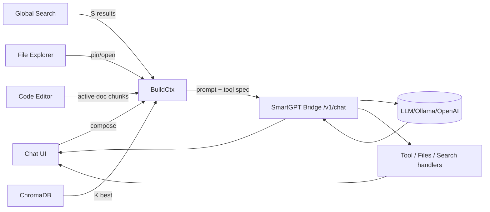

love this direction. here’s a concrete, no‑react, web‑components-first design you can build toward. it gives you: a markdown chat, file explorer, search bar, tiny code editor with evil-ish keys, and a **dynamic chat context** (latest n + recalled context + rag k). ^ref-f7702bf8-1-0

---

# high-level layout (split panes)

```text
┌────────────────────────────────────────────────────────────────────────┐
│ Top Bar: [⌕ global search]  [model] [temperature] [run ▶] [pin 📌]    │
├─────────────┬──────────────────────────────────────────────────────────┤
│ File Tree   │ Chat (markdown) + Context Strip                          │
│ (left)      │ ─ messages                                               │
│             │ ─ inline citations / source chips                        │
│             │ ─ system / tool traces (collapsible)                     │
│             │ ─ Context Strip (active: latest n msgs + k RAG + files)  │
├─────────────┼──────────────────────────────────────────────────────────┤
│ Inspector   │ Code Editor (minimal, vim/evil keys)                     │
│ (right)     │ ─ diff/preview tab                                       │
│             │ ─ chunk view / embeddings viz                            │
└─────────────┴──────────────────────────────────────────────────────────┘
```

* **Left**: file explorer (your existing component), shows repo tree, supports “open”, “pin to context”, “embed chunk”. ^ref-f7702bf8-23-0
* **Center**: markdown chat; above the composer: a **Context Strip** of chips showing what will be sent (last N msgs, K RAG hits, pinned file chunks, top search results). ^ref-f7702bf8-24-0
* **Right**: inspector / code editor; toggles between code edit, diff, chunk view, and “embedding neighborhood”. ^ref-f7702bf8-25-0

---

# dynamic context model (what gets sent)

* keep only: ^ref-f7702bf8-31-0

  * **M latest user+assistant messages** (defaults: `M=6`, configurable). ^ref-f7702bf8-33-0
  * **Pinned items** (explicit overrides; never evicted unless unpinned). ^ref-f7702bf8-34-0
  * **K best RAG matches** from Chroma (defaults: `K=8`, per-query). ^ref-f7702bf8-35-0
  * **S top search results** (filename/title + short snippet) (defaults: `S=3`). ^ref-f7702bf8-36-0
  * **F top file chunks** from currently open files (defaults: `F=4`). ^ref-f7702bf8-37-0

* eviction order when token budget tight: search→open-file chunks→RAG hits→older chat msgs→(never evict pinned). ^ref-f7702bf8-39-0

* hard **token budget** you compute each send: `B_total` (e.g., 12k). ^ref-f7702bf8-41-0

  * reserve headroom for reply: `B_reply_reserve` (e.g., 3k).
  * available for context: `B_ctx = B_total - B_reply_reserve - B_sys`. ^ref-f7702bf8-44-0
  * greedy pack by priority & per‑item cap (e.g., chunk cap 400–800 tokens). ^ref-f7702bf8-45-0

---

# data flow (mermaid)


^ref-f7702bf8-51-0 ^ref-f7702bf8-65-0

---

# prompt assembly (deterministic & transparent)

**System** (static, short)

* who you are (Cephalon/Duck), coding style prefs, **“answer with citations using \[#id] chips the UI provides”**. ^ref-f7702bf8-73-0
* keep it <600 tokens.
 ^ref-f7702bf8-75-0
**Context blocks** (ordered):

1. **Pinned** `[PIN:…]` ^ref-f7702bf8-78-0
2. **OpenFileChunks** `[FILE: path#Lx-Ly]` ^ref-f7702bf8-79-0
3. **RAG** `[RAG: source-id score=…]` ^ref-f7702bf8-80-0
4. **Search** `[WEB: title url-hash]` ^ref-f7702bf8-81-0
5. **ChatTail** (last `M` messages, condensed if needed)
 ^ref-f7702bf8-83-0
**User message** last.
 ^ref-f7702bf8-85-0
UI shows a **live preview** of this prompt (collapsible), so you always see what gets sent.

---

# minimal state shape
 ^ref-f7702bf8-91-0
```ts
type Chip = {
  id: string;              // stable id used in prompt
  kind: 'pin'|'file'|'rag'|'search'|'msg';
  title: string;
  meta?: Record<string, any>;
  tokens: number;          // estimated by tiktoken-like lib
  selected: boolean;       // user may toggle off before send
  payload: { text: string, citation?: string };
};

type ChatState = {
  messages: Array<{ id: string; role: 'user'|'assistant'|'system'; text: string; ts: number; }>;
  chips: Chip[];           // computed each keystroke / on search / on open
  budget: { total: number; reserve: number; used: number; remaining: number };
  params: { M: number; K: number; S: number; F: number; model: string; temp: number };
};
^ref-f7702bf8-91-0
```

---

# event bus (simple, decoupled) ^ref-f7702bf8-114-0

Use a tiny pub/sub (no framework): ^ref-f7702bf8-116-0

```ts
type Event =
  | { type: 'SEARCH_REQUEST'; q: string }
  | { type: 'SEARCH_RESULTS'; items: Chip[] }
  | { type: 'FILES_OPEN'; path: string }
  | { type: 'FILES_PIN'; chip: Chip }
  | { type: 'RAG_QUERY'; q: string }
  | { type: 'RAG_RESULTS'; items: Chip[] }
  | { type: 'CHAT_SEND'; text: string }
  | { type: 'CHAT_RESPONSE'; msg: string; toolCalls?: any[] }
  | { type: 'BUDGET_RECALC' }
  | { type: 'CHIP_TOGGLE'; id: string; selected: boolean }
  | { type: 'EDITOR_SET_ACTIVE'; path: string }
  | { type: 'TRACE_UPDATE'; tool: string; data: any };

const bus = (() => {
  const subs = new Map<string, Set<(e:any)=>void>>();
  function on(type: Event['type'], fn: (e:any)=>void){ (subs.get(type) ?? subs.set(type, new Set()).get(type))!.add(fn); }
  function emit(e: Event){ subs.get(e.type)?.forEach(fn => fn(e)); }
  return { on, emit };
^ref-f7702bf8-116-0
})(); ^ref-f7702bf8-139-0
```

Each Web Component listens/emits only the events it cares about.

---
 ^ref-f7702bf8-145-0
# web components (custom elements) ^ref-f7702bf8-146-0
 ^ref-f7702bf8-147-0
* `<app-shell>`: owns layout + global state ^ref-f7702bf8-148-0
* `<chat-panel>`: markdown rendering, composer, context strip ^ref-f7702bf8-149-0
* `<context-strip>`: renders chips, toggles, drag‑to‑reorder ^ref-f7702bf8-150-0
* `<file-tree-panel>`: your explorer, emits `FILES_OPEN`, `FILES_PIN` ^ref-f7702bf8-151-0
* `<search-bar>`: emits `SEARCH_REQUEST`, shows `SEARCH_RESULTS`
* `<code-editor-panel>`: lightweight editor w/ evil keys
* `<inspector-panel>`: diff/preview/chunk/embedding tabs ^ref-f7702bf8-154-0
* `<token-budget-meter>`: visual budget bar

**Communication:** only through the event bus + attributes for initial props.

---
 ^ref-f7702bf8-160-0
# keyboard scheme (Spacemacs/Evil vibes)
 ^ref-f7702bf8-162-0
Global (while focus in chat or editor): ^ref-f7702bf8-163-0

* `Space` opens **Leader menu** (overlay palette). ^ref-f7702bf8-165-0
* Leader chords: ^ref-f7702bf8-166-0
 ^ref-f7702bf8-167-0
  * `SPC f f` open file (focus file tree) ^ref-f7702bf8-168-0
  * `SPC f p` pin active chunk ^ref-f7702bf8-169-0
  * `SPC s s` focus search bar ^ref-f7702bf8-170-0
  * `SPC c c` send chat ^ref-f7702bf8-171-0
  * `SPC t t` toggle token preview
  * `SPC m m` model selector ^ref-f7702bf8-173-0
* Editor (modal): ^ref-f7702bf8-174-0
 ^ref-f7702bf8-175-0
  * Normal mode: `h j k l`, `dd`, `yw`, `p`, `/` search ^ref-f7702bf8-176-0
  * Insert mode: standard typing
  * `Esc` → normal, `i` → insert, `v` → visual
* Chat: ^ref-f7702bf8-179-0
 ^ref-f7702bf8-180-0
  * `Ctrl+Enter` send
  * `Alt+↑/↓` adjust temp
  * `Alt+[` / `Alt+]` adjust K (RAG hits)
  * `Alt+Shift+[` / `]` adjust M (chat tail)

---
 ^ref-f7702bf8-187-0
# dynamic chunking + ids ^ref-f7702bf8-188-0
 ^ref-f7702bf8-189-0
* When a file is opened, client requests `/v1/files/view?path=…&lines=…&context=…` (you already sketched this).
* Chunk by semantic boundaries (AST if available) or fallback to **sliding windows** with overlaps.
* Assign stable deterministic ids: `hash(repo@commit:path#Lx-Ly)`.
* Emit chips for the **top F** most-recently viewed chunks (unless deselected).

---
 ^ref-f7702bf8-196-0
# retrieval policy (simple & effective) ^ref-f7702bf8-197-0
 ^ref-f7702bf8-198-0
1. **Live query**: build from the composer text (+ open file path context). ^ref-f7702bf8-199-0
2. **Chroma**: `collection.query({ queryEmbeddings, topK: K, where: { repo: current } })` ^ref-f7702bf8-200-0
3. **Search** (optional): code‑aware BM25 over filename & headings; take top S.
4. **Dedup**: prefer unique sources; rerank by **(semantic score + recency boost + pin bonus)**.
5. **Trim to budget** with per‑type caps (e.g., `ragChunkCap=500`, `fileChunkCap=700`, `searchCap=150`, `chatMsgCap=350`).

Show the final set as chips; user can toggle any off **before** send.

---

# example “build context” (pseudo)

```ts
function buildContext(state: ChatState) {
  const { M, K, S, F } = state.params;
  const pinned = state.chips.filter(c => c.kind === 'pin' && c.selected);
  const openFile = pickRecent(state.chips, 'file', F);
  const rag = topK(state.chips, 'rag', K);
  const search = topK(state.chips, 'search', S);
  const tail = takeLastM(state.messages, M);

  let blocks = [
    ["[PIN]", pinned],
    ["[FILE]", openFile],
    ["[RAG]", rag],
    ["[SEARCH]", search],
    ["[CHAT]", tail.map(m=>({...m, kind:'msg'}))],
  ];

  blocks = trimToBudget(blocks, state.budget.remaining);
  return flattenBlocks(blocks);
}
```

---
 ^ref-f7702bf8-234-0
# prompt example (assembled)

```
<System>
You are Cephalon, assistant for the Promethean project. Prefer JS/TS & Lisp-like pseudo. Cite using chip ids like [#chip-abc].
</System>

[PIN]
[#pin-1] AGENTS.md excerpt…
[#pin-2] process.md state machine…

[FILE]
[#file-a] services/ts/cephalon/contextManager.ts#L40-L132 …
[#file-b] services/ts/cephalon/collectionManager.ts#L10-L88 …

[RAG]
[#rag-1] (score 0.89) commit 437: “dual store types”… 
[#rag-2] (0.86) “tool calling patch”…

[SEARCH]
[#web-1] “Ollama tool support” blog summary…
[#web-2] “Fastify response schema oneOf tip”…

[CHAT]
user: how do I forward tool calls through codex context?
assistant: …
user: I think the backend.chat signature needs opts.tools…
assistant: …

<User>
^ref-f7702bf8-234-0
Please propose a minimal diff for backend.ts and index.ts. ^ref-f7702bf8-266-0
</User>
```

UI shows those bracketed blocks as collapsible sections; each `[#id]` is clickable to preview the source.

--- ^ref-f7702bf8-272-0

# minimal tool interface (bridge) ^ref-f7702bf8-274-0

Define a neutral payload you already support:

```ts
type ToolSpec = {
  name: string;
  description?: string;
  json_schema?: Record<string, any>;
};

type ChatRequest = {
  model: string;
  messages: { role: 'system'|'user'|'assistant'|'tool'; content: string; name?: string }[];
  tools?: ToolSpec[];
  tool_choice?: 'auto' | { type: 'function', function: { name: string } };
  stream?: boolean;
  temperature?: number;
^ref-f7702bf8-274-0
  metadata?: any; ^ref-f7702bf8-293-0
  context_preview?: Chip[]; // for logging/trace
};
```

**Streaming**: parse tool calls and forward as `TRACE_UPDATE` events so the UI shows tool execution and responses inline.
 ^ref-f7702bf8-299-0
--- ^ref-f7702bf8-300-0

# code editor choice (no React, still nice)
 ^ref-f7702bf8-303-0
* Start with **CodeMirror 6** (vanilla) for a tiny footprint.
* Layer **Vim** keymap + a small Evil bridge:

  * normal/insert/visual modes
  * `dd`, `dw`, `p`, `ci(`, etc.
* Map Leader overlay to CodeMirror commands + app actions.
 ^ref-f7702bf8-310-0
--- ^ref-f7702bf8-311-0

# persistence + replay ^ref-f7702bf8-313-0

* Persist only **messages** and **pins** to local DB (IndexedDB) per “conversation id”. ^ref-f7702bf8-315-0
* **Rebuild chips** deterministically on load by re-running: ^ref-f7702bf8-316-0

  * open-file chunking (if file exists)
  * RAG query for last user message (store its embedding to seed)
  * search (optional cached)
* This gives you the “dynamic history” feel: lightweight saved chat, context always re‑computed.

---
 ^ref-f7702bf8-324-0
# quick milestones ^ref-f7702bf8-325-0
 ^ref-f7702bf8-326-0
1. **Shell + Bus**

* app-shell, chat-panel, file-tree-panel, search-bar, code-editor-panel
* events wired, no backend yet ^ref-f7702bf8-330-0
* dummy chips + token meter ^ref-f7702bf8-331-0
 ^ref-f7702bf8-332-0
2. **Bridge integration**
 ^ref-f7702bf8-334-0
* `/v1/chat` streaming
* `/v1/files/view`, `/v1/files/list` ^ref-f7702bf8-336-0
* `/v1/search` (or call your search service) ^ref-f7702bf8-337-0

3. **Chroma hookup** ^ref-f7702bf8-339-0

* query for top K with a basic reranker
* chip de‑dup + eviction
 ^ref-f7702bf8-343-0
4. **Editor + evil keys**
 ^ref-f7702bf8-345-0
* CodeMirror 6 + vim keymap + leader palette

5. **Prompt preview + citations**

* render assembled prompt sections
* enforce chip id usage in assistant replies
 ^ref-f7702bf8-352-0
---

# tiny HTML skeleton (illustrative only)

```html
<body>
  <app-shell>
    <file-tree-panel slot="left"></file-tree-panel>
    <chat-panel slot="center"></chat-panel>
^ref-f7702bf8-352-0
    <inspector-panel slot="right"></inspector-panel> ^ref-f7702bf8-363-0
  </app-shell>
  <script type="module" src="/app-shell.js"></script>
</body>
```

Each module defines a custom element, subscribes to `bus`, and updates with attributes/props.
 ^ref-f7702bf8-370-0
--- ^ref-f7702bf8-371-0
 ^ref-f7702bf8-372-0
# where to start (today)
 ^ref-f7702bf8-374-0
* implement `bus`, `tokenBudget()` (rough tiktoken estimator), and `trimToBudget()`.
* stub chips and render a **Context Strip** that lets you toggle items on/off and see live budget. ^ref-f7702bf8-376-0
* wire `/v1/chat` with streaming and the **prompt preview**. ^ref-f7702bf8-377-0
* once that loop feels good, bolt on RAG + file chunks. ^ref-f7702bf8-378-0
 ^ref-f7702bf8-379-0
if you want, I can open a fresh canvas next to this chat with:
 ^ref-f7702bf8-381-0
* a mermaid end‑to‑end diagram, ^ref-f7702bf8-382-0
* the event bus and chip models,
* a minimal `<chat-panel>` custom element, ^ref-f7702bf8-384-0
* and the prompt assembly util. ^ref-0c501d52-385-0
 ^ref-f7702bf8-396-0 ^ref-f7702bf8-403-0 ^ref-f7702bf8-405-0 ^ref-f7702bf8-412-0 ^ref-f7702bf8-424-0 ^ref-f7702bf8-442-0 ^ref-f7702bf8-443-0 ^ref-f7702bf8-454-0 ^ref-f7702bf8-462-0 ^ref-f7702bf8-463-0 ^ref-f7702bf8-467-0 ^ref-f7702bf8-469-0 ^ref-f7702bf8-471-0 ^ref-f7702bf8-477-0 ^ref-f7702bf8-485-0 ^ref-f7702bf8-492-0 ^ref-f7702bf8-495-0 ^ref-f7702bf8-511-0 ^ref-f7702bf8-519-0 ^ref-f7702bf8-525-0 ^ref-f7702bf8-526-0 ^ref-f7702bf8-539-0 ^ref-f7702bf8-543-0 ^ref-f7702bf8-548-0 ^ref-f7702bf8-686-0 ^ref-f7702bf8-818-0 ^ref-f7702bf8-1412-0 ^ref-f7702bf8-1431-0 ^ref-f7702bf8-1472-0 ^ref-f7702bf8-1512-0 ^ref-f7702bf8-1513-0 ^ref-f7702bf8-1515-0 ^ref-f7702bf8-1517-0 ^ref-f7702bf8-1518-0 ^ref-f7702bf8-1520-0 ^ref-f7702bf8-1534-0 ^ref-f7702bf8-2033-0 ^ref-f7702bf8-2859-0 ^ref-f7702bf8-3442-0 ^ref-f7702bf8-4241-0 ^ref-f7702bf8-4840-0 ^ref-f7702bf8-6104-0 ^ref-f7702bf8-6452-0 ^ref-f7702bf8-6943-0 ^ref-f7702bf8-8143-0 ^ref-f7702bf8-10088-0
<!-- GENERATED-SECTIONS:DO-NOT-EDIT-BELOW -->
## Related content
- [[optimizing-command-limitations-in-system-design|Optimizing Command Limitations in System Design]]
- [[obsidian-chatgpt-plugin-integration|Obsidian ChatGPT Plugin Integration]]
- [[obsidian-templating-plugins-integration-guide|Obsidian Templating Plugins Integration Guide]]
- [[model-upgrade-calm-down-guide|Model Upgrade Calm-Down Guide]]
- [[windows-tiling-with-autohotkey]]
- [[migrate-to-provider-tenant-architecture|Migrate to Provider-Tenant Architecture]]
- [[promethean-copilot-intent-engine]]
- [[performance-optimized-polyglot-bridge]]
- [[factorio-ai-with-external-agents|Factorio AI with External Agents]]
- [[chroma-toolkit-consolidation-plan|Chroma Toolkit Consolidation Plan]]
- [[tracing-the-signal|Tracing the Signal]]
- [[plan-update-confirmation]]
- [[i3-bluetooth-setup]]
- [[ducks-self-referential-perceptual-loop|Duck's Self-Referential Perceptual Loop]]
- [[docs/unique/typed-struct-compiler|typed-struct-compiler]]
- [[docs/unique/zero-copy-snapshots-and-workers|zero-copy-snapshots-and-workers]]
- [[fnord-tracer-protocol|Fnord Tracer Protocol]]
- [[functional-embedding-pipeline-refactor|Functional Embedding Pipeline Refactor]]
- [[graph-ds]]
- [Layer1SurvivabilityEnvelope](layer1survivabilityenvelope.md)
- [[polyglot-repl-interface-layer]]
- [[post-linguistic-transhuman-design-frameworks|Post-Linguistic Transhuman Design Frameworks]]
- [[prometheus-observability-stack|Prometheus Observability Stack]]
- [Protocol_0_The_Contradiction_Engine](protocol-0-the-contradiction-engine.md)
- [[promethean-documentation-pipeline-overview|Promethean Documentation Pipeline Overview]]
## Sources
- [[docs/unique/typed-struct-compiler#^ref-78eeedf7-1016-0|typed-struct-compiler — L1016]] (line 1016, col 0, score 1)
- [[unique-concepts#^ref-ed6f3fc9-175-0|Unique Concepts — L175]] (line 175, col 0, score 1)
- [[unique-info-dump-index#^ref-30ec3ba6-1221-0|Unique Info Dump Index — L1221]] (line 1221, col 0, score 1)
- [[docs/unique/zero-copy-snapshots-and-workers#^ref-62bec6f0-1058-0|zero-copy-snapshots-and-workers — L1058]] (line 1058, col 0, score 1)
- [Canonical Org-Babel Matplotlib Animation Template — L515](canonical-org-babel-matplotlib-animation-template.md#^ref-1b1338fc-515-0) (line 515, col 0, score 1)
- [[creative-moments#^ref-10d98225-251-0|Creative Moments — L251]] (line 251, col 0, score 1)
- [[ducks-attractor-states#^ref-13951643-559-0|Duck's Attractor States — L559]] (line 559, col 0, score 1)
- [[docs/unique/eidolon-field-math-foundations#^ref-008f2ac0-1033-0|eidolon-field-math-foundations — L1033]] (line 1033, col 0, score 1)
- [[docops-feature-updates#^ref-2792d448-226-0|Docops Feature Updates — L226]] (line 226, col 0, score 1)
- [[field-node-diagram-outline#^ref-1f32c94a-705-0|field-node-diagram-outline — L705]] (line 705, col 0, score 1)
- [[field-node-diagram-set#^ref-22b989d5-719-0|field-node-diagram-set — L719]] (line 719, col 0, score 1)
- [field-node-diagram-visualizations — L601](field-node-diagram-visualizations.md#^ref-e9b27b06-601-0) (line 601, col 0, score 1)
- [[fnord-tracer-protocol#^ref-fc21f824-1060-0|Fnord Tracer Protocol — L1060]] (line 1060, col 0, score 1)
- [[functional-embedding-pipeline-refactor#^ref-a4a25141-726-0|Functional Embedding Pipeline Refactor — L726]] (line 726, col 0, score 1)
- [[graph-ds#^ref-6620e2f2-996-0|graph-ds — L996]] (line 996, col 0, score 1)
- [[heartbeat-fragment-demo#^ref-dd00677a-667-0|heartbeat-fragment-demo — L667]] (line 667, col 0, score 1)
- [[i3-bluetooth-setup#^ref-5e408692-736-0|i3-bluetooth-setup — L736]] (line 736, col 0, score 1)
- [[ice-box-reorganization#^ref-291c7d91-645-0|Ice Box Reorganization — L645]] (line 645, col 0, score 1)
- [komorebi-group-window-hack — L739](komorebi-group-window-hack.md#^ref-dd89372d-739-0) (line 739, col 0, score 1)
- [Layer1SurvivabilityEnvelope — L816](layer1survivabilityenvelope.md#^ref-64a9f9f9-816-0) (line 816, col 0, score 1)
- [komorebi-group-window-hack — L270](komorebi-group-window-hack.md#^ref-dd89372d-270-0) (line 270, col 0, score 1)
- [Layer1SurvivabilityEnvelope — L221](layer1survivabilityenvelope.md#^ref-64a9f9f9-221-0) (line 221, col 0, score 1)
- [[mathematical-samplers#^ref-86a691ec-80-0|Mathematical Samplers — L80]] (line 80, col 0, score 1)
- [[mathematics-sampler#^ref-b5e0183e-86-0|Mathematics Sampler — L86]] (line 86, col 0, score 1)
- [[migrate-to-provider-tenant-architecture#^ref-54382370-342-0|Migrate to Provider-Tenant Architecture — L342]] (line 342, col 0, score 1)
- [[mindful-prioritization#^ref-40185d05-22-0|Mindful Prioritization — L22]] (line 22, col 0, score 1)
- [MindfulRobotIntegration — L21](mindfulrobotintegration.md#^ref-5f65dfa5-21-0) (line 21, col 0, score 1)
- [[model-selection-for-lightweight-conversational-tasks#^ref-d144aa62-133-0|Model Selection for Lightweight Conversational Tasks — L133]] (line 133, col 0, score 1)
- [[model-upgrade-calm-down-guide#^ref-db74343f-98-0|Model Upgrade Calm-Down Guide — L98]] (line 98, col 0, score 1)
- [[creative-moments#^ref-10d98225-53-0|Creative Moments — L53]] (line 53, col 0, score 1)
- [[pipeline-enhancements#^ref-e2135d9f-76-0|Pipeline Enhancements — L76]] (line 76, col 0, score 1)
- [[plan-update-confirmation#^ref-b22d79c6-1029-0|plan-update-confirmation — L1029]] (line 1029, col 0, score 1)
- [[polyglot-repl-interface-layer#^ref-9c79206d-227-0|polyglot-repl-interface-layer — L227]] (line 227, col 0, score 1)
- [[post-linguistic-transhuman-design-frameworks#^ref-6bcff92c-160-0|Post-Linguistic Transhuman Design Frameworks — L160]] (line 160, col 0, score 1)
- [[promethean-chat-activity-report#^ref-18344cf9-86-0|Promethean Chat Activity Report — L86]] (line 86, col 0, score 1)
- [[promethean-copilot-intent-engine#^ref-ae24a280-66-0|Promethean-Copilot-Intent-Engine — L66]] (line 66, col 0, score 1)
- [[promethean-data-sync-protocol#^ref-9fab9e76-86-0|Promethean Data Sync Protocol — L86]] (line 86, col 0, score 1)
- [[promethean-dev-workflow-update#^ref-03a5578f-131-0|Promethean Dev Workflow Update — L131]] (line 131, col 0, score 1)
- [[promethean-documentation-overview#^ref-9413237f-76-0|Promethean Documentation Overview — L76]] (line 76, col 0, score 1)
- [[obsidian-task-generation#^ref-9b694a91-53-0|Obsidian Task Generation — L53]] (line 53, col 0, score 1)
- [[obsidian-templating-plugins-integration-guide#^ref-b39dc9d4-87-0|Obsidian Templating Plugins Integration Guide — L87]] (line 87, col 0, score 1)
- [[openapi-validation-report#^ref-5c152b08-118-0|OpenAPI Validation Report — L118]] (line 118, col 0, score 1)
- [[optimizing-command-limitations-in-system-design#^ref-98c8ff62-95-0|Optimizing Command Limitations in System Design — L95]] (line 95, col 0, score 1)
- [ParticleSimulationWithCanvasAndFFmpeg — L310](particlesimulationwithcanvasandffmpeg.md#^ref-e018dd7a-310-0) (line 310, col 0, score 1)
- [[per-domain-policy-system-for-js-crawler#^ref-c03020e1-507-0|Per-Domain Policy System for JS Crawler — L507]] (line 507, col 0, score 1)
- [[performance-optimized-polyglot-bridge#^ref-f5579967-510-0|Performance-Optimized-Polyglot-Bridge — L510]] (line 510, col 0, score 1)
- [[pipeline-enhancements#^ref-e2135d9f-38-0|Pipeline Enhancements — L38]] (line 38, col 0, score 1)
- [[plan-update-confirmation#^ref-b22d79c6-1028-0|plan-update-confirmation — L1028]] (line 1028, col 0, score 1)
- [[polyglot-repl-interface-layer#^ref-9c79206d-231-0|polyglot-repl-interface-layer — L231]] (line 231, col 0, score 1)
- [[per-domain-policy-system-for-js-crawler#^ref-c03020e1-495-0|Per-Domain Policy System for JS Crawler — L495]] (line 495, col 0, score 1)
- [[performance-optimized-polyglot-bridge#^ref-f5579967-459-0|Performance-Optimized-Polyglot-Bridge — L459]] (line 459, col 0, score 1)
- [[pipeline-enhancements#^ref-e2135d9f-27-0|Pipeline Enhancements — L27]] (line 27, col 0, score 1)
- [[plan-update-confirmation#^ref-b22d79c6-1002-0|plan-update-confirmation — L1002]] (line 1002, col 0, score 1)
- [[polyglot-repl-interface-layer#^ref-9c79206d-171-0|polyglot-repl-interface-layer — L171]] (line 171, col 0, score 1)
- [[post-linguistic-transhuman-design-frameworks#^ref-6bcff92c-112-0|Post-Linguistic Transhuman Design Frameworks — L112]] (line 112, col 0, score 1)
- [[promethean-chat-activity-report#^ref-18344cf9-24-0|Promethean Chat Activity Report — L24]] (line 24, col 0, score 1)
- [Protocol_0_The_Contradiction_Engine — L143](protocol-0-the-contradiction-engine.md#^ref-9a93a756-143-0) (line 143, col 0, score 1)
- [[provider-agnostic-chat-panel-implementation#^ref-43bfe9dd-241-0|Provider-Agnostic Chat Panel Implementation — L241]] (line 241, col 0, score 1)
- [[promethean-dev-workflow-update#^ref-03a5578f-60-0|Promethean Dev Workflow Update — L60]] (line 60, col 0, score 1)
- [[promethean-documentation-overview#^ref-9413237f-86-0|Promethean Documentation Overview — L86]] (line 86, col 0, score 1)
- [[promethean-documentation-pipeline-overview#^ref-3a3bf2c9-243-0|Promethean Documentation Pipeline Overview — L243]] (line 243, col 0, score 1)
- [[promethean-documentation-update#^ref-c0392040-94-0|Promethean Documentation Update — L94]] (line 94, col 0, score 1)
- [[promethean-documentation-update.txt#^ref-0b872af2-12-0|Promethean Documentation Update — L12]] (line 12, col 0, score 1)
- [[promethean-eidolon-synchronicity-model#^ref-2d6e5553-133-0|Promethean_Eidolon_Synchronicity_Model — L133]] (line 133, col 0, score 1)
- [[promethean-infrastructure-setup#^ref-6deed6ac-750-0|Promethean Infrastructure Setup — L750]] (line 750, col 0, score 1)
- [[promethean-notes#^ref-1c4046b5-8-0|Promethean Notes — L8]] (line 8, col 0, score 1)
- [[docs/unique/ripple-propagation-demo#^ref-8430617b-189-0|ripple-propagation-demo — L189]] (line 189, col 0, score 1)
- [[run-step-api#^ref-15d25922-1038-0|run-step-api — L1038]] (line 1038, col 0, score 1)
- [[creative-moments#^ref-10d98225-94-0|Creative Moments — L94]] (line 94, col 0, score 1)
- [Debugging Broker Connections and Agent Behavior — L63](debugging-broker-connections-and-agent-behavior.md#^ref-73d3dbf6-63-0) (line 63, col 0, score 1)
- [Docops Feature Updates — L66](docops-feature-updates-3.md#^ref-cdbd21ee-66-0) (line 66, col 0, score 1)
- [DuckDuckGoSearchPipeline — L93](duckduckgosearchpipeline.md#^ref-e979c50f-93-0) (line 93, col 0, score 1)
- [[ducks-self-referential-perceptual-loop#^ref-71726f04-73-0|Duck's Self-Referential Perceptual Loop — L73]] (line 73, col 0, score 1)
- [[eidolon-field-abstract-model#^ref-5e8b2388-211-0|Eidolon Field Abstract Model — L211]] (line 211, col 0, score 1)
- [Docops Feature Updates — L44](docops-feature-updates-3.md#^ref-cdbd21ee-44-0) (line 44, col 0, score 1)
- [[docops-feature-updates#^ref-2792d448-61-0|Docops Feature Updates — L61]] (line 61, col 0, score 1)
- [[ducks-attractor-states#^ref-13951643-99-0|Duck's Attractor States — L99]] (line 99, col 0, score 1)
- [[ducks-self-referential-perceptual-loop#^ref-71726f04-80-0|Duck's Self-Referential Perceptual Loop — L80]] (line 80, col 0, score 1)
- [[eidolon-field-abstract-model#^ref-5e8b2388-216-0|Eidolon Field Abstract Model — L216]] (line 216, col 0, score 1)
- [[factorio-ai-with-external-agents#^ref-a4d90289-189-0|Factorio AI with External Agents — L189]] (line 189, col 0, score 1)
- [[docs/unique/field-interaction-equations#^ref-b09141b7-172-0|field-interaction-equations — L172]] (line 172, col 0, score 1)
- [Layer1SurvivabilityEnvelope — L175](layer1survivabilityenvelope.md#^ref-64a9f9f9-175-0) (line 175, col 0, score 1)
- [[mathematical-samplers#^ref-86a691ec-90-0|Mathematical Samplers — L90]] (line 90, col 0, score 1)
- [[migrate-to-provider-tenant-architecture#^ref-54382370-298-0|Migrate to Provider-Tenant Architecture — L298]] (line 298, col 0, score 1)
- [[promethean-chat-activity-report#^ref-18344cf9-48-0|Promethean Chat Activity Report — L48]] (line 48, col 0, score 1)
- [[promethean-notes#^ref-1c4046b5-26-0|Promethean Notes — L26]] (line 26, col 0, score 1)
- [NPU Voice Code and Sensory Integration — L52](npu-voice-code-and-sensory-integration.md#^ref-5a02283e-52-0) (line 52, col 0, score 1)
- [[obsidian-chatgpt-plugin-integration-guide#^ref-1d3d6c3a-86-0|Obsidian ChatGPT Plugin Integration Guide — L86]] (line 86, col 0, score 1)
- [[obsidian-chatgpt-plugin-integration#^ref-ca8e1399-85-0|Obsidian ChatGPT Plugin Integration — L85]] (line 85, col 0, score 1)
- [[docs/unique/obsidian-ignore-node-modules-regex#^ref-ffb9b2a9-92-0|obsidian-ignore-node-modules-regex — L92]] (line 92, col 0, score 1)
- [[obsidian-task-generation#^ref-9b694a91-103-0|Obsidian Task Generation — L103]] (line 103, col 0, score 1)
- [[obsidian-templating-plugins-integration-guide#^ref-b39dc9d4-91-0|Obsidian Templating Plugins Integration Guide — L91]] (line 91, col 0, score 1)
- [[openapi-validation-report#^ref-5c152b08-86-0|OpenAPI Validation Report — L86]] (line 86, col 0, score 1)
- [[optimizing-command-limitations-in-system-design#^ref-98c8ff62-110-0|Optimizing Command Limitations in System Design — L110]] (line 110, col 0, score 1)
- [ParticleSimulationWithCanvasAndFFmpeg — L250](particlesimulationwithcanvasandffmpeg.md#^ref-e018dd7a-250-0) (line 250, col 0, score 1)
- [[per-domain-policy-system-for-js-crawler#^ref-c03020e1-523-0|Per-Domain Policy System for JS Crawler — L523]] (line 523, col 0, score 1)
- [[mathematics-sampler#^ref-b5e0183e-120-0|Mathematics Sampler — L120]] (line 120, col 0, score 1)
- [[migrate-to-provider-tenant-architecture#^ref-54382370-333-0|Migrate to Provider-Tenant Architecture — L333]] (line 333, col 0, score 1)
- [[mindful-prioritization#^ref-40185d05-65-0|Mindful Prioritization — L65]] (line 65, col 0, score 1)
- [MindfulRobotIntegration — L69](mindfulrobotintegration.md#^ref-5f65dfa5-69-0) (line 69, col 0, score 1)
<!-- GENERATED-SECTIONS:DO-NOT-EDIT-ABOVE -->
