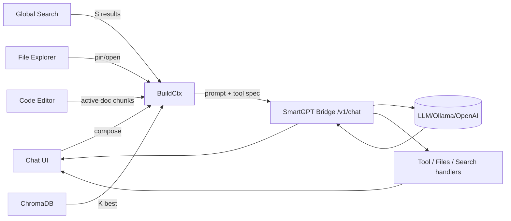

love this direction. here’s a concrete, no‑react, web‑components-first design you can build toward. it gives you: a markdown chat, file explorer, search bar, tiny code editor with evil-ish keys, and a **dynamic chat context** (latest n + recalled context + rag k). ^ref-f7702bf8-1-0

---

# high-level layout (split panes)

```text
┌────────────────────────────────────────────────────────────────────────┐
│ Top Bar: [⌕ global search]  [model] [temperature] [run ▶] [pin 📌]    │
├─────────────┬──────────────────────────────────────────────────────────┤
│ File Tree   │ Chat (markdown) + Context Strip                          │
│ (left)      │ ─ messages                                               │
│             │ ─ inline citations / source chips                        │
│             │ ─ system / tool traces (collapsible)                     │
│             │ ─ Context Strip (active: latest n msgs + k RAG + files)  │
├─────────────┼──────────────────────────────────────────────────────────┤
│ Inspector   │ Code Editor (minimal, vim/evil keys)                     │
│ (right)     │ ─ diff/preview tab                                       │
│             │ ─ chunk view / embeddings viz                            │
└─────────────┴──────────────────────────────────────────────────────────┘
```

* **Left**: file explorer (your existing component), shows repo tree, supports “open”, “pin to context”, “embed chunk”. ^ref-f7702bf8-23-0
* **Center**: markdown chat; above the composer: a **Context Strip** of chips showing what will be sent (last N msgs, K RAG hits, pinned file chunks, top search results). ^ref-f7702bf8-24-0
* **Right**: inspector / code editor; toggles between code edit, diff, chunk view, and “embedding neighborhood”. ^ref-f7702bf8-25-0

---

# dynamic context model (what gets sent)

* keep only: ^ref-f7702bf8-31-0

  * **M latest user+assistant messages** (defaults: `M=6`, configurable). ^ref-f7702bf8-33-0
  * **Pinned items** (explicit overrides; never evicted unless unpinned). ^ref-f7702bf8-34-0
  * **K best RAG matches** from Chroma (defaults: `K=8`, per-query). ^ref-f7702bf8-35-0
  * **S top search results** (filename/title + short snippet) (defaults: `S=3`). ^ref-f7702bf8-36-0
  * **F top file chunks** from currently open files (defaults: `F=4`). ^ref-f7702bf8-37-0

* eviction order when token budget tight: search→open-file chunks→RAG hits→older chat msgs→(never evict pinned). ^ref-f7702bf8-39-0

* hard **token budget** you compute each send: `B_total` (e.g., 12k). ^ref-f7702bf8-41-0

  * reserve headroom for reply: `B_reply_reserve` (e.g., 3k).
  * available for context: `B_ctx = B_total - B_reply_reserve - B_sys`. ^ref-f7702bf8-44-0
  * greedy pack by priority & per‑item cap (e.g., chunk cap 400–800 tokens). ^ref-f7702bf8-45-0

---

# data flow (mermaid)


^ref-f7702bf8-51-0

---

# prompt assembly (deterministic & transparent)

**System** (static, short)

* who you are (Cephalon/Duck), coding style prefs, **“answer with citations using \[#id] chips the UI provides”**. ^ref-f7702bf8-73-0
* keep it <600 tokens.
 ^ref-f7702bf8-75-0
**Context blocks** (ordered):

1. **Pinned** `[PIN:…]` ^ref-f7702bf8-78-0
2. **OpenFileChunks** `[FILE: path#Lx-Ly]` ^ref-f7702bf8-79-0
3. **RAG** `[RAG: source-id score=…]` ^ref-f7702bf8-80-0
4. **Search** `[WEB: title url-hash]` ^ref-f7702bf8-81-0
5. **ChatTail** (last `M` messages, condensed if needed)
 ^ref-f7702bf8-83-0
**User message** last.
 ^ref-f7702bf8-85-0
UI shows a **live preview** of this prompt (collapsible), so you always see what gets sent.

---

# minimal state shape
 ^ref-f7702bf8-91-0
```ts
type Chip = {
  id: string;              // stable id used in prompt
  kind: 'pin'|'file'|'rag'|'search'|'msg';
  title: string;
  meta?: Record<string, any>;
  tokens: number;          // estimated by tiktoken-like lib
  selected: boolean;       // user may toggle off before send
  payload: { text: string, citation?: string };
};

type ChatState = {
  messages: Array<{ id: string; role: 'user'|'assistant'|'system'; text: string; ts: number; }>;
  chips: Chip[];           // computed each keystroke / on search / on open
  budget: { total: number; reserve: number; used: number; remaining: number };
  params: { M: number; K: number; S: number; F: number; model: string; temp: number };
};
^ref-f7702bf8-91-0
```

---

# event bus (simple, decoupled) ^ref-f7702bf8-114-0

Use a tiny pub/sub (no framework): ^ref-f7702bf8-116-0

```ts
type Event =
  | { type: 'SEARCH_REQUEST'; q: string }
  | { type: 'SEARCH_RESULTS'; items: Chip[] }
  | { type: 'FILES_OPEN'; path: string }
  | { type: 'FILES_PIN'; chip: Chip }
  | { type: 'RAG_QUERY'; q: string }
  | { type: 'RAG_RESULTS'; items: Chip[] }
  | { type: 'CHAT_SEND'; text: string }
  | { type: 'CHAT_RESPONSE'; msg: string; toolCalls?: any[] }
  | { type: 'BUDGET_RECALC' }
  | { type: 'CHIP_TOGGLE'; id: string; selected: boolean }
  | { type: 'EDITOR_SET_ACTIVE'; path: string }
  | { type: 'TRACE_UPDATE'; tool: string; data: any };

const bus = (() => {
  const subs = new Map<string, Set<(e:any)=>void>>();
  function on(type: Event['type'], fn: (e:any)=>void){ (subs.get(type) ?? subs.set(type, new Set()).get(type))!.add(fn); }
  function emit(e: Event){ subs.get(e.type)?.forEach(fn => fn(e)); }
  return { on, emit };
^ref-f7702bf8-116-0
})(); ^ref-f7702bf8-139-0
```

Each Web Component listens/emits only the events it cares about.

---
 ^ref-f7702bf8-145-0
# web components (custom elements) ^ref-f7702bf8-146-0
 ^ref-f7702bf8-147-0
* `<app-shell>`: owns layout + global state ^ref-f7702bf8-148-0
* `<chat-panel>`: markdown rendering, composer, context strip ^ref-f7702bf8-149-0
* `<context-strip>`: renders chips, toggles, drag‑to‑reorder ^ref-f7702bf8-150-0
* `<file-tree-panel>`: your explorer, emits `FILES_OPEN`, `FILES_PIN` ^ref-f7702bf8-151-0
* `<search-bar>`: emits `SEARCH_REQUEST`, shows `SEARCH_RESULTS`
* `<code-editor-panel>`: lightweight editor w/ evil keys
* `<inspector-panel>`: diff/preview/chunk/embedding tabs ^ref-f7702bf8-154-0
* `<token-budget-meter>`: visual budget bar

**Communication:** only through the event bus + attributes for initial props.

---
 ^ref-f7702bf8-160-0
# keyboard scheme (Spacemacs/Evil vibes)
 ^ref-f7702bf8-162-0
Global (while focus in chat or editor): ^ref-f7702bf8-163-0

* `Space` opens **Leader menu** (overlay palette). ^ref-f7702bf8-165-0
* Leader chords: ^ref-f7702bf8-166-0
 ^ref-f7702bf8-167-0
  * `SPC f f` open file (focus file tree) ^ref-f7702bf8-168-0
  * `SPC f p` pin active chunk ^ref-f7702bf8-169-0
  * `SPC s s` focus search bar ^ref-f7702bf8-170-0
  * `SPC c c` send chat ^ref-f7702bf8-171-0
  * `SPC t t` toggle token preview
  * `SPC m m` model selector ^ref-f7702bf8-173-0
* Editor (modal): ^ref-f7702bf8-174-0
 ^ref-f7702bf8-175-0
  * Normal mode: `h j k l`, `dd`, `yw`, `p`, `/` search ^ref-f7702bf8-176-0
  * Insert mode: standard typing
  * `Esc` → normal, `i` → insert, `v` → visual
* Chat: ^ref-f7702bf8-179-0
 ^ref-f7702bf8-180-0
  * `Ctrl+Enter` send
  * `Alt+↑/↓` adjust temp
  * `Alt+[` / `Alt+]` adjust K (RAG hits)
  * `Alt+Shift+[` / `]` adjust M (chat tail)

---
 ^ref-f7702bf8-187-0
# dynamic chunking + ids ^ref-f7702bf8-188-0
 ^ref-f7702bf8-189-0
* When a file is opened, client requests `/v1/files/view?path=…&lines=…&context=…` (you already sketched this).
* Chunk by semantic boundaries (AST if available) or fallback to **sliding windows** with overlaps.
* Assign stable deterministic ids: `hash(repo@commit:path#Lx-Ly)`.
* Emit chips for the **top F** most-recently viewed chunks (unless deselected).

---
 ^ref-f7702bf8-196-0
# retrieval policy (simple & effective) ^ref-f7702bf8-197-0
 ^ref-f7702bf8-198-0
1. **Live query**: build from the composer text (+ open file path context). ^ref-f7702bf8-199-0
2. **Chroma**: `collection.query({ queryEmbeddings, topK: K, where: { repo: current } })` ^ref-f7702bf8-200-0
3. **Search** (optional): code‑aware BM25 over filename & headings; take top S.
4. **Dedup**: prefer unique sources; rerank by **(semantic score + recency boost + pin bonus)**.
5. **Trim to budget** with per‑type caps (e.g., `ragChunkCap=500`, `fileChunkCap=700`, `searchCap=150`, `chatMsgCap=350`).

Show the final set as chips; user can toggle any off **before** send.

---

# example “build context” (pseudo)

```ts
function buildContext(state: ChatState) {
  const { M, K, S, F } = state.params;
  const pinned = state.chips.filter(c => c.kind === 'pin' && c.selected);
  const openFile = pickRecent(state.chips, 'file', F);
  const rag = topK(state.chips, 'rag', K);
  const search = topK(state.chips, 'search', S);
  const tail = takeLastM(state.messages, M);

  let blocks = [
    ["[PIN]", pinned],
    ["[FILE]", openFile],
    ["[RAG]", rag],
    ["[SEARCH]", search],
    ["[CHAT]", tail.map(m=>({...m, kind:'msg'}))],
  ];

  blocks = trimToBudget(blocks, state.budget.remaining);
  return flattenBlocks(blocks);
}
```

---
 ^ref-f7702bf8-234-0
# prompt example (assembled)

```
<System>
You are Cephalon, assistant for the Promethean project. Prefer JS/TS & Lisp-like pseudo. Cite using chip ids like [#chip-abc].
</System>

[PIN]
[#pin-1] AGENTS.md excerpt…
[#pin-2] process.md state machine…

[FILE]
[#file-a] services/ts/cephalon/contextManager.ts#L40-L132 …
[#file-b] services/ts/cephalon/collectionManager.ts#L10-L88 …

[RAG]
[#rag-1] (score 0.89) commit 437: “dual store types”… 
[#rag-2] (0.86) “tool calling patch”…

[SEARCH]
[#web-1] “Ollama tool support” blog summary…
[#web-2] “Fastify response schema oneOf tip”…

[CHAT]
user: how do I forward tool calls through codex context?
assistant: …
user: I think the backend.chat signature needs opts.tools…
assistant: …

<User>
^ref-f7702bf8-234-0
Please propose a minimal diff for backend.ts and index.ts. ^ref-f7702bf8-266-0
</User>
```

UI shows those bracketed blocks as collapsible sections; each `[#id]` is clickable to preview the source.

--- ^ref-f7702bf8-272-0

# minimal tool interface (bridge) ^ref-f7702bf8-274-0

Define a neutral payload you already support:

```ts
type ToolSpec = {
  name: string;
  description?: string;
  json_schema?: Record<string, any>;
};

type ChatRequest = {
  model: string;
  messages: { role: 'system'|'user'|'assistant'|'tool'; content: string; name?: string }[];
  tools?: ToolSpec[];
  tool_choice?: 'auto' | { type: 'function', function: { name: string } };
  stream?: boolean;
  temperature?: number;
^ref-f7702bf8-274-0
  metadata?: any; ^ref-f7702bf8-293-0
  context_preview?: Chip[]; // for logging/trace
};
```

**Streaming**: parse tool calls and forward as `TRACE_UPDATE` events so the UI shows tool execution and responses inline.
 ^ref-f7702bf8-299-0
--- ^ref-f7702bf8-300-0

# code editor choice (no React, still nice)
 ^ref-f7702bf8-303-0
* Start with **CodeMirror 6** (vanilla) for a tiny footprint.
* Layer **Vim** keymap + a small Evil bridge:

  * normal/insert/visual modes
  * `dd`, `dw`, `p`, `ci(`, etc.
* Map Leader overlay to CodeMirror commands + app actions.
 ^ref-f7702bf8-310-0
--- ^ref-f7702bf8-311-0

# persistence + replay ^ref-f7702bf8-313-0

* Persist only **messages** and **pins** to local DB (IndexedDB) per “conversation id”. ^ref-f7702bf8-315-0
* **Rebuild chips** deterministically on load by re-running: ^ref-f7702bf8-316-0

  * open-file chunking (if file exists)
  * RAG query for last user message (store its embedding to seed)
  * search (optional cached)
* This gives you the “dynamic history” feel: lightweight saved chat, context always re‑computed.

---
 ^ref-f7702bf8-324-0
# quick milestones ^ref-f7702bf8-325-0
 ^ref-f7702bf8-326-0
1. **Shell + Bus**

* app-shell, chat-panel, file-tree-panel, search-bar, code-editor-panel
* events wired, no backend yet ^ref-f7702bf8-330-0
* dummy chips + token meter ^ref-f7702bf8-331-0
 ^ref-f7702bf8-332-0
2. **Bridge integration**
 ^ref-f7702bf8-334-0
* `/v1/chat` streaming
* `/v1/files/view`, `/v1/files/list`
* `/v1/search` (or call your search service) ^ref-f7702bf8-337-0

3. **Chroma hookup** ^ref-f7702bf8-339-0

* query for top K with a basic reranker
* chip de‑dup + eviction
 ^ref-f7702bf8-343-0
4. **Editor + evil keys**
 ^ref-f7702bf8-345-0
* CodeMirror 6 + vim keymap + leader palette

5. **Prompt preview + citations**

* render assembled prompt sections
* enforce chip id usage in assistant replies
 ^ref-f7702bf8-352-0
---

# tiny HTML skeleton (illustrative only)

```html
<body>
  <app-shell>
    <file-tree-panel slot="left"></file-tree-panel>
    <chat-panel slot="center"></chat-panel>
^ref-f7702bf8-352-0
    <inspector-panel slot="right"></inspector-panel> ^ref-f7702bf8-363-0
  </app-shell>
  <script type="module" src="/app-shell.js"></script>
</body>
```

Each module defines a custom element, subscribes to `bus`, and updates with attributes/props.
 ^ref-f7702bf8-370-0
--- ^ref-f7702bf8-371-0
 ^ref-f7702bf8-372-0
# where to start (today)
 ^ref-f7702bf8-374-0
* implement `bus`, `tokenBudget()` (rough tiktoken estimator), and `trimToBudget()`.
* stub chips and render a **Context Strip** that lets you toggle items on/off and see live budget. ^ref-f7702bf8-376-0
* wire `/v1/chat` with streaming and the **prompt preview**. ^ref-f7702bf8-377-0
* once that loop feels good, bolt on RAG + file chunks. ^ref-f7702bf8-378-0
 ^ref-f7702bf8-379-0
if you want, I can open a fresh canvas next to this chat with:
 ^ref-f7702bf8-381-0
* a mermaid end‑to‑end diagram, ^ref-f7702bf8-382-0
* the event bus and chip models,
* a minimal `<chat-panel>` custom element, ^ref-f7702bf8-384-0
* and the prompt assembly util.<!-- GENERATED-SECTIONS:DO-NOT-EDIT-BELOW -->
## Related content
- [Promethean-native config design](promethean-native-config-design.md)
- [Promethean Infrastructure Setup](promethean-infrastructure-setup.md)
- [api-gateway-versioning](api-gateway-versioning.md)
- [Chroma Toolkit Consolidation Plan](chroma-toolkit-consolidation-plan.md)
- [Promethean Agent Config DSL](promethean-agent-config-dsl.md)
- [Protocol_0_The_Contradiction_Engine](protocol-0-the-contradiction-engine.md)
- [js-to-lisp-reverse-compiler](js-to-lisp-reverse-compiler.md)
- [polymorphic-meta-programming-engine](polymorphic-meta-programming-engine.md)
- [Board Walk – 2025-08-11](board-walk-2025-08-11.md)
- [Migrate to Provider-Tenant Architecture](migrate-to-provider-tenant-architecture.md)
- [Cross-Target Macro System in Sibilant](cross-target-macro-system-in-sibilant.md)
- [TypeScript Patch for Tool Calling Support](typescript-patch-for-tool-calling-support.md)
- [Agent Tasks: Persistence Migration to DualStore](agent-tasks-persistence-migration-to-dualstore.md)
- [Obsidian ChatGPT Plugin Integration Guide](obsidian-chatgpt-plugin-integration-guide.md)
- [AI-Centric OS with MCP Layer](ai-centric-os-with-mcp-layer.md)
- [aionian-circuit-math](aionian-circuit-math.md)
- [field-interaction-equations](field-interaction-equations.md)
- [Cross-Language Runtime Polymorphism](cross-language-runtime-polymorphism.md)
- [The Jar of Echoes](the-jar-of-echoes.md)
- [Lisp-Compiler-Integration](lisp-compiler-integration.md)
- [ecs-offload-workers](ecs-offload-workers.md)
- [Exception Layer Analysis](exception-layer-analysis.md)
- [Model Selection for Lightweight Conversational Tasks](model-selection-for-lightweight-conversational-tasks.md)
- [ecs-scheduler-and-prefabs](ecs-scheduler-and-prefabs.md)
- [Debugging Broker Connections and Agent Behavior](debugging-broker-connections-and-agent-behavior.md)
- [EidolonField](eidolonfield.md)
- [observability-infrastructure-setup](observability-infrastructure-setup.md)
- [Language-Agnostic Mirror System](language-agnostic-mirror-system.md)
- [plan-update-confirmation](plan-update-confirmation.md)
- [Pure TypeScript Search Microservice](pure-typescript-search-microservice.md)
- [Admin Dashboard for User Management](admin-dashboard-for-user-management.md)
- [Interop and Source Maps](interop-and-source-maps.md)
- [Board Automation Improvements](board-automation-improvements.md)
- [Voice Access Layer Design](voice-access-layer-design.md)
- [Sibilant Meta-Prompt DSL](sibilant-meta-prompt-dsl.md)
- [template-based-compilation](template-based-compilation.md)
- [Promethean-Copilot-Intent-Engine](promethean-copilot-intent-engine.md)
- [compiler-kit-foundations](compiler-kit-foundations.md)
- [Agent Reflections and Prompt Evolution](agent-reflections-and-prompt-evolution.md)
- [Services](chunks/services.md)
- [eidolon-field-math-foundations](eidolon-field-math-foundations.md)
- [Math Fundamentals](chunks/math-fundamentals.md)
- [AI-First-OS-Model-Context-Protocol](ai-first-os-model-context-protocol.md)
- [balanced-bst](balanced-bst.md)
- [Obsidian ChatGPT Plugin Integration](obsidian-chatgpt-plugin-integration.md)
- [Obsidian Templating Plugins Integration Guide](obsidian-templating-plugins-integration-guide.md)
- [2d-sandbox-field](2d-sandbox-field.md)
- [archetype-ecs](archetype-ecs.md)
- [JavaScript](chunks/javascript.md)
- [heartbeat-simulation-snippets](heartbeat-simulation-snippets.md)
- [Operations](chunks/operations.md)
- [Event Bus MVP](event-bus-mvp.md)
- [i3-bluetooth-setup](i3-bluetooth-setup.md)
- [DSL](chunks/dsl.md)
- [Diagrams](chunks/diagrams.md)
- [Window Management](chunks/window-management.md)
- [Chroma-Embedding-Refactor](chroma-embedding-refactor.md)
- [sibilant-metacompiler-overview](sibilant-metacompiler-overview.md)
- [System Scheduler with Resource-Aware DAG](system-scheduler-with-resource-aware-dag.md)
- [State Snapshots API and Transactional Projector](state-snapshots-api-and-transactional-projector.md)
- [sibilant-macro-targets](sibilant-macro-targets.md)
- [sibilant-meta-string-templating-runtime](sibilant-meta-string-templating-runtime.md)
- [ts-to-lisp-transpiler](ts-to-lisp-transpiler.md)
- [typed-struct-compiler](typed-struct-compiler.md)
- [field-dynamics-math-blocks](field-dynamics-math-blocks.md)
- [eidolon-node-lifecycle](eidolon-node-lifecycle.md)
- [field-node-diagram-outline](field-node-diagram-outline.md)
- [Eidolon Field Abstract Model](eidolon-field-abstract-model.md)
- [Duck's Self-Referential Perceptual Loop](ducks-self-referential-perceptual-loop.md)
- [field-node-diagram-set](field-node-diagram-set.md)
- [graph-ds](graph-ds.md)
- [ParticleSimulationWithCanvasAndFFmpeg](particlesimulationwithcanvasandffmpeg.md)
- [Performance-Optimized-Polyglot-Bridge](performance-optimized-polyglot-bridge.md)
- [prom-lib-rate-limiters-and-replay-api](prom-lib-rate-limiters-and-replay-api.md)
- [Optimizing Command Limitations in System Design](optimizing-command-limitations-in-system-design.md)
- [markdown-to-org-transpiler](markdown-to-org-transpiler.md)
- [Per-Domain Policy System for JS Crawler](per-domain-policy-system-for-js-crawler.md)
- [Mongo Outbox Implementation](mongo-outbox-implementation.md)
- [Duck's Attractor States](ducks-attractor-states.md)
- [Local-First Intention→Code Loop with Free Models](local-first-intention-code-loop-with-free-models.md)
- [Event Bus Projections Architecture](event-bus-projections-architecture.md)
- [Factorio AI with External Agents](factorio-ai-with-external-agents.md)
- [Simulation Demo](chunks/simulation-demo.md)
- [Tooling](chunks/tooling.md)
- [lisp-dsl-for-window-management](lisp-dsl-for-window-management.md)
- [i3-config-validation-methods](i3-config-validation-methods.md)
- [Matplotlib Animation with Async Execution](matplotlib-animation-with-async-execution.md)
- [obsidian-ignore-node-modules-regex](obsidian-ignore-node-modules-regex.md)
- [Ollama-LLM-Provider-for-Pseudo-Code-Transpiler](ollama-llm-provider-for-pseudo-code-transpiler.md)
- [mystery-lisp-search-session](mystery-lisp-search-session.md)
- [Shared](chunks/shared.md)
- [Promethean Event Bus MVP v0.1](promethean-event-bus-mvp-v0-1.md)
- [Promethean Documentation Pipeline Overview](promethean-documentation-pipeline-overview.md)
- [Prompt_Folder_Bootstrap](prompt-folder-bootstrap.md)
- [Promethean Web UI Setup](promethean-web-ui-setup.md)
- [Creative Moments](creative-moments.md)
- [Promethean_Eidolon_Synchronicity_Model](promethean-eidolon-synchronicity-model.md)
- [promethean-system-diagrams](promethean-system-diagrams.md)
- [prompt-programming-language-lisp](prompt-programming-language-lisp.md)
- [field-node-diagram-visualizations](field-node-diagram-visualizations.md)
- [heartbeat-fragment-demo](heartbeat-fragment-demo.md)
- [Canonical Org-Babel Matplotlib Animation Template](canonical-org-babel-matplotlib-animation-template.md)
- [DuckDuckGoSearchPipeline](duckduckgosearchpipeline.md)
- [Promethean Data Sync Protocol](promethean-data-sync-protocol.md)
- [Promethean Documentation Update](promethean-documentation-update.md)
- [Polyglot S-expr Bridge: Python-JS-Lisp Interop](polyglot-s-expr-bridge-python-js-lisp-interop.md)
- [Local-Offline-Model-Deployment-Strategy](local-offline-model-deployment-strategy.md)
- [Model Upgrade Calm-Down Guide](model-upgrade-calm-down-guide.md)
- [Local-Only-LLM-Workflow](local-only-llm-workflow.md)
- [Lispy Macros with syntax-rules](lispy-macros-with-syntax-rules.md)
- [Docops Feature Updates](docops-feature-updates-3.md)
- [NPU Voice Code and Sensory Integration](npu-voice-code-and-sensory-integration.md)
- [OpenAPI Validation Report](openapi-validation-report.md)
- [pm2-orchestration-patterns](pm2-orchestration-patterns.md)
- [Mindful Prioritization](mindful-prioritization.md)
- [MindfulRobotIntegration](mindfulrobotintegration.md)
- [Fnord Tracer Protocol](fnord-tracer-protocol.md)
- [homeostasis-decay-formulas](homeostasis-decay-formulas.md)
- [Prometheus Observability Stack](prometheus-observability-stack.md)
- [Pure-Node Crawl Stack with Playwright and Crawlee](pure-node-crawl-stack-with-playwright-and-crawlee.md)
- [Functional Embedding Pipeline Refactor](functional-embedding-pipeline-refactor.md)
- [Provider-Agnostic Chat Panel Implementation](provider-agnostic-chat-panel-implementation.md)
- [Shared Package Structure](shared-package-structure.md)
- [ripple-propagation-demo](ripple-propagation-demo.md)
- [Functional Refactor of TypeScript Document Processing](functional-refactor-of-typescript-document-processing.md)
- [layer-1-uptime-diagrams](layer-1-uptime-diagrams.md)
- [Promethean Workflow Optimization](promethean-workflow-optimization.md)
- [RAG UI Panel with Qdrant and PostgREST](rag-ui-panel-with-qdrant-and-postgrest.md)
- [shared-package-layout-clarification](shared-package-layout-clarification.md)
- [schema-evolution-workflow](schema-evolution-workflow.md)
- [Self-Agency in AI Interaction](self-agency-in-ai-interaction.md)
- [set-assignment-in-lisp-ast](set-assignment-in-lisp-ast.md)
- [Promethean Full-Stack Docker Setup](promethean-full-stack-docker-setup.md)
- [Recursive Prompt Construction Engine](recursive-prompt-construction-engine.md)
- [Promethean Pipelines](promethean-pipelines.md)
- [universal-intention-code-fabric](universal-intention-code-fabric.md)
- [Reawakening Duck](reawakening-duck.md)
- [Stateful Partitions and Rebalancing](stateful-partitions-and-rebalancing.md)
- [Ice Box Reorganization](ice-box-reorganization.md)
- [Redirecting Standard Error](redirecting-standard-error.md)
- [Eidolon-Field-Optimization](eidolon-field-optimization.md)
- [Docops Feature Updates](docops-feature-updates.md)
- [WebSocket Gateway Implementation](websocket-gateway-implementation.md)
- [Layer1SurvivabilityEnvelope](layer1survivabilityenvelope.md)
- [smart-chatgpt-thingy](smart-chatgpt-thingy.md)
- [Promethean Chat Activity Report](promethean-chat-activity-report.md)
- [Promethean State Format](promethean-state-format.md)
- [Promethean Pipelines: Local TypeScript-First Workflow](promethean-pipelines-local-typescript-first-workflow.md)
- [komorebi-group-window-hack](komorebi-group-window-hack.md)
- [Vectorial Exception Descent](vectorial-exception-descent.md)
- [Promethean Agent DSL TS Scaffold](promethean-agent-dsl-ts-scaffold.md)
- [promethean-requirements](promethean-requirements.md)
- [polyglot-repl-interface-layer](polyglot-repl-interface-layer.md)
- [Post-Linguistic Transhuman Design Frameworks](post-linguistic-transhuman-design-frameworks.md)
- [SentenceProcessing](sentenceprocessing.md)
- [Universal Lisp Interface](universal-lisp-interface.md)
- [windows-tiling-with-autohotkey](windows-tiling-with-autohotkey.md)
- [Ghostly Smoke Interference](ghostly-smoke-interference.md)
- [refactor-relations](refactor-relations.md)
- [i3-layout-saver](i3-layout-saver.md)
- [file-watcher-auth-fix](file-watcher-auth-fix.md)
- [Unique Info Dump Index](unique-info-dump-index.md)
- [Synchronicity Waves and Web](synchronicity-waves-and-web.md)
- [zero-copy-snapshots-and-workers](zero-copy-snapshots-and-workers.md)
## Sources
- [Recursive Prompt Construction Engine — L1](recursive-prompt-construction-engine.md#^ref-babdb9eb-1-0) (line 1, col 0, score 0.59)
- [observability-infrastructure-setup — L370](observability-infrastructure-setup.md#^ref-b4e64f8c-370-0) (line 370, col 0, score 0.62)
- [ParticleSimulationWithCanvasAndFFmpeg — L280](particlesimulationwithcanvasandffmpeg.md#^ref-e018dd7a-280-0) (line 280, col 0, score 0.62)
- [Performance-Optimized-Polyglot-Bridge — L464](performance-optimized-polyglot-bridge.md#^ref-f5579967-464-0) (line 464, col 0, score 0.62)
- [polyglot-repl-interface-layer — L160](polyglot-repl-interface-layer.md#^ref-9c79206d-160-0) (line 160, col 0, score 0.62)
- [Polyglot S-expr Bridge: Python-JS-Lisp Interop — L545](polyglot-s-expr-bridge-python-js-lisp-interop.md#^ref-63a1cc28-545-0) (line 545, col 0, score 0.62)
- [polymorphic-meta-programming-engine — L201](polymorphic-meta-programming-engine.md#^ref-7bed0b9a-201-0) (line 201, col 0, score 0.62)
- [prom-lib-rate-limiters-and-replay-api — L394](prom-lib-rate-limiters-and-replay-api.md#^ref-aee4718b-394-0) (line 394, col 0, score 0.62)
- [Promethean Agent Config DSL — L311](promethean-agent-config-dsl.md#^ref-2c00ce45-311-0) (line 311, col 0, score 0.62)
- [Promethean Event Bus MVP v0.1 — L898](promethean-event-bus-mvp-v0-1.md#^ref-fe7193a2-898-0) (line 898, col 0, score 0.62)
- [Promethean Full-Stack Docker Setup — L443](promethean-full-stack-docker-setup.md#^ref-2c2b48ca-443-0) (line 443, col 0, score 0.62)
- [Promethean Infrastructure Setup — L567](promethean-infrastructure-setup.md#^ref-6deed6ac-567-0) (line 567, col 0, score 0.62)
- [promethean-requirements — L4](promethean-requirements.md#^ref-95205cd3-4-0) (line 4, col 0, score 0.65)
- [Promethean Documentation Pipeline Overview — L63](promethean-documentation-pipeline-overview.md#^ref-3a3bf2c9-63-0) (line 63, col 0, score 0.55)
- [Local-Offline-Model-Deployment-Strategy — L255](local-offline-model-deployment-strategy.md#^ref-ad7f1ed3-255-0) (line 255, col 0, score 0.57)
- [Prometheus Observability Stack — L7](prometheus-observability-stack.md#^ref-e90b5a16-7-0) (line 7, col 0, score 0.56)
- [observability-infrastructure-setup — L189](observability-infrastructure-setup.md#^ref-b4e64f8c-189-0) (line 189, col 0, score 0.62)
- [Layer1SurvivabilityEnvelope — L84](layer1survivabilityenvelope.md#^ref-64a9f9f9-84-0) (line 84, col 0, score 0.63)
- [RAG UI Panel with Qdrant and PostgREST — L327](rag-ui-panel-with-qdrant-and-postgrest.md#^ref-e1056831-327-0) (line 327, col 0, score 0.63)
- [Local-Offline-Model-Deployment-Strategy — L57](local-offline-model-deployment-strategy.md#^ref-ad7f1ed3-57-0) (line 57, col 0, score 0.62)
- [Language-Agnostic Mirror System — L507](language-agnostic-mirror-system.md#^ref-d2b3628c-507-0) (line 507, col 0, score 0.66)
- [Pure-Node Crawl Stack with Playwright and Crawlee — L73](pure-node-crawl-stack-with-playwright-and-crawlee.md#^ref-d527c05d-73-0) (line 73, col 0, score 0.61)
- [polymorphic-meta-programming-engine — L174](polymorphic-meta-programming-engine.md#^ref-7bed0b9a-174-0) (line 174, col 0, score 0.61)
- [Chroma-Embedding-Refactor — L300](chroma-embedding-refactor.md#^ref-8b256935-300-0) (line 300, col 0, score 0.72)
- [Promethean-Copilot-Intent-Engine — L10](promethean-copilot-intent-engine.md#^ref-ae24a280-10-0) (line 10, col 0, score 0.55)
- [Promethean-Copilot-Intent-Engine — L50](promethean-copilot-intent-engine.md#^ref-ae24a280-50-0) (line 50, col 0, score 0.69)
- [Promethean-Copilot-Intent-Engine — L33](promethean-copilot-intent-engine.md#^ref-ae24a280-33-0) (line 33, col 0, score 0.69)
- [Model Upgrade Calm-Down Guide — L30](model-upgrade-calm-down-guide.md#^ref-db74343f-30-0) (line 30, col 0, score 0.68)
- [Promethean Infrastructure Setup — L534](promethean-infrastructure-setup.md#^ref-6deed6ac-534-0) (line 534, col 0, score 0.66)
- [Agent Tasks: Persistence Migration to DualStore — L111](agent-tasks-persistence-migration-to-dualstore.md#^ref-93d2ba51-111-0) (line 111, col 0, score 0.66)
- [universal-intention-code-fabric — L383](universal-intention-code-fabric.md#^ref-c14edce7-383-0) (line 383, col 0, score 0.6)
- [Agent Tasks: Persistence Migration to DualStore — L92](agent-tasks-persistence-migration-to-dualstore.md#^ref-93d2ba51-92-0) (line 92, col 0, score 0.63)
- [Obsidian ChatGPT Plugin Integration Guide — L15](obsidian-chatgpt-plugin-integration-guide.md#^ref-1d3d6c3a-15-0) (line 15, col 0, score 0.7)
- [Obsidian ChatGPT Plugin Integration — L15](obsidian-chatgpt-plugin-integration.md#^ref-ca8e1399-15-0) (line 15, col 0, score 0.7)
- [Obsidian Templating Plugins Integration Guide — L15](obsidian-templating-plugins-integration-guide.md#^ref-b39dc9d4-15-0) (line 15, col 0, score 0.7)
- [universal-intention-code-fabric — L22](universal-intention-code-fabric.md#^ref-c14edce7-22-0) (line 22, col 0, score 0.62)
- [Optimizing Command Limitations in System Design — L21](optimizing-command-limitations-in-system-design.md#^ref-98c8ff62-21-0) (line 21, col 0, score 0.75)
- [markdown-to-org-transpiler — L1](markdown-to-org-transpiler.md#^ref-ab54cdd8-1-0) (line 1, col 0, score 0.63)
- [Promethean Documentation Pipeline Overview — L148](promethean-documentation-pipeline-overview.md#^ref-3a3bf2c9-148-0) (line 148, col 0, score 0.64)
- [markdown-to-org-transpiler — L7](markdown-to-org-transpiler.md#^ref-ab54cdd8-7-0) (line 7, col 0, score 0.63)
- [Agent Reflections and Prompt Evolution — L106](agent-reflections-and-prompt-evolution.md#^ref-bb7f0835-106-0) (line 106, col 0, score 0.6)
- [Optimizing Command Limitations in System Design — L26](optimizing-command-limitations-in-system-design.md#^ref-98c8ff62-26-0) (line 26, col 0, score 0.74)
- [Performance-Optimized-Polyglot-Bridge — L10](performance-optimized-polyglot-bridge.md#^ref-f5579967-10-0) (line 10, col 0, score 0.54)
- [universal-intention-code-fabric — L420](universal-intention-code-fabric.md#^ref-c14edce7-420-0) (line 420, col 0, score 0.55)
- [plan-update-confirmation — L868](plan-update-confirmation.md#^ref-b22d79c6-868-0) (line 868, col 0, score 0.65)
- [plan-update-confirmation — L836](plan-update-confirmation.md#^ref-b22d79c6-836-0) (line 836, col 0, score 0.65)
- [plan-update-confirmation — L845](plan-update-confirmation.md#^ref-b22d79c6-845-0) (line 845, col 0, score 0.64)
- [polyglot-repl-interface-layer — L1](polyglot-repl-interface-layer.md#^ref-9c79206d-1-0) (line 1, col 0, score 0.61)
- [shared-package-layout-clarification — L78](shared-package-layout-clarification.md#^ref-36c8882a-78-0) (line 78, col 0, score 0.61)
- [Polyglot S-expr Bridge: Python-JS-Lisp Interop — L489](polyglot-s-expr-bridge-python-js-lisp-interop.md#^ref-63a1cc28-489-0) (line 489, col 0, score 0.65)
- [prom-lib-rate-limiters-and-replay-api — L256](prom-lib-rate-limiters-and-replay-api.md#^ref-aee4718b-256-0) (line 256, col 0, score 0.61)
- [Chroma-Embedding-Refactor — L250](chroma-embedding-refactor.md#^ref-8b256935-250-0) (line 250, col 0, score 0.63)
- [Functional Embedding Pipeline Refactor — L303](functional-embedding-pipeline-refactor.md#^ref-a4a25141-303-0) (line 303, col 0, score 0.66)
- [Promethean-native config design — L29](promethean-native-config-design.md#^ref-ab748541-29-0) (line 29, col 0, score 0.55)
- [prom-lib-rate-limiters-and-replay-api — L335](prom-lib-rate-limiters-and-replay-api.md#^ref-aee4718b-335-0) (line 335, col 0, score 0.66)
- [Agent Tasks: Persistence Migration to DualStore — L65](agent-tasks-persistence-migration-to-dualstore.md#^ref-93d2ba51-65-0) (line 65, col 0, score 0.7)
- [Per-Domain Policy System for JS Crawler — L27](per-domain-policy-system-for-js-crawler.md#^ref-c03020e1-27-0) (line 27, col 0, score 0.62)
- [Promethean-Copilot-Intent-Engine — L35](promethean-copilot-intent-engine.md#^ref-ae24a280-35-0) (line 35, col 0, score 0.61)
- [AI-Centric OS with MCP Layer — L13](ai-centric-os-with-mcp-layer.md#^ref-0f1f8cc1-13-0) (line 13, col 0, score 0.61)
- [RAG UI Panel with Qdrant and PostgREST — L329](rag-ui-panel-with-qdrant-and-postgrest.md#^ref-e1056831-329-0) (line 329, col 0, score 0.55)
- [Promethean-Copilot-Intent-Engine — L24](promethean-copilot-intent-engine.md#^ref-ae24a280-24-0) (line 24, col 0, score 0.65)
- [polymorphic-meta-programming-engine — L142](polymorphic-meta-programming-engine.md#^ref-7bed0b9a-142-0) (line 142, col 0, score 0.62)
- [Chroma-Embedding-Refactor — L104](chroma-embedding-refactor.md#^ref-8b256935-104-0) (line 104, col 0, score 0.77)
- [Chroma-Embedding-Refactor — L107](chroma-embedding-refactor.md#^ref-8b256935-107-0) (line 107, col 0, score 0.7)
- [Local-Offline-Model-Deployment-Strategy — L234](local-offline-model-deployment-strategy.md#^ref-ad7f1ed3-234-0) (line 234, col 0, score 0.68)
- [Chroma-Embedding-Refactor — L64](chroma-embedding-refactor.md#^ref-8b256935-64-0) (line 64, col 0, score 0.95)
- [Chroma-Embedding-Refactor — L109](chroma-embedding-refactor.md#^ref-8b256935-109-0) (line 109, col 0, score 0.95)
- [Chroma-Embedding-Refactor — L258](chroma-embedding-refactor.md#^ref-8b256935-258-0) (line 258, col 0, score 0.95)
- [Chroma Toolkit Consolidation Plan — L72](chroma-toolkit-consolidation-plan.md#^ref-5020e892-72-0) (line 72, col 0, score 0.95)
- [Chroma Toolkit Consolidation Plan — L88](chroma-toolkit-consolidation-plan.md#^ref-5020e892-88-0) (line 88, col 0, score 0.95)
- [Chroma Toolkit Consolidation Plan — L107](chroma-toolkit-consolidation-plan.md#^ref-5020e892-107-0) (line 107, col 0, score 0.95)
- [Chroma Toolkit Consolidation Plan — L148](chroma-toolkit-consolidation-plan.md#^ref-5020e892-148-0) (line 148, col 0, score 0.95)
- [Promethean-native config design — L31](promethean-native-config-design.md#^ref-ab748541-31-0) (line 31, col 0, score 1)
- [Migrate to Provider-Tenant Architecture — L79](migrate-to-provider-tenant-architecture.md#^ref-54382370-79-0) (line 79, col 0, score 0.61)
- [Chroma Toolkit Consolidation Plan — L146](chroma-toolkit-consolidation-plan.md#^ref-5020e892-146-0) (line 146, col 0, score 0.65)
- [plan-update-confirmation — L97](plan-update-confirmation.md#^ref-b22d79c6-97-0) (line 97, col 0, score 0.64)
- [plan-update-confirmation — L80](plan-update-confirmation.md#^ref-b22d79c6-80-0) (line 80, col 0, score 0.64)
- [Agent Tasks: Persistence Migration to DualStore — L8](agent-tasks-persistence-migration-to-dualstore.md#^ref-93d2ba51-8-0) (line 8, col 0, score 0.6)
- [Chroma Toolkit Consolidation Plan — L162](chroma-toolkit-consolidation-plan.md#^ref-5020e892-162-0) (line 162, col 0, score 0.78)
- [universal-intention-code-fabric — L418](universal-intention-code-fabric.md#^ref-c14edce7-418-0) (line 418, col 0, score 0.64)
- [Promethean-native config design — L41](promethean-native-config-design.md#^ref-ab748541-41-0) (line 41, col 0, score 0.58)
- [Per-Domain Policy System for JS Crawler — L462](per-domain-policy-system-for-js-crawler.md#^ref-c03020e1-462-0) (line 462, col 0, score 0.64)
- [Migrate to Provider-Tenant Architecture — L44](migrate-to-provider-tenant-architecture.md#^ref-54382370-44-0) (line 44, col 0, score 0.64)
- [Promethean-native config design — L51](promethean-native-config-design.md#^ref-ab748541-51-0) (line 51, col 0, score 0.59)
- [Performance-Optimized-Polyglot-Bridge — L14](performance-optimized-polyglot-bridge.md#^ref-f5579967-14-0) (line 14, col 0, score 0.63)
- [Mongo Outbox Implementation — L148](mongo-outbox-implementation.md#^ref-9c1acd1e-148-0) (line 148, col 0, score 0.62)
- [Promethean Agent Config DSL — L301](promethean-agent-config-dsl.md#^ref-2c00ce45-301-0) (line 301, col 0, score 0.62)
- [Promethean-native config design — L52](promethean-native-config-design.md#^ref-ab748541-52-0) (line 52, col 0, score 0.61)
- [Model Upgrade Calm-Down Guide — L44](model-upgrade-calm-down-guide.md#^ref-db74343f-44-0) (line 44, col 0, score 0.61)
- [Per-Domain Policy System for JS Crawler — L109](per-domain-policy-system-for-js-crawler.md#^ref-c03020e1-109-0) (line 109, col 0, score 0.66)
- [Chroma-Embedding-Refactor — L5](chroma-embedding-refactor.md#^ref-8b256935-5-0) (line 5, col 0, score 0.56)
- [Chroma Toolkit Consolidation Plan — L137](chroma-toolkit-consolidation-plan.md#^ref-5020e892-137-0) (line 137, col 0, score 0.63)
- [Chroma-Embedding-Refactor — L15](chroma-embedding-refactor.md#^ref-8b256935-15-0) (line 15, col 0, score 0.63)
- [Chroma Toolkit Consolidation Plan — L4](chroma-toolkit-consolidation-plan.md#^ref-5020e892-4-0) (line 4, col 0, score 0.59)
- [Chroma-Embedding-Refactor — L298](chroma-embedding-refactor.md#^ref-8b256935-298-0) (line 298, col 0, score 0.68)
- [Chroma-Embedding-Refactor — L106](chroma-embedding-refactor.md#^ref-8b256935-106-0) (line 106, col 0, score 0.56)
- [TypeScript Patch for Tool Calling Support — L104](typescript-patch-for-tool-calling-support.md#^ref-7b7ca860-104-0) (line 104, col 0, score 0.72)
- [RAG UI Panel with Qdrant and PostgREST — L330](rag-ui-panel-with-qdrant-and-postgrest.md#^ref-e1056831-330-0) (line 330, col 0, score 0.65)
- [Prompt_Folder_Bootstrap — L145](prompt-folder-bootstrap.md#^ref-bd4f0976-145-0) (line 145, col 0, score 0.59)
- [Language-Agnostic Mirror System — L27](language-agnostic-mirror-system.md#^ref-d2b3628c-27-0) (line 27, col 0, score 0.62)
- [Language-Agnostic Mirror System — L5](language-agnostic-mirror-system.md#^ref-d2b3628c-5-0) (line 5, col 0, score 0.64)
- [Language-Agnostic Mirror System — L3](language-agnostic-mirror-system.md#^ref-d2b3628c-3-0) (line 3, col 0, score 0.68)
- [Voice Access Layer Design — L87](voice-access-layer-design.md#^ref-543ed9b3-87-0) (line 87, col 0, score 0.64)
- [RAG UI Panel with Qdrant and PostgREST — L358](rag-ui-panel-with-qdrant-and-postgrest.md#^ref-e1056831-358-0) (line 358, col 0, score 0.61)
- [Promethean Web UI Setup — L574](promethean-web-ui-setup.md#^ref-bc5172ca-574-0) (line 574, col 0, score 0.61)
- [Event Bus MVP — L359](event-bus-mvp.md#^ref-534fe91d-359-0) (line 359, col 0, score 0.64)
- [Local-Only-LLM-Workflow — L161](local-only-llm-workflow.md#^ref-9a8ab57e-161-0) (line 161, col 0, score 0.63)
- [Agent Tasks: Persistence Migration to DualStore — L103](agent-tasks-persistence-migration-to-dualstore.md#^ref-93d2ba51-103-0) (line 103, col 0, score 0.63)
- [Migrate to Provider-Tenant Architecture — L73](migrate-to-provider-tenant-architecture.md#^ref-54382370-73-0) (line 73, col 0, score 0.54)
- [Stateful Partitions and Rebalancing — L351](stateful-partitions-and-rebalancing.md#^ref-4330e8f0-351-0) (line 351, col 0, score 0.66)
- [Mongo Outbox Implementation — L544](mongo-outbox-implementation.md#^ref-9c1acd1e-544-0) (line 544, col 0, score 0.65)
- [Voice Access Layer Design — L100](voice-access-layer-design.md#^ref-543ed9b3-100-0) (line 100, col 0, score 0.61)
- [prom-lib-rate-limiters-and-replay-api — L9](prom-lib-rate-limiters-and-replay-api.md#^ref-aee4718b-9-0) (line 9, col 0, score 0.57)
- [Promethean Full-Stack Docker Setup — L377](promethean-full-stack-docker-setup.md#^ref-2c2b48ca-377-0) (line 377, col 0, score 0.6)
- [prom-lib-rate-limiters-and-replay-api — L351](prom-lib-rate-limiters-and-replay-api.md#^ref-aee4718b-351-0) (line 351, col 0, score 0.63)
- [Model Upgrade Calm-Down Guide — L14](model-upgrade-calm-down-guide.md#^ref-db74343f-14-0) (line 14, col 0, score 0.61)
- [Stateful Partitions and Rebalancing — L512](stateful-partitions-and-rebalancing.md#^ref-4330e8f0-512-0) (line 512, col 0, score 0.59)
- [prom-lib-rate-limiters-and-replay-api — L45](prom-lib-rate-limiters-and-replay-api.md#^ref-aee4718b-45-0) (line 45, col 0, score 0.61)
- [Language-Agnostic Mirror System — L524](language-agnostic-mirror-system.md#^ref-d2b3628c-524-0) (line 524, col 0, score 0.58)
- [Voice Access Layer Design — L104](voice-access-layer-design.md#^ref-543ed9b3-104-0) (line 104, col 0, score 0.64)
- [aionian-circuit-math — L45](aionian-circuit-math.md#^ref-f2d83a77-45-0) (line 45, col 0, score 0.58)
- [Promethean Full-Stack Docker Setup — L332](promethean-full-stack-docker-setup.md#^ref-2c2b48ca-332-0) (line 332, col 0, score 0.56)
- [field-dynamics-math-blocks — L78](field-dynamics-math-blocks.md#^ref-7cfc230d-78-0) (line 78, col 0, score 0.57)
- [Promethean State Format — L27](promethean-state-format.md#^ref-23df6ddb-27-0) (line 27, col 0, score 0.56)
- [Mongo Outbox Implementation — L535](mongo-outbox-implementation.md#^ref-9c1acd1e-535-0) (line 535, col 0, score 0.59)
- [field-dynamics-math-blocks — L3](field-dynamics-math-blocks.md#^ref-7cfc230d-3-0) (line 3, col 0, score 0.55)
- [Promethean-Copilot-Intent-Engine — L23](promethean-copilot-intent-engine.md#^ref-ae24a280-23-0) (line 23, col 0, score 0.65)
- [Protocol_0_The_Contradiction_Engine — L109](protocol-0-the-contradiction-engine.md#^ref-9a93a756-109-0) (line 109, col 0, score 0.61)
- [plan-update-confirmation — L102](plan-update-confirmation.md#^ref-b22d79c6-102-0) (line 102, col 0, score 0.59)
- [plan-update-confirmation — L104](plan-update-confirmation.md#^ref-b22d79c6-104-0) (line 104, col 0, score 0.59)
- [field-interaction-equations — L45](field-interaction-equations.md#^ref-b09141b7-45-0) (line 45, col 0, score 0.58)
- [template-based-compilation — L21](template-based-compilation.md#^ref-f8877e5e-21-0) (line 21, col 0, score 0.6)
- [sibilant-metacompiler-overview — L49](sibilant-metacompiler-overview.md#^ref-61d4086b-49-0) (line 49, col 0, score 0.57)
- [Sibilant Meta-Prompt DSL — L100](sibilant-meta-prompt-dsl.md#^ref-af5d2824-100-0) (line 100, col 0, score 0.56)
- [Board Walk – 2025-08-11 — L13](board-walk-2025-08-11.md#^ref-7aa1eb92-13-0) (line 13, col 0, score 0.56)
- [Protocol_0_The_Contradiction_Engine — L39](protocol-0-the-contradiction-engine.md#^ref-9a93a756-39-0) (line 39, col 0, score 0.69)
- [plan-update-confirmation — L886](plan-update-confirmation.md#^ref-b22d79c6-886-0) (line 886, col 0, score 0.75)
- [ecs-scheduler-and-prefabs — L338](ecs-scheduler-and-prefabs.md#^ref-c62a1815-338-0) (line 338, col 0, score 0.6)
- [Prompt_Folder_Bootstrap — L24](prompt-folder-bootstrap.md#^ref-bd4f0976-24-0) (line 24, col 0, score 0.74)
- [Prompt_Folder_Bootstrap — L42](prompt-folder-bootstrap.md#^ref-bd4f0976-42-0) (line 42, col 0, score 0.74)
- [Prompt_Folder_Bootstrap — L66](prompt-folder-bootstrap.md#^ref-bd4f0976-66-0) (line 66, col 0, score 0.74)
- [Prompt_Folder_Bootstrap — L84](prompt-folder-bootstrap.md#^ref-bd4f0976-84-0) (line 84, col 0, score 0.74)
- [Prompt_Folder_Bootstrap — L103](prompt-folder-bootstrap.md#^ref-bd4f0976-103-0) (line 103, col 0, score 0.74)
- [Prompt_Folder_Bootstrap — L130](prompt-folder-bootstrap.md#^ref-bd4f0976-130-0) (line 130, col 0, score 0.74)
- [Prompt_Folder_Bootstrap — L152](prompt-folder-bootstrap.md#^ref-bd4f0976-152-0) (line 152, col 0, score 0.74)
- [System Scheduler with Resource-Aware DAG — L336](system-scheduler-with-resource-aware-dag.md#^ref-ba244286-336-0) (line 336, col 0, score 0.74)
- [prom-lib-rate-limiters-and-replay-api — L343](prom-lib-rate-limiters-and-replay-api.md#^ref-aee4718b-343-0) (line 343, col 0, score 0.62)
- [schema-evolution-workflow — L466](schema-evolution-workflow.md#^ref-d8059b6a-466-0) (line 466, col 0, score 0.56)
- [Promethean-native config design — L355](promethean-native-config-design.md#^ref-ab748541-355-0) (line 355, col 0, score 0.63)
- [Promethean Pipelines — L58](promethean-pipelines.md#^ref-8b8e6103-58-0) (line 58, col 0, score 0.71)
- [universal-intention-code-fabric — L9](universal-intention-code-fabric.md#^ref-c14edce7-9-0) (line 9, col 0, score 0.7)
- [RAG UI Panel with Qdrant and PostgREST — L336](rag-ui-panel-with-qdrant-and-postgrest.md#^ref-e1056831-336-0) (line 336, col 0, score 0.7)
- [Language-Agnostic Mirror System — L11](language-agnostic-mirror-system.md#^ref-d2b3628c-11-0) (line 11, col 0, score 0.69)
- [Redirecting Standard Error — L7](redirecting-standard-error.md#^ref-b3555ede-7-0) (line 7, col 0, score 0.69)
- [Promethean Web UI Setup — L581](promethean-web-ui-setup.md#^ref-bc5172ca-581-0) (line 581, col 0, score 0.69)
- [compiler-kit-foundations — L15](compiler-kit-foundations.md#^ref-01b21543-15-0) (line 15, col 0, score 0.68)
- [archetype-ecs — L423](archetype-ecs.md#^ref-8f4c1e86-423-0) (line 423, col 0, score 0.68)
- [Promethean Infrastructure Setup — L501](promethean-infrastructure-setup.md#^ref-6deed6ac-501-0) (line 501, col 0, score 0.67)
- [Lisp-Compiler-Integration — L13](lisp-compiler-integration.md#^ref-cfee6d36-13-0) (line 13, col 0, score 0.67)
- [Promethean Pipelines: Local TypeScript-First Workflow — L219](promethean-pipelines-local-typescript-first-workflow.md#^ref-6b63edca-219-0) (line 219, col 0, score 0.66)
- [Promethean Agent Config DSL — L239](promethean-agent-config-dsl.md#^ref-2c00ce45-239-0) (line 239, col 0, score 0.66)
- [schema-evolution-workflow — L132](schema-evolution-workflow.md#^ref-d8059b6a-132-0) (line 132, col 0, score 0.65)
- [Model Selection for Lightweight Conversational Tasks — L43](model-selection-for-lightweight-conversational-tasks.md#^ref-d144aa62-43-0) (line 43, col 0, score 0.64)
- [Duck's Attractor States — L5](ducks-attractor-states.md#^ref-13951643-5-0) (line 5, col 0, score 0.64)
- [Promethean Documentation Pipeline Overview — L78](promethean-documentation-pipeline-overview.md#^ref-3a3bf2c9-78-0) (line 78, col 0, score 0.64)
- [Promethean Event Bus MVP v0.1 — L114](promethean-event-bus-mvp-v0-1.md#^ref-fe7193a2-114-0) (line 114, col 0, score 0.66)
- [ecs-offload-workers — L6](ecs-offload-workers.md#^ref-6498b9d7-6-0) (line 6, col 0, score 0.64)
- [universal-intention-code-fabric — L417](universal-intention-code-fabric.md#^ref-c14edce7-417-0) (line 417, col 0, score 0.64)
- [Promethean-native config design — L32](promethean-native-config-design.md#^ref-ab748541-32-0) (line 32, col 0, score 0.91)
- [Promethean-native config design — L33](promethean-native-config-design.md#^ref-ab748541-33-0) (line 33, col 0, score 0.91)
- [Docops Feature Updates — L13](docops-feature-updates.md#^ref-2792d448-13-0) (line 13, col 0, score 0.63)
- [universal-intention-code-fabric — L393](universal-intention-code-fabric.md#^ref-c14edce7-393-0) (line 393, col 0, score 0.61)
- [Promethean Agent Config DSL — L19](promethean-agent-config-dsl.md#^ref-2c00ce45-19-0) (line 19, col 0, score 0.66)
- [Agent Tasks: Persistence Migration to DualStore — L13](agent-tasks-persistence-migration-to-dualstore.md#^ref-93d2ba51-13-0) (line 13, col 0, score 0.66)
- [RAG UI Panel with Qdrant and PostgREST — L1](rag-ui-panel-with-qdrant-and-postgrest.md#^ref-e1056831-1-0) (line 1, col 0, score 0.61)
- [Local-First Intention→Code Loop with Free Models — L114](local-first-intention-code-loop-with-free-models.md#^ref-871490c7-114-0) (line 114, col 0, score 0.59)
- [Recursive Prompt Construction Engine — L41](recursive-prompt-construction-engine.md#^ref-babdb9eb-41-0) (line 41, col 0, score 0.6)
- [Cross-Language Runtime Polymorphism — L141](cross-language-runtime-polymorphism.md#^ref-c34c36a6-141-0) (line 141, col 0, score 0.62)
- [Language-Agnostic Mirror System — L512](language-agnostic-mirror-system.md#^ref-d2b3628c-512-0) (line 512, col 0, score 0.6)
- [Promethean-Copilot-Intent-Engine — L31](promethean-copilot-intent-engine.md#^ref-ae24a280-31-0) (line 31, col 0, score 0.61)
- [compiler-kit-foundations — L5](compiler-kit-foundations.md#^ref-01b21543-5-0) (line 5, col 0, score 0.59)
- [Migrate to Provider-Tenant Architecture — L81](migrate-to-provider-tenant-architecture.md#^ref-54382370-81-0) (line 81, col 0, score 0.57)
- [Voice Access Layer Design — L283](voice-access-layer-design.md#^ref-543ed9b3-283-0) (line 283, col 0, score 0.57)
- [Mongo Outbox Implementation — L303](mongo-outbox-implementation.md#^ref-9c1acd1e-303-0) (line 303, col 0, score 0.56)
- [Migrate to Provider-Tenant Architecture — L220](migrate-to-provider-tenant-architecture.md#^ref-54382370-220-0) (line 220, col 0, score 0.54)
- [Promethean-native config design — L15](promethean-native-config-design.md#^ref-ab748541-15-0) (line 15, col 0, score 0.67)
- [Recursive Prompt Construction Engine — L57](recursive-prompt-construction-engine.md#^ref-babdb9eb-57-0) (line 57, col 0, score 0.63)
- [Promethean Documentation Pipeline Overview — L25](promethean-documentation-pipeline-overview.md#^ref-3a3bf2c9-25-0) (line 25, col 0, score 0.63)
- [Agent Reflections and Prompt Evolution — L30](agent-reflections-and-prompt-evolution.md#^ref-bb7f0835-30-0) (line 30, col 0, score 0.63)
- [markdown-to-org-transpiler — L219](markdown-to-org-transpiler.md#^ref-ab54cdd8-219-0) (line 219, col 0, score 0.62)
- [Promethean Agent Config DSL — L9](promethean-agent-config-dsl.md#^ref-2c00ce45-9-0) (line 9, col 0, score 0.62)
- [zero-copy-snapshots-and-workers — L70](zero-copy-snapshots-and-workers.md#^ref-62bec6f0-70-0) (line 70, col 0, score 0.54)
- [AI-Centric OS with MCP Layer — L33](ai-centric-os-with-mcp-layer.md#^ref-0f1f8cc1-33-0) (line 33, col 0, score 0.63)
- [RAG UI Panel with Qdrant and PostgREST — L325](rag-ui-panel-with-qdrant-and-postgrest.md#^ref-e1056831-325-0) (line 325, col 0, score 0.6)
- [api-gateway-versioning — L270](api-gateway-versioning.md#^ref-0580dcd3-270-0) (line 270, col 0, score 0.59)
- [Promethean Pipelines: Local TypeScript-First Workflow — L3](promethean-pipelines-local-typescript-first-workflow.md#^ref-6b63edca-3-0) (line 3, col 0, score 0.57)
- [AI-Centric OS with MCP Layer — L12](ai-centric-os-with-mcp-layer.md#^ref-0f1f8cc1-12-0) (line 12, col 0, score 0.56)
- [Language-Agnostic Mirror System — L52](language-agnostic-mirror-system.md#^ref-d2b3628c-52-0) (line 52, col 0, score 0.61)
- [Local-Offline-Model-Deployment-Strategy — L78](local-offline-model-deployment-strategy.md#^ref-ad7f1ed3-78-0) (line 78, col 0, score 0.56)
- [RAG UI Panel with Qdrant and PostgREST — L69](rag-ui-panel-with-qdrant-and-postgrest.md#^ref-e1056831-69-0) (line 69, col 0, score 0.56)
- [RAG UI Panel with Qdrant and PostgREST — L81](rag-ui-panel-with-qdrant-and-postgrest.md#^ref-e1056831-81-0) (line 81, col 0, score 0.6)
- [Promethean Infrastructure Setup — L560](promethean-infrastructure-setup.md#^ref-6deed6ac-560-0) (line 560, col 0, score 0.59)
- [Promethean Full-Stack Docker Setup — L400](promethean-full-stack-docker-setup.md#^ref-2c2b48ca-400-0) (line 400, col 0, score 0.58)
- [api-gateway-versioning — L276](api-gateway-versioning.md#^ref-0580dcd3-276-0) (line 276, col 0, score 0.57)
- [Promethean Infrastructure Setup — L553](promethean-infrastructure-setup.md#^ref-6deed6ac-553-0) (line 553, col 0, score 0.57)
- [RAG UI Panel with Qdrant and PostgREST — L121](rag-ui-panel-with-qdrant-and-postgrest.md#^ref-e1056831-121-0) (line 121, col 0, score 0.67)
- [eidolon-field-math-foundations — L158](eidolon-field-math-foundations.md#^ref-008f2ac0-158-0) (line 158, col 0, score 0.57)
- [observability-infrastructure-setup — L375](observability-infrastructure-setup.md#^ref-b4e64f8c-375-0) (line 375, col 0, score 0.57)
- [Promethean-native config design — L35](promethean-native-config-design.md#^ref-ab748541-35-0) (line 35, col 0, score 0.91)
- [api-gateway-versioning — L275](api-gateway-versioning.md#^ref-0580dcd3-275-0) (line 275, col 0, score 1)
- [Promethean Infrastructure Setup — L552](promethean-infrastructure-setup.md#^ref-6deed6ac-552-0) (line 552, col 0, score 1)
- [Promethean Chat Activity Report — L1](promethean-chat-activity-report.md#^ref-18344cf9-1-0) (line 1, col 0, score 0.61)
- [Promethean Chat Activity Report — L12](promethean-chat-activity-report.md#^ref-18344cf9-12-0) (line 12, col 0, score 0.64)
- [Voice Access Layer Design — L286](voice-access-layer-design.md#^ref-543ed9b3-286-0) (line 286, col 0, score 0.64)
- [Provider-Agnostic Chat Panel Implementation — L7](provider-agnostic-chat-panel-implementation.md#^ref-43bfe9dd-7-0) (line 7, col 0, score 0.63)
- [Local-First Intention→Code Loop with Free Models — L81](local-first-intention-code-loop-with-free-models.md#^ref-871490c7-81-0) (line 81, col 0, score 0.62)
- [Promethean Event Bus MVP v0.1 — L182](promethean-event-bus-mvp-v0-1.md#^ref-fe7193a2-182-0) (line 182, col 0, score 0.62)
- [TypeScript Patch for Tool Calling Support — L106](typescript-patch-for-tool-calling-support.md#^ref-7b7ca860-106-0) (line 106, col 0, score 0.65)
- [Migrate to Provider-Tenant Architecture — L185](migrate-to-provider-tenant-architecture.md#^ref-54382370-185-0) (line 185, col 0, score 0.6)
- [eidolon-node-lifecycle — L63](eidolon-node-lifecycle.md#^ref-938eca9c-63-0) (line 63, col 0, score 1)
- [EidolonField — L269](eidolonfield.md#^ref-49d1e1e5-269-0) (line 269, col 0, score 1)
- [Event Bus MVP — L566](event-bus-mvp.md#^ref-534fe91d-566-0) (line 566, col 0, score 1)
- [Event Bus Projections Architecture — L185](event-bus-projections-architecture.md#^ref-cf6b9b17-185-0) (line 185, col 0, score 1)
- [Exception Layer Analysis — L165](exception-layer-analysis.md#^ref-21d5cc09-165-0) (line 165, col 0, score 1)
- [Factorio AI with External Agents — L160](factorio-ai-with-external-agents.md#^ref-a4d90289-160-0) (line 160, col 0, score 1)
- [field-dynamics-math-blocks — L165](field-dynamics-math-blocks.md#^ref-7cfc230d-165-0) (line 165, col 0, score 1)
- [field-interaction-equations — L184](field-interaction-equations.md#^ref-b09141b7-184-0) (line 184, col 0, score 1)
- [field-node-diagram-outline — L132](field-node-diagram-outline.md#^ref-1f32c94a-132-0) (line 132, col 0, score 1)
- [Simulation Demo — L32](chunks/simulation-demo.md#^ref-557309a3-32-0) (line 32, col 0, score 1)
- [Tooling — L26](chunks/tooling.md#^ref-6cb4943e-26-0) (line 26, col 0, score 1)
- [Window Management — L36](chunks/window-management.md#^ref-9e8ae388-36-0) (line 36, col 0, score 1)
- [compiler-kit-foundations — L639](compiler-kit-foundations.md#^ref-01b21543-639-0) (line 639, col 0, score 1)
- [Creative Moments — L10](creative-moments.md#^ref-10d98225-10-0) (line 10, col 0, score 1)
- [Cross-Language Runtime Polymorphism — L258](cross-language-runtime-polymorphism.md#^ref-c34c36a6-258-0) (line 258, col 0, score 1)
- [Cross-Target Macro System in Sibilant — L215](cross-target-macro-system-in-sibilant.md#^ref-5f210ca2-215-0) (line 215, col 0, score 1)
- [Debugging Broker Connections and Agent Behavior — L50](debugging-broker-connections-and-agent-behavior.md#^ref-73d3dbf6-50-0) (line 50, col 0, score 1)
- [Event Bus MVP — L7](event-bus-mvp.md#^ref-534fe91d-7-0) (line 7, col 0, score 0.71)
- [Promethean Event Bus MVP v0.1 — L28](promethean-event-bus-mvp-v0-1.md#^ref-fe7193a2-28-0) (line 28, col 0, score 0.63)
- [Promethean Event Bus MVP v0.1 — L155](promethean-event-bus-mvp-v0-1.md#^ref-fe7193a2-155-0) (line 155, col 0, score 0.63)
- [Promethean Event Bus MVP v0.1 — L423](promethean-event-bus-mvp-v0-1.md#^ref-fe7193a2-423-0) (line 423, col 0, score 0.66)
- [Functional Embedding Pipeline Refactor — L31](functional-embedding-pipeline-refactor.md#^ref-a4a25141-31-0) (line 31, col 0, score 0.61)
- [WebSocket Gateway Implementation — L447](websocket-gateway-implementation.md#^ref-e811123d-447-0) (line 447, col 0, score 0.61)
- [Pure TypeScript Search Microservice — L306](pure-typescript-search-microservice.md#^ref-d17d3a96-306-0) (line 306, col 0, score 0.61)
- [Cross-Language Runtime Polymorphism — L9](cross-language-runtime-polymorphism.md#^ref-c34c36a6-9-0) (line 9, col 0, score 0.61)
- [Mongo Outbox Implementation — L538](mongo-outbox-implementation.md#^ref-9c1acd1e-538-0) (line 538, col 0, score 0.62)
- [AI-Centric OS with MCP Layer — L8](ai-centric-os-with-mcp-layer.md#^ref-0f1f8cc1-8-0) (line 8, col 0, score 0.58)
- [ecs-offload-workers — L434](ecs-offload-workers.md#^ref-6498b9d7-434-0) (line 434, col 0, score 0.58)
- [Local-Only-LLM-Workflow — L3](local-only-llm-workflow.md#^ref-9a8ab57e-3-0) (line 3, col 0, score 0.58)
- [Provider-Agnostic Chat Panel Implementation — L82](provider-agnostic-chat-panel-implementation.md#^ref-43bfe9dd-82-0) (line 82, col 0, score 0.57)
- [Functional Embedding Pipeline Refactor — L25](functional-embedding-pipeline-refactor.md#^ref-a4a25141-25-0) (line 25, col 0, score 0.57)
- [Promethean Event Bus MVP v0.1 — L17](promethean-event-bus-mvp-v0-1.md#^ref-fe7193a2-17-0) (line 17, col 0, score 0.57)
- [schema-evolution-workflow — L161](schema-evolution-workflow.md#^ref-d8059b6a-161-0) (line 161, col 0, score 0.67)
- [WebSocket Gateway Implementation — L56](websocket-gateway-implementation.md#^ref-e811123d-56-0) (line 56, col 0, score 0.65)
- [prom-lib-rate-limiters-and-replay-api — L106](prom-lib-rate-limiters-and-replay-api.md#^ref-aee4718b-106-0) (line 106, col 0, score 0.67)
- [Event Bus Projections Architecture — L108](event-bus-projections-architecture.md#^ref-cf6b9b17-108-0) (line 108, col 0, score 0.66)
- [schema-evolution-workflow — L146](schema-evolution-workflow.md#^ref-d8059b6a-146-0) (line 146, col 0, score 0.66)
- [Promethean Event Bus MVP v0.1 — L572](promethean-event-bus-mvp-v0-1.md#^ref-fe7193a2-572-0) (line 572, col 0, score 0.65)
- [RAG UI Panel with Qdrant and PostgREST — L172](rag-ui-panel-with-qdrant-and-postgrest.md#^ref-e1056831-172-0) (line 172, col 0, score 0.65)
- [State Snapshots API and Transactional Projector — L179](state-snapshots-api-and-transactional-projector.md#^ref-509e1cd5-179-0) (line 179, col 0, score 0.61)
- [TypeScript Patch for Tool Calling Support — L113](typescript-patch-for-tool-calling-support.md#^ref-7b7ca860-113-0) (line 113, col 0, score 0.69)
- [prom-lib-rate-limiters-and-replay-api — L226](prom-lib-rate-limiters-and-replay-api.md#^ref-aee4718b-226-0) (line 226, col 0, score 0.65)
- [RAG UI Panel with Qdrant and PostgREST — L140](rag-ui-panel-with-qdrant-and-postgrest.md#^ref-e1056831-140-0) (line 140, col 0, score 0.62)
- [Provider-Agnostic Chat Panel Implementation — L13](provider-agnostic-chat-panel-implementation.md#^ref-43bfe9dd-13-0) (line 13, col 0, score 0.54)
- [Eidolon Field Abstract Model — L15](eidolon-field-abstract-model.md#^ref-5e8b2388-15-0) (line 15, col 0, score 0.64)
- [Admin Dashboard for User Management — L44](admin-dashboard-for-user-management.md#^ref-2901a3e9-44-0) (line 44, col 0, score 0.61)
- [Agent Tasks: Persistence Migration to DualStore — L147](agent-tasks-persistence-migration-to-dualstore.md#^ref-93d2ba51-147-0) (line 147, col 0, score 0.61)
- [AI-First-OS-Model-Context-Protocol — L14](ai-first-os-model-context-protocol.md#^ref-618198f4-14-0) (line 14, col 0, score 0.61)
- [aionian-circuit-math — L168](aionian-circuit-math.md#^ref-f2d83a77-168-0) (line 168, col 0, score 0.61)
- [api-gateway-versioning — L283](api-gateway-versioning.md#^ref-0580dcd3-283-0) (line 283, col 0, score 0.61)
- [balanced-bst — L302](balanced-bst.md#^ref-d3e7db72-302-0) (line 302, col 0, score 0.61)
- [Board Automation Improvements — L12](board-automation-improvements.md#^ref-ac60a1d6-12-0) (line 12, col 0, score 0.61)
- [Board Walk – 2025-08-11 — L133](board-walk-2025-08-11.md#^ref-7aa1eb92-133-0) (line 133, col 0, score 0.61)
- [Chroma-Embedding-Refactor — L323](chroma-embedding-refactor.md#^ref-8b256935-323-0) (line 323, col 0, score 0.61)
- [Chroma Toolkit Consolidation Plan — L165](chroma-toolkit-consolidation-plan.md#^ref-5020e892-165-0) (line 165, col 0, score 0.61)
- [lisp-dsl-for-window-management — L10](lisp-dsl-for-window-management.md#^ref-c5c5ff1c-10-0) (line 10, col 0, score 0.68)
- [Chroma-Embedding-Refactor — L328](chroma-embedding-refactor.md#^ref-8b256935-328-0) (line 328, col 0, score 0.63)
- [Diagrams — L46](chunks/diagrams.md#^ref-45cd25b5-46-0) (line 46, col 0, score 0.63)
- [i3-config-validation-methods — L53](i3-config-validation-methods.md#^ref-d28090ac-53-0) (line 53, col 0, score 0.63)
- [Local-Only-LLM-Workflow — L180](local-only-llm-workflow.md#^ref-9a8ab57e-180-0) (line 180, col 0, score 0.63)
- [Migrate to Provider-Tenant Architecture — L276](migrate-to-provider-tenant-architecture.md#^ref-54382370-276-0) (line 276, col 0, score 0.63)
- [observability-infrastructure-setup — L376](observability-infrastructure-setup.md#^ref-b4e64f8c-376-0) (line 376, col 0, score 0.63)
- [Post-Linguistic Transhuman Design Frameworks — L89](post-linguistic-transhuman-design-frameworks.md#^ref-6bcff92c-89-0) (line 89, col 0, score 0.63)
- [sibilant-macro-targets — L18](sibilant-macro-targets.md#^ref-c5c9a5c6-18-0) (line 18, col 0, score 0.68)
- [smart-chatgpt-thingy — L10](smart-chatgpt-thingy.md#^ref-2facccf8-10-0) (line 10, col 0, score 0.61)
- [Promethean State Format — L71](promethean-state-format.md#^ref-23df6ddb-71-0) (line 71, col 0, score 0.66)
- [Model Upgrade Calm-Down Guide — L41](model-upgrade-calm-down-guide.md#^ref-db74343f-41-0) (line 41, col 0, score 0.59)
- [Language-Agnostic Mirror System — L513](language-agnostic-mirror-system.md#^ref-d2b3628c-513-0) (line 513, col 0, score 0.65)
- [Lisp-Compiler-Integration — L531](lisp-compiler-integration.md#^ref-cfee6d36-531-0) (line 531, col 0, score 0.63)
- [Cross-Language Runtime Polymorphism — L121](cross-language-runtime-polymorphism.md#^ref-c34c36a6-121-0) (line 121, col 0, score 0.59)
- [js-to-lisp-reverse-compiler — L384](js-to-lisp-reverse-compiler.md#^ref-58191024-384-0) (line 384, col 0, score 0.84)
- [Promethean Agent Config DSL — L143](promethean-agent-config-dsl.md#^ref-2c00ce45-143-0) (line 143, col 0, score 0.6)
- [Migrate to Provider-Tenant Architecture — L136](migrate-to-provider-tenant-architecture.md#^ref-54382370-136-0) (line 136, col 0, score 0.82)
- [Cross-Target Macro System in Sibilant — L119](cross-target-macro-system-in-sibilant.md#^ref-5f210ca2-119-0) (line 119, col 0, score 0.8)
- [Voice Access Layer Design — L96](voice-access-layer-design.md#^ref-543ed9b3-96-0) (line 96, col 0, score 0.66)
- [js-to-lisp-reverse-compiler — L382](js-to-lisp-reverse-compiler.md#^ref-58191024-382-0) (line 382, col 0, score 0.63)
- [plan-update-confirmation — L978](plan-update-confirmation.md#^ref-b22d79c6-978-0) (line 978, col 0, score 0.6)
- [Promethean-native config design — L59](promethean-native-config-design.md#^ref-ab748541-59-0) (line 59, col 0, score 0.63)
- [plan-update-confirmation — L890](plan-update-confirmation.md#^ref-b22d79c6-890-0) (line 890, col 0, score 0.64)
- [lisp-dsl-for-window-management — L6](lisp-dsl-for-window-management.md#^ref-c5c5ff1c-6-0) (line 6, col 0, score 0.62)
- [Model Selection for Lightweight Conversational Tasks — L103](model-selection-for-lightweight-conversational-tasks.md#^ref-d144aa62-103-0) (line 103, col 0, score 0.62)
- [lisp-dsl-for-window-management — L87](lisp-dsl-for-window-management.md#^ref-c5c5ff1c-87-0) (line 87, col 0, score 0.61)
- [plan-update-confirmation — L982](plan-update-confirmation.md#^ref-b22d79c6-982-0) (line 982, col 0, score 0.59)
- [windows-tiling-with-autohotkey — L11](windows-tiling-with-autohotkey.md#^ref-0f6f8f38-11-0) (line 11, col 0, score 0.61)
- [api-gateway-versioning — L277](api-gateway-versioning.md#^ref-0580dcd3-277-0) (line 277, col 0, score 0.66)
- [Promethean Infrastructure Setup — L554](promethean-infrastructure-setup.md#^ref-6deed6ac-554-0) (line 554, col 0, score 0.66)
- [Promethean Documentation Pipeline Overview — L16](promethean-documentation-pipeline-overview.md#^ref-3a3bf2c9-16-0) (line 16, col 0, score 0.62)
- [Local-Offline-Model-Deployment-Strategy — L23](local-offline-model-deployment-strategy.md#^ref-ad7f1ed3-23-0) (line 23, col 0, score 0.64)
- [Admin Dashboard for User Management — L28](admin-dashboard-for-user-management.md#^ref-2901a3e9-28-0) (line 28, col 0, score 0.63)
- [Promethean-Copilot-Intent-Engine — L30](promethean-copilot-intent-engine.md#^ref-ae24a280-30-0) (line 30, col 0, score 0.63)
- [i3-bluetooth-setup — L65](i3-bluetooth-setup.md#^ref-5e408692-65-0) (line 65, col 0, score 0.57)
- [Agent Reflections and Prompt Evolution — L101](agent-reflections-and-prompt-evolution.md#^ref-bb7f0835-101-0) (line 101, col 0, score 0.58)
- [Exception Layer Analysis — L76](exception-layer-analysis.md#^ref-21d5cc09-76-0) (line 76, col 0, score 0.59)
- [Promethean Event Bus MVP v0.1 — L274](promethean-event-bus-mvp-v0-1.md#^ref-fe7193a2-274-0) (line 274, col 0, score 0.57)
- [Migrate to Provider-Tenant Architecture — L82](migrate-to-provider-tenant-architecture.md#^ref-54382370-82-0) (line 82, col 0, score 0.55)
- [archetype-ecs — L417](archetype-ecs.md#^ref-8f4c1e86-417-0) (line 417, col 0, score 0.65)
- [State Snapshots API and Transactional Projector — L162](state-snapshots-api-and-transactional-projector.md#^ref-509e1cd5-162-0) (line 162, col 0, score 0.65)
- [Agent Reflections and Prompt Evolution — L105](agent-reflections-and-prompt-evolution.md#^ref-bb7f0835-105-0) (line 105, col 0, score 0.64)
- [komorebi-group-window-hack — L185](komorebi-group-window-hack.md#^ref-dd89372d-185-0) (line 185, col 0, score 0.66)
- [lisp-dsl-for-window-management — L101](lisp-dsl-for-window-management.md#^ref-c5c5ff1c-101-0) (line 101, col 0, score 0.61)
- [sibilant-metacompiler-overview — L65](sibilant-metacompiler-overview.md#^ref-61d4086b-65-0) (line 65, col 0, score 0.63)
- [sibilant-macro-targets — L29](sibilant-macro-targets.md#^ref-c5c9a5c6-29-0) (line 29, col 0, score 0.62)
- [Migrate to Provider-Tenant Architecture — L132](migrate-to-provider-tenant-architecture.md#^ref-54382370-132-0) (line 132, col 0, score 0.62)
- [Migrate to Provider-Tenant Architecture — L83](migrate-to-provider-tenant-architecture.md#^ref-54382370-83-0) (line 83, col 0, score 0.61)
- [Promethean-Copilot-Intent-Engine — L12](promethean-copilot-intent-engine.md#^ref-ae24a280-12-0) (line 12, col 0, score 0.62)
- [Chroma-Embedding-Refactor — L9](chroma-embedding-refactor.md#^ref-8b256935-9-0) (line 9, col 0, score 0.58)
- [lisp-dsl-for-window-management — L151](lisp-dsl-for-window-management.md#^ref-c5c5ff1c-151-0) (line 151, col 0, score 0.63)
- [Cross-Target Macro System in Sibilant — L154](cross-target-macro-system-in-sibilant.md#^ref-5f210ca2-154-0) (line 154, col 0, score 0.62)
- [Local-Only-LLM-Workflow — L130](local-only-llm-workflow.md#^ref-9a8ab57e-130-0) (line 130, col 0, score 0.61)
- [plan-update-confirmation — L554](plan-update-confirmation.md#^ref-b22d79c6-554-0) (line 554, col 0, score 0.75)
- [Language-Agnostic Mirror System — L336](language-agnostic-mirror-system.md#^ref-d2b3628c-336-0) (line 336, col 0, score 0.61)
- [i3-bluetooth-setup — L87](i3-bluetooth-setup.md#^ref-5e408692-87-0) (line 87, col 0, score 0.59)
- [lisp-dsl-for-window-management — L21](lisp-dsl-for-window-management.md#^ref-c5c5ff1c-21-0) (line 21, col 0, score 0.57)
- [Promethean Documentation Pipeline Overview — L28](promethean-documentation-pipeline-overview.md#^ref-3a3bf2c9-28-0) (line 28, col 0, score 0.67)
- [Eidolon-Field-Optimization — L7](eidolon-field-optimization.md#^ref-40e05c14-7-0) (line 7, col 0, score 0.69)
- [file-watcher-auth-fix — L3](file-watcher-auth-fix.md#^ref-9044701b-3-0) (line 3, col 0, score 0.61)
- [Functional Embedding Pipeline Refactor — L26](functional-embedding-pipeline-refactor.md#^ref-a4a25141-26-0) (line 26, col 0, score 0.6)
- [sibilant-macro-targets — L127](sibilant-macro-targets.md#^ref-c5c9a5c6-127-0) (line 127, col 0, score 0.59)
- [Promethean Pipelines — L36](promethean-pipelines.md#^ref-8b8e6103-36-0) (line 36, col 0, score 0.59)
- [Lispy Macros with syntax-rules — L408](lispy-macros-with-syntax-rules.md#^ref-cbfe3513-408-0) (line 408, col 0, score 1)
- [Local-First Intention→Code Loop with Free Models — L182](local-first-intention-code-loop-with-free-models.md#^ref-871490c7-182-0) (line 182, col 0, score 1)
- [Local-Offline-Model-Deployment-Strategy — L307](local-offline-model-deployment-strategy.md#^ref-ad7f1ed3-307-0) (line 307, col 0, score 1)
- [Local-Only-LLM-Workflow — L210](local-only-llm-workflow.md#^ref-9a8ab57e-210-0) (line 210, col 0, score 1)
- [markdown-to-org-transpiler — L320](markdown-to-org-transpiler.md#^ref-ab54cdd8-320-0) (line 320, col 0, score 1)
- [Migrate to Provider-Tenant Architecture — L272](migrate-to-provider-tenant-architecture.md#^ref-54382370-272-0) (line 272, col 0, score 1)
- [Model Selection for Lightweight Conversational Tasks — L136](model-selection-for-lightweight-conversational-tasks.md#^ref-d144aa62-136-0) (line 136, col 0, score 1)
- [Mongo Outbox Implementation — L583](mongo-outbox-implementation.md#^ref-9c1acd1e-583-0) (line 583, col 0, score 1)
- [Obsidian ChatGPT Plugin Integration — L48](obsidian-chatgpt-plugin-integration.md#^ref-ca8e1399-48-0) (line 48, col 0, score 1)
- [Obsidian Templating Plugins Integration Guide — L109](obsidian-templating-plugins-integration-guide.md#^ref-b39dc9d4-109-0) (line 109, col 0, score 1)
- [Polyglot S-expr Bridge: Python-JS-Lisp Interop — L529](polyglot-s-expr-bridge-python-js-lisp-interop.md#^ref-63a1cc28-529-0) (line 529, col 0, score 1)
- [Protocol_0_The_Contradiction_Engine — L138](protocol-0-the-contradiction-engine.md#^ref-9a93a756-138-0) (line 138, col 0, score 1)
- [AI-Centric OS with MCP Layer — L124](ai-centric-os-with-mcp-layer.md#^ref-0f1f8cc1-124-0) (line 124, col 0, score 0.56)
- [Agent Tasks: Persistence Migration to DualStore — L80](agent-tasks-persistence-migration-to-dualstore.md#^ref-93d2ba51-80-0) (line 80, col 0, score 0.55)
- [Pure TypeScript Search Microservice — L517](pure-typescript-search-microservice.md#^ref-d17d3a96-517-0) (line 517, col 0, score 0.55)
- [Admin Dashboard for User Management — L33](admin-dashboard-for-user-management.md#^ref-2901a3e9-33-0) (line 33, col 0, score 0.6)
- [lisp-dsl-for-window-management — L117](lisp-dsl-for-window-management.md#^ref-c5c5ff1c-117-0) (line 117, col 0, score 0.64)
- [Factorio AI with External Agents — L30](factorio-ai-with-external-agents.md#^ref-a4d90289-30-0) (line 30, col 0, score 0.7)
- [Promethean Chat Activity Report — L6](promethean-chat-activity-report.md#^ref-18344cf9-6-0) (line 6, col 0, score 0.56)
- [smart-chatgpt-thingy — L1](smart-chatgpt-thingy.md#^ref-2facccf8-1-0) (line 1, col 0, score 0.56)
- [JavaScript — L26](chunks/javascript.md#^ref-c1618c66-26-0) (line 26, col 0, score 0.56)
- [ecs-offload-workers — L491](ecs-offload-workers.md#^ref-6498b9d7-491-0) (line 491, col 0, score 0.56)
- [i3-bluetooth-setup — L85](i3-bluetooth-setup.md#^ref-5e408692-85-0) (line 85, col 0, score 0.61)
- [RAG UI Panel with Qdrant and PostgREST — L356](rag-ui-panel-with-qdrant-and-postgrest.md#^ref-e1056831-356-0) (line 356, col 0, score 0.54)
- [Migrate to Provider-Tenant Architecture — L69](migrate-to-provider-tenant-architecture.md#^ref-54382370-69-0) (line 69, col 0, score 0.53)
- [Migrate to Provider-Tenant Architecture — L24](migrate-to-provider-tenant-architecture.md#^ref-54382370-24-0) (line 24, col 0, score 0.54)
- [Factorio AI with External Agents — L20](factorio-ai-with-external-agents.md#^ref-a4d90289-20-0) (line 20, col 0, score 0.67)
- [Interop and Source Maps — L507](interop-and-source-maps.md#^ref-cdfac40c-507-0) (line 507, col 0, score 0.67)
- [Board Walk – 2025-08-11 — L112](board-walk-2025-08-11.md#^ref-7aa1eb92-112-0) (line 112, col 0, score 0.64)
- [sibilant-metacompiler-overview — L74](sibilant-metacompiler-overview.md#^ref-61d4086b-74-0) (line 74, col 0, score 0.63)
- [Board Walk – 2025-08-11 — L114](board-walk-2025-08-11.md#^ref-7aa1eb92-114-0) (line 114, col 0, score 0.63)
- [lisp-dsl-for-window-management — L158](lisp-dsl-for-window-management.md#^ref-c5c5ff1c-158-0) (line 158, col 0, score 0.63)
- [Per-Domain Policy System for JS Crawler — L461](per-domain-policy-system-for-js-crawler.md#^ref-c03020e1-461-0) (line 461, col 0, score 0.61)
- [plan-update-confirmation — L874](plan-update-confirmation.md#^ref-b22d79c6-874-0) (line 874, col 0, score 0.65)
- [plan-update-confirmation — L943](plan-update-confirmation.md#^ref-b22d79c6-943-0) (line 943, col 0, score 0.65)
- [Migrate to Provider-Tenant Architecture — L41](migrate-to-provider-tenant-architecture.md#^ref-54382370-41-0) (line 41, col 0, score 0.65)
- [plan-update-confirmation — L787](plan-update-confirmation.md#^ref-b22d79c6-787-0) (line 787, col 0, score 0.59)
- [Vectorial Exception Descent — L60](vectorial-exception-descent.md#^ref-d771154e-60-0) (line 60, col 0, score 0.65)
- [js-to-lisp-reverse-compiler — L383](js-to-lisp-reverse-compiler.md#^ref-58191024-383-0) (line 383, col 0, score 0.62)
- [plan-update-confirmation — L795](plan-update-confirmation.md#^ref-b22d79c6-795-0) (line 795, col 0, score 0.63)
- [Performance-Optimized-Polyglot-Bridge — L388](performance-optimized-polyglot-bridge.md#^ref-f5579967-388-0) (line 388, col 0, score 0.62)
- [Fnord Tracer Protocol — L164](fnord-tracer-protocol.md#^ref-fc21f824-164-0) (line 164, col 0, score 0.65)
- [Matplotlib Animation with Async Execution — L7](matplotlib-animation-with-async-execution.md#^ref-687439f9-7-0) (line 7, col 0, score 0.64)
- [Matplotlib Animation with Async Execution — L31](matplotlib-animation-with-async-execution.md#^ref-687439f9-31-0) (line 31, col 0, score 0.64)
- [Voice Access Layer Design — L89](voice-access-layer-design.md#^ref-543ed9b3-89-0) (line 89, col 0, score 0.63)
- [Voice Access Layer Design — L95](voice-access-layer-design.md#^ref-543ed9b3-95-0) (line 95, col 0, score 0.63)
- [Voice Access Layer Design — L108](voice-access-layer-design.md#^ref-543ed9b3-108-0) (line 108, col 0, score 0.63)
- [Voice Access Layer Design — L114](voice-access-layer-design.md#^ref-543ed9b3-114-0) (line 114, col 0, score 0.63)
- [Agent Tasks: Persistence Migration to DualStore — L45](agent-tasks-persistence-migration-to-dualstore.md#^ref-93d2ba51-45-0) (line 45, col 0, score 0.62)
- [WebSocket Gateway Implementation — L614](websocket-gateway-implementation.md#^ref-e811123d-614-0) (line 614, col 0, score 0.59)
- [Mongo Outbox Implementation — L537](mongo-outbox-implementation.md#^ref-9c1acd1e-537-0) (line 537, col 0, score 0.6)
- [Stateful Partitions and Rebalancing — L516](stateful-partitions-and-rebalancing.md#^ref-4330e8f0-516-0) (line 516, col 0, score 0.62)
- [Voice Access Layer Design — L12](voice-access-layer-design.md#^ref-543ed9b3-12-0) (line 12, col 0, score 0.61)
- [prom-lib-rate-limiters-and-replay-api — L88](prom-lib-rate-limiters-and-replay-api.md#^ref-aee4718b-88-0) (line 88, col 0, score 0.58)
- [TypeScript Patch for Tool Calling Support — L262](typescript-patch-for-tool-calling-support.md#^ref-7b7ca860-262-0) (line 262, col 0, score 0.68)
- [TypeScript Patch for Tool Calling Support — L352](typescript-patch-for-tool-calling-support.md#^ref-7b7ca860-352-0) (line 352, col 0, score 0.68)
- [Redirecting Standard Error — L4](redirecting-standard-error.md#^ref-b3555ede-4-0) (line 4, col 0, score 0.59)
- [Layer1SurvivabilityEnvelope — L131](layer1survivabilityenvelope.md#^ref-64a9f9f9-131-0) (line 131, col 0, score 0.66)
- [Local-Only-LLM-Workflow — L160](local-only-llm-workflow.md#^ref-9a8ab57e-160-0) (line 160, col 0, score 0.62)
- [field-interaction-equations — L115](field-interaction-equations.md#^ref-b09141b7-115-0) (line 115, col 0, score 0.57)
- [Admin Dashboard for User Management — L34](admin-dashboard-for-user-management.md#^ref-2901a3e9-34-0) (line 34, col 0, score 0.54)
- [Fnord Tracer Protocol — L129](fnord-tracer-protocol.md#^ref-fc21f824-129-0) (line 129, col 0, score 0.54)
- [universal-intention-code-fabric — L382](universal-intention-code-fabric.md#^ref-c14edce7-382-0) (line 382, col 0, score 0.6)
- [plan-update-confirmation — L389](plan-update-confirmation.md#^ref-b22d79c6-389-0) (line 389, col 0, score 0.53)
- [Stateful Partitions and Rebalancing — L99](stateful-partitions-and-rebalancing.md#^ref-4330e8f0-99-0) (line 99, col 0, score 0.51)
- [field-interaction-equations — L84](field-interaction-equations.md#^ref-b09141b7-84-0) (line 84, col 0, score 0.53)
- [aionian-circuit-math — L108](aionian-circuit-math.md#^ref-f2d83a77-108-0) (line 108, col 0, score 0.52)
- [field-dynamics-math-blocks — L62](field-dynamics-math-blocks.md#^ref-7cfc230d-62-0) (line 62, col 0, score 0.56)
- [Cross-Target Macro System in Sibilant — L113](cross-target-macro-system-in-sibilant.md#^ref-5f210ca2-113-0) (line 113, col 0, score 0.55)
- [Shared Package Structure — L49](shared-package-structure.md#^ref-66a72fc3-49-0) (line 49, col 0, score 0.55)
- [Promethean Event Bus MVP v0.1 — L825](promethean-event-bus-mvp-v0-1.md#^ref-fe7193a2-825-0) (line 825, col 0, score 0.7)
- [WebSocket Gateway Implementation — L48](websocket-gateway-implementation.md#^ref-e811123d-48-0) (line 48, col 0, score 0.68)
- [Agent Reflections and Prompt Evolution — L108](agent-reflections-and-prompt-evolution.md#^ref-bb7f0835-108-0) (line 108, col 0, score 0.66)
- [Promethean Event Bus MVP v0.1 — L153](promethean-event-bus-mvp-v0-1.md#^ref-fe7193a2-153-0) (line 153, col 0, score 0.66)
- [TypeScript Patch for Tool Calling Support — L424](typescript-patch-for-tool-calling-support.md#^ref-7b7ca860-424-0) (line 424, col 0, score 0.69)
- [WebSocket Gateway Implementation — L43](websocket-gateway-implementation.md#^ref-e811123d-43-0) (line 43, col 0, score 0.65)
- [WebSocket Gateway Implementation — L45](websocket-gateway-implementation.md#^ref-e811123d-45-0) (line 45, col 0, score 0.65)
- [WebSocket Gateway Implementation — L46](websocket-gateway-implementation.md#^ref-e811123d-46-0) (line 46, col 0, score 0.65)
- [WebSocket Gateway Implementation — L47](websocket-gateway-implementation.md#^ref-e811123d-47-0) (line 47, col 0, score 0.65)
- [Exception Layer Analysis — L3](exception-layer-analysis.md#^ref-21d5cc09-3-0) (line 3, col 0, score 0.62)
- [windows-tiling-with-autohotkey — L10](windows-tiling-with-autohotkey.md#^ref-0f6f8f38-10-0) (line 10, col 0, score 0.62)
- [Voice Access Layer Design — L172](voice-access-layer-design.md#^ref-543ed9b3-172-0) (line 172, col 0, score 0.6)
- [Unique Info Dump Index — L8](unique-info-dump-index.md#^ref-30ec3ba6-8-0) (line 8, col 0, score 0.55)
- [obsidian-ignore-node-modules-regex — L54](obsidian-ignore-node-modules-regex.md#^ref-ffb9b2a9-54-0) (line 54, col 0, score 0.48)
- [polyglot-repl-interface-layer — L178](polyglot-repl-interface-layer.md#^ref-9c79206d-178-0) (line 178, col 0, score 0.48)
- [Promethean_Eidolon_Synchronicity_Model — L66](promethean-eidolon-synchronicity-model.md#^ref-2d6e5553-66-0) (line 66, col 0, score 0.48)
- [Promethean State Format — L88](promethean-state-format.md#^ref-23df6ddb-88-0) (line 88, col 0, score 0.48)
- [promethean-system-diagrams — L211](promethean-system-diagrams.md#^ref-b51e19b4-211-0) (line 211, col 0, score 0.48)
- [prompt-programming-language-lisp — L109](prompt-programming-language-lisp.md#^ref-d41a06d1-109-0) (line 109, col 0, score 0.48)
- [Recursive Prompt Construction Engine — L204](recursive-prompt-construction-engine.md#^ref-babdb9eb-204-0) (line 204, col 0, score 0.48)
- [ripple-propagation-demo — L118](ripple-propagation-demo.md#^ref-8430617b-118-0) (line 118, col 0, score 1)
- [schema-evolution-workflow — L492](schema-evolution-workflow.md#^ref-d8059b6a-492-0) (line 492, col 0, score 0.48)
- [Language-Agnostic Mirror System — L273](language-agnostic-mirror-system.md#^ref-d2b3628c-273-0) (line 273, col 0, score 0.61)
- [Performance-Optimized-Polyglot-Bridge — L339](performance-optimized-polyglot-bridge.md#^ref-f5579967-339-0) (line 339, col 0, score 0.55)
- [WebSocket Gateway Implementation — L318](websocket-gateway-implementation.md#^ref-e811123d-318-0) (line 318, col 0, score 0.61)
- [template-based-compilation — L56](template-based-compilation.md#^ref-f8877e5e-56-0) (line 56, col 0, score 0.67)
- [sibilant-meta-string-templating-runtime — L114](sibilant-meta-string-templating-runtime.md#^ref-2aafc801-114-0) (line 114, col 0, score 0.55)
- [Recursive Prompt Construction Engine — L156](recursive-prompt-construction-engine.md#^ref-babdb9eb-156-0) (line 156, col 0, score 0.62)
- [Sibilant Meta-Prompt DSL — L44](sibilant-meta-prompt-dsl.md#^ref-af5d2824-44-0) (line 44, col 0, score 0.61)
- [Recursive Prompt Construction Engine — L154](recursive-prompt-construction-engine.md#^ref-babdb9eb-154-0) (line 154, col 0, score 0.61)
- [prompt-programming-language-lisp — L5](prompt-programming-language-lisp.md#^ref-d41a06d1-5-0) (line 5, col 0, score 0.6)
- [Prompt_Folder_Bootstrap — L113](prompt-folder-bootstrap.md#^ref-bd4f0976-113-0) (line 113, col 0, score 0.6)
- [Recursive Prompt Construction Engine — L9](recursive-prompt-construction-engine.md#^ref-babdb9eb-9-0) (line 9, col 0, score 0.54)
- [Sibilant Meta-Prompt DSL — L4](sibilant-meta-prompt-dsl.md#^ref-af5d2824-4-0) (line 4, col 0, score 0.57)
- [Sibilant Meta-Prompt DSL — L26](sibilant-meta-prompt-dsl.md#^ref-af5d2824-26-0) (line 26, col 0, score 0.57)
- [Sibilant Meta-Prompt DSL — L146](sibilant-meta-prompt-dsl.md#^ref-af5d2824-146-0) (line 146, col 0, score 0.57)
- [Chroma Toolkit Consolidation Plan — L155](chroma-toolkit-consolidation-plan.md#^ref-5020e892-155-0) (line 155, col 0, score 0.71)
- [Migrate to Provider-Tenant Architecture — L67](migrate-to-provider-tenant-architecture.md#^ref-54382370-67-0) (line 67, col 0, score 0.81)
- [Chroma-Embedding-Refactor — L249](chroma-embedding-refactor.md#^ref-8b256935-249-0) (line 249, col 0, score 0.77)
- [Chroma-Embedding-Refactor — L295](chroma-embedding-refactor.md#^ref-8b256935-295-0) (line 295, col 0, score 0.77)
- [Agent Tasks: Persistence Migration to DualStore — L182](agent-tasks-persistence-migration-to-dualstore.md#^ref-93d2ba51-182-0) (line 182, col 0, score 1)
- [aionian-circuit-math — L184](aionian-circuit-math.md#^ref-f2d83a77-184-0) (line 184, col 0, score 1)
- [Board Walk – 2025-08-11 — L154](board-walk-2025-08-11.md#^ref-7aa1eb92-154-0) (line 154, col 0, score 1)
- [Chroma Toolkit Consolidation Plan — L208](chroma-toolkit-consolidation-plan.md#^ref-5020e892-208-0) (line 208, col 0, score 1)
- [eidolon-field-math-foundations — L175](eidolon-field-math-foundations.md#^ref-008f2ac0-175-0) (line 175, col 0, score 1)
- [schema-evolution-workflow — L311](schema-evolution-workflow.md#^ref-d8059b6a-311-0) (line 311, col 0, score 0.65)
- [Promethean Documentation Pipeline Overview — L155](promethean-documentation-pipeline-overview.md#^ref-3a3bf2c9-155-0) (line 155, col 0, score 0.64)
- [Polyglot S-expr Bridge: Python-JS-Lisp Interop — L491](polyglot-s-expr-bridge-python-js-lisp-interop.md#^ref-63a1cc28-491-0) (line 491, col 0, score 0.63)
- [Promethean Event Bus MVP v0.1 — L287](promethean-event-bus-mvp-v0-1.md#^ref-fe7193a2-287-0) (line 287, col 0, score 0.63)
- [ecs-offload-workers — L443](ecs-offload-workers.md#^ref-6498b9d7-443-0) (line 443, col 0, score 0.6)
- [Pure-Node Crawl Stack with Playwright and Crawlee — L414](pure-node-crawl-stack-with-playwright-and-crawlee.md#^ref-d527c05d-414-0) (line 414, col 0, score 0.68)
- [Promethean Pipelines — L30](promethean-pipelines.md#^ref-8b8e6103-30-0) (line 30, col 0, score 0.64)
- [markdown-to-org-transpiler — L294](markdown-to-org-transpiler.md#^ref-ab54cdd8-294-0) (line 294, col 0, score 0.63)
- [Promethean Pipelines — L84](promethean-pipelines.md#^ref-8b8e6103-84-0) (line 84, col 0, score 0.63)
- [Migrate to Provider-Tenant Architecture — L160](migrate-to-provider-tenant-architecture.md#^ref-54382370-160-0) (line 160, col 0, score 0.63)
- [Language-Agnostic Mirror System — L30](language-agnostic-mirror-system.md#^ref-d2b3628c-30-0) (line 30, col 0, score 0.63)
- [Promethean-Copilot-Intent-Engine — L5](promethean-copilot-intent-engine.md#^ref-ae24a280-5-0) (line 5, col 0, score 0.62)
- [Migrate to Provider-Tenant Architecture — L43](migrate-to-provider-tenant-architecture.md#^ref-54382370-43-0) (line 43, col 0, score 0.64)
- [Lisp-Compiler-Integration — L533](lisp-compiler-integration.md#^ref-cfee6d36-533-0) (line 533, col 0, score 0.61)
- [Interop and Source Maps — L503](interop-and-source-maps.md#^ref-cdfac40c-503-0) (line 503, col 0, score 0.6)
- [Lisp-Compiler-Integration — L519](lisp-compiler-integration.md#^ref-cfee6d36-519-0) (line 519, col 0, score 0.59)
- [Migrate to Provider-Tenant Architecture — L86](migrate-to-provider-tenant-architecture.md#^ref-54382370-86-0) (line 86, col 0, score 0.59)
- [State Snapshots API and Transactional Projector — L86](state-snapshots-api-and-transactional-projector.md#^ref-509e1cd5-86-0) (line 86, col 0, score 0.58)
- [Board Walk – 2025-08-11 — L71](board-walk-2025-08-11.md#^ref-7aa1eb92-71-0) (line 71, col 0, score 0.58)
- [Ollama-LLM-Provider-for-Pseudo-Code-Transpiler — L149](ollama-llm-provider-for-pseudo-code-transpiler.md#^ref-b362e12e-149-0) (line 149, col 0, score 0.56)
- [Performance-Optimized-Polyglot-Bridge — L407](performance-optimized-polyglot-bridge.md#^ref-f5579967-407-0) (line 407, col 0, score 0.55)
- [Board Walk – 2025-08-11 — L127](board-walk-2025-08-11.md#^ref-7aa1eb92-127-0) (line 127, col 0, score 0.55)
- [Voice Access Layer Design — L90](voice-access-layer-design.md#^ref-543ed9b3-90-0) (line 90, col 0, score 0.55)
- [archetype-ecs — L7](archetype-ecs.md#^ref-8f4c1e86-7-0) (line 7, col 0, score 0.55)
- [shared-package-layout-clarification — L159](shared-package-layout-clarification.md#^ref-36c8882a-159-0) (line 159, col 0, score 0.54)
- [ecs-scheduler-and-prefabs — L7](ecs-scheduler-and-prefabs.md#^ref-c62a1815-7-0) (line 7, col 0, score 0.63)
- [System Scheduler with Resource-Aware DAG — L5](system-scheduler-with-resource-aware-dag.md#^ref-ba244286-5-0) (line 5, col 0, score 0.63)
- [SentenceProcessing — L1](sentenceprocessing.md#^ref-681a4ab2-1-0) (line 1, col 0, score 0.63)
- [Provider-Agnostic Chat Panel Implementation — L84](provider-agnostic-chat-panel-implementation.md#^ref-43bfe9dd-84-0) (line 84, col 0, score 0.63)
- [Per-Domain Policy System for JS Crawler — L184](per-domain-policy-system-for-js-crawler.md#^ref-c03020e1-184-0) (line 184, col 0, score 0.63)
- [js-to-lisp-reverse-compiler — L13](js-to-lisp-reverse-compiler.md#^ref-58191024-13-0) (line 13, col 0, score 0.62)
- [SentenceProcessing — L29](sentenceprocessing.md#^ref-681a4ab2-29-0) (line 29, col 0, score 0.62)
- [Ollama-LLM-Provider-for-Pseudo-Code-Transpiler — L7](ollama-llm-provider-for-pseudo-code-transpiler.md#^ref-b362e12e-7-0) (line 7, col 0, score 0.65)
- [TypeScript Patch for Tool Calling Support — L9](typescript-patch-for-tool-calling-support.md#^ref-7b7ca860-9-0) (line 9, col 0, score 0.65)
- [refactor-relations — L10](refactor-relations.md#^ref-41ce0216-10-0) (line 10, col 0, score 0.61)
- [TypeScript Patch for Tool Calling Support — L67](typescript-patch-for-tool-calling-support.md#^ref-7b7ca860-67-0) (line 67, col 0, score 0.61)
- [Language-Agnostic Mirror System — L151](language-agnostic-mirror-system.md#^ref-d2b3628c-151-0) (line 151, col 0, score 0.61)
- [promethean-system-diagrams — L9](promethean-system-diagrams.md#^ref-b51e19b4-9-0) (line 9, col 0, score 0.68)
- [TypeScript Patch for Tool Calling Support — L1](typescript-patch-for-tool-calling-support.md#^ref-7b7ca860-1-0) (line 1, col 0, score 0.72)
- [TypeScript Patch for Tool Calling Support — L189](typescript-patch-for-tool-calling-support.md#^ref-7b7ca860-189-0) (line 189, col 0, score 0.72)
- [TypeScript Patch for Tool Calling Support — L279](typescript-patch-for-tool-calling-support.md#^ref-7b7ca860-279-0) (line 279, col 0, score 0.72)
- [Migrate to Provider-Tenant Architecture — L261](migrate-to-provider-tenant-architecture.md#^ref-54382370-261-0) (line 261, col 0, score 0.67)
- [TypeScript Patch for Tool Calling Support — L368](typescript-patch-for-tool-calling-support.md#^ref-7b7ca860-368-0) (line 368, col 0, score 0.67)
- [Voice Access Layer Design — L106](voice-access-layer-design.md#^ref-543ed9b3-106-0) (line 106, col 0, score 0.66)
- [TypeScript Patch for Tool Calling Support — L443](typescript-patch-for-tool-calling-support.md#^ref-7b7ca860-443-0) (line 443, col 0, score 0.65)
- [Promethean Agent DSL TS Scaffold — L817](promethean-agent-dsl-ts-scaffold.md#^ref-5158f742-817-0) (line 817, col 0, score 0.65)
- [Agent Tasks: Persistence Migration to DualStore — L127](agent-tasks-persistence-migration-to-dualstore.md#^ref-93d2ba51-127-0) (line 127, col 0, score 1)
- [RAG UI Panel with Qdrant and PostgREST — L357](rag-ui-panel-with-qdrant-and-postgrest.md#^ref-e1056831-357-0) (line 357, col 0, score 0.61)
- [prompt-programming-language-lisp — L6](prompt-programming-language-lisp.md#^ref-d41a06d1-6-0) (line 6, col 0, score 0.61)
- [Ice Box Reorganization — L1](ice-box-reorganization.md#^ref-291c7d91-1-0) (line 1, col 0, score 0.59)
- [Prompt_Folder_Bootstrap — L9](prompt-folder-bootstrap.md#^ref-bd4f0976-9-0) (line 9, col 0, score 0.58)
- [Mongo Outbox Implementation — L379](mongo-outbox-implementation.md#^ref-9c1acd1e-379-0) (line 379, col 0, score 0.64)
- [Promethean Event Bus MVP v0.1 — L809](promethean-event-bus-mvp-v0-1.md#^ref-fe7193a2-809-0) (line 809, col 0, score 0.63)
- [Voice Access Layer Design — L91](voice-access-layer-design.md#^ref-543ed9b3-91-0) (line 91, col 0, score 0.62)
- [Migrate to Provider-Tenant Architecture — L151](migrate-to-provider-tenant-architecture.md#^ref-54382370-151-0) (line 151, col 0, score 0.62)
- [Stateful Partitions and Rebalancing — L345](stateful-partitions-and-rebalancing.md#^ref-4330e8f0-345-0) (line 345, col 0, score 0.62)
- [Performance-Optimized-Polyglot-Bridge — L163](performance-optimized-polyglot-bridge.md#^ref-f5579967-163-0) (line 163, col 0, score 0.61)
- [Promethean Event Bus MVP v0.1 — L143](promethean-event-bus-mvp-v0-1.md#^ref-fe7193a2-143-0) (line 143, col 0, score 0.59)
- [Shared Package Structure — L42](shared-package-structure.md#^ref-66a72fc3-42-0) (line 42, col 0, score 0.59)
- [TypeScript Patch for Tool Calling Support — L145](typescript-patch-for-tool-calling-support.md#^ref-7b7ca860-145-0) (line 145, col 0, score 0.67)
- [universal-intention-code-fabric — L68](universal-intention-code-fabric.md#^ref-c14edce7-68-0) (line 68, col 0, score 0.67)
- [Sibilant Meta-Prompt DSL — L102](sibilant-meta-prompt-dsl.md#^ref-af5d2824-102-0) (line 102, col 0, score 0.65)
- [Promethean Agent DSL TS Scaffold — L247](promethean-agent-dsl-ts-scaffold.md#^ref-5158f742-247-0) (line 247, col 0, score 0.65)
- [plan-update-confirmation — L178](plan-update-confirmation.md#^ref-b22d79c6-178-0) (line 178, col 0, score 0.59)
- [plan-update-confirmation — L262](plan-update-confirmation.md#^ref-b22d79c6-262-0) (line 262, col 0, score 0.59)
- [plan-update-confirmation — L585](plan-update-confirmation.md#^ref-b22d79c6-585-0) (line 585, col 0, score 0.69)
- [plan-update-confirmation — L210](plan-update-confirmation.md#^ref-b22d79c6-210-0) (line 210, col 0, score 0.74)
- [plan-update-confirmation — L294](plan-update-confirmation.md#^ref-b22d79c6-294-0) (line 294, col 0, score 0.74)
- [plan-update-confirmation — L600](plan-update-confirmation.md#^ref-b22d79c6-600-0) (line 600, col 0, score 0.75)
- [TypeScript Patch for Tool Calling Support — L175](typescript-patch-for-tool-calling-support.md#^ref-7b7ca860-175-0) (line 175, col 0, score 0.63)
- [plan-update-confirmation — L496](plan-update-confirmation.md#^ref-b22d79c6-496-0) (line 496, col 0, score 0.67)
- [plan-update-confirmation — L623](plan-update-confirmation.md#^ref-b22d79c6-623-0) (line 623, col 0, score 0.67)
- [TypeScript Patch for Tool Calling Support — L426](typescript-patch-for-tool-calling-support.md#^ref-7b7ca860-426-0) (line 426, col 0, score 0.67)
- [Universal Lisp Interface — L19](universal-lisp-interface.md#^ref-b01856b4-19-0) (line 19, col 0, score 0.62)
- [Chroma-Embedding-Refactor — L7](chroma-embedding-refactor.md#^ref-8b256935-7-0) (line 7, col 0, score 0.64)
- [Interop and Source Maps — L9](interop-and-source-maps.md#^ref-cdfac40c-9-0) (line 9, col 0, score 0.59)
- [Local-First Intention→Code Loop with Free Models — L1](local-first-intention-code-loop-with-free-models.md#^ref-871490c7-1-0) (line 1, col 0, score 0.6)
- [Local-Only-LLM-Workflow — L28](local-only-llm-workflow.md#^ref-9a8ab57e-28-0) (line 28, col 0, score 0.59)
- [Chroma-Embedding-Refactor — L306](chroma-embedding-refactor.md#^ref-8b256935-306-0) (line 306, col 0, score 0.59)
- [Promethean Event Bus MVP v0.1 — L393](promethean-event-bus-mvp-v0-1.md#^ref-fe7193a2-393-0) (line 393, col 0, score 0.59)
- [Factorio AI with External Agents — L90](factorio-ai-with-external-agents.md#^ref-a4d90289-90-0) (line 90, col 0, score 0.59)
- [plan-update-confirmation — L913](plan-update-confirmation.md#^ref-b22d79c6-913-0) (line 913, col 0, score 0.58)
- [lisp-dsl-for-window-management — L210](lisp-dsl-for-window-management.md#^ref-c5c5ff1c-210-0) (line 210, col 0, score 0.59)
- [windows-tiling-with-autohotkey — L80](windows-tiling-with-autohotkey.md#^ref-0f6f8f38-80-0) (line 80, col 0, score 0.6)
- [Interop and Source Maps — L506](interop-and-source-maps.md#^ref-cdfac40c-506-0) (line 506, col 0, score 0.6)
- [i3-bluetooth-setup — L57](i3-bluetooth-setup.md#^ref-5e408692-57-0) (line 57, col 0, score 0.61)
- [Promethean Web UI Setup — L563](promethean-web-ui-setup.md#^ref-bc5172ca-563-0) (line 563, col 0, score 0.62)
- [i3-layout-saver — L72](i3-layout-saver.md#^ref-31f0166e-72-0) (line 72, col 0, score 0.61)
- [Promethean Full-Stack Docker Setup — L388](promethean-full-stack-docker-setup.md#^ref-2c2b48ca-388-0) (line 388, col 0, score 0.62)
- [Functional Refactor of TypeScript Document Processing — L115](functional-refactor-of-typescript-document-processing.md#^ref-1cfae310-115-0) (line 115, col 0, score 0.61)
- [Lispy Macros with syntax-rules — L393](lispy-macros-with-syntax-rules.md#^ref-cbfe3513-393-0) (line 393, col 0, score 0.59)
- [Promethean Full-Stack Docker Setup — L169](promethean-full-stack-docker-setup.md#^ref-2c2b48ca-169-0) (line 169, col 0, score 0.59)
- [eidolon-node-lifecycle — L3](eidolon-node-lifecycle.md#^ref-938eca9c-3-0) (line 3, col 0, score 0.59)
- [balanced-bst — L291](balanced-bst.md#^ref-d3e7db72-291-0) (line 291, col 0, score 0.58)
- [Recursive Prompt Construction Engine — L11](recursive-prompt-construction-engine.md#^ref-babdb9eb-11-0) (line 11, col 0, score 0.58)
- [Promethean-native config design — L343](promethean-native-config-design.md#^ref-ab748541-343-0) (line 343, col 0, score 0.59)
- [Board Walk – 2025-08-11 — L103](board-walk-2025-08-11.md#^ref-7aa1eb92-103-0) (line 103, col 0, score 0.54)
- [Chroma Toolkit Consolidation Plan — L157](chroma-toolkit-consolidation-plan.md#^ref-5020e892-157-0) (line 157, col 0, score 0.9)
- [Model Selection for Lightweight Conversational Tasks — L53](model-selection-for-lightweight-conversational-tasks.md#^ref-d144aa62-53-0) (line 53, col 0, score 0.62)
- [Chroma-Embedding-Refactor — L6](chroma-embedding-refactor.md#^ref-8b256935-6-0) (line 6, col 0, score 0.61)
- [Migrate to Provider-Tenant Architecture — L137](migrate-to-provider-tenant-architecture.md#^ref-54382370-137-0) (line 137, col 0, score 0.6)
- [Promethean Documentation Pipeline Overview — L154](promethean-documentation-pipeline-overview.md#^ref-3a3bf2c9-154-0) (line 154, col 0, score 0.57)
- [Factorio AI with External Agents — L40](factorio-ai-with-external-agents.md#^ref-a4d90289-40-0) (line 40, col 0, score 0.58)
- [Promethean Pipelines — L24](promethean-pipelines.md#^ref-8b8e6103-24-0) (line 24, col 0, score 0.57)
- [Agent Tasks: Persistence Migration to DualStore — L28](agent-tasks-persistence-migration-to-dualstore.md#^ref-93d2ba51-28-0) (line 28, col 0, score 0.66)
- [Agent Tasks: Persistence Migration to DualStore — L26](agent-tasks-persistence-migration-to-dualstore.md#^ref-93d2ba51-26-0) (line 26, col 0, score 0.66)
- [Pure TypeScript Search Microservice — L513](pure-typescript-search-microservice.md#^ref-d17d3a96-513-0) (line 513, col 0, score 0.66)
- [Promethean Event Bus MVP v0.1 — L9](promethean-event-bus-mvp-v0-1.md#^ref-fe7193a2-9-0) (line 9, col 0, score 0.64)
- [observability-infrastructure-setup — L334](observability-infrastructure-setup.md#^ref-b4e64f8c-334-0) (line 334, col 0, score 0.64)
- [Chroma Toolkit Consolidation Plan — L96](chroma-toolkit-consolidation-plan.md#^ref-5020e892-96-0) (line 96, col 0, score 0.63)
- [Promethean Documentation Pipeline Overview — L19](promethean-documentation-pipeline-overview.md#^ref-3a3bf2c9-19-0) (line 19, col 0, score 0.62)
- [Functional Embedding Pipeline Refactor — L302](functional-embedding-pipeline-refactor.md#^ref-a4a25141-302-0) (line 302, col 0, score 0.66)
- [Local-First Intention→Code Loop with Free Models — L121](local-first-intention-code-loop-with-free-models.md#^ref-871490c7-121-0) (line 121, col 0, score 0.61)
- [universal-intention-code-fabric — L395](universal-intention-code-fabric.md#^ref-c14edce7-395-0) (line 395, col 0, score 0.68)
- [Functional Embedding Pipeline Refactor — L24](functional-embedding-pipeline-refactor.md#^ref-a4a25141-24-0) (line 24, col 0, score 0.68)
- [universal-intention-code-fabric — L26](universal-intention-code-fabric.md#^ref-c14edce7-26-0) (line 26, col 0, score 0.64)
- [aionian-circuit-math — L70](aionian-circuit-math.md#^ref-f2d83a77-70-0) (line 70, col 0, score 0.65)
- [Eidolon Field Abstract Model — L61](eidolon-field-abstract-model.md#^ref-5e8b2388-61-0) (line 61, col 0, score 0.64)
- [Local-First Intention→Code Loop with Free Models — L120](local-first-intention-code-loop-with-free-models.md#^ref-871490c7-120-0) (line 120, col 0, score 0.63)
- [aionian-circuit-math — L99](aionian-circuit-math.md#^ref-f2d83a77-99-0) (line 99, col 0, score 0.62)
- [Functional Embedding Pipeline Refactor — L11](functional-embedding-pipeline-refactor.md#^ref-a4a25141-11-0) (line 11, col 0, score 0.64)
- [Docops Feature Updates — L12](docops-feature-updates.md#^ref-2792d448-12-0) (line 12, col 0, score 0.68)
- [Provider-Agnostic Chat Panel Implementation — L12](provider-agnostic-chat-panel-implementation.md#^ref-43bfe9dd-12-0) (line 12, col 0, score 0.68)
- [Docops Feature Updates — L3](docops-feature-updates-3.md#^ref-cdbd21ee-3-0) (line 3, col 0, score 0.67)
- [Docops Feature Updates — L20](docops-feature-updates.md#^ref-2792d448-20-0) (line 20, col 0, score 0.67)
- [Local-Only-LLM-Workflow — L159](local-only-llm-workflow.md#^ref-9a8ab57e-159-0) (line 159, col 0, score 0.66)
- [Agent Reflections and Prompt Evolution — L25](agent-reflections-and-prompt-evolution.md#^ref-bb7f0835-25-0) (line 25, col 0, score 0.72)
- [Reawakening Duck — L47](reawakening-duck.md#^ref-59b5670f-47-0) (line 47, col 0, score 0.7)
- [Duck's Self-Referential Perceptual Loop — L10](ducks-self-referential-perceptual-loop.md#^ref-71726f04-10-0) (line 10, col 0, score 0.67)
- [Agent Reflections and Prompt Evolution — L112](agent-reflections-and-prompt-evolution.md#^ref-bb7f0835-112-0) (line 112, col 0, score 0.65)
- [schema-evolution-workflow — L469](schema-evolution-workflow.md#^ref-d8059b6a-469-0) (line 469, col 0, score 0.65)
- [Agent Reflections and Prompt Evolution — L28](agent-reflections-and-prompt-evolution.md#^ref-bb7f0835-28-0) (line 28, col 0, score 0.64)
- [Recursive Prompt Construction Engine — L8](recursive-prompt-construction-engine.md#^ref-babdb9eb-8-0) (line 8, col 0, score 0.62)
- [Agent Reflections and Prompt Evolution — L145](agent-reflections-and-prompt-evolution.md#^ref-bb7f0835-145-0) (line 145, col 0, score 1)
- [Migrate to Provider-Tenant Architecture — L291](migrate-to-provider-tenant-architecture.md#^ref-54382370-291-0) (line 291, col 0, score 1)
- [Model Selection for Lightweight Conversational Tasks — L155](model-selection-for-lightweight-conversational-tasks.md#^ref-d144aa62-155-0) (line 155, col 0, score 1)
- [Mongo Outbox Implementation — L550](mongo-outbox-implementation.md#^ref-9c1acd1e-550-0) (line 550, col 0, score 1)
- [observability-infrastructure-setup — L368](observability-infrastructure-setup.md#^ref-b4e64f8c-368-0) (line 368, col 0, score 1)
- [obsidian-ignore-node-modules-regex — L72](obsidian-ignore-node-modules-regex.md#^ref-ffb9b2a9-72-0) (line 72, col 0, score 1)
- [Ollama-LLM-Provider-for-Pseudo-Code-Transpiler — L201](ollama-llm-provider-for-pseudo-code-transpiler.md#^ref-b362e12e-201-0) (line 201, col 0, score 1)
- [polymorphic-meta-programming-engine — L246](polymorphic-meta-programming-engine.md#^ref-7bed0b9a-246-0) (line 246, col 0, score 1)
- [prom-lib-rate-limiters-and-replay-api — L384](prom-lib-rate-limiters-and-replay-api.md#^ref-aee4718b-384-0) (line 384, col 0, score 1)
- [Promethean Agent Config DSL — L329](promethean-agent-config-dsl.md#^ref-2c00ce45-329-0) (line 329, col 0, score 1)
- [Promethean Event Bus MVP v0.1 — L879](promethean-event-bus-mvp-v0-1.md#^ref-fe7193a2-879-0) (line 879, col 0, score 1)
- [Provider-Agnostic Chat Panel Implementation — L26](provider-agnostic-chat-panel-implementation.md#^ref-43bfe9dd-26-0) (line 26, col 0, score 0.66)
- [Chroma-Embedding-Refactor — L315](chroma-embedding-refactor.md#^ref-8b256935-315-0) (line 315, col 0, score 0.61)
- [Cross-Language Runtime Polymorphism — L25](cross-language-runtime-polymorphism.md#^ref-c34c36a6-25-0) (line 25, col 0, score 0.61)
- [mystery-lisp-search-session — L100](mystery-lisp-search-session.md#^ref-513dc4c7-100-0) (line 100, col 0, score 0.6)
- [Mongo Outbox Implementation — L534](mongo-outbox-implementation.md#^ref-9c1acd1e-534-0) (line 534, col 0, score 0.66)
- [ecs-offload-workers — L5](ecs-offload-workers.md#^ref-6498b9d7-5-0) (line 5, col 0, score 0.55)
- [Promethean Infrastructure Setup — L61](promethean-infrastructure-setup.md#^ref-6deed6ac-61-0) (line 61, col 0, score 0.55)
- [Voice Access Layer Design — L160](voice-access-layer-design.md#^ref-543ed9b3-160-0) (line 160, col 0, score 0.6)
- [Voice Access Layer Design — L214](voice-access-layer-design.md#^ref-543ed9b3-214-0) (line 214, col 0, score 0.55)
- [api-gateway-versioning — L7](api-gateway-versioning.md#^ref-0580dcd3-7-0) (line 7, col 0, score 0.55)
- [Voice Access Layer Design — L83](voice-access-layer-design.md#^ref-543ed9b3-83-0) (line 83, col 0, score 0.54)
- [Migrate to Provider-Tenant Architecture — L23](migrate-to-provider-tenant-architecture.md#^ref-54382370-23-0) (line 23, col 0, score 0.54)
- [Promethean Event Bus MVP v0.1 — L272](promethean-event-bus-mvp-v0-1.md#^ref-fe7193a2-272-0) (line 272, col 0, score 0.57)
- [AI-Centric OS with MCP Layer — L405](ai-centric-os-with-mcp-layer.md#^ref-0f1f8cc1-405-0) (line 405, col 0, score 1)
- [archetype-ecs — L469](archetype-ecs.md#^ref-8f4c1e86-469-0) (line 469, col 0, score 1)
- [Chroma Toolkit Consolidation Plan — L219](chroma-toolkit-consolidation-plan.md#^ref-5020e892-219-0) (line 219, col 0, score 1)
- [DSL — L19](chunks/dsl.md#^ref-e87bc036-19-0) (line 19, col 0, score 1)
- [JavaScript — L25](chunks/javascript.md#^ref-c1618c66-25-0) (line 25, col 0, score 1)
- [Window Management — L26](chunks/window-management.md#^ref-9e8ae388-26-0) (line 26, col 0, score 1)
- [compiler-kit-foundations — L608](compiler-kit-foundations.md#^ref-01b21543-608-0) (line 608, col 0, score 1)
- [Cross-Language Runtime Polymorphism — L261](cross-language-runtime-polymorphism.md#^ref-c34c36a6-261-0) (line 261, col 0, score 1)
- [Cross-Target Macro System in Sibilant — L181](cross-target-macro-system-in-sibilant.md#^ref-5f210ca2-181-0) (line 181, col 0, score 1)
- [ecs-offload-workers — L466](ecs-offload-workers.md#^ref-6498b9d7-466-0) (line 466, col 0, score 1)
- [Chroma-Embedding-Refactor — L3](chroma-embedding-refactor.md#^ref-8b256935-3-0) (line 3, col 0, score 0.73)
- [Provider-Agnostic Chat Panel Implementation — L14](provider-agnostic-chat-panel-implementation.md#^ref-43bfe9dd-14-0) (line 14, col 0, score 0.72)
- [Voice Access Layer Design — L215](voice-access-layer-design.md#^ref-543ed9b3-215-0) (line 215, col 0, score 0.67)
- [Voice Access Layer Design — L294](voice-access-layer-design.md#^ref-543ed9b3-294-0) (line 294, col 0, score 0.66)
- [Reawakening Duck — L28](reawakening-duck.md#^ref-59b5670f-28-0) (line 28, col 0, score 0.64)
- [Promethean Infrastructure Setup — L564](promethean-infrastructure-setup.md#^ref-6deed6ac-564-0) (line 564, col 0, score 0.63)
- [Promethean Infrastructure Setup — L561](promethean-infrastructure-setup.md#^ref-6deed6ac-561-0) (line 561, col 0, score 0.62)
- [prom-lib-rate-limiters-and-replay-api — L60](prom-lib-rate-limiters-and-replay-api.md#^ref-aee4718b-60-0) (line 60, col 0, score 0.6)
- [sibilant-macro-targets — L95](sibilant-macro-targets.md#^ref-c5c9a5c6-95-0) (line 95, col 0, score 0.69)
- [Voice Access Layer Design — L164](voice-access-layer-design.md#^ref-543ed9b3-164-0) (line 164, col 0, score 0.58)
- [The Jar of Echoes — L108](the-jar-of-echoes.md#^ref-18138627-108-0) (line 108, col 0, score 0.58)
- [Voice Access Layer Design — L168](voice-access-layer-design.md#^ref-543ed9b3-168-0) (line 168, col 0, score 0.58)
- [Self-Agency in AI Interaction — L31](self-agency-in-ai-interaction.md#^ref-49a9a860-31-0) (line 31, col 0, score 0.57)
- [Promethean-native config design — L50](promethean-native-config-design.md#^ref-ab748541-50-0) (line 50, col 0, score 0.57)
- [Prompt_Folder_Bootstrap — L26](prompt-folder-bootstrap.md#^ref-bd4f0976-26-0) (line 26, col 0, score 0.56)
- [Vectorial Exception Descent — L142](vectorial-exception-descent.md#^ref-d771154e-142-0) (line 142, col 0, score 0.61)
- [plan-update-confirmation — L27](plan-update-confirmation.md#^ref-b22d79c6-27-0) (line 27, col 0, score 0.55)
- [Prompt_Folder_Bootstrap — L68](prompt-folder-bootstrap.md#^ref-bd4f0976-68-0) (line 68, col 0, score 0.55)
- [windows-tiling-with-autohotkey — L107](windows-tiling-with-autohotkey.md#^ref-0f6f8f38-107-0) (line 107, col 0, score 0.55)
- [Prompt_Folder_Bootstrap — L174](prompt-folder-bootstrap.md#^ref-bd4f0976-174-0) (line 174, col 0, score 0.54)
- [2d-sandbox-field — L220](2d-sandbox-field.md#^ref-c710dc93-220-0) (line 220, col 0, score 0.68)
- [Agent Reflections and Prompt Evolution — L139](agent-reflections-and-prompt-evolution.md#^ref-bb7f0835-139-0) (line 139, col 0, score 0.68)
- [Agent Tasks: Persistence Migration to DualStore — L132](agent-tasks-persistence-migration-to-dualstore.md#^ref-93d2ba51-132-0) (line 132, col 0, score 0.68)
- [AI-Centric OS with MCP Layer — L418](ai-centric-os-with-mcp-layer.md#^ref-0f1f8cc1-418-0) (line 418, col 0, score 0.68)
- [api-gateway-versioning — L287](api-gateway-versioning.md#^ref-0580dcd3-287-0) (line 287, col 0, score 0.68)
- [archetype-ecs — L460](archetype-ecs.md#^ref-8f4c1e86-460-0) (line 460, col 0, score 0.68)
- [RAG UI Panel with Qdrant and PostgREST — L107](rag-ui-panel-with-qdrant-and-postgrest.md#^ref-e1056831-107-0) (line 107, col 0, score 0.52)
- [AI-Centric OS with MCP Layer — L16](ai-centric-os-with-mcp-layer.md#^ref-0f1f8cc1-16-0) (line 16, col 0, score 0.51)
- [Board Walk – 2025-08-11 — L92](board-walk-2025-08-11.md#^ref-7aa1eb92-92-0) (line 92, col 0, score 0.51)
- [eidolon-field-math-foundations — L80](eidolon-field-math-foundations.md#^ref-008f2ac0-80-0) (line 80, col 0, score 0.5)
- [Promethean Documentation Pipeline Overview — L41](promethean-documentation-pipeline-overview.md#^ref-3a3bf2c9-41-0) (line 41, col 0, score 0.61)
- [js-to-lisp-reverse-compiler — L397](js-to-lisp-reverse-compiler.md#^ref-58191024-397-0) (line 397, col 0, score 0.57)
- [aionian-circuit-math — L36](aionian-circuit-math.md#^ref-f2d83a77-36-0) (line 36, col 0, score 0.54)
- [eidolon-field-math-foundations — L61](eidolon-field-math-foundations.md#^ref-008f2ac0-61-0) (line 61, col 0, score 0.53)
- [windows-tiling-with-autohotkey — L116](windows-tiling-with-autohotkey.md#^ref-0f6f8f38-116-0) (line 116, col 0, score 0.57)
- [plan-update-confirmation — L814](plan-update-confirmation.md#^ref-b22d79c6-814-0) (line 814, col 0, score 0.6)
- [balanced-bst — L290](balanced-bst.md#^ref-d3e7db72-290-0) (line 290, col 0, score 0.59)
- [windows-tiling-with-autohotkey — L120](windows-tiling-with-autohotkey.md#^ref-0f6f8f38-120-0) (line 120, col 0, score 0.55)
- [compiler-kit-foundations — L9](compiler-kit-foundations.md#^ref-01b21543-9-0) (line 9, col 0, score 0.55)
- [Sibilant Meta-Prompt DSL — L67](sibilant-meta-prompt-dsl.md#^ref-af5d2824-67-0) (line 67, col 0, score 0.63)
- [Recursive Prompt Construction Engine — L39](recursive-prompt-construction-engine.md#^ref-babdb9eb-39-0) (line 39, col 0, score 0.61)
- [Promethean Agent Config DSL — L103](promethean-agent-config-dsl.md#^ref-2c00ce45-103-0) (line 103, col 0, score 0.59)
- [markdown-to-org-transpiler — L291](markdown-to-org-transpiler.md#^ref-ab54cdd8-291-0) (line 291, col 0, score 0.59)
- [Prompt_Folder_Bootstrap — L38](prompt-folder-bootstrap.md#^ref-bd4f0976-38-0) (line 38, col 0, score 0.59)
- [Agent Reflections and Prompt Evolution — L102](agent-reflections-and-prompt-evolution.md#^ref-bb7f0835-102-0) (line 102, col 0, score 0.59)
- [plan-update-confirmation — L77](plan-update-confirmation.md#^ref-b22d79c6-77-0) (line 77, col 0, score 0.6)
- [plan-update-confirmation — L493](plan-update-confirmation.md#^ref-b22d79c6-493-0) (line 493, col 0, score 0.59)
- [plan-update-confirmation — L46](plan-update-confirmation.md#^ref-b22d79c6-46-0) (line 46, col 0, score 0.58)
- [plan-update-confirmation — L375](plan-update-confirmation.md#^ref-b22d79c6-375-0) (line 375, col 0, score 0.58)
- [plan-update-confirmation — L58](plan-update-confirmation.md#^ref-b22d79c6-58-0) (line 58, col 0, score 0.58)
- [Chroma-Embedding-Refactor — L105](chroma-embedding-refactor.md#^ref-8b256935-105-0) (line 105, col 0, score 0.58)
- [plan-update-confirmation — L587](plan-update-confirmation.md#^ref-b22d79c6-587-0) (line 587, col 0, score 0.57)
- [plan-update-confirmation — L520](plan-update-confirmation.md#^ref-b22d79c6-520-0) (line 520, col 0, score 0.56)
- [plan-update-confirmation — L69](plan-update-confirmation.md#^ref-b22d79c6-69-0) (line 69, col 0, score 0.56)
- [Promethean Agent Config DSL — L172](promethean-agent-config-dsl.md#^ref-2c00ce45-172-0) (line 172, col 0, score 0.55)
- [plan-update-confirmation — L463](plan-update-confirmation.md#^ref-b22d79c6-463-0) (line 463, col 0, score 0.55)
- [plan-update-confirmation — L614](plan-update-confirmation.md#^ref-b22d79c6-614-0) (line 614, col 0, score 0.55)
- [WebSocket Gateway Implementation — L52](websocket-gateway-implementation.md#^ref-e811123d-52-0) (line 52, col 0, score 0.55)
- [plan-update-confirmation — L517](plan-update-confirmation.md#^ref-b22d79c6-517-0) (line 517, col 0, score 0.55)
- [obsidian-ignore-node-modules-regex — L26](obsidian-ignore-node-modules-regex.md#^ref-ffb9b2a9-26-0) (line 26, col 0, score 0.62)
- [Redirecting Standard Error — L6](redirecting-standard-error.md#^ref-b3555ede-6-0) (line 6, col 0, score 0.61)
- [plan-update-confirmation — L202](plan-update-confirmation.md#^ref-b22d79c6-202-0) (line 202, col 0, score 0.59)
- [plan-update-confirmation — L286](plan-update-confirmation.md#^ref-b22d79c6-286-0) (line 286, col 0, score 0.59)
- [Promethean Web UI Setup — L328](promethean-web-ui-setup.md#^ref-bc5172ca-328-0) (line 328, col 0, score 0.59)
- [Promethean Web UI Setup — L415](promethean-web-ui-setup.md#^ref-bc5172ca-415-0) (line 415, col 0, score 0.59)
- [api-gateway-versioning — L51](api-gateway-versioning.md#^ref-0580dcd3-51-0) (line 51, col 0, score 0.58)
- [Promethean Infrastructure Setup — L287](promethean-infrastructure-setup.md#^ref-6deed6ac-287-0) (line 287, col 0, score 0.58)
- [plan-update-confirmation — L345](plan-update-confirmation.md#^ref-b22d79c6-345-0) (line 345, col 0, score 0.58)
- [Promethean Agent DSL TS Scaffold — L684](promethean-agent-dsl-ts-scaffold.md#^ref-5158f742-684-0) (line 684, col 0, score 0.64)
- [Universal Lisp Interface — L176](universal-lisp-interface.md#^ref-b01856b4-176-0) (line 176, col 0, score 0.63)
- [Promethean Agent Config DSL — L11](promethean-agent-config-dsl.md#^ref-2c00ce45-11-0) (line 11, col 0, score 0.62)
- [obsidian-ignore-node-modules-regex — L14](obsidian-ignore-node-modules-regex.md#^ref-ffb9b2a9-14-0) (line 14, col 0, score 0.62)
- [obsidian-ignore-node-modules-regex — L8](obsidian-ignore-node-modules-regex.md#^ref-ffb9b2a9-8-0) (line 8, col 0, score 0.61)
- [Stateful Partitions and Rebalancing — L347](stateful-partitions-and-rebalancing.md#^ref-4330e8f0-347-0) (line 347, col 0, score 0.61)
- [Migrate to Provider-Tenant Architecture — L36](migrate-to-provider-tenant-architecture.md#^ref-54382370-36-0) (line 36, col 0, score 0.61)
- [Promethean Agent DSL TS Scaffold — L780](promethean-agent-dsl-ts-scaffold.md#^ref-5158f742-780-0) (line 780, col 0, score 0.6)
- [obsidian-ignore-node-modules-regex — L38](obsidian-ignore-node-modules-regex.md#^ref-ffb9b2a9-38-0) (line 38, col 0, score 0.6)
- [Fnord Tracer Protocol — L114](fnord-tracer-protocol.md#^ref-fc21f824-114-0) (line 114, col 0, score 0.63)
- [prompt-programming-language-lisp — L33](prompt-programming-language-lisp.md#^ref-d41a06d1-33-0) (line 33, col 0, score 0.61)
- [Polyglot S-expr Bridge: Python-JS-Lisp Interop — L472](polyglot-s-expr-bridge-python-js-lisp-interop.md#^ref-63a1cc28-472-0) (line 472, col 0, score 0.63)
- [Stateful Partitions and Rebalancing — L513](stateful-partitions-and-rebalancing.md#^ref-4330e8f0-513-0) (line 513, col 0, score 0.6)
- [schema-evolution-workflow — L467](schema-evolution-workflow.md#^ref-d8059b6a-467-0) (line 467, col 0, score 0.59)
- [Chroma-Embedding-Refactor — L111](chroma-embedding-refactor.md#^ref-8b256935-111-0) (line 111, col 0, score 0.63)
- [Ghostly Smoke Interference — L1](ghostly-smoke-interference.md#^ref-b6ae7dfa-1-0) (line 1, col 0, score 0.62)
- [windows-tiling-with-autohotkey — L78](windows-tiling-with-autohotkey.md#^ref-0f6f8f38-78-0) (line 78, col 0, score 0.61)
- [sibilant-metacompiler-overview — L42](sibilant-metacompiler-overview.md#^ref-61d4086b-42-0) (line 42, col 0, score 0.57)
- [Prompt_Folder_Bootstrap — L75](prompt-folder-bootstrap.md#^ref-bd4f0976-75-0) (line 75, col 0, score 0.56)
- [prompt-programming-language-lisp — L53](prompt-programming-language-lisp.md#^ref-d41a06d1-53-0) (line 53, col 0, score 0.56)
- [windows-tiling-with-autohotkey — L13](windows-tiling-with-autohotkey.md#^ref-0f6f8f38-13-0) (line 13, col 0, score 0.56)
- [Prompt_Folder_Bootstrap — L15](prompt-folder-bootstrap.md#^ref-bd4f0976-15-0) (line 15, col 0, score 0.56)
- [Synchronicity Waves and Web — L78](synchronicity-waves-and-web.md#^ref-91295f3a-78-0) (line 78, col 0, score 0.55)
- [template-based-compilation — L79](template-based-compilation.md#^ref-f8877e5e-79-0) (line 79, col 0, score 0.54)
- [Shared Package Structure — L139](shared-package-structure.md#^ref-66a72fc3-139-0) (line 139, col 0, score 0.54)
- [Prompt_Folder_Bootstrap — L87](prompt-folder-bootstrap.md#^ref-bd4f0976-87-0) (line 87, col 0, score 0.53)
- [homeostasis-decay-formulas — L162](homeostasis-decay-formulas.md#^ref-37b5d236-162-0) (line 162, col 0, score 0.72)
- [i3-bluetooth-setup — L126](i3-bluetooth-setup.md#^ref-5e408692-126-0) (line 126, col 0, score 0.72)
- [Prometheus Observability Stack — L538](prometheus-observability-stack.md#^ref-e90b5a16-538-0) (line 538, col 0, score 0.72)
- [Prompt_Folder_Bootstrap — L213](prompt-folder-bootstrap.md#^ref-bd4f0976-213-0) (line 213, col 0, score 0.72)
- [prompt-programming-language-lisp — L126](prompt-programming-language-lisp.md#^ref-d41a06d1-126-0) (line 126, col 0, score 0.72)
- [Provider-Agnostic Chat Panel Implementation — L250](provider-agnostic-chat-panel-implementation.md#^ref-43bfe9dd-250-0) (line 250, col 0, score 0.72)
- [Pure-Node Crawl Stack with Playwright and Crawlee — L458](pure-node-crawl-stack-with-playwright-and-crawlee.md#^ref-d527c05d-458-0) (line 458, col 0, score 0.72)
- [Pure TypeScript Search Microservice — L556](pure-typescript-search-microservice.md#^ref-d17d3a96-556-0) (line 556, col 0, score 0.72)
- [Recursive Prompt Construction Engine — L217](recursive-prompt-construction-engine.md#^ref-babdb9eb-217-0) (line 217, col 0, score 0.72)
- [ripple-propagation-demo — L117](ripple-propagation-demo.md#^ref-8430617b-117-0) (line 117, col 0, score 0.72)
- [Fnord Tracer Protocol — L203](fnord-tracer-protocol.md#^ref-fc21f824-203-0) (line 203, col 0, score 0.7)
- [EidolonField — L257](eidolonfield.md#^ref-49d1e1e5-257-0) (line 257, col 0, score 0.67)
- [Factorio AI with External Agents — L147](factorio-ai-with-external-agents.md#^ref-a4d90289-147-0) (line 147, col 0, score 0.67)
- [field-node-diagram-outline — L116](field-node-diagram-outline.md#^ref-1f32c94a-116-0) (line 116, col 0, score 0.67)
- [field-node-diagram-set — L147](field-node-diagram-set.md#^ref-22b989d5-147-0) (line 147, col 0, score 0.67)
- [field-node-diagram-visualizations — L96](field-node-diagram-visualizations.md#^ref-e9b27b06-96-0) (line 96, col 0, score 0.67)
- [Fnord Tracer Protocol — L249](fnord-tracer-protocol.md#^ref-fc21f824-249-0) (line 249, col 0, score 0.67)
- [graph-ds — L368](graph-ds.md#^ref-6620e2f2-368-0) (line 368, col 0, score 0.67)
- [heartbeat-fragment-demo — L115](heartbeat-fragment-demo.md#^ref-dd00677a-115-0) (line 115, col 0, score 0.67)
- [heartbeat-simulation-snippets — L104](heartbeat-simulation-snippets.md#^ref-23e221e9-104-0) (line 104, col 0, score 0.67)
- [layer-1-uptime-diagrams — L170](layer-1-uptime-diagrams.md#^ref-4127189a-170-0) (line 170, col 0, score 0.67)
- [zero-copy-snapshots-and-workers — L363](zero-copy-snapshots-and-workers.md#^ref-62bec6f0-363-0) (line 363, col 0, score 0.47)
- [Board Walk – 2025-08-11 — L132](board-walk-2025-08-11.md#^ref-7aa1eb92-132-0) (line 132, col 0, score 1)
- [Chroma Toolkit Consolidation Plan — L166](chroma-toolkit-consolidation-plan.md#^ref-5020e892-166-0) (line 166, col 0, score 1)
- [Cross-Language Runtime Polymorphism — L207](cross-language-runtime-polymorphism.md#^ref-c34c36a6-207-0) (line 207, col 0, score 1)
- [Cross-Target Macro System in Sibilant — L193](cross-target-macro-system-in-sibilant.md#^ref-5f210ca2-193-0) (line 193, col 0, score 1)
- [Exception Layer Analysis — L154](exception-layer-analysis.md#^ref-21d5cc09-154-0) (line 154, col 0, score 1)
- [Migrate to Provider-Tenant Architecture — L265](migrate-to-provider-tenant-architecture.md#^ref-54382370-265-0) (line 265, col 0, score 1)
- [Model Selection for Lightweight Conversational Tasks — L130](model-selection-for-lightweight-conversational-tasks.md#^ref-d144aa62-130-0) (line 130, col 0, score 1)
- [Obsidian ChatGPT Plugin Integration Guide — L39](obsidian-chatgpt-plugin-integration-guide.md#^ref-1d3d6c3a-39-0) (line 39, col 0, score 1)
- [Obsidian ChatGPT Plugin Integration — L38](obsidian-chatgpt-plugin-integration.md#^ref-ca8e1399-38-0) (line 38, col 0, score 1)
- [Obsidian Templating Plugins Integration Guide — L89](obsidian-templating-plugins-integration-guide.md#^ref-b39dc9d4-89-0) (line 89, col 0, score 1)
- [archetype-ecs — L470](archetype-ecs.md#^ref-8f4c1e86-470-0) (line 470, col 0, score 1)
- [Chroma Toolkit Consolidation Plan — L201](chroma-toolkit-consolidation-plan.md#^ref-5020e892-201-0) (line 201, col 0, score 1)
- [ecs-offload-workers — L456](ecs-offload-workers.md#^ref-6498b9d7-456-0) (line 456, col 0, score 1)
- [ecs-scheduler-and-prefabs — L390](ecs-scheduler-and-prefabs.md#^ref-c62a1815-390-0) (line 390, col 0, score 1)
- [eidolon-field-math-foundations — L125](eidolon-field-math-foundations.md#^ref-008f2ac0-125-0) (line 125, col 0, score 1)
- [i3-config-validation-methods — L61](i3-config-validation-methods.md#^ref-d28090ac-61-0) (line 61, col 0, score 1)
- [Mongo Outbox Implementation — L572](mongo-outbox-implementation.md#^ref-9c1acd1e-572-0) (line 572, col 0, score 1)
- [observability-infrastructure-setup — L360](observability-infrastructure-setup.md#^ref-b4e64f8c-360-0) (line 360, col 0, score 1)
- [Ollama-LLM-Provider-for-Pseudo-Code-Transpiler — L163](ollama-llm-provider-for-pseudo-code-transpiler.md#^ref-b362e12e-163-0) (line 163, col 0, score 1)
- [Per-Domain Policy System for JS Crawler — L472](per-domain-policy-system-for-js-crawler.md#^ref-c03020e1-472-0) (line 472, col 0, score 1)
- [Performance-Optimized-Polyglot-Bridge — L455](performance-optimized-polyglot-bridge.md#^ref-f5579967-455-0) (line 455, col 0, score 1)
- [AI-Centric OS with MCP Layer — L420](ai-centric-os-with-mcp-layer.md#^ref-0f1f8cc1-420-0) (line 420, col 0, score 1)
- [aionian-circuit-math — L177](aionian-circuit-math.md#^ref-f2d83a77-177-0) (line 177, col 0, score 1)
- [archetype-ecs — L477](archetype-ecs.md#^ref-8f4c1e86-477-0) (line 477, col 0, score 1)
- [Board Walk – 2025-08-11 — L140](board-walk-2025-08-11.md#^ref-7aa1eb92-140-0) (line 140, col 0, score 1)
- [Canonical Org-Babel Matplotlib Animation Template — L118](canonical-org-babel-matplotlib-animation-template.md#^ref-1b1338fc-118-0) (line 118, col 0, score 1)
- [Chroma Toolkit Consolidation Plan — L177](chroma-toolkit-consolidation-plan.md#^ref-5020e892-177-0) (line 177, col 0, score 1)
- [Diagrams — L47](chunks/diagrams.md#^ref-45cd25b5-47-0) (line 47, col 0, score 1)
- [JavaScript — L35](chunks/javascript.md#^ref-c1618c66-35-0) (line 35, col 0, score 1)
- [Math Fundamentals — L33](chunks/math-fundamentals.md#^ref-c6e87433-33-0) (line 33, col 0, score 1)
- [Services — L31](chunks/services.md#^ref-75ea4a6a-31-0) (line 31, col 0, score 1)
- [JavaScript — L19](chunks/javascript.md#^ref-c1618c66-19-0) (line 19, col 0, score 1)
- [Math Fundamentals — L31](chunks/math-fundamentals.md#^ref-c6e87433-31-0) (line 31, col 0, score 1)
- [Tooling — L19](chunks/tooling.md#^ref-6cb4943e-19-0) (line 19, col 0, score 1)
- [compiler-kit-foundations — L634](compiler-kit-foundations.md#^ref-01b21543-634-0) (line 634, col 0, score 1)
- [Cross-Language Runtime Polymorphism — L212](cross-language-runtime-polymorphism.md#^ref-c34c36a6-212-0) (line 212, col 0, score 1)
- [Cross-Target Macro System in Sibilant — L180](cross-target-macro-system-in-sibilant.md#^ref-5f210ca2-180-0) (line 180, col 0, score 1)
- [Debugging Broker Connections and Agent Behavior — L56](debugging-broker-connections-and-agent-behavior.md#^ref-73d3dbf6-56-0) (line 56, col 0, score 1)
- [Duck's Self-Referential Perceptual Loop — L45](ducks-self-referential-perceptual-loop.md#^ref-71726f04-45-0) (line 45, col 0, score 1)
- [ecs-offload-workers — L468](ecs-offload-workers.md#^ref-6498b9d7-468-0) (line 468, col 0, score 1)
- [ecs-scheduler-and-prefabs — L413](ecs-scheduler-and-prefabs.md#^ref-c62a1815-413-0) (line 413, col 0, score 1)
- [Eidolon Field Abstract Model — L214](eidolon-field-abstract-model.md#^ref-5e8b2388-214-0) (line 214, col 0, score 1)
- [Agent Tasks: Persistence Migration to DualStore — L159](agent-tasks-persistence-migration-to-dualstore.md#^ref-93d2ba51-159-0) (line 159, col 0, score 1)
- [AI-Centric OS with MCP Layer — L400](ai-centric-os-with-mcp-layer.md#^ref-0f1f8cc1-400-0) (line 400, col 0, score 1)
- [Chroma Toolkit Consolidation Plan — L197](chroma-toolkit-consolidation-plan.md#^ref-5020e892-197-0) (line 197, col 0, score 1)
- [Diagrams — L45](chunks/diagrams.md#^ref-45cd25b5-45-0) (line 45, col 0, score 1)
- [Cross-Language Runtime Polymorphism — L222](cross-language-runtime-polymorphism.md#^ref-c34c36a6-222-0) (line 222, col 0, score 1)
- [Cross-Target Macro System in Sibilant — L167](cross-target-macro-system-in-sibilant.md#^ref-5f210ca2-167-0) (line 167, col 0, score 1)
- [i3-config-validation-methods — L86](i3-config-validation-methods.md#^ref-d28090ac-86-0) (line 86, col 0, score 1)
- [js-to-lisp-reverse-compiler — L408](js-to-lisp-reverse-compiler.md#^ref-58191024-408-0) (line 408, col 0, score 1)
- [Lisp-Compiler-Integration — L542](lisp-compiler-integration.md#^ref-cfee6d36-542-0) (line 542, col 0, score 1)
- [lisp-dsl-for-window-management — L227](lisp-dsl-for-window-management.md#^ref-c5c5ff1c-227-0) (line 227, col 0, score 1)
- [Migrate to Provider-Tenant Architecture — L268](migrate-to-provider-tenant-architecture.md#^ref-54382370-268-0) (line 268, col 0, score 1)
- [Obsidian ChatGPT Plugin Integration Guide — L36](obsidian-chatgpt-plugin-integration-guide.md#^ref-1d3d6c3a-36-0) (line 36, col 0, score 1)
- [Obsidian ChatGPT Plugin Integration — L36](obsidian-chatgpt-plugin-integration.md#^ref-ca8e1399-36-0) (line 36, col 0, score 1)
- [Obsidian Templating Plugins Integration Guide — L92](obsidian-templating-plugins-integration-guide.md#^ref-b39dc9d4-92-0) (line 92, col 0, score 1)
- [plan-update-confirmation — L994](plan-update-confirmation.md#^ref-b22d79c6-994-0) (line 994, col 0, score 1)
- [prompt-programming-language-lisp — L81](prompt-programming-language-lisp.md#^ref-d41a06d1-81-0) (line 81, col 0, score 1)
- [The Jar of Echoes — L124](the-jar-of-echoes.md#^ref-18138627-124-0) (line 124, col 0, score 1)
- [Protocol_0_The_Contradiction_Engine — L3](protocol-0-the-contradiction-engine.md#^ref-9a93a756-3-0) (line 3, col 0, score 0.75)
- [Ice Box Reorganization — L13](ice-box-reorganization.md#^ref-291c7d91-13-0) (line 13, col 0, score 0.69)
- [Protocol_0_The_Contradiction_Engine — L82](protocol-0-the-contradiction-engine.md#^ref-9a93a756-82-0) (line 82, col 0, score 0.69)
- [Agent Tasks: Persistence Migration to DualStore — L153](agent-tasks-persistence-migration-to-dualstore.md#^ref-93d2ba51-153-0) (line 153, col 0, score 1)
- [archetype-ecs — L468](archetype-ecs.md#^ref-8f4c1e86-468-0) (line 468, col 0, score 1)
- [Chroma Toolkit Consolidation Plan — L190](chroma-toolkit-consolidation-plan.md#^ref-5020e892-190-0) (line 190, col 0, score 1)
- [DSL — L17](chunks/dsl.md#^ref-e87bc036-17-0) (line 17, col 0, score 1)
- [compiler-kit-foundations — L619](compiler-kit-foundations.md#^ref-01b21543-619-0) (line 619, col 0, score 1)
- [Cross-Language Runtime Polymorphism — L217](cross-language-runtime-polymorphism.md#^ref-c34c36a6-217-0) (line 217, col 0, score 1)
- [Cross-Target Macro System in Sibilant — L177](cross-target-macro-system-in-sibilant.md#^ref-5f210ca2-177-0) (line 177, col 0, score 1)
- [ecs-offload-workers — L472](ecs-offload-workers.md#^ref-6498b9d7-472-0) (line 472, col 0, score 1)
- [ecs-scheduler-and-prefabs — L402](ecs-scheduler-and-prefabs.md#^ref-c62a1815-402-0) (line 402, col 0, score 1)
- [eidolon-field-math-foundations — L145](eidolon-field-math-foundations.md#^ref-008f2ac0-145-0) (line 145, col 0, score 1)
- [field-interaction-equations — L167](field-interaction-equations.md#^ref-b09141b7-167-0) (line 167, col 0, score 1)
- [Chroma Toolkit Consolidation Plan — L187](chroma-toolkit-consolidation-plan.md#^ref-5020e892-187-0) (line 187, col 0, score 1)
- [compiler-kit-foundations — L628](compiler-kit-foundations.md#^ref-01b21543-628-0) (line 628, col 0, score 1)
- [Cross-Language Runtime Polymorphism — L200](cross-language-runtime-polymorphism.md#^ref-c34c36a6-200-0) (line 200, col 0, score 1)
- [Cross-Target Macro System in Sibilant — L170](cross-target-macro-system-in-sibilant.md#^ref-5f210ca2-170-0) (line 170, col 0, score 1)
- [EidolonField — L248](eidolonfield.md#^ref-49d1e1e5-248-0) (line 248, col 0, score 1)
- [i3-bluetooth-setup — L109](i3-bluetooth-setup.md#^ref-5e408692-109-0) (line 109, col 0, score 1)
- [lisp-dsl-for-window-management — L226](lisp-dsl-for-window-management.md#^ref-c5c5ff1c-226-0) (line 226, col 0, score 1)
- [Local-First Intention→Code Loop with Free Models — L155](local-first-intention-code-loop-with-free-models.md#^ref-871490c7-155-0) (line 155, col 0, score 1)
- [Migrate to Provider-Tenant Architecture — L311](migrate-to-provider-tenant-architecture.md#^ref-54382370-311-0) (line 311, col 0, score 1)
- [AI-Centric OS with MCP Layer — L427](ai-centric-os-with-mcp-layer.md#^ref-0f1f8cc1-427-0) (line 427, col 0, score 1)
- [AI-First-OS-Model-Context-Protocol — L13](ai-first-os-model-context-protocol.md#^ref-618198f4-13-0) (line 13, col 0, score 1)
- [aionian-circuit-math — L158](aionian-circuit-math.md#^ref-f2d83a77-158-0) (line 158, col 0, score 1)
- [api-gateway-versioning — L288](api-gateway-versioning.md#^ref-0580dcd3-288-0) (line 288, col 0, score 1)
- [balanced-bst — L301](balanced-bst.md#^ref-d3e7db72-301-0) (line 301, col 0, score 1)
- [Board Automation Improvements — L10](board-automation-improvements.md#^ref-ac60a1d6-10-0) (line 10, col 0, score 1)
- [Chroma Toolkit Consolidation Plan — L178](chroma-toolkit-consolidation-plan.md#^ref-5020e892-178-0) (line 178, col 0, score 1)
- [Diagrams — L39](chunks/diagrams.md#^ref-45cd25b5-39-0) (line 39, col 0, score 1)
- [DSL — L41](chunks/dsl.md#^ref-e87bc036-41-0) (line 41, col 0, score 1)
- [JavaScript — L40](chunks/javascript.md#^ref-c1618c66-40-0) (line 40, col 0, score 1)
- [Math Fundamentals — L40](chunks/math-fundamentals.md#^ref-c6e87433-40-0) (line 40, col 0, score 1)
- [AI-Centric OS with MCP Layer — L406](ai-centric-os-with-mcp-layer.md#^ref-0f1f8cc1-406-0) (line 406, col 0, score 1)
- [Chroma-Embedding-Refactor — L331](chroma-embedding-refactor.md#^ref-8b256935-331-0) (line 331, col 0, score 1)
- [Tooling — L24](chunks/tooling.md#^ref-6cb4943e-24-0) (line 24, col 0, score 1)
- [eidolon-field-math-foundations — L147](eidolon-field-math-foundations.md#^ref-008f2ac0-147-0) (line 147, col 0, score 1)
- [Event Bus MVP — L553](event-bus-mvp.md#^ref-534fe91d-553-0) (line 553, col 0, score 1)
- [field-interaction-equations — L159](field-interaction-equations.md#^ref-b09141b7-159-0) (line 159, col 0, score 1)
- [Functional Embedding Pipeline Refactor — L315](functional-embedding-pipeline-refactor.md#^ref-a4a25141-315-0) (line 315, col 0, score 1)
- [i3-bluetooth-setup — L105](i3-bluetooth-setup.md#^ref-5e408692-105-0) (line 105, col 0, score 1)
- [i3-config-validation-methods — L56](i3-config-validation-methods.md#^ref-d28090ac-56-0) (line 56, col 0, score 1)
- [js-to-lisp-reverse-compiler — L412](js-to-lisp-reverse-compiler.md#^ref-58191024-412-0) (line 412, col 0, score 1)
- [Local-Offline-Model-Deployment-Strategy — L292](local-offline-model-deployment-strategy.md#^ref-ad7f1ed3-292-0) (line 292, col 0, score 1)
- [Local-Only-LLM-Workflow — L188](local-only-llm-workflow.md#^ref-9a8ab57e-188-0) (line 188, col 0, score 1)
- [plan-update-confirmation — L992](plan-update-confirmation.md#^ref-b22d79c6-992-0) (line 992, col 0, score 1)
- [plan-update-confirmation — L472](plan-update-confirmation.md#^ref-b22d79c6-472-0) (line 472, col 0, score 0.69)
- [plan-update-confirmation — L538](plan-update-confirmation.md#^ref-b22d79c6-538-0) (line 538, col 0, score 0.68)
- [Pure TypeScript Search Microservice — L538](pure-typescript-search-microservice.md#^ref-d17d3a96-538-0) (line 538, col 0, score 1)
- [RAG UI Panel with Qdrant and PostgREST — L374](rag-ui-panel-with-qdrant-and-postgrest.md#^ref-e1056831-374-0) (line 374, col 0, score 1)
- [ripple-propagation-demo — L120](ripple-propagation-demo.md#^ref-8430617b-120-0) (line 120, col 0, score 1)
- [schema-evolution-workflow — L502](schema-evolution-workflow.md#^ref-d8059b6a-502-0) (line 502, col 0, score 1)
- [Self-Agency in AI Interaction — L53](self-agency-in-ai-interaction.md#^ref-49a9a860-53-0) (line 53, col 0, score 1)
- [set-assignment-in-lisp-ast — L161](set-assignment-in-lisp-ast.md#^ref-c5fba0a0-161-0) (line 161, col 0, score 1)
- [shared-package-layout-clarification — L185](shared-package-layout-clarification.md#^ref-36c8882a-185-0) (line 185, col 0, score 1)
- [Shared Package Structure — L181](shared-package-structure.md#^ref-66a72fc3-181-0) (line 181, col 0, score 1)
- [sibilant-macro-targets — L173](sibilant-macro-targets.md#^ref-c5c9a5c6-173-0) (line 173, col 0, score 1)
- [Sibilant Meta-Prompt DSL — L194](sibilant-meta-prompt-dsl.md#^ref-af5d2824-194-0) (line 194, col 0, score 1)
- [Agent Tasks: Persistence Migration to DualStore — L179](agent-tasks-persistence-migration-to-dualstore.md#^ref-93d2ba51-179-0) (line 179, col 0, score 1)
- [AI-Centric OS with MCP Layer — L410](ai-centric-os-with-mcp-layer.md#^ref-0f1f8cc1-410-0) (line 410, col 0, score 1)
- [Cross-Language Runtime Polymorphism — L234](cross-language-runtime-polymorphism.md#^ref-c34c36a6-234-0) (line 234, col 0, score 1)
- [heartbeat-simulation-snippets — L111](heartbeat-simulation-snippets.md#^ref-23e221e9-111-0) (line 111, col 0, score 1)
- [mystery-lisp-search-session — L135](mystery-lisp-search-session.md#^ref-513dc4c7-135-0) (line 135, col 0, score 1)
- [Obsidian ChatGPT Plugin Integration — L33](obsidian-chatgpt-plugin-integration.md#^ref-ca8e1399-33-0) (line 33, col 0, score 1)
- [Obsidian Templating Plugins Integration Guide — L84](obsidian-templating-plugins-integration-guide.md#^ref-b39dc9d4-84-0) (line 84, col 0, score 1)
- [Optimizing Command Limitations in System Design — L46](optimizing-command-limitations-in-system-design.md#^ref-98c8ff62-46-0) (line 46, col 0, score 1)
- [2d-sandbox-field — L225](2d-sandbox-field.md#^ref-c710dc93-225-0) (line 225, col 0, score 1)
- [Admin Dashboard for User Management — L49](admin-dashboard-for-user-management.md#^ref-2901a3e9-49-0) (line 49, col 0, score 1)
- [Agent Reflections and Prompt Evolution — L150](agent-reflections-and-prompt-evolution.md#^ref-bb7f0835-150-0) (line 150, col 0, score 1)
- [Agent Tasks: Persistence Migration to DualStore — L163](agent-tasks-persistence-migration-to-dualstore.md#^ref-93d2ba51-163-0) (line 163, col 0, score 1)
- [AI-First-OS-Model-Context-Protocol — L9](ai-first-os-model-context-protocol.md#^ref-618198f4-9-0) (line 9, col 0, score 1)
- [aionian-circuit-math — L179](aionian-circuit-math.md#^ref-f2d83a77-179-0) (line 179, col 0, score 1)
- [api-gateway-versioning — L304](api-gateway-versioning.md#^ref-0580dcd3-304-0) (line 304, col 0, score 1)
- [archetype-ecs — L479](archetype-ecs.md#^ref-8f4c1e86-479-0) (line 479, col 0, score 1)
- [balanced-bst — L295](balanced-bst.md#^ref-d3e7db72-295-0) (line 295, col 0, score 1)
- [Diagrams — L13](chunks/diagrams.md#^ref-45cd25b5-13-0) (line 13, col 0, score 1)
- [DSL — L15](chunks/dsl.md#^ref-e87bc036-15-0) (line 15, col 0, score 1)
- [JavaScript — L18](chunks/javascript.md#^ref-c1618c66-18-0) (line 18, col 0, score 1)
- [Math Fundamentals — L14](chunks/math-fundamentals.md#^ref-c6e87433-14-0) (line 14, col 0, score 1)
- [Services — L14](chunks/services.md#^ref-75ea4a6a-14-0) (line 14, col 0, score 1)
- [Shared — L7](chunks/shared.md#^ref-623a55f7-7-0) (line 7, col 0, score 1)
- [Simulation Demo — L10](chunks/simulation-demo.md#^ref-557309a3-10-0) (line 10, col 0, score 1)
- [Tooling — L9](chunks/tooling.md#^ref-6cb4943e-9-0) (line 9, col 0, score 1)
- [aionian-circuit-math — L151](aionian-circuit-math.md#^ref-f2d83a77-151-0) (line 151, col 0, score 1)
- [Cross-Target Macro System in Sibilant — L175](cross-target-macro-system-in-sibilant.md#^ref-5f210ca2-175-0) (line 175, col 0, score 1)
- [Eidolon Field Abstract Model — L208](eidolon-field-abstract-model.md#^ref-5e8b2388-208-0) (line 208, col 0, score 1)
- [eidolon-field-math-foundations — L122](eidolon-field-math-foundations.md#^ref-008f2ac0-122-0) (line 122, col 0, score 1)
- [eidolon-node-lifecycle — L54](eidolon-node-lifecycle.md#^ref-938eca9c-54-0) (line 54, col 0, score 1)
- [EidolonField — L263](eidolonfield.md#^ref-49d1e1e5-263-0) (line 263, col 0, score 1)
- [field-dynamics-math-blocks — L136](field-dynamics-math-blocks.md#^ref-7cfc230d-136-0) (line 136, col 0, score 1)
- [field-node-diagram-outline — L135](field-node-diagram-outline.md#^ref-1f32c94a-135-0) (line 135, col 0, score 1)
- [field-node-diagram-set — L160](field-node-diagram-set.md#^ref-22b989d5-160-0) (line 160, col 0, score 1)
- [field-node-diagram-visualizations — L111](field-node-diagram-visualizations.md#^ref-e9b27b06-111-0) (line 111, col 0, score 1)
- [heartbeat-fragment-demo — L122](heartbeat-fragment-demo.md#^ref-dd00677a-122-0) (line 122, col 0, score 1)
- [Math Fundamentals — L34](chunks/math-fundamentals.md#^ref-c6e87433-34-0) (line 34, col 0, score 1)
- [Services — L22](chunks/services.md#^ref-75ea4a6a-22-0) (line 22, col 0, score 1)
- [Shared — L29](chunks/shared.md#^ref-623a55f7-29-0) (line 29, col 0, score 1)
- [Simulation Demo — L23](chunks/simulation-demo.md#^ref-557309a3-23-0) (line 23, col 0, score 1)
- [Tooling — L16](chunks/tooling.md#^ref-6cb4943e-16-0) (line 16, col 0, score 1)
- [Window Management — L25](chunks/window-management.md#^ref-9e8ae388-25-0) (line 25, col 0, score 1)
- [compiler-kit-foundations — L627](compiler-kit-foundations.md#^ref-01b21543-627-0) (line 627, col 0, score 1)
- [Cross-Target Macro System in Sibilant — L171](cross-target-macro-system-in-sibilant.md#^ref-5f210ca2-171-0) (line 171, col 0, score 1)
- [Duck's Attractor States — L81](ducks-attractor-states.md#^ref-13951643-81-0) (line 81, col 0, score 1)
- [Obsidian ChatGPT Plugin Integration Guide — L38](obsidian-chatgpt-plugin-integration-guide.md#^ref-1d3d6c3a-38-0) (line 38, col 0, score 1)
- [Protocol_0_The_Contradiction_Engine — L131](protocol-0-the-contradiction-engine.md#^ref-9a93a756-131-0) (line 131, col 0, score 1)
- [The Jar of Echoes — L118](the-jar-of-echoes.md#^ref-18138627-118-0) (line 118, col 0, score 0.9)
- [The Jar of Echoes — L81](the-jar-of-echoes.md#^ref-18138627-81-0) (line 81, col 0, score 0.83)
- [The Jar of Echoes — L3](the-jar-of-echoes.md#^ref-18138627-3-0) (line 3, col 0, score 0.81)
- [The Jar of Echoes — L60](the-jar-of-echoes.md#^ref-18138627-60-0) (line 60, col 0, score 0.72)
- [The Jar of Echoes — L48](the-jar-of-echoes.md#^ref-18138627-48-0) (line 48, col 0, score 0.7)
- [The Jar of Echoes — L38](the-jar-of-echoes.md#^ref-18138627-38-0) (line 38, col 0, score 0.69)
- [The Jar of Echoes — L43](the-jar-of-echoes.md#^ref-18138627-43-0) (line 43, col 0, score 0.68)
- [field-node-diagram-outline — L26](field-node-diagram-outline.md#^ref-1f32c94a-26-0) (line 26, col 0, score 0.65)
- [Promethean_Eidolon_Synchronicity_Model — L43](promethean-eidolon-synchronicity-model.md#^ref-2d6e5553-43-0) (line 43, col 0, score 0.59)
- [Eidolon Field Abstract Model — L146](eidolon-field-abstract-model.md#^ref-5e8b2388-146-0) (line 146, col 0, score 0.59)
- [Math Fundamentals — L20](chunks/math-fundamentals.md#^ref-c6e87433-20-0) (line 20, col 0, score 1)
- [Services — L20](chunks/services.md#^ref-75ea4a6a-20-0) (line 20, col 0, score 1)
- [compiler-kit-foundations — L620](compiler-kit-foundations.md#^ref-01b21543-620-0) (line 620, col 0, score 1)
- [Cross-Language Runtime Polymorphism — L237](cross-language-runtime-polymorphism.md#^ref-c34c36a6-237-0) (line 237, col 0, score 1)
- [Debugging Broker Connections and Agent Behavior — L40](debugging-broker-connections-and-agent-behavior.md#^ref-73d3dbf6-40-0) (line 40, col 0, score 1)
- [ecs-scheduler-and-prefabs — L386](ecs-scheduler-and-prefabs.md#^ref-c62a1815-386-0) (line 386, col 0, score 1)
- [eidolon-field-math-foundations — L127](eidolon-field-math-foundations.md#^ref-008f2ac0-127-0) (line 127, col 0, score 1)
- [Event Bus MVP — L557](event-bus-mvp.md#^ref-534fe91d-557-0) (line 557, col 0, score 1)
- [field-dynamics-math-blocks — L152](field-dynamics-math-blocks.md#^ref-7cfc230d-152-0) (line 152, col 0, score 1)
- [aionian-circuit-math — L169](aionian-circuit-math.md#^ref-f2d83a77-169-0) (line 169, col 0, score 1)
- [api-gateway-versioning — L290](api-gateway-versioning.md#^ref-0580dcd3-290-0) (line 290, col 0, score 1)
- [Board Walk – 2025-08-11 — L135](board-walk-2025-08-11.md#^ref-7aa1eb92-135-0) (line 135, col 0, score 1)
- [Chroma Toolkit Consolidation Plan — L180](chroma-toolkit-consolidation-plan.md#^ref-5020e892-180-0) (line 180, col 0, score 1)
- [Cross-Target Macro System in Sibilant — L185](cross-target-macro-system-in-sibilant.md#^ref-5f210ca2-185-0) (line 185, col 0, score 1)
- [Eidolon Field Abstract Model — L191](eidolon-field-abstract-model.md#^ref-5e8b2388-191-0) (line 191, col 0, score 1)
- [eidolon-node-lifecycle — L53](eidolon-node-lifecycle.md#^ref-938eca9c-53-0) (line 53, col 0, score 1)
- [EidolonField — L243](eidolonfield.md#^ref-49d1e1e5-243-0) (line 243, col 0, score 1)
- [field-dynamics-math-blocks — L145](field-dynamics-math-blocks.md#^ref-7cfc230d-145-0) (line 145, col 0, score 1)
- [Exception Layer Analysis — L172](exception-layer-analysis.md#^ref-21d5cc09-172-0) (line 172, col 0, score 1)
- [field-dynamics-math-blocks — L154](field-dynamics-math-blocks.md#^ref-7cfc230d-154-0) (line 154, col 0, score 1)
- [field-interaction-equations — L164](field-interaction-equations.md#^ref-b09141b7-164-0) (line 164, col 0, score 1)
- [field-node-diagram-outline — L120](field-node-diagram-outline.md#^ref-1f32c94a-120-0) (line 120, col 0, score 1)
- [field-node-diagram-set — L149](field-node-diagram-set.md#^ref-22b989d5-149-0) (line 149, col 0, score 1)
- [field-node-diagram-visualizations — L99](field-node-diagram-visualizations.md#^ref-e9b27b06-99-0) (line 99, col 0, score 1)
- [graph-ds — L365](graph-ds.md#^ref-6620e2f2-365-0) (line 365, col 0, score 1)
- [heartbeat-fragment-demo — L111](heartbeat-fragment-demo.md#^ref-dd00677a-111-0) (line 111, col 0, score 1)
- [heartbeat-simulation-snippets — L101](heartbeat-simulation-snippets.md#^ref-23e221e9-101-0) (line 101, col 0, score 1)
- [markdown-to-org-transpiler — L318](markdown-to-org-transpiler.md#^ref-ab54cdd8-318-0) (line 318, col 0, score 1)
- [Migrate to Provider-Tenant Architecture — L322](migrate-to-provider-tenant-architecture.md#^ref-54382370-322-0) (line 322, col 0, score 1)
- [Mongo Outbox Implementation — L579](mongo-outbox-implementation.md#^ref-9c1acd1e-579-0) (line 579, col 0, score 1)
- [observability-infrastructure-setup — L369](observability-infrastructure-setup.md#^ref-b4e64f8c-369-0) (line 369, col 0, score 1)
- [Ollama-LLM-Provider-for-Pseudo-Code-Transpiler — L183](ollama-llm-provider-for-pseudo-code-transpiler.md#^ref-b362e12e-183-0) (line 183, col 0, score 1)
- [Per-Domain Policy System for JS Crawler — L483](per-domain-policy-system-for-js-crawler.md#^ref-c03020e1-483-0) (line 483, col 0, score 1)
- [polymorphic-meta-programming-engine — L241](polymorphic-meta-programming-engine.md#^ref-7bed0b9a-241-0) (line 241, col 0, score 1)
- [prom-lib-rate-limiters-and-replay-api — L415](prom-lib-rate-limiters-and-replay-api.md#^ref-aee4718b-415-0) (line 415, col 0, score 1)
- [Promethean Agent Config DSL — L352](promethean-agent-config-dsl.md#^ref-2c00ce45-352-0) (line 352, col 0, score 1)
- [2d-sandbox-field — L194](2d-sandbox-field.md#^ref-c710dc93-194-0) (line 194, col 0, score 1)
- [Chroma Toolkit Consolidation Plan — L194](chroma-toolkit-consolidation-plan.md#^ref-5020e892-194-0) (line 194, col 0, score 1)
- [Diagrams — L41](chunks/diagrams.md#^ref-45cd25b5-41-0) (line 41, col 0, score 1)
- [Math Fundamentals — L29](chunks/math-fundamentals.md#^ref-c6e87433-29-0) (line 29, col 0, score 1)
- [compiler-kit-foundations — L649](compiler-kit-foundations.md#^ref-01b21543-649-0) (line 649, col 0, score 1)
- [Cross-Language Runtime Polymorphism — L225](cross-language-runtime-polymorphism.md#^ref-c34c36a6-225-0) (line 225, col 0, score 1)
- [Cross-Target Macro System in Sibilant — L192](cross-target-macro-system-in-sibilant.md#^ref-5f210ca2-192-0) (line 192, col 0, score 1)
- [Duck's Attractor States — L74](ducks-attractor-states.md#^ref-13951643-74-0) (line 74, col 0, score 1)
- [Duck's Self-Referential Perceptual Loop — L47](ducks-self-referential-perceptual-loop.md#^ref-71726f04-47-0) (line 47, col 0, score 1)
- [Eidolon Field Abstract Model — L195](eidolon-field-abstract-model.md#^ref-5e8b2388-195-0) (line 195, col 0, score 1)
- [AI-Centric OS with MCP Layer — L407](ai-centric-os-with-mcp-layer.md#^ref-0f1f8cc1-407-0) (line 407, col 0, score 1)
- [api-gateway-versioning — L284](api-gateway-versioning.md#^ref-0580dcd3-284-0) (line 284, col 0, score 1)
- [Services — L21](chunks/services.md#^ref-75ea4a6a-21-0) (line 21, col 0, score 1)
- [Debugging Broker Connections and Agent Behavior — L43](debugging-broker-connections-and-agent-behavior.md#^ref-73d3dbf6-43-0) (line 43, col 0, score 1)
- [ecs-offload-workers — L478](ecs-offload-workers.md#^ref-6498b9d7-478-0) (line 478, col 0, score 1)
- [eidolon-field-math-foundations — L167](eidolon-field-math-foundations.md#^ref-008f2ac0-167-0) (line 167, col 0, score 1)
- [i3-bluetooth-setup — L123](i3-bluetooth-setup.md#^ref-5e408692-123-0) (line 123, col 0, score 1)
- [i3-config-validation-methods — L78](i3-config-validation-methods.md#^ref-d28090ac-78-0) (line 78, col 0, score 1)
- [Local-Offline-Model-Deployment-Strategy — L295](local-offline-model-deployment-strategy.md#^ref-ad7f1ed3-295-0) (line 295, col 0, score 1)
- [archetype-ecs — L456](archetype-ecs.md#^ref-8f4c1e86-456-0) (line 456, col 0, score 1)
- [DSL — L18](chunks/dsl.md#^ref-e87bc036-18-0) (line 18, col 0, score 1)
- [JavaScript — L27](chunks/javascript.md#^ref-c1618c66-27-0) (line 27, col 0, score 1)
- [compiler-kit-foundations — L616](compiler-kit-foundations.md#^ref-01b21543-616-0) (line 616, col 0, score 1)
- [Cross-Target Macro System in Sibilant — L198](cross-target-macro-system-in-sibilant.md#^ref-5f210ca2-198-0) (line 198, col 0, score 1)
- [ecs-offload-workers — L489](ecs-offload-workers.md#^ref-6498b9d7-489-0) (line 489, col 0, score 1)
- [ecs-scheduler-and-prefabs — L415](ecs-scheduler-and-prefabs.md#^ref-c62a1815-415-0) (line 415, col 0, score 1)
- [graph-ds — L380](graph-ds.md#^ref-6620e2f2-380-0) (line 380, col 0, score 1)
- [Agent Tasks: Persistence Migration to DualStore — L154](agent-tasks-persistence-migration-to-dualstore.md#^ref-93d2ba51-154-0) (line 154, col 0, score 1)
- [AI-Centric OS with MCP Layer — L399](ai-centric-os-with-mcp-layer.md#^ref-0f1f8cc1-399-0) (line 399, col 0, score 1)
- [Obsidian ChatGPT Plugin Integration Guide — L34](obsidian-chatgpt-plugin-integration-guide.md#^ref-1d3d6c3a-34-0) (line 34, col 0, score 1)
- [Obsidian ChatGPT Plugin Integration — L34](obsidian-chatgpt-plugin-integration.md#^ref-ca8e1399-34-0) (line 34, col 0, score 1)
- [Obsidian Templating Plugins Integration Guide — L86](obsidian-templating-plugins-integration-guide.md#^ref-b39dc9d4-86-0) (line 86, col 0, score 1)
- [Promethean Agent Config DSL — L321](promethean-agent-config-dsl.md#^ref-2c00ce45-321-0) (line 321, col 0, score 1)
- [Promethean-Copilot-Intent-Engine — L62](promethean-copilot-intent-engine.md#^ref-ae24a280-62-0) (line 62, col 0, score 1)
- [Promethean-native config design — L401](promethean-native-config-design.md#^ref-ab748541-401-0) (line 401, col 0, score 1)
- [api-gateway-versioning — L286](api-gateway-versioning.md#^ref-0580dcd3-286-0) (line 286, col 0, score 1)
- [Debugging Broker Connections and Agent Behavior — L44](debugging-broker-connections-and-agent-behavior.md#^ref-73d3dbf6-44-0) (line 44, col 0, score 1)
- [observability-infrastructure-setup — L373](observability-infrastructure-setup.md#^ref-b4e64f8c-373-0) (line 373, col 0, score 1)
- [Promethean-Copilot-Intent-Engine — L65](promethean-copilot-intent-engine.md#^ref-ae24a280-65-0) (line 65, col 0, score 1)
- [Promethean Full-Stack Docker Setup — L438](promethean-full-stack-docker-setup.md#^ref-2c2b48ca-438-0) (line 438, col 0, score 1)
- [Promethean Infrastructure Setup — L582](promethean-infrastructure-setup.md#^ref-6deed6ac-582-0) (line 582, col 0, score 1)
- [Promethean Web UI Setup — L601](promethean-web-ui-setup.md#^ref-bc5172ca-601-0) (line 601, col 0, score 1)
- [Prometheus Observability Stack — L508](prometheus-observability-stack.md#^ref-e90b5a16-508-0) (line 508, col 0, score 1)
- [Language-Agnostic Mirror System — L532](language-agnostic-mirror-system.md#^ref-d2b3628c-532-0) (line 532, col 0, score 1)
- [Lispy Macros with syntax-rules — L399](lispy-macros-with-syntax-rules.md#^ref-cbfe3513-399-0) (line 399, col 0, score 1)
- [Local-Only-LLM-Workflow — L183](local-only-llm-workflow.md#^ref-9a8ab57e-183-0) (line 183, col 0, score 1)
- [markdown-to-org-transpiler — L306](markdown-to-org-transpiler.md#^ref-ab54cdd8-306-0) (line 306, col 0, score 1)
- [Migrate to Provider-Tenant Architecture — L314](migrate-to-provider-tenant-architecture.md#^ref-54382370-314-0) (line 314, col 0, score 1)
- [mystery-lisp-search-session — L127](mystery-lisp-search-session.md#^ref-513dc4c7-127-0) (line 127, col 0, score 1)
- [Ollama-LLM-Provider-for-Pseudo-Code-Transpiler — L171](ollama-llm-provider-for-pseudo-code-transpiler.md#^ref-b362e12e-171-0) (line 171, col 0, score 1)
- [ParticleSimulationWithCanvasAndFFmpeg — L255](particlesimulationwithcanvasandffmpeg.md#^ref-e018dd7a-255-0) (line 255, col 0, score 1)
- [Performance-Optimized-Polyglot-Bridge — L448](performance-optimized-polyglot-bridge.md#^ref-f5579967-448-0) (line 448, col 0, score 1)
- [Polyglot S-expr Bridge: Python-JS-Lisp Interop — L505](polyglot-s-expr-bridge-python-js-lisp-interop.md#^ref-63a1cc28-505-0) (line 505, col 0, score 1)
- [Admin Dashboard for User Management — L45](admin-dashboard-for-user-management.md#^ref-2901a3e9-45-0) (line 45, col 0, score 1)
- [Agent Tasks: Persistence Migration to DualStore — L170](agent-tasks-persistence-migration-to-dualstore.md#^ref-93d2ba51-170-0) (line 170, col 0, score 1)
- [AI-Centric OS with MCP Layer — L416](ai-centric-os-with-mcp-layer.md#^ref-0f1f8cc1-416-0) (line 416, col 0, score 1)
- [AI-First-OS-Model-Context-Protocol — L11](ai-first-os-model-context-protocol.md#^ref-618198f4-11-0) (line 11, col 0, score 1)
- [aionian-circuit-math — L178](aionian-circuit-math.md#^ref-f2d83a77-178-0) (line 178, col 0, score 1)
- [api-gateway-versioning — L312](api-gateway-versioning.md#^ref-0580dcd3-312-0) (line 312, col 0, score 1)
- [balanced-bst — L297](balanced-bst.md#^ref-d3e7db72-297-0) (line 297, col 0, score 1)
- [Board Walk – 2025-08-11 — L131](board-walk-2025-08-11.md#^ref-7aa1eb92-131-0) (line 131, col 0, score 1)
- [Operations — L8](chunks/operations.md#^ref-f1add613-8-0) (line 8, col 0, score 1)
- [Agent Tasks: Persistence Migration to DualStore — L158](agent-tasks-persistence-migration-to-dualstore.md#^ref-93d2ba51-158-0) (line 158, col 0, score 1)
- [Chroma-Embedding-Refactor — L329](chroma-embedding-refactor.md#^ref-8b256935-329-0) (line 329, col 0, score 1)
- [Chroma Toolkit Consolidation Plan — L196](chroma-toolkit-consolidation-plan.md#^ref-5020e892-196-0) (line 196, col 0, score 1)
- [Event Bus MVP — L550](event-bus-mvp.md#^ref-534fe91d-550-0) (line 550, col 0, score 1)
- [i3-bluetooth-setup — L102](i3-bluetooth-setup.md#^ref-5e408692-102-0) (line 102, col 0, score 1)
- [Local-First Intention→Code Loop with Free Models — L142](local-first-intention-code-loop-with-free-models.md#^ref-871490c7-142-0) (line 142, col 0, score 1)
- [Local-Only-LLM-Workflow — L195](local-only-llm-workflow.md#^ref-9a8ab57e-195-0) (line 195, col 0, score 1)
- [Migrate to Provider-Tenant Architecture — L271](migrate-to-provider-tenant-architecture.md#^ref-54382370-271-0) (line 271, col 0, score 1)
- [aionian-circuit-math — L153](aionian-circuit-math.md#^ref-f2d83a77-153-0) (line 153, col 0, score 1)
- [JavaScript — L24](chunks/javascript.md#^ref-c1618c66-24-0) (line 24, col 0, score 1)
- [Math Fundamentals — L26](chunks/math-fundamentals.md#^ref-c6e87433-26-0) (line 26, col 0, score 1)
- [compiler-kit-foundations — L607](compiler-kit-foundations.md#^ref-01b21543-607-0) (line 607, col 0, score 1)
- [Cross-Language Runtime Polymorphism — L201](cross-language-runtime-polymorphism.md#^ref-c34c36a6-201-0) (line 201, col 0, score 1)
- [Cross-Target Macro System in Sibilant — L166](cross-target-macro-system-in-sibilant.md#^ref-5f210ca2-166-0) (line 166, col 0, score 1)
- [field-interaction-equations — L153](field-interaction-equations.md#^ref-b09141b7-153-0) (line 153, col 0, score 1)
- [graph-ds — L371](graph-ds.md#^ref-6620e2f2-371-0) (line 371, col 0, score 1)
- [homeostasis-decay-formulas — L175](homeostasis-decay-formulas.md#^ref-37b5d236-175-0) (line 175, col 0, score 1)
- [Interop and Source Maps — L535](interop-and-source-maps.md#^ref-cdfac40c-535-0) (line 535, col 0, score 1)
- [api-gateway-versioning — L306](api-gateway-versioning.md#^ref-0580dcd3-306-0) (line 306, col 0, score 1)
- [Debugging Broker Connections and Agent Behavior — L49](debugging-broker-connections-and-agent-behavior.md#^ref-73d3dbf6-49-0) (line 49, col 0, score 1)
- [mystery-lisp-search-session — L118](mystery-lisp-search-session.md#^ref-513dc4c7-118-0) (line 118, col 0, score 1)
- [observability-infrastructure-setup — L378](observability-infrastructure-setup.md#^ref-b4e64f8c-378-0) (line 378, col 0, score 1)
- [Obsidian ChatGPT Plugin Integration Guide — L40](obsidian-chatgpt-plugin-integration-guide.md#^ref-1d3d6c3a-40-0) (line 40, col 0, score 1)
- [Obsidian ChatGPT Plugin Integration — L37](obsidian-chatgpt-plugin-integration.md#^ref-ca8e1399-37-0) (line 37, col 0, score 1)
- [Obsidian Templating Plugins Integration Guide — L88](obsidian-templating-plugins-integration-guide.md#^ref-b39dc9d4-88-0) (line 88, col 0, score 1)
- [Optimizing Command Limitations in System Design — L31](optimizing-command-limitations-in-system-design.md#^ref-98c8ff62-31-0) (line 31, col 0, score 1)
- [sibilant-macro-targets — L172](sibilant-macro-targets.md#^ref-c5c9a5c6-172-0) (line 172, col 0, score 1)
- [Sibilant Meta-Prompt DSL — L205](sibilant-meta-prompt-dsl.md#^ref-af5d2824-205-0) (line 205, col 0, score 1)
- [sibilant-meta-string-templating-runtime — L137](sibilant-meta-string-templating-runtime.md#^ref-2aafc801-137-0) (line 137, col 0, score 1)
- [sibilant-metacompiler-overview — L90](sibilant-metacompiler-overview.md#^ref-61d4086b-90-0) (line 90, col 0, score 1)
- [State Snapshots API and Transactional Projector — L366](state-snapshots-api-and-transactional-projector.md#^ref-509e1cd5-366-0) (line 366, col 0, score 1)
- [System Scheduler with Resource-Aware DAG — L394](system-scheduler-with-resource-aware-dag.md#^ref-ba244286-394-0) (line 394, col 0, score 1)
- [template-based-compilation — L104](template-based-compilation.md#^ref-f8877e5e-104-0) (line 104, col 0, score 1)
- [ts-to-lisp-transpiler — L8](ts-to-lisp-transpiler.md#^ref-ba11486b-8-0) (line 8, col 0, score 1)
- [typed-struct-compiler — L384](typed-struct-compiler.md#^ref-78eeedf7-384-0) (line 384, col 0, score 1)
- [AI-Centric OS with MCP Layer — L424](ai-centric-os-with-mcp-layer.md#^ref-0f1f8cc1-424-0) (line 424, col 0, score 1)
- [aionian-circuit-math — L183](aionian-circuit-math.md#^ref-f2d83a77-183-0) (line 183, col 0, score 1)
- [api-gateway-versioning — L310](api-gateway-versioning.md#^ref-0580dcd3-310-0) (line 310, col 0, score 1)
- [Board Walk – 2025-08-11 — L149](board-walk-2025-08-11.md#^ref-7aa1eb92-149-0) (line 149, col 0, score 1)
- [Diagrams — L23](chunks/diagrams.md#^ref-45cd25b5-23-0) (line 23, col 0, score 1)
- [DSL — L27](chunks/dsl.md#^ref-e87bc036-27-0) (line 27, col 0, score 1)
- [JavaScript — L29](chunks/javascript.md#^ref-c1618c66-29-0) (line 29, col 0, score 1)
- [Math Fundamentals — L39](chunks/math-fundamentals.md#^ref-c6e87433-39-0) (line 39, col 0, score 1)
- [Shared — L28](chunks/shared.md#^ref-623a55f7-28-0) (line 28, col 0, score 1)
- [Simulation Demo — L29](chunks/simulation-demo.md#^ref-557309a3-29-0) (line 29, col 0, score 1)
- [Cross-Language Runtime Polymorphism — L231](cross-language-runtime-polymorphism.md#^ref-c34c36a6-231-0) (line 231, col 0, score 1)
- [Debugging Broker Connections and Agent Behavior — L53](debugging-broker-connections-and-agent-behavior.md#^ref-73d3dbf6-53-0) (line 53, col 0, score 1)
- [field-node-diagram-outline — L111](field-node-diagram-outline.md#^ref-1f32c94a-111-0) (line 111, col 0, score 1)
- [field-node-diagram-set — L144](field-node-diagram-set.md#^ref-22b989d5-144-0) (line 144, col 0, score 1)
- [field-node-diagram-visualizations — L94](field-node-diagram-visualizations.md#^ref-e9b27b06-94-0) (line 94, col 0, score 1)
- [Fnord Tracer Protocol — L258](fnord-tracer-protocol.md#^ref-fc21f824-258-0) (line 258, col 0, score 1)
- [graph-ds — L398](graph-ds.md#^ref-6620e2f2-398-0) (line 398, col 0, score 1)
- [heartbeat-fragment-demo — L110](heartbeat-fragment-demo.md#^ref-dd00677a-110-0) (line 110, col 0, score 1)
- [heartbeat-simulation-snippets — L99](heartbeat-simulation-snippets.md#^ref-23e221e9-99-0) (line 99, col 0, score 1)
- [homeostasis-decay-formulas — L151](homeostasis-decay-formulas.md#^ref-37b5d236-151-0) (line 151, col 0, score 1)
- [i3-bluetooth-setup — L119](i3-bluetooth-setup.md#^ref-5e408692-119-0) (line 119, col 0, score 1)
- [markdown-to-org-transpiler — L313](markdown-to-org-transpiler.md#^ref-ab54cdd8-313-0) (line 313, col 0, score 1)
- [Matplotlib Animation with Async Execution — L79](matplotlib-animation-with-async-execution.md#^ref-687439f9-79-0) (line 79, col 0, score 1)
- [Migrate to Provider-Tenant Architecture — L299](migrate-to-provider-tenant-architecture.md#^ref-54382370-299-0) (line 299, col 0, score 1)
- [Model Selection for Lightweight Conversational Tasks — L151](model-selection-for-lightweight-conversational-tasks.md#^ref-d144aa62-151-0) (line 151, col 0, score 1)
- [Mongo Outbox Implementation — L587](mongo-outbox-implementation.md#^ref-9c1acd1e-587-0) (line 587, col 0, score 1)
- [obsidian-ignore-node-modules-regex — L77](obsidian-ignore-node-modules-regex.md#^ref-ffb9b2a9-77-0) (line 77, col 0, score 1)
- [Obsidian Templating Plugins Integration Guide — L120](obsidian-templating-plugins-integration-guide.md#^ref-b39dc9d4-120-0) (line 120, col 0, score 1)
- [Ollama-LLM-Provider-for-Pseudo-Code-Transpiler — L179](ollama-llm-provider-for-pseudo-code-transpiler.md#^ref-b362e12e-179-0) (line 179, col 0, score 1)
- [ParticleSimulationWithCanvasAndFFmpeg — L282](particlesimulationwithcanvasandffmpeg.md#^ref-e018dd7a-282-0) (line 282, col 0, score 1)
- [Cross-Target Macro System in Sibilant — L209](cross-target-macro-system-in-sibilant.md#^ref-5f210ca2-209-0) (line 209, col 0, score 1)
- [Duck's Attractor States — L67](ducks-attractor-states.md#^ref-13951643-67-0) (line 67, col 0, score 1)
- [Factorio AI with External Agents — L150](factorio-ai-with-external-agents.md#^ref-a4d90289-150-0) (line 150, col 0, score 1)
- [Model Upgrade Calm-Down Guide — L63](model-upgrade-calm-down-guide.md#^ref-db74343f-63-0) (line 63, col 0, score 1)
- [NPU Voice Code and Sensory Integration — L10](npu-voice-code-and-sensory-integration.md#^ref-5a02283e-10-0) (line 10, col 0, score 1)
- [observability-infrastructure-setup — L391](observability-infrastructure-setup.md#^ref-b4e64f8c-391-0) (line 391, col 0, score 1)
- [Obsidian Templating Plugins Integration Guide — L111](obsidian-templating-plugins-integration-guide.md#^ref-b39dc9d4-111-0) (line 111, col 0, score 1)
- [OpenAPI Validation Report — L29](openapi-validation-report.md#^ref-5c152b08-29-0) (line 29, col 0, score 1)
- [Optimizing Command Limitations in System Design — L36](optimizing-command-limitations-in-system-design.md#^ref-98c8ff62-36-0) (line 36, col 0, score 1)
- [plan-update-confirmation — L1013](plan-update-confirmation.md#^ref-b22d79c6-1013-0) (line 1013, col 0, score 1)
- [pm2-orchestration-patterns — L252](pm2-orchestration-patterns.md#^ref-51932e7b-252-0) (line 252, col 0, score 1)
- [AI-Centric OS with MCP Layer — L414](ai-centric-os-with-mcp-layer.md#^ref-0f1f8cc1-414-0) (line 414, col 0, score 1)
- [Board Automation Improvements — L15](board-automation-improvements.md#^ref-ac60a1d6-15-0) (line 15, col 0, score 1)
- [Operations — L7](chunks/operations.md#^ref-f1add613-7-0) (line 7, col 0, score 1)
- [Shared — L15](chunks/shared.md#^ref-623a55f7-15-0) (line 15, col 0, score 1)
- [Window Management — L23](chunks/window-management.md#^ref-9e8ae388-23-0) (line 23, col 0, score 1)
- [Creative Moments — L7](creative-moments.md#^ref-10d98225-7-0) (line 7, col 0, score 1)
- [Debugging Broker Connections and Agent Behavior — L47](debugging-broker-connections-and-agent-behavior.md#^ref-73d3dbf6-47-0) (line 47, col 0, score 1)
- [DuckDuckGoSearchPipeline — L11](duckduckgosearchpipeline.md#^ref-e979c50f-11-0) (line 11, col 0, score 1)
- [Duck's Attractor States — L68](ducks-attractor-states.md#^ref-13951643-68-0) (line 68, col 0, score 1)
- [Promethean Agent Config DSL — L348](promethean-agent-config-dsl.md#^ref-2c00ce45-348-0) (line 348, col 0, score 1)
- [Promethean Data Sync Protocol — L5](promethean-data-sync-protocol.md#^ref-9fab9e76-5-0) (line 5, col 0, score 1)
- [Promethean Documentation Pipeline Overview — L165](promethean-documentation-pipeline-overview.md#^ref-3a3bf2c9-165-0) (line 165, col 0, score 1)
- [Promethean Documentation Update — L5](promethean-documentation-update.md#^ref-c0392040-5-0) (line 5, col 0, score 1)
- [Agent Tasks: Persistence Migration to DualStore — L180](agent-tasks-persistence-migration-to-dualstore.md#^ref-93d2ba51-180-0) (line 180, col 0, score 1)
- [AI-Centric OS with MCP Layer — L411](ai-centric-os-with-mcp-layer.md#^ref-0f1f8cc1-411-0) (line 411, col 0, score 1)
- [Cross-Language Runtime Polymorphism — L235](cross-language-runtime-polymorphism.md#^ref-c34c36a6-235-0) (line 235, col 0, score 1)
- [heartbeat-simulation-snippets — L112](heartbeat-simulation-snippets.md#^ref-23e221e9-112-0) (line 112, col 0, score 1)
- [mystery-lisp-search-session — L137](mystery-lisp-search-session.md#^ref-513dc4c7-137-0) (line 137, col 0, score 1)
- [Obsidian ChatGPT Plugin Integration Guide — L33](obsidian-chatgpt-plugin-integration-guide.md#^ref-1d3d6c3a-33-0) (line 33, col 0, score 1)
- [Obsidian Templating Plugins Integration Guide — L85](obsidian-templating-plugins-integration-guide.md#^ref-b39dc9d4-85-0) (line 85, col 0, score 1)
- [Optimizing Command Limitations in System Design — L47](optimizing-command-limitations-in-system-design.md#^ref-98c8ff62-47-0) (line 47, col 0, score 1)
- [AI-Centric OS with MCP Layer — L412](ai-centric-os-with-mcp-layer.md#^ref-0f1f8cc1-412-0) (line 412, col 0, score 1)
- [DSL — L38](chunks/dsl.md#^ref-e87bc036-38-0) (line 38, col 0, score 1)
- [compiler-kit-foundations — L647](compiler-kit-foundations.md#^ref-01b21543-647-0) (line 647, col 0, score 1)
- [Cross-Language Runtime Polymorphism — L236](cross-language-runtime-polymorphism.md#^ref-c34c36a6-236-0) (line 236, col 0, score 1)
- [heartbeat-simulation-snippets — L113](heartbeat-simulation-snippets.md#^ref-23e221e9-113-0) (line 113, col 0, score 1)
- [lisp-dsl-for-window-management — L243](lisp-dsl-for-window-management.md#^ref-c5c5ff1c-243-0) (line 243, col 0, score 1)
- [mystery-lisp-search-session — L122](mystery-lisp-search-session.md#^ref-513dc4c7-122-0) (line 122, col 0, score 1)
- [Obsidian ChatGPT Plugin Integration Guide — L32](obsidian-chatgpt-plugin-integration-guide.md#^ref-1d3d6c3a-32-0) (line 32, col 0, score 1)
- [promethean-system-diagrams — L207](promethean-system-diagrams.md#^ref-b51e19b4-207-0) (line 207, col 0, score 1)
- [Promethean Web UI Setup — L633](promethean-web-ui-setup.md#^ref-bc5172ca-633-0) (line 633, col 0, score 1)
- [Promethean Workflow Optimization — L20](promethean-workflow-optimization.md#^ref-d614d983-20-0) (line 20, col 0, score 1)
- [Prometheus Observability Stack — L543](prometheus-observability-stack.md#^ref-e90b5a16-543-0) (line 543, col 0, score 1)
- [Prompt_Folder_Bootstrap — L216](prompt-folder-bootstrap.md#^ref-bd4f0976-216-0) (line 216, col 0, score 1)
- [prompt-programming-language-lisp — L116](prompt-programming-language-lisp.md#^ref-d41a06d1-116-0) (line 116, col 0, score 1)
- [Protocol_0_The_Contradiction_Engine — L156](protocol-0-the-contradiction-engine.md#^ref-9a93a756-156-0) (line 156, col 0, score 1)
- [Provider-Agnostic Chat Panel Implementation — L238](provider-agnostic-chat-panel-implementation.md#^ref-43bfe9dd-238-0) (line 238, col 0, score 1)
- [Pure-Node Crawl Stack with Playwright and Crawlee — L445](pure-node-crawl-stack-with-playwright-and-crawlee.md#^ref-d527c05d-445-0) (line 445, col 0, score 1)
- [Shared Package Structure — L195](shared-package-structure.md#^ref-66a72fc3-195-0) (line 195, col 0, score 1)
- [Promethean_Eidolon_Synchronicity_Model — L74](promethean-eidolon-synchronicity-model.md#^ref-2d6e5553-74-0) (line 74, col 0, score 1)
- [Promethean Event Bus MVP v0.1 — L929](promethean-event-bus-mvp-v0-1.md#^ref-fe7193a2-929-0) (line 929, col 0, score 1)
- [Promethean Infrastructure Setup — L597](promethean-infrastructure-setup.md#^ref-6deed6ac-597-0) (line 597, col 0, score 1)
- [Promethean-native config design — L421](promethean-native-config-design.md#^ref-ab748541-421-0) (line 421, col 0, score 1)
- [promethean-system-diagrams — L217](promethean-system-diagrams.md#^ref-b51e19b4-217-0) (line 217, col 0, score 1)
- [Promethean Web UI Setup — L629](promethean-web-ui-setup.md#^ref-bc5172ca-629-0) (line 629, col 0, score 1)
- [Prompt_Folder_Bootstrap — L193](prompt-folder-bootstrap.md#^ref-bd4f0976-193-0) (line 193, col 0, score 1)
- [prompt-programming-language-lisp — L107](prompt-programming-language-lisp.md#^ref-d41a06d1-107-0) (line 107, col 0, score 1)
- [AI-Centric OS with MCP Layer — L432](ai-centric-os-with-mcp-layer.md#^ref-0f1f8cc1-432-0) (line 432, col 0, score 1)
- [Cross-Language Runtime Polymorphism — L233](cross-language-runtime-polymorphism.md#^ref-c34c36a6-233-0) (line 233, col 0, score 1)
- [Duck's Self-Referential Perceptual Loop — L57](ducks-self-referential-perceptual-loop.md#^ref-71726f04-57-0) (line 57, col 0, score 1)
- [ecs-scheduler-and-prefabs — L429](ecs-scheduler-and-prefabs.md#^ref-c62a1815-429-0) (line 429, col 0, score 1)
- [Eidolon Field Abstract Model — L198](eidolon-field-abstract-model.md#^ref-5e8b2388-198-0) (line 198, col 0, score 1)
- [eidolon-node-lifecycle — L36](eidolon-node-lifecycle.md#^ref-938eca9c-36-0) (line 36, col 0, score 1)
- [Event Bus MVP — L571](event-bus-mvp.md#^ref-534fe91d-571-0) (line 571, col 0, score 1)
- [field-interaction-equations — L174](field-interaction-equations.md#^ref-b09141b7-174-0) (line 174, col 0, score 1)
- [field-node-diagram-outline — L114](field-node-diagram-outline.md#^ref-1f32c94a-114-0) (line 114, col 0, score 1)
- [field-node-diagram-set — L141](field-node-diagram-set.md#^ref-22b989d5-141-0) (line 141, col 0, score 1)
- [Local-Offline-Model-Deployment-Strategy — L305](local-offline-model-deployment-strategy.md#^ref-ad7f1ed3-305-0) (line 305, col 0, score 1)
- [Migrate to Provider-Tenant Architecture — L331](migrate-to-provider-tenant-architecture.md#^ref-54382370-331-0) (line 331, col 0, score 1)
- [Mindful Prioritization — L9](mindful-prioritization.md#^ref-40185d05-9-0) (line 9, col 0, score 1)
- [MindfulRobotIntegration — L7](mindfulrobotintegration.md#^ref-5f65dfa5-7-0) (line 7, col 0, score 1)
- [Model Upgrade Calm-Down Guide — L66](model-upgrade-calm-down-guide.md#^ref-db74343f-66-0) (line 66, col 0, score 1)
- [NPU Voice Code and Sensory Integration — L13](npu-voice-code-and-sensory-integration.md#^ref-5a02283e-13-0) (line 13, col 0, score 1)
- [observability-infrastructure-setup — L393](observability-infrastructure-setup.md#^ref-b4e64f8c-393-0) (line 393, col 0, score 1)
- [Obsidian ChatGPT Plugin Integration Guide — L59](obsidian-chatgpt-plugin-integration-guide.md#^ref-1d3d6c3a-59-0) (line 59, col 0, score 1)
- [Obsidian ChatGPT Plugin Integration — L56](obsidian-chatgpt-plugin-integration.md#^ref-ca8e1399-56-0) (line 56, col 0, score 1)
- [Agent Tasks: Persistence Migration to DualStore — L181](agent-tasks-persistence-migration-to-dualstore.md#^ref-93d2ba51-181-0) (line 181, col 0, score 1)
- [AI-Centric OS with MCP Layer — L429](ai-centric-os-with-mcp-layer.md#^ref-0f1f8cc1-429-0) (line 429, col 0, score 1)
- [api-gateway-versioning — L317](api-gateway-versioning.md#^ref-0580dcd3-317-0) (line 317, col 0, score 1)
- [Chroma Toolkit Consolidation Plan — L186](chroma-toolkit-consolidation-plan.md#^ref-5020e892-186-0) (line 186, col 0, score 1)
- [Event Bus MVP — L555](event-bus-mvp.md#^ref-534fe91d-555-0) (line 555, col 0, score 1)
- [Local-First Intention→Code Loop with Free Models — L150](local-first-intention-code-loop-with-free-models.md#^ref-871490c7-150-0) (line 150, col 0, score 1)
- [Migrate to Provider-Tenant Architecture — L298](migrate-to-provider-tenant-architecture.md#^ref-54382370-298-0) (line 298, col 0, score 1)
- [Model Selection for Lightweight Conversational Tasks — L132](model-selection-for-lightweight-conversational-tasks.md#^ref-d144aa62-132-0) (line 132, col 0, score 1)
- [Mongo Outbox Implementation — L584](mongo-outbox-implementation.md#^ref-9c1acd1e-584-0) (line 584, col 0, score 1)
- [Language-Agnostic Mirror System — L538](language-agnostic-mirror-system.md#^ref-d2b3628c-538-0) (line 538, col 0, score 1)
- [layer-1-uptime-diagrams — L178](layer-1-uptime-diagrams.md#^ref-4127189a-178-0) (line 178, col 0, score 1)
- [Lisp-Compiler-Integration — L550](lisp-compiler-integration.md#^ref-cfee6d36-550-0) (line 550, col 0, score 1)
- [lisp-dsl-for-window-management — L223](lisp-dsl-for-window-management.md#^ref-c5c5ff1c-223-0) (line 223, col 0, score 1)
- [Lispy Macros with syntax-rules — L406](lispy-macros-with-syntax-rules.md#^ref-cbfe3513-406-0) (line 406, col 0, score 1)
- [Local-First Intention→Code Loop with Free Models — L168](local-first-intention-code-loop-with-free-models.md#^ref-871490c7-168-0) (line 168, col 0, score 1)
- [Local-Only-LLM-Workflow — L201](local-only-llm-workflow.md#^ref-9a8ab57e-201-0) (line 201, col 0, score 1)
- [markdown-to-org-transpiler — L323](markdown-to-org-transpiler.md#^ref-ab54cdd8-323-0) (line 323, col 0, score 1)
- [Per-Domain Policy System for JS Crawler — L496](per-domain-policy-system-for-js-crawler.md#^ref-c03020e1-496-0) (line 496, col 0, score 1)
- [2d-sandbox-field — L221](2d-sandbox-field.md#^ref-c710dc93-221-0) (line 221, col 0, score 1)
- [aionian-circuit-math — L165](aionian-circuit-math.md#^ref-f2d83a77-165-0) (line 165, col 0, score 1)
- [api-gateway-versioning — L319](api-gateway-versioning.md#^ref-0580dcd3-319-0) (line 319, col 0, score 1)
- [archetype-ecs — L463](archetype-ecs.md#^ref-8f4c1e86-463-0) (line 463, col 0, score 1)
- [Canonical Org-Babel Matplotlib Animation Template — L116](canonical-org-babel-matplotlib-animation-template.md#^ref-1b1338fc-116-0) (line 116, col 0, score 1)
- [Chroma Toolkit Consolidation Plan — L209](chroma-toolkit-consolidation-plan.md#^ref-5020e892-209-0) (line 209, col 0, score 1)
- [DSL — L13](chunks/dsl.md#^ref-e87bc036-13-0) (line 13, col 0, score 1)
- [JavaScript — L17](chunks/javascript.md#^ref-c1618c66-17-0) (line 17, col 0, score 1)
- [Math Fundamentals — L16](chunks/math-fundamentals.md#^ref-c6e87433-16-0) (line 16, col 0, score 1)
- [Services — L16](chunks/services.md#^ref-75ea4a6a-16-0) (line 16, col 0, score 1)
- [Shared — L5](chunks/shared.md#^ref-623a55f7-5-0) (line 5, col 0, score 1)
- [eidolon-node-lifecycle — L64](eidolon-node-lifecycle.md#^ref-938eca9c-64-0) (line 64, col 0, score 1)
- [Exception Layer Analysis — L173](exception-layer-analysis.md#^ref-21d5cc09-173-0) (line 173, col 0, score 1)
- [Factorio AI with External Agents — L162](factorio-ai-with-external-agents.md#^ref-a4d90289-162-0) (line 162, col 0, score 1)
- [Functional Embedding Pipeline Refactor — L317](functional-embedding-pipeline-refactor.md#^ref-a4a25141-317-0) (line 317, col 0, score 1)
- [Functional Refactor of TypeScript Document Processing — L145](functional-refactor-of-typescript-document-processing.md#^ref-1cfae310-145-0) (line 145, col 0, score 1)
- [DSL — L44](chunks/dsl.md#^ref-e87bc036-44-0) (line 44, col 0, score 1)
- [JavaScript — L48](chunks/javascript.md#^ref-c1618c66-48-0) (line 48, col 0, score 1)
- [Math Fundamentals — L43](chunks/math-fundamentals.md#^ref-c6e87433-43-0) (line 43, col 0, score 1)
- [Operations — L15](chunks/operations.md#^ref-f1add613-15-0) (line 15, col 0, score 1)
- [Services — L43](chunks/services.md#^ref-75ea4a6a-43-0) (line 43, col 0, score 1)
- [Shared — L31](chunks/shared.md#^ref-623a55f7-31-0) (line 31, col 0, score 1)
- [Tooling — L28](chunks/tooling.md#^ref-6cb4943e-28-0) (line 28, col 0, score 1)
- [Window Management — L38](chunks/window-management.md#^ref-9e8ae388-38-0) (line 38, col 0, score 1)
- [Cross-Language Runtime Polymorphism — L263](cross-language-runtime-polymorphism.md#^ref-c34c36a6-263-0) (line 263, col 0, score 1)
- [Cross-Target Macro System in Sibilant — L219](cross-target-macro-system-in-sibilant.md#^ref-5f210ca2-219-0) (line 219, col 0, score 1)
- [Debugging Broker Connections and Agent Behavior — L62](debugging-broker-connections-and-agent-behavior.md#^ref-73d3dbf6-62-0) (line 62, col 0, score 1)
- [Docops Feature Updates — L16](docops-feature-updates-3.md#^ref-cdbd21ee-16-0) (line 16, col 0, score 1)
<!-- GENERATED-SECTIONS:DO-NOT-EDIT-ABOVE -->
