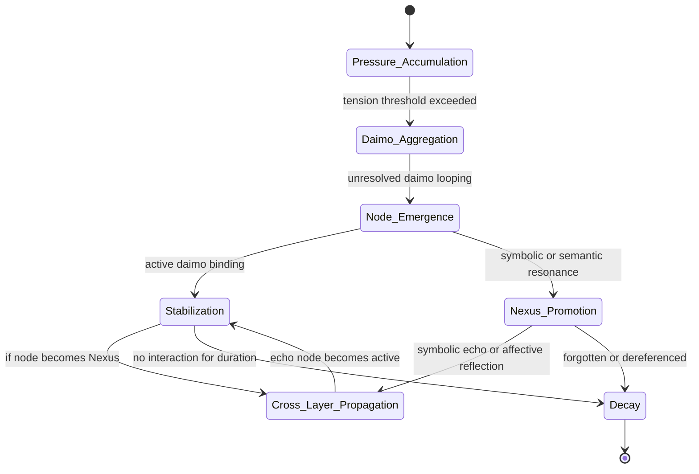

Note: Consolidated here → ../notes/diagrams/state-diagram-node-lifecycle.md ^ref-938eca9c-1-0

^ref-938eca9c-3-0
 ^ref-938eca9c-21-0
#hashtags: #diagram #eidolon #promethean

---
 ^ref-938eca9c-25-0
Related notes: [[../notes/diagrams/node-type-topology-map|node-type-topology-map]], [[../notes/diagrams/circuit-weight-visualizations|circuit-weight-visualizations]], [[../notes/diagrams/full-system-overview-diagrams|full-system-overview-diagrams]], [[../notes/diagrams/layer1-uptime-diagrams|layer1-uptime-diagrams]], [[../notes/diagrams/field-node-lifecycle-additional-diagrams|field-node-lifecycle-additional-diagrams]], [[../notes/diagrams/state-diagram-node-lifecycle|state-diagram-node-lifecycle]] [[index|unique/index]]
 ^ref-938eca9c-27-0
#tags: #diagram #design<!-- GENERATED-SECTIONS:DO-NOT-EDIT-BELOW -->
## Related content
- [Diagrams](chunks/diagrams.md)
- [DSL](chunks/dsl.md)
- [Math Fundamentals](chunks/math-fundamentals.md)
- [Tooling](chunks/tooling.md)
- [field-dynamics-math-blocks](field-dynamics-math-blocks.md)
- [field-interaction-equations](field-interaction-equations.md)
- [Debugging Broker Connections and Agent Behavior](debugging-broker-connections-and-agent-behavior.md)
- [Duck's Self-Referential Perceptual Loop](ducks-self-referential-perceptual-loop.md)
- [Dynamic Context Model for Web Components](dynamic-context-model-for-web-components.md)
- [Window Management](chunks/window-management.md)
- [Eidolon Field Abstract Model](eidolon-field-abstract-model.md)
- [zero-copy-snapshots-and-workers](zero-copy-snapshots-and-workers.md)
- [windows-tiling-with-autohotkey](windows-tiling-with-autohotkey.md)
- [typed-struct-compiler](typed-struct-compiler.md)
- [TypeScript Patch for Tool Calling Support](typescript-patch-for-tool-calling-support.md)
- [field-node-diagram-outline](field-node-diagram-outline.md)
- [field-node-diagram-set](field-node-diagram-set.md)
- [field-node-diagram-visualizations](field-node-diagram-visualizations.md)
- [Fnord Tracer Protocol](fnord-tracer-protocol.md)
- [Functional Embedding Pipeline Refactor](functional-embedding-pipeline-refactor.md)
- [graph-ds](graph-ds.md)
- [heartbeat-fragment-demo](heartbeat-fragment-demo.md)
- [i3-bluetooth-setup](i3-bluetooth-setup.md)
- [Ice Box Reorganization](ice-box-reorganization.md)
- [komorebi-group-window-hack](komorebi-group-window-hack.md)
- [Layer1SurvivabilityEnvelope](layer1survivabilityenvelope.md)
- [Promethean Documentation Pipeline Overview](promethean-documentation-pipeline-overview.md)
- [Promethean_Eidolon_Synchronicity_Model](promethean-eidolon-synchronicity-model.md)
- [Promethean Infrastructure Setup](promethean-infrastructure-setup.md)
- [Promethean Pipelines](promethean-pipelines.md)
- [Promethean State Format](promethean-state-format.md)
- [NPU Voice Code and Sensory Integration](npu-voice-code-and-sensory-integration.md)
- [Obsidian ChatGPT Plugin Integration Guide](obsidian-chatgpt-plugin-integration-guide.md)
- [Obsidian ChatGPT Plugin Integration](obsidian-chatgpt-plugin-integration.md)
- [obsidian-ignore-node-modules-regex](obsidian-ignore-node-modules-regex.md)
- [Obsidian Task Generation](obsidian-task-generation.md)
- [Obsidian Templating Plugins Integration Guide](obsidian-templating-plugins-integration-guide.md)
- [Optimizing Command Limitations in System Design](optimizing-command-limitations-in-system-design.md)
- [polyglot-repl-interface-layer](polyglot-repl-interface-layer.md)
- [Post-Linguistic Transhuman Design Frameworks](post-linguistic-transhuman-design-frameworks.md)
- [Promethean Chat Activity Report](promethean-chat-activity-report.md)
- [Promethean-Copilot-Intent-Engine](promethean-copilot-intent-engine.md)
- [Promethean Dev Workflow Update](promethean-dev-workflow-update.md)
- [Model Selection for Lightweight Conversational Tasks](model-selection-for-lightweight-conversational-tasks.md)
- [JavaScript](chunks/javascript.md)
- [Operations](chunks/operations.md)
- [Services](chunks/services.md)
- [Shared](chunks/shared.md)
- [Simulation Demo](chunks/simulation-demo.md)
- [ParticleSimulationWithCanvasAndFFmpeg](particlesimulationwithcanvasandffmpeg.md)
- [Per-Domain Policy System for JS Crawler](per-domain-policy-system-for-js-crawler.md)
- [eidolon-field-math-foundations](eidolon-field-math-foundations.md)
- [Factorio AI with External Agents](factorio-ai-with-external-agents.md)
- [Functional Refactor of TypeScript Document Processing](functional-refactor-of-typescript-document-processing.md)
- [Chroma Toolkit Consolidation Plan](chroma-toolkit-consolidation-plan.md)
- [Duck's Attractor States](ducks-attractor-states.md)
- [Creative Moments](creative-moments.md)
- [DuckDuckGoSearchPipeline](duckduckgosearchpipeline.md)
- [Migrate to Provider-Tenant Architecture](migrate-to-provider-tenant-architecture.md)
- [Performance-Optimized-Polyglot-Bridge](performance-optimized-polyglot-bridge.md)
- [Pipeline Enhancements](pipeline-enhancements.md)
- [plan-update-confirmation](plan-update-confirmation.md)
- [Unique Info Dump Index](unique-info-dump-index.md)
- [Promethean Workflow Optimization](promethean-workflow-optimization.md)
- [Prometheus Observability Stack](prometheus-observability-stack.md)
- [homeostasis-decay-formulas](homeostasis-decay-formulas.md)
- [Docops Feature Updates](docops-feature-updates.md)
- [Promethean Documentation Overview](promethean-documentation-overview.md)
- [Promethean Documentation Update](promethean-documentation-update.md)
- [Promethean Documentation Update](promethean-documentation-update.txt)
- [Promethean Notes](promethean-notes.md)
- [promethean-requirements](promethean-requirements.md)
- [Promethean Data Sync Protocol](promethean-data-sync-protocol.md)
- [Protocol_0_The_Contradiction_Engine](protocol-0-the-contradiction-engine.md)
- [Provider-Agnostic Chat Panel Implementation](provider-agnostic-chat-panel-implementation.md)
- [Pure TypeScript Search Microservice](pure-typescript-search-microservice.md)
- [Reawakening Duck](reawakening-duck.md)
- [Model Upgrade Calm-Down Guide](model-upgrade-calm-down-guide.md)
- [OpenAPI Validation Report](openapi-validation-report.md)
- [Docops Feature Updates](docops-feature-updates-2.md)
- [Prompt_Folder_Bootstrap](prompt-folder-bootstrap.md)
- [Redirecting Standard Error](redirecting-standard-error.md)
- [ripple-propagation-demo](ripple-propagation-demo.md)
- [schema-evolution-workflow](schema-evolution-workflow.md)
- [Self-Agency in AI Interaction](self-agency-in-ai-interaction.md)
- [Mathematics Sampler](mathematics-sampler.md)
- [Mathematical Samplers](mathematical-samplers.md)
- [Unique Concepts](unique-concepts.md)
- [sibilant-macro-targets](sibilant-macro-targets.md)
- [Smoke Resonance Visualizations](smoke-resonance-visualizations.md)
- [Stateful Partitions and Rebalancing](stateful-partitions-and-rebalancing.md)
- [unique-templates](templates/unique-templates.md)
- [The Jar of Echoes](the-jar-of-echoes.md)
- [Tracing the Signal](tracing-the-signal.md)
- [ts-to-lisp-transpiler](ts-to-lisp-transpiler.md)
- [Synchronicity Waves and Web](synchronicity-waves-and-web.md)
- [Mindful Prioritization](mindful-prioritization.md)
- [MindfulRobotIntegration](mindfulrobotintegration.md)
- [Admin Dashboard for User Management](admin-dashboard-for-user-management.md)
- [ChatGPT Custom Prompts](chatgpt-custom-prompts.md)
- [Self-Improving Documentation Tool](self-improving-documentation-tool.md)
- [Fastify Static Files Plugin](fastify-static-files-plugin.md)
- [Git Commit Optimization for Code Reviews](git-commit-optimization-for-code-reviews.md)
- [run-step-api](run-step-api.md)
- [Promethean Documentation Update](promethean-documentation-update-4.md)
- [Agent Reflections and Prompt Evolution](agent-reflections-and-prompt-evolution.md)
- [Agent Tasks: Persistence Migration to DualStore](agent-tasks-persistence-migration-to-dualstore.md)
## Sources
- [Docops Feature Updates — L226](docops-feature-updates.md#^ref-2792d448-226-0) (line 226, col 0, score 1)
- [field-node-diagram-outline — L705](field-node-diagram-outline.md#^ref-1f32c94a-705-0) (line 705, col 0, score 1)
- [field-node-diagram-set — L719](field-node-diagram-set.md#^ref-22b989d5-719-0) (line 719, col 0, score 1)
- [field-node-diagram-visualizations — L601](field-node-diagram-visualizations.md#^ref-e9b27b06-601-0) (line 601, col 0, score 1)
- [Fnord Tracer Protocol — L1060](fnord-tracer-protocol.md#^ref-fc21f824-1060-0) (line 1060, col 0, score 1)
- [Functional Embedding Pipeline Refactor — L726](functional-embedding-pipeline-refactor.md#^ref-a4a25141-726-0) (line 726, col 0, score 1)
- [graph-ds — L996](graph-ds.md#^ref-6620e2f2-996-0) (line 996, col 0, score 1)
- [heartbeat-fragment-demo — L667](heartbeat-fragment-demo.md#^ref-dd00677a-667-0) (line 667, col 0, score 1)
- [i3-bluetooth-setup — L736](i3-bluetooth-setup.md#^ref-5e408692-736-0) (line 736, col 0, score 1)
- [Ice Box Reorganization — L645](ice-box-reorganization.md#^ref-291c7d91-645-0) (line 645, col 0, score 1)
- [komorebi-group-window-hack — L739](komorebi-group-window-hack.md#^ref-dd89372d-739-0) (line 739, col 0, score 1)
- [Layer1SurvivabilityEnvelope — L816](layer1survivabilityenvelope.md#^ref-64a9f9f9-816-0) (line 816, col 0, score 1)
- [Promethean Documentation Overview — L44](promethean-documentation-overview.md#^ref-9413237f-44-0) (line 44, col 0, score 1)
- [Promethean Documentation Pipeline Overview — L213](promethean-documentation-pipeline-overview.md#^ref-3a3bf2c9-213-0) (line 213, col 0, score 1)
- [Promethean Documentation Update — L37](promethean-documentation-update.md#^ref-c0392040-37-0) (line 37, col 0, score 1)
- [Promethean Documentation Update — L22](promethean-documentation-update.txt#^ref-0b872af2-22-0) (line 22, col 0, score 1)
- [Promethean_Eidolon_Synchronicity_Model — L70](promethean-eidolon-synchronicity-model.md#^ref-2d6e5553-70-0) (line 70, col 0, score 1)
- [Promethean Infrastructure Setup — L716](promethean-infrastructure-setup.md#^ref-6deed6ac-716-0) (line 716, col 0, score 1)
- [Promethean Notes — L24](promethean-notes.md#^ref-1c4046b5-24-0) (line 24, col 0, score 1)
- [Promethean Pipelines — L137](promethean-pipelines.md#^ref-8b8e6103-137-0) (line 137, col 0, score 1)
- [promethean-requirements — L67](promethean-requirements.md#^ref-95205cd3-67-0) (line 67, col 0, score 1)
- [Promethean State Format — L83](promethean-state-format.md#^ref-23df6ddb-83-0) (line 83, col 0, score 1)
- [NPU Voice Code and Sensory Integration — L60](npu-voice-code-and-sensory-integration.md#^ref-5a02283e-60-0) (line 60, col 0, score 1)
- [Obsidian ChatGPT Plugin Integration Guide — L48](obsidian-chatgpt-plugin-integration-guide.md#^ref-1d3d6c3a-48-0) (line 48, col 0, score 1)
- [Obsidian ChatGPT Plugin Integration — L71](obsidian-chatgpt-plugin-integration.md#^ref-ca8e1399-71-0) (line 71, col 0, score 1)
- [obsidian-ignore-node-modules-regex — L107](obsidian-ignore-node-modules-regex.md#^ref-ffb9b2a9-107-0) (line 107, col 0, score 1)
- [Obsidian Task Generation — L72](obsidian-task-generation.md#^ref-9b694a91-72-0) (line 72, col 0, score 1)
- [Obsidian Templating Plugins Integration Guide — L148](obsidian-templating-plugins-integration-guide.md#^ref-b39dc9d4-148-0) (line 148, col 0, score 1)
- [Optimizing Command Limitations in System Design — L40](optimizing-command-limitations-in-system-design.md#^ref-98c8ff62-40-0) (line 40, col 0, score 1)
- [Promethean Notes — L16](promethean-notes.md#^ref-1c4046b5-16-0) (line 16, col 0, score 1)
- [Promethean Pipelines — L138](promethean-pipelines.md#^ref-8b8e6103-138-0) (line 138, col 0, score 1)
- [promethean-requirements — L68](promethean-requirements.md#^ref-95205cd3-68-0) (line 68, col 0, score 1)
- [Promethean State Format — L84](promethean-state-format.md#^ref-23df6ddb-84-0) (line 84, col 0, score 1)
- [polyglot-repl-interface-layer — L211](polyglot-repl-interface-layer.md#^ref-9c79206d-211-0) (line 211, col 0, score 1)
- [Post-Linguistic Transhuman Design Frameworks — L90](post-linguistic-transhuman-design-frameworks.md#^ref-6bcff92c-90-0) (line 90, col 0, score 1)
- [Promethean Chat Activity Report — L100](promethean-chat-activity-report.md#^ref-18344cf9-100-0) (line 100, col 0, score 1)
- [Promethean-Copilot-Intent-Engine — L77](promethean-copilot-intent-engine.md#^ref-ae24a280-77-0) (line 77, col 0, score 1)
- [Promethean Data Sync Protocol — L50](promethean-data-sync-protocol.md#^ref-9fab9e76-50-0) (line 50, col 0, score 1)
- [Promethean Dev Workflow Update — L120](promethean-dev-workflow-update.md#^ref-03a5578f-120-0) (line 120, col 0, score 1)
- [Promethean Documentation Pipeline Overview — L249](promethean-documentation-pipeline-overview.md#^ref-3a3bf2c9-249-0) (line 249, col 0, score 1)
- [Protocol_0_The_Contradiction_Engine — L172](protocol-0-the-contradiction-engine.md#^ref-9a93a756-172-0) (line 172, col 0, score 1)
- [Provider-Agnostic Chat Panel Implementation — L252](provider-agnostic-chat-panel-implementation.md#^ref-43bfe9dd-252-0) (line 252, col 0, score 1)
- [Pure TypeScript Search Microservice — L625](pure-typescript-search-microservice.md#^ref-d17d3a96-625-0) (line 625, col 0, score 1)
- [Reawakening Duck — L156](reawakening-duck.md#^ref-59b5670f-156-0) (line 156, col 0, score 1)
- [Mindful Prioritization — L58](mindful-prioritization.md#^ref-40185d05-58-0) (line 58, col 0, score 1)
- [MindfulRobotIntegration — L93](mindfulrobotintegration.md#^ref-5f65dfa5-93-0) (line 93, col 0, score 1)
- [Model Selection for Lightweight Conversational Tasks — L192](model-selection-for-lightweight-conversational-tasks.md#^ref-d144aa62-192-0) (line 192, col 0, score 1)
- [Model Upgrade Calm-Down Guide — L132](model-upgrade-calm-down-guide.md#^ref-db74343f-132-0) (line 132, col 0, score 1)
- [NPU Voice Code and Sensory Integration — L63](npu-voice-code-and-sensory-integration.md#^ref-5a02283e-63-0) (line 63, col 0, score 1)
- [Obsidian ChatGPT Plugin Integration Guide — L77](obsidian-chatgpt-plugin-integration-guide.md#^ref-1d3d6c3a-77-0) (line 77, col 0, score 1)
- [Obsidian ChatGPT Plugin Integration — L78](obsidian-chatgpt-plugin-integration.md#^ref-ca8e1399-78-0) (line 78, col 0, score 1)
- [obsidian-ignore-node-modules-regex — L91](obsidian-ignore-node-modules-regex.md#^ref-ffb9b2a9-91-0) (line 91, col 0, score 1)
- [Obsidian Task Generation — L102](obsidian-task-generation.md#^ref-9b694a91-102-0) (line 102, col 0, score 1)
- [Obsidian Templating Plugins Integration Guide — L151](obsidian-templating-plugins-integration-guide.md#^ref-b39dc9d4-151-0) (line 151, col 0, score 1)
- [Diagrams — L7](chunks/diagrams.md#^ref-45cd25b5-7-0) (line 7, col 0, score 1)
- [DSL — L27](chunks/dsl.md#^ref-e87bc036-27-0) (line 27, col 0, score 1)
- [JavaScript — L30](chunks/javascript.md#^ref-c1618c66-30-0) (line 30, col 0, score 1)
- [Math Fundamentals — L36](chunks/math-fundamentals.md#^ref-c6e87433-36-0) (line 36, col 0, score 1)
- [Operations — L108](chunks/operations.md#^ref-f1add613-108-0) (line 108, col 0, score 1)
- [Services — L13](chunks/services.md#^ref-75ea4a6a-13-0) (line 13, col 0, score 1)
- [Shared — L14](chunks/shared.md#^ref-623a55f7-14-0) (line 14, col 0, score 1)
- [Simulation Demo — L6](chunks/simulation-demo.md#^ref-557309a3-6-0) (line 6, col 0, score 1)
- [Tooling — L85](chunks/tooling.md#^ref-6cb4943e-85-0) (line 85, col 0, score 1)
- [Obsidian ChatGPT Plugin Integration Guide — L132](obsidian-chatgpt-plugin-integration-guide.md#^ref-1d3d6c3a-132-0) (line 132, col 0, score 1)
- [Obsidian ChatGPT Plugin Integration — L108](obsidian-chatgpt-plugin-integration.md#^ref-ca8e1399-108-0) (line 108, col 0, score 1)
- [obsidian-ignore-node-modules-regex — L119](obsidian-ignore-node-modules-regex.md#^ref-ffb9b2a9-119-0) (line 119, col 0, score 1)
- [Obsidian Task Generation — L61](obsidian-task-generation.md#^ref-9b694a91-61-0) (line 61, col 0, score 1)
- [Obsidian Templating Plugins Integration Guide — L170](obsidian-templating-plugins-integration-guide.md#^ref-b39dc9d4-170-0) (line 170, col 0, score 1)
- [OpenAPI Validation Report — L100](openapi-validation-report.md#^ref-5c152b08-100-0) (line 100, col 0, score 1)
- [Optimizing Command Limitations in System Design — L98](optimizing-command-limitations-in-system-design.md#^ref-98c8ff62-98-0) (line 98, col 0, score 1)
- [ParticleSimulationWithCanvasAndFFmpeg — L280](particlesimulationwithcanvasandffmpeg.md#^ref-e018dd7a-280-0) (line 280, col 0, score 1)
- [Per-Domain Policy System for JS Crawler — L498](per-domain-policy-system-for-js-crawler.md#^ref-c03020e1-498-0) (line 498, col 0, score 1)
- [eidolon-field-math-foundations — L148](eidolon-field-math-foundations.md#^ref-008f2ac0-148-0) (line 148, col 0, score 1)
- [Factorio AI with External Agents — L166](factorio-ai-with-external-agents.md#^ref-a4d90289-166-0) (line 166, col 0, score 1)
- [field-dynamics-math-blocks — L148](field-dynamics-math-blocks.md#^ref-7cfc230d-148-0) (line 148, col 0, score 1)
- [field-interaction-equations — L153](field-interaction-equations.md#^ref-b09141b7-153-0) (line 153, col 0, score 1)
- [field-node-diagram-outline — L118](field-node-diagram-outline.md#^ref-1f32c94a-118-0) (line 118, col 0, score 1)
- [field-node-diagram-set — L168](field-node-diagram-set.md#^ref-22b989d5-168-0) (line 168, col 0, score 1)
- [field-node-diagram-visualizations — L103](field-node-diagram-visualizations.md#^ref-e9b27b06-103-0) (line 103, col 0, score 1)
- [Functional Embedding Pipeline Refactor — L380](functional-embedding-pipeline-refactor.md#^ref-a4a25141-380-0) (line 380, col 0, score 1)
- [Functional Refactor of TypeScript Document Processing — L194](functional-refactor-of-typescript-document-processing.md#^ref-1cfae310-194-0) (line 194, col 0, score 1)
- [graph-ds — L372](graph-ds.md#^ref-6620e2f2-372-0) (line 372, col 0, score 1)
- [Agent Reflections and Prompt Evolution — L237](agent-reflections-and-prompt-evolution.md#^ref-bb7f0835-237-0) (line 237, col 0, score 1)
- [Agent Tasks: Persistence Migration to DualStore — L267](agent-tasks-persistence-migration-to-dualstore.md#^ref-93d2ba51-267-0) (line 267, col 0, score 1)
- [Operations — L73](chunks/operations.md#^ref-f1add613-73-0) (line 73, col 0, score 1)
- [Debugging Broker Connections and Agent Behavior — L170](debugging-broker-connections-and-agent-behavior.md#^ref-73d3dbf6-170-0) (line 170, col 0, score 1)
- [Docops Feature Updates — L67](docops-feature-updates-2.md#^ref-cdbd21ee-67-0) (line 67, col 0, score 1)
- [Docops Feature Updates — L96](docops-feature-updates.md#^ref-2792d448-96-0) (line 96, col 0, score 1)
- [Duck's Self-Referential Perceptual Loop — L139](ducks-self-referential-perceptual-loop.md#^ref-71726f04-139-0) (line 139, col 0, score 1)
- [Dynamic Context Model for Web Components — L548](dynamic-context-model-for-web-components.md#^ref-f7702bf8-548-0) (line 548, col 0, score 1)
- [Fnord Tracer Protocol — L349](fnord-tracer-protocol.md#^ref-fc21f824-349-0) (line 349, col 0, score 1)
- [Functional Refactor of TypeScript Document Processing — L213](functional-refactor-of-typescript-document-processing.md#^ref-1cfae310-213-0) (line 213, col 0, score 1)
- [Admin Dashboard for User Management — L101](admin-dashboard-for-user-management.md#^ref-2901a3e9-101-0) (line 101, col 0, score 1)
- [ChatGPT Custom Prompts — L72](chatgpt-custom-prompts.md#^ref-930054b3-72-0) (line 72, col 0, score 1)
- [Chroma Toolkit Consolidation Plan — L261](chroma-toolkit-consolidation-plan.md#^ref-5020e892-261-0) (line 261, col 0, score 1)
- [Diagrams — L55](chunks/diagrams.md#^ref-45cd25b5-55-0) (line 55, col 0, score 1)
- [DSL — L79](chunks/dsl.md#^ref-e87bc036-79-0) (line 79, col 0, score 1)
- [JavaScript — L86](chunks/javascript.md#^ref-c1618c66-86-0) (line 86, col 0, score 1)
- [Math Fundamentals — L74](chunks/math-fundamentals.md#^ref-c6e87433-74-0) (line 74, col 0, score 1)
- [Shared — L56](chunks/shared.md#^ref-623a55f7-56-0) (line 56, col 0, score 1)
- [Tooling — L58](chunks/tooling.md#^ref-6cb4943e-58-0) (line 58, col 0, score 1)
- [Window Management — L69](chunks/window-management.md#^ref-9e8ae388-69-0) (line 69, col 0, score 1)
- [Factorio AI with External Agents — L4841](factorio-ai-with-external-agents.md#^ref-a4d90289-4841-0) (line 4841, col 0, score 0.96)
- [field-dynamics-math-blocks — L5983](field-dynamics-math-blocks.md#^ref-7cfc230d-5983-0) (line 5983, col 0, score 0.96)
- [field-interaction-equations — L6301](field-interaction-equations.md#^ref-b09141b7-6301-0) (line 6301, col 0, score 0.96)
- [field-node-diagram-outline — L4848](field-node-diagram-outline.md#^ref-1f32c94a-4848-0) (line 4848, col 0, score 0.96)
- [field-node-diagram-set — L4885](field-node-diagram-set.md#^ref-22b989d5-4885-0) (line 4885, col 0, score 0.96)
- [Fnord Tracer Protocol — L6723](fnord-tracer-protocol.md#^ref-fc21f824-6723-0) (line 6723, col 0, score 0.96)
- [Functional Embedding Pipeline Refactor — L3095](functional-embedding-pipeline-refactor.md#^ref-a4a25141-3095-0) (line 3095, col 0, score 0.96)
- [Functional Refactor of TypeScript Document Processing — L2333](functional-refactor-of-typescript-document-processing.md#^ref-1cfae310-2333-0) (line 2333, col 0, score 0.96)
- [graph-ds — L4596](graph-ds.md#^ref-6620e2f2-4596-0) (line 4596, col 0, score 0.96)
- [field-interaction-equations — L3178](field-interaction-equations.md#^ref-b09141b7-3178-0) (line 3178, col 0, score 0.97)
- [homeostasis-decay-formulas — L2405](homeostasis-decay-formulas.md#^ref-37b5d236-2405-0) (line 2405, col 0, score 0.97)
- [Layer1SurvivabilityEnvelope — L1790](layer1survivabilityenvelope.md#^ref-64a9f9f9-1790-0) (line 1790, col 0, score 0.97)
- [Duck's Attractor States — L1754](ducks-attractor-states.md#^ref-13951643-1754-0) (line 1754, col 0, score 0.97)
- [field-node-diagram-set — L1651](field-node-diagram-set.md#^ref-22b989d5-1651-0) (line 1651, col 0, score 0.97)
- [Ice Box Reorganization — L1984](ice-box-reorganization.md#^ref-291c7d91-1984-0) (line 1984, col 0, score 0.97)
- [Migrate to Provider-Tenant Architecture — L5653](migrate-to-provider-tenant-architecture.md#^ref-54382370-5653-0) (line 5653, col 0, score 0.97)
- [Model Selection for Lightweight Conversational Tasks — L3391](model-selection-for-lightweight-conversational-tasks.md#^ref-d144aa62-3391-0) (line 3391, col 0, score 0.97)
- [Model Upgrade Calm-Down Guide — L860](model-upgrade-calm-down-guide.md#^ref-db74343f-860-0) (line 860, col 0, score 0.86)
- [NPU Voice Code and Sensory Integration — L735](npu-voice-code-and-sensory-integration.md#^ref-5a02283e-735-0) (line 735, col 0, score 0.86)
- [Obsidian ChatGPT Plugin Integration Guide — L1039](obsidian-chatgpt-plugin-integration-guide.md#^ref-1d3d6c3a-1039-0) (line 1039, col 0, score 0.86)
- [Obsidian ChatGPT Plugin Integration — L1019](obsidian-chatgpt-plugin-integration.md#^ref-ca8e1399-1019-0) (line 1019, col 0, score 0.86)
- [obsidian-ignore-node-modules-regex — L1272](obsidian-ignore-node-modules-regex.md#^ref-ffb9b2a9-1272-0) (line 1272, col 0, score 0.86)
- [Obsidian Task Generation — L780](obsidian-task-generation.md#^ref-9b694a91-780-0) (line 780, col 0, score 0.86)
- [Obsidian Templating Plugins Integration Guide — L1252](obsidian-templating-plugins-integration-guide.md#^ref-b39dc9d4-1252-0) (line 1252, col 0, score 0.86)
- [OpenAPI Validation Report — L781](openapi-validation-report.md#^ref-5c152b08-781-0) (line 781, col 0, score 0.86)
- [Optimizing Command Limitations in System Design — L1018](optimizing-command-limitations-in-system-design.md#^ref-98c8ff62-1018-0) (line 1018, col 0, score 0.86)
- [Promethean Documentation Overview — L580](promethean-documentation-overview.md#^ref-9413237f-580-0) (line 580, col 0, score 0.96)
- [Promethean Documentation Pipeline Overview — L1613](promethean-documentation-pipeline-overview.md#^ref-3a3bf2c9-1613-0) (line 1613, col 0, score 0.96)
- [Promethean Documentation Update — L1271](promethean-documentation-update.md#^ref-c0392040-1271-0) (line 1271, col 0, score 0.96)
- [Promethean_Eidolon_Synchronicity_Model — L3291](promethean-eidolon-synchronicity-model.md#^ref-2d6e5553-3291-0) (line 3291, col 0, score 0.96)
- [Promethean Infrastructure Setup — L6974](promethean-infrastructure-setup.md#^ref-6deed6ac-6974-0) (line 6974, col 0, score 0.96)
- [Promethean Pipelines — L4005](promethean-pipelines.md#^ref-8b8e6103-4005-0) (line 4005, col 0, score 0.96)
- [promethean-requirements — L1645](promethean-requirements.md#^ref-95205cd3-1645-0) (line 1645, col 0, score 0.96)
- [Promethean State Format — L3813](promethean-state-format.md#^ref-23df6ddb-3813-0) (line 3813, col 0, score 0.96)
- [Prometheus Observability Stack — L5781](prometheus-observability-stack.md#^ref-e90b5a16-5781-0) (line 5781, col 0, score 0.96)
- [Prompt_Folder_Bootstrap — L5891](prompt-folder-bootstrap.md#^ref-bd4f0976-5891-0) (line 5891, col 0, score 0.96)
- [Chroma Toolkit Consolidation Plan — L5432](chroma-toolkit-consolidation-plan.md#^ref-5020e892-5432-0) (line 5432, col 0, score 0.95)
- [Duck's Self-Referential Perceptual Loop — L2406](ducks-self-referential-perceptual-loop.md#^ref-71726f04-2406-0) (line 2406, col 0, score 0.95)
- [field-interaction-equations — L5858](field-interaction-equations.md#^ref-b09141b7-5858-0) (line 5858, col 0, score 0.95)
- [i3-bluetooth-setup — L1021](i3-bluetooth-setup.md#^ref-5e408692-1021-0) (line 1021, col 0, score 0.87)
- [Ice Box Reorganization — L257](ice-box-reorganization.md#^ref-291c7d91-257-0) (line 257, col 0, score 0.87)
- [Unique Concepts — L716](unique-concepts.md#^ref-ed6f3fc9-716-0) (line 716, col 0, score 0.98)
- [polyglot-repl-interface-layer — L773](polyglot-repl-interface-layer.md#^ref-9c79206d-773-0) (line 773, col 0, score 0.96)
- [Promethean Chat Activity Report — L1336](promethean-chat-activity-report.md#^ref-18344cf9-1336-0) (line 1336, col 0, score 0.96)
- [Promethean Infrastructure Setup — L3460](promethean-infrastructure-setup.md#^ref-6deed6ac-3460-0) (line 3460, col 0, score 0.97)
- [typed-struct-compiler — L2270](typed-struct-compiler.md#^ref-78eeedf7-2270-0) (line 2270, col 0, score 0.97)
- [Promethean Dev Workflow Update — L1850](promethean-dev-workflow-update.md#^ref-03a5578f-1850-0) (line 1850, col 0, score 0.97)
- [Self-Agency in AI Interaction — L2386](self-agency-in-ai-interaction.md#^ref-49a9a860-2386-0) (line 2386, col 0, score 0.97)
- [The Jar of Echoes — L2455](the-jar-of-echoes.md#^ref-18138627-2455-0) (line 2455, col 0, score 0.97)
- [windows-tiling-with-autohotkey — L2835](windows-tiling-with-autohotkey.md#^ref-0f6f8f38-2835-0) (line 2835, col 0, score 0.97)
- [zero-copy-snapshots-and-workers — L2738](zero-copy-snapshots-and-workers.md#^ref-62bec6f0-2738-0) (line 2738, col 0, score 0.97)
- [Fnord Tracer Protocol — L4503](fnord-tracer-protocol.md#^ref-fc21f824-4503-0) (line 4503, col 0, score 0.97)
- [windows-tiling-with-autohotkey — L7938](windows-tiling-with-autohotkey.md#^ref-0f6f8f38-7938-0) (line 7938, col 0, score 0.94)
- [Stateful Partitions and Rebalancing — L2890](stateful-partitions-and-rebalancing.md#^ref-4330e8f0-2890-0) (line 2890, col 0, score 0.98)
- [Functional Refactor of TypeScript Document Processing — L2242](functional-refactor-of-typescript-document-processing.md#^ref-1cfae310-2242-0) (line 2242, col 0, score 0.97)
- [graph-ds — L3757](graph-ds.md#^ref-6620e2f2-3757-0) (line 3757, col 0, score 0.97)
- [heartbeat-fragment-demo — L3479](heartbeat-fragment-demo.md#^ref-dd00677a-3479-0) (line 3479, col 0, score 0.97)
- [homeostasis-decay-formulas — L5594](homeostasis-decay-formulas.md#^ref-37b5d236-5594-0) (line 5594, col 0, score 0.97)
- [i3-bluetooth-setup — L2012](i3-bluetooth-setup.md#^ref-5e408692-2012-0) (line 2012, col 0, score 0.97)
- [Ice Box Reorganization — L3225](ice-box-reorganization.md#^ref-291c7d91-3225-0) (line 3225, col 0, score 0.97)
- [komorebi-group-window-hack — L4356](komorebi-group-window-hack.md#^ref-dd89372d-4356-0) (line 4356, col 0, score 0.97)
- [Layer1SurvivabilityEnvelope — L3752](layer1survivabilityenvelope.md#^ref-64a9f9f9-3752-0) (line 3752, col 0, score 0.97)
- [Mathematical Samplers — L1714](mathematical-samplers.md#^ref-86a691ec-1714-0) (line 1714, col 0, score 0.97)
- [Mathematics Sampler — L1736](mathematics-sampler.md#^ref-b5e0183e-1736-0) (line 1736, col 0, score 0.87)
- [Migrate to Provider-Tenant Architecture — L7748](migrate-to-provider-tenant-architecture.md#^ref-54382370-7748-0) (line 7748, col 0, score 0.87)
- [Obsidian ChatGPT Plugin Integration — L3847](obsidian-chatgpt-plugin-integration.md#^ref-ca8e1399-3847-0) (line 3847, col 0, score 0.87)
- [obsidian-ignore-node-modules-regex — L4433](obsidian-ignore-node-modules-regex.md#^ref-ffb9b2a9-4433-0) (line 4433, col 0, score 0.87)
- [Obsidian Task Generation — L1688](obsidian-task-generation.md#^ref-9b694a91-1688-0) (line 1688, col 0, score 0.87)
- [Obsidian Templating Plugins Integration Guide — L5168](obsidian-templating-plugins-integration-guide.md#^ref-b39dc9d4-5168-0) (line 5168, col 0, score 0.87)
- [OpenAPI Validation Report — L1563](openapi-validation-report.md#^ref-5c152b08-1563-0) (line 1563, col 0, score 0.87)
- [ParticleSimulationWithCanvasAndFFmpeg — L3400](particlesimulationwithcanvasandffmpeg.md#^ref-e018dd7a-3400-0) (line 3400, col 0, score 0.87)
- [Per-Domain Policy System for JS Crawler — L5381](per-domain-policy-system-for-js-crawler.md#^ref-c03020e1-5381-0) (line 5381, col 0, score 0.87)
- [The Jar of Echoes — L1448](the-jar-of-echoes.md#^ref-18138627-1448-0) (line 1448, col 0, score 0.95)
- [ts-to-lisp-transpiler — L784](ts-to-lisp-transpiler.md#^ref-ba11486b-784-0) (line 784, col 0, score 0.95)
- [DSL — L186](chunks/dsl.md#^ref-e87bc036-186-0) (line 186, col 0, score 0.98)
- [Math Fundamentals — L563](chunks/math-fundamentals.md#^ref-c6e87433-563-0) (line 563, col 0, score 0.98)
- [Mathematics Sampler — L324](mathematics-sampler.md#^ref-b5e0183e-324-0) (line 324, col 0, score 0.96)
- [Migrate to Provider-Tenant Architecture — L802](migrate-to-provider-tenant-architecture.md#^ref-54382370-802-0) (line 802, col 0, score 0.96)
- [Mindful Prioritization — L211](mindful-prioritization.md#^ref-40185d05-211-0) (line 211, col 0, score 0.96)
- [MindfulRobotIntegration — L199](mindfulrobotintegration.md#^ref-5f65dfa5-199-0) (line 199, col 0, score 0.96)
- [Model Upgrade Calm-Down Guide — L353](model-upgrade-calm-down-guide.md#^ref-db74343f-353-0) (line 353, col 0, score 0.96)
- [NPU Voice Code and Sensory Integration — L246](npu-voice-code-and-sensory-integration.md#^ref-5a02283e-246-0) (line 246, col 0, score 0.96)
- [Mindful Prioritization — L761](mindful-prioritization.md#^ref-40185d05-761-0) (line 761, col 0, score 0.97)
- [MindfulRobotIntegration — L759](mindfulrobotintegration.md#^ref-5f65dfa5-759-0) (line 759, col 0, score 0.97)
- [Model Selection for Lightweight Conversational Tasks — L1223](model-selection-for-lightweight-conversational-tasks.md#^ref-d144aa62-1223-0) (line 1223, col 0, score 0.97)
- [Model Upgrade Calm-Down Guide — L803](model-upgrade-calm-down-guide.md#^ref-db74343f-803-0) (line 803, col 0, score 0.97)
- [NPU Voice Code and Sensory Integration — L786](npu-voice-code-and-sensory-integration.md#^ref-5a02283e-786-0) (line 786, col 0, score 0.97)
- [Obsidian ChatGPT Plugin Integration Guide — L1097](obsidian-chatgpt-plugin-integration-guide.md#^ref-1d3d6c3a-1097-0) (line 1097, col 0, score 0.97)
- [Obsidian ChatGPT Plugin Integration — L1077](obsidian-chatgpt-plugin-integration.md#^ref-ca8e1399-1077-0) (line 1077, col 0, score 0.97)
- [obsidian-ignore-node-modules-regex — L1259](obsidian-ignore-node-modules-regex.md#^ref-ffb9b2a9-1259-0) (line 1259, col 0, score 0.97)
- [Obsidian Task Generation — L767](obsidian-task-generation.md#^ref-9b694a91-767-0) (line 767, col 0, score 0.97)
- [zero-copy-snapshots-and-workers — L691](zero-copy-snapshots-and-workers.md#^ref-62bec6f0-691-0) (line 691, col 0, score 1)
- [komorebi-group-window-hack — L1796](komorebi-group-window-hack.md#^ref-dd89372d-1796-0) (line 1796, col 0, score 0.97)
- [komorebi-group-window-hack — L2017](komorebi-group-window-hack.md#^ref-dd89372d-2017-0) (line 2017, col 0, score 0.97)
- [zero-copy-snapshots-and-workers — L1936](zero-copy-snapshots-and-workers.md#^ref-62bec6f0-1936-0) (line 1936, col 0, score 0.96)
- [zero-copy-snapshots-and-workers — L2202](zero-copy-snapshots-and-workers.md#^ref-62bec6f0-2202-0) (line 2202, col 0, score 0.96)
- [Unique Info Dump Index — L6662](unique-info-dump-index.md#^ref-30ec3ba6-6662-0) (line 6662, col 0, score 0.94)
- [heartbeat-fragment-demo — L1420](heartbeat-fragment-demo.md#^ref-dd00677a-1420-0) (line 1420, col 0, score 0.99)
- [eidolon-field-math-foundations — L24596](eidolon-field-math-foundations.md#^ref-008f2ac0-24596-0) (line 24596, col 0, score 0.99)
- [Promethean Dev Workflow Update — L22800](promethean-dev-workflow-update.md#^ref-03a5578f-22800-0) (line 22800, col 0, score 0.99)
- [windows-tiling-with-autohotkey — L22798](windows-tiling-with-autohotkey.md#^ref-0f6f8f38-22798-0) (line 22798, col 0, score 0.99)
- [homeostasis-decay-formulas — L6526](homeostasis-decay-formulas.md#^ref-37b5d236-6526-0) (line 6526, col 0, score 0.96)
- [i3-bluetooth-setup — L3712](i3-bluetooth-setup.md#^ref-5e408692-3712-0) (line 3712, col 0, score 0.96)
- [komorebi-group-window-hack — L3075](komorebi-group-window-hack.md#^ref-dd89372d-3075-0) (line 3075, col 0, score 0.96)
- [Layer1SurvivabilityEnvelope — L4096](layer1survivabilityenvelope.md#^ref-64a9f9f9-4096-0) (line 4096, col 0, score 0.96)
- [Migrate to Provider-Tenant Architecture — L7335](migrate-to-provider-tenant-architecture.md#^ref-54382370-7335-0) (line 7335, col 0, score 0.96)
- [Mindful Prioritization — L1003](mindful-prioritization.md#^ref-40185d05-1003-0) (line 1003, col 0, score 0.96)
- [MindfulRobotIntegration — L1028](mindfulrobotintegration.md#^ref-5f65dfa5-1028-0) (line 1028, col 0, score 0.96)
- [Model Selection for Lightweight Conversational Tasks — L4902](model-selection-for-lightweight-conversational-tasks.md#^ref-d144aa62-4902-0) (line 4902, col 0, score 0.96)
- [Model Upgrade Calm-Down Guide — L3435](model-upgrade-calm-down-guide.md#^ref-db74343f-3435-0) (line 3435, col 0, score 0.96)
- [DSL — L329](chunks/dsl.md#^ref-e87bc036-329-0) (line 329, col 0, score 0.98)
- [Math Fundamentals — L484](chunks/math-fundamentals.md#^ref-c6e87433-484-0) (line 484, col 0, score 0.98)
- [Simulation Demo — L361](chunks/simulation-demo.md#^ref-557309a3-361-0) (line 361, col 0, score 0.98)
- [Tooling — L223](chunks/tooling.md#^ref-6cb4943e-223-0) (line 223, col 0, score 0.98)
- [zero-copy-snapshots-and-workers — L1202](zero-copy-snapshots-and-workers.md#^ref-62bec6f0-1202-0) (line 1202, col 0, score 0.98)
- [Obsidian Templating Plugins Integration Guide — L4713](obsidian-templating-plugins-integration-guide.md#^ref-b39dc9d4-4713-0) (line 4713, col 0, score 0.9)
- [OpenAPI Validation Report — L1256](openapi-validation-report.md#^ref-5c152b08-1256-0) (line 1256, col 0, score 0.9)
- [Optimizing Command Limitations in System Design — L2139](optimizing-command-limitations-in-system-design.md#^ref-98c8ff62-2139-0) (line 2139, col 0, score 0.9)
- [windows-tiling-with-autohotkey — L730](windows-tiling-with-autohotkey.md#^ref-0f6f8f38-730-0) (line 730, col 0, score 0.99)
- [The Jar of Echoes — L1034](the-jar-of-echoes.md#^ref-18138627-1034-0) (line 1034, col 0, score 0.95)
- [Tracing the Signal — L1066](tracing-the-signal.md#^ref-c3cd4f65-1066-0) (line 1066, col 0, score 0.95)
- [Promethean Dev Workflow Update — L23713](promethean-dev-workflow-update.md#^ref-03a5578f-23713-0) (line 23713, col 0, score 0.97)
- [windows-tiling-with-autohotkey — L1170](windows-tiling-with-autohotkey.md#^ref-0f6f8f38-1170-0) (line 1170, col 0, score 0.98)
- [zero-copy-snapshots-and-workers — L1056](zero-copy-snapshots-and-workers.md#^ref-62bec6f0-1056-0) (line 1056, col 0, score 0.98)
- [zero-copy-snapshots-and-workers — L2022](zero-copy-snapshots-and-workers.md#^ref-62bec6f0-2022-0) (line 2022, col 0, score 0.98)
- [windows-tiling-with-autohotkey — L3026](windows-tiling-with-autohotkey.md#^ref-0f6f8f38-3026-0) (line 3026, col 0, score 0.98)
- [TypeScript Patch for Tool Calling Support — L899](typescript-patch-for-tool-calling-support.md#^ref-7b7ca860-899-0) (line 899, col 0, score 0.97)
- [Unique Concepts — L1709](unique-concepts.md#^ref-ed6f3fc9-1709-0) (line 1709, col 0, score 0.97)
- [Unique Info Dump Index — L1227](unique-info-dump-index.md#^ref-30ec3ba6-1227-0) (line 1227, col 0, score 0.97)
- [windows-tiling-with-autohotkey — L1253](windows-tiling-with-autohotkey.md#^ref-0f6f8f38-1253-0) (line 1253, col 0, score 0.97)
- [zero-copy-snapshots-and-workers — L1174](zero-copy-snapshots-and-workers.md#^ref-62bec6f0-1174-0) (line 1174, col 0, score 0.99)
- [windows-tiling-with-autohotkey — L1011](windows-tiling-with-autohotkey.md#^ref-0f6f8f38-1011-0) (line 1011, col 0, score 0.98)
- [zero-copy-snapshots-and-workers — L757](zero-copy-snapshots-and-workers.md#^ref-62bec6f0-757-0) (line 757, col 0, score 0.98)
- [eidolon-field-math-foundations — L959](eidolon-field-math-foundations.md#^ref-008f2ac0-959-0) (line 959, col 0, score 0.96)
- [Factorio AI with External Agents — L1000](factorio-ai-with-external-agents.md#^ref-a4d90289-1000-0) (line 1000, col 0, score 0.96)
- [field-dynamics-math-blocks — L1187](field-dynamics-math-blocks.md#^ref-7cfc230d-1187-0) (line 1187, col 0, score 0.96)
- [field-interaction-equations — L1282](field-interaction-equations.md#^ref-b09141b7-1282-0) (line 1282, col 0, score 0.96)
- [field-node-diagram-outline — L1130](field-node-diagram-outline.md#^ref-1f32c94a-1130-0) (line 1130, col 0, score 0.96)
- [field-node-diagram-set — L1046](field-node-diagram-set.md#^ref-22b989d5-1046-0) (line 1046, col 0, score 0.96)
- [field-node-diagram-visualizations — L1038](field-node-diagram-visualizations.md#^ref-e9b27b06-1038-0) (line 1038, col 0, score 0.96)
- [Fnord Tracer Protocol — L1246](fnord-tracer-protocol.md#^ref-fc21f824-1246-0) (line 1246, col 0, score 0.96)
- [Functional Embedding Pipeline Refactor — L841](functional-embedding-pipeline-refactor.md#^ref-a4a25141-841-0) (line 841, col 0, score 0.96)
- [heartbeat-fragment-demo — L3096](heartbeat-fragment-demo.md#^ref-dd00677a-3096-0) (line 3096, col 0, score 0.98)
- [homeostasis-decay-formulas — L4355](homeostasis-decay-formulas.md#^ref-37b5d236-4355-0) (line 4355, col 0, score 0.98)
- [i3-bluetooth-setup — L4818](i3-bluetooth-setup.md#^ref-5e408692-4818-0) (line 4818, col 0, score 0.98)
- [Ice Box Reorganization — L4548](ice-box-reorganization.md#^ref-291c7d91-4548-0) (line 4548, col 0, score 0.98)
- [komorebi-group-window-hack — L3722](komorebi-group-window-hack.md#^ref-dd89372d-3722-0) (line 3722, col 0, score 0.98)
- [Migrate to Provider-Tenant Architecture — L8343](migrate-to-provider-tenant-architecture.md#^ref-54382370-8343-0) (line 8343, col 0, score 0.98)
- [field-node-diagram-set — L327](field-node-diagram-set.md#^ref-22b989d5-327-0) (line 327, col 0, score 0.96)
- [field-node-diagram-visualizations — L311](field-node-diagram-visualizations.md#^ref-e9b27b06-311-0) (line 311, col 0, score 0.96)
- [Fnord Tracer Protocol — L1286](fnord-tracer-protocol.md#^ref-fc21f824-1286-0) (line 1286, col 0, score 0.96)
- [Functional Embedding Pipeline Refactor — L987](functional-embedding-pipeline-refactor.md#^ref-a4a25141-987-0) (line 987, col 0, score 0.96)
- [Functional Refactor of TypeScript Document Processing — L764](functional-refactor-of-typescript-document-processing.md#^ref-1cfae310-764-0) (line 764, col 0, score 0.96)
- [graph-ds — L1487](graph-ds.md#^ref-6620e2f2-1487-0) (line 1487, col 0, score 0.96)
- [heartbeat-fragment-demo — L278](heartbeat-fragment-demo.md#^ref-dd00677a-278-0) (line 278, col 0, score 0.96)
- [homeostasis-decay-formulas — L584](homeostasis-decay-formulas.md#^ref-37b5d236-584-0) (line 584, col 0, score 0.96)
- [i3-bluetooth-setup — L1201](i3-bluetooth-setup.md#^ref-5e408692-1201-0) (line 1201, col 0, score 0.96)
- [Ice Box Reorganization — L795](ice-box-reorganization.md#^ref-291c7d91-795-0) (line 795, col 0, score 0.96)
- [Promethean_Eidolon_Synchronicity_Model — L230](promethean-eidolon-synchronicity-model.md#^ref-2d6e5553-230-0) (line 230, col 0, score 0.98)
- [Prompt_Folder_Bootstrap — L1213](prompt-folder-bootstrap.md#^ref-bd4f0976-1213-0) (line 1213, col 0, score 0.97)
- [Protocol_0_The_Contradiction_Engine — L1158](protocol-0-the-contradiction-engine.md#^ref-9a93a756-1158-0) (line 1158, col 0, score 0.97)
- [Provider-Agnostic Chat Panel Implementation — L1317](provider-agnostic-chat-panel-implementation.md#^ref-43bfe9dd-1317-0) (line 1317, col 0, score 0.97)
- [Pure TypeScript Search Microservice — L1719](pure-typescript-search-microservice.md#^ref-d17d3a96-1719-0) (line 1719, col 0, score 0.97)
- [Reawakening Duck — L1168](reawakening-duck.md#^ref-59b5670f-1168-0) (line 1168, col 0, score 0.97)
- [Redirecting Standard Error — L766](redirecting-standard-error.md#^ref-b3555ede-766-0) (line 766, col 0, score 0.97)
- [schema-evolution-workflow — L1605](schema-evolution-workflow.md#^ref-d8059b6a-1605-0) (line 1605, col 0, score 0.97)
- [TypeScript Patch for Tool Calling Support — L1621](typescript-patch-for-tool-calling-support.md#^ref-7b7ca860-1621-0) (line 1621, col 0, score 0.96)
- [Unique Info Dump Index — L455](unique-info-dump-index.md#^ref-30ec3ba6-455-0) (line 455, col 0, score 0.96)
- [windows-tiling-with-autohotkey — L1607](windows-tiling-with-autohotkey.md#^ref-0f6f8f38-1607-0) (line 1607, col 0, score 0.96)
- [obsidian-ignore-node-modules-regex — L2442](obsidian-ignore-node-modules-regex.md#^ref-ffb9b2a9-2442-0) (line 2442, col 0, score 0.96)
- [Obsidian Templating Plugins Integration Guide — L3146](obsidian-templating-plugins-integration-guide.md#^ref-b39dc9d4-3146-0) (line 3146, col 0, score 0.96)
- [ParticleSimulationWithCanvasAndFFmpeg — L5008](particlesimulationwithcanvasandffmpeg.md#^ref-e018dd7a-5008-0) (line 5008, col 0, score 0.96)
- [Promethean Chat Activity Report — L14460](promethean-chat-activity-report.md#^ref-18344cf9-14460-0) (line 14460, col 0, score 0.86)
- [Promethean Documentation Update — L12912](promethean-documentation-update.txt#^ref-0b872af2-12912-0) (line 12912, col 0, score 0.86)
- [Creative Moments — L14035](creative-moments.md#^ref-10d98225-14035-0) (line 14035, col 0, score 0.85)
- [Duck's Attractor States — L23117](ducks-attractor-states.md#^ref-13951643-23117-0) (line 23117, col 0, score 0.85)
- [Obsidian ChatGPT Plugin Integration — L1047](obsidian-chatgpt-plugin-integration.md#^ref-ca8e1399-1047-0) (line 1047, col 0, score 0.95)
- [obsidian-ignore-node-modules-regex — L1216](obsidian-ignore-node-modules-regex.md#^ref-ffb9b2a9-1216-0) (line 1216, col 0, score 0.95)
- [Obsidian Task Generation — L737](obsidian-task-generation.md#^ref-9b694a91-737-0) (line 737, col 0, score 0.95)
- [OpenAPI Validation Report — L738](openapi-validation-report.md#^ref-5c152b08-738-0) (line 738, col 0, score 0.95)
- [ParticleSimulationWithCanvasAndFFmpeg — L1475](particlesimulationwithcanvasandffmpeg.md#^ref-e018dd7a-1475-0) (line 1475, col 0, score 0.95)
- [unique-templates — L770](templates/unique-templates.md#^ref-c26f0044-770-0) (line 770, col 0, score 0.97)
- [The Jar of Echoes — L987](the-jar-of-echoes.md#^ref-18138627-987-0) (line 987, col 0, score 0.97)
- [zero-copy-snapshots-and-workers — L1576](zero-copy-snapshots-and-workers.md#^ref-62bec6f0-1576-0) (line 1576, col 0, score 0.98)
- [Mathematical Samplers — L1804](mathematical-samplers.md#^ref-86a691ec-1804-0) (line 1804, col 0, score 0.96)
- [Mathematics Sampler — L1835](mathematics-sampler.md#^ref-b5e0183e-1835-0) (line 1835, col 0, score 0.96)
- [windows-tiling-with-autohotkey — L985](windows-tiling-with-autohotkey.md#^ref-0f6f8f38-985-0) (line 985, col 0, score 0.98)
- [zero-copy-snapshots-and-workers — L780](zero-copy-snapshots-and-workers.md#^ref-62bec6f0-780-0) (line 780, col 0, score 0.98)
- [windows-tiling-with-autohotkey — L594](windows-tiling-with-autohotkey.md#^ref-0f6f8f38-594-0) (line 594, col 0, score 0.98)
- [zero-copy-snapshots-and-workers — L969](zero-copy-snapshots-and-workers.md#^ref-62bec6f0-969-0) (line 969, col 0, score 0.98)
- [Unique Info Dump Index — L2432](unique-info-dump-index.md#^ref-30ec3ba6-2432-0) (line 2432, col 0, score 0.97)
- [heartbeat-fragment-demo — L1321](heartbeat-fragment-demo.md#^ref-dd00677a-1321-0) (line 1321, col 0, score 0.98)
- [homeostasis-decay-formulas — L1392](homeostasis-decay-formulas.md#^ref-37b5d236-1392-0) (line 1392, col 0, score 0.98)
- [i3-bluetooth-setup — L1287](i3-bluetooth-setup.md#^ref-5e408692-1287-0) (line 1287, col 0, score 0.98)
- [Ice Box Reorganization — L1090](ice-box-reorganization.md#^ref-291c7d91-1090-0) (line 1090, col 0, score 0.98)
- [komorebi-group-window-hack — L1393](komorebi-group-window-hack.md#^ref-dd89372d-1393-0) (line 1393, col 0, score 0.98)
- [Layer1SurvivabilityEnvelope — L1177](layer1survivabilityenvelope.md#^ref-64a9f9f9-1177-0) (line 1177, col 0, score 0.98)
- [Mathematical Samplers — L592](mathematical-samplers.md#^ref-86a691ec-592-0) (line 592, col 0, score 0.98)
- [Mathematics Sampler — L587](mathematics-sampler.md#^ref-b5e0183e-587-0) (line 587, col 0, score 0.98)
- [Migrate to Provider-Tenant Architecture — L1655](migrate-to-provider-tenant-architecture.md#^ref-54382370-1655-0) (line 1655, col 0, score 0.98)
- [Promethean-Copilot-Intent-Engine — L891](promethean-copilot-intent-engine.md#^ref-ae24a280-891-0) (line 891, col 0, score 0.98)
- [Promethean Dev Workflow Update — L1483](promethean-dev-workflow-update.md#^ref-03a5578f-1483-0) (line 1483, col 0, score 0.98)
- [Promethean Documentation Pipeline Overview — L1265](promethean-documentation-pipeline-overview.md#^ref-3a3bf2c9-1265-0) (line 1265, col 0, score 0.98)
- [Promethean Documentation Update — L814](promethean-documentation-update.txt#^ref-0b872af2-814-0) (line 814, col 0, score 0.98)
- [Promethean_Eidolon_Synchronicity_Model — L684](promethean-eidolon-synchronicity-model.md#^ref-2d6e5553-684-0) (line 684, col 0, score 0.98)
- [Promethean Infrastructure Setup — L1708](promethean-infrastructure-setup.md#^ref-6deed6ac-1708-0) (line 1708, col 0, score 0.98)
- [Promethean Notes — L887](promethean-notes.md#^ref-1c4046b5-887-0) (line 887, col 0, score 0.98)
- [Promethean State Format — L1271](promethean-state-format.md#^ref-23df6ddb-1271-0) (line 1271, col 0, score 0.98)
- [zero-copy-snapshots-and-workers — L734](zero-copy-snapshots-and-workers.md#^ref-62bec6f0-734-0) (line 734, col 0, score 0.98)
- [zero-copy-snapshots-and-workers — L1516](zero-copy-snapshots-and-workers.md#^ref-62bec6f0-1516-0) (line 1516, col 0, score 0.98)
- [Per-Domain Policy System for JS Crawler — L2368](per-domain-policy-system-for-js-crawler.md#^ref-c03020e1-2368-0) (line 2368, col 0, score 0.97)
- [heartbeat-fragment-demo — L4029](heartbeat-fragment-demo.md#^ref-dd00677a-4029-0) (line 4029, col 0, score 0.97)
- [homeostasis-decay-formulas — L6026](homeostasis-decay-formulas.md#^ref-37b5d236-6026-0) (line 6026, col 0, score 0.97)
- [i3-bluetooth-setup — L4287](i3-bluetooth-setup.md#^ref-5e408692-4287-0) (line 4287, col 0, score 0.97)
- [Ice Box Reorganization — L4296](ice-box-reorganization.md#^ref-291c7d91-4296-0) (line 4296, col 0, score 0.97)
- [komorebi-group-window-hack — L3969](komorebi-group-window-hack.md#^ref-dd89372d-3969-0) (line 3969, col 0, score 0.97)
- [Layer1SurvivabilityEnvelope — L5113](layer1survivabilityenvelope.md#^ref-64a9f9f9-5113-0) (line 5113, col 0, score 0.97)
- [Migrate to Provider-Tenant Architecture — L7147](migrate-to-provider-tenant-architecture.md#^ref-54382370-7147-0) (line 7147, col 0, score 0.97)
- [Synchronicity Waves and Web — L2287](synchronicity-waves-and-web.md#^ref-91295f3a-2287-0) (line 2287, col 0, score 0.96)
- [ts-to-lisp-transpiler — L2339](ts-to-lisp-transpiler.md#^ref-ba11486b-2339-0) (line 2339, col 0, score 0.98)
- [typed-struct-compiler — L3549](typed-struct-compiler.md#^ref-78eeedf7-3549-0) (line 3549, col 0, score 0.98)
- [TypeScript Patch for Tool Calling Support — L6142](typescript-patch-for-tool-calling-support.md#^ref-7b7ca860-6142-0) (line 6142, col 0, score 0.98)
- [Unique Info Dump Index — L3887](unique-info-dump-index.md#^ref-30ec3ba6-3887-0) (line 3887, col 0, score 0.98)
- [windows-tiling-with-autohotkey — L4648](windows-tiling-with-autohotkey.md#^ref-0f6f8f38-4648-0) (line 4648, col 0, score 0.98)
- [field-interaction-equations — L1299](field-interaction-equations.md#^ref-b09141b7-1299-0) (line 1299, col 0, score 0.96)
- [field-node-diagram-outline — L1147](field-node-diagram-outline.md#^ref-1f32c94a-1147-0) (line 1147, col 0, score 0.96)
- [field-node-diagram-set — L1063](field-node-diagram-set.md#^ref-22b989d5-1063-0) (line 1063, col 0, score 0.96)
- [field-node-diagram-visualizations — L1055](field-node-diagram-visualizations.md#^ref-e9b27b06-1055-0) (line 1055, col 0, score 0.96)
- [Fnord Tracer Protocol — L1263](fnord-tracer-protocol.md#^ref-fc21f824-1263-0) (line 1263, col 0, score 0.96)
- [Functional Embedding Pipeline Refactor — L880](functional-embedding-pipeline-refactor.md#^ref-a4a25141-880-0) (line 880, col 0, score 0.96)
- [Functional Refactor of TypeScript Document Processing — L696](functional-refactor-of-typescript-document-processing.md#^ref-1cfae310-696-0) (line 696, col 0, score 0.96)
- [graph-ds — L1546](graph-ds.md#^ref-6620e2f2-1546-0) (line 1546, col 0, score 0.96)
- [heartbeat-fragment-demo — L1209](heartbeat-fragment-demo.md#^ref-dd00677a-1209-0) (line 1209, col 0, score 0.96)
- [field-node-diagram-set — L2365](field-node-diagram-set.md#^ref-22b989d5-2365-0) (line 2365, col 0, score 0.98)
- [field-node-diagram-visualizations — L1465](field-node-diagram-visualizations.md#^ref-e9b27b06-1465-0) (line 1465, col 0, score 0.98)
- [Eidolon Field Abstract Model — L2384](eidolon-field-abstract-model.md#^ref-5e8b2388-2384-0) (line 2384, col 0, score 0.98)
- [field-node-diagram-outline — L1574](field-node-diagram-outline.md#^ref-1f32c94a-1574-0) (line 1574, col 0, score 0.98)
- [Diagrams — L856](chunks/diagrams.md#^ref-45cd25b5-856-0) (line 856, col 0, score 0.93)
- [DSL — L1033](chunks/dsl.md#^ref-e87bc036-1033-0) (line 1033, col 0, score 0.93)
- [JavaScript — L585](chunks/javascript.md#^ref-c1618c66-585-0) (line 585, col 0, score 0.93)
- [Services — L931](chunks/services.md#^ref-75ea4a6a-931-0) (line 931, col 0, score 0.93)
- [Tooling — L756](chunks/tooling.md#^ref-6cb4943e-756-0) (line 756, col 0, score 0.93)
- [Debugging Broker Connections and Agent Behavior — L986](debugging-broker-connections-and-agent-behavior.md#^ref-73d3dbf6-986-0) (line 986, col 0, score 0.93)
- [Dynamic Context Model for Web Components — L1332](dynamic-context-model-for-web-components.md#^ref-f7702bf8-1332-0) (line 1332, col 0, score 0.93)
- [eidolon-field-math-foundations — L806](eidolon-field-math-foundations.md#^ref-008f2ac0-806-0) (line 806, col 0, score 0.93)
- [Factorio AI with External Agents — L1444](factorio-ai-with-external-agents.md#^ref-a4d90289-1444-0) (line 1444, col 0, score 0.93)
- [Diagrams — L309](chunks/diagrams.md#^ref-45cd25b5-309-0) (line 309, col 0, score 0.94)
- [DSL — L863](chunks/dsl.md#^ref-e87bc036-863-0) (line 863, col 0, score 0.94)
- [JavaScript — L1267](chunks/javascript.md#^ref-c1618c66-1267-0) (line 1267, col 0, score 0.94)
- [Math Fundamentals — L885](chunks/math-fundamentals.md#^ref-c6e87433-885-0) (line 885, col 0, score 0.94)
- [Services — L791](chunks/services.md#^ref-75ea4a6a-791-0) (line 791, col 0, score 0.94)
- [Shared — L540](chunks/shared.md#^ref-623a55f7-540-0) (line 540, col 0, score 0.94)
- [Simulation Demo — L759](chunks/simulation-demo.md#^ref-557309a3-759-0) (line 759, col 0, score 0.94)
- [Tooling — L681](chunks/tooling.md#^ref-6cb4943e-681-0) (line 681, col 0, score 0.94)
- [Window Management — L839](chunks/window-management.md#^ref-9e8ae388-839-0) (line 839, col 0, score 0.94)
- [Duck's Attractor States — L1412](ducks-attractor-states.md#^ref-13951643-1412-0) (line 1412, col 0, score 0.94)
- [Eidolon Field Abstract Model — L3282](eidolon-field-abstract-model.md#^ref-5e8b2388-3282-0) (line 3282, col 0, score 0.97)
- [field-interaction-equations — L3893](field-interaction-equations.md#^ref-b09141b7-3893-0) (line 3893, col 0, score 0.97)
- [field-node-diagram-set — L1516](field-node-diagram-set.md#^ref-22b989d5-1516-0) (line 1516, col 0, score 0.97)
- [heartbeat-fragment-demo — L1961](heartbeat-fragment-demo.md#^ref-dd00677a-1961-0) (line 1961, col 0, score 0.97)
- [graph-ds — L1784](graph-ds.md#^ref-6620e2f2-1784-0) (line 1784, col 0, score 0.99)
- [ts-to-lisp-transpiler — L1322](ts-to-lisp-transpiler.md#^ref-ba11486b-1322-0) (line 1322, col 0, score 0.99)
- [Promethean Pipelines — L2376](promethean-pipelines.md#^ref-8b8e6103-2376-0) (line 2376, col 0, score 0.99)
- [ts-to-lisp-transpiler — L1274](ts-to-lisp-transpiler.md#^ref-ba11486b-1274-0) (line 1274, col 0, score 0.99)
- [Simulation Demo — L1147](chunks/simulation-demo.md#^ref-557309a3-1147-0) (line 1147, col 0, score 1)
- [Eidolon Field Abstract Model — L3498](eidolon-field-abstract-model.md#^ref-5e8b2388-3498-0) (line 3498, col 0, score 1)
- [ripple-propagation-demo — L1332](ripple-propagation-demo.md#^ref-8430617b-1332-0) (line 1332, col 0, score 1)
- [The Jar of Echoes — L17689](the-jar-of-echoes.md#^ref-18138627-17689-0) (line 17689, col 0, score 0.99)
- [field-node-diagram-set — L2540](field-node-diagram-set.md#^ref-22b989d5-2540-0) (line 2540, col 0, score 1)
- [field-node-diagram-visualizations — L1419](field-node-diagram-visualizations.md#^ref-e9b27b06-1419-0) (line 1419, col 0, score 1)
- [graph-ds — L1850](graph-ds.md#^ref-6620e2f2-1850-0) (line 1850, col 0, score 1)
- [schema-evolution-workflow — L2006](schema-evolution-workflow.md#^ref-d8059b6a-2006-0) (line 2006, col 0, score 1)
- [Unique Info Dump Index — L4160](unique-info-dump-index.md#^ref-30ec3ba6-4160-0) (line 4160, col 0, score 1)
- [Fnord Tracer Protocol — L4538](fnord-tracer-protocol.md#^ref-fc21f824-4538-0) (line 4538, col 0, score 0.99)
- [Layer1SurvivabilityEnvelope — L2132](layer1survivabilityenvelope.md#^ref-64a9f9f9-2132-0) (line 2132, col 0, score 0.99)
- [Promethean State Format — L2604](promethean-state-format.md#^ref-23df6ddb-2604-0) (line 2604, col 0, score 0.99)
- [field-node-diagram-outline — L1582](field-node-diagram-outline.md#^ref-1f32c94a-1582-0) (line 1582, col 0, score 0.98)
- [field-node-diagram-set — L2357](field-node-diagram-set.md#^ref-22b989d5-2357-0) (line 2357, col 0, score 0.98)
- [field-node-diagram-visualizations — L1457](field-node-diagram-visualizations.md#^ref-e9b27b06-1457-0) (line 1457, col 0, score 0.98)
- [field-node-diagram-outline — L1588](field-node-diagram-outline.md#^ref-1f32c94a-1588-0) (line 1588, col 0, score 0.98)
- [Services — L1202](chunks/services.md#^ref-75ea4a6a-1202-0) (line 1202, col 0, score 0.97)
- [field-node-diagram-outline — L2555](field-node-diagram-outline.md#^ref-1f32c94a-2555-0) (line 2555, col 0, score 0.97)
- [field-node-diagram-set — L2543](field-node-diagram-set.md#^ref-22b989d5-2543-0) (line 2543, col 0, score 0.97)
- [Unique Info Dump Index — L4171](unique-info-dump-index.md#^ref-30ec3ba6-4171-0) (line 4171, col 0, score 0.97)
- [field-node-diagram-set — L2536](field-node-diagram-set.md#^ref-22b989d5-2536-0) (line 2536, col 0, score 0.97)
- [field-node-diagram-set — L2541](field-node-diagram-set.md#^ref-22b989d5-2541-0) (line 2541, col 0, score 0.99)
- [graph-ds — L1863](graph-ds.md#^ref-6620e2f2-1863-0) (line 1863, col 0, score 0.99)
- [Unique Info Dump Index — L4172](unique-info-dump-index.md#^ref-30ec3ba6-4172-0) (line 4172, col 0, score 0.99)
- [field-node-diagram-set — L2497](field-node-diagram-set.md#^ref-22b989d5-2497-0) (line 2497, col 0, score 0.99)
- [field-node-diagram-set — L1561](field-node-diagram-set.md#^ref-22b989d5-1561-0) (line 1561, col 0, score 0.97)
- [field-node-diagram-set — L2534](field-node-diagram-set.md#^ref-22b989d5-2534-0) (line 2534, col 0, score 0.97)
- [graph-ds — L1848](graph-ds.md#^ref-6620e2f2-1848-0) (line 1848, col 0, score 0.97)
- [schema-evolution-workflow — L2004](schema-evolution-workflow.md#^ref-d8059b6a-2004-0) (line 2004, col 0, score 0.97)
- [eidolon-field-math-foundations — L2411](eidolon-field-math-foundations.md#^ref-008f2ac0-2411-0) (line 2411, col 0, score 0.99)
- [Services — L1277](chunks/services.md#^ref-75ea4a6a-1277-0) (line 1277, col 0, score 0.98)
- [Promethean-Copilot-Intent-Engine — L2502](promethean-copilot-intent-engine.md#^ref-ae24a280-2502-0) (line 2502, col 0, score 0.98)
- [Stateful Partitions and Rebalancing — L3725](stateful-partitions-and-rebalancing.md#^ref-4330e8f0-3725-0) (line 3725, col 0, score 0.98)
- [schema-evolution-workflow — L2013](schema-evolution-workflow.md#^ref-d8059b6a-2013-0) (line 2013, col 0, score 1)
- [Promethean Dev Workflow Update — L12987](promethean-dev-workflow-update.md#^ref-03a5578f-12987-0) (line 12987, col 0, score 0.99)
- [field-dynamics-math-blocks — L1892](field-dynamics-math-blocks.md#^ref-7cfc230d-1892-0) (line 1892, col 0, score 0.99)
- [field-node-diagram-outline — L1696](field-node-diagram-outline.md#^ref-1f32c94a-1696-0) (line 1696, col 0, score 0.99)
- [field-node-diagram-visualizations — L1557](field-node-diagram-visualizations.md#^ref-e9b27b06-1557-0) (line 1557, col 0, score 0.99)
- [Layer1SurvivabilityEnvelope — L1795](layer1survivabilityenvelope.md#^ref-64a9f9f9-1795-0) (line 1795, col 0, score 0.99)
- [windows-tiling-with-autohotkey — L18083](windows-tiling-with-autohotkey.md#^ref-0f6f8f38-18083-0) (line 18083, col 0, score 0.99)
- [schema-evolution-workflow — L2014](schema-evolution-workflow.md#^ref-d8059b6a-2014-0) (line 2014, col 0, score 1)
- [eidolon-field-math-foundations — L2404](eidolon-field-math-foundations.md#^ref-008f2ac0-2404-0) (line 2404, col 0, score 0.98)
- [field-dynamics-math-blocks — L1893](field-dynamics-math-blocks.md#^ref-7cfc230d-1893-0) (line 1893, col 0, score 0.98)
- [field-node-diagram-outline — L1697](field-node-diagram-outline.md#^ref-1f32c94a-1697-0) (line 1697, col 0, score 0.99)
- [Layer1SurvivabilityEnvelope — L1796](layer1survivabilityenvelope.md#^ref-64a9f9f9-1796-0) (line 1796, col 0, score 0.99)
- [eidolon-field-math-foundations — L2961](eidolon-field-math-foundations.md#^ref-008f2ac0-2961-0) (line 2961, col 0, score 0.98)
- [Migrate to Provider-Tenant Architecture — L3554](migrate-to-provider-tenant-architecture.md#^ref-54382370-3554-0) (line 3554, col 0, score 0.98)
- [Promethean Infrastructure Setup — L3562](promethean-infrastructure-setup.md#^ref-6deed6ac-3562-0) (line 3562, col 0, score 0.98)
- [The Jar of Echoes — L4421](the-jar-of-echoes.md#^ref-18138627-4421-0) (line 4421, col 0, score 0.99)
- [field-node-diagram-visualizations — L1472](field-node-diagram-visualizations.md#^ref-e9b27b06-1472-0) (line 1472, col 0, score 0.98)
- [field-node-diagram-set — L2535](field-node-diagram-set.md#^ref-22b989d5-2535-0) (line 2535, col 0, score 0.98)
- [field-node-diagram-visualizations — L1414](field-node-diagram-visualizations.md#^ref-e9b27b06-1414-0) (line 1414, col 0, score 0.98)
- [Promethean Dev Workflow Update — L12547](promethean-dev-workflow-update.md#^ref-03a5578f-12547-0) (line 12547, col 0, score 0.99)
- [field-node-diagram-visualizations — L1415](field-node-diagram-visualizations.md#^ref-e9b27b06-1415-0) (line 1415, col 0, score 0.97)
- [schema-evolution-workflow — L2000](schema-evolution-workflow.md#^ref-d8059b6a-2000-0) (line 2000, col 0, score 0.97)
- [Unique Info Dump Index — L4156](unique-info-dump-index.md#^ref-30ec3ba6-4156-0) (line 4156, col 0, score 0.97)
- [field-node-diagram-set — L2567](field-node-diagram-set.md#^ref-22b989d5-2567-0) (line 2567, col 0, score 0.99)
- [field-node-diagram-visualizations — L2037](field-node-diagram-visualizations.md#^ref-e9b27b06-2037-0) (line 2037, col 0, score 0.99)
- [field-node-diagram-visualizations — L1991](field-node-diagram-visualizations.md#^ref-e9b27b06-1991-0) (line 1991, col 0, score 0.99)
- [field-node-diagram-visualizations — L1421](field-node-diagram-visualizations.md#^ref-e9b27b06-1421-0) (line 1421, col 0, score 0.99)
- [field-node-diagram-outline — L2571](field-node-diagram-outline.md#^ref-1f32c94a-2571-0) (line 2571, col 0, score 0.98)
- [field-node-diagram-visualizations — L2038](field-node-diagram-visualizations.md#^ref-e9b27b06-2038-0) (line 2038, col 0, score 0.98)
- [field-node-diagram-visualizations — L1413](field-node-diagram-visualizations.md#^ref-e9b27b06-1413-0) (line 1413, col 0, score 0.98)
- [graph-ds — L1847](graph-ds.md#^ref-6620e2f2-1847-0) (line 1847, col 0, score 0.98)
- [schema-evolution-workflow — L2003](schema-evolution-workflow.md#^ref-d8059b6a-2003-0) (line 2003, col 0, score 0.98)
- [Promethean Dev Workflow Update — L12539](promethean-dev-workflow-update.md#^ref-03a5578f-12539-0) (line 12539, col 0, score 1)
- [Promethean Chat Activity Report — L6225](promethean-chat-activity-report.md#^ref-18344cf9-6225-0) (line 6225, col 0, score 0.99)
- [Promethean Dev Workflow Update — L8629](promethean-dev-workflow-update.md#^ref-03a5578f-8629-0) (line 8629, col 0, score 0.99)
- [Promethean Documentation Update — L5933](promethean-documentation-update.txt#^ref-0b872af2-5933-0) (line 5933, col 0, score 0.99)
- [eidolon-field-math-foundations — L19532](eidolon-field-math-foundations.md#^ref-008f2ac0-19532-0) (line 19532, col 0, score 1)
- [The Jar of Echoes — L4420](the-jar-of-echoes.md#^ref-18138627-4420-0) (line 4420, col 0, score 1)
- [eidolon-field-math-foundations — L8964](eidolon-field-math-foundations.md#^ref-008f2ac0-8964-0) (line 8964, col 0, score 0.98)
- [The Jar of Echoes — L10109](the-jar-of-echoes.md#^ref-18138627-10109-0) (line 10109, col 0, score 0.98)
- [eidolon-field-math-foundations — L3122](eidolon-field-math-foundations.md#^ref-008f2ac0-3122-0) (line 3122, col 0, score 1)
- [The Jar of Echoes — L2240](the-jar-of-echoes.md#^ref-18138627-2240-0) (line 2240, col 0, score 1)
- [field-dynamics-math-blocks — L1987](field-dynamics-math-blocks.md#^ref-7cfc230d-1987-0) (line 1987, col 0, score 0.99)
- [field-interaction-equations — L1760](field-interaction-equations.md#^ref-b09141b7-1760-0) (line 1760, col 0, score 0.99)
- [homeostasis-decay-formulas — L4057](homeostasis-decay-formulas.md#^ref-37b5d236-4057-0) (line 4057, col 0, score 0.99)
- [Post-Linguistic Transhuman Design Frameworks — L2062](post-linguistic-transhuman-design-frameworks.md#^ref-6bcff92c-2062-0) (line 2062, col 0, score 0.99)
- [eidolon-field-math-foundations — L3123](eidolon-field-math-foundations.md#^ref-008f2ac0-3123-0) (line 3123, col 0, score 1)
- [The Jar of Echoes — L2241](the-jar-of-echoes.md#^ref-18138627-2241-0) (line 2241, col 0, score 1)
- [field-dynamics-math-blocks — L1988](field-dynamics-math-blocks.md#^ref-7cfc230d-1988-0) (line 1988, col 0, score 0.99)
- [field-interaction-equations — L1761](field-interaction-equations.md#^ref-b09141b7-1761-0) (line 1761, col 0, score 0.99)
- [field-node-diagram-set — L1856](field-node-diagram-set.md#^ref-22b989d5-1856-0) (line 1856, col 0, score 0.99)
- [homeostasis-decay-formulas — L4058](homeostasis-decay-formulas.md#^ref-37b5d236-4058-0) (line 4058, col 0, score 0.99)
- [Post-Linguistic Transhuman Design Frameworks — L2063](post-linguistic-transhuman-design-frameworks.md#^ref-6bcff92c-2063-0) (line 2063, col 0, score 0.99)
- [Self-Agency in AI Interaction — L2250](self-agency-in-ai-interaction.md#^ref-49a9a860-2250-0) (line 2250, col 0, score 0.99)
- [JavaScript — L2608](chunks/javascript.md#^ref-c1618c66-2608-0) (line 2608, col 0, score 0.98)
- [Math Fundamentals — L2658](chunks/math-fundamentals.md#^ref-c6e87433-2658-0) (line 2658, col 0, score 0.98)
- [Dynamic Context Model for Web Components — L9016](dynamic-context-model-for-web-components.md#^ref-f7702bf8-9016-0) (line 9016, col 0, score 0.98)
- [field-interaction-equations — L2100](field-interaction-equations.md#^ref-b09141b7-2100-0) (line 2100, col 0, score 0.98)
- [schema-evolution-workflow — L1992](schema-evolution-workflow.md#^ref-d8059b6a-1992-0) (line 1992, col 0, score 0.96)
- [ts-to-lisp-transpiler — L1348](ts-to-lisp-transpiler.md#^ref-ba11486b-1348-0) (line 1348, col 0, score 0.96)
- [Unique Info Dump Index — L1661](unique-info-dump-index.md#^ref-30ec3ba6-1661-0) (line 1661, col 0, score 0.96)
- [Docops Feature Updates — L575](docops-feature-updates-2.md#^ref-cdbd21ee-575-0) (line 575, col 0, score 0.96)
- [Docops Feature Updates — L637](docops-feature-updates.md#^ref-2792d448-637-0) (line 637, col 0, score 0.96)
- [Duck's Attractor States — L1304](ducks-attractor-states.md#^ref-13951643-1304-0) (line 1304, col 0, score 0.96)
- [Duck's Self-Referential Perceptual Loop — L1144](ducks-self-referential-perceptual-loop.md#^ref-71726f04-1144-0) (line 1144, col 0, score 0.96)
- [typed-struct-compiler — L1779](typed-struct-compiler.md#^ref-78eeedf7-1779-0) (line 1779, col 0, score 0.98)
- [Migrate to Provider-Tenant Architecture — L2572](migrate-to-provider-tenant-architecture.md#^ref-54382370-2572-0) (line 2572, col 0, score 0.97)
- [Promethean-Copilot-Intent-Engine — L1991](promethean-copilot-intent-engine.md#^ref-ae24a280-1991-0) (line 1991, col 0, score 0.99)
- [Promethean Documentation Pipeline Overview — L2644](promethean-documentation-pipeline-overview.md#^ref-3a3bf2c9-2644-0) (line 2644, col 0, score 0.99)
- [Eidolon Field Abstract Model — L3933](eidolon-field-abstract-model.md#^ref-5e8b2388-3933-0) (line 3933, col 0, score 0.99)
- [Protocol_0_The_Contradiction_Engine — L2793](protocol-0-the-contradiction-engine.md#^ref-9a93a756-2793-0) (line 2793, col 0, score 0.99)
- [Chroma Toolkit Consolidation Plan — L2300](chroma-toolkit-consolidation-plan.md#^ref-5020e892-2300-0) (line 2300, col 0, score 0.99)
- [Prompt_Folder_Bootstrap — L3324](prompt-folder-bootstrap.md#^ref-bd4f0976-3324-0) (line 3324, col 0, score 0.99)
- [Diagrams — L967](chunks/diagrams.md#^ref-45cd25b5-967-0) (line 967, col 0, score 0.97)
- [DSL — L1095](chunks/dsl.md#^ref-e87bc036-1095-0) (line 1095, col 0, score 0.97)
- [JavaScript — L972](chunks/javascript.md#^ref-c1618c66-972-0) (line 972, col 0, score 0.97)
- [Math Fundamentals — L234](chunks/math-fundamentals.md#^ref-c6e87433-234-0) (line 234, col 0, score 0.97)
- [Services — L1021](chunks/services.md#^ref-75ea4a6a-1021-0) (line 1021, col 0, score 0.97)
- [Shared — L835](chunks/shared.md#^ref-623a55f7-835-0) (line 835, col 0, score 0.97)
- [Simulation Demo — L841](chunks/simulation-demo.md#^ref-557309a3-841-0) (line 841, col 0, score 0.97)
- [Tooling — L960](chunks/tooling.md#^ref-6cb4943e-960-0) (line 960, col 0, score 0.97)
- [Window Management — L1181](chunks/window-management.md#^ref-9e8ae388-1181-0) (line 1181, col 0, score 0.97)
- [Creative Moments — L1113](creative-moments.md#^ref-10d98225-1113-0) (line 1113, col 0, score 0.97)
- [Duck's Attractor States — L1012](ducks-attractor-states.md#^ref-13951643-1012-0) (line 1012, col 0, score 0.97)
- [graph-ds — L1765](graph-ds.md#^ref-6620e2f2-1765-0) (line 1765, col 0, score 1)
- [homeostasis-decay-formulas — L4014](homeostasis-decay-formulas.md#^ref-37b5d236-4014-0) (line 4014, col 0, score 1)
- [Performance-Optimized-Polyglot-Bridge — L3939](performance-optimized-polyglot-bridge.md#^ref-f5579967-3939-0) (line 3939, col 0, score 1)
- [Debugging Broker Connections and Agent Behavior — L2216](debugging-broker-connections-and-agent-behavior.md#^ref-73d3dbf6-2216-0) (line 2216, col 0, score 1)
- [Performance-Optimized-Polyglot-Bridge — L3940](performance-optimized-polyglot-bridge.md#^ref-f5579967-3940-0) (line 3940, col 0, score 1)
- [Self-Agency in AI Interaction — L1276](self-agency-in-ai-interaction.md#^ref-49a9a860-1276-0) (line 1276, col 0, score 1)
- [Reawakening Duck — L2495](reawakening-duck.md#^ref-59b5670f-2495-0) (line 2495, col 0, score 0.99)
- [graph-ds — L1766](graph-ds.md#^ref-6620e2f2-1766-0) (line 1766, col 0, score 1)
- [eidolon-field-math-foundations — L25968](eidolon-field-math-foundations.md#^ref-008f2ac0-25968-0) (line 25968, col 0, score 1)
- [windows-tiling-with-autohotkey — L15726](windows-tiling-with-autohotkey.md#^ref-0f6f8f38-15726-0) (line 15726, col 0, score 0.99)
- [Chroma Toolkit Consolidation Plan — L2192](chroma-toolkit-consolidation-plan.md#^ref-5020e892-2192-0) (line 2192, col 0, score 0.99)
- [Duck's Attractor States — L15353](ducks-attractor-states.md#^ref-13951643-15353-0) (line 15353, col 0, score 1)
- [windows-tiling-with-autohotkey — L18739](windows-tiling-with-autohotkey.md#^ref-0f6f8f38-18739-0) (line 18739, col 0, score 1)
- [The Jar of Echoes — L22110](the-jar-of-echoes.md#^ref-18138627-22110-0) (line 22110, col 0, score 1)
- [eidolon-field-math-foundations — L17265](eidolon-field-math-foundations.md#^ref-008f2ac0-17265-0) (line 17265, col 0, score 1)
- [windows-tiling-with-autohotkey — L22675](windows-tiling-with-autohotkey.md#^ref-0f6f8f38-22675-0) (line 22675, col 0, score 1)
- [eidolon-field-math-foundations — L16035](eidolon-field-math-foundations.md#^ref-008f2ac0-16035-0) (line 16035, col 0, score 0.99)
- [windows-tiling-with-autohotkey — L23164](windows-tiling-with-autohotkey.md#^ref-0f6f8f38-23164-0) (line 23164, col 0, score 0.99)
- [Promethean Dev Workflow Update — L19023](promethean-dev-workflow-update.md#^ref-03a5578f-19023-0) (line 19023, col 0, score 1)
- [windows-tiling-with-autohotkey — L18738](windows-tiling-with-autohotkey.md#^ref-0f6f8f38-18738-0) (line 18738, col 0, score 1)
- [The Jar of Echoes — L16573](the-jar-of-echoes.md#^ref-18138627-16573-0) (line 16573, col 0, score 0.99)
- [i3-bluetooth-setup — L2514](i3-bluetooth-setup.md#^ref-5e408692-2514-0) (line 2514, col 0, score 0.99)
- [ParticleSimulationWithCanvasAndFFmpeg — L1675](particlesimulationwithcanvasandffmpeg.md#^ref-e018dd7a-1675-0) (line 1675, col 0, score 0.99)
- [Duck's Attractor States — L15439](ducks-attractor-states.md#^ref-13951643-15439-0) (line 15439, col 0, score 1)
- [windows-tiling-with-autohotkey — L18737](windows-tiling-with-autohotkey.md#^ref-0f6f8f38-18737-0) (line 18737, col 0, score 1)
- [eidolon-field-math-foundations — L24822](eidolon-field-math-foundations.md#^ref-008f2ac0-24822-0) (line 24822, col 0, score 0.99)
- [windows-tiling-with-autohotkey — L14708](windows-tiling-with-autohotkey.md#^ref-0f6f8f38-14708-0) (line 14708, col 0, score 0.99)
- [Docops Feature Updates — L1312](docops-feature-updates-2.md#^ref-cdbd21ee-1312-0) (line 1312, col 0, score 0.99)
- [Duck's Attractor States — L15438](ducks-attractor-states.md#^ref-13951643-15438-0) (line 15438, col 0, score 1)
- [Promethean Dev Workflow Update — L19185](promethean-dev-workflow-update.md#^ref-03a5578f-19185-0) (line 19185, col 0, score 1)
- [eidolon-field-math-foundations — L25873](eidolon-field-math-foundations.md#^ref-008f2ac0-25873-0) (line 25873, col 0, score 1)
- [Promethean Dev Workflow Update — L19801](promethean-dev-workflow-update.md#^ref-03a5578f-19801-0) (line 19801, col 0, score 1)
- [eidolon-field-math-foundations — L18606](eidolon-field-math-foundations.md#^ref-008f2ac0-18606-0) (line 18606, col 0, score 1)
- [Promethean Dev Workflow Update — L19721](promethean-dev-workflow-update.md#^ref-03a5578f-19721-0) (line 19721, col 0, score 1)
- [field-node-diagram-set — L2303](field-node-diagram-set.md#^ref-22b989d5-2303-0) (line 2303, col 0, score 0.99)
- [Duck's Attractor States — L20450](ducks-attractor-states.md#^ref-13951643-20450-0) (line 20450, col 0, score 0.99)
- [Services — L1140](chunks/services.md#^ref-75ea4a6a-1140-0) (line 1140, col 0, score 1)
- [Window Management — L1520](chunks/window-management.md#^ref-9e8ae388-1520-0) (line 1520, col 0, score 1)
- [Docops Feature Updates — L949](docops-feature-updates-2.md#^ref-cdbd21ee-949-0) (line 949, col 0, score 1)
- [Docops Feature Updates — L1209](docops-feature-updates.md#^ref-2792d448-1209-0) (line 1209, col 0, score 1)
- [Promethean Dev Workflow Update — L17281](promethean-dev-workflow-update.md#^ref-03a5578f-17281-0) (line 17281, col 0, score 1)
- [Duck's Attractor States — L15567](ducks-attractor-states.md#^ref-13951643-15567-0) (line 15567, col 0, score 1)
- [eidolon-field-math-foundations — L23548](eidolon-field-math-foundations.md#^ref-008f2ac0-23548-0) (line 23548, col 0, score 1)
- [windows-tiling-with-autohotkey — L15674](windows-tiling-with-autohotkey.md#^ref-0f6f8f38-15674-0) (line 15674, col 0, score 1)
- [eidolon-field-math-foundations — L7452](eidolon-field-math-foundations.md#^ref-008f2ac0-7452-0) (line 7452, col 0, score 1)
- [The Jar of Echoes — L15621](the-jar-of-echoes.md#^ref-18138627-15621-0) (line 15621, col 0, score 1)
- [Duck's Attractor States — L9861](ducks-attractor-states.md#^ref-13951643-9861-0) (line 9861, col 0, score 1)
- [Promethean Dev Workflow Update — L11912](promethean-dev-workflow-update.md#^ref-03a5578f-11912-0) (line 11912, col 0, score 1)
- [eidolon-field-math-foundations — L7454](eidolon-field-math-foundations.md#^ref-008f2ac0-7454-0) (line 7454, col 0, score 1)
- [The Jar of Echoes — L15620](the-jar-of-echoes.md#^ref-18138627-15620-0) (line 15620, col 0, score 1)
- [Promethean Dev Workflow Update — L15610](promethean-dev-workflow-update.md#^ref-03a5578f-15610-0) (line 15610, col 0, score 1)
- [eidolon-field-math-foundations — L20844](eidolon-field-math-foundations.md#^ref-008f2ac0-20844-0) (line 20844, col 0, score 0.99)
- [Promethean Dev Workflow Update — L13113](promethean-dev-workflow-update.md#^ref-03a5578f-13113-0) (line 13113, col 0, score 0.99)
- [homeostasis-decay-formulas — L1889](homeostasis-decay-formulas.md#^ref-37b5d236-1889-0) (line 1889, col 0, score 0.99)
- [Model Selection for Lightweight Conversational Tasks — L3360](model-selection-for-lightweight-conversational-tasks.md#^ref-d144aa62-3360-0) (line 3360, col 0, score 0.99)
- [Synchronicity Waves and Web — L1485](synchronicity-waves-and-web.md#^ref-91295f3a-1485-0) (line 1485, col 0, score 0.99)
- [Services — L1171](chunks/services.md#^ref-75ea4a6a-1171-0) (line 1171, col 0, score 0.97)
- [Services — L1144](chunks/services.md#^ref-75ea4a6a-1144-0) (line 1144, col 0, score 0.97)
- [schema-evolution-workflow — L1967](schema-evolution-workflow.md#^ref-d8059b6a-1967-0) (line 1967, col 0, score 0.97)
- [Chroma Toolkit Consolidation Plan — L4076](chroma-toolkit-consolidation-plan.md#^ref-5020e892-4076-0) (line 4076, col 0, score 0.92)
- [Diagrams — L4229](chunks/diagrams.md#^ref-45cd25b5-4229-0) (line 4229, col 0, score 0.92)
- [Math Fundamentals — L3248](chunks/math-fundamentals.md#^ref-c6e87433-3248-0) (line 3248, col 0, score 0.92)
- [Debugging Broker Connections and Agent Behavior — L2987](debugging-broker-connections-and-agent-behavior.md#^ref-73d3dbf6-2987-0) (line 2987, col 0, score 0.92)
- [Duck's Self-Referential Perceptual Loop — L3691](ducks-self-referential-perceptual-loop.md#^ref-71726f04-3691-0) (line 3691, col 0, score 0.92)
- [Eidolon Field Abstract Model — L5517](eidolon-field-abstract-model.md#^ref-5e8b2388-5517-0) (line 5517, col 0, score 0.92)
- [field-node-diagram-outline — L4635](field-node-diagram-outline.md#^ref-1f32c94a-4635-0) (line 4635, col 0, score 0.92)
- [field-node-diagram-visualizations — L3978](field-node-diagram-visualizations.md#^ref-e9b27b06-3978-0) (line 3978, col 0, score 0.92)
- [homeostasis-decay-formulas — L6301](homeostasis-decay-formulas.md#^ref-37b5d236-6301-0) (line 6301, col 0, score 0.92)
- [i3-bluetooth-setup — L4680](i3-bluetooth-setup.md#^ref-5e408692-4680-0) (line 4680, col 0, score 0.92)
- [Ice Box Reorganization — L2495](ice-box-reorganization.md#^ref-291c7d91-2495-0) (line 2495, col 0, score 0.92)
- [Layer1SurvivabilityEnvelope — L5068](layer1survivabilityenvelope.md#^ref-64a9f9f9-5068-0) (line 5068, col 0, score 0.92)
- [Migrate to Provider-Tenant Architecture — L3778](migrate-to-provider-tenant-architecture.md#^ref-54382370-3778-0) (line 3778, col 0, score 0.92)
- [Promethean Documentation Pipeline Overview — L2166](promethean-documentation-pipeline-overview.md#^ref-3a3bf2c9-2166-0) (line 2166, col 0, score 0.96)
- [Promethean Pipelines — L2935](promethean-pipelines.md#^ref-8b8e6103-2935-0) (line 2935, col 0, score 0.96)
- [Fnord Tracer Protocol — L2680](fnord-tracer-protocol.md#^ref-fc21f824-2680-0) (line 2680, col 0, score 0.96)
- [plan-update-confirmation — L3831](plan-update-confirmation.md#^ref-b22d79c6-3831-0) (line 3831, col 0, score 0.96)
- [Promethean Dev Workflow Update — L1794](promethean-dev-workflow-update.md#^ref-03a5578f-1794-0) (line 1794, col 0, score 0.96)
- [Prompt_Folder_Bootstrap — L1766](prompt-folder-bootstrap.md#^ref-bd4f0976-1766-0) (line 1766, col 0, score 0.96)
- [Operations — L813](chunks/operations.md#^ref-f1add613-813-0) (line 813, col 0, score 0.99)
- [field-node-diagram-set — L2538](field-node-diagram-set.md#^ref-22b989d5-2538-0) (line 2538, col 0, score 0.99)
- [field-node-diagram-visualizations — L1417](field-node-diagram-visualizations.md#^ref-e9b27b06-1417-0) (line 1417, col 0, score 0.99)
- [schema-evolution-workflow — L1996](schema-evolution-workflow.md#^ref-d8059b6a-1996-0) (line 1996, col 0, score 1)
- [ts-to-lisp-transpiler — L1350](ts-to-lisp-transpiler.md#^ref-ba11486b-1350-0) (line 1350, col 0, score 1)
- [Unique Info Dump Index — L1663](unique-info-dump-index.md#^ref-30ec3ba6-1663-0) (line 1663, col 0, score 1)
- [homeostasis-decay-formulas — L1884](homeostasis-decay-formulas.md#^ref-37b5d236-1884-0) (line 1884, col 0, score 0.99)
- [Layer1SurvivabilityEnvelope — L1801](layer1survivabilityenvelope.md#^ref-64a9f9f9-1801-0) (line 1801, col 0, score 0.99)
- [Model Selection for Lightweight Conversational Tasks — L3355](model-selection-for-lightweight-conversational-tasks.md#^ref-d144aa62-3355-0) (line 3355, col 0, score 0.99)
- [plan-update-confirmation — L4562](plan-update-confirmation.md#^ref-b22d79c6-4562-0) (line 4562, col 0, score 0.99)
- [schema-evolution-workflow — L1997](schema-evolution-workflow.md#^ref-d8059b6a-1997-0) (line 1997, col 0, score 1)
- [ts-to-lisp-transpiler — L1351](ts-to-lisp-transpiler.md#^ref-ba11486b-1351-0) (line 1351, col 0, score 1)
- [Unique Info Dump Index — L1664](unique-info-dump-index.md#^ref-30ec3ba6-1664-0) (line 1664, col 0, score 1)
- [heartbeat-fragment-demo — L1763](heartbeat-fragment-demo.md#^ref-dd00677a-1763-0) (line 1763, col 0, score 1)
- [homeostasis-decay-formulas — L1885](homeostasis-decay-formulas.md#^ref-37b5d236-1885-0) (line 1885, col 0, score 1)
- [Model Selection for Lightweight Conversational Tasks — L3356](model-selection-for-lightweight-conversational-tasks.md#^ref-d144aa62-3356-0) (line 3356, col 0, score 1)
- [plan-update-confirmation — L4563](plan-update-confirmation.md#^ref-b22d79c6-4563-0) (line 4563, col 0, score 1)
- [schema-evolution-workflow — L1998](schema-evolution-workflow.md#^ref-d8059b6a-1998-0) (line 1998, col 0, score 1)
- [ts-to-lisp-transpiler — L1352](ts-to-lisp-transpiler.md#^ref-ba11486b-1352-0) (line 1352, col 0, score 1)
- [Unique Info Dump Index — L1665](unique-info-dump-index.md#^ref-30ec3ba6-1665-0) (line 1665, col 0, score 1)
- [Synchronicity Waves and Web — L1482](synchronicity-waves-and-web.md#^ref-91295f3a-1482-0) (line 1482, col 0, score 0.99)
- [Prometheus Observability Stack — L2133](prometheus-observability-stack.md#^ref-e90b5a16-2133-0) (line 2133, col 0, score 0.99)
- [Functional Embedding Pipeline Refactor — L2102](functional-embedding-pipeline-refactor.md#^ref-a4a25141-2102-0) (line 2102, col 0, score 0.99)
- [sibilant-macro-targets — L1980](sibilant-macro-targets.md#^ref-c5c9a5c6-1980-0) (line 1980, col 0, score 0.99)
- [Optimizing Command Limitations in System Design — L1517](optimizing-command-limitations-in-system-design.md#^ref-98c8ff62-1517-0) (line 1517, col 0, score 0.99)
- [graph-ds — L1775](graph-ds.md#^ref-6620e2f2-1775-0) (line 1775, col 0, score 1)
- [schema-evolution-workflow — L1999](schema-evolution-workflow.md#^ref-d8059b6a-1999-0) (line 1999, col 0, score 1)
- [ts-to-lisp-transpiler — L1353](ts-to-lisp-transpiler.md#^ref-ba11486b-1353-0) (line 1353, col 0, score 1)
- [Unique Info Dump Index — L1666](unique-info-dump-index.md#^ref-30ec3ba6-1666-0) (line 1666, col 0, score 1)
- [heartbeat-fragment-demo — L1765](heartbeat-fragment-demo.md#^ref-dd00677a-1765-0) (line 1765, col 0, score 0.99)
- [Layer1SurvivabilityEnvelope — L1803](layer1survivabilityenvelope.md#^ref-64a9f9f9-1803-0) (line 1803, col 0, score 0.99)
- [Model Selection for Lightweight Conversational Tasks — L3353](model-selection-for-lightweight-conversational-tasks.md#^ref-d144aa62-3353-0) (line 3353, col 0, score 0.99)
- [plan-update-confirmation — L4565](plan-update-confirmation.md#^ref-b22d79c6-4565-0) (line 4565, col 0, score 0.99)
- [Dynamic Context Model for Web Components — L3764](dynamic-context-model-for-web-components.md#^ref-f7702bf8-3764-0) (line 3764, col 0, score 0.99)
- [Migrate to Provider-Tenant Architecture — L4665](migrate-to-provider-tenant-architecture.md#^ref-54382370-4665-0) (line 4665, col 0, score 0.99)
- [Unique Info Dump Index — L3159](unique-info-dump-index.md#^ref-30ec3ba6-3159-0) (line 3159, col 0, score 0.96)
- [Services — L1180](chunks/services.md#^ref-75ea4a6a-1180-0) (line 1180, col 0, score 0.95)
- [Unique Info Dump Index — L3407](unique-info-dump-index.md#^ref-30ec3ba6-3407-0) (line 3407, col 0, score 0.95)
- [Dynamic Context Model for Web Components — L3765](dynamic-context-model-for-web-components.md#^ref-f7702bf8-3765-0) (line 3765, col 0, score 0.99)
- [Migrate to Provider-Tenant Architecture — L4666](migrate-to-provider-tenant-architecture.md#^ref-54382370-4666-0) (line 4666, col 0, score 0.99)
- [Stateful Partitions and Rebalancing — L2726](stateful-partitions-and-rebalancing.md#^ref-4330e8f0-2726-0) (line 2726, col 0, score 0.99)
- [Promethean Pipelines — L2407](promethean-pipelines.md#^ref-8b8e6103-2407-0) (line 2407, col 0, score 0.97)
- [Dynamic Context Model for Web Components — L3763](dynamic-context-model-for-web-components.md#^ref-f7702bf8-3763-0) (line 3763, col 0, score 0.99)
- [Factorio AI with External Agents — L2891](factorio-ai-with-external-agents.md#^ref-a4d90289-2891-0) (line 2891, col 0, score 0.99)
- [Docops Feature Updates — L752](docops-feature-updates-2.md#^ref-cdbd21ee-752-0) (line 752, col 0, score 0.98)
- [plan-update-confirmation — L7045](plan-update-confirmation.md#^ref-b22d79c6-7045-0) (line 7045, col 0, score 0.98)
- [Stateful Partitions and Rebalancing — L2725](stateful-partitions-and-rebalancing.md#^ref-4330e8f0-2725-0) (line 2725, col 0, score 0.99)
- [Diagrams — L1225](chunks/diagrams.md#^ref-45cd25b5-1225-0) (line 1225, col 0, score 1)
- [graph-ds — L1807](graph-ds.md#^ref-6620e2f2-1807-0) (line 1807, col 0, score 1)
- [Ice Box Reorganization — L2575](ice-box-reorganization.md#^ref-291c7d91-2575-0) (line 2575, col 0, score 1)
- [Layer1SurvivabilityEnvelope — L2696](layer1survivabilityenvelope.md#^ref-64a9f9f9-2696-0) (line 2696, col 0, score 1)
- [Promethean Documentation Pipeline Overview — L2639](promethean-documentation-pipeline-overview.md#^ref-3a3bf2c9-2639-0) (line 2639, col 0, score 1)
- [ts-to-lisp-transpiler — L1336](ts-to-lisp-transpiler.md#^ref-ba11486b-1336-0) (line 1336, col 0, score 1)
- [Unique Info Dump Index — L3404](unique-info-dump-index.md#^ref-30ec3ba6-3404-0) (line 3404, col 0, score 1)
- [Dynamic Context Model for Web Components — L5337](dynamic-context-model-for-web-components.md#^ref-f7702bf8-5337-0) (line 5337, col 0, score 0.98)
- [Debugging Broker Connections and Agent Behavior — L2211](debugging-broker-connections-and-agent-behavior.md#^ref-73d3dbf6-2211-0) (line 2211, col 0, score 0.98)
- [graph-ds — L1761](graph-ds.md#^ref-6620e2f2-1761-0) (line 1761, col 0, score 0.98)
- [schema-evolution-workflow — L1943](schema-evolution-workflow.md#^ref-d8059b6a-1943-0) (line 1943, col 0, score 0.98)
- [Unique Info Dump Index — L4502](unique-info-dump-index.md#^ref-30ec3ba6-4502-0) (line 4502, col 0, score 0.98)
- [Promethean-Copilot-Intent-Engine — L1990](promethean-copilot-intent-engine.md#^ref-ae24a280-1990-0) (line 1990, col 0, score 0.99)
- [typed-struct-compiler — L1782](typed-struct-compiler.md#^ref-78eeedf7-1782-0) (line 1782, col 0, score 0.99)
- [graph-ds — L1846](graph-ds.md#^ref-6620e2f2-1846-0) (line 1846, col 0, score 0.99)
- [Unique Info Dump Index — L4159](unique-info-dump-index.md#^ref-30ec3ba6-4159-0) (line 4159, col 0, score 0.99)
- [ts-to-lisp-transpiler — L1298](ts-to-lisp-transpiler.md#^ref-ba11486b-1298-0) (line 1298, col 0, score 0.99)
- [JavaScript — L1898](chunks/javascript.md#^ref-c1618c66-1898-0) (line 1898, col 0, score 0.98)
- [graph-ds — L3196](graph-ds.md#^ref-6620e2f2-3196-0) (line 3196, col 0, score 0.98)
- [Unique Info Dump Index — L6014](unique-info-dump-index.md#^ref-30ec3ba6-6014-0) (line 6014, col 0, score 0.98)
- [zero-copy-snapshots-and-workers — L4545](zero-copy-snapshots-and-workers.md#^ref-62bec6f0-4545-0) (line 4545, col 0, score 0.98)
- [Promethean-Copilot-Intent-Engine — L1989](promethean-copilot-intent-engine.md#^ref-ae24a280-1989-0) (line 1989, col 0, score 0.99)
- [schema-evolution-workflow — L1936](schema-evolution-workflow.md#^ref-d8059b6a-1936-0) (line 1936, col 0, score 0.99)
- [Factorio AI with External Agents — L1600](factorio-ai-with-external-agents.md#^ref-a4d90289-1600-0) (line 1600, col 0, score 0.98)
- [Migrate to Provider-Tenant Architecture — L1976](migrate-to-provider-tenant-architecture.md#^ref-54382370-1976-0) (line 1976, col 0, score 0.98)
- [ParticleSimulationWithCanvasAndFFmpeg — L2119](particlesimulationwithcanvasandffmpeg.md#^ref-e018dd7a-2119-0) (line 2119, col 0, score 0.98)
- [typed-struct-compiler — L2611](typed-struct-compiler.md#^ref-78eeedf7-2611-0) (line 2611, col 0, score 0.98)
- [i3-bluetooth-setup — L2737](i3-bluetooth-setup.md#^ref-5e408692-2737-0) (line 2737, col 0, score 0.97)
- [Migrate to Provider-Tenant Architecture — L4293](migrate-to-provider-tenant-architecture.md#^ref-54382370-4293-0) (line 4293, col 0, score 0.97)
- [Functional Embedding Pipeline Refactor — L2745](functional-embedding-pipeline-refactor.md#^ref-a4a25141-2745-0) (line 2745, col 0, score 0.97)
- [Model Selection for Lightweight Conversational Tasks — L2181](model-selection-for-lightweight-conversational-tasks.md#^ref-d144aa62-2181-0) (line 2181, col 0, score 0.97)
- [Promethean Documentation Pipeline Overview — L1757](promethean-documentation-pipeline-overview.md#^ref-3a3bf2c9-1757-0) (line 1757, col 0, score 0.97)
- [Obsidian ChatGPT Plugin Integration Guide — L1412](obsidian-chatgpt-plugin-integration-guide.md#^ref-1d3d6c3a-1412-0) (line 1412, col 0, score 0.97)
- [Obsidian Templating Plugins Integration Guide — L1608](obsidian-templating-plugins-integration-guide.md#^ref-b39dc9d4-1608-0) (line 1608, col 0, score 0.97)
- [Duck's Attractor States — L14056](ducks-attractor-states.md#^ref-13951643-14056-0) (line 14056, col 0, score 1)
- [Promethean Dev Workflow Update — L16992](promethean-dev-workflow-update.md#^ref-03a5578f-16992-0) (line 16992, col 0, score 1)
- [eidolon-field-math-foundations — L23437](eidolon-field-math-foundations.md#^ref-008f2ac0-23437-0) (line 23437, col 0, score 1)
- [Duck's Attractor States — L14057](ducks-attractor-states.md#^ref-13951643-14057-0) (line 14057, col 0, score 1)
- [eidolon-field-math-foundations — L18794](eidolon-field-math-foundations.md#^ref-008f2ac0-18794-0) (line 18794, col 0, score 0.99)
- [Promethean Dev Workflow Update — L18096](promethean-dev-workflow-update.md#^ref-03a5578f-18096-0) (line 18096, col 0, score 1)
- [homeostasis-decay-formulas — L3021](homeostasis-decay-formulas.md#^ref-37b5d236-3021-0) (line 3021, col 0, score 1)
- [typed-struct-compiler — L1838](typed-struct-compiler.md#^ref-78eeedf7-1838-0) (line 1838, col 0, score 1)
- [Chroma Toolkit Consolidation Plan — L2860](chroma-toolkit-consolidation-plan.md#^ref-5020e892-2860-0) (line 2860, col 0, score 1)
- [obsidian-ignore-node-modules-regex — L2173](obsidian-ignore-node-modules-regex.md#^ref-ffb9b2a9-2173-0) (line 2173, col 0, score 0.99)
- [Promethean Pipelines — L3629](promethean-pipelines.md#^ref-8b8e6103-3629-0) (line 3629, col 0, score 0.99)
- [typed-struct-compiler — L1786](typed-struct-compiler.md#^ref-78eeedf7-1786-0) (line 1786, col 0, score 1)
- [Creative Moments — L9581](creative-moments.md#^ref-10d98225-9581-0) (line 9581, col 0, score 1)
- [Duck's Attractor States — L16649](ducks-attractor-states.md#^ref-13951643-16649-0) (line 16649, col 0, score 1)
- [Promethean Dev Workflow Update — L20592](promethean-dev-workflow-update.md#^ref-03a5578f-20592-0) (line 20592, col 0, score 1)
- [Promethean Documentation Update — L7855](promethean-documentation-update.txt#^ref-0b872af2-7855-0) (line 7855, col 0, score 1)
- [Promethean Notes — L8904](promethean-notes.md#^ref-1c4046b5-8904-0) (line 8904, col 0, score 1)
- [The Jar of Echoes — L18964](the-jar-of-echoes.md#^ref-18138627-18964-0) (line 18964, col 0, score 1)
- [Creative Moments — L9701](creative-moments.md#^ref-10d98225-9701-0) (line 9701, col 0, score 0.99)
- [Promethean Dev Workflow Update — L19091](promethean-dev-workflow-update.md#^ref-03a5578f-19091-0) (line 19091, col 0, score 1)
- [Duck's Attractor States — L17880](ducks-attractor-states.md#^ref-13951643-17880-0) (line 17880, col 0, score 0.99)
- [windows-tiling-with-autohotkey — L18861](windows-tiling-with-autohotkey.md#^ref-0f6f8f38-18861-0) (line 18861, col 0, score 0.99)
- [The Jar of Echoes — L22104](the-jar-of-echoes.md#^ref-18138627-22104-0) (line 22104, col 0, score 0.99)
- [Duck's Attractor States — L13362](ducks-attractor-states.md#^ref-13951643-13362-0) (line 13362, col 0, score 1)
- [windows-tiling-with-autohotkey — L15701](windows-tiling-with-autohotkey.md#^ref-0f6f8f38-15701-0) (line 15701, col 0, score 1)
- [Math Fundamentals — L1538](chunks/math-fundamentals.md#^ref-c6e87433-1538-0) (line 1538, col 0, score 1)
- [Duck's Attractor States — L13363](ducks-attractor-states.md#^ref-13951643-13363-0) (line 13363, col 0, score 1)
- [windows-tiling-with-autohotkey — L23320](windows-tiling-with-autohotkey.md#^ref-0f6f8f38-23320-0) (line 23320, col 0, score 1)
- [eidolon-field-math-foundations — L15059](eidolon-field-math-foundations.md#^ref-008f2ac0-15059-0) (line 15059, col 0, score 1)
- [Services — L1230](chunks/services.md#^ref-75ea4a6a-1230-0) (line 1230, col 0, score 1)
- [Duck's Attractor States — L15420](ducks-attractor-states.md#^ref-13951643-15420-0) (line 15420, col 0, score 1)
- [windows-tiling-with-autohotkey — L15729](windows-tiling-with-autohotkey.md#^ref-0f6f8f38-15729-0) (line 15729, col 0, score 1)
- [Duck's Attractor States — L15421](ducks-attractor-states.md#^ref-13951643-15421-0) (line 15421, col 0, score 1)
- [windows-tiling-with-autohotkey — L15730](windows-tiling-with-autohotkey.md#^ref-0f6f8f38-15730-0) (line 15730, col 0, score 1)
- [Fnord Tracer Protocol — L3292](fnord-tracer-protocol.md#^ref-fc21f824-3292-0) (line 3292, col 0, score 1)
- [Per-Domain Policy System for JS Crawler — L1319](per-domain-policy-system-for-js-crawler.md#^ref-c03020e1-1319-0) (line 1319, col 0, score 0.95)
- [Performance-Optimized-Polyglot-Bridge — L1096](performance-optimized-polyglot-bridge.md#^ref-f5579967-1096-0) (line 1096, col 0, score 0.95)
- [Pipeline Enhancements — L243](pipeline-enhancements.md#^ref-e2135d9f-243-0) (line 243, col 0, score 0.95)
- [plan-update-confirmation — L1594](plan-update-confirmation.md#^ref-b22d79c6-1594-0) (line 1594, col 0, score 0.95)
- [polyglot-repl-interface-layer — L804](polyglot-repl-interface-layer.md#^ref-9c79206d-804-0) (line 804, col 0, score 0.95)
- [Post-Linguistic Transhuman Design Frameworks — L567](post-linguistic-transhuman-design-frameworks.md#^ref-6bcff92c-567-0) (line 567, col 0, score 0.95)
- [Promethean Chat Activity Report — L280](promethean-chat-activity-report.md#^ref-18344cf9-280-0) (line 280, col 0, score 0.95)
- [Promethean-Copilot-Intent-Engine — L803](promethean-copilot-intent-engine.md#^ref-ae24a280-803-0) (line 803, col 0, score 0.95)
- [Promethean Infrastructure Setup — L1534](promethean-infrastructure-setup.md#^ref-6deed6ac-1534-0) (line 1534, col 0, score 0.95)
- [eidolon-field-math-foundations — L3609](eidolon-field-math-foundations.md#^ref-008f2ac0-3609-0) (line 3609, col 0, score 0.99)
- [field-dynamics-math-blocks — L3926](field-dynamics-math-blocks.md#^ref-7cfc230d-3926-0) (line 3926, col 0, score 0.99)
- [field-interaction-equations — L4024](field-interaction-equations.md#^ref-b09141b7-4024-0) (line 4024, col 0, score 0.99)
- [Fnord Tracer Protocol — L3368](fnord-tracer-protocol.md#^ref-fc21f824-3368-0) (line 3368, col 0, score 0.99)
- [homeostasis-decay-formulas — L4300](homeostasis-decay-formulas.md#^ref-37b5d236-4300-0) (line 4300, col 0, score 0.99)
- [Unique Info Dump Index — L1689](unique-info-dump-index.md#^ref-30ec3ba6-1689-0) (line 1689, col 0, score 0.99)
- [Duck's Self-Referential Perceptual Loop — L1767](ducks-self-referential-perceptual-loop.md#^ref-71726f04-1767-0) (line 1767, col 0, score 0.98)
- [eidolon-field-math-foundations — L3610](eidolon-field-math-foundations.md#^ref-008f2ac0-3610-0) (line 3610, col 0, score 0.99)
- [field-dynamics-math-blocks — L3927](field-dynamics-math-blocks.md#^ref-7cfc230d-3927-0) (line 3927, col 0, score 0.99)
- [field-interaction-equations — L4025](field-interaction-equations.md#^ref-b09141b7-4025-0) (line 4025, col 0, score 0.99)
- [Fnord Tracer Protocol — L3369](fnord-tracer-protocol.md#^ref-fc21f824-3369-0) (line 3369, col 0, score 0.99)
- [homeostasis-decay-formulas — L4301](homeostasis-decay-formulas.md#^ref-37b5d236-4301-0) (line 4301, col 0, score 0.99)
- [Unique Info Dump Index — L1690](unique-info-dump-index.md#^ref-30ec3ba6-1690-0) (line 1690, col 0, score 0.99)
- [field-node-diagram-outline — L2572](field-node-diagram-outline.md#^ref-1f32c94a-2572-0) (line 2572, col 0, score 0.98)
- [field-node-diagram-set — L2508](field-node-diagram-set.md#^ref-22b989d5-2508-0) (line 2508, col 0, score 1)
- [field-node-diagram-visualizations — L1470](field-node-diagram-visualizations.md#^ref-e9b27b06-1470-0) (line 1470, col 0, score 1)
- [field-dynamics-math-blocks — L2300](field-dynamics-math-blocks.md#^ref-7cfc230d-2300-0) (line 2300, col 0, score 0.99)
- [field-interaction-equations — L4021](field-interaction-equations.md#^ref-b09141b7-4021-0) (line 4021, col 0, score 0.99)
- [homeostasis-decay-formulas — L4297](homeostasis-decay-formulas.md#^ref-37b5d236-4297-0) (line 4297, col 0, score 0.99)
- [field-node-diagram-outline — L2508](field-node-diagram-outline.md#^ref-1f32c94a-2508-0) (line 2508, col 0, score 0.98)
- [eidolon-field-math-foundations — L3607](eidolon-field-math-foundations.md#^ref-008f2ac0-3607-0) (line 3607, col 0, score 1)
- [Fnord Tracer Protocol — L3363](fnord-tracer-protocol.md#^ref-fc21f824-3363-0) (line 3363, col 0, score 0.97)
- [Duck's Self-Referential Perceptual Loop — L1587](ducks-self-referential-perceptual-loop.md#^ref-71726f04-1587-0) (line 1587, col 0, score 0.99)
- [Promethean Documentation Pipeline Overview — L3453](promethean-documentation-pipeline-overview.md#^ref-3a3bf2c9-3453-0) (line 3453, col 0, score 0.99)
- [heartbeat-fragment-demo — L1547](heartbeat-fragment-demo.md#^ref-dd00677a-1547-0) (line 1547, col 0, score 0.97)
- [homeostasis-decay-formulas — L1749](homeostasis-decay-formulas.md#^ref-37b5d236-1749-0) (line 1749, col 0, score 0.97)
- [Duck's Attractor States — L1840](ducks-attractor-states.md#^ref-13951643-1840-0) (line 1840, col 0, score 0.96)
- [Dynamic Context Model for Web Components — L6716](dynamic-context-model-for-web-components.md#^ref-f7702bf8-6716-0) (line 6716, col 0, score 0.96)
- [field-node-diagram-outline — L2222](field-node-diagram-outline.md#^ref-1f32c94a-2222-0) (line 2222, col 0, score 0.96)
- [field-node-diagram-set — L2367](field-node-diagram-set.md#^ref-22b989d5-2367-0) (line 2367, col 0, score 1)
- [field-node-diagram-visualizations — L1466](field-node-diagram-visualizations.md#^ref-e9b27b06-1466-0) (line 1466, col 0, score 1)
- [field-interaction-equations — L4019](field-interaction-equations.md#^ref-b09141b7-4019-0) (line 4019, col 0, score 0.99)
- [Fnord Tracer Protocol — L3364](fnord-tracer-protocol.md#^ref-fc21f824-3364-0) (line 3364, col 0, score 0.99)
- [homeostasis-decay-formulas — L4295](homeostasis-decay-formulas.md#^ref-37b5d236-4295-0) (line 4295, col 0, score 0.99)
- [field-node-diagram-outline — L1590](field-node-diagram-outline.md#^ref-1f32c94a-1590-0) (line 1590, col 0, score 0.99)
- [field-node-diagram-set — L2368](field-node-diagram-set.md#^ref-22b989d5-2368-0) (line 2368, col 0, score 1)
- [field-node-diagram-visualizations — L1467](field-node-diagram-visualizations.md#^ref-e9b27b06-1467-0) (line 1467, col 0, score 1)
- [field-dynamics-math-blocks — L2302](field-dynamics-math-blocks.md#^ref-7cfc230d-2302-0) (line 2302, col 0, score 1)
- [Fnord Tracer Protocol — L3365](fnord-tracer-protocol.md#^ref-fc21f824-3365-0) (line 3365, col 0, score 1)
- [homeostasis-decay-formulas — L4296](homeostasis-decay-formulas.md#^ref-37b5d236-4296-0) (line 4296, col 0, score 1)
- [Promethean_Eidolon_Synchronicity_Model — L1825](promethean-eidolon-synchronicity-model.md#^ref-2d6e5553-1825-0) (line 1825, col 0, score 0.99)
- [field-node-diagram-set — L2369](field-node-diagram-set.md#^ref-22b989d5-2369-0) (line 2369, col 0, score 1)
- [field-node-diagram-visualizations — L1468](field-node-diagram-visualizations.md#^ref-e9b27b06-1468-0) (line 1468, col 0, score 1)
- [field-dynamics-math-blocks — L2303](field-dynamics-math-blocks.md#^ref-7cfc230d-2303-0) (line 2303, col 0, score 1)
- [field-interaction-equations — L4020](field-interaction-equations.md#^ref-b09141b7-4020-0) (line 4020, col 0, score 1)
- [Fnord Tracer Protocol — L3366](fnord-tracer-protocol.md#^ref-fc21f824-3366-0) (line 3366, col 0, score 1)
- [Unique Info Dump Index — L2086](unique-info-dump-index.md#^ref-30ec3ba6-2086-0) (line 2086, col 0, score 0.99)
- [windows-tiling-with-autohotkey — L1984](windows-tiling-with-autohotkey.md#^ref-0f6f8f38-1984-0) (line 1984, col 0, score 1)
- [eidolon-field-math-foundations — L3625](eidolon-field-math-foundations.md#^ref-008f2ac0-3625-0) (line 3625, col 0, score 0.99)
- [field-dynamics-math-blocks — L3942](field-dynamics-math-blocks.md#^ref-7cfc230d-3942-0) (line 3942, col 0, score 0.99)
- [field-interaction-equations — L4041](field-interaction-equations.md#^ref-b09141b7-4041-0) (line 4041, col 0, score 0.99)
- [Fnord Tracer Protocol — L3385](fnord-tracer-protocol.md#^ref-fc21f824-3385-0) (line 3385, col 0, score 0.99)
- [homeostasis-decay-formulas — L4317](homeostasis-decay-formulas.md#^ref-37b5d236-4317-0) (line 4317, col 0, score 0.99)
- [eidolon-field-math-foundations — L3626](eidolon-field-math-foundations.md#^ref-008f2ac0-3626-0) (line 3626, col 0, score 0.98)
- [field-dynamics-math-blocks — L3943](field-dynamics-math-blocks.md#^ref-7cfc230d-3943-0) (line 3943, col 0, score 0.99)
- [field-interaction-equations — L4042](field-interaction-equations.md#^ref-b09141b7-4042-0) (line 4042, col 0, score 0.99)
- [Fnord Tracer Protocol — L3386](fnord-tracer-protocol.md#^ref-fc21f824-3386-0) (line 3386, col 0, score 0.99)
- [homeostasis-decay-formulas — L4318](homeostasis-decay-formulas.md#^ref-37b5d236-4318-0) (line 4318, col 0, score 0.99)
- [field-node-diagram-outline — L2532](field-node-diagram-outline.md#^ref-1f32c94a-2532-0) (line 2532, col 0, score 0.98)
- [field-node-diagram-visualizations — L2013](field-node-diagram-visualizations.md#^ref-e9b27b06-2013-0) (line 2013, col 0, score 0.98)
- [eidolon-field-math-foundations — L3623](eidolon-field-math-foundations.md#^ref-008f2ac0-3623-0) (line 3623, col 0, score 0.99)
- [field-dynamics-math-blocks — L3940](field-dynamics-math-blocks.md#^ref-7cfc230d-3940-0) (line 3940, col 0, score 0.99)
- [field-interaction-equations — L4039](field-interaction-equations.md#^ref-b09141b7-4039-0) (line 4039, col 0, score 0.99)
- [homeostasis-decay-formulas — L4315](homeostasis-decay-formulas.md#^ref-37b5d236-4315-0) (line 4315, col 0, score 0.99)
- [OpenAPI Validation Report — L1071](openapi-validation-report.md#^ref-5c152b08-1071-0) (line 1071, col 0, score 0.99)
- [Duck's Attractor States — L19124](ducks-attractor-states.md#^ref-13951643-19124-0) (line 19124, col 0, score 0.99)
- [windows-tiling-with-autohotkey — L22989](windows-tiling-with-autohotkey.md#^ref-0f6f8f38-22989-0) (line 22989, col 0, score 0.99)
- [windows-tiling-with-autohotkey — L19988](windows-tiling-with-autohotkey.md#^ref-0f6f8f38-19988-0) (line 19988, col 0, score 0.99)
- [Duck's Attractor States — L19063](ducks-attractor-states.md#^ref-13951643-19063-0) (line 19063, col 0, score 0.99)
- [TypeScript Patch for Tool Calling Support — L3362](typescript-patch-for-tool-calling-support.md#^ref-7b7ca860-3362-0) (line 3362, col 0, score 0.99)
- [Unique Info Dump Index — L2451](unique-info-dump-index.md#^ref-30ec3ba6-2451-0) (line 2451, col 0, score 0.99)
- [Duck's Attractor States — L13681](ducks-attractor-states.md#^ref-13951643-13681-0) (line 13681, col 0, score 0.99)
- [eidolon-field-math-foundations — L3620](eidolon-field-math-foundations.md#^ref-008f2ac0-3620-0) (line 3620, col 0, score 0.99)
- [field-interaction-equations — L4037](field-interaction-equations.md#^ref-b09141b7-4037-0) (line 4037, col 0, score 0.99)
- [Fnord Tracer Protocol — L3381](fnord-tracer-protocol.md#^ref-fc21f824-3381-0) (line 3381, col 0, score 0.99)
- [homeostasis-decay-formulas — L4313](homeostasis-decay-formulas.md#^ref-37b5d236-4313-0) (line 4313, col 0, score 0.99)
- [field-node-diagram-visualizations — L1473](field-node-diagram-visualizations.md#^ref-e9b27b06-1473-0) (line 1473, col 0, score 0.99)
- [eidolon-field-math-foundations — L3621](eidolon-field-math-foundations.md#^ref-008f2ac0-3621-0) (line 3621, col 0, score 0.99)
- [field-dynamics-math-blocks — L3938](field-dynamics-math-blocks.md#^ref-7cfc230d-3938-0) (line 3938, col 0, score 0.99)
- [Fnord Tracer Protocol — L3382](fnord-tracer-protocol.md#^ref-fc21f824-3382-0) (line 3382, col 0, score 0.99)
- [homeostasis-decay-formulas — L4314](homeostasis-decay-formulas.md#^ref-37b5d236-4314-0) (line 4314, col 0, score 0.99)
- [Unique Info Dump Index — L2085](unique-info-dump-index.md#^ref-30ec3ba6-2085-0) (line 2085, col 0, score 0.98)
- [field-dynamics-math-blocks — L2304](field-dynamics-math-blocks.md#^ref-7cfc230d-2304-0) (line 2304, col 0, score 0.98)
- [eidolon-field-math-foundations — L3622](eidolon-field-math-foundations.md#^ref-008f2ac0-3622-0) (line 3622, col 0, score 0.99)
- [field-dynamics-math-blocks — L3939](field-dynamics-math-blocks.md#^ref-7cfc230d-3939-0) (line 3939, col 0, score 0.99)
- [field-interaction-equations — L4038](field-interaction-equations.md#^ref-b09141b7-4038-0) (line 4038, col 0, score 0.99)
- [Fnord Tracer Protocol — L3383](fnord-tracer-protocol.md#^ref-fc21f824-3383-0) (line 3383, col 0, score 0.99)
- [heartbeat-fragment-demo — L3957](heartbeat-fragment-demo.md#^ref-dd00677a-3957-0) (line 3957, col 0, score 0.99)
- [zero-copy-snapshots-and-workers — L2092](zero-copy-snapshots-and-workers.md#^ref-62bec6f0-2092-0) (line 2092, col 0, score 0.99)
- [Duck's Attractor States — L13178](ducks-attractor-states.md#^ref-13951643-13178-0) (line 13178, col 0, score 1)
- [Ice Box Reorganization — L3167](ice-box-reorganization.md#^ref-291c7d91-3167-0) (line 3167, col 0, score 1)
- [DSL — L1007](chunks/dsl.md#^ref-e87bc036-1007-0) (line 1007, col 0, score 0.95)
- [Math Fundamentals — L940](chunks/math-fundamentals.md#^ref-c6e87433-940-0) (line 940, col 0, score 0.95)
- [Services — L941](chunks/services.md#^ref-75ea4a6a-941-0) (line 941, col 0, score 0.95)
- [Window Management — L905](chunks/window-management.md#^ref-9e8ae388-905-0) (line 905, col 0, score 0.95)
- [Creative Moments — L481](creative-moments.md#^ref-10d98225-481-0) (line 481, col 0, score 0.95)
- [Debugging Broker Connections and Agent Behavior — L805](debugging-broker-connections-and-agent-behavior.md#^ref-73d3dbf6-805-0) (line 805, col 0, score 0.95)
- [Docops Feature Updates — L286](docops-feature-updates.md#^ref-2792d448-286-0) (line 286, col 0, score 0.95)
- [Duck's Attractor States — L908](ducks-attractor-states.md#^ref-13951643-908-0) (line 908, col 0, score 0.95)
- [Duck's Self-Referential Perceptual Loop — L781](ducks-self-referential-perceptual-loop.md#^ref-71726f04-781-0) (line 781, col 0, score 0.95)
- [Dynamic Context Model for Web Components — L1534](dynamic-context-model-for-web-components.md#^ref-f7702bf8-1534-0) (line 1534, col 0, score 0.95)
- [Eidolon Field Abstract Model — L1037](eidolon-field-abstract-model.md#^ref-5e8b2388-1037-0) (line 1037, col 0, score 0.95)
- [eidolon-field-math-foundations — L1247](eidolon-field-math-foundations.md#^ref-008f2ac0-1247-0) (line 1247, col 0, score 0.95)
- [eidolon-field-math-foundations — L3634](eidolon-field-math-foundations.md#^ref-008f2ac0-3634-0) (line 3634, col 0, score 0.99)
- [field-dynamics-math-blocks — L3951](field-dynamics-math-blocks.md#^ref-7cfc230d-3951-0) (line 3951, col 0, score 0.99)
- [field-interaction-equations — L4050](field-interaction-equations.md#^ref-b09141b7-4050-0) (line 4050, col 0, score 0.99)
- [Fnord Tracer Protocol — L3394](fnord-tracer-protocol.md#^ref-fc21f824-3394-0) (line 3394, col 0, score 0.99)
- [homeostasis-decay-formulas — L4326](homeostasis-decay-formulas.md#^ref-37b5d236-4326-0) (line 4326, col 0, score 0.99)
- [field-node-diagram-outline — L1913](field-node-diagram-outline.md#^ref-1f32c94a-1913-0) (line 1913, col 0, score 0.98)
- [eidolon-field-math-foundations — L3631](eidolon-field-math-foundations.md#^ref-008f2ac0-3631-0) (line 3631, col 0, score 0.99)
- [field-dynamics-math-blocks — L3948](field-dynamics-math-blocks.md#^ref-7cfc230d-3948-0) (line 3948, col 0, score 0.99)
- [field-interaction-equations — L4047](field-interaction-equations.md#^ref-b09141b7-4047-0) (line 4047, col 0, score 0.99)
- [homeostasis-decay-formulas — L4323](homeostasis-decay-formulas.md#^ref-37b5d236-4323-0) (line 4323, col 0, score 0.99)
- [field-node-diagram-outline — L2542](field-node-diagram-outline.md#^ref-1f32c94a-2542-0) (line 2542, col 0, score 0.98)
- [Simulation Demo — L1142](chunks/simulation-demo.md#^ref-557309a3-1142-0) (line 1142, col 0, score 1)
- [Duck's Attractor States — L14728](ducks-attractor-states.md#^ref-13951643-14728-0) (line 14728, col 0, score 1)
- [Eidolon Field Abstract Model — L3492](eidolon-field-abstract-model.md#^ref-5e8b2388-3492-0) (line 3492, col 0, score 1)
- [ripple-propagation-demo — L1325](ripple-propagation-demo.md#^ref-8430617b-1325-0) (line 1325, col 0, score 1)
- [Unique Info Dump Index — L2767](unique-info-dump-index.md#^ref-30ec3ba6-2767-0) (line 2767, col 0, score 1)
- [eidolon-field-math-foundations — L3628](eidolon-field-math-foundations.md#^ref-008f2ac0-3628-0) (line 3628, col 0, score 0.99)
- [field-interaction-equations — L4045](field-interaction-equations.md#^ref-b09141b7-4045-0) (line 4045, col 0, score 0.99)
- [Fnord Tracer Protocol — L3389](fnord-tracer-protocol.md#^ref-fc21f824-3389-0) (line 3389, col 0, score 0.99)
- [homeostasis-decay-formulas — L4321](homeostasis-decay-formulas.md#^ref-37b5d236-4321-0) (line 4321, col 0, score 0.99)
- [Duck's Self-Referential Perceptual Loop — L1497](ducks-self-referential-perceptual-loop.md#^ref-71726f04-1497-0) (line 1497, col 0, score 1)
- [eidolon-field-math-foundations — L3629](eidolon-field-math-foundations.md#^ref-008f2ac0-3629-0) (line 3629, col 0, score 0.99)
- [field-dynamics-math-blocks — L3946](field-dynamics-math-blocks.md#^ref-7cfc230d-3946-0) (line 3946, col 0, score 0.99)
- [Fnord Tracer Protocol — L3390](fnord-tracer-protocol.md#^ref-fc21f824-3390-0) (line 3390, col 0, score 0.99)
- [homeostasis-decay-formulas — L4322](homeostasis-decay-formulas.md#^ref-37b5d236-4322-0) (line 4322, col 0, score 0.99)
- [eidolon-field-math-foundations — L3630](eidolon-field-math-foundations.md#^ref-008f2ac0-3630-0) (line 3630, col 0, score 1)
- [field-dynamics-math-blocks — L3947](field-dynamics-math-blocks.md#^ref-7cfc230d-3947-0) (line 3947, col 0, score 1)
- [field-interaction-equations — L4046](field-interaction-equations.md#^ref-b09141b7-4046-0) (line 4046, col 0, score 1)
- [Fnord Tracer Protocol — L3391](fnord-tracer-protocol.md#^ref-fc21f824-3391-0) (line 3391, col 0, score 1)
- [Duck's Attractor States — L5037](ducks-attractor-states.md#^ref-13951643-5037-0) (line 5037, col 0, score 0.99)
- [eidolon-field-math-foundations — L3635](eidolon-field-math-foundations.md#^ref-008f2ac0-3635-0) (line 3635, col 0, score 1)
- [field-dynamics-math-blocks — L3952](field-dynamics-math-blocks.md#^ref-7cfc230d-3952-0) (line 3952, col 0, score 1)
- [field-interaction-equations — L4051](field-interaction-equations.md#^ref-b09141b7-4051-0) (line 4051, col 0, score 1)
- [Fnord Tracer Protocol — L3395](fnord-tracer-protocol.md#^ref-fc21f824-3395-0) (line 3395, col 0, score 1)
- [homeostasis-decay-formulas — L4327](homeostasis-decay-formulas.md#^ref-37b5d236-4327-0) (line 4327, col 0, score 1)
- [homeostasis-decay-formulas — L3054](homeostasis-decay-formulas.md#^ref-37b5d236-3054-0) (line 3054, col 0, score 0.97)
- [eidolon-field-math-foundations — L3641](eidolon-field-math-foundations.md#^ref-008f2ac0-3641-0) (line 3641, col 0, score 1)
- [field-dynamics-math-blocks — L3958](field-dynamics-math-blocks.md#^ref-7cfc230d-3958-0) (line 3958, col 0, score 1)
- [field-interaction-equations — L4055](field-interaction-equations.md#^ref-b09141b7-4055-0) (line 4055, col 0, score 1)
- [Fnord Tracer Protocol — L3401](fnord-tracer-protocol.md#^ref-fc21f824-3401-0) (line 3401, col 0, score 1)
- [homeostasis-decay-formulas — L4329](homeostasis-decay-formulas.md#^ref-37b5d236-4329-0) (line 4329, col 0, score 1)
- [Promethean Dev Workflow Update — L18682](promethean-dev-workflow-update.md#^ref-03a5578f-18682-0) (line 18682, col 0, score 0.98)
- [eidolon-field-math-foundations — L3642](eidolon-field-math-foundations.md#^ref-008f2ac0-3642-0) (line 3642, col 0, score 1)
- [field-dynamics-math-blocks — L3959](field-dynamics-math-blocks.md#^ref-7cfc230d-3959-0) (line 3959, col 0, score 1)
- [field-interaction-equations — L4056](field-interaction-equations.md#^ref-b09141b7-4056-0) (line 4056, col 0, score 1)
- [Fnord Tracer Protocol — L3402](fnord-tracer-protocol.md#^ref-fc21f824-3402-0) (line 3402, col 0, score 1)
- [homeostasis-decay-formulas — L4330](homeostasis-decay-formulas.md#^ref-37b5d236-4330-0) (line 4330, col 0, score 1)
- [eidolon-field-math-foundations — L3643](eidolon-field-math-foundations.md#^ref-008f2ac0-3643-0) (line 3643, col 0, score 1)
- [field-dynamics-math-blocks — L3960](field-dynamics-math-blocks.md#^ref-7cfc230d-3960-0) (line 3960, col 0, score 1)
- [field-interaction-equations — L4057](field-interaction-equations.md#^ref-b09141b7-4057-0) (line 4057, col 0, score 1)
- [Fnord Tracer Protocol — L3403](fnord-tracer-protocol.md#^ref-fc21f824-3403-0) (line 3403, col 0, score 1)
- [homeostasis-decay-formulas — L4331](homeostasis-decay-formulas.md#^ref-37b5d236-4331-0) (line 4331, col 0, score 1)
- [field-dynamics-math-blocks — L2310](field-dynamics-math-blocks.md#^ref-7cfc230d-2310-0) (line 2310, col 0, score 0.98)
- [Optimizing Command Limitations in System Design — L1275](optimizing-command-limitations-in-system-design.md#^ref-98c8ff62-1275-0) (line 1275, col 0, score 1)
- [Performance-Optimized-Polyglot-Bridge — L3941](performance-optimized-polyglot-bridge.md#^ref-f5579967-3941-0) (line 3941, col 0, score 1)
- [Reawakening Duck — L2501](reawakening-duck.md#^ref-59b5670f-2501-0) (line 2501, col 0, score 1)
- [Self-Agency in AI Interaction — L1275](self-agency-in-ai-interaction.md#^ref-49a9a860-1275-0) (line 1275, col 0, score 1)
- [eidolon-field-math-foundations — L3639](eidolon-field-math-foundations.md#^ref-008f2ac0-3639-0) (line 3639, col 0, score 0.99)
- [Duck's Self-Referential Perceptual Loop — L1496](ducks-self-referential-perceptual-loop.md#^ref-71726f04-1496-0) (line 1496, col 0, score 1)
- [Factorio AI with External Agents — L1931](factorio-ai-with-external-agents.md#^ref-a4d90289-1931-0) (line 1931, col 0, score 1)
- [Reawakening Duck — L2502](reawakening-duck.md#^ref-59b5670f-2502-0) (line 2502, col 0, score 1)
- [Optimizing Command Limitations in System Design — L1276](optimizing-command-limitations-in-system-design.md#^ref-98c8ff62-1276-0) (line 1276, col 0, score 1)
- [Performance-Optimized-Polyglot-Bridge — L3942](performance-optimized-polyglot-bridge.md#^ref-f5579967-3942-0) (line 3942, col 0, score 1)
- [Reawakening Duck — L2574](reawakening-duck.md#^ref-59b5670f-2574-0) (line 2574, col 0, score 1)
- [Optimizing Command Limitations in System Design — L1277](optimizing-command-limitations-in-system-design.md#^ref-98c8ff62-1277-0) (line 1277, col 0, score 1)
- [Performance-Optimized-Polyglot-Bridge — L3943](performance-optimized-polyglot-bridge.md#^ref-f5579967-3943-0) (line 3943, col 0, score 1)
- [Self-Agency in AI Interaction — L1278](self-agency-in-ai-interaction.md#^ref-49a9a860-1278-0) (line 1278, col 0, score 1)
- [Duck's Self-Referential Perceptual Loop — L1498](ducks-self-referential-perceptual-loop.md#^ref-71726f04-1498-0) (line 1498, col 0, score 1)
- [Reawakening Duck — L2575](reawakening-duck.md#^ref-59b5670f-2575-0) (line 2575, col 0, score 1)
- [Optimizing Command Limitations in System Design — L1278](optimizing-command-limitations-in-system-design.md#^ref-98c8ff62-1278-0) (line 1278, col 0, score 1)
- [eidolon-field-math-foundations — L3637](eidolon-field-math-foundations.md#^ref-008f2ac0-3637-0) (line 3637, col 0, score 0.99)
- [field-dynamics-math-blocks — L3954](field-dynamics-math-blocks.md#^ref-7cfc230d-3954-0) (line 3954, col 0, score 0.99)
- [Optimizing Command Limitations in System Design — L1279](optimizing-command-limitations-in-system-design.md#^ref-98c8ff62-1279-0) (line 1279, col 0, score 1)
- [eidolon-field-math-foundations — L3638](eidolon-field-math-foundations.md#^ref-008f2ac0-3638-0) (line 3638, col 0, score 0.99)
- [field-dynamics-math-blocks — L3955](field-dynamics-math-blocks.md#^ref-7cfc230d-3955-0) (line 3955, col 0, score 0.99)
- [field-interaction-equations — L4052](field-interaction-equations.md#^ref-b09141b7-4052-0) (line 4052, col 0, score 0.99)
- [Fnord Tracer Protocol — L3399](fnord-tracer-protocol.md#^ref-fc21f824-3399-0) (line 3399, col 0, score 0.99)
- [eidolon-field-math-foundations — L17488](eidolon-field-math-foundations.md#^ref-008f2ac0-17488-0) (line 17488, col 0, score 0.98)
- [eidolon-field-math-foundations — L20744](eidolon-field-math-foundations.md#^ref-008f2ac0-20744-0) (line 20744, col 0, score 0.99)
- [field-interaction-equations — L2001](field-interaction-equations.md#^ref-b09141b7-2001-0) (line 2001, col 0, score 0.98)
- [Duck's Attractor States — L17718](ducks-attractor-states.md#^ref-13951643-17718-0) (line 17718, col 0, score 0.99)
- [eidolon-field-math-foundations — L2431](eidolon-field-math-foundations.md#^ref-008f2ac0-2431-0) (line 2431, col 0, score 0.99)
- [Debugging Broker Connections and Agent Behavior — L2410](debugging-broker-connections-and-agent-behavior.md#^ref-73d3dbf6-2410-0) (line 2410, col 0, score 0.99)
- [Duck's Attractor States — L17719](ducks-attractor-states.md#^ref-13951643-17719-0) (line 17719, col 0, score 0.99)
- [eidolon-field-math-foundations — L2434](eidolon-field-math-foundations.md#^ref-008f2ac0-2434-0) (line 2434, col 0, score 0.99)
- [field-interaction-equations — L1815](field-interaction-equations.md#^ref-b09141b7-1815-0) (line 1815, col 0, score 0.98)
- [Dynamic Context Model for Web Components — L6315](dynamic-context-model-for-web-components.md#^ref-f7702bf8-6315-0) (line 6315, col 0, score 0.98)
- [Eidolon Field Abstract Model — L2573](eidolon-field-abstract-model.md#^ref-5e8b2388-2573-0) (line 2573, col 0, score 0.98)
- [Duck's Attractor States — L17721](ducks-attractor-states.md#^ref-13951643-17721-0) (line 17721, col 0, score 1)
- [eidolon-field-math-foundations — L2430](eidolon-field-math-foundations.md#^ref-008f2ac0-2430-0) (line 2430, col 0, score 1)
- [Fnord Tracer Protocol — L3274](fnord-tracer-protocol.md#^ref-fc21f824-3274-0) (line 3274, col 0, score 0.99)
- [Creative Moments — L11928](creative-moments.md#^ref-10d98225-11928-0) (line 11928, col 0, score 0.99)
- [Promethean Chat Activity Report — L11863](promethean-chat-activity-report.md#^ref-18344cf9-11863-0) (line 11863, col 0, score 0.99)
- [Duck's Attractor States — L17717](ducks-attractor-states.md#^ref-13951643-17717-0) (line 17717, col 0, score 0.99)
- [eidolon-field-math-foundations — L2432](eidolon-field-math-foundations.md#^ref-008f2ac0-2432-0) (line 2432, col 0, score 0.99)
- [eidolon-field-math-foundations — L3022](eidolon-field-math-foundations.md#^ref-008f2ac0-3022-0) (line 3022, col 0, score 0.99)
- [Layer1SurvivabilityEnvelope — L2580](layer1survivabilityenvelope.md#^ref-64a9f9f9-2580-0) (line 2580, col 0, score 0.99)
- [Dynamic Context Model for Web Components — L2962](dynamic-context-model-for-web-components.md#^ref-f7702bf8-2962-0) (line 2962, col 0, score 0.99)
- [windows-tiling-with-autohotkey — L23392](windows-tiling-with-autohotkey.md#^ref-0f6f8f38-23392-0) (line 23392, col 0, score 0.99)
- [The Jar of Echoes — L17321](the-jar-of-echoes.md#^ref-18138627-17321-0) (line 17321, col 0, score 0.98)
- [eidolon-field-math-foundations — L2440](eidolon-field-math-foundations.md#^ref-008f2ac0-2440-0) (line 2440, col 0, score 0.99)
- [field-dynamics-math-blocks — L1956](field-dynamics-math-blocks.md#^ref-7cfc230d-1956-0) (line 1956, col 0, score 0.99)
- [field-node-diagram-outline — L1938](field-node-diagram-outline.md#^ref-1f32c94a-1938-0) (line 1938, col 0, score 0.99)
- [field-node-diagram-set — L1790](field-node-diagram-set.md#^ref-22b989d5-1790-0) (line 1790, col 0, score 0.99)
- [Chroma Toolkit Consolidation Plan — L2935](chroma-toolkit-consolidation-plan.md#^ref-5020e892-2935-0) (line 2935, col 0, score 0.98)
- [Docops Feature Updates — L1274](docops-feature-updates-2.md#^ref-cdbd21ee-1274-0) (line 1274, col 0, score 0.98)
- [eidolon-field-math-foundations — L2946](eidolon-field-math-foundations.md#^ref-008f2ac0-2946-0) (line 2946, col 0, score 1)
- [eidolon-field-math-foundations — L2418](eidolon-field-math-foundations.md#^ref-008f2ac0-2418-0) (line 2418, col 0, score 0.99)
- [field-dynamics-math-blocks — L1910](field-dynamics-math-blocks.md#^ref-7cfc230d-1910-0) (line 1910, col 0, score 0.99)
- [field-interaction-equations — L2360](field-interaction-equations.md#^ref-b09141b7-2360-0) (line 2360, col 0, score 0.99)
- [field-node-diagram-visualizations — L1802](field-node-diagram-visualizations.md#^ref-e9b27b06-1802-0) (line 1802, col 0, score 0.99)
- [Provider-Agnostic Chat Panel Implementation — L2909](provider-agnostic-chat-panel-implementation.md#^ref-43bfe9dd-2909-0) (line 2909, col 0, score 0.99)
- [schema-evolution-workflow — L2994](schema-evolution-workflow.md#^ref-d8059b6a-2994-0) (line 2994, col 0, score 0.99)
- [Duck's Attractor States — L13993](ducks-attractor-states.md#^ref-13951643-13993-0) (line 13993, col 0, score 0.97)
- [eidolon-field-math-foundations — L15431](eidolon-field-math-foundations.md#^ref-008f2ac0-15431-0) (line 15431, col 0, score 0.97)
- [field-dynamics-math-blocks — L1959](field-dynamics-math-blocks.md#^ref-7cfc230d-1959-0) (line 1959, col 0, score 0.98)
- [field-interaction-equations — L3128](field-interaction-equations.md#^ref-b09141b7-3128-0) (line 3128, col 0, score 0.98)
- [field-dynamics-math-blocks — L2819](field-dynamics-math-blocks.md#^ref-7cfc230d-2819-0) (line 2819, col 0, score 0.99)
- [Fnord Tracer Protocol — L2908](fnord-tracer-protocol.md#^ref-fc21f824-2908-0) (line 2908, col 0, score 0.99)
- [eidolon-field-math-foundations — L3127](eidolon-field-math-foundations.md#^ref-008f2ac0-3127-0) (line 3127, col 0, score 0.98)
- [homeostasis-decay-formulas — L2779](homeostasis-decay-formulas.md#^ref-37b5d236-2779-0) (line 2779, col 0, score 0.98)
- [eidolon-field-math-foundations — L3084](eidolon-field-math-foundations.md#^ref-008f2ac0-3084-0) (line 3084, col 0, score 0.98)
- [field-dynamics-math-blocks — L3552](field-dynamics-math-blocks.md#^ref-7cfc230d-3552-0) (line 3552, col 0, score 0.98)
- [Duck's Attractor States — L1752](ducks-attractor-states.md#^ref-13951643-1752-0) (line 1752, col 0, score 0.98)
- [Ice Box Reorganization — L1981](ice-box-reorganization.md#^ref-291c7d91-1981-0) (line 1981, col 0, score 0.98)
- [The Jar of Echoes — L11871](the-jar-of-echoes.md#^ref-18138627-11871-0) (line 11871, col 0, score 0.99)
- [The Jar of Echoes — L11872](the-jar-of-echoes.md#^ref-18138627-11872-0) (line 11872, col 0, score 0.99)
- [Eidolon Field Abstract Model — L3289](eidolon-field-abstract-model.md#^ref-5e8b2388-3289-0) (line 3289, col 0, score 0.98)
- [Post-Linguistic Transhuman Design Frameworks — L1524](post-linguistic-transhuman-design-frameworks.md#^ref-6bcff92c-1524-0) (line 1524, col 0, score 0.98)
- [Fnord Tracer Protocol — L4254](fnord-tracer-protocol.md#^ref-fc21f824-4254-0) (line 4254, col 0, score 0.99)
- [Migrate to Provider-Tenant Architecture — L5637](migrate-to-provider-tenant-architecture.md#^ref-54382370-5637-0) (line 5637, col 0, score 0.99)
- [Promethean Pipelines — L3148](promethean-pipelines.md#^ref-8b8e6103-3148-0) (line 3148, col 0, score 0.99)
- [heartbeat-fragment-demo — L1777](heartbeat-fragment-demo.md#^ref-dd00677a-1777-0) (line 1777, col 0, score 0.99)
- [eidolon-field-math-foundations — L3659](eidolon-field-math-foundations.md#^ref-008f2ac0-3659-0) (line 3659, col 0, score 0.99)
- [field-dynamics-math-blocks — L2852](field-dynamics-math-blocks.md#^ref-7cfc230d-2852-0) (line 2852, col 0, score 0.99)
- [field-interaction-equations — L1763](field-interaction-equations.md#^ref-b09141b7-1763-0) (line 1763, col 0, score 0.99)
- [plan-update-confirmation — L4446](plan-update-confirmation.md#^ref-b22d79c6-4446-0) (line 4446, col 0, score 0.99)
- [Dynamic Context Model for Web Components — L4177](dynamic-context-model-for-web-components.md#^ref-f7702bf8-4177-0) (line 4177, col 0, score 0.99)
- [Factorio AI with External Agents — L1755](factorio-ai-with-external-agents.md#^ref-a4d90289-1755-0) (line 1755, col 0, score 0.99)
- [Promethean Pipelines — L3149](promethean-pipelines.md#^ref-8b8e6103-3149-0) (line 3149, col 0, score 0.99)
- [Fnord Tracer Protocol — L4252](fnord-tracer-protocol.md#^ref-fc21f824-4252-0) (line 4252, col 0, score 0.99)
- [heartbeat-fragment-demo — L1775](heartbeat-fragment-demo.md#^ref-dd00677a-1775-0) (line 1775, col 0, score 0.99)
- [Promethean Pipelines — L3150](promethean-pipelines.md#^ref-8b8e6103-3150-0) (line 3150, col 0, score 0.99)
- [Fnord Tracer Protocol — L4253](fnord-tracer-protocol.md#^ref-fc21f824-4253-0) (line 4253, col 0, score 0.99)
- [heartbeat-fragment-demo — L1776](heartbeat-fragment-demo.md#^ref-dd00677a-1776-0) (line 1776, col 0, score 0.99)
- [Dynamic Context Model for Web Components — L5784](dynamic-context-model-for-web-components.md#^ref-f7702bf8-5784-0) (line 5784, col 0, score 0.98)
- [Factorio AI with External Agents — L3451](factorio-ai-with-external-agents.md#^ref-a4d90289-3451-0) (line 3451, col 0, score 0.98)
- [Fnord Tracer Protocol — L4086](fnord-tracer-protocol.md#^ref-fc21f824-4086-0) (line 4086, col 0, score 0.98)
- [Docops Feature Updates — L965](docops-feature-updates-2.md#^ref-cdbd21ee-965-0) (line 965, col 0, score 0.97)
- [Docops Feature Updates — L1225](docops-feature-updates.md#^ref-2792d448-1225-0) (line 1225, col 0, score 0.97)
- [Dynamic Context Model for Web Components — L2114](dynamic-context-model-for-web-components.md#^ref-f7702bf8-2114-0) (line 2114, col 0, score 0.97)
- [Layer1SurvivabilityEnvelope — L2262](layer1survivabilityenvelope.md#^ref-64a9f9f9-2262-0) (line 2262, col 0, score 0.97)
- [plan-update-confirmation — L4578](plan-update-confirmation.md#^ref-b22d79c6-4578-0) (line 4578, col 0, score 0.97)
- [Promethean Documentation Pipeline Overview — L4073](promethean-documentation-pipeline-overview.md#^ref-3a3bf2c9-4073-0) (line 4073, col 0, score 0.97)
- [Pure TypeScript Search Microservice — L2359](pure-typescript-search-microservice.md#^ref-d17d3a96-2359-0) (line 2359, col 0, score 0.97)
- [Model Upgrade Calm-Down Guide — L3091](model-upgrade-calm-down-guide.md#^ref-db74343f-3091-0) (line 3091, col 0, score 0.97)
- [Performance-Optimized-Polyglot-Bridge — L3262](performance-optimized-polyglot-bridge.md#^ref-f5579967-3262-0) (line 3262, col 0, score 0.97)
- [Functional Embedding Pipeline Refactor — L1554](functional-embedding-pipeline-refactor.md#^ref-a4a25141-1554-0) (line 1554, col 0, score 0.99)
- [Model Upgrade Calm-Down Guide — L1978](model-upgrade-calm-down-guide.md#^ref-db74343f-1978-0) (line 1978, col 0, score 0.99)
- [Promethean Dev Workflow Update — L2139](promethean-dev-workflow-update.md#^ref-03a5578f-2139-0) (line 2139, col 0, score 0.99)
- [Migrate to Provider-Tenant Architecture — L6163](migrate-to-provider-tenant-architecture.md#^ref-54382370-6163-0) (line 6163, col 0, score 0.96)
- [MindfulRobotIntegration — L1733](mindfulrobotintegration.md#^ref-5f65dfa5-1733-0) (line 1733, col 0, score 0.96)
- [Obsidian ChatGPT Plugin Integration — L2855](obsidian-chatgpt-plugin-integration.md#^ref-ca8e1399-2855-0) (line 2855, col 0, score 0.96)
- [Obsidian Task Generation — L1871](obsidian-task-generation.md#^ref-9b694a91-1871-0) (line 1871, col 0, score 0.96)
- [Obsidian Templating Plugins Integration Guide — L3405](obsidian-templating-plugins-integration-guide.md#^ref-b39dc9d4-3405-0) (line 3405, col 0, score 0.96)
- [OpenAPI Validation Report — L1832](openapi-validation-report.md#^ref-5c152b08-1832-0) (line 1832, col 0, score 0.96)
- [Optimizing Command Limitations in System Design — L3203](optimizing-command-limitations-in-system-design.md#^ref-98c8ff62-3203-0) (line 3203, col 0, score 0.96)
- [ParticleSimulationWithCanvasAndFFmpeg — L5076](particlesimulationwithcanvasandffmpeg.md#^ref-e018dd7a-5076-0) (line 5076, col 0, score 0.96)
- [Per-Domain Policy System for JS Crawler — L3611](per-domain-policy-system-for-js-crawler.md#^ref-c03020e1-3611-0) (line 3611, col 0, score 0.96)
- [Performance-Optimized-Polyglot-Bridge — L5900](performance-optimized-polyglot-bridge.md#^ref-f5579967-5900-0) (line 5900, col 0, score 0.96)
- [Pipeline Enhancements — L993](pipeline-enhancements.md#^ref-e2135d9f-993-0) (line 993, col 0, score 0.96)
- [plan-update-confirmation — L7990](plan-update-confirmation.md#^ref-b22d79c6-7990-0) (line 7990, col 0, score 0.96)
- [heartbeat-fragment-demo — L1568](heartbeat-fragment-demo.md#^ref-dd00677a-1568-0) (line 1568, col 0, score 0.98)
- [Ice Box Reorganization — L1576](ice-box-reorganization.md#^ref-291c7d91-1576-0) (line 1576, col 0, score 0.98)
- [Reawakening Duck — L2535](reawakening-duck.md#^ref-59b5670f-2535-0) (line 2535, col 0, score 0.98)
- [Eidolon Field Abstract Model — L3264](eidolon-field-abstract-model.md#^ref-5e8b2388-3264-0) (line 3264, col 0, score 0.99)
- [field-node-diagram-set — L1480](field-node-diagram-set.md#^ref-22b989d5-1480-0) (line 1480, col 0, score 0.99)
- [Eidolon Field Abstract Model — L3301](eidolon-field-abstract-model.md#^ref-5e8b2388-3301-0) (line 3301, col 0, score 0.99)
- [field-node-diagram-set — L1481](field-node-diagram-set.md#^ref-22b989d5-1481-0) (line 1481, col 0, score 0.99)
- [Eidolon Field Abstract Model — L3299](eidolon-field-abstract-model.md#^ref-5e8b2388-3299-0) (line 3299, col 0, score 0.99)
- [Eidolon Field Abstract Model — L3298](eidolon-field-abstract-model.md#^ref-5e8b2388-3298-0) (line 3298, col 0, score 0.99)
- [Duck's Attractor States — L1739](ducks-attractor-states.md#^ref-13951643-1739-0) (line 1739, col 0, score 0.98)
- [Eidolon Field Abstract Model — L3297](eidolon-field-abstract-model.md#^ref-5e8b2388-3297-0) (line 3297, col 0, score 0.99)
- [Eidolon Field Abstract Model — L3262](eidolon-field-abstract-model.md#^ref-5e8b2388-3262-0) (line 3262, col 0, score 0.99)
- [field-interaction-equations — L2000](field-interaction-equations.md#^ref-b09141b7-2000-0) (line 2000, col 0, score 0.98)
- [Eidolon Field Abstract Model — L3118](eidolon-field-abstract-model.md#^ref-5e8b2388-3118-0) (line 3118, col 0, score 0.98)
- [field-node-diagram-set — L1890](field-node-diagram-set.md#^ref-22b989d5-1890-0) (line 1890, col 0, score 0.98)
- [Fnord Tracer Protocol — L3230](fnord-tracer-protocol.md#^ref-fc21f824-3230-0) (line 3230, col 0, score 0.98)
- [Functional Embedding Pipeline Refactor — L1475](functional-embedding-pipeline-refactor.md#^ref-a4a25141-1475-0) (line 1475, col 0, score 0.98)
- [Layer1SurvivabilityEnvelope — L2101](layer1survivabilityenvelope.md#^ref-64a9f9f9-2101-0) (line 2101, col 0, score 0.98)
- [Duck's Attractor States — L13097](ducks-attractor-states.md#^ref-13951643-13097-0) (line 13097, col 0, score 0.99)
- [eidolon-field-math-foundations — L15523](eidolon-field-math-foundations.md#^ref-008f2ac0-15523-0) (line 15523, col 0, score 0.99)
- [Promethean Dev Workflow Update — L13914](promethean-dev-workflow-update.md#^ref-03a5578f-13914-0) (line 13914, col 0, score 0.99)
- [eidolon-field-math-foundations — L15522](eidolon-field-math-foundations.md#^ref-008f2ac0-15522-0) (line 15522, col 0, score 0.99)
- [Promethean Dev Workflow Update — L13912](promethean-dev-workflow-update.md#^ref-03a5578f-13912-0) (line 13912, col 0, score 0.99)
- [Duck's Attractor States — L15380](ducks-attractor-states.md#^ref-13951643-15380-0) (line 15380, col 0, score 0.99)
- [Duck's Attractor States — L13096](ducks-attractor-states.md#^ref-13951643-13096-0) (line 13096, col 0, score 0.99)
- [eidolon-field-math-foundations — L15525](eidolon-field-math-foundations.md#^ref-008f2ac0-15525-0) (line 15525, col 0, score 0.99)
- [Promethean Dev Workflow Update — L13911](promethean-dev-workflow-update.md#^ref-03a5578f-13911-0) (line 13911, col 0, score 0.99)
- [Promethean Dev Workflow Update — L13916](promethean-dev-workflow-update.md#^ref-03a5578f-13916-0) (line 13916, col 0, score 0.99)
- [eidolon-field-math-foundations — L20089](eidolon-field-math-foundations.md#^ref-008f2ac0-20089-0) (line 20089, col 0, score 0.99)
- [The Jar of Echoes — L17065](the-jar-of-echoes.md#^ref-18138627-17065-0) (line 17065, col 0, score 0.99)
- [eidolon-field-math-foundations — L18022](eidolon-field-math-foundations.md#^ref-008f2ac0-18022-0) (line 18022, col 0, score 0.99)
- [The Jar of Echoes — L17062](the-jar-of-echoes.md#^ref-18138627-17062-0) (line 17062, col 0, score 0.99)
- [Eidolon Field Abstract Model — L3622](eidolon-field-abstract-model.md#^ref-5e8b2388-3622-0) (line 3622, col 0, score 0.98)
- [Promethean Dev Workflow Update — L13915](promethean-dev-workflow-update.md#^ref-03a5578f-13915-0) (line 13915, col 0, score 0.99)
- [eidolon-field-math-foundations — L15524](eidolon-field-math-foundations.md#^ref-008f2ac0-15524-0) (line 15524, col 0, score 0.99)
- [The Jar of Echoes — L17063](the-jar-of-echoes.md#^ref-18138627-17063-0) (line 17063, col 0, score 0.99)
- [Duck's Attractor States — L13094](ducks-attractor-states.md#^ref-13951643-13094-0) (line 13094, col 0, score 1)
- [eidolon-field-math-foundations — L15520](eidolon-field-math-foundations.md#^ref-008f2ac0-15520-0) (line 15520, col 0, score 1)
- [windows-tiling-with-autohotkey — L15406](windows-tiling-with-autohotkey.md#^ref-0f6f8f38-15406-0) (line 15406, col 0, score 0.99)
- [eidolon-field-math-foundations — L15518](eidolon-field-math-foundations.md#^ref-008f2ac0-15518-0) (line 15518, col 0, score 1)
- [Duck's Attractor States — L13121](ducks-attractor-states.md#^ref-13951643-13121-0) (line 13121, col 0, score 1)
- [The Jar of Echoes — L17061](the-jar-of-echoes.md#^ref-18138627-17061-0) (line 17061, col 0, score 0.99)
- [eidolon-field-math-foundations — L19895](eidolon-field-math-foundations.md#^ref-008f2ac0-19895-0) (line 19895, col 0, score 0.99)
- [The Jar of Echoes — L11726](the-jar-of-echoes.md#^ref-18138627-11726-0) (line 11726, col 0, score 0.99)
- [Duck's Attractor States — L13120](ducks-attractor-states.md#^ref-13951643-13120-0) (line 13120, col 0, score 0.99)
- [Tracing the Signal — L1970](tracing-the-signal.md#^ref-c3cd4f65-1970-0) (line 1970, col 0, score 0.98)
- [Obsidian Templating Plugins Integration Guide — L3265](obsidian-templating-plugins-integration-guide.md#^ref-b39dc9d4-3265-0) (line 3265, col 0, score 0.98)
- [ParticleSimulationWithCanvasAndFFmpeg — L4864](particlesimulationwithcanvasandffmpeg.md#^ref-e018dd7a-4864-0) (line 4864, col 0, score 0.98)
- [Performance-Optimized-Polyglot-Bridge — L5220](performance-optimized-polyglot-bridge.md#^ref-f5579967-5220-0) (line 5220, col 0, score 0.98)
- [plan-update-confirmation — L8103](plan-update-confirmation.md#^ref-b22d79c6-8103-0) (line 8103, col 0, score 0.98)
- [polyglot-repl-interface-layer — L3024](polyglot-repl-interface-layer.md#^ref-9c79206d-3024-0) (line 3024, col 0, score 0.98)
- [Post-Linguistic Transhuman Design Frameworks — L3774](post-linguistic-transhuman-design-frameworks.md#^ref-6bcff92c-3774-0) (line 3774, col 0, score 0.98)
- [Diagrams — L2878](chunks/diagrams.md#^ref-45cd25b5-2878-0) (line 2878, col 0, score 0.98)
- [Simulation Demo — L2918](chunks/simulation-demo.md#^ref-557309a3-2918-0) (line 2918, col 0, score 0.98)
- [Eidolon Field Abstract Model — L2381](eidolon-field-abstract-model.md#^ref-5e8b2388-2381-0) (line 2381, col 0, score 0.99)
- [Fnord Tracer Protocol — L2012](fnord-tracer-protocol.md#^ref-fc21f824-2012-0) (line 2012, col 0, score 0.99)
- [Factorio AI with External Agents — L2944](factorio-ai-with-external-agents.md#^ref-a4d90289-2944-0) (line 2944, col 0, score 0.99)
- [Promethean State Format — L2480](promethean-state-format.md#^ref-23df6ddb-2480-0) (line 2480, col 0, score 0.99)
- [Promethean Documentation Pipeline Overview — L3877](promethean-documentation-pipeline-overview.md#^ref-3a3bf2c9-3877-0) (line 3877, col 0, score 0.99)
- [Factorio AI with External Agents — L2945](factorio-ai-with-external-agents.md#^ref-a4d90289-2945-0) (line 2945, col 0, score 0.99)
- [Promethean State Format — L2481](promethean-state-format.md#^ref-23df6ddb-2481-0) (line 2481, col 0, score 0.99)
- [Promethean Documentation Pipeline Overview — L3878](promethean-documentation-pipeline-overview.md#^ref-3a3bf2c9-3878-0) (line 3878, col 0, score 0.99)
- [field-node-diagram-visualizations — L1464](field-node-diagram-visualizations.md#^ref-e9b27b06-1464-0) (line 1464, col 0, score 0.99)
- [Factorio AI with External Agents — L2946](factorio-ai-with-external-agents.md#^ref-a4d90289-2946-0) (line 2946, col 0, score 0.99)
- [Promethean Documentation Pipeline Overview — L3879](promethean-documentation-pipeline-overview.md#^ref-3a3bf2c9-3879-0) (line 3879, col 0, score 0.99)
- [Eidolon Field Abstract Model — L2375](eidolon-field-abstract-model.md#^ref-5e8b2388-2375-0) (line 2375, col 0, score 0.98)
- [field-node-diagram-outline — L1562](field-node-diagram-outline.md#^ref-1f32c94a-1562-0) (line 1562, col 0, score 0.98)
- [Factorio AI with External Agents — L2942](factorio-ai-with-external-agents.md#^ref-a4d90289-2942-0) (line 2942, col 0, score 1)
- [Promethean State Format — L2477](promethean-state-format.md#^ref-23df6ddb-2477-0) (line 2477, col 0, score 1)
- [Promethean Documentation Pipeline Overview — L3880](promethean-documentation-pipeline-overview.md#^ref-3a3bf2c9-3880-0) (line 3880, col 0, score 1)
- [Performance-Optimized-Polyglot-Bridge — L2801](performance-optimized-polyglot-bridge.md#^ref-f5579967-2801-0) (line 2801, col 0, score 0.99)
- [Promethean State Format — L2478](promethean-state-format.md#^ref-23df6ddb-2478-0) (line 2478, col 0, score 0.99)
- [Reawakening Duck — L2625](reawakening-duck.md#^ref-59b5670f-2625-0) (line 2625, col 0, score 0.99)
- [Promethean Documentation Pipeline Overview — L3881](promethean-documentation-pipeline-overview.md#^ref-3a3bf2c9-3881-0) (line 3881, col 0, score 0.99)
- [Promethean State Format — L2473](promethean-state-format.md#^ref-23df6ddb-2473-0) (line 2473, col 0, score 0.99)
- [Model Selection for Lightweight Conversational Tasks — L4063](model-selection-for-lightweight-conversational-tasks.md#^ref-d144aa62-4063-0) (line 4063, col 0, score 0.95)
- [Model Upgrade Calm-Down Guide — L3931](model-upgrade-calm-down-guide.md#^ref-db74343f-3931-0) (line 3931, col 0, score 0.95)
- [NPU Voice Code and Sensory Integration — L2110](npu-voice-code-and-sensory-integration.md#^ref-5a02283e-2110-0) (line 2110, col 0, score 0.95)
- [Obsidian ChatGPT Plugin Integration Guide — L2772](obsidian-chatgpt-plugin-integration-guide.md#^ref-1d3d6c3a-2772-0) (line 2772, col 0, score 0.95)
- [Obsidian ChatGPT Plugin Integration — L2843](obsidian-chatgpt-plugin-integration.md#^ref-ca8e1399-2843-0) (line 2843, col 0, score 0.95)
- [Duck's Self-Referential Perceptual Loop — L1410](ducks-self-referential-perceptual-loop.md#^ref-71726f04-1410-0) (line 1410, col 0, score 0.98)
- [homeostasis-decay-formulas — L2794](homeostasis-decay-formulas.md#^ref-37b5d236-2794-0) (line 2794, col 0, score 0.98)
- [Reawakening Duck — L2822](reawakening-duck.md#^ref-59b5670f-2822-0) (line 2822, col 0, score 0.98)
- [Tracing the Signal — L1477](tracing-the-signal.md#^ref-c3cd4f65-1477-0) (line 1477, col 0, score 0.98)
- [windows-tiling-with-autohotkey — L2595](windows-tiling-with-autohotkey.md#^ref-0f6f8f38-2595-0) (line 2595, col 0, score 0.98)
- [Factorio AI with External Agents — L2938](factorio-ai-with-external-agents.md#^ref-a4d90289-2938-0) (line 2938, col 0, score 0.99)
- [windows-tiling-with-autohotkey — L2713](windows-tiling-with-autohotkey.md#^ref-0f6f8f38-2713-0) (line 2713, col 0, score 0.99)
- [field-node-diagram-set — L2346](field-node-diagram-set.md#^ref-22b989d5-2346-0) (line 2346, col 0, score 0.98)
- [field-node-diagram-visualizations — L1446](field-node-diagram-visualizations.md#^ref-e9b27b06-1446-0) (line 1446, col 0, score 0.98)
- [Unique Info Dump Index — L4197](unique-info-dump-index.md#^ref-30ec3ba6-4197-0) (line 4197, col 0, score 0.98)
- [windows-tiling-with-autohotkey — L2714](windows-tiling-with-autohotkey.md#^ref-0f6f8f38-2714-0) (line 2714, col 0, score 0.99)
- [Eidolon Field Abstract Model — L2382](eidolon-field-abstract-model.md#^ref-5e8b2388-2382-0) (line 2382, col 0, score 0.99)
- [field-node-diagram-outline — L1571](field-node-diagram-outline.md#^ref-1f32c94a-1571-0) (line 1571, col 0, score 0.99)
- [field-node-diagram-visualizations — L1447](field-node-diagram-visualizations.md#^ref-e9b27b06-1447-0) (line 1447, col 0, score 0.99)
- [Unique Info Dump Index — L4198](unique-info-dump-index.md#^ref-30ec3ba6-4198-0) (line 4198, col 0, score 0.99)
- [field-node-diagram-set — L2337](field-node-diagram-set.md#^ref-22b989d5-2337-0) (line 2337, col 0, score 0.98)
- [Eidolon Field Abstract Model — L2383](eidolon-field-abstract-model.md#^ref-5e8b2388-2383-0) (line 2383, col 0, score 0.98)
- [field-node-diagram-outline — L1572](field-node-diagram-outline.md#^ref-1f32c94a-1572-0) (line 1572, col 0, score 0.98)
- [windows-tiling-with-autohotkey — L2716](windows-tiling-with-autohotkey.md#^ref-0f6f8f38-2716-0) (line 2716, col 0, score 0.99)
- [Model Selection for Lightweight Conversational Tasks — L2030](model-selection-for-lightweight-conversational-tasks.md#^ref-d144aa62-2030-0) (line 2030, col 0, score 0.99)
- [Model Upgrade Calm-Down Guide — L3315](model-upgrade-calm-down-guide.md#^ref-db74343f-3315-0) (line 3315, col 0, score 0.99)
- [Post-Linguistic Transhuman Design Frameworks — L2321](post-linguistic-transhuman-design-frameworks.md#^ref-6bcff92c-2321-0) (line 2321, col 0, score 0.99)
- [Promethean Dev Workflow Update — L25713](promethean-dev-workflow-update.md#^ref-03a5578f-25713-0) (line 25713, col 0, score 0.99)
- [Migrate to Provider-Tenant Architecture — L6076](migrate-to-provider-tenant-architecture.md#^ref-54382370-6076-0) (line 6076, col 0, score 0.99)
- [Model Selection for Lightweight Conversational Tasks — L2029](model-selection-for-lightweight-conversational-tasks.md#^ref-d144aa62-2029-0) (line 2029, col 0, score 0.99)
- [Post-Linguistic Transhuman Design Frameworks — L2320](post-linguistic-transhuman-design-frameworks.md#^ref-6bcff92c-2320-0) (line 2320, col 0, score 0.99)
- [Dynamic Context Model for Web Components — L9043](dynamic-context-model-for-web-components.md#^ref-f7702bf8-9043-0) (line 9043, col 0, score 0.97)
- [Migrate to Provider-Tenant Architecture — L6078](migrate-to-provider-tenant-architecture.md#^ref-54382370-6078-0) (line 6078, col 0, score 0.99)
- [Model Upgrade Calm-Down Guide — L3316](model-upgrade-calm-down-guide.md#^ref-db74343f-3316-0) (line 3316, col 0, score 0.99)
- [Post-Linguistic Transhuman Design Frameworks — L2319](post-linguistic-transhuman-design-frameworks.md#^ref-6bcff92c-2319-0) (line 2319, col 0, score 0.99)
- [field-node-diagram-set — L2050](field-node-diagram-set.md#^ref-22b989d5-2050-0) (line 2050, col 0, score 0.99)
- [Migrate to Provider-Tenant Architecture — L6077](migrate-to-provider-tenant-architecture.md#^ref-54382370-6077-0) (line 6077, col 0, score 1)
- [Model Selection for Lightweight Conversational Tasks — L2028](model-selection-for-lightweight-conversational-tasks.md#^ref-d144aa62-2028-0) (line 2028, col 0, score 1)
- [Model Upgrade Calm-Down Guide — L3317](model-upgrade-calm-down-guide.md#^ref-db74343f-3317-0) (line 3317, col 0, score 1)
- [Performance-Optimized-Polyglot-Bridge — L4062](performance-optimized-polyglot-bridge.md#^ref-f5579967-4062-0) (line 4062, col 0, score 0.99)
- [field-dynamics-math-blocks — L2296](field-dynamics-math-blocks.md#^ref-7cfc230d-2296-0) (line 2296, col 0, score 0.99)
- [field-node-diagram-outline — L1580](field-node-diagram-outline.md#^ref-1f32c94a-1580-0) (line 1580, col 0, score 0.99)
- [field-dynamics-math-blocks — L2297](field-dynamics-math-blocks.md#^ref-7cfc230d-2297-0) (line 2297, col 0, score 0.99)
- [field-interaction-equations — L4026](field-interaction-equations.md#^ref-b09141b7-4026-0) (line 4026, col 0, score 0.99)
- [Fnord Tracer Protocol — L3370](fnord-tracer-protocol.md#^ref-fc21f824-3370-0) (line 3370, col 0, score 0.99)
- [homeostasis-decay-formulas — L4302](homeostasis-decay-formulas.md#^ref-37b5d236-4302-0) (line 4302, col 0, score 0.99)
- [Factorio AI with External Agents — L3375](factorio-ai-with-external-agents.md#^ref-a4d90289-3375-0) (line 3375, col 0, score 1)
- [Fnord Tracer Protocol — L1768](fnord-tracer-protocol.md#^ref-fc21f824-1768-0) (line 1768, col 0, score 1)
- [Promethean-Copilot-Intent-Engine — L2900](promethean-copilot-intent-engine.md#^ref-ae24a280-2900-0) (line 2900, col 0, score 1)
- [Prompt_Folder_Bootstrap — L2876](prompt-folder-bootstrap.md#^ref-bd4f0976-2876-0) (line 2876, col 0, score 1)
- [Duck's Attractor States — L14971](ducks-attractor-states.md#^ref-13951643-14971-0) (line 14971, col 0, score 0.99)
- [field-node-diagram-set — L2511](field-node-diagram-set.md#^ref-22b989d5-2511-0) (line 2511, col 0, score 0.99)
- [Duck's Attractor States — L1789](ducks-attractor-states.md#^ref-13951643-1789-0) (line 1789, col 0, score 0.98)
- [Dynamic Context Model for Web Components — L6677](dynamic-context-model-for-web-components.md#^ref-f7702bf8-6677-0) (line 6677, col 0, score 0.98)
- [field-node-diagram-outline — L2167](field-node-diagram-outline.md#^ref-1f32c94a-2167-0) (line 2167, col 0, score 0.98)
- [field-node-diagram-outline — L1604](field-node-diagram-outline.md#^ref-1f32c94a-1604-0) (line 1604, col 0, score 0.98)
- [field-node-diagram-outline — L1598](field-node-diagram-outline.md#^ref-1f32c94a-1598-0) (line 1598, col 0, score 0.98)
- [field-node-diagram-set — L2370](field-node-diagram-set.md#^ref-22b989d5-2370-0) (line 2370, col 0, score 0.98)
- [Unique Info Dump Index — L4225](unique-info-dump-index.md#^ref-30ec3ba6-4225-0) (line 4225, col 0, score 0.98)
- [field-node-diagram-set — L2550](field-node-diagram-set.md#^ref-22b989d5-2550-0) (line 2550, col 0, score 0.98)
- [homeostasis-decay-formulas — L4018](homeostasis-decay-formulas.md#^ref-37b5d236-4018-0) (line 4018, col 0, score 1)
- [Reawakening Duck — L2500](reawakening-duck.md#^ref-59b5670f-2500-0) (line 2500, col 0, score 1)
- [i3-bluetooth-setup — L2767](i3-bluetooth-setup.md#^ref-5e408692-2767-0) (line 2767, col 0, score 1)
- [Layer1SurvivabilityEnvelope — L1815](layer1survivabilityenvelope.md#^ref-64a9f9f9-1815-0) (line 1815, col 0, score 1)
- [Promethean-Copilot-Intent-Engine — L1942](promethean-copilot-intent-engine.md#^ref-ae24a280-1942-0) (line 1942, col 0, score 1)
- [Factorio AI with External Agents — L1573](factorio-ai-with-external-agents.md#^ref-a4d90289-1573-0) (line 1573, col 0, score 0.99)
- [Unique Info Dump Index — L1695](unique-info-dump-index.md#^ref-30ec3ba6-1695-0) (line 1695, col 0, score 0.99)
- [Duck's Attractor States — L1788](ducks-attractor-states.md#^ref-13951643-1788-0) (line 1788, col 0, score 0.98)
- [Factorio AI with External Agents — L1570](factorio-ai-with-external-agents.md#^ref-a4d90289-1570-0) (line 1570, col 0, score 1)
- [Unique Info Dump Index — L1696](unique-info-dump-index.md#^ref-30ec3ba6-1696-0) (line 1696, col 0, score 1)
- [Promethean Infrastructure Setup — L4137](promethean-infrastructure-setup.md#^ref-6deed6ac-4137-0) (line 4137, col 0, score 0.97)
- [Promethean Infrastructure Setup — L4130](promethean-infrastructure-setup.md#^ref-6deed6ac-4130-0) (line 4130, col 0, score 0.96)
- [Pure TypeScript Search Microservice — L3164](pure-typescript-search-microservice.md#^ref-d17d3a96-3164-0) (line 3164, col 0, score 0.96)
- [Docops Feature Updates — L1080](docops-feature-updates.md#^ref-2792d448-1080-0) (line 1080, col 0, score 0.95)
- [Docops Feature Updates — L1072](docops-feature-updates.md#^ref-2792d448-1072-0) (line 1072, col 0, score 0.94)
- [Factorio AI with External Agents — L1574](factorio-ai-with-external-agents.md#^ref-a4d90289-1574-0) (line 1574, col 0, score 1)
- [Unique Info Dump Index — L1692](unique-info-dump-index.md#^ref-30ec3ba6-1692-0) (line 1692, col 0, score 1)
- [Dynamic Context Model for Web Components — L6673](dynamic-context-model-for-web-components.md#^ref-f7702bf8-6673-0) (line 6673, col 0, score 0.99)
- [Unique Info Dump Index — L1693](unique-info-dump-index.md#^ref-30ec3ba6-1693-0) (line 1693, col 0, score 1)
- [Debugging Broker Connections and Agent Behavior — L1903](debugging-broker-connections-and-agent-behavior.md#^ref-73d3dbf6-1903-0) (line 1903, col 0, score 0.99)
- [plan-update-confirmation — L5847](plan-update-confirmation.md#^ref-b22d79c6-5847-0) (line 5847, col 0, score 0.99)
- [Factorio AI with External Agents — L1571](factorio-ai-with-external-agents.md#^ref-a4d90289-1571-0) (line 1571, col 0, score 0.99)
- [Unique Info Dump Index — L1697](unique-info-dump-index.md#^ref-30ec3ba6-1697-0) (line 1697, col 0, score 0.99)
- [Duck's Attractor States — L1791](ducks-attractor-states.md#^ref-13951643-1791-0) (line 1791, col 0, score 0.98)
- [Factorio AI with External Agents — L1569](factorio-ai-with-external-agents.md#^ref-a4d90289-1569-0) (line 1569, col 0, score 0.99)
- [Unique Info Dump Index — L1698](unique-info-dump-index.md#^ref-30ec3ba6-1698-0) (line 1698, col 0, score 0.99)
- [Duck's Attractor States — L1792](ducks-attractor-states.md#^ref-13951643-1792-0) (line 1792, col 0, score 0.98)
- [eidolon-field-math-foundations — L18686](eidolon-field-math-foundations.md#^ref-008f2ac0-18686-0) (line 18686, col 0, score 0.97)
- [Promethean State Format — L1947](promethean-state-format.md#^ref-23df6ddb-1947-0) (line 1947, col 0, score 0.97)
- [Chroma Toolkit Consolidation Plan — L5804](chroma-toolkit-consolidation-plan.md#^ref-5020e892-5804-0) (line 5804, col 0, score 0.96)
- [Dynamic Context Model for Web Components — L3501](dynamic-context-model-for-web-components.md#^ref-f7702bf8-3501-0) (line 3501, col 0, score 0.96)
- [Factorio AI with External Agents — L4803](factorio-ai-with-external-agents.md#^ref-a4d90289-4803-0) (line 4803, col 0, score 0.96)
- [Promethean Infrastructure Setup — L6501](promethean-infrastructure-setup.md#^ref-6deed6ac-6501-0) (line 6501, col 0, score 0.96)
- [sibilant-macro-targets — L5400](sibilant-macro-targets.md#^ref-c5c9a5c6-5400-0) (line 5400, col 0, score 0.96)
- [zero-copy-snapshots-and-workers — L5042](zero-copy-snapshots-and-workers.md#^ref-62bec6f0-5042-0) (line 5042, col 0, score 0.96)
- [eidolon-field-math-foundations — L6229](eidolon-field-math-foundations.md#^ref-008f2ac0-6229-0) (line 6229, col 0, score 0.96)
- [windows-tiling-with-autohotkey — L12739](windows-tiling-with-autohotkey.md#^ref-0f6f8f38-12739-0) (line 12739, col 0, score 0.99)
- [Diagrams — L1527](chunks/diagrams.md#^ref-45cd25b5-1527-0) (line 1527, col 0, score 0.95)
- [field-node-diagram-visualizations — L1770](field-node-diagram-visualizations.md#^ref-e9b27b06-1770-0) (line 1770, col 0, score 0.95)
- [Fnord Tracer Protocol — L3629](fnord-tracer-protocol.md#^ref-fc21f824-3629-0) (line 3629, col 0, score 0.95)
- [Promethean_Eidolon_Synchronicity_Model — L1364](promethean-eidolon-synchronicity-model.md#^ref-2d6e5553-1364-0) (line 1364, col 0, score 0.95)
- [Synchronicity Waves and Web — L1444](synchronicity-waves-and-web.md#^ref-91295f3a-1444-0) (line 1444, col 0, score 0.95)
- [Unique Info Dump Index — L5570](unique-info-dump-index.md#^ref-30ec3ba6-5570-0) (line 5570, col 0, score 0.95)
- [Chroma Toolkit Consolidation Plan — L3359](chroma-toolkit-consolidation-plan.md#^ref-5020e892-3359-0) (line 3359, col 0, score 0.99)
- [Migrate to Provider-Tenant Architecture — L6256](migrate-to-provider-tenant-architecture.md#^ref-54382370-6256-0) (line 6256, col 0, score 0.99)
- [Duck's Attractor States — L1839](ducks-attractor-states.md#^ref-13951643-1839-0) (line 1839, col 0, score 0.99)
- [Dynamic Context Model for Web Components — L6661](dynamic-context-model-for-web-components.md#^ref-f7702bf8-6661-0) (line 6661, col 0, score 0.98)
- [Debugging Broker Connections and Agent Behavior — L3302](debugging-broker-connections-and-agent-behavior.md#^ref-73d3dbf6-3302-0) (line 3302, col 0, score 0.99)
- [Dynamic Context Model for Web Components — L6671](dynamic-context-model-for-web-components.md#^ref-f7702bf8-6671-0) (line 6671, col 0, score 0.99)
- [eidolon-field-math-foundations — L6592](eidolon-field-math-foundations.md#^ref-008f2ac0-6592-0) (line 6592, col 0, score 0.99)
- [Services — L2284](chunks/services.md#^ref-75ea4a6a-2284-0) (line 2284, col 0, score 1)
- [Dynamic Context Model for Web Components — L6672](dynamic-context-model-for-web-components.md#^ref-f7702bf8-6672-0) (line 6672, col 0, score 1)
- [eidolon-field-math-foundations — L6593](eidolon-field-math-foundations.md#^ref-008f2ac0-6593-0) (line 6593, col 0, score 1)
- [Model Selection for Lightweight Conversational Tasks — L5144](model-selection-for-lightweight-conversational-tasks.md#^ref-d144aa62-5144-0) (line 5144, col 0, score 1)
- [Post-Linguistic Transhuman Design Frameworks — L3335](post-linguistic-transhuman-design-frameworks.md#^ref-6bcff92c-3335-0) (line 3335, col 0, score 1)
- [Functional Embedding Pipeline Refactor — L1936](functional-embedding-pipeline-refactor.md#^ref-a4a25141-1936-0) (line 1936, col 0, score 0.99)
- [Services — L3601](chunks/services.md#^ref-75ea4a6a-3601-0) (line 3601, col 0, score 0.98)
- [Simulation Demo — L1498](chunks/simulation-demo.md#^ref-557309a3-1498-0) (line 1498, col 0, score 0.98)
- [Tooling — L2718](chunks/tooling.md#^ref-6cb4943e-2718-0) (line 2718, col 0, score 0.98)
- [Dynamic Context Model for Web Components — L4746](dynamic-context-model-for-web-components.md#^ref-f7702bf8-4746-0) (line 4746, col 0, score 0.99)
- [field-interaction-equations — L3147](field-interaction-equations.md#^ref-b09141b7-3147-0) (line 3147, col 0, score 0.99)
- [homeostasis-decay-formulas — L2460](homeostasis-decay-formulas.md#^ref-37b5d236-2460-0) (line 2460, col 0, score 0.99)
- [Duck's Attractor States — L1848](ducks-attractor-states.md#^ref-13951643-1848-0) (line 1848, col 0, score 1)
- [Dynamic Context Model for Web Components — L6722](dynamic-context-model-for-web-components.md#^ref-f7702bf8-6722-0) (line 6722, col 0, score 1)
- [Layer1SurvivabilityEnvelope — L2522](layer1survivabilityenvelope.md#^ref-64a9f9f9-2522-0) (line 2522, col 0, score 0.99)
- [Performance-Optimized-Polyglot-Bridge — L4419](performance-optimized-polyglot-bridge.md#^ref-f5579967-4419-0) (line 4419, col 0, score 0.99)
- [Protocol_0_The_Contradiction_Engine — L2180](protocol-0-the-contradiction-engine.md#^ref-9a93a756-2180-0) (line 2180, col 0, score 0.99)
- [Chroma Toolkit Consolidation Plan — L3282](chroma-toolkit-consolidation-plan.md#^ref-5020e892-3282-0) (line 3282, col 0, score 1)
- [Migrate to Provider-Tenant Architecture — L3310](migrate-to-provider-tenant-architecture.md#^ref-54382370-3310-0) (line 3310, col 0, score 1)
- [Model Selection for Lightweight Conversational Tasks — L3714](model-selection-for-lightweight-conversational-tasks.md#^ref-d144aa62-3714-0) (line 3714, col 0, score 1)
- [Layer1SurvivabilityEnvelope — L2521](layer1survivabilityenvelope.md#^ref-64a9f9f9-2521-0) (line 2521, col 0, score 0.99)
- [Protocol_0_The_Contradiction_Engine — L2179](protocol-0-the-contradiction-engine.md#^ref-9a93a756-2179-0) (line 2179, col 0, score 0.99)
- [Performance-Optimized-Polyglot-Bridge — L4418](performance-optimized-polyglot-bridge.md#^ref-f5579967-4418-0) (line 4418, col 0, score 0.99)
- [field-node-diagram-outline — L2155](field-node-diagram-outline.md#^ref-1f32c94a-2155-0) (line 2155, col 0, score 0.98)
- [Duck's Attractor States — L1774](ducks-attractor-states.md#^ref-13951643-1774-0) (line 1774, col 0, score 0.98)
- [Dynamic Context Model for Web Components — L6662](dynamic-context-model-for-web-components.md#^ref-f7702bf8-6662-0) (line 6662, col 0, score 0.98)
- [field-node-diagram-outline — L2156](field-node-diagram-outline.md#^ref-1f32c94a-2156-0) (line 2156, col 0, score 0.98)
- [Promethean Documentation Pipeline Overview — L4574](promethean-documentation-pipeline-overview.md#^ref-3a3bf2c9-4574-0) (line 4574, col 0, score 0.98)
- [Promethean Documentation Update — L1336](promethean-documentation-update.md#^ref-c0392040-1336-0) (line 1336, col 0, score 0.98)
- [Promethean_Eidolon_Synchronicity_Model — L3354](promethean-eidolon-synchronicity-model.md#^ref-2d6e5553-3354-0) (line 3354, col 0, score 0.98)
- [Promethean Infrastructure Setup — L7037](promethean-infrastructure-setup.md#^ref-6deed6ac-7037-0) (line 7037, col 0, score 0.98)
- [Promethean Workflow Optimization — L2065](promethean-workflow-optimization.md#^ref-d614d983-2065-0) (line 2065, col 0, score 0.98)
- [Prometheus Observability Stack — L5796](prometheus-observability-stack.md#^ref-e90b5a16-5796-0) (line 5796, col 0, score 0.98)
- [Prompt_Folder_Bootstrap — L5915](prompt-folder-bootstrap.md#^ref-bd4f0976-5915-0) (line 5915, col 0, score 0.98)
- [Provider-Agnostic Chat Panel Implementation — L4449](provider-agnostic-chat-panel-implementation.md#^ref-43bfe9dd-4449-0) (line 4449, col 0, score 0.98)
- [Pure TypeScript Search Microservice — L6444](pure-typescript-search-microservice.md#^ref-d17d3a96-6444-0) (line 6444, col 0, score 0.98)
- [Reawakening Duck — L3257](reawakening-duck.md#^ref-59b5670f-3257-0) (line 3257, col 0, score 0.98)
- [Redirecting Standard Error — L2140](redirecting-standard-error.md#^ref-b3555ede-2140-0) (line 2140, col 0, score 0.98)
- [windows-tiling-with-autohotkey — L23307](windows-tiling-with-autohotkey.md#^ref-0f6f8f38-23307-0) (line 23307, col 0, score 0.98)
- [windows-tiling-with-autohotkey — L24983](windows-tiling-with-autohotkey.md#^ref-0f6f8f38-24983-0) (line 24983, col 0, score 0.97)
- [windows-tiling-with-autohotkey — L24969](windows-tiling-with-autohotkey.md#^ref-0f6f8f38-24969-0) (line 24969, col 0, score 0.97)
- [windows-tiling-with-autohotkey — L17769](windows-tiling-with-autohotkey.md#^ref-0f6f8f38-17769-0) (line 17769, col 0, score 0.97)
- [windows-tiling-with-autohotkey — L24927](windows-tiling-with-autohotkey.md#^ref-0f6f8f38-24927-0) (line 24927, col 0, score 0.96)
- [windows-tiling-with-autohotkey — L17507](windows-tiling-with-autohotkey.md#^ref-0f6f8f38-17507-0) (line 17507, col 0, score 0.96)
- [windows-tiling-with-autohotkey — L25008](windows-tiling-with-autohotkey.md#^ref-0f6f8f38-25008-0) (line 25008, col 0, score 0.96)
- [Promethean Notes — L8181](promethean-notes.md#^ref-1c4046b5-8181-0) (line 8181, col 0, score 0.95)
- [windows-tiling-with-autohotkey — L16888](windows-tiling-with-autohotkey.md#^ref-0f6f8f38-16888-0) (line 16888, col 0, score 0.95)
- [typed-struct-compiler — L2268](typed-struct-compiler.md#^ref-78eeedf7-2268-0) (line 2268, col 0, score 1)
- [Functional Embedding Pipeline Refactor — L2578](functional-embedding-pipeline-refactor.md#^ref-a4a25141-2578-0) (line 2578, col 0, score 1)
- [Factorio AI with External Agents — L1749](factorio-ai-with-external-agents.md#^ref-a4d90289-1749-0) (line 1749, col 0, score 1)
- [Prometheus Observability Stack — L2458](prometheus-observability-stack.md#^ref-e90b5a16-2458-0) (line 2458, col 0, score 0.99)
- [Per-Domain Policy System for JS Crawler — L2912](per-domain-policy-system-for-js-crawler.md#^ref-c03020e1-2912-0) (line 2912, col 0, score 0.99)
- [field-dynamics-math-blocks — L3378](field-dynamics-math-blocks.md#^ref-7cfc230d-3378-0) (line 3378, col 0, score 0.98)
- [DSL — L3031](chunks/dsl.md#^ref-e87bc036-3031-0) (line 3031, col 0, score 0.94)
- [JavaScript — L3292](chunks/javascript.md#^ref-c1618c66-3292-0) (line 3292, col 0, score 0.94)
- [Math Fundamentals — L2116](chunks/math-fundamentals.md#^ref-c6e87433-2116-0) (line 2116, col 0, score 0.94)
- [Operations — L1553](chunks/operations.md#^ref-f1add613-1553-0) (line 1553, col 0, score 0.94)
- [Shared — L2589](chunks/shared.md#^ref-623a55f7-2589-0) (line 2589, col 0, score 0.94)
- [Simulation Demo — L2729](chunks/simulation-demo.md#^ref-557309a3-2729-0) (line 2729, col 0, score 0.94)
- [Tooling — L2225](chunks/tooling.md#^ref-6cb4943e-2225-0) (line 2225, col 0, score 0.94)
- [Window Management — L3154](chunks/window-management.md#^ref-9e8ae388-3154-0) (line 3154, col 0, score 0.94)
- [Creative Moments — L2129](creative-moments.md#^ref-10d98225-2129-0) (line 2129, col 0, score 0.94)
- [Debugging Broker Connections and Agent Behavior — L3852](debugging-broker-connections-and-agent-behavior.md#^ref-73d3dbf6-3852-0) (line 3852, col 0, score 0.94)
- [DuckDuckGoSearchPipeline — L1672](duckduckgosearchpipeline.md#^ref-e979c50f-1672-0) (line 1672, col 0, score 0.94)
- [Prometheus Observability Stack — L2460](prometheus-observability-stack.md#^ref-e90b5a16-2460-0) (line 2460, col 0, score 0.99)
- [plan-update-confirmation — L4421](plan-update-confirmation.md#^ref-b22d79c6-4421-0) (line 4421, col 0, score 0.99)
- [Duck's Attractor States — L1844](ducks-attractor-states.md#^ref-13951643-1844-0) (line 1844, col 0, score 0.98)
- [Functional Embedding Pipeline Refactor — L1942](functional-embedding-pipeline-refactor.md#^ref-a4a25141-1942-0) (line 1942, col 0, score 1)
- [Model Selection for Lightweight Conversational Tasks — L1760](model-selection-for-lightweight-conversational-tasks.md#^ref-d144aa62-1760-0) (line 1760, col 0, score 1)
- [Model Selection for Lightweight Conversational Tasks — L1761](model-selection-for-lightweight-conversational-tasks.md#^ref-d144aa62-1761-0) (line 1761, col 0, score 1)
- [Prometheus Observability Stack — L2463](prometheus-observability-stack.md#^ref-e90b5a16-2463-0) (line 2463, col 0, score 1)
- [Promethean Infrastructure Setup — L2703](promethean-infrastructure-setup.md#^ref-6deed6ac-2703-0) (line 2703, col 0, score 1)
- [Chroma Toolkit Consolidation Plan — L3327](chroma-toolkit-consolidation-plan.md#^ref-5020e892-3327-0) (line 3327, col 0, score 1)
- [Model Selection for Lightweight Conversational Tasks — L3767](model-selection-for-lightweight-conversational-tasks.md#^ref-d144aa62-3767-0) (line 3767, col 0, score 1)
- [Model Upgrade Calm-Down Guide — L2146](model-upgrade-calm-down-guide.md#^ref-db74343f-2146-0) (line 2146, col 0, score 1)
- [Obsidian ChatGPT Plugin Integration Guide — L2328](obsidian-chatgpt-plugin-integration-guide.md#^ref-1d3d6c3a-2328-0) (line 2328, col 0, score 1)
- [Per-Domain Policy System for JS Crawler — L2728](per-domain-policy-system-for-js-crawler.md#^ref-c03020e1-2728-0) (line 2728, col 0, score 0.99)
- [Ice Box Reorganization — L2612](ice-box-reorganization.md#^ref-291c7d91-2612-0) (line 2612, col 0, score 0.98)
- [Mathematical Samplers — L983](mathematical-samplers.md#^ref-86a691ec-983-0) (line 983, col 0, score 0.98)
- [Per-Domain Policy System for JS Crawler — L2729](per-domain-policy-system-for-js-crawler.md#^ref-c03020e1-2729-0) (line 2729, col 0, score 0.99)
- [plan-update-confirmation — L6127](plan-update-confirmation.md#^ref-b22d79c6-6127-0) (line 6127, col 0, score 0.99)
- [Promethean Documentation Pipeline Overview — L3448](promethean-documentation-pipeline-overview.md#^ref-3a3bf2c9-3448-0) (line 3448, col 0, score 0.99)
- [Pure TypeScript Search Microservice — L4943](pure-typescript-search-microservice.md#^ref-d17d3a96-4943-0) (line 4943, col 0, score 0.99)
- [ripple-propagation-demo — L3583](ripple-propagation-demo.md#^ref-8430617b-3583-0) (line 3583, col 0, score 0.99)
- [schema-evolution-workflow — L5600](schema-evolution-workflow.md#^ref-d8059b6a-5600-0) (line 5600, col 0, score 0.99)
- [Promethean Documentation Pipeline Overview — L3449](promethean-documentation-pipeline-overview.md#^ref-3a3bf2c9-3449-0) (line 3449, col 0, score 0.99)
- [The Jar of Echoes — L3643](the-jar-of-echoes.md#^ref-18138627-3643-0) (line 3643, col 0, score 0.99)
- [TypeScript Patch for Tool Calling Support — L4019](typescript-patch-for-tool-calling-support.md#^ref-7b7ca860-4019-0) (line 4019, col 0, score 0.99)
- [Promethean Documentation Pipeline Overview — L3450](promethean-documentation-pipeline-overview.md#^ref-3a3bf2c9-3450-0) (line 3450, col 0, score 0.99)
- [Duck's Self-Referential Perceptual Loop — L1584](ducks-self-referential-perceptual-loop.md#^ref-71726f04-1584-0) (line 1584, col 0, score 0.99)
- [Migrate to Provider-Tenant Architecture — L5426](migrate-to-provider-tenant-architecture.md#^ref-54382370-5426-0) (line 5426, col 0, score 0.99)
- [Dynamic Context Model for Web Components — L4900](dynamic-context-model-for-web-components.md#^ref-f7702bf8-4900-0) (line 4900, col 0, score 0.97)
- [polyglot-repl-interface-layer — L1722](polyglot-repl-interface-layer.md#^ref-9c79206d-1722-0) (line 1722, col 0, score 1)
- [ripple-propagation-demo — L1522](ripple-propagation-demo.md#^ref-8430617b-1522-0) (line 1522, col 0, score 1)
- [Obsidian ChatGPT Plugin Integration Guide — L2337](obsidian-chatgpt-plugin-integration-guide.md#^ref-1d3d6c3a-2337-0) (line 2337, col 0, score 1)
- [Obsidian ChatGPT Plugin Integration — L2261](obsidian-chatgpt-plugin-integration.md#^ref-ca8e1399-2261-0) (line 2261, col 0, score 1)
- [Obsidian Templating Plugins Integration Guide — L3085](obsidian-templating-plugins-integration-guide.md#^ref-b39dc9d4-3085-0) (line 3085, col 0, score 1)
- [plan-update-confirmation — L4098](plan-update-confirmation.md#^ref-b22d79c6-4098-0) (line 4098, col 0, score 0.97)
- [Promethean Pipelines — L2237](promethean-pipelines.md#^ref-8b8e6103-2237-0) (line 2237, col 0, score 0.97)
- [Duck's Attractor States — L17750](ducks-attractor-states.md#^ref-13951643-17750-0) (line 17750, col 0, score 1)
- [Promethean Dev Workflow Update — L23447](promethean-dev-workflow-update.md#^ref-03a5578f-23447-0) (line 23447, col 0, score 0.99)
- [Diagrams — L3304](chunks/diagrams.md#^ref-45cd25b5-3304-0) (line 3304, col 0, score 0.99)
- [JavaScript — L4173](chunks/javascript.md#^ref-c1618c66-4173-0) (line 4173, col 0, score 0.99)
- [Math Fundamentals — L2944](chunks/math-fundamentals.md#^ref-c6e87433-2944-0) (line 2944, col 0, score 0.99)
- [Diagrams — L3305](chunks/diagrams.md#^ref-45cd25b5-3305-0) (line 3305, col 0, score 0.99)
- [JavaScript — L4174](chunks/javascript.md#^ref-c1618c66-4174-0) (line 4174, col 0, score 0.99)
- [Math Fundamentals — L2945](chunks/math-fundamentals.md#^ref-c6e87433-2945-0) (line 2945, col 0, score 0.99)
- [Simulation Demo — L2021](chunks/simulation-demo.md#^ref-557309a3-2021-0) (line 2021, col 0, score 0.99)
- [Diagrams — L3306](chunks/diagrams.md#^ref-45cd25b5-3306-0) (line 3306, col 0, score 1)
- [JavaScript — L4175](chunks/javascript.md#^ref-c1618c66-4175-0) (line 4175, col 0, score 1)
- [Math Fundamentals — L2946](chunks/math-fundamentals.md#^ref-c6e87433-2946-0) (line 2946, col 0, score 1)
- [Diagrams — L3307](chunks/diagrams.md#^ref-45cd25b5-3307-0) (line 3307, col 0, score 0.99)
- [JavaScript — L4176](chunks/javascript.md#^ref-c1618c66-4176-0) (line 4176, col 0, score 0.99)
- [Diagrams — L3308](chunks/diagrams.md#^ref-45cd25b5-3308-0) (line 3308, col 0, score 0.99)
- [Math Fundamentals — L2948](chunks/math-fundamentals.md#^ref-c6e87433-2948-0) (line 2948, col 0, score 0.99)
- [Simulation Demo — L2024](chunks/simulation-demo.md#^ref-557309a3-2024-0) (line 2024, col 0, score 0.99)
- [Duck's Attractor States — L3226](ducks-attractor-states.md#^ref-13951643-3226-0) (line 3226, col 0, score 0.99)
- [Diagrams — L3309](chunks/diagrams.md#^ref-45cd25b5-3309-0) (line 3309, col 0, score 0.99)
- [JavaScript — L4178](chunks/javascript.md#^ref-c1618c66-4178-0) (line 4178, col 0, score 0.99)
- [zero-copy-snapshots-and-workers — L3618](zero-copy-snapshots-and-workers.md#^ref-62bec6f0-3618-0) (line 3618, col 0, score 0.97)
- [zero-copy-snapshots-and-workers — L5413](zero-copy-snapshots-and-workers.md#^ref-62bec6f0-5413-0) (line 5413, col 0, score 0.97)
- [zero-copy-snapshots-and-workers — L3435](zero-copy-snapshots-and-workers.md#^ref-62bec6f0-3435-0) (line 3435, col 0, score 0.97)
- [eidolon-field-math-foundations — L3660](eidolon-field-math-foundations.md#^ref-008f2ac0-3660-0) (line 3660, col 0, score 0.99)
- [field-node-diagram-outline — L1542](field-node-diagram-outline.md#^ref-1f32c94a-1542-0) (line 1542, col 0, score 0.99)
- [eidolon-field-math-foundations — L4690](eidolon-field-math-foundations.md#^ref-008f2ac0-4690-0) (line 4690, col 0, score 0.99)
- [Factorio AI with External Agents — L2255](factorio-ai-with-external-agents.md#^ref-a4d90289-2255-0) (line 2255, col 0, score 0.99)
- [field-dynamics-math-blocks — L4112](field-dynamics-math-blocks.md#^ref-7cfc230d-4112-0) (line 4112, col 0, score 0.99)
- [field-interaction-equations — L6501](field-interaction-equations.md#^ref-b09141b7-6501-0) (line 6501, col 0, score 0.99)
- [Math Fundamentals — L3843](chunks/math-fundamentals.md#^ref-c6e87433-3843-0) (line 3843, col 0, score 0.99)
- [Diagrams — L3361](chunks/diagrams.md#^ref-45cd25b5-3361-0) (line 3361, col 0, score 0.97)
- [Diagrams — L1991](chunks/diagrams.md#^ref-45cd25b5-1991-0) (line 1991, col 0, score 0.98)
- [JavaScript — L4127](chunks/javascript.md#^ref-c1618c66-4127-0) (line 4127, col 0, score 0.98)
- [Factorio AI with External Agents — L2283](factorio-ai-with-external-agents.md#^ref-a4d90289-2283-0) (line 2283, col 0, score 0.99)
- [Duck's Attractor States — L2781](ducks-attractor-states.md#^ref-13951643-2781-0) (line 2781, col 0, score 0.97)
- [Factorio AI with External Agents — L2284](factorio-ai-with-external-agents.md#^ref-a4d90289-2284-0) (line 2284, col 0, score 0.99)
- [Diagrams — L3252](chunks/diagrams.md#^ref-45cd25b5-3252-0) (line 3252, col 0, score 0.93)
- [Diagrams — L3381](chunks/diagrams.md#^ref-45cd25b5-3381-0) (line 3381, col 0, score 0.97)
- [JavaScript — L4250](chunks/javascript.md#^ref-c1618c66-4250-0) (line 4250, col 0, score 0.97)
- [Simulation Demo — L2096](chunks/simulation-demo.md#^ref-557309a3-2096-0) (line 2096, col 0, score 0.97)
- [Factorio AI with External Agents — L2286](factorio-ai-with-external-agents.md#^ref-a4d90289-2286-0) (line 2286, col 0, score 0.99)
- [Eidolon Field Abstract Model — L4831](eidolon-field-abstract-model.md#^ref-5e8b2388-4831-0) (line 4831, col 0, score 0.98)
- [Creative Moments — L12847](creative-moments.md#^ref-10d98225-12847-0) (line 12847, col 0, score 1)
- [eidolon-field-math-foundations — L26456](eidolon-field-math-foundations.md#^ref-008f2ac0-26456-0) (line 26456, col 0, score 1)
- [Factorio AI with External Agents — L2288](factorio-ai-with-external-agents.md#^ref-a4d90289-2288-0) (line 2288, col 0, score 1)
- [Diagrams — L3463](chunks/diagrams.md#^ref-45cd25b5-3463-0) (line 3463, col 0, score 0.99)
- [Creative Moments — L12440](creative-moments.md#^ref-10d98225-12440-0) (line 12440, col 0, score 0.99)
- [Duck's Attractor States — L21718](ducks-attractor-states.md#^ref-13951643-21718-0) (line 21718, col 0, score 0.99)
- [Model Selection for Lightweight Conversational Tasks — L1870](model-selection-for-lightweight-conversational-tasks.md#^ref-d144aa62-1870-0) (line 1870, col 0, score 1)
- [Unique Info Dump Index — L3116](unique-info-dump-index.md#^ref-30ec3ba6-3116-0) (line 3116, col 0, score 1)
- [field-dynamics-math-blocks — L1535](field-dynamics-math-blocks.md#^ref-7cfc230d-1535-0) (line 1535, col 0, score 1)
- [Eidolon Field Abstract Model — L2239](eidolon-field-abstract-model.md#^ref-5e8b2388-2239-0) (line 2239, col 0, score 0.99)
- [eidolon-field-math-foundations — L2897](eidolon-field-math-foundations.md#^ref-008f2ac0-2897-0) (line 2897, col 0, score 1)
- [eidolon-field-math-foundations — L2899](eidolon-field-math-foundations.md#^ref-008f2ac0-2899-0) (line 2899, col 0, score 0.99)
- [eidolon-field-math-foundations — L2900](eidolon-field-math-foundations.md#^ref-008f2ac0-2900-0) (line 2900, col 0, score 0.99)
- [eidolon-field-math-foundations — L2901](eidolon-field-math-foundations.md#^ref-008f2ac0-2901-0) (line 2901, col 0, score 0.99)
- [eidolon-field-math-foundations — L2902](eidolon-field-math-foundations.md#^ref-008f2ac0-2902-0) (line 2902, col 0, score 0.99)
- [Diagrams — L3740](chunks/diagrams.md#^ref-45cd25b5-3740-0) (line 3740, col 0, score 0.99)
- [JavaScript — L4046](chunks/javascript.md#^ref-c1618c66-4046-0) (line 4046, col 0, score 0.99)
- [heartbeat-fragment-demo — L2304](heartbeat-fragment-demo.md#^ref-dd00677a-2304-0) (line 2304, col 0, score 0.99)
- [homeostasis-decay-formulas — L4667](homeostasis-decay-formulas.md#^ref-37b5d236-4667-0) (line 4667, col 0, score 0.99)
- [eidolon-field-math-foundations — L2895](eidolon-field-math-foundations.md#^ref-008f2ac0-2895-0) (line 2895, col 0, score 0.99)
- [field-interaction-equations — L1973](field-interaction-equations.md#^ref-b09141b7-1973-0) (line 1973, col 0, score 0.99)
- [windows-tiling-with-autohotkey — L3600](windows-tiling-with-autohotkey.md#^ref-0f6f8f38-3600-0) (line 3600, col 0, score 0.97)
- [Eidolon Field Abstract Model — L4891](eidolon-field-abstract-model.md#^ref-5e8b2388-4891-0) (line 4891, col 0, score 0.97)
- [Factorio AI with External Agents — L3746](factorio-ai-with-external-agents.md#^ref-a4d90289-3746-0) (line 3746, col 0, score 0.97)
- [heartbeat-fragment-demo — L3157](heartbeat-fragment-demo.md#^ref-dd00677a-3157-0) (line 3157, col 0, score 0.96)
- [homeostasis-decay-formulas — L4418](homeostasis-decay-formulas.md#^ref-37b5d236-4418-0) (line 4418, col 0, score 0.96)
- [i3-bluetooth-setup — L4881](i3-bluetooth-setup.md#^ref-5e408692-4881-0) (line 4881, col 0, score 0.96)
- [Ice Box Reorganization — L4610](ice-box-reorganization.md#^ref-291c7d91-4610-0) (line 4610, col 0, score 0.96)
- [komorebi-group-window-hack — L3784](komorebi-group-window-hack.md#^ref-dd89372d-3784-0) (line 3784, col 0, score 0.96)
- [Migrate to Provider-Tenant Architecture — L8405](migrate-to-provider-tenant-architecture.md#^ref-54382370-8405-0) (line 8405, col 0, score 0.96)
- [obsidian-ignore-node-modules-regex — L2651](obsidian-ignore-node-modules-regex.md#^ref-ffb9b2a9-2651-0) (line 2651, col 0, score 0.96)
- [ParticleSimulationWithCanvasAndFFmpeg — L5528](particlesimulationwithcanvasandffmpeg.md#^ref-e018dd7a-5528-0) (line 5528, col 0, score 0.96)
- [Per-Domain Policy System for JS Crawler — L6116](per-domain-policy-system-for-js-crawler.md#^ref-c03020e1-6116-0) (line 6116, col 0, score 0.96)
- [Performance-Optimized-Polyglot-Bridge — L6434](performance-optimized-polyglot-bridge.md#^ref-f5579967-6434-0) (line 6434, col 0, score 0.96)
- [Math Fundamentals — L3915](chunks/math-fundamentals.md#^ref-c6e87433-3915-0) (line 3915, col 0, score 0.99)
- [Eidolon Field Abstract Model — L4870](eidolon-field-abstract-model.md#^ref-5e8b2388-4870-0) (line 4870, col 0, score 0.97)
- [Fnord Tracer Protocol — L4298](fnord-tracer-protocol.md#^ref-fc21f824-4298-0) (line 4298, col 0, score 0.99)
- [Fnord Tracer Protocol — L4300](fnord-tracer-protocol.md#^ref-fc21f824-4300-0) (line 4300, col 0, score 0.99)
- [Fnord Tracer Protocol — L4301](fnord-tracer-protocol.md#^ref-fc21f824-4301-0) (line 4301, col 0, score 0.99)
- [Simulation Demo — L2159](chunks/simulation-demo.md#^ref-557309a3-2159-0) (line 2159, col 0, score 0.97)
- [Eidolon Field Abstract Model — L4892](eidolon-field-abstract-model.md#^ref-5e8b2388-4892-0) (line 4892, col 0, score 0.99)
- [Simulation Demo — L2135](chunks/simulation-demo.md#^ref-557309a3-2135-0) (line 2135, col 0, score 0.98)
- [Eidolon Field Abstract Model — L4900](eidolon-field-abstract-model.md#^ref-5e8b2388-4900-0) (line 4900, col 0, score 0.98)
- [Eidolon Field Abstract Model — L4912](eidolon-field-abstract-model.md#^ref-5e8b2388-4912-0) (line 4912, col 0, score 0.99)
- [field-node-diagram-outline — L2609](field-node-diagram-outline.md#^ref-1f32c94a-2609-0) (line 2609, col 0, score 0.99)
- [Chroma Toolkit Consolidation Plan — L4854](chroma-toolkit-consolidation-plan.md#^ref-5020e892-4854-0) (line 4854, col 0, score 0.99)
- [Diagrams — L1540](chunks/diagrams.md#^ref-45cd25b5-1540-0) (line 1540, col 0, score 0.99)
- [Simulation Demo — L2165](chunks/simulation-demo.md#^ref-557309a3-2165-0) (line 2165, col 0, score 0.98)
- [Eidolon Field Abstract Model — L4890](eidolon-field-abstract-model.md#^ref-5e8b2388-4890-0) (line 4890, col 0, score 0.98)
- [Eidolon Field Abstract Model — L4931](eidolon-field-abstract-model.md#^ref-5e8b2388-4931-0) (line 4931, col 0, score 0.97)
- [Simulation Demo — L2160](chunks/simulation-demo.md#^ref-557309a3-2160-0) (line 2160, col 0, score 0.99)
- [Simulation Demo — L2139](chunks/simulation-demo.md#^ref-557309a3-2139-0) (line 2139, col 0, score 0.98)
- [Diagrams — L1980](chunks/diagrams.md#^ref-45cd25b5-1980-0) (line 1980, col 0, score 0.99)
- [JavaScript — L4116](chunks/javascript.md#^ref-c1618c66-4116-0) (line 4116, col 0, score 0.99)
- [Simulation Demo — L2133](chunks/simulation-demo.md#^ref-557309a3-2133-0) (line 2133, col 0, score 0.97)
- [Factorio AI with External Agents — L4549](factorio-ai-with-external-agents.md#^ref-a4d90289-4549-0) (line 4549, col 0, score 0.99)
- [field-dynamics-math-blocks — L4451](field-dynamics-math-blocks.md#^ref-7cfc230d-4451-0) (line 4451, col 0, score 0.99)
- [field-interaction-equations — L5384](field-interaction-equations.md#^ref-b09141b7-5384-0) (line 5384, col 0, score 0.99)
- [DSL — L2225](chunks/dsl.md#^ref-e87bc036-2225-0) (line 2225, col 0, score 1)
- [JavaScript — L2792](chunks/javascript.md#^ref-c1618c66-2792-0) (line 2792, col 0, score 1)
- [Dynamic Context Model for Web Components — L8681](dynamic-context-model-for-web-components.md#^ref-f7702bf8-8681-0) (line 8681, col 0, score 1)
- [DSL — L2226](chunks/dsl.md#^ref-e87bc036-2226-0) (line 2226, col 0, score 0.99)
- [JavaScript — L2793](chunks/javascript.md#^ref-c1618c66-2793-0) (line 2793, col 0, score 0.99)
- [Dynamic Context Model for Web Components — L8682](dynamic-context-model-for-web-components.md#^ref-f7702bf8-8682-0) (line 8682, col 0, score 0.99)
- [Promethean State Format — L2514](promethean-state-format.md#^ref-23df6ddb-2514-0) (line 2514, col 0, score 0.99)
- [DSL — L2227](chunks/dsl.md#^ref-e87bc036-2227-0) (line 2227, col 0, score 1)
- [JavaScript — L2794](chunks/javascript.md#^ref-c1618c66-2794-0) (line 2794, col 0, score 1)
- [Dynamic Context Model for Web Components — L8683](dynamic-context-model-for-web-components.md#^ref-f7702bf8-8683-0) (line 8683, col 0, score 1)
- [Promethean State Format — L2515](promethean-state-format.md#^ref-23df6ddb-2515-0) (line 2515, col 0, score 1)
- [DSL — L2229](chunks/dsl.md#^ref-e87bc036-2229-0) (line 2229, col 0, score 0.99)
- [JavaScript — L2796](chunks/javascript.md#^ref-c1618c66-2796-0) (line 2796, col 0, score 0.99)
- [Dynamic Context Model for Web Components — L8685](dynamic-context-model-for-web-components.md#^ref-f7702bf8-8685-0) (line 8685, col 0, score 0.99)
- [Promethean State Format — L2517](promethean-state-format.md#^ref-23df6ddb-2517-0) (line 2517, col 0, score 0.99)
- [JavaScript — L4126](chunks/javascript.md#^ref-c1618c66-4126-0) (line 4126, col 0, score 0.99)
- [Eidolon Field Abstract Model — L4778](eidolon-field-abstract-model.md#^ref-5e8b2388-4778-0) (line 4778, col 0, score 0.99)
- [eidolon-field-math-foundations — L4878](eidolon-field-math-foundations.md#^ref-008f2ac0-4878-0) (line 4878, col 0, score 0.99)
- [Factorio AI with External Agents — L3692](factorio-ai-with-external-agents.md#^ref-a4d90289-3692-0) (line 3692, col 0, score 0.99)
- [field-dynamics-math-blocks — L4938](field-dynamics-math-blocks.md#^ref-7cfc230d-4938-0) (line 4938, col 0, score 0.99)
- [field-interaction-equations — L5954](field-interaction-equations.md#^ref-b09141b7-5954-0) (line 5954, col 0, score 0.99)
- [Simulation Demo — L2150](chunks/simulation-demo.md#^ref-557309a3-2150-0) (line 2150, col 0, score 0.98)
- [Eidolon Field Abstract Model — L4922](eidolon-field-abstract-model.md#^ref-5e8b2388-4922-0) (line 4922, col 0, score 0.98)
- [Factorio AI with External Agents — L3778](factorio-ai-with-external-agents.md#^ref-a4d90289-3778-0) (line 3778, col 0, score 0.98)
- [graph-ds — L4235](graph-ds.md#^ref-6620e2f2-4235-0) (line 4235, col 0, score 0.98)
- [Promethean State Format — L2510](promethean-state-format.md#^ref-23df6ddb-2510-0) (line 2510, col 0, score 1)
- [JavaScript — L2788](chunks/javascript.md#^ref-c1618c66-2788-0) (line 2788, col 0, score 0.99)
- [Dynamic Context Model for Web Components — L8677](dynamic-context-model-for-web-components.md#^ref-f7702bf8-8677-0) (line 8677, col 0, score 0.99)
- [Optimizing Command Limitations in System Design — L1711](optimizing-command-limitations-in-system-design.md#^ref-98c8ff62-1711-0) (line 1711, col 0, score 0.96)
- [Promethean State Format — L2511](promethean-state-format.md#^ref-23df6ddb-2511-0) (line 2511, col 0, score 1)
- [DSL — L2221](chunks/dsl.md#^ref-e87bc036-2221-0) (line 2221, col 0, score 0.99)
- [Dynamic Context Model for Web Components — L8678](dynamic-context-model-for-web-components.md#^ref-f7702bf8-8678-0) (line 8678, col 0, score 0.99)
- [Diagrams — L2185](chunks/diagrams.md#^ref-45cd25b5-2185-0) (line 2185, col 0, score 0.98)
- [Simulation Demo — L2167](chunks/simulation-demo.md#^ref-557309a3-2167-0) (line 2167, col 0, score 0.98)
- [field-node-diagram-outline — L2715](field-node-diagram-outline.md#^ref-1f32c94a-2715-0) (line 2715, col 0, score 0.98)
- [Diagrams — L1481](chunks/diagrams.md#^ref-45cd25b5-1481-0) (line 1481, col 0, score 0.99)
- [JavaScript — L1778](chunks/javascript.md#^ref-c1618c66-1778-0) (line 1778, col 0, score 0.99)
- [Diagrams — L2213](chunks/diagrams.md#^ref-45cd25b5-2213-0) (line 2213, col 0, score 0.99)
- [Diagrams — L2206](chunks/diagrams.md#^ref-45cd25b5-2206-0) (line 2206, col 0, score 0.97)
- [field-node-diagram-set — L2840](field-node-diagram-set.md#^ref-22b989d5-2840-0) (line 2840, col 0, score 0.97)
- [eidolon-field-math-foundations — L16956](eidolon-field-math-foundations.md#^ref-008f2ac0-16956-0) (line 16956, col 0, score 1)
- [eidolon-field-math-foundations — L16958](eidolon-field-math-foundations.md#^ref-008f2ac0-16958-0) (line 16958, col 0, score 0.99)
- [Promethean Dev Workflow Update — L23384](promethean-dev-workflow-update.md#^ref-03a5578f-23384-0) (line 23384, col 0, score 0.99)
- [eidolon-field-math-foundations — L16959](eidolon-field-math-foundations.md#^ref-008f2ac0-16959-0) (line 16959, col 0, score 0.99)
- [Promethean Dev Workflow Update — L23385](promethean-dev-workflow-update.md#^ref-03a5578f-23385-0) (line 23385, col 0, score 0.99)
- [eidolon-field-math-foundations — L16960](eidolon-field-math-foundations.md#^ref-008f2ac0-16960-0) (line 16960, col 0, score 0.99)
- [Promethean Dev Workflow Update — L23386](promethean-dev-workflow-update.md#^ref-03a5578f-23386-0) (line 23386, col 0, score 0.99)
- [Model Selection for Lightweight Conversational Tasks — L2133](model-selection-for-lightweight-conversational-tasks.md#^ref-d144aa62-2133-0) (line 2133, col 0, score 0.98)
- [Performance-Optimized-Polyglot-Bridge — L3796](performance-optimized-polyglot-bridge.md#^ref-f5579967-3796-0) (line 3796, col 0, score 0.98)
- [Diagrams — L2188](chunks/diagrams.md#^ref-45cd25b5-2188-0) (line 2188, col 0, score 0.99)
- [field-node-diagram-outline — L2724](field-node-diagram-outline.md#^ref-1f32c94a-2724-0) (line 2724, col 0, score 0.99)
- [Chroma Toolkit Consolidation Plan — L3556](chroma-toolkit-consolidation-plan.md#^ref-5020e892-3556-0) (line 3556, col 0, score 0.97)
- [DSL — L2031](chunks/dsl.md#^ref-e87bc036-2031-0) (line 2031, col 0, score 0.97)
- [JavaScript — L1566](chunks/javascript.md#^ref-c1618c66-1566-0) (line 1566, col 0, score 0.97)
- [Math Fundamentals — L1806](chunks/math-fundamentals.md#^ref-c6e87433-1806-0) (line 1806, col 0, score 0.97)
- [Simulation Demo — L1627](chunks/simulation-demo.md#^ref-557309a3-1627-0) (line 1627, col 0, score 0.97)
- [Window Management — L1895](chunks/window-management.md#^ref-9e8ae388-1895-0) (line 1895, col 0, score 0.97)
- [Debugging Broker Connections and Agent Behavior — L3107](debugging-broker-connections-and-agent-behavior.md#^ref-73d3dbf6-3107-0) (line 3107, col 0, score 0.97)
- [Eidolon Field Abstract Model — L6029](eidolon-field-abstract-model.md#^ref-5e8b2388-6029-0) (line 6029, col 0, score 0.97)
- [eidolon-field-math-foundations — L4034](eidolon-field-math-foundations.md#^ref-008f2ac0-4034-0) (line 4034, col 0, score 0.97)
- [field-dynamics-math-blocks — L5231](field-dynamics-math-blocks.md#^ref-7cfc230d-5231-0) (line 5231, col 0, score 0.97)
- [field-interaction-equations — L5068](field-interaction-equations.md#^ref-b09141b7-5068-0) (line 5068, col 0, score 0.97)
- [field-node-diagram-visualizations — L2304](field-node-diagram-visualizations.md#^ref-e9b27b06-2304-0) (line 2304, col 0, score 0.96)
- [heartbeat-fragment-demo — L2389](heartbeat-fragment-demo.md#^ref-dd00677a-2389-0) (line 2389, col 0, score 0.96)
- [The Jar of Echoes — L2770](the-jar-of-echoes.md#^ref-18138627-2770-0) (line 2770, col 0, score 1)
- [ts-to-lisp-transpiler — L2003](ts-to-lisp-transpiler.md#^ref-ba11486b-2003-0) (line 2003, col 0, score 1)
- [polyglot-repl-interface-layer — L2272](polyglot-repl-interface-layer.md#^ref-9c79206d-2272-0) (line 2272, col 0, score 0.96)
- [Post-Linguistic Transhuman Design Frameworks — L4109](post-linguistic-transhuman-design-frameworks.md#^ref-6bcff92c-4109-0) (line 4109, col 0, score 0.96)
- [Promethean Chat Activity Report — L2167](promethean-chat-activity-report.md#^ref-18344cf9-2167-0) (line 2167, col 0, score 0.98)
- [Promethean-Copilot-Intent-Engine — L1865](promethean-copilot-intent-engine.md#^ref-ae24a280-1865-0) (line 1865, col 0, score 0.98)
- [Promethean Data Sync Protocol — L1423](promethean-data-sync-protocol.md#^ref-9fab9e76-1423-0) (line 1423, col 0, score 0.98)
- [Promethean Documentation Overview — L757](promethean-documentation-overview.md#^ref-9413237f-757-0) (line 757, col 0, score 0.98)
- [Promethean Documentation Pipeline Overview — L3122](promethean-documentation-pipeline-overview.md#^ref-3a3bf2c9-3122-0) (line 3122, col 0, score 0.98)
- [Promethean Documentation Update — L1448](promethean-documentation-update.md#^ref-c0392040-1448-0) (line 1448, col 0, score 0.98)
- [Promethean Notes — L2091](promethean-notes.md#^ref-1c4046b5-2091-0) (line 2091, col 0, score 0.96)
- [Promethean Pipelines — L3831](promethean-pipelines.md#^ref-8b8e6103-3831-0) (line 3831, col 0, score 0.96)
- [Diagrams — L2186](chunks/diagrams.md#^ref-45cd25b5-2186-0) (line 2186, col 0, score 0.99)
- [Diagrams — L2204](chunks/diagrams.md#^ref-45cd25b5-2204-0) (line 2204, col 0, score 0.99)
- [field-node-diagram-outline — L2739](field-node-diagram-outline.md#^ref-1f32c94a-2739-0) (line 2739, col 0, score 0.99)
- [Migrate to Provider-Tenant Architecture — L7044](migrate-to-provider-tenant-architecture.md#^ref-54382370-7044-0) (line 7044, col 0, score 1)
- [Eidolon Field Abstract Model — L4175](eidolon-field-abstract-model.md#^ref-5e8b2388-4175-0) (line 4175, col 0, score 0.99)
- [field-dynamics-math-blocks — L4552](field-dynamics-math-blocks.md#^ref-7cfc230d-4552-0) (line 4552, col 0, score 0.99)
- [Eidolon Field Abstract Model — L4177](eidolon-field-abstract-model.md#^ref-5e8b2388-4177-0) (line 4177, col 0, score 0.99)
- [field-dynamics-math-blocks — L4554](field-dynamics-math-blocks.md#^ref-7cfc230d-4554-0) (line 4554, col 0, score 0.99)
- [Eidolon Field Abstract Model — L4281](eidolon-field-abstract-model.md#^ref-5e8b2388-4281-0) (line 4281, col 0, score 0.99)
- [field-dynamics-math-blocks — L4642](field-dynamics-math-blocks.md#^ref-7cfc230d-4642-0) (line 4642, col 0, score 0.99)
- [Eidolon Field Abstract Model — L4282](eidolon-field-abstract-model.md#^ref-5e8b2388-4282-0) (line 4282, col 0, score 0.99)
- [field-dynamics-math-blocks — L4643](field-dynamics-math-blocks.md#^ref-7cfc230d-4643-0) (line 4643, col 0, score 0.99)
- [Diagrams — L2187](chunks/diagrams.md#^ref-45cd25b5-2187-0) (line 2187, col 0, score 0.98)
- [field-node-diagram-outline — L2723](field-node-diagram-outline.md#^ref-1f32c94a-2723-0) (line 2723, col 0, score 0.98)
- [Diagrams — L2197](chunks/diagrams.md#^ref-45cd25b5-2197-0) (line 2197, col 0, score 0.99)
- [field-node-diagram-outline — L2731](field-node-diagram-outline.md#^ref-1f32c94a-2731-0) (line 2731, col 0, score 0.99)
- [Diagrams — L2214](chunks/diagrams.md#^ref-45cd25b5-2214-0) (line 2214, col 0, score 0.97)
- [field-node-diagram-outline — L2740](field-node-diagram-outline.md#^ref-1f32c94a-2740-0) (line 2740, col 0, score 0.97)
- [field-node-diagram-visualizations — L2312](field-node-diagram-visualizations.md#^ref-e9b27b06-2312-0) (line 2312, col 0, score 0.97)
- [Diagrams — L2199](chunks/diagrams.md#^ref-45cd25b5-2199-0) (line 2199, col 0, score 1)
- [Ice Box Reorganization — L1945](ice-box-reorganization.md#^ref-291c7d91-1945-0) (line 1945, col 0, score 0.97)
- [Promethean State Format — L1534](promethean-state-format.md#^ref-23df6ddb-1534-0) (line 1534, col 0, score 0.97)
- [Diagrams — L2048](chunks/diagrams.md#^ref-45cd25b5-2048-0) (line 2048, col 0, score 0.98)
- [Eidolon Field Abstract Model — L4397](eidolon-field-abstract-model.md#^ref-5e8b2388-4397-0) (line 4397, col 0, score 0.98)
- [field-dynamics-math-blocks — L4299](field-dynamics-math-blocks.md#^ref-7cfc230d-4299-0) (line 4299, col 0, score 0.98)
- [field-node-diagram-outline — L2722](field-node-diagram-outline.md#^ref-1f32c94a-2722-0) (line 2722, col 0, score 0.99)
- [Chroma Toolkit Consolidation Plan — L6459](chroma-toolkit-consolidation-plan.md#^ref-5020e892-6459-0) (line 6459, col 0, score 0.96)
- [Eidolon Field Abstract Model — L4409](eidolon-field-abstract-model.md#^ref-5e8b2388-4409-0) (line 4409, col 0, score 0.96)
- [Diagrams — L2221](chunks/diagrams.md#^ref-45cd25b5-2221-0) (line 2221, col 0, score 0.97)
- [field-node-diagram-outline — L2756](field-node-diagram-outline.md#^ref-1f32c94a-2756-0) (line 2756, col 0, score 0.97)
- [field-node-diagram-set — L2855](field-node-diagram-set.md#^ref-22b989d5-2855-0) (line 2855, col 0, score 0.97)
- [field-node-diagram-visualizations — L2318](field-node-diagram-visualizations.md#^ref-e9b27b06-2318-0) (line 2318, col 0, score 0.97)
- [ripple-propagation-demo — L2958](ripple-propagation-demo.md#^ref-8430617b-2958-0) (line 2958, col 0, score 0.97)
- [Diagrams — L2205](chunks/diagrams.md#^ref-45cd25b5-2205-0) (line 2205, col 0, score 0.99)
- [field-node-diagram-set — L2839](field-node-diagram-set.md#^ref-22b989d5-2839-0) (line 2839, col 0, score 0.99)
- [The Jar of Echoes — L4920](the-jar-of-echoes.md#^ref-18138627-4920-0) (line 4920, col 0, score 0.99)
- [windows-tiling-with-autohotkey — L11095](windows-tiling-with-autohotkey.md#^ref-0f6f8f38-11095-0) (line 11095, col 0, score 0.99)
- [Provider-Agnostic Chat Panel Implementation — L3916](provider-agnostic-chat-panel-implementation.md#^ref-43bfe9dd-3916-0) (line 3916, col 0, score 0.97)
- [Pure TypeScript Search Microservice — L4992](pure-typescript-search-microservice.md#^ref-d17d3a96-4992-0) (line 4992, col 0, score 0.98)
- [Reawakening Duck — L4205](reawakening-duck.md#^ref-59b5670f-4205-0) (line 4205, col 0, score 0.98)
- [The Jar of Echoes — L4927](the-jar-of-echoes.md#^ref-18138627-4927-0) (line 4927, col 0, score 0.99)
- [windows-tiling-with-autohotkey — L11102](windows-tiling-with-autohotkey.md#^ref-0f6f8f38-11102-0) (line 11102, col 0, score 0.99)
- [windows-tiling-with-autohotkey — L17315](windows-tiling-with-autohotkey.md#^ref-0f6f8f38-17315-0) (line 17315, col 0, score 1)
- [Model Upgrade Calm-Down Guide — L3301](model-upgrade-calm-down-guide.md#^ref-db74343f-3301-0) (line 3301, col 0, score 0.99)
- [Promethean Pipelines — L1494](promethean-pipelines.md#^ref-8b8e6103-1494-0) (line 1494, col 0, score 0.99)
- [Prometheus Observability Stack — L2200](prometheus-observability-stack.md#^ref-e90b5a16-2200-0) (line 2200, col 0, score 0.99)
- [Dynamic Context Model for Web Components — L2123](dynamic-context-model-for-web-components.md#^ref-f7702bf8-2123-0) (line 2123, col 0, score 0.99)
- [Diagrams — L2224](chunks/diagrams.md#^ref-45cd25b5-2224-0) (line 2224, col 0, score 0.99)
- [Performance-Optimized-Polyglot-Bridge — L1840](performance-optimized-polyglot-bridge.md#^ref-f5579967-1840-0) (line 1840, col 0, score 0.99)
- [Promethean-Copilot-Intent-Engine — L2844](promethean-copilot-intent-engine.md#^ref-ae24a280-2844-0) (line 2844, col 0, score 0.99)
- [field-node-diagram-outline — L2734](field-node-diagram-outline.md#^ref-1f32c94a-2734-0) (line 2734, col 0, score 0.96)
- [field-node-diagram-visualizations — L2306](field-node-diagram-visualizations.md#^ref-e9b27b06-2306-0) (line 2306, col 0, score 0.96)
- [schema-evolution-workflow — L3674](schema-evolution-workflow.md#^ref-d8059b6a-3674-0) (line 3674, col 0, score 0.99)
- [Stateful Partitions and Rebalancing — L3417](stateful-partitions-and-rebalancing.md#^ref-4330e8f0-3417-0) (line 3417, col 0, score 0.99)
- [schema-evolution-workflow — L3675](schema-evolution-workflow.md#^ref-d8059b6a-3675-0) (line 3675, col 0, score 0.99)
- [Stateful Partitions and Rebalancing — L3418](stateful-partitions-and-rebalancing.md#^ref-4330e8f0-3418-0) (line 3418, col 0, score 0.99)
- [schema-evolution-workflow — L3676](schema-evolution-workflow.md#^ref-d8059b6a-3676-0) (line 3676, col 0, score 0.99)
- [Stateful Partitions and Rebalancing — L3419](stateful-partitions-and-rebalancing.md#^ref-4330e8f0-3419-0) (line 3419, col 0, score 0.99)
- [schema-evolution-workflow — L3677](schema-evolution-workflow.md#^ref-d8059b6a-3677-0) (line 3677, col 0, score 0.99)
- [Stateful Partitions and Rebalancing — L3420](stateful-partitions-and-rebalancing.md#^ref-4330e8f0-3420-0) (line 3420, col 0, score 0.99)
- [field-dynamics-math-blocks — L4363](field-dynamics-math-blocks.md#^ref-7cfc230d-4363-0) (line 4363, col 0, score 0.98)
- [field-interaction-equations — L5305](field-interaction-equations.md#^ref-b09141b7-5305-0) (line 5305, col 0, score 0.98)
- [homeostasis-decay-formulas — L3037](homeostasis-decay-formulas.md#^ref-37b5d236-3037-0) (line 3037, col 0, score 0.96)
- [Services — L1556](chunks/services.md#^ref-75ea4a6a-1556-0) (line 1556, col 0, score 0.95)
- [Services — L2034](chunks/services.md#^ref-75ea4a6a-2034-0) (line 2034, col 0, score 1)
- [eidolon-field-math-foundations — L5478](eidolon-field-math-foundations.md#^ref-008f2ac0-5478-0) (line 5478, col 0, score 1)
- [Migrate to Provider-Tenant Architecture — L7067](migrate-to-provider-tenant-architecture.md#^ref-54382370-7067-0) (line 7067, col 0, score 1)
- [Duck's Attractor States — L2238](ducks-attractor-states.md#^ref-13951643-2238-0) (line 2238, col 0, score 0.96)
- [Duck's Self-Referential Perceptual Loop — L2508](ducks-self-referential-perceptual-loop.md#^ref-71726f04-2508-0) (line 2508, col 0, score 0.96)
- [Promethean_Eidolon_Synchronicity_Model — L1735](promethean-eidolon-synchronicity-model.md#^ref-2d6e5553-1735-0) (line 1735, col 0, score 0.96)
- [Smoke Resonance Visualizations — L1718](smoke-resonance-visualizations.md#^ref-ac9d3ac5-1718-0) (line 1718, col 0, score 0.96)
- [Diagrams — L2209](chunks/diagrams.md#^ref-45cd25b5-2209-0) (line 2209, col 0, score 0.98)
- [field-node-diagram-visualizations — L2308](field-node-diagram-visualizations.md#^ref-e9b27b06-2308-0) (line 2308, col 0, score 0.98)
- [graph-ds — L2941](graph-ds.md#^ref-6620e2f2-2941-0) (line 2941, col 0, score 0.98)
- [heartbeat-fragment-demo — L2393](heartbeat-fragment-demo.md#^ref-dd00677a-2393-0) (line 2393, col 0, score 0.98)
- [Chroma Toolkit Consolidation Plan — L6465](chroma-toolkit-consolidation-plan.md#^ref-5020e892-6465-0) (line 6465, col 0, score 0.98)
- [Diagrams — L2057](chunks/diagrams.md#^ref-45cd25b5-2057-0) (line 2057, col 0, score 0.98)
- [field-dynamics-math-blocks — L4317](field-dynamics-math-blocks.md#^ref-7cfc230d-4317-0) (line 4317, col 0, score 0.98)
- [field-node-diagram-outline — L2798](field-node-diagram-outline.md#^ref-1f32c94a-2798-0) (line 2798, col 0, score 0.98)
- [field-node-diagram-set — L2819](field-node-diagram-set.md#^ref-22b989d5-2819-0) (line 2819, col 0, score 0.99)
- [graph-ds — L2917](graph-ds.md#^ref-6620e2f2-2917-0) (line 2917, col 0, score 0.99)
- [DSL — L1539](chunks/dsl.md#^ref-e87bc036-1539-0) (line 1539, col 0, score 0.98)
- [Services — L1431](chunks/services.md#^ref-75ea4a6a-1431-0) (line 1431, col 0, score 0.98)
- [Shared — L1394](chunks/shared.md#^ref-623a55f7-1394-0) (line 1394, col 0, score 0.98)
- [Tooling — L1276](chunks/tooling.md#^ref-6cb4943e-1276-0) (line 1276, col 0, score 0.98)
- [Window Management — L1574](chunks/window-management.md#^ref-9e8ae388-1574-0) (line 1574, col 0, score 0.98)
- [i3-bluetooth-setup — L4778](i3-bluetooth-setup.md#^ref-5e408692-4778-0) (line 4778, col 0, score 1)
- [Migrate to Provider-Tenant Architecture — L5924](migrate-to-provider-tenant-architecture.md#^ref-54382370-5924-0) (line 5924, col 0, score 1)
- [Dynamic Context Model for Web Components — L2042](dynamic-context-model-for-web-components.md#^ref-f7702bf8-2042-0) (line 2042, col 0, score 1)
- [Chroma Toolkit Consolidation Plan — L4588](chroma-toolkit-consolidation-plan.md#^ref-5020e892-4588-0) (line 4588, col 0, score 0.96)
- [Migrate to Provider-Tenant Architecture — L6856](migrate-to-provider-tenant-architecture.md#^ref-54382370-6856-0) (line 6856, col 0, score 0.96)
- [Model Selection for Lightweight Conversational Tasks — L3850](model-selection-for-lightweight-conversational-tasks.md#^ref-d144aa62-3850-0) (line 3850, col 0, score 0.96)
- [ParticleSimulationWithCanvasAndFFmpeg — L4009](particlesimulationwithcanvasandffmpeg.md#^ref-e018dd7a-4009-0) (line 4009, col 0, score 0.96)
- [polyglot-repl-interface-layer — L2057](polyglot-repl-interface-layer.md#^ref-9c79206d-2057-0) (line 2057, col 0, score 0.96)
- [Diagrams — L2050](chunks/diagrams.md#^ref-45cd25b5-2050-0) (line 2050, col 0, score 0.98)
- [Eidolon Field Abstract Model — L4399](eidolon-field-abstract-model.md#^ref-5e8b2388-4399-0) (line 4399, col 0, score 0.98)
- [field-dynamics-math-blocks — L4301](field-dynamics-math-blocks.md#^ref-7cfc230d-4301-0) (line 4301, col 0, score 0.98)
- [Promethean Chat Activity Report — L2261](promethean-chat-activity-report.md#^ref-18344cf9-2261-0) (line 2261, col 0, score 0.99)
- [Promethean-Copilot-Intent-Engine — L5453](promethean-copilot-intent-engine.md#^ref-ae24a280-5453-0) (line 5453, col 0, score 0.99)
- [Promethean Data Sync Protocol — L1517](promethean-data-sync-protocol.md#^ref-9fab9e76-1517-0) (line 1517, col 0, score 0.99)
- [Promethean Dev Workflow Update — L4571](promethean-dev-workflow-update.md#^ref-03a5578f-4571-0) (line 4571, col 0, score 0.99)
- [Promethean Documentation Overview — L851](promethean-documentation-overview.md#^ref-9413237f-851-0) (line 851, col 0, score 0.99)
- [Promethean Documentation Pipeline Overview — L4372](promethean-documentation-pipeline-overview.md#^ref-3a3bf2c9-4372-0) (line 4372, col 0, score 0.99)
- [Promethean Documentation Update — L1542](promethean-documentation-update.md#^ref-c0392040-1542-0) (line 1542, col 0, score 0.99)
- [Promethean Documentation Update — L2005](promethean-documentation-update.txt#^ref-0b872af2-2005-0) (line 2005, col 0, score 0.99)
- [Promethean_Eidolon_Synchronicity_Model — L3475](promethean-eidolon-synchronicity-model.md#^ref-2d6e5553-3475-0) (line 3475, col 0, score 0.99)
- [Chroma Toolkit Consolidation Plan — L6467](chroma-toolkit-consolidation-plan.md#^ref-5020e892-6467-0) (line 6467, col 0, score 0.98)
- [Diagrams — L2059](chunks/diagrams.md#^ref-45cd25b5-2059-0) (line 2059, col 0, score 0.98)
- [Chroma Toolkit Consolidation Plan — L6475](chroma-toolkit-consolidation-plan.md#^ref-5020e892-6475-0) (line 6475, col 0, score 0.98)
- [Diagrams — L2067](chunks/diagrams.md#^ref-45cd25b5-2067-0) (line 2067, col 0, score 0.98)
- [Chroma Toolkit Consolidation Plan — L3775](chroma-toolkit-consolidation-plan.md#^ref-5020e892-3775-0) (line 3775, col 0, score 0.98)
- [Diagrams — L2165](chunks/diagrams.md#^ref-45cd25b5-2165-0) (line 2165, col 0, score 0.98)
- [Diagrams — L1479](chunks/diagrams.md#^ref-45cd25b5-1479-0) (line 1479, col 0, score 0.98)
- [JavaScript — L1776](chunks/javascript.md#^ref-c1618c66-1776-0) (line 1776, col 0, score 0.98)
- [Chroma Toolkit Consolidation Plan — L6466](chroma-toolkit-consolidation-plan.md#^ref-5020e892-6466-0) (line 6466, col 0, score 0.98)
- [Diagrams — L2058](chunks/diagrams.md#^ref-45cd25b5-2058-0) (line 2058, col 0, score 0.98)
- [field-dynamics-math-blocks — L4318](field-dynamics-math-blocks.md#^ref-7cfc230d-4318-0) (line 4318, col 0, score 0.98)
- [Optimizing Command Limitations in System Design — L1794](optimizing-command-limitations-in-system-design.md#^ref-98c8ff62-1794-0) (line 1794, col 0, score 1)
- [Fnord Tracer Protocol — L3766](fnord-tracer-protocol.md#^ref-fc21f824-3766-0) (line 3766, col 0, score 1)
- [Reawakening Duck — L2479](reawakening-duck.md#^ref-59b5670f-2479-0) (line 2479, col 0, score 0.99)
- [Fnord Tracer Protocol — L3767](fnord-tracer-protocol.md#^ref-fc21f824-3767-0) (line 3767, col 0, score 0.99)
- [Reawakening Duck — L2480](reawakening-duck.md#^ref-59b5670f-2480-0) (line 2480, col 0, score 0.99)
- [Fnord Tracer Protocol — L3768](fnord-tracer-protocol.md#^ref-fc21f824-3768-0) (line 3768, col 0, score 1)
- [Reawakening Duck — L2481](reawakening-duck.md#^ref-59b5670f-2481-0) (line 2481, col 0, score 1)
- [Reawakening Duck — L2483](reawakening-duck.md#^ref-59b5670f-2483-0) (line 2483, col 0, score 0.99)
- [Promethean Infrastructure Setup — L2270](promethean-infrastructure-setup.md#^ref-6deed6ac-2270-0) (line 2270, col 0, score 0.94)
- [Reawakening Duck — L2484](reawakening-duck.md#^ref-59b5670f-2484-0) (line 2484, col 0, score 0.99)
- [Chroma Toolkit Consolidation Plan — L6097](chroma-toolkit-consolidation-plan.md#^ref-5020e892-6097-0) (line 6097, col 0, score 0.97)
- [DSL — L1793](chunks/dsl.md#^ref-e87bc036-1793-0) (line 1793, col 0, score 0.97)
- [Fnord Tracer Protocol — L3763](fnord-tracer-protocol.md#^ref-fc21f824-3763-0) (line 3763, col 0, score 1)
- [Fnord Tracer Protocol — L3764](fnord-tracer-protocol.md#^ref-fc21f824-3764-0) (line 3764, col 0, score 1)
- [ParticleSimulationWithCanvasAndFFmpeg — L2149](particlesimulationwithcanvasandffmpeg.md#^ref-e018dd7a-2149-0) (line 2149, col 0, score 0.99)
- [field-interaction-equations — L1618](field-interaction-equations.md#^ref-b09141b7-1618-0) (line 1618, col 0, score 0.99)
- [Dynamic Context Model for Web Components — L6817](dynamic-context-model-for-web-components.md#^ref-f7702bf8-6817-0) (line 6817, col 0, score 0.99)
- [Unique Info Dump Index — L4482](unique-info-dump-index.md#^ref-30ec3ba6-4482-0) (line 4482, col 0, score 1)
- [Unique Info Dump Index — L7568](unique-info-dump-index.md#^ref-30ec3ba6-7568-0) (line 7568, col 0, score 0.99)
- [Unique Info Dump Index — L3863](unique-info-dump-index.md#^ref-30ec3ba6-3863-0) (line 3863, col 0, score 0.99)
- [zero-copy-snapshots-and-workers — L4703](zero-copy-snapshots-and-workers.md#^ref-62bec6f0-4703-0) (line 4703, col 0, score 0.99)
- [Unique Info Dump Index — L2312](unique-info-dump-index.md#^ref-30ec3ba6-2312-0) (line 2312, col 0, score 0.98)
- [polyglot-repl-interface-layer — L1193](polyglot-repl-interface-layer.md#^ref-9c79206d-1193-0) (line 1193, col 0, score 0.97)
- [Post-Linguistic Transhuman Design Frameworks — L552](post-linguistic-transhuman-design-frameworks.md#^ref-6bcff92c-552-0) (line 552, col 0, score 0.97)
- [Promethean Dev Workflow Update — L972](promethean-dev-workflow-update.md#^ref-03a5578f-972-0) (line 972, col 0, score 0.97)
- [Performance-Optimized-Polyglot-Bridge — L1604](performance-optimized-polyglot-bridge.md#^ref-f5579967-1604-0) (line 1604, col 0, score 0.97)
- [Pipeline Enhancements — L696](pipeline-enhancements.md#^ref-e2135d9f-696-0) (line 696, col 0, score 0.97)
- [Post-Linguistic Transhuman Design Frameworks — L973](post-linguistic-transhuman-design-frameworks.md#^ref-6bcff92c-973-0) (line 973, col 0, score 0.97)
- [Promethean Chat Activity Report — L477](promethean-chat-activity-report.md#^ref-18344cf9-477-0) (line 477, col 0, score 0.97)
- [Promethean-Copilot-Intent-Engine — L254](promethean-copilot-intent-engine.md#^ref-ae24a280-254-0) (line 254, col 0, score 0.97)
- [Promethean Data Sync Protocol — L444](promethean-data-sync-protocol.md#^ref-9fab9e76-444-0) (line 444, col 0, score 0.97)
- [typed-struct-compiler — L3725](typed-struct-compiler.md#^ref-78eeedf7-3725-0) (line 3725, col 0, score 0.98)
- [TypeScript Patch for Tool Calling Support — L5984](typescript-patch-for-tool-calling-support.md#^ref-7b7ca860-5984-0) (line 5984, col 0, score 0.98)
- [zero-copy-snapshots-and-workers — L4954](zero-copy-snapshots-and-workers.md#^ref-62bec6f0-4954-0) (line 4954, col 0, score 0.97)
- [Unique Info Dump Index — L7933](unique-info-dump-index.md#^ref-30ec3ba6-7933-0) (line 7933, col 0, score 0.97)
- [zero-copy-snapshots-and-workers — L4929](zero-copy-snapshots-and-workers.md#^ref-62bec6f0-4929-0) (line 4929, col 0, score 0.97)
- [Promethean Documentation Update — L4371](promethean-documentation-update.txt#^ref-0b872af2-4371-0) (line 4371, col 0, score 0.97)
- [Promethean Notes — L4563](promethean-notes.md#^ref-1c4046b5-4563-0) (line 4563, col 0, score 0.97)
- [windows-tiling-with-autohotkey — L9095](windows-tiling-with-autohotkey.md#^ref-0f6f8f38-9095-0) (line 9095, col 0, score 0.97)
- [Debugging Broker Connections and Agent Behavior — L4017](debugging-broker-connections-and-agent-behavior.md#^ref-73d3dbf6-4017-0) (line 4017, col 0, score 0.96)
- [Duck's Attractor States — L3322](ducks-attractor-states.md#^ref-13951643-3322-0) (line 3322, col 0, score 0.96)
- [Chroma Toolkit Consolidation Plan — L6409](chroma-toolkit-consolidation-plan.md#^ref-5020e892-6409-0) (line 6409, col 0, score 0.99)
- [Services — L2693](chunks/services.md#^ref-75ea4a6a-2693-0) (line 2693, col 0, score 0.98)
- [Eidolon Field Abstract Model — L4719](eidolon-field-abstract-model.md#^ref-5e8b2388-4719-0) (line 4719, col 0, score 0.98)
- [Services — L2718](chunks/services.md#^ref-75ea4a6a-2718-0) (line 2718, col 0, score 0.99)
- [Services — L2733](chunks/services.md#^ref-75ea4a6a-2733-0) (line 2733, col 0, score 0.98)
- [Services — L2742](chunks/services.md#^ref-75ea4a6a-2742-0) (line 2742, col 0, score 0.99)
- [Services — L2734](chunks/services.md#^ref-75ea4a6a-2734-0) (line 2734, col 0, score 0.99)
- [ripple-propagation-demo — L1342](ripple-propagation-demo.md#^ref-8430617b-1342-0) (line 1342, col 0, score 1)
- [Simulation Demo — L1330](chunks/simulation-demo.md#^ref-557309a3-1330-0) (line 1330, col 0, score 0.99)
- [Eidolon Field Abstract Model — L4702](eidolon-field-abstract-model.md#^ref-5e8b2388-4702-0) (line 4702, col 0, score 0.99)
- [heartbeat-fragment-demo — L1444](heartbeat-fragment-demo.md#^ref-dd00677a-1444-0) (line 1444, col 0, score 0.95)
- [Services — L2743](chunks/services.md#^ref-75ea4a6a-2743-0) (line 2743, col 0, score 0.99)
- [Eidolon Field Abstract Model — L4703](eidolon-field-abstract-model.md#^ref-5e8b2388-4703-0) (line 4703, col 0, score 0.99)
- [Promethean-Copilot-Intent-Engine — L2268](promethean-copilot-intent-engine.md#^ref-ae24a280-2268-0) (line 2268, col 0, score 0.98)
- [Services — L2751](chunks/services.md#^ref-75ea4a6a-2751-0) (line 2751, col 0, score 0.97)
- [Duck's Self-Referential Perceptual Loop — L3777](ducks-self-referential-perceptual-loop.md#^ref-71726f04-3777-0) (line 3777, col 0, score 0.97)
- [Dynamic Context Model for Web Components — L9839](dynamic-context-model-for-web-components.md#^ref-f7702bf8-9839-0) (line 9839, col 0, score 0.97)
- [Eidolon Field Abstract Model — L2739](eidolon-field-abstract-model.md#^ref-5e8b2388-2739-0) (line 2739, col 0, score 0.97)
- [ripple-propagation-demo — L1344](ripple-propagation-demo.md#^ref-8430617b-1344-0) (line 1344, col 0, score 1)
- [Services — L2744](chunks/services.md#^ref-75ea4a6a-2744-0) (line 2744, col 0, score 0.99)
- [Simulation Demo — L1331](chunks/simulation-demo.md#^ref-557309a3-1331-0) (line 1331, col 0, score 1)
- [eidolon-field-math-foundations — L16788](eidolon-field-math-foundations.md#^ref-008f2ac0-16788-0) (line 16788, col 0, score 0.99)
- [DSL — L2566](chunks/dsl.md#^ref-e87bc036-2566-0) (line 2566, col 0, score 0.98)
- [field-dynamics-math-blocks — L5489](field-dynamics-math-blocks.md#^ref-7cfc230d-5489-0) (line 5489, col 0, score 0.98)
- [obsidian-ignore-node-modules-regex — L3198](obsidian-ignore-node-modules-regex.md#^ref-ffb9b2a9-3198-0) (line 3198, col 0, score 0.98)
- [polyglot-repl-interface-layer — L1936](polyglot-repl-interface-layer.md#^ref-9c79206d-1936-0) (line 1936, col 0, score 0.98)
- [Services — L2800](chunks/services.md#^ref-75ea4a6a-2800-0) (line 2800, col 0, score 0.98)
- [Simulation Demo — L1386](chunks/simulation-demo.md#^ref-557309a3-1386-0) (line 1386, col 0, score 0.98)
- [Duck's Self-Referential Perceptual Loop — L3805](ducks-self-referential-perceptual-loop.md#^ref-71726f04-3805-0) (line 3805, col 0, score 0.98)
- [Dynamic Context Model for Web Components — L9871](dynamic-context-model-for-web-components.md#^ref-f7702bf8-9871-0) (line 9871, col 0, score 0.98)
- [Services — L2748](chunks/services.md#^ref-75ea4a6a-2748-0) (line 2748, col 0, score 1)
- [Simulation Demo — L1335](chunks/simulation-demo.md#^ref-557309a3-1335-0) (line 1335, col 0, score 1)
- [Eidolon Field Abstract Model — L4697](eidolon-field-abstract-model.md#^ref-5e8b2388-4697-0) (line 4697, col 0, score 1)
- [Dynamic Context Model for Web Components — L9903](dynamic-context-model-for-web-components.md#^ref-f7702bf8-9903-0) (line 9903, col 0, score 0.99)
- [Eidolon Field Abstract Model — L4680](eidolon-field-abstract-model.md#^ref-5e8b2388-4680-0) (line 4680, col 0, score 0.99)
- [Services — L2749](chunks/services.md#^ref-75ea4a6a-2749-0) (line 2749, col 0, score 1)
- [Simulation Demo — L1336](chunks/simulation-demo.md#^ref-557309a3-1336-0) (line 1336, col 0, score 1)
- [Eidolon Field Abstract Model — L4698](eidolon-field-abstract-model.md#^ref-5e8b2388-4698-0) (line 4698, col 0, score 1)
- [Duck's Self-Referential Perceptual Loop — L3838](ducks-self-referential-perceptual-loop.md#^ref-71726f04-3838-0) (line 3838, col 0, score 0.99)
- [Eidolon Field Abstract Model — L4681](eidolon-field-abstract-model.md#^ref-5e8b2388-4681-0) (line 4681, col 0, score 0.99)
- [Services — L2750](chunks/services.md#^ref-75ea4a6a-2750-0) (line 2750, col 0, score 1)
- [Simulation Demo — L1337](chunks/simulation-demo.md#^ref-557309a3-1337-0) (line 1337, col 0, score 1)
- [Services — L2736](chunks/services.md#^ref-75ea4a6a-2736-0) (line 2736, col 0, score 0.98)
- [Simulation Demo — L1251](chunks/simulation-demo.md#^ref-557309a3-1251-0) (line 1251, col 0, score 0.98)
- [Services — L2739](chunks/services.md#^ref-75ea4a6a-2739-0) (line 2739, col 0, score 0.99)
- [Tooling — L1923](chunks/tooling.md#^ref-6cb4943e-1923-0) (line 1923, col 0, score 0.95)
- [Window Management — L2663](chunks/window-management.md#^ref-9e8ae388-2663-0) (line 2663, col 0, score 0.95)
- [Duck's Attractor States — L3738](ducks-attractor-states.md#^ref-13951643-3738-0) (line 3738, col 0, score 0.95)
- [Duck's Self-Referential Perceptual Loop — L3223](ducks-self-referential-perceptual-loop.md#^ref-71726f04-3223-0) (line 3223, col 0, score 0.95)
- [Dynamic Context Model for Web Components — L8062](dynamic-context-model-for-web-components.md#^ref-f7702bf8-8062-0) (line 8062, col 0, score 0.95)
- [Eidolon Field Abstract Model — L5562](eidolon-field-abstract-model.md#^ref-5e8b2388-5562-0) (line 5562, col 0, score 0.95)
- [field-dynamics-math-blocks — L6377](field-dynamics-math-blocks.md#^ref-7cfc230d-6377-0) (line 6377, col 0, score 0.95)
- [field-interaction-equations — L4938](field-interaction-equations.md#^ref-b09141b7-4938-0) (line 4938, col 0, score 0.95)
- [field-node-diagram-outline — L4757](field-node-diagram-outline.md#^ref-1f32c94a-4757-0) (line 4757, col 0, score 0.95)
- [field-node-diagram-set — L4264](field-node-diagram-set.md#^ref-22b989d5-4264-0) (line 4264, col 0, score 0.95)
- [field-node-diagram-visualizations — L3863](field-node-diagram-visualizations.md#^ref-e9b27b06-3863-0) (line 3863, col 0, score 0.95)
- [ripple-propagation-demo — L1313](ripple-propagation-demo.md#^ref-8430617b-1313-0) (line 1313, col 0, score 0.94)
- [Unique Info Dump Index — L2754](unique-info-dump-index.md#^ref-30ec3ba6-2754-0) (line 2754, col 0, score 0.94)
- [field-node-diagram-set — L3002](field-node-diagram-set.md#^ref-22b989d5-3002-0) (line 3002, col 0, score 0.94)
- [field-node-diagram-visualizations — L2546](field-node-diagram-visualizations.md#^ref-e9b27b06-2546-0) (line 2546, col 0, score 0.94)
- [heartbeat-fragment-demo — L1437](heartbeat-fragment-demo.md#^ref-dd00677a-1437-0) (line 1437, col 0, score 0.94)
- [homeostasis-decay-formulas — L4831](homeostasis-decay-formulas.md#^ref-37b5d236-4831-0) (line 4831, col 0, score 0.94)
- [Promethean Documentation Update — L1911](promethean-documentation-update.txt#^ref-0b872af2-1911-0) (line 1911, col 0, score 0.98)
- [Simulation Demo — L1358](chunks/simulation-demo.md#^ref-557309a3-1358-0) (line 1358, col 0, score 0.99)
- [Services — L2805](chunks/services.md#^ref-75ea4a6a-2805-0) (line 2805, col 0, score 0.99)
- [Services — L2794](chunks/services.md#^ref-75ea4a6a-2794-0) (line 2794, col 0, score 0.99)
- [Simulation Demo — L1380](chunks/simulation-demo.md#^ref-557309a3-1380-0) (line 1380, col 0, score 0.99)
- [Eidolon Field Abstract Model — L4651](eidolon-field-abstract-model.md#^ref-5e8b2388-4651-0) (line 4651, col 0, score 0.99)
- [Simulation Demo — L1391](chunks/simulation-demo.md#^ref-557309a3-1391-0) (line 1391, col 0, score 0.99)
- [Dynamic Context Model for Web Components — L9875](dynamic-context-model-for-web-components.md#^ref-f7702bf8-9875-0) (line 9875, col 0, score 0.99)
- [field-interaction-equations — L5728](field-interaction-equations.md#^ref-b09141b7-5728-0) (line 5728, col 0, score 0.99)
- [The Jar of Echoes — L3971](the-jar-of-echoes.md#^ref-18138627-3971-0) (line 3971, col 0, score 0.98)
- [TypeScript Patch for Tool Calling Support — L5876](typescript-patch-for-tool-calling-support.md#^ref-7b7ca860-5876-0) (line 5876, col 0, score 0.98)
- [Unique Info Dump Index — L5464](unique-info-dump-index.md#^ref-30ec3ba6-5464-0) (line 5464, col 0, score 0.98)
- [Duck's Self-Referential Perceptual Loop — L3796](ducks-self-referential-perceptual-loop.md#^ref-71726f04-3796-0) (line 3796, col 0, score 0.99)
- [eidolon-field-math-foundations — L4243](eidolon-field-math-foundations.md#^ref-008f2ac0-4243-0) (line 4243, col 0, score 1)
- [Performance-Optimized-Polyglot-Bridge — L4999](performance-optimized-polyglot-bridge.md#^ref-f5579967-4999-0) (line 4999, col 0, score 1)
- [Promethean Infrastructure Setup — L4497](promethean-infrastructure-setup.md#^ref-6deed6ac-4497-0) (line 4497, col 0, score 1)
- [Dynamic Context Model for Web Components — L9921](dynamic-context-model-for-web-components.md#^ref-f7702bf8-9921-0) (line 9921, col 0, score 0.99)
- [eidolon-field-math-foundations — L4244](eidolon-field-math-foundations.md#^ref-008f2ac0-4244-0) (line 4244, col 0, score 1)
- [Performance-Optimized-Polyglot-Bridge — L5000](performance-optimized-polyglot-bridge.md#^ref-f5579967-5000-0) (line 5000, col 0, score 1)
- [Promethean Infrastructure Setup — L4498](promethean-infrastructure-setup.md#^ref-6deed6ac-4498-0) (line 4498, col 0, score 1)
- [DSL — L3533](chunks/dsl.md#^ref-e87bc036-3533-0) (line 3533, col 0, score 0.99)
- [eidolon-field-math-foundations — L4245](eidolon-field-math-foundations.md#^ref-008f2ac0-4245-0) (line 4245, col 0, score 1)
- [Performance-Optimized-Polyglot-Bridge — L5001](performance-optimized-polyglot-bridge.md#^ref-f5579967-5001-0) (line 5001, col 0, score 1)
- [Promethean Infrastructure Setup — L4499](promethean-infrastructure-setup.md#^ref-6deed6ac-4499-0) (line 4499, col 0, score 1)
- [Services — L2828](chunks/services.md#^ref-75ea4a6a-2828-0) (line 2828, col 0, score 0.98)
- [Simulation Demo — L1413](chunks/simulation-demo.md#^ref-557309a3-1413-0) (line 1413, col 0, score 0.98)
- [Duck's Self-Referential Perceptual Loop — L3834](ducks-self-referential-perceptual-loop.md#^ref-71726f04-3834-0) (line 3834, col 0, score 0.98)
- [Dynamic Context Model for Web Components — L9898](dynamic-context-model-for-web-components.md#^ref-f7702bf8-9898-0) (line 9898, col 0, score 0.98)
- [Eidolon Field Abstract Model — L4676](eidolon-field-abstract-model.md#^ref-5e8b2388-4676-0) (line 4676, col 0, score 0.99)
- [eidolon-field-math-foundations — L2124](eidolon-field-math-foundations.md#^ref-008f2ac0-2124-0) (line 2124, col 0, score 1)
- [eidolon-field-math-foundations — L2388](eidolon-field-math-foundations.md#^ref-008f2ac0-2388-0) (line 2388, col 0, score 0.99)
- [field-dynamics-math-blocks — L1779](field-dynamics-math-blocks.md#^ref-7cfc230d-1779-0) (line 1779, col 0, score 0.99)
- [field-interaction-equations — L2017](field-interaction-equations.md#^ref-b09141b7-2017-0) (line 2017, col 0, score 0.99)
- [graph-ds — L2087](graph-ds.md#^ref-6620e2f2-2087-0) (line 2087, col 0, score 0.99)
- [komorebi-group-window-hack — L1829](komorebi-group-window-hack.md#^ref-dd89372d-1829-0) (line 1829, col 0, score 0.99)
- [Migrate to Provider-Tenant Architecture — L4632](migrate-to-provider-tenant-architecture.md#^ref-54382370-4632-0) (line 4632, col 0, score 0.99)
- [Pure TypeScript Search Microservice — L2860](pure-typescript-search-microservice.md#^ref-d17d3a96-2860-0) (line 2860, col 0, score 0.99)
- [Stateful Partitions and Rebalancing — L2225](stateful-partitions-and-rebalancing.md#^ref-4330e8f0-2225-0) (line 2225, col 0, score 0.99)
- [windows-tiling-with-autohotkey — L2506](windows-tiling-with-autohotkey.md#^ref-0f6f8f38-2506-0) (line 2506, col 0, score 0.99)
- [Creative Moments — L7662](creative-moments.md#^ref-10d98225-7662-0) (line 7662, col 0, score 0.99)
- [Duck's Attractor States — L6483](ducks-attractor-states.md#^ref-13951643-6483-0) (line 6483, col 0, score 0.99)
- [Promethean Chat Activity Report — L12674](promethean-chat-activity-report.md#^ref-18344cf9-12674-0) (line 12674, col 0, score 0.99)
- [Math Fundamentals — L3004](chunks/math-fundamentals.md#^ref-c6e87433-3004-0) (line 3004, col 0, score 0.98)
- [Eidolon Field Abstract Model — L4564](eidolon-field-abstract-model.md#^ref-5e8b2388-4564-0) (line 4564, col 0, score 0.98)
- [eidolon-field-math-foundations — L17789](eidolon-field-math-foundations.md#^ref-008f2ac0-17789-0) (line 17789, col 0, score 0.98)
- [field-dynamics-math-blocks — L4781](field-dynamics-math-blocks.md#^ref-7cfc230d-4781-0) (line 4781, col 0, score 0.98)
- [Shared — L2552](chunks/shared.md#^ref-623a55f7-2552-0) (line 2552, col 0, score 0.99)
- [Duck's Attractor States — L2299](ducks-attractor-states.md#^ref-13951643-2299-0) (line 2299, col 0, score 0.99)
- [Duck's Self-Referential Perceptual Loop — L3512](ducks-self-referential-perceptual-loop.md#^ref-71726f04-3512-0) (line 3512, col 0, score 0.99)
- [ParticleSimulationWithCanvasAndFFmpeg — L5707](particlesimulationwithcanvasandffmpeg.md#^ref-e018dd7a-5707-0) (line 5707, col 0, score 0.99)
- [ripple-propagation-demo — L1343](ripple-propagation-demo.md#^ref-8430617b-1343-0) (line 1343, col 0, score 0.95)
- [field-interaction-equations — L5684](field-interaction-equations.md#^ref-b09141b7-5684-0) (line 5684, col 0, score 0.95)
- [field-node-diagram-outline — L3469](field-node-diagram-outline.md#^ref-1f32c94a-3469-0) (line 3469, col 0, score 0.95)
- [windows-tiling-with-autohotkey — L18610](windows-tiling-with-autohotkey.md#^ref-0f6f8f38-18610-0) (line 18610, col 0, score 0.9)
- [Simulation Demo — L1378](chunks/simulation-demo.md#^ref-557309a3-1378-0) (line 1378, col 0, score 0.99)
- [Eidolon Field Abstract Model — L4649](eidolon-field-abstract-model.md#^ref-5e8b2388-4649-0) (line 4649, col 0, score 0.99)
- [field-interaction-equations — L5715](field-interaction-equations.md#^ref-b09141b7-5715-0) (line 5715, col 0, score 0.99)
- [DSL — L2582](chunks/dsl.md#^ref-e87bc036-2582-0) (line 2582, col 0, score 0.98)
- [field-dynamics-math-blocks — L5513](field-dynamics-math-blocks.md#^ref-7cfc230d-5513-0) (line 5513, col 0, score 0.98)
- [obsidian-ignore-node-modules-regex — L3222](obsidian-ignore-node-modules-regex.md#^ref-ffb9b2a9-3222-0) (line 3222, col 0, score 0.98)
- [polyglot-repl-interface-layer — L1960](polyglot-repl-interface-layer.md#^ref-9c79206d-1960-0) (line 1960, col 0, score 0.98)
- [field-interaction-equations — L5751](field-interaction-equations.md#^ref-b09141b7-5751-0) (line 5751, col 0, score 0.98)
- [field-node-diagram-set — L3119](field-node-diagram-set.md#^ref-22b989d5-3119-0) (line 3119, col 0, score 0.98)
- [windows-tiling-with-autohotkey — L3646](windows-tiling-with-autohotkey.md#^ref-0f6f8f38-3646-0) (line 3646, col 0, score 0.99)
- [windows-tiling-with-autohotkey — L1976](windows-tiling-with-autohotkey.md#^ref-0f6f8f38-1976-0) (line 1976, col 0, score 0.97)
- [typed-struct-compiler — L4901](typed-struct-compiler.md#^ref-78eeedf7-4901-0) (line 4901, col 0, score 0.97)
- [TypeScript Patch for Tool Calling Support — L3787](typescript-patch-for-tool-calling-support.md#^ref-7b7ca860-3787-0) (line 3787, col 0, score 0.97)
- [Unique Concepts — L1461](unique-concepts.md#^ref-ed6f3fc9-1461-0) (line 1461, col 0, score 0.97)
- [Unique Concepts — L1452](unique-concepts.md#^ref-ed6f3fc9-1452-0) (line 1452, col 0, score 0.97)
- [Unique Info Dump Index — L5634](unique-info-dump-index.md#^ref-30ec3ba6-5634-0) (line 5634, col 0, score 0.97)
- [Chroma Toolkit Consolidation Plan — L3416](chroma-toolkit-consolidation-plan.md#^ref-5020e892-3416-0) (line 3416, col 0, score 0.99)
- [Diagrams — L2591](chunks/diagrams.md#^ref-45cd25b5-2591-0) (line 2591, col 0, score 0.99)
- [Tooling — L2542](chunks/tooling.md#^ref-6cb4943e-2542-0) (line 2542, col 0, score 0.99)
- [Dynamic Context Model for Web Components — L7585](dynamic-context-model-for-web-components.md#^ref-f7702bf8-7585-0) (line 7585, col 0, score 0.99)
- [eidolon-field-math-foundations — L5440](eidolon-field-math-foundations.md#^ref-008f2ac0-5440-0) (line 5440, col 0, score 0.99)
- [Unique Info Dump Index — L6031](unique-info-dump-index.md#^ref-30ec3ba6-6031-0) (line 6031, col 0, score 0.93)
- [NPU Voice Code and Sensory Integration — L2148](npu-voice-code-and-sensory-integration.md#^ref-5a02283e-2148-0) (line 2148, col 0, score 0.97)
- [Obsidian ChatGPT Plugin Integration Guide — L2810](obsidian-chatgpt-plugin-integration-guide.md#^ref-1d3d6c3a-2810-0) (line 2810, col 0, score 0.97)
- [Obsidian ChatGPT Plugin Integration — L2881](obsidian-chatgpt-plugin-integration.md#^ref-ca8e1399-2881-0) (line 2881, col 0, score 0.97)
- [obsidian-ignore-node-modules-regex — L3366](obsidian-ignore-node-modules-regex.md#^ref-ffb9b2a9-3366-0) (line 3366, col 0, score 0.97)
- [Obsidian Task Generation — L1897](obsidian-task-generation.md#^ref-9b694a91-1897-0) (line 1897, col 0, score 0.97)
- [Obsidian Templating Plugins Integration Guide — L2706](obsidian-templating-plugins-integration-guide.md#^ref-b39dc9d4-2706-0) (line 2706, col 0, score 0.97)
- [Provider-Agnostic Chat Panel Implementation — L3915](provider-agnostic-chat-panel-implementation.md#^ref-43bfe9dd-3915-0) (line 3915, col 0, score 0.97)
- [Pure TypeScript Search Microservice — L4991](pure-typescript-search-microservice.md#^ref-d17d3a96-4991-0) (line 4991, col 0, score 0.97)
- [Diagrams — L1691](chunks/diagrams.md#^ref-45cd25b5-1691-0) (line 1691, col 0, score 0.98)
- [DSL — L1884](chunks/dsl.md#^ref-e87bc036-1884-0) (line 1884, col 0, score 0.98)
- [field-node-diagram-outline — L3626](field-node-diagram-outline.md#^ref-1f32c94a-3626-0) (line 3626, col 0, score 0.98)
- [field-node-diagram-set — L3514](field-node-diagram-set.md#^ref-22b989d5-3514-0) (line 3514, col 0, score 0.98)
- [Dynamic Context Model for Web Components — L6780](dynamic-context-model-for-web-components.md#^ref-f7702bf8-6780-0) (line 6780, col 0, score 0.99)
- [Factorio AI with External Agents — L3842](factorio-ai-with-external-agents.md#^ref-a4d90289-3842-0) (line 3842, col 0, score 0.97)
- [Diagrams — L1564](chunks/diagrams.md#^ref-45cd25b5-1564-0) (line 1564, col 0, score 0.99)
- [Eidolon Field Abstract Model — L4987](eidolon-field-abstract-model.md#^ref-5e8b2388-4987-0) (line 4987, col 0, score 0.99)
- [Promethean-Copilot-Intent-Engine — L4839](promethean-copilot-intent-engine.md#^ref-ae24a280-4839-0) (line 4839, col 0, score 0.98)
- [Promethean Dev Workflow Update — L4284](promethean-dev-workflow-update.md#^ref-03a5578f-4284-0) (line 4284, col 0, score 0.98)
- [Promethean_Eidolon_Synchronicity_Model — L2557](promethean-eidolon-synchronicity-model.md#^ref-2d6e5553-2557-0) (line 2557, col 0, score 0.98)
- [Promethean Infrastructure Setup — L6147](promethean-infrastructure-setup.md#^ref-6deed6ac-6147-0) (line 6147, col 0, score 0.98)
- [Prometheus Observability Stack — L4873](prometheus-observability-stack.md#^ref-e90b5a16-4873-0) (line 4873, col 0, score 0.98)
- [Prompt_Folder_Bootstrap — L4340](prompt-folder-bootstrap.md#^ref-bd4f0976-4340-0) (line 4340, col 0, score 0.98)
- [Protocol_0_The_Contradiction_Engine — L2059](protocol-0-the-contradiction-engine.md#^ref-9a93a756-2059-0) (line 2059, col 0, score 0.98)
- [Provider-Agnostic Chat Panel Implementation — L4773](provider-agnostic-chat-panel-implementation.md#^ref-43bfe9dd-4773-0) (line 4773, col 0, score 0.98)
- [Model Upgrade Calm-Down Guide — L3978](model-upgrade-calm-down-guide.md#^ref-db74343f-3978-0) (line 3978, col 0, score 0.93)
- [NPU Voice Code and Sensory Integration — L2157](npu-voice-code-and-sensory-integration.md#^ref-5a02283e-2157-0) (line 2157, col 0, score 0.93)
- [Obsidian ChatGPT Plugin Integration Guide — L2819](obsidian-chatgpt-plugin-integration-guide.md#^ref-1d3d6c3a-2819-0) (line 2819, col 0, score 0.93)
- [Obsidian ChatGPT Plugin Integration — L2890](obsidian-chatgpt-plugin-integration.md#^ref-ca8e1399-2890-0) (line 2890, col 0, score 0.93)
- [obsidian-ignore-node-modules-regex — L3375](obsidian-ignore-node-modules-regex.md#^ref-ffb9b2a9-3375-0) (line 3375, col 0, score 0.93)
- [Obsidian Task Generation — L1906](obsidian-task-generation.md#^ref-9b694a91-1906-0) (line 1906, col 0, score 0.93)
- [Performance-Optimized-Polyglot-Bridge — L5935](performance-optimized-polyglot-bridge.md#^ref-f5579967-5935-0) (line 5935, col 0, score 0.93)
- [Pipeline Enhancements — L1028](pipeline-enhancements.md#^ref-e2135d9f-1028-0) (line 1028, col 0, score 0.93)
- [Post-Linguistic Transhuman Design Frameworks — L3991](post-linguistic-transhuman-design-frameworks.md#^ref-6bcff92c-3991-0) (line 3991, col 0, score 0.93)
- [Migrate to Provider-Tenant Architecture — L7541](migrate-to-provider-tenant-architecture.md#^ref-54382370-7541-0) (line 7541, col 0, score 0.98)
- [Obsidian ChatGPT Plugin Integration — L2576](obsidian-chatgpt-plugin-integration.md#^ref-ca8e1399-2576-0) (line 2576, col 0, score 0.98)
- [Obsidian Templating Plugins Integration Guide — L4027](obsidian-templating-plugins-integration-guide.md#^ref-b39dc9d4-4027-0) (line 4027, col 0, score 0.98)
- [ParticleSimulationWithCanvasAndFFmpeg — L3085](particlesimulationwithcanvasandffmpeg.md#^ref-e018dd7a-3085-0) (line 3085, col 0, score 0.98)
- [plan-update-confirmation — L8586](plan-update-confirmation.md#^ref-b22d79c6-8586-0) (line 8586, col 0, score 0.98)
- [Promethean_Eidolon_Synchronicity_Model — L1683](promethean-eidolon-synchronicity-model.md#^ref-2d6e5553-1683-0) (line 1683, col 0, score 0.98)
- [Promethean State Format — L1664](promethean-state-format.md#^ref-23df6ddb-1664-0) (line 1664, col 0, score 0.98)
- [Prompt_Folder_Bootstrap — L5572](prompt-folder-bootstrap.md#^ref-bd4f0976-5572-0) (line 5572, col 0, score 0.98)
- [Protocol_0_The_Contradiction_Engine — L1449](protocol-0-the-contradiction-engine.md#^ref-9a93a756-1449-0) (line 1449, col 0, score 0.98)
- [Unique Info Dump Index — L4691](unique-info-dump-index.md#^ref-30ec3ba6-4691-0) (line 4691, col 0, score 0.95)
- [windows-tiling-with-autohotkey — L4440](windows-tiling-with-autohotkey.md#^ref-0f6f8f38-4440-0) (line 4440, col 0, score 0.94)
- [field-node-diagram-visualizations — L4402](field-node-diagram-visualizations.md#^ref-e9b27b06-4402-0) (line 4402, col 0, score 0.95)
- [Fnord Tracer Protocol — L6718](fnord-tracer-protocol.md#^ref-fc21f824-6718-0) (line 6718, col 0, score 0.95)
- [Functional Embedding Pipeline Refactor — L3090](functional-embedding-pipeline-refactor.md#^ref-a4a25141-3090-0) (line 3090, col 0, score 0.95)
- [Functional Refactor of TypeScript Document Processing — L2328](functional-refactor-of-typescript-document-processing.md#^ref-1cfae310-2328-0) (line 2328, col 0, score 0.95)
- [graph-ds — L4591](graph-ds.md#^ref-6620e2f2-4591-0) (line 4591, col 0, score 0.95)
- [heartbeat-fragment-demo — L4814](heartbeat-fragment-demo.md#^ref-dd00677a-4814-0) (line 4814, col 0, score 0.95)
- [homeostasis-decay-formulas — L6353](homeostasis-decay-formulas.md#^ref-37b5d236-6353-0) (line 6353, col 0, score 0.95)
- [i3-bluetooth-setup — L5263](i3-bluetooth-setup.md#^ref-5e408692-5263-0) (line 5263, col 0, score 0.95)
- [Ice Box Reorganization — L4754](ice-box-reorganization.md#^ref-291c7d91-4754-0) (line 4754, col 0, score 0.95)
- [Tooling — L1164](chunks/tooling.md#^ref-6cb4943e-1164-0) (line 1164, col 0, score 0.99)
- [eidolon-field-math-foundations — L1953](eidolon-field-math-foundations.md#^ref-008f2ac0-1953-0) (line 1953, col 0, score 0.99)
- [ParticleSimulationWithCanvasAndFFmpeg — L2356](particlesimulationwithcanvasandffmpeg.md#^ref-e018dd7a-2356-0) (line 2356, col 0, score 1)
- [Duck's Self-Referential Perceptual Loop — L3087](ducks-self-referential-perceptual-loop.md#^ref-71726f04-3087-0) (line 3087, col 0, score 0.99)
- [Dynamic Context Model for Web Components — L8548](dynamic-context-model-for-web-components.md#^ref-f7702bf8-8548-0) (line 8548, col 0, score 0.99)
- [windows-tiling-with-autohotkey — L3480](windows-tiling-with-autohotkey.md#^ref-0f6f8f38-3480-0) (line 3480, col 0, score 0.99)
- [Unique Info Dump Index — L295](unique-info-dump-index.md#^ref-30ec3ba6-295-0) (line 295, col 0, score 0.95)
- [graph-ds — L3364](graph-ds.md#^ref-6620e2f2-3364-0) (line 3364, col 0, score 0.98)
- [heartbeat-fragment-demo — L3295](heartbeat-fragment-demo.md#^ref-dd00677a-3295-0) (line 3295, col 0, score 0.98)
- [homeostasis-decay-formulas — L4932](homeostasis-decay-formulas.md#^ref-37b5d236-4932-0) (line 4932, col 0, score 0.98)
- [i3-bluetooth-setup — L4001](i3-bluetooth-setup.md#^ref-5e408692-4001-0) (line 4001, col 0, score 0.98)
- [Ice Box Reorganization — L3932](ice-box-reorganization.md#^ref-291c7d91-3932-0) (line 3932, col 0, score 0.98)
- [komorebi-group-window-hack — L4528](komorebi-group-window-hack.md#^ref-dd89372d-4528-0) (line 4528, col 0, score 0.98)
- [Layer1SurvivabilityEnvelope — L4604](layer1survivabilityenvelope.md#^ref-64a9f9f9-4604-0) (line 4604, col 0, score 0.98)
- [Mathematical Samplers — L1800](mathematical-samplers.md#^ref-86a691ec-1800-0) (line 1800, col 0, score 0.98)
- [Mathematics Sampler — L1830](mathematics-sampler.md#^ref-b5e0183e-1830-0) (line 1830, col 0, score 0.98)
- [Functional Refactor of TypeScript Document Processing — L2476](functional-refactor-of-typescript-document-processing.md#^ref-1cfae310-2476-0) (line 2476, col 0, score 0.99)
- [graph-ds — L3334](graph-ds.md#^ref-6620e2f2-3334-0) (line 3334, col 0, score 0.99)
- [heartbeat-fragment-demo — L3265](heartbeat-fragment-demo.md#^ref-dd00677a-3265-0) (line 3265, col 0, score 0.99)
- [homeostasis-decay-formulas — L4902](homeostasis-decay-formulas.md#^ref-37b5d236-4902-0) (line 4902, col 0, score 0.99)
- [i3-bluetooth-setup — L3971](i3-bluetooth-setup.md#^ref-5e408692-3971-0) (line 3971, col 0, score 0.99)
- [Ice Box Reorganization — L3914](ice-box-reorganization.md#^ref-291c7d91-3914-0) (line 3914, col 0, score 0.99)
- [komorebi-group-window-hack — L4498](komorebi-group-window-hack.md#^ref-dd89372d-4498-0) (line 4498, col 0, score 0.99)
- [Layer1SurvivabilityEnvelope — L4574](layer1survivabilityenvelope.md#^ref-64a9f9f9-4574-0) (line 4574, col 0, score 0.99)
- [Mathematical Samplers — L1770](mathematical-samplers.md#^ref-86a691ec-1770-0) (line 1770, col 0, score 0.99)
- [Promethean State Format — L3673](promethean-state-format.md#^ref-23df6ddb-3673-0) (line 3673, col 0, score 0.96)
- [Prometheus Observability Stack — L5518](prometheus-observability-stack.md#^ref-e90b5a16-5518-0) (line 5518, col 0, score 0.96)
- [Prompt_Folder_Bootstrap — L4918](prompt-folder-bootstrap.md#^ref-bd4f0976-4918-0) (line 4918, col 0, score 0.96)
- [Protocol_0_The_Contradiction_Engine — L3148](protocol-0-the-contradiction-engine.md#^ref-9a93a756-3148-0) (line 3148, col 0, score 0.96)
- [The Jar of Echoes — L3205](the-jar-of-echoes.md#^ref-18138627-3205-0) (line 3205, col 0, score 0.96)
- [ts-to-lisp-transpiler — L4135](ts-to-lisp-transpiler.md#^ref-ba11486b-4135-0) (line 4135, col 0, score 0.96)
- [TypeScript Patch for Tool Calling Support — L4969](typescript-patch-for-tool-calling-support.md#^ref-7b7ca860-4969-0) (line 4969, col 0, score 0.96)
- [Promethean Pipelines — L4109](promethean-pipelines.md#^ref-8b8e6103-4109-0) (line 4109, col 0, score 0.87)
- [Model Upgrade Calm-Down Guide — L3925](model-upgrade-calm-down-guide.md#^ref-db74343f-3925-0) (line 3925, col 0, score 0.97)
- [NPU Voice Code and Sensory Integration — L2104](npu-voice-code-and-sensory-integration.md#^ref-5a02283e-2104-0) (line 2104, col 0, score 0.97)
- [Obsidian ChatGPT Plugin Integration Guide — L2766](obsidian-chatgpt-plugin-integration-guide.md#^ref-1d3d6c3a-2766-0) (line 2766, col 0, score 0.97)
- [Obsidian ChatGPT Plugin Integration — L2837](obsidian-chatgpt-plugin-integration.md#^ref-ca8e1399-2837-0) (line 2837, col 0, score 0.97)
- [obsidian-ignore-node-modules-regex — L3331](obsidian-ignore-node-modules-regex.md#^ref-ffb9b2a9-3331-0) (line 3331, col 0, score 0.97)
- [Obsidian Task Generation — L1853](obsidian-task-generation.md#^ref-9b694a91-1853-0) (line 1853, col 0, score 0.97)
- [Obsidian Templating Plugins Integration Guide — L3387](obsidian-templating-plugins-integration-guide.md#^ref-b39dc9d4-3387-0) (line 3387, col 0, score 0.97)
- [OpenAPI Validation Report — L1814](openapi-validation-report.md#^ref-5c152b08-1814-0) (line 1814, col 0, score 0.97)
- [Optimizing Command Limitations in System Design — L3185](optimizing-command-limitations-in-system-design.md#^ref-98c8ff62-3185-0) (line 3185, col 0, score 0.97)
- [Diagrams — L3780](chunks/diagrams.md#^ref-45cd25b5-3780-0) (line 3780, col 0, score 0.99)
- [JavaScript — L4086](chunks/javascript.md#^ref-c1618c66-4086-0) (line 4086, col 0, score 0.99)
- [Simulation Demo — L1910](chunks/simulation-demo.md#^ref-557309a3-1910-0) (line 1910, col 0, score 0.99)
- [Factorio AI with External Agents — L4589](factorio-ai-with-external-agents.md#^ref-a4d90289-4589-0) (line 4589, col 0, score 0.99)
- [field-dynamics-math-blocks — L4491](field-dynamics-math-blocks.md#^ref-7cfc230d-4491-0) (line 4491, col 0, score 0.99)
- [field-node-diagram-outline — L3048](field-node-diagram-outline.md#^ref-1f32c94a-3048-0) (line 3048, col 0, score 0.99)
- [field-node-diagram-set — L3260](field-node-diagram-set.md#^ref-22b989d5-3260-0) (line 3260, col 0, score 0.99)
- [windows-tiling-with-autohotkey — L3847](windows-tiling-with-autohotkey.md#^ref-0f6f8f38-3847-0) (line 3847, col 0, score 0.99)
- [TypeScript Patch for Tool Calling Support — L6247](typescript-patch-for-tool-calling-support.md#^ref-7b7ca860-6247-0) (line 6247, col 0, score 0.97)
- [The Jar of Echoes — L3720](the-jar-of-echoes.md#^ref-18138627-3720-0) (line 3720, col 0, score 0.99)
- [windows-tiling-with-autohotkey — L12333](windows-tiling-with-autohotkey.md#^ref-0f6f8f38-12333-0) (line 12333, col 0, score 0.98)
- [The Jar of Echoes — L3761](the-jar-of-echoes.md#^ref-18138627-3761-0) (line 3761, col 0, score 1)
- [windows-tiling-with-autohotkey — L4031](windows-tiling-with-autohotkey.md#^ref-0f6f8f38-4031-0) (line 4031, col 0, score 1)
- [Synchronicity Waves and Web — L2245](synchronicity-waves-and-web.md#^ref-91295f3a-2245-0) (line 2245, col 0, score 1)
- [windows-tiling-with-autohotkey — L4239](windows-tiling-with-autohotkey.md#^ref-0f6f8f38-4239-0) (line 4239, col 0, score 1)
- [windows-tiling-with-autohotkey — L1267](windows-tiling-with-autohotkey.md#^ref-0f6f8f38-1267-0) (line 1267, col 0, score 0.98)
- [The Jar of Echoes — L7036](the-jar-of-echoes.md#^ref-18138627-7036-0) (line 7036, col 0, score 0.99)
- [windows-tiling-with-autohotkey — L4680](windows-tiling-with-autohotkey.md#^ref-0f6f8f38-4680-0) (line 4680, col 0, score 0.99)
- [Unique Info Dump Index — L1956](unique-info-dump-index.md#^ref-30ec3ba6-1956-0) (line 1956, col 0, score 0.96)
- [field-node-diagram-visualizations — L4424](field-node-diagram-visualizations.md#^ref-e9b27b06-4424-0) (line 4424, col 0, score 0.9)
- [Fnord Tracer Protocol — L6740](fnord-tracer-protocol.md#^ref-fc21f824-6740-0) (line 6740, col 0, score 0.9)
- [Functional Embedding Pipeline Refactor — L3112](functional-embedding-pipeline-refactor.md#^ref-a4a25141-3112-0) (line 3112, col 0, score 0.9)
- [Functional Refactor of TypeScript Document Processing — L2350](functional-refactor-of-typescript-document-processing.md#^ref-1cfae310-2350-0) (line 2350, col 0, score 0.9)
- [graph-ds — L4613](graph-ds.md#^ref-6620e2f2-4613-0) (line 4613, col 0, score 0.9)
- [heartbeat-fragment-demo — L4836](heartbeat-fragment-demo.md#^ref-dd00677a-4836-0) (line 4836, col 0, score 0.9)
- [homeostasis-decay-formulas — L6375](homeostasis-decay-formulas.md#^ref-37b5d236-6375-0) (line 6375, col 0, score 0.9)
- [i3-bluetooth-setup — L5285](i3-bluetooth-setup.md#^ref-5e408692-5285-0) (line 5285, col 0, score 0.9)
- [Ice Box Reorganization — L4776](ice-box-reorganization.md#^ref-291c7d91-4776-0) (line 4776, col 0, score 0.9)
- [komorebi-group-window-hack — L2535](komorebi-group-window-hack.md#^ref-dd89372d-2535-0) (line 2535, col 0, score 0.9)
- [windows-tiling-with-autohotkey — L20738](windows-tiling-with-autohotkey.md#^ref-0f6f8f38-20738-0) (line 20738, col 0, score 1)
- [TypeScript Patch for Tool Calling Support — L6022](typescript-patch-for-tool-calling-support.md#^ref-7b7ca860-6022-0) (line 6022, col 0, score 0.99)
- [Unique Info Dump Index — L4963](unique-info-dump-index.md#^ref-30ec3ba6-4963-0) (line 4963, col 0, score 0.99)
- [zero-copy-snapshots-and-workers — L3872](zero-copy-snapshots-and-workers.md#^ref-62bec6f0-3872-0) (line 3872, col 0, score 0.99)
- [The Jar of Echoes — L3201](the-jar-of-echoes.md#^ref-18138627-3201-0) (line 3201, col 0, score 0.99)
- [ts-to-lisp-transpiler — L4131](ts-to-lisp-transpiler.md#^ref-ba11486b-4131-0) (line 4131, col 0, score 0.99)
- [The Jar of Echoes — L16846](the-jar-of-echoes.md#^ref-18138627-16846-0) (line 16846, col 0, score 0.99)
- [windows-tiling-with-autohotkey — L21812](windows-tiling-with-autohotkey.md#^ref-0f6f8f38-21812-0) (line 21812, col 0, score 0.99)
- [ts-to-lisp-transpiler — L2481](ts-to-lisp-transpiler.md#^ref-ba11486b-2481-0) (line 2481, col 0, score 0.98)
- [windows-tiling-with-autohotkey — L22426](windows-tiling-with-autohotkey.md#^ref-0f6f8f38-22426-0) (line 22426, col 0, score 1)
- [TypeScript Patch for Tool Calling Support — L5009](typescript-patch-for-tool-calling-support.md#^ref-7b7ca860-5009-0) (line 5009, col 0, score 0.99)
- [Migrate to Provider-Tenant Architecture — L10329](migrate-to-provider-tenant-architecture.md#^ref-54382370-10329-0) (line 10329, col 0, score 0.99)
- [Mindful Prioritization — L1790](mindful-prioritization.md#^ref-40185d05-1790-0) (line 1790, col 0, score 0.99)
- [NPU Voice Code and Sensory Integration — L2213](npu-voice-code-and-sensory-integration.md#^ref-5a02283e-2213-0) (line 2213, col 0, score 0.99)
- [ParticleSimulationWithCanvasAndFFmpeg — L5837](particlesimulationwithcanvasandffmpeg.md#^ref-e018dd7a-5837-0) (line 5837, col 0, score 0.99)
- [Per-Domain Policy System for JS Crawler — L6306](per-domain-policy-system-for-js-crawler.md#^ref-c03020e1-6306-0) (line 6306, col 0, score 0.99)
- [ts-to-lisp-transpiler — L2469](ts-to-lisp-transpiler.md#^ref-ba11486b-2469-0) (line 2469, col 0, score 0.98)
- [typed-struct-compiler — L3762](typed-struct-compiler.md#^ref-78eeedf7-3762-0) (line 3762, col 0, score 0.98)
- [TypeScript Patch for Tool Calling Support — L6021](typescript-patch-for-tool-calling-support.md#^ref-7b7ca860-6021-0) (line 6021, col 0, score 0.98)
- [Unique Info Dump Index — L4962](unique-info-dump-index.md#^ref-30ec3ba6-4962-0) (line 4962, col 0, score 0.98)
- [windows-tiling-with-autohotkey — L4260](windows-tiling-with-autohotkey.md#^ref-0f6f8f38-4260-0) (line 4260, col 0, score 0.98)
- [zero-copy-snapshots-and-workers — L2991](zero-copy-snapshots-and-workers.md#^ref-62bec6f0-2991-0) (line 2991, col 0, score 0.98)
- [windows-tiling-with-autohotkey — L18070](windows-tiling-with-autohotkey.md#^ref-0f6f8f38-18070-0) (line 18070, col 0, score 0.95)
- [Chroma Toolkit Consolidation Plan — L5786](chroma-toolkit-consolidation-plan.md#^ref-5020e892-5786-0) (line 5786, col 0, score 0.98)
- [JavaScript — L1362](chunks/javascript.md#^ref-c1618c66-1362-0) (line 1362, col 0, score 0.98)
- [Unique Info Dump Index — L2354](unique-info-dump-index.md#^ref-30ec3ba6-2354-0) (line 2354, col 0, score 0.98)
- [windows-tiling-with-autohotkey — L4584](windows-tiling-with-autohotkey.md#^ref-0f6f8f38-4584-0) (line 4584, col 0, score 0.98)
- [windows-tiling-with-autohotkey — L4579](windows-tiling-with-autohotkey.md#^ref-0f6f8f38-4579-0) (line 4579, col 0, score 0.98)
- [typed-struct-compiler — L1746](typed-struct-compiler.md#^ref-78eeedf7-1746-0) (line 1746, col 0, score 0.98)
- [windows-tiling-with-autohotkey — L4590](windows-tiling-with-autohotkey.md#^ref-0f6f8f38-4590-0) (line 4590, col 0, score 0.98)
- [Chroma Toolkit Consolidation Plan — L5354](chroma-toolkit-consolidation-plan.md#^ref-5020e892-5354-0) (line 5354, col 0, score 0.99)
- [Diagrams — L4067](chunks/diagrams.md#^ref-45cd25b5-4067-0) (line 4067, col 0, score 0.99)
- [Dynamic Context Model for Web Components — L7186](dynamic-context-model-for-web-components.md#^ref-f7702bf8-7186-0) (line 7186, col 0, score 0.99)
- [Chroma Toolkit Consolidation Plan — L3731](chroma-toolkit-consolidation-plan.md#^ref-5020e892-3731-0) (line 3731, col 0, score 0.98)
- [Diagrams — L2121](chunks/diagrams.md#^ref-45cd25b5-2121-0) (line 2121, col 0, score 0.98)
- [Chroma Toolkit Consolidation Plan — L5030](chroma-toolkit-consolidation-plan.md#^ref-5020e892-5030-0) (line 5030, col 0, score 0.99)
- [Chroma Toolkit Consolidation Plan — L5330](chroma-toolkit-consolidation-plan.md#^ref-5020e892-5330-0) (line 5330, col 0, score 0.99)
- [Dynamic Context Model for Web Components — L8963](dynamic-context-model-for-web-components.md#^ref-f7702bf8-8963-0) (line 8963, col 0, score 0.99)
- [i3-bluetooth-setup — L3030](i3-bluetooth-setup.md#^ref-5e408692-3030-0) (line 3030, col 0, score 0.99)
- [Chroma Toolkit Consolidation Plan — L3744](chroma-toolkit-consolidation-plan.md#^ref-5020e892-3744-0) (line 3744, col 0, score 0.99)
- [Chroma Toolkit Consolidation Plan — L3757](chroma-toolkit-consolidation-plan.md#^ref-5020e892-3757-0) (line 3757, col 0, score 0.99)
- [Diagrams — L2147](chunks/diagrams.md#^ref-45cd25b5-2147-0) (line 2147, col 0, score 0.99)
- [Services — L2134](chunks/services.md#^ref-75ea4a6a-2134-0) (line 2134, col 0, score 0.99)
- [Migrate to Provider-Tenant Architecture — L6550](migrate-to-provider-tenant-architecture.md#^ref-54382370-6550-0) (line 6550, col 0, score 0.99)
- [Factorio AI with External Agents — L679](factorio-ai-with-external-agents.md#^ref-a4d90289-679-0) (line 679, col 0, score 0.96)
- [field-dynamics-math-blocks — L1334](field-dynamics-math-blocks.md#^ref-7cfc230d-1334-0) (line 1334, col 0, score 0.96)
- [field-interaction-equations — L1396](field-interaction-equations.md#^ref-b09141b7-1396-0) (line 1396, col 0, score 0.96)
- [field-node-diagram-outline — L1308](field-node-diagram-outline.md#^ref-1f32c94a-1308-0) (line 1308, col 0, score 0.96)
- [field-node-diagram-set — L1233](field-node-diagram-set.md#^ref-22b989d5-1233-0) (line 1233, col 0, score 0.96)
- [field-node-diagram-visualizations — L1225](field-node-diagram-visualizations.md#^ref-e9b27b06-1225-0) (line 1225, col 0, score 0.96)
- [Fnord Tracer Protocol — L1377](fnord-tracer-protocol.md#^ref-fc21f824-1377-0) (line 1377, col 0, score 0.96)
- [Functional Embedding Pipeline Refactor — L1018](functional-embedding-pipeline-refactor.md#^ref-a4a25141-1018-0) (line 1018, col 0, score 0.96)
- [Functional Refactor of TypeScript Document Processing — L834](functional-refactor-of-typescript-document-processing.md#^ref-1cfae310-834-0) (line 834, col 0, score 0.96)
- [Chroma Toolkit Consolidation Plan — L3818](chroma-toolkit-consolidation-plan.md#^ref-5020e892-3818-0) (line 3818, col 0, score 0.99)
- [eidolon-field-math-foundations — L4583](eidolon-field-math-foundations.md#^ref-008f2ac0-4583-0) (line 4583, col 0, score 0.99)
- [Per-Domain Policy System for JS Crawler — L1887](per-domain-policy-system-for-js-crawler.md#^ref-c03020e1-1887-0) (line 1887, col 0, score 0.99)
- [Chroma Toolkit Consolidation Plan — L5378](chroma-toolkit-consolidation-plan.md#^ref-5020e892-5378-0) (line 5378, col 0, score 0.99)
- [Diagrams — L4101](chunks/diagrams.md#^ref-45cd25b5-4101-0) (line 4101, col 0, score 0.99)
- [Dynamic Context Model for Web Components — L7218](dynamic-context-model-for-web-components.md#^ref-f7702bf8-7218-0) (line 7218, col 0, score 0.99)
- [Per-Domain Policy System for JS Crawler — L4928](per-domain-policy-system-for-js-crawler.md#^ref-c03020e1-4928-0) (line 4928, col 0, score 0.99)
- [Chroma Toolkit Consolidation Plan — L3780](chroma-toolkit-consolidation-plan.md#^ref-5020e892-3780-0) (line 3780, col 0, score 0.96)
- [Services — L2158](chunks/services.md#^ref-75ea4a6a-2158-0) (line 2158, col 0, score 0.96)
- [Eidolon Field Abstract Model — L6297](eidolon-field-abstract-model.md#^ref-5e8b2388-6297-0) (line 6297, col 0, score 0.98)
- [eidolon-field-math-foundations — L3611](eidolon-field-math-foundations.md#^ref-008f2ac0-3611-0) (line 3611, col 0, score 0.98)
- [Factorio AI with External Agents — L4864](factorio-ai-with-external-agents.md#^ref-a4d90289-4864-0) (line 4864, col 0, score 0.98)
- [field-dynamics-math-blocks — L3928](field-dynamics-math-blocks.md#^ref-7cfc230d-3928-0) (line 3928, col 0, score 0.98)
- [field-interaction-equations — L4027](field-interaction-equations.md#^ref-b09141b7-4027-0) (line 4027, col 0, score 0.98)
- [field-node-diagram-set — L4918](field-node-diagram-set.md#^ref-22b989d5-4918-0) (line 4918, col 0, score 0.98)
- [field-node-diagram-visualizations — L2003](field-node-diagram-visualizations.md#^ref-e9b27b06-2003-0) (line 2003, col 0, score 0.98)
- [Fnord Tracer Protocol — L3371](fnord-tracer-protocol.md#^ref-fc21f824-3371-0) (line 3371, col 0, score 0.98)
- [Functional Embedding Pipeline Refactor — L3127](functional-embedding-pipeline-refactor.md#^ref-a4a25141-3127-0) (line 3127, col 0, score 0.98)
- [Migrate to Provider-Tenant Architecture — L2396](migrate-to-provider-tenant-architecture.md#^ref-54382370-2396-0) (line 2396, col 0, score 0.99)
- [eidolon-field-math-foundations — L10213](eidolon-field-math-foundations.md#^ref-008f2ac0-10213-0) (line 10213, col 0, score 0.99)
- [Duck's Attractor States — L9637](ducks-attractor-states.md#^ref-13951643-9637-0) (line 9637, col 0, score 0.99)
- [eidolon-field-math-foundations — L8854](eidolon-field-math-foundations.md#^ref-008f2ac0-8854-0) (line 8854, col 0, score 0.99)
- [Promethean Dev Workflow Update — L9608](promethean-dev-workflow-update.md#^ref-03a5578f-9608-0) (line 9608, col 0, score 0.99)
- [windows-tiling-with-autohotkey — L10187](windows-tiling-with-autohotkey.md#^ref-0f6f8f38-10187-0) (line 10187, col 0, score 0.99)
- [Chroma Toolkit Consolidation Plan — L3753](chroma-toolkit-consolidation-plan.md#^ref-5020e892-3753-0) (line 3753, col 0, score 0.99)
- [Tooling — L1690](chunks/tooling.md#^ref-6cb4943e-1690-0) (line 1690, col 0, score 1)
- [eidolon-field-math-foundations — L4319](eidolon-field-math-foundations.md#^ref-008f2ac0-4319-0) (line 4319, col 0, score 1)
- [Migrate to Provider-Tenant Architecture — L3355](migrate-to-provider-tenant-architecture.md#^ref-54382370-3355-0) (line 3355, col 0, score 1)
- [typed-struct-compiler — L3846](typed-struct-compiler.md#^ref-78eeedf7-3846-0) (line 3846, col 0, score 0.98)
- [Unique Info Dump Index — L4846](unique-info-dump-index.md#^ref-30ec3ba6-4846-0) (line 4846, col 0, score 0.98)
- [windows-tiling-with-autohotkey — L3734](windows-tiling-with-autohotkey.md#^ref-0f6f8f38-3734-0) (line 3734, col 0, score 0.98)
- [zero-copy-snapshots-and-workers — L3955](zero-copy-snapshots-and-workers.md#^ref-62bec6f0-3955-0) (line 3955, col 0, score 0.98)
- [Unique Info Dump Index — L2360](unique-info-dump-index.md#^ref-30ec3ba6-2360-0) (line 2360, col 0, score 0.99)
- [Dynamic Context Model for Web Components — L8980](dynamic-context-model-for-web-components.md#^ref-f7702bf8-8980-0) (line 8980, col 0, score 0.99)
- [homeostasis-decay-formulas — L5791](homeostasis-decay-formulas.md#^ref-37b5d236-5791-0) (line 5791, col 0, score 0.99)
- [eidolon-field-math-foundations — L6824](eidolon-field-math-foundations.md#^ref-008f2ac0-6824-0) (line 6824, col 0, score 0.99)
- [Diagrams — L3215](chunks/diagrams.md#^ref-45cd25b5-3215-0) (line 3215, col 0, score 0.98)
- [Synchronicity Waves and Web — L3395](synchronicity-waves-and-web.md#^ref-91295f3a-3395-0) (line 3395, col 0, score 0.98)
- [Unique Info Dump Index — L2381](unique-info-dump-index.md#^ref-30ec3ba6-2381-0) (line 2381, col 0, score 0.98)
- [windows-tiling-with-autohotkey — L4611](windows-tiling-with-autohotkey.md#^ref-0f6f8f38-4611-0) (line 4611, col 0, score 0.98)
- [Synchronicity Waves and Web — L3410](synchronicity-waves-and-web.md#^ref-91295f3a-3410-0) (line 3410, col 0, score 0.98)
- [Unique Info Dump Index — L2396](unique-info-dump-index.md#^ref-30ec3ba6-2396-0) (line 2396, col 0, score 0.98)
- [windows-tiling-with-autohotkey — L4626](windows-tiling-with-autohotkey.md#^ref-0f6f8f38-4626-0) (line 4626, col 0, score 0.98)
- [ts-to-lisp-transpiler — L2630](ts-to-lisp-transpiler.md#^ref-ba11486b-2630-0) (line 2630, col 0, score 0.98)
- [typed-struct-compiler — L4220](typed-struct-compiler.md#^ref-78eeedf7-4220-0) (line 4220, col 0, score 0.98)
- [TypeScript Patch for Tool Calling Support — L4696](typescript-patch-for-tool-calling-support.md#^ref-7b7ca860-4696-0) (line 4696, col 0, score 0.99)
- [Unique Info Dump Index — L6988](unique-info-dump-index.md#^ref-30ec3ba6-6988-0) (line 6988, col 0, score 0.99)
- [windows-tiling-with-autohotkey — L4102](windows-tiling-with-autohotkey.md#^ref-0f6f8f38-4102-0) (line 4102, col 0, score 0.99)
- [zero-copy-snapshots-and-workers — L4101](zero-copy-snapshots-and-workers.md#^ref-62bec6f0-4101-0) (line 4101, col 0, score 0.99)
- [DSL — L3717](chunks/dsl.md#^ref-e87bc036-3717-0) (line 3717, col 0, score 0.99)
- [JavaScript — L3027](chunks/javascript.md#^ref-c1618c66-3027-0) (line 3027, col 0, score 0.99)
- [Math Fundamentals — L2739](chunks/math-fundamentals.md#^ref-c6e87433-2739-0) (line 2739, col 0, score 0.99)
- [Services — L3560](chunks/services.md#^ref-75ea4a6a-3560-0) (line 3560, col 0, score 0.99)
- [Eidolon Field Abstract Model — L5088](eidolon-field-abstract-model.md#^ref-5e8b2388-5088-0) (line 5088, col 0, score 0.99)
- [eidolon-field-math-foundations — L6841](eidolon-field-math-foundations.md#^ref-008f2ac0-6841-0) (line 6841, col 0, score 0.99)
- [Factorio AI with External Agents — L4510](factorio-ai-with-external-agents.md#^ref-a4d90289-4510-0) (line 4510, col 0, score 0.99)
- [Chroma Toolkit Consolidation Plan — L4198](chroma-toolkit-consolidation-plan.md#^ref-5020e892-4198-0) (line 4198, col 0, score 0.99)
- [Diagrams — L3732](chunks/diagrams.md#^ref-45cd25b5-3732-0) (line 3732, col 0, score 0.99)
- [DSL — L3844](chunks/dsl.md#^ref-e87bc036-3844-0) (line 3844, col 0, score 0.98)
- [Math Fundamentals — L2073](chunks/math-fundamentals.md#^ref-c6e87433-2073-0) (line 2073, col 0, score 0.99)
- [ripple-propagation-demo — L1655](ripple-propagation-demo.md#^ref-8430617b-1655-0) (line 1655, col 0, score 0.96)
- [Unique Info Dump Index — L6645](unique-info-dump-index.md#^ref-30ec3ba6-6645-0) (line 6645, col 0, score 0.96)
- [Math Fundamentals — L2089](chunks/math-fundamentals.md#^ref-c6e87433-2089-0) (line 2089, col 0, score 0.99)
- [Promethean Pipelines — L1689](promethean-pipelines.md#^ref-8b8e6103-1689-0) (line 1689, col 0, score 0.88)
- [schema-evolution-workflow — L2837](schema-evolution-workflow.md#^ref-d8059b6a-2837-0) (line 2837, col 0, score 0.88)
- [The Jar of Echoes — L14794](the-jar-of-echoes.md#^ref-18138627-14794-0) (line 14794, col 0, score 0.86)
- [Unique Info Dump Index — L4341](unique-info-dump-index.md#^ref-30ec3ba6-4341-0) (line 4341, col 0, score 0.86)
- [Math Fundamentals — L3602](chunks/math-fundamentals.md#^ref-c6e87433-3602-0) (line 3602, col 0, score 0.85)
- [Simulation Demo — L1978](chunks/simulation-demo.md#^ref-557309a3-1978-0) (line 1978, col 0, score 0.85)
- [Eidolon Field Abstract Model — L4801](eidolon-field-abstract-model.md#^ref-5e8b2388-4801-0) (line 4801, col 0, score 0.85)
- [eidolon-field-math-foundations — L4894](eidolon-field-math-foundations.md#^ref-008f2ac0-4894-0) (line 4894, col 0, score 0.85)
- [Factorio AI with External Agents — L3713](factorio-ai-with-external-agents.md#^ref-a4d90289-3713-0) (line 3713, col 0, score 0.85)
- [field-dynamics-math-blocks — L4966](field-dynamics-math-blocks.md#^ref-7cfc230d-4966-0) (line 4966, col 0, score 0.85)
- [Math Fundamentals — L2961](chunks/math-fundamentals.md#^ref-c6e87433-2961-0) (line 2961, col 0, score 0.99)
- [Promethean State Format — L2484](promethean-state-format.md#^ref-23df6ddb-2484-0) (line 2484, col 0, score 0.99)
- [Factorio AI with External Agents — L2949](factorio-ai-with-external-agents.md#^ref-a4d90289-2949-0) (line 2949, col 0, score 0.99)
- [Dynamic Context Model for Web Components — L4878](dynamic-context-model-for-web-components.md#^ref-f7702bf8-4878-0) (line 4878, col 0, score 0.97)
- [Promethean State Format — L2485](promethean-state-format.md#^ref-23df6ddb-2485-0) (line 2485, col 0, score 1)
- [Factorio AI with External Agents — L2950](factorio-ai-with-external-agents.md#^ref-a4d90289-2950-0) (line 2950, col 0, score 1)
- [Factorio AI with External Agents — L3742](factorio-ai-with-external-agents.md#^ref-a4d90289-3742-0) (line 3742, col 0, score 0.99)
- [Promethean State Format — L2486](promethean-state-format.md#^ref-23df6ddb-2486-0) (line 2486, col 0, score 0.99)
- [Factorio AI with External Agents — L2951](factorio-ai-with-external-agents.md#^ref-a4d90289-2951-0) (line 2951, col 0, score 0.99)
- [Duck's Attractor States — L20949](ducks-attractor-states.md#^ref-13951643-20949-0) (line 20949, col 0, score 0.98)
- [Promethean State Format — L2488](promethean-state-format.md#^ref-23df6ddb-2488-0) (line 2488, col 0, score 0.99)
- [Factorio AI with External Agents — L2953](factorio-ai-with-external-agents.md#^ref-a4d90289-2953-0) (line 2953, col 0, score 0.99)
- [Chroma Toolkit Consolidation Plan — L3596](chroma-toolkit-consolidation-plan.md#^ref-5020e892-3596-0) (line 3596, col 0, score 0.99)
- [Diagrams — L1877](chunks/diagrams.md#^ref-45cd25b5-1877-0) (line 1877, col 0, score 0.99)
- [Promethean State Format — L2489](promethean-state-format.md#^ref-23df6ddb-2489-0) (line 2489, col 0, score 0.99)
- [Factorio AI with External Agents — L2954](factorio-ai-with-external-agents.md#^ref-a4d90289-2954-0) (line 2954, col 0, score 0.99)
- [Chroma Toolkit Consolidation Plan — L3678](chroma-toolkit-consolidation-plan.md#^ref-5020e892-3678-0) (line 3678, col 0, score 0.98)
- [Layer1SurvivabilityEnvelope — L3591](layer1survivabilityenvelope.md#^ref-64a9f9f9-3591-0) (line 3591, col 0, score 1)
- [Reawakening Duck — L1628](reawakening-duck.md#^ref-59b5670f-1628-0) (line 1628, col 0, score 1)
- [i3-bluetooth-setup — L4088](i3-bluetooth-setup.md#^ref-5e408692-4088-0) (line 4088, col 0, score 1)
- [Provider-Agnostic Chat Panel Implementation — L3643](provider-agnostic-chat-panel-implementation.md#^ref-43bfe9dd-3643-0) (line 3643, col 0, score 1)
- [eidolon-field-math-foundations — L4074](eidolon-field-math-foundations.md#^ref-008f2ac0-4074-0) (line 4074, col 0, score 0.98)
- [i3-bluetooth-setup — L4089](i3-bluetooth-setup.md#^ref-5e408692-4089-0) (line 4089, col 0, score 1)
- [plan-update-confirmation — L7252](plan-update-confirmation.md#^ref-b22d79c6-7252-0) (line 7252, col 0, score 1)
- [Provider-Agnostic Chat Panel Implementation — L3644](provider-agnostic-chat-panel-implementation.md#^ref-43bfe9dd-3644-0) (line 3644, col 0, score 1)
- [Diagrams — L3385](chunks/diagrams.md#^ref-45cd25b5-3385-0) (line 3385, col 0, score 0.99)
- [JavaScript — L4254](chunks/javascript.md#^ref-c1618c66-4254-0) (line 4254, col 0, score 0.99)
- [Math Fundamentals — L3900](chunks/math-fundamentals.md#^ref-c6e87433-3900-0) (line 3900, col 0, score 0.99)
- [Math Fundamentals — L2951](chunks/math-fundamentals.md#^ref-c6e87433-2951-0) (line 2951, col 0, score 0.99)
- [field-node-diagram-outline — L3163](field-node-diagram-outline.md#^ref-1f32c94a-3163-0) (line 3163, col 0, score 0.99)
- [field-node-diagram-visualizations — L3657](field-node-diagram-visualizations.md#^ref-e9b27b06-3657-0) (line 3657, col 0, score 0.99)
- [Math Fundamentals — L2952](chunks/math-fundamentals.md#^ref-c6e87433-2952-0) (line 2952, col 0, score 0.99)
- [field-dynamics-math-blocks — L4738](field-dynamics-math-blocks.md#^ref-7cfc230d-4738-0) (line 4738, col 0, score 0.99)
- [Services — L2709](chunks/services.md#^ref-75ea4a6a-2709-0) (line 2709, col 0, score 0.99)
- [Simulation Demo — L1224](chunks/simulation-demo.md#^ref-557309a3-1224-0) (line 1224, col 0, score 0.99)
- [Math Fundamentals — L2987](chunks/math-fundamentals.md#^ref-c6e87433-2987-0) (line 2987, col 0, score 0.98)
- [Eidolon Field Abstract Model — L4549](eidolon-field-abstract-model.md#^ref-5e8b2388-4549-0) (line 4549, col 0, score 0.98)
- [JavaScript — L3069](chunks/javascript.md#^ref-c1618c66-3069-0) (line 3069, col 0, score 0.98)
- [eidolon-field-math-foundations — L5936](eidolon-field-math-foundations.md#^ref-008f2ac0-5936-0) (line 5936, col 0, score 0.98)
- [homeostasis-decay-formulas — L4112](homeostasis-decay-formulas.md#^ref-37b5d236-4112-0) (line 4112, col 0, score 0.98)
- [Duck's Attractor States — L18091](ducks-attractor-states.md#^ref-13951643-18091-0) (line 18091, col 0, score 0.98)
- [Simulation Demo — L1135](chunks/simulation-demo.md#^ref-557309a3-1135-0) (line 1135, col 0, score 0.99)
- [Eidolon Field Abstract Model — L4531](eidolon-field-abstract-model.md#^ref-5e8b2388-4531-0) (line 4531, col 0, score 0.95)
- [field-dynamics-math-blocks — L4751](field-dynamics-math-blocks.md#^ref-7cfc230d-4751-0) (line 4751, col 0, score 0.95)
- [field-node-diagram-outline — L3178](field-node-diagram-outline.md#^ref-1f32c94a-3178-0) (line 3178, col 0, score 0.95)
- [field-node-diagram-visualizations — L3671](field-node-diagram-visualizations.md#^ref-e9b27b06-3671-0) (line 3671, col 0, score 0.95)
- [ParticleSimulationWithCanvasAndFFmpeg — L2999](particlesimulationwithcanvasandffmpeg.md#^ref-e018dd7a-2999-0) (line 2999, col 0, score 0.95)
- [Eidolon Field Abstract Model — L4522](eidolon-field-abstract-model.md#^ref-5e8b2388-4522-0) (line 4522, col 0, score 0.95)
- [field-dynamics-math-blocks — L4744](field-dynamics-math-blocks.md#^ref-7cfc230d-4744-0) (line 4744, col 0, score 0.95)
- [OpenAPI Validation Report — L1859](openapi-validation-report.md#^ref-5c152b08-1859-0) (line 1859, col 0, score 0.98)
- [Promethean Documentation Pipeline Overview — L4410](promethean-documentation-pipeline-overview.md#^ref-3a3bf2c9-4410-0) (line 4410, col 0, score 0.98)
- [Promethean_Eidolon_Synchronicity_Model — L3513](promethean-eidolon-synchronicity-model.md#^ref-2d6e5553-3513-0) (line 3513, col 0, score 0.98)
- [Promethean Pipelines — L3787](promethean-pipelines.md#^ref-8b8e6103-3787-0) (line 3787, col 0, score 0.98)
- [Redirecting Standard Error — L2417](redirecting-standard-error.md#^ref-b3555ede-2417-0) (line 2417, col 0, score 0.98)
- [ripple-propagation-demo — L3620](ripple-propagation-demo.md#^ref-8430617b-3620-0) (line 3620, col 0, score 0.98)
- [schema-evolution-workflow — L5646](schema-evolution-workflow.md#^ref-d8059b6a-5646-0) (line 5646, col 0, score 0.98)
- [Self-Agency in AI Interaction — L3154](self-agency-in-ai-interaction.md#^ref-49a9a860-3154-0) (line 3154, col 0, score 0.98)
- [sibilant-macro-targets — L4274](sibilant-macro-targets.md#^ref-c5c9a5c6-4274-0) (line 4274, col 0, score 0.98)
- [Math Fundamentals — L3001](chunks/math-fundamentals.md#^ref-c6e87433-3001-0) (line 3001, col 0, score 0.99)
- [Eidolon Field Abstract Model — L4561](eidolon-field-abstract-model.md#^ref-5e8b2388-4561-0) (line 4561, col 0, score 0.99)
- [Eidolon Field Abstract Model — L4525](eidolon-field-abstract-model.md#^ref-5e8b2388-4525-0) (line 4525, col 0, score 0.99)
- [Eidolon Field Abstract Model — L4519](eidolon-field-abstract-model.md#^ref-5e8b2388-4519-0) (line 4519, col 0, score 0.99)
- [field-dynamics-math-blocks — L4732](field-dynamics-math-blocks.md#^ref-7cfc230d-4732-0) (line 4732, col 0, score 0.99)
- [Eidolon Field Abstract Model — L4520](eidolon-field-abstract-model.md#^ref-5e8b2388-4520-0) (line 4520, col 0, score 0.98)
- [field-dynamics-math-blocks — L4733](field-dynamics-math-blocks.md#^ref-7cfc230d-4733-0) (line 4733, col 0, score 0.98)
- [Math Fundamentals — L2973](chunks/math-fundamentals.md#^ref-c6e87433-2973-0) (line 2973, col 0, score 0.99)
- [Math Fundamentals — L2959](chunks/math-fundamentals.md#^ref-c6e87433-2959-0) (line 2959, col 0, score 0.98)
- [Math Fundamentals — L2978](chunks/math-fundamentals.md#^ref-c6e87433-2978-0) (line 2978, col 0, score 0.99)
- [Math Fundamentals — L2979](chunks/math-fundamentals.md#^ref-c6e87433-2979-0) (line 2979, col 0, score 0.99)
- [Simulation Demo — L276](chunks/simulation-demo.md#^ref-557309a3-276-0) (line 276, col 0, score 0.99)
- [Duck's Self-Referential Perceptual Loop — L1183](ducks-self-referential-perceptual-loop.md#^ref-71726f04-1183-0) (line 1183, col 0, score 0.99)
- [Dynamic Context Model for Web Components — L1801](dynamic-context-model-for-web-components.md#^ref-f7702bf8-1801-0) (line 1801, col 0, score 0.99)
- [Eidolon Field Abstract Model — L461](eidolon-field-abstract-model.md#^ref-5e8b2388-461-0) (line 461, col 0, score 0.99)
- [eidolon-field-math-foundations — L403](eidolon-field-math-foundations.md#^ref-008f2ac0-403-0) (line 403, col 0, score 0.99)
- [field-node-diagram-outline — L503](field-node-diagram-outline.md#^ref-1f32c94a-503-0) (line 503, col 0, score 0.99)
- [Layer1SurvivabilityEnvelope — L3457](layer1survivabilityenvelope.md#^ref-64a9f9f9-3457-0) (line 3457, col 0, score 0.85)
- [Mathematical Samplers — L1950](mathematical-samplers.md#^ref-86a691ec-1950-0) (line 1950, col 0, score 0.85)
- [MindfulRobotIntegration — L1618](mindfulrobotintegration.md#^ref-5f65dfa5-1618-0) (line 1618, col 0, score 0.85)
- [Model Upgrade Calm-Down Guide — L1471](model-upgrade-calm-down-guide.md#^ref-db74343f-1471-0) (line 1471, col 0, score 0.85)
- [Obsidian ChatGPT Plugin Integration Guide — L1503](obsidian-chatgpt-plugin-integration-guide.md#^ref-1d3d6c3a-1503-0) (line 1503, col 0, score 0.85)
- [Obsidian Templating Plugins Integration Guide — L1686](obsidian-templating-plugins-integration-guide.md#^ref-b39dc9d4-1686-0) (line 1686, col 0, score 0.85)
- [OpenAPI Validation Report — L1717](openapi-validation-report.md#^ref-5c152b08-1717-0) (line 1717, col 0, score 0.85)
- [Per-Domain Policy System for JS Crawler — L4481](per-domain-policy-system-for-js-crawler.md#^ref-c03020e1-4481-0) (line 4481, col 0, score 0.85)
- [polyglot-repl-interface-layer — L2262](polyglot-repl-interface-layer.md#^ref-9c79206d-2262-0) (line 2262, col 0, score 0.85)
- [Promethean Workflow Optimization — L1944](promethean-workflow-optimization.md#^ref-d614d983-1944-0) (line 1944, col 0, score 0.85)
- [Provider-Agnostic Chat Panel Implementation — L2398](provider-agnostic-chat-panel-implementation.md#^ref-43bfe9dd-2398-0) (line 2398, col 0, score 0.85)
- [Pure TypeScript Search Microservice — L4202](pure-typescript-search-microservice.md#^ref-d17d3a96-4202-0) (line 4202, col 0, score 0.85)
- [Math Fundamentals — L2990](chunks/math-fundamentals.md#^ref-c6e87433-2990-0) (line 2990, col 0, score 0.99)
- [Chroma Toolkit Consolidation Plan — L5139](chroma-toolkit-consolidation-plan.md#^ref-5020e892-5139-0) (line 5139, col 0, score 0.98)
- [Math Fundamentals — L2970](chunks/math-fundamentals.md#^ref-c6e87433-2970-0) (line 2970, col 0, score 0.99)
- [Math Fundamentals — L2971](chunks/math-fundamentals.md#^ref-c6e87433-2971-0) (line 2971, col 0, score 0.99)
- [Model Upgrade Calm-Down Guide — L2138](model-upgrade-calm-down-guide.md#^ref-db74343f-2138-0) (line 2138, col 0, score 1)
- [Model Upgrade Calm-Down Guide — L2139](model-upgrade-calm-down-guide.md#^ref-db74343f-2139-0) (line 2139, col 0, score 1)
- [Reawakening Duck — L2648](reawakening-duck.md#^ref-59b5670f-2648-0) (line 2648, col 0, score 0.99)
- [Ice Box Reorganization — L3159](ice-box-reorganization.md#^ref-291c7d91-3159-0) (line 3159, col 0, score 0.99)
- [Migrate to Provider-Tenant Architecture — L7036](migrate-to-provider-tenant-architecture.md#^ref-54382370-7036-0) (line 7036, col 0, score 0.99)
- [Eidolon Field Abstract Model — L4551](eidolon-field-abstract-model.md#^ref-5e8b2388-4551-0) (line 4551, col 0, score 0.97)
- [field-dynamics-math-blocks — L4768](field-dynamics-math-blocks.md#^ref-7cfc230d-4768-0) (line 4768, col 0, score 0.97)
- [field-node-diagram-visualizations — L3696](field-node-diagram-visualizations.md#^ref-e9b27b06-3696-0) (line 3696, col 0, score 0.97)
- [Reawakening Duck — L2649](reawakening-duck.md#^ref-59b5670f-2649-0) (line 2649, col 0, score 1)
- [Ice Box Reorganization — L3160](ice-box-reorganization.md#^ref-291c7d91-3160-0) (line 3160, col 0, score 1)
- [Migrate to Provider-Tenant Architecture — L7037](migrate-to-provider-tenant-architecture.md#^ref-54382370-7037-0) (line 7037, col 0, score 1)
- [Ice Box Reorganization — L3162](ice-box-reorganization.md#^ref-291c7d91-3162-0) (line 3162, col 0, score 0.99)
- [Migrate to Provider-Tenant Architecture — L7039](migrate-to-provider-tenant-architecture.md#^ref-54382370-7039-0) (line 7039, col 0, score 0.99)
- [ParticleSimulationWithCanvasAndFFmpeg — L3349](particlesimulationwithcanvasandffmpeg.md#^ref-e018dd7a-3349-0) (line 3349, col 0, score 0.99)
- [Math Fundamentals — L2993](chunks/math-fundamentals.md#^ref-c6e87433-2993-0) (line 2993, col 0, score 0.96)
- [Eidolon Field Abstract Model — L4554](eidolon-field-abstract-model.md#^ref-5e8b2388-4554-0) (line 4554, col 0, score 0.96)
- [Eidolon Field Abstract Model — L4544](eidolon-field-abstract-model.md#^ref-5e8b2388-4544-0) (line 4544, col 0, score 0.99)
- [Math Fundamentals — L2995](chunks/math-fundamentals.md#^ref-c6e87433-2995-0) (line 2995, col 0, score 0.98)
- [Eidolon Field Abstract Model — L4556](eidolon-field-abstract-model.md#^ref-5e8b2388-4556-0) (line 4556, col 0, score 0.98)
- [JavaScript — L3081](chunks/javascript.md#^ref-c1618c66-3081-0) (line 3081, col 0, score 0.97)
- [eidolon-field-math-foundations — L5956](eidolon-field-math-foundations.md#^ref-008f2ac0-5956-0) (line 5956, col 0, score 0.97)
- [Migrate to Provider-Tenant Architecture — L10156](migrate-to-provider-tenant-architecture.md#^ref-54382370-10156-0) (line 10156, col 0, score 0.97)
- [Reawakening Duck — L2643](reawakening-duck.md#^ref-59b5670f-2643-0) (line 2643, col 0, score 1)
- [Ice Box Reorganization — L3155](ice-box-reorganization.md#^ref-291c7d91-3155-0) (line 3155, col 0, score 0.99)
- [Migrate to Provider-Tenant Architecture — L7032](migrate-to-provider-tenant-architecture.md#^ref-54382370-7032-0) (line 7032, col 0, score 0.99)
- [Eidolon Field Abstract Model — L3421](eidolon-field-abstract-model.md#^ref-5e8b2388-3421-0) (line 3421, col 0, score 0.96)
- [Unique Info Dump Index — L8047](unique-info-dump-index.md#^ref-30ec3ba6-8047-0) (line 8047, col 0, score 0.97)
- [field-dynamics-math-blocks — L4760](field-dynamics-math-blocks.md#^ref-7cfc230d-4760-0) (line 4760, col 0, score 0.99)
- [Chroma Toolkit Consolidation Plan — L5168](chroma-toolkit-consolidation-plan.md#^ref-5020e892-5168-0) (line 5168, col 0, score 0.98)
- [Diagrams — L3422](chunks/diagrams.md#^ref-45cd25b5-3422-0) (line 3422, col 0, score 0.98)
- [Math Fundamentals — L2896](chunks/math-fundamentals.md#^ref-c6e87433-2896-0) (line 2896, col 0, score 0.98)
- [Math Fundamentals — L1490](chunks/math-fundamentals.md#^ref-c6e87433-1490-0) (line 1490, col 0, score 0.97)
- [eidolon-field-math-foundations — L2689](eidolon-field-math-foundations.md#^ref-008f2ac0-2689-0) (line 2689, col 0, score 0.97)
- [Math Fundamentals — L2986](chunks/math-fundamentals.md#^ref-c6e87433-2986-0) (line 2986, col 0, score 0.99)
- [Eidolon Field Abstract Model — L4548](eidolon-field-abstract-model.md#^ref-5e8b2388-4548-0) (line 4548, col 0, score 0.99)
- [Migrate to Provider-Tenant Architecture — L7904](migrate-to-provider-tenant-architecture.md#^ref-54382370-7904-0) (line 7904, col 0, score 0.98)
- [Promethean Infrastructure Setup — L5467](promethean-infrastructure-setup.md#^ref-6deed6ac-5467-0) (line 5467, col 0, score 0.98)
- [eidolon-field-math-foundations — L3365](eidolon-field-math-foundations.md#^ref-008f2ac0-3365-0) (line 3365, col 0, score 0.99)
- [Factorio AI with External Agents — L2971](factorio-ai-with-external-agents.md#^ref-a4d90289-2971-0) (line 2971, col 0, score 0.99)
- [Promethean State Format — L2506](promethean-state-format.md#^ref-23df6ddb-2506-0) (line 2506, col 0, score 0.99)
- [Unique Info Dump Index — L1974](unique-info-dump-index.md#^ref-30ec3ba6-1974-0) (line 1974, col 0, score 0.99)
- [eidolon-field-math-foundations — L3366](eidolon-field-math-foundations.md#^ref-008f2ac0-3366-0) (line 3366, col 0, score 1)
- [Factorio AI with External Agents — L2972](factorio-ai-with-external-agents.md#^ref-a4d90289-2972-0) (line 2972, col 0, score 1)
- [Promethean State Format — L2507](promethean-state-format.md#^ref-23df6ddb-2507-0) (line 2507, col 0, score 1)
- [Unique Info Dump Index — L1975](unique-info-dump-index.md#^ref-30ec3ba6-1975-0) (line 1975, col 0, score 1)
- [eidolon-field-math-foundations — L3368](eidolon-field-math-foundations.md#^ref-008f2ac0-3368-0) (line 3368, col 0, score 0.99)
- [DSL — L1487](chunks/dsl.md#^ref-e87bc036-1487-0) (line 1487, col 0, score 0.98)
- [JavaScript — L1732](chunks/javascript.md#^ref-c1618c66-1732-0) (line 1732, col 0, score 0.98)
- [Math Fundamentals — L1622](chunks/math-fundamentals.md#^ref-c6e87433-1622-0) (line 1622, col 0, score 0.98)
- [Services — L1379](chunks/services.md#^ref-75ea4a6a-1379-0) (line 1379, col 0, score 0.98)
- [Shared — L1342](chunks/shared.md#^ref-623a55f7-1342-0) (line 1342, col 0, score 0.98)
- [Simulation Demo — L1260](chunks/simulation-demo.md#^ref-557309a3-1260-0) (line 1260, col 0, score 0.98)
- [eidolon-field-math-foundations — L3369](eidolon-field-math-foundations.md#^ref-008f2ac0-3369-0) (line 3369, col 0, score 0.99)
- [Unique Info Dump Index — L1978](unique-info-dump-index.md#^ref-30ec3ba6-1978-0) (line 1978, col 0, score 0.99)
- [field-node-diagram-visualizations — L3658](field-node-diagram-visualizations.md#^ref-e9b27b06-3658-0) (line 3658, col 0, score 0.99)
- [field-node-diagram-outline — L3202](field-node-diagram-outline.md#^ref-1f32c94a-3202-0) (line 3202, col 0, score 1)
- [field-node-diagram-set — L4927](field-node-diagram-set.md#^ref-22b989d5-4927-0) (line 4927, col 0, score 1)
- [Math Fundamentals — L1533](chunks/math-fundamentals.md#^ref-c6e87433-1533-0) (line 1533, col 0, score 0.99)
- [Eidolon Field Abstract Model — L4298](eidolon-field-abstract-model.md#^ref-5e8b2388-4298-0) (line 4298, col 0, score 0.99)
- [eidolon-field-math-foundations — L2732](eidolon-field-math-foundations.md#^ref-008f2ac0-2732-0) (line 2732, col 0, score 0.99)
- [field-interaction-equations — L6329](field-interaction-equations.md#^ref-b09141b7-6329-0) (line 6329, col 0, score 0.99)
- [field-node-diagram-set — L4928](field-node-diagram-set.md#^ref-22b989d5-4928-0) (line 4928, col 0, score 0.99)
- [Obsidian ChatGPT Plugin Integration Guide — L2220](obsidian-chatgpt-plugin-integration-guide.md#^ref-1d3d6c3a-2220-0) (line 2220, col 0, score 0.99)
- [Protocol_0_The_Contradiction_Engine — L3086](protocol-0-the-contradiction-engine.md#^ref-9a93a756-3086-0) (line 3086, col 0, score 0.99)
- [field-interaction-equations — L6330](field-interaction-equations.md#^ref-b09141b7-6330-0) (line 6330, col 0, score 0.99)
- [field-node-diagram-outline — L3203](field-node-diagram-outline.md#^ref-1f32c94a-3203-0) (line 3203, col 0, score 0.99)
- [Duck's Self-Referential Perceptual Loop — L3845](ducks-self-referential-perceptual-loop.md#^ref-71726f04-3845-0) (line 3845, col 0, score 0.98)
- [Dynamic Context Model for Web Components — L9909](dynamic-context-model-for-web-components.md#^ref-f7702bf8-9909-0) (line 9909, col 0, score 0.98)
- [The Jar of Echoes — L11611](the-jar-of-echoes.md#^ref-18138627-11611-0) (line 11611, col 0, score 0.99)
- [Duck's Attractor States — L13234](ducks-attractor-states.md#^ref-13951643-13234-0) (line 13234, col 0, score 0.99)
- [eidolon-field-math-foundations — L3371](eidolon-field-math-foundations.md#^ref-008f2ac0-3371-0) (line 3371, col 0, score 1)
- [eidolon-field-math-foundations — L3194](eidolon-field-math-foundations.md#^ref-008f2ac0-3194-0) (line 3194, col 0, score 0.97)
- [Math Fundamentals — L2616](chunks/math-fundamentals.md#^ref-c6e87433-2616-0) (line 2616, col 0, score 0.98)
- [Dynamic Context Model for Web Components — L8974](dynamic-context-model-for-web-components.md#^ref-f7702bf8-8974-0) (line 8974, col 0, score 0.98)
- [Model Selection for Lightweight Conversational Tasks — L2011](model-selection-for-lightweight-conversational-tasks.md#^ref-d144aa62-2011-0) (line 2011, col 0, score 1)
- [The Jar of Echoes — L3848](the-jar-of-echoes.md#^ref-18138627-3848-0) (line 3848, col 0, score 1)
- [Promethean Documentation Pipeline Overview — L3341](promethean-documentation-pipeline-overview.md#^ref-3a3bf2c9-3341-0) (line 3341, col 0, score 1)
- [Chroma Toolkit Consolidation Plan — L4339](chroma-toolkit-consolidation-plan.md#^ref-5020e892-4339-0) (line 4339, col 0, score 0.98)
- [Dynamic Context Model for Web Components — L8294](dynamic-context-model-for-web-components.md#^ref-f7702bf8-8294-0) (line 8294, col 0, score 0.98)
- [Chroma Toolkit Consolidation Plan — L4355](chroma-toolkit-consolidation-plan.md#^ref-5020e892-4355-0) (line 4355, col 0, score 0.98)
- [Dynamic Context Model for Web Components — L8302](dynamic-context-model-for-web-components.md#^ref-f7702bf8-8302-0) (line 8302, col 0, score 0.98)
- [Dynamic Context Model for Web Components — L8286](dynamic-context-model-for-web-components.md#^ref-f7702bf8-8286-0) (line 8286, col 0, score 0.98)
- [Eidolon Field Abstract Model — L4237](eidolon-field-abstract-model.md#^ref-5e8b2388-4237-0) (line 4237, col 0, score 0.98)
- [Eidolon Field Abstract Model — L3418](eidolon-field-abstract-model.md#^ref-5e8b2388-3418-0) (line 3418, col 0, score 0.98)
- [eidolon-field-math-foundations — L5911](eidolon-field-math-foundations.md#^ref-008f2ac0-5911-0) (line 5911, col 0, score 1)
- [Diagrams — L4310](chunks/diagrams.md#^ref-45cd25b5-4310-0) (line 4310, col 0, score 0.99)
- [JavaScript — L3170](chunks/javascript.md#^ref-c1618c66-3170-0) (line 3170, col 0, score 0.99)
- [Math Fundamentals — L3374](chunks/math-fundamentals.md#^ref-c6e87433-3374-0) (line 3374, col 0, score 0.99)
- [Operations — L1432](chunks/operations.md#^ref-f1add613-1432-0) (line 1432, col 0, score 0.99)
- [Services — L3068](chunks/services.md#^ref-75ea4a6a-3068-0) (line 3068, col 0, score 0.99)
- [Shared — L3026](chunks/shared.md#^ref-623a55f7-3026-0) (line 3026, col 0, score 0.99)
- [Window Management — L3477](chunks/window-management.md#^ref-9e8ae388-3477-0) (line 3477, col 0, score 0.99)
- [Creative Moments — L2094](creative-moments.md#^ref-10d98225-2094-0) (line 2094, col 0, score 0.99)
- [Debugging Broker Connections and Agent Behavior — L3976](debugging-broker-connections-and-agent-behavior.md#^ref-73d3dbf6-3976-0) (line 3976, col 0, score 0.99)
- [DuckDuckGoSearchPipeline — L1555](duckduckgosearchpipeline.md#^ref-e979c50f-1555-0) (line 1555, col 0, score 0.99)
- [Duck's Attractor States — L4045](ducks-attractor-states.md#^ref-13951643-4045-0) (line 4045, col 0, score 0.99)
- [Duck's Self-Referential Perceptual Loop — L4020](ducks-self-referential-perceptual-loop.md#^ref-71726f04-4020-0) (line 4020, col 0, score 0.99)
- [Chroma Toolkit Consolidation Plan — L4007](chroma-toolkit-consolidation-plan.md#^ref-5020e892-4007-0) (line 4007, col 0, score 0.99)
- [DSL — L3204](chunks/dsl.md#^ref-e87bc036-3204-0) (line 3204, col 0, score 0.99)
- [JavaScript — L1877](chunks/javascript.md#^ref-c1618c66-1877-0) (line 1877, col 0, score 0.99)
- [Chroma Toolkit Consolidation Plan — L6486](chroma-toolkit-consolidation-plan.md#^ref-5020e892-6486-0) (line 6486, col 0, score 0.98)
- [Diagrams — L2078](chunks/diagrams.md#^ref-45cd25b5-2078-0) (line 2078, col 0, score 0.98)
- [Chroma Toolkit Consolidation Plan — L4369](chroma-toolkit-consolidation-plan.md#^ref-5020e892-4369-0) (line 4369, col 0, score 0.98)
- [Dynamic Context Model for Web Components — L8316](dynamic-context-model-for-web-components.md#^ref-f7702bf8-8316-0) (line 8316, col 0, score 0.98)
- [field-node-diagram-outline — L2983](field-node-diagram-outline.md#^ref-1f32c94a-2983-0) (line 2983, col 0, score 0.98)
- [Chroma Toolkit Consolidation Plan — L5619](chroma-toolkit-consolidation-plan.md#^ref-5020e892-5619-0) (line 5619, col 0, score 0.99)
- [Diagrams — L2759](chunks/diagrams.md#^ref-45cd25b5-2759-0) (line 2759, col 0, score 0.99)
- [obsidian-ignore-node-modules-regex — L2948](obsidian-ignore-node-modules-regex.md#^ref-ffb9b2a9-2948-0) (line 2948, col 0, score 0.98)
- [Performance-Optimized-Polyglot-Bridge — L4430](performance-optimized-polyglot-bridge.md#^ref-f5579967-4430-0) (line 4430, col 0, score 0.98)
- [Chroma Toolkit Consolidation Plan — L5221](chroma-toolkit-consolidation-plan.md#^ref-5020e892-5221-0) (line 5221, col 0, score 0.98)
- [Math Fundamentals — L1266](chunks/math-fundamentals.md#^ref-c6e87433-1266-0) (line 1266, col 0, score 0.98)
- [Simulation Demo — L2482](chunks/simulation-demo.md#^ref-557309a3-2482-0) (line 2482, col 0, score 0.98)
- [Math Fundamentals — L1491](chunks/math-fundamentals.md#^ref-c6e87433-1491-0) (line 1491, col 0, score 0.99)
- [eidolon-field-math-foundations — L3786](eidolon-field-math-foundations.md#^ref-008f2ac0-3786-0) (line 3786, col 0, score 0.99)
- [Obsidian ChatGPT Plugin Integration Guide — L2215](obsidian-chatgpt-plugin-integration-guide.md#^ref-1d3d6c3a-2215-0) (line 2215, col 0, score 0.99)
- [Chroma Toolkit Consolidation Plan — L5213](chroma-toolkit-consolidation-plan.md#^ref-5020e892-5213-0) (line 5213, col 0, score 0.98)
- [Simulation Demo — L2474](chunks/simulation-demo.md#^ref-557309a3-2474-0) (line 2474, col 0, score 0.98)
- [Chroma Toolkit Consolidation Plan — L5237](chroma-toolkit-consolidation-plan.md#^ref-5020e892-5237-0) (line 5237, col 0, score 0.99)
- [Chroma Toolkit Consolidation Plan — L5272](chroma-toolkit-consolidation-plan.md#^ref-5020e892-5272-0) (line 5272, col 0, score 0.98)
- [Math Fundamentals — L1308](chunks/math-fundamentals.md#^ref-c6e87433-1308-0) (line 1308, col 0, score 0.98)
- [Dynamic Context Model for Web Components — L8015](dynamic-context-model-for-web-components.md#^ref-f7702bf8-8015-0) (line 8015, col 0, score 0.98)
- [Eidolon Field Abstract Model — L5336](eidolon-field-abstract-model.md#^ref-5e8b2388-5336-0) (line 5336, col 0, score 0.98)
- [Chroma Toolkit Consolidation Plan — L5229](chroma-toolkit-consolidation-plan.md#^ref-5020e892-5229-0) (line 5229, col 0, score 0.99)
- [field-node-diagram-outline — L4815](field-node-diagram-outline.md#^ref-1f32c94a-4815-0) (line 4815, col 0, score 0.99)
- [Unique Info Dump Index — L2498](unique-info-dump-index.md#^ref-30ec3ba6-2498-0) (line 2498, col 0, score 0.99)
- [Unique Info Dump Index — L2170](unique-info-dump-index.md#^ref-30ec3ba6-2170-0) (line 2170, col 0, score 0.98)
- [Layer1SurvivabilityEnvelope — L1853](layer1survivabilityenvelope.md#^ref-64a9f9f9-1853-0) (line 1853, col 0, score 0.97)
- [Optimizing Command Limitations in System Design — L1597](optimizing-command-limitations-in-system-design.md#^ref-98c8ff62-1597-0) (line 1597, col 0, score 0.97)
- [Promethean Pipelines — L2868](promethean-pipelines.md#^ref-8b8e6103-2868-0) (line 2868, col 0, score 0.97)
- [Reawakening Duck — L4232](reawakening-duck.md#^ref-59b5670f-4232-0) (line 4232, col 0, score 0.96)
- [Model Upgrade Calm-Down Guide — L4041](model-upgrade-calm-down-guide.md#^ref-db74343f-4041-0) (line 4041, col 0, score 0.97)
- [NPU Voice Code and Sensory Integration — L1086](npu-voice-code-and-sensory-integration.md#^ref-5a02283e-1086-0) (line 1086, col 0, score 0.97)
- [Obsidian ChatGPT Plugin Integration Guide — L4070](obsidian-chatgpt-plugin-integration-guide.md#^ref-1d3d6c3a-4070-0) (line 4070, col 0, score 0.97)
- [Obsidian ChatGPT Plugin Integration — L3858](obsidian-chatgpt-plugin-integration.md#^ref-ca8e1399-3858-0) (line 3858, col 0, score 0.97)
- [obsidian-ignore-node-modules-regex — L2084](obsidian-ignore-node-modules-regex.md#^ref-ffb9b2a9-2084-0) (line 2084, col 0, score 0.97)
- [Obsidian Task Generation — L1699](obsidian-task-generation.md#^ref-9b694a91-1699-0) (line 1699, col 0, score 0.97)
- [ParticleSimulationWithCanvasAndFFmpeg — L2181](particlesimulationwithcanvasandffmpeg.md#^ref-e018dd7a-2181-0) (line 2181, col 0, score 0.97)
- [Per-Domain Policy System for JS Crawler — L5392](per-domain-policy-system-for-js-crawler.md#^ref-c03020e1-5392-0) (line 5392, col 0, score 0.97)
- [Performance-Optimized-Polyglot-Bridge — L2489](performance-optimized-polyglot-bridge.md#^ref-f5579967-2489-0) (line 2489, col 0, score 0.97)
- [Obsidian Task Generation — L1140](obsidian-task-generation.md#^ref-9b694a91-1140-0) (line 1140, col 0, score 0.99)
- [OpenAPI Validation Report — L1108](openapi-validation-report.md#^ref-5c152b08-1108-0) (line 1108, col 0, score 0.99)
- [Optimizing Command Limitations in System Design — L1993](optimizing-command-limitations-in-system-design.md#^ref-98c8ff62-1993-0) (line 1993, col 0, score 0.99)
- [ParticleSimulationWithCanvasAndFFmpeg — L5575](particlesimulationwithcanvasandffmpeg.md#^ref-e018dd7a-5575-0) (line 5575, col 0, score 0.99)
- [Per-Domain Policy System for JS Crawler — L5159](per-domain-policy-system-for-js-crawler.md#^ref-c03020e1-5159-0) (line 5159, col 0, score 0.99)
- [Performance-Optimized-Polyglot-Bridge — L6238](performance-optimized-polyglot-bridge.md#^ref-f5579967-6238-0) (line 6238, col 0, score 0.99)
- [plan-update-confirmation — L7551](plan-update-confirmation.md#^ref-b22d79c6-7551-0) (line 7551, col 0, score 0.99)
- [polyglot-repl-interface-layer — L3521](polyglot-repl-interface-layer.md#^ref-9c79206d-3521-0) (line 3521, col 0, score 0.99)
- [Post-Linguistic Transhuman Design Frameworks — L3002](post-linguistic-transhuman-design-frameworks.md#^ref-6bcff92c-3002-0) (line 3002, col 0, score 0.99)
- [Promethean Chat Activity Report — L1549](promethean-chat-activity-report.md#^ref-18344cf9-1549-0) (line 1549, col 0, score 0.99)
- [Dynamic Context Model for Web Components — L7971](dynamic-context-model-for-web-components.md#^ref-f7702bf8-7971-0) (line 7971, col 0, score 0.98)
- [Chroma Toolkit Consolidation Plan — L5724](chroma-toolkit-consolidation-plan.md#^ref-5020e892-5724-0) (line 5724, col 0, score 0.98)
- [Diagrams — L2945](chunks/diagrams.md#^ref-45cd25b5-2945-0) (line 2945, col 0, score 0.98)
- [Model Selection for Lightweight Conversational Tasks — L4061](model-selection-for-lightweight-conversational-tasks.md#^ref-d144aa62-4061-0) (line 4061, col 0, score 0.98)
- [Model Upgrade Calm-Down Guide — L3929](model-upgrade-calm-down-guide.md#^ref-db74343f-3929-0) (line 3929, col 0, score 0.98)
- [NPU Voice Code and Sensory Integration — L2108](npu-voice-code-and-sensory-integration.md#^ref-5a02283e-2108-0) (line 2108, col 0, score 0.98)
- [Obsidian ChatGPT Plugin Integration Guide — L2770](obsidian-chatgpt-plugin-integration-guide.md#^ref-1d3d6c3a-2770-0) (line 2770, col 0, score 0.98)
- [Obsidian ChatGPT Plugin Integration — L2841](obsidian-chatgpt-plugin-integration.md#^ref-ca8e1399-2841-0) (line 2841, col 0, score 0.98)
- [obsidian-ignore-node-modules-regex — L3335](obsidian-ignore-node-modules-regex.md#^ref-ffb9b2a9-3335-0) (line 3335, col 0, score 0.98)
- [JavaScript — L2504](chunks/javascript.md#^ref-c1618c66-2504-0) (line 2504, col 0, score 0.99)
- [Math Fundamentals — L3115](chunks/math-fundamentals.md#^ref-c6e87433-3115-0) (line 3115, col 0, score 0.99)
- [Obsidian ChatGPT Plugin Integration — L2818](obsidian-chatgpt-plugin-integration.md#^ref-ca8e1399-2818-0) (line 2818, col 0, score 0.99)
- [obsidian-ignore-node-modules-regex — L3312](obsidian-ignore-node-modules-regex.md#^ref-ffb9b2a9-3312-0) (line 3312, col 0, score 0.99)
- [Obsidian Task Generation — L1834](obsidian-task-generation.md#^ref-9b694a91-1834-0) (line 1834, col 0, score 0.99)
- [Obsidian Templating Plugins Integration Guide — L3368](obsidian-templating-plugins-integration-guide.md#^ref-b39dc9d4-3368-0) (line 3368, col 0, score 0.99)
- [OpenAPI Validation Report — L1795](openapi-validation-report.md#^ref-5c152b08-1795-0) (line 1795, col 0, score 0.99)
- [Optimizing Command Limitations in System Design — L3166](optimizing-command-limitations-in-system-design.md#^ref-98c8ff62-3166-0) (line 3166, col 0, score 0.99)
- [Per-Domain Policy System for JS Crawler — L3585](per-domain-policy-system-for-js-crawler.md#^ref-c03020e1-3585-0) (line 3585, col 0, score 0.99)
- [field-dynamics-math-blocks — L3981](field-dynamics-math-blocks.md#^ref-7cfc230d-3981-0) (line 3981, col 0, score 0.98)
- [field-node-diagram-outline — L4940](field-node-diagram-outline.md#^ref-1f32c94a-4940-0) (line 4940, col 0, score 0.98)
- [field-node-diagram-visualizations — L4072](field-node-diagram-visualizations.md#^ref-e9b27b06-4072-0) (line 4072, col 0, score 0.98)
- [heartbeat-fragment-demo — L3928](heartbeat-fragment-demo.md#^ref-dd00677a-3928-0) (line 3928, col 0, score 0.98)
- [homeostasis-decay-formulas — L4459](homeostasis-decay-formulas.md#^ref-37b5d236-4459-0) (line 4459, col 0, score 0.98)
- [Migrate to Provider-Tenant Architecture — L8031](migrate-to-provider-tenant-architecture.md#^ref-54382370-8031-0) (line 8031, col 0, score 0.98)
- [heartbeat-fragment-demo — L4341](heartbeat-fragment-demo.md#^ref-dd00677a-4341-0) (line 4341, col 0, score 0.98)
- [homeostasis-decay-formulas — L6172](homeostasis-decay-formulas.md#^ref-37b5d236-6172-0) (line 6172, col 0, score 0.98)
- [Duck's Self-Referential Perceptual Loop — L3664](ducks-self-referential-perceptual-loop.md#^ref-71726f04-3664-0) (line 3664, col 0, score 0.97)
- [Dynamic Context Model for Web Components — L7036](dynamic-context-model-for-web-components.md#^ref-f7702bf8-7036-0) (line 7036, col 0, score 0.97)
- [Eidolon Field Abstract Model — L5490](eidolon-field-abstract-model.md#^ref-5e8b2388-5490-0) (line 5490, col 0, score 0.97)
- [eidolon-field-math-foundations — L5770](eidolon-field-math-foundations.md#^ref-008f2ac0-5770-0) (line 5770, col 0, score 0.97)
- [Factorio AI with External Agents — L631](factorio-ai-with-external-agents.md#^ref-a4d90289-631-0) (line 631, col 0, score 0.96)
- [field-dynamics-math-blocks — L804](field-dynamics-math-blocks.md#^ref-7cfc230d-804-0) (line 804, col 0, score 0.96)
- [field-interaction-equations — L859](field-interaction-equations.md#^ref-b09141b7-859-0) (line 859, col 0, score 0.96)
- [field-node-diagram-outline — L764](field-node-diagram-outline.md#^ref-1f32c94a-764-0) (line 764, col 0, score 0.96)
- [NPU Voice Code and Sensory Integration — L2124](npu-voice-code-and-sensory-integration.md#^ref-5a02283e-2124-0) (line 2124, col 0, score 0.86)
- [Obsidian ChatGPT Plugin Integration — L2857](obsidian-chatgpt-plugin-integration.md#^ref-ca8e1399-2857-0) (line 2857, col 0, score 0.86)
- [obsidian-ignore-node-modules-regex — L3351](obsidian-ignore-node-modules-regex.md#^ref-ffb9b2a9-3351-0) (line 3351, col 0, score 0.86)
- [Obsidian Task Generation — L1873](obsidian-task-generation.md#^ref-9b694a91-1873-0) (line 1873, col 0, score 0.86)
- [Obsidian Templating Plugins Integration Guide — L3407](obsidian-templating-plugins-integration-guide.md#^ref-b39dc9d4-3407-0) (line 3407, col 0, score 0.86)
- [OpenAPI Validation Report — L1834](openapi-validation-report.md#^ref-5c152b08-1834-0) (line 1834, col 0, score 0.86)
- [Optimizing Command Limitations in System Design — L3205](optimizing-command-limitations-in-system-design.md#^ref-98c8ff62-3205-0) (line 3205, col 0, score 0.86)
- [ParticleSimulationWithCanvasAndFFmpeg — L5078](particlesimulationwithcanvasandffmpeg.md#^ref-e018dd7a-5078-0) (line 5078, col 0, score 0.86)
- [Per-Domain Policy System for JS Crawler — L3613](per-domain-policy-system-for-js-crawler.md#^ref-c03020e1-3613-0) (line 3613, col 0, score 0.86)
- [field-interaction-equations — L444](field-interaction-equations.md#^ref-b09141b7-444-0) (line 444, col 0, score 0.94)
- [field-node-diagram-outline — L410](field-node-diagram-outline.md#^ref-1f32c94a-410-0) (line 410, col 0, score 0.94)
- [field-node-diagram-set — L374](field-node-diagram-set.md#^ref-22b989d5-374-0) (line 374, col 0, score 0.94)
- [field-node-diagram-visualizations — L346](field-node-diagram-visualizations.md#^ref-e9b27b06-346-0) (line 346, col 0, score 0.94)
- [Fnord Tracer Protocol — L453](fnord-tracer-protocol.md#^ref-fc21f824-453-0) (line 453, col 0, score 0.94)
- [Functional Embedding Pipeline Refactor — L438](functional-embedding-pipeline-refactor.md#^ref-a4a25141-438-0) (line 438, col 0, score 0.94)
- [Functional Refactor of TypeScript Document Processing — L306](functional-refactor-of-typescript-document-processing.md#^ref-1cfae310-306-0) (line 306, col 0, score 0.94)
- [graph-ds — L544](graph-ds.md#^ref-6620e2f2-544-0) (line 544, col 0, score 0.94)
- [heartbeat-fragment-demo — L430](heartbeat-fragment-demo.md#^ref-dd00677a-430-0) (line 430, col 0, score 0.94)
- [homeostasis-decay-formulas — L466](homeostasis-decay-formulas.md#^ref-37b5d236-466-0) (line 466, col 0, score 0.94)
- [DSL — L3495](chunks/dsl.md#^ref-e87bc036-3495-0) (line 3495, col 0, score 1)
- [Math Fundamentals — L3202](chunks/math-fundamentals.md#^ref-c6e87433-3202-0) (line 3202, col 0, score 1)
- [Window Management — L2330](chunks/window-management.md#^ref-9e8ae388-2330-0) (line 2330, col 0, score 1)
- [DuckDuckGoSearchPipeline — L1034](duckduckgosearchpipeline.md#^ref-e979c50f-1034-0) (line 1034, col 0, score 1)
- [Duck's Attractor States — L2544](ducks-attractor-states.md#^ref-13951643-2544-0) (line 2544, col 0, score 1)
- [Dynamic Context Model for Web Components — L7012](dynamic-context-model-for-web-components.md#^ref-f7702bf8-7012-0) (line 7012, col 0, score 1)
- [eidolon-field-math-foundations — L5746](eidolon-field-math-foundations.md#^ref-008f2ac0-5746-0) (line 5746, col 0, score 1)
- [Factorio AI with External Agents — L3946](factorio-ai-with-external-agents.md#^ref-a4d90289-3946-0) (line 3946, col 0, score 1)
- [Chroma Toolkit Consolidation Plan — L4036](chroma-toolkit-consolidation-plan.md#^ref-5020e892-4036-0) (line 4036, col 0, score 0.99)
- [DSL — L3496](chunks/dsl.md#^ref-e87bc036-3496-0) (line 3496, col 0, score 0.99)
- [Operations — L932](chunks/operations.md#^ref-f1add613-932-0) (line 932, col 0, score 0.99)
- [Services — L2400](chunks/services.md#^ref-75ea4a6a-2400-0) (line 2400, col 0, score 0.99)
- [Shared — L1943](chunks/shared.md#^ref-623a55f7-1943-0) (line 1943, col 0, score 0.99)
- [Window Management — L2331](chunks/window-management.md#^ref-9e8ae388-2331-0) (line 2331, col 0, score 0.99)
- [Creative Moments — L1503](creative-moments.md#^ref-10d98225-1503-0) (line 1503, col 0, score 0.99)
- [Debugging Broker Connections and Agent Behavior — L2947](debugging-broker-connections-and-agent-behavior.md#^ref-73d3dbf6-2947-0) (line 2947, col 0, score 0.99)
- [Dynamic Context Model for Web Components — L7013](dynamic-context-model-for-web-components.md#^ref-f7702bf8-7013-0) (line 7013, col 0, score 0.99)
- [DSL — L3497](chunks/dsl.md#^ref-e87bc036-3497-0) (line 3497, col 0, score 0.99)
- [Math Fundamentals — L3204](chunks/math-fundamentals.md#^ref-c6e87433-3204-0) (line 3204, col 0, score 0.99)
- [Shared — L1944](chunks/shared.md#^ref-623a55f7-1944-0) (line 1944, col 0, score 0.99)
- [Window Management — L2332](chunks/window-management.md#^ref-9e8ae388-2332-0) (line 2332, col 0, score 0.99)
- [Creative Moments — L1504](creative-moments.md#^ref-10d98225-1504-0) (line 1504, col 0, score 0.99)
- [Chroma Toolkit Consolidation Plan — L4038](chroma-toolkit-consolidation-plan.md#^ref-5020e892-4038-0) (line 4038, col 0, score 0.99)
- [JavaScript — L3394](chunks/javascript.md#^ref-c1618c66-3394-0) (line 3394, col 0, score 0.99)
- [Shared — L1945](chunks/shared.md#^ref-623a55f7-1945-0) (line 1945, col 0, score 0.99)
- [Debugging Broker Connections and Agent Behavior — L2949](debugging-broker-connections-and-agent-behavior.md#^ref-73d3dbf6-2949-0) (line 2949, col 0, score 0.99)
- [DuckDuckGoSearchPipeline — L1037](duckduckgosearchpipeline.md#^ref-e979c50f-1037-0) (line 1037, col 0, score 0.99)
- [Duck's Attractor States — L2547](ducks-attractor-states.md#^ref-13951643-2547-0) (line 2547, col 0, score 0.99)
- [eidolon-field-math-foundations — L5749](eidolon-field-math-foundations.md#^ref-008f2ac0-5749-0) (line 5749, col 0, score 0.99)
- [Factorio AI with External Agents — L3949](factorio-ai-with-external-agents.md#^ref-a4d90289-3949-0) (line 3949, col 0, score 0.99)
- [Chroma Toolkit Consolidation Plan — L4039](chroma-toolkit-consolidation-plan.md#^ref-5020e892-4039-0) (line 4039, col 0, score 0.99)
- [Operations — L935](chunks/operations.md#^ref-f1add613-935-0) (line 935, col 0, score 0.99)
- [Services — L2403](chunks/services.md#^ref-75ea4a6a-2403-0) (line 2403, col 0, score 0.99)
- [Shared — L1946](chunks/shared.md#^ref-623a55f7-1946-0) (line 1946, col 0, score 0.99)
- [Creative Moments — L1506](creative-moments.md#^ref-10d98225-1506-0) (line 1506, col 0, score 0.99)
- [DuckDuckGoSearchPipeline — L1038](duckduckgosearchpipeline.md#^ref-e979c50f-1038-0) (line 1038, col 0, score 0.99)
- [Dynamic Context Model for Web Components — L7016](dynamic-context-model-for-web-components.md#^ref-f7702bf8-7016-0) (line 7016, col 0, score 0.99)
- [DSL — L3500](chunks/dsl.md#^ref-e87bc036-3500-0) (line 3500, col 0, score 0.99)
- [JavaScript — L3396](chunks/javascript.md#^ref-c1618c66-3396-0) (line 3396, col 0, score 0.99)
- [Shared — L1947](chunks/shared.md#^ref-623a55f7-1947-0) (line 1947, col 0, score 0.99)
- [Window Management — L2335](chunks/window-management.md#^ref-9e8ae388-2335-0) (line 2335, col 0, score 0.99)
- [Creative Moments — L1507](creative-moments.md#^ref-10d98225-1507-0) (line 1507, col 0, score 0.99)
- [Debugging Broker Connections and Agent Behavior — L2951](debugging-broker-connections-and-agent-behavior.md#^ref-73d3dbf6-2951-0) (line 2951, col 0, score 0.99)
- [JavaScript — L3397](chunks/javascript.md#^ref-c1618c66-3397-0) (line 3397, col 0, score 0.99)
- [Services — L2405](chunks/services.md#^ref-75ea4a6a-2405-0) (line 2405, col 0, score 0.99)
- [Shared — L1948](chunks/shared.md#^ref-623a55f7-1948-0) (line 1948, col 0, score 0.99)
- [Creative Moments — L1508](creative-moments.md#^ref-10d98225-1508-0) (line 1508, col 0, score 0.99)
- [Factorio AI with External Agents — L3952](factorio-ai-with-external-agents.md#^ref-a4d90289-3952-0) (line 3952, col 0, score 0.99)
- [field-dynamics-math-blocks — L6248](field-dynamics-math-blocks.md#^ref-7cfc230d-6248-0) (line 6248, col 0, score 0.99)
- [field-interaction-equations — L6244](field-interaction-equations.md#^ref-b09141b7-6244-0) (line 6244, col 0, score 0.99)
- [Fnord Tracer Protocol — L5417](fnord-tracer-protocol.md#^ref-fc21f824-5417-0) (line 5417, col 0, score 0.99)
- [graph-ds — L4446](graph-ds.md#^ref-6620e2f2-4446-0) (line 4446, col 0, score 0.99)
- [homeostasis-decay-formulas — L6539](homeostasis-decay-formulas.md#^ref-37b5d236-6539-0) (line 6539, col 0, score 0.99)
- [i3-bluetooth-setup — L3725](i3-bluetooth-setup.md#^ref-5e408692-3725-0) (line 3725, col 0, score 0.99)
- [Layer1SurvivabilityEnvelope — L4110](layer1survivabilityenvelope.md#^ref-64a9f9f9-4110-0) (line 4110, col 0, score 0.99)
- [Migrate to Provider-Tenant Architecture — L7349](migrate-to-provider-tenant-architecture.md#^ref-54382370-7349-0) (line 7349, col 0, score 0.99)
- [Mindful Prioritization — L1017](mindful-prioritization.md#^ref-40185d05-1017-0) (line 1017, col 0, score 0.99)
- [MindfulRobotIntegration — L1042](mindfulrobotintegration.md#^ref-5f65dfa5-1042-0) (line 1042, col 0, score 0.99)
- [Model Selection for Lightweight Conversational Tasks — L4916](model-selection-for-lightweight-conversational-tasks.md#^ref-d144aa62-4916-0) (line 4916, col 0, score 0.99)
- [Model Upgrade Calm-Down Guide — L3449](model-upgrade-calm-down-guide.md#^ref-db74343f-3449-0) (line 3449, col 0, score 0.99)
- [NPU Voice Code and Sensory Integration — L1454](npu-voice-code-and-sensory-integration.md#^ref-5a02283e-1454-0) (line 1454, col 0, score 0.99)
- [Obsidian ChatGPT Plugin Integration Guide — L2497](obsidian-chatgpt-plugin-integration-guide.md#^ref-1d3d6c3a-2497-0) (line 2497, col 0, score 0.99)
- [Obsidian ChatGPT Plugin Integration — L2362](obsidian-chatgpt-plugin-integration.md#^ref-ca8e1399-2362-0) (line 2362, col 0, score 0.99)
- [Post-Linguistic Transhuman Design Frameworks — L3048](post-linguistic-transhuman-design-frameworks.md#^ref-6bcff92c-3048-0) (line 3048, col 0, score 0.99)
- [Promethean Chat Activity Report — L1595](promethean-chat-activity-report.md#^ref-18344cf9-1595-0) (line 1595, col 0, score 0.99)
- [Promethean-Copilot-Intent-Engine — L5351](promethean-copilot-intent-engine.md#^ref-ae24a280-5351-0) (line 5351, col 0, score 0.99)
- [Promethean Data Sync Protocol — L862](promethean-data-sync-protocol.md#^ref-9fab9e76-862-0) (line 862, col 0, score 0.99)
- [Promethean Dev Workflow Update — L3863](promethean-dev-workflow-update.md#^ref-03a5578f-3863-0) (line 3863, col 0, score 0.99)
- [Promethean Documentation Update — L879](promethean-documentation-update.md#^ref-c0392040-879-0) (line 879, col 0, score 0.99)
- [Promethean Documentation Update — L1342](promethean-documentation-update.txt#^ref-0b872af2-1342-0) (line 1342, col 0, score 0.99)
- [Promethean_Eidolon_Synchronicity_Model — L2293](promethean-eidolon-synchronicity-model.md#^ref-2d6e5553-2293-0) (line 2293, col 0, score 0.99)
- [Promethean Infrastructure Setup — L6402](promethean-infrastructure-setup.md#^ref-6deed6ac-6402-0) (line 6402, col 0, score 0.99)
- [Promethean Notes — L1515](promethean-notes.md#^ref-1c4046b5-1515-0) (line 1515, col 0, score 0.99)
- [Promethean-Copilot-Intent-Engine — L2474](promethean-copilot-intent-engine.md#^ref-ae24a280-2474-0) (line 2474, col 0, score 0.98)
- [Promethean Infrastructure Setup — L2573](promethean-infrastructure-setup.md#^ref-6deed6ac-2573-0) (line 2573, col 0, score 0.98)
- [homeostasis-decay-formulas — L6304](homeostasis-decay-formulas.md#^ref-37b5d236-6304-0) (line 6304, col 0, score 0.98)
- [Obsidian Templating Plugins Integration Guide — L2773](obsidian-templating-plugins-integration-guide.md#^ref-b39dc9d4-2773-0) (line 2773, col 0, score 0.97)
- [ParticleSimulationWithCanvasAndFFmpeg — L2767](particlesimulationwithcanvasandffmpeg.md#^ref-e018dd7a-2767-0) (line 2767, col 0, score 0.97)
- [Performance-Optimized-Polyglot-Bridge — L4289](performance-optimized-polyglot-bridge.md#^ref-f5579967-4289-0) (line 4289, col 0, score 0.97)
- [TypeScript Patch for Tool Calling Support — L2300](typescript-patch-for-tool-calling-support.md#^ref-7b7ca860-2300-0) (line 2300, col 0, score 0.97)
- [windows-tiling-with-autohotkey — L16240](windows-tiling-with-autohotkey.md#^ref-0f6f8f38-16240-0) (line 16240, col 0, score 1)
- [Optimizing Command Limitations in System Design — L3349](optimizing-command-limitations-in-system-design.md#^ref-98c8ff62-3349-0) (line 3349, col 0, score 0.99)
- [zero-copy-snapshots-and-workers — L3017](zero-copy-snapshots-and-workers.md#^ref-62bec6f0-3017-0) (line 3017, col 0, score 0.98)
- [TypeScript Patch for Tool Calling Support — L4330](typescript-patch-for-tool-calling-support.md#^ref-7b7ca860-4330-0) (line 4330, col 0, score 0.95)
- [Unique Info Dump Index — L5993](unique-info-dump-index.md#^ref-30ec3ba6-5993-0) (line 5993, col 0, score 0.95)
- [Unique Info Dump Index — L7561](unique-info-dump-index.md#^ref-30ec3ba6-7561-0) (line 7561, col 0, score 0.96)
- [TypeScript Patch for Tool Calling Support — L4339](typescript-patch-for-tool-calling-support.md#^ref-7b7ca860-4339-0) (line 4339, col 0, score 0.95)
- [Unique Info Dump Index — L6002](unique-info-dump-index.md#^ref-30ec3ba6-6002-0) (line 6002, col 0, score 0.95)
- [zero-copy-snapshots-and-workers — L3890](zero-copy-snapshots-and-workers.md#^ref-62bec6f0-3890-0) (line 3890, col 0, score 0.98)
- [Unique Info Dump Index — L4692](unique-info-dump-index.md#^ref-30ec3ba6-4692-0) (line 4692, col 0, score 0.98)
- [windows-tiling-with-autohotkey — L4246](windows-tiling-with-autohotkey.md#^ref-0f6f8f38-4246-0) (line 4246, col 0, score 0.98)
- [zero-copy-snapshots-and-workers — L2982](zero-copy-snapshots-and-workers.md#^ref-62bec6f0-2982-0) (line 2982, col 0, score 0.98)
- [zero-copy-snapshots-and-workers — L4969](zero-copy-snapshots-and-workers.md#^ref-62bec6f0-4969-0) (line 4969, col 0, score 0.95)
- [NPU Voice Code and Sensory Integration — L2095](npu-voice-code-and-sensory-integration.md#^ref-5a02283e-2095-0) (line 2095, col 0, score 0.95)
- [Unique Info Dump Index — L4925](unique-info-dump-index.md#^ref-30ec3ba6-4925-0) (line 4925, col 0, score 0.97)
- [Provider-Agnostic Chat Panel Implementation — L3250](provider-agnostic-chat-panel-implementation.md#^ref-43bfe9dd-3250-0) (line 3250, col 0, score 0.99)
- [Reawakening Duck — L1671](reawakening-duck.md#^ref-59b5670f-1671-0) (line 1671, col 0, score 0.99)
- [ripple-propagation-demo — L4251](ripple-propagation-demo.md#^ref-8430617b-4251-0) (line 4251, col 0, score 0.99)
- [schema-evolution-workflow — L6535](schema-evolution-workflow.md#^ref-d8059b6a-6535-0) (line 6535, col 0, score 0.99)
- [field-node-diagram-visualizations — L4516](field-node-diagram-visualizations.md#^ref-e9b27b06-4516-0) (line 4516, col 0, score 0.99)
- [Fnord Tracer Protocol — L6833](fnord-tracer-protocol.md#^ref-fc21f824-6833-0) (line 6833, col 0, score 0.99)
- [Functional Embedding Pipeline Refactor — L3596](functional-embedding-pipeline-refactor.md#^ref-a4a25141-3596-0) (line 3596, col 0, score 0.99)
- [Functional Refactor of TypeScript Document Processing — L2846](functional-refactor-of-typescript-document-processing.md#^ref-1cfae310-2846-0) (line 2846, col 0, score 0.99)
- [graph-ds — L5671](graph-ds.md#^ref-6620e2f2-5671-0) (line 5671, col 0, score 0.99)
- [heartbeat-fragment-demo — L4921](heartbeat-fragment-demo.md#^ref-dd00677a-4921-0) (line 4921, col 0, score 0.99)
- [i3-bluetooth-setup — L5384](i3-bluetooth-setup.md#^ref-5e408692-5384-0) (line 5384, col 0, score 0.99)
- [Ice Box Reorganization — L4881](ice-box-reorganization.md#^ref-291c7d91-4881-0) (line 4881, col 0, score 0.99)
- [komorebi-group-window-hack — L4647](komorebi-group-window-hack.md#^ref-dd89372d-4647-0) (line 4647, col 0, score 0.99)
- [Layer1SurvivabilityEnvelope — L5410](layer1survivabilityenvelope.md#^ref-64a9f9f9-5410-0) (line 5410, col 0, score 0.99)
- [The Jar of Echoes — L9451](the-jar-of-echoes.md#^ref-18138627-9451-0) (line 9451, col 0, score 0.97)
- [windows-tiling-with-autohotkey — L6804](windows-tiling-with-autohotkey.md#^ref-0f6f8f38-6804-0) (line 6804, col 0, score 0.97)
- [Unique Info Dump Index — L3013](unique-info-dump-index.md#^ref-30ec3ba6-3013-0) (line 3013, col 0, score 0.95)
- [Unique Info Dump Index — L3004](unique-info-dump-index.md#^ref-30ec3ba6-3004-0) (line 3004, col 0, score 0.95)
- [Duck's Self-Referential Perceptual Loop — L3829](ducks-self-referential-perceptual-loop.md#^ref-71726f04-3829-0) (line 3829, col 0, score 0.85)
- [Dynamic Context Model for Web Components — L9893](dynamic-context-model-for-web-components.md#^ref-f7702bf8-9893-0) (line 9893, col 0, score 0.85)
- [Eidolon Field Abstract Model — L4670](eidolon-field-abstract-model.md#^ref-5e8b2388-4670-0) (line 4670, col 0, score 0.85)
- [field-interaction-equations — L5746](field-interaction-equations.md#^ref-b09141b7-5746-0) (line 5746, col 0, score 0.85)
- [field-node-diagram-outline — L3537](field-node-diagram-outline.md#^ref-1f32c94a-3537-0) (line 3537, col 0, score 0.85)
- [field-node-diagram-set — L3113](field-node-diagram-set.md#^ref-22b989d5-3113-0) (line 3113, col 0, score 0.85)
- [field-node-diagram-visualizations — L2511](field-node-diagram-visualizations.md#^ref-e9b27b06-2511-0) (line 2511, col 0, score 0.85)
- [Unique Info Dump Index — L2717](unique-info-dump-index.md#^ref-30ec3ba6-2717-0) (line 2717, col 0, score 0.99)
- [eidolon-field-math-foundations — L4930](eidolon-field-math-foundations.md#^ref-008f2ac0-4930-0) (line 4930, col 0, score 0.99)
- [Diagrams — L1368](chunks/diagrams.md#^ref-45cd25b5-1368-0) (line 1368, col 0, score 0.99)
- [Synchronicity Waves and Web — L3064](synchronicity-waves-and-web.md#^ref-91295f3a-3064-0) (line 3064, col 0, score 0.99)
- [ts-to-lisp-transpiler — L3885](ts-to-lisp-transpiler.md#^ref-ba11486b-3885-0) (line 3885, col 0, score 0.99)
- [heartbeat-fragment-demo — L3293](heartbeat-fragment-demo.md#^ref-dd00677a-3293-0) (line 3293, col 0, score 0.98)
- [homeostasis-decay-formulas — L4930](homeostasis-decay-formulas.md#^ref-37b5d236-4930-0) (line 4930, col 0, score 0.98)
- [i3-bluetooth-setup — L3999](i3-bluetooth-setup.md#^ref-5e408692-3999-0) (line 3999, col 0, score 0.98)
- [Ice Box Reorganization — L3930](ice-box-reorganization.md#^ref-291c7d91-3930-0) (line 3930, col 0, score 0.98)
- [komorebi-group-window-hack — L4526](komorebi-group-window-hack.md#^ref-dd89372d-4526-0) (line 4526, col 0, score 0.98)
- [Layer1SurvivabilityEnvelope — L4602](layer1survivabilityenvelope.md#^ref-64a9f9f9-4602-0) (line 4602, col 0, score 0.98)
- [Mathematical Samplers — L1798](mathematical-samplers.md#^ref-86a691ec-1798-0) (line 1798, col 0, score 0.98)
- [Mathematics Sampler — L1828](mathematics-sampler.md#^ref-b5e0183e-1828-0) (line 1828, col 0, score 0.98)
- [Migrate to Provider-Tenant Architecture — L6158](migrate-to-provider-tenant-architecture.md#^ref-54382370-6158-0) (line 6158, col 0, score 0.98)
- [Mindful Prioritization — L1695](mindful-prioritization.md#^ref-40185d05-1695-0) (line 1695, col 0, score 0.98)
- [Synchronicity Waves and Web — L3220](synchronicity-waves-and-web.md#^ref-91295f3a-3220-0) (line 3220, col 0, score 0.99)
- [ts-to-lisp-transpiler — L3504](ts-to-lisp-transpiler.md#^ref-ba11486b-3504-0) (line 3504, col 0, score 0.99)
- [typed-struct-compiler — L5252](typed-struct-compiler.md#^ref-78eeedf7-5252-0) (line 5252, col 0, score 0.99)
- [Unique Info Dump Index — L7915](unique-info-dump-index.md#^ref-30ec3ba6-7915-0) (line 7915, col 0, score 0.98)
- [zero-copy-snapshots-and-workers — L4911](zero-copy-snapshots-and-workers.md#^ref-62bec6f0-4911-0) (line 4911, col 0, score 0.98)
- [Unique Info Dump Index — L7949](unique-info-dump-index.md#^ref-30ec3ba6-7949-0) (line 7949, col 0, score 0.98)
- [zero-copy-snapshots-and-workers — L4945](zero-copy-snapshots-and-workers.md#^ref-62bec6f0-4945-0) (line 4945, col 0, score 0.98)
- [Unique Info Dump Index — L3972](unique-info-dump-index.md#^ref-30ec3ba6-3972-0) (line 3972, col 0, score 0.98)
- [zero-copy-snapshots-and-workers — L4867](zero-copy-snapshots-and-workers.md#^ref-62bec6f0-4867-0) (line 4867, col 0, score 0.98)
- [Unique Info Dump Index — L7885](unique-info-dump-index.md#^ref-30ec3ba6-7885-0) (line 7885, col 0, score 0.98)
- [schema-evolution-workflow — L6338](schema-evolution-workflow.md#^ref-d8059b6a-6338-0) (line 6338, col 0, score 0.99)
- [Self-Agency in AI Interaction — L2986](self-agency-in-ai-interaction.md#^ref-49a9a860-2986-0) (line 2986, col 0, score 0.99)
- [sibilant-macro-targets — L4652](sibilant-macro-targets.md#^ref-c5c9a5c6-4652-0) (line 4652, col 0, score 0.99)
- [Smoke Resonance Visualizations — L2928](smoke-resonance-visualizations.md#^ref-ac9d3ac5-2928-0) (line 2928, col 0, score 0.99)
- [Synchronicity Waves and Web — L3040](synchronicity-waves-and-web.md#^ref-91295f3a-3040-0) (line 3040, col 0, score 0.99)
- [unique-templates — L1443](templates/unique-templates.md#^ref-c26f0044-1443-0) (line 1443, col 0, score 0.99)
- [obsidian-ignore-node-modules-regex — L1550](obsidian-ignore-node-modules-regex.md#^ref-ffb9b2a9-1550-0) (line 1550, col 0, score 1)
- [Promethean Documentation Pipeline Overview — L2563](promethean-documentation-pipeline-overview.md#^ref-3a3bf2c9-2563-0) (line 2563, col 0, score 1)
- [Promethean Pipelines — L2951](promethean-pipelines.md#^ref-8b8e6103-2951-0) (line 2951, col 0, score 1)
- [Fnord Tracer Protocol — L6554](fnord-tracer-protocol.md#^ref-fc21f824-6554-0) (line 6554, col 0, score 1)
- [i3-bluetooth-setup — L4937](i3-bluetooth-setup.md#^ref-5e408692-4937-0) (line 4937, col 0, score 1)
- [Diagrams — L3894](chunks/diagrams.md#^ref-45cd25b5-3894-0) (line 3894, col 0, score 1)
- [Services — L3619](chunks/services.md#^ref-75ea4a6a-3619-0) (line 3619, col 0, score 1)
- [DSL — L2814](chunks/dsl.md#^ref-e87bc036-2814-0) (line 2814, col 0, score 0.99)
- [eidolon-field-math-foundations — L4434](eidolon-field-math-foundations.md#^ref-008f2ac0-4434-0) (line 4434, col 0, score 0.99)
- [field-dynamics-math-blocks — L4808](field-dynamics-math-blocks.md#^ref-7cfc230d-4808-0) (line 4808, col 0, score 0.99)
- [field-node-diagram-outline — L3894](field-node-diagram-outline.md#^ref-1f32c94a-3894-0) (line 3894, col 0, score 0.99)
- [field-node-diagram-set — L4589](field-node-diagram-set.md#^ref-22b989d5-4589-0) (line 4589, col 0, score 0.99)
- [field-node-diagram-visualizations — L4110](field-node-diagram-visualizations.md#^ref-e9b27b06-4110-0) (line 4110, col 0, score 0.99)
- [Fnord Tracer Protocol — L6185](fnord-tracer-protocol.md#^ref-fc21f824-6185-0) (line 6185, col 0, score 0.99)
- [graph-ds — L5322](graph-ds.md#^ref-6620e2f2-5322-0) (line 5322, col 0, score 0.99)
- [heartbeat-fragment-demo — L3551](heartbeat-fragment-demo.md#^ref-dd00677a-3551-0) (line 3551, col 0, score 0.99)
- [homeostasis-decay-formulas — L4571](homeostasis-decay-formulas.md#^ref-37b5d236-4571-0) (line 4571, col 0, score 0.99)
- [Ice Box Reorganization — L3842](ice-box-reorganization.md#^ref-291c7d91-3842-0) (line 3842, col 0, score 0.99)
- [komorebi-group-window-hack — L4030](komorebi-group-window-hack.md#^ref-dd89372d-4030-0) (line 4030, col 0, score 0.99)
- [JavaScript — L1689](chunks/javascript.md#^ref-c1618c66-1689-0) (line 1689, col 0, score 0.99)
- [eidolon-field-math-foundations — L4182](eidolon-field-math-foundations.md#^ref-008f2ac0-4182-0) (line 4182, col 0, score 0.99)
- [ParticleSimulationWithCanvasAndFFmpeg — L3618](particlesimulationwithcanvasandffmpeg.md#^ref-e018dd7a-3618-0) (line 3618, col 0, score 0.99)
- [Math Fundamentals — L3938](chunks/math-fundamentals.md#^ref-c6e87433-3938-0) (line 3938, col 0, score 0.99)
- [Shared — L3244](chunks/shared.md#^ref-623a55f7-3244-0) (line 3244, col 0, score 0.99)
- [Tooling — L2746](chunks/tooling.md#^ref-6cb4943e-2746-0) (line 2746, col 0, score 0.99)
- [Window Management — L3605](chunks/window-management.md#^ref-9e8ae388-3605-0) (line 3605, col 0, score 0.99)
- [Chroma Toolkit Consolidation Plan — L6056](chroma-toolkit-consolidation-plan.md#^ref-5020e892-6056-0) (line 6056, col 0, score 0.99)
- [Dynamic Context Model for Web Components — L10249](dynamic-context-model-for-web-components.md#^ref-f7702bf8-10249-0) (line 10249, col 0, score 0.99)
- [eidolon-field-math-foundations — L7054](eidolon-field-math-foundations.md#^ref-008f2ac0-7054-0) (line 7054, col 0, score 0.99)
- [Chroma Toolkit Consolidation Plan — L5097](chroma-toolkit-consolidation-plan.md#^ref-5020e892-5097-0) (line 5097, col 0, score 0.99)
- [Diagrams — L3939](chunks/diagrams.md#^ref-45cd25b5-3939-0) (line 3939, col 0, score 0.99)
- [Services — L3671](chunks/services.md#^ref-75ea4a6a-3671-0) (line 3671, col 0, score 0.99)
- [Chroma Toolkit Consolidation Plan — L6670](chroma-toolkit-consolidation-plan.md#^ref-5020e892-6670-0) (line 6670, col 0, score 0.99)
- [Dynamic Context Model for Web Components — L10268](dynamic-context-model-for-web-components.md#^ref-f7702bf8-10268-0) (line 10268, col 0, score 0.99)
- [eidolon-field-math-foundations — L7082](eidolon-field-math-foundations.md#^ref-008f2ac0-7082-0) (line 7082, col 0, score 0.99)
- [Math Fundamentals — L3302](chunks/math-fundamentals.md#^ref-c6e87433-3302-0) (line 3302, col 0, score 1)
- [Services — L2361](chunks/services.md#^ref-75ea4a6a-2361-0) (line 2361, col 0, score 1)
- [Chroma Toolkit Consolidation Plan — L5092](chroma-toolkit-consolidation-plan.md#^ref-5020e892-5092-0) (line 5092, col 0, score 0.97)
- [Chroma Toolkit Consolidation Plan — L5101](chroma-toolkit-consolidation-plan.md#^ref-5020e892-5101-0) (line 5101, col 0, score 0.95)
- [Chroma Toolkit Consolidation Plan — L5049](chroma-toolkit-consolidation-plan.md#^ref-5020e892-5049-0) (line 5049, col 0, score 0.99)
- [Chroma Toolkit Consolidation Plan — L5080](chroma-toolkit-consolidation-plan.md#^ref-5020e892-5080-0) (line 5080, col 0, score 0.99)
- [DSL — L3746](chunks/dsl.md#^ref-e87bc036-3746-0) (line 3746, col 0, score 0.99)
- [JavaScript — L3687](chunks/javascript.md#^ref-c1618c66-3687-0) (line 3687, col 0, score 0.99)
- [Math Fundamentals — L3731](chunks/math-fundamentals.md#^ref-c6e87433-3731-0) (line 3731, col 0, score 0.99)
- [Services — L3398](chunks/services.md#^ref-75ea4a6a-3398-0) (line 3398, col 0, score 0.99)
- [Shared — L2864](chunks/shared.md#^ref-623a55f7-2864-0) (line 2864, col 0, score 0.99)
- [Chroma Toolkit Consolidation Plan — L2342](chroma-toolkit-consolidation-plan.md#^ref-5020e892-2342-0) (line 2342, col 0, score 0.97)
- [zero-copy-snapshots-and-workers — L5400](zero-copy-snapshots-and-workers.md#^ref-62bec6f0-5400-0) (line 5400, col 0, score 0.97)
- [Promethean Pipelines — L3955](promethean-pipelines.md#^ref-8b8e6103-3955-0) (line 3955, col 0, score 0.97)
- [promethean-requirements — L1775](promethean-requirements.md#^ref-95205cd3-1775-0) (line 1775, col 0, score 0.97)
- [Promethean State Format — L3342](promethean-state-format.md#^ref-23df6ddb-3342-0) (line 3342, col 0, score 0.97)
- [Promethean Workflow Optimization — L2171](promethean-workflow-optimization.md#^ref-d614d983-2171-0) (line 2171, col 0, score 0.97)
- [Prometheus Observability Stack — L4806](prometheus-observability-stack.md#^ref-e90b5a16-4806-0) (line 4806, col 0, score 0.97)
- [Prompt_Folder_Bootstrap — L5514](prompt-folder-bootstrap.md#^ref-bd4f0976-5514-0) (line 5514, col 0, score 0.97)
- [Protocol_0_The_Contradiction_Engine — L4243](protocol-0-the-contradiction-engine.md#^ref-9a93a756-4243-0) (line 4243, col 0, score 0.97)
- [Provider-Agnostic Chat Panel Implementation — L4707](provider-agnostic-chat-panel-implementation.md#^ref-43bfe9dd-4707-0) (line 4707, col 0, score 0.97)
- [Pure TypeScript Search Microservice — L5142](pure-typescript-search-microservice.md#^ref-d17d3a96-5142-0) (line 5142, col 0, score 0.97)
- [Math Fundamentals — L3942](chunks/math-fundamentals.md#^ref-c6e87433-3942-0) (line 3942, col 0, score 0.99)
- [Tooling — L2750](chunks/tooling.md#^ref-6cb4943e-2750-0) (line 2750, col 0, score 0.99)
- [Dynamic Context Model for Web Components — L5044](dynamic-context-model-for-web-components.md#^ref-f7702bf8-5044-0) (line 5044, col 0, score 0.99)
- [eidolon-field-math-foundations — L7029](eidolon-field-math-foundations.md#^ref-008f2ac0-7029-0) (line 7029, col 0, score 0.99)
- [Obsidian ChatGPT Plugin Integration — L3995](obsidian-chatgpt-plugin-integration.md#^ref-ca8e1399-3995-0) (line 3995, col 0, score 0.97)
- [obsidian-ignore-node-modules-regex — L4596](obsidian-ignore-node-modules-regex.md#^ref-ffb9b2a9-4596-0) (line 4596, col 0, score 0.97)
- [Obsidian Task Generation — L1926](obsidian-task-generation.md#^ref-9b694a91-1926-0) (line 1926, col 0, score 0.97)
- [Obsidian Templating Plugins Integration Guide — L5405](obsidian-templating-plugins-integration-guide.md#^ref-b39dc9d4-5405-0) (line 5405, col 0, score 0.97)
- [OpenAPI Validation Report — L1887](openapi-validation-report.md#^ref-5c152b08-1887-0) (line 1887, col 0, score 0.97)
- [Optimizing Command Limitations in System Design — L3314](optimizing-command-limitations-in-system-design.md#^ref-98c8ff62-3314-0) (line 3314, col 0, score 0.97)
- [ParticleSimulationWithCanvasAndFFmpeg — L5800](particlesimulationwithcanvasandffmpeg.md#^ref-e018dd7a-5800-0) (line 5800, col 0, score 0.97)
- [Chroma Toolkit Consolidation Plan — L6674](chroma-toolkit-consolidation-plan.md#^ref-5020e892-6674-0) (line 6674, col 0, score 0.99)
- [Eidolon Field Abstract Model — L6327](eidolon-field-abstract-model.md#^ref-5e8b2388-6327-0) (line 6327, col 0, score 0.99)
- [Chroma Toolkit Consolidation Plan — L5381](chroma-toolkit-consolidation-plan.md#^ref-5020e892-5381-0) (line 5381, col 0, score 0.99)
- [Diagrams — L4104](chunks/diagrams.md#^ref-45cd25b5-4104-0) (line 4104, col 0, score 0.99)
- [Chroma Toolkit Consolidation Plan — L5028](chroma-toolkit-consolidation-plan.md#^ref-5020e892-5028-0) (line 5028, col 0, score 0.99)
- [Services — L1525](chunks/services.md#^ref-75ea4a6a-1525-0) (line 1525, col 0, score 0.99)
- [Migrate to Provider-Tenant Architecture — L8968](migrate-to-provider-tenant-architecture.md#^ref-54382370-8968-0) (line 8968, col 0, score 0.99)
- [Shared — L3248](chunks/shared.md#^ref-623a55f7-3248-0) (line 3248, col 0, score 0.99)
- [Window Management — L3609](chunks/window-management.md#^ref-9e8ae388-3609-0) (line 3609, col 0, score 0.99)
- [Obsidian Task Generation — L1135](obsidian-task-generation.md#^ref-9b694a91-1135-0) (line 1135, col 0, score 1)
- [Obsidian Templating Plugins Integration Guide — L3710](obsidian-templating-plugins-integration-guide.md#^ref-b39dc9d4-3710-0) (line 3710, col 0, score 1)
- [OpenAPI Validation Report — L1103](openapi-validation-report.md#^ref-5c152b08-1103-0) (line 1103, col 0, score 1)
- [Optimizing Command Limitations in System Design — L1988](optimizing-command-limitations-in-system-design.md#^ref-98c8ff62-1988-0) (line 1988, col 0, score 1)
- [ParticleSimulationWithCanvasAndFFmpeg — L5570](particlesimulationwithcanvasandffmpeg.md#^ref-e018dd7a-5570-0) (line 5570, col 0, score 1)
- [Per-Domain Policy System for JS Crawler — L5154](per-domain-policy-system-for-js-crawler.md#^ref-c03020e1-5154-0) (line 5154, col 0, score 1)
- [Performance-Optimized-Polyglot-Bridge — L6233](performance-optimized-polyglot-bridge.md#^ref-f5579967-6233-0) (line 6233, col 0, score 1)
- [plan-update-confirmation — L7546](plan-update-confirmation.md#^ref-b22d79c6-7546-0) (line 7546, col 0, score 1)
- [polyglot-repl-interface-layer — L3516](polyglot-repl-interface-layer.md#^ref-9c79206d-3516-0) (line 3516, col 0, score 1)
- [Post-Linguistic Transhuman Design Frameworks — L2997](post-linguistic-transhuman-design-frameworks.md#^ref-6bcff92c-2997-0) (line 2997, col 0, score 1)
- [Chroma Toolkit Consolidation Plan — L6060](chroma-toolkit-consolidation-plan.md#^ref-5020e892-6060-0) (line 6060, col 0, score 1)
- [Migrate to Provider-Tenant Architecture — L10275](migrate-to-provider-tenant-architecture.md#^ref-54382370-10275-0) (line 10275, col 0, score 1)
- [eidolon-field-math-foundations — L7041](eidolon-field-math-foundations.md#^ref-008f2ac0-7041-0) (line 7041, col 0, score 0.99)
- [Factorio AI with External Agents — L4923](factorio-ai-with-external-agents.md#^ref-a4d90289-4923-0) (line 4923, col 0, score 0.99)
- [Functional Embedding Pipeline Refactor — L3394](functional-embedding-pipeline-refactor.md#^ref-a4a25141-3394-0) (line 3394, col 0, score 0.99)
- [Chroma Toolkit Consolidation Plan — L6062](chroma-toolkit-consolidation-plan.md#^ref-5020e892-6062-0) (line 6062, col 0, score 0.99)
- [Migrate to Provider-Tenant Architecture — L10277](migrate-to-provider-tenant-architecture.md#^ref-54382370-10277-0) (line 10277, col 0, score 0.99)
- [Dynamic Context Model for Web Components — L10238](dynamic-context-model-for-web-components.md#^ref-f7702bf8-10238-0) (line 10238, col 0, score 0.97)
- [eidolon-field-math-foundations — L7043](eidolon-field-math-foundations.md#^ref-008f2ac0-7043-0) (line 7043, col 0, score 0.97)
- [Functional Embedding Pipeline Refactor — L3396](functional-embedding-pipeline-refactor.md#^ref-a4a25141-3396-0) (line 3396, col 0, score 0.97)
- [Chroma Toolkit Consolidation Plan — L6063](chroma-toolkit-consolidation-plan.md#^ref-5020e892-6063-0) (line 6063, col 0, score 0.99)
- [Migrate to Provider-Tenant Architecture — L10278](migrate-to-provider-tenant-architecture.md#^ref-54382370-10278-0) (line 10278, col 0, score 0.99)
- [DSL — L3346](chunks/dsl.md#^ref-e87bc036-3346-0) (line 3346, col 0, score 0.97)
- [Services — L3327](chunks/services.md#^ref-75ea4a6a-3327-0) (line 3327, col 0, score 0.97)
- [Shared — L2691](chunks/shared.md#^ref-623a55f7-2691-0) (line 2691, col 0, score 0.97)
- [Window Management — L1342](chunks/window-management.md#^ref-9e8ae388-1342-0) (line 1342, col 0, score 0.97)
- [Debugging Broker Connections and Agent Behavior — L4255](debugging-broker-connections-and-agent-behavior.md#^ref-73d3dbf6-4255-0) (line 4255, col 0, score 0.97)
- [Duck's Self-Referential Perceptual Loop — L2855](ducks-self-referential-perceptual-loop.md#^ref-71726f04-2855-0) (line 2855, col 0, score 0.97)
- [Chroma Toolkit Consolidation Plan — L6064](chroma-toolkit-consolidation-plan.md#^ref-5020e892-6064-0) (line 6064, col 0, score 0.99)
- [Creative Moments — L2226](creative-moments.md#^ref-10d98225-2226-0) (line 2226, col 0, score 0.98)
- [Duck's Attractor States — L4173](ducks-attractor-states.md#^ref-13951643-4173-0) (line 4173, col 0, score 0.98)
- [ts-to-lisp-transpiler — L4353](ts-to-lisp-transpiler.md#^ref-ba11486b-4353-0) (line 4353, col 0, score 0.98)
- [typed-struct-compiler — L5477](typed-struct-compiler.md#^ref-78eeedf7-5477-0) (line 5477, col 0, score 0.98)
- [windows-tiling-with-autohotkey — L16965](windows-tiling-with-autohotkey.md#^ref-0f6f8f38-16965-0) (line 16965, col 0, score 1)
- [Chroma Toolkit Consolidation Plan — L6066](chroma-toolkit-consolidation-plan.md#^ref-5020e892-6066-0) (line 6066, col 0, score 0.99)
- [windows-tiling-with-autohotkey — L23504](windows-tiling-with-autohotkey.md#^ref-0f6f8f38-23504-0) (line 23504, col 0, score 0.99)
- [ts-to-lisp-transpiler — L3858](ts-to-lisp-transpiler.md#^ref-ba11486b-3858-0) (line 3858, col 0, score 0.97)
- [typed-struct-compiler — L4689](typed-struct-compiler.md#^ref-78eeedf7-4689-0) (line 4689, col 0, score 0.97)
- [TypeScript Patch for Tool Calling Support — L4080](typescript-patch-for-tool-calling-support.md#^ref-7b7ca860-4080-0) (line 4080, col 0, score 0.97)
- [Ice Box Reorganization — L3222](ice-box-reorganization.md#^ref-291c7d91-3222-0) (line 3222, col 0, score 0.95)
- [komorebi-group-window-hack — L4353](komorebi-group-window-hack.md#^ref-dd89372d-4353-0) (line 4353, col 0, score 0.95)
- [Layer1SurvivabilityEnvelope — L3749](layer1survivabilityenvelope.md#^ref-64a9f9f9-3749-0) (line 3749, col 0, score 0.95)
- [Mathematical Samplers — L1711](mathematical-samplers.md#^ref-86a691ec-1711-0) (line 1711, col 0, score 0.95)
- [Mathematics Sampler — L1741](mathematics-sampler.md#^ref-b5e0183e-1741-0) (line 1741, col 0, score 0.95)
- [Migrate to Provider-Tenant Architecture — L1828](migrate-to-provider-tenant-architecture.md#^ref-54382370-1828-0) (line 1828, col 0, score 0.95)
- [Mindful Prioritization — L1522](mindful-prioritization.md#^ref-40185d05-1522-0) (line 1522, col 0, score 0.95)
- [MindfulRobotIntegration — L1469](mindfulrobotintegration.md#^ref-5f65dfa5-1469-0) (line 1469, col 0, score 0.95)
- [Model Selection for Lightweight Conversational Tasks — L5492](model-selection-for-lightweight-conversational-tasks.md#^ref-d144aa62-5492-0) (line 5492, col 0, score 0.95)
<!-- GENERATED-SECTIONS:DO-NOT-EDIT-ABOVE -->
