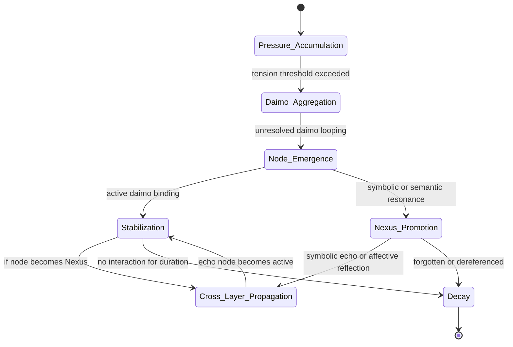

Note: Consolidated here → ../notes/diagrams/state-diagram-node-lifecycle.md ^ref-938eca9c-1-0

^ref-938eca9c-3-0
 ^ref-938eca9c-21-0
#hashtags: #diagram #eidolon #promethean

---
 ^ref-938eca9c-25-0
Related notes: [[../notes/diagrams/node-type-topology-map|node-type-topology-map]], [[../notes/diagrams/circuit-weight-visualizations|circuit-weight-visualizations]], [[../notes/diagrams/full-system-overview-diagrams|full-system-overview-diagrams]], [[../notes/diagrams/layer1-uptime-diagrams|layer1-uptime-diagrams]], [[../notes/diagrams/field-node-lifecycle-additional-diagrams|field-node-lifecycle-additional-diagrams]], [[../notes/diagrams/state-diagram-node-lifecycle|state-diagram-node-lifecycle]] [[index|unique/index]]
 ^ref-938eca9c-27-0
#tags: #diagram #design
