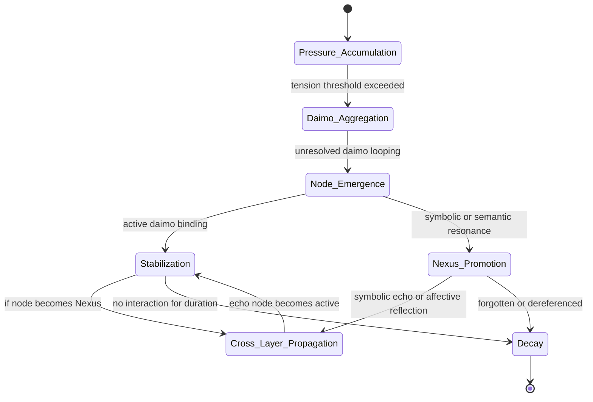

Note: Consolidated here → ../notes/diagrams/state-diagram-node-lifecycle.md ^ref-938eca9c-1-0 ^ref-975de447-1-0

^ref-938eca9c-3-0
 ^ref-938eca9c-21-0
#hashtags: #diagram #eidolon #promethean

---
 ^ref-938eca9c-25-0
Related notes: [[../notes/diagrams/node-type-topology-map|node-type-topology-map]], [[../notes/diagrams/circuit-weight-visualizations|circuit-weight-visualizations]], [[../notes/diagrams/full-system-overview-diagrams|full-system-overview-diagrams]], [[../notes/diagrams/layer1-uptime-diagrams|layer1-uptime-diagrams]], [[../notes/diagrams/field-node-lifecycle-additional-diagrams|field-node-lifecycle-additional-diagrams]], [[../notes/diagrams/state-diagram-node-lifecycle|state-diagram-node-lifecycle]] [[index|unique/index]]
 ^ref-938eca9c-27-0
#tags: #diagram #design
uuid: 291c7d91-da8c-486c-9bc0-bd2254536e2d
    line: 645
    col: 0
    score: 1
  - uuid: dd89372d-10de-42a9-8c96-6bc13ea36d02
    line: 739
    col: 0
    score: 1 ^ref-938eca9c-36-0
  - uuid: 64a9f9f9-58ee-4996-bdaf-9373845c6b29
    line: 816
    col: 0 ^ref-938eca9c-39-0
    score: 1
  - uuid: 9413237f-2537-4bbf-8768-db6180970e36
    line: 44
    col: 0
    score: 1
  - uuid: 3a3bf2c9-c0f6-4d7b-bf84-c83c70dece3f
    line: 213
    col: 0
    score: 1
  - uuid: c0392040-16a2-41e8-bd54-75110319e3c0
    line: 37
    col: 0
    score: 1
  - uuid: 0b872af2-4197-46f3-b631-afb4e6135585
    line: 22
    col: 0
    score: 1
  - uuid: 2d6e5553-8dc4-497f-bf45-96f8ca00a6f6
    line: 70
    col: 0
    score: 1
  - uuid: 6deed6ac-2473-40e0-bee0-ac9ae4c7bff2
    line: 716
    col: 0
    score: 1
  - uuid: 1c4046b5-742d-4004-aec6-b47251fef5d6
    line: 24
    col: 0
    score: 1
  - uuid: 8b8e6103-30a4-4d66-b5f2-87db1612b587 ^ref-938eca9c-69-0
    line: 137 ^ref-938eca9c-70-0
    col: 0
    score: 1
  - uuid: 95205cd3-c3d5-4047-9c33-9c5ca2b49597
    line: 67
    col: 0
    score: 1
  - uuid: 23df6ddb-05cf-4639-8201-f8291f8a6026
    line: 83
    col: 0
    score: 1
  - uuid: 5a02283e-4281-4930-9ca7-e27849de11bd
    line: 60
    col: 0
    score: 1
  - uuid: 1d3d6c3a-039e-4b96-93c1-95854945e248
    line: 48
    col: 0
    score: 1
  - uuid: ca8e1399-77bf-4f77-82a3-3f703b68706d
    line: 71 ^ref-938eca9c-90-0
    col: 0
    score: 1
  - uuid: ffb9b2a9-744d-4a53-9565-130fceae0832
    line: 107
    col: 0
    score: 1
  - uuid: 9b694a91-dec5-4708-9462-3f71000ba925
    line: 72
    col: 0 ^ref-938eca9c-99-0
    score: 1
  - uuid: b39dc9d4-63e2-42d4-bbcd-041ef3167bca
    line: 148
    col: 0
    score: 1
  - uuid: 98c8ff62-6ea3-4172-9e8b-93913e5d4a7f
    line: 40
    col: 0
    score: 1
  - uuid: 1c4046b5-742d-4004-aec6-b47251fef5d6
    line: 16
    col: 0
    score: 1
  - uuid: 8b8e6103-30a4-4d66-b5f2-87db1612b587
    line: 138
    col: 0
    score: 1
  - uuid: 95205cd3-c3d5-4047-9c33-9c5ca2b49597 ^ref-938eca9c-117-0
    line: 68
    col: 0
    score: 1 ^ref-938eca9c-120-0
  - uuid: 23df6ddb-05cf-4639-8201-f8291f8a6026
    line: 84
    col: 0 ^ref-938eca9c-123-0
    score: 1
  - uuid: 9c79206d-4cb9-4f00-87e0-782dcea37bc7
    line: 211
    col: 0 ^ref-938eca9c-127-0
    score: 1
  - uuid: 6bcff92c-4224-453d-9993-1be8d37d47c3
    line: 90
    col: 0
    score: 1
  - uuid: 18344cf9-0c49-4a71-b6c8-b8d84d660fca
    line: 100
    col: 0
    score: 1
  - uuid: ae24a280-678e-4c0b-8cc4-56667fa04172
    line: 77
    col: 0
    score: 1
  - uuid: 9fab9e76-e283-4c9d-a8cd-cb76892ea7ac
    line: 50
    col: 0
    score: 1
  - uuid: 03a5578f-d689-45db-95e9-11300e5eee6f
    line: 120
    col: 0
    score: 1
  - uuid: 3a3bf2c9-c0f6-4d7b-bf84-c83c70dece3f
    line: 249
    col: 0
    score: 1
  - uuid: 9a93a756-6d33-45d1-aca9-51b74f2b33d2
    line: 172
    col: 0
    score: 1
  - uuid: 43bfe9dd-d433-42ca-9777-f4c40eaba791
    line: 252
    col: 0
    score: 1
  - uuid: d17d3a96-c84d-4738-a403-6c733b874da2
    line: 625
    col: 0
    score: 1
  - uuid: 59b5670f-36d3-4d34-8985-f3144b15347a ^ref-938eca9c-165-0
    line: 156
    col: 0
    score: 1
  - uuid: 40185d05-010e-45e7-8c2d-2f879bf14218
    line: 58
    col: 0
    score: 1
  - uuid: 5f65dfa5-dc97-4a6c-ad93-c45c1312e156
    line: 93
    col: 0
    score: 1
  - uuid: d144aa62-348c-4e5d-ae8f-38084c67ceca
    line: 192
    col: 0
    score: 1
  - uuid: db74343f-8f84-43a3-adb2-499c6f00be1c
    line: 132
    col: 0
    score: 1
  - uuid: 5a02283e-4281-4930-9ca7-e27849de11bd
    line: 63
    col: 0
    score: 1
  - uuid: 1d3d6c3a-039e-4b96-93c1-95854945e248
    line: 77
    col: 0
    score: 1
  - uuid: ca8e1399-77bf-4f77-82a3-3f703b68706d
    line: 78
    col: 0
    score: 1
  - uuid: ffb9b2a9-744d-4a53-9565-130fceae0832
    line: 91
    col: 0
    score: 1
  - uuid: 9b694a91-dec5-4708-9462-3f71000ba925
    line: 102
    col: 0
    score: 1
  - uuid: b39dc9d4-63e2-42d4-bbcd-041ef3167bca
    line: 151
    col: 0
    score: 1
  - uuid: 45cd25b5-ed36-49ab-82c8-10d0903e34db
    line: 7
    col: 0
    score: 1
  - uuid: e87bc036-1570-419e-a558-f45b9c0db698
    line: 27
    col: 0
    score: 1
  - uuid: c1618c66-f73a-4e04-9bfa-ef38755f7acc
    line: 30
    col: 0
    score: 1
  - uuid: c6e87433-ec5d-4ded-bb1a-fb8734a3cfd9
    line: 36
    col: 0
    score: 1
  - uuid: f1add613-656e-4bec-b52b-193fd78c4642
    line: 108
    col: 0
    score: 1
  - uuid: 75ea4a6a-8270-488d-9d37-799c288e5f70
    line: 13
    col: 0
    score: 1
  - uuid: 623a55f7-685c-486b-abaf-469da1bbbb69
    line: 14
    col: 0
    score: 1
  - uuid: 557309a3-c906-4e97-8867-89ffe151790c
    line: 6
    col: 0
    score: 1
  - uuid: 6cb4943e-8267-4e27-8618-2ce0a464d173
    line: 85
    col: 0
    score: 1
  - uuid: 1d3d6c3a-039e-4b96-93c1-95854945e248
    line: 132
    col: 0
    score: 1
  - uuid: ca8e1399-77bf-4f77-82a3-3f703b68706d
    line: 108
    col: 0
    score: 1
  - uuid: ffb9b2a9-744d-4a53-9565-130fceae0832
    line: 119
    col: 0
    score: 1
  - uuid: 9b694a91-dec5-4708-9462-3f71000ba925
    line: 61
    col: 0
    score: 1
  - uuid: b39dc9d4-63e2-42d4-bbcd-041ef3167bca
    line: 170
    col: 0
    score: 1
  - uuid: 5c152b08-6b69-4bb8-a1a7-66745789c169
    line: 100
    col: 0
    score: 1
  - uuid: 98c8ff62-6ea3-4172-9e8b-93913e5d4a7f
    line: 98
    col: 0
    score: 1
  - uuid: e018dd7a-1fb7-4732-9e67-cd8b2f0831cf
    line: 280
    col: 0
    score: 1
  - uuid: c03020e1-e3e7-48bf-aa7e-aa740c601b63
    line: 498
    col: 0
    score: 1
  - uuid: 008f2ac0-bfaa-4d52-9826-2d5e86c0059f
    line: 148
    col: 0
    score: 1
  - uuid: a4d90289-798d-44a0-a8e8-a055ae12fb52 ^ref-938eca9c-285-0
    line: 166
    col: 0
    score: 1
  - uuid: 7cfc230d-8ec2-4cdb-b931-8aec26de2a00
    line: 148
    col: 0
    score: 1
  - uuid: b09141b7-544f-4c8e-8f49-bf76cecaacbb
    line: 153
    col: 0
    score: 1
  - uuid: 1f32c94a-4da4-4266-8ac0-6c282cfb401f
    line: 118
    col: 0
    score: 1
  - uuid: 22b989d5-f4aa-4880-8632-709c21830f83
    line: 168
    col: 0
    score: 1
  - uuid: e9b27b06-f608-4734-ae6c-f03a8b1fcf5f
    line: 103
    col: 0
    score: 1
  - uuid: a4a25141-6380-40b9-9cd7-b554b246b303
    line: 380
    col: 0
    score: 1
  - uuid: 1cfae310-35dc-49c2-98f1-b186da25d84b
    line: 194
    col: 0
    score: 1
  - uuid: 6620e2f2-de6d-45d8-a722-5d26e160b370
    line: 372
    col: 0
    score: 1
  - uuid: bb7f0835-c347-474f-bfad-eabd873b51ad
    line: 237
    col: 0
    score: 1
  - uuid: 93d2ba51-8689-49ee-94e2-296092e48058
    line: 267
    col: 0
    score: 1
  - uuid: f1add613-656e-4bec-b52b-193fd78c4642
    line: 73
    col: 0
    score: 1
  - uuid: 73d3dbf6-9240-46fd-ada9-cc2e7e00dc5f
    line: 170
    col: 0
    score: 1
  - uuid: cdbd21ee-25a0-4bfa-884c-c1b948e9b0b2
    line: 67
    col: 0
    score: 1
  - uuid: 2792d448-c3b5-4050-93dd-93768529d99c
    line: 96
    col: 0
    score: 1
  - uuid: 71726f04-eb1c-42a5-a5fe-d8209de6e159
    line: 139
    col: 0
    score: 1
  - uuid: f7702bf8-f7db-473c-9a5b-8dbf66ad3b9e
    line: 548
    col: 0
    score: 1
  - uuid: fc21f824-4244-4030-a48e-c4170160ea1d
    line: 349 ^ref-938eca9c-354-0
    col: 0
    score: 1
  - uuid: 1cfae310-35dc-49c2-98f1-b186da25d84b
    line: 213
    col: 0
    score: 1
  - uuid: 2901a3e9-96f0-497c-ae2c-775f28a702dd
    line: 101
    col: 0
    score: 1
  - uuid: 930054b3-ba95-4acf-bb92-0e3ead25ed0b
    line: 72
    col: 0
    score: 1
  - uuid: 5020e892-8f18-443a-b707-6d0f3efcfe22
    line: 261
    col: 0
    score: 1
  - uuid: 45cd25b5-ed36-49ab-82c8-10d0903e34db
    line: 55
    col: 0
    score: 1
  - uuid: e87bc036-1570-419e-a558-f45b9c0db698
    line: 79
    col: 0
    score: 1
  - uuid: c1618c66-f73a-4e04-9bfa-ef38755f7acc
    line: 86
    col: 0
    score: 1 ^ref-938eca9c-384-0
  - uuid: c6e87433-ec5d-4ded-bb1a-fb8734a3cfd9
    line: 74
    col: 0
    score: 1
  - uuid: 623a55f7-685c-486b-abaf-469da1bbbb69
    line: 56
    col: 0
    score: 1
--- ^ref-938eca9c-393-0
Note: Consolidated here → ../notes/diagrams/state-diagram-node-lifecycle.md ^ref-938eca9c-1-0

^ref-938eca9c-3-0
 ^ref-938eca9c-21-0
#hashtags: #diagram #eidolon #promethean

---
 ^ref-938eca9c-25-0
Related notes: [[../notes/diagrams/node-type-topology-map|node-type-topology-map]], [[../notes/diagrams/circuit-weight-visualizations|circuit-weight-visualizations]], [[../notes/diagrams/full-system-overview-diagrams|full-system-overview-diagrams]], [[../notes/diagrams/layer1-uptime-diagrams|layer1-uptime-diagrams]], [[../notes/diagrams/field-node-lifecycle-additional-diagrams|field-node-lifecycle-additional-diagrams]], [[../notes/diagrams/state-diagram-node-lifecycle|state-diagram-node-lifecycle]] [[index|unique/index]]
 ^ref-938eca9c-27-0
#tags: #diagram #design
 ^ref-938eca9c-465-0 ^ref-938eca9c-951-0 ^ref-938eca9c-3506-0 ^ref-938eca9c-4132-0 ^ref-938eca9c-4144-0 ^ref-938eca9c-4151-0
<!-- GENERATED-SECTIONS:DO-NOT-EDIT-BELOW -->
## Related content
- [field-dynamics-math-blocks](field-dynamics-math-blocks.md)
- [field-interaction-equations](field-interaction-equations.md)
- [Debugging Broker Connections and Agent Behavior](debugging-broker-connections-and-agent-behavior.md)
- [Duck's Self-Referential Perceptual Loop](ducks-self-referential-perceptual-loop.md)
- [Dynamic Context Model for Web Components](dynamic-context-model-for-web-components.md)
- [Eidolon Field Abstract Model](eidolon-field-abstract-model.md)
- [field-node-diagram-outline](field-node-diagram-outline.md)
- [field-node-diagram-set](field-node-diagram-set.md)
- [field-node-diagram-visualizations](field-node-diagram-visualizations.md)
- [Fnord Tracer Protocol](fnord-tracer-protocol.md)
- [Functional Embedding Pipeline Refactor](functional-embedding-pipeline-refactor.md)
- [graph-ds](graph-ds.md)
- [heartbeat-fragment-demo](heartbeat-fragment-demo.md)
- [i3-bluetooth-setup](i3-bluetooth-setup.md)
- [Promethean Documentation Pipeline Overview](promethean-documentation-pipeline-overview.md)
- [Promethean_Eidolon_Synchronicity_Model](promethean-eidolon-synchronicity-model.md)
- [Promethean Infrastructure Setup](promethean-infrastructure-setup.md)
- [Promethean Pipelines](promethean-pipelines.md)
- [Promethean State Format](promethean-state-format.md)
- [NPU Voice Code and Sensory Integration](npu-voice-code-and-sensory-integration.md)
- [Obsidian ChatGPT Plugin Integration Guide](obsidian-chatgpt-plugin-integration-guide.md)
- [Obsidian ChatGPT Plugin Integration](obsidian-chatgpt-plugin-integration.md)
- [obsidian-ignore-node-modules-regex](obsidian-ignore-node-modules-regex.md)
- [Obsidian Task Generation](obsidian-task-generation.md)
- [Obsidian Templating Plugins Integration Guide](obsidian-templating-plugins-integration-guide.md)
## Sources
- [Docops Feature Updates — L226](docops-feature-updates.md#^ref-2792d448-226-0) (line 226, col 0, score 1)
- [field-node-diagram-outline — L705](field-node-diagram-outline.md#^ref-1f32c94a-705-0) (line 705, col 0, score 1)
- [field-node-diagram-set — L719](field-node-diagram-set.md#^ref-22b989d5-719-0) (line 719, col 0, score 1)
- [field-node-diagram-visualizations — L601](field-node-diagram-visualizations.md#^ref-e9b27b06-601-0) (line 601, col 0, score 1)
- [Fnord Tracer Protocol — L1060](fnord-tracer-protocol.md#^ref-fc21f824-1060-0) (line 1060, col 0, score 1)
- [Functional Embedding Pipeline Refactor — L726](functional-embedding-pipeline-refactor.md#^ref-a4a25141-726-0) (line 726, col 0, score 1)
- [graph-ds — L996](graph-ds.md#^ref-6620e2f2-996-0) (line 996, col 0, score 1)
- [heartbeat-fragment-demo — L667](heartbeat-fragment-demo.md#^ref-dd00677a-667-0) (line 667, col 0, score 1)
- [i3-bluetooth-setup — L736](i3-bluetooth-setup.md#^ref-5e408692-736-0) (line 736, col 0, score 1)
- [Ice Box Reorganization — L645](ice-box-reorganization.md#^ref-291c7d91-645-0) (line 645, col 0, score 1)
- [komorebi-group-window-hack — L739](komorebi-group-window-hack.md#^ref-dd89372d-739-0) (line 739, col 0, score 1)
- [Layer1SurvivabilityEnvelope — L816](layer1survivabilityenvelope.md#^ref-64a9f9f9-816-0) (line 816, col 0, score 1)
- [NPU Voice Code and Sensory Integration — L60](npu-voice-code-and-sensory-integration.md#^ref-5a02283e-60-0) (line 60, col 0, score 1)
- [Obsidian ChatGPT Plugin Integration Guide — L48](obsidian-chatgpt-plugin-integration-guide.md#^ref-1d3d6c3a-48-0) (line 48, col 0, score 1)
- [Obsidian ChatGPT Plugin Integration — L71](obsidian-chatgpt-plugin-integration.md#^ref-ca8e1399-71-0) (line 71, col 0, score 1)
- [obsidian-ignore-node-modules-regex — L107](obsidian-ignore-node-modules-regex.md#^ref-ffb9b2a9-107-0) (line 107, col 0, score 1)
- [Obsidian Task Generation — L72](obsidian-task-generation.md#^ref-9b694a91-72-0) (line 72, col 0, score 1)
- [Obsidian Templating Plugins Integration Guide — L148](obsidian-templating-plugins-integration-guide.md#^ref-b39dc9d4-148-0) (line 148, col 0, score 1)
- [Optimizing Command Limitations in System Design — L40](optimizing-command-limitations-in-system-design.md#^ref-98c8ff62-40-0) (line 40, col 0, score 1)
- [Promethean Notes — L16](promethean-notes.md#^ref-1c4046b5-16-0) (line 16, col 0, score 1)
- [Promethean Pipelines — L138](promethean-pipelines.md#^ref-8b8e6103-138-0) (line 138, col 0, score 1)
- [promethean-requirements — L68](promethean-requirements.md#^ref-95205cd3-68-0) (line 68, col 0, score 1)
- [Promethean State Format — L84](promethean-state-format.md#^ref-23df6ddb-84-0) (line 84, col 0, score 1)
- [eidolon-field-math-foundations — L148](eidolon-field-math-foundations.md#^ref-008f2ac0-148-0) (line 148, col 0, score 1)
- [Factorio AI with External Agents — L166](factorio-ai-with-external-agents.md#^ref-a4d90289-166-0) (line 166, col 0, score 1)
- [field-dynamics-math-blocks — L148](field-dynamics-math-blocks.md#^ref-7cfc230d-148-0) (line 148, col 0, score 1)
- [field-interaction-equations — L153](field-interaction-equations.md#^ref-b09141b7-153-0) (line 153, col 0, score 1)
- [field-node-diagram-outline — L118](field-node-diagram-outline.md#^ref-1f32c94a-118-0) (line 118, col 0, score 1)
- [field-node-diagram-set — L168](field-node-diagram-set.md#^ref-22b989d5-168-0) (line 168, col 0, score 1)
- [field-node-diagram-visualizations — L103](field-node-diagram-visualizations.md#^ref-e9b27b06-103-0) (line 103, col 0, score 1)
- [Functional Embedding Pipeline Refactor — L380](functional-embedding-pipeline-refactor.md#^ref-a4a25141-380-0) (line 380, col 0, score 1)
- [Functional Refactor of TypeScript Document Processing — L194](functional-refactor-of-typescript-document-processing.md#^ref-1cfae310-194-0) (line 194, col 0, score 1)
- [graph-ds — L372](graph-ds.md#^ref-6620e2f2-372-0) (line 372, col 0, score 1)
- [Agent Reflections and Prompt Evolution — L237](agent-reflections-and-prompt-evolution.md#^ref-bb7f0835-237-0) (line 237, col 0, score 1)
- [Agent Tasks: Persistence Migration to DualStore — L267](agent-tasks-persistence-migration-to-dualstore.md#^ref-93d2ba51-267-0) (line 267, col 0, score 1)
- [Debugging Broker Connections and Agent Behavior — L170](debugging-broker-connections-and-agent-behavior.md#^ref-73d3dbf6-170-0) (line 170, col 0, score 1)
- [Docops Feature Updates — L67](docops-feature-updates-3.md#^ref-cdbd21ee-67-0) (line 67, col 0, score 1)
- [Docops Feature Updates — L96](docops-feature-updates.md#^ref-2792d448-96-0) (line 96, col 0, score 1)
- [Duck's Self-Referential Perceptual Loop — L139](ducks-self-referential-perceptual-loop.md#^ref-71726f04-139-0) (line 139, col 0, score 1)
- [Dynamic Context Model for Web Components — L548](dynamic-context-model-for-web-components.md#^ref-f7702bf8-548-0) (line 548, col 0, score 1)
- [Fnord Tracer Protocol — L349](fnord-tracer-protocol.md#^ref-fc21f824-349-0) (line 349, col 0, score 1)
- [Functional Refactor of TypeScript Document Processing — L213](functional-refactor-of-typescript-document-processing.md#^ref-1cfae310-213-0) (line 213, col 0, score 1)
- [NPU Voice Code and Sensory Integration — L52](npu-voice-code-and-sensory-integration.md#^ref-5a02283e-52-0) (line 52, col 0, score 1)
- [Obsidian ChatGPT Plugin Integration Guide — L86](obsidian-chatgpt-plugin-integration-guide.md#^ref-1d3d6c3a-86-0) (line 86, col 0, score 1)
- [Obsidian ChatGPT Plugin Integration — L85](obsidian-chatgpt-plugin-integration.md#^ref-ca8e1399-85-0) (line 85, col 0, score 1)
- [obsidian-ignore-node-modules-regex — L92](obsidian-ignore-node-modules-regex.md#^ref-ffb9b2a9-92-0) (line 92, col 0, score 1)
- [Obsidian Task Generation — L103](obsidian-task-generation.md#^ref-9b694a91-103-0) (line 103, col 0, score 1)
- [Obsidian Templating Plugins Integration Guide — L91](obsidian-templating-plugins-integration-guide.md#^ref-b39dc9d4-91-0) (line 91, col 0, score 1)
- [OpenAPI Validation Report — L86](openapi-validation-report.md#^ref-5c152b08-86-0) (line 86, col 0, score 1)
- [Optimizing Command Limitations in System Design — L110](optimizing-command-limitations-in-system-design.md#^ref-98c8ff62-110-0) (line 110, col 0, score 1)
- [ParticleSimulationWithCanvasAndFFmpeg — L250](particlesimulationwithcanvasandffmpeg.md#^ref-e018dd7a-250-0) (line 250, col 0, score 1)
- [Per-Domain Policy System for JS Crawler — L523](per-domain-policy-system-for-js-crawler.md#^ref-c03020e1-523-0) (line 523, col 0, score 1)
- [Docops Feature Updates — L35](docops-feature-updates.md#^ref-2792d448-35-0) (line 35, col 0, score 1)
- [Duck's Attractor States — L94](ducks-attractor-states.md#^ref-13951643-94-0) (line 94, col 0, score 1)
- [Duck's Self-Referential Perceptual Loop — L53](ducks-self-referential-perceptual-loop.md#^ref-71726f04-53-0) (line 53, col 0, score 1)
- [Dynamic Context Model for Web Components — L424](dynamic-context-model-for-web-components.md#^ref-f7702bf8-424-0) (line 424, col 0, score 1)
- [Eidolon Field Abstract Model — L209](eidolon-field-abstract-model.md#^ref-5e8b2388-209-0) (line 209, col 0, score 1)
- [eidolon-field-math-foundations — L142](eidolon-field-math-foundations.md#^ref-008f2ac0-142-0) (line 142, col 0, score 1)
- [Per-Domain Policy System for JS Crawler — L547](per-domain-policy-system-for-js-crawler.md#^ref-c03020e1-547-0) (line 547, col 0, score 1)
- [Promethean Documentation Overview — L98](promethean-documentation-overview.md#^ref-9413237f-98-0) (line 98, col 0, score 1)
- [Promethean Documentation Pipeline Overview — L162](promethean-documentation-pipeline-overview.md#^ref-3a3bf2c9-162-0) (line 162, col 0, score 1)
- [Promethean Documentation Update — L45](promethean-documentation-update.md#^ref-c0392040-45-0) (line 45, col 0, score 1)
- [Creative Moments — L75](creative-moments.md#^ref-10d98225-75-0) (line 75, col 0, score 1)
- [Debugging Broker Connections and Agent Behavior — L104](debugging-broker-connections-and-agent-behavior.md#^ref-73d3dbf6-104-0) (line 104, col 0, score 1)
- [Docops Feature Updates — L46](docops-feature-updates-3.md#^ref-cdbd21ee-46-0) (line 46, col 0, score 1)
- [Docops Feature Updates — L64](docops-feature-updates.md#^ref-2792d448-64-0) (line 64, col 0, score 1)
- [DuckDuckGoSearchPipeline — L40](duckduckgosearchpipeline.md#^ref-e979c50f-40-0) (line 40, col 0, score 1)
- [Duck's Attractor States — L137](ducks-attractor-states.md#^ref-13951643-137-0) (line 137, col 0, score 1)
- [Duck's Self-Referential Perceptual Loop — L82](ducks-self-referential-perceptual-loop.md#^ref-71726f04-82-0) (line 82, col 0, score 1)
- [Dynamic Context Model for Web Components — L454](dynamic-context-model-for-web-components.md#^ref-f7702bf8-454-0) (line 454, col 0, score 1)
- [Model Upgrade Calm-Down Guide — L88](model-upgrade-calm-down-guide.md#^ref-db74343f-88-0) (line 88, col 0, score 1)
- [NPU Voice Code and Sensory Integration — L91](npu-voice-code-and-sensory-integration.md#^ref-5a02283e-91-0) (line 91, col 0, score 1)
- [Obsidian ChatGPT Plugin Integration Guide — L69](obsidian-chatgpt-plugin-integration-guide.md#^ref-1d3d6c3a-69-0) (line 69, col 0, score 1)
- [Obsidian ChatGPT Plugin Integration — L64](obsidian-chatgpt-plugin-integration.md#^ref-ca8e1399-64-0) (line 64, col 0, score 1)
- [obsidian-ignore-node-modules-regex — L105](obsidian-ignore-node-modules-regex.md#^ref-ffb9b2a9-105-0) (line 105, col 0, score 1)
- [Obsidian Task Generation — L92](obsidian-task-generation.md#^ref-9b694a91-92-0) (line 92, col 0, score 1)
- [Obsidian Templating Plugins Integration Guide — L90](obsidian-templating-plugins-integration-guide.md#^ref-b39dc9d4-90-0) (line 90, col 0, score 1)
- [OpenAPI Validation Report — L50](openapi-validation-report.md#^ref-5c152b08-50-0) (line 50, col 0, score 1)
- [Optimizing Command Limitations in System Design — L81](optimizing-command-limitations-in-system-design.md#^ref-98c8ff62-81-0) (line 81, col 0, score 1)
- [polyglot-repl-interface-layer — L220](polyglot-repl-interface-layer.md#^ref-9c79206d-220-0) (line 220, col 0, score 1)
- [Docops Feature Updates — L85](docops-feature-updates-3.md#^ref-cdbd21ee-85-0) (line 85, col 0, score 1)
- [Docops Feature Updates — L103](docops-feature-updates.md#^ref-2792d448-103-0) (line 103, col 0, score 1)
- [Duck's Attractor States — L93](ducks-attractor-states.md#^ref-13951643-93-0) (line 93, col 0, score 1)
- [Duck's Self-Referential Perceptual Loop — L64](ducks-self-referential-perceptual-loop.md#^ref-71726f04-64-0) (line 64, col 0, score 1)
- [Factorio AI with External Agents — L153](factorio-ai-with-external-agents.md#^ref-a4d90289-153-0) (line 153, col 0, score 1)
- [field-dynamics-math-blocks — L141](field-dynamics-math-blocks.md#^ref-7cfc230d-141-0) (line 141, col 0, score 1)
- [Creative Moments — L94](creative-moments.md#^ref-10d98225-94-0) (line 94, col 0, score 1)
- [Debugging Broker Connections and Agent Behavior — L63](debugging-broker-connections-and-agent-behavior.md#^ref-73d3dbf6-63-0) (line 63, col 0, score 1)
- [Docops Feature Updates — L66](docops-feature-updates-3.md#^ref-cdbd21ee-66-0) (line 66, col 0, score 1)
- [DuckDuckGoSearchPipeline — L93](duckduckgosearchpipeline.md#^ref-e979c50f-93-0) (line 93, col 0, score 1)
- [Duck's Self-Referential Perceptual Loop — L73](ducks-self-referential-perceptual-loop.md#^ref-71726f04-73-0) (line 73, col 0, score 1)
- [komorebi-group-window-hack — L262](komorebi-group-window-hack.md#^ref-dd89372d-262-0) (line 262, col 0, score 1)
- [Mathematics Sampler — L84](mathematics-sampler.md#^ref-b5e0183e-84-0) (line 84, col 0, score 1)
- [Migrate to Provider-Tenant Architecture — L314](migrate-to-provider-tenant-architecture.md#^ref-54382370-314-0) (line 314, col 0, score 1)
- [Mindful Prioritization — L26](mindful-prioritization.md#^ref-40185d05-26-0) (line 26, col 0, score 1)
- [NPU Voice Code and Sensory Integration — L10](npu-voice-code-and-sensory-integration.md#^ref-5a02283e-10-0) (line 10, col 0, score 1)
- [Obsidian ChatGPT Plugin Integration — L43](obsidian-chatgpt-plugin-integration.md#^ref-ca8e1399-43-0) (line 43, col 0, score 1)
- [obsidian-ignore-node-modules-regex — L82](obsidian-ignore-node-modules-regex.md#^ref-ffb9b2a9-82-0) (line 82, col 0, score 1)
- [Obsidian Task Generation — L37](obsidian-task-generation.md#^ref-9b694a91-37-0) (line 37, col 0, score 1)
- [OpenAPI Validation Report — L68](openapi-validation-report.md#^ref-5c152b08-68-0) (line 68, col 0, score 1)
<!-- GENERATED-SECTIONS:DO-NOT-EDIT-ABOVE -->
