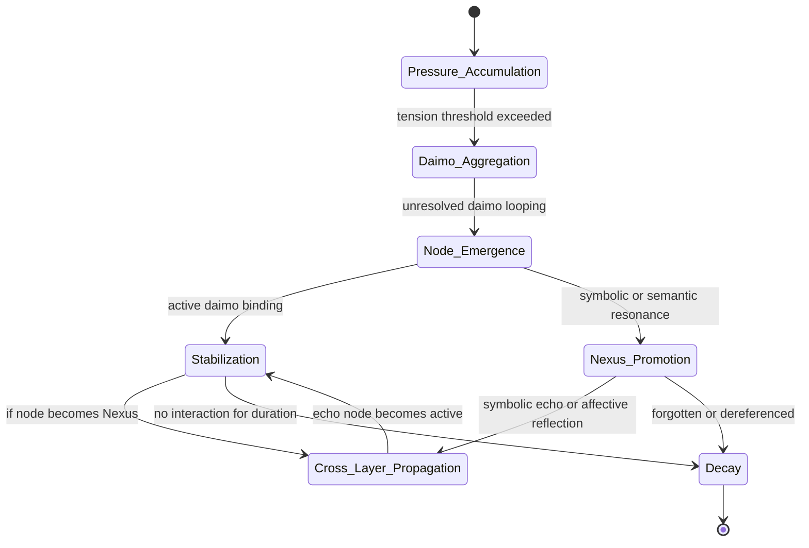

Note: Consolidated here → ../notes/diagrams/state-diagram-node-lifecycle.md ^ref-938eca9c-1-0

^ref-938eca9c-3-0
 ^ref-938eca9c-21-0
#hashtags: #diagram #eidolon #promethean

---
 ^ref-938eca9c-25-0
Related notes: [[../notes/diagrams/node-type-topology-map|node-type-topology-map]], [[../notes/diagrams/circuit-weight-visualizations|circuit-weight-visualizations]], [[../notes/diagrams/full-system-overview-diagrams|full-system-overview-diagrams]], [[../notes/diagrams/layer1-uptime-diagrams|layer1-uptime-diagrams]], [[../notes/diagrams/field-node-lifecycle-additional-diagrams|field-node-lifecycle-additional-diagrams]], [[../notes/diagrams/state-diagram-node-lifecycle|state-diagram-node-lifecycle]] [[index|unique/index]]
 ^ref-938eca9c-27-0
#tags: #diagram #design
uuid: 291c7d91-da8c-486c-9bc0-bd2254536e2d
    line: 645
    col: 0
    score: 1
  - uuid: dd89372d-10de-42a9-8c96-6bc13ea36d02
    line: 739
    col: 0
    score: 1
  - uuid: 64a9f9f9-58ee-4996-bdaf-9373845c6b29
    line: 816
    col: 0
    score: 1
  - uuid: 9413237f-2537-4bbf-8768-db6180970e36
    line: 44
    col: 0
    score: 1
  - uuid: 3a3bf2c9-c0f6-4d7b-bf84-c83c70dece3f
    line: 213
    col: 0
    score: 1
  - uuid: c0392040-16a2-41e8-bd54-75110319e3c0
    line: 37
    col: 0
    score: 1
  - uuid: 0b872af2-4197-46f3-b631-afb4e6135585
    line: 22
    col: 0
    score: 1
  - uuid: 2d6e5553-8dc4-497f-bf45-96f8ca00a6f6
    line: 70
    col: 0
    score: 1
  - uuid: 6deed6ac-2473-40e0-bee0-ac9ae4c7bff2
    line: 716
    col: 0
    score: 1
  - uuid: 1c4046b5-742d-4004-aec6-b47251fef5d6
    line: 24
    col: 0
    score: 1
  - uuid: 8b8e6103-30a4-4d66-b5f2-87db1612b587
    line: 137
    col: 0
    score: 1
  - uuid: 95205cd3-c3d5-4047-9c33-9c5ca2b49597
    line: 67
    col: 0
    score: 1
  - uuid: 23df6ddb-05cf-4639-8201-f8291f8a6026
    line: 83
    col: 0
    score: 1
  - uuid: 5a02283e-4281-4930-9ca7-e27849de11bd
    line: 60
    col: 0
    score: 1
  - uuid: 1d3d6c3a-039e-4b96-93c1-95854945e248
    line: 48
    col: 0
    score: 1
  - uuid: ca8e1399-77bf-4f77-82a3-3f703b68706d
    line: 71
    col: 0
    score: 1
  - uuid: ffb9b2a9-744d-4a53-9565-130fceae0832
    line: 107
    col: 0
    score: 1
  - uuid: 9b694a91-dec5-4708-9462-3f71000ba925
    line: 72
    col: 0
    score: 1
  - uuid: b39dc9d4-63e2-42d4-bbcd-041ef3167bca
    line: 148
    col: 0
    score: 1
  - uuid: 98c8ff62-6ea3-4172-9e8b-93913e5d4a7f
    line: 40
    col: 0
    score: 1
  - uuid: 1c4046b5-742d-4004-aec6-b47251fef5d6
    line: 16
    col: 0
    score: 1
  - uuid: 8b8e6103-30a4-4d66-b5f2-87db1612b587
    line: 138
    col: 0
    score: 1
  - uuid: 95205cd3-c3d5-4047-9c33-9c5ca2b49597
    line: 68
    col: 0
    score: 1
  - uuid: 23df6ddb-05cf-4639-8201-f8291f8a6026
    line: 84
    col: 0
    score: 1
  - uuid: 9c79206d-4cb9-4f00-87e0-782dcea37bc7
    line: 211
    col: 0
    score: 1
  - uuid: 6bcff92c-4224-453d-9993-1be8d37d47c3
    line: 90
    col: 0
    score: 1
  - uuid: 18344cf9-0c49-4a71-b6c8-b8d84d660fca
    line: 100
    col: 0
    score: 1
  - uuid: ae24a280-678e-4c0b-8cc4-56667fa04172
    line: 77
    col: 0
    score: 1
  - uuid: 9fab9e76-e283-4c9d-a8cd-cb76892ea7ac
    line: 50
    col: 0
    score: 1
  - uuid: 03a5578f-d689-45db-95e9-11300e5eee6f
    line: 120
    col: 0
    score: 1
  - uuid: 3a3bf2c9-c0f6-4d7b-bf84-c83c70dece3f
    line: 249
    col: 0
    score: 1
  - uuid: 9a93a756-6d33-45d1-aca9-51b74f2b33d2
    line: 172
    col: 0
    score: 1
  - uuid: 43bfe9dd-d433-42ca-9777-f4c40eaba791
    line: 252
    col: 0
    score: 1
  - uuid: d17d3a96-c84d-4738-a403-6c733b874da2
    line: 625
    col: 0
    score: 1
  - uuid: 59b5670f-36d3-4d34-8985-f3144b15347a
    line: 156
    col: 0
    score: 1
  - uuid: 40185d05-010e-45e7-8c2d-2f879bf14218
    line: 58
    col: 0
    score: 1
  - uuid: 5f65dfa5-dc97-4a6c-ad93-c45c1312e156
    line: 93
    col: 0
    score: 1
  - uuid: d144aa62-348c-4e5d-ae8f-38084c67ceca
    line: 192
    col: 0
    score: 1
  - uuid: db74343f-8f84-43a3-adb2-499c6f00be1c
    line: 132
    col: 0
    score: 1
  - uuid: 5a02283e-4281-4930-9ca7-e27849de11bd
    line: 63
    col: 0
    score: 1
  - uuid: 1d3d6c3a-039e-4b96-93c1-95854945e248
    line: 77
    col: 0
    score: 1
  - uuid: ca8e1399-77bf-4f77-82a3-3f703b68706d
    line: 78
    col: 0
    score: 1
  - uuid: ffb9b2a9-744d-4a53-9565-130fceae0832
    line: 91
    col: 0
    score: 1
  - uuid: 9b694a91-dec5-4708-9462-3f71000ba925
    line: 102
    col: 0
    score: 1
  - uuid: b39dc9d4-63e2-42d4-bbcd-041ef3167bca
    line: 151
    col: 0
    score: 1
  - uuid: 45cd25b5-ed36-49ab-82c8-10d0903e34db
    line: 7
    col: 0
    score: 1
  - uuid: e87bc036-1570-419e-a558-f45b9c0db698
    line: 27
    col: 0
    score: 1
  - uuid: c1618c66-f73a-4e04-9bfa-ef38755f7acc
    line: 30
    col: 0
    score: 1
  - uuid: c6e87433-ec5d-4ded-bb1a-fb8734a3cfd9
    line: 36
    col: 0
    score: 1
  - uuid: f1add613-656e-4bec-b52b-193fd78c4642
    line: 108
    col: 0
    score: 1
  - uuid: 75ea4a6a-8270-488d-9d37-799c288e5f70
    line: 13
    col: 0
    score: 1
  - uuid: 623a55f7-685c-486b-abaf-469da1bbbb69
    line: 14
    col: 0
    score: 1
  - uuid: 557309a3-c906-4e97-8867-89ffe151790c
    line: 6
    col: 0
    score: 1
  - uuid: 6cb4943e-8267-4e27-8618-2ce0a464d173
    line: 85
    col: 0
    score: 1
  - uuid: 1d3d6c3a-039e-4b96-93c1-95854945e248
    line: 132
    col: 0
    score: 1
  - uuid: ca8e1399-77bf-4f77-82a3-3f703b68706d
    line: 108
    col: 0
    score: 1
  - uuid: ffb9b2a9-744d-4a53-9565-130fceae0832
    line: 119
    col: 0
    score: 1
  - uuid: 9b694a91-dec5-4708-9462-3f71000ba925
    line: 61
    col: 0
    score: 1
  - uuid: b39dc9d4-63e2-42d4-bbcd-041ef3167bca
    line: 170
    col: 0
    score: 1
  - uuid: 5c152b08-6b69-4bb8-a1a7-66745789c169
    line: 100
    col: 0
    score: 1
  - uuid: 98c8ff62-6ea3-4172-9e8b-93913e5d4a7f
    line: 98
    col: 0
    score: 1
  - uuid: e018dd7a-1fb7-4732-9e67-cd8b2f0831cf
    line: 280
    col: 0
    score: 1
  - uuid: c03020e1-e3e7-48bf-aa7e-aa740c601b63
    line: 498
    col: 0
    score: 1
  - uuid: 008f2ac0-bfaa-4d52-9826-2d5e86c0059f
    line: 148
    col: 0
    score: 1
  - uuid: a4d90289-798d-44a0-a8e8-a055ae12fb52
    line: 166
    col: 0
    score: 1
  - uuid: 7cfc230d-8ec2-4cdb-b931-8aec26de2a00
    line: 148
    col: 0
    score: 1
  - uuid: b09141b7-544f-4c8e-8f49-bf76cecaacbb
    line: 153
    col: 0
    score: 1
  - uuid: 1f32c94a-4da4-4266-8ac0-6c282cfb401f
    line: 118
    col: 0
    score: 1
  - uuid: 22b989d5-f4aa-4880-8632-709c21830f83
    line: 168
    col: 0
    score: 1
  - uuid: e9b27b06-f608-4734-ae6c-f03a8b1fcf5f
    line: 103
    col: 0
    score: 1
  - uuid: a4a25141-6380-40b9-9cd7-b554b246b303
    line: 380
    col: 0
    score: 1
  - uuid: 1cfae310-35dc-49c2-98f1-b186da25d84b
    line: 194
    col: 0
    score: 1
  - uuid: 6620e2f2-de6d-45d8-a722-5d26e160b370
    line: 372
    col: 0
    score: 1
  - uuid: bb7f0835-c347-474f-bfad-eabd873b51ad
    line: 237
    col: 0
    score: 1
  - uuid: 93d2ba51-8689-49ee-94e2-296092e48058
    line: 267
    col: 0
    score: 1
  - uuid: f1add613-656e-4bec-b52b-193fd78c4642
    line: 73
    col: 0
    score: 1
  - uuid: 73d3dbf6-9240-46fd-ada9-cc2e7e00dc5f
    line: 170
    col: 0
    score: 1
  - uuid: cdbd21ee-25a0-4bfa-884c-c1b948e9b0b2
    line: 67
    col: 0
    score: 1
  - uuid: 2792d448-c3b5-4050-93dd-93768529d99c
    line: 96
    col: 0
    score: 1
  - uuid: 71726f04-eb1c-42a5-a5fe-d8209de6e159
    line: 139
    col: 0
    score: 1
  - uuid: f7702bf8-f7db-473c-9a5b-8dbf66ad3b9e
    line: 548
    col: 0
    score: 1
  - uuid: fc21f824-4244-4030-a48e-c4170160ea1d
    line: 349
    col: 0
    score: 1
  - uuid: 1cfae310-35dc-49c2-98f1-b186da25d84b
    line: 213
    col: 0
    score: 1
  - uuid: 2901a3e9-96f0-497c-ae2c-775f28a702dd
    line: 101
    col: 0
    score: 1
  - uuid: 930054b3-ba95-4acf-bb92-0e3ead25ed0b
    line: 72
    col: 0
    score: 1
  - uuid: 5020e892-8f18-443a-b707-6d0f3efcfe22
    line: 261
    col: 0
    score: 1
  - uuid: 45cd25b5-ed36-49ab-82c8-10d0903e34db
    line: 55
    col: 0
    score: 1
  - uuid: e87bc036-1570-419e-a558-f45b9c0db698
    line: 79
    col: 0
    score: 1
  - uuid: c1618c66-f73a-4e04-9bfa-ef38755f7acc
    line: 86
    col: 0
    score: 1
  - uuid: c6e87433-ec5d-4ded-bb1a-fb8734a3cfd9
    line: 74
    col: 0
    score: 1
  - uuid: 623a55f7-685c-486b-abaf-469da1bbbb69
    line: 56
    col: 0
    score: 1
---
Note: Consolidated here → ../notes/diagrams/state-diagram-node-lifecycle.md ^ref-938eca9c-1-0

^ref-938eca9c-3-0
 ^ref-938eca9c-21-0
#hashtags: #diagram #eidolon #promethean

---
 ^ref-938eca9c-25-0
Related notes: [[../notes/diagrams/node-type-topology-map|node-type-topology-map]], [[../notes/diagrams/circuit-weight-visualizations|circuit-weight-visualizations]], [[../notes/diagrams/full-system-overview-diagrams|full-system-overview-diagrams]], [[../notes/diagrams/layer1-uptime-diagrams|layer1-uptime-diagrams]], [[../notes/diagrams/field-node-lifecycle-additional-diagrams|field-node-lifecycle-additional-diagrams]], [[../notes/diagrams/state-diagram-node-lifecycle|state-diagram-node-lifecycle]] [[index|unique/index]]
 ^ref-938eca9c-27-0
#tags: #diagram #design
