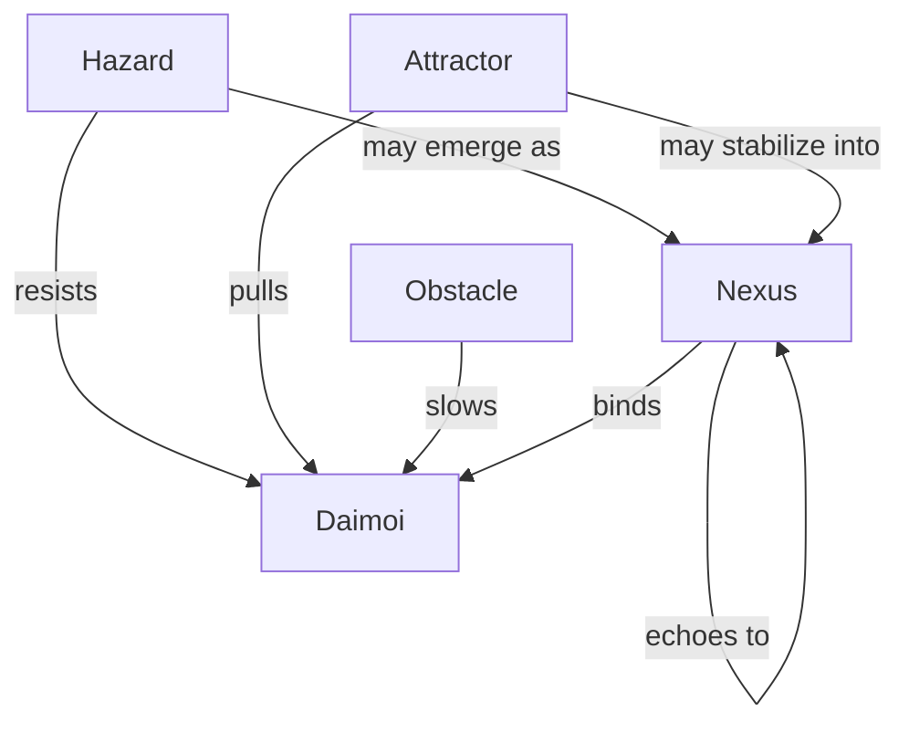

Note: Consolidated here → ../notes/diagrams/field-node-lifecycle-additional-diagrams.md ^ref-1f32c94a-1-0

Absolutely. Here's a lineup of diagram types we can add next, each focused on a different part of the Field Node and Eidolon system. Let me know which one(s) you want to generate first, or if you'd like the full suite. ^ref-1f32c94a-3-0

---

### 🧭 **1. Node Type Topology Map**

Shows the relationship between different types of Field Nodes: ^ref-1f32c94a-9-0


^ref-1f32c94a-11-0

---

### 🔀 **2. Cross-Layer Propagation Flow**
 ^ref-1f32c94a-26-0
Illustrates how one node in one circuit causes echoes in others:
 ^ref-1f32c94a-28-0
```mermaid
graph LR
  N4[Nemesian Nexus: :TrustIssue:]
  A2[Dorian Attractor: :PermissionRepair:]
  O7[Metisean Obstacle: :Uncertainty:]
  H5[Heuretic Hazard: :LoopFailure:]

  N4 --> A2
  N4 --> O7
  N4 --> H5
^ref-1f32c94a-28-0
```

---

### 🔄 **3. Node Stability Decay Loop** ^ref-1f32c94a-44-0

Visualizes how a node stabilizes or decays over time: ^ref-1f32c94a-46-0

```mermaid
stateDiagram-v2
  [*] --> Node_Emergence
  Node_Emergence --> Stable : repeated Daimoi interaction
  Stable --> Stable : continued Gnostic resonance
  Stable --> Decay : no interaction
^ref-1f32c94a-46-0
  Decay --> [*]
```
^ref-1f32c94a-48-0

---
 ^ref-1f32c94a-59-0
### ⚡ **4. Daimoi-Node Interaction Flow**
 ^ref-1f32c94a-61-0
How Daimoi encounter and affect a node:

```mermaid
sequenceDiagram
  participant Daimo
  participant FieldNode
  participant Nooi
  Daimo->>FieldNode: Enters influence radius
  FieldNode-->>Nooi: Modulates local tension
^ref-1f32c94a-61-0
  Daimo->>FieldNode: Binds or repelled based on charge
  FieldNode-->>Daimo: Applies pressure vector
```
 ^ref-1f32c94a-76-0
--- ^ref-1f32c94a-76-0

### 🌐 **5. Full Lifecycle Flowchart** ^ref-1f32c94a-78-0

Combines Emergence, Promotion, Propagation, and Decay.

This one is larger, and we can compose it from smaller diagrams, or make a custom canvas version if you'd prefer an editable visual overview. ^ref-1f32c94a-82-0

---

Would you like:

- One or more of these embedded now? ^ref-1f32c94a-88-0
    
- All five added as a “Diagrams” section to the current document?
    
- A dedicated Obsidian canvas to explore them modularly?
    
 ^ref-1f32c94a-94-0
Let’s get visual.
--- ^ref-1f32c94a-96-0
 ^ref-1f32c94a-98-0
Related notes: [[../notes/diagrams/node-type-topology-map|node-type-topology-map]], [[../notes/diagrams/circuit-weight-visualizations|circuit-weight-visualizations]], [[../notes/diagrams/full-system-overview-diagrams|full-system-overview-diagrams]], [[../notes/diagrams/layer1-uptime-diagrams|layer1-uptime-diagrams]], [[../notes/diagrams/field-node-lifecycle-additional-diagrams|field-node-lifecycle-additional-diagrams]], [[../notes/diagrams/state-diagram-node-lifecycle|state-diagram-node-lifecycle]] [[index|unique/index]] ^ref-1f32c94a-98-0
 ^ref-1f32c94a-99-0
#tags: #diagram #design<!-- GENERATED-SECTIONS:DO-NOT-EDIT-BELOW -->
## Related content
- [field-node-diagram-set](field-node-diagram-set.md)
- [field-node-diagram-visualizations](field-node-diagram-visualizations.md)
- [graph-ds](graph-ds.md)
- [eidolon-node-lifecycle](eidolon-node-lifecycle.md)
- [field-dynamics-math-blocks](field-dynamics-math-blocks.md)
- [Agent Tasks: Persistence Migration to DualStore](agent-tasks-persistence-migration-to-dualstore.md)
- [Diagrams](chunks/diagrams.md)
- [typed-struct-compiler](typed-struct-compiler.md)
- [Unique Concepts](unique-concepts.md)
- [Unique Info Dump Index](unique-info-dump-index.md)
- [zero-copy-snapshots-and-workers](zero-copy-snapshots-and-workers.md)
- [Canonical Org-Babel Matplotlib Animation Template](canonical-org-babel-matplotlib-animation-template.md)
- [Creative Moments](creative-moments.md)
- [Duck's Attractor States](ducks-attractor-states.md)
- [eidolon-field-math-foundations](eidolon-field-math-foundations.md)
- [Fnord Tracer Protocol](fnord-tracer-protocol.md)
- [heartbeat-fragment-demo](heartbeat-fragment-demo.md)
- [i3-bluetooth-setup](i3-bluetooth-setup.md)
- [Ice Box Reorganization](ice-box-reorganization.md)
- [komorebi-group-window-hack](komorebi-group-window-hack.md)
- [Layer1SurvivabilityEnvelope](layer1survivabilityenvelope.md)
- [polyglot-repl-interface-layer](polyglot-repl-interface-layer.md)
- [The Jar of Echoes](the-jar-of-echoes.md)
- [Eidolon Field Abstract Model](eidolon-field-abstract-model.md)
- [field-interaction-equations](field-interaction-equations.md)
- [ParticleSimulationWithCanvasAndFFmpeg](particlesimulationwithcanvasandffmpeg.md)
- [Promethean Dev Workflow Update](promethean-dev-workflow-update.md)
- [Synchronicity Waves and Web](synchronicity-waves-and-web.md)
- [Dynamic Context Model for Web Components](dynamic-context-model-for-web-components.md)
- [homeostasis-decay-formulas](homeostasis-decay-formulas.md)
- [ripple-propagation-demo](ripple-propagation-demo.md)
- [Protocol_0_The_Contradiction_Engine](protocol-0-the-contradiction-engine.md)
- [sibilant-macro-targets](sibilant-macro-targets.md)
- [Duck's Self-Referential Perceptual Loop](ducks-self-referential-perceptual-loop.md)
- [Factorio AI with External Agents](factorio-ai-with-external-agents.md)
- [Prometheus Observability Stack](prometheus-observability-stack.md)
- [Prompt_Folder_Bootstrap](prompt-folder-bootstrap.md)
- [Chroma Toolkit Consolidation Plan](chroma-toolkit-consolidation-plan.md)
- [Simulation Demo](chunks/simulation-demo.md)
- [Debugging Broker Connections and Agent Behavior](debugging-broker-connections-and-agent-behavior.md)
- [Shared](chunks/shared.md)
- [Promethean_Eidolon_Synchronicity_Model](promethean-eidolon-synchronicity-model.md)
- [Smoke Resonance Visualizations](smoke-resonance-visualizations.md)
- [Promethean-Copilot-Intent-Engine](promethean-copilot-intent-engine.md)
- [Model Selection for Lightweight Conversational Tasks](model-selection-for-lightweight-conversational-tasks.md)
- [Provider-Agnostic Chat Panel Implementation](provider-agnostic-chat-panel-implementation.md)
- [Pure TypeScript Search Microservice](pure-typescript-search-microservice.md)
- [Reawakening Duck](reawakening-duck.md)
- [schema-evolution-workflow](schema-evolution-workflow.md)
- [Migrate to Provider-Tenant Architecture](migrate-to-provider-tenant-architecture.md)
- [obsidian-ignore-node-modules-regex](obsidian-ignore-node-modules-regex.md)
- [Obsidian Templating Plugins Integration Guide](obsidian-templating-plugins-integration-guide.md)
- [Redirecting Standard Error](redirecting-standard-error.md)
- [Self-Agency in AI Interaction](self-agency-in-ai-interaction.md)
- [promethean-requirements](promethean-requirements.md)
- [Stateful Partitions and Rebalancing](stateful-partitions-and-rebalancing.md)
- [Obsidian ChatGPT Plugin Integration Guide](obsidian-chatgpt-plugin-integration-guide.md)
- [Obsidian ChatGPT Plugin Integration](obsidian-chatgpt-plugin-integration.md)
- [Optimizing Command Limitations in System Design](optimizing-command-limitations-in-system-design.md)
- [TypeScript Patch for Tool Calling Support](typescript-patch-for-tool-calling-support.md)
- [Promethean Pipelines](promethean-pipelines.md)
- [Promethean State Format](promethean-state-format.md)
- [Promethean Workflow Optimization](promethean-workflow-optimization.md)
- [plan-update-confirmation](plan-update-confirmation.md)
- [Math Fundamentals](chunks/math-fundamentals.md)
- [Promethean Infrastructure Setup](promethean-infrastructure-setup.md)
- [Services](chunks/services.md)
- [unique-templates](templates/unique-templates.md)
- [Tracing the Signal](tracing-the-signal.md)
- [ts-to-lisp-transpiler](ts-to-lisp-transpiler.md)
- [Per-Domain Policy System for JS Crawler](per-domain-policy-system-for-js-crawler.md)
- [Performance-Optimized-Polyglot-Bridge](performance-optimized-polyglot-bridge.md)
- [Model Upgrade Calm-Down Guide](model-upgrade-calm-down-guide.md)
- [Post-Linguistic Transhuman Design Frameworks](post-linguistic-transhuman-design-frameworks.md)
- [DSL](chunks/dsl.md)
- [Obsidian Task Generation](obsidian-task-generation.md)
- [JavaScript](chunks/javascript.md)
- [Docops Feature Updates](docops-feature-updates.md)
- [Functional Embedding Pipeline Refactor](functional-embedding-pipeline-refactor.md)
- [Mathematical Samplers](mathematical-samplers.md)
- [Functional Refactor of TypeScript Document Processing](functional-refactor-of-typescript-document-processing.md)
- [windows-tiling-with-autohotkey](windows-tiling-with-autohotkey.md)
- [Mathematics Sampler](mathematics-sampler.md)
- [AI-First-OS-Model-Context-Protocol](ai-first-os-model-context-protocol.md)
- [Promethean Chat Activity Report](promethean-chat-activity-report.md)
- [Window Management](chunks/window-management.md)
- [NPU Voice Code and Sensory Integration](npu-voice-code-and-sensory-integration.md)
- [Mindful Prioritization](mindful-prioritization.md)
- [OpenAPI Validation Report](openapi-validation-report.md)
- [Admin Dashboard for User Management](admin-dashboard-for-user-management.md)
- [Operations](chunks/operations.md)
- [Tooling](chunks/tooling.md)
- [Docops Feature Updates](docops-feature-updates-3.md)
- [DuckDuckGoSearchPipeline](duckduckgosearchpipeline.md)
- [Pipeline Enhancements](pipeline-enhancements.md)
- [ChatGPT Custom Prompts](chatgpt-custom-prompts.md)
- [api-gateway-versioning](api-gateway-versioning.md)
- [balanced-bst](balanced-bst.md)
- [Board Automation Improvements](board-automation-improvements.md)
- [Board Walk – 2025-08-11](board-walk-2025-08-11.md)
- [Promethean Data Sync Protocol](promethean-data-sync-protocol.md)
- [Promethean Documentation Pipeline Overview](promethean-documentation-pipeline-overview.md)
- [Promethean Documentation Update](promethean-documentation-update.md)
- [Promethean Documentation Overview](promethean-documentation-overview.md)
- [Promethean Documentation Update](promethean-documentation-update.txt)
- [MindfulRobotIntegration](mindfulrobotintegration.md)
- [Agent Reflections and Prompt Evolution](agent-reflections-and-prompt-evolution.md)
- [Promethean Notes](promethean-notes.md)
- [Exception Layer Analysis](exception-layer-analysis.md)
- [aionian-circuit-math](aionian-circuit-math.md)
- [AI-Centric OS with MCP Layer](ai-centric-os-with-mcp-layer.md)
- [layer-1-uptime-diagrams](layer-1-uptime-diagrams.md)
- [Universal Lisp Interface](universal-lisp-interface.md)
- [shared-package-layout-clarification](shared-package-layout-clarification.md)
- [Event Bus Projections Architecture](event-bus-projections-architecture.md)
- [ecs-offload-workers](ecs-offload-workers.md)
- [Mongo Outbox Implementation](mongo-outbox-implementation.md)
- [Vectorial Exception Descent](vectorial-exception-descent.md)
- [archetype-ecs](archetype-ecs.md)
- [lisp-dsl-for-window-management](lisp-dsl-for-window-management.md)
- [Promethean Event Bus MVP v0.1](promethean-event-bus-mvp-v0-1.md)
## Sources
- [typed-struct-compiler — L1016](typed-struct-compiler.md#^ref-78eeedf7-1016-0) (line 1016, col 0, score 1)
- [Unique Concepts — L175](unique-concepts.md#^ref-ed6f3fc9-175-0) (line 175, col 0, score 1)
- [Unique Info Dump Index — L1221](unique-info-dump-index.md#^ref-30ec3ba6-1221-0) (line 1221, col 0, score 1)
- [zero-copy-snapshots-and-workers — L1058](zero-copy-snapshots-and-workers.md#^ref-62bec6f0-1058-0) (line 1058, col 0, score 1)
- [Canonical Org-Babel Matplotlib Animation Template — L515](canonical-org-babel-matplotlib-animation-template.md#^ref-1b1338fc-515-0) (line 515, col 0, score 1)
- [Creative Moments — L251](creative-moments.md#^ref-10d98225-251-0) (line 251, col 0, score 1)
- [Duck's Attractor States — L559](ducks-attractor-states.md#^ref-13951643-559-0) (line 559, col 0, score 1)
- [eidolon-field-math-foundations — L1033](eidolon-field-math-foundations.md#^ref-008f2ac0-1033-0) (line 1033, col 0, score 1)
- [Docops Feature Updates — L226](docops-feature-updates.md#^ref-2792d448-226-0) (line 226, col 0, score 1)
- [field-node-diagram-set — L719](field-node-diagram-set.md#^ref-22b989d5-719-0) (line 719, col 0, score 1)
- [field-node-diagram-visualizations — L601](field-node-diagram-visualizations.md#^ref-e9b27b06-601-0) (line 601, col 0, score 1)
- [Fnord Tracer Protocol — L1060](fnord-tracer-protocol.md#^ref-fc21f824-1060-0) (line 1060, col 0, score 1)
- [Functional Embedding Pipeline Refactor — L726](functional-embedding-pipeline-refactor.md#^ref-a4a25141-726-0) (line 726, col 0, score 1)
- [graph-ds — L996](graph-ds.md#^ref-6620e2f2-996-0) (line 996, col 0, score 1)
- [heartbeat-fragment-demo — L667](heartbeat-fragment-demo.md#^ref-dd00677a-667-0) (line 667, col 0, score 1)
- [i3-bluetooth-setup — L736](i3-bluetooth-setup.md#^ref-5e408692-736-0) (line 736, col 0, score 1)
- [Ice Box Reorganization — L645](ice-box-reorganization.md#^ref-291c7d91-645-0) (line 645, col 0, score 1)
- [komorebi-group-window-hack — L739](komorebi-group-window-hack.md#^ref-dd89372d-739-0) (line 739, col 0, score 1)
- [Layer1SurvivabilityEnvelope — L816](layer1survivabilityenvelope.md#^ref-64a9f9f9-816-0) (line 816, col 0, score 1)
- [Mathematical Samplers — L293](mathematical-samplers.md#^ref-86a691ec-293-0) (line 293, col 0, score 1)
- [eidolon-node-lifecycle — L3](eidolon-node-lifecycle.md#^ref-938eca9c-3-0) (line 3, col 0, score 0.88)
- [Layer1SurvivabilityEnvelope — L99](layer1survivabilityenvelope.md#^ref-64a9f9f9-99-0) (line 99, col 0, score 0.85)
- [field-node-diagram-visualizations — L84](field-node-diagram-visualizations.md#^ref-e9b27b06-84-0) (line 84, col 0, score 1)
- [eidolon-node-lifecycle — L25](eidolon-node-lifecycle.md#^ref-938eca9c-25-0) (line 25, col 0, score 0.98)
- [field-node-diagram-set — L137](field-node-diagram-set.md#^ref-22b989d5-137-0) (line 137, col 0, score 0.97)
- [Prometheus Observability Stack — L580](prometheus-observability-stack.md#^ref-e90b5a16-580-0) (line 580, col 0, score 1)
- [Prompt_Folder_Bootstrap — L264](prompt-folder-bootstrap.md#^ref-bd4f0976-264-0) (line 264, col 0, score 1)
- [Protocol_0_The_Contradiction_Engine — L244](protocol-0-the-contradiction-engine.md#^ref-9a93a756-244-0) (line 244, col 0, score 1)
- [Provider-Agnostic Chat Panel Implementation — L303](provider-agnostic-chat-panel-implementation.md#^ref-43bfe9dd-303-0) (line 303, col 0, score 1)
- [Pure TypeScript Search Microservice — L646](pure-typescript-search-microservice.md#^ref-d17d3a96-646-0) (line 646, col 0, score 1)
- [Reawakening Duck — L206](reawakening-duck.md#^ref-59b5670f-206-0) (line 206, col 0, score 1)
- [schema-evolution-workflow — L638](schema-evolution-workflow.md#^ref-d8059b6a-638-0) (line 638, col 0, score 1)
- [sibilant-macro-targets — L256](sibilant-macro-targets.md#^ref-c5c9a5c6-256-0) (line 256, col 0, score 1)
- [Fnord Tracer Protocol — L272](fnord-tracer-protocol.md#^ref-fc21f824-272-0) (line 272, col 0, score 1)
- [Layer1SurvivabilityEnvelope — L245](layer1survivabilityenvelope.md#^ref-64a9f9f9-245-0) (line 245, col 0, score 1)
- [Mathematics Sampler — L132](mathematics-sampler.md#^ref-b5e0183e-132-0) (line 132, col 0, score 1)
- [Migrate to Provider-Tenant Architecture — L375](migrate-to-provider-tenant-architecture.md#^ref-54382370-375-0) (line 375, col 0, score 1)
- [Model Selection for Lightweight Conversational Tasks — L215](model-selection-for-lightweight-conversational-tasks.md#^ref-d144aa62-215-0) (line 215, col 0, score 1)
- [Model Upgrade Calm-Down Guide — L164](model-upgrade-calm-down-guide.md#^ref-db74343f-164-0) (line 164, col 0, score 1)
- [NPU Voice Code and Sensory Integration — L90](npu-voice-code-and-sensory-integration.md#^ref-5a02283e-90-0) (line 90, col 0, score 1)
- [obsidian-ignore-node-modules-regex — L132](obsidian-ignore-node-modules-regex.md#^ref-ffb9b2a9-132-0) (line 132, col 0, score 1)
- [Obsidian Templating Plugins Integration Guide — L172](obsidian-templating-plugins-integration-guide.md#^ref-b39dc9d4-172-0) (line 172, col 0, score 1)
- [ParticleSimulationWithCanvasAndFFmpeg — L336](particlesimulationwithcanvasandffmpeg.md#^ref-e018dd7a-336-0) (line 336, col 0, score 1)
- [Post-Linguistic Transhuman Design Frameworks — L137](post-linguistic-transhuman-design-frameworks.md#^ref-6bcff92c-137-0) (line 137, col 0, score 1)
- [Protocol_0_The_Contradiction_Engine — L160](protocol-0-the-contradiction-engine.md#^ref-9a93a756-160-0) (line 160, col 0, score 1)
- [Provider-Agnostic Chat Panel Implementation — L276](provider-agnostic-chat-panel-implementation.md#^ref-43bfe9dd-276-0) (line 276, col 0, score 1)
- [Pure TypeScript Search Microservice — L628](pure-typescript-search-microservice.md#^ref-d17d3a96-628-0) (line 628, col 0, score 1)
- [Reawakening Duck — L161](reawakening-duck.md#^ref-59b5670f-161-0) (line 161, col 0, score 1)
- [Redirecting Standard Error — L35](redirecting-standard-error.md#^ref-b3555ede-35-0) (line 35, col 0, score 1)
- [schema-evolution-workflow — L603](schema-evolution-workflow.md#^ref-d8059b6a-603-0) (line 603, col 0, score 1)
- [Self-Agency in AI Interaction — L57](self-agency-in-ai-interaction.md#^ref-49a9a860-57-0) (line 57, col 0, score 1)
- [sibilant-macro-targets — L250](sibilant-macro-targets.md#^ref-c5c9a5c6-250-0) (line 250, col 0, score 1)
- [promethean-requirements — L68](promethean-requirements.md#^ref-95205cd3-68-0) (line 68, col 0, score 1)
- [Reawakening Duck — L211](reawakening-duck.md#^ref-59b5670f-211-0) (line 211, col 0, score 1)
- [Redirecting Standard Error — L75](redirecting-standard-error.md#^ref-b3555ede-75-0) (line 75, col 0, score 1)
- [schema-evolution-workflow — L629](schema-evolution-workflow.md#^ref-d8059b6a-629-0) (line 629, col 0, score 1)
- [Self-Agency in AI Interaction — L95](self-agency-in-ai-interaction.md#^ref-49a9a860-95-0) (line 95, col 0, score 1)
- [sibilant-macro-targets — L264](sibilant-macro-targets.md#^ref-c5c9a5c6-264-0) (line 264, col 0, score 1)
- [Smoke Resonance Visualizations — L144](smoke-resonance-visualizations.md#^ref-ac9d3ac5-144-0) (line 144, col 0, score 1)
- [Stateful Partitions and Rebalancing — L658](stateful-partitions-and-rebalancing.md#^ref-4330e8f0-658-0) (line 658, col 0, score 1)
- [Synchronicity Waves and Web — L140](synchronicity-waves-and-web.md#^ref-91295f3a-140-0) (line 140, col 0, score 1)
- [Mathematical Samplers — L66](mathematical-samplers.md#^ref-86a691ec-66-0) (line 66, col 0, score 1)
- [Mathematics Sampler — L70](mathematics-sampler.md#^ref-b5e0183e-70-0) (line 70, col 0, score 1)
- [Migrate to Provider-Tenant Architecture — L364](migrate-to-provider-tenant-architecture.md#^ref-54382370-364-0) (line 364, col 0, score 1)
- [Mindful Prioritization — L20](mindful-prioritization.md#^ref-40185d05-20-0) (line 20, col 0, score 1)
- [Model Selection for Lightweight Conversational Tasks — L203](model-selection-for-lightweight-conversational-tasks.md#^ref-d144aa62-203-0) (line 203, col 0, score 1)
- [NPU Voice Code and Sensory Integration — L25](npu-voice-code-and-sensory-integration.md#^ref-5a02283e-25-0) (line 25, col 0, score 1)
- [Obsidian ChatGPT Plugin Integration Guide — L87](obsidian-chatgpt-plugin-integration-guide.md#^ref-1d3d6c3a-87-0) (line 87, col 0, score 1)
- [Obsidian ChatGPT Plugin Integration — L89](obsidian-chatgpt-plugin-integration.md#^ref-ca8e1399-89-0) (line 89, col 0, score 1)
- [obsidian-ignore-node-modules-regex — L111](obsidian-ignore-node-modules-regex.md#^ref-ffb9b2a9-111-0) (line 111, col 0, score 1)
- [Obsidian Task Generation — L25](obsidian-task-generation.md#^ref-9b694a91-25-0) (line 25, col 0, score 1)
- [OpenAPI Validation Report — L43](openapi-validation-report.md#^ref-5c152b08-43-0) (line 43, col 0, score 1)
- [Optimizing Command Limitations in System Design — L79](optimizing-command-limitations-in-system-design.md#^ref-98c8ff62-79-0) (line 79, col 0, score 1)
- [Factorio AI with External Agents — L277](factorio-ai-with-external-agents.md#^ref-a4d90289-277-0) (line 277, col 0, score 1)
- [field-node-diagram-set — L250](field-node-diagram-set.md#^ref-22b989d5-250-0) (line 250, col 0, score 1)
- [Fnord Tracer Protocol — L364](fnord-tracer-protocol.md#^ref-fc21f824-364-0) (line 364, col 0, score 1)
- [Functional Embedding Pipeline Refactor — L391](functional-embedding-pipeline-refactor.md#^ref-a4a25141-391-0) (line 391, col 0, score 1)
- [Functional Refactor of TypeScript Document Processing — L222](functional-refactor-of-typescript-document-processing.md#^ref-1cfae310-222-0) (line 222, col 0, score 1)
- [graph-ds — L504](graph-ds.md#^ref-6620e2f2-504-0) (line 504, col 0, score 1)
- [homeostasis-decay-formulas — L281](homeostasis-decay-formulas.md#^ref-37b5d236-281-0) (line 281, col 0, score 1)
- [i3-bluetooth-setup — L222](i3-bluetooth-setup.md#^ref-5e408692-222-0) (line 222, col 0, score 1)
- [Mathematical Samplers — L119](mathematical-samplers.md#^ref-86a691ec-119-0) (line 119, col 0, score 1)
- [Mathematics Sampler — L121](mathematics-sampler.md#^ref-b5e0183e-121-0) (line 121, col 0, score 1)
- [Model Selection for Lightweight Conversational Tasks — L276](model-selection-for-lightweight-conversational-tasks.md#^ref-d144aa62-276-0) (line 276, col 0, score 1)
- [TypeScript Patch for Tool Calling Support — L573](typescript-patch-for-tool-calling-support.md#^ref-7b7ca860-573-0) (line 573, col 0, score 1)
- [Promethean Pipelines — L222](promethean-pipelines.md#^ref-8b8e6103-222-0) (line 222, col 0, score 1)
- [Promethean State Format — L110](promethean-state-format.md#^ref-23df6ddb-110-0) (line 110, col 0, score 1)
- [Promethean Workflow Optimization — L98](promethean-workflow-optimization.md#^ref-d614d983-98-0) (line 98, col 0, score 1)
- [Prometheus Observability Stack — L563](prometheus-observability-stack.md#^ref-e90b5a16-563-0) (line 563, col 0, score 1)
- [Protocol_0_The_Contradiction_Engine — L158](protocol-0-the-contradiction-engine.md#^ref-9a93a756-158-0) (line 158, col 0, score 1)
- [Provider-Agnostic Chat Panel Implementation — L282](provider-agnostic-chat-panel-implementation.md#^ref-43bfe9dd-282-0) (line 282, col 0, score 1)
- [Pure TypeScript Search Microservice — L637](pure-typescript-search-microservice.md#^ref-d17d3a96-637-0) (line 637, col 0, score 1)
- [Tooling — L36](chunks/tooling.md#^ref-6cb4943e-36-0) (line 36, col 0, score 1)
- [Window Management — L49](chunks/window-management.md#^ref-9e8ae388-49-0) (line 49, col 0, score 1)
- [Creative Moments — L18](creative-moments.md#^ref-10d98225-18-0) (line 18, col 0, score 1)
- [Debugging Broker Connections and Agent Behavior — L77](debugging-broker-connections-and-agent-behavior.md#^ref-73d3dbf6-77-0) (line 77, col 0, score 1)
- [Docops Feature Updates — L39](docops-feature-updates-3.md#^ref-cdbd21ee-39-0) (line 39, col 0, score 1)
- [Docops Feature Updates — L67](docops-feature-updates.md#^ref-2792d448-67-0) (line 67, col 0, score 1)
- [DuckDuckGoSearchPipeline — L22](duckduckgosearchpipeline.md#^ref-e979c50f-22-0) (line 22, col 0, score 1)
- [Duck's Attractor States — L107](ducks-attractor-states.md#^ref-13951643-107-0) (line 107, col 0, score 1)
- [Duck's Self-Referential Perceptual Loop — L88](ducks-self-referential-perceptual-loop.md#^ref-71726f04-88-0) (line 88, col 0, score 1)
- [eidolon-field-math-foundations — L198](eidolon-field-math-foundations.md#^ref-008f2ac0-198-0) (line 198, col 0, score 1)
- [Canonical Org-Babel Matplotlib Animation Template — L241](canonical-org-babel-matplotlib-animation-template.md#^ref-1b1338fc-241-0) (line 241, col 0, score 1)
- [Creative Moments — L93](creative-moments.md#^ref-10d98225-93-0) (line 93, col 0, score 1)
- [Debugging Broker Connections and Agent Behavior — L155](debugging-broker-connections-and-agent-behavior.md#^ref-73d3dbf6-155-0) (line 155, col 0, score 1)
- [Duck's Attractor States — L190](ducks-attractor-states.md#^ref-13951643-190-0) (line 190, col 0, score 1)
- [Dynamic Context Model for Web Components — L525](dynamic-context-model-for-web-components.md#^ref-f7702bf8-525-0) (line 525, col 0, score 1)
- [eidolon-field-math-foundations — L228](eidolon-field-math-foundations.md#^ref-008f2ac0-228-0) (line 228, col 0, score 1)
- [field-interaction-equations — L238](field-interaction-equations.md#^ref-b09141b7-238-0) (line 238, col 0, score 1)
- [field-node-diagram-set — L260](field-node-diagram-set.md#^ref-22b989d5-260-0) (line 260, col 0, score 1)
- [Protocol_0_The_Contradiction_Engine — L184](protocol-0-the-contradiction-engine.md#^ref-9a93a756-184-0) (line 184, col 0, score 1)
- [Provider-Agnostic Chat Panel Implementation — L283](provider-agnostic-chat-panel-implementation.md#^ref-43bfe9dd-283-0) (line 283, col 0, score 1)
- [Pure TypeScript Search Microservice — L629](pure-typescript-search-microservice.md#^ref-d17d3a96-629-0) (line 629, col 0, score 1)
- [Redirecting Standard Error — L36](redirecting-standard-error.md#^ref-b3555ede-36-0) (line 36, col 0, score 1)
- [schema-evolution-workflow — L623](schema-evolution-workflow.md#^ref-d8059b6a-623-0) (line 623, col 0, score 1)
- [Self-Agency in AI Interaction — L58](self-agency-in-ai-interaction.md#^ref-49a9a860-58-0) (line 58, col 0, score 1)
- [Smoke Resonance Visualizations — L108](smoke-resonance-visualizations.md#^ref-ac9d3ac5-108-0) (line 108, col 0, score 1)
- [Stateful Partitions and Rebalancing — L654](stateful-partitions-and-rebalancing.md#^ref-4330e8f0-654-0) (line 654, col 0, score 1)
- [Synchronicity Waves and Web — L123](synchronicity-waves-and-web.md#^ref-91295f3a-123-0) (line 123, col 0, score 1)
- [Agent Reflections and Prompt Evolution — L237](agent-reflections-and-prompt-evolution.md#^ref-bb7f0835-237-0) (line 237, col 0, score 1)
- [Agent Tasks: Persistence Migration to DualStore — L267](agent-tasks-persistence-migration-to-dualstore.md#^ref-93d2ba51-267-0) (line 267, col 0, score 1)
- [Operations — L73](chunks/operations.md#^ref-f1add613-73-0) (line 73, col 0, score 1)
- [Debugging Broker Connections and Agent Behavior — L170](debugging-broker-connections-and-agent-behavior.md#^ref-73d3dbf6-170-0) (line 170, col 0, score 1)
- [Docops Feature Updates — L67](docops-feature-updates-3.md#^ref-cdbd21ee-67-0) (line 67, col 0, score 1)
- [Docops Feature Updates — L96](docops-feature-updates.md#^ref-2792d448-96-0) (line 96, col 0, score 1)
- [Duck's Self-Referential Perceptual Loop — L139](ducks-self-referential-perceptual-loop.md#^ref-71726f04-139-0) (line 139, col 0, score 1)
- [Dynamic Context Model for Web Components — L548](dynamic-context-model-for-web-components.md#^ref-f7702bf8-548-0) (line 548, col 0, score 1)
- [Fnord Tracer Protocol — L349](fnord-tracer-protocol.md#^ref-fc21f824-349-0) (line 349, col 0, score 1)
- [Functional Refactor of TypeScript Document Processing — L213](functional-refactor-of-typescript-document-processing.md#^ref-1cfae310-213-0) (line 213, col 0, score 1)
- [Model Selection for Lightweight Conversational Tasks — L209](model-selection-for-lightweight-conversational-tasks.md#^ref-d144aa62-209-0) (line 209, col 0, score 1)
- [Obsidian ChatGPT Plugin Integration Guide — L137](obsidian-chatgpt-plugin-integration-guide.md#^ref-1d3d6c3a-137-0) (line 137, col 0, score 1)
- [Obsidian ChatGPT Plugin Integration — L138](obsidian-chatgpt-plugin-integration.md#^ref-ca8e1399-138-0) (line 138, col 0, score 1)
- [Obsidian Templating Plugins Integration Guide — L207](obsidian-templating-plugins-integration-guide.md#^ref-b39dc9d4-207-0) (line 207, col 0, score 1)
- [Pipeline Enhancements — L59](pipeline-enhancements.md#^ref-e2135d9f-59-0) (line 59, col 0, score 1)
- [plan-update-confirmation — L1100](plan-update-confirmation.md#^ref-b22d79c6-1100-0) (line 1100, col 0, score 1)
- [polyglot-repl-interface-layer — L230](polyglot-repl-interface-layer.md#^ref-9c79206d-230-0) (line 230, col 0, score 1)
- [Post-Linguistic Transhuman Design Frameworks — L125](post-linguistic-transhuman-design-frameworks.md#^ref-6bcff92c-125-0) (line 125, col 0, score 1)
- [Promethean Chat Activity Report — L147](promethean-chat-activity-report.md#^ref-18344cf9-147-0) (line 147, col 0, score 1)
- [Duck's Self-Referential Perceptual Loop — L131](ducks-self-referential-perceptual-loop.md#^ref-71726f04-131-0) (line 131, col 0, score 1)
- [eidolon-field-math-foundations — L225](eidolon-field-math-foundations.md#^ref-008f2ac0-225-0) (line 225, col 0, score 1)
- [Factorio AI with External Agents — L237](factorio-ai-with-external-agents.md#^ref-a4d90289-237-0) (line 237, col 0, score 1)
- [field-dynamics-math-blocks — L223](field-dynamics-math-blocks.md#^ref-7cfc230d-223-0) (line 223, col 0, score 1)
- [field-interaction-equations — L233](field-interaction-equations.md#^ref-b09141b7-233-0) (line 233, col 0, score 1)
- [Fnord Tracer Protocol — L339](fnord-tracer-protocol.md#^ref-fc21f824-339-0) (line 339, col 0, score 1)
- [Functional Embedding Pipeline Refactor — L371](functional-embedding-pipeline-refactor.md#^ref-a4a25141-371-0) (line 371, col 0, score 1)
- [Functional Refactor of TypeScript Document Processing — L193](functional-refactor-of-typescript-document-processing.md#^ref-1cfae310-193-0) (line 193, col 0, score 1)
- [graph-ds — L476](graph-ds.md#^ref-6620e2f2-476-0) (line 476, col 0, score 1)
- [i3-bluetooth-setup — L209](i3-bluetooth-setup.md#^ref-5e408692-209-0) (line 209, col 0, score 1)
- [Admin Dashboard for User Management — L101](admin-dashboard-for-user-management.md#^ref-2901a3e9-101-0) (line 101, col 0, score 1)
- [ChatGPT Custom Prompts — L72](chatgpt-custom-prompts.md#^ref-930054b3-72-0) (line 72, col 0, score 1)
- [Chroma Toolkit Consolidation Plan — L261](chroma-toolkit-consolidation-plan.md#^ref-5020e892-261-0) (line 261, col 0, score 1)
- [Diagrams — L55](chunks/diagrams.md#^ref-45cd25b5-55-0) (line 55, col 0, score 1)
- [DSL — L79](chunks/dsl.md#^ref-e87bc036-79-0) (line 79, col 0, score 1)
- [JavaScript — L86](chunks/javascript.md#^ref-c1618c66-86-0) (line 86, col 0, score 1)
- [Math Fundamentals — L74](chunks/math-fundamentals.md#^ref-c6e87433-74-0) (line 74, col 0, score 1)
- [Shared — L56](chunks/shared.md#^ref-623a55f7-56-0) (line 56, col 0, score 1)
- [Tooling — L58](chunks/tooling.md#^ref-6cb4943e-58-0) (line 58, col 0, score 1)
- [Window Management — L69](chunks/window-management.md#^ref-9e8ae388-69-0) (line 69, col 0, score 1)
- [polyglot-repl-interface-layer — L242](polyglot-repl-interface-layer.md#^ref-9c79206d-242-0) (line 242, col 0, score 1)
- [Post-Linguistic Transhuman Design Frameworks — L154](post-linguistic-transhuman-design-frameworks.md#^ref-6bcff92c-154-0) (line 154, col 0, score 1)
- [Promethean_Eidolon_Synchronicity_Model — L108](promethean-eidolon-synchronicity-model.md#^ref-2d6e5553-108-0) (line 108, col 0, score 1)
- [Promethean Infrastructure Setup — L773](promethean-infrastructure-setup.md#^ref-6deed6ac-773-0) (line 773, col 0, score 1)
- [Prometheus Observability Stack — L582](prometheus-observability-stack.md#^ref-e90b5a16-582-0) (line 582, col 0, score 1)
- [Provider-Agnostic Chat Panel Implementation — L300](provider-agnostic-chat-panel-implementation.md#^ref-43bfe9dd-300-0) (line 300, col 0, score 1)
- [Pure TypeScript Search Microservice — L648](pure-typescript-search-microservice.md#^ref-d17d3a96-648-0) (line 648, col 0, score 1)
- [Reawakening Duck — L203](reawakening-duck.md#^ref-59b5670f-203-0) (line 203, col 0, score 1)
- [Window Management — L94](chunks/window-management.md#^ref-9e8ae388-94-0) (line 94, col 0, score 1)
- [Docops Feature Updates — L101](docops-feature-updates.md#^ref-2792d448-101-0) (line 101, col 0, score 1)
- [Dynamic Context Model for Web Components — L458](dynamic-context-model-for-web-components.md#^ref-f7702bf8-458-0) (line 458, col 0, score 1)
- [Eidolon Field Abstract Model — L231](eidolon-field-abstract-model.md#^ref-5e8b2388-231-0) (line 231, col 0, score 1)
- [eidolon-field-math-foundations — L193](eidolon-field-math-foundations.md#^ref-008f2ac0-193-0) (line 193, col 0, score 1)
- [eidolon-node-lifecycle — L84](eidolon-node-lifecycle.md#^ref-938eca9c-84-0) (line 84, col 0, score 1)
- [Factorio AI with External Agents — L175](factorio-ai-with-external-agents.md#^ref-a4d90289-175-0) (line 175, col 0, score 1)
- [field-dynamics-math-blocks — L188](field-dynamics-math-blocks.md#^ref-7cfc230d-188-0) (line 188, col 0, score 1)
- [field-interaction-equations — L218](field-interaction-equations.md#^ref-b09141b7-218-0) (line 218, col 0, score 1)
- [JavaScript — L76](chunks/javascript.md#^ref-c1618c66-76-0) (line 76, col 0, score 1)
- [Math Fundamentals — L69](chunks/math-fundamentals.md#^ref-c6e87433-69-0) (line 69, col 0, score 1)
- [Services — L62](chunks/services.md#^ref-75ea4a6a-62-0) (line 62, col 0, score 1)
- [Tooling — L54](chunks/tooling.md#^ref-6cb4943e-54-0) (line 54, col 0, score 1)
- [Window Management — L56](chunks/window-management.md#^ref-9e8ae388-56-0) (line 56, col 0, score 1)
- [Debugging Broker Connections and Agent Behavior — L87](debugging-broker-connections-and-agent-behavior.md#^ref-73d3dbf6-87-0) (line 87, col 0, score 1)
- [Duck's Self-Referential Perceptual Loop — L82](ducks-self-referential-perceptual-loop.md#^ref-71726f04-82-0) (line 82, col 0, score 1)
- [Dynamic Context Model for Web Components — L467](dynamic-context-model-for-web-components.md#^ref-f7702bf8-467-0) (line 467, col 0, score 1)
- [field-dynamics-math-blocks — L205](field-dynamics-math-blocks.md#^ref-7cfc230d-205-0) (line 205, col 0, score 1)
- [Pure TypeScript Search Microservice — L590](pure-typescript-search-microservice.md#^ref-d17d3a96-590-0) (line 590, col 0, score 1)
- [schema-evolution-workflow — L574](schema-evolution-workflow.md#^ref-d8059b6a-574-0) (line 574, col 0, score 1)
- [Stateful Partitions and Rebalancing — L604](stateful-partitions-and-rebalancing.md#^ref-4330e8f0-604-0) (line 604, col 0, score 1)
- [unique-templates — L13](templates/unique-templates.md#^ref-c26f0044-13-0) (line 13, col 0, score 1)
- [The Jar of Echoes — L131](the-jar-of-echoes.md#^ref-18138627-131-0) (line 131, col 0, score 1)
- [Tracing the Signal — L107](tracing-the-signal.md#^ref-c3cd4f65-107-0) (line 107, col 0, score 1)
- [ts-to-lisp-transpiler — L38](ts-to-lisp-transpiler.md#^ref-ba11486b-38-0) (line 38, col 0, score 1)
- [typed-struct-compiler — L407](typed-struct-compiler.md#^ref-78eeedf7-407-0) (line 407, col 0, score 1)
- [TypeScript Patch for Tool Calling Support — L538](typescript-patch-for-tool-calling-support.md#^ref-7b7ca860-538-0) (line 538, col 0, score 1)
- [Unique Concepts — L11](unique-concepts.md#^ref-ed6f3fc9-11-0) (line 11, col 0, score 1)
- [api-gateway-versioning — L287](api-gateway-versioning.md#^ref-0580dcd3-287-0) (line 287, col 0, score 1)
- [balanced-bst — L302](balanced-bst.md#^ref-d3e7db72-302-0) (line 302, col 0, score 1)
- [Board Automation Improvements — L15](board-automation-improvements.md#^ref-ac60a1d6-15-0) (line 15, col 0, score 1)
- [Board Walk – 2025-08-11 — L137](board-walk-2025-08-11.md#^ref-7aa1eb92-137-0) (line 137, col 0, score 1)
- [Pure TypeScript Search Microservice — L593](pure-typescript-search-microservice.md#^ref-d17d3a96-593-0) (line 593, col 0, score 1)
- [schema-evolution-workflow — L561](schema-evolution-workflow.md#^ref-d8059b6a-561-0) (line 561, col 0, score 1)
- [Stateful Partitions and Rebalancing — L607](stateful-partitions-and-rebalancing.md#^ref-4330e8f0-607-0) (line 607, col 0, score 1)
- [TypeScript Patch for Tool Calling Support — L548](typescript-patch-for-tool-calling-support.md#^ref-7b7ca860-548-0) (line 548, col 0, score 1)
- [Promethean Chat Activity Report — L50](promethean-chat-activity-report.md#^ref-18344cf9-50-0) (line 50, col 0, score 1)
- [Promethean Data Sync Protocol — L28](promethean-data-sync-protocol.md#^ref-9fab9e76-28-0) (line 28, col 0, score 1)
- [Promethean Documentation Pipeline Overview — L232](promethean-documentation-pipeline-overview.md#^ref-3a3bf2c9-232-0) (line 232, col 0, score 1)
- [Promethean Documentation Update — L29](promethean-documentation-update.md#^ref-c0392040-29-0) (line 29, col 0, score 1)
- [Prometheus Observability Stack — L541](prometheus-observability-stack.md#^ref-e90b5a16-541-0) (line 541, col 0, score 1)
- [Prompt_Folder_Bootstrap — L222](prompt-folder-bootstrap.md#^ref-bd4f0976-222-0) (line 222, col 0, score 1)
- [Reawakening Duck — L131](reawakening-duck.md#^ref-59b5670f-131-0) (line 131, col 0, score 1)
- [typed-struct-compiler — L416](typed-struct-compiler.md#^ref-78eeedf7-416-0) (line 416, col 0, score 1)
- [Docops Feature Updates — L20](docops-feature-updates-3.md#^ref-cdbd21ee-20-0) (line 20, col 0, score 1)
- [Docops Feature Updates — L37](docops-feature-updates.md#^ref-2792d448-37-0) (line 37, col 0, score 1)
- [DuckDuckGoSearchPipeline — L59](duckduckgosearchpipeline.md#^ref-e979c50f-59-0) (line 59, col 0, score 1)
- [Duck's Attractor States — L103](ducks-attractor-states.md#^ref-13951643-103-0) (line 103, col 0, score 1)
- [Duck's Self-Referential Perceptual Loop — L84](ducks-self-referential-perceptual-loop.md#^ref-71726f04-84-0) (line 84, col 0, score 1)
- [Post-Linguistic Transhuman Design Frameworks — L134](post-linguistic-transhuman-design-frameworks.md#^ref-6bcff92c-134-0) (line 134, col 0, score 1)
- [Board Walk – 2025-08-11 — L133](board-walk-2025-08-11.md#^ref-7aa1eb92-133-0) (line 133, col 0, score 1)
- [Pure TypeScript Search Microservice — L598](pure-typescript-search-microservice.md#^ref-d17d3a96-598-0) (line 598, col 0, score 1)
- [Stateful Partitions and Rebalancing — L605](stateful-partitions-and-rebalancing.md#^ref-4330e8f0-605-0) (line 605, col 0, score 1)
- [typed-struct-compiler — L393](typed-struct-compiler.md#^ref-78eeedf7-393-0) (line 393, col 0, score 1)
- [TypeScript Patch for Tool Calling Support — L567](typescript-patch-for-tool-calling-support.md#^ref-7b7ca860-567-0) (line 567, col 0, score 1)
- [Duck's Self-Referential Perceptual Loop — L92](ducks-self-referential-perceptual-loop.md#^ref-71726f04-92-0) (line 92, col 0, score 1)
- [Obsidian ChatGPT Plugin Integration — L75](obsidian-chatgpt-plugin-integration.md#^ref-ca8e1399-75-0) (line 75, col 0, score 1)
- [Obsidian Task Generation — L72](obsidian-task-generation.md#^ref-9b694a91-72-0) (line 72, col 0, score 1)
- [OpenAPI Validation Report — L89](openapi-validation-report.md#^ref-5c152b08-89-0) (line 89, col 0, score 1)
- [Optimizing Command Limitations in System Design — L125](optimizing-command-limitations-in-system-design.md#^ref-98c8ff62-125-0) (line 125, col 0, score 1)
- [plan-update-confirmation — L1054](plan-update-confirmation.md#^ref-b22d79c6-1054-0) (line 1054, col 0, score 1)
- [Promethean Documentation Overview — L22](promethean-documentation-overview.md#^ref-9413237f-22-0) (line 22, col 0, score 1)
- [Promethean Documentation Pipeline Overview — L176](promethean-documentation-pipeline-overview.md#^ref-3a3bf2c9-176-0) (line 176, col 0, score 1)
- [Promethean Documentation Update — L50](promethean-documentation-update.md#^ref-c0392040-50-0) (line 50, col 0, score 1)
- [Promethean Documentation Update — L49](promethean-documentation-update.txt#^ref-0b872af2-49-0) (line 49, col 0, score 1)
- [Promethean Notes — L52](promethean-notes.md#^ref-1c4046b5-52-0) (line 52, col 0, score 1)
- [Promethean Pipelines — L122](promethean-pipelines.md#^ref-8b8e6103-122-0) (line 122, col 0, score 1)
- [promethean-requirements — L63](promethean-requirements.md#^ref-95205cd3-63-0) (line 63, col 0, score 1)
- [Promethean State Format — L136](promethean-state-format.md#^ref-23df6ddb-136-0) (line 136, col 0, score 1)
- [Promethean Workflow Optimization — L61](promethean-workflow-optimization.md#^ref-d614d983-61-0) (line 61, col 0, score 1)
- [Promethean Documentation Update — L50](promethean-documentation-update.txt#^ref-0b872af2-50-0) (line 50, col 0, score 1)
- [Promethean Notes — L53](promethean-notes.md#^ref-1c4046b5-53-0) (line 53, col 0, score 1)
- [Promethean Pipelines — L132](promethean-pipelines.md#^ref-8b8e6103-132-0) (line 132, col 0, score 1)
- [promethean-requirements — L64](promethean-requirements.md#^ref-95205cd3-64-0) (line 64, col 0, score 1)
- [Promethean Workflow Optimization — L62](promethean-workflow-optimization.md#^ref-d614d983-62-0) (line 62, col 0, score 1)
- [Prometheus Observability Stack — L570](prometheus-observability-stack.md#^ref-e90b5a16-570-0) (line 570, col 0, score 1)
- [Protocol_0_The_Contradiction_Engine — L167](protocol-0-the-contradiction-engine.md#^ref-9a93a756-167-0) (line 167, col 0, score 1)
- [Provider-Agnostic Chat Panel Implementation — L288](provider-agnostic-chat-panel-implementation.md#^ref-43bfe9dd-288-0) (line 288, col 0, score 1)
- [Pure TypeScript Search Microservice — L634](pure-typescript-search-microservice.md#^ref-d17d3a96-634-0) (line 634, col 0, score 1)
- [komorebi-group-window-hack — L242](komorebi-group-window-hack.md#^ref-dd89372d-242-0) (line 242, col 0, score 1)
- [Layer1SurvivabilityEnvelope — L200](layer1survivabilityenvelope.md#^ref-64a9f9f9-200-0) (line 200, col 0, score 1)
- [Model Selection for Lightweight Conversational Tasks — L194](model-selection-for-lightweight-conversational-tasks.md#^ref-d144aa62-194-0) (line 194, col 0, score 1)
- [Model Upgrade Calm-Down Guide — L172](model-upgrade-calm-down-guide.md#^ref-db74343f-172-0) (line 172, col 0, score 1)
- [Obsidian ChatGPT Plugin Integration Guide — L91](obsidian-chatgpt-plugin-integration-guide.md#^ref-1d3d6c3a-91-0) (line 91, col 0, score 1)
- [Obsidian ChatGPT Plugin Integration — L87](obsidian-chatgpt-plugin-integration.md#^ref-ca8e1399-87-0) (line 87, col 0, score 1)
- [Obsidian Task Generation — L88](obsidian-task-generation.md#^ref-9b694a91-88-0) (line 88, col 0, score 1)
- [Obsidian Templating Plugins Integration Guide — L150](obsidian-templating-plugins-integration-guide.md#^ref-b39dc9d4-150-0) (line 150, col 0, score 1)
- [Optimizing Command Limitations in System Design — L132](optimizing-command-limitations-in-system-design.md#^ref-98c8ff62-132-0) (line 132, col 0, score 1)
- [plan-update-confirmation — L1046](plan-update-confirmation.md#^ref-b22d79c6-1046-0) (line 1046, col 0, score 1)
- [Promethean Infrastructure Setup — L737](promethean-infrastructure-setup.md#^ref-6deed6ac-737-0) (line 737, col 0, score 1)
- [Promethean Notes — L74](promethean-notes.md#^ref-1c4046b5-74-0) (line 74, col 0, score 1)
- [Promethean Pipelines — L147](promethean-pipelines.md#^ref-8b8e6103-147-0) (line 147, col 0, score 1)
- [promethean-requirements — L77](promethean-requirements.md#^ref-95205cd3-77-0) (line 77, col 0, score 1)
- [Promethean State Format — L107](promethean-state-format.md#^ref-23df6ddb-107-0) (line 107, col 0, score 1)
- [Promethean Workflow Optimization — L74](promethean-workflow-optimization.md#^ref-d614d983-74-0) (line 74, col 0, score 1)
- [Prometheus Observability Stack — L604](prometheus-observability-stack.md#^ref-e90b5a16-604-0) (line 604, col 0, score 1)
- [Prompt_Folder_Bootstrap — L232](prompt-folder-bootstrap.md#^ref-bd4f0976-232-0) (line 232, col 0, score 1)
- [Protocol_0_The_Contradiction_Engine — L215](protocol-0-the-contradiction-engine.md#^ref-9a93a756-215-0) (line 215, col 0, score 1)
- [Per-Domain Policy System for JS Crawler — L537](per-domain-policy-system-for-js-crawler.md#^ref-c03020e1-537-0) (line 537, col 0, score 1)
- [Performance-Optimized-Polyglot-Bridge — L493](performance-optimized-polyglot-bridge.md#^ref-f5579967-493-0) (line 493, col 0, score 1)
- [Pipeline Enhancements — L18](pipeline-enhancements.md#^ref-e2135d9f-18-0) (line 18, col 0, score 1)
- [polyglot-repl-interface-layer — L206](polyglot-repl-interface-layer.md#^ref-9c79206d-206-0) (line 206, col 0, score 1)
- [Post-Linguistic Transhuman Design Frameworks — L159](post-linguistic-transhuman-design-frameworks.md#^ref-6bcff92c-159-0) (line 159, col 0, score 1)
- [Promethean Chat Activity Report — L66](promethean-chat-activity-report.md#^ref-18344cf9-66-0) (line 66, col 0, score 1)
- [Promethean Data Sync Protocol — L45](promethean-data-sync-protocol.md#^ref-9fab9e76-45-0) (line 45, col 0, score 1)
- [Promethean Dev Workflow Update — L98](promethean-dev-workflow-update.md#^ref-03a5578f-98-0) (line 98, col 0, score 1)
- [Promethean Documentation Overview — L16](promethean-documentation-overview.md#^ref-9413237f-16-0) (line 16, col 0, score 1)
- [Promethean Documentation Pipeline Overview — L202](promethean-documentation-pipeline-overview.md#^ref-3a3bf2c9-202-0) (line 202, col 0, score 1)
- [Promethean Documentation Update — L46](promethean-documentation-update.md#^ref-c0392040-46-0) (line 46, col 0, score 1)
- [heartbeat-fragment-demo — L122](heartbeat-fragment-demo.md#^ref-dd00677a-122-0) (line 122, col 0, score 1)
- [homeostasis-decay-formulas — L155](homeostasis-decay-formulas.md#^ref-37b5d236-155-0) (line 155, col 0, score 1)
- [Ice Box Reorganization — L76](ice-box-reorganization.md#^ref-291c7d91-76-0) (line 76, col 0, score 1)
- [Unique Info Dump Index — L112](unique-info-dump-index.md#^ref-30ec3ba6-112-0) (line 112, col 0, score 1)
- [Debugging Broker Connections and Agent Behavior — L153](debugging-broker-connections-and-agent-behavior.md#^ref-73d3dbf6-153-0) (line 153, col 0, score 1)
- [Duck's Self-Referential Perceptual Loop — L146](ducks-self-referential-perceptual-loop.md#^ref-71726f04-146-0) (line 146, col 0, score 1)
- [Dynamic Context Model for Web Components — L527](dynamic-context-model-for-web-components.md#^ref-f7702bf8-527-0) (line 527, col 0, score 1)
- [Fnord Tracer Protocol — L352](fnord-tracer-protocol.md#^ref-fc21f824-352-0) (line 352, col 0, score 1)
- [Reawakening Duck — L164](reawakening-duck.md#^ref-59b5670f-164-0) (line 164, col 0, score 1)
- [Redirecting Standard Error — L39](redirecting-standard-error.md#^ref-b3555ede-39-0) (line 39, col 0, score 1)
- [schema-evolution-workflow — L625](schema-evolution-workflow.md#^ref-d8059b6a-625-0) (line 625, col 0, score 1)
- [Self-Agency in AI Interaction — L60](self-agency-in-ai-interaction.md#^ref-49a9a860-60-0) (line 60, col 0, score 1)
- [sibilant-macro-targets — L253](sibilant-macro-targets.md#^ref-c5c9a5c6-253-0) (line 253, col 0, score 1)
- [Smoke Resonance Visualizations — L128](smoke-resonance-visualizations.md#^ref-ac9d3ac5-128-0) (line 128, col 0, score 1)
- [Stateful Partitions and Rebalancing — L644](stateful-partitions-and-rebalancing.md#^ref-4330e8f0-644-0) (line 644, col 0, score 1)
- [Synchronicity Waves and Web — L125](synchronicity-waves-and-web.md#^ref-91295f3a-125-0) (line 125, col 0, score 1)
- [eidolon-node-lifecycle — L57](eidolon-node-lifecycle.md#^ref-938eca9c-57-0) (line 57, col 0, score 1)
- [i3-bluetooth-setup — L124](i3-bluetooth-setup.md#^ref-5e408692-124-0) (line 124, col 0, score 1)
- [Ice Box Reorganization — L81](ice-box-reorganization.md#^ref-291c7d91-81-0) (line 81, col 0, score 1)
- [Layer1SurvivabilityEnvelope — L183](layer1survivabilityenvelope.md#^ref-64a9f9f9-183-0) (line 183, col 0, score 1)
- [DSL — L69](chunks/dsl.md#^ref-e87bc036-69-0) (line 69, col 0, score 1)
- [Operations — L36](chunks/operations.md#^ref-f1add613-36-0) (line 36, col 0, score 1)
- [Simulation Demo — L46](chunks/simulation-demo.md#^ref-557309a3-46-0) (line 46, col 0, score 1)
- [Tooling — L40](chunks/tooling.md#^ref-6cb4943e-40-0) (line 40, col 0, score 1)
- [Window Management — L53](chunks/window-management.md#^ref-9e8ae388-53-0) (line 53, col 0, score 1)
- [Creative Moments — L33](creative-moments.md#^ref-10d98225-33-0) (line 33, col 0, score 1)
- [Pure TypeScript Search Microservice — L606](pure-typescript-search-microservice.md#^ref-d17d3a96-606-0) (line 606, col 0, score 1)
- [Stateful Partitions and Rebalancing — L619](stateful-partitions-and-rebalancing.md#^ref-4330e8f0-619-0) (line 619, col 0, score 1)
- [Creative Moments — L90](creative-moments.md#^ref-10d98225-90-0) (line 90, col 0, score 1)
- [Promethean Documentation Update — L80](promethean-documentation-update.txt#^ref-0b872af2-80-0) (line 80, col 0, score 1)
- [Promethean Notes — L87](promethean-notes.md#^ref-1c4046b5-87-0) (line 87, col 0, score 1)
- [TypeScript Patch for Tool Calling Support — L582](typescript-patch-for-tool-calling-support.md#^ref-7b7ca860-582-0) (line 582, col 0, score 1)
- [eidolon-field-math-foundations — L163](eidolon-field-math-foundations.md#^ref-008f2ac0-163-0) (line 163, col 0, score 1)
- [schema-evolution-workflow — L559](schema-evolution-workflow.md#^ref-d8059b6a-559-0) (line 559, col 0, score 1)
- [Stateful Partitions and Rebalancing — L615](stateful-partitions-and-rebalancing.md#^ref-4330e8f0-615-0) (line 615, col 0, score 1)
- [TypeScript Patch for Tool Calling Support — L556](typescript-patch-for-tool-calling-support.md#^ref-7b7ca860-556-0) (line 556, col 0, score 1)
- [zero-copy-snapshots-and-workers — L409](zero-copy-snapshots-and-workers.md#^ref-62bec6f0-409-0) (line 409, col 0, score 1)
- [Agent Reflections and Prompt Evolution — L156](agent-reflections-and-prompt-evolution.md#^ref-bb7f0835-156-0) (line 156, col 0, score 1)
- [Canonical Org-Babel Matplotlib Animation Template — L127](canonical-org-babel-matplotlib-animation-template.md#^ref-1b1338fc-127-0) (line 127, col 0, score 1)
- [ChatGPT Custom Prompts — L36](chatgpt-custom-prompts.md#^ref-930054b3-36-0) (line 36, col 0, score 1)
- [Operations — L48](chunks/operations.md#^ref-f1add613-48-0) (line 48, col 0, score 1)
- [Creative Moments — L51](creative-moments.md#^ref-10d98225-51-0) (line 51, col 0, score 1)
- [Eidolon Field Abstract Model — L224](eidolon-field-abstract-model.md#^ref-5e8b2388-224-0) (line 224, col 0, score 1)
- [schema-evolution-workflow — L582](schema-evolution-workflow.md#^ref-d8059b6a-582-0) (line 582, col 0, score 1)
- [Stateful Partitions and Rebalancing — L620](stateful-partitions-and-rebalancing.md#^ref-4330e8f0-620-0) (line 620, col 0, score 1)
- [unique-templates — L11](templates/unique-templates.md#^ref-c26f0044-11-0) (line 11, col 0, score 1)
- [The Jar of Echoes — L130](the-jar-of-echoes.md#^ref-18138627-130-0) (line 130, col 0, score 1)
- [Tracing the Signal — L106](tracing-the-signal.md#^ref-c3cd4f65-106-0) (line 106, col 0, score 1)
- [ts-to-lisp-transpiler — L44](ts-to-lisp-transpiler.md#^ref-ba11486b-44-0) (line 44, col 0, score 1)
- [typed-struct-compiler — L409](typed-struct-compiler.md#^ref-78eeedf7-409-0) (line 409, col 0, score 1)
- [TypeScript Patch for Tool Calling Support — L554](typescript-patch-for-tool-calling-support.md#^ref-7b7ca860-554-0) (line 554, col 0, score 1)
- [Unique Concepts — L9](unique-concepts.md#^ref-ed6f3fc9-9-0) (line 9, col 0, score 1)
- [TypeScript Patch for Tool Calling Support — L609](typescript-patch-for-tool-calling-support.md#^ref-7b7ca860-609-0) (line 609, col 0, score 1)
- [Promethean Dev Workflow Update — L3129](promethean-dev-workflow-update.md#^ref-03a5578f-3129-0) (line 3129, col 0, score 0.88)
- [The Jar of Echoes — L1794](the-jar-of-echoes.md#^ref-18138627-1794-0) (line 1794, col 0, score 0.88)
- [windows-tiling-with-autohotkey — L2885](windows-tiling-with-autohotkey.md#^ref-0f6f8f38-2885-0) (line 2885, col 0, score 0.88)
- [eidolon-field-math-foundations — L2562](eidolon-field-math-foundations.md#^ref-008f2ac0-2562-0) (line 2562, col 0, score 0.88)
- [Canonical Org-Babel Matplotlib Animation Template — L1778](canonical-org-babel-matplotlib-animation-template.md#^ref-1b1338fc-1778-0) (line 1778, col 0, score 0.88)
- [The Jar of Echoes — L2752](the-jar-of-echoes.md#^ref-18138627-2752-0) (line 2752, col 0, score 0.88)
- [Promethean Dev Workflow Update — L2400](promethean-dev-workflow-update.md#^ref-03a5578f-2400-0) (line 2400, col 0, score 0.88)
- [eidolon-field-math-foundations — L3745](eidolon-field-math-foundations.md#^ref-008f2ac0-3745-0) (line 3745, col 0, score 0.88)
- [TypeScript Patch for Tool Calling Support — L572](typescript-patch-for-tool-calling-support.md#^ref-7b7ca860-572-0) (line 572, col 0, score 1)
- [eidolon-field-math-foundations — L2563](eidolon-field-math-foundations.md#^ref-008f2ac0-2563-0) (line 2563, col 0, score 0.93)
- [Duck's Attractor States — L2162](ducks-attractor-states.md#^ref-13951643-2162-0) (line 2162, col 0, score 0.92)
- [Duck's Attractor States — L2138](ducks-attractor-states.md#^ref-13951643-2138-0) (line 2138, col 0, score 0.92)
- [Duck's Attractor States — L2146](ducks-attractor-states.md#^ref-13951643-2146-0) (line 2146, col 0, score 0.92)
- [The Jar of Echoes — L2382](the-jar-of-echoes.md#^ref-18138627-2382-0) (line 2382, col 0, score 0.92)
- [eidolon-field-math-foundations — L3746](eidolon-field-math-foundations.md#^ref-008f2ac0-3746-0) (line 3746, col 0, score 0.92)
- [Duck's Attractor States — L3771](ducks-attractor-states.md#^ref-13951643-3771-0) (line 3771, col 0, score 0.92)
- [Model Upgrade Calm-Down Guide — L71](model-upgrade-calm-down-guide.md#^ref-db74343f-71-0) (line 71, col 0, score 1)
- [Duck's Attractor States — L105](ducks-attractor-states.md#^ref-13951643-105-0) (line 105, col 0, score 1)
- [Duck's Self-Referential Perceptual Loop — L71](ducks-self-referential-perceptual-loop.md#^ref-71726f04-71-0) (line 71, col 0, score 1)
- [Factorio AI with External Agents — L183](factorio-ai-with-external-agents.md#^ref-a4d90289-183-0) (line 183, col 0, score 1)
- [Fnord Tracer Protocol — L279](fnord-tracer-protocol.md#^ref-fc21f824-279-0) (line 279, col 0, score 1)
- [Functional Embedding Pipeline Refactor — L335](functional-embedding-pipeline-refactor.md#^ref-a4a25141-335-0) (line 335, col 0, score 1)
- [Functional Refactor of TypeScript Document Processing — L159](functional-refactor-of-typescript-document-processing.md#^ref-1cfae310-159-0) (line 159, col 0, score 1)
- [graph-ds — L423](graph-ds.md#^ref-6620e2f2-423-0) (line 423, col 0, score 1)
- [i3-bluetooth-setup — L158](i3-bluetooth-setup.md#^ref-5e408692-158-0) (line 158, col 0, score 1)
- [Ice Box Reorganization — L103](ice-box-reorganization.md#^ref-291c7d91-103-0) (line 103, col 0, score 1)
- [komorebi-group-window-hack — L253](komorebi-group-window-hack.md#^ref-dd89372d-253-0) (line 253, col 0, score 1)
- [TypeScript Patch for Tool Calling Support — L547](typescript-patch-for-tool-calling-support.md#^ref-7b7ca860-547-0) (line 547, col 0, score 1)
- [Promethean Documentation Update — L21](promethean-documentation-update.txt#^ref-0b872af2-21-0) (line 21, col 0, score 1)
- [Promethean_Eidolon_Synchronicity_Model — L87](promethean-eidolon-synchronicity-model.md#^ref-2d6e5553-87-0) (line 87, col 0, score 1)
- [Promethean Notes — L24](promethean-notes.md#^ref-1c4046b5-24-0) (line 24, col 0, score 1)
- [Promethean Pipelines — L128](promethean-pipelines.md#^ref-8b8e6103-128-0) (line 128, col 0, score 1)
- [promethean-requirements — L35](promethean-requirements.md#^ref-95205cd3-35-0) (line 35, col 0, score 1)
- [Promethean State Format — L131](promethean-state-format.md#^ref-23df6ddb-131-0) (line 131, col 0, score 1)
- [Promethean Workflow Optimization — L33](promethean-workflow-optimization.md#^ref-d614d983-33-0) (line 33, col 0, score 1)
- [Provider-Agnostic Chat Panel Implementation — L268](provider-agnostic-chat-panel-implementation.md#^ref-43bfe9dd-268-0) (line 268, col 0, score 1)
- [ts-to-lisp-transpiler — L159](ts-to-lisp-transpiler.md#^ref-ba11486b-159-0) (line 159, col 0, score 0.86)
- [Window Management — L140](chunks/window-management.md#^ref-9e8ae388-140-0) (line 140, col 0, score 0.86)
- [Chroma Toolkit Consolidation Plan — L304](chroma-toolkit-consolidation-plan.md#^ref-5020e892-304-0) (line 304, col 0, score 0.86)
- [typed-struct-compiler — L684](typed-struct-compiler.md#^ref-78eeedf7-684-0) (line 684, col 0, score 0.86)
- [DSL — L390](chunks/dsl.md#^ref-e87bc036-390-0) (line 390, col 0, score 0.86)
- [Simulation Demo — L311](chunks/simulation-demo.md#^ref-557309a3-311-0) (line 311, col 0, score 0.86)
- [Tooling — L223](chunks/tooling.md#^ref-6cb4943e-223-0) (line 223, col 0, score 0.86)
- [Window Management — L388](chunks/window-management.md#^ref-9e8ae388-388-0) (line 388, col 0, score 1)
- [Debugging Broker Connections and Agent Behavior — L537](debugging-broker-connections-and-agent-behavior.md#^ref-73d3dbf6-537-0) (line 537, col 0, score 0.86)
- [Duck's Self-Referential Perceptual Loop — L360](ducks-self-referential-perceptual-loop.md#^ref-71726f04-360-0) (line 360, col 0, score 1)
- [Dynamic Context Model for Web Components — L1322](dynamic-context-model-for-web-components.md#^ref-f7702bf8-1322-0) (line 1322, col 0, score 0.86)
- [eidolon-field-math-foundations — L140](eidolon-field-math-foundations.md#^ref-008f2ac0-140-0) (line 140, col 0, score 1)
- [Admin Dashboard for User Management — L76](admin-dashboard-for-user-management.md#^ref-2901a3e9-76-0) (line 76, col 0, score 1)
- [Operations — L33](chunks/operations.md#^ref-f1add613-33-0) (line 33, col 0, score 1)
- [Duck's Attractor States — L98](ducks-attractor-states.md#^ref-13951643-98-0) (line 98, col 0, score 1)
- [Functional Refactor of TypeScript Document Processing — L179](functional-refactor-of-typescript-document-processing.md#^ref-1cfae310-179-0) (line 179, col 0, score 1)
- [Mathematical Samplers — L116](mathematical-samplers.md#^ref-86a691ec-116-0) (line 116, col 0, score 1)
- [Model Upgrade Calm-Down Guide — L136](model-upgrade-calm-down-guide.md#^ref-db74343f-136-0) (line 136, col 0, score 1)
- [NPU Voice Code and Sensory Integration — L95](npu-voice-code-and-sensory-integration.md#^ref-5a02283e-95-0) (line 95, col 0, score 1)
- [Optimizing Command Limitations in System Design — L133](optimizing-command-limitations-in-system-design.md#^ref-98c8ff62-133-0) (line 133, col 0, score 1)
- [Pure TypeScript Search Microservice — L600](pure-typescript-search-microservice.md#^ref-d17d3a96-600-0) (line 600, col 0, score 1)
- [schema-evolution-workflow — L583](schema-evolution-workflow.md#^ref-d8059b6a-583-0) (line 583, col 0, score 1)
- [Stateful Partitions and Rebalancing — L610](stateful-partitions-and-rebalancing.md#^ref-4330e8f0-610-0) (line 610, col 0, score 1)
- [TypeScript Patch for Tool Calling Support — L546](typescript-patch-for-tool-calling-support.md#^ref-7b7ca860-546-0) (line 546, col 0, score 1)
- [Unique Info Dump Index — L150](unique-info-dump-index.md#^ref-30ec3ba6-150-0) (line 150, col 0, score 1)
- [DuckDuckGoSearchPipeline — L30](duckduckgosearchpipeline.md#^ref-e979c50f-30-0) (line 30, col 0, score 1)
- [OpenAPI Validation Report — L47](openapi-validation-report.md#^ref-5c152b08-47-0) (line 47, col 0, score 1)
- [Optimizing Command Limitations in System Design — L82](optimizing-command-limitations-in-system-design.md#^ref-98c8ff62-82-0) (line 82, col 0, score 1)
- [Post-Linguistic Transhuman Design Frameworks — L148](post-linguistic-transhuman-design-frameworks.md#^ref-6bcff92c-148-0) (line 148, col 0, score 1)
- [Promethean Chat Activity Report — L60](promethean-chat-activity-report.md#^ref-18344cf9-60-0) (line 60, col 0, score 1)
- [Promethean Data Sync Protocol — L39](promethean-data-sync-protocol.md#^ref-9fab9e76-39-0) (line 39, col 0, score 1)
- [Promethean Documentation Pipeline Overview — L168](promethean-documentation-pipeline-overview.md#^ref-3a3bf2c9-168-0) (line 168, col 0, score 1)
- [Promethean Documentation Update — L40](promethean-documentation-update.md#^ref-c0392040-40-0) (line 40, col 0, score 1)
- [ChatGPT Custom Prompts — L18](chatgpt-custom-prompts.md#^ref-930054b3-18-0) (line 18, col 0, score 1)
- [unique-templates — L12](templates/unique-templates.md#^ref-c26f0044-12-0) (line 12, col 0, score 1)
- [The Jar of Echoes — L139](the-jar-of-echoes.md#^ref-18138627-139-0) (line 139, col 0, score 1)
- [Tracing the Signal — L104](tracing-the-signal.md#^ref-c3cd4f65-104-0) (line 104, col 0, score 1)
- [ts-to-lisp-transpiler — L45](ts-to-lisp-transpiler.md#^ref-ba11486b-45-0) (line 45, col 0, score 1)
- [typed-struct-compiler — L411](typed-struct-compiler.md#^ref-78eeedf7-411-0) (line 411, col 0, score 1)
- [TypeScript Patch for Tool Calling Support — L566](typescript-patch-for-tool-calling-support.md#^ref-7b7ca860-566-0) (line 566, col 0, score 1)
- [Unique Concepts — L10](unique-concepts.md#^ref-ed6f3fc9-10-0) (line 10, col 0, score 1)
- [Unique Info Dump Index — L144](unique-info-dump-index.md#^ref-30ec3ba6-144-0) (line 144, col 0, score 1)
- [homeostasis-decay-formulas — L187](homeostasis-decay-formulas.md#^ref-37b5d236-187-0) (line 187, col 0, score 1)
- [Migrate to Provider-Tenant Architecture — L343](migrate-to-provider-tenant-architecture.md#^ref-54382370-343-0) (line 343, col 0, score 1)
- [Model Selection for Lightweight Conversational Tasks — L170](model-selection-for-lightweight-conversational-tasks.md#^ref-d144aa62-170-0) (line 170, col 0, score 1)
- [Model Upgrade Calm-Down Guide — L181](model-upgrade-calm-down-guide.md#^ref-db74343f-181-0) (line 181, col 0, score 1)
- [NPU Voice Code and Sensory Integration — L99](npu-voice-code-and-sensory-integration.md#^ref-5a02283e-99-0) (line 99, col 0, score 1)
- [ParticleSimulationWithCanvasAndFFmpeg — L298](particlesimulationwithcanvasandffmpeg.md#^ref-e018dd7a-298-0) (line 298, col 0, score 1)
- [Performance-Optimized-Polyglot-Bridge — L479](performance-optimized-polyglot-bridge.md#^ref-f5579967-479-0) (line 479, col 0, score 1)
- [plan-update-confirmation — L1147](plan-update-confirmation.md#^ref-b22d79c6-1147-0) (line 1147, col 0, score 1)
- [Promethean-Copilot-Intent-Engine — L88](promethean-copilot-intent-engine.md#^ref-ae24a280-88-0) (line 88, col 0, score 1)
- [Promethean Documentation Pipeline Overview — L266](promethean-documentation-pipeline-overview.md#^ref-3a3bf2c9-266-0) (line 266, col 0, score 1)
- [Promethean Infrastructure Setup — L738](promethean-infrastructure-setup.md#^ref-6deed6ac-738-0) (line 738, col 0, score 1)
- [schema-evolution-workflow — L589](schema-evolution-workflow.md#^ref-d8059b6a-589-0) (line 589, col 0, score 1)
- [windows-tiling-with-autohotkey — L130](windows-tiling-with-autohotkey.md#^ref-0f6f8f38-130-0) (line 130, col 0, score 1)
- [Layer1SurvivabilityEnvelope — L283](layer1survivabilityenvelope.md#^ref-64a9f9f9-283-0) (line 283, col 0, score 1)
- [ParticleSimulationWithCanvasAndFFmpeg — L301](particlesimulationwithcanvasandffmpeg.md#^ref-e018dd7a-301-0) (line 301, col 0, score 1)
- [plan-update-confirmation — L1078](plan-update-confirmation.md#^ref-b22d79c6-1078-0) (line 1078, col 0, score 1)
- [Promethean-Copilot-Intent-Engine — L91](promethean-copilot-intent-engine.md#^ref-ae24a280-91-0) (line 91, col 0, score 1)
- [Promethean Dev Workflow Update — L82](promethean-dev-workflow-update.md#^ref-03a5578f-82-0) (line 82, col 0, score 1)
- [Promethean Documentation Pipeline Overview — L284](promethean-documentation-pipeline-overview.md#^ref-3a3bf2c9-284-0) (line 284, col 0, score 1)
- [Promethean_Eidolon_Synchronicity_Model — L164](promethean-eidolon-synchronicity-model.md#^ref-2d6e5553-164-0) (line 164, col 0, score 1)
- [Promethean Infrastructure Setup — L739](promethean-infrastructure-setup.md#^ref-6deed6ac-739-0) (line 739, col 0, score 1)
- [polyglot-repl-interface-layer — L175](polyglot-repl-interface-layer.md#^ref-9c79206d-175-0) (line 175, col 0, score 1)
- [field-node-diagram-set — L256](field-node-diagram-set.md#^ref-22b989d5-256-0) (line 256, col 0, score 1)
- [Fnord Tracer Protocol — L373](fnord-tracer-protocol.md#^ref-fc21f824-373-0) (line 373, col 0, score 1)
- [graph-ds — L409](graph-ds.md#^ref-6620e2f2-409-0) (line 409, col 0, score 1)
- [heartbeat-fragment-demo — L153](heartbeat-fragment-demo.md#^ref-dd00677a-153-0) (line 153, col 0, score 1)
- [i3-bluetooth-setup — L140](i3-bluetooth-setup.md#^ref-5e408692-140-0) (line 140, col 0, score 1)
- [Ice Box Reorganization — L177](ice-box-reorganization.md#^ref-291c7d91-177-0) (line 177, col 0, score 1)
- [Layer1SurvivabilityEnvelope — L290](layer1survivabilityenvelope.md#^ref-64a9f9f9-290-0) (line 290, col 0, score 1)
- [Model Selection for Lightweight Conversational Tasks — L168](model-selection-for-lightweight-conversational-tasks.md#^ref-d144aa62-168-0) (line 168, col 0, score 1)
- [Model Upgrade Calm-Down Guide — L166](model-upgrade-calm-down-guide.md#^ref-db74343f-166-0) (line 166, col 0, score 1)
- [Prometheus Observability Stack — L608](prometheus-observability-stack.md#^ref-e90b5a16-608-0) (line 608, col 0, score 1)
- [Protocol_0_The_Contradiction_Engine — L224](protocol-0-the-contradiction-engine.md#^ref-9a93a756-224-0) (line 224, col 0, score 1)
- [Provider-Agnostic Chat Panel Implementation — L329](provider-agnostic-chat-panel-implementation.md#^ref-43bfe9dd-329-0) (line 329, col 0, score 1)
- [Pure TypeScript Search Microservice — L686](pure-typescript-search-microservice.md#^ref-d17d3a96-686-0) (line 686, col 0, score 1)
- [Redirecting Standard Error — L93](redirecting-standard-error.md#^ref-b3555ede-93-0) (line 93, col 0, score 1)
- [ripple-propagation-demo — L212](ripple-propagation-demo.md#^ref-8430617b-212-0) (line 212, col 0, score 1)
- [schema-evolution-workflow — L592](schema-evolution-workflow.md#^ref-d8059b6a-592-0) (line 592, col 0, score 1)
- [Self-Agency in AI Interaction — L106](self-agency-in-ai-interaction.md#^ref-49a9a860-106-0) (line 106, col 0, score 1)
- [Synchronicity Waves and Web — L192](synchronicity-waves-and-web.md#^ref-91295f3a-192-0) (line 192, col 0, score 1)
- [Eidolon Field Abstract Model — L320](eidolon-field-abstract-model.md#^ref-5e8b2388-320-0) (line 320, col 0, score 1)
- [eidolon-field-math-foundations — L183](eidolon-field-math-foundations.md#^ref-008f2ac0-183-0) (line 183, col 0, score 1)
- [Factorio AI with External Agents — L250](factorio-ai-with-external-agents.md#^ref-a4d90289-250-0) (line 250, col 0, score 1)
- [field-dynamics-math-blocks — L177](field-dynamics-math-blocks.md#^ref-7cfc230d-177-0) (line 177, col 0, score 1)
- [field-interaction-equations — L191](field-interaction-equations.md#^ref-b09141b7-191-0) (line 191, col 0, score 1)
- [Fnord Tracer Protocol — L366](fnord-tracer-protocol.md#^ref-fc21f824-366-0) (line 366, col 0, score 1)
- [Functional Embedding Pipeline Refactor — L382](functional-embedding-pipeline-refactor.md#^ref-a4a25141-382-0) (line 382, col 0, score 1)
- [Functional Refactor of TypeScript Document Processing — L220](functional-refactor-of-typescript-document-processing.md#^ref-1cfae310-220-0) (line 220, col 0, score 1)
- [graph-ds — L406](graph-ds.md#^ref-6620e2f2-406-0) (line 406, col 0, score 1)
- [graph-ds — L404](graph-ds.md#^ref-6620e2f2-404-0) (line 404, col 0, score 1)
- [heartbeat-fragment-demo — L155](heartbeat-fragment-demo.md#^ref-dd00677a-155-0) (line 155, col 0, score 1)
- [homeostasis-decay-formulas — L191](homeostasis-decay-formulas.md#^ref-37b5d236-191-0) (line 191, col 0, score 1)
- [i3-bluetooth-setup — L142](i3-bluetooth-setup.md#^ref-5e408692-142-0) (line 142, col 0, score 1)
- [Migrate to Provider-Tenant Architecture — L347](migrate-to-provider-tenant-architecture.md#^ref-54382370-347-0) (line 347, col 0, score 1)
- [Model Selection for Lightweight Conversational Tasks — L171](model-selection-for-lightweight-conversational-tasks.md#^ref-d144aa62-171-0) (line 171, col 0, score 1)
- [Obsidian ChatGPT Plugin Integration — L122](obsidian-chatgpt-plugin-integration.md#^ref-ca8e1399-122-0) (line 122, col 0, score 1)
- [obsidian-ignore-node-modules-regex — L92](obsidian-ignore-node-modules-regex.md#^ref-ffb9b2a9-92-0) (line 92, col 0, score 1)
- [ParticleSimulationWithCanvasAndFFmpeg — L302](particlesimulationwithcanvasandffmpeg.md#^ref-e018dd7a-302-0) (line 302, col 0, score 1)
- [Performance-Optimized-Polyglot-Bridge — L481](performance-optimized-polyglot-bridge.md#^ref-f5579967-481-0) (line 481, col 0, score 1)
- [komorebi-group-window-hack — L236](komorebi-group-window-hack.md#^ref-dd89372d-236-0) (line 236, col 0, score 1)
- [Layer1SurvivabilityEnvelope — L289](layer1survivabilityenvelope.md#^ref-64a9f9f9-289-0) (line 289, col 0, score 1)
- [Migrate to Provider-Tenant Architecture — L344](migrate-to-provider-tenant-architecture.md#^ref-54382370-344-0) (line 344, col 0, score 1)
- [Model Selection for Lightweight Conversational Tasks — L166](model-selection-for-lightweight-conversational-tasks.md#^ref-d144aa62-166-0) (line 166, col 0, score 1)
- [Obsidian Templating Plugins Integration Guide — L130](obsidian-templating-plugins-integration-guide.md#^ref-b39dc9d4-130-0) (line 130, col 0, score 1)
- [polyglot-repl-interface-layer — L199](polyglot-repl-interface-layer.md#^ref-9c79206d-199-0) (line 199, col 0, score 1)
- [Promethean Chat Activity Report — L143](promethean-chat-activity-report.md#^ref-18344cf9-143-0) (line 143, col 0, score 1)
- [Promethean-Copilot-Intent-Engine — L94](promethean-copilot-intent-engine.md#^ref-ae24a280-94-0) (line 94, col 0, score 1)
- [Promethean Dev Workflow Update — L87](promethean-dev-workflow-update.md#^ref-03a5578f-87-0) (line 87, col 0, score 1)
- [Prometheus Observability Stack — L517](prometheus-observability-stack.md#^ref-e90b5a16-517-0) (line 517, col 0, score 1)
- [Optimizing Command Limitations in System Design — L69](optimizing-command-limitations-in-system-design.md#^ref-98c8ff62-69-0) (line 69, col 0, score 1)
- [ParticleSimulationWithCanvasAndFFmpeg — L305](particlesimulationwithcanvasandffmpeg.md#^ref-e018dd7a-305-0) (line 305, col 0, score 1)
- [Performance-Optimized-Polyglot-Bridge — L487](performance-optimized-polyglot-bridge.md#^ref-f5579967-487-0) (line 487, col 0, score 1)
- [Pipeline Enhancements — L49](pipeline-enhancements.md#^ref-e2135d9f-49-0) (line 49, col 0, score 1)
- [plan-update-confirmation — L1032](plan-update-confirmation.md#^ref-b22d79c6-1032-0) (line 1032, col 0, score 1)
- [polyglot-repl-interface-layer — L213](polyglot-repl-interface-layer.md#^ref-9c79206d-213-0) (line 213, col 0, score 1)
- [Post-Linguistic Transhuman Design Frameworks — L129](post-linguistic-transhuman-design-frameworks.md#^ref-6bcff92c-129-0) (line 129, col 0, score 1)
- [Promethean Chat Activity Report — L95](promethean-chat-activity-report.md#^ref-18344cf9-95-0) (line 95, col 0, score 1)
- [Promethean Data Sync Protocol — L74](promethean-data-sync-protocol.md#^ref-9fab9e76-74-0) (line 74, col 0, score 1)
- [Promethean Dev Workflow Update — L88](promethean-dev-workflow-update.md#^ref-03a5578f-88-0) (line 88, col 0, score 1)
- [TypeScript Patch for Tool Calling Support — L541](typescript-patch-for-tool-calling-support.md#^ref-7b7ca860-541-0) (line 541, col 0, score 1)
- [zero-copy-snapshots-and-workers — L375](zero-copy-snapshots-and-workers.md#^ref-62bec6f0-375-0) (line 375, col 0, score 1)
- [Duck's Self-Referential Perceptual Loop — L78](ducks-self-referential-perceptual-loop.md#^ref-71726f04-78-0) (line 78, col 0, score 1)
- [Factorio AI with External Agents — L176](factorio-ai-with-external-agents.md#^ref-a4d90289-176-0) (line 176, col 0, score 1)
- [field-node-diagram-set — L175](field-node-diagram-set.md#^ref-22b989d5-175-0) (line 175, col 0, score 1)
- [field-node-diagram-visualizations — L123](field-node-diagram-visualizations.md#^ref-e9b27b06-123-0) (line 123, col 0, score 1)
- [Fnord Tracer Protocol — L274](fnord-tracer-protocol.md#^ref-fc21f824-274-0) (line 274, col 0, score 1)
- [Functional Embedding Pipeline Refactor — L327](functional-embedding-pipeline-refactor.md#^ref-a4a25141-327-0) (line 327, col 0, score 1)
- [graph-ds — L412](graph-ds.md#^ref-6620e2f2-412-0) (line 412, col 0, score 1)
- [heartbeat-fragment-demo — L159](heartbeat-fragment-demo.md#^ref-dd00677a-159-0) (line 159, col 0, score 1)
- [Ice Box Reorganization — L95](ice-box-reorganization.md#^ref-291c7d91-95-0) (line 95, col 0, score 1)
- [komorebi-group-window-hack — L237](komorebi-group-window-hack.md#^ref-dd89372d-237-0) (line 237, col 0, score 1)
- [Pure TypeScript Search Microservice — L594](pure-typescript-search-microservice.md#^ref-d17d3a96-594-0) (line 594, col 0, score 1)
- [schema-evolution-workflow — L578](schema-evolution-workflow.md#^ref-d8059b6a-578-0) (line 578, col 0, score 1)
- [Stateful Partitions and Rebalancing — L616](stateful-partitions-and-rebalancing.md#^ref-4330e8f0-616-0) (line 616, col 0, score 1)
- [TypeScript Patch for Tool Calling Support — L571](typescript-patch-for-tool-calling-support.md#^ref-7b7ca860-571-0) (line 571, col 0, score 1)
- [zero-copy-snapshots-and-workers — L385](zero-copy-snapshots-and-workers.md#^ref-62bec6f0-385-0) (line 385, col 0, score 1)
- [field-node-diagram-set — L176](field-node-diagram-set.md#^ref-22b989d5-176-0) (line 176, col 0, score 1)
- [homeostasis-decay-formulas — L195](homeostasis-decay-formulas.md#^ref-37b5d236-195-0) (line 195, col 0, score 1)
- [Layer1SurvivabilityEnvelope — L198](layer1survivabilityenvelope.md#^ref-64a9f9f9-198-0) (line 198, col 0, score 1)
- [Obsidian ChatGPT Plugin Integration — L65](obsidian-chatgpt-plugin-integration.md#^ref-ca8e1399-65-0) (line 65, col 0, score 1)
- [plan-update-confirmation — L1028](plan-update-confirmation.md#^ref-b22d79c6-1028-0) (line 1028, col 0, score 1)
- [polyglot-repl-interface-layer — L208](polyglot-repl-interface-layer.md#^ref-9c79206d-208-0) (line 208, col 0, score 1)
- [Post-Linguistic Transhuman Design Frameworks — L127](post-linguistic-transhuman-design-frameworks.md#^ref-6bcff92c-127-0) (line 127, col 0, score 1)
- [Performance-Optimized-Polyglot-Bridge — L483](performance-optimized-polyglot-bridge.md#^ref-f5579967-483-0) (line 483, col 0, score 1)
- [Pipeline Enhancements — L11](pipeline-enhancements.md#^ref-e2135d9f-11-0) (line 11, col 0, score 1)
- [plan-update-confirmation — L1026](plan-update-confirmation.md#^ref-b22d79c6-1026-0) (line 1026, col 0, score 1)
- [polyglot-repl-interface-layer — L219](polyglot-repl-interface-layer.md#^ref-9c79206d-219-0) (line 219, col 0, score 1)
- [Post-Linguistic Transhuman Design Frameworks — L126](post-linguistic-transhuman-design-frameworks.md#^ref-6bcff92c-126-0) (line 126, col 0, score 1)
- [Promethean Chat Activity Report — L33](promethean-chat-activity-report.md#^ref-18344cf9-33-0) (line 33, col 0, score 1)
- [Promethean-Copilot-Intent-Engine — L100](promethean-copilot-intent-engine.md#^ref-ae24a280-100-0) (line 100, col 0, score 1)
- [Promethean Data Sync Protocol — L15](promethean-data-sync-protocol.md#^ref-9fab9e76-15-0) (line 15, col 0, score 1)
- [Promethean Dev Workflow Update — L107](promethean-dev-workflow-update.md#^ref-03a5578f-107-0) (line 107, col 0, score 1)
- [Promethean Documentation Overview — L9](promethean-documentation-overview.md#^ref-9413237f-9-0) (line 9, col 0, score 1)
- [heartbeat-fragment-demo — L142](heartbeat-fragment-demo.md#^ref-dd00677a-142-0) (line 142, col 0, score 1)
- [Factorio AI with External Agents — L193](factorio-ai-with-external-agents.md#^ref-a4d90289-193-0) (line 193, col 0, score 1)
- [field-dynamics-math-blocks — L183](field-dynamics-math-blocks.md#^ref-7cfc230d-183-0) (line 183, col 0, score 1)
- [field-interaction-equations — L197](field-interaction-equations.md#^ref-b09141b7-197-0) (line 197, col 0, score 1)
- [field-node-diagram-set — L189](field-node-diagram-set.md#^ref-22b989d5-189-0) (line 189, col 0, score 1)
- [field-node-diagram-visualizations — L135](field-node-diagram-visualizations.md#^ref-e9b27b06-135-0) (line 135, col 0, score 1)
- [Functional Embedding Pipeline Refactor — L424](functional-embedding-pipeline-refactor.md#^ref-a4a25141-424-0) (line 424, col 0, score 1)
- [graph-ds — L415](graph-ds.md#^ref-6620e2f2-415-0) (line 415, col 0, score 1)
- [Obsidian Templating Plugins Integration Guide — L148](obsidian-templating-plugins-integration-guide.md#^ref-b39dc9d4-148-0) (line 148, col 0, score 1)
- [Optimizing Command Limitations in System Design — L93](optimizing-command-limitations-in-system-design.md#^ref-98c8ff62-93-0) (line 93, col 0, score 1)
- [ParticleSimulationWithCanvasAndFFmpeg — L304](particlesimulationwithcanvasandffmpeg.md#^ref-e018dd7a-304-0) (line 304, col 0, score 1)
- [Tooling — L41](chunks/tooling.md#^ref-6cb4943e-41-0) (line 41, col 0, score 1)
- [Docops Feature Updates — L48](docops-feature-updates-3.md#^ref-cdbd21ee-48-0) (line 48, col 0, score 1)
- [Docops Feature Updates — L79](docops-feature-updates.md#^ref-2792d448-79-0) (line 79, col 0, score 1)
- [eidolon-node-lifecycle — L69](eidolon-node-lifecycle.md#^ref-938eca9c-69-0) (line 69, col 0, score 1)
- [field-node-diagram-set — L178](field-node-diagram-set.md#^ref-22b989d5-178-0) (line 178, col 0, score 1)
- [field-node-diagram-visualizations — L126](field-node-diagram-visualizations.md#^ref-e9b27b06-126-0) (line 126, col 0, score 1)
- [Functional Embedding Pipeline Refactor — L410](functional-embedding-pipeline-refactor.md#^ref-a4a25141-410-0) (line 410, col 0, score 1)
- [Functional Refactor of TypeScript Document Processing — L228](functional-refactor-of-typescript-document-processing.md#^ref-1cfae310-228-0) (line 228, col 0, score 1)
- [heartbeat-fragment-demo — L157](heartbeat-fragment-demo.md#^ref-dd00677a-157-0) (line 157, col 0, score 1)
- [Protocol_0_The_Contradiction_Engine — L133](protocol-0-the-contradiction-engine.md#^ref-9a93a756-133-0) (line 133, col 0, score 1)
- [The Jar of Echoes — L126](the-jar-of-echoes.md#^ref-18138627-126-0) (line 126, col 0, score 1)
- [ts-to-lisp-transpiler — L42](ts-to-lisp-transpiler.md#^ref-ba11486b-42-0) (line 42, col 0, score 1)
- [Agent Reflections and Prompt Evolution — L225](agent-reflections-and-prompt-evolution.md#^ref-bb7f0835-225-0) (line 225, col 0, score 1)
- [Canonical Org-Babel Matplotlib Animation Template — L195](canonical-org-babel-matplotlib-animation-template.md#^ref-1b1338fc-195-0) (line 195, col 0, score 1)
- [ChatGPT Custom Prompts — L67](chatgpt-custom-prompts.md#^ref-930054b3-67-0) (line 67, col 0, score 1)
- [Chroma Toolkit Consolidation Plan — L232](chroma-toolkit-consolidation-plan.md#^ref-5020e892-232-0) (line 232, col 0, score 1)
- [Diagrams — L82](chunks/diagrams.md#^ref-45cd25b5-82-0) (line 82, col 0, score 1)
- [TypeScript Patch for Tool Calling Support — L588](typescript-patch-for-tool-calling-support.md#^ref-7b7ca860-588-0) (line 588, col 0, score 1)
- [field-node-diagram-visualizations — L147](field-node-diagram-visualizations.md#^ref-e9b27b06-147-0) (line 147, col 0, score 1)
- [ParticleSimulationWithCanvasAndFFmpeg — L311](particlesimulationwithcanvasandffmpeg.md#^ref-e018dd7a-311-0) (line 311, col 0, score 1)
- [Per-Domain Policy System for JS Crawler — L534](per-domain-policy-system-for-js-crawler.md#^ref-c03020e1-534-0) (line 534, col 0, score 1)
- [Performance-Optimized-Polyglot-Bridge — L565](performance-optimized-polyglot-bridge.md#^ref-f5579967-565-0) (line 565, col 0, score 1)
- [polyglot-repl-interface-layer — L222](polyglot-repl-interface-layer.md#^ref-9c79206d-222-0) (line 222, col 0, score 1)
- [Promethean-Copilot-Intent-Engine — L198](promethean-copilot-intent-engine.md#^ref-ae24a280-198-0) (line 198, col 0, score 1)
- [Promethean Dev Workflow Update — L186](promethean-dev-workflow-update.md#^ref-03a5578f-186-0) (line 186, col 0, score 1)
- [Promethean Infrastructure Setup — L759](promethean-infrastructure-setup.md#^ref-6deed6ac-759-0) (line 759, col 0, score 1)
- [Promethean Pipelines — L193](promethean-pipelines.md#^ref-8b8e6103-193-0) (line 193, col 0, score 1)
- [Prometheus Observability Stack — L571](prometheus-observability-stack.md#^ref-e90b5a16-571-0) (line 571, col 0, score 1)
- [Debugging Broker Connections and Agent Behavior — L166](debugging-broker-connections-and-agent-behavior.md#^ref-73d3dbf6-166-0) (line 166, col 0, score 1)
- [Duck's Attractor States — L161](ducks-attractor-states.md#^ref-13951643-161-0) (line 161, col 0, score 1)
- [Eidolon Field Abstract Model — L230](eidolon-field-abstract-model.md#^ref-5e8b2388-230-0) (line 230, col 0, score 1)
- [eidolon-field-math-foundations — L207](eidolon-field-math-foundations.md#^ref-008f2ac0-207-0) (line 207, col 0, score 1)
- [Factorio AI with External Agents — L249](factorio-ai-with-external-agents.md#^ref-a4d90289-249-0) (line 249, col 0, score 1)
- [field-dynamics-math-blocks — L204](field-dynamics-math-blocks.md#^ref-7cfc230d-204-0) (line 204, col 0, score 1)
- [field-interaction-equations — L212](field-interaction-equations.md#^ref-b09141b7-212-0) (line 212, col 0, score 1)
- [field-node-diagram-set — L202](field-node-diagram-set.md#^ref-22b989d5-202-0) (line 202, col 0, score 1)
- [Fnord Tracer Protocol — L296](fnord-tracer-protocol.md#^ref-fc21f824-296-0) (line 296, col 0, score 1)
- [graph-ds — L438](graph-ds.md#^ref-6620e2f2-438-0) (line 438, col 0, score 1)
- [homeostasis-decay-formulas — L215](homeostasis-decay-formulas.md#^ref-37b5d236-215-0) (line 215, col 0, score 1)
- [Ice Box Reorganization — L112](ice-box-reorganization.md#^ref-291c7d91-112-0) (line 112, col 0, score 1)
- [Canonical Org-Babel Matplotlib Animation Template — L211](canonical-org-babel-matplotlib-animation-template.md#^ref-1b1338fc-211-0) (line 211, col 0, score 1)
- [Chroma Toolkit Consolidation Plan — L257](chroma-toolkit-consolidation-plan.md#^ref-5020e892-257-0) (line 257, col 0, score 1)
- [Diagrams — L54](chunks/diagrams.md#^ref-45cd25b5-54-0) (line 54, col 0, score 1)
- [DSL — L50](chunks/dsl.md#^ref-e87bc036-50-0) (line 50, col 0, score 1)
- [Math Fundamentals — L76](chunks/math-fundamentals.md#^ref-c6e87433-76-0) (line 76, col 0, score 1)
- [Shared — L55](chunks/shared.md#^ref-623a55f7-55-0) (line 55, col 0, score 1)
- [Simulation Demo — L68](chunks/simulation-demo.md#^ref-557309a3-68-0) (line 68, col 0, score 1)
- [Window Management — L68](chunks/window-management.md#^ref-9e8ae388-68-0) (line 68, col 0, score 1)
- [Debugging Broker Connections and Agent Behavior — L97](debugging-broker-connections-and-agent-behavior.md#^ref-73d3dbf6-97-0) (line 97, col 0, score 1)
- [Eidolon Field Abstract Model — L255](eidolon-field-abstract-model.md#^ref-5e8b2388-255-0) (line 255, col 0, score 1)
- [eidolon-field-math-foundations — L212](eidolon-field-math-foundations.md#^ref-008f2ac0-212-0) (line 212, col 0, score 1)
- [Factorio AI with External Agents — L211](factorio-ai-with-external-agents.md#^ref-a4d90289-211-0) (line 211, col 0, score 1)
- [field-dynamics-math-blocks — L210](field-dynamics-math-blocks.md#^ref-7cfc230d-210-0) (line 210, col 0, score 1)
- [eidolon-field-math-foundations — L145](eidolon-field-math-foundations.md#^ref-008f2ac0-145-0) (line 145, col 0, score 1)
- [Canonical Org-Babel Matplotlib Animation Template — L208](canonical-org-babel-matplotlib-animation-template.md#^ref-1b1338fc-208-0) (line 208, col 0, score 1)
- [Diagrams — L76](chunks/diagrams.md#^ref-45cd25b5-76-0) (line 76, col 0, score 1)
- [Tooling — L106](chunks/tooling.md#^ref-6cb4943e-106-0) (line 106, col 0, score 1)
- [Window Management — L127](chunks/window-management.md#^ref-9e8ae388-127-0) (line 127, col 0, score 1)
- [Debugging Broker Connections and Agent Behavior — L146](debugging-broker-connections-and-agent-behavior.md#^ref-73d3dbf6-146-0) (line 146, col 0, score 1)
- [Eidolon Field Abstract Model — L241](eidolon-field-abstract-model.md#^ref-5e8b2388-241-0) (line 241, col 0, score 1)
- [Factorio AI with External Agents — L272](factorio-ai-with-external-agents.md#^ref-a4d90289-272-0) (line 272, col 0, score 1)
- [Functional Refactor of TypeScript Document Processing — L219](functional-refactor-of-typescript-document-processing.md#^ref-1cfae310-219-0) (line 219, col 0, score 1)
- [homeostasis-decay-formulas — L268](homeostasis-decay-formulas.md#^ref-37b5d236-268-0) (line 268, col 0, score 1)
- [Dynamic Context Model for Web Components — L396](dynamic-context-model-for-web-components.md#^ref-f7702bf8-396-0) (line 396, col 0, score 1)
- [Shared — L68](chunks/shared.md#^ref-623a55f7-68-0) (line 68, col 0, score 1)
- [Simulation Demo — L49](chunks/simulation-demo.md#^ref-557309a3-49-0) (line 49, col 0, score 1)
- [Window Management — L73](chunks/window-management.md#^ref-9e8ae388-73-0) (line 73, col 0, score 1)
- [Creative Moments — L43](creative-moments.md#^ref-10d98225-43-0) (line 43, col 0, score 1)
- [Debugging Broker Connections and Agent Behavior — L104](debugging-broker-connections-and-agent-behavior.md#^ref-73d3dbf6-104-0) (line 104, col 0, score 1)
- [Docops Feature Updates — L44](docops-feature-updates-3.md#^ref-cdbd21ee-44-0) (line 44, col 0, score 1)
- [Docops Feature Updates — L75](docops-feature-updates.md#^ref-2792d448-75-0) (line 75, col 0, score 1)
- [DuckDuckGoSearchPipeline — L48](duckduckgosearchpipeline.md#^ref-e979c50f-48-0) (line 48, col 0, score 1)
- [Duck's Attractor States — L127](ducks-attractor-states.md#^ref-13951643-127-0) (line 127, col 0, score 1)
- [DuckDuckGoSearchPipeline — L52](duckduckgosearchpipeline.md#^ref-e979c50f-52-0) (line 52, col 0, score 1)
- [Promethean_Eidolon_Synchronicity_Model — L120](promethean-eidolon-synchronicity-model.md#^ref-2d6e5553-120-0) (line 120, col 0, score 1)
- [Promethean Infrastructure Setup — L744](promethean-infrastructure-setup.md#^ref-6deed6ac-744-0) (line 744, col 0, score 1)
- [Promethean Notes — L47](promethean-notes.md#^ref-1c4046b5-47-0) (line 47, col 0, score 1)
- [Promethean Pipelines — L183](promethean-pipelines.md#^ref-8b8e6103-183-0) (line 183, col 0, score 1)
- [promethean-requirements — L58](promethean-requirements.md#^ref-95205cd3-58-0) (line 58, col 0, score 1)
- [Promethean Workflow Optimization — L42](promethean-workflow-optimization.md#^ref-d614d983-42-0) (line 42, col 0, score 1)
- [Prometheus Observability Stack — L589](prometheus-observability-stack.md#^ref-e90b5a16-589-0) (line 589, col 0, score 1)
- [Provider-Agnostic Chat Panel Implementation — L314](provider-agnostic-chat-panel-implementation.md#^ref-43bfe9dd-314-0) (line 314, col 0, score 1)
- [TypeScript Patch for Tool Calling Support — L552](typescript-patch-for-tool-calling-support.md#^ref-7b7ca860-552-0) (line 552, col 0, score 1)
- [Functional Refactor of TypeScript Document Processing — L245](functional-refactor-of-typescript-document-processing.md#^ref-1cfae310-245-0) (line 245, col 0, score 1)
- [Prompt_Folder_Bootstrap — L242](prompt-folder-bootstrap.md#^ref-bd4f0976-242-0) (line 242, col 0, score 1)
- [Provider-Agnostic Chat Panel Implementation — L285](provider-agnostic-chat-panel-implementation.md#^ref-43bfe9dd-285-0) (line 285, col 0, score 1)
- [Pure TypeScript Search Microservice — L659](pure-typescript-search-microservice.md#^ref-d17d3a96-659-0) (line 659, col 0, score 1)
- [Reawakening Duck — L169](reawakening-duck.md#^ref-59b5670f-169-0) (line 169, col 0, score 1)
- [Redirecting Standard Error — L58](redirecting-standard-error.md#^ref-b3555ede-58-0) (line 58, col 0, score 1)
- [ripple-propagation-demo — L155](ripple-propagation-demo.md#^ref-8430617b-155-0) (line 155, col 0, score 1)
- [schema-evolution-workflow — L621](schema-evolution-workflow.md#^ref-d8059b6a-621-0) (line 621, col 0, score 1)
- [Prometheus Observability Stack — L512](prometheus-observability-stack.md#^ref-e90b5a16-512-0) (line 512, col 0, score 1)
- [Creative Moments — L40](creative-moments.md#^ref-10d98225-40-0) (line 40, col 0, score 1)
- [Debugging Broker Connections and Agent Behavior — L108](debugging-broker-connections-and-agent-behavior.md#^ref-73d3dbf6-108-0) (line 108, col 0, score 1)
- [Docops Feature Updates — L60](docops-feature-updates-3.md#^ref-cdbd21ee-60-0) (line 60, col 0, score 1)
- [Docops Feature Updates — L89](docops-feature-updates.md#^ref-2792d448-89-0) (line 89, col 0, score 1)
- [DuckDuckGoSearchPipeline — L45](duckduckgosearchpipeline.md#^ref-e979c50f-45-0) (line 45, col 0, score 1)
- [Duck's Attractor States — L126](ducks-attractor-states.md#^ref-13951643-126-0) (line 126, col 0, score 1)
- [Duck's Self-Referential Perceptual Loop — L117](ducks-self-referential-perceptual-loop.md#^ref-71726f04-117-0) (line 117, col 0, score 1)
- [field-node-diagram-visualizations — L142](field-node-diagram-visualizations.md#^ref-e9b27b06-142-0) (line 142, col 0, score 1)
- [komorebi-group-window-hack — L288](komorebi-group-window-hack.md#^ref-dd89372d-288-0) (line 288, col 0, score 1)
- [NPU Voice Code and Sensory Integration — L37](npu-voice-code-and-sensory-integration.md#^ref-5a02283e-37-0) (line 37, col 0, score 1)
- [Promethean Infrastructure Setup — L756](promethean-infrastructure-setup.md#^ref-6deed6ac-756-0) (line 756, col 0, score 1)
- [Promethean Pipelines — L176](promethean-pipelines.md#^ref-8b8e6103-176-0) (line 176, col 0, score 1)
- [promethean-requirements — L91](promethean-requirements.md#^ref-95205cd3-91-0) (line 91, col 0, score 1)
- [Promethean State Format — L200](promethean-state-format.md#^ref-23df6ddb-200-0) (line 200, col 0, score 1)
- [Prometheus Observability Stack — L552](prometheus-observability-stack.md#^ref-e90b5a16-552-0) (line 552, col 0, score 1)
- [Prompt_Folder_Bootstrap — L288](prompt-folder-bootstrap.md#^ref-bd4f0976-288-0) (line 288, col 0, score 1)
- [Protocol_0_The_Contradiction_Engine — L188](protocol-0-the-contradiction-engine.md#^ref-9a93a756-188-0) (line 188, col 0, score 1)
- [Provider-Agnostic Chat Panel Implementation — L323](provider-agnostic-chat-panel-implementation.md#^ref-43bfe9dd-323-0) (line 323, col 0, score 1)
- [Pure TypeScript Search Microservice — L635](pure-typescript-search-microservice.md#^ref-d17d3a96-635-0) (line 635, col 0, score 1)
- [Reawakening Duck — L172](reawakening-duck.md#^ref-59b5670f-172-0) (line 172, col 0, score 1)
- [Redirecting Standard Error — L73](redirecting-standard-error.md#^ref-b3555ede-73-0) (line 73, col 0, score 1)
- [ripple-propagation-demo — L162](ripple-propagation-demo.md#^ref-8430617b-162-0) (line 162, col 0, score 1)
- [schema-evolution-workflow — L612](schema-evolution-workflow.md#^ref-d8059b6a-612-0) (line 612, col 0, score 1)
- [Self-Agency in AI Interaction — L94](self-agency-in-ai-interaction.md#^ref-49a9a860-94-0) (line 94, col 0, score 1)
- [sibilant-macro-targets — L246](sibilant-macro-targets.md#^ref-c5c9a5c6-246-0) (line 246, col 0, score 1)
- [Stateful Partitions and Rebalancing — L638](stateful-partitions-and-rebalancing.md#^ref-4330e8f0-638-0) (line 638, col 0, score 1)
- [unique-templates — L55](templates/unique-templates.md#^ref-c26f0044-55-0) (line 55, col 0, score 1)
- [TypeScript Patch for Tool Calling Support — L570](typescript-patch-for-tool-calling-support.md#^ref-7b7ca860-570-0) (line 570, col 0, score 1)
- [Pipeline Enhancements — L52](pipeline-enhancements.md#^ref-e2135d9f-52-0) (line 52, col 0, score 1)
- [Post-Linguistic Transhuman Design Frameworks — L197](post-linguistic-transhuman-design-frameworks.md#^ref-6bcff92c-197-0) (line 197, col 0, score 1)
- [Promethean-Copilot-Intent-Engine — L101](promethean-copilot-intent-engine.md#^ref-ae24a280-101-0) (line 101, col 0, score 1)
- [Promethean Dev Workflow Update — L139](promethean-dev-workflow-update.md#^ref-03a5578f-139-0) (line 139, col 0, score 1)
- [Promethean Documentation Pipeline Overview — L260](promethean-documentation-pipeline-overview.md#^ref-3a3bf2c9-260-0) (line 260, col 0, score 1)
- [Promethean Pipelines — L167](promethean-pipelines.md#^ref-8b8e6103-167-0) (line 167, col 0, score 1)
- [Promethean State Format — L188](promethean-state-format.md#^ref-23df6ddb-188-0) (line 188, col 0, score 1)
- [Protocol_0_The_Contradiction_Engine — L197](protocol-0-the-contradiction-engine.md#^ref-9a93a756-197-0) (line 197, col 0, score 1)
- [Provider-Agnostic Chat Panel Implementation — L270](provider-agnostic-chat-panel-implementation.md#^ref-43bfe9dd-270-0) (line 270, col 0, score 1)
- [field-node-diagram-visualizations — L149](field-node-diagram-visualizations.md#^ref-e9b27b06-149-0) (line 149, col 0, score 1)
- [Fnord Tracer Protocol — L288](fnord-tracer-protocol.md#^ref-fc21f824-288-0) (line 288, col 0, score 1)
- [Functional Embedding Pipeline Refactor — L415](functional-embedding-pipeline-refactor.md#^ref-a4a25141-415-0) (line 415, col 0, score 1)
- [graph-ds — L417](graph-ds.md#^ref-6620e2f2-417-0) (line 417, col 0, score 1)
- [heartbeat-fragment-demo — L177](heartbeat-fragment-demo.md#^ref-dd00677a-177-0) (line 177, col 0, score 1)
- [homeostasis-decay-formulas — L214](homeostasis-decay-formulas.md#^ref-37b5d236-214-0) (line 214, col 0, score 1)
- [i3-bluetooth-setup — L151](i3-bluetooth-setup.md#^ref-5e408692-151-0) (line 151, col 0, score 1)
- [Ice Box Reorganization — L121](ice-box-reorganization.md#^ref-291c7d91-121-0) (line 121, col 0, score 1)
- [komorebi-group-window-hack — L238](komorebi-group-window-hack.md#^ref-dd89372d-238-0) (line 238, col 0, score 1)
- [Functional Refactor of TypeScript Document Processing — L204](functional-refactor-of-typescript-document-processing.md#^ref-1cfae310-204-0) (line 204, col 0, score 1)
- [graph-ds — L427](graph-ds.md#^ref-6620e2f2-427-0) (line 427, col 0, score 1)
- [heartbeat-fragment-demo — L179](heartbeat-fragment-demo.md#^ref-dd00677a-179-0) (line 179, col 0, score 1)
- [homeostasis-decay-formulas — L200](homeostasis-decay-formulas.md#^ref-37b5d236-200-0) (line 200, col 0, score 1)
- [i3-bluetooth-setup — L201](i3-bluetooth-setup.md#^ref-5e408692-201-0) (line 201, col 0, score 1)
- [Ice Box Reorganization — L120](ice-box-reorganization.md#^ref-291c7d91-120-0) (line 120, col 0, score 1)
- [komorebi-group-window-hack — L262](komorebi-group-window-hack.md#^ref-dd89372d-262-0) (line 262, col 0, score 1)
- [Layer1SurvivabilityEnvelope — L201](layer1survivabilityenvelope.md#^ref-64a9f9f9-201-0) (line 201, col 0, score 1)
- [Model Selection for Lightweight Conversational Tasks — L184](model-selection-for-lightweight-conversational-tasks.md#^ref-d144aa62-184-0) (line 184, col 0, score 1)
- [Model Upgrade Calm-Down Guide — L189](model-upgrade-calm-down-guide.md#^ref-db74343f-189-0) (line 189, col 0, score 1)
- [aionian-circuit-math — L149](aionian-circuit-math.md#^ref-f2d83a77-149-0) (line 149, col 0, score 1)
- [api-gateway-versioning — L285](api-gateway-versioning.md#^ref-0580dcd3-285-0) (line 285, col 0, score 1)
- [Board Automation Improvements — L11](board-automation-improvements.md#^ref-ac60a1d6-11-0) (line 11, col 0, score 1)
- [Board Walk – 2025-08-11 — L134](board-walk-2025-08-11.md#^ref-7aa1eb92-134-0) (line 134, col 0, score 1)
- [field-dynamics-math-blocks — L193](field-dynamics-math-blocks.md#^ref-7cfc230d-193-0) (line 193, col 0, score 1)
- [field-node-diagram-set — L203](field-node-diagram-set.md#^ref-22b989d5-203-0) (line 203, col 0, score 1)
- [field-node-diagram-visualizations — L151](field-node-diagram-visualizations.md#^ref-e9b27b06-151-0) (line 151, col 0, score 1)
- [Functional Refactor of TypeScript Document Processing — L281](functional-refactor-of-typescript-document-processing.md#^ref-1cfae310-281-0) (line 281, col 0, score 1)
- [heartbeat-fragment-demo — L181](heartbeat-fragment-demo.md#^ref-dd00677a-181-0) (line 181, col 0, score 1)
- [homeostasis-decay-formulas — L220](homeostasis-decay-formulas.md#^ref-37b5d236-220-0) (line 220, col 0, score 1)
- [Ice Box Reorganization — L110](ice-box-reorganization.md#^ref-291c7d91-110-0) (line 110, col 0, score 1)
- [obsidian-ignore-node-modules-regex — L118](obsidian-ignore-node-modules-regex.md#^ref-ffb9b2a9-118-0) (line 118, col 0, score 1)
- [ParticleSimulationWithCanvasAndFFmpeg — L329](particlesimulationwithcanvasandffmpeg.md#^ref-e018dd7a-329-0) (line 329, col 0, score 1)
- [TypeScript Patch for Tool Calling Support — L559](typescript-patch-for-tool-calling-support.md#^ref-7b7ca860-559-0) (line 559, col 0, score 1)
- [obsidian-ignore-node-modules-regex — L119](obsidian-ignore-node-modules-regex.md#^ref-ffb9b2a9-119-0) (line 119, col 0, score 1)
- [ParticleSimulationWithCanvasAndFFmpeg — L315](particlesimulationwithcanvasandffmpeg.md#^ref-e018dd7a-315-0) (line 315, col 0, score 1)
- [Per-Domain Policy System for JS Crawler — L548](per-domain-policy-system-for-js-crawler.md#^ref-c03020e1-548-0) (line 548, col 0, score 1)
- [Performance-Optimized-Polyglot-Bridge — L496](performance-optimized-polyglot-bridge.md#^ref-f5579967-496-0) (line 496, col 0, score 1)
- [polyglot-repl-interface-layer — L224](polyglot-repl-interface-layer.md#^ref-9c79206d-224-0) (line 224, col 0, score 1)
- [Promethean-Copilot-Intent-Engine — L125](promethean-copilot-intent-engine.md#^ref-ae24a280-125-0) (line 125, col 0, score 1)
- [Promethean State Format — L165](promethean-state-format.md#^ref-23df6ddb-165-0) (line 165, col 0, score 1)
- [Promethean Documentation Update — L99](promethean-documentation-update.txt#^ref-0b872af2-99-0) (line 99, col 0, score 1)
- [Promethean Infrastructure Setup — L774](promethean-infrastructure-setup.md#^ref-6deed6ac-774-0) (line 774, col 0, score 1)
- [Promethean Notes — L110](promethean-notes.md#^ref-1c4046b5-110-0) (line 110, col 0, score 1)
- [Promethean State Format — L207](promethean-state-format.md#^ref-23df6ddb-207-0) (line 207, col 0, score 1)
- [Prompt_Folder_Bootstrap — L267](prompt-folder-bootstrap.md#^ref-bd4f0976-267-0) (line 267, col 0, score 1)
- [Protocol_0_The_Contradiction_Engine — L256](protocol-0-the-contradiction-engine.md#^ref-9a93a756-256-0) (line 256, col 0, score 1)
- [Pure TypeScript Search Microservice — L651](pure-typescript-search-microservice.md#^ref-d17d3a96-651-0) (line 651, col 0, score 1)
- [ripple-propagation-demo — L175](ripple-propagation-demo.md#^ref-8430617b-175-0) (line 175, col 0, score 1)
- [Promethean Documentation Update — L110](promethean-documentation-update.txt#^ref-0b872af2-110-0) (line 110, col 0, score 1)
- [Promethean Notes — L119](promethean-notes.md#^ref-1c4046b5-119-0) (line 119, col 0, score 1)
- [Pure TypeScript Search Microservice — L673](pure-typescript-search-microservice.md#^ref-d17d3a96-673-0) (line 673, col 0, score 1)
- [schema-evolution-workflow — L662](schema-evolution-workflow.md#^ref-d8059b6a-662-0) (line 662, col 0, score 1)
- [Stateful Partitions and Rebalancing — L696](stateful-partitions-and-rebalancing.md#^ref-4330e8f0-696-0) (line 696, col 0, score 1)
- [The Jar of Echoes — L240](the-jar-of-echoes.md#^ref-18138627-240-0) (line 240, col 0, score 1)
- [TypeScript Patch for Tool Calling Support — L629](typescript-patch-for-tool-calling-support.md#^ref-7b7ca860-629-0) (line 629, col 0, score 1)
- [MindfulRobotIntegration — L55](mindfulrobotintegration.md#^ref-5f65dfa5-55-0) (line 55, col 0, score 1)
- [Model Upgrade Calm-Down Guide — L114](model-upgrade-calm-down-guide.md#^ref-db74343f-114-0) (line 114, col 0, score 1)
- [NPU Voice Code and Sensory Integration — L61](npu-voice-code-and-sensory-integration.md#^ref-5a02283e-61-0) (line 61, col 0, score 1)
- [Obsidian ChatGPT Plugin Integration Guide — L118](obsidian-chatgpt-plugin-integration-guide.md#^ref-1d3d6c3a-118-0) (line 118, col 0, score 1)
- [Obsidian ChatGPT Plugin Integration — L119](obsidian-chatgpt-plugin-integration.md#^ref-ca8e1399-119-0) (line 119, col 0, score 1)
- [obsidian-ignore-node-modules-regex — L124](obsidian-ignore-node-modules-regex.md#^ref-ffb9b2a9-124-0) (line 124, col 0, score 1)
- [Obsidian Templating Plugins Integration Guide — L190](obsidian-templating-plugins-integration-guide.md#^ref-b39dc9d4-190-0) (line 190, col 0, score 1)
- [Per-Domain Policy System for JS Crawler — L558](per-domain-policy-system-for-js-crawler.md#^ref-c03020e1-558-0) (line 558, col 0, score 1)
- [Pipeline Enhancements — L34](pipeline-enhancements.md#^ref-e2135d9f-34-0) (line 34, col 0, score 1)
- [plan-update-confirmation — L1084](plan-update-confirmation.md#^ref-b22d79c6-1084-0) (line 1084, col 0, score 1)
- [Promethean Dev Workflow Update — L110](promethean-dev-workflow-update.md#^ref-03a5578f-110-0) (line 110, col 0, score 1)
- [Debugging Broker Connections and Agent Behavior — L123](debugging-broker-connections-and-agent-behavior.md#^ref-73d3dbf6-123-0) (line 123, col 0, score 1)
- [DuckDuckGoSearchPipeline — L65](duckduckgosearchpipeline.md#^ref-e979c50f-65-0) (line 65, col 0, score 1)
- [Dynamic Context Model for Web Components — L485](dynamic-context-model-for-web-components.md#^ref-f7702bf8-485-0) (line 485, col 0, score 1)
- [Eidolon Field Abstract Model — L257](eidolon-field-abstract-model.md#^ref-5e8b2388-257-0) (line 257, col 0, score 1)
- [eidolon-field-math-foundations — L221](eidolon-field-math-foundations.md#^ref-008f2ac0-221-0) (line 221, col 0, score 1)
- [eidolon-node-lifecycle — L99](eidolon-node-lifecycle.md#^ref-938eca9c-99-0) (line 99, col 0, score 1)
- [Factorio AI with External Agents — L227](factorio-ai-with-external-agents.md#^ref-a4d90289-227-0) (line 227, col 0, score 1)
- [field-dynamics-math-blocks — L212](field-dynamics-math-blocks.md#^ref-7cfc230d-212-0) (line 212, col 0, score 1)
- [field-interaction-equations — L226](field-interaction-equations.md#^ref-b09141b7-226-0) (line 226, col 0, score 1)
- [Post-Linguistic Transhuman Design Frameworks — L93](post-linguistic-transhuman-design-frameworks.md#^ref-6bcff92c-93-0) (line 93, col 0, score 1)
- [Window Management — L81](chunks/window-management.md#^ref-9e8ae388-81-0) (line 81, col 0, score 1)
- [field-interaction-equations — L228](field-interaction-equations.md#^ref-b09141b7-228-0) (line 228, col 0, score 1)
- [field-node-diagram-set — L213](field-node-diagram-set.md#^ref-22b989d5-213-0) (line 213, col 0, score 1)
- [field-node-diagram-visualizations — L160](field-node-diagram-visualizations.md#^ref-e9b27b06-160-0) (line 160, col 0, score 1)
- [Fnord Tracer Protocol — L371](fnord-tracer-protocol.md#^ref-fc21f824-371-0) (line 371, col 0, score 1)
- [Functional Embedding Pipeline Refactor — L385](functional-embedding-pipeline-refactor.md#^ref-a4a25141-385-0) (line 385, col 0, score 1)
- [Functional Refactor of TypeScript Document Processing — L206](functional-refactor-of-typescript-document-processing.md#^ref-1cfae310-206-0) (line 206, col 0, score 1)
- [graph-ds — L440](graph-ds.md#^ref-6620e2f2-440-0) (line 440, col 0, score 1)
- [heartbeat-fragment-demo — L189](heartbeat-fragment-demo.md#^ref-dd00677a-189-0) (line 189, col 0, score 1)
- [Window Management — L84](chunks/window-management.md#^ref-9e8ae388-84-0) (line 84, col 0, score 1)
- [Creative Moments — L60](creative-moments.md#^ref-10d98225-60-0) (line 60, col 0, score 1)
- [Debugging Broker Connections and Agent Behavior — L128](debugging-broker-connections-and-agent-behavior.md#^ref-73d3dbf6-128-0) (line 128, col 0, score 1)
- [DuckDuckGoSearchPipeline — L61](duckduckgosearchpipeline.md#^ref-e979c50f-61-0) (line 61, col 0, score 1)
- [Duck's Attractor States — L163](ducks-attractor-states.md#^ref-13951643-163-0) (line 163, col 0, score 1)
- [Duck's Self-Referential Perceptual Loop — L124](ducks-self-referential-perceptual-loop.md#^ref-71726f04-124-0) (line 124, col 0, score 1)
- [Dynamic Context Model for Web Components — L481](dynamic-context-model-for-web-components.md#^ref-f7702bf8-481-0) (line 481, col 0, score 1)
- [Eidolon Field Abstract Model — L260](eidolon-field-abstract-model.md#^ref-5e8b2388-260-0) (line 260, col 0, score 1)
- [eidolon-node-lifecycle — L100](eidolon-node-lifecycle.md#^ref-938eca9c-100-0) (line 100, col 0, score 1)
- [Creative Moments — L121](creative-moments.md#^ref-10d98225-121-0) (line 121, col 0, score 1)
- [Promethean Notes — L120](promethean-notes.md#^ref-1c4046b5-120-0) (line 120, col 0, score 1)
- [Promethean Pipelines — L121](promethean-pipelines.md#^ref-8b8e6103-121-0) (line 121, col 0, score 1)
- [Prometheus Observability Stack — L575](prometheus-observability-stack.md#^ref-e90b5a16-575-0) (line 575, col 0, score 1)
- [Protocol_0_The_Contradiction_Engine — L193](protocol-0-the-contradiction-engine.md#^ref-9a93a756-193-0) (line 193, col 0, score 1)
- [Pure TypeScript Search Microservice — L644](pure-typescript-search-microservice.md#^ref-d17d3a96-644-0) (line 644, col 0, score 1)
- [ripple-propagation-demo — L178](ripple-propagation-demo.md#^ref-8430617b-178-0) (line 178, col 0, score 1)
- [Self-Agency in AI Interaction — L150](self-agency-in-ai-interaction.md#^ref-49a9a860-150-0) (line 150, col 0, score 1)
- [sibilant-macro-targets — L266](sibilant-macro-targets.md#^ref-c5c9a5c6-266-0) (line 266, col 0, score 1)
- [Admin Dashboard for User Management — L45](admin-dashboard-for-user-management.md#^ref-2901a3e9-45-0) (line 45, col 0, score 1)
- [TypeScript Patch for Tool Calling Support — L560](typescript-patch-for-tool-calling-support.md#^ref-7b7ca860-560-0) (line 560, col 0, score 1)
- [Agent Reflections and Prompt Evolution — L187](agent-reflections-and-prompt-evolution.md#^ref-bb7f0835-187-0) (line 187, col 0, score 1)
- [JavaScript — L66](chunks/javascript.md#^ref-c1618c66-66-0) (line 66, col 0, score 1)
- [field-node-diagram-set — L212](field-node-diagram-set.md#^ref-22b989d5-212-0) (line 212, col 0, score 1)
- [field-node-diagram-visualizations — L162](field-node-diagram-visualizations.md#^ref-e9b27b06-162-0) (line 162, col 0, score 1)
- [heartbeat-fragment-demo — L191](heartbeat-fragment-demo.md#^ref-dd00677a-191-0) (line 191, col 0, score 1)
- [homeostasis-decay-formulas — L233](homeostasis-decay-formulas.md#^ref-37b5d236-233-0) (line 233, col 0, score 1)
- [Ice Box Reorganization — L129](ice-box-reorganization.md#^ref-291c7d91-129-0) (line 129, col 0, score 1)
- [Model Selection for Lightweight Conversational Tasks — L212](model-selection-for-lightweight-conversational-tasks.md#^ref-d144aa62-212-0) (line 212, col 0, score 1)
- [obsidian-ignore-node-modules-regex — L135](obsidian-ignore-node-modules-regex.md#^ref-ffb9b2a9-135-0) (line 135, col 0, score 1)
- [schema-evolution-workflow — L566](schema-evolution-workflow.md#^ref-d8059b6a-566-0) (line 566, col 0, score 1)
- [Stateful Partitions and Rebalancing — L602](stateful-partitions-and-rebalancing.md#^ref-4330e8f0-602-0) (line 602, col 0, score 1)
- [Pure TypeScript Search Microservice — L641](pure-typescript-search-microservice.md#^ref-d17d3a96-641-0) (line 641, col 0, score 1)
- [TypeScript Patch for Tool Calling Support — L656](typescript-patch-for-tool-calling-support.md#^ref-7b7ca860-656-0) (line 656, col 0, score 1)
- [Promethean Pipelines — L505](promethean-pipelines.md#^ref-8b8e6103-505-0) (line 505, col 0, score 0.9)
- [Provider-Agnostic Chat Panel Implementation — L435](provider-agnostic-chat-panel-implementation.md#^ref-43bfe9dd-435-0) (line 435, col 0, score 0.9)
- [Fnord Tracer Protocol — L684](fnord-tracer-protocol.md#^ref-fc21f824-684-0) (line 684, col 0, score 0.9)
- [Migrate to Provider-Tenant Architecture — L603](migrate-to-provider-tenant-architecture.md#^ref-54382370-603-0) (line 603, col 0, score 0.9)
- [Factorio AI with External Agents — L347](factorio-ai-with-external-agents.md#^ref-a4d90289-347-0) (line 347, col 0, score 0.9)
- [Fnord Tracer Protocol — L520](fnord-tracer-protocol.md#^ref-fc21f824-520-0) (line 520, col 0, score 0.9)
- [Migrate to Provider-Tenant Architecture — L755](migrate-to-provider-tenant-architecture.md#^ref-54382370-755-0) (line 755, col 0, score 0.9)
- [Promethean Workflow Optimization — L95](promethean-workflow-optimization.md#^ref-d614d983-95-0) (line 95, col 0, score 1)
- [Prometheus Observability Stack — L621](prometheus-observability-stack.md#^ref-e90b5a16-621-0) (line 621, col 0, score 1)
- [Protocol_0_The_Contradiction_Engine — L238](protocol-0-the-contradiction-engine.md#^ref-9a93a756-238-0) (line 238, col 0, score 1)
- [Provider-Agnostic Chat Panel Implementation — L344](provider-agnostic-chat-panel-implementation.md#^ref-43bfe9dd-344-0) (line 344, col 0, score 1)
- [Pure TypeScript Search Microservice — L640](pure-typescript-search-microservice.md#^ref-d17d3a96-640-0) (line 640, col 0, score 1)
- [Reawakening Duck — L232](reawakening-duck.md#^ref-59b5670f-232-0) (line 232, col 0, score 1)
- [Redirecting Standard Error — L102](redirecting-standard-error.md#^ref-b3555ede-102-0) (line 102, col 0, score 1)
- [ripple-propagation-demo — L180](ripple-propagation-demo.md#^ref-8430617b-180-0) (line 180, col 0, score 1)
- [Self-Agency in AI Interaction — L120](self-agency-in-ai-interaction.md#^ref-49a9a860-120-0) (line 120, col 0, score 1)
- [Pure TypeScript Search Microservice — L676](pure-typescript-search-microservice.md#^ref-d17d3a96-676-0) (line 676, col 0, score 1)
- [Redirecting Standard Error — L81](redirecting-standard-error.md#^ref-b3555ede-81-0) (line 81, col 0, score 1)
- [ripple-propagation-demo — L194](ripple-propagation-demo.md#^ref-8430617b-194-0) (line 194, col 0, score 1)
- [schema-evolution-workflow — L650](schema-evolution-workflow.md#^ref-d8059b6a-650-0) (line 650, col 0, score 1)
- [Self-Agency in AI Interaction — L100](self-agency-in-ai-interaction.md#^ref-49a9a860-100-0) (line 100, col 0, score 1)
- [sibilant-macro-targets — L285](sibilant-macro-targets.md#^ref-c5c9a5c6-285-0) (line 285, col 0, score 1)
- [Smoke Resonance Visualizations — L170](smoke-resonance-visualizations.md#^ref-ac9d3ac5-170-0) (line 170, col 0, score 1)
- [Stateful Partitions and Rebalancing — L686](stateful-partitions-and-rebalancing.md#^ref-4330e8f0-686-0) (line 686, col 0, score 1)
- [Synchronicity Waves and Web — L171](synchronicity-waves-and-web.md#^ref-91295f3a-171-0) (line 171, col 0, score 1)
- [field-node-diagram-set — L217](field-node-diagram-set.md#^ref-22b989d5-217-0) (line 217, col 0, score 1)
- [field-node-diagram-visualizations — L165](field-node-diagram-visualizations.md#^ref-e9b27b06-165-0) (line 165, col 0, score 1)
- [Fnord Tracer Protocol — L306](fnord-tracer-protocol.md#^ref-fc21f824-306-0) (line 306, col 0, score 1)
- [Functional Refactor of TypeScript Document Processing — L165](functional-refactor-of-typescript-document-processing.md#^ref-1cfae310-165-0) (line 165, col 0, score 1)
- [graph-ds — L442](graph-ds.md#^ref-6620e2f2-442-0) (line 442, col 0, score 1)
- [heartbeat-fragment-demo — L194](heartbeat-fragment-demo.md#^ref-dd00677a-194-0) (line 194, col 0, score 1)
- [Ice Box Reorganization — L135](ice-box-reorganization.md#^ref-291c7d91-135-0) (line 135, col 0, score 1)
- [komorebi-group-window-hack — L278](komorebi-group-window-hack.md#^ref-dd89372d-278-0) (line 278, col 0, score 1)
- [Layer1SurvivabilityEnvelope — L225](layer1survivabilityenvelope.md#^ref-64a9f9f9-225-0) (line 225, col 0, score 1)
- [Mathematical Samplers — L78](mathematical-samplers.md#^ref-86a691ec-78-0) (line 78, col 0, score 1)
- [Migrate to Provider-Tenant Architecture — L372](migrate-to-provider-tenant-architecture.md#^ref-54382370-372-0) (line 372, col 0, score 1)
- [Model Upgrade Calm-Down Guide — L81](model-upgrade-calm-down-guide.md#^ref-db74343f-81-0) (line 81, col 0, score 1)
- [Stateful Partitions and Rebalancing — L669](stateful-partitions-and-rebalancing.md#^ref-4330e8f0-669-0) (line 669, col 0, score 1)
- [TypeScript Patch for Tool Calling Support — L628](typescript-patch-for-tool-calling-support.md#^ref-7b7ca860-628-0) (line 628, col 0, score 1)
- [Canonical Org-Babel Matplotlib Animation Template — L2877](canonical-org-babel-matplotlib-animation-template.md#^ref-1b1338fc-2877-0) (line 2877, col 0, score 0.86)
- [windows-tiling-with-autohotkey — L2709](windows-tiling-with-autohotkey.md#^ref-0f6f8f38-2709-0) (line 2709, col 0, score 0.86)
- [eidolon-field-math-foundations — L4316](eidolon-field-math-foundations.md#^ref-008f2ac0-4316-0) (line 4316, col 0, score 0.86)
- [Canonical Org-Babel Matplotlib Animation Template — L3243](canonical-org-babel-matplotlib-animation-template.md#^ref-1b1338fc-3243-0) (line 3243, col 0, score 0.86)
- [eidolon-field-math-foundations — L7354](eidolon-field-math-foundations.md#^ref-008f2ac0-7354-0) (line 7354, col 0, score 0.86)
- [Canonical Org-Babel Matplotlib Animation Template — L3270](canonical-org-babel-matplotlib-animation-template.md#^ref-1b1338fc-3270-0) (line 3270, col 0, score 0.86)
- [eidolon-field-math-foundations — L7381](eidolon-field-math-foundations.md#^ref-008f2ac0-7381-0) (line 7381, col 0, score 0.86)
- [Layer1SurvivabilityEnvelope — L241](layer1survivabilityenvelope.md#^ref-64a9f9f9-241-0) (line 241, col 0, score 1)
- [Mathematical Samplers — L125](mathematical-samplers.md#^ref-86a691ec-125-0) (line 125, col 0, score 1)
- [Mathematics Sampler — L131](mathematics-sampler.md#^ref-b5e0183e-131-0) (line 131, col 0, score 1)
- [Migrate to Provider-Tenant Architecture — L387](migrate-to-provider-tenant-architecture.md#^ref-54382370-387-0) (line 387, col 0, score 1)
- [Model Selection for Lightweight Conversational Tasks — L223](model-selection-for-lightweight-conversational-tasks.md#^ref-d144aa62-223-0) (line 223, col 0, score 1)
- [Model Upgrade Calm-Down Guide — L179](model-upgrade-calm-down-guide.md#^ref-db74343f-179-0) (line 179, col 0, score 1)
- [Obsidian ChatGPT Plugin Integration Guide — L105](obsidian-chatgpt-plugin-integration-guide.md#^ref-1d3d6c3a-105-0) (line 105, col 0, score 1)
- [Obsidian ChatGPT Plugin Integration — L106](obsidian-chatgpt-plugin-integration.md#^ref-ca8e1399-106-0) (line 106, col 0, score 1)
- [obsidian-ignore-node-modules-regex — L139](obsidian-ignore-node-modules-regex.md#^ref-ffb9b2a9-139-0) (line 139, col 0, score 1)
- [Promethean Pipelines — L180](promethean-pipelines.md#^ref-8b8e6103-180-0) (line 180, col 0, score 1)
- [Promethean State Format — L149](promethean-state-format.md#^ref-23df6ddb-149-0) (line 149, col 0, score 1)
- [Prompt_Folder_Bootstrap — L274](prompt-folder-bootstrap.md#^ref-bd4f0976-274-0) (line 274, col 0, score 1)
- [Protocol_0_The_Contradiction_Engine — L205](protocol-0-the-contradiction-engine.md#^ref-9a93a756-205-0) (line 205, col 0, score 1)
- [Reawakening Duck — L190](reawakening-duck.md#^ref-59b5670f-190-0) (line 190, col 0, score 1)
- [ripple-propagation-demo — L185](ripple-propagation-demo.md#^ref-8430617b-185-0) (line 185, col 0, score 1)
- [schema-evolution-workflow — L618](schema-evolution-workflow.md#^ref-d8059b6a-618-0) (line 618, col 0, score 1)
- [sibilant-macro-targets — L223](sibilant-macro-targets.md#^ref-c5c9a5c6-223-0) (line 223, col 0, score 1)
- [Simulation Demo — L90](chunks/simulation-demo.md#^ref-557309a3-90-0) (line 90, col 0, score 1)
- [Window Management — L91](chunks/window-management.md#^ref-9e8ae388-91-0) (line 91, col 0, score 1)
- [Debugging Broker Connections and Agent Behavior — L107](debugging-broker-connections-and-agent-behavior.md#^ref-73d3dbf6-107-0) (line 107, col 0, score 1)
- [Docops Feature Updates — L49](docops-feature-updates.md#^ref-2792d448-49-0) (line 49, col 0, score 1)
- [Duck's Attractor States — L148](ducks-attractor-states.md#^ref-13951643-148-0) (line 148, col 0, score 1)
- [Duck's Self-Referential Perceptual Loop — L103](ducks-self-referential-perceptual-loop.md#^ref-71726f04-103-0) (line 103, col 0, score 1)
- [Dynamic Context Model for Web Components — L495](dynamic-context-model-for-web-components.md#^ref-f7702bf8-495-0) (line 495, col 0, score 1)
- [Eidolon Field Abstract Model — L264](eidolon-field-abstract-model.md#^ref-5e8b2388-264-0) (line 264, col 0, score 1)
- [eidolon-node-lifecycle — L120](eidolon-node-lifecycle.md#^ref-938eca9c-120-0) (line 120, col 0, score 1)
- [field-dynamics-math-blocks — L229](field-dynamics-math-blocks.md#^ref-7cfc230d-229-0) (line 229, col 0, score 1)
- [field-interaction-equations — L240](field-interaction-equations.md#^ref-b09141b7-240-0) (line 240, col 0, score 1)
- [field-node-diagram-set — L221](field-node-diagram-set.md#^ref-22b989d5-221-0) (line 221, col 0, score 1)
- [field-node-diagram-visualizations — L170](field-node-diagram-visualizations.md#^ref-e9b27b06-170-0) (line 170, col 0, score 1)
- [Fnord Tracer Protocol — L310](fnord-tracer-protocol.md#^ref-fc21f824-310-0) (line 310, col 0, score 1)
- [graph-ds — L462](graph-ds.md#^ref-6620e2f2-462-0) (line 462, col 0, score 1)
- [heartbeat-fragment-demo — L199](heartbeat-fragment-demo.md#^ref-dd00677a-199-0) (line 199, col 0, score 1)
- [homeostasis-decay-formulas — L240](homeostasis-decay-formulas.md#^ref-37b5d236-240-0) (line 240, col 0, score 1)
- [Ice Box Reorganization — L141](ice-box-reorganization.md#^ref-291c7d91-141-0) (line 141, col 0, score 1)
- [Functional Embedding Pipeline Refactor — L409](functional-embedding-pipeline-refactor.md#^ref-a4a25141-409-0) (line 409, col 0, score 1)
- [Functional Refactor of TypeScript Document Processing — L227](functional-refactor-of-typescript-document-processing.md#^ref-1cfae310-227-0) (line 227, col 0, score 1)
- [heartbeat-fragment-demo — L200](heartbeat-fragment-demo.md#^ref-dd00677a-200-0) (line 200, col 0, score 1)
- [homeostasis-decay-formulas — L237](homeostasis-decay-formulas.md#^ref-37b5d236-237-0) (line 237, col 0, score 1)
- [i3-bluetooth-setup — L179](i3-bluetooth-setup.md#^ref-5e408692-179-0) (line 179, col 0, score 1)
- [Migrate to Provider-Tenant Architecture — L382](migrate-to-provider-tenant-architecture.md#^ref-54382370-382-0) (line 382, col 0, score 1)
- [Model Selection for Lightweight Conversational Tasks — L222](model-selection-for-lightweight-conversational-tasks.md#^ref-d144aa62-222-0) (line 222, col 0, score 1)
- [Obsidian ChatGPT Plugin Integration Guide — L109](obsidian-chatgpt-plugin-integration-guide.md#^ref-1d3d6c3a-109-0) (line 109, col 0, score 1)
- [Obsidian ChatGPT Plugin Integration — L110](obsidian-chatgpt-plugin-integration.md#^ref-ca8e1399-110-0) (line 110, col 0, score 1)
- [Pure TypeScript Search Microservice — L605](pure-typescript-search-microservice.md#^ref-d17d3a96-605-0) (line 605, col 0, score 1)
- [TypeScript Patch for Tool Calling Support — L561](typescript-patch-for-tool-calling-support.md#^ref-7b7ca860-561-0) (line 561, col 0, score 1)
- [schema-evolution-workflow — L645](schema-evolution-workflow.md#^ref-d8059b6a-645-0) (line 645, col 0, score 1)
- [Stateful Partitions and Rebalancing — L671](stateful-partitions-and-rebalancing.md#^ref-4330e8f0-671-0) (line 671, col 0, score 1)
- [Promethean Notes — L96](promethean-notes.md#^ref-1c4046b5-96-0) (line 96, col 0, score 1)
- [Promethean Pipelines — L215](promethean-pipelines.md#^ref-8b8e6103-215-0) (line 215, col 0, score 1)
- [Promethean State Format — L199](promethean-state-format.md#^ref-23df6ddb-199-0) (line 199, col 0, score 1)
- [Prompt_Folder_Bootstrap — L280](prompt-folder-bootstrap.md#^ref-bd4f0976-280-0) (line 280, col 0, score 1)
- [Provider-Agnostic Chat Panel Implementation — L291](provider-agnostic-chat-panel-implementation.md#^ref-43bfe9dd-291-0) (line 291, col 0, score 1)
- [Reawakening Duck — L208](reawakening-duck.md#^ref-59b5670f-208-0) (line 208, col 0, score 1)
- [ripple-propagation-demo — L192](ripple-propagation-demo.md#^ref-8430617b-192-0) (line 192, col 0, score 1)
- [schema-evolution-workflow — L620](schema-evolution-workflow.md#^ref-d8059b6a-620-0) (line 620, col 0, score 1)
- [sibilant-macro-targets — L244](sibilant-macro-targets.md#^ref-c5c9a5c6-244-0) (line 244, col 0, score 1)
- [graph-ds — L465](graph-ds.md#^ref-6620e2f2-465-0) (line 465, col 0, score 1)
- [heartbeat-fragment-demo — L202](heartbeat-fragment-demo.md#^ref-dd00677a-202-0) (line 202, col 0, score 1)
- [homeostasis-decay-formulas — L242](homeostasis-decay-formulas.md#^ref-37b5d236-242-0) (line 242, col 0, score 1)
- [i3-bluetooth-setup — L190](i3-bluetooth-setup.md#^ref-5e408692-190-0) (line 190, col 0, score 1)
- [Ice Box Reorganization — L142](ice-box-reorganization.md#^ref-291c7d91-142-0) (line 142, col 0, score 1)
- [komorebi-group-window-hack — L325](komorebi-group-window-hack.md#^ref-dd89372d-325-0) (line 325, col 0, score 1)
- [Layer1SurvivabilityEnvelope — L297](layer1survivabilityenvelope.md#^ref-64a9f9f9-297-0) (line 297, col 0, score 1)
- [Mathematical Samplers — L115](mathematical-samplers.md#^ref-86a691ec-115-0) (line 115, col 0, score 1)
- [Migrate to Provider-Tenant Architecture — L342](migrate-to-provider-tenant-architecture.md#^ref-54382370-342-0) (line 342, col 0, score 1)
- [Model Upgrade Calm-Down Guide — L151](model-upgrade-calm-down-guide.md#^ref-db74343f-151-0) (line 151, col 0, score 1)
- [NPU Voice Code and Sensory Integration — L94](npu-voice-code-and-sensory-integration.md#^ref-5a02283e-94-0) (line 94, col 0, score 1)
- [Obsidian ChatGPT Plugin Integration Guide — L117](obsidian-chatgpt-plugin-integration-guide.md#^ref-1d3d6c3a-117-0) (line 117, col 0, score 1)
- [field-node-diagram-set — L226](field-node-diagram-set.md#^ref-22b989d5-226-0) (line 226, col 0, score 1)
- [field-node-diagram-visualizations — L174](field-node-diagram-visualizations.md#^ref-e9b27b06-174-0) (line 174, col 0, score 1)
- [Fnord Tracer Protocol — L326](fnord-tracer-protocol.md#^ref-fc21f824-326-0) (line 326, col 0, score 1)
- [graph-ds — L467](graph-ds.md#^ref-6620e2f2-467-0) (line 467, col 0, score 1)
- [heartbeat-fragment-demo — L204](heartbeat-fragment-demo.md#^ref-dd00677a-204-0) (line 204, col 0, score 1)
- [homeostasis-decay-formulas — L245](homeostasis-decay-formulas.md#^ref-37b5d236-245-0) (line 245, col 0, score 1)
- [i3-bluetooth-setup — L167](i3-bluetooth-setup.md#^ref-5e408692-167-0) (line 167, col 0, score 1)
- [komorebi-group-window-hack — L334](komorebi-group-window-hack.md#^ref-dd89372d-334-0) (line 334, col 0, score 1)
- [Model Upgrade Calm-Down Guide — L140](model-upgrade-calm-down-guide.md#^ref-db74343f-140-0) (line 140, col 0, score 1)
- [obsidian-ignore-node-modules-regex — L143](obsidian-ignore-node-modules-regex.md#^ref-ffb9b2a9-143-0) (line 143, col 0, score 1)
- [Pure TypeScript Search Microservice — L575](pure-typescript-search-microservice.md#^ref-d17d3a96-575-0) (line 575, col 0, score 1)
- [obsidian-ignore-node-modules-regex — L157](obsidian-ignore-node-modules-regex.md#^ref-ffb9b2a9-157-0) (line 157, col 0, score 1)
- [Obsidian Task Generation — L65](obsidian-task-generation.md#^ref-9b694a91-65-0) (line 65, col 0, score 1)
- [ParticleSimulationWithCanvasAndFFmpeg — L359](particlesimulationwithcanvasandffmpeg.md#^ref-e018dd7a-359-0) (line 359, col 0, score 1)
- [Performance-Optimized-Polyglot-Bridge — L539](performance-optimized-polyglot-bridge.md#^ref-f5579967-539-0) (line 539, col 0, score 1)
- [Pipeline Enhancements — L33](pipeline-enhancements.md#^ref-e2135d9f-33-0) (line 33, col 0, score 1)
- [polyglot-repl-interface-layer — L259](polyglot-repl-interface-layer.md#^ref-9c79206d-259-0) (line 259, col 0, score 1)
- [Post-Linguistic Transhuman Design Frameworks — L182](post-linguistic-transhuman-design-frameworks.md#^ref-6bcff92c-182-0) (line 182, col 0, score 1)
- [Promethean Chat Activity Report — L79](promethean-chat-activity-report.md#^ref-18344cf9-79-0) (line 79, col 0, score 1)
- [ParticleSimulationWithCanvasAndFFmpeg — L356](particlesimulationwithcanvasandffmpeg.md#^ref-e018dd7a-356-0) (line 356, col 0, score 1)
- [Per-Domain Policy System for JS Crawler — L575](per-domain-policy-system-for-js-crawler.md#^ref-c03020e1-575-0) (line 575, col 0, score 1)
- [Performance-Optimized-Polyglot-Bridge — L535](performance-optimized-polyglot-bridge.md#^ref-f5579967-535-0) (line 535, col 0, score 1)
- [Pipeline Enhancements — L37](pipeline-enhancements.md#^ref-e2135d9f-37-0) (line 37, col 0, score 1)
- [plan-update-confirmation — L1089](plan-update-confirmation.md#^ref-b22d79c6-1089-0) (line 1089, col 0, score 1)
- [polyglot-repl-interface-layer — L260](polyglot-repl-interface-layer.md#^ref-9c79206d-260-0) (line 260, col 0, score 1)
- [Post-Linguistic Transhuman Design Frameworks — L183](post-linguistic-transhuman-design-frameworks.md#^ref-6bcff92c-183-0) (line 183, col 0, score 1)
- [Promethean-Copilot-Intent-Engine — L158](promethean-copilot-intent-engine.md#^ref-ae24a280-158-0) (line 158, col 0, score 1)
- [Promethean Documentation Pipeline Overview — L216](promethean-documentation-pipeline-overview.md#^ref-3a3bf2c9-216-0) (line 216, col 0, score 1)
- [Promethean Documentation Update — L60](promethean-documentation-update.txt#^ref-0b872af2-60-0) (line 60, col 0, score 1)
- [Promethean_Eidolon_Synchronicity_Model — L149](promethean-eidolon-synchronicity-model.md#^ref-2d6e5553-149-0) (line 149, col 0, score 1)
- [ripple-propagation-demo — L197](ripple-propagation-demo.md#^ref-8430617b-197-0) (line 197, col 0, score 1)
- [schema-evolution-workflow — L655](schema-evolution-workflow.md#^ref-d8059b6a-655-0) (line 655, col 0, score 1)
- [komorebi-group-window-hack — L313](komorebi-group-window-hack.md#^ref-dd89372d-313-0) (line 313, col 0, score 1)
- [Layer1SurvivabilityEnvelope — L255](layer1survivabilityenvelope.md#^ref-64a9f9f9-255-0) (line 255, col 0, score 1)
- [Mathematical Samplers — L93](mathematical-samplers.md#^ref-86a691ec-93-0) (line 93, col 0, score 1)
- [Mathematics Sampler — L98](mathematics-sampler.md#^ref-b5e0183e-98-0) (line 98, col 0, score 1)
- [Mindful Prioritization — L65](mindful-prioritization.md#^ref-40185d05-65-0) (line 65, col 0, score 1)
- [MindfulRobotIntegration — L63](mindfulrobotintegration.md#^ref-5f65dfa5-63-0) (line 63, col 0, score 1)
- [Model Selection for Lightweight Conversational Tasks — L226](model-selection-for-lightweight-conversational-tasks.md#^ref-d144aa62-226-0) (line 226, col 0, score 1)
- [Model Upgrade Calm-Down Guide — L123](model-upgrade-calm-down-guide.md#^ref-db74343f-123-0) (line 123, col 0, score 1)
- [Pipeline Enhancements — L38](pipeline-enhancements.md#^ref-e2135d9f-38-0) (line 38, col 0, score 1)
- [plan-update-confirmation — L1090](plan-update-confirmation.md#^ref-b22d79c6-1090-0) (line 1090, col 0, score 1)
- [homeostasis-decay-formulas — L252](homeostasis-decay-formulas.md#^ref-37b5d236-252-0) (line 252, col 0, score 1)
- [i3-bluetooth-setup — L208](i3-bluetooth-setup.md#^ref-5e408692-208-0) (line 208, col 0, score 1)
- [Ice Box Reorganization — L154](ice-box-reorganization.md#^ref-291c7d91-154-0) (line 154, col 0, score 1)
- [komorebi-group-window-hack — L310](komorebi-group-window-hack.md#^ref-dd89372d-310-0) (line 310, col 0, score 1)
- [Layer1SurvivabilityEnvelope — L257](layer1survivabilityenvelope.md#^ref-64a9f9f9-257-0) (line 257, col 0, score 1)
- [Mathematical Samplers — L89](mathematical-samplers.md#^ref-86a691ec-89-0) (line 89, col 0, score 1)
- [Mathematics Sampler — L94](mathematics-sampler.md#^ref-b5e0183e-94-0) (line 94, col 0, score 1)
- [Migrate to Provider-Tenant Architecture — L399](migrate-to-provider-tenant-architecture.md#^ref-54382370-399-0) (line 399, col 0, score 1)
- [NPU Voice Code and Sensory Integration — L66](npu-voice-code-and-sensory-integration.md#^ref-5a02283e-66-0) (line 66, col 0, score 1)
- [Obsidian ChatGPT Plugin Integration Guide — L124](obsidian-chatgpt-plugin-integration-guide.md#^ref-1d3d6c3a-124-0) (line 124, col 0, score 1)
- [Pure TypeScript Search Microservice — L675](pure-typescript-search-microservice.md#^ref-d17d3a96-675-0) (line 675, col 0, score 1)
- [Pure TypeScript Search Microservice — L668](pure-typescript-search-microservice.md#^ref-d17d3a96-668-0) (line 668, col 0, score 1)
- [Reawakening Duck — L213](reawakening-duck.md#^ref-59b5670f-213-0) (line 213, col 0, score 1)
- [Redirecting Standard Error — L83](redirecting-standard-error.md#^ref-b3555ede-83-0) (line 83, col 0, score 1)
- [schema-evolution-workflow — L647](schema-evolution-workflow.md#^ref-d8059b6a-647-0) (line 647, col 0, score 1)
- [Smoke Resonance Visualizations — L163](smoke-resonance-visualizations.md#^ref-ac9d3ac5-163-0) (line 163, col 0, score 1)
- [Stateful Partitions and Rebalancing — L682](stateful-partitions-and-rebalancing.md#^ref-4330e8f0-682-0) (line 682, col 0, score 1)
- [Synchronicity Waves and Web — L168](synchronicity-waves-and-web.md#^ref-91295f3a-168-0) (line 168, col 0, score 1)
- [unique-templates — L65](templates/unique-templates.md#^ref-c26f0044-65-0) (line 65, col 0, score 1)
- [The Jar of Echoes — L191](the-jar-of-echoes.md#^ref-18138627-191-0) (line 191, col 0, score 1)
- [Debugging Broker Connections and Agent Behavior — L150](debugging-broker-connections-and-agent-behavior.md#^ref-73d3dbf6-150-0) (line 150, col 0, score 1)
- [Eidolon Field Abstract Model — L281](eidolon-field-abstract-model.md#^ref-5e8b2388-281-0) (line 281, col 0, score 1)
- [eidolon-field-math-foundations — L237](eidolon-field-math-foundations.md#^ref-008f2ac0-237-0) (line 237, col 0, score 1)
- [eidolon-node-lifecycle — L112](eidolon-node-lifecycle.md#^ref-938eca9c-112-0) (line 112, col 0, score 1)
- [field-dynamics-math-blocks — L240](field-dynamics-math-blocks.md#^ref-7cfc230d-240-0) (line 240, col 0, score 1)
- [field-interaction-equations — L248](field-interaction-equations.md#^ref-b09141b7-248-0) (line 248, col 0, score 1)
- [field-node-diagram-set — L231](field-node-diagram-set.md#^ref-22b989d5-231-0) (line 231, col 0, score 1)
- [field-node-diagram-visualizations — L179](field-node-diagram-visualizations.md#^ref-e9b27b06-179-0) (line 179, col 0, score 1)
- [Fnord Tracer Protocol — L379](fnord-tracer-protocol.md#^ref-fc21f824-379-0) (line 379, col 0, score 1)
- [Functional Embedding Pipeline Refactor — L423](functional-embedding-pipeline-refactor.md#^ref-a4a25141-423-0) (line 423, col 0, score 1)
- [Functional Refactor of TypeScript Document Processing — L212](functional-refactor-of-typescript-document-processing.md#^ref-1cfae310-212-0) (line 212, col 0, score 1)
- [Ice Box Reorganization — L146](ice-box-reorganization.md#^ref-291c7d91-146-0) (line 146, col 0, score 1)
- [komorebi-group-window-hack — L289](komorebi-group-window-hack.md#^ref-dd89372d-289-0) (line 289, col 0, score 1)
- [Layer1SurvivabilityEnvelope — L281](layer1survivabilityenvelope.md#^ref-64a9f9f9-281-0) (line 281, col 0, score 1)
- [Model Selection for Lightweight Conversational Tasks — L265](model-selection-for-lightweight-conversational-tasks.md#^ref-d144aa62-265-0) (line 265, col 0, score 1)
- [Model Upgrade Calm-Down Guide — L160](model-upgrade-calm-down-guide.md#^ref-db74343f-160-0) (line 160, col 0, score 1)
- [Obsidian Templating Plugins Integration Guide — L195](obsidian-templating-plugins-integration-guide.md#^ref-b39dc9d4-195-0) (line 195, col 0, score 1)
- [Optimizing Command Limitations in System Design — L110](optimizing-command-limitations-in-system-design.md#^ref-98c8ff62-110-0) (line 110, col 0, score 1)
- [ParticleSimulationWithCanvasAndFFmpeg — L343](particlesimulationwithcanvasandffmpeg.md#^ref-e018dd7a-343-0) (line 343, col 0, score 1)
- [Per-Domain Policy System for JS Crawler — L572](per-domain-policy-system-for-js-crawler.md#^ref-c03020e1-572-0) (line 572, col 0, score 1)
- [i3-bluetooth-setup — L146](i3-bluetooth-setup.md#^ref-5e408692-146-0) (line 146, col 0, score 1)
- [Layer1SurvivabilityEnvelope — L298](layer1survivabilityenvelope.md#^ref-64a9f9f9-298-0) (line 298, col 0, score 1)
- [obsidian-ignore-node-modules-regex — L96](obsidian-ignore-node-modules-regex.md#^ref-ffb9b2a9-96-0) (line 96, col 0, score 1)
- [ParticleSimulationWithCanvasAndFFmpeg — L309](particlesimulationwithcanvasandffmpeg.md#^ref-e018dd7a-309-0) (line 309, col 0, score 1)
- [Per-Domain Policy System for JS Crawler — L532](per-domain-policy-system-for-js-crawler.md#^ref-c03020e1-532-0) (line 532, col 0, score 1)
- [Performance-Optimized-Polyglot-Bridge — L533](performance-optimized-polyglot-bridge.md#^ref-f5579967-533-0) (line 533, col 0, score 1)
- [plan-update-confirmation — L1040](plan-update-confirmation.md#^ref-b22d79c6-1040-0) (line 1040, col 0, score 1)
- [polyglot-repl-interface-layer — L210](polyglot-repl-interface-layer.md#^ref-9c79206d-210-0) (line 210, col 0, score 1)
- [Promethean Documentation Pipeline Overview — L261](promethean-documentation-pipeline-overview.md#^ref-3a3bf2c9-261-0) (line 261, col 0, score 1)
- [Promethean_Eidolon_Synchronicity_Model — L140](promethean-eidolon-synchronicity-model.md#^ref-2d6e5553-140-0) (line 140, col 0, score 1)
- [Promethean Infrastructure Setup — L764](promethean-infrastructure-setup.md#^ref-6deed6ac-764-0) (line 764, col 0, score 1)
- [Promethean Chat Activity Report — L151](promethean-chat-activity-report.md#^ref-18344cf9-151-0) (line 151, col 0, score 1)
- [Promethean Pipelines — L105](promethean-pipelines.md#^ref-8b8e6103-105-0) (line 105, col 0, score 1)
- [Promethean State Format — L150](promethean-state-format.md#^ref-23df6ddb-150-0) (line 150, col 0, score 1)
- [Prompt_Folder_Bootstrap — L258](prompt-folder-bootstrap.md#^ref-bd4f0976-258-0) (line 258, col 0, score 1)
- [Protocol_0_The_Contradiction_Engine — L164](protocol-0-the-contradiction-engine.md#^ref-9a93a756-164-0) (line 164, col 0, score 1)
- [Provider-Agnostic Chat Panel Implementation — L351](provider-agnostic-chat-panel-implementation.md#^ref-43bfe9dd-351-0) (line 351, col 0, score 1)
- [ripple-propagation-demo — L201](ripple-propagation-demo.md#^ref-8430617b-201-0) (line 201, col 0, score 1)
- [schema-evolution-workflow — L609](schema-evolution-workflow.md#^ref-d8059b6a-609-0) (line 609, col 0, score 1)
- [Self-Agency in AI Interaction — L133](self-agency-in-ai-interaction.md#^ref-49a9a860-133-0) (line 133, col 0, score 1)
- [Functional Embedding Pipeline Refactor — L366](functional-embedding-pipeline-refactor.md#^ref-a4a25141-366-0) (line 366, col 0, score 1)
- [heartbeat-fragment-demo — L219](heartbeat-fragment-demo.md#^ref-dd00677a-219-0) (line 219, col 0, score 1)
- [homeostasis-decay-formulas — L258](homeostasis-decay-formulas.md#^ref-37b5d236-258-0) (line 258, col 0, score 1)
- [Ice Box Reorganization — L161](ice-box-reorganization.md#^ref-291c7d91-161-0) (line 161, col 0, score 1)
- [Layer1SurvivabilityEnvelope — L267](layer1survivabilityenvelope.md#^ref-64a9f9f9-267-0) (line 267, col 0, score 1)
- [Mathematics Sampler — L100](mathematics-sampler.md#^ref-b5e0183e-100-0) (line 100, col 0, score 1)
- [Migrate to Provider-Tenant Architecture — L388](migrate-to-provider-tenant-architecture.md#^ref-54382370-388-0) (line 388, col 0, score 1)
- [Mindful Prioritization — L69](mindful-prioritization.md#^ref-40185d05-69-0) (line 69, col 0, score 1)
- [MindfulRobotIntegration — L67](mindfulrobotintegration.md#^ref-5f65dfa5-67-0) (line 67, col 0, score 1)
- [Model Selection for Lightweight Conversational Tasks — L234](model-selection-for-lightweight-conversational-tasks.md#^ref-d144aa62-234-0) (line 234, col 0, score 1)
- [Model Upgrade Calm-Down Guide — L129](model-upgrade-calm-down-guide.md#^ref-db74343f-129-0) (line 129, col 0, score 1)
- [NPU Voice Code and Sensory Integration — L74](npu-voice-code-and-sensory-integration.md#^ref-5a02283e-74-0) (line 74, col 0, score 1)
- [Obsidian ChatGPT Plugin Integration Guide — L130](obsidian-chatgpt-plugin-integration-guide.md#^ref-1d3d6c3a-130-0) (line 130, col 0, score 1)
- [Obsidian ChatGPT Plugin Integration — L131](obsidian-chatgpt-plugin-integration.md#^ref-ca8e1399-131-0) (line 131, col 0, score 1)
- [homeostasis-decay-formulas — L260](homeostasis-decay-formulas.md#^ref-37b5d236-260-0) (line 260, col 0, score 1)
- [Mathematical Samplers — L99](mathematical-samplers.md#^ref-86a691ec-99-0) (line 99, col 0, score 1)
- [Mathematics Sampler — L104](mathematics-sampler.md#^ref-b5e0183e-104-0) (line 104, col 0, score 1)
- [Migrate to Provider-Tenant Architecture — L404](migrate-to-provider-tenant-architecture.md#^ref-54382370-404-0) (line 404, col 0, score 1)
- [Promethean Documentation Pipeline Overview — L228](promethean-documentation-pipeline-overview.md#^ref-3a3bf2c9-228-0) (line 228, col 0, score 1)
- [Promethean Documentation Update — L69](promethean-documentation-update.md#^ref-c0392040-69-0) (line 69, col 0, score 1)
- [Prometheus Observability Stack — L613](prometheus-observability-stack.md#^ref-e90b5a16-613-0) (line 613, col 0, score 1)
- [Prompt_Folder_Bootstrap — L298](prompt-folder-bootstrap.md#^ref-bd4f0976-298-0) (line 298, col 0, score 1)
- [Provider-Agnostic Chat Panel Implementation — L334](provider-agnostic-chat-panel-implementation.md#^ref-43bfe9dd-334-0) (line 334, col 0, score 1)
- [Pure TypeScript Search Microservice — L684](pure-typescript-search-microservice.md#^ref-d17d3a96-684-0) (line 684, col 0, score 1)
- [Reawakening Duck — L222](reawakening-duck.md#^ref-59b5670f-222-0) (line 222, col 0, score 1)
- [Redirecting Standard Error — L91](redirecting-standard-error.md#^ref-b3555ede-91-0) (line 91, col 0, score 1)
- [ripple-propagation-demo — L208](ripple-propagation-demo.md#^ref-8430617b-208-0) (line 208, col 0, score 1)
- [eidolon-field-math-foundations — L181](eidolon-field-math-foundations.md#^ref-008f2ac0-181-0) (line 181, col 0, score 1)
- [Fnord Tracer Protocol — L372](fnord-tracer-protocol.md#^ref-fc21f824-372-0) (line 372, col 0, score 1)
- [Functional Embedding Pipeline Refactor — L401](functional-embedding-pipeline-refactor.md#^ref-a4a25141-401-0) (line 401, col 0, score 1)
- [Functional Refactor of TypeScript Document Processing — L207](functional-refactor-of-typescript-document-processing.md#^ref-1cfae310-207-0) (line 207, col 0, score 1)
- [graph-ds — L469](graph-ds.md#^ref-6620e2f2-469-0) (line 469, col 0, score 1)
- [heartbeat-fragment-demo — L217](heartbeat-fragment-demo.md#^ref-dd00677a-217-0) (line 217, col 0, score 1)
- [i3-bluetooth-setup — L226](i3-bluetooth-setup.md#^ref-5e408692-226-0) (line 226, col 0, score 1)
- [Ice Box Reorganization — L191](ice-box-reorganization.md#^ref-291c7d91-191-0) (line 191, col 0, score 1)
- [Mathematical Samplers — L121](mathematical-samplers.md#^ref-86a691ec-121-0) (line 121, col 0, score 1)
- [Obsidian Templating Plugins Integration Guide — L160](obsidian-templating-plugins-integration-guide.md#^ref-b39dc9d4-160-0) (line 160, col 0, score 1)
- [Optimizing Command Limitations in System Design — L75](optimizing-command-limitations-in-system-design.md#^ref-98c8ff62-75-0) (line 75, col 0, score 1)
- [Per-Domain Policy System for JS Crawler — L601](per-domain-policy-system-for-js-crawler.md#^ref-c03020e1-601-0) (line 601, col 0, score 1)
- [graph-ds — L474](graph-ds.md#^ref-6620e2f2-474-0) (line 474, col 0, score 1)
- [homeostasis-decay-formulas — L257](homeostasis-decay-formulas.md#^ref-37b5d236-257-0) (line 257, col 0, score 1)
- [Model Selection for Lightweight Conversational Tasks — L260](model-selection-for-lightweight-conversational-tasks.md#^ref-d144aa62-260-0) (line 260, col 0, score 1)
- [obsidian-ignore-node-modules-regex — L162](obsidian-ignore-node-modules-regex.md#^ref-ffb9b2a9-162-0) (line 162, col 0, score 1)
- [Obsidian Task Generation — L85](obsidian-task-generation.md#^ref-9b694a91-85-0) (line 85, col 0, score 1)
- [Obsidian Templating Plugins Integration Guide — L161](obsidian-templating-plugins-integration-guide.md#^ref-b39dc9d4-161-0) (line 161, col 0, score 1)
- [Optimizing Command Limitations in System Design — L76](optimizing-command-limitations-in-system-design.md#^ref-98c8ff62-76-0) (line 76, col 0, score 1)
- [ParticleSimulationWithCanvasAndFFmpeg — L382](particlesimulationwithcanvasandffmpeg.md#^ref-e018dd7a-382-0) (line 382, col 0, score 1)
- [Performance-Optimized-Polyglot-Bridge — L577](performance-optimized-polyglot-bridge.md#^ref-f5579967-577-0) (line 577, col 0, score 1)
- [plan-update-confirmation — L1128](plan-update-confirmation.md#^ref-b22d79c6-1128-0) (line 1128, col 0, score 1)
- [Promethean-Copilot-Intent-Engine — L120](promethean-copilot-intent-engine.md#^ref-ae24a280-120-0) (line 120, col 0, score 1)
- [Prometheus Observability Stack — L519](prometheus-observability-stack.md#^ref-e90b5a16-519-0) (line 519, col 0, score 1)
- [Model Selection for Lightweight Conversational Tasks — L236](model-selection-for-lightweight-conversational-tasks.md#^ref-d144aa62-236-0) (line 236, col 0, score 1)
- [Model Upgrade Calm-Down Guide — L124](model-upgrade-calm-down-guide.md#^ref-db74343f-124-0) (line 124, col 0, score 1)
- [NPU Voice Code and Sensory Integration — L75](npu-voice-code-and-sensory-integration.md#^ref-5a02283e-75-0) (line 75, col 0, score 1)
- [Obsidian ChatGPT Plugin Integration Guide — L131](obsidian-chatgpt-plugin-integration-guide.md#^ref-1d3d6c3a-131-0) (line 131, col 0, score 1)
- [Obsidian ChatGPT Plugin Integration — L132](obsidian-chatgpt-plugin-integration.md#^ref-ca8e1399-132-0) (line 132, col 0, score 1)
- [obsidian-ignore-node-modules-regex — L164](obsidian-ignore-node-modules-regex.md#^ref-ffb9b2a9-164-0) (line 164, col 0, score 1)
- [Obsidian Task Generation — L74](obsidian-task-generation.md#^ref-9b694a91-74-0) (line 74, col 0, score 1)
- [Obsidian Templating Plugins Integration Guide — L205](obsidian-templating-plugins-integration-guide.md#^ref-b39dc9d4-205-0) (line 205, col 0, score 1)
- [polyglot-repl-interface-layer — L265](polyglot-repl-interface-layer.md#^ref-9c79206d-265-0) (line 265, col 0, score 1)
- [Stateful Partitions and Rebalancing — L594](stateful-partitions-and-rebalancing.md#^ref-4330e8f0-594-0) (line 594, col 0, score 1)
- [Chroma Toolkit Consolidation Plan — L282](chroma-toolkit-consolidation-plan.md#^ref-5020e892-282-0) (line 282, col 0, score 1)
- [eidolon-field-math-foundations — L241](eidolon-field-math-foundations.md#^ref-008f2ac0-241-0) (line 241, col 0, score 1)
- [eidolon-node-lifecycle — L128](eidolon-node-lifecycle.md#^ref-938eca9c-128-0) (line 128, col 0, score 1)
- [Factorio AI with External Agents — L231](factorio-ai-with-external-agents.md#^ref-a4d90289-231-0) (line 231, col 0, score 1)
- [field-dynamics-math-blocks — L250](field-dynamics-math-blocks.md#^ref-7cfc230d-250-0) (line 250, col 0, score 1)
- [graph-ds — L485](graph-ds.md#^ref-6620e2f2-485-0) (line 485, col 0, score 1)
- [heartbeat-fragment-demo — L221](heartbeat-fragment-demo.md#^ref-dd00677a-221-0) (line 221, col 0, score 1)
- [OpenAPI Validation Report — L93](openapi-validation-report.md#^ref-5c152b08-93-0) (line 93, col 0, score 1)
- [Optimizing Command Limitations in System Design — L128](optimizing-command-limitations-in-system-design.md#^ref-98c8ff62-128-0) (line 128, col 0, score 1)
- [ParticleSimulationWithCanvasAndFFmpeg — L364](particlesimulationwithcanvasandffmpeg.md#^ref-e018dd7a-364-0) (line 364, col 0, score 1)
- [Performance-Optimized-Polyglot-Bridge — L548](performance-optimized-polyglot-bridge.md#^ref-f5579967-548-0) (line 548, col 0, score 1)
- [Pipeline Enhancements — L43](pipeline-enhancements.md#^ref-e2135d9f-43-0) (line 43, col 0, score 1)
- [polyglot-repl-interface-layer — L266](polyglot-repl-interface-layer.md#^ref-9c79206d-266-0) (line 266, col 0, score 1)
- [Promethean Data Sync Protocol — L67](promethean-data-sync-protocol.md#^ref-9fab9e76-67-0) (line 67, col 0, score 1)
- [Debugging Broker Connections and Agent Behavior — L138](debugging-broker-connections-and-agent-behavior.md#^ref-73d3dbf6-138-0) (line 138, col 0, score 1)
- [DuckDuckGoSearchPipeline — L76](duckduckgosearchpipeline.md#^ref-e979c50f-76-0) (line 76, col 0, score 1)
- [Dynamic Context Model for Web Components — L518](dynamic-context-model-for-web-components.md#^ref-f7702bf8-518-0) (line 518, col 0, score 1)
- [Eidolon Field Abstract Model — L290](eidolon-field-abstract-model.md#^ref-5e8b2388-290-0) (line 290, col 0, score 1)
- [eidolon-node-lifecycle — L130](eidolon-node-lifecycle.md#^ref-938eca9c-130-0) (line 130, col 0, score 1)
- [Factorio AI with External Agents — L239](factorio-ai-with-external-agents.md#^ref-a4d90289-239-0) (line 239, col 0, score 1)
- [field-dynamics-math-blocks — L244](field-dynamics-math-blocks.md#^ref-7cfc230d-244-0) (line 244, col 0, score 1)
- [field-interaction-equations — L264](field-interaction-equations.md#^ref-b09141b7-264-0) (line 264, col 0, score 1)
- [field-node-diagram-set — L242](field-node-diagram-set.md#^ref-22b989d5-242-0) (line 242, col 0, score 1)
- [field-node-diagram-visualizations — L190](field-node-diagram-visualizations.md#^ref-e9b27b06-190-0) (line 190, col 0, score 1)
- [Fnord Tracer Protocol — L344](fnord-tracer-protocol.md#^ref-fc21f824-344-0) (line 344, col 0, score 1)
- [Functional Embedding Pipeline Refactor — L372](functional-embedding-pipeline-refactor.md#^ref-a4a25141-372-0) (line 372, col 0, score 1)
- [Functional Refactor of TypeScript Document Processing — L196](functional-refactor-of-typescript-document-processing.md#^ref-1cfae310-196-0) (line 196, col 0, score 1)
- [graph-ds — L443](graph-ds.md#^ref-6620e2f2-443-0) (line 443, col 0, score 1)
- [i3-bluetooth-setup — L172](i3-bluetooth-setup.md#^ref-5e408692-172-0) (line 172, col 0, score 1)
- [Ice Box Reorganization — L166](ice-box-reorganization.md#^ref-291c7d91-166-0) (line 166, col 0, score 1)
- [komorebi-group-window-hack — L279](komorebi-group-window-hack.md#^ref-dd89372d-279-0) (line 279, col 0, score 1)
- [Layer1SurvivabilityEnvelope — L226](layer1survivabilityenvelope.md#^ref-64a9f9f9-226-0) (line 226, col 0, score 1)
- [Mathematical Samplers — L106](mathematical-samplers.md#^ref-86a691ec-106-0) (line 106, col 0, score 1)
- [Mathematics Sampler — L110](mathematics-sampler.md#^ref-b5e0183e-110-0) (line 110, col 0, score 1)
- [Pure TypeScript Search Microservice — L649](pure-typescript-search-microservice.md#^ref-d17d3a96-649-0) (line 649, col 0, score 1)
- [ripple-propagation-demo — L213](ripple-propagation-demo.md#^ref-8430617b-213-0) (line 213, col 0, score 1)
- [schema-evolution-workflow — L668](schema-evolution-workflow.md#^ref-d8059b6a-668-0) (line 668, col 0, score 1)
- [Fnord Tracer Protocol — L357](fnord-tracer-protocol.md#^ref-fc21f824-357-0) (line 357, col 0, score 1)
- [homeostasis-decay-formulas — L284](homeostasis-decay-formulas.md#^ref-37b5d236-284-0) (line 284, col 0, score 1)
- [ParticleSimulationWithCanvasAndFFmpeg — L371](particlesimulationwithcanvasandffmpeg.md#^ref-e018dd7a-371-0) (line 371, col 0, score 1)
- [plan-update-confirmation — L1142](plan-update-confirmation.md#^ref-b22d79c6-1142-0) (line 1142, col 0, score 1)
- [Post-Linguistic Transhuman Design Frameworks — L206](post-linguistic-transhuman-design-frameworks.md#^ref-6bcff92c-206-0) (line 206, col 0, score 1)
- [Promethean Chat Activity Report — L150](promethean-chat-activity-report.md#^ref-18344cf9-150-0) (line 150, col 0, score 1)
- [Promethean-Copilot-Intent-Engine — L194](promethean-copilot-intent-engine.md#^ref-ae24a280-194-0) (line 194, col 0, score 1)
- [Promethean Dev Workflow Update — L193](promethean-dev-workflow-update.md#^ref-03a5578f-193-0) (line 193, col 0, score 1)
- [Promethean Documentation Update — L116](promethean-documentation-update.txt#^ref-0b872af2-116-0) (line 116, col 0, score 1)
- [Model Upgrade Calm-Down Guide — L190](model-upgrade-calm-down-guide.md#^ref-db74343f-190-0) (line 190, col 0, score 1)
- [NPU Voice Code and Sensory Integration — L83](npu-voice-code-and-sensory-integration.md#^ref-5a02283e-83-0) (line 83, col 0, score 1)
- [Obsidian ChatGPT Plugin Integration — L104](obsidian-chatgpt-plugin-integration.md#^ref-ca8e1399-104-0) (line 104, col 0, score 1)
- [Obsidian Templating Plugins Integration Guide — L179](obsidian-templating-plugins-integration-guide.md#^ref-b39dc9d4-179-0) (line 179, col 0, score 1)
- [plan-update-confirmation — L1070](plan-update-confirmation.md#^ref-b22d79c6-1070-0) (line 1070, col 0, score 1)
- [Post-Linguistic Transhuman Design Frameworks — L199](post-linguistic-transhuman-design-frameworks.md#^ref-6bcff92c-199-0) (line 199, col 0, score 1)
- [Promethean Chat Activity Report — L148](promethean-chat-activity-report.md#^ref-18344cf9-148-0) (line 148, col 0, score 1)
- [Promethean-Copilot-Intent-Engine — L196](promethean-copilot-intent-engine.md#^ref-ae24a280-196-0) (line 196, col 0, score 1)
- [Promethean Dev Workflow Update — L191](promethean-dev-workflow-update.md#^ref-03a5578f-191-0) (line 191, col 0, score 1)
- [Promethean Pipelines — L170](promethean-pipelines.md#^ref-8b8e6103-170-0) (line 170, col 0, score 1)
- [Promethean Workflow Optimization — L88](promethean-workflow-optimization.md#^ref-d614d983-88-0) (line 88, col 0, score 1)
- [Prometheus Observability Stack — L609](prometheus-observability-stack.md#^ref-e90b5a16-609-0) (line 609, col 0, score 1)
- [Prompt_Folder_Bootstrap — L313](prompt-folder-bootstrap.md#^ref-bd4f0976-313-0) (line 313, col 0, score 1)
- [Protocol_0_The_Contradiction_Engine — L226](protocol-0-the-contradiction-engine.md#^ref-9a93a756-226-0) (line 226, col 0, score 1)
- [Provider-Agnostic Chat Panel Implementation — L369](provider-agnostic-chat-panel-implementation.md#^ref-43bfe9dd-369-0) (line 369, col 0, score 1)
- [Pure TypeScript Search Microservice — L689](pure-typescript-search-microservice.md#^ref-d17d3a96-689-0) (line 689, col 0, score 1)
- [Reawakening Duck — L253](reawakening-duck.md#^ref-59b5670f-253-0) (line 253, col 0, score 1)
- [Self-Agency in AI Interaction — L127](self-agency-in-ai-interaction.md#^ref-49a9a860-127-0) (line 127, col 0, score 1)
- [Unique Info Dump Index — L128](unique-info-dump-index.md#^ref-30ec3ba6-128-0) (line 128, col 0, score 1)
- [Promethean_Eidolon_Synchronicity_Model — L169](promethean-eidolon-synchronicity-model.md#^ref-2d6e5553-169-0) (line 169, col 0, score 1)
- [Promethean Infrastructure Setup — L815](promethean-infrastructure-setup.md#^ref-6deed6ac-815-0) (line 815, col 0, score 1)
- [Promethean Pipelines — L195](promethean-pipelines.md#^ref-8b8e6103-195-0) (line 195, col 0, score 1)
- [promethean-requirements — L94](promethean-requirements.md#^ref-95205cd3-94-0) (line 94, col 0, score 1)
- [Prompt_Folder_Bootstrap — L272](prompt-folder-bootstrap.md#^ref-bd4f0976-272-0) (line 272, col 0, score 1)
- [Protocol_0_The_Contradiction_Engine — L201](protocol-0-the-contradiction-engine.md#^ref-9a93a756-201-0) (line 201, col 0, score 1)
- [Provider-Agnostic Chat Panel Implementation — L356](provider-agnostic-chat-panel-implementation.md#^ref-43bfe9dd-356-0) (line 356, col 0, score 1)
- [Pure TypeScript Search Microservice — L706](pure-typescript-search-microservice.md#^ref-d17d3a96-706-0) (line 706, col 0, score 1)
- [Promethean Documentation Pipeline Overview — L281](promethean-documentation-pipeline-overview.md#^ref-3a3bf2c9-281-0) (line 281, col 0, score 1)
- [Promethean Infrastructure Setup — L746](promethean-infrastructure-setup.md#^ref-6deed6ac-746-0) (line 746, col 0, score 1)
- [Promethean Pipelines — L186](promethean-pipelines.md#^ref-8b8e6103-186-0) (line 186, col 0, score 1)
- [Promethean State Format — L179](promethean-state-format.md#^ref-23df6ddb-179-0) (line 179, col 0, score 1)
- [Prometheus Observability Stack — L550](prometheus-observability-stack.md#^ref-e90b5a16-550-0) (line 550, col 0, score 1)
- [Protocol_0_The_Contradiction_Engine — L163](protocol-0-the-contradiction-engine.md#^ref-9a93a756-163-0) (line 163, col 0, score 1)
- [Provider-Agnostic Chat Panel Implementation — L319](provider-agnostic-chat-panel-implementation.md#^ref-43bfe9dd-319-0) (line 319, col 0, score 1)
- [Pure TypeScript Search Microservice — L619](pure-typescript-search-microservice.md#^ref-d17d3a96-619-0) (line 619, col 0, score 1)
- [Reawakening Duck — L237](reawakening-duck.md#^ref-59b5670f-237-0) (line 237, col 0, score 1)
- [Math Fundamentals — L333](chunks/math-fundamentals.md#^ref-c6e87433-333-0) (line 333, col 0, score 1)
- [Debugging Broker Connections and Agent Behavior — L534](debugging-broker-connections-and-agent-behavior.md#^ref-73d3dbf6-534-0) (line 534, col 0, score 1)
- [Duck's Self-Referential Perceptual Loop — L357](ducks-self-referential-perceptual-loop.md#^ref-71726f04-357-0) (line 357, col 0, score 1)
- [Dynamic Context Model for Web Components — L1319](dynamic-context-model-for-web-components.md#^ref-f7702bf8-1319-0) (line 1319, col 0, score 1)
- [Eidolon Field Abstract Model — L903](eidolon-field-abstract-model.md#^ref-5e8b2388-903-0) (line 903, col 0, score 1)
- [eidolon-field-math-foundations — L730](eidolon-field-math-foundations.md#^ref-008f2ac0-730-0) (line 730, col 0, score 1)
- [eidolon-node-lifecycle — L440](eidolon-node-lifecycle.md#^ref-938eca9c-440-0) (line 440, col 0, score 1)
- [Factorio AI with External Agents — L702](factorio-ai-with-external-agents.md#^ref-a4d90289-702-0) (line 702, col 0, score 1)
- [ParticleSimulationWithCanvasAndFFmpeg — L814](particlesimulationwithcanvasandffmpeg.md#^ref-e018dd7a-814-0) (line 814, col 0, score 1)
- [Promethean Infrastructure Setup — L1251](promethean-infrastructure-setup.md#^ref-6deed6ac-1251-0) (line 1251, col 0, score 1)
- [Prometheus Observability Stack — L975](prometheus-observability-stack.md#^ref-e90b5a16-975-0) (line 975, col 0, score 1)
- [Prompt_Folder_Bootstrap — L635](prompt-folder-bootstrap.md#^ref-bd4f0976-635-0) (line 635, col 0, score 1)
- [Protocol_0_The_Contradiction_Engine — L520](protocol-0-the-contradiction-engine.md#^ref-9a93a756-520-0) (line 520, col 0, score 1)
- [Provider-Agnostic Chat Panel Implementation — L662](provider-agnostic-chat-panel-implementation.md#^ref-43bfe9dd-662-0) (line 662, col 0, score 1)
- [Pure TypeScript Search Microservice — L1204](pure-typescript-search-microservice.md#^ref-d17d3a96-1204-0) (line 1204, col 0, score 1)
- [Reawakening Duck — L659](reawakening-duck.md#^ref-59b5670f-659-0) (line 659, col 0, score 1)
- [ripple-propagation-demo — L624](ripple-propagation-demo.md#^ref-8430617b-624-0) (line 624, col 0, score 1)
- [Promethean Dev Workflow Update — L549](promethean-dev-workflow-update.md#^ref-03a5578f-549-0) (line 549, col 0, score 1)
- [Prompt_Folder_Bootstrap — L636](prompt-folder-bootstrap.md#^ref-bd4f0976-636-0) (line 636, col 0, score 1)
- [Protocol_0_The_Contradiction_Engine — L521](protocol-0-the-contradiction-engine.md#^ref-9a93a756-521-0) (line 521, col 0, score 1)
- [Provider-Agnostic Chat Panel Implementation — L663](provider-agnostic-chat-panel-implementation.md#^ref-43bfe9dd-663-0) (line 663, col 0, score 1)
- [Pure TypeScript Search Microservice — L1205](pure-typescript-search-microservice.md#^ref-d17d3a96-1205-0) (line 1205, col 0, score 1)
- [Reawakening Duck — L660](reawakening-duck.md#^ref-59b5670f-660-0) (line 660, col 0, score 1)
- [ripple-propagation-demo — L625](ripple-propagation-demo.md#^ref-8430617b-625-0) (line 625, col 0, score 1)
- [schema-evolution-workflow — L1197](schema-evolution-workflow.md#^ref-d8059b6a-1197-0) (line 1197, col 0, score 1)
- [sibilant-macro-targets — L666](sibilant-macro-targets.md#^ref-c5c9a5c6-666-0) (line 666, col 0, score 1)
- [Diagrams — L367](chunks/diagrams.md#^ref-45cd25b5-367-0) (line 367, col 0, score 1)
- [Eidolon Field Abstract Model — L906](eidolon-field-abstract-model.md#^ref-5e8b2388-906-0) (line 906, col 0, score 1)
- [Fnord Tracer Protocol — L815](fnord-tracer-protocol.md#^ref-fc21f824-815-0) (line 815, col 0, score 1)
- [Functional Embedding Pipeline Refactor — L707](functional-embedding-pipeline-refactor.md#^ref-a4a25141-707-0) (line 707, col 0, score 1)
- [graph-ds — L930](graph-ds.md#^ref-6620e2f2-930-0) (line 930, col 0, score 1)
- [heartbeat-fragment-demo — L586](heartbeat-fragment-demo.md#^ref-dd00677a-586-0) (line 586, col 0, score 1)
- [homeostasis-decay-formulas — L893](homeostasis-decay-formulas.md#^ref-37b5d236-893-0) (line 893, col 0, score 1)
- [i3-bluetooth-setup — L510](i3-bluetooth-setup.md#^ref-5e408692-510-0) (line 510, col 0, score 1)
- [Ice Box Reorganization — L587](ice-box-reorganization.md#^ref-291c7d91-587-0) (line 587, col 0, score 1)
- [komorebi-group-window-hack — L679](komorebi-group-window-hack.md#^ref-dd89372d-679-0) (line 679, col 0, score 1)
- [Fnord Tracer Protocol — L816](fnord-tracer-protocol.md#^ref-fc21f824-816-0) (line 816, col 0, score 1)
- [Functional Embedding Pipeline Refactor — L708](functional-embedding-pipeline-refactor.md#^ref-a4a25141-708-0) (line 708, col 0, score 1)
- [graph-ds — L931](graph-ds.md#^ref-6620e2f2-931-0) (line 931, col 0, score 1)
- [heartbeat-fragment-demo — L587](heartbeat-fragment-demo.md#^ref-dd00677a-587-0) (line 587, col 0, score 1)
- [homeostasis-decay-formulas — L894](homeostasis-decay-formulas.md#^ref-37b5d236-894-0) (line 894, col 0, score 1)
- [i3-bluetooth-setup — L511](i3-bluetooth-setup.md#^ref-5e408692-511-0) (line 511, col 0, score 1)
- [Ice Box Reorganization — L588](ice-box-reorganization.md#^ref-291c7d91-588-0) (line 588, col 0, score 1)
- [komorebi-group-window-hack — L680](komorebi-group-window-hack.md#^ref-dd89372d-680-0) (line 680, col 0, score 1)
- [Layer1SurvivabilityEnvelope — L789](layer1survivabilityenvelope.md#^ref-64a9f9f9-789-0) (line 789, col 0, score 1)
- [Migrate to Provider-Tenant Architecture — L1099](migrate-to-provider-tenant-architecture.md#^ref-54382370-1099-0) (line 1099, col 0, score 1)
- [Model Selection for Lightweight Conversational Tasks — L568](model-selection-for-lightweight-conversational-tasks.md#^ref-d144aa62-568-0) (line 568, col 0, score 1)
- [Post-Linguistic Transhuman Design Frameworks — L512](post-linguistic-transhuman-design-frameworks.md#^ref-6bcff92c-512-0) (line 512, col 0, score 1)
- [Prompt_Folder_Bootstrap — L639](prompt-folder-bootstrap.md#^ref-bd4f0976-639-0) (line 639, col 0, score 1)
- [Protocol_0_The_Contradiction_Engine — L524](protocol-0-the-contradiction-engine.md#^ref-9a93a756-524-0) (line 524, col 0, score 1)
- [Provider-Agnostic Chat Panel Implementation — L666](provider-agnostic-chat-panel-implementation.md#^ref-43bfe9dd-666-0) (line 666, col 0, score 1)
- [Pure TypeScript Search Microservice — L1208](pure-typescript-search-microservice.md#^ref-d17d3a96-1208-0) (line 1208, col 0, score 1)
- [Reawakening Duck — L663](reawakening-duck.md#^ref-59b5670f-663-0) (line 663, col 0, score 1)
- [ripple-propagation-demo — L628](ripple-propagation-demo.md#^ref-8430617b-628-0) (line 628, col 0, score 1)
- [schema-evolution-workflow — L1200](schema-evolution-workflow.md#^ref-d8059b6a-1200-0) (line 1200, col 0, score 1)
- [sibilant-macro-targets — L669](sibilant-macro-targets.md#^ref-c5c9a5c6-669-0) (line 669, col 0, score 1)
- [Prompt_Folder_Bootstrap — L640](prompt-folder-bootstrap.md#^ref-bd4f0976-640-0) (line 640, col 0, score 1)
- [Protocol_0_The_Contradiction_Engine — L525](protocol-0-the-contradiction-engine.md#^ref-9a93a756-525-0) (line 525, col 0, score 1)
- [Provider-Agnostic Chat Panel Implementation — L667](provider-agnostic-chat-panel-implementation.md#^ref-43bfe9dd-667-0) (line 667, col 0, score 1)
- [Pure TypeScript Search Microservice — L1209](pure-typescript-search-microservice.md#^ref-d17d3a96-1209-0) (line 1209, col 0, score 1)
- [Reawakening Duck — L664](reawakening-duck.md#^ref-59b5670f-664-0) (line 664, col 0, score 1)
- [ripple-propagation-demo — L629](ripple-propagation-demo.md#^ref-8430617b-629-0) (line 629, col 0, score 1)
- [schema-evolution-workflow — L1201](schema-evolution-workflow.md#^ref-d8059b6a-1201-0) (line 1201, col 0, score 1)
- [sibilant-macro-targets — L670](sibilant-macro-targets.md#^ref-c5c9a5c6-670-0) (line 670, col 0, score 1)
- [Smoke Resonance Visualizations — L435](smoke-resonance-visualizations.md#^ref-ac9d3ac5-435-0) (line 435, col 0, score 1)
- [Prompt_Folder_Bootstrap — L641](prompt-folder-bootstrap.md#^ref-bd4f0976-641-0) (line 641, col 0, score 0.98)
- [Protocol_0_The_Contradiction_Engine — L526](protocol-0-the-contradiction-engine.md#^ref-9a93a756-526-0) (line 526, col 0, score 0.98)
- [Provider-Agnostic Chat Panel Implementation — L668](provider-agnostic-chat-panel-implementation.md#^ref-43bfe9dd-668-0) (line 668, col 0, score 0.98)
- [Pure TypeScript Search Microservice — L1210](pure-typescript-search-microservice.md#^ref-d17d3a96-1210-0) (line 1210, col 0, score 0.98)
- [Reawakening Duck — L665](reawakening-duck.md#^ref-59b5670f-665-0) (line 665, col 0, score 0.98)
- [ripple-propagation-demo — L630](ripple-propagation-demo.md#^ref-8430617b-630-0) (line 630, col 0, score 0.98)
- [schema-evolution-workflow — L1202](schema-evolution-workflow.md#^ref-d8059b6a-1202-0) (line 1202, col 0, score 0.98)
- [sibilant-macro-targets — L671](sibilant-macro-targets.md#^ref-c5c9a5c6-671-0) (line 671, col 0, score 0.98)
- [Smoke Resonance Visualizations — L436](smoke-resonance-visualizations.md#^ref-ac9d3ac5-436-0) (line 436, col 0, score 1)
- [DSL — L395](chunks/dsl.md#^ref-e87bc036-395-0) (line 395, col 0, score 1)
- [Duck's Self-Referential Perceptual Loop — L364](ducks-self-referential-perceptual-loop.md#^ref-71726f04-364-0) (line 364, col 0, score 1)
- [field-dynamics-math-blocks — L855](field-dynamics-math-blocks.md#^ref-7cfc230d-855-0) (line 855, col 0, score 1)
- [field-node-diagram-set — L270](field-node-diagram-set.md#^ref-22b989d5-270-0) (line 270, col 0, score 1)
- [Functional Embedding Pipeline Refactor — L712](functional-embedding-pipeline-refactor.md#^ref-a4a25141-712-0) (line 712, col 0, score 1)
- [graph-ds — L935](graph-ds.md#^ref-6620e2f2-935-0) (line 935, col 0, score 1)
- [heartbeat-fragment-demo — L591](heartbeat-fragment-demo.md#^ref-dd00677a-591-0) (line 591, col 0, score 1)
- [homeostasis-decay-formulas — L898](homeostasis-decay-formulas.md#^ref-37b5d236-898-0) (line 898, col 0, score 1)
- [i3-bluetooth-setup — L515](i3-bluetooth-setup.md#^ref-5e408692-515-0) (line 515, col 0, score 1)
- [Ice Box Reorganization — L592](ice-box-reorganization.md#^ref-291c7d91-592-0) (line 592, col 0, score 1)
- [komorebi-group-window-hack — L684](komorebi-group-window-hack.md#^ref-dd89372d-684-0) (line 684, col 0, score 1)
- [Layer1SurvivabilityEnvelope — L793](layer1survivabilityenvelope.md#^ref-64a9f9f9-793-0) (line 793, col 0, score 1)
- [Prompt_Folder_Bootstrap — L643](prompt-folder-bootstrap.md#^ref-bd4f0976-643-0) (line 643, col 0, score 1)
- [Protocol_0_The_Contradiction_Engine — L528](protocol-0-the-contradiction-engine.md#^ref-9a93a756-528-0) (line 528, col 0, score 1)
- [Provider-Agnostic Chat Panel Implementation — L670](provider-agnostic-chat-panel-implementation.md#^ref-43bfe9dd-670-0) (line 670, col 0, score 1)
- [Pure TypeScript Search Microservice — L1212](pure-typescript-search-microservice.md#^ref-d17d3a96-1212-0) (line 1212, col 0, score 1)
- [Reawakening Duck — L667](reawakening-duck.md#^ref-59b5670f-667-0) (line 667, col 0, score 1)
- [ripple-propagation-demo — L632](ripple-propagation-demo.md#^ref-8430617b-632-0) (line 632, col 0, score 1)
- [schema-evolution-workflow — L1204](schema-evolution-workflow.md#^ref-d8059b6a-1204-0) (line 1204, col 0, score 1)
- [sibilant-macro-targets — L673](sibilant-macro-targets.md#^ref-c5c9a5c6-673-0) (line 673, col 0, score 1)
- [i3-bluetooth-setup — L517](i3-bluetooth-setup.md#^ref-5e408692-517-0) (line 517, col 0, score 1)
- [Prometheus Observability Stack — L984](prometheus-observability-stack.md#^ref-e90b5a16-984-0) (line 984, col 0, score 1)
- [Prompt_Folder_Bootstrap — L644](prompt-folder-bootstrap.md#^ref-bd4f0976-644-0) (line 644, col 0, score 1)
- [Protocol_0_The_Contradiction_Engine — L529](protocol-0-the-contradiction-engine.md#^ref-9a93a756-529-0) (line 529, col 0, score 1)
- [Provider-Agnostic Chat Panel Implementation — L671](provider-agnostic-chat-panel-implementation.md#^ref-43bfe9dd-671-0) (line 671, col 0, score 1)
- [Pure TypeScript Search Microservice — L1213](pure-typescript-search-microservice.md#^ref-d17d3a96-1213-0) (line 1213, col 0, score 1)
- [Reawakening Duck — L668](reawakening-duck.md#^ref-59b5670f-668-0) (line 668, col 0, score 1)
- [ripple-propagation-demo — L633](ripple-propagation-demo.md#^ref-8430617b-633-0) (line 633, col 0, score 1)
- [schema-evolution-workflow — L1205](schema-evolution-workflow.md#^ref-d8059b6a-1205-0) (line 1205, col 0, score 1)
- [eidolon-field-math-foundations — L692](eidolon-field-math-foundations.md#^ref-008f2ac0-692-0) (line 692, col 0, score 0.96)
- [eidolon-node-lifecycle — L189](eidolon-node-lifecycle.md#^ref-938eca9c-189-0) (line 189, col 0, score 0.96)
- [Factorio AI with External Agents — L379](factorio-ai-with-external-agents.md#^ref-a4d90289-379-0) (line 379, col 0, score 0.96)
- [field-dynamics-math-blocks — L579](field-dynamics-math-blocks.md#^ref-7cfc230d-579-0) (line 579, col 0, score 0.96)
- [field-interaction-equations — L946](field-interaction-equations.md#^ref-b09141b7-946-0) (line 946, col 0, score 0.96)
- [field-node-diagram-set — L435](field-node-diagram-set.md#^ref-22b989d5-435-0) (line 435, col 0, score 0.96)
- [field-node-diagram-visualizations — L300](field-node-diagram-visualizations.md#^ref-e9b27b06-300-0) (line 300, col 0, score 0.96)
- [graph-ds — L726](graph-ds.md#^ref-6620e2f2-726-0) (line 726, col 0, score 0.96)
- [Duck's Attractor States — L437](ducks-attractor-states.md#^ref-13951643-437-0) (line 437, col 0, score 1)
- [eidolon-node-lifecycle — L190](eidolon-node-lifecycle.md#^ref-938eca9c-190-0) (line 190, col 0, score 1)
- [Factorio AI with External Agents — L380](factorio-ai-with-external-agents.md#^ref-a4d90289-380-0) (line 380, col 0, score 1)
- [field-dynamics-math-blocks — L580](field-dynamics-math-blocks.md#^ref-7cfc230d-580-0) (line 580, col 0, score 1)
- [field-interaction-equations — L947](field-interaction-equations.md#^ref-b09141b7-947-0) (line 947, col 0, score 1)
- [field-node-diagram-set — L436](field-node-diagram-set.md#^ref-22b989d5-436-0) (line 436, col 0, score 1)
- [field-node-diagram-visualizations — L301](field-node-diagram-visualizations.md#^ref-e9b27b06-301-0) (line 301, col 0, score 1)
- [graph-ds — L727](graph-ds.md#^ref-6620e2f2-727-0) (line 727, col 0, score 1)
- [heartbeat-fragment-demo — L380](heartbeat-fragment-demo.md#^ref-dd00677a-380-0) (line 380, col 0, score 1)
- [eidolon-field-math-foundations — L694](eidolon-field-math-foundations.md#^ref-008f2ac0-694-0) (line 694, col 0, score 0.99)
- [eidolon-node-lifecycle — L191](eidolon-node-lifecycle.md#^ref-938eca9c-191-0) (line 191, col 0, score 0.99)
- [Factorio AI with External Agents — L381](factorio-ai-with-external-agents.md#^ref-a4d90289-381-0) (line 381, col 0, score 0.99)
- [field-dynamics-math-blocks — L581](field-dynamics-math-blocks.md#^ref-7cfc230d-581-0) (line 581, col 0, score 0.99)
- [field-interaction-equations — L948](field-interaction-equations.md#^ref-b09141b7-948-0) (line 948, col 0, score 0.99)
- [field-node-diagram-set — L437](field-node-diagram-set.md#^ref-22b989d5-437-0) (line 437, col 0, score 0.99)
- [field-node-diagram-visualizations — L302](field-node-diagram-visualizations.md#^ref-e9b27b06-302-0) (line 302, col 0, score 0.99)
- [graph-ds — L728](graph-ds.md#^ref-6620e2f2-728-0) (line 728, col 0, score 0.99)
- [heartbeat-fragment-demo — L381](heartbeat-fragment-demo.md#^ref-dd00677a-381-0) (line 381, col 0, score 0.99)
- [Duck's Self-Referential Perceptual Loop — L391](ducks-self-referential-perceptual-loop.md#^ref-71726f04-391-0) (line 391, col 0, score 0.99)
- [eidolon-field-math-foundations — L695](eidolon-field-math-foundations.md#^ref-008f2ac0-695-0) (line 695, col 0, score 0.99)
- [eidolon-node-lifecycle — L192](eidolon-node-lifecycle.md#^ref-938eca9c-192-0) (line 192, col 0, score 0.99)
- [Factorio AI with External Agents — L382](factorio-ai-with-external-agents.md#^ref-a4d90289-382-0) (line 382, col 0, score 0.99)
- [field-dynamics-math-blocks — L650](field-dynamics-math-blocks.md#^ref-7cfc230d-650-0) (line 650, col 0, score 0.99)
- [field-interaction-equations — L949](field-interaction-equations.md#^ref-b09141b7-949-0) (line 949, col 0, score 0.99)
- [field-node-diagram-set — L438](field-node-diagram-set.md#^ref-22b989d5-438-0) (line 438, col 0, score 0.99)
- [field-node-diagram-visualizations — L303](field-node-diagram-visualizations.md#^ref-e9b27b06-303-0) (line 303, col 0, score 0.99)
- [graph-ds — L729](graph-ds.md#^ref-6620e2f2-729-0) (line 729, col 0, score 0.99)
- [Simulation Demo — L218](chunks/simulation-demo.md#^ref-557309a3-218-0) (line 218, col 0, score 0.99)
- [eidolon-field-math-foundations — L696](eidolon-field-math-foundations.md#^ref-008f2ac0-696-0) (line 696, col 0, score 0.99)
- [eidolon-node-lifecycle — L193](eidolon-node-lifecycle.md#^ref-938eca9c-193-0) (line 193, col 0, score 0.99)
- [Factorio AI with External Agents — L383](factorio-ai-with-external-agents.md#^ref-a4d90289-383-0) (line 383, col 0, score 0.99)
- [field-dynamics-math-blocks — L651](field-dynamics-math-blocks.md#^ref-7cfc230d-651-0) (line 651, col 0, score 0.99)
- [field-interaction-equations — L950](field-interaction-equations.md#^ref-b09141b7-950-0) (line 950, col 0, score 0.99)
- [field-node-diagram-set — L439](field-node-diagram-set.md#^ref-22b989d5-439-0) (line 439, col 0, score 0.99)
- [field-node-diagram-visualizations — L304](field-node-diagram-visualizations.md#^ref-e9b27b06-304-0) (line 304, col 0, score 0.99)
- [graph-ds — L730](graph-ds.md#^ref-6620e2f2-730-0) (line 730, col 0, score 0.99)
- [Agent Tasks: Persistence Migration to DualStore — L652](agent-tasks-persistence-migration-to-dualstore.md#^ref-93d2ba51-652-0) (line 652, col 0, score 0.99)
- [Duck's Self-Referential Perceptual Loop — L393](ducks-self-referential-perceptual-loop.md#^ref-71726f04-393-0) (line 393, col 0, score 0.99)
- [Eidolon Field Abstract Model — L724](eidolon-field-abstract-model.md#^ref-5e8b2388-724-0) (line 724, col 0, score 0.99)
- [eidolon-field-math-foundations — L697](eidolon-field-math-foundations.md#^ref-008f2ac0-697-0) (line 697, col 0, score 0.99)
- [eidolon-node-lifecycle — L194](eidolon-node-lifecycle.md#^ref-938eca9c-194-0) (line 194, col 0, score 0.99)
- [Factorio AI with External Agents — L384](factorio-ai-with-external-agents.md#^ref-a4d90289-384-0) (line 384, col 0, score 0.99)
- [field-dynamics-math-blocks — L652](field-dynamics-math-blocks.md#^ref-7cfc230d-652-0) (line 652, col 0, score 0.99)
- [field-interaction-equations — L951](field-interaction-equations.md#^ref-b09141b7-951-0) (line 951, col 0, score 0.99)
- [field-node-diagram-set — L440](field-node-diagram-set.md#^ref-22b989d5-440-0) (line 440, col 0, score 0.99)
- [eidolon-field-math-foundations — L698](eidolon-field-math-foundations.md#^ref-008f2ac0-698-0) (line 698, col 0, score 1)
- [eidolon-node-lifecycle — L195](eidolon-node-lifecycle.md#^ref-938eca9c-195-0) (line 195, col 0, score 1)
- [Factorio AI with External Agents — L385](factorio-ai-with-external-agents.md#^ref-a4d90289-385-0) (line 385, col 0, score 1)
- [field-dynamics-math-blocks — L653](field-dynamics-math-blocks.md#^ref-7cfc230d-653-0) (line 653, col 0, score 1)
- [field-interaction-equations — L952](field-interaction-equations.md#^ref-b09141b7-952-0) (line 952, col 0, score 1)
- [field-node-diagram-set — L441](field-node-diagram-set.md#^ref-22b989d5-441-0) (line 441, col 0, score 1)
- [field-node-diagram-visualizations — L306](field-node-diagram-visualizations.md#^ref-e9b27b06-306-0) (line 306, col 0, score 1)
- [graph-ds — L732](graph-ds.md#^ref-6620e2f2-732-0) (line 732, col 0, score 1)
- [eidolon-field-math-foundations — L699](eidolon-field-math-foundations.md#^ref-008f2ac0-699-0) (line 699, col 0, score 1)
- [eidolon-node-lifecycle — L196](eidolon-node-lifecycle.md#^ref-938eca9c-196-0) (line 196, col 0, score 1)
- [Factorio AI with External Agents — L386](factorio-ai-with-external-agents.md#^ref-a4d90289-386-0) (line 386, col 0, score 1)
- [field-dynamics-math-blocks — L654](field-dynamics-math-blocks.md#^ref-7cfc230d-654-0) (line 654, col 0, score 1)
- [field-interaction-equations — L953](field-interaction-equations.md#^ref-b09141b7-953-0) (line 953, col 0, score 1)
- [field-node-diagram-set — L442](field-node-diagram-set.md#^ref-22b989d5-442-0) (line 442, col 0, score 1)
- [field-node-diagram-visualizations — L307](field-node-diagram-visualizations.md#^ref-e9b27b06-307-0) (line 307, col 0, score 1)
- [graph-ds — L733](graph-ds.md#^ref-6620e2f2-733-0) (line 733, col 0, score 1)
- [eidolon-field-math-foundations — L700](eidolon-field-math-foundations.md#^ref-008f2ac0-700-0) (line 700, col 0, score 1)
- [eidolon-node-lifecycle — L197](eidolon-node-lifecycle.md#^ref-938eca9c-197-0) (line 197, col 0, score 1)
- [Factorio AI with External Agents — L387](factorio-ai-with-external-agents.md#^ref-a4d90289-387-0) (line 387, col 0, score 1)
- [field-dynamics-math-blocks — L655](field-dynamics-math-blocks.md#^ref-7cfc230d-655-0) (line 655, col 0, score 1)
- [field-interaction-equations — L954](field-interaction-equations.md#^ref-b09141b7-954-0) (line 954, col 0, score 1)
- [field-node-diagram-set — L443](field-node-diagram-set.md#^ref-22b989d5-443-0) (line 443, col 0, score 1)
- [field-node-diagram-visualizations — L308](field-node-diagram-visualizations.md#^ref-e9b27b06-308-0) (line 308, col 0, score 1)
- [graph-ds — L734](graph-ds.md#^ref-6620e2f2-734-0) (line 734, col 0, score 1)
- [heartbeat-fragment-demo — L387](heartbeat-fragment-demo.md#^ref-dd00677a-387-0) (line 387, col 0, score 1)
- [Agent Tasks: Persistence Migration to DualStore — L656](agent-tasks-persistence-migration-to-dualstore.md#^ref-93d2ba51-656-0) (line 656, col 0, score 0.99)
- [Diagrams — L394](chunks/diagrams.md#^ref-45cd25b5-394-0) (line 394, col 0, score 0.99)
- [Simulation Demo — L222](chunks/simulation-demo.md#^ref-557309a3-222-0) (line 222, col 0, score 0.99)
- [Duck's Attractor States — L444](ducks-attractor-states.md#^ref-13951643-444-0) (line 444, col 0, score 0.99)
- [Duck's Self-Referential Perceptual Loop — L396](ducks-self-referential-perceptual-loop.md#^ref-71726f04-396-0) (line 396, col 0, score 0.99)
- [Eidolon Field Abstract Model — L727](eidolon-field-abstract-model.md#^ref-5e8b2388-727-0) (line 727, col 0, score 0.99)
- [eidolon-node-lifecycle — L198](eidolon-node-lifecycle.md#^ref-938eca9c-198-0) (line 198, col 0, score 0.99)
- [Factorio AI with External Agents — L388](factorio-ai-with-external-agents.md#^ref-a4d90289-388-0) (line 388, col 0, score 0.99)
- [field-dynamics-math-blocks — L656](field-dynamics-math-blocks.md#^ref-7cfc230d-656-0) (line 656, col 0, score 0.99)
- [field-interaction-equations — L955](field-interaction-equations.md#^ref-b09141b7-955-0) (line 955, col 0, score 0.99)
- [homeostasis-decay-formulas — L459](homeostasis-decay-formulas.md#^ref-37b5d236-459-0) (line 459, col 0, score 1)
- [Eidolon Field Abstract Model — L545](eidolon-field-abstract-model.md#^ref-5e8b2388-545-0) (line 545, col 0, score 1)
- [eidolon-field-math-foundations — L453](eidolon-field-math-foundations.md#^ref-008f2ac0-453-0) (line 453, col 0, score 1)
- [field-node-diagram-set — L390](field-node-diagram-set.md#^ref-22b989d5-390-0) (line 390, col 0, score 0.98)
- [Obsidian Templating Plugins Integration Guide — L310](obsidian-templating-plugins-integration-guide.md#^ref-b39dc9d4-310-0) (line 310, col 0, score 0.98)
- [Factorio AI with External Agents — L466](factorio-ai-with-external-agents.md#^ref-a4d90289-466-0) (line 466, col 0, score 0.98)
- [Ice Box Reorganization — L367](ice-box-reorganization.md#^ref-291c7d91-367-0) (line 367, col 0, score 0.98)
- [Canonical Org-Babel Matplotlib Animation Template — L333](canonical-org-babel-matplotlib-animation-template.md#^ref-1b1338fc-333-0) (line 333, col 0, score 0.98)
- [field-node-diagram-set — L396](field-node-diagram-set.md#^ref-22b989d5-396-0) (line 396, col 0, score 1)
- [field-node-diagram-visualizations — L220](field-node-diagram-visualizations.md#^ref-e9b27b06-220-0) (line 220, col 0, score 1)
- [ParticleSimulationWithCanvasAndFFmpeg — L582](particlesimulationwithcanvasandffmpeg.md#^ref-e018dd7a-582-0) (line 582, col 0, score 1)
- [Eidolon Field Abstract Model — L443](eidolon-field-abstract-model.md#^ref-5e8b2388-443-0) (line 443, col 0, score 1)
- [Unique Info Dump Index — L545](unique-info-dump-index.md#^ref-30ec3ba6-545-0) (line 545, col 0, score 1)
- [Duck's Attractor States — L3516](ducks-attractor-states.md#^ref-13951643-3516-0) (line 3516, col 0, score 0.98)
- [windows-tiling-with-autohotkey — L3885](windows-tiling-with-autohotkey.md#^ref-0f6f8f38-3885-0) (line 3885, col 0, score 0.98)
- [Duck's Attractor States — L3450](ducks-attractor-states.md#^ref-13951643-3450-0) (line 3450, col 0, score 0.98)
- [eidolon-field-math-foundations — L5832](eidolon-field-math-foundations.md#^ref-008f2ac0-5832-0) (line 5832, col 0, score 0.98)
- [eidolon-node-lifecycle — L176](eidolon-node-lifecycle.md#^ref-938eca9c-176-0) (line 176, col 0, score 1)
- [field-node-diagram-set — L397](field-node-diagram-set.md#^ref-22b989d5-397-0) (line 397, col 0, score 1)
- [field-node-diagram-visualizations — L221](field-node-diagram-visualizations.md#^ref-e9b27b06-221-0) (line 221, col 0, score 1)
- [Eidolon Field Abstract Model — L444](eidolon-field-abstract-model.md#^ref-5e8b2388-444-0) (line 444, col 0, score 1)
- [Unique Info Dump Index — L546](unique-info-dump-index.md#^ref-30ec3ba6-546-0) (line 546, col 0, score 1)
- [Factorio AI with External Agents — L480](factorio-ai-with-external-agents.md#^ref-a4d90289-480-0) (line 480, col 0, score 0.98)
- [Synchronicity Waves and Web — L201](synchronicity-waves-and-web.md#^ref-91295f3a-201-0) (line 201, col 0, score 0.98)
- [Promethean State Format — L365](promethean-state-format.md#^ref-23df6ddb-365-0) (line 365, col 0, score 0.98)
- [Canonical Org-Babel Matplotlib Animation Template — L320](canonical-org-babel-matplotlib-animation-template.md#^ref-1b1338fc-320-0) (line 320, col 0, score 0.98)
- [eidolon-node-lifecycle — L177](eidolon-node-lifecycle.md#^ref-938eca9c-177-0) (line 177, col 0, score 1)
- [field-node-diagram-set — L398](field-node-diagram-set.md#^ref-22b989d5-398-0) (line 398, col 0, score 1)
- [field-node-diagram-visualizations — L222](field-node-diagram-visualizations.md#^ref-e9b27b06-222-0) (line 222, col 0, score 1)
- [Unique Info Dump Index — L547](unique-info-dump-index.md#^ref-30ec3ba6-547-0) (line 547, col 0, score 1)
- [Dynamic Context Model for Web Components — L1278](dynamic-context-model-for-web-components.md#^ref-f7702bf8-1278-0) (line 1278, col 0, score 0.98)
- [Migrate to Provider-Tenant Architecture — L1074](migrate-to-provider-tenant-architecture.md#^ref-54382370-1074-0) (line 1074, col 0, score 0.98)
- [Model Upgrade Calm-Down Guide — L456](model-upgrade-calm-down-guide.md#^ref-db74343f-456-0) (line 456, col 0, score 0.98)
- [Model Selection for Lightweight Conversational Tasks — L340](model-selection-for-lightweight-conversational-tasks.md#^ref-d144aa62-340-0) (line 340, col 0, score 0.98)
- [Post-Linguistic Transhuman Design Frameworks — L337](post-linguistic-transhuman-design-frameworks.md#^ref-6bcff92c-337-0) (line 337, col 0, score 0.98)
- [Unique Info Dump Index — L549](unique-info-dump-index.md#^ref-30ec3ba6-549-0) (line 549, col 0, score 1)
- [field-node-diagram-visualizations — L224](field-node-diagram-visualizations.md#^ref-e9b27b06-224-0) (line 224, col 0, score 1)
- [field-dynamics-math-blocks — L631](field-dynamics-math-blocks.md#^ref-7cfc230d-631-0) (line 631, col 0, score 0.98)
- [field-interaction-equations — L650](field-interaction-equations.md#^ref-b09141b7-650-0) (line 650, col 0, score 0.98)
- [homeostasis-decay-formulas — L672](homeostasis-decay-formulas.md#^ref-37b5d236-672-0) (line 672, col 0, score 0.98)
- [Fnord Tracer Protocol — L618](fnord-tracer-protocol.md#^ref-fc21f824-618-0) (line 618, col 0, score 0.98)
- [field-dynamics-math-blocks — L395](field-dynamics-math-blocks.md#^ref-7cfc230d-395-0) (line 395, col 0, score 0.98)
- [eidolon-node-lifecycle — L147](eidolon-node-lifecycle.md#^ref-938eca9c-147-0) (line 147, col 0, score 0.98)
- [Unique Info Dump Index — L550](unique-info-dump-index.md#^ref-30ec3ba6-550-0) (line 550, col 0, score 1)
- [field-node-diagram-set — L400](field-node-diagram-set.md#^ref-22b989d5-400-0) (line 400, col 0, score 1)
- [field-node-diagram-visualizations — L290](field-node-diagram-visualizations.md#^ref-e9b27b06-290-0) (line 290, col 0, score 1)
- [homeostasis-decay-formulas — L294](homeostasis-decay-formulas.md#^ref-37b5d236-294-0) (line 294, col 0, score 0.97)
- [Math Fundamentals — L138](chunks/math-fundamentals.md#^ref-c6e87433-138-0) (line 138, col 0, score 0.97)
- [eidolon-field-math-foundations — L596](eidolon-field-math-foundations.md#^ref-008f2ac0-596-0) (line 596, col 0, score 0.97)
- [field-dynamics-math-blocks — L662](field-dynamics-math-blocks.md#^ref-7cfc230d-662-0) (line 662, col 0, score 0.97)
- [field-interaction-equations — L687](field-interaction-equations.md#^ref-b09141b7-687-0) (line 687, col 0, score 0.97)
- [field-node-diagram-visualizations — L291](field-node-diagram-visualizations.md#^ref-e9b27b06-291-0) (line 291, col 0, score 1)
- [ripple-propagation-demo — L305](ripple-propagation-demo.md#^ref-8430617b-305-0) (line 305, col 0, score 0.98)
- [eidolon-field-math-foundations — L559](eidolon-field-math-foundations.md#^ref-008f2ac0-559-0) (line 559, col 0, score 0.97)
- [field-dynamics-math-blocks — L627](field-dynamics-math-blocks.md#^ref-7cfc230d-627-0) (line 627, col 0, score 0.97)
- [field-interaction-equations — L646](field-interaction-equations.md#^ref-b09141b7-646-0) (line 646, col 0, score 0.97)
- [homeostasis-decay-formulas — L668](homeostasis-decay-formulas.md#^ref-37b5d236-668-0) (line 668, col 0, score 0.97)
- [Ice Box Reorganization — L230](ice-box-reorganization.md#^ref-291c7d91-230-0) (line 230, col 0, score 0.97)
- [eidolon-field-math-foundations — L293](eidolon-field-math-foundations.md#^ref-008f2ac0-293-0) (line 293, col 0, score 0.97)
- [Protocol_0_The_Contradiction_Engine — L478](protocol-0-the-contradiction-engine.md#^ref-9a93a756-478-0) (line 478, col 0, score 0.97)
- [graph-ds — L762](graph-ds.md#^ref-6620e2f2-762-0) (line 762, col 0, score 1)
- [heartbeat-fragment-demo — L352](heartbeat-fragment-demo.md#^ref-dd00677a-352-0) (line 352, col 0, score 1)
- [homeostasis-decay-formulas — L716](homeostasis-decay-formulas.md#^ref-37b5d236-716-0) (line 716, col 0, score 1)
- [komorebi-group-window-hack — L551](komorebi-group-window-hack.md#^ref-dd89372d-551-0) (line 551, col 0, score 1)
- [Migrate to Provider-Tenant Architecture — L662](migrate-to-provider-tenant-architecture.md#^ref-54382370-662-0) (line 662, col 0, score 1)
- [obsidian-ignore-node-modules-regex — L305](obsidian-ignore-node-modules-regex.md#^ref-ffb9b2a9-305-0) (line 305, col 0, score 1)
- [Promethean-Copilot-Intent-Engine — L608](promethean-copilot-intent-engine.md#^ref-ae24a280-608-0) (line 608, col 0, score 1)
- [Promethean_Eidolon_Synchronicity_Model — L295](promethean-eidolon-synchronicity-model.md#^ref-2d6e5553-295-0) (line 295, col 0, score 1)
- [Prompt_Folder_Bootstrap — L817](prompt-folder-bootstrap.md#^ref-bd4f0976-817-0) (line 817, col 0, score 1)
- [eidolon-field-math-foundations — L489](eidolon-field-math-foundations.md#^ref-008f2ac0-489-0) (line 489, col 0, score 1)
- [eidolon-node-lifecycle — L163](eidolon-node-lifecycle.md#^ref-938eca9c-163-0) (line 163, col 0, score 1)
- [field-node-diagram-set — L308](field-node-diagram-set.md#^ref-22b989d5-308-0) (line 308, col 0, score 1)
- [field-interaction-equations — L332](field-interaction-equations.md#^ref-b09141b7-332-0) (line 332, col 0, score 1)
- [Synchronicity Waves and Web — L251](synchronicity-waves-and-web.md#^ref-91295f3a-251-0) (line 251, col 0, score 1)
- [Promethean Documentation Pipeline Overview — L627](promethean-documentation-pipeline-overview.md#^ref-3a3bf2c9-627-0) (line 627, col 0, score 1)
- [homeostasis-decay-formulas — L414](homeostasis-decay-formulas.md#^ref-37b5d236-414-0) (line 414, col 0, score 1)
- [field-dynamics-math-blocks — L578](field-dynamics-math-blocks.md#^ref-7cfc230d-578-0) (line 578, col 0, score 1)
- [Synchronicity Waves and Web — L250](synchronicity-waves-and-web.md#^ref-91295f3a-250-0) (line 250, col 0, score 1)
- [homeostasis-decay-formulas — L435](homeostasis-decay-formulas.md#^ref-37b5d236-435-0) (line 435, col 0, score 1)
- [Model Selection for Lightweight Conversational Tasks — L433](model-selection-for-lightweight-conversational-tasks.md#^ref-d144aa62-433-0) (line 433, col 0, score 1)
- [eidolon-field-math-foundations — L390](eidolon-field-math-foundations.md#^ref-008f2ac0-390-0) (line 390, col 0, score 1)
- [eidolon-node-lifecycle — L155](eidolon-node-lifecycle.md#^ref-938eca9c-155-0) (line 155, col 0, score 1)
- [field-interaction-equations — L316](field-interaction-equations.md#^ref-b09141b7-316-0) (line 316, col 0, score 1)
- [field-node-diagram-set — L294](field-node-diagram-set.md#^ref-22b989d5-294-0) (line 294, col 0, score 1)
- [Chroma Toolkit Consolidation Plan — L788](chroma-toolkit-consolidation-plan.md#^ref-5020e892-788-0) (line 788, col 0, score 1)
- [Fnord Tracer Protocol — L584](fnord-tracer-protocol.md#^ref-fc21f824-584-0) (line 584, col 0, score 1)
- [field-node-diagram-visualizations — L234](field-node-diagram-visualizations.md#^ref-e9b27b06-234-0) (line 234, col 0, score 1)
- [Duck's Self-Referential Perceptual Loop — L274](ducks-self-referential-perceptual-loop.md#^ref-71726f04-274-0) (line 274, col 0, score 1)
- [Eidolon Field Abstract Model — L606](eidolon-field-abstract-model.md#^ref-5e8b2388-606-0) (line 606, col 0, score 1)
- [eidolon-field-math-foundations — L469](eidolon-field-math-foundations.md#^ref-008f2ac0-469-0) (line 469, col 0, score 1)
- [eidolon-field-math-foundations — L2384](eidolon-field-math-foundations.md#^ref-008f2ac0-2384-0) (line 2384, col 0, score 0.95)
- [eidolon-field-math-foundations — L6345](eidolon-field-math-foundations.md#^ref-008f2ac0-6345-0) (line 6345, col 0, score 0.94)
- [windows-tiling-with-autohotkey — L4048](windows-tiling-with-autohotkey.md#^ref-0f6f8f38-4048-0) (line 4048, col 0, score 0.94)
- [Eidolon Field Abstract Model — L619](eidolon-field-abstract-model.md#^ref-5e8b2388-619-0) (line 619, col 0, score 1)
- [eidolon-field-math-foundations — L466](eidolon-field-math-foundations.md#^ref-008f2ac0-466-0) (line 466, col 0, score 1)
- [Promethean-Copilot-Intent-Engine — L490](promethean-copilot-intent-engine.md#^ref-ae24a280-490-0) (line 490, col 0, score 1)
- [Model Upgrade Calm-Down Guide — L260](model-upgrade-calm-down-guide.md#^ref-db74343f-260-0) (line 260, col 0, score 1)
- [Agent Tasks: Persistence Migration to DualStore — L436](agent-tasks-persistence-migration-to-dualstore.md#^ref-93d2ba51-436-0) (line 436, col 0, score 1)
- [field-node-diagram-visualizations — L239](field-node-diagram-visualizations.md#^ref-e9b27b06-239-0) (line 239, col 0, score 1)
- [eidolon-node-lifecycle — L154](eidolon-node-lifecycle.md#^ref-938eca9c-154-0) (line 154, col 0, score 1)
- [graph-ds — L578](graph-ds.md#^ref-6620e2f2-578-0) (line 578, col 0, score 1)
- [homeostasis-decay-formulas — L413](homeostasis-decay-formulas.md#^ref-37b5d236-413-0) (line 413, col 0, score 1)
- [field-node-diagram-visualizations — L268](field-node-diagram-visualizations.md#^ref-e9b27b06-268-0) (line 268, col 0, score 1)
- [ripple-propagation-demo — L233](ripple-propagation-demo.md#^ref-8430617b-233-0) (line 233, col 0, score 1)
- [Layer1SurvivabilityEnvelope — L463](layer1survivabilityenvelope.md#^ref-64a9f9f9-463-0) (line 463, col 0, score 1)
- [NPU Voice Code and Sensory Integration — L105](npu-voice-code-and-sensory-integration.md#^ref-5a02283e-105-0) (line 105, col 0, score 1)
- [eidolon-node-lifecycle — L162](eidolon-node-lifecycle.md#^ref-938eca9c-162-0) (line 162, col 0, score 1)
- [eidolon-field-math-foundations — L388](eidolon-field-math-foundations.md#^ref-008f2ac0-388-0) (line 388, col 0, score 1)
- [field-dynamics-math-blocks — L331](field-dynamics-math-blocks.md#^ref-7cfc230d-331-0) (line 331, col 0, score 1)
- [eidolon-node-lifecycle — L166](eidolon-node-lifecycle.md#^ref-938eca9c-166-0) (line 166, col 0, score 1)
- [field-node-diagram-visualizations — L241](field-node-diagram-visualizations.md#^ref-e9b27b06-241-0) (line 241, col 0, score 1)
- [Promethean Pipelines — L461](promethean-pipelines.md#^ref-8b8e6103-461-0) (line 461, col 0, score 1)
- [field-dynamics-math-blocks — L506](field-dynamics-math-blocks.md#^ref-7cfc230d-506-0) (line 506, col 0, score 1)
- [Fnord Tracer Protocol — L552](fnord-tracer-protocol.md#^ref-fc21f824-552-0) (line 552, col 0, score 1)
- [Layer1SurvivabilityEnvelope — L393](layer1survivabilityenvelope.md#^ref-64a9f9f9-393-0) (line 393, col 0, score 1)
- [eidolon-field-math-foundations — L3932](eidolon-field-math-foundations.md#^ref-008f2ac0-3932-0) (line 3932, col 0, score 0.97)
- [Promethean Dev Workflow Update — L2865](promethean-dev-workflow-update.md#^ref-03a5578f-2865-0) (line 2865, col 0, score 0.97)
- [field-interaction-equations — L319](field-interaction-equations.md#^ref-b09141b7-319-0) (line 319, col 0, score 1)
- [field-node-diagram-visualizations — L237](field-node-diagram-visualizations.md#^ref-e9b27b06-237-0) (line 237, col 0, score 1)
- [homeostasis-decay-formulas — L635](homeostasis-decay-formulas.md#^ref-37b5d236-635-0) (line 635, col 0, score 1)
- [Promethean-Copilot-Intent-Engine — L381](promethean-copilot-intent-engine.md#^ref-ae24a280-381-0) (line 381, col 0, score 1)
- [Prompt_Folder_Bootstrap — L580](prompt-folder-bootstrap.md#^ref-bd4f0976-580-0) (line 580, col 0, score 0.97)
- [field-interaction-equations — L613](field-interaction-equations.md#^ref-b09141b7-613-0) (line 613, col 0, score 0.97)
- [Post-Linguistic Transhuman Design Frameworks — L260](post-linguistic-transhuman-design-frameworks.md#^ref-6bcff92c-260-0) (line 260, col 0, score 0.95)
- [Protocol_0_The_Contradiction_Engine — L271](protocol-0-the-contradiction-engine.md#^ref-9a93a756-271-0) (line 271, col 0, score 0.95)
- [field-dynamics-math-blocks — L618](field-dynamics-math-blocks.md#^ref-7cfc230d-618-0) (line 618, col 0, score 1)
- [field-interaction-equations — L515](field-interaction-equations.md#^ref-b09141b7-515-0) (line 515, col 0, score 1)
- [field-node-diagram-set — L290](field-node-diagram-set.md#^ref-22b989d5-290-0) (line 290, col 0, score 1)
- [Fnord Tracer Protocol — L560](fnord-tracer-protocol.md#^ref-fc21f824-560-0) (line 560, col 0, score 1)
- [Migrate to Provider-Tenant Architecture — L1032](migrate-to-provider-tenant-architecture.md#^ref-54382370-1032-0) (line 1032, col 0, score 1)
- [The Jar of Echoes — L2187](the-jar-of-echoes.md#^ref-18138627-2187-0) (line 2187, col 0, score 0.97)
- [eidolon-field-math-foundations — L3050](eidolon-field-math-foundations.md#^ref-008f2ac0-3050-0) (line 3050, col 0, score 0.97)
- [The Jar of Echoes — L2635](the-jar-of-echoes.md#^ref-18138627-2635-0) (line 2635, col 0, score 0.97)
- [heartbeat-fragment-demo — L266](heartbeat-fragment-demo.md#^ref-dd00677a-266-0) (line 266, col 0, score 1)
- [homeostasis-decay-formulas — L403](homeostasis-decay-formulas.md#^ref-37b5d236-403-0) (line 403, col 0, score 1)
- [Promethean State Format — L334](promethean-state-format.md#^ref-23df6ddb-334-0) (line 334, col 0, score 1)
- [field-node-diagram-visualizations — L238](field-node-diagram-visualizations.md#^ref-e9b27b06-238-0) (line 238, col 0, score 1)
- [ripple-propagation-demo — L237](ripple-propagation-demo.md#^ref-8430617b-237-0) (line 237, col 0, score 1)
- [field-node-diagram-set — L291](field-node-diagram-set.md#^ref-22b989d5-291-0) (line 291, col 0, score 1)
- [field-interaction-equations — L503](field-interaction-equations.md#^ref-b09141b7-503-0) (line 503, col 0, score 1)
- [NPU Voice Code and Sensory Integration — L109](npu-voice-code-and-sensory-integration.md#^ref-5a02283e-109-0) (line 109, col 0, score 1)
- [Layer1SurvivabilityEnvelope — L346](layer1survivabilityenvelope.md#^ref-64a9f9f9-346-0) (line 346, col 0, score 1)
- [field-dynamics-math-blocks — L328](field-dynamics-math-blocks.md#^ref-7cfc230d-328-0) (line 328, col 0, score 1)
- [eidolon-field-math-foundations — L385](eidolon-field-math-foundations.md#^ref-008f2ac0-385-0) (line 385, col 0, score 1)
- [field-node-diagram-visualizations — L236](field-node-diagram-visualizations.md#^ref-e9b27b06-236-0) (line 236, col 0, score 1)
- [eidolon-field-math-foundations — L5166](eidolon-field-math-foundations.md#^ref-008f2ac0-5166-0) (line 5166, col 0, score 0.96)
- [windows-tiling-with-autohotkey — L4736](windows-tiling-with-autohotkey.md#^ref-0f6f8f38-4736-0) (line 4736, col 0, score 0.96)
- [eidolon-field-math-foundations — L5223](eidolon-field-math-foundations.md#^ref-008f2ac0-5223-0) (line 5223, col 0, score 0.95)
- [eidolon-field-math-foundations — L5188](eidolon-field-math-foundations.md#^ref-008f2ac0-5188-0) (line 5188, col 0, score 0.95)
- [field-node-diagram-visualizations — L276](field-node-diagram-visualizations.md#^ref-e9b27b06-276-0) (line 276, col 0, score 1)
- [field-dynamics-math-blocks — L447](field-dynamics-math-blocks.md#^ref-7cfc230d-447-0) (line 447, col 0, score 1)
- [field-node-diagram-set — L331](field-node-diagram-set.md#^ref-22b989d5-331-0) (line 331, col 0, score 1)
- [homeostasis-decay-formulas — L396](homeostasis-decay-formulas.md#^ref-37b5d236-396-0) (line 396, col 0, score 1)
- [field-interaction-equations — L525](field-interaction-equations.md#^ref-b09141b7-525-0) (line 525, col 0, score 1)
- [eidolon-node-lifecycle — L164](eidolon-node-lifecycle.md#^ref-938eca9c-164-0) (line 164, col 0, score 1)
- [Layer1SurvivabilityEnvelope — L357](layer1survivabilityenvelope.md#^ref-64a9f9f9-357-0) (line 357, col 0, score 1)
- [Layer1SurvivabilityEnvelope — L345](layer1survivabilityenvelope.md#^ref-64a9f9f9-345-0) (line 345, col 0, score 0.93)
- [field-node-diagram-visualizations — L244](field-node-diagram-visualizations.md#^ref-e9b27b06-244-0) (line 244, col 0, score 1)
- [eidolon-field-math-foundations — L372](eidolon-field-math-foundations.md#^ref-008f2ac0-372-0) (line 372, col 0, score 1)
- [homeostasis-decay-formulas — L412](homeostasis-decay-formulas.md#^ref-37b5d236-412-0) (line 412, col 0, score 1)
- [Fnord Tracer Protocol — L408](fnord-tracer-protocol.md#^ref-fc21f824-408-0) (line 408, col 0, score 1)
- [Eidolon Field Abstract Model — L605](eidolon-field-abstract-model.md#^ref-5e8b2388-605-0) (line 605, col 0, score 1)
- [field-interaction-equations — L395](field-interaction-equations.md#^ref-b09141b7-395-0) (line 395, col 0, score 1)
- [Duck's Self-Referential Perceptual Loop — L277](ducks-self-referential-perceptual-loop.md#^ref-71726f04-277-0) (line 277, col 0, score 1)
- [NPU Voice Code and Sensory Integration — L106](npu-voice-code-and-sensory-integration.md#^ref-5a02283e-106-0) (line 106, col 0, score 1)
- [Prompt_Folder_Bootstrap — L355](prompt-folder-bootstrap.md#^ref-bd4f0976-355-0) (line 355, col 0, score 1)
- [Synchronicity Waves and Web — L244](synchronicity-waves-and-web.md#^ref-91295f3a-244-0) (line 244, col 0, score 1)
- [Promethean State Format — L335](promethean-state-format.md#^ref-23df6ddb-335-0) (line 335, col 0, score 1)
- [heartbeat-fragment-demo — L258](heartbeat-fragment-demo.md#^ref-dd00677a-258-0) (line 258, col 0, score 1)
- [field-interaction-equations — L318](field-interaction-equations.md#^ref-b09141b7-318-0) (line 318, col 0, score 1)
- [Eidolon Field Abstract Model — L581](eidolon-field-abstract-model.md#^ref-5e8b2388-581-0) (line 581, col 0, score 1)
- [homeostasis-decay-formulas — L582](homeostasis-decay-formulas.md#^ref-37b5d236-582-0) (line 582, col 0, score 1)
- [eidolon-field-math-foundations — L537](eidolon-field-math-foundations.md#^ref-008f2ac0-537-0) (line 537, col 0, score 1)
- [field-dynamics-math-blocks — L510](field-dynamics-math-blocks.md#^ref-7cfc230d-510-0) (line 510, col 0, score 1)
- [Promethean State Format — L333](promethean-state-format.md#^ref-23df6ddb-333-0) (line 333, col 0, score 1)
- [field-node-diagram-visualizations — L265](field-node-diagram-visualizations.md#^ref-e9b27b06-265-0) (line 265, col 0, score 1)
- [Layer1SurvivabilityEnvelope — L361](layer1survivabilityenvelope.md#^ref-64a9f9f9-361-0) (line 361, col 0, score 1)
- [Fnord Tracer Protocol — L755](fnord-tracer-protocol.md#^ref-fc21f824-755-0) (line 755, col 0, score 1)
- [homeostasis-decay-formulas — L402](homeostasis-decay-formulas.md#^ref-37b5d236-402-0) (line 402, col 0, score 1)
- [eidolon-node-lifecycle — L153](eidolon-node-lifecycle.md#^ref-938eca9c-153-0) (line 153, col 0, score 1)
- [Eidolon Field Abstract Model — L615](eidolon-field-abstract-model.md#^ref-5e8b2388-615-0) (line 615, col 0, score 1)
- [ripple-propagation-demo — L245](ripple-propagation-demo.md#^ref-8430617b-245-0) (line 245, col 0, score 1)
- [Ice Box Reorganization — L275](ice-box-reorganization.md#^ref-291c7d91-275-0) (line 275, col 0, score 1)
- [field-node-diagram-visualizations — L243](field-node-diagram-visualizations.md#^ref-e9b27b06-243-0) (line 243, col 0, score 1)
- [field-dynamics-math-blocks — L449](field-dynamics-math-blocks.md#^ref-7cfc230d-449-0) (line 449, col 0, score 1)
- [field-node-diagram-set — L321](field-node-diagram-set.md#^ref-22b989d5-321-0) (line 321, col 0, score 1)
- [Fnord Tracer Protocol — L604](fnord-tracer-protocol.md#^ref-fc21f824-604-0) (line 604, col 0, score 1)
- [heartbeat-fragment-demo — L290](heartbeat-fragment-demo.md#^ref-dd00677a-290-0) (line 290, col 0, score 1)
- [eidolon-node-lifecycle — L160](eidolon-node-lifecycle.md#^ref-938eca9c-160-0) (line 160, col 0, score 1)
- [ripple-propagation-demo — L315](ripple-propagation-demo.md#^ref-8430617b-315-0) (line 315, col 0, score 1)
- [homeostasis-decay-formulas — L407](homeostasis-decay-formulas.md#^ref-37b5d236-407-0) (line 407, col 0, score 1)
- [field-node-diagram-visualizations — L248](field-node-diagram-visualizations.md#^ref-e9b27b06-248-0) (line 248, col 0, score 1)
- [field-dynamics-math-blocks — L326](field-dynamics-math-blocks.md#^ref-7cfc230d-326-0) (line 326, col 0, score 1)
- [field-interaction-equations — L328](field-interaction-equations.md#^ref-b09141b7-328-0) (line 328, col 0, score 1)
- [field-node-diagram-set — L322](field-node-diagram-set.md#^ref-22b989d5-322-0) (line 322, col 0, score 1)
- [Duck's Attractor States — L3208](ducks-attractor-states.md#^ref-13951643-3208-0) (line 3208, col 0, score 0.97)
- [Duck's Attractor States — L3288](ducks-attractor-states.md#^ref-13951643-3288-0) (line 3288, col 0, score 0.97)
- [heartbeat-fragment-demo — L293](heartbeat-fragment-demo.md#^ref-dd00677a-293-0) (line 293, col 0, score 1)
- [homeostasis-decay-formulas — L580](homeostasis-decay-formulas.md#^ref-37b5d236-580-0) (line 580, col 0, score 1)
- [field-node-diagram-set — L324](field-node-diagram-set.md#^ref-22b989d5-324-0) (line 324, col 0, score 1)
- [Post-Linguistic Transhuman Design Frameworks — L289](post-linguistic-transhuman-design-frameworks.md#^ref-6bcff92c-289-0) (line 289, col 0, score 1)
- [Protocol_0_The_Contradiction_Engine — L274](protocol-0-the-contradiction-engine.md#^ref-9a93a756-274-0) (line 274, col 0, score 1)
- [eidolon-field-math-foundations — L495](eidolon-field-math-foundations.md#^ref-008f2ac0-495-0) (line 495, col 0, score 1)
- [field-interaction-equations — L506](field-interaction-equations.md#^ref-b09141b7-506-0) (line 506, col 0, score 1)
- [Layer1SurvivabilityEnvelope — L460](layer1survivabilityenvelope.md#^ref-64a9f9f9-460-0) (line 460, col 0, score 1)
- [Dynamic Context Model for Web Components — L1456](dynamic-context-model-for-web-components.md#^ref-f7702bf8-1456-0) (line 1456, col 0, score 1)
- [Obsidian ChatGPT Plugin Integration Guide — L275](obsidian-chatgpt-plugin-integration-guide.md#^ref-1d3d6c3a-275-0) (line 275, col 0, score 1)
- [Protocol_0_The_Contradiction_Engine — L495](protocol-0-the-contradiction-engine.md#^ref-9a93a756-495-0) (line 495, col 0, score 1)
- [Smoke Resonance Visualizations — L220](smoke-resonance-visualizations.md#^ref-ac9d3ac5-220-0) (line 220, col 0, score 1)
- [NPU Voice Code and Sensory Integration — L133](npu-voice-code-and-sensory-integration.md#^ref-5a02283e-133-0) (line 133, col 0, score 1)
- [Tracing the Signal — L257](tracing-the-signal.md#^ref-c3cd4f65-257-0) (line 257, col 0, score 1)
- [Protocol_0_The_Contradiction_Engine — L276](protocol-0-the-contradiction-engine.md#^ref-9a93a756-276-0) (line 276, col 0, score 0.94)
- [Tracing the Signal — L228](tracing-the-signal.md#^ref-c3cd4f65-228-0) (line 228, col 0, score 0.94)
- [ripple-propagation-demo — L238](ripple-propagation-demo.md#^ref-8430617b-238-0) (line 238, col 0, score 1)
- [Fnord Tracer Protocol — L592](fnord-tracer-protocol.md#^ref-fc21f824-592-0) (line 592, col 0, score 1)
- [homeostasis-decay-formulas — L581](homeostasis-decay-formulas.md#^ref-37b5d236-581-0) (line 581, col 0, score 1)
- [Dynamic Context Model for Web Components — L1462](dynamic-context-model-for-web-components.md#^ref-f7702bf8-1462-0) (line 1462, col 0, score 1)
- [Obsidian ChatGPT Plugin Integration Guide — L281](obsidian-chatgpt-plugin-integration-guide.md#^ref-1d3d6c3a-281-0) (line 281, col 0, score 1)
- [Protocol_0_The_Contradiction_Engine — L499](protocol-0-the-contradiction-engine.md#^ref-9a93a756-499-0) (line 499, col 0, score 1)
- [field-dynamics-math-blocks — L413](field-dynamics-math-blocks.md#^ref-7cfc230d-413-0) (line 413, col 0, score 1)
- [field-node-diagram-visualizations — L269](field-node-diagram-visualizations.md#^ref-e9b27b06-269-0) (line 269, col 0, score 1)
- [field-node-diagram-visualizations — L273](field-node-diagram-visualizations.md#^ref-e9b27b06-273-0) (line 273, col 0, score 1)
- [homeostasis-decay-formulas — L639](homeostasis-decay-formulas.md#^ref-37b5d236-639-0) (line 639, col 0, score 1)
- [eidolon-field-math-foundations — L4824](eidolon-field-math-foundations.md#^ref-008f2ac0-4824-0) (line 4824, col 0, score 0.99)
- [eidolon-field-math-foundations — L5570](eidolon-field-math-foundations.md#^ref-008f2ac0-5570-0) (line 5570, col 0, score 0.98)
- [eidolon-field-math-foundations — L2383](eidolon-field-math-foundations.md#^ref-008f2ac0-2383-0) (line 2383, col 0, score 0.97)
- [Duck's Attractor States — L3620](ducks-attractor-states.md#^ref-13951643-3620-0) (line 3620, col 0, score 0.97)
- [windows-tiling-with-autohotkey — L4882](windows-tiling-with-autohotkey.md#^ref-0f6f8f38-4882-0) (line 4882, col 0, score 0.97)
- [eidolon-field-math-foundations — L5594](eidolon-field-math-foundations.md#^ref-008f2ac0-5594-0) (line 5594, col 0, score 0.97)
- [Duck's Attractor States — L4254](ducks-attractor-states.md#^ref-13951643-4254-0) (line 4254, col 0, score 0.97)
- [Diagrams — L165](chunks/diagrams.md#^ref-45cd25b5-165-0) (line 165, col 0, score 0.97)
- [field-node-diagram-set — L330](field-node-diagram-set.md#^ref-22b989d5-330-0) (line 330, col 0, score 0.97)
- [Unique Info Dump Index — L738](unique-info-dump-index.md#^ref-30ec3ba6-738-0) (line 738, col 0, score 1)
- [Promethean_Eidolon_Synchronicity_Model — L218](promethean-eidolon-synchronicity-model.md#^ref-2d6e5553-218-0) (line 218, col 0, score 1)
- [Fnord Tracer Protocol — L453](fnord-tracer-protocol.md#^ref-fc21f824-453-0) (line 453, col 0, score 1)
- [Post-Linguistic Transhuman Design Frameworks — L270](post-linguistic-transhuman-design-frameworks.md#^ref-6bcff92c-270-0) (line 270, col 0, score 1)
- [Duck's Self-Referential Perceptual Loop — L174](ducks-self-referential-perceptual-loop.md#^ref-71726f04-174-0) (line 174, col 0, score 1)
- [Protocol_0_The_Contradiction_Engine — L280](protocol-0-the-contradiction-engine.md#^ref-9a93a756-280-0) (line 280, col 0, score 1)
- [The Jar of Echoes — L279](the-jar-of-echoes.md#^ref-18138627-279-0) (line 279, col 0, score 1)
- [Chroma Toolkit Consolidation Plan — L780](chroma-toolkit-consolidation-plan.md#^ref-5020e892-780-0) (line 780, col 0, score 1)
- [Math Fundamentals — L124](chunks/math-fundamentals.md#^ref-c6e87433-124-0) (line 124, col 0, score 1)
- [Simulation Demo — L270](chunks/simulation-demo.md#^ref-557309a3-270-0) (line 270, col 0, score 1)
- [Eidolon Field Abstract Model — L844](eidolon-field-abstract-model.md#^ref-5e8b2388-844-0) (line 844, col 0, score 1)
- [eidolon-field-math-foundations — L583](eidolon-field-math-foundations.md#^ref-008f2ac0-583-0) (line 583, col 0, score 1)
- [eidolon-node-lifecycle — L395](eidolon-node-lifecycle.md#^ref-938eca9c-395-0) (line 395, col 0, score 1)
- [field-dynamics-math-blocks — L611](field-dynamics-math-blocks.md#^ref-7cfc230d-611-0) (line 611, col 0, score 1)
- [The Jar of Echoes — L280](the-jar-of-echoes.md#^ref-18138627-280-0) (line 280, col 0, score 1)
- [Dynamic Context Model for Web Components — L1451](dynamic-context-model-for-web-components.md#^ref-f7702bf8-1451-0) (line 1451, col 0, score 0.99)
- [Protocol_0_The_Contradiction_Engine — L491](protocol-0-the-contradiction-engine.md#^ref-9a93a756-491-0) (line 491, col 0, score 0.99)
- [Canonical Org-Babel Matplotlib Animation Template — L2719](canonical-org-babel-matplotlib-animation-template.md#^ref-1b1338fc-2719-0) (line 2719, col 0, score 0.98)
- [eidolon-field-math-foundations — L5790](eidolon-field-math-foundations.md#^ref-008f2ac0-5790-0) (line 5790, col 0, score 0.98)
- [Promethean Dev Workflow Update — L4686](promethean-dev-workflow-update.md#^ref-03a5578f-4686-0) (line 4686, col 0, score 0.98)
- [windows-tiling-with-autohotkey — L5196](windows-tiling-with-autohotkey.md#^ref-0f6f8f38-5196-0) (line 5196, col 0, score 0.98)
- [Canonical Org-Babel Matplotlib Animation Template — L2655](canonical-org-babel-matplotlib-animation-template.md#^ref-1b1338fc-2655-0) (line 2655, col 0, score 0.98)
- [The Jar of Echoes — L281](the-jar-of-echoes.md#^ref-18138627-281-0) (line 281, col 0, score 1)
- [Dynamic Context Model for Web Components — L1452](dynamic-context-model-for-web-components.md#^ref-f7702bf8-1452-0) (line 1452, col 0, score 1)
- [Obsidian ChatGPT Plugin Integration Guide — L271](obsidian-chatgpt-plugin-integration-guide.md#^ref-1d3d6c3a-271-0) (line 271, col 0, score 1)
- [Promethean Dev Workflow Update — L1946](promethean-dev-workflow-update.md#^ref-03a5578f-1946-0) (line 1946, col 0, score 1)
- [Canonical Org-Babel Matplotlib Animation Template — L1370](canonical-org-babel-matplotlib-animation-template.md#^ref-1b1338fc-1370-0) (line 1370, col 0, score 0.98)
- [Creative Moments — L655](creative-moments.md#^ref-10d98225-655-0) (line 655, col 0, score 0.98)
- [Duck's Attractor States — L1397](ducks-attractor-states.md#^ref-13951643-1397-0) (line 1397, col 0, score 0.98)
- [eidolon-field-math-foundations — L1719](eidolon-field-math-foundations.md#^ref-008f2ac0-1719-0) (line 1719, col 0, score 0.98)
- [Promethean Chat Activity Report — L585](promethean-chat-activity-report.md#^ref-18344cf9-585-0) (line 585, col 0, score 0.98)
- [Fnord Tracer Protocol — L666](fnord-tracer-protocol.md#^ref-fc21f824-666-0) (line 666, col 0, score 1)
- [field-interaction-equations — L315](field-interaction-equations.md#^ref-b09141b7-315-0) (line 315, col 0, score 1)
- [heartbeat-fragment-demo — L287](heartbeat-fragment-demo.md#^ref-dd00677a-287-0) (line 287, col 0, score 1)
- [homeostasis-decay-formulas — L541](homeostasis-decay-formulas.md#^ref-37b5d236-541-0) (line 541, col 0, score 1)
- [Synchronicity Waves and Web — L247](synchronicity-waves-and-web.md#^ref-91295f3a-247-0) (line 247, col 0, score 1)
- [field-node-diagram-visualizations — L245](field-node-diagram-visualizations.md#^ref-e9b27b06-245-0) (line 245, col 0, score 1)
- [eidolon-field-math-foundations — L569](eidolon-field-math-foundations.md#^ref-008f2ac0-569-0) (line 569, col 0, score 1)
- [field-dynamics-math-blocks — L479](field-dynamics-math-blocks.md#^ref-7cfc230d-479-0) (line 479, col 0, score 1)
- [Prompt_Folder_Bootstrap — L359](prompt-folder-bootstrap.md#^ref-bd4f0976-359-0) (line 359, col 0, score 1)
- [field-node-diagram-visualizations — L261](field-node-diagram-visualizations.md#^ref-e9b27b06-261-0) (line 261, col 0, score 1)
- [Synchronicity Waves and Web — L246](synchronicity-waves-and-web.md#^ref-91295f3a-246-0) (line 246, col 0, score 1)
- [field-node-diagram-set — L292](field-node-diagram-set.md#^ref-22b989d5-292-0) (line 292, col 0, score 1)
- [Optimizing Command Limitations in System Design — L190](optimizing-command-limitations-in-system-design.md#^ref-98c8ff62-190-0) (line 190, col 0, score 1)
- [Fnord Tracer Protocol — L667](fnord-tracer-protocol.md#^ref-fc21f824-667-0) (line 667, col 0, score 1)
- [Promethean-Copilot-Intent-Engine — L380](promethean-copilot-intent-engine.md#^ref-ae24a280-380-0) (line 380, col 0, score 1)
- [Layer1SurvivabilityEnvelope — L353](layer1survivabilityenvelope.md#^ref-64a9f9f9-353-0) (line 353, col 0, score 1)
- [field-node-diagram-set — L293](field-node-diagram-set.md#^ref-22b989d5-293-0) (line 293, col 0, score 1)
- [Synchronicity Waves and Web — L248](synchronicity-waves-and-web.md#^ref-91295f3a-248-0) (line 248, col 0, score 1)
- [Fnord Tracer Protocol — L419](fnord-tracer-protocol.md#^ref-fc21f824-419-0) (line 419, col 0, score 1)
- [field-dynamics-math-blocks — L547](field-dynamics-math-blocks.md#^ref-7cfc230d-547-0) (line 547, col 0, score 1)
- [field-node-diagram-visualizations — L247](field-node-diagram-visualizations.md#^ref-e9b27b06-247-0) (line 247, col 0, score 1)
- [field-dynamics-math-blocks — L284](field-dynamics-math-blocks.md#^ref-7cfc230d-284-0) (line 284, col 0, score 1)
- [heartbeat-fragment-demo — L243](heartbeat-fragment-demo.md#^ref-dd00677a-243-0) (line 243, col 0, score 1)
- [Eidolon Field Abstract Model — L579](eidolon-field-abstract-model.md#^ref-5e8b2388-579-0) (line 579, col 0, score 0.93)
- [Diagrams — L166](chunks/diagrams.md#^ref-45cd25b5-166-0) (line 166, col 0, score 1)
- [Duck's Attractor States — L335](ducks-attractor-states.md#^ref-13951643-335-0) (line 335, col 0, score 1)
- [Promethean_Eidolon_Synchronicity_Model — L183](promethean-eidolon-synchronicity-model.md#^ref-2d6e5553-183-0) (line 183, col 0, score 1)
- [Synchronicity Waves and Web — L224](synchronicity-waves-and-web.md#^ref-91295f3a-224-0) (line 224, col 0, score 1)
- [Unique Info Dump Index — L739](unique-info-dump-index.md#^ref-30ec3ba6-739-0) (line 739, col 0, score 1)
- [field-node-diagram-visualizations — L263](field-node-diagram-visualizations.md#^ref-e9b27b06-263-0) (line 263, col 0, score 1)
- [Fnord Tracer Protocol — L653](fnord-tracer-protocol.md#^ref-fc21f824-653-0) (line 653, col 0, score 1)
- [The Jar of Echoes — L3828](the-jar-of-echoes.md#^ref-18138627-3828-0) (line 3828, col 0, score 0.97)
- [field-node-diagram-set — L296](field-node-diagram-set.md#^ref-22b989d5-296-0) (line 296, col 0, score 1)
- [field-node-diagram-visualizations — L246](field-node-diagram-visualizations.md#^ref-e9b27b06-246-0) (line 246, col 0, score 1)
- [Layer1SurvivabilityEnvelope — L351](layer1survivabilityenvelope.md#^ref-64a9f9f9-351-0) (line 351, col 0, score 1)
- [Duck's Attractor States — L238](ducks-attractor-states.md#^ref-13951643-238-0) (line 238, col 0, score 1)
- [Smoke Resonance Visualizations — L211](smoke-resonance-visualizations.md#^ref-ac9d3ac5-211-0) (line 211, col 0, score 1)
- [Fnord Tracer Protocol — L454](fnord-tracer-protocol.md#^ref-fc21f824-454-0) (line 454, col 0, score 1)
- [homeostasis-decay-formulas — L454](homeostasis-decay-formulas.md#^ref-37b5d236-454-0) (line 454, col 0, score 1)
- [field-dynamics-math-blocks — L407](field-dynamics-math-blocks.md#^ref-7cfc230d-407-0) (line 407, col 0, score 1)
- [Mathematical Samplers — L232](mathematical-samplers.md#^ref-86a691ec-232-0) (line 232, col 0, score 0.96)
- [homeostasis-decay-formulas — L419](homeostasis-decay-formulas.md#^ref-37b5d236-419-0) (line 419, col 0, score 0.96)
- [field-dynamics-math-blocks — L302](field-dynamics-math-blocks.md#^ref-7cfc230d-302-0) (line 302, col 0, score 0.96)
- [Mathematics Sampler — L242](mathematics-sampler.md#^ref-b5e0183e-242-0) (line 242, col 0, score 0.96)
- [homeostasis-decay-formulas — L302](homeostasis-decay-formulas.md#^ref-37b5d236-302-0) (line 302, col 0, score 0.96)
- [Unique Info Dump Index — L261](unique-info-dump-index.md#^ref-30ec3ba6-261-0) (line 261, col 0, score 0.96)
- [eidolon-field-math-foundations — L532](eidolon-field-math-foundations.md#^ref-008f2ac0-532-0) (line 532, col 0, score 1)
- [field-dynamics-math-blocks — L408](field-dynamics-math-blocks.md#^ref-7cfc230d-408-0) (line 408, col 0, score 1)
- [Eidolon Field Abstract Model — L536](eidolon-field-abstract-model.md#^ref-5e8b2388-536-0) (line 536, col 0, score 1)
- [Duck's Attractor States — L2268](ducks-attractor-states.md#^ref-13951643-2268-0) (line 2268, col 0, score 0.98)
- [eidolon-field-math-foundations — L3815](eidolon-field-math-foundations.md#^ref-008f2ac0-3815-0) (line 3815, col 0, score 0.98)
- [eidolon-field-math-foundations — L3366](eidolon-field-math-foundations.md#^ref-008f2ac0-3366-0) (line 3366, col 0, score 0.98)
- [eidolon-field-math-foundations — L2998](eidolon-field-math-foundations.md#^ref-008f2ac0-2998-0) (line 2998, col 0, score 0.97)
- [Promethean Dev Workflow Update — L2169](promethean-dev-workflow-update.md#^ref-03a5578f-2169-0) (line 2169, col 0, score 0.97)
- [Duck's Self-Referential Perceptual Loop — L276](ducks-self-referential-perceptual-loop.md#^ref-71726f04-276-0) (line 276, col 0, score 1)
- [eidolon-field-math-foundations — L7809](eidolon-field-math-foundations.md#^ref-008f2ac0-7809-0) (line 7809, col 0, score 0.97)
- [Promethean Dev Workflow Update — L5174](promethean-dev-workflow-update.md#^ref-03a5578f-5174-0) (line 5174, col 0, score 0.97)
- [eidolon-field-math-foundations — L7841](eidolon-field-math-foundations.md#^ref-008f2ac0-7841-0) (line 7841, col 0, score 0.97)
- [Promethean Dev Workflow Update — L5207](promethean-dev-workflow-update.md#^ref-03a5578f-5207-0) (line 5207, col 0, score 0.97)
- [Duck's Attractor States — L3944](ducks-attractor-states.md#^ref-13951643-3944-0) (line 3944, col 0, score 0.96)
- [eidolon-field-math-foundations — L6506](eidolon-field-math-foundations.md#^ref-008f2ac0-6506-0) (line 6506, col 0, score 0.96)
- [Promethean Dev Workflow Update — L4051](promethean-dev-workflow-update.md#^ref-03a5578f-4051-0) (line 4051, col 0, score 0.96)
- [eidolon-field-math-foundations — L4315](eidolon-field-math-foundations.md#^ref-008f2ac0-4315-0) (line 4315, col 0, score 0.98)
- [eidolon-field-math-foundations — L4303](eidolon-field-math-foundations.md#^ref-008f2ac0-4303-0) (line 4303, col 0, score 0.98)
- [eidolon-field-math-foundations — L2752](eidolon-field-math-foundations.md#^ref-008f2ac0-2752-0) (line 2752, col 0, score 0.98)
- [eidolon-field-math-foundations — L2996](eidolon-field-math-foundations.md#^ref-008f2ac0-2996-0) (line 2996, col 0, score 0.98)
- [eidolon-field-math-foundations — L4348](eidolon-field-math-foundations.md#^ref-008f2ac0-4348-0) (line 4348, col 0, score 0.98)
- [eidolon-field-math-foundations — L1044](eidolon-field-math-foundations.md#^ref-008f2ac0-1044-0) (line 1044, col 0, score 0.97)
- [eidolon-field-math-foundations — L4268](eidolon-field-math-foundations.md#^ref-008f2ac0-4268-0) (line 4268, col 0, score 0.97)
- [eidolon-field-math-foundations — L3083](eidolon-field-math-foundations.md#^ref-008f2ac0-3083-0) (line 3083, col 0, score 0.97)
- [i3-bluetooth-setup — L323](i3-bluetooth-setup.md#^ref-5e408692-323-0) (line 323, col 0, score 1)
- [eidolon-field-math-foundations — L531](eidolon-field-math-foundations.md#^ref-008f2ac0-531-0) (line 531, col 0, score 1)
- [eidolon-field-math-foundations — L3660](eidolon-field-math-foundations.md#^ref-008f2ac0-3660-0) (line 3660, col 0, score 0.98)
- [eidolon-field-math-foundations — L2744](eidolon-field-math-foundations.md#^ref-008f2ac0-2744-0) (line 2744, col 0, score 0.98)
- [The Jar of Echoes — L3101](the-jar-of-echoes.md#^ref-18138627-3101-0) (line 3101, col 0, score 0.98)
- [eidolon-field-math-foundations — L4161](eidolon-field-math-foundations.md#^ref-008f2ac0-4161-0) (line 4161, col 0, score 0.98)
- [field-dynamics-math-blocks — L365](field-dynamics-math-blocks.md#^ref-7cfc230d-365-0) (line 365, col 0, score 0.96)
- [Mathematical Samplers — L202](mathematical-samplers.md#^ref-86a691ec-202-0) (line 202, col 0, score 0.96)
- [eidolon-field-math-foundations — L533](eidolon-field-math-foundations.md#^ref-008f2ac0-533-0) (line 533, col 0, score 1)
- [field-dynamics-math-blocks — L409](field-dynamics-math-blocks.md#^ref-7cfc230d-409-0) (line 409, col 0, score 1)
- [homeostasis-decay-formulas — L455](homeostasis-decay-formulas.md#^ref-37b5d236-455-0) (line 455, col 0, score 1)
- [Fnord Tracer Protocol — L757](fnord-tracer-protocol.md#^ref-fc21f824-757-0) (line 757, col 0, score 1)
- [Eidolon Field Abstract Model — L534](eidolon-field-abstract-model.md#^ref-5e8b2388-534-0) (line 534, col 0, score 1)
- [Agent Tasks: Persistence Migration to DualStore — L357](agent-tasks-persistence-migration-to-dualstore.md#^ref-93d2ba51-357-0) (line 357, col 0, score 0.94)
- [Chroma Toolkit Consolidation Plan — L460](chroma-toolkit-consolidation-plan.md#^ref-5020e892-460-0) (line 460, col 0, score 0.94)
- [ParticleSimulationWithCanvasAndFFmpeg — L415](particlesimulationwithcanvasandffmpeg.md#^ref-e018dd7a-415-0) (line 415, col 0, score 0.94)
- [Diagrams — L397](chunks/diagrams.md#^ref-45cd25b5-397-0) (line 397, col 0, score 1)
- [Eidolon Field Abstract Model — L535](eidolon-field-abstract-model.md#^ref-5e8b2388-535-0) (line 535, col 0, score 1)
- [homeostasis-decay-formulas — L374](homeostasis-decay-formulas.md#^ref-37b5d236-374-0) (line 374, col 0, score 1)
- [Migrate to Provider-Tenant Architecture — L1008](migrate-to-provider-tenant-architecture.md#^ref-54382370-1008-0) (line 1008, col 0, score 1)
- [eidolon-field-math-foundations — L456](eidolon-field-math-foundations.md#^ref-008f2ac0-456-0) (line 456, col 0, score 1)
- [eidolon-field-math-foundations — L2520](eidolon-field-math-foundations.md#^ref-008f2ac0-2520-0) (line 2520, col 0, score 0.95)
- [Promethean Dev Workflow Update — L2596](promethean-dev-workflow-update.md#^ref-03a5578f-2596-0) (line 2596, col 0, score 0.97)
- [Duck's Attractor States — L2249](ducks-attractor-states.md#^ref-13951643-2249-0) (line 2249, col 0, score 0.97)
- [eidolon-field-math-foundations — L3912](eidolon-field-math-foundations.md#^ref-008f2ac0-3912-0) (line 3912, col 0, score 0.97)
- [windows-tiling-with-autohotkey — L3001](windows-tiling-with-autohotkey.md#^ref-0f6f8f38-3001-0) (line 3001, col 0, score 0.97)
- [field-node-diagram-set — L425](field-node-diagram-set.md#^ref-22b989d5-425-0) (line 425, col 0, score 1)
- [field-node-diagram-visualizations — L298](field-node-diagram-visualizations.md#^ref-e9b27b06-298-0) (line 298, col 0, score 1)
- [graph-ds — L509](graph-ds.md#^ref-6620e2f2-509-0) (line 509, col 0, score 1)
- [schema-evolution-workflow — L693](schema-evolution-workflow.md#^ref-d8059b6a-693-0) (line 693, col 0, score 1)
- [Unique Info Dump Index — L594](unique-info-dump-index.md#^ref-30ec3ba6-594-0) (line 594, col 0, score 1)
- [eidolon-field-math-foundations — L7731](eidolon-field-math-foundations.md#^ref-008f2ac0-7731-0) (line 7731, col 0, score 0.95)
- [eidolon-field-math-foundations — L2596](eidolon-field-math-foundations.md#^ref-008f2ac0-2596-0) (line 2596, col 0, score 0.95)
- [windows-tiling-with-autohotkey — L4818](windows-tiling-with-autohotkey.md#^ref-0f6f8f38-4818-0) (line 4818, col 0, score 0.95)
- [field-dynamics-math-blocks — L620](field-dynamics-math-blocks.md#^ref-7cfc230d-620-0) (line 620, col 0, score 1)
- [Eidolon Field Abstract Model — L409](eidolon-field-abstract-model.md#^ref-5e8b2388-409-0) (line 409, col 0, score 1)
- [field-node-diagram-visualizations — L272](field-node-diagram-visualizations.md#^ref-e9b27b06-272-0) (line 272, col 0, score 1)
- [Mathematical Samplers — L196](mathematical-samplers.md#^ref-86a691ec-196-0) (line 196, col 0, score 0.98)
- [field-interaction-equations — L465](field-interaction-equations.md#^ref-b09141b7-465-0) (line 465, col 0, score 0.98)
- [Mathematics Sampler — L203](mathematics-sampler.md#^ref-b5e0183e-203-0) (line 203, col 0, score 0.98)
- [eidolon-field-math-foundations — L423](eidolon-field-math-foundations.md#^ref-008f2ac0-423-0) (line 423, col 0, score 0.98)
- [Mathematics Sampler — L218](mathematics-sampler.md#^ref-b5e0183e-218-0) (line 218, col 0, score 0.98)
- [field-interaction-equations — L321](field-interaction-equations.md#^ref-b09141b7-321-0) (line 321, col 0, score 1)
- [homeostasis-decay-formulas — L465](homeostasis-decay-formulas.md#^ref-37b5d236-465-0) (line 465, col 0, score 1)
- [field-node-diagram-set — L325](field-node-diagram-set.md#^ref-22b989d5-325-0) (line 325, col 0, score 1)
- [field-node-diagram-visualizations — L256](field-node-diagram-visualizations.md#^ref-e9b27b06-256-0) (line 256, col 0, score 1)
- [ripple-propagation-demo — L247](ripple-propagation-demo.md#^ref-8430617b-247-0) (line 247, col 0, score 1)
- [Canonical Org-Babel Matplotlib Animation Template — L1434](canonical-org-babel-matplotlib-animation-template.md#^ref-1b1338fc-1434-0) (line 1434, col 0, score 0.97)
- [Creative Moments — L626](creative-moments.md#^ref-10d98225-626-0) (line 626, col 0, score 0.97)
- [Duck's Attractor States — L1378](ducks-attractor-states.md#^ref-13951643-1378-0) (line 1378, col 0, score 0.97)
- [field-node-diagram-set — L318](field-node-diagram-set.md#^ref-22b989d5-318-0) (line 318, col 0, score 1)
- [Fnord Tracer Protocol — L562](fnord-tracer-protocol.md#^ref-fc21f824-562-0) (line 562, col 0, score 1)
- [field-interaction-equations — L517](field-interaction-equations.md#^ref-b09141b7-517-0) (line 517, col 0, score 1)
- [eidolon-node-lifecycle — L152](eidolon-node-lifecycle.md#^ref-938eca9c-152-0) (line 152, col 0, score 1)
- [eidolon-field-math-foundations — L391](eidolon-field-math-foundations.md#^ref-008f2ac0-391-0) (line 391, col 0, score 1)
- [field-dynamics-math-blocks — L337](field-dynamics-math-blocks.md#^ref-7cfc230d-337-0) (line 337, col 0, score 1)
- [homeostasis-decay-formulas — L579](homeostasis-decay-formulas.md#^ref-37b5d236-579-0) (line 579, col 0, score 1)
- [Canonical Org-Babel Matplotlib Animation Template — L3193](canonical-org-babel-matplotlib-animation-template.md#^ref-1b1338fc-3193-0) (line 3193, col 0, score 0.97)
- [eidolon-node-lifecycle — L159](eidolon-node-lifecycle.md#^ref-938eca9c-159-0) (line 159, col 0, score 1)
- [heartbeat-fragment-demo — L286](heartbeat-fragment-demo.md#^ref-dd00677a-286-0) (line 286, col 0, score 1)
- [Layer1SurvivabilityEnvelope — L483](layer1survivabilityenvelope.md#^ref-64a9f9f9-483-0) (line 483, col 0, score 1)
- [OpenAPI Validation Report — L124](openapi-validation-report.md#^ref-5c152b08-124-0) (line 124, col 0, score 1)
- [sibilant-macro-targets — L549](sibilant-macro-targets.md#^ref-c5c9a5c6-549-0) (line 549, col 0, score 1)
- [field-node-diagram-set — L320](field-node-diagram-set.md#^ref-22b989d5-320-0) (line 320, col 0, score 1)
- [field-node-diagram-visualizations — L277](field-node-diagram-visualizations.md#^ref-e9b27b06-277-0) (line 277, col 0, score 1)
- [i3-bluetooth-setup — L378](i3-bluetooth-setup.md#^ref-5e408692-378-0) (line 378, col 0, score 1)
- [Functional Embedding Pipeline Refactor — L616](functional-embedding-pipeline-refactor.md#^ref-a4a25141-616-0) (line 616, col 0, score 1)
- [eidolon-node-lifecycle — L165](eidolon-node-lifecycle.md#^ref-938eca9c-165-0) (line 165, col 0, score 1)
- [Eidolon Field Abstract Model — L597](eidolon-field-abstract-model.md#^ref-5e8b2388-597-0) (line 597, col 0, score 1)
- [homeostasis-decay-formulas — L586](homeostasis-decay-formulas.md#^ref-37b5d236-586-0) (line 586, col 0, score 1)
- [field-node-diagram-set — L334](field-node-diagram-set.md#^ref-22b989d5-334-0) (line 334, col 0, score 1)
- [field-node-diagram-visualizations — L279](field-node-diagram-visualizations.md#^ref-e9b27b06-279-0) (line 279, col 0, score 1)
- [NPU Voice Code and Sensory Integration — L102](npu-voice-code-and-sensory-integration.md#^ref-5a02283e-102-0) (line 102, col 0, score 1)
- [Fnord Tracer Protocol — L586](fnord-tracer-protocol.md#^ref-fc21f824-586-0) (line 586, col 0, score 1)
- [The Jar of Echoes — L354](the-jar-of-echoes.md#^ref-18138627-354-0) (line 354, col 0, score 1)
- [field-node-diagram-set — L364](field-node-diagram-set.md#^ref-22b989d5-364-0) (line 364, col 0, score 1)
- [Promethean State Format — L339](promethean-state-format.md#^ref-23df6ddb-339-0) (line 339, col 0, score 1)
- [homeostasis-decay-formulas — L305](homeostasis-decay-formulas.md#^ref-37b5d236-305-0) (line 305, col 0, score 1)
- [field-interaction-equations — L301](field-interaction-equations.md#^ref-b09141b7-301-0) (line 301, col 0, score 1)
- [NPU Voice Code and Sensory Integration — L112](npu-voice-code-and-sensory-integration.md#^ref-5a02283e-112-0) (line 112, col 0, score 1)
- [ripple-propagation-demo — L234](ripple-propagation-demo.md#^ref-8430617b-234-0) (line 234, col 0, score 1)
- [Layer1SurvivabilityEnvelope — L322](layer1survivabilityenvelope.md#^ref-64a9f9f9-322-0) (line 322, col 0, score 1)
- [Duck's Self-Referential Perceptual Loop — L272](ducks-self-referential-perceptual-loop.md#^ref-71726f04-272-0) (line 272, col 0, score 1)
- [Eidolon Field Abstract Model — L548](eidolon-field-abstract-model.md#^ref-5e8b2388-548-0) (line 548, col 0, score 1)
- [Fnord Tracer Protocol — L598](fnord-tracer-protocol.md#^ref-fc21f824-598-0) (line 598, col 0, score 1)
- [Promethean State Format — L338](promethean-state-format.md#^ref-23df6ddb-338-0) (line 338, col 0, score 1)
- [ripple-propagation-demo — L266](ripple-propagation-demo.md#^ref-8430617b-266-0) (line 266, col 0, score 1)
- [Smoke Resonance Visualizations — L242](smoke-resonance-visualizations.md#^ref-ac9d3ac5-242-0) (line 242, col 0, score 1)
- [Functional Embedding Pipeline Refactor — L430](functional-embedding-pipeline-refactor.md#^ref-a4a25141-430-0) (line 430, col 0, score 1)
- [Layer1SurvivabilityEnvelope — L387](layer1survivabilityenvelope.md#^ref-64a9f9f9-387-0) (line 387, col 0, score 1)
- [field-node-diagram-set — L333](field-node-diagram-set.md#^ref-22b989d5-333-0) (line 333, col 0, score 1)
- [eidolon-field-math-foundations — L487](eidolon-field-math-foundations.md#^ref-008f2ac0-487-0) (line 487, col 0, score 1)
- [homeostasis-decay-formulas — L408](homeostasis-decay-formulas.md#^ref-37b5d236-408-0) (line 408, col 0, score 1)
- [field-dynamics-math-blocks — L327](field-dynamics-math-blocks.md#^ref-7cfc230d-327-0) (line 327, col 0, score 1)
- [field-node-diagram-set — L337](field-node-diagram-set.md#^ref-22b989d5-337-0) (line 337, col 0, score 1)
- [Promethean Dev Workflow Update — L5241](promethean-dev-workflow-update.md#^ref-03a5578f-5241-0) (line 5241, col 0, score 0.98)
- [Duck's Attractor States — L3606](ducks-attractor-states.md#^ref-13951643-3606-0) (line 3606, col 0, score 0.98)
- [eidolon-field-math-foundations — L5468](eidolon-field-math-foundations.md#^ref-008f2ac0-5468-0) (line 5468, col 0, score 0.98)
- [eidolon-field-math-foundations — L7703](eidolon-field-math-foundations.md#^ref-008f2ac0-7703-0) (line 7703, col 0, score 0.98)
- [windows-tiling-with-autohotkey — L4959](windows-tiling-with-autohotkey.md#^ref-0f6f8f38-4959-0) (line 4959, col 0, score 0.98)
- [eidolon-field-math-foundations — L398](eidolon-field-math-foundations.md#^ref-008f2ac0-398-0) (line 398, col 0, score 1)
- [eidolon-field-math-foundations — L367](eidolon-field-math-foundations.md#^ref-008f2ac0-367-0) (line 367, col 0, score 0.97)
- [eidolon-field-math-foundations — L397](eidolon-field-math-foundations.md#^ref-008f2ac0-397-0) (line 397, col 0, score 1)
- [field-node-diagram-set — L310](field-node-diagram-set.md#^ref-22b989d5-310-0) (line 310, col 0, score 1)
- [field-dynamics-math-blocks — L607](field-dynamics-math-blocks.md#^ref-7cfc230d-607-0) (line 607, col 0, score 1)
- [eidolon-field-math-foundations — L3869](eidolon-field-math-foundations.md#^ref-008f2ac0-3869-0) (line 3869, col 0, score 0.97)
- [The Jar of Echoes — L2421](the-jar-of-echoes.md#^ref-18138627-2421-0) (line 2421, col 0, score 0.97)
- [eidolon-field-math-foundations — L3283](eidolon-field-math-foundations.md#^ref-008f2ac0-3283-0) (line 3283, col 0, score 0.97)
- [eidolon-field-math-foundations — L3130](eidolon-field-math-foundations.md#^ref-008f2ac0-3130-0) (line 3130, col 0, score 0.96)
- [Canonical Org-Babel Matplotlib Animation Template — L2511](canonical-org-babel-matplotlib-animation-template.md#^ref-1b1338fc-2511-0) (line 2511, col 0, score 0.96)
- [Creative Moments — L1796](creative-moments.md#^ref-10d98225-1796-0) (line 1796, col 0, score 0.96)
- [field-interaction-equations — L520](field-interaction-equations.md#^ref-b09141b7-520-0) (line 520, col 0, score 1)
- [field-node-diagram-set — L335](field-node-diagram-set.md#^ref-22b989d5-335-0) (line 335, col 0, score 1)
- [eidolon-field-math-foundations — L395](eidolon-field-math-foundations.md#^ref-008f2ac0-395-0) (line 395, col 0, score 1)
- [field-node-diagram-visualizations — L278](field-node-diagram-visualizations.md#^ref-e9b27b06-278-0) (line 278, col 0, score 1)
- [field-dynamics-math-blocks — L336](field-dynamics-math-blocks.md#^ref-7cfc230d-336-0) (line 336, col 0, score 1)
- [Promethean State Format — L378](promethean-state-format.md#^ref-23df6ddb-378-0) (line 378, col 0, score 1)
- [field-dynamics-math-blocks — L360](field-dynamics-math-blocks.md#^ref-7cfc230d-360-0) (line 360, col 0, score 0.98)
- [field-interaction-equations — L511](field-interaction-equations.md#^ref-b09141b7-511-0) (line 511, col 0, score 0.98)
- [homeostasis-decay-formulas — L411](homeostasis-decay-formulas.md#^ref-37b5d236-411-0) (line 411, col 0, score 1)
- [field-dynamics-math-blocks — L575](field-dynamics-math-blocks.md#^ref-7cfc230d-575-0) (line 575, col 0, score 1)
- [field-node-diagram-visualizations — L289](field-node-diagram-visualizations.md#^ref-e9b27b06-289-0) (line 289, col 0, score 1)
- [eidolon-field-math-foundations — L538](eidolon-field-math-foundations.md#^ref-008f2ac0-538-0) (line 538, col 0, score 1)
- [eidolon-field-math-foundations — L507](eidolon-field-math-foundations.md#^ref-008f2ac0-507-0) (line 507, col 0, score 0.97)
- [eidolon-field-math-foundations — L401](eidolon-field-math-foundations.md#^ref-008f2ac0-401-0) (line 401, col 0, score 0.97)
- [homeostasis-decay-formulas — L653](homeostasis-decay-formulas.md#^ref-37b5d236-653-0) (line 653, col 0, score 0.97)
- [field-interaction-equations — L405](field-interaction-equations.md#^ref-b09141b7-405-0) (line 405, col 0, score 0.97)
- [homeostasis-decay-formulas — L443](homeostasis-decay-formulas.md#^ref-37b5d236-443-0) (line 443, col 0, score 0.97)
- [eidolon-field-math-foundations — L389](eidolon-field-math-foundations.md#^ref-008f2ac0-389-0) (line 389, col 0, score 1)
- [field-dynamics-math-blocks — L333](field-dynamics-math-blocks.md#^ref-7cfc230d-333-0) (line 333, col 0, score 1)
- [Self-Agency in AI Interaction — L291](self-agency-in-ai-interaction.md#^ref-49a9a860-291-0) (line 291, col 0, score 1)
- [homeostasis-decay-formulas — L371](homeostasis-decay-formulas.md#^ref-37b5d236-371-0) (line 371, col 0, score 0.98)
- [eidolon-field-math-foundations — L440](eidolon-field-math-foundations.md#^ref-008f2ac0-440-0) (line 440, col 0, score 0.98)
- [field-dynamics-math-blocks — L368](field-dynamics-math-blocks.md#^ref-7cfc230d-368-0) (line 368, col 0, score 0.98)
- [eidolon-field-math-foundations — L347](eidolon-field-math-foundations.md#^ref-008f2ac0-347-0) (line 347, col 0, score 0.97)
- [field-dynamics-math-blocks — L515](field-dynamics-math-blocks.md#^ref-7cfc230d-515-0) (line 515, col 0, score 0.97)
- [field-dynamics-math-blocks — L505](field-dynamics-math-blocks.md#^ref-7cfc230d-505-0) (line 505, col 0, score 1)
- [field-interaction-equations — L397](field-interaction-equations.md#^ref-b09141b7-397-0) (line 397, col 0, score 1)
- [field-node-diagram-visualizations — L270](field-node-diagram-visualizations.md#^ref-e9b27b06-270-0) (line 270, col 0, score 1)
- [homeostasis-decay-formulas — L409](homeostasis-decay-formulas.md#^ref-37b5d236-409-0) (line 409, col 0, score 1)
- [Promethean_Eidolon_Synchronicity_Model — L246](promethean-eidolon-synchronicity-model.md#^ref-2d6e5553-246-0) (line 246, col 0, score 1)
- [NPU Voice Code and Sensory Integration — L111](npu-voice-code-and-sensory-integration.md#^ref-5a02283e-111-0) (line 111, col 0, score 1)
- [eidolon-field-math-foundations — L371](eidolon-field-math-foundations.md#^ref-008f2ac0-371-0) (line 371, col 0, score 1)
- [Canonical Org-Babel Matplotlib Animation Template — L784](canonical-org-babel-matplotlib-animation-template.md#^ref-1b1338fc-784-0) (line 784, col 0, score 0.96)
- [Layer1SurvivabilityEnvelope — L461](layer1survivabilityenvelope.md#^ref-64a9f9f9-461-0) (line 461, col 0, score 1)
- [eidolon-field-math-foundations — L370](eidolon-field-math-foundations.md#^ref-008f2ac0-370-0) (line 370, col 0, score 1)
- [homeostasis-decay-formulas — L400](homeostasis-decay-formulas.md#^ref-37b5d236-400-0) (line 400, col 0, score 1)
- [field-interaction-equations — L406](field-interaction-equations.md#^ref-b09141b7-406-0) (line 406, col 0, score 1)
- [Promethean State Format — L372](promethean-state-format.md#^ref-23df6ddb-372-0) (line 372, col 0, score 1)
- [field-node-diagram-set — L306](field-node-diagram-set.md#^ref-22b989d5-306-0) (line 306, col 0, score 1)
- [eidolon-field-math-foundations — L5713](eidolon-field-math-foundations.md#^ref-008f2ac0-5713-0) (line 5713, col 0, score 0.98)
- [Duck's Attractor States — L2712](ducks-attractor-states.md#^ref-13951643-2712-0) (line 2712, col 0, score 0.98)
- [eidolon-field-math-foundations — L6968](eidolon-field-math-foundations.md#^ref-008f2ac0-6968-0) (line 6968, col 0, score 0.98)
- [Promethean State Format — L376](promethean-state-format.md#^ref-23df6ddb-376-0) (line 376, col 0, score 1)
- [field-dynamics-math-blocks — L299](field-dynamics-math-blocks.md#^ref-7cfc230d-299-0) (line 299, col 0, score 1)
- [homeostasis-decay-formulas — L440](homeostasis-decay-formulas.md#^ref-37b5d236-440-0) (line 440, col 0, score 1)
- [field-node-diagram-set — L312](field-node-diagram-set.md#^ref-22b989d5-312-0) (line 312, col 0, score 1)
- [Layer1SurvivabilityEnvelope — L455](layer1survivabilityenvelope.md#^ref-64a9f9f9-455-0) (line 455, col 0, score 1)
- [field-interaction-equations — L404](field-interaction-equations.md#^ref-b09141b7-404-0) (line 404, col 0, score 1)
- [The Jar of Echoes — L2709](the-jar-of-echoes.md#^ref-18138627-2709-0) (line 2709, col 0, score 0.97)
- [Promethean Dev Workflow Update — L2369](promethean-dev-workflow-update.md#^ref-03a5578f-2369-0) (line 2369, col 0, score 0.96)
- [Promethean State Format — L374](promethean-state-format.md#^ref-23df6ddb-374-0) (line 374, col 0, score 1)
- [field-dynamics-math-blocks — L502](field-dynamics-math-blocks.md#^ref-7cfc230d-502-0) (line 502, col 0, score 1)
- [Eidolon Field Abstract Model — L626](eidolon-field-abstract-model.md#^ref-5e8b2388-626-0) (line 626, col 0, score 1)
- [homeostasis-decay-formulas — L561](homeostasis-decay-formulas.md#^ref-37b5d236-561-0) (line 561, col 0, score 1)
- [Layer1SurvivabilityEnvelope — L598](layer1survivabilityenvelope.md#^ref-64a9f9f9-598-0) (line 598, col 0, score 1)
- [field-node-diagram-set — L314](field-node-diagram-set.md#^ref-22b989d5-314-0) (line 314, col 0, score 1)
- [field-interaction-equations — L618](field-interaction-equations.md#^ref-b09141b7-618-0) (line 618, col 0, score 1)
- [Fnord Tracer Protocol — L611](fnord-tracer-protocol.md#^ref-fc21f824-611-0) (line 611, col 0, score 0.97)
- [heartbeat-fragment-demo — L316](heartbeat-fragment-demo.md#^ref-dd00677a-316-0) (line 316, col 0, score 0.97)
- [field-dynamics-math-blocks — L504](field-dynamics-math-blocks.md#^ref-7cfc230d-504-0) (line 504, col 0, score 1)
- [Fnord Tracer Protocol — L475](fnord-tracer-protocol.md#^ref-fc21f824-475-0) (line 475, col 0, score 1)
- [Layer1SurvivabilityEnvelope — L454](layer1survivabilityenvelope.md#^ref-64a9f9f9-454-0) (line 454, col 0, score 1)
- [homeostasis-decay-formulas — L439](homeostasis-decay-formulas.md#^ref-37b5d236-439-0) (line 439, col 0, score 1)
- [Promethean State Format — L377](promethean-state-format.md#^ref-23df6ddb-377-0) (line 377, col 0, score 1)
- [field-node-diagram-set — L307](field-node-diagram-set.md#^ref-22b989d5-307-0) (line 307, col 0, score 1)
- [Eidolon Field Abstract Model — L396](eidolon-field-abstract-model.md#^ref-5e8b2388-396-0) (line 396, col 0, score 1)
- [field-interaction-equations — L398](field-interaction-equations.md#^ref-b09141b7-398-0) (line 398, col 0, score 1)
- [Duck's Attractor States — L4038](ducks-attractor-states.md#^ref-13951643-4038-0) (line 4038, col 0, score 0.97)
- [Promethean Documentation Overview — L69](promethean-documentation-overview.md#^ref-9413237f-69-0) (line 69, col 0, score 1)
- [Promethean Documentation Pipeline Overview — L527](promethean-documentation-pipeline-overview.md#^ref-3a3bf2c9-527-0) (line 527, col 0, score 1)
- [Promethean Documentation Update — L146](promethean-documentation-update.md#^ref-c0392040-146-0) (line 146, col 0, score 1)
- [Promethean_Eidolon_Synchronicity_Model — L262](promethean-eidolon-synchronicity-model.md#^ref-2d6e5553-262-0) (line 262, col 0, score 1)
- [Promethean Infrastructure Setup — L1134](promethean-infrastructure-setup.md#^ref-6deed6ac-1134-0) (line 1134, col 0, score 1)
- [Promethean Pipelines — L562](promethean-pipelines.md#^ref-8b8e6103-562-0) (line 562, col 0, score 1)
- [promethean-requirements — L205](promethean-requirements.md#^ref-95205cd3-205-0) (line 205, col 0, score 1)
- [Promethean State Format — L258](promethean-state-format.md#^ref-23df6ddb-258-0) (line 258, col 0, score 1)
- [Promethean Workflow Optimization — L220](promethean-workflow-optimization.md#^ref-d614d983-220-0) (line 220, col 0, score 1)
- [Prometheus Observability Stack — L742](prometheus-observability-stack.md#^ref-e90b5a16-742-0) (line 742, col 0, score 1)
- [Prompt_Folder_Bootstrap — L365](prompt-folder-bootstrap.md#^ref-bd4f0976-365-0) (line 365, col 0, score 1)
- [Chroma Toolkit Consolidation Plan — L534](chroma-toolkit-consolidation-plan.md#^ref-5020e892-534-0) (line 534, col 0, score 1)
- [Diagrams — L329](chunks/diagrams.md#^ref-45cd25b5-329-0) (line 329, col 0, score 1)
- [DSL — L451](chunks/dsl.md#^ref-e87bc036-451-0) (line 451, col 0, score 1)
- [JavaScript — L369](chunks/javascript.md#^ref-c1618c66-369-0) (line 369, col 0, score 1)
- [Math Fundamentals — L382](chunks/math-fundamentals.md#^ref-c6e87433-382-0) (line 382, col 0, score 1)
- [Operations — L152](chunks/operations.md#^ref-f1add613-152-0) (line 152, col 0, score 1)
- [Shared — L246](chunks/shared.md#^ref-623a55f7-246-0) (line 246, col 0, score 1)
- [Window Management — L407](chunks/window-management.md#^ref-9e8ae388-407-0) (line 407, col 0, score 1)
- [Factorio AI with External Agents — L436](factorio-ai-with-external-agents.md#^ref-a4d90289-436-0) (line 436, col 0, score 1)
- [field-dynamics-math-blocks — L518](field-dynamics-math-blocks.md#^ref-7cfc230d-518-0) (line 518, col 0, score 1)
- [field-interaction-equations — L542](field-interaction-equations.md#^ref-b09141b7-542-0) (line 542, col 0, score 1)
- [field-node-diagram-set — L498](field-node-diagram-set.md#^ref-22b989d5-498-0) (line 498, col 0, score 1)
- [field-node-diagram-visualizations — L371](field-node-diagram-visualizations.md#^ref-e9b27b06-371-0) (line 371, col 0, score 1)
- [Reawakening Duck — L259](reawakening-duck.md#^ref-59b5670f-259-0) (line 259, col 0, score 1)
- [Smoke Resonance Visualizations — L302](smoke-resonance-visualizations.md#^ref-ac9d3ac5-302-0) (line 302, col 0, score 1)
- [Stateful Partitions and Rebalancing — L1287](stateful-partitions-and-rebalancing.md#^ref-4330e8f0-1287-0) (line 1287, col 0, score 1)
- [Synchronicity Waves and Web — L319](synchronicity-waves-and-web.md#^ref-91295f3a-319-0) (line 319, col 0, score 1)
- [unique-templates — L164](templates/unique-templates.md#^ref-c26f0044-164-0) (line 164, col 0, score 1)
- [The Jar of Echoes — L306](the-jar-of-echoes.md#^ref-18138627-306-0) (line 306, col 0, score 1)
- [Tracing the Signal — L404](tracing-the-signal.md#^ref-c3cd4f65-404-0) (line 404, col 0, score 1)
- [ts-to-lisp-transpiler — L508](ts-to-lisp-transpiler.md#^ref-ba11486b-508-0) (line 508, col 0, score 1)
- [typed-struct-compiler — L940](typed-struct-compiler.md#^ref-78eeedf7-940-0) (line 940, col 0, score 1)
- [sibilant-macro-targets — L592](sibilant-macro-targets.md#^ref-c5c9a5c6-592-0) (line 592, col 0, score 1)
- [Smoke Resonance Visualizations — L303](smoke-resonance-visualizations.md#^ref-ac9d3ac5-303-0) (line 303, col 0, score 1)
- [Stateful Partitions and Rebalancing — L1288](stateful-partitions-and-rebalancing.md#^ref-4330e8f0-1288-0) (line 1288, col 0, score 1)
- [Synchronicity Waves and Web — L320](synchronicity-waves-and-web.md#^ref-91295f3a-320-0) (line 320, col 0, score 1)
- [unique-templates — L165](templates/unique-templates.md#^ref-c26f0044-165-0) (line 165, col 0, score 1)
- [The Jar of Echoes — L307](the-jar-of-echoes.md#^ref-18138627-307-0) (line 307, col 0, score 1)
- [Tracing the Signal — L405](tracing-the-signal.md#^ref-c3cd4f65-405-0) (line 405, col 0, score 1)
- [ts-to-lisp-transpiler — L509](ts-to-lisp-transpiler.md#^ref-ba11486b-509-0) (line 509, col 0, score 1)
- [typed-struct-compiler — L941](typed-struct-compiler.md#^ref-78eeedf7-941-0) (line 941, col 0, score 1)
- [Agent Tasks: Persistence Migration to DualStore — L746](agent-tasks-persistence-migration-to-dualstore.md#^ref-93d2ba51-746-0) (line 746, col 0, score 1)
- [ChatGPT Custom Prompts — L140](chatgpt-custom-prompts.md#^ref-930054b3-140-0) (line 140, col 0, score 1)
- [Chroma Toolkit Consolidation Plan — L537](chroma-toolkit-consolidation-plan.md#^ref-5020e892-537-0) (line 537, col 0, score 1)
- [Diagrams — L332](chunks/diagrams.md#^ref-45cd25b5-332-0) (line 332, col 0, score 1)
- [DSL — L454](chunks/dsl.md#^ref-e87bc036-454-0) (line 454, col 0, score 1)
- [JavaScript — L372](chunks/javascript.md#^ref-c1618c66-372-0) (line 372, col 0, score 1)
- [Math Fundamentals — L385](chunks/math-fundamentals.md#^ref-c6e87433-385-0) (line 385, col 0, score 1)
- [Operations — L155](chunks/operations.md#^ref-f1add613-155-0) (line 155, col 0, score 1)
- [Services — L380](chunks/services.md#^ref-75ea4a6a-380-0) (line 380, col 0, score 1)
- [Shared — L249](chunks/shared.md#^ref-623a55f7-249-0) (line 249, col 0, score 1)
- [komorebi-group-window-hack — L715](komorebi-group-window-hack.md#^ref-dd89372d-715-0) (line 715, col 0, score 1)
- [Obsidian Templating Plugins Integration Guide — L258](obsidian-templating-plugins-integration-guide.md#^ref-b39dc9d4-258-0) (line 258, col 0, score 1)
- [OpenAPI Validation Report — L212](openapi-validation-report.md#^ref-5c152b08-212-0) (line 212, col 0, score 1)
- [Optimizing Command Limitations in System Design — L159](optimizing-command-limitations-in-system-design.md#^ref-98c8ff62-159-0) (line 159, col 0, score 1)
- [ParticleSimulationWithCanvasAndFFmpeg — L691](particlesimulationwithcanvasandffmpeg.md#^ref-e018dd7a-691-0) (line 691, col 0, score 1)
- [Per-Domain Policy System for JS Crawler — L989](per-domain-policy-system-for-js-crawler.md#^ref-c03020e1-989-0) (line 989, col 0, score 1)
- [Performance-Optimized-Polyglot-Bridge — L742](performance-optimized-polyglot-bridge.md#^ref-f5579967-742-0) (line 742, col 0, score 1)
- [Pipeline Enhancements — L134](pipeline-enhancements.md#^ref-e2135d9f-134-0) (line 134, col 0, score 1)
- [plan-update-confirmation — L1177](plan-update-confirmation.md#^ref-b22d79c6-1177-0) (line 1177, col 0, score 1)
- [polyglot-repl-interface-layer — L411](polyglot-repl-interface-layer.md#^ref-9c79206d-411-0) (line 411, col 0, score 1)
- [Post-Linguistic Transhuman Design Frameworks — L560](post-linguistic-transhuman-design-frameworks.md#^ref-6bcff92c-560-0) (line 560, col 0, score 1)
- [eidolon-node-lifecycle — L257](eidolon-node-lifecycle.md#^ref-938eca9c-257-0) (line 257, col 0, score 1)
- [Factorio AI with External Agents — L441](factorio-ai-with-external-agents.md#^ref-a4d90289-441-0) (line 441, col 0, score 1)
- [field-dynamics-math-blocks — L523](field-dynamics-math-blocks.md#^ref-7cfc230d-523-0) (line 523, col 0, score 1)
- [field-interaction-equations — L547](field-interaction-equations.md#^ref-b09141b7-547-0) (line 547, col 0, score 1)
- [field-node-diagram-set — L503](field-node-diagram-set.md#^ref-22b989d5-503-0) (line 503, col 0, score 1)
- [Fnord Tracer Protocol — L497](fnord-tracer-protocol.md#^ref-fc21f824-497-0) (line 497, col 0, score 1)
- [Functional Embedding Pipeline Refactor — L675](functional-embedding-pipeline-refactor.md#^ref-a4a25141-675-0) (line 675, col 0, score 1)
- [graph-ds — L635](graph-ds.md#^ref-6620e2f2-635-0) (line 635, col 0, score 1)
- [heartbeat-fragment-demo — L343](heartbeat-fragment-demo.md#^ref-dd00677a-343-0) (line 343, col 0, score 1)
- [homeostasis-decay-formulas — L570](homeostasis-decay-formulas.md#^ref-37b5d236-570-0) (line 570, col 0, score 1)
- [i3-bluetooth-setup — L464](i3-bluetooth-setup.md#^ref-5e408692-464-0) (line 464, col 0, score 1)
- [JavaScript — L376](chunks/javascript.md#^ref-c1618c66-376-0) (line 376, col 0, score 1)
- [Debugging Broker Connections and Agent Behavior — L484](debugging-broker-connections-and-agent-behavior.md#^ref-73d3dbf6-484-0) (line 484, col 0, score 1)
- [Duck's Self-Referential Perceptual Loop — L170](ducks-self-referential-perceptual-loop.md#^ref-71726f04-170-0) (line 170, col 0, score 1)
- [Eidolon Field Abstract Model — L763](eidolon-field-abstract-model.md#^ref-5e8b2388-763-0) (line 763, col 0, score 1)
- [eidolon-node-lifecycle — L259](eidolon-node-lifecycle.md#^ref-938eca9c-259-0) (line 259, col 0, score 1)
- [Factorio AI with External Agents — L443](factorio-ai-with-external-agents.md#^ref-a4d90289-443-0) (line 443, col 0, score 1)
- [field-dynamics-math-blocks — L525](field-dynamics-math-blocks.md#^ref-7cfc230d-525-0) (line 525, col 0, score 1)
- [field-interaction-equations — L549](field-interaction-equations.md#^ref-b09141b7-549-0) (line 549, col 0, score 1)
- [field-node-diagram-set — L505](field-node-diagram-set.md#^ref-22b989d5-505-0) (line 505, col 0, score 1)
- [field-node-diagram-visualizations — L378](field-node-diagram-visualizations.md#^ref-e9b27b06-378-0) (line 378, col 0, score 1)
- [Fnord Tracer Protocol — L499](fnord-tracer-protocol.md#^ref-fc21f824-499-0) (line 499, col 0, score 1)
- [eidolon-node-lifecycle — L180](eidolon-node-lifecycle.md#^ref-938eca9c-180-0) (line 180, col 0, score 0.98)
- [Agent Tasks: Persistence Migration to DualStore — L479](agent-tasks-persistence-migration-to-dualstore.md#^ref-93d2ba51-479-0) (line 479, col 0, score 1)
- [Unique Info Dump Index — L220](unique-info-dump-index.md#^ref-30ec3ba6-220-0) (line 220, col 0, score 1)
- [Duck's Attractor States — L247](ducks-attractor-states.md#^ref-13951643-247-0) (line 247, col 0, score 1)
- [Dynamic Context Model for Web Components — L1266](dynamic-context-model-for-web-components.md#^ref-f7702bf8-1266-0) (line 1266, col 0, score 1)
- [Admin Dashboard for User Management — L241](admin-dashboard-for-user-management.md#^ref-2901a3e9-241-0) (line 241, col 0, score 1)
- [Smoke Resonance Visualizations — L245](smoke-resonance-visualizations.md#^ref-ac9d3ac5-245-0) (line 245, col 0, score 1)
- [Unique Info Dump Index — L609](unique-info-dump-index.md#^ref-30ec3ba6-609-0) (line 609, col 0, score 0.98)
- [eidolon-node-lifecycle — L181](eidolon-node-lifecycle.md#^ref-938eca9c-181-0) (line 181, col 0, score 1)
- [field-node-diagram-set — L285](field-node-diagram-set.md#^ref-22b989d5-285-0) (line 285, col 0, score 1)
- [field-node-diagram-visualizations — L226](field-node-diagram-visualizations.md#^ref-e9b27b06-226-0) (line 226, col 0, score 1)
- [Dynamic Context Model for Web Components — L1267](dynamic-context-model-for-web-components.md#^ref-f7702bf8-1267-0) (line 1267, col 0, score 1)
- [Agent Tasks: Persistence Migration to DualStore — L480](agent-tasks-persistence-migration-to-dualstore.md#^ref-93d2ba51-480-0) (line 480, col 0, score 1)
- [Admin Dashboard for User Management — L242](admin-dashboard-for-user-management.md#^ref-2901a3e9-242-0) (line 242, col 0, score 1)
- [Services — L262](chunks/services.md#^ref-75ea4a6a-262-0) (line 262, col 0, score 0.98)
- [Debugging Broker Connections and Agent Behavior — L424](debugging-broker-connections-and-agent-behavior.md#^ref-73d3dbf6-424-0) (line 424, col 0, score 0.98)
- [eidolon-node-lifecycle — L182](eidolon-node-lifecycle.md#^ref-938eca9c-182-0) (line 182, col 0, score 1)
- [field-node-diagram-set — L428](field-node-diagram-set.md#^ref-22b989d5-428-0) (line 428, col 0, score 1)
- [field-node-diagram-visualizations — L281](field-node-diagram-visualizations.md#^ref-e9b27b06-281-0) (line 281, col 0, score 1)
- [Agent Tasks: Persistence Migration to DualStore — L481](agent-tasks-persistence-migration-to-dualstore.md#^ref-93d2ba51-481-0) (line 481, col 0, score 1)
- [Duck's Attractor States — L249](ducks-attractor-states.md#^ref-13951643-249-0) (line 249, col 0, score 1)
- [Dynamic Context Model for Web Components — L1268](dynamic-context-model-for-web-components.md#^ref-f7702bf8-1268-0) (line 1268, col 0, score 1)
- [Admin Dashboard for User Management — L243](admin-dashboard-for-user-management.md#^ref-2901a3e9-243-0) (line 243, col 0, score 1)
- [Smoke Resonance Visualizations — L247](smoke-resonance-visualizations.md#^ref-ac9d3ac5-247-0) (line 247, col 0, score 1)
- [Synchronicity Waves and Web — L419](synchronicity-waves-and-web.md#^ref-91295f3a-419-0) (line 419, col 0, score 1)
- [unique-templates — L147](templates/unique-templates.md#^ref-c26f0044-147-0) (line 147, col 0, score 1)
- [Tracing the Signal — L528](tracing-the-signal.md#^ref-c3cd4f65-528-0) (line 528, col 0, score 1)
- [ts-to-lisp-transpiler — L484](ts-to-lisp-transpiler.md#^ref-ba11486b-484-0) (line 484, col 0, score 1)
- [typed-struct-compiler — L1000](typed-struct-compiler.md#^ref-78eeedf7-1000-0) (line 1000, col 0, score 1)
- [TypeScript Patch for Tool Calling Support — L1111](typescript-patch-for-tool-calling-support.md#^ref-7b7ca860-1111-0) (line 1111, col 0, score 1)
- [Unique Concepts — L131](unique-concepts.md#^ref-ed6f3fc9-131-0) (line 131, col 0, score 1)
- [Unique Info Dump Index — L886](unique-info-dump-index.md#^ref-30ec3ba6-886-0) (line 886, col 0, score 1)
- [windows-tiling-with-autohotkey — L548](windows-tiling-with-autohotkey.md#^ref-0f6f8f38-548-0) (line 548, col 0, score 1)
- [Synchronicity Waves and Web — L420](synchronicity-waves-and-web.md#^ref-91295f3a-420-0) (line 420, col 0, score 1)
- [unique-templates — L148](templates/unique-templates.md#^ref-c26f0044-148-0) (line 148, col 0, score 1)
- [Tracing the Signal — L529](tracing-the-signal.md#^ref-c3cd4f65-529-0) (line 529, col 0, score 1)
- [ts-to-lisp-transpiler — L485](ts-to-lisp-transpiler.md#^ref-ba11486b-485-0) (line 485, col 0, score 1)
- [typed-struct-compiler — L1001](typed-struct-compiler.md#^ref-78eeedf7-1001-0) (line 1001, col 0, score 1)
- [TypeScript Patch for Tool Calling Support — L1112](typescript-patch-for-tool-calling-support.md#^ref-7b7ca860-1112-0) (line 1112, col 0, score 1)
- [Unique Concepts — L132](unique-concepts.md#^ref-ed6f3fc9-132-0) (line 132, col 0, score 1)
- [Unique Info Dump Index — L887](unique-info-dump-index.md#^ref-30ec3ba6-887-0) (line 887, col 0, score 1)
- [windows-tiling-with-autohotkey — L549](windows-tiling-with-autohotkey.md#^ref-0f6f8f38-549-0) (line 549, col 0, score 1)
- [schema-evolution-workflow — L1310](schema-evolution-workflow.md#^ref-d8059b6a-1310-0) (line 1310, col 0, score 1)
- [Self-Agency in AI Interaction — L392](self-agency-in-ai-interaction.md#^ref-49a9a860-392-0) (line 392, col 0, score 1)
- [sibilant-macro-targets — L732](sibilant-macro-targets.md#^ref-c5c9a5c6-732-0) (line 732, col 0, score 1)
- [Smoke Resonance Visualizations — L416](smoke-resonance-visualizations.md#^ref-ac9d3ac5-416-0) (line 416, col 0, score 1)
- [Stateful Partitions and Rebalancing — L1282](stateful-partitions-and-rebalancing.md#^ref-4330e8f0-1282-0) (line 1282, col 0, score 1)
- [Synchronicity Waves and Web — L422](synchronicity-waves-and-web.md#^ref-91295f3a-422-0) (line 422, col 0, score 1)
- [unique-templates — L150](templates/unique-templates.md#^ref-c26f0044-150-0) (line 150, col 0, score 1)
- [Tracing the Signal — L531](tracing-the-signal.md#^ref-c3cd4f65-531-0) (line 531, col 0, score 1)
- [ts-to-lisp-transpiler — L487](ts-to-lisp-transpiler.md#^ref-ba11486b-487-0) (line 487, col 0, score 1)
- [Duck's Attractor States — L253](ducks-attractor-states.md#^ref-13951643-253-0) (line 253, col 0, score 1)
- [Factorio AI with External Agents — L579](factorio-ai-with-external-agents.md#^ref-a4d90289-579-0) (line 579, col 0, score 0.98)
- [Pure TypeScript Search Microservice — L1329](pure-typescript-search-microservice.md#^ref-d17d3a96-1329-0) (line 1329, col 0, score 0.98)
- [schema-evolution-workflow — L1311](schema-evolution-workflow.md#^ref-d8059b6a-1311-0) (line 1311, col 0, score 1)
- [Stateful Partitions and Rebalancing — L1283](stateful-partitions-and-rebalancing.md#^ref-4330e8f0-1283-0) (line 1283, col 0, score 1)
- [TypeScript Patch for Tool Calling Support — L1115](typescript-patch-for-tool-calling-support.md#^ref-7b7ca860-1115-0) (line 1115, col 0, score 0.98)
- [windows-tiling-with-autohotkey — L552](windows-tiling-with-autohotkey.md#^ref-0f6f8f38-552-0) (line 552, col 0, score 0.98)
- [Promethean Documentation Update — L191](promethean-documentation-update.txt#^ref-0b872af2-191-0) (line 191, col 0, score 0.98)
- [Promethean Notes — L212](promethean-notes.md#^ref-1c4046b5-212-0) (line 212, col 0, score 0.98)
- [The Jar of Echoes — L627](the-jar-of-echoes.md#^ref-18138627-627-0) (line 627, col 0, score 0.98)
- [eidolon-node-lifecycle — L187](eidolon-node-lifecycle.md#^ref-938eca9c-187-0) (line 187, col 0, score 1)
- [field-node-diagram-set — L433](field-node-diagram-set.md#^ref-22b989d5-433-0) (line 433, col 0, score 1)
- [field-node-diagram-visualizations — L286](field-node-diagram-visualizations.md#^ref-e9b27b06-286-0) (line 286, col 0, score 1)
- [Agent Tasks: Persistence Migration to DualStore — L486](agent-tasks-persistence-migration-to-dualstore.md#^ref-93d2ba51-486-0) (line 486, col 0, score 1)
- [Duck's Attractor States — L254](ducks-attractor-states.md#^ref-13951643-254-0) (line 254, col 0, score 1)
- [Dynamic Context Model for Web Components — L1273](dynamic-context-model-for-web-components.md#^ref-f7702bf8-1273-0) (line 1273, col 0, score 1)
- [Smoke Resonance Visualizations — L252](smoke-resonance-visualizations.md#^ref-ac9d3ac5-252-0) (line 252, col 0, score 1)
- [Admin Dashboard for User Management — L248](admin-dashboard-for-user-management.md#^ref-2901a3e9-248-0) (line 248, col 0, score 1)
- [eidolon-node-lifecycle — L188](eidolon-node-lifecycle.md#^ref-938eca9c-188-0) (line 188, col 0, score 1)
- [field-node-diagram-set — L434](field-node-diagram-set.md#^ref-22b989d5-434-0) (line 434, col 0, score 1)
- [field-node-diagram-visualizations — L287](field-node-diagram-visualizations.md#^ref-e9b27b06-287-0) (line 287, col 0, score 1)
- [Unique Info Dump Index — L229](unique-info-dump-index.md#^ref-30ec3ba6-229-0) (line 229, col 0, score 1)
- [Agent Tasks: Persistence Migration to DualStore — L487](agent-tasks-persistence-migration-to-dualstore.md#^ref-93d2ba51-487-0) (line 487, col 0, score 1)
- [Duck's Attractor States — L255](ducks-attractor-states.md#^ref-13951643-255-0) (line 255, col 0, score 1)
- [Dynamic Context Model for Web Components — L1274](dynamic-context-model-for-web-components.md#^ref-f7702bf8-1274-0) (line 1274, col 0, score 1)
- [Admin Dashboard for User Management — L249](admin-dashboard-for-user-management.md#^ref-2901a3e9-249-0) (line 249, col 0, score 1)
- [Duck's Attractor States — L256](ducks-attractor-states.md#^ref-13951643-256-0) (line 256, col 0, score 1)
- [Dynamic Context Model for Web Components — L1275](dynamic-context-model-for-web-components.md#^ref-f7702bf8-1275-0) (line 1275, col 0, score 1)
- [field-node-diagram-visualizations — L288](field-node-diagram-visualizations.md#^ref-e9b27b06-288-0) (line 288, col 0, score 1)
- [Agent Tasks: Persistence Migration to DualStore — L488](agent-tasks-persistence-migration-to-dualstore.md#^ref-93d2ba51-488-0) (line 488, col 0, score 1)
- [i3-bluetooth-setup — L311](i3-bluetooth-setup.md#^ref-5e408692-311-0) (line 311, col 0, score 0.98)
- [eidolon-field-math-foundations — L3821](eidolon-field-math-foundations.md#^ref-008f2ac0-3821-0) (line 3821, col 0, score 0.98)
- [field-interaction-equations — L798](field-interaction-equations.md#^ref-b09141b7-798-0) (line 798, col 0, score 0.98)
- [homeostasis-decay-formulas — L782](homeostasis-decay-formulas.md#^ref-37b5d236-782-0) (line 782, col 0, score 0.98)
- [Ice Box Reorganization — L554](ice-box-reorganization.md#^ref-291c7d91-554-0) (line 554, col 0, score 0.98)
- [komorebi-group-window-hack — L544](komorebi-group-window-hack.md#^ref-dd89372d-544-0) (line 544, col 0, score 0.98)
- [Migrate to Provider-Tenant Architecture — L1395](migrate-to-provider-tenant-architecture.md#^ref-54382370-1395-0) (line 1395, col 0, score 0.98)
- [field-dynamics-math-blocks — L552](field-dynamics-math-blocks.md#^ref-7cfc230d-552-0) (line 552, col 0, score 1)
- [sibilant-macro-targets — L430](sibilant-macro-targets.md#^ref-c5c9a5c6-430-0) (line 430, col 0, score 1)
- [i3-bluetooth-setup — L327](i3-bluetooth-setup.md#^ref-5e408692-327-0) (line 327, col 0, score 1)
- [Agent Reflections and Prompt Evolution — L337](agent-reflections-and-prompt-evolution.md#^ref-bb7f0835-337-0) (line 337, col 0, score 1)
- [field-interaction-equations — L599](field-interaction-equations.md#^ref-b09141b7-599-0) (line 599, col 0, score 1)
- [Layer1SurvivabilityEnvelope — L566](layer1survivabilityenvelope.md#^ref-64a9f9f9-566-0) (line 566, col 0, score 1)
- [Promethean-Copilot-Intent-Engine — L465](promethean-copilot-intent-engine.md#^ref-ae24a280-465-0) (line 465, col 0, score 1)
- [Synchronicity Waves and Web — L258](synchronicity-waves-and-web.md#^ref-91295f3a-258-0) (line 258, col 0, score 1)
- [field-dynamics-math-blocks — L553](field-dynamics-math-blocks.md#^ref-7cfc230d-553-0) (line 553, col 0, score 1)
- [plan-update-confirmation — L1352](plan-update-confirmation.md#^ref-b22d79c6-1352-0) (line 1352, col 0, score 1)
- [Creative Moments — L150](creative-moments.md#^ref-10d98225-150-0) (line 150, col 0, score 1)
- [Self-Agency in AI Interaction — L272](self-agency-in-ai-interaction.md#^ref-49a9a860-272-0) (line 272, col 0, score 1)
- [Eidolon Field Abstract Model — L638](eidolon-field-abstract-model.md#^ref-5e8b2388-638-0) (line 638, col 0, score 1)
- [Prompt_Folder_Bootstrap — L616](prompt-folder-bootstrap.md#^ref-bd4f0976-616-0) (line 616, col 0, score 1)
- [field-interaction-equations — L601](field-interaction-equations.md#^ref-b09141b7-601-0) (line 601, col 0, score 1)
- [i3-bluetooth-setup — L335](i3-bluetooth-setup.md#^ref-5e408692-335-0) (line 335, col 0, score 1)
- [The Jar of Echoes — L348](the-jar-of-echoes.md#^ref-18138627-348-0) (line 348, col 0, score 1)
- [field-dynamics-math-blocks — L554](field-dynamics-math-blocks.md#^ref-7cfc230d-554-0) (line 554, col 0, score 1)
- [field-interaction-equations — L596](field-interaction-equations.md#^ref-b09141b7-596-0) (line 596, col 0, score 1)
- [Model Upgrade Calm-Down Guide — L243](model-upgrade-calm-down-guide.md#^ref-db74343f-243-0) (line 243, col 0, score 1)
- [The Jar of Echoes — L471](the-jar-of-echoes.md#^ref-18138627-471-0) (line 471, col 0, score 1)
- [Dynamic Context Model for Web Components — L1257](dynamic-context-model-for-web-components.md#^ref-f7702bf8-1257-0) (line 1257, col 0, score 1)
- [plan-update-confirmation — L1266](plan-update-confirmation.md#^ref-b22d79c6-1266-0) (line 1266, col 0, score 1)
- [i3-bluetooth-setup — L328](i3-bluetooth-setup.md#^ref-5e408692-328-0) (line 328, col 0, score 1)
- [Eidolon Field Abstract Model — L639](eidolon-field-abstract-model.md#^ref-5e8b2388-639-0) (line 639, col 0, score 1)
- [Eidolon Field Abstract Model — L640](eidolon-field-abstract-model.md#^ref-5e8b2388-640-0) (line 640, col 0, score 1)
- [field-dynamics-math-blocks — L555](field-dynamics-math-blocks.md#^ref-7cfc230d-555-0) (line 555, col 0, score 1)
- [Dynamic Context Model for Web Components — L985](dynamic-context-model-for-web-components.md#^ref-f7702bf8-985-0) (line 985, col 0, score 1)
- [Prompt_Folder_Bootstrap — L601](prompt-folder-bootstrap.md#^ref-bd4f0976-601-0) (line 601, col 0, score 1)
- [Promethean-Copilot-Intent-Engine — L464](promethean-copilot-intent-engine.md#^ref-ae24a280-464-0) (line 464, col 0, score 1)
- [The Jar of Echoes — L448](the-jar-of-echoes.md#^ref-18138627-448-0) (line 448, col 0, score 1)
- [Model Selection for Lightweight Conversational Tasks — L481](model-selection-for-lightweight-conversational-tasks.md#^ref-d144aa62-481-0) (line 481, col 0, score 1)
- [Performance-Optimized-Polyglot-Bridge — L977](performance-optimized-polyglot-bridge.md#^ref-f5579967-977-0) (line 977, col 0, score 1)
- [Dynamic Context Model for Web Components — L1182](dynamic-context-model-for-web-components.md#^ref-f7702bf8-1182-0) (line 1182, col 0, score 1)
- [field-dynamics-math-blocks — L557](field-dynamics-math-blocks.md#^ref-7cfc230d-557-0) (line 557, col 0, score 1)
- [Promethean-Copilot-Intent-Engine — L285](promethean-copilot-intent-engine.md#^ref-ae24a280-285-0) (line 285, col 0, score 1)
- [Duck's Self-Referential Perceptual Loop — L252](ducks-self-referential-perceptual-loop.md#^ref-71726f04-252-0) (line 252, col 0, score 1)
- [Obsidian Templating Plugins Integration Guide — L322](obsidian-templating-plugins-integration-guide.md#^ref-b39dc9d4-322-0) (line 322, col 0, score 1)
- [Fnord Tracer Protocol — L642](fnord-tracer-protocol.md#^ref-fc21f824-642-0) (line 642, col 0, score 1)
- [sibilant-macro-targets — L440](sibilant-macro-targets.md#^ref-c5c9a5c6-440-0) (line 440, col 0, score 1)
- [i3-bluetooth-setup — L330](i3-bluetooth-setup.md#^ref-5e408692-330-0) (line 330, col 0, score 1)
- [Eidolon Field Abstract Model — L643](eidolon-field-abstract-model.md#^ref-5e8b2388-643-0) (line 643, col 0, score 1)
- [field-dynamics-math-blocks — L558](field-dynamics-math-blocks.md#^ref-7cfc230d-558-0) (line 558, col 0, score 1)
- [Model Upgrade Calm-Down Guide — L244](model-upgrade-calm-down-guide.md#^ref-db74343f-244-0) (line 244, col 0, score 1)
- [Obsidian Templating Plugins Integration Guide — L321](obsidian-templating-plugins-integration-guide.md#^ref-b39dc9d4-321-0) (line 321, col 0, score 1)
- [Performance-Optimized-Polyglot-Bridge — L974](performance-optimized-polyglot-bridge.md#^ref-f5579967-974-0) (line 974, col 0, score 1)
- [plan-update-confirmation — L1221](plan-update-confirmation.md#^ref-b22d79c6-1221-0) (line 1221, col 0, score 1)
- [sibilant-macro-targets — L438](sibilant-macro-targets.md#^ref-c5c9a5c6-438-0) (line 438, col 0, score 1)
- [Ice Box Reorganization — L198](ice-box-reorganization.md#^ref-291c7d91-198-0) (line 198, col 0, score 1)
- [Dynamic Context Model for Web Components — L986](dynamic-context-model-for-web-components.md#^ref-f7702bf8-986-0) (line 986, col 0, score 1)
- [field-dynamics-math-blocks — L559](field-dynamics-math-blocks.md#^ref-7cfc230d-559-0) (line 559, col 0, score 1)
- [Ice Box Reorganization — L208](ice-box-reorganization.md#^ref-291c7d91-208-0) (line 208, col 0, score 1)
- [Model Upgrade Calm-Down Guide — L247](model-upgrade-calm-down-guide.md#^ref-db74343f-247-0) (line 247, col 0, score 1)
- [NPU Voice Code and Sensory Integration — L122](npu-voice-code-and-sensory-integration.md#^ref-5a02283e-122-0) (line 122, col 0, score 1)
- [typed-struct-compiler — L603](typed-struct-compiler.md#^ref-78eeedf7-603-0) (line 603, col 0, score 1)
- [plan-update-confirmation — L1219](plan-update-confirmation.md#^ref-b22d79c6-1219-0) (line 1219, col 0, score 1)
- [Prompt_Folder_Bootstrap — L329](prompt-folder-bootstrap.md#^ref-bd4f0976-329-0) (line 329, col 0, score 1)
- [field-dynamics-math-blocks — L560](field-dynamics-math-blocks.md#^ref-7cfc230d-560-0) (line 560, col 0, score 1)
- [sibilant-macro-targets — L435](sibilant-macro-targets.md#^ref-c5c9a5c6-435-0) (line 435, col 0, score 1)
- [Layer1SurvivabilityEnvelope — L562](layer1survivabilityenvelope.md#^ref-64a9f9f9-562-0) (line 562, col 0, score 1)
- [Post-Linguistic Transhuman Design Frameworks — L230](post-linguistic-transhuman-design-frameworks.md#^ref-6bcff92c-230-0) (line 230, col 0, score 0.97)
- [Prompt_Folder_Bootstrap — L356](prompt-folder-bootstrap.md#^ref-bd4f0976-356-0) (line 356, col 0, score 0.97)
- [Dynamic Context Model for Web Components — L1099](dynamic-context-model-for-web-components.md#^ref-f7702bf8-1099-0) (line 1099, col 0, score 0.97)
- [field-node-diagram-set — L281](field-node-diagram-set.md#^ref-22b989d5-281-0) (line 281, col 0, score 0.97)
- [Ice Box Reorganization — L262](ice-box-reorganization.md#^ref-291c7d91-262-0) (line 262, col 0, score 0.97)
- [Eidolon Field Abstract Model — L651](eidolon-field-abstract-model.md#^ref-5e8b2388-651-0) (line 651, col 0, score 1)
- [field-dynamics-math-blocks — L561](field-dynamics-math-blocks.md#^ref-7cfc230d-561-0) (line 561, col 0, score 1)
- [Synchronicity Waves and Web — L267](synchronicity-waves-and-web.md#^ref-91295f3a-267-0) (line 267, col 0, score 1)
- [Protocol_0_The_Contradiction_Engine — L437](protocol-0-the-contradiction-engine.md#^ref-9a93a756-437-0) (line 437, col 0, score 0.97)
- [TypeScript Patch for Tool Calling Support — L790](typescript-patch-for-tool-calling-support.md#^ref-7b7ca860-790-0) (line 790, col 0, score 1)
- [The Jar of Echoes — L2988](the-jar-of-echoes.md#^ref-18138627-2988-0) (line 2988, col 0, score 0.98)
- [Promethean Dev Workflow Update — L3027](promethean-dev-workflow-update.md#^ref-03a5578f-3027-0) (line 3027, col 0, score 0.98)
- [The Jar of Echoes — L2447](the-jar-of-echoes.md#^ref-18138627-2447-0) (line 2447, col 0, score 0.98)
- [field-dynamics-math-blocks — L562](field-dynamics-math-blocks.md#^ref-7cfc230d-562-0) (line 562, col 0, score 1)
- [Promethean Workflow Optimization — L168](promethean-workflow-optimization.md#^ref-d614d983-168-0) (line 168, col 0, score 1)
- [i3-bluetooth-setup — L334](i3-bluetooth-setup.md#^ref-5e408692-334-0) (line 334, col 0, score 1)
- [Promethean Dev Workflow Update — L310](promethean-dev-workflow-update.md#^ref-03a5578f-310-0) (line 310, col 0, score 1)
- [Eidolon Field Abstract Model — L648](eidolon-field-abstract-model.md#^ref-5e8b2388-648-0) (line 648, col 0, score 1)
- [Protocol_0_The_Contradiction_Engine — L440](protocol-0-the-contradiction-engine.md#^ref-9a93a756-440-0) (line 440, col 0, score 1)
- [sibilant-macro-targets — L442](sibilant-macro-targets.md#^ref-c5c9a5c6-442-0) (line 442, col 0, score 1)
- [The Jar of Echoes — L447](the-jar-of-echoes.md#^ref-18138627-447-0) (line 447, col 0, score 1)
- [field-dynamics-math-blocks — L563](field-dynamics-math-blocks.md#^ref-7cfc230d-563-0) (line 563, col 0, score 1)
- [plan-update-confirmation — L1290](plan-update-confirmation.md#^ref-b22d79c6-1290-0) (line 1290, col 0, score 1)
- [Protocol_0_The_Contradiction_Engine — L449](protocol-0-the-contradiction-engine.md#^ref-9a93a756-449-0) (line 449, col 0, score 1)
- [Eidolon Field Abstract Model — L645](eidolon-field-abstract-model.md#^ref-5e8b2388-645-0) (line 645, col 0, score 1)
- [Dynamic Context Model for Web Components — L1184](dynamic-context-model-for-web-components.md#^ref-f7702bf8-1184-0) (line 1184, col 0, score 1)
- [Agent Reflections and Prompt Evolution — L462](agent-reflections-and-prompt-evolution.md#^ref-bb7f0835-462-0) (line 462, col 0, score 1)
- [Tracing the Signal — L323](tracing-the-signal.md#^ref-c3cd4f65-323-0) (line 323, col 0, score 1)
- [The Jar of Echoes — L339](the-jar-of-echoes.md#^ref-18138627-339-0) (line 339, col 0, score 1)
- [The Jar of Echoes — L2650](the-jar-of-echoes.md#^ref-18138627-2650-0) (line 2650, col 0, score 0.98)
- [field-dynamics-math-blocks — L564](field-dynamics-math-blocks.md#^ref-7cfc230d-564-0) (line 564, col 0, score 1)
- [sibilant-macro-targets — L436](sibilant-macro-targets.md#^ref-c5c9a5c6-436-0) (line 436, col 0, score 1)
- [Migrate to Provider-Tenant Architecture — L916](migrate-to-provider-tenant-architecture.md#^ref-54382370-916-0) (line 916, col 0, score 0.99)
- [Promethean Documentation Pipeline Overview — L605](promethean-documentation-pipeline-overview.md#^ref-3a3bf2c9-605-0) (line 605, col 0, score 0.99)
- [schema-evolution-workflow — L932](schema-evolution-workflow.md#^ref-d8059b6a-932-0) (line 932, col 0, score 0.99)
- [i3-bluetooth-setup — L373](i3-bluetooth-setup.md#^ref-5e408692-373-0) (line 373, col 0, score 0.99)
- [plan-update-confirmation — L1412](plan-update-confirmation.md#^ref-b22d79c6-1412-0) (line 1412, col 0, score 0.99)
- [Reawakening Duck — L421](reawakening-duck.md#^ref-59b5670f-421-0) (line 421, col 0, score 0.99)
- [windows-tiling-with-autohotkey — L3280](windows-tiling-with-autohotkey.md#^ref-0f6f8f38-3280-0) (line 3280, col 0, score 0.97)
- [eidolon-field-math-foundations — L2441](eidolon-field-math-foundations.md#^ref-008f2ac0-2441-0) (line 2441, col 0, score 0.97)
- [windows-tiling-with-autohotkey — L2604](windows-tiling-with-autohotkey.md#^ref-0f6f8f38-2604-0) (line 2604, col 0, score 0.97)
- [Promethean Dev Workflow Update — L3103](promethean-dev-workflow-update.md#^ref-03a5578f-3103-0) (line 3103, col 0, score 0.97)
- [windows-tiling-with-autohotkey — L2030](windows-tiling-with-autohotkey.md#^ref-0f6f8f38-2030-0) (line 2030, col 0, score 0.97)
- [Duck's Attractor States — L3677](ducks-attractor-states.md#^ref-13951643-3677-0) (line 3677, col 0, score 0.97)
- [windows-tiling-with-autohotkey — L4930](windows-tiling-with-autohotkey.md#^ref-0f6f8f38-4930-0) (line 4930, col 0, score 0.97)
- [windows-tiling-with-autohotkey — L2614](windows-tiling-with-autohotkey.md#^ref-0f6f8f38-2614-0) (line 2614, col 0, score 0.97)
- [windows-tiling-with-autohotkey — L3192](windows-tiling-with-autohotkey.md#^ref-0f6f8f38-3192-0) (line 3192, col 0, score 0.97)
- [field-dynamics-math-blocks — L566](field-dynamics-math-blocks.md#^ref-7cfc230d-566-0) (line 566, col 0, score 1)
- [NPU Voice Code and Sensory Integration — L127](npu-voice-code-and-sensory-integration.md#^ref-5a02283e-127-0) (line 127, col 0, score 1)
- [i3-bluetooth-setup — L339](i3-bluetooth-setup.md#^ref-5e408692-339-0) (line 339, col 0, score 1)
- [Ice Box Reorganization — L394](ice-box-reorganization.md#^ref-291c7d91-394-0) (line 394, col 0, score 1)
- [Self-Agency in AI Interaction — L182](self-agency-in-ai-interaction.md#^ref-49a9a860-182-0) (line 182, col 0, score 1)
- [sibilant-macro-targets — L444](sibilant-macro-targets.md#^ref-c5c9a5c6-444-0) (line 444, col 0, score 1)
- [Synchronicity Waves and Web — L263](synchronicity-waves-and-web.md#^ref-91295f3a-263-0) (line 263, col 0, score 1)
- [Debugging Broker Connections and Agent Behavior — L267](debugging-broker-connections-and-agent-behavior.md#^ref-73d3dbf6-267-0) (line 267, col 0, score 1)
- [Debugging Broker Connections and Agent Behavior — L209](debugging-broker-connections-and-agent-behavior.md#^ref-73d3dbf6-209-0) (line 209, col 0, score 1)
- [Promethean Documentation Pipeline Overview — L359](promethean-documentation-pipeline-overview.md#^ref-3a3bf2c9-359-0) (line 359, col 0, score 1)
- [Dynamic Context Model for Web Components — L855](dynamic-context-model-for-web-components.md#^ref-f7702bf8-855-0) (line 855, col 0, score 1)
- [Fnord Tracer Protocol — L731](fnord-tracer-protocol.md#^ref-fc21f824-731-0) (line 731, col 0, score 1)
- [Functional Embedding Pipeline Refactor — L572](functional-embedding-pipeline-refactor.md#^ref-a4a25141-572-0) (line 572, col 0, score 1)
- [Migrate to Provider-Tenant Architecture — L898](migrate-to-provider-tenant-architecture.md#^ref-54382370-898-0) (line 898, col 0, score 1)
- [Promethean-Copilot-Intent-Engine — L394](promethean-copilot-intent-engine.md#^ref-ae24a280-394-0) (line 394, col 0, score 1)
- [Promethean Pipelines — L499](promethean-pipelines.md#^ref-8b8e6103-499-0) (line 499, col 0, score 1)
- [Promethean Infrastructure Setup — L885](promethean-infrastructure-setup.md#^ref-6deed6ac-885-0) (line 885, col 0, score 1)
- [Functional Embedding Pipeline Refactor — L573](functional-embedding-pipeline-refactor.md#^ref-a4a25141-573-0) (line 573, col 0, score 1)
- [Migrate to Provider-Tenant Architecture — L899](migrate-to-provider-tenant-architecture.md#^ref-54382370-899-0) (line 899, col 0, score 1)
- [Agent Tasks: Persistence Migration to DualStore — L430](agent-tasks-persistence-migration-to-dualstore.md#^ref-93d2ba51-430-0) (line 430, col 0, score 1)
- [Debugging Broker Connections and Agent Behavior — L210](debugging-broker-connections-and-agent-behavior.md#^ref-73d3dbf6-210-0) (line 210, col 0, score 1)
- [Dynamic Context Model for Web Components — L856](dynamic-context-model-for-web-components.md#^ref-f7702bf8-856-0) (line 856, col 0, score 1)
- [Fnord Tracer Protocol — L732](fnord-tracer-protocol.md#^ref-fc21f824-732-0) (line 732, col 0, score 1)
- [Promethean-Copilot-Intent-Engine — L395](promethean-copilot-intent-engine.md#^ref-ae24a280-395-0) (line 395, col 0, score 1)
- [Promethean Documentation Pipeline Overview — L360](promethean-documentation-pipeline-overview.md#^ref-3a3bf2c9-360-0) (line 360, col 0, score 1)
- [ParticleSimulationWithCanvasAndFFmpeg — L449](particlesimulationwithcanvasandffmpeg.md#^ref-e018dd7a-449-0) (line 449, col 0, score 1)
- [plan-update-confirmation — L1160](plan-update-confirmation.md#^ref-b22d79c6-1160-0) (line 1160, col 0, score 1)
- [Admin Dashboard for User Management — L299](admin-dashboard-for-user-management.md#^ref-2901a3e9-299-0) (line 299, col 0, score 1)
- [promethean-requirements — L116](promethean-requirements.md#^ref-95205cd3-116-0) (line 116, col 0, score 1)
- [schema-evolution-workflow — L982](schema-evolution-workflow.md#^ref-d8059b6a-982-0) (line 982, col 0, score 1)
- [Pure TypeScript Search Microservice — L941](pure-typescript-search-microservice.md#^ref-d17d3a96-941-0) (line 941, col 0, score 1)
- [Dynamic Context Model for Web Components — L583](dynamic-context-model-for-web-components.md#^ref-f7702bf8-583-0) (line 583, col 0, score 1)
- [Model Upgrade Calm-Down Guide — L387](model-upgrade-calm-down-guide.md#^ref-db74343f-387-0) (line 387, col 0, score 1)
- [Factorio AI with External Agents — L368](factorio-ai-with-external-agents.md#^ref-a4d90289-368-0) (line 368, col 0, score 1)
- [promethean-requirements — L102](promethean-requirements.md#^ref-95205cd3-102-0) (line 102, col 0, score 0.95)
- [Factorio AI with External Agents — L408](factorio-ai-with-external-agents.md#^ref-a4d90289-408-0) (line 408, col 0, score 0.95)
- [sibilant-macro-targets — L390](sibilant-macro-targets.md#^ref-c5c9a5c6-390-0) (line 390, col 0, score 0.95)
- [zero-copy-snapshots-and-workers — L521](zero-copy-snapshots-and-workers.md#^ref-62bec6f0-521-0) (line 521, col 0, score 0.95)
- [ParticleSimulationWithCanvasAndFFmpeg — L388](particlesimulationwithcanvasandffmpeg.md#^ref-e018dd7a-388-0) (line 388, col 0, score 0.95)
- [homeostasis-decay-formulas — L552](homeostasis-decay-formulas.md#^ref-37b5d236-552-0) (line 552, col 0, score 0.95)
- [typed-struct-compiler — L596](typed-struct-compiler.md#^ref-78eeedf7-596-0) (line 596, col 0, score 0.95)
- [Protocol_0_The_Contradiction_Engine — L407](protocol-0-the-contradiction-engine.md#^ref-9a93a756-407-0) (line 407, col 0, score 0.94)
- [sibilant-macro-targets — L571](sibilant-macro-targets.md#^ref-c5c9a5c6-571-0) (line 571, col 0, score 1)
- [Promethean-Copilot-Intent-Engine — L220](promethean-copilot-intent-engine.md#^ref-ae24a280-220-0) (line 220, col 0, score 1)
- [Self-Agency in AI Interaction — L243](self-agency-in-ai-interaction.md#^ref-49a9a860-243-0) (line 243, col 0, score 1)
- [i3-bluetooth-setup — L340](i3-bluetooth-setup.md#^ref-5e408692-340-0) (line 340, col 0, score 1)
- [Chroma Toolkit Consolidation Plan — L379](chroma-toolkit-consolidation-plan.md#^ref-5020e892-379-0) (line 379, col 0, score 1)
- [Migrate to Provider-Tenant Architecture — L596](migrate-to-provider-tenant-architecture.md#^ref-54382370-596-0) (line 596, col 0, score 1)
- [Eidolon Field Abstract Model — L486](eidolon-field-abstract-model.md#^ref-5e8b2388-486-0) (line 486, col 0, score 1)
- [Prompt_Folder_Bootstrap — L381](prompt-folder-bootstrap.md#^ref-bd4f0976-381-0) (line 381, col 0, score 1)
- [Canonical Org-Babel Matplotlib Animation Template — L2241](canonical-org-babel-matplotlib-animation-template.md#^ref-1b1338fc-2241-0) (line 2241, col 0, score 0.97)
- [Creative Moments — L1632](creative-moments.md#^ref-10d98225-1632-0) (line 1632, col 0, score 0.97)
- [Canonical Org-Babel Matplotlib Animation Template — L2878](canonical-org-babel-matplotlib-animation-template.md#^ref-1b1338fc-2878-0) (line 2878, col 0, score 0.96)
- [Provider-Agnostic Chat Panel Implementation — L466](provider-agnostic-chat-panel-implementation.md#^ref-43bfe9dd-466-0) (line 466, col 0, score 0.96)
- [Promethean State Format — L357](promethean-state-format.md#^ref-23df6ddb-357-0) (line 357, col 0, score 0.96)
- [windows-tiling-with-autohotkey — L488](windows-tiling-with-autohotkey.md#^ref-0f6f8f38-488-0) (line 488, col 0, score 0.95)
- [Canonical Org-Babel Matplotlib Animation Template — L2853](canonical-org-babel-matplotlib-animation-template.md#^ref-1b1338fc-2853-0) (line 2853, col 0, score 0.95)
- [Canonical Org-Babel Matplotlib Animation Template — L2837](canonical-org-babel-matplotlib-animation-template.md#^ref-1b1338fc-2837-0) (line 2837, col 0, score 0.95)
- [Canonical Org-Babel Matplotlib Animation Template — L2485](canonical-org-babel-matplotlib-animation-template.md#^ref-1b1338fc-2485-0) (line 2485, col 0, score 0.95)
- [plan-update-confirmation — L1328](plan-update-confirmation.md#^ref-b22d79c6-1328-0) (line 1328, col 0, score 1)
- [Promethean Dev Workflow Update — L426](promethean-dev-workflow-update.md#^ref-03a5578f-426-0) (line 426, col 0, score 1)
- [Promethean Infrastructure Setup — L1013](promethean-infrastructure-setup.md#^ref-6deed6ac-1013-0) (line 1013, col 0, score 1)
- [Model Upgrade Calm-Down Guide — L299](model-upgrade-calm-down-guide.md#^ref-db74343f-299-0) (line 299, col 0, score 1)
- [Promethean-Copilot-Intent-Engine — L418](promethean-copilot-intent-engine.md#^ref-ae24a280-418-0) (line 418, col 0, score 1)
- [Promethean Documentation Pipeline Overview — L420](promethean-documentation-pipeline-overview.md#^ref-3a3bf2c9-420-0) (line 420, col 0, score 1)
- [Duck's Attractor States — L2324](ducks-attractor-states.md#^ref-13951643-2324-0) (line 2324, col 0, score 0.97)
- [Agent Tasks: Persistence Migration to DualStore — L312](agent-tasks-persistence-migration-to-dualstore.md#^ref-93d2ba51-312-0) (line 312, col 0, score 0.97)
- [field-node-diagram-set — L274](field-node-diagram-set.md#^ref-22b989d5-274-0) (line 274, col 0, score 1)
- [Promethean-Copilot-Intent-Engine — L203](promethean-copilot-intent-engine.md#^ref-ae24a280-203-0) (line 203, col 0, score 1)
- [Agent Reflections and Prompt Evolution — L289](agent-reflections-and-prompt-evolution.md#^ref-bb7f0835-289-0) (line 289, col 0, score 1)
- [Post-Linguistic Transhuman Design Frameworks — L238](post-linguistic-transhuman-design-frameworks.md#^ref-6bcff92c-238-0) (line 238, col 0, score 1)
- [ChatGPT Custom Prompts — L96](chatgpt-custom-prompts.md#^ref-930054b3-96-0) (line 96, col 0, score 1)
- [The Jar of Echoes — L458](the-jar-of-echoes.md#^ref-18138627-458-0) (line 458, col 0, score 1)
- [Promethean-Copilot-Intent-Engine — L338](promethean-copilot-intent-engine.md#^ref-ae24a280-338-0) (line 338, col 0, score 1)
- [field-dynamics-math-blocks — L289](field-dynamics-math-blocks.md#^ref-7cfc230d-289-0) (line 289, col 0, score 1)
- [Promethean Documentation Pipeline Overview — L318](promethean-documentation-pipeline-overview.md#^ref-3a3bf2c9-318-0) (line 318, col 0, score 1)
- [Eidolon Field Abstract Model — L577](eidolon-field-abstract-model.md#^ref-5e8b2388-577-0) (line 577, col 0, score 1)
- [Docops Feature Updates — L131](docops-feature-updates-3.md#^ref-cdbd21ee-131-0) (line 131, col 0, score 0.99)
- [Docops Feature Updates — L189](docops-feature-updates.md#^ref-2792d448-189-0) (line 189, col 0, score 0.99)
- [windows-tiling-with-autohotkey — L346](windows-tiling-with-autohotkey.md#^ref-0f6f8f38-346-0) (line 346, col 0, score 0.99)
- [Migrate to Provider-Tenant Architecture — L1046](migrate-to-provider-tenant-architecture.md#^ref-54382370-1046-0) (line 1046, col 0, score 0.99)
- [field-interaction-equations — L312](field-interaction-equations.md#^ref-b09141b7-312-0) (line 312, col 0, score 1)
- [homeostasis-decay-formulas — L295](homeostasis-decay-formulas.md#^ref-37b5d236-295-0) (line 295, col 0, score 1)
- [Dynamic Context Model for Web Components — L677](dynamic-context-model-for-web-components.md#^ref-f7702bf8-677-0) (line 677, col 0, score 1)
- [eidolon-field-math-foundations — L4003](eidolon-field-math-foundations.md#^ref-008f2ac0-4003-0) (line 4003, col 0, score 0.95)
- [eidolon-field-math-foundations — L3944](eidolon-field-math-foundations.md#^ref-008f2ac0-3944-0) (line 3944, col 0, score 0.95)
- [Promethean Dev Workflow Update — L2250](promethean-dev-workflow-update.md#^ref-03a5578f-2250-0) (line 2250, col 0, score 0.95)
- [eidolon-field-math-foundations — L2860](eidolon-field-math-foundations.md#^ref-008f2ac0-2860-0) (line 2860, col 0, score 0.95)
- [The Jar of Echoes — L445](the-jar-of-echoes.md#^ref-18138627-445-0) (line 445, col 0, score 0.98)
- [Obsidian Templating Plugins Integration Guide — L510](obsidian-templating-plugins-integration-guide.md#^ref-b39dc9d4-510-0) (line 510, col 0, score 0.97)
- [Optimizing Command Limitations in System Design — L239](optimizing-command-limitations-in-system-design.md#^ref-98c8ff62-239-0) (line 239, col 0, score 0.97)
- [Promethean-Copilot-Intent-Engine — L531](promethean-copilot-intent-engine.md#^ref-ae24a280-531-0) (line 531, col 0, score 0.97)
- [ts-to-lisp-transpiler — L234](ts-to-lisp-transpiler.md#^ref-ba11486b-234-0) (line 234, col 0, score 0.97)
- [Agent Tasks: Persistence Migration to DualStore — L616](agent-tasks-persistence-migration-to-dualstore.md#^ref-93d2ba51-616-0) (line 616, col 0, score 1)
- [Diagrams — L248](chunks/diagrams.md#^ref-45cd25b5-248-0) (line 248, col 0, score 1)
- [eidolon-node-lifecycle — L210](eidolon-node-lifecycle.md#^ref-938eca9c-210-0) (line 210, col 0, score 1)
- [i3-bluetooth-setup — L383](i3-bluetooth-setup.md#^ref-5e408692-383-0) (line 383, col 0, score 0.98)
- [ripple-propagation-demo — L257](ripple-propagation-demo.md#^ref-8430617b-257-0) (line 257, col 0, score 0.98)
- [Promethean State Format — L275](promethean-state-format.md#^ref-23df6ddb-275-0) (line 275, col 0, score 0.98)
- [Pure TypeScript Search Microservice — L736](pure-typescript-search-microservice.md#^ref-d17d3a96-736-0) (line 736, col 0, score 0.98)
- [eidolon-field-math-foundations — L3389](eidolon-field-math-foundations.md#^ref-008f2ac0-3389-0) (line 3389, col 0, score 0.98)
- [eidolon-field-math-foundations — L7190](eidolon-field-math-foundations.md#^ref-008f2ac0-7190-0) (line 7190, col 0, score 0.98)
- [Promethean Dev Workflow Update — L3846](promethean-dev-workflow-update.md#^ref-03a5578f-3846-0) (line 3846, col 0, score 0.98)
- [The Jar of Echoes — L4267](the-jar-of-echoes.md#^ref-18138627-4267-0) (line 4267, col 0, score 0.98)
- [windows-tiling-with-autohotkey — L4421](windows-tiling-with-autohotkey.md#^ref-0f6f8f38-4421-0) (line 4421, col 0, score 0.98)
- [field-dynamics-math-blocks — L290](field-dynamics-math-blocks.md#^ref-7cfc230d-290-0) (line 290, col 0, score 1)
- [field-interaction-equations — L309](field-interaction-equations.md#^ref-b09141b7-309-0) (line 309, col 0, score 1)
- [windows-tiling-with-autohotkey — L3175](windows-tiling-with-autohotkey.md#^ref-0f6f8f38-3175-0) (line 3175, col 0, score 0.97)
- [Promethean Dev Workflow Update — L2439](promethean-dev-workflow-update.md#^ref-03a5578f-2439-0) (line 2439, col 0, score 0.97)
- [homeostasis-decay-formulas — L429](homeostasis-decay-formulas.md#^ref-37b5d236-429-0) (line 429, col 0, score 0.97)
- [Promethean State Format — L238](promethean-state-format.md#^ref-23df6ddb-238-0) (line 238, col 0, score 0.97)
- [field-dynamics-math-blocks — L469](field-dynamics-math-blocks.md#^ref-7cfc230d-469-0) (line 469, col 0, score 0.97)
- [Promethean-Copilot-Intent-Engine — L339](promethean-copilot-intent-engine.md#^ref-ae24a280-339-0) (line 339, col 0, score 1)
- [The Jar of Echoes — L462](the-jar-of-echoes.md#^ref-18138627-462-0) (line 462, col 0, score 1)
- [homeostasis-decay-formulas — L296](homeostasis-decay-formulas.md#^ref-37b5d236-296-0) (line 296, col 0, score 1)
- [ChatGPT Custom Prompts — L95](chatgpt-custom-prompts.md#^ref-930054b3-95-0) (line 95, col 0, score 1)
- [field-dynamics-math-blocks — L285](field-dynamics-math-blocks.md#^ref-7cfc230d-285-0) (line 285, col 0, score 1)
- [field-node-diagram-set — L278](field-node-diagram-set.md#^ref-22b989d5-278-0) (line 278, col 0, score 1)
- [ripple-propagation-demo — L244](ripple-propagation-demo.md#^ref-8430617b-244-0) (line 244, col 0, score 1)
- [Mathematical Samplers — L236](mathematical-samplers.md#^ref-86a691ec-236-0) (line 236, col 0, score 1)
- [Mathematics Sampler — L246](mathematics-sampler.md#^ref-b5e0183e-246-0) (line 246, col 0, score 1)
- [heartbeat-fragment-demo — L304](heartbeat-fragment-demo.md#^ref-dd00677a-304-0) (line 304, col 0, score 1)
- [Fnord Tracer Protocol — L558](fnord-tracer-protocol.md#^ref-fc21f824-558-0) (line 558, col 0, score 1)
- [ripple-propagation-demo — L243](ripple-propagation-demo.md#^ref-8430617b-243-0) (line 243, col 0, score 1)
- [field-node-diagram-set — L315](field-node-diagram-set.md#^ref-22b989d5-315-0) (line 315, col 0, score 1)
- [field-dynamics-math-blocks — L283](field-dynamics-math-blocks.md#^ref-7cfc230d-283-0) (line 283, col 0, score 1)
- [field-interaction-equations — L303](field-interaction-equations.md#^ref-b09141b7-303-0) (line 303, col 0, score 1)
- [homeostasis-decay-formulas — L297](homeostasis-decay-formulas.md#^ref-37b5d236-297-0) (line 297, col 0, score 1)
- [Promethean-Copilot-Intent-Engine — L342](promethean-copilot-intent-engine.md#^ref-ae24a280-342-0) (line 342, col 0, score 1)
- [Promethean Workflow Optimization — L118](promethean-workflow-optimization.md#^ref-d614d983-118-0) (line 118, col 0, score 1)
- [Agent Tasks: Persistence Migration to DualStore — L536](agent-tasks-persistence-migration-to-dualstore.md#^ref-93d2ba51-536-0) (line 536, col 0, score 1)
- [Obsidian Task Generation — L97](obsidian-task-generation.md#^ref-9b694a91-97-0) (line 97, col 0, score 1)
- [Obsidian Templating Plugins Integration Guide — L358](obsidian-templating-plugins-integration-guide.md#^ref-b39dc9d4-358-0) (line 358, col 0, score 1)
- [Canonical Org-Babel Matplotlib Animation Template — L1784](canonical-org-babel-matplotlib-animation-template.md#^ref-1b1338fc-1784-0) (line 1784, col 0, score 0.97)
- [Duck's Attractor States — L2423](ducks-attractor-states.md#^ref-13951643-2423-0) (line 2423, col 0, score 0.97)
- [Smoke Resonance Visualizations — L244](smoke-resonance-visualizations.md#^ref-ac9d3ac5-244-0) (line 244, col 0, score 0.97)
- [Dynamic Context Model for Web Components — L612](dynamic-context-model-for-web-components.md#^ref-f7702bf8-612-0) (line 612, col 0, score 0.96)
- [Promethean Dev Workflow Update — L382](promethean-dev-workflow-update.md#^ref-03a5578f-382-0) (line 382, col 0, score 1)
- [obsidian-ignore-node-modules-regex — L260](obsidian-ignore-node-modules-regex.md#^ref-ffb9b2a9-260-0) (line 260, col 0, score 1)
- [Obsidian Task Generation — L103](obsidian-task-generation.md#^ref-9b694a91-103-0) (line 103, col 0, score 1)
- [Promethean Workflow Optimization — L114](promethean-workflow-optimization.md#^ref-d614d983-114-0) (line 114, col 0, score 1)
- [field-interaction-equations — L308](field-interaction-equations.md#^ref-b09141b7-308-0) (line 308, col 0, score 1)
- [graph-ds — L524](graph-ds.md#^ref-6620e2f2-524-0) (line 524, col 0, score 1)
- [Obsidian ChatGPT Plugin Integration Guide — L201](obsidian-chatgpt-plugin-integration-guide.md#^ref-1d3d6c3a-201-0) (line 201, col 0, score 1)
- [Obsidian ChatGPT Plugin Integration — L200](obsidian-chatgpt-plugin-integration.md#^ref-ca8e1399-200-0) (line 200, col 0, score 1)
- [field-dynamics-math-blocks — L286](field-dynamics-math-blocks.md#^ref-7cfc230d-286-0) (line 286, col 0, score 1)
- [Fnord Tracer Protocol — L608](fnord-tracer-protocol.md#^ref-fc21f824-608-0) (line 608, col 0, score 1)
- [Obsidian ChatGPT Plugin Integration Guide — L180](obsidian-chatgpt-plugin-integration-guide.md#^ref-1d3d6c3a-180-0) (line 180, col 0, score 1)
- [Obsidian ChatGPT Plugin Integration — L179](obsidian-chatgpt-plugin-integration.md#^ref-ca8e1399-179-0) (line 179, col 0, score 1)
- [ChatGPT Custom Prompts — L91](chatgpt-custom-prompts.md#^ref-930054b3-91-0) (line 91, col 0, score 1)
- [field-interaction-equations — L306](field-interaction-equations.md#^ref-b09141b7-306-0) (line 306, col 0, score 1)
- [heartbeat-fragment-demo — L249](heartbeat-fragment-demo.md#^ref-dd00677a-249-0) (line 249, col 0, score 1)
- [Agent Tasks: Persistence Migration to DualStore — L533](agent-tasks-persistence-migration-to-dualstore.md#^ref-93d2ba51-533-0) (line 533, col 0, score 1)
- [Promethean Pipelines — L433](promethean-pipelines.md#^ref-8b8e6103-433-0) (line 433, col 0, score 1)
- [Promethean Documentation Pipeline Overview — L519](promethean-documentation-pipeline-overview.md#^ref-3a3bf2c9-519-0) (line 519, col 0, score 1)
- [Agent Tasks: Persistence Migration to DualStore — L534](agent-tasks-persistence-migration-to-dualstore.md#^ref-93d2ba51-534-0) (line 534, col 0, score 1)
- [Optimizing Command Limitations in System Design — L189](optimizing-command-limitations-in-system-design.md#^ref-98c8ff62-189-0) (line 189, col 0, score 1)
- [The Jar of Echoes — L2265](the-jar-of-echoes.md#^ref-18138627-2265-0) (line 2265, col 0, score 0.97)
- [Promethean Dev Workflow Update — L3510](promethean-dev-workflow-update.md#^ref-03a5578f-3510-0) (line 3510, col 0, score 0.97)
- [The Jar of Echoes — L1913](the-jar-of-echoes.md#^ref-18138627-1913-0) (line 1913, col 0, score 0.97)
- [Promethean Dev Workflow Update — L3557](promethean-dev-workflow-update.md#^ref-03a5578f-3557-0) (line 3557, col 0, score 0.97)
- [field-node-diagram-set — L418](field-node-diagram-set.md#^ref-22b989d5-418-0) (line 418, col 0, score 1)
- [field-node-diagram-visualizations — L293](field-node-diagram-visualizations.md#^ref-e9b27b06-293-0) (line 293, col 0, score 1)
- [Fnord Tracer Protocol — L616](fnord-tracer-protocol.md#^ref-fc21f824-616-0) (line 616, col 0, score 0.99)
- [Unique Info Dump Index — L218](unique-info-dump-index.md#^ref-30ec3ba6-218-0) (line 218, col 0, score 0.99)
- [eidolon-field-math-foundations — L561](eidolon-field-math-foundations.md#^ref-008f2ac0-561-0) (line 561, col 0, score 0.99)
- [homeostasis-decay-formulas — L670](homeostasis-decay-formulas.md#^ref-37b5d236-670-0) (line 670, col 0, score 0.99)
- [The Jar of Echoes — L4191](the-jar-of-echoes.md#^ref-18138627-4191-0) (line 4191, col 0, score 0.97)
- [Duck's Attractor States — L3305](ducks-attractor-states.md#^ref-13951643-3305-0) (line 3305, col 0, score 0.96)
- [Stateful Partitions and Rebalancing — L1247](stateful-partitions-and-rebalancing.md#^ref-4330e8f0-1247-0) (line 1247, col 0, score 0.93)
- [Synchronicity Waves and Web — L473](synchronicity-waves-and-web.md#^ref-91295f3a-473-0) (line 473, col 0, score 0.93)
- [unique-templates — L161](templates/unique-templates.md#^ref-c26f0044-161-0) (line 161, col 0, score 0.93)
- [The Jar of Echoes — L546](the-jar-of-echoes.md#^ref-18138627-546-0) (line 546, col 0, score 0.93)
- [Tracing the Signal — L542](tracing-the-signal.md#^ref-c3cd4f65-542-0) (line 542, col 0, score 0.93)
- [ts-to-lisp-transpiler — L349](ts-to-lisp-transpiler.md#^ref-ba11486b-349-0) (line 349, col 0, score 0.93)
- [typed-struct-compiler — L927](typed-struct-compiler.md#^ref-78eeedf7-927-0) (line 927, col 0, score 0.93)
- [TypeScript Patch for Tool Calling Support — L1106](typescript-patch-for-tool-calling-support.md#^ref-7b7ca860-1106-0) (line 1106, col 0, score 0.93)
- [Unique Concepts — L145](unique-concepts.md#^ref-ed6f3fc9-145-0) (line 145, col 0, score 0.93)
- [eidolon-node-lifecycle — L148](eidolon-node-lifecycle.md#^ref-938eca9c-148-0) (line 148, col 0, score 1)
- [field-node-diagram-set — L420](field-node-diagram-set.md#^ref-22b989d5-420-0) (line 420, col 0, score 1)
- [Fnord Tracer Protocol — L619](fnord-tracer-protocol.md#^ref-fc21f824-619-0) (line 619, col 0, score 0.99)
- [eidolon-field-math-foundations — L564](eidolon-field-math-foundations.md#^ref-008f2ac0-564-0) (line 564, col 0, score 0.99)
- [field-dynamics-math-blocks — L632](field-dynamics-math-blocks.md#^ref-7cfc230d-632-0) (line 632, col 0, score 0.99)
- [field-interaction-equations — L651](field-interaction-equations.md#^ref-b09141b7-651-0) (line 651, col 0, score 0.99)
- [homeostasis-decay-formulas — L673](homeostasis-decay-formulas.md#^ref-37b5d236-673-0) (line 673, col 0, score 0.99)
- [Agent Tasks: Persistence Migration to DualStore — L619](agent-tasks-persistence-migration-to-dualstore.md#^ref-93d2ba51-619-0) (line 619, col 0, score 0.95)
- [eidolon-node-lifecycle — L149](eidolon-node-lifecycle.md#^ref-938eca9c-149-0) (line 149, col 0, score 1)
- [field-node-diagram-set — L421](field-node-diagram-set.md#^ref-22b989d5-421-0) (line 421, col 0, score 1)
- [field-node-diagram-visualizations — L296](field-node-diagram-visualizations.md#^ref-e9b27b06-296-0) (line 296, col 0, score 1)
- [Fnord Tracer Protocol — L620](fnord-tracer-protocol.md#^ref-fc21f824-620-0) (line 620, col 0, score 0.99)
- [eidolon-field-math-foundations — L565](eidolon-field-math-foundations.md#^ref-008f2ac0-565-0) (line 565, col 0, score 0.99)
- [field-dynamics-math-blocks — L633](field-dynamics-math-blocks.md#^ref-7cfc230d-633-0) (line 633, col 0, score 0.99)
- [field-interaction-equations — L652](field-interaction-equations.md#^ref-b09141b7-652-0) (line 652, col 0, score 0.99)
- [homeostasis-decay-formulas — L674](homeostasis-decay-formulas.md#^ref-37b5d236-674-0) (line 674, col 0, score 0.99)
- [eidolon-node-lifecycle — L150](eidolon-node-lifecycle.md#^ref-938eca9c-150-0) (line 150, col 0, score 0.97)
- [field-node-diagram-set — L422](field-node-diagram-set.md#^ref-22b989d5-422-0) (line 422, col 0, score 0.97)
- [field-node-diagram-visualizations — L297](field-node-diagram-visualizations.md#^ref-e9b27b06-297-0) (line 297, col 0, score 0.97)
- [Fnord Tracer Protocol — L621](fnord-tracer-protocol.md#^ref-fc21f824-621-0) (line 621, col 0, score 0.99)
- [eidolon-field-math-foundations — L566](eidolon-field-math-foundations.md#^ref-008f2ac0-566-0) (line 566, col 0, score 0.99)
- [field-dynamics-math-blocks — L634](field-dynamics-math-blocks.md#^ref-7cfc230d-634-0) (line 634, col 0, score 0.99)
- [field-interaction-equations — L653](field-interaction-equations.md#^ref-b09141b7-653-0) (line 653, col 0, score 0.99)
- [homeostasis-decay-formulas — L675](homeostasis-decay-formulas.md#^ref-37b5d236-675-0) (line 675, col 0, score 0.99)
- [field-node-diagram-visualizations — L218](field-node-diagram-visualizations.md#^ref-e9b27b06-218-0) (line 218, col 0, score 1)
- [Unique Info Dump Index — L542](unique-info-dump-index.md#^ref-30ec3ba6-542-0) (line 542, col 0, score 1)
- [graph-ds — L518](graph-ds.md#^ref-6620e2f2-518-0) (line 518, col 0, score 1)
- [eidolon-node-lifecycle — L138](eidolon-node-lifecycle.md#^ref-938eca9c-138-0) (line 138, col 0, score 1)
- [schema-evolution-workflow — L700](schema-evolution-workflow.md#^ref-d8059b6a-700-0) (line 700, col 0, score 1)
- [Ice Box Reorganization — L260](ice-box-reorganization.md#^ref-291c7d91-260-0) (line 260, col 0, score 0.95)
- [field-node-diagram-set — L424](field-node-diagram-set.md#^ref-22b989d5-424-0) (line 424, col 0, score 1)
- [Unique Info Dump Index — L543](unique-info-dump-index.md#^ref-30ec3ba6-543-0) (line 543, col 0, score 1)
- [graph-ds — L519](graph-ds.md#^ref-6620e2f2-519-0) (line 519, col 0, score 1)
- [eidolon-node-lifecycle — L139](eidolon-node-lifecycle.md#^ref-938eca9c-139-0) (line 139, col 0, score 1)
- [The Jar of Echoes — L642](the-jar-of-echoes.md#^ref-18138627-642-0) (line 642, col 0, score 0.95)
- [Promethean Dev Workflow Update — L1955](promethean-dev-workflow-update.md#^ref-03a5578f-1955-0) (line 1955, col 0, score 0.94)
- [Duck's Attractor States — L2051](ducks-attractor-states.md#^ref-13951643-2051-0) (line 2051, col 0, score 0.94)
- [eidolon-field-math-foundations — L3657](eidolon-field-math-foundations.md#^ref-008f2ac0-3657-0) (line 3657, col 0, score 0.94)
- [Debugging Broker Connections and Agent Behavior — L283](debugging-broker-connections-and-agent-behavior.md#^ref-73d3dbf6-283-0) (line 283, col 0, score 0.96)
- [eidolon-node-lifecycle — L141](eidolon-node-lifecycle.md#^ref-938eca9c-141-0) (line 141, col 0, score 0.96)
- [eidolon-field-math-foundations — L6123](eidolon-field-math-foundations.md#^ref-008f2ac0-6123-0) (line 6123, col 0, score 0.95)
- [Window Management — L135](chunks/window-management.md#^ref-9e8ae388-135-0) (line 135, col 0, score 0.95)
- [Stateful Partitions and Rebalancing — L743](stateful-partitions-and-rebalancing.md#^ref-4330e8f0-743-0) (line 743, col 0, score 0.95)
- [Promethean Dev Workflow Update — L3713](promethean-dev-workflow-update.md#^ref-03a5578f-3713-0) (line 3713, col 0, score 0.94)
- [eidolon-field-math-foundations — L6830](eidolon-field-math-foundations.md#^ref-008f2ac0-6830-0) (line 6830, col 0, score 0.94)
- [Agent Reflections and Prompt Evolution — L438](agent-reflections-and-prompt-evolution.md#^ref-bb7f0835-438-0) (line 438, col 0, score 0.94)
- [Obsidian ChatGPT Plugin Integration Guide — L199](obsidian-chatgpt-plugin-integration-guide.md#^ref-1d3d6c3a-199-0) (line 199, col 0, score 0.94)
- [eidolon-node-lifecycle — L179](eidolon-node-lifecycle.md#^ref-938eca9c-179-0) (line 179, col 0, score 1)
- [field-node-diagram-set — L427](field-node-diagram-set.md#^ref-22b989d5-427-0) (line 427, col 0, score 1)
- [field-node-diagram-visualizations — L299](field-node-diagram-visualizations.md#^ref-e9b27b06-299-0) (line 299, col 0, score 1)
- [Admin Dashboard for User Management — L240](admin-dashboard-for-user-management.md#^ref-2901a3e9-240-0) (line 240, col 0, score 0.99)
- [Reawakening Duck — L396](reawakening-duck.md#^ref-59b5670f-396-0) (line 396, col 0, score 0.97)
- [Agent Tasks: Persistence Migration to DualStore — L667](agent-tasks-persistence-migration-to-dualstore.md#^ref-93d2ba51-667-0) (line 667, col 0, score 1)
- [Eidolon Field Abstract Model — L797](eidolon-field-abstract-model.md#^ref-5e8b2388-797-0) (line 797, col 0, score 1)
- [eidolon-node-lifecycle — L201](eidolon-node-lifecycle.md#^ref-938eca9c-201-0) (line 201, col 0, score 1)
- [Factorio AI with External Agents — L600](factorio-ai-with-external-agents.md#^ref-a4d90289-600-0) (line 600, col 0, score 1)
- [field-node-diagram-visualizations — L312](field-node-diagram-visualizations.md#^ref-e9b27b06-312-0) (line 312, col 0, score 1)
- [graph-ds — L821](graph-ds.md#^ref-6620e2f2-821-0) (line 821, col 0, score 1)
- [heartbeat-fragment-demo — L391](heartbeat-fragment-demo.md#^ref-dd00677a-391-0) (line 391, col 0, score 1)
- [ripple-propagation-demo — L399](ripple-propagation-demo.md#^ref-8430617b-399-0) (line 399, col 0, score 1)
- [ParticleSimulationWithCanvasAndFFmpeg — L571](particlesimulationwithcanvasandffmpeg.md#^ref-e018dd7a-571-0) (line 571, col 0, score 0.99)
- [Agent Tasks: Persistence Migration to DualStore — L668](agent-tasks-persistence-migration-to-dualstore.md#^ref-93d2ba51-668-0) (line 668, col 0, score 1)
- [Simulation Demo — L227](chunks/simulation-demo.md#^ref-557309a3-227-0) (line 227, col 0, score 1)
- [eidolon-node-lifecycle — L202](eidolon-node-lifecycle.md#^ref-938eca9c-202-0) (line 202, col 0, score 1)
- [Factorio AI with External Agents — L601](factorio-ai-with-external-agents.md#^ref-a4d90289-601-0) (line 601, col 0, score 1)
- [field-node-diagram-visualizations — L313](field-node-diagram-visualizations.md#^ref-e9b27b06-313-0) (line 313, col 0, score 1)
- [graph-ds — L822](graph-ds.md#^ref-6620e2f2-822-0) (line 822, col 0, score 1)
- [heartbeat-fragment-demo — L392](heartbeat-fragment-demo.md#^ref-dd00677a-392-0) (line 392, col 0, score 1)
- [ripple-propagation-demo — L400](ripple-propagation-demo.md#^ref-8430617b-400-0) (line 400, col 0, score 1)
- [Eidolon Field Abstract Model — L798](eidolon-field-abstract-model.md#^ref-5e8b2388-798-0) (line 798, col 0, score 1)
- [Factorio AI with External Agents — L602](factorio-ai-with-external-agents.md#^ref-a4d90289-602-0) (line 602, col 0, score 1)
- [field-node-diagram-visualizations — L314](field-node-diagram-visualizations.md#^ref-e9b27b06-314-0) (line 314, col 0, score 1)
- [graph-ds — L823](graph-ds.md#^ref-6620e2f2-823-0) (line 823, col 0, score 1)
- [heartbeat-fragment-demo — L393](heartbeat-fragment-demo.md#^ref-dd00677a-393-0) (line 393, col 0, score 1)
- [ripple-propagation-demo — L401](ripple-propagation-demo.md#^ref-8430617b-401-0) (line 401, col 0, score 1)
- [Unique Info Dump Index — L695](unique-info-dump-index.md#^ref-30ec3ba6-695-0) (line 695, col 0, score 1)
- [ParticleSimulationWithCanvasAndFFmpeg — L573](particlesimulationwithcanvasandffmpeg.md#^ref-e018dd7a-573-0) (line 573, col 0, score 0.99)
- [Agent Tasks: Persistence Migration to DualStore — L670](agent-tasks-persistence-migration-to-dualstore.md#^ref-93d2ba51-670-0) (line 670, col 0, score 1)
- [Simulation Demo — L229](chunks/simulation-demo.md#^ref-557309a3-229-0) (line 229, col 0, score 1)
- [Eidolon Field Abstract Model — L799](eidolon-field-abstract-model.md#^ref-5e8b2388-799-0) (line 799, col 0, score 1)
- [eidolon-node-lifecycle — L203](eidolon-node-lifecycle.md#^ref-938eca9c-203-0) (line 203, col 0, score 1)
- [Factorio AI with External Agents — L603](factorio-ai-with-external-agents.md#^ref-a4d90289-603-0) (line 603, col 0, score 1)
- [field-node-diagram-visualizations — L315](field-node-diagram-visualizations.md#^ref-e9b27b06-315-0) (line 315, col 0, score 1)
- [graph-ds — L824](graph-ds.md#^ref-6620e2f2-824-0) (line 824, col 0, score 1)
- [heartbeat-fragment-demo — L394](heartbeat-fragment-demo.md#^ref-dd00677a-394-0) (line 394, col 0, score 1)
- [Agent Tasks: Persistence Migration to DualStore — L671](agent-tasks-persistence-migration-to-dualstore.md#^ref-93d2ba51-671-0) (line 671, col 0, score 1)
- [Simulation Demo — L230](chunks/simulation-demo.md#^ref-557309a3-230-0) (line 230, col 0, score 1)
- [Eidolon Field Abstract Model — L800](eidolon-field-abstract-model.md#^ref-5e8b2388-800-0) (line 800, col 0, score 1)
- [eidolon-node-lifecycle — L204](eidolon-node-lifecycle.md#^ref-938eca9c-204-0) (line 204, col 0, score 1)
- [field-node-diagram-visualizations — L316](field-node-diagram-visualizations.md#^ref-e9b27b06-316-0) (line 316, col 0, score 1)
- [graph-ds — L825](graph-ds.md#^ref-6620e2f2-825-0) (line 825, col 0, score 1)
- [heartbeat-fragment-demo — L395](heartbeat-fragment-demo.md#^ref-dd00677a-395-0) (line 395, col 0, score 1)
- [ripple-propagation-demo — L403](ripple-propagation-demo.md#^ref-8430617b-403-0) (line 403, col 0, score 1)
- [Agent Tasks: Persistence Migration to DualStore — L673](agent-tasks-persistence-migration-to-dualstore.md#^ref-93d2ba51-673-0) (line 673, col 0, score 1)
- [Simulation Demo — L232](chunks/simulation-demo.md#^ref-557309a3-232-0) (line 232, col 0, score 1)
- [Eidolon Field Abstract Model — L802](eidolon-field-abstract-model.md#^ref-5e8b2388-802-0) (line 802, col 0, score 1)
- [eidolon-node-lifecycle — L206](eidolon-node-lifecycle.md#^ref-938eca9c-206-0) (line 206, col 0, score 1)
- [Factorio AI with External Agents — L605](factorio-ai-with-external-agents.md#^ref-a4d90289-605-0) (line 605, col 0, score 1)
- [graph-ds — L827](graph-ds.md#^ref-6620e2f2-827-0) (line 827, col 0, score 1)
- [heartbeat-fragment-demo — L397](heartbeat-fragment-demo.md#^ref-dd00677a-397-0) (line 397, col 0, score 1)
- [ripple-propagation-demo — L405](ripple-propagation-demo.md#^ref-8430617b-405-0) (line 405, col 0, score 1)
- [Agent Tasks: Persistence Migration to DualStore — L674](agent-tasks-persistence-migration-to-dualstore.md#^ref-93d2ba51-674-0) (line 674, col 0, score 1)
- [Simulation Demo — L233](chunks/simulation-demo.md#^ref-557309a3-233-0) (line 233, col 0, score 1)
- [Eidolon Field Abstract Model — L803](eidolon-field-abstract-model.md#^ref-5e8b2388-803-0) (line 803, col 0, score 1)
- [eidolon-node-lifecycle — L207](eidolon-node-lifecycle.md#^ref-938eca9c-207-0) (line 207, col 0, score 1)
- [Factorio AI with External Agents — L606](factorio-ai-with-external-agents.md#^ref-a4d90289-606-0) (line 606, col 0, score 1)
- [field-node-diagram-visualizations — L318](field-node-diagram-visualizations.md#^ref-e9b27b06-318-0) (line 318, col 0, score 1)
- [DSL — L241](chunks/dsl.md#^ref-e87bc036-241-0) (line 241, col 0, score 0.96)
- [JavaScript — L318](chunks/javascript.md#^ref-c1618c66-318-0) (line 318, col 0, score 0.96)
- [Simulation Demo — L205](chunks/simulation-demo.md#^ref-557309a3-205-0) (line 205, col 0, score 1)
- [Eidolon Field Abstract Model — L779](eidolon-field-abstract-model.md#^ref-5e8b2388-779-0) (line 779, col 0, score 1)
- [eidolon-field-math-foundations — L721](eidolon-field-math-foundations.md#^ref-008f2ac0-721-0) (line 721, col 0, score 1)
- [Factorio AI with External Agents — L590](factorio-ai-with-external-agents.md#^ref-a4d90289-590-0) (line 590, col 0, score 1)
- [field-dynamics-math-blocks — L756](field-dynamics-math-blocks.md#^ref-7cfc230d-756-0) (line 756, col 0, score 1)
- [field-interaction-equations — L888](field-interaction-equations.md#^ref-b09141b7-888-0) (line 888, col 0, score 1)
- [field-node-diagram-set — L446](field-node-diagram-set.md#^ref-22b989d5-446-0) (line 446, col 0, score 1)
- [field-node-diagram-visualizations — L319](field-node-diagram-visualizations.md#^ref-e9b27b06-319-0) (line 319, col 0, score 1)
- [Fnord Tracer Protocol — L864](fnord-tracer-protocol.md#^ref-fc21f824-864-0) (line 864, col 0, score 1)
- [heartbeat-fragment-demo — L371](heartbeat-fragment-demo.md#^ref-dd00677a-371-0) (line 371, col 0, score 1)
- [Math Fundamentals — L400](chunks/math-fundamentals.md#^ref-c6e87433-400-0) (line 400, col 0, score 1)
- [Eidolon Field Abstract Model — L780](eidolon-field-abstract-model.md#^ref-5e8b2388-780-0) (line 780, col 0, score 1)
- [eidolon-field-math-foundations — L722](eidolon-field-math-foundations.md#^ref-008f2ac0-722-0) (line 722, col 0, score 1)
- [Factorio AI with External Agents — L591](factorio-ai-with-external-agents.md#^ref-a4d90289-591-0) (line 591, col 0, score 1)
- [field-dynamics-math-blocks — L757](field-dynamics-math-blocks.md#^ref-7cfc230d-757-0) (line 757, col 0, score 1)
- [field-interaction-equations — L889](field-interaction-equations.md#^ref-b09141b7-889-0) (line 889, col 0, score 1)
- [field-node-diagram-set — L447](field-node-diagram-set.md#^ref-22b989d5-447-0) (line 447, col 0, score 1)
- [field-node-diagram-visualizations — L320](field-node-diagram-visualizations.md#^ref-e9b27b06-320-0) (line 320, col 0, score 1)
- [Fnord Tracer Protocol — L865](fnord-tracer-protocol.md#^ref-fc21f824-865-0) (line 865, col 0, score 1)
- [graph-ds — L691](graph-ds.md#^ref-6620e2f2-691-0) (line 691, col 0, score 1)
- [heartbeat-fragment-demo — L372](heartbeat-fragment-demo.md#^ref-dd00677a-372-0) (line 372, col 0, score 1)
- [eidolon-field-math-foundations — L723](eidolon-field-math-foundations.md#^ref-008f2ac0-723-0) (line 723, col 0, score 0.93)
- [eidolon-field-math-foundations — L1013](eidolon-field-math-foundations.md#^ref-008f2ac0-1013-0) (line 1013, col 0, score 0.9)
- [Functional Refactor of TypeScript Document Processing — L420](functional-refactor-of-typescript-document-processing.md#^ref-1cfae310-420-0) (line 420, col 0, score 0.9)
- [eidolon-field-math-foundations — L430](eidolon-field-math-foundations.md#^ref-008f2ac0-430-0) (line 430, col 0, score 1)
- [eidolon-field-math-foundations — L503](eidolon-field-math-foundations.md#^ref-008f2ac0-503-0) (line 503, col 0, score 0.88)
- [eidolon-field-math-foundations — L791](eidolon-field-math-foundations.md#^ref-008f2ac0-791-0) (line 791, col 0, score 0.98)
- [Functional Refactor of TypeScript Document Processing — L451](functional-refactor-of-typescript-document-processing.md#^ref-1cfae310-451-0) (line 451, col 0, score 0.98)
- [Pure TypeScript Search Microservice — L1139](pure-typescript-search-microservice.md#^ref-d17d3a96-1139-0) (line 1139, col 0, score 0.96)
- [TypeScript Patch for Tool Calling Support — L1017](typescript-patch-for-tool-calling-support.md#^ref-7b7ca860-1017-0) (line 1017, col 0, score 0.96)
- [Functional Refactor of TypeScript Document Processing — L438](functional-refactor-of-typescript-document-processing.md#^ref-1cfae310-438-0) (line 438, col 0, score 0.96)
- [Pure TypeScript Search Microservice — L1028](pure-typescript-search-microservice.md#^ref-d17d3a96-1028-0) (line 1028, col 0, score 0.96)
- [Functional Refactor of TypeScript Document Processing — L294](functional-refactor-of-typescript-document-processing.md#^ref-1cfae310-294-0) (line 294, col 0, score 0.96)
- [JavaScript — L481](chunks/javascript.md#^ref-c1618c66-481-0) (line 481, col 0, score 1)
- [eidolon-field-math-foundations — L725](eidolon-field-math-foundations.md#^ref-008f2ac0-725-0) (line 725, col 0, score 1)
- [Factorio AI with External Agents — L594](factorio-ai-with-external-agents.md#^ref-a4d90289-594-0) (line 594, col 0, score 1)
- [field-dynamics-math-blocks — L760](field-dynamics-math-blocks.md#^ref-7cfc230d-760-0) (line 760, col 0, score 1)
- [field-interaction-equations — L892](field-interaction-equations.md#^ref-b09141b7-892-0) (line 892, col 0, score 1)
- [field-node-diagram-set — L450](field-node-diagram-set.md#^ref-22b989d5-450-0) (line 450, col 0, score 1)
- [field-node-diagram-visualizations — L323](field-node-diagram-visualizations.md#^ref-e9b27b06-323-0) (line 323, col 0, score 1)
- [Fnord Tracer Protocol — L868](fnord-tracer-protocol.md#^ref-fc21f824-868-0) (line 868, col 0, score 1)
- [graph-ds — L694](graph-ds.md#^ref-6620e2f2-694-0) (line 694, col 0, score 1)
- [heartbeat-fragment-demo — L375](heartbeat-fragment-demo.md#^ref-dd00677a-375-0) (line 375, col 0, score 1)
- [Diagrams — L223](chunks/diagrams.md#^ref-45cd25b5-223-0) (line 223, col 0, score 1)
- [Factorio AI with External Agents — L595](factorio-ai-with-external-agents.md#^ref-a4d90289-595-0) (line 595, col 0, score 1)
- [field-dynamics-math-blocks — L761](field-dynamics-math-blocks.md#^ref-7cfc230d-761-0) (line 761, col 0, score 1)
- [field-interaction-equations — L893](field-interaction-equations.md#^ref-b09141b7-893-0) (line 893, col 0, score 1)
- [field-node-diagram-set — L451](field-node-diagram-set.md#^ref-22b989d5-451-0) (line 451, col 0, score 1)
- [field-node-diagram-visualizations — L324](field-node-diagram-visualizations.md#^ref-e9b27b06-324-0) (line 324, col 0, score 1)
- [Fnord Tracer Protocol — L869](fnord-tracer-protocol.md#^ref-fc21f824-869-0) (line 869, col 0, score 1)
- [graph-ds — L695](graph-ds.md#^ref-6620e2f2-695-0) (line 695, col 0, score 1)
- [heartbeat-fragment-demo — L376](heartbeat-fragment-demo.md#^ref-dd00677a-376-0) (line 376, col 0, score 1)
- [homeostasis-decay-formulas — L787](homeostasis-decay-formulas.md#^ref-37b5d236-787-0) (line 787, col 0, score 1)
- [Eidolon Field Abstract Model — L785](eidolon-field-abstract-model.md#^ref-5e8b2388-785-0) (line 785, col 0, score 1)
- [eidolon-field-math-foundations — L727](eidolon-field-math-foundations.md#^ref-008f2ac0-727-0) (line 727, col 0, score 1)
- [Factorio AI with External Agents — L596](factorio-ai-with-external-agents.md#^ref-a4d90289-596-0) (line 596, col 0, score 1)
- [field-dynamics-math-blocks — L762](field-dynamics-math-blocks.md#^ref-7cfc230d-762-0) (line 762, col 0, score 1)
- [field-interaction-equations — L894](field-interaction-equations.md#^ref-b09141b7-894-0) (line 894, col 0, score 1)
- [field-node-diagram-set — L452](field-node-diagram-set.md#^ref-22b989d5-452-0) (line 452, col 0, score 1)
- [field-node-diagram-visualizations — L325](field-node-diagram-visualizations.md#^ref-e9b27b06-325-0) (line 325, col 0, score 1)
- [Fnord Tracer Protocol — L870](fnord-tracer-protocol.md#^ref-fc21f824-870-0) (line 870, col 0, score 1)
- [graph-ds — L696](graph-ds.md#^ref-6620e2f2-696-0) (line 696, col 0, score 1)
- [heartbeat-fragment-demo — L377](heartbeat-fragment-demo.md#^ref-dd00677a-377-0) (line 377, col 0, score 1)
- [Diagrams — L226](chunks/diagrams.md#^ref-45cd25b5-226-0) (line 226, col 0, score 1)
- [JavaScript — L484](chunks/javascript.md#^ref-c1618c66-484-0) (line 484, col 0, score 1)
- [Math Fundamentals — L406](chunks/math-fundamentals.md#^ref-c6e87433-406-0) (line 406, col 0, score 1)
- [Simulation Demo — L212](chunks/simulation-demo.md#^ref-557309a3-212-0) (line 212, col 0, score 1)
- [Eidolon Field Abstract Model — L787](eidolon-field-abstract-model.md#^ref-5e8b2388-787-0) (line 787, col 0, score 1)
- [eidolon-field-math-foundations — L729](eidolon-field-math-foundations.md#^ref-008f2ac0-729-0) (line 729, col 0, score 1)
- [Factorio AI with External Agents — L598](factorio-ai-with-external-agents.md#^ref-a4d90289-598-0) (line 598, col 0, score 1)
- [field-dynamics-math-blocks — L764](field-dynamics-math-blocks.md#^ref-7cfc230d-764-0) (line 764, col 0, score 1)
- [Diagrams — L246](chunks/diagrams.md#^ref-45cd25b5-246-0) (line 246, col 0, score 1)
- [eidolon-node-lifecycle — L208](eidolon-node-lifecycle.md#^ref-938eca9c-208-0) (line 208, col 0, score 1)
- [field-node-diagram-set — L455](field-node-diagram-set.md#^ref-22b989d5-455-0) (line 455, col 0, score 1)
- [field-node-diagram-visualizations — L328](field-node-diagram-visualizations.md#^ref-e9b27b06-328-0) (line 328, col 0, score 1)
- [graph-ds — L665](graph-ds.md#^ref-6620e2f2-665-0) (line 665, col 0, score 1)
- [heartbeat-fragment-demo — L355](heartbeat-fragment-demo.md#^ref-dd00677a-355-0) (line 355, col 0, score 1)
- [ripple-propagation-demo — L433](ripple-propagation-demo.md#^ref-8430617b-433-0) (line 433, col 0, score 1)
- [Unique Info Dump Index — L703](unique-info-dump-index.md#^ref-30ec3ba6-703-0) (line 703, col 0, score 1)
- [Agent Tasks: Persistence Migration to DualStore — L614](agent-tasks-persistence-migration-to-dualstore.md#^ref-93d2ba51-614-0) (line 614, col 0, score 1)
- [eidolon-node-lifecycle — L209](eidolon-node-lifecycle.md#^ref-938eca9c-209-0) (line 209, col 0, score 1)
- [field-node-diagram-set — L456](field-node-diagram-set.md#^ref-22b989d5-456-0) (line 456, col 0, score 1)
- [field-node-diagram-visualizations — L329](field-node-diagram-visualizations.md#^ref-e9b27b06-329-0) (line 329, col 0, score 1)
- [graph-ds — L666](graph-ds.md#^ref-6620e2f2-666-0) (line 666, col 0, score 1)
- [heartbeat-fragment-demo — L356](heartbeat-fragment-demo.md#^ref-dd00677a-356-0) (line 356, col 0, score 1)
- [ripple-propagation-demo — L434](ripple-propagation-demo.md#^ref-8430617b-434-0) (line 434, col 0, score 1)
- [Unique Info Dump Index — L704](unique-info-dump-index.md#^ref-30ec3ba6-704-0) (line 704, col 0, score 1)
- [Obsidian Templating Plugins Integration Guide — L508](obsidian-templating-plugins-integration-guide.md#^ref-b39dc9d4-508-0) (line 508, col 0, score 0.99)
- [Agent Tasks: Persistence Migration to DualStore — L615](agent-tasks-persistence-migration-to-dualstore.md#^ref-93d2ba51-615-0) (line 615, col 0, score 1)
- [field-node-diagram-set — L457](field-node-diagram-set.md#^ref-22b989d5-457-0) (line 457, col 0, score 1)
- [field-node-diagram-visualizations — L330](field-node-diagram-visualizations.md#^ref-e9b27b06-330-0) (line 330, col 0, score 1)
- [graph-ds — L667](graph-ds.md#^ref-6620e2f2-667-0) (line 667, col 0, score 1)
- [heartbeat-fragment-demo — L357](heartbeat-fragment-demo.md#^ref-dd00677a-357-0) (line 357, col 0, score 1)
- [ripple-propagation-demo — L435](ripple-propagation-demo.md#^ref-8430617b-435-0) (line 435, col 0, score 1)
- [Unique Info Dump Index — L705](unique-info-dump-index.md#^ref-30ec3ba6-705-0) (line 705, col 0, score 1)
- [Obsidian Templating Plugins Integration Guide — L509](obsidian-templating-plugins-integration-guide.md#^ref-b39dc9d4-509-0) (line 509, col 0, score 0.99)
- [field-node-diagram-set — L458](field-node-diagram-set.md#^ref-22b989d5-458-0) (line 458, col 0, score 1)
- [field-node-diagram-visualizations — L331](field-node-diagram-visualizations.md#^ref-e9b27b06-331-0) (line 331, col 0, score 1)
- [graph-ds — L668](graph-ds.md#^ref-6620e2f2-668-0) (line 668, col 0, score 1)
- [heartbeat-fragment-demo — L358](heartbeat-fragment-demo.md#^ref-dd00677a-358-0) (line 358, col 0, score 1)
- [ripple-propagation-demo — L436](ripple-propagation-demo.md#^ref-8430617b-436-0) (line 436, col 0, score 1)
- [Agent Tasks: Persistence Migration to DualStore — L618](agent-tasks-persistence-migration-to-dualstore.md#^ref-93d2ba51-618-0) (line 618, col 0, score 1)
- [Diagrams — L250](chunks/diagrams.md#^ref-45cd25b5-250-0) (line 250, col 0, score 1)
- [eidolon-node-lifecycle — L212](eidolon-node-lifecycle.md#^ref-938eca9c-212-0) (line 212, col 0, score 1)
- [field-node-diagram-visualizations — L333](field-node-diagram-visualizations.md#^ref-e9b27b06-333-0) (line 333, col 0, score 1)
- [graph-ds — L670](graph-ds.md#^ref-6620e2f2-670-0) (line 670, col 0, score 1)
- [heartbeat-fragment-demo — L360](heartbeat-fragment-demo.md#^ref-dd00677a-360-0) (line 360, col 0, score 1)
- [ripple-propagation-demo — L438](ripple-propagation-demo.md#^ref-8430617b-438-0) (line 438, col 0, score 1)
- [Unique Info Dump Index — L708](unique-info-dump-index.md#^ref-30ec3ba6-708-0) (line 708, col 0, score 1)
- [Window Management — L170](chunks/window-management.md#^ref-9e8ae388-170-0) (line 170, col 0, score 1)
- [eidolon-node-lifecycle — L224](eidolon-node-lifecycle.md#^ref-938eca9c-224-0) (line 224, col 0, score 1)
- [field-dynamics-math-blocks — L747](field-dynamics-math-blocks.md#^ref-7cfc230d-747-0) (line 747, col 0, score 1)
- [field-interaction-equations — L710](field-interaction-equations.md#^ref-b09141b7-710-0) (line 710, col 0, score 1)
- [field-node-diagram-set — L471](field-node-diagram-set.md#^ref-22b989d5-471-0) (line 471, col 0, score 1)
- [graph-ds — L756](graph-ds.md#^ref-6620e2f2-756-0) (line 756, col 0, score 1)
- [heartbeat-fragment-demo — L346](heartbeat-fragment-demo.md#^ref-dd00677a-346-0) (line 346, col 0, score 1)
- [homeostasis-decay-formulas — L710](homeostasis-decay-formulas.md#^ref-37b5d236-710-0) (line 710, col 0, score 1)
- [komorebi-group-window-hack — L545](komorebi-group-window-hack.md#^ref-dd89372d-545-0) (line 545, col 0, score 1)
- [Migrate to Provider-Tenant Architecture — L1184](migrate-to-provider-tenant-architecture.md#^ref-54382370-1184-0) (line 1184, col 0, score 0.98)
- [Agent Tasks: Persistence Migration to DualStore — L620](agent-tasks-persistence-migration-to-dualstore.md#^ref-93d2ba51-620-0) (line 620, col 0, score 1)
- [Diagrams — L252](chunks/diagrams.md#^ref-45cd25b5-252-0) (line 252, col 0, score 1)
- [eidolon-node-lifecycle — L214](eidolon-node-lifecycle.md#^ref-938eca9c-214-0) (line 214, col 0, score 1)
- [field-node-diagram-set — L461](field-node-diagram-set.md#^ref-22b989d5-461-0) (line 461, col 0, score 1)
- [field-node-diagram-visualizations — L334](field-node-diagram-visualizations.md#^ref-e9b27b06-334-0) (line 334, col 0, score 1)
- [heartbeat-fragment-demo — L362](heartbeat-fragment-demo.md#^ref-dd00677a-362-0) (line 362, col 0, score 1)
- [ripple-propagation-demo — L440](ripple-propagation-demo.md#^ref-8430617b-440-0) (line 440, col 0, score 1)
- [Unique Info Dump Index — L710](unique-info-dump-index.md#^ref-30ec3ba6-710-0) (line 710, col 0, score 1)
- [Agent Tasks: Persistence Migration to DualStore — L621](agent-tasks-persistence-migration-to-dualstore.md#^ref-93d2ba51-621-0) (line 621, col 0, score 1)
- [Diagrams — L253](chunks/diagrams.md#^ref-45cd25b5-253-0) (line 253, col 0, score 1)
- [eidolon-node-lifecycle — L215](eidolon-node-lifecycle.md#^ref-938eca9c-215-0) (line 215, col 0, score 1)
- [field-node-diagram-set — L462](field-node-diagram-set.md#^ref-22b989d5-462-0) (line 462, col 0, score 1)
- [field-node-diagram-visualizations — L335](field-node-diagram-visualizations.md#^ref-e9b27b06-335-0) (line 335, col 0, score 1)
- [graph-ds — L672](graph-ds.md#^ref-6620e2f2-672-0) (line 672, col 0, score 1)
- [Agent Tasks: Persistence Migration to DualStore — L599](agent-tasks-persistence-migration-to-dualstore.md#^ref-93d2ba51-599-0) (line 599, col 0, score 0.96)
- [Chroma Toolkit Consolidation Plan — L691](chroma-toolkit-consolidation-plan.md#^ref-5020e892-691-0) (line 691, col 0, score 0.96)
- [Diagrams — L342](chunks/diagrams.md#^ref-45cd25b5-342-0) (line 342, col 0, score 0.96)
- [Agent Tasks: Persistence Migration to DualStore — L974](agent-tasks-persistence-migration-to-dualstore.md#^ref-93d2ba51-974-0) (line 974, col 0, score 1)
- [Chroma Toolkit Consolidation Plan — L951](chroma-toolkit-consolidation-plan.md#^ref-5020e892-951-0) (line 951, col 0, score 1)
- [Diagrams — L227](chunks/diagrams.md#^ref-45cd25b5-227-0) (line 227, col 0, score 1)
- [Eidolon Field Abstract Model — L729](eidolon-field-abstract-model.md#^ref-5e8b2388-729-0) (line 729, col 0, score 1)
- [eidolon-node-lifecycle — L216](eidolon-node-lifecycle.md#^ref-938eca9c-216-0) (line 216, col 0, score 1)
- [field-dynamics-math-blocks — L675](field-dynamics-math-blocks.md#^ref-7cfc230d-675-0) (line 675, col 0, score 1)
- [field-node-diagram-set — L463](field-node-diagram-set.md#^ref-22b989d5-463-0) (line 463, col 0, score 1)
- [field-node-diagram-visualizations — L336](field-node-diagram-visualizations.md#^ref-e9b27b06-336-0) (line 336, col 0, score 1)
- [Agent Tasks: Persistence Migration to DualStore — L975](agent-tasks-persistence-migration-to-dualstore.md#^ref-93d2ba51-975-0) (line 975, col 0, score 1)
- [Diagrams — L229](chunks/diagrams.md#^ref-45cd25b5-229-0) (line 229, col 0, score 1)
- [Eidolon Field Abstract Model — L731](eidolon-field-abstract-model.md#^ref-5e8b2388-731-0) (line 731, col 0, score 1)
- [eidolon-node-lifecycle — L218](eidolon-node-lifecycle.md#^ref-938eca9c-218-0) (line 218, col 0, score 1)
- [field-dynamics-math-blocks — L677](field-dynamics-math-blocks.md#^ref-7cfc230d-677-0) (line 677, col 0, score 1)
- [field-node-diagram-set — L465](field-node-diagram-set.md#^ref-22b989d5-465-0) (line 465, col 0, score 1)
- [field-node-diagram-visualizations — L338](field-node-diagram-visualizations.md#^ref-e9b27b06-338-0) (line 338, col 0, score 1)
- [Fnord Tracer Protocol — L806](fnord-tracer-protocol.md#^ref-fc21f824-806-0) (line 806, col 0, score 1)
- [Agent Tasks: Persistence Migration to DualStore — L976](agent-tasks-persistence-migration-to-dualstore.md#^ref-93d2ba51-976-0) (line 976, col 0, score 1)
- [Chroma Toolkit Consolidation Plan — L953](chroma-toolkit-consolidation-plan.md#^ref-5020e892-953-0) (line 953, col 0, score 1)
- [Eidolon Field Abstract Model — L732](eidolon-field-abstract-model.md#^ref-5e8b2388-732-0) (line 732, col 0, score 1)
- [eidolon-node-lifecycle — L219](eidolon-node-lifecycle.md#^ref-938eca9c-219-0) (line 219, col 0, score 1)
- [field-dynamics-math-blocks — L678](field-dynamics-math-blocks.md#^ref-7cfc230d-678-0) (line 678, col 0, score 1)
- [field-node-diagram-set — L466](field-node-diagram-set.md#^ref-22b989d5-466-0) (line 466, col 0, score 1)
- [field-node-diagram-visualizations — L339](field-node-diagram-visualizations.md#^ref-e9b27b06-339-0) (line 339, col 0, score 1)
- [Fnord Tracer Protocol — L807](fnord-tracer-protocol.md#^ref-fc21f824-807-0) (line 807, col 0, score 1)
- [graph-ds — L676](graph-ds.md#^ref-6620e2f2-676-0) (line 676, col 0, score 1)
- [Agent Tasks: Persistence Migration to DualStore — L977](agent-tasks-persistence-migration-to-dualstore.md#^ref-93d2ba51-977-0) (line 977, col 0, score 1)
- [Chroma Toolkit Consolidation Plan — L954](chroma-toolkit-consolidation-plan.md#^ref-5020e892-954-0) (line 954, col 0, score 1)
- [Diagrams — L230](chunks/diagrams.md#^ref-45cd25b5-230-0) (line 230, col 0, score 1)
- [eidolon-node-lifecycle — L220](eidolon-node-lifecycle.md#^ref-938eca9c-220-0) (line 220, col 0, score 1)
- [field-dynamics-math-blocks — L679](field-dynamics-math-blocks.md#^ref-7cfc230d-679-0) (line 679, col 0, score 1)
- [field-node-diagram-set — L467](field-node-diagram-set.md#^ref-22b989d5-467-0) (line 467, col 0, score 1)
- [field-node-diagram-visualizations — L340](field-node-diagram-visualizations.md#^ref-e9b27b06-340-0) (line 340, col 0, score 1)
- [Fnord Tracer Protocol — L808](fnord-tracer-protocol.md#^ref-fc21f824-808-0) (line 808, col 0, score 1)
- [Agent Tasks: Persistence Migration to DualStore — L978](agent-tasks-persistence-migration-to-dualstore.md#^ref-93d2ba51-978-0) (line 978, col 0, score 1)
- [Eidolon Field Abstract Model — L733](eidolon-field-abstract-model.md#^ref-5e8b2388-733-0) (line 733, col 0, score 1)
- [field-dynamics-math-blocks — L680](field-dynamics-math-blocks.md#^ref-7cfc230d-680-0) (line 680, col 0, score 1)
- [field-node-diagram-set — L468](field-node-diagram-set.md#^ref-22b989d5-468-0) (line 468, col 0, score 1)
- [field-node-diagram-visualizations — L341](field-node-diagram-visualizations.md#^ref-e9b27b06-341-0) (line 341, col 0, score 1)
- [Fnord Tracer Protocol — L809](fnord-tracer-protocol.md#^ref-fc21f824-809-0) (line 809, col 0, score 1)
- [graph-ds — L678](graph-ds.md#^ref-6620e2f2-678-0) (line 678, col 0, score 1)
- [heartbeat-fragment-demo — L368](heartbeat-fragment-demo.md#^ref-dd00677a-368-0) (line 368, col 0, score 1)
- [Agent Tasks: Persistence Migration to DualStore — L979](agent-tasks-persistence-migration-to-dualstore.md#^ref-93d2ba51-979-0) (line 979, col 0, score 1)
- [Chroma Toolkit Consolidation Plan — L956](chroma-toolkit-consolidation-plan.md#^ref-5020e892-956-0) (line 956, col 0, score 1)
- [Diagrams — L232](chunks/diagrams.md#^ref-45cd25b5-232-0) (line 232, col 0, score 1)
- [Eidolon Field Abstract Model — L734](eidolon-field-abstract-model.md#^ref-5e8b2388-734-0) (line 734, col 0, score 1)
- [eidolon-node-lifecycle — L221](eidolon-node-lifecycle.md#^ref-938eca9c-221-0) (line 221, col 0, score 1)
- [field-dynamics-math-blocks — L681](field-dynamics-math-blocks.md#^ref-7cfc230d-681-0) (line 681, col 0, score 1)
- [field-node-diagram-set — L469](field-node-diagram-set.md#^ref-22b989d5-469-0) (line 469, col 0, score 1)
- [field-node-diagram-visualizations — L342](field-node-diagram-visualizations.md#^ref-e9b27b06-342-0) (line 342, col 0, score 1)
- [Agent Tasks: Persistence Migration to DualStore — L980](agent-tasks-persistence-migration-to-dualstore.md#^ref-93d2ba51-980-0) (line 980, col 0, score 1)
- [Chroma Toolkit Consolidation Plan — L957](chroma-toolkit-consolidation-plan.md#^ref-5020e892-957-0) (line 957, col 0, score 1)
- [Diagrams — L233](chunks/diagrams.md#^ref-45cd25b5-233-0) (line 233, col 0, score 1)
- [Eidolon Field Abstract Model — L735](eidolon-field-abstract-model.md#^ref-5e8b2388-735-0) (line 735, col 0, score 1)
- [eidolon-node-lifecycle — L222](eidolon-node-lifecycle.md#^ref-938eca9c-222-0) (line 222, col 0, score 1)
- [field-dynamics-math-blocks — L682](field-dynamics-math-blocks.md#^ref-7cfc230d-682-0) (line 682, col 0, score 1)
- [field-node-diagram-set — L470](field-node-diagram-set.md#^ref-22b989d5-470-0) (line 470, col 0, score 1)
- [field-node-diagram-visualizations — L343](field-node-diagram-visualizations.md#^ref-e9b27b06-343-0) (line 343, col 0, score 1)
- [Eidolon Field Abstract Model — L368](eidolon-field-abstract-model.md#^ref-5e8b2388-368-0) (line 368, col 0, score 1)
- [eidolon-field-math-foundations — L431](eidolon-field-math-foundations.md#^ref-008f2ac0-431-0) (line 431, col 0, score 1)
- [field-interaction-equations — L666](field-interaction-equations.md#^ref-b09141b7-666-0) (line 666, col 0, score 1)
- [field-node-diagram-set — L621](field-node-diagram-set.md#^ref-22b989d5-621-0) (line 621, col 0, score 1)
- [field-node-diagram-visualizations — L503](field-node-diagram-visualizations.md#^ref-e9b27b06-503-0) (line 503, col 0, score 1)
- [heartbeat-fragment-demo — L529](heartbeat-fragment-demo.md#^ref-dd00677a-529-0) (line 529, col 0, score 1)
- [homeostasis-decay-formulas — L519](homeostasis-decay-formulas.md#^ref-37b5d236-519-0) (line 519, col 0, score 1)
- [Ice Box Reorganization — L472](ice-box-reorganization.md#^ref-291c7d91-472-0) (line 472, col 0, score 1)
- [eidolon-field-math-foundations — L432](eidolon-field-math-foundations.md#^ref-008f2ac0-432-0) (line 432, col 0, score 1)
- [Duck's Self-Referential Perceptual Loop — L284](ducks-self-referential-perceptual-loop.md#^ref-71726f04-284-0) (line 284, col 0, score 0.98)
- [windows-tiling-with-autohotkey — L523](windows-tiling-with-autohotkey.md#^ref-0f6f8f38-523-0) (line 523, col 0, score 0.98)
- [schema-evolution-workflow — L1133](schema-evolution-workflow.md#^ref-d8059b6a-1133-0) (line 1133, col 0, score 0.98)
- [Stateful Partitions and Rebalancing — L1119](stateful-partitions-and-rebalancing.md#^ref-4330e8f0-1119-0) (line 1119, col 0, score 0.98)
- [TypeScript Patch for Tool Calling Support — L1092](typescript-patch-for-tool-calling-support.md#^ref-7b7ca860-1092-0) (line 1092, col 0, score 0.98)
- [Operations — L180](chunks/operations.md#^ref-f1add613-180-0) (line 180, col 0, score 0.97)
- [Eidolon Field Abstract Model — L970](eidolon-field-abstract-model.md#^ref-5e8b2388-970-0) (line 970, col 0, score 0.97)
- [eidolon-node-lifecycle — L500](eidolon-node-lifecycle.md#^ref-938eca9c-500-0) (line 500, col 0, score 0.97)
- [Eidolon Field Abstract Model — L711](eidolon-field-abstract-model.md#^ref-5e8b2388-711-0) (line 711, col 0, score 0.97)
- [Eidolon Field Abstract Model — L908](eidolon-field-abstract-model.md#^ref-5e8b2388-908-0) (line 908, col 0, score 0.97)
- [Math Fundamentals — L153](chunks/math-fundamentals.md#^ref-c6e87433-153-0) (line 153, col 0, score 1)
- [eidolon-field-math-foundations — L433](eidolon-field-math-foundations.md#^ref-008f2ac0-433-0) (line 433, col 0, score 1)
- [field-interaction-equations — L668](field-interaction-equations.md#^ref-b09141b7-668-0) (line 668, col 0, score 1)
- [field-node-diagram-set — L623](field-node-diagram-set.md#^ref-22b989d5-623-0) (line 623, col 0, score 1)
- [field-node-diagram-visualizations — L505](field-node-diagram-visualizations.md#^ref-e9b27b06-505-0) (line 505, col 0, score 1)
- [heartbeat-fragment-demo — L531](heartbeat-fragment-demo.md#^ref-dd00677a-531-0) (line 531, col 0, score 1)
- [homeostasis-decay-formulas — L521](homeostasis-decay-formulas.md#^ref-37b5d236-521-0) (line 521, col 0, score 1)
- [Ice Box Reorganization — L474](ice-box-reorganization.md#^ref-291c7d91-474-0) (line 474, col 0, score 1)
- [Math Fundamentals — L155](chunks/math-fundamentals.md#^ref-c6e87433-155-0) (line 155, col 0, score 1)
- [Eidolon Field Abstract Model — L425](eidolon-field-abstract-model.md#^ref-5e8b2388-425-0) (line 425, col 0, score 1)
- [eidolon-field-math-foundations — L434](eidolon-field-math-foundations.md#^ref-008f2ac0-434-0) (line 434, col 0, score 1)
- [field-interaction-equations — L670](field-interaction-equations.md#^ref-b09141b7-670-0) (line 670, col 0, score 1)
- [field-node-diagram-set — L625](field-node-diagram-set.md#^ref-22b989d5-625-0) (line 625, col 0, score 1)
- [field-node-diagram-visualizations — L507](field-node-diagram-visualizations.md#^ref-e9b27b06-507-0) (line 507, col 0, score 1)
- [heartbeat-fragment-demo — L533](heartbeat-fragment-demo.md#^ref-dd00677a-533-0) (line 533, col 0, score 1)
- [homeostasis-decay-formulas — L523](homeostasis-decay-formulas.md#^ref-37b5d236-523-0) (line 523, col 0, score 1)
- [Math Fundamentals — L156](chunks/math-fundamentals.md#^ref-c6e87433-156-0) (line 156, col 0, score 0.96)
- [Eidolon Field Abstract Model — L371](eidolon-field-abstract-model.md#^ref-5e8b2388-371-0) (line 371, col 0, score 0.96)
- [eidolon-field-math-foundations — L435](eidolon-field-math-foundations.md#^ref-008f2ac0-435-0) (line 435, col 0, score 0.96)
- [field-interaction-equations — L671](field-interaction-equations.md#^ref-b09141b7-671-0) (line 671, col 0, score 1)
- [field-node-diagram-set — L626](field-node-diagram-set.md#^ref-22b989d5-626-0) (line 626, col 0, score 1)
- [field-node-diagram-visualizations — L508](field-node-diagram-visualizations.md#^ref-e9b27b06-508-0) (line 508, col 0, score 1)
- [heartbeat-fragment-demo — L534](heartbeat-fragment-demo.md#^ref-dd00677a-534-0) (line 534, col 0, score 1)
- [homeostasis-decay-formulas — L538](homeostasis-decay-formulas.md#^ref-37b5d236-538-0) (line 538, col 0, score 1)
- [Math Fundamentals — L157](chunks/math-fundamentals.md#^ref-c6e87433-157-0) (line 157, col 0, score 1)
- [Eidolon Field Abstract Model — L426](eidolon-field-abstract-model.md#^ref-5e8b2388-426-0) (line 426, col 0, score 1)
- [eidolon-field-math-foundations — L436](eidolon-field-math-foundations.md#^ref-008f2ac0-436-0) (line 436, col 0, score 1)
- [field-node-diagram-set — L627](field-node-diagram-set.md#^ref-22b989d5-627-0) (line 627, col 0, score 1)
- [field-node-diagram-visualizations — L509](field-node-diagram-visualizations.md#^ref-e9b27b06-509-0) (line 509, col 0, score 1)
- [heartbeat-fragment-demo — L535](heartbeat-fragment-demo.md#^ref-dd00677a-535-0) (line 535, col 0, score 1)
- [homeostasis-decay-formulas — L539](homeostasis-decay-formulas.md#^ref-37b5d236-539-0) (line 539, col 0, score 1)
- [Ice Box Reorganization — L478](ice-box-reorganization.md#^ref-291c7d91-478-0) (line 478, col 0, score 1)
- [Math Fundamentals — L159](chunks/math-fundamentals.md#^ref-c6e87433-159-0) (line 159, col 0, score 1)
- [Eidolon Field Abstract Model — L718](eidolon-field-abstract-model.md#^ref-5e8b2388-718-0) (line 718, col 0, score 1)
- [eidolon-field-math-foundations — L438](eidolon-field-math-foundations.md#^ref-008f2ac0-438-0) (line 438, col 0, score 1)
- [field-interaction-equations — L673](field-interaction-equations.md#^ref-b09141b7-673-0) (line 673, col 0, score 1)
- [eidolon-node-lifecycle — L479](eidolon-node-lifecycle.md#^ref-938eca9c-479-0) (line 479, col 0, score 1)
- [Factorio AI with External Agents — L730](factorio-ai-with-external-agents.md#^ref-a4d90289-730-0) (line 730, col 0, score 1)
- [field-dynamics-math-blocks — L886](field-dynamics-math-blocks.md#^ref-7cfc230d-886-0) (line 886, col 0, score 1)
- [field-interaction-equations — L933](field-interaction-equations.md#^ref-b09141b7-933-0) (line 933, col 0, score 1)
- [Synchronicity Waves and Web — L415](synchronicity-waves-and-web.md#^ref-91295f3a-415-0) (line 415, col 0, score 1)
- [unique-templates — L143](templates/unique-templates.md#^ref-c26f0044-143-0) (line 143, col 0, score 1)
- [Tracing the Signal — L524](tracing-the-signal.md#^ref-c3cd4f65-524-0) (line 524, col 0, score 1)
- [ts-to-lisp-transpiler — L480](ts-to-lisp-transpiler.md#^ref-ba11486b-480-0) (line 480, col 0, score 1)
- [typed-struct-compiler — L996](typed-struct-compiler.md#^ref-78eeedf7-996-0) (line 996, col 0, score 1)
- [TypeScript Patch for Tool Calling Support — L1107](typescript-patch-for-tool-calling-support.md#^ref-7b7ca860-1107-0) (line 1107, col 0, score 1)
- [Unique Concepts — L127](unique-concepts.md#^ref-ed6f3fc9-127-0) (line 127, col 0, score 1)
- [Unique Info Dump Index — L882](unique-info-dump-index.md#^ref-30ec3ba6-882-0) (line 882, col 0, score 1)
- [windows-tiling-with-autohotkey — L544](windows-tiling-with-autohotkey.md#^ref-0f6f8f38-544-0) (line 544, col 0, score 1)
- [eidolon-node-lifecycle — L271](eidolon-node-lifecycle.md#^ref-938eca9c-271-0) (line 271, col 0, score 1)
- [field-dynamics-math-blocks — L684](field-dynamics-math-blocks.md#^ref-7cfc230d-684-0) (line 684, col 0, score 1)
- [field-interaction-equations — L809](field-interaction-equations.md#^ref-b09141b7-809-0) (line 809, col 0, score 1)
- [field-node-diagram-visualizations — L398](field-node-diagram-visualizations.md#^ref-e9b27b06-398-0) (line 398, col 0, score 1)
- [homeostasis-decay-formulas — L824](homeostasis-decay-formulas.md#^ref-37b5d236-824-0) (line 824, col 0, score 1)
- [Promethean Documentation Overview — L51](promethean-documentation-overview.md#^ref-9413237f-51-0) (line 51, col 0, score 1)
- [Promethean Workflow Optimization — L230](promethean-workflow-optimization.md#^ref-d614d983-230-0) (line 230, col 0, score 1)
- [Prompt_Folder_Bootstrap — L884](prompt-folder-bootstrap.md#^ref-bd4f0976-884-0) (line 884, col 0, score 1)
- [Protocol_0_The_Contradiction_Engine — L687](protocol-0-the-contradiction-engine.md#^ref-9a93a756-687-0) (line 687, col 0, score 1)
- [Provider-Agnostic Chat Panel Implementation — L736](provider-agnostic-chat-panel-implementation.md#^ref-43bfe9dd-736-0) (line 736, col 0, score 1)
- [Reawakening Duck — L489](reawakening-duck.md#^ref-59b5670f-489-0) (line 489, col 0, score 1)
- [Reawakening Duck — L490](reawakening-duck.md#^ref-59b5670f-490-0) (line 490, col 0, score 1)
- [Redirecting Standard Error — L249](redirecting-standard-error.md#^ref-b3555ede-249-0) (line 249, col 0, score 1)
- [ripple-propagation-demo — L445](ripple-propagation-demo.md#^ref-8430617b-445-0) (line 445, col 0, score 1)
- [Self-Agency in AI Interaction — L387](self-agency-in-ai-interaction.md#^ref-49a9a860-387-0) (line 387, col 0, score 1)
- [sibilant-macro-targets — L727](sibilant-macro-targets.md#^ref-c5c9a5c6-727-0) (line 727, col 0, score 1)
- [Smoke Resonance Visualizations — L411](smoke-resonance-visualizations.md#^ref-ac9d3ac5-411-0) (line 411, col 0, score 1)
- [Stateful Partitions and Rebalancing — L1277](stateful-partitions-and-rebalancing.md#^ref-4330e8f0-1277-0) (line 1277, col 0, score 1)
- [Synchronicity Waves and Web — L417](synchronicity-waves-and-web.md#^ref-91295f3a-417-0) (line 417, col 0, score 1)
- [unique-templates — L145](templates/unique-templates.md#^ref-c26f0044-145-0) (line 145, col 0, score 1)
- [Tracing the Signal — L526](tracing-the-signal.md#^ref-c3cd4f65-526-0) (line 526, col 0, score 1)
- [Pure TypeScript Search Microservice — L1324](pure-typescript-search-microservice.md#^ref-d17d3a96-1324-0) (line 1324, col 0, score 1)
- [Stateful Partitions and Rebalancing — L1278](stateful-partitions-and-rebalancing.md#^ref-4330e8f0-1278-0) (line 1278, col 0, score 1)
- [Synchronicity Waves and Web — L418](synchronicity-waves-and-web.md#^ref-91295f3a-418-0) (line 418, col 0, score 1)
- [unique-templates — L146](templates/unique-templates.md#^ref-c26f0044-146-0) (line 146, col 0, score 1)
- [Tracing the Signal — L527](tracing-the-signal.md#^ref-c3cd4f65-527-0) (line 527, col 0, score 1)
- [ts-to-lisp-transpiler — L483](ts-to-lisp-transpiler.md#^ref-ba11486b-483-0) (line 483, col 0, score 1)
- [typed-struct-compiler — L999](typed-struct-compiler.md#^ref-78eeedf7-999-0) (line 999, col 0, score 1)
- [TypeScript Patch for Tool Calling Support — L1110](typescript-patch-for-tool-calling-support.md#^ref-7b7ca860-1110-0) (line 1110, col 0, score 1)
- [Unique Concepts — L130](unique-concepts.md#^ref-ed6f3fc9-130-0) (line 130, col 0, score 1)
- [Synchronicity Waves and Web — L421](synchronicity-waves-and-web.md#^ref-91295f3a-421-0) (line 421, col 0, score 1)
- [unique-templates — L149](templates/unique-templates.md#^ref-c26f0044-149-0) (line 149, col 0, score 1)
- [Tracing the Signal — L530](tracing-the-signal.md#^ref-c3cd4f65-530-0) (line 530, col 0, score 1)
- [ts-to-lisp-transpiler — L486](ts-to-lisp-transpiler.md#^ref-ba11486b-486-0) (line 486, col 0, score 1)
- [typed-struct-compiler — L1002](typed-struct-compiler.md#^ref-78eeedf7-1002-0) (line 1002, col 0, score 1)
- [TypeScript Patch for Tool Calling Support — L1113](typescript-patch-for-tool-calling-support.md#^ref-7b7ca860-1113-0) (line 1113, col 0, score 1)
- [Unique Concepts — L133](unique-concepts.md#^ref-ed6f3fc9-133-0) (line 133, col 0, score 1)
- [Unique Info Dump Index — L888](unique-info-dump-index.md#^ref-30ec3ba6-888-0) (line 888, col 0, score 1)
- [Promethean Documentation Update — L135](promethean-documentation-update.md#^ref-c0392040-135-0) (line 135, col 0, score 1)
- [ripple-propagation-demo — L451](ripple-propagation-demo.md#^ref-8430617b-451-0) (line 451, col 0, score 1)
- [Self-Agency in AI Interaction — L393](self-agency-in-ai-interaction.md#^ref-49a9a860-393-0) (line 393, col 0, score 1)
- [sibilant-macro-targets — L733](sibilant-macro-targets.md#^ref-c5c9a5c6-733-0) (line 733, col 0, score 1)
- [Smoke Resonance Visualizations — L417](smoke-resonance-visualizations.md#^ref-ac9d3ac5-417-0) (line 417, col 0, score 1)
- [Synchronicity Waves and Web — L423](synchronicity-waves-and-web.md#^ref-91295f3a-423-0) (line 423, col 0, score 1)
- [unique-templates — L151](templates/unique-templates.md#^ref-c26f0044-151-0) (line 151, col 0, score 1)
- [Tracing the Signal — L532](tracing-the-signal.md#^ref-c3cd4f65-532-0) (line 532, col 0, score 1)
- [Redirecting Standard Error — L256](redirecting-standard-error.md#^ref-b3555ede-256-0) (line 256, col 0, score 1)
- [ripple-propagation-demo — L452](ripple-propagation-demo.md#^ref-8430617b-452-0) (line 452, col 0, score 1)
- [schema-evolution-workflow — L1312](schema-evolution-workflow.md#^ref-d8059b6a-1312-0) (line 1312, col 0, score 1)
- [Self-Agency in AI Interaction — L394](self-agency-in-ai-interaction.md#^ref-49a9a860-394-0) (line 394, col 0, score 1)
- [sibilant-macro-targets — L734](sibilant-macro-targets.md#^ref-c5c9a5c6-734-0) (line 734, col 0, score 1)
- [Smoke Resonance Visualizations — L418](smoke-resonance-visualizations.md#^ref-ac9d3ac5-418-0) (line 418, col 0, score 1)
- [Stateful Partitions and Rebalancing — L1284](stateful-partitions-and-rebalancing.md#^ref-4330e8f0-1284-0) (line 1284, col 0, score 1)
- [Synchronicity Waves and Web — L424](synchronicity-waves-and-web.md#^ref-91295f3a-424-0) (line 424, col 0, score 1)
- [unique-templates — L152](templates/unique-templates.md#^ref-c26f0044-152-0) (line 152, col 0, score 1)
- [Tracing the Signal — L533](tracing-the-signal.md#^ref-c3cd4f65-533-0) (line 533, col 0, score 1)
- [Diagrams — L444](chunks/diagrams.md#^ref-45cd25b5-444-0) (line 444, col 0, score 1)
- [Duck's Self-Referential Perceptual Loop — L378](ducks-self-referential-perceptual-loop.md#^ref-71726f04-378-0) (line 378, col 0, score 1)
- [Dynamic Context Model for Web Components — L1499](dynamic-context-model-for-web-components.md#^ref-f7702bf8-1499-0) (line 1499, col 0, score 1)
- [Eidolon Field Abstract Model — L737](eidolon-field-abstract-model.md#^ref-5e8b2388-737-0) (line 737, col 0, score 1)
- [eidolon-field-math-foundations — L741](eidolon-field-math-foundations.md#^ref-008f2ac0-741-0) (line 741, col 0, score 1)
- [eidolon-node-lifecycle — L289](eidolon-node-lifecycle.md#^ref-938eca9c-289-0) (line 289, col 0, score 1)
- [field-dynamics-math-blocks — L720](field-dynamics-math-blocks.md#^ref-7cfc230d-720-0) (line 720, col 0, score 1)
- [field-interaction-equations — L445](field-interaction-equations.md#^ref-b09141b7-445-0) (line 445, col 0, score 1)
- [field-node-diagram-set — L591](field-node-diagram-set.md#^ref-22b989d5-591-0) (line 591, col 0, score 0.96)
- [field-node-diagram-visualizations — L464](field-node-diagram-visualizations.md#^ref-e9b27b06-464-0) (line 464, col 0, score 1)
- [Fnord Tracer Protocol — L873](fnord-tracer-protocol.md#^ref-fc21f824-873-0) (line 873, col 0, score 1)
- [field-dynamics-math-blocks — L703](field-dynamics-math-blocks.md#^ref-7cfc230d-703-0) (line 703, col 0, score 1)
- [Ice Box Reorganization — L434](ice-box-reorganization.md#^ref-291c7d91-434-0) (line 434, col 0, score 1)
- [Migrate to Provider-Tenant Architecture — L1198](migrate-to-provider-tenant-architecture.md#^ref-54382370-1198-0) (line 1198, col 0, score 1)
- [ParticleSimulationWithCanvasAndFFmpeg — L643](particlesimulationwithcanvasandffmpeg.md#^ref-e018dd7a-643-0) (line 643, col 0, score 1)
- [Agent Tasks: Persistence Migration to DualStore — L774](agent-tasks-persistence-migration-to-dualstore.md#^ref-93d2ba51-774-0) (line 774, col 0, score 1)
- [Chroma Toolkit Consolidation Plan — L665](chroma-toolkit-consolidation-plan.md#^ref-5020e892-665-0) (line 665, col 0, score 1)
- [Dynamic Context Model for Web Components — L1477](dynamic-context-model-for-web-components.md#^ref-f7702bf8-1477-0) (line 1477, col 0, score 1)
- [eidolon-node-lifecycle — L390](eidolon-node-lifecycle.md#^ref-938eca9c-390-0) (line 390, col 0, score 1)
- [Eidolon Field Abstract Model — L700](eidolon-field-abstract-model.md#^ref-5e8b2388-700-0) (line 700, col 0, score 1)
- [field-dynamics-math-blocks — L704](field-dynamics-math-blocks.md#^ref-7cfc230d-704-0) (line 704, col 0, score 1)
- [Ice Box Reorganization — L435](ice-box-reorganization.md#^ref-291c7d91-435-0) (line 435, col 0, score 1)
- [Migrate to Provider-Tenant Architecture — L1199](migrate-to-provider-tenant-architecture.md#^ref-54382370-1199-0) (line 1199, col 0, score 1)
- [ParticleSimulationWithCanvasAndFFmpeg — L644](particlesimulationwithcanvasandffmpeg.md#^ref-e018dd7a-644-0) (line 644, col 0, score 1)
- [Diagrams — L403](chunks/diagrams.md#^ref-45cd25b5-403-0) (line 403, col 0, score 1)
- [Duck's Attractor States — L384](ducks-attractor-states.md#^ref-13951643-384-0) (line 384, col 0, score 1)
- [Duck's Self-Referential Perceptual Loop — L286](ducks-self-referential-perceptual-loop.md#^ref-71726f04-286-0) (line 286, col 0, score 1)
- [Eidolon Field Abstract Model — L701](eidolon-field-abstract-model.md#^ref-5e8b2388-701-0) (line 701, col 0, score 1)
- [field-dynamics-math-blocks — L705](field-dynamics-math-blocks.md#^ref-7cfc230d-705-0) (line 705, col 0, score 1)
- [Ice Box Reorganization — L436](ice-box-reorganization.md#^ref-291c7d91-436-0) (line 436, col 0, score 1)
- [Migrate to Provider-Tenant Architecture — L1200](migrate-to-provider-tenant-architecture.md#^ref-54382370-1200-0) (line 1200, col 0, score 1)
- [ParticleSimulationWithCanvasAndFFmpeg — L645](particlesimulationwithcanvasandffmpeg.md#^ref-e018dd7a-645-0) (line 645, col 0, score 1)
- [plan-update-confirmation — L1299](plan-update-confirmation.md#^ref-b22d79c6-1299-0) (line 1299, col 0, score 0.97)
- [Eidolon Field Abstract Model — L702](eidolon-field-abstract-model.md#^ref-5e8b2388-702-0) (line 702, col 0, score 0.98)
- [Ice Box Reorganization — L437](ice-box-reorganization.md#^ref-291c7d91-437-0) (line 437, col 0, score 1)
- [Migrate to Provider-Tenant Architecture — L1201](migrate-to-provider-tenant-architecture.md#^ref-54382370-1201-0) (line 1201, col 0, score 1)
- [ParticleSimulationWithCanvasAndFFmpeg — L646](particlesimulationwithcanvasandffmpeg.md#^ref-e018dd7a-646-0) (line 646, col 0, score 1)
- [Math Fundamentals — L330](chunks/math-fundamentals.md#^ref-c6e87433-330-0) (line 330, col 0, score 1)
- [Eidolon Field Abstract Model — L752](eidolon-field-abstract-model.md#^ref-5e8b2388-752-0) (line 752, col 0, score 1)
- [eidolon-node-lifecycle — L381](eidolon-node-lifecycle.md#^ref-938eca9c-381-0) (line 381, col 0, score 1)
- [field-node-diagram-visualizations — L500](field-node-diagram-visualizations.md#^ref-e9b27b06-500-0) (line 500, col 0, score 1)
- [The Jar of Echoes — L3757](the-jar-of-echoes.md#^ref-18138627-3757-0) (line 3757, col 0, score 0.96)
- [windows-tiling-with-autohotkey — L2220](windows-tiling-with-autohotkey.md#^ref-0f6f8f38-2220-0) (line 2220, col 0, score 0.96)
- [windows-tiling-with-autohotkey — L4500](windows-tiling-with-autohotkey.md#^ref-0f6f8f38-4500-0) (line 4500, col 0, score 0.95)
- [windows-tiling-with-autohotkey — L2521](windows-tiling-with-autohotkey.md#^ref-0f6f8f38-2521-0) (line 2521, col 0, score 0.95)
- [windows-tiling-with-autohotkey — L3998](windows-tiling-with-autohotkey.md#^ref-0f6f8f38-3998-0) (line 3998, col 0, score 0.94)
- [windows-tiling-with-autohotkey — L5211](windows-tiling-with-autohotkey.md#^ref-0f6f8f38-5211-0) (line 5211, col 0, score 0.94)
- [The Jar of Echoes — L1149](the-jar-of-echoes.md#^ref-18138627-1149-0) (line 1149, col 0, score 0.93)
- [windows-tiling-with-autohotkey — L3970](windows-tiling-with-autohotkey.md#^ref-0f6f8f38-3970-0) (line 3970, col 0, score 0.93)
- [Eidolon Field Abstract Model — L705](eidolon-field-abstract-model.md#^ref-5e8b2388-705-0) (line 705, col 0, score 1)
- [field-dynamics-math-blocks — L708](field-dynamics-math-blocks.md#^ref-7cfc230d-708-0) (line 708, col 0, score 1)
- [Ice Box Reorganization — L439](ice-box-reorganization.md#^ref-291c7d91-439-0) (line 439, col 0, score 1)
- [Migrate to Provider-Tenant Architecture — L1204](migrate-to-provider-tenant-architecture.md#^ref-54382370-1204-0) (line 1204, col 0, score 1)
- [ParticleSimulationWithCanvasAndFFmpeg — L649](particlesimulationwithcanvasandffmpeg.md#^ref-e018dd7a-649-0) (line 649, col 0, score 1)
- [Layer1SurvivabilityEnvelope — L576](layer1survivabilityenvelope.md#^ref-64a9f9f9-576-0) (line 576, col 0, score 0.98)
- [Migrate to Provider-Tenant Architecture — L1263](migrate-to-provider-tenant-architecture.md#^ref-54382370-1263-0) (line 1263, col 0, score 0.98)
- [Obsidian ChatGPT Plugin Integration Guide — L326](obsidian-chatgpt-plugin-integration-guide.md#^ref-1d3d6c3a-326-0) (line 326, col 0, score 0.98)
- [eidolon-field-math-foundations — L311](eidolon-field-math-foundations.md#^ref-008f2ac0-311-0) (line 311, col 0, score 1)
- [Fnord Tracer Protocol — L824](fnord-tracer-protocol.md#^ref-fc21f824-824-0) (line 824, col 0, score 1)
- [graph-ds — L776](graph-ds.md#^ref-6620e2f2-776-0) (line 776, col 0, score 1)
- [heartbeat-fragment-demo — L399](heartbeat-fragment-demo.md#^ref-dd00677a-399-0) (line 399, col 0, score 1)
- [homeostasis-decay-formulas — L791](homeostasis-decay-formulas.md#^ref-37b5d236-791-0) (line 791, col 0, score 1)
- [Ice Box Reorganization — L245](ice-box-reorganization.md#^ref-291c7d91-245-0) (line 245, col 0, score 1)
- [Migrate to Provider-Tenant Architecture — L1265](migrate-to-provider-tenant-architecture.md#^ref-54382370-1265-0) (line 1265, col 0, score 1)
- [Obsidian ChatGPT Plugin Integration Guide — L328](obsidian-chatgpt-plugin-integration-guide.md#^ref-1d3d6c3a-328-0) (line 328, col 0, score 1)
- [Obsidian ChatGPT Plugin Integration — L314](obsidian-chatgpt-plugin-integration.md#^ref-ca8e1399-314-0) (line 314, col 0, score 1)
- [eidolon-node-lifecycle — L282](eidolon-node-lifecycle.md#^ref-938eca9c-282-0) (line 282, col 0, score 1)
- [Factorio AI with External Agents — L695](factorio-ai-with-external-agents.md#^ref-a4d90289-695-0) (line 695, col 0, score 1)
- [field-dynamics-math-blocks — L695](field-dynamics-math-blocks.md#^ref-7cfc230d-695-0) (line 695, col 0, score 1)
- [field-interaction-equations — L820](field-interaction-equations.md#^ref-b09141b7-820-0) (line 820, col 0, score 1)
- [field-node-diagram-set — L508](field-node-diagram-set.md#^ref-22b989d5-508-0) (line 508, col 0, score 1)
- [field-node-diagram-visualizations — L381](field-node-diagram-visualizations.md#^ref-e9b27b06-381-0) (line 381, col 0, score 1)
- [Fnord Tracer Protocol — L825](fnord-tracer-protocol.md#^ref-fc21f824-825-0) (line 825, col 0, score 1)
- [graph-ds — L777](graph-ds.md#^ref-6620e2f2-777-0) (line 777, col 0, score 1)
- [heartbeat-fragment-demo — L400](heartbeat-fragment-demo.md#^ref-dd00677a-400-0) (line 400, col 0, score 1)
- [homeostasis-decay-formulas — L792](homeostasis-decay-formulas.md#^ref-37b5d236-792-0) (line 792, col 0, score 1)
- [eidolon-field-math-foundations — L313](eidolon-field-math-foundations.md#^ref-008f2ac0-313-0) (line 313, col 0, score 1)
- [Fnord Tracer Protocol — L826](fnord-tracer-protocol.md#^ref-fc21f824-826-0) (line 826, col 0, score 1)
- [graph-ds — L778](graph-ds.md#^ref-6620e2f2-778-0) (line 778, col 0, score 1)
- [heartbeat-fragment-demo — L401](heartbeat-fragment-demo.md#^ref-dd00677a-401-0) (line 401, col 0, score 1)
- [homeostasis-decay-formulas — L793](homeostasis-decay-formulas.md#^ref-37b5d236-793-0) (line 793, col 0, score 1)
- [Ice Box Reorganization — L247](ice-box-reorganization.md#^ref-291c7d91-247-0) (line 247, col 0, score 1)
- [Layer1SurvivabilityEnvelope — L579](layer1survivabilityenvelope.md#^ref-64a9f9f9-579-0) (line 579, col 0, score 1)
- [Migrate to Provider-Tenant Architecture — L1266](migrate-to-provider-tenant-architecture.md#^ref-54382370-1266-0) (line 1266, col 0, score 1)
- [Obsidian ChatGPT Plugin Integration — L316](obsidian-chatgpt-plugin-integration.md#^ref-ca8e1399-316-0) (line 316, col 0, score 1)
- [Simulation Demo — L200](chunks/simulation-demo.md#^ref-557309a3-200-0) (line 200, col 0, score 1)
- [eidolon-node-lifecycle — L284](eidolon-node-lifecycle.md#^ref-938eca9c-284-0) (line 284, col 0, score 1)
- [Factorio AI with External Agents — L697](factorio-ai-with-external-agents.md#^ref-a4d90289-697-0) (line 697, col 0, score 1)
- [field-dynamics-math-blocks — L697](field-dynamics-math-blocks.md#^ref-7cfc230d-697-0) (line 697, col 0, score 1)
- [field-interaction-equations — L822](field-interaction-equations.md#^ref-b09141b7-822-0) (line 822, col 0, score 1)
- [field-node-diagram-set — L510](field-node-diagram-set.md#^ref-22b989d5-510-0) (line 510, col 0, score 1)
- [Fnord Tracer Protocol — L827](fnord-tracer-protocol.md#^ref-fc21f824-827-0) (line 827, col 0, score 1)
- [graph-ds — L779](graph-ds.md#^ref-6620e2f2-779-0) (line 779, col 0, score 1)
- [heartbeat-fragment-demo — L402](heartbeat-fragment-demo.md#^ref-dd00677a-402-0) (line 402, col 0, score 1)
- [homeostasis-decay-formulas — L794](homeostasis-decay-formulas.md#^ref-37b5d236-794-0) (line 794, col 0, score 1)
- [windows-tiling-with-autohotkey — L673](windows-tiling-with-autohotkey.md#^ref-0f6f8f38-673-0) (line 673, col 0, score 1)
- [eidolon-field-math-foundations — L316](eidolon-field-math-foundations.md#^ref-008f2ac0-316-0) (line 316, col 0, score 1)
- [eidolon-node-lifecycle — L286](eidolon-node-lifecycle.md#^ref-938eca9c-286-0) (line 286, col 0, score 1)
- [field-node-diagram-visualizations — L385](field-node-diagram-visualizations.md#^ref-e9b27b06-385-0) (line 385, col 0, score 1)
- [Fnord Tracer Protocol — L829](fnord-tracer-protocol.md#^ref-fc21f824-829-0) (line 829, col 0, score 1)
- [graph-ds — L781](graph-ds.md#^ref-6620e2f2-781-0) (line 781, col 0, score 1)
- [heartbeat-fragment-demo — L404](heartbeat-fragment-demo.md#^ref-dd00677a-404-0) (line 404, col 0, score 1)
- [homeostasis-decay-formulas — L796](homeostasis-decay-formulas.md#^ref-37b5d236-796-0) (line 796, col 0, score 1)
- [Ice Box Reorganization — L250](ice-box-reorganization.md#^ref-291c7d91-250-0) (line 250, col 0, score 1)
- [Layer1SurvivabilityEnvelope — L582](layer1survivabilityenvelope.md#^ref-64a9f9f9-582-0) (line 582, col 0, score 1)
- [Migrate to Provider-Tenant Architecture — L1269](migrate-to-provider-tenant-architecture.md#^ref-54382370-1269-0) (line 1269, col 0, score 1)
- [Simulation Demo — L203](chunks/simulation-demo.md#^ref-557309a3-203-0) (line 203, col 0, score 1)
- [eidolon-node-lifecycle — L287](eidolon-node-lifecycle.md#^ref-938eca9c-287-0) (line 287, col 0, score 1)
- [Factorio AI with External Agents — L700](factorio-ai-with-external-agents.md#^ref-a4d90289-700-0) (line 700, col 0, score 1)
- [field-dynamics-math-blocks — L700](field-dynamics-math-blocks.md#^ref-7cfc230d-700-0) (line 700, col 0, score 1)
- [field-interaction-equations — L825](field-interaction-equations.md#^ref-b09141b7-825-0) (line 825, col 0, score 1)
- [field-node-diagram-set — L513](field-node-diagram-set.md#^ref-22b989d5-513-0) (line 513, col 0, score 1)
- [field-node-diagram-visualizations — L386](field-node-diagram-visualizations.md#^ref-e9b27b06-386-0) (line 386, col 0, score 1)
- [Fnord Tracer Protocol — L830](fnord-tracer-protocol.md#^ref-fc21f824-830-0) (line 830, col 0, score 1)
- [graph-ds — L782](graph-ds.md#^ref-6620e2f2-782-0) (line 782, col 0, score 1)
- [Simulation Demo — L204](chunks/simulation-demo.md#^ref-557309a3-204-0) (line 204, col 0, score 1)
- [eidolon-field-math-foundations — L318](eidolon-field-math-foundations.md#^ref-008f2ac0-318-0) (line 318, col 0, score 1)
- [eidolon-node-lifecycle — L288](eidolon-node-lifecycle.md#^ref-938eca9c-288-0) (line 288, col 0, score 1)
- [Factorio AI with External Agents — L701](factorio-ai-with-external-agents.md#^ref-a4d90289-701-0) (line 701, col 0, score 1)
- [field-dynamics-math-blocks — L701](field-dynamics-math-blocks.md#^ref-7cfc230d-701-0) (line 701, col 0, score 1)
- [field-interaction-equations — L826](field-interaction-equations.md#^ref-b09141b7-826-0) (line 826, col 0, score 1)
- [field-node-diagram-set — L514](field-node-diagram-set.md#^ref-22b989d5-514-0) (line 514, col 0, score 1)
- [field-node-diagram-visualizations — L387](field-node-diagram-visualizations.md#^ref-e9b27b06-387-0) (line 387, col 0, score 1)
- [Fnord Tracer Protocol — L831](fnord-tracer-protocol.md#^ref-fc21f824-831-0) (line 831, col 0, score 1)
- [Agent Tasks: Persistence Migration to DualStore — L769](agent-tasks-persistence-migration-to-dualstore.md#^ref-93d2ba51-769-0) (line 769, col 0, score 1)
- [Chroma Toolkit Consolidation Plan — L660](chroma-toolkit-consolidation-plan.md#^ref-5020e892-660-0) (line 660, col 0, score 1)
- [Dynamic Context Model for Web Components — L1472](dynamic-context-model-for-web-components.md#^ref-f7702bf8-1472-0) (line 1472, col 0, score 1)
- [Eidolon Field Abstract Model — L707](eidolon-field-abstract-model.md#^ref-5e8b2388-707-0) (line 707, col 0, score 1)
- [eidolon-node-lifecycle — L384](eidolon-node-lifecycle.md#^ref-938eca9c-384-0) (line 384, col 0, score 1)
- [field-dynamics-math-blocks — L710](field-dynamics-math-blocks.md#^ref-7cfc230d-710-0) (line 710, col 0, score 1)
- [heartbeat-fragment-demo — L519](heartbeat-fragment-demo.md#^ref-dd00677a-519-0) (line 519, col 0, score 1)
- [homeostasis-decay-formulas — L803](homeostasis-decay-formulas.md#^ref-37b5d236-803-0) (line 803, col 0, score 1)
- [Chroma Toolkit Consolidation Plan — L661](chroma-toolkit-consolidation-plan.md#^ref-5020e892-661-0) (line 661, col 0, score 1)
- [homeostasis-decay-formulas — L804](homeostasis-decay-formulas.md#^ref-37b5d236-804-0) (line 804, col 0, score 1)
- [Ice Box Reorganization — L424](ice-box-reorganization.md#^ref-291c7d91-424-0) (line 424, col 0, score 1)
- [ripple-propagation-demo — L537](ripple-propagation-demo.md#^ref-8430617b-537-0) (line 537, col 0, score 1)
- [Unique Info Dump Index — L1070](unique-info-dump-index.md#^ref-30ec3ba6-1070-0) (line 1070, col 0, score 1)
- [Performance-Optimized-Polyglot-Bridge — L708](performance-optimized-polyglot-bridge.md#^ref-f5579967-708-0) (line 708, col 0, score 0.99)
- [aionian-circuit-math — L178](aionian-circuit-math.md#^ref-f2d83a77-178-0) (line 178, col 0, score 0.99)
- [aionian-circuit-math — L166](aionian-circuit-math.md#^ref-f2d83a77-166-0) (line 166, col 0, score 0.99)
- [eidolon-field-math-foundations — L939](eidolon-field-math-foundations.md#^ref-008f2ac0-939-0) (line 939, col 0, score 0.99)
- [Migrate to Provider-Tenant Architecture — L1433](migrate-to-provider-tenant-architecture.md#^ref-54382370-1433-0) (line 1433, col 0, score 0.99)
- [promethean-requirements — L165](promethean-requirements.md#^ref-95205cd3-165-0) (line 165, col 0, score 0.97)
- [Promethean Workflow Optimization — L209](promethean-workflow-optimization.md#^ref-d614d983-209-0) (line 209, col 0, score 0.97)
- [Prometheus Observability Stack — L1090](prometheus-observability-stack.md#^ref-e90b5a16-1090-0) (line 1090, col 0, score 0.97)
- [Protocol_0_The_Contradiction_Engine — L640](protocol-0-the-contradiction-engine.md#^ref-9a93a756-640-0) (line 640, col 0, score 0.97)
- [Provider-Agnostic Chat Panel Implementation — L789](provider-agnostic-chat-panel-implementation.md#^ref-43bfe9dd-789-0) (line 789, col 0, score 0.97)
- [Pure TypeScript Search Microservice — L1276](pure-typescript-search-microservice.md#^ref-d17d3a96-1276-0) (line 1276, col 0, score 0.97)
- [Reawakening Duck — L567](reawakening-duck.md#^ref-59b5670f-567-0) (line 567, col 0, score 0.97)
- [Redirecting Standard Error — L236](redirecting-standard-error.md#^ref-b3555ede-236-0) (line 236, col 0, score 0.97)
- [Self-Agency in AI Interaction — L365](self-agency-in-ai-interaction.md#^ref-49a9a860-365-0) (line 365, col 0, score 0.97)
- [Agent Tasks: Persistence Migration to DualStore — L771](agent-tasks-persistence-migration-to-dualstore.md#^ref-93d2ba51-771-0) (line 771, col 0, score 1)
- [Dynamic Context Model for Web Components — L1475](dynamic-context-model-for-web-components.md#^ref-f7702bf8-1475-0) (line 1475, col 0, score 1)
- [Eidolon Field Abstract Model — L710](eidolon-field-abstract-model.md#^ref-5e8b2388-710-0) (line 710, col 0, score 1)
- [eidolon-node-lifecycle — L387](eidolon-node-lifecycle.md#^ref-938eca9c-387-0) (line 387, col 0, score 1)
- [field-dynamics-math-blocks — L713](field-dynamics-math-blocks.md#^ref-7cfc230d-713-0) (line 713, col 0, score 1)
- [heartbeat-fragment-demo — L522](heartbeat-fragment-demo.md#^ref-dd00677a-522-0) (line 522, col 0, score 1)
- [homeostasis-decay-formulas — L806](homeostasis-decay-formulas.md#^ref-37b5d236-806-0) (line 806, col 0, score 1)
- [Ice Box Reorganization — L426](ice-box-reorganization.md#^ref-291c7d91-426-0) (line 426, col 0, score 1)
- [Agent Tasks: Persistence Migration to DualStore — L772](agent-tasks-persistence-migration-to-dualstore.md#^ref-93d2ba51-772-0) (line 772, col 0, score 1)
- [Chroma Toolkit Consolidation Plan — L663](chroma-toolkit-consolidation-plan.md#^ref-5020e892-663-0) (line 663, col 0, score 1)
- [Dynamic Context Model for Web Components — L1476](dynamic-context-model-for-web-components.md#^ref-f7702bf8-1476-0) (line 1476, col 0, score 1)
- [eidolon-node-lifecycle — L388](eidolon-node-lifecycle.md#^ref-938eca9c-388-0) (line 388, col 0, score 1)
- [field-dynamics-math-blocks — L714](field-dynamics-math-blocks.md#^ref-7cfc230d-714-0) (line 714, col 0, score 1)
- [heartbeat-fragment-demo — L523](heartbeat-fragment-demo.md#^ref-dd00677a-523-0) (line 523, col 0, score 1)
- [homeostasis-decay-formulas — L807](homeostasis-decay-formulas.md#^ref-37b5d236-807-0) (line 807, col 0, score 1)
- [Ice Box Reorganization — L427](ice-box-reorganization.md#^ref-291c7d91-427-0) (line 427, col 0, score 1)
- [Agent Tasks: Persistence Migration to DualStore — L773](agent-tasks-persistence-migration-to-dualstore.md#^ref-93d2ba51-773-0) (line 773, col 0, score 1)
- [Chroma Toolkit Consolidation Plan — L664](chroma-toolkit-consolidation-plan.md#^ref-5020e892-664-0) (line 664, col 0, score 1)
- [Eidolon Field Abstract Model — L712](eidolon-field-abstract-model.md#^ref-5e8b2388-712-0) (line 712, col 0, score 1)
- [eidolon-node-lifecycle — L389](eidolon-node-lifecycle.md#^ref-938eca9c-389-0) (line 389, col 0, score 1)
- [field-dynamics-math-blocks — L715](field-dynamics-math-blocks.md#^ref-7cfc230d-715-0) (line 715, col 0, score 1)
- [heartbeat-fragment-demo — L524](heartbeat-fragment-demo.md#^ref-dd00677a-524-0) (line 524, col 0, score 1)
- [homeostasis-decay-formulas — L808](homeostasis-decay-formulas.md#^ref-37b5d236-808-0) (line 808, col 0, score 1)
- [Ice Box Reorganization — L428](ice-box-reorganization.md#^ref-291c7d91-428-0) (line 428, col 0, score 1)
- [field-dynamics-math-blocks — L716](field-dynamics-math-blocks.md#^ref-7cfc230d-716-0) (line 716, col 0, score 1)
- [heartbeat-fragment-demo — L525](heartbeat-fragment-demo.md#^ref-dd00677a-525-0) (line 525, col 0, score 1)
- [homeostasis-decay-formulas — L809](homeostasis-decay-formulas.md#^ref-37b5d236-809-0) (line 809, col 0, score 1)
- [Ice Box Reorganization — L429](ice-box-reorganization.md#^ref-291c7d91-429-0) (line 429, col 0, score 1)
- [Chroma Toolkit Consolidation Plan — L666](chroma-toolkit-consolidation-plan.md#^ref-5020e892-666-0) (line 666, col 0, score 1)
- [Dynamic Context Model for Web Components — L1478](dynamic-context-model-for-web-components.md#^ref-f7702bf8-1478-0) (line 1478, col 0, score 1)
- [Eidolon Field Abstract Model — L713](eidolon-field-abstract-model.md#^ref-5e8b2388-713-0) (line 713, col 0, score 1)
- [field-dynamics-math-blocks — L717](field-dynamics-math-blocks.md#^ref-7cfc230d-717-0) (line 717, col 0, score 1)
- [heartbeat-fragment-demo — L526](heartbeat-fragment-demo.md#^ref-dd00677a-526-0) (line 526, col 0, score 1)
- [homeostasis-decay-formulas — L810](homeostasis-decay-formulas.md#^ref-37b5d236-810-0) (line 810, col 0, score 1)
- [Ice Box Reorganization — L430](ice-box-reorganization.md#^ref-291c7d91-430-0) (line 430, col 0, score 1)
- [Layer1SurvivabilityEnvelope — L649](layer1survivabilityenvelope.md#^ref-64a9f9f9-649-0) (line 649, col 0, score 1)
- [Agent Tasks: Persistence Migration to DualStore — L776](agent-tasks-persistence-migration-to-dualstore.md#^ref-93d2ba51-776-0) (line 776, col 0, score 1)
- [Chroma Toolkit Consolidation Plan — L667](chroma-toolkit-consolidation-plan.md#^ref-5020e892-667-0) (line 667, col 0, score 1)
- [Dynamic Context Model for Web Components — L1479](dynamic-context-model-for-web-components.md#^ref-f7702bf8-1479-0) (line 1479, col 0, score 1)
- [Eidolon Field Abstract Model — L714](eidolon-field-abstract-model.md#^ref-5e8b2388-714-0) (line 714, col 0, score 1)
- [eidolon-node-lifecycle — L391](eidolon-node-lifecycle.md#^ref-938eca9c-391-0) (line 391, col 0, score 1)
- [field-dynamics-math-blocks — L718](field-dynamics-math-blocks.md#^ref-7cfc230d-718-0) (line 718, col 0, score 1)
- [heartbeat-fragment-demo — L527](heartbeat-fragment-demo.md#^ref-dd00677a-527-0) (line 527, col 0, score 1)
- [homeostasis-decay-formulas — L811](homeostasis-decay-formulas.md#^ref-37b5d236-811-0) (line 811, col 0, score 1)
- [Ice Box Reorganization — L431](ice-box-reorganization.md#^ref-291c7d91-431-0) (line 431, col 0, score 1)
- [Agent Tasks: Persistence Migration to DualStore — L777](agent-tasks-persistence-migration-to-dualstore.md#^ref-93d2ba51-777-0) (line 777, col 0, score 1)
- [Chroma Toolkit Consolidation Plan — L668](chroma-toolkit-consolidation-plan.md#^ref-5020e892-668-0) (line 668, col 0, score 1)
- [Dynamic Context Model for Web Components — L1480](dynamic-context-model-for-web-components.md#^ref-f7702bf8-1480-0) (line 1480, col 0, score 1)
- [Eidolon Field Abstract Model — L715](eidolon-field-abstract-model.md#^ref-5e8b2388-715-0) (line 715, col 0, score 1)
- [eidolon-node-lifecycle — L392](eidolon-node-lifecycle.md#^ref-938eca9c-392-0) (line 392, col 0, score 1)
- [Ice Box Reorganization — L432](ice-box-reorganization.md#^ref-291c7d91-432-0) (line 432, col 0, score 1)
- [Migrate to Provider-Tenant Architecture — L1281](migrate-to-provider-tenant-architecture.md#^ref-54382370-1281-0) (line 1281, col 0, score 1)
- [ParticleSimulationWithCanvasAndFFmpeg — L659](particlesimulationwithcanvasandffmpeg.md#^ref-e018dd7a-659-0) (line 659, col 0, score 1)
- [Eidolon Field Abstract Model — L748](eidolon-field-abstract-model.md#^ref-5e8b2388-748-0) (line 748, col 0, score 1)
- [eidolon-node-lifecycle — L377](eidolon-node-lifecycle.md#^ref-938eca9c-377-0) (line 377, col 0, score 1)
- [field-dynamics-math-blocks — L731](field-dynamics-math-blocks.md#^ref-7cfc230d-731-0) (line 731, col 0, score 1)
- [field-node-diagram-visualizations — L495](field-node-diagram-visualizations.md#^ref-e9b27b06-495-0) (line 495, col 0, score 1)
- [homeostasis-decay-formulas — L728](homeostasis-decay-formulas.md#^ref-37b5d236-728-0) (line 728, col 0, score 1)
- [ParticleSimulationWithCanvasAndFFmpeg — L623](particlesimulationwithcanvasandffmpeg.md#^ref-e018dd7a-623-0) (line 623, col 0, score 1)
- [Unique Info Dump Index — L1099](unique-info-dump-index.md#^ref-30ec3ba6-1099-0) (line 1099, col 0, score 1)
- [Eidolon Field Abstract Model — L740](eidolon-field-abstract-model.md#^ref-5e8b2388-740-0) (line 740, col 0, score 0.94)
- [Math Fundamentals — L326](chunks/math-fundamentals.md#^ref-c6e87433-326-0) (line 326, col 0, score 1)
- [eidolon-node-lifecycle — L378](eidolon-node-lifecycle.md#^ref-938eca9c-378-0) (line 378, col 0, score 1)
- [field-dynamics-math-blocks — L732](field-dynamics-math-blocks.md#^ref-7cfc230d-732-0) (line 732, col 0, score 1)
- [field-node-diagram-visualizations — L496](field-node-diagram-visualizations.md#^ref-e9b27b06-496-0) (line 496, col 0, score 1)
- [homeostasis-decay-formulas — L729](homeostasis-decay-formulas.md#^ref-37b5d236-729-0) (line 729, col 0, score 1)
- [ParticleSimulationWithCanvasAndFFmpeg — L624](particlesimulationwithcanvasandffmpeg.md#^ref-e018dd7a-624-0) (line 624, col 0, score 1)
- [Unique Info Dump Index — L1100](unique-info-dump-index.md#^ref-30ec3ba6-1100-0) (line 1100, col 0, score 1)
- [Services — L325](chunks/services.md#^ref-75ea4a6a-325-0) (line 325, col 0, score 1)
- [Math Fundamentals — L327](chunks/math-fundamentals.md#^ref-c6e87433-327-0) (line 327, col 0, score 1)
- [Eidolon Field Abstract Model — L749](eidolon-field-abstract-model.md#^ref-5e8b2388-749-0) (line 749, col 0, score 1)
- [field-dynamics-math-blocks — L733](field-dynamics-math-blocks.md#^ref-7cfc230d-733-0) (line 733, col 0, score 1)
- [field-node-diagram-visualizations — L497](field-node-diagram-visualizations.md#^ref-e9b27b06-497-0) (line 497, col 0, score 1)
- [homeostasis-decay-formulas — L730](homeostasis-decay-formulas.md#^ref-37b5d236-730-0) (line 730, col 0, score 1)
- [ParticleSimulationWithCanvasAndFFmpeg — L625](particlesimulationwithcanvasandffmpeg.md#^ref-e018dd7a-625-0) (line 625, col 0, score 1)
- [Unique Info Dump Index — L1101](unique-info-dump-index.md#^ref-30ec3ba6-1101-0) (line 1101, col 0, score 1)
- [Chroma Toolkit Consolidation Plan — L783](chroma-toolkit-consolidation-plan.md#^ref-5020e892-783-0) (line 783, col 0, score 1)
- [Math Fundamentals — L127](chunks/math-fundamentals.md#^ref-c6e87433-127-0) (line 127, col 0, score 1)
- [Math Fundamentals — L328](chunks/math-fundamentals.md#^ref-c6e87433-328-0) (line 328, col 0, score 1)
- [Eidolon Field Abstract Model — L750](eidolon-field-abstract-model.md#^ref-5e8b2388-750-0) (line 750, col 0, score 1)
- [eidolon-node-lifecycle — L379](eidolon-node-lifecycle.md#^ref-938eca9c-379-0) (line 379, col 0, score 1)
- [field-dynamics-math-blocks — L734](field-dynamics-math-blocks.md#^ref-7cfc230d-734-0) (line 734, col 0, score 1)
- [field-node-diagram-visualizations — L498](field-node-diagram-visualizations.md#^ref-e9b27b06-498-0) (line 498, col 0, score 1)
- [homeostasis-decay-formulas — L731](homeostasis-decay-formulas.md#^ref-37b5d236-731-0) (line 731, col 0, score 1)
- [ParticleSimulationWithCanvasAndFFmpeg — L626](particlesimulationwithcanvasandffmpeg.md#^ref-e018dd7a-626-0) (line 626, col 0, score 1)
- [Unique Info Dump Index — L1102](unique-info-dump-index.md#^ref-30ec3ba6-1102-0) (line 1102, col 0, score 1)
- [Math Fundamentals — L329](chunks/math-fundamentals.md#^ref-c6e87433-329-0) (line 329, col 0, score 1)
- [Eidolon Field Abstract Model — L751](eidolon-field-abstract-model.md#^ref-5e8b2388-751-0) (line 751, col 0, score 1)
- [eidolon-node-lifecycle — L380](eidolon-node-lifecycle.md#^ref-938eca9c-380-0) (line 380, col 0, score 1)
- [field-dynamics-math-blocks — L735](field-dynamics-math-blocks.md#^ref-7cfc230d-735-0) (line 735, col 0, score 1)
- [field-node-diagram-visualizations — L499](field-node-diagram-visualizations.md#^ref-e9b27b06-499-0) (line 499, col 0, score 1)
- [homeostasis-decay-formulas — L732](homeostasis-decay-formulas.md#^ref-37b5d236-732-0) (line 732, col 0, score 1)
- [ParticleSimulationWithCanvasAndFFmpeg — L627](particlesimulationwithcanvasandffmpeg.md#^ref-e018dd7a-627-0) (line 627, col 0, score 1)
- [Dynamic Context Model for Web Components — L1292](dynamic-context-model-for-web-components.md#^ref-f7702bf8-1292-0) (line 1292, col 0, score 0.96)
- [Migrate to Provider-Tenant Architecture — L637](migrate-to-provider-tenant-architecture.md#^ref-54382370-637-0) (line 637, col 0, score 0.96)
- [homeostasis-decay-formulas — L733](homeostasis-decay-formulas.md#^ref-37b5d236-733-0) (line 733, col 0, score 1)
- [ParticleSimulationWithCanvasAndFFmpeg — L628](particlesimulationwithcanvasandffmpeg.md#^ref-e018dd7a-628-0) (line 628, col 0, score 1)
- [Unique Info Dump Index — L1104](unique-info-dump-index.md#^ref-30ec3ba6-1104-0) (line 1104, col 0, score 1)
- [Math Fundamentals — L332](chunks/math-fundamentals.md#^ref-c6e87433-332-0) (line 332, col 0, score 1)
- [Eidolon Field Abstract Model — L754](eidolon-field-abstract-model.md#^ref-5e8b2388-754-0) (line 754, col 0, score 1)
- [eidolon-node-lifecycle — L383](eidolon-node-lifecycle.md#^ref-938eca9c-383-0) (line 383, col 0, score 1)
- [field-dynamics-math-blocks — L737](field-dynamics-math-blocks.md#^ref-7cfc230d-737-0) (line 737, col 0, score 1)
- [field-interaction-equations — L934](field-interaction-equations.md#^ref-b09141b7-934-0) (line 934, col 0, score 1)
- [field-node-diagram-set — L708](field-node-diagram-set.md#^ref-22b989d5-708-0) (line 708, col 0, score 1)
- [eidolon-field-math-foundations — L527](eidolon-field-math-foundations.md#^ref-008f2ac0-527-0) (line 527, col 0, score 0.96)
- [Unique Info Dump Index — L253](unique-info-dump-index.md#^ref-30ec3ba6-253-0) (line 253, col 0, score 0.95)
- [Promethean State Format — L368](promethean-state-format.md#^ref-23df6ddb-368-0) (line 368, col 0, score 0.95)
- [field-interaction-equations — L446](field-interaction-equations.md#^ref-b09141b7-446-0) (line 446, col 0, score 1)
- [field-node-diagram-set — L592](field-node-diagram-set.md#^ref-22b989d5-592-0) (line 592, col 0, score 1)
- [field-node-diagram-visualizations — L465](field-node-diagram-visualizations.md#^ref-e9b27b06-465-0) (line 465, col 0, score 1)
- [Fnord Tracer Protocol — L874](fnord-tracer-protocol.md#^ref-fc21f824-874-0) (line 874, col 0, score 1)
- [graph-ds — L785](graph-ds.md#^ref-6620e2f2-785-0) (line 785, col 0, score 1)
- [heartbeat-fragment-demo — L509](heartbeat-fragment-demo.md#^ref-dd00677a-509-0) (line 509, col 0, score 1)
- [homeostasis-decay-formulas — L813](homeostasis-decay-formulas.md#^ref-37b5d236-813-0) (line 813, col 0, score 1)
- [Ice Box Reorganization — L413](ice-box-reorganization.md#^ref-291c7d91-413-0) (line 413, col 0, score 1)
- [ParticleSimulationWithCanvasAndFFmpeg — L600](particlesimulationwithcanvasandffmpeg.md#^ref-e018dd7a-600-0) (line 600, col 0, score 1)
- [field-node-diagram-visualizations — L466](field-node-diagram-visualizations.md#^ref-e9b27b06-466-0) (line 466, col 0, score 1)
- [Fnord Tracer Protocol — L875](fnord-tracer-protocol.md#^ref-fc21f824-875-0) (line 875, col 0, score 1)
- [graph-ds — L786](graph-ds.md#^ref-6620e2f2-786-0) (line 786, col 0, score 1)
- [heartbeat-fragment-demo — L510](heartbeat-fragment-demo.md#^ref-dd00677a-510-0) (line 510, col 0, score 1)
- [homeostasis-decay-formulas — L814](homeostasis-decay-formulas.md#^ref-37b5d236-814-0) (line 814, col 0, score 1)
- [Ice Box Reorganization — L414](ice-box-reorganization.md#^ref-291c7d91-414-0) (line 414, col 0, score 1)
- [Layer1SurvivabilityEnvelope — L633](layer1survivabilityenvelope.md#^ref-64a9f9f9-633-0) (line 633, col 0, score 1)
- [Migrate to Provider-Tenant Architecture — L1341](migrate-to-provider-tenant-architecture.md#^ref-54382370-1341-0) (line 1341, col 0, score 1)
- [Model Selection for Lightweight Conversational Tasks — L648](model-selection-for-lightweight-conversational-tasks.md#^ref-d144aa62-648-0) (line 648, col 0, score 1)
- [eidolon-node-lifecycle — L292](eidolon-node-lifecycle.md#^ref-938eca9c-292-0) (line 292, col 0, score 1)
- [field-node-diagram-set — L594](field-node-diagram-set.md#^ref-22b989d5-594-0) (line 594, col 0, score 1)
- [field-node-diagram-visualizations — L467](field-node-diagram-visualizations.md#^ref-e9b27b06-467-0) (line 467, col 0, score 1)
- [Fnord Tracer Protocol — L876](fnord-tracer-protocol.md#^ref-fc21f824-876-0) (line 876, col 0, score 1)
- [graph-ds — L787](graph-ds.md#^ref-6620e2f2-787-0) (line 787, col 0, score 1)
- [heartbeat-fragment-demo — L511](heartbeat-fragment-demo.md#^ref-dd00677a-511-0) (line 511, col 0, score 1)
- [homeostasis-decay-formulas — L815](homeostasis-decay-formulas.md#^ref-37b5d236-815-0) (line 815, col 0, score 1)
- [Ice Box Reorganization — L415](ice-box-reorganization.md#^ref-291c7d91-415-0) (line 415, col 0, score 1)
- [Layer1SurvivabilityEnvelope — L634](layer1survivabilityenvelope.md#^ref-64a9f9f9-634-0) (line 634, col 0, score 1)
- [Chroma Toolkit Consolidation Plan — L636](chroma-toolkit-consolidation-plan.md#^ref-5020e892-636-0) (line 636, col 0, score 1)
- [Diagrams — L502](chunks/diagrams.md#^ref-45cd25b5-502-0) (line 502, col 0, score 1)
- [JavaScript — L396](chunks/javascript.md#^ref-c1618c66-396-0) (line 396, col 0, score 1)
- [Math Fundamentals — L362](chunks/math-fundamentals.md#^ref-c6e87433-362-0) (line 362, col 0, score 1)
- [Services — L283](chunks/services.md#^ref-75ea4a6a-283-0) (line 283, col 0, score 1)
- [field-dynamics-math-blocks — L877](field-dynamics-math-blocks.md#^ref-7cfc230d-877-0) (line 877, col 0, score 1)
- [field-interaction-equations — L907](field-interaction-equations.md#^ref-b09141b7-907-0) (line 907, col 0, score 1)
- [field-node-diagram-set — L648](field-node-diagram-set.md#^ref-22b989d5-648-0) (line 648, col 0, score 1)
- [field-node-diagram-visualizations — L538](field-node-diagram-visualizations.md#^ref-e9b27b06-538-0) (line 538, col 0, score 1)
- [Fnord Tracer Protocol — L1018](fnord-tracer-protocol.md#^ref-fc21f824-1018-0) (line 1018, col 0, score 1)
- [graph-ds — L880](graph-ds.md#^ref-6620e2f2-880-0) (line 880, col 0, score 1)
- [field-node-diagram-visualizations — L469](field-node-diagram-visualizations.md#^ref-e9b27b06-469-0) (line 469, col 0, score 1)
- [Fnord Tracer Protocol — L878](fnord-tracer-protocol.md#^ref-fc21f824-878-0) (line 878, col 0, score 1)
- [graph-ds — L789](graph-ds.md#^ref-6620e2f2-789-0) (line 789, col 0, score 1)
- [heartbeat-fragment-demo — L513](heartbeat-fragment-demo.md#^ref-dd00677a-513-0) (line 513, col 0, score 1)
- [homeostasis-decay-formulas — L817](homeostasis-decay-formulas.md#^ref-37b5d236-817-0) (line 817, col 0, score 1)
- [Ice Box Reorganization — L417](ice-box-reorganization.md#^ref-291c7d91-417-0) (line 417, col 0, score 1)
- [Layer1SurvivabilityEnvelope — L636](layer1survivabilityenvelope.md#^ref-64a9f9f9-636-0) (line 636, col 0, score 1)
- [Migrate to Provider-Tenant Architecture — L1344](migrate-to-provider-tenant-architecture.md#^ref-54382370-1344-0) (line 1344, col 0, score 1)
- [Model Selection for Lightweight Conversational Tasks — L651](model-selection-for-lightweight-conversational-tasks.md#^ref-d144aa62-651-0) (line 651, col 0, score 1)
- [field-dynamics-math-blocks — L726](field-dynamics-math-blocks.md#^ref-7cfc230d-726-0) (line 726, col 0, score 0.98)
- [field-node-diagram-visualizations — L470](field-node-diagram-visualizations.md#^ref-e9b27b06-470-0) (line 470, col 0, score 0.98)
- [Fnord Tracer Protocol — L879](fnord-tracer-protocol.md#^ref-fc21f824-879-0) (line 879, col 0, score 0.98)
- [graph-ds — L790](graph-ds.md#^ref-6620e2f2-790-0) (line 790, col 0, score 0.98)
- [heartbeat-fragment-demo — L514](heartbeat-fragment-demo.md#^ref-dd00677a-514-0) (line 514, col 0, score 0.98)
- [homeostasis-decay-formulas — L818](homeostasis-decay-formulas.md#^ref-37b5d236-818-0) (line 818, col 0, score 0.98)
- [Ice Box Reorganization — L418](ice-box-reorganization.md#^ref-291c7d91-418-0) (line 418, col 0, score 0.98)
- [Layer1SurvivabilityEnvelope — L637](layer1survivabilityenvelope.md#^ref-64a9f9f9-637-0) (line 637, col 0, score 0.98)
- [Migrate to Provider-Tenant Architecture — L1345](migrate-to-provider-tenant-architecture.md#^ref-54382370-1345-0) (line 1345, col 0, score 0.98)
- [graph-ds — L791](graph-ds.md#^ref-6620e2f2-791-0) (line 791, col 0, score 1)
- [heartbeat-fragment-demo — L515](heartbeat-fragment-demo.md#^ref-dd00677a-515-0) (line 515, col 0, score 1)
- [homeostasis-decay-formulas — L819](homeostasis-decay-formulas.md#^ref-37b5d236-819-0) (line 819, col 0, score 1)
- [Ice Box Reorganization — L419](ice-box-reorganization.md#^ref-291c7d91-419-0) (line 419, col 0, score 1)
- [Layer1SurvivabilityEnvelope — L638](layer1survivabilityenvelope.md#^ref-64a9f9f9-638-0) (line 638, col 0, score 1)
- [Migrate to Provider-Tenant Architecture — L1346](migrate-to-provider-tenant-architecture.md#^ref-54382370-1346-0) (line 1346, col 0, score 1)
- [Model Selection for Lightweight Conversational Tasks — L653](model-selection-for-lightweight-conversational-tasks.md#^ref-d144aa62-653-0) (line 653, col 0, score 1)
- [ParticleSimulationWithCanvasAndFFmpeg — L606](particlesimulationwithcanvasandffmpeg.md#^ref-e018dd7a-606-0) (line 606, col 0, score 1)
- [plan-update-confirmation — L2016](plan-update-confirmation.md#^ref-b22d79c6-2016-0) (line 2016, col 0, score 1)
- [polyglot-repl-interface-layer — L462](polyglot-repl-interface-layer.md#^ref-9c79206d-462-0) (line 462, col 0, score 1)
- [windows-tiling-with-autohotkey — L820](windows-tiling-with-autohotkey.md#^ref-0f6f8f38-820-0) (line 820, col 0, score 0.98)
- [Duck's Self-Referential Perceptual Loop — L386](ducks-self-referential-perceptual-loop.md#^ref-71726f04-386-0) (line 386, col 0, score 1)
- [Eidolon Field Abstract Model — L746](eidolon-field-abstract-model.md#^ref-5e8b2388-746-0) (line 746, col 0, score 1)
- [eidolon-node-lifecycle — L298](eidolon-node-lifecycle.md#^ref-938eca9c-298-0) (line 298, col 0, score 1)
- [field-dynamics-math-blocks — L729](field-dynamics-math-blocks.md#^ref-7cfc230d-729-0) (line 729, col 0, score 1)
- [field-interaction-equations — L454](field-interaction-equations.md#^ref-b09141b7-454-0) (line 454, col 0, score 1)
- [field-node-diagram-set — L600](field-node-diagram-set.md#^ref-22b989d5-600-0) (line 600, col 0, score 1)
- [field-node-diagram-visualizations — L473](field-node-diagram-visualizations.md#^ref-e9b27b06-473-0) (line 473, col 0, score 1)
- [Fnord Tracer Protocol — L882](fnord-tracer-protocol.md#^ref-fc21f824-882-0) (line 882, col 0, score 1)
- [graph-ds — L793](graph-ds.md#^ref-6620e2f2-793-0) (line 793, col 0, score 1)
- [field-interaction-equations — L711](field-interaction-equations.md#^ref-b09141b7-711-0) (line 711, col 0, score 1)
- [field-node-diagram-visualizations — L344](field-node-diagram-visualizations.md#^ref-e9b27b06-344-0) (line 344, col 0, score 1)
- [heartbeat-fragment-demo — L347](heartbeat-fragment-demo.md#^ref-dd00677a-347-0) (line 347, col 0, score 1)
- [homeostasis-decay-formulas — L711](homeostasis-decay-formulas.md#^ref-37b5d236-711-0) (line 711, col 0, score 1)
- [komorebi-group-window-hack — L546](komorebi-group-window-hack.md#^ref-dd89372d-546-0) (line 546, col 0, score 1)
- [Migrate to Provider-Tenant Architecture — L660](migrate-to-provider-tenant-architecture.md#^ref-54382370-660-0) (line 660, col 0, score 1)
- [obsidian-ignore-node-modules-regex — L299](obsidian-ignore-node-modules-regex.md#^ref-ffb9b2a9-299-0) (line 299, col 0, score 1)
- [Promethean-Copilot-Intent-Engine — L602](promethean-copilot-intent-engine.md#^ref-ae24a280-602-0) (line 602, col 0, score 1)
- [Promethean_Eidolon_Synchronicity_Model — L289](promethean-eidolon-synchronicity-model.md#^ref-2d6e5553-289-0) (line 289, col 0, score 1)
- [field-node-diagram-visualizations — L345](field-node-diagram-visualizations.md#^ref-e9b27b06-345-0) (line 345, col 0, score 1)
- [graph-ds — L757](graph-ds.md#^ref-6620e2f2-757-0) (line 757, col 0, score 1)
- [homeostasis-decay-formulas — L712](homeostasis-decay-formulas.md#^ref-37b5d236-712-0) (line 712, col 0, score 1)
- [komorebi-group-window-hack — L547](komorebi-group-window-hack.md#^ref-dd89372d-547-0) (line 547, col 0, score 1)
- [Migrate to Provider-Tenant Architecture — L1185](migrate-to-provider-tenant-architecture.md#^ref-54382370-1185-0) (line 1185, col 0, score 1)
- [obsidian-ignore-node-modules-regex — L300](obsidian-ignore-node-modules-regex.md#^ref-ffb9b2a9-300-0) (line 300, col 0, score 1)
- [Promethean-Copilot-Intent-Engine — L603](promethean-copilot-intent-engine.md#^ref-ae24a280-603-0) (line 603, col 0, score 1)
- [Promethean_Eidolon_Synchronicity_Model — L290](promethean-eidolon-synchronicity-model.md#^ref-2d6e5553-290-0) (line 290, col 0, score 1)
- [Prompt_Folder_Bootstrap — L812](prompt-folder-bootstrap.md#^ref-bd4f0976-812-0) (line 812, col 0, score 1)
- [graph-ds — L758](graph-ds.md#^ref-6620e2f2-758-0) (line 758, col 0, score 1)
- [heartbeat-fragment-demo — L348](heartbeat-fragment-demo.md#^ref-dd00677a-348-0) (line 348, col 0, score 1)
- [homeostasis-decay-formulas — L713](homeostasis-decay-formulas.md#^ref-37b5d236-713-0) (line 713, col 0, score 1)
- [komorebi-group-window-hack — L548](komorebi-group-window-hack.md#^ref-dd89372d-548-0) (line 548, col 0, score 1)
- [Migrate to Provider-Tenant Architecture — L1186](migrate-to-provider-tenant-architecture.md#^ref-54382370-1186-0) (line 1186, col 0, score 1)
- [obsidian-ignore-node-modules-regex — L301](obsidian-ignore-node-modules-regex.md#^ref-ffb9b2a9-301-0) (line 301, col 0, score 1)
- [Promethean-Copilot-Intent-Engine — L604](promethean-copilot-intent-engine.md#^ref-ae24a280-604-0) (line 604, col 0, score 1)
- [Promethean_Eidolon_Synchronicity_Model — L291](promethean-eidolon-synchronicity-model.md#^ref-2d6e5553-291-0) (line 291, col 0, score 1)
- [Prompt_Folder_Bootstrap — L813](prompt-folder-bootstrap.md#^ref-bd4f0976-813-0) (line 813, col 0, score 1)
- [eidolon-field-math-foundations — L679](eidolon-field-math-foundations.md#^ref-008f2ac0-679-0) (line 679, col 0, score 1)
- [graph-ds — L760](graph-ds.md#^ref-6620e2f2-760-0) (line 760, col 0, score 1)
- [heartbeat-fragment-demo — L350](heartbeat-fragment-demo.md#^ref-dd00677a-350-0) (line 350, col 0, score 1)
- [homeostasis-decay-formulas — L714](homeostasis-decay-formulas.md#^ref-37b5d236-714-0) (line 714, col 0, score 1)
- [komorebi-group-window-hack — L550](komorebi-group-window-hack.md#^ref-dd89372d-550-0) (line 550, col 0, score 1)
- [Migrate to Provider-Tenant Architecture — L1188](migrate-to-provider-tenant-architecture.md#^ref-54382370-1188-0) (line 1188, col 0, score 1)
- [obsidian-ignore-node-modules-regex — L303](obsidian-ignore-node-modules-regex.md#^ref-ffb9b2a9-303-0) (line 303, col 0, score 1)
- [Promethean-Copilot-Intent-Engine — L606](promethean-copilot-intent-engine.md#^ref-ae24a280-606-0) (line 606, col 0, score 1)
- [Promethean_Eidolon_Synchronicity_Model — L293](promethean-eidolon-synchronicity-model.md#^ref-2d6e5553-293-0) (line 293, col 0, score 1)
- [field-node-diagram-set — L477](field-node-diagram-set.md#^ref-22b989d5-477-0) (line 477, col 0, score 1)
- [field-node-diagram-visualizations — L349](field-node-diagram-visualizations.md#^ref-e9b27b06-349-0) (line 349, col 0, score 1)
- [graph-ds — L761](graph-ds.md#^ref-6620e2f2-761-0) (line 761, col 0, score 1)
- [heartbeat-fragment-demo — L351](heartbeat-fragment-demo.md#^ref-dd00677a-351-0) (line 351, col 0, score 1)
- [homeostasis-decay-formulas — L715](homeostasis-decay-formulas.md#^ref-37b5d236-715-0) (line 715, col 0, score 1)
- [Migrate to Provider-Tenant Architecture — L661](migrate-to-provider-tenant-architecture.md#^ref-54382370-661-0) (line 661, col 0, score 1)
- [obsidian-ignore-node-modules-regex — L304](obsidian-ignore-node-modules-regex.md#^ref-ffb9b2a9-304-0) (line 304, col 0, score 1)
- [Promethean-Copilot-Intent-Engine — L607](promethean-copilot-intent-engine.md#^ref-ae24a280-607-0) (line 607, col 0, score 1)
- [Promethean_Eidolon_Synchronicity_Model — L294](promethean-eidolon-synchronicity-model.md#^ref-2d6e5553-294-0) (line 294, col 0, score 1)
- [eidolon-field-math-foundations — L682](eidolon-field-math-foundations.md#^ref-008f2ac0-682-0) (line 682, col 0, score 1)
- [graph-ds — L763](graph-ds.md#^ref-6620e2f2-763-0) (line 763, col 0, score 1)
- [heartbeat-fragment-demo — L353](heartbeat-fragment-demo.md#^ref-dd00677a-353-0) (line 353, col 0, score 1)
- [homeostasis-decay-formulas — L717](homeostasis-decay-formulas.md#^ref-37b5d236-717-0) (line 717, col 0, score 1)
- [komorebi-group-window-hack — L552](komorebi-group-window-hack.md#^ref-dd89372d-552-0) (line 552, col 0, score 1)
- [Migrate to Provider-Tenant Architecture — L663](migrate-to-provider-tenant-architecture.md#^ref-54382370-663-0) (line 663, col 0, score 1)
- [obsidian-ignore-node-modules-regex — L306](obsidian-ignore-node-modules-regex.md#^ref-ffb9b2a9-306-0) (line 306, col 0, score 1)
- [Promethean-Copilot-Intent-Engine — L609](promethean-copilot-intent-engine.md#^ref-ae24a280-609-0) (line 609, col 0, score 1)
- [Promethean_Eidolon_Synchronicity_Model — L296](promethean-eidolon-synchronicity-model.md#^ref-2d6e5553-296-0) (line 296, col 0, score 1)
- [Duck's Attractor States — L448](ducks-attractor-states.md#^ref-13951643-448-0) (line 448, col 0, score 1)
- [Per-Domain Policy System for JS Crawler — L913](per-domain-policy-system-for-js-crawler.md#^ref-c03020e1-913-0) (line 913, col 0, score 1)
- [Performance-Optimized-Polyglot-Bridge — L1117](performance-optimized-polyglot-bridge.md#^ref-f5579967-1117-0) (line 1117, col 0, score 1)
- [Promethean_Eidolon_Synchronicity_Model — L347](promethean-eidolon-synchronicity-model.md#^ref-2d6e5553-347-0) (line 347, col 0, score 1)
- [Promethean Infrastructure Setup — L1203](promethean-infrastructure-setup.md#^ref-6deed6ac-1203-0) (line 1203, col 0, score 1)
- [Prometheus Observability Stack — L1016](prometheus-observability-stack.md#^ref-e90b5a16-1016-0) (line 1016, col 0, score 1)
- [Prompt_Folder_Bootstrap — L729](prompt-folder-bootstrap.md#^ref-bd4f0976-729-0) (line 729, col 0, score 1)
- [Provider-Agnostic Chat Panel Implementation — L654](provider-agnostic-chat-panel-implementation.md#^ref-43bfe9dd-654-0) (line 654, col 0, score 1)
- [Pure TypeScript Search Microservice — L1157](pure-typescript-search-microservice.md#^ref-d17d3a96-1157-0) (line 1157, col 0, score 1)
- [Dynamic Context Model for Web Components — L1610](dynamic-context-model-for-web-components.md#^ref-f7702bf8-1610-0) (line 1610, col 0, score 1)
- [Eidolon Field Abstract Model — L353](eidolon-field-abstract-model.md#^ref-5e8b2388-353-0) (line 353, col 0, score 1)
- [eidolon-node-lifecycle — L169](eidolon-node-lifecycle.md#^ref-938eca9c-169-0) (line 169, col 0, score 1)
- [field-dynamics-math-blocks — L643](field-dynamics-math-blocks.md#^ref-7cfc230d-643-0) (line 643, col 0, score 1)
- [field-interaction-equations — L676](field-interaction-equations.md#^ref-b09141b7-676-0) (line 676, col 0, score 1)
- [field-node-diagram-set — L516](field-node-diagram-set.md#^ref-22b989d5-516-0) (line 516, col 0, score 1)
- [Fnord Tracer Protocol — L948](fnord-tracer-protocol.md#^ref-fc21f824-948-0) (line 948, col 0, score 1)
- [graph-ds — L960](graph-ds.md#^ref-6620e2f2-960-0) (line 960, col 0, score 1)
- [heartbeat-fragment-demo — L434](heartbeat-fragment-demo.md#^ref-dd00677a-434-0) (line 434, col 0, score 1)
- [homeostasis-decay-formulas — L495](homeostasis-decay-formulas.md#^ref-37b5d236-495-0) (line 495, col 0, score 1)
- [i3-bluetooth-setup — L620](i3-bluetooth-setup.md#^ref-5e408692-620-0) (line 620, col 0, score 1)
- [Layer1SurvivabilityEnvelope — L762](layer1survivabilityenvelope.md#^ref-64a9f9f9-762-0) (line 762, col 0, score 1)
- [Migrate to Provider-Tenant Architecture — L1171](migrate-to-provider-tenant-architecture.md#^ref-54382370-1171-0) (line 1171, col 0, score 1)
- [obsidian-ignore-node-modules-regex — L470](obsidian-ignore-node-modules-regex.md#^ref-ffb9b2a9-470-0) (line 470, col 0, score 1)
- [ParticleSimulationWithCanvasAndFFmpeg — L708](particlesimulationwithcanvasandffmpeg.md#^ref-e018dd7a-708-0) (line 708, col 0, score 1)
- [Per-Domain Policy System for JS Crawler — L916](per-domain-policy-system-for-js-crawler.md#^ref-c03020e1-916-0) (line 916, col 0, score 1)
- [Performance-Optimized-Polyglot-Bridge — L1120](performance-optimized-polyglot-bridge.md#^ref-f5579967-1120-0) (line 1120, col 0, score 1)
- [Promethean_Eidolon_Synchronicity_Model — L350](promethean-eidolon-synchronicity-model.md#^ref-2d6e5553-350-0) (line 350, col 0, score 1)
- [Promethean Infrastructure Setup — L1206](promethean-infrastructure-setup.md#^ref-6deed6ac-1206-0) (line 1206, col 0, score 1)
- [Prometheus Observability Stack — L1019](prometheus-observability-stack.md#^ref-e90b5a16-1019-0) (line 1019, col 0, score 1)
- [eidolon-node-lifecycle — L172](eidolon-node-lifecycle.md#^ref-938eca9c-172-0) (line 172, col 0, score 1)
- [graph-ds — L962](graph-ds.md#^ref-6620e2f2-962-0) (line 962, col 0, score 1)
- [homeostasis-decay-formulas — L498](homeostasis-decay-formulas.md#^ref-37b5d236-498-0) (line 498, col 0, score 1)
- [i3-bluetooth-setup — L623](i3-bluetooth-setup.md#^ref-5e408692-623-0) (line 623, col 0, score 1)
- [Ice Box Reorganization — L493](ice-box-reorganization.md#^ref-291c7d91-493-0) (line 493, col 0, score 1)
- [Layer1SurvivabilityEnvelope — L763](layer1survivabilityenvelope.md#^ref-64a9f9f9-763-0) (line 763, col 0, score 1)
- [Migrate to Provider-Tenant Architecture — L1172](migrate-to-provider-tenant-architecture.md#^ref-54382370-1172-0) (line 1172, col 0, score 1)
- [obsidian-ignore-node-modules-regex — L471](obsidian-ignore-node-modules-regex.md#^ref-ffb9b2a9-471-0) (line 471, col 0, score 1)
- [ParticleSimulationWithCanvasAndFFmpeg — L709](particlesimulationwithcanvasandffmpeg.md#^ref-e018dd7a-709-0) (line 709, col 0, score 1)
- [Per-Domain Policy System for JS Crawler — L917](per-domain-policy-system-for-js-crawler.md#^ref-c03020e1-917-0) (line 917, col 0, score 1)
- [Performance-Optimized-Polyglot-Bridge — L1121](performance-optimized-polyglot-bridge.md#^ref-f5579967-1121-0) (line 1121, col 0, score 1)
- [Duck's Attractor States — L453](ducks-attractor-states.md#^ref-13951643-453-0) (line 453, col 0, score 1)
- [graph-ds — L963](graph-ds.md#^ref-6620e2f2-963-0) (line 963, col 0, score 1)
- [heartbeat-fragment-demo — L437](heartbeat-fragment-demo.md#^ref-dd00677a-437-0) (line 437, col 0, score 1)
- [homeostasis-decay-formulas — L499](homeostasis-decay-formulas.md#^ref-37b5d236-499-0) (line 499, col 0, score 1)
- [i3-bluetooth-setup — L624](i3-bluetooth-setup.md#^ref-5e408692-624-0) (line 624, col 0, score 1)
- [Ice Box Reorganization — L494](ice-box-reorganization.md#^ref-291c7d91-494-0) (line 494, col 0, score 1)
- [Layer1SurvivabilityEnvelope — L764](layer1survivabilityenvelope.md#^ref-64a9f9f9-764-0) (line 764, col 0, score 1)
- [Migrate to Provider-Tenant Architecture — L1173](migrate-to-provider-tenant-architecture.md#^ref-54382370-1173-0) (line 1173, col 0, score 1)
- [obsidian-ignore-node-modules-regex — L472](obsidian-ignore-node-modules-regex.md#^ref-ffb9b2a9-472-0) (line 472, col 0, score 1)
- [Per-Domain Policy System for JS Crawler — L919](per-domain-policy-system-for-js-crawler.md#^ref-c03020e1-919-0) (line 919, col 0, score 1)
- [Performance-Optimized-Polyglot-Bridge — L1123](performance-optimized-polyglot-bridge.md#^ref-f5579967-1123-0) (line 1123, col 0, score 1)
- [Promethean_Eidolon_Synchronicity_Model — L353](promethean-eidolon-synchronicity-model.md#^ref-2d6e5553-353-0) (line 353, col 0, score 1)
- [Promethean Infrastructure Setup — L1209](promethean-infrastructure-setup.md#^ref-6deed6ac-1209-0) (line 1209, col 0, score 1)
- [Prometheus Observability Stack — L1022](prometheus-observability-stack.md#^ref-e90b5a16-1022-0) (line 1022, col 0, score 1)
- [Prompt_Folder_Bootstrap — L735](prompt-folder-bootstrap.md#^ref-bd4f0976-735-0) (line 735, col 0, score 1)
- [Provider-Agnostic Chat Panel Implementation — L660](provider-agnostic-chat-panel-implementation.md#^ref-43bfe9dd-660-0) (line 660, col 0, score 1)
- [Pure TypeScript Search Microservice — L1163](pure-typescript-search-microservice.md#^ref-d17d3a96-1163-0) (line 1163, col 0, score 1)
- [Reawakening Duck — L594](reawakening-duck.md#^ref-59b5670f-594-0) (line 594, col 0, score 1)
- [Chroma Toolkit Consolidation Plan — L694](chroma-toolkit-consolidation-plan.md#^ref-5020e892-694-0) (line 694, col 0, score 1)
- [Diagrams — L345](chunks/diagrams.md#^ref-45cd25b5-345-0) (line 345, col 0, score 1)
- [JavaScript — L260](chunks/javascript.md#^ref-c1618c66-260-0) (line 260, col 0, score 1)
- [Math Fundamentals — L149](chunks/math-fundamentals.md#^ref-c6e87433-149-0) (line 149, col 0, score 1)
- [Shared — L262](chunks/shared.md#^ref-623a55f7-262-0) (line 262, col 0, score 1)
- [Simulation Demo — L328](chunks/simulation-demo.md#^ref-557309a3-328-0) (line 328, col 0, score 1)
- [Dynamic Context Model for Web Components — L1616](dynamic-context-model-for-web-components.md#^ref-f7702bf8-1616-0) (line 1616, col 0, score 1)
- [Eidolon Field Abstract Model — L359](eidolon-field-abstract-model.md#^ref-5e8b2388-359-0) (line 359, col 0, score 1)
- [eidolon-node-lifecycle — L175](eidolon-node-lifecycle.md#^ref-938eca9c-175-0) (line 175, col 0, score 1)
- [field-node-diagram-set — L523](field-node-diagram-set.md#^ref-22b989d5-523-0) (line 523, col 0, score 1)
- [field-node-diagram-visualizations — L396](field-node-diagram-visualizations.md#^ref-e9b27b06-396-0) (line 396, col 0, score 1)
- [Fnord Tracer Protocol — L954](fnord-tracer-protocol.md#^ref-fc21f824-954-0) (line 954, col 0, score 1)
- [graph-ds — L966](graph-ds.md#^ref-6620e2f2-966-0) (line 966, col 0, score 1)
- [heartbeat-fragment-demo — L440](heartbeat-fragment-demo.md#^ref-dd00677a-440-0) (line 440, col 0, score 1)
- [homeostasis-decay-formulas — L501](homeostasis-decay-formulas.md#^ref-37b5d236-501-0) (line 501, col 0, score 1)
- [i3-bluetooth-setup — L626](i3-bluetooth-setup.md#^ref-5e408692-626-0) (line 626, col 0, score 1)
- [ParticleSimulationWithCanvasAndFFmpeg — L457](particlesimulationwithcanvasandffmpeg.md#^ref-e018dd7a-457-0) (line 457, col 0, score 0.98)
- [Simulation Demo — L119](chunks/simulation-demo.md#^ref-557309a3-119-0) (line 119, col 0, score 1)
- [Eidolon Field Abstract Model — L771](eidolon-field-abstract-model.md#^ref-5e8b2388-771-0) (line 771, col 0, score 1)
- [eidolon-node-lifecycle — L233](eidolon-node-lifecycle.md#^ref-938eca9c-233-0) (line 233, col 0, score 1)
- [field-interaction-equations — L847](field-interaction-equations.md#^ref-b09141b7-847-0) (line 847, col 0, score 1)
- [field-node-diagram-set — L480](field-node-diagram-set.md#^ref-22b989d5-480-0) (line 480, col 0, score 1)
- [field-node-diagram-visualizations — L362](field-node-diagram-visualizations.md#^ref-e9b27b06-362-0) (line 362, col 0, score 1)
- [homeostasis-decay-formulas — L735](homeostasis-decay-formulas.md#^ref-37b5d236-735-0) (line 735, col 0, score 1)
- [obsidian-ignore-node-modules-regex — L504](obsidian-ignore-node-modules-regex.md#^ref-ffb9b2a9-504-0) (line 504, col 0, score 1)
- [Services — L311](chunks/services.md#^ref-75ea4a6a-311-0) (line 311, col 0, score 1)
- [Eidolon Field Abstract Model — L772](eidolon-field-abstract-model.md#^ref-5e8b2388-772-0) (line 772, col 0, score 1)
- [eidolon-node-lifecycle — L234](eidolon-node-lifecycle.md#^ref-938eca9c-234-0) (line 234, col 0, score 1)
- [field-interaction-equations — L848](field-interaction-equations.md#^ref-b09141b7-848-0) (line 848, col 0, score 1)
- [field-node-diagram-set — L481](field-node-diagram-set.md#^ref-22b989d5-481-0) (line 481, col 0, score 1)
- [field-node-diagram-visualizations — L363](field-node-diagram-visualizations.md#^ref-e9b27b06-363-0) (line 363, col 0, score 1)
- [homeostasis-decay-formulas — L736](homeostasis-decay-formulas.md#^ref-37b5d236-736-0) (line 736, col 0, score 1)
- [obsidian-ignore-node-modules-regex — L505](obsidian-ignore-node-modules-regex.md#^ref-ffb9b2a9-505-0) (line 505, col 0, score 1)
- [Services — L312](chunks/services.md#^ref-75ea4a6a-312-0) (line 312, col 0, score 1)
- [Simulation Demo — L122](chunks/simulation-demo.md#^ref-557309a3-122-0) (line 122, col 0, score 1)
- [Eidolon Field Abstract Model — L773](eidolon-field-abstract-model.md#^ref-5e8b2388-773-0) (line 773, col 0, score 1)
- [eidolon-node-lifecycle — L235](eidolon-node-lifecycle.md#^ref-938eca9c-235-0) (line 235, col 0, score 1)
- [field-interaction-equations — L849](field-interaction-equations.md#^ref-b09141b7-849-0) (line 849, col 0, score 1)
- [field-node-diagram-set — L482](field-node-diagram-set.md#^ref-22b989d5-482-0) (line 482, col 0, score 1)
- [field-node-diagram-visualizations — L364](field-node-diagram-visualizations.md#^ref-e9b27b06-364-0) (line 364, col 0, score 1)
- [homeostasis-decay-formulas — L737](homeostasis-decay-formulas.md#^ref-37b5d236-737-0) (line 737, col 0, score 1)
- [Services — L313](chunks/services.md#^ref-75ea4a6a-313-0) (line 313, col 0, score 1)
- [Simulation Demo — L123](chunks/simulation-demo.md#^ref-557309a3-123-0) (line 123, col 0, score 1)
- [eidolon-node-lifecycle — L236](eidolon-node-lifecycle.md#^ref-938eca9c-236-0) (line 236, col 0, score 1)
- [field-interaction-equations — L850](field-interaction-equations.md#^ref-b09141b7-850-0) (line 850, col 0, score 1)
- [field-node-diagram-set — L483](field-node-diagram-set.md#^ref-22b989d5-483-0) (line 483, col 0, score 1)
- [field-node-diagram-visualizations — L365](field-node-diagram-visualizations.md#^ref-e9b27b06-365-0) (line 365, col 0, score 1)
- [homeostasis-decay-formulas — L738](homeostasis-decay-formulas.md#^ref-37b5d236-738-0) (line 738, col 0, score 1)
- [obsidian-ignore-node-modules-regex — L507](obsidian-ignore-node-modules-regex.md#^ref-ffb9b2a9-507-0) (line 507, col 0, score 1)
- [Services — L314](chunks/services.md#^ref-75ea4a6a-314-0) (line 314, col 0, score 1)
- [Simulation Demo — L124](chunks/simulation-demo.md#^ref-557309a3-124-0) (line 124, col 0, score 1)
- [Eidolon Field Abstract Model — L774](eidolon-field-abstract-model.md#^ref-5e8b2388-774-0) (line 774, col 0, score 1)
- [field-interaction-equations — L851](field-interaction-equations.md#^ref-b09141b7-851-0) (line 851, col 0, score 1)
- [field-node-diagram-set — L484](field-node-diagram-set.md#^ref-22b989d5-484-0) (line 484, col 0, score 1)
- [field-node-diagram-visualizations — L366](field-node-diagram-visualizations.md#^ref-e9b27b06-366-0) (line 366, col 0, score 1)
- [homeostasis-decay-formulas — L739](homeostasis-decay-formulas.md#^ref-37b5d236-739-0) (line 739, col 0, score 1)
- [obsidian-ignore-node-modules-regex — L508](obsidian-ignore-node-modules-regex.md#^ref-ffb9b2a9-508-0) (line 508, col 0, score 1)
- [Services — L315](chunks/services.md#^ref-75ea4a6a-315-0) (line 315, col 0, score 1)
- [Simulation Demo — L125](chunks/simulation-demo.md#^ref-557309a3-125-0) (line 125, col 0, score 1)
- [Eidolon Field Abstract Model — L775](eidolon-field-abstract-model.md#^ref-5e8b2388-775-0) (line 775, col 0, score 1)
- [eidolon-node-lifecycle — L237](eidolon-node-lifecycle.md#^ref-938eca9c-237-0) (line 237, col 0, score 1)
- [field-interaction-equations — L852](field-interaction-equations.md#^ref-b09141b7-852-0) (line 852, col 0, score 1)
- [field-node-diagram-set — L485](field-node-diagram-set.md#^ref-22b989d5-485-0) (line 485, col 0, score 1)
- [field-node-diagram-visualizations — L367](field-node-diagram-visualizations.md#^ref-e9b27b06-367-0) (line 367, col 0, score 1)
- [homeostasis-decay-formulas — L740](homeostasis-decay-formulas.md#^ref-37b5d236-740-0) (line 740, col 0, score 1)
- [Services — L316](chunks/services.md#^ref-75ea4a6a-316-0) (line 316, col 0, score 1)
- [Simulation Demo — L126](chunks/simulation-demo.md#^ref-557309a3-126-0) (line 126, col 0, score 1)
- [Eidolon Field Abstract Model — L776](eidolon-field-abstract-model.md#^ref-5e8b2388-776-0) (line 776, col 0, score 1)
- [eidolon-node-lifecycle — L238](eidolon-node-lifecycle.md#^ref-938eca9c-238-0) (line 238, col 0, score 1)
- [field-node-diagram-set — L486](field-node-diagram-set.md#^ref-22b989d5-486-0) (line 486, col 0, score 1)
- [field-node-diagram-visualizations — L368](field-node-diagram-visualizations.md#^ref-e9b27b06-368-0) (line 368, col 0, score 1)
- [homeostasis-decay-formulas — L741](homeostasis-decay-formulas.md#^ref-37b5d236-741-0) (line 741, col 0, score 1)
- [obsidian-ignore-node-modules-regex — L510](obsidian-ignore-node-modules-regex.md#^ref-ffb9b2a9-510-0) (line 510, col 0, score 1)
- [Services — L318](chunks/services.md#^ref-75ea4a6a-318-0) (line 318, col 0, score 0.98)
- [Simulation Demo — L137](chunks/simulation-demo.md#^ref-557309a3-137-0) (line 137, col 0, score 0.98)
- [Eidolon Field Abstract Model — L778](eidolon-field-abstract-model.md#^ref-5e8b2388-778-0) (line 778, col 0, score 0.98)
- [eidolon-node-lifecycle — L240](eidolon-node-lifecycle.md#^ref-938eca9c-240-0) (line 240, col 0, score 1)
- [field-interaction-equations — L854](field-interaction-equations.md#^ref-b09141b7-854-0) (line 854, col 0, score 1)
- [Duck's Self-Referential Perceptual Loop — L479](ducks-self-referential-perceptual-loop.md#^ref-71726f04-479-0) (line 479, col 0, score 1)
- [Dynamic Context Model for Web Components — L1693](dynamic-context-model-for-web-components.md#^ref-f7702bf8-1693-0) (line 1693, col 0, score 1)
- [Eidolon Field Abstract Model — L770](eidolon-field-abstract-model.md#^ref-5e8b2388-770-0) (line 770, col 0, score 1)
- [Services — L319](chunks/services.md#^ref-75ea4a6a-319-0) (line 319, col 0, score 1)
- [Simulation Demo — L138](chunks/simulation-demo.md#^ref-557309a3-138-0) (line 138, col 0, score 1)
- [Duck's Self-Referential Perceptual Loop — L470](ducks-self-referential-perceptual-loop.md#^ref-71726f04-470-0) (line 470, col 0, score 1)
- [Dynamic Context Model for Web Components — L1684](dynamic-context-model-for-web-components.md#^ref-f7702bf8-1684-0) (line 1684, col 0, score 1)
- [Eidolon Field Abstract Model — L492](eidolon-field-abstract-model.md#^ref-5e8b2388-492-0) (line 492, col 0, score 1)
- [eidolon-node-lifecycle — L241](eidolon-node-lifecycle.md#^ref-938eca9c-241-0) (line 241, col 0, score 1)
- [field-interaction-equations — L560](field-interaction-equations.md#^ref-b09141b7-560-0) (line 560, col 0, score 1)
- [field-node-diagram-set — L488](field-node-diagram-set.md#^ref-22b989d5-488-0) (line 488, col 0, score 1)
- [field-node-diagram-set — L489](field-node-diagram-set.md#^ref-22b989d5-489-0) (line 489, col 0, score 1)
- [field-node-diagram-visualizations — L354](field-node-diagram-visualizations.md#^ref-e9b27b06-354-0) (line 354, col 0, score 1)
- [heartbeat-fragment-demo — L320](heartbeat-fragment-demo.md#^ref-dd00677a-320-0) (line 320, col 0, score 1)
- [homeostasis-decay-formulas — L329](homeostasis-decay-formulas.md#^ref-37b5d236-329-0) (line 329, col 0, score 1)
- [Obsidian ChatGPT Plugin Integration Guide — L318](obsidian-chatgpt-plugin-integration-guide.md#^ref-1d3d6c3a-318-0) (line 318, col 0, score 1)
- [Obsidian ChatGPT Plugin Integration — L304](obsidian-chatgpt-plugin-integration.md#^ref-ca8e1399-304-0) (line 304, col 0, score 1)
- [Obsidian Templating Plugins Integration Guide — L539](obsidian-templating-plugins-integration-guide.md#^ref-b39dc9d4-539-0) (line 539, col 0, score 1)
- [Optimizing Command Limitations in System Design — L329](optimizing-command-limitations-in-system-design.md#^ref-98c8ff62-329-0) (line 329, col 0, score 1)
- [Simulation Demo — L140](chunks/simulation-demo.md#^ref-557309a3-140-0) (line 140, col 0, score 1)
- [Duck's Self-Referential Perceptual Loop — L472](ducks-self-referential-perceptual-loop.md#^ref-71726f04-472-0) (line 472, col 0, score 1)
- [heartbeat-fragment-demo — L283](heartbeat-fragment-demo.md#^ref-dd00677a-283-0) (line 283, col 0, score 1)
- [Eidolon Field Abstract Model — L496](eidolon-field-abstract-model.md#^ref-5e8b2388-496-0) (line 496, col 0, score 1)
- [homeostasis-decay-formulas — L330](homeostasis-decay-formulas.md#^ref-37b5d236-330-0) (line 330, col 0, score 1)
- [Chroma Toolkit Consolidation Plan — L971](chroma-toolkit-consolidation-plan.md#^ref-5020e892-971-0) (line 971, col 0, score 0.98)
- [DSL — L260](chunks/dsl.md#^ref-e87bc036-260-0) (line 260, col 0, score 0.98)
- [Window Management — L153](chunks/window-management.md#^ref-9e8ae388-153-0) (line 153, col 0, score 0.98)
- [Services — L322](chunks/services.md#^ref-75ea4a6a-322-0) (line 322, col 0, score 1)
- [Simulation Demo — L141](chunks/simulation-demo.md#^ref-557309a3-141-0) (line 141, col 0, score 1)
- [Dynamic Context Model for Web Components — L1686](dynamic-context-model-for-web-components.md#^ref-f7702bf8-1686-0) (line 1686, col 0, score 1)
- [eidolon-node-lifecycle — L243](eidolon-node-lifecycle.md#^ref-938eca9c-243-0) (line 243, col 0, score 1)
- [field-interaction-equations — L856](field-interaction-equations.md#^ref-b09141b7-856-0) (line 856, col 0, score 1)
- [field-node-diagram-set — L490](field-node-diagram-set.md#^ref-22b989d5-490-0) (line 490, col 0, score 1)
- [field-node-diagram-visualizations — L355](field-node-diagram-visualizations.md#^ref-e9b27b06-355-0) (line 355, col 0, score 1)
- [heartbeat-fragment-demo — L321](heartbeat-fragment-demo.md#^ref-dd00677a-321-0) (line 321, col 0, score 1)
- [homeostasis-decay-formulas — L743](homeostasis-decay-formulas.md#^ref-37b5d236-743-0) (line 743, col 0, score 1)
- [Obsidian ChatGPT Plugin Integration Guide — L319](obsidian-chatgpt-plugin-integration-guide.md#^ref-1d3d6c3a-319-0) (line 319, col 0, score 1)
- [Services — L324](chunks/services.md#^ref-75ea4a6a-324-0) (line 324, col 0, score 1)
- [Simulation Demo — L143](chunks/simulation-demo.md#^ref-557309a3-143-0) (line 143, col 0, score 1)
- [Duck's Self-Referential Perceptual Loop — L473](ducks-self-referential-perceptual-loop.md#^ref-71726f04-473-0) (line 473, col 0, score 1)
- [Eidolon Field Abstract Model — L765](eidolon-field-abstract-model.md#^ref-5e8b2388-765-0) (line 765, col 0, score 1)
- [eidolon-node-lifecycle — L245](eidolon-node-lifecycle.md#^ref-938eca9c-245-0) (line 245, col 0, score 1)
- [field-interaction-equations — L858](field-interaction-equations.md#^ref-b09141b7-858-0) (line 858, col 0, score 1)
- [field-node-diagram-set — L492](field-node-diagram-set.md#^ref-22b989d5-492-0) (line 492, col 0, score 1)
- [field-node-diagram-visualizations — L357](field-node-diagram-visualizations.md#^ref-e9b27b06-357-0) (line 357, col 0, score 1)
- [heartbeat-fragment-demo — L332](heartbeat-fragment-demo.md#^ref-dd00677a-332-0) (line 332, col 0, score 1)
- [homeostasis-decay-formulas — L332](homeostasis-decay-formulas.md#^ref-37b5d236-332-0) (line 332, col 0, score 1)
- [Simulation Demo — L144](chunks/simulation-demo.md#^ref-557309a3-144-0) (line 144, col 0, score 1)
- [Duck's Self-Referential Perceptual Loop — L474](ducks-self-referential-perceptual-loop.md#^ref-71726f04-474-0) (line 474, col 0, score 1)
- [Dynamic Context Model for Web Components — L1688](dynamic-context-model-for-web-components.md#^ref-f7702bf8-1688-0) (line 1688, col 0, score 1)
- [eidolon-node-lifecycle — L246](eidolon-node-lifecycle.md#^ref-938eca9c-246-0) (line 246, col 0, score 1)
- [field-interaction-equations — L859](field-interaction-equations.md#^ref-b09141b7-859-0) (line 859, col 0, score 1)
- [field-node-diagram-set — L493](field-node-diagram-set.md#^ref-22b989d5-493-0) (line 493, col 0, score 1)
- [field-node-diagram-visualizations — L358](field-node-diagram-visualizations.md#^ref-e9b27b06-358-0) (line 358, col 0, score 1)
- [heartbeat-fragment-demo — L333](heartbeat-fragment-demo.md#^ref-dd00677a-333-0) (line 333, col 0, score 1)
- [homeostasis-decay-formulas — L333](homeostasis-decay-formulas.md#^ref-37b5d236-333-0) (line 333, col 0, score 1)
- [Dynamic Context Model for Web Components — L1689](dynamic-context-model-for-web-components.md#^ref-f7702bf8-1689-0) (line 1689, col 0, score 1)
- [Eidolon Field Abstract Model — L766](eidolon-field-abstract-model.md#^ref-5e8b2388-766-0) (line 766, col 0, score 1)
- [field-interaction-equations — L860](field-interaction-equations.md#^ref-b09141b7-860-0) (line 860, col 0, score 1)
- [field-node-diagram-set — L494](field-node-diagram-set.md#^ref-22b989d5-494-0) (line 494, col 0, score 1)
- [field-node-diagram-visualizations — L359](field-node-diagram-visualizations.md#^ref-e9b27b06-359-0) (line 359, col 0, score 1)
- [heartbeat-fragment-demo — L334](heartbeat-fragment-demo.md#^ref-dd00677a-334-0) (line 334, col 0, score 1)
- [homeostasis-decay-formulas — L334](homeostasis-decay-formulas.md#^ref-37b5d236-334-0) (line 334, col 0, score 1)
- [Obsidian ChatGPT Plugin Integration Guide — L323](obsidian-chatgpt-plugin-integration-guide.md#^ref-1d3d6c3a-323-0) (line 323, col 0, score 1)
- [Services — L327](chunks/services.md#^ref-75ea4a6a-327-0) (line 327, col 0, score 1)
- [Simulation Demo — L146](chunks/simulation-demo.md#^ref-557309a3-146-0) (line 146, col 0, score 1)
- [Duck's Self-Referential Perceptual Loop — L476](ducks-self-referential-perceptual-loop.md#^ref-71726f04-476-0) (line 476, col 0, score 1)
- [Dynamic Context Model for Web Components — L1690](dynamic-context-model-for-web-components.md#^ref-f7702bf8-1690-0) (line 1690, col 0, score 1)
- [eidolon-node-lifecycle — L247](eidolon-node-lifecycle.md#^ref-938eca9c-247-0) (line 247, col 0, score 1)
- [field-interaction-equations — L861](field-interaction-equations.md#^ref-b09141b7-861-0) (line 861, col 0, score 1)
- [field-node-diagram-set — L495](field-node-diagram-set.md#^ref-22b989d5-495-0) (line 495, col 0, score 1)
- [field-node-diagram-visualizations — L360](field-node-diagram-visualizations.md#^ref-e9b27b06-360-0) (line 360, col 0, score 1)
- [heartbeat-fragment-demo — L335](heartbeat-fragment-demo.md#^ref-dd00677a-335-0) (line 335, col 0, score 1)
- [homeostasis-decay-formulas — L335](homeostasis-decay-formulas.md#^ref-37b5d236-335-0) (line 335, col 0, score 1)
- [Duck's Self-Referential Perceptual Loop — L477](ducks-self-referential-perceptual-loop.md#^ref-71726f04-477-0) (line 477, col 0, score 1)
- [Dynamic Context Model for Web Components — L1691](dynamic-context-model-for-web-components.md#^ref-f7702bf8-1691-0) (line 1691, col 0, score 1)
- [Eidolon Field Abstract Model — L768](eidolon-field-abstract-model.md#^ref-5e8b2388-768-0) (line 768, col 0, score 1)
- [eidolon-node-lifecycle — L248](eidolon-node-lifecycle.md#^ref-938eca9c-248-0) (line 248, col 0, score 1)
- [homeostasis-decay-formulas — L336](homeostasis-decay-formulas.md#^ref-37b5d236-336-0) (line 336, col 0, score 1)
- [Dynamic Context Model for Web Components — L778](dynamic-context-model-for-web-components.md#^ref-f7702bf8-778-0) (line 778, col 0, score 0.98)
- [field-dynamics-math-blocks — L884](field-dynamics-math-blocks.md#^ref-7cfc230d-884-0) (line 884, col 0, score 0.98)
- [field-node-diagram-set — L706](field-node-diagram-set.md#^ref-22b989d5-706-0) (line 706, col 0, score 0.98)
- [field-node-diagram-visualizations — L588](field-node-diagram-visualizations.md#^ref-e9b27b06-588-0) (line 588, col 0, score 0.98)
- [Fnord Tracer Protocol — L1046](fnord-tracer-protocol.md#^ref-fc21f824-1046-0) (line 1046, col 0, score 0.98)
- [eidolon-node-lifecycle — L250](eidolon-node-lifecycle.md#^ref-938eca9c-250-0) (line 250, col 0, score 1)
- [field-interaction-equations — L863](field-interaction-equations.md#^ref-b09141b7-863-0) (line 863, col 0, score 1)
- [Duck's Attractor States — L378](ducks-attractor-states.md#^ref-13951643-378-0) (line 378, col 0, score 1)
- [Duck's Self-Referential Perceptual Loop — L280](ducks-self-referential-perceptual-loop.md#^ref-71726f04-280-0) (line 280, col 0, score 1)
- [polyglot-repl-interface-layer — L475](polyglot-repl-interface-layer.md#^ref-9c79206d-475-0) (line 475, col 0, score 1)
- [Promethean_Eidolon_Synchronicity_Model — L392](promethean-eidolon-synchronicity-model.md#^ref-2d6e5553-392-0) (line 392, col 0, score 1)
- [Reawakening Duck — L480](reawakening-duck.md#^ref-59b5670f-480-0) (line 480, col 0, score 1)
- [sibilant-macro-targets — L597](sibilant-macro-targets.md#^ref-c5c9a5c6-597-0) (line 597, col 0, score 1)
- [Smoke Resonance Visualizations — L391](smoke-resonance-visualizations.md#^ref-ac9d3ac5-391-0) (line 391, col 0, score 1)
- [Duck's Attractor States — L379](ducks-attractor-states.md#^ref-13951643-379-0) (line 379, col 0, score 1)
- [Duck's Self-Referential Perceptual Loop — L281](ducks-self-referential-perceptual-loop.md#^ref-71726f04-281-0) (line 281, col 0, score 1)
- [polyglot-repl-interface-layer — L476](polyglot-repl-interface-layer.md#^ref-9c79206d-476-0) (line 476, col 0, score 1)
- [Promethean_Eidolon_Synchronicity_Model — L393](promethean-eidolon-synchronicity-model.md#^ref-2d6e5553-393-0) (line 393, col 0, score 1)
- [Reawakening Duck — L481](reawakening-duck.md#^ref-59b5670f-481-0) (line 481, col 0, score 1)
- [sibilant-macro-targets — L598](sibilant-macro-targets.md#^ref-c5c9a5c6-598-0) (line 598, col 0, score 1)
- [Smoke Resonance Visualizations — L392](smoke-resonance-visualizations.md#^ref-ac9d3ac5-392-0) (line 392, col 0, score 1)
- [Synchronicity Waves and Web — L408](synchronicity-waves-and-web.md#^ref-91295f3a-408-0) (line 408, col 0, score 1)
- [Diagrams — L398](chunks/diagrams.md#^ref-45cd25b5-398-0) (line 398, col 0, score 1)
- [Duck's Attractor States — L380](ducks-attractor-states.md#^ref-13951643-380-0) (line 380, col 0, score 1)
- [Duck's Self-Referential Perceptual Loop — L282](ducks-self-referential-perceptual-loop.md#^ref-71726f04-282-0) (line 282, col 0, score 1)
- [polyglot-repl-interface-layer — L477](polyglot-repl-interface-layer.md#^ref-9c79206d-477-0) (line 477, col 0, score 1)
- [Promethean_Eidolon_Synchronicity_Model — L394](promethean-eidolon-synchronicity-model.md#^ref-2d6e5553-394-0) (line 394, col 0, score 1)
- [Reawakening Duck — L482](reawakening-duck.md#^ref-59b5670f-482-0) (line 482, col 0, score 1)
- [sibilant-macro-targets — L599](sibilant-macro-targets.md#^ref-c5c9a5c6-599-0) (line 599, col 0, score 1)
- [Smoke Resonance Visualizations — L393](smoke-resonance-visualizations.md#^ref-ac9d3ac5-393-0) (line 393, col 0, score 1)
- [Diagrams — L399](chunks/diagrams.md#^ref-45cd25b5-399-0) (line 399, col 0, score 1)
- [Duck's Attractor States — L381](ducks-attractor-states.md#^ref-13951643-381-0) (line 381, col 0, score 1)
- [Duck's Self-Referential Perceptual Loop — L283](ducks-self-referential-perceptual-loop.md#^ref-71726f04-283-0) (line 283, col 0, score 1)
- [polyglot-repl-interface-layer — L478](polyglot-repl-interface-layer.md#^ref-9c79206d-478-0) (line 478, col 0, score 1)
- [Promethean_Eidolon_Synchronicity_Model — L395](promethean-eidolon-synchronicity-model.md#^ref-2d6e5553-395-0) (line 395, col 0, score 1)
- [Reawakening Duck — L483](reawakening-duck.md#^ref-59b5670f-483-0) (line 483, col 0, score 1)
- [sibilant-macro-targets — L600](sibilant-macro-targets.md#^ref-c5c9a5c6-600-0) (line 600, col 0, score 1)
- [Smoke Resonance Visualizations — L394](smoke-resonance-visualizations.md#^ref-ac9d3ac5-394-0) (line 394, col 0, score 1)
- [Diagrams — L401](chunks/diagrams.md#^ref-45cd25b5-401-0) (line 401, col 0, score 1)
- [Duck's Self-Referential Perceptual Loop — L285](ducks-self-referential-perceptual-loop.md#^ref-71726f04-285-0) (line 285, col 0, score 1)
- [polyglot-repl-interface-layer — L480](polyglot-repl-interface-layer.md#^ref-9c79206d-480-0) (line 480, col 0, score 1)
- [Promethean_Eidolon_Synchronicity_Model — L397](promethean-eidolon-synchronicity-model.md#^ref-2d6e5553-397-0) (line 397, col 0, score 1)
- [Reawakening Duck — L485](reawakening-duck.md#^ref-59b5670f-485-0) (line 485, col 0, score 1)
- [sibilant-macro-targets — L602](sibilant-macro-targets.md#^ref-c5c9a5c6-602-0) (line 602, col 0, score 1)
- [Smoke Resonance Visualizations — L396](smoke-resonance-visualizations.md#^ref-ac9d3ac5-396-0) (line 396, col 0, score 1)
- [Synchronicity Waves and Web — L412](synchronicity-waves-and-web.md#^ref-91295f3a-412-0) (line 412, col 0, score 1)
- [Diagrams — L402](chunks/diagrams.md#^ref-45cd25b5-402-0) (line 402, col 0, score 1)
- [Duck's Attractor States — L383](ducks-attractor-states.md#^ref-13951643-383-0) (line 383, col 0, score 1)
- [polyglot-repl-interface-layer — L481](polyglot-repl-interface-layer.md#^ref-9c79206d-481-0) (line 481, col 0, score 1)
- [Promethean_Eidolon_Synchronicity_Model — L398](promethean-eidolon-synchronicity-model.md#^ref-2d6e5553-398-0) (line 398, col 0, score 1)
- [Reawakening Duck — L486](reawakening-duck.md#^ref-59b5670f-486-0) (line 486, col 0, score 1)
- [sibilant-macro-targets — L603](sibilant-macro-targets.md#^ref-c5c9a5c6-603-0) (line 603, col 0, score 1)
- [Smoke Resonance Visualizations — L397](smoke-resonance-visualizations.md#^ref-ac9d3ac5-397-0) (line 397, col 0, score 1)
- [Synchronicity Waves and Web — L413](synchronicity-waves-and-web.md#^ref-91295f3a-413-0) (line 413, col 0, score 1)
- [polyglot-repl-interface-layer — L482](polyglot-repl-interface-layer.md#^ref-9c79206d-482-0) (line 482, col 0, score 1)
- [Promethean_Eidolon_Synchronicity_Model — L399](promethean-eidolon-synchronicity-model.md#^ref-2d6e5553-399-0) (line 399, col 0, score 1)
- [Reawakening Duck — L487](reawakening-duck.md#^ref-59b5670f-487-0) (line 487, col 0, score 1)
- [sibilant-macro-targets — L604](sibilant-macro-targets.md#^ref-c5c9a5c6-604-0) (line 604, col 0, score 1)
- [Smoke Resonance Visualizations — L398](smoke-resonance-visualizations.md#^ref-ac9d3ac5-398-0) (line 398, col 0, score 1)
- [eidolon-node-lifecycle — L260](eidolon-node-lifecycle.md#^ref-938eca9c-260-0) (line 260, col 0, score 1)
- [Factorio AI with External Agents — L608](factorio-ai-with-external-agents.md#^ref-a4d90289-608-0) (line 608, col 0, score 1)
- [field-node-diagram-set — L543](field-node-diagram-set.md#^ref-22b989d5-543-0) (line 543, col 0, score 1)
- [field-node-diagram-visualizations — L407](field-node-diagram-visualizations.md#^ref-e9b27b06-407-0) (line 407, col 0, score 1)
- [Fnord Tracer Protocol — L854](fnord-tracer-protocol.md#^ref-fc21f824-854-0) (line 854, col 0, score 1)
- [graph-ds — L706](graph-ds.md#^ref-6620e2f2-706-0) (line 706, col 0, score 1)
- [heartbeat-fragment-demo — L479](heartbeat-fragment-demo.md#^ref-dd00677a-479-0) (line 479, col 0, score 1)
- [Migrate to Provider-Tenant Architecture — L1439](migrate-to-provider-tenant-architecture.md#^ref-54382370-1439-0) (line 1439, col 0, score 1)
- [Promethean_Eidolon_Synchronicity_Model — L400](promethean-eidolon-synchronicity-model.md#^ref-2d6e5553-400-0) (line 400, col 0, score 1)
- [field-node-diagram-set — L544](field-node-diagram-set.md#^ref-22b989d5-544-0) (line 544, col 0, score 1)
- [field-node-diagram-visualizations — L408](field-node-diagram-visualizations.md#^ref-e9b27b06-408-0) (line 408, col 0, score 1)
- [Fnord Tracer Protocol — L855](fnord-tracer-protocol.md#^ref-fc21f824-855-0) (line 855, col 0, score 1)
- [graph-ds — L707](graph-ds.md#^ref-6620e2f2-707-0) (line 707, col 0, score 1)
- [heartbeat-fragment-demo — L480](heartbeat-fragment-demo.md#^ref-dd00677a-480-0) (line 480, col 0, score 1)
- [Migrate to Provider-Tenant Architecture — L1440](migrate-to-provider-tenant-architecture.md#^ref-54382370-1440-0) (line 1440, col 0, score 1)
- [Promethean_Eidolon_Synchronicity_Model — L401](promethean-eidolon-synchronicity-model.md#^ref-2d6e5553-401-0) (line 401, col 0, score 1)
- [Prompt_Folder_Bootstrap — L738](prompt-folder-bootstrap.md#^ref-bd4f0976-738-0) (line 738, col 0, score 1)
- [Duck's Attractor States — L406](ducks-attractor-states.md#^ref-13951643-406-0) (line 406, col 0, score 1)
- [eidolon-field-math-foundations — L971](eidolon-field-math-foundations.md#^ref-008f2ac0-971-0) (line 971, col 0, score 1)
- [eidolon-node-lifecycle — L261](eidolon-node-lifecycle.md#^ref-938eca9c-261-0) (line 261, col 0, score 1)
- [field-node-diagram-set — L545](field-node-diagram-set.md#^ref-22b989d5-545-0) (line 545, col 0, score 1)
- [field-node-diagram-visualizations — L409](field-node-diagram-visualizations.md#^ref-e9b27b06-409-0) (line 409, col 0, score 1)
- [Fnord Tracer Protocol — L856](fnord-tracer-protocol.md#^ref-fc21f824-856-0) (line 856, col 0, score 1)
- [graph-ds — L708](graph-ds.md#^ref-6620e2f2-708-0) (line 708, col 0, score 1)
- [heartbeat-fragment-demo — L481](heartbeat-fragment-demo.md#^ref-dd00677a-481-0) (line 481, col 0, score 1)
- [Migrate to Provider-Tenant Architecture — L1441](migrate-to-provider-tenant-architecture.md#^ref-54382370-1441-0) (line 1441, col 0, score 1)
- [eidolon-field-math-foundations — L973](eidolon-field-math-foundations.md#^ref-008f2ac0-973-0) (line 973, col 0, score 1)
- [eidolon-node-lifecycle — L263](eidolon-node-lifecycle.md#^ref-938eca9c-263-0) (line 263, col 0, score 1)
- [Factorio AI with External Agents — L610](factorio-ai-with-external-agents.md#^ref-a4d90289-610-0) (line 610, col 0, score 1)
- [field-node-diagram-visualizations — L411](field-node-diagram-visualizations.md#^ref-e9b27b06-411-0) (line 411, col 0, score 1)
- [Fnord Tracer Protocol — L858](fnord-tracer-protocol.md#^ref-fc21f824-858-0) (line 858, col 0, score 1)
- [graph-ds — L710](graph-ds.md#^ref-6620e2f2-710-0) (line 710, col 0, score 1)
- [heartbeat-fragment-demo — L483](heartbeat-fragment-demo.md#^ref-dd00677a-483-0) (line 483, col 0, score 1)
- [Migrate to Provider-Tenant Architecture — L1443](migrate-to-provider-tenant-architecture.md#^ref-54382370-1443-0) (line 1443, col 0, score 1)
- [Promethean_Eidolon_Synchronicity_Model — L404](promethean-eidolon-synchronicity-model.md#^ref-2d6e5553-404-0) (line 404, col 0, score 1)
- [Agent Tasks: Persistence Migration to DualStore — L724](agent-tasks-persistence-migration-to-dualstore.md#^ref-93d2ba51-724-0) (line 724, col 0, score 1)
- [Eidolon Field Abstract Model — L808](eidolon-field-abstract-model.md#^ref-5e8b2388-808-0) (line 808, col 0, score 1)
- [eidolon-field-math-foundations — L974](eidolon-field-math-foundations.md#^ref-008f2ac0-974-0) (line 974, col 0, score 1)
- [eidolon-node-lifecycle — L264](eidolon-node-lifecycle.md#^ref-938eca9c-264-0) (line 264, col 0, score 1)
- [Factorio AI with External Agents — L611](factorio-ai-with-external-agents.md#^ref-a4d90289-611-0) (line 611, col 0, score 1)
- [field-node-diagram-set — L547](field-node-diagram-set.md#^ref-22b989d5-547-0) (line 547, col 0, score 1)
- [Fnord Tracer Protocol — L859](fnord-tracer-protocol.md#^ref-fc21f824-859-0) (line 859, col 0, score 1)
- [graph-ds — L711](graph-ds.md#^ref-6620e2f2-711-0) (line 711, col 0, score 1)
- [heartbeat-fragment-demo — L484](heartbeat-fragment-demo.md#^ref-dd00677a-484-0) (line 484, col 0, score 1)
- [eidolon-node-lifecycle — L265](eidolon-node-lifecycle.md#^ref-938eca9c-265-0) (line 265, col 0, score 1)
- [Factorio AI with External Agents — L612](factorio-ai-with-external-agents.md#^ref-a4d90289-612-0) (line 612, col 0, score 1)
- [field-node-diagram-set — L548](field-node-diagram-set.md#^ref-22b989d5-548-0) (line 548, col 0, score 1)
- [field-node-diagram-visualizations — L412](field-node-diagram-visualizations.md#^ref-e9b27b06-412-0) (line 412, col 0, score 1)
- [graph-ds — L712](graph-ds.md#^ref-6620e2f2-712-0) (line 712, col 0, score 1)
- [heartbeat-fragment-demo — L485](heartbeat-fragment-demo.md#^ref-dd00677a-485-0) (line 485, col 0, score 1)
- [Migrate to Provider-Tenant Architecture — L1445](migrate-to-provider-tenant-architecture.md#^ref-54382370-1445-0) (line 1445, col 0, score 1)
- [Promethean_Eidolon_Synchronicity_Model — L406](promethean-eidolon-synchronicity-model.md#^ref-2d6e5553-406-0) (line 406, col 0, score 1)
- [Diagrams — L170](chunks/diagrams.md#^ref-45cd25b5-170-0) (line 170, col 0, score 1)
- [Eidolon Field Abstract Model — L810](eidolon-field-abstract-model.md#^ref-5e8b2388-810-0) (line 810, col 0, score 1)
- [eidolon-field-math-foundations — L976](eidolon-field-math-foundations.md#^ref-008f2ac0-976-0) (line 976, col 0, score 1)
- [eidolon-node-lifecycle — L266](eidolon-node-lifecycle.md#^ref-938eca9c-266-0) (line 266, col 0, score 1)
- [Factorio AI with External Agents — L613](factorio-ai-with-external-agents.md#^ref-a4d90289-613-0) (line 613, col 0, score 1)
- [field-node-diagram-set — L549](field-node-diagram-set.md#^ref-22b989d5-549-0) (line 549, col 0, score 1)
- [field-node-diagram-visualizations — L413](field-node-diagram-visualizations.md#^ref-e9b27b06-413-0) (line 413, col 0, score 1)
- [Fnord Tracer Protocol — L860](fnord-tracer-protocol.md#^ref-fc21f824-860-0) (line 860, col 0, score 1)
- [heartbeat-fragment-demo — L486](heartbeat-fragment-demo.md#^ref-dd00677a-486-0) (line 486, col 0, score 1)
- [eidolon-node-lifecycle — L267](eidolon-node-lifecycle.md#^ref-938eca9c-267-0) (line 267, col 0, score 1)
- [Factorio AI with External Agents — L614](factorio-ai-with-external-agents.md#^ref-a4d90289-614-0) (line 614, col 0, score 1)
- [field-node-diagram-set — L550](field-node-diagram-set.md#^ref-22b989d5-550-0) (line 550, col 0, score 1)
- [field-node-diagram-visualizations — L414](field-node-diagram-visualizations.md#^ref-e9b27b06-414-0) (line 414, col 0, score 1)
- [Fnord Tracer Protocol — L861](fnord-tracer-protocol.md#^ref-fc21f824-861-0) (line 861, col 0, score 1)
- [graph-ds — L713](graph-ds.md#^ref-6620e2f2-713-0) (line 713, col 0, score 1)
- [Migrate to Provider-Tenant Architecture — L1447](migrate-to-provider-tenant-architecture.md#^ref-54382370-1447-0) (line 1447, col 0, score 1)
- [Promethean_Eidolon_Synchronicity_Model — L408](promethean-eidolon-synchronicity-model.md#^ref-2d6e5553-408-0) (line 408, col 0, score 1)
- [Diagrams — L172](chunks/diagrams.md#^ref-45cd25b5-172-0) (line 172, col 0, score 1)
- [Eidolon Field Abstract Model — L812](eidolon-field-abstract-model.md#^ref-5e8b2388-812-0) (line 812, col 0, score 1)
- [eidolon-node-lifecycle — L268](eidolon-node-lifecycle.md#^ref-938eca9c-268-0) (line 268, col 0, score 1)
- [Factorio AI with External Agents — L615](factorio-ai-with-external-agents.md#^ref-a4d90289-615-0) (line 615, col 0, score 1)
- [field-node-diagram-set — L551](field-node-diagram-set.md#^ref-22b989d5-551-0) (line 551, col 0, score 1)
- [field-node-diagram-visualizations — L415](field-node-diagram-visualizations.md#^ref-e9b27b06-415-0) (line 415, col 0, score 1)
- [Fnord Tracer Protocol — L862](fnord-tracer-protocol.md#^ref-fc21f824-862-0) (line 862, col 0, score 1)
- [graph-ds — L714](graph-ds.md#^ref-6620e2f2-714-0) (line 714, col 0, score 1)
- [heartbeat-fragment-demo — L487](heartbeat-fragment-demo.md#^ref-dd00677a-487-0) (line 487, col 0, score 1)
- [Agent Tasks: Persistence Migration to DualStore — L729](agent-tasks-persistence-migration-to-dualstore.md#^ref-93d2ba51-729-0) (line 729, col 0, score 1)
- [Chroma Toolkit Consolidation Plan — L733](chroma-toolkit-consolidation-plan.md#^ref-5020e892-733-0) (line 733, col 0, score 1)
- [Diagrams — L173](chunks/diagrams.md#^ref-45cd25b5-173-0) (line 173, col 0, score 1)
- [Shared — L189](chunks/shared.md#^ref-623a55f7-189-0) (line 189, col 0, score 1)
- [Simulation Demo — L338](chunks/simulation-demo.md#^ref-557309a3-338-0) (line 338, col 0, score 1)
- [Duck's Attractor States — L414](ducks-attractor-states.md#^ref-13951643-414-0) (line 414, col 0, score 1)
- [Eidolon Field Abstract Model — L813](eidolon-field-abstract-model.md#^ref-5e8b2388-813-0) (line 813, col 0, score 1)
- [eidolon-field-math-foundations — L979](eidolon-field-math-foundations.md#^ref-008f2ac0-979-0) (line 979, col 0, score 1)
- [Debugging Broker Connections and Agent Behavior — L486](debugging-broker-connections-and-agent-behavior.md#^ref-73d3dbf6-486-0) (line 486, col 0, score 1)
- [DuckDuckGoSearchPipeline — L180](duckduckgosearchpipeline.md#^ref-e979c50f-180-0) (line 180, col 0, score 1)
- [Duck's Self-Referential Perceptual Loop — L442](ducks-self-referential-perceptual-loop.md#^ref-71726f04-442-0) (line 442, col 0, score 1)
- [Dynamic Context Model for Web Components — L1396](dynamic-context-model-for-web-components.md#^ref-f7702bf8-1396-0) (line 1396, col 0, score 1)
- [Eidolon Field Abstract Model — L853](eidolon-field-abstract-model.md#^ref-5e8b2388-853-0) (line 853, col 0, score 1)
- [eidolon-node-lifecycle — L300](eidolon-node-lifecycle.md#^ref-938eca9c-300-0) (line 300, col 0, score 1)
- [Factorio AI with External Agents — L662](factorio-ai-with-external-agents.md#^ref-a4d90289-662-0) (line 662, col 0, score 1)
- [field-dynamics-math-blocks — L765](field-dynamics-math-blocks.md#^ref-7cfc230d-765-0) (line 765, col 0, score 1)
- [field-node-diagram-set — L553](field-node-diagram-set.md#^ref-22b989d5-553-0) (line 553, col 0, score 1)
- [field-node-diagram-visualizations — L417](field-node-diagram-visualizations.md#^ref-e9b27b06-417-0) (line 417, col 0, score 1)
- [Obsidian Task Generation — L199](obsidian-task-generation.md#^ref-9b694a91-199-0) (line 199, col 0, score 1)
- [Per-Domain Policy System for JS Crawler — L877](per-domain-policy-system-for-js-crawler.md#^ref-c03020e1-877-0) (line 877, col 0, score 1)
- [Pipeline Enhancements — L101](pipeline-enhancements.md#^ref-e2135d9f-101-0) (line 101, col 0, score 1)
- [plan-update-confirmation — L1959](plan-update-confirmation.md#^ref-b22d79c6-1959-0) (line 1959, col 0, score 1)
- [polyglot-repl-interface-layer — L532](polyglot-repl-interface-layer.md#^ref-9c79206d-532-0) (line 532, col 0, score 1)
- [Post-Linguistic Transhuman Design Frameworks — L537](post-linguistic-transhuman-design-frameworks.md#^ref-6bcff92c-537-0) (line 537, col 0, score 1)
- [Promethean-Copilot-Intent-Engine — L721](promethean-copilot-intent-engine.md#^ref-ae24a280-721-0) (line 721, col 0, score 1)
- [Promethean Data Sync Protocol — L154](promethean-data-sync-protocol.md#^ref-9fab9e76-154-0) (line 154, col 0, score 1)
- [Promethean Workflow Optimization — L249](promethean-workflow-optimization.md#^ref-d614d983-249-0) (line 249, col 0, score 1)
- [Prometheus Observability Stack — L966](prometheus-observability-stack.md#^ref-e90b5a16-966-0) (line 966, col 0, score 1)
- [Prompt_Folder_Bootstrap — L681](prompt-folder-bootstrap.md#^ref-bd4f0976-681-0) (line 681, col 0, score 1)
- [Protocol_0_The_Contradiction_Engine — L615](protocol-0-the-contradiction-engine.md#^ref-9a93a756-615-0) (line 615, col 0, score 1)
- [Shared — L290](chunks/shared.md#^ref-623a55f7-290-0) (line 290, col 0, score 1)
- [Debugging Broker Connections and Agent Behavior — L488](debugging-broker-connections-and-agent-behavior.md#^ref-73d3dbf6-488-0) (line 488, col 0, score 1)
- [DuckDuckGoSearchPipeline — L182](duckduckgosearchpipeline.md#^ref-e979c50f-182-0) (line 182, col 0, score 1)
- [Duck's Self-Referential Perceptual Loop — L444](ducks-self-referential-perceptual-loop.md#^ref-71726f04-444-0) (line 444, col 0, score 1)
- [Dynamic Context Model for Web Components — L1398](dynamic-context-model-for-web-components.md#^ref-f7702bf8-1398-0) (line 1398, col 0, score 1)
- [Eidolon Field Abstract Model — L855](eidolon-field-abstract-model.md#^ref-5e8b2388-855-0) (line 855, col 0, score 1)
- [eidolon-node-lifecycle — L302](eidolon-node-lifecycle.md#^ref-938eca9c-302-0) (line 302, col 0, score 1)
- [Factorio AI with External Agents — L664](factorio-ai-with-external-agents.md#^ref-a4d90289-664-0) (line 664, col 0, score 1)
- [field-dynamics-math-blocks — L767](field-dynamics-math-blocks.md#^ref-7cfc230d-767-0) (line 767, col 0, score 1)
- [field-interaction-equations — L754](field-interaction-equations.md#^ref-b09141b7-754-0) (line 754, col 0, score 1)
- [Promethean Pipelines — L555](promethean-pipelines.md#^ref-8b8e6103-555-0) (line 555, col 0, score 1)
- [promethean-requirements — L179](promethean-requirements.md#^ref-95205cd3-179-0) (line 179, col 0, score 1)
- [Promethean State Format — L546](promethean-state-format.md#^ref-23df6ddb-546-0) (line 546, col 0, score 1)
- [Promethean Workflow Optimization — L251](promethean-workflow-optimization.md#^ref-d614d983-251-0) (line 251, col 0, score 1)
- [Prometheus Observability Stack — L968](prometheus-observability-stack.md#^ref-e90b5a16-968-0) (line 968, col 0, score 1)
- [Prompt_Folder_Bootstrap — L683](prompt-folder-bootstrap.md#^ref-bd4f0976-683-0) (line 683, col 0, score 1)
- [Protocol_0_The_Contradiction_Engine — L617](protocol-0-the-contradiction-engine.md#^ref-9a93a756-617-0) (line 617, col 0, score 1)
- [Provider-Agnostic Chat Panel Implementation — L676](provider-agnostic-chat-panel-implementation.md#^ref-43bfe9dd-676-0) (line 676, col 0, score 1)
- [Pure TypeScript Search Microservice — L1149](pure-typescript-search-microservice.md#^ref-d17d3a96-1149-0) (line 1149, col 0, score 1)
- [Ice Box Reorganization — L535](ice-box-reorganization.md#^ref-291c7d91-535-0) (line 535, col 0, score 1)
- [Mathematical Samplers — L259](mathematical-samplers.md#^ref-86a691ec-259-0) (line 259, col 0, score 1)
- [Obsidian ChatGPT Plugin Integration Guide — L339](obsidian-chatgpt-plugin-integration-guide.md#^ref-1d3d6c3a-339-0) (line 339, col 0, score 1)
- [obsidian-ignore-node-modules-regex — L431](obsidian-ignore-node-modules-regex.md#^ref-ffb9b2a9-431-0) (line 431, col 0, score 1)
- [Obsidian Task Generation — L202](obsidian-task-generation.md#^ref-9b694a91-202-0) (line 202, col 0, score 1)
- [Obsidian Templating Plugins Integration Guide — L474](obsidian-templating-plugins-integration-guide.md#^ref-b39dc9d4-474-0) (line 474, col 0, score 1)
- [Optimizing Command Limitations in System Design — L385](optimizing-command-limitations-in-system-design.md#^ref-98c8ff62-385-0) (line 385, col 0, score 1)
- [ParticleSimulationWithCanvasAndFFmpeg — L846](particlesimulationwithcanvasandffmpeg.md#^ref-e018dd7a-846-0) (line 846, col 0, score 1)
- [Per-Domain Policy System for JS Crawler — L880](per-domain-policy-system-for-js-crawler.md#^ref-c03020e1-880-0) (line 880, col 0, score 1)
- [Performance-Optimized-Polyglot-Bridge — L1178](performance-optimized-polyglot-bridge.md#^ref-f5579967-1178-0) (line 1178, col 0, score 1)
- [Synchronicity Waves and Web — L379](synchronicity-waves-and-web.md#^ref-91295f3a-379-0) (line 379, col 0, score 1)
- [unique-templates — L178](templates/unique-templates.md#^ref-c26f0044-178-0) (line 178, col 0, score 1)
- [The Jar of Echoes — L555](the-jar-of-echoes.md#^ref-18138627-555-0) (line 555, col 0, score 1)
- [Tracing the Signal — L551](tracing-the-signal.md#^ref-c3cd4f65-551-0) (line 551, col 0, score 1)
- [ts-to-lisp-transpiler — L456](ts-to-lisp-transpiler.md#^ref-ba11486b-456-0) (line 456, col 0, score 1)
- [typed-struct-compiler — L916](typed-struct-compiler.md#^ref-78eeedf7-916-0) (line 916, col 0, score 1)
- [TypeScript Patch for Tool Calling Support — L963](typescript-patch-for-tool-calling-support.md#^ref-7b7ca860-963-0) (line 963, col 0, score 1)
- [Unique Concepts — L163](unique-concepts.md#^ref-ed6f3fc9-163-0) (line 163, col 0, score 1)
- [Unique Info Dump Index — L845](unique-info-dump-index.md#^ref-30ec3ba6-845-0) (line 845, col 0, score 1)
- [Services — L335](chunks/services.md#^ref-75ea4a6a-335-0) (line 335, col 0, score 1)
- [Debugging Broker Connections and Agent Behavior — L493](debugging-broker-connections-and-agent-behavior.md#^ref-73d3dbf6-493-0) (line 493, col 0, score 1)
- [DuckDuckGoSearchPipeline — L187](duckduckgosearchpipeline.md#^ref-e979c50f-187-0) (line 187, col 0, score 1)
- [Duck's Self-Referential Perceptual Loop — L449](ducks-self-referential-perceptual-loop.md#^ref-71726f04-449-0) (line 449, col 0, score 1)
- [Dynamic Context Model for Web Components — L1403](dynamic-context-model-for-web-components.md#^ref-f7702bf8-1403-0) (line 1403, col 0, score 1)
- [Eidolon Field Abstract Model — L860](eidolon-field-abstract-model.md#^ref-5e8b2388-860-0) (line 860, col 0, score 1)
- [eidolon-node-lifecycle — L307](eidolon-node-lifecycle.md#^ref-938eca9c-307-0) (line 307, col 0, score 1)
- [Factorio AI with External Agents — L669](factorio-ai-with-external-agents.md#^ref-a4d90289-669-0) (line 669, col 0, score 1)
- [field-dynamics-math-blocks — L772](field-dynamics-math-blocks.md#^ref-7cfc230d-772-0) (line 772, col 0, score 1)
- [field-interaction-equations — L759](field-interaction-equations.md#^ref-b09141b7-759-0) (line 759, col 0, score 1)
- [field-node-diagram-set — L560](field-node-diagram-set.md#^ref-22b989d5-560-0) (line 560, col 0, score 1)
- [field-node-diagram-visualizations — L424](field-node-diagram-visualizations.md#^ref-e9b27b06-424-0) (line 424, col 0, score 1)
- [Smoke Resonance Visualizations — L337](smoke-resonance-visualizations.md#^ref-ac9d3ac5-337-0) (line 337, col 0, score 1)
- [Synchronicity Waves and Web — L381](synchronicity-waves-and-web.md#^ref-91295f3a-381-0) (line 381, col 0, score 1)
- [unique-templates — L180](templates/unique-templates.md#^ref-c26f0044-180-0) (line 180, col 0, score 1)
- [The Jar of Echoes — L557](the-jar-of-echoes.md#^ref-18138627-557-0) (line 557, col 0, score 1)
- [Tracing the Signal — L553](tracing-the-signal.md#^ref-c3cd4f65-553-0) (line 553, col 0, score 1)
- [ts-to-lisp-transpiler — L458](ts-to-lisp-transpiler.md#^ref-ba11486b-458-0) (line 458, col 0, score 1)
- [typed-struct-compiler — L918](typed-struct-compiler.md#^ref-78eeedf7-918-0) (line 918, col 0, score 1)
- [TypeScript Patch for Tool Calling Support — L965](typescript-patch-for-tool-calling-support.md#^ref-7b7ca860-965-0) (line 965, col 0, score 1)
- [Unique Concepts — L165](unique-concepts.md#^ref-ed6f3fc9-165-0) (line 165, col 0, score 1)
- [Promethean Workflow Optimization — L257](promethean-workflow-optimization.md#^ref-d614d983-257-0) (line 257, col 0, score 1)
- [Prometheus Observability Stack — L974](prometheus-observability-stack.md#^ref-e90b5a16-974-0) (line 974, col 0, score 1)
- [Prompt_Folder_Bootstrap — L689](prompt-folder-bootstrap.md#^ref-bd4f0976-689-0) (line 689, col 0, score 1)
- [Protocol_0_The_Contradiction_Engine — L623](protocol-0-the-contradiction-engine.md#^ref-9a93a756-623-0) (line 623, col 0, score 1)
- [Provider-Agnostic Chat Panel Implementation — L682](provider-agnostic-chat-panel-implementation.md#^ref-43bfe9dd-682-0) (line 682, col 0, score 1)
- [Pure TypeScript Search Microservice — L1155](pure-typescript-search-microservice.md#^ref-d17d3a96-1155-0) (line 1155, col 0, score 1)
- [Reawakening Duck — L605](reawakening-duck.md#^ref-59b5670f-605-0) (line 605, col 0, score 1)
- [Redirecting Standard Error — L284](redirecting-standard-error.md#^ref-b3555ede-284-0) (line 284, col 0, score 1)
- [ripple-propagation-demo — L518](ripple-propagation-demo.md#^ref-8430617b-518-0) (line 518, col 0, score 1)
- [field-node-diagram-set — L534](field-node-diagram-set.md#^ref-22b989d5-534-0) (line 534, col 0, score 1)
- [Fnord Tracer Protocol — L937](fnord-tracer-protocol.md#^ref-fc21f824-937-0) (line 937, col 0, score 1)
- [graph-ds — L890](graph-ds.md#^ref-6620e2f2-890-0) (line 890, col 0, score 1)
- [heartbeat-fragment-demo — L415](heartbeat-fragment-demo.md#^ref-dd00677a-415-0) (line 415, col 0, score 1)
- [i3-bluetooth-setup — L688](i3-bluetooth-setup.md#^ref-5e408692-688-0) (line 688, col 0, score 1)
- [Ice Box Reorganization — L505](ice-box-reorganization.md#^ref-291c7d91-505-0) (line 505, col 0, score 1)
- [komorebi-group-window-hack — L623](komorebi-group-window-hack.md#^ref-dd89372d-623-0) (line 623, col 0, score 1)
- [Layer1SurvivabilityEnvelope — L709](layer1survivabilityenvelope.md#^ref-64a9f9f9-709-0) (line 709, col 0, score 1)
- [Migrate to Provider-Tenant Architecture — L1303](migrate-to-provider-tenant-architecture.md#^ref-54382370-1303-0) (line 1303, col 0, score 1)
- [Model Selection for Lightweight Conversational Tasks — L625](model-selection-for-lightweight-conversational-tasks.md#^ref-d144aa62-625-0) (line 625, col 0, score 1)
- [Protocol_0_The_Contradiction_Engine — L343](protocol-0-the-contradiction-engine.md#^ref-9a93a756-343-0) (line 343, col 0, score 1)
- [Provider-Agnostic Chat Panel Implementation — L774](provider-agnostic-chat-panel-implementation.md#^ref-43bfe9dd-774-0) (line 774, col 0, score 1)
- [Pure TypeScript Search Microservice — L1175](pure-typescript-search-microservice.md#^ref-d17d3a96-1175-0) (line 1175, col 0, score 1)
- [Reawakening Duck — L615](reawakening-duck.md#^ref-59b5670f-615-0) (line 615, col 0, score 1)
- [ripple-propagation-demo — L454](ripple-propagation-demo.md#^ref-8430617b-454-0) (line 454, col 0, score 1)
- [schema-evolution-workflow — L1094](schema-evolution-workflow.md#^ref-d8059b6a-1094-0) (line 1094, col 0, score 1)
- [sibilant-macro-targets — L764](sibilant-macro-targets.md#^ref-c5c9a5c6-764-0) (line 764, col 0, score 1)
- [Smoke Resonance Visualizations — L364](smoke-resonance-visualizations.md#^ref-ac9d3ac5-364-0) (line 364, col 0, score 1)
- [Stateful Partitions and Rebalancing — L779](stateful-partitions-and-rebalancing.md#^ref-4330e8f0-779-0) (line 779, col 0, score 1)
- [Eidolon Field Abstract Model — L827](eidolon-field-abstract-model.md#^ref-5e8b2388-827-0) (line 827, col 0, score 1)
- [Fnord Tracer Protocol — L939](fnord-tracer-protocol.md#^ref-fc21f824-939-0) (line 939, col 0, score 1)
- [graph-ds — L892](graph-ds.md#^ref-6620e2f2-892-0) (line 892, col 0, score 1)
- [heartbeat-fragment-demo — L417](heartbeat-fragment-demo.md#^ref-dd00677a-417-0) (line 417, col 0, score 1)
- [i3-bluetooth-setup — L690](i3-bluetooth-setup.md#^ref-5e408692-690-0) (line 690, col 0, score 1)
- [Ice Box Reorganization — L507](ice-box-reorganization.md#^ref-291c7d91-507-0) (line 507, col 0, score 1)
- [komorebi-group-window-hack — L625](komorebi-group-window-hack.md#^ref-dd89372d-625-0) (line 625, col 0, score 1)
- [Layer1SurvivabilityEnvelope — L711](layer1survivabilityenvelope.md#^ref-64a9f9f9-711-0) (line 711, col 0, score 1)
- [Migrate to Provider-Tenant Architecture — L1305](migrate-to-provider-tenant-architecture.md#^ref-54382370-1305-0) (line 1305, col 0, score 1)
- [Model Selection for Lightweight Conversational Tasks — L627](model-selection-for-lightweight-conversational-tasks.md#^ref-d144aa62-627-0) (line 627, col 0, score 1)
- [Protocol_0_The_Contradiction_Engine — L345](protocol-0-the-contradiction-engine.md#^ref-9a93a756-345-0) (line 345, col 0, score 1)
- [Provider-Agnostic Chat Panel Implementation — L776](provider-agnostic-chat-panel-implementation.md#^ref-43bfe9dd-776-0) (line 776, col 0, score 1)
- [Pure TypeScript Search Microservice — L1177](pure-typescript-search-microservice.md#^ref-d17d3a96-1177-0) (line 1177, col 0, score 1)
- [Reawakening Duck — L617](reawakening-duck.md#^ref-59b5670f-617-0) (line 617, col 0, score 1)
- [ripple-propagation-demo — L456](ripple-propagation-demo.md#^ref-8430617b-456-0) (line 456, col 0, score 1)
- [schema-evolution-workflow — L1096](schema-evolution-workflow.md#^ref-d8059b6a-1096-0) (line 1096, col 0, score 1)
- [sibilant-macro-targets — L766](sibilant-macro-targets.md#^ref-c5c9a5c6-766-0) (line 766, col 0, score 1)
- [Smoke Resonance Visualizations — L366](smoke-resonance-visualizations.md#^ref-ac9d3ac5-366-0) (line 366, col 0, score 1)
- [Protocol_0_The_Contradiction_Engine — L346](protocol-0-the-contradiction-engine.md#^ref-9a93a756-346-0) (line 346, col 0, score 1)
- [Provider-Agnostic Chat Panel Implementation — L777](provider-agnostic-chat-panel-implementation.md#^ref-43bfe9dd-777-0) (line 777, col 0, score 1)
- [Pure TypeScript Search Microservice — L1178](pure-typescript-search-microservice.md#^ref-d17d3a96-1178-0) (line 1178, col 0, score 1)
- [Reawakening Duck — L618](reawakening-duck.md#^ref-59b5670f-618-0) (line 618, col 0, score 1)
- [ripple-propagation-demo — L457](ripple-propagation-demo.md#^ref-8430617b-457-0) (line 457, col 0, score 1)
- [schema-evolution-workflow — L1097](schema-evolution-workflow.md#^ref-d8059b6a-1097-0) (line 1097, col 0, score 1)
- [sibilant-macro-targets — L767](sibilant-macro-targets.md#^ref-c5c9a5c6-767-0) (line 767, col 0, score 1)
- [Smoke Resonance Visualizations — L367](smoke-resonance-visualizations.md#^ref-ac9d3ac5-367-0) (line 367, col 0, score 1)
- [Stateful Partitions and Rebalancing — L782](stateful-partitions-and-rebalancing.md#^ref-4330e8f0-782-0) (line 782, col 0, score 1)
- [windows-tiling-with-autohotkey — L1149](windows-tiling-with-autohotkey.md#^ref-0f6f8f38-1149-0) (line 1149, col 0, score 0.88)
- [Promethean State Format — L501](promethean-state-format.md#^ref-23df6ddb-501-0) (line 501, col 0, score 1)
- [Prometheus Observability Stack — L1026](prometheus-observability-stack.md#^ref-e90b5a16-1026-0) (line 1026, col 0, score 1)
- [Prompt_Folder_Bootstrap — L757](prompt-folder-bootstrap.md#^ref-bd4f0976-757-0) (line 757, col 0, score 1)
- [Protocol_0_The_Contradiction_Engine — L661](protocol-0-the-contradiction-engine.md#^ref-9a93a756-661-0) (line 661, col 0, score 1)
- [Provider-Agnostic Chat Panel Implementation — L757](provider-agnostic-chat-panel-implementation.md#^ref-43bfe9dd-757-0) (line 757, col 0, score 1)
- [Reawakening Duck — L652](reawakening-duck.md#^ref-59b5670f-652-0) (line 652, col 0, score 1)
- [ripple-propagation-demo — L568](ripple-propagation-demo.md#^ref-8430617b-568-0) (line 568, col 0, score 1)
- [Promethean Infrastructure Setup — L1412](promethean-infrastructure-setup.md#^ref-6deed6ac-1412-0) (line 1412, col 0, score 1)
- [Protocol_0_The_Contradiction_Engine — L348](protocol-0-the-contradiction-engine.md#^ref-9a93a756-348-0) (line 348, col 0, score 1)
- [Provider-Agnostic Chat Panel Implementation — L779](provider-agnostic-chat-panel-implementation.md#^ref-43bfe9dd-779-0) (line 779, col 0, score 1)
- [Pure TypeScript Search Microservice — L1180](pure-typescript-search-microservice.md#^ref-d17d3a96-1180-0) (line 1180, col 0, score 1)
- [Reawakening Duck — L620](reawakening-duck.md#^ref-59b5670f-620-0) (line 620, col 0, score 1)
- [ripple-propagation-demo — L459](ripple-propagation-demo.md#^ref-8430617b-459-0) (line 459, col 0, score 1)
- [schema-evolution-workflow — L1099](schema-evolution-workflow.md#^ref-d8059b6a-1099-0) (line 1099, col 0, score 1)
- [sibilant-macro-targets — L769](sibilant-macro-targets.md#^ref-c5c9a5c6-769-0) (line 769, col 0, score 1)
- [Smoke Resonance Visualizations — L369](smoke-resonance-visualizations.md#^ref-ac9d3ac5-369-0) (line 369, col 0, score 1)
- [Protocol_0_The_Contradiction_Engine — L349](protocol-0-the-contradiction-engine.md#^ref-9a93a756-349-0) (line 349, col 0, score 1)
- [Provider-Agnostic Chat Panel Implementation — L780](provider-agnostic-chat-panel-implementation.md#^ref-43bfe9dd-780-0) (line 780, col 0, score 1)
- [Pure TypeScript Search Microservice — L1181](pure-typescript-search-microservice.md#^ref-d17d3a96-1181-0) (line 1181, col 0, score 1)
- [Reawakening Duck — L621](reawakening-duck.md#^ref-59b5670f-621-0) (line 621, col 0, score 1)
- [ripple-propagation-demo — L460](ripple-propagation-demo.md#^ref-8430617b-460-0) (line 460, col 0, score 1)
- [schema-evolution-workflow — L1100](schema-evolution-workflow.md#^ref-d8059b6a-1100-0) (line 1100, col 0, score 1)
- [sibilant-macro-targets — L770](sibilant-macro-targets.md#^ref-c5c9a5c6-770-0) (line 770, col 0, score 1)
- [Smoke Resonance Visualizations — L370](smoke-resonance-visualizations.md#^ref-ac9d3ac5-370-0) (line 370, col 0, score 1)
- [Stateful Partitions and Rebalancing — L785](stateful-partitions-and-rebalancing.md#^ref-4330e8f0-785-0) (line 785, col 0, score 1)
- [heartbeat-fragment-demo — L423](heartbeat-fragment-demo.md#^ref-dd00677a-423-0) (line 423, col 0, score 1)
- [homeostasis-decay-formulas — L700](homeostasis-decay-formulas.md#^ref-37b5d236-700-0) (line 700, col 0, score 1)
- [komorebi-group-window-hack — L631](komorebi-group-window-hack.md#^ref-dd89372d-631-0) (line 631, col 0, score 1)
- [Layer1SurvivabilityEnvelope — L717](layer1survivabilityenvelope.md#^ref-64a9f9f9-717-0) (line 717, col 0, score 1)
- [obsidian-ignore-node-modules-regex — L323](obsidian-ignore-node-modules-regex.md#^ref-ffb9b2a9-323-0) (line 323, col 0, score 1)
- [Performance-Optimized-Polyglot-Bridge — L1202](performance-optimized-polyglot-bridge.md#^ref-f5579967-1202-0) (line 1202, col 0, score 1)
- [plan-update-confirmation — L2028](plan-update-confirmation.md#^ref-b22d79c6-2028-0) (line 2028, col 0, score 1)
- [polyglot-repl-interface-layer — L491](polyglot-repl-interface-layer.md#^ref-9c79206d-491-0) (line 491, col 0, score 1)
- [Promethean-Copilot-Intent-Engine — L655](promethean-copilot-intent-engine.md#^ref-ae24a280-655-0) (line 655, col 0, score 1)
- [Promethean_Eidolon_Synchronicity_Model — L337](promethean-eidolon-synchronicity-model.md#^ref-2d6e5553-337-0) (line 337, col 0, score 1)
- [Promethean Infrastructure Setup — L1414](promethean-infrastructure-setup.md#^ref-6deed6ac-1414-0) (line 1414, col 0, score 1)
- [plan-update-confirmation — L2153](plan-update-confirmation.md#^ref-b22d79c6-2153-0) (line 2153, col 0, score 1)
- [polyglot-repl-interface-layer — L549](polyglot-repl-interface-layer.md#^ref-9c79206d-549-0) (line 549, col 0, score 1)
- [Prompt_Folder_Bootstrap — L922](prompt-folder-bootstrap.md#^ref-bd4f0976-922-0) (line 922, col 0, score 1)
- [Provider-Agnostic Chat Panel Implementation — L834](provider-agnostic-chat-panel-implementation.md#^ref-43bfe9dd-834-0) (line 834, col 0, score 1)
- [Reawakening Duck — L623](reawakening-duck.md#^ref-59b5670f-623-0) (line 623, col 0, score 1)
- [ripple-propagation-demo — L593](ripple-propagation-demo.md#^ref-8430617b-593-0) (line 593, col 0, score 1)
- [schema-evolution-workflow — L1333](schema-evolution-workflow.md#^ref-d8059b6a-1333-0) (line 1333, col 0, score 1)
- [sibilant-macro-targets — L889](sibilant-macro-targets.md#^ref-c5c9a5c6-889-0) (line 889, col 0, score 1)
- [JavaScript — L321](chunks/javascript.md#^ref-c1618c66-321-0) (line 321, col 0, score 1)
- [eidolon-node-lifecycle — L432](eidolon-node-lifecycle.md#^ref-938eca9c-432-0) (line 432, col 0, score 1)
- [field-dynamics-math-blocks — L739](field-dynamics-math-blocks.md#^ref-7cfc230d-739-0) (line 739, col 0, score 1)
- [field-interaction-equations — L702](field-interaction-equations.md#^ref-b09141b7-702-0) (line 702, col 0, score 1)
- [field-node-diagram-set — L669](field-node-diagram-set.md#^ref-22b989d5-669-0) (line 669, col 0, score 1)
- [field-node-diagram-visualizations — L551](field-node-diagram-visualizations.md#^ref-e9b27b06-551-0) (line 551, col 0, score 1)
- [Fnord Tracer Protocol — L979](fnord-tracer-protocol.md#^ref-fc21f824-979-0) (line 979, col 0, score 1)
- [graph-ds — L950](graph-ds.md#^ref-6620e2f2-950-0) (line 950, col 0, score 1)
- [heartbeat-fragment-demo — L500](heartbeat-fragment-demo.md#^ref-dd00677a-500-0) (line 500, col 0, score 1)
- [homeostasis-decay-formulas — L702](homeostasis-decay-formulas.md#^ref-37b5d236-702-0) (line 702, col 0, score 1)
- [komorebi-group-window-hack — L669](komorebi-group-window-hack.md#^ref-dd89372d-669-0) (line 669, col 0, score 1)
- [Migrate to Provider-Tenant Architecture — L1360](migrate-to-provider-tenant-architecture.md#^ref-54382370-1360-0) (line 1360, col 0, score 1)
- [Model Selection for Lightweight Conversational Tasks — L756](model-selection-for-lightweight-conversational-tasks.md#^ref-d144aa62-756-0) (line 756, col 0, score 1)
- [Promethean Infrastructure Setup — L1417](promethean-infrastructure-setup.md#^ref-6deed6ac-1417-0) (line 1417, col 0, score 1)
- [Prometheus Observability Stack — L1131](prometheus-observability-stack.md#^ref-e90b5a16-1131-0) (line 1131, col 0, score 1)
- [Prompt_Folder_Bootstrap — L924](prompt-folder-bootstrap.md#^ref-bd4f0976-924-0) (line 924, col 0, score 1)
- [Provider-Agnostic Chat Panel Implementation — L836](provider-agnostic-chat-panel-implementation.md#^ref-43bfe9dd-836-0) (line 836, col 0, score 1)
- [Reawakening Duck — L625](reawakening-duck.md#^ref-59b5670f-625-0) (line 625, col 0, score 1)
- [ripple-propagation-demo — L595](ripple-propagation-demo.md#^ref-8430617b-595-0) (line 595, col 0, score 1)
- [schema-evolution-workflow — L1335](schema-evolution-workflow.md#^ref-d8059b6a-1335-0) (line 1335, col 0, score 1)
- [sibilant-macro-targets — L891](sibilant-macro-targets.md#^ref-c5c9a5c6-891-0) (line 891, col 0, score 1)
- [Promethean Infrastructure Setup — L1418](promethean-infrastructure-setup.md#^ref-6deed6ac-1418-0) (line 1418, col 0, score 1)
- [Prometheus Observability Stack — L1132](prometheus-observability-stack.md#^ref-e90b5a16-1132-0) (line 1132, col 0, score 1)
- [Prompt_Folder_Bootstrap — L925](prompt-folder-bootstrap.md#^ref-bd4f0976-925-0) (line 925, col 0, score 1)
- [Provider-Agnostic Chat Panel Implementation — L837](provider-agnostic-chat-panel-implementation.md#^ref-43bfe9dd-837-0) (line 837, col 0, score 1)
- [Reawakening Duck — L626](reawakening-duck.md#^ref-59b5670f-626-0) (line 626, col 0, score 1)
- [ripple-propagation-demo — L596](ripple-propagation-demo.md#^ref-8430617b-596-0) (line 596, col 0, score 1)
- [schema-evolution-workflow — L1336](schema-evolution-workflow.md#^ref-d8059b6a-1336-0) (line 1336, col 0, score 1)
- [sibilant-macro-targets — L892](sibilant-macro-targets.md#^ref-c5c9a5c6-892-0) (line 892, col 0, score 1)
- [Promethean Infrastructure Setup — L1419](promethean-infrastructure-setup.md#^ref-6deed6ac-1419-0) (line 1419, col 0, score 1)
- [Prometheus Observability Stack — L1133](prometheus-observability-stack.md#^ref-e90b5a16-1133-0) (line 1133, col 0, score 1)
- [Prompt_Folder_Bootstrap — L926](prompt-folder-bootstrap.md#^ref-bd4f0976-926-0) (line 926, col 0, score 1)
- [Provider-Agnostic Chat Panel Implementation — L838](provider-agnostic-chat-panel-implementation.md#^ref-43bfe9dd-838-0) (line 838, col 0, score 1)
- [Reawakening Duck — L627](reawakening-duck.md#^ref-59b5670f-627-0) (line 627, col 0, score 1)
- [ripple-propagation-demo — L597](ripple-propagation-demo.md#^ref-8430617b-597-0) (line 597, col 0, score 1)
- [schema-evolution-workflow — L1337](schema-evolution-workflow.md#^ref-d8059b6a-1337-0) (line 1337, col 0, score 1)
- [sibilant-macro-targets — L893](sibilant-macro-targets.md#^ref-c5c9a5c6-893-0) (line 893, col 0, score 1)
- [Smoke Resonance Visualizations — L445](smoke-resonance-visualizations.md#^ref-ac9d3ac5-445-0) (line 445, col 0, score 1)
- [Diagrams — L351](chunks/diagrams.md#^ref-45cd25b5-351-0) (line 351, col 0, score 1)
- [DSL — L326](chunks/dsl.md#^ref-e87bc036-326-0) (line 326, col 0, score 1)
- [Services — L307](chunks/services.md#^ref-75ea4a6a-307-0) (line 307, col 0, score 1)
- [Simulation Demo — L255](chunks/simulation-demo.md#^ref-557309a3-255-0) (line 255, col 0, score 1)
- [Dynamic Context Model for Web Components — L1622](dynamic-context-model-for-web-components.md#^ref-f7702bf8-1622-0) (line 1622, col 0, score 1)
- [Eidolon Field Abstract Model — L839](eidolon-field-abstract-model.md#^ref-5e8b2388-839-0) (line 839, col 0, score 1)
- [eidolon-field-math-foundations — L670](eidolon-field-math-foundations.md#^ref-008f2ac0-670-0) (line 670, col 0, score 1)
- [eidolon-node-lifecycle — L436](eidolon-node-lifecycle.md#^ref-938eca9c-436-0) (line 436, col 0, score 1)
- [field-node-diagram-set — L673](field-node-diagram-set.md#^ref-22b989d5-673-0) (line 673, col 0, score 1)
- [Ice Box Reorganization — L527](ice-box-reorganization.md#^ref-291c7d91-527-0) (line 527, col 0, score 1)
- [komorebi-group-window-hack — L673](komorebi-group-window-hack.md#^ref-dd89372d-673-0) (line 673, col 0, score 1)
- [eidolon-field-math-foundations — L671](eidolon-field-math-foundations.md#^ref-008f2ac0-671-0) (line 671, col 0, score 1)
- [komorebi-group-window-hack — L674](komorebi-group-window-hack.md#^ref-dd89372d-674-0) (line 674, col 0, score 1)
- [Migrate to Provider-Tenant Architecture — L1364](migrate-to-provider-tenant-architecture.md#^ref-54382370-1364-0) (line 1364, col 0, score 1)
- [Model Selection for Lightweight Conversational Tasks — L760](model-selection-for-lightweight-conversational-tasks.md#^ref-d144aa62-760-0) (line 760, col 0, score 1)
- [obsidian-ignore-node-modules-regex — L536](obsidian-ignore-node-modules-regex.md#^ref-ffb9b2a9-536-0) (line 536, col 0, score 1)
- [Provider-Agnostic Chat Panel Implementation — L840](provider-agnostic-chat-panel-implementation.md#^ref-43bfe9dd-840-0) (line 840, col 0, score 1)
- [Reawakening Duck — L629](reawakening-duck.md#^ref-59b5670f-629-0) (line 629, col 0, score 1)
- [ripple-propagation-demo — L599](ripple-propagation-demo.md#^ref-8430617b-599-0) (line 599, col 0, score 1)
- [schema-evolution-workflow — L1339](schema-evolution-workflow.md#^ref-d8059b6a-1339-0) (line 1339, col 0, score 1)
- [sibilant-macro-targets — L895](sibilant-macro-targets.md#^ref-c5c9a5c6-895-0) (line 895, col 0, score 1)
- [Diagrams — L353](chunks/diagrams.md#^ref-45cd25b5-353-0) (line 353, col 0, score 1)
- [DSL — L328](chunks/dsl.md#^ref-e87bc036-328-0) (line 328, col 0, score 1)
- [JavaScript — L327](chunks/javascript.md#^ref-c1618c66-327-0) (line 327, col 0, score 1)
- [field-dynamics-math-blocks — L745](field-dynamics-math-blocks.md#^ref-7cfc230d-745-0) (line 745, col 0, score 1)
- [field-interaction-equations — L708](field-interaction-equations.md#^ref-b09141b7-708-0) (line 708, col 0, score 1)
- [field-node-diagram-set — L675](field-node-diagram-set.md#^ref-22b989d5-675-0) (line 675, col 0, score 1)
- [field-node-diagram-visualizations — L557](field-node-diagram-visualizations.md#^ref-e9b27b06-557-0) (line 557, col 0, score 1)
- [Fnord Tracer Protocol — L985](fnord-tracer-protocol.md#^ref-fc21f824-985-0) (line 985, col 0, score 1)
- [heartbeat-fragment-demo — L506](heartbeat-fragment-demo.md#^ref-dd00677a-506-0) (line 506, col 0, score 1)
- [Ice Box Reorganization — L529](ice-box-reorganization.md#^ref-291c7d91-529-0) (line 529, col 0, score 1)
- [komorebi-group-window-hack — L675](komorebi-group-window-hack.md#^ref-dd89372d-675-0) (line 675, col 0, score 1)
- [Layer1SurvivabilityEnvelope — L747](layer1survivabilityenvelope.md#^ref-64a9f9f9-747-0) (line 747, col 0, score 1)
- [Simulation Demo — L258](chunks/simulation-demo.md#^ref-557309a3-258-0) (line 258, col 0, score 1)
- [eidolon-node-lifecycle — L439](eidolon-node-lifecycle.md#^ref-938eca9c-439-0) (line 439, col 0, score 1)
- [field-dynamics-math-blocks — L746](field-dynamics-math-blocks.md#^ref-7cfc230d-746-0) (line 746, col 0, score 1)
- [field-interaction-equations — L709](field-interaction-equations.md#^ref-b09141b7-709-0) (line 709, col 0, score 1)
- [field-node-diagram-set — L676](field-node-diagram-set.md#^ref-22b989d5-676-0) (line 676, col 0, score 1)
- [field-node-diagram-visualizations — L558](field-node-diagram-visualizations.md#^ref-e9b27b06-558-0) (line 558, col 0, score 1)
- [homeostasis-decay-formulas — L709](homeostasis-decay-formulas.md#^ref-37b5d236-709-0) (line 709, col 0, score 1)
- [Ice Box Reorganization — L530](ice-box-reorganization.md#^ref-291c7d91-530-0) (line 530, col 0, score 1)
- [komorebi-group-window-hack — L676](komorebi-group-window-hack.md#^ref-dd89372d-676-0) (line 676, col 0, score 1)
- [Debugging Broker Connections and Agent Behavior — L400](debugging-broker-connections-and-agent-behavior.md#^ref-73d3dbf6-400-0) (line 400, col 0, score 1)
- [field-dynamics-math-blocks — L792](field-dynamics-math-blocks.md#^ref-7cfc230d-792-0) (line 792, col 0, score 1)
- [field-interaction-equations — L780](field-interaction-equations.md#^ref-b09141b7-780-0) (line 780, col 0, score 1)
- [field-node-diagram-set — L563](field-node-diagram-set.md#^ref-22b989d5-563-0) (line 563, col 0, score 1)
- [field-node-diagram-visualizations — L436](field-node-diagram-visualizations.md#^ref-e9b27b06-436-0) (line 436, col 0, score 1)
- [graph-ds — L681](graph-ds.md#^ref-6620e2f2-681-0) (line 681, col 0, score 1)
- [heartbeat-fragment-demo — L441](heartbeat-fragment-demo.md#^ref-dd00677a-441-0) (line 441, col 0, score 1)
- [homeostasis-decay-formulas — L764](homeostasis-decay-formulas.md#^ref-37b5d236-764-0) (line 764, col 0, score 1)
- [Ice Box Reorganization — L616](ice-box-reorganization.md#^ref-291c7d91-616-0) (line 616, col 0, score 1)
- [komorebi-group-window-hack — L606](komorebi-group-window-hack.md#^ref-dd89372d-606-0) (line 606, col 0, score 1)
- [Migrate to Provider-Tenant Architecture — L1368](migrate-to-provider-tenant-architecture.md#^ref-54382370-1368-0) (line 1368, col 0, score 1)
- [field-interaction-equations — L781](field-interaction-equations.md#^ref-b09141b7-781-0) (line 781, col 0, score 1)
- [field-node-diagram-visualizations — L437](field-node-diagram-visualizations.md#^ref-e9b27b06-437-0) (line 437, col 0, score 1)
- [graph-ds — L682](graph-ds.md#^ref-6620e2f2-682-0) (line 682, col 0, score 1)
- [heartbeat-fragment-demo — L442](heartbeat-fragment-demo.md#^ref-dd00677a-442-0) (line 442, col 0, score 1)
- [Ice Box Reorganization — L617](ice-box-reorganization.md#^ref-291c7d91-617-0) (line 617, col 0, score 1)
- [komorebi-group-window-hack — L607](komorebi-group-window-hack.md#^ref-dd89372d-607-0) (line 607, col 0, score 1)
- [Model Selection for Lightweight Conversational Tasks — L802](model-selection-for-lightweight-conversational-tasks.md#^ref-d144aa62-802-0) (line 802, col 0, score 1)
- [obsidian-ignore-node-modules-regex — L325](obsidian-ignore-node-modules-regex.md#^ref-ffb9b2a9-325-0) (line 325, col 0, score 1)
- [Obsidian Templating Plugins Integration Guide — L694](obsidian-templating-plugins-integration-guide.md#^ref-b39dc9d4-694-0) (line 694, col 0, score 1)
- [ParticleSimulationWithCanvasAndFFmpeg — L732](particlesimulationwithcanvasandffmpeg.md#^ref-e018dd7a-732-0) (line 732, col 0, score 1)
- [Per-Domain Policy System for JS Crawler — L1082](per-domain-policy-system-for-js-crawler.md#^ref-c03020e1-1082-0) (line 1082, col 0, score 1)
- [eidolon-field-math-foundations — L614](eidolon-field-math-foundations.md#^ref-008f2ac0-614-0) (line 614, col 0, score 1)
- [Promethean_Eidolon_Synchronicity_Model — L357](promethean-eidolon-synchronicity-model.md#^ref-2d6e5553-357-0) (line 357, col 0, score 1)
- [Promethean Infrastructure Setup — L1153](promethean-infrastructure-setup.md#^ref-6deed6ac-1153-0) (line 1153, col 0, score 1)
- [Prometheus Observability Stack — L1053](prometheus-observability-stack.md#^ref-e90b5a16-1053-0) (line 1053, col 0, score 1)
- [Prompt_Folder_Bootstrap — L620](prompt-folder-bootstrap.md#^ref-bd4f0976-620-0) (line 620, col 0, score 1)
- [Pure TypeScript Search Microservice — L1185](pure-typescript-search-microservice.md#^ref-d17d3a96-1185-0) (line 1185, col 0, score 1)
- [ripple-propagation-demo — L473](ripple-propagation-demo.md#^ref-8430617b-473-0) (line 473, col 0, score 1)
- [schema-evolution-workflow — L1104](schema-evolution-workflow.md#^ref-d8059b6a-1104-0) (line 1104, col 0, score 1)
- [sibilant-macro-targets — L697](sibilant-macro-targets.md#^ref-c5c9a5c6-697-0) (line 697, col 0, score 1)
- [homeostasis-decay-formulas — L768](homeostasis-decay-formulas.md#^ref-37b5d236-768-0) (line 768, col 0, score 1)
- [Ice Box Reorganization — L620](ice-box-reorganization.md#^ref-291c7d91-620-0) (line 620, col 0, score 1)
- [komorebi-group-window-hack — L610](komorebi-group-window-hack.md#^ref-dd89372d-610-0) (line 610, col 0, score 1)
- [Migrate to Provider-Tenant Architecture — L1372](migrate-to-provider-tenant-architecture.md#^ref-54382370-1372-0) (line 1372, col 0, score 1)
- [Model Selection for Lightweight Conversational Tasks — L805](model-selection-for-lightweight-conversational-tasks.md#^ref-d144aa62-805-0) (line 805, col 0, score 1)
- [obsidian-ignore-node-modules-regex — L328](obsidian-ignore-node-modules-regex.md#^ref-ffb9b2a9-328-0) (line 328, col 0, score 1)
- [Obsidian Templating Plugins Integration Guide — L697](obsidian-templating-plugins-integration-guide.md#^ref-b39dc9d4-697-0) (line 697, col 0, score 1)
- [ParticleSimulationWithCanvasAndFFmpeg — L735](particlesimulationwithcanvasandffmpeg.md#^ref-e018dd7a-735-0) (line 735, col 0, score 1)
- [Per-Domain Policy System for JS Crawler — L1085](per-domain-policy-system-for-js-crawler.md#^ref-c03020e1-1085-0) (line 1085, col 0, score 1)
- [Performance-Optimized-Polyglot-Bridge — L1033](performance-optimized-polyglot-bridge.md#^ref-f5579967-1033-0) (line 1033, col 0, score 1)
- [polyglot-repl-interface-layer — L621](polyglot-repl-interface-layer.md#^ref-9c79206d-621-0) (line 621, col 0, score 1)
- [Chroma Toolkit Consolidation Plan — L575](chroma-toolkit-consolidation-plan.md#^ref-5020e892-575-0) (line 575, col 0, score 1)
- [Diagrams — L205](chunks/diagrams.md#^ref-45cd25b5-205-0) (line 205, col 0, score 1)
- [DSL — L219](chunks/dsl.md#^ref-e87bc036-219-0) (line 219, col 0, score 1)
- [JavaScript — L163](chunks/javascript.md#^ref-c1618c66-163-0) (line 163, col 0, score 1)
- [Math Fundamentals — L193](chunks/math-fundamentals.md#^ref-c6e87433-193-0) (line 193, col 0, score 1)
- [Services — L202](chunks/services.md#^ref-75ea4a6a-202-0) (line 202, col 0, score 1)
- [Shared — L166](chunks/shared.md#^ref-623a55f7-166-0) (line 166, col 0, score 1)
- [Simulation Demo — L171](chunks/simulation-demo.md#^ref-557309a3-171-0) (line 171, col 0, score 1)
- [Tooling — L152](chunks/tooling.md#^ref-6cb4943e-152-0) (line 152, col 0, score 1)
- [Promethean_Eidolon_Synchronicity_Model — L361](promethean-eidolon-synchronicity-model.md#^ref-2d6e5553-361-0) (line 361, col 0, score 1)
- [Promethean Infrastructure Setup — L1157](promethean-infrastructure-setup.md#^ref-6deed6ac-1157-0) (line 1157, col 0, score 1)
- [Prometheus Observability Stack — L1057](prometheus-observability-stack.md#^ref-e90b5a16-1057-0) (line 1057, col 0, score 1)
- [Prompt_Folder_Bootstrap — L624](prompt-folder-bootstrap.md#^ref-bd4f0976-624-0) (line 624, col 0, score 1)
- [Pure TypeScript Search Microservice — L1189](pure-typescript-search-microservice.md#^ref-d17d3a96-1189-0) (line 1189, col 0, score 1)
- [ripple-propagation-demo — L477](ripple-propagation-demo.md#^ref-8430617b-477-0) (line 477, col 0, score 1)
- [schema-evolution-workflow — L1108](schema-evolution-workflow.md#^ref-d8059b6a-1108-0) (line 1108, col 0, score 1)
- [sibilant-macro-targets — L701](sibilant-macro-targets.md#^ref-c5c9a5c6-701-0) (line 701, col 0, score 1)
- [Shared — L168](chunks/shared.md#^ref-623a55f7-168-0) (line 168, col 0, score 1)
- [Simulation Demo — L173](chunks/simulation-demo.md#^ref-557309a3-173-0) (line 173, col 0, score 1)
- [Tooling — L154](chunks/tooling.md#^ref-6cb4943e-154-0) (line 154, col 0, score 1)
- [Window Management — L220](chunks/window-management.md#^ref-9e8ae388-220-0) (line 220, col 0, score 1)
- [Debugging Broker Connections and Agent Behavior — L407](debugging-broker-connections-and-agent-behavior.md#^ref-73d3dbf6-407-0) (line 407, col 0, score 1)
- [Dynamic Context Model for Web Components — L1488](dynamic-context-model-for-web-components.md#^ref-f7702bf8-1488-0) (line 1488, col 0, score 1)
- [Eidolon Field Abstract Model — L932](eidolon-field-abstract-model.md#^ref-5e8b2388-932-0) (line 932, col 0, score 1)
- [eidolon-node-lifecycle — L326](eidolon-node-lifecycle.md#^ref-938eca9c-326-0) (line 326, col 0, score 1)
- [field-dynamics-math-blocks — L798](field-dynamics-math-blocks.md#^ref-7cfc230d-798-0) (line 798, col 0, score 1)
- [field-node-diagram-set — L569](field-node-diagram-set.md#^ref-22b989d5-569-0) (line 569, col 0, score 1)
- [eidolon-node-lifecycle — L327](eidolon-node-lifecycle.md#^ref-938eca9c-327-0) (line 327, col 0, score 1)
- [heartbeat-fragment-demo — L448](heartbeat-fragment-demo.md#^ref-dd00677a-448-0) (line 448, col 0, score 1)
- [homeostasis-decay-formulas — L772](homeostasis-decay-formulas.md#^ref-37b5d236-772-0) (line 772, col 0, score 1)
- [Ice Box Reorganization — L624](ice-box-reorganization.md#^ref-291c7d91-624-0) (line 624, col 0, score 1)
- [komorebi-group-window-hack — L614](komorebi-group-window-hack.md#^ref-dd89372d-614-0) (line 614, col 0, score 1)
- [Migrate to Provider-Tenant Architecture — L1376](migrate-to-provider-tenant-architecture.md#^ref-54382370-1376-0) (line 1376, col 0, score 1)
- [Model Selection for Lightweight Conversational Tasks — L809](model-selection-for-lightweight-conversational-tasks.md#^ref-d144aa62-809-0) (line 809, col 0, score 1)
- [obsidian-ignore-node-modules-regex — L332](obsidian-ignore-node-modules-regex.md#^ref-ffb9b2a9-332-0) (line 332, col 0, score 1)
- [Obsidian Templating Plugins Integration Guide — L701](obsidian-templating-plugins-integration-guide.md#^ref-b39dc9d4-701-0) (line 701, col 0, score 1)
- [ParticleSimulationWithCanvasAndFFmpeg — L739](particlesimulationwithcanvasandffmpeg.md#^ref-e018dd7a-739-0) (line 739, col 0, score 1)
- [Per-Domain Policy System for JS Crawler — L1089](per-domain-policy-system-for-js-crawler.md#^ref-c03020e1-1089-0) (line 1089, col 0, score 1)
- [field-dynamics-math-blocks — L800](field-dynamics-math-blocks.md#^ref-7cfc230d-800-0) (line 800, col 0, score 1)
- [field-interaction-equations — L788](field-interaction-equations.md#^ref-b09141b7-788-0) (line 788, col 0, score 1)
- [field-node-diagram-set — L571](field-node-diagram-set.md#^ref-22b989d5-571-0) (line 571, col 0, score 1)
- [field-node-diagram-visualizations — L444](field-node-diagram-visualizations.md#^ref-e9b27b06-444-0) (line 444, col 0, score 1)
- [graph-ds — L689](graph-ds.md#^ref-6620e2f2-689-0) (line 689, col 0, score 1)
- [heartbeat-fragment-demo — L449](heartbeat-fragment-demo.md#^ref-dd00677a-449-0) (line 449, col 0, score 1)
- [Promethean Dev Workflow Update — L2144](promethean-dev-workflow-update.md#^ref-03a5578f-2144-0) (line 2144, col 0, score 0.98)
- [TypeScript Patch for Tool Calling Support — L1193](typescript-patch-for-tool-calling-support.md#^ref-7b7ca860-1193-0) (line 1193, col 0, score 1)
- [The Jar of Echoes — L571](the-jar-of-echoes.md#^ref-18138627-571-0) (line 571, col 0, score 0.94)
- [TypeScript Patch for Tool Calling Support — L1162](typescript-patch-for-tool-calling-support.md#^ref-7b7ca860-1162-0) (line 1162, col 0, score 0.94)
- [Pure TypeScript Search Microservice — L1041](pure-typescript-search-microservice.md#^ref-d17d3a96-1041-0) (line 1041, col 0, score 0.92)
- [Reawakening Duck — L534](reawakening-duck.md#^ref-59b5670f-534-0) (line 534, col 0, score 0.92)
- [Redirecting Standard Error — L204](redirecting-standard-error.md#^ref-b3555ede-204-0) (line 204, col 0, score 0.92)
- [schema-evolution-workflow — L1245](schema-evolution-workflow.md#^ref-d8059b6a-1245-0) (line 1245, col 0, score 0.92)
- [Self-Agency in AI Interaction — L333](self-agency-in-ai-interaction.md#^ref-49a9a860-333-0) (line 333, col 0, score 0.92)
- [sibilant-macro-targets — L903](sibilant-macro-targets.md#^ref-c5c9a5c6-903-0) (line 903, col 0, score 0.92)
- [i3-bluetooth-setup — L669](i3-bluetooth-setup.md#^ref-5e408692-669-0) (line 669, col 0, score 1)
- [Ice Box Reorganization — L608](ice-box-reorganization.md#^ref-291c7d91-608-0) (line 608, col 0, score 1)
- [komorebi-group-window-hack — L633](komorebi-group-window-hack.md#^ref-dd89372d-633-0) (line 633, col 0, score 1)
- [Migrate to Provider-Tenant Architecture — L1378](migrate-to-provider-tenant-architecture.md#^ref-54382370-1378-0) (line 1378, col 0, score 1)
- [obsidian-ignore-node-modules-regex — L334](obsidian-ignore-node-modules-regex.md#^ref-ffb9b2a9-334-0) (line 334, col 0, score 1)
- [ParticleSimulationWithCanvasAndFFmpeg — L894](particlesimulationwithcanvasandffmpeg.md#^ref-e018dd7a-894-0) (line 894, col 0, score 1)
- [Per-Domain Policy System for JS Crawler — L1186](per-domain-policy-system-for-js-crawler.md#^ref-c03020e1-1186-0) (line 1186, col 0, score 1)
- [Performance-Optimized-Polyglot-Bridge — L1234](performance-optimized-polyglot-bridge.md#^ref-f5579967-1234-0) (line 1234, col 0, score 1)
- [polyglot-repl-interface-layer — L635](polyglot-repl-interface-layer.md#^ref-9c79206d-635-0) (line 635, col 0, score 1)
- [Post-Linguistic Transhuman Design Frameworks — L547](post-linguistic-transhuman-design-frameworks.md#^ref-6bcff92c-547-0) (line 547, col 0, score 1)
- [Duck's Attractor States — L390](ducks-attractor-states.md#^ref-13951643-390-0) (line 390, col 0, score 1)
- [i3-bluetooth-setup — L670](i3-bluetooth-setup.md#^ref-5e408692-670-0) (line 670, col 0, score 1)
- [Ice Box Reorganization — L609](ice-box-reorganization.md#^ref-291c7d91-609-0) (line 609, col 0, score 1)
- [komorebi-group-window-hack — L634](komorebi-group-window-hack.md#^ref-dd89372d-634-0) (line 634, col 0, score 1)
- [Migrate to Provider-Tenant Architecture — L1379](migrate-to-provider-tenant-architecture.md#^ref-54382370-1379-0) (line 1379, col 0, score 1)
- [ParticleSimulationWithCanvasAndFFmpeg — L895](particlesimulationwithcanvasandffmpeg.md#^ref-e018dd7a-895-0) (line 895, col 0, score 1)
- [Per-Domain Policy System for JS Crawler — L1187](per-domain-policy-system-for-js-crawler.md#^ref-c03020e1-1187-0) (line 1187, col 0, score 1)
- [Performance-Optimized-Polyglot-Bridge — L1235](performance-optimized-polyglot-bridge.md#^ref-f5579967-1235-0) (line 1235, col 0, score 1)
- [polyglot-repl-interface-layer — L636](polyglot-repl-interface-layer.md#^ref-9c79206d-636-0) (line 636, col 0, score 1)
- [Post-Linguistic Transhuman Design Frameworks — L548](post-linguistic-transhuman-design-frameworks.md#^ref-6bcff92c-548-0) (line 548, col 0, score 1)
- [Promethean-Copilot-Intent-Engine — L486](promethean-copilot-intent-engine.md#^ref-ae24a280-486-0) (line 486, col 0, score 1)
- [Promethean_Eidolon_Synchronicity_Model — L281](promethean-eidolon-synchronicity-model.md#^ref-2d6e5553-281-0) (line 281, col 0, score 1)
- [Post-Linguistic Transhuman Design Frameworks — L549](post-linguistic-transhuman-design-frameworks.md#^ref-6bcff92c-549-0) (line 549, col 0, score 1)
- [Promethean-Copilot-Intent-Engine — L368](promethean-copilot-intent-engine.md#^ref-ae24a280-368-0) (line 368, col 0, score 1)
- [Prometheus Observability Stack — L1115](prometheus-observability-stack.md#^ref-e90b5a16-1115-0) (line 1115, col 0, score 1)
- [Prompt_Folder_Bootstrap — L858](prompt-folder-bootstrap.md#^ref-bd4f0976-858-0) (line 858, col 0, score 1)
- [Provider-Agnostic Chat Panel Implementation — L846](provider-agnostic-chat-panel-implementation.md#^ref-43bfe9dd-846-0) (line 846, col 0, score 1)
- [Pure TypeScript Search Microservice — L1306](pure-typescript-search-microservice.md#^ref-d17d3a96-1306-0) (line 1306, col 0, score 1)
- [ripple-propagation-demo — L483](ripple-propagation-demo.md#^ref-8430617b-483-0) (line 483, col 0, score 1)
- [schema-evolution-workflow — L1114](schema-evolution-workflow.md#^ref-d8059b6a-1114-0) (line 1114, col 0, score 1)
- [sibilant-macro-targets — L910](sibilant-macro-targets.md#^ref-c5c9a5c6-910-0) (line 910, col 0, score 1)
- [Dynamic Context Model for Web Components — L1727](dynamic-context-model-for-web-components.md#^ref-f7702bf8-1727-0) (line 1727, col 0, score 1)
- [field-interaction-equations — L661](field-interaction-equations.md#^ref-b09141b7-661-0) (line 661, col 0, score 1)
- [field-node-diagram-set — L576](field-node-diagram-set.md#^ref-22b989d5-576-0) (line 576, col 0, score 1)
- [field-node-diagram-visualizations — L449](field-node-diagram-visualizations.md#^ref-e9b27b06-449-0) (line 449, col 0, score 1)
- [Fnord Tracer Protocol — L1034](fnord-tracer-protocol.md#^ref-fc21f824-1034-0) (line 1034, col 0, score 1)
- [graph-ds — L885](graph-ds.md#^ref-6620e2f2-885-0) (line 885, col 0, score 1)
- [heartbeat-fragment-demo — L454](heartbeat-fragment-demo.md#^ref-dd00677a-454-0) (line 454, col 0, score 1)
- [homeostasis-decay-formulas — L682](homeostasis-decay-formulas.md#^ref-37b5d236-682-0) (line 682, col 0, score 1)
- [i3-bluetooth-setup — L672](i3-bluetooth-setup.md#^ref-5e408692-672-0) (line 672, col 0, score 1)
- [Ice Box Reorganization — L611](ice-box-reorganization.md#^ref-291c7d91-611-0) (line 611, col 0, score 1)
- [komorebi-group-window-hack — L636](komorebi-group-window-hack.md#^ref-dd89372d-636-0) (line 636, col 0, score 1)
- [Prometheus Observability Stack — L1117](prometheus-observability-stack.md#^ref-e90b5a16-1117-0) (line 1117, col 0, score 1)
- [Prompt_Folder_Bootstrap — L860](prompt-folder-bootstrap.md#^ref-bd4f0976-860-0) (line 860, col 0, score 1)
- [Provider-Agnostic Chat Panel Implementation — L848](provider-agnostic-chat-panel-implementation.md#^ref-43bfe9dd-848-0) (line 848, col 0, score 1)
- [Pure TypeScript Search Microservice — L1308](pure-typescript-search-microservice.md#^ref-d17d3a96-1308-0) (line 1308, col 0, score 1)
- [ripple-propagation-demo — L485](ripple-propagation-demo.md#^ref-8430617b-485-0) (line 485, col 0, score 1)
- [schema-evolution-workflow — L1116](schema-evolution-workflow.md#^ref-d8059b6a-1116-0) (line 1116, col 0, score 1)
- [sibilant-macro-targets — L912](sibilant-macro-targets.md#^ref-c5c9a5c6-912-0) (line 912, col 0, score 1)
- [Smoke Resonance Visualizations — L314](smoke-resonance-visualizations.md#^ref-ac9d3ac5-314-0) (line 314, col 0, score 1)
- [Stateful Partitions and Rebalancing — L1150](stateful-partitions-and-rebalancing.md#^ref-4330e8f0-1150-0) (line 1150, col 0, score 1)
- [heartbeat-fragment-demo — L456](heartbeat-fragment-demo.md#^ref-dd00677a-456-0) (line 456, col 0, score 1)
- [i3-bluetooth-setup — L674](i3-bluetooth-setup.md#^ref-5e408692-674-0) (line 674, col 0, score 1)
- [Ice Box Reorganization — L613](ice-box-reorganization.md#^ref-291c7d91-613-0) (line 613, col 0, score 1)
- [komorebi-group-window-hack — L638](komorebi-group-window-hack.md#^ref-dd89372d-638-0) (line 638, col 0, score 1)
- [obsidian-ignore-node-modules-regex — L339](obsidian-ignore-node-modules-regex.md#^ref-ffb9b2a9-339-0) (line 339, col 0, score 1)
- [ParticleSimulationWithCanvasAndFFmpeg — L899](particlesimulationwithcanvasandffmpeg.md#^ref-e018dd7a-899-0) (line 899, col 0, score 1)
- [Per-Domain Policy System for JS Crawler — L1191](per-domain-policy-system-for-js-crawler.md#^ref-c03020e1-1191-0) (line 1191, col 0, score 1)
- [Performance-Optimized-Polyglot-Bridge — L1239](performance-optimized-polyglot-bridge.md#^ref-f5579967-1239-0) (line 1239, col 0, score 1)
- [polyglot-repl-interface-layer — L640](polyglot-repl-interface-layer.md#^ref-9c79206d-640-0) (line 640, col 0, score 1)
- [Post-Linguistic Transhuman Design Frameworks — L552](post-linguistic-transhuman-design-frameworks.md#^ref-6bcff92c-552-0) (line 552, col 0, score 1)
- [Post-Linguistic Transhuman Design Frameworks — L553](post-linguistic-transhuman-design-frameworks.md#^ref-6bcff92c-553-0) (line 553, col 0, score 1)
- [Prometheus Observability Stack — L1119](prometheus-observability-stack.md#^ref-e90b5a16-1119-0) (line 1119, col 0, score 1)
- [Prompt_Folder_Bootstrap — L862](prompt-folder-bootstrap.md#^ref-bd4f0976-862-0) (line 862, col 0, score 1)
- [Provider-Agnostic Chat Panel Implementation — L850](provider-agnostic-chat-panel-implementation.md#^ref-43bfe9dd-850-0) (line 850, col 0, score 1)
- [Pure TypeScript Search Microservice — L1310](pure-typescript-search-microservice.md#^ref-d17d3a96-1310-0) (line 1310, col 0, score 1)
- [ripple-propagation-demo — L487](ripple-propagation-demo.md#^ref-8430617b-487-0) (line 487, col 0, score 1)
- [schema-evolution-workflow — L1118](schema-evolution-workflow.md#^ref-d8059b6a-1118-0) (line 1118, col 0, score 1)
- [sibilant-macro-targets — L914](sibilant-macro-targets.md#^ref-c5c9a5c6-914-0) (line 914, col 0, score 1)
- [Smoke Resonance Visualizations — L316](smoke-resonance-visualizations.md#^ref-ac9d3ac5-316-0) (line 316, col 0, score 1)
- [Agent Reflections and Prompt Evolution — L583](agent-reflections-and-prompt-evolution.md#^ref-bb7f0835-583-0) (line 583, col 0, score 1)
- [Math Fundamentals — L207](chunks/math-fundamentals.md#^ref-c6e87433-207-0) (line 207, col 0, score 1)
- [Services — L216](chunks/services.md#^ref-75ea4a6a-216-0) (line 216, col 0, score 1)
- [Shared — L142](chunks/shared.md#^ref-623a55f7-142-0) (line 142, col 0, score 1)
- [field-node-diagram-set — L580](field-node-diagram-set.md#^ref-22b989d5-580-0) (line 580, col 0, score 1)
- [field-node-diagram-visualizations — L453](field-node-diagram-visualizations.md#^ref-e9b27b06-453-0) (line 453, col 0, score 1)
- [Per-Domain Policy System for JS Crawler — L1193](per-domain-policy-system-for-js-crawler.md#^ref-c03020e1-1193-0) (line 1193, col 0, score 1)
- [Performance-Optimized-Polyglot-Bridge — L1241](performance-optimized-polyglot-bridge.md#^ref-f5579967-1241-0) (line 1241, col 0, score 1)
- [polyglot-repl-interface-layer — L642](polyglot-repl-interface-layer.md#^ref-9c79206d-642-0) (line 642, col 0, score 1)
- [Post-Linguistic Transhuman Design Frameworks — L554](post-linguistic-transhuman-design-frameworks.md#^ref-6bcff92c-554-0) (line 554, col 0, score 1)
- [Promethean-Copilot-Intent-Engine — L373](promethean-copilot-intent-engine.md#^ref-ae24a280-373-0) (line 373, col 0, score 1)
- [Promethean-Copilot-Intent-Engine — L665](promethean-copilot-intent-engine.md#^ref-ae24a280-665-0) (line 665, col 0, score 1)
- [Promethean Dev Workflow Update — L568](promethean-dev-workflow-update.md#^ref-03a5578f-568-0) (line 568, col 0, score 1)
- [Promethean_Eidolon_Synchronicity_Model — L364](promethean-eidolon-synchronicity-model.md#^ref-2d6e5553-364-0) (line 364, col 0, score 1)
- [Promethean Infrastructure Setup — L1500](promethean-infrastructure-setup.md#^ref-6deed6ac-1500-0) (line 1500, col 0, score 1)
- [Promethean State Format — L456](promethean-state-format.md#^ref-23df6ddb-456-0) (line 456, col 0, score 1)
- [Prompt_Folder_Bootstrap — L873](prompt-folder-bootstrap.md#^ref-bd4f0976-873-0) (line 873, col 0, score 1)
- [ripple-propagation-demo — L489](ripple-propagation-demo.md#^ref-8430617b-489-0) (line 489, col 0, score 1)
- [schema-evolution-workflow — L1120](schema-evolution-workflow.md#^ref-d8059b6a-1120-0) (line 1120, col 0, score 1)
- [sibilant-macro-targets — L842](sibilant-macro-targets.md#^ref-c5c9a5c6-842-0) (line 842, col 0, score 1)
- [eidolon-field-math-foundations — L810](eidolon-field-math-foundations.md#^ref-008f2ac0-810-0) (line 810, col 0, score 1)
- [Promethean-Copilot-Intent-Engine — L666](promethean-copilot-intent-engine.md#^ref-ae24a280-666-0) (line 666, col 0, score 1)
- [Promethean Dev Workflow Update — L569](promethean-dev-workflow-update.md#^ref-03a5578f-569-0) (line 569, col 0, score 1)
- [Promethean_Eidolon_Synchronicity_Model — L365](promethean-eidolon-synchronicity-model.md#^ref-2d6e5553-365-0) (line 365, col 0, score 1)
- [Promethean Infrastructure Setup — L1501](promethean-infrastructure-setup.md#^ref-6deed6ac-1501-0) (line 1501, col 0, score 1)
- [Promethean State Format — L457](promethean-state-format.md#^ref-23df6ddb-457-0) (line 457, col 0, score 1)
- [Prompt_Folder_Bootstrap — L874](prompt-folder-bootstrap.md#^ref-bd4f0976-874-0) (line 874, col 0, score 1)
- [ripple-propagation-demo — L490](ripple-propagation-demo.md#^ref-8430617b-490-0) (line 490, col 0, score 1)
- [schema-evolution-workflow — L1121](schema-evolution-workflow.md#^ref-d8059b6a-1121-0) (line 1121, col 0, score 1)
- [ParticleSimulationWithCanvasAndFFmpeg — L864](particlesimulationwithcanvasandffmpeg.md#^ref-e018dd7a-864-0) (line 864, col 0, score 1)
- [Promethean-Copilot-Intent-Engine — L667](promethean-copilot-intent-engine.md#^ref-ae24a280-667-0) (line 667, col 0, score 1)
- [Promethean Dev Workflow Update — L570](promethean-dev-workflow-update.md#^ref-03a5578f-570-0) (line 570, col 0, score 1)
- [Promethean_Eidolon_Synchronicity_Model — L366](promethean-eidolon-synchronicity-model.md#^ref-2d6e5553-366-0) (line 366, col 0, score 1)
- [Promethean Infrastructure Setup — L1502](promethean-infrastructure-setup.md#^ref-6deed6ac-1502-0) (line 1502, col 0, score 1)
- [Promethean State Format — L458](promethean-state-format.md#^ref-23df6ddb-458-0) (line 458, col 0, score 1)
- [Prompt_Folder_Bootstrap — L875](prompt-folder-bootstrap.md#^ref-bd4f0976-875-0) (line 875, col 0, score 1)
- [ripple-propagation-demo — L491](ripple-propagation-demo.md#^ref-8430617b-491-0) (line 491, col 0, score 1)
- [schema-evolution-workflow — L1122](schema-evolution-workflow.md#^ref-d8059b6a-1122-0) (line 1122, col 0, score 1)
- [eidolon-field-math-foundations — L812](eidolon-field-math-foundations.md#^ref-008f2ac0-812-0) (line 812, col 0, score 1)
- [Promethean Dev Workflow Update — L571](promethean-dev-workflow-update.md#^ref-03a5578f-571-0) (line 571, col 0, score 1)
- [schema-evolution-workflow — L1123](schema-evolution-workflow.md#^ref-d8059b6a-1123-0) (line 1123, col 0, score 1)
- [Stateful Partitions and Rebalancing — L1157](stateful-partitions-and-rebalancing.md#^ref-4330e8f0-1157-0) (line 1157, col 0, score 1)
- [windows-tiling-with-autohotkey — L586](windows-tiling-with-autohotkey.md#^ref-0f6f8f38-586-0) (line 586, col 0, score 1)
- [windows-tiling-with-autohotkey — L543](windows-tiling-with-autohotkey.md#^ref-0f6f8f38-543-0) (line 543, col 0, score 0.97)
- [Eidolon Field Abstract Model — L885](eidolon-field-abstract-model.md#^ref-5e8b2388-885-0) (line 885, col 0, score 1)
- [eidolon-node-lifecycle — L341](eidolon-node-lifecycle.md#^ref-938eca9c-341-0) (line 341, col 0, score 1)
- [field-dynamics-math-blocks — L805](field-dynamics-math-blocks.md#^ref-7cfc230d-805-0) (line 805, col 0, score 1)
- [field-interaction-equations — L793](field-interaction-equations.md#^ref-b09141b7-793-0) (line 793, col 0, score 1)
- [field-node-diagram-set — L585](field-node-diagram-set.md#^ref-22b989d5-585-0) (line 585, col 0, score 1)
- [field-node-diagram-visualizations — L458](field-node-diagram-visualizations.md#^ref-e9b27b06-458-0) (line 458, col 0, score 1)
- [graph-ds — L903](graph-ds.md#^ref-6620e2f2-903-0) (line 903, col 0, score 1)
- [heartbeat-fragment-demo — L463](heartbeat-fragment-demo.md#^ref-dd00677a-463-0) (line 463, col 0, score 1)
- [homeostasis-decay-formulas — L777](homeostasis-decay-formulas.md#^ref-37b5d236-777-0) (line 777, col 0, score 1)
- [Ice Box Reorganization — L549](ice-box-reorganization.md#^ref-291c7d91-549-0) (line 549, col 0, score 1)
- [field-interaction-equations — L794](field-interaction-equations.md#^ref-b09141b7-794-0) (line 794, col 0, score 1)
- [homeostasis-decay-formulas — L778](homeostasis-decay-formulas.md#^ref-37b5d236-778-0) (line 778, col 0, score 1)
- [Ice Box Reorganization — L550](ice-box-reorganization.md#^ref-291c7d91-550-0) (line 550, col 0, score 1)
- [komorebi-group-window-hack — L540](komorebi-group-window-hack.md#^ref-dd89372d-540-0) (line 540, col 0, score 1)
- [Migrate to Provider-Tenant Architecture — L1391](migrate-to-provider-tenant-architecture.md#^ref-54382370-1391-0) (line 1391, col 0, score 1)
- [obsidian-ignore-node-modules-regex — L347](obsidian-ignore-node-modules-regex.md#^ref-ffb9b2a9-347-0) (line 347, col 0, score 1)
- [Obsidian Templating Plugins Integration Guide — L669](obsidian-templating-plugins-integration-guide.md#^ref-b39dc9d4-669-0) (line 669, col 0, score 1)
- [Optimizing Command Limitations in System Design — L341](optimizing-command-limitations-in-system-design.md#^ref-98c8ff62-341-0) (line 341, col 0, score 1)
- [ParticleSimulationWithCanvasAndFFmpeg — L867](particlesimulationwithcanvasandffmpeg.md#^ref-e018dd7a-867-0) (line 867, col 0, score 1)
- [Per-Domain Policy System for JS Crawler — L1131](per-domain-policy-system-for-js-crawler.md#^ref-c03020e1-1131-0) (line 1131, col 0, score 1)
- [Performance-Optimized-Polyglot-Bridge — L1209](performance-optimized-polyglot-bridge.md#^ref-f5579967-1209-0) (line 1209, col 0, score 1)
- [Per-Domain Policy System for JS Crawler — L1132](per-domain-policy-system-for-js-crawler.md#^ref-c03020e1-1132-0) (line 1132, col 0, score 1)
- [Performance-Optimized-Polyglot-Bridge — L1210](performance-optimized-polyglot-bridge.md#^ref-f5579967-1210-0) (line 1210, col 0, score 1)
- [polyglot-repl-interface-layer — L573](polyglot-repl-interface-layer.md#^ref-9c79206d-573-0) (line 573, col 0, score 1)
- [Promethean-Copilot-Intent-Engine — L671](promethean-copilot-intent-engine.md#^ref-ae24a280-671-0) (line 671, col 0, score 1)
- [Promethean Dev Workflow Update — L574](promethean-dev-workflow-update.md#^ref-03a5578f-574-0) (line 574, col 0, score 1)
- [Promethean_Eidolon_Synchronicity_Model — L370](promethean-eidolon-synchronicity-model.md#^ref-2d6e5553-370-0) (line 370, col 0, score 1)
- [Promethean Infrastructure Setup — L1506](promethean-infrastructure-setup.md#^ref-6deed6ac-1506-0) (line 1506, col 0, score 1)
- [Promethean State Format — L462](promethean-state-format.md#^ref-23df6ddb-462-0) (line 462, col 0, score 1)
- [Prompt_Folder_Bootstrap — L879](prompt-folder-bootstrap.md#^ref-bd4f0976-879-0) (line 879, col 0, score 1)
- [Promethean-Copilot-Intent-Engine — L672](promethean-copilot-intent-engine.md#^ref-ae24a280-672-0) (line 672, col 0, score 1)
- [Promethean Dev Workflow Update — L575](promethean-dev-workflow-update.md#^ref-03a5578f-575-0) (line 575, col 0, score 1)
- [Promethean_Eidolon_Synchronicity_Model — L371](promethean-eidolon-synchronicity-model.md#^ref-2d6e5553-371-0) (line 371, col 0, score 1)
- [Promethean Infrastructure Setup — L1507](promethean-infrastructure-setup.md#^ref-6deed6ac-1507-0) (line 1507, col 0, score 1)
- [Promethean State Format — L463](promethean-state-format.md#^ref-23df6ddb-463-0) (line 463, col 0, score 1)
- [Prompt_Folder_Bootstrap — L880](prompt-folder-bootstrap.md#^ref-bd4f0976-880-0) (line 880, col 0, score 1)
- [ripple-propagation-demo — L496](ripple-propagation-demo.md#^ref-8430617b-496-0) (line 496, col 0, score 1)
- [schema-evolution-workflow — L1127](schema-evolution-workflow.md#^ref-d8059b6a-1127-0) (line 1127, col 0, score 1)
- [Promethean-Copilot-Intent-Engine — L673](promethean-copilot-intent-engine.md#^ref-ae24a280-673-0) (line 673, col 0, score 1)
- [Promethean Dev Workflow Update — L576](promethean-dev-workflow-update.md#^ref-03a5578f-576-0) (line 576, col 0, score 1)
- [Promethean_Eidolon_Synchronicity_Model — L372](promethean-eidolon-synchronicity-model.md#^ref-2d6e5553-372-0) (line 372, col 0, score 1)
- [Promethean Infrastructure Setup — L1508](promethean-infrastructure-setup.md#^ref-6deed6ac-1508-0) (line 1508, col 0, score 1)
- [Promethean State Format — L464](promethean-state-format.md#^ref-23df6ddb-464-0) (line 464, col 0, score 1)
- [Prompt_Folder_Bootstrap — L881](prompt-folder-bootstrap.md#^ref-bd4f0976-881-0) (line 881, col 0, score 1)
- [ripple-propagation-demo — L497](ripple-propagation-demo.md#^ref-8430617b-497-0) (line 497, col 0, score 1)
- [schema-evolution-workflow — L1128](schema-evolution-workflow.md#^ref-d8059b6a-1128-0) (line 1128, col 0, score 1)
- [sibilant-macro-targets — L850](sibilant-macro-targets.md#^ref-c5c9a5c6-850-0) (line 850, col 0, score 1)
- [eidolon-field-math-foundations — L818](eidolon-field-math-foundations.md#^ref-008f2ac0-818-0) (line 818, col 0, score 1)
- [Promethean Dev Workflow Update — L577](promethean-dev-workflow-update.md#^ref-03a5578f-577-0) (line 577, col 0, score 1)
- [schema-evolution-workflow — L1129](schema-evolution-workflow.md#^ref-d8059b6a-1129-0) (line 1129, col 0, score 1)
- [Stateful Partitions and Rebalancing — L1163](stateful-partitions-and-rebalancing.md#^ref-4330e8f0-1163-0) (line 1163, col 0, score 1)
- [windows-tiling-with-autohotkey — L592](windows-tiling-with-autohotkey.md#^ref-0f6f8f38-592-0) (line 592, col 0, score 1)
- [i3-bluetooth-setup — L609](i3-bluetooth-setup.md#^ref-5e408692-609-0) (line 609, col 0, score 1)
- [Migrate to Provider-Tenant Architecture — L1222](migrate-to-provider-tenant-architecture.md#^ref-54382370-1222-0) (line 1222, col 0, score 1)
- [obsidian-ignore-node-modules-regex — L418](obsidian-ignore-node-modules-regex.md#^ref-ffb9b2a9-418-0) (line 418, col 0, score 1)
- [ParticleSimulationWithCanvasAndFFmpeg — L722](particlesimulationwithcanvasandffmpeg.md#^ref-e018dd7a-722-0) (line 722, col 0, score 1)
- [Per-Domain Policy System for JS Crawler — L940](per-domain-policy-system-for-js-crawler.md#^ref-c03020e1-940-0) (line 940, col 0, score 1)
- [Performance-Optimized-Polyglot-Bridge — L1020](performance-optimized-polyglot-bridge.md#^ref-f5579967-1020-0) (line 1020, col 0, score 1)
- [Promethean Infrastructure Setup — L1142](promethean-infrastructure-setup.md#^ref-6deed6ac-1142-0) (line 1142, col 0, score 1)
- [Prometheus Observability Stack — L916](prometheus-observability-stack.md#^ref-e90b5a16-916-0) (line 916, col 0, score 1)
- [Prompt_Folder_Bootstrap — L707](prompt-folder-bootstrap.md#^ref-bd4f0976-707-0) (line 707, col 0, score 1)
- [field-dynamics-math-blocks — L776](field-dynamics-math-blocks.md#^ref-7cfc230d-776-0) (line 776, col 0, score 1)
- [i3-bluetooth-setup — L610](i3-bluetooth-setup.md#^ref-5e408692-610-0) (line 610, col 0, score 1)
- [Migrate to Provider-Tenant Architecture — L1223](migrate-to-provider-tenant-architecture.md#^ref-54382370-1223-0) (line 1223, col 0, score 1)
- [obsidian-ignore-node-modules-regex — L419](obsidian-ignore-node-modules-regex.md#^ref-ffb9b2a9-419-0) (line 419, col 0, score 1)
- [ParticleSimulationWithCanvasAndFFmpeg — L723](particlesimulationwithcanvasandffmpeg.md#^ref-e018dd7a-723-0) (line 723, col 0, score 1)
- [Per-Domain Policy System for JS Crawler — L941](per-domain-policy-system-for-js-crawler.md#^ref-c03020e1-941-0) (line 941, col 0, score 1)
- [Performance-Optimized-Polyglot-Bridge — L1021](performance-optimized-polyglot-bridge.md#^ref-f5579967-1021-0) (line 1021, col 0, score 1)
- [Promethean Infrastructure Setup — L1143](promethean-infrastructure-setup.md#^ref-6deed6ac-1143-0) (line 1143, col 0, score 1)
- [Prometheus Observability Stack — L917](prometheus-observability-stack.md#^ref-e90b5a16-917-0) (line 917, col 0, score 1)
- [eidolon-field-math-foundations — L624](eidolon-field-math-foundations.md#^ref-008f2ac0-624-0) (line 624, col 0, score 1)
- [i3-bluetooth-setup — L612](i3-bluetooth-setup.md#^ref-5e408692-612-0) (line 612, col 0, score 1)
- [Migrate to Provider-Tenant Architecture — L1225](migrate-to-provider-tenant-architecture.md#^ref-54382370-1225-0) (line 1225, col 0, score 1)
- [obsidian-ignore-node-modules-regex — L421](obsidian-ignore-node-modules-regex.md#^ref-ffb9b2a9-421-0) (line 421, col 0, score 1)
- [ParticleSimulationWithCanvasAndFFmpeg — L725](particlesimulationwithcanvasandffmpeg.md#^ref-e018dd7a-725-0) (line 725, col 0, score 1)
- [Per-Domain Policy System for JS Crawler — L943](per-domain-policy-system-for-js-crawler.md#^ref-c03020e1-943-0) (line 943, col 0, score 1)
- [Performance-Optimized-Polyglot-Bridge — L1023](performance-optimized-polyglot-bridge.md#^ref-f5579967-1023-0) (line 1023, col 0, score 1)
- [Promethean Infrastructure Setup — L1145](promethean-infrastructure-setup.md#^ref-6deed6ac-1145-0) (line 1145, col 0, score 1)
- [Prometheus Observability Stack — L919](prometheus-observability-stack.md#^ref-e90b5a16-919-0) (line 919, col 0, score 1)
- [i3-bluetooth-setup — L613](i3-bluetooth-setup.md#^ref-5e408692-613-0) (line 613, col 0, score 1)
- [Migrate to Provider-Tenant Architecture — L1226](migrate-to-provider-tenant-architecture.md#^ref-54382370-1226-0) (line 1226, col 0, score 1)
- [obsidian-ignore-node-modules-regex — L422](obsidian-ignore-node-modules-regex.md#^ref-ffb9b2a9-422-0) (line 422, col 0, score 1)
- [ParticleSimulationWithCanvasAndFFmpeg — L726](particlesimulationwithcanvasandffmpeg.md#^ref-e018dd7a-726-0) (line 726, col 0, score 1)
- [Per-Domain Policy System for JS Crawler — L944](per-domain-policy-system-for-js-crawler.md#^ref-c03020e1-944-0) (line 944, col 0, score 1)
- [Performance-Optimized-Polyglot-Bridge — L1024](performance-optimized-polyglot-bridge.md#^ref-f5579967-1024-0) (line 1024, col 0, score 1)
- [Promethean Infrastructure Setup — L1146](promethean-infrastructure-setup.md#^ref-6deed6ac-1146-0) (line 1146, col 0, score 1)
- [Prometheus Observability Stack — L920](prometheus-observability-stack.md#^ref-e90b5a16-920-0) (line 920, col 0, score 1)
- [Prompt_Folder_Bootstrap — L711](prompt-folder-bootstrap.md#^ref-bd4f0976-711-0) (line 711, col 0, score 1)
- [eidolon-field-math-foundations — L626](eidolon-field-math-foundations.md#^ref-008f2ac0-626-0) (line 626, col 0, score 1)
- [i3-bluetooth-setup — L614](i3-bluetooth-setup.md#^ref-5e408692-614-0) (line 614, col 0, score 1)
- [Migrate to Provider-Tenant Architecture — L1227](migrate-to-provider-tenant-architecture.md#^ref-54382370-1227-0) (line 1227, col 0, score 1)
- [obsidian-ignore-node-modules-regex — L423](obsidian-ignore-node-modules-regex.md#^ref-ffb9b2a9-423-0) (line 423, col 0, score 1)
- [ParticleSimulationWithCanvasAndFFmpeg — L727](particlesimulationwithcanvasandffmpeg.md#^ref-e018dd7a-727-0) (line 727, col 0, score 1)
- [Per-Domain Policy System for JS Crawler — L945](per-domain-policy-system-for-js-crawler.md#^ref-c03020e1-945-0) (line 945, col 0, score 1)
- [Performance-Optimized-Polyglot-Bridge — L1025](performance-optimized-polyglot-bridge.md#^ref-f5579967-1025-0) (line 1025, col 0, score 1)
- [Promethean Infrastructure Setup — L1147](promethean-infrastructure-setup.md#^ref-6deed6ac-1147-0) (line 1147, col 0, score 1)
- [Prometheus Observability Stack — L921](prometheus-observability-stack.md#^ref-e90b5a16-921-0) (line 921, col 0, score 1)
- [i3-bluetooth-setup — L615](i3-bluetooth-setup.md#^ref-5e408692-615-0) (line 615, col 0, score 1)
- [Migrate to Provider-Tenant Architecture — L1228](migrate-to-provider-tenant-architecture.md#^ref-54382370-1228-0) (line 1228, col 0, score 1)
- [obsidian-ignore-node-modules-regex — L424](obsidian-ignore-node-modules-regex.md#^ref-ffb9b2a9-424-0) (line 424, col 0, score 1)
- [ParticleSimulationWithCanvasAndFFmpeg — L728](particlesimulationwithcanvasandffmpeg.md#^ref-e018dd7a-728-0) (line 728, col 0, score 1)
- [Per-Domain Policy System for JS Crawler — L946](per-domain-policy-system-for-js-crawler.md#^ref-c03020e1-946-0) (line 946, col 0, score 1)
- [Performance-Optimized-Polyglot-Bridge — L1026](performance-optimized-polyglot-bridge.md#^ref-f5579967-1026-0) (line 1026, col 0, score 1)
- [Promethean Infrastructure Setup — L1148](promethean-infrastructure-setup.md#^ref-6deed6ac-1148-0) (line 1148, col 0, score 1)
- [Prometheus Observability Stack — L922](prometheus-observability-stack.md#^ref-e90b5a16-922-0) (line 922, col 0, score 1)
- [Prompt_Folder_Bootstrap — L713](prompt-folder-bootstrap.md#^ref-bd4f0976-713-0) (line 713, col 0, score 1)
- [Chroma Toolkit Consolidation Plan — L625](chroma-toolkit-consolidation-plan.md#^ref-5020e892-625-0) (line 625, col 0, score 1)
- [DSL — L374](chunks/dsl.md#^ref-e87bc036-374-0) (line 374, col 0, score 1)
- [JavaScript — L201](chunks/javascript.md#^ref-c1618c66-201-0) (line 201, col 0, score 1)
- [Math Fundamentals — L242](chunks/math-fundamentals.md#^ref-c6e87433-242-0) (line 242, col 0, score 1)
- [Services — L252](chunks/services.md#^ref-75ea4a6a-252-0) (line 252, col 0, score 1)
- [Debugging Broker Connections and Agent Behavior — L397](debugging-broker-connections-and-agent-behavior.md#^ref-73d3dbf6-397-0) (line 397, col 0, score 1)
- [Dynamic Context Model for Web Components — L1469](dynamic-context-model-for-web-components.md#^ref-f7702bf8-1469-0) (line 1469, col 0, score 1)
- [field-dynamics-math-blocks — L782](field-dynamics-math-blocks.md#^ref-7cfc230d-782-0) (line 782, col 0, score 1)
- [field-interaction-equations — L778](field-interaction-equations.md#^ref-b09141b7-778-0) (line 778, col 0, score 1)
- [graph-ds — L810](graph-ds.md#^ref-6620e2f2-810-0) (line 810, col 0, score 1)
- [Chroma Toolkit Consolidation Plan — L626](chroma-toolkit-consolidation-plan.md#^ref-5020e892-626-0) (line 626, col 0, score 1)
- [Math Fundamentals — L243](chunks/math-fundamentals.md#^ref-c6e87433-243-0) (line 243, col 0, score 1)
- [Dynamic Context Model for Web Components — L1470](dynamic-context-model-for-web-components.md#^ref-f7702bf8-1470-0) (line 1470, col 0, score 1)
- [field-dynamics-math-blocks — L783](field-dynamics-math-blocks.md#^ref-7cfc230d-783-0) (line 783, col 0, score 1)
- [field-interaction-equations — L779](field-interaction-equations.md#^ref-b09141b7-779-0) (line 779, col 0, score 1)
- [graph-ds — L811](graph-ds.md#^ref-6620e2f2-811-0) (line 811, col 0, score 1)
- [homeostasis-decay-formulas — L763](homeostasis-decay-formulas.md#^ref-37b5d236-763-0) (line 763, col 0, score 1)
- [i3-bluetooth-setup — L617](i3-bluetooth-setup.md#^ref-5e408692-617-0) (line 617, col 0, score 1)
- [Migrate to Provider-Tenant Architecture — L1230](migrate-to-provider-tenant-architecture.md#^ref-54382370-1230-0) (line 1230, col 0, score 1)
- [obsidian-ignore-node-modules-regex — L426](obsidian-ignore-node-modules-regex.md#^ref-ffb9b2a9-426-0) (line 426, col 0, score 1)
- [ParticleSimulationWithCanvasAndFFmpeg — L730](particlesimulationwithcanvasandffmpeg.md#^ref-e018dd7a-730-0) (line 730, col 0, score 1)
- [field-dynamics-math-blocks — L811](field-dynamics-math-blocks.md#^ref-7cfc230d-811-0) (line 811, col 0, score 1)
- [field-node-diagram-visualizations — L559](field-node-diagram-visualizations.md#^ref-e9b27b06-559-0) (line 559, col 0, score 1)
- [heartbeat-fragment-demo — L626](heartbeat-fragment-demo.md#^ref-dd00677a-626-0) (line 626, col 0, score 1)
- [homeostasis-decay-formulas — L833](homeostasis-decay-formulas.md#^ref-37b5d236-833-0) (line 833, col 0, score 1)
- [i3-bluetooth-setup — L588](i3-bluetooth-setup.md#^ref-5e408692-588-0) (line 588, col 0, score 1)
- [Ice Box Reorganization — L564](ice-box-reorganization.md#^ref-291c7d91-564-0) (line 564, col 0, score 1)
- [komorebi-group-window-hack — L688](komorebi-group-window-hack.md#^ref-dd89372d-688-0) (line 688, col 0, score 1)
- [Layer1SurvivabilityEnvelope — L728](layer1survivabilityenvelope.md#^ref-64a9f9f9-728-0) (line 728, col 0, score 1)
- [Migrate to Provider-Tenant Architecture — L1141](migrate-to-provider-tenant-architecture.md#^ref-54382370-1141-0) (line 1141, col 0, score 1)
- [Model Selection for Lightweight Conversational Tasks — L635](model-selection-for-lightweight-conversational-tasks.md#^ref-d144aa62-635-0) (line 635, col 0, score 1)
- [field-dynamics-math-blocks — L812](field-dynamics-math-blocks.md#^ref-7cfc230d-812-0) (line 812, col 0, score 1)
- [field-node-diagram-visualizations — L560](field-node-diagram-visualizations.md#^ref-e9b27b06-560-0) (line 560, col 0, score 1)
- [heartbeat-fragment-demo — L627](heartbeat-fragment-demo.md#^ref-dd00677a-627-0) (line 627, col 0, score 1)
- [homeostasis-decay-formulas — L834](homeostasis-decay-formulas.md#^ref-37b5d236-834-0) (line 834, col 0, score 1)
- [i3-bluetooth-setup — L589](i3-bluetooth-setup.md#^ref-5e408692-589-0) (line 589, col 0, score 1)
- [Ice Box Reorganization — L565](ice-box-reorganization.md#^ref-291c7d91-565-0) (line 565, col 0, score 1)
- [komorebi-group-window-hack — L689](komorebi-group-window-hack.md#^ref-dd89372d-689-0) (line 689, col 0, score 1)
- [Layer1SurvivabilityEnvelope — L729](layer1survivabilityenvelope.md#^ref-64a9f9f9-729-0) (line 729, col 0, score 1)
- [Migrate to Provider-Tenant Architecture — L1142](migrate-to-provider-tenant-architecture.md#^ref-54382370-1142-0) (line 1142, col 0, score 1)
- [Model Selection for Lightweight Conversational Tasks — L636](model-selection-for-lightweight-conversational-tasks.md#^ref-d144aa62-636-0) (line 636, col 0, score 1)
- [Obsidian ChatGPT Plugin Integration Guide — L400](obsidian-chatgpt-plugin-integration-guide.md#^ref-1d3d6c3a-400-0) (line 400, col 0, score 1)
- [polyglot-repl-interface-layer — L395](polyglot-repl-interface-layer.md#^ref-9c79206d-395-0) (line 395, col 0, score 1)
- [Promethean Dev Workflow Update — L481](promethean-dev-workflow-update.md#^ref-03a5578f-481-0) (line 481, col 0, score 1)
- [Promethean Infrastructure Setup — L1380](promethean-infrastructure-setup.md#^ref-6deed6ac-1380-0) (line 1380, col 0, score 1)
- [Prometheus Observability Stack — L955](prometheus-observability-stack.md#^ref-e90b5a16-955-0) (line 955, col 0, score 1)
- [Prompt_Folder_Bootstrap — L912](prompt-folder-bootstrap.md#^ref-bd4f0976-912-0) (line 912, col 0, score 1)
- [Protocol_0_The_Contradiction_Engine — L552](protocol-0-the-contradiction-engine.md#^ref-9a93a756-552-0) (line 552, col 0, score 1)
- [Pure TypeScript Search Microservice — L1218](pure-typescript-search-microservice.md#^ref-d17d3a96-1218-0) (line 1218, col 0, score 1)
- [Reawakening Duck — L521](reawakening-duck.md#^ref-59b5670f-521-0) (line 521, col 0, score 1)
- [ripple-propagation-demo — L616](ripple-propagation-demo.md#^ref-8430617b-616-0) (line 616, col 0, score 1)
- [plan-update-confirmation — L1991](plan-update-confirmation.md#^ref-b22d79c6-1991-0) (line 1991, col 0, score 1)
- [polyglot-repl-interface-layer — L396](polyglot-repl-interface-layer.md#^ref-9c79206d-396-0) (line 396, col 0, score 1)
- [Promethean Dev Workflow Update — L482](promethean-dev-workflow-update.md#^ref-03a5578f-482-0) (line 482, col 0, score 1)
- [Promethean Infrastructure Setup — L1381](promethean-infrastructure-setup.md#^ref-6deed6ac-1381-0) (line 1381, col 0, score 1)
- [Prometheus Observability Stack — L956](prometheus-observability-stack.md#^ref-e90b5a16-956-0) (line 956, col 0, score 1)
- [Prompt_Folder_Bootstrap — L913](prompt-folder-bootstrap.md#^ref-bd4f0976-913-0) (line 913, col 0, score 1)
- [Protocol_0_The_Contradiction_Engine — L553](protocol-0-the-contradiction-engine.md#^ref-9a93a756-553-0) (line 553, col 0, score 1)
- [Pure TypeScript Search Microservice — L1219](pure-typescript-search-microservice.md#^ref-d17d3a96-1219-0) (line 1219, col 0, score 1)
- [Reawakening Duck — L522](reawakening-duck.md#^ref-59b5670f-522-0) (line 522, col 0, score 1)
- [obsidian-ignore-node-modules-regex — L575](obsidian-ignore-node-modules-regex.md#^ref-ffb9b2a9-575-0) (line 575, col 0, score 1)
- [polyglot-repl-interface-layer — L397](polyglot-repl-interface-layer.md#^ref-9c79206d-397-0) (line 397, col 0, score 1)
- [Promethean Dev Workflow Update — L483](promethean-dev-workflow-update.md#^ref-03a5578f-483-0) (line 483, col 0, score 1)
- [Promethean Infrastructure Setup — L1382](promethean-infrastructure-setup.md#^ref-6deed6ac-1382-0) (line 1382, col 0, score 1)
- [Prometheus Observability Stack — L957](prometheus-observability-stack.md#^ref-e90b5a16-957-0) (line 957, col 0, score 1)
- [Prompt_Folder_Bootstrap — L914](prompt-folder-bootstrap.md#^ref-bd4f0976-914-0) (line 914, col 0, score 1)
- [Protocol_0_The_Contradiction_Engine — L554](protocol-0-the-contradiction-engine.md#^ref-9a93a756-554-0) (line 554, col 0, score 1)
- [Pure TypeScript Search Microservice — L1220](pure-typescript-search-microservice.md#^ref-d17d3a96-1220-0) (line 1220, col 0, score 1)
- [Reawakening Duck — L523](reawakening-duck.md#^ref-59b5670f-523-0) (line 523, col 0, score 1)
- [Per-Domain Policy System for JS Crawler — L1016](per-domain-policy-system-for-js-crawler.md#^ref-c03020e1-1016-0) (line 1016, col 0, score 1)
- [polyglot-repl-interface-layer — L398](polyglot-repl-interface-layer.md#^ref-9c79206d-398-0) (line 398, col 0, score 1)
- [Promethean Dev Workflow Update — L484](promethean-dev-workflow-update.md#^ref-03a5578f-484-0) (line 484, col 0, score 1)
- [Promethean Infrastructure Setup — L1383](promethean-infrastructure-setup.md#^ref-6deed6ac-1383-0) (line 1383, col 0, score 1)
- [Prometheus Observability Stack — L958](prometheus-observability-stack.md#^ref-e90b5a16-958-0) (line 958, col 0, score 1)
- [Prompt_Folder_Bootstrap — L915](prompt-folder-bootstrap.md#^ref-bd4f0976-915-0) (line 915, col 0, score 1)
- [Protocol_0_The_Contradiction_Engine — L555](protocol-0-the-contradiction-engine.md#^ref-9a93a756-555-0) (line 555, col 0, score 1)
- [Pure TypeScript Search Microservice — L1221](pure-typescript-search-microservice.md#^ref-d17d3a96-1221-0) (line 1221, col 0, score 1)
- [Reawakening Duck — L524](reawakening-duck.md#^ref-59b5670f-524-0) (line 524, col 0, score 1)
- [Obsidian ChatGPT Plugin Integration Guide — L405](obsidian-chatgpt-plugin-integration-guide.md#^ref-1d3d6c3a-405-0) (line 405, col 0, score 1)
- [polyglot-repl-interface-layer — L399](polyglot-repl-interface-layer.md#^ref-9c79206d-399-0) (line 399, col 0, score 1)
- [Promethean Dev Workflow Update — L485](promethean-dev-workflow-update.md#^ref-03a5578f-485-0) (line 485, col 0, score 1)
- [Promethean Infrastructure Setup — L1384](promethean-infrastructure-setup.md#^ref-6deed6ac-1384-0) (line 1384, col 0, score 1)
- [Prometheus Observability Stack — L959](prometheus-observability-stack.md#^ref-e90b5a16-959-0) (line 959, col 0, score 1)
- [Prompt_Folder_Bootstrap — L916](prompt-folder-bootstrap.md#^ref-bd4f0976-916-0) (line 916, col 0, score 1)
- [Protocol_0_The_Contradiction_Engine — L556](protocol-0-the-contradiction-engine.md#^ref-9a93a756-556-0) (line 556, col 0, score 1)
- [Pure TypeScript Search Microservice — L1222](pure-typescript-search-microservice.md#^ref-d17d3a96-1222-0) (line 1222, col 0, score 1)
- [Reawakening Duck — L525](reawakening-duck.md#^ref-59b5670f-525-0) (line 525, col 0, score 1)
- [polyglot-repl-interface-layer — L400](polyglot-repl-interface-layer.md#^ref-9c79206d-400-0) (line 400, col 0, score 1)
- [Promethean Dev Workflow Update — L486](promethean-dev-workflow-update.md#^ref-03a5578f-486-0) (line 486, col 0, score 1)
- [Promethean Infrastructure Setup — L1385](promethean-infrastructure-setup.md#^ref-6deed6ac-1385-0) (line 1385, col 0, score 1)
- [Prometheus Observability Stack — L960](prometheus-observability-stack.md#^ref-e90b5a16-960-0) (line 960, col 0, score 1)
- [Prompt_Folder_Bootstrap — L917](prompt-folder-bootstrap.md#^ref-bd4f0976-917-0) (line 917, col 0, score 1)
- [Protocol_0_The_Contradiction_Engine — L557](protocol-0-the-contradiction-engine.md#^ref-9a93a756-557-0) (line 557, col 0, score 1)
- [Pure TypeScript Search Microservice — L1223](pure-typescript-search-microservice.md#^ref-d17d3a96-1223-0) (line 1223, col 0, score 1)
- [Reawakening Duck — L526](reawakening-duck.md#^ref-59b5670f-526-0) (line 526, col 0, score 1)
- [ripple-propagation-demo — L621](ripple-propagation-demo.md#^ref-8430617b-621-0) (line 621, col 0, score 1)
- [polyglot-repl-interface-layer — L401](polyglot-repl-interface-layer.md#^ref-9c79206d-401-0) (line 401, col 0, score 1)
- [Promethean Dev Workflow Update — L487](promethean-dev-workflow-update.md#^ref-03a5578f-487-0) (line 487, col 0, score 1)
- [Promethean Infrastructure Setup — L1386](promethean-infrastructure-setup.md#^ref-6deed6ac-1386-0) (line 1386, col 0, score 1)
- [Prometheus Observability Stack — L961](prometheus-observability-stack.md#^ref-e90b5a16-961-0) (line 961, col 0, score 1)
- [Prompt_Folder_Bootstrap — L918](prompt-folder-bootstrap.md#^ref-bd4f0976-918-0) (line 918, col 0, score 1)
- [Protocol_0_The_Contradiction_Engine — L558](protocol-0-the-contradiction-engine.md#^ref-9a93a756-558-0) (line 558, col 0, score 1)
- [Pure TypeScript Search Microservice — L1224](pure-typescript-search-microservice.md#^ref-d17d3a96-1224-0) (line 1224, col 0, score 1)
- [Reawakening Duck — L527](reawakening-duck.md#^ref-59b5670f-527-0) (line 527, col 0, score 1)
- [Duck's Self-Referential Perceptual Loop — L297](ducks-self-referential-perceptual-loop.md#^ref-71726f04-297-0) (line 297, col 0, score 1)
- [Eidolon Field Abstract Model — L900](eidolon-field-abstract-model.md#^ref-5e8b2388-900-0) (line 900, col 0, score 1)
- [field-dynamics-math-blocks — L820](field-dynamics-math-blocks.md#^ref-7cfc230d-820-0) (line 820, col 0, score 1)
- [field-interaction-equations — L728](field-interaction-equations.md#^ref-b09141b7-728-0) (line 728, col 0, score 1)
- [field-node-diagram-set — L686](field-node-diagram-set.md#^ref-22b989d5-686-0) (line 686, col 0, score 1)
- [field-node-diagram-visualizations — L568](field-node-diagram-visualizations.md#^ref-e9b27b06-568-0) (line 568, col 0, score 1)
- [homeostasis-decay-formulas — L842](homeostasis-decay-formulas.md#^ref-37b5d236-842-0) (line 842, col 0, score 1)
- [i3-bluetooth-setup — L597](i3-bluetooth-setup.md#^ref-5e408692-597-0) (line 597, col 0, score 1)
- [Ice Box Reorganization — L573](ice-box-reorganization.md#^ref-291c7d91-573-0) (line 573, col 0, score 1)
- [komorebi-group-window-hack — L697](komorebi-group-window-hack.md#^ref-dd89372d-697-0) (line 697, col 0, score 1)
- [Migrate to Provider-Tenant Architecture — L1149](migrate-to-provider-tenant-architecture.md#^ref-54382370-1149-0) (line 1149, col 0, score 1)
- [Model Selection for Lightweight Conversational Tasks — L643](model-selection-for-lightweight-conversational-tasks.md#^ref-d144aa62-643-0) (line 643, col 0, score 1)
- [Obsidian ChatGPT Plugin Integration Guide — L409](obsidian-chatgpt-plugin-integration-guide.md#^ref-1d3d6c3a-409-0) (line 409, col 0, score 1)
- [Obsidian ChatGPT Plugin Integration — L367](obsidian-chatgpt-plugin-integration.md#^ref-ca8e1399-367-0) (line 367, col 0, score 1)
- [obsidian-ignore-node-modules-regex — L581](obsidian-ignore-node-modules-regex.md#^ref-ffb9b2a9-581-0) (line 581, col 0, score 1)
- [Obsidian Templating Plugins Integration Guide — L620](obsidian-templating-plugins-integration-guide.md#^ref-b39dc9d4-620-0) (line 620, col 0, score 1)
- [ParticleSimulationWithCanvasAndFFmpeg — L620](particlesimulationwithcanvasandffmpeg.md#^ref-e018dd7a-620-0) (line 620, col 0, score 1)
- [Per-Domain Policy System for JS Crawler — L1021](per-domain-policy-system-for-js-crawler.md#^ref-c03020e1-1021-0) (line 1021, col 0, score 1)
- [plan-update-confirmation — L1998](plan-update-confirmation.md#^ref-b22d79c6-1998-0) (line 1998, col 0, score 1)
- [Migrate to Provider-Tenant Architecture — L1150](migrate-to-provider-tenant-architecture.md#^ref-54382370-1150-0) (line 1150, col 0, score 1)
- [Model Selection for Lightweight Conversational Tasks — L644](model-selection-for-lightweight-conversational-tasks.md#^ref-d144aa62-644-0) (line 644, col 0, score 1)
- [Obsidian ChatGPT Plugin Integration Guide — L410](obsidian-chatgpt-plugin-integration-guide.md#^ref-1d3d6c3a-410-0) (line 410, col 0, score 1)
- [Obsidian ChatGPT Plugin Integration — L368](obsidian-chatgpt-plugin-integration.md#^ref-ca8e1399-368-0) (line 368, col 0, score 1)
- [obsidian-ignore-node-modules-regex — L582](obsidian-ignore-node-modules-regex.md#^ref-ffb9b2a9-582-0) (line 582, col 0, score 1)
- [Obsidian Templating Plugins Integration Guide — L621](obsidian-templating-plugins-integration-guide.md#^ref-b39dc9d4-621-0) (line 621, col 0, score 1)
- [ParticleSimulationWithCanvasAndFFmpeg — L621](particlesimulationwithcanvasandffmpeg.md#^ref-e018dd7a-621-0) (line 621, col 0, score 1)
- [Per-Domain Policy System for JS Crawler — L1022](per-domain-policy-system-for-js-crawler.md#^ref-c03020e1-1022-0) (line 1022, col 0, score 1)
- [plan-update-confirmation — L1999](plan-update-confirmation.md#^ref-b22d79c6-1999-0) (line 1999, col 0, score 1)
- [Eidolon Field Abstract Model — L814](eidolon-field-abstract-model.md#^ref-5e8b2388-814-0) (line 814, col 0, score 1)
- [eidolon-field-math-foundations — L980](eidolon-field-math-foundations.md#^ref-008f2ac0-980-0) (line 980, col 0, score 1)
- [eidolon-node-lifecycle — L357](eidolon-node-lifecycle.md#^ref-938eca9c-357-0) (line 357, col 0, score 1)
- [Factorio AI with External Agents — L682](factorio-ai-with-external-agents.md#^ref-a4d90289-682-0) (line 682, col 0, score 1)
- [field-dynamics-math-blocks — L895](field-dynamics-math-blocks.md#^ref-7cfc230d-895-0) (line 895, col 0, score 1)
- [field-interaction-equations — L935](field-interaction-equations.md#^ref-b09141b7-935-0) (line 935, col 0, score 1)
- [field-node-diagram-set — L601](field-node-diagram-set.md#^ref-22b989d5-601-0) (line 601, col 0, score 1)
- [field-node-diagram-visualizations — L475](field-node-diagram-visualizations.md#^ref-e9b27b06-475-0) (line 475, col 0, score 1)
- [Fnord Tracer Protocol — L987](fnord-tracer-protocol.md#^ref-fc21f824-987-0) (line 987, col 0, score 1)
- [windows-tiling-with-autohotkey — L686](windows-tiling-with-autohotkey.md#^ref-0f6f8f38-686-0) (line 686, col 0, score 1)
- [eidolon-field-math-foundations — L963](eidolon-field-math-foundations.md#^ref-008f2ac0-963-0) (line 963, col 0, score 0.99)
- [eidolon-field-math-foundations — L1000](eidolon-field-math-foundations.md#^ref-008f2ac0-1000-0) (line 1000, col 0, score 0.99)
- [promethean-requirements — L159](promethean-requirements.md#^ref-95205cd3-159-0) (line 159, col 0, score 0.99)
- [Promethean Workflow Optimization — L203](promethean-workflow-optimization.md#^ref-d614d983-203-0) (line 203, col 0, score 0.99)
- [Prometheus Observability Stack — L1084](prometheus-observability-stack.md#^ref-e90b5a16-1084-0) (line 1084, col 0, score 0.99)
- [Protocol_0_The_Contradiction_Engine — L634](protocol-0-the-contradiction-engine.md#^ref-9a93a756-634-0) (line 634, col 0, score 0.99)
- [Provider-Agnostic Chat Panel Implementation — L783](provider-agnostic-chat-panel-implementation.md#^ref-43bfe9dd-783-0) (line 783, col 0, score 0.99)
- [Pure TypeScript Search Microservice — L1270](pure-typescript-search-microservice.md#^ref-d17d3a96-1270-0) (line 1270, col 0, score 0.99)
- [Agent Tasks: Persistence Migration to DualStore — L937](agent-tasks-persistence-migration-to-dualstore.md#^ref-93d2ba51-937-0) (line 937, col 0, score 1)
- [Diagrams — L378](chunks/diagrams.md#^ref-45cd25b5-378-0) (line 378, col 0, score 1)
- [DSL — L431](chunks/dsl.md#^ref-e87bc036-431-0) (line 431, col 0, score 1)
- [JavaScript — L343](chunks/javascript.md#^ref-c1618c66-343-0) (line 343, col 0, score 1)
- [Math Fundamentals — L296](chunks/math-fundamentals.md#^ref-c6e87433-296-0) (line 296, col 0, score 1)
- [Services — L408](chunks/services.md#^ref-75ea4a6a-408-0) (line 408, col 0, score 1)
- [Eidolon Field Abstract Model — L816](eidolon-field-abstract-model.md#^ref-5e8b2388-816-0) (line 816, col 0, score 1)
- [eidolon-field-math-foundations — L982](eidolon-field-math-foundations.md#^ref-008f2ac0-982-0) (line 982, col 0, score 1)
- [Factorio AI with External Agents — L685](factorio-ai-with-external-agents.md#^ref-a4d90289-685-0) (line 685, col 0, score 1)
- [field-dynamics-math-blocks — L898](field-dynamics-math-blocks.md#^ref-7cfc230d-898-0) (line 898, col 0, score 1)
- [field-interaction-equations — L938](field-interaction-equations.md#^ref-b09141b7-938-0) (line 938, col 0, score 1)
- [field-node-diagram-set — L604](field-node-diagram-set.md#^ref-22b989d5-604-0) (line 604, col 0, score 1)
- [Fnord Tracer Protocol — L990](fnord-tracer-protocol.md#^ref-fc21f824-990-0) (line 990, col 0, score 1)
- [graph-ds — L941](graph-ds.md#^ref-6620e2f2-941-0) (line 941, col 0, score 1)
- [homeostasis-decay-formulas — L846](homeostasis-decay-formulas.md#^ref-37b5d236-846-0) (line 846, col 0, score 1)
- [Ice Box Reorganization — L556](ice-box-reorganization.md#^ref-291c7d91-556-0) (line 556, col 0, score 1)
- [Layer1SurvivabilityEnvelope — L750](layer1survivabilityenvelope.md#^ref-64a9f9f9-750-0) (line 750, col 0, score 1)
- [Fnord Tracer Protocol — L991](fnord-tracer-protocol.md#^ref-fc21f824-991-0) (line 991, col 0, score 1)
- [graph-ds — L942](graph-ds.md#^ref-6620e2f2-942-0) (line 942, col 0, score 1)
- [heartbeat-fragment-demo — L324](heartbeat-fragment-demo.md#^ref-dd00677a-324-0) (line 324, col 0, score 1)
- [homeostasis-decay-formulas — L847](homeostasis-decay-formulas.md#^ref-37b5d236-847-0) (line 847, col 0, score 1)
- [Ice Box Reorganization — L557](ice-box-reorganization.md#^ref-291c7d91-557-0) (line 557, col 0, score 1)
- [Layer1SurvivabilityEnvelope — L751](layer1survivabilityenvelope.md#^ref-64a9f9f9-751-0) (line 751, col 0, score 1)
- [Migrate to Provider-Tenant Architecture — L1631](migrate-to-provider-tenant-architecture.md#^ref-54382370-1631-0) (line 1631, col 0, score 1)
- [Obsidian ChatGPT Plugin Integration Guide — L365](obsidian-chatgpt-plugin-integration-guide.md#^ref-1d3d6c3a-365-0) (line 365, col 0, score 1)
- [Obsidian ChatGPT Plugin Integration — L323](obsidian-chatgpt-plugin-integration.md#^ref-ca8e1399-323-0) (line 323, col 0, score 1)
- [heartbeat-fragment-demo — L325](heartbeat-fragment-demo.md#^ref-dd00677a-325-0) (line 325, col 0, score 1)
- [Ice Box Reorganization — L558](ice-box-reorganization.md#^ref-291c7d91-558-0) (line 558, col 0, score 1)
- [Layer1SurvivabilityEnvelope — L752](layer1survivabilityenvelope.md#^ref-64a9f9f9-752-0) (line 752, col 0, score 1)
- [Migrate to Provider-Tenant Architecture — L1632](migrate-to-provider-tenant-architecture.md#^ref-54382370-1632-0) (line 1632, col 0, score 1)
- [Obsidian ChatGPT Plugin Integration Guide — L366](obsidian-chatgpt-plugin-integration-guide.md#^ref-1d3d6c3a-366-0) (line 366, col 0, score 1)
- [Obsidian ChatGPT Plugin Integration — L324](obsidian-chatgpt-plugin-integration.md#^ref-ca8e1399-324-0) (line 324, col 0, score 1)
- [Obsidian Templating Plugins Integration Guide — L585](obsidian-templating-plugins-integration-guide.md#^ref-b39dc9d4-585-0) (line 585, col 0, score 1)
- [ParticleSimulationWithCanvasAndFFmpeg — L541](particlesimulationwithcanvasandffmpeg.md#^ref-e018dd7a-541-0) (line 541, col 0, score 1)
- [plan-update-confirmation — L2050](plan-update-confirmation.md#^ref-b22d79c6-2050-0) (line 2050, col 0, score 1)
- [JavaScript — L346](chunks/javascript.md#^ref-c1618c66-346-0) (line 346, col 0, score 1)
- [Services — L412](chunks/services.md#^ref-75ea4a6a-412-0) (line 412, col 0, score 1)
- [Eidolon Field Abstract Model — L820](eidolon-field-abstract-model.md#^ref-5e8b2388-820-0) (line 820, col 0, score 1)
- [eidolon-field-math-foundations — L986](eidolon-field-math-foundations.md#^ref-008f2ac0-986-0) (line 986, col 0, score 1)
- [eidolon-node-lifecycle — L363](eidolon-node-lifecycle.md#^ref-938eca9c-363-0) (line 363, col 0, score 1)
- [Factorio AI with External Agents — L688](factorio-ai-with-external-agents.md#^ref-a4d90289-688-0) (line 688, col 0, score 1)
- [field-dynamics-math-blocks — L901](field-dynamics-math-blocks.md#^ref-7cfc230d-901-0) (line 901, col 0, score 1)
- [field-interaction-equations — L941](field-interaction-equations.md#^ref-b09141b7-941-0) (line 941, col 0, score 1)
- [field-node-diagram-set — L607](field-node-diagram-set.md#^ref-22b989d5-607-0) (line 607, col 0, score 1)
- [eidolon-node-lifecycle — L364](eidolon-node-lifecycle.md#^ref-938eca9c-364-0) (line 364, col 0, score 1)
- [Factorio AI with External Agents — L689](factorio-ai-with-external-agents.md#^ref-a4d90289-689-0) (line 689, col 0, score 1)
- [field-interaction-equations — L942](field-interaction-equations.md#^ref-b09141b7-942-0) (line 942, col 0, score 1)
- [field-node-diagram-set — L608](field-node-diagram-set.md#^ref-22b989d5-608-0) (line 608, col 0, score 1)
- [field-node-diagram-visualizations — L482](field-node-diagram-visualizations.md#^ref-e9b27b06-482-0) (line 482, col 0, score 1)
- [Fnord Tracer Protocol — L994](fnord-tracer-protocol.md#^ref-fc21f824-994-0) (line 994, col 0, score 1)
- [graph-ds — L945](graph-ds.md#^ref-6620e2f2-945-0) (line 945, col 0, score 1)
- [heartbeat-fragment-demo — L327](heartbeat-fragment-demo.md#^ref-dd00677a-327-0) (line 327, col 0, score 1)
- [homeostasis-decay-formulas — L850](homeostasis-decay-formulas.md#^ref-37b5d236-850-0) (line 850, col 0, score 1)
- [Ice Box Reorganization — L560](ice-box-reorganization.md#^ref-291c7d91-560-0) (line 560, col 0, score 1)
- [Fnord Tracer Protocol — L995](fnord-tracer-protocol.md#^ref-fc21f824-995-0) (line 995, col 0, score 1)
- [graph-ds — L946](graph-ds.md#^ref-6620e2f2-946-0) (line 946, col 0, score 1)
- [heartbeat-fragment-demo — L328](heartbeat-fragment-demo.md#^ref-dd00677a-328-0) (line 328, col 0, score 1)
- [homeostasis-decay-formulas — L851](homeostasis-decay-formulas.md#^ref-37b5d236-851-0) (line 851, col 0, score 1)
- [Ice Box Reorganization — L561](ice-box-reorganization.md#^ref-291c7d91-561-0) (line 561, col 0, score 1)
- [Layer1SurvivabilityEnvelope — L755](layer1survivabilityenvelope.md#^ref-64a9f9f9-755-0) (line 755, col 0, score 1)
- [Migrate to Provider-Tenant Architecture — L1635](migrate-to-provider-tenant-architecture.md#^ref-54382370-1635-0) (line 1635, col 0, score 1)
- [Obsidian ChatGPT Plugin Integration Guide — L368](obsidian-chatgpt-plugin-integration-guide.md#^ref-1d3d6c3a-368-0) (line 368, col 0, score 1)
- [Obsidian ChatGPT Plugin Integration — L326](obsidian-chatgpt-plugin-integration.md#^ref-ca8e1399-326-0) (line 326, col 0, score 1)
- [Math Fundamentals — L302](chunks/math-fundamentals.md#^ref-c6e87433-302-0) (line 302, col 0, score 1)
- [Services — L414](chunks/services.md#^ref-75ea4a6a-414-0) (line 414, col 0, score 1)
- [eidolon-node-lifecycle — L366](eidolon-node-lifecycle.md#^ref-938eca9c-366-0) (line 366, col 0, score 1)
- [Factorio AI with External Agents — L691](factorio-ai-with-external-agents.md#^ref-a4d90289-691-0) (line 691, col 0, score 1)
- [field-dynamics-math-blocks — L904](field-dynamics-math-blocks.md#^ref-7cfc230d-904-0) (line 904, col 0, score 1)
- [field-interaction-equations — L944](field-interaction-equations.md#^ref-b09141b7-944-0) (line 944, col 0, score 1)
- [field-node-diagram-set — L610](field-node-diagram-set.md#^ref-22b989d5-610-0) (line 610, col 0, score 1)
- [field-node-diagram-visualizations — L484](field-node-diagram-visualizations.md#^ref-e9b27b06-484-0) (line 484, col 0, score 1)
- [Fnord Tracer Protocol — L996](fnord-tracer-protocol.md#^ref-fc21f824-996-0) (line 996, col 0, score 1)
- [graph-ds — L947](graph-ds.md#^ref-6620e2f2-947-0) (line 947, col 0, score 1)
- [Ice Box Reorganization — L562](ice-box-reorganization.md#^ref-291c7d91-562-0) (line 562, col 0, score 1)
- [Layer1SurvivabilityEnvelope — L756](layer1survivabilityenvelope.md#^ref-64a9f9f9-756-0) (line 756, col 0, score 1)
- [Agent Tasks: Persistence Migration to DualStore — L945](agent-tasks-persistence-migration-to-dualstore.md#^ref-93d2ba51-945-0) (line 945, col 0, score 1)
- [Diagrams — L385](chunks/diagrams.md#^ref-45cd25b5-385-0) (line 385, col 0, score 1)
- [JavaScript — L350](chunks/javascript.md#^ref-c1618c66-350-0) (line 350, col 0, score 1)
- [Math Fundamentals — L303](chunks/math-fundamentals.md#^ref-c6e87433-303-0) (line 303, col 0, score 1)
- [Eidolon Field Abstract Model — L823](eidolon-field-abstract-model.md#^ref-5e8b2388-823-0) (line 823, col 0, score 1)
- [eidolon-node-lifecycle — L367](eidolon-node-lifecycle.md#^ref-938eca9c-367-0) (line 367, col 0, score 1)
- [Factorio AI with External Agents — L692](factorio-ai-with-external-agents.md#^ref-a4d90289-692-0) (line 692, col 0, score 1)
- [field-dynamics-math-blocks — L905](field-dynamics-math-blocks.md#^ref-7cfc230d-905-0) (line 905, col 0, score 1)
- [field-interaction-equations — L945](field-interaction-equations.md#^ref-b09141b7-945-0) (line 945, col 0, score 1)
- [field-node-diagram-set — L611](field-node-diagram-set.md#^ref-22b989d5-611-0) (line 611, col 0, score 1)
- [field-node-diagram-visualizations — L485](field-node-diagram-visualizations.md#^ref-e9b27b06-485-0) (line 485, col 0, score 1)
- [Fnord Tracer Protocol — L997](fnord-tracer-protocol.md#^ref-fc21f824-997-0) (line 997, col 0, score 1)
- [AI-First-OS-Model-Context-Protocol — L82](ai-first-os-model-context-protocol.md#^ref-618198f4-82-0) (line 82, col 0, score 1)
- [Math Fundamentals — L218](chunks/math-fundamentals.md#^ref-c6e87433-218-0) (line 218, col 0, score 1)
- [Simulation Demo — L234](chunks/simulation-demo.md#^ref-557309a3-234-0) (line 234, col 0, score 1)
- [Eidolon Field Abstract Model — L788](eidolon-field-abstract-model.md#^ref-5e8b2388-788-0) (line 788, col 0, score 1)
- [eidolon-field-math-foundations — L713](eidolon-field-math-foundations.md#^ref-008f2ac0-713-0) (line 713, col 0, score 1)
- [eidolon-node-lifecycle — L368](eidolon-node-lifecycle.md#^ref-938eca9c-368-0) (line 368, col 0, score 1)
- [field-dynamics-math-blocks — L784](field-dynamics-math-blocks.md#^ref-7cfc230d-784-0) (line 784, col 0, score 1)
- [field-interaction-equations — L744](field-interaction-equations.md#^ref-b09141b7-744-0) (line 744, col 0, score 1)
- [Canonical Org-Babel Matplotlib Animation Template — L874](canonical-org-babel-matplotlib-animation-template.md#^ref-1b1338fc-874-0) (line 874, col 0, score 0.86)
- [Creative Moments — L384](creative-moments.md#^ref-10d98225-384-0) (line 384, col 0, score 0.86)
- [Duck's Attractor States — L1033](ducks-attractor-states.md#^ref-13951643-1033-0) (line 1033, col 0, score 0.86)
- [eidolon-field-math-foundations — L1804](eidolon-field-math-foundations.md#^ref-008f2ac0-1804-0) (line 1804, col 0, score 0.86)
- [Functional Refactor of TypeScript Document Processing — L593](functional-refactor-of-typescript-document-processing.md#^ref-1cfae310-593-0) (line 593, col 0, score 0.86)
- [Promethean Chat Activity Report — L424](promethean-chat-activity-report.md#^ref-18344cf9-424-0) (line 424, col 0, score 0.86)
- [Promethean Dev Workflow Update — L991](promethean-dev-workflow-update.md#^ref-03a5578f-991-0) (line 991, col 0, score 0.86)
- [Promethean Documentation Update — L373](promethean-documentation-update.txt#^ref-0b872af2-373-0) (line 373, col 0, score 0.86)
- [Math Fundamentals — L219](chunks/math-fundamentals.md#^ref-c6e87433-219-0) (line 219, col 0, score 1)
- [Eidolon Field Abstract Model — L790](eidolon-field-abstract-model.md#^ref-5e8b2388-790-0) (line 790, col 0, score 1)
- [eidolon-field-math-foundations — L715](eidolon-field-math-foundations.md#^ref-008f2ac0-715-0) (line 715, col 0, score 1)
- [eidolon-node-lifecycle — L370](eidolon-node-lifecycle.md#^ref-938eca9c-370-0) (line 370, col 0, score 1)
- [field-dynamics-math-blocks — L786](field-dynamics-math-blocks.md#^ref-7cfc230d-786-0) (line 786, col 0, score 1)
- [field-interaction-equations — L746](field-interaction-equations.md#^ref-b09141b7-746-0) (line 746, col 0, score 1)
- [field-node-diagram-set — L614](field-node-diagram-set.md#^ref-22b989d5-614-0) (line 614, col 0, score 1)
- [field-node-diagram-visualizations — L488](field-node-diagram-visualizations.md#^ref-e9b27b06-488-0) (line 488, col 0, score 1)
- [Math Fundamentals — L220](chunks/math-fundamentals.md#^ref-c6e87433-220-0) (line 220, col 0, score 1)
- [Simulation Demo — L236](chunks/simulation-demo.md#^ref-557309a3-236-0) (line 236, col 0, score 1)
- [eidolon-field-math-foundations — L716](eidolon-field-math-foundations.md#^ref-008f2ac0-716-0) (line 716, col 0, score 1)
- [eidolon-node-lifecycle — L371](eidolon-node-lifecycle.md#^ref-938eca9c-371-0) (line 371, col 0, score 1)
- [field-dynamics-math-blocks — L787](field-dynamics-math-blocks.md#^ref-7cfc230d-787-0) (line 787, col 0, score 1)
- [field-interaction-equations — L747](field-interaction-equations.md#^ref-b09141b7-747-0) (line 747, col 0, score 1)
- [field-node-diagram-set — L615](field-node-diagram-set.md#^ref-22b989d5-615-0) (line 615, col 0, score 1)
- [field-node-diagram-visualizations — L489](field-node-diagram-visualizations.md#^ref-e9b27b06-489-0) (line 489, col 0, score 1)
- [Math Fundamentals — L221](chunks/math-fundamentals.md#^ref-c6e87433-221-0) (line 221, col 0, score 1)
- [Simulation Demo — L237](chunks/simulation-demo.md#^ref-557309a3-237-0) (line 237, col 0, score 1)
- [Eidolon Field Abstract Model — L791](eidolon-field-abstract-model.md#^ref-5e8b2388-791-0) (line 791, col 0, score 1)
- [eidolon-node-lifecycle — L372](eidolon-node-lifecycle.md#^ref-938eca9c-372-0) (line 372, col 0, score 1)
- [field-dynamics-math-blocks — L788](field-dynamics-math-blocks.md#^ref-7cfc230d-788-0) (line 788, col 0, score 1)
- [field-interaction-equations — L748](field-interaction-equations.md#^ref-b09141b7-748-0) (line 748, col 0, score 1)
- [field-node-diagram-set — L616](field-node-diagram-set.md#^ref-22b989d5-616-0) (line 616, col 0, score 1)
- [field-node-diagram-visualizations — L490](field-node-diagram-visualizations.md#^ref-e9b27b06-490-0) (line 490, col 0, score 1)
- [Math Fundamentals — L222](chunks/math-fundamentals.md#^ref-c6e87433-222-0) (line 222, col 0, score 1)
- [Simulation Demo — L238](chunks/simulation-demo.md#^ref-557309a3-238-0) (line 238, col 0, score 1)
- [Eidolon Field Abstract Model — L792](eidolon-field-abstract-model.md#^ref-5e8b2388-792-0) (line 792, col 0, score 1)
- [eidolon-field-math-foundations — L717](eidolon-field-math-foundations.md#^ref-008f2ac0-717-0) (line 717, col 0, score 1)
- [field-dynamics-math-blocks — L789](field-dynamics-math-blocks.md#^ref-7cfc230d-789-0) (line 789, col 0, score 1)
- [field-interaction-equations — L749](field-interaction-equations.md#^ref-b09141b7-749-0) (line 749, col 0, score 1)
- [field-node-diagram-set — L617](field-node-diagram-set.md#^ref-22b989d5-617-0) (line 617, col 0, score 1)
- [field-node-diagram-visualizations — L491](field-node-diagram-visualizations.md#^ref-e9b27b06-491-0) (line 491, col 0, score 1)
- [Math Fundamentals — L223](chunks/math-fundamentals.md#^ref-c6e87433-223-0) (line 223, col 0, score 1)
- [Simulation Demo — L239](chunks/simulation-demo.md#^ref-557309a3-239-0) (line 239, col 0, score 1)
- [Eidolon Field Abstract Model — L793](eidolon-field-abstract-model.md#^ref-5e8b2388-793-0) (line 793, col 0, score 1)
- [eidolon-field-math-foundations — L718](eidolon-field-math-foundations.md#^ref-008f2ac0-718-0) (line 718, col 0, score 1)
- [eidolon-node-lifecycle — L373](eidolon-node-lifecycle.md#^ref-938eca9c-373-0) (line 373, col 0, score 1)
- [field-interaction-equations — L750](field-interaction-equations.md#^ref-b09141b7-750-0) (line 750, col 0, score 1)
- [field-node-diagram-set — L618](field-node-diagram-set.md#^ref-22b989d5-618-0) (line 618, col 0, score 1)
- [field-node-diagram-visualizations — L492](field-node-diagram-visualizations.md#^ref-e9b27b06-492-0) (line 492, col 0, score 1)
- [Promethean Infrastructure Setup — L887](promethean-infrastructure-setup.md#^ref-6deed6ac-887-0) (line 887, col 0, score 1)
- [Promethean Pipelines — L246](promethean-pipelines.md#^ref-8b8e6103-246-0) (line 246, col 0, score 1)
- [Prometheus Observability Stack — L925](prometheus-observability-stack.md#^ref-e90b5a16-925-0) (line 925, col 0, score 1)
- [Prompt_Folder_Bootstrap — L827](prompt-folder-bootstrap.md#^ref-bd4f0976-827-0) (line 827, col 0, score 1)
- [Protocol_0_The_Contradiction_Engine — L539](protocol-0-the-contradiction-engine.md#^ref-9a93a756-539-0) (line 539, col 0, score 1)
- [Provider-Agnostic Chat Panel Implementation — L745](provider-agnostic-chat-panel-implementation.md#^ref-43bfe9dd-745-0) (line 745, col 0, score 1)
- [Pure TypeScript Search Microservice — L1002](pure-typescript-search-microservice.md#^ref-d17d3a96-1002-0) (line 1002, col 0, score 1)
- [ripple-propagation-demo — L583](ripple-propagation-demo.md#^ref-8430617b-583-0) (line 583, col 0, score 1)
- [schema-evolution-workflow — L740](schema-evolution-workflow.md#^ref-d8059b6a-740-0) (line 740, col 0, score 1)
- [Promethean Infrastructure Setup — L888](promethean-infrastructure-setup.md#^ref-6deed6ac-888-0) (line 888, col 0, score 1)
- [Promethean Pipelines — L247](promethean-pipelines.md#^ref-8b8e6103-247-0) (line 247, col 0, score 1)
- [Prometheus Observability Stack — L926](prometheus-observability-stack.md#^ref-e90b5a16-926-0) (line 926, col 0, score 1)
- [Prompt_Folder_Bootstrap — L828](prompt-folder-bootstrap.md#^ref-bd4f0976-828-0) (line 828, col 0, score 1)
- [Protocol_0_The_Contradiction_Engine — L540](protocol-0-the-contradiction-engine.md#^ref-9a93a756-540-0) (line 540, col 0, score 1)
- [Provider-Agnostic Chat Panel Implementation — L746](provider-agnostic-chat-panel-implementation.md#^ref-43bfe9dd-746-0) (line 746, col 0, score 1)
- [Pure TypeScript Search Microservice — L1003](pure-typescript-search-microservice.md#^ref-d17d3a96-1003-0) (line 1003, col 0, score 1)
- [ripple-propagation-demo — L584](ripple-propagation-demo.md#^ref-8430617b-584-0) (line 584, col 0, score 1)
- [schema-evolution-workflow — L741](schema-evolution-workflow.md#^ref-d8059b6a-741-0) (line 741, col 0, score 1)
- [schema-evolution-workflow — L742](schema-evolution-workflow.md#^ref-d8059b6a-742-0) (line 742, col 0, score 1)
- [TypeScript Patch for Tool Calling Support — L998](typescript-patch-for-tool-calling-support.md#^ref-7b7ca860-998-0) (line 998, col 0, score 1)
- [The Jar of Echoes — L3458](the-jar-of-echoes.md#^ref-18138627-3458-0) (line 3458, col 0, score 0.97)
- [The Jar of Echoes — L4471](the-jar-of-echoes.md#^ref-18138627-4471-0) (line 4471, col 0, score 0.94)
- [windows-tiling-with-autohotkey — L3746](windows-tiling-with-autohotkey.md#^ref-0f6f8f38-3746-0) (line 3746, col 0, score 0.94)
- [The Jar of Echoes — L2613](the-jar-of-echoes.md#^ref-18138627-2613-0) (line 2613, col 0, score 0.94)
- [The Jar of Echoes — L4498](the-jar-of-echoes.md#^ref-18138627-4498-0) (line 4498, col 0, score 0.93)
- [windows-tiling-with-autohotkey — L3781](windows-tiling-with-autohotkey.md#^ref-0f6f8f38-3781-0) (line 3781, col 0, score 0.93)
- [The Jar of Echoes — L4582](the-jar-of-echoes.md#^ref-18138627-4582-0) (line 4582, col 0, score 0.91)
- [Fnord Tracer Protocol — L1011](fnord-tracer-protocol.md#^ref-fc21f824-1011-0) (line 1011, col 0, score 1)
- [graph-ds — L874](graph-ds.md#^ref-6620e2f2-874-0) (line 874, col 0, score 1)
- [heartbeat-fragment-demo — L576](heartbeat-fragment-demo.md#^ref-dd00677a-576-0) (line 576, col 0, score 1)
- [homeostasis-decay-formulas — L914](homeostasis-decay-formulas.md#^ref-37b5d236-914-0) (line 914, col 0, score 1)
- [i3-bluetooth-setup — L648](i3-bluetooth-setup.md#^ref-5e408692-648-0) (line 648, col 0, score 1)
- [Ice Box Reorganization — L342](ice-box-reorganization.md#^ref-291c7d91-342-0) (line 342, col 0, score 1)
- [Layer1SurvivabilityEnvelope — L770](layer1survivabilityenvelope.md#^ref-64a9f9f9-770-0) (line 770, col 0, score 1)
- [Migrate to Provider-Tenant Architecture — L697](migrate-to-provider-tenant-architecture.md#^ref-54382370-697-0) (line 697, col 0, score 1)
- [Model Selection for Lightweight Conversational Tasks — L709](model-selection-for-lightweight-conversational-tasks.md#^ref-d144aa62-709-0) (line 709, col 0, score 1)
- [Obsidian ChatGPT Plugin Integration Guide — L414](obsidian-chatgpt-plugin-integration-guide.md#^ref-1d3d6c3a-414-0) (line 414, col 0, score 1)
- [Promethean Dev Workflow Update — L621](promethean-dev-workflow-update.md#^ref-03a5578f-621-0) (line 621, col 0, score 1)
- [Promethean Infrastructure Setup — L891](promethean-infrastructure-setup.md#^ref-6deed6ac-891-0) (line 891, col 0, score 1)
- [Promethean Pipelines — L250](promethean-pipelines.md#^ref-8b8e6103-250-0) (line 250, col 0, score 1)
- [Prometheus Observability Stack — L929](prometheus-observability-stack.md#^ref-e90b5a16-929-0) (line 929, col 0, score 1)
- [Prompt_Folder_Bootstrap — L831](prompt-folder-bootstrap.md#^ref-bd4f0976-831-0) (line 831, col 0, score 1)
- [Protocol_0_The_Contradiction_Engine — L543](protocol-0-the-contradiction-engine.md#^ref-9a93a756-543-0) (line 543, col 0, score 1)
- [Provider-Agnostic Chat Panel Implementation — L749](provider-agnostic-chat-panel-implementation.md#^ref-43bfe9dd-749-0) (line 749, col 0, score 1)
- [Pure TypeScript Search Microservice — L1006](pure-typescript-search-microservice.md#^ref-d17d3a96-1006-0) (line 1006, col 0, score 1)
- [ripple-propagation-demo — L587](ripple-propagation-demo.md#^ref-8430617b-587-0) (line 587, col 0, score 1)
- [Diagrams — L498](chunks/diagrams.md#^ref-45cd25b5-498-0) (line 498, col 0, score 1)
- [JavaScript — L392](chunks/javascript.md#^ref-c1618c66-392-0) (line 392, col 0, score 1)
- [Math Fundamentals — L358](chunks/math-fundamentals.md#^ref-c6e87433-358-0) (line 358, col 0, score 1)
- [Services — L279](chunks/services.md#^ref-75ea4a6a-279-0) (line 279, col 0, score 1)
- [Debugging Broker Connections and Agent Behavior — L386](debugging-broker-connections-and-agent-behavior.md#^ref-73d3dbf6-386-0) (line 386, col 0, score 1)
- [Duck's Self-Referential Perceptual Loop — L457](ducks-self-referential-perceptual-loop.md#^ref-71726f04-457-0) (line 457, col 0, score 1)
- [Dynamic Context Model for Web Components — L1314](dynamic-context-model-for-web-components.md#^ref-f7702bf8-1314-0) (line 1314, col 0, score 1)
- [Eidolon Field Abstract Model — L868](eidolon-field-abstract-model.md#^ref-5e8b2388-868-0) (line 868, col 0, score 1)
- [Promethean Infrastructure Setup — L1356](promethean-infrastructure-setup.md#^ref-6deed6ac-1356-0) (line 1356, col 0, score 1)
- [Prometheus Observability Stack — L1107](prometheus-observability-stack.md#^ref-e90b5a16-1107-0) (line 1107, col 0, score 1)
- [Prompt_Folder_Bootstrap — L675](prompt-folder-bootstrap.md#^ref-bd4f0976-675-0) (line 675, col 0, score 1)
- [Protocol_0_The_Contradiction_Engine — L515](protocol-0-the-contradiction-engine.md#^ref-9a93a756-515-0) (line 515, col 0, score 1)
- [Provider-Agnostic Chat Panel Implementation — L829](provider-agnostic-chat-panel-implementation.md#^ref-43bfe9dd-829-0) (line 829, col 0, score 1)
- [Pure TypeScript Search Microservice — L1233](pure-typescript-search-microservice.md#^ref-d17d3a96-1233-0) (line 1233, col 0, score 1)
- [ripple-propagation-demo — L641](ripple-propagation-demo.md#^ref-8430617b-641-0) (line 641, col 0, score 1)
- [schema-evolution-workflow — L1289](schema-evolution-workflow.md#^ref-d8059b6a-1289-0) (line 1289, col 0, score 1)
- [eidolon-node-lifecycle — L420](eidolon-node-lifecycle.md#^ref-938eca9c-420-0) (line 420, col 0, score 1)
- [field-dynamics-math-blocks — L874](field-dynamics-math-blocks.md#^ref-7cfc230d-874-0) (line 874, col 0, score 1)
- [field-interaction-equations — L904](field-interaction-equations.md#^ref-b09141b7-904-0) (line 904, col 0, score 1)
- [field-node-diagram-set — L645](field-node-diagram-set.md#^ref-22b989d5-645-0) (line 645, col 0, score 1)
- [field-node-diagram-visualizations — L535](field-node-diagram-visualizations.md#^ref-e9b27b06-535-0) (line 535, col 0, score 1)
- [Fnord Tracer Protocol — L1015](fnord-tracer-protocol.md#^ref-fc21f824-1015-0) (line 1015, col 0, score 1)
- [graph-ds — L877](graph-ds.md#^ref-6620e2f2-877-0) (line 877, col 0, score 1)
- [heartbeat-fragment-demo — L579](heartbeat-fragment-demo.md#^ref-dd00677a-579-0) (line 579, col 0, score 1)
- [homeostasis-decay-formulas — L917](homeostasis-decay-formulas.md#^ref-37b5d236-917-0) (line 917, col 0, score 1)
- [i3-bluetooth-setup — L651](i3-bluetooth-setup.md#^ref-5e408692-651-0) (line 651, col 0, score 1)
- [Promethean Pipelines — L253](promethean-pipelines.md#^ref-8b8e6103-253-0) (line 253, col 0, score 1)
- [Prometheus Observability Stack — L932](prometheus-observability-stack.md#^ref-e90b5a16-932-0) (line 932, col 0, score 1)
- [Prompt_Folder_Bootstrap — L834](prompt-folder-bootstrap.md#^ref-bd4f0976-834-0) (line 834, col 0, score 1)
- [Protocol_0_The_Contradiction_Engine — L546](protocol-0-the-contradiction-engine.md#^ref-9a93a756-546-0) (line 546, col 0, score 1)
- [Provider-Agnostic Chat Panel Implementation — L752](provider-agnostic-chat-panel-implementation.md#^ref-43bfe9dd-752-0) (line 752, col 0, score 1)
- [Pure TypeScript Search Microservice — L1009](pure-typescript-search-microservice.md#^ref-d17d3a96-1009-0) (line 1009, col 0, score 1)
- [ripple-propagation-demo — L590](ripple-propagation-demo.md#^ref-8430617b-590-0) (line 590, col 0, score 1)
- [schema-evolution-workflow — L747](schema-evolution-workflow.md#^ref-d8059b6a-747-0) (line 747, col 0, score 1)
- [eidolon-field-math-foundations — L841](eidolon-field-math-foundations.md#^ref-008f2ac0-841-0) (line 841, col 0, score 1)
- [Promethean Pipelines — L254](promethean-pipelines.md#^ref-8b8e6103-254-0) (line 254, col 0, score 1)
- [Prometheus Observability Stack — L933](prometheus-observability-stack.md#^ref-e90b5a16-933-0) (line 933, col 0, score 1)
- [Prompt_Folder_Bootstrap — L835](prompt-folder-bootstrap.md#^ref-bd4f0976-835-0) (line 835, col 0, score 1)
- [Protocol_0_The_Contradiction_Engine — L547](protocol-0-the-contradiction-engine.md#^ref-9a93a756-547-0) (line 547, col 0, score 1)
- [Provider-Agnostic Chat Panel Implementation — L753](provider-agnostic-chat-panel-implementation.md#^ref-43bfe9dd-753-0) (line 753, col 0, score 1)
- [Pure TypeScript Search Microservice — L1010](pure-typescript-search-microservice.md#^ref-d17d3a96-1010-0) (line 1010, col 0, score 1)
- [ripple-propagation-demo — L591](ripple-propagation-demo.md#^ref-8430617b-591-0) (line 591, col 0, score 1)
- [schema-evolution-workflow — L748](schema-evolution-workflow.md#^ref-d8059b6a-748-0) (line 748, col 0, score 1)
- [polyglot-repl-interface-layer — L541](polyglot-repl-interface-layer.md#^ref-9c79206d-541-0) (line 541, col 0, score 1)
- [Post-Linguistic Transhuman Design Frameworks — L500](post-linguistic-transhuman-design-frameworks.md#^ref-6bcff92c-500-0) (line 500, col 0, score 1)
- [Promethean Dev Workflow Update — L540](promethean-dev-workflow-update.md#^ref-03a5578f-540-0) (line 540, col 0, score 1)
- [Promethean Infrastructure Setup — L1390](promethean-infrastructure-setup.md#^ref-6deed6ac-1390-0) (line 1390, col 0, score 1)
- [Prompt_Folder_Bootstrap — L699](prompt-folder-bootstrap.md#^ref-bd4f0976-699-0) (line 699, col 0, score 1)
- [Pure TypeScript Search Microservice — L1287](pure-typescript-search-microservice.md#^ref-d17d3a96-1287-0) (line 1287, col 0, score 1)
- [ripple-propagation-demo — L575](ripple-propagation-demo.md#^ref-8430617b-575-0) (line 575, col 0, score 1)
- [schema-evolution-workflow — L1257](schema-evolution-workflow.md#^ref-d8059b6a-1257-0) (line 1257, col 0, score 1)
- [sibilant-macro-targets — L881](sibilant-macro-targets.md#^ref-c5c9a5c6-881-0) (line 881, col 0, score 1)
- [Promethean Dev Workflow Update — L541](promethean-dev-workflow-update.md#^ref-03a5578f-541-0) (line 541, col 0, score 1)
- [Promethean_Eidolon_Synchronicity_Model — L410](promethean-eidolon-synchronicity-model.md#^ref-2d6e5553-410-0) (line 410, col 0, score 1)
- [Promethean Infrastructure Setup — L1391](promethean-infrastructure-setup.md#^ref-6deed6ac-1391-0) (line 1391, col 0, score 1)
- [Prompt_Folder_Bootstrap — L700](prompt-folder-bootstrap.md#^ref-bd4f0976-700-0) (line 700, col 0, score 1)
- [Pure TypeScript Search Microservice — L1288](pure-typescript-search-microservice.md#^ref-d17d3a96-1288-0) (line 1288, col 0, score 1)
- [ripple-propagation-demo — L576](ripple-propagation-demo.md#^ref-8430617b-576-0) (line 576, col 0, score 1)
- [schema-evolution-workflow — L1258](schema-evolution-workflow.md#^ref-d8059b6a-1258-0) (line 1258, col 0, score 1)
- [sibilant-macro-targets — L882](sibilant-macro-targets.md#^ref-c5c9a5c6-882-0) (line 882, col 0, score 1)
- [Smoke Resonance Visualizations — L460](smoke-resonance-visualizations.md#^ref-ac9d3ac5-460-0) (line 460, col 0, score 1)
- [Post-Linguistic Transhuman Design Frameworks — L502](post-linguistic-transhuman-design-frameworks.md#^ref-6bcff92c-502-0) (line 502, col 0, score 1)
- [Promethean Dev Workflow Update — L542](promethean-dev-workflow-update.md#^ref-03a5578f-542-0) (line 542, col 0, score 1)
- [Promethean_Eidolon_Synchronicity_Model — L411](promethean-eidolon-synchronicity-model.md#^ref-2d6e5553-411-0) (line 411, col 0, score 1)
- [Prompt_Folder_Bootstrap — L701](prompt-folder-bootstrap.md#^ref-bd4f0976-701-0) (line 701, col 0, score 1)
- [Pure TypeScript Search Microservice — L1289](pure-typescript-search-microservice.md#^ref-d17d3a96-1289-0) (line 1289, col 0, score 1)
- [ripple-propagation-demo — L577](ripple-propagation-demo.md#^ref-8430617b-577-0) (line 577, col 0, score 1)
- [schema-evolution-workflow — L1259](schema-evolution-workflow.md#^ref-d8059b6a-1259-0) (line 1259, col 0, score 1)
- [sibilant-macro-targets — L883](sibilant-macro-targets.md#^ref-c5c9a5c6-883-0) (line 883, col 0, score 1)
- [Smoke Resonance Visualizations — L461](smoke-resonance-visualizations.md#^ref-ac9d3ac5-461-0) (line 461, col 0, score 1)
- [Eidolon Field Abstract Model — L946](eidolon-field-abstract-model.md#^ref-5e8b2388-946-0) (line 946, col 0, score 1)
- [eidolon-field-math-foundations — L754](eidolon-field-math-foundations.md#^ref-008f2ac0-754-0) (line 754, col 0, score 1)
- [field-node-diagram-set — L652](field-node-diagram-set.md#^ref-22b989d5-652-0) (line 652, col 0, score 1)
- [field-node-diagram-visualizations — L514](field-node-diagram-visualizations.md#^ref-e9b27b06-514-0) (line 514, col 0, score 1)
- [graph-ds — L798](graph-ds.md#^ref-6620e2f2-798-0) (line 798, col 0, score 1)
- [heartbeat-fragment-demo — L568](heartbeat-fragment-demo.md#^ref-dd00677a-568-0) (line 568, col 0, score 1)
- [homeostasis-decay-formulas — L934](homeostasis-decay-formulas.md#^ref-37b5d236-934-0) (line 934, col 0, score 1)
- [komorebi-group-window-hack — L618](komorebi-group-window-hack.md#^ref-dd89372d-618-0) (line 618, col 0, score 1)
- [Migrate to Provider-Tenant Architecture — L1570](migrate-to-provider-tenant-architecture.md#^ref-54382370-1570-0) (line 1570, col 0, score 1)
- [Model Selection for Lightweight Conversational Tasks — L767](model-selection-for-lightweight-conversational-tasks.md#^ref-d144aa62-767-0) (line 767, col 0, score 1)
- [obsidian-ignore-node-modules-regex — L461](obsidian-ignore-node-modules-regex.md#^ref-ffb9b2a9-461-0) (line 461, col 0, score 1)
- [komorebi-group-window-hack — L619](komorebi-group-window-hack.md#^ref-dd89372d-619-0) (line 619, col 0, score 1)
- [Model Selection for Lightweight Conversational Tasks — L768](model-selection-for-lightweight-conversational-tasks.md#^ref-d144aa62-768-0) (line 768, col 0, score 1)
- [obsidian-ignore-node-modules-regex — L462](obsidian-ignore-node-modules-regex.md#^ref-ffb9b2a9-462-0) (line 462, col 0, score 1)
- [ParticleSimulationWithCanvasAndFFmpeg — L829](particlesimulationwithcanvasandffmpeg.md#^ref-e018dd7a-829-0) (line 829, col 0, score 1)
- [Per-Domain Policy System for JS Crawler — L1181](per-domain-policy-system-for-js-crawler.md#^ref-c03020e1-1181-0) (line 1181, col 0, score 1)
- [Performance-Optimized-Polyglot-Bridge — L1112](performance-optimized-polyglot-bridge.md#^ref-f5579967-1112-0) (line 1112, col 0, score 1)
- [polyglot-repl-interface-layer — L545](polyglot-repl-interface-layer.md#^ref-9c79206d-545-0) (line 545, col 0, score 1)
- [Post-Linguistic Transhuman Design Frameworks — L504](post-linguistic-transhuman-design-frameworks.md#^ref-6bcff92c-504-0) (line 504, col 0, score 1)
- [Promethean Dev Workflow Update — L544](promethean-dev-workflow-update.md#^ref-03a5578f-544-0) (line 544, col 0, score 1)
- [Promethean_Eidolon_Synchronicity_Model — L413](promethean-eidolon-synchronicity-model.md#^ref-2d6e5553-413-0) (line 413, col 0, score 1)
- [Promethean Dev Workflow Update — L545](promethean-dev-workflow-update.md#^ref-03a5578f-545-0) (line 545, col 0, score 1)
- [Promethean_Eidolon_Synchronicity_Model — L414](promethean-eidolon-synchronicity-model.md#^ref-2d6e5553-414-0) (line 414, col 0, score 1)
- [Promethean Infrastructure Setup — L1394](promethean-infrastructure-setup.md#^ref-6deed6ac-1394-0) (line 1394, col 0, score 1)
- [Prompt_Folder_Bootstrap — L704](prompt-folder-bootstrap.md#^ref-bd4f0976-704-0) (line 704, col 0, score 1)
- [Pure TypeScript Search Microservice — L1292](pure-typescript-search-microservice.md#^ref-d17d3a96-1292-0) (line 1292, col 0, score 1)
- [ripple-propagation-demo — L580](ripple-propagation-demo.md#^ref-8430617b-580-0) (line 580, col 0, score 1)
- [schema-evolution-workflow — L1262](schema-evolution-workflow.md#^ref-d8059b6a-1262-0) (line 1262, col 0, score 1)
- [sibilant-macro-targets — L886](sibilant-macro-targets.md#^ref-c5c9a5c6-886-0) (line 886, col 0, score 1)
- [Smoke Resonance Visualizations — L464](smoke-resonance-visualizations.md#^ref-ac9d3ac5-464-0) (line 464, col 0, score 1)
- [Post-Linguistic Transhuman Design Frameworks — L506](post-linguistic-transhuman-design-frameworks.md#^ref-6bcff92c-506-0) (line 506, col 0, score 1)
- [Promethean Dev Workflow Update — L546](promethean-dev-workflow-update.md#^ref-03a5578f-546-0) (line 546, col 0, score 1)
- [Promethean_Eidolon_Synchronicity_Model — L415](promethean-eidolon-synchronicity-model.md#^ref-2d6e5553-415-0) (line 415, col 0, score 1)
- [Promethean Infrastructure Setup — L1395](promethean-infrastructure-setup.md#^ref-6deed6ac-1395-0) (line 1395, col 0, score 1)
- [Pure TypeScript Search Microservice — L1293](pure-typescript-search-microservice.md#^ref-d17d3a96-1293-0) (line 1293, col 0, score 1)
- [ripple-propagation-demo — L581](ripple-propagation-demo.md#^ref-8430617b-581-0) (line 581, col 0, score 1)
- [schema-evolution-workflow — L1263](schema-evolution-workflow.md#^ref-d8059b6a-1263-0) (line 1263, col 0, score 1)
- [sibilant-macro-targets — L887](sibilant-macro-targets.md#^ref-c5c9a5c6-887-0) (line 887, col 0, score 1)
- [Admin Dashboard for User Management — L517](admin-dashboard-for-user-management.md#^ref-2901a3e9-517-0) (line 517, col 0, score 1)
- [Chroma Toolkit Consolidation Plan — L685](chroma-toolkit-consolidation-plan.md#^ref-5020e892-685-0) (line 685, col 0, score 1)
- [Diagrams — L190](chunks/diagrams.md#^ref-45cd25b5-190-0) (line 190, col 0, score 1)
- [Math Fundamentals — L283](chunks/math-fundamentals.md#^ref-c6e87433-283-0) (line 283, col 0, score 1)
- [Shared — L244](chunks/shared.md#^ref-623a55f7-244-0) (line 244, col 0, score 1)
- [Tooling — L204](chunks/tooling.md#^ref-6cb4943e-204-0) (line 204, col 0, score 1)
- [Dynamic Context Model for Web Components — L1683](dynamic-context-model-for-web-components.md#^ref-f7702bf8-1683-0) (line 1683, col 0, score 1)
- [Eidolon Field Abstract Model — L950](eidolon-field-abstract-model.md#^ref-5e8b2388-950-0) (line 950, col 0, score 1)
- [eidolon-node-lifecycle — L430](eidolon-node-lifecycle.md#^ref-938eca9c-430-0) (line 430, col 0, score 1)
- [field-dynamics-math-blocks — L846](field-dynamics-math-blocks.md#^ref-7cfc230d-846-0) (line 846, col 0, score 1)
- [field-interaction-equations — L915](field-interaction-equations.md#^ref-b09141b7-915-0) (line 915, col 0, score 1)
- [Duck's Self-Referential Perceptual Loop — L399](ducks-self-referential-perceptual-loop.md#^ref-71726f04-399-0) (line 399, col 0, score 1)
- [Dynamic Context Model for Web Components — L1442](dynamic-context-model-for-web-components.md#^ref-f7702bf8-1442-0) (line 1442, col 0, score 1)
- [Eidolon Field Abstract Model — L873](eidolon-field-abstract-model.md#^ref-5e8b2388-873-0) (line 873, col 0, score 1)
- [eidolon-node-lifecycle — L404](eidolon-node-lifecycle.md#^ref-938eca9c-404-0) (line 404, col 0, score 1)
- [field-dynamics-math-blocks — L925](field-dynamics-math-blocks.md#^ref-7cfc230d-925-0) (line 925, col 0, score 1)
- [field-interaction-equations — L762](field-interaction-equations.md#^ref-b09141b7-762-0) (line 762, col 0, score 1)
- [field-node-diagram-set — L629](field-node-diagram-set.md#^ref-22b989d5-629-0) (line 629, col 0, score 1)
- [field-node-diagram-visualizations — L519](field-node-diagram-visualizations.md#^ref-e9b27b06-519-0) (line 519, col 0, score 1)
- [Fnord Tracer Protocol — L955](fnord-tracer-protocol.md#^ref-fc21f824-955-0) (line 955, col 0, score 1)
- [graph-ds — L977](graph-ds.md#^ref-6620e2f2-977-0) (line 977, col 0, score 1)
- [Dynamic Context Model for Web Components — L1443](dynamic-context-model-for-web-components.md#^ref-f7702bf8-1443-0) (line 1443, col 0, score 1)
- [Promethean State Format — L500](promethean-state-format.md#^ref-23df6ddb-500-0) (line 500, col 0, score 1)
- [Prometheus Observability Stack — L1025](prometheus-observability-stack.md#^ref-e90b5a16-1025-0) (line 1025, col 0, score 1)
- [Prompt_Folder_Bootstrap — L756](prompt-folder-bootstrap.md#^ref-bd4f0976-756-0) (line 756, col 0, score 1)
- [Protocol_0_The_Contradiction_Engine — L660](protocol-0-the-contradiction-engine.md#^ref-9a93a756-660-0) (line 660, col 0, score 1)
- [Provider-Agnostic Chat Panel Implementation — L756](provider-agnostic-chat-panel-implementation.md#^ref-43bfe9dd-756-0) (line 756, col 0, score 1)
- [Reawakening Duck — L651](reawakening-duck.md#^ref-59b5670f-651-0) (line 651, col 0, score 1)
- [ripple-propagation-demo — L567](ripple-propagation-demo.md#^ref-8430617b-567-0) (line 567, col 0, score 1)
- [schema-evolution-workflow — L1085](schema-evolution-workflow.md#^ref-d8059b6a-1085-0) (line 1085, col 0, score 1)
- [schema-evolution-workflow — L1086](schema-evolution-workflow.md#^ref-d8059b6a-1086-0) (line 1086, col 0, score 1)
- [i3-bluetooth-setup — L603](i3-bluetooth-setup.md#^ref-5e408692-603-0) (line 603, col 0, score 1)
- [Layer1SurvivabilityEnvelope — L780](layer1survivabilityenvelope.md#^ref-64a9f9f9-780-0) (line 780, col 0, score 1)
- [Migrate to Provider-Tenant Architecture — L1216](migrate-to-provider-tenant-architecture.md#^ref-54382370-1216-0) (line 1216, col 0, score 1)
- [Model Selection for Lightweight Conversational Tasks — L660](model-selection-for-lightweight-conversational-tasks.md#^ref-d144aa62-660-0) (line 660, col 0, score 1)
- [Obsidian ChatGPT Plugin Integration Guide — L311](obsidian-chatgpt-plugin-integration-guide.md#^ref-1d3d6c3a-311-0) (line 311, col 0, score 1)
- [Obsidian ChatGPT Plugin Integration — L297](obsidian-chatgpt-plugin-integration.md#^ref-ca8e1399-297-0) (line 297, col 0, score 1)
- [obsidian-ignore-node-modules-regex — L363](obsidian-ignore-node-modules-regex.md#^ref-ffb9b2a9-363-0) (line 363, col 0, score 1)
- [Obsidian Templating Plugins Integration Guide — L531](obsidian-templating-plugins-integration-guide.md#^ref-b39dc9d4-531-0) (line 531, col 0, score 1)
- [Optimizing Command Limitations in System Design — L321](optimizing-command-limitations-in-system-design.md#^ref-98c8ff62-321-0) (line 321, col 0, score 1)
- [ParticleSimulationWithCanvasAndFFmpeg — L751](particlesimulationwithcanvasandffmpeg.md#^ref-e018dd7a-751-0) (line 751, col 0, score 1)
- [Per-Domain Policy System for JS Crawler — L1120](per-domain-policy-system-for-js-crawler.md#^ref-c03020e1-1120-0) (line 1120, col 0, score 1)
- [Promethean State Format — L503](promethean-state-format.md#^ref-23df6ddb-503-0) (line 503, col 0, score 1)
- [Prometheus Observability Stack — L1028](prometheus-observability-stack.md#^ref-e90b5a16-1028-0) (line 1028, col 0, score 1)
- [Prompt_Folder_Bootstrap — L759](prompt-folder-bootstrap.md#^ref-bd4f0976-759-0) (line 759, col 0, score 1)
- [Protocol_0_The_Contradiction_Engine — L663](protocol-0-the-contradiction-engine.md#^ref-9a93a756-663-0) (line 663, col 0, score 1)
- [Provider-Agnostic Chat Panel Implementation — L759](provider-agnostic-chat-panel-implementation.md#^ref-43bfe9dd-759-0) (line 759, col 0, score 1)
- [Reawakening Duck — L654](reawakening-duck.md#^ref-59b5670f-654-0) (line 654, col 0, score 1)
- [ripple-propagation-demo — L570](ripple-propagation-demo.md#^ref-8430617b-570-0) (line 570, col 0, score 1)
- [schema-evolution-workflow — L1088](schema-evolution-workflow.md#^ref-d8059b6a-1088-0) (line 1088, col 0, score 1)
- [sibilant-macro-targets — L633](sibilant-macro-targets.md#^ref-c5c9a5c6-633-0) (line 633, col 0, score 1)
- [homeostasis-decay-formulas — L887](homeostasis-decay-formulas.md#^ref-37b5d236-887-0) (line 887, col 0, score 1)
- [i3-bluetooth-setup — L605](i3-bluetooth-setup.md#^ref-5e408692-605-0) (line 605, col 0, score 1)
- [Ice Box Reorganization — L581](ice-box-reorganization.md#^ref-291c7d91-581-0) (line 581, col 0, score 1)
- [komorebi-group-window-hack — L664](komorebi-group-window-hack.md#^ref-dd89372d-664-0) (line 664, col 0, score 1)
- [Layer1SurvivabilityEnvelope — L782](layer1survivabilityenvelope.md#^ref-64a9f9f9-782-0) (line 782, col 0, score 1)
- [Migrate to Provider-Tenant Architecture — L1218](migrate-to-provider-tenant-architecture.md#^ref-54382370-1218-0) (line 1218, col 0, score 1)
- [Model Selection for Lightweight Conversational Tasks — L662](model-selection-for-lightweight-conversational-tasks.md#^ref-d144aa62-662-0) (line 662, col 0, score 1)
- [Obsidian ChatGPT Plugin Integration Guide — L313](obsidian-chatgpt-plugin-integration-guide.md#^ref-1d3d6c3a-313-0) (line 313, col 0, score 1)
- [Obsidian ChatGPT Plugin Integration — L299](obsidian-chatgpt-plugin-integration.md#^ref-ca8e1399-299-0) (line 299, col 0, score 1)
- [obsidian-ignore-node-modules-regex — L365](obsidian-ignore-node-modules-regex.md#^ref-ffb9b2a9-365-0) (line 365, col 0, score 1)
- [Obsidian Templating Plugins Integration Guide — L533](obsidian-templating-plugins-integration-guide.md#^ref-b39dc9d4-533-0) (line 533, col 0, score 1)
- [Optimizing Command Limitations in System Design — L323](optimizing-command-limitations-in-system-design.md#^ref-98c8ff62-323-0) (line 323, col 0, score 1)
- [field-node-diagram-set — L635](field-node-diagram-set.md#^ref-22b989d5-635-0) (line 635, col 0, score 1)
- [field-node-diagram-visualizations — L525](field-node-diagram-visualizations.md#^ref-e9b27b06-525-0) (line 525, col 0, score 1)
- [Fnord Tracer Protocol — L961](fnord-tracer-protocol.md#^ref-fc21f824-961-0) (line 961, col 0, score 1)
- [graph-ds — L983](graph-ds.md#^ref-6620e2f2-983-0) (line 983, col 0, score 1)
- [heartbeat-fragment-demo — L562](heartbeat-fragment-demo.md#^ref-dd00677a-562-0) (line 562, col 0, score 1)
- [homeostasis-decay-formulas — L888](homeostasis-decay-formulas.md#^ref-37b5d236-888-0) (line 888, col 0, score 1)
- [i3-bluetooth-setup — L606](i3-bluetooth-setup.md#^ref-5e408692-606-0) (line 606, col 0, score 1)
- [Ice Box Reorganization — L582](ice-box-reorganization.md#^ref-291c7d91-582-0) (line 582, col 0, score 1)
- [komorebi-group-window-hack — L665](komorebi-group-window-hack.md#^ref-dd89372d-665-0) (line 665, col 0, score 1)
- [Chroma Toolkit Consolidation Plan — L677](chroma-toolkit-consolidation-plan.md#^ref-5020e892-677-0) (line 677, col 0, score 1)
- [Diagrams — L413](chunks/diagrams.md#^ref-45cd25b5-413-0) (line 413, col 0, score 1)
- [DSL — L338](chunks/dsl.md#^ref-e87bc036-338-0) (line 338, col 0, score 1)
- [JavaScript — L415](chunks/javascript.md#^ref-c1618c66-415-0) (line 415, col 0, score 1)
- [Math Fundamentals — L370](chunks/math-fundamentals.md#^ref-c6e87433-370-0) (line 370, col 0, score 1)
- [Services — L272](chunks/services.md#^ref-75ea4a6a-272-0) (line 272, col 0, score 1)
- [Shared — L358](chunks/shared.md#^ref-623a55f7-358-0) (line 358, col 0, score 1)
- [Simulation Demo — L287](chunks/simulation-demo.md#^ref-557309a3-287-0) (line 287, col 0, score 1)
- [Tooling — L212](chunks/tooling.md#^ref-6cb4943e-212-0) (line 212, col 0, score 1)
- [Window Management — L307](chunks/window-management.md#^ref-9e8ae388-307-0) (line 307, col 0, score 1)
- [Duck's Self-Referential Perceptual Loop — L407](ducks-self-referential-perceptual-loop.md#^ref-71726f04-407-0) (line 407, col 0, score 1)
- [Simulation Demo — L362](chunks/simulation-demo.md#^ref-557309a3-362-0) (line 362, col 0, score 1)
- [Debugging Broker Connections and Agent Behavior — L496](debugging-broker-connections-and-agent-behavior.md#^ref-73d3dbf6-496-0) (line 496, col 0, score 1)
- [DuckDuckGoSearchPipeline — L162](duckduckgosearchpipeline.md#^ref-e979c50f-162-0) (line 162, col 0, score 1)
- [Duck's Self-Referential Perceptual Loop — L491](ducks-self-referential-perceptual-loop.md#^ref-71726f04-491-0) (line 491, col 0, score 1)
- [Dynamic Context Model for Web Components — L771](dynamic-context-model-for-web-components.md#^ref-f7702bf8-771-0) (line 771, col 0, score 1)
- [Eidolon Field Abstract Model — L951](eidolon-field-abstract-model.md#^ref-5e8b2388-951-0) (line 951, col 0, score 1)
- [Factorio AI with External Agents — L722](factorio-ai-with-external-agents.md#^ref-a4d90289-722-0) (line 722, col 0, score 1)
- [field-dynamics-math-blocks — L878](field-dynamics-math-blocks.md#^ref-7cfc230d-878-0) (line 878, col 0, score 1)
- [field-interaction-equations — L925](field-interaction-equations.md#^ref-b09141b7-925-0) (line 925, col 0, score 1)
- [field-node-diagram-set — L699](field-node-diagram-set.md#^ref-22b989d5-699-0) (line 699, col 0, score 1)
- [Stateful Partitions and Rebalancing — L1240](stateful-partitions-and-rebalancing.md#^ref-4330e8f0-1240-0) (line 1240, col 0, score 0.96)
- [Synchronicity Waves and Web — L466](synchronicity-waves-and-web.md#^ref-91295f3a-466-0) (line 466, col 0, score 0.96)
- [unique-templates — L154](templates/unique-templates.md#^ref-c26f0044-154-0) (line 154, col 0, score 0.96)
- [The Jar of Echoes — L539](the-jar-of-echoes.md#^ref-18138627-539-0) (line 539, col 0, score 0.96)
- [Tracing the Signal — L535](tracing-the-signal.md#^ref-c3cd4f65-535-0) (line 535, col 0, score 0.96)
- [ts-to-lisp-transpiler — L342](ts-to-lisp-transpiler.md#^ref-ba11486b-342-0) (line 342, col 0, score 0.96)
- [typed-struct-compiler — L920](typed-struct-compiler.md#^ref-78eeedf7-920-0) (line 920, col 0, score 0.96)
- [TypeScript Patch for Tool Calling Support — L1099](typescript-patch-for-tool-calling-support.md#^ref-7b7ca860-1099-0) (line 1099, col 0, score 0.96)
- [Unique Concepts — L138](unique-concepts.md#^ref-ed6f3fc9-138-0) (line 138, col 0, score 0.96)
- [Promethean-Copilot-Intent-Engine — L686](promethean-copilot-intent-engine.md#^ref-ae24a280-686-0) (line 686, col 0, score 1)
- [Promethean Infrastructure Setup — L1460](promethean-infrastructure-setup.md#^ref-6deed6ac-1460-0) (line 1460, col 0, score 1)
- [Promethean Pipelines — L573](promethean-pipelines.md#^ref-8b8e6103-573-0) (line 573, col 0, score 1)
- [promethean-requirements — L198](promethean-requirements.md#^ref-95205cd3-198-0) (line 198, col 0, score 1)
- [Promethean State Format — L477](promethean-state-format.md#^ref-23df6ddb-477-0) (line 477, col 0, score 1)
- [Promethean Workflow Optimization — L241](promethean-workflow-optimization.md#^ref-d614d983-241-0) (line 241, col 0, score 1)
- [Prometheus Observability Stack — L1035](prometheus-observability-stack.md#^ref-e90b5a16-1035-0) (line 1035, col 0, score 1)
- [Prompt_Folder_Bootstrap — L839](prompt-folder-bootstrap.md#^ref-bd4f0976-839-0) (line 839, col 0, score 1)
- [Protocol_0_The_Contradiction_Engine — L626](protocol-0-the-contradiction-engine.md#^ref-9a93a756-626-0) (line 626, col 0, score 1)
- [Redirecting Standard Error — L259](redirecting-standard-error.md#^ref-b3555ede-259-0) (line 259, col 0, score 1)
- [Ice Box Reorganization — L628](ice-box-reorganization.md#^ref-291c7d91-628-0) (line 628, col 0, score 1)
- [Model Upgrade Calm-Down Guide — L517](model-upgrade-calm-down-guide.md#^ref-db74343f-517-0) (line 517, col 0, score 1)
- [NPU Voice Code and Sensory Integration — L221](npu-voice-code-and-sensory-integration.md#^ref-5a02283e-221-0) (line 221, col 0, score 1)
- [Obsidian ChatGPT Plugin Integration Guide — L348](obsidian-chatgpt-plugin-integration-guide.md#^ref-1d3d6c3a-348-0) (line 348, col 0, score 1)
- [Obsidian ChatGPT Plugin Integration — L477](obsidian-chatgpt-plugin-integration.md#^ref-ca8e1399-477-0) (line 477, col 0, score 1)
- [obsidian-ignore-node-modules-regex — L478](obsidian-ignore-node-modules-regex.md#^ref-ffb9b2a9-478-0) (line 478, col 0, score 1)
- [Obsidian Task Generation — L173](obsidian-task-generation.md#^ref-9b694a91-173-0) (line 173, col 0, score 1)
- [Obsidian Templating Plugins Integration Guide — L558](obsidian-templating-plugins-integration-guide.md#^ref-b39dc9d4-558-0) (line 558, col 0, score 1)
- [OpenAPI Validation Report — L201](openapi-validation-report.md#^ref-5c152b08-201-0) (line 201, col 0, score 1)
- [Optimizing Command Limitations in System Design — L365](optimizing-command-limitations-in-system-design.md#^ref-98c8ff62-365-0) (line 365, col 0, score 1)
- [Duck's Self-Referential Perceptual Loop — L495](ducks-self-referential-perceptual-loop.md#^ref-71726f04-495-0) (line 495, col 0, score 1)
- [Factorio AI with External Agents — L726](factorio-ai-with-external-agents.md#^ref-a4d90289-726-0) (line 726, col 0, score 1)
- [field-dynamics-math-blocks — L882](field-dynamics-math-blocks.md#^ref-7cfc230d-882-0) (line 882, col 0, score 1)
- [field-interaction-equations — L929](field-interaction-equations.md#^ref-b09141b7-929-0) (line 929, col 0, score 1)
- [field-node-diagram-set — L703](field-node-diagram-set.md#^ref-22b989d5-703-0) (line 703, col 0, score 1)
- [field-node-diagram-visualizations — L585](field-node-diagram-visualizations.md#^ref-e9b27b06-585-0) (line 585, col 0, score 1)
- [Fnord Tracer Protocol — L1043](fnord-tracer-protocol.md#^ref-fc21f824-1043-0) (line 1043, col 0, score 1)
- [Functional Embedding Pipeline Refactor — L663](functional-embedding-pipeline-refactor.md#^ref-a4a25141-663-0) (line 663, col 0, score 1)
- [graph-ds — L865](graph-ds.md#^ref-6620e2f2-865-0) (line 865, col 0, score 1)
- [heartbeat-fragment-demo — L652](heartbeat-fragment-demo.md#^ref-dd00677a-652-0) (line 652, col 0, score 1)
- [Agent Reflections and Prompt Evolution — L539](agent-reflections-and-prompt-evolution.md#^ref-bb7f0835-539-0) (line 539, col 0, score 1)
- [ChatGPT Custom Prompts — L160](chatgpt-custom-prompts.md#^ref-930054b3-160-0) (line 160, col 0, score 1)
- [Chroma Toolkit Consolidation Plan — L867](chroma-toolkit-consolidation-plan.md#^ref-5020e892-867-0) (line 867, col 0, score 1)
- [Diagrams — L508](chunks/diagrams.md#^ref-45cd25b5-508-0) (line 508, col 0, score 1)
- [DSL — L173](chunks/dsl.md#^ref-e87bc036-173-0) (line 173, col 0, score 1)
- [JavaScript — L364](chunks/javascript.md#^ref-c1618c66-364-0) (line 364, col 0, score 1)
- [Math Fundamentals — L377](chunks/math-fundamentals.md#^ref-c6e87433-377-0) (line 377, col 0, score 1)
- [Operations — L147](chunks/operations.md#^ref-f1add613-147-0) (line 147, col 0, score 1)
- [Services — L353](chunks/services.md#^ref-75ea4a6a-353-0) (line 353, col 0, score 1)
- [Shared — L335](chunks/shared.md#^ref-623a55f7-335-0) (line 335, col 0, score 1)
- [ChatGPT Custom Prompts — L161](chatgpt-custom-prompts.md#^ref-930054b3-161-0) (line 161, col 0, score 1)
- [Chroma Toolkit Consolidation Plan — L868](chroma-toolkit-consolidation-plan.md#^ref-5020e892-868-0) (line 868, col 0, score 1)
- [Diagrams — L509](chunks/diagrams.md#^ref-45cd25b5-509-0) (line 509, col 0, score 1)
- [DSL — L174](chunks/dsl.md#^ref-e87bc036-174-0) (line 174, col 0, score 1)
- [JavaScript — L365](chunks/javascript.md#^ref-c1618c66-365-0) (line 365, col 0, score 1)
- [Math Fundamentals — L378](chunks/math-fundamentals.md#^ref-c6e87433-378-0) (line 378, col 0, score 1)
- [Operations — L148](chunks/operations.md#^ref-f1add613-148-0) (line 148, col 0, score 1)
- [Services — L354](chunks/services.md#^ref-75ea4a6a-354-0) (line 354, col 0, score 1)
- [Shared — L336](chunks/shared.md#^ref-623a55f7-336-0) (line 336, col 0, score 1)
- [Stateful Partitions and Rebalancing — L1246](stateful-partitions-and-rebalancing.md#^ref-4330e8f0-1246-0) (line 1246, col 0, score 1)
- [Synchronicity Waves and Web — L472](synchronicity-waves-and-web.md#^ref-91295f3a-472-0) (line 472, col 0, score 1)
- [unique-templates — L160](templates/unique-templates.md#^ref-c26f0044-160-0) (line 160, col 0, score 1)
- [The Jar of Echoes — L545](the-jar-of-echoes.md#^ref-18138627-545-0) (line 545, col 0, score 1)
- [Tracing the Signal — L541](tracing-the-signal.md#^ref-c3cd4f65-541-0) (line 541, col 0, score 1)
- [ts-to-lisp-transpiler — L348](ts-to-lisp-transpiler.md#^ref-ba11486b-348-0) (line 348, col 0, score 1)
- [typed-struct-compiler — L926](typed-struct-compiler.md#^ref-78eeedf7-926-0) (line 926, col 0, score 1)
- [TypeScript Patch for Tool Calling Support — L1105](typescript-patch-for-tool-calling-support.md#^ref-7b7ca860-1105-0) (line 1105, col 0, score 1)
- [Unique Concepts — L144](unique-concepts.md#^ref-ed6f3fc9-144-0) (line 144, col 0, score 1)
- [field-node-diagram-visualizations — L590](field-node-diagram-visualizations.md#^ref-e9b27b06-590-0) (line 590, col 0, score 1)
- [Fnord Tracer Protocol — L1048](fnord-tracer-protocol.md#^ref-fc21f824-1048-0) (line 1048, col 0, score 1)
- [Functional Embedding Pipeline Refactor — L668](functional-embedding-pipeline-refactor.md#^ref-a4a25141-668-0) (line 668, col 0, score 1)
- [Functional Refactor of TypeScript Document Processing — L399](functional-refactor-of-typescript-document-processing.md#^ref-1cfae310-399-0) (line 399, col 0, score 1)
- [Math Fundamentals — L131](chunks/math-fundamentals.md#^ref-c6e87433-131-0) (line 131, col 0, score 1)
- [Simulation Demo — L278](chunks/simulation-demo.md#^ref-557309a3-278-0) (line 278, col 0, score 1)
- [Dynamic Context Model for Web Components — L1440](dynamic-context-model-for-web-components.md#^ref-f7702bf8-1440-0) (line 1440, col 0, score 1)
- [Eidolon Field Abstract Model — L851](eidolon-field-abstract-model.md#^ref-5e8b2388-851-0) (line 851, col 0, score 1)
- [eidolon-field-math-foundations — L590](eidolon-field-math-foundations.md#^ref-008f2ac0-590-0) (line 590, col 0, score 1)
- [eidolon-node-lifecycle — L402](eidolon-node-lifecycle.md#^ref-938eca9c-402-0) (line 402, col 0, score 1)
- [api-gateway-versioning — L298](api-gateway-versioning.md#^ref-0580dcd3-298-0) (line 298, col 0, score 1)
- [Chroma Toolkit Consolidation Plan — L779](chroma-toolkit-consolidation-plan.md#^ref-5020e892-779-0) (line 779, col 0, score 1)
- [Simulation Demo — L269](chunks/simulation-demo.md#^ref-557309a3-269-0) (line 269, col 0, score 1)
- [Dynamic Context Model for Web Components — L1431](dynamic-context-model-for-web-components.md#^ref-f7702bf8-1431-0) (line 1431, col 0, score 1)
- [eidolon-field-math-foundations — L581](eidolon-field-math-foundations.md#^ref-008f2ac0-581-0) (line 581, col 0, score 1)
- [eidolon-node-lifecycle — L393](eidolon-node-lifecycle.md#^ref-938eca9c-393-0) (line 393, col 0, score 1)
- [field-dynamics-math-blocks — L405](field-dynamics-math-blocks.md#^ref-7cfc230d-405-0) (line 405, col 0, score 1)
- [field-node-diagram-set — L657](field-node-diagram-set.md#^ref-22b989d5-657-0) (line 657, col 0, score 1)
- [Dynamic Context Model for Web Components — L1432](dynamic-context-model-for-web-components.md#^ref-f7702bf8-1432-0) (line 1432, col 0, score 1)
- [Eidolon Field Abstract Model — L843](eidolon-field-abstract-model.md#^ref-5e8b2388-843-0) (line 843, col 0, score 1)
- [eidolon-field-math-foundations — L582](eidolon-field-math-foundations.md#^ref-008f2ac0-582-0) (line 582, col 0, score 1)
- [eidolon-node-lifecycle — L394](eidolon-node-lifecycle.md#^ref-938eca9c-394-0) (line 394, col 0, score 1)
- [field-dynamics-math-blocks — L610](field-dynamics-math-blocks.md#^ref-7cfc230d-610-0) (line 610, col 0, score 1)
- [field-node-diagram-set — L658](field-node-diagram-set.md#^ref-22b989d5-658-0) (line 658, col 0, score 1)
- [field-node-diagram-visualizations — L540](field-node-diagram-visualizations.md#^ref-e9b27b06-540-0) (line 540, col 0, score 1)
- [heartbeat-fragment-demo — L538](heartbeat-fragment-demo.md#^ref-dd00677a-538-0) (line 538, col 0, score 1)
- [field-node-diagram-set — L659](field-node-diagram-set.md#^ref-22b989d5-659-0) (line 659, col 0, score 1)
- [Chroma Toolkit Consolidation Plan — L781](chroma-toolkit-consolidation-plan.md#^ref-5020e892-781-0) (line 781, col 0, score 1)
- [Math Fundamentals — L125](chunks/math-fundamentals.md#^ref-c6e87433-125-0) (line 125, col 0, score 1)
- [Simulation Demo — L271](chunks/simulation-demo.md#^ref-557309a3-271-0) (line 271, col 0, score 1)
- [Dynamic Context Model for Web Components — L1433](dynamic-context-model-for-web-components.md#^ref-f7702bf8-1433-0) (line 1433, col 0, score 1)
- [eidolon-field-math-foundations — L584](eidolon-field-math-foundations.md#^ref-008f2ac0-584-0) (line 584, col 0, score 1)
- [eidolon-node-lifecycle — L396](eidolon-node-lifecycle.md#^ref-938eca9c-396-0) (line 396, col 0, score 1)
- [field-dynamics-math-blocks — L612](field-dynamics-math-blocks.md#^ref-7cfc230d-612-0) (line 612, col 0, score 1)
- [field-node-diagram-set — L660](field-node-diagram-set.md#^ref-22b989d5-660-0) (line 660, col 0, score 1)
- [Chroma Toolkit Consolidation Plan — L782](chroma-toolkit-consolidation-plan.md#^ref-5020e892-782-0) (line 782, col 0, score 1)
- [Math Fundamentals — L126](chunks/math-fundamentals.md#^ref-c6e87433-126-0) (line 126, col 0, score 1)
- [Simulation Demo — L272](chunks/simulation-demo.md#^ref-557309a3-272-0) (line 272, col 0, score 1)
- [Dynamic Context Model for Web Components — L1434](dynamic-context-model-for-web-components.md#^ref-f7702bf8-1434-0) (line 1434, col 0, score 1)
- [Eidolon Field Abstract Model — L845](eidolon-field-abstract-model.md#^ref-5e8b2388-845-0) (line 845, col 0, score 1)
- [eidolon-node-lifecycle — L397](eidolon-node-lifecycle.md#^ref-938eca9c-397-0) (line 397, col 0, score 1)
- [field-dynamics-math-blocks — L613](field-dynamics-math-blocks.md#^ref-7cfc230d-613-0) (line 613, col 0, score 1)
- [field-node-diagram-set — L661](field-node-diagram-set.md#^ref-22b989d5-661-0) (line 661, col 0, score 1)
- [Simulation Demo — L273](chunks/simulation-demo.md#^ref-557309a3-273-0) (line 273, col 0, score 1)
- [Dynamic Context Model for Web Components — L1435](dynamic-context-model-for-web-components.md#^ref-f7702bf8-1435-0) (line 1435, col 0, score 1)
- [Eidolon Field Abstract Model — L846](eidolon-field-abstract-model.md#^ref-5e8b2388-846-0) (line 846, col 0, score 1)
- [eidolon-field-math-foundations — L585](eidolon-field-math-foundations.md#^ref-008f2ac0-585-0) (line 585, col 0, score 1)
- [field-dynamics-math-blocks — L637](field-dynamics-math-blocks.md#^ref-7cfc230d-637-0) (line 637, col 0, score 1)
- [field-node-diagram-set — L662](field-node-diagram-set.md#^ref-22b989d5-662-0) (line 662, col 0, score 1)
- [Chroma Toolkit Consolidation Plan — L785](chroma-toolkit-consolidation-plan.md#^ref-5020e892-785-0) (line 785, col 0, score 1)
- [Math Fundamentals — L180](chunks/math-fundamentals.md#^ref-c6e87433-180-0) (line 180, col 0, score 1)
- [Simulation Demo — L275](chunks/simulation-demo.md#^ref-557309a3-275-0) (line 275, col 0, score 1)
- [Dynamic Context Model for Web Components — L1437](dynamic-context-model-for-web-components.md#^ref-f7702bf8-1437-0) (line 1437, col 0, score 1)
- [Eidolon Field Abstract Model — L848](eidolon-field-abstract-model.md#^ref-5e8b2388-848-0) (line 848, col 0, score 1)
- [eidolon-node-lifecycle — L399](eidolon-node-lifecycle.md#^ref-938eca9c-399-0) (line 399, col 0, score 1)
- [field-node-diagram-set — L664](field-node-diagram-set.md#^ref-22b989d5-664-0) (line 664, col 0, score 1)
- [field-node-diagram-visualizations — L546](field-node-diagram-visualizations.md#^ref-e9b27b06-546-0) (line 546, col 0, score 1)
- [Chroma Toolkit Consolidation Plan — L787](chroma-toolkit-consolidation-plan.md#^ref-5020e892-787-0) (line 787, col 0, score 1)
- [Math Fundamentals — L130](chunks/math-fundamentals.md#^ref-c6e87433-130-0) (line 130, col 0, score 1)
- [Simulation Demo — L277](chunks/simulation-demo.md#^ref-557309a3-277-0) (line 277, col 0, score 1)
- [Dynamic Context Model for Web Components — L1439](dynamic-context-model-for-web-components.md#^ref-f7702bf8-1439-0) (line 1439, col 0, score 1)
- [Eidolon Field Abstract Model — L850](eidolon-field-abstract-model.md#^ref-5e8b2388-850-0) (line 850, col 0, score 1)
- [eidolon-field-math-foundations — L589](eidolon-field-math-foundations.md#^ref-008f2ac0-589-0) (line 589, col 0, score 1)
- [eidolon-node-lifecycle — L401](eidolon-node-lifecycle.md#^ref-938eca9c-401-0) (line 401, col 0, score 1)
- [field-dynamics-math-blocks — L638](field-dynamics-math-blocks.md#^ref-7cfc230d-638-0) (line 638, col 0, score 1)
- [field-dynamics-math-blocks — L639](field-dynamics-math-blocks.md#^ref-7cfc230d-639-0) (line 639, col 0, score 1)
- [Chroma Toolkit Consolidation Plan — L789](chroma-toolkit-consolidation-plan.md#^ref-5020e892-789-0) (line 789, col 0, score 1)
- [Math Fundamentals — L181](chunks/math-fundamentals.md#^ref-c6e87433-181-0) (line 181, col 0, score 1)
- [Simulation Demo — L279](chunks/simulation-demo.md#^ref-557309a3-279-0) (line 279, col 0, score 1)
- [Dynamic Context Model for Web Components — L1441](dynamic-context-model-for-web-components.md#^ref-f7702bf8-1441-0) (line 1441, col 0, score 1)
- [Eidolon Field Abstract Model — L852](eidolon-field-abstract-model.md#^ref-5e8b2388-852-0) (line 852, col 0, score 1)
- [eidolon-field-math-foundations — L591](eidolon-field-math-foundations.md#^ref-008f2ac0-591-0) (line 591, col 0, score 1)
- [eidolon-node-lifecycle — L403](eidolon-node-lifecycle.md#^ref-938eca9c-403-0) (line 403, col 0, score 1)
- [field-dynamics-math-blocks — L640](field-dynamics-math-blocks.md#^ref-7cfc230d-640-0) (line 640, col 0, score 1)
- [Duck's Attractor States — L503](ducks-attractor-states.md#^ref-13951643-503-0) (line 503, col 0, score 1)
- [eidolon-field-math-foundations — L891](eidolon-field-math-foundations.md#^ref-008f2ac0-891-0) (line 891, col 0, score 1)
- [Obsidian Templating Plugins Integration Guide — L674](obsidian-templating-plugins-integration-guide.md#^ref-b39dc9d4-674-0) (line 674, col 0, score 1)
- [Optimizing Command Limitations in System Design — L309](optimizing-command-limitations-in-system-design.md#^ref-98c8ff62-309-0) (line 309, col 0, score 1)
- [ParticleSimulationWithCanvasAndFFmpeg — L713](particlesimulationwithcanvasandffmpeg.md#^ref-e018dd7a-713-0) (line 713, col 0, score 1)
- [Performance-Optimized-Polyglot-Bridge — L1071](performance-optimized-polyglot-bridge.md#^ref-f5579967-1071-0) (line 1071, col 0, score 1)
- [polyglot-repl-interface-layer — L446](polyglot-repl-interface-layer.md#^ref-9c79206d-446-0) (line 446, col 0, score 1)
- [Promethean-Copilot-Intent-Engine — L675](promethean-copilot-intent-engine.md#^ref-ae24a280-675-0) (line 675, col 0, score 1)
- [Promethean Infrastructure Setup — L1533](promethean-infrastructure-setup.md#^ref-6deed6ac-1533-0) (line 1533, col 0, score 1)
- [Promethean State Format — L466](promethean-state-format.md#^ref-23df6ddb-466-0) (line 466, col 0, score 1)
- [Duck's Self-Referential Perceptual Loop — L409](ducks-self-referential-perceptual-loop.md#^ref-71726f04-409-0) (line 409, col 0, score 1)
- [Dynamic Context Model for Web Components — L1588](dynamic-context-model-for-web-components.md#^ref-f7702bf8-1588-0) (line 1588, col 0, score 1)
- [eidolon-field-math-foundations — L892](eidolon-field-math-foundations.md#^ref-008f2ac0-892-0) (line 892, col 0, score 1)
- [homeostasis-decay-formulas — L903](homeostasis-decay-formulas.md#^ref-37b5d236-903-0) (line 903, col 0, score 1)
- [i3-bluetooth-setup — L698](i3-bluetooth-setup.md#^ref-5e408692-698-0) (line 698, col 0, score 1)
- [komorebi-group-window-hack — L588](komorebi-group-window-hack.md#^ref-dd89372d-588-0) (line 588, col 0, score 1)
- [Migrate to Provider-Tenant Architecture — L1559](migrate-to-provider-tenant-architecture.md#^ref-54382370-1559-0) (line 1559, col 0, score 1)
- [obsidian-ignore-node-modules-regex — L485](obsidian-ignore-node-modules-regex.md#^ref-ffb9b2a9-485-0) (line 485, col 0, score 1)
- [Obsidian Templating Plugins Integration Guide — L675](obsidian-templating-plugins-integration-guide.md#^ref-b39dc9d4-675-0) (line 675, col 0, score 1)
- [Optimizing Command Limitations in System Design — L310](optimizing-command-limitations-in-system-design.md#^ref-98c8ff62-310-0) (line 310, col 0, score 1)
- [Admin Dashboard for User Management — L441](admin-dashboard-for-user-management.md#^ref-2901a3e9-441-0) (line 441, col 0, score 1)
- [Window Management — L235](chunks/window-management.md#^ref-9e8ae388-235-0) (line 235, col 0, score 1)
- [Dynamic Context Model for Web Components — L1589](dynamic-context-model-for-web-components.md#^ref-f7702bf8-1589-0) (line 1589, col 0, score 1)
- [eidolon-field-math-foundations — L893](eidolon-field-math-foundations.md#^ref-008f2ac0-893-0) (line 893, col 0, score 1)
- [field-dynamics-math-blocks — L860](field-dynamics-math-blocks.md#^ref-7cfc230d-860-0) (line 860, col 0, score 1)
- [field-interaction-equations — L840](field-interaction-equations.md#^ref-b09141b7-840-0) (line 840, col 0, score 1)
- [graph-ds — L749](graph-ds.md#^ref-6620e2f2-749-0) (line 749, col 0, score 1)
- [heartbeat-fragment-demo — L596](heartbeat-fragment-demo.md#^ref-dd00677a-596-0) (line 596, col 0, score 1)
- [homeostasis-decay-formulas — L904](homeostasis-decay-formulas.md#^ref-37b5d236-904-0) (line 904, col 0, score 1)
- [i3-bluetooth-setup — L699](i3-bluetooth-setup.md#^ref-5e408692-699-0) (line 699, col 0, score 1)
- [komorebi-group-window-hack — L589](komorebi-group-window-hack.md#^ref-dd89372d-589-0) (line 589, col 0, score 1)
- [Migrate to Provider-Tenant Architecture — L1560](migrate-to-provider-tenant-architecture.md#^ref-54382370-1560-0) (line 1560, col 0, score 1)
- [eidolon-field-math-foundations — L894](eidolon-field-math-foundations.md#^ref-008f2ac0-894-0) (line 894, col 0, score 1)
- [Optimizing Command Limitations in System Design — L312](optimizing-command-limitations-in-system-design.md#^ref-98c8ff62-312-0) (line 312, col 0, score 1)
- [ParticleSimulationWithCanvasAndFFmpeg — L716](particlesimulationwithcanvasandffmpeg.md#^ref-e018dd7a-716-0) (line 716, col 0, score 1)
- [Performance-Optimized-Polyglot-Bridge — L1074](performance-optimized-polyglot-bridge.md#^ref-f5579967-1074-0) (line 1074, col 0, score 1)
- [polyglot-repl-interface-layer — L449](polyglot-repl-interface-layer.md#^ref-9c79206d-449-0) (line 449, col 0, score 1)
- [Promethean-Copilot-Intent-Engine — L678](promethean-copilot-intent-engine.md#^ref-ae24a280-678-0) (line 678, col 0, score 1)
- [Promethean Dev Workflow Update — L473](promethean-dev-workflow-update.md#^ref-03a5578f-473-0) (line 473, col 0, score 1)
- [Promethean Infrastructure Setup — L1536](promethean-infrastructure-setup.md#^ref-6deed6ac-1536-0) (line 1536, col 0, score 1)
- [Promethean State Format — L469](promethean-state-format.md#^ref-23df6ddb-469-0) (line 469, col 0, score 1)
- [eidolon-field-math-foundations — L895](eidolon-field-math-foundations.md#^ref-008f2ac0-895-0) (line 895, col 0, score 1)
- [Model Selection for Lightweight Conversational Tasks — L729](model-selection-for-lightweight-conversational-tasks.md#^ref-d144aa62-729-0) (line 729, col 0, score 1)
- [Optimizing Command Limitations in System Design — L313](optimizing-command-limitations-in-system-design.md#^ref-98c8ff62-313-0) (line 313, col 0, score 1)
- [ParticleSimulationWithCanvasAndFFmpeg — L717](particlesimulationwithcanvasandffmpeg.md#^ref-e018dd7a-717-0) (line 717, col 0, score 1)
- [Performance-Optimized-Polyglot-Bridge — L1075](performance-optimized-polyglot-bridge.md#^ref-f5579967-1075-0) (line 1075, col 0, score 1)
- [polyglot-repl-interface-layer — L450](polyglot-repl-interface-layer.md#^ref-9c79206d-450-0) (line 450, col 0, score 1)
- [Promethean-Copilot-Intent-Engine — L679](promethean-copilot-intent-engine.md#^ref-ae24a280-679-0) (line 679, col 0, score 1)
- [Promethean Dev Workflow Update — L474](promethean-dev-workflow-update.md#^ref-03a5578f-474-0) (line 474, col 0, score 1)
- [Promethean Infrastructure Setup — L1537](promethean-infrastructure-setup.md#^ref-6deed6ac-1537-0) (line 1537, col 0, score 1)
- [Promethean State Format — L470](promethean-state-format.md#^ref-23df6ddb-470-0) (line 470, col 0, score 1)
- [windows-tiling-with-autohotkey — L608](windows-tiling-with-autohotkey.md#^ref-0f6f8f38-608-0) (line 608, col 0, score 1)
- [Duck's Self-Referential Perceptual Loop — L414](ducks-self-referential-perceptual-loop.md#^ref-71726f04-414-0) (line 414, col 0, score 1)
- [Dynamic Context Model for Web Components — L1593](dynamic-context-model-for-web-components.md#^ref-f7702bf8-1593-0) (line 1593, col 0, score 1)
- [eidolon-field-math-foundations — L897](eidolon-field-math-foundations.md#^ref-008f2ac0-897-0) (line 897, col 0, score 1)
- [field-dynamics-math-blocks — L864](field-dynamics-math-blocks.md#^ref-7cfc230d-864-0) (line 864, col 0, score 1)
- [field-interaction-equations — L844](field-interaction-equations.md#^ref-b09141b7-844-0) (line 844, col 0, score 1)
- [graph-ds — L753](graph-ds.md#^ref-6620e2f2-753-0) (line 753, col 0, score 1)
- [heartbeat-fragment-demo — L600](heartbeat-fragment-demo.md#^ref-dd00677a-600-0) (line 600, col 0, score 1)
- [homeostasis-decay-formulas — L908](homeostasis-decay-formulas.md#^ref-37b5d236-908-0) (line 908, col 0, score 1)
- [i3-bluetooth-setup — L703](i3-bluetooth-setup.md#^ref-5e408692-703-0) (line 703, col 0, score 1)
- [komorebi-group-window-hack — L593](komorebi-group-window-hack.md#^ref-dd89372d-593-0) (line 593, col 0, score 1)
- [Migrate to Provider-Tenant Architecture — L1564](migrate-to-provider-tenant-architecture.md#^ref-54382370-1564-0) (line 1564, col 0, score 1)
- [eidolon-field-math-foundations — L898](eidolon-field-math-foundations.md#^ref-008f2ac0-898-0) (line 898, col 0, score 1)
- [Obsidian Templating Plugins Integration Guide — L681](obsidian-templating-plugins-integration-guide.md#^ref-b39dc9d4-681-0) (line 681, col 0, score 1)
- [Optimizing Command Limitations in System Design — L316](optimizing-command-limitations-in-system-design.md#^ref-98c8ff62-316-0) (line 316, col 0, score 1)
- [ParticleSimulationWithCanvasAndFFmpeg — L720](particlesimulationwithcanvasandffmpeg.md#^ref-e018dd7a-720-0) (line 720, col 0, score 1)
- [Performance-Optimized-Polyglot-Bridge — L1078](performance-optimized-polyglot-bridge.md#^ref-f5579967-1078-0) (line 1078, col 0, score 1)
- [polyglot-repl-interface-layer — L453](polyglot-repl-interface-layer.md#^ref-9c79206d-453-0) (line 453, col 0, score 1)
- [Promethean-Copilot-Intent-Engine — L682](promethean-copilot-intent-engine.md#^ref-ae24a280-682-0) (line 682, col 0, score 1)
- [Promethean Dev Workflow Update — L477](promethean-dev-workflow-update.md#^ref-03a5578f-477-0) (line 477, col 0, score 1)
- [Promethean Infrastructure Setup — L1540](promethean-infrastructure-setup.md#^ref-6deed6ac-1540-0) (line 1540, col 0, score 1)
- [eidolon-field-math-foundations — L899](eidolon-field-math-foundations.md#^ref-008f2ac0-899-0) (line 899, col 0, score 1)
- [Model Selection for Lightweight Conversational Tasks — L733](model-selection-for-lightweight-conversational-tasks.md#^ref-d144aa62-733-0) (line 733, col 0, score 1)
- [Obsidian Templating Plugins Integration Guide — L682](obsidian-templating-plugins-integration-guide.md#^ref-b39dc9d4-682-0) (line 682, col 0, score 1)
- [Optimizing Command Limitations in System Design — L317](optimizing-command-limitations-in-system-design.md#^ref-98c8ff62-317-0) (line 317, col 0, score 1)
- [ParticleSimulationWithCanvasAndFFmpeg — L721](particlesimulationwithcanvasandffmpeg.md#^ref-e018dd7a-721-0) (line 721, col 0, score 1)
- [Performance-Optimized-Polyglot-Bridge — L1079](performance-optimized-polyglot-bridge.md#^ref-f5579967-1079-0) (line 1079, col 0, score 1)
- [polyglot-repl-interface-layer — L454](polyglot-repl-interface-layer.md#^ref-9c79206d-454-0) (line 454, col 0, score 1)
- [Promethean-Copilot-Intent-Engine — L683](promethean-copilot-intent-engine.md#^ref-ae24a280-683-0) (line 683, col 0, score 1)
- [Promethean Dev Workflow Update — L478](promethean-dev-workflow-update.md#^ref-03a5578f-478-0) (line 478, col 0, score 1)
- [Promethean Infrastructure Setup — L1541](promethean-infrastructure-setup.md#^ref-6deed6ac-1541-0) (line 1541, col 0, score 1)
- [Eidolon Field Abstract Model — L934](eidolon-field-abstract-model.md#^ref-5e8b2388-934-0) (line 934, col 0, score 1)
- [eidolon-node-lifecycle — L451](eidolon-node-lifecycle.md#^ref-938eca9c-451-0) (line 451, col 0, score 1)
- [field-dynamics-math-blocks — L915](field-dynamics-math-blocks.md#^ref-7cfc230d-915-0) (line 915, col 0, score 1)
- [field-interaction-equations — L957](field-interaction-equations.md#^ref-b09141b7-957-0) (line 957, col 0, score 1)
- [field-node-diagram-set — L689](field-node-diagram-set.md#^ref-22b989d5-689-0) (line 689, col 0, score 1)
- [field-node-diagram-visualizations — L571](field-node-diagram-visualizations.md#^ref-e9b27b06-571-0) (line 571, col 0, score 1)
- [Fnord Tracer Protocol — L998](fnord-tracer-protocol.md#^ref-fc21f824-998-0) (line 998, col 0, score 1)
- [graph-ds — L967](graph-ds.md#^ref-6620e2f2-967-0) (line 967, col 0, score 1)
- [heartbeat-fragment-demo — L638](heartbeat-fragment-demo.md#^ref-dd00677a-638-0) (line 638, col 0, score 1)
- [homeostasis-decay-formulas — L949](homeostasis-decay-formulas.md#^ref-37b5d236-949-0) (line 949, col 0, score 1)
- [Ice Box Reorganization — L597](ice-box-reorganization.md#^ref-291c7d91-597-0) (line 597, col 0, score 1)
- [Migrate to Provider-Tenant Architecture — L1241](migrate-to-provider-tenant-architecture.md#^ref-54382370-1241-0) (line 1241, col 0, score 1)
- [Promethean Infrastructure Setup — L1352](promethean-infrastructure-setup.md#^ref-6deed6ac-1352-0) (line 1352, col 0, score 1)
- [Prometheus Observability Stack — L1103](prometheus-observability-stack.md#^ref-e90b5a16-1103-0) (line 1103, col 0, score 1)
- [Prompt_Folder_Bootstrap — L671](prompt-folder-bootstrap.md#^ref-bd4f0976-671-0) (line 671, col 0, score 1)
- [Protocol_0_The_Contradiction_Engine — L511](protocol-0-the-contradiction-engine.md#^ref-9a93a756-511-0) (line 511, col 0, score 1)
- [Provider-Agnostic Chat Panel Implementation — L825](provider-agnostic-chat-panel-implementation.md#^ref-43bfe9dd-825-0) (line 825, col 0, score 1)
- [Pure TypeScript Search Microservice — L1229](pure-typescript-search-microservice.md#^ref-d17d3a96-1229-0) (line 1229, col 0, score 1)
- [ripple-propagation-demo — L637](ripple-propagation-demo.md#^ref-8430617b-637-0) (line 637, col 0, score 1)
- [schema-evolution-workflow — L1285](schema-evolution-workflow.md#^ref-d8059b6a-1285-0) (line 1285, col 0, score 1)
- [sibilant-macro-targets — L716](sibilant-macro-targets.md#^ref-c5c9a5c6-716-0) (line 716, col 0, score 1)
- [Promethean Dev Workflow Update — L609](promethean-dev-workflow-update.md#^ref-03a5578f-609-0) (line 609, col 0, score 1)
- [windows-tiling-with-autohotkey — L528](windows-tiling-with-autohotkey.md#^ref-0f6f8f38-528-0) (line 528, col 0, score 0.95)
- [windows-tiling-with-autohotkey — L741](windows-tiling-with-autohotkey.md#^ref-0f6f8f38-741-0) (line 741, col 0, score 0.94)
- [Stateful Partitions and Rebalancing — L961](stateful-partitions-and-rebalancing.md#^ref-4330e8f0-961-0) (line 961, col 0, score 0.94)
- [schema-evolution-workflow — L959](schema-evolution-workflow.md#^ref-d8059b6a-959-0) (line 959, col 0, score 0.94)
- [schema-evolution-workflow — L891](schema-evolution-workflow.md#^ref-d8059b6a-891-0) (line 891, col 0, score 0.94)
- [schema-evolution-workflow — L867](schema-evolution-workflow.md#^ref-d8059b6a-867-0) (line 867, col 0, score 0.92)
- [Pure TypeScript Search Microservice — L933](pure-typescript-search-microservice.md#^ref-d17d3a96-933-0) (line 933, col 0, score 0.92)
- [Stateful Partitions and Rebalancing — L839](stateful-partitions-and-rebalancing.md#^ref-4330e8f0-839-0) (line 839, col 0, score 0.92)
- [Promethean Infrastructure Setup — L1354](promethean-infrastructure-setup.md#^ref-6deed6ac-1354-0) (line 1354, col 0, score 1)
- [Prometheus Observability Stack — L1105](prometheus-observability-stack.md#^ref-e90b5a16-1105-0) (line 1105, col 0, score 1)
- [Prompt_Folder_Bootstrap — L673](prompt-folder-bootstrap.md#^ref-bd4f0976-673-0) (line 673, col 0, score 1)
- [Protocol_0_The_Contradiction_Engine — L513](protocol-0-the-contradiction-engine.md#^ref-9a93a756-513-0) (line 513, col 0, score 1)
- [Provider-Agnostic Chat Panel Implementation — L827](provider-agnostic-chat-panel-implementation.md#^ref-43bfe9dd-827-0) (line 827, col 0, score 1)
- [Pure TypeScript Search Microservice — L1231](pure-typescript-search-microservice.md#^ref-d17d3a96-1231-0) (line 1231, col 0, score 1)
- [ripple-propagation-demo — L639](ripple-propagation-demo.md#^ref-8430617b-639-0) (line 639, col 0, score 1)
- [schema-evolution-workflow — L1287](schema-evolution-workflow.md#^ref-d8059b6a-1287-0) (line 1287, col 0, score 1)
- [sibilant-macro-targets — L718](sibilant-macro-targets.md#^ref-c5c9a5c6-718-0) (line 718, col 0, score 1)
- [Model Selection for Lightweight Conversational Tasks — L609](model-selection-for-lightweight-conversational-tasks.md#^ref-d144aa62-609-0) (line 609, col 0, score 1)
- [Obsidian ChatGPT Plugin Integration Guide — L426](obsidian-chatgpt-plugin-integration-guide.md#^ref-1d3d6c3a-426-0) (line 426, col 0, score 1)
- [Obsidian ChatGPT Plugin Integration — L393](obsidian-chatgpt-plugin-integration.md#^ref-ca8e1399-393-0) (line 393, col 0, score 1)
- [obsidian-ignore-node-modules-regex — L545](obsidian-ignore-node-modules-regex.md#^ref-ffb9b2a9-545-0) (line 545, col 0, score 1)
- [Obsidian Templating Plugins Integration Guide — L485](obsidian-templating-plugins-integration-guide.md#^ref-b39dc9d4-485-0) (line 485, col 0, score 1)
- [ParticleSimulationWithCanvasAndFFmpeg — L887](particlesimulationwithcanvasandffmpeg.md#^ref-e018dd7a-887-0) (line 887, col 0, score 1)
- [Per-Domain Policy System for JS Crawler — L1141](per-domain-policy-system-for-js-crawler.md#^ref-c03020e1-1141-0) (line 1141, col 0, score 1)
- [Performance-Optimized-Polyglot-Bridge — L1138](performance-optimized-polyglot-bridge.md#^ref-f5579967-1138-0) (line 1138, col 0, score 1)
- [plan-update-confirmation — L2089](plan-update-confirmation.md#^ref-b22d79c6-2089-0) (line 2089, col 0, score 1)
- [polyglot-repl-interface-layer — L591](polyglot-repl-interface-layer.md#^ref-9c79206d-591-0) (line 591, col 0, score 1)
- [Promethean-Copilot-Intent-Engine — L747](promethean-copilot-intent-engine.md#^ref-ae24a280-747-0) (line 747, col 0, score 1)
- [Promethean Dev Workflow Update — L613](promethean-dev-workflow-update.md#^ref-03a5578f-613-0) (line 613, col 0, score 1)
- [Promethean Infrastructure Setup — L1357](promethean-infrastructure-setup.md#^ref-6deed6ac-1357-0) (line 1357, col 0, score 1)
- [Prometheus Observability Stack — L1108](prometheus-observability-stack.md#^ref-e90b5a16-1108-0) (line 1108, col 0, score 1)
- [Prompt_Folder_Bootstrap — L676](prompt-folder-bootstrap.md#^ref-bd4f0976-676-0) (line 676, col 0, score 1)
- [Protocol_0_The_Contradiction_Engine — L516](protocol-0-the-contradiction-engine.md#^ref-9a93a756-516-0) (line 516, col 0, score 1)
- [Provider-Agnostic Chat Panel Implementation — L830](provider-agnostic-chat-panel-implementation.md#^ref-43bfe9dd-830-0) (line 830, col 0, score 1)
- [Pure TypeScript Search Microservice — L1234](pure-typescript-search-microservice.md#^ref-d17d3a96-1234-0) (line 1234, col 0, score 1)
- [ripple-propagation-demo — L642](ripple-propagation-demo.md#^ref-8430617b-642-0) (line 642, col 0, score 1)
- [schema-evolution-workflow — L1290](schema-evolution-workflow.md#^ref-d8059b6a-1290-0) (line 1290, col 0, score 1)
- [eidolon-node-lifecycle — L458](eidolon-node-lifecycle.md#^ref-938eca9c-458-0) (line 458, col 0, score 1)
- [field-dynamics-math-blocks — L922](field-dynamics-math-blocks.md#^ref-7cfc230d-922-0) (line 922, col 0, score 1)
- [field-interaction-equations — L964](field-interaction-equations.md#^ref-b09141b7-964-0) (line 964, col 0, score 1)
- [field-node-diagram-set — L696](field-node-diagram-set.md#^ref-22b989d5-696-0) (line 696, col 0, score 1)
- [field-node-diagram-visualizations — L578](field-node-diagram-visualizations.md#^ref-e9b27b06-578-0) (line 578, col 0, score 1)
- [Fnord Tracer Protocol — L1005](fnord-tracer-protocol.md#^ref-fc21f824-1005-0) (line 1005, col 0, score 1)
- [graph-ds — L974](graph-ds.md#^ref-6620e2f2-974-0) (line 974, col 0, score 1)
- [heartbeat-fragment-demo — L645](heartbeat-fragment-demo.md#^ref-dd00677a-645-0) (line 645, col 0, score 1)
- [homeostasis-decay-formulas — L956](homeostasis-decay-formulas.md#^ref-37b5d236-956-0) (line 956, col 0, score 1)
- [Ice Box Reorganization — L604](ice-box-reorganization.md#^ref-291c7d91-604-0) (line 604, col 0, score 1)
- [Migrate to Provider-Tenant Architecture — L1248](migrate-to-provider-tenant-architecture.md#^ref-54382370-1248-0) (line 1248, col 0, score 1)
- [Model Selection for Lightweight Conversational Tasks — L612](model-selection-for-lightweight-conversational-tasks.md#^ref-d144aa62-612-0) (line 612, col 0, score 1)
- [Promethean Infrastructure Setup — L1359](promethean-infrastructure-setup.md#^ref-6deed6ac-1359-0) (line 1359, col 0, score 1)
- [Prometheus Observability Stack — L1110](prometheus-observability-stack.md#^ref-e90b5a16-1110-0) (line 1110, col 0, score 1)
- [Prompt_Folder_Bootstrap — L678](prompt-folder-bootstrap.md#^ref-bd4f0976-678-0) (line 678, col 0, score 1)
- [Protocol_0_The_Contradiction_Engine — L518](protocol-0-the-contradiction-engine.md#^ref-9a93a756-518-0) (line 518, col 0, score 1)
- [Provider-Agnostic Chat Panel Implementation — L832](provider-agnostic-chat-panel-implementation.md#^ref-43bfe9dd-832-0) (line 832, col 0, score 1)
- [Pure TypeScript Search Microservice — L1236](pure-typescript-search-microservice.md#^ref-d17d3a96-1236-0) (line 1236, col 0, score 1)
- [ripple-propagation-demo — L644](ripple-propagation-demo.md#^ref-8430617b-644-0) (line 644, col 0, score 1)
- [schema-evolution-workflow — L1292](schema-evolution-workflow.md#^ref-d8059b6a-1292-0) (line 1292, col 0, score 1)
- [sibilant-macro-targets — L723](sibilant-macro-targets.md#^ref-c5c9a5c6-723-0) (line 723, col 0, score 1)
- [Chroma Toolkit Consolidation Plan — L647](chroma-toolkit-consolidation-plan.md#^ref-5020e892-647-0) (line 647, col 0, score 1)
- [Diagrams — L434](chunks/diagrams.md#^ref-45cd25b5-434-0) (line 434, col 0, score 1)
- [DSL — L449](chunks/dsl.md#^ref-e87bc036-449-0) (line 449, col 0, score 1)
- [JavaScript — L436](chunks/javascript.md#^ref-c1618c66-436-0) (line 436, col 0, score 1)
- [Math Fundamentals — L430](chunks/math-fundamentals.md#^ref-c6e87433-430-0) (line 430, col 0, score 1)
- [field-dynamics-math-blocks — L924](field-dynamics-math-blocks.md#^ref-7cfc230d-924-0) (line 924, col 0, score 1)
- [field-interaction-equations — L966](field-interaction-equations.md#^ref-b09141b7-966-0) (line 966, col 0, score 1)
- [field-node-diagram-set — L698](field-node-diagram-set.md#^ref-22b989d5-698-0) (line 698, col 0, score 1)
- [field-node-diagram-visualizations — L580](field-node-diagram-visualizations.md#^ref-e9b27b06-580-0) (line 580, col 0, score 1)
- [Fnord Tracer Protocol — L1007](fnord-tracer-protocol.md#^ref-fc21f824-1007-0) (line 1007, col 0, score 1)
- [graph-ds — L976](graph-ds.md#^ref-6620e2f2-976-0) (line 976, col 0, score 1)
- [unique-templates — L181](templates/unique-templates.md#^ref-c26f0044-181-0) (line 181, col 0, score 1)
- [Tracing the Signal — L554](tracing-the-signal.md#^ref-c3cd4f65-554-0) (line 554, col 0, score 1)
- [ts-to-lisp-transpiler — L515](ts-to-lisp-transpiler.md#^ref-ba11486b-515-0) (line 515, col 0, score 1)
- [typed-struct-compiler — L1006](typed-struct-compiler.md#^ref-78eeedf7-1006-0) (line 1006, col 0, score 1)
- [Unique Concepts — L166](unique-concepts.md#^ref-ed6f3fc9-166-0) (line 166, col 0, score 1)
- [Unique Info Dump Index — L1210](unique-info-dump-index.md#^ref-30ec3ba6-1210-0) (line 1210, col 0, score 1)
- [zero-copy-snapshots-and-workers — L1049](zero-copy-snapshots-and-workers.md#^ref-62bec6f0-1049-0) (line 1049, col 0, score 1)
- [Canonical Org-Babel Matplotlib Animation Template — L506](canonical-org-babel-matplotlib-animation-template.md#^ref-1b1338fc-506-0) (line 506, col 0, score 1)
- [Creative Moments — L243](creative-moments.md#^ref-10d98225-243-0) (line 243, col 0, score 1)
- [ts-to-lisp-transpiler — L516](ts-to-lisp-transpiler.md#^ref-ba11486b-516-0) (line 516, col 0, score 1)
- [typed-struct-compiler — L1007](typed-struct-compiler.md#^ref-78eeedf7-1007-0) (line 1007, col 0, score 1)
- [Unique Concepts — L167](unique-concepts.md#^ref-ed6f3fc9-167-0) (line 167, col 0, score 1)
- [Unique Info Dump Index — L1211](unique-info-dump-index.md#^ref-30ec3ba6-1211-0) (line 1211, col 0, score 1)
- [zero-copy-snapshots-and-workers — L1050](zero-copy-snapshots-and-workers.md#^ref-62bec6f0-1050-0) (line 1050, col 0, score 1)
- [Canonical Org-Babel Matplotlib Animation Template — L507](canonical-org-babel-matplotlib-animation-template.md#^ref-1b1338fc-507-0) (line 507, col 0, score 1)
- [Creative Moments — L244](creative-moments.md#^ref-10d98225-244-0) (line 244, col 0, score 1)
- [Duck's Attractor States — L549](ducks-attractor-states.md#^ref-13951643-549-0) (line 549, col 0, score 1)
- [Pipeline Enhancements — L140](pipeline-enhancements.md#^ref-e2135d9f-140-0) (line 140, col 0, score 1)
- [Promethean Documentation Overview — L90](promethean-documentation-overview.md#^ref-9413237f-90-0) (line 90, col 0, score 1)
- [Promethean Documentation Pipeline Overview — L771](promethean-documentation-pipeline-overview.md#^ref-3a3bf2c9-771-0) (line 771, col 0, score 1)
- [Promethean Documentation Update — L167](promethean-documentation-update.md#^ref-c0392040-167-0) (line 167, col 0, score 1)
- [Promethean_Eidolon_Synchronicity_Model — L449](promethean-eidolon-synchronicity-model.md#^ref-2d6e5553-449-0) (line 449, col 0, score 1)
- [Promethean Infrastructure Setup — L1665](promethean-infrastructure-setup.md#^ref-6deed6ac-1665-0) (line 1665, col 0, score 1)
- [Promethean Pipelines — L615](promethean-pipelines.md#^ref-8b8e6103-615-0) (line 615, col 0, score 1)
- [Promethean State Format — L555](promethean-state-format.md#^ref-23df6ddb-555-0) (line 555, col 0, score 1)
- [Promethean Workflow Optimization — L260](promethean-workflow-optimization.md#^ref-d614d983-260-0) (line 260, col 0, score 1)
- [Prometheus Observability Stack — L1169](prometheus-observability-stack.md#^ref-e90b5a16-1169-0) (line 1169, col 0, score 1)
- [Prompt_Folder_Bootstrap — L978](prompt-folder-bootstrap.md#^ref-bd4f0976-978-0) (line 978, col 0, score 1)
- [Redirecting Standard Error — L288](redirecting-standard-error.md#^ref-b3555ede-288-0) (line 288, col 0, score 1)
- [ripple-propagation-demo — L658](ripple-propagation-demo.md#^ref-8430617b-658-0) (line 658, col 0, score 1)
- [schema-evolution-workflow — L1345](schema-evolution-workflow.md#^ref-d8059b6a-1345-0) (line 1345, col 0, score 1)
- [Self-Agency in AI Interaction — L418](self-agency-in-ai-interaction.md#^ref-49a9a860-418-0) (line 418, col 0, score 1)
- [Smoke Resonance Visualizations — L479](smoke-resonance-visualizations.md#^ref-ac9d3ac5-479-0) (line 479, col 0, score 1)
- [Stateful Partitions and Rebalancing — L1317](stateful-partitions-and-rebalancing.md#^ref-4330e8f0-1317-0) (line 1317, col 0, score 1)
- [Synchronicity Waves and Web — L477](synchronicity-waves-and-web.md#^ref-91295f3a-477-0) (line 477, col 0, score 1)
- [unique-templates — L184](templates/unique-templates.md#^ref-c26f0044-184-0) (line 184, col 0, score 1)
- [Tracing the Signal — L557](tracing-the-signal.md#^ref-c3cd4f65-557-0) (line 557, col 0, score 1)
- [ts-to-lisp-transpiler — L518](ts-to-lisp-transpiler.md#^ref-ba11486b-518-0) (line 518, col 0, score 1)
- [Promethean-Copilot-Intent-Engine — L785](promethean-copilot-intent-engine.md#^ref-ae24a280-785-0) (line 785, col 0, score 1)
- [Promethean Infrastructure Setup — L1668](promethean-infrastructure-setup.md#^ref-6deed6ac-1668-0) (line 1668, col 0, score 1)
- [Promethean Pipelines — L617](promethean-pipelines.md#^ref-8b8e6103-617-0) (line 617, col 0, score 1)
- [Promethean State Format — L557](promethean-state-format.md#^ref-23df6ddb-557-0) (line 557, col 0, score 1)
- [Promethean Workflow Optimization — L262](promethean-workflow-optimization.md#^ref-d614d983-262-0) (line 262, col 0, score 1)
- [Prometheus Observability Stack — L1171](prometheus-observability-stack.md#^ref-e90b5a16-1171-0) (line 1171, col 0, score 1)
- [Prompt_Folder_Bootstrap — L980](prompt-folder-bootstrap.md#^ref-bd4f0976-980-0) (line 980, col 0, score 1)
- [Provider-Agnostic Chat Panel Implementation — L856](provider-agnostic-chat-panel-implementation.md#^ref-43bfe9dd-856-0) (line 856, col 0, score 1)
- [Redirecting Standard Error — L289](redirecting-standard-error.md#^ref-b3555ede-289-0) (line 289, col 0, score 1)
- [ripple-propagation-demo — L659](ripple-propagation-demo.md#^ref-8430617b-659-0) (line 659, col 0, score 1)
- [Self-Agency in AI Interaction — L419](self-agency-in-ai-interaction.md#^ref-49a9a860-419-0) (line 419, col 0, score 1)
- [Docops Feature Updates — L221](docops-feature-updates.md#^ref-2792d448-221-0) (line 221, col 0, score 1)
- [DuckDuckGoSearchPipeline — L195](duckduckgosearchpipeline.md#^ref-e979c50f-195-0) (line 195, col 0, score 1)
- [Eidolon Field Abstract Model — L965](eidolon-field-abstract-model.md#^ref-5e8b2388-965-0) (line 965, col 0, score 1)
- [eidolon-node-lifecycle — L495](eidolon-node-lifecycle.md#^ref-938eca9c-495-0) (line 495, col 0, score 1)
- [Factorio AI with External Agents — L746](factorio-ai-with-external-agents.md#^ref-a4d90289-746-0) (line 746, col 0, score 1)
- [field-dynamics-math-blocks — L939](field-dynamics-math-blocks.md#^ref-7cfc230d-939-0) (line 939, col 0, score 1)
- [field-interaction-equations — L971](field-interaction-equations.md#^ref-b09141b7-971-0) (line 971, col 0, score 1)
- [field-node-diagram-set — L714](field-node-diagram-set.md#^ref-22b989d5-714-0) (line 714, col 0, score 1)
- [field-node-diagram-visualizations — L596](field-node-diagram-visualizations.md#^ref-e9b27b06-596-0) (line 596, col 0, score 1)
- [Exception Layer Analysis — L3](exception-layer-analysis.md#^ref-21d5cc09-3-0) (line 3, col 0, score 1)
- [Exception Layer Analysis — L19](exception-layer-analysis.md#^ref-21d5cc09-19-0) (line 19, col 0, score 1)
- [Exception Layer Analysis — L21](exception-layer-analysis.md#^ref-21d5cc09-21-0) (line 21, col 0, score 1)
- [Optimizing Command Limitations in System Design — L406](optimizing-command-limitations-in-system-design.md#^ref-98c8ff62-406-0) (line 406, col 0, score 1)
- [Promethean-Copilot-Intent-Engine — L787](promethean-copilot-intent-engine.md#^ref-ae24a280-787-0) (line 787, col 0, score 1)
- [Promethean Data Sync Protocol — L169](promethean-data-sync-protocol.md#^ref-9fab9e76-169-0) (line 169, col 0, score 1)
- [Promethean Documentation Overview — L94](promethean-documentation-overview.md#^ref-9413237f-94-0) (line 94, col 0, score 1)
- [Promethean Documentation Pipeline Overview — L775](promethean-documentation-pipeline-overview.md#^ref-3a3bf2c9-775-0) (line 775, col 0, score 1)
- [Promethean Documentation Update — L171](promethean-documentation-update.md#^ref-c0392040-171-0) (line 171, col 0, score 1)
- [Promethean_Eidolon_Synchronicity_Model — L453](promethean-eidolon-synchronicity-model.md#^ref-2d6e5553-453-0) (line 453, col 0, score 1)
- [Promethean Infrastructure Setup — L1671](promethean-infrastructure-setup.md#^ref-6deed6ac-1671-0) (line 1671, col 0, score 1)
- [Promethean Pipelines — L619](promethean-pipelines.md#^ref-8b8e6103-619-0) (line 619, col 0, score 1)
- [promethean-requirements — L220](promethean-requirements.md#^ref-95205cd3-220-0) (line 220, col 0, score 1)
- [Promethean State Format — L559](promethean-state-format.md#^ref-23df6ddb-559-0) (line 559, col 0, score 1)
- [Prometheus Observability Stack — L1173](prometheus-observability-stack.md#^ref-e90b5a16-1173-0) (line 1173, col 0, score 1)
- [Smoke Resonance Visualizations — L483](smoke-resonance-visualizations.md#^ref-ac9d3ac5-483-0) (line 483, col 0, score 1)
- [Stateful Partitions and Rebalancing — L1321](stateful-partitions-and-rebalancing.md#^ref-4330e8f0-1321-0) (line 1321, col 0, score 1)
- [Tracing the Signal — L561](tracing-the-signal.md#^ref-c3cd4f65-561-0) (line 561, col 0, score 1)
- [ts-to-lisp-transpiler — L522](ts-to-lisp-transpiler.md#^ref-ba11486b-522-0) (line 522, col 0, score 1)
- [typed-struct-compiler — L1015](typed-struct-compiler.md#^ref-78eeedf7-1015-0) (line 1015, col 0, score 1)
- [TypeScript Patch for Tool Calling Support — L1228](typescript-patch-for-tool-calling-support.md#^ref-7b7ca860-1228-0) (line 1228, col 0, score 1)
- [Unique Concepts — L173](unique-concepts.md#^ref-ed6f3fc9-173-0) (line 173, col 0, score 1)
- [zero-copy-snapshots-and-workers — L1057](zero-copy-snapshots-and-workers.md#^ref-62bec6f0-1057-0) (line 1057, col 0, score 1)
- [Canonical Org-Babel Matplotlib Animation Template — L513](canonical-org-babel-matplotlib-animation-template.md#^ref-1b1338fc-513-0) (line 513, col 0, score 1)
<!-- GENERATED-SECTIONS:DO-NOT-EDIT-ABOVE -->
