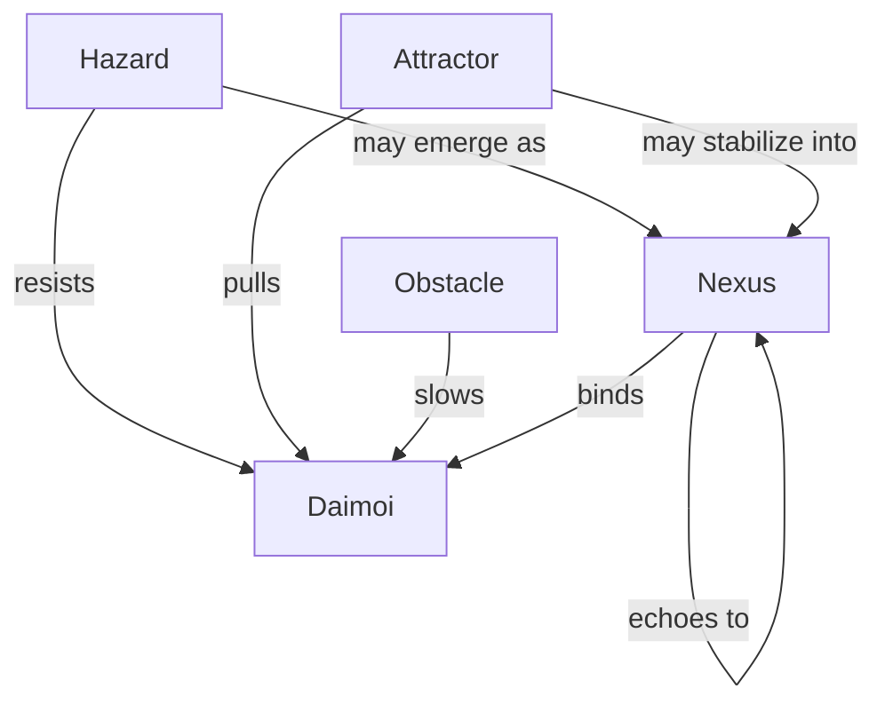
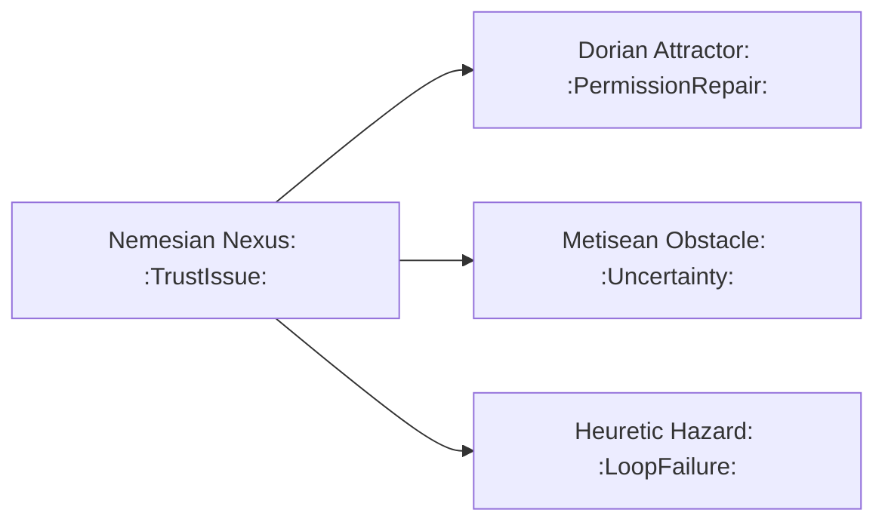
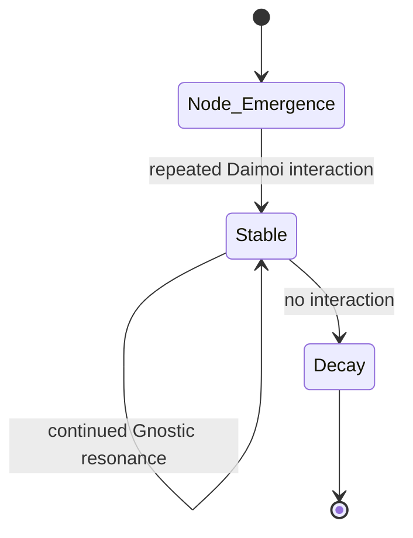
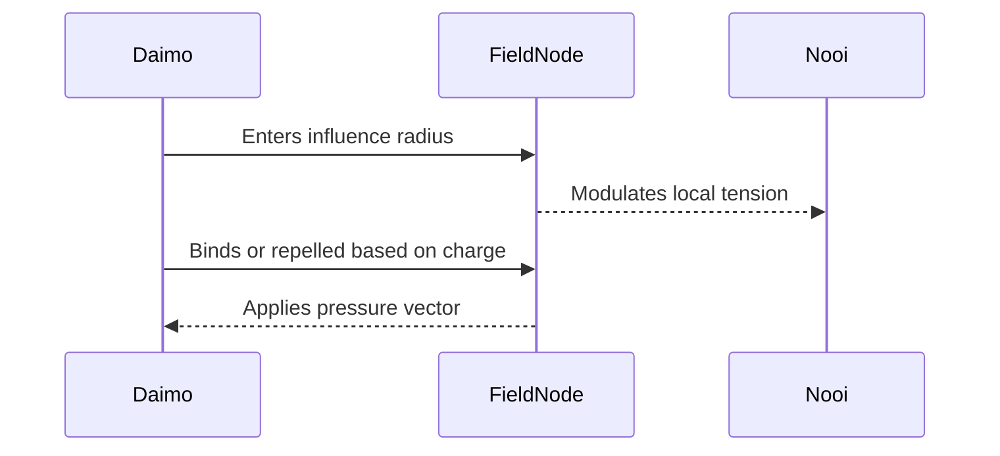

Note: Consolidated here → ../notes/diagrams/field-node-lifecycle-additional-diagrams.md

Absolutely. Here's a lineup of diagram types we can add next, each focused on a different part of the Field Node and Eidolon system. Let me know which one(s) you want to generate first, or if you'd like the full suite.

---

### 🧭 **1. Node Type Topology Map**

Shows the relationship between different types of Field Nodes:

---

### 🔀 **2. Cross-Layer Propagation Flow**

Illustrates how one node in one circuit causes echoes in others:

---

### 🔄 **3. Node Stability Decay Loop**

Visualizes how a node stabilizes or decays over time:

---

### ⚡ **4. Daimoi-Node Interaction Flow**

How Daimoi encounter and affect a node:

---

### 🌐 **5. Full Lifecycle Flowchart**

Combines Emergence, Promotion, Propagation, and Decay.

This one is larger, and we can compose it from smaller diagrams, or make a custom canvas version if you'd prefer an editable visual overview.

---

Would you like:

- One or more of these embedded now?
    
- All five added as a “Diagrams” section to the current document?
    
- A dedicated Obsidian canvas to explore them modularly?
    

Let’s get visual.
---

Related notes: [[../notes/diagrams/node-type-topology-map|node-type-topology-map]], [[../notes/diagrams/circuit-weight-visualizations|circuit-weight-visualizations]], [[../notes/diagrams/full-system-overview-diagrams|full-system-overview-diagrams]], [[../notes/diagrams/layer1-uptime-diagrams|layer1-uptime-diagrams]], [[../notes/diagrams/field-node-lifecycle-additional-diagrams|field-node-lifecycle-additional-diagrams]], [[../notes/diagrams/state-diagram-node-lifecycle|state-diagram-node-lifecycle]] [[index|unique/index]]

#tags: #diagram #design<!-- GENERATED-SECTIONS:DO-NOT-EDIT-BELOW -->
## Related content
- [field-node-diagram-visualizations](field-node-diagram-visualizations.md)
- [field-node-diagram-set](field-node-diagram-set.md)
- [eidolon-node-lifecycle](eidolon-node-lifecycle.md)
- [promethean-system-diagrams](promethean-system-diagrams.md)
- [layer-1-uptime-diagrams](layer-1-uptime-diagrams.md)
- [field-dynamics-math-blocks](field-dynamics-math-blocks.md)
- [2d-sandbox-field](2d-sandbox-field.md)
- [Vectorial Exception Descent](vectorial-exception-descent.md)
- [Eidolon Field Abstract Model](eidolon-field-abstract-model.md)
- [Exception Layer Analysis](exception-layer-analysis.md)
- [Ice Box Reorganization](ice-box-reorganization.md)
- [EidolonField](eidolonfield.md)
- [Unique Info Dump Index](unique-info-dump-index.md)
- [eidolon-field-math-foundations](eidolon-field-math-foundations.md)
- [ripple-propagation-demo](ripple-propagation-demo.md)
- [heartbeat-fragment-demo](heartbeat-fragment-demo.md)
- [heartbeat-simulation-snippets](heartbeat-simulation-snippets.md)
- [ParticleSimulationWithCanvasAndFFmpeg](particlesimulationwithcanvasandffmpeg.md)
- [Event Bus Projections Architecture](event-bus-projections-architecture.md)
- [Agent Tasks: Persistence Migration to DualStore](agent-tasks-persistence-migration-to-dualstore.md)
- [aionian-circuit-math](aionian-circuit-math.md)
- [Math Fundamentals](chunks/math-fundamentals.md)
- [archetype-ecs](archetype-ecs.md)
- [Diagrams](chunks/diagrams.md)
- [DSL](chunks/dsl.md)
- [ecs-offload-workers](ecs-offload-workers.md)
- [Reawakening Duck](reawakening-duck.md)
- [sibilant-macro-targets](sibilant-macro-targets.md)
- [Simulation Demo](chunks/simulation-demo.md)
- [Eidolon-Field-Optimization](eidolon-field-optimization.md)
- [Factorio AI with External Agents](factorio-ai-with-external-agents.md)
## Sources
- _None_
<!-- GENERATED-SECTIONS:DO-NOT-EDIT-ABOVE -->
