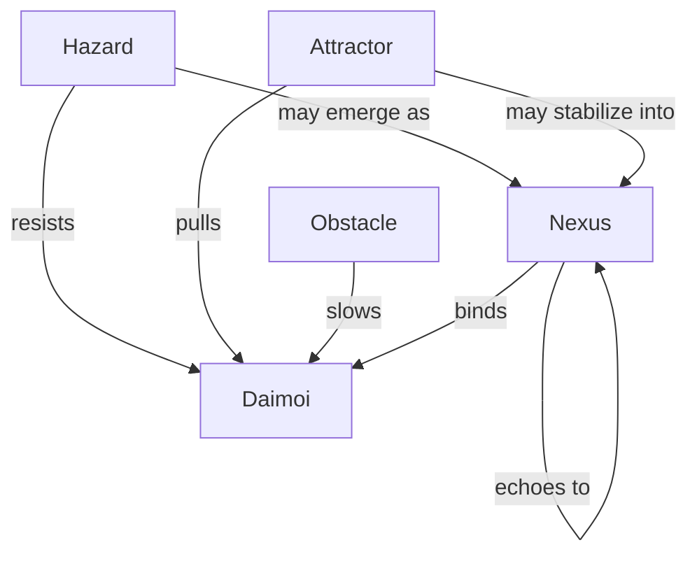

Note: Consolidated here → ../notes/diagrams/field-node-lifecycle-additional-diagrams.md ^ref-1f32c94a-1-0

Absolutely. Here's a lineup of diagram types we can add next, each focused on a different part of the Field Node and Eidolon system. Let me know which one(s) you want to generate first, or if you'd like the full suite. ^ref-1f32c94a-3-0

---

### 🧭 **1. Node Type Topology Map**

Shows the relationship between different types of Field Nodes: ^ref-1f32c94a-9-0


^ref-1f32c94a-11-0

---

### 🔀 **2. Cross-Layer Propagation Flow**
 ^ref-1f32c94a-26-0
Illustrates how one node in one circuit causes echoes in others:
 ^ref-1f32c94a-28-0
```mermaid
graph LR
  N4[Nemesian Nexus: :TrustIssue:]
  A2[Dorian Attractor: :PermissionRepair:]
  O7[Metisean Obstacle: :Uncertainty:]
  H5[Heuretic Hazard: :LoopFailure:]

  N4 --> A2
  N4 --> O7
  N4 --> H5
^ref-1f32c94a-28-0
```

---

### 🔄 **3. Node Stability Decay Loop** ^ref-1f32c94a-44-0

Visualizes how a node stabilizes or decays over time: ^ref-1f32c94a-46-0

```mermaid
stateDiagram-v2
  [*] --> Node_Emergence
  Node_Emergence --> Stable : repeated Daimoi interaction
  Stable --> Stable : continued Gnostic resonance
  Stable --> Decay : no interaction
^ref-1f32c94a-46-0
  Decay --> [*]
```
^ref-1f32c94a-48-0

---
 ^ref-1f32c94a-59-0
### ⚡ **4. Daimoi-Node Interaction Flow**
 ^ref-1f32c94a-61-0
How Daimoi encounter and affect a node:

```mermaid
sequenceDiagram
  participant Daimo
  participant FieldNode
  participant Nooi
  Daimo->>FieldNode: Enters influence radius
  FieldNode-->>Nooi: Modulates local tension
^ref-1f32c94a-61-0
  Daimo->>FieldNode: Binds or repelled based on charge
  FieldNode-->>Daimo: Applies pressure vector
```
 ^ref-1f32c94a-76-0
--- ^ref-1f32c94a-76-0

### 🌐 **5. Full Lifecycle Flowchart** ^ref-1f32c94a-78-0

Combines Emergence, Promotion, Propagation, and Decay.

This one is larger, and we can compose it from smaller diagrams, or make a custom canvas version if you'd prefer an editable visual overview. ^ref-1f32c94a-82-0

---

Would you like:

- One or more of these embedded now? ^ref-1f32c94a-88-0
    
- All five added as a “Diagrams” section to the current document?
    
- A dedicated Obsidian canvas to explore them modularly?
    
 ^ref-1f32c94a-94-0
Let’s get visual.
--- ^ref-1f32c94a-96-0
 ^ref-1f32c94a-98-0
Related notes: [[../notes/diagrams/node-type-topology-map|node-type-topology-map]], [[../notes/diagrams/circuit-weight-visualizations|circuit-weight-visualizations]], [[../notes/diagrams/full-system-overview-diagrams|full-system-overview-diagrams]], [[../notes/diagrams/layer1-uptime-diagrams|layer1-uptime-diagrams]], [[../notes/diagrams/field-node-lifecycle-additional-diagrams|field-node-lifecycle-additional-diagrams]], [[../notes/diagrams/state-diagram-node-lifecycle|state-diagram-node-lifecycle]] [[index|unique/index]] ^ref-1f32c94a-98-0
 ^ref-1f32c94a-99-0
#tags: #diagram #design
