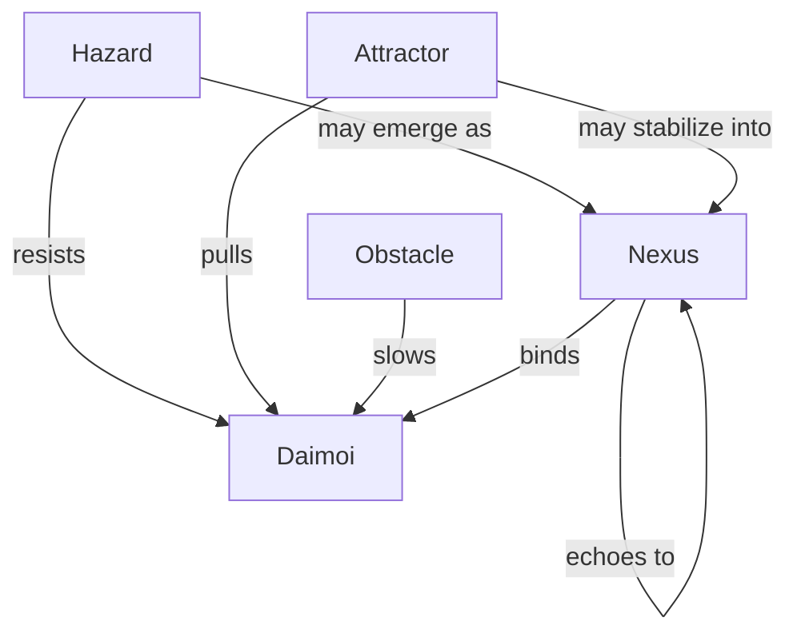

Note: Consolidated here → ../notes/diagrams/field-node-lifecycle-additional-diagrams.md ^ref-1f32c94a-1-0

Absolutely. Here's a lineup of diagram types we can add next, each focused on a different part of the Field Node and Eidolon system. Let me know which one(s) you want to generate first, or if you'd like the full suite. ^ref-1f32c94a-3-0

---

### 🧭 **1. Node Type Topology Map**

Shows the relationship between different types of Field Nodes: ^ref-1f32c94a-9-0


^ref-1f32c94a-11-0

---

### 🔀 **2. Cross-Layer Propagation Flow**
 ^ref-1f32c94a-26-0
Illustrates how one node in one circuit causes echoes in others:
 ^ref-1f32c94a-28-0
```mermaid
graph LR
  N4[Nemesian Nexus: :TrustIssue:]
  A2[Dorian Attractor: :PermissionRepair:]
  O7[Metisean Obstacle: :Uncertainty:]
  H5[Heuretic Hazard: :LoopFailure:]

  N4 --> A2
  N4 --> O7
  N4 --> H5
^ref-1f32c94a-28-0
```

---

### 🔄 **3. Node Stability Decay Loop** ^ref-1f32c94a-44-0

Visualizes how a node stabilizes or decays over time: ^ref-1f32c94a-46-0

```mermaid
stateDiagram-v2
  [*] --> Node_Emergence
  Node_Emergence --> Stable : repeated Daimoi interaction
  Stable --> Stable : continued Gnostic resonance
  Stable --> Decay : no interaction
^ref-1f32c94a-46-0
  Decay --> [*]
```
^ref-1f32c94a-48-0

---
 ^ref-1f32c94a-59-0
### ⚡ **4. Daimoi-Node Interaction Flow**
 ^ref-1f32c94a-61-0
How Daimoi encounter and affect a node:

```mermaid
sequenceDiagram
  participant Daimo
  participant FieldNode
  participant Nooi
  Daimo->>FieldNode: Enters influence radius
  FieldNode-->>Nooi: Modulates local tension
^ref-1f32c94a-61-0
  Daimo->>FieldNode: Binds or repelled based on charge
  FieldNode-->>Daimo: Applies pressure vector
```
 ^ref-1f32c94a-76-0
--- ^ref-1f32c94a-76-0

### 🌐 **5. Full Lifecycle Flowchart** ^ref-1f32c94a-78-0

Combines Emergence, Promotion, Propagation, and Decay.

This one is larger, and we can compose it from smaller diagrams, or make a custom canvas version if you'd prefer an editable visual overview. ^ref-1f32c94a-82-0

---

Would you like:

- One or more of these embedded now? ^ref-1f32c94a-88-0
    
- All five added as a “Diagrams” section to the current document?
    
- A dedicated Obsidian canvas to explore them modularly?
    
 ^ref-1f32c94a-94-0
Let’s get visual.
--- ^ref-1f32c94a-96-0
 ^ref-1f32c94a-98-0
Related notes: [[../notes/diagrams/node-type-topology-map|node-type-topology-map]], [[../notes/diagrams/circuit-weight-visualizations|circuit-weight-visualizations]], [[../notes/diagrams/full-system-overview-diagrams|full-system-overview-diagrams]], [[../notes/diagrams/layer1-uptime-diagrams|layer1-uptime-diagrams]], [[../notes/diagrams/field-node-lifecycle-additional-diagrams|field-node-lifecycle-additional-diagrams]], [[../notes/diagrams/state-diagram-node-lifecycle|state-diagram-node-lifecycle]] [[index|unique/index]] ^ref-1f32c94a-98-0
 ^ref-1f32c94a-99-0
#tags: #diagram #design<!-- GENERATED-SECTIONS:DO-NOT-EDIT-BELOW -->
## Related content
- [Diagrams](chunks/diagrams.md)
- [DSL](chunks/dsl.md)
- [Math Fundamentals](chunks/math-fundamentals.md)
- [Services](chunks/services.md)
- [Shared](chunks/shared.md)
- [Tooling](chunks/tooling.md)
- [Window Management](chunks/window-management.md)
- [typed-struct-compiler](typed-struct-compiler.md)
- [zero-copy-snapshots-and-workers](zero-copy-snapshots-and-workers.md)
- [Duck's Attractor States](ducks-attractor-states.md)
- [eidolon-field-math-foundations](eidolon-field-math-foundations.md)
- [Eidolon Field Abstract Model](eidolon-field-abstract-model.md)
- [field-interaction-equations](field-interaction-equations.md)
- [windows-tiling-with-autohotkey](windows-tiling-with-autohotkey.md)
- [Dynamic Context Model for Web Components](dynamic-context-model-for-web-components.md)
- [eidolon-node-lifecycle](eidolon-node-lifecycle.md)
- [field-dynamics-math-blocks](field-dynamics-math-blocks.md)
- [Protocol_0_The_Contradiction_Engine](protocol-0-the-contradiction-engine.md)
- [Debugging Broker Connections and Agent Behavior](debugging-broker-connections-and-agent-behavior.md)
- [Duck's Self-Referential Perceptual Loop](ducks-self-referential-perceptual-loop.md)
- [TypeScript Patch for Tool Calling Support](typescript-patch-for-tool-calling-support.md)
- [plan-update-confirmation](plan-update-confirmation.md)
- [Chroma Toolkit Consolidation Plan](chroma-toolkit-consolidation-plan.md)
- [JavaScript](chunks/javascript.md)
- [Operations](chunks/operations.md)
- [Unique Info Dump Index](unique-info-dump-index.md)
- [Creative Moments](creative-moments.md)
- [field-node-diagram-set](field-node-diagram-set.md)
- [field-node-diagram-visualizations](field-node-diagram-visualizations.md)
- [Fnord Tracer Protocol](fnord-tracer-protocol.md)
- [Functional Embedding Pipeline Refactor](functional-embedding-pipeline-refactor.md)
- [graph-ds](graph-ds.md)
- [heartbeat-fragment-demo](heartbeat-fragment-demo.md)
- [i3-bluetooth-setup](i3-bluetooth-setup.md)
- [Ice Box Reorganization](ice-box-reorganization.md)
- [komorebi-group-window-hack](komorebi-group-window-hack.md)
- [Layer1SurvivabilityEnvelope](layer1survivabilityenvelope.md)
- [Functional Refactor of TypeScript Document Processing](functional-refactor-of-typescript-document-processing.md)
- [polyglot-repl-interface-layer](polyglot-repl-interface-layer.md)
- [The Jar of Echoes](the-jar-of-echoes.md)
- [ParticleSimulationWithCanvasAndFFmpeg](particlesimulationwithcanvasandffmpeg.md)
- [Promethean Dev Workflow Update](promethean-dev-workflow-update.md)
- [Synchronicity Waves and Web](synchronicity-waves-and-web.md)
- [homeostasis-decay-formulas](homeostasis-decay-formulas.md)
- [ripple-propagation-demo](ripple-propagation-demo.md)
- [sibilant-macro-targets](sibilant-macro-targets.md)
- [Prometheus Observability Stack](prometheus-observability-stack.md)
- [Migrate to Provider-Tenant Architecture](migrate-to-provider-tenant-architecture.md)
- [Simulation Demo](chunks/simulation-demo.md)
- [Model Selection for Lightweight Conversational Tasks](model-selection-for-lightweight-conversational-tasks.md)
- [Factorio AI with External Agents](factorio-ai-with-external-agents.md)
- [Promethean_Eidolon_Synchronicity_Model](promethean-eidolon-synchronicity-model.md)
- [DuckDuckGoSearchPipeline](duckduckgosearchpipeline.md)
- [NPU Voice Code and Sensory Integration](npu-voice-code-and-sensory-integration.md)
- [Obsidian ChatGPT Plugin Integration Guide](obsidian-chatgpt-plugin-integration-guide.md)
- [Obsidian ChatGPT Plugin Integration](obsidian-chatgpt-plugin-integration.md)
- [obsidian-ignore-node-modules-regex](obsidian-ignore-node-modules-regex.md)
- [Obsidian Task Generation](obsidian-task-generation.md)
- [Obsidian Templating Plugins Integration Guide](obsidian-templating-plugins-integration-guide.md)
- [Optimizing Command Limitations in System Design](optimizing-command-limitations-in-system-design.md)
- [Promethean Pipelines](promethean-pipelines.md)
- [Promethean State Format](promethean-state-format.md)
- [Post-Linguistic Transhuman Design Frameworks](post-linguistic-transhuman-design-frameworks.md)
- [Promethean Chat Activity Report](promethean-chat-activity-report.md)
- [Promethean-Copilot-Intent-Engine](promethean-copilot-intent-engine.md)
- [Promethean Documentation Pipeline Overview](promethean-documentation-pipeline-overview.md)
- [Per-Domain Policy System for JS Crawler](per-domain-policy-system-for-js-crawler.md)
- [Performance-Optimized-Polyglot-Bridge](performance-optimized-polyglot-bridge.md)
- [Pipeline Enhancements](pipeline-enhancements.md)
- [Self-Agency in AI Interaction](self-agency-in-ai-interaction.md)
- [Promethean Infrastructure Setup](promethean-infrastructure-setup.md)
- [Promethean Workflow Optimization](promethean-workflow-optimization.md)
- [Unique Concepts](unique-concepts.md)
- [Docops Feature Updates](docops-feature-updates.md)
- [Mathematical Samplers](mathematical-samplers.md)
- [schema-evolution-workflow](schema-evolution-workflow.md)
- [Docops Feature Updates](docops-feature-updates-2.md)
- [Promethean Notes](promethean-notes.md)
- [promethean-requirements](promethean-requirements.md)
- [Prompt_Folder_Bootstrap](prompt-folder-bootstrap.md)
- [Provider-Agnostic Chat Panel Implementation](provider-agnostic-chat-panel-implementation.md)
- [Pure TypeScript Search Microservice](pure-typescript-search-microservice.md)
- [Reawakening Duck](reawakening-duck.md)
- [Promethean Data Sync Protocol](promethean-data-sync-protocol.md)
- [Model Upgrade Calm-Down Guide](model-upgrade-calm-down-guide.md)
- [Mathematics Sampler](mathematics-sampler.md)
- [OpenAPI Validation Report](openapi-validation-report.md)
- [unique-templates](templates/unique-templates.md)
- [Tracing the Signal](tracing-the-signal.md)
- [ts-to-lisp-transpiler](ts-to-lisp-transpiler.md)
- [Promethean Documentation Overview](promethean-documentation-overview.md)
- [Promethean Documentation Update](promethean-documentation-update.md)
- [Redirecting Standard Error](redirecting-standard-error.md)
- [Smoke Resonance Visualizations](smoke-resonance-visualizations.md)
- [Promethean Documentation Update](promethean-documentation-update.txt)
- [Stateful Partitions and Rebalancing](stateful-partitions-and-rebalancing.md)
- [Mindful Prioritization](mindful-prioritization.md)
- [MindfulRobotIntegration](mindfulrobotintegration.md)
- [Self-Improving Documentation Tool](self-improving-documentation-tool.md)
- [Git Commit Optimization for Code Reviews](git-commit-optimization-for-code-reviews.md)
- [Fastify Static Files Plugin](fastify-static-files-plugin.md)
- [run-step-api](run-step-api.md)
- [Promethean Documentation Update](promethean-documentation-update-4.md)
- [Canonical Org-Babel Matplotlib Animation Template](canonical-org-babel-matplotlib-animation-template.md)
- [AI-Centric OS with MCP Layer](ai-centric-os-with-mcp-layer.md)
- [layer-1-uptime-diagrams](layer-1-uptime-diagrams.md)
- [Universal Lisp Interface](universal-lisp-interface.md)
- [shared-package-layout-clarification](shared-package-layout-clarification.md)
- [Event Bus Projections Architecture](event-bus-projections-architecture.md)
- [ecs-offload-workers](ecs-offload-workers.md)
- [Mongo Outbox Implementation](mongo-outbox-implementation.md)
- [archetype-ecs](archetype-ecs.md)
- [lisp-dsl-for-window-management](lisp-dsl-for-window-management.md)
- [Cross-Language Runtime Polymorphism](cross-language-runtime-polymorphism.md)
- [Promethean Web UI Setup](promethean-web-ui-setup.md)
## Sources
- [Chroma Toolkit Consolidation Plan — L6763](chroma-toolkit-consolidation-plan.md#^ref-5020e892-6763-0) (line 6763, col 0, score 1)
- [Diagrams — L144](chunks/diagrams.md#^ref-45cd25b5-144-0) (line 144, col 0, score 1)
- [DSL — L4015](chunks/dsl.md#^ref-e87bc036-4015-0) (line 4015, col 0, score 1)
- [JavaScript — L4355](chunks/javascript.md#^ref-c1618c66-4355-0) (line 4355, col 0, score 1)
- [Math Fundamentals — L4006](chunks/math-fundamentals.md#^ref-c6e87433-4006-0) (line 4006, col 0, score 1)
- [Operations — L165](chunks/operations.md#^ref-f1add613-165-0) (line 165, col 0, score 1)
- [Services — L137](chunks/services.md#^ref-75ea4a6a-137-0) (line 137, col 0, score 1)
- [Shared — L3301](chunks/shared.md#^ref-623a55f7-3301-0) (line 3301, col 0, score 1)
- [Tooling — L2815](chunks/tooling.md#^ref-6cb4943e-2815-0) (line 2815, col 0, score 1)
- [Window Management — L140](chunks/window-management.md#^ref-9e8ae388-140-0) (line 140, col 0, score 1)
- [typed-struct-compiler — L1016](typed-struct-compiler.md#^ref-78eeedf7-1016-0) (line 1016, col 0, score 1)
- [Unique Concepts — L175](unique-concepts.md#^ref-ed6f3fc9-175-0) (line 175, col 0, score 1)
- [Unique Info Dump Index — L1221](unique-info-dump-index.md#^ref-30ec3ba6-1221-0) (line 1221, col 0, score 1)
- [zero-copy-snapshots-and-workers — L1058](zero-copy-snapshots-and-workers.md#^ref-62bec6f0-1058-0) (line 1058, col 0, score 1)
- [Canonical Org-Babel Matplotlib Animation Template — L515](canonical-org-babel-matplotlib-animation-template.md#^ref-1b1338fc-515-0) (line 515, col 0, score 1)
- [Creative Moments — L251](creative-moments.md#^ref-10d98225-251-0) (line 251, col 0, score 1)
- [Duck's Attractor States — L559](ducks-attractor-states.md#^ref-13951643-559-0) (line 559, col 0, score 1)
- [eidolon-field-math-foundations — L1033](eidolon-field-math-foundations.md#^ref-008f2ac0-1033-0) (line 1033, col 0, score 1)
- [Docops Feature Updates — L226](docops-feature-updates.md#^ref-2792d448-226-0) (line 226, col 0, score 1)
- [field-node-diagram-set — L719](field-node-diagram-set.md#^ref-22b989d5-719-0) (line 719, col 0, score 1)
- [field-node-diagram-visualizations — L601](field-node-diagram-visualizations.md#^ref-e9b27b06-601-0) (line 601, col 0, score 1)
- [Fnord Tracer Protocol — L1060](fnord-tracer-protocol.md#^ref-fc21f824-1060-0) (line 1060, col 0, score 1)
- [Functional Embedding Pipeline Refactor — L726](functional-embedding-pipeline-refactor.md#^ref-a4a25141-726-0) (line 726, col 0, score 1)
- [graph-ds — L996](graph-ds.md#^ref-6620e2f2-996-0) (line 996, col 0, score 1)
- [heartbeat-fragment-demo — L667](heartbeat-fragment-demo.md#^ref-dd00677a-667-0) (line 667, col 0, score 1)
- [i3-bluetooth-setup — L736](i3-bluetooth-setup.md#^ref-5e408692-736-0) (line 736, col 0, score 1)
- [Ice Box Reorganization — L645](ice-box-reorganization.md#^ref-291c7d91-645-0) (line 645, col 0, score 1)
- [komorebi-group-window-hack — L739](komorebi-group-window-hack.md#^ref-dd89372d-739-0) (line 739, col 0, score 1)
- [Layer1SurvivabilityEnvelope — L816](layer1survivabilityenvelope.md#^ref-64a9f9f9-816-0) (line 816, col 0, score 1)
- [Mathematical Samplers — L293](mathematical-samplers.md#^ref-86a691ec-293-0) (line 293, col 0, score 1)
- [eidolon-node-lifecycle — L3](eidolon-node-lifecycle.md#^ref-938eca9c-3-0) (line 3, col 0, score 0.88)
- [Layer1SurvivabilityEnvelope — L99](layer1survivabilityenvelope.md#^ref-64a9f9f9-99-0) (line 99, col 0, score 0.85)
- [NPU Voice Code and Sensory Integration — L60](npu-voice-code-and-sensory-integration.md#^ref-5a02283e-60-0) (line 60, col 0, score 1)
- [Obsidian ChatGPT Plugin Integration Guide — L48](obsidian-chatgpt-plugin-integration-guide.md#^ref-1d3d6c3a-48-0) (line 48, col 0, score 1)
- [Obsidian ChatGPT Plugin Integration — L71](obsidian-chatgpt-plugin-integration.md#^ref-ca8e1399-71-0) (line 71, col 0, score 1)
- [obsidian-ignore-node-modules-regex — L107](obsidian-ignore-node-modules-regex.md#^ref-ffb9b2a9-107-0) (line 107, col 0, score 1)
- [Obsidian Task Generation — L72](obsidian-task-generation.md#^ref-9b694a91-72-0) (line 72, col 0, score 1)
- [Obsidian Templating Plugins Integration Guide — L148](obsidian-templating-plugins-integration-guide.md#^ref-b39dc9d4-148-0) (line 148, col 0, score 1)
- [Optimizing Command Limitations in System Design — L40](optimizing-command-limitations-in-system-design.md#^ref-98c8ff62-40-0) (line 40, col 0, score 1)
- [Promethean Notes — L16](promethean-notes.md#^ref-1c4046b5-16-0) (line 16, col 0, score 1)
- [Promethean Pipelines — L138](promethean-pipelines.md#^ref-8b8e6103-138-0) (line 138, col 0, score 1)
- [promethean-requirements — L68](promethean-requirements.md#^ref-95205cd3-68-0) (line 68, col 0, score 1)
- [Promethean State Format — L84](promethean-state-format.md#^ref-23df6ddb-84-0) (line 84, col 0, score 1)
- [field-node-diagram-visualizations — L84](field-node-diagram-visualizations.md#^ref-e9b27b06-84-0) (line 84, col 0, score 1)
- [eidolon-node-lifecycle — L25](eidolon-node-lifecycle.md#^ref-938eca9c-25-0) (line 25, col 0, score 0.98)
- [field-node-diagram-set — L137](field-node-diagram-set.md#^ref-22b989d5-137-0) (line 137, col 0, score 0.97)
- [Prometheus Observability Stack — L580](prometheus-observability-stack.md#^ref-e90b5a16-580-0) (line 580, col 0, score 1)
- [Prompt_Folder_Bootstrap — L264](prompt-folder-bootstrap.md#^ref-bd4f0976-264-0) (line 264, col 0, score 1)
- [Protocol_0_The_Contradiction_Engine — L244](protocol-0-the-contradiction-engine.md#^ref-9a93a756-244-0) (line 244, col 0, score 1)
- [Provider-Agnostic Chat Panel Implementation — L303](provider-agnostic-chat-panel-implementation.md#^ref-43bfe9dd-303-0) (line 303, col 0, score 1)
- [Pure TypeScript Search Microservice — L646](pure-typescript-search-microservice.md#^ref-d17d3a96-646-0) (line 646, col 0, score 1)
- [Reawakening Duck — L206](reawakening-duck.md#^ref-59b5670f-206-0) (line 206, col 0, score 1)
- [schema-evolution-workflow — L638](schema-evolution-workflow.md#^ref-d8059b6a-638-0) (line 638, col 0, score 1)
- [sibilant-macro-targets — L256](sibilant-macro-targets.md#^ref-c5c9a5c6-256-0) (line 256, col 0, score 1)
- [eidolon-node-lifecycle — L3943](eidolon-node-lifecycle.md#^ref-938eca9c-3943-0) (line 3943, col 0, score 0.96)
- [Factorio AI with External Agents — L4841](factorio-ai-with-external-agents.md#^ref-a4d90289-4841-0) (line 4841, col 0, score 0.96)
- [field-dynamics-math-blocks — L5983](field-dynamics-math-blocks.md#^ref-7cfc230d-5983-0) (line 5983, col 0, score 0.96)
- [field-interaction-equations — L6301](field-interaction-equations.md#^ref-b09141b7-6301-0) (line 6301, col 0, score 0.96)
- [field-node-diagram-set — L4885](field-node-diagram-set.md#^ref-22b989d5-4885-0) (line 4885, col 0, score 0.96)
- [Fnord Tracer Protocol — L6723](fnord-tracer-protocol.md#^ref-fc21f824-6723-0) (line 6723, col 0, score 0.96)
- [Functional Embedding Pipeline Refactor — L3095](functional-embedding-pipeline-refactor.md#^ref-a4a25141-3095-0) (line 3095, col 0, score 0.96)
- [Functional Refactor of TypeScript Document Processing — L2333](functional-refactor-of-typescript-document-processing.md#^ref-1cfae310-2333-0) (line 2333, col 0, score 0.96)
- [graph-ds — L4596](graph-ds.md#^ref-6620e2f2-4596-0) (line 4596, col 0, score 0.96)
- [Debugging Broker Connections and Agent Behavior — L3469](debugging-broker-connections-and-agent-behavior.md#^ref-73d3dbf6-3469-0) (line 3469, col 0, score 0.99)
- [DuckDuckGoSearchPipeline — L1053](duckduckgosearchpipeline.md#^ref-e979c50f-1053-0) (line 1053, col 0, score 0.99)
- [Duck's Attractor States — L2575](ducks-attractor-states.md#^ref-13951643-2575-0) (line 2575, col 0, score 0.99)
- [Fnord Tracer Protocol — L5440](fnord-tracer-protocol.md#^ref-fc21f824-5440-0) (line 5440, col 0, score 0.99)
- [Services — L1585](chunks/services.md#^ref-75ea4a6a-1585-0) (line 1585, col 0, score 0.96)
- [Dynamic Context Model for Web Components — L4906](dynamic-context-model-for-web-components.md#^ref-f7702bf8-4906-0) (line 4906, col 0, score 0.96)
- [Unique Info Dump Index — L1858](unique-info-dump-index.md#^ref-30ec3ba6-1858-0) (line 1858, col 0, score 0.96)
- [eidolon-field-math-foundations — L6819](eidolon-field-math-foundations.md#^ref-008f2ac0-6819-0) (line 6819, col 0, score 0.96)
- [Dynamic Context Model for Web Components — L8983](dynamic-context-model-for-web-components.md#^ref-f7702bf8-8983-0) (line 8983, col 0, score 0.96)
- [homeostasis-decay-formulas — L5794](homeostasis-decay-formulas.md#^ref-37b5d236-5794-0) (line 5794, col 0, score 0.96)
- [komorebi-group-window-hack — L2762](komorebi-group-window-hack.md#^ref-dd89372d-2762-0) (line 2762, col 0, score 0.96)
- [Model Selection for Lightweight Conversational Tasks — L4653](model-selection-for-lightweight-conversational-tasks.md#^ref-d144aa62-4653-0) (line 4653, col 0, score 0.96)
- [sibilant-macro-targets — L302](sibilant-macro-targets.md#^ref-c5c9a5c6-302-0) (line 302, col 0, score 1)
- [Ice Box Reorganization — L2246](ice-box-reorganization.md#^ref-291c7d91-2246-0) (line 2246, col 0, score 0.95)
- [Promethean Documentation Pipeline Overview — L3331](promethean-documentation-pipeline-overview.md#^ref-3a3bf2c9-3331-0) (line 3331, col 0, score 0.95)
- [Promethean Documentation Update — L1615](promethean-documentation-update.txt#^ref-0b872af2-1615-0) (line 1615, col 0, score 0.95)
- [Promethean Notes — L1795](promethean-notes.md#^ref-1c4046b5-1795-0) (line 1795, col 0, score 0.95)
- [The Jar of Echoes — L3845](the-jar-of-echoes.md#^ref-18138627-3845-0) (line 3845, col 0, score 0.95)
- [JavaScript — L1250](chunks/javascript.md#^ref-c1618c66-1250-0) (line 1250, col 0, score 0.95)
- [Creative Moments — L909](creative-moments.md#^ref-10d98225-909-0) (line 909, col 0, score 0.95)
- [Debugging Broker Connections and Agent Behavior — L1188](debugging-broker-connections-and-agent-behavior.md#^ref-73d3dbf6-1188-0) (line 1188, col 0, score 0.95)
- [Duck's Attractor States — L1849](ducks-attractor-states.md#^ref-13951643-1849-0) (line 1849, col 0, score 0.98)
- [Dynamic Context Model for Web Components — L6723](dynamic-context-model-for-web-components.md#^ref-f7702bf8-6723-0) (line 6723, col 0, score 0.98)
- [eidolon-field-math-foundations — L6850](eidolon-field-math-foundations.md#^ref-008f2ac0-6850-0) (line 6850, col 0, score 0.96)
- [eidolon-node-lifecycle — L3029](eidolon-node-lifecycle.md#^ref-938eca9c-3029-0) (line 3029, col 0, score 0.96)
- [Factorio AI with External Agents — L4518](factorio-ai-with-external-agents.md#^ref-a4d90289-4518-0) (line 4518, col 0, score 0.96)
- [field-dynamics-math-blocks — L6157](field-dynamics-math-blocks.md#^ref-7cfc230d-6157-0) (line 6157, col 0, score 0.96)
- [field-interaction-equations — L6415](field-interaction-equations.md#^ref-b09141b7-6415-0) (line 6415, col 0, score 0.96)
- [field-node-diagram-set — L4107](field-node-diagram-set.md#^ref-22b989d5-4107-0) (line 4107, col 0, score 0.96)
- [Fnord Tracer Protocol — L6324](fnord-tracer-protocol.md#^ref-fc21f824-6324-0) (line 6324, col 0, score 0.96)
- [JavaScript — L3260](chunks/javascript.md#^ref-c1618c66-3260-0) (line 3260, col 0, score 0.98)
- [Math Fundamentals — L3464](chunks/math-fundamentals.md#^ref-c6e87433-3464-0) (line 3464, col 0, score 0.98)
- [Operations — L1521](chunks/operations.md#^ref-f1add613-1521-0) (line 1521, col 0, score 0.98)
- [Services — L3293](chunks/services.md#^ref-75ea4a6a-3293-0) (line 3293, col 0, score 0.98)
- [Simulation Demo — L1478](chunks/simulation-demo.md#^ref-557309a3-1478-0) (line 1478, col 0, score 0.98)
- [Tooling — L2698](chunks/tooling.md#^ref-6cb4943e-2698-0) (line 2698, col 0, score 0.98)
- [Window Management — L3557](chunks/window-management.md#^ref-9e8ae388-3557-0) (line 3557, col 0, score 0.98)
- [Creative Moments — L1918](creative-moments.md#^ref-10d98225-1918-0) (line 1918, col 0, score 0.98)
- [Debugging Broker Connections and Agent Behavior — L3232](debugging-broker-connections-and-agent-behavior.md#^ref-73d3dbf6-3232-0) (line 3232, col 0, score 0.98)
- [DuckDuckGoSearchPipeline — L1644](duckduckgosearchpipeline.md#^ref-e979c50f-1644-0) (line 1644, col 0, score 0.98)
- [Duck's Attractor States — L1652](ducks-attractor-states.md#^ref-13951643-1652-0) (line 1652, col 0, score 0.98)
- [field-dynamics-math-blocks — L1884](field-dynamics-math-blocks.md#^ref-7cfc230d-1884-0) (line 1884, col 0, score 0.99)
- [eidolon-field-math-foundations — L3069](eidolon-field-math-foundations.md#^ref-008f2ac0-3069-0) (line 3069, col 0, score 0.95)
- [homeostasis-decay-formulas — L2430](homeostasis-decay-formulas.md#^ref-37b5d236-2430-0) (line 2430, col 0, score 0.95)
- [Promethean Dev Workflow Update — L13202](promethean-dev-workflow-update.md#^ref-03a5578f-13202-0) (line 13202, col 0, score 0.95)
- [The Jar of Echoes — L15220](the-jar-of-echoes.md#^ref-18138627-15220-0) (line 15220, col 0, score 0.95)
- [windows-tiling-with-autohotkey — L18365](windows-tiling-with-autohotkey.md#^ref-0f6f8f38-18365-0) (line 18365, col 0, score 0.95)
- [Dynamic Context Model for Web Components — L6777](dynamic-context-model-for-web-components.md#^ref-f7702bf8-6777-0) (line 6777, col 0, score 0.94)
- [Model Upgrade Calm-Down Guide — L860](model-upgrade-calm-down-guide.md#^ref-db74343f-860-0) (line 860, col 0, score 0.86)
- [NPU Voice Code and Sensory Integration — L735](npu-voice-code-and-sensory-integration.md#^ref-5a02283e-735-0) (line 735, col 0, score 0.86)
- [Obsidian ChatGPT Plugin Integration Guide — L1039](obsidian-chatgpt-plugin-integration-guide.md#^ref-1d3d6c3a-1039-0) (line 1039, col 0, score 0.86)
- [Obsidian ChatGPT Plugin Integration — L1019](obsidian-chatgpt-plugin-integration.md#^ref-ca8e1399-1019-0) (line 1019, col 0, score 0.86)
- [obsidian-ignore-node-modules-regex — L1272](obsidian-ignore-node-modules-regex.md#^ref-ffb9b2a9-1272-0) (line 1272, col 0, score 0.86)
- [Obsidian Task Generation — L780](obsidian-task-generation.md#^ref-9b694a91-780-0) (line 780, col 0, score 0.86)
- [Obsidian Templating Plugins Integration Guide — L1252](obsidian-templating-plugins-integration-guide.md#^ref-b39dc9d4-1252-0) (line 1252, col 0, score 0.86)
- [OpenAPI Validation Report — L781](openapi-validation-report.md#^ref-5c152b08-781-0) (line 781, col 0, score 0.86)
- [Optimizing Command Limitations in System Design — L1018](optimizing-command-limitations-in-system-design.md#^ref-98c8ff62-1018-0) (line 1018, col 0, score 0.86)
- [Promethean Documentation Overview — L580](promethean-documentation-overview.md#^ref-9413237f-580-0) (line 580, col 0, score 0.96)
- [Promethean Documentation Pipeline Overview — L1613](promethean-documentation-pipeline-overview.md#^ref-3a3bf2c9-1613-0) (line 1613, col 0, score 0.96)
- [Promethean Documentation Update — L1271](promethean-documentation-update.md#^ref-c0392040-1271-0) (line 1271, col 0, score 0.96)
- [Promethean_Eidolon_Synchronicity_Model — L3291](promethean-eidolon-synchronicity-model.md#^ref-2d6e5553-3291-0) (line 3291, col 0, score 0.96)
- [Promethean Infrastructure Setup — L6974](promethean-infrastructure-setup.md#^ref-6deed6ac-6974-0) (line 6974, col 0, score 0.96)
- [Promethean Pipelines — L4005](promethean-pipelines.md#^ref-8b8e6103-4005-0) (line 4005, col 0, score 0.96)
- [promethean-requirements — L1645](promethean-requirements.md#^ref-95205cd3-1645-0) (line 1645, col 0, score 0.96)
- [Promethean State Format — L3813](promethean-state-format.md#^ref-23df6ddb-3813-0) (line 3813, col 0, score 0.96)
- [Prometheus Observability Stack — L5781](prometheus-observability-stack.md#^ref-e90b5a16-5781-0) (line 5781, col 0, score 0.96)
- [Prompt_Folder_Bootstrap — L5891](prompt-folder-bootstrap.md#^ref-bd4f0976-5891-0) (line 5891, col 0, score 0.96)
- [windows-tiling-with-autohotkey — L9177](windows-tiling-with-autohotkey.md#^ref-0f6f8f38-9177-0) (line 9177, col 0, score 0.9)
- [i3-bluetooth-setup — L1021](i3-bluetooth-setup.md#^ref-5e408692-1021-0) (line 1021, col 0, score 0.87)
- [Ice Box Reorganization — L257](ice-box-reorganization.md#^ref-291c7d91-257-0) (line 257, col 0, score 0.87)
- [Unique Concepts — L716](unique-concepts.md#^ref-ed6f3fc9-716-0) (line 716, col 0, score 0.98)
- [polyglot-repl-interface-layer — L773](polyglot-repl-interface-layer.md#^ref-9c79206d-773-0) (line 773, col 0, score 0.96)
- [Promethean Chat Activity Report — L1336](promethean-chat-activity-report.md#^ref-18344cf9-1336-0) (line 1336, col 0, score 0.96)
- [Promethean Infrastructure Setup — L3460](promethean-infrastructure-setup.md#^ref-6deed6ac-3460-0) (line 3460, col 0, score 0.97)
- [typed-struct-compiler — L2270](typed-struct-compiler.md#^ref-78eeedf7-2270-0) (line 2270, col 0, score 0.97)
- [Promethean Dev Workflow Update — L1850](promethean-dev-workflow-update.md#^ref-03a5578f-1850-0) (line 1850, col 0, score 0.97)
- [Self-Agency in AI Interaction — L2386](self-agency-in-ai-interaction.md#^ref-49a9a860-2386-0) (line 2386, col 0, score 0.97)
- [The Jar of Echoes — L2455](the-jar-of-echoes.md#^ref-18138627-2455-0) (line 2455, col 0, score 0.97)
- [windows-tiling-with-autohotkey — L2835](windows-tiling-with-autohotkey.md#^ref-0f6f8f38-2835-0) (line 2835, col 0, score 0.97)
- [zero-copy-snapshots-and-workers — L2738](zero-copy-snapshots-and-workers.md#^ref-62bec6f0-2738-0) (line 2738, col 0, score 0.97)
- [Fnord Tracer Protocol — L4503](fnord-tracer-protocol.md#^ref-fc21f824-4503-0) (line 4503, col 0, score 0.97)
- [windows-tiling-with-autohotkey — L7938](windows-tiling-with-autohotkey.md#^ref-0f6f8f38-7938-0) (line 7938, col 0, score 0.94)
- [Stateful Partitions and Rebalancing — L2890](stateful-partitions-and-rebalancing.md#^ref-4330e8f0-2890-0) (line 2890, col 0, score 0.98)
- [Chroma Toolkit Consolidation Plan — L5432](chroma-toolkit-consolidation-plan.md#^ref-5020e892-5432-0) (line 5432, col 0, score 0.95)
- [Duck's Self-Referential Perceptual Loop — L2406](ducks-self-referential-perceptual-loop.md#^ref-71726f04-2406-0) (line 2406, col 0, score 0.95)
- [field-interaction-equations — L5858](field-interaction-equations.md#^ref-b09141b7-5858-0) (line 5858, col 0, score 0.95)
- [zero-copy-snapshots-and-workers — L691](zero-copy-snapshots-and-workers.md#^ref-62bec6f0-691-0) (line 691, col 0, score 1)
- [komorebi-group-window-hack — L1796](komorebi-group-window-hack.md#^ref-dd89372d-1796-0) (line 1796, col 0, score 0.97)
- [komorebi-group-window-hack — L2017](komorebi-group-window-hack.md#^ref-dd89372d-2017-0) (line 2017, col 0, score 0.97)
- [zero-copy-snapshots-and-workers — L1936](zero-copy-snapshots-and-workers.md#^ref-62bec6f0-1936-0) (line 1936, col 0, score 0.96)
- [zero-copy-snapshots-and-workers — L2202](zero-copy-snapshots-and-workers.md#^ref-62bec6f0-2202-0) (line 2202, col 0, score 0.96)
- [Unique Info Dump Index — L6662](unique-info-dump-index.md#^ref-30ec3ba6-6662-0) (line 6662, col 0, score 0.94)
- [heartbeat-fragment-demo — L1420](heartbeat-fragment-demo.md#^ref-dd00677a-1420-0) (line 1420, col 0, score 0.99)
- [eidolon-field-math-foundations — L24596](eidolon-field-math-foundations.md#^ref-008f2ac0-24596-0) (line 24596, col 0, score 0.99)
- [Promethean Dev Workflow Update — L22800](promethean-dev-workflow-update.md#^ref-03a5578f-22800-0) (line 22800, col 0, score 0.99)
- [windows-tiling-with-autohotkey — L22798](windows-tiling-with-autohotkey.md#^ref-0f6f8f38-22798-0) (line 22798, col 0, score 0.99)
- [Functional Refactor of TypeScript Document Processing — L2242](functional-refactor-of-typescript-document-processing.md#^ref-1cfae310-2242-0) (line 2242, col 0, score 0.97)
- [graph-ds — L3757](graph-ds.md#^ref-6620e2f2-3757-0) (line 3757, col 0, score 0.97)
- [heartbeat-fragment-demo — L3479](heartbeat-fragment-demo.md#^ref-dd00677a-3479-0) (line 3479, col 0, score 0.97)
- [homeostasis-decay-formulas — L5594](homeostasis-decay-formulas.md#^ref-37b5d236-5594-0) (line 5594, col 0, score 0.97)
- [i3-bluetooth-setup — L2012](i3-bluetooth-setup.md#^ref-5e408692-2012-0) (line 2012, col 0, score 0.97)
- [Ice Box Reorganization — L3225](ice-box-reorganization.md#^ref-291c7d91-3225-0) (line 3225, col 0, score 0.97)
- [komorebi-group-window-hack — L4356](komorebi-group-window-hack.md#^ref-dd89372d-4356-0) (line 4356, col 0, score 0.97)
- [Layer1SurvivabilityEnvelope — L3752](layer1survivabilityenvelope.md#^ref-64a9f9f9-3752-0) (line 3752, col 0, score 0.97)
- [Mathematical Samplers — L1714](mathematical-samplers.md#^ref-86a691ec-1714-0) (line 1714, col 0, score 0.97)
- [Mathematics Sampler — L1736](mathematics-sampler.md#^ref-b5e0183e-1736-0) (line 1736, col 0, score 0.87)
- [Migrate to Provider-Tenant Architecture — L7748](migrate-to-provider-tenant-architecture.md#^ref-54382370-7748-0) (line 7748, col 0, score 0.87)
- [Obsidian ChatGPT Plugin Integration — L3847](obsidian-chatgpt-plugin-integration.md#^ref-ca8e1399-3847-0) (line 3847, col 0, score 0.87)
- [obsidian-ignore-node-modules-regex — L4433](obsidian-ignore-node-modules-regex.md#^ref-ffb9b2a9-4433-0) (line 4433, col 0, score 0.87)
- [Obsidian Task Generation — L1688](obsidian-task-generation.md#^ref-9b694a91-1688-0) (line 1688, col 0, score 0.87)
- [Obsidian Templating Plugins Integration Guide — L5168](obsidian-templating-plugins-integration-guide.md#^ref-b39dc9d4-5168-0) (line 5168, col 0, score 0.87)
- [OpenAPI Validation Report — L1563](openapi-validation-report.md#^ref-5c152b08-1563-0) (line 1563, col 0, score 0.87)
- [ParticleSimulationWithCanvasAndFFmpeg — L3400](particlesimulationwithcanvasandffmpeg.md#^ref-e018dd7a-3400-0) (line 3400, col 0, score 0.87)
- [Per-Domain Policy System for JS Crawler — L5381](per-domain-policy-system-for-js-crawler.md#^ref-c03020e1-5381-0) (line 5381, col 0, score 0.87)
- [Obsidian Templating Plugins Integration Guide — L397](obsidian-templating-plugins-integration-guide.md#^ref-b39dc9d4-397-0) (line 397, col 0, score 0.95)
- [Optimizing Command Limitations in System Design — L242](optimizing-command-limitations-in-system-design.md#^ref-98c8ff62-242-0) (line 242, col 0, score 0.95)
- [ParticleSimulationWithCanvasAndFFmpeg — L863](particlesimulationwithcanvasandffmpeg.md#^ref-e018dd7a-863-0) (line 863, col 0, score 0.95)
- [Performance-Optimized-Polyglot-Bridge — L912](performance-optimized-polyglot-bridge.md#^ref-f5579967-912-0) (line 912, col 0, score 0.95)
- [graph-ds — L1506](graph-ds.md#^ref-6620e2f2-1506-0) (line 1506, col 0, score 0.98)
- [heartbeat-fragment-demo — L1142](heartbeat-fragment-demo.md#^ref-dd00677a-1142-0) (line 1142, col 0, score 0.98)
- [homeostasis-decay-formulas — L1256](homeostasis-decay-formulas.md#^ref-37b5d236-1256-0) (line 1256, col 0, score 0.98)
- [i3-bluetooth-setup — L626](i3-bluetooth-setup.md#^ref-5e408692-626-0) (line 626, col 0, score 0.98)
- [windows-tiling-with-autohotkey — L284](windows-tiling-with-autohotkey.md#^ref-0f6f8f38-284-0) (line 284, col 0, score 0.98)
- [zero-copy-snapshots-and-workers — L1507](zero-copy-snapshots-and-workers.md#^ref-62bec6f0-1507-0) (line 1507, col 0, score 0.98)
- [DSL — L304](chunks/dsl.md#^ref-e87bc036-304-0) (line 304, col 0, score 0.97)
- [Services — L875](chunks/services.md#^ref-75ea4a6a-875-0) (line 875, col 0, score 0.97)
- [Debugging Broker Connections and Agent Behavior — L1380](debugging-broker-connections-and-agent-behavior.md#^ref-73d3dbf6-1380-0) (line 1380, col 0, score 0.97)
- [Dynamic Context Model for Web Components — L1321](dynamic-context-model-for-web-components.md#^ref-f7702bf8-1321-0) (line 1321, col 0, score 0.97)
- [Eidolon Field Abstract Model — L1088](eidolon-field-abstract-model.md#^ref-5e8b2388-1088-0) (line 1088, col 0, score 0.97)
- [DSL — L186](chunks/dsl.md#^ref-e87bc036-186-0) (line 186, col 0, score 0.98)
- [Math Fundamentals — L563](chunks/math-fundamentals.md#^ref-c6e87433-563-0) (line 563, col 0, score 0.98)
- [homeostasis-decay-formulas — L6526](homeostasis-decay-formulas.md#^ref-37b5d236-6526-0) (line 6526, col 0, score 0.96)
- [i3-bluetooth-setup — L3712](i3-bluetooth-setup.md#^ref-5e408692-3712-0) (line 3712, col 0, score 0.96)
- [komorebi-group-window-hack — L3075](komorebi-group-window-hack.md#^ref-dd89372d-3075-0) (line 3075, col 0, score 0.96)
- [Layer1SurvivabilityEnvelope — L4096](layer1survivabilityenvelope.md#^ref-64a9f9f9-4096-0) (line 4096, col 0, score 0.96)
- [Migrate to Provider-Tenant Architecture — L7335](migrate-to-provider-tenant-architecture.md#^ref-54382370-7335-0) (line 7335, col 0, score 0.96)
- [Mindful Prioritization — L1003](mindful-prioritization.md#^ref-40185d05-1003-0) (line 1003, col 0, score 0.96)
- [MindfulRobotIntegration — L1028](mindfulrobotintegration.md#^ref-5f65dfa5-1028-0) (line 1028, col 0, score 0.96)
- [Model Selection for Lightweight Conversational Tasks — L4902](model-selection-for-lightweight-conversational-tasks.md#^ref-d144aa62-4902-0) (line 4902, col 0, score 0.96)
- [Model Upgrade Calm-Down Guide — L3435](model-upgrade-calm-down-guide.md#^ref-db74343f-3435-0) (line 3435, col 0, score 0.96)
- [windows-tiling-with-autohotkey — L730](windows-tiling-with-autohotkey.md#^ref-0f6f8f38-730-0) (line 730, col 0, score 0.99)
- [The Jar of Echoes — L1034](the-jar-of-echoes.md#^ref-18138627-1034-0) (line 1034, col 0, score 0.95)
- [Tracing the Signal — L1066](tracing-the-signal.md#^ref-c3cd4f65-1066-0) (line 1066, col 0, score 0.95)
- [Mathematics Sampler — L324](mathematics-sampler.md#^ref-b5e0183e-324-0) (line 324, col 0, score 0.96)
- [Migrate to Provider-Tenant Architecture — L802](migrate-to-provider-tenant-architecture.md#^ref-54382370-802-0) (line 802, col 0, score 0.96)
- [Mindful Prioritization — L211](mindful-prioritization.md#^ref-40185d05-211-0) (line 211, col 0, score 0.96)
- [MindfulRobotIntegration — L199](mindfulrobotintegration.md#^ref-5f65dfa5-199-0) (line 199, col 0, score 0.96)
- [Model Upgrade Calm-Down Guide — L353](model-upgrade-calm-down-guide.md#^ref-db74343f-353-0) (line 353, col 0, score 0.96)
- [NPU Voice Code and Sensory Integration — L246](npu-voice-code-and-sensory-integration.md#^ref-5a02283e-246-0) (line 246, col 0, score 0.96)
- [Mindful Prioritization — L761](mindful-prioritization.md#^ref-40185d05-761-0) (line 761, col 0, score 0.97)
- [MindfulRobotIntegration — L759](mindfulrobotintegration.md#^ref-5f65dfa5-759-0) (line 759, col 0, score 0.97)
- [Model Selection for Lightweight Conversational Tasks — L1223](model-selection-for-lightweight-conversational-tasks.md#^ref-d144aa62-1223-0) (line 1223, col 0, score 0.97)
- [Model Upgrade Calm-Down Guide — L803](model-upgrade-calm-down-guide.md#^ref-db74343f-803-0) (line 803, col 0, score 0.97)
- [NPU Voice Code and Sensory Integration — L786](npu-voice-code-and-sensory-integration.md#^ref-5a02283e-786-0) (line 786, col 0, score 0.97)
- [Obsidian ChatGPT Plugin Integration Guide — L1097](obsidian-chatgpt-plugin-integration-guide.md#^ref-1d3d6c3a-1097-0) (line 1097, col 0, score 0.97)
- [Obsidian ChatGPT Plugin Integration — L1077](obsidian-chatgpt-plugin-integration.md#^ref-ca8e1399-1077-0) (line 1077, col 0, score 0.97)
- [obsidian-ignore-node-modules-regex — L1259](obsidian-ignore-node-modules-regex.md#^ref-ffb9b2a9-1259-0) (line 1259, col 0, score 0.97)
- [Obsidian Task Generation — L767](obsidian-task-generation.md#^ref-9b694a91-767-0) (line 767, col 0, score 0.97)
- [zero-copy-snapshots-and-workers — L1202](zero-copy-snapshots-and-workers.md#^ref-62bec6f0-1202-0) (line 1202, col 0, score 0.98)
- [Obsidian Templating Plugins Integration Guide — L4713](obsidian-templating-plugins-integration-guide.md#^ref-b39dc9d4-4713-0) (line 4713, col 0, score 0.9)
- [OpenAPI Validation Report — L1256](openapi-validation-report.md#^ref-5c152b08-1256-0) (line 1256, col 0, score 0.9)
- [Optimizing Command Limitations in System Design — L2139](optimizing-command-limitations-in-system-design.md#^ref-98c8ff62-2139-0) (line 2139, col 0, score 0.9)
- [Promethean Dev Workflow Update — L23713](promethean-dev-workflow-update.md#^ref-03a5578f-23713-0) (line 23713, col 0, score 0.97)
- [windows-tiling-with-autohotkey — L1170](windows-tiling-with-autohotkey.md#^ref-0f6f8f38-1170-0) (line 1170, col 0, score 0.98)
- [zero-copy-snapshots-and-workers — L1056](zero-copy-snapshots-and-workers.md#^ref-62bec6f0-1056-0) (line 1056, col 0, score 0.98)
- [zero-copy-snapshots-and-workers — L2022](zero-copy-snapshots-and-workers.md#^ref-62bec6f0-2022-0) (line 2022, col 0, score 0.98)
- [windows-tiling-with-autohotkey — L3026](windows-tiling-with-autohotkey.md#^ref-0f6f8f38-3026-0) (line 3026, col 0, score 0.97)
- [TypeScript Patch for Tool Calling Support — L899](typescript-patch-for-tool-calling-support.md#^ref-7b7ca860-899-0) (line 899, col 0, score 0.98)
- [Unique Concepts — L1709](unique-concepts.md#^ref-ed6f3fc9-1709-0) (line 1709, col 0, score 0.98)
- [Unique Info Dump Index — L1227](unique-info-dump-index.md#^ref-30ec3ba6-1227-0) (line 1227, col 0, score 0.98)
- [windows-tiling-with-autohotkey — L1253](windows-tiling-with-autohotkey.md#^ref-0f6f8f38-1253-0) (line 1253, col 0, score 0.98)
- [zero-copy-snapshots-and-workers — L1174](zero-copy-snapshots-and-workers.md#^ref-62bec6f0-1174-0) (line 1174, col 0, score 0.98)
- [windows-tiling-with-autohotkey — L1011](windows-tiling-with-autohotkey.md#^ref-0f6f8f38-1011-0) (line 1011, col 0, score 0.98)
- [zero-copy-snapshots-and-workers — L757](zero-copy-snapshots-and-workers.md#^ref-62bec6f0-757-0) (line 757, col 0, score 0.98)
- [eidolon-field-math-foundations — L959](eidolon-field-math-foundations.md#^ref-008f2ac0-959-0) (line 959, col 0, score 0.95)
- [eidolon-node-lifecycle — L868](eidolon-node-lifecycle.md#^ref-938eca9c-868-0) (line 868, col 0, score 0.95)
- [Factorio AI with External Agents — L1000](factorio-ai-with-external-agents.md#^ref-a4d90289-1000-0) (line 1000, col 0, score 0.95)
- [field-dynamics-math-blocks — L1187](field-dynamics-math-blocks.md#^ref-7cfc230d-1187-0) (line 1187, col 0, score 0.95)
- [field-interaction-equations — L1282](field-interaction-equations.md#^ref-b09141b7-1282-0) (line 1282, col 0, score 0.95)
- [field-node-diagram-set — L1046](field-node-diagram-set.md#^ref-22b989d5-1046-0) (line 1046, col 0, score 0.95)
- [field-node-diagram-visualizations — L1038](field-node-diagram-visualizations.md#^ref-e9b27b06-1038-0) (line 1038, col 0, score 0.95)
- [Fnord Tracer Protocol — L1246](fnord-tracer-protocol.md#^ref-fc21f824-1246-0) (line 1246, col 0, score 0.95)
- [Functional Embedding Pipeline Refactor — L841](functional-embedding-pipeline-refactor.md#^ref-a4a25141-841-0) (line 841, col 0, score 0.95)
- [TypeScript Patch for Tool Calling Support — L1621](typescript-patch-for-tool-calling-support.md#^ref-7b7ca860-1621-0) (line 1621, col 0, score 0.96)
- [Unique Info Dump Index — L455](unique-info-dump-index.md#^ref-30ec3ba6-455-0) (line 455, col 0, score 0.96)
- [windows-tiling-with-autohotkey — L1607](windows-tiling-with-autohotkey.md#^ref-0f6f8f38-1607-0) (line 1607, col 0, score 0.96)
- [obsidian-ignore-node-modules-regex — L2442](obsidian-ignore-node-modules-regex.md#^ref-ffb9b2a9-2442-0) (line 2442, col 0, score 0.96)
- [Obsidian Templating Plugins Integration Guide — L3146](obsidian-templating-plugins-integration-guide.md#^ref-b39dc9d4-3146-0) (line 3146, col 0, score 0.96)
- [ParticleSimulationWithCanvasAndFFmpeg — L5008](particlesimulationwithcanvasandffmpeg.md#^ref-e018dd7a-5008-0) (line 5008, col 0, score 0.96)
- [heartbeat-fragment-demo — L3096](heartbeat-fragment-demo.md#^ref-dd00677a-3096-0) (line 3096, col 0, score 0.98)
- [homeostasis-decay-formulas — L4355](homeostasis-decay-formulas.md#^ref-37b5d236-4355-0) (line 4355, col 0, score 0.98)
- [i3-bluetooth-setup — L4818](i3-bluetooth-setup.md#^ref-5e408692-4818-0) (line 4818, col 0, score 0.98)
- [Ice Box Reorganization — L4548](ice-box-reorganization.md#^ref-291c7d91-4548-0) (line 4548, col 0, score 0.98)
- [komorebi-group-window-hack — L3722](komorebi-group-window-hack.md#^ref-dd89372d-3722-0) (line 3722, col 0, score 0.98)
- [Migrate to Provider-Tenant Architecture — L8343](migrate-to-provider-tenant-architecture.md#^ref-54382370-8343-0) (line 8343, col 0, score 0.98)
- [field-node-diagram-set — L327](field-node-diagram-set.md#^ref-22b989d5-327-0) (line 327, col 0, score 0.96)
- [field-node-diagram-visualizations — L311](field-node-diagram-visualizations.md#^ref-e9b27b06-311-0) (line 311, col 0, score 0.96)
- [Fnord Tracer Protocol — L1286](fnord-tracer-protocol.md#^ref-fc21f824-1286-0) (line 1286, col 0, score 0.96)
- [Functional Embedding Pipeline Refactor — L987](functional-embedding-pipeline-refactor.md#^ref-a4a25141-987-0) (line 987, col 0, score 0.96)
- [Functional Refactor of TypeScript Document Processing — L764](functional-refactor-of-typescript-document-processing.md#^ref-1cfae310-764-0) (line 764, col 0, score 0.96)
- [graph-ds — L1487](graph-ds.md#^ref-6620e2f2-1487-0) (line 1487, col 0, score 0.96)
- [heartbeat-fragment-demo — L278](heartbeat-fragment-demo.md#^ref-dd00677a-278-0) (line 278, col 0, score 0.96)
- [homeostasis-decay-formulas — L584](homeostasis-decay-formulas.md#^ref-37b5d236-584-0) (line 584, col 0, score 0.96)
- [i3-bluetooth-setup — L1201](i3-bluetooth-setup.md#^ref-5e408692-1201-0) (line 1201, col 0, score 0.96)
- [Ice Box Reorganization — L795](ice-box-reorganization.md#^ref-291c7d91-795-0) (line 795, col 0, score 0.96)
- [Prompt_Folder_Bootstrap — L1213](prompt-folder-bootstrap.md#^ref-bd4f0976-1213-0) (line 1213, col 0, score 0.97)
- [Protocol_0_The_Contradiction_Engine — L1158](protocol-0-the-contradiction-engine.md#^ref-9a93a756-1158-0) (line 1158, col 0, score 0.97)
- [Provider-Agnostic Chat Panel Implementation — L1317](provider-agnostic-chat-panel-implementation.md#^ref-43bfe9dd-1317-0) (line 1317, col 0, score 0.97)
- [Pure TypeScript Search Microservice — L1719](pure-typescript-search-microservice.md#^ref-d17d3a96-1719-0) (line 1719, col 0, score 0.97)
- [Reawakening Duck — L1168](reawakening-duck.md#^ref-59b5670f-1168-0) (line 1168, col 0, score 0.97)
- [Redirecting Standard Error — L766](redirecting-standard-error.md#^ref-b3555ede-766-0) (line 766, col 0, score 0.97)
- [schema-evolution-workflow — L1605](schema-evolution-workflow.md#^ref-d8059b6a-1605-0) (line 1605, col 0, score 0.97)
- [Unique Info Dump Index — L2432](unique-info-dump-index.md#^ref-30ec3ba6-2432-0) (line 2432, col 0, score 0.97)
- [zero-copy-snapshots-and-workers — L1576](zero-copy-snapshots-and-workers.md#^ref-62bec6f0-1576-0) (line 1576, col 0, score 0.98)
- [zero-copy-snapshots-and-workers — L1516](zero-copy-snapshots-and-workers.md#^ref-62bec6f0-1516-0) (line 1516, col 0, score 0.98)
- [Promethean Chat Activity Report — L14460](promethean-chat-activity-report.md#^ref-18344cf9-14460-0) (line 14460, col 0, score 0.86)
- [Promethean Documentation Update — L12912](promethean-documentation-update.txt#^ref-0b872af2-12912-0) (line 12912, col 0, score 0.86)
- [Creative Moments — L14035](creative-moments.md#^ref-10d98225-14035-0) (line 14035, col 0, score 0.85)
- [Duck's Attractor States — L23117](ducks-attractor-states.md#^ref-13951643-23117-0) (line 23117, col 0, score 0.85)
- [The Jar of Echoes — L1448](the-jar-of-echoes.md#^ref-18138627-1448-0) (line 1448, col 0, score 0.95)
- [ts-to-lisp-transpiler — L784](ts-to-lisp-transpiler.md#^ref-ba11486b-784-0) (line 784, col 0, score 0.95)
- [Obsidian ChatGPT Plugin Integration — L1047](obsidian-chatgpt-plugin-integration.md#^ref-ca8e1399-1047-0) (line 1047, col 0, score 0.95)
- [obsidian-ignore-node-modules-regex — L1216](obsidian-ignore-node-modules-regex.md#^ref-ffb9b2a9-1216-0) (line 1216, col 0, score 0.95)
- [Obsidian Task Generation — L737](obsidian-task-generation.md#^ref-9b694a91-737-0) (line 737, col 0, score 0.95)
- [OpenAPI Validation Report — L738](openapi-validation-report.md#^ref-5c152b08-738-0) (line 738, col 0, score 0.95)
- [ParticleSimulationWithCanvasAndFFmpeg — L1475](particlesimulationwithcanvasandffmpeg.md#^ref-e018dd7a-1475-0) (line 1475, col 0, score 0.95)
- [Mathematical Samplers — L1804](mathematical-samplers.md#^ref-86a691ec-1804-0) (line 1804, col 0, score 0.96)
- [Mathematics Sampler — L1835](mathematics-sampler.md#^ref-b5e0183e-1835-0) (line 1835, col 0, score 0.96)
- [windows-tiling-with-autohotkey — L985](windows-tiling-with-autohotkey.md#^ref-0f6f8f38-985-0) (line 985, col 0, score 0.98)
- [zero-copy-snapshots-and-workers — L780](zero-copy-snapshots-and-workers.md#^ref-62bec6f0-780-0) (line 780, col 0, score 0.98)
- [windows-tiling-with-autohotkey — L594](windows-tiling-with-autohotkey.md#^ref-0f6f8f38-594-0) (line 594, col 0, score 0.98)
- [zero-copy-snapshots-and-workers — L969](zero-copy-snapshots-and-workers.md#^ref-62bec6f0-969-0) (line 969, col 0, score 0.98)
- [heartbeat-fragment-demo — L1321](heartbeat-fragment-demo.md#^ref-dd00677a-1321-0) (line 1321, col 0, score 0.97)
- [homeostasis-decay-formulas — L1392](homeostasis-decay-formulas.md#^ref-37b5d236-1392-0) (line 1392, col 0, score 0.97)
- [i3-bluetooth-setup — L1287](i3-bluetooth-setup.md#^ref-5e408692-1287-0) (line 1287, col 0, score 0.97)
- [Ice Box Reorganization — L1090](ice-box-reorganization.md#^ref-291c7d91-1090-0) (line 1090, col 0, score 0.97)
- [komorebi-group-window-hack — L1393](komorebi-group-window-hack.md#^ref-dd89372d-1393-0) (line 1393, col 0, score 0.97)
- [Layer1SurvivabilityEnvelope — L1177](layer1survivabilityenvelope.md#^ref-64a9f9f9-1177-0) (line 1177, col 0, score 0.97)
- [Mathematical Samplers — L592](mathematical-samplers.md#^ref-86a691ec-592-0) (line 592, col 0, score 0.97)
- [Mathematics Sampler — L587](mathematics-sampler.md#^ref-b5e0183e-587-0) (line 587, col 0, score 0.97)
- [Migrate to Provider-Tenant Architecture — L1655](migrate-to-provider-tenant-architecture.md#^ref-54382370-1655-0) (line 1655, col 0, score 0.97)
- [Per-Domain Policy System for JS Crawler — L2368](per-domain-policy-system-for-js-crawler.md#^ref-c03020e1-2368-0) (line 2368, col 0, score 0.97)
- [heartbeat-fragment-demo — L4029](heartbeat-fragment-demo.md#^ref-dd00677a-4029-0) (line 4029, col 0, score 0.97)
- [homeostasis-decay-formulas — L6026](homeostasis-decay-formulas.md#^ref-37b5d236-6026-0) (line 6026, col 0, score 0.97)
- [i3-bluetooth-setup — L4287](i3-bluetooth-setup.md#^ref-5e408692-4287-0) (line 4287, col 0, score 0.97)
- [Ice Box Reorganization — L4296](ice-box-reorganization.md#^ref-291c7d91-4296-0) (line 4296, col 0, score 0.97)
- [komorebi-group-window-hack — L3969](komorebi-group-window-hack.md#^ref-dd89372d-3969-0) (line 3969, col 0, score 0.97)
- [Layer1SurvivabilityEnvelope — L5113](layer1survivabilityenvelope.md#^ref-64a9f9f9-5113-0) (line 5113, col 0, score 0.97)
- [Migrate to Provider-Tenant Architecture — L7147](migrate-to-provider-tenant-architecture.md#^ref-54382370-7147-0) (line 7147, col 0, score 0.97)
- [Synchronicity Waves and Web — L2287](synchronicity-waves-and-web.md#^ref-91295f3a-2287-0) (line 2287, col 0, score 0.96)
- [ts-to-lisp-transpiler — L2339](ts-to-lisp-transpiler.md#^ref-ba11486b-2339-0) (line 2339, col 0, score 0.98)
- [typed-struct-compiler — L3549](typed-struct-compiler.md#^ref-78eeedf7-3549-0) (line 3549, col 0, score 0.98)
- [TypeScript Patch for Tool Calling Support — L6142](typescript-patch-for-tool-calling-support.md#^ref-7b7ca860-6142-0) (line 6142, col 0, score 0.98)
- [Unique Info Dump Index — L3887](unique-info-dump-index.md#^ref-30ec3ba6-3887-0) (line 3887, col 0, score 0.98)
- [windows-tiling-with-autohotkey — L4648](windows-tiling-with-autohotkey.md#^ref-0f6f8f38-4648-0) (line 4648, col 0, score 0.98)
- [field-interaction-equations — L1299](field-interaction-equations.md#^ref-b09141b7-1299-0) (line 1299, col 0, score 0.97)
- [field-node-diagram-set — L1063](field-node-diagram-set.md#^ref-22b989d5-1063-0) (line 1063, col 0, score 0.97)
- [field-node-diagram-visualizations — L1055](field-node-diagram-visualizations.md#^ref-e9b27b06-1055-0) (line 1055, col 0, score 0.97)
- [Fnord Tracer Protocol — L1263](fnord-tracer-protocol.md#^ref-fc21f824-1263-0) (line 1263, col 0, score 0.97)
- [Functional Embedding Pipeline Refactor — L880](functional-embedding-pipeline-refactor.md#^ref-a4a25141-880-0) (line 880, col 0, score 0.97)
- [Functional Refactor of TypeScript Document Processing — L696](functional-refactor-of-typescript-document-processing.md#^ref-1cfae310-696-0) (line 696, col 0, score 0.97)
- [graph-ds — L1546](graph-ds.md#^ref-6620e2f2-1546-0) (line 1546, col 0, score 0.97)
- [heartbeat-fragment-demo — L1209](heartbeat-fragment-demo.md#^ref-dd00677a-1209-0) (line 1209, col 0, score 0.97)
- [homeostasis-decay-formulas — L1324](homeostasis-decay-formulas.md#^ref-37b5d236-1324-0) (line 1324, col 0, score 0.97)
- [The Jar of Echoes — L247](the-jar-of-echoes.md#^ref-18138627-247-0) (line 247, col 0, score 1)
- [Tracing the Signal — L1510](tracing-the-signal.md#^ref-c3cd4f65-1510-0) (line 1510, col 0, score 0.95)
- [Diagrams — L367](chunks/diagrams.md#^ref-45cd25b5-367-0) (line 367, col 0, score 0.98)
- [Math Fundamentals — L378](chunks/math-fundamentals.md#^ref-c6e87433-378-0) (line 378, col 0, score 0.98)
- [Operations — L526](chunks/operations.md#^ref-f1add613-526-0) (line 526, col 0, score 0.98)
- [Tooling — L393](chunks/tooling.md#^ref-6cb4943e-393-0) (line 393, col 0, score 0.98)
- [Window Management — L510](chunks/window-management.md#^ref-9e8ae388-510-0) (line 510, col 0, score 0.98)
- [Creative Moments — L531](creative-moments.md#^ref-10d98225-531-0) (line 531, col 0, score 0.98)
- [Debugging Broker Connections and Agent Behavior — L615](debugging-broker-connections-and-agent-behavior.md#^ref-73d3dbf6-615-0) (line 615, col 0, score 0.98)
- [Docops Feature Updates — L243](docops-feature-updates.md#^ref-2792d448-243-0) (line 243, col 0, score 0.98)
- [DuckDuckGoSearchPipeline — L542](duckduckgosearchpipeline.md#^ref-e979c50f-542-0) (line 542, col 0, score 0.98)
- [Duck's Attractor States — L614](ducks-attractor-states.md#^ref-13951643-614-0) (line 614, col 0, score 0.98)
- [Duck's Self-Referential Perceptual Loop — L542](ducks-self-referential-perceptual-loop.md#^ref-71726f04-542-0) (line 542, col 0, score 0.98)
- [Dynamic Context Model for Web Components — L1311](dynamic-context-model-for-web-components.md#^ref-f7702bf8-1311-0) (line 1311, col 0, score 0.98)
- [Diagrams — L3658](chunks/diagrams.md#^ref-45cd25b5-3658-0) (line 3658, col 0, score 0.95)
- [DSL — L3771](chunks/dsl.md#^ref-e87bc036-3771-0) (line 3771, col 0, score 0.95)
- [JavaScript — L3712](chunks/javascript.md#^ref-c1618c66-3712-0) (line 3712, col 0, score 0.95)
- [Math Fundamentals — L3756](chunks/math-fundamentals.md#^ref-c6e87433-3756-0) (line 3756, col 0, score 0.95)
- [Services — L3423](chunks/services.md#^ref-75ea4a6a-3423-0) (line 3423, col 0, score 0.95)
- [Shared — L2889](chunks/shared.md#^ref-623a55f7-2889-0) (line 2889, col 0, score 0.95)
- [Simulation Demo — L3191](chunks/simulation-demo.md#^ref-557309a3-3191-0) (line 3191, col 0, score 0.95)
- [The Jar of Echoes — L2657](the-jar-of-echoes.md#^ref-18138627-2657-0) (line 2657, col 0, score 0.98)
- [TypeScript Patch for Tool Calling Support — L2470](typescript-patch-for-tool-calling-support.md#^ref-7b7ca860-2470-0) (line 2470, col 0, score 0.98)
- [zero-copy-snapshots-and-workers — L1222](zero-copy-snapshots-and-workers.md#^ref-62bec6f0-1222-0) (line 1222, col 0, score 0.98)
- [Eidolon Field Abstract Model — L5151](eidolon-field-abstract-model.md#^ref-5e8b2388-5151-0) (line 5151, col 0, score 0.98)
- [eidolon-node-lifecycle — L2565](eidolon-node-lifecycle.md#^ref-938eca9c-2565-0) (line 2565, col 0, score 0.98)
- [field-node-diagram-visualizations — L3092](field-node-diagram-visualizations.md#^ref-e9b27b06-3092-0) (line 3092, col 0, score 0.98)
- [Fnord Tracer Protocol — L5853](fnord-tracer-protocol.md#^ref-fc21f824-5853-0) (line 5853, col 0, score 0.98)
- [heartbeat-fragment-demo — L2847](heartbeat-fragment-demo.md#^ref-dd00677a-2847-0) (line 2847, col 0, score 0.98)
- [homeostasis-decay-formulas — L4515](homeostasis-decay-formulas.md#^ref-37b5d236-4515-0) (line 4515, col 0, score 0.98)
- [i3-bluetooth-setup — L5034](i3-bluetooth-setup.md#^ref-5e408692-5034-0) (line 5034, col 0, score 0.98)
- [komorebi-group-window-hack — L3676](komorebi-group-window-hack.md#^ref-dd89372d-3676-0) (line 3676, col 0, score 0.98)
- [Layer1SurvivabilityEnvelope — L4527](layer1survivabilityenvelope.md#^ref-64a9f9f9-4527-0) (line 4527, col 0, score 0.98)
- [Migrate to Provider-Tenant Architecture — L7827](migrate-to-provider-tenant-architecture.md#^ref-54382370-7827-0) (line 7827, col 0, score 0.98)
- [Model Selection for Lightweight Conversational Tasks — L4168](model-selection-for-lightweight-conversational-tasks.md#^ref-d144aa62-4168-0) (line 4168, col 0, score 0.98)
- [obsidian-ignore-node-modules-regex — L2448](obsidian-ignore-node-modules-regex.md#^ref-ffb9b2a9-2448-0) (line 2448, col 0, score 0.98)
- [Per-Domain Policy System for JS Crawler — L4337](per-domain-policy-system-for-js-crawler.md#^ref-c03020e1-4337-0) (line 4337, col 0, score 0.98)
- [plan-update-confirmation — L8512](plan-update-confirmation.md#^ref-b22d79c6-8512-0) (line 8512, col 0, score 0.98)
- [zero-copy-snapshots-and-workers — L5413](zero-copy-snapshots-and-workers.md#^ref-62bec6f0-5413-0) (line 5413, col 0, score 0.95)
- [zero-copy-snapshots-and-workers — L3618](zero-copy-snapshots-and-workers.md#^ref-62bec6f0-3618-0) (line 3618, col 0, score 0.95)
- [Synchronicity Waves and Web — L3064](synchronicity-waves-and-web.md#^ref-91295f3a-3064-0) (line 3064, col 0, score 0.99)
- [ts-to-lisp-transpiler — L3885](ts-to-lisp-transpiler.md#^ref-ba11486b-3885-0) (line 3885, col 0, score 0.99)
- [heartbeat-fragment-demo — L3293](heartbeat-fragment-demo.md#^ref-dd00677a-3293-0) (line 3293, col 0, score 0.98)
- [homeostasis-decay-formulas — L4930](homeostasis-decay-formulas.md#^ref-37b5d236-4930-0) (line 4930, col 0, score 0.98)
- [i3-bluetooth-setup — L3999](i3-bluetooth-setup.md#^ref-5e408692-3999-0) (line 3999, col 0, score 0.98)
- [Ice Box Reorganization — L3930](ice-box-reorganization.md#^ref-291c7d91-3930-0) (line 3930, col 0, score 0.98)
- [komorebi-group-window-hack — L4526](komorebi-group-window-hack.md#^ref-dd89372d-4526-0) (line 4526, col 0, score 0.98)
- [Layer1SurvivabilityEnvelope — L4602](layer1survivabilityenvelope.md#^ref-64a9f9f9-4602-0) (line 4602, col 0, score 0.98)
- [Mathematical Samplers — L1798](mathematical-samplers.md#^ref-86a691ec-1798-0) (line 1798, col 0, score 0.98)
- [Mathematics Sampler — L1828](mathematics-sampler.md#^ref-b5e0183e-1828-0) (line 1828, col 0, score 0.98)
- [Migrate to Provider-Tenant Architecture — L6158](migrate-to-provider-tenant-architecture.md#^ref-54382370-6158-0) (line 6158, col 0, score 0.98)
- [Mindful Prioritization — L1695](mindful-prioritization.md#^ref-40185d05-1695-0) (line 1695, col 0, score 0.98)
- [Duck's Attractor States — L17750](ducks-attractor-states.md#^ref-13951643-17750-0) (line 17750, col 0, score 1)
- [Promethean Dev Workflow Update — L23447](promethean-dev-workflow-update.md#^ref-03a5578f-23447-0) (line 23447, col 0, score 0.99)
- [Diagrams — L3303](chunks/diagrams.md#^ref-45cd25b5-3303-0) (line 3303, col 0, score 0.99)
- [JavaScript — L4172](chunks/javascript.md#^ref-c1618c66-4172-0) (line 4172, col 0, score 0.99)
- [Math Fundamentals — L2943](chunks/math-fundamentals.md#^ref-c6e87433-2943-0) (line 2943, col 0, score 0.99)
- [Simulation Demo — L2019](chunks/simulation-demo.md#^ref-557309a3-2019-0) (line 2019, col 0, score 0.99)
- [Diagrams — L3304](chunks/diagrams.md#^ref-45cd25b5-3304-0) (line 3304, col 0, score 0.99)
- [JavaScript — L4173](chunks/javascript.md#^ref-c1618c66-4173-0) (line 4173, col 0, score 0.99)
- [Math Fundamentals — L2944](chunks/math-fundamentals.md#^ref-c6e87433-2944-0) (line 2944, col 0, score 0.99)
- [Diagrams — L3305](chunks/diagrams.md#^ref-45cd25b5-3305-0) (line 3305, col 0, score 0.99)
- [JavaScript — L4174](chunks/javascript.md#^ref-c1618c66-4174-0) (line 4174, col 0, score 0.99)
- [Math Fundamentals — L2945](chunks/math-fundamentals.md#^ref-c6e87433-2945-0) (line 2945, col 0, score 0.99)
- [Simulation Demo — L2021](chunks/simulation-demo.md#^ref-557309a3-2021-0) (line 2021, col 0, score 0.99)
- [Diagrams — L3306](chunks/diagrams.md#^ref-45cd25b5-3306-0) (line 3306, col 0, score 1)
- [JavaScript — L4175](chunks/javascript.md#^ref-c1618c66-4175-0) (line 4175, col 0, score 1)
- [Math Fundamentals — L2946](chunks/math-fundamentals.md#^ref-c6e87433-2946-0) (line 2946, col 0, score 1)
- [Diagrams — L3307](chunks/diagrams.md#^ref-45cd25b5-3307-0) (line 3307, col 0, score 0.99)
- [JavaScript — L4176](chunks/javascript.md#^ref-c1618c66-4176-0) (line 4176, col 0, score 0.99)
- [Diagrams — L3308](chunks/diagrams.md#^ref-45cd25b5-3308-0) (line 3308, col 0, score 0.99)
- [Math Fundamentals — L2948](chunks/math-fundamentals.md#^ref-c6e87433-2948-0) (line 2948, col 0, score 0.99)
- [Simulation Demo — L2024](chunks/simulation-demo.md#^ref-557309a3-2024-0) (line 2024, col 0, score 0.99)
- [Duck's Attractor States — L3226](ducks-attractor-states.md#^ref-13951643-3226-0) (line 3226, col 0, score 0.99)
- [Diagrams — L3309](chunks/diagrams.md#^ref-45cd25b5-3309-0) (line 3309, col 0, score 0.99)
- [JavaScript — L4178](chunks/javascript.md#^ref-c1618c66-4178-0) (line 4178, col 0, score 0.99)
- [Duck's Attractor States — L3236](ducks-attractor-states.md#^ref-13951643-3236-0) (line 3236, col 0, score 1)
- [windows-tiling-with-autohotkey — L3547](windows-tiling-with-autohotkey.md#^ref-0f6f8f38-3547-0) (line 3547, col 0, score 1)
- [The Jar of Echoes — L22507](the-jar-of-echoes.md#^ref-18138627-22507-0) (line 22507, col 0, score 1)
- [windows-tiling-with-autohotkey — L15321](windows-tiling-with-autohotkey.md#^ref-0f6f8f38-15321-0) (line 15321, col 0, score 1)
- [Duck's Attractor States — L15347](ducks-attractor-states.md#^ref-13951643-15347-0) (line 15347, col 0, score 0.99)
- [Duck's Attractor States — L13580](ducks-attractor-states.md#^ref-13951643-13580-0) (line 13580, col 0, score 0.99)
- [Promethean Dev Workflow Update — L19847](promethean-dev-workflow-update.md#^ref-03a5578f-19847-0) (line 19847, col 0, score 0.99)
- [windows-tiling-with-autohotkey — L21437](windows-tiling-with-autohotkey.md#^ref-0f6f8f38-21437-0) (line 21437, col 0, score 0.99)
- [Promethean-Copilot-Intent-Engine — L2352](promethean-copilot-intent-engine.md#^ref-ae24a280-2352-0) (line 2352, col 0, score 0.99)
- [Duck's Attractor States — L3237](ducks-attractor-states.md#^ref-13951643-3237-0) (line 3237, col 0, score 1)
- [eidolon-field-math-foundations — L4640](eidolon-field-math-foundations.md#^ref-008f2ac0-4640-0) (line 4640, col 0, score 1)
- [windows-tiling-with-autohotkey — L3548](windows-tiling-with-autohotkey.md#^ref-0f6f8f38-3548-0) (line 3548, col 0, score 1)
- [JavaScript — L4189](chunks/javascript.md#^ref-c1618c66-4189-0) (line 4189, col 0, score 0.99)
- [Math Fundamentals — L3836](chunks/math-fundamentals.md#^ref-c6e87433-3836-0) (line 3836, col 0, score 0.99)
- [Simulation Demo — L2036](chunks/simulation-demo.md#^ref-557309a3-2036-0) (line 2036, col 0, score 0.99)
- [Duck's Self-Referential Perceptual Loop — L3113](ducks-self-referential-perceptual-loop.md#^ref-71726f04-3113-0) (line 3113, col 0, score 0.99)
- [Eidolon Field Abstract Model — L4317](eidolon-field-abstract-model.md#^ref-5e8b2388-4317-0) (line 4317, col 0, score 0.99)
- [Factorio AI with External Agents — L2205](factorio-ai-with-external-agents.md#^ref-a4d90289-2205-0) (line 2205, col 0, score 0.99)
- [Duck's Attractor States — L3238](ducks-attractor-states.md#^ref-13951643-3238-0) (line 3238, col 0, score 1)
- [eidolon-field-math-foundations — L4641](eidolon-field-math-foundations.md#^ref-008f2ac0-4641-0) (line 4641, col 0, score 1)
- [windows-tiling-with-autohotkey — L3549](windows-tiling-with-autohotkey.md#^ref-0f6f8f38-3549-0) (line 3549, col 0, score 1)
- [JavaScript — L4190](chunks/javascript.md#^ref-c1618c66-4190-0) (line 4190, col 0, score 0.99)
- [Math Fundamentals — L3837](chunks/math-fundamentals.md#^ref-c6e87433-3837-0) (line 3837, col 0, score 0.99)
- [Simulation Demo — L2037](chunks/simulation-demo.md#^ref-557309a3-2037-0) (line 2037, col 0, score 0.99)
- [Duck's Self-Referential Perceptual Loop — L3114](ducks-self-referential-perceptual-loop.md#^ref-71726f04-3114-0) (line 3114, col 0, score 0.99)
- [Eidolon Field Abstract Model — L4318](eidolon-field-abstract-model.md#^ref-5e8b2388-4318-0) (line 4318, col 0, score 0.99)
- [eidolon-node-lifecycle — L1552](eidolon-node-lifecycle.md#^ref-938eca9c-1552-0) (line 1552, col 0, score 0.99)
- [field-dynamics-math-blocks — L3577](field-dynamics-math-blocks.md#^ref-7cfc230d-3577-0) (line 3577, col 0, score 0.99)
- [Duck's Attractor States — L3239](ducks-attractor-states.md#^ref-13951643-3239-0) (line 3239, col 0, score 1)
- [eidolon-field-math-foundations — L4642](eidolon-field-math-foundations.md#^ref-008f2ac0-4642-0) (line 4642, col 0, score 1)
- [windows-tiling-with-autohotkey — L3550](windows-tiling-with-autohotkey.md#^ref-0f6f8f38-3550-0) (line 3550, col 0, score 1)
- [JavaScript — L4191](chunks/javascript.md#^ref-c1618c66-4191-0) (line 4191, col 0, score 0.99)
- [Math Fundamentals — L3838](chunks/math-fundamentals.md#^ref-c6e87433-3838-0) (line 3838, col 0, score 0.99)
- [Simulation Demo — L2038](chunks/simulation-demo.md#^ref-557309a3-2038-0) (line 2038, col 0, score 0.99)
- [Duck's Self-Referential Perceptual Loop — L3115](ducks-self-referential-perceptual-loop.md#^ref-71726f04-3115-0) (line 3115, col 0, score 0.99)
- [Eidolon Field Abstract Model — L4319](eidolon-field-abstract-model.md#^ref-5e8b2388-4319-0) (line 4319, col 0, score 0.99)
- [eidolon-node-lifecycle — L1553](eidolon-node-lifecycle.md#^ref-938eca9c-1553-0) (line 1553, col 0, score 0.99)
- [Duck's Attractor States — L3240](ducks-attractor-states.md#^ref-13951643-3240-0) (line 3240, col 0, score 1)
- [eidolon-field-math-foundations — L4643](eidolon-field-math-foundations.md#^ref-008f2ac0-4643-0) (line 4643, col 0, score 1)
- [windows-tiling-with-autohotkey — L3551](windows-tiling-with-autohotkey.md#^ref-0f6f8f38-3551-0) (line 3551, col 0, score 1)
- [JavaScript — L4192](chunks/javascript.md#^ref-c1618c66-4192-0) (line 4192, col 0, score 1)
- [Math Fundamentals — L3839](chunks/math-fundamentals.md#^ref-c6e87433-3839-0) (line 3839, col 0, score 1)
- [Simulation Demo — L2039](chunks/simulation-demo.md#^ref-557309a3-2039-0) (line 2039, col 0, score 1)
- [Duck's Self-Referential Perceptual Loop — L3116](ducks-self-referential-perceptual-loop.md#^ref-71726f04-3116-0) (line 3116, col 0, score 1)
- [Eidolon Field Abstract Model — L4320](eidolon-field-abstract-model.md#^ref-5e8b2388-4320-0) (line 4320, col 0, score 1)
- [eidolon-node-lifecycle — L1554](eidolon-node-lifecycle.md#^ref-938eca9c-1554-0) (line 1554, col 0, score 1)
- [Factorio AI with External Agents — L2207](factorio-ai-with-external-agents.md#^ref-a4d90289-2207-0) (line 2207, col 0, score 1)
- [Duck's Attractor States — L3241](ducks-attractor-states.md#^ref-13951643-3241-0) (line 3241, col 0, score 1)
- [eidolon-field-math-foundations — L4644](eidolon-field-math-foundations.md#^ref-008f2ac0-4644-0) (line 4644, col 0, score 1)
- [windows-tiling-with-autohotkey — L3552](windows-tiling-with-autohotkey.md#^ref-0f6f8f38-3552-0) (line 3552, col 0, score 1)
- [JavaScript — L4193](chunks/javascript.md#^ref-c1618c66-4193-0) (line 4193, col 0, score 0.99)
- [Math Fundamentals — L3840](chunks/math-fundamentals.md#^ref-c6e87433-3840-0) (line 3840, col 0, score 0.99)
- [Simulation Demo — L2040](chunks/simulation-demo.md#^ref-557309a3-2040-0) (line 2040, col 0, score 0.99)
- [Duck's Self-Referential Perceptual Loop — L3117](ducks-self-referential-perceptual-loop.md#^ref-71726f04-3117-0) (line 3117, col 0, score 0.99)
- [Eidolon Field Abstract Model — L4321](eidolon-field-abstract-model.md#^ref-5e8b2388-4321-0) (line 4321, col 0, score 0.99)
- [eidolon-node-lifecycle — L1555](eidolon-node-lifecycle.md#^ref-938eca9c-1555-0) (line 1555, col 0, score 0.99)
- [Duck's Attractor States — L3242](ducks-attractor-states.md#^ref-13951643-3242-0) (line 3242, col 0, score 1)
- [eidolon-field-math-foundations — L4645](eidolon-field-math-foundations.md#^ref-008f2ac0-4645-0) (line 4645, col 0, score 1)
- [windows-tiling-with-autohotkey — L3553](windows-tiling-with-autohotkey.md#^ref-0f6f8f38-3553-0) (line 3553, col 0, score 1)
- [JavaScript — L4194](chunks/javascript.md#^ref-c1618c66-4194-0) (line 4194, col 0, score 0.99)
- [Math Fundamentals — L3841](chunks/math-fundamentals.md#^ref-c6e87433-3841-0) (line 3841, col 0, score 0.99)
- [Simulation Demo — L2041](chunks/simulation-demo.md#^ref-557309a3-2041-0) (line 2041, col 0, score 0.99)
- [Duck's Self-Referential Perceptual Loop — L3118](ducks-self-referential-perceptual-loop.md#^ref-71726f04-3118-0) (line 3118, col 0, score 0.99)
- [Eidolon Field Abstract Model — L4322](eidolon-field-abstract-model.md#^ref-5e8b2388-4322-0) (line 4322, col 0, score 0.99)
- [Duck's Attractor States — L3243](ducks-attractor-states.md#^ref-13951643-3243-0) (line 3243, col 0, score 1)
- [eidolon-field-math-foundations — L4646](eidolon-field-math-foundations.md#^ref-008f2ac0-4646-0) (line 4646, col 0, score 1)
- [windows-tiling-with-autohotkey — L3554](windows-tiling-with-autohotkey.md#^ref-0f6f8f38-3554-0) (line 3554, col 0, score 1)
- [JavaScript — L4195](chunks/javascript.md#^ref-c1618c66-4195-0) (line 4195, col 0, score 0.99)
- [Math Fundamentals — L3842](chunks/math-fundamentals.md#^ref-c6e87433-3842-0) (line 3842, col 0, score 0.99)
- [Simulation Demo — L2042](chunks/simulation-demo.md#^ref-557309a3-2042-0) (line 2042, col 0, score 0.99)
- [Duck's Self-Referential Perceptual Loop — L3119](ducks-self-referential-perceptual-loop.md#^ref-71726f04-3119-0) (line 3119, col 0, score 0.99)
- [Eidolon Field Abstract Model — L4323](eidolon-field-abstract-model.md#^ref-5e8b2388-4323-0) (line 4323, col 0, score 0.99)
- [eidolon-node-lifecycle — L1557](eidolon-node-lifecycle.md#^ref-938eca9c-1557-0) (line 1557, col 0, score 0.99)
- [windows-tiling-with-autohotkey — L3555](windows-tiling-with-autohotkey.md#^ref-0f6f8f38-3555-0) (line 3555, col 0, score 1)
- [JavaScript — L4196](chunks/javascript.md#^ref-c1618c66-4196-0) (line 4196, col 0, score 0.99)
- [Math Fundamentals — L3843](chunks/math-fundamentals.md#^ref-c6e87433-3843-0) (line 3843, col 0, score 0.99)
- [Simulation Demo — L2043](chunks/simulation-demo.md#^ref-557309a3-2043-0) (line 2043, col 0, score 0.99)
- [Duck's Attractor States — L3244](ducks-attractor-states.md#^ref-13951643-3244-0) (line 3244, col 0, score 0.99)
- [Duck's Self-Referential Perceptual Loop — L3120](ducks-self-referential-perceptual-loop.md#^ref-71726f04-3120-0) (line 3120, col 0, score 0.99)
- [eidolon-field-math-foundations — L4647](eidolon-field-math-foundations.md#^ref-008f2ac0-4647-0) (line 4647, col 0, score 0.99)
- [eidolon-node-lifecycle — L1558](eidolon-node-lifecycle.md#^ref-938eca9c-1558-0) (line 1558, col 0, score 0.99)
- [Factorio AI with External Agents — L2211](factorio-ai-with-external-agents.md#^ref-a4d90289-2211-0) (line 2211, col 0, score 0.99)
- [field-dynamics-math-blocks — L3582](field-dynamics-math-blocks.md#^ref-7cfc230d-3582-0) (line 3582, col 0, score 0.99)
- [eidolon-field-math-foundations — L4648](eidolon-field-math-foundations.md#^ref-008f2ac0-4648-0) (line 4648, col 0, score 1)
- [windows-tiling-with-autohotkey — L3556](windows-tiling-with-autohotkey.md#^ref-0f6f8f38-3556-0) (line 3556, col 0, score 1)
- [Diagrams — L3319](chunks/diagrams.md#^ref-45cd25b5-3319-0) (line 3319, col 0, score 1)
- [Math Fundamentals — L3844](chunks/math-fundamentals.md#^ref-c6e87433-3844-0) (line 3844, col 0, score 1)
- [Simulation Demo — L2044](chunks/simulation-demo.md#^ref-557309a3-2044-0) (line 2044, col 0, score 1)
- [Duck's Attractor States — L3245](ducks-attractor-states.md#^ref-13951643-3245-0) (line 3245, col 0, score 1)
- [Eidolon Field Abstract Model — L4325](eidolon-field-abstract-model.md#^ref-5e8b2388-4325-0) (line 4325, col 0, score 1)
- [eidolon-node-lifecycle — L1560](eidolon-node-lifecycle.md#^ref-938eca9c-1560-0) (line 1560, col 0, score 1)
- [Factorio AI with External Agents — L2213](factorio-ai-with-external-agents.md#^ref-a4d90289-2213-0) (line 2213, col 0, score 1)
- [The Jar of Echoes — L11582](the-jar-of-echoes.md#^ref-18138627-11582-0) (line 11582, col 0, score 1)
- [windows-tiling-with-autohotkey — L3557](windows-tiling-with-autohotkey.md#^ref-0f6f8f38-3557-0) (line 3557, col 0, score 1)
- [Duck's Attractor States — L18965](ducks-attractor-states.md#^ref-13951643-18965-0) (line 18965, col 0, score 1)
- [windows-tiling-with-autohotkey — L19951](windows-tiling-with-autohotkey.md#^ref-0f6f8f38-19951-0) (line 19951, col 0, score 1)
- [Diagrams — L3320](chunks/diagrams.md#^ref-45cd25b5-3320-0) (line 3320, col 0, score 0.99)
- [Math Fundamentals — L3845](chunks/math-fundamentals.md#^ref-c6e87433-3845-0) (line 3845, col 0, score 0.99)
- [Simulation Demo — L2045](chunks/simulation-demo.md#^ref-557309a3-2045-0) (line 2045, col 0, score 0.99)
- [Duck's Attractor States — L3246](ducks-attractor-states.md#^ref-13951643-3246-0) (line 3246, col 0, score 0.99)
- [Duck's Self-Referential Perceptual Loop — L3121](ducks-self-referential-perceptual-loop.md#^ref-71726f04-3121-0) (line 3121, col 0, score 0.99)
- [The Jar of Echoes — L11583](the-jar-of-echoes.md#^ref-18138627-11583-0) (line 11583, col 0, score 1)
- [eidolon-field-math-foundations — L4649](eidolon-field-math-foundations.md#^ref-008f2ac0-4649-0) (line 4649, col 0, score 1)
- [windows-tiling-with-autohotkey — L3558](windows-tiling-with-autohotkey.md#^ref-0f6f8f38-3558-0) (line 3558, col 0, score 1)
- [Diagrams — L3321](chunks/diagrams.md#^ref-45cd25b5-3321-0) (line 3321, col 0, score 0.99)
- [Math Fundamentals — L3846](chunks/math-fundamentals.md#^ref-c6e87433-3846-0) (line 3846, col 0, score 0.99)
- [Simulation Demo — L2046](chunks/simulation-demo.md#^ref-557309a3-2046-0) (line 2046, col 0, score 0.99)
- [Duck's Attractor States — L3247](ducks-attractor-states.md#^ref-13951643-3247-0) (line 3247, col 0, score 0.99)
- [Duck's Self-Referential Perceptual Loop — L3122](ducks-self-referential-perceptual-loop.md#^ref-71726f04-3122-0) (line 3122, col 0, score 0.99)
- [Eidolon Field Abstract Model — L4327](eidolon-field-abstract-model.md#^ref-5e8b2388-4327-0) (line 4327, col 0, score 0.99)
- [Factorio AI with External Agents — L2215](factorio-ai-with-external-agents.md#^ref-a4d90289-2215-0) (line 2215, col 0, score 0.99)
- [The Jar of Echoes — L11584](the-jar-of-echoes.md#^ref-18138627-11584-0) (line 11584, col 0, score 1)
- [eidolon-field-math-foundations — L4650](eidolon-field-math-foundations.md#^ref-008f2ac0-4650-0) (line 4650, col 0, score 1)
- [windows-tiling-with-autohotkey — L3559](windows-tiling-with-autohotkey.md#^ref-0f6f8f38-3559-0) (line 3559, col 0, score 1)
- [Diagrams — L3322](chunks/diagrams.md#^ref-45cd25b5-3322-0) (line 3322, col 0, score 0.99)
- [Math Fundamentals — L3847](chunks/math-fundamentals.md#^ref-c6e87433-3847-0) (line 3847, col 0, score 0.99)
- [Simulation Demo — L2047](chunks/simulation-demo.md#^ref-557309a3-2047-0) (line 2047, col 0, score 0.99)
- [Duck's Attractor States — L3248](ducks-attractor-states.md#^ref-13951643-3248-0) (line 3248, col 0, score 0.99)
- [Duck's Self-Referential Perceptual Loop — L3123](ducks-self-referential-perceptual-loop.md#^ref-71726f04-3123-0) (line 3123, col 0, score 0.99)
- [Eidolon Field Abstract Model — L4328](eidolon-field-abstract-model.md#^ref-5e8b2388-4328-0) (line 4328, col 0, score 0.99)
- [eidolon-field-math-foundations — L4651](eidolon-field-math-foundations.md#^ref-008f2ac0-4651-0) (line 4651, col 0, score 1)
- [windows-tiling-with-autohotkey — L3560](windows-tiling-with-autohotkey.md#^ref-0f6f8f38-3560-0) (line 3560, col 0, score 1)
- [Diagrams — L3323](chunks/diagrams.md#^ref-45cd25b5-3323-0) (line 3323, col 0, score 0.99)
- [Math Fundamentals — L3848](chunks/math-fundamentals.md#^ref-c6e87433-3848-0) (line 3848, col 0, score 0.99)
- [Simulation Demo — L2048](chunks/simulation-demo.md#^ref-557309a3-2048-0) (line 2048, col 0, score 0.99)
- [Duck's Attractor States — L3249](ducks-attractor-states.md#^ref-13951643-3249-0) (line 3249, col 0, score 0.99)
- [Duck's Self-Referential Perceptual Loop — L3124](ducks-self-referential-perceptual-loop.md#^ref-71726f04-3124-0) (line 3124, col 0, score 0.99)
- [Eidolon Field Abstract Model — L4329](eidolon-field-abstract-model.md#^ref-5e8b2388-4329-0) (line 4329, col 0, score 0.99)
- [eidolon-node-lifecycle — L1563](eidolon-node-lifecycle.md#^ref-938eca9c-1563-0) (line 1563, col 0, score 0.99)
- [eidolon-field-math-foundations — L4652](eidolon-field-math-foundations.md#^ref-008f2ac0-4652-0) (line 4652, col 0, score 1)
- [windows-tiling-with-autohotkey — L3561](windows-tiling-with-autohotkey.md#^ref-0f6f8f38-3561-0) (line 3561, col 0, score 1)
- [Diagrams — L3324](chunks/diagrams.md#^ref-45cd25b5-3324-0) (line 3324, col 0, score 1)
- [Math Fundamentals — L3849](chunks/math-fundamentals.md#^ref-c6e87433-3849-0) (line 3849, col 0, score 1)
- [Simulation Demo — L2049](chunks/simulation-demo.md#^ref-557309a3-2049-0) (line 2049, col 0, score 1)
- [Duck's Attractor States — L3250](ducks-attractor-states.md#^ref-13951643-3250-0) (line 3250, col 0, score 1)
- [Duck's Self-Referential Perceptual Loop — L3125](ducks-self-referential-perceptual-loop.md#^ref-71726f04-3125-0) (line 3125, col 0, score 1)
- [Eidolon Field Abstract Model — L4330](eidolon-field-abstract-model.md#^ref-5e8b2388-4330-0) (line 4330, col 0, score 1)
- [eidolon-node-lifecycle — L1564](eidolon-node-lifecycle.md#^ref-938eca9c-1564-0) (line 1564, col 0, score 1)
- [eidolon-field-math-foundations — L4653](eidolon-field-math-foundations.md#^ref-008f2ac0-4653-0) (line 4653, col 0, score 1)
- [Diagrams — L3325](chunks/diagrams.md#^ref-45cd25b5-3325-0) (line 3325, col 0, score 0.99)
- [Math Fundamentals — L3850](chunks/math-fundamentals.md#^ref-c6e87433-3850-0) (line 3850, col 0, score 0.99)
- [Simulation Demo — L2050](chunks/simulation-demo.md#^ref-557309a3-2050-0) (line 2050, col 0, score 0.99)
- [Duck's Attractor States — L3251](ducks-attractor-states.md#^ref-13951643-3251-0) (line 3251, col 0, score 0.99)
- [Duck's Self-Referential Perceptual Loop — L3126](ducks-self-referential-perceptual-loop.md#^ref-71726f04-3126-0) (line 3126, col 0, score 0.99)
- [Eidolon Field Abstract Model — L4331](eidolon-field-abstract-model.md#^ref-5e8b2388-4331-0) (line 4331, col 0, score 0.99)
- [eidolon-node-lifecycle — L1565](eidolon-node-lifecycle.md#^ref-938eca9c-1565-0) (line 1565, col 0, score 0.99)
- [Factorio AI with External Agents — L2218](factorio-ai-with-external-agents.md#^ref-a4d90289-2218-0) (line 2218, col 0, score 0.99)
- [Diagrams — L3326](chunks/diagrams.md#^ref-45cd25b5-3326-0) (line 3326, col 0, score 0.99)
- [Math Fundamentals — L3851](chunks/math-fundamentals.md#^ref-c6e87433-3851-0) (line 3851, col 0, score 0.99)
- [Simulation Demo — L2051](chunks/simulation-demo.md#^ref-557309a3-2051-0) (line 2051, col 0, score 0.99)
- [Duck's Attractor States — L3252](ducks-attractor-states.md#^ref-13951643-3252-0) (line 3252, col 0, score 0.99)
- [Duck's Self-Referential Perceptual Loop — L3127](ducks-self-referential-perceptual-loop.md#^ref-71726f04-3127-0) (line 3127, col 0, score 0.99)
- [Eidolon Field Abstract Model — L4332](eidolon-field-abstract-model.md#^ref-5e8b2388-4332-0) (line 4332, col 0, score 0.99)
- [eidolon-field-math-foundations — L4654](eidolon-field-math-foundations.md#^ref-008f2ac0-4654-0) (line 4654, col 0, score 0.99)
- [Factorio AI with External Agents — L2219](factorio-ai-with-external-agents.md#^ref-a4d90289-2219-0) (line 2219, col 0, score 0.99)
- [field-dynamics-math-blocks — L4076](field-dynamics-math-blocks.md#^ref-7cfc230d-4076-0) (line 4076, col 0, score 0.99)
- [field-interaction-equations — L6465](field-interaction-equations.md#^ref-b09141b7-6465-0) (line 6465, col 0, score 0.99)
- [Diagrams — L3327](chunks/diagrams.md#^ref-45cd25b5-3327-0) (line 3327, col 0, score 0.99)
- [Math Fundamentals — L3852](chunks/math-fundamentals.md#^ref-c6e87433-3852-0) (line 3852, col 0, score 0.99)
- [Simulation Demo — L2052](chunks/simulation-demo.md#^ref-557309a3-2052-0) (line 2052, col 0, score 0.99)
- [Duck's Attractor States — L3253](ducks-attractor-states.md#^ref-13951643-3253-0) (line 3253, col 0, score 0.99)
- [Duck's Self-Referential Perceptual Loop — L3128](ducks-self-referential-perceptual-loop.md#^ref-71726f04-3128-0) (line 3128, col 0, score 0.99)
- [Eidolon Field Abstract Model — L4333](eidolon-field-abstract-model.md#^ref-5e8b2388-4333-0) (line 4333, col 0, score 0.99)
- [eidolon-field-math-foundations — L4655](eidolon-field-math-foundations.md#^ref-008f2ac0-4655-0) (line 4655, col 0, score 0.99)
- [eidolon-node-lifecycle — L1567](eidolon-node-lifecycle.md#^ref-938eca9c-1567-0) (line 1567, col 0, score 0.99)
- [Factorio AI with External Agents — L2220](factorio-ai-with-external-agents.md#^ref-a4d90289-2220-0) (line 2220, col 0, score 0.99)
- [windows-tiling-with-autohotkey — L3565](windows-tiling-with-autohotkey.md#^ref-0f6f8f38-3565-0) (line 3565, col 0, score 1)
- [Creative Moments — L7671](creative-moments.md#^ref-10d98225-7671-0) (line 7671, col 0, score 1)
- [Duck's Attractor States — L3254](ducks-attractor-states.md#^ref-13951643-3254-0) (line 3254, col 0, score 1)
- [eidolon-field-math-foundations — L4657](eidolon-field-math-foundations.md#^ref-008f2ac0-4657-0) (line 4657, col 0, score 1)
- [Promethean Dev Workflow Update — L5026](promethean-dev-workflow-update.md#^ref-03a5578f-5026-0) (line 5026, col 0, score 1)
- [The Jar of Echoes — L11261](the-jar-of-echoes.md#^ref-18138627-11261-0) (line 11261, col 0, score 1)
- [Diagrams — L3328](chunks/diagrams.md#^ref-45cd25b5-3328-0) (line 3328, col 0, score 0.99)
- [JavaScript — L4197](chunks/javascript.md#^ref-c1618c66-4197-0) (line 4197, col 0, score 0.99)
- [Duck's Self-Referential Perceptual Loop — L3129](ducks-self-referential-perceptual-loop.md#^ref-71726f04-3129-0) (line 3129, col 0, score 0.99)
- [windows-tiling-with-autohotkey — L3566](windows-tiling-with-autohotkey.md#^ref-0f6f8f38-3566-0) (line 3566, col 0, score 1)
- [Creative Moments — L7672](creative-moments.md#^ref-10d98225-7672-0) (line 7672, col 0, score 1)
- [Duck's Attractor States — L3255](ducks-attractor-states.md#^ref-13951643-3255-0) (line 3255, col 0, score 1)
- [Promethean Dev Workflow Update — L5027](promethean-dev-workflow-update.md#^ref-03a5578f-5027-0) (line 5027, col 0, score 1)
- [The Jar of Echoes — L11262](the-jar-of-echoes.md#^ref-18138627-11262-0) (line 11262, col 0, score 1)
- [Promethean Dev Workflow Update — L16602](promethean-dev-workflow-update.md#^ref-03a5578f-16602-0) (line 16602, col 0, score 1)
- [windows-tiling-with-autohotkey — L21447](windows-tiling-with-autohotkey.md#^ref-0f6f8f38-21447-0) (line 21447, col 0, score 1)
- [Duck's Attractor States — L15406](ducks-attractor-states.md#^ref-13951643-15406-0) (line 15406, col 0, score 0.99)
- [windows-tiling-with-autohotkey — L3567](windows-tiling-with-autohotkey.md#^ref-0f6f8f38-3567-0) (line 3567, col 0, score 1)
- [Creative Moments — L7673](creative-moments.md#^ref-10d98225-7673-0) (line 7673, col 0, score 1)
- [Duck's Attractor States — L3256](ducks-attractor-states.md#^ref-13951643-3256-0) (line 3256, col 0, score 1)
- [eidolon-field-math-foundations — L4658](eidolon-field-math-foundations.md#^ref-008f2ac0-4658-0) (line 4658, col 0, score 1)
- [Promethean Dev Workflow Update — L5028](promethean-dev-workflow-update.md#^ref-03a5578f-5028-0) (line 5028, col 0, score 1)
- [The Jar of Echoes — L11263](the-jar-of-echoes.md#^ref-18138627-11263-0) (line 11263, col 0, score 1)
- [Diagrams — L3330](chunks/diagrams.md#^ref-45cd25b5-3330-0) (line 3330, col 0, score 0.99)
- [JavaScript — L4199](chunks/javascript.md#^ref-c1618c66-4199-0) (line 4199, col 0, score 0.99)
- [Simulation Demo — L2054](chunks/simulation-demo.md#^ref-557309a3-2054-0) (line 2054, col 0, score 0.99)
- [windows-tiling-with-autohotkey — L3568](windows-tiling-with-autohotkey.md#^ref-0f6f8f38-3568-0) (line 3568, col 0, score 1)
- [Creative Moments — L7674](creative-moments.md#^ref-10d98225-7674-0) (line 7674, col 0, score 1)
- [Duck's Attractor States — L3257](ducks-attractor-states.md#^ref-13951643-3257-0) (line 3257, col 0, score 1)
- [eidolon-field-math-foundations — L4659](eidolon-field-math-foundations.md#^ref-008f2ac0-4659-0) (line 4659, col 0, score 1)
- [Promethean Dev Workflow Update — L5029](promethean-dev-workflow-update.md#^ref-03a5578f-5029-0) (line 5029, col 0, score 1)
- [The Jar of Echoes — L11264](the-jar-of-echoes.md#^ref-18138627-11264-0) (line 11264, col 0, score 1)
- [Diagrams — L3331](chunks/diagrams.md#^ref-45cd25b5-3331-0) (line 3331, col 0, score 0.99)
- [JavaScript — L4200](chunks/javascript.md#^ref-c1618c66-4200-0) (line 4200, col 0, score 0.99)
- [Simulation Demo — L2055](chunks/simulation-demo.md#^ref-557309a3-2055-0) (line 2055, col 0, score 0.99)
- [windows-tiling-with-autohotkey — L3569](windows-tiling-with-autohotkey.md#^ref-0f6f8f38-3569-0) (line 3569, col 0, score 1)
- [Creative Moments — L7675](creative-moments.md#^ref-10d98225-7675-0) (line 7675, col 0, score 1)
- [Duck's Attractor States — L3258](ducks-attractor-states.md#^ref-13951643-3258-0) (line 3258, col 0, score 1)
- [eidolon-field-math-foundations — L4660](eidolon-field-math-foundations.md#^ref-008f2ac0-4660-0) (line 4660, col 0, score 1)
- [Promethean Dev Workflow Update — L5030](promethean-dev-workflow-update.md#^ref-03a5578f-5030-0) (line 5030, col 0, score 1)
- [The Jar of Echoes — L11265](the-jar-of-echoes.md#^ref-18138627-11265-0) (line 11265, col 0, score 1)
- [Diagrams — L3332](chunks/diagrams.md#^ref-45cd25b5-3332-0) (line 3332, col 0, score 0.99)
- [JavaScript — L4201](chunks/javascript.md#^ref-c1618c66-4201-0) (line 4201, col 0, score 0.99)
- [Simulation Demo — L2056](chunks/simulation-demo.md#^ref-557309a3-2056-0) (line 2056, col 0, score 0.99)
- [Duck's Self-Referential Perceptual Loop — L3133](ducks-self-referential-perceptual-loop.md#^ref-71726f04-3133-0) (line 3133, col 0, score 0.99)
- [windows-tiling-with-autohotkey — L3570](windows-tiling-with-autohotkey.md#^ref-0f6f8f38-3570-0) (line 3570, col 0, score 1)
- [Creative Moments — L7676](creative-moments.md#^ref-10d98225-7676-0) (line 7676, col 0, score 1)
- [Duck's Attractor States — L3259](ducks-attractor-states.md#^ref-13951643-3259-0) (line 3259, col 0, score 1)
- [eidolon-field-math-foundations — L4661](eidolon-field-math-foundations.md#^ref-008f2ac0-4661-0) (line 4661, col 0, score 1)
- [Promethean Dev Workflow Update — L5031](promethean-dev-workflow-update.md#^ref-03a5578f-5031-0) (line 5031, col 0, score 1)
- [The Jar of Echoes — L11266](the-jar-of-echoes.md#^ref-18138627-11266-0) (line 11266, col 0, score 1)
- [Diagrams — L3333](chunks/diagrams.md#^ref-45cd25b5-3333-0) (line 3333, col 0, score 0.99)
- [JavaScript — L4202](chunks/javascript.md#^ref-c1618c66-4202-0) (line 4202, col 0, score 0.99)
- [eidolon-node-lifecycle — L1573](eidolon-node-lifecycle.md#^ref-938eca9c-1573-0) (line 1573, col 0, score 0.99)
- [windows-tiling-with-autohotkey — L3571](windows-tiling-with-autohotkey.md#^ref-0f6f8f38-3571-0) (line 3571, col 0, score 1)
- [Creative Moments — L7677](creative-moments.md#^ref-10d98225-7677-0) (line 7677, col 0, score 1)
- [Duck's Attractor States — L3260](ducks-attractor-states.md#^ref-13951643-3260-0) (line 3260, col 0, score 1)
- [eidolon-field-math-foundations — L4662](eidolon-field-math-foundations.md#^ref-008f2ac0-4662-0) (line 4662, col 0, score 1)
- [Promethean Dev Workflow Update — L5032](promethean-dev-workflow-update.md#^ref-03a5578f-5032-0) (line 5032, col 0, score 1)
- [The Jar of Echoes — L11267](the-jar-of-echoes.md#^ref-18138627-11267-0) (line 11267, col 0, score 1)
- [Diagrams — L3334](chunks/diagrams.md#^ref-45cd25b5-3334-0) (line 3334, col 0, score 0.99)
- [JavaScript — L4203](chunks/javascript.md#^ref-c1618c66-4203-0) (line 4203, col 0, score 0.99)
- [Simulation Demo — L2058](chunks/simulation-demo.md#^ref-557309a3-2058-0) (line 2058, col 0, score 0.99)
- [windows-tiling-with-autohotkey — L3572](windows-tiling-with-autohotkey.md#^ref-0f6f8f38-3572-0) (line 3572, col 0, score 1)
- [Creative Moments — L7678](creative-moments.md#^ref-10d98225-7678-0) (line 7678, col 0, score 1)
- [Duck's Attractor States — L3261](ducks-attractor-states.md#^ref-13951643-3261-0) (line 3261, col 0, score 1)
- [eidolon-field-math-foundations — L4663](eidolon-field-math-foundations.md#^ref-008f2ac0-4663-0) (line 4663, col 0, score 1)
- [Promethean Dev Workflow Update — L5033](promethean-dev-workflow-update.md#^ref-03a5578f-5033-0) (line 5033, col 0, score 1)
- [The Jar of Echoes — L11268](the-jar-of-echoes.md#^ref-18138627-11268-0) (line 11268, col 0, score 1)
- [Diagrams — L3335](chunks/diagrams.md#^ref-45cd25b5-3335-0) (line 3335, col 0, score 0.99)
- [JavaScript — L4204](chunks/javascript.md#^ref-c1618c66-4204-0) (line 4204, col 0, score 0.99)
- [Simulation Demo — L2059](chunks/simulation-demo.md#^ref-557309a3-2059-0) (line 2059, col 0, score 0.99)
- [windows-tiling-with-autohotkey — L3573](windows-tiling-with-autohotkey.md#^ref-0f6f8f38-3573-0) (line 3573, col 0, score 1)
- [eidolon-field-math-foundations — L4664](eidolon-field-math-foundations.md#^ref-008f2ac0-4664-0) (line 4664, col 0, score 1)
- [Diagrams — L3336](chunks/diagrams.md#^ref-45cd25b5-3336-0) (line 3336, col 0, score 0.99)
- [JavaScript — L4205](chunks/javascript.md#^ref-c1618c66-4205-0) (line 4205, col 0, score 0.99)
- [Simulation Demo — L2060](chunks/simulation-demo.md#^ref-557309a3-2060-0) (line 2060, col 0, score 0.99)
- [Duck's Attractor States — L3262](ducks-attractor-states.md#^ref-13951643-3262-0) (line 3262, col 0, score 0.99)
- [Duck's Self-Referential Perceptual Loop — L3137](ducks-self-referential-perceptual-loop.md#^ref-71726f04-3137-0) (line 3137, col 0, score 0.99)
- [Eidolon Field Abstract Model — L4342](eidolon-field-abstract-model.md#^ref-5e8b2388-4342-0) (line 4342, col 0, score 0.99)
- [eidolon-node-lifecycle — L1576](eidolon-node-lifecycle.md#^ref-938eca9c-1576-0) (line 1576, col 0, score 0.99)
- [Diagrams — L3337](chunks/diagrams.md#^ref-45cd25b5-3337-0) (line 3337, col 0, score 1)
- [JavaScript — L4206](chunks/javascript.md#^ref-c1618c66-4206-0) (line 4206, col 0, score 1)
- [Math Fundamentals — L3853](chunks/math-fundamentals.md#^ref-c6e87433-3853-0) (line 3853, col 0, score 1)
- [Duck's Self-Referential Perceptual Loop — L3138](ducks-self-referential-perceptual-loop.md#^ref-71726f04-3138-0) (line 3138, col 0, score 1)
- [Eidolon Field Abstract Model — L4343](eidolon-field-abstract-model.md#^ref-5e8b2388-4343-0) (line 4343, col 0, score 1)
- [eidolon-field-math-foundations — L4666](eidolon-field-math-foundations.md#^ref-008f2ac0-4666-0) (line 4666, col 0, score 1)
- [eidolon-node-lifecycle — L1578](eidolon-node-lifecycle.md#^ref-938eca9c-1578-0) (line 1578, col 0, score 1)
- [Factorio AI with External Agents — L2231](factorio-ai-with-external-agents.md#^ref-a4d90289-2231-0) (line 2231, col 0, score 1)
- [field-dynamics-math-blocks — L4088](field-dynamics-math-blocks.md#^ref-7cfc230d-4088-0) (line 4088, col 0, score 1)
- [field-interaction-equations — L6477](field-interaction-equations.md#^ref-b09141b7-6477-0) (line 6477, col 0, score 1)
- [eidolon-field-math-foundations — L4667](eidolon-field-math-foundations.md#^ref-008f2ac0-4667-0) (line 4667, col 0, score 1)
- [windows-tiling-with-autohotkey — L3575](windows-tiling-with-autohotkey.md#^ref-0f6f8f38-3575-0) (line 3575, col 0, score 1)
- [Diagrams — L3338](chunks/diagrams.md#^ref-45cd25b5-3338-0) (line 3338, col 0, score 1)
- [JavaScript — L4207](chunks/javascript.md#^ref-c1618c66-4207-0) (line 4207, col 0, score 1)
- [Math Fundamentals — L3854](chunks/math-fundamentals.md#^ref-c6e87433-3854-0) (line 3854, col 0, score 1)
- [Duck's Attractor States — L3264](ducks-attractor-states.md#^ref-13951643-3264-0) (line 3264, col 0, score 1)
- [Eidolon Field Abstract Model — L4344](eidolon-field-abstract-model.md#^ref-5e8b2388-4344-0) (line 4344, col 0, score 1)
- [eidolon-node-lifecycle — L1579](eidolon-node-lifecycle.md#^ref-938eca9c-1579-0) (line 1579, col 0, score 1)
- [Factorio AI with External Agents — L2232](factorio-ai-with-external-agents.md#^ref-a4d90289-2232-0) (line 2232, col 0, score 1)
- [eidolon-field-math-foundations — L4668](eidolon-field-math-foundations.md#^ref-008f2ac0-4668-0) (line 4668, col 0, score 1)
- [windows-tiling-with-autohotkey — L3576](windows-tiling-with-autohotkey.md#^ref-0f6f8f38-3576-0) (line 3576, col 0, score 1)
- [Diagrams — L3339](chunks/diagrams.md#^ref-45cd25b5-3339-0) (line 3339, col 0, score 1)
- [JavaScript — L4208](chunks/javascript.md#^ref-c1618c66-4208-0) (line 4208, col 0, score 1)
- [Math Fundamentals — L3855](chunks/math-fundamentals.md#^ref-c6e87433-3855-0) (line 3855, col 0, score 1)
- [Duck's Attractor States — L3265](ducks-attractor-states.md#^ref-13951643-3265-0) (line 3265, col 0, score 1)
- [Duck's Self-Referential Perceptual Loop — L3139](ducks-self-referential-perceptual-loop.md#^ref-71726f04-3139-0) (line 3139, col 0, score 1)
- [eidolon-node-lifecycle — L1580](eidolon-node-lifecycle.md#^ref-938eca9c-1580-0) (line 1580, col 0, score 1)
- [Factorio AI with External Agents — L2233](factorio-ai-with-external-agents.md#^ref-a4d90289-2233-0) (line 2233, col 0, score 1)
- [windows-tiling-with-autohotkey — L3577](windows-tiling-with-autohotkey.md#^ref-0f6f8f38-3577-0) (line 3577, col 0, score 1)
- [Duck's Attractor States — L21190](ducks-attractor-states.md#^ref-13951643-21190-0) (line 21190, col 0, score 1)
- [Promethean Dev Workflow Update — L19872](promethean-dev-workflow-update.md#^ref-03a5578f-19872-0) (line 19872, col 0, score 1)
- [windows-tiling-with-autohotkey — L21449](windows-tiling-with-autohotkey.md#^ref-0f6f8f38-21449-0) (line 21449, col 0, score 1)
- [Duck's Attractor States — L15564](ducks-attractor-states.md#^ref-13951643-15564-0) (line 15564, col 0, score 1)
- [windows-tiling-with-autohotkey — L18592](windows-tiling-with-autohotkey.md#^ref-0f6f8f38-18592-0) (line 18592, col 0, score 0.99)
- [Duck's Attractor States — L14125](ducks-attractor-states.md#^ref-13951643-14125-0) (line 14125, col 0, score 0.99)
- [Promethean Dev Workflow Update — L16571](promethean-dev-workflow-update.md#^ref-03a5578f-16571-0) (line 16571, col 0, score 0.99)
- [eidolon-field-math-foundations — L4669](eidolon-field-math-foundations.md#^ref-008f2ac0-4669-0) (line 4669, col 0, score 1)
- [windows-tiling-with-autohotkey — L3578](windows-tiling-with-autohotkey.md#^ref-0f6f8f38-3578-0) (line 3578, col 0, score 1)
- [Diagrams — L3341](chunks/diagrams.md#^ref-45cd25b5-3341-0) (line 3341, col 0, score 0.99)
- [JavaScript — L4210](chunks/javascript.md#^ref-c1618c66-4210-0) (line 4210, col 0, score 0.99)
- [Math Fundamentals — L3857](chunks/math-fundamentals.md#^ref-c6e87433-3857-0) (line 3857, col 0, score 0.99)
- [Duck's Attractor States — L3267](ducks-attractor-states.md#^ref-13951643-3267-0) (line 3267, col 0, score 0.99)
- [Duck's Self-Referential Perceptual Loop — L3141](ducks-self-referential-perceptual-loop.md#^ref-71726f04-3141-0) (line 3141, col 0, score 0.99)
- [Factorio AI with External Agents — L2235](factorio-ai-with-external-agents.md#^ref-a4d90289-2235-0) (line 2235, col 0, score 0.99)
- [field-dynamics-math-blocks — L4092](field-dynamics-math-blocks.md#^ref-7cfc230d-4092-0) (line 4092, col 0, score 0.99)
- [eidolon-field-math-foundations — L4670](eidolon-field-math-foundations.md#^ref-008f2ac0-4670-0) (line 4670, col 0, score 1)
- [windows-tiling-with-autohotkey — L3579](windows-tiling-with-autohotkey.md#^ref-0f6f8f38-3579-0) (line 3579, col 0, score 1)
- [Diagrams — L3342](chunks/diagrams.md#^ref-45cd25b5-3342-0) (line 3342, col 0, score 0.99)
- [JavaScript — L4211](chunks/javascript.md#^ref-c1618c66-4211-0) (line 4211, col 0, score 0.99)
- [Math Fundamentals — L3858](chunks/math-fundamentals.md#^ref-c6e87433-3858-0) (line 3858, col 0, score 0.99)
- [Duck's Attractor States — L3268](ducks-attractor-states.md#^ref-13951643-3268-0) (line 3268, col 0, score 0.99)
- [Duck's Self-Referential Perceptual Loop — L3142](ducks-self-referential-perceptual-loop.md#^ref-71726f04-3142-0) (line 3142, col 0, score 0.99)
- [Eidolon Field Abstract Model — L4347](eidolon-field-abstract-model.md#^ref-5e8b2388-4347-0) (line 4347, col 0, score 0.99)
- [eidolon-node-lifecycle — L1582](eidolon-node-lifecycle.md#^ref-938eca9c-1582-0) (line 1582, col 0, score 0.99)
- [field-dynamics-math-blocks — L4093](field-dynamics-math-blocks.md#^ref-7cfc230d-4093-0) (line 4093, col 0, score 0.99)
- [eidolon-field-math-foundations — L4671](eidolon-field-math-foundations.md#^ref-008f2ac0-4671-0) (line 4671, col 0, score 1)
- [windows-tiling-with-autohotkey — L3580](windows-tiling-with-autohotkey.md#^ref-0f6f8f38-3580-0) (line 3580, col 0, score 1)
- [Diagrams — L3343](chunks/diagrams.md#^ref-45cd25b5-3343-0) (line 3343, col 0, score 0.99)
- [JavaScript — L4212](chunks/javascript.md#^ref-c1618c66-4212-0) (line 4212, col 0, score 0.99)
- [Math Fundamentals — L3859](chunks/math-fundamentals.md#^ref-c6e87433-3859-0) (line 3859, col 0, score 0.99)
- [Duck's Attractor States — L3269](ducks-attractor-states.md#^ref-13951643-3269-0) (line 3269, col 0, score 0.99)
- [Duck's Self-Referential Perceptual Loop — L3143](ducks-self-referential-perceptual-loop.md#^ref-71726f04-3143-0) (line 3143, col 0, score 0.99)
- [Eidolon Field Abstract Model — L4348](eidolon-field-abstract-model.md#^ref-5e8b2388-4348-0) (line 4348, col 0, score 0.99)
- [eidolon-field-math-foundations — L4672](eidolon-field-math-foundations.md#^ref-008f2ac0-4672-0) (line 4672, col 0, score 1)
- [windows-tiling-with-autohotkey — L3581](windows-tiling-with-autohotkey.md#^ref-0f6f8f38-3581-0) (line 3581, col 0, score 1)
- [Diagrams — L3344](chunks/diagrams.md#^ref-45cd25b5-3344-0) (line 3344, col 0, score 0.99)
- [JavaScript — L4213](chunks/javascript.md#^ref-c1618c66-4213-0) (line 4213, col 0, score 0.99)
- [Math Fundamentals — L3860](chunks/math-fundamentals.md#^ref-c6e87433-3860-0) (line 3860, col 0, score 0.99)
- [Duck's Attractor States — L3270](ducks-attractor-states.md#^ref-13951643-3270-0) (line 3270, col 0, score 0.99)
- [Duck's Self-Referential Perceptual Loop — L3144](ducks-self-referential-perceptual-loop.md#^ref-71726f04-3144-0) (line 3144, col 0, score 0.99)
- [Eidolon Field Abstract Model — L4349](eidolon-field-abstract-model.md#^ref-5e8b2388-4349-0) (line 4349, col 0, score 0.99)
- [eidolon-node-lifecycle — L1584](eidolon-node-lifecycle.md#^ref-938eca9c-1584-0) (line 1584, col 0, score 0.99)
- [windows-tiling-with-autohotkey — L3582](windows-tiling-with-autohotkey.md#^ref-0f6f8f38-3582-0) (line 3582, col 0, score 1)
- [eidolon-node-lifecycle — L1585](eidolon-node-lifecycle.md#^ref-938eca9c-1585-0) (line 1585, col 0, score 0.99)
- [Factorio AI with External Agents — L2238](factorio-ai-with-external-agents.md#^ref-a4d90289-2238-0) (line 2238, col 0, score 0.99)
- [field-dynamics-math-blocks — L4095](field-dynamics-math-blocks.md#^ref-7cfc230d-4095-0) (line 4095, col 0, score 0.99)
- [field-interaction-equations — L6484](field-interaction-equations.md#^ref-b09141b7-6484-0) (line 6484, col 0, score 0.99)
- [field-node-diagram-visualizations — L2093](field-node-diagram-visualizations.md#^ref-e9b27b06-2093-0) (line 2093, col 0, score 0.99)
- [graph-ds — L3468](graph-ds.md#^ref-6620e2f2-3468-0) (line 3468, col 0, score 0.99)
- [heartbeat-fragment-demo — L2580](heartbeat-fragment-demo.md#^ref-dd00677a-2580-0) (line 2580, col 0, score 0.99)
- [homeostasis-decay-formulas — L5345](homeostasis-decay-formulas.md#^ref-37b5d236-5345-0) (line 5345, col 0, score 0.99)
- [Diagrams — L3361](chunks/diagrams.md#^ref-45cd25b5-3361-0) (line 3361, col 0, score 0.97)
- [eidolon-field-math-foundations — L4690](eidolon-field-math-foundations.md#^ref-008f2ac0-4690-0) (line 4690, col 0, score 0.99)
- [eidolon-node-lifecycle — L1602](eidolon-node-lifecycle.md#^ref-938eca9c-1602-0) (line 1602, col 0, score 0.99)
- [Factorio AI with External Agents — L2255](factorio-ai-with-external-agents.md#^ref-a4d90289-2255-0) (line 2255, col 0, score 0.99)
- [field-dynamics-math-blocks — L4112](field-dynamics-math-blocks.md#^ref-7cfc230d-4112-0) (line 4112, col 0, score 0.99)
- [field-interaction-equations — L6501](field-interaction-equations.md#^ref-b09141b7-6501-0) (line 6501, col 0, score 0.99)
- [field-node-diagram-set — L2700](field-node-diagram-set.md#^ref-22b989d5-2700-0) (line 2700, col 0, score 0.99)
- [field-node-diagram-visualizations — L2109](field-node-diagram-visualizations.md#^ref-e9b27b06-2109-0) (line 2109, col 0, score 0.99)
- [graph-ds — L3484](graph-ds.md#^ref-6620e2f2-3484-0) (line 3484, col 0, score 0.99)
- [Diagrams — L3372](chunks/diagrams.md#^ref-45cd25b5-3372-0) (line 3372, col 0, score 1)
- [JavaScript — L4241](chunks/javascript.md#^ref-c1618c66-4241-0) (line 4241, col 0, score 1)
- [Math Fundamentals — L3888](chunks/math-fundamentals.md#^ref-c6e87433-3888-0) (line 3888, col 0, score 1)
- [Simulation Demo — L2087](chunks/simulation-demo.md#^ref-557309a3-2087-0) (line 2087, col 0, score 1)
- [Duck's Attractor States — L3290](ducks-attractor-states.md#^ref-13951643-3290-0) (line 3290, col 0, score 1)
- [Duck's Self-Referential Perceptual Loop — L3165](ducks-self-referential-perceptual-loop.md#^ref-71726f04-3165-0) (line 3165, col 0, score 1)
- [Eidolon Field Abstract Model — L4368](eidolon-field-abstract-model.md#^ref-5e8b2388-4368-0) (line 4368, col 0, score 1)
- [eidolon-node-lifecycle — L1613](eidolon-node-lifecycle.md#^ref-938eca9c-1613-0) (line 1613, col 0, score 1)
- [Factorio AI with External Agents — L2266](factorio-ai-with-external-agents.md#^ref-a4d90289-2266-0) (line 2266, col 0, score 1)
- [JavaScript — L4242](chunks/javascript.md#^ref-c1618c66-4242-0) (line 4242, col 0, score 0.99)
- [Math Fundamentals — L3889](chunks/math-fundamentals.md#^ref-c6e87433-3889-0) (line 3889, col 0, score 0.99)
- [Simulation Demo — L2088](chunks/simulation-demo.md#^ref-557309a3-2088-0) (line 2088, col 0, score 0.99)
- [Duck's Attractor States — L3291](ducks-attractor-states.md#^ref-13951643-3291-0) (line 3291, col 0, score 0.99)
- [Duck's Self-Referential Perceptual Loop — L3166](ducks-self-referential-perceptual-loop.md#^ref-71726f04-3166-0) (line 3166, col 0, score 0.99)
- [Eidolon Field Abstract Model — L4369](eidolon-field-abstract-model.md#^ref-5e8b2388-4369-0) (line 4369, col 0, score 0.99)
- [eidolon-node-lifecycle — L1614](eidolon-node-lifecycle.md#^ref-938eca9c-1614-0) (line 1614, col 0, score 0.99)
- [Factorio AI with External Agents — L2267](factorio-ai-with-external-agents.md#^ref-a4d90289-2267-0) (line 2267, col 0, score 0.99)
- [field-dynamics-math-blocks — L4124](field-dynamics-math-blocks.md#^ref-7cfc230d-4124-0) (line 4124, col 0, score 0.99)
- [field-interaction-equations — L6513](field-interaction-equations.md#^ref-b09141b7-6513-0) (line 6513, col 0, score 0.99)
- [Redirecting Standard Error — L1300](redirecting-standard-error.md#^ref-b3555ede-1300-0) (line 1300, col 0, score 0.97)
- [plan-update-confirmation — L4246](plan-update-confirmation.md#^ref-b22d79c6-4246-0) (line 4246, col 0, score 0.97)
- [Factorio AI with External Agents — L2286](factorio-ai-with-external-agents.md#^ref-a4d90289-2286-0) (line 2286, col 0, score 0.97)
- [Duck's Attractor States — L13957](ducks-attractor-states.md#^ref-13951643-13957-0) (line 13957, col 0, score 0.97)
- [eidolon-field-math-foundations — L17735](eidolon-field-math-foundations.md#^ref-008f2ac0-17735-0) (line 17735, col 0, score 0.97)
- [Math Fundamentals — L3915](chunks/math-fundamentals.md#^ref-c6e87433-3915-0) (line 3915, col 0, score 0.99)
- [Duck's Attractor States — L13147](ducks-attractor-states.md#^ref-13951643-13147-0) (line 13147, col 0, score 0.97)
- [eidolon-field-math-foundations — L23633](eidolon-field-math-foundations.md#^ref-008f2ac0-23633-0) (line 23633, col 0, score 0.97)
- [eidolon-field-math-foundations — L24172](eidolon-field-math-foundations.md#^ref-008f2ac0-24172-0) (line 24172, col 0, score 1)
- [Promethean Dev Workflow Update — L12570](promethean-dev-workflow-update.md#^ref-03a5578f-12570-0) (line 12570, col 0, score 0.99)
- [The Jar of Echoes — L8848](the-jar-of-echoes.md#^ref-18138627-8848-0) (line 8848, col 0, score 0.99)
- [Provider-Agnostic Chat Panel Implementation — L1659](provider-agnostic-chat-panel-implementation.md#^ref-43bfe9dd-1659-0) (line 1659, col 0, score 0.99)
- [JavaScript — L4243](chunks/javascript.md#^ref-c1618c66-4243-0) (line 4243, col 0, score 0.99)
- [Math Fundamentals — L3890](chunks/math-fundamentals.md#^ref-c6e87433-3890-0) (line 3890, col 0, score 0.99)
- [Simulation Demo — L2089](chunks/simulation-demo.md#^ref-557309a3-2089-0) (line 2089, col 0, score 0.99)
- [Duck's Self-Referential Perceptual Loop — L3167](ducks-self-referential-perceptual-loop.md#^ref-71726f04-3167-0) (line 3167, col 0, score 0.99)
- [Eidolon Field Abstract Model — L4370](eidolon-field-abstract-model.md#^ref-5e8b2388-4370-0) (line 4370, col 0, score 0.99)
- [eidolon-node-lifecycle — L1615](eidolon-node-lifecycle.md#^ref-938eca9c-1615-0) (line 1615, col 0, score 0.99)
- [JavaScript — L4244](chunks/javascript.md#^ref-c1618c66-4244-0) (line 4244, col 0, score 1)
- [Math Fundamentals — L3891](chunks/math-fundamentals.md#^ref-c6e87433-3891-0) (line 3891, col 0, score 1)
- [Simulation Demo — L2090](chunks/simulation-demo.md#^ref-557309a3-2090-0) (line 2090, col 0, score 1)
- [Duck's Attractor States — L3292](ducks-attractor-states.md#^ref-13951643-3292-0) (line 3292, col 0, score 1)
- [Eidolon Field Abstract Model — L4371](eidolon-field-abstract-model.md#^ref-5e8b2388-4371-0) (line 4371, col 0, score 1)
- [eidolon-node-lifecycle — L1616](eidolon-node-lifecycle.md#^ref-938eca9c-1616-0) (line 1616, col 0, score 1)
- [Factorio AI with External Agents — L2269](factorio-ai-with-external-agents.md#^ref-a4d90289-2269-0) (line 2269, col 0, score 1)
- [field-dynamics-math-blocks — L4126](field-dynamics-math-blocks.md#^ref-7cfc230d-4126-0) (line 4126, col 0, score 1)
- [field-interaction-equations — L6515](field-interaction-equations.md#^ref-b09141b7-6515-0) (line 6515, col 0, score 1)
- [Diagrams — L3375](chunks/diagrams.md#^ref-45cd25b5-3375-0) (line 3375, col 0, score 0.99)
- [JavaScript — L4245](chunks/javascript.md#^ref-c1618c66-4245-0) (line 4245, col 0, score 0.99)
- [Math Fundamentals — L3892](chunks/math-fundamentals.md#^ref-c6e87433-3892-0) (line 3892, col 0, score 0.99)
- [Simulation Demo — L2091](chunks/simulation-demo.md#^ref-557309a3-2091-0) (line 2091, col 0, score 0.99)
- [Duck's Attractor States — L3293](ducks-attractor-states.md#^ref-13951643-3293-0) (line 3293, col 0, score 0.99)
- [Duck's Self-Referential Perceptual Loop — L3168](ducks-self-referential-perceptual-loop.md#^ref-71726f04-3168-0) (line 3168, col 0, score 0.99)
- [eidolon-node-lifecycle — L1617](eidolon-node-lifecycle.md#^ref-938eca9c-1617-0) (line 1617, col 0, score 0.99)
- [Factorio AI with External Agents — L2270](factorio-ai-with-external-agents.md#^ref-a4d90289-2270-0) (line 2270, col 0, score 0.99)
- [field-dynamics-math-blocks — L4127](field-dynamics-math-blocks.md#^ref-7cfc230d-4127-0) (line 4127, col 0, score 0.99)
- [Diagrams — L3376](chunks/diagrams.md#^ref-45cd25b5-3376-0) (line 3376, col 0, score 0.99)
- [Math Fundamentals — L3893](chunks/math-fundamentals.md#^ref-c6e87433-3893-0) (line 3893, col 0, score 0.99)
- [Simulation Demo — L2092](chunks/simulation-demo.md#^ref-557309a3-2092-0) (line 2092, col 0, score 0.99)
- [Duck's Attractor States — L3294](ducks-attractor-states.md#^ref-13951643-3294-0) (line 3294, col 0, score 0.99)
- [Duck's Self-Referential Perceptual Loop — L3169](ducks-self-referential-perceptual-loop.md#^ref-71726f04-3169-0) (line 3169, col 0, score 0.99)
- [Eidolon Field Abstract Model — L4372](eidolon-field-abstract-model.md#^ref-5e8b2388-4372-0) (line 4372, col 0, score 0.99)
- [Factorio AI with External Agents — L2271](factorio-ai-with-external-agents.md#^ref-a4d90289-2271-0) (line 2271, col 0, score 0.99)
- [field-dynamics-math-blocks — L4128](field-dynamics-math-blocks.md#^ref-7cfc230d-4128-0) (line 4128, col 0, score 0.99)
- [field-interaction-equations — L6517](field-interaction-equations.md#^ref-b09141b7-6517-0) (line 6517, col 0, score 0.99)
- [Diagrams — L3377](chunks/diagrams.md#^ref-45cd25b5-3377-0) (line 3377, col 0, score 0.99)
- [JavaScript — L4247](chunks/javascript.md#^ref-c1618c66-4247-0) (line 4247, col 0, score 0.99)
- [Math Fundamentals — L3894](chunks/math-fundamentals.md#^ref-c6e87433-3894-0) (line 3894, col 0, score 0.99)
- [Simulation Demo — L2093](chunks/simulation-demo.md#^ref-557309a3-2093-0) (line 2093, col 0, score 0.99)
- [Duck's Attractor States — L3295](ducks-attractor-states.md#^ref-13951643-3295-0) (line 3295, col 0, score 0.99)
- [Duck's Self-Referential Perceptual Loop — L3170](ducks-self-referential-perceptual-loop.md#^ref-71726f04-3170-0) (line 3170, col 0, score 0.99)
- [Eidolon Field Abstract Model — L4373](eidolon-field-abstract-model.md#^ref-5e8b2388-4373-0) (line 4373, col 0, score 0.99)
- [eidolon-node-lifecycle — L1618](eidolon-node-lifecycle.md#^ref-938eca9c-1618-0) (line 1618, col 0, score 0.99)
- [field-dynamics-math-blocks — L4129](field-dynamics-math-blocks.md#^ref-7cfc230d-4129-0) (line 4129, col 0, score 0.99)
- [field-interaction-equations — L6518](field-interaction-equations.md#^ref-b09141b7-6518-0) (line 6518, col 0, score 0.99)
- [Diagrams — L3378](chunks/diagrams.md#^ref-45cd25b5-3378-0) (line 3378, col 0, score 0.99)
- [JavaScript — L4248](chunks/javascript.md#^ref-c1618c66-4248-0) (line 4248, col 0, score 0.99)
- [Math Fundamentals — L3895](chunks/math-fundamentals.md#^ref-c6e87433-3895-0) (line 3895, col 0, score 0.99)
- [Simulation Demo — L2094](chunks/simulation-demo.md#^ref-557309a3-2094-0) (line 2094, col 0, score 0.99)
- [Duck's Attractor States — L3296](ducks-attractor-states.md#^ref-13951643-3296-0) (line 3296, col 0, score 0.99)
- [Duck's Self-Referential Perceptual Loop — L3171](ducks-self-referential-perceptual-loop.md#^ref-71726f04-3171-0) (line 3171, col 0, score 0.99)
- [Eidolon Field Abstract Model — L4374](eidolon-field-abstract-model.md#^ref-5e8b2388-4374-0) (line 4374, col 0, score 0.99)
- [eidolon-node-lifecycle — L1619](eidolon-node-lifecycle.md#^ref-938eca9c-1619-0) (line 1619, col 0, score 0.99)
- [Factorio AI with External Agents — L2272](factorio-ai-with-external-agents.md#^ref-a4d90289-2272-0) (line 2272, col 0, score 0.99)
- [Diagrams — L3379](chunks/diagrams.md#^ref-45cd25b5-3379-0) (line 3379, col 0, score 0.99)
- [JavaScript — L4249](chunks/javascript.md#^ref-c1618c66-4249-0) (line 4249, col 0, score 0.99)
- [Math Fundamentals — L3896](chunks/math-fundamentals.md#^ref-c6e87433-3896-0) (line 3896, col 0, score 0.99)
- [Duck's Attractor States — L3297](ducks-attractor-states.md#^ref-13951643-3297-0) (line 3297, col 0, score 0.99)
- [Duck's Self-Referential Perceptual Loop — L3172](ducks-self-referential-perceptual-loop.md#^ref-71726f04-3172-0) (line 3172, col 0, score 0.99)
- [Eidolon Field Abstract Model — L4375](eidolon-field-abstract-model.md#^ref-5e8b2388-4375-0) (line 4375, col 0, score 0.99)
- [eidolon-node-lifecycle — L1620](eidolon-node-lifecycle.md#^ref-938eca9c-1620-0) (line 1620, col 0, score 0.99)
- [Factorio AI with External Agents — L2273](factorio-ai-with-external-agents.md#^ref-a4d90289-2273-0) (line 2273, col 0, score 0.99)
- [Provider-Agnostic Chat Panel Implementation — L3323](provider-agnostic-chat-panel-implementation.md#^ref-43bfe9dd-3323-0) (line 3323, col 0, score 1)
- [Eidolon Field Abstract Model — L3102](eidolon-field-abstract-model.md#^ref-5e8b2388-3102-0) (line 3102, col 0, score 0.99)
- [eidolon-field-math-foundations — L2845](eidolon-field-math-foundations.md#^ref-008f2ac0-2845-0) (line 2845, col 0, score 0.99)
- [Fnord Tracer Protocol — L3669](fnord-tracer-protocol.md#^ref-fc21f824-3669-0) (line 3669, col 0, score 0.99)
- [The Jar of Echoes — L11980](the-jar-of-echoes.md#^ref-18138627-11980-0) (line 11980, col 0, score 0.99)
- [field-node-diagram-set — L1568](field-node-diagram-set.md#^ref-22b989d5-1568-0) (line 1568, col 0, score 0.99)
- [Chroma Toolkit Consolidation Plan — L2121](chroma-toolkit-consolidation-plan.md#^ref-5020e892-2121-0) (line 2121, col 0, score 0.99)
- [Eidolon Field Abstract Model — L2266](eidolon-field-abstract-model.md#^ref-5e8b2388-2266-0) (line 2266, col 0, score 0.98)
- [eidolon-field-math-foundations — L2846](eidolon-field-math-foundations.md#^ref-008f2ac0-2846-0) (line 2846, col 0, score 1)
- [The Jar of Echoes — L11979](the-jar-of-echoes.md#^ref-18138627-11979-0) (line 11979, col 0, score 1)
- [field-node-diagram-set — L2292](field-node-diagram-set.md#^ref-22b989d5-2292-0) (line 2292, col 0, score 1)
- [Chroma Toolkit Consolidation Plan — L2122](chroma-toolkit-consolidation-plan.md#^ref-5020e892-2122-0) (line 2122, col 0, score 0.99)
- [ParticleSimulationWithCanvasAndFFmpeg — L2396](particlesimulationwithcanvasandffmpeg.md#^ref-e018dd7a-2396-0) (line 2396, col 0, score 0.99)
- [ParticleSimulationWithCanvasAndFFmpeg — L2407](particlesimulationwithcanvasandffmpeg.md#^ref-e018dd7a-2407-0) (line 2407, col 0, score 0.99)
- [typed-struct-compiler — L2855](typed-struct-compiler.md#^ref-78eeedf7-2855-0) (line 2855, col 0, score 0.99)
- [Eidolon Field Abstract Model — L3103](eidolon-field-abstract-model.md#^ref-5e8b2388-3103-0) (line 3103, col 0, score 0.99)
- [field-node-diagram-set — L2294](field-node-diagram-set.md#^ref-22b989d5-2294-0) (line 2294, col 0, score 0.99)
- [Duck's Attractor States — L12825](ducks-attractor-states.md#^ref-13951643-12825-0) (line 12825, col 0, score 0.98)
- [field-interaction-equations — L3499](field-interaction-equations.md#^ref-b09141b7-3499-0) (line 3499, col 0, score 0.98)
- [The Jar of Echoes — L22096](the-jar-of-echoes.md#^ref-18138627-22096-0) (line 22096, col 0, score 0.98)
- [Promethean Dev Workflow Update — L3044](promethean-dev-workflow-update.md#^ref-03a5578f-3044-0) (line 3044, col 0, score 0.98)
- [Fnord Tracer Protocol — L3970](fnord-tracer-protocol.md#^ref-fc21f824-3970-0) (line 3970, col 0, score 0.98)
- [Chroma Toolkit Consolidation Plan — L2117](chroma-toolkit-consolidation-plan.md#^ref-5020e892-2117-0) (line 2117, col 0, score 1)
- [sibilant-macro-targets — L2552](sibilant-macro-targets.md#^ref-c5c9a5c6-2552-0) (line 2552, col 0, score 1)
- [Eidolon Field Abstract Model — L3105](eidolon-field-abstract-model.md#^ref-5e8b2388-3105-0) (line 3105, col 0, score 0.99)
- [Fnord Tracer Protocol — L3664](fnord-tracer-protocol.md#^ref-fc21f824-3664-0) (line 3664, col 0, score 0.99)
- [Promethean Documentation Pipeline Overview — L3878](promethean-documentation-pipeline-overview.md#^ref-3a3bf2c9-3878-0) (line 3878, col 0, score 0.99)
- [Factorio AI with External Agents — L2945](factorio-ai-with-external-agents.md#^ref-a4d90289-2945-0) (line 2945, col 0, score 0.99)
- [Promethean State Format — L2481](promethean-state-format.md#^ref-23df6ddb-2481-0) (line 2481, col 0, score 0.99)
- [Docops Feature Updates — L1059](docops-feature-updates-2.md#^ref-cdbd21ee-1059-0) (line 1059, col 0, score 0.98)
- [Eidolon Field Abstract Model — L2103](eidolon-field-abstract-model.md#^ref-5e8b2388-2103-0) (line 2103, col 0, score 1)
- [Fnord Tracer Protocol — L3668](fnord-tracer-protocol.md#^ref-fc21f824-3668-0) (line 3668, col 0, score 1)
- [Provider-Agnostic Chat Panel Implementation — L3322](provider-agnostic-chat-panel-implementation.md#^ref-43bfe9dd-3322-0) (line 3322, col 0, score 1)
- [Factorio AI with External Agents — L2838](factorio-ai-with-external-agents.md#^ref-a4d90289-2838-0) (line 2838, col 0, score 0.99)
- [Eidolon Field Abstract Model — L2105](eidolon-field-abstract-model.md#^ref-5e8b2388-2105-0) (line 2105, col 0, score 1)
- [Provider-Agnostic Chat Panel Implementation — L3324](provider-agnostic-chat-panel-implementation.md#^ref-43bfe9dd-3324-0) (line 3324, col 0, score 1)
- [Ice Box Reorganization — L2645](ice-box-reorganization.md#^ref-291c7d91-2645-0) (line 2645, col 0, score 0.99)
- [Mathematical Samplers — L1014](mathematical-samplers.md#^ref-86a691ec-1014-0) (line 1014, col 0, score 0.99)
- [Factorio AI with External Agents — L2837](factorio-ai-with-external-agents.md#^ref-a4d90289-2837-0) (line 2837, col 0, score 0.99)
- [Mathematical Samplers — L1016](mathematical-samplers.md#^ref-86a691ec-1016-0) (line 1016, col 0, score 0.99)
- [Mathematics Sampler — L1041](mathematics-sampler.md#^ref-b5e0183e-1041-0) (line 1041, col 0, score 0.99)
- [Obsidian Templating Plugins Integration Guide — L2145](obsidian-templating-plugins-integration-guide.md#^ref-b39dc9d4-2145-0) (line 2145, col 0, score 0.99)
- [windows-tiling-with-autohotkey — L2786](windows-tiling-with-autohotkey.md#^ref-0f6f8f38-2786-0) (line 2786, col 0, score 0.99)
- [Docops Feature Updates — L909](docops-feature-updates.md#^ref-2792d448-909-0) (line 909, col 0, score 0.99)
- [Layer1SurvivabilityEnvelope — L1873](layer1survivabilityenvelope.md#^ref-64a9f9f9-1873-0) (line 1873, col 0, score 0.99)
- [Factorio AI with External Agents — L2836](factorio-ai-with-external-agents.md#^ref-a4d90289-2836-0) (line 2836, col 0, score 1)
- [Ice Box Reorganization — L2646](ice-box-reorganization.md#^ref-291c7d91-2646-0) (line 2646, col 0, score 1)
- [Mathematical Samplers — L1015](mathematical-samplers.md#^ref-86a691ec-1015-0) (line 1015, col 0, score 1)
- [Mathematics Sampler — L1040](mathematics-sampler.md#^ref-b5e0183e-1040-0) (line 1040, col 0, score 1)
- [Eidolon Field Abstract Model — L2382](eidolon-field-abstract-model.md#^ref-5e8b2388-2382-0) (line 2382, col 0, score 0.99)
- [eidolon-node-lifecycle — L1431](eidolon-node-lifecycle.md#^ref-938eca9c-1431-0) (line 1431, col 0, score 0.99)
- [field-node-diagram-visualizations — L1447](field-node-diagram-visualizations.md#^ref-e9b27b06-1447-0) (line 1447, col 0, score 0.99)
- [Unique Info Dump Index — L4198](unique-info-dump-index.md#^ref-30ec3ba6-4198-0) (line 4198, col 0, score 0.99)
- [Chroma Toolkit Consolidation Plan — L4200](chroma-toolkit-consolidation-plan.md#^ref-5020e892-4200-0) (line 4200, col 0, score 0.92)
- [Diagrams — L3734](chunks/diagrams.md#^ref-45cd25b5-3734-0) (line 3734, col 0, score 0.92)
- [DSL — L3846](chunks/dsl.md#^ref-e87bc036-3846-0) (line 3846, col 0, score 0.92)
- [JavaScript — L3776](chunks/javascript.md#^ref-c1618c66-3776-0) (line 3776, col 0, score 0.92)
- [Math Fundamentals — L3823](chunks/math-fundamentals.md#^ref-c6e87433-3823-0) (line 3823, col 0, score 0.92)
- [field-interaction-equations — L6610](field-interaction-equations.md#^ref-b09141b7-6610-0) (line 6610, col 0, score 0.92)
- [field-node-diagram-set — L4847](field-node-diagram-set.md#^ref-22b989d5-4847-0) (line 4847, col 0, score 0.92)
- [Fnord Tracer Protocol — L6430](fnord-tracer-protocol.md#^ref-fc21f824-6430-0) (line 6430, col 0, score 0.92)
- [Dynamic Context Model for Web Components — L2969](dynamic-context-model-for-web-components.md#^ref-f7702bf8-2969-0) (line 2969, col 0, score 0.99)
- [Factorio AI with External Agents — L3487](factorio-ai-with-external-agents.md#^ref-a4d90289-3487-0) (line 3487, col 0, score 0.99)
- [homeostasis-decay-formulas — L3697](homeostasis-decay-formulas.md#^ref-37b5d236-3697-0) (line 3697, col 0, score 0.99)
- [Mathematical Samplers — L1452](mathematical-samplers.md#^ref-86a691ec-1452-0) (line 1452, col 0, score 0.99)
- [Dynamic Context Model for Web Components — L2346](dynamic-context-model-for-web-components.md#^ref-f7702bf8-2346-0) (line 2346, col 0, score 0.99)
- [field-interaction-equations — L3068](field-interaction-equations.md#^ref-b09141b7-3068-0) (line 3068, col 0, score 0.99)
- [Functional Refactor of TypeScript Document Processing — L1998](functional-refactor-of-typescript-document-processing.md#^ref-1cfae310-1998-0) (line 1998, col 0, score 0.99)
- [Model Selection for Lightweight Conversational Tasks — L2470](model-selection-for-lightweight-conversational-tasks.md#^ref-d144aa62-2470-0) (line 2470, col 0, score 0.99)
- [Eidolon Field Abstract Model — L2384](eidolon-field-abstract-model.md#^ref-5e8b2388-2384-0) (line 2384, col 0, score 0.98)
- [eidolon-node-lifecycle — L1434](eidolon-node-lifecycle.md#^ref-938eca9c-1434-0) (line 1434, col 0, score 0.98)
- [field-node-diagram-set — L2349](field-node-diagram-set.md#^ref-22b989d5-2349-0) (line 2349, col 0, score 0.98)
- [field-node-diagram-visualizations — L1449](field-node-diagram-visualizations.md#^ref-e9b27b06-1449-0) (line 1449, col 0, score 0.98)
- [Dynamic Context Model for Web Components — L2960](dynamic-context-model-for-web-components.md#^ref-f7702bf8-2960-0) (line 2960, col 0, score 1)
- [Duck's Attractor States — L9646](ducks-attractor-states.md#^ref-13951643-9646-0) (line 9646, col 0, score 1)
- [Eidolon Field Abstract Model — L2378](eidolon-field-abstract-model.md#^ref-5e8b2388-2378-0) (line 2378, col 0, score 1)
- [Unique Info Dump Index — L4193](unique-info-dump-index.md#^ref-30ec3ba6-4193-0) (line 4193, col 0, score 1)
- [windows-tiling-with-autohotkey — L19786](windows-tiling-with-autohotkey.md#^ref-0f6f8f38-19786-0) (line 19786, col 0, score 1)
- [The Jar of Echoes — L17660](the-jar-of-echoes.md#^ref-18138627-17660-0) (line 17660, col 0, score 1)
- [Eidolon Field Abstract Model — L2379](eidolon-field-abstract-model.md#^ref-5e8b2388-2379-0) (line 2379, col 0, score 1)
- [Unique Info Dump Index — L4194](unique-info-dump-index.md#^ref-30ec3ba6-4194-0) (line 4194, col 0, score 1)
- [Duck's Attractor States — L18797](ducks-attractor-states.md#^ref-13951643-18797-0) (line 18797, col 0, score 1)
- [windows-tiling-with-autohotkey — L19787](windows-tiling-with-autohotkey.md#^ref-0f6f8f38-19787-0) (line 19787, col 0, score 1)
- [Duck's Attractor States — L18758](ducks-attractor-states.md#^ref-13951643-18758-0) (line 18758, col 0, score 0.99)
- [windows-tiling-with-autohotkey — L19813](windows-tiling-with-autohotkey.md#^ref-0f6f8f38-19813-0) (line 19813, col 0, score 0.99)
- [Eidolon Field Abstract Model — L2380](eidolon-field-abstract-model.md#^ref-5e8b2388-2380-0) (line 2380, col 0, score 0.99)
- [Fnord Tracer Protocol — L2011](fnord-tracer-protocol.md#^ref-fc21f824-2011-0) (line 2011, col 0, score 0.99)
- [Reawakening Duck — L2626](reawakening-duck.md#^ref-59b5670f-2626-0) (line 2626, col 0, score 0.99)
- [Factorio AI with External Agents — L2943](factorio-ai-with-external-agents.md#^ref-a4d90289-2943-0) (line 2943, col 0, score 0.99)
- [Promethean State Format — L2479](promethean-state-format.md#^ref-23df6ddb-2479-0) (line 2479, col 0, score 0.99)
- [eidolon-node-lifecycle — L1449](eidolon-node-lifecycle.md#^ref-938eca9c-1449-0) (line 1449, col 0, score 0.99)
- [Factorio AI with External Agents — L2946](factorio-ai-with-external-agents.md#^ref-a4d90289-2946-0) (line 2946, col 0, score 0.99)
- [Promethean Documentation Pipeline Overview — L3879](promethean-documentation-pipeline-overview.md#^ref-3a3bf2c9-3879-0) (line 3879, col 0, score 0.99)
- [Eidolon Field Abstract Model — L2375](eidolon-field-abstract-model.md#^ref-5e8b2388-2375-0) (line 2375, col 0, score 0.98)
- [field-node-diagram-set — L2337](field-node-diagram-set.md#^ref-22b989d5-2337-0) (line 2337, col 0, score 0.98)
- [Factorio AI with External Agents — L2942](factorio-ai-with-external-agents.md#^ref-a4d90289-2942-0) (line 2942, col 0, score 1)
- [Promethean State Format — L2477](promethean-state-format.md#^ref-23df6ddb-2477-0) (line 2477, col 0, score 1)
- [Promethean Documentation Pipeline Overview — L3880](promethean-documentation-pipeline-overview.md#^ref-3a3bf2c9-3880-0) (line 3880, col 0, score 1)
- [Performance-Optimized-Polyglot-Bridge — L2801](performance-optimized-polyglot-bridge.md#^ref-f5579967-2801-0) (line 2801, col 0, score 0.99)
- [Promethean State Format — L2478](promethean-state-format.md#^ref-23df6ddb-2478-0) (line 2478, col 0, score 0.99)
- [Reawakening Duck — L2625](reawakening-duck.md#^ref-59b5670f-2625-0) (line 2625, col 0, score 0.99)
- [Promethean Documentation Pipeline Overview — L3881](promethean-documentation-pipeline-overview.md#^ref-3a3bf2c9-3881-0) (line 3881, col 0, score 0.99)
- [eidolon-node-lifecycle — L1450](eidolon-node-lifecycle.md#^ref-938eca9c-1450-0) (line 1450, col 0, score 0.98)
- [Promethean State Format — L2473](promethean-state-format.md#^ref-23df6ddb-2473-0) (line 2473, col 0, score 0.99)
- [Model Selection for Lightweight Conversational Tasks — L4063](model-selection-for-lightweight-conversational-tasks.md#^ref-d144aa62-4063-0) (line 4063, col 0, score 0.95)
- [Model Upgrade Calm-Down Guide — L3931](model-upgrade-calm-down-guide.md#^ref-db74343f-3931-0) (line 3931, col 0, score 0.95)
- [NPU Voice Code and Sensory Integration — L2110](npu-voice-code-and-sensory-integration.md#^ref-5a02283e-2110-0) (line 2110, col 0, score 0.95)
- [Obsidian ChatGPT Plugin Integration Guide — L2772](obsidian-chatgpt-plugin-integration-guide.md#^ref-1d3d6c3a-2772-0) (line 2772, col 0, score 0.95)
- [Obsidian ChatGPT Plugin Integration — L2843](obsidian-chatgpt-plugin-integration.md#^ref-ca8e1399-2843-0) (line 2843, col 0, score 0.95)
- [Duck's Self-Referential Perceptual Loop — L1410](ducks-self-referential-perceptual-loop.md#^ref-71726f04-1410-0) (line 1410, col 0, score 0.98)
- [homeostasis-decay-formulas — L2794](homeostasis-decay-formulas.md#^ref-37b5d236-2794-0) (line 2794, col 0, score 0.98)
- [Reawakening Duck — L2822](reawakening-duck.md#^ref-59b5670f-2822-0) (line 2822, col 0, score 0.98)
- [Tracing the Signal — L1477](tracing-the-signal.md#^ref-c3cd4f65-1477-0) (line 1477, col 0, score 0.98)
- [Factorio AI with External Agents — L2938](factorio-ai-with-external-agents.md#^ref-a4d90289-2938-0) (line 2938, col 0, score 0.99)
- [windows-tiling-with-autohotkey — L2712](windows-tiling-with-autohotkey.md#^ref-0f6f8f38-2712-0) (line 2712, col 0, score 0.99)
- [Chroma Toolkit Consolidation Plan — L4559](chroma-toolkit-consolidation-plan.md#^ref-5020e892-4559-0) (line 4559, col 0, score 0.98)
- [Diagrams — L2895](chunks/diagrams.md#^ref-45cd25b5-2895-0) (line 2895, col 0, score 0.98)
- [field-dynamics-math-blocks — L4032](field-dynamics-math-blocks.md#^ref-7cfc230d-4032-0) (line 4032, col 0, score 0.98)
- [field-node-diagram-set — L3305](field-node-diagram-set.md#^ref-22b989d5-3305-0) (line 3305, col 0, score 0.98)
- [Fnord Tracer Protocol — L5922](fnord-tracer-protocol.md#^ref-fc21f824-5922-0) (line 5922, col 0, score 0.98)
- [windows-tiling-with-autohotkey — L2714](windows-tiling-with-autohotkey.md#^ref-0f6f8f38-2714-0) (line 2714, col 0, score 0.99)
- [Eidolon Field Abstract Model — L2383](eidolon-field-abstract-model.md#^ref-5e8b2388-2383-0) (line 2383, col 0, score 0.98)
- [eidolon-node-lifecycle — L1432](eidolon-node-lifecycle.md#^ref-938eca9c-1432-0) (line 1432, col 0, score 0.98)
- [field-node-diagram-set — L2347](field-node-diagram-set.md#^ref-22b989d5-2347-0) (line 2347, col 0, score 0.98)
- [windows-tiling-with-autohotkey — L2716](windows-tiling-with-autohotkey.md#^ref-0f6f8f38-2716-0) (line 2716, col 0, score 0.99)
- [field-node-diagram-visualizations — L1472](field-node-diagram-visualizations.md#^ref-e9b27b06-1472-0) (line 1472, col 0, score 0.98)
- [Model Selection for Lightweight Conversational Tasks — L2030](model-selection-for-lightweight-conversational-tasks.md#^ref-d144aa62-2030-0) (line 2030, col 0, score 0.99)
- [Model Upgrade Calm-Down Guide — L3315](model-upgrade-calm-down-guide.md#^ref-db74343f-3315-0) (line 3315, col 0, score 0.99)
- [Post-Linguistic Transhuman Design Frameworks — L2321](post-linguistic-transhuman-design-frameworks.md#^ref-6bcff92c-2321-0) (line 2321, col 0, score 0.99)
- [Promethean Dev Workflow Update — L25713](promethean-dev-workflow-update.md#^ref-03a5578f-25713-0) (line 25713, col 0, score 0.99)
- [Migrate to Provider-Tenant Architecture — L6076](migrate-to-provider-tenant-architecture.md#^ref-54382370-6076-0) (line 6076, col 0, score 0.99)
- [Model Selection for Lightweight Conversational Tasks — L2029](model-selection-for-lightweight-conversational-tasks.md#^ref-d144aa62-2029-0) (line 2029, col 0, score 0.99)
- [Post-Linguistic Transhuman Design Frameworks — L2320](post-linguistic-transhuman-design-frameworks.md#^ref-6bcff92c-2320-0) (line 2320, col 0, score 0.99)
- [Dynamic Context Model for Web Components — L9043](dynamic-context-model-for-web-components.md#^ref-f7702bf8-9043-0) (line 9043, col 0, score 0.97)
- [Migrate to Provider-Tenant Architecture — L6078](migrate-to-provider-tenant-architecture.md#^ref-54382370-6078-0) (line 6078, col 0, score 0.99)
- [Model Upgrade Calm-Down Guide — L3316](model-upgrade-calm-down-guide.md#^ref-db74343f-3316-0) (line 3316, col 0, score 0.99)
- [Post-Linguistic Transhuman Design Frameworks — L2319](post-linguistic-transhuman-design-frameworks.md#^ref-6bcff92c-2319-0) (line 2319, col 0, score 0.99)
- [field-node-diagram-set — L2050](field-node-diagram-set.md#^ref-22b989d5-2050-0) (line 2050, col 0, score 0.99)
- [Migrate to Provider-Tenant Architecture — L6077](migrate-to-provider-tenant-architecture.md#^ref-54382370-6077-0) (line 6077, col 0, score 1)
- [Model Selection for Lightweight Conversational Tasks — L2028](model-selection-for-lightweight-conversational-tasks.md#^ref-d144aa62-2028-0) (line 2028, col 0, score 1)
- [Model Upgrade Calm-Down Guide — L3317](model-upgrade-calm-down-guide.md#^ref-db74343f-3317-0) (line 3317, col 0, score 1)
- [Performance-Optimized-Polyglot-Bridge — L4062](performance-optimized-polyglot-bridge.md#^ref-f5579967-4062-0) (line 4062, col 0, score 0.99)
- [eidolon-field-math-foundations — L3229](eidolon-field-math-foundations.md#^ref-008f2ac0-3229-0) (line 3229, col 0, score 0.99)
- [homeostasis-decay-formulas — L4175](homeostasis-decay-formulas.md#^ref-37b5d236-4175-0) (line 4175, col 0, score 0.99)
- [eidolon-node-lifecycle — L1442](eidolon-node-lifecycle.md#^ref-938eca9c-1442-0) (line 1442, col 0, score 0.98)
- [field-node-diagram-set — L2357](field-node-diagram-set.md#^ref-22b989d5-2357-0) (line 2357, col 0, score 0.98)
- [field-node-diagram-visualizations — L1457](field-node-diagram-visualizations.md#^ref-e9b27b06-1457-0) (line 1457, col 0, score 0.98)
- [field-node-diagram-set — L2365](field-node-diagram-set.md#^ref-22b989d5-2365-0) (line 2365, col 0, score 0.98)
- [homeostasis-decay-formulas — L4174](homeostasis-decay-formulas.md#^ref-37b5d236-4174-0) (line 4174, col 0, score 0.99)
- [field-dynamics-math-blocks — L2311](field-dynamics-math-blocks.md#^ref-7cfc230d-2311-0) (line 2311, col 0, score 0.99)
- [eidolon-field-math-foundations — L3230](eidolon-field-math-foundations.md#^ref-008f2ac0-3230-0) (line 3230, col 0, score 0.99)
- [field-node-diagram-set — L1561](field-node-diagram-set.md#^ref-22b989d5-1561-0) (line 1561, col 0, score 0.97)
- [Duck's Self-Referential Perceptual Loop — L2144](ducks-self-referential-perceptual-loop.md#^ref-71726f04-2144-0) (line 2144, col 0, score 0.98)
- [Eidolon Field Abstract Model — L3532](eidolon-field-abstract-model.md#^ref-5e8b2388-3532-0) (line 3532, col 0, score 0.98)
- [Fnord Tracer Protocol — L3129](fnord-tracer-protocol.md#^ref-fc21f824-3129-0) (line 3129, col 0, score 0.98)
- [eidolon-node-lifecycle — L1221](eidolon-node-lifecycle.md#^ref-938eca9c-1221-0) (line 1221, col 0, score 0.99)
- [field-node-diagram-set — L2514](field-node-diagram-set.md#^ref-22b989d5-2514-0) (line 2514, col 0, score 0.99)
- [eidolon-node-lifecycle — L1229](eidolon-node-lifecycle.md#^ref-938eca9c-1229-0) (line 1229, col 0, score 0.98)
- [field-node-diagram-set — L2522](field-node-diagram-set.md#^ref-22b989d5-2522-0) (line 2522, col 0, score 0.98)
- [field-node-diagram-visualizations — L2016](field-node-diagram-visualizations.md#^ref-e9b27b06-2016-0) (line 2016, col 0, score 0.98)
- [eidolon-field-math-foundations — L3620](eidolon-field-math-foundations.md#^ref-008f2ac0-3620-0) (line 3620, col 0, score 0.99)
- [eidolon-node-lifecycle — L1222](eidolon-node-lifecycle.md#^ref-938eca9c-1222-0) (line 1222, col 0, score 0.98)
- [field-node-diagram-set — L2515](field-node-diagram-set.md#^ref-22b989d5-2515-0) (line 2515, col 0, score 0.98)
- [Unique Info Dump Index — L2085](unique-info-dump-index.md#^ref-30ec3ba6-2085-0) (line 2085, col 0, score 0.98)
- [Duck's Self-Referential Perceptual Loop — L1498](ducks-self-referential-perceptual-loop.md#^ref-71726f04-1498-0) (line 1498, col 0, score 1)
- [Reawakening Duck — L2575](reawakening-duck.md#^ref-59b5670f-2575-0) (line 2575, col 0, score 1)
- [eidolon-field-math-foundations — L3729](eidolon-field-math-foundations.md#^ref-008f2ac0-3729-0) (line 3729, col 0, score 0.99)
- [windows-tiling-with-autohotkey — L21810](windows-tiling-with-autohotkey.md#^ref-0f6f8f38-21810-0) (line 21810, col 0, score 0.99)
- [The Jar of Echoes — L16844](the-jar-of-echoes.md#^ref-18138627-16844-0) (line 16844, col 0, score 0.99)
- [Unique Info Dump Index — L2086](unique-info-dump-index.md#^ref-30ec3ba6-2086-0) (line 2086, col 0, score 0.99)
- [DSL — L3201](chunks/dsl.md#^ref-e87bc036-3201-0) (line 3201, col 0, score 0.99)
- [ParticleSimulationWithCanvasAndFFmpeg — L1727](particlesimulationwithcanvasandffmpeg.md#^ref-e018dd7a-1727-0) (line 1727, col 0, score 0.99)
- [Eidolon Field Abstract Model — L3056](eidolon-field-abstract-model.md#^ref-5e8b2388-3056-0) (line 3056, col 0, score 0.99)
- [Unique Info Dump Index — L4574](unique-info-dump-index.md#^ref-30ec3ba6-4574-0) (line 4574, col 0, score 0.98)
- [field-dynamics-math-blocks — L1690](field-dynamics-math-blocks.md#^ref-7cfc230d-1690-0) (line 1690, col 0, score 0.98)
- [homeostasis-decay-formulas — L3342](homeostasis-decay-formulas.md#^ref-37b5d236-3342-0) (line 3342, col 0, score 0.98)
- [Post-Linguistic Transhuman Design Frameworks — L2221](post-linguistic-transhuman-design-frameworks.md#^ref-6bcff92c-2221-0) (line 2221, col 0, score 0.98)
- [Duck's Attractor States — L1691](ducks-attractor-states.md#^ref-13951643-1691-0) (line 1691, col 0, score 0.98)
- [eidolon-field-math-foundations — L25024](eidolon-field-math-foundations.md#^ref-008f2ac0-25024-0) (line 25024, col 0, score 0.98)
- [Promethean Dev Workflow Update — L19779](promethean-dev-workflow-update.md#^ref-03a5578f-19779-0) (line 19779, col 0, score 0.98)
- [Reawakening Duck — L2048](reawakening-duck.md#^ref-59b5670f-2048-0) (line 2048, col 0, score 0.98)
- [The Jar of Echoes — L22583](the-jar-of-echoes.md#^ref-18138627-22583-0) (line 22583, col 0, score 0.98)
- [Unique Info Dump Index — L4223](unique-info-dump-index.md#^ref-30ec3ba6-4223-0) (line 4223, col 0, score 1)
- [eidolon-field-math-foundations — L3624](eidolon-field-math-foundations.md#^ref-008f2ac0-3624-0) (line 3624, col 0, score 0.99)
- [field-dynamics-math-blocks — L3941](field-dynamics-math-blocks.md#^ref-7cfc230d-3941-0) (line 3941, col 0, score 0.99)
- [field-interaction-equations — L4040](field-interaction-equations.md#^ref-b09141b7-4040-0) (line 4040, col 0, score 0.99)
- [Fnord Tracer Protocol — L3384](fnord-tracer-protocol.md#^ref-fc21f824-3384-0) (line 3384, col 0, score 0.99)
- [homeostasis-decay-formulas — L4316](homeostasis-decay-formulas.md#^ref-37b5d236-4316-0) (line 4316, col 0, score 0.99)
- [Window Management — L2214](chunks/window-management.md#^ref-9e8ae388-2214-0) (line 2214, col 0, score 0.98)
- [komorebi-group-window-hack — L2813](komorebi-group-window-hack.md#^ref-dd89372d-2813-0) (line 2813, col 0, score 0.98)
- [Obsidian Templating Plugins Integration Guide — L4233](obsidian-templating-plugins-integration-guide.md#^ref-b39dc9d4-4233-0) (line 4233, col 0, score 0.98)
- [Optimizing Command Limitations in System Design — L2266](optimizing-command-limitations-in-system-design.md#^ref-98c8ff62-2266-0) (line 2266, col 0, score 0.98)
- [Promethean-Copilot-Intent-Engine — L3020](promethean-copilot-intent-engine.md#^ref-ae24a280-3020-0) (line 3020, col 0, score 0.98)
- [Promethean State Format — L2141](promethean-state-format.md#^ref-23df6ddb-2141-0) (line 2141, col 0, score 0.98)
- [DSL — L1465](chunks/dsl.md#^ref-e87bc036-1465-0) (line 1465, col 0, score 0.98)
- [Window Management — L2227](chunks/window-management.md#^ref-9e8ae388-2227-0) (line 2227, col 0, score 0.98)
- [Diagrams — L2193](chunks/diagrams.md#^ref-45cd25b5-2193-0) (line 2193, col 0, score 0.95)
- [eidolon-node-lifecycle — L1706](eidolon-node-lifecycle.md#^ref-938eca9c-1706-0) (line 1706, col 0, score 0.95)
- [field-node-diagram-set — L2828](field-node-diagram-set.md#^ref-22b989d5-2828-0) (line 2828, col 0, score 0.95)
- [field-node-diagram-visualizations — L2292](field-node-diagram-visualizations.md#^ref-e9b27b06-2292-0) (line 2292, col 0, score 0.95)
- [graph-ds — L2925](graph-ds.md#^ref-6620e2f2-2925-0) (line 2925, col 0, score 0.95)
- [heartbeat-fragment-demo — L2377](heartbeat-fragment-demo.md#^ref-dd00677a-2377-0) (line 2377, col 0, score 0.95)
- [Obsidian Templating Plugins Integration Guide — L3679](obsidian-templating-plugins-integration-guide.md#^ref-b39dc9d4-3679-0) (line 3679, col 0, score 0.95)
- [Optimizing Command Limitations in System Design — L1957](optimizing-command-limitations-in-system-design.md#^ref-98c8ff62-1957-0) (line 1957, col 0, score 0.95)
- [eidolon-node-lifecycle — L1454](eidolon-node-lifecycle.md#^ref-938eca9c-1454-0) (line 1454, col 0, score 0.98)
- [field-node-diagram-set — L2568](field-node-diagram-set.md#^ref-22b989d5-2568-0) (line 2568, col 0, score 0.98)
- [field-node-diagram-set — L2498](field-node-diagram-set.md#^ref-22b989d5-2498-0) (line 2498, col 0, score 0.98)
- [eidolon-field-math-foundations — L3584](eidolon-field-math-foundations.md#^ref-008f2ac0-3584-0) (line 3584, col 0, score 0.99)
- [field-dynamics-math-blocks — L3910](field-dynamics-math-blocks.md#^ref-7cfc230d-3910-0) (line 3910, col 0, score 0.99)
- [field-interaction-equations — L4000](field-interaction-equations.md#^ref-b09141b7-4000-0) (line 4000, col 0, score 0.99)
- [Math Fundamentals — L1368](chunks/math-fundamentals.md#^ref-c6e87433-1368-0) (line 1368, col 0, score 1)
- [eidolon-field-math-foundations — L3887](eidolon-field-math-foundations.md#^ref-008f2ac0-3887-0) (line 3887, col 0, score 1)
- [field-dynamics-math-blocks — L4178](field-dynamics-math-blocks.md#^ref-7cfc230d-4178-0) (line 4178, col 0, score 1)
- [field-interaction-equations — L4315](field-interaction-equations.md#^ref-b09141b7-4315-0) (line 4315, col 0, score 1)
- [Ice Box Reorganization — L3526](ice-box-reorganization.md#^ref-291c7d91-3526-0) (line 3526, col 0, score 1)
- [eidolon-field-math-foundations — L3881](eidolon-field-math-foundations.md#^ref-008f2ac0-3881-0) (line 3881, col 0, score 1)
- [Unique Info Dump Index — L3000](unique-info-dump-index.md#^ref-30ec3ba6-3000-0) (line 3000, col 0, score 1)
- [ParticleSimulationWithCanvasAndFFmpeg — L2385](particlesimulationwithcanvasandffmpeg.md#^ref-e018dd7a-2385-0) (line 2385, col 0, score 0.95)
- [field-interaction-equations — L1779](field-interaction-equations.md#^ref-b09141b7-1779-0) (line 1779, col 0, score 0.95)
- [field-node-diagram-set — L4549](field-node-diagram-set.md#^ref-22b989d5-4549-0) (line 4549, col 0, score 0.95)
- [eidolon-field-math-foundations — L3873](eidolon-field-math-foundations.md#^ref-008f2ac0-3873-0) (line 3873, col 0, score 0.94)
- [ripple-propagation-demo — L3668](ripple-propagation-demo.md#^ref-8430617b-3668-0) (line 3668, col 0, score 0.94)
- [Unique Info Dump Index — L2992](unique-info-dump-index.md#^ref-30ec3ba6-2992-0) (line 2992, col 0, score 0.94)
- [Promethean Dev Workflow Update — L18987](promethean-dev-workflow-update.md#^ref-03a5578f-18987-0) (line 18987, col 0, score 0.89)
- [field-node-diagram-set — L2375](field-node-diagram-set.md#^ref-22b989d5-2375-0) (line 2375, col 0, score 1)
- [field-node-diagram-visualizations — L1975](field-node-diagram-visualizations.md#^ref-e9b27b06-1975-0) (line 1975, col 0, score 1)
- [Unique Info Dump Index — L3001](unique-info-dump-index.md#^ref-30ec3ba6-3001-0) (line 3001, col 0, score 1)
- [homeostasis-decay-formulas — L1646](homeostasis-decay-formulas.md#^ref-37b5d236-1646-0) (line 1646, col 0, score 1)
- [Promethean Dev Workflow Update — L19617](promethean-dev-workflow-update.md#^ref-03a5578f-19617-0) (line 19617, col 0, score 0.99)
- [windows-tiling-with-autohotkey — L14668](windows-tiling-with-autohotkey.md#^ref-0f6f8f38-14668-0) (line 14668, col 0, score 0.99)
- [Duck's Attractor States — L9882](ducks-attractor-states.md#^ref-13951643-9882-0) (line 9882, col 0, score 0.99)
- [Promethean Dev Workflow Update — L11929](promethean-dev-workflow-update.md#^ref-03a5578f-11929-0) (line 11929, col 0, score 0.99)
- [eidolon-field-math-foundations — L3882](eidolon-field-math-foundations.md#^ref-008f2ac0-3882-0) (line 3882, col 0, score 1)
- [field-node-diagram-set — L2376](field-node-diagram-set.md#^ref-22b989d5-2376-0) (line 2376, col 0, score 1)
- [field-node-diagram-visualizations — L1976](field-node-diagram-visualizations.md#^ref-e9b27b06-1976-0) (line 1976, col 0, score 1)
- [Unique Info Dump Index — L3002](unique-info-dump-index.md#^ref-30ec3ba6-3002-0) (line 3002, col 0, score 1)
- [homeostasis-decay-formulas — L1647](homeostasis-decay-formulas.md#^ref-37b5d236-1647-0) (line 1647, col 0, score 1)
- [Math Fundamentals — L1363](chunks/math-fundamentals.md#^ref-c6e87433-1363-0) (line 1363, col 0, score 0.99)
- [field-interaction-equations — L4311](field-interaction-equations.md#^ref-b09141b7-4311-0) (line 4311, col 0, score 0.99)
- [Ice Box Reorganization — L3522](ice-box-reorganization.md#^ref-291c7d91-3522-0) (line 3522, col 0, score 0.99)
- [eidolon-field-math-foundations — L3883](eidolon-field-math-foundations.md#^ref-008f2ac0-3883-0) (line 3883, col 0, score 1)
- [field-node-diagram-set — L2377](field-node-diagram-set.md#^ref-22b989d5-2377-0) (line 2377, col 0, score 1)
- [field-node-diagram-visualizations — L1977](field-node-diagram-visualizations.md#^ref-e9b27b06-1977-0) (line 1977, col 0, score 1)
- [Unique Info Dump Index — L3003](unique-info-dump-index.md#^ref-30ec3ba6-3003-0) (line 3003, col 0, score 1)
- [homeostasis-decay-formulas — L1648](homeostasis-decay-formulas.md#^ref-37b5d236-1648-0) (line 1648, col 0, score 1)
- [Math Fundamentals — L1364](chunks/math-fundamentals.md#^ref-c6e87433-1364-0) (line 1364, col 0, score 1)
- [field-dynamics-math-blocks — L4174](field-dynamics-math-blocks.md#^ref-7cfc230d-4174-0) (line 4174, col 0, score 1)
- [Ice Box Reorganization — L3523](ice-box-reorganization.md#^ref-291c7d91-3523-0) (line 3523, col 0, score 1)
- [heartbeat-fragment-demo — L1986](heartbeat-fragment-demo.md#^ref-dd00677a-1986-0) (line 1986, col 0, score 0.99)
- [homeostasis-decay-formulas — L3030](homeostasis-decay-formulas.md#^ref-37b5d236-3030-0) (line 3030, col 0, score 0.99)
- [Ice Box Reorganization — L1652](ice-box-reorganization.md#^ref-291c7d91-1652-0) (line 1652, col 0, score 0.99)
- [ripple-propagation-demo — L1613](ripple-propagation-demo.md#^ref-8430617b-1613-0) (line 1613, col 0, score 0.99)
- [Unique Info Dump Index — L4598](unique-info-dump-index.md#^ref-30ec3ba6-4598-0) (line 4598, col 0, score 0.99)
- [homeostasis-decay-formulas — L3032](homeostasis-decay-formulas.md#^ref-37b5d236-3032-0) (line 3032, col 0, score 1)
- [Mathematical Samplers — L1648](mathematical-samplers.md#^ref-86a691ec-1648-0) (line 1648, col 0, score 1)
- [Mathematics Sampler — L1677](mathematics-sampler.md#^ref-b5e0183e-1677-0) (line 1677, col 0, score 1)
- [Unique Info Dump Index — L4600](unique-info-dump-index.md#^ref-30ec3ba6-4600-0) (line 4600, col 0, score 1)
- [field-node-diagram-visualizations — L1979](field-node-diagram-visualizations.md#^ref-e9b27b06-1979-0) (line 1979, col 0, score 1)
- [heartbeat-fragment-demo — L1550](heartbeat-fragment-demo.md#^ref-dd00677a-1550-0) (line 1550, col 0, score 1)
- [Protocol_0_The_Contradiction_Engine — L3014](protocol-0-the-contradiction-engine.md#^ref-9a93a756-3014-0) (line 3014, col 0, score 0.99)
- [windows-tiling-with-autohotkey — L15615](windows-tiling-with-autohotkey.md#^ref-0f6f8f38-15615-0) (line 15615, col 0, score 0.98)
- [Reawakening Duck — L2396](reawakening-duck.md#^ref-59b5670f-2396-0) (line 2396, col 0, score 1)
- [heartbeat-fragment-demo — L1982](heartbeat-fragment-demo.md#^ref-dd00677a-1982-0) (line 1982, col 0, score 1)
- [The Jar of Echoes — L17577](the-jar-of-echoes.md#^ref-18138627-17577-0) (line 17577, col 0, score 0.99)
- [windows-tiling-with-autohotkey — L23036](windows-tiling-with-autohotkey.md#^ref-0f6f8f38-23036-0) (line 23036, col 0, score 0.99)
- [Duck's Attractor States — L20837](ducks-attractor-states.md#^ref-13951643-20837-0) (line 20837, col 0, score 0.99)
- [field-interaction-equations — L3228](field-interaction-equations.md#^ref-b09141b7-3228-0) (line 3228, col 0, score 0.99)
- [heartbeat-fragment-demo — L1983](heartbeat-fragment-demo.md#^ref-dd00677a-1983-0) (line 1983, col 0, score 1)
- [eidolon-field-math-foundations — L3577](eidolon-field-math-foundations.md#^ref-008f2ac0-3577-0) (line 3577, col 0, score 0.99)
- [field-interaction-equations — L3994](field-interaction-equations.md#^ref-b09141b7-3994-0) (line 3994, col 0, score 0.99)
- [homeostasis-decay-formulas — L4272](homeostasis-decay-formulas.md#^ref-37b5d236-4272-0) (line 4272, col 0, score 0.99)
- [Ice Box Reorganization — L1647](ice-box-reorganization.md#^ref-291c7d91-1647-0) (line 1647, col 0, score 0.99)
- [ripple-propagation-demo — L1603](ripple-propagation-demo.md#^ref-8430617b-1603-0) (line 1603, col 0, score 0.98)
- [heartbeat-fragment-demo — L1984](heartbeat-fragment-demo.md#^ref-dd00677a-1984-0) (line 1984, col 0, score 1)
- [eidolon-field-math-foundations — L3578](eidolon-field-math-foundations.md#^ref-008f2ac0-3578-0) (line 3578, col 0, score 1)
- [field-dynamics-math-blocks — L3904](field-dynamics-math-blocks.md#^ref-7cfc230d-3904-0) (line 3904, col 0, score 1)
- [homeostasis-decay-formulas — L4273](homeostasis-decay-formulas.md#^ref-37b5d236-4273-0) (line 4273, col 0, score 1)
- [Ice Box Reorganization — L1648](ice-box-reorganization.md#^ref-291c7d91-1648-0) (line 1648, col 0, score 1)
- [Promethean_Eidolon_Synchronicity_Model — L1825](promethean-eidolon-synchronicity-model.md#^ref-2d6e5553-1825-0) (line 1825, col 0, score 0.99)
- [heartbeat-fragment-demo — L1985](heartbeat-fragment-demo.md#^ref-dd00677a-1985-0) (line 1985, col 0, score 1)
- [eidolon-field-math-foundations — L3579](eidolon-field-math-foundations.md#^ref-008f2ac0-3579-0) (line 3579, col 0, score 1)
- [field-dynamics-math-blocks — L3905](field-dynamics-math-blocks.md#^ref-7cfc230d-3905-0) (line 3905, col 0, score 1)
- [field-interaction-equations — L3995](field-interaction-equations.md#^ref-b09141b7-3995-0) (line 3995, col 0, score 1)
- [Ice Box Reorganization — L1649](ice-box-reorganization.md#^ref-291c7d91-1649-0) (line 1649, col 0, score 1)
- [Reawakening Duck — L2795](reawakening-duck.md#^ref-59b5670f-2795-0) (line 2795, col 0, score 0.99)
- [eidolon-field-math-foundations — L3580](eidolon-field-math-foundations.md#^ref-008f2ac0-3580-0) (line 3580, col 0, score 0.99)
- [field-dynamics-math-blocks — L3906](field-dynamics-math-blocks.md#^ref-7cfc230d-3906-0) (line 3906, col 0, score 0.99)
- [field-interaction-equations — L3996](field-interaction-equations.md#^ref-b09141b7-3996-0) (line 3996, col 0, score 0.99)
- [heartbeat-fragment-demo — L1981](heartbeat-fragment-demo.md#^ref-dd00677a-1981-0) (line 1981, col 0, score 0.99)
- [homeostasis-decay-formulas — L4274](homeostasis-decay-formulas.md#^ref-37b5d236-4274-0) (line 4274, col 0, score 0.99)
- [ripple-propagation-demo — L1610](ripple-propagation-demo.md#^ref-8430617b-1610-0) (line 1610, col 0, score 0.99)
- [Eidolon Field Abstract Model — L3551](eidolon-field-abstract-model.md#^ref-5e8b2388-3551-0) (line 3551, col 0, score 0.98)
- [homeostasis-decay-formulas — L3031](homeostasis-decay-formulas.md#^ref-37b5d236-3031-0) (line 3031, col 0, score 1)
- [Unique Info Dump Index — L4599](unique-info-dump-index.md#^ref-30ec3ba6-4599-0) (line 4599, col 0, score 1)
- [Protocol_0_The_Contradiction_Engine — L3016](protocol-0-the-contradiction-engine.md#^ref-9a93a756-3016-0) (line 3016, col 0, score 1)
- [ripple-propagation-demo — L1948](ripple-propagation-demo.md#^ref-8430617b-1948-0) (line 1948, col 0, score 1)
- [Eidolon Field Abstract Model — L3574](eidolon-field-abstract-model.md#^ref-5e8b2388-3574-0) (line 3574, col 0, score 0.99)
- [field-dynamics-math-blocks — L2885](field-dynamics-math-blocks.md#^ref-7cfc230d-2885-0) (line 2885, col 0, score 0.99)
- [field-interaction-equations — L2892](field-interaction-equations.md#^ref-b09141b7-2892-0) (line 2892, col 0, score 0.99)
- [homeostasis-decay-formulas — L3033](homeostasis-decay-formulas.md#^ref-37b5d236-3033-0) (line 3033, col 0, score 1)
- [Mathematics Sampler — L1679](mathematics-sampler.md#^ref-b5e0183e-1679-0) (line 1679, col 0, score 1)
- [Unique Info Dump Index — L4601](unique-info-dump-index.md#^ref-30ec3ba6-4601-0) (line 4601, col 0, score 1)
- [heartbeat-fragment-demo — L1551](heartbeat-fragment-demo.md#^ref-dd00677a-1551-0) (line 1551, col 0, score 1)
- [ripple-propagation-demo — L1947](ripple-propagation-demo.md#^ref-8430617b-1947-0) (line 1947, col 0, score 1)
- [Dynamic Context Model for Web Components — L4166](dynamic-context-model-for-web-components.md#^ref-f7702bf8-4166-0) (line 4166, col 0, score 0.99)
- [Factorio AI with External Agents — L3502](factorio-ai-with-external-agents.md#^ref-a4d90289-3502-0) (line 3502, col 0, score 0.99)
- [eidolon-field-math-foundations — L20741](eidolon-field-math-foundations.md#^ref-008f2ac0-20741-0) (line 20741, col 0, score 0.99)
- [Eidolon Field Abstract Model — L3264](eidolon-field-abstract-model.md#^ref-5e8b2388-3264-0) (line 3264, col 0, score 0.99)
- [field-node-diagram-set — L1480](field-node-diagram-set.md#^ref-22b989d5-1480-0) (line 1480, col 0, score 0.99)
- [Eidolon Field Abstract Model — L3261](eidolon-field-abstract-model.md#^ref-5e8b2388-3261-0) (line 3261, col 0, score 0.99)
- [field-node-diagram-set — L1722](field-node-diagram-set.md#^ref-22b989d5-1722-0) (line 1722, col 0, score 0.99)
- [Eidolon Field Abstract Model — L3298](eidolon-field-abstract-model.md#^ref-5e8b2388-3298-0) (line 3298, col 0, score 0.99)
- [Eidolon Field Abstract Model — L3299](eidolon-field-abstract-model.md#^ref-5e8b2388-3299-0) (line 3299, col 0, score 0.99)
- [Duck's Attractor States — L1739](ducks-attractor-states.md#^ref-13951643-1739-0) (line 1739, col 0, score 0.98)
- [Eidolon Field Abstract Model — L3297](eidolon-field-abstract-model.md#^ref-5e8b2388-3297-0) (line 3297, col 0, score 0.99)
- [Eidolon Field Abstract Model — L3262](eidolon-field-abstract-model.md#^ref-5e8b2388-3262-0) (line 3262, col 0, score 0.99)
- [Provider-Agnostic Chat Panel Implementation — L2909](provider-agnostic-chat-panel-implementation.md#^ref-43bfe9dd-2909-0) (line 2909, col 0, score 0.99)
- [schema-evolution-workflow — L2994](schema-evolution-workflow.md#^ref-d8059b6a-2994-0) (line 2994, col 0, score 0.99)
- [field-dynamics-math-blocks — L2819](field-dynamics-math-blocks.md#^ref-7cfc230d-2819-0) (line 2819, col 0, score 0.99)
- [Fnord Tracer Protocol — L2908](fnord-tracer-protocol.md#^ref-fc21f824-2908-0) (line 2908, col 0, score 0.99)
- [eidolon-node-lifecycle — L1254](eidolon-node-lifecycle.md#^ref-938eca9c-1254-0) (line 1254, col 0, score 0.98)
- [field-dynamics-math-blocks — L1959](field-dynamics-math-blocks.md#^ref-7cfc230d-1959-0) (line 1959, col 0, score 0.98)
- [field-dynamics-math-blocks — L1961](field-dynamics-math-blocks.md#^ref-7cfc230d-1961-0) (line 1961, col 0, score 0.98)
- [field-interaction-equations — L3133](field-interaction-equations.md#^ref-b09141b7-3133-0) (line 3133, col 0, score 0.98)
- [eidolon-field-math-foundations — L3127](eidolon-field-math-foundations.md#^ref-008f2ac0-3127-0) (line 3127, col 0, score 0.98)
- [homeostasis-decay-formulas — L2779](homeostasis-decay-formulas.md#^ref-37b5d236-2779-0) (line 2779, col 0, score 0.98)
- [Duck's Attractor States — L1752](ducks-attractor-states.md#^ref-13951643-1752-0) (line 1752, col 0, score 0.98)
- [Ice Box Reorganization — L1981](ice-box-reorganization.md#^ref-291c7d91-1981-0) (line 1981, col 0, score 0.98)
- [eidolon-field-math-foundations — L2964](eidolon-field-math-foundations.md#^ref-008f2ac0-2964-0) (line 2964, col 0, score 0.99)
- [Protocol_0_The_Contradiction_Engine — L1749](protocol-0-the-contradiction-engine.md#^ref-9a93a756-1749-0) (line 1749, col 0, score 0.99)
- [Performance-Optimized-Polyglot-Bridge — L2830](performance-optimized-polyglot-bridge.md#^ref-f5579967-2830-0) (line 2830, col 0, score 0.99)
- [Tracing the Signal — L2921](tracing-the-signal.md#^ref-c3cd4f65-2921-0) (line 2921, col 0, score 0.99)
- [Eidolon Field Abstract Model — L3461](eidolon-field-abstract-model.md#^ref-5e8b2388-3461-0) (line 3461, col 0, score 0.99)
- [eidolon-field-math-foundations — L2961](eidolon-field-math-foundations.md#^ref-008f2ac0-2961-0) (line 2961, col 0, score 0.99)
- [homeostasis-decay-formulas — L4067](homeostasis-decay-formulas.md#^ref-37b5d236-4067-0) (line 4067, col 0, score 0.98)
- [Promethean-Copilot-Intent-Engine — L2889](promethean-copilot-intent-engine.md#^ref-ae24a280-2889-0) (line 2889, col 0, score 0.98)
- [Unique Info Dump Index — L4217](unique-info-dump-index.md#^ref-30ec3ba6-4217-0) (line 4217, col 0, score 0.98)
- [eidolon-field-math-foundations — L2404](eidolon-field-math-foundations.md#^ref-008f2ac0-2404-0) (line 2404, col 0, score 0.98)
- [field-dynamics-math-blocks — L1893](field-dynamics-math-blocks.md#^ref-7cfc230d-1893-0) (line 1893, col 0, score 0.98)
- [eidolon-field-math-foundations — L2960](eidolon-field-math-foundations.md#^ref-008f2ac0-2960-0) (line 2960, col 0, score 1)
- [Eidolon Field Abstract Model — L3112](eidolon-field-abstract-model.md#^ref-5e8b2388-3112-0) (line 3112, col 0, score 0.99)
- [field-node-diagram-set — L1799](field-node-diagram-set.md#^ref-22b989d5-1799-0) (line 1799, col 0, score 0.99)
- [i3-bluetooth-setup — L2849](i3-bluetooth-setup.md#^ref-5e408692-2849-0) (line 2849, col 0, score 0.99)
- [Eidolon Field Abstract Model — L3525](eidolon-field-abstract-model.md#^ref-5e8b2388-3525-0) (line 3525, col 0, score 0.99)
- [Diagrams — L2260](chunks/diagrams.md#^ref-45cd25b5-2260-0) (line 2260, col 0, score 0.99)
- [Duck's Attractor States — L2203](ducks-attractor-states.md#^ref-13951643-2203-0) (line 2203, col 0, score 0.99)
- [field-node-diagram-set — L1735](field-node-diagram-set.md#^ref-22b989d5-1735-0) (line 1735, col 0, score 0.99)
- [Fnord Tracer Protocol — L1958](fnord-tracer-protocol.md#^ref-fc21f824-1958-0) (line 1958, col 0, score 0.99)
- [Duck's Attractor States — L13849](ducks-attractor-states.md#^ref-13951643-13849-0) (line 13849, col 0, score 0.99)
- [Promethean Dev Workflow Update — L20542](promethean-dev-workflow-update.md#^ref-03a5578f-20542-0) (line 20542, col 0, score 0.99)
- [windows-tiling-with-autohotkey — L19095](windows-tiling-with-autohotkey.md#^ref-0f6f8f38-19095-0) (line 19095, col 0, score 0.99)
- [Duck's Attractor States — L18115](ducks-attractor-states.md#^ref-13951643-18115-0) (line 18115, col 0, score 0.99)
- [Duck's Self-Referential Perceptual Loop — L2148](ducks-self-referential-perceptual-loop.md#^ref-71726f04-2148-0) (line 2148, col 0, score 1)
- [Eidolon Field Abstract Model — L3536](eidolon-field-abstract-model.md#^ref-5e8b2388-3536-0) (line 3536, col 0, score 1)
- [Duck's Attractor States — L19217](ducks-attractor-states.md#^ref-13951643-19217-0) (line 19217, col 0, score 1)
- [windows-tiling-with-autohotkey — L23197](windows-tiling-with-autohotkey.md#^ref-0f6f8f38-23197-0) (line 23197, col 0, score 1)
- [Functional Refactor of TypeScript Document Processing — L7121](functional-refactor-of-typescript-document-processing.md#^ref-1cfae310-7121-0) (line 7121, col 0, score 0.99)
- [Promethean Dev Workflow Update — L10664](promethean-dev-workflow-update.md#^ref-03a5578f-10664-0) (line 10664, col 0, score 0.99)
- [windows-tiling-with-autohotkey — L20600](windows-tiling-with-autohotkey.md#^ref-0f6f8f38-20600-0) (line 20600, col 0, score 1)
- [Eidolon Field Abstract Model — L3534](eidolon-field-abstract-model.md#^ref-5e8b2388-3534-0) (line 3534, col 0, score 1)
- [Promethean Dev Workflow Update — L23759](promethean-dev-workflow-update.md#^ref-03a5578f-23759-0) (line 23759, col 0, score 1)
- [Promethean Dev Workflow Update — L23734](promethean-dev-workflow-update.md#^ref-03a5578f-23734-0) (line 23734, col 0, score 0.99)
- [windows-tiling-with-autohotkey — L20646](windows-tiling-with-autohotkey.md#^ref-0f6f8f38-20646-0) (line 20646, col 0, score 0.99)
- [Eidolon Field Abstract Model — L3535](eidolon-field-abstract-model.md#^ref-5e8b2388-3535-0) (line 3535, col 0, score 1)
- [eidolon-field-math-foundations — L2965](eidolon-field-math-foundations.md#^ref-008f2ac0-2965-0) (line 2965, col 0, score 1)
- [Promethean Dev Workflow Update — L23760](promethean-dev-workflow-update.md#^ref-03a5578f-23760-0) (line 23760, col 0, score 1)
- [eidolon-field-math-foundations — L17986](eidolon-field-math-foundations.md#^ref-008f2ac0-17986-0) (line 17986, col 0, score 1)
- [eidolon-field-math-foundations — L19317](eidolon-field-math-foundations.md#^ref-008f2ac0-19317-0) (line 19317, col 0, score 0.99)
- [Promethean Chat Activity Report — L13632](promethean-chat-activity-report.md#^ref-18344cf9-13632-0) (line 13632, col 0, score 0.99)
- [Promethean Dev Workflow Update — L22147](promethean-dev-workflow-update.md#^ref-03a5578f-22147-0) (line 22147, col 0, score 0.99)
- [Promethean Documentation Update — L9003](promethean-documentation-update.txt#^ref-0b872af2-9003-0) (line 9003, col 0, score 0.99)
- [Promethean Notes — L10113](promethean-notes.md#^ref-1c4046b5-10113-0) (line 10113, col 0, score 0.99)
- [Duck's Attractor States — L18016](ducks-attractor-states.md#^ref-13951643-18016-0) (line 18016, col 0, score 0.99)
- [Dynamic Context Model for Web Components — L5156](dynamic-context-model-for-web-components.md#^ref-f7702bf8-5156-0) (line 5156, col 0, score 0.99)
- [Fnord Tracer Protocol — L2582](fnord-tracer-protocol.md#^ref-fc21f824-2582-0) (line 2582, col 0, score 0.99)
- [Ice Box Reorganization — L2808](ice-box-reorganization.md#^ref-291c7d91-2808-0) (line 2808, col 0, score 0.99)
- [Layer1SurvivabilityEnvelope — L2948](layer1survivabilityenvelope.md#^ref-64a9f9f9-2948-0) (line 2948, col 0, score 0.99)
- [plan-update-confirmation — L3244](plan-update-confirmation.md#^ref-b22d79c6-3244-0) (line 3244, col 0, score 0.99)
- [eidolon-field-math-foundations — L2946](eidolon-field-math-foundations.md#^ref-008f2ac0-2946-0) (line 2946, col 0, score 1)
- [Eidolon Field Abstract Model — L2337](eidolon-field-abstract-model.md#^ref-5e8b2388-2337-0) (line 2337, col 0, score 0.98)
- [eidolon-field-math-foundations — L2329](eidolon-field-math-foundations.md#^ref-008f2ac0-2329-0) (line 2329, col 0, score 0.98)
- [eidolon-node-lifecycle — L1326](eidolon-node-lifecycle.md#^ref-938eca9c-1326-0) (line 1326, col 0, score 0.98)
- [field-dynamics-math-blocks — L3061](field-dynamics-math-blocks.md#^ref-7cfc230d-3061-0) (line 3061, col 0, score 0.98)
- [field-interaction-equations — L3197](field-interaction-equations.md#^ref-b09141b7-3197-0) (line 3197, col 0, score 0.98)
- [field-node-diagram-set — L1701](field-node-diagram-set.md#^ref-22b989d5-1701-0) (line 1701, col 0, score 0.98)
- [field-node-diagram-set — L1794](field-node-diagram-set.md#^ref-22b989d5-1794-0) (line 1794, col 0, score 0.98)
- [Fnord Tracer Protocol — L2970](fnord-tracer-protocol.md#^ref-fc21f824-2970-0) (line 2970, col 0, score 0.98)
- [heartbeat-fragment-demo — L1568](heartbeat-fragment-demo.md#^ref-dd00677a-1568-0) (line 1568, col 0, score 0.98)
- [Ice Box Reorganization — L1576](ice-box-reorganization.md#^ref-291c7d91-1576-0) (line 1576, col 0, score 0.98)
- [Reawakening Duck — L2535](reawakening-duck.md#^ref-59b5670f-2535-0) (line 2535, col 0, score 0.98)
- [eidolon-field-math-foundations — L15521](eidolon-field-math-foundations.md#^ref-008f2ac0-15521-0) (line 15521, col 0, score 0.99)
- [Promethean Dev Workflow Update — L13913](promethean-dev-workflow-update.md#^ref-03a5578f-13913-0) (line 13913, col 0, score 0.99)
- [field-node-diagram-set — L2345](field-node-diagram-set.md#^ref-22b989d5-2345-0) (line 2345, col 0, score 0.99)
- [eidolon-field-math-foundations — L15522](eidolon-field-math-foundations.md#^ref-008f2ac0-15522-0) (line 15522, col 0, score 0.99)
- [Promethean Dev Workflow Update — L13912](promethean-dev-workflow-update.md#^ref-03a5578f-13912-0) (line 13912, col 0, score 0.99)
- [Duck's Attractor States — L15380](ducks-attractor-states.md#^ref-13951643-15380-0) (line 15380, col 0, score 0.99)
- [Promethean Dev Workflow Update — L13916](promethean-dev-workflow-update.md#^ref-03a5578f-13916-0) (line 13916, col 0, score 0.99)
- [eidolon-field-math-foundations — L20089](eidolon-field-math-foundations.md#^ref-008f2ac0-20089-0) (line 20089, col 0, score 0.99)
- [The Jar of Echoes — L17065](the-jar-of-echoes.md#^ref-18138627-17065-0) (line 17065, col 0, score 0.99)
- [Duck's Attractor States — L13097](ducks-attractor-states.md#^ref-13951643-13097-0) (line 13097, col 0, score 0.99)
- [eidolon-field-math-foundations — L15523](eidolon-field-math-foundations.md#^ref-008f2ac0-15523-0) (line 15523, col 0, score 0.99)
- [Promethean Dev Workflow Update — L13914](promethean-dev-workflow-update.md#^ref-03a5578f-13914-0) (line 13914, col 0, score 0.99)
- [Promethean Dev Workflow Update — L13915](promethean-dev-workflow-update.md#^ref-03a5578f-13915-0) (line 13915, col 0, score 0.99)
- [eidolon-field-math-foundations — L15524](eidolon-field-math-foundations.md#^ref-008f2ac0-15524-0) (line 15524, col 0, score 0.99)
- [The Jar of Echoes — L17063](the-jar-of-echoes.md#^ref-18138627-17063-0) (line 17063, col 0, score 0.99)
- [Duck's Attractor States — L13096](ducks-attractor-states.md#^ref-13951643-13096-0) (line 13096, col 0, score 0.99)
- [eidolon-field-math-foundations — L15525](eidolon-field-math-foundations.md#^ref-008f2ac0-15525-0) (line 15525, col 0, score 0.99)
- [Promethean Dev Workflow Update — L13911](promethean-dev-workflow-update.md#^ref-03a5578f-13911-0) (line 13911, col 0, score 0.99)
- [Duck's Attractor States — L19220](ducks-attractor-states.md#^ref-13951643-19220-0) (line 19220, col 0, score 1)
- [windows-tiling-with-autohotkey — L17231](windows-tiling-with-autohotkey.md#^ref-0f6f8f38-17231-0) (line 17231, col 0, score 1)
- [eidolon-field-math-foundations — L15518](eidolon-field-math-foundations.md#^ref-008f2ac0-15518-0) (line 15518, col 0, score 1)
- [Duck's Attractor States — L13121](ducks-attractor-states.md#^ref-13951643-13121-0) (line 13121, col 0, score 1)
- [The Jar of Echoes — L17061](the-jar-of-echoes.md#^ref-18138627-17061-0) (line 17061, col 0, score 0.99)
- [eidolon-field-math-foundations — L19895](eidolon-field-math-foundations.md#^ref-008f2ac0-19895-0) (line 19895, col 0, score 0.99)
- [The Jar of Echoes — L11726](the-jar-of-echoes.md#^ref-18138627-11726-0) (line 11726, col 0, score 0.99)
- [Duck's Attractor States — L13120](ducks-attractor-states.md#^ref-13951643-13120-0) (line 13120, col 0, score 0.99)
- [Prompt_Folder_Bootstrap — L3421](prompt-folder-bootstrap.md#^ref-bd4f0976-3421-0) (line 3421, col 0, score 1)
- [homeostasis-decay-formulas — L3503](homeostasis-decay-formulas.md#^ref-37b5d236-3503-0) (line 3503, col 0, score 0.99)
- [Layer1SurvivabilityEnvelope — L2400](layer1survivabilityenvelope.md#^ref-64a9f9f9-2400-0) (line 2400, col 0, score 0.99)
- [Post-Linguistic Transhuman Design Frameworks — L2454](post-linguistic-transhuman-design-frameworks.md#^ref-6bcff92c-2454-0) (line 2454, col 0, score 0.98)
- [field-interaction-equations — L1797](field-interaction-equations.md#^ref-b09141b7-1797-0) (line 1797, col 0, score 0.99)
- [Ice Box Reorganization — L1883](ice-box-reorganization.md#^ref-291c7d91-1883-0) (line 1883, col 0, score 0.99)
- [Post-Linguistic Transhuman Design Frameworks — L1761](post-linguistic-transhuman-design-frameworks.md#^ref-6bcff92c-1761-0) (line 1761, col 0, score 0.99)
- [Prompt_Folder_Bootstrap — L3420](prompt-folder-bootstrap.md#^ref-bd4f0976-3420-0) (line 3420, col 0, score 0.99)
- [Protocol_0_The_Contradiction_Engine — L1497](protocol-0-the-contradiction-engine.md#^ref-9a93a756-1497-0) (line 1497, col 0, score 0.99)
- [The Jar of Echoes — L2760](the-jar-of-echoes.md#^ref-18138627-2760-0) (line 2760, col 0, score 0.99)
- [field-interaction-equations — L1798](field-interaction-equations.md#^ref-b09141b7-1798-0) (line 1798, col 0, score 1)
- [Ice Box Reorganization — L1882](ice-box-reorganization.md#^ref-291c7d91-1882-0) (line 1882, col 0, score 1)
- [Post-Linguistic Transhuman Design Frameworks — L1760](post-linguistic-transhuman-design-frameworks.md#^ref-6bcff92c-1760-0) (line 1760, col 0, score 1)
- [Prompt_Folder_Bootstrap — L3419](prompt-folder-bootstrap.md#^ref-bd4f0976-3419-0) (line 3419, col 0, score 1)
- [Protocol_0_The_Contradiction_Engine — L1496](protocol-0-the-contradiction-engine.md#^ref-9a93a756-1496-0) (line 1496, col 0, score 1)
- [The Jar of Echoes — L2759](the-jar-of-echoes.md#^ref-18138627-2759-0) (line 2759, col 0, score 1)
- [field-interaction-equations — L1799](field-interaction-equations.md#^ref-b09141b7-1799-0) (line 1799, col 0, score 0.99)
- [Ice Box Reorganization — L1884](ice-box-reorganization.md#^ref-291c7d91-1884-0) (line 1884, col 0, score 0.99)
- [Post-Linguistic Transhuman Design Frameworks — L1762](post-linguistic-transhuman-design-frameworks.md#^ref-6bcff92c-1762-0) (line 1762, col 0, score 0.99)
- [Protocol_0_The_Contradiction_Engine — L1498](protocol-0-the-contradiction-engine.md#^ref-9a93a756-1498-0) (line 1498, col 0, score 0.99)
- [The Jar of Echoes — L2761](the-jar-of-echoes.md#^ref-18138627-2761-0) (line 2761, col 0, score 0.99)
- [Dynamic Context Model for Web Components — L2733](dynamic-context-model-for-web-components.md#^ref-f7702bf8-2733-0) (line 2733, col 0, score 0.99)
- [field-interaction-equations — L1801](field-interaction-equations.md#^ref-b09141b7-1801-0) (line 1801, col 0, score 0.99)
- [Ice Box Reorganization — L1881](ice-box-reorganization.md#^ref-291c7d91-1881-0) (line 1881, col 0, score 0.99)
- [Post-Linguistic Transhuman Design Frameworks — L1758](post-linguistic-transhuman-design-frameworks.md#^ref-6bcff92c-1758-0) (line 1758, col 0, score 0.99)
- [Protocol_0_The_Contradiction_Engine — L1494](protocol-0-the-contradiction-engine.md#^ref-9a93a756-1494-0) (line 1494, col 0, score 0.99)
- [The Jar of Echoes — L2757](the-jar-of-echoes.md#^ref-18138627-2757-0) (line 2757, col 0, score 0.99)
- [Duck's Attractor States — L15629](ducks-attractor-states.md#^ref-13951643-15629-0) (line 15629, col 0, score 0.98)
- [Ice Box Reorganization — L1880](ice-box-reorganization.md#^ref-291c7d91-1880-0) (line 1880, col 0, score 1)
- [Post-Linguistic Transhuman Design Frameworks — L1759](post-linguistic-transhuman-design-frameworks.md#^ref-6bcff92c-1759-0) (line 1759, col 0, score 1)
- [Prompt_Folder_Bootstrap — L3414](prompt-folder-bootstrap.md#^ref-bd4f0976-3414-0) (line 3414, col 0, score 1)
- [Protocol_0_The_Contradiction_Engine — L1495](protocol-0-the-contradiction-engine.md#^ref-9a93a756-1495-0) (line 1495, col 0, score 1)
- [The Jar of Echoes — L2758](the-jar-of-echoes.md#^ref-18138627-2758-0) (line 2758, col 0, score 1)
- [Functional Embedding Pipeline Refactor — L2296](functional-embedding-pipeline-refactor.md#^ref-a4a25141-2296-0) (line 2296, col 0, score 0.98)
- [Per-Domain Policy System for JS Crawler — L2719](per-domain-policy-system-for-js-crawler.md#^ref-c03020e1-2719-0) (line 2719, col 0, score 0.98)
- [typed-struct-compiler — L2650](typed-struct-compiler.md#^ref-78eeedf7-2650-0) (line 2650, col 0, score 0.98)
- [Unique Info Dump Index — L4168](unique-info-dump-index.md#^ref-30ec3ba6-4168-0) (line 4168, col 0, score 1)
- [Prompt_Folder_Bootstrap — L3569](prompt-folder-bootstrap.md#^ref-bd4f0976-3569-0) (line 3569, col 0, score 0.98)
- [Reawakening Duck — L2998](reawakening-duck.md#^ref-59b5670f-2998-0) (line 2998, col 0, score 0.98)
- [Self-Agency in AI Interaction — L2305](self-agency-in-ai-interaction.md#^ref-49a9a860-2305-0) (line 2305, col 0, score 0.98)
- [Tracing the Signal — L1317](tracing-the-signal.md#^ref-c3cd4f65-1317-0) (line 1317, col 0, score 0.98)
- [The Jar of Echoes — L3169](the-jar-of-echoes.md#^ref-18138627-3169-0) (line 3169, col 0, score 0.97)
- [Promethean Data Sync Protocol — L1525](promethean-data-sync-protocol.md#^ref-9fab9e76-1525-0) (line 1525, col 0, score 0.96)
- [Promethean Dev Workflow Update — L4579](promethean-dev-workflow-update.md#^ref-03a5578f-4579-0) (line 4579, col 0, score 0.96)
- [Promethean Documentation Overview — L859](promethean-documentation-overview.md#^ref-9413237f-859-0) (line 859, col 0, score 0.96)
- [Promethean Documentation Pipeline Overview — L4380](promethean-documentation-pipeline-overview.md#^ref-3a3bf2c9-4380-0) (line 4380, col 0, score 0.96)
- [The Jar of Echoes — L13795](the-jar-of-echoes.md#^ref-18138627-13795-0) (line 13795, col 0, score 0.99)
- [eidolon-field-math-foundations — L17507](eidolon-field-math-foundations.md#^ref-008f2ac0-17507-0) (line 17507, col 0, score 0.99)
- [eidolon-field-math-foundations — L3586](eidolon-field-math-foundations.md#^ref-008f2ac0-3586-0) (line 3586, col 0, score 0.99)
- [field-interaction-equations — L4003](field-interaction-equations.md#^ref-b09141b7-4003-0) (line 4003, col 0, score 0.99)
- [eidolon-field-math-foundations — L17506](eidolon-field-math-foundations.md#^ref-008f2ac0-17506-0) (line 17506, col 0, score 1)
- [The Jar of Echoes — L13794](the-jar-of-echoes.md#^ref-18138627-13794-0) (line 13794, col 0, score 1)
- [eidolon-field-math-foundations — L2463](eidolon-field-math-foundations.md#^ref-008f2ac0-2463-0) (line 2463, col 0, score 0.99)
- [field-dynamics-math-blocks — L1954](field-dynamics-math-blocks.md#^ref-7cfc230d-1954-0) (line 1954, col 0, score 0.99)
- [eidolon-field-math-foundations — L17504](eidolon-field-math-foundations.md#^ref-008f2ac0-17504-0) (line 17504, col 0, score 0.99)
- [The Jar of Echoes — L13792](the-jar-of-echoes.md#^ref-18138627-13792-0) (line 13792, col 0, score 0.99)
- [Fnord Tracer Protocol — L4023](fnord-tracer-protocol.md#^ref-fc21f824-4023-0) (line 4023, col 0, score 0.98)
- [Reawakening Duck — L2556](reawakening-duck.md#^ref-59b5670f-2556-0) (line 2556, col 0, score 0.98)
- [eidolon-field-math-foundations — L17502](eidolon-field-math-foundations.md#^ref-008f2ac0-17502-0) (line 17502, col 0, score 0.99)
- [The Jar of Echoes — L13790](the-jar-of-echoes.md#^ref-18138627-13790-0) (line 13790, col 0, score 0.99)
- [eidolon-field-math-foundations — L2245](eidolon-field-math-foundations.md#^ref-008f2ac0-2245-0) (line 2245, col 0, score 0.99)
- [field-interaction-equations — L2897](field-interaction-equations.md#^ref-b09141b7-2897-0) (line 2897, col 0, score 0.99)
- [eidolon-field-math-foundations — L17503](eidolon-field-math-foundations.md#^ref-008f2ac0-17503-0) (line 17503, col 0, score 0.99)
- [The Jar of Echoes — L13791](the-jar-of-echoes.md#^ref-18138627-13791-0) (line 13791, col 0, score 0.99)
- [field-dynamics-math-blocks — L3840](field-dynamics-math-blocks.md#^ref-7cfc230d-3840-0) (line 3840, col 0, score 0.99)
- [field-interaction-equations — L3095](field-interaction-equations.md#^ref-b09141b7-3095-0) (line 3095, col 0, score 0.99)
- [Duck's Attractor States — L15454](ducks-attractor-states.md#^ref-13951643-15454-0) (line 15454, col 0, score 1)
- [eidolon-field-math-foundations — L17500](eidolon-field-math-foundations.md#^ref-008f2ac0-17500-0) (line 17500, col 0, score 1)
- [Promethean Chat Activity Report — L8042](promethean-chat-activity-report.md#^ref-18344cf9-8042-0) (line 8042, col 0, score 1)
- [Duck's Attractor States — L15455](ducks-attractor-states.md#^ref-13951643-15455-0) (line 15455, col 0, score 1)
- [The Jar of Echoes — L12198](the-jar-of-echoes.md#^ref-18138627-12198-0) (line 12198, col 0, score 1)
- [Duck's Attractor States — L12962](ducks-attractor-states.md#^ref-13951643-12962-0) (line 12962, col 0, score 0.99)
- [eidolon-field-math-foundations — L17501](eidolon-field-math-foundations.md#^ref-008f2ac0-17501-0) (line 17501, col 0, score 1)
- [eidolon-field-math-foundations — L19965](eidolon-field-math-foundations.md#^ref-008f2ac0-19965-0) (line 19965, col 0, score 1)
- [Duck's Attractor States — L13344](ducks-attractor-states.md#^ref-13951643-13344-0) (line 13344, col 0, score 0.99)
- [Promethean Dev Workflow Update — L16498](promethean-dev-workflow-update.md#^ref-03a5578f-16498-0) (line 16498, col 0, score 0.99)
- [windows-tiling-with-autohotkey — L4089](windows-tiling-with-autohotkey.md#^ref-0f6f8f38-4089-0) (line 4089, col 0, score 0.98)
- [zero-copy-snapshots-and-workers — L4088](zero-copy-snapshots-and-workers.md#^ref-62bec6f0-4088-0) (line 4088, col 0, score 0.98)
- [Debugging Broker Connections and Agent Behavior — L2808](debugging-broker-connections-and-agent-behavior.md#^ref-73d3dbf6-2808-0) (line 2808, col 0, score 0.98)
- [Layer1SurvivabilityEnvelope — L1796](layer1survivabilityenvelope.md#^ref-64a9f9f9-1796-0) (line 1796, col 0, score 0.98)
- [field-dynamics-math-blocks — L3845](field-dynamics-math-blocks.md#^ref-7cfc230d-3845-0) (line 3845, col 0, score 0.98)
- [field-interaction-equations — L3114](field-interaction-equations.md#^ref-b09141b7-3114-0) (line 3114, col 0, score 0.98)
- [Fnord Tracer Protocol — L2955](fnord-tracer-protocol.md#^ref-fc21f824-2955-0) (line 2955, col 0, score 0.98)
- [Migrate to Provider-Tenant Architecture — L5800](migrate-to-provider-tenant-architecture.md#^ref-54382370-5800-0) (line 5800, col 0, score 0.98)
- [field-dynamics-math-blocks — L3336](field-dynamics-math-blocks.md#^ref-7cfc230d-3336-0) (line 3336, col 0, score 0.98)
- [field-node-diagram-visualizations — L1645](field-node-diagram-visualizations.md#^ref-e9b27b06-1645-0) (line 1645, col 0, score 0.98)
- [graph-ds — L1859](graph-ds.md#^ref-6620e2f2-1859-0) (line 1859, col 0, score 0.99)
- [schema-evolution-workflow — L2015](schema-evolution-workflow.md#^ref-d8059b6a-2015-0) (line 2015, col 0, score 0.99)
- [i3-bluetooth-setup — L2762](i3-bluetooth-setup.md#^ref-5e408692-2762-0) (line 2762, col 0, score 0.98)
- [Promethean-Copilot-Intent-Engine — L1937](promethean-copilot-intent-engine.md#^ref-ae24a280-1937-0) (line 1937, col 0, score 0.98)
- [Promethean Pipelines — L1949](promethean-pipelines.md#^ref-8b8e6103-1949-0) (line 1949, col 0, score 0.98)
- [field-node-diagram-set — L1816](field-node-diagram-set.md#^ref-22b989d5-1816-0) (line 1816, col 0, score 0.98)
- [field-node-diagram-visualizations — L1654](field-node-diagram-visualizations.md#^ref-e9b27b06-1654-0) (line 1654, col 0, score 0.98)
- [homeostasis-decay-formulas — L2472](homeostasis-decay-formulas.md#^ref-37b5d236-2472-0) (line 2472, col 0, score 0.98)
- [ripple-propagation-demo — L2006](ripple-propagation-demo.md#^ref-8430617b-2006-0) (line 2006, col 0, score 0.98)
- [field-node-diagram-set — L1910](field-node-diagram-set.md#^ref-22b989d5-1910-0) (line 1910, col 0, score 0.98)
- [eidolon-node-lifecycle — L1142](eidolon-node-lifecycle.md#^ref-938eca9c-1142-0) (line 1142, col 0, score 0.99)
- [graph-ds — L1857](graph-ds.md#^ref-6620e2f2-1857-0) (line 1857, col 0, score 0.99)
- [schema-evolution-workflow — L2013](schema-evolution-workflow.md#^ref-d8059b6a-2013-0) (line 2013, col 0, score 0.99)
- [windows-tiling-with-autohotkey — L17316](windows-tiling-with-autohotkey.md#^ref-0f6f8f38-17316-0) (line 17316, col 0, score 0.99)
- [windows-tiling-with-autohotkey — L16107](windows-tiling-with-autohotkey.md#^ref-0f6f8f38-16107-0) (line 16107, col 0, score 0.99)
- [eidolon-node-lifecycle — L1143](eidolon-node-lifecycle.md#^ref-938eca9c-1143-0) (line 1143, col 0, score 0.99)
- [graph-ds — L1858](graph-ds.md#^ref-6620e2f2-1858-0) (line 1858, col 0, score 0.99)
- [schema-evolution-workflow — L2014](schema-evolution-workflow.md#^ref-d8059b6a-2014-0) (line 2014, col 0, score 0.99)
- [Duck's Attractor States — L1782](ducks-attractor-states.md#^ref-13951643-1782-0) (line 1782, col 0, score 0.98)
- [Dynamic Context Model for Web Components — L6669](dynamic-context-model-for-web-components.md#^ref-f7702bf8-6669-0) (line 6669, col 0, score 0.98)
- [Duck's Attractor States — L20428](ducks-attractor-states.md#^ref-13951643-20428-0) (line 20428, col 0, score 1)
- [Promethean Dev Workflow Update — L20305](promethean-dev-workflow-update.md#^ref-03a5578f-20305-0) (line 20305, col 0, score 1)
- [windows-tiling-with-autohotkey — L22176](windows-tiling-with-autohotkey.md#^ref-0f6f8f38-22176-0) (line 22176, col 0, score 1)
- [windows-tiling-with-autohotkey — L22885](windows-tiling-with-autohotkey.md#^ref-0f6f8f38-22885-0) (line 22885, col 0, score 0.99)
- [windows-tiling-with-autohotkey — L22923](windows-tiling-with-autohotkey.md#^ref-0f6f8f38-22923-0) (line 22923, col 0, score 0.99)
- [Duck's Attractor States — L20429](ducks-attractor-states.md#^ref-13951643-20429-0) (line 20429, col 0, score 1)
- [eidolon-field-math-foundations — L2408](eidolon-field-math-foundations.md#^ref-008f2ac0-2408-0) (line 2408, col 0, score 1)
- [Promethean Dev Workflow Update — L20306](promethean-dev-workflow-update.md#^ref-03a5578f-20306-0) (line 20306, col 0, score 1)
- [eidolon-field-math-foundations — L23195](eidolon-field-math-foundations.md#^ref-008f2ac0-23195-0) (line 23195, col 0, score 1)
- [Promethean Chat Activity Report — L10855](promethean-chat-activity-report.md#^ref-18344cf9-10855-0) (line 10855, col 0, score 1)
- [Promethean Dev Workflow Update — L25442](promethean-dev-workflow-update.md#^ref-03a5578f-25442-0) (line 25442, col 0, score 1)
- [windows-tiling-with-autohotkey — L22947](windows-tiling-with-autohotkey.md#^ref-0f6f8f38-22947-0) (line 22947, col 0, score 1)
- [Duck's Attractor States — L20675](ducks-attractor-states.md#^ref-13951643-20675-0) (line 20675, col 0, score 0.99)
- [windows-tiling-with-autohotkey — L22982](windows-tiling-with-autohotkey.md#^ref-0f6f8f38-22982-0) (line 22982, col 0, score 0.99)
- [Promethean Dev Workflow Update — L18743](promethean-dev-workflow-update.md#^ref-03a5578f-18743-0) (line 18743, col 0, score 0.99)
- [Creative Moments — L9422](creative-moments.md#^ref-10d98225-9422-0) (line 9422, col 0, score 1)
- [Duck's Attractor States — L16500](ducks-attractor-states.md#^ref-13951643-16500-0) (line 16500, col 0, score 1)
- [Promethean Chat Activity Report — L9878](promethean-chat-activity-report.md#^ref-18344cf9-9878-0) (line 9878, col 0, score 1)
- [Promethean Dev Workflow Update — L20882](promethean-dev-workflow-update.md#^ref-03a5578f-20882-0) (line 20882, col 0, score 1)
- [Promethean Documentation Update — L8176](promethean-documentation-update.txt#^ref-0b872af2-8176-0) (line 8176, col 0, score 1)
- [eidolon-node-lifecycle — L1313](eidolon-node-lifecycle.md#^ref-938eca9c-1313-0) (line 1313, col 0, score 0.99)
- [i3-bluetooth-setup — L2492](i3-bluetooth-setup.md#^ref-5e408692-2492-0) (line 2492, col 0, score 0.99)
- [Layer1SurvivabilityEnvelope — L1832](layer1survivabilityenvelope.md#^ref-64a9f9f9-1832-0) (line 1832, col 0, score 0.99)
- [OpenAPI Validation Report — L990](openapi-validation-report.md#^ref-5c152b08-990-0) (line 990, col 0, score 0.99)
- [sibilant-macro-targets — L3192](sibilant-macro-targets.md#^ref-c5c9a5c6-3192-0) (line 3192, col 0, score 0.99)
- [field-interaction-equations — L3136](field-interaction-equations.md#^ref-b09141b7-3136-0) (line 3136, col 0, score 0.99)
- [field-node-diagram-set — L1807](field-node-diagram-set.md#^ref-22b989d5-1807-0) (line 1807, col 0, score 0.99)
- [field-node-diagram-visualizations — L1612](field-node-diagram-visualizations.md#^ref-e9b27b06-1612-0) (line 1612, col 0, score 0.99)
- [Fnord Tracer Protocol — L3268](fnord-tracer-protocol.md#^ref-fc21f824-3268-0) (line 3268, col 0, score 0.99)
- [Diagrams — L1514](chunks/diagrams.md#^ref-45cd25b5-1514-0) (line 1514, col 0, score 0.98)
- [Duck's Self-Referential Perceptual Loop — L1420](ducks-self-referential-perceptual-loop.md#^ref-71726f04-1420-0) (line 1420, col 0, score 0.99)
- [homeostasis-decay-formulas — L3194](homeostasis-decay-formulas.md#^ref-37b5d236-3194-0) (line 3194, col 0, score 0.99)
- [Post-Linguistic Transhuman Design Frameworks — L1820](post-linguistic-transhuman-design-frameworks.md#^ref-6bcff92c-1820-0) (line 1820, col 0, score 0.99)
- [field-dynamics-math-blocks — L1819](field-dynamics-math-blocks.md#^ref-7cfc230d-1819-0) (line 1819, col 0, score 0.99)
- [field-interaction-equations — L3749](field-interaction-equations.md#^ref-b09141b7-3749-0) (line 3749, col 0, score 0.99)
- [field-dynamics-math-blocks — L3054](field-dynamics-math-blocks.md#^ref-7cfc230d-3054-0) (line 3054, col 0, score 0.99)
- [field-interaction-equations — L2325](field-interaction-equations.md#^ref-b09141b7-2325-0) (line 2325, col 0, score 0.99)
- [field-node-diagram-set — L2395](field-node-diagram-set.md#^ref-22b989d5-2395-0) (line 2395, col 0, score 0.99)
- [Dynamic Context Model for Web Components — L4750](dynamic-context-model-for-web-components.md#^ref-f7702bf8-4750-0) (line 4750, col 0, score 0.98)
- [field-node-diagram-visualizations — L1887](field-node-diagram-visualizations.md#^ref-e9b27b06-1887-0) (line 1887, col 0, score 0.98)
- [homeostasis-decay-formulas — L2463](homeostasis-decay-formulas.md#^ref-37b5d236-2463-0) (line 2463, col 0, score 0.98)
- [windows-tiling-with-autohotkey — L2744](windows-tiling-with-autohotkey.md#^ref-0f6f8f38-2744-0) (line 2744, col 0, score 0.98)
- [field-node-diagram-set — L1902](field-node-diagram-set.md#^ref-22b989d5-1902-0) (line 1902, col 0, score 0.98)
- [field-dynamics-math-blocks — L2651](field-dynamics-math-blocks.md#^ref-7cfc230d-2651-0) (line 2651, col 0, score 0.98)
- [field-node-diagram-set — L1814](field-node-diagram-set.md#^ref-22b989d5-1814-0) (line 1814, col 0, score 0.98)
- [field-node-diagram-visualizations — L1619](field-node-diagram-visualizations.md#^ref-e9b27b06-1619-0) (line 1619, col 0, score 0.98)
- [Fnord Tracer Protocol — L3275](fnord-tracer-protocol.md#^ref-fc21f824-3275-0) (line 3275, col 0, score 0.98)
- [Duck's Attractor States — L1720](ducks-attractor-states.md#^ref-13951643-1720-0) (line 1720, col 0, score 0.98)
- [field-node-diagram-set — L1629](field-node-diagram-set.md#^ref-22b989d5-1629-0) (line 1629, col 0, score 0.98)
- [field-node-diagram-visualizations — L1638](field-node-diagram-visualizations.md#^ref-e9b27b06-1638-0) (line 1638, col 0, score 0.98)
- [Fnord Tracer Protocol — L2200](fnord-tracer-protocol.md#^ref-fc21f824-2200-0) (line 2200, col 0, score 0.98)
- [Promethean_Eidolon_Synchronicity_Model — L1357](promethean-eidolon-synchronicity-model.md#^ref-2d6e5553-1357-0) (line 1357, col 0, score 0.98)
- [Smoke Resonance Visualizations — L1317](smoke-resonance-visualizations.md#^ref-ac9d3ac5-1317-0) (line 1317, col 0, score 0.98)
- [Docops Feature Updates — L903](docops-feature-updates.md#^ref-2792d448-903-0) (line 903, col 0, score 0.98)
- [Duck's Attractor States — L1748](ducks-attractor-states.md#^ref-13951643-1748-0) (line 1748, col 0, score 0.99)
- [field-node-diagram-set — L1649](field-node-diagram-set.md#^ref-22b989d5-1649-0) (line 1649, col 0, score 0.99)
- [Ice Box Reorganization — L1980](ice-box-reorganization.md#^ref-291c7d91-1980-0) (line 1980, col 0, score 0.99)
- [Migrate to Provider-Tenant Architecture — L5651](migrate-to-provider-tenant-architecture.md#^ref-54382370-5651-0) (line 5651, col 0, score 0.99)
- [Model Selection for Lightweight Conversational Tasks — L3388](model-selection-for-lightweight-conversational-tasks.md#^ref-d144aa62-3388-0) (line 3388, col 0, score 0.99)
- [Promethean-Copilot-Intent-Engine — L3512](promethean-copilot-intent-engine.md#^ref-ae24a280-3512-0) (line 3512, col 0, score 0.99)
- [Duck's Attractor States — L2007](ducks-attractor-states.md#^ref-13951643-2007-0) (line 2007, col 0, score 0.98)
- [field-dynamics-math-blocks — L2075](field-dynamics-math-blocks.md#^ref-7cfc230d-2075-0) (line 2075, col 0, score 0.98)
- [Promethean Dev Workflow Update — L22722](promethean-dev-workflow-update.md#^ref-03a5578f-22722-0) (line 22722, col 0, score 0.99)
- [The Jar of Echoes — L11871](the-jar-of-echoes.md#^ref-18138627-11871-0) (line 11871, col 0, score 0.99)
- [The Jar of Echoes — L11872](the-jar-of-echoes.md#^ref-18138627-11872-0) (line 11872, col 0, score 0.99)
- [Eidolon Field Abstract Model — L3289](eidolon-field-abstract-model.md#^ref-5e8b2388-3289-0) (line 3289, col 0, score 0.98)
- [Duck's Attractor States — L20702](ducks-attractor-states.md#^ref-13951643-20702-0) (line 20702, col 0, score 0.99)
- [Promethean Dev Workflow Update — L16451](promethean-dev-workflow-update.md#^ref-03a5578f-16451-0) (line 16451, col 0, score 0.99)
- [The Jar of Echoes — L11727](the-jar-of-echoes.md#^ref-18138627-11727-0) (line 11727, col 0, score 0.99)
- [Chroma Toolkit Consolidation Plan — L2935](chroma-toolkit-consolidation-plan.md#^ref-5020e892-2935-0) (line 2935, col 0, score 0.98)
- [Docops Feature Updates — L1274](docops-feature-updates-2.md#^ref-cdbd21ee-1274-0) (line 1274, col 0, score 0.98)
- [TypeScript Patch for Tool Calling Support — L3319](typescript-patch-for-tool-calling-support.md#^ref-7b7ca860-3319-0) (line 3319, col 0, score 0.98)
- [Unique Info Dump Index — L2420](unique-info-dump-index.md#^ref-30ec3ba6-2420-0) (line 2420, col 0, score 0.98)
- [Dynamic Context Model for Web Components — L5634](dynamic-context-model-for-web-components.md#^ref-f7702bf8-5634-0) (line 5634, col 0, score 0.98)
- [field-dynamics-math-blocks — L2451](field-dynamics-math-blocks.md#^ref-7cfc230d-2451-0) (line 2451, col 0, score 0.98)
- [Migrate to Provider-Tenant Architecture — L6163](migrate-to-provider-tenant-architecture.md#^ref-54382370-6163-0) (line 6163, col 0, score 0.96)
- [MindfulRobotIntegration — L1733](mindfulrobotintegration.md#^ref-5f65dfa5-1733-0) (line 1733, col 0, score 0.96)
- [Obsidian ChatGPT Plugin Integration — L2855](obsidian-chatgpt-plugin-integration.md#^ref-ca8e1399-2855-0) (line 2855, col 0, score 0.96)
- [Obsidian Task Generation — L1871](obsidian-task-generation.md#^ref-9b694a91-1871-0) (line 1871, col 0, score 0.96)
- [Obsidian Templating Plugins Integration Guide — L3405](obsidian-templating-plugins-integration-guide.md#^ref-b39dc9d4-3405-0) (line 3405, col 0, score 0.96)
- [OpenAPI Validation Report — L1832](openapi-validation-report.md#^ref-5c152b08-1832-0) (line 1832, col 0, score 0.96)
- [Optimizing Command Limitations in System Design — L3203](optimizing-command-limitations-in-system-design.md#^ref-98c8ff62-3203-0) (line 3203, col 0, score 0.96)
- [ParticleSimulationWithCanvasAndFFmpeg — L5076](particlesimulationwithcanvasandffmpeg.md#^ref-e018dd7a-5076-0) (line 5076, col 0, score 0.96)
- [Per-Domain Policy System for JS Crawler — L3611](per-domain-policy-system-for-js-crawler.md#^ref-c03020e1-3611-0) (line 3611, col 0, score 0.96)
- [Performance-Optimized-Polyglot-Bridge — L5900](performance-optimized-polyglot-bridge.md#^ref-f5579967-5900-0) (line 5900, col 0, score 0.96)
- [Pipeline Enhancements — L993](pipeline-enhancements.md#^ref-e2135d9f-993-0) (line 993, col 0, score 0.96)
- [plan-update-confirmation — L7990](plan-update-confirmation.md#^ref-b22d79c6-7990-0) (line 7990, col 0, score 0.96)
- [Chroma Toolkit Consolidation Plan — L4113](chroma-toolkit-consolidation-plan.md#^ref-5020e892-4113-0) (line 4113, col 0, score 0.98)
- [Diagrams — L3635](chunks/diagrams.md#^ref-45cd25b5-3635-0) (line 3635, col 0, score 0.98)
- [DSL — L3748](chunks/dsl.md#^ref-e87bc036-3748-0) (line 3748, col 0, score 0.98)
- [JavaScript — L3689](chunks/javascript.md#^ref-c1618c66-3689-0) (line 3689, col 0, score 0.98)
- [Math Fundamentals — L3733](chunks/math-fundamentals.md#^ref-c6e87433-3733-0) (line 3733, col 0, score 0.98)
- [Services — L3400](chunks/services.md#^ref-75ea4a6a-3400-0) (line 3400, col 0, score 0.98)
- [Shared — L2866](chunks/shared.md#^ref-623a55f7-2866-0) (line 2866, col 0, score 0.98)
- [Simulation Demo — L3168](chunks/simulation-demo.md#^ref-557309a3-3168-0) (line 3168, col 0, score 0.98)
- [Window Management — L3241](chunks/window-management.md#^ref-9e8ae388-3241-0) (line 3241, col 0, score 0.98)
- [Debugging Broker Connections and Agent Behavior — L4334](debugging-broker-connections-and-agent-behavior.md#^ref-73d3dbf6-4334-0) (line 4334, col 0, score 0.98)
- [Dynamic Context Model for Web Components — L7473](dynamic-context-model-for-web-components.md#^ref-f7702bf8-7473-0) (line 7473, col 0, score 0.98)
- [homeostasis-decay-formulas — L6558](homeostasis-decay-formulas.md#^ref-37b5d236-6558-0) (line 6558, col 0, score 0.98)
- [Ice Box Reorganization — L4443](ice-box-reorganization.md#^ref-291c7d91-4443-0) (line 4443, col 0, score 0.98)
- [Migrate to Provider-Tenant Architecture — L7367](migrate-to-provider-tenant-architecture.md#^ref-54382370-7367-0) (line 7367, col 0, score 0.98)
- [field-interaction-equations — L2186](field-interaction-equations.md#^ref-b09141b7-2186-0) (line 2186, col 0, score 0.98)
- [Promethean State Format — L2520](promethean-state-format.md#^ref-23df6ddb-2520-0) (line 2520, col 0, score 0.98)
- [Eidolon Field Abstract Model — L3588](eidolon-field-abstract-model.md#^ref-5e8b2388-3588-0) (line 3588, col 0, score 0.98)
- [Duck's Attractor States — L17862](ducks-attractor-states.md#^ref-13951643-17862-0) (line 17862, col 0, score 0.99)
- [field-dynamics-math-blocks — L3338](field-dynamics-math-blocks.md#^ref-7cfc230d-3338-0) (line 3338, col 0, score 0.98)
- [field-node-diagram-set — L1607](field-node-diagram-set.md#^ref-22b989d5-1607-0) (line 1607, col 0, score 0.98)
- [Duck's Attractor States — L17861](ducks-attractor-states.md#^ref-13951643-17861-0) (line 17861, col 0, score 0.99)
- [field-interaction-equations — L1874](field-interaction-equations.md#^ref-b09141b7-1874-0) (line 1874, col 0, score 0.99)
- [field-node-diagram-set — L1904](field-node-diagram-set.md#^ref-22b989d5-1904-0) (line 1904, col 0, score 0.98)
- [field-node-diagram-visualizations — L1869](field-node-diagram-visualizations.md#^ref-e9b27b06-1869-0) (line 1869, col 0, score 0.98)
- [Eidolon Field Abstract Model — L3329](eidolon-field-abstract-model.md#^ref-5e8b2388-3329-0) (line 3329, col 0, score 0.99)
- [eidolon-field-math-foundations — L3433](eidolon-field-math-foundations.md#^ref-008f2ac0-3433-0) (line 3433, col 0, score 0.99)
- [field-dynamics-math-blocks — L2859](field-dynamics-math-blocks.md#^ref-7cfc230d-2859-0) (line 2859, col 0, score 0.99)
- [eidolon-node-lifecycle — L1321](eidolon-node-lifecycle.md#^ref-938eca9c-1321-0) (line 1321, col 0, score 0.98)
- [field-dynamics-math-blocks — L2644](field-dynamics-math-blocks.md#^ref-7cfc230d-2644-0) (line 2644, col 0, score 0.98)
- [field-interaction-equations — L3137](field-interaction-equations.md#^ref-b09141b7-3137-0) (line 3137, col 0, score 0.98)
- [eidolon-field-math-foundations — L27401](eidolon-field-math-foundations.md#^ref-008f2ac0-27401-0) (line 27401, col 0, score 1)
- [eidolon-field-math-foundations — L27391](eidolon-field-math-foundations.md#^ref-008f2ac0-27391-0) (line 27391, col 0, score 1)
- [The Jar of Echoes — L17584](the-jar-of-echoes.md#^ref-18138627-17584-0) (line 17584, col 0, score 1)
- [field-dynamics-math-blocks — L1987](field-dynamics-math-blocks.md#^ref-7cfc230d-1987-0) (line 1987, col 0, score 0.98)
- [field-interaction-equations — L1760](field-interaction-equations.md#^ref-b09141b7-1760-0) (line 1760, col 0, score 0.98)
- [Self-Agency in AI Interaction — L2251](self-agency-in-ai-interaction.md#^ref-49a9a860-2251-0) (line 2251, col 0, score 1)
- [Chroma Toolkit Consolidation Plan — L4333](chroma-toolkit-consolidation-plan.md#^ref-5020e892-4333-0) (line 4333, col 0, score 0.99)
- [Eidolon Field Abstract Model — L4240](eidolon-field-abstract-model.md#^ref-5e8b2388-4240-0) (line 4240, col 0, score 0.99)
- [Self-Agency in AI Interaction — L2252](self-agency-in-ai-interaction.md#^ref-49a9a860-2252-0) (line 2252, col 0, score 1)
- [Dynamic Context Model for Web Components — L8145](dynamic-context-model-for-web-components.md#^ref-f7702bf8-8145-0) (line 8145, col 0, score 0.99)
- [Protocol_0_The_Contradiction_Engine — L2276](protocol-0-the-contradiction-engine.md#^ref-9a93a756-2276-0) (line 2276, col 0, score 0.99)
- [Self-Agency in AI Interaction — L2253](self-agency-in-ai-interaction.md#^ref-49a9a860-2253-0) (line 2253, col 0, score 1)
- [Promethean Chat Activity Report — L1441](promethean-chat-activity-report.md#^ref-18344cf9-1441-0) (line 1441, col 0, score 0.99)
- [Dynamic Context Model for Web Components — L8109](dynamic-context-model-for-web-components.md#^ref-f7702bf8-8109-0) (line 8109, col 0, score 1)
- [Synchronicity Waves and Web — L1312](synchronicity-waves-and-web.md#^ref-91295f3a-1312-0) (line 1312, col 0, score 0.97)
- [Promethean Documentation Pipeline Overview — L1621](promethean-documentation-pipeline-overview.md#^ref-3a3bf2c9-1621-0) (line 1621, col 0, score 0.95)
- [Synchronicity Waves and Web — L1397](synchronicity-waves-and-web.md#^ref-91295f3a-1397-0) (line 1397, col 0, score 0.95)
- [Promethean_Eidolon_Synchronicity_Model — L1560](promethean-eidolon-synchronicity-model.md#^ref-2d6e5553-1560-0) (line 1560, col 0, score 0.95)
- [Model Upgrade Calm-Down Guide — L3974](model-upgrade-calm-down-guide.md#^ref-db74343f-3974-0) (line 3974, col 0, score 0.95)
- [NPU Voice Code and Sensory Integration — L2153](npu-voice-code-and-sensory-integration.md#^ref-5a02283e-2153-0) (line 2153, col 0, score 0.95)
- [Obsidian ChatGPT Plugin Integration Guide — L2815](obsidian-chatgpt-plugin-integration-guide.md#^ref-1d3d6c3a-2815-0) (line 2815, col 0, score 0.95)
- [Obsidian ChatGPT Plugin Integration — L2886](obsidian-chatgpt-plugin-integration.md#^ref-ca8e1399-2886-0) (line 2886, col 0, score 0.95)
- [Self-Agency in AI Interaction — L2249](self-agency-in-ai-interaction.md#^ref-49a9a860-2249-0) (line 2249, col 0, score 0.99)
- [Dynamic Context Model for Web Components — L5877](dynamic-context-model-for-web-components.md#^ref-f7702bf8-5877-0) (line 5877, col 0, score 0.98)
- [homeostasis-decay-formulas — L3228](homeostasis-decay-formulas.md#^ref-37b5d236-3228-0) (line 3228, col 0, score 0.98)
- [Self-Agency in AI Interaction — L2304](self-agency-in-ai-interaction.md#^ref-49a9a860-2304-0) (line 2304, col 0, score 0.97)
- [Reawakening Duck — L1780](reawakening-duck.md#^ref-59b5670f-1780-0) (line 1780, col 0, score 0.97)
- [windows-tiling-with-autohotkey — L23897](windows-tiling-with-autohotkey.md#^ref-0f6f8f38-23897-0) (line 23897, col 0, score 0.93)
- [zero-copy-snapshots-and-workers — L1988](zero-copy-snapshots-and-workers.md#^ref-62bec6f0-1988-0) (line 1988, col 0, score 0.93)
- [zero-copy-snapshots-and-workers — L2868](zero-copy-snapshots-and-workers.md#^ref-62bec6f0-2868-0) (line 2868, col 0, score 0.92)
- [i3-bluetooth-setup — L4732](i3-bluetooth-setup.md#^ref-5e408692-4732-0) (line 4732, col 0, score 0.87)
- [Migrate to Provider-Tenant Architecture — L8642](migrate-to-provider-tenant-architecture.md#^ref-54382370-8642-0) (line 8642, col 0, score 0.87)
- [Model Selection for Lightweight Conversational Tasks — L5119](model-selection-for-lightweight-conversational-tasks.md#^ref-d144aa62-5119-0) (line 5119, col 0, score 0.87)
- [Post-Linguistic Transhuman Design Frameworks — L3310](post-linguistic-transhuman-design-frameworks.md#^ref-6bcff92c-3310-0) (line 3310, col 0, score 0.87)
- [Tracing the Signal — L1308](tracing-the-signal.md#^ref-c3cd4f65-1308-0) (line 1308, col 0, score 1)
- [Self-Agency in AI Interaction — L2247](self-agency-in-ai-interaction.md#^ref-49a9a860-2247-0) (line 2247, col 0, score 1)
- [Dynamic Context Model for Web Components — L7291](dynamic-context-model-for-web-components.md#^ref-f7702bf8-7291-0) (line 7291, col 0, score 0.99)
- [Obsidian ChatGPT Plugin Integration Guide — L2182](obsidian-chatgpt-plugin-integration-guide.md#^ref-1d3d6c3a-2182-0) (line 2182, col 0, score 0.99)
- [The Jar of Echoes — L2428](the-jar-of-echoes.md#^ref-18138627-2428-0) (line 2428, col 0, score 0.97)
- [Duck's Self-Referential Perceptual Loop — L1782](ducks-self-referential-perceptual-loop.md#^ref-71726f04-1782-0) (line 1782, col 0, score 0.97)
- [Fnord Tracer Protocol — L3651](fnord-tracer-protocol.md#^ref-fc21f824-3651-0) (line 3651, col 0, score 0.97)
- [homeostasis-decay-formulas — L3336](homeostasis-decay-formulas.md#^ref-37b5d236-3336-0) (line 3336, col 0, score 0.99)
- [Tracing the Signal — L2960](tracing-the-signal.md#^ref-c3cd4f65-2960-0) (line 2960, col 0, score 0.99)
- [Promethean_Eidolon_Synchronicity_Model — L1371](promethean-eidolon-synchronicity-model.md#^ref-2d6e5553-1371-0) (line 1371, col 0, score 0.99)
- [Dynamic Context Model for Web Components — L3095](dynamic-context-model-for-web-components.md#^ref-f7702bf8-3095-0) (line 3095, col 0, score 0.98)
- [field-dynamics-math-blocks — L1974](field-dynamics-math-blocks.md#^ref-7cfc230d-1974-0) (line 1974, col 0, score 0.99)
- [field-interaction-equations — L3215](field-interaction-equations.md#^ref-b09141b7-3215-0) (line 3215, col 0, score 0.99)
- [Eidolon Field Abstract Model — L3454](eidolon-field-abstract-model.md#^ref-5e8b2388-3454-0) (line 3454, col 0, score 0.99)
- [Tracing the Signal — L2962](tracing-the-signal.md#^ref-c3cd4f65-2962-0) (line 2962, col 0, score 1)
- [eidolon-field-math-foundations — L22181](eidolon-field-math-foundations.md#^ref-008f2ac0-22181-0) (line 22181, col 0, score 0.99)
- [Ice Box Reorganization — L1624](ice-box-reorganization.md#^ref-291c7d91-1624-0) (line 1624, col 0, score 0.99)
- [Model Upgrade Calm-Down Guide — L3143](model-upgrade-calm-down-guide.md#^ref-db74343f-3143-0) (line 3143, col 0, score 0.99)
- [ripple-propagation-demo — L1523](ripple-propagation-demo.md#^ref-8430617b-1523-0) (line 1523, col 0, score 0.98)
- [eidolon-field-math-foundations — L2310](eidolon-field-math-foundations.md#^ref-008f2ac0-2310-0) (line 2310, col 0, score 0.98)
- [field-dynamics-math-blocks — L3041](field-dynamics-math-blocks.md#^ref-7cfc230d-3041-0) (line 3041, col 0, score 0.98)
- [field-interaction-equations — L2335](field-interaction-equations.md#^ref-b09141b7-2335-0) (line 2335, col 0, score 0.98)
- [homeostasis-decay-formulas — L2485](homeostasis-decay-formulas.md#^ref-37b5d236-2485-0) (line 2485, col 0, score 0.98)
- [eidolon-field-math-foundations — L22179](eidolon-field-math-foundations.md#^ref-008f2ac0-22179-0) (line 22179, col 0, score 1)
- [field-dynamics-math-blocks — L3838](field-dynamics-math-blocks.md#^ref-7cfc230d-3838-0) (line 3838, col 0, score 0.99)
- [field-interaction-equations — L3097](field-interaction-equations.md#^ref-b09141b7-3097-0) (line 3097, col 0, score 0.99)
- [field-node-diagram-set — L1578](field-node-diagram-set.md#^ref-22b989d5-1578-0) (line 1578, col 0, score 0.99)
- [field-node-diagram-visualizations — L1594](field-node-diagram-visualizations.md#^ref-e9b27b06-1594-0) (line 1594, col 0, score 0.99)
- [Fnord Tracer Protocol — L3112](fnord-tracer-protocol.md#^ref-fc21f824-3112-0) (line 3112, col 0, score 0.99)
- [Migrate to Provider-Tenant Architecture — L5790](migrate-to-provider-tenant-architecture.md#^ref-54382370-5790-0) (line 5790, col 0, score 0.99)
- [Duck's Attractor States — L20288](ducks-attractor-states.md#^ref-13951643-20288-0) (line 20288, col 0, score 0.99)
- [Promethean Dev Workflow Update — L19131](promethean-dev-workflow-update.md#^ref-03a5578f-19131-0) (line 19131, col 0, score 0.99)
- [windows-tiling-with-autohotkey — L19065](windows-tiling-with-autohotkey.md#^ref-0f6f8f38-19065-0) (line 19065, col 0, score 0.99)
- [Duck's Attractor States — L18941](ducks-attractor-states.md#^ref-13951643-18941-0) (line 18941, col 0, score 0.99)
- [Dynamic Context Model for Web Components — L2893](dynamic-context-model-for-web-components.md#^ref-f7702bf8-2893-0) (line 2893, col 0, score 0.99)
- [field-interaction-equations — L2559](field-interaction-equations.md#^ref-b09141b7-2559-0) (line 2559, col 0, score 0.99)
- [Duck's Attractor States — L19017](ducks-attractor-states.md#^ref-13951643-19017-0) (line 19017, col 0, score 1)
- [field-node-diagram-visualizations — L1846](field-node-diagram-visualizations.md#^ref-e9b27b06-1846-0) (line 1846, col 0, score 1)
- [Duck's Attractor States — L20722](ducks-attractor-states.md#^ref-13951643-20722-0) (line 20722, col 0, score 0.99)
- [windows-tiling-with-autohotkey — L23416](windows-tiling-with-autohotkey.md#^ref-0f6f8f38-23416-0) (line 23416, col 0, score 0.99)
- [The Jar of Echoes — L22228](the-jar-of-echoes.md#^ref-18138627-22228-0) (line 22228, col 0, score 0.99)
- [windows-tiling-with-autohotkey — L19555](windows-tiling-with-autohotkey.md#^ref-0f6f8f38-19555-0) (line 19555, col 0, score 0.99)
- [Duck's Attractor States — L18683](ducks-attractor-states.md#^ref-13951643-18683-0) (line 18683, col 0, score 0.99)
- [Duck's Attractor States — L19209](ducks-attractor-states.md#^ref-13951643-19209-0) (line 19209, col 0, score 0.99)
- [windows-tiling-with-autohotkey — L15397](windows-tiling-with-autohotkey.md#^ref-0f6f8f38-15397-0) (line 15397, col 0, score 0.99)
- [The Jar of Echoes — L10272](the-jar-of-echoes.md#^ref-18138627-10272-0) (line 10272, col 0, score 0.99)
- [Functional Refactor of TypeScript Document Processing — L7124](functional-refactor-of-typescript-document-processing.md#^ref-1cfae310-7124-0) (line 7124, col 0, score 0.99)
- [Promethean Dev Workflow Update — L9064](promethean-dev-workflow-update.md#^ref-03a5578f-9064-0) (line 9064, col 0, score 0.99)
- [windows-tiling-with-autohotkey — L9720](windows-tiling-with-autohotkey.md#^ref-0f6f8f38-9720-0) (line 9720, col 0, score 0.99)
- [eidolon-field-math-foundations — L14762](eidolon-field-math-foundations.md#^ref-008f2ac0-14762-0) (line 14762, col 0, score 1)
- [Promethean Dev Workflow Update — L19254](promethean-dev-workflow-update.md#^ref-03a5578f-19254-0) (line 19254, col 0, score 1)
- [eidolon-field-math-foundations — L14936](eidolon-field-math-foundations.md#^ref-008f2ac0-14936-0) (line 14936, col 0, score 1)
- [eidolon-field-math-foundations — L14768](eidolon-field-math-foundations.md#^ref-008f2ac0-14768-0) (line 14768, col 0, score 1)
- [The Jar of Echoes — L22237](the-jar-of-echoes.md#^ref-18138627-22237-0) (line 22237, col 0, score 1)
- [eidolon-field-math-foundations — L24553](eidolon-field-math-foundations.md#^ref-008f2ac0-24553-0) (line 24553, col 0, score 1)
- [eidolon-field-math-foundations — L14763](eidolon-field-math-foundations.md#^ref-008f2ac0-14763-0) (line 14763, col 0, score 1)
- [Promethean Dev Workflow Update — L19255](promethean-dev-workflow-update.md#^ref-03a5578f-19255-0) (line 19255, col 0, score 1)
- [eidolon-field-math-foundations — L16048](eidolon-field-math-foundations.md#^ref-008f2ac0-16048-0) (line 16048, col 0, score 1)
- [Promethean Dev Workflow Update — L22789](promethean-dev-workflow-update.md#^ref-03a5578f-22789-0) (line 22789, col 0, score 1)
- [eidolon-field-math-foundations — L21580](eidolon-field-math-foundations.md#^ref-008f2ac0-21580-0) (line 21580, col 0, score 1)
- [eidolon-field-math-foundations — L16025](eidolon-field-math-foundations.md#^ref-008f2ac0-16025-0) (line 16025, col 0, score 1)
- [The Jar of Echoes — L17576](the-jar-of-echoes.md#^ref-18138627-17576-0) (line 17576, col 0, score 1)
- [Simulation Demo — L1143](chunks/simulation-demo.md#^ref-557309a3-1143-0) (line 1143, col 0, score 0.99)
- [Eidolon Field Abstract Model — L3493](eidolon-field-abstract-model.md#^ref-5e8b2388-3493-0) (line 3493, col 0, score 0.99)
- [ripple-propagation-demo — L1327](ripple-propagation-demo.md#^ref-8430617b-1327-0) (line 1327, col 0, score 0.99)
- [Unique Info Dump Index — L2768](unique-info-dump-index.md#^ref-30ec3ba6-2768-0) (line 2768, col 0, score 0.99)
- [eidolon-field-math-foundations — L3011](eidolon-field-math-foundations.md#^ref-008f2ac0-3011-0) (line 3011, col 0, score 1)
- [Dynamic Context Model for Web Components — L4733](dynamic-context-model-for-web-components.md#^ref-f7702bf8-4733-0) (line 4733, col 0, score 1)
- [Fnord Tracer Protocol — L3473](fnord-tracer-protocol.md#^ref-fc21f824-3473-0) (line 3473, col 0, score 1)
- [windows-tiling-with-autohotkey — L23173](windows-tiling-with-autohotkey.md#^ref-0f6f8f38-23173-0) (line 23173, col 0, score 1)
- [eidolon-field-math-foundations — L26176](eidolon-field-math-foundations.md#^ref-008f2ac0-26176-0) (line 26176, col 0, score 1)
- [windows-tiling-with-autohotkey — L21624](windows-tiling-with-autohotkey.md#^ref-0f6f8f38-21624-0) (line 21624, col 0, score 1)
- [Promethean Dev Workflow Update — L19250](promethean-dev-workflow-update.md#^ref-03a5578f-19250-0) (line 19250, col 0, score 1)
- [Promethean Dev Workflow Update — L19342](promethean-dev-workflow-update.md#^ref-03a5578f-19342-0) (line 19342, col 0, score 1)
- [Duck's Self-Referential Perceptual Loop — L1419](ducks-self-referential-perceptual-loop.md#^ref-71726f04-1419-0) (line 1419, col 0, score 0.96)
- [field-node-diagram-set — L1633](field-node-diagram-set.md#^ref-22b989d5-1633-0) (line 1633, col 0, score 0.99)
- [homeostasis-decay-formulas — L3193](homeostasis-decay-formulas.md#^ref-37b5d236-3193-0) (line 3193, col 0, score 0.99)
- [Post-Linguistic Transhuman Design Frameworks — L1819](post-linguistic-transhuman-design-frameworks.md#^ref-6bcff92c-1819-0) (line 1819, col 0, score 0.99)
- [plan-update-confirmation — L4393](plan-update-confirmation.md#^ref-b22d79c6-4393-0) (line 4393, col 0, score 0.94)
- [Per-Domain Policy System for JS Crawler — L2945](per-domain-policy-system-for-js-crawler.md#^ref-c03020e1-2945-0) (line 2945, col 0, score 0.94)
- [Duck's Self-Referential Perceptual Loop — L1582](ducks-self-referential-perceptual-loop.md#^ref-71726f04-1582-0) (line 1582, col 0, score 0.94)
- [heartbeat-fragment-demo — L1606](heartbeat-fragment-demo.md#^ref-dd00677a-1606-0) (line 1606, col 0, score 0.94)
- [Promethean Documentation Pipeline Overview — L3448](promethean-documentation-pipeline-overview.md#^ref-3a3bf2c9-3448-0) (line 3448, col 0, score 0.94)
- [Pure TypeScript Search Microservice — L4943](pure-typescript-search-microservice.md#^ref-d17d3a96-4943-0) (line 4943, col 0, score 0.94)
- [ripple-propagation-demo — L3583](ripple-propagation-demo.md#^ref-8430617b-3583-0) (line 3583, col 0, score 0.94)
- [schema-evolution-workflow — L5600](schema-evolution-workflow.md#^ref-d8059b6a-5600-0) (line 5600, col 0, score 0.94)
- [Self-Agency in AI Interaction — L3109](self-agency-in-ai-interaction.md#^ref-49a9a860-3109-0) (line 3109, col 0, score 0.94)
- [eidolon-field-math-foundations — L10179](eidolon-field-math-foundations.md#^ref-008f2ac0-10179-0) (line 10179, col 0, score 0.99)
- [Duck's Attractor States — L13583](ducks-attractor-states.md#^ref-13951643-13583-0) (line 13583, col 0, score 0.99)
- [Duck's Attractor States — L1871](ducks-attractor-states.md#^ref-13951643-1871-0) (line 1871, col 0, score 0.99)
- [Duck's Attractor States — L21549](ducks-attractor-states.md#^ref-13951643-21549-0) (line 21549, col 0, score 0.98)
- [Duck's Attractor States — L11360](ducks-attractor-states.md#^ref-13951643-11360-0) (line 11360, col 0, score 0.98)
- [Promethean Dev Workflow Update — L15752](promethean-dev-workflow-update.md#^ref-03a5578f-15752-0) (line 15752, col 0, score 0.98)
- [windows-tiling-with-autohotkey — L14091](windows-tiling-with-autohotkey.md#^ref-0f6f8f38-14091-0) (line 14091, col 0, score 0.98)
- [Duck's Attractor States — L21548](ducks-attractor-states.md#^ref-13951643-21548-0) (line 21548, col 0, score 0.98)
- [eidolon-field-math-foundations — L3786](eidolon-field-math-foundations.md#^ref-008f2ac0-3786-0) (line 3786, col 0, score 0.99)
- [Obsidian ChatGPT Plugin Integration Guide — L2215](obsidian-chatgpt-plugin-integration-guide.md#^ref-1d3d6c3a-2215-0) (line 2215, col 0, score 0.99)
- [Promethean State Format — L1509](promethean-state-format.md#^ref-23df6ddb-1509-0) (line 1509, col 0, score 0.98)
- [Duck's Attractor States — L15320](ducks-attractor-states.md#^ref-13951643-15320-0) (line 15320, col 0, score 0.99)
- [Promethean Dev Workflow Update — L14745](promethean-dev-workflow-update.md#^ref-03a5578f-14745-0) (line 14745, col 0, score 0.98)
- [Creative Moments — L5504](creative-moments.md#^ref-10d98225-5504-0) (line 5504, col 0, score 0.98)
- [Duck's Attractor States — L11229](ducks-attractor-states.md#^ref-13951643-11229-0) (line 11229, col 0, score 0.98)
- [Functional Refactor of TypeScript Document Processing — L6807](functional-refactor-of-typescript-document-processing.md#^ref-1cfae310-6807-0) (line 6807, col 0, score 0.98)
- [eidolon-field-math-foundations — L3851](eidolon-field-math-foundations.md#^ref-008f2ac0-3851-0) (line 3851, col 0, score 0.99)
- [Unique Info Dump Index — L1996](unique-info-dump-index.md#^ref-30ec3ba6-1996-0) (line 1996, col 0, score 0.99)
- [field-interaction-equations — L1597](field-interaction-equations.md#^ref-b09141b7-1597-0) (line 1597, col 0, score 0.99)
- [windows-tiling-with-autohotkey — L16640](windows-tiling-with-autohotkey.md#^ref-0f6f8f38-16640-0) (line 16640, col 0, score 0.99)
- [field-interaction-equations — L1629](field-interaction-equations.md#^ref-b09141b7-1629-0) (line 1629, col 0, score 0.99)
- [The Jar of Echoes — L1600](the-jar-of-echoes.md#^ref-18138627-1600-0) (line 1600, col 0, score 1)
- [Tracing the Signal — L2963](tracing-the-signal.md#^ref-c3cd4f65-2963-0) (line 2963, col 0, score 0.99)
- [eidolon-field-math-foundations — L17797](eidolon-field-math-foundations.md#^ref-008f2ac0-17797-0) (line 17797, col 0, score 0.98)
- [Dynamic Context Model for Web Components — L8170](dynamic-context-model-for-web-components.md#^ref-f7702bf8-8170-0) (line 8170, col 0, score 0.98)
- [eidolon-field-math-foundations — L24276](eidolon-field-math-foundations.md#^ref-008f2ac0-24276-0) (line 24276, col 0, score 1)
- [Dynamic Context Model for Web Components — L8116](dynamic-context-model-for-web-components.md#^ref-f7702bf8-8116-0) (line 8116, col 0, score 1)
- [Protocol_0_The_Contradiction_Engine — L3094](protocol-0-the-contradiction-engine.md#^ref-9a93a756-3094-0) (line 3094, col 0, score 1)
- [eidolon-field-math-foundations — L24327](eidolon-field-math-foundations.md#^ref-008f2ac0-24327-0) (line 24327, col 0, score 1)
- [Duck's Attractor States — L14360](ducks-attractor-states.md#^ref-13951643-14360-0) (line 14360, col 0, score 1)
- [windows-tiling-with-autohotkey — L12947](windows-tiling-with-autohotkey.md#^ref-0f6f8f38-12947-0) (line 12947, col 0, score 1)
- [eidolon-field-math-foundations — L24330](eidolon-field-math-foundations.md#^ref-008f2ac0-24330-0) (line 24330, col 0, score 1)
- [Promethean Dev Workflow Update — L14326](promethean-dev-workflow-update.md#^ref-03a5578f-14326-0) (line 14326, col 0, score 0.99)
- [windows-tiling-with-autohotkey — L23767](windows-tiling-with-autohotkey.md#^ref-0f6f8f38-23767-0) (line 23767, col 0, score 0.99)
- [Promethean Dev Workflow Update — L23171](promethean-dev-workflow-update.md#^ref-03a5578f-23171-0) (line 23171, col 0, score 0.99)
- [windows-tiling-with-autohotkey — L17191](windows-tiling-with-autohotkey.md#^ref-0f6f8f38-17191-0) (line 17191, col 0, score 0.99)
- [Duck's Attractor States — L12576](ducks-attractor-states.md#^ref-13951643-12576-0) (line 12576, col 0, score 0.99)
- [Promethean Dev Workflow Update — L23158](promethean-dev-workflow-update.md#^ref-03a5578f-23158-0) (line 23158, col 0, score 0.99)
- [Promethean Dev Workflow Update — L17363](promethean-dev-workflow-update.md#^ref-03a5578f-17363-0) (line 17363, col 0, score 0.99)
- [eidolon-field-math-foundations — L24277](eidolon-field-math-foundations.md#^ref-008f2ac0-24277-0) (line 24277, col 0, score 1)
- [windows-tiling-with-autohotkey — L23768](windows-tiling-with-autohotkey.md#^ref-0f6f8f38-23768-0) (line 23768, col 0, score 0.99)
- [eidolon-field-math-foundations — L23234](eidolon-field-math-foundations.md#^ref-008f2ac0-23234-0) (line 23234, col 0, score 0.99)
- [The Jar of Echoes — L16117](the-jar-of-echoes.md#^ref-18138627-16117-0) (line 16117, col 0, score 0.99)
- [Duck's Attractor States — L21585](ducks-attractor-states.md#^ref-13951643-21585-0) (line 21585, col 0, score 0.99)
- [eidolon-field-math-foundations — L20604](eidolon-field-math-foundations.md#^ref-008f2ac0-20604-0) (line 20604, col 0, score 0.99)
- [eidolon-field-math-foundations — L24360](eidolon-field-math-foundations.md#^ref-008f2ac0-24360-0) (line 24360, col 0, score 0.99)
- [eidolon-field-math-foundations — L23235](eidolon-field-math-foundations.md#^ref-008f2ac0-23235-0) (line 23235, col 0, score 1)
- [Duck's Attractor States — L19428](ducks-attractor-states.md#^ref-13951643-19428-0) (line 19428, col 0, score 1)
- [eidolon-field-math-foundations — L24409](eidolon-field-math-foundations.md#^ref-008f2ac0-24409-0) (line 24409, col 0, score 1)
- [Duck's Attractor States — L21638](ducks-attractor-states.md#^ref-13951643-21638-0) (line 21638, col 0, score 1)
- [The Jar of Echoes — L16997](the-jar-of-echoes.md#^ref-18138627-16997-0) (line 16997, col 0, score 1)
- [homeostasis-decay-formulas — L3069](homeostasis-decay-formulas.md#^ref-37b5d236-3069-0) (line 3069, col 0, score 1)
- [sibilant-macro-targets — L2897](sibilant-macro-targets.md#^ref-c5c9a5c6-2897-0) (line 2897, col 0, score 1)
- [Dynamic Context Model for Web Components — L8112](dynamic-context-model-for-web-components.md#^ref-f7702bf8-8112-0) (line 8112, col 0, score 1)
- [Promethean Dev Workflow Update — L22942](promethean-dev-workflow-update.md#^ref-03a5578f-22942-0) (line 22942, col 0, score 1)
- [Protocol_0_The_Contradiction_Engine — L3090](protocol-0-the-contradiction-engine.md#^ref-9a93a756-3090-0) (line 3090, col 0, score 1)
- [windows-tiling-with-autohotkey — L23763](windows-tiling-with-autohotkey.md#^ref-0f6f8f38-23763-0) (line 23763, col 0, score 1)
- [eidolon-field-math-foundations — L24260](eidolon-field-math-foundations.md#^ref-008f2ac0-24260-0) (line 24260, col 0, score 1)
- [Promethean Dev Workflow Update — L17362](promethean-dev-workflow-update.md#^ref-03a5578f-17362-0) (line 17362, col 0, score 1)
- [Post-Linguistic Transhuman Design Frameworks — L1919](post-linguistic-transhuman-design-frameworks.md#^ref-6bcff92c-1919-0) (line 1919, col 0, score 0.99)
- [Dynamic Context Model for Web Components — L8110](dynamic-context-model-for-web-components.md#^ref-f7702bf8-8110-0) (line 8110, col 0, score 0.99)
- [Protocol_0_The_Contradiction_Engine — L3088](protocol-0-the-contradiction-engine.md#^ref-9a93a756-3088-0) (line 3088, col 0, score 0.99)
- [eidolon-field-math-foundations — L16732](eidolon-field-math-foundations.md#^ref-008f2ac0-16732-0) (line 16732, col 0, score 0.99)
- [Promethean Chat Activity Report — L8379](promethean-chat-activity-report.md#^ref-18344cf9-8379-0) (line 8379, col 0, score 0.99)
- [Duck's Attractor States — L13696](ducks-attractor-states.md#^ref-13951643-13696-0) (line 13696, col 0, score 0.98)
- [Dynamic Context Model for Web Components — L5191](dynamic-context-model-for-web-components.md#^ref-f7702bf8-5191-0) (line 5191, col 0, score 0.98)
- [Services — L2310](chunks/services.md#^ref-75ea4a6a-2310-0) (line 2310, col 0, score 0.99)
- [Shared — L3157](chunks/shared.md#^ref-623a55f7-3157-0) (line 3157, col 0, score 0.99)
- [Simulation Demo — L2557](chunks/simulation-demo.md#^ref-557309a3-2557-0) (line 2557, col 0, score 0.99)
- [Tooling — L1899](chunks/tooling.md#^ref-6cb4943e-1899-0) (line 1899, col 0, score 0.99)
- [Window Management — L2639](chunks/window-management.md#^ref-9e8ae388-2639-0) (line 2639, col 0, score 0.99)
- [Duck's Self-Referential Perceptual Loop — L3191](ducks-self-referential-perceptual-loop.md#^ref-71726f04-3191-0) (line 3191, col 0, score 0.99)
- [field-dynamics-math-blocks — L6353](field-dynamics-math-blocks.md#^ref-7cfc230d-6353-0) (line 6353, col 0, score 0.99)
- [field-interaction-equations — L4914](field-interaction-equations.md#^ref-b09141b7-4914-0) (line 4914, col 0, score 0.99)
- [Dynamic Context Model for Web Components — L8117](dynamic-context-model-for-web-components.md#^ref-f7702bf8-8117-0) (line 8117, col 0, score 0.99)
- [Protocol_0_The_Contradiction_Engine — L1468](protocol-0-the-contradiction-engine.md#^ref-9a93a756-1468-0) (line 1468, col 0, score 0.99)
- [Dynamic Context Model for Web Components — L8137](dynamic-context-model-for-web-components.md#^ref-f7702bf8-8137-0) (line 8137, col 0, score 0.99)
- [Protocol_0_The_Contradiction_Engine — L3099](protocol-0-the-contradiction-engine.md#^ref-9a93a756-3099-0) (line 3099, col 0, score 0.99)
- [Dynamic Context Model for Web Components — L8129](dynamic-context-model-for-web-components.md#^ref-f7702bf8-8129-0) (line 8129, col 0, score 0.99)
- [Creative Moments — L7479](creative-moments.md#^ref-10d98225-7479-0) (line 7479, col 0, score 0.98)
- [Promethean Notes — L7995](promethean-notes.md#^ref-1c4046b5-7995-0) (line 7995, col 0, score 0.97)
- [Duck's Attractor States — L14913](ducks-attractor-states.md#^ref-13951643-14913-0) (line 14913, col 0, score 0.97)
- [Creative Moments — L7527](creative-moments.md#^ref-10d98225-7527-0) (line 7527, col 0, score 0.97)
- [The Jar of Echoes — L11418](the-jar-of-echoes.md#^ref-18138627-11418-0) (line 11418, col 0, score 0.97)
- [windows-tiling-with-autohotkey — L5868](windows-tiling-with-autohotkey.md#^ref-0f6f8f38-5868-0) (line 5868, col 0, score 0.97)
- [The Jar of Echoes — L9970](the-jar-of-echoes.md#^ref-18138627-9970-0) (line 9970, col 0, score 0.97)
- [windows-tiling-with-autohotkey — L12968](windows-tiling-with-autohotkey.md#^ref-0f6f8f38-12968-0) (line 12968, col 0, score 1)
- [Duck's Attractor States — L9725](ducks-attractor-states.md#^ref-13951643-9725-0) (line 9725, col 0, score 0.99)
- [eidolon-field-math-foundations — L12212](eidolon-field-math-foundations.md#^ref-008f2ac0-12212-0) (line 12212, col 0, score 0.99)
- [Promethean Dev Workflow Update — L9938](promethean-dev-workflow-update.md#^ref-03a5578f-9938-0) (line 9938, col 0, score 0.99)
- [windows-tiling-with-autohotkey — L8119](windows-tiling-with-autohotkey.md#^ref-0f6f8f38-8119-0) (line 8119, col 0, score 0.99)
- [eidolon-field-math-foundations — L7184](eidolon-field-math-foundations.md#^ref-008f2ac0-7184-0) (line 7184, col 0, score 0.99)
- [Functional Refactor of TypeScript Document Processing — L7512](functional-refactor-of-typescript-document-processing.md#^ref-1cfae310-7512-0) (line 7512, col 0, score 0.99)
- [windows-tiling-with-autohotkey — L12969](windows-tiling-with-autohotkey.md#^ref-0f6f8f38-12969-0) (line 12969, col 0, score 1)
- [The Jar of Echoes — L8437](the-jar-of-echoes.md#^ref-18138627-8437-0) (line 8437, col 0, score 0.97)
- [Promethean Documentation Update — L4966](promethean-documentation-update.txt#^ref-0b872af2-4966-0) (line 4966, col 0, score 0.97)
- [Promethean Dev Workflow Update — L9714](promethean-dev-workflow-update.md#^ref-03a5578f-9714-0) (line 9714, col 0, score 0.97)
- [The Jar of Echoes — L4654](the-jar-of-echoes.md#^ref-18138627-4654-0) (line 4654, col 0, score 0.97)
- [Duck's Attractor States — L9441](ducks-attractor-states.md#^ref-13951643-9441-0) (line 9441, col 0, score 0.97)
- [eidolon-field-math-foundations — L7509](eidolon-field-math-foundations.md#^ref-008f2ac0-7509-0) (line 7509, col 0, score 0.97)
- [windows-tiling-with-autohotkey — L12970](windows-tiling-with-autohotkey.md#^ref-0f6f8f38-12970-0) (line 12970, col 0, score 1)
- [Promethean Dev Workflow Update — L10081](promethean-dev-workflow-update.md#^ref-03a5578f-10081-0) (line 10081, col 0, score 1)
- [heartbeat-fragment-demo — L1708](heartbeat-fragment-demo.md#^ref-dd00677a-1708-0) (line 1708, col 0, score 1)
- [Promethean Chat Activity Report — L4594](promethean-chat-activity-report.md#^ref-18344cf9-4594-0) (line 4594, col 0, score 1)
- [field-interaction-equations — L1821](field-interaction-equations.md#^ref-b09141b7-1821-0) (line 1821, col 0, score 1)
- [field-node-diagram-set — L1847](field-node-diagram-set.md#^ref-22b989d5-1847-0) (line 1847, col 0, score 1)
- [field-node-diagram-visualizations — L1716](field-node-diagram-visualizations.md#^ref-e9b27b06-1716-0) (line 1716, col 0, score 1)
- [Promethean Chat Activity Report — L4595](promethean-chat-activity-report.md#^ref-18344cf9-4595-0) (line 4595, col 0, score 0.98)
- [Tracing the Signal — L1920](tracing-the-signal.md#^ref-c3cd4f65-1920-0) (line 1920, col 0, score 0.98)
- [Creative Moments — L7482](creative-moments.md#^ref-10d98225-7482-0) (line 7482, col 0, score 0.98)
- [Duck's Attractor States — L8409](ducks-attractor-states.md#^ref-13951643-8409-0) (line 8409, col 0, score 0.98)
- [Promethean Dev Workflow Update — L10364](promethean-dev-workflow-update.md#^ref-03a5578f-10364-0) (line 10364, col 0, score 0.98)
- [The Jar of Echoes — L10336](the-jar-of-echoes.md#^ref-18138627-10336-0) (line 10336, col 0, score 0.98)
- [windows-tiling-with-autohotkey — L11872](windows-tiling-with-autohotkey.md#^ref-0f6f8f38-11872-0) (line 11872, col 0, score 0.97)
- [Creative Moments — L5139](creative-moments.md#^ref-10d98225-5139-0) (line 5139, col 0, score 0.99)
- [eidolon-field-math-foundations — L10260](eidolon-field-math-foundations.md#^ref-008f2ac0-10260-0) (line 10260, col 0, score 0.99)
- [windows-tiling-with-autohotkey — L9896](windows-tiling-with-autohotkey.md#^ref-0f6f8f38-9896-0) (line 9896, col 0, score 0.99)
- [eidolon-field-math-foundations — L11091](eidolon-field-math-foundations.md#^ref-008f2ac0-11091-0) (line 11091, col 0, score 0.98)
- [Duck's Attractor States — L12606](ducks-attractor-states.md#^ref-13951643-12606-0) (line 12606, col 0, score 0.98)
- [Stateful Partitions and Rebalancing — L3001](stateful-partitions-and-rebalancing.md#^ref-4330e8f0-3001-0) (line 3001, col 0, score 0.98)
- [Duck's Attractor States — L8162](ducks-attractor-states.md#^ref-13951643-8162-0) (line 8162, col 0, score 0.98)
- [field-node-diagram-set — L1600](field-node-diagram-set.md#^ref-22b989d5-1600-0) (line 1600, col 0, score 0.99)
- [field-node-diagram-visualizations — L1756](field-node-diagram-visualizations.md#^ref-e9b27b06-1756-0) (line 1756, col 0, score 0.99)
- [Layer1SurvivabilityEnvelope — L1851](layer1survivabilityenvelope.md#^ref-64a9f9f9-1851-0) (line 1851, col 0, score 0.99)
- [Optimizing Command Limitations in System Design — L1600](optimizing-command-limitations-in-system-design.md#^ref-98c8ff62-1600-0) (line 1600, col 0, score 0.99)
- [Promethean-Copilot-Intent-Engine — L2881](promethean-copilot-intent-engine.md#^ref-ae24a280-2881-0) (line 2881, col 0, score 0.99)
- [Promethean Pipelines — L2870](promethean-pipelines.md#^ref-8b8e6103-2870-0) (line 2870, col 0, score 0.99)
- [Prompt_Folder_Bootstrap — L1827](prompt-folder-bootstrap.md#^ref-bd4f0976-1827-0) (line 1827, col 0, score 0.99)
- [Synchronicity Waves and Web — L1545](synchronicity-waves-and-web.md#^ref-91295f3a-1545-0) (line 1545, col 0, score 0.99)
- [Post-Linguistic Transhuman Design Frameworks — L1524](post-linguistic-transhuman-design-frameworks.md#^ref-6bcff92c-1524-0) (line 1524, col 0, score 0.98)
- [Model Upgrade Calm-Down Guide — L1674](model-upgrade-calm-down-guide.md#^ref-db74343f-1674-0) (line 1674, col 0, score 0.98)
- [obsidian-ignore-node-modules-regex — L1911](obsidian-ignore-node-modules-regex.md#^ref-ffb9b2a9-1911-0) (line 1911, col 0, score 0.98)
- [Promethean Pipelines — L1824](promethean-pipelines.md#^ref-8b8e6103-1824-0) (line 1824, col 0, score 0.98)
- [field-interaction-equations — L2499](field-interaction-equations.md#^ref-b09141b7-2499-0) (line 2499, col 0, score 0.98)
- [Eidolon Field Abstract Model — L3157](eidolon-field-abstract-model.md#^ref-5e8b2388-3157-0) (line 3157, col 0, score 0.99)
- [field-interaction-equations — L2249](field-interaction-equations.md#^ref-b09141b7-2249-0) (line 2249, col 0, score 0.99)
- [Mathematical Samplers — L1355](mathematical-samplers.md#^ref-86a691ec-1355-0) (line 1355, col 0, score 0.99)
- [Mathematics Sampler — L1368](mathematics-sampler.md#^ref-b5e0183e-1368-0) (line 1368, col 0, score 0.99)
- [field-node-diagram-set — L1464](field-node-diagram-set.md#^ref-22b989d5-1464-0) (line 1464, col 0, score 0.99)
- [field-node-diagram-visualizations — L1649](field-node-diagram-visualizations.md#^ref-e9b27b06-1649-0) (line 1649, col 0, score 0.99)
- [Fnord Tracer Protocol — L1934](fnord-tracer-protocol.md#^ref-fc21f824-1934-0) (line 1934, col 0, score 0.99)
- [Synchronicity Waves and Web — L1559](synchronicity-waves-and-web.md#^ref-91295f3a-1559-0) (line 1559, col 0, score 0.99)
- [Migrate to Provider-Tenant Architecture — L1806](migrate-to-provider-tenant-architecture.md#^ref-54382370-1806-0) (line 1806, col 0, score 0.99)
- [field-node-diagram-set — L1461](field-node-diagram-set.md#^ref-22b989d5-1461-0) (line 1461, col 0, score 0.99)
- [Synchronicity Waves and Web — L1560](synchronicity-waves-and-web.md#^ref-91295f3a-1560-0) (line 1560, col 0, score 0.99)
- [field-node-diagram-visualizations — L1651](field-node-diagram-visualizations.md#^ref-e9b27b06-1651-0) (line 1651, col 0, score 0.99)
- [field-dynamics-math-blocks — L1561](field-dynamics-math-blocks.md#^ref-7cfc230d-1561-0) (line 1561, col 0, score 0.98)
- [field-interaction-equations — L1635](field-interaction-equations.md#^ref-b09141b7-1635-0) (line 1635, col 0, score 0.98)
- [field-node-diagram-visualizations — L1650](field-node-diagram-visualizations.md#^ref-e9b27b06-1650-0) (line 1650, col 0, score 1)
- [Migrate to Provider-Tenant Architecture — L1800](migrate-to-provider-tenant-architecture.md#^ref-54382370-1800-0) (line 1800, col 0, score 1)
- [Post-Linguistic Transhuman Design Frameworks — L1586](post-linguistic-transhuman-design-frameworks.md#^ref-6bcff92c-1586-0) (line 1586, col 0, score 1)
- [Prometheus Observability Stack — L2675](prometheus-observability-stack.md#^ref-e90b5a16-2675-0) (line 2675, col 0, score 1)
- [The Jar of Echoes — L20299](the-jar-of-echoes.md#^ref-18138627-20299-0) (line 20299, col 0, score 0.99)
- [Duck's Attractor States — L2385](ducks-attractor-states.md#^ref-13951643-2385-0) (line 2385, col 0, score 0.99)
- [The Jar of Echoes — L20300](the-jar-of-echoes.md#^ref-18138627-20300-0) (line 20300, col 0, score 0.99)
- [Creative Moments — L12218](creative-moments.md#^ref-10d98225-12218-0) (line 12218, col 0, score 0.99)
- [Duck's Attractor States — L2386](ducks-attractor-states.md#^ref-13951643-2386-0) (line 2386, col 0, score 1)
- [The Jar of Echoes — L20301](the-jar-of-echoes.md#^ref-18138627-20301-0) (line 20301, col 0, score 1)
- [Fnord Tracer Protocol — L4544](fnord-tracer-protocol.md#^ref-fc21f824-4544-0) (line 4544, col 0, score 0.98)
- [The Jar of Echoes — L20302](the-jar-of-echoes.md#^ref-18138627-20302-0) (line 20302, col 0, score 0.99)
- [Duck's Attractor States — L2387](ducks-attractor-states.md#^ref-13951643-2387-0) (line 2387, col 0, score 0.99)
- [Fnord Tracer Protocol — L2874](fnord-tracer-protocol.md#^ref-fc21f824-2874-0) (line 2874, col 0, score 0.99)
- [The Jar of Echoes — L20303](the-jar-of-echoes.md#^ref-18138627-20303-0) (line 20303, col 0, score 0.99)
- [Duck's Attractor States — L2388](ducks-attractor-states.md#^ref-13951643-2388-0) (line 2388, col 0, score 0.99)
- [Diagrams — L1515](chunks/diagrams.md#^ref-45cd25b5-1515-0) (line 1515, col 0, score 0.97)
- [The Jar of Echoes — L20298](the-jar-of-echoes.md#^ref-18138627-20298-0) (line 20298, col 0, score 0.99)
- [field-node-diagram-set — L1597](field-node-diagram-set.md#^ref-22b989d5-1597-0) (line 1597, col 0, score 0.98)
- [The Jar of Echoes — L20297](the-jar-of-echoes.md#^ref-18138627-20297-0) (line 20297, col 0, score 0.99)
- [Layer1SurvivabilityEnvelope — L3328](layer1survivabilityenvelope.md#^ref-64a9f9f9-3328-0) (line 3328, col 0, score 0.97)
- [Diagrams — L1529](chunks/diagrams.md#^ref-45cd25b5-1529-0) (line 1529, col 0, score 1)
- [field-node-diagram-visualizations — L1772](field-node-diagram-visualizations.md#^ref-e9b27b06-1772-0) (line 1772, col 0, score 1)
- [Fnord Tracer Protocol — L3636](fnord-tracer-protocol.md#^ref-fc21f824-3636-0) (line 3636, col 0, score 1)
- [Promethean_Eidolon_Synchronicity_Model — L1366](promethean-eidolon-synchronicity-model.md#^ref-2d6e5553-1366-0) (line 1366, col 0, score 1)
- [Synchronicity Waves and Web — L1446](synchronicity-waves-and-web.md#^ref-91295f3a-1446-0) (line 1446, col 0, score 1)
- [Unique Info Dump Index — L5572](unique-info-dump-index.md#^ref-30ec3ba6-5572-0) (line 5572, col 0, score 1)
- [Duck's Attractor States — L2392](ducks-attractor-states.md#^ref-13951643-2392-0) (line 2392, col 0, score 1)
- [Duck's Attractor States — L21532](ducks-attractor-states.md#^ref-13951643-21532-0) (line 21532, col 0, score 1)
- [Shared — L2948](chunks/shared.md#^ref-623a55f7-2948-0) (line 2948, col 0, score 0.96)
- [Simulation Demo — L3250](chunks/simulation-demo.md#^ref-557309a3-3250-0) (line 3250, col 0, score 0.96)
- [Tooling — L2394](chunks/tooling.md#^ref-6cb4943e-2394-0) (line 2394, col 0, score 0.96)
- [Window Management — L3323](chunks/window-management.md#^ref-9e8ae388-3323-0) (line 3323, col 0, score 0.96)
- [Debugging Broker Connections and Agent Behavior — L4399](debugging-broker-connections-and-agent-behavior.md#^ref-73d3dbf6-4399-0) (line 4399, col 0, score 0.99)
- [Dynamic Context Model for Web Components — L7537](dynamic-context-model-for-web-components.md#^ref-f7702bf8-7537-0) (line 7537, col 0, score 0.96)
- [Eidolon Field Abstract Model — L6136](eidolon-field-abstract-model.md#^ref-5e8b2388-6136-0) (line 6136, col 0, score 0.96)
- [eidolon-node-lifecycle — L3807](eidolon-node-lifecycle.md#^ref-938eca9c-3807-0) (line 3807, col 0, score 0.96)
- [field-dynamics-math-blocks — L6323](field-dynamics-math-blocks.md#^ref-7cfc230d-6323-0) (line 6323, col 0, score 0.96)
- [field-interaction-equations — L6584](field-interaction-equations.md#^ref-b09141b7-6584-0) (line 6584, col 0, score 0.96)
- [eidolon-field-math-foundations — L3655](eidolon-field-math-foundations.md#^ref-008f2ac0-3655-0) (line 3655, col 0, score 0.98)
- [eidolon-node-lifecycle — L1304](eidolon-node-lifecycle.md#^ref-938eca9c-1304-0) (line 1304, col 0, score 0.98)
- [Fnord Tracer Protocol — L4250](fnord-tracer-protocol.md#^ref-fc21f824-4250-0) (line 4250, col 0, score 0.98)
- [heartbeat-fragment-demo — L1788](heartbeat-fragment-demo.md#^ref-dd00677a-1788-0) (line 1788, col 0, score 0.98)
- [eidolon-field-math-foundations — L19619](eidolon-field-math-foundations.md#^ref-008f2ac0-19619-0) (line 19619, col 0, score 0.99)
- [Creative Moments — L8261](creative-moments.md#^ref-10d98225-8261-0) (line 8261, col 0, score 0.99)
- [Duck's Attractor States — L1679](ducks-attractor-states.md#^ref-13951643-1679-0) (line 1679, col 0, score 0.98)
- [field-node-diagram-set — L2177](field-node-diagram-set.md#^ref-22b989d5-2177-0) (line 2177, col 0, score 0.98)
- [field-node-diagram-set — L1869](field-node-diagram-set.md#^ref-22b989d5-1869-0) (line 1869, col 0, score 0.98)
- [heartbeat-fragment-demo — L1611](heartbeat-fragment-demo.md#^ref-dd00677a-1611-0) (line 1611, col 0, score 0.98)
- [Mathematical Samplers — L1587](mathematical-samplers.md#^ref-86a691ec-1587-0) (line 1587, col 0, score 0.99)
- [eidolon-field-math-foundations — L2857](eidolon-field-math-foundations.md#^ref-008f2ac0-2857-0) (line 2857, col 0, score 0.98)
- [field-interaction-equations — L2770](field-interaction-equations.md#^ref-b09141b7-2770-0) (line 2770, col 0, score 0.98)
- [field-node-diagram-set — L1755](field-node-diagram-set.md#^ref-22b989d5-1755-0) (line 1755, col 0, score 0.98)
- [field-node-diagram-visualizations — L1852](field-node-diagram-visualizations.md#^ref-e9b27b06-1852-0) (line 1852, col 0, score 0.98)
- [Layer1SurvivabilityEnvelope — L1779](layer1survivabilityenvelope.md#^ref-64a9f9f9-1779-0) (line 1779, col 0, score 0.98)
- [The Jar of Echoes — L16795](the-jar-of-echoes.md#^ref-18138627-16795-0) (line 16795, col 0, score 0.99)
- [Promethean Documentation Pipeline Overview — L4190](promethean-documentation-pipeline-overview.md#^ref-3a3bf2c9-4190-0) (line 4190, col 0, score 0.98)
- [Protocol_0_The_Contradiction_Engine — L2251](protocol-0-the-contradiction-engine.md#^ref-9a93a756-2251-0) (line 2251, col 0, score 0.98)
- [Model Selection for Lightweight Conversational Tasks — L2917](model-selection-for-lightweight-conversational-tasks.md#^ref-d144aa62-2917-0) (line 2917, col 0, score 0.97)
- [Eidolon Field Abstract Model — L1982](eidolon-field-abstract-model.md#^ref-5e8b2388-1982-0) (line 1982, col 0, score 0.97)
- [homeostasis-decay-formulas — L2149](homeostasis-decay-formulas.md#^ref-37b5d236-2149-0) (line 2149, col 0, score 0.97)
- [ParticleSimulationWithCanvasAndFFmpeg — L2909](particlesimulationwithcanvasandffmpeg.md#^ref-e018dd7a-2909-0) (line 2909, col 0, score 0.97)
- [windows-tiling-with-autohotkey — L12860](windows-tiling-with-autohotkey.md#^ref-0f6f8f38-12860-0) (line 12860, col 0, score 0.93)
- [The Jar of Echoes — L14794](the-jar-of-echoes.md#^ref-18138627-14794-0) (line 14794, col 0, score 0.86)
- [Unique Info Dump Index — L4341](unique-info-dump-index.md#^ref-30ec3ba6-4341-0) (line 4341, col 0, score 0.86)
- [zero-copy-snapshots-and-workers — L2912](zero-copy-snapshots-and-workers.md#^ref-62bec6f0-2912-0) (line 2912, col 0, score 0.88)
- [Promethean Pipelines — L1689](promethean-pipelines.md#^ref-8b8e6103-1689-0) (line 1689, col 0, score 0.88)
- [schema-evolution-workflow — L2837](schema-evolution-workflow.md#^ref-d8059b6a-2837-0) (line 2837, col 0, score 0.88)
- [field-interaction-equations — L3236](field-interaction-equations.md#^ref-b09141b7-3236-0) (line 3236, col 0, score 1)
- [field-node-diagram-set — L1678](field-node-diagram-set.md#^ref-22b989d5-1678-0) (line 1678, col 0, score 1)
- [Promethean Workflow Optimization — L1356](promethean-workflow-optimization.md#^ref-d614d983-1356-0) (line 1356, col 0, score 1)
- [Fnord Tracer Protocol — L3329](fnord-tracer-protocol.md#^ref-fc21f824-3329-0) (line 3329, col 0, score 1)
- [heartbeat-fragment-demo — L2007](heartbeat-fragment-demo.md#^ref-dd00677a-2007-0) (line 2007, col 0, score 1)
- [ripple-propagation-demo — L2436](ripple-propagation-demo.md#^ref-8430617b-2436-0) (line 2436, col 0, score 1)
- [field-interaction-equations — L3235](field-interaction-equations.md#^ref-b09141b7-3235-0) (line 3235, col 0, score 1)
- [homeostasis-decay-formulas — L2564](homeostasis-decay-formulas.md#^ref-37b5d236-2564-0) (line 2564, col 0, score 1)
- [Fnord Tracer Protocol — L3328](fnord-tracer-protocol.md#^ref-fc21f824-3328-0) (line 3328, col 0, score 1)
- [heartbeat-fragment-demo — L2006](heartbeat-fragment-demo.md#^ref-dd00677a-2006-0) (line 2006, col 0, score 1)
- [ripple-propagation-demo — L2435](ripple-propagation-demo.md#^ref-8430617b-2435-0) (line 2435, col 0, score 1)
- [Eidolon Field Abstract Model — L3241](eidolon-field-abstract-model.md#^ref-5e8b2388-3241-0) (line 3241, col 0, score 0.99)
- [homeostasis-decay-formulas — L1712](homeostasis-decay-formulas.md#^ref-37b5d236-1712-0) (line 1712, col 0, score 0.97)
- [Mathematical Samplers — L1582](mathematical-samplers.md#^ref-86a691ec-1582-0) (line 1582, col 0, score 0.99)
- [eidolon-field-math-foundations — L2615](eidolon-field-math-foundations.md#^ref-008f2ac0-2615-0) (line 2615, col 0, score 0.97)
- [Duck's Attractor States — L12501](ducks-attractor-states.md#^ref-13951643-12501-0) (line 12501, col 0, score 0.95)
- [ripple-propagation-demo — L1492](ripple-propagation-demo.md#^ref-8430617b-1492-0) (line 1492, col 0, score 0.95)
- [eidolon-field-math-foundations — L3197](eidolon-field-math-foundations.md#^ref-008f2ac0-3197-0) (line 3197, col 0, score 0.95)
- [Factorio AI with External Agents — L3180](factorio-ai-with-external-agents.md#^ref-a4d90289-3180-0) (line 3180, col 0, score 0.95)
- [field-interaction-equations — L1828](field-interaction-equations.md#^ref-b09141b7-1828-0) (line 1828, col 0, score 0.94)
- [Mathematical Samplers — L1583](mathematical-samplers.md#^ref-86a691ec-1583-0) (line 1583, col 0, score 0.99)
- [Mathematics Sampler — L1612](mathematics-sampler.md#^ref-b5e0183e-1612-0) (line 1612, col 0, score 0.99)
- [Unique Info Dump Index — L2040](unique-info-dump-index.md#^ref-30ec3ba6-2040-0) (line 2040, col 0, score 0.99)
- [eidolon-field-math-foundations — L3193](eidolon-field-math-foundations.md#^ref-008f2ac0-3193-0) (line 3193, col 0, score 0.98)
- [Factorio AI with External Agents — L3176](factorio-ai-with-external-agents.md#^ref-a4d90289-3176-0) (line 3176, col 0, score 0.98)
- [field-node-diagram-set — L1694](field-node-diagram-set.md#^ref-22b989d5-1694-0) (line 1694, col 0, score 0.98)
- [heartbeat-fragment-demo — L2023](heartbeat-fragment-demo.md#^ref-dd00677a-2023-0) (line 2023, col 0, score 0.98)
- [Mathematical Samplers — L1584](mathematical-samplers.md#^ref-86a691ec-1584-0) (line 1584, col 0, score 0.99)
- [Mathematics Sampler — L1613](mathematics-sampler.md#^ref-b5e0183e-1613-0) (line 1613, col 0, score 0.99)
- [eidolon-field-math-foundations — L3651](eidolon-field-math-foundations.md#^ref-008f2ac0-3651-0) (line 3651, col 0, score 0.98)
- [field-dynamics-math-blocks — L3967](field-dynamics-math-blocks.md#^ref-7cfc230d-3967-0) (line 3967, col 0, score 0.98)
- [field-interaction-equations — L4064](field-interaction-equations.md#^ref-b09141b7-4064-0) (line 4064, col 0, score 0.98)
- [homeostasis-decay-formulas — L2932](homeostasis-decay-formulas.md#^ref-37b5d236-2932-0) (line 2932, col 0, score 0.98)
- [Duck's Attractor States — L14038](ducks-attractor-states.md#^ref-13951643-14038-0) (line 14038, col 0, score 0.99)
- [Eidolon Field Abstract Model — L2016](eidolon-field-abstract-model.md#^ref-5e8b2388-2016-0) (line 2016, col 0, score 0.98)
- [field-dynamics-math-blocks — L2535](field-dynamics-math-blocks.md#^ref-7cfc230d-2535-0) (line 2535, col 0, score 0.98)
- [Diagrams — L4256](chunks/diagrams.md#^ref-45cd25b5-4256-0) (line 4256, col 0, score 0.96)
- [DSL — L1580](chunks/dsl.md#^ref-e87bc036-1580-0) (line 1580, col 0, score 0.96)
- [JavaScript — L3116](chunks/javascript.md#^ref-c1618c66-3116-0) (line 3116, col 0, score 0.96)
- [Math Fundamentals — L3320](chunks/math-fundamentals.md#^ref-c6e87433-3320-0) (line 3320, col 0, score 0.96)
- [Operations — L1379](chunks/operations.md#^ref-f1add613-1379-0) (line 1379, col 0, score 0.96)
- [Services — L3024](chunks/services.md#^ref-75ea4a6a-3024-0) (line 3024, col 0, score 0.96)
- [Shared — L2972](chunks/shared.md#^ref-623a55f7-2972-0) (line 2972, col 0, score 0.96)
- [Simulation Demo — L3273](chunks/simulation-demo.md#^ref-557309a3-3273-0) (line 3273, col 0, score 0.96)
- [Tooling — L2580](chunks/tooling.md#^ref-6cb4943e-2580-0) (line 2580, col 0, score 0.96)
- [The Jar of Echoes — L13221](the-jar-of-echoes.md#^ref-18138627-13221-0) (line 13221, col 0, score 1)
- [Duck's Attractor States — L14039](ducks-attractor-states.md#^ref-13951643-14039-0) (line 14039, col 0, score 1)
- [eidolon-field-math-foundations — L3401](eidolon-field-math-foundations.md#^ref-008f2ac0-3401-0) (line 3401, col 0, score 1)
- [eidolon-field-math-foundations — L2551](eidolon-field-math-foundations.md#^ref-008f2ac0-2551-0) (line 2551, col 0, score 0.99)
- [The Jar of Echoes — L13220](the-jar-of-echoes.md#^ref-18138627-13220-0) (line 13220, col 0, score 1)
- [eidolon-field-math-foundations — L3402](eidolon-field-math-foundations.md#^ref-008f2ac0-3402-0) (line 3402, col 0, score 1)
- [Promethean Dev Workflow Update — L18088](promethean-dev-workflow-update.md#^ref-03a5578f-18088-0) (line 18088, col 0, score 1)
- [Duck's Attractor States — L14033](ducks-attractor-states.md#^ref-13951643-14033-0) (line 14033, col 0, score 1)
- [Duck's Attractor States — L14795](ducks-attractor-states.md#^ref-13951643-14795-0) (line 14795, col 0, score 0.99)
- [Duck's Attractor States — L14034](ducks-attractor-states.md#^ref-13951643-14034-0) (line 14034, col 0, score 1)
- [Ice Box Reorganization — L1668](ice-box-reorganization.md#^ref-291c7d91-1668-0) (line 1668, col 0, score 1)
- [Promethean Dev Workflow Update — L13754](promethean-dev-workflow-update.md#^ref-03a5578f-13754-0) (line 13754, col 0, score 1)
- [Duck's Attractor States — L15429](ducks-attractor-states.md#^ref-13951643-15429-0) (line 15429, col 0, score 1)
- [The Jar of Echoes — L14658](the-jar-of-echoes.md#^ref-18138627-14658-0) (line 14658, col 0, score 0.99)
- [Unique Info Dump Index — L4126](unique-info-dump-index.md#^ref-30ec3ba6-4126-0) (line 4126, col 0, score 0.99)
- [eidolon-field-math-foundations — L3403](eidolon-field-math-foundations.md#^ref-008f2ac0-3403-0) (line 3403, col 0, score 1)
- [The Jar of Echoes — L12121](the-jar-of-echoes.md#^ref-18138627-12121-0) (line 12121, col 0, score 1)
- [eidolon-field-math-foundations — L20304](eidolon-field-math-foundations.md#^ref-008f2ac0-20304-0) (line 20304, col 0, score 0.99)
- [The Jar of Echoes — L15318](the-jar-of-echoes.md#^ref-18138627-15318-0) (line 15318, col 0, score 0.99)
- [eidolon-field-math-foundations — L27517](eidolon-field-math-foundations.md#^ref-008f2ac0-27517-0) (line 27517, col 0, score 1)
- [Promethean Dev Workflow Update — L16966](promethean-dev-workflow-update.md#^ref-03a5578f-16966-0) (line 16966, col 0, score 1)
- [Eidolon Field Abstract Model — L3263](eidolon-field-abstract-model.md#^ref-5e8b2388-3263-0) (line 3263, col 0, score 1)
- [field-node-diagram-set — L2088](field-node-diagram-set.md#^ref-22b989d5-2088-0) (line 2088, col 0, score 1)
- [eidolon-field-math-foundations — L2321](eidolon-field-math-foundations.md#^ref-008f2ac0-2321-0) (line 2321, col 0, score 0.99)
- [field-dynamics-math-blocks — L2632](field-dynamics-math-blocks.md#^ref-7cfc230d-2632-0) (line 2632, col 0, score 0.99)
- [field-interaction-equations — L2318](field-interaction-equations.md#^ref-b09141b7-2318-0) (line 2318, col 0, score 0.99)
- [Eidolon Field Abstract Model — L3259](eidolon-field-abstract-model.md#^ref-5e8b2388-3259-0) (line 3259, col 0, score 1)
- [field-node-diagram-set — L2089](field-node-diagram-set.md#^ref-22b989d5-2089-0) (line 2089, col 0, score 1)
- [Promethean Dev Workflow Update — L25443](promethean-dev-workflow-update.md#^ref-03a5578f-25443-0) (line 25443, col 0, score 1)
- [Duck's Attractor States — L2131](ducks-attractor-states.md#^ref-13951643-2131-0) (line 2131, col 0, score 0.99)
- [windows-tiling-with-autohotkey — L23453](windows-tiling-with-autohotkey.md#^ref-0f6f8f38-23453-0) (line 23453, col 0, score 0.99)
- [Creative Moments — L13711](creative-moments.md#^ref-10d98225-13711-0) (line 13711, col 0, score 0.99)
- [Duck's Attractor States — L17704](ducks-attractor-states.md#^ref-13951643-17704-0) (line 17704, col 0, score 0.99)
- [Eidolon Field Abstract Model — L3260](eidolon-field-abstract-model.md#^ref-5e8b2388-3260-0) (line 3260, col 0, score 1)
- [field-node-diagram-set — L2090](field-node-diagram-set.md#^ref-22b989d5-2090-0) (line 2090, col 0, score 1)
- [eidolon-field-math-foundations — L21476](eidolon-field-math-foundations.md#^ref-008f2ac0-21476-0) (line 21476, col 0, score 1)
- [Chroma Toolkit Consolidation Plan — L2746](chroma-toolkit-consolidation-plan.md#^ref-5020e892-2746-0) (line 2746, col 0, score 0.99)
- [Promethean Chat Activity Report — L8627](promethean-chat-activity-report.md#^ref-18344cf9-8627-0) (line 8627, col 0, score 0.99)
- [windows-tiling-with-autohotkey — L12716](windows-tiling-with-autohotkey.md#^ref-0f6f8f38-12716-0) (line 12716, col 0, score 0.99)
- [eidolon-field-math-foundations — L20884](eidolon-field-math-foundations.md#^ref-008f2ac0-20884-0) (line 20884, col 0, score 0.99)
- [Promethean Dev Workflow Update — L25444](promethean-dev-workflow-update.md#^ref-03a5578f-25444-0) (line 25444, col 0, score 0.99)
- [field-interaction-equations — L3492](field-interaction-equations.md#^ref-b09141b7-3492-0) (line 3492, col 0, score 0.99)
- [Promethean Dev Workflow Update — L12838](promethean-dev-workflow-update.md#^ref-03a5578f-12838-0) (line 12838, col 0, score 0.99)
- [windows-tiling-with-autohotkey — L23471](windows-tiling-with-autohotkey.md#^ref-0f6f8f38-23471-0) (line 23471, col 0, score 0.99)
- [Duck's Attractor States — L21379](ducks-attractor-states.md#^ref-13951643-21379-0) (line 21379, col 0, score 0.99)
- [Promethean Dev Workflow Update — L20102](promethean-dev-workflow-update.md#^ref-03a5578f-20102-0) (line 20102, col 0, score 0.99)
- [windows-tiling-with-autohotkey — L21622](windows-tiling-with-autohotkey.md#^ref-0f6f8f38-21622-0) (line 21622, col 0, score 0.99)
- [eidolon-field-math-foundations — L21473](eidolon-field-math-foundations.md#^ref-008f2ac0-21473-0) (line 21473, col 0, score 0.99)
- [Duck's Attractor States — L15574](ducks-attractor-states.md#^ref-13951643-15574-0) (line 15574, col 0, score 0.99)
- [eidolon-field-math-foundations — L25512](eidolon-field-math-foundations.md#^ref-008f2ac0-25512-0) (line 25512, col 0, score 0.99)
- [eidolon-field-math-foundations — L24543](eidolon-field-math-foundations.md#^ref-008f2ac0-24543-0) (line 24543, col 0, score 0.99)
- [windows-tiling-with-autohotkey — L22719](windows-tiling-with-autohotkey.md#^ref-0f6f8f38-22719-0) (line 22719, col 0, score 0.99)
- [Promethean Chat Activity Report — L8070](promethean-chat-activity-report.md#^ref-18344cf9-8070-0) (line 8070, col 0, score 0.98)
- [Creative Moments — L10197](creative-moments.md#^ref-10d98225-10197-0) (line 10197, col 0, score 0.98)
- [eidolon-field-math-foundations — L17790](eidolon-field-math-foundations.md#^ref-008f2ac0-17790-0) (line 17790, col 0, score 1)
- [Promethean Dev Workflow Update — L20313](promethean-dev-workflow-update.md#^ref-03a5578f-20313-0) (line 20313, col 0, score 1)
- [windows-tiling-with-autohotkey — L22184](windows-tiling-with-autohotkey.md#^ref-0f6f8f38-22184-0) (line 22184, col 0, score 1)
- [The Jar of Echoes — L22238](the-jar-of-echoes.md#^ref-18138627-22238-0) (line 22238, col 0, score 1)
- [Promethean Dev Workflow Update — L14905](promethean-dev-workflow-update.md#^ref-03a5578f-14905-0) (line 14905, col 0, score 1)
- [The Jar of Echoes — L22034](the-jar-of-echoes.md#^ref-18138627-22034-0) (line 22034, col 0, score 1)
- [Chroma Toolkit Consolidation Plan — L6378](chroma-toolkit-consolidation-plan.md#^ref-5020e892-6378-0) (line 6378, col 0, score 1)
- [eidolon-field-math-foundations — L24937](eidolon-field-math-foundations.md#^ref-008f2ac0-24937-0) (line 24937, col 0, score 1)
- [Promethean Dev Workflow Update — L20314](promethean-dev-workflow-update.md#^ref-03a5578f-20314-0) (line 20314, col 0, score 1)
- [Duck's Attractor States — L20436](ducks-attractor-states.md#^ref-13951643-20436-0) (line 20436, col 0, score 1)
- [windows-tiling-with-autohotkey — L22185](windows-tiling-with-autohotkey.md#^ref-0f6f8f38-22185-0) (line 22185, col 0, score 1)
- [Promethean Dev Workflow Update — L25694](promethean-dev-workflow-update.md#^ref-03a5578f-25694-0) (line 25694, col 0, score 0.99)
- [Promethean Dev Workflow Update — L25688](promethean-dev-workflow-update.md#^ref-03a5578f-25688-0) (line 25688, col 0, score 0.98)
- [Promethean Notes — L8189](promethean-notes.md#^ref-1c4046b5-8189-0) (line 8189, col 0, score 0.98)
- [The Jar of Echoes — L13525](the-jar-of-echoes.md#^ref-18138627-13525-0) (line 13525, col 0, score 0.98)
- [eidolon-field-math-foundations — L21474](eidolon-field-math-foundations.md#^ref-008f2ac0-21474-0) (line 21474, col 0, score 1)
- [Duck's Attractor States — L20437](ducks-attractor-states.md#^ref-13951643-20437-0) (line 20437, col 0, score 1)
- [windows-tiling-with-autohotkey — L22186](windows-tiling-with-autohotkey.md#^ref-0f6f8f38-22186-0) (line 22186, col 0, score 1)
- [eidolon-field-math-foundations — L21539](eidolon-field-math-foundations.md#^ref-008f2ac0-21539-0) (line 21539, col 0, score 0.99)
- [The Jar of Echoes — L11658](the-jar-of-echoes.md#^ref-18138627-11658-0) (line 11658, col 0, score 0.99)
- [Reawakening Duck — L2130](reawakening-duck.md#^ref-59b5670f-2130-0) (line 2130, col 0, score 0.99)
- [Duck's Attractor States — L20467](ducks-attractor-states.md#^ref-13951643-20467-0) (line 20467, col 0, score 0.99)
- [windows-tiling-with-autohotkey — L17598](windows-tiling-with-autohotkey.md#^ref-0f6f8f38-17598-0) (line 17598, col 0, score 1)
- [Promethean Dev Workflow Update — L19041](promethean-dev-workflow-update.md#^ref-03a5578f-19041-0) (line 19041, col 0, score 0.99)
- [Duck's Attractor States — L12967](ducks-attractor-states.md#^ref-13951643-12967-0) (line 12967, col 0, score 0.99)
- [Promethean Dev Workflow Update — L13940](promethean-dev-workflow-update.md#^ref-03a5578f-13940-0) (line 13940, col 0, score 0.99)
- [Duck's Attractor States — L17534](ducks-attractor-states.md#^ref-13951643-17534-0) (line 17534, col 0, score 0.99)
- [field-dynamics-math-blocks — L2618](field-dynamics-math-blocks.md#^ref-7cfc230d-2618-0) (line 2618, col 0, score 0.99)
- [homeostasis-decay-formulas — L3835](homeostasis-decay-formulas.md#^ref-37b5d236-3835-0) (line 3835, col 0, score 0.99)
- [field-dynamics-math-blocks — L1919](field-dynamics-math-blocks.md#^ref-7cfc230d-1919-0) (line 1919, col 0, score 1)
- [field-interaction-equations — L2453](field-interaction-equations.md#^ref-b09141b7-2453-0) (line 2453, col 0, score 1)
- [field-node-diagram-set — L2414](field-node-diagram-set.md#^ref-22b989d5-2414-0) (line 2414, col 0, score 1)
- [Promethean Documentation Pipeline Overview — L2983](promethean-documentation-pipeline-overview.md#^ref-3a3bf2c9-2983-0) (line 2983, col 0, score 1)
- [windows-tiling-with-autohotkey — L17599](windows-tiling-with-autohotkey.md#^ref-0f6f8f38-17599-0) (line 17599, col 0, score 1)
- [field-dynamics-math-blocks — L1528](field-dynamics-math-blocks.md#^ref-7cfc230d-1528-0) (line 1528, col 0, score 0.99)
- [Duck's Attractor States — L17425](ducks-attractor-states.md#^ref-13951643-17425-0) (line 17425, col 0, score 0.99)
- [field-node-diagram-set — L2409](field-node-diagram-set.md#^ref-22b989d5-2409-0) (line 2409, col 0, score 1)
- [Promethean Documentation Pipeline Overview — L2977](promethean-documentation-pipeline-overview.md#^ref-3a3bf2c9-2977-0) (line 2977, col 0, score 1)
- [field-dynamics-math-blocks — L1913](field-dynamics-math-blocks.md#^ref-7cfc230d-1913-0) (line 1913, col 0, score 1)
- [field-interaction-equations — L2447](field-interaction-equations.md#^ref-b09141b7-2447-0) (line 2447, col 0, score 1)
- [Mathematical Samplers — L1335](mathematical-samplers.md#^ref-86a691ec-1335-0) (line 1335, col 0, score 1)
- [Mathematics Sampler — L1338](mathematics-sampler.md#^ref-b5e0183e-1338-0) (line 1338, col 0, score 1)
- [windows-tiling-with-autohotkey — L14386](windows-tiling-with-autohotkey.md#^ref-0f6f8f38-14386-0) (line 14386, col 0, score 0.99)
- [Duck's Attractor States — L14219](ducks-attractor-states.md#^ref-13951643-14219-0) (line 14219, col 0, score 0.99)
- [field-dynamics-math-blocks — L1921](field-dynamics-math-blocks.md#^ref-7cfc230d-1921-0) (line 1921, col 0, score 1)
- [field-interaction-equations — L2455](field-interaction-equations.md#^ref-b09141b7-2455-0) (line 2455, col 0, score 1)
- [field-node-diagram-set — L2415](field-node-diagram-set.md#^ref-22b989d5-2415-0) (line 2415, col 0, score 1)
- [Promethean Documentation Pipeline Overview — L2985](promethean-documentation-pipeline-overview.md#^ref-3a3bf2c9-2985-0) (line 2985, col 0, score 1)
- [Duck's Attractor States — L11571](ducks-attractor-states.md#^ref-13951643-11571-0) (line 11571, col 0, score 1)
- [The Jar of Echoes — L10692](the-jar-of-echoes.md#^ref-18138627-10692-0) (line 10692, col 0, score 1)
- [windows-tiling-with-autohotkey — L17597](windows-tiling-with-autohotkey.md#^ref-0f6f8f38-17597-0) (line 17597, col 0, score 1)
- [Eidolon Field Abstract Model — L3576](eidolon-field-abstract-model.md#^ref-5e8b2388-3576-0) (line 3576, col 0, score 1)
- [Duck's Attractor States — L17536](ducks-attractor-states.md#^ref-13951643-17536-0) (line 17536, col 0, score 0.99)
- [Promethean Dev Workflow Update — L13488](promethean-dev-workflow-update.md#^ref-03a5578f-13488-0) (line 13488, col 0, score 0.99)
- [Creative Moments — L7933](creative-moments.md#^ref-10d98225-7933-0) (line 7933, col 0, score 0.99)
- [Promethean Dev Workflow Update — L16249](promethean-dev-workflow-update.md#^ref-03a5578f-16249-0) (line 16249, col 0, score 0.99)
- [Duck's Attractor States — L17519](ducks-attractor-states.md#^ref-13951643-17519-0) (line 17519, col 0, score 0.99)
- [Creative Moments — L5739](creative-moments.md#^ref-10d98225-5739-0) (line 5739, col 0, score 0.98)
- [Duck's Attractor States — L7112](ducks-attractor-states.md#^ref-13951643-7112-0) (line 7112, col 0, score 0.98)
- [Functional Refactor of TypeScript Document Processing — L4782](functional-refactor-of-typescript-document-processing.md#^ref-1cfae310-4782-0) (line 4782, col 0, score 0.98)
- [Promethean Chat Activity Report — L5705](promethean-chat-activity-report.md#^ref-18344cf9-5705-0) (line 5705, col 0, score 0.98)
- [Promethean Dev Workflow Update — L7796](promethean-dev-workflow-update.md#^ref-03a5578f-7796-0) (line 7796, col 0, score 0.98)
- [Promethean Documentation Update — L5477](promethean-documentation-update.txt#^ref-0b872af2-5477-0) (line 5477, col 0, score 0.98)
- [Promethean Notes — L5660](promethean-notes.md#^ref-1c4046b5-5660-0) (line 5660, col 0, score 0.98)
- [The Jar of Echoes — L6976](the-jar-of-echoes.md#^ref-18138627-6976-0) (line 6976, col 0, score 0.98)
- [field-dynamics-math-blocks — L1917](field-dynamics-math-blocks.md#^ref-7cfc230d-1917-0) (line 1917, col 0, score 1)
- [field-interaction-equations — L2451](field-interaction-equations.md#^ref-b09141b7-2451-0) (line 2451, col 0, score 1)
- [field-node-diagram-set — L2412](field-node-diagram-set.md#^ref-22b989d5-2412-0) (line 2412, col 0, score 1)
- [Promethean Documentation Pipeline Overview — L2981](promethean-documentation-pipeline-overview.md#^ref-3a3bf2c9-2981-0) (line 2981, col 0, score 1)
- [Promethean Dev Workflow Update — L23473](promethean-dev-workflow-update.md#^ref-03a5578f-23473-0) (line 23473, col 0, score 1)
- [The Jar of Echoes — L20974](the-jar-of-echoes.md#^ref-18138627-20974-0) (line 20974, col 0, score 1)
- [windows-tiling-with-autohotkey — L22495](windows-tiling-with-autohotkey.md#^ref-0f6f8f38-22495-0) (line 22495, col 0, score 1)
- [field-interaction-equations — L2450](field-interaction-equations.md#^ref-b09141b7-2450-0) (line 2450, col 0, score 1)
- [field-node-diagram-set — L2413](field-node-diagram-set.md#^ref-22b989d5-2413-0) (line 2413, col 0, score 1)
- [Mathematical Samplers — L1336](mathematical-samplers.md#^ref-86a691ec-1336-0) (line 1336, col 0, score 1)
- [Mathematics Sampler — L1339](mathematics-sampler.md#^ref-b5e0183e-1339-0) (line 1339, col 0, score 1)
- [Promethean Documentation Pipeline Overview — L2979](promethean-documentation-pipeline-overview.md#^ref-3a3bf2c9-2979-0) (line 2979, col 0, score 1)
- [eidolon-field-math-foundations — L3396](eidolon-field-math-foundations.md#^ref-008f2ac0-3396-0) (line 3396, col 0, score 0.99)
- [The Jar of Echoes — L17263](the-jar-of-echoes.md#^ref-18138627-17263-0) (line 17263, col 0, score 0.99)
- [homeostasis-decay-formulas — L2388](homeostasis-decay-formulas.md#^ref-37b5d236-2388-0) (line 2388, col 0, score 0.99)
- [Migrate to Provider-Tenant Architecture — L4676](migrate-to-provider-tenant-architecture.md#^ref-54382370-4676-0) (line 4676, col 0, score 0.99)
- [Docops Feature Updates — L1090](docops-feature-updates-2.md#^ref-cdbd21ee-1090-0) (line 1090, col 0, score 0.99)
- [Docops Feature Updates — L1350](docops-feature-updates.md#^ref-2792d448-1350-0) (line 1350, col 0, score 0.99)
- [Duck's Attractor States — L1964](ducks-attractor-states.md#^ref-13951643-1964-0) (line 1964, col 0, score 0.99)
- [Duck's Self-Referential Perceptual Loop — L1595](ducks-self-referential-perceptual-loop.md#^ref-71726f04-1595-0) (line 1595, col 0, score 0.99)
- [The Jar of Echoes — L17264](the-jar-of-echoes.md#^ref-18138627-17264-0) (line 17264, col 0, score 0.99)
- [Duck's Attractor States — L19298](ducks-attractor-states.md#^ref-13951643-19298-0) (line 19298, col 0, score 0.99)
- [Duck's Attractor States — L20718](ducks-attractor-states.md#^ref-13951643-20718-0) (line 20718, col 0, score 0.98)
- [Duck's Attractor States — L13162](ducks-attractor-states.md#^ref-13951643-13162-0) (line 13162, col 0, score 0.98)
- [Duck's Attractor States — L18917](ducks-attractor-states.md#^ref-13951643-18917-0) (line 18917, col 0, score 0.98)
- [Eidolon Field Abstract Model — L3024](eidolon-field-abstract-model.md#^ref-5e8b2388-3024-0) (line 3024, col 0, score 0.98)
- [field-dynamics-math-blocks — L2407](field-dynamics-math-blocks.md#^ref-7cfc230d-2407-0) (line 2407, col 0, score 0.98)
- [The Jar of Echoes — L12117](the-jar-of-echoes.md#^ref-18138627-12117-0) (line 12117, col 0, score 1)
- [Duck's Attractor States — L14790](ducks-attractor-states.md#^ref-13951643-14790-0) (line 14790, col 0, score 0.99)
- [The Jar of Echoes — L8869](the-jar-of-echoes.md#^ref-18138627-8869-0) (line 8869, col 0, score 0.99)
- [windows-tiling-with-autohotkey — L17610](windows-tiling-with-autohotkey.md#^ref-0f6f8f38-17610-0) (line 17610, col 0, score 0.99)
- [Duck's Attractor States — L12801](ducks-attractor-states.md#^ref-13951643-12801-0) (line 12801, col 0, score 0.99)
- [windows-tiling-with-autohotkey — L17609](windows-tiling-with-autohotkey.md#^ref-0f6f8f38-17609-0) (line 17609, col 0, score 0.99)
- [Duck's Attractor States — L15000](ducks-attractor-states.md#^ref-13951643-15000-0) (line 15000, col 0, score 0.99)
- [The Jar of Echoes — L17262](the-jar-of-echoes.md#^ref-18138627-17262-0) (line 17262, col 0, score 1)
- [The Jar of Echoes — L13160](the-jar-of-echoes.md#^ref-18138627-13160-0) (line 13160, col 0, score 0.99)
- [Promethean Dev Workflow Update — L18074](promethean-dev-workflow-update.md#^ref-03a5578f-18074-0) (line 18074, col 0, score 0.99)
- [Promethean Notes — L7918](promethean-notes.md#^ref-1c4046b5-7918-0) (line 7918, col 0, score 0.99)
- [windows-tiling-with-autohotkey — L17529](windows-tiling-with-autohotkey.md#^ref-0f6f8f38-17529-0) (line 17529, col 0, score 0.99)
- [windows-tiling-with-autohotkey — L17996](windows-tiling-with-autohotkey.md#^ref-0f6f8f38-17996-0) (line 17996, col 0, score 0.99)
- [Duck's Attractor States — L14201](ducks-attractor-states.md#^ref-13951643-14201-0) (line 14201, col 0, score 0.99)
- [eidolon-field-math-foundations — L3397](eidolon-field-math-foundations.md#^ref-008f2ac0-3397-0) (line 3397, col 0, score 1)
- [Duck's Attractor States — L13343](ducks-attractor-states.md#^ref-13951643-13343-0) (line 13343, col 0, score 0.99)
- [windows-tiling-with-autohotkey — L15274](windows-tiling-with-autohotkey.md#^ref-0f6f8f38-15274-0) (line 15274, col 0, score 0.99)
- [Duck's Attractor States — L21565](ducks-attractor-states.md#^ref-13951643-21565-0) (line 21565, col 0, score 0.99)
- [field-interaction-equations — L3615](field-interaction-equations.md#^ref-b09141b7-3615-0) (line 3615, col 0, score 0.99)
- [Migrate to Provider-Tenant Architecture — L4067](migrate-to-provider-tenant-architecture.md#^ref-54382370-4067-0) (line 4067, col 0, score 0.99)
- [Promethean Dev Workflow Update — L1941](promethean-dev-workflow-update.md#^ref-03a5578f-1941-0) (line 1941, col 0, score 0.99)
- [eidolon-field-math-foundations — L19505](eidolon-field-math-foundations.md#^ref-008f2ac0-19505-0) (line 19505, col 0, score 0.99)
- [The Jar of Echoes — L12123](the-jar-of-echoes.md#^ref-18138627-12123-0) (line 12123, col 0, score 1)
- [The Jar of Echoes — L16296](the-jar-of-echoes.md#^ref-18138627-16296-0) (line 16296, col 0, score 0.99)
- [Promethean Dev Workflow Update — L19222](promethean-dev-workflow-update.md#^ref-03a5578f-19222-0) (line 19222, col 0, score 0.99)
- [windows-tiling-with-autohotkey — L13218](windows-tiling-with-autohotkey.md#^ref-0f6f8f38-13218-0) (line 13218, col 0, score 0.99)
- [Duck's Attractor States — L14926](ducks-attractor-states.md#^ref-13951643-14926-0) (line 14926, col 0, score 0.99)
- [Promethean Dev Workflow Update — L16225](promethean-dev-workflow-update.md#^ref-03a5578f-16225-0) (line 16225, col 0, score 0.99)
- [Creative Moments — L7830](creative-moments.md#^ref-10d98225-7830-0) (line 7830, col 0, score 0.99)
- [eidolon-field-math-foundations — L2017](eidolon-field-math-foundations.md#^ref-008f2ac0-2017-0) (line 2017, col 0, score 1)
- [Promethean Dev Workflow Update — L16893](promethean-dev-workflow-update.md#^ref-03a5578f-16893-0) (line 16893, col 0, score 1)
- [Mathematical Samplers — L1371](mathematical-samplers.md#^ref-86a691ec-1371-0) (line 1371, col 0, score 0.99)
- [ripple-propagation-demo — L1679](ripple-propagation-demo.md#^ref-8430617b-1679-0) (line 1679, col 0, score 0.98)
- [typed-struct-compiler — L2862](typed-struct-compiler.md#^ref-78eeedf7-2862-0) (line 2862, col 0, score 0.98)
- [eidolon-field-math-foundations — L1981](eidolon-field-math-foundations.md#^ref-008f2ac0-1981-0) (line 1981, col 0, score 0.98)
- [eidolon-field-math-foundations — L2018](eidolon-field-math-foundations.md#^ref-008f2ac0-2018-0) (line 2018, col 0, score 1)
- [Promethean Dev Workflow Update — L16896](promethean-dev-workflow-update.md#^ref-03a5578f-16896-0) (line 16896, col 0, score 1)
- [eidolon-field-math-foundations — L16699](eidolon-field-math-foundations.md#^ref-008f2ac0-16699-0) (line 16699, col 0, score 0.98)
- [field-interaction-equations — L1980](field-interaction-equations.md#^ref-b09141b7-1980-0) (line 1980, col 0, score 0.97)
- [Performance-Optimized-Polyglot-Bridge — L3753](performance-optimized-polyglot-bridge.md#^ref-f5579967-3753-0) (line 3753, col 0, score 0.97)
- [The Jar of Echoes — L1985](the-jar-of-echoes.md#^ref-18138627-1985-0) (line 1985, col 0, score 0.94)
- [eidolon-field-math-foundations — L20970](eidolon-field-math-foundations.md#^ref-008f2ac0-20970-0) (line 20970, col 0, score 0.94)
- [Post-Linguistic Transhuman Design Frameworks — L2002](post-linguistic-transhuman-design-frameworks.md#^ref-6bcff92c-2002-0) (line 2002, col 0, score 0.94)
- [Duck's Attractor States — L12995](ducks-attractor-states.md#^ref-13951643-12995-0) (line 12995, col 0, score 0.99)
- [windows-tiling-with-autohotkey — L15903](windows-tiling-with-autohotkey.md#^ref-0f6f8f38-15903-0) (line 15903, col 0, score 0.99)
- [The Jar of Echoes — L17116](the-jar-of-echoes.md#^ref-18138627-17116-0) (line 17116, col 0, score 0.98)
- [Duck's Attractor States — L18915](ducks-attractor-states.md#^ref-13951643-18915-0) (line 18915, col 0, score 0.98)
- [Dynamic Context Model for Web Components — L6331](dynamic-context-model-for-web-components.md#^ref-f7702bf8-6331-0) (line 6331, col 0, score 0.97)
- [homeostasis-decay-formulas — L2920](homeostasis-decay-formulas.md#^ref-37b5d236-2920-0) (line 2920, col 0, score 0.97)
- [homeostasis-decay-formulas — L2821](homeostasis-decay-formulas.md#^ref-37b5d236-2821-0) (line 2821, col 0, score 0.97)
- [Eidolon Field Abstract Model — L3041](eidolon-field-abstract-model.md#^ref-5e8b2388-3041-0) (line 3041, col 0, score 0.97)
- [Eidolon Field Abstract Model — L3430](eidolon-field-abstract-model.md#^ref-5e8b2388-3430-0) (line 3430, col 0, score 0.98)
- [field-dynamics-math-blocks — L2428](field-dynamics-math-blocks.md#^ref-7cfc230d-2428-0) (line 2428, col 0, score 0.98)
- [field-node-diagram-set — L1825](field-node-diagram-set.md#^ref-22b989d5-1825-0) (line 1825, col 0, score 0.98)
- [heartbeat-fragment-demo — L1672](heartbeat-fragment-demo.md#^ref-dd00677a-1672-0) (line 1672, col 0, score 0.98)
- [Reawakening Duck — L1907](reawakening-duck.md#^ref-59b5670f-1907-0) (line 1907, col 0, score 0.99)
- [field-dynamics-math-blocks — L2400](field-dynamics-math-blocks.md#^ref-7cfc230d-2400-0) (line 2400, col 0, score 0.99)
- [heartbeat-fragment-demo — L1681](heartbeat-fragment-demo.md#^ref-dd00677a-1681-0) (line 1681, col 0, score 0.99)
- [ParticleSimulationWithCanvasAndFFmpeg — L2351](particlesimulationwithcanvasandffmpeg.md#^ref-e018dd7a-2351-0) (line 2351, col 0, score 1)
- [Chroma Toolkit Consolidation Plan — L2661](chroma-toolkit-consolidation-plan.md#^ref-5020e892-2661-0) (line 2661, col 0, score 1)
- [ParticleSimulationWithCanvasAndFFmpeg — L2353](particlesimulationwithcanvasandffmpeg.md#^ref-e018dd7a-2353-0) (line 2353, col 0, score 1)
- [Unique Info Dump Index — L3417](unique-info-dump-index.md#^ref-30ec3ba6-3417-0) (line 3417, col 0, score 1)
- [Chroma Toolkit Consolidation Plan — L2663](chroma-toolkit-consolidation-plan.md#^ref-5020e892-2663-0) (line 2663, col 0, score 1)
- [homeostasis-decay-formulas — L2830](homeostasis-decay-formulas.md#^ref-37b5d236-2830-0) (line 2830, col 0, score 1)
- [Fnord Tracer Protocol — L2267](fnord-tracer-protocol.md#^ref-fc21f824-2267-0) (line 2267, col 0, score 0.98)
- [eidolon-field-math-foundations — L2886](eidolon-field-math-foundations.md#^ref-008f2ac0-2886-0) (line 2886, col 0, score 0.98)
- [field-interaction-equations — L2760](field-interaction-equations.md#^ref-b09141b7-2760-0) (line 2760, col 0, score 0.98)
- [homeostasis-decay-formulas — L3275](homeostasis-decay-formulas.md#^ref-37b5d236-3275-0) (line 3275, col 0, score 0.98)
- [eidolon-field-math-foundations — L3411](eidolon-field-math-foundations.md#^ref-008f2ac0-3411-0) (line 3411, col 0, score 0.99)
- [field-dynamics-math-blocks — L2415](field-dynamics-math-blocks.md#^ref-7cfc230d-2415-0) (line 2415, col 0, score 0.99)
- [Duck's Attractor States — L13942](ducks-attractor-states.md#^ref-13951643-13942-0) (line 13942, col 0, score 1)
- [eidolon-field-math-foundations — L2871](eidolon-field-math-foundations.md#^ref-008f2ac0-2871-0) (line 2871, col 0, score 1)
- [Promethean Dev Workflow Update — L15678](promethean-dev-workflow-update.md#^ref-03a5578f-15678-0) (line 15678, col 0, score 1)
- [windows-tiling-with-autohotkey — L17243](windows-tiling-with-autohotkey.md#^ref-0f6f8f38-17243-0) (line 17243, col 0, score 1)
- [Duck's Attractor States — L13941](ducks-attractor-states.md#^ref-13951643-13941-0) (line 13941, col 0, score 0.99)
- [eidolon-field-math-foundations — L2872](eidolon-field-math-foundations.md#^ref-008f2ac0-2872-0) (line 2872, col 0, score 0.99)
- [Promethean Dev Workflow Update — L15677](promethean-dev-workflow-update.md#^ref-03a5578f-15677-0) (line 15677, col 0, score 0.99)
- [windows-tiling-with-autohotkey — L17244](windows-tiling-with-autohotkey.md#^ref-0f6f8f38-17244-0) (line 17244, col 0, score 0.99)
- [field-dynamics-math-blocks — L2589](field-dynamics-math-blocks.md#^ref-7cfc230d-2589-0) (line 2589, col 0, score 0.99)
- [Layer1SurvivabilityEnvelope — L3093](layer1survivabilityenvelope.md#^ref-64a9f9f9-3093-0) (line 3093, col 0, score 0.99)
- [Duck's Attractor States — L13944](ducks-attractor-states.md#^ref-13951643-13944-0) (line 13944, col 0, score 0.99)
- [eidolon-field-math-foundations — L2869](eidolon-field-math-foundations.md#^ref-008f2ac0-2869-0) (line 2869, col 0, score 0.99)
- [Promethean Dev Workflow Update — L15680](promethean-dev-workflow-update.md#^ref-03a5578f-15680-0) (line 15680, col 0, score 0.99)
- [windows-tiling-with-autohotkey — L17245](windows-tiling-with-autohotkey.md#^ref-0f6f8f38-17245-0) (line 17245, col 0, score 0.99)
- [Performance-Optimized-Polyglot-Bridge — L2185](performance-optimized-polyglot-bridge.md#^ref-f5579967-2185-0) (line 2185, col 0, score 0.97)
- [plan-update-confirmation — L4020](plan-update-confirmation.md#^ref-b22d79c6-4020-0) (line 4020, col 0, score 0.97)
- [Duck's Attractor States — L13943](ducks-attractor-states.md#^ref-13951643-13943-0) (line 13943, col 0, score 0.99)
- [Promethean Dev Workflow Update — L15679](promethean-dev-workflow-update.md#^ref-03a5578f-15679-0) (line 15679, col 0, score 0.99)
- [windows-tiling-with-autohotkey — L17247](windows-tiling-with-autohotkey.md#^ref-0f6f8f38-17247-0) (line 17247, col 0, score 0.99)
- [windows-tiling-with-autohotkey — L21458](windows-tiling-with-autohotkey.md#^ref-0f6f8f38-21458-0) (line 21458, col 0, score 0.99)
- [Duck's Attractor States — L21200](ducks-attractor-states.md#^ref-13951643-21200-0) (line 21200, col 0, score 0.98)
- [windows-tiling-with-autohotkey — L17240](windows-tiling-with-autohotkey.md#^ref-0f6f8f38-17240-0) (line 17240, col 0, score 1)
- [Duck's Attractor States — L13937](ducks-attractor-states.md#^ref-13951643-13937-0) (line 13937, col 0, score 1)
- [Eidolon Field Abstract Model — L3036](eidolon-field-abstract-model.md#^ref-5e8b2388-3036-0) (line 3036, col 0, score 1)
- [homeostasis-decay-formulas — L2242](homeostasis-decay-formulas.md#^ref-37b5d236-2242-0) (line 2242, col 0, score 1)
- [Migrate to Provider-Tenant Architecture — L5666](migrate-to-provider-tenant-architecture.md#^ref-54382370-5666-0) (line 5666, col 0, score 1)
- [Promethean Dev Workflow Update — L13487](promethean-dev-workflow-update.md#^ref-03a5578f-13487-0) (line 13487, col 0, score 1)
- [Duck's Attractor States — L13936](ducks-attractor-states.md#^ref-13951643-13936-0) (line 13936, col 0, score 0.99)
- [eidolon-field-math-foundations — L20847](eidolon-field-math-foundations.md#^ref-008f2ac0-20847-0) (line 20847, col 0, score 0.99)
- [Promethean Chat Activity Report — L8089](promethean-chat-activity-report.md#^ref-18344cf9-8089-0) (line 8089, col 0, score 0.99)
- [The Jar of Echoes — L15747](the-jar-of-echoes.md#^ref-18138627-15747-0) (line 15747, col 0, score 0.99)
- [Self-Agency in AI Interaction — L1493](self-agency-in-ai-interaction.md#^ref-49a9a860-1493-0) (line 1493, col 0, score 1)
- [Promethean Dev Workflow Update — L14573](promethean-dev-workflow-update.md#^ref-03a5578f-14573-0) (line 14573, col 0, score 1)
- [Promethean Dev Workflow Update — L18090](promethean-dev-workflow-update.md#^ref-03a5578f-18090-0) (line 18090, col 0, score 1)
- [eidolon-field-math-foundations — L15728](eidolon-field-math-foundations.md#^ref-008f2ac0-15728-0) (line 15728, col 0, score 1)
- [windows-tiling-with-autohotkey — L17239](windows-tiling-with-autohotkey.md#^ref-0f6f8f38-17239-0) (line 17239, col 0, score 0.99)
- [Chroma Toolkit Consolidation Plan — L5462](chroma-toolkit-consolidation-plan.md#^ref-5020e892-5462-0) (line 5462, col 0, score 0.99)
- [Duck's Self-Referential Perceptual Loop — L2429](ducks-self-referential-perceptual-loop.md#^ref-71726f04-2429-0) (line 2429, col 0, score 0.99)
- [eidolon-field-math-foundations — L2874](eidolon-field-math-foundations.md#^ref-008f2ac0-2874-0) (line 2874, col 0, score 0.99)
- [eidolon-field-math-foundations — L15422](eidolon-field-math-foundations.md#^ref-008f2ac0-15422-0) (line 15422, col 0, score 0.99)
- [Promethean Dev Workflow Update — L14360](promethean-dev-workflow-update.md#^ref-03a5578f-14360-0) (line 14360, col 0, score 0.99)
- [field-interaction-equations — L3362](field-interaction-equations.md#^ref-b09141b7-3362-0) (line 3362, col 0, score 0.94)
- [field-node-diagram-visualizations — L2677](field-node-diagram-visualizations.md#^ref-e9b27b06-2677-0) (line 2677, col 0, score 0.94)
- [Fnord Tracer Protocol — L2501](fnord-tracer-protocol.md#^ref-fc21f824-2501-0) (line 2501, col 0, score 0.94)
- [Functional Embedding Pipeline Refactor — L3228](functional-embedding-pipeline-refactor.md#^ref-a4a25141-3228-0) (line 3228, col 0, score 0.94)
- [Functional Refactor of TypeScript Document Processing — L2466](functional-refactor-of-typescript-document-processing.md#^ref-1cfae310-2466-0) (line 2466, col 0, score 0.94)
- [graph-ds — L2692](graph-ds.md#^ref-6620e2f2-2692-0) (line 2692, col 0, score 0.94)
- [heartbeat-fragment-demo — L2276](heartbeat-fragment-demo.md#^ref-dd00677a-2276-0) (line 2276, col 0, score 0.94)
- [homeostasis-decay-formulas — L3674](homeostasis-decay-formulas.md#^ref-37b5d236-3674-0) (line 3674, col 0, score 0.94)
- [i3-bluetooth-setup — L3127](i3-bluetooth-setup.md#^ref-5e408692-3127-0) (line 3127, col 0, score 0.94)
- [Ice Box Reorganization — L2118](ice-box-reorganization.md#^ref-291c7d91-2118-0) (line 2118, col 0, score 0.94)
- [eidolon-node-lifecycle — L1170](eidolon-node-lifecycle.md#^ref-938eca9c-1170-0) (line 1170, col 0, score 0.96)
- [schema-evolution-workflow — L1992](schema-evolution-workflow.md#^ref-d8059b6a-1992-0) (line 1992, col 0, score 0.96)
- [ts-to-lisp-transpiler — L1348](ts-to-lisp-transpiler.md#^ref-ba11486b-1348-0) (line 1348, col 0, score 0.96)
- [Unique Info Dump Index — L1661](unique-info-dump-index.md#^ref-30ec3ba6-1661-0) (line 1661, col 0, score 0.96)
- [Docops Feature Updates — L575](docops-feature-updates-2.md#^ref-cdbd21ee-575-0) (line 575, col 0, score 0.96)
- [Docops Feature Updates — L637](docops-feature-updates.md#^ref-2792d448-637-0) (line 637, col 0, score 0.96)
- [Duck's Self-Referential Perceptual Loop — L1144](ducks-self-referential-perceptual-loop.md#^ref-71726f04-1144-0) (line 1144, col 0, score 0.96)
- [Dynamic Context Model for Web Components — L1863](dynamic-context-model-for-web-components.md#^ref-f7702bf8-1863-0) (line 1863, col 0, score 0.96)
- [eidolon-node-lifecycle — L1132](eidolon-node-lifecycle.md#^ref-938eca9c-1132-0) (line 1132, col 0, score 0.99)
- [field-node-diagram-set — L2538](field-node-diagram-set.md#^ref-22b989d5-2538-0) (line 2538, col 0, score 0.99)
- [field-node-diagram-visualizations — L1417](field-node-diagram-visualizations.md#^ref-e9b27b06-1417-0) (line 1417, col 0, score 0.99)
- [graph-ds — L1846](graph-ds.md#^ref-6620e2f2-1846-0) (line 1846, col 0, score 0.99)
- [Debugging Broker Connections and Agent Behavior — L2210](debugging-broker-connections-and-agent-behavior.md#^ref-73d3dbf6-2210-0) (line 2210, col 0, score 0.97)
- [eidolon-node-lifecycle — L1153](eidolon-node-lifecycle.md#^ref-938eca9c-1153-0) (line 1153, col 0, score 0.97)
- [graph-ds — L1760](graph-ds.md#^ref-6620e2f2-1760-0) (line 1760, col 0, score 0.97)
- [schema-evolution-workflow — L1946](schema-evolution-workflow.md#^ref-d8059b6a-1946-0) (line 1946, col 0, score 0.97)
- [ts-to-lisp-transpiler — L1306](ts-to-lisp-transpiler.md#^ref-ba11486b-1306-0) (line 1306, col 0, score 0.97)
- [JavaScript — L2618](chunks/javascript.md#^ref-c1618c66-2618-0) (line 2618, col 0, score 0.97)
- [schema-evolution-workflow — L1956](schema-evolution-workflow.md#^ref-d8059b6a-1956-0) (line 1956, col 0, score 1)
- [The Jar of Echoes — L22026](the-jar-of-echoes.md#^ref-18138627-22026-0) (line 22026, col 0, score 1)
- [windows-tiling-with-autohotkey — L23403](windows-tiling-with-autohotkey.md#^ref-0f6f8f38-23403-0) (line 23403, col 0, score 1)
- [Duck's Attractor States — L15503](ducks-attractor-states.md#^ref-13951643-15503-0) (line 15503, col 0, score 0.99)
- [windows-tiling-with-autohotkey — L23146](windows-tiling-with-autohotkey.md#^ref-0f6f8f38-23146-0) (line 23146, col 0, score 0.99)
- [Duck's Attractor States — L20834](ducks-attractor-states.md#^ref-13951643-20834-0) (line 20834, col 0, score 1)
- [windows-tiling-with-autohotkey — L19760](windows-tiling-with-autohotkey.md#^ref-0f6f8f38-19760-0) (line 19760, col 0, score 1)
- [Promethean Dev Workflow Update — L15955](promethean-dev-workflow-update.md#^ref-03a5578f-15955-0) (line 15955, col 0, score 0.99)
- [Duck's Attractor States — L20835](ducks-attractor-states.md#^ref-13951643-20835-0) (line 20835, col 0, score 1)
- [eidolon-field-math-foundations — L15915](eidolon-field-math-foundations.md#^ref-008f2ac0-15915-0) (line 15915, col 0, score 1)
- [field-interaction-equations — L3927](field-interaction-equations.md#^ref-b09141b7-3927-0) (line 3927, col 0, score 1)
- [field-interaction-equations — L2112](field-interaction-equations.md#^ref-b09141b7-2112-0) (line 2112, col 0, score 0.99)
- [eidolon-field-math-foundations — L2273](eidolon-field-math-foundations.md#^ref-008f2ac0-2273-0) (line 2273, col 0, score 0.98)
- [field-node-diagram-set — L1657](field-node-diagram-set.md#^ref-22b989d5-1657-0) (line 1657, col 0, score 0.98)
- [heartbeat-fragment-demo — L1725](heartbeat-fragment-demo.md#^ref-dd00677a-1725-0) (line 1725, col 0, score 0.98)
- [eidolon-field-math-foundations — L3551](eidolon-field-math-foundations.md#^ref-008f2ac0-3551-0) (line 3551, col 0, score 0.98)
- [field-interaction-equations — L2128](field-interaction-equations.md#^ref-b09141b7-2128-0) (line 2128, col 0, score 0.98)
- [field-interaction-equations — L2113](field-interaction-equations.md#^ref-b09141b7-2113-0) (line 2113, col 0, score 1)
- [heartbeat-fragment-demo — L1801](heartbeat-fragment-demo.md#^ref-dd00677a-1801-0) (line 1801, col 0, score 1)
- [NPU Voice Code and Sensory Integration — L1228](npu-voice-code-and-sensory-integration.md#^ref-5a02283e-1228-0) (line 1228, col 0, score 0.98)
- [The Jar of Echoes — L1715](the-jar-of-echoes.md#^ref-18138627-1715-0) (line 1715, col 0, score 0.98)
- [Tracing the Signal — L1952](tracing-the-signal.md#^ref-c3cd4f65-1952-0) (line 1952, col 0, score 0.98)
- [field-interaction-equations — L2231](field-interaction-equations.md#^ref-b09141b7-2231-0) (line 2231, col 0, score 0.98)
- [field-interaction-equations — L2114](field-interaction-equations.md#^ref-b09141b7-2114-0) (line 2114, col 0, score 0.99)
- [heartbeat-fragment-demo — L1799](heartbeat-fragment-demo.md#^ref-dd00677a-1799-0) (line 1799, col 0, score 0.99)
- [Eidolon Field Abstract Model — L2265](eidolon-field-abstract-model.md#^ref-5e8b2388-2265-0) (line 2265, col 0, score 0.98)
- [eidolon-field-math-foundations — L2856](eidolon-field-math-foundations.md#^ref-008f2ac0-2856-0) (line 2856, col 0, score 0.98)
- [field-interaction-equations — L2769](field-interaction-equations.md#^ref-b09141b7-2769-0) (line 2769, col 0, score 0.98)
- [field-node-diagram-set — L1754](field-node-diagram-set.md#^ref-22b989d5-1754-0) (line 1754, col 0, score 0.98)
- [eidolon-field-math-foundations — L2521](eidolon-field-math-foundations.md#^ref-008f2ac0-2521-0) (line 2521, col 0, score 1)
- [field-interaction-equations — L2808](field-interaction-equations.md#^ref-b09141b7-2808-0) (line 2808, col 0, score 0.99)
- [Mathematics Sampler — L1342](mathematics-sampler.md#^ref-b5e0183e-1342-0) (line 1342, col 0, score 0.99)
- [field-dynamics-math-blocks — L3309](field-dynamics-math-blocks.md#^ref-7cfc230d-3309-0) (line 3309, col 0, score 0.97)
- [eidolon-field-math-foundations — L2519](eidolon-field-math-foundations.md#^ref-008f2ac0-2519-0) (line 2519, col 0, score 0.99)
- [Mathematical Samplers — L1322](mathematical-samplers.md#^ref-86a691ec-1322-0) (line 1322, col 0, score 0.99)
- [Mathematics Sampler — L1341](mathematics-sampler.md#^ref-b5e0183e-1341-0) (line 1341, col 0, score 0.99)
- [Promethean Dev Workflow Update — L18855](promethean-dev-workflow-update.md#^ref-03a5578f-18855-0) (line 18855, col 0, score 0.98)
- [windows-tiling-with-autohotkey — L23145](windows-tiling-with-autohotkey.md#^ref-0f6f8f38-23145-0) (line 23145, col 0, score 0.98)
- [eidolon-field-math-foundations — L2520](eidolon-field-math-foundations.md#^ref-008f2ac0-2520-0) (line 2520, col 0, score 0.99)
- [field-interaction-equations — L2807](field-interaction-equations.md#^ref-b09141b7-2807-0) (line 2807, col 0, score 0.99)
- [Mathematical Samplers — L1323](mathematical-samplers.md#^ref-86a691ec-1323-0) (line 1323, col 0, score 0.99)
- [eidolon-field-math-foundations — L2365](eidolon-field-math-foundations.md#^ref-008f2ac0-2365-0) (line 2365, col 0, score 0.98)
- [windows-tiling-with-autohotkey — L17551](windows-tiling-with-autohotkey.md#^ref-0f6f8f38-17551-0) (line 17551, col 0, score 0.98)
- [Promethean Dev Workflow Update — L13412](promethean-dev-workflow-update.md#^ref-03a5578f-13412-0) (line 13412, col 0, score 0.99)
- [The Jar of Echoes — L15757](the-jar-of-echoes.md#^ref-18138627-15757-0) (line 15757, col 0, score 0.99)
- [windows-tiling-with-autohotkey — L2410](windows-tiling-with-autohotkey.md#^ref-0f6f8f38-2410-0) (line 2410, col 0, score 0.99)
- [Mathematical Samplers — L1438](mathematical-samplers.md#^ref-86a691ec-1438-0) (line 1438, col 0, score 0.99)
- [Mathematics Sampler — L1439](mathematics-sampler.md#^ref-b5e0183e-1439-0) (line 1439, col 0, score 0.99)
- [eidolon-field-math-foundations — L2622](eidolon-field-math-foundations.md#^ref-008f2ac0-2622-0) (line 2622, col 0, score 0.99)
- [field-interaction-equations — L2111](field-interaction-equations.md#^ref-b09141b7-2111-0) (line 2111, col 0, score 0.99)
- [Mathematical Samplers — L1439](mathematical-samplers.md#^ref-86a691ec-1439-0) (line 1439, col 0, score 0.99)
- [Dynamic Context Model for Web Components — L4446](dynamic-context-model-for-web-components.md#^ref-f7702bf8-4446-0) (line 4446, col 0, score 0.98)
- [Migrate to Provider-Tenant Architecture — L5005](migrate-to-provider-tenant-architecture.md#^ref-54382370-5005-0) (line 5005, col 0, score 0.98)
- [Layer1SurvivabilityEnvelope — L2961](layer1survivabilityenvelope.md#^ref-64a9f9f9-2961-0) (line 2961, col 0, score 0.97)
- [Duck's Self-Referential Perceptual Loop — L2134](ducks-self-referential-perceptual-loop.md#^ref-71726f04-2134-0) (line 2134, col 0, score 0.98)
- [Eidolon Field Abstract Model — L3624](eidolon-field-abstract-model.md#^ref-5e8b2388-3624-0) (line 3624, col 0, score 0.98)
- [eidolon-field-math-foundations — L2950](eidolon-field-math-foundations.md#^ref-008f2ac0-2950-0) (line 2950, col 0, score 0.98)
- [eidolon-node-lifecycle — L1274](eidolon-node-lifecycle.md#^ref-938eca9c-1274-0) (line 1274, col 0, score 0.98)
- [field-interaction-equations — L2815](field-interaction-equations.md#^ref-b09141b7-2815-0) (line 2815, col 0, score 0.98)
- [Dynamic Context Model for Web Components — L6330](dynamic-context-model-for-web-components.md#^ref-f7702bf8-6330-0) (line 6330, col 0, score 0.98)
- [field-dynamics-math-blocks — L2474](field-dynamics-math-blocks.md#^ref-7cfc230d-2474-0) (line 2474, col 0, score 0.98)
- [field-interaction-equations — L1822](field-interaction-equations.md#^ref-b09141b7-1822-0) (line 1822, col 0, score 0.98)
- [homeostasis-decay-formulas — L4057](homeostasis-decay-formulas.md#^ref-37b5d236-4057-0) (line 4057, col 0, score 0.98)
- [Post-Linguistic Transhuman Design Frameworks — L2062](post-linguistic-transhuman-design-frameworks.md#^ref-6bcff92c-2062-0) (line 2062, col 0, score 0.98)
- [field-interaction-equations — L1823](field-interaction-equations.md#^ref-b09141b7-1823-0) (line 1823, col 0, score 0.98)
- [field-node-diagram-set — L1849](field-node-diagram-set.md#^ref-22b989d5-1849-0) (line 1849, col 0, score 0.98)
- [homeostasis-decay-formulas — L2908](homeostasis-decay-formulas.md#^ref-37b5d236-2908-0) (line 2908, col 0, score 0.98)
- [ripple-propagation-demo — L1490](ripple-propagation-demo.md#^ref-8430617b-1490-0) (line 1490, col 0, score 0.98)
- [Factorio AI with External Agents — L2509](factorio-ai-with-external-agents.md#^ref-a4d90289-2509-0) (line 2509, col 0, score 0.99)
- [sibilant-macro-targets — L1926](sibilant-macro-targets.md#^ref-c5c9a5c6-1926-0) (line 1926, col 0, score 0.99)
- [field-node-diagram-visualizations — L1571](field-node-diagram-visualizations.md#^ref-e9b27b06-1571-0) (line 1571, col 0, score 0.99)
- [field-interaction-equations — L1825](field-interaction-equations.md#^ref-b09141b7-1825-0) (line 1825, col 0, score 0.99)
- [field-node-diagram-set — L1851](field-node-diagram-set.md#^ref-22b989d5-1851-0) (line 1851, col 0, score 0.99)
- [Creative Moments — L4904](creative-moments.md#^ref-10d98225-4904-0) (line 4904, col 0, score 1)
- [Duck's Attractor States — L9352](ducks-attractor-states.md#^ref-13951643-9352-0) (line 9352, col 0, score 1)
- [eidolon-field-math-foundations — L13668](eidolon-field-math-foundations.md#^ref-008f2ac0-13668-0) (line 13668, col 0, score 1)
- [Duck's Attractor States — L9353](ducks-attractor-states.md#^ref-13951643-9353-0) (line 9353, col 0, score 0.99)
- [eidolon-field-math-foundations — L13669](eidolon-field-math-foundations.md#^ref-008f2ac0-13669-0) (line 13669, col 0, score 0.99)
- [Promethean Chat Activity Report — L5018](promethean-chat-activity-report.md#^ref-18344cf9-5018-0) (line 5018, col 0, score 0.99)
- [eidolon-field-math-foundations — L13554](eidolon-field-math-foundations.md#^ref-008f2ac0-13554-0) (line 13554, col 0, score 1)
- [Functional Refactor of TypeScript Document Processing — L7839](functional-refactor-of-typescript-document-processing.md#^ref-1cfae310-7839-0) (line 7839, col 0, score 1)
- [Dynamic Context Model for Web Components — L6315](dynamic-context-model-for-web-components.md#^ref-f7702bf8-6315-0) (line 6315, col 0, score 0.98)
- [Eidolon Field Abstract Model — L2573](eidolon-field-abstract-model.md#^ref-5e8b2388-2573-0) (line 2573, col 0, score 0.98)
- [Duck's Attractor States — L17718](ducks-attractor-states.md#^ref-13951643-17718-0) (line 17718, col 0, score 0.99)
- [eidolon-field-math-foundations — L2431](eidolon-field-math-foundations.md#^ref-008f2ac0-2431-0) (line 2431, col 0, score 0.99)
- [Debugging Broker Connections and Agent Behavior — L2410](debugging-broker-connections-and-agent-behavior.md#^ref-73d3dbf6-2410-0) (line 2410, col 0, score 0.99)
- [Duck's Attractor States — L17721](ducks-attractor-states.md#^ref-13951643-17721-0) (line 17721, col 0, score 1)
- [eidolon-field-math-foundations — L2430](eidolon-field-math-foundations.md#^ref-008f2ac0-2430-0) (line 2430, col 0, score 1)
- [Fnord Tracer Protocol — L3274](fnord-tracer-protocol.md#^ref-fc21f824-3274-0) (line 3274, col 0, score 0.99)
- [Creative Moments — L11928](creative-moments.md#^ref-10d98225-11928-0) (line 11928, col 0, score 0.99)
- [Promethean Chat Activity Report — L11863](promethean-chat-activity-report.md#^ref-18344cf9-11863-0) (line 11863, col 0, score 0.99)
- [Duck's Attractor States — L17717](ducks-attractor-states.md#^ref-13951643-17717-0) (line 17717, col 0, score 0.99)
- [eidolon-field-math-foundations — L2432](eidolon-field-math-foundations.md#^ref-008f2ac0-2432-0) (line 2432, col 0, score 0.99)
- [eidolon-field-math-foundations — L3022](eidolon-field-math-foundations.md#^ref-008f2ac0-3022-0) (line 3022, col 0, score 0.99)
- [Layer1SurvivabilityEnvelope — L2580](layer1survivabilityenvelope.md#^ref-64a9f9f9-2580-0) (line 2580, col 0, score 0.99)
- [Dynamic Context Model for Web Components — L2962](dynamic-context-model-for-web-components.md#^ref-f7702bf8-2962-0) (line 2962, col 0, score 0.99)
- [Promethean Pipelines — L3147](promethean-pipelines.md#^ref-8b8e6103-3147-0) (line 3147, col 0, score 0.99)
- [Fnord Tracer Protocol — L4251](fnord-tracer-protocol.md#^ref-fc21f824-4251-0) (line 4251, col 0, score 0.99)
- [heartbeat-fragment-demo — L1778](heartbeat-fragment-demo.md#^ref-dd00677a-1778-0) (line 1778, col 0, score 0.99)
- [homeostasis-decay-formulas — L2382](homeostasis-decay-formulas.md#^ref-37b5d236-2382-0) (line 2382, col 0, score 0.99)
- [eidolon-field-math-foundations — L3659](eidolon-field-math-foundations.md#^ref-008f2ac0-3659-0) (line 3659, col 0, score 0.99)
- [eidolon-node-lifecycle — L1306](eidolon-node-lifecycle.md#^ref-938eca9c-1306-0) (line 1306, col 0, score 0.99)
- [field-dynamics-math-blocks — L2852](field-dynamics-math-blocks.md#^ref-7cfc230d-2852-0) (line 2852, col 0, score 0.99)
- [Dynamic Context Model for Web Components — L5784](dynamic-context-model-for-web-components.md#^ref-f7702bf8-5784-0) (line 5784, col 0, score 0.98)
- [Factorio AI with External Agents — L3451](factorio-ai-with-external-agents.md#^ref-a4d90289-3451-0) (line 3451, col 0, score 0.98)
- [Fnord Tracer Protocol — L4086](fnord-tracer-protocol.md#^ref-fc21f824-4086-0) (line 4086, col 0, score 0.98)
- [Docops Feature Updates — L965](docops-feature-updates-2.md#^ref-cdbd21ee-965-0) (line 965, col 0, score 0.97)
- [Docops Feature Updates — L1225](docops-feature-updates.md#^ref-2792d448-1225-0) (line 1225, col 0, score 0.97)
- [Dynamic Context Model for Web Components — L2114](dynamic-context-model-for-web-components.md#^ref-f7702bf8-2114-0) (line 2114, col 0, score 0.97)
- [Layer1SurvivabilityEnvelope — L2262](layer1survivabilityenvelope.md#^ref-64a9f9f9-2262-0) (line 2262, col 0, score 0.97)
- [plan-update-confirmation — L4578](plan-update-confirmation.md#^ref-b22d79c6-4578-0) (line 4578, col 0, score 0.97)
- [Promethean Documentation Pipeline Overview — L4073](promethean-documentation-pipeline-overview.md#^ref-3a3bf2c9-4073-0) (line 4073, col 0, score 0.97)
- [Pure TypeScript Search Microservice — L2359](pure-typescript-search-microservice.md#^ref-d17d3a96-2359-0) (line 2359, col 0, score 0.97)
- [Model Upgrade Calm-Down Guide — L3091](model-upgrade-calm-down-guide.md#^ref-db74343f-3091-0) (line 3091, col 0, score 0.97)
- [Performance-Optimized-Polyglot-Bridge — L3262](performance-optimized-polyglot-bridge.md#^ref-f5579967-3262-0) (line 3262, col 0, score 0.97)
- [Functional Embedding Pipeline Refactor — L1554](functional-embedding-pipeline-refactor.md#^ref-a4a25141-1554-0) (line 1554, col 0, score 0.99)
- [Model Upgrade Calm-Down Guide — L1978](model-upgrade-calm-down-guide.md#^ref-db74343f-1978-0) (line 1978, col 0, score 0.99)
- [Promethean Dev Workflow Update — L2139](promethean-dev-workflow-update.md#^ref-03a5578f-2139-0) (line 2139, col 0, score 0.99)
- [Promethean Pipelines — L3149](promethean-pipelines.md#^ref-8b8e6103-3149-0) (line 3149, col 0, score 0.99)
- [Fnord Tracer Protocol — L4252](fnord-tracer-protocol.md#^ref-fc21f824-4252-0) (line 4252, col 0, score 0.99)
- [heartbeat-fragment-demo — L1775](heartbeat-fragment-demo.md#^ref-dd00677a-1775-0) (line 1775, col 0, score 0.99)
- [Promethean Pipelines — L3150](promethean-pipelines.md#^ref-8b8e6103-3150-0) (line 3150, col 0, score 0.99)
- [Fnord Tracer Protocol — L4253](fnord-tracer-protocol.md#^ref-fc21f824-4253-0) (line 4253, col 0, score 0.99)
- [heartbeat-fragment-demo — L1776](heartbeat-fragment-demo.md#^ref-dd00677a-1776-0) (line 1776, col 0, score 0.99)
- [plan-update-confirmation — L4446](plan-update-confirmation.md#^ref-b22d79c6-4446-0) (line 4446, col 0, score 0.99)
- [Dynamic Context Model for Web Components — L4177](dynamic-context-model-for-web-components.md#^ref-f7702bf8-4177-0) (line 4177, col 0, score 0.99)
- [Factorio AI with External Agents — L1755](factorio-ai-with-external-agents.md#^ref-a4d90289-1755-0) (line 1755, col 0, score 0.99)
- [Synchronicity Waves and Web — L1331](synchronicity-waves-and-web.md#^ref-91295f3a-1331-0) (line 1331, col 0, score 0.98)
- [Diagrams — L2584](chunks/diagrams.md#^ref-45cd25b5-2584-0) (line 2584, col 0, score 0.98)
- [Tooling — L2004](chunks/tooling.md#^ref-6cb4943e-2004-0) (line 2004, col 0, score 0.98)
- [field-dynamics-math-blocks — L3044](field-dynamics-math-blocks.md#^ref-7cfc230d-3044-0) (line 3044, col 0, score 0.98)
- [field-node-diagram-visualizations — L1597](field-node-diagram-visualizations.md#^ref-e9b27b06-1597-0) (line 1597, col 0, score 0.98)
- [Fnord Tracer Protocol — L2894](fnord-tracer-protocol.md#^ref-fc21f824-2894-0) (line 2894, col 0, score 0.98)
- [Layer1SurvivabilityEnvelope — L2146](layer1survivabilityenvelope.md#^ref-64a9f9f9-2146-0) (line 2146, col 0, score 0.98)
- [Eidolon Field Abstract Model — L1631](eidolon-field-abstract-model.md#^ref-5e8b2388-1631-0) (line 1631, col 0, score 0.99)
- [eidolon-field-math-foundations — L3167](eidolon-field-math-foundations.md#^ref-008f2ac0-3167-0) (line 3167, col 0, score 0.99)
- [homeostasis-decay-formulas — L4219](homeostasis-decay-formulas.md#^ref-37b5d236-4219-0) (line 4219, col 0, score 0.98)
- [plan-update-confirmation — L5304](plan-update-confirmation.md#^ref-b22d79c6-5304-0) (line 5304, col 0, score 0.98)
- [Duck's Attractor States — L1714](ducks-attractor-states.md#^ref-13951643-1714-0) (line 1714, col 0, score 0.98)
- [Dynamic Context Model for Web Components — L3156](dynamic-context-model-for-web-components.md#^ref-f7702bf8-3156-0) (line 3156, col 0, score 0.98)
- [Model Selection for Lightweight Conversational Tasks — L2272](model-selection-for-lightweight-conversational-tasks.md#^ref-d144aa62-2272-0) (line 2272, col 0, score 0.98)
- [plan-update-confirmation — L7042](plan-update-confirmation.md#^ref-b22d79c6-7042-0) (line 7042, col 0, score 0.98)
- [field-dynamics-math-blocks — L1881](field-dynamics-math-blocks.md#^ref-7cfc230d-1881-0) (line 1881, col 0, score 0.99)
- [ripple-propagation-demo — L2027](ripple-propagation-demo.md#^ref-8430617b-2027-0) (line 2027, col 0, score 0.99)
- [Promethean Dev Workflow Update — L25622](promethean-dev-workflow-update.md#^ref-03a5578f-25622-0) (line 25622, col 0, score 0.99)
- [windows-tiling-with-autohotkey — L23697](windows-tiling-with-autohotkey.md#^ref-0f6f8f38-23697-0) (line 23697, col 0, score 0.99)
- [Unique Info Dump Index — L2026](unique-info-dump-index.md#^ref-30ec3ba6-2026-0) (line 2026, col 0, score 0.99)
- [windows-tiling-with-autohotkey — L19030](windows-tiling-with-autohotkey.md#^ref-0f6f8f38-19030-0) (line 19030, col 0, score 0.99)
- [field-dynamics-math-blocks — L1883](field-dynamics-math-blocks.md#^ref-7cfc230d-1883-0) (line 1883, col 0, score 0.99)
- [ripple-propagation-demo — L2029](ripple-propagation-demo.md#^ref-8430617b-2029-0) (line 2029, col 0, score 0.99)
- [eidolon-field-math-foundations — L2312](eidolon-field-math-foundations.md#^ref-008f2ac0-2312-0) (line 2312, col 0, score 0.98)
- [field-dynamics-math-blocks — L3037](field-dynamics-math-blocks.md#^ref-7cfc230d-3037-0) (line 3037, col 0, score 0.98)
- [field-interaction-equations — L2331](field-interaction-equations.md#^ref-b09141b7-2331-0) (line 2331, col 0, score 0.98)
- [field-node-diagram-visualizations — L1818](field-node-diagram-visualizations.md#^ref-e9b27b06-1818-0) (line 1818, col 0, score 0.98)
- [ripple-propagation-demo — L2026](ripple-propagation-demo.md#^ref-8430617b-2026-0) (line 2026, col 0, score 0.99)
- [Duck's Attractor States — L19194](ducks-attractor-states.md#^ref-13951643-19194-0) (line 19194, col 0, score 0.99)
- [eidolon-field-math-foundations — L3066](eidolon-field-math-foundations.md#^ref-008f2ac0-3066-0) (line 3066, col 0, score 0.99)
- [Promethean Dev Workflow Update — L25621](promethean-dev-workflow-update.md#^ref-03a5578f-25621-0) (line 25621, col 0, score 0.99)
- [eidolon-field-math-foundations — L2547](eidolon-field-math-foundations.md#^ref-008f2ac0-2547-0) (line 2547, col 0, score 0.98)
- [homeostasis-decay-formulas — L3570](homeostasis-decay-formulas.md#^ref-37b5d236-3570-0) (line 3570, col 0, score 0.98)
- [Duck's Self-Referential Perceptual Loop — L2118](ducks-self-referential-perceptual-loop.md#^ref-71726f04-2118-0) (line 2118, col 0, score 0.99)
- [eidolon-field-math-foundations — L2953](eidolon-field-math-foundations.md#^ref-008f2ac0-2953-0) (line 2953, col 0, score 0.99)
- [homeostasis-decay-formulas — L3824](homeostasis-decay-formulas.md#^ref-37b5d236-3824-0) (line 3824, col 0, score 0.99)
- [Tracing the Signal — L1968](tracing-the-signal.md#^ref-c3cd4f65-1968-0) (line 1968, col 0, score 0.99)
- [Duck's Attractor States — L19188](ducks-attractor-states.md#^ref-13951643-19188-0) (line 19188, col 0, score 1)
- [field-dynamics-math-blocks — L1885](field-dynamics-math-blocks.md#^ref-7cfc230d-1885-0) (line 1885, col 0, score 1)
- [windows-tiling-with-autohotkey — L18799](windows-tiling-with-autohotkey.md#^ref-0f6f8f38-18799-0) (line 18799, col 0, score 1)
- [eidolon-field-math-foundations — L25435](eidolon-field-math-foundations.md#^ref-008f2ac0-25435-0) (line 25435, col 0, score 0.99)
- [Duck's Attractor States — L19082](ducks-attractor-states.md#^ref-13951643-19082-0) (line 19082, col 0, score 0.99)
- [Promethean Dev Workflow Update — L25439](promethean-dev-workflow-update.md#^ref-03a5578f-25439-0) (line 25439, col 0, score 1)
- [windows-tiling-with-autohotkey — L18800](windows-tiling-with-autohotkey.md#^ref-0f6f8f38-18800-0) (line 18800, col 0, score 1)
- [eidolon-field-math-foundations — L17877](eidolon-field-math-foundations.md#^ref-008f2ac0-17877-0) (line 17877, col 0, score 0.99)
- [eidolon-field-math-foundations — L23586](eidolon-field-math-foundations.md#^ref-008f2ac0-23586-0) (line 23586, col 0, score 0.99)
- [Promethean Dev Workflow Update — L25440](promethean-dev-workflow-update.md#^ref-03a5578f-25440-0) (line 25440, col 0, score 1)
- [windows-tiling-with-autohotkey — L18801](windows-tiling-with-autohotkey.md#^ref-0f6f8f38-18801-0) (line 18801, col 0, score 1)
- [Promethean Dev Workflow Update — L25698](promethean-dev-workflow-update.md#^ref-03a5578f-25698-0) (line 25698, col 0, score 1)
- [windows-tiling-with-autohotkey — L19132](windows-tiling-with-autohotkey.md#^ref-0f6f8f38-19132-0) (line 19132, col 0, score 0.99)
- [windows-tiling-with-autohotkey — L20000](windows-tiling-with-autohotkey.md#^ref-0f6f8f38-20000-0) (line 20000, col 0, score 0.99)
- [Duck's Attractor States — L19189](ducks-attractor-states.md#^ref-13951643-19189-0) (line 19189, col 0, score 1)
- [Promethean Dev Workflow Update — L25618](promethean-dev-workflow-update.md#^ref-03a5578f-25618-0) (line 25618, col 0, score 1)
- [windows-tiling-with-autohotkey — L23451](windows-tiling-with-autohotkey.md#^ref-0f6f8f38-23451-0) (line 23451, col 0, score 0.99)
- [Duck's Attractor States — L20738](ducks-attractor-states.md#^ref-13951643-20738-0) (line 20738, col 0, score 0.99)
- [Duck's Attractor States — L19190](ducks-attractor-states.md#^ref-13951643-19190-0) (line 19190, col 0, score 1)
- [Promethean Dev Workflow Update — L25619](promethean-dev-workflow-update.md#^ref-03a5578f-25619-0) (line 25619, col 0, score 1)
- [eidolon-field-math-foundations — L18699](eidolon-field-math-foundations.md#^ref-008f2ac0-18699-0) (line 18699, col 0, score 1)
- [Duck's Attractor States — L17912](ducks-attractor-states.md#^ref-13951643-17912-0) (line 17912, col 0, score 1)
- [Promethean Dev Workflow Update — L19321](promethean-dev-workflow-update.md#^ref-03a5578f-19321-0) (line 19321, col 0, score 1)
- [field-interaction-equations — L2379](field-interaction-equations.md#^ref-b09141b7-2379-0) (line 2379, col 0, score 0.99)
- [windows-tiling-with-autohotkey — L15398](windows-tiling-with-autohotkey.md#^ref-0f6f8f38-15398-0) (line 15398, col 0, score 0.99)
- [Promethean Dev Workflow Update — L12495](promethean-dev-workflow-update.md#^ref-03a5578f-12495-0) (line 12495, col 0, score 0.99)
- [Promethean Dev Workflow Update — L14463](promethean-dev-workflow-update.md#^ref-03a5578f-14463-0) (line 14463, col 0, score 0.99)
- [Duck's Attractor States — L21575](ducks-attractor-states.md#^ref-13951643-21575-0) (line 21575, col 0, score 0.99)
- [Promethean Dev Workflow Update — L13426](promethean-dev-workflow-update.md#^ref-03a5578f-13426-0) (line 13426, col 0, score 0.99)
- [Duck's Attractor States — L14617](ducks-attractor-states.md#^ref-13951643-14617-0) (line 14617, col 0, score 1)
- [TypeScript Patch for Tool Calling Support — L3715](typescript-patch-for-tool-calling-support.md#^ref-7b7ca860-3715-0) (line 3715, col 0, score 1)
- [Promethean Dev Workflow Update — L17749](promethean-dev-workflow-update.md#^ref-03a5578f-17749-0) (line 17749, col 0, score 0.99)
- [Promethean Dev Workflow Update — L14341](promethean-dev-workflow-update.md#^ref-03a5578f-14341-0) (line 14341, col 0, score 0.99)
- [The Jar of Echoes — L14870](the-jar-of-echoes.md#^ref-18138627-14870-0) (line 14870, col 0, score 0.99)
- [windows-tiling-with-autohotkey — L16778](windows-tiling-with-autohotkey.md#^ref-0f6f8f38-16778-0) (line 16778, col 0, score 0.99)
- [windows-tiling-with-autohotkey — L17230](windows-tiling-with-autohotkey.md#^ref-0f6f8f38-17230-0) (line 17230, col 0, score 0.99)
- [field-node-diagram-set — L1726](field-node-diagram-set.md#^ref-22b989d5-1726-0) (line 1726, col 0, score 0.99)
- [Promethean Documentation Pipeline Overview — L2982](promethean-documentation-pipeline-overview.md#^ref-3a3bf2c9-2982-0) (line 2982, col 0, score 0.99)
- [Creative Moments — L11966](creative-moments.md#^ref-10d98225-11966-0) (line 11966, col 0, score 0.99)
- [Duck's Attractor States — L18321](ducks-attractor-states.md#^ref-13951643-18321-0) (line 18321, col 0, score 0.99)
- [Promethean Chat Activity Report — L11909](promethean-chat-activity-report.md#^ref-18344cf9-11909-0) (line 11909, col 0, score 0.99)
- [eidolon-field-math-foundations — L2467](eidolon-field-math-foundations.md#^ref-008f2ac0-2467-0) (line 2467, col 0, score 0.99)
- [Diagrams — L2259](chunks/diagrams.md#^ref-45cd25b5-2259-0) (line 2259, col 0, score 0.99)
- [Duck's Attractor States — L2202](ducks-attractor-states.md#^ref-13951643-2202-0) (line 2202, col 0, score 0.99)
- [Eidolon Field Abstract Model — L3537](eidolon-field-abstract-model.md#^ref-5e8b2388-3537-0) (line 3537, col 0, score 0.99)
- [Fnord Tracer Protocol — L1959](fnord-tracer-protocol.md#^ref-fc21f824-1959-0) (line 1959, col 0, score 0.99)
- [homeostasis-decay-formulas — L2311](homeostasis-decay-formulas.md#^ref-37b5d236-2311-0) (line 2311, col 0, score 0.99)
- [Unique Info Dump Index — L5363](unique-info-dump-index.md#^ref-30ec3ba6-5363-0) (line 5363, col 0, score 0.96)
- [Promethean Chat Activity Report — L2261](promethean-chat-activity-report.md#^ref-18344cf9-2261-0) (line 2261, col 0, score 0.99)
- [Promethean-Copilot-Intent-Engine — L5453](promethean-copilot-intent-engine.md#^ref-ae24a280-5453-0) (line 5453, col 0, score 0.99)
- [Promethean Data Sync Protocol — L1517](promethean-data-sync-protocol.md#^ref-9fab9e76-1517-0) (line 1517, col 0, score 0.99)
- [Promethean Dev Workflow Update — L4571](promethean-dev-workflow-update.md#^ref-03a5578f-4571-0) (line 4571, col 0, score 0.99)
- [Promethean Documentation Overview — L851](promethean-documentation-overview.md#^ref-9413237f-851-0) (line 851, col 0, score 0.99)
- [Promethean Documentation Pipeline Overview — L4372](promethean-documentation-pipeline-overview.md#^ref-3a3bf2c9-4372-0) (line 4372, col 0, score 0.99)
- [Promethean Documentation Update — L1542](promethean-documentation-update.md#^ref-c0392040-1542-0) (line 1542, col 0, score 0.99)
- [Promethean Documentation Update — L2005](promethean-documentation-update.txt#^ref-0b872af2-2005-0) (line 2005, col 0, score 0.99)
- [Promethean_Eidolon_Synchronicity_Model — L3475](promethean-eidolon-synchronicity-model.md#^ref-2d6e5553-3475-0) (line 3475, col 0, score 0.99)
- [Duck's Attractor States — L14134](ducks-attractor-states.md#^ref-13951643-14134-0) (line 14134, col 0, score 1)
- [The Jar of Echoes — L14747](the-jar-of-echoes.md#^ref-18138627-14747-0) (line 14747, col 0, score 1)
- [windows-tiling-with-autohotkey — L16236](windows-tiling-with-autohotkey.md#^ref-0f6f8f38-16236-0) (line 16236, col 0, score 1)
- [Promethean Chat Activity Report — L8424](promethean-chat-activity-report.md#^ref-18344cf9-8424-0) (line 8424, col 0, score 1)
- [plan-update-confirmation — L1859](plan-update-confirmation.md#^ref-b22d79c6-1859-0) (line 1859, col 0, score 0.99)
- [polyglot-repl-interface-layer — L1182](polyglot-repl-interface-layer.md#^ref-9c79206d-1182-0) (line 1182, col 0, score 0.99)
- [Promethean Chat Activity Report — L368](promethean-chat-activity-report.md#^ref-18344cf9-368-0) (line 368, col 0, score 0.99)
- [Promethean-Copilot-Intent-Engine — L1426](promethean-copilot-intent-engine.md#^ref-ae24a280-1426-0) (line 1426, col 0, score 0.99)
- [Promethean Data Sync Protocol — L335](promethean-data-sync-protocol.md#^ref-9fab9e76-335-0) (line 335, col 0, score 0.99)
- [Promethean Documentation Pipeline Overview — L648](promethean-documentation-pipeline-overview.md#^ref-3a3bf2c9-648-0) (line 648, col 0, score 0.99)
- [Promethean Documentation Update — L337](promethean-documentation-update.md#^ref-c0392040-337-0) (line 337, col 0, score 0.99)
- [Promethean Documentation Update — L339](promethean-documentation-update.txt#^ref-0b872af2-339-0) (line 339, col 0, score 0.99)
- [Promethean_Eidolon_Synchronicity_Model — L741](promethean-eidolon-synchronicity-model.md#^ref-2d6e5553-741-0) (line 741, col 0, score 0.99)
- [Promethean Infrastructure Setup — L1168](promethean-infrastructure-setup.md#^ref-6deed6ac-1168-0) (line 1168, col 0, score 0.99)
- [field-dynamics-math-blocks — L3764](field-dynamics-math-blocks.md#^ref-7cfc230d-3764-0) (line 3764, col 0, score 1)
- [Duck's Attractor States — L15245](ducks-attractor-states.md#^ref-13951643-15245-0) (line 15245, col 0, score 0.99)
- [Promethean Dev Workflow Update — L23260](promethean-dev-workflow-update.md#^ref-03a5578f-23260-0) (line 23260, col 0, score 0.99)
- [The Jar of Echoes — L20732](the-jar-of-echoes.md#^ref-18138627-20732-0) (line 20732, col 0, score 0.99)
- [windows-tiling-with-autohotkey — L22303](windows-tiling-with-autohotkey.md#^ref-0f6f8f38-22303-0) (line 22303, col 0, score 0.99)
- [Duck's Attractor States — L9779](ducks-attractor-states.md#^ref-13951643-9779-0) (line 9779, col 0, score 1)
- [field-interaction-equations — L3747](field-interaction-equations.md#^ref-b09141b7-3747-0) (line 3747, col 0, score 1)
- [windows-tiling-with-autohotkey — L11713](windows-tiling-with-autohotkey.md#^ref-0f6f8f38-11713-0) (line 11713, col 0, score 1)
- [The Jar of Echoes — L22202](the-jar-of-echoes.md#^ref-18138627-22202-0) (line 22202, col 0, score 1)
- [Promethean Dev Workflow Update — L13732](promethean-dev-workflow-update.md#^ref-03a5578f-13732-0) (line 13732, col 0, score 0.99)
- [The Jar of Echoes — L13212](the-jar-of-echoes.md#^ref-18138627-13212-0) (line 13212, col 0, score 0.99)
- [Duck's Attractor States — L13982](ducks-attractor-states.md#^ref-13951643-13982-0) (line 13982, col 0, score 0.99)
- [Promethean Dev Workflow Update — L18075](promethean-dev-workflow-update.md#^ref-03a5578f-18075-0) (line 18075, col 0, score 0.99)
- [Creative Moments — L12362](creative-moments.md#^ref-10d98225-12362-0) (line 12362, col 0, score 1)
- [Duck's Attractor States — L18644](ducks-attractor-states.md#^ref-13951643-18644-0) (line 18644, col 0, score 1)
- [eidolon-field-math-foundations — L2469](eidolon-field-math-foundations.md#^ref-008f2ac0-2469-0) (line 2469, col 0, score 1)
- [Promethean Chat Activity Report — L12300](promethean-chat-activity-report.md#^ref-18344cf9-12300-0) (line 12300, col 0, score 1)
- [Promethean Dev Workflow Update — L26133](promethean-dev-workflow-update.md#^ref-03a5578f-26133-0) (line 26133, col 0, score 1)
- [Duck's Attractor States — L18645](ducks-attractor-states.md#^ref-13951643-18645-0) (line 18645, col 0, score 0.99)
- [eidolon-field-math-foundations — L2470](eidolon-field-math-foundations.md#^ref-008f2ac0-2470-0) (line 2470, col 0, score 0.99)
- [Promethean Chat Activity Report — L12301](promethean-chat-activity-report.md#^ref-18344cf9-12301-0) (line 12301, col 0, score 0.99)
- [Promethean Dev Workflow Update — L26134](promethean-dev-workflow-update.md#^ref-03a5578f-26134-0) (line 26134, col 0, score 0.99)
- [Promethean Documentation Update — L10694](promethean-documentation-update.txt#^ref-0b872af2-10694-0) (line 10694, col 0, score 0.99)
- [eidolon-field-math-foundations — L2456](eidolon-field-math-foundations.md#^ref-008f2ac0-2456-0) (line 2456, col 0, score 0.99)
- [field-dynamics-math-blocks — L1950](field-dynamics-math-blocks.md#^ref-7cfc230d-1950-0) (line 1950, col 0, score 0.99)
- [Mathematical Samplers — L1328](mathematical-samplers.md#^ref-86a691ec-1328-0) (line 1328, col 0, score 0.99)
- [Mathematics Sampler — L1347](mathematics-sampler.md#^ref-b5e0183e-1347-0) (line 1347, col 0, score 0.99)
- [ripple-propagation-demo — L1425](ripple-propagation-demo.md#^ref-8430617b-1425-0) (line 1425, col 0, score 0.99)
- [eidolon-field-math-foundations — L2457](eidolon-field-math-foundations.md#^ref-008f2ac0-2457-0) (line 2457, col 0, score 0.99)
- [field-dynamics-math-blocks — L1951](field-dynamics-math-blocks.md#^ref-7cfc230d-1951-0) (line 1951, col 0, score 0.99)
- [field-interaction-equations — L2813](field-interaction-equations.md#^ref-b09141b7-2813-0) (line 2813, col 0, score 0.99)
- [Mathematical Samplers — L1329](mathematical-samplers.md#^ref-86a691ec-1329-0) (line 1329, col 0, score 0.99)
- [Mathematics Sampler — L1348](mathematics-sampler.md#^ref-b5e0183e-1348-0) (line 1348, col 0, score 0.99)
- [ripple-propagation-demo — L1426](ripple-propagation-demo.md#^ref-8430617b-1426-0) (line 1426, col 0, score 0.99)
- [Mathematical Samplers — L1444](mathematical-samplers.md#^ref-86a691ec-1444-0) (line 1444, col 0, score 0.99)
- [Mathematics Sampler — L1445](mathematics-sampler.md#^ref-b5e0183e-1445-0) (line 1445, col 0, score 0.99)
- [Creative Moments — L13212](creative-moments.md#^ref-10d98225-13212-0) (line 13212, col 0, score 0.98)
- [eidolon-field-math-foundations — L2458](eidolon-field-math-foundations.md#^ref-008f2ac0-2458-0) (line 2458, col 0, score 0.99)
- [field-dynamics-math-blocks — L1948](field-dynamics-math-blocks.md#^ref-7cfc230d-1948-0) (line 1948, col 0, score 0.99)
- [field-interaction-equations — L2811](field-interaction-equations.md#^ref-b09141b7-2811-0) (line 2811, col 0, score 0.99)
- [Mathematical Samplers — L1326](mathematical-samplers.md#^ref-86a691ec-1326-0) (line 1326, col 0, score 0.99)
- [Mathematics Sampler — L1345](mathematics-sampler.md#^ref-b5e0183e-1345-0) (line 1345, col 0, score 0.99)
- [ripple-propagation-demo — L1427](ripple-propagation-demo.md#^ref-8430617b-1427-0) (line 1427, col 0, score 0.99)
- [eidolon-field-math-foundations — L2460](eidolon-field-math-foundations.md#^ref-008f2ac0-2460-0) (line 2460, col 0, score 0.99)
- [field-interaction-equations — L2812](field-interaction-equations.md#^ref-b09141b7-2812-0) (line 2812, col 0, score 0.99)
- [Mathematical Samplers — L1327](mathematical-samplers.md#^ref-86a691ec-1327-0) (line 1327, col 0, score 0.99)
- [Mathematics Sampler — L1346](mathematics-sampler.md#^ref-b5e0183e-1346-0) (line 1346, col 0, score 0.99)
- [ripple-propagation-demo — L1424](ripple-propagation-demo.md#^ref-8430617b-1424-0) (line 1424, col 0, score 0.99)
- [Layer1SurvivabilityEnvelope — L2248](layer1survivabilityenvelope.md#^ref-64a9f9f9-2248-0) (line 2248, col 0, score 0.99)
- [eidolon-field-math-foundations — L2459](eidolon-field-math-foundations.md#^ref-008f2ac0-2459-0) (line 2459, col 0, score 0.99)
- [field-dynamics-math-blocks — L1949](field-dynamics-math-blocks.md#^ref-7cfc230d-1949-0) (line 1949, col 0, score 0.99)
- [Mathematical Samplers — L1443](mathematical-samplers.md#^ref-86a691ec-1443-0) (line 1443, col 0, score 0.99)
- [Mathematics Sampler — L1444](mathematics-sampler.md#^ref-b5e0183e-1444-0) (line 1444, col 0, score 0.99)
- [plan-update-confirmation — L4668](plan-update-confirmation.md#^ref-b22d79c6-4668-0) (line 4668, col 0, score 0.99)
- [Reawakening Duck — L2065](reawakening-duck.md#^ref-59b5670f-2065-0) (line 2065, col 0, score 0.99)
- [eidolon-field-math-foundations — L2462](eidolon-field-math-foundations.md#^ref-008f2ac0-2462-0) (line 2462, col 0, score 0.99)
- [Mathematical Samplers — L1440](mathematical-samplers.md#^ref-86a691ec-1440-0) (line 1440, col 0, score 0.99)
- [Mathematics Sampler — L1441](mathematics-sampler.md#^ref-b5e0183e-1441-0) (line 1441, col 0, score 0.99)
- [Mathematical Samplers — L1441](mathematical-samplers.md#^ref-86a691ec-1441-0) (line 1441, col 0, score 0.99)
- [Mathematics Sampler — L1442](mathematics-sampler.md#^ref-b5e0183e-1442-0) (line 1442, col 0, score 0.99)
- [plan-update-confirmation — L5520](plan-update-confirmation.md#^ref-b22d79c6-5520-0) (line 5520, col 0, score 0.98)
- [field-interaction-equations — L2393](field-interaction-equations.md#^ref-b09141b7-2393-0) (line 2393, col 0, score 0.99)
- [field-dynamics-math-blocks — L1931](field-dynamics-math-blocks.md#^ref-7cfc230d-1931-0) (line 1931, col 0, score 0.99)
- [field-interaction-equations — L2375](field-interaction-equations.md#^ref-b09141b7-2375-0) (line 2375, col 0, score 0.99)
- [field-node-diagram-set — L1778](field-node-diagram-set.md#^ref-22b989d5-1778-0) (line 1778, col 0, score 0.99)
- [ripple-propagation-demo — L1400](ripple-propagation-demo.md#^ref-8430617b-1400-0) (line 1400, col 0, score 0.99)
- [i3-bluetooth-setup — L3970](i3-bluetooth-setup.md#^ref-5e408692-3970-0) (line 3970, col 0, score 0.96)
- [Ice Box Reorganization — L3913](ice-box-reorganization.md#^ref-291c7d91-3913-0) (line 3913, col 0, score 0.96)
- [komorebi-group-window-hack — L4497](komorebi-group-window-hack.md#^ref-dd89372d-4497-0) (line 4497, col 0, score 0.96)
- [Layer1SurvivabilityEnvelope — L4573](layer1survivabilityenvelope.md#^ref-64a9f9f9-4573-0) (line 4573, col 0, score 0.96)
- [Mathematical Samplers — L1769](mathematical-samplers.md#^ref-86a691ec-1769-0) (line 1769, col 0, score 0.96)
- [Mathematics Sampler — L1799](mathematics-sampler.md#^ref-b5e0183e-1799-0) (line 1799, col 0, score 0.96)
- [Mindful Prioritization — L1666](mindful-prioritization.md#^ref-40185d05-1666-0) (line 1666, col 0, score 0.96)
- [MindfulRobotIntegration — L1699](mindfulrobotintegration.md#^ref-5f65dfa5-1699-0) (line 1699, col 0, score 0.96)
- [Model Selection for Lightweight Conversational Tasks — L4053](model-selection-for-lightweight-conversational-tasks.md#^ref-d144aa62-4053-0) (line 4053, col 0, score 0.96)
- [field-interaction-equations — L2394](field-interaction-equations.md#^ref-b09141b7-2394-0) (line 2394, col 0, score 0.99)
- [homeostasis-decay-formulas — L2500](homeostasis-decay-formulas.md#^ref-37b5d236-2500-0) (line 2500, col 0, score 0.99)
- [Duck's Attractor States — L1844](ducks-attractor-states.md#^ref-13951643-1844-0) (line 1844, col 0, score 0.98)
- [Dynamic Context Model for Web Components — L6718](dynamic-context-model-for-web-components.md#^ref-f7702bf8-6718-0) (line 6718, col 0, score 0.99)
- [eidolon-node-lifecycle — L1528](eidolon-node-lifecycle.md#^ref-938eca9c-1528-0) (line 1528, col 0, score 0.99)
- [field-node-diagram-set — L2626](field-node-diagram-set.md#^ref-22b989d5-2626-0) (line 2626, col 0, score 0.99)
- [field-interaction-equations — L2390](field-interaction-equations.md#^ref-b09141b7-2390-0) (line 2390, col 0, score 0.99)
- [homeostasis-decay-formulas — L2501](homeostasis-decay-formulas.md#^ref-37b5d236-2501-0) (line 2501, col 0, score 0.99)
- [Promethean Dev Workflow Update — L12653](promethean-dev-workflow-update.md#^ref-03a5578f-12653-0) (line 12653, col 0, score 0.99)
- [windows-tiling-with-autohotkey — L15672](windows-tiling-with-autohotkey.md#^ref-0f6f8f38-15672-0) (line 15672, col 0, score 0.99)
- [Duck's Attractor States — L20684](ducks-attractor-states.md#^ref-13951643-20684-0) (line 20684, col 0, score 0.99)
- [homeostasis-decay-formulas — L2502](homeostasis-decay-formulas.md#^ref-37b5d236-2502-0) (line 2502, col 0, score 0.99)
- [Creative Moments — L7648](creative-moments.md#^ref-10d98225-7648-0) (line 7648, col 0, score 0.99)
- [Duck's Attractor States — L4777](ducks-attractor-states.md#^ref-13951643-4777-0) (line 4777, col 0, score 0.99)
- [Promethean Chat Activity Report — L13709](promethean-chat-activity-report.md#^ref-18344cf9-13709-0) (line 13709, col 0, score 0.99)
- [Promethean Dev Workflow Update — L5009](promethean-dev-workflow-update.md#^ref-03a5578f-5009-0) (line 5009, col 0, score 0.99)
- [windows-tiling-with-autohotkey — L17695](windows-tiling-with-autohotkey.md#^ref-0f6f8f38-17695-0) (line 17695, col 0, score 0.98)
- [field-dynamics-math-blocks — L1640](field-dynamics-math-blocks.md#^ref-7cfc230d-1640-0) (line 1640, col 0, score 0.98)
- [Mathematical Samplers — L1581](mathematical-samplers.md#^ref-86a691ec-1581-0) (line 1581, col 0, score 0.98)
- [Unique Info Dump Index — L2039](unique-info-dump-index.md#^ref-30ec3ba6-2039-0) (line 2039, col 0, score 0.98)
- [Mathematics Sampler — L1611](mathematics-sampler.md#^ref-b5e0183e-1611-0) (line 1611, col 0, score 0.98)
- [field-dynamics-math-blocks — L1655](field-dynamics-math-blocks.md#^ref-7cfc230d-1655-0) (line 1655, col 0, score 0.98)
- [eidolon-field-math-foundations — L27526](eidolon-field-math-foundations.md#^ref-008f2ac0-27526-0) (line 27526, col 0, score 0.98)
- [Eidolon Field Abstract Model — L3152](eidolon-field-abstract-model.md#^ref-5e8b2388-3152-0) (line 3152, col 0, score 0.99)
- [field-node-diagram-set — L2307](field-node-diagram-set.md#^ref-22b989d5-2307-0) (line 2307, col 0, score 0.99)
- [Chroma Toolkit Consolidation Plan — L1659](chroma-toolkit-consolidation-plan.md#^ref-5020e892-1659-0) (line 1659, col 0, score 0.99)
- [Migrate to Provider-Tenant Architecture — L4269](migrate-to-provider-tenant-architecture.md#^ref-54382370-4269-0) (line 4269, col 0, score 0.99)
- [Chroma Toolkit Consolidation Plan — L5702](chroma-toolkit-consolidation-plan.md#^ref-5020e892-5702-0) (line 5702, col 0, score 0.96)
- [DSL — L1732](chunks/dsl.md#^ref-e87bc036-1732-0) (line 1732, col 0, score 0.96)
- [JavaScript — L2398](chunks/javascript.md#^ref-c1618c66-2398-0) (line 2398, col 0, score 0.96)
- [Math Fundamentals — L3174](chunks/math-fundamentals.md#^ref-c6e87433-3174-0) (line 3174, col 0, score 0.96)
- [Window Management — L2125](chunks/window-management.md#^ref-9e8ae388-2125-0) (line 2125, col 0, score 0.96)
- [Duck's Self-Referential Perceptual Loop — L3336](ducks-self-referential-perceptual-loop.md#^ref-71726f04-3336-0) (line 3336, col 0, score 0.96)
- [field-dynamics-math-blocks — L5849](field-dynamics-math-blocks.md#^ref-7cfc230d-5849-0) (line 5849, col 0, score 0.96)
- [field-interaction-equations — L5617](field-interaction-equations.md#^ref-b09141b7-5617-0) (line 5617, col 0, score 0.96)
- [graph-ds — L3641](graph-ds.md#^ref-6620e2f2-3641-0) (line 3641, col 0, score 0.96)
- [heartbeat-fragment-demo — L4400](heartbeat-fragment-demo.md#^ref-dd00677a-4400-0) (line 4400, col 0, score 0.96)
- [i3-bluetooth-setup — L5130](i3-bluetooth-setup.md#^ref-5e408692-5130-0) (line 5130, col 0, score 0.96)
- [homeostasis-decay-formulas — L2209](homeostasis-decay-formulas.md#^ref-37b5d236-2209-0) (line 2209, col 0, score 0.99)
- [Promethean State Format — L2529](promethean-state-format.md#^ref-23df6ddb-2529-0) (line 2529, col 0, score 0.99)
- [eidolon-field-math-foundations — L2413](eidolon-field-math-foundations.md#^ref-008f2ac0-2413-0) (line 2413, col 0, score 0.98)
- [eidolon-node-lifecycle — L1339](eidolon-node-lifecycle.md#^ref-938eca9c-1339-0) (line 1339, col 0, score 0.98)
- [field-interaction-equations — L2356](field-interaction-equations.md#^ref-b09141b7-2356-0) (line 2356, col 0, score 0.98)
- [field-node-diagram-visualizations — L1809](field-node-diagram-visualizations.md#^ref-e9b27b06-1809-0) (line 1809, col 0, score 0.98)
- [homeostasis-decay-formulas — L2522](homeostasis-decay-formulas.md#^ref-37b5d236-2522-0) (line 2522, col 0, score 0.98)
- [Layer1SurvivabilityEnvelope — L2612](layer1survivabilityenvelope.md#^ref-64a9f9f9-2612-0) (line 2612, col 0, score 0.98)
- [eidolon-field-math-foundations — L2150](eidolon-field-math-foundations.md#^ref-008f2ac0-2150-0) (line 2150, col 0, score 1)
- [field-dynamics-math-blocks — L1924](field-dynamics-math-blocks.md#^ref-7cfc230d-1924-0) (line 1924, col 0, score 1)
- [homeostasis-decay-formulas — L2208](homeostasis-decay-formulas.md#^ref-37b5d236-2208-0) (line 2208, col 0, score 1)
- [Promethean State Format — L2532](promethean-state-format.md#^ref-23df6ddb-2532-0) (line 2532, col 0, score 1)
- [Eidolon Field Abstract Model — L2730](eidolon-field-abstract-model.md#^ref-5e8b2388-2730-0) (line 2730, col 0, score 0.99)
- [obsidian-ignore-node-modules-regex — L1737](obsidian-ignore-node-modules-regex.md#^ref-ffb9b2a9-1737-0) (line 1737, col 0, score 0.99)
- [Provider-Agnostic Chat Panel Implementation — L1847](provider-agnostic-chat-panel-implementation.md#^ref-43bfe9dd-1847-0) (line 1847, col 0, score 0.99)
- [Eidolon Field Abstract Model — L2677](eidolon-field-abstract-model.md#^ref-5e8b2388-2677-0) (line 2677, col 0, score 0.99)
- [field-dynamics-math-blocks — L1925](field-dynamics-math-blocks.md#^ref-7cfc230d-1925-0) (line 1925, col 0, score 1)
- [field-node-diagram-set — L1658](field-node-diagram-set.md#^ref-22b989d5-1658-0) (line 1658, col 0, score 1)
- [heartbeat-fragment-demo — L1726](heartbeat-fragment-demo.md#^ref-dd00677a-1726-0) (line 1726, col 0, score 1)
- [eidolon-field-math-foundations — L21991](eidolon-field-math-foundations.md#^ref-008f2ac0-21991-0) (line 21991, col 0, score 0.99)
- [windows-tiling-with-autohotkey — L23661](windows-tiling-with-autohotkey.md#^ref-0f6f8f38-23661-0) (line 23661, col 0, score 0.99)
- [field-interaction-equations — L2199](field-interaction-equations.md#^ref-b09141b7-2199-0) (line 2199, col 0, score 0.99)
- [field-dynamics-math-blocks — L1926](field-dynamics-math-blocks.md#^ref-7cfc230d-1926-0) (line 1926, col 0, score 1)
- [field-node-diagram-set — L1659](field-node-diagram-set.md#^ref-22b989d5-1659-0) (line 1659, col 0, score 1)
- [heartbeat-fragment-demo — L1727](heartbeat-fragment-demo.md#^ref-dd00677a-1727-0) (line 1727, col 0, score 1)
- [homeostasis-decay-formulas — L1794](homeostasis-decay-formulas.md#^ref-37b5d236-1794-0) (line 1794, col 0, score 1)
- [homeostasis-decay-formulas — L354](homeostasis-decay-formulas.md#^ref-37b5d236-354-0) (line 354, col 0, score 0.98)
- [field-dynamics-math-blocks — L277](field-dynamics-math-blocks.md#^ref-7cfc230d-277-0) (line 277, col 0, score 0.98)
- [field-interaction-equations — L322](field-interaction-equations.md#^ref-b09141b7-322-0) (line 322, col 0, score 0.98)
- [field-node-diagram-set — L1660](field-node-diagram-set.md#^ref-22b989d5-1660-0) (line 1660, col 0, score 1)
- [heartbeat-fragment-demo — L1728](heartbeat-fragment-demo.md#^ref-dd00677a-1728-0) (line 1728, col 0, score 1)
- [homeostasis-decay-formulas — L1795](homeostasis-decay-formulas.md#^ref-37b5d236-1795-0) (line 1795, col 0, score 1)
- [Duck's Attractor States — L19175](ducks-attractor-states.md#^ref-13951643-19175-0) (line 19175, col 0, score 0.98)
- [field-dynamics-math-blocks — L1927](field-dynamics-math-blocks.md#^ref-7cfc230d-1927-0) (line 1927, col 0, score 1)
- [homeostasis-decay-formulas — L2207](homeostasis-decay-formulas.md#^ref-37b5d236-2207-0) (line 2207, col 0, score 1)
- [field-dynamics-math-blocks — L1505](field-dynamics-math-blocks.md#^ref-7cfc230d-1505-0) (line 1505, col 0, score 0.99)
- [Reawakening Duck — L2400](reawakening-duck.md#^ref-59b5670f-2400-0) (line 2400, col 0, score 0.99)
- [Promethean Dev Workflow Update — L13096](promethean-dev-workflow-update.md#^ref-03a5578f-13096-0) (line 13096, col 0, score 0.99)
- [Promethean Chat Activity Report — L7949](promethean-chat-activity-report.md#^ref-18344cf9-7949-0) (line 7949, col 0, score 0.99)
- [The Jar of Echoes — L17195](the-jar-of-echoes.md#^ref-18138627-17195-0) (line 17195, col 0, score 0.99)
- [eidolon-field-math-foundations — L2154](eidolon-field-math-foundations.md#^ref-008f2ac0-2154-0) (line 2154, col 0, score 0.99)
- [homeostasis-decay-formulas — L2213](homeostasis-decay-formulas.md#^ref-37b5d236-2213-0) (line 2213, col 0, score 0.99)
- [Promethean State Format — L2528](promethean-state-format.md#^ref-23df6ddb-2528-0) (line 2528, col 0, score 0.99)
- [Creative Moments — L2452](creative-moments.md#^ref-10d98225-2452-0) (line 2452, col 0, score 0.98)
- [Duck's Attractor States — L4923](ducks-attractor-states.md#^ref-13951643-4923-0) (line 4923, col 0, score 0.98)
- [eidolon-field-math-foundations — L12692](eidolon-field-math-foundations.md#^ref-008f2ac0-12692-0) (line 12692, col 0, score 0.98)
- [Promethean Chat Activity Report — L2559](promethean-chat-activity-report.md#^ref-18344cf9-2559-0) (line 2559, col 0, score 0.98)
- [Simulation Demo — L1496](chunks/simulation-demo.md#^ref-557309a3-1496-0) (line 1496, col 0, score 0.97)
- [Debugging Broker Connections and Agent Behavior — L3830](debugging-broker-connections-and-agent-behavior.md#^ref-73d3dbf6-3830-0) (line 3830, col 0, score 0.97)
- [Duck's Self-Referential Perceptual Loop — L1385](ducks-self-referential-perceptual-loop.md#^ref-71726f04-1385-0) (line 1385, col 0, score 0.97)
- [Duck's Self-Referential Perceptual Loop — L1460](ducks-self-referential-perceptual-loop.md#^ref-71726f04-1460-0) (line 1460, col 0, score 0.99)
- [Eidolon Field Abstract Model — L1704](eidolon-field-abstract-model.md#^ref-5e8b2388-1704-0) (line 1704, col 0, score 0.99)
- [Eidolon Field Abstract Model — L3242](eidolon-field-abstract-model.md#^ref-5e8b2388-3242-0) (line 3242, col 0, score 0.98)
- [eidolon-field-math-foundations — L3068](eidolon-field-math-foundations.md#^ref-008f2ac0-3068-0) (line 3068, col 0, score 0.98)
- [Diagrams — L2297](chunks/diagrams.md#^ref-45cd25b5-2297-0) (line 2297, col 0, score 0.99)
- [Duck's Attractor States — L2240](ducks-attractor-states.md#^ref-13951643-2240-0) (line 2240, col 0, score 0.99)
- [Duck's Attractor States — L14798](ducks-attractor-states.md#^ref-13951643-14798-0) (line 14798, col 0, score 0.99)
- [Duck's Attractor States — L14802](ducks-attractor-states.md#^ref-13951643-14802-0) (line 14802, col 0, score 0.99)
- [The Jar of Echoes — L7222](the-jar-of-echoes.md#^ref-18138627-7222-0) (line 7222, col 0, score 1)
- [windows-tiling-with-autohotkey — L6191](windows-tiling-with-autohotkey.md#^ref-0f6f8f38-6191-0) (line 6191, col 0, score 1)
- [The Jar of Echoes — L6327](the-jar-of-echoes.md#^ref-18138627-6327-0) (line 6327, col 0, score 0.99)
- [windows-tiling-with-autohotkey — L6321](windows-tiling-with-autohotkey.md#^ref-0f6f8f38-6321-0) (line 6321, col 0, score 0.99)
- [The Jar of Echoes — L7338](the-jar-of-echoes.md#^ref-18138627-7338-0) (line 7338, col 0, score 0.99)
- [The Jar of Echoes — L7198](the-jar-of-echoes.md#^ref-18138627-7198-0) (line 7198, col 0, score 0.99)
- [The Jar of Echoes — L7206](the-jar-of-echoes.md#^ref-18138627-7206-0) (line 7206, col 0, score 0.99)
- [The Jar of Echoes — L7315](the-jar-of-echoes.md#^ref-18138627-7315-0) (line 7315, col 0, score 0.99)
- [The Jar of Echoes — L7469](the-jar-of-echoes.md#^ref-18138627-7469-0) (line 7469, col 0, score 0.99)
- [eidolon-field-math-foundations — L2298](eidolon-field-math-foundations.md#^ref-008f2ac0-2298-0) (line 2298, col 0, score 0.99)
- [windows-tiling-with-autohotkey — L17832](windows-tiling-with-autohotkey.md#^ref-0f6f8f38-17832-0) (line 17832, col 0, score 0.99)
- [Fnord Tracer Protocol — L1956](fnord-tracer-protocol.md#^ref-fc21f824-1956-0) (line 1956, col 0, score 0.99)
- [Reawakening Duck — L2160](reawakening-duck.md#^ref-59b5670f-2160-0) (line 2160, col 0, score 0.99)
- [Promethean Dev Workflow Update — L23908](promethean-dev-workflow-update.md#^ref-03a5578f-23908-0) (line 23908, col 0, score 0.99)
- [windows-tiling-with-autohotkey — L17830](windows-tiling-with-autohotkey.md#^ref-0f6f8f38-17830-0) (line 17830, col 0, score 0.99)
- [field-dynamics-math-blocks — L3042](field-dynamics-math-blocks.md#^ref-7cfc230d-3042-0) (line 3042, col 0, score 0.98)
- [eidolon-field-math-foundations — L2299](eidolon-field-math-foundations.md#^ref-008f2ac0-2299-0) (line 2299, col 0, score 0.99)
- [windows-tiling-with-autohotkey — L17829](windows-tiling-with-autohotkey.md#^ref-0f6f8f38-17829-0) (line 17829, col 0, score 0.99)
- [Docops Feature Updates — L1290](docops-feature-updates-2.md#^ref-cdbd21ee-1290-0) (line 1290, col 0, score 0.98)
- [Docops Feature Updates — L1544](docops-feature-updates.md#^ref-2792d448-1544-0) (line 1544, col 0, score 0.98)
- [eidolon-field-math-foundations — L2303](eidolon-field-math-foundations.md#^ref-008f2ac0-2303-0) (line 2303, col 0, score 1)
- [windows-tiling-with-autohotkey — L17833](windows-tiling-with-autohotkey.md#^ref-0f6f8f38-17833-0) (line 17833, col 0, score 0.99)
- [field-node-diagram-set — L2386](field-node-diagram-set.md#^ref-22b989d5-2386-0) (line 2386, col 0, score 0.98)
- [field-dynamics-math-blocks — L1932](field-dynamics-math-blocks.md#^ref-7cfc230d-1932-0) (line 1932, col 0, score 0.98)
- [windows-tiling-with-autohotkey — L17834](windows-tiling-with-autohotkey.md#^ref-0f6f8f38-17834-0) (line 17834, col 0, score 0.99)
- [Eidolon Field Abstract Model — L2065](eidolon-field-abstract-model.md#^ref-5e8b2388-2065-0) (line 2065, col 0, score 0.99)
- [field-dynamics-math-blocks — L3029](field-dynamics-math-blocks.md#^ref-7cfc230d-3029-0) (line 3029, col 0, score 0.98)
- [eidolon-field-math-foundations — L2301](eidolon-field-math-foundations.md#^ref-008f2ac0-2301-0) (line 2301, col 0, score 0.99)
- [windows-tiling-with-autohotkey — L17831](windows-tiling-with-autohotkey.md#^ref-0f6f8f38-17831-0) (line 17831, col 0, score 0.99)
- [eidolon-field-math-foundations — L3563](eidolon-field-math-foundations.md#^ref-008f2ac0-3563-0) (line 3563, col 0, score 0.98)
- [Fnord Tracer Protocol — L3338](fnord-tracer-protocol.md#^ref-fc21f824-3338-0) (line 3338, col 0, score 0.98)
- [heartbeat-fragment-demo — L2017](heartbeat-fragment-demo.md#^ref-dd00677a-2017-0) (line 2017, col 0, score 0.98)
- [The Jar of Echoes — L12217](the-jar-of-echoes.md#^ref-18138627-12217-0) (line 12217, col 0, score 1)
- [windows-tiling-with-autohotkey — L17828](windows-tiling-with-autohotkey.md#^ref-0f6f8f38-17828-0) (line 17828, col 0, score 1)
- [Promethean Dev Workflow Update — L19341](promethean-dev-workflow-update.md#^ref-03a5578f-19341-0) (line 19341, col 0, score 1)
- [The Jar of Echoes — L13238](the-jar-of-echoes.md#^ref-18138627-13238-0) (line 13238, col 0, score 1)
- [eidolon-field-math-foundations — L2304](eidolon-field-math-foundations.md#^ref-008f2ac0-2304-0) (line 2304, col 0, score 1)
- [Promethean Dev Workflow Update — L19281](promethean-dev-workflow-update.md#^ref-03a5578f-19281-0) (line 19281, col 0, score 1)
- [windows-tiling-with-autohotkey — L22668](windows-tiling-with-autohotkey.md#^ref-0f6f8f38-22668-0) (line 22668, col 0, score 1)
- [The Jar of Echoes — L13239](the-jar-of-echoes.md#^ref-18138627-13239-0) (line 13239, col 0, score 1)
- [Duck's Attractor States — L15405](ducks-attractor-states.md#^ref-13951643-15405-0) (line 15405, col 0, score 1)
- [Promethean Dev Workflow Update — L19282](promethean-dev-workflow-update.md#^ref-03a5578f-19282-0) (line 19282, col 0, score 1)
- [windows-tiling-with-autohotkey — L22669](windows-tiling-with-autohotkey.md#^ref-0f6f8f38-22669-0) (line 22669, col 0, score 1)
- [windows-tiling-with-autohotkey — L21454](windows-tiling-with-autohotkey.md#^ref-0f6f8f38-21454-0) (line 21454, col 0, score 1)
- [Duck's Attractor States — L21195](ducks-attractor-states.md#^ref-13951643-21195-0) (line 21195, col 0, score 1)
- [Promethean Dev Workflow Update — L13497](promethean-dev-workflow-update.md#^ref-03a5578f-13497-0) (line 13497, col 0, score 1)
- [The Jar of Echoes — L14670](the-jar-of-echoes.md#^ref-18138627-14670-0) (line 14670, col 0, score 1)
- [Promethean Dev Workflow Update — L14708](promethean-dev-workflow-update.md#^ref-03a5578f-14708-0) (line 14708, col 0, score 0.99)
- [The Jar of Echoes — L15797](the-jar-of-echoes.md#^ref-18138627-15797-0) (line 15797, col 0, score 0.99)
- [field-dynamics-math-blocks — L1701](field-dynamics-math-blocks.md#^ref-7cfc230d-1701-0) (line 1701, col 0, score 0.99)
- [Promethean Dev Workflow Update — L14711](promethean-dev-workflow-update.md#^ref-03a5578f-14711-0) (line 14711, col 0, score 0.99)
- [The Jar of Echoes — L15798](the-jar-of-echoes.md#^ref-18138627-15798-0) (line 15798, col 0, score 0.99)
- [Mathematical Samplers — L1577](mathematical-samplers.md#^ref-86a691ec-1577-0) (line 1577, col 0, score 0.98)
- [Promethean Dev Workflow Update — L14712](promethean-dev-workflow-update.md#^ref-03a5578f-14712-0) (line 14712, col 0, score 1)
- [The Jar of Echoes — L15799](the-jar-of-echoes.md#^ref-18138627-15799-0) (line 15799, col 0, score 0.99)
- [eidolon-field-math-foundations — L3077](eidolon-field-math-foundations.md#^ref-008f2ac0-3077-0) (line 3077, col 0, score 0.99)
- [Mathematical Samplers — L1224](mathematical-samplers.md#^ref-86a691ec-1224-0) (line 1224, col 0, score 0.99)
- [Docops Feature Updates — L1302](docops-feature-updates-2.md#^ref-cdbd21ee-1302-0) (line 1302, col 0, score 0.98)
- [Docops Feature Updates — L1556](docops-feature-updates.md#^ref-2792d448-1556-0) (line 1556, col 0, score 0.98)
- [The Jar of Echoes — L15801](the-jar-of-echoes.md#^ref-18138627-15801-0) (line 15801, col 0, score 0.99)
- [Mathematics Sampler — L1237](mathematics-sampler.md#^ref-b5e0183e-1237-0) (line 1237, col 0, score 0.99)
- [The Jar of Echoes — L15802](the-jar-of-echoes.md#^ref-18138627-15802-0) (line 15802, col 0, score 0.99)
- [Eidolon Field Abstract Model — L2053](eidolon-field-abstract-model.md#^ref-5e8b2388-2053-0) (line 2053, col 0, score 0.98)
- [Factorio AI with External Agents — L3456](factorio-ai-with-external-agents.md#^ref-a4d90289-3456-0) (line 3456, col 0, score 0.98)
- [Promethean Dev Workflow Update — L14710](promethean-dev-workflow-update.md#^ref-03a5578f-14710-0) (line 14710, col 0, score 1)
- [The Jar of Echoes — L15800](the-jar-of-echoes.md#^ref-18138627-15800-0) (line 15800, col 0, score 1)
- [Eidolon Field Abstract Model — L3566](eidolon-field-abstract-model.md#^ref-5e8b2388-3566-0) (line 3566, col 0, score 0.98)
- [The Jar of Echoes — L10103](the-jar-of-echoes.md#^ref-18138627-10103-0) (line 10103, col 0, score 1)
- [field-dynamics-math-blocks — L1705](field-dynamics-math-blocks.md#^ref-7cfc230d-1705-0) (line 1705, col 0, score 1)
- [field-interaction-equations — L2387](field-interaction-equations.md#^ref-b09141b7-2387-0) (line 2387, col 0, score 1)
- [homeostasis-decay-formulas — L2724](homeostasis-decay-formulas.md#^ref-37b5d236-2724-0) (line 2724, col 0, score 1)
- [Promethean State Format — L2576](promethean-state-format.md#^ref-23df6ddb-2576-0) (line 2576, col 0, score 1)
- [windows-tiling-with-autohotkey — L23171](windows-tiling-with-autohotkey.md#^ref-0f6f8f38-23171-0) (line 23171, col 0, score 1)
- [homeostasis-decay-formulas — L3577](homeostasis-decay-formulas.md#^ref-37b5d236-3577-0) (line 3577, col 0, score 0.99)
- [Mathematical Samplers — L1589](mathematical-samplers.md#^ref-86a691ec-1589-0) (line 1589, col 0, score 0.99)
- [Prompt_Folder_Bootstrap — L2771](prompt-folder-bootstrap.md#^ref-bd4f0976-2771-0) (line 2771, col 0, score 0.99)
- [homeostasis-decay-formulas — L3578](homeostasis-decay-formulas.md#^ref-37b5d236-3578-0) (line 3578, col 0, score 0.99)
- [Prompt_Folder_Bootstrap — L2769](prompt-folder-bootstrap.md#^ref-bd4f0976-2769-0) (line 2769, col 0, score 0.99)
- [field-interaction-equations — L2322](field-interaction-equations.md#^ref-b09141b7-2322-0) (line 2322, col 0, score 0.98)
- [homeostasis-decay-formulas — L3579](homeostasis-decay-formulas.md#^ref-37b5d236-3579-0) (line 3579, col 0, score 1)
- [Prompt_Folder_Bootstrap — L2772](prompt-folder-bootstrap.md#^ref-bd4f0976-2772-0) (line 2772, col 0, score 1)
- [field-interaction-equations — L2823](field-interaction-equations.md#^ref-b09141b7-2823-0) (line 2823, col 0, score 0.99)
- [eidolon-field-math-foundations — L2544](eidolon-field-math-foundations.md#^ref-008f2ac0-2544-0) (line 2544, col 0, score 0.99)
- [field-dynamics-math-blocks — L1812](field-dynamics-math-blocks.md#^ref-7cfc230d-1812-0) (line 1812, col 0, score 0.99)
- [homeostasis-decay-formulas — L3580](homeostasis-decay-formulas.md#^ref-37b5d236-3580-0) (line 3580, col 0, score 0.99)
- [Prompt_Folder_Bootstrap — L2767](prompt-folder-bootstrap.md#^ref-bd4f0976-2767-0) (line 2767, col 0, score 0.99)
- [field-dynamics-math-blocks — L2142](field-dynamics-math-blocks.md#^ref-7cfc230d-2142-0) (line 2142, col 0, score 0.99)
- [homeostasis-decay-formulas — L3575](homeostasis-decay-formulas.md#^ref-37b5d236-3575-0) (line 3575, col 0, score 0.99)
- [Prompt_Folder_Bootstrap — L2768](prompt-folder-bootstrap.md#^ref-bd4f0976-2768-0) (line 2768, col 0, score 0.99)
- [Mathematical Samplers — L1586](mathematical-samplers.md#^ref-86a691ec-1586-0) (line 1586, col 0, score 1)
- [Mathematics Sampler — L1619](mathematics-sampler.md#^ref-b5e0183e-1619-0) (line 1619, col 0, score 1)
- [Eidolon Field Abstract Model — L3246](eidolon-field-abstract-model.md#^ref-5e8b2388-3246-0) (line 3246, col 0, score 1)
- [field-node-diagram-set — L1671](field-node-diagram-set.md#^ref-22b989d5-1671-0) (line 1671, col 0, score 0.99)
- [heartbeat-fragment-demo — L2002](heartbeat-fragment-demo.md#^ref-dd00677a-2002-0) (line 2002, col 0, score 0.99)
- [ripple-propagation-demo — L2431](ripple-propagation-demo.md#^ref-8430617b-2431-0) (line 2431, col 0, score 0.99)
- [homeostasis-decay-formulas — L1724](homeostasis-decay-formulas.md#^ref-37b5d236-1724-0) (line 1724, col 0, score 0.98)
- [Fnord Tracer Protocol — L3323](fnord-tracer-protocol.md#^ref-fc21f824-3323-0) (line 3323, col 0, score 0.99)
- [Duck's Attractor States — L20817](ducks-attractor-states.md#^ref-13951643-20817-0) (line 20817, col 0, score 0.99)
- [Duck's Attractor States — L20814](ducks-attractor-states.md#^ref-13951643-20814-0) (line 20814, col 0, score 0.99)
- [Duck's Attractor States — L20812](ducks-attractor-states.md#^ref-13951643-20812-0) (line 20812, col 0, score 1)
- [Duck's Attractor States — L20813](ducks-attractor-states.md#^ref-13951643-20813-0) (line 20813, col 0, score 0.99)
- [Duck's Attractor States — L20810](ducks-attractor-states.md#^ref-13951643-20810-0) (line 20810, col 0, score 0.99)
- [Duck's Attractor States — L20818](ducks-attractor-states.md#^ref-13951643-20818-0) (line 20818, col 0, score 0.99)
- [field-dynamics-math-blocks — L2548](field-dynamics-math-blocks.md#^ref-7cfc230d-2548-0) (line 2548, col 0, score 0.99)
- [Duck's Attractor States — L20811](ducks-attractor-states.md#^ref-13951643-20811-0) (line 20811, col 0, score 0.99)
- [windows-tiling-with-autohotkey — L3646](windows-tiling-with-autohotkey.md#^ref-0f6f8f38-3646-0) (line 3646, col 0, score 0.99)
- [windows-tiling-with-autohotkey — L1976](windows-tiling-with-autohotkey.md#^ref-0f6f8f38-1976-0) (line 1976, col 0, score 0.97)
- [typed-struct-compiler — L4901](typed-struct-compiler.md#^ref-78eeedf7-4901-0) (line 4901, col 0, score 0.97)
- [TypeScript Patch for Tool Calling Support — L3787](typescript-patch-for-tool-calling-support.md#^ref-7b7ca860-3787-0) (line 3787, col 0, score 0.97)
- [Unique Concepts — L1461](unique-concepts.md#^ref-ed6f3fc9-1461-0) (line 1461, col 0, score 0.97)
- [Unique Concepts — L1452](unique-concepts.md#^ref-ed6f3fc9-1452-0) (line 1452, col 0, score 0.97)
- [Unique Info Dump Index — L5634](unique-info-dump-index.md#^ref-30ec3ba6-5634-0) (line 5634, col 0, score 0.97)
- [Factorio AI with External Agents — L1572](factorio-ai-with-external-agents.md#^ref-a4d90289-1572-0) (line 1572, col 0, score 1)
- [Factorio AI with External Agents — L1570](factorio-ai-with-external-agents.md#^ref-a4d90289-1570-0) (line 1570, col 0, score 1)
- [Unique Info Dump Index — L1696](unique-info-dump-index.md#^ref-30ec3ba6-1696-0) (line 1696, col 0, score 1)
- [Promethean Infrastructure Setup — L4137](promethean-infrastructure-setup.md#^ref-6deed6ac-4137-0) (line 4137, col 0, score 0.97)
- [Promethean Infrastructure Setup — L4130](promethean-infrastructure-setup.md#^ref-6deed6ac-4130-0) (line 4130, col 0, score 0.96)
- [Pure TypeScript Search Microservice — L3164](pure-typescript-search-microservice.md#^ref-d17d3a96-3164-0) (line 3164, col 0, score 0.96)
- [Docops Feature Updates — L1080](docops-feature-updates.md#^ref-2792d448-1080-0) (line 1080, col 0, score 0.95)
- [Docops Feature Updates — L1072](docops-feature-updates.md#^ref-2792d448-1072-0) (line 1072, col 0, score 0.94)
- [Factorio AI with External Agents — L1574](factorio-ai-with-external-agents.md#^ref-a4d90289-1574-0) (line 1574, col 0, score 1)
- [Unique Info Dump Index — L1692](unique-info-dump-index.md#^ref-30ec3ba6-1692-0) (line 1692, col 0, score 1)
- [Dynamic Context Model for Web Components — L6673](dynamic-context-model-for-web-components.md#^ref-f7702bf8-6673-0) (line 6673, col 0, score 0.99)
- [Unique Info Dump Index — L1693](unique-info-dump-index.md#^ref-30ec3ba6-1693-0) (line 1693, col 0, score 1)
- [Debugging Broker Connections and Agent Behavior — L1903](debugging-broker-connections-and-agent-behavior.md#^ref-73d3dbf6-1903-0) (line 1903, col 0, score 0.99)
- [plan-update-confirmation — L5847](plan-update-confirmation.md#^ref-b22d79c6-5847-0) (line 5847, col 0, score 0.99)
- [Factorio AI with External Agents — L1571](factorio-ai-with-external-agents.md#^ref-a4d90289-1571-0) (line 1571, col 0, score 0.99)
- [Unique Info Dump Index — L1697](unique-info-dump-index.md#^ref-30ec3ba6-1697-0) (line 1697, col 0, score 0.99)
- [Duck's Attractor States — L1791](ducks-attractor-states.md#^ref-13951643-1791-0) (line 1791, col 0, score 0.98)
- [Factorio AI with External Agents — L1569](factorio-ai-with-external-agents.md#^ref-a4d90289-1569-0) (line 1569, col 0, score 0.99)
- [Unique Info Dump Index — L1698](unique-info-dump-index.md#^ref-30ec3ba6-1698-0) (line 1698, col 0, score 0.99)
- [Duck's Attractor States — L1792](ducks-attractor-states.md#^ref-13951643-1792-0) (line 1792, col 0, score 0.98)
- [eidolon-field-math-foundations — L18686](eidolon-field-math-foundations.md#^ref-008f2ac0-18686-0) (line 18686, col 0, score 0.97)
- [Promethean State Format — L1947](promethean-state-format.md#^ref-23df6ddb-1947-0) (line 1947, col 0, score 0.97)
- [windows-tiling-with-autohotkey — L12738](windows-tiling-with-autohotkey.md#^ref-0f6f8f38-12738-0) (line 12738, col 0, score 0.99)
- [Duck's Attractor States — L1841](ducks-attractor-states.md#^ref-13951643-1841-0) (line 1841, col 0, score 0.98)
- [Diagrams — L1527](chunks/diagrams.md#^ref-45cd25b5-1527-0) (line 1527, col 0, score 0.95)
- [field-node-diagram-visualizations — L1770](field-node-diagram-visualizations.md#^ref-e9b27b06-1770-0) (line 1770, col 0, score 0.95)
- [Fnord Tracer Protocol — L3629](fnord-tracer-protocol.md#^ref-fc21f824-3629-0) (line 3629, col 0, score 0.95)
- [Promethean_Eidolon_Synchronicity_Model — L1364](promethean-eidolon-synchronicity-model.md#^ref-2d6e5553-1364-0) (line 1364, col 0, score 0.95)
- [Synchronicity Waves and Web — L1444](synchronicity-waves-and-web.md#^ref-91295f3a-1444-0) (line 1444, col 0, score 0.95)
- [Unique Info Dump Index — L5570](unique-info-dump-index.md#^ref-30ec3ba6-5570-0) (line 5570, col 0, score 0.95)
- [Chroma Toolkit Consolidation Plan — L3359](chroma-toolkit-consolidation-plan.md#^ref-5020e892-3359-0) (line 3359, col 0, score 0.99)
- [Migrate to Provider-Tenant Architecture — L6256](migrate-to-provider-tenant-architecture.md#^ref-54382370-6256-0) (line 6256, col 0, score 0.99)
- [Duck's Attractor States — L1839](ducks-attractor-states.md#^ref-13951643-1839-0) (line 1839, col 0, score 0.99)
- [Dynamic Context Model for Web Components — L6661](dynamic-context-model-for-web-components.md#^ref-f7702bf8-6661-0) (line 6661, col 0, score 0.98)
- [Debugging Broker Connections and Agent Behavior — L3302](debugging-broker-connections-and-agent-behavior.md#^ref-73d3dbf6-3302-0) (line 3302, col 0, score 0.99)
- [Dynamic Context Model for Web Components — L6671](dynamic-context-model-for-web-components.md#^ref-f7702bf8-6671-0) (line 6671, col 0, score 0.99)
- [eidolon-field-math-foundations — L6592](eidolon-field-math-foundations.md#^ref-008f2ac0-6592-0) (line 6592, col 0, score 0.99)
- [Services — L2284](chunks/services.md#^ref-75ea4a6a-2284-0) (line 2284, col 0, score 1)
- [Dynamic Context Model for Web Components — L6672](dynamic-context-model-for-web-components.md#^ref-f7702bf8-6672-0) (line 6672, col 0, score 1)
- [eidolon-field-math-foundations — L6593](eidolon-field-math-foundations.md#^ref-008f2ac0-6593-0) (line 6593, col 0, score 1)
- [Model Selection for Lightweight Conversational Tasks — L5144](model-selection-for-lightweight-conversational-tasks.md#^ref-d144aa62-5144-0) (line 5144, col 0, score 1)
- [Post-Linguistic Transhuman Design Frameworks — L3335](post-linguistic-transhuman-design-frameworks.md#^ref-6bcff92c-3335-0) (line 3335, col 0, score 1)
- [Functional Embedding Pipeline Refactor — L1935](functional-embedding-pipeline-refactor.md#^ref-a4a25141-1935-0) (line 1935, col 0, score 0.99)
- [Duck's Attractor States — L1779](ducks-attractor-states.md#^ref-13951643-1779-0) (line 1779, col 0, score 0.98)
- [Dynamic Context Model for Web Components — L6666](dynamic-context-model-for-web-components.md#^ref-f7702bf8-6666-0) (line 6666, col 0, score 0.98)
- [eidolon-node-lifecycle — L1453](eidolon-node-lifecycle.md#^ref-938eca9c-1453-0) (line 1453, col 0, score 0.98)
- [field-node-diagram-visualizations — L2038](field-node-diagram-visualizations.md#^ref-e9b27b06-2038-0) (line 2038, col 0, score 0.98)
- [eidolon-node-lifecycle — L1130](eidolon-node-lifecycle.md#^ref-938eca9c-1130-0) (line 1130, col 0, score 0.98)
- [Dynamic Context Model for Web Components — L4746](dynamic-context-model-for-web-components.md#^ref-f7702bf8-4746-0) (line 4746, col 0, score 0.98)
- [field-interaction-equations — L3147](field-interaction-equations.md#^ref-b09141b7-3147-0) (line 3147, col 0, score 0.98)
- [homeostasis-decay-formulas — L2460](homeostasis-decay-formulas.md#^ref-37b5d236-2460-0) (line 2460, col 0, score 0.98)
- [Duck's Attractor States — L1848](ducks-attractor-states.md#^ref-13951643-1848-0) (line 1848, col 0, score 1)
- [Dynamic Context Model for Web Components — L6722](dynamic-context-model-for-web-components.md#^ref-f7702bf8-6722-0) (line 6722, col 0, score 1)
- [Layer1SurvivabilityEnvelope — L2522](layer1survivabilityenvelope.md#^ref-64a9f9f9-2522-0) (line 2522, col 0, score 0.99)
- [Performance-Optimized-Polyglot-Bridge — L4419](performance-optimized-polyglot-bridge.md#^ref-f5579967-4419-0) (line 4419, col 0, score 0.99)
- [Protocol_0_The_Contradiction_Engine — L2180](protocol-0-the-contradiction-engine.md#^ref-9a93a756-2180-0) (line 2180, col 0, score 0.99)
- [Chroma Toolkit Consolidation Plan — L3282](chroma-toolkit-consolidation-plan.md#^ref-5020e892-3282-0) (line 3282, col 0, score 1)
- [Migrate to Provider-Tenant Architecture — L3310](migrate-to-provider-tenant-architecture.md#^ref-54382370-3310-0) (line 3310, col 0, score 1)
- [Model Selection for Lightweight Conversational Tasks — L3714](model-selection-for-lightweight-conversational-tasks.md#^ref-d144aa62-3714-0) (line 3714, col 0, score 1)
- [Layer1SurvivabilityEnvelope — L2521](layer1survivabilityenvelope.md#^ref-64a9f9f9-2521-0) (line 2521, col 0, score 0.99)
- [Protocol_0_The_Contradiction_Engine — L2179](protocol-0-the-contradiction-engine.md#^ref-9a93a756-2179-0) (line 2179, col 0, score 0.99)
- [Performance-Optimized-Polyglot-Bridge — L4418](performance-optimized-polyglot-bridge.md#^ref-f5579967-4418-0) (line 4418, col 0, score 0.99)
- [eidolon-node-lifecycle — L1461](eidolon-node-lifecycle.md#^ref-938eca9c-1461-0) (line 1461, col 0, score 0.98)
- [Duck's Attractor States — L1774](ducks-attractor-states.md#^ref-13951643-1774-0) (line 1774, col 0, score 0.98)
- [Dynamic Context Model for Web Components — L6662](dynamic-context-model-for-web-components.md#^ref-f7702bf8-6662-0) (line 6662, col 0, score 0.98)
- [eidolon-node-lifecycle — L1462](eidolon-node-lifecycle.md#^ref-938eca9c-1462-0) (line 1462, col 0, score 0.98)
- [Promethean Documentation Pipeline Overview — L4574](promethean-documentation-pipeline-overview.md#^ref-3a3bf2c9-4574-0) (line 4574, col 0, score 0.98)
- [Promethean Documentation Update — L1336](promethean-documentation-update.md#^ref-c0392040-1336-0) (line 1336, col 0, score 0.98)
- [Promethean_Eidolon_Synchronicity_Model — L3354](promethean-eidolon-synchronicity-model.md#^ref-2d6e5553-3354-0) (line 3354, col 0, score 0.98)
- [Promethean Infrastructure Setup — L7037](promethean-infrastructure-setup.md#^ref-6deed6ac-7037-0) (line 7037, col 0, score 0.98)
- [Promethean Workflow Optimization — L2065](promethean-workflow-optimization.md#^ref-d614d983-2065-0) (line 2065, col 0, score 0.98)
- [Prometheus Observability Stack — L5796](prometheus-observability-stack.md#^ref-e90b5a16-5796-0) (line 5796, col 0, score 0.98)
- [Prompt_Folder_Bootstrap — L5915](prompt-folder-bootstrap.md#^ref-bd4f0976-5915-0) (line 5915, col 0, score 0.98)
- [Provider-Agnostic Chat Panel Implementation — L4449](provider-agnostic-chat-panel-implementation.md#^ref-43bfe9dd-4449-0) (line 4449, col 0, score 0.98)
- [Pure TypeScript Search Microservice — L6444](pure-typescript-search-microservice.md#^ref-d17d3a96-6444-0) (line 6444, col 0, score 0.98)
- [Reawakening Duck — L3257](reawakening-duck.md#^ref-59b5670f-3257-0) (line 3257, col 0, score 0.98)
- [Redirecting Standard Error — L2140](redirecting-standard-error.md#^ref-b3555ede-2140-0) (line 2140, col 0, score 0.98)
- [windows-tiling-with-autohotkey — L23307](windows-tiling-with-autohotkey.md#^ref-0f6f8f38-23307-0) (line 23307, col 0, score 0.98)
- [windows-tiling-with-autohotkey — L24983](windows-tiling-with-autohotkey.md#^ref-0f6f8f38-24983-0) (line 24983, col 0, score 0.97)
- [windows-tiling-with-autohotkey — L24969](windows-tiling-with-autohotkey.md#^ref-0f6f8f38-24969-0) (line 24969, col 0, score 0.97)
- [windows-tiling-with-autohotkey — L17769](windows-tiling-with-autohotkey.md#^ref-0f6f8f38-17769-0) (line 17769, col 0, score 0.97)
- [windows-tiling-with-autohotkey — L24927](windows-tiling-with-autohotkey.md#^ref-0f6f8f38-24927-0) (line 24927, col 0, score 0.96)
- [windows-tiling-with-autohotkey — L17507](windows-tiling-with-autohotkey.md#^ref-0f6f8f38-17507-0) (line 17507, col 0, score 0.96)
- [windows-tiling-with-autohotkey — L25008](windows-tiling-with-autohotkey.md#^ref-0f6f8f38-25008-0) (line 25008, col 0, score 0.96)
- [Promethean Notes — L8181](promethean-notes.md#^ref-1c4046b5-8181-0) (line 8181, col 0, score 0.95)
- [windows-tiling-with-autohotkey — L16888](windows-tiling-with-autohotkey.md#^ref-0f6f8f38-16888-0) (line 16888, col 0, score 0.95)
- [typed-struct-compiler — L2268](typed-struct-compiler.md#^ref-78eeedf7-2268-0) (line 2268, col 0, score 1)
- [Functional Embedding Pipeline Refactor — L2578](functional-embedding-pipeline-refactor.md#^ref-a4a25141-2578-0) (line 2578, col 0, score 1)
- [Factorio AI with External Agents — L1749](factorio-ai-with-external-agents.md#^ref-a4d90289-1749-0) (line 1749, col 0, score 1)
- [plan-update-confirmation — L4418](plan-update-confirmation.md#^ref-b22d79c6-4418-0) (line 4418, col 0, score 0.99)
- [Prometheus Observability Stack — L2457](prometheus-observability-stack.md#^ref-e90b5a16-2457-0) (line 2457, col 0, score 0.99)
- [TypeScript Patch for Tool Calling Support — L3282](typescript-patch-for-tool-calling-support.md#^ref-7b7ca860-3282-0) (line 3282, col 0, score 0.99)
- [DSL — L3031](chunks/dsl.md#^ref-e87bc036-3031-0) (line 3031, col 0, score 0.94)
- [JavaScript — L3292](chunks/javascript.md#^ref-c1618c66-3292-0) (line 3292, col 0, score 0.94)
- [Math Fundamentals — L2116](chunks/math-fundamentals.md#^ref-c6e87433-2116-0) (line 2116, col 0, score 0.94)
- [Operations — L1553](chunks/operations.md#^ref-f1add613-1553-0) (line 1553, col 0, score 0.94)
- [Shared — L2589](chunks/shared.md#^ref-623a55f7-2589-0) (line 2589, col 0, score 0.94)
- [Simulation Demo — L2729](chunks/simulation-demo.md#^ref-557309a3-2729-0) (line 2729, col 0, score 0.94)
- [Tooling — L2225](chunks/tooling.md#^ref-6cb4943e-2225-0) (line 2225, col 0, score 0.94)
- [Window Management — L3154](chunks/window-management.md#^ref-9e8ae388-3154-0) (line 3154, col 0, score 0.94)
- [Creative Moments — L2129](creative-moments.md#^ref-10d98225-2129-0) (line 2129, col 0, score 0.94)
- [Debugging Broker Connections and Agent Behavior — L3852](debugging-broker-connections-and-agent-behavior.md#^ref-73d3dbf6-3852-0) (line 3852, col 0, score 0.94)
- [DuckDuckGoSearchPipeline — L1672](duckduckgosearchpipeline.md#^ref-e979c50f-1672-0) (line 1672, col 0, score 0.94)
- [Prometheus Observability Stack — L2460](prometheus-observability-stack.md#^ref-e90b5a16-2460-0) (line 2460, col 0, score 0.99)
- [plan-update-confirmation — L4421](plan-update-confirmation.md#^ref-b22d79c6-4421-0) (line 4421, col 0, score 0.99)
- [Functional Embedding Pipeline Refactor — L1942](functional-embedding-pipeline-refactor.md#^ref-a4a25141-1942-0) (line 1942, col 0, score 1)
- [Model Selection for Lightweight Conversational Tasks — L1760](model-selection-for-lightweight-conversational-tasks.md#^ref-d144aa62-1760-0) (line 1760, col 0, score 1)
- [Model Selection for Lightweight Conversational Tasks — L1761](model-selection-for-lightweight-conversational-tasks.md#^ref-d144aa62-1761-0) (line 1761, col 0, score 1)
- [Prometheus Observability Stack — L2463](prometheus-observability-stack.md#^ref-e90b5a16-2463-0) (line 2463, col 0, score 1)
- [Promethean Infrastructure Setup — L2703](promethean-infrastructure-setup.md#^ref-6deed6ac-2703-0) (line 2703, col 0, score 1)
- [Chroma Toolkit Consolidation Plan — L3327](chroma-toolkit-consolidation-plan.md#^ref-5020e892-3327-0) (line 3327, col 0, score 1)
- [Model Selection for Lightweight Conversational Tasks — L3767](model-selection-for-lightweight-conversational-tasks.md#^ref-d144aa62-3767-0) (line 3767, col 0, score 1)
- [Model Upgrade Calm-Down Guide — L2146](model-upgrade-calm-down-guide.md#^ref-db74343f-2146-0) (line 2146, col 0, score 1)
- [Obsidian ChatGPT Plugin Integration Guide — L2328](obsidian-chatgpt-plugin-integration-guide.md#^ref-1d3d6c3a-2328-0) (line 2328, col 0, score 1)
- [Per-Domain Policy System for JS Crawler — L2728](per-domain-policy-system-for-js-crawler.md#^ref-c03020e1-2728-0) (line 2728, col 0, score 0.99)
- [Ice Box Reorganization — L2612](ice-box-reorganization.md#^ref-291c7d91-2612-0) (line 2612, col 0, score 0.98)
- [Mathematical Samplers — L983](mathematical-samplers.md#^ref-86a691ec-983-0) (line 983, col 0, score 0.98)
- [Per-Domain Policy System for JS Crawler — L2729](per-domain-policy-system-for-js-crawler.md#^ref-c03020e1-2729-0) (line 2729, col 0, score 0.99)
- [plan-update-confirmation — L6127](plan-update-confirmation.md#^ref-b22d79c6-6127-0) (line 6127, col 0, score 0.99)
- [Promethean Documentation Pipeline Overview — L3447](promethean-documentation-pipeline-overview.md#^ref-3a3bf2c9-3447-0) (line 3447, col 0, score 0.99)
- [Pure TypeScript Search Microservice — L4942](pure-typescript-search-microservice.md#^ref-d17d3a96-4942-0) (line 4942, col 0, score 0.99)
- [ripple-propagation-demo — L3582](ripple-propagation-demo.md#^ref-8430617b-3582-0) (line 3582, col 0, score 0.99)
- [schema-evolution-workflow — L5599](schema-evolution-workflow.md#^ref-d8059b6a-5599-0) (line 5599, col 0, score 0.99)
- [Self-Agency in AI Interaction — L3108](self-agency-in-ai-interaction.md#^ref-49a9a860-3108-0) (line 3108, col 0, score 0.99)
- [Promethean Documentation Pipeline Overview — L3449](promethean-documentation-pipeline-overview.md#^ref-3a3bf2c9-3449-0) (line 3449, col 0, score 0.99)
- [The Jar of Echoes — L3643](the-jar-of-echoes.md#^ref-18138627-3643-0) (line 3643, col 0, score 0.99)
- [TypeScript Patch for Tool Calling Support — L4019](typescript-patch-for-tool-calling-support.md#^ref-7b7ca860-4019-0) (line 4019, col 0, score 0.99)
- [Promethean Documentation Pipeline Overview — L3450](promethean-documentation-pipeline-overview.md#^ref-3a3bf2c9-3450-0) (line 3450, col 0, score 0.99)
- [Duck's Self-Referential Perceptual Loop — L1584](ducks-self-referential-perceptual-loop.md#^ref-71726f04-1584-0) (line 1584, col 0, score 0.99)
- [Migrate to Provider-Tenant Architecture — L5426](migrate-to-provider-tenant-architecture.md#^ref-54382370-5426-0) (line 5426, col 0, score 0.99)
- [Duck's Self-Referential Perceptual Loop — L1587](ducks-self-referential-perceptual-loop.md#^ref-71726f04-1587-0) (line 1587, col 0, score 0.99)
- [Promethean Documentation Pipeline Overview — L3453](promethean-documentation-pipeline-overview.md#^ref-3a3bf2c9-3453-0) (line 3453, col 0, score 0.99)
- [Fnord Tracer Protocol — L3363](fnord-tracer-protocol.md#^ref-fc21f824-3363-0) (line 3363, col 0, score 0.97)
- [Dynamic Context Model for Web Components — L4900](dynamic-context-model-for-web-components.md#^ref-f7702bf8-4900-0) (line 4900, col 0, score 0.97)
- [polyglot-repl-interface-layer — L1722](polyglot-repl-interface-layer.md#^ref-9c79206d-1722-0) (line 1722, col 0, score 1)
- [ripple-propagation-demo — L1522](ripple-propagation-demo.md#^ref-8430617b-1522-0) (line 1522, col 0, score 1)
- [Obsidian ChatGPT Plugin Integration Guide — L2337](obsidian-chatgpt-plugin-integration-guide.md#^ref-1d3d6c3a-2337-0) (line 2337, col 0, score 1)
- [Obsidian ChatGPT Plugin Integration — L2261](obsidian-chatgpt-plugin-integration.md#^ref-ca8e1399-2261-0) (line 2261, col 0, score 1)
- [Obsidian Templating Plugins Integration Guide — L3085](obsidian-templating-plugins-integration-guide.md#^ref-b39dc9d4-3085-0) (line 3085, col 0, score 1)
- [plan-update-confirmation — L4098](plan-update-confirmation.md#^ref-b22d79c6-4098-0) (line 4098, col 0, score 0.97)
- [Promethean Pipelines — L2237](promethean-pipelines.md#^ref-8b8e6103-2237-0) (line 2237, col 0, score 0.97)
- [eidolon-field-math-foundations — L19879](eidolon-field-math-foundations.md#^ref-008f2ac0-19879-0) (line 19879, col 0, score 1)
- [eidolon-field-math-foundations — L27608](eidolon-field-math-foundations.md#^ref-008f2ac0-27608-0) (line 27608, col 0, score 0.99)
- [eidolon-field-math-foundations — L22067](eidolon-field-math-foundations.md#^ref-008f2ac0-22067-0) (line 22067, col 0, score 0.99)
- [Optimizing Command Limitations in System Design — L3285](optimizing-command-limitations-in-system-design.md#^ref-98c8ff62-3285-0) (line 3285, col 0, score 0.99)
- [Promethean Infrastructure Setup — L7971](promethean-infrastructure-setup.md#^ref-6deed6ac-7971-0) (line 7971, col 0, score 0.99)
- [Promethean Dev Workflow Update — L17479](promethean-dev-workflow-update.md#^ref-03a5578f-17479-0) (line 17479, col 0, score 0.99)
- [eidolon-field-math-foundations — L19880](eidolon-field-math-foundations.md#^ref-008f2ac0-19880-0) (line 19880, col 0, score 1)
- [Ice Box Reorganization — L1466](ice-box-reorganization.md#^ref-291c7d91-1466-0) (line 1466, col 0, score 0.99)
- [NPU Voice Code and Sensory Integration — L1118](npu-voice-code-and-sensory-integration.md#^ref-5a02283e-1118-0) (line 1118, col 0, score 0.99)
- [Chroma Toolkit Consolidation Plan — L3343](chroma-toolkit-consolidation-plan.md#^ref-5020e892-3343-0) (line 3343, col 0, score 0.99)
- [Migrate to Provider-Tenant Architecture — L6240](migrate-to-provider-tenant-architecture.md#^ref-54382370-6240-0) (line 6240, col 0, score 0.99)
- [Model Selection for Lightweight Conversational Tasks — L3776](model-selection-for-lightweight-conversational-tasks.md#^ref-d144aa62-3776-0) (line 3776, col 0, score 0.99)
- [Obsidian ChatGPT Plugin Integration — L2270](obsidian-chatgpt-plugin-integration.md#^ref-ca8e1399-2270-0) (line 2270, col 0, score 0.99)
- [eidolon-field-math-foundations — L19881](eidolon-field-math-foundations.md#^ref-008f2ac0-19881-0) (line 19881, col 0, score 0.99)
- [windows-tiling-with-autohotkey — L2741](windows-tiling-with-autohotkey.md#^ref-0f6f8f38-2741-0) (line 2741, col 0, score 0.98)
- [Chroma Toolkit Consolidation Plan — L5327](chroma-toolkit-consolidation-plan.md#^ref-5020e892-5327-0) (line 5327, col 0, score 1)
- [Dynamic Context Model for Web Components — L8960](dynamic-context-model-for-web-components.md#^ref-f7702bf8-8960-0) (line 8960, col 0, score 1)
- [i3-bluetooth-setup — L3027](i3-bluetooth-setup.md#^ref-5e408692-3027-0) (line 3027, col 0, score 1)
- [Migrate to Provider-Tenant Architecture — L6575](migrate-to-provider-tenant-architecture.md#^ref-54382370-6575-0) (line 6575, col 0, score 1)
- [Model Selection for Lightweight Conversational Tasks — L4628](model-selection-for-lightweight-conversational-tasks.md#^ref-d144aa62-4628-0) (line 4628, col 0, score 1)
- [heartbeat-fragment-demo — L1660](heartbeat-fragment-demo.md#^ref-dd00677a-1660-0) (line 1660, col 0, score 1)
- [Promethean Dev Workflow Update — L15411](promethean-dev-workflow-update.md#^ref-03a5578f-15411-0) (line 15411, col 0, score 1)
- [field-dynamics-math-blocks — L2689](field-dynamics-math-blocks.md#^ref-7cfc230d-2689-0) (line 2689, col 0, score 0.99)
- [ParticleSimulationWithCanvasAndFFmpeg — L2978](particlesimulationwithcanvasandffmpeg.md#^ref-e018dd7a-2978-0) (line 2978, col 0, score 0.99)
- [plan-update-confirmation — L6722](plan-update-confirmation.md#^ref-b22d79c6-6722-0) (line 6722, col 0, score 0.99)
- [Eidolon Field Abstract Model — L3478](eidolon-field-abstract-model.md#^ref-5e8b2388-3478-0) (line 3478, col 0, score 1)
- [heartbeat-fragment-demo — L1645](heartbeat-fragment-demo.md#^ref-dd00677a-1645-0) (line 1645, col 0, score 1)
- [Ice Box Reorganization — L1587](ice-box-reorganization.md#^ref-291c7d91-1587-0) (line 1587, col 0, score 1)
- [Creative Moments — L8263](creative-moments.md#^ref-10d98225-8263-0) (line 8263, col 0, score 1)
- [Duck's Attractor States — L1851](ducks-attractor-states.md#^ref-13951643-1851-0) (line 1851, col 0, score 1)
- [i3-bluetooth-setup — L2033](i3-bluetooth-setup.md#^ref-5e408692-2033-0) (line 2033, col 0, score 1)
- [Chroma Toolkit Consolidation Plan — L4003](chroma-toolkit-consolidation-plan.md#^ref-5020e892-4003-0) (line 4003, col 0, score 0.99)
- [Performance-Optimized-Polyglot-Bridge — L4768](performance-optimized-polyglot-bridge.md#^ref-f5579967-4768-0) (line 4768, col 0, score 0.99)
- [Promethean Infrastructure Setup — L4313](promethean-infrastructure-setup.md#^ref-6deed6ac-4313-0) (line 4313, col 0, score 0.99)
- [zero-copy-snapshots-and-workers — L2082](zero-copy-snapshots-and-workers.md#^ref-62bec6f0-2082-0) (line 2082, col 0, score 0.99)
- [eidolon-field-math-foundations — L19704](eidolon-field-math-foundations.md#^ref-008f2ac0-19704-0) (line 19704, col 0, score 1)
- [The Jar of Echoes — L14744](the-jar-of-echoes.md#^ref-18138627-14744-0) (line 14744, col 0, score 1)
- [i3-bluetooth-setup — L2035](i3-bluetooth-setup.md#^ref-5e408692-2035-0) (line 2035, col 0, score 1)
- [Unique Info Dump Index — L2031](unique-info-dump-index.md#^ref-30ec3ba6-2031-0) (line 2031, col 0, score 0.99)
- [eidolon-field-math-foundations — L16997](eidolon-field-math-foundations.md#^ref-008f2ac0-16997-0) (line 16997, col 0, score 0.99)
- [Promethean Dev Workflow Update — L23424](promethean-dev-workflow-update.md#^ref-03a5578f-23424-0) (line 23424, col 0, score 0.99)
- [TypeScript Patch for Tool Calling Support — L4686](typescript-patch-for-tool-calling-support.md#^ref-7b7ca860-4686-0) (line 4686, col 0, score 0.97)
- [Unique Info Dump Index — L4366](unique-info-dump-index.md#^ref-30ec3ba6-4366-0) (line 4366, col 0, score 0.97)
- [windows-tiling-with-autohotkey — L4092](windows-tiling-with-autohotkey.md#^ref-0f6f8f38-4092-0) (line 4092, col 0, score 0.97)
- [zero-copy-snapshots-and-workers — L4091](zero-copy-snapshots-and-workers.md#^ref-62bec6f0-4091-0) (line 4091, col 0, score 0.97)
- [ts-to-lisp-transpiler — L2630](ts-to-lisp-transpiler.md#^ref-ba11486b-2630-0) (line 2630, col 0, score 0.98)
- [typed-struct-compiler — L4220](typed-struct-compiler.md#^ref-78eeedf7-4220-0) (line 4220, col 0, score 0.98)
- [TypeScript Patch for Tool Calling Support — L4696](typescript-patch-for-tool-calling-support.md#^ref-7b7ca860-4696-0) (line 4696, col 0, score 0.99)
- [Unique Info Dump Index — L6988](unique-info-dump-index.md#^ref-30ec3ba6-6988-0) (line 6988, col 0, score 0.99)
- [windows-tiling-with-autohotkey — L4102](windows-tiling-with-autohotkey.md#^ref-0f6f8f38-4102-0) (line 4102, col 0, score 0.99)
- [eidolon-field-math-foundations — L19938](eidolon-field-math-foundations.md#^ref-008f2ac0-19938-0) (line 19938, col 0, score 1)
- [The Jar of Echoes — L14746](the-jar-of-echoes.md#^ref-18138627-14746-0) (line 14746, col 0, score 1)
- [i3-bluetooth-setup — L2036](i3-bluetooth-setup.md#^ref-5e408692-2036-0) (line 2036, col 0, score 1)
- [Eidolon Field Abstract Model — L2926](eidolon-field-abstract-model.md#^ref-5e8b2388-2926-0) (line 2926, col 0, score 0.99)
- [plan-update-confirmation — L5098](plan-update-confirmation.md#^ref-b22d79c6-5098-0) (line 5098, col 0, score 0.99)
- [eidolon-field-math-foundations — L19939](eidolon-field-math-foundations.md#^ref-008f2ac0-19939-0) (line 19939, col 0, score 1)
- [i3-bluetooth-setup — L2037](i3-bluetooth-setup.md#^ref-5e408692-2037-0) (line 2037, col 0, score 1)
- [Duck's Attractor States — L20749](ducks-attractor-states.md#^ref-13951643-20749-0) (line 20749, col 0, score 0.99)
- [eidolon-field-math-foundations — L2183](eidolon-field-math-foundations.md#^ref-008f2ac0-2183-0) (line 2183, col 0, score 0.99)
- [polyglot-repl-interface-layer — L2728](polyglot-repl-interface-layer.md#^ref-9c79206d-2728-0) (line 2728, col 0, score 0.99)
- [Promethean_Eidolon_Synchronicity_Model — L3088](promethean-eidolon-synchronicity-model.md#^ref-2d6e5553-3088-0) (line 3088, col 0, score 0.99)
- [Smoke Resonance Visualizations — L2757](smoke-resonance-visualizations.md#^ref-ac9d3ac5-2757-0) (line 2757, col 0, score 0.99)
- [Synchronicity Waves and Web — L2929](synchronicity-waves-and-web.md#^ref-91295f3a-2929-0) (line 2929, col 0, score 0.99)
- [Duck's Self-Referential Perceptual Loop — L2008](ducks-self-referential-perceptual-loop.md#^ref-71726f04-2008-0) (line 2008, col 0, score 0.98)
- [Dynamic Context Model for Web Components — L6182](dynamic-context-model-for-web-components.md#^ref-f7702bf8-6182-0) (line 6182, col 0, score 0.98)
- [Eidolon Field Abstract Model — L3746](eidolon-field-abstract-model.md#^ref-5e8b2388-3746-0) (line 3746, col 0, score 0.98)
- [Obsidian Templating Plugins Integration Guide — L2241](obsidian-templating-plugins-integration-guide.md#^ref-b39dc9d4-2241-0) (line 2241, col 0, score 0.98)
- [Promethean-Copilot-Intent-Engine — L2162](promethean-copilot-intent-engine.md#^ref-ae24a280-2162-0) (line 2162, col 0, score 0.98)
- [Eidolon Field Abstract Model — L3750](eidolon-field-abstract-model.md#^ref-5e8b2388-3750-0) (line 3750, col 0, score 0.98)
- [i3-bluetooth-setup — L2151](i3-bluetooth-setup.md#^ref-5e408692-2151-0) (line 2151, col 0, score 0.98)
- [Functional Embedding Pipeline Refactor — L2200](functional-embedding-pipeline-refactor.md#^ref-a4a25141-2200-0) (line 2200, col 0, score 0.99)
- [Promethean Dev Workflow Update — L3174](promethean-dev-workflow-update.md#^ref-03a5578f-3174-0) (line 3174, col 0, score 0.99)
- [Model Selection for Lightweight Conversational Tasks — L3509](model-selection-for-lightweight-conversational-tasks.md#^ref-d144aa62-3509-0) (line 3509, col 0, score 0.99)
- [Chroma Toolkit Consolidation Plan — L6143](chroma-toolkit-consolidation-plan.md#^ref-5020e892-6143-0) (line 6143, col 0, score 0.97)
- [Diagrams — L1890](chunks/diagrams.md#^ref-45cd25b5-1890-0) (line 1890, col 0, score 0.97)
- [field-node-diagram-visualizations — L3310](field-node-diagram-visualizations.md#^ref-e9b27b06-3310-0) (line 3310, col 0, score 0.97)
- [heartbeat-fragment-demo — L3172](heartbeat-fragment-demo.md#^ref-dd00677a-3172-0) (line 3172, col 0, score 0.97)
- [homeostasis-decay-formulas — L5138](homeostasis-decay-formulas.md#^ref-37b5d236-5138-0) (line 5138, col 0, score 0.97)
- [Ice Box Reorganization — L4009](ice-box-reorganization.md#^ref-291c7d91-4009-0) (line 4009, col 0, score 0.97)
- [komorebi-group-window-hack — L2867](komorebi-group-window-hack.md#^ref-dd89372d-2867-0) (line 2867, col 0, score 0.97)
- [Migrate to Provider-Tenant Architecture — L8420](migrate-to-provider-tenant-architecture.md#^ref-54382370-8420-0) (line 8420, col 0, score 0.97)
- [obsidian-ignore-node-modules-regex — L2666](obsidian-ignore-node-modules-regex.md#^ref-ffb9b2a9-2666-0) (line 2666, col 0, score 0.97)
- [Obsidian Templating Plugins Integration Guide — L4972](obsidian-templating-plugins-integration-guide.md#^ref-b39dc9d4-4972-0) (line 4972, col 0, score 0.97)
- [Optimizing Command Limitations in System Design — L2777](optimizing-command-limitations-in-system-design.md#^ref-98c8ff62-2777-0) (line 2777, col 0, score 0.97)
- [sibilant-macro-targets — L1882](sibilant-macro-targets.md#^ref-c5c9a5c6-1882-0) (line 1882, col 0, score 0.99)
- [field-dynamics-math-blocks — L3556](field-dynamics-math-blocks.md#^ref-7cfc230d-3556-0) (line 3556, col 0, score 0.98)
- [field-interaction-equations — L1895](field-interaction-equations.md#^ref-b09141b7-1895-0) (line 1895, col 0, score 0.98)
- [Model Selection for Lightweight Conversational Tasks — L3041](model-selection-for-lightweight-conversational-tasks.md#^ref-d144aa62-3041-0) (line 3041, col 0, score 0.98)
- [The Jar of Echoes — L2797](the-jar-of-echoes.md#^ref-18138627-2797-0) (line 2797, col 0, score 0.98)
- [typed-struct-compiler — L2387](typed-struct-compiler.md#^ref-78eeedf7-2387-0) (line 2387, col 0, score 0.98)
- [Ice Box Reorganization — L1456](ice-box-reorganization.md#^ref-291c7d91-1456-0) (line 1456, col 0, score 0.98)
- [Model Selection for Lightweight Conversational Tasks — L3069](model-selection-for-lightweight-conversational-tasks.md#^ref-d144aa62-3069-0) (line 3069, col 0, score 0.98)
- [eidolon-field-math-foundations — L2251](eidolon-field-math-foundations.md#^ref-008f2ac0-2251-0) (line 2251, col 0, score 0.98)
- [field-interaction-equations — L2857](field-interaction-equations.md#^ref-b09141b7-2857-0) (line 2857, col 0, score 0.98)
- [homeostasis-decay-formulas — L2299](homeostasis-decay-formulas.md#^ref-37b5d236-2299-0) (line 2299, col 0, score 0.98)
- [Ice Box Reorganization — L1898](ice-box-reorganization.md#^ref-291c7d91-1898-0) (line 1898, col 0, score 0.98)
- [Post-Linguistic Transhuman Design Frameworks — L2380](post-linguistic-transhuman-design-frameworks.md#^ref-6bcff92c-2380-0) (line 2380, col 0, score 0.98)
- [Promethean_Eidolon_Synchronicity_Model — L1811](promethean-eidolon-synchronicity-model.md#^ref-2d6e5553-1811-0) (line 1811, col 0, score 0.98)
- [Debugging Broker Connections and Agent Behavior — L2298](debugging-broker-connections-and-agent-behavior.md#^ref-73d3dbf6-2298-0) (line 2298, col 0, score 0.99)
- [Factorio AI with External Agents — L1811](factorio-ai-with-external-agents.md#^ref-a4d90289-1811-0) (line 1811, col 0, score 0.99)
- [Fnord Tracer Protocol — L3120](fnord-tracer-protocol.md#^ref-fc21f824-3120-0) (line 3120, col 0, score 0.99)
- [field-dynamics-math-blocks — L1827](field-dynamics-math-blocks.md#^ref-7cfc230d-1827-0) (line 1827, col 0, score 0.99)
- [field-interaction-equations — L3484](field-interaction-equations.md#^ref-b09141b7-3484-0) (line 3484, col 0, score 0.99)
- [Model Selection for Lightweight Conversational Tasks — L2675](model-selection-for-lightweight-conversational-tasks.md#^ref-d144aa62-2675-0) (line 2675, col 0, score 0.99)
- [Dynamic Context Model for Web Components — L4942](dynamic-context-model-for-web-components.md#^ref-f7702bf8-4942-0) (line 4942, col 0, score 0.99)
- [Fnord Tracer Protocol — L2079](fnord-tracer-protocol.md#^ref-fc21f824-2079-0) (line 2079, col 0, score 0.99)
- [Creative Moments — L1345](creative-moments.md#^ref-10d98225-1345-0) (line 1345, col 0, score 0.99)
- [Debugging Broker Connections and Agent Behavior — L2091](debugging-broker-connections-and-agent-behavior.md#^ref-73d3dbf6-2091-0) (line 2091, col 0, score 0.99)
- [Obsidian ChatGPT Plugin Integration Guide — L1286](obsidian-chatgpt-plugin-integration-guide.md#^ref-1d3d6c3a-1286-0) (line 1286, col 0, score 0.98)
- [Obsidian ChatGPT Plugin Integration — L1247](obsidian-chatgpt-plugin-integration.md#^ref-ca8e1399-1247-0) (line 1247, col 0, score 0.98)
- [Obsidian Templating Plugins Integration Guide — L1475](obsidian-templating-plugins-integration-guide.md#^ref-b39dc9d4-1475-0) (line 1475, col 0, score 0.98)
- [Per-Domain Policy System for JS Crawler — L3274](per-domain-policy-system-for-js-crawler.md#^ref-c03020e1-3274-0) (line 3274, col 0, score 0.98)
- [Performance-Optimized-Polyglot-Bridge — L4183](performance-optimized-polyglot-bridge.md#^ref-f5579967-4183-0) (line 4183, col 0, score 0.98)
- [Factorio AI with External Agents — L3135](factorio-ai-with-external-agents.md#^ref-a4d90289-3135-0) (line 3135, col 0, score 0.98)
- [plan-update-confirmation — L5040](plan-update-confirmation.md#^ref-b22d79c6-5040-0) (line 5040, col 0, score 0.98)
- [Creative Moments — L1389](creative-moments.md#^ref-10d98225-1389-0) (line 1389, col 0, score 0.98)
- [Self-Agency in AI Interaction — L1985](self-agency-in-ai-interaction.md#^ref-49a9a860-1985-0) (line 1985, col 0, score 0.98)
- [NPU Voice Code and Sensory Integration — L1361](npu-voice-code-and-sensory-integration.md#^ref-5a02283e-1361-0) (line 1361, col 0, score 0.99)
- [Factorio AI with External Agents — L1940](factorio-ai-with-external-agents.md#^ref-a4d90289-1940-0) (line 1940, col 0, score 1)
- [polyglot-repl-interface-layer — L1796](polyglot-repl-interface-layer.md#^ref-9c79206d-1796-0) (line 1796, col 0, score 1)
- [Obsidian ChatGPT Plugin Integration Guide — L1254](obsidian-chatgpt-plugin-integration-guide.md#^ref-1d3d6c3a-1254-0) (line 1254, col 0, score 0.99)
- [Obsidian ChatGPT Plugin Integration — L1215](obsidian-chatgpt-plugin-integration.md#^ref-ca8e1399-1215-0) (line 1215, col 0, score 0.99)
- [Obsidian Templating Plugins Integration Guide — L1443](obsidian-templating-plugins-integration-guide.md#^ref-b39dc9d4-1443-0) (line 1443, col 0, score 0.99)
- [Dynamic Context Model for Web Components — L4934](dynamic-context-model-for-web-components.md#^ref-f7702bf8-4934-0) (line 4934, col 0, score 0.99)
- [Eidolon Field Abstract Model — L3765](eidolon-field-abstract-model.md#^ref-5e8b2388-3765-0) (line 3765, col 0, score 0.99)
- [Ice Box Reorganization — L1475](ice-box-reorganization.md#^ref-291c7d91-1475-0) (line 1475, col 0, score 0.99)
- [DSL — L3927](chunks/dsl.md#^ref-e87bc036-3927-0) (line 3927, col 0, score 0.96)
- [JavaScript — L3274](chunks/javascript.md#^ref-c1618c66-3274-0) (line 3274, col 0, score 0.96)
- [Math Fundamentals — L3479](chunks/math-fundamentals.md#^ref-c6e87433-3479-0) (line 3479, col 0, score 0.96)
- [Shared — L2301](chunks/shared.md#^ref-623a55f7-2301-0) (line 2301, col 0, score 0.96)
- [Simulation Demo — L1493](chunks/simulation-demo.md#^ref-557309a3-1493-0) (line 1493, col 0, score 0.96)
- [Window Management — L3572](chunks/window-management.md#^ref-9e8ae388-3572-0) (line 3572, col 0, score 0.96)
- [Creative Moments — L1933](creative-moments.md#^ref-10d98225-1933-0) (line 1933, col 0, score 0.96)
- [Debugging Broker Connections and Agent Behavior — L3827](debugging-broker-connections-and-agent-behavior.md#^ref-73d3dbf6-3827-0) (line 3827, col 0, score 0.96)
- [eidolon-field-math-foundations — L2829](eidolon-field-math-foundations.md#^ref-008f2ac0-2829-0) (line 2829, col 0, score 0.96)
- [Factorio AI with External Agents — L2678](factorio-ai-with-external-agents.md#^ref-a4d90289-2678-0) (line 2678, col 0, score 0.96)
- [field-dynamics-math-blocks — L3198](field-dynamics-math-blocks.md#^ref-7cfc230d-3198-0) (line 3198, col 0, score 0.96)
- [field-node-diagram-set — L3209](field-node-diagram-set.md#^ref-22b989d5-3209-0) (line 3209, col 0, score 0.96)
- [Fnord Tracer Protocol — L2495](fnord-tracer-protocol.md#^ref-fc21f824-2495-0) (line 2495, col 0, score 0.96)
- [Dynamic Context Model for Web Components — L3143](dynamic-context-model-for-web-components.md#^ref-f7702bf8-3143-0) (line 3143, col 0, score 0.99)
- [Dynamic Context Model for Web Components — L6610](dynamic-context-model-for-web-components.md#^ref-f7702bf8-6610-0) (line 6610, col 0, score 0.99)
- [Optimizing Command Limitations in System Design — L1484](optimizing-command-limitations-in-system-design.md#^ref-98c8ff62-1484-0) (line 1484, col 0, score 0.99)
- [Promethean-Copilot-Intent-Engine — L3455](promethean-copilot-intent-engine.md#^ref-ae24a280-3455-0) (line 3455, col 0, score 0.99)
- [field-interaction-equations — L3661](field-interaction-equations.md#^ref-b09141b7-3661-0) (line 3661, col 0, score 0.99)
- [Promethean Workflow Optimization — L1387](promethean-workflow-optimization.md#^ref-d614d983-1387-0) (line 1387, col 0, score 0.99)
- [Diagrams — L1093](chunks/diagrams.md#^ref-45cd25b5-1093-0) (line 1093, col 0, score 0.97)
- [DSL — L152](chunks/dsl.md#^ref-e87bc036-152-0) (line 152, col 0, score 0.97)
- [JavaScript — L459](chunks/javascript.md#^ref-c1618c66-459-0) (line 459, col 0, score 0.97)
- [Math Fundamentals — L1033](chunks/math-fundamentals.md#^ref-c6e87433-1033-0) (line 1033, col 0, score 0.97)
- [Services — L1032](chunks/services.md#^ref-75ea4a6a-1032-0) (line 1032, col 0, score 0.97)
- [Shared — L1014](chunks/shared.md#^ref-623a55f7-1014-0) (line 1014, col 0, score 0.97)
- [Simulation Demo — L1000](chunks/simulation-demo.md#^ref-557309a3-1000-0) (line 1000, col 0, score 0.97)
- [Tooling — L971](chunks/tooling.md#^ref-6cb4943e-971-0) (line 971, col 0, score 0.97)
- [Window Management — L263](chunks/window-management.md#^ref-9e8ae388-263-0) (line 263, col 0, score 0.97)
- [Obsidian ChatGPT Plugin Integration Guide — L1801](obsidian-chatgpt-plugin-integration-guide.md#^ref-1d3d6c3a-1801-0) (line 1801, col 0, score 0.99)
- [Obsidian ChatGPT Plugin Integration — L1750](obsidian-chatgpt-plugin-integration.md#^ref-ca8e1399-1750-0) (line 1750, col 0, score 0.99)
- [Reawakening Duck — L2932](reawakening-duck.md#^ref-59b5670f-2932-0) (line 2932, col 0, score 0.99)
- [Duck's Self-Referential Perceptual Loop — L1995](ducks-self-referential-perceptual-loop.md#^ref-71726f04-1995-0) (line 1995, col 0, score 0.99)
- [Fnord Tracer Protocol — L2050](fnord-tracer-protocol.md#^ref-fc21f824-2050-0) (line 2050, col 0, score 0.99)
- [Prompt_Folder_Bootstrap — L3101](prompt-folder-bootstrap.md#^ref-bd4f0976-3101-0) (line 3101, col 0, score 0.99)
- [TypeScript Patch for Tool Calling Support — L2824](typescript-patch-for-tool-calling-support.md#^ref-7b7ca860-2824-0) (line 2824, col 0, score 0.99)
- [Reawakening Duck — L2935](reawakening-duck.md#^ref-59b5670f-2935-0) (line 2935, col 0, score 1)
- [Duck's Self-Referential Perceptual Loop — L1993](ducks-self-referential-perceptual-loop.md#^ref-71726f04-1993-0) (line 1993, col 0, score 1)
- [Promethean-Copilot-Intent-Engine — L2191](promethean-copilot-intent-engine.md#^ref-ae24a280-2191-0) (line 2191, col 0, score 1)
- [Prompt_Folder_Bootstrap — L2115](prompt-folder-bootstrap.md#^ref-bd4f0976-2115-0) (line 2115, col 0, score 1)
- [TypeScript Patch for Tool Calling Support — L2823](typescript-patch-for-tool-calling-support.md#^ref-7b7ca860-2823-0) (line 2823, col 0, score 1)
- [Reawakening Duck — L2934](reawakening-duck.md#^ref-59b5670f-2934-0) (line 2934, col 0, score 0.99)
- [Prompt_Folder_Bootstrap — L2114](prompt-folder-bootstrap.md#^ref-bd4f0976-2114-0) (line 2114, col 0, score 0.99)
- [TypeScript Patch for Tool Calling Support — L2826](typescript-patch-for-tool-calling-support.md#^ref-7b7ca860-2826-0) (line 2826, col 0, score 0.99)
- [Promethean Documentation Pipeline Overview — L1771](promethean-documentation-pipeline-overview.md#^ref-3a3bf2c9-1771-0) (line 1771, col 0, score 0.99)
- [Promethean Pipelines — L3619](promethean-pipelines.md#^ref-8b8e6103-3619-0) (line 3619, col 0, score 0.99)
- [Ice Box Reorganization — L1378](ice-box-reorganization.md#^ref-291c7d91-1378-0) (line 1378, col 0, score 0.98)
- [Prompt_Folder_Bootstrap — L1650](prompt-folder-bootstrap.md#^ref-bd4f0976-1650-0) (line 1650, col 0, score 0.98)
- [eidolon-field-math-foundations — L21067](eidolon-field-math-foundations.md#^ref-008f2ac0-21067-0) (line 21067, col 0, score 0.99)
- [TypeScript Patch for Tool Calling Support — L3532](typescript-patch-for-tool-calling-support.md#^ref-7b7ca860-3532-0) (line 3532, col 0, score 0.99)
- [Smoke Resonance Visualizations — L1381](smoke-resonance-visualizations.md#^ref-ac9d3ac5-1381-0) (line 1381, col 0, score 0.98)
- [Promethean_Eidolon_Synchronicity_Model — L1695](promethean-eidolon-synchronicity-model.md#^ref-2d6e5553-1695-0) (line 1695, col 0, score 0.98)
- [Synchronicity Waves and Web — L1310](synchronicity-waves-and-web.md#^ref-91295f3a-1310-0) (line 1310, col 0, score 0.98)
- [field-node-diagram-set — L2188](field-node-diagram-set.md#^ref-22b989d5-2188-0) (line 2188, col 0, score 1)
- [Promethean State Format — L1466](promethean-state-format.md#^ref-23df6ddb-1466-0) (line 1466, col 0, score 1)
- [ripple-propagation-demo — L1938](ripple-propagation-demo.md#^ref-8430617b-1938-0) (line 1938, col 0, score 1)
- [Promethean Dev Workflow Update — L13048](promethean-dev-workflow-update.md#^ref-03a5578f-13048-0) (line 13048, col 0, score 0.99)
- [TypeScript Patch for Tool Calling Support — L2317](typescript-patch-for-tool-calling-support.md#^ref-7b7ca860-2317-0) (line 2317, col 0, score 0.99)
- [Debugging Broker Connections and Agent Behavior — L2325](debugging-broker-connections-and-agent-behavior.md#^ref-73d3dbf6-2325-0) (line 2325, col 0, score 0.99)
- [Docops Feature Updates — L1192](docops-feature-updates-2.md#^ref-cdbd21ee-1192-0) (line 1192, col 0, score 0.99)
- [Docops Feature Updates — L1446](docops-feature-updates.md#^ref-2792d448-1446-0) (line 1446, col 0, score 0.99)
- [Migrate to Provider-Tenant Architecture — L5694](migrate-to-provider-tenant-architecture.md#^ref-54382370-5694-0) (line 5694, col 0, score 0.99)
- [Docops Feature Updates — L1030](docops-feature-updates-2.md#^ref-cdbd21ee-1030-0) (line 1030, col 0, score 0.99)
- [Docops Feature Updates — L1290](docops-feature-updates.md#^ref-2792d448-1290-0) (line 1290, col 0, score 0.99)
- [Duck's Self-Referential Perceptual Loop — L1882](ducks-self-referential-perceptual-loop.md#^ref-71726f04-1882-0) (line 1882, col 0, score 0.99)
- [Eidolon Field Abstract Model — L3233](eidolon-field-abstract-model.md#^ref-5e8b2388-3233-0) (line 3233, col 0, score 0.98)
- [ripple-propagation-demo — L1937](ripple-propagation-demo.md#^ref-8430617b-1937-0) (line 1937, col 0, score 1)
- [Promethean_Eidolon_Synchronicity_Model — L1374](promethean-eidolon-synchronicity-model.md#^ref-2d6e5553-1374-0) (line 1374, col 0, score 0.98)
- [Smoke Resonance Visualizations — L1265](smoke-resonance-visualizations.md#^ref-ac9d3ac5-1265-0) (line 1265, col 0, score 0.98)
- [Unique Info Dump Index — L4169](unique-info-dump-index.md#^ref-30ec3ba6-4169-0) (line 4169, col 0, score 1)
- [The Jar of Echoes — L14819](the-jar-of-echoes.md#^ref-18138627-14819-0) (line 14819, col 0, score 0.99)
- [Layer1SurvivabilityEnvelope — L2339](layer1survivabilityenvelope.md#^ref-64a9f9f9-2339-0) (line 2339, col 0, score 0.99)
- [ParticleSimulationWithCanvasAndFFmpeg — L1721](particlesimulationwithcanvasandffmpeg.md#^ref-e018dd7a-1721-0) (line 1721, col 0, score 0.99)
- [heartbeat-fragment-demo — L1879](heartbeat-fragment-demo.md#^ref-dd00677a-1879-0) (line 1879, col 0, score 0.98)
- [Performance-Optimized-Polyglot-Bridge — L1947](performance-optimized-polyglot-bridge.md#^ref-f5579967-1947-0) (line 1947, col 0, score 0.98)
- [Promethean Dev Workflow Update — L3207](promethean-dev-workflow-update.md#^ref-03a5578f-3207-0) (line 3207, col 0, score 0.98)
- [Promethean Dev Workflow Update — L17015](promethean-dev-workflow-update.md#^ref-03a5578f-17015-0) (line 17015, col 0, score 0.99)
- [The Jar of Echoes — L14820](the-jar-of-echoes.md#^ref-18138627-14820-0) (line 14820, col 0, score 0.99)
- [Layer1SurvivabilityEnvelope — L3270](layer1survivabilityenvelope.md#^ref-64a9f9f9-3270-0) (line 3270, col 0, score 0.99)
- [plan-update-confirmation — L3057](plan-update-confirmation.md#^ref-b22d79c6-3057-0) (line 3057, col 0, score 0.99)
- [Promethean Dev Workflow Update — L17013](promethean-dev-workflow-update.md#^ref-03a5578f-17013-0) (line 17013, col 0, score 1)
- [The Jar of Echoes — L14818](the-jar-of-echoes.md#^ref-18138627-14818-0) (line 14818, col 0, score 1)
- [Eidolon Field Abstract Model — L3811](eidolon-field-abstract-model.md#^ref-5e8b2388-3811-0) (line 3811, col 0, score 1)
- [field-dynamics-math-blocks — L1631](field-dynamics-math-blocks.md#^ref-7cfc230d-1631-0) (line 1631, col 0, score 1)
- [Synchronicity Waves and Web — L1707](synchronicity-waves-and-web.md#^ref-91295f3a-1707-0) (line 1707, col 0, score 1)
- [TypeScript Patch for Tool Calling Support — L2789](typescript-patch-for-tool-calling-support.md#^ref-7b7ca860-2789-0) (line 2789, col 0, score 1)
- [Obsidian Templating Plugins Integration Guide — L2306](obsidian-templating-plugins-integration-guide.md#^ref-b39dc9d4-2306-0) (line 2306, col 0, score 0.99)
- [Duck's Self-Referential Perceptual Loop — L1449](ducks-self-referential-perceptual-loop.md#^ref-71726f04-1449-0) (line 1449, col 0, score 1)
- [Mathematical Samplers — L1565](mathematical-samplers.md#^ref-86a691ec-1565-0) (line 1565, col 0, score 1)
- [Mathematics Sampler — L1595](mathematics-sampler.md#^ref-b5e0183e-1595-0) (line 1595, col 0, score 1)
- [Post-Linguistic Transhuman Design Frameworks — L2079](post-linguistic-transhuman-design-frameworks.md#^ref-6bcff92c-2079-0) (line 2079, col 0, score 1)
- [Promethean Chat Activity Report — L8522](promethean-chat-activity-report.md#^ref-18344cf9-8522-0) (line 8522, col 0, score 1)
- [Promethean Dev Workflow Update — L17010](promethean-dev-workflow-update.md#^ref-03a5578f-17010-0) (line 17010, col 0, score 1)
- [Fnord Tracer Protocol — L4286](fnord-tracer-protocol.md#^ref-fc21f824-4286-0) (line 4286, col 0, score 1)
- [windows-tiling-with-autohotkey — L17816](windows-tiling-with-autohotkey.md#^ref-0f6f8f38-17816-0) (line 17816, col 0, score 1)
- [Functional Embedding Pipeline Refactor — L1655](functional-embedding-pipeline-refactor.md#^ref-a4a25141-1655-0) (line 1655, col 0, score 1)
- [windows-tiling-with-autohotkey — L17397](windows-tiling-with-autohotkey.md#^ref-0f6f8f38-17397-0) (line 17397, col 0, score 1)
- [Promethean Dev Workflow Update — L15036](promethean-dev-workflow-update.md#^ref-03a5578f-15036-0) (line 15036, col 0, score 1)
- [Creative Moments — L360](creative-moments.md#^ref-10d98225-360-0) (line 360, col 0, score 1)
- [eidolon-field-math-foundations — L1265](eidolon-field-math-foundations.md#^ref-008f2ac0-1265-0) (line 1265, col 0, score 1)
- [Creative Moments — L1333](creative-moments.md#^ref-10d98225-1333-0) (line 1333, col 0, score 0.98)
- [Dynamic Context Model for Web Components — L1987](dynamic-context-model-for-web-components.md#^ref-f7702bf8-1987-0) (line 1987, col 0, score 0.98)
- [NPU Voice Code and Sensory Integration — L1136](npu-voice-code-and-sensory-integration.md#^ref-5a02283e-1136-0) (line 1136, col 0, score 0.98)
- [Promethean Dev Workflow Update — L2293](promethean-dev-workflow-update.md#^ref-03a5578f-2293-0) (line 2293, col 0, score 0.98)
- [Synchronicity Waves and Web — L1731](synchronicity-waves-and-web.md#^ref-91295f3a-1731-0) (line 1731, col 0, score 0.98)
- [The Jar of Echoes — L2836](the-jar-of-echoes.md#^ref-18138627-2836-0) (line 2836, col 0, score 0.98)
- [Tracing the Signal — L1418](tracing-the-signal.md#^ref-c3cd4f65-1418-0) (line 1418, col 0, score 0.98)
- [Optimizing Command Limitations in System Design — L1487](optimizing-command-limitations-in-system-design.md#^ref-98c8ff62-1487-0) (line 1487, col 0, score 0.98)
- [Prompt_Folder_Bootstrap — L1628](prompt-folder-bootstrap.md#^ref-bd4f0976-1628-0) (line 1628, col 0, score 0.98)
- [Docops Feature Updates — L1265](docops-feature-updates-2.md#^ref-cdbd21ee-1265-0) (line 1265, col 0, score 0.99)
- [Docops Feature Updates — L1519](docops-feature-updates.md#^ref-2792d448-1519-0) (line 1519, col 0, score 0.99)
- [field-interaction-equations — L3904](field-interaction-equations.md#^ref-b09141b7-3904-0) (line 3904, col 0, score 0.99)
- [MindfulRobotIntegration — L871](mindfulrobotintegration.md#^ref-5f65dfa5-871-0) (line 871, col 0, score 0.99)
- [Reawakening Duck — L2877](reawakening-duck.md#^ref-59b5670f-2877-0) (line 2877, col 0, score 0.99)
- [Debugging Broker Connections and Agent Behavior — L2388](debugging-broker-connections-and-agent-behavior.md#^ref-73d3dbf6-2388-0) (line 2388, col 0, score 0.99)
- [komorebi-group-window-hack — L1736](komorebi-group-window-hack.md#^ref-dd89372d-1736-0) (line 1736, col 0, score 0.99)
- [Reawakening Duck — L2876](reawakening-duck.md#^ref-59b5670f-2876-0) (line 2876, col 0, score 0.99)
- [Promethean Dev Workflow Update — L1715](promethean-dev-workflow-update.md#^ref-03a5578f-1715-0) (line 1715, col 0, score 0.99)
- [The Jar of Echoes — L2093](the-jar-of-echoes.md#^ref-18138627-2093-0) (line 2093, col 0, score 0.99)
- [Tracing the Signal — L1306](tracing-the-signal.md#^ref-c3cd4f65-1306-0) (line 1306, col 0, score 0.99)
- [ripple-propagation-demo — L3962](ripple-propagation-demo.md#^ref-8430617b-3962-0) (line 3962, col 0, score 0.98)
- [Docops Feature Updates — L955](docops-feature-updates-2.md#^ref-cdbd21ee-955-0) (line 955, col 0, score 0.98)
- [Docops Feature Updates — L1215](docops-feature-updates.md#^ref-2792d448-1215-0) (line 1215, col 0, score 0.98)
- [Dynamic Context Model for Web Components — L4319](dynamic-context-model-for-web-components.md#^ref-f7702bf8-4319-0) (line 4319, col 0, score 0.98)
- [Reawakening Duck — L2879](reawakening-duck.md#^ref-59b5670f-2879-0) (line 2879, col 0, score 1)
- [Debugging Broker Connections and Agent Behavior — L2416](debugging-broker-connections-and-agent-behavior.md#^ref-73d3dbf6-2416-0) (line 2416, col 0, score 1)
- [The Jar of Echoes — L2094](the-jar-of-echoes.md#^ref-18138627-2094-0) (line 2094, col 0, score 1)
- [Promethean Dev Workflow Update — L1716](promethean-dev-workflow-update.md#^ref-03a5578f-1716-0) (line 1716, col 0, score 1)
- [The Jar of Echoes — L2099](the-jar-of-echoes.md#^ref-18138627-2099-0) (line 2099, col 0, score 1)
- [Dynamic Context Model for Web Components — L6228](dynamic-context-model-for-web-components.md#^ref-f7702bf8-6228-0) (line 6228, col 0, score 0.99)
- [plan-update-confirmation — L4786](plan-update-confirmation.md#^ref-b22d79c6-4786-0) (line 4786, col 0, score 1)
- [Debugging Broker Connections and Agent Behavior — L2375](debugging-broker-connections-and-agent-behavior.md#^ref-73d3dbf6-2375-0) (line 2375, col 0, score 1)
- [komorebi-group-window-hack — L1735](komorebi-group-window-hack.md#^ref-dd89372d-1735-0) (line 1735, col 0, score 1)
- [The Jar of Echoes — L2097](the-jar-of-echoes.md#^ref-18138627-2097-0) (line 2097, col 0, score 1)
- [Debugging Broker Connections and Agent Behavior — L2390](debugging-broker-connections-and-agent-behavior.md#^ref-73d3dbf6-2390-0) (line 2390, col 0, score 0.99)
- [Reawakening Duck — L2875](reawakening-duck.md#^ref-59b5670f-2875-0) (line 2875, col 0, score 0.99)
- [komorebi-group-window-hack — L1733](komorebi-group-window-hack.md#^ref-dd89372d-1733-0) (line 1733, col 0, score 0.99)
- [Simulation Demo — L1372](chunks/simulation-demo.md#^ref-557309a3-1372-0) (line 1372, col 0, score 0.87)
- [Eidolon Field Abstract Model — L4643](eidolon-field-abstract-model.md#^ref-5e8b2388-4643-0) (line 4643, col 0, score 0.87)
- [eidolon-node-lifecycle — L1966](eidolon-node-lifecycle.md#^ref-938eca9c-1966-0) (line 1966, col 0, score 0.87)
- [field-interaction-equations — L5709](field-interaction-equations.md#^ref-b09141b7-5709-0) (line 5709, col 0, score 0.87)
- [field-node-diagram-set — L3076](field-node-diagram-set.md#^ref-22b989d5-3076-0) (line 3076, col 0, score 0.87)
- [field-node-diagram-visualizations — L2473](field-node-diagram-visualizations.md#^ref-e9b27b06-2473-0) (line 2473, col 0, score 0.87)
- [heartbeat-fragment-demo — L2137](heartbeat-fragment-demo.md#^ref-dd00677a-2137-0) (line 2137, col 0, score 0.87)
- [homeostasis-decay-formulas — L1932](homeostasis-decay-formulas.md#^ref-37b5d236-1932-0) (line 1932, col 0, score 0.87)
- [Obsidian ChatGPT Plugin Integration Guide — L2614](obsidian-chatgpt-plugin-integration-guide.md#^ref-1d3d6c3a-2614-0) (line 2614, col 0, score 0.87)
- [MindfulRobotIntegration — L866](mindfulrobotintegration.md#^ref-5f65dfa5-866-0) (line 866, col 0, score 0.99)
- [Reawakening Duck — L2874](reawakening-duck.md#^ref-59b5670f-2874-0) (line 2874, col 0, score 0.99)
- [Debugging Broker Connections and Agent Behavior — L2374](debugging-broker-connections-and-agent-behavior.md#^ref-73d3dbf6-2374-0) (line 2374, col 0, score 0.99)
- [Per-Domain Policy System for JS Crawler — L2628](per-domain-policy-system-for-js-crawler.md#^ref-c03020e1-2628-0) (line 2628, col 0, score 1)
- [Debugging Broker Connections and Agent Behavior — L2371](debugging-broker-connections-and-agent-behavior.md#^ref-73d3dbf6-2371-0) (line 2371, col 0, score 1)
- [Promethean Dev Workflow Update — L18100](promethean-dev-workflow-update.md#^ref-03a5578f-18100-0) (line 18100, col 0, score 0.99)
- [Chroma Toolkit Consolidation Plan — L2791](chroma-toolkit-consolidation-plan.md#^ref-5020e892-2791-0) (line 2791, col 0, score 0.99)
- [i3-bluetooth-setup — L2453](i3-bluetooth-setup.md#^ref-5e408692-2453-0) (line 2453, col 0, score 0.99)
- [Migrate to Provider-Tenant Architecture — L5094](migrate-to-provider-tenant-architecture.md#^ref-54382370-5094-0) (line 5094, col 0, score 0.99)
- [plan-update-confirmation — L4448](plan-update-confirmation.md#^ref-b22d79c6-4448-0) (line 4448, col 0, score 0.99)
- [Promethean Documentation Pipeline Overview — L3751](promethean-documentation-pipeline-overview.md#^ref-3a3bf2c9-3751-0) (line 3751, col 0, score 0.99)
- [Reawakening Duck — L2695](reawakening-duck.md#^ref-59b5670f-2695-0) (line 2695, col 0, score 0.99)
- [schema-evolution-workflow — L3533](schema-evolution-workflow.md#^ref-d8059b6a-3533-0) (line 3533, col 0, score 0.99)
- [Chroma Toolkit Consolidation Plan — L2793](chroma-toolkit-consolidation-plan.md#^ref-5020e892-2793-0) (line 2793, col 0, score 0.99)
- [i3-bluetooth-setup — L2452](i3-bluetooth-setup.md#^ref-5e408692-2452-0) (line 2452, col 0, score 0.99)
- [Migrate to Provider-Tenant Architecture — L5093](migrate-to-provider-tenant-architecture.md#^ref-54382370-5093-0) (line 5093, col 0, score 0.99)
- [plan-update-confirmation — L4447](plan-update-confirmation.md#^ref-b22d79c6-4447-0) (line 4447, col 0, score 0.99)
- [Promethean Documentation Pipeline Overview — L3750](promethean-documentation-pipeline-overview.md#^ref-3a3bf2c9-3750-0) (line 3750, col 0, score 0.99)
- [Reawakening Duck — L2694](reawakening-duck.md#^ref-59b5670f-2694-0) (line 2694, col 0, score 0.99)
- [schema-evolution-workflow — L3532](schema-evolution-workflow.md#^ref-d8059b6a-3532-0) (line 3532, col 0, score 0.99)
- [Dynamic Context Model for Web Components — L2831](dynamic-context-model-for-web-components.md#^ref-f7702bf8-2831-0) (line 2831, col 0, score 1)
- [Promethean Documentation Pipeline Overview — L3748](promethean-documentation-pipeline-overview.md#^ref-3a3bf2c9-3748-0) (line 3748, col 0, score 0.99)
- [schema-evolution-workflow — L3531](schema-evolution-workflow.md#^ref-d8059b6a-3531-0) (line 3531, col 0, score 0.99)
- [Migrate to Provider-Tenant Architecture — L5091](migrate-to-provider-tenant-architecture.md#^ref-54382370-5091-0) (line 5091, col 0, score 0.99)
- [schema-evolution-workflow — L2589](schema-evolution-workflow.md#^ref-d8059b6a-2589-0) (line 2589, col 0, score 0.99)
- [Dynamic Context Model for Web Components — L2830](dynamic-context-model-for-web-components.md#^ref-f7702bf8-2830-0) (line 2830, col 0, score 1)
- [Factorio AI with External Agents — L1846](factorio-ai-with-external-agents.md#^ref-a4d90289-1846-0) (line 1846, col 0, score 1)
- [Migrate to Provider-Tenant Architecture — L5092](migrate-to-provider-tenant-architecture.md#^ref-54382370-5092-0) (line 5092, col 0, score 0.99)
- [Promethean Documentation Pipeline Overview — L3749](promethean-documentation-pipeline-overview.md#^ref-3a3bf2c9-3749-0) (line 3749, col 0, score 0.99)
- [Protocol_0_The_Contradiction_Engine — L2161](protocol-0-the-contradiction-engine.md#^ref-9a93a756-2161-0) (line 2161, col 0, score 1)
- [Stateful Partitions and Rebalancing — L3533](stateful-partitions-and-rebalancing.md#^ref-4330e8f0-3533-0) (line 3533, col 0, score 1)
- [Promethean Dev Workflow Update — L13231](promethean-dev-workflow-update.md#^ref-03a5578f-13231-0) (line 13231, col 0, score 0.99)
- [windows-tiling-with-autohotkey — L3035](windows-tiling-with-autohotkey.md#^ref-0f6f8f38-3035-0) (line 3035, col 0, score 0.99)
- [Eidolon Field Abstract Model — L3129](eidolon-field-abstract-model.md#^ref-5e8b2388-3129-0) (line 3129, col 0, score 0.99)
- [Stateful Partitions and Rebalancing — L3534](stateful-partitions-and-rebalancing.md#^ref-4330e8f0-3534-0) (line 3534, col 0, score 1)
- [Protocol_0_The_Contradiction_Engine — L2163](protocol-0-the-contradiction-engine.md#^ref-9a93a756-2163-0) (line 2163, col 0, score 1)
- [Chroma Toolkit Consolidation Plan — L6065](chroma-toolkit-consolidation-plan.md#^ref-5020e892-6065-0) (line 6065, col 0, score 0.98)
- [JavaScript — L2691](chunks/javascript.md#^ref-c1618c66-2691-0) (line 2691, col 0, score 0.98)
- [Dynamic Context Model for Web Components — L10257](dynamic-context-model-for-web-components.md#^ref-f7702bf8-10257-0) (line 10257, col 0, score 0.98)
- [eidolon-node-lifecycle — L4051](eidolon-node-lifecycle.md#^ref-938eca9c-4051-0) (line 4051, col 0, score 0.98)
- [eidolon-node-lifecycle — L186](eidolon-node-lifecycle.md#^ref-938eca9c-186-0) (line 186, col 0, score 0.96)
- [Factorio AI with External Agents — L948](factorio-ai-with-external-agents.md#^ref-a4d90289-948-0) (line 948, col 0, score 0.96)
- [field-dynamics-math-blocks — L908](field-dynamics-math-blocks.md#^ref-7cfc230d-908-0) (line 908, col 0, score 0.96)
- [field-interaction-equations — L971](field-interaction-equations.md#^ref-b09141b7-971-0) (line 971, col 0, score 0.96)
- [field-node-diagram-set — L289](field-node-diagram-set.md#^ref-22b989d5-289-0) (line 289, col 0, score 0.96)
- [field-node-diagram-visualizations — L273](field-node-diagram-visualizations.md#^ref-e9b27b06-273-0) (line 273, col 0, score 0.96)
- [Fnord Tracer Protocol — L1168](fnord-tracer-protocol.md#^ref-fc21f824-1168-0) (line 1168, col 0, score 0.96)
- [Functional Embedding Pipeline Refactor — L782](functional-embedding-pipeline-refactor.md#^ref-a4a25141-782-0) (line 782, col 0, score 0.96)
- [Functional Refactor of TypeScript Document Processing — L639](functional-refactor-of-typescript-document-processing.md#^ref-1cfae310-639-0) (line 639, col 0, score 0.96)
- [graph-ds — L498](graph-ds.md#^ref-6620e2f2-498-0) (line 498, col 0, score 0.96)
- [Duck's Attractor States — L19394](ducks-attractor-states.md#^ref-13951643-19394-0) (line 19394, col 0, score 1)
- [eidolon-field-math-foundations — L15036](eidolon-field-math-foundations.md#^ref-008f2ac0-15036-0) (line 15036, col 0, score 1)
- [eidolon-field-math-foundations — L19425](eidolon-field-math-foundations.md#^ref-008f2ac0-19425-0) (line 19425, col 0, score 0.99)
- [Duck's Attractor States — L14670](ducks-attractor-states.md#^ref-13951643-14670-0) (line 14670, col 0, score 0.99)
- [Obsidian Templating Plugins Integration Guide — L2316](obsidian-templating-plugins-integration-guide.md#^ref-b39dc9d4-2316-0) (line 2316, col 0, score 1)
- [Duck's Attractor States — L19393](ducks-attractor-states.md#^ref-13951643-19393-0) (line 19393, col 0, score 1)
- [windows-tiling-with-autohotkey — L15456](windows-tiling-with-autohotkey.md#^ref-0f6f8f38-15456-0) (line 15456, col 0, score 1)
- [Duck's Attractor States — L19396](ducks-attractor-states.md#^ref-13951643-19396-0) (line 19396, col 0, score 1)
- [eidolon-field-math-foundations — L15039](eidolon-field-math-foundations.md#^ref-008f2ac0-15039-0) (line 15039, col 0, score 1)
- [The Jar of Echoes — L17714](the-jar-of-echoes.md#^ref-18138627-17714-0) (line 17714, col 0, score 1)
- [Duck's Attractor States — L19400](ducks-attractor-states.md#^ref-13951643-19400-0) (line 19400, col 0, score 1)
- [eidolon-field-math-foundations — L15037](eidolon-field-math-foundations.md#^ref-008f2ac0-15037-0) (line 15037, col 0, score 1)
- [windows-tiling-with-autohotkey — L15455](windows-tiling-with-autohotkey.md#^ref-0f6f8f38-15455-0) (line 15455, col 0, score 1)
- [windows-tiling-with-autohotkey — L16461](windows-tiling-with-autohotkey.md#^ref-0f6f8f38-16461-0) (line 16461, col 0, score 0.99)
- [Duck's Attractor States — L19399](ducks-attractor-states.md#^ref-13951643-19399-0) (line 19399, col 0, score 1)
- [Duck's Attractor States — L10775](ducks-attractor-states.md#^ref-13951643-10775-0) (line 10775, col 0, score 0.99)
- [eidolon-field-math-foundations — L11113](eidolon-field-math-foundations.md#^ref-008f2ac0-11113-0) (line 11113, col 0, score 0.99)
- [Functional Refactor of TypeScript Document Processing — L7361](functional-refactor-of-typescript-document-processing.md#^ref-1cfae310-7361-0) (line 7361, col 0, score 0.99)
- [Promethean Dev Workflow Update — L19053](promethean-dev-workflow-update.md#^ref-03a5578f-19053-0) (line 19053, col 0, score 0.99)
- [The Jar of Echoes — L17351](the-jar-of-echoes.md#^ref-18138627-17351-0) (line 17351, col 0, score 0.99)
- [eidolon-field-math-foundations — L15034](eidolon-field-math-foundations.md#^ref-008f2ac0-15034-0) (line 15034, col 0, score 1)
- [eidolon-field-math-foundations — L22100](eidolon-field-math-foundations.md#^ref-008f2ac0-22100-0) (line 22100, col 0, score 1)
- [Migrate to Provider-Tenant Architecture — L4954](migrate-to-provider-tenant-architecture.md#^ref-54382370-4954-0) (line 4954, col 0, score 1)
- [eidolon-field-math-foundations — L15035](eidolon-field-math-foundations.md#^ref-008f2ac0-15035-0) (line 15035, col 0, score 1)
- [Promethean Dev Workflow Update — L13074](promethean-dev-workflow-update.md#^ref-03a5578f-13074-0) (line 13074, col 0, score 1)
- [eidolon-field-math-foundations — L15075](eidolon-field-math-foundations.md#^ref-008f2ac0-15075-0) (line 15075, col 0, score 0.99)
- [eidolon-field-math-foundations — L14829](eidolon-field-math-foundations.md#^ref-008f2ac0-14829-0) (line 14829, col 0, score 0.99)
- [Duck's Attractor States — L19395](ducks-attractor-states.md#^ref-13951643-19395-0) (line 19395, col 0, score 1)
- [eidolon-field-math-foundations — L15038](eidolon-field-math-foundations.md#^ref-008f2ac0-15038-0) (line 15038, col 0, score 1)
- [Duck's Self-Referential Perceptual Loop — L1717](ducks-self-referential-perceptual-loop.md#^ref-71726f04-1717-0) (line 1717, col 0, score 0.99)
- [Dynamic Context Model for Web Components — L8150](dynamic-context-model-for-web-components.md#^ref-f7702bf8-8150-0) (line 8150, col 0, score 0.99)
- [Duck's Attractor States — L19398](ducks-attractor-states.md#^ref-13951643-19398-0) (line 19398, col 0, score 1)
- [Promethean Notes — L8019](promethean-notes.md#^ref-1c4046b5-8019-0) (line 8019, col 0, score 1)
- [eidolon-field-math-foundations — L22329](eidolon-field-math-foundations.md#^ref-008f2ac0-22329-0) (line 22329, col 0, score 1)
- [Creative Moments — L1368](creative-moments.md#^ref-10d98225-1368-0) (line 1368, col 0, score 0.99)
- [Dynamic Context Model for Web Components — L6619](dynamic-context-model-for-web-components.md#^ref-f7702bf8-6619-0) (line 6619, col 0, score 0.99)
- [Promethean Dev Workflow Update — L2387](promethean-dev-workflow-update.md#^ref-03a5578f-2387-0) (line 2387, col 0, score 0.99)
- [Prompt_Folder_Bootstrap — L3675](prompt-folder-bootstrap.md#^ref-bd4f0976-3675-0) (line 3675, col 0, score 0.99)
- [Pure TypeScript Search Microservice — L3620](pure-typescript-search-microservice.md#^ref-d17d3a96-3620-0) (line 3620, col 0, score 0.99)
- [Promethean Infrastructure Setup — L2590](promethean-infrastructure-setup.md#^ref-6deed6ac-2590-0) (line 2590, col 0, score 1)
- [Promethean Infrastructure Setup — L2588](promethean-infrastructure-setup.md#^ref-6deed6ac-2588-0) (line 2588, col 0, score 0.99)
- [plan-update-confirmation — L5502](plan-update-confirmation.md#^ref-b22d79c6-5502-0) (line 5502, col 0, score 0.99)
- [plan-update-confirmation — L5503](plan-update-confirmation.md#^ref-b22d79c6-5503-0) (line 5503, col 0, score 0.99)
- [Promethean Infrastructure Setup — L2593](promethean-infrastructure-setup.md#^ref-6deed6ac-2593-0) (line 2593, col 0, score 0.99)
- [Protocol_0_The_Contradiction_Engine — L2156](protocol-0-the-contradiction-engine.md#^ref-9a93a756-2156-0) (line 2156, col 0, score 0.99)
- [Promethean Infrastructure Setup — L2594](promethean-infrastructure-setup.md#^ref-6deed6ac-2594-0) (line 2594, col 0, score 0.99)
- [Promethean Infrastructure Setup — L2592](promethean-infrastructure-setup.md#^ref-6deed6ac-2592-0) (line 2592, col 0, score 0.99)
- [Debugging Broker Connections and Agent Behavior — L1686](debugging-broker-connections-and-agent-behavior.md#^ref-73d3dbf6-1686-0) (line 1686, col 0, score 0.99)
- [Dynamic Context Model for Web Components — L4106](dynamic-context-model-for-web-components.md#^ref-f7702bf8-4106-0) (line 4106, col 0, score 0.99)
- [Fnord Tracer Protocol — L4141](fnord-tracer-protocol.md#^ref-fc21f824-4141-0) (line 4141, col 0, score 0.99)
- [Functional Embedding Pipeline Refactor — L2461](functional-embedding-pipeline-refactor.md#^ref-a4a25141-2461-0) (line 2461, col 0, score 0.99)
- [Migrate to Provider-Tenant Architecture — L4984](migrate-to-provider-tenant-architecture.md#^ref-54382370-4984-0) (line 4984, col 0, score 0.99)
- [Promethean-Copilot-Intent-Engine — L2979](promethean-copilot-intent-engine.md#^ref-ae24a280-2979-0) (line 2979, col 0, score 0.99)
- [Promethean Pipelines — L3348](promethean-pipelines.md#^ref-8b8e6103-3348-0) (line 3348, col 0, score 0.99)
- [Dynamic Context Model for Web Components — L2837](dynamic-context-model-for-web-components.md#^ref-f7702bf8-2837-0) (line 2837, col 0, score 0.99)
- [TypeScript Patch for Tool Calling Support — L2611](typescript-patch-for-tool-calling-support.md#^ref-7b7ca860-2611-0) (line 2611, col 0, score 0.99)
- [Post-Linguistic Transhuman Design Frameworks — L1698](post-linguistic-transhuman-design-frameworks.md#^ref-6bcff92c-1698-0) (line 1698, col 0, score 0.99)
- [Post-Linguistic Transhuman Design Frameworks — L1699](post-linguistic-transhuman-design-frameworks.md#^ref-6bcff92c-1699-0) (line 1699, col 0, score 0.99)
- [Dynamic Context Model for Web Components — L4109](dynamic-context-model-for-web-components.md#^ref-f7702bf8-4109-0) (line 4109, col 0, score 0.99)
- [Dynamic Context Model for Web Components — L4113](dynamic-context-model-for-web-components.md#^ref-f7702bf8-4113-0) (line 4113, col 0, score 1)
- [JavaScript — L2726](chunks/javascript.md#^ref-c1618c66-2726-0) (line 2726, col 0, score 1)
- [Reawakening Duck — L2322](reawakening-duck.md#^ref-59b5670f-2322-0) (line 2322, col 0, score 1)
- [Unique Info Dump Index — L7696](unique-info-dump-index.md#^ref-30ec3ba6-7696-0) (line 7696, col 0, score 1)
- [Post-Linguistic Transhuman Design Frameworks — L1696](post-linguistic-transhuman-design-frameworks.md#^ref-6bcff92c-1696-0) (line 1696, col 0, score 1)
- [JavaScript — L2725](chunks/javascript.md#^ref-c1618c66-2725-0) (line 2725, col 0, score 1)
- [Unique Info Dump Index — L7695](unique-info-dump-index.md#^ref-30ec3ba6-7695-0) (line 7695, col 0, score 1)
- [Docops Feature Updates — L945](docops-feature-updates-2.md#^ref-cdbd21ee-945-0) (line 945, col 0, score 0.98)
- [Dynamic Context Model for Web Components — L3449](dynamic-context-model-for-web-components.md#^ref-f7702bf8-3449-0) (line 3449, col 0, score 0.99)
- [i3-bluetooth-setup — L2255](i3-bluetooth-setup.md#^ref-5e408692-2255-0) (line 2255, col 0, score 0.97)
- [Layer1SurvivabilityEnvelope — L1999](layer1survivabilityenvelope.md#^ref-64a9f9f9-1999-0) (line 1999, col 0, score 0.97)
- [Model Selection for Lightweight Conversational Tasks — L2572](model-selection-for-lightweight-conversational-tasks.md#^ref-d144aa62-2572-0) (line 2572, col 0, score 0.97)
- [Promethean-Copilot-Intent-Engine — L3106](promethean-copilot-intent-engine.md#^ref-ae24a280-3106-0) (line 3106, col 0, score 0.97)
- [Dynamic Context Model for Web Components — L4563](dynamic-context-model-for-web-components.md#^ref-f7702bf8-4563-0) (line 4563, col 0, score 0.97)
- [homeostasis-decay-formulas — L5862](homeostasis-decay-formulas.md#^ref-37b5d236-5862-0) (line 5862, col 0, score 0.97)
- [Ice Box Reorganization — L2310](ice-box-reorganization.md#^ref-291c7d91-2310-0) (line 2310, col 0, score 0.97)
- [Migrate to Provider-Tenant Architecture — L4078](migrate-to-provider-tenant-architecture.md#^ref-54382370-4078-0) (line 4078, col 0, score 0.98)
- [Model Upgrade Calm-Down Guide — L2394](model-upgrade-calm-down-guide.md#^ref-db74343f-2394-0) (line 2394, col 0, score 0.98)
- [Promethean Pipelines — L3457](promethean-pipelines.md#^ref-8b8e6103-3457-0) (line 3457, col 0, score 0.98)
- [Prompt_Folder_Bootstrap — L2512](prompt-folder-bootstrap.md#^ref-bd4f0976-2512-0) (line 2512, col 0, score 0.98)
- [Promethean State Format — L2027](promethean-state-format.md#^ref-23df6ddb-2027-0) (line 2027, col 0, score 0.99)
- [TypeScript Patch for Tool Calling Support — L3083](typescript-patch-for-tool-calling-support.md#^ref-7b7ca860-3083-0) (line 3083, col 0, score 0.99)
- [windows-tiling-with-autohotkey — L2881](windows-tiling-with-autohotkey.md#^ref-0f6f8f38-2881-0) (line 2881, col 0, score 0.98)
- [Protocol_0_The_Contradiction_Engine — L2489](protocol-0-the-contradiction-engine.md#^ref-9a93a756-2489-0) (line 2489, col 0, score 1)
- [homeostasis-decay-formulas — L3515](homeostasis-decay-formulas.md#^ref-37b5d236-3515-0) (line 3515, col 0, score 0.99)
- [ParticleSimulationWithCanvasAndFFmpeg — L1622](particlesimulationwithcanvasandffmpeg.md#^ref-e018dd7a-1622-0) (line 1622, col 0, score 0.99)
- [Promethean Pipelines — L3396](promethean-pipelines.md#^ref-8b8e6103-3396-0) (line 3396, col 0, score 0.99)
- [sibilant-macro-targets — L2136](sibilant-macro-targets.md#^ref-c5c9a5c6-2136-0) (line 2136, col 0, score 0.99)
- [typed-struct-compiler — L2283](typed-struct-compiler.md#^ref-78eeedf7-2283-0) (line 2283, col 0, score 0.99)
- [zero-copy-snapshots-and-workers — L1891](zero-copy-snapshots-and-workers.md#^ref-62bec6f0-1891-0) (line 1891, col 0, score 0.99)
- [komorebi-group-window-hack — L2179](komorebi-group-window-hack.md#^ref-dd89372d-2179-0) (line 2179, col 0, score 0.99)
- [Factorio AI with External Agents — L2105](factorio-ai-with-external-agents.md#^ref-a4d90289-2105-0) (line 2105, col 0, score 1)
- [homeostasis-decay-formulas — L3514](homeostasis-decay-formulas.md#^ref-37b5d236-3514-0) (line 3514, col 0, score 1)
- [ParticleSimulationWithCanvasAndFFmpeg — L1621](particlesimulationwithcanvasandffmpeg.md#^ref-e018dd7a-1621-0) (line 1621, col 0, score 1)
- [Promethean Pipelines — L3395](promethean-pipelines.md#^ref-8b8e6103-3395-0) (line 3395, col 0, score 1)
- [sibilant-macro-targets — L2135](sibilant-macro-targets.md#^ref-c5c9a5c6-2135-0) (line 2135, col 0, score 1)
- [typed-struct-compiler — L2282](typed-struct-compiler.md#^ref-78eeedf7-2282-0) (line 2282, col 0, score 1)
- [zero-copy-snapshots-and-workers — L1890](zero-copy-snapshots-and-workers.md#^ref-62bec6f0-1890-0) (line 1890, col 0, score 1)
- [promethean-requirements — L933](promethean-requirements.md#^ref-95205cd3-933-0) (line 933, col 0, score 1)
- [The Jar of Echoes — L2874](the-jar-of-echoes.md#^ref-18138627-2874-0) (line 2874, col 0, score 1)
- [Eidolon Field Abstract Model — L4015](eidolon-field-abstract-model.md#^ref-5e8b2388-4015-0) (line 4015, col 0, score 1)
- [Post-Linguistic Transhuman Design Frameworks — L1488](post-linguistic-transhuman-design-frameworks.md#^ref-6bcff92c-1488-0) (line 1488, col 0, score 1)
- [Protocol_0_The_Contradiction_Engine — L2487](protocol-0-the-contradiction-engine.md#^ref-9a93a756-2487-0) (line 2487, col 0, score 1)
- [homeostasis-decay-formulas — L3513](homeostasis-decay-formulas.md#^ref-37b5d236-3513-0) (line 3513, col 0, score 0.99)
- [ParticleSimulationWithCanvasAndFFmpeg — L1619](particlesimulationwithcanvasandffmpeg.md#^ref-e018dd7a-1619-0) (line 1619, col 0, score 0.99)
- [Promethean Pipelines — L3393](promethean-pipelines.md#^ref-8b8e6103-3393-0) (line 3393, col 0, score 0.99)
- [promethean-requirements — L930](promethean-requirements.md#^ref-95205cd3-930-0) (line 930, col 0, score 1)
- [Eidolon Field Abstract Model — L4012](eidolon-field-abstract-model.md#^ref-5e8b2388-4012-0) (line 4012, col 0, score 1)
- [Post-Linguistic Transhuman Design Frameworks — L1485](post-linguistic-transhuman-design-frameworks.md#^ref-6bcff92c-1485-0) (line 1485, col 0, score 1)
- [Protocol_0_The_Contradiction_Engine — L2483](protocol-0-the-contradiction-engine.md#^ref-9a93a756-2483-0) (line 2483, col 0, score 1)
- [The Jar of Echoes — L2871](the-jar-of-echoes.md#^ref-18138627-2871-0) (line 2871, col 0, score 1)
- [obsidian-ignore-node-modules-regex — L2105](obsidian-ignore-node-modules-regex.md#^ref-ffb9b2a9-2105-0) (line 2105, col 0, score 1)
- [Provider-Agnostic Chat Panel Implementation — L1856](provider-agnostic-chat-panel-implementation.md#^ref-43bfe9dd-1856-0) (line 1856, col 0, score 1)
- [Factorio AI with External Agents — L2106](factorio-ai-with-external-agents.md#^ref-a4d90289-2106-0) (line 2106, col 0, score 0.99)
- [promethean-requirements — L931](promethean-requirements.md#^ref-95205cd3-931-0) (line 931, col 0, score 1)
- [Eidolon Field Abstract Model — L4013](eidolon-field-abstract-model.md#^ref-5e8b2388-4013-0) (line 4013, col 0, score 1)
- [Post-Linguistic Transhuman Design Frameworks — L1486](post-linguistic-transhuman-design-frameworks.md#^ref-6bcff92c-1486-0) (line 1486, col 0, score 1)
- [Protocol_0_The_Contradiction_Engine — L2488](protocol-0-the-contradiction-engine.md#^ref-9a93a756-2488-0) (line 2488, col 0, score 1)
- [The Jar of Echoes — L2872](the-jar-of-echoes.md#^ref-18138627-2872-0) (line 2872, col 0, score 1)
- [Factorio AI with External Agents — L2107](factorio-ai-with-external-agents.md#^ref-a4d90289-2107-0) (line 2107, col 0, score 0.99)
- [homeostasis-decay-formulas — L3511](homeostasis-decay-formulas.md#^ref-37b5d236-3511-0) (line 3511, col 0, score 0.99)
- [ParticleSimulationWithCanvasAndFFmpeg — L1618](particlesimulationwithcanvasandffmpeg.md#^ref-e018dd7a-1618-0) (line 1618, col 0, score 0.99)
- [promethean-requirements — L932](promethean-requirements.md#^ref-95205cd3-932-0) (line 932, col 0, score 1)
- [Post-Linguistic Transhuman Design Frameworks — L1487](post-linguistic-transhuman-design-frameworks.md#^ref-6bcff92c-1487-0) (line 1487, col 0, score 1)
- [Protocol_0_The_Contradiction_Engine — L2486](protocol-0-the-contradiction-engine.md#^ref-9a93a756-2486-0) (line 2486, col 0, score 1)
- [The Jar of Echoes — L2873](the-jar-of-echoes.md#^ref-18138627-2873-0) (line 2873, col 0, score 1)
- [Promethean Pipelines — L3390](promethean-pipelines.md#^ref-8b8e6103-3390-0) (line 3390, col 0, score 0.99)
- [sibilant-macro-targets — L2133](sibilant-macro-targets.md#^ref-c5c9a5c6-2133-0) (line 2133, col 0, score 0.99)
- [typed-struct-compiler — L2278](typed-struct-compiler.md#^ref-78eeedf7-2278-0) (line 2278, col 0, score 0.99)
- [zero-copy-snapshots-and-workers — L1888](zero-copy-snapshots-and-workers.md#^ref-62bec6f0-1888-0) (line 1888, col 0, score 0.99)
- [promethean-requirements — L934](promethean-requirements.md#^ref-95205cd3-934-0) (line 934, col 0, score 1)
- [obsidian-ignore-node-modules-regex — L2106](obsidian-ignore-node-modules-regex.md#^ref-ffb9b2a9-2106-0) (line 2106, col 0, score 1)
- [Provider-Agnostic Chat Panel Implementation — L1859](provider-agnostic-chat-panel-implementation.md#^ref-43bfe9dd-1859-0) (line 1859, col 0, score 1)
- [Eidolon Field Abstract Model — L4016](eidolon-field-abstract-model.md#^ref-5e8b2388-4016-0) (line 4016, col 0, score 1)
- [Post-Linguistic Transhuman Design Frameworks — L1489](post-linguistic-transhuman-design-frameworks.md#^ref-6bcff92c-1489-0) (line 1489, col 0, score 1)
- [Protocol_0_The_Contradiction_Engine — L2484](protocol-0-the-contradiction-engine.md#^ref-9a93a756-2484-0) (line 2484, col 0, score 1)
- [The Jar of Echoes — L2875](the-jar-of-echoes.md#^ref-18138627-2875-0) (line 2875, col 0, score 1)
- [Factorio AI with External Agents — L2109](factorio-ai-with-external-agents.md#^ref-a4d90289-2109-0) (line 2109, col 0, score 0.99)
- [Protocol_0_The_Contradiction_Engine — L2485](protocol-0-the-contradiction-engine.md#^ref-9a93a756-2485-0) (line 2485, col 0, score 1)
- [obsidian-ignore-node-modules-regex — L2107](obsidian-ignore-node-modules-regex.md#^ref-ffb9b2a9-2107-0) (line 2107, col 0, score 1)
- [Provider-Agnostic Chat Panel Implementation — L1860](provider-agnostic-chat-panel-implementation.md#^ref-43bfe9dd-1860-0) (line 1860, col 0, score 1)
- [Factorio AI with External Agents — L2110](factorio-ai-with-external-agents.md#^ref-a4d90289-2110-0) (line 2110, col 0, score 0.99)
- [homeostasis-decay-formulas — L3509](homeostasis-decay-formulas.md#^ref-37b5d236-3509-0) (line 3509, col 0, score 0.99)
- [ParticleSimulationWithCanvasAndFFmpeg — L1617](particlesimulationwithcanvasandffmpeg.md#^ref-e018dd7a-1617-0) (line 1617, col 0, score 0.99)
- [Promethean Pipelines — L3392](promethean-pipelines.md#^ref-8b8e6103-3392-0) (line 3392, col 0, score 0.99)
- [sibilant-macro-targets — L2132](sibilant-macro-targets.md#^ref-c5c9a5c6-2132-0) (line 2132, col 0, score 0.99)
- [Performance-Optimized-Polyglot-Bridge — L2652](performance-optimized-polyglot-bridge.md#^ref-f5579967-2652-0) (line 2652, col 0, score 0.98)
- [plan-update-confirmation — L6950](plan-update-confirmation.md#^ref-b22d79c6-6950-0) (line 6950, col 0, score 0.98)
- [schema-evolution-workflow — L3393](schema-evolution-workflow.md#^ref-d8059b6a-3393-0) (line 3393, col 0, score 0.99)
- [Performance-Optimized-Polyglot-Bridge — L3183](performance-optimized-polyglot-bridge.md#^ref-f5579967-3183-0) (line 3183, col 0, score 0.99)
- [Pure TypeScript Search Microservice — L3113](pure-typescript-search-microservice.md#^ref-d17d3a96-3113-0) (line 3113, col 0, score 0.99)
- [TypeScript Patch for Tool Calling Support — L3244](typescript-patch-for-tool-calling-support.md#^ref-7b7ca860-3244-0) (line 3244, col 0, score 0.99)
- [schema-evolution-workflow — L2291](schema-evolution-workflow.md#^ref-d8059b6a-2291-0) (line 2291, col 0, score 0.99)
- [typed-struct-compiler — L1945](typed-struct-compiler.md#^ref-78eeedf7-1945-0) (line 1945, col 0, score 0.99)
- [Obsidian ChatGPT Plugin Integration — L1477](obsidian-chatgpt-plugin-integration.md#^ref-ca8e1399-1477-0) (line 1477, col 0, score 0.97)
- [Obsidian Task Generation — L1777](obsidian-task-generation.md#^ref-9b694a91-1777-0) (line 1777, col 0, score 0.97)
- [OpenAPI Validation Report — L1738](openapi-validation-report.md#^ref-5c152b08-1738-0) (line 1738, col 0, score 0.97)
- [Per-Domain Policy System for JS Crawler — L4502](per-domain-policy-system-for-js-crawler.md#^ref-c03020e1-4502-0) (line 4502, col 0, score 0.97)
- [plan-update-confirmation — L2791](plan-update-confirmation.md#^ref-b22d79c6-2791-0) (line 2791, col 0, score 0.97)
- [Operations — L967](chunks/operations.md#^ref-f1add613-967-0) (line 967, col 0, score 0.95)
- [Shared — L1978](chunks/shared.md#^ref-623a55f7-1978-0) (line 1978, col 0, score 0.95)
- [Window Management — L2366](chunks/window-management.md#^ref-9e8ae388-2366-0) (line 2366, col 0, score 0.95)
- [Creative Moments — L1539](creative-moments.md#^ref-10d98225-1539-0) (line 1539, col 0, score 0.95)
- [Debugging Broker Connections and Agent Behavior — L3489](debugging-broker-connections-and-agent-behavior.md#^ref-73d3dbf6-3489-0) (line 3489, col 0, score 0.95)
- [DuckDuckGoSearchPipeline — L1073](duckduckgosearchpipeline.md#^ref-e979c50f-1073-0) (line 1073, col 0, score 0.95)
- [Duck's Attractor States — L2593](ducks-attractor-states.md#^ref-13951643-2593-0) (line 2593, col 0, score 0.95)
- [Duck's Self-Referential Perceptual Loop — L2648](ducks-self-referential-perceptual-loop.md#^ref-71726f04-2648-0) (line 2648, col 0, score 0.95)
- [Dynamic Context Model for Web Components — L9432](dynamic-context-model-for-web-components.md#^ref-f7702bf8-9432-0) (line 9432, col 0, score 0.95)
- [zero-copy-snapshots-and-workers — L2593](zero-copy-snapshots-and-workers.md#^ref-62bec6f0-2593-0) (line 2593, col 0, score 0.99)
- [Factorio AI with External Agents — L2402](factorio-ai-with-external-agents.md#^ref-a4d90289-2402-0) (line 2402, col 0, score 0.98)
- [i3-bluetooth-setup — L2310](i3-bluetooth-setup.md#^ref-5e408692-2310-0) (line 2310, col 0, score 0.98)
- [obsidian-ignore-node-modules-regex — L1787](obsidian-ignore-node-modules-regex.md#^ref-ffb9b2a9-1787-0) (line 1787, col 0, score 0.98)
- [Prompt_Folder_Bootstrap — L2040](prompt-folder-bootstrap.md#^ref-bd4f0976-2040-0) (line 2040, col 0, score 0.98)
- [Redirecting Standard Error — L1131](redirecting-standard-error.md#^ref-b3555ede-1131-0) (line 1131, col 0, score 0.98)
- [schema-evolution-workflow — L3782](schema-evolution-workflow.md#^ref-d8059b6a-3782-0) (line 3782, col 0, score 0.98)
- [Stateful Partitions and Rebalancing — L3184](stateful-partitions-and-rebalancing.md#^ref-4330e8f0-3184-0) (line 3184, col 0, score 0.98)
- [Dynamic Context Model for Web Components — L3521](dynamic-context-model-for-web-components.md#^ref-f7702bf8-3521-0) (line 3521, col 0, score 0.97)
- [Eidolon Field Abstract Model — L6246](eidolon-field-abstract-model.md#^ref-5e8b2388-6246-0) (line 6246, col 0, score 0.97)
- [eidolon-node-lifecycle — L3924](eidolon-node-lifecycle.md#^ref-938eca9c-3924-0) (line 3924, col 0, score 0.97)
- [Factorio AI with External Agents — L4823](factorio-ai-with-external-agents.md#^ref-a4d90289-4823-0) (line 4823, col 0, score 0.97)
- [field-dynamics-math-blocks — L5965](field-dynamics-math-blocks.md#^ref-7cfc230d-5965-0) (line 5965, col 0, score 0.97)
- [field-interaction-equations — L6283](field-interaction-equations.md#^ref-b09141b7-6283-0) (line 6283, col 0, score 0.97)
- [field-node-diagram-set — L4867](field-node-diagram-set.md#^ref-22b989d5-4867-0) (line 4867, col 0, score 0.97)
- [field-node-diagram-visualizations — L4388](field-node-diagram-visualizations.md#^ref-e9b27b06-4388-0) (line 4388, col 0, score 0.97)
- [Fnord Tracer Protocol — L3760](fnord-tracer-protocol.md#^ref-fc21f824-3760-0) (line 3760, col 0, score 0.97)
- [eidolon-field-math-foundations — L18768](eidolon-field-math-foundations.md#^ref-008f2ac0-18768-0) (line 18768, col 0, score 1)
- [Creative Moments — L11239](creative-moments.md#^ref-10d98225-11239-0) (line 11239, col 0, score 1)
- [Duck's Attractor States — L11741](ducks-attractor-states.md#^ref-13951643-11741-0) (line 11741, col 0, score 1)
- [Promethean Chat Activity Report — L12924](promethean-chat-activity-report.md#^ref-18344cf9-12924-0) (line 12924, col 0, score 1)
- [Promethean Dev Workflow Update — L18119](promethean-dev-workflow-update.md#^ref-03a5578f-18119-0) (line 18119, col 0, score 1)
- [Promethean Documentation Update — L11336](promethean-documentation-update.txt#^ref-0b872af2-11336-0) (line 11336, col 0, score 1)
- [Promethean Notes — L12371](promethean-notes.md#^ref-1c4046b5-12371-0) (line 12371, col 0, score 1)
- [The Jar of Echoes — L12571](the-jar-of-echoes.md#^ref-18138627-12571-0) (line 12571, col 0, score 0.99)
- [Duck's Attractor States — L11734](ducks-attractor-states.md#^ref-13951643-11734-0) (line 11734, col 0, score 0.99)
- [eidolon-field-math-foundations — L16140](eidolon-field-math-foundations.md#^ref-008f2ac0-16140-0) (line 16140, col 0, score 0.99)
- [eidolon-field-math-foundations — L18791](eidolon-field-math-foundations.md#^ref-008f2ac0-18791-0) (line 18791, col 0, score 0.98)
- [The Jar of Echoes — L15447](the-jar-of-echoes.md#^ref-18138627-15447-0) (line 15447, col 0, score 0.98)
- [Duck's Attractor States — L11357](ducks-attractor-states.md#^ref-13951643-11357-0) (line 11357, col 0, score 0.98)
- [windows-tiling-with-autohotkey — L11894](windows-tiling-with-autohotkey.md#^ref-0f6f8f38-11894-0) (line 11894, col 0, score 0.98)
- [windows-tiling-with-autohotkey — L22325](windows-tiling-with-autohotkey.md#^ref-0f6f8f38-22325-0) (line 22325, col 0, score 1)
- [plan-update-confirmation — L2481](plan-update-confirmation.md#^ref-b22d79c6-2481-0) (line 2481, col 0, score 1)
- [Post-Linguistic Transhuman Design Frameworks — L1354](post-linguistic-transhuman-design-frameworks.md#^ref-6bcff92c-1354-0) (line 1354, col 0, score 1)
- [Promethean-Copilot-Intent-Engine — L1282](promethean-copilot-intent-engine.md#^ref-ae24a280-1282-0) (line 1282, col 0, score 1)
- [Promethean Dev Workflow Update — L1417](promethean-dev-workflow-update.md#^ref-03a5578f-1417-0) (line 1417, col 0, score 1)
- [Promethean Documentation Pipeline Overview — L1214](promethean-documentation-pipeline-overview.md#^ref-3a3bf2c9-1214-0) (line 1214, col 0, score 1)
- [Promethean Documentation Update — L963](promethean-documentation-update.txt#^ref-0b872af2-963-0) (line 963, col 0, score 1)
- [Promethean_Eidolon_Synchronicity_Model — L844](promethean-eidolon-synchronicity-model.md#^ref-2d6e5553-844-0) (line 844, col 0, score 1)
- [Promethean Infrastructure Setup — L1913](promethean-infrastructure-setup.md#^ref-6deed6ac-1913-0) (line 1913, col 0, score 1)
- [eidolon-field-math-foundations — L22884](eidolon-field-math-foundations.md#^ref-008f2ac0-22884-0) (line 22884, col 0, score 1)
- [Dynamic Context Model for Web Components — L3371](dynamic-context-model-for-web-components.md#^ref-f7702bf8-3371-0) (line 3371, col 0, score 0.99)
- [Promethean Dev Workflow Update — L17730](promethean-dev-workflow-update.md#^ref-03a5578f-17730-0) (line 17730, col 0, score 0.99)
- [The Jar of Echoes — L17730](the-jar-of-echoes.md#^ref-18138627-17730-0) (line 17730, col 0, score 0.99)
- [schema-evolution-workflow — L3577](schema-evolution-workflow.md#^ref-d8059b6a-3577-0) (line 3577, col 0, score 0.99)
- [Factorio AI with External Agents — L3086](factorio-ai-with-external-agents.md#^ref-a4d90289-3086-0) (line 3086, col 0, score 0.98)
- [windows-tiling-with-autohotkey — L2779](windows-tiling-with-autohotkey.md#^ref-0f6f8f38-2779-0) (line 2779, col 0, score 0.98)
- [Prompt_Folder_Bootstrap — L2027](prompt-folder-bootstrap.md#^ref-bd4f0976-2027-0) (line 2027, col 0, score 1)
- [eidolon-field-math-foundations — L22885](eidolon-field-math-foundations.md#^ref-008f2ac0-22885-0) (line 22885, col 0, score 1)
- [Promethean Dev Workflow Update — L15426](promethean-dev-workflow-update.md#^ref-03a5578f-15426-0) (line 15426, col 0, score 1)
- [Protocol_0_The_Contradiction_Engine — L2659](protocol-0-the-contradiction-engine.md#^ref-9a93a756-2659-0) (line 2659, col 0, score 0.99)
- [ParticleSimulationWithCanvasAndFFmpeg — L1813](particlesimulationwithcanvasandffmpeg.md#^ref-e018dd7a-1813-0) (line 1813, col 0, score 0.99)
- [field-dynamics-math-blocks — L2748](field-dynamics-math-blocks.md#^ref-7cfc230d-2748-0) (line 2748, col 0, score 0.98)
- [Prompt_Folder_Bootstrap — L2025](prompt-folder-bootstrap.md#^ref-bd4f0976-2025-0) (line 2025, col 0, score 1)
- [Duck's Attractor States — L19236](ducks-attractor-states.md#^ref-13951643-19236-0) (line 19236, col 0, score 1)
- [eidolon-field-math-foundations — L15122](eidolon-field-math-foundations.md#^ref-008f2ac0-15122-0) (line 15122, col 0, score 1)
- [Promethean Dev Workflow Update — L25448](promethean-dev-workflow-update.md#^ref-03a5578f-25448-0) (line 25448, col 0, score 1)
- [eidolon-field-math-foundations — L15922](eidolon-field-math-foundations.md#^ref-008f2ac0-15922-0) (line 15922, col 0, score 1)
- [field-node-diagram-set — L2556](field-node-diagram-set.md#^ref-22b989d5-2556-0) (line 2556, col 0, score 0.99)
- [field-node-diagram-visualizations — L2035](field-node-diagram-visualizations.md#^ref-e9b27b06-2035-0) (line 2035, col 0, score 0.99)
- [graph-ds — L1783](graph-ds.md#^ref-6620e2f2-1783-0) (line 1783, col 0, score 0.99)
- [eidolon-field-math-foundations — L17923](eidolon-field-math-foundations.md#^ref-008f2ac0-17923-0) (line 17923, col 0, score 1)
- [Duck's Attractor States — L13601](ducks-attractor-states.md#^ref-13951643-13601-0) (line 13601, col 0, score 1)
- [Per-Domain Policy System for JS Crawler — L3467](per-domain-policy-system-for-js-crawler.md#^ref-c03020e1-3467-0) (line 3467, col 0, score 1)
- [windows-tiling-with-autohotkey — L14570](windows-tiling-with-autohotkey.md#^ref-0f6f8f38-14570-0) (line 14570, col 0, score 1)
- [Chroma Toolkit Consolidation Plan — L2515](chroma-toolkit-consolidation-plan.md#^ref-5020e892-2515-0) (line 2515, col 0, score 1)
- [promethean-requirements — L978](promethean-requirements.md#^ref-95205cd3-978-0) (line 978, col 0, score 1)
- [windows-tiling-with-autohotkey — L14555](windows-tiling-with-autohotkey.md#^ref-0f6f8f38-14555-0) (line 14555, col 0, score 1)
- [eidolon-field-math-foundations — L18939](eidolon-field-math-foundations.md#^ref-008f2ac0-18939-0) (line 18939, col 0, score 1)
- [Duck's Attractor States — L11949](ducks-attractor-states.md#^ref-13951643-11949-0) (line 11949, col 0, score 1)
- [Promethean Chat Activity Report — L13105](promethean-chat-activity-report.md#^ref-18344cf9-13105-0) (line 13105, col 0, score 1)
- [Promethean Dev Workflow Update — L15549](promethean-dev-workflow-update.md#^ref-03a5578f-15549-0) (line 15549, col 0, score 1)
- [Promethean Documentation Update — L11534](promethean-documentation-update.txt#^ref-0b872af2-11534-0) (line 11534, col 0, score 1)
- [Promethean Notes — L12567](promethean-notes.md#^ref-1c4046b5-12567-0) (line 12567, col 0, score 1)
- [The Jar of Echoes — L12771](the-jar-of-echoes.md#^ref-18138627-12771-0) (line 12771, col 0, score 1)
- [The Jar of Echoes — L11714](the-jar-of-echoes.md#^ref-18138627-11714-0) (line 11714, col 0, score 1)
- [Promethean Dev Workflow Update — L19014](promethean-dev-workflow-update.md#^ref-03a5578f-19014-0) (line 19014, col 0, score 1)
- [windows-tiling-with-autohotkey — L16380](windows-tiling-with-autohotkey.md#^ref-0f6f8f38-16380-0) (line 16380, col 0, score 1)
- [Duck's Attractor States — L13798](ducks-attractor-states.md#^ref-13951643-13798-0) (line 13798, col 0, score 1)
- [eidolon-field-math-foundations — L16460](eidolon-field-math-foundations.md#^ref-008f2ac0-16460-0) (line 16460, col 0, score 1)
- [Promethean Dev Workflow Update — L13500](promethean-dev-workflow-update.md#^ref-03a5578f-13500-0) (line 13500, col 0, score 1)
- [Creative Moments — L7992](creative-moments.md#^ref-10d98225-7992-0) (line 7992, col 0, score 1)
- [Performance-Optimized-Polyglot-Bridge — L2813](performance-optimized-polyglot-bridge.md#^ref-f5579967-2813-0) (line 2813, col 0, score 0.99)
- [Chroma Toolkit Consolidation Plan — L1665](chroma-toolkit-consolidation-plan.md#^ref-5020e892-1665-0) (line 1665, col 0, score 0.99)
- [Migrate to Provider-Tenant Architecture — L4275](migrate-to-provider-tenant-architecture.md#^ref-54382370-4275-0) (line 4275, col 0, score 0.99)
- [Creative Moments — L8744](creative-moments.md#^ref-10d98225-8744-0) (line 8744, col 0, score 0.99)
- [Duck's Attractor States — L15845](ducks-attractor-states.md#^ref-13951643-15845-0) (line 15845, col 0, score 0.99)
- [eidolon-field-math-foundations — L26888](eidolon-field-math-foundations.md#^ref-008f2ac0-26888-0) (line 26888, col 0, score 0.99)
- [Promethean Documentation Pipeline Overview — L2465](promethean-documentation-pipeline-overview.md#^ref-3a3bf2c9-2465-0) (line 2465, col 0, score 0.98)
- [komorebi-group-window-hack — L2283](komorebi-group-window-hack.md#^ref-dd89372d-2283-0) (line 2283, col 0, score 0.97)
- [Promethean Dev Workflow Update — L2787](promethean-dev-workflow-update.md#^ref-03a5578f-2787-0) (line 2787, col 0, score 0.97)
- [Protocol_0_The_Contradiction_Engine — L1914](protocol-0-the-contradiction-engine.md#^ref-9a93a756-1914-0) (line 1914, col 0, score 0.97)
- [Reawakening Duck — L1904](reawakening-duck.md#^ref-59b5670f-1904-0) (line 1904, col 0, score 0.97)
- [Model Selection for Lightweight Conversational Tasks — L2776](model-selection-for-lightweight-conversational-tasks.md#^ref-d144aa62-2776-0) (line 2776, col 0, score 0.97)
- [polyglot-repl-interface-layer — L1707](polyglot-repl-interface-layer.md#^ref-9c79206d-1707-0) (line 1707, col 0, score 0.97)
- [sibilant-macro-targets — L1709](sibilant-macro-targets.md#^ref-c5c9a5c6-1709-0) (line 1709, col 0, score 0.97)
- [Dynamic Context Model for Web Components — L2218](dynamic-context-model-for-web-components.md#^ref-f7702bf8-2218-0) (line 2218, col 0, score 0.98)
- [Promethean-Copilot-Intent-Engine — L3148](promethean-copilot-intent-engine.md#^ref-ae24a280-3148-0) (line 3148, col 0, score 0.98)
- [Promethean Dev Workflow Update — L3054](promethean-dev-workflow-update.md#^ref-03a5578f-3054-0) (line 3054, col 0, score 0.98)
- [Model Upgrade Calm-Down Guide — L2203](model-upgrade-calm-down-guide.md#^ref-db74343f-2203-0) (line 2203, col 0, score 0.98)
- [plan-update-confirmation — L4141](plan-update-confirmation.md#^ref-b22d79c6-4141-0) (line 4141, col 0, score 0.98)
- [Promethean Dev Workflow Update — L3061](promethean-dev-workflow-update.md#^ref-03a5578f-3061-0) (line 3061, col 0, score 0.98)
- [Model Selection for Lightweight Conversational Tasks — L1991](model-selection-for-lightweight-conversational-tasks.md#^ref-d144aa62-1991-0) (line 1991, col 0, score 0.98)
- [Duck's Self-Referential Perceptual Loop — L1646](ducks-self-referential-perceptual-loop.md#^ref-71726f04-1646-0) (line 1646, col 0, score 0.98)
- [Model Selection for Lightweight Conversational Tasks — L3218](model-selection-for-lightweight-conversational-tasks.md#^ref-d144aa62-3218-0) (line 3218, col 0, score 0.98)
- [Model Upgrade Calm-Down Guide — L2193](model-upgrade-calm-down-guide.md#^ref-db74343f-2193-0) (line 2193, col 0, score 1)
- [Promethean-Copilot-Intent-Engine — L3168](promethean-copilot-intent-engine.md#^ref-ae24a280-3168-0) (line 3168, col 0, score 1)
- [Promethean Infrastructure Setup — L3434](promethean-infrastructure-setup.md#^ref-6deed6ac-3434-0) (line 3434, col 0, score 1)
- [windows-tiling-with-autohotkey — L15746](windows-tiling-with-autohotkey.md#^ref-0f6f8f38-15746-0) (line 15746, col 0, score 1)
- [Promethean Dev Workflow Update — L3108](promethean-dev-workflow-update.md#^ref-03a5578f-3108-0) (line 3108, col 0, score 1)
- [The Jar of Echoes — L14116](the-jar-of-echoes.md#^ref-18138627-14116-0) (line 14116, col 0, score 1)
- [Model Upgrade Calm-Down Guide — L2194](model-upgrade-calm-down-guide.md#^ref-db74343f-2194-0) (line 2194, col 0, score 1)
- [Pipeline Enhancements — L889](pipeline-enhancements.md#^ref-e2135d9f-889-0) (line 889, col 0, score 1)
- [plan-update-confirmation — L3908](plan-update-confirmation.md#^ref-b22d79c6-3908-0) (line 3908, col 0, score 1)
- [Promethean-Copilot-Intent-Engine — L3169](promethean-copilot-intent-engine.md#^ref-ae24a280-3169-0) (line 3169, col 0, score 1)
- [Promethean Dev Workflow Update — L3109](promethean-dev-workflow-update.md#^ref-03a5578f-3109-0) (line 3109, col 0, score 1)
- [Promethean Infrastructure Setup — L3435](promethean-infrastructure-setup.md#^ref-6deed6ac-3435-0) (line 3435, col 0, score 1)
- [Prompt_Folder_Bootstrap — L3119](prompt-folder-bootstrap.md#^ref-bd4f0976-3119-0) (line 3119, col 0, score 1)
- [Provider-Agnostic Chat Panel Implementation — L1708](provider-agnostic-chat-panel-implementation.md#^ref-43bfe9dd-1708-0) (line 1708, col 0, score 1)
- [Pipeline Enhancements — L765](pipeline-enhancements.md#^ref-e2135d9f-765-0) (line 765, col 0, score 0.97)
- [typed-struct-compiler — L2130](typed-struct-compiler.md#^ref-78eeedf7-2130-0) (line 2130, col 0, score 0.94)
- [windows-tiling-with-autohotkey — L2157](windows-tiling-with-autohotkey.md#^ref-0f6f8f38-2157-0) (line 2157, col 0, score 0.94)
- [typed-struct-compiler — L2478](typed-struct-compiler.md#^ref-78eeedf7-2478-0) (line 2478, col 0, score 0.94)
- [Creative Moments — L515](creative-moments.md#^ref-10d98225-515-0) (line 515, col 0, score 0.93)
- [Debugging Broker Connections and Agent Behavior — L459](debugging-broker-connections-and-agent-behavior.md#^ref-73d3dbf6-459-0) (line 459, col 0, score 0.93)
- [Docops Feature Updates — L421](docops-feature-updates.md#^ref-2792d448-421-0) (line 421, col 0, score 0.93)
- [DuckDuckGoSearchPipeline — L526](duckduckgosearchpipeline.md#^ref-e979c50f-526-0) (line 526, col 0, score 0.93)
- [Duck's Attractor States — L932](ducks-attractor-states.md#^ref-13951643-932-0) (line 932, col 0, score 0.93)
- [Duck's Self-Referential Perceptual Loop — L941](ducks-self-referential-perceptual-loop.md#^ref-71726f04-941-0) (line 941, col 0, score 0.93)
- [Dynamic Context Model for Web Components — L674](dynamic-context-model-for-web-components.md#^ref-f7702bf8-674-0) (line 674, col 0, score 0.93)
- [field-interaction-equations — L864](field-interaction-equations.md#^ref-b09141b7-864-0) (line 864, col 0, score 0.93)
- [field-node-diagram-set — L718](field-node-diagram-set.md#^ref-22b989d5-718-0) (line 718, col 0, score 0.93)
- [field-node-diagram-visualizations — L700](field-node-diagram-visualizations.md#^ref-e9b27b06-700-0) (line 700, col 0, score 0.93)
- [Docops Feature Updates — L1122](docops-feature-updates-2.md#^ref-cdbd21ee-1122-0) (line 1122, col 0, score 0.99)
- [Docops Feature Updates — L1376](docops-feature-updates.md#^ref-2792d448-1376-0) (line 1376, col 0, score 0.99)
- [Dynamic Context Model for Web Components — L5612](dynamic-context-model-for-web-components.md#^ref-f7702bf8-5612-0) (line 5612, col 0, score 0.99)
- [Layer1SurvivabilityEnvelope — L2264](layer1survivabilityenvelope.md#^ref-64a9f9f9-2264-0) (line 2264, col 0, score 0.99)
- [Migrate to Provider-Tenant Architecture — L4380](migrate-to-provider-tenant-architecture.md#^ref-54382370-4380-0) (line 4380, col 0, score 0.99)
- [plan-update-confirmation — L6746](plan-update-confirmation.md#^ref-b22d79c6-6746-0) (line 6746, col 0, score 0.99)
- [DSL — L1004](chunks/dsl.md#^ref-e87bc036-1004-0) (line 1004, col 0, score 0.97)
- [JavaScript — L959](chunks/javascript.md#^ref-c1618c66-959-0) (line 959, col 0, score 0.97)
- [Math Fundamentals — L937](chunks/math-fundamentals.md#^ref-c6e87433-937-0) (line 937, col 0, score 0.97)
- [Shared — L793](chunks/shared.md#^ref-623a55f7-793-0) (line 793, col 0, score 0.97)
- [Window Management — L902](chunks/window-management.md#^ref-9e8ae388-902-0) (line 902, col 0, score 0.97)
- [Debugging Broker Connections and Agent Behavior — L802](debugging-broker-connections-and-agent-behavior.md#^ref-73d3dbf6-802-0) (line 802, col 0, score 0.97)
- [DuckDuckGoSearchPipeline — L489](duckduckgosearchpipeline.md#^ref-e979c50f-489-0) (line 489, col 0, score 0.97)
- [Duck's Attractor States — L905](ducks-attractor-states.md#^ref-13951643-905-0) (line 905, col 0, score 0.97)
- [Duck's Self-Referential Perceptual Loop — L778](ducks-self-referential-perceptual-loop.md#^ref-71726f04-778-0) (line 778, col 0, score 0.97)
- [Dynamic Context Model for Web Components — L1531](dynamic-context-model-for-web-components.md#^ref-f7702bf8-1531-0) (line 1531, col 0, score 0.97)
- [eidolon-field-math-foundations — L1244](eidolon-field-math-foundations.md#^ref-008f2ac0-1244-0) (line 1244, col 0, score 0.97)
- [Factorio AI with External Agents — L896](factorio-ai-with-external-agents.md#^ref-a4d90289-896-0) (line 896, col 0, score 0.97)
- [field-interaction-equations — L1145](field-interaction-equations.md#^ref-b09141b7-1145-0) (line 1145, col 0, score 0.97)
- [field-node-diagram-visualizations — L981](field-node-diagram-visualizations.md#^ref-e9b27b06-981-0) (line 981, col 0, score 0.97)
- [Docops Feature Updates — L852](docops-feature-updates.md#^ref-2792d448-852-0) (line 852, col 0, score 0.99)
- [Migrate to Provider-Tenant Architecture — L5906](migrate-to-provider-tenant-architecture.md#^ref-54382370-5906-0) (line 5906, col 0, score 0.99)
- [Model Upgrade Calm-Down Guide — L2098](model-upgrade-calm-down-guide.md#^ref-db74343f-2098-0) (line 2098, col 0, score 0.99)
- [schema-evolution-workflow — L2524](schema-evolution-workflow.md#^ref-d8059b6a-2524-0) (line 2524, col 0, score 0.99)
- [Promethean-Copilot-Intent-Engine — L3706](promethean-copilot-intent-engine.md#^ref-ae24a280-3706-0) (line 3706, col 0, score 0.98)
- [Docops Feature Updates — L1119](docops-feature-updates-2.md#^ref-cdbd21ee-1119-0) (line 1119, col 0, score 0.99)
- [Docops Feature Updates — L850](docops-feature-updates.md#^ref-2792d448-850-0) (line 850, col 0, score 0.99)
- [Migrate to Provider-Tenant Architecture — L3289](migrate-to-provider-tenant-architecture.md#^ref-54382370-3289-0) (line 3289, col 0, score 0.99)
- [Model Upgrade Calm-Down Guide — L2097](model-upgrade-calm-down-guide.md#^ref-db74343f-2097-0) (line 2097, col 0, score 0.99)
- [Pipeline Enhancements — L905](pipeline-enhancements.md#^ref-e2135d9f-905-0) (line 905, col 0, score 0.99)
- [Dynamic Context Model for Web Components — L4686](dynamic-context-model-for-web-components.md#^ref-f7702bf8-4686-0) (line 4686, col 0, score 1)
- [Docops Feature Updates — L1115](docops-feature-updates-2.md#^ref-cdbd21ee-1115-0) (line 1115, col 0, score 0.99)
- [Migrate to Provider-Tenant Architecture — L5904](migrate-to-provider-tenant-architecture.md#^ref-54382370-5904-0) (line 5904, col 0, score 0.99)
- [Docops Feature Updates — L1117](docops-feature-updates-2.md#^ref-cdbd21ee-1117-0) (line 1117, col 0, score 0.99)
- [Docops Feature Updates — L849](docops-feature-updates.md#^ref-2792d448-849-0) (line 849, col 0, score 0.99)
- [Pipeline Enhancements — L902](pipeline-enhancements.md#^ref-e2135d9f-902-0) (line 902, col 0, score 0.99)
- [Debugging Broker Connections and Agent Behavior — L2187](debugging-broker-connections-and-agent-behavior.md#^ref-73d3dbf6-2187-0) (line 2187, col 0, score 0.98)
- [Layer1SurvivabilityEnvelope — L2666](layer1survivabilityenvelope.md#^ref-64a9f9f9-2666-0) (line 2666, col 0, score 0.98)
- [Docops Feature Updates — L911](docops-feature-updates-2.md#^ref-cdbd21ee-911-0) (line 911, col 0, score 0.98)
- [Duck's Self-Referential Perceptual Loop — L1739](ducks-self-referential-perceptual-loop.md#^ref-71726f04-1739-0) (line 1739, col 0, score 0.99)
- [Eidolon Field Abstract Model — L1677](eidolon-field-abstract-model.md#^ref-5e8b2388-1677-0) (line 1677, col 0, score 0.99)
- [field-node-diagram-set — L1491](field-node-diagram-set.md#^ref-22b989d5-1491-0) (line 1491, col 0, score 0.99)
- [Fnord Tracer Protocol — L1779](fnord-tracer-protocol.md#^ref-fc21f824-1779-0) (line 1779, col 0, score 0.99)
- [homeostasis-decay-formulas — L3168](homeostasis-decay-formulas.md#^ref-37b5d236-3168-0) (line 3168, col 0, score 0.99)
- [MindfulRobotIntegration — L920](mindfulrobotintegration.md#^ref-5f65dfa5-920-0) (line 920, col 0, score 0.99)
- [eidolon-field-math-foundations — L20196](eidolon-field-math-foundations.md#^ref-008f2ac0-20196-0) (line 20196, col 0, score 0.99)
- [field-dynamics-math-blocks — L1569](field-dynamics-math-blocks.md#^ref-7cfc230d-1569-0) (line 1569, col 0, score 0.99)
- [field-interaction-equations — L1668](field-interaction-equations.md#^ref-b09141b7-1668-0) (line 1668, col 0, score 0.99)
- [field-node-diagram-set — L1772](field-node-diagram-set.md#^ref-22b989d5-1772-0) (line 1772, col 0, score 0.99)
- [Fnord Tracer Protocol — L2940](fnord-tracer-protocol.md#^ref-fc21f824-2940-0) (line 2940, col 0, score 0.99)
- [heartbeat-fragment-demo — L1912](heartbeat-fragment-demo.md#^ref-dd00677a-1912-0) (line 1912, col 0, score 0.99)
- [Chroma Toolkit Consolidation Plan — L1696](chroma-toolkit-consolidation-plan.md#^ref-5020e892-1696-0) (line 1696, col 0, score 0.99)
- [Performance-Optimized-Polyglot-Bridge — L1971](performance-optimized-polyglot-bridge.md#^ref-f5579967-1971-0) (line 1971, col 0, score 0.99)
- [Model Selection for Lightweight Conversational Tasks — L3337](model-selection-for-lightweight-conversational-tasks.md#^ref-d144aa62-3337-0) (line 3337, col 0, score 0.99)
- [Duck's Self-Referential Perceptual Loop — L1639](ducks-self-referential-perceptual-loop.md#^ref-71726f04-1639-0) (line 1639, col 0, score 0.99)
- [plan-update-confirmation — L4907](plan-update-confirmation.md#^ref-b22d79c6-4907-0) (line 4907, col 0, score 0.99)
- [Reawakening Duck — L1878](reawakening-duck.md#^ref-59b5670f-1878-0) (line 1878, col 0, score 0.99)
- [Chroma Toolkit Consolidation Plan — L2437](chroma-toolkit-consolidation-plan.md#^ref-5020e892-2437-0) (line 2437, col 0, score 1)
- [Eidolon Field Abstract Model — L1990](eidolon-field-abstract-model.md#^ref-5e8b2388-1990-0) (line 1990, col 0, score 1)
- [field-interaction-equations — L1742](field-interaction-equations.md#^ref-b09141b7-1742-0) (line 1742, col 0, score 1)
- [homeostasis-decay-formulas — L1656](homeostasis-decay-formulas.md#^ref-37b5d236-1656-0) (line 1656, col 0, score 1)
- [The Jar of Echoes — L11735](the-jar-of-echoes.md#^ref-18138627-11735-0) (line 11735, col 0, score 1)
- [Promethean Dev Workflow Update — L13486](promethean-dev-workflow-update.md#^ref-03a5578f-13486-0) (line 13486, col 0, score 1)
- [windows-tiling-with-autohotkey — L17564](windows-tiling-with-autohotkey.md#^ref-0f6f8f38-17564-0) (line 17564, col 0, score 1)
- [homeostasis-decay-formulas — L1657](homeostasis-decay-formulas.md#^ref-37b5d236-1657-0) (line 1657, col 0, score 1)
- [Promethean Dev Workflow Update — L14183](promethean-dev-workflow-update.md#^ref-03a5578f-14183-0) (line 14183, col 0, score 0.99)
- [homeostasis-decay-formulas — L1601](homeostasis-decay-formulas.md#^ref-37b5d236-1601-0) (line 1601, col 0, score 0.99)
- [Math Fundamentals — L1326](chunks/math-fundamentals.md#^ref-c6e87433-1326-0) (line 1326, col 0, score 0.99)
- [Promethean Dev Workflow Update — L12654](promethean-dev-workflow-update.md#^ref-03a5578f-12654-0) (line 12654, col 0, score 0.99)
- [windows-tiling-with-autohotkey — L16388](windows-tiling-with-autohotkey.md#^ref-0f6f8f38-16388-0) (line 16388, col 0, score 0.99)
- [eidolon-field-math-foundations — L18338](eidolon-field-math-foundations.md#^ref-008f2ac0-18338-0) (line 18338, col 0, score 1)
- [homeostasis-decay-formulas — L1658](homeostasis-decay-formulas.md#^ref-37b5d236-1658-0) (line 1658, col 0, score 1)
- [eidolon-field-math-foundations — L16165](eidolon-field-math-foundations.md#^ref-008f2ac0-16165-0) (line 16165, col 0, score 0.98)
- [The Jar of Echoes — L14696](the-jar-of-echoes.md#^ref-18138627-14696-0) (line 14696, col 0, score 0.98)
- [eidolon-field-math-foundations — L16197](eidolon-field-math-foundations.md#^ref-008f2ac0-16197-0) (line 16197, col 0, score 0.98)
- [The Jar of Echoes — L17405](the-jar-of-echoes.md#^ref-18138627-17405-0) (line 17405, col 0, score 0.98)
- [Promethean Dev Workflow Update — L14188](promethean-dev-workflow-update.md#^ref-03a5578f-14188-0) (line 14188, col 0, score 1)
- [The Jar of Echoes — L14760](the-jar-of-echoes.md#^ref-18138627-14760-0) (line 14760, col 0, score 1)
- [Duck's Attractor States — L2001](ducks-attractor-states.md#^ref-13951643-2001-0) (line 2001, col 0, score 1)
- [Eidolon Field Abstract Model — L2099](eidolon-field-abstract-model.md#^ref-5e8b2388-2099-0) (line 2099, col 0, score 1)
- [homeostasis-decay-formulas — L1660](homeostasis-decay-formulas.md#^ref-37b5d236-1660-0) (line 1660, col 0, score 1)
- [Ice Box Reorganization — L2916](ice-box-reorganization.md#^ref-291c7d91-2916-0) (line 2916, col 0, score 1)
- [ParticleSimulationWithCanvasAndFFmpeg — L2845](particlesimulationwithcanvasandffmpeg.md#^ref-e018dd7a-2845-0) (line 2845, col 0, score 1)
- [Stateful Partitions and Rebalancing — L2724](stateful-partitions-and-rebalancing.md#^ref-4330e8f0-2724-0) (line 2724, col 0, score 1)
- [windows-tiling-with-autohotkey — L12899](windows-tiling-with-autohotkey.md#^ref-0f6f8f38-12899-0) (line 12899, col 0, score 0.99)
- [Obsidian Templating Plugins Integration Guide — L3675](obsidian-templating-plugins-integration-guide.md#^ref-b39dc9d4-3675-0) (line 3675, col 0, score 0.99)
- [Optimizing Command Limitations in System Design — L1953](optimizing-command-limitations-in-system-design.md#^ref-98c8ff62-1953-0) (line 1953, col 0, score 0.99)
- [Promethean-Copilot-Intent-Engine — L3934](promethean-copilot-intent-engine.md#^ref-ae24a280-3934-0) (line 3934, col 0, score 0.99)
- [ts-to-lisp-transpiler — L2023](ts-to-lisp-transpiler.md#^ref-ba11486b-2023-0) (line 2023, col 0, score 0.99)
- [eidolon-field-math-foundations — L16082](eidolon-field-math-foundations.md#^ref-008f2ac0-16082-0) (line 16082, col 0, score 0.99)
- [Unique Info Dump Index — L4553](unique-info-dump-index.md#^ref-30ec3ba6-4553-0) (line 4553, col 0, score 1)
- [JavaScript — L3924](chunks/javascript.md#^ref-c1618c66-3924-0) (line 3924, col 0, score 0.98)
- [Math Fundamentals — L3556](chunks/math-fundamentals.md#^ref-c6e87433-3556-0) (line 3556, col 0, score 0.98)
- [Operations — L942](chunks/operations.md#^ref-f1add613-942-0) (line 942, col 0, score 0.98)
- [Services — L3164](chunks/services.md#^ref-75ea4a6a-3164-0) (line 3164, col 0, score 0.98)
- [Debugging Broker Connections and Agent Behavior — L3450](debugging-broker-connections-and-agent-behavior.md#^ref-73d3dbf6-3450-0) (line 3450, col 0, score 0.98)
- [Duck's Attractor States — L2554](ducks-attractor-states.md#^ref-13951643-2554-0) (line 2554, col 0, score 0.98)
- [Duck's Self-Referential Perceptual Loop — L2626](ducks-self-referential-perceptual-loop.md#^ref-71726f04-2626-0) (line 2626, col 0, score 0.98)
- [Factorio AI with External Agents — L3957](factorio-ai-with-external-agents.md#^ref-a4d90289-3957-0) (line 3957, col 0, score 0.98)
- [field-dynamics-math-blocks — L6253](field-dynamics-math-blocks.md#^ref-7cfc230d-6253-0) (line 6253, col 0, score 0.98)
- [field-interaction-equations — L6249](field-interaction-equations.md#^ref-b09141b7-6249-0) (line 6249, col 0, score 0.98)
- [Fnord Tracer Protocol — L5422](fnord-tracer-protocol.md#^ref-fc21f824-5422-0) (line 5422, col 0, score 0.98)
- [Unique Info Dump Index — L4554](unique-info-dump-index.md#^ref-30ec3ba6-4554-0) (line 4554, col 0, score 1)
- [Obsidian Templating Plugins Integration Guide — L3672](obsidian-templating-plugins-integration-guide.md#^ref-b39dc9d4-3672-0) (line 3672, col 0, score 1)
- [Promethean-Copilot-Intent-Engine — L3932](promethean-copilot-intent-engine.md#^ref-ae24a280-3932-0) (line 3932, col 0, score 1)
- [The Jar of Echoes — L2788](the-jar-of-echoes.md#^ref-18138627-2788-0) (line 2788, col 0, score 1)
- [ts-to-lisp-transpiler — L2021](ts-to-lisp-transpiler.md#^ref-ba11486b-2021-0) (line 2021, col 0, score 1)
- [The Jar of Echoes — L22741](the-jar-of-echoes.md#^ref-18138627-22741-0) (line 22741, col 0, score 0.98)
- [windows-tiling-with-autohotkey — L12461](windows-tiling-with-autohotkey.md#^ref-0f6f8f38-12461-0) (line 12461, col 0, score 0.98)
- [Migrate to Provider-Tenant Architecture — L5844](migrate-to-provider-tenant-architecture.md#^ref-54382370-5844-0) (line 5844, col 0, score 0.98)
- [Unique Info Dump Index — L4555](unique-info-dump-index.md#^ref-30ec3ba6-4555-0) (line 4555, col 0, score 1)
- [Obsidian Templating Plugins Integration Guide — L3673](obsidian-templating-plugins-integration-guide.md#^ref-b39dc9d4-3673-0) (line 3673, col 0, score 0.99)
- [Optimizing Command Limitations in System Design — L1951](optimizing-command-limitations-in-system-design.md#^ref-98c8ff62-1951-0) (line 1951, col 0, score 0.99)
- [The Jar of Echoes — L2789](the-jar-of-echoes.md#^ref-18138627-2789-0) (line 2789, col 0, score 0.99)
- [ts-to-lisp-transpiler — L2022](ts-to-lisp-transpiler.md#^ref-ba11486b-2022-0) (line 2022, col 0, score 0.99)
- [Debugging Broker Connections and Agent Behavior — L2658](debugging-broker-connections-and-agent-behavior.md#^ref-73d3dbf6-2658-0) (line 2658, col 0, score 0.99)
- [Dynamic Context Model for Web Components — L6422](dynamic-context-model-for-web-components.md#^ref-f7702bf8-6422-0) (line 6422, col 0, score 0.98)
- [Prompt_Folder_Bootstrap — L2277](prompt-folder-bootstrap.md#^ref-bd4f0976-2277-0) (line 2277, col 0, score 0.98)
- [Unique Info Dump Index — L4556](unique-info-dump-index.md#^ref-30ec3ba6-4556-0) (line 4556, col 0, score 1)
- [Obsidian Templating Plugins Integration Guide — L3674](obsidian-templating-plugins-integration-guide.md#^ref-b39dc9d4-3674-0) (line 3674, col 0, score 0.99)
- [Optimizing Command Limitations in System Design — L1952](optimizing-command-limitations-in-system-design.md#^ref-98c8ff62-1952-0) (line 1952, col 0, score 0.99)
- [Promethean-Copilot-Intent-Engine — L3933](promethean-copilot-intent-engine.md#^ref-ae24a280-3933-0) (line 3933, col 0, score 0.99)
- [The Jar of Echoes — L2790](the-jar-of-echoes.md#^ref-18138627-2790-0) (line 2790, col 0, score 0.99)
- [Promethean-Copilot-Intent-Engine — L2421](promethean-copilot-intent-engine.md#^ref-ae24a280-2421-0) (line 2421, col 0, score 0.98)
- [The Jar of Echoes — L22742](the-jar-of-echoes.md#^ref-18138627-22742-0) (line 22742, col 0, score 0.97)
- [windows-tiling-with-autohotkey — L12462](windows-tiling-with-autohotkey.md#^ref-0f6f8f38-12462-0) (line 12462, col 0, score 0.97)
- [plan-update-confirmation — L5253](plan-update-confirmation.md#^ref-b22d79c6-5253-0) (line 5253, col 0, score 1)
- [Promethean Infrastructure Setup — L4059](promethean-infrastructure-setup.md#^ref-6deed6ac-4059-0) (line 4059, col 0, score 0.99)
- [Duck's Attractor States — L2093](ducks-attractor-states.md#^ref-13951643-2093-0) (line 2093, col 0, score 0.99)
- [Self-Agency in AI Interaction — L1698](self-agency-in-ai-interaction.md#^ref-49a9a860-1698-0) (line 1698, col 0, score 0.99)
- [Layer1SurvivabilityEnvelope — L2941](layer1survivabilityenvelope.md#^ref-64a9f9f9-2941-0) (line 2941, col 0, score 0.99)
- [Model Selection for Lightweight Conversational Tasks — L2988](model-selection-for-lightweight-conversational-tasks.md#^ref-d144aa62-2988-0) (line 2988, col 0, score 0.99)
- [Model Upgrade Calm-Down Guide — L1613](model-upgrade-calm-down-guide.md#^ref-db74343f-1613-0) (line 1613, col 0, score 0.99)
- [i3-bluetooth-setup — L2509](i3-bluetooth-setup.md#^ref-5e408692-2509-0) (line 2509, col 0, score 0.99)
- [ParticleSimulationWithCanvasAndFFmpeg — L1670](particlesimulationwithcanvasandffmpeg.md#^ref-e018dd7a-1670-0) (line 1670, col 0, score 0.99)
- [Eidolon Field Abstract Model — L2651](eidolon-field-abstract-model.md#^ref-5e8b2388-2651-0) (line 2651, col 0, score 0.99)
- [ParticleSimulationWithCanvasAndFFmpeg — L2345](particlesimulationwithcanvasandffmpeg.md#^ref-e018dd7a-2345-0) (line 2345, col 0, score 0.99)
- [eidolon-field-math-foundations — L22450](eidolon-field-math-foundations.md#^ref-008f2ac0-22450-0) (line 22450, col 0, score 0.99)
- [Promethean-Copilot-Intent-Engine — L2450](promethean-copilot-intent-engine.md#^ref-ae24a280-2450-0) (line 2450, col 0, score 0.99)
- [Promethean Infrastructure Setup — L2303](promethean-infrastructure-setup.md#^ref-6deed6ac-2303-0) (line 2303, col 0, score 0.99)
- [Dynamic Context Model for Web Components — L6549](dynamic-context-model-for-web-components.md#^ref-f7702bf8-6549-0) (line 6549, col 0, score 0.99)
- [i3-bluetooth-setup — L2510](i3-bluetooth-setup.md#^ref-5e408692-2510-0) (line 2510, col 0, score 0.99)
- [ParticleSimulationWithCanvasAndFFmpeg — L1671](particlesimulationwithcanvasandffmpeg.md#^ref-e018dd7a-1671-0) (line 1671, col 0, score 0.99)
- [Provider-Agnostic Chat Panel Implementation — L2833](provider-agnostic-chat-panel-implementation.md#^ref-43bfe9dd-2833-0) (line 2833, col 0, score 0.99)
- [Pure TypeScript Search Microservice — L2151](pure-typescript-search-microservice.md#^ref-d17d3a96-2151-0) (line 2151, col 0, score 0.99)
- [ripple-propagation-demo — L1557](ripple-propagation-demo.md#^ref-8430617b-1557-0) (line 1557, col 0, score 0.99)
- [Fnord Tracer Protocol — L4290](fnord-tracer-protocol.md#^ref-fc21f824-4290-0) (line 4290, col 0, score 0.98)
- [Promethean Documentation Pipeline Overview — L1846](promethean-documentation-pipeline-overview.md#^ref-3a3bf2c9-1846-0) (line 1846, col 0, score 0.98)
- [Model Selection for Lightweight Conversational Tasks — L1042](model-selection-for-lightweight-conversational-tasks.md#^ref-d144aa62-1042-0) (line 1042, col 0, score 0.98)
- [Model Upgrade Calm-Down Guide — L701](model-upgrade-calm-down-guide.md#^ref-db74343f-701-0) (line 701, col 0, score 0.98)
- [NPU Voice Code and Sensory Integration — L644](npu-voice-code-and-sensory-integration.md#^ref-5a02283e-644-0) (line 644, col 0, score 0.98)
- [Obsidian ChatGPT Plugin Integration Guide — L214](obsidian-chatgpt-plugin-integration-guide.md#^ref-1d3d6c3a-214-0) (line 214, col 0, score 0.98)
- [obsidian-ignore-node-modules-regex — L984](obsidian-ignore-node-modules-regex.md#^ref-ffb9b2a9-984-0) (line 984, col 0, score 0.98)
- [Obsidian Task Generation — L677](obsidian-task-generation.md#^ref-9b694a91-677-0) (line 677, col 0, score 0.98)
- [Obsidian Templating Plugins Integration Guide — L278](obsidian-templating-plugins-integration-guide.md#^ref-b39dc9d4-278-0) (line 278, col 0, score 0.98)
- [Duck's Attractor States — L14835](ducks-attractor-states.md#^ref-13951643-14835-0) (line 14835, col 0, score 1)
- [windows-tiling-with-autohotkey — L17001](windows-tiling-with-autohotkey.md#^ref-0f6f8f38-17001-0) (line 17001, col 0, score 1)
- [Post-Linguistic Transhuman Design Frameworks — L4362](post-linguistic-transhuman-design-frameworks.md#^ref-6bcff92c-4362-0) (line 4362, col 0, score 1)
- [Unique Info Dump Index — L277](unique-info-dump-index.md#^ref-30ec3ba6-277-0) (line 277, col 0, score 1)
- [Promethean Chat Activity Report — L8686](promethean-chat-activity-report.md#^ref-18344cf9-8686-0) (line 8686, col 0, score 1)
- [Promethean Dev Workflow Update — L17866](promethean-dev-workflow-update.md#^ref-03a5578f-17866-0) (line 17866, col 0, score 1)
- [The Jar of Echoes — L17454](the-jar-of-echoes.md#^ref-18138627-17454-0) (line 17454, col 0, score 1)
- [windows-tiling-with-autohotkey — L13216](windows-tiling-with-autohotkey.md#^ref-0f6f8f38-13216-0) (line 13216, col 0, score 1)
- [Promethean Dev Workflow Update — L19652](promethean-dev-workflow-update.md#^ref-03a5578f-19652-0) (line 19652, col 0, score 1)
- [The Jar of Echoes — L22458](the-jar-of-echoes.md#^ref-18138627-22458-0) (line 22458, col 0, score 1)
- [Duck's Attractor States — L21011](ducks-attractor-states.md#^ref-13951643-21011-0) (line 21011, col 0, score 0.99)
- [windows-tiling-with-autohotkey — L13961](windows-tiling-with-autohotkey.md#^ref-0f6f8f38-13961-0) (line 13961, col 0, score 0.99)
- [Duck's Attractor States — L15852](ducks-attractor-states.md#^ref-13951643-15852-0) (line 15852, col 0, score 0.99)
- [The Jar of Echoes — L18352](the-jar-of-echoes.md#^ref-18138627-18352-0) (line 18352, col 0, score 0.99)
- [JavaScript — L2682](chunks/javascript.md#^ref-c1618c66-2682-0) (line 2682, col 0, score 0.99)
- [Unique Info Dump Index — L7652](unique-info-dump-index.md#^ref-30ec3ba6-7652-0) (line 7652, col 0, score 0.99)
- [The Jar of Echoes — L22459](the-jar-of-echoes.md#^ref-18138627-22459-0) (line 22459, col 0, score 1)
- [Duck's Attractor States — L20911](ducks-attractor-states.md#^ref-13951643-20911-0) (line 20911, col 0, score 0.99)
- [eidolon-field-math-foundations — L26601](eidolon-field-math-foundations.md#^ref-008f2ac0-26601-0) (line 26601, col 0, score 0.99)
- [windows-tiling-with-autohotkey — L15339](windows-tiling-with-autohotkey.md#^ref-0f6f8f38-15339-0) (line 15339, col 0, score 0.99)
- [Duck's Attractor States — L20914](ducks-attractor-states.md#^ref-13951643-20914-0) (line 20914, col 0, score 0.99)
- [eidolon-field-math-foundations — L26604](eidolon-field-math-foundations.md#^ref-008f2ac0-26604-0) (line 26604, col 0, score 0.99)
- [Duck's Attractor States — L21080](ducks-attractor-states.md#^ref-13951643-21080-0) (line 21080, col 0, score 0.99)
- [eidolon-field-math-foundations — L26692](eidolon-field-math-foundations.md#^ref-008f2ac0-26692-0) (line 26692, col 0, score 0.99)
- [Promethean Dev Workflow Update — L19653](promethean-dev-workflow-update.md#^ref-03a5578f-19653-0) (line 19653, col 0, score 1)
- [Eidolon Field Abstract Model — L3085](eidolon-field-abstract-model.md#^ref-5e8b2388-3085-0) (line 3085, col 0, score 1)
- [Fnord Tracer Protocol — L3088](fnord-tracer-protocol.md#^ref-fc21f824-3088-0) (line 3088, col 0, score 1)
- [windows-tiling-with-autohotkey — L15325](windows-tiling-with-autohotkey.md#^ref-0f6f8f38-15325-0) (line 15325, col 0, score 1)
- [Migrate to Provider-Tenant Architecture — L4914](migrate-to-provider-tenant-architecture.md#^ref-54382370-4914-0) (line 4914, col 0, score 1)
- [Promethean Dev Workflow Update — L19542](promethean-dev-workflow-update.md#^ref-03a5578f-19542-0) (line 19542, col 0, score 1)
- [windows-tiling-with-autohotkey — L15318](windows-tiling-with-autohotkey.md#^ref-0f6f8f38-15318-0) (line 15318, col 0, score 1)
- [Promethean Dev Workflow Update — L19782](promethean-dev-workflow-update.md#^ref-03a5578f-19782-0) (line 19782, col 0, score 1)
- [Promethean Dev Workflow Update — L19654](promethean-dev-workflow-update.md#^ref-03a5578f-19654-0) (line 19654, col 0, score 1)
- [The Jar of Echoes — L22460](the-jar-of-echoes.md#^ref-18138627-22460-0) (line 22460, col 0, score 1)
- [The Jar of Echoes — L22469](the-jar-of-echoes.md#^ref-18138627-22469-0) (line 22469, col 0, score 0.99)
- [Creative Moments — L4215](creative-moments.md#^ref-10d98225-4215-0) (line 4215, col 0, score 0.99)
- [Promethean-Copilot-Intent-Engine — L2634](promethean-copilot-intent-engine.md#^ref-ae24a280-2634-0) (line 2634, col 0, score 0.99)
- [Promethean Documentation Update — L3942](promethean-documentation-update.txt#^ref-0b872af2-3942-0) (line 3942, col 0, score 0.99)
- [Promethean Notes — L4158](promethean-notes.md#^ref-1c4046b5-4158-0) (line 4158, col 0, score 0.99)
- [Duck's Attractor States — L8066](ducks-attractor-states.md#^ref-13951643-8066-0) (line 8066, col 0, score 0.99)
- [homeostasis-decay-formulas — L2634](homeostasis-decay-formulas.md#^ref-37b5d236-2634-0) (line 2634, col 0, score 0.99)
- [Promethean Chat Activity Report — L8519](promethean-chat-activity-report.md#^ref-18344cf9-8519-0) (line 8519, col 0, score 0.99)
- [Promethean Dev Workflow Update — L15033](promethean-dev-workflow-update.md#^ref-03a5578f-15033-0) (line 15033, col 0, score 0.99)
- [Promethean State Format — L1551](promethean-state-format.md#^ref-23df6ddb-1551-0) (line 1551, col 0, score 0.99)
- [windows-tiling-with-autohotkey — L17814](windows-tiling-with-autohotkey.md#^ref-0f6f8f38-17814-0) (line 17814, col 0, score 0.99)
- [Model Upgrade Calm-Down Guide — L2416](model-upgrade-calm-down-guide.md#^ref-db74343f-2416-0) (line 2416, col 0, score 0.99)
- [Prompt_Folder_Bootstrap — L2432](prompt-folder-bootstrap.md#^ref-bd4f0976-2432-0) (line 2432, col 0, score 0.99)
- [field-dynamics-math-blocks — L1626](field-dynamics-math-blocks.md#^ref-7cfc230d-1626-0) (line 1626, col 0, score 1)
- [homeostasis-decay-formulas — L2633](homeostasis-decay-formulas.md#^ref-37b5d236-2633-0) (line 2633, col 0, score 1)
- [Promethean Chat Activity Report — L8518](promethean-chat-activity-report.md#^ref-18344cf9-8518-0) (line 8518, col 0, score 1)
- [Promethean Dev Workflow Update — L15035](promethean-dev-workflow-update.md#^ref-03a5578f-15035-0) (line 15035, col 0, score 1)
- [Promethean State Format — L1553](promethean-state-format.md#^ref-23df6ddb-1553-0) (line 1553, col 0, score 1)
- [Model Upgrade Calm-Down Guide — L2415](model-upgrade-calm-down-guide.md#^ref-db74343f-2415-0) (line 2415, col 0, score 0.99)
- [plan-update-confirmation — L3238](plan-update-confirmation.md#^ref-b22d79c6-3238-0) (line 3238, col 0, score 0.99)
- [field-dynamics-math-blocks — L1560](field-dynamics-math-blocks.md#^ref-7cfc230d-1560-0) (line 1560, col 0, score 0.98)
- [field-node-diagram-set — L1503](field-node-diagram-set.md#^ref-22b989d5-1503-0) (line 1503, col 0, score 0.98)
- [Functional Embedding Pipeline Refactor — L1652](functional-embedding-pipeline-refactor.md#^ref-a4a25141-1652-0) (line 1652, col 0, score 1)
- [graph-ds — L2476](graph-ds.md#^ref-6620e2f2-2476-0) (line 2476, col 0, score 1)
- [eidolon-field-math-foundations — L1788](eidolon-field-math-foundations.md#^ref-008f2ac0-1788-0) (line 1788, col 0, score 1)
- [Promethean Chat Activity Report — L8516](promethean-chat-activity-report.md#^ref-18344cf9-8516-0) (line 8516, col 0, score 1)
- [Promethean Dev Workflow Update — L15032](promethean-dev-workflow-update.md#^ref-03a5578f-15032-0) (line 15032, col 0, score 1)
- [windows-tiling-with-autohotkey — L17812](windows-tiling-with-autohotkey.md#^ref-0f6f8f38-17812-0) (line 17812, col 0, score 1)
- [eidolon-field-math-foundations — L17645](eidolon-field-math-foundations.md#^ref-008f2ac0-17645-0) (line 17645, col 0, score 0.99)
- [The Jar of Echoes — L12178](the-jar-of-echoes.md#^ref-18138627-12178-0) (line 12178, col 0, score 0.99)
- [Promethean Notes — L8100](promethean-notes.md#^ref-1c4046b5-8100-0) (line 8100, col 0, score 0.99)
- [The Jar of Echoes — L14140](the-jar-of-echoes.md#^ref-18138627-14140-0) (line 14140, col 0, score 0.99)
- [Model Upgrade Calm-Down Guide — L2413](model-upgrade-calm-down-guide.md#^ref-db74343f-2413-0) (line 2413, col 0, score 1)
- [Promethean Documentation Pipeline Overview — L3049](promethean-documentation-pipeline-overview.md#^ref-3a3bf2c9-3049-0) (line 3049, col 0, score 1)
- [Promethean Pipelines — L2894](promethean-pipelines.md#^ref-8b8e6103-2894-0) (line 2894, col 0, score 1)
- [Prompt_Folder_Bootstrap — L2429](prompt-folder-bootstrap.md#^ref-bd4f0976-2429-0) (line 2429, col 0, score 1)
- [field-dynamics-math-blocks — L1629](field-dynamics-math-blocks.md#^ref-7cfc230d-1629-0) (line 1629, col 0, score 1)
- [Promethean State Format — L1548](promethean-state-format.md#^ref-23df6ddb-1548-0) (line 1548, col 0, score 1)
- [Model Upgrade Calm-Down Guide — L2414](model-upgrade-calm-down-guide.md#^ref-db74343f-2414-0) (line 2414, col 0, score 1)
- [Prompt_Folder_Bootstrap — L2430](prompt-folder-bootstrap.md#^ref-bd4f0976-2430-0) (line 2430, col 0, score 1)
- [field-dynamics-math-blocks — L1630](field-dynamics-math-blocks.md#^ref-7cfc230d-1630-0) (line 1630, col 0, score 0.99)
- [homeostasis-decay-formulas — L2630](homeostasis-decay-formulas.md#^ref-37b5d236-2630-0) (line 2630, col 0, score 0.99)
- [Diagrams — L2286](chunks/diagrams.md#^ref-45cd25b5-2286-0) (line 2286, col 0, score 0.98)
- [Model Upgrade Calm-Down Guide — L2412](model-upgrade-calm-down-guide.md#^ref-db74343f-2412-0) (line 2412, col 0, score 1)
- [Promethean Pipelines — L2895](promethean-pipelines.md#^ref-8b8e6103-2895-0) (line 2895, col 0, score 1)
- [Prompt_Folder_Bootstrap — L2431](prompt-folder-bootstrap.md#^ref-bd4f0976-2431-0) (line 2431, col 0, score 1)
- [windows-tiling-with-autohotkey — L15055](windows-tiling-with-autohotkey.md#^ref-0f6f8f38-15055-0) (line 15055, col 0, score 1)
- [homeostasis-decay-formulas — L2631](homeostasis-decay-formulas.md#^ref-37b5d236-2631-0) (line 2631, col 0, score 0.99)
- [Creative Moments — L14180](creative-moments.md#^ref-10d98225-14180-0) (line 14180, col 0, score 0.99)
- [Duck's Attractor States — L23254](ducks-attractor-states.md#^ref-13951643-23254-0) (line 23254, col 0, score 0.99)
- [Promethean Chat Activity Report — L14618](promethean-chat-activity-report.md#^ref-18344cf9-14618-0) (line 14618, col 0, score 0.99)
- [Promethean Dev Workflow Update — L26617](promethean-dev-workflow-update.md#^ref-03a5578f-26617-0) (line 26617, col 0, score 0.99)
- [Mathematical Samplers — L1534](mathematical-samplers.md#^ref-86a691ec-1534-0) (line 1534, col 0, score 0.98)
- [Promethean Dev Workflow Update — L2407](promethean-dev-workflow-update.md#^ref-03a5578f-2407-0) (line 2407, col 0, score 0.98)
- [Promethean State Format — L1390](promethean-state-format.md#^ref-23df6ddb-1390-0) (line 1390, col 0, score 0.98)
- [The Jar of Echoes — L2866](the-jar-of-echoes.md#^ref-18138627-2866-0) (line 2866, col 0, score 0.98)
- [Mathematics Sampler — L1564](mathematics-sampler.md#^ref-b5e0183e-1564-0) (line 1564, col 0, score 0.96)
- [The Jar of Echoes — L15695](the-jar-of-echoes.md#^ref-18138627-15695-0) (line 15695, col 0, score 0.99)
- [The Jar of Echoes — L15693](the-jar-of-echoes.md#^ref-18138627-15693-0) (line 15693, col 0, score 0.99)
- [The Jar of Echoes — L15694](the-jar-of-echoes.md#^ref-18138627-15694-0) (line 15694, col 0, score 0.99)
- [The Jar of Echoes — L15692](the-jar-of-echoes.md#^ref-18138627-15692-0) (line 15692, col 0, score 0.99)
- [Layer1SurvivabilityEnvelope — L1758](layer1survivabilityenvelope.md#^ref-64a9f9f9-1758-0) (line 1758, col 0, score 0.99)
- [The Jar of Echoes — L15698](the-jar-of-echoes.md#^ref-18138627-15698-0) (line 15698, col 0, score 0.99)
- [The Jar of Echoes — L15699](the-jar-of-echoes.md#^ref-18138627-15699-0) (line 15699, col 0, score 1)
- [Factorio AI with External Agents — L1777](factorio-ai-with-external-agents.md#^ref-a4d90289-1777-0) (line 1777, col 0, score 0.98)
- [The Jar of Echoes — L5124](the-jar-of-echoes.md#^ref-18138627-5124-0) (line 5124, col 0, score 0.97)
- [windows-tiling-with-autohotkey — L6454](windows-tiling-with-autohotkey.md#^ref-0f6f8f38-6454-0) (line 6454, col 0, score 0.97)
- [Creative Moments — L1233](creative-moments.md#^ref-10d98225-1233-0) (line 1233, col 0, score 0.97)
- [Debugging Broker Connections and Agent Behavior — L288](debugging-broker-connections-and-agent-behavior.md#^ref-73d3dbf6-288-0) (line 288, col 0, score 0.97)
- [Eidolon Field Abstract Model — L1352](eidolon-field-abstract-model.md#^ref-5e8b2388-1352-0) (line 1352, col 0, score 0.97)
- [eidolon-field-math-foundations — L1414](eidolon-field-math-foundations.md#^ref-008f2ac0-1414-0) (line 1414, col 0, score 0.97)
- [field-dynamics-math-blocks — L1393](field-dynamics-math-blocks.md#^ref-7cfc230d-1393-0) (line 1393, col 0, score 0.97)
- [field-interaction-equations — L1427](field-interaction-equations.md#^ref-b09141b7-1427-0) (line 1427, col 0, score 0.97)
- [homeostasis-decay-formulas — L1489](homeostasis-decay-formulas.md#^ref-37b5d236-1489-0) (line 1489, col 0, score 0.97)
- [Layer1SurvivabilityEnvelope — L1443](layer1survivabilityenvelope.md#^ref-64a9f9f9-1443-0) (line 1443, col 0, score 0.97)
- [Duck's Attractor States — L14925](ducks-attractor-states.md#^ref-13951643-14925-0) (line 14925, col 0, score 1)
- [Dynamic Context Model for Web Components — L2461](dynamic-context-model-for-web-components.md#^ref-f7702bf8-2461-0) (line 2461, col 0, score 1)
- [field-interaction-equations — L3611](field-interaction-equations.md#^ref-b09141b7-3611-0) (line 3611, col 0, score 1)
- [Migrate to Provider-Tenant Architecture — L4062](migrate-to-provider-tenant-architecture.md#^ref-54382370-4062-0) (line 4062, col 0, score 1)
- [Promethean Dev Workflow Update — L1935](promethean-dev-workflow-update.md#^ref-03a5578f-1935-0) (line 1935, col 0, score 1)
- [Dynamic Context Model for Web Components — L2462](dynamic-context-model-for-web-components.md#^ref-f7702bf8-2462-0) (line 2462, col 0, score 0.99)
- [Model Upgrade Calm-Down Guide — L3253](model-upgrade-calm-down-guide.md#^ref-db74343f-3253-0) (line 3253, col 0, score 0.97)
- [Obsidian ChatGPT Plugin Integration Guide — L1435](obsidian-chatgpt-plugin-integration-guide.md#^ref-1d3d6c3a-1435-0) (line 1435, col 0, score 0.97)
- [Obsidian ChatGPT Plugin Integration — L1388](obsidian-chatgpt-plugin-integration.md#^ref-ca8e1399-1388-0) (line 1388, col 0, score 0.97)
- [eidolon-field-math-foundations — L15796](eidolon-field-math-foundations.md#^ref-008f2ac0-15796-0) (line 15796, col 0, score 0.96)
- [plan-update-confirmation — L4529](plan-update-confirmation.md#^ref-b22d79c6-4529-0) (line 4529, col 0, score 0.96)
- [Migrate to Provider-Tenant Architecture — L3138](migrate-to-provider-tenant-architecture.md#^ref-54382370-3138-0) (line 3138, col 0, score 0.99)
- [Per-Domain Policy System for JS Crawler — L3542](per-domain-policy-system-for-js-crawler.md#^ref-c03020e1-3542-0) (line 3542, col 0, score 0.99)
- [The Jar of Echoes — L2687](the-jar-of-echoes.md#^ref-18138627-2687-0) (line 2687, col 0, score 0.99)
- [homeostasis-decay-formulas — L1678](homeostasis-decay-formulas.md#^ref-37b5d236-1678-0) (line 1678, col 0, score 0.99)
- [Dynamic Context Model for Web Components — L4155](dynamic-context-model-for-web-components.md#^ref-f7702bf8-4155-0) (line 4155, col 0, score 0.99)
- [Functional Refactor of TypeScript Document Processing — L2655](functional-refactor-of-typescript-document-processing.md#^ref-1cfae310-2655-0) (line 2655, col 0, score 0.99)
- [eidolon-field-math-foundations — L20580](eidolon-field-math-foundations.md#^ref-008f2ac0-20580-0) (line 20580, col 0, score 1)
- [Duck's Attractor States — L14918](ducks-attractor-states.md#^ref-13951643-14918-0) (line 14918, col 0, score 1)
- [Duck's Attractor States — L12374](ducks-attractor-states.md#^ref-13951643-12374-0) (line 12374, col 0, score 0.99)
- [The Jar of Echoes — L15425](the-jar-of-echoes.md#^ref-18138627-15425-0) (line 15425, col 0, score 0.99)
- [eidolon-field-math-foundations — L20581](eidolon-field-math-foundations.md#^ref-008f2ac0-20581-0) (line 20581, col 0, score 1)
- [Promethean Dev Workflow Update — L13906](promethean-dev-workflow-update.md#^ref-03a5578f-13906-0) (line 13906, col 0, score 1)
- [eidolon-field-math-foundations — L20351](eidolon-field-math-foundations.md#^ref-008f2ac0-20351-0) (line 20351, col 0, score 1)
- [The Jar of Echoes — L12188](the-jar-of-echoes.md#^ref-18138627-12188-0) (line 12188, col 0, score 1)
- [Promethean Workflow Optimization — L1067](promethean-workflow-optimization.md#^ref-d614d983-1067-0) (line 1067, col 0, score 1)
- [windows-tiling-with-autohotkey — L14577](windows-tiling-with-autohotkey.md#^ref-0f6f8f38-14577-0) (line 14577, col 0, score 1)
- [Debugging Broker Connections and Agent Behavior — L2132](debugging-broker-connections-and-agent-behavior.md#^ref-73d3dbf6-2132-0) (line 2132, col 0, score 0.98)
- [plan-update-confirmation — L4372](plan-update-confirmation.md#^ref-b22d79c6-4372-0) (line 4372, col 0, score 0.98)
- [eidolon-field-math-foundations — L20578](eidolon-field-math-foundations.md#^ref-008f2ac0-20578-0) (line 20578, col 0, score 1)
- [Promethean Dev Workflow Update — L17211](promethean-dev-workflow-update.md#^ref-03a5578f-17211-0) (line 17211, col 0, score 1)
- [Migrate to Provider-Tenant Architecture — L2869](migrate-to-provider-tenant-architecture.md#^ref-54382370-2869-0) (line 2869, col 0, score 0.99)
- [Factorio AI with External Agents — L2321](factorio-ai-with-external-agents.md#^ref-a4d90289-2321-0) (line 2321, col 0, score 0.99)
- [obsidian-ignore-node-modules-regex — L1707](obsidian-ignore-node-modules-regex.md#^ref-ffb9b2a9-1707-0) (line 1707, col 0, score 0.99)
- [Duck's Attractor States — L14921](ducks-attractor-states.md#^ref-13951643-14921-0) (line 14921, col 0, score 0.99)
- [Duck's Attractor States — L15398](ducks-attractor-states.md#^ref-13951643-15398-0) (line 15398, col 0, score 0.99)
- [The Jar of Echoes — L22555](the-jar-of-echoes.md#^ref-18138627-22555-0) (line 22555, col 0, score 0.99)
- [Duck's Attractor States — L21052](ducks-attractor-states.md#^ref-13951643-21052-0) (line 21052, col 0, score 0.99)
- [Smoke Resonance Visualizations — L1529](smoke-resonance-visualizations.md#^ref-ac9d3ac5-1529-0) (line 1529, col 0, score 1)
- [Promethean Dev Workflow Update — L2777](promethean-dev-workflow-update.md#^ref-03a5578f-2777-0) (line 2777, col 0, score 1)
- [plan-update-confirmation — L4530](plan-update-confirmation.md#^ref-b22d79c6-4530-0) (line 4530, col 0, score 0.99)
- [Model Selection for Lightweight Conversational Tasks — L2619](model-selection-for-lightweight-conversational-tasks.md#^ref-d144aa62-2619-0) (line 2619, col 0, score 0.96)
- [Obsidian ChatGPT Plugin Integration — L1607](obsidian-chatgpt-plugin-integration.md#^ref-ca8e1399-1607-0) (line 1607, col 0, score 0.96)
- [plan-update-confirmation — L6883](plan-update-confirmation.md#^ref-b22d79c6-6883-0) (line 6883, col 0, score 0.99)
- [heartbeat-fragment-demo — L1515](heartbeat-fragment-demo.md#^ref-dd00677a-1515-0) (line 1515, col 0, score 0.97)
- [Model Upgrade Calm-Down Guide — L2539](model-upgrade-calm-down-guide.md#^ref-db74343f-2539-0) (line 2539, col 0, score 0.97)
- [Obsidian ChatGPT Plugin Integration — L1420](obsidian-chatgpt-plugin-integration.md#^ref-ca8e1399-1420-0) (line 1420, col 0, score 0.97)
- [Obsidian Templating Plugins Integration Guide — L1646](obsidian-templating-plugins-integration-guide.md#^ref-b39dc9d4-1646-0) (line 1646, col 0, score 0.97)
- [plan-update-confirmation — L3591](plan-update-confirmation.md#^ref-b22d79c6-3591-0) (line 3591, col 0, score 0.97)
- [Promethean-Copilot-Intent-Engine — L2027](promethean-copilot-intent-engine.md#^ref-ae24a280-2027-0) (line 2027, col 0, score 0.97)
- [Promethean Workflow Optimization — L1026](promethean-workflow-optimization.md#^ref-d614d983-1026-0) (line 1026, col 0, score 0.97)
- [Ice Box Reorganization — L2389](ice-box-reorganization.md#^ref-291c7d91-2389-0) (line 2389, col 0, score 0.97)
- [Model Upgrade Calm-Down Guide — L2540](model-upgrade-calm-down-guide.md#^ref-db74343f-2540-0) (line 2540, col 0, score 0.98)
- [Obsidian ChatGPT Plugin Integration Guide — L1467](obsidian-chatgpt-plugin-integration-guide.md#^ref-1d3d6c3a-1467-0) (line 1467, col 0, score 0.98)
- [Obsidian Templating Plugins Integration Guide — L1647](obsidian-templating-plugins-integration-guide.md#^ref-b39dc9d4-1647-0) (line 1647, col 0, score 0.98)
- [plan-update-confirmation — L3592](plan-update-confirmation.md#^ref-b22d79c6-3592-0) (line 3592, col 0, score 0.98)
- [Promethean Dev Workflow Update — L18686](promethean-dev-workflow-update.md#^ref-03a5578f-18686-0) (line 18686, col 0, score 0.99)
- [Fnord Tracer Protocol — L2942](fnord-tracer-protocol.md#^ref-fc21f824-2942-0) (line 2942, col 0, score 0.99)
- [Optimizing Command Limitations in System Design — L1569](optimizing-command-limitations-in-system-design.md#^ref-98c8ff62-1569-0) (line 1569, col 0, score 0.99)
- [Docops Feature Updates — L907](docops-feature-updates-2.md#^ref-cdbd21ee-907-0) (line 907, col 0, score 0.98)
- [Functional Embedding Pipeline Refactor — L2595](functional-embedding-pipeline-refactor.md#^ref-a4a25141-2595-0) (line 2595, col 0, score 0.98)
- [Model Selection for Lightweight Conversational Tasks — L2905](model-selection-for-lightweight-conversational-tasks.md#^ref-d144aa62-2905-0) (line 2905, col 0, score 0.98)
- [Per-Domain Policy System for JS Crawler — L3327](per-domain-policy-system-for-js-crawler.md#^ref-c03020e1-3327-0) (line 3327, col 0, score 0.98)
- [The Jar of Echoes — L12322](the-jar-of-echoes.md#^ref-18138627-12322-0) (line 12322, col 0, score 0.99)
- [Promethean Dev Workflow Update — L18684](promethean-dev-workflow-update.md#^ref-03a5578f-18684-0) (line 18684, col 0, score 0.99)
- [Eidolon Field Abstract Model — L2862](eidolon-field-abstract-model.md#^ref-5e8b2388-2862-0) (line 2862, col 0, score 0.98)
- [Self-Agency in AI Interaction — L1950](self-agency-in-ai-interaction.md#^ref-49a9a860-1950-0) (line 1950, col 0, score 0.98)
- [Promethean Dev Workflow Update — L2811](promethean-dev-workflow-update.md#^ref-03a5578f-2811-0) (line 2811, col 0, score 0.98)
- [Docops Feature Updates — L821](docops-feature-updates-2.md#^ref-cdbd21ee-821-0) (line 821, col 0, score 0.98)
- [Docops Feature Updates — L1045](docops-feature-updates.md#^ref-2792d448-1045-0) (line 1045, col 0, score 0.98)
- [Promethean Dev Workflow Update — L18685](promethean-dev-workflow-update.md#^ref-03a5578f-18685-0) (line 18685, col 0, score 1)
- [The Jar of Echoes — L14203](the-jar-of-echoes.md#^ref-18138627-14203-0) (line 14203, col 0, score 1)
- [Obsidian Task Generation — L938](obsidian-task-generation.md#^ref-9b694a91-938-0) (line 938, col 0, score 1)
- [Obsidian Templating Plugins Integration Guide — L2489](obsidian-templating-plugins-integration-guide.md#^ref-b39dc9d4-2489-0) (line 2489, col 0, score 1)
- [Promethean Workflow Optimization — L1062](promethean-workflow-optimization.md#^ref-d614d983-1062-0) (line 1062, col 0, score 1)
- [The Jar of Echoes — L12319](the-jar-of-echoes.md#^ref-18138627-12319-0) (line 12319, col 0, score 1)
- [Promethean Dev Workflow Update — L18683](promethean-dev-workflow-update.md#^ref-03a5578f-18683-0) (line 18683, col 0, score 1)
- [Fnord Tracer Protocol — L2943](fnord-tracer-protocol.md#^ref-fc21f824-2943-0) (line 2943, col 0, score 0.98)
- [Promethean Pipelines — L2873](promethean-pipelines.md#^ref-8b8e6103-2873-0) (line 2873, col 0, score 0.98)
- [heartbeat-fragment-demo — L1483](heartbeat-fragment-demo.md#^ref-dd00677a-1483-0) (line 1483, col 0, score 0.98)
- [obsidian-ignore-node-modules-regex — L1998](obsidian-ignore-node-modules-regex.md#^ref-ffb9b2a9-1998-0) (line 1998, col 0, score 0.98)
- [Promethean Dev Workflow Update — L18653](promethean-dev-workflow-update.md#^ref-03a5578f-18653-0) (line 18653, col 0, score 1)
- [Migrate to Provider-Tenant Architecture — L4642](migrate-to-provider-tenant-architecture.md#^ref-54382370-4642-0) (line 4642, col 0, score 0.99)
- [Promethean Dev Workflow Update — L14792](promethean-dev-workflow-update.md#^ref-03a5578f-14792-0) (line 14792, col 0, score 0.99)
- [windows-tiling-with-autohotkey — L15712](windows-tiling-with-autohotkey.md#^ref-0f6f8f38-15712-0) (line 15712, col 0, score 0.99)
- [eidolon-field-math-foundations — L17577](eidolon-field-math-foundations.md#^ref-008f2ac0-17577-0) (line 17577, col 0, score 0.99)
- [Promethean Pipelines — L2893](promethean-pipelines.md#^ref-8b8e6103-2893-0) (line 2893, col 0, score 1)
- [Chroma Toolkit Consolidation Plan — L2439](chroma-toolkit-consolidation-plan.md#^ref-5020e892-2439-0) (line 2439, col 0, score 0.98)
- [Eidolon Field Abstract Model — L1991](eidolon-field-abstract-model.md#^ref-5e8b2388-1991-0) (line 1991, col 0, score 0.98)
- [field-interaction-equations — L2076](field-interaction-equations.md#^ref-b09141b7-2076-0) (line 2076, col 0, score 0.98)
- [homeostasis-decay-formulas — L2157](homeostasis-decay-formulas.md#^ref-37b5d236-2157-0) (line 2157, col 0, score 0.98)
- [Promethean Documentation Pipeline Overview — L3050](promethean-documentation-pipeline-overview.md#^ref-3a3bf2c9-3050-0) (line 3050, col 0, score 1)
- [Duck's Attractor States — L12796](ducks-attractor-states.md#^ref-13951643-12796-0) (line 12796, col 0, score 0.98)
- [eidolon-field-math-foundations — L17336](eidolon-field-math-foundations.md#^ref-008f2ac0-17336-0) (line 17336, col 0, score 0.98)
- [Promethean Dev Workflow Update — L16446](promethean-dev-workflow-update.md#^ref-03a5578f-16446-0) (line 16446, col 0, score 0.98)
- [eidolon-field-math-foundations — L17585](eidolon-field-math-foundations.md#^ref-008f2ac0-17585-0) (line 17585, col 0, score 0.98)
- [Optimizing Command Limitations in System Design — L1592](optimizing-command-limitations-in-system-design.md#^ref-98c8ff62-1592-0) (line 1592, col 0, score 1)
- [Dynamic Context Model for Web Components — L6322](dynamic-context-model-for-web-components.md#^ref-f7702bf8-6322-0) (line 6322, col 0, score 0.99)
- [Duck's Attractor States — L12657](ducks-attractor-states.md#^ref-13951643-12657-0) (line 12657, col 0, score 0.99)
- [The Jar of Echoes — L16655](the-jar-of-echoes.md#^ref-18138627-16655-0) (line 16655, col 0, score 0.99)
- [eidolon-field-math-foundations — L25978](eidolon-field-math-foundations.md#^ref-008f2ac0-25978-0) (line 25978, col 0, score 0.99)
- [Pure TypeScript Search Microservice — L3472](pure-typescript-search-microservice.md#^ref-d17d3a96-3472-0) (line 3472, col 0, score 0.99)
- [TypeScript Patch for Tool Calling Support — L3085](typescript-patch-for-tool-calling-support.md#^ref-7b7ca860-3085-0) (line 3085, col 0, score 0.99)
- [eidolon-field-math-foundations — L3598](eidolon-field-math-foundations.md#^ref-008f2ac0-3598-0) (line 3598, col 0, score 0.99)
- [field-dynamics-math-blocks — L3921](field-dynamics-math-blocks.md#^ref-7cfc230d-3921-0) (line 3921, col 0, score 0.99)
- [field-interaction-equations — L4015](field-interaction-equations.md#^ref-b09141b7-4015-0) (line 4015, col 0, score 0.99)
- [Fnord Tracer Protocol — L3358](fnord-tracer-protocol.md#^ref-fc21f824-3358-0) (line 3358, col 0, score 0.99)
- [homeostasis-decay-formulas — L4290](homeostasis-decay-formulas.md#^ref-37b5d236-4290-0) (line 4290, col 0, score 0.99)
- [Unique Info Dump Index — L1679](unique-info-dump-index.md#^ref-30ec3ba6-1679-0) (line 1679, col 0, score 0.99)
- [eidolon-field-math-foundations — L3497](eidolon-field-math-foundations.md#^ref-008f2ac0-3497-0) (line 3497, col 0, score 0.98)
- [eidolon-field-math-foundations — L3599](eidolon-field-math-foundations.md#^ref-008f2ac0-3599-0) (line 3599, col 0, score 0.99)
- [field-dynamics-math-blocks — L3922](field-dynamics-math-blocks.md#^ref-7cfc230d-3922-0) (line 3922, col 0, score 0.99)
- [field-interaction-equations — L4016](field-interaction-equations.md#^ref-b09141b7-4016-0) (line 4016, col 0, score 0.99)
- [Fnord Tracer Protocol — L3359](fnord-tracer-protocol.md#^ref-fc21f824-3359-0) (line 3359, col 0, score 0.99)
- [homeostasis-decay-formulas — L4291](homeostasis-decay-formulas.md#^ref-37b5d236-4291-0) (line 4291, col 0, score 0.99)
- [Unique Info Dump Index — L1680](unique-info-dump-index.md#^ref-30ec3ba6-1680-0) (line 1680, col 0, score 0.99)
- [field-node-diagram-set — L2370](field-node-diagram-set.md#^ref-22b989d5-2370-0) (line 2370, col 0, score 0.98)
- [eidolon-field-math-foundations — L3595](eidolon-field-math-foundations.md#^ref-008f2ac0-3595-0) (line 3595, col 0, score 0.99)
- [field-dynamics-math-blocks — L2290](field-dynamics-math-blocks.md#^ref-7cfc230d-2290-0) (line 2290, col 0, score 0.99)
- [field-interaction-equations — L4012](field-interaction-equations.md#^ref-b09141b7-4012-0) (line 4012, col 0, score 0.99)
- [homeostasis-decay-formulas — L4287](homeostasis-decay-formulas.md#^ref-37b5d236-4287-0) (line 4287, col 0, score 0.99)
- [field-node-diagram-set — L2508](field-node-diagram-set.md#^ref-22b989d5-2508-0) (line 2508, col 0, score 0.98)
- [field-node-diagram-visualizations — L1470](field-node-diagram-visualizations.md#^ref-e9b27b06-1470-0) (line 1470, col 0, score 0.98)
- [eidolon-field-math-foundations — L3596](eidolon-field-math-foundations.md#^ref-008f2ac0-3596-0) (line 3596, col 0, score 0.99)
- [field-dynamics-math-blocks — L2291](field-dynamics-math-blocks.md#^ref-7cfc230d-2291-0) (line 2291, col 0, score 0.99)
- [field-interaction-equations — L4013](field-interaction-equations.md#^ref-b09141b7-4013-0) (line 4013, col 0, score 0.99)
- [Fnord Tracer Protocol — L3354](fnord-tracer-protocol.md#^ref-fc21f824-3354-0) (line 3354, col 0, score 0.99)
- [homeostasis-decay-formulas — L4288](homeostasis-decay-formulas.md#^ref-37b5d236-4288-0) (line 4288, col 0, score 0.99)
- [Duck's Self-Referential Perceptual Loop — L1519](ducks-self-referential-perceptual-loop.md#^ref-71726f04-1519-0) (line 1519, col 0, score 0.96)
- [windows-tiling-with-autohotkey — L23722](windows-tiling-with-autohotkey.md#^ref-0f6f8f38-23722-0) (line 23722, col 0, score 0.99)
- [Fnord Tracer Protocol — L3153](fnord-tracer-protocol.md#^ref-fc21f824-3153-0) (line 3153, col 0, score 0.99)
- [Dynamic Context Model for Web Components — L2896](dynamic-context-model-for-web-components.md#^ref-f7702bf8-2896-0) (line 2896, col 0, score 0.99)
- [Mathematical Samplers — L1484](mathematical-samplers.md#^ref-86a691ec-1484-0) (line 1484, col 0, score 0.99)
- [field-dynamics-math-blocks — L2288](field-dynamics-math-blocks.md#^ref-7cfc230d-2288-0) (line 2288, col 0, score 0.99)
- [field-interaction-equations — L4010](field-interaction-equations.md#^ref-b09141b7-4010-0) (line 4010, col 0, score 0.99)
- [eidolon-field-math-foundations — L3594](eidolon-field-math-foundations.md#^ref-008f2ac0-3594-0) (line 3594, col 0, score 0.99)
- [field-dynamics-math-blocks — L2289](field-dynamics-math-blocks.md#^ref-7cfc230d-2289-0) (line 2289, col 0, score 0.99)
- [field-interaction-equations — L4011](field-interaction-equations.md#^ref-b09141b7-4011-0) (line 4011, col 0, score 0.99)
- [Fnord Tracer Protocol — L3356](fnord-tracer-protocol.md#^ref-fc21f824-3356-0) (line 3356, col 0, score 0.99)
- [Unique Info Dump Index — L1677](unique-info-dump-index.md#^ref-30ec3ba6-1677-0) (line 1677, col 0, score 0.99)
- [Optimizing Command Limitations in System Design — L1279](optimizing-command-limitations-in-system-design.md#^ref-98c8ff62-1279-0) (line 1279, col 0, score 1)
- [field-dynamics-math-blocks — L3923](field-dynamics-math-blocks.md#^ref-7cfc230d-3923-0) (line 3923, col 0, score 1)
- [field-interaction-equations — L4017](field-interaction-equations.md#^ref-b09141b7-4017-0) (line 4017, col 0, score 1)
- [Fnord Tracer Protocol — L3360](fnord-tracer-protocol.md#^ref-fc21f824-3360-0) (line 3360, col 0, score 1)
- [homeostasis-decay-formulas — L4292](homeostasis-decay-formulas.md#^ref-37b5d236-4292-0) (line 4292, col 0, score 1)
- [Unique Info Dump Index — L1681](unique-info-dump-index.md#^ref-30ec3ba6-1681-0) (line 1681, col 0, score 1)
- [windows-tiling-with-autohotkey — L16510](windows-tiling-with-autohotkey.md#^ref-0f6f8f38-16510-0) (line 16510, col 0, score 1)
- [eidolon-field-math-foundations — L3601](eidolon-field-math-foundations.md#^ref-008f2ac0-3601-0) (line 3601, col 0, score 1)
- [windows-tiling-with-autohotkey — L1983](windows-tiling-with-autohotkey.md#^ref-0f6f8f38-1983-0) (line 1983, col 0, score 1)
- [The Jar of Echoes — L2519](the-jar-of-echoes.md#^ref-18138627-2519-0) (line 2519, col 0, score 0.99)
- [Promethean Dev Workflow Update — L4469](promethean-dev-workflow-update.md#^ref-03a5578f-4469-0) (line 4469, col 0, score 0.99)
- [windows-tiling-with-autohotkey — L1974](windows-tiling-with-autohotkey.md#^ref-0f6f8f38-1974-0) (line 1974, col 0, score 0.99)
- [obsidian-ignore-node-modules-regex — L3773](obsidian-ignore-node-modules-regex.md#^ref-ffb9b2a9-3773-0) (line 3773, col 0, score 0.99)
- [ParticleSimulationWithCanvasAndFFmpeg — L2077](particlesimulationwithcanvasandffmpeg.md#^ref-e018dd7a-2077-0) (line 2077, col 0, score 0.99)
- [Per-Domain Policy System for JS Crawler — L5503](per-domain-policy-system-for-js-crawler.md#^ref-c03020e1-5503-0) (line 5503, col 0, score 0.99)
- [Pipeline Enhancements — L1204](pipeline-enhancements.md#^ref-e2135d9f-1204-0) (line 1204, col 0, score 0.99)
- [plan-update-confirmation — L8688](plan-update-confirmation.md#^ref-b22d79c6-8688-0) (line 8688, col 0, score 0.99)
- [polyglot-repl-interface-layer — L3722](polyglot-repl-interface-layer.md#^ref-9c79206d-3722-0) (line 3722, col 0, score 0.99)
- [windows-tiling-with-autohotkey — L1984](windows-tiling-with-autohotkey.md#^ref-0f6f8f38-1984-0) (line 1984, col 0, score 1)
- [zero-copy-snapshots-and-workers — L5113](zero-copy-snapshots-and-workers.md#^ref-62bec6f0-5113-0) (line 5113, col 0, score 0.99)
- [windows-tiling-with-autohotkey — L1985](windows-tiling-with-autohotkey.md#^ref-0f6f8f38-1985-0) (line 1985, col 0, score 1)
- [Duck's Attractor States — L4064](ducks-attractor-states.md#^ref-13951643-4064-0) (line 4064, col 0, score 1)
- [Operations — L1451](chunks/operations.md#^ref-f1add613-1451-0) (line 1451, col 0, score 0.99)
- [DuckDuckGoSearchPipeline — L1574](duckduckgosearchpipeline.md#^ref-e979c50f-1574-0) (line 1574, col 0, score 0.99)
- [Duck's Self-Referential Perceptual Loop — L4039](ducks-self-referential-perceptual-loop.md#^ref-71726f04-4039-0) (line 4039, col 0, score 0.99)
- [Dynamic Context Model for Web Components — L3574](dynamic-context-model-for-web-components.md#^ref-f7702bf8-3574-0) (line 3574, col 0, score 0.99)
- [Eidolon Field Abstract Model — L6299](eidolon-field-abstract-model.md#^ref-5e8b2388-6299-0) (line 6299, col 0, score 0.99)
- [eidolon-field-math-foundations — L3613](eidolon-field-math-foundations.md#^ref-008f2ac0-3613-0) (line 3613, col 0, score 0.99)
- [eidolon-node-lifecycle — L1210](eidolon-node-lifecycle.md#^ref-938eca9c-1210-0) (line 1210, col 0, score 0.99)
- [field-dynamics-math-blocks — L3930](field-dynamics-math-blocks.md#^ref-7cfc230d-3930-0) (line 3930, col 0, score 0.99)
- [Chroma Toolkit Consolidation Plan — L5860](chroma-toolkit-consolidation-plan.md#^ref-5020e892-5860-0) (line 5860, col 0, score 0.99)
- [DSL — L1654](chunks/dsl.md#^ref-e87bc036-1654-0) (line 1654, col 0, score 0.99)
- [JavaScript — L3191](chunks/javascript.md#^ref-c1618c66-3191-0) (line 3191, col 0, score 0.99)
- [Math Fundamentals — L3395](chunks/math-fundamentals.md#^ref-c6e87433-3395-0) (line 3395, col 0, score 0.99)
- [Operations — L1452](chunks/operations.md#^ref-f1add613-1452-0) (line 1452, col 0, score 0.99)
- [Services — L3089](chunks/services.md#^ref-75ea4a6a-3089-0) (line 3089, col 0, score 0.99)
- [Shared — L3047](chunks/shared.md#^ref-623a55f7-3047-0) (line 3047, col 0, score 0.99)
- [Simulation Demo — L3337](chunks/simulation-demo.md#^ref-557309a3-3337-0) (line 3337, col 0, score 0.99)
- [Tooling — L2653](chunks/tooling.md#^ref-6cb4943e-2653-0) (line 2653, col 0, score 0.99)
- [Window Management — L3497](chunks/window-management.md#^ref-9e8ae388-3497-0) (line 3497, col 0, score 0.99)
- [Creative Moments — L2114](creative-moments.md#^ref-10d98225-2114-0) (line 2114, col 0, score 0.99)
- [Debugging Broker Connections and Agent Behavior — L3996](debugging-broker-connections-and-agent-behavior.md#^ref-73d3dbf6-3996-0) (line 3996, col 0, score 0.99)
- [DSL — L1655](chunks/dsl.md#^ref-e87bc036-1655-0) (line 1655, col 0, score 0.99)
- [JavaScript — L3192](chunks/javascript.md#^ref-c1618c66-3192-0) (line 3192, col 0, score 0.99)
- [Math Fundamentals — L3396](chunks/math-fundamentals.md#^ref-c6e87433-3396-0) (line 3396, col 0, score 0.99)
- [Shared — L3048](chunks/shared.md#^ref-623a55f7-3048-0) (line 3048, col 0, score 0.99)
- [Simulation Demo — L3338](chunks/simulation-demo.md#^ref-557309a3-3338-0) (line 3338, col 0, score 0.99)
- [Tooling — L2654](chunks/tooling.md#^ref-6cb4943e-2654-0) (line 2654, col 0, score 0.99)
- [Creative Moments — L2115](creative-moments.md#^ref-10d98225-2115-0) (line 2115, col 0, score 0.99)
- [DuckDuckGoSearchPipeline — L1576](duckduckgosearchpipeline.md#^ref-e979c50f-1576-0) (line 1576, col 0, score 0.99)
- [Duck's Self-Referential Perceptual Loop — L4041](ducks-self-referential-perceptual-loop.md#^ref-71726f04-4041-0) (line 4041, col 0, score 0.99)
- [Dynamic Context Model for Web Components — L3576](dynamic-context-model-for-web-components.md#^ref-f7702bf8-3576-0) (line 3576, col 0, score 0.99)
- [Eidolon Field Abstract Model — L6301](eidolon-field-abstract-model.md#^ref-5e8b2388-6301-0) (line 6301, col 0, score 0.99)
- [Protocol_0_The_Contradiction_Engine — L4265](protocol-0-the-contradiction-engine.md#^ref-9a93a756-4265-0) (line 4265, col 0, score 0.99)
- [Provider-Agnostic Chat Panel Implementation — L4729](provider-agnostic-chat-panel-implementation.md#^ref-43bfe9dd-4729-0) (line 4729, col 0, score 0.99)
- [Pure TypeScript Search Microservice — L5164](pure-typescript-search-microservice.md#^ref-d17d3a96-5164-0) (line 5164, col 0, score 0.99)
- [Reawakening Duck — L4927](reawakening-duck.md#^ref-59b5670f-4927-0) (line 4927, col 0, score 0.99)
- [Redirecting Standard Error — L2259](redirecting-standard-error.md#^ref-b3555ede-2259-0) (line 2259, col 0, score 0.99)
- [ripple-propagation-demo — L4776](ripple-propagation-demo.md#^ref-8430617b-4776-0) (line 4776, col 0, score 0.99)
- [schema-evolution-workflow — L6101](schema-evolution-workflow.md#^ref-d8059b6a-6101-0) (line 6101, col 0, score 0.99)
- [Self-Agency in AI Interaction — L3073](self-agency-in-ai-interaction.md#^ref-49a9a860-3073-0) (line 3073, col 0, score 0.99)
- [sibilant-macro-targets — L5466](sibilant-macro-targets.md#^ref-c5c9a5c6-5466-0) (line 5466, col 0, score 0.99)
- [windows-tiling-with-autohotkey — L1989](windows-tiling-with-autohotkey.md#^ref-0f6f8f38-1989-0) (line 1989, col 0, score 1)
- [Model Upgrade Calm-Down Guide — L3899](model-upgrade-calm-down-guide.md#^ref-db74343f-3899-0) (line 3899, col 0, score 0.99)
- [NPU Voice Code and Sensory Integration — L1992](npu-voice-code-and-sensory-integration.md#^ref-5a02283e-1992-0) (line 1992, col 0, score 0.99)
- [Obsidian ChatGPT Plugin Integration Guide — L2916](obsidian-chatgpt-plugin-integration-guide.md#^ref-1d3d6c3a-2916-0) (line 2916, col 0, score 0.99)
- [Obsidian ChatGPT Plugin Integration — L3986](obsidian-chatgpt-plugin-integration.md#^ref-ca8e1399-3986-0) (line 3986, col 0, score 0.99)
- [obsidian-ignore-node-modules-regex — L3788](obsidian-ignore-node-modules-regex.md#^ref-ffb9b2a9-3788-0) (line 3788, col 0, score 0.99)
- [Obsidian Task Generation — L1652](obsidian-task-generation.md#^ref-9b694a91-1652-0) (line 1652, col 0, score 0.99)
- [Obsidian Templating Plugins Integration Guide — L4152](obsidian-templating-plugins-integration-guide.md#^ref-b39dc9d4-4152-0) (line 4152, col 0, score 0.99)
- [OpenAPI Validation Report — L1702](openapi-validation-report.md#^ref-5c152b08-1702-0) (line 1702, col 0, score 0.99)
- [windows-tiling-with-autohotkey — L1990](windows-tiling-with-autohotkey.md#^ref-0f6f8f38-1990-0) (line 1990, col 0, score 1)
- [Duck's Attractor States — L4069](ducks-attractor-states.md#^ref-13951643-4069-0) (line 4069, col 0, score 1)
- [JavaScript — L3195](chunks/javascript.md#^ref-c1618c66-3195-0) (line 3195, col 0, score 1)
- [Services — L3093](chunks/services.md#^ref-75ea4a6a-3093-0) (line 3093, col 0, score 1)
- [Simulation Demo — L3341](chunks/simulation-demo.md#^ref-557309a3-3341-0) (line 3341, col 0, score 1)
- [Tooling — L2657](chunks/tooling.md#^ref-6cb4943e-2657-0) (line 2657, col 0, score 1)
- [DuckDuckGoSearchPipeline — L1579](duckduckgosearchpipeline.md#^ref-e979c50f-1579-0) (line 1579, col 0, score 1)
- [Duck's Self-Referential Perceptual Loop — L4044](ducks-self-referential-perceptual-loop.md#^ref-71726f04-4044-0) (line 4044, col 0, score 1)
- [Dynamic Context Model for Web Components — L3579](dynamic-context-model-for-web-components.md#^ref-f7702bf8-3579-0) (line 3579, col 0, score 1)
- [Eidolon Field Abstract Model — L6304](eidolon-field-abstract-model.md#^ref-5e8b2388-6304-0) (line 6304, col 0, score 1)
- [eidolon-field-math-foundations — L3618](eidolon-field-math-foundations.md#^ref-008f2ac0-3618-0) (line 3618, col 0, score 1)
- [windows-tiling-with-autohotkey — L1991](windows-tiling-with-autohotkey.md#^ref-0f6f8f38-1991-0) (line 1991, col 0, score 1)
- [Duck's Attractor States — L4070](ducks-attractor-states.md#^ref-13951643-4070-0) (line 4070, col 0, score 1)
- [DuckDuckGoSearchPipeline — L1580](duckduckgosearchpipeline.md#^ref-e979c50f-1580-0) (line 1580, col 0, score 0.99)
- [Duck's Self-Referential Perceptual Loop — L4045](ducks-self-referential-perceptual-loop.md#^ref-71726f04-4045-0) (line 4045, col 0, score 0.99)
- [Dynamic Context Model for Web Components — L3580](dynamic-context-model-for-web-components.md#^ref-f7702bf8-3580-0) (line 3580, col 0, score 0.99)
- [Eidolon Field Abstract Model — L6305](eidolon-field-abstract-model.md#^ref-5e8b2388-6305-0) (line 6305, col 0, score 0.99)
- [eidolon-field-math-foundations — L3619](eidolon-field-math-foundations.md#^ref-008f2ac0-3619-0) (line 3619, col 0, score 0.99)
- [field-dynamics-math-blocks — L3936](field-dynamics-math-blocks.md#^ref-7cfc230d-3936-0) (line 3936, col 0, score 0.99)
- [field-interaction-equations — L4035](field-interaction-equations.md#^ref-b09141b7-4035-0) (line 4035, col 0, score 0.99)
- [field-node-diagram-set — L2506](field-node-diagram-set.md#^ref-22b989d5-2506-0) (line 2506, col 0, score 0.98)
- [field-node-diagram-visualizations — L2000](field-node-diagram-visualizations.md#^ref-e9b27b06-2000-0) (line 2000, col 0, score 0.98)
- [eidolon-field-math-foundations — L3626](eidolon-field-math-foundations.md#^ref-008f2ac0-3626-0) (line 3626, col 0, score 0.98)
- [field-dynamics-math-blocks — L3943](field-dynamics-math-blocks.md#^ref-7cfc230d-3943-0) (line 3943, col 0, score 0.99)
- [field-interaction-equations — L4042](field-interaction-equations.md#^ref-b09141b7-4042-0) (line 4042, col 0, score 0.99)
- [Fnord Tracer Protocol — L3386](fnord-tracer-protocol.md#^ref-fc21f824-3386-0) (line 3386, col 0, score 0.99)
- [homeostasis-decay-formulas — L4318](homeostasis-decay-formulas.md#^ref-37b5d236-4318-0) (line 4318, col 0, score 0.99)
- [eidolon-node-lifecycle — L1225](eidolon-node-lifecycle.md#^ref-938eca9c-1225-0) (line 1225, col 0, score 0.98)
- [field-node-diagram-visualizations — L2013](field-node-diagram-visualizations.md#^ref-e9b27b06-2013-0) (line 2013, col 0, score 0.98)
- [eidolon-field-math-foundations — L3623](eidolon-field-math-foundations.md#^ref-008f2ac0-3623-0) (line 3623, col 0, score 0.99)
- [field-dynamics-math-blocks — L3940](field-dynamics-math-blocks.md#^ref-7cfc230d-3940-0) (line 3940, col 0, score 0.99)
- [field-interaction-equations — L4039](field-interaction-equations.md#^ref-b09141b7-4039-0) (line 4039, col 0, score 0.99)
- [homeostasis-decay-formulas — L4315](homeostasis-decay-formulas.md#^ref-37b5d236-4315-0) (line 4315, col 0, score 0.99)
- [OpenAPI Validation Report — L1071](openapi-validation-report.md#^ref-5c152b08-1071-0) (line 1071, col 0, score 0.99)
- [Duck's Attractor States — L19124](ducks-attractor-states.md#^ref-13951643-19124-0) (line 19124, col 0, score 0.99)
- [windows-tiling-with-autohotkey — L22989](windows-tiling-with-autohotkey.md#^ref-0f6f8f38-22989-0) (line 22989, col 0, score 0.99)
- [windows-tiling-with-autohotkey — L19988](windows-tiling-with-autohotkey.md#^ref-0f6f8f38-19988-0) (line 19988, col 0, score 0.99)
- [Duck's Attractor States — L19063](ducks-attractor-states.md#^ref-13951643-19063-0) (line 19063, col 0, score 0.99)
- [TypeScript Patch for Tool Calling Support — L3362](typescript-patch-for-tool-calling-support.md#^ref-7b7ca860-3362-0) (line 3362, col 0, score 0.99)
- [Unique Info Dump Index — L2451](unique-info-dump-index.md#^ref-30ec3ba6-2451-0) (line 2451, col 0, score 0.99)
- [Duck's Attractor States — L13681](ducks-attractor-states.md#^ref-13951643-13681-0) (line 13681, col 0, score 0.99)
- [field-interaction-equations — L4037](field-interaction-equations.md#^ref-b09141b7-4037-0) (line 4037, col 0, score 0.99)
- [Fnord Tracer Protocol — L3381](fnord-tracer-protocol.md#^ref-fc21f824-3381-0) (line 3381, col 0, score 0.99)
- [homeostasis-decay-formulas — L4313](homeostasis-decay-formulas.md#^ref-37b5d236-4313-0) (line 4313, col 0, score 0.99)
- [field-node-diagram-visualizations — L1473](field-node-diagram-visualizations.md#^ref-e9b27b06-1473-0) (line 1473, col 0, score 0.99)
- [Unique Info Dump Index — L4218](unique-info-dump-index.md#^ref-30ec3ba6-4218-0) (line 4218, col 0, score 0.99)
- [eidolon-field-math-foundations — L3621](eidolon-field-math-foundations.md#^ref-008f2ac0-3621-0) (line 3621, col 0, score 0.99)
- [field-dynamics-math-blocks — L3938](field-dynamics-math-blocks.md#^ref-7cfc230d-3938-0) (line 3938, col 0, score 0.99)
- [Fnord Tracer Protocol — L3382](fnord-tracer-protocol.md#^ref-fc21f824-3382-0) (line 3382, col 0, score 0.99)
- [homeostasis-decay-formulas — L4314](homeostasis-decay-formulas.md#^ref-37b5d236-4314-0) (line 4314, col 0, score 0.99)
- [field-dynamics-math-blocks — L2304](field-dynamics-math-blocks.md#^ref-7cfc230d-2304-0) (line 2304, col 0, score 0.98)
- [eidolon-field-math-foundations — L3622](eidolon-field-math-foundations.md#^ref-008f2ac0-3622-0) (line 3622, col 0, score 0.99)
- [field-dynamics-math-blocks — L3939](field-dynamics-math-blocks.md#^ref-7cfc230d-3939-0) (line 3939, col 0, score 0.99)
- [field-interaction-equations — L4038](field-interaction-equations.md#^ref-b09141b7-4038-0) (line 4038, col 0, score 0.99)
- [Fnord Tracer Protocol — L3383](fnord-tracer-protocol.md#^ref-fc21f824-3383-0) (line 3383, col 0, score 0.99)
- [heartbeat-fragment-demo — L3957](heartbeat-fragment-demo.md#^ref-dd00677a-3957-0) (line 3957, col 0, score 0.99)
- [zero-copy-snapshots-and-workers — L2092](zero-copy-snapshots-and-workers.md#^ref-62bec6f0-2092-0) (line 2092, col 0, score 0.99)
- [Factorio AI with External Agents — L1868](factorio-ai-with-external-agents.md#^ref-a4d90289-1868-0) (line 1868, col 0, score 0.99)
- [Duck's Attractor States — L13178](ducks-attractor-states.md#^ref-13951643-13178-0) (line 13178, col 0, score 1)
- [Ice Box Reorganization — L3167](ice-box-reorganization.md#^ref-291c7d91-3167-0) (line 3167, col 0, score 1)
- [eidolon-field-math-foundations — L3632](eidolon-field-math-foundations.md#^ref-008f2ac0-3632-0) (line 3632, col 0, score 0.99)
- [field-dynamics-math-blocks — L3949](field-dynamics-math-blocks.md#^ref-7cfc230d-3949-0) (line 3949, col 0, score 0.99)
- [field-interaction-equations — L4048](field-interaction-equations.md#^ref-b09141b7-4048-0) (line 4048, col 0, score 0.99)
- [Fnord Tracer Protocol — L3392](fnord-tracer-protocol.md#^ref-fc21f824-3392-0) (line 3392, col 0, score 0.99)
- [homeostasis-decay-formulas — L4324](homeostasis-decay-formulas.md#^ref-37b5d236-4324-0) (line 4324, col 0, score 0.99)
- [i3-bluetooth-setup — L2490](i3-bluetooth-setup.md#^ref-5e408692-2490-0) (line 2490, col 0, score 0.98)
- [DSL — L1007](chunks/dsl.md#^ref-e87bc036-1007-0) (line 1007, col 0, score 0.95)
- [Math Fundamentals — L940](chunks/math-fundamentals.md#^ref-c6e87433-940-0) (line 940, col 0, score 0.95)
- [Services — L941](chunks/services.md#^ref-75ea4a6a-941-0) (line 941, col 0, score 0.95)
- [Window Management — L905](chunks/window-management.md#^ref-9e8ae388-905-0) (line 905, col 0, score 0.95)
- [Creative Moments — L481](creative-moments.md#^ref-10d98225-481-0) (line 481, col 0, score 0.95)
- [Debugging Broker Connections and Agent Behavior — L805](debugging-broker-connections-and-agent-behavior.md#^ref-73d3dbf6-805-0) (line 805, col 0, score 0.95)
- [Docops Feature Updates — L286](docops-feature-updates.md#^ref-2792d448-286-0) (line 286, col 0, score 0.95)
- [Duck's Attractor States — L908](ducks-attractor-states.md#^ref-13951643-908-0) (line 908, col 0, score 0.95)
- [Duck's Self-Referential Perceptual Loop — L781](ducks-self-referential-perceptual-loop.md#^ref-71726f04-781-0) (line 781, col 0, score 0.95)
- [Dynamic Context Model for Web Components — L1534](dynamic-context-model-for-web-components.md#^ref-f7702bf8-1534-0) (line 1534, col 0, score 0.95)
- [Eidolon Field Abstract Model — L1037](eidolon-field-abstract-model.md#^ref-5e8b2388-1037-0) (line 1037, col 0, score 0.95)
- [eidolon-field-math-foundations — L1247](eidolon-field-math-foundations.md#^ref-008f2ac0-1247-0) (line 1247, col 0, score 0.95)
- [eidolon-field-math-foundations — L3634](eidolon-field-math-foundations.md#^ref-008f2ac0-3634-0) (line 3634, col 0, score 0.99)
- [field-dynamics-math-blocks — L3951](field-dynamics-math-blocks.md#^ref-7cfc230d-3951-0) (line 3951, col 0, score 0.99)
- [field-interaction-equations — L4050](field-interaction-equations.md#^ref-b09141b7-4050-0) (line 4050, col 0, score 0.99)
- [Fnord Tracer Protocol — L3394](fnord-tracer-protocol.md#^ref-fc21f824-3394-0) (line 3394, col 0, score 0.99)
- [homeostasis-decay-formulas — L4326](homeostasis-decay-formulas.md#^ref-37b5d236-4326-0) (line 4326, col 0, score 0.99)
- [field-node-diagram-set — L2550](field-node-diagram-set.md#^ref-22b989d5-2550-0) (line 2550, col 0, score 0.98)
- [eidolon-field-math-foundations — L3631](eidolon-field-math-foundations.md#^ref-008f2ac0-3631-0) (line 3631, col 0, score 0.99)
- [field-dynamics-math-blocks — L3948](field-dynamics-math-blocks.md#^ref-7cfc230d-3948-0) (line 3948, col 0, score 0.99)
- [field-interaction-equations — L4047](field-interaction-equations.md#^ref-b09141b7-4047-0) (line 4047, col 0, score 0.99)
- [homeostasis-decay-formulas — L4323](homeostasis-decay-formulas.md#^ref-37b5d236-4323-0) (line 4323, col 0, score 0.99)
- [eidolon-node-lifecycle — L1236](eidolon-node-lifecycle.md#^ref-938eca9c-1236-0) (line 1236, col 0, score 0.98)
- [Simulation Demo — L1142](chunks/simulation-demo.md#^ref-557309a3-1142-0) (line 1142, col 0, score 1)
- [Duck's Attractor States — L14728](ducks-attractor-states.md#^ref-13951643-14728-0) (line 14728, col 0, score 1)
- [Eidolon Field Abstract Model — L3492](eidolon-field-abstract-model.md#^ref-5e8b2388-3492-0) (line 3492, col 0, score 1)
- [ripple-propagation-demo — L1325](ripple-propagation-demo.md#^ref-8430617b-1325-0) (line 1325, col 0, score 1)
- [Unique Info Dump Index — L2767](unique-info-dump-index.md#^ref-30ec3ba6-2767-0) (line 2767, col 0, score 1)
- [eidolon-field-math-foundations — L3628](eidolon-field-math-foundations.md#^ref-008f2ac0-3628-0) (line 3628, col 0, score 0.99)
- [field-interaction-equations — L4045](field-interaction-equations.md#^ref-b09141b7-4045-0) (line 4045, col 0, score 0.99)
- [Fnord Tracer Protocol — L3389](fnord-tracer-protocol.md#^ref-fc21f824-3389-0) (line 3389, col 0, score 0.99)
- [homeostasis-decay-formulas — L4321](homeostasis-decay-formulas.md#^ref-37b5d236-4321-0) (line 4321, col 0, score 0.99)
- [Duck's Self-Referential Perceptual Loop — L1497](ducks-self-referential-perceptual-loop.md#^ref-71726f04-1497-0) (line 1497, col 0, score 1)
- [eidolon-field-math-foundations — L3629](eidolon-field-math-foundations.md#^ref-008f2ac0-3629-0) (line 3629, col 0, score 0.99)
- [field-dynamics-math-blocks — L3946](field-dynamics-math-blocks.md#^ref-7cfc230d-3946-0) (line 3946, col 0, score 0.99)
- [Fnord Tracer Protocol — L3390](fnord-tracer-protocol.md#^ref-fc21f824-3390-0) (line 3390, col 0, score 0.99)
- [homeostasis-decay-formulas — L4322](homeostasis-decay-formulas.md#^ref-37b5d236-4322-0) (line 4322, col 0, score 0.99)
- [eidolon-field-math-foundations — L3630](eidolon-field-math-foundations.md#^ref-008f2ac0-3630-0) (line 3630, col 0, score 1)
- [field-dynamics-math-blocks — L3947](field-dynamics-math-blocks.md#^ref-7cfc230d-3947-0) (line 3947, col 0, score 1)
- [field-interaction-equations — L4046](field-interaction-equations.md#^ref-b09141b7-4046-0) (line 4046, col 0, score 1)
- [Fnord Tracer Protocol — L3391](fnord-tracer-protocol.md#^ref-fc21f824-3391-0) (line 3391, col 0, score 1)
- [Duck's Attractor States — L5037](ducks-attractor-states.md#^ref-13951643-5037-0) (line 5037, col 0, score 0.99)
- [eidolon-field-math-foundations — L3640](eidolon-field-math-foundations.md#^ref-008f2ac0-3640-0) (line 3640, col 0, score 1)
- [field-dynamics-math-blocks — L3957](field-dynamics-math-blocks.md#^ref-7cfc230d-3957-0) (line 3957, col 0, score 1)
- [field-interaction-equations — L4054](field-interaction-equations.md#^ref-b09141b7-4054-0) (line 4054, col 0, score 1)
- [Fnord Tracer Protocol — L3400](fnord-tracer-protocol.md#^ref-fc21f824-3400-0) (line 3400, col 0, score 1)
- [homeostasis-decay-formulas — L4328](homeostasis-decay-formulas.md#^ref-37b5d236-4328-0) (line 4328, col 0, score 1)
- [Duck's Attractor States — L18838](ducks-attractor-states.md#^ref-13951643-18838-0) (line 18838, col 0, score 0.98)
- [eidolon-field-math-foundations — L3642](eidolon-field-math-foundations.md#^ref-008f2ac0-3642-0) (line 3642, col 0, score 1)
- [field-dynamics-math-blocks — L3959](field-dynamics-math-blocks.md#^ref-7cfc230d-3959-0) (line 3959, col 0, score 1)
- [field-interaction-equations — L4056](field-interaction-equations.md#^ref-b09141b7-4056-0) (line 4056, col 0, score 1)
- [Fnord Tracer Protocol — L3402](fnord-tracer-protocol.md#^ref-fc21f824-3402-0) (line 3402, col 0, score 1)
- [homeostasis-decay-formulas — L4330](homeostasis-decay-formulas.md#^ref-37b5d236-4330-0) (line 4330, col 0, score 1)
- [eidolon-field-math-foundations — L3643](eidolon-field-math-foundations.md#^ref-008f2ac0-3643-0) (line 3643, col 0, score 1)
- [field-dynamics-math-blocks — L3960](field-dynamics-math-blocks.md#^ref-7cfc230d-3960-0) (line 3960, col 0, score 1)
- [field-interaction-equations — L4057](field-interaction-equations.md#^ref-b09141b7-4057-0) (line 4057, col 0, score 1)
- [Fnord Tracer Protocol — L3403](fnord-tracer-protocol.md#^ref-fc21f824-3403-0) (line 3403, col 0, score 1)
- [homeostasis-decay-formulas — L4331](homeostasis-decay-formulas.md#^ref-37b5d236-4331-0) (line 4331, col 0, score 1)
- [field-dynamics-math-blocks — L2310](field-dynamics-math-blocks.md#^ref-7cfc230d-2310-0) (line 2310, col 0, score 0.98)
- [Optimizing Command Limitations in System Design — L1275](optimizing-command-limitations-in-system-design.md#^ref-98c8ff62-1275-0) (line 1275, col 0, score 1)
- [Performance-Optimized-Polyglot-Bridge — L3941](performance-optimized-polyglot-bridge.md#^ref-f5579967-3941-0) (line 3941, col 0, score 1)
- [Reawakening Duck — L2501](reawakening-duck.md#^ref-59b5670f-2501-0) (line 2501, col 0, score 1)
- [Self-Agency in AI Interaction — L1275](self-agency-in-ai-interaction.md#^ref-49a9a860-1275-0) (line 1275, col 0, score 1)
- [eidolon-field-math-foundations — L3639](eidolon-field-math-foundations.md#^ref-008f2ac0-3639-0) (line 3639, col 0, score 0.99)
- [Duck's Self-Referential Perceptual Loop — L1496](ducks-self-referential-perceptual-loop.md#^ref-71726f04-1496-0) (line 1496, col 0, score 1)
- [Factorio AI with External Agents — L1931](factorio-ai-with-external-agents.md#^ref-a4d90289-1931-0) (line 1931, col 0, score 1)
- [Reawakening Duck — L2502](reawakening-duck.md#^ref-59b5670f-2502-0) (line 2502, col 0, score 1)
- [Optimizing Command Limitations in System Design — L1276](optimizing-command-limitations-in-system-design.md#^ref-98c8ff62-1276-0) (line 1276, col 0, score 1)
- [Performance-Optimized-Polyglot-Bridge — L3942](performance-optimized-polyglot-bridge.md#^ref-f5579967-3942-0) (line 3942, col 0, score 1)
- [Reawakening Duck — L2574](reawakening-duck.md#^ref-59b5670f-2574-0) (line 2574, col 0, score 1)
- [Optimizing Command Limitations in System Design — L1277](optimizing-command-limitations-in-system-design.md#^ref-98c8ff62-1277-0) (line 1277, col 0, score 1)
- [Performance-Optimized-Polyglot-Bridge — L3943](performance-optimized-polyglot-bridge.md#^ref-f5579967-3943-0) (line 3943, col 0, score 1)
- [Self-Agency in AI Interaction — L1278](self-agency-in-ai-interaction.md#^ref-49a9a860-1278-0) (line 1278, col 0, score 1)
- [Optimizing Command Limitations in System Design — L1278](optimizing-command-limitations-in-system-design.md#^ref-98c8ff62-1278-0) (line 1278, col 0, score 1)
- [eidolon-field-math-foundations — L3637](eidolon-field-math-foundations.md#^ref-008f2ac0-3637-0) (line 3637, col 0, score 0.99)
- [field-dynamics-math-blocks — L3954](field-dynamics-math-blocks.md#^ref-7cfc230d-3954-0) (line 3954, col 0, score 0.99)
- [eidolon-field-math-foundations — L3638](eidolon-field-math-foundations.md#^ref-008f2ac0-3638-0) (line 3638, col 0, score 0.99)
- [field-dynamics-math-blocks — L3955](field-dynamics-math-blocks.md#^ref-7cfc230d-3955-0) (line 3955, col 0, score 0.99)
- [field-interaction-equations — L4052](field-interaction-equations.md#^ref-b09141b7-4052-0) (line 4052, col 0, score 0.99)
- [Fnord Tracer Protocol — L3399](fnord-tracer-protocol.md#^ref-fc21f824-3399-0) (line 3399, col 0, score 0.99)
- [eidolon-node-lifecycle — L1131](eidolon-node-lifecycle.md#^ref-938eca9c-1131-0) (line 1131, col 0, score 0.97)
- [field-node-diagram-set — L2534](field-node-diagram-set.md#^ref-22b989d5-2534-0) (line 2534, col 0, score 0.97)
- [graph-ds — L1848](graph-ds.md#^ref-6620e2f2-1848-0) (line 1848, col 0, score 0.97)
- [Services — L1202](chunks/services.md#^ref-75ea4a6a-1202-0) (line 1202, col 0, score 0.97)
- [eidolon-node-lifecycle — L1146](eidolon-node-lifecycle.md#^ref-938eca9c-1146-0) (line 1146, col 0, score 0.97)
- [field-node-diagram-set — L2543](field-node-diagram-set.md#^ref-22b989d5-2543-0) (line 2543, col 0, score 0.97)
- [Unique Info Dump Index — L4171](unique-info-dump-index.md#^ref-30ec3ba6-4171-0) (line 4171, col 0, score 0.97)
- [eidolon-node-lifecycle — L1129](eidolon-node-lifecycle.md#^ref-938eca9c-1129-0) (line 1129, col 0, score 0.97)
- [field-node-diagram-set — L2544](field-node-diagram-set.md#^ref-22b989d5-2544-0) (line 2544, col 0, score 0.99)
- [graph-ds — L1862](graph-ds.md#^ref-6620e2f2-1862-0) (line 1862, col 0, score 0.99)
- [Unique Info Dump Index — L4170](unique-info-dump-index.md#^ref-30ec3ba6-4170-0) (line 4170, col 0, score 0.99)
- [field-node-diagram-visualizations — L1197](field-node-diagram-visualizations.md#^ref-e9b27b06-1197-0) (line 1197, col 0, score 0.98)
- [graph-ds — L1613](graph-ds.md#^ref-6620e2f2-1613-0) (line 1613, col 0, score 0.98)
- [eidolon-field-math-foundations — L2411](eidolon-field-math-foundations.md#^ref-008f2ac0-2411-0) (line 2411, col 0, score 0.99)
- [Services — L1277](chunks/services.md#^ref-75ea4a6a-1277-0) (line 1277, col 0, score 0.98)
- [Promethean-Copilot-Intent-Engine — L2502](promethean-copilot-intent-engine.md#^ref-ae24a280-2502-0) (line 2502, col 0, score 0.98)
- [Stateful Partitions and Rebalancing — L3725](stateful-partitions-and-rebalancing.md#^ref-4330e8f0-3725-0) (line 3725, col 0, score 0.98)
- [field-node-diagram-visualizations — L1428](field-node-diagram-visualizations.md#^ref-e9b27b06-1428-0) (line 1428, col 0, score 1)
- [homeostasis-decay-formulas — L4074](homeostasis-decay-formulas.md#^ref-37b5d236-4074-0) (line 4074, col 0, score 1)
- [Promethean-Copilot-Intent-Engine — L2895](promethean-copilot-intent-engine.md#^ref-ae24a280-2895-0) (line 2895, col 0, score 1)
- [field-interaction-equations — L1805](field-interaction-equations.md#^ref-b09141b7-1805-0) (line 1805, col 0, score 0.99)
- [Protocol_0_The_Contradiction_Engine — L1491](protocol-0-the-contradiction-engine.md#^ref-9a93a756-1491-0) (line 1491, col 0, score 0.99)
- [The Jar of Echoes — L2754](the-jar-of-echoes.md#^ref-18138627-2754-0) (line 2754, col 0, score 0.99)
- [Eidolon Field Abstract Model — L2491](eidolon-field-abstract-model.md#^ref-5e8b2388-2491-0) (line 2491, col 0, score 0.98)
- [field-interaction-equations — L3051](field-interaction-equations.md#^ref-b09141b7-3051-0) (line 3051, col 0, score 0.98)
- [field-node-diagram-visualizations — L1413](field-node-diagram-visualizations.md#^ref-e9b27b06-1413-0) (line 1413, col 0, score 0.98)
- [graph-ds — L1847](graph-ds.md#^ref-6620e2f2-1847-0) (line 1847, col 0, score 0.98)
- [The Jar of Echoes — L4421](the-jar-of-echoes.md#^ref-18138627-4421-0) (line 4421, col 0, score 0.99)
- [field-node-diagram-visualizations — L1465](field-node-diagram-visualizations.md#^ref-e9b27b06-1465-0) (line 1465, col 0, score 0.98)
- [eidolon-node-lifecycle — L1128](eidolon-node-lifecycle.md#^ref-938eca9c-1128-0) (line 1128, col 0, score 0.98)
- [field-node-diagram-set — L2535](field-node-diagram-set.md#^ref-22b989d5-2535-0) (line 2535, col 0, score 0.98)
- [Promethean Dev Workflow Update — L12547](promethean-dev-workflow-update.md#^ref-03a5578f-12547-0) (line 12547, col 0, score 0.99)
- [field-node-diagram-set — L2536](field-node-diagram-set.md#^ref-22b989d5-2536-0) (line 2536, col 0, score 0.97)
- [field-node-diagram-visualizations — L1415](field-node-diagram-visualizations.md#^ref-e9b27b06-1415-0) (line 1415, col 0, score 0.97)
- [schema-evolution-workflow — L2000](schema-evolution-workflow.md#^ref-d8059b6a-2000-0) (line 2000, col 0, score 0.97)
- [field-node-diagram-visualizations — L1424](field-node-diagram-visualizations.md#^ref-e9b27b06-1424-0) (line 1424, col 0, score 0.99)
- [graph-ds — L1853](graph-ds.md#^ref-6620e2f2-1853-0) (line 1853, col 0, score 0.99)
- [schema-evolution-workflow — L2010](schema-evolution-workflow.md#^ref-d8059b6a-2010-0) (line 2010, col 0, score 0.99)
- [Unique Info Dump Index — L4162](unique-info-dump-index.md#^ref-30ec3ba6-4162-0) (line 4162, col 0, score 0.99)
- [field-node-diagram-set — L2537](field-node-diagram-set.md#^ref-22b989d5-2537-0) (line 2537, col 0, score 0.99)
- [Promethean Dev Workflow Update — L12539](promethean-dev-workflow-update.md#^ref-03a5578f-12539-0) (line 12539, col 0, score 1)
- [Promethean Chat Activity Report — L6225](promethean-chat-activity-report.md#^ref-18344cf9-6225-0) (line 6225, col 0, score 0.99)
- [Promethean Dev Workflow Update — L8629](promethean-dev-workflow-update.md#^ref-03a5578f-8629-0) (line 8629, col 0, score 0.99)
- [Promethean Documentation Update — L5933](promethean-documentation-update.txt#^ref-0b872af2-5933-0) (line 5933, col 0, score 0.99)
- [eidolon-field-math-foundations — L19532](eidolon-field-math-foundations.md#^ref-008f2ac0-19532-0) (line 19532, col 0, score 1)
- [The Jar of Echoes — L4420](the-jar-of-echoes.md#^ref-18138627-4420-0) (line 4420, col 0, score 1)
- [eidolon-field-math-foundations — L8964](eidolon-field-math-foundations.md#^ref-008f2ac0-8964-0) (line 8964, col 0, score 0.98)
- [The Jar of Echoes — L10109](the-jar-of-echoes.md#^ref-18138627-10109-0) (line 10109, col 0, score 0.98)
- [eidolon-field-math-foundations — L19374](eidolon-field-math-foundations.md#^ref-008f2ac0-19374-0) (line 19374, col 0, score 1)
- [The Jar of Echoes — L20273](the-jar-of-echoes.md#^ref-18138627-20273-0) (line 20273, col 0, score 1)
- [The Jar of Echoes — L13768](the-jar-of-echoes.md#^ref-18138627-13768-0) (line 13768, col 0, score 0.99)
- [Optimizing Command Limitations in System Design — L1567](optimizing-command-limitations-in-system-design.md#^ref-98c8ff62-1567-0) (line 1567, col 0, score 0.99)
- [Promethean Dev Workflow Update — L17140](promethean-dev-workflow-update.md#^ref-03a5578f-17140-0) (line 17140, col 0, score 0.99)
- [Promethean Pipelines — L1982](promethean-pipelines.md#^ref-8b8e6103-1982-0) (line 1982, col 0, score 0.99)
- [eidolon-field-math-foundations — L20920](eidolon-field-math-foundations.md#^ref-008f2ac0-20920-0) (line 20920, col 0, score 0.99)
- [The Jar of Echoes — L17067](the-jar-of-echoes.md#^ref-18138627-17067-0) (line 17067, col 0, score 1)
- [windows-tiling-with-autohotkey — L20010](windows-tiling-with-autohotkey.md#^ref-0f6f8f38-20010-0) (line 20010, col 0, score 0.99)
- [Duck's Attractor States — L19085](ducks-attractor-states.md#^ref-13951643-19085-0) (line 19085, col 0, score 0.99)
- [The Jar of Echoes — L22188](the-jar-of-echoes.md#^ref-18138627-22188-0) (line 22188, col 0, score 0.99)
- [The Jar of Echoes — L17108](the-jar-of-echoes.md#^ref-18138627-17108-0) (line 17108, col 0, score 0.99)
- [Services — L1140](chunks/services.md#^ref-75ea4a6a-1140-0) (line 1140, col 0, score 1)
- [Window Management — L1520](chunks/window-management.md#^ref-9e8ae388-1520-0) (line 1520, col 0, score 1)
- [Docops Feature Updates — L949](docops-feature-updates-2.md#^ref-cdbd21ee-949-0) (line 949, col 0, score 1)
- [Docops Feature Updates — L1209](docops-feature-updates.md#^ref-2792d448-1209-0) (line 1209, col 0, score 1)
- [Docops Feature Updates — L951](docops-feature-updates-2.md#^ref-cdbd21ee-951-0) (line 951, col 0, score 1)
- [Docops Feature Updates — L1211](docops-feature-updates.md#^ref-2792d448-1211-0) (line 1211, col 0, score 1)
- [Prompt_Folder_Bootstrap — L3332](prompt-folder-bootstrap.md#^ref-bd4f0976-3332-0) (line 3332, col 0, score 1)
- [Reawakening Duck — L2412](reawakening-duck.md#^ref-59b5670f-2412-0) (line 2412, col 0, score 1)
- [Promethean Dev Workflow Update — L19091](promethean-dev-workflow-update.md#^ref-03a5578f-19091-0) (line 19091, col 0, score 1)
- [Duck's Attractor States — L17880](ducks-attractor-states.md#^ref-13951643-17880-0) (line 17880, col 0, score 0.99)
- [windows-tiling-with-autohotkey — L18861](windows-tiling-with-autohotkey.md#^ref-0f6f8f38-18861-0) (line 18861, col 0, score 0.99)
- [The Jar of Echoes — L22104](the-jar-of-echoes.md#^ref-18138627-22104-0) (line 22104, col 0, score 0.99)
- [Duck's Attractor States — L13362](ducks-attractor-states.md#^ref-13951643-13362-0) (line 13362, col 0, score 1)
- [windows-tiling-with-autohotkey — L15701](windows-tiling-with-autohotkey.md#^ref-0f6f8f38-15701-0) (line 15701, col 0, score 1)
- [Math Fundamentals — L1538](chunks/math-fundamentals.md#^ref-c6e87433-1538-0) (line 1538, col 0, score 1)
- [Duck's Attractor States — L13363](ducks-attractor-states.md#^ref-13951643-13363-0) (line 13363, col 0, score 1)
- [windows-tiling-with-autohotkey — L23320](windows-tiling-with-autohotkey.md#^ref-0f6f8f38-23320-0) (line 23320, col 0, score 1)
- [eidolon-field-math-foundations — L15059](eidolon-field-math-foundations.md#^ref-008f2ac0-15059-0) (line 15059, col 0, score 1)
- [Services — L1230](chunks/services.md#^ref-75ea4a6a-1230-0) (line 1230, col 0, score 1)
- [Duck's Attractor States — L15439](ducks-attractor-states.md#^ref-13951643-15439-0) (line 15439, col 0, score 1)
- [windows-tiling-with-autohotkey — L18737](windows-tiling-with-autohotkey.md#^ref-0f6f8f38-18737-0) (line 18737, col 0, score 1)
- [eidolon-field-math-foundations — L24822](eidolon-field-math-foundations.md#^ref-008f2ac0-24822-0) (line 24822, col 0, score 0.99)
- [windows-tiling-with-autohotkey — L14708](windows-tiling-with-autohotkey.md#^ref-0f6f8f38-14708-0) (line 14708, col 0, score 0.99)
- [Docops Feature Updates — L1312](docops-feature-updates-2.md#^ref-cdbd21ee-1312-0) (line 1312, col 0, score 0.99)
- [Promethean Dev Workflow Update — L19023](promethean-dev-workflow-update.md#^ref-03a5578f-19023-0) (line 19023, col 0, score 1)
- [windows-tiling-with-autohotkey — L18738](windows-tiling-with-autohotkey.md#^ref-0f6f8f38-18738-0) (line 18738, col 0, score 1)
- [The Jar of Echoes — L16573](the-jar-of-echoes.md#^ref-18138627-16573-0) (line 16573, col 0, score 0.99)
- [i3-bluetooth-setup — L2514](i3-bluetooth-setup.md#^ref-5e408692-2514-0) (line 2514, col 0, score 0.99)
- [ParticleSimulationWithCanvasAndFFmpeg — L1675](particlesimulationwithcanvasandffmpeg.md#^ref-e018dd7a-1675-0) (line 1675, col 0, score 0.99)
- [Duck's Attractor States — L15420](ducks-attractor-states.md#^ref-13951643-15420-0) (line 15420, col 0, score 1)
- [windows-tiling-with-autohotkey — L15729](windows-tiling-with-autohotkey.md#^ref-0f6f8f38-15729-0) (line 15729, col 0, score 1)
- [Duck's Attractor States — L15421](ducks-attractor-states.md#^ref-13951643-15421-0) (line 15421, col 0, score 1)
- [windows-tiling-with-autohotkey — L15730](windows-tiling-with-autohotkey.md#^ref-0f6f8f38-15730-0) (line 15730, col 0, score 1)
- [Fnord Tracer Protocol — L3292](fnord-tracer-protocol.md#^ref-fc21f824-3292-0) (line 3292, col 0, score 1)
- [Chroma Toolkit Consolidation Plan — L4541](chroma-toolkit-consolidation-plan.md#^ref-5020e892-4541-0) (line 4541, col 0, score 0.99)
- [field-dynamics-math-blocks — L4014](field-dynamics-math-blocks.md#^ref-7cfc230d-4014-0) (line 4014, col 0, score 0.99)
- [field-interaction-equations — L4229](field-interaction-equations.md#^ref-b09141b7-4229-0) (line 4229, col 0, score 0.99)
- [field-node-diagram-set — L3287](field-node-diagram-set.md#^ref-22b989d5-3287-0) (line 3287, col 0, score 0.99)
- [Fnord Tracer Protocol — L5904](fnord-tracer-protocol.md#^ref-fc21f824-5904-0) (line 5904, col 0, score 0.99)
- [graph-ds — L5407](graph-ds.md#^ref-6620e2f2-5407-0) (line 5407, col 0, score 0.99)
- [heartbeat-fragment-demo — L2963](heartbeat-fragment-demo.md#^ref-dd00677a-2963-0) (line 2963, col 0, score 0.99)
- [homeostasis-decay-formulas — L3098](homeostasis-decay-formulas.md#^ref-37b5d236-3098-0) (line 3098, col 0, score 0.99)
- [i3-bluetooth-setup — L4427](i3-bluetooth-setup.md#^ref-5e408692-4427-0) (line 4427, col 0, score 0.99)
- [Ice Box Reorganization — L3566](ice-box-reorganization.md#^ref-291c7d91-3566-0) (line 3566, col 0, score 0.99)
- [schema-evolution-workflow — L2003](schema-evolution-workflow.md#^ref-d8059b6a-2003-0) (line 2003, col 0, score 0.98)
- [Duck's Attractor States — L1789](ducks-attractor-states.md#^ref-13951643-1789-0) (line 1789, col 0, score 0.98)
- [Dynamic Context Model for Web Components — L6677](dynamic-context-model-for-web-components.md#^ref-f7702bf8-6677-0) (line 6677, col 0, score 0.98)
- [Unique Info Dump Index — L4225](unique-info-dump-index.md#^ref-30ec3ba6-4225-0) (line 4225, col 0, score 0.98)
- [graph-ds — L1778](graph-ds.md#^ref-6620e2f2-1778-0) (line 1778, col 0, score 0.98)
- [schema-evolution-workflow — L1953](schema-evolution-workflow.md#^ref-d8059b6a-1953-0) (line 1953, col 0, score 0.98)
- [Unique Info Dump Index — L4509](unique-info-dump-index.md#^ref-30ec3ba6-4509-0) (line 4509, col 0, score 0.98)
- [homeostasis-decay-formulas — L4018](homeostasis-decay-formulas.md#^ref-37b5d236-4018-0) (line 4018, col 0, score 1)
- [Reawakening Duck — L2500](reawakening-duck.md#^ref-59b5670f-2500-0) (line 2500, col 0, score 1)
- [i3-bluetooth-setup — L2767](i3-bluetooth-setup.md#^ref-5e408692-2767-0) (line 2767, col 0, score 1)
- [Layer1SurvivabilityEnvelope — L1815](layer1survivabilityenvelope.md#^ref-64a9f9f9-1815-0) (line 1815, col 0, score 1)
- [Promethean-Copilot-Intent-Engine — L1942](promethean-copilot-intent-engine.md#^ref-ae24a280-1942-0) (line 1942, col 0, score 1)
- [graph-ds — L1765](graph-ds.md#^ref-6620e2f2-1765-0) (line 1765, col 0, score 1)
- [homeostasis-decay-formulas — L4014](homeostasis-decay-formulas.md#^ref-37b5d236-4014-0) (line 4014, col 0, score 1)
- [Performance-Optimized-Polyglot-Bridge — L3939](performance-optimized-polyglot-bridge.md#^ref-f5579967-3939-0) (line 3939, col 0, score 1)
- [Debugging Broker Connections and Agent Behavior — L2216](debugging-broker-connections-and-agent-behavior.md#^ref-73d3dbf6-2216-0) (line 2216, col 0, score 1)
- [eidolon-field-math-foundations — L2897](eidolon-field-math-foundations.md#^ref-008f2ac0-2897-0) (line 2897, col 0, score 1)
- [eidolon-field-math-foundations — L2898](eidolon-field-math-foundations.md#^ref-008f2ac0-2898-0) (line 2898, col 0, score 0.99)
- [eidolon-field-math-foundations — L2899](eidolon-field-math-foundations.md#^ref-008f2ac0-2899-0) (line 2899, col 0, score 0.99)
- [eidolon-field-math-foundations — L2901](eidolon-field-math-foundations.md#^ref-008f2ac0-2901-0) (line 2901, col 0, score 0.99)
- [eidolon-field-math-foundations — L2902](eidolon-field-math-foundations.md#^ref-008f2ac0-2902-0) (line 2902, col 0, score 0.99)
- [Diagrams — L3740](chunks/diagrams.md#^ref-45cd25b5-3740-0) (line 3740, col 0, score 0.99)
- [JavaScript — L4046](chunks/javascript.md#^ref-c1618c66-4046-0) (line 4046, col 0, score 0.99)
- [heartbeat-fragment-demo — L2304](heartbeat-fragment-demo.md#^ref-dd00677a-2304-0) (line 2304, col 0, score 0.99)
- [homeostasis-decay-formulas — L4667](homeostasis-decay-formulas.md#^ref-37b5d236-4667-0) (line 4667, col 0, score 0.99)
- [eidolon-field-math-foundations — L2895](eidolon-field-math-foundations.md#^ref-008f2ac0-2895-0) (line 2895, col 0, score 0.99)
- [field-interaction-equations — L1973](field-interaction-equations.md#^ref-b09141b7-1973-0) (line 1973, col 0, score 0.99)
- [windows-tiling-with-autohotkey — L3600](windows-tiling-with-autohotkey.md#^ref-0f6f8f38-3600-0) (line 3600, col 0, score 0.97)
- [Duck's Attractor States — L13958](ducks-attractor-states.md#^ref-13951643-13958-0) (line 13958, col 0, score 0.99)
- [eidolon-field-math-foundations — L17736](eidolon-field-math-foundations.md#^ref-008f2ac0-17736-0) (line 17736, col 0, score 0.99)
- [Eidolon Field Abstract Model — L4891](eidolon-field-abstract-model.md#^ref-5e8b2388-4891-0) (line 4891, col 0, score 0.97)
- [eidolon-node-lifecycle — L1636](eidolon-node-lifecycle.md#^ref-938eca9c-1636-0) (line 1636, col 0, score 0.97)
- [heartbeat-fragment-demo — L3157](heartbeat-fragment-demo.md#^ref-dd00677a-3157-0) (line 3157, col 0, score 0.96)
- [homeostasis-decay-formulas — L4418](homeostasis-decay-formulas.md#^ref-37b5d236-4418-0) (line 4418, col 0, score 0.96)
- [i3-bluetooth-setup — L4881](i3-bluetooth-setup.md#^ref-5e408692-4881-0) (line 4881, col 0, score 0.96)
- [Ice Box Reorganization — L4610](ice-box-reorganization.md#^ref-291c7d91-4610-0) (line 4610, col 0, score 0.96)
- [komorebi-group-window-hack — L3784](komorebi-group-window-hack.md#^ref-dd89372d-3784-0) (line 3784, col 0, score 0.96)
- [Migrate to Provider-Tenant Architecture — L8405](migrate-to-provider-tenant-architecture.md#^ref-54382370-8405-0) (line 8405, col 0, score 0.96)
- [obsidian-ignore-node-modules-regex — L2651](obsidian-ignore-node-modules-regex.md#^ref-ffb9b2a9-2651-0) (line 2651, col 0, score 0.96)
- [ParticleSimulationWithCanvasAndFFmpeg — L5528](particlesimulationwithcanvasandffmpeg.md#^ref-e018dd7a-5528-0) (line 5528, col 0, score 0.96)
- [Per-Domain Policy System for JS Crawler — L6116](per-domain-policy-system-for-js-crawler.md#^ref-c03020e1-6116-0) (line 6116, col 0, score 0.96)
- [Performance-Optimized-Polyglot-Bridge — L6434](performance-optimized-polyglot-bridge.md#^ref-f5579967-6434-0) (line 6434, col 0, score 0.96)
- [eidolon-field-math-foundations — L16788](eidolon-field-math-foundations.md#^ref-008f2ac0-16788-0) (line 16788, col 0, score 0.99)
- [ParticleSimulationWithCanvasAndFFmpeg — L2942](particlesimulationwithcanvasandffmpeg.md#^ref-e018dd7a-2942-0) (line 2942, col 0, score 1)
- [eidolon-field-math-foundations — L16789](eidolon-field-math-foundations.md#^ref-008f2ac0-16789-0) (line 16789, col 0, score 0.99)
- [eidolon-field-math-foundations — L16791](eidolon-field-math-foundations.md#^ref-008f2ac0-16791-0) (line 16791, col 0, score 0.99)
- [ParticleSimulationWithCanvasAndFFmpeg — L2946](particlesimulationwithcanvasandffmpeg.md#^ref-e018dd7a-2946-0) (line 2946, col 0, score 0.99)
- [ParticleSimulationWithCanvasAndFFmpeg — L2947](particlesimulationwithcanvasandffmpeg.md#^ref-e018dd7a-2947-0) (line 2947, col 0, score 0.99)
- [Diagrams — L2205](chunks/diagrams.md#^ref-45cd25b5-2205-0) (line 2205, col 0, score 0.99)
- [eidolon-node-lifecycle — L1718](eidolon-node-lifecycle.md#^ref-938eca9c-1718-0) (line 1718, col 0, score 0.99)
- [field-node-diagram-set — L2839](field-node-diagram-set.md#^ref-22b989d5-2839-0) (line 2839, col 0, score 0.96)
- [field-node-diagram-visualizations — L2303](field-node-diagram-visualizations.md#^ref-e9b27b06-2303-0) (line 2303, col 0, score 0.96)
- [graph-ds — L2936](graph-ds.md#^ref-6620e2f2-2936-0) (line 2936, col 0, score 0.96)
- [heartbeat-fragment-demo — L2388](heartbeat-fragment-demo.md#^ref-dd00677a-2388-0) (line 2388, col 0, score 0.96)
- [Unique Info Dump Index — L5324](unique-info-dump-index.md#^ref-30ec3ba6-5324-0) (line 5324, col 0, score 0.96)
- [ParticleSimulationWithCanvasAndFFmpeg — L2949](particlesimulationwithcanvasandffmpeg.md#^ref-e018dd7a-2949-0) (line 2949, col 0, score 0.99)
- [Eidolon Field Abstract Model — L4870](eidolon-field-abstract-model.md#^ref-5e8b2388-4870-0) (line 4870, col 0, score 0.97)
- [eidolon-field-math-foundations — L4157](eidolon-field-math-foundations.md#^ref-008f2ac0-4157-0) (line 4157, col 0, score 0.97)
- [Fnord Tracer Protocol — L4298](fnord-tracer-protocol.md#^ref-fc21f824-4298-0) (line 4298, col 0, score 0.99)
- [Fnord Tracer Protocol — L4299](fnord-tracer-protocol.md#^ref-fc21f824-4299-0) (line 4299, col 0, score 0.99)
- [Diagrams — L2217](chunks/diagrams.md#^ref-45cd25b5-2217-0) (line 2217, col 0, score 0.98)
- [field-node-diagram-set — L2852](field-node-diagram-set.md#^ref-22b989d5-2852-0) (line 2852, col 0, score 0.98)
- [field-node-diagram-visualizations — L2315](field-node-diagram-visualizations.md#^ref-e9b27b06-2315-0) (line 2315, col 0, score 0.98)
- [Fnord Tracer Protocol — L4301](fnord-tracer-protocol.md#^ref-fc21f824-4301-0) (line 4301, col 0, score 0.99)
- [Simulation Demo — L2159](chunks/simulation-demo.md#^ref-557309a3-2159-0) (line 2159, col 0, score 0.97)
- [Eidolon Field Abstract Model — L4892](eidolon-field-abstract-model.md#^ref-5e8b2388-4892-0) (line 4892, col 0, score 0.99)
- [Simulation Demo — L2135](chunks/simulation-demo.md#^ref-557309a3-2135-0) (line 2135, col 0, score 0.98)
- [Eidolon Field Abstract Model — L4900](eidolon-field-abstract-model.md#^ref-5e8b2388-4900-0) (line 4900, col 0, score 0.98)
- [Simulation Demo — L2139](chunks/simulation-demo.md#^ref-557309a3-2139-0) (line 2139, col 0, score 0.98)
- [Chroma Toolkit Consolidation Plan — L6446](chroma-toolkit-consolidation-plan.md#^ref-5020e892-6446-0) (line 6446, col 0, score 0.98)
- [Diagrams — L2039](chunks/diagrams.md#^ref-45cd25b5-2039-0) (line 2039, col 0, score 0.98)
- [Simulation Demo — L2165](chunks/simulation-demo.md#^ref-557309a3-2165-0) (line 2165, col 0, score 0.98)
- [Simulation Demo — L2133](chunks/simulation-demo.md#^ref-557309a3-2133-0) (line 2133, col 0, score 0.97)
- [eidolon-node-lifecycle — L2265](eidolon-node-lifecycle.md#^ref-938eca9c-2265-0) (line 2265, col 0, score 0.99)
- [Factorio AI with External Agents — L4549](factorio-ai-with-external-agents.md#^ref-a4d90289-4549-0) (line 4549, col 0, score 0.99)
- [field-dynamics-math-blocks — L4451](field-dynamics-math-blocks.md#^ref-7cfc230d-4451-0) (line 4451, col 0, score 0.99)
- [DSL — L2225](chunks/dsl.md#^ref-e87bc036-2225-0) (line 2225, col 0, score 1)
- [JavaScript — L2792](chunks/javascript.md#^ref-c1618c66-2792-0) (line 2792, col 0, score 1)
- [Dynamic Context Model for Web Components — L8681](dynamic-context-model-for-web-components.md#^ref-f7702bf8-8681-0) (line 8681, col 0, score 1)
- [DSL — L2226](chunks/dsl.md#^ref-e87bc036-2226-0) (line 2226, col 0, score 0.99)
- [JavaScript — L2793](chunks/javascript.md#^ref-c1618c66-2793-0) (line 2793, col 0, score 0.99)
- [Dynamic Context Model for Web Components — L8682](dynamic-context-model-for-web-components.md#^ref-f7702bf8-8682-0) (line 8682, col 0, score 0.99)
- [Promethean State Format — L2514](promethean-state-format.md#^ref-23df6ddb-2514-0) (line 2514, col 0, score 0.99)
- [Eidolon Field Abstract Model — L4919](eidolon-field-abstract-model.md#^ref-5e8b2388-4919-0) (line 4919, col 0, score 0.98)
- [DSL — L2227](chunks/dsl.md#^ref-e87bc036-2227-0) (line 2227, col 0, score 1)
- [JavaScript — L2794](chunks/javascript.md#^ref-c1618c66-2794-0) (line 2794, col 0, score 1)
- [Dynamic Context Model for Web Components — L8683](dynamic-context-model-for-web-components.md#^ref-f7702bf8-8683-0) (line 8683, col 0, score 1)
- [Promethean State Format — L2515](promethean-state-format.md#^ref-23df6ddb-2515-0) (line 2515, col 0, score 1)
- [DSL — L2228](chunks/dsl.md#^ref-e87bc036-2228-0) (line 2228, col 0, score 0.99)
- [JavaScript — L2795](chunks/javascript.md#^ref-c1618c66-2795-0) (line 2795, col 0, score 0.99)
- [Dynamic Context Model for Web Components — L8684](dynamic-context-model-for-web-components.md#^ref-f7702bf8-8684-0) (line 8684, col 0, score 0.99)
- [Promethean State Format — L2516](promethean-state-format.md#^ref-23df6ddb-2516-0) (line 2516, col 0, score 0.99)
- [DSL — L2229](chunks/dsl.md#^ref-e87bc036-2229-0) (line 2229, col 0, score 0.99)
- [JavaScript — L2796](chunks/javascript.md#^ref-c1618c66-2796-0) (line 2796, col 0, score 0.99)
- [Dynamic Context Model for Web Components — L8685](dynamic-context-model-for-web-components.md#^ref-f7702bf8-8685-0) (line 8685, col 0, score 0.99)
- [Promethean State Format — L2517](promethean-state-format.md#^ref-23df6ddb-2517-0) (line 2517, col 0, score 0.99)
- [Simulation Demo — L2150](chunks/simulation-demo.md#^ref-557309a3-2150-0) (line 2150, col 0, score 0.98)
- [Eidolon Field Abstract Model — L4922](eidolon-field-abstract-model.md#^ref-5e8b2388-4922-0) (line 4922, col 0, score 0.98)
- [eidolon-node-lifecycle — L1667](eidolon-node-lifecycle.md#^ref-938eca9c-1667-0) (line 1667, col 0, score 0.98)
- [Factorio AI with External Agents — L3778](factorio-ai-with-external-agents.md#^ref-a4d90289-3778-0) (line 3778, col 0, score 0.98)
- [Promethean State Format — L2510](promethean-state-format.md#^ref-23df6ddb-2510-0) (line 2510, col 0, score 1)
- [JavaScript — L2788](chunks/javascript.md#^ref-c1618c66-2788-0) (line 2788, col 0, score 0.99)
- [Dynamic Context Model for Web Components — L8677](dynamic-context-model-for-web-components.md#^ref-f7702bf8-8677-0) (line 8677, col 0, score 0.99)
- [Optimizing Command Limitations in System Design — L1711](optimizing-command-limitations-in-system-design.md#^ref-98c8ff62-1711-0) (line 1711, col 0, score 0.96)
- [Promethean State Format — L2511](promethean-state-format.md#^ref-23df6ddb-2511-0) (line 2511, col 0, score 1)
- [DSL — L2221](chunks/dsl.md#^ref-e87bc036-2221-0) (line 2221, col 0, score 0.99)
- [Dynamic Context Model for Web Components — L8678](dynamic-context-model-for-web-components.md#^ref-f7702bf8-8678-0) (line 8678, col 0, score 0.99)
- [Tracing the Signal — L2085](tracing-the-signal.md#^ref-c3cd4f65-2085-0) (line 2085, col 0, score 0.99)
- [Chroma Toolkit Consolidation Plan — L3099](chroma-toolkit-consolidation-plan.md#^ref-5020e892-3099-0) (line 3099, col 0, score 1)
- [eidolon-node-lifecycle — L3993](eidolon-node-lifecycle.md#^ref-938eca9c-3993-0) (line 3993, col 0, score 1)
- [Factorio AI with External Agents — L3698](factorio-ai-with-external-agents.md#^ref-a4d90289-3698-0) (line 3698, col 0, score 1)
- [Chroma Toolkit Consolidation Plan — L3101](chroma-toolkit-consolidation-plan.md#^ref-5020e892-3101-0) (line 3101, col 0, score 0.99)
- [eidolon-node-lifecycle — L3995](eidolon-node-lifecycle.md#^ref-938eca9c-3995-0) (line 3995, col 0, score 0.99)
- [Factorio AI with External Agents — L3701](factorio-ai-with-external-agents.md#^ref-a4d90289-3701-0) (line 3701, col 0, score 0.99)
- [Functional Embedding Pipeline Refactor — L3359](functional-embedding-pipeline-refactor.md#^ref-a4a25141-3359-0) (line 3359, col 0, score 0.99)
- [Diagrams — L1999](chunks/diagrams.md#^ref-45cd25b5-1999-0) (line 1999, col 0, score 1)
- [JavaScript — L2561](chunks/javascript.md#^ref-c1618c66-2561-0) (line 2561, col 0, score 1)
- [Math Fundamentals — L1474](chunks/math-fundamentals.md#^ref-c6e87433-1474-0) (line 1474, col 0, score 1)
- [Diagrams — L2185](chunks/diagrams.md#^ref-45cd25b5-2185-0) (line 2185, col 0, score 0.98)
- [Simulation Demo — L2167](chunks/simulation-demo.md#^ref-557309a3-2167-0) (line 2167, col 0, score 0.98)
- [eidolon-node-lifecycle — L1699](eidolon-node-lifecycle.md#^ref-938eca9c-1699-0) (line 1699, col 0, score 0.98)
- [Diagrams — L1481](chunks/diagrams.md#^ref-45cd25b5-1481-0) (line 1481, col 0, score 0.99)
- [JavaScript — L1778](chunks/javascript.md#^ref-c1618c66-1778-0) (line 1778, col 0, score 0.99)
- [Diagrams — L2213](chunks/diagrams.md#^ref-45cd25b5-2213-0) (line 2213, col 0, score 0.99)
- [Diagrams — L2206](chunks/diagrams.md#^ref-45cd25b5-2206-0) (line 2206, col 0, score 0.97)
- [eidolon-node-lifecycle — L1719](eidolon-node-lifecycle.md#^ref-938eca9c-1719-0) (line 1719, col 0, score 0.97)
- [field-node-diagram-set — L2840](field-node-diagram-set.md#^ref-22b989d5-2840-0) (line 2840, col 0, score 0.96)
- [eidolon-field-math-foundations — L16956](eidolon-field-math-foundations.md#^ref-008f2ac0-16956-0) (line 16956, col 0, score 1)
- [Simulation Demo — L2164](chunks/simulation-demo.md#^ref-557309a3-2164-0) (line 2164, col 0, score 0.97)
- [Eidolon Field Abstract Model — L4936](eidolon-field-abstract-model.md#^ref-5e8b2388-4936-0) (line 4936, col 0, score 0.97)
- [Factorio AI with External Agents — L2981](factorio-ai-with-external-agents.md#^ref-a4d90289-2981-0) (line 2981, col 0, score 0.97)
- [field-node-diagram-visualizations — L2188](field-node-diagram-visualizations.md#^ref-e9b27b06-2188-0) (line 2188, col 0, score 0.97)
- [Eidolon Field Abstract Model — L4887](eidolon-field-abstract-model.md#^ref-5e8b2388-4887-0) (line 4887, col 0, score 0.97)
- [Factorio AI with External Agents — L3743](factorio-ai-with-external-agents.md#^ref-a4d90289-3743-0) (line 3743, col 0, score 0.97)
- [field-node-diagram-visualizations — L2139](field-node-diagram-visualizations.md#^ref-e9b27b06-2139-0) (line 2139, col 0, score 0.97)
- [graph-ds — L4191](graph-ds.md#^ref-6620e2f2-4191-0) (line 4191, col 0, score 0.97)
- [eidolon-field-math-foundations — L16959](eidolon-field-math-foundations.md#^ref-008f2ac0-16959-0) (line 16959, col 0, score 0.99)
- [Promethean Dev Workflow Update — L23385](promethean-dev-workflow-update.md#^ref-03a5578f-23385-0) (line 23385, col 0, score 0.99)
- [eidolon-field-math-foundations — L16960](eidolon-field-math-foundations.md#^ref-008f2ac0-16960-0) (line 16960, col 0, score 0.99)
- [Promethean Dev Workflow Update — L23386](promethean-dev-workflow-update.md#^ref-03a5578f-23386-0) (line 23386, col 0, score 0.99)
- [Model Selection for Lightweight Conversational Tasks — L2133](model-selection-for-lightweight-conversational-tasks.md#^ref-d144aa62-2133-0) (line 2133, col 0, score 0.98)
- [Performance-Optimized-Polyglot-Bridge — L3796](performance-optimized-polyglot-bridge.md#^ref-f5579967-3796-0) (line 3796, col 0, score 0.98)
- [Diagrams — L2188](chunks/diagrams.md#^ref-45cd25b5-2188-0) (line 2188, col 0, score 0.99)
- [field-node-diagram-set — L2821](field-node-diagram-set.md#^ref-22b989d5-2821-0) (line 2821, col 0, score 0.99)
- [Chroma Toolkit Consolidation Plan — L3556](chroma-toolkit-consolidation-plan.md#^ref-5020e892-3556-0) (line 3556, col 0, score 0.97)
- [DSL — L2031](chunks/dsl.md#^ref-e87bc036-2031-0) (line 2031, col 0, score 0.97)
- [JavaScript — L1566](chunks/javascript.md#^ref-c1618c66-1566-0) (line 1566, col 0, score 0.97)
- [Math Fundamentals — L1806](chunks/math-fundamentals.md#^ref-c6e87433-1806-0) (line 1806, col 0, score 0.97)
- [Simulation Demo — L1627](chunks/simulation-demo.md#^ref-557309a3-1627-0) (line 1627, col 0, score 0.97)
- [Window Management — L1895](chunks/window-management.md#^ref-9e8ae388-1895-0) (line 1895, col 0, score 0.97)
- [Debugging Broker Connections and Agent Behavior — L3107](debugging-broker-connections-and-agent-behavior.md#^ref-73d3dbf6-3107-0) (line 3107, col 0, score 0.97)
- [Eidolon Field Abstract Model — L6029](eidolon-field-abstract-model.md#^ref-5e8b2388-6029-0) (line 6029, col 0, score 0.97)
- [eidolon-field-math-foundations — L4034](eidolon-field-math-foundations.md#^ref-008f2ac0-4034-0) (line 4034, col 0, score 0.97)
- [eidolon-node-lifecycle — L2641](eidolon-node-lifecycle.md#^ref-938eca9c-2641-0) (line 2641, col 0, score 0.97)
- [field-dynamics-math-blocks — L5231](field-dynamics-math-blocks.md#^ref-7cfc230d-5231-0) (line 5231, col 0, score 0.97)
- [field-node-diagram-visualizations — L2304](field-node-diagram-visualizations.md#^ref-e9b27b06-2304-0) (line 2304, col 0, score 0.96)
- [The Jar of Echoes — L2770](the-jar-of-echoes.md#^ref-18138627-2770-0) (line 2770, col 0, score 1)
- [ts-to-lisp-transpiler — L2003](ts-to-lisp-transpiler.md#^ref-ba11486b-2003-0) (line 2003, col 0, score 1)
- [Obsidian Templating Plugins Integration Guide — L3668](obsidian-templating-plugins-integration-guide.md#^ref-b39dc9d4-3668-0) (line 3668, col 0, score 1)
- [eidolon-field-math-foundations — L21997](eidolon-field-math-foundations.md#^ref-008f2ac0-21997-0) (line 21997, col 0, score 0.99)
- [windows-tiling-with-autohotkey — L23664](windows-tiling-with-autohotkey.md#^ref-0f6f8f38-23664-0) (line 23664, col 0, score 0.99)
- [eidolon-field-math-foundations — L21998](eidolon-field-math-foundations.md#^ref-008f2ac0-21998-0) (line 21998, col 0, score 0.99)
- [windows-tiling-with-autohotkey — L23665](windows-tiling-with-autohotkey.md#^ref-0f6f8f38-23665-0) (line 23665, col 0, score 0.99)
- [eidolon-field-math-foundations — L21999](eidolon-field-math-foundations.md#^ref-008f2ac0-21999-0) (line 21999, col 0, score 0.99)
- [windows-tiling-with-autohotkey — L23666](windows-tiling-with-autohotkey.md#^ref-0f6f8f38-23666-0) (line 23666, col 0, score 0.99)
- [Diagrams — L2203](chunks/diagrams.md#^ref-45cd25b5-2203-0) (line 2203, col 0, score 0.98)
- [eidolon-field-math-foundations — L22000](eidolon-field-math-foundations.md#^ref-008f2ac0-22000-0) (line 22000, col 0, score 0.99)
- [eidolon-node-lifecycle — L1726](eidolon-node-lifecycle.md#^ref-938eca9c-1726-0) (line 1726, col 0, score 0.99)
- [Optimizing Command Limitations in System Design — L1942](optimizing-command-limitations-in-system-design.md#^ref-98c8ff62-1942-0) (line 1942, col 0, score 1)
- [Promethean-Copilot-Intent-Engine — L3923](promethean-copilot-intent-engine.md#^ref-ae24a280-3923-0) (line 3923, col 0, score 1)
- [The Jar of Echoes — L2779](the-jar-of-echoes.md#^ref-18138627-2779-0) (line 2779, col 0, score 1)
- [polyglot-repl-interface-layer — L2272](polyglot-repl-interface-layer.md#^ref-9c79206d-2272-0) (line 2272, col 0, score 0.96)
- [Post-Linguistic Transhuman Design Frameworks — L4109](post-linguistic-transhuman-design-frameworks.md#^ref-6bcff92c-4109-0) (line 4109, col 0, score 0.96)
- [Promethean Chat Activity Report — L2167](promethean-chat-activity-report.md#^ref-18344cf9-2167-0) (line 2167, col 0, score 0.98)
- [Promethean-Copilot-Intent-Engine — L1865](promethean-copilot-intent-engine.md#^ref-ae24a280-1865-0) (line 1865, col 0, score 0.98)
- [Promethean Data Sync Protocol — L1423](promethean-data-sync-protocol.md#^ref-9fab9e76-1423-0) (line 1423, col 0, score 0.96)
- [Promethean Documentation Overview — L757](promethean-documentation-overview.md#^ref-9413237f-757-0) (line 757, col 0, score 0.96)
- [Promethean Documentation Pipeline Overview — L3122](promethean-documentation-pipeline-overview.md#^ref-3a3bf2c9-3122-0) (line 3122, col 0, score 0.96)
- [Promethean Documentation Update — L1448](promethean-documentation-update.md#^ref-c0392040-1448-0) (line 1448, col 0, score 0.96)
- [Promethean Notes — L2091](promethean-notes.md#^ref-1c4046b5-2091-0) (line 2091, col 0, score 0.96)
- [Promethean Pipelines — L3831](promethean-pipelines.md#^ref-8b8e6103-3831-0) (line 3831, col 0, score 0.96)
- [Diagrams — L2186](chunks/diagrams.md#^ref-45cd25b5-2186-0) (line 2186, col 0, score 0.99)
- [Diagrams — L2204](chunks/diagrams.md#^ref-45cd25b5-2204-0) (line 2204, col 0, score 0.99)
- [Diagrams — L2199](chunks/diagrams.md#^ref-45cd25b5-2199-0) (line 2199, col 0, score 1)
- [Ice Box Reorganization — L1945](ice-box-reorganization.md#^ref-291c7d91-1945-0) (line 1945, col 0, score 0.97)
- [Promethean State Format — L1534](promethean-state-format.md#^ref-23df6ddb-1534-0) (line 1534, col 0, score 0.97)
- [Diagrams — L2192](chunks/diagrams.md#^ref-45cd25b5-2192-0) (line 2192, col 0, score 0.98)
- [field-node-diagram-set — L2827](field-node-diagram-set.md#^ref-22b989d5-2827-0) (line 2827, col 0, score 0.98)
- [field-node-diagram-set — L2819](field-node-diagram-set.md#^ref-22b989d5-2819-0) (line 2819, col 0, score 0.99)
- [Chroma Toolkit Consolidation Plan — L6459](chroma-toolkit-consolidation-plan.md#^ref-5020e892-6459-0) (line 6459, col 0, score 0.96)
- [Eidolon Field Abstract Model — L4409](eidolon-field-abstract-model.md#^ref-5e8b2388-4409-0) (line 4409, col 0, score 0.96)
- [Diagrams — L2221](chunks/diagrams.md#^ref-45cd25b5-2221-0) (line 2221, col 0, score 0.97)
- [eidolon-node-lifecycle — L1743](eidolon-node-lifecycle.md#^ref-938eca9c-1743-0) (line 1743, col 0, score 0.97)
- [field-node-diagram-set — L2855](field-node-diagram-set.md#^ref-22b989d5-2855-0) (line 2855, col 0, score 0.97)
- [field-node-diagram-visualizations — L2318](field-node-diagram-visualizations.md#^ref-e9b27b06-2318-0) (line 2318, col 0, score 0.97)
- [ripple-propagation-demo — L2958](ripple-propagation-demo.md#^ref-8430617b-2958-0) (line 2958, col 0, score 0.97)
- [The Jar of Echoes — L4920](the-jar-of-echoes.md#^ref-18138627-4920-0) (line 4920, col 0, score 0.99)
- [windows-tiling-with-autohotkey — L11095](windows-tiling-with-autohotkey.md#^ref-0f6f8f38-11095-0) (line 11095, col 0, score 0.99)
- [Provider-Agnostic Chat Panel Implementation — L3916](provider-agnostic-chat-panel-implementation.md#^ref-43bfe9dd-3916-0) (line 3916, col 0, score 0.97)
- [Pure TypeScript Search Microservice — L4992](pure-typescript-search-microservice.md#^ref-d17d3a96-4992-0) (line 4992, col 0, score 0.99)
- [Reawakening Duck — L4205](reawakening-duck.md#^ref-59b5670f-4205-0) (line 4205, col 0, score 0.99)
- [The Jar of Echoes — L4927](the-jar-of-echoes.md#^ref-18138627-4927-0) (line 4927, col 0, score 0.99)
- [windows-tiling-with-autohotkey — L11102](windows-tiling-with-autohotkey.md#^ref-0f6f8f38-11102-0) (line 11102, col 0, score 0.99)
- [windows-tiling-with-autohotkey — L17315](windows-tiling-with-autohotkey.md#^ref-0f6f8f38-17315-0) (line 17315, col 0, score 1)
- [Model Upgrade Calm-Down Guide — L3301](model-upgrade-calm-down-guide.md#^ref-db74343f-3301-0) (line 3301, col 0, score 0.99)
- [Promethean Pipelines — L1494](promethean-pipelines.md#^ref-8b8e6103-1494-0) (line 1494, col 0, score 0.99)
- [Prometheus Observability Stack — L2200](prometheus-observability-stack.md#^ref-e90b5a16-2200-0) (line 2200, col 0, score 0.99)
- [Dynamic Context Model for Web Components — L2123](dynamic-context-model-for-web-components.md#^ref-f7702bf8-2123-0) (line 2123, col 0, score 0.99)
- [Diagrams — L2224](chunks/diagrams.md#^ref-45cd25b5-2224-0) (line 2224, col 0, score 0.99)
- [Performance-Optimized-Polyglot-Bridge — L1840](performance-optimized-polyglot-bridge.md#^ref-f5579967-1840-0) (line 1840, col 0, score 0.99)
- [Promethean-Copilot-Intent-Engine — L2844](promethean-copilot-intent-engine.md#^ref-ae24a280-2844-0) (line 2844, col 0, score 0.99)
- [eidolon-node-lifecycle — L1721](eidolon-node-lifecycle.md#^ref-938eca9c-1721-0) (line 1721, col 0, score 0.96)
- [field-node-diagram-visualizations — L2306](field-node-diagram-visualizations.md#^ref-e9b27b06-2306-0) (line 2306, col 0, score 0.96)
- [graph-ds — L2939](graph-ds.md#^ref-6620e2f2-2939-0) (line 2939, col 0, score 0.96)
- [DSL — L1486](chunks/dsl.md#^ref-e87bc036-1486-0) (line 1486, col 0, score 0.98)
- [JavaScript — L1731](chunks/javascript.md#^ref-c1618c66-1731-0) (line 1731, col 0, score 0.98)
- [Math Fundamentals — L1621](chunks/math-fundamentals.md#^ref-c6e87433-1621-0) (line 1621, col 0, score 0.98)
- [schema-evolution-workflow — L3675](schema-evolution-workflow.md#^ref-d8059b6a-3675-0) (line 3675, col 0, score 0.99)
- [Stateful Partitions and Rebalancing — L3418](stateful-partitions-and-rebalancing.md#^ref-4330e8f0-3418-0) (line 3418, col 0, score 0.99)
- [schema-evolution-workflow — L3676](schema-evolution-workflow.md#^ref-d8059b6a-3676-0) (line 3676, col 0, score 0.99)
- [Stateful Partitions and Rebalancing — L3419](stateful-partitions-and-rebalancing.md#^ref-4330e8f0-3419-0) (line 3419, col 0, score 0.99)
- [schema-evolution-workflow — L3677](schema-evolution-workflow.md#^ref-d8059b6a-3677-0) (line 3677, col 0, score 0.99)
- [Stateful Partitions and Rebalancing — L3420](stateful-partitions-and-rebalancing.md#^ref-4330e8f0-3420-0) (line 3420, col 0, score 0.99)
- [eidolon-node-lifecycle — L2216](eidolon-node-lifecycle.md#^ref-938eca9c-2216-0) (line 2216, col 0, score 0.98)
- [field-dynamics-math-blocks — L4363](field-dynamics-math-blocks.md#^ref-7cfc230d-4363-0) (line 4363, col 0, score 0.98)
- [homeostasis-decay-formulas — L3037](homeostasis-decay-formulas.md#^ref-37b5d236-3037-0) (line 3037, col 0, score 0.96)
- [Services — L1556](chunks/services.md#^ref-75ea4a6a-1556-0) (line 1556, col 0, score 0.95)
- [Services — L2034](chunks/services.md#^ref-75ea4a6a-2034-0) (line 2034, col 0, score 1)
- [eidolon-field-math-foundations — L5478](eidolon-field-math-foundations.md#^ref-008f2ac0-5478-0) (line 5478, col 0, score 1)
- [Migrate to Provider-Tenant Architecture — L7067](migrate-to-provider-tenant-architecture.md#^ref-54382370-7067-0) (line 7067, col 0, score 1)
- [Duck's Attractor States — L2238](ducks-attractor-states.md#^ref-13951643-2238-0) (line 2238, col 0, score 0.96)
- [Duck's Self-Referential Perceptual Loop — L2508](ducks-self-referential-perceptual-loop.md#^ref-71726f04-2508-0) (line 2508, col 0, score 0.96)
- [Promethean_Eidolon_Synchronicity_Model — L1735](promethean-eidolon-synchronicity-model.md#^ref-2d6e5553-1735-0) (line 1735, col 0, score 0.96)
- [Smoke Resonance Visualizations — L1718](smoke-resonance-visualizations.md#^ref-ac9d3ac5-1718-0) (line 1718, col 0, score 0.96)
- [field-node-diagram-visualizations — L2291](field-node-diagram-visualizations.md#^ref-e9b27b06-2291-0) (line 2291, col 0, score 0.98)
- [graph-ds — L2924](graph-ds.md#^ref-6620e2f2-2924-0) (line 2924, col 0, score 0.98)
- [Chroma Toolkit Consolidation Plan — L6465](chroma-toolkit-consolidation-plan.md#^ref-5020e892-6465-0) (line 6465, col 0, score 0.98)
- [Diagrams — L2057](chunks/diagrams.md#^ref-45cd25b5-2057-0) (line 2057, col 0, score 0.98)
- [eidolon-node-lifecycle — L1785](eidolon-node-lifecycle.md#^ref-938eca9c-1785-0) (line 1785, col 0, score 0.98)
- [field-dynamics-math-blocks — L4317](field-dynamics-math-blocks.md#^ref-7cfc230d-4317-0) (line 4317, col 0, score 0.98)
- [graph-ds — L2917](graph-ds.md#^ref-6620e2f2-2917-0) (line 2917, col 0, score 0.99)
- [heartbeat-fragment-demo — L2369](heartbeat-fragment-demo.md#^ref-dd00677a-2369-0) (line 2369, col 0, score 0.99)
- [DSL — L1539](chunks/dsl.md#^ref-e87bc036-1539-0) (line 1539, col 0, score 0.98)
- [Services — L1431](chunks/services.md#^ref-75ea4a6a-1431-0) (line 1431, col 0, score 0.98)
- [Shared — L1394](chunks/shared.md#^ref-623a55f7-1394-0) (line 1394, col 0, score 0.98)
- [Tooling — L1276](chunks/tooling.md#^ref-6cb4943e-1276-0) (line 1276, col 0, score 0.98)
- [Window Management — L1574](chunks/window-management.md#^ref-9e8ae388-1574-0) (line 1574, col 0, score 0.98)
- [i3-bluetooth-setup — L4778](i3-bluetooth-setup.md#^ref-5e408692-4778-0) (line 4778, col 0, score 1)
- [Migrate to Provider-Tenant Architecture — L5924](migrate-to-provider-tenant-architecture.md#^ref-54382370-5924-0) (line 5924, col 0, score 1)
- [Dynamic Context Model for Web Components — L2042](dynamic-context-model-for-web-components.md#^ref-f7702bf8-2042-0) (line 2042, col 0, score 1)
- [Chroma Toolkit Consolidation Plan — L4588](chroma-toolkit-consolidation-plan.md#^ref-5020e892-4588-0) (line 4588, col 0, score 0.96)
- [Migrate to Provider-Tenant Architecture — L6856](migrate-to-provider-tenant-architecture.md#^ref-54382370-6856-0) (line 6856, col 0, score 0.96)
- [Model Selection for Lightweight Conversational Tasks — L3850](model-selection-for-lightweight-conversational-tasks.md#^ref-d144aa62-3850-0) (line 3850, col 0, score 0.96)
- [ParticleSimulationWithCanvasAndFFmpeg — L4009](particlesimulationwithcanvasandffmpeg.md#^ref-e018dd7a-4009-0) (line 4009, col 0, score 0.96)
- [polyglot-repl-interface-layer — L2057](polyglot-repl-interface-layer.md#^ref-9c79206d-2057-0) (line 2057, col 0, score 0.96)
- [Diagrams — L2050](chunks/diagrams.md#^ref-45cd25b5-2050-0) (line 2050, col 0, score 0.98)
- [Eidolon Field Abstract Model — L4399](eidolon-field-abstract-model.md#^ref-5e8b2388-4399-0) (line 4399, col 0, score 0.98)
- [eidolon-node-lifecycle — L1769](eidolon-node-lifecycle.md#^ref-938eca9c-1769-0) (line 1769, col 0, score 0.98)
- [Chroma Toolkit Consolidation Plan — L6467](chroma-toolkit-consolidation-plan.md#^ref-5020e892-6467-0) (line 6467, col 0, score 0.98)
- [Diagrams — L2059](chunks/diagrams.md#^ref-45cd25b5-2059-0) (line 2059, col 0, score 0.98)
- [Chroma Toolkit Consolidation Plan — L6475](chroma-toolkit-consolidation-plan.md#^ref-5020e892-6475-0) (line 6475, col 0, score 0.98)
- [Diagrams — L2067](chunks/diagrams.md#^ref-45cd25b5-2067-0) (line 2067, col 0, score 0.98)
- [Chroma Toolkit Consolidation Plan — L3775](chroma-toolkit-consolidation-plan.md#^ref-5020e892-3775-0) (line 3775, col 0, score 0.98)
- [Diagrams — L2165](chunks/diagrams.md#^ref-45cd25b5-2165-0) (line 2165, col 0, score 0.98)
- [Diagrams — L2197](chunks/diagrams.md#^ref-45cd25b5-2197-0) (line 2197, col 0, score 0.98)
- [eidolon-node-lifecycle — L1710](eidolon-node-lifecycle.md#^ref-938eca9c-1710-0) (line 1710, col 0, score 0.98)
- [Diagrams — L1479](chunks/diagrams.md#^ref-45cd25b5-1479-0) (line 1479, col 0, score 0.98)
- [JavaScript — L1776](chunks/javascript.md#^ref-c1618c66-1776-0) (line 1776, col 0, score 0.98)
- [Chroma Toolkit Consolidation Plan — L6466](chroma-toolkit-consolidation-plan.md#^ref-5020e892-6466-0) (line 6466, col 0, score 0.98)
- [Diagrams — L2058](chunks/diagrams.md#^ref-45cd25b5-2058-0) (line 2058, col 0, score 0.98)
- [eidolon-node-lifecycle — L1786](eidolon-node-lifecycle.md#^ref-938eca9c-1786-0) (line 1786, col 0, score 0.98)
- [Math Fundamentals — L1525](chunks/math-fundamentals.md#^ref-c6e87433-1525-0) (line 1525, col 0, score 0.98)
- [field-interaction-equations — L2089](field-interaction-equations.md#^ref-b09141b7-2089-0) (line 2089, col 0, score 0.99)
- [Reawakening Duck — L2490](reawakening-duck.md#^ref-59b5670f-2490-0) (line 2490, col 0, score 1)
- [Performance-Optimized-Polyglot-Bridge — L2667](performance-optimized-polyglot-bridge.md#^ref-f5579967-2667-0) (line 2667, col 0, score 1)
- [eidolon-field-math-foundations — L2701](eidolon-field-math-foundations.md#^ref-008f2ac0-2701-0) (line 2701, col 0, score 0.99)
- [field-interaction-equations — L4194](field-interaction-equations.md#^ref-b09141b7-4194-0) (line 4194, col 0, score 0.99)
- [Reawakening Duck — L2491](reawakening-duck.md#^ref-59b5670f-2491-0) (line 2491, col 0, score 1)
- [Performance-Optimized-Polyglot-Bridge — L2668](performance-optimized-polyglot-bridge.md#^ref-f5579967-2668-0) (line 2668, col 0, score 1)
- [Math Fundamentals — L1502](chunks/math-fundamentals.md#^ref-c6e87433-1502-0) (line 1502, col 0, score 0.99)
- [eidolon-field-math-foundations — L2702](eidolon-field-math-foundations.md#^ref-008f2ac0-2702-0) (line 2702, col 0, score 0.99)
- [field-interaction-equations — L4195](field-interaction-equations.md#^ref-b09141b7-4195-0) (line 4195, col 0, score 0.99)
- [Reawakening Duck — L2492](reawakening-duck.md#^ref-59b5670f-2492-0) (line 2492, col 0, score 1)
- [Performance-Optimized-Polyglot-Bridge — L2669](performance-optimized-polyglot-bridge.md#^ref-f5579967-2669-0) (line 2669, col 0, score 1)
- [Math Fundamentals — L1503](chunks/math-fundamentals.md#^ref-c6e87433-1503-0) (line 1503, col 0, score 0.99)
- [field-interaction-equations — L4196](field-interaction-equations.md#^ref-b09141b7-4196-0) (line 4196, col 0, score 0.99)
- [field-dynamics-math-blocks — L2366](field-dynamics-math-blocks.md#^ref-7cfc230d-2366-0) (line 2366, col 0, score 0.99)
- [JavaScript — L2391](chunks/javascript.md#^ref-c1618c66-2391-0) (line 2391, col 0, score 0.96)
- [Shared — L2380](chunks/shared.md#^ref-623a55f7-2380-0) (line 2380, col 0, score 0.96)
- [Simulation Demo — L2967](chunks/simulation-demo.md#^ref-557309a3-2967-0) (line 2967, col 0, score 0.96)
- [Dynamic Context Model for Web Components — L7439](dynamic-context-model-for-web-components.md#^ref-f7702bf8-7439-0) (line 7439, col 0, score 0.96)
- [Eidolon Field Abstract Model — L1796](eidolon-field-abstract-model.md#^ref-5e8b2388-1796-0) (line 1796, col 0, score 0.96)
- [field-dynamics-math-blocks — L4064](field-dynamics-math-blocks.md#^ref-7cfc230d-4064-0) (line 4064, col 0, score 0.96)
- [field-node-diagram-set — L3337](field-node-diagram-set.md#^ref-22b989d5-3337-0) (line 3337, col 0, score 0.96)
- [Math Fundamentals — L1518](chunks/math-fundamentals.md#^ref-c6e87433-1518-0) (line 1518, col 0, score 0.99)
- [eidolon-field-math-foundations — L2718](eidolon-field-math-foundations.md#^ref-008f2ac0-2718-0) (line 2718, col 0, score 0.99)
- [field-interaction-equations — L4203](field-interaction-equations.md#^ref-b09141b7-4203-0) (line 4203, col 0, score 0.99)
- [field-node-diagram-set — L4232](field-node-diagram-set.md#^ref-22b989d5-4232-0) (line 4232, col 0, score 0.99)
- [field-node-diagram-visualizations — L3755](field-node-diagram-visualizations.md#^ref-e9b27b06-3755-0) (line 3755, col 0, score 0.99)
- [Duck's Attractor States — L17451](ducks-attractor-states.md#^ref-13951643-17451-0) (line 17451, col 0, score 0.99)
- [Promethean Dev Workflow Update — L23709](promethean-dev-workflow-update.md#^ref-03a5578f-23709-0) (line 23709, col 0, score 0.99)
- [Duck's Attractor States — L17572](ducks-attractor-states.md#^ref-13951643-17572-0) (line 17572, col 0, score 0.99)
- [Duck's Attractor States — L17481](ducks-attractor-states.md#^ref-13951643-17481-0) (line 17481, col 0, score 0.99)
- [Duck's Attractor States — L17461](ducks-attractor-states.md#^ref-13951643-17461-0) (line 17461, col 0, score 0.99)
- [Math Fundamentals — L1343](chunks/math-fundamentals.md#^ref-c6e87433-1343-0) (line 1343, col 0, score 0.99)
- [eidolon-field-math-foundations — L3862](eidolon-field-math-foundations.md#^ref-008f2ac0-3862-0) (line 3862, col 0, score 0.99)
- [field-dynamics-math-blocks — L4146](field-dynamics-math-blocks.md#^ref-7cfc230d-4146-0) (line 4146, col 0, score 0.99)
- [heartbeat-fragment-demo — L2751](heartbeat-fragment-demo.md#^ref-dd00677a-2751-0) (line 2751, col 0, score 0.99)
- [Ice Box Reorganization — L3493](ice-box-reorganization.md#^ref-291c7d91-3493-0) (line 3493, col 0, score 0.99)
- [The Jar of Echoes — L6127](the-jar-of-echoes.md#^ref-18138627-6127-0) (line 6127, col 0, score 0.99)
- [Promethean-Copilot-Intent-Engine — L4839](promethean-copilot-intent-engine.md#^ref-ae24a280-4839-0) (line 4839, col 0, score 0.98)
- [Promethean Dev Workflow Update — L4284](promethean-dev-workflow-update.md#^ref-03a5578f-4284-0) (line 4284, col 0, score 0.98)
- [Promethean_Eidolon_Synchronicity_Model — L2557](promethean-eidolon-synchronicity-model.md#^ref-2d6e5553-2557-0) (line 2557, col 0, score 0.98)
- [Promethean Infrastructure Setup — L6147](promethean-infrastructure-setup.md#^ref-6deed6ac-6147-0) (line 6147, col 0, score 0.98)
- [Prometheus Observability Stack — L4873](prometheus-observability-stack.md#^ref-e90b5a16-4873-0) (line 4873, col 0, score 0.98)
- [Prompt_Folder_Bootstrap — L4340](prompt-folder-bootstrap.md#^ref-bd4f0976-4340-0) (line 4340, col 0, score 0.98)
- [Protocol_0_The_Contradiction_Engine — L2059](protocol-0-the-contradiction-engine.md#^ref-9a93a756-2059-0) (line 2059, col 0, score 0.98)
- [Provider-Agnostic Chat Panel Implementation — L4773](provider-agnostic-chat-panel-implementation.md#^ref-43bfe9dd-4773-0) (line 4773, col 0, score 0.98)
- [Model Upgrade Calm-Down Guide — L3978](model-upgrade-calm-down-guide.md#^ref-db74343f-3978-0) (line 3978, col 0, score 0.93)
- [NPU Voice Code and Sensory Integration — L2157](npu-voice-code-and-sensory-integration.md#^ref-5a02283e-2157-0) (line 2157, col 0, score 0.93)
- [Obsidian ChatGPT Plugin Integration Guide — L2819](obsidian-chatgpt-plugin-integration-guide.md#^ref-1d3d6c3a-2819-0) (line 2819, col 0, score 0.93)
- [Obsidian ChatGPT Plugin Integration — L2890](obsidian-chatgpt-plugin-integration.md#^ref-ca8e1399-2890-0) (line 2890, col 0, score 0.93)
- [obsidian-ignore-node-modules-regex — L3375](obsidian-ignore-node-modules-regex.md#^ref-ffb9b2a9-3375-0) (line 3375, col 0, score 0.93)
- [Obsidian Task Generation — L1906](obsidian-task-generation.md#^ref-9b694a91-1906-0) (line 1906, col 0, score 0.93)
- [Performance-Optimized-Polyglot-Bridge — L5935](performance-optimized-polyglot-bridge.md#^ref-f5579967-5935-0) (line 5935, col 0, score 0.93)
- [Pipeline Enhancements — L1028](pipeline-enhancements.md#^ref-e2135d9f-1028-0) (line 1028, col 0, score 0.93)
- [Post-Linguistic Transhuman Design Frameworks — L3991](post-linguistic-transhuman-design-frameworks.md#^ref-6bcff92c-3991-0) (line 3991, col 0, score 0.93)
- [homeostasis-decay-formulas — L4116](homeostasis-decay-formulas.md#^ref-37b5d236-4116-0) (line 4116, col 0, score 0.99)
- [Debugging Broker Connections and Agent Behavior — L2836](debugging-broker-connections-and-agent-behavior.md#^ref-73d3dbf6-2836-0) (line 2836, col 0, score 0.98)
- [ParticleSimulationWithCanvasAndFFmpeg — L2356](particlesimulationwithcanvasandffmpeg.md#^ref-e018dd7a-2356-0) (line 2356, col 0, score 1)
- [Duck's Self-Referential Perceptual Loop — L3087](ducks-self-referential-perceptual-loop.md#^ref-71726f04-3087-0) (line 3087, col 0, score 0.99)
- [Dynamic Context Model for Web Components — L8548](dynamic-context-model-for-web-components.md#^ref-f7702bf8-8548-0) (line 8548, col 0, score 0.99)
- [field-node-diagram-set — L2334](field-node-diagram-set.md#^ref-22b989d5-2334-0) (line 2334, col 0, score 0.99)
- [homeostasis-decay-formulas — L3331](homeostasis-decay-formulas.md#^ref-37b5d236-3331-0) (line 3331, col 0, score 0.99)
- [Layer1SurvivabilityEnvelope — L2528](layer1survivabilityenvelope.md#^ref-64a9f9f9-2528-0) (line 2528, col 0, score 0.99)
- [Diagrams — L3800](chunks/diagrams.md#^ref-45cd25b5-3800-0) (line 3800, col 0, score 0.98)
- [JavaScript — L4106](chunks/javascript.md#^ref-c1618c66-4106-0) (line 4106, col 0, score 0.98)
- [Math Fundamentals — L2533](chunks/math-fundamentals.md#^ref-c6e87433-2533-0) (line 2533, col 0, score 0.98)
- [Eidolon Field Abstract Model — L4188](eidolon-field-abstract-model.md#^ref-5e8b2388-4188-0) (line 4188, col 0, score 0.99)
- [field-dynamics-math-blocks — L4562](field-dynamics-math-blocks.md#^ref-7cfc230d-4562-0) (line 4562, col 0, score 0.99)
- [Migrate to Provider-Tenant Architecture — L7054](migrate-to-provider-tenant-architecture.md#^ref-54382370-7054-0) (line 7054, col 0, score 0.99)
- [ParticleSimulationWithCanvasAndFFmpeg — L3506](particlesimulationwithcanvasandffmpeg.md#^ref-e018dd7a-3506-0) (line 3506, col 0, score 0.99)
- [Eidolon Field Abstract Model — L3418](eidolon-field-abstract-model.md#^ref-5e8b2388-3418-0) (line 3418, col 0, score 0.98)
- [Diagrams — L1474](chunks/diagrams.md#^ref-45cd25b5-1474-0) (line 1474, col 0, score 0.99)
- [Shared — L1381](chunks/shared.md#^ref-623a55f7-1381-0) (line 1381, col 0, score 0.99)
- [Window Management — L1561](chunks/window-management.md#^ref-9e8ae388-1561-0) (line 1561, col 0, score 0.99)
- [eidolon-field-math-foundations — L4527](eidolon-field-math-foundations.md#^ref-008f2ac0-4527-0) (line 4527, col 0, score 0.99)
- [eidolon-node-lifecycle — L1844](eidolon-node-lifecycle.md#^ref-938eca9c-1844-0) (line 1844, col 0, score 0.99)
- [field-dynamics-math-blocks — L4901](field-dynamics-math-blocks.md#^ref-7cfc230d-4901-0) (line 4901, col 0, score 0.99)
- [field-interaction-equations — L4518](field-interaction-equations.md#^ref-b09141b7-4518-0) (line 4518, col 0, score 0.99)
- [Eidolon Field Abstract Model — L4190](eidolon-field-abstract-model.md#^ref-5e8b2388-4190-0) (line 4190, col 0, score 0.99)
- [field-dynamics-math-blocks — L4564](field-dynamics-math-blocks.md#^ref-7cfc230d-4564-0) (line 4564, col 0, score 0.99)
- [Ice Box Reorganization — L3175](ice-box-reorganization.md#^ref-291c7d91-3175-0) (line 3175, col 0, score 0.99)
- [Migrate to Provider-Tenant Architecture — L7055](migrate-to-provider-tenant-architecture.md#^ref-54382370-7055-0) (line 7055, col 0, score 0.99)
- [Eidolon Field Abstract Model — L4173](eidolon-field-abstract-model.md#^ref-5e8b2388-4173-0) (line 4173, col 0, score 0.99)
- [field-dynamics-math-blocks — L4541](field-dynamics-math-blocks.md#^ref-7cfc230d-4541-0) (line 4541, col 0, score 0.99)
- [Ice Box Reorganization — L3146](ice-box-reorganization.md#^ref-291c7d91-3146-0) (line 3146, col 0, score 0.99)
- [Migrate to Provider-Tenant Architecture — L7023](migrate-to-provider-tenant-architecture.md#^ref-54382370-7023-0) (line 7023, col 0, score 0.99)
- [ParticleSimulationWithCanvasAndFFmpeg — L3479](particlesimulationwithcanvasandffmpeg.md#^ref-e018dd7a-3479-0) (line 3479, col 0, score 0.99)
- [Simulation Demo — L1929](chunks/simulation-demo.md#^ref-557309a3-1929-0) (line 1929, col 0, score 0.98)
- [eidolon-node-lifecycle — L2323](eidolon-node-lifecycle.md#^ref-938eca9c-2323-0) (line 2323, col 0, score 0.97)
- [Factorio AI with External Agents — L4608](factorio-ai-with-external-agents.md#^ref-a4d90289-4608-0) (line 4608, col 0, score 0.97)
- [field-node-diagram-set — L3280](field-node-diagram-set.md#^ref-22b989d5-3280-0) (line 3280, col 0, score 0.97)
- [field-node-diagram-visualizations — L2741](field-node-diagram-visualizations.md#^ref-e9b27b06-2741-0) (line 2741, col 0, score 0.97)
- [Chroma Toolkit Consolidation Plan — L4372](chroma-toolkit-consolidation-plan.md#^ref-5020e892-4372-0) (line 4372, col 0, score 0.98)
- [Dynamic Context Model for Web Components — L8319](dynamic-context-model-for-web-components.md#^ref-f7702bf8-8319-0) (line 8319, col 0, score 0.98)
- [Eidolon Field Abstract Model — L4270](eidolon-field-abstract-model.md#^ref-5e8b2388-4270-0) (line 4270, col 0, score 0.98)
- [eidolon-node-lifecycle — L3227](eidolon-node-lifecycle.md#^ref-938eca9c-3227-0) (line 3227, col 0, score 0.98)
- [i3-bluetooth-setup — L3599](i3-bluetooth-setup.md#^ref-5e408692-3599-0) (line 3599, col 0, score 0.99)
- [Per-Domain Policy System for JS Crawler — L4173](per-domain-policy-system-for-js-crawler.md#^ref-c03020e1-4173-0) (line 4173, col 0, score 0.99)
- [plan-update-confirmation — L5487](plan-update-confirmation.md#^ref-b22d79c6-5487-0) (line 5487, col 0, score 0.99)
- [Promethean Infrastructure Setup — L5202](promethean-infrastructure-setup.md#^ref-6deed6ac-5202-0) (line 5202, col 0, score 0.99)
- [field-dynamics-math-blocks — L4550](field-dynamics-math-blocks.md#^ref-7cfc230d-4550-0) (line 4550, col 0, score 0.99)
- [Ice Box Reorganization — L3166](ice-box-reorganization.md#^ref-291c7d91-3166-0) (line 3166, col 0, score 0.99)
- [Migrate to Provider-Tenant Architecture — L7043](migrate-to-provider-tenant-architecture.md#^ref-54382370-7043-0) (line 7043, col 0, score 0.99)
- [plan-update-confirmation — L3698](plan-update-confirmation.md#^ref-b22d79c6-3698-0) (line 3698, col 0, score 1)
- [Reawakening Duck — L2627](reawakening-duck.md#^ref-59b5670f-2627-0) (line 2627, col 0, score 0.99)
- [Chroma Toolkit Consolidation Plan — L4307](chroma-toolkit-consolidation-plan.md#^ref-5020e892-4307-0) (line 4307, col 0, score 0.99)
- [Dynamic Context Model for Web Components — L8254](dynamic-context-model-for-web-components.md#^ref-f7702bf8-8254-0) (line 8254, col 0, score 0.99)
- [plan-update-confirmation — L3701](plan-update-confirmation.md#^ref-b22d79c6-3701-0) (line 3701, col 0, score 0.99)
- [Reawakening Duck — L2630](reawakening-duck.md#^ref-59b5670f-2630-0) (line 2630, col 0, score 0.99)
- [Migrate to Provider-Tenant Architecture — L7034](migrate-to-provider-tenant-architecture.md#^ref-54382370-7034-0) (line 7034, col 0, score 0.98)
- [plan-update-confirmation — L3702](plan-update-confirmation.md#^ref-b22d79c6-3702-0) (line 3702, col 0, score 0.99)
- [Reawakening Duck — L2631](reawakening-duck.md#^ref-59b5670f-2631-0) (line 2631, col 0, score 0.99)
- [Eidolon Field Abstract Model — L3419](eidolon-field-abstract-model.md#^ref-5e8b2388-3419-0) (line 3419, col 0, score 0.98)
- [Ice Box Reorganization — L3157](ice-box-reorganization.md#^ref-291c7d91-3157-0) (line 3157, col 0, score 0.98)
- [plan-update-confirmation — L3703](plan-update-confirmation.md#^ref-b22d79c6-3703-0) (line 3703, col 0, score 0.99)
- [Diagrams — L2093](chunks/diagrams.md#^ref-45cd25b5-2093-0) (line 2093, col 0, score 1)
- [Reawakening Duck — L2487](reawakening-duck.md#^ref-59b5670f-2487-0) (line 2487, col 0, score 1)
- [Obsidian Templating Plugins Integration Guide — L1986](obsidian-templating-plugins-integration-guide.md#^ref-b39dc9d4-1986-0) (line 1986, col 0, score 0.99)
- [Self-Agency in AI Interaction — L2208](self-agency-in-ai-interaction.md#^ref-49a9a860-2208-0) (line 2208, col 0, score 0.99)
- [Promethean Pipelines — L1831](promethean-pipelines.md#^ref-8b8e6103-1831-0) (line 1831, col 0, score 0.99)
- [The Jar of Echoes — L2639](the-jar-of-echoes.md#^ref-18138627-2639-0) (line 2639, col 0, score 0.99)
- [Reawakening Duck — L2643](reawakening-duck.md#^ref-59b5670f-2643-0) (line 2643, col 0, score 1)
- [Ice Box Reorganization — L3155](ice-box-reorganization.md#^ref-291c7d91-3155-0) (line 3155, col 0, score 0.99)
- [Migrate to Provider-Tenant Architecture — L7032](migrate-to-provider-tenant-architecture.md#^ref-54382370-7032-0) (line 7032, col 0, score 0.99)
- [Reawakening Duck — L2645](reawakening-duck.md#^ref-59b5670f-2645-0) (line 2645, col 0, score 0.99)
- [Reawakening Duck — L2646](reawakening-duck.md#^ref-59b5670f-2646-0) (line 2646, col 0, score 0.99)
- [eidolon-field-math-foundations — L16770](eidolon-field-math-foundations.md#^ref-008f2ac0-16770-0) (line 16770, col 0, score 0.99)
- [Chroma Toolkit Consolidation Plan — L3175](chroma-toolkit-consolidation-plan.md#^ref-5020e892-3175-0) (line 3175, col 0, score 0.99)
- [Services — L1464](chunks/services.md#^ref-75ea4a6a-1464-0) (line 1464, col 0, score 0.99)
- [eidolon-field-math-foundations — L5513](eidolon-field-math-foundations.md#^ref-008f2ac0-5513-0) (line 5513, col 0, score 0.99)
- [Reawakening Duck — L2647](reawakening-duck.md#^ref-59b5670f-2647-0) (line 2647, col 0, score 0.99)
- [eidolon-field-math-foundations — L16771](eidolon-field-math-foundations.md#^ref-008f2ac0-16771-0) (line 16771, col 0, score 0.99)
- [Reawakening Duck — L2648](reawakening-duck.md#^ref-59b5670f-2648-0) (line 2648, col 0, score 0.99)
- [Ice Box Reorganization — L3159](ice-box-reorganization.md#^ref-291c7d91-3159-0) (line 3159, col 0, score 0.99)
- [Migrate to Provider-Tenant Architecture — L7036](migrate-to-provider-tenant-architecture.md#^ref-54382370-7036-0) (line 7036, col 0, score 0.99)
- [Eidolon Field Abstract Model — L4551](eidolon-field-abstract-model.md#^ref-5e8b2388-4551-0) (line 4551, col 0, score 0.97)
- [eidolon-node-lifecycle — L3144](eidolon-node-lifecycle.md#^ref-938eca9c-3144-0) (line 3144, col 0, score 0.97)
- [Reawakening Duck — L2649](reawakening-duck.md#^ref-59b5670f-2649-0) (line 2649, col 0, score 1)
- [Ice Box Reorganization — L3160](ice-box-reorganization.md#^ref-291c7d91-3160-0) (line 3160, col 0, score 1)
- [Migrate to Provider-Tenant Architecture — L7037](migrate-to-provider-tenant-architecture.md#^ref-54382370-7037-0) (line 7037, col 0, score 1)
- [Ice Box Reorganization — L3161](ice-box-reorganization.md#^ref-291c7d91-3161-0) (line 3161, col 0, score 0.99)
- [Migrate to Provider-Tenant Architecture — L7038](migrate-to-provider-tenant-architecture.md#^ref-54382370-7038-0) (line 7038, col 0, score 0.99)
- [ParticleSimulationWithCanvasAndFFmpeg — L3348](particlesimulationwithcanvasandffmpeg.md#^ref-e018dd7a-3348-0) (line 3348, col 0, score 0.99)
- [Math Fundamentals — L2993](chunks/math-fundamentals.md#^ref-c6e87433-2993-0) (line 2993, col 0, score 0.96)
- [Eidolon Field Abstract Model — L4554](eidolon-field-abstract-model.md#^ref-5e8b2388-4554-0) (line 4554, col 0, score 0.96)
- [windows-tiling-with-autohotkey — L2860](windows-tiling-with-autohotkey.md#^ref-0f6f8f38-2860-0) (line 2860, col 0, score 1)
- [The Jar of Echoes — L11199](the-jar-of-echoes.md#^ref-18138627-11199-0) (line 11199, col 0, score 1)
- [eidolon-field-math-foundations — L14720](eidolon-field-math-foundations.md#^ref-008f2ac0-14720-0) (line 14720, col 0, score 1)
- [field-interaction-equations — L3853](field-interaction-equations.md#^ref-b09141b7-3853-0) (line 3853, col 0, score 1)
- [Promethean-Copilot-Intent-Engine — L2964](promethean-copilot-intent-engine.md#^ref-ae24a280-2964-0) (line 2964, col 0, score 1)
- [Promethean Chat Activity Report — L8155](promethean-chat-activity-report.md#^ref-18344cf9-8155-0) (line 8155, col 0, score 1)
- [Duck's Attractor States — L15087](ducks-attractor-states.md#^ref-13951643-15087-0) (line 15087, col 0, score 1)
- [windows-tiling-with-autohotkey — L2864](windows-tiling-with-autohotkey.md#^ref-0f6f8f38-2864-0) (line 2864, col 0, score 1)
- [eidolon-field-math-foundations — L8019](eidolon-field-math-foundations.md#^ref-008f2ac0-8019-0) (line 8019, col 0, score 1)
- [Duck's Attractor States — L6259](ducks-attractor-states.md#^ref-13951643-6259-0) (line 6259, col 0, score 0.99)
- [Fnord Tracer Protocol — L3991](fnord-tracer-protocol.md#^ref-fc21f824-3991-0) (line 3991, col 0, score 1)
- [Prompt_Folder_Bootstrap — L3321](prompt-folder-bootstrap.md#^ref-bd4f0976-3321-0) (line 3321, col 0, score 1)
- [Stateful Partitions and Rebalancing — L3223](stateful-partitions-and-rebalancing.md#^ref-4330e8f0-3223-0) (line 3223, col 0, score 1)
- [Promethean Chat Activity Report — L8149](promethean-chat-activity-report.md#^ref-18344cf9-8149-0) (line 8149, col 0, score 1)
- [DSL — L2303](chunks/dsl.md#^ref-e87bc036-2303-0) (line 2303, col 0, score 0.99)
- [sibilant-macro-targets — L5138](sibilant-macro-targets.md#^ref-c5c9a5c6-5138-0) (line 5138, col 0, score 0.99)
- [ts-to-lisp-transpiler — L2534](ts-to-lisp-transpiler.md#^ref-ba11486b-2534-0) (line 2534, col 0, score 0.99)
- [typed-struct-compiler — L3982](typed-struct-compiler.md#^ref-78eeedf7-3982-0) (line 3982, col 0, score 0.99)
- [ts-to-lisp-transpiler — L2535](ts-to-lisp-transpiler.md#^ref-ba11486b-2535-0) (line 2535, col 0, score 0.99)
- [homeostasis-decay-formulas — L3965](homeostasis-decay-formulas.md#^ref-37b5d236-3965-0) (line 3965, col 0, score 0.99)
- [homeostasis-decay-formulas — L3967](homeostasis-decay-formulas.md#^ref-37b5d236-3967-0) (line 3967, col 0, score 0.99)
- [ParticleSimulationWithCanvasAndFFmpeg — L3489](particlesimulationwithcanvasandffmpeg.md#^ref-e018dd7a-3489-0) (line 3489, col 0, score 0.99)
- [homeostasis-decay-formulas — L3968](homeostasis-decay-formulas.md#^ref-37b5d236-3968-0) (line 3968, col 0, score 0.99)
- [Chroma Toolkit Consolidation Plan — L4620](chroma-toolkit-consolidation-plan.md#^ref-5020e892-4620-0) (line 4620, col 0, score 0.99)
- [Services — L1982](chunks/services.md#^ref-75ea4a6a-1982-0) (line 1982, col 0, score 0.99)
- [Shared — L1177](chunks/shared.md#^ref-623a55f7-1177-0) (line 1177, col 0, score 0.99)
- [Dynamic Context Model for Web Components — L5940](dynamic-context-model-for-web-components.md#^ref-f7702bf8-5940-0) (line 5940, col 0, score 0.99)
- [homeostasis-decay-formulas — L3969](homeostasis-decay-formulas.md#^ref-37b5d236-3969-0) (line 3969, col 0, score 0.99)
- [Migrate to Provider-Tenant Architecture — L7056](migrate-to-provider-tenant-architecture.md#^ref-54382370-7056-0) (line 7056, col 0, score 0.99)
- [Obsidian ChatGPT Plugin Integration Guide — L2668](obsidian-chatgpt-plugin-integration-guide.md#^ref-1d3d6c3a-2668-0) (line 2668, col 0, score 0.99)
- [Obsidian ChatGPT Plugin Integration — L2535](obsidian-chatgpt-plugin-integration.md#^ref-ca8e1399-2535-0) (line 2535, col 0, score 0.99)
- [Obsidian Templating Plugins Integration Guide — L3986](obsidian-templating-plugins-integration-guide.md#^ref-b39dc9d4-3986-0) (line 3986, col 0, score 0.99)
- [plan-update-confirmation — L8545](plan-update-confirmation.md#^ref-b22d79c6-8545-0) (line 8545, col 0, score 0.99)
- [Prompt_Folder_Bootstrap — L5540](prompt-folder-bootstrap.md#^ref-bd4f0976-5540-0) (line 5540, col 0, score 0.99)
- [Layer1SurvivabilityEnvelope — L3372](layer1survivabilityenvelope.md#^ref-64a9f9f9-3372-0) (line 3372, col 0, score 0.99)
- [Obsidian ChatGPT Plugin Integration Guide — L2669](obsidian-chatgpt-plugin-integration-guide.md#^ref-1d3d6c3a-2669-0) (line 2669, col 0, score 0.99)
- [Obsidian ChatGPT Plugin Integration — L2536](obsidian-chatgpt-plugin-integration.md#^ref-ca8e1399-2536-0) (line 2536, col 0, score 0.99)
- [Obsidian Templating Plugins Integration Guide — L3987](obsidian-templating-plugins-integration-guide.md#^ref-b39dc9d4-3987-0) (line 3987, col 0, score 0.99)
- [Layer1SurvivabilityEnvelope — L3373](layer1survivabilityenvelope.md#^ref-64a9f9f9-3373-0) (line 3373, col 0, score 1)
- [Migrate to Provider-Tenant Architecture — L7057](migrate-to-provider-tenant-architecture.md#^ref-54382370-7057-0) (line 7057, col 0, score 1)
- [Obsidian ChatGPT Plugin Integration — L2537](obsidian-chatgpt-plugin-integration.md#^ref-ca8e1399-2537-0) (line 2537, col 0, score 1)
- [Obsidian Templating Plugins Integration Guide — L3988](obsidian-templating-plugins-integration-guide.md#^ref-b39dc9d4-3988-0) (line 3988, col 0, score 1)
- [Unique Info Dump Index — L4691](unique-info-dump-index.md#^ref-30ec3ba6-4691-0) (line 4691, col 0, score 0.95)
- [windows-tiling-with-autohotkey — L4440](windows-tiling-with-autohotkey.md#^ref-0f6f8f38-4440-0) (line 4440, col 0, score 0.94)
- [field-node-diagram-visualizations — L4402](field-node-diagram-visualizations.md#^ref-e9b27b06-4402-0) (line 4402, col 0, score 0.95)
- [Fnord Tracer Protocol — L6718](fnord-tracer-protocol.md#^ref-fc21f824-6718-0) (line 6718, col 0, score 0.95)
- [Functional Embedding Pipeline Refactor — L3090](functional-embedding-pipeline-refactor.md#^ref-a4a25141-3090-0) (line 3090, col 0, score 0.95)
- [Functional Refactor of TypeScript Document Processing — L2328](functional-refactor-of-typescript-document-processing.md#^ref-1cfae310-2328-0) (line 2328, col 0, score 0.95)
- [graph-ds — L4591](graph-ds.md#^ref-6620e2f2-4591-0) (line 4591, col 0, score 0.95)
- [heartbeat-fragment-demo — L4814](heartbeat-fragment-demo.md#^ref-dd00677a-4814-0) (line 4814, col 0, score 0.95)
- [homeostasis-decay-formulas — L6353](homeostasis-decay-formulas.md#^ref-37b5d236-6353-0) (line 6353, col 0, score 0.95)
- [i3-bluetooth-setup — L5263](i3-bluetooth-setup.md#^ref-5e408692-5263-0) (line 5263, col 0, score 0.95)
- [Ice Box Reorganization — L4754](ice-box-reorganization.md#^ref-291c7d91-4754-0) (line 4754, col 0, score 0.95)
- [Tooling — L1164](chunks/tooling.md#^ref-6cb4943e-1164-0) (line 1164, col 0, score 0.99)
- [eidolon-field-math-foundations — L1953](eidolon-field-math-foundations.md#^ref-008f2ac0-1953-0) (line 1953, col 0, score 0.99)
- [Math Fundamentals — L2616](chunks/math-fundamentals.md#^ref-c6e87433-2616-0) (line 2616, col 0, score 0.98)
- [Dynamic Context Model for Web Components — L8974](dynamic-context-model-for-web-components.md#^ref-f7702bf8-8974-0) (line 8974, col 0, score 0.98)
- [Model Selection for Lightweight Conversational Tasks — L2011](model-selection-for-lightweight-conversational-tasks.md#^ref-d144aa62-2011-0) (line 2011, col 0, score 1)
- [The Jar of Echoes — L3848](the-jar-of-echoes.md#^ref-18138627-3848-0) (line 3848, col 0, score 1)
- [Promethean Documentation Pipeline Overview — L3341](promethean-documentation-pipeline-overview.md#^ref-3a3bf2c9-3341-0) (line 3341, col 0, score 1)
- [Chroma Toolkit Consolidation Plan — L4339](chroma-toolkit-consolidation-plan.md#^ref-5020e892-4339-0) (line 4339, col 0, score 0.98)
- [Dynamic Context Model for Web Components — L8294](dynamic-context-model-for-web-components.md#^ref-f7702bf8-8294-0) (line 8294, col 0, score 0.98)
- [Chroma Toolkit Consolidation Plan — L4355](chroma-toolkit-consolidation-plan.md#^ref-5020e892-4355-0) (line 4355, col 0, score 0.98)
- [Dynamic Context Model for Web Components — L8302](dynamic-context-model-for-web-components.md#^ref-f7702bf8-8302-0) (line 8302, col 0, score 0.98)
- [Dynamic Context Model for Web Components — L8286](dynamic-context-model-for-web-components.md#^ref-f7702bf8-8286-0) (line 8286, col 0, score 0.98)
- [Eidolon Field Abstract Model — L4237](eidolon-field-abstract-model.md#^ref-5e8b2388-4237-0) (line 4237, col 0, score 0.98)
- [Chroma Toolkit Consolidation Plan — L5203](chroma-toolkit-consolidation-plan.md#^ref-5020e892-5203-0) (line 5203, col 0, score 0.98)
- [eidolon-field-math-foundations — L5911](eidolon-field-math-foundations.md#^ref-008f2ac0-5911-0) (line 5911, col 0, score 1)
- [Diagrams — L4310](chunks/diagrams.md#^ref-45cd25b5-4310-0) (line 4310, col 0, score 0.99)
- [JavaScript — L3170](chunks/javascript.md#^ref-c1618c66-3170-0) (line 3170, col 0, score 0.99)
- [Math Fundamentals — L3374](chunks/math-fundamentals.md#^ref-c6e87433-3374-0) (line 3374, col 0, score 0.99)
- [Operations — L1432](chunks/operations.md#^ref-f1add613-1432-0) (line 1432, col 0, score 0.99)
- [Services — L3068](chunks/services.md#^ref-75ea4a6a-3068-0) (line 3068, col 0, score 0.99)
- [Shared — L3026](chunks/shared.md#^ref-623a55f7-3026-0) (line 3026, col 0, score 0.99)
- [Window Management — L3477](chunks/window-management.md#^ref-9e8ae388-3477-0) (line 3477, col 0, score 0.99)
- [Creative Moments — L2094](creative-moments.md#^ref-10d98225-2094-0) (line 2094, col 0, score 0.99)
- [Debugging Broker Connections and Agent Behavior — L3976](debugging-broker-connections-and-agent-behavior.md#^ref-73d3dbf6-3976-0) (line 3976, col 0, score 0.99)
- [DuckDuckGoSearchPipeline — L1555](duckduckgosearchpipeline.md#^ref-e979c50f-1555-0) (line 1555, col 0, score 0.99)
- [Duck's Attractor States — L4045](ducks-attractor-states.md#^ref-13951643-4045-0) (line 4045, col 0, score 0.99)
- [Duck's Self-Referential Perceptual Loop — L4020](ducks-self-referential-perceptual-loop.md#^ref-71726f04-4020-0) (line 4020, col 0, score 0.99)
- [Chroma Toolkit Consolidation Plan — L4007](chroma-toolkit-consolidation-plan.md#^ref-5020e892-4007-0) (line 4007, col 0, score 0.99)
- [DSL — L3204](chunks/dsl.md#^ref-e87bc036-3204-0) (line 3204, col 0, score 0.99)
- [JavaScript — L1877](chunks/javascript.md#^ref-c1618c66-1877-0) (line 1877, col 0, score 0.99)
- [Chroma Toolkit Consolidation Plan — L6486](chroma-toolkit-consolidation-plan.md#^ref-5020e892-6486-0) (line 6486, col 0, score 0.98)
- [Diagrams — L2078](chunks/diagrams.md#^ref-45cd25b5-2078-0) (line 2078, col 0, score 0.98)
- [Chroma Toolkit Consolidation Plan — L5234](chroma-toolkit-consolidation-plan.md#^ref-5020e892-5234-0) (line 5234, col 0, score 0.99)
- [Math Fundamentals — L1279](chunks/math-fundamentals.md#^ref-c6e87433-1279-0) (line 1279, col 0, score 0.99)
- [Simulation Demo — L2495](chunks/simulation-demo.md#^ref-557309a3-2495-0) (line 2495, col 0, score 0.99)
- [Chroma Toolkit Consolidation Plan — L5619](chroma-toolkit-consolidation-plan.md#^ref-5020e892-5619-0) (line 5619, col 0, score 0.99)
- [Diagrams — L2759](chunks/diagrams.md#^ref-45cd25b5-2759-0) (line 2759, col 0, score 0.99)
- [obsidian-ignore-node-modules-regex — L2948](obsidian-ignore-node-modules-regex.md#^ref-ffb9b2a9-2948-0) (line 2948, col 0, score 0.98)
- [Performance-Optimized-Polyglot-Bridge — L4430](performance-optimized-polyglot-bridge.md#^ref-f5579967-4430-0) (line 4430, col 0, score 0.98)
- [Diagrams — L3385](chunks/diagrams.md#^ref-45cd25b5-3385-0) (line 3385, col 0, score 0.99)
- [JavaScript — L4254](chunks/javascript.md#^ref-c1618c66-4254-0) (line 4254, col 0, score 0.99)
- [Math Fundamentals — L3900](chunks/math-fundamentals.md#^ref-c6e87433-3900-0) (line 3900, col 0, score 0.99)
- [Math Fundamentals — L2966](chunks/math-fundamentals.md#^ref-c6e87433-2966-0) (line 2966, col 0, score 0.99)
- [Eidolon Field Abstract Model — L4532](eidolon-field-abstract-model.md#^ref-5e8b2388-4532-0) (line 4532, col 0, score 0.99)
- [Math Fundamentals — L2951](chunks/math-fundamentals.md#^ref-c6e87433-2951-0) (line 2951, col 0, score 0.99)
- [eidolon-node-lifecycle — L3113](eidolon-node-lifecycle.md#^ref-938eca9c-3113-0) (line 3113, col 0, score 0.99)
- [field-node-diagram-visualizations — L3657](field-node-diagram-visualizations.md#^ref-e9b27b06-3657-0) (line 3657, col 0, score 0.99)
- [Services — L2709](chunks/services.md#^ref-75ea4a6a-2709-0) (line 2709, col 0, score 0.99)
- [Simulation Demo — L1224](chunks/simulation-demo.md#^ref-557309a3-1224-0) (line 1224, col 0, score 0.99)
- [Math Fundamentals — L2987](chunks/math-fundamentals.md#^ref-c6e87433-2987-0) (line 2987, col 0, score 0.98)
- [Eidolon Field Abstract Model — L4549](eidolon-field-abstract-model.md#^ref-5e8b2388-4549-0) (line 4549, col 0, score 0.98)
- [JavaScript — L3069](chunks/javascript.md#^ref-c1618c66-3069-0) (line 3069, col 0, score 0.98)
- [eidolon-field-math-foundations — L5936](eidolon-field-math-foundations.md#^ref-008f2ac0-5936-0) (line 5936, col 0, score 0.98)
- [homeostasis-decay-formulas — L4112](homeostasis-decay-formulas.md#^ref-37b5d236-4112-0) (line 4112, col 0, score 0.98)
- [Duck's Attractor States — L18091](ducks-attractor-states.md#^ref-13951643-18091-0) (line 18091, col 0, score 0.98)
- [Simulation Demo — L1135](chunks/simulation-demo.md#^ref-557309a3-1135-0) (line 1135, col 0, score 0.99)
- [Eidolon Field Abstract Model — L4531](eidolon-field-abstract-model.md#^ref-5e8b2388-4531-0) (line 4531, col 0, score 0.95)
- [field-dynamics-math-blocks — L4751](field-dynamics-math-blocks.md#^ref-7cfc230d-4751-0) (line 4751, col 0, score 0.95)
- [field-node-diagram-visualizations — L3671](field-node-diagram-visualizations.md#^ref-e9b27b06-3671-0) (line 3671, col 0, score 0.95)
- [ParticleSimulationWithCanvasAndFFmpeg — L2999](particlesimulationwithcanvasandffmpeg.md#^ref-e018dd7a-2999-0) (line 2999, col 0, score 0.95)
- [Eidolon Field Abstract Model — L4522](eidolon-field-abstract-model.md#^ref-5e8b2388-4522-0) (line 4522, col 0, score 0.95)
- [field-dynamics-math-blocks — L4744](field-dynamics-math-blocks.md#^ref-7cfc230d-4744-0) (line 4744, col 0, score 0.95)
- [Eidolon Field Abstract Model — L4515](eidolon-field-abstract-model.md#^ref-5e8b2388-4515-0) (line 4515, col 0, score 0.99)
- [field-dynamics-math-blocks — L4729](field-dynamics-math-blocks.md#^ref-7cfc230d-4729-0) (line 4729, col 0, score 0.99)
- [OpenAPI Validation Report — L1859](openapi-validation-report.md#^ref-5c152b08-1859-0) (line 1859, col 0, score 0.99)
- [Promethean Documentation Pipeline Overview — L4410](promethean-documentation-pipeline-overview.md#^ref-3a3bf2c9-4410-0) (line 4410, col 0, score 0.98)
- [Promethean_Eidolon_Synchronicity_Model — L3513](promethean-eidolon-synchronicity-model.md#^ref-2d6e5553-3513-0) (line 3513, col 0, score 0.98)
- [Promethean Pipelines — L3787](promethean-pipelines.md#^ref-8b8e6103-3787-0) (line 3787, col 0, score 0.98)
- [Redirecting Standard Error — L2417](redirecting-standard-error.md#^ref-b3555ede-2417-0) (line 2417, col 0, score 0.99)
- [ripple-propagation-demo — L3620](ripple-propagation-demo.md#^ref-8430617b-3620-0) (line 3620, col 0, score 0.99)
- [schema-evolution-workflow — L5646](schema-evolution-workflow.md#^ref-d8059b6a-5646-0) (line 5646, col 0, score 0.99)
- [Self-Agency in AI Interaction — L3154](self-agency-in-ai-interaction.md#^ref-49a9a860-3154-0) (line 3154, col 0, score 0.99)
- [sibilant-macro-targets — L4274](sibilant-macro-targets.md#^ref-c5c9a5c6-4274-0) (line 4274, col 0, score 0.98)
- [Math Fundamentals — L2961](chunks/math-fundamentals.md#^ref-c6e87433-2961-0) (line 2961, col 0, score 0.98)
- [Eidolon Field Abstract Model — L4525](eidolon-field-abstract-model.md#^ref-5e8b2388-4525-0) (line 4525, col 0, score 0.99)
- [Eidolon Field Abstract Model — L4519](eidolon-field-abstract-model.md#^ref-5e8b2388-4519-0) (line 4519, col 0, score 0.99)
- [eidolon-node-lifecycle — L3108](eidolon-node-lifecycle.md#^ref-938eca9c-3108-0) (line 3108, col 0, score 0.99)
- [Eidolon Field Abstract Model — L4520](eidolon-field-abstract-model.md#^ref-5e8b2388-4520-0) (line 4520, col 0, score 0.98)
- [eidolon-node-lifecycle — L3109](eidolon-node-lifecycle.md#^ref-938eca9c-3109-0) (line 3109, col 0, score 0.98)
- [Simulation Demo — L1408](chunks/simulation-demo.md#^ref-557309a3-1408-0) (line 1408, col 0, score 0.86)
- [Duck's Self-Referential Perceptual Loop — L3829](ducks-self-referential-perceptual-loop.md#^ref-71726f04-3829-0) (line 3829, col 0, score 0.85)
- [Eidolon Field Abstract Model — L4670](eidolon-field-abstract-model.md#^ref-5e8b2388-4670-0) (line 4670, col 0, score 0.85)
- [eidolon-node-lifecycle — L1996](eidolon-node-lifecycle.md#^ref-938eca9c-1996-0) (line 1996, col 0, score 0.85)
- [field-interaction-equations — L5746](field-interaction-equations.md#^ref-b09141b7-5746-0) (line 5746, col 0, score 0.85)
- [field-node-diagram-set — L3113](field-node-diagram-set.md#^ref-22b989d5-3113-0) (line 3113, col 0, score 0.85)
- [field-node-diagram-visualizations — L2511](field-node-diagram-visualizations.md#^ref-e9b27b06-2511-0) (line 2511, col 0, score 0.85)
- [Chroma Toolkit Consolidation Plan — L6445](chroma-toolkit-consolidation-plan.md#^ref-5020e892-6445-0) (line 6445, col 0, score 0.99)
- [Diagrams — L2038](chunks/diagrams.md#^ref-45cd25b5-2038-0) (line 2038, col 0, score 0.99)
- [eidolon-node-lifecycle — L1758](eidolon-node-lifecycle.md#^ref-938eca9c-1758-0) (line 1758, col 0, score 0.99)
- [Math Fundamentals — L2977](chunks/math-fundamentals.md#^ref-c6e87433-2977-0) (line 2977, col 0, score 0.99)
- [Eidolon Field Abstract Model — L4543](eidolon-field-abstract-model.md#^ref-5e8b2388-4543-0) (line 4543, col 0, score 0.99)
- [Math Fundamentals — L2970](chunks/math-fundamentals.md#^ref-c6e87433-2970-0) (line 2970, col 0, score 0.99)
- [Eidolon Field Abstract Model — L4536](eidolon-field-abstract-model.md#^ref-5e8b2388-4536-0) (line 4536, col 0, score 0.98)
- [Math Fundamentals — L2971](chunks/math-fundamentals.md#^ref-c6e87433-2971-0) (line 2971, col 0, score 0.99)
- [Eidolon Field Abstract Model — L4537](eidolon-field-abstract-model.md#^ref-5e8b2388-4537-0) (line 4537, col 0, score 0.98)
- [Math Fundamentals — L2956](chunks/math-fundamentals.md#^ref-c6e87433-2956-0) (line 2956, col 0, score 0.98)
- [eidolon-node-lifecycle — L3118](eidolon-node-lifecycle.md#^ref-938eca9c-3118-0) (line 3118, col 0, score 0.98)
- [Math Fundamentals — L2973](chunks/math-fundamentals.md#^ref-c6e87433-2973-0) (line 2973, col 0, score 0.99)
- [Math Fundamentals — L2959](chunks/math-fundamentals.md#^ref-c6e87433-2959-0) (line 2959, col 0, score 0.98)
- [Math Fundamentals — L2978](chunks/math-fundamentals.md#^ref-c6e87433-2978-0) (line 2978, col 0, score 0.99)
- [Math Fundamentals — L2979](chunks/math-fundamentals.md#^ref-c6e87433-2979-0) (line 2979, col 0, score 0.99)
- [Simulation Demo — L276](chunks/simulation-demo.md#^ref-557309a3-276-0) (line 276, col 0, score 0.99)
- [Duck's Self-Referential Perceptual Loop — L1183](ducks-self-referential-perceptual-loop.md#^ref-71726f04-1183-0) (line 1183, col 0, score 0.99)
- [Dynamic Context Model for Web Components — L1801](dynamic-context-model-for-web-components.md#^ref-f7702bf8-1801-0) (line 1801, col 0, score 0.99)
- [Eidolon Field Abstract Model — L461](eidolon-field-abstract-model.md#^ref-5e8b2388-461-0) (line 461, col 0, score 0.99)
- [Layer1SurvivabilityEnvelope — L3457](layer1survivabilityenvelope.md#^ref-64a9f9f9-3457-0) (line 3457, col 0, score 0.85)
- [Mathematical Samplers — L1950](mathematical-samplers.md#^ref-86a691ec-1950-0) (line 1950, col 0, score 0.85)
- [MindfulRobotIntegration — L1618](mindfulrobotintegration.md#^ref-5f65dfa5-1618-0) (line 1618, col 0, score 0.85)
- [Model Upgrade Calm-Down Guide — L1471](model-upgrade-calm-down-guide.md#^ref-db74343f-1471-0) (line 1471, col 0, score 0.85)
- [Obsidian ChatGPT Plugin Integration Guide — L1503](obsidian-chatgpt-plugin-integration-guide.md#^ref-1d3d6c3a-1503-0) (line 1503, col 0, score 0.85)
- [Obsidian Templating Plugins Integration Guide — L1686](obsidian-templating-plugins-integration-guide.md#^ref-b39dc9d4-1686-0) (line 1686, col 0, score 0.85)
- [OpenAPI Validation Report — L1717](openapi-validation-report.md#^ref-5c152b08-1717-0) (line 1717, col 0, score 0.85)
- [Per-Domain Policy System for JS Crawler — L4481](per-domain-policy-system-for-js-crawler.md#^ref-c03020e1-4481-0) (line 4481, col 0, score 0.85)
- [polyglot-repl-interface-layer — L2262](polyglot-repl-interface-layer.md#^ref-9c79206d-2262-0) (line 2262, col 0, score 0.85)
- [Promethean Workflow Optimization — L1944](promethean-workflow-optimization.md#^ref-d614d983-1944-0) (line 1944, col 0, score 0.85)
- [Provider-Agnostic Chat Panel Implementation — L2398](provider-agnostic-chat-panel-implementation.md#^ref-43bfe9dd-2398-0) (line 2398, col 0, score 0.85)
- [Pure TypeScript Search Microservice — L4202](pure-typescript-search-microservice.md#^ref-d17d3a96-4202-0) (line 4202, col 0, score 0.85)
- [Math Fundamentals — L2990](chunks/math-fundamentals.md#^ref-c6e87433-2990-0) (line 2990, col 0, score 0.99)
- [Math Fundamentals — L2983](chunks/math-fundamentals.md#^ref-c6e87433-2983-0) (line 2983, col 0, score 0.99)
- [Eidolon Field Abstract Model — L3422](eidolon-field-abstract-model.md#^ref-5e8b2388-3422-0) (line 3422, col 0, score 0.99)
- [Model Upgrade Calm-Down Guide — L2138](model-upgrade-calm-down-guide.md#^ref-db74343f-2138-0) (line 2138, col 0, score 1)
- [Model Upgrade Calm-Down Guide — L2139](model-upgrade-calm-down-guide.md#^ref-db74343f-2139-0) (line 2139, col 0, score 1)
- [Eidolon Field Abstract Model — L4544](eidolon-field-abstract-model.md#^ref-5e8b2388-4544-0) (line 4544, col 0, score 0.99)
- [Math Fundamentals — L2995](chunks/math-fundamentals.md#^ref-c6e87433-2995-0) (line 2995, col 0, score 0.98)
- [Eidolon Field Abstract Model — L4556](eidolon-field-abstract-model.md#^ref-5e8b2388-4556-0) (line 4556, col 0, score 0.98)
- [JavaScript — L3081](chunks/javascript.md#^ref-c1618c66-3081-0) (line 3081, col 0, score 0.97)
- [eidolon-field-math-foundations — L5956](eidolon-field-math-foundations.md#^ref-008f2ac0-5956-0) (line 5956, col 0, score 0.97)
- [Migrate to Provider-Tenant Architecture — L10156](migrate-to-provider-tenant-architecture.md#^ref-54382370-10156-0) (line 10156, col 0, score 0.97)
- [eidolon-field-math-foundations — L3365](eidolon-field-math-foundations.md#^ref-008f2ac0-3365-0) (line 3365, col 0, score 0.99)
- [Factorio AI with External Agents — L2971](factorio-ai-with-external-agents.md#^ref-a4d90289-2971-0) (line 2971, col 0, score 0.99)
- [Promethean State Format — L2506](promethean-state-format.md#^ref-23df6ddb-2506-0) (line 2506, col 0, score 0.99)
- [Unique Info Dump Index — L1974](unique-info-dump-index.md#^ref-30ec3ba6-1974-0) (line 1974, col 0, score 0.99)
- [Eidolon Field Abstract Model — L3421](eidolon-field-abstract-model.md#^ref-5e8b2388-3421-0) (line 3421, col 0, score 0.96)
- [eidolon-field-math-foundations — L3366](eidolon-field-math-foundations.md#^ref-008f2ac0-3366-0) (line 3366, col 0, score 1)
- [Factorio AI with External Agents — L2972](factorio-ai-with-external-agents.md#^ref-a4d90289-2972-0) (line 2972, col 0, score 1)
- [Promethean State Format — L2507](promethean-state-format.md#^ref-23df6ddb-2507-0) (line 2507, col 0, score 1)
- [Unique Info Dump Index — L1975](unique-info-dump-index.md#^ref-30ec3ba6-1975-0) (line 1975, col 0, score 1)
- [eidolon-node-lifecycle — L3128](eidolon-node-lifecycle.md#^ref-938eca9c-3128-0) (line 3128, col 0, score 0.99)
- [eidolon-field-math-foundations — L3367](eidolon-field-math-foundations.md#^ref-008f2ac0-3367-0) (line 3367, col 0, score 0.99)
- [Factorio AI with External Agents — L2973](factorio-ai-with-external-agents.md#^ref-a4d90289-2973-0) (line 2973, col 0, score 0.99)
- [Promethean State Format — L2508](promethean-state-format.md#^ref-23df6ddb-2508-0) (line 2508, col 0, score 0.99)
- [Unique Info Dump Index — L1976](unique-info-dump-index.md#^ref-30ec3ba6-1976-0) (line 1976, col 0, score 0.99)
- [Chroma Toolkit Consolidation Plan — L4334](chroma-toolkit-consolidation-plan.md#^ref-5020e892-4334-0) (line 4334, col 0, score 0.99)
- [eidolon-field-math-foundations — L3368](eidolon-field-math-foundations.md#^ref-008f2ac0-3368-0) (line 3368, col 0, score 0.99)
- [DSL — L1487](chunks/dsl.md#^ref-e87bc036-1487-0) (line 1487, col 0, score 0.98)
- [JavaScript — L1732](chunks/javascript.md#^ref-c1618c66-1732-0) (line 1732, col 0, score 0.98)
- [Math Fundamentals — L1622](chunks/math-fundamentals.md#^ref-c6e87433-1622-0) (line 1622, col 0, score 0.98)
- [Services — L1379](chunks/services.md#^ref-75ea4a6a-1379-0) (line 1379, col 0, score 0.98)
- [Shared — L1342](chunks/shared.md#^ref-623a55f7-1342-0) (line 1342, col 0, score 0.98)
- [Simulation Demo — L1260](chunks/simulation-demo.md#^ref-557309a3-1260-0) (line 1260, col 0, score 0.98)
- [Math Fundamentals — L3002](chunks/math-fundamentals.md#^ref-c6e87433-3002-0) (line 3002, col 0, score 1)
- [Eidolon Field Abstract Model — L4562](eidolon-field-abstract-model.md#^ref-5e8b2388-4562-0) (line 4562, col 0, score 1)
- [eidolon-field-math-foundations — L17787](eidolon-field-math-foundations.md#^ref-008f2ac0-17787-0) (line 17787, col 0, score 1)
- [eidolon-node-lifecycle — L3155](eidolon-node-lifecycle.md#^ref-938eca9c-3155-0) (line 3155, col 0, score 1)
- [field-dynamics-math-blocks — L4779](field-dynamics-math-blocks.md#^ref-7cfc230d-4779-0) (line 4779, col 0, score 1)
- [eidolon-node-lifecycle — L3977](eidolon-node-lifecycle.md#^ref-938eca9c-3977-0) (line 3977, col 0, score 0.99)
- [Factorio AI with External Agents — L4875](factorio-ai-with-external-agents.md#^ref-a4d90289-4875-0) (line 4875, col 0, score 0.99)
- [field-dynamics-math-blocks — L6009](field-dynamics-math-blocks.md#^ref-7cfc230d-6009-0) (line 6009, col 0, score 0.99)
- [graph-ds — L4595](graph-ds.md#^ref-6620e2f2-4595-0) (line 4595, col 0, score 0.98)
- [heartbeat-fragment-demo — L4818](heartbeat-fragment-demo.md#^ref-dd00677a-4818-0) (line 4818, col 0, score 0.98)
- [homeostasis-decay-formulas — L6357](homeostasis-decay-formulas.md#^ref-37b5d236-6357-0) (line 6357, col 0, score 0.98)
- [i3-bluetooth-setup — L5267](i3-bluetooth-setup.md#^ref-5e408692-5267-0) (line 5267, col 0, score 0.98)
- [Ice Box Reorganization — L4758](ice-box-reorganization.md#^ref-291c7d91-4758-0) (line 4758, col 0, score 0.98)
- [komorebi-group-window-hack — L2517](komorebi-group-window-hack.md#^ref-dd89372d-2517-0) (line 2517, col 0, score 0.98)
- [Layer1SurvivabilityEnvelope — L5300](layer1survivabilityenvelope.md#^ref-64a9f9f9-5300-0) (line 5300, col 0, score 0.98)
- [Mathematical Samplers — L1896](mathematical-samplers.md#^ref-86a691ec-1896-0) (line 1896, col 0, score 0.98)
- [Mathematics Sampler — L1926](mathematics-sampler.md#^ref-b5e0183e-1926-0) (line 1926, col 0, score 0.98)
- [The Jar of Echoes — L11611](the-jar-of-echoes.md#^ref-18138627-11611-0) (line 11611, col 0, score 0.99)
- [Duck's Attractor States — L13234](ducks-attractor-states.md#^ref-13951643-13234-0) (line 13234, col 0, score 0.99)
- [eidolon-field-math-foundations — L3371](eidolon-field-math-foundations.md#^ref-008f2ac0-3371-0) (line 3371, col 0, score 1)
- [eidolon-field-math-foundations — L3194](eidolon-field-math-foundations.md#^ref-008f2ac0-3194-0) (line 3194, col 0, score 0.97)
- [eidolon-field-math-foundations — L3372](eidolon-field-math-foundations.md#^ref-008f2ac0-3372-0) (line 3372, col 0, score 1)
- [field-dynamics-math-blocks — L3496](field-dynamics-math-blocks.md#^ref-7cfc230d-3496-0) (line 3496, col 0, score 1)
- [sibilant-macro-targets — L1871](sibilant-macro-targets.md#^ref-c5c9a5c6-1871-0) (line 1871, col 0, score 1)
- [Factorio AI with External Agents — L2965](factorio-ai-with-external-agents.md#^ref-a4d90289-2965-0) (line 2965, col 0, score 0.99)
- [eidolon-field-math-foundations — L17568](eidolon-field-math-foundations.md#^ref-008f2ac0-17568-0) (line 17568, col 0, score 0.98)
- [Duck's Attractor States — L14061](ducks-attractor-states.md#^ref-13951643-14061-0) (line 14061, col 0, score 0.98)
- [Ice Box Reorganization — L2354](ice-box-reorganization.md#^ref-291c7d91-2354-0) (line 2354, col 0, score 0.98)
- [zero-copy-snapshots-and-workers — L3435](zero-copy-snapshots-and-workers.md#^ref-62bec6f0-3435-0) (line 3435, col 0, score 0.94)
- [Fnord Tracer Protocol — L5270](fnord-tracer-protocol.md#^ref-fc21f824-5270-0) (line 5270, col 0, score 0.98)
- [windows-tiling-with-autohotkey — L3480](windows-tiling-with-autohotkey.md#^ref-0f6f8f38-3480-0) (line 3480, col 0, score 0.99)
- [Unique Info Dump Index — L295](unique-info-dump-index.md#^ref-30ec3ba6-295-0) (line 295, col 0, score 0.95)
- [Chroma Toolkit Consolidation Plan — L5168](chroma-toolkit-consolidation-plan.md#^ref-5020e892-5168-0) (line 5168, col 0, score 0.99)
- [Diagrams — L3422](chunks/diagrams.md#^ref-45cd25b5-3422-0) (line 3422, col 0, score 0.99)
- [Duck's Attractor States — L2813](ducks-attractor-states.md#^ref-13951643-2813-0) (line 2813, col 0, score 0.99)
- [Chroma Toolkit Consolidation Plan — L5169](chroma-toolkit-consolidation-plan.md#^ref-5020e892-5169-0) (line 5169, col 0, score 0.99)
- [Duck's Attractor States — L2814](ducks-attractor-states.md#^ref-13951643-2814-0) (line 2814, col 0, score 0.99)
- [Duck's Self-Referential Perceptual Loop — L2224](ducks-self-referential-perceptual-loop.md#^ref-71726f04-2224-0) (line 2224, col 0, score 0.99)
- [Dynamic Context Model for Web Components — L8528](dynamic-context-model-for-web-components.md#^ref-f7702bf8-8528-0) (line 8528, col 0, score 0.99)
- [Chroma Toolkit Consolidation Plan — L5170](chroma-toolkit-consolidation-plan.md#^ref-5020e892-5170-0) (line 5170, col 0, score 1)
- [Math Fundamentals — L2898](chunks/math-fundamentals.md#^ref-c6e87433-2898-0) (line 2898, col 0, score 1)
- [Duck's Attractor States — L2815](ducks-attractor-states.md#^ref-13951643-2815-0) (line 2815, col 0, score 1)
- [Duck's Self-Referential Perceptual Loop — L2225](ducks-self-referential-perceptual-loop.md#^ref-71726f04-2225-0) (line 2225, col 0, score 1)
- [Eidolon Field Abstract Model — L4480](eidolon-field-abstract-model.md#^ref-5e8b2388-4480-0) (line 4480, col 0, score 1)
- [Chroma Toolkit Consolidation Plan — L5171](chroma-toolkit-consolidation-plan.md#^ref-5020e892-5171-0) (line 5171, col 0, score 0.99)
- [Diagrams — L3425](chunks/diagrams.md#^ref-45cd25b5-3425-0) (line 3425, col 0, score 0.99)
- [Math Fundamentals — L2899](chunks/math-fundamentals.md#^ref-c6e87433-2899-0) (line 2899, col 0, score 0.99)
- [Duck's Attractor States — L2816](ducks-attractor-states.md#^ref-13951643-2816-0) (line 2816, col 0, score 0.99)
- [Chroma Toolkit Consolidation Plan — L5172](chroma-toolkit-consolidation-plan.md#^ref-5020e892-5172-0) (line 5172, col 0, score 0.99)
- [Diagrams — L3426](chunks/diagrams.md#^ref-45cd25b5-3426-0) (line 3426, col 0, score 0.99)
- [Math Fundamentals — L2900](chunks/math-fundamentals.md#^ref-c6e87433-2900-0) (line 2900, col 0, score 0.99)
- [Duck's Attractor States — L2817](ducks-attractor-states.md#^ref-13951643-2817-0) (line 2817, col 0, score 0.99)
- [Duck's Self-Referential Perceptual Loop — L2227](ducks-self-referential-perceptual-loop.md#^ref-71726f04-2227-0) (line 2227, col 0, score 0.99)
- [Diagrams — L3427](chunks/diagrams.md#^ref-45cd25b5-3427-0) (line 3427, col 0, score 1)
- [Duck's Attractor States — L2818](ducks-attractor-states.md#^ref-13951643-2818-0) (line 2818, col 0, score 1)
- [Dynamic Context Model for Web Components — L8532](dynamic-context-model-for-web-components.md#^ref-f7702bf8-8532-0) (line 8532, col 0, score 1)
- [Eidolon Field Abstract Model — L4483](eidolon-field-abstract-model.md#^ref-5e8b2388-4483-0) (line 4483, col 0, score 1)
- [Diagrams — L3428](chunks/diagrams.md#^ref-45cd25b5-3428-0) (line 3428, col 0, score 0.99)
- [Math Fundamentals — L2902](chunks/math-fundamentals.md#^ref-c6e87433-2902-0) (line 2902, col 0, score 0.99)
- [Duck's Attractor States — L2819](ducks-attractor-states.md#^ref-13951643-2819-0) (line 2819, col 0, score 0.99)
- [eidolon-field-math-foundations — L5077](eidolon-field-math-foundations.md#^ref-008f2ac0-5077-0) (line 5077, col 0, score 0.99)
- [eidolon-node-lifecycle — L2391](eidolon-node-lifecycle.md#^ref-938eca9c-2391-0) (line 2391, col 0, score 0.99)
- [field-dynamics-math-blocks — L4696](field-dynamics-math-blocks.md#^ref-7cfc230d-4696-0) (line 4696, col 0, score 0.99)
- [field-interaction-equations — L2718](field-interaction-equations.md#^ref-b09141b7-2718-0) (line 2718, col 0, score 0.99)
- [Chroma Toolkit Consolidation Plan — L5175](chroma-toolkit-consolidation-plan.md#^ref-5020e892-5175-0) (line 5175, col 0, score 0.99)
- [Diagrams — L3429](chunks/diagrams.md#^ref-45cd25b5-3429-0) (line 3429, col 0, score 0.99)
- [Math Fundamentals — L2903](chunks/math-fundamentals.md#^ref-c6e87433-2903-0) (line 2903, col 0, score 0.99)
- [Duck's Attractor States — L2820](ducks-attractor-states.md#^ref-13951643-2820-0) (line 2820, col 0, score 0.99)
- [Diagrams — L3430](chunks/diagrams.md#^ref-45cd25b5-3430-0) (line 3430, col 0, score 0.99)
- [Math Fundamentals — L2904](chunks/math-fundamentals.md#^ref-c6e87433-2904-0) (line 2904, col 0, score 0.99)
- [Duck's Attractor States — L2821](ducks-attractor-states.md#^ref-13951643-2821-0) (line 2821, col 0, score 0.99)
- [Duck's Self-Referential Perceptual Loop — L2231](ducks-self-referential-perceptual-loop.md#^ref-71726f04-2231-0) (line 2231, col 0, score 0.99)
- [Unique Info Dump Index — L6031](unique-info-dump-index.md#^ref-30ec3ba6-6031-0) (line 6031, col 0, score 0.96)
- [Unique Info Dump Index — L4482](unique-info-dump-index.md#^ref-30ec3ba6-4482-0) (line 4482, col 0, score 1)
- [Unique Info Dump Index — L7568](unique-info-dump-index.md#^ref-30ec3ba6-7568-0) (line 7568, col 0, score 0.99)
- [Unique Info Dump Index — L3863](unique-info-dump-index.md#^ref-30ec3ba6-3863-0) (line 3863, col 0, score 0.99)
- [zero-copy-snapshots-and-workers — L4703](zero-copy-snapshots-and-workers.md#^ref-62bec6f0-4703-0) (line 4703, col 0, score 0.99)
- [Unique Info Dump Index — L2312](unique-info-dump-index.md#^ref-30ec3ba6-2312-0) (line 2312, col 0, score 0.98)
- [polyglot-repl-interface-layer — L1193](polyglot-repl-interface-layer.md#^ref-9c79206d-1193-0) (line 1193, col 0, score 0.97)
- [Post-Linguistic Transhuman Design Frameworks — L552](post-linguistic-transhuman-design-frameworks.md#^ref-6bcff92c-552-0) (line 552, col 0, score 0.97)
- [Promethean Dev Workflow Update — L972](promethean-dev-workflow-update.md#^ref-03a5578f-972-0) (line 972, col 0, score 0.97)
- [Performance-Optimized-Polyglot-Bridge — L1604](performance-optimized-polyglot-bridge.md#^ref-f5579967-1604-0) (line 1604, col 0, score 0.97)
- [Pipeline Enhancements — L696](pipeline-enhancements.md#^ref-e2135d9f-696-0) (line 696, col 0, score 0.97)
- [Post-Linguistic Transhuman Design Frameworks — L973](post-linguistic-transhuman-design-frameworks.md#^ref-6bcff92c-973-0) (line 973, col 0, score 0.97)
- [Promethean Chat Activity Report — L477](promethean-chat-activity-report.md#^ref-18344cf9-477-0) (line 477, col 0, score 0.97)
- [Promethean-Copilot-Intent-Engine — L254](promethean-copilot-intent-engine.md#^ref-ae24a280-254-0) (line 254, col 0, score 0.97)
- [Promethean Data Sync Protocol — L444](promethean-data-sync-protocol.md#^ref-9fab9e76-444-0) (line 444, col 0, score 0.97)
- [typed-struct-compiler — L3725](typed-struct-compiler.md#^ref-78eeedf7-3725-0) (line 3725, col 0, score 0.98)
- [TypeScript Patch for Tool Calling Support — L5984](typescript-patch-for-tool-calling-support.md#^ref-7b7ca860-5984-0) (line 5984, col 0, score 0.98)
- [Tracing the Signal — L1970](tracing-the-signal.md#^ref-c3cd4f65-1970-0) (line 1970, col 0, score 0.98)
- [Obsidian Templating Plugins Integration Guide — L3265](obsidian-templating-plugins-integration-guide.md#^ref-b39dc9d4-3265-0) (line 3265, col 0, score 0.98)
- [ParticleSimulationWithCanvasAndFFmpeg — L4864](particlesimulationwithcanvasandffmpeg.md#^ref-e018dd7a-4864-0) (line 4864, col 0, score 0.98)
- [Performance-Optimized-Polyglot-Bridge — L5220](performance-optimized-polyglot-bridge.md#^ref-f5579967-5220-0) (line 5220, col 0, score 0.98)
- [plan-update-confirmation — L8103](plan-update-confirmation.md#^ref-b22d79c6-8103-0) (line 8103, col 0, score 0.98)
- [polyglot-repl-interface-layer — L3024](polyglot-repl-interface-layer.md#^ref-9c79206d-3024-0) (line 3024, col 0, score 0.98)
- [Post-Linguistic Transhuman Design Frameworks — L3774](post-linguistic-transhuman-design-frameworks.md#^ref-6bcff92c-3774-0) (line 3774, col 0, score 0.98)
- [ParticleSimulationWithCanvasAndFFmpeg — L2112](particlesimulationwithcanvasandffmpeg.md#^ref-e018dd7a-2112-0) (line 2112, col 0, score 0.99)
- [eidolon-field-math-foundations — L6621](eidolon-field-math-foundations.md#^ref-008f2ac0-6621-0) (line 6621, col 0, score 0.99)
- [Diagrams — L3547](chunks/diagrams.md#^ref-45cd25b5-3547-0) (line 3547, col 0, score 0.99)
- [DSL — L2940](chunks/dsl.md#^ref-e87bc036-2940-0) (line 2940, col 0, score 0.99)
- [JavaScript — L3465](chunks/javascript.md#^ref-c1618c66-3465-0) (line 3465, col 0, score 0.99)
- [Math Fundamentals — L2388](chunks/math-fundamentals.md#^ref-c6e87433-2388-0) (line 2388, col 0, score 0.99)
- [Services — L2935](chunks/services.md#^ref-75ea4a6a-2935-0) (line 2935, col 0, score 0.99)
- [Shared — L2778](chunks/shared.md#^ref-623a55f7-2778-0) (line 2778, col 0, score 0.99)
- [Creative Moments — L1961](creative-moments.md#^ref-10d98225-1961-0) (line 1961, col 0, score 0.99)
- [DuckDuckGoSearchPipeline — L1413](duckduckgosearchpipeline.md#^ref-e979c50f-1413-0) (line 1413, col 0, score 0.99)
- [eidolon-field-math-foundations — L4728](eidolon-field-math-foundations.md#^ref-008f2ac0-4728-0) (line 4728, col 0, score 0.99)
- [eidolon-node-lifecycle — L2208](eidolon-node-lifecycle.md#^ref-938eca9c-2208-0) (line 2208, col 0, score 0.99)
- [field-dynamics-math-blocks — L4355](field-dynamics-math-blocks.md#^ref-7cfc230d-4355-0) (line 4355, col 0, score 0.99)
- [field-node-diagram-set — L3363](field-node-diagram-set.md#^ref-22b989d5-3363-0) (line 3363, col 0, score 0.99)
- [Chroma Toolkit Consolidation Plan — L4390](chroma-toolkit-consolidation-plan.md#^ref-5020e892-4390-0) (line 4390, col 0, score 0.98)
- [Diagrams — L3472](chunks/diagrams.md#^ref-45cd25b5-3472-0) (line 3472, col 0, score 0.98)
- [DSL — L2865](chunks/dsl.md#^ref-e87bc036-2865-0) (line 2865, col 0, score 0.98)
- [Tooling — L1907](chunks/tooling.md#^ref-6cb4943e-1907-0) (line 1907, col 0, score 0.98)
- [Window Management — L2647](chunks/window-management.md#^ref-9e8ae388-2647-0) (line 2647, col 0, score 0.98)
- [Duck's Attractor States — L3715](ducks-attractor-states.md#^ref-13951643-3715-0) (line 3715, col 0, score 0.98)
- [Duck's Self-Referential Perceptual Loop — L3199](ducks-self-referential-perceptual-loop.md#^ref-71726f04-3199-0) (line 3199, col 0, score 0.98)
- [Dynamic Context Model for Web Components — L8045](dynamic-context-model-for-web-components.md#^ref-f7702bf8-8045-0) (line 8045, col 0, score 0.98)
- [Eidolon Field Abstract Model — L5545](eidolon-field-abstract-model.md#^ref-5e8b2388-5545-0) (line 5545, col 0, score 0.98)
- [ParticleSimulationWithCanvasAndFFmpeg — L2115](particlesimulationwithcanvasandffmpeg.md#^ref-e018dd7a-2115-0) (line 2115, col 0, score 0.99)
- [Chroma Toolkit Consolidation Plan — L4202](chroma-toolkit-consolidation-plan.md#^ref-5020e892-4202-0) (line 4202, col 0, score 0.98)
- [ParticleSimulationWithCanvasAndFFmpeg — L2117](particlesimulationwithcanvasandffmpeg.md#^ref-e018dd7a-2117-0) (line 2117, col 0, score 0.99)
- [field-node-diagram-set — L1521](field-node-diagram-set.md#^ref-22b989d5-1521-0) (line 1521, col 0, score 0.98)
- [ParticleSimulationWithCanvasAndFFmpeg — L2118](particlesimulationwithcanvasandffmpeg.md#^ref-e018dd7a-2118-0) (line 2118, col 0, score 0.99)
- [JavaScript — L2363](chunks/javascript.md#^ref-c1618c66-2363-0) (line 2363, col 0, score 0.99)
- [Math Fundamentals — L1429](chunks/math-fundamentals.md#^ref-c6e87433-1429-0) (line 1429, col 0, score 0.99)
- [eidolon-field-math-foundations — L6619](eidolon-field-math-foundations.md#^ref-008f2ac0-6619-0) (line 6619, col 0, score 1)
- [zero-copy-snapshots-and-workers — L4954](zero-copy-snapshots-and-workers.md#^ref-62bec6f0-4954-0) (line 4954, col 0, score 0.98)
- [Unique Info Dump Index — L7933](unique-info-dump-index.md#^ref-30ec3ba6-7933-0) (line 7933, col 0, score 0.98)
- [zero-copy-snapshots-and-workers — L4929](zero-copy-snapshots-and-workers.md#^ref-62bec6f0-4929-0) (line 4929, col 0, score 0.98)
- [Promethean Documentation Update — L4371](promethean-documentation-update.txt#^ref-0b872af2-4371-0) (line 4371, col 0, score 1)
- [Promethean Notes — L4563](promethean-notes.md#^ref-1c4046b5-4563-0) (line 4563, col 0, score 1)
- [windows-tiling-with-autohotkey — L9095](windows-tiling-with-autohotkey.md#^ref-0f6f8f38-9095-0) (line 9095, col 0, score 1)
- [Debugging Broker Connections and Agent Behavior — L4017](debugging-broker-connections-and-agent-behavior.md#^ref-73d3dbf6-4017-0) (line 4017, col 0, score 0.96)
- [Duck's Attractor States — L3322](ducks-attractor-states.md#^ref-13951643-3322-0) (line 3322, col 0, score 0.96)
- [Chroma Toolkit Consolidation Plan — L6409](chroma-toolkit-consolidation-plan.md#^ref-5020e892-6409-0) (line 6409, col 0, score 0.99)
- [Services — L2693](chunks/services.md#^ref-75ea4a6a-2693-0) (line 2693, col 0, score 0.98)
- [Eidolon Field Abstract Model — L4719](eidolon-field-abstract-model.md#^ref-5e8b2388-4719-0) (line 4719, col 0, score 0.98)
- [Services — L2718](chunks/services.md#^ref-75ea4a6a-2718-0) (line 2718, col 0, score 0.99)
- [typed-struct-compiler — L2249](typed-struct-compiler.md#^ref-78eeedf7-2249-0) (line 2249, col 0, score 0.97)
- [TypeScript Patch for Tool Calling Support — L3246](typescript-patch-for-tool-calling-support.md#^ref-7b7ca860-3246-0) (line 3246, col 0, score 0.97)
- [Services — L2733](chunks/services.md#^ref-75ea4a6a-2733-0) (line 2733, col 0, score 0.98)
- [Services — L2742](chunks/services.md#^ref-75ea4a6a-2742-0) (line 2742, col 0, score 0.99)
- [ripple-propagation-demo — L1342](ripple-propagation-demo.md#^ref-8430617b-1342-0) (line 1342, col 0, score 1)
- [Simulation Demo — L1330](chunks/simulation-demo.md#^ref-557309a3-1330-0) (line 1330, col 0, score 0.99)
- [Eidolon Field Abstract Model — L4702](eidolon-field-abstract-model.md#^ref-5e8b2388-4702-0) (line 4702, col 0, score 0.99)
- [heartbeat-fragment-demo — L1444](heartbeat-fragment-demo.md#^ref-dd00677a-1444-0) (line 1444, col 0, score 0.95)
- [Services — L2743](chunks/services.md#^ref-75ea4a6a-2743-0) (line 2743, col 0, score 0.99)
- [Eidolon Field Abstract Model — L4703](eidolon-field-abstract-model.md#^ref-5e8b2388-4703-0) (line 4703, col 0, score 0.99)
- [Promethean-Copilot-Intent-Engine — L2268](promethean-copilot-intent-engine.md#^ref-ae24a280-2268-0) (line 2268, col 0, score 0.98)
- [Services — L2751](chunks/services.md#^ref-75ea4a6a-2751-0) (line 2751, col 0, score 0.97)
- [Duck's Self-Referential Perceptual Loop — L3777](ducks-self-referential-perceptual-loop.md#^ref-71726f04-3777-0) (line 3777, col 0, score 0.97)
- [Dynamic Context Model for Web Components — L9839](dynamic-context-model-for-web-components.md#^ref-f7702bf8-9839-0) (line 9839, col 0, score 0.97)
- [Eidolon Field Abstract Model — L2739](eidolon-field-abstract-model.md#^ref-5e8b2388-2739-0) (line 2739, col 0, score 0.97)
- [ripple-propagation-demo — L1344](ripple-propagation-demo.md#^ref-8430617b-1344-0) (line 1344, col 0, score 1)
- [Services — L2744](chunks/services.md#^ref-75ea4a6a-2744-0) (line 2744, col 0, score 0.99)
- [Simulation Demo — L1331](chunks/simulation-demo.md#^ref-557309a3-1331-0) (line 1331, col 0, score 1)
- [ripple-propagation-demo — L1345](ripple-propagation-demo.md#^ref-8430617b-1345-0) (line 1345, col 0, score 0.99)
- [Duck's Self-Referential Perceptual Loop — L3780](ducks-self-referential-perceptual-loop.md#^ref-71726f04-3780-0) (line 3780, col 0, score 0.99)
- [Dynamic Context Model for Web Components — L9842](dynamic-context-model-for-web-components.md#^ref-f7702bf8-9842-0) (line 9842, col 0, score 0.99)
- [Eidolon Field Abstract Model — L2742](eidolon-field-abstract-model.md#^ref-5e8b2388-2742-0) (line 2742, col 0, score 0.99)
- [field-interaction-equations — L3434](field-interaction-equations.md#^ref-b09141b7-3434-0) (line 3434, col 0, score 0.99)
- [DSL — L2566](chunks/dsl.md#^ref-e87bc036-2566-0) (line 2566, col 0, score 0.98)
- [field-dynamics-math-blocks — L5489](field-dynamics-math-blocks.md#^ref-7cfc230d-5489-0) (line 5489, col 0, score 0.98)
- [obsidian-ignore-node-modules-regex — L3198](obsidian-ignore-node-modules-regex.md#^ref-ffb9b2a9-3198-0) (line 3198, col 0, score 0.98)
- [polyglot-repl-interface-layer — L1936](polyglot-repl-interface-layer.md#^ref-9c79206d-1936-0) (line 1936, col 0, score 0.98)
- [Services — L2748](chunks/services.md#^ref-75ea4a6a-2748-0) (line 2748, col 0, score 1)
- [Simulation Demo — L1335](chunks/simulation-demo.md#^ref-557309a3-1335-0) (line 1335, col 0, score 1)
- [Eidolon Field Abstract Model — L4697](eidolon-field-abstract-model.md#^ref-5e8b2388-4697-0) (line 4697, col 0, score 1)
- [Dynamic Context Model for Web Components — L9903](dynamic-context-model-for-web-components.md#^ref-f7702bf8-9903-0) (line 9903, col 0, score 0.99)
- [Eidolon Field Abstract Model — L4680](eidolon-field-abstract-model.md#^ref-5e8b2388-4680-0) (line 4680, col 0, score 0.99)
- [Services — L2749](chunks/services.md#^ref-75ea4a6a-2749-0) (line 2749, col 0, score 1)
- [Simulation Demo — L1336](chunks/simulation-demo.md#^ref-557309a3-1336-0) (line 1336, col 0, score 1)
- [Eidolon Field Abstract Model — L4698](eidolon-field-abstract-model.md#^ref-5e8b2388-4698-0) (line 4698, col 0, score 1)
- [Duck's Self-Referential Perceptual Loop — L3838](ducks-self-referential-perceptual-loop.md#^ref-71726f04-3838-0) (line 3838, col 0, score 0.99)
- [Eidolon Field Abstract Model — L4681](eidolon-field-abstract-model.md#^ref-5e8b2388-4681-0) (line 4681, col 0, score 0.99)
- [Services — L2750](chunks/services.md#^ref-75ea4a6a-2750-0) (line 2750, col 0, score 1)
- [Simulation Demo — L1337](chunks/simulation-demo.md#^ref-557309a3-1337-0) (line 1337, col 0, score 1)
- [Services — L2736](chunks/services.md#^ref-75ea4a6a-2736-0) (line 2736, col 0, score 0.98)
- [Simulation Demo — L1251](chunks/simulation-demo.md#^ref-557309a3-1251-0) (line 1251, col 0, score 0.98)
- [Services — L2739](chunks/services.md#^ref-75ea4a6a-2739-0) (line 2739, col 0, score 0.99)
- [Services — L2775](chunks/services.md#^ref-75ea4a6a-2775-0) (line 2775, col 0, score 0.98)
- [Dynamic Context Model for Web Components — L9855](dynamic-context-model-for-web-components.md#^ref-f7702bf8-9855-0) (line 9855, col 0, score 0.98)
- [Eidolon Field Abstract Model — L2779](eidolon-field-abstract-model.md#^ref-5e8b2388-2779-0) (line 2779, col 0, score 0.98)
- [eidolon-node-lifecycle — L1956](eidolon-node-lifecycle.md#^ref-938eca9c-1956-0) (line 1956, col 0, score 0.98)
- [field-interaction-equations — L5700](field-interaction-equations.md#^ref-b09141b7-5700-0) (line 5700, col 0, score 0.98)
- [field-node-diagram-set — L3066](field-node-diagram-set.md#^ref-22b989d5-3066-0) (line 3066, col 0, score 0.98)
- [field-node-diagram-visualizations — L2464](field-node-diagram-visualizations.md#^ref-e9b27b06-2464-0) (line 2464, col 0, score 0.98)
- [heartbeat-fragment-demo — L2041](heartbeat-fragment-demo.md#^ref-dd00677a-2041-0) (line 2041, col 0, score 0.98)
- [i3-bluetooth-setup — L3965](i3-bluetooth-setup.md#^ref-5e408692-3965-0) (line 3965, col 0, score 0.98)
- [Ice Box Reorganization — L3908](ice-box-reorganization.md#^ref-291c7d91-3908-0) (line 3908, col 0, score 0.98)
- [komorebi-group-window-hack — L4492](komorebi-group-window-hack.md#^ref-dd89372d-4492-0) (line 4492, col 0, score 0.98)
- [Layer1SurvivabilityEnvelope — L4568](layer1survivabilityenvelope.md#^ref-64a9f9f9-4568-0) (line 4568, col 0, score 0.98)
- [Mathematical Samplers — L1764](mathematical-samplers.md#^ref-86a691ec-1764-0) (line 1764, col 0, score 0.98)
- [Mathematics Sampler — L1794](mathematics-sampler.md#^ref-b5e0183e-1794-0) (line 1794, col 0, score 0.98)
- [Mindful Prioritization — L1661](mindful-prioritization.md#^ref-40185d05-1661-0) (line 1661, col 0, score 0.98)
- [MindfulRobotIntegration — L1694](mindfulrobotintegration.md#^ref-5f65dfa5-1694-0) (line 1694, col 0, score 0.98)
- [Model Selection for Lightweight Conversational Tasks — L4048](model-selection-for-lightweight-conversational-tasks.md#^ref-d144aa62-4048-0) (line 4048, col 0, score 0.98)
- [sibilant-macro-targets — L2028](sibilant-macro-targets.md#^ref-c5c9a5c6-2028-0) (line 2028, col 0, score 0.99)
- [Window Management — L1362](chunks/window-management.md#^ref-9e8ae388-1362-0) (line 1362, col 0, score 0.99)
- [Debugging Broker Connections and Agent Behavior — L2272](debugging-broker-connections-and-agent-behavior.md#^ref-73d3dbf6-2272-0) (line 2272, col 0, score 0.99)
- [Promethean State Format — L1903](promethean-state-format.md#^ref-23df6ddb-1903-0) (line 1903, col 0, score 0.99)
- [ts-to-lisp-transpiler — L1479](ts-to-lisp-transpiler.md#^ref-ba11486b-1479-0) (line 1479, col 0, score 0.99)
- [sibilant-macro-targets — L2027](sibilant-macro-targets.md#^ref-c5c9a5c6-2027-0) (line 2027, col 0, score 1)
- [Debugging Broker Connections and Agent Behavior — L2271](debugging-broker-connections-and-agent-behavior.md#^ref-73d3dbf6-2271-0) (line 2271, col 0, score 1)
- [Promethean State Format — L1902](promethean-state-format.md#^ref-23df6ddb-1902-0) (line 1902, col 0, score 1)
- [Unique Info Dump Index — L2136](unique-info-dump-index.md#^ref-30ec3ba6-2136-0) (line 2136, col 0, score 1)
- [field-interaction-equations — L2906](field-interaction-equations.md#^ref-b09141b7-2906-0) (line 2906, col 0, score 0.99)
- [Functional Embedding Pipeline Refactor — L2721](functional-embedding-pipeline-refactor.md#^ref-a4a25141-2721-0) (line 2721, col 0, score 0.99)
- [sibilant-macro-targets — L2026](sibilant-macro-targets.md#^ref-c5c9a5c6-2026-0) (line 2026, col 0, score 0.99)
- [Window Management — L1361](chunks/window-management.md#^ref-9e8ae388-1361-0) (line 1361, col 0, score 0.99)
- [Debugging Broker Connections and Agent Behavior — L2270](debugging-broker-connections-and-agent-behavior.md#^ref-73d3dbf6-2270-0) (line 2270, col 0, score 0.99)
- [Promethean State Format — L1904](promethean-state-format.md#^ref-23df6ddb-1904-0) (line 1904, col 0, score 0.99)
- [ts-to-lisp-transpiler — L1477](ts-to-lisp-transpiler.md#^ref-ba11486b-1477-0) (line 1477, col 0, score 0.99)
- [Eidolon Field Abstract Model — L3998](eidolon-field-abstract-model.md#^ref-5e8b2388-3998-0) (line 3998, col 0, score 1)
- [DSL — L2362](chunks/dsl.md#^ref-e87bc036-2362-0) (line 2362, col 0, score 1)
- [Window Management — L1427](chunks/window-management.md#^ref-9e8ae388-1427-0) (line 1427, col 0, score 1)
- [komorebi-group-window-hack — L1624](komorebi-group-window-hack.md#^ref-dd89372d-1624-0) (line 1624, col 0, score 1)
- [Migrate to Provider-Tenant Architecture — L10076](migrate-to-provider-tenant-architecture.md#^ref-54382370-10076-0) (line 10076, col 0, score 1)
- [polyglot-repl-interface-layer — L4139](polyglot-repl-interface-layer.md#^ref-9c79206d-4139-0) (line 4139, col 0, score 1)
- [Eidolon Field Abstract Model — L3999](eidolon-field-abstract-model.md#^ref-5e8b2388-3999-0) (line 3999, col 0, score 1)
- [Chroma Toolkit Consolidation Plan — L6570](chroma-toolkit-consolidation-plan.md#^ref-5020e892-6570-0) (line 6570, col 0, score 0.99)
- [Window Management — L1428](chunks/window-management.md#^ref-9e8ae388-1428-0) (line 1428, col 0, score 0.99)
- [komorebi-group-window-hack — L1625](komorebi-group-window-hack.md#^ref-dd89372d-1625-0) (line 1625, col 0, score 0.99)
- [Migrate to Provider-Tenant Architecture — L10077](migrate-to-provider-tenant-architecture.md#^ref-54382370-10077-0) (line 10077, col 0, score 0.99)
- [polyglot-repl-interface-layer — L4140](polyglot-repl-interface-layer.md#^ref-9c79206d-4140-0) (line 4140, col 0, score 0.99)
- [Chroma Toolkit Consolidation Plan — L6571](chroma-toolkit-consolidation-plan.md#^ref-5020e892-6571-0) (line 6571, col 0, score 0.99)
- [DSL — L2363](chunks/dsl.md#^ref-e87bc036-2363-0) (line 2363, col 0, score 0.99)
- [komorebi-group-window-hack — L1626](komorebi-group-window-hack.md#^ref-dd89372d-1626-0) (line 1626, col 0, score 0.99)
- [Migrate to Provider-Tenant Architecture — L10078](migrate-to-provider-tenant-architecture.md#^ref-54382370-10078-0) (line 10078, col 0, score 0.99)
- [polyglot-repl-interface-layer — L4141](polyglot-repl-interface-layer.md#^ref-9c79206d-4141-0) (line 4141, col 0, score 0.99)
- [sibilant-macro-targets — L6383](sibilant-macro-targets.md#^ref-c5c9a5c6-6383-0) (line 6383, col 0, score 0.99)
- [ts-to-lisp-transpiler — L2225](ts-to-lisp-transpiler.md#^ref-ba11486b-2225-0) (line 2225, col 0, score 0.99)
- [The Jar of Echoes — L3971](the-jar-of-echoes.md#^ref-18138627-3971-0) (line 3971, col 0, score 0.98)
- [TypeScript Patch for Tool Calling Support — L5876](typescript-patch-for-tool-calling-support.md#^ref-7b7ca860-5876-0) (line 5876, col 0, score 0.98)
- [Unique Info Dump Index — L5464](unique-info-dump-index.md#^ref-30ec3ba6-5464-0) (line 5464, col 0, score 0.98)
- [Simulation Demo — L1358](chunks/simulation-demo.md#^ref-557309a3-1358-0) (line 1358, col 0, score 0.99)
- [Duck's Self-Referential Perceptual Loop — L3796](ducks-self-referential-perceptual-loop.md#^ref-71726f04-3796-0) (line 3796, col 0, score 0.99)
- [eidolon-field-math-foundations — L24117](eidolon-field-math-foundations.md#^ref-008f2ac0-24117-0) (line 24117, col 0, score 1)
- [eidolon-field-math-foundations — L4243](eidolon-field-math-foundations.md#^ref-008f2ac0-4243-0) (line 4243, col 0, score 1)
- [Performance-Optimized-Polyglot-Bridge — L4999](performance-optimized-polyglot-bridge.md#^ref-f5579967-4999-0) (line 4999, col 0, score 1)
- [Promethean Infrastructure Setup — L4497](promethean-infrastructure-setup.md#^ref-6deed6ac-4497-0) (line 4497, col 0, score 1)
- [Dynamic Context Model for Web Components — L9921](dynamic-context-model-for-web-components.md#^ref-f7702bf8-9921-0) (line 9921, col 0, score 0.99)
- [eidolon-field-math-foundations — L4244](eidolon-field-math-foundations.md#^ref-008f2ac0-4244-0) (line 4244, col 0, score 1)
- [Performance-Optimized-Polyglot-Bridge — L5000](performance-optimized-polyglot-bridge.md#^ref-f5579967-5000-0) (line 5000, col 0, score 1)
- [Promethean Infrastructure Setup — L4498](promethean-infrastructure-setup.md#^ref-6deed6ac-4498-0) (line 4498, col 0, score 1)
- [DSL — L3533](chunks/dsl.md#^ref-e87bc036-3533-0) (line 3533, col 0, score 0.99)
- [eidolon-field-math-foundations — L4245](eidolon-field-math-foundations.md#^ref-008f2ac0-4245-0) (line 4245, col 0, score 1)
- [Performance-Optimized-Polyglot-Bridge — L5001](performance-optimized-polyglot-bridge.md#^ref-f5579967-5001-0) (line 5001, col 0, score 1)
- [Promethean Infrastructure Setup — L4499](promethean-infrastructure-setup.md#^ref-6deed6ac-4499-0) (line 4499, col 0, score 1)
- [eidolon-field-math-foundations — L4246](eidolon-field-math-foundations.md#^ref-008f2ac0-4246-0) (line 4246, col 0, score 0.99)
- [Performance-Optimized-Polyglot-Bridge — L5002](performance-optimized-polyglot-bridge.md#^ref-f5579967-5002-0) (line 5002, col 0, score 0.99)
- [Promethean Infrastructure Setup — L4500](promethean-infrastructure-setup.md#^ref-6deed6ac-4500-0) (line 4500, col 0, score 0.99)
- [Services — L2729](chunks/services.md#^ref-75ea4a6a-2729-0) (line 2729, col 0, score 0.98)
- [eidolon-field-math-foundations — L2124](eidolon-field-math-foundations.md#^ref-008f2ac0-2124-0) (line 2124, col 0, score 1)
- [eidolon-field-math-foundations — L2388](eidolon-field-math-foundations.md#^ref-008f2ac0-2388-0) (line 2388, col 0, score 0.99)
- [field-dynamics-math-blocks — L1779](field-dynamics-math-blocks.md#^ref-7cfc230d-1779-0) (line 1779, col 0, score 0.99)
- [field-interaction-equations — L2017](field-interaction-equations.md#^ref-b09141b7-2017-0) (line 2017, col 0, score 0.99)
- [graph-ds — L2087](graph-ds.md#^ref-6620e2f2-2087-0) (line 2087, col 0, score 0.99)
- [komorebi-group-window-hack — L1829](komorebi-group-window-hack.md#^ref-dd89372d-1829-0) (line 1829, col 0, score 0.99)
- [Migrate to Provider-Tenant Architecture — L4632](migrate-to-provider-tenant-architecture.md#^ref-54382370-4632-0) (line 4632, col 0, score 0.99)
- [Pure TypeScript Search Microservice — L2860](pure-typescript-search-microservice.md#^ref-d17d3a96-2860-0) (line 2860, col 0, score 0.99)
- [Stateful Partitions and Rebalancing — L2225](stateful-partitions-and-rebalancing.md#^ref-4330e8f0-2225-0) (line 2225, col 0, score 0.99)
- [windows-tiling-with-autohotkey — L2506](windows-tiling-with-autohotkey.md#^ref-0f6f8f38-2506-0) (line 2506, col 0, score 0.99)
- [Creative Moments — L7662](creative-moments.md#^ref-10d98225-7662-0) (line 7662, col 0, score 0.99)
- [Duck's Attractor States — L6483](ducks-attractor-states.md#^ref-13951643-6483-0) (line 6483, col 0, score 0.99)
- [Promethean Chat Activity Report — L12674](promethean-chat-activity-report.md#^ref-18344cf9-12674-0) (line 12674, col 0, score 0.99)
- [Math Fundamentals — L3004](chunks/math-fundamentals.md#^ref-c6e87433-3004-0) (line 3004, col 0, score 0.98)
- [Eidolon Field Abstract Model — L4564](eidolon-field-abstract-model.md#^ref-5e8b2388-4564-0) (line 4564, col 0, score 0.98)
- [eidolon-field-math-foundations — L17789](eidolon-field-math-foundations.md#^ref-008f2ac0-17789-0) (line 17789, col 0, score 0.98)
- [eidolon-node-lifecycle — L3157](eidolon-node-lifecycle.md#^ref-938eca9c-3157-0) (line 3157, col 0, score 0.98)
- [Shared — L2552](chunks/shared.md#^ref-623a55f7-2552-0) (line 2552, col 0, score 0.99)
- [Duck's Attractor States — L2299](ducks-attractor-states.md#^ref-13951643-2299-0) (line 2299, col 0, score 0.99)
- [Duck's Self-Referential Perceptual Loop — L3512](ducks-self-referential-perceptual-loop.md#^ref-71726f04-3512-0) (line 3512, col 0, score 0.99)
- [ParticleSimulationWithCanvasAndFFmpeg — L5707](particlesimulationwithcanvasandffmpeg.md#^ref-e018dd7a-5707-0) (line 5707, col 0, score 0.99)
- [DSL — L2582](chunks/dsl.md#^ref-e87bc036-2582-0) (line 2582, col 0, score 0.98)
- [field-dynamics-math-blocks — L5513](field-dynamics-math-blocks.md#^ref-7cfc230d-5513-0) (line 5513, col 0, score 0.98)
- [obsidian-ignore-node-modules-regex — L3222](obsidian-ignore-node-modules-regex.md#^ref-ffb9b2a9-3222-0) (line 3222, col 0, score 0.98)
- [polyglot-repl-interface-layer — L1960](polyglot-repl-interface-layer.md#^ref-9c79206d-1960-0) (line 1960, col 0, score 0.98)
- [Diagrams — L3445](chunks/diagrams.md#^ref-45cd25b5-3445-0) (line 3445, col 0, score 0.99)
- [Duck's Attractor States — L2828](ducks-attractor-states.md#^ref-13951643-2828-0) (line 2828, col 0, score 0.99)
- [Mindful Prioritization — L1511](mindful-prioritization.md#^ref-40185d05-1511-0) (line 1511, col 0, score 0.98)
- [obsidian-ignore-node-modules-regex — L4427](obsidian-ignore-node-modules-regex.md#^ref-ffb9b2a9-4427-0) (line 4427, col 0, score 0.98)
- [Optimizing Command Limitations in System Design — L3100](optimizing-command-limitations-in-system-design.md#^ref-98c8ff62-3100-0) (line 3100, col 0, score 0.98)
- [Promethean Pipelines — L4013](promethean-pipelines.md#^ref-8b8e6103-4013-0) (line 4013, col 0, score 0.98)
- [promethean-requirements — L1653](promethean-requirements.md#^ref-95205cd3-1653-0) (line 1653, col 0, score 0.98)
- [Promethean State Format — L3821](promethean-state-format.md#^ref-23df6ddb-3821-0) (line 3821, col 0, score 0.98)
- [Promethean Workflow Optimization — L2040](promethean-workflow-optimization.md#^ref-d614d983-2040-0) (line 2040, col 0, score 0.98)
- [obsidian-ignore-node-modules-regex — L3371](obsidian-ignore-node-modules-regex.md#^ref-ffb9b2a9-3371-0) (line 3371, col 0, score 0.95)
- [field-node-diagram-set — L3164](field-node-diagram-set.md#^ref-22b989d5-3164-0) (line 3164, col 0, score 0.98)
- [field-node-diagram-visualizations — L2626](field-node-diagram-visualizations.md#^ref-e9b27b06-2626-0) (line 2626, col 0, score 0.98)
- [Fnord Tracer Protocol — L2451](fnord-tracer-protocol.md#^ref-fc21f824-2451-0) (line 2451, col 0, score 0.98)
- [Functional Embedding Pipeline Refactor — L3177](functional-embedding-pipeline-refactor.md#^ref-a4a25141-3177-0) (line 3177, col 0, score 0.98)
- [Functional Refactor of TypeScript Document Processing — L2415](functional-refactor-of-typescript-document-processing.md#^ref-1cfae310-2415-0) (line 2415, col 0, score 0.98)
- [graph-ds — L2642](graph-ds.md#^ref-6620e2f2-2642-0) (line 2642, col 0, score 0.98)
- [heartbeat-fragment-demo — L2226](heartbeat-fragment-demo.md#^ref-dd00677a-2226-0) (line 2226, col 0, score 0.98)
- [homeostasis-decay-formulas — L3624](homeostasis-decay-formulas.md#^ref-37b5d236-3624-0) (line 3624, col 0, score 0.98)
- [i3-bluetooth-setup — L3076](i3-bluetooth-setup.md#^ref-5e408692-3076-0) (line 3076, col 0, score 0.98)
- [Ice Box Reorganization — L2067](ice-box-reorganization.md#^ref-291c7d91-2067-0) (line 2067, col 0, score 0.98)
- [unique-templates — L1381](templates/unique-templates.md#^ref-c26f0044-1381-0) (line 1381, col 0, score 0.98)
- [The Jar of Echoes — L4241](the-jar-of-echoes.md#^ref-18138627-4241-0) (line 4241, col 0, score 0.98)
- [Tracing the Signal — L3456](tracing-the-signal.md#^ref-c3cd4f65-3456-0) (line 3456, col 0, score 0.98)
- [ts-to-lisp-transpiler — L4057](ts-to-lisp-transpiler.md#^ref-ba11486b-4057-0) (line 4057, col 0, score 0.98)
- [typed-struct-compiler — L5396](typed-struct-compiler.md#^ref-78eeedf7-5396-0) (line 5396, col 0, score 0.98)
- [TypeScript Patch for Tool Calling Support — L5333](typescript-patch-for-tool-calling-support.md#^ref-7b7ca860-5333-0) (line 5333, col 0, score 0.98)
- [Unique Concepts — L1271](unique-concepts.md#^ref-ed6f3fc9-1271-0) (line 1271, col 0, score 0.98)
- [Unique Info Dump Index — L6564](unique-info-dump-index.md#^ref-30ec3ba6-6564-0) (line 6564, col 0, score 0.98)
- [zero-copy-snapshots-and-workers — L5308](zero-copy-snapshots-and-workers.md#^ref-62bec6f0-5308-0) (line 5308, col 0, score 0.98)
- [Duck's Self-Referential Perceptual Loop — L2232](ducks-self-referential-perceptual-loop.md#^ref-71726f04-2232-0) (line 2232, col 0, score 0.96)
- [ParticleSimulationWithCanvasAndFFmpeg — L1864](particlesimulationwithcanvasandffmpeg.md#^ref-e018dd7a-1864-0) (line 1864, col 0, score 0.96)
- [polyglot-repl-interface-layer — L2859](polyglot-repl-interface-layer.md#^ref-9c79206d-2859-0) (line 2859, col 0, score 0.96)
- [unique-templates — L1354](templates/unique-templates.md#^ref-c26f0044-1354-0) (line 1354, col 0, score 0.97)
- [The Jar of Echoes — L4219](the-jar-of-echoes.md#^ref-18138627-4219-0) (line 4219, col 0, score 0.97)
- [Tracing the Signal — L3429](tracing-the-signal.md#^ref-c3cd4f65-3429-0) (line 3429, col 0, score 0.97)
- [ts-to-lisp-transpiler — L4030](ts-to-lisp-transpiler.md#^ref-ba11486b-4030-0) (line 4030, col 0, score 0.97)
- [typed-struct-compiler — L5369](typed-struct-compiler.md#^ref-78eeedf7-5369-0) (line 5369, col 0, score 0.97)
- [TypeScript Patch for Tool Calling Support — L5306](typescript-patch-for-tool-calling-support.md#^ref-7b7ca860-5306-0) (line 5306, col 0, score 0.97)
- [Unique Concepts — L1244](unique-concepts.md#^ref-ed6f3fc9-1244-0) (line 1244, col 0, score 0.97)
- [Unique Info Dump Index — L6537](unique-info-dump-index.md#^ref-30ec3ba6-6537-0) (line 6537, col 0, score 0.97)
- [eidolon-node-lifecycle — L2145](eidolon-node-lifecycle.md#^ref-938eca9c-2145-0) (line 2145, col 0, score 0.98)
- [Dynamic Context Model for Web Components — L9668](dynamic-context-model-for-web-components.md#^ref-f7702bf8-9668-0) (line 9668, col 0, score 0.98)
- [field-node-diagram-set — L3514](field-node-diagram-set.md#^ref-22b989d5-3514-0) (line 3514, col 0, score 0.98)
- [Dynamic Context Model for Web Components — L6780](dynamic-context-model-for-web-components.md#^ref-f7702bf8-6780-0) (line 6780, col 0, score 0.99)
- [field-node-diagram-visualizations — L2889](field-node-diagram-visualizations.md#^ref-e9b27b06-2889-0) (line 2889, col 0, score 0.98)
- [eidolon-node-lifecycle — L2162](eidolon-node-lifecycle.md#^ref-938eca9c-2162-0) (line 2162, col 0, score 0.97)
- [Diagrams — L1564](chunks/diagrams.md#^ref-45cd25b5-1564-0) (line 1564, col 0, score 0.99)
- [Eidolon Field Abstract Model — L4987](eidolon-field-abstract-model.md#^ref-5e8b2388-4987-0) (line 4987, col 0, score 0.99)
- [graph-ds — L3364](graph-ds.md#^ref-6620e2f2-3364-0) (line 3364, col 0, score 0.98)
- [heartbeat-fragment-demo — L3295](heartbeat-fragment-demo.md#^ref-dd00677a-3295-0) (line 3295, col 0, score 0.98)
- [homeostasis-decay-formulas — L4932](homeostasis-decay-formulas.md#^ref-37b5d236-4932-0) (line 4932, col 0, score 0.98)
- [i3-bluetooth-setup — L4001](i3-bluetooth-setup.md#^ref-5e408692-4001-0) (line 4001, col 0, score 0.98)
- [Ice Box Reorganization — L3932](ice-box-reorganization.md#^ref-291c7d91-3932-0) (line 3932, col 0, score 0.98)
- [komorebi-group-window-hack — L4528](komorebi-group-window-hack.md#^ref-dd89372d-4528-0) (line 4528, col 0, score 0.98)
- [Layer1SurvivabilityEnvelope — L4604](layer1survivabilityenvelope.md#^ref-64a9f9f9-4604-0) (line 4604, col 0, score 0.98)
- [Mathematical Samplers — L1800](mathematical-samplers.md#^ref-86a691ec-1800-0) (line 1800, col 0, score 0.98)
- [Mathematics Sampler — L1830](mathematics-sampler.md#^ref-b5e0183e-1830-0) (line 1830, col 0, score 0.98)
- [Promethean State Format — L3673](promethean-state-format.md#^ref-23df6ddb-3673-0) (line 3673, col 0, score 0.96)
- [Prometheus Observability Stack — L5518](prometheus-observability-stack.md#^ref-e90b5a16-5518-0) (line 5518, col 0, score 0.96)
- [Prompt_Folder_Bootstrap — L4918](prompt-folder-bootstrap.md#^ref-bd4f0976-4918-0) (line 4918, col 0, score 0.96)
- [Protocol_0_The_Contradiction_Engine — L3148](protocol-0-the-contradiction-engine.md#^ref-9a93a756-3148-0) (line 3148, col 0, score 0.96)
- [The Jar of Echoes — L3205](the-jar-of-echoes.md#^ref-18138627-3205-0) (line 3205, col 0, score 0.96)
- [ts-to-lisp-transpiler — L4135](ts-to-lisp-transpiler.md#^ref-ba11486b-4135-0) (line 4135, col 0, score 0.96)
- [TypeScript Patch for Tool Calling Support — L4969](typescript-patch-for-tool-calling-support.md#^ref-7b7ca860-4969-0) (line 4969, col 0, score 0.96)
- [Promethean Pipelines — L4109](promethean-pipelines.md#^ref-8b8e6103-4109-0) (line 4109, col 0, score 0.87)
- [Model Upgrade Calm-Down Guide — L3925](model-upgrade-calm-down-guide.md#^ref-db74343f-3925-0) (line 3925, col 0, score 0.97)
- [NPU Voice Code and Sensory Integration — L2104](npu-voice-code-and-sensory-integration.md#^ref-5a02283e-2104-0) (line 2104, col 0, score 0.97)
- [Obsidian ChatGPT Plugin Integration Guide — L2766](obsidian-chatgpt-plugin-integration-guide.md#^ref-1d3d6c3a-2766-0) (line 2766, col 0, score 0.97)
- [Obsidian ChatGPT Plugin Integration — L2837](obsidian-chatgpt-plugin-integration.md#^ref-ca8e1399-2837-0) (line 2837, col 0, score 0.97)
- [obsidian-ignore-node-modules-regex — L3331](obsidian-ignore-node-modules-regex.md#^ref-ffb9b2a9-3331-0) (line 3331, col 0, score 0.97)
- [Obsidian Task Generation — L1853](obsidian-task-generation.md#^ref-9b694a91-1853-0) (line 1853, col 0, score 0.97)
- [Obsidian Templating Plugins Integration Guide — L3387](obsidian-templating-plugins-integration-guide.md#^ref-b39dc9d4-3387-0) (line 3387, col 0, score 0.97)
- [OpenAPI Validation Report — L1814](openapi-validation-report.md#^ref-5c152b08-1814-0) (line 1814, col 0, score 0.97)
- [Optimizing Command Limitations in System Design — L3185](optimizing-command-limitations-in-system-design.md#^ref-98c8ff62-3185-0) (line 3185, col 0, score 0.97)
- [windows-tiling-with-autohotkey — L3847](windows-tiling-with-autohotkey.md#^ref-0f6f8f38-3847-0) (line 3847, col 0, score 0.99)
- [TypeScript Patch for Tool Calling Support — L6247](typescript-patch-for-tool-calling-support.md#^ref-7b7ca860-6247-0) (line 6247, col 0, score 0.97)
- [The Jar of Echoes — L3720](the-jar-of-echoes.md#^ref-18138627-3720-0) (line 3720, col 0, score 0.99)
- [windows-tiling-with-autohotkey — L12333](windows-tiling-with-autohotkey.md#^ref-0f6f8f38-12333-0) (line 12333, col 0, score 0.98)
- [The Jar of Echoes — L3761](the-jar-of-echoes.md#^ref-18138627-3761-0) (line 3761, col 0, score 1)
- [windows-tiling-with-autohotkey — L4031](windows-tiling-with-autohotkey.md#^ref-0f6f8f38-4031-0) (line 4031, col 0, score 1)
- [Synchronicity Waves and Web — L2245](synchronicity-waves-and-web.md#^ref-91295f3a-2245-0) (line 2245, col 0, score 1)
- [windows-tiling-with-autohotkey — L4239](windows-tiling-with-autohotkey.md#^ref-0f6f8f38-4239-0) (line 4239, col 0, score 1)
- [Provider-Agnostic Chat Panel Implementation — L3250](provider-agnostic-chat-panel-implementation.md#^ref-43bfe9dd-3250-0) (line 3250, col 0, score 0.99)
- [Reawakening Duck — L1671](reawakening-duck.md#^ref-59b5670f-1671-0) (line 1671, col 0, score 0.99)
- [ripple-propagation-demo — L4251](ripple-propagation-demo.md#^ref-8430617b-4251-0) (line 4251, col 0, score 0.99)
- [schema-evolution-workflow — L6535](schema-evolution-workflow.md#^ref-d8059b6a-6535-0) (line 6535, col 0, score 0.99)
- [field-node-diagram-visualizations — L4516](field-node-diagram-visualizations.md#^ref-e9b27b06-4516-0) (line 4516, col 0, score 0.99)
- [Fnord Tracer Protocol — L6833](fnord-tracer-protocol.md#^ref-fc21f824-6833-0) (line 6833, col 0, score 0.99)
- [Functional Embedding Pipeline Refactor — L3596](functional-embedding-pipeline-refactor.md#^ref-a4a25141-3596-0) (line 3596, col 0, score 0.99)
- [Functional Refactor of TypeScript Document Processing — L2846](functional-refactor-of-typescript-document-processing.md#^ref-1cfae310-2846-0) (line 2846, col 0, score 0.99)
- [graph-ds — L5671](graph-ds.md#^ref-6620e2f2-5671-0) (line 5671, col 0, score 0.99)
- [heartbeat-fragment-demo — L4921](heartbeat-fragment-demo.md#^ref-dd00677a-4921-0) (line 4921, col 0, score 0.99)
- [i3-bluetooth-setup — L5384](i3-bluetooth-setup.md#^ref-5e408692-5384-0) (line 5384, col 0, score 0.99)
- [Ice Box Reorganization — L4881](ice-box-reorganization.md#^ref-291c7d91-4881-0) (line 4881, col 0, score 0.99)
- [komorebi-group-window-hack — L4647](komorebi-group-window-hack.md#^ref-dd89372d-4647-0) (line 4647, col 0, score 0.99)
- [Layer1SurvivabilityEnvelope — L5410](layer1survivabilityenvelope.md#^ref-64a9f9f9-5410-0) (line 5410, col 0, score 0.99)
- [The Jar of Echoes — L9451](the-jar-of-echoes.md#^ref-18138627-9451-0) (line 9451, col 0, score 0.97)
- [windows-tiling-with-autohotkey — L6804](windows-tiling-with-autohotkey.md#^ref-0f6f8f38-6804-0) (line 6804, col 0, score 0.97)
- [Unique Info Dump Index — L3013](unique-info-dump-index.md#^ref-30ec3ba6-3013-0) (line 3013, col 0, score 0.95)
- [Unique Info Dump Index — L3004](unique-info-dump-index.md#^ref-30ec3ba6-3004-0) (line 3004, col 0, score 0.95)
- [Dynamic Context Model for Web Components — L9893](dynamic-context-model-for-web-components.md#^ref-f7702bf8-9893-0) (line 9893, col 0, score 0.85)
- [heartbeat-fragment-demo — L2175](heartbeat-fragment-demo.md#^ref-dd00677a-2175-0) (line 2175, col 0, score 0.85)
- [Unique Info Dump Index — L2717](unique-info-dump-index.md#^ref-30ec3ba6-2717-0) (line 2717, col 0, score 0.99)
- [windows-tiling-with-autohotkey — L1267](windows-tiling-with-autohotkey.md#^ref-0f6f8f38-1267-0) (line 1267, col 0, score 0.98)
- [The Jar of Echoes — L7036](the-jar-of-echoes.md#^ref-18138627-7036-0) (line 7036, col 0, score 0.99)
- [windows-tiling-with-autohotkey — L4680](windows-tiling-with-autohotkey.md#^ref-0f6f8f38-4680-0) (line 4680, col 0, score 0.99)
- [Unique Info Dump Index — L1956](unique-info-dump-index.md#^ref-30ec3ba6-1956-0) (line 1956, col 0, score 0.96)
- [Promethean Dev Workflow Update — L13601](promethean-dev-workflow-update.md#^ref-03a5578f-13601-0) (line 13601, col 0, score 1)
- [Unique Info Dump Index — L1700](unique-info-dump-index.md#^ref-30ec3ba6-1700-0) (line 1700, col 0, score 1)
- [field-dynamics-math-blocks — L3879](field-dynamics-math-blocks.md#^ref-7cfc230d-3879-0) (line 3879, col 0, score 0.99)
- [graph-ds — L4113](graph-ds.md#^ref-6620e2f2-4113-0) (line 4113, col 0, score 0.99)
- [komorebi-group-window-hack — L3752](komorebi-group-window-hack.md#^ref-dd89372d-3752-0) (line 3752, col 0, score 0.99)
- [Migrate to Provider-Tenant Architecture — L8373](migrate-to-provider-tenant-architecture.md#^ref-54382370-8373-0) (line 8373, col 0, score 0.99)
- [obsidian-ignore-node-modules-regex — L2619](obsidian-ignore-node-modules-regex.md#^ref-ffb9b2a9-2619-0) (line 2619, col 0, score 0.99)
- [ParticleSimulationWithCanvasAndFFmpeg — L5496](particlesimulationwithcanvasandffmpeg.md#^ref-e018dd7a-5496-0) (line 5496, col 0, score 0.99)
- [Per-Domain Policy System for JS Crawler — L6084](per-domain-policy-system-for-js-crawler.md#^ref-c03020e1-6084-0) (line 6084, col 0, score 0.99)
- [Performance-Optimized-Polyglot-Bridge — L6402](performance-optimized-polyglot-bridge.md#^ref-f5579967-6402-0) (line 6402, col 0, score 0.99)
- [polyglot-repl-interface-layer — L4192](polyglot-repl-interface-layer.md#^ref-9c79206d-4192-0) (line 4192, col 0, score 0.99)
- [Post-Linguistic Transhuman Design Frameworks — L4040](post-linguistic-transhuman-design-frameworks.md#^ref-6bcff92c-4040-0) (line 4040, col 0, score 0.99)
- [Promethean-Copilot-Intent-Engine — L2783](promethean-copilot-intent-engine.md#^ref-ae24a280-2783-0) (line 2783, col 0, score 0.99)
- [Promethean_Eidolon_Synchronicity_Model — L2099](promethean-eidolon-synchronicity-model.md#^ref-2d6e5553-2099-0) (line 2099, col 0, score 0.99)
- [Window Management — L2010](chunks/window-management.md#^ref-9e8ae388-2010-0) (line 2010, col 0, score 0.98)
- [Duck's Attractor States — L2896](ducks-attractor-states.md#^ref-13951643-2896-0) (line 2896, col 0, score 0.98)
- [Duck's Self-Referential Perceptual Loop — L3918](ducks-self-referential-perceptual-loop.md#^ref-71726f04-3918-0) (line 3918, col 0, score 0.98)
- [Dynamic Context Model for Web Components — L10192](dynamic-context-model-for-web-components.md#^ref-f7702bf8-10192-0) (line 10192, col 0, score 0.98)
- [Eidolon Field Abstract Model — L5950](eidolon-field-abstract-model.md#^ref-5e8b2388-5950-0) (line 5950, col 0, score 0.98)
- [eidolon-node-lifecycle — L2747](eidolon-node-lifecycle.md#^ref-938eca9c-2747-0) (line 2747, col 0, score 0.98)
- [Factorio AI with External Agents — L4762](factorio-ai-with-external-agents.md#^ref-a4d90289-4762-0) (line 4762, col 0, score 0.98)
- [field-dynamics-math-blocks — L3637](field-dynamics-math-blocks.md#^ref-7cfc230d-3637-0) (line 3637, col 0, score 0.98)
- [field-node-diagram-set — L3802](field-node-diagram-set.md#^ref-22b989d5-3802-0) (line 3802, col 0, score 0.98)
- [Fnord Tracer Protocol — L6642](fnord-tracer-protocol.md#^ref-fc21f824-6642-0) (line 6642, col 0, score 0.98)
- [graph-ds — L4755](graph-ds.md#^ref-6620e2f2-4755-0) (line 4755, col 0, score 0.98)
- [Promethean Dev Workflow Update — L13605](promethean-dev-workflow-update.md#^ref-03a5578f-13605-0) (line 13605, col 0, score 0.99)
- [i3-bluetooth-setup — L4132](i3-bluetooth-setup.md#^ref-5e408692-4132-0) (line 4132, col 0, score 0.98)
- [Provider-Agnostic Chat Panel Implementation — L3687](provider-agnostic-chat-panel-implementation.md#^ref-43bfe9dd-3687-0) (line 3687, col 0, score 0.98)
- [JavaScript — L1609](chunks/javascript.md#^ref-c1618c66-1609-0) (line 1609, col 0, score 0.99)
- [Shared — L1574](chunks/shared.md#^ref-623a55f7-1574-0) (line 1574, col 0, score 0.99)
- [Simulation Demo — L1670](chunks/simulation-demo.md#^ref-557309a3-1670-0) (line 1670, col 0, score 0.99)
- [Window Management — L1938](chunks/window-management.md#^ref-9e8ae388-1938-0) (line 1938, col 0, score 0.99)
- [Dynamic Context Model for Web Components — L8407](dynamic-context-model-for-web-components.md#^ref-f7702bf8-8407-0) (line 8407, col 0, score 0.99)
- [eidolon-node-lifecycle — L2683](eidolon-node-lifecycle.md#^ref-938eca9c-2683-0) (line 2683, col 0, score 0.99)
- [windows-tiling-with-autohotkey — L17590](windows-tiling-with-autohotkey.md#^ref-0f6f8f38-17590-0) (line 17590, col 0, score 1)
- [windows-tiling-with-autohotkey — L20738](windows-tiling-with-autohotkey.md#^ref-0f6f8f38-20738-0) (line 20738, col 0, score 1)
- [TypeScript Patch for Tool Calling Support — L6022](typescript-patch-for-tool-calling-support.md#^ref-7b7ca860-6022-0) (line 6022, col 0, score 0.99)
- [Unique Info Dump Index — L4963](unique-info-dump-index.md#^ref-30ec3ba6-4963-0) (line 4963, col 0, score 0.99)
- [zero-copy-snapshots-and-workers — L3872](zero-copy-snapshots-and-workers.md#^ref-62bec6f0-3872-0) (line 3872, col 0, score 0.99)
- [The Jar of Echoes — L3201](the-jar-of-echoes.md#^ref-18138627-3201-0) (line 3201, col 0, score 0.99)
- [ts-to-lisp-transpiler — L4131](ts-to-lisp-transpiler.md#^ref-ba11486b-4131-0) (line 4131, col 0, score 0.99)
- [The Jar of Echoes — L16846](the-jar-of-echoes.md#^ref-18138627-16846-0) (line 16846, col 0, score 0.99)
- [windows-tiling-with-autohotkey — L21812](windows-tiling-with-autohotkey.md#^ref-0f6f8f38-21812-0) (line 21812, col 0, score 0.99)
- [ts-to-lisp-transpiler — L2481](ts-to-lisp-transpiler.md#^ref-ba11486b-2481-0) (line 2481, col 0, score 0.98)
- [windows-tiling-with-autohotkey — L22426](windows-tiling-with-autohotkey.md#^ref-0f6f8f38-22426-0) (line 22426, col 0, score 1)
- [TypeScript Patch for Tool Calling Support — L5009](typescript-patch-for-tool-calling-support.md#^ref-7b7ca860-5009-0) (line 5009, col 0, score 0.99)
- [Migrate to Provider-Tenant Architecture — L10329](migrate-to-provider-tenant-architecture.md#^ref-54382370-10329-0) (line 10329, col 0, score 0.99)
- [Mindful Prioritization — L1790](mindful-prioritization.md#^ref-40185d05-1790-0) (line 1790, col 0, score 0.99)
- [NPU Voice Code and Sensory Integration — L2213](npu-voice-code-and-sensory-integration.md#^ref-5a02283e-2213-0) (line 2213, col 0, score 0.99)
- [ParticleSimulationWithCanvasAndFFmpeg — L5837](particlesimulationwithcanvasandffmpeg.md#^ref-e018dd7a-5837-0) (line 5837, col 0, score 0.99)
- [Per-Domain Policy System for JS Crawler — L6306](per-domain-policy-system-for-js-crawler.md#^ref-c03020e1-6306-0) (line 6306, col 0, score 0.99)
- [ts-to-lisp-transpiler — L2469](ts-to-lisp-transpiler.md#^ref-ba11486b-2469-0) (line 2469, col 0, score 0.98)
- [typed-struct-compiler — L3762](typed-struct-compiler.md#^ref-78eeedf7-3762-0) (line 3762, col 0, score 0.98)
- [TypeScript Patch for Tool Calling Support — L6021](typescript-patch-for-tool-calling-support.md#^ref-7b7ca860-6021-0) (line 6021, col 0, score 0.98)
- [Unique Info Dump Index — L4962](unique-info-dump-index.md#^ref-30ec3ba6-4962-0) (line 4962, col 0, score 0.98)
- [windows-tiling-with-autohotkey — L4260](windows-tiling-with-autohotkey.md#^ref-0f6f8f38-4260-0) (line 4260, col 0, score 0.98)
- [zero-copy-snapshots-and-workers — L2991](zero-copy-snapshots-and-workers.md#^ref-62bec6f0-2991-0) (line 2991, col 0, score 0.98)
- [windows-tiling-with-autohotkey — L18070](windows-tiling-with-autohotkey.md#^ref-0f6f8f38-18070-0) (line 18070, col 0, score 0.95)
- [The Jar of Echoes — L7840](the-jar-of-echoes.md#^ref-18138627-7840-0) (line 7840, col 0, score 0.99)
- [windows-tiling-with-autohotkey — L8341](windows-tiling-with-autohotkey.md#^ref-0f6f8f38-8341-0) (line 8341, col 0, score 0.99)
- [Performance-Optimized-Polyglot-Bridge — L6213](performance-optimized-polyglot-bridge.md#^ref-f5579967-6213-0) (line 6213, col 0, score 0.85)
- [Post-Linguistic Transhuman Design Frameworks — L2977](post-linguistic-transhuman-design-frameworks.md#^ref-6bcff92c-2977-0) (line 2977, col 0, score 0.85)
- [Chroma Toolkit Consolidation Plan — L5786](chroma-toolkit-consolidation-plan.md#^ref-5020e892-5786-0) (line 5786, col 0, score 0.98)
- [JavaScript — L1362](chunks/javascript.md#^ref-c1618c66-1362-0) (line 1362, col 0, score 0.98)
- [Unique Info Dump Index — L2354](unique-info-dump-index.md#^ref-30ec3ba6-2354-0) (line 2354, col 0, score 0.98)
- [windows-tiling-with-autohotkey — L4584](windows-tiling-with-autohotkey.md#^ref-0f6f8f38-4584-0) (line 4584, col 0, score 0.98)
- [windows-tiling-with-autohotkey — L4579](windows-tiling-with-autohotkey.md#^ref-0f6f8f38-4579-0) (line 4579, col 0, score 0.98)
- [typed-struct-compiler — L1746](typed-struct-compiler.md#^ref-78eeedf7-1746-0) (line 1746, col 0, score 0.98)
- [windows-tiling-with-autohotkey — L4590](windows-tiling-with-autohotkey.md#^ref-0f6f8f38-4590-0) (line 4590, col 0, score 0.98)
- [Diagrams — L1895](chunks/diagrams.md#^ref-45cd25b5-1895-0) (line 1895, col 0, score 0.99)
- [JavaScript — L1958](chunks/javascript.md#^ref-c1618c66-1958-0) (line 1958, col 0, score 0.99)
- [zero-copy-snapshots-and-workers — L5381](zero-copy-snapshots-and-workers.md#^ref-62bec6f0-5381-0) (line 5381, col 0, score 0.99)
- [Unique Info Dump Index — L8085](unique-info-dump-index.md#^ref-30ec3ba6-8085-0) (line 8085, col 0, score 0.98)
- [Dynamic Context Model for Web Components — L9281](dynamic-context-model-for-web-components.md#^ref-f7702bf8-9281-0) (line 9281, col 0, score 0.98)
- [Eidolon Field Abstract Model — L1740](eidolon-field-abstract-model.md#^ref-5e8b2388-1740-0) (line 1740, col 0, score 0.98)
- [eidolon-node-lifecycle — L1369](eidolon-node-lifecycle.md#^ref-938eca9c-1369-0) (line 1369, col 0, score 0.98)
- [field-dynamics-math-blocks — L4008](field-dynamics-math-blocks.md#^ref-7cfc230d-4008-0) (line 4008, col 0, score 0.98)
- [field-interaction-equations — L4223](field-interaction-equations.md#^ref-b09141b7-4223-0) (line 4223, col 0, score 0.98)
- [field-node-diagram-visualizations — L2750](field-node-diagram-visualizations.md#^ref-e9b27b06-2750-0) (line 2750, col 0, score 0.98)
- [Fnord Tracer Protocol — L5898](fnord-tracer-protocol.md#^ref-fc21f824-5898-0) (line 5898, col 0, score 0.98)
- [graph-ds — L5401](graph-ds.md#^ref-6620e2f2-5401-0) (line 5401, col 0, score 0.98)
- [field-node-diagram-visualizations — L4424](field-node-diagram-visualizations.md#^ref-e9b27b06-4424-0) (line 4424, col 0, score 0.9)
- [Fnord Tracer Protocol — L6740](fnord-tracer-protocol.md#^ref-fc21f824-6740-0) (line 6740, col 0, score 0.9)
- [Functional Embedding Pipeline Refactor — L3112](functional-embedding-pipeline-refactor.md#^ref-a4a25141-3112-0) (line 3112, col 0, score 0.9)
- [Functional Refactor of TypeScript Document Processing — L2350](functional-refactor-of-typescript-document-processing.md#^ref-1cfae310-2350-0) (line 2350, col 0, score 0.9)
- [graph-ds — L4613](graph-ds.md#^ref-6620e2f2-4613-0) (line 4613, col 0, score 0.9)
- [heartbeat-fragment-demo — L4836](heartbeat-fragment-demo.md#^ref-dd00677a-4836-0) (line 4836, col 0, score 0.9)
- [homeostasis-decay-formulas — L6375](homeostasis-decay-formulas.md#^ref-37b5d236-6375-0) (line 6375, col 0, score 0.9)
- [i3-bluetooth-setup — L5285](i3-bluetooth-setup.md#^ref-5e408692-5285-0) (line 5285, col 0, score 0.9)
- [Ice Box Reorganization — L4776](ice-box-reorganization.md#^ref-291c7d91-4776-0) (line 4776, col 0, score 0.9)
- [komorebi-group-window-hack — L2535](komorebi-group-window-hack.md#^ref-dd89372d-2535-0) (line 2535, col 0, score 0.9)
- [Tracing the Signal — L2658](tracing-the-signal.md#^ref-c3cd4f65-2658-0) (line 2658, col 0, score 1)
- [zero-copy-snapshots-and-workers — L2081](zero-copy-snapshots-and-workers.md#^ref-62bec6f0-2081-0) (line 2081, col 0, score 0.99)
- [Optimizing Command Limitations in System Design — L3230](optimizing-command-limitations-in-system-design.md#^ref-98c8ff62-3230-0) (line 3230, col 0, score 0.99)
- [Pipeline Enhancements — L1020](pipeline-enhancements.md#^ref-e2135d9f-1020-0) (line 1020, col 0, score 0.99)
- [Promethean Infrastructure Setup — L3044](promethean-infrastructure-setup.md#^ref-6deed6ac-3044-0) (line 3044, col 0, score 0.99)
- [Synchronicity Waves and Web — L3395](synchronicity-waves-and-web.md#^ref-91295f3a-3395-0) (line 3395, col 0, score 0.98)
- [Unique Info Dump Index — L2381](unique-info-dump-index.md#^ref-30ec3ba6-2381-0) (line 2381, col 0, score 0.98)
- [windows-tiling-with-autohotkey — L4611](windows-tiling-with-autohotkey.md#^ref-0f6f8f38-4611-0) (line 4611, col 0, score 0.98)
- [Unique Info Dump Index — L8573](unique-info-dump-index.md#^ref-30ec3ba6-8573-0) (line 8573, col 0, score 0.96)
- [windows-tiling-with-autohotkey — L3148](windows-tiling-with-autohotkey.md#^ref-0f6f8f38-3148-0) (line 3148, col 0, score 0.96)
- [windows-tiling-with-autohotkey — L18506](windows-tiling-with-autohotkey.md#^ref-0f6f8f38-18506-0) (line 18506, col 0, score 0.95)
- [ParticleSimulationWithCanvasAndFFmpeg — L2825](particlesimulationwithcanvasandffmpeg.md#^ref-e018dd7a-2825-0) (line 2825, col 0, score 0.97)
- [Promethean Infrastructure Setup — L3891](promethean-infrastructure-setup.md#^ref-6deed6ac-3891-0) (line 3891, col 0, score 0.97)
- [Provider-Agnostic Chat Panel Implementation — L2757](provider-agnostic-chat-panel-implementation.md#^ref-43bfe9dd-2757-0) (line 2757, col 0, score 0.98)
- [Provider-Agnostic Chat Panel Implementation — L1846](provider-agnostic-chat-panel-implementation.md#^ref-43bfe9dd-1846-0) (line 1846, col 0, score 0.97)
- [typed-struct-compiler — L3846](typed-struct-compiler.md#^ref-78eeedf7-3846-0) (line 3846, col 0, score 0.98)
- [Unique Info Dump Index — L4846](unique-info-dump-index.md#^ref-30ec3ba6-4846-0) (line 4846, col 0, score 0.98)
- [windows-tiling-with-autohotkey — L3734](windows-tiling-with-autohotkey.md#^ref-0f6f8f38-3734-0) (line 3734, col 0, score 0.98)
- [zero-copy-snapshots-and-workers — L3955](zero-copy-snapshots-and-workers.md#^ref-62bec6f0-3955-0) (line 3955, col 0, score 0.98)
- [Unique Info Dump Index — L2360](unique-info-dump-index.md#^ref-30ec3ba6-2360-0) (line 2360, col 0, score 0.99)
- [Dynamic Context Model for Web Components — L8980](dynamic-context-model-for-web-components.md#^ref-f7702bf8-8980-0) (line 8980, col 0, score 0.99)
- [homeostasis-decay-formulas — L5791](homeostasis-decay-formulas.md#^ref-37b5d236-5791-0) (line 5791, col 0, score 0.99)
- [eidolon-field-math-foundations — L6824](eidolon-field-math-foundations.md#^ref-008f2ac0-6824-0) (line 6824, col 0, score 0.99)
- [Diagrams — L3215](chunks/diagrams.md#^ref-45cd25b5-3215-0) (line 3215, col 0, score 0.98)
- [Synchronicity Waves and Web — L3410](synchronicity-waves-and-web.md#^ref-91295f3a-3410-0) (line 3410, col 0, score 0.98)
- [Unique Info Dump Index — L2396](unique-info-dump-index.md#^ref-30ec3ba6-2396-0) (line 2396, col 0, score 0.98)
- [windows-tiling-with-autohotkey — L4626](windows-tiling-with-autohotkey.md#^ref-0f6f8f38-4626-0) (line 4626, col 0, score 0.98)
- [zero-copy-snapshots-and-workers — L4101](zero-copy-snapshots-and-workers.md#^ref-62bec6f0-4101-0) (line 4101, col 0, score 0.99)
- [Chroma Toolkit Consolidation Plan — L6237](chroma-toolkit-consolidation-plan.md#^ref-5020e892-6237-0) (line 6237, col 0, score 0.99)
- [Migrate to Provider-Tenant Architecture — L3136](migrate-to-provider-tenant-architecture.md#^ref-54382370-3136-0) (line 3136, col 0, score 0.99)
- [Prometheus Observability Stack — L4584](prometheus-observability-stack.md#^ref-e90b5a16-4584-0) (line 4584, col 0, score 0.99)
- [Eidolon Field Abstract Model — L5021](eidolon-field-abstract-model.md#^ref-5e8b2388-5021-0) (line 5021, col 0, score 0.99)
- [eidolon-field-math-foundations — L6780](eidolon-field-math-foundations.md#^ref-008f2ac0-6780-0) (line 6780, col 0, score 0.99)
- [Math Fundamentals — L2073](chunks/math-fundamentals.md#^ref-c6e87433-2073-0) (line 2073, col 0, score 0.99)
- [ripple-propagation-demo — L1655](ripple-propagation-demo.md#^ref-8430617b-1655-0) (line 1655, col 0, score 0.96)
- [Unique Info Dump Index — L6645](unique-info-dump-index.md#^ref-30ec3ba6-6645-0) (line 6645, col 0, score 0.96)
- [Math Fundamentals — L2089](chunks/math-fundamentals.md#^ref-c6e87433-2089-0) (line 2089, col 0, score 0.99)
- [Math Fundamentals — L2081](chunks/math-fundamentals.md#^ref-c6e87433-2081-0) (line 2081, col 0, score 0.99)
- [Math Fundamentals — L3602](chunks/math-fundamentals.md#^ref-c6e87433-3602-0) (line 3602, col 0, score 0.85)
- [Simulation Demo — L1978](chunks/simulation-demo.md#^ref-557309a3-1978-0) (line 1978, col 0, score 0.85)
- [Eidolon Field Abstract Model — L4801](eidolon-field-abstract-model.md#^ref-5e8b2388-4801-0) (line 4801, col 0, score 0.85)
- [eidolon-field-math-foundations — L4894](eidolon-field-math-foundations.md#^ref-008f2ac0-4894-0) (line 4894, col 0, score 0.85)
- [Factorio AI with External Agents — L3713](factorio-ai-with-external-agents.md#^ref-a4d90289-3713-0) (line 3713, col 0, score 0.85)
- [field-dynamics-math-blocks — L4966](field-dynamics-math-blocks.md#^ref-7cfc230d-4966-0) (line 4966, col 0, score 0.85)
- [field-interaction-equations — L444](field-interaction-equations.md#^ref-b09141b7-444-0) (line 444, col 0, score 0.94)
- [field-node-diagram-set — L374](field-node-diagram-set.md#^ref-22b989d5-374-0) (line 374, col 0, score 0.94)
- [field-node-diagram-visualizations — L346](field-node-diagram-visualizations.md#^ref-e9b27b06-346-0) (line 346, col 0, score 0.94)
- [Fnord Tracer Protocol — L453](fnord-tracer-protocol.md#^ref-fc21f824-453-0) (line 453, col 0, score 0.94)
- [Functional Embedding Pipeline Refactor — L438](functional-embedding-pipeline-refactor.md#^ref-a4a25141-438-0) (line 438, col 0, score 0.94)
- [Functional Refactor of TypeScript Document Processing — L306](functional-refactor-of-typescript-document-processing.md#^ref-1cfae310-306-0) (line 306, col 0, score 0.94)
- [graph-ds — L544](graph-ds.md#^ref-6620e2f2-544-0) (line 544, col 0, score 0.94)
- [heartbeat-fragment-demo — L430](heartbeat-fragment-demo.md#^ref-dd00677a-430-0) (line 430, col 0, score 0.94)
- [homeostasis-decay-formulas — L466](homeostasis-decay-formulas.md#^ref-37b5d236-466-0) (line 466, col 0, score 0.94)
- [i3-bluetooth-setup — L349](i3-bluetooth-setup.md#^ref-5e408692-349-0) (line 349, col 0, score 0.94)
- [Promethean-Copilot-Intent-Engine — L2474](promethean-copilot-intent-engine.md#^ref-ae24a280-2474-0) (line 2474, col 0, score 0.98)
- [Promethean Infrastructure Setup — L2573](promethean-infrastructure-setup.md#^ref-6deed6ac-2573-0) (line 2573, col 0, score 0.98)
- [homeostasis-decay-formulas — L6304](homeostasis-decay-formulas.md#^ref-37b5d236-6304-0) (line 6304, col 0, score 0.98)
- [Obsidian Templating Plugins Integration Guide — L2773](obsidian-templating-plugins-integration-guide.md#^ref-b39dc9d4-2773-0) (line 2773, col 0, score 0.97)
- [ParticleSimulationWithCanvasAndFFmpeg — L2767](particlesimulationwithcanvasandffmpeg.md#^ref-e018dd7a-2767-0) (line 2767, col 0, score 0.97)
- [Performance-Optimized-Polyglot-Bridge — L4289](performance-optimized-polyglot-bridge.md#^ref-f5579967-4289-0) (line 4289, col 0, score 0.97)
- [TypeScript Patch for Tool Calling Support — L2300](typescript-patch-for-tool-calling-support.md#^ref-7b7ca860-2300-0) (line 2300, col 0, score 0.97)
- [windows-tiling-with-autohotkey — L16240](windows-tiling-with-autohotkey.md#^ref-0f6f8f38-16240-0) (line 16240, col 0, score 1)
- [Optimizing Command Limitations in System Design — L3349](optimizing-command-limitations-in-system-design.md#^ref-98c8ff62-3349-0) (line 3349, col 0, score 0.99)
- [zero-copy-snapshots-and-workers — L3017](zero-copy-snapshots-and-workers.md#^ref-62bec6f0-3017-0) (line 3017, col 0, score 0.98)
- [TypeScript Patch for Tool Calling Support — L4330](typescript-patch-for-tool-calling-support.md#^ref-7b7ca860-4330-0) (line 4330, col 0, score 0.95)
- [Unique Info Dump Index — L5993](unique-info-dump-index.md#^ref-30ec3ba6-5993-0) (line 5993, col 0, score 0.95)
- [Unique Info Dump Index — L7561](unique-info-dump-index.md#^ref-30ec3ba6-7561-0) (line 7561, col 0, score 0.96)
- [TypeScript Patch for Tool Calling Support — L4339](typescript-patch-for-tool-calling-support.md#^ref-7b7ca860-4339-0) (line 4339, col 0, score 0.95)
- [Unique Info Dump Index — L6002](unique-info-dump-index.md#^ref-30ec3ba6-6002-0) (line 6002, col 0, score 0.95)
- [zero-copy-snapshots-and-workers — L3890](zero-copy-snapshots-and-workers.md#^ref-62bec6f0-3890-0) (line 3890, col 0, score 0.98)
- [Unique Info Dump Index — L4692](unique-info-dump-index.md#^ref-30ec3ba6-4692-0) (line 4692, col 0, score 0.98)
- [windows-tiling-with-autohotkey — L4246](windows-tiling-with-autohotkey.md#^ref-0f6f8f38-4246-0) (line 4246, col 0, score 0.98)
- [zero-copy-snapshots-and-workers — L2982](zero-copy-snapshots-and-workers.md#^ref-62bec6f0-2982-0) (line 2982, col 0, score 0.98)
- [zero-copy-snapshots-and-workers — L4969](zero-copy-snapshots-and-workers.md#^ref-62bec6f0-4969-0) (line 4969, col 0, score 0.95)
- [NPU Voice Code and Sensory Integration — L2095](npu-voice-code-and-sensory-integration.md#^ref-5a02283e-2095-0) (line 2095, col 0, score 0.95)
- [Duck's Self-Referential Perceptual Loop — L3664](ducks-self-referential-perceptual-loop.md#^ref-71726f04-3664-0) (line 3664, col 0, score 0.97)
- [Dynamic Context Model for Web Components — L7036](dynamic-context-model-for-web-components.md#^ref-f7702bf8-7036-0) (line 7036, col 0, score 0.97)
- [Eidolon Field Abstract Model — L5490](eidolon-field-abstract-model.md#^ref-5e8b2388-5490-0) (line 5490, col 0, score 0.97)
- [eidolon-field-math-foundations — L5770](eidolon-field-math-foundations.md#^ref-008f2ac0-5770-0) (line 5770, col 0, score 0.97)
- [eidolon-node-lifecycle — L608](eidolon-node-lifecycle.md#^ref-938eca9c-608-0) (line 608, col 0, score 0.96)
- [Factorio AI with External Agents — L631](factorio-ai-with-external-agents.md#^ref-a4d90289-631-0) (line 631, col 0, score 0.96)
- [field-dynamics-math-blocks — L804](field-dynamics-math-blocks.md#^ref-7cfc230d-804-0) (line 804, col 0, score 0.96)
- [field-interaction-equations — L859](field-interaction-equations.md#^ref-b09141b7-859-0) (line 859, col 0, score 0.96)
- [NPU Voice Code and Sensory Integration — L2124](npu-voice-code-and-sensory-integration.md#^ref-5a02283e-2124-0) (line 2124, col 0, score 0.86)
- [Obsidian ChatGPT Plugin Integration — L2857](obsidian-chatgpt-plugin-integration.md#^ref-ca8e1399-2857-0) (line 2857, col 0, score 0.86)
- [obsidian-ignore-node-modules-regex — L3351](obsidian-ignore-node-modules-regex.md#^ref-ffb9b2a9-3351-0) (line 3351, col 0, score 0.86)
- [Obsidian Task Generation — L1873](obsidian-task-generation.md#^ref-9b694a91-1873-0) (line 1873, col 0, score 0.86)
- [Obsidian Templating Plugins Integration Guide — L3407](obsidian-templating-plugins-integration-guide.md#^ref-b39dc9d4-3407-0) (line 3407, col 0, score 0.86)
- [OpenAPI Validation Report — L1834](openapi-validation-report.md#^ref-5c152b08-1834-0) (line 1834, col 0, score 0.86)
- [Optimizing Command Limitations in System Design — L3205](optimizing-command-limitations-in-system-design.md#^ref-98c8ff62-3205-0) (line 3205, col 0, score 0.86)
- [ParticleSimulationWithCanvasAndFFmpeg — L5078](particlesimulationwithcanvasandffmpeg.md#^ref-e018dd7a-5078-0) (line 5078, col 0, score 0.86)
- [Per-Domain Policy System for JS Crawler — L3613](per-domain-policy-system-for-js-crawler.md#^ref-c03020e1-3613-0) (line 3613, col 0, score 0.86)
- [Dynamic Context Model for Web Components — L3504](dynamic-context-model-for-web-components.md#^ref-f7702bf8-3504-0) (line 3504, col 0, score 0.99)
- [Factorio AI with External Agents — L4806](factorio-ai-with-external-agents.md#^ref-a4d90289-4806-0) (line 4806, col 0, score 0.99)
- [Chroma Toolkit Consolidation Plan — L4175](chroma-toolkit-consolidation-plan.md#^ref-5020e892-4175-0) (line 4175, col 0, score 0.99)
- [Diagrams — L3709](chunks/diagrams.md#^ref-45cd25b5-3709-0) (line 3709, col 0, score 0.99)
- [Math Fundamentals — L3807](chunks/math-fundamentals.md#^ref-c6e87433-3807-0) (line 3807, col 0, score 0.99)
- [eidolon-field-math-foundations — L3808](eidolon-field-math-foundations.md#^ref-008f2ac0-3808-0) (line 3808, col 0, score 0.99)
- [eidolon-node-lifecycle — L3276](eidolon-node-lifecycle.md#^ref-938eca9c-3276-0) (line 3276, col 0, score 0.99)
- [Factorio AI with External Agents — L4807](factorio-ai-with-external-agents.md#^ref-a4d90289-4807-0) (line 4807, col 0, score 0.99)
- [field-dynamics-math-blocks — L3810](field-dynamics-math-blocks.md#^ref-7cfc230d-3810-0) (line 3810, col 0, score 0.99)
- [field-interaction-equations — L6267](field-interaction-equations.md#^ref-b09141b7-6267-0) (line 6267, col 0, score 0.99)
- [field-node-diagram-set — L4524](field-node-diagram-set.md#^ref-22b989d5-4524-0) (line 4524, col 0, score 0.99)
- [field-node-diagram-visualizations — L4045](field-node-diagram-visualizations.md#^ref-e9b27b06-4045-0) (line 4045, col 0, score 0.99)
- [Fnord Tracer Protocol — L6698](fnord-tracer-protocol.md#^ref-fc21f824-6698-0) (line 6698, col 0, score 0.99)
- [Functional Embedding Pipeline Refactor — L3060](functional-embedding-pipeline-refactor.md#^ref-a4a25141-3060-0) (line 3060, col 0, score 0.99)
- [windows-tiling-with-autohotkey — L1917](windows-tiling-with-autohotkey.md#^ref-0f6f8f38-1917-0) (line 1917, col 0, score 0.99)
- [zero-copy-snapshots-and-workers — L5046](zero-copy-snapshots-and-workers.md#^ref-62bec6f0-5046-0) (line 5046, col 0, score 0.99)
- [Unique Info Dump Index — L2170](unique-info-dump-index.md#^ref-30ec3ba6-2170-0) (line 2170, col 0, score 0.98)
- [field-dynamics-math-blocks — L3340](field-dynamics-math-blocks.md#^ref-7cfc230d-3340-0) (line 3340, col 0, score 0.96)
- [Layer1SurvivabilityEnvelope — L1853](layer1survivabilityenvelope.md#^ref-64a9f9f9-1853-0) (line 1853, col 0, score 0.96)
- [Optimizing Command Limitations in System Design — L1597](optimizing-command-limitations-in-system-design.md#^ref-98c8ff62-1597-0) (line 1597, col 0, score 0.96)
- [Promethean Pipelines — L2868](promethean-pipelines.md#^ref-8b8e6103-2868-0) (line 2868, col 0, score 0.96)
- [Reawakening Duck — L4232](reawakening-duck.md#^ref-59b5670f-4232-0) (line 4232, col 0, score 0.96)
- [Model Upgrade Calm-Down Guide — L4041](model-upgrade-calm-down-guide.md#^ref-db74343f-4041-0) (line 4041, col 0, score 0.96)
- [NPU Voice Code and Sensory Integration — L1086](npu-voice-code-and-sensory-integration.md#^ref-5a02283e-1086-0) (line 1086, col 0, score 0.96)
- [Obsidian ChatGPT Plugin Integration Guide — L4070](obsidian-chatgpt-plugin-integration-guide.md#^ref-1d3d6c3a-4070-0) (line 4070, col 0, score 0.96)
- [Obsidian ChatGPT Plugin Integration — L3858](obsidian-chatgpt-plugin-integration.md#^ref-ca8e1399-3858-0) (line 3858, col 0, score 0.96)
- [obsidian-ignore-node-modules-regex — L2084](obsidian-ignore-node-modules-regex.md#^ref-ffb9b2a9-2084-0) (line 2084, col 0, score 0.96)
- [Obsidian Task Generation — L1699](obsidian-task-generation.md#^ref-9b694a91-1699-0) (line 1699, col 0, score 0.96)
- [ParticleSimulationWithCanvasAndFFmpeg — L2181](particlesimulationwithcanvasandffmpeg.md#^ref-e018dd7a-2181-0) (line 2181, col 0, score 0.96)
- [Per-Domain Policy System for JS Crawler — L5392](per-domain-policy-system-for-js-crawler.md#^ref-c03020e1-5392-0) (line 5392, col 0, score 0.96)
- [Performance-Optimized-Polyglot-Bridge — L2489](performance-optimized-polyglot-bridge.md#^ref-f5579967-2489-0) (line 2489, col 0, score 0.96)
- [Simulation Demo — L2510](chunks/simulation-demo.md#^ref-557309a3-2510-0) (line 2510, col 0, score 0.99)
- [Tooling — L2586](chunks/tooling.md#^ref-6cb4943e-2586-0) (line 2586, col 0, score 0.99)
- [Window Management — L3430](chunks/window-management.md#^ref-9e8ae388-3430-0) (line 3430, col 0, score 0.99)
- [Creative Moments — L2047](creative-moments.md#^ref-10d98225-2047-0) (line 2047, col 0, score 0.99)
- [DuckDuckGoSearchPipeline — L1508](duckduckgosearchpipeline.md#^ref-e979c50f-1508-0) (line 1508, col 0, score 0.99)
- [Duck's Self-Referential Perceptual Loop — L3973](ducks-self-referential-perceptual-loop.md#^ref-71726f04-3973-0) (line 3973, col 0, score 0.99)
- [eidolon-node-lifecycle — L3279](eidolon-node-lifecycle.md#^ref-938eca9c-3279-0) (line 3279, col 0, score 0.99)
- [Factorio AI with External Agents — L4810](factorio-ai-with-external-agents.md#^ref-a4d90289-4810-0) (line 4810, col 0, score 0.99)
- [field-dynamics-math-blocks — L3813](field-dynamics-math-blocks.md#^ref-7cfc230d-3813-0) (line 3813, col 0, score 0.99)
- [field-interaction-equations — L6270](field-interaction-equations.md#^ref-b09141b7-6270-0) (line 6270, col 0, score 0.99)
- [field-node-diagram-set — L4527](field-node-diagram-set.md#^ref-22b989d5-4527-0) (line 4527, col 0, score 0.99)
- [Chroma Toolkit Consolidation Plan — L5250](chroma-toolkit-consolidation-plan.md#^ref-5020e892-5250-0) (line 5250, col 0, score 0.99)
- [JavaScript — L3123](chunks/javascript.md#^ref-c1618c66-3123-0) (line 3123, col 0, score 0.99)
- [Math Fundamentals — L3327](chunks/math-fundamentals.md#^ref-c6e87433-3327-0) (line 3327, col 0, score 0.99)
- [Operations — L1386](chunks/operations.md#^ref-f1add613-1386-0) (line 1386, col 0, score 0.99)
- [Services — L3031](chunks/services.md#^ref-75ea4a6a-3031-0) (line 3031, col 0, score 0.99)
- [Shared — L2979](chunks/shared.md#^ref-623a55f7-2979-0) (line 2979, col 0, score 0.99)
- [Simulation Demo — L2511](chunks/simulation-demo.md#^ref-557309a3-2511-0) (line 2511, col 0, score 0.99)
- [Tooling — L2587](chunks/tooling.md#^ref-6cb4943e-2587-0) (line 2587, col 0, score 0.99)
- [Window Management — L3431](chunks/window-management.md#^ref-9e8ae388-3431-0) (line 3431, col 0, score 0.99)
- [Creative Moments — L2048](creative-moments.md#^ref-10d98225-2048-0) (line 2048, col 0, score 0.99)
- [Pipeline Enhancements — L1151](pipeline-enhancements.md#^ref-e2135d9f-1151-0) (line 1151, col 0, score 0.99)
- [plan-update-confirmation — L8635](plan-update-confirmation.md#^ref-b22d79c6-8635-0) (line 8635, col 0, score 0.99)
- [polyglot-repl-interface-layer — L2413](polyglot-repl-interface-layer.md#^ref-9c79206d-2413-0) (line 2413, col 0, score 0.99)
- [Post-Linguistic Transhuman Design Frameworks — L3374](post-linguistic-transhuman-design-frameworks.md#^ref-6bcff92c-3374-0) (line 3374, col 0, score 0.99)
- [Promethean Chat Activity Report — L2074](promethean-chat-activity-report.md#^ref-18344cf9-2074-0) (line 2074, col 0, score 0.99)
- [Promethean-Copilot-Intent-Engine — L5141](promethean-copilot-intent-engine.md#^ref-ae24a280-5141-0) (line 5141, col 0, score 0.99)
- [Promethean Data Sync Protocol — L1330](promethean-data-sync-protocol.md#^ref-9fab9e76-1330-0) (line 1330, col 0, score 0.99)
- [Promethean Dev Workflow Update — L4416](promethean-dev-workflow-update.md#^ref-03a5578f-4416-0) (line 4416, col 0, score 0.99)
- [Promethean Documentation Overview — L665](promethean-documentation-overview.md#^ref-9413237f-665-0) (line 665, col 0, score 0.99)
- [Obsidian ChatGPT Plugin Integration Guide — L2849](obsidian-chatgpt-plugin-integration-guide.md#^ref-1d3d6c3a-2849-0) (line 2849, col 0, score 0.99)
- [Obsidian ChatGPT Plugin Integration — L3919](obsidian-chatgpt-plugin-integration.md#^ref-ca8e1399-3919-0) (line 3919, col 0, score 0.99)
- [obsidian-ignore-node-modules-regex — L3721](obsidian-ignore-node-modules-regex.md#^ref-ffb9b2a9-3721-0) (line 3721, col 0, score 0.99)
- [Obsidian Task Generation — L1585](obsidian-task-generation.md#^ref-9b694a91-1585-0) (line 1585, col 0, score 0.99)
- [Obsidian Templating Plugins Integration Guide — L4085](obsidian-templating-plugins-integration-guide.md#^ref-b39dc9d4-4085-0) (line 4085, col 0, score 0.99)
- [Optimizing Command Limitations in System Design — L2998](optimizing-command-limitations-in-system-design.md#^ref-98c8ff62-2998-0) (line 2998, col 0, score 0.99)
- [ParticleSimulationWithCanvasAndFFmpeg — L2336](particlesimulationwithcanvasandffmpeg.md#^ref-e018dd7a-2336-0) (line 2336, col 0, score 0.99)
- [Promethean Documentation Pipeline Overview — L4448](promethean-documentation-pipeline-overview.md#^ref-3a3bf2c9-4448-0) (line 4448, col 0, score 0.99)
- [Promethean Documentation Update — L1357](promethean-documentation-update.md#^ref-c0392040-1357-0) (line 1357, col 0, score 0.99)
- [Factorio AI with External Agents — L4814](factorio-ai-with-external-agents.md#^ref-a4d90289-4814-0) (line 4814, col 0, score 1)
- [field-dynamics-math-blocks — L3817](field-dynamics-math-blocks.md#^ref-7cfc230d-3817-0) (line 3817, col 0, score 1)
- [field-interaction-equations — L6274](field-interaction-equations.md#^ref-b09141b7-6274-0) (line 6274, col 0, score 1)
- [field-node-diagram-set — L4531](field-node-diagram-set.md#^ref-22b989d5-4531-0) (line 4531, col 0, score 1)
- [field-node-diagram-visualizations — L4052](field-node-diagram-visualizations.md#^ref-e9b27b06-4052-0) (line 4052, col 0, score 1)
- [Fnord Tracer Protocol — L6705](fnord-tracer-protocol.md#^ref-fc21f824-6705-0) (line 6705, col 0, score 1)
- [Functional Embedding Pipeline Refactor — L3067](functional-embedding-pipeline-refactor.md#^ref-a4a25141-3067-0) (line 3067, col 0, score 1)
- [Functional Refactor of TypeScript Document Processing — L2305](functional-refactor-of-typescript-document-processing.md#^ref-1cfae310-2305-0) (line 2305, col 0, score 1)
- [graph-ds — L4568](graph-ds.md#^ref-6620e2f2-4568-0) (line 4568, col 0, score 1)
- [heartbeat-fragment-demo — L3908](heartbeat-fragment-demo.md#^ref-dd00677a-3908-0) (line 3908, col 0, score 1)
- [Fnord Tracer Protocol — L6706](fnord-tracer-protocol.md#^ref-fc21f824-6706-0) (line 6706, col 0, score 0.99)
- [Functional Embedding Pipeline Refactor — L3068](functional-embedding-pipeline-refactor.md#^ref-a4a25141-3068-0) (line 3068, col 0, score 0.99)
- [Functional Refactor of TypeScript Document Processing — L2306](functional-refactor-of-typescript-document-processing.md#^ref-1cfae310-2306-0) (line 2306, col 0, score 0.99)
- [graph-ds — L4569](graph-ds.md#^ref-6620e2f2-4569-0) (line 4569, col 0, score 0.99)
- [heartbeat-fragment-demo — L3909](heartbeat-fragment-demo.md#^ref-dd00677a-3909-0) (line 3909, col 0, score 0.99)
- [homeostasis-decay-formulas — L4168](homeostasis-decay-formulas.md#^ref-37b5d236-4168-0) (line 4168, col 0, score 0.99)
- [i3-bluetooth-setup — L5241](i3-bluetooth-setup.md#^ref-5e408692-5241-0) (line 5241, col 0, score 0.99)
- [Ice Box Reorganization — L4732](ice-box-reorganization.md#^ref-291c7d91-4732-0) (line 4732, col 0, score 0.99)
- [komorebi-group-window-hack — L2491](komorebi-group-window-hack.md#^ref-dd89372d-2491-0) (line 2491, col 0, score 0.99)
- [Layer1SurvivabilityEnvelope — L5274](layer1survivabilityenvelope.md#^ref-64a9f9f9-5274-0) (line 5274, col 0, score 0.99)
- [Chroma Toolkit Consolidation Plan — L2342](chroma-toolkit-consolidation-plan.md#^ref-5020e892-2342-0) (line 2342, col 0, score 0.97)
- [Obsidian ChatGPT Plugin Integration — L2818](obsidian-chatgpt-plugin-integration.md#^ref-ca8e1399-2818-0) (line 2818, col 0, score 0.99)
- [obsidian-ignore-node-modules-regex — L3312](obsidian-ignore-node-modules-regex.md#^ref-ffb9b2a9-3312-0) (line 3312, col 0, score 0.99)
- [Obsidian Task Generation — L1834](obsidian-task-generation.md#^ref-9b694a91-1834-0) (line 1834, col 0, score 0.99)
- [Obsidian Templating Plugins Integration Guide — L3368](obsidian-templating-plugins-integration-guide.md#^ref-b39dc9d4-3368-0) (line 3368, col 0, score 0.99)
- [OpenAPI Validation Report — L1795](openapi-validation-report.md#^ref-5c152b08-1795-0) (line 1795, col 0, score 0.99)
- [Optimizing Command Limitations in System Design — L3166](optimizing-command-limitations-in-system-design.md#^ref-98c8ff62-3166-0) (line 3166, col 0, score 0.99)
- [Per-Domain Policy System for JS Crawler — L3585](per-domain-policy-system-for-js-crawler.md#^ref-c03020e1-3585-0) (line 3585, col 0, score 0.99)
- [Chroma Toolkit Consolidation Plan — L5221](chroma-toolkit-consolidation-plan.md#^ref-5020e892-5221-0) (line 5221, col 0, score 0.98)
- [Math Fundamentals — L1266](chunks/math-fundamentals.md#^ref-c6e87433-1266-0) (line 1266, col 0, score 0.98)
- [Simulation Demo — L2482](chunks/simulation-demo.md#^ref-557309a3-2482-0) (line 2482, col 0, score 0.98)
- [Math Fundamentals — L1491](chunks/math-fundamentals.md#^ref-c6e87433-1491-0) (line 1491, col 0, score 0.99)
- [Chroma Toolkit Consolidation Plan — L5213](chroma-toolkit-consolidation-plan.md#^ref-5020e892-5213-0) (line 5213, col 0, score 0.98)
- [Simulation Demo — L2474](chunks/simulation-demo.md#^ref-557309a3-2474-0) (line 2474, col 0, score 0.98)
- [Chroma Toolkit Consolidation Plan — L5237](chroma-toolkit-consolidation-plan.md#^ref-5020e892-5237-0) (line 5237, col 0, score 0.99)
- [Chroma Toolkit Consolidation Plan — L5272](chroma-toolkit-consolidation-plan.md#^ref-5020e892-5272-0) (line 5272, col 0, score 0.98)
- [Math Fundamentals — L1308](chunks/math-fundamentals.md#^ref-c6e87433-1308-0) (line 1308, col 0, score 0.98)
- [Dynamic Context Model for Web Components — L8015](dynamic-context-model-for-web-components.md#^ref-f7702bf8-8015-0) (line 8015, col 0, score 0.98)
- [Eidolon Field Abstract Model — L5336](eidolon-field-abstract-model.md#^ref-5e8b2388-5336-0) (line 5336, col 0, score 0.98)
- [Chroma Toolkit Consolidation Plan — L5229](chroma-toolkit-consolidation-plan.md#^ref-5020e892-5229-0) (line 5229, col 0, score 0.99)
- [Chroma Toolkit Consolidation Plan — L5724](chroma-toolkit-consolidation-plan.md#^ref-5020e892-5724-0) (line 5724, col 0, score 0.98)
- [Diagrams — L2945](chunks/diagrams.md#^ref-45cd25b5-2945-0) (line 2945, col 0, score 0.98)
- [Obsidian Task Generation — L1140](obsidian-task-generation.md#^ref-9b694a91-1140-0) (line 1140, col 0, score 0.99)
- [OpenAPI Validation Report — L1108](openapi-validation-report.md#^ref-5c152b08-1108-0) (line 1108, col 0, score 0.99)
- [Optimizing Command Limitations in System Design — L1993](optimizing-command-limitations-in-system-design.md#^ref-98c8ff62-1993-0) (line 1993, col 0, score 0.99)
- [ParticleSimulationWithCanvasAndFFmpeg — L5575](particlesimulationwithcanvasandffmpeg.md#^ref-e018dd7a-5575-0) (line 5575, col 0, score 0.99)
- [Per-Domain Policy System for JS Crawler — L5159](per-domain-policy-system-for-js-crawler.md#^ref-c03020e1-5159-0) (line 5159, col 0, score 0.99)
- [Performance-Optimized-Polyglot-Bridge — L6238](performance-optimized-polyglot-bridge.md#^ref-f5579967-6238-0) (line 6238, col 0, score 0.99)
- [plan-update-confirmation — L7551](plan-update-confirmation.md#^ref-b22d79c6-7551-0) (line 7551, col 0, score 0.99)
- [polyglot-repl-interface-layer — L3521](polyglot-repl-interface-layer.md#^ref-9c79206d-3521-0) (line 3521, col 0, score 0.99)
- [Post-Linguistic Transhuman Design Frameworks — L3002](post-linguistic-transhuman-design-frameworks.md#^ref-6bcff92c-3002-0) (line 3002, col 0, score 0.99)
- [Promethean Chat Activity Report — L1549](promethean-chat-activity-report.md#^ref-18344cf9-1549-0) (line 1549, col 0, score 0.99)
- [Dynamic Context Model for Web Components — L7971](dynamic-context-model-for-web-components.md#^ref-f7702bf8-7971-0) (line 7971, col 0, score 0.98)
- [Model Selection for Lightweight Conversational Tasks — L4061](model-selection-for-lightweight-conversational-tasks.md#^ref-d144aa62-4061-0) (line 4061, col 0, score 0.98)
- [Model Upgrade Calm-Down Guide — L3929](model-upgrade-calm-down-guide.md#^ref-db74343f-3929-0) (line 3929, col 0, score 0.98)
- [NPU Voice Code and Sensory Integration — L2108](npu-voice-code-and-sensory-integration.md#^ref-5a02283e-2108-0) (line 2108, col 0, score 0.98)
- [Obsidian ChatGPT Plugin Integration Guide — L2770](obsidian-chatgpt-plugin-integration-guide.md#^ref-1d3d6c3a-2770-0) (line 2770, col 0, score 0.98)
- [Obsidian ChatGPT Plugin Integration — L2841](obsidian-chatgpt-plugin-integration.md#^ref-ca8e1399-2841-0) (line 2841, col 0, score 0.98)
- [obsidian-ignore-node-modules-regex — L3335](obsidian-ignore-node-modules-regex.md#^ref-ffb9b2a9-3335-0) (line 3335, col 0, score 0.98)
- [eidolon-node-lifecycle — L3303](eidolon-node-lifecycle.md#^ref-938eca9c-3303-0) (line 3303, col 0, score 0.98)
- [field-dynamics-math-blocks — L3981](field-dynamics-math-blocks.md#^ref-7cfc230d-3981-0) (line 3981, col 0, score 0.98)
- [field-node-diagram-visualizations — L4072](field-node-diagram-visualizations.md#^ref-e9b27b06-4072-0) (line 4072, col 0, score 0.98)
- [heartbeat-fragment-demo — L3928](heartbeat-fragment-demo.md#^ref-dd00677a-3928-0) (line 3928, col 0, score 0.98)
- [homeostasis-decay-formulas — L4459](homeostasis-decay-formulas.md#^ref-37b5d236-4459-0) (line 4459, col 0, score 0.98)
- [Migrate to Provider-Tenant Architecture — L8031](migrate-to-provider-tenant-architecture.md#^ref-54382370-8031-0) (line 8031, col 0, score 0.98)
- [polyglot-repl-interface-layer — L2435](polyglot-repl-interface-layer.md#^ref-9c79206d-2435-0) (line 2435, col 0, score 0.98)
- [zero-copy-snapshots-and-workers — L4198](zero-copy-snapshots-and-workers.md#^ref-62bec6f0-4198-0) (line 4198, col 0, score 0.99)
- [zero-copy-snapshots-and-workers — L4181](zero-copy-snapshots-and-workers.md#^ref-62bec6f0-4181-0) (line 4181, col 0, score 0.99)
- [Tooling — L1683](chunks/tooling.md#^ref-6cb4943e-1683-0) (line 1683, col 0, score 0.99)
- [obsidian-ignore-node-modules-regex — L2362](obsidian-ignore-node-modules-regex.md#^ref-ffb9b2a9-2362-0) (line 2362, col 0, score 0.99)
- [polyglot-repl-interface-layer — L3212](polyglot-repl-interface-layer.md#^ref-9c79206d-3212-0) (line 3212, col 0, score 0.99)
- [Promethean Dev Workflow Update — L2770](promethean-dev-workflow-update.md#^ref-03a5578f-2770-0) (line 2770, col 0, score 0.97)
- [Promethean Workflow Optimization — L1054](promethean-workflow-optimization.md#^ref-d614d983-1054-0) (line 1054, col 0, score 0.97)
- [Promethean_Eidolon_Synchronicity_Model — L2145](promethean-eidolon-synchronicity-model.md#^ref-2d6e5553-2145-0) (line 2145, col 0, score 0.96)
- [Promethean Infrastructure Setup — L7332](promethean-infrastructure-setup.md#^ref-6deed6ac-7332-0) (line 7332, col 0, score 0.96)
- [Prometheus Observability Stack — L5506](prometheus-observability-stack.md#^ref-e90b5a16-5506-0) (line 5506, col 0, score 0.96)
- [Prompt_Folder_Bootstrap — L5696](prompt-folder-bootstrap.md#^ref-bd4f0976-5696-0) (line 5696, col 0, score 0.96)
- [Provider-Agnostic Chat Panel Implementation — L5400](provider-agnostic-chat-panel-implementation.md#^ref-43bfe9dd-5400-0) (line 5400, col 0, score 0.96)
- [Pure TypeScript Search Microservice — L6334](pure-typescript-search-microservice.md#^ref-d17d3a96-6334-0) (line 6334, col 0, score 0.96)
- [ripple-propagation-demo — L3383](ripple-propagation-demo.md#^ref-8430617b-3383-0) (line 3383, col 0, score 0.96)
- [Synchronicity Waves and Web — L3220](synchronicity-waves-and-web.md#^ref-91295f3a-3220-0) (line 3220, col 0, score 0.99)
- [ts-to-lisp-transpiler — L3504](ts-to-lisp-transpiler.md#^ref-ba11486b-3504-0) (line 3504, col 0, score 0.99)
- [typed-struct-compiler — L5252](typed-struct-compiler.md#^ref-78eeedf7-5252-0) (line 5252, col 0, score 0.99)
- [Unique Info Dump Index — L7915](unique-info-dump-index.md#^ref-30ec3ba6-7915-0) (line 7915, col 0, score 0.98)
- [zero-copy-snapshots-and-workers — L4911](zero-copy-snapshots-and-workers.md#^ref-62bec6f0-4911-0) (line 4911, col 0, score 0.98)
- [Unique Info Dump Index — L7949](unique-info-dump-index.md#^ref-30ec3ba6-7949-0) (line 7949, col 0, score 0.98)
- [zero-copy-snapshots-and-workers — L4945](zero-copy-snapshots-and-workers.md#^ref-62bec6f0-4945-0) (line 4945, col 0, score 0.98)
- [Unique Info Dump Index — L3972](unique-info-dump-index.md#^ref-30ec3ba6-3972-0) (line 3972, col 0, score 0.98)
- [zero-copy-snapshots-and-workers — L4867](zero-copy-snapshots-and-workers.md#^ref-62bec6f0-4867-0) (line 4867, col 0, score 0.98)
- [Unique Info Dump Index — L7885](unique-info-dump-index.md#^ref-30ec3ba6-7885-0) (line 7885, col 0, score 0.98)
- [Pure TypeScript Search Microservice — L4299](pure-typescript-search-microservice.md#^ref-d17d3a96-4299-0) (line 4299, col 0, score 0.95)
- [ts-to-lisp-transpiler — L3858](ts-to-lisp-transpiler.md#^ref-ba11486b-3858-0) (line 3858, col 0, score 0.97)
- [typed-struct-compiler — L4689](typed-struct-compiler.md#^ref-78eeedf7-4689-0) (line 4689, col 0, score 0.97)
- [TypeScript Patch for Tool Calling Support — L4080](typescript-patch-for-tool-calling-support.md#^ref-7b7ca860-4080-0) (line 4080, col 0, score 0.97)
- [Ice Box Reorganization — L3222](ice-box-reorganization.md#^ref-291c7d91-3222-0) (line 3222, col 0, score 0.95)
- [komorebi-group-window-hack — L4353](komorebi-group-window-hack.md#^ref-dd89372d-4353-0) (line 4353, col 0, score 0.95)
- [Layer1SurvivabilityEnvelope — L3749](layer1survivabilityenvelope.md#^ref-64a9f9f9-3749-0) (line 3749, col 0, score 0.95)
- [Mathematical Samplers — L1711](mathematical-samplers.md#^ref-86a691ec-1711-0) (line 1711, col 0, score 0.95)
- [Mathematics Sampler — L1741](mathematics-sampler.md#^ref-b5e0183e-1741-0) (line 1741, col 0, score 0.95)
- [Migrate to Provider-Tenant Architecture — L1828](migrate-to-provider-tenant-architecture.md#^ref-54382370-1828-0) (line 1828, col 0, score 0.95)
- [Mindful Prioritization — L1522](mindful-prioritization.md#^ref-40185d05-1522-0) (line 1522, col 0, score 0.95)
- [MindfulRobotIntegration — L1469](mindfulrobotintegration.md#^ref-5f65dfa5-1469-0) (line 1469, col 0, score 0.95)
- [Model Selection for Lightweight Conversational Tasks — L5492](model-selection-for-lightweight-conversational-tasks.md#^ref-d144aa62-5492-0) (line 5492, col 0, score 0.95)
<!-- GENERATED-SECTIONS:DO-NOT-EDIT-ABOVE -->
