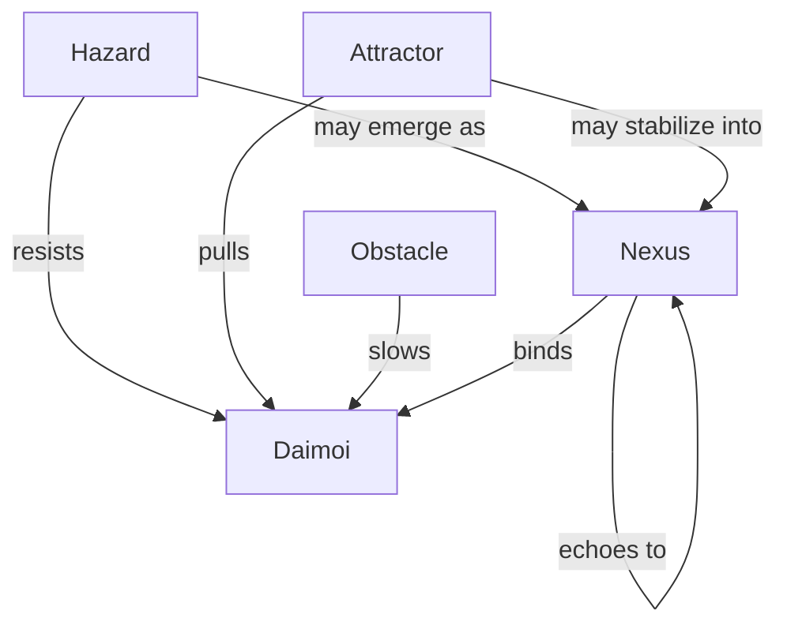
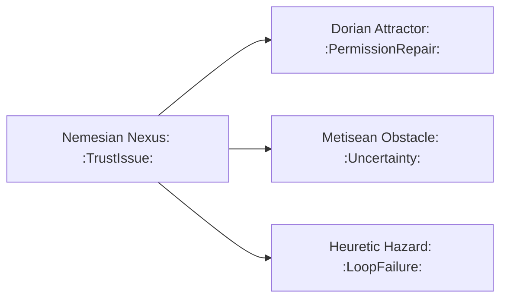
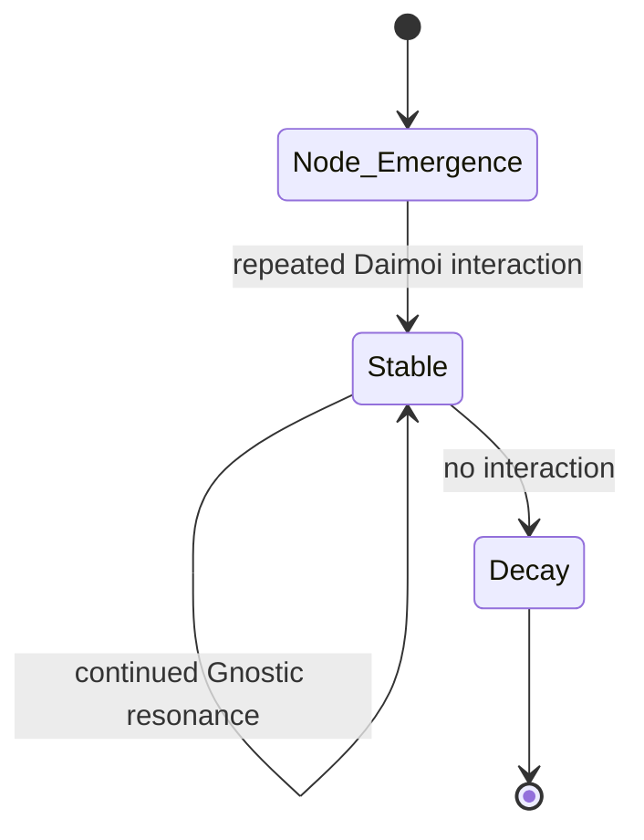
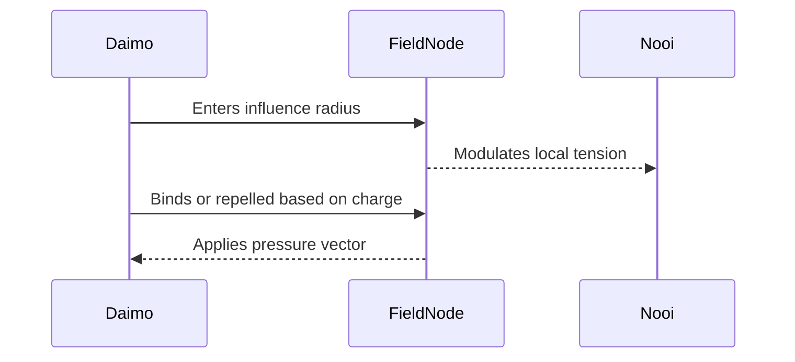

Note: Consolidated here → ../notes/diagrams/field-node-lifecycle-additional-diagrams.md

Absolutely. Here's a lineup of diagram types we can add next, each focused on a different part of the Field Node and Eidolon system. Let me know which one(s) you want to generate first, or if you'd like the full suite.

---

### 🧭 **1. Node Type Topology Map**

Shows the relationship between different types of Field Nodes:

---

### 🔀 **2. Cross-Layer Propagation Flow**

Illustrates how one node in one circuit causes echoes in others:

---

### 🔄 **3. Node Stability Decay Loop**

Visualizes how a node stabilizes or decays over time:

---

### ⚡ **4. Daimoi-Node Interaction Flow**

How Daimoi encounter and affect a node:

---

### 🌐 **5. Full Lifecycle Flowchart**

Combines Emergence, Promotion, Propagation, and Decay.

This one is larger, and we can compose it from smaller diagrams, or make a custom canvas version if you'd prefer an editable visual overview.

---

Would you like:

- One or more of these embedded now?
    
- All five added as a “Diagrams” section to the current document?
    
- A dedicated Obsidian canvas to explore them modularly?
    

Let’s get visual.
---

Related notes: [[../notes/diagrams/node-type-topology-map|node-type-topology-map]], [[../notes/diagrams/circuit-weight-visualizations|circuit-weight-visualizations]], [[../notes/diagrams/full-system-overview-diagrams|full-system-overview-diagrams]], [[../notes/diagrams/layer1-uptime-diagrams|layer1-uptime-diagrams]], [[../notes/diagrams/field-node-lifecycle-additional-diagrams|field-node-lifecycle-additional-diagrams]], [[../notes/diagrams/state-diagram-node-lifecycle|state-diagram-node-lifecycle]] [[index|unique/index]]

#tags: #diagram #design
<!-- GENERATED-SECTIONS:DO-NOT-EDIT-BELOW -->
## Related content
- [field-node-diagram-visualizations](field-node-diagram-visualizations.md)
- [field-node-diagram-set](field-node-diagram-set.md)
- [eidolon-node-lifecycle](eidolon-node-lifecycle.md)
- [promethean-system-diagrams](promethean-system-diagrams.md)
- [layer-1-uptime-diagrams](layer-1-uptime-diagrams.md)
- [field-dynamics-math-blocks](field-dynamics-math-blocks.md)
- [2d-sandbox-field](2d-sandbox-field.md)
- [Vectorial Exception Descent](vectorial-exception-descent.md)
- [Eidolon Field Abstract Model](eidolon-field-abstract-model.md)
- [Exception Layer Analysis](exception-layer-analysis.md)
- [Ice Box Reorganization](ice-box-reorganization.md)
- [EidolonField](eidolonfield.md)
- [Unique Info Dump Index](unique-info-dump-index.md)
- [eidolon-field-math-foundations](eidolon-field-math-foundations.md)
- [ripple-propagation-demo](ripple-propagation-demo.md)
- [heartbeat-fragment-demo](heartbeat-fragment-demo.md)
- [heartbeat-simulation-snippets](heartbeat-simulation-snippets.md)
- [ParticleSimulationWithCanvasAndFFmpeg](particlesimulationwithcanvasandffmpeg.md)
- [Event Bus Projections Architecture](event-bus-projections-architecture.md)
- [Agent Tasks: Persistence Migration to DualStore](agent-tasks-persistence-migration-to-dualstore.md)
- [aionian-circuit-math](aionian-circuit-math.md)
- [Math Fundamentals](chunks/math-fundamentals.md)
- [archetype-ecs](archetype-ecs.md)
- [Diagrams](chunks/diagrams.md)
- [DSL](chunks/dsl.md)
- [ecs-offload-workers](ecs-offload-workers.md)
- [Reawakening Duck](reawakening-duck.md)
- [sibilant-macro-targets](sibilant-macro-targets.md)
- [Simulation Demo](chunks/simulation-demo.md)
- [Eidolon-Field-Optimization](eidolon-field-optimization.md)
- [Factorio AI with External Agents](factorio-ai-with-external-agents.md)

## Sources
- [field-node-diagram-visualizations — L1](field-node-diagram-visualizations.md#L1) (line 1, col 1, score 1)
- [field-node-diagram-set — L1](field-node-diagram-set.md#L1) (line 1, col 1, score 1)
- [eidolon-node-lifecycle — L1](eidolon-node-lifecycle.md#L1) (line 1, col 1, score 0.92)
- [Unique Info Dump Index — L59](unique-info-dump-index.md#L59) (line 59, col 1, score 0.86)
- [Unique Info Dump Index — L59](unique-info-dump-index.md#L59) (line 59, col 3, score 0.86)
- [field-node-diagram-visualizations — L27](field-node-diagram-visualizations.md#L27) (line 27, col 1, score 0.92)
- [eidolon-node-lifecycle — L3](eidolon-node-lifecycle.md#L3) (line 3, col 1, score 0.89)
- [field-dynamics-math-blocks — L117](field-dynamics-math-blocks.md#L117) (line 117, col 1, score 1)
- [layer-1-uptime-diagrams — L140](layer-1-uptime-diagrams.md#L140) (line 140, col 1, score 1)
- [Exception Layer Analysis — L134](exception-layer-analysis.md#L134) (line 134, col 1, score 0.96)
- [Vectorial Exception Descent — L142](vectorial-exception-descent.md#L142) (line 142, col 1, score 0.96)
- [Eidolon Field Abstract Model — L176](eidolon-field-abstract-model.md#L176) (line 176, col 1, score 0.96)
- [2d-sandbox-field — L180](2d-sandbox-field.md#L180) (line 180, col 1, score 0.96)
- [EidolonField — L228](eidolonfield.md#L228) (line 228, col 1, score 0.93)
- [Ice Box Reorganization — L55](ice-box-reorganization.md#L55) (line 55, col 1, score 0.93)
- [field-node-diagram-visualizations — L80](field-node-diagram-visualizations.md#L80) (line 80, col 1, score 1)
- [promethean-system-diagrams — L187](promethean-system-diagrams.md#L187) (line 187, col 1, score 1)
- [eidolon-node-lifecycle — L25](eidolon-node-lifecycle.md#L25) (line 25, col 1, score 1)
- [field-node-diagram-set — L130](field-node-diagram-set.md#L130) (line 130, col 1, score 1)
- [layer-1-uptime-diagrams — L150](layer-1-uptime-diagrams.md#L150) (line 150, col 1, score 1)
- [field-node-diagram-visualizations — L82](field-node-diagram-visualizations.md#L82) (line 82, col 1, score 1)
- [promethean-system-diagrams — L189](promethean-system-diagrams.md#L189) (line 189, col 1, score 1)
- [eidolon-node-lifecycle — L27](eidolon-node-lifecycle.md#L27) (line 27, col 1, score 1)
- [field-node-diagram-set — L132](field-node-diagram-set.md#L132) (line 132, col 1, score 1)
- [layer-1-uptime-diagrams — L152](layer-1-uptime-diagrams.md#L152) (line 152, col 1, score 1)
- [eidolon-node-lifecycle — L31](eidolon-node-lifecycle.md#L31) (line 31, col 1, score 1)
- [eidolon-node-lifecycle — L31](eidolon-node-lifecycle.md#L31) (line 31, col 3, score 1)
- [field-node-diagram-set — L136](field-node-diagram-set.md#L136) (line 136, col 1, score 1)
- [field-node-diagram-set — L136](field-node-diagram-set.md#L136) (line 136, col 3, score 1)
- [heartbeat-fragment-demo — L105](heartbeat-fragment-demo.md#L105) (line 105, col 1, score 1)
- [heartbeat-fragment-demo — L105](heartbeat-fragment-demo.md#L105) (line 105, col 3, score 1)
- [heartbeat-simulation-snippets — L91](heartbeat-simulation-snippets.md#L91) (line 91, col 1, score 1)
- [heartbeat-simulation-snippets — L91](heartbeat-simulation-snippets.md#L91) (line 91, col 3, score 1)
- [eidolon-node-lifecycle — L33](eidolon-node-lifecycle.md#L33) (line 33, col 1, score 1)
- [eidolon-node-lifecycle — L33](eidolon-node-lifecycle.md#L33) (line 33, col 3, score 1)
- [field-node-diagram-visualizations — L87](field-node-diagram-visualizations.md#L87) (line 87, col 1, score 1)
- [field-node-diagram-visualizations — L87](field-node-diagram-visualizations.md#L87) (line 87, col 3, score 1)
- [heartbeat-fragment-demo — L107](heartbeat-fragment-demo.md#L107) (line 107, col 1, score 1)
- [heartbeat-fragment-demo — L107](heartbeat-fragment-demo.md#L107) (line 107, col 3, score 1)
- [heartbeat-simulation-snippets — L93](heartbeat-simulation-snippets.md#L93) (line 93, col 1, score 1)
- [heartbeat-simulation-snippets — L93](heartbeat-simulation-snippets.md#L93) (line 93, col 3, score 1)
- [Event Bus Projections Architecture — L152](event-bus-projections-architecture.md#L152) (line 152, col 1, score 1)
- [Event Bus Projections Architecture — L152](event-bus-projections-architecture.md#L152) (line 152, col 3, score 1)
- [Factorio AI with External Agents — L146](factorio-ai-with-external-agents.md#L146) (line 146, col 1, score 1)
- [Factorio AI with External Agents — L146](factorio-ai-with-external-agents.md#L146) (line 146, col 3, score 1)
- [field-node-diagram-set — L138](field-node-diagram-set.md#L138) (line 138, col 1, score 1)
- [field-node-diagram-set — L138](field-node-diagram-set.md#L138) (line 138, col 3, score 1)
- [field-node-diagram-visualizations — L88](field-node-diagram-visualizations.md#L88) (line 88, col 1, score 1)
- [field-node-diagram-visualizations — L88](field-node-diagram-visualizations.md#L88) (line 88, col 3, score 1)
- [Agent Tasks: Persistence Migration to DualStore — L135](agent-tasks-persistence-migration-to-dualstore.md#L135) (line 135, col 1, score 1)
- [Agent Tasks: Persistence Migration to DualStore — L135](agent-tasks-persistence-migration-to-dualstore.md#L135) (line 135, col 3, score 1)
- [eidolon-node-lifecycle — L34](eidolon-node-lifecycle.md#L34) (line 34, col 1, score 1)
- [eidolon-node-lifecycle — L34](eidolon-node-lifecycle.md#L34) (line 34, col 3, score 1)
- [Event Bus Projections Architecture — L149](event-bus-projections-architecture.md#L149) (line 149, col 1, score 1)
- [Event Bus Projections Architecture — L149](event-bus-projections-architecture.md#L149) (line 149, col 3, score 1)
- [field-node-diagram-set — L139](field-node-diagram-set.md#L139) (line 139, col 1, score 1)
- [field-node-diagram-set — L139](field-node-diagram-set.md#L139) (line 139, col 3, score 1)
- [2d-sandbox-field — L199](2d-sandbox-field.md#L199) (line 199, col 1, score 1)
- [2d-sandbox-field — L199](2d-sandbox-field.md#L199) (line 199, col 3, score 1)
- [Eidolon Field Abstract Model — L196](eidolon-field-abstract-model.md#L196) (line 196, col 1, score 1)
- [Eidolon Field Abstract Model — L196](eidolon-field-abstract-model.md#L196) (line 196, col 3, score 1)
- [eidolon-node-lifecycle — L35](eidolon-node-lifecycle.md#L35) (line 35, col 1, score 1)
- [eidolon-node-lifecycle — L35](eidolon-node-lifecycle.md#L35) (line 35, col 3, score 1)
- [EidolonField — L249](eidolonfield.md#L249) (line 249, col 1, score 1)
- [EidolonField — L249](eidolonfield.md#L249) (line 249, col 3, score 1)
- [2d-sandbox-field — L197](2d-sandbox-field.md#L197) (line 197, col 1, score 1)
- [2d-sandbox-field — L197](2d-sandbox-field.md#L197) (line 197, col 3, score 1)
- [aionian-circuit-math — L154](aionian-circuit-math.md#L154) (line 154, col 1, score 1)
- [aionian-circuit-math — L154](aionian-circuit-math.md#L154) (line 154, col 3, score 1)
- [Math Fundamentals — L13](chunks/math-fundamentals.md#L13) (line 13, col 1, score 1)
- [Math Fundamentals — L13](chunks/math-fundamentals.md#L13) (line 13, col 3, score 1)
- [Eidolon Field Abstract Model — L194](eidolon-field-abstract-model.md#L194) (line 194, col 1, score 1)
- [Eidolon Field Abstract Model — L194](eidolon-field-abstract-model.md#L194) (line 194, col 3, score 1)
- [Eidolon Field Abstract Model — L191](eidolon-field-abstract-model.md#L191) (line 191, col 1, score 1)
- [Eidolon Field Abstract Model — L191](eidolon-field-abstract-model.md#L191) (line 191, col 3, score 1)
- [EidolonField — L242](eidolonfield.md#L242) (line 242, col 1, score 1)
- [EidolonField — L242](eidolonfield.md#L242) (line 242, col 3, score 1)
- [Exception Layer Analysis — L149](exception-layer-analysis.md#L149) (line 149, col 1, score 1)
- [Exception Layer Analysis — L149](exception-layer-analysis.md#L149) (line 149, col 3, score 1)
- [field-dynamics-math-blocks — L144](field-dynamics-math-blocks.md#L144) (line 144, col 1, score 1)
- [field-dynamics-math-blocks — L144](field-dynamics-math-blocks.md#L144) (line 144, col 3, score 1)
- [2d-sandbox-field — L195](2d-sandbox-field.md#L195) (line 195, col 1, score 1)
- [2d-sandbox-field — L195](2d-sandbox-field.md#L195) (line 195, col 3, score 1)
- [Eidolon Field Abstract Model — L192](eidolon-field-abstract-model.md#L192) (line 192, col 1, score 1)
- [Eidolon Field Abstract Model — L192](eidolon-field-abstract-model.md#L192) (line 192, col 3, score 1)
- [EidolonField — L244](eidolonfield.md#L244) (line 244, col 1, score 1)
- [EidolonField — L244](eidolonfield.md#L244) (line 244, col 3, score 1)
- [Exception Layer Analysis — L147](exception-layer-analysis.md#L147) (line 147, col 1, score 1)
- [Exception Layer Analysis — L147](exception-layer-analysis.md#L147) (line 147, col 3, score 1)
- [2d-sandbox-field — L193](2d-sandbox-field.md#L193) (line 193, col 1, score 1)
- [2d-sandbox-field — L193](2d-sandbox-field.md#L193) (line 193, col 3, score 1)
- [EidolonField — L243](eidolonfield.md#L243) (line 243, col 1, score 1)
- [EidolonField — L243](eidolonfield.md#L243) (line 243, col 3, score 1)
- [Exception Layer Analysis — L148](exception-layer-analysis.md#L148) (line 148, col 1, score 1)
- [Exception Layer Analysis — L148](exception-layer-analysis.md#L148) (line 148, col 3, score 1)
- [field-dynamics-math-blocks — L145](field-dynamics-math-blocks.md#L145) (line 145, col 1, score 1)
- [field-dynamics-math-blocks — L145](field-dynamics-math-blocks.md#L145) (line 145, col 3, score 1)
- [2d-sandbox-field — L194](2d-sandbox-field.md#L194) (line 194, col 1, score 1)
- [2d-sandbox-field — L194](2d-sandbox-field.md#L194) (line 194, col 3, score 1)
- [Eidolon Field Abstract Model — L193](eidolon-field-abstract-model.md#L193) (line 193, col 1, score 1)
- [Eidolon Field Abstract Model — L193](eidolon-field-abstract-model.md#L193) (line 193, col 3, score 1)
- [EidolonField — L245](eidolonfield.md#L245) (line 245, col 1, score 1)
- [EidolonField — L245](eidolonfield.md#L245) (line 245, col 3, score 1)
- [field-dynamics-math-blocks — L147](field-dynamics-math-blocks.md#L147) (line 147, col 1, score 1)
- [field-dynamics-math-blocks — L147](field-dynamics-math-blocks.md#L147) (line 147, col 3, score 1)
- [2d-sandbox-field — L200](2d-sandbox-field.md#L200) (line 200, col 1, score 1)
- [2d-sandbox-field — L200](2d-sandbox-field.md#L200) (line 200, col 3, score 1)
- [Eidolon Field Abstract Model — L198](eidolon-field-abstract-model.md#L198) (line 198, col 1, score 1)
- [Eidolon Field Abstract Model — L198](eidolon-field-abstract-model.md#L198) (line 198, col 3, score 1)
- [EidolonField — L241](eidolonfield.md#L241) (line 241, col 1, score 1)
- [EidolonField — L241](eidolonfield.md#L241) (line 241, col 3, score 1)
- [Exception Layer Analysis — L154](exception-layer-analysis.md#L154) (line 154, col 1, score 1)
- [Exception Layer Analysis — L154](exception-layer-analysis.md#L154) (line 154, col 3, score 1)
- [2d-sandbox-field — L196](2d-sandbox-field.md#L196) (line 196, col 1, score 1)
- [2d-sandbox-field — L196](2d-sandbox-field.md#L196) (line 196, col 3, score 1)
- [Eidolon Field Abstract Model — L197](eidolon-field-abstract-model.md#L197) (line 197, col 1, score 1)
- [Eidolon Field Abstract Model — L197](eidolon-field-abstract-model.md#L197) (line 197, col 3, score 1)
- [Exception Layer Analysis — L153](exception-layer-analysis.md#L153) (line 153, col 1, score 1)
- [Exception Layer Analysis — L153](exception-layer-analysis.md#L153) (line 153, col 3, score 1)
- [field-dynamics-math-blocks — L148](field-dynamics-math-blocks.md#L148) (line 148, col 1, score 1)
- [field-dynamics-math-blocks — L148](field-dynamics-math-blocks.md#L148) (line 148, col 3, score 1)
- [aionian-circuit-math — L158](aionian-circuit-math.md#L158) (line 158, col 1, score 1)
- [aionian-circuit-math — L158](aionian-circuit-math.md#L158) (line 158, col 3, score 1)
- [archetype-ecs — L457](archetype-ecs.md#L457) (line 457, col 1, score 1)
- [archetype-ecs — L457](archetype-ecs.md#L457) (line 457, col 3, score 1)
- [Diagrams — L9](chunks/diagrams.md#L9) (line 9, col 1, score 1)
- [Diagrams — L9](chunks/diagrams.md#L9) (line 9, col 3, score 1)
- [DSL — L10](chunks/dsl.md#L10) (line 10, col 1, score 1)
- [DSL — L10](chunks/dsl.md#L10) (line 10, col 3, score 1)
- [Agent Tasks: Persistence Migration to DualStore — L133](agent-tasks-persistence-migration-to-dualstore.md#L133) (line 133, col 1, score 1)
- [Agent Tasks: Persistence Migration to DualStore — L133](agent-tasks-persistence-migration-to-dualstore.md#L133) (line 133, col 3, score 1)
- [aionian-circuit-math — L151](aionian-circuit-math.md#L151) (line 151, col 1, score 1)
- [aionian-circuit-math — L151](aionian-circuit-math.md#L151) (line 151, col 3, score 1)
- [Math Fundamentals — L14](chunks/math-fundamentals.md#L14) (line 14, col 1, score 1)
- [Math Fundamentals — L14](chunks/math-fundamentals.md#L14) (line 14, col 3, score 1)
- [ecs-offload-workers — L460](ecs-offload-workers.md#L460) (line 460, col 1, score 1)
- [ecs-offload-workers — L460](ecs-offload-workers.md#L460) (line 460, col 3, score 1)
- [Simulation Demo — L11](chunks/simulation-demo.md#L11) (line 11, col 1, score 1)
- [Simulation Demo — L11](chunks/simulation-demo.md#L11) (line 11, col 3, score 1)
- [Eidolon Field Abstract Model — L199](eidolon-field-abstract-model.md#L199) (line 199, col 1, score 1)
- [Eidolon Field Abstract Model — L199](eidolon-field-abstract-model.md#L199) (line 199, col 3, score 1)
- [Eidolon-Field-Optimization — L103](eidolon-field-optimization.md#L103) (line 103, col 1, score 1)
- [Eidolon-Field-Optimization — L103](eidolon-field-optimization.md#L103) (line 103, col 3, score 1)
- [eidolon-node-lifecycle — L39](eidolon-node-lifecycle.md#L39) (line 39, col 1, score 1)
- [eidolon-node-lifecycle — L39](eidolon-node-lifecycle.md#L39) (line 39, col 3, score 1)
- [Simulation Demo — L9](chunks/simulation-demo.md#L9) (line 9, col 1, score 1)
- [Simulation Demo — L9](chunks/simulation-demo.md#L9) (line 9, col 3, score 1)
- [Eidolon Field Abstract Model — L201](eidolon-field-abstract-model.md#L201) (line 201, col 1, score 1)
- [Eidolon Field Abstract Model — L201](eidolon-field-abstract-model.md#L201) (line 201, col 3, score 1)
- [eidolon-node-lifecycle — L37](eidolon-node-lifecycle.md#L37) (line 37, col 1, score 1)
- [eidolon-node-lifecycle — L37](eidolon-node-lifecycle.md#L37) (line 37, col 3, score 1)
- [field-node-diagram-set — L142](field-node-diagram-set.md#L142) (line 142, col 1, score 1)
- [field-node-diagram-set — L142](field-node-diagram-set.md#L142) (line 142, col 3, score 1)
- [Simulation Demo — L10](chunks/simulation-demo.md#L10) (line 10, col 1, score 1)
- [Simulation Demo — L10](chunks/simulation-demo.md#L10) (line 10, col 3, score 1)
- [Eidolon Field Abstract Model — L200](eidolon-field-abstract-model.md#L200) (line 200, col 1, score 1)
- [Eidolon Field Abstract Model — L200](eidolon-field-abstract-model.md#L200) (line 200, col 3, score 1)
- [eidolon-node-lifecycle — L38](eidolon-node-lifecycle.md#L38) (line 38, col 1, score 1)
- [eidolon-node-lifecycle — L38](eidolon-node-lifecycle.md#L38) (line 38, col 3, score 1)
- [field-node-diagram-set — L143](field-node-diagram-set.md#L143) (line 143, col 1, score 1)
- [field-node-diagram-set — L143](field-node-diagram-set.md#L143) (line 143, col 3, score 1)
- [2d-sandbox-field — L201](2d-sandbox-field.md#L201) (line 201, col 1, score 1)
- [2d-sandbox-field — L201](2d-sandbox-field.md#L201) (line 201, col 3, score 1)
- [EidolonField — L246](eidolonfield.md#L246) (line 246, col 1, score 1)
- [EidolonField — L246](eidolonfield.md#L246) (line 246, col 3, score 1)
- [Reawakening Duck — L116](reawakening-duck.md#L116) (line 116, col 1, score 1)
- [Reawakening Duck — L116](reawakening-duck.md#L116) (line 116, col 3, score 1)
- [sibilant-macro-targets — L165](sibilant-macro-targets.md#L165) (line 165, col 1, score 1)
- [sibilant-macro-targets — L165](sibilant-macro-targets.md#L165) (line 165, col 3, score 1)
- [field-node-diagram-set — L147](field-node-diagram-set.md#L147) (line 147, col 1, score 1)
- [field-node-diagram-set — L147](field-node-diagram-set.md#L147) (line 147, col 3, score 1)
- [Unique Info Dump Index — L180](unique-info-dump-index.md#L180) (line 180, col 1, score 0.98)
- [Unique Info Dump Index — L180](unique-info-dump-index.md#L180) (line 180, col 3, score 0.98)
- [eidolon-node-lifecycle — L44](eidolon-node-lifecycle.md#L44) (line 44, col 1, score 0.98)
- [eidolon-node-lifecycle — L44](eidolon-node-lifecycle.md#L44) (line 44, col 3, score 0.98)
- [eidolon-node-lifecycle — L55](eidolon-node-lifecycle.md#L55) (line 55, col 1, score 0.98)
- [eidolon-node-lifecycle — L55](eidolon-node-lifecycle.md#L55) (line 55, col 3, score 0.98)
- [field-node-diagram-visualizations — L98](field-node-diagram-visualizations.md#L98) (line 98, col 1, score 1)
- [field-node-diagram-visualizations — L98](field-node-diagram-visualizations.md#L98) (line 98, col 3, score 1)
- [eidolon-node-lifecycle — L46](eidolon-node-lifecycle.md#L46) (line 46, col 1, score 0.98)
- [eidolon-node-lifecycle — L46](eidolon-node-lifecycle.md#L46) (line 46, col 3, score 0.98)
- [Unique Info Dump Index — L182](unique-info-dump-index.md#L182) (line 182, col 1, score 0.98)
- [Unique Info Dump Index — L182](unique-info-dump-index.md#L182) (line 182, col 3, score 0.98)
- [eidolon-node-lifecycle — L58](eidolon-node-lifecycle.md#L58) (line 58, col 1, score 0.98)
- [eidolon-node-lifecycle — L58](eidolon-node-lifecycle.md#L58) (line 58, col 3, score 0.98)
- [field-node-diagram-set — L149](field-node-diagram-set.md#L149) (line 149, col 1, score 1)
- [field-node-diagram-set — L149](field-node-diagram-set.md#L149) (line 149, col 3, score 1)
- [field-node-diagram-visualizations — L99](field-node-diagram-visualizations.md#L99) (line 99, col 1, score 1)
- [field-node-diagram-visualizations — L99](field-node-diagram-visualizations.md#L99) (line 99, col 3, score 1)
- [promethean-system-diagrams — L208](promethean-system-diagrams.md#L208) (line 208, col 1, score 1)
- [promethean-system-diagrams — L208](promethean-system-diagrams.md#L208) (line 208, col 3, score 1)
- [field-node-diagram-visualizations — L103](field-node-diagram-visualizations.md#L103) (line 103, col 1, score 0.99)
- [field-node-diagram-visualizations — L103](field-node-diagram-visualizations.md#L103) (line 103, col 3, score 0.99)
- [field-node-diagram-set — L150](field-node-diagram-set.md#L150) (line 150, col 1, score 1)
- [field-node-diagram-set — L150](field-node-diagram-set.md#L150) (line 150, col 3, score 1)
- [field-node-diagram-visualizations — L100](field-node-diagram-visualizations.md#L100) (line 100, col 1, score 1)
- [field-node-diagram-visualizations — L100](field-node-diagram-visualizations.md#L100) (line 100, col 3, score 1)
- [promethean-system-diagrams — L206](promethean-system-diagrams.md#L206) (line 206, col 1, score 0.99)
- [promethean-system-diagrams — L206](promethean-system-diagrams.md#L206) (line 206, col 3, score 0.99)
- [layer-1-uptime-diagrams — L176](layer-1-uptime-diagrams.md#L176) (line 176, col 1, score 0.99)
- [layer-1-uptime-diagrams — L176](layer-1-uptime-diagrams.md#L176) (line 176, col 3, score 0.99)
- [field-node-diagram-set — L151](field-node-diagram-set.md#L151) (line 151, col 1, score 1)
- [field-node-diagram-set — L151](field-node-diagram-set.md#L151) (line 151, col 3, score 1)
- [field-node-diagram-visualizations — L101](field-node-diagram-visualizations.md#L101) (line 101, col 1, score 1)
- [field-node-diagram-visualizations — L101](field-node-diagram-visualizations.md#L101) (line 101, col 3, score 1)
- [promethean-system-diagrams — L207](promethean-system-diagrams.md#L207) (line 207, col 1, score 0.99)
- [promethean-system-diagrams — L207](promethean-system-diagrams.md#L207) (line 207, col 3, score 0.99)
- [layer-1-uptime-diagrams — L177](layer-1-uptime-diagrams.md#L177) (line 177, col 1, score 0.99)
- [layer-1-uptime-diagrams — L177](layer-1-uptime-diagrams.md#L177) (line 177, col 3, score 0.99)
- [eidolon-node-lifecycle — L49](eidolon-node-lifecycle.md#L49) (line 49, col 1, score 0.97)
- [eidolon-node-lifecycle — L49](eidolon-node-lifecycle.md#L49) (line 49, col 3, score 0.97)
- [layer-1-uptime-diagrams — L178](layer-1-uptime-diagrams.md#L178) (line 178, col 1, score 1)
- [layer-1-uptime-diagrams — L178](layer-1-uptime-diagrams.md#L178) (line 178, col 3, score 1)
- [EidolonField — L264](eidolonfield.md#L264) (line 264, col 1, score 0.98)
- [EidolonField — L264](eidolonfield.md#L264) (line 264, col 3, score 0.98)
- [Ice Box Reorganization — L84](ice-box-reorganization.md#L84) (line 84, col 1, score 0.98)
- [Ice Box Reorganization — L84](ice-box-reorganization.md#L84) (line 84, col 3, score 0.98)
- [2d-sandbox-field — L212](2d-sandbox-field.md#L212) (line 212, col 1, score 0.98)
- [2d-sandbox-field — L212](2d-sandbox-field.md#L212) (line 212, col 3, score 0.98)
- [field-dynamics-math-blocks — L168](field-dynamics-math-blocks.md#L168) (line 168, col 1, score 1)
- [field-dynamics-math-blocks — L168](field-dynamics-math-blocks.md#L168) (line 168, col 3, score 1)
- [2d-sandbox-field — L214](2d-sandbox-field.md#L214) (line 214, col 1, score 0.99)
- [2d-sandbox-field — L214](2d-sandbox-field.md#L214) (line 214, col 3, score 0.99)
- [Eidolon Field Abstract Model — L209](eidolon-field-abstract-model.md#L209) (line 209, col 1, score 0.99)
- [Eidolon Field Abstract Model — L209](eidolon-field-abstract-model.md#L209) (line 209, col 3, score 0.99)
- [Exception Layer Analysis — L165](exception-layer-analysis.md#L165) (line 165, col 1, score 0.99)
- [Exception Layer Analysis — L165](exception-layer-analysis.md#L165) (line 165, col 3, score 0.99)
- [field-dynamics-math-blocks — L169](field-dynamics-math-blocks.md#L169) (line 169, col 1, score 1)
- [field-dynamics-math-blocks — L169](field-dynamics-math-blocks.md#L169) (line 169, col 3, score 1)
- [layer-1-uptime-diagrams — L180](layer-1-uptime-diagrams.md#L180) (line 180, col 1, score 1)
- [layer-1-uptime-diagrams — L180](layer-1-uptime-diagrams.md#L180) (line 180, col 3, score 1)
- [EidolonField — L260](eidolonfield.md#L260) (line 260, col 1, score 1)
- [EidolonField — L260](eidolonfield.md#L260) (line 260, col 3, score 1)
- [Ice Box Reorganization — L80](ice-box-reorganization.md#L80) (line 80, col 1, score 1)
- [Ice Box Reorganization — L80](ice-box-reorganization.md#L80) (line 80, col 3, score 1)
- [field-dynamics-math-blocks — L170](field-dynamics-math-blocks.md#L170) (line 170, col 1, score 1)
- [field-dynamics-math-blocks — L170](field-dynamics-math-blocks.md#L170) (line 170, col 3, score 1)
- [layer-1-uptime-diagrams — L181](layer-1-uptime-diagrams.md#L181) (line 181, col 1, score 1)
- [layer-1-uptime-diagrams — L181](layer-1-uptime-diagrams.md#L181) (line 181, col 3, score 1)
- [EidolonField — L261](eidolonfield.md#L261) (line 261, col 1, score 1)
- [EidolonField — L261](eidolonfield.md#L261) (line 261, col 3, score 1)
- [Ice Box Reorganization — L81](ice-box-reorganization.md#L81) (line 81, col 1, score 1)
- [Ice Box Reorganization — L81](ice-box-reorganization.md#L81) (line 81, col 3, score 1)
- [field-dynamics-math-blocks — L171](field-dynamics-math-blocks.md#L171) (line 171, col 1, score 1)
- [field-dynamics-math-blocks — L171](field-dynamics-math-blocks.md#L171) (line 171, col 3, score 1)
- [layer-1-uptime-diagrams — L182](layer-1-uptime-diagrams.md#L182) (line 182, col 1, score 1)
- [layer-1-uptime-diagrams — L182](layer-1-uptime-diagrams.md#L182) (line 182, col 3, score 1)
- [EidolonField — L262](eidolonfield.md#L262) (line 262, col 1, score 1)
- [EidolonField — L262](eidolonfield.md#L262) (line 262, col 3, score 1)
- [Ice Box Reorganization — L82](ice-box-reorganization.md#L82) (line 82, col 1, score 1)
- [Ice Box Reorganization — L82](ice-box-reorganization.md#L82) (line 82, col 3, score 1)
- [field-dynamics-math-blocks — L172](field-dynamics-math-blocks.md#L172) (line 172, col 1, score 1)
- [field-dynamics-math-blocks — L172](field-dynamics-math-blocks.md#L172) (line 172, col 3, score 1)
- [layer-1-uptime-diagrams — L183](layer-1-uptime-diagrams.md#L183) (line 183, col 1, score 1)
- [layer-1-uptime-diagrams — L183](layer-1-uptime-diagrams.md#L183) (line 183, col 3, score 1)
- [EidolonField — L263](eidolonfield.md#L263) (line 263, col 1, score 1)
- [EidolonField — L263](eidolonfield.md#L263) (line 263, col 3, score 1)
- [Ice Box Reorganization — L83](ice-box-reorganization.md#L83) (line 83, col 1, score 1)
- [Ice Box Reorganization — L83](ice-box-reorganization.md#L83) (line 83, col 3, score 1)
- [field-dynamics-math-blocks — L173](field-dynamics-math-blocks.md#L173) (line 173, col 1, score 1)
- [field-dynamics-math-blocks — L173](field-dynamics-math-blocks.md#L173) (line 173, col 3, score 1)
- [layer-1-uptime-diagrams — L184](layer-1-uptime-diagrams.md#L184) (line 184, col 1, score 1)
- [layer-1-uptime-diagrams — L184](layer-1-uptime-diagrams.md#L184) (line 184, col 3, score 1)
- [2d-sandbox-field — L215](2d-sandbox-field.md#L215) (line 215, col 1, score 1)
- [2d-sandbox-field — L215](2d-sandbox-field.md#L215) (line 215, col 3, score 1)
- [Eidolon Field Abstract Model — L210](eidolon-field-abstract-model.md#L210) (line 210, col 1, score 1)
- [Eidolon Field Abstract Model — L210](eidolon-field-abstract-model.md#L210) (line 210, col 3, score 1)
- [field-dynamics-math-blocks — L174](field-dynamics-math-blocks.md#L174) (line 174, col 1, score 1)
- [field-dynamics-math-blocks — L174](field-dynamics-math-blocks.md#L174) (line 174, col 3, score 1)
- [layer-1-uptime-diagrams — L185](layer-1-uptime-diagrams.md#L185) (line 185, col 1, score 1)
- [layer-1-uptime-diagrams — L185](layer-1-uptime-diagrams.md#L185) (line 185, col 3, score 1)
- [2d-sandbox-field — L216](2d-sandbox-field.md#L216) (line 216, col 1, score 1)
- [2d-sandbox-field — L216](2d-sandbox-field.md#L216) (line 216, col 3, score 1)
- [Eidolon Field Abstract Model — L211](eidolon-field-abstract-model.md#L211) (line 211, col 1, score 1)
- [Eidolon Field Abstract Model — L211](eidolon-field-abstract-model.md#L211) (line 211, col 3, score 1)
- [eidolon-node-lifecycle — L50](eidolon-node-lifecycle.md#L50) (line 50, col 1, score 1)
- [eidolon-node-lifecycle — L50](eidolon-node-lifecycle.md#L50) (line 50, col 3, score 1)
- [field-node-diagram-set — L152](field-node-diagram-set.md#L152) (line 152, col 1, score 1)
- [field-node-diagram-set — L152](field-node-diagram-set.md#L152) (line 152, col 3, score 1)
- [layer-1-uptime-diagrams — L186](layer-1-uptime-diagrams.md#L186) (line 186, col 1, score 1)
- [layer-1-uptime-diagrams — L186](layer-1-uptime-diagrams.md#L186) (line 186, col 3, score 1)
- [promethean-system-diagrams — L209](promethean-system-diagrams.md#L209) (line 209, col 1, score 1)
- [promethean-system-diagrams — L209](promethean-system-diagrams.md#L209) (line 209, col 3, score 1)
- [eidolon-node-lifecycle — L51](eidolon-node-lifecycle.md#L51) (line 51, col 1, score 1)
- [eidolon-node-lifecycle — L51](eidolon-node-lifecycle.md#L51) (line 51, col 3, score 1)
- [field-node-diagram-set — L153](field-node-diagram-set.md#L153) (line 153, col 1, score 1)
- [field-node-diagram-set — L153](field-node-diagram-set.md#L153) (line 153, col 3, score 1)
- [field-node-diagram-visualizations — L104](field-node-diagram-visualizations.md#L104) (line 104, col 1, score 1)
- [field-node-diagram-visualizations — L104](field-node-diagram-visualizations.md#L104) (line 104, col 3, score 1)
- [layer-1-uptime-diagrams — L187](layer-1-uptime-diagrams.md#L187) (line 187, col 1, score 1)
- [layer-1-uptime-diagrams — L187](layer-1-uptime-diagrams.md#L187) (line 187, col 3, score 1)
- [field-node-diagram-set — L154](field-node-diagram-set.md#L154) (line 154, col 1, score 1)
- [field-node-diagram-set — L154](field-node-diagram-set.md#L154) (line 154, col 3, score 1)
- [field-node-diagram-visualizations — L105](field-node-diagram-visualizations.md#L105) (line 105, col 1, score 1)
- [field-node-diagram-visualizations — L105](field-node-diagram-visualizations.md#L105) (line 105, col 3, score 1)
- [layer-1-uptime-diagrams — L188](layer-1-uptime-diagrams.md#L188) (line 188, col 1, score 1)
- [layer-1-uptime-diagrams — L188](layer-1-uptime-diagrams.md#L188) (line 188, col 3, score 1)
- [promethean-system-diagrams — L210](promethean-system-diagrams.md#L210) (line 210, col 1, score 1)
- [promethean-system-diagrams — L210](promethean-system-diagrams.md#L210) (line 210, col 3, score 1)
- [eidolon-node-lifecycle — L53](eidolon-node-lifecycle.md#L53) (line 53, col 1, score 1)
- [eidolon-node-lifecycle — L53](eidolon-node-lifecycle.md#L53) (line 53, col 3, score 1)
- [field-node-diagram-visualizations — L107](field-node-diagram-visualizations.md#L107) (line 107, col 1, score 1)
- [field-node-diagram-visualizations — L107](field-node-diagram-visualizations.md#L107) (line 107, col 3, score 1)
- [layer-1-uptime-diagrams — L190](layer-1-uptime-diagrams.md#L190) (line 190, col 1, score 1)
- [layer-1-uptime-diagrams — L190](layer-1-uptime-diagrams.md#L190) (line 190, col 3, score 1)
- [promethean-system-diagrams — L212](promethean-system-diagrams.md#L212) (line 212, col 1, score 1)
- [promethean-system-diagrams — L212](promethean-system-diagrams.md#L212) (line 212, col 3, score 1)
- [eidolon-node-lifecycle — L54](eidolon-node-lifecycle.md#L54) (line 54, col 1, score 1)
- [eidolon-node-lifecycle — L54](eidolon-node-lifecycle.md#L54) (line 54, col 3, score 1)
- [field-node-diagram-set — L156](field-node-diagram-set.md#L156) (line 156, col 1, score 1)
- [field-node-diagram-set — L156](field-node-diagram-set.md#L156) (line 156, col 3, score 1)
- [field-node-diagram-visualizations — L108](field-node-diagram-visualizations.md#L108) (line 108, col 1, score 1)
- [field-node-diagram-visualizations — L108](field-node-diagram-visualizations.md#L108) (line 108, col 3, score 1)
- [promethean-system-diagrams — L213](promethean-system-diagrams.md#L213) (line 213, col 1, score 1)
- [promethean-system-diagrams — L213](promethean-system-diagrams.md#L213) (line 213, col 3, score 1)
- [field-node-diagram-set — L157](field-node-diagram-set.md#L157) (line 157, col 1, score 1)
- [field-node-diagram-set — L157](field-node-diagram-set.md#L157) (line 157, col 3, score 1)
- [layer-1-uptime-diagrams — L191](layer-1-uptime-diagrams.md#L191) (line 191, col 1, score 1)
- [layer-1-uptime-diagrams — L191](layer-1-uptime-diagrams.md#L191) (line 191, col 3, score 1)
- [promethean-system-diagrams — L214](promethean-system-diagrams.md#L214) (line 214, col 1, score 1)
- [promethean-system-diagrams — L214](promethean-system-diagrams.md#L214) (line 214, col 3, score 1)
- [eidolon-node-lifecycle — L56](eidolon-node-lifecycle.md#L56) (line 56, col 1, score 1)
- [eidolon-node-lifecycle — L56](eidolon-node-lifecycle.md#L56) (line 56, col 3, score 1)
- [field-node-diagram-set — L158](field-node-diagram-set.md#L158) (line 158, col 1, score 1)
- [field-node-diagram-set — L158](field-node-diagram-set.md#L158) (line 158, col 3, score 1)
- [field-node-diagram-visualizations — L109](field-node-diagram-visualizations.md#L109) (line 109, col 1, score 1)
- [field-node-diagram-visualizations — L109](field-node-diagram-visualizations.md#L109) (line 109, col 3, score 1)
- [layer-1-uptime-diagrams — L192](layer-1-uptime-diagrams.md#L192) (line 192, col 1, score 1)
- [layer-1-uptime-diagrams — L192](layer-1-uptime-diagrams.md#L192) (line 192, col 3, score 1)
- [field-node-diagram-set — L159](field-node-diagram-set.md#L159) (line 159, col 1, score 1)
- [field-node-diagram-set — L159](field-node-diagram-set.md#L159) (line 159, col 3, score 1)
- [field-node-diagram-visualizations — L110](field-node-diagram-visualizations.md#L110) (line 110, col 1, score 1)
- [field-node-diagram-visualizations — L110](field-node-diagram-visualizations.md#L110) (line 110, col 3, score 1)
- [layer-1-uptime-diagrams — L193](layer-1-uptime-diagrams.md#L193) (line 193, col 1, score 1)
- [layer-1-uptime-diagrams — L193](layer-1-uptime-diagrams.md#L193) (line 193, col 3, score 1)
- [promethean-system-diagrams — L215](promethean-system-diagrams.md#L215) (line 215, col 1, score 1)
- [promethean-system-diagrams — L215](promethean-system-diagrams.md#L215) (line 215, col 3, score 1)
- [field-node-diagram-visualizations — L112](field-node-diagram-visualizations.md#L112) (line 112, col 1, score 1)
- [field-node-diagram-visualizations — L112](field-node-diagram-visualizations.md#L112) (line 112, col 3, score 1)
- [layer-1-uptime-diagrams — L195](layer-1-uptime-diagrams.md#L195) (line 195, col 1, score 1)
- [layer-1-uptime-diagrams — L195](layer-1-uptime-diagrams.md#L195) (line 195, col 3, score 1)
- [promethean-system-diagrams — L217](promethean-system-diagrams.md#L217) (line 217, col 1, score 1)
- [promethean-system-diagrams — L217](promethean-system-diagrams.md#L217) (line 217, col 3, score 1)
- [eidolon-node-lifecycle — L59](eidolon-node-lifecycle.md#L59) (line 59, col 1, score 1)
- [eidolon-node-lifecycle — L59](eidolon-node-lifecycle.md#L59) (line 59, col 3, score 1)
- [field-node-diagram-set — L161](field-node-diagram-set.md#L161) (line 161, col 1, score 1)
- [field-node-diagram-set — L161](field-node-diagram-set.md#L161) (line 161, col 3, score 1)
- [field-node-diagram-visualizations — L113](field-node-diagram-visualizations.md#L113) (line 113, col 1, score 1)
- [field-node-diagram-visualizations — L113](field-node-diagram-visualizations.md#L113) (line 113, col 3, score 1)
- [promethean-system-diagrams — L218](promethean-system-diagrams.md#L218) (line 218, col 1, score 1)
- [promethean-system-diagrams — L218](promethean-system-diagrams.md#L218) (line 218, col 3, score 1)
<!-- GENERATED-SECTIONS:DO-NOT-EDIT-ABOVE -->
