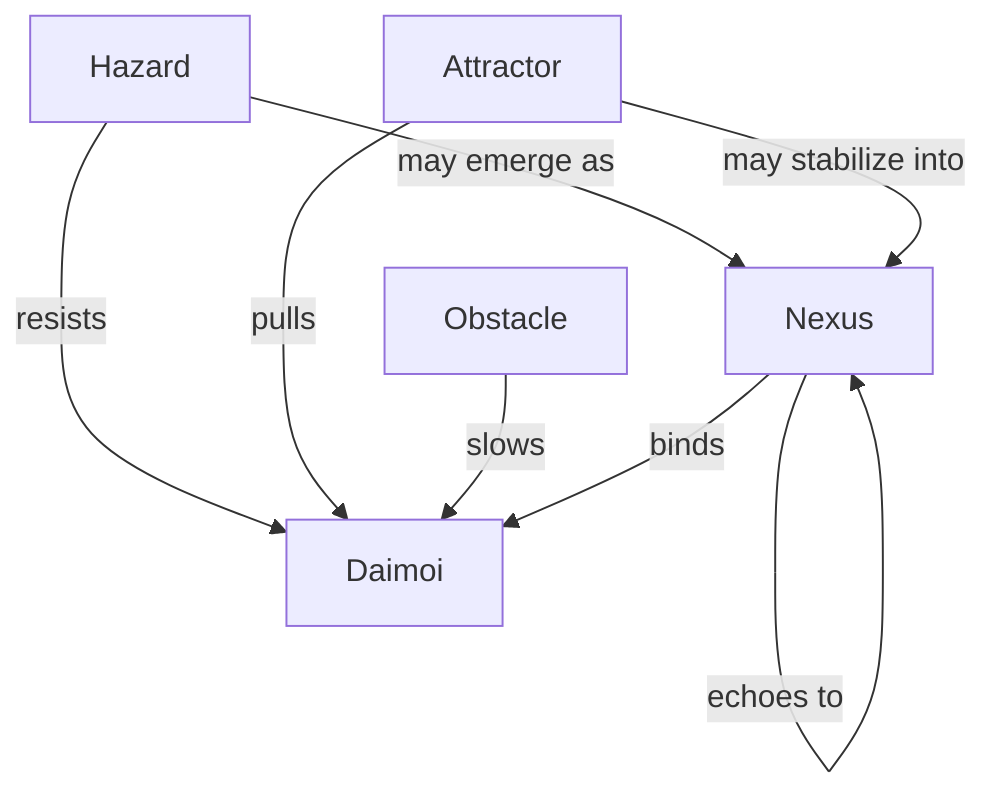

Note: Consolidated here → ../notes/diagrams/field-node-lifecycle-additional-diagrams.md ^ref-1f32c94a-1-0

Absolutely. Here's a lineup of diagram types we can add next, each focused on a different part of the Field Node and Eidolon system. Let me know which one(s) you want to generate first, or if you'd like the full suite. ^ref-1f32c94a-3-0

---

### 🧭 **1. Node Type Topology Map**

Shows the relationship between different types of Field Nodes: ^ref-1f32c94a-9-0


^ref-1f32c94a-11-0

---

### 🔀 **2. Cross-Layer Propagation Flow**
 ^ref-1f32c94a-26-0
Illustrates how one node in one circuit causes echoes in others:
 ^ref-1f32c94a-28-0
```mermaid
graph LR
  N4[Nemesian Nexus: :TrustIssue:]
  A2[Dorian Attractor: :PermissionRepair:]
  O7[Metisean Obstacle: :Uncertainty:]
  H5[Heuretic Hazard: :LoopFailure:]

  N4 --> A2
  N4 --> O7
  N4 --> H5
^ref-1f32c94a-28-0
```

---

### 🔄 **3. Node Stability Decay Loop** ^ref-1f32c94a-44-0

Visualizes how a node stabilizes or decays over time: ^ref-1f32c94a-46-0

```mermaid
stateDiagram-v2
  [*] --> Node_Emergence
  Node_Emergence --> Stable : repeated Daimoi interaction
  Stable --> Stable : continued Gnostic resonance
  Stable --> Decay : no interaction
^ref-1f32c94a-46-0
  Decay --> [*]
```
^ref-1f32c94a-48-0

---
 ^ref-1f32c94a-59-0
### ⚡ **4. Daimoi-Node Interaction Flow**
 ^ref-1f32c94a-61-0
How Daimoi encounter and affect a node:

```mermaid
sequenceDiagram
  participant Daimo
  participant FieldNode
  participant Nooi
  Daimo->>FieldNode: Enters influence radius
  FieldNode-->>Nooi: Modulates local tension
^ref-1f32c94a-61-0
  Daimo->>FieldNode: Binds or repelled based on charge
  FieldNode-->>Daimo: Applies pressure vector
```
 ^ref-1f32c94a-76-0
--- ^ref-1f32c94a-76-0

### 🌐 **5. Full Lifecycle Flowchart** ^ref-1f32c94a-78-0

Combines Emergence, Promotion, Propagation, and Decay.

This one is larger, and we can compose it from smaller diagrams, or make a custom canvas version if you'd prefer an editable visual overview. ^ref-1f32c94a-82-0

---

Would you like:

- One or more of these embedded now? ^ref-1f32c94a-88-0
    
- All five added as a “Diagrams” section to the current document?
    
- A dedicated Obsidian canvas to explore them modularly?
    
 ^ref-1f32c94a-94-0
Let’s get visual.
--- ^ref-1f32c94a-96-0
 ^ref-1f32c94a-98-0
Related notes: [[../notes/diagrams/node-type-topology-map|node-type-topology-map]], [[../notes/diagrams/circuit-weight-visualizations|circuit-weight-visualizations]], [[../notes/diagrams/full-system-overview-diagrams|full-system-overview-diagrams]], [[../notes/diagrams/layer1-uptime-diagrams|layer1-uptime-diagrams]], [[../notes/diagrams/field-node-lifecycle-additional-diagrams|field-node-lifecycle-additional-diagrams]], [[../notes/diagrams/state-diagram-node-lifecycle|state-diagram-node-lifecycle]] [[index|unique/index]] ^ref-1f32c94a-98-0
 ^ref-1f32c94a-99-0
#tags: #diagram #design
re: 1
  - uuid: 59b5670f-36d3-4d34-8985-f3144b15347a
    line: 206
    col: 0
    score: 1
  - uuid: d8059b6a-c1ec-487d-8e0b-3ce33d6b4d06
    line: 638
    col: 0
    score: 1
  - uuid: c5c9a5c6-427d-4864-8084-c083cd55faa0
    line: 256
    col: 0
    score: 1
  - uuid: 9c79206d-4cb9-4f00-87e0-782dcea37bc7
    line: 211
    col: 0
    score: 1
  - uuid: 6bcff92c-4224-453d-9993-1be8d37d47c3
    line: 90
    col: 0
    score: 1
  - uuid: 18344cf9-0c49-4a71-b6c8-b8d84d660fca
    line: 100
    col: 0
    score: 1
  - uuid: ae24a280-678e-4c0b-8cc4-56667fa04172
    line: 77
    col: 0
    score: 1
  - uuid: 9fab9e76-e283-4c9d-a8cd-cb76892ea7ac
    line: 50
    col: 0
    score: 1
  - uuid: 03a5578f-d689-45db-95e9-11300e5eee6f
    line: 120
    col: 0
    score: 1
  - uuid: 3a3bf2c9-c0f6-4d7b-bf84-c83c70dece3f
    line: 249
    col: 0
    score: 1
  - uuid: 9a93a756-6d33-45d1-aca9-51b74f2b33d2
    line: 172
    col: 0
    score: 1
  - uuid: 43bfe9dd-d433-42ca-9777-f4c40eaba791
    line: 252
    col: 0
    score: 1
  - uuid: d17d3a96-c84d-4738-a403-6c733b874da2
    line: 625
    col: 0
    score: 1
  - uuid: 59b5670f-36d3-4d34-8985-f3144b15347a
    line: 156
    col: 0
    score: 1
  - uuid: 40185d05-010e-45e7-8c2d-2f879bf14218
    line: 58
    col: 0
    score: 1
  - uuid: 5f65dfa5-dc97-4a6c-ad93-c45c1312e156
    line: 93
    col: 0
    score: 1
  - uuid: d144aa62-348c-4e5d-ae8f-38084c67ceca
    line: 192
    col: 0
    score: 1
  - uuid: db74343f-8f84-43a3-adb2-499c6f00be1c
    line: 132
    col: 0
    score: 1
  - uuid: 5a02283e-4281-4930-9ca7-e27849de11bd
    line: 63
    col: 0
    score: 1
  - uuid: 1d3d6c3a-039e-4b96-93c1-95854945e248
    line: 77
    col: 0
    score: 1
  - uuid: ca8e1399-77bf-4f77-82a3-3f703b68706d
    line: 78
    col: 0
    score: 1
  - uuid: ffb9b2a9-744d-4a53-9565-130fceae0832
    line: 91
    col: 0
    score: 1
  - uuid: 9b694a91-dec5-4708-9462-3f71000ba925
    line: 102
    col: 0
    score: 1
  - uuid: b39dc9d4-63e2-42d4-bbcd-041ef3167bca
    line: 151
    col: 0
    score: 1
  - uuid: 6620e2f2-de6d-45d8-a722-5d26e160b370
    line: 371
    col: 0
    score: 1
  - uuid: dd00677a-2280-45a7-91af-0728b21af3ad
    line: 141
    col: 0
    score: 1
  - uuid: 37b5d236-2b3e-4a95-a4e8-31655c3023ef
    line: 222
    col: 0
    score: 1
  - uuid: 5e408692-0e74-400e-a617-84247c7353ad
    line: 107
    col: 0
    score: 1
  - uuid: dd89372d-10de-42a9-8c96-6bc13ea36d02
    line: 255
    col: 0
    score: 1
  - uuid: b5e0183e-c34b-44b2-8fc9-a740a1a8d4e2
    line: 162
    col: 0
    score: 1
  - uuid: 54382370-1931-4a19-a634-46735708a9ea
    line: 308
    col: 0
    score: 1
  - uuid: 40185d05-010e-45e7-8c2d-2f879bf14218
    line: 102
    col: 0
    score: 1
  - uuid: 5f65dfa5-dc97-4a6c-ad93-c45c1312e156
    line: 41
    col: 0
    score: 1
  - uuid: d144aa62-348c-4e5d-ae8f-38084c67ceca
    line: 159
    col: 0
    score: 1
  - uuid: db74343f-8f84-43a3-adb2-499c6f00be1c
    line: 149
    col: 0
    score: 1
  - uuid: 5a02283e-4281-4930-9ca7-e27849de11bd
    line: 70
    col: 0
    score: 1
  - uuid: 1d3d6c3a-039e-4b96-93c1-95854945e248
    line: 67
    col: 0
    score: 1
  - uuid: c6e87433-ec5d-4ded-bb1a-fb8734a3cfd9
    line: 81
    col: 0
    score: 1
  - uuid: f1add613-656e-4bec-b52b-193fd78c4642
    line: 41
    col: 0
    score: 1
  - uuid: 75ea4a6a-8270-488d-9d37-799c288e5f70
    line: 37
    col: 0
    score: 1
  - uuid: 623a55f7-685c-486b-abaf-469da1bbbb69
    line: 27
    col: 0
    score: 1
  - uuid: 557309a3-c906-4e97-8867-89ffe151790c
    line: 24
    col: 0
    score: 1
  - uuid: 9e8ae388-767a-4ea8-9f2e-88801291d947
    line: 57
    col: 0
    score: 1
  - uuid: 10d98225-12e0-4212-8e15-88b57cf7bee5
    line: 15
    col: 0
    score: 1
  - uuid: 73d3dbf6-9240-46fd-ada9-cc2e7e00dc5f
    line: 49
    col: 0
    score: 1
  - uuid: 2792d448-c3b5-4050-93dd-93768529d99c
    line: 70
    col: 0
    score: 1
  - uuid: 13951643-1741-46bb-89dc-1beebb122633
    line: 111
    col: 0
    score: 1
  - uuid: 45cd25b5-ed36-49ab-82c8-10d0903e34db
    line: 7
    col: 0
    score: 1
  - uuid: e87bc036-1570-419e-a558-f45b9c0db698
    line: 27
    col: 0
    score: 1
  - uuid: c1618c66-f73a-4e04-9bfa-ef38755f7acc
    line: 30
    col: 0
    score: 1
  - uuid: c6e87433-ec5d-4ded-bb1a-fb8734a3cfd9
    line: 36
    col: 0
    score: 1
  - uuid: f1add613-656e-4bec-b52b-193fd78c4642
    line: 108
    col: 0
    score: 1
  - uuid: 75ea4a6a-8270-488d-9d37-799c288e5f70
    line: 13
    col: 0
    score: 1
---
Note: Consolidated here → ../notes/diagrams/field-node-lifecycle-additional-diagrams.md ^ref-1f32c94a-1-0

Absolutely. Here's a lineup of diagram types we can add next, each focused on a different part of the Field Node and Eidolon system. Let me know which one(s) you want to generate first, or if you'd like the full suite. ^ref-1f32c94a-3-0

---

### 🧭 **1. Node Type Topology Map**

Shows the relationship between different types of Field Nodes: ^ref-1f32c94a-9-0


^ref-1f32c94a-11-0

---

### 🔀 **2. Cross-Layer Propagation Flow**
 ^ref-1f32c94a-26-0
Illustrates how one node in one circuit causes echoes in others:
 ^ref-1f32c94a-28-0
```mermaid
graph LR
  N4[Nemesian Nexus: :TrustIssue:]
  A2[Dorian Attractor: :PermissionRepair:]
  O7[Metisean Obstacle: :Uncertainty:]
  H5[Heuretic Hazard: :LoopFailure:]

  N4 --> A2
  N4 --> O7
  N4 --> H5
^ref-1f32c94a-28-0
```

---

### 🔄 **3. Node Stability Decay Loop** ^ref-1f32c94a-44-0

Visualizes how a node stabilizes or decays over time: ^ref-1f32c94a-46-0

```mermaid
stateDiagram-v2
  [*] --> Node_Emergence
  Node_Emergence --> Stable : repeated Daimoi interaction
  Stable --> Stable : continued Gnostic resonance
  Stable --> Decay : no interaction
^ref-1f32c94a-46-0
  Decay --> [*]
```
^ref-1f32c94a-48-0

---
 ^ref-1f32c94a-59-0
### ⚡ **4. Daimoi-Node Interaction Flow**
 ^ref-1f32c94a-61-0
How Daimoi encounter and affect a node:

```mermaid
sequenceDiagram
  participant Daimo
  participant FieldNode
  participant Nooi
  Daimo->>FieldNode: Enters influence radius
  FieldNode-->>Nooi: Modulates local tension
^ref-1f32c94a-61-0
  Daimo->>FieldNode: Binds or repelled based on charge
  FieldNode-->>Daimo: Applies pressure vector
```
 ^ref-1f32c94a-76-0
--- ^ref-1f32c94a-76-0

### 🌐 **5. Full Lifecycle Flowchart** ^ref-1f32c94a-78-0

Combines Emergence, Promotion, Propagation, and Decay.

This one is larger, and we can compose it from smaller diagrams, or make a custom canvas version if you'd prefer an editable visual overview. ^ref-1f32c94a-82-0

---

Would you like:

- One or more of these embedded now? ^ref-1f32c94a-88-0
    
- All five added as a “Diagrams” section to the current document?
    
- A dedicated Obsidian canvas to explore them modularly?
    
 ^ref-1f32c94a-94-0
Let’s get visual.
--- ^ref-1f32c94a-96-0
 ^ref-1f32c94a-98-0
Related notes: [[../notes/diagrams/node-type-topology-map|node-type-topology-map]], [[../notes/diagrams/circuit-weight-visualizations|circuit-weight-visualizations]], [[../notes/diagrams/full-system-overview-diagrams|full-system-overview-diagrams]], [[../notes/diagrams/layer1-uptime-diagrams|layer1-uptime-diagrams]], [[../notes/diagrams/field-node-lifecycle-additional-diagrams|field-node-lifecycle-additional-diagrams]], [[../notes/diagrams/state-diagram-node-lifecycle|state-diagram-node-lifecycle]] [[index|unique/index]] ^ref-1f32c94a-98-0
 ^ref-1f32c94a-99-0
#tags: #diagram #design
