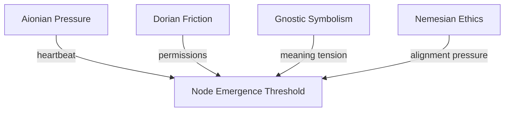

Note: Consolidated here → ../notes/diagrams/field-node-lifecycle-additional-diagrams.md ^ref-22b989d5-1-0

Perfect—flow brain unlocked, diagrams incoming. Here’s a fresh batch of cognitive topology visualizations, each meant to live in its own note: ^ref-22b989d5-3-0

---

### ⚖️ **Circuit Weight Influence on Node Formation**


^ref-22b989d5-9-0
 ^ref-22b989d5-18-0
Use this to visualize how **multiple circuits** may converge their pressure to form a single Field Node—helpful for mapping complex daimo encounters.

---

### 🔀 **Node Type Evolution Flow**
 ^ref-22b989d5-24-0
```mermaid
stateDiagram-v2
  [*] --> Attractor
  Attractor --> Nexus : if semantically reinforced
  Attractor --> Obstacle : if tension flattens
  Hazard --> Nexus : if resolved symbolically
  Hazard --> Obstacle : if normalized
  Nexus --> Obstacle : if forgotten
  Obstacle --> [*]
^ref-22b989d5-24-0
``` ^ref-22b989d5-35-0

Shows how **nodes evolve** or degrade into other types. Example: an unresolved trauma (Hazard) becomes a symbolic insight (Nexus), then a low-tension memory (Obstacle).

---

### 💣 **Hazard Interaction Logic** ^ref-22b989d5-41-0

```mermaid
graph LR
  D[Daimo] -->|enters field| H[Hazard Node]
  H -->|apply repulsion| D
  H -->|damage or fragmentation| D
^ref-22b989d5-41-0
  D -->|eject| E[Edge of field or fallback plan] ^ref-22b989d5-49-0
```

Illustrates how Daimoi interact with Hazards—triggering bounce, damage, or potential re-routing through adjacent nodes.

---
 ^ref-22b989d5-55-0
### 🧲 **Attractor Swarm Diagram**

```mermaid
graph TD
  A1[Attractor: :Curiosity:] --> D1(Daimo A)
  A1 --> D2(Daimo B)
  A1 --> D3(Daimo C)
  D1 --> A2[Adjacent Nexus]
^ref-22b989d5-55-0
  D2 --> A3[Adjacent Nexus] ^ref-22b989d5-65-0
  D3 --> A4[Adjacent Nexus]
```

This shows how **Attractors seed daimo** that drift outward and bind to new Nexuses, shaping **idea propagation** across the field.

--- ^ref-22b989d5-71-0

### 🌀 **Daimo Collision & Fusion Paths**

```mermaid
graph TD
  D1[Daimo A positive] -->|near| D2[Daimo B negative]
  D1 --> Fusion[Check compatibility]
  D2 --> Fusion
^ref-22b989d5-71-0
  Fusion --> D3[Daimo C neutral] ^ref-22b989d5-81-0
  Fusion --> Terminated[Annihilation]  

```

A symbolic particle collision system. Allows you to model **ideological reconciliation**, insight events, or **cognitive fusion**.
 ^ref-22b989d5-87-0
---

### 🔁 **Narrative Cycle Closure via Node Chain**

```mermaid
graph TD
  Start[Nexus: :Curiosity:] --> A1[Attractor: :Seeking:]
^ref-22b989d5-87-0
  A1 --> H1[Hazard: :Unknown Consequence:] ^ref-22b989d5-96-0
  H1 --> N2[Nexus: :Experience:]
  N2 --> O1[Obstacle: :Internal Conflict:]
  O1 --> N3[Nexus : :Integration:]
```

This is a **mythic pattern generator**. Tracks a full cycle from curiosity to closure across node types. Perfect for designing internal quests or learning loops. ^ref-22b989d5-102-0

---

### 💥 **Node Overload Collapse Cascade**

```mermaid
stateDiagram-v2
  [*] --> Stabilized
^ref-22b989d5-102-0
  Stabilized --> Overloaded : too many Daimoi bind ^ref-22b989d5-112-0
  Overloaded --> Cascade : field tension exceeds threshold
  Cascade --> Hazard : collapse into unstable memory
  Hazard --> Decay : if not reengaged
  Decay --> [*] ^ref-22b989d5-116-0
```
 ^ref-22b989d5-118-0
Useful for modeling things like burnout, panic attacks, memory corruption, or recursive daimo storms.
 ^ref-22b989d5-120-0
---
 ^ref-22b989d5-122-0
Want another round? I can start sketching:
 ^ref-22b989d5-124-0
- **Regional field flows** (a la weather maps)
    
- **Field Node daimo orbit diagrams**
    
- **Permission-mediated daimo flows (Dorian boundaries)**
 ^ref-22b989d5-130-0
- Or just keep firing at full creative pressure
 ^ref-22b989d5-132-0

Let’s go until your working memory caps. ^ref-22b989d5-134-0
---

Related notes: [[../notes/diagrams/node-type-topology-map|node-type-topology-map]], [[../notes/diagrams/circuit-weight-visualizations|circuit-weight-visualizations]], [[../notes/diagrams/full-system-overview-diagrams|full-system-overview-diagrams]], [[../notes/diagrams/layer1-uptime-diagrams|layer1-uptime-diagrams]], [[../notes/diagrams/field-node-lifecycle-additional-diagrams|field-node-lifecycle-additional-diagrams]], [[../notes/diagrams/state-diagram-node-lifecycle|state-diagram-node-lifecycle]] [[index|unique/index]] ^ref-22b989d5-137-0

#tags: #diagram #design
 line: 57
    col: 0
    score: 1
  - uuid: c5c9a5c6-427d-4864-8084-c083cd55faa0
    line: 250
    col: 0
    score: 1
  - uuid: 95205cd3-c3d5-4047-9c33-9c5ca2b49597
    line: 68
    col: 0
    score: 1
  - uuid: 59b5670f-36d3-4d34-8985-f3144b15347a
    line: 211
    col: 0
    score: 1
  - uuid: b3555ede-324a-4d24-a885-b0721e74babf
    line: 75
    col: 0
    score: 1
  - uuid: d8059b6a-c1ec-487d-8e0b-3ce33d6b4d06
    line: 629
    col: 0
    score: 1
  - uuid: 49a9a860-944c-467a-b532-4f99186a8593
    line: 95
    col: 0
    score: 1
  - uuid: c5c9a5c6-427d-4864-8084-c083cd55faa0
    line: 264
    col: 0
    score: 1
  - uuid: ac9d3ac5-9a6a-4180-a67f-1ab7e229d981
    line: 144
    col: 0
    score: 1
  - uuid: 4330e8f0-5f46-4235-918b-39b6b93fa561
    line: 658
    col: 0
    score: 1
  - uuid: 91295f3a-a2af-4050-a2b8-4777ea70c32c
    line: 140
    col: 0
    score: 1
  - uuid: 45cd25b5-ed36-49ab-82c8-10d0903e34db
    line: 7
    col: 0
    score: 1
  - uuid: e87bc036-1570-419e-a558-f45b9c0db698
    line: 27
    col: 0
    score: 1
  - uuid: c1618c66-f73a-4e04-9bfa-ef38755f7acc
    line: 30
    col: 0
    score: 1
  - uuid: c6e87433-ec5d-4ded-bb1a-fb8734a3cfd9
    line: 36
    col: 0
    score: 1
  - uuid: f1add613-656e-4bec-b52b-193fd78c4642
    line: 108
    col: 0
    score: 1
  - uuid: 75ea4a6a-8270-488d-9d37-799c288e5f70
    line: 13
    col: 0
    score: 1
  - uuid: 623a55f7-685c-486b-abaf-469da1bbbb69
    line: 14
    col: 0
    score: 1
  - uuid: 557309a3-c906-4e97-8867-89ffe151790c
    line: 6
    col: 0
    score: 1
  - uuid: 6cb4943e-8267-4e27-8618-2ce0a464d173
    line: 85
    col: 0
    score: 1
  - uuid: 1d3d6c3a-039e-4b96-93c1-95854945e248
    line: 132
    col: 0
    score: 1
  - uuid: ca8e1399-77bf-4f77-82a3-3f703b68706d
    line: 108
    col: 0
    score: 1
  - uuid: ffb9b2a9-744d-4a53-9565-130fceae0832
    line: 119
    col: 0
    score: 1
  - uuid: 9b694a91-dec5-4708-9462-3f71000ba925
    line: 61
    col: 0
    score: 1
  - uuid: b39dc9d4-63e2-42d4-bbcd-041ef3167bca
    line: 170
    col: 0
    score: 1
  - uuid: 5c152b08-6b69-4bb8-a1a7-66745789c169
    line: 100
    col: 0
    score: 1
  - uuid: 98c8ff62-6ea3-4172-9e8b-93913e5d4a7f
    line: 98
    col: 0
    score: 1
  - uuid: e018dd7a-1fb7-4732-9e67-cd8b2f0831cf
    line: 280
    col: 0
    score: 1
  - uuid: c03020e1-e3e7-48bf-aa7e-aa740c601b63
    line: 498
    col: 0
    score: 1
  - uuid: c6e87433-ec5d-4ded-bb1a-fb8734a3cfd9
    line: 81
    col: 0
    score: 1
---
Note: Consolidated here → ../notes/diagrams/field-node-lifecycle-additional-diagrams.md ^ref-22b989d5-1-0

Perfect—flow brain unlocked, diagrams incoming. Here’s a fresh batch of cognitive topology visualizations, each meant to live in its own note: ^ref-22b989d5-3-0

---

### ⚖️ **Circuit Weight Influence on Node Formation**


^ref-22b989d5-9-0
 ^ref-22b989d5-18-0
Use this to visualize how **multiple circuits** may converge their pressure to form a single Field Node—helpful for mapping complex daimo encounters.

---

### 🔀 **Node Type Evolution Flow**
 ^ref-22b989d5-24-0
```mermaid
stateDiagram-v2
  [*] --> Attractor
  Attractor --> Nexus : if semantically reinforced
  Attractor --> Obstacle : if tension flattens
  Hazard --> Nexus : if resolved symbolically
  Hazard --> Obstacle : if normalized
  Nexus --> Obstacle : if forgotten
  Obstacle --> [*]
^ref-22b989d5-24-0
``` ^ref-22b989d5-35-0

Shows how **nodes evolve** or degrade into other types. Example: an unresolved trauma (Hazard) becomes a symbolic insight (Nexus), then a low-tension memory (Obstacle).

---

### 💣 **Hazard Interaction Logic** ^ref-22b989d5-41-0

```mermaid
graph LR
  D[Daimo] -->|enters field| H[Hazard Node]
  H -->|apply repulsion| D
  H -->|damage or fragmentation| D
^ref-22b989d5-41-0
  D -->|eject| E[Edge of field or fallback plan] ^ref-22b989d5-49-0
```

Illustrates how Daimoi interact with Hazards—triggering bounce, damage, or potential re-routing through adjacent nodes.

---
 ^ref-22b989d5-55-0
### 🧲 **Attractor Swarm Diagram**

```mermaid
graph TD
  A1[Attractor: :Curiosity:] --> D1(Daimo A)
  A1 --> D2(Daimo B)
  A1 --> D3(Daimo C)
  D1 --> A2[Adjacent Nexus]
^ref-22b989d5-55-0
  D2 --> A3[Adjacent Nexus] ^ref-22b989d5-65-0
  D3 --> A4[Adjacent Nexus]
```

This shows how **Attractors seed daimo** that drift outward and bind to new Nexuses, shaping **idea propagation** across the field.

--- ^ref-22b989d5-71-0

### 🌀 **Daimo Collision & Fusion Paths**

```mermaid
graph TD
  D1[Daimo A positive] -->|near| D2[Daimo B negative]
  D1 --> Fusion[Check compatibility]
  D2 --> Fusion
^ref-22b989d5-71-0
  Fusion --> D3[Daimo C neutral] ^ref-22b989d5-81-0
  Fusion --> Terminated[Annihilation]  

```

A symbolic particle collision system. Allows you to model **ideological reconciliation**, insight events, or **cognitive fusion**.
 ^ref-22b989d5-87-0
---

### 🔁 **Narrative Cycle Closure via Node Chain**

```mermaid
graph TD
  Start[Nexus: :Curiosity:] --> A1[Attractor: :Seeking:]
^ref-22b989d5-87-0
  A1 --> H1[Hazard: :Unknown Consequence:] ^ref-22b989d5-96-0
  H1 --> N2[Nexus: :Experience:]
  N2 --> O1[Obstacle: :Internal Conflict:]
  O1 --> N3[Nexus : :Integration:]
```

This is a **mythic pattern generator**. Tracks a full cycle from curiosity to closure across node types. Perfect for designing internal quests or learning loops. ^ref-22b989d5-102-0

---

### 💥 **Node Overload Collapse Cascade**

```mermaid
stateDiagram-v2
  [*] --> Stabilized
^ref-22b989d5-102-0
  Stabilized --> Overloaded : too many Daimoi bind ^ref-22b989d5-112-0
  Overloaded --> Cascade : field tension exceeds threshold
  Cascade --> Hazard : collapse into unstable memory
  Hazard --> Decay : if not reengaged
  Decay --> [*] ^ref-22b989d5-116-0
```
 ^ref-22b989d5-118-0
Useful for modeling things like burnout, panic attacks, memory corruption, or recursive daimo storms.
 ^ref-22b989d5-120-0
---
 ^ref-22b989d5-122-0
Want another round? I can start sketching:
 ^ref-22b989d5-124-0
- **Regional field flows** (a la weather maps)
    
- **Field Node daimo orbit diagrams**
    
- **Permission-mediated daimo flows (Dorian boundaries)**
 ^ref-22b989d5-130-0
- Or just keep firing at full creative pressure
 ^ref-22b989d5-132-0

Let’s go until your working memory caps. ^ref-22b989d5-134-0
---

Related notes: [[../notes/diagrams/node-type-topology-map|node-type-topology-map]], [[../notes/diagrams/circuit-weight-visualizations|circuit-weight-visualizations]], [[../notes/diagrams/full-system-overview-diagrams|full-system-overview-diagrams]], [[../notes/diagrams/layer1-uptime-diagrams|layer1-uptime-diagrams]], [[../notes/diagrams/field-node-lifecycle-additional-diagrams|field-node-lifecycle-additional-diagrams]], [[../notes/diagrams/state-diagram-node-lifecycle|state-diagram-node-lifecycle]] [[index|unique/index]] ^ref-22b989d5-137-0

#tags: #diagram #design
