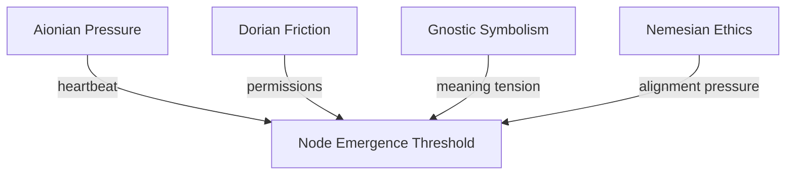

Note: Consolidated here → ../notes/diagrams/field-node-lifecycle-additional-diagrams.md ^ref-22b989d5-1-0

Perfect—flow brain unlocked, diagrams incoming. Here’s a fresh batch of cognitive topology visualizations, each meant to live in its own note: ^ref-22b989d5-3-0

---

### ⚖️ **Circuit Weight Influence on Node Formation**


^ref-22b989d5-9-0
 ^ref-22b989d5-18-0
Use this to visualize how **multiple circuits** may converge their pressure to form a single Field Node—helpful for mapping complex daimo encounters.

---

### 🔀 **Node Type Evolution Flow**
 ^ref-22b989d5-24-0
```mermaid
stateDiagram-v2
  [*] --> Attractor
  Attractor --> Nexus : if semantically reinforced
  Attractor --> Obstacle : if tension flattens
  Hazard --> Nexus : if resolved symbolically
  Hazard --> Obstacle : if normalized
  Nexus --> Obstacle : if forgotten
  Obstacle --> [*]
^ref-22b989d5-24-0
``` ^ref-22b989d5-35-0

Shows how **nodes evolve** or degrade into other types. Example: an unresolved trauma (Hazard) becomes a symbolic insight (Nexus), then a low-tension memory (Obstacle).

---

### 💣 **Hazard Interaction Logic** ^ref-22b989d5-41-0

```mermaid
graph LR
  D[Daimo] -->|enters field| H[Hazard Node]
  H -->|apply repulsion| D
  H -->|damage or fragmentation| D
^ref-22b989d5-41-0
  D -->|eject| E[Edge of field or fallback plan] ^ref-22b989d5-49-0
```

Illustrates how Daimoi interact with Hazards—triggering bounce, damage, or potential re-routing through adjacent nodes.

---
 ^ref-22b989d5-55-0
### 🧲 **Attractor Swarm Diagram**

```mermaid
graph TD
  A1[Attractor: :Curiosity:] --> D1(Daimo A)
  A1 --> D2(Daimo B)
  A1 --> D3(Daimo C)
  D1 --> A2[Adjacent Nexus]
^ref-22b989d5-55-0
  D2 --> A3[Adjacent Nexus] ^ref-22b989d5-65-0
  D3 --> A4[Adjacent Nexus]
```

This shows how **Attractors seed daimo** that drift outward and bind to new Nexuses, shaping **idea propagation** across the field.

--- ^ref-22b989d5-71-0

### 🌀 **Daimo Collision & Fusion Paths**

```mermaid
graph TD
  D1[Daimo A positive] -->|near| D2[Daimo B negative]
  D1 --> Fusion[Check compatibility]
  D2 --> Fusion
^ref-22b989d5-71-0
  Fusion --> D3[Daimo C neutral] ^ref-22b989d5-81-0
  Fusion --> Terminated[Annihilation]  

```

A symbolic particle collision system. Allows you to model **ideological reconciliation**, insight events, or **cognitive fusion**.
 ^ref-22b989d5-87-0
---

### 🔁 **Narrative Cycle Closure via Node Chain**

```mermaid
graph TD
  Start[Nexus: :Curiosity:] --> A1[Attractor: :Seeking:]
^ref-22b989d5-87-0
  A1 --> H1[Hazard: :Unknown Consequence:] ^ref-22b989d5-96-0
  H1 --> N2[Nexus: :Experience:]
  N2 --> O1[Obstacle: :Internal Conflict:]
  O1 --> N3[Nexus : :Integration:]
```

This is a **mythic pattern generator**. Tracks a full cycle from curiosity to closure across node types. Perfect for designing internal quests or learning loops. ^ref-22b989d5-102-0

---

### 💥 **Node Overload Collapse Cascade**

```mermaid
stateDiagram-v2
  [*] --> Stabilized
^ref-22b989d5-102-0
  Stabilized --> Overloaded : too many Daimoi bind ^ref-22b989d5-112-0
  Overloaded --> Cascade : field tension exceeds threshold
  Cascade --> Hazard : collapse into unstable memory
  Hazard --> Decay : if not reengaged
  Decay --> [*] ^ref-22b989d5-116-0
```
 ^ref-22b989d5-118-0
Useful for modeling things like burnout, panic attacks, memory corruption, or recursive daimo storms.
 ^ref-22b989d5-120-0
---
 ^ref-22b989d5-122-0
Want another round? I can start sketching:
 ^ref-22b989d5-124-0
- **Regional field flows** (a la weather maps)
    
- **Field Node daimo orbit diagrams**
    
- **Permission-mediated daimo flows (Dorian boundaries)**
 ^ref-22b989d5-130-0
- Or just keep firing at full creative pressure
 ^ref-22b989d5-132-0

Let’s go until your working memory caps. ^ref-22b989d5-134-0
---

Related notes: [[../notes/diagrams/node-type-topology-map|node-type-topology-map]], [[../notes/diagrams/circuit-weight-visualizations|circuit-weight-visualizations]], [[../notes/diagrams/full-system-overview-diagrams|full-system-overview-diagrams]], [[../notes/diagrams/layer1-uptime-diagrams|layer1-uptime-diagrams]], [[../notes/diagrams/field-node-lifecycle-additional-diagrams|field-node-lifecycle-additional-diagrams]], [[../notes/diagrams/state-diagram-node-lifecycle|state-diagram-node-lifecycle]] [[index|unique/index]] ^ref-22b989d5-137-0

#tags: #diagram #design
