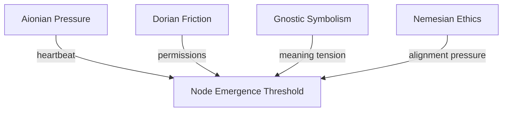
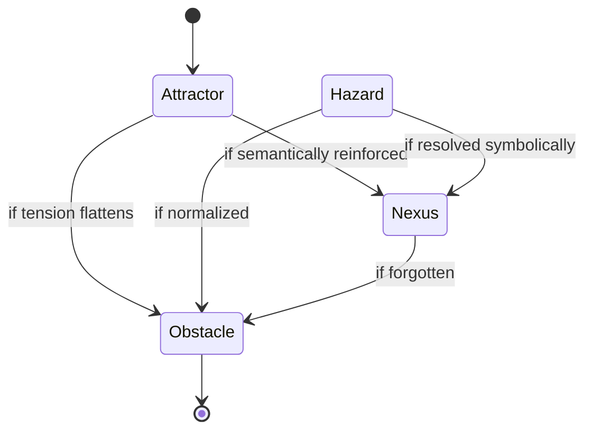
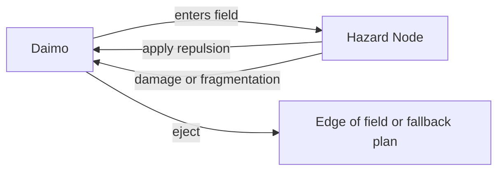
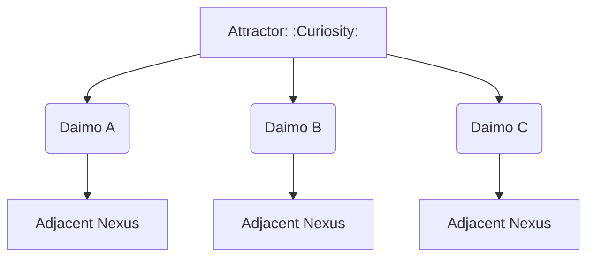
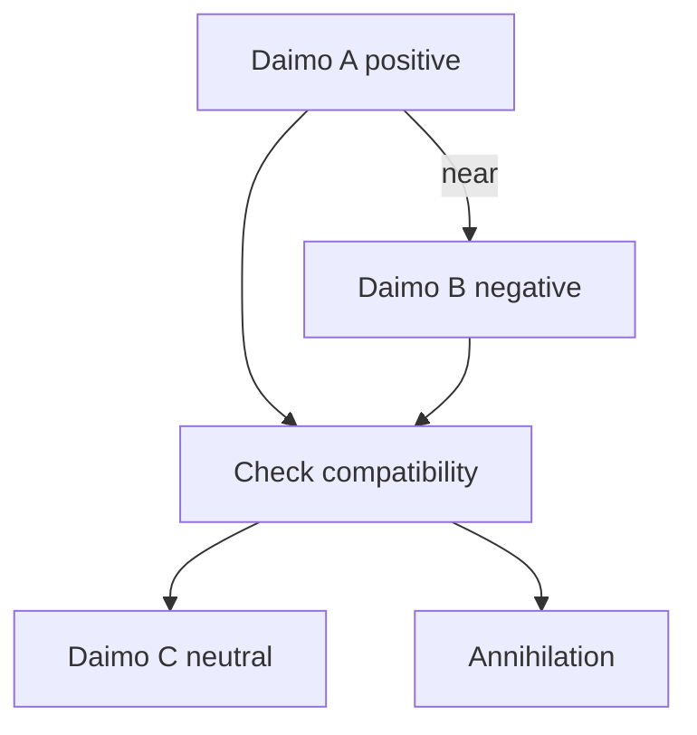
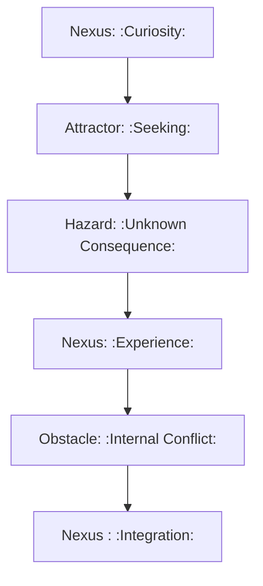
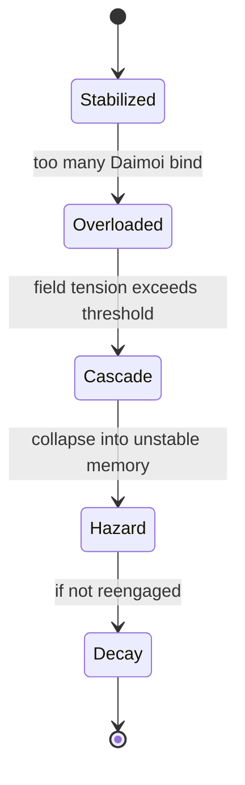

Note: Consolidated here → ../notes/diagrams/field-node-lifecycle-additional-diagrams.md

Perfect—flow brain unlocked, diagrams incoming. Here’s a fresh batch of cognitive topology visualizations, each meant to live in its own note:

---

### ⚖️ **Circuit Weight Influence on Node Formation**

Use this to visualize how **multiple circuits** may converge their pressure to form a single Field Node—helpful for mapping complex daimo encounters.

---

### 🔀 **Node Type Evolution Flow**

Shows how **nodes evolve** or degrade into other types. Example: an unresolved trauma (Hazard) becomes a symbolic insight (Nexus), then a low-tension memory (Obstacle).

---

### 💣 **Hazard Interaction Logic**

Illustrates how Daimoi interact with Hazards—triggering bounce, damage, or potential re-routing through adjacent nodes.

---

### 🧲 **Attractor Swarm Diagram**

This shows how **Attractors seed daimo** that drift outward and bind to new Nexuses, shaping **idea propagation** across the field.

---

### 🌀 **Daimo Collision & Fusion Paths**

A symbolic particle collision system. Allows you to model **ideological reconciliation**, insight events, or **cognitive fusion**.

---

### 🔁 **Narrative Cycle Closure via Node Chain**

This is a **mythic pattern generator**. Tracks a full cycle from curiosity to closure across node types. Perfect for designing internal quests or learning loops.

---

### 💥 **Node Overload Collapse Cascade**

Useful for modeling things like burnout, panic attacks, memory corruption, or recursive daimo storms.

---

Want another round? I can start sketching:

- **Regional field flows** (a la weather maps)
    
- **Field Node daimo orbit diagrams**
    
- **Permission-mediated daimo flows (Dorian boundaries)**
    
- Or just keep firing at full creative pressure
    

Let’s go until your working memory caps.
---

Related notes: [[../notes/diagrams/node-type-topology-map|node-type-topology-map]], [[../notes/diagrams/circuit-weight-visualizations|circuit-weight-visualizations]], [[../notes/diagrams/full-system-overview-diagrams|full-system-overview-diagrams]], [[../notes/diagrams/layer1-uptime-diagrams|layer1-uptime-diagrams]], [[../notes/diagrams/field-node-lifecycle-additional-diagrams|field-node-lifecycle-additional-diagrams]], [[../notes/diagrams/state-diagram-node-lifecycle|state-diagram-node-lifecycle]] [[index|unique/index]]

#tags: #diagram #design<!-- GENERATED-SECTIONS:DO-NOT-EDIT-BELOW -->
## Related content
- [field-node-diagram-visualizations](field-node-diagram-visualizations.md)
- [field-node-diagram-outline](field-node-diagram-outline.md)
- [eidolon-node-lifecycle](eidolon-node-lifecycle.md)
- [promethean-system-diagrams](promethean-system-diagrams.md)
- [layer-1-uptime-diagrams](layer-1-uptime-diagrams.md)
- [Unique Info Dump Index](unique-info-dump-index.md)
- [heartbeat-fragment-demo](heartbeat-fragment-demo.md)
- [heartbeat-simulation-snippets](heartbeat-simulation-snippets.md)
- [ripple-propagation-demo](ripple-propagation-demo.md)
- [Eidolon Field Abstract Model](eidolon-field-abstract-model.md)
- [eidolon-field-math-foundations](eidolon-field-math-foundations.md)
- [2d-sandbox-field](2d-sandbox-field.md)
- [aionian-circuit-math](aionian-circuit-math.md)
- [Event Bus Projections Architecture](event-bus-projections-architecture.md)
- [Agent Tasks: Persistence Migration to DualStore](agent-tasks-persistence-migration-to-dualstore.md)
- [archetype-ecs](archetype-ecs.md)
- [Diagrams](chunks/diagrams.md)
- [DSL](chunks/dsl.md)
- [EidolonField](eidolonfield.md)
- [Simulation Demo](chunks/simulation-demo.md)
- [Eidolon-Field-Optimization](eidolon-field-optimization.md)
- [Factorio AI with External Agents](factorio-ai-with-external-agents.md)
- [field-dynamics-math-blocks](field-dynamics-math-blocks.md)
## Sources
- _None_
<!-- GENERATED-SECTIONS:DO-NOT-EDIT-ABOVE -->
