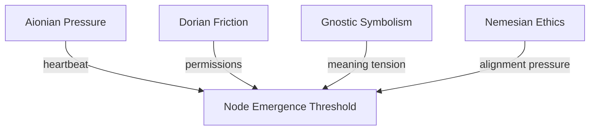

Note: Consolidated here → ../notes/diagrams/field-node-lifecycle-additional-diagrams.md ^ref-22b989d5-1-0

Perfect—flow brain unlocked, diagrams incoming. Here’s a fresh batch of cognitive topology visualizations, each meant to live in its own note: ^ref-22b989d5-3-0

---

### ⚖️ **Circuit Weight Influence on Node Formation**


^ref-22b989d5-9-0
 ^ref-22b989d5-18-0
Use this to visualize how **multiple circuits** may converge their pressure to form a single Field Node—helpful for mapping complex daimo encounters.

---

### 🔀 **Node Type Evolution Flow**
 ^ref-22b989d5-24-0
```mermaid
stateDiagram-v2
  [*] --> Attractor
  Attractor --> Nexus : if semantically reinforced
  Attractor --> Obstacle : if tension flattens
  Hazard --> Nexus : if resolved symbolically
  Hazard --> Obstacle : if normalized
  Nexus --> Obstacle : if forgotten
  Obstacle --> [*]
^ref-22b989d5-24-0
``` ^ref-22b989d5-35-0

Shows how **nodes evolve** or degrade into other types. Example: an unresolved trauma (Hazard) becomes a symbolic insight (Nexus), then a low-tension memory (Obstacle).

---

### 💣 **Hazard Interaction Logic** ^ref-22b989d5-41-0

```mermaid
graph LR
  D[Daimo] -->|enters field| H[Hazard Node]
  H -->|apply repulsion| D
  H -->|damage or fragmentation| D
^ref-22b989d5-41-0
  D -->|eject| E[Edge of field or fallback plan] ^ref-22b989d5-49-0
```

Illustrates how Daimoi interact with Hazards—triggering bounce, damage, or potential re-routing through adjacent nodes.

---
 ^ref-22b989d5-55-0
### 🧲 **Attractor Swarm Diagram**

```mermaid
graph TD
  A1[Attractor: :Curiosity:] --> D1(Daimo A)
  A1 --> D2(Daimo B)
  A1 --> D3(Daimo C)
  D1 --> A2[Adjacent Nexus]
^ref-22b989d5-55-0
  D2 --> A3[Adjacent Nexus] ^ref-22b989d5-65-0
  D3 --> A4[Adjacent Nexus]
```

This shows how **Attractors seed daimo** that drift outward and bind to new Nexuses, shaping **idea propagation** across the field.

--- ^ref-22b989d5-71-0

### 🌀 **Daimo Collision & Fusion Paths**

```mermaid
graph TD
  D1[Daimo A positive] -->|near| D2[Daimo B negative]
  D1 --> Fusion[Check compatibility]
  D2 --> Fusion
^ref-22b989d5-71-0
  Fusion --> D3[Daimo C neutral] ^ref-22b989d5-81-0
  Fusion --> Terminated[Annihilation]  

```

A symbolic particle collision system. Allows you to model **ideological reconciliation**, insight events, or **cognitive fusion**.
 ^ref-22b989d5-87-0
---

### 🔁 **Narrative Cycle Closure via Node Chain**

```mermaid
graph TD
  Start[Nexus: :Curiosity:] --> A1[Attractor: :Seeking:]
^ref-22b989d5-87-0
  A1 --> H1[Hazard: :Unknown Consequence:] ^ref-22b989d5-96-0
  H1 --> N2[Nexus: :Experience:]
  N2 --> O1[Obstacle: :Internal Conflict:]
  O1 --> N3[Nexus : :Integration:]
```

This is a **mythic pattern generator**. Tracks a full cycle from curiosity to closure across node types. Perfect for designing internal quests or learning loops. ^ref-22b989d5-102-0

---

### 💥 **Node Overload Collapse Cascade**

```mermaid
stateDiagram-v2
  [*] --> Stabilized
^ref-22b989d5-102-0
  Stabilized --> Overloaded : too many Daimoi bind ^ref-22b989d5-112-0
  Overloaded --> Cascade : field tension exceeds threshold
  Cascade --> Hazard : collapse into unstable memory
  Hazard --> Decay : if not reengaged
  Decay --> [*] ^ref-22b989d5-116-0
```
 ^ref-22b989d5-118-0
Useful for modeling things like burnout, panic attacks, memory corruption, or recursive daimo storms.
 ^ref-22b989d5-120-0
---
 ^ref-22b989d5-122-0
Want another round? I can start sketching:
 ^ref-22b989d5-124-0
- **Regional field flows** (a la weather maps)
    
- **Field Node daimo orbit diagrams**
    
- **Permission-mediated daimo flows (Dorian boundaries)**
 ^ref-22b989d5-130-0
- Or just keep firing at full creative pressure
 ^ref-22b989d5-132-0

Let’s go until your working memory caps. ^ref-22b989d5-134-0
---

Related notes: [[../notes/diagrams/node-type-topology-map|node-type-topology-map]], [[../notes/diagrams/circuit-weight-visualizations|circuit-weight-visualizations]], [[../notes/diagrams/full-system-overview-diagrams|full-system-overview-diagrams]], [[../notes/diagrams/layer1-uptime-diagrams|layer1-uptime-diagrams]], [[../notes/diagrams/field-node-lifecycle-additional-diagrams|field-node-lifecycle-additional-diagrams]], [[../notes/diagrams/state-diagram-node-lifecycle|state-diagram-node-lifecycle]] [[index|unique/index]] ^ref-22b989d5-137-0

#tags: #diagram #design<!-- GENERATED-SECTIONS:DO-NOT-EDIT-BELOW -->
## Related content
- [Window Management](chunks/window-management.md)
- [eidolon-node-lifecycle](eidolon-node-lifecycle.md)
- [field-dynamics-math-blocks](field-dynamics-math-blocks.md)
- [field-interaction-equations](field-interaction-equations.md)
- [windows-tiling-with-autohotkey](windows-tiling-with-autohotkey.md)
- [Promethean State Format](promethean-state-format.md)
- [ripple-propagation-demo](ripple-propagation-demo.md)
- [Dynamic Context Model for Web Components](dynamic-context-model-for-web-components.md)
- [Eidolon Field Abstract Model](eidolon-field-abstract-model.md)
- [Fnord Tracer Protocol](fnord-tracer-protocol.md)
- [zero-copy-snapshots-and-workers](zero-copy-snapshots-and-workers.md)
- [Promethean_Eidolon_Synchronicity_Model](promethean-eidolon-synchronicity-model.md)
- [DSL](chunks/dsl.md)
- [TypeScript Patch for Tool Calling Support](typescript-patch-for-tool-calling-support.md)
- [Smoke Resonance Visualizations](smoke-resonance-visualizations.md)
- [Diagrams](chunks/diagrams.md)
- [Math Fundamentals](chunks/math-fundamentals.md)
- [Tooling](chunks/tooling.md)
- [Debugging Broker Connections and Agent Behavior](debugging-broker-connections-and-agent-behavior.md)
- [Duck's Self-Referential Perceptual Loop](ducks-self-referential-perceptual-loop.md)
- [Layer1SurvivabilityEnvelope](layer1survivabilityenvelope.md)
- [Functional Embedding Pipeline Refactor](functional-embedding-pipeline-refactor.md)
- [typed-struct-compiler](typed-struct-compiler.md)
- [graph-ds](graph-ds.md)
- [heartbeat-fragment-demo](heartbeat-fragment-demo.md)
- [homeostasis-decay-formulas](homeostasis-decay-formulas.md)
- [Migrate to Provider-Tenant Architecture](migrate-to-provider-tenant-architecture.md)
- [Prometheus Observability Stack](prometheus-observability-stack.md)
- [eidolon-field-math-foundations](eidolon-field-math-foundations.md)
- [field-node-diagram-outline](field-node-diagram-outline.md)
- [field-node-diagram-visualizations](field-node-diagram-visualizations.md)
- [komorebi-group-window-hack](komorebi-group-window-hack.md)
- [polyglot-repl-interface-layer](polyglot-repl-interface-layer.md)
- [plan-update-confirmation](plan-update-confirmation.md)
- [i3-bluetooth-setup](i3-bluetooth-setup.md)
- [Chroma Toolkit Consolidation Plan](chroma-toolkit-consolidation-plan.md)
- [Creative Moments](creative-moments.md)
- [Promethean Dev Workflow Update](promethean-dev-workflow-update.md)
- [Promethean Chat Activity Report](promethean-chat-activity-report.md)
- [Duck's Attractor States](ducks-attractor-states.md)
- [Functional Refactor of TypeScript Document Processing](functional-refactor-of-typescript-document-processing.md)
- [Promethean-Copilot-Intent-Engine](promethean-copilot-intent-engine.md)
- [Model Selection for Lightweight Conversational Tasks](model-selection-for-lightweight-conversational-tasks.md)
- [NPU Voice Code and Sensory Integration](npu-voice-code-and-sensory-integration.md)
- [Obsidian ChatGPT Plugin Integration Guide](obsidian-chatgpt-plugin-integration-guide.md)
- [Obsidian ChatGPT Plugin Integration](obsidian-chatgpt-plugin-integration.md)
- [obsidian-ignore-node-modules-regex](obsidian-ignore-node-modules-regex.md)
- [Obsidian Task Generation](obsidian-task-generation.md)
- [Obsidian Templating Plugins Integration Guide](obsidian-templating-plugins-integration-guide.md)
- [Promethean Documentation Pipeline Overview](promethean-documentation-pipeline-overview.md)
- [Promethean Infrastructure Setup](promethean-infrastructure-setup.md)
- [Promethean Pipelines](promethean-pipelines.md)
- [Post-Linguistic Transhuman Design Frameworks](post-linguistic-transhuman-design-frameworks.md)
- [Per-Domain Policy System for JS Crawler](per-domain-policy-system-for-js-crawler.md)
- [Performance-Optimized-Polyglot-Bridge](performance-optimized-polyglot-bridge.md)
- [Pipeline Enhancements](pipeline-enhancements.md)
- [JavaScript](chunks/javascript.md)
- [Operations](chunks/operations.md)
- [Services](chunks/services.md)
- [Shared](chunks/shared.md)
- [Simulation Demo](chunks/simulation-demo.md)
- [Optimizing Command Limitations in System Design](optimizing-command-limitations-in-system-design.md)
- [ParticleSimulationWithCanvasAndFFmpeg](particlesimulationwithcanvasandffmpeg.md)
- [Factorio AI with External Agents](factorio-ai-with-external-agents.md)
- [DuckDuckGoSearchPipeline](duckduckgosearchpipeline.md)
- [Unique Info Dump Index](unique-info-dump-index.md)
- [Promethean Workflow Optimization](promethean-workflow-optimization.md)
- [Ice Box Reorganization](ice-box-reorganization.md)
- [Prompt_Folder_Bootstrap](prompt-folder-bootstrap.md)
- [Protocol_0_The_Contradiction_Engine](protocol-0-the-contradiction-engine.md)
- [Provider-Agnostic Chat Panel Implementation](provider-agnostic-chat-panel-implementation.md)
- [Pure TypeScript Search Microservice](pure-typescript-search-microservice.md)
- [Reawakening Duck](reawakening-duck.md)
- [schema-evolution-workflow](schema-evolution-workflow.md)
- [sibilant-macro-targets](sibilant-macro-targets.md)
- [The Jar of Echoes](the-jar-of-echoes.md)
- [Mathematics Sampler](mathematics-sampler.md)
- [MindfulRobotIntegration](mindfulrobotintegration.md)
- [Model Upgrade Calm-Down Guide](model-upgrade-calm-down-guide.md)
- [Promethean Documentation Overview](promethean-documentation-overview.md)
- [Promethean Documentation Update](promethean-documentation-update.md)
- [Promethean Documentation Update](promethean-documentation-update.txt)
- [Promethean Notes](promethean-notes.md)
- [promethean-requirements](promethean-requirements.md)
- [Promethean Data Sync Protocol](promethean-data-sync-protocol.md)
- [ts-to-lisp-transpiler](ts-to-lisp-transpiler.md)
- [Redirecting Standard Error](redirecting-standard-error.md)
- [Self-Agency in AI Interaction](self-agency-in-ai-interaction.md)
- [Stateful Partitions and Rebalancing](stateful-partitions-and-rebalancing.md)
- [Synchronicity Waves and Web](synchronicity-waves-and-web.md)
- [OpenAPI Validation Report](openapi-validation-report.md)
- [Docops Feature Updates](docops-feature-updates.md)
- [Docops Feature Updates](docops-feature-updates-2.md)
- [Mathematical Samplers](mathematical-samplers.md)
- [Unique Concepts](unique-concepts.md)
- [unique-templates](templates/unique-templates.md)
- [Tracing the Signal](tracing-the-signal.md)
- [Mindful Prioritization](mindful-prioritization.md)
- [Self-Improving Documentation Tool](self-improving-documentation-tool.md)
- [Git Commit Optimization for Code Reviews](git-commit-optimization-for-code-reviews.md)
- [Fastify Static Files Plugin](fastify-static-files-plugin.md)
- [run-step-api](run-step-api.md)
- [Promethean Documentation Update](promethean-documentation-update-4.md)
- [heartbeat-simulation-snippets](heartbeat-simulation-snippets.md)
- [Sibilant Meta-Prompt DSL](sibilant-meta-prompt-dsl.md)
- [System Scheduler with Resource-Aware DAG](system-scheduler-with-resource-aware-dag.md)
- [markdown-to-org-transpiler](markdown-to-org-transpiler.md)
- [Universal Lisp Interface](universal-lisp-interface.md)
- [Promethean Agent Config DSL](promethean-agent-config-dsl.md)
- [promethean-system-diagrams](promethean-system-diagrams.md)
## Sources
- [graph-ds — L371](graph-ds.md#^ref-6620e2f2-371-0) (line 371, col 0, score 1)
- [heartbeat-fragment-demo — L141](heartbeat-fragment-demo.md#^ref-dd00677a-141-0) (line 141, col 0, score 1)
- [homeostasis-decay-formulas — L222](homeostasis-decay-formulas.md#^ref-37b5d236-222-0) (line 222, col 0, score 1)
- [i3-bluetooth-setup — L107](i3-bluetooth-setup.md#^ref-5e408692-107-0) (line 107, col 0, score 1)
- [komorebi-group-window-hack — L255](komorebi-group-window-hack.md#^ref-dd89372d-255-0) (line 255, col 0, score 1)
- [Mathematics Sampler — L162](mathematics-sampler.md#^ref-b5e0183e-162-0) (line 162, col 0, score 1)
- [Migrate to Provider-Tenant Architecture — L308](migrate-to-provider-tenant-architecture.md#^ref-54382370-308-0) (line 308, col 0, score 1)
- [Mindful Prioritization — L102](mindful-prioritization.md#^ref-40185d05-102-0) (line 102, col 0, score 1)
- [MindfulRobotIntegration — L41](mindfulrobotintegration.md#^ref-5f65dfa5-41-0) (line 41, col 0, score 1)
- [Model Selection for Lightweight Conversational Tasks — L159](model-selection-for-lightweight-conversational-tasks.md#^ref-d144aa62-159-0) (line 159, col 0, score 1)
- [Model Upgrade Calm-Down Guide — L149](model-upgrade-calm-down-guide.md#^ref-db74343f-149-0) (line 149, col 0, score 1)
- [NPU Voice Code and Sensory Integration — L70](npu-voice-code-and-sensory-integration.md#^ref-5a02283e-70-0) (line 70, col 0, score 1)
- [Obsidian ChatGPT Plugin Integration Guide — L67](obsidian-chatgpt-plugin-integration-guide.md#^ref-1d3d6c3a-67-0) (line 67, col 0, score 1)
- [Mindful Prioritization — L58](mindful-prioritization.md#^ref-40185d05-58-0) (line 58, col 0, score 1)
- [MindfulRobotIntegration — L93](mindfulrobotintegration.md#^ref-5f65dfa5-93-0) (line 93, col 0, score 1)
- [Model Selection for Lightweight Conversational Tasks — L192](model-selection-for-lightweight-conversational-tasks.md#^ref-d144aa62-192-0) (line 192, col 0, score 1)
- [Model Upgrade Calm-Down Guide — L132](model-upgrade-calm-down-guide.md#^ref-db74343f-132-0) (line 132, col 0, score 1)
- [NPU Voice Code and Sensory Integration — L63](npu-voice-code-and-sensory-integration.md#^ref-5a02283e-63-0) (line 63, col 0, score 1)
- [Obsidian ChatGPT Plugin Integration Guide — L77](obsidian-chatgpt-plugin-integration-guide.md#^ref-1d3d6c3a-77-0) (line 77, col 0, score 1)
- [Obsidian ChatGPT Plugin Integration — L78](obsidian-chatgpt-plugin-integration.md#^ref-ca8e1399-78-0) (line 78, col 0, score 1)
- [obsidian-ignore-node-modules-regex — L91](obsidian-ignore-node-modules-regex.md#^ref-ffb9b2a9-91-0) (line 91, col 0, score 1)
- [Obsidian Task Generation — L102](obsidian-task-generation.md#^ref-9b694a91-102-0) (line 102, col 0, score 1)
- [Obsidian Templating Plugins Integration Guide — L151](obsidian-templating-plugins-integration-guide.md#^ref-b39dc9d4-151-0) (line 151, col 0, score 1)
- [Promethean Documentation Overview — L44](promethean-documentation-overview.md#^ref-9413237f-44-0) (line 44, col 0, score 1)
- [Promethean Documentation Pipeline Overview — L213](promethean-documentation-pipeline-overview.md#^ref-3a3bf2c9-213-0) (line 213, col 0, score 1)
- [Promethean Documentation Update — L37](promethean-documentation-update.md#^ref-c0392040-37-0) (line 37, col 0, score 1)
- [Promethean Documentation Update — L22](promethean-documentation-update.txt#^ref-0b872af2-22-0) (line 22, col 0, score 1)
- [Promethean_Eidolon_Synchronicity_Model — L70](promethean-eidolon-synchronicity-model.md#^ref-2d6e5553-70-0) (line 70, col 0, score 1)
- [Promethean Infrastructure Setup — L716](promethean-infrastructure-setup.md#^ref-6deed6ac-716-0) (line 716, col 0, score 1)
- [Promethean Notes — L24](promethean-notes.md#^ref-1c4046b5-24-0) (line 24, col 0, score 1)
- [Promethean Pipelines — L137](promethean-pipelines.md#^ref-8b8e6103-137-0) (line 137, col 0, score 1)
- [promethean-requirements — L67](promethean-requirements.md#^ref-95205cd3-67-0) (line 67, col 0, score 1)
- [Promethean State Format — L83](promethean-state-format.md#^ref-23df6ddb-83-0) (line 83, col 0, score 1)
- [polyglot-repl-interface-layer — L211](polyglot-repl-interface-layer.md#^ref-9c79206d-211-0) (line 211, col 0, score 1)
- [Post-Linguistic Transhuman Design Frameworks — L90](post-linguistic-transhuman-design-frameworks.md#^ref-6bcff92c-90-0) (line 90, col 0, score 1)
- [Promethean Chat Activity Report — L100](promethean-chat-activity-report.md#^ref-18344cf9-100-0) (line 100, col 0, score 1)
- [Promethean-Copilot-Intent-Engine — L77](promethean-copilot-intent-engine.md#^ref-ae24a280-77-0) (line 77, col 0, score 1)
- [Promethean Data Sync Protocol — L50](promethean-data-sync-protocol.md#^ref-9fab9e76-50-0) (line 50, col 0, score 1)
- [Promethean Dev Workflow Update — L120](promethean-dev-workflow-update.md#^ref-03a5578f-120-0) (line 120, col 0, score 1)
- [Promethean Documentation Pipeline Overview — L249](promethean-documentation-pipeline-overview.md#^ref-3a3bf2c9-249-0) (line 249, col 0, score 1)
- [Protocol_0_The_Contradiction_Engine — L172](protocol-0-the-contradiction-engine.md#^ref-9a93a756-172-0) (line 172, col 0, score 1)
- [Provider-Agnostic Chat Panel Implementation — L252](provider-agnostic-chat-panel-implementation.md#^ref-43bfe9dd-252-0) (line 252, col 0, score 1)
- [Pure TypeScript Search Microservice — L625](pure-typescript-search-microservice.md#^ref-d17d3a96-625-0) (line 625, col 0, score 1)
- [Reawakening Duck — L156](reawakening-duck.md#^ref-59b5670f-156-0) (line 156, col 0, score 1)
- [Prometheus Observability Stack — L580](prometheus-observability-stack.md#^ref-e90b5a16-580-0) (line 580, col 0, score 1)
- [Prompt_Folder_Bootstrap — L264](prompt-folder-bootstrap.md#^ref-bd4f0976-264-0) (line 264, col 0, score 1)
- [Protocol_0_The_Contradiction_Engine — L244](protocol-0-the-contradiction-engine.md#^ref-9a93a756-244-0) (line 244, col 0, score 1)
- [Provider-Agnostic Chat Panel Implementation — L303](provider-agnostic-chat-panel-implementation.md#^ref-43bfe9dd-303-0) (line 303, col 0, score 1)
- [Pure TypeScript Search Microservice — L646](pure-typescript-search-microservice.md#^ref-d17d3a96-646-0) (line 646, col 0, score 1)
- [Reawakening Duck — L206](reawakening-duck.md#^ref-59b5670f-206-0) (line 206, col 0, score 1)
- [schema-evolution-workflow — L638](schema-evolution-workflow.md#^ref-d8059b6a-638-0) (line 638, col 0, score 1)
- [sibilant-macro-targets — L256](sibilant-macro-targets.md#^ref-c5c9a5c6-256-0) (line 256, col 0, score 1)
- [TypeScript Patch for Tool Calling Support — L574](typescript-patch-for-tool-calling-support.md#^ref-7b7ca860-574-0) (line 574, col 0, score 1)
- [Per-Domain Policy System for JS Crawler — L541](per-domain-policy-system-for-js-crawler.md#^ref-c03020e1-541-0) (line 541, col 0, score 1)
- [Performance-Optimized-Polyglot-Bridge — L503](performance-optimized-polyglot-bridge.md#^ref-f5579967-503-0) (line 503, col 0, score 1)
- [Pipeline Enhancements — L17](pipeline-enhancements.md#^ref-e2135d9f-17-0) (line 17, col 0, score 1)
- [plan-update-confirmation — L1056](plan-update-confirmation.md#^ref-b22d79c6-1056-0) (line 1056, col 0, score 1)
- [Post-Linguistic Transhuman Design Frameworks — L116](post-linguistic-transhuman-design-frameworks.md#^ref-6bcff92c-116-0) (line 116, col 0, score 1)
- [Promethean Chat Activity Report — L41](promethean-chat-activity-report.md#^ref-18344cf9-41-0) (line 41, col 0, score 1)
- [Promethean-Copilot-Intent-Engine — L118](promethean-copilot-intent-engine.md#^ref-ae24a280-118-0) (line 118, col 0, score 1)
- [Promethean Data Sync Protocol — L20](promethean-data-sync-protocol.md#^ref-9fab9e76-20-0) (line 20, col 0, score 1)
- [Promethean_Eidolon_Synchronicity_Model — L92](promethean-eidolon-synchronicity-model.md#^ref-2d6e5553-92-0) (line 92, col 0, score 1)
- [Prometheus Observability Stack — L565](prometheus-observability-stack.md#^ref-e90b5a16-565-0) (line 565, col 0, score 1)
- [Prompt_Folder_Bootstrap — L244](prompt-folder-bootstrap.md#^ref-bd4f0976-244-0) (line 244, col 0, score 1)
- [Protocol_0_The_Contradiction_Engine — L159](protocol-0-the-contradiction-engine.md#^ref-9a93a756-159-0) (line 159, col 0, score 1)
- [Protocol_0_The_Contradiction_Engine — L160](protocol-0-the-contradiction-engine.md#^ref-9a93a756-160-0) (line 160, col 0, score 1)
- [Provider-Agnostic Chat Panel Implementation — L276](provider-agnostic-chat-panel-implementation.md#^ref-43bfe9dd-276-0) (line 276, col 0, score 1)
- [Pure TypeScript Search Microservice — L628](pure-typescript-search-microservice.md#^ref-d17d3a96-628-0) (line 628, col 0, score 1)
- [Reawakening Duck — L161](reawakening-duck.md#^ref-59b5670f-161-0) (line 161, col 0, score 1)
- [Redirecting Standard Error — L35](redirecting-standard-error.md#^ref-b3555ede-35-0) (line 35, col 0, score 1)
- [schema-evolution-workflow — L603](schema-evolution-workflow.md#^ref-d8059b6a-603-0) (line 603, col 0, score 1)
- [Self-Agency in AI Interaction — L57](self-agency-in-ai-interaction.md#^ref-49a9a860-57-0) (line 57, col 0, score 1)
- [sibilant-macro-targets — L250](sibilant-macro-targets.md#^ref-c5c9a5c6-250-0) (line 250, col 0, score 1)
- [promethean-requirements — L68](promethean-requirements.md#^ref-95205cd3-68-0) (line 68, col 0, score 1)
- [Reawakening Duck — L211](reawakening-duck.md#^ref-59b5670f-211-0) (line 211, col 0, score 1)
- [Redirecting Standard Error — L75](redirecting-standard-error.md#^ref-b3555ede-75-0) (line 75, col 0, score 1)
- [schema-evolution-workflow — L629](schema-evolution-workflow.md#^ref-d8059b6a-629-0) (line 629, col 0, score 1)
- [Self-Agency in AI Interaction — L95](self-agency-in-ai-interaction.md#^ref-49a9a860-95-0) (line 95, col 0, score 1)
- [sibilant-macro-targets — L264](sibilant-macro-targets.md#^ref-c5c9a5c6-264-0) (line 264, col 0, score 1)
- [Smoke Resonance Visualizations — L144](smoke-resonance-visualizations.md#^ref-ac9d3ac5-144-0) (line 144, col 0, score 1)
- [Stateful Partitions and Rebalancing — L658](stateful-partitions-and-rebalancing.md#^ref-4330e8f0-658-0) (line 658, col 0, score 1)
- [Synchronicity Waves and Web — L140](synchronicity-waves-and-web.md#^ref-91295f3a-140-0) (line 140, col 0, score 1)
- [polyglot-repl-interface-layer — L163](polyglot-repl-interface-layer.md#^ref-9c79206d-163-0) (line 163, col 0, score 1)
- [Post-Linguistic Transhuman Design Frameworks — L113](post-linguistic-transhuman-design-frameworks.md#^ref-6bcff92c-113-0) (line 113, col 0, score 1)
- [Promethean Chat Activity Report — L32](promethean-chat-activity-report.md#^ref-18344cf9-32-0) (line 32, col 0, score 1)
- [Promethean-Copilot-Intent-Engine — L73](promethean-copilot-intent-engine.md#^ref-ae24a280-73-0) (line 73, col 0, score 1)
- [Promethean Data Sync Protocol — L25](promethean-data-sync-protocol.md#^ref-9fab9e76-25-0) (line 25, col 0, score 1)
- [Promethean Dev Workflow Update — L64](promethean-dev-workflow-update.md#^ref-03a5578f-64-0) (line 64, col 0, score 1)
- [Promethean Documentation Overview — L8](promethean-documentation-overview.md#^ref-9413237f-8-0) (line 8, col 0, score 1)
- [Promethean Documentation Pipeline Overview — L181](promethean-documentation-pipeline-overview.md#^ref-3a3bf2c9-181-0) (line 181, col 0, score 1)
- [Promethean Documentation Update — L8](promethean-documentation-update.md#^ref-c0392040-8-0) (line 8, col 0, score 1)
- [Diagrams — L91](chunks/diagrams.md#^ref-45cd25b5-91-0) (line 91, col 0, score 1)
- [JavaScript — L21](chunks/javascript.md#^ref-c1618c66-21-0) (line 21, col 0, score 1)
- [Operations — L83](chunks/operations.md#^ref-f1add613-83-0) (line 83, col 0, score 1)
- [Services — L95](chunks/services.md#^ref-75ea4a6a-95-0) (line 95, col 0, score 1)
- [Shared — L82](chunks/shared.md#^ref-623a55f7-82-0) (line 82, col 0, score 1)
- [Tooling — L109](chunks/tooling.md#^ref-6cb4943e-109-0) (line 109, col 0, score 1)
- [Window Management — L33](chunks/window-management.md#^ref-9e8ae388-33-0) (line 33, col 0, score 1)
- [Creative Moments — L10](creative-moments.md#^ref-10d98225-10-0) (line 10, col 0, score 1)
- [Docops Feature Updates — L57](docops-feature-updates-2.md#^ref-cdbd21ee-57-0) (line 57, col 0, score 1)
- [Docops Feature Updates — L67](docops-feature-updates.md#^ref-2792d448-67-0) (line 67, col 0, score 1)
- [Dynamic Context Model for Web Components — L434](dynamic-context-model-for-web-components.md#^ref-f7702bf8-434-0) (line 434, col 0, score 1)
- [eidolon-field-math-foundations — L121](eidolon-field-math-foundations.md#^ref-008f2ac0-121-0) (line 121, col 0, score 1)
- [eidolon-node-lifecycle — L110](eidolon-node-lifecycle.md#^ref-938eca9c-110-0) (line 110, col 0, score 1)
- [zero-copy-snapshots-and-workers — L395](zero-copy-snapshots-and-workers.md#^ref-62bec6f0-395-0) (line 395, col 0, score 1)
- [Diagrams — L20](chunks/diagrams.md#^ref-45cd25b5-20-0) (line 20, col 0, score 1)
- [DSL — L9](chunks/dsl.md#^ref-e87bc036-9-0) (line 9, col 0, score 1)
- [JavaScript — L72](chunks/javascript.md#^ref-c1618c66-72-0) (line 72, col 0, score 1)
- [Operations — L23](chunks/operations.md#^ref-f1add613-23-0) (line 23, col 0, score 1)
- [Services — L25](chunks/services.md#^ref-75ea4a6a-25-0) (line 25, col 0, score 1)
- [Tooling — L11](chunks/tooling.md#^ref-6cb4943e-11-0) (line 11, col 0, score 1)
- [Window Management — L22](chunks/window-management.md#^ref-9e8ae388-22-0) (line 22, col 0, score 1)
- [Creative Moments — L7](creative-moments.md#^ref-10d98225-7-0) (line 7, col 0, score 1)
- [Docops Feature Updates — L33](docops-feature-updates.md#^ref-2792d448-33-0) (line 33, col 0, score 1)
- [DuckDuckGoSearchPipeline — L15](duckduckgosearchpipeline.md#^ref-e979c50f-15-0) (line 15, col 0, score 1)
- [Duck's Self-Referential Perceptual Loop — L44](ducks-self-referential-perceptual-loop.md#^ref-71726f04-44-0) (line 44, col 0, score 1)
- [Dynamic Context Model for Web Components — L401](dynamic-context-model-for-web-components.md#^ref-f7702bf8-401-0) (line 401, col 0, score 1)
- [Eidolon Field Abstract Model — L205](eidolon-field-abstract-model.md#^ref-5e8b2388-205-0) (line 205, col 0, score 1)
- [Model Selection for Lightweight Conversational Tasks — L149](model-selection-for-lightweight-conversational-tasks.md#^ref-d144aa62-149-0) (line 149, col 0, score 1)
- [Model Upgrade Calm-Down Guide — L96](model-upgrade-calm-down-guide.md#^ref-db74343f-96-0) (line 96, col 0, score 1)
- [NPU Voice Code and Sensory Integration — L18](npu-voice-code-and-sensory-integration.md#^ref-5a02283e-18-0) (line 18, col 0, score 1)
- [Obsidian ChatGPT Plugin Integration Guide — L36](obsidian-chatgpt-plugin-integration-guide.md#^ref-1d3d6c3a-36-0) (line 36, col 0, score 1)
- [Obsidian ChatGPT Plugin Integration — L92](obsidian-chatgpt-plugin-integration.md#^ref-ca8e1399-92-0) (line 92, col 0, score 1)
- [obsidian-ignore-node-modules-regex — L67](obsidian-ignore-node-modules-regex.md#^ref-ffb9b2a9-67-0) (line 67, col 0, score 1)
- [Obsidian Task Generation — L23](obsidian-task-generation.md#^ref-9b694a91-23-0) (line 23, col 0, score 1)
- [Obsidian Templating Plugins Integration Guide — L107](obsidian-templating-plugins-integration-guide.md#^ref-b39dc9d4-107-0) (line 107, col 0, score 1)
- [OpenAPI Validation Report — L39](openapi-validation-report.md#^ref-5c152b08-39-0) (line 39, col 0, score 1)
- [Optimizing Command Limitations in System Design — L73](optimizing-command-limitations-in-system-design.md#^ref-98c8ff62-73-0) (line 73, col 0, score 1)
- [TypeScript Patch for Tool Calling Support — L541](typescript-patch-for-tool-calling-support.md#^ref-7b7ca860-541-0) (line 541, col 0, score 1)
- [zero-copy-snapshots-and-workers — L375](zero-copy-snapshots-and-workers.md#^ref-62bec6f0-375-0) (line 375, col 0, score 1)
- [Duck's Self-Referential Perceptual Loop — L78](ducks-self-referential-perceptual-loop.md#^ref-71726f04-78-0) (line 78, col 0, score 1)
- [Factorio AI with External Agents — L176](factorio-ai-with-external-agents.md#^ref-a4d90289-176-0) (line 176, col 0, score 1)
- [field-node-diagram-outline — L154](field-node-diagram-outline.md#^ref-1f32c94a-154-0) (line 154, col 0, score 1)
- [field-node-diagram-visualizations — L123](field-node-diagram-visualizations.md#^ref-e9b27b06-123-0) (line 123, col 0, score 1)
- [Fnord Tracer Protocol — L274](fnord-tracer-protocol.md#^ref-fc21f824-274-0) (line 274, col 0, score 1)
- [Functional Embedding Pipeline Refactor — L327](functional-embedding-pipeline-refactor.md#^ref-a4a25141-327-0) (line 327, col 0, score 1)
- [graph-ds — L412](graph-ds.md#^ref-6620e2f2-412-0) (line 412, col 0, score 1)
- [heartbeat-fragment-demo — L159](heartbeat-fragment-demo.md#^ref-dd00677a-159-0) (line 159, col 0, score 1)
- [Ice Box Reorganization — L95](ice-box-reorganization.md#^ref-291c7d91-95-0) (line 95, col 0, score 1)
- [komorebi-group-window-hack — L237](komorebi-group-window-hack.md#^ref-dd89372d-237-0) (line 237, col 0, score 1)
- [Pure TypeScript Search Microservice — L594](pure-typescript-search-microservice.md#^ref-d17d3a96-594-0) (line 594, col 0, score 1)
- [schema-evolution-workflow — L578](schema-evolution-workflow.md#^ref-d8059b6a-578-0) (line 578, col 0, score 1)
- [Stateful Partitions and Rebalancing — L616](stateful-partitions-and-rebalancing.md#^ref-4330e8f0-616-0) (line 616, col 0, score 1)
- [TypeScript Patch for Tool Calling Support — L571](typescript-patch-for-tool-calling-support.md#^ref-7b7ca860-571-0) (line 571, col 0, score 1)
- [zero-copy-snapshots-and-workers — L385](zero-copy-snapshots-and-workers.md#^ref-62bec6f0-385-0) (line 385, col 0, score 1)
- [homeostasis-decay-formulas — L195](homeostasis-decay-formulas.md#^ref-37b5d236-195-0) (line 195, col 0, score 1)
- [Layer1SurvivabilityEnvelope — L198](layer1survivabilityenvelope.md#^ref-64a9f9f9-198-0) (line 198, col 0, score 1)
- [Obsidian ChatGPT Plugin Integration — L65](obsidian-chatgpt-plugin-integration.md#^ref-ca8e1399-65-0) (line 65, col 0, score 1)
- [plan-update-confirmation — L1028](plan-update-confirmation.md#^ref-b22d79c6-1028-0) (line 1028, col 0, score 1)
- [polyglot-repl-interface-layer — L208](polyglot-repl-interface-layer.md#^ref-9c79206d-208-0) (line 208, col 0, score 1)
- [Post-Linguistic Transhuman Design Frameworks — L127](post-linguistic-transhuman-design-frameworks.md#^ref-6bcff92c-127-0) (line 127, col 0, score 1)
- [Promethean-Copilot-Intent-Engine — L103](promethean-copilot-intent-engine.md#^ref-ae24a280-103-0) (line 103, col 0, score 1)
- [Promethean Documentation Overview — L580](promethean-documentation-overview.md#^ref-9413237f-580-0) (line 580, col 0, score 0.96)
- [Promethean Documentation Pipeline Overview — L1613](promethean-documentation-pipeline-overview.md#^ref-3a3bf2c9-1613-0) (line 1613, col 0, score 0.96)
- [Promethean Documentation Update — L1271](promethean-documentation-update.md#^ref-c0392040-1271-0) (line 1271, col 0, score 0.96)
- [Promethean_Eidolon_Synchronicity_Model — L3291](promethean-eidolon-synchronicity-model.md#^ref-2d6e5553-3291-0) (line 3291, col 0, score 0.96)
- [Promethean Infrastructure Setup — L6974](promethean-infrastructure-setup.md#^ref-6deed6ac-6974-0) (line 6974, col 0, score 0.96)
- [Promethean Pipelines — L4005](promethean-pipelines.md#^ref-8b8e6103-4005-0) (line 4005, col 0, score 0.96)
- [promethean-requirements — L1645](promethean-requirements.md#^ref-95205cd3-1645-0) (line 1645, col 0, score 0.96)
- [Promethean State Format — L3813](promethean-state-format.md#^ref-23df6ddb-3813-0) (line 3813, col 0, score 0.96)
- [Prometheus Observability Stack — L5781](prometheus-observability-stack.md#^ref-e90b5a16-5781-0) (line 5781, col 0, score 0.96)
- [Prompt_Folder_Bootstrap — L5891](prompt-folder-bootstrap.md#^ref-bd4f0976-5891-0) (line 5891, col 0, score 0.96)
- [i3-bluetooth-setup — L1021](i3-bluetooth-setup.md#^ref-5e408692-1021-0) (line 1021, col 0, score 0.87)
- [Ice Box Reorganization — L257](ice-box-reorganization.md#^ref-291c7d91-257-0) (line 257, col 0, score 0.87)
- [Unique Concepts — L716](unique-concepts.md#^ref-ed6f3fc9-716-0) (line 716, col 0, score 0.98)
- [polyglot-repl-interface-layer — L773](polyglot-repl-interface-layer.md#^ref-9c79206d-773-0) (line 773, col 0, score 0.96)
- [Promethean Chat Activity Report — L1336](promethean-chat-activity-report.md#^ref-18344cf9-1336-0) (line 1336, col 0, score 0.96)
- [Promethean Infrastructure Setup — L3460](promethean-infrastructure-setup.md#^ref-6deed6ac-3460-0) (line 3460, col 0, score 0.97)
- [typed-struct-compiler — L2270](typed-struct-compiler.md#^ref-78eeedf7-2270-0) (line 2270, col 0, score 0.97)
- [Promethean Dev Workflow Update — L1850](promethean-dev-workflow-update.md#^ref-03a5578f-1850-0) (line 1850, col 0, score 0.97)
- [Self-Agency in AI Interaction — L2386](self-agency-in-ai-interaction.md#^ref-49a9a860-2386-0) (line 2386, col 0, score 0.97)
- [The Jar of Echoes — L2455](the-jar-of-echoes.md#^ref-18138627-2455-0) (line 2455, col 0, score 0.97)
- [windows-tiling-with-autohotkey — L2835](windows-tiling-with-autohotkey.md#^ref-0f6f8f38-2835-0) (line 2835, col 0, score 0.97)
- [zero-copy-snapshots-and-workers — L2738](zero-copy-snapshots-and-workers.md#^ref-62bec6f0-2738-0) (line 2738, col 0, score 0.97)
- [Fnord Tracer Protocol — L4503](fnord-tracer-protocol.md#^ref-fc21f824-4503-0) (line 4503, col 0, score 0.97)
- [windows-tiling-with-autohotkey — L7938](windows-tiling-with-autohotkey.md#^ref-0f6f8f38-7938-0) (line 7938, col 0, score 0.94)
- [Stateful Partitions and Rebalancing — L2890](stateful-partitions-and-rebalancing.md#^ref-4330e8f0-2890-0) (line 2890, col 0, score 0.99)
- [Chroma Toolkit Consolidation Plan — L5432](chroma-toolkit-consolidation-plan.md#^ref-5020e892-5432-0) (line 5432, col 0, score 0.95)
- [Duck's Self-Referential Perceptual Loop — L2406](ducks-self-referential-perceptual-loop.md#^ref-71726f04-2406-0) (line 2406, col 0, score 0.95)
- [field-interaction-equations — L5858](field-interaction-equations.md#^ref-b09141b7-5858-0) (line 5858, col 0, score 0.95)
- [Functional Refactor of TypeScript Document Processing — L2242](functional-refactor-of-typescript-document-processing.md#^ref-1cfae310-2242-0) (line 2242, col 0, score 0.97)
- [graph-ds — L3757](graph-ds.md#^ref-6620e2f2-3757-0) (line 3757, col 0, score 0.97)
- [heartbeat-fragment-demo — L3479](heartbeat-fragment-demo.md#^ref-dd00677a-3479-0) (line 3479, col 0, score 0.97)
- [homeostasis-decay-formulas — L5594](homeostasis-decay-formulas.md#^ref-37b5d236-5594-0) (line 5594, col 0, score 0.97)
- [i3-bluetooth-setup — L2012](i3-bluetooth-setup.md#^ref-5e408692-2012-0) (line 2012, col 0, score 0.97)
- [Ice Box Reorganization — L3225](ice-box-reorganization.md#^ref-291c7d91-3225-0) (line 3225, col 0, score 0.97)
- [komorebi-group-window-hack — L4356](komorebi-group-window-hack.md#^ref-dd89372d-4356-0) (line 4356, col 0, score 0.97)
- [Layer1SurvivabilityEnvelope — L3752](layer1survivabilityenvelope.md#^ref-64a9f9f9-3752-0) (line 3752, col 0, score 0.97)
- [Mathematical Samplers — L1714](mathematical-samplers.md#^ref-86a691ec-1714-0) (line 1714, col 0, score 0.97)
- [Mathematics Sampler — L1736](mathematics-sampler.md#^ref-b5e0183e-1736-0) (line 1736, col 0, score 0.87)
- [Migrate to Provider-Tenant Architecture — L7748](migrate-to-provider-tenant-architecture.md#^ref-54382370-7748-0) (line 7748, col 0, score 0.87)
- [Obsidian ChatGPT Plugin Integration — L3847](obsidian-chatgpt-plugin-integration.md#^ref-ca8e1399-3847-0) (line 3847, col 0, score 0.87)
- [obsidian-ignore-node-modules-regex — L4433](obsidian-ignore-node-modules-regex.md#^ref-ffb9b2a9-4433-0) (line 4433, col 0, score 0.87)
- [Obsidian Task Generation — L1688](obsidian-task-generation.md#^ref-9b694a91-1688-0) (line 1688, col 0, score 0.87)
- [Obsidian Templating Plugins Integration Guide — L5168](obsidian-templating-plugins-integration-guide.md#^ref-b39dc9d4-5168-0) (line 5168, col 0, score 0.87)
- [OpenAPI Validation Report — L1563](openapi-validation-report.md#^ref-5c152b08-1563-0) (line 1563, col 0, score 0.87)
- [ParticleSimulationWithCanvasAndFFmpeg — L3400](particlesimulationwithcanvasandffmpeg.md#^ref-e018dd7a-3400-0) (line 3400, col 0, score 0.87)
- [Per-Domain Policy System for JS Crawler — L5381](per-domain-policy-system-for-js-crawler.md#^ref-c03020e1-5381-0) (line 5381, col 0, score 0.87)
- [DSL — L608](chunks/dsl.md#^ref-e87bc036-608-0) (line 608, col 0, score 0.97)
- [JavaScript — L638](chunks/javascript.md#^ref-c1618c66-638-0) (line 638, col 0, score 0.97)
- [Services — L609](chunks/services.md#^ref-75ea4a6a-609-0) (line 609, col 0, score 0.97)
- [Shared — L1116](chunks/shared.md#^ref-623a55f7-1116-0) (line 1116, col 0, score 0.97)
- [Simulation Demo — L616](chunks/simulation-demo.md#^ref-557309a3-616-0) (line 616, col 0, score 0.97)
- [Window Management — L1070](chunks/window-management.md#^ref-9e8ae388-1070-0) (line 1070, col 0, score 0.97)
- [Creative Moments — L1167](creative-moments.md#^ref-10d98225-1167-0) (line 1167, col 0, score 0.97)
- [Debugging Broker Connections and Agent Behavior — L909](debugging-broker-connections-and-agent-behavior.md#^ref-73d3dbf6-909-0) (line 909, col 0, score 0.97)
- [DSL — L186](chunks/dsl.md#^ref-e87bc036-186-0) (line 186, col 0, score 0.98)
- [Math Fundamentals — L563](chunks/math-fundamentals.md#^ref-c6e87433-563-0) (line 563, col 0, score 0.98)
- [zero-copy-snapshots-and-workers — L691](zero-copy-snapshots-and-workers.md#^ref-62bec6f0-691-0) (line 691, col 0, score 1)
- [komorebi-group-window-hack — L1796](komorebi-group-window-hack.md#^ref-dd89372d-1796-0) (line 1796, col 0, score 0.97)
- [komorebi-group-window-hack — L2017](komorebi-group-window-hack.md#^ref-dd89372d-2017-0) (line 2017, col 0, score 0.97)
- [zero-copy-snapshots-and-workers — L1936](zero-copy-snapshots-and-workers.md#^ref-62bec6f0-1936-0) (line 1936, col 0, score 0.96)
- [zero-copy-snapshots-and-workers — L2202](zero-copy-snapshots-and-workers.md#^ref-62bec6f0-2202-0) (line 2202, col 0, score 0.96)
- [Unique Info Dump Index — L6662](unique-info-dump-index.md#^ref-30ec3ba6-6662-0) (line 6662, col 0, score 0.94)
- [heartbeat-fragment-demo — L1420](heartbeat-fragment-demo.md#^ref-dd00677a-1420-0) (line 1420, col 0, score 0.99)
- [eidolon-field-math-foundations — L24596](eidolon-field-math-foundations.md#^ref-008f2ac0-24596-0) (line 24596, col 0, score 0.99)
- [Promethean Dev Workflow Update — L22800](promethean-dev-workflow-update.md#^ref-03a5578f-22800-0) (line 22800, col 0, score 0.99)
- [windows-tiling-with-autohotkey — L22798](windows-tiling-with-autohotkey.md#^ref-0f6f8f38-22798-0) (line 22798, col 0, score 0.99)
- [Promethean Dev Workflow Update — L23713](promethean-dev-workflow-update.md#^ref-03a5578f-23713-0) (line 23713, col 0, score 0.97)
- [Mathematics Sampler — L324](mathematics-sampler.md#^ref-b5e0183e-324-0) (line 324, col 0, score 0.96)
- [Migrate to Provider-Tenant Architecture — L802](migrate-to-provider-tenant-architecture.md#^ref-54382370-802-0) (line 802, col 0, score 0.96)
- [Mindful Prioritization — L211](mindful-prioritization.md#^ref-40185d05-211-0) (line 211, col 0, score 0.96)
- [MindfulRobotIntegration — L199](mindfulrobotintegration.md#^ref-5f65dfa5-199-0) (line 199, col 0, score 0.96)
- [Model Upgrade Calm-Down Guide — L353](model-upgrade-calm-down-guide.md#^ref-db74343f-353-0) (line 353, col 0, score 0.96)
- [NPU Voice Code and Sensory Integration — L246](npu-voice-code-and-sensory-integration.md#^ref-5a02283e-246-0) (line 246, col 0, score 0.96)
- [Mindful Prioritization — L761](mindful-prioritization.md#^ref-40185d05-761-0) (line 761, col 0, score 0.97)
- [MindfulRobotIntegration — L759](mindfulrobotintegration.md#^ref-5f65dfa5-759-0) (line 759, col 0, score 0.97)
- [Model Selection for Lightweight Conversational Tasks — L1223](model-selection-for-lightweight-conversational-tasks.md#^ref-d144aa62-1223-0) (line 1223, col 0, score 0.97)
- [Model Upgrade Calm-Down Guide — L803](model-upgrade-calm-down-guide.md#^ref-db74343f-803-0) (line 803, col 0, score 0.97)
- [NPU Voice Code and Sensory Integration — L786](npu-voice-code-and-sensory-integration.md#^ref-5a02283e-786-0) (line 786, col 0, score 0.97)
- [Obsidian ChatGPT Plugin Integration Guide — L1097](obsidian-chatgpt-plugin-integration-guide.md#^ref-1d3d6c3a-1097-0) (line 1097, col 0, score 0.97)
- [Obsidian ChatGPT Plugin Integration — L1077](obsidian-chatgpt-plugin-integration.md#^ref-ca8e1399-1077-0) (line 1077, col 0, score 0.97)
- [obsidian-ignore-node-modules-regex — L1259](obsidian-ignore-node-modules-regex.md#^ref-ffb9b2a9-1259-0) (line 1259, col 0, score 0.97)
- [Obsidian Task Generation — L767](obsidian-task-generation.md#^ref-9b694a91-767-0) (line 767, col 0, score 0.97)
- [DSL — L304](chunks/dsl.md#^ref-e87bc036-304-0) (line 304, col 0, score 0.97)
- [Services — L875](chunks/services.md#^ref-75ea4a6a-875-0) (line 875, col 0, score 0.97)
- [Debugging Broker Connections and Agent Behavior — L1380](debugging-broker-connections-and-agent-behavior.md#^ref-73d3dbf6-1380-0) (line 1380, col 0, score 0.97)
- [Dynamic Context Model for Web Components — L1321](dynamic-context-model-for-web-components.md#^ref-f7702bf8-1321-0) (line 1321, col 0, score 0.97)
- [Eidolon Field Abstract Model — L1088](eidolon-field-abstract-model.md#^ref-5e8b2388-1088-0) (line 1088, col 0, score 0.97)
- [homeostasis-decay-formulas — L6526](homeostasis-decay-formulas.md#^ref-37b5d236-6526-0) (line 6526, col 0, score 0.96)
- [i3-bluetooth-setup — L3712](i3-bluetooth-setup.md#^ref-5e408692-3712-0) (line 3712, col 0, score 0.96)
- [komorebi-group-window-hack — L3075](komorebi-group-window-hack.md#^ref-dd89372d-3075-0) (line 3075, col 0, score 0.96)
- [Layer1SurvivabilityEnvelope — L4096](layer1survivabilityenvelope.md#^ref-64a9f9f9-4096-0) (line 4096, col 0, score 0.96)
- [Migrate to Provider-Tenant Architecture — L7335](migrate-to-provider-tenant-architecture.md#^ref-54382370-7335-0) (line 7335, col 0, score 0.96)
- [Mindful Prioritization — L1003](mindful-prioritization.md#^ref-40185d05-1003-0) (line 1003, col 0, score 0.96)
- [MindfulRobotIntegration — L1028](mindfulrobotintegration.md#^ref-5f65dfa5-1028-0) (line 1028, col 0, score 0.96)
- [Model Selection for Lightweight Conversational Tasks — L4902](model-selection-for-lightweight-conversational-tasks.md#^ref-d144aa62-4902-0) (line 4902, col 0, score 0.96)
- [Model Upgrade Calm-Down Guide — L3435](model-upgrade-calm-down-guide.md#^ref-db74343f-3435-0) (line 3435, col 0, score 0.96)
- [zero-copy-snapshots-and-workers — L1202](zero-copy-snapshots-and-workers.md#^ref-62bec6f0-1202-0) (line 1202, col 0, score 0.98)
- [Obsidian Templating Plugins Integration Guide — L4713](obsidian-templating-plugins-integration-guide.md#^ref-b39dc9d4-4713-0) (line 4713, col 0, score 0.9)
- [OpenAPI Validation Report — L1256](openapi-validation-report.md#^ref-5c152b08-1256-0) (line 1256, col 0, score 0.9)
- [Optimizing Command Limitations in System Design — L2139](optimizing-command-limitations-in-system-design.md#^ref-98c8ff62-2139-0) (line 2139, col 0, score 0.9)
- [windows-tiling-with-autohotkey — L730](windows-tiling-with-autohotkey.md#^ref-0f6f8f38-730-0) (line 730, col 0, score 0.99)
- [The Jar of Echoes — L1034](the-jar-of-echoes.md#^ref-18138627-1034-0) (line 1034, col 0, score 0.95)
- [Tracing the Signal — L1066](tracing-the-signal.md#^ref-c3cd4f65-1066-0) (line 1066, col 0, score 0.95)
- [Duck's Attractor States — L17764](ducks-attractor-states.md#^ref-13951643-17764-0) (line 17764, col 0, score 0.99)
- [eidolon-field-math-foundations — L21424](eidolon-field-math-foundations.md#^ref-008f2ac0-21424-0) (line 21424, col 0, score 0.99)
- [Obsidian ChatGPT Plugin Integration Guide — L1249](obsidian-chatgpt-plugin-integration-guide.md#^ref-1d3d6c3a-1249-0) (line 1249, col 0, score 0.99)
- [Obsidian ChatGPT Plugin Integration — L1210](obsidian-chatgpt-plugin-integration.md#^ref-ca8e1399-1210-0) (line 1210, col 0, score 0.99)
- [Obsidian Templating Plugins Integration Guide — L1438](obsidian-templating-plugins-integration-guide.md#^ref-b39dc9d4-1438-0) (line 1438, col 0, score 0.99)
- [windows-tiling-with-autohotkey — L1170](windows-tiling-with-autohotkey.md#^ref-0f6f8f38-1170-0) (line 1170, col 0, score 0.98)
- [zero-copy-snapshots-and-workers — L1056](zero-copy-snapshots-and-workers.md#^ref-62bec6f0-1056-0) (line 1056, col 0, score 0.98)
- [zero-copy-snapshots-and-workers — L2022](zero-copy-snapshots-and-workers.md#^ref-62bec6f0-2022-0) (line 2022, col 0, score 0.98)
- [windows-tiling-with-autohotkey — L3026](windows-tiling-with-autohotkey.md#^ref-0f6f8f38-3026-0) (line 3026, col 0, score 0.98)
- [TypeScript Patch for Tool Calling Support — L899](typescript-patch-for-tool-calling-support.md#^ref-7b7ca860-899-0) (line 899, col 0, score 0.97)
- [Unique Concepts — L1709](unique-concepts.md#^ref-ed6f3fc9-1709-0) (line 1709, col 0, score 0.97)
- [Unique Info Dump Index — L1227](unique-info-dump-index.md#^ref-30ec3ba6-1227-0) (line 1227, col 0, score 0.97)
- [windows-tiling-with-autohotkey — L1253](windows-tiling-with-autohotkey.md#^ref-0f6f8f38-1253-0) (line 1253, col 0, score 0.97)
- [zero-copy-snapshots-and-workers — L1174](zero-copy-snapshots-and-workers.md#^ref-62bec6f0-1174-0) (line 1174, col 0, score 0.99)
- [windows-tiling-with-autohotkey — L1011](windows-tiling-with-autohotkey.md#^ref-0f6f8f38-1011-0) (line 1011, col 0, score 0.98)
- [zero-copy-snapshots-and-workers — L757](zero-copy-snapshots-and-workers.md#^ref-62bec6f0-757-0) (line 757, col 0, score 0.98)
- [eidolon-field-math-foundations — L959](eidolon-field-math-foundations.md#^ref-008f2ac0-959-0) (line 959, col 0, score 0.96)
- [eidolon-node-lifecycle — L868](eidolon-node-lifecycle.md#^ref-938eca9c-868-0) (line 868, col 0, score 0.96)
- [Factorio AI with External Agents — L1000](factorio-ai-with-external-agents.md#^ref-a4d90289-1000-0) (line 1000, col 0, score 0.96)
- [field-dynamics-math-blocks — L1187](field-dynamics-math-blocks.md#^ref-7cfc230d-1187-0) (line 1187, col 0, score 0.96)
- [field-interaction-equations — L1282](field-interaction-equations.md#^ref-b09141b7-1282-0) (line 1282, col 0, score 0.96)
- [field-node-diagram-outline — L1130](field-node-diagram-outline.md#^ref-1f32c94a-1130-0) (line 1130, col 0, score 0.96)
- [field-node-diagram-visualizations — L1038](field-node-diagram-visualizations.md#^ref-e9b27b06-1038-0) (line 1038, col 0, score 0.96)
- [Fnord Tracer Protocol — L1246](fnord-tracer-protocol.md#^ref-fc21f824-1246-0) (line 1246, col 0, score 0.96)
- [Functional Embedding Pipeline Refactor — L841](functional-embedding-pipeline-refactor.md#^ref-a4a25141-841-0) (line 841, col 0, score 0.96)
- [heartbeat-fragment-demo — L3096](heartbeat-fragment-demo.md#^ref-dd00677a-3096-0) (line 3096, col 0, score 0.98)
- [homeostasis-decay-formulas — L4355](homeostasis-decay-formulas.md#^ref-37b5d236-4355-0) (line 4355, col 0, score 0.98)
- [i3-bluetooth-setup — L4818](i3-bluetooth-setup.md#^ref-5e408692-4818-0) (line 4818, col 0, score 0.98)
- [Ice Box Reorganization — L4548](ice-box-reorganization.md#^ref-291c7d91-4548-0) (line 4548, col 0, score 0.98)
- [komorebi-group-window-hack — L3722](komorebi-group-window-hack.md#^ref-dd89372d-3722-0) (line 3722, col 0, score 0.98)
- [Migrate to Provider-Tenant Architecture — L8343](migrate-to-provider-tenant-architecture.md#^ref-54382370-8343-0) (line 8343, col 0, score 0.98)
- [TypeScript Patch for Tool Calling Support — L1621](typescript-patch-for-tool-calling-support.md#^ref-7b7ca860-1621-0) (line 1621, col 0, score 0.96)
- [Unique Info Dump Index — L455](unique-info-dump-index.md#^ref-30ec3ba6-455-0) (line 455, col 0, score 0.96)
- [windows-tiling-with-autohotkey — L1607](windows-tiling-with-autohotkey.md#^ref-0f6f8f38-1607-0) (line 1607, col 0, score 0.96)
- [obsidian-ignore-node-modules-regex — L2442](obsidian-ignore-node-modules-regex.md#^ref-ffb9b2a9-2442-0) (line 2442, col 0, score 0.96)
- [Obsidian Templating Plugins Integration Guide — L3146](obsidian-templating-plugins-integration-guide.md#^ref-b39dc9d4-3146-0) (line 3146, col 0, score 0.96)
- [ParticleSimulationWithCanvasAndFFmpeg — L5008](particlesimulationwithcanvasandffmpeg.md#^ref-e018dd7a-5008-0) (line 5008, col 0, score 0.96)
- [field-node-diagram-visualizations — L311](field-node-diagram-visualizations.md#^ref-e9b27b06-311-0) (line 311, col 0, score 0.96)
- [Fnord Tracer Protocol — L1286](fnord-tracer-protocol.md#^ref-fc21f824-1286-0) (line 1286, col 0, score 0.96)
- [Functional Embedding Pipeline Refactor — L987](functional-embedding-pipeline-refactor.md#^ref-a4a25141-987-0) (line 987, col 0, score 0.96)
- [Functional Refactor of TypeScript Document Processing — L764](functional-refactor-of-typescript-document-processing.md#^ref-1cfae310-764-0) (line 764, col 0, score 0.96)
- [graph-ds — L1487](graph-ds.md#^ref-6620e2f2-1487-0) (line 1487, col 0, score 0.96)
- [heartbeat-fragment-demo — L278](heartbeat-fragment-demo.md#^ref-dd00677a-278-0) (line 278, col 0, score 0.96)
- [homeostasis-decay-formulas — L584](homeostasis-decay-formulas.md#^ref-37b5d236-584-0) (line 584, col 0, score 0.96)
- [i3-bluetooth-setup — L1201](i3-bluetooth-setup.md#^ref-5e408692-1201-0) (line 1201, col 0, score 0.96)
- [Ice Box Reorganization — L795](ice-box-reorganization.md#^ref-291c7d91-795-0) (line 795, col 0, score 0.96)
- [Prompt_Folder_Bootstrap — L1213](prompt-folder-bootstrap.md#^ref-bd4f0976-1213-0) (line 1213, col 0, score 0.97)
- [Protocol_0_The_Contradiction_Engine — L1158](protocol-0-the-contradiction-engine.md#^ref-9a93a756-1158-0) (line 1158, col 0, score 0.97)
- [Provider-Agnostic Chat Panel Implementation — L1317](provider-agnostic-chat-panel-implementation.md#^ref-43bfe9dd-1317-0) (line 1317, col 0, score 0.97)
- [Pure TypeScript Search Microservice — L1719](pure-typescript-search-microservice.md#^ref-d17d3a96-1719-0) (line 1719, col 0, score 0.97)
- [Reawakening Duck — L1168](reawakening-duck.md#^ref-59b5670f-1168-0) (line 1168, col 0, score 0.97)
- [Redirecting Standard Error — L766](redirecting-standard-error.md#^ref-b3555ede-766-0) (line 766, col 0, score 0.97)
- [schema-evolution-workflow — L1605](schema-evolution-workflow.md#^ref-d8059b6a-1605-0) (line 1605, col 0, score 0.97)
- [Operations — L124](chunks/operations.md#^ref-f1add613-124-0) (line 124, col 0, score 0.98)
- [Creative Moments — L129](creative-moments.md#^ref-10d98225-129-0) (line 129, col 0, score 0.98)
- [Debugging Broker Connections and Agent Behavior — L263](debugging-broker-connections-and-agent-behavior.md#^ref-73d3dbf6-263-0) (line 263, col 0, score 0.98)
- [Dynamic Context Model for Web Components — L974](dynamic-context-model-for-web-components.md#^ref-f7702bf8-974-0) (line 974, col 0, score 0.98)
- [eidolon-node-lifecycle — L755](eidolon-node-lifecycle.md#^ref-938eca9c-755-0) (line 755, col 0, score 0.98)
- [Factorio AI with External Agents — L357](factorio-ai-with-external-agents.md#^ref-a4d90289-357-0) (line 357, col 0, score 0.98)
- [Unique Info Dump Index — L2432](unique-info-dump-index.md#^ref-30ec3ba6-2432-0) (line 2432, col 0, score 0.97)
- [Diagrams — L297](chunks/diagrams.md#^ref-45cd25b5-297-0) (line 297, col 0, score 0.98)
- [Docops Feature Updates — L594](docops-feature-updates-2.md#^ref-cdbd21ee-594-0) (line 594, col 0, score 0.98)
- [zero-copy-snapshots-and-workers — L1576](zero-copy-snapshots-and-workers.md#^ref-62bec6f0-1576-0) (line 1576, col 0, score 0.98)
- [zero-copy-snapshots-and-workers — L1516](zero-copy-snapshots-and-workers.md#^ref-62bec6f0-1516-0) (line 1516, col 0, score 0.98)
- [Promethean Chat Activity Report — L14460](promethean-chat-activity-report.md#^ref-18344cf9-14460-0) (line 14460, col 0, score 0.86)
- [Promethean Documentation Update — L12912](promethean-documentation-update.txt#^ref-0b872af2-12912-0) (line 12912, col 0, score 0.86)
- [Creative Moments — L14035](creative-moments.md#^ref-10d98225-14035-0) (line 14035, col 0, score 0.85)
- [Duck's Attractor States — L23117](ducks-attractor-states.md#^ref-13951643-23117-0) (line 23117, col 0, score 0.85)
- [The Jar of Echoes — L1448](the-jar-of-echoes.md#^ref-18138627-1448-0) (line 1448, col 0, score 0.95)
- [ts-to-lisp-transpiler — L784](ts-to-lisp-transpiler.md#^ref-ba11486b-784-0) (line 784, col 0, score 0.95)
- [heartbeat-fragment-demo — L1321](heartbeat-fragment-demo.md#^ref-dd00677a-1321-0) (line 1321, col 0, score 0.98)
- [homeostasis-decay-formulas — L1392](homeostasis-decay-formulas.md#^ref-37b5d236-1392-0) (line 1392, col 0, score 0.98)
- [i3-bluetooth-setup — L1287](i3-bluetooth-setup.md#^ref-5e408692-1287-0) (line 1287, col 0, score 0.98)
- [Ice Box Reorganization — L1090](ice-box-reorganization.md#^ref-291c7d91-1090-0) (line 1090, col 0, score 0.98)
- [komorebi-group-window-hack — L1393](komorebi-group-window-hack.md#^ref-dd89372d-1393-0) (line 1393, col 0, score 0.98)
- [Layer1SurvivabilityEnvelope — L1177](layer1survivabilityenvelope.md#^ref-64a9f9f9-1177-0) (line 1177, col 0, score 0.98)
- [Mathematical Samplers — L592](mathematical-samplers.md#^ref-86a691ec-592-0) (line 592, col 0, score 0.98)
- [Mathematics Sampler — L587](mathematics-sampler.md#^ref-b5e0183e-587-0) (line 587, col 0, score 0.98)
- [Migrate to Provider-Tenant Architecture — L1655](migrate-to-provider-tenant-architecture.md#^ref-54382370-1655-0) (line 1655, col 0, score 0.98)
- [Obsidian ChatGPT Plugin Integration — L1047](obsidian-chatgpt-plugin-integration.md#^ref-ca8e1399-1047-0) (line 1047, col 0, score 0.95)
- [obsidian-ignore-node-modules-regex — L1216](obsidian-ignore-node-modules-regex.md#^ref-ffb9b2a9-1216-0) (line 1216, col 0, score 0.95)
- [Obsidian Task Generation — L737](obsidian-task-generation.md#^ref-9b694a91-737-0) (line 737, col 0, score 0.95)
- [OpenAPI Validation Report — L738](openapi-validation-report.md#^ref-5c152b08-738-0) (line 738, col 0, score 0.95)
- [ParticleSimulationWithCanvasAndFFmpeg — L1475](particlesimulationwithcanvasandffmpeg.md#^ref-e018dd7a-1475-0) (line 1475, col 0, score 0.95)
- [unique-templates — L770](templates/unique-templates.md#^ref-c26f0044-770-0) (line 770, col 0, score 0.97)
- [The Jar of Echoes — L987](the-jar-of-echoes.md#^ref-18138627-987-0) (line 987, col 0, score 0.97)
- [Mathematical Samplers — L1804](mathematical-samplers.md#^ref-86a691ec-1804-0) (line 1804, col 0, score 0.96)
- [Mathematics Sampler — L1835](mathematics-sampler.md#^ref-b5e0183e-1835-0) (line 1835, col 0, score 0.96)
- [windows-tiling-with-autohotkey — L985](windows-tiling-with-autohotkey.md#^ref-0f6f8f38-985-0) (line 985, col 0, score 0.98)
- [zero-copy-snapshots-and-workers — L780](zero-copy-snapshots-and-workers.md#^ref-62bec6f0-780-0) (line 780, col 0, score 0.98)
- [windows-tiling-with-autohotkey — L594](windows-tiling-with-autohotkey.md#^ref-0f6f8f38-594-0) (line 594, col 0, score 0.98)
- [zero-copy-snapshots-and-workers — L969](zero-copy-snapshots-and-workers.md#^ref-62bec6f0-969-0) (line 969, col 0, score 0.98)
- [Per-Domain Policy System for JS Crawler — L2368](per-domain-policy-system-for-js-crawler.md#^ref-c03020e1-2368-0) (line 2368, col 0, score 0.97)
- [heartbeat-fragment-demo — L4029](heartbeat-fragment-demo.md#^ref-dd00677a-4029-0) (line 4029, col 0, score 0.97)
- [homeostasis-decay-formulas — L6026](homeostasis-decay-formulas.md#^ref-37b5d236-6026-0) (line 6026, col 0, score 0.97)
- [i3-bluetooth-setup — L4287](i3-bluetooth-setup.md#^ref-5e408692-4287-0) (line 4287, col 0, score 0.97)
- [Ice Box Reorganization — L4296](ice-box-reorganization.md#^ref-291c7d91-4296-0) (line 4296, col 0, score 0.97)
- [komorebi-group-window-hack — L3969](komorebi-group-window-hack.md#^ref-dd89372d-3969-0) (line 3969, col 0, score 0.97)
- [Layer1SurvivabilityEnvelope — L5113](layer1survivabilityenvelope.md#^ref-64a9f9f9-5113-0) (line 5113, col 0, score 0.97)
- [Migrate to Provider-Tenant Architecture — L7147](migrate-to-provider-tenant-architecture.md#^ref-54382370-7147-0) (line 7147, col 0, score 0.97)
- [Synchronicity Waves and Web — L2287](synchronicity-waves-and-web.md#^ref-91295f3a-2287-0) (line 2287, col 0, score 0.96)
- [ts-to-lisp-transpiler — L2339](ts-to-lisp-transpiler.md#^ref-ba11486b-2339-0) (line 2339, col 0, score 0.98)
- [typed-struct-compiler — L3549](typed-struct-compiler.md#^ref-78eeedf7-3549-0) (line 3549, col 0, score 0.98)
- [TypeScript Patch for Tool Calling Support — L6142](typescript-patch-for-tool-calling-support.md#^ref-7b7ca860-6142-0) (line 6142, col 0, score 0.98)
- [Unique Info Dump Index — L3887](unique-info-dump-index.md#^ref-30ec3ba6-3887-0) (line 3887, col 0, score 0.98)
- [windows-tiling-with-autohotkey — L4648](windows-tiling-with-autohotkey.md#^ref-0f6f8f38-4648-0) (line 4648, col 0, score 0.98)
- [field-interaction-equations — L1299](field-interaction-equations.md#^ref-b09141b7-1299-0) (line 1299, col 0, score 0.96)
- [field-node-diagram-outline — L1147](field-node-diagram-outline.md#^ref-1f32c94a-1147-0) (line 1147, col 0, score 0.96)
- [field-node-diagram-visualizations — L1055](field-node-diagram-visualizations.md#^ref-e9b27b06-1055-0) (line 1055, col 0, score 0.96)
- [Fnord Tracer Protocol — L1263](fnord-tracer-protocol.md#^ref-fc21f824-1263-0) (line 1263, col 0, score 0.96)
- [Functional Embedding Pipeline Refactor — L880](functional-embedding-pipeline-refactor.md#^ref-a4a25141-880-0) (line 880, col 0, score 0.96)
- [Functional Refactor of TypeScript Document Processing — L696](functional-refactor-of-typescript-document-processing.md#^ref-1cfae310-696-0) (line 696, col 0, score 0.96)
- [graph-ds — L1546](graph-ds.md#^ref-6620e2f2-1546-0) (line 1546, col 0, score 0.96)
- [heartbeat-fragment-demo — L1209](heartbeat-fragment-demo.md#^ref-dd00677a-1209-0) (line 1209, col 0, score 0.96)
- [homeostasis-decay-formulas — L1324](homeostasis-decay-formulas.md#^ref-37b5d236-1324-0) (line 1324, col 0, score 0.96)
- [windows-tiling-with-autohotkey — L9177](windows-tiling-with-autohotkey.md#^ref-0f6f8f38-9177-0) (line 9177, col 0, score 0.9)
- [DSL — L372](chunks/dsl.md#^ref-e87bc036-372-0) (line 372, col 0, score 0.98)
- [Math Fundamentals — L541](chunks/math-fundamentals.md#^ref-c6e87433-541-0) (line 541, col 0, score 0.98)
- [Debugging Broker Connections and Agent Behavior — L1408](debugging-broker-connections-and-agent-behavior.md#^ref-73d3dbf6-1408-0) (line 1408, col 0, score 0.98)
- [Duck's Attractor States — L462](ducks-attractor-states.md#^ref-13951643-462-0) (line 462, col 0, score 0.98)
- [Math Fundamentals — L619](chunks/math-fundamentals.md#^ref-c6e87433-619-0) (line 619, col 0, score 0.98)
- [Services — L600](chunks/services.md#^ref-75ea4a6a-600-0) (line 600, col 0, score 0.98)
- [Shared — L600](chunks/shared.md#^ref-623a55f7-600-0) (line 600, col 0, score 0.98)
- [Window Management — L741](chunks/window-management.md#^ref-9e8ae388-741-0) (line 741, col 0, score 0.98)
- [Creative Moments — L865](creative-moments.md#^ref-10d98225-865-0) (line 865, col 0, score 0.98)
- [Debugging Broker Connections and Agent Behavior — L701](debugging-broker-connections-and-agent-behavior.md#^ref-73d3dbf6-701-0) (line 701, col 0, score 0.98)
- [Duck's Attractor States — L851](ducks-attractor-states.md#^ref-13951643-851-0) (line 851, col 0, score 0.98)
- [eidolon-field-math-foundations — L367](eidolon-field-math-foundations.md#^ref-008f2ac0-367-0) (line 367, col 0, score 0.97)
- [eidolon-node-lifecycle — L420](eidolon-node-lifecycle.md#^ref-938eca9c-420-0) (line 420, col 0, score 0.97)
- [Factorio AI with External Agents — L590](factorio-ai-with-external-agents.md#^ref-a4d90289-590-0) (line 590, col 0, score 0.97)
- [field-dynamics-math-blocks — L389](field-dynamics-math-blocks.md#^ref-7cfc230d-389-0) (line 389, col 0, score 0.97)
- [field-interaction-equations — L384](field-interaction-equations.md#^ref-b09141b7-384-0) (line 384, col 0, score 0.97)
- [field-node-diagram-outline — L440](field-node-diagram-outline.md#^ref-1f32c94a-440-0) (line 440, col 0, score 0.97)
- [field-node-diagram-visualizations — L498](field-node-diagram-visualizations.md#^ref-e9b27b06-498-0) (line 498, col 0, score 0.97)
- [Fnord Tracer Protocol — L593](fnord-tracer-protocol.md#^ref-fc21f824-593-0) (line 593, col 0, score 0.97)
- [Functional Embedding Pipeline Refactor — L582](functional-embedding-pipeline-refactor.md#^ref-a4a25141-582-0) (line 582, col 0, score 0.97)
- [Functional Refactor of TypeScript Document Processing — L542](functional-refactor-of-typescript-document-processing.md#^ref-1cfae310-542-0) (line 542, col 0, score 0.97)
- [Unique Info Dump Index — L2226](unique-info-dump-index.md#^ref-30ec3ba6-2226-0) (line 2226, col 0, score 0.9)
- [Promethean-Copilot-Intent-Engine — L891](promethean-copilot-intent-engine.md#^ref-ae24a280-891-0) (line 891, col 0, score 0.98)
- [Promethean Dev Workflow Update — L1483](promethean-dev-workflow-update.md#^ref-03a5578f-1483-0) (line 1483, col 0, score 0.98)
- [Promethean Documentation Pipeline Overview — L1265](promethean-documentation-pipeline-overview.md#^ref-3a3bf2c9-1265-0) (line 1265, col 0, score 0.98)
- [Promethean Documentation Update — L814](promethean-documentation-update.txt#^ref-0b872af2-814-0) (line 814, col 0, score 0.98)
- [Promethean_Eidolon_Synchronicity_Model — L684](promethean-eidolon-synchronicity-model.md#^ref-2d6e5553-684-0) (line 684, col 0, score 0.98)
- [Promethean Infrastructure Setup — L1708](promethean-infrastructure-setup.md#^ref-6deed6ac-1708-0) (line 1708, col 0, score 0.98)
- [Promethean Notes — L887](promethean-notes.md#^ref-1c4046b5-887-0) (line 887, col 0, score 0.98)
- [Promethean State Format — L1271](promethean-state-format.md#^ref-23df6ddb-1271-0) (line 1271, col 0, score 0.98)
- [Promethean-Copilot-Intent-Engine — L2804](promethean-copilot-intent-engine.md#^ref-ae24a280-2804-0) (line 2804, col 0, score 0.97)
- [Promethean_Eidolon_Synchronicity_Model — L2120](promethean-eidolon-synchronicity-model.md#^ref-2d6e5553-2120-0) (line 2120, col 0, score 0.97)
- [Promethean Documentation Pipeline Overview — L2675](promethean-documentation-pipeline-overview.md#^ref-3a3bf2c9-2675-0) (line 2675, col 0, score 0.97)
- [Promethean-Copilot-Intent-Engine — L2756](promethean-copilot-intent-engine.md#^ref-ae24a280-2756-0) (line 2756, col 0, score 0.97)
- [Promethean_Eidolon_Synchronicity_Model — L2069](promethean-eidolon-synchronicity-model.md#^ref-2d6e5553-2069-0) (line 2069, col 0, score 0.97)
- [polyglot-repl-interface-layer — L1530](polyglot-repl-interface-layer.md#^ref-9c79206d-1530-0) (line 1530, col 0, score 0.97)
- [polyglot-repl-interface-layer — L4321](polyglot-repl-interface-layer.md#^ref-9c79206d-4321-0) (line 4321, col 0, score 0.97)
- [polyglot-repl-interface-layer — L4386](polyglot-repl-interface-layer.md#^ref-9c79206d-4386-0) (line 4386, col 0, score 0.97)
- [Post-Linguistic Transhuman Design Frameworks — L1690](post-linguistic-transhuman-design-frameworks.md#^ref-6bcff92c-1690-0) (line 1690, col 0, score 0.97)
- [Duck's Attractor States — L1378](ducks-attractor-states.md#^ref-13951643-1378-0) (line 1378, col 0, score 0.98)
- [eidolon-field-math-foundations — L1448](eidolon-field-math-foundations.md#^ref-008f2ac0-1448-0) (line 1448, col 0, score 0.98)
- [field-dynamics-math-blocks — L1390](field-dynamics-math-blocks.md#^ref-7cfc230d-1390-0) (line 1390, col 0, score 0.98)
- [Eidolon Field Abstract Model — L5151](eidolon-field-abstract-model.md#^ref-5e8b2388-5151-0) (line 5151, col 0, score 0.98)
- [eidolon-node-lifecycle — L2565](eidolon-node-lifecycle.md#^ref-938eca9c-2565-0) (line 2565, col 0, score 0.98)
- [field-node-diagram-visualizations — L3092](field-node-diagram-visualizations.md#^ref-e9b27b06-3092-0) (line 3092, col 0, score 0.98)
- [Fnord Tracer Protocol — L5853](fnord-tracer-protocol.md#^ref-fc21f824-5853-0) (line 5853, col 0, score 0.98)
- [heartbeat-fragment-demo — L2847](heartbeat-fragment-demo.md#^ref-dd00677a-2847-0) (line 2847, col 0, score 0.98)
- [homeostasis-decay-formulas — L4515](homeostasis-decay-formulas.md#^ref-37b5d236-4515-0) (line 4515, col 0, score 0.98)
- [i3-bluetooth-setup — L5034](i3-bluetooth-setup.md#^ref-5e408692-5034-0) (line 5034, col 0, score 0.98)
- [komorebi-group-window-hack — L3676](komorebi-group-window-hack.md#^ref-dd89372d-3676-0) (line 3676, col 0, score 0.98)
- [Layer1SurvivabilityEnvelope — L4527](layer1survivabilityenvelope.md#^ref-64a9f9f9-4527-0) (line 4527, col 0, score 0.98)
- [Migrate to Provider-Tenant Architecture — L7827](migrate-to-provider-tenant-architecture.md#^ref-54382370-7827-0) (line 7827, col 0, score 0.98)
- [Model Selection for Lightweight Conversational Tasks — L4168](model-selection-for-lightweight-conversational-tasks.md#^ref-d144aa62-4168-0) (line 4168, col 0, score 0.98)
- [obsidian-ignore-node-modules-regex — L2448](obsidian-ignore-node-modules-regex.md#^ref-ffb9b2a9-2448-0) (line 2448, col 0, score 0.98)
- [Per-Domain Policy System for JS Crawler — L4337](per-domain-policy-system-for-js-crawler.md#^ref-c03020e1-4337-0) (line 4337, col 0, score 0.98)
- [plan-update-confirmation — L8512](plan-update-confirmation.md#^ref-b22d79c6-8512-0) (line 8512, col 0, score 0.98)
- [Shared — L2729](chunks/shared.md#^ref-623a55f7-2729-0) (line 2729, col 0, score 1)
- [Simulation Demo — L2868](chunks/simulation-demo.md#^ref-557309a3-2868-0) (line 2868, col 0, score 1)
- [Window Management — L3388](chunks/window-management.md#^ref-9e8ae388-3388-0) (line 3388, col 0, score 1)
- [Debugging Broker Connections and Agent Behavior — L4291](debugging-broker-connections-and-agent-behavior.md#^ref-73d3dbf6-4291-0) (line 4291, col 0, score 1)
- [Eidolon Field Abstract Model — L5860](eidolon-field-abstract-model.md#^ref-5e8b2388-5860-0) (line 5860, col 0, score 1)
- [eidolon-node-lifecycle — L3717](eidolon-node-lifecycle.md#^ref-938eca9c-3717-0) (line 3717, col 0, score 1)
- [Factorio AI with External Agents — L4689](factorio-ai-with-external-agents.md#^ref-a4d90289-4689-0) (line 4689, col 0, score 1)
- [field-dynamics-math-blocks — L5748](field-dynamics-math-blocks.md#^ref-7cfc230d-5748-0) (line 5748, col 0, score 1)
- [field-interaction-equations — L5516](field-interaction-equations.md#^ref-b09141b7-5516-0) (line 5516, col 0, score 1)
- [Diagrams — L3172](chunks/diagrams.md#^ref-45cd25b5-3172-0) (line 3172, col 0, score 0.99)
- [DSL — L3391](chunks/dsl.md#^ref-e87bc036-3391-0) (line 3391, col 0, score 0.99)
- [JavaScript — L2285](chunks/javascript.md#^ref-c1618c66-2285-0) (line 2285, col 0, score 0.99)
- [Shared — L2730](chunks/shared.md#^ref-623a55f7-2730-0) (line 2730, col 0, score 0.99)
- [Simulation Demo — L2869](chunks/simulation-demo.md#^ref-557309a3-2869-0) (line 2869, col 0, score 0.99)
- [Tooling — L2086](chunks/tooling.md#^ref-6cb4943e-2086-0) (line 2086, col 0, score 0.99)
- [Window Management — L3389](chunks/window-management.md#^ref-9e8ae388-3389-0) (line 3389, col 0, score 0.99)
- [Debugging Broker Connections and Agent Behavior — L4292](debugging-broker-connections-and-agent-behavior.md#^ref-73d3dbf6-4292-0) (line 4292, col 0, score 0.99)
- [Duck's Self-Referential Perceptual Loop — L2892](ducks-self-referential-perceptual-loop.md#^ref-71726f04-2892-0) (line 2892, col 0, score 0.99)
- [Eidolon Field Abstract Model — L5861](eidolon-field-abstract-model.md#^ref-5e8b2388-5861-0) (line 5861, col 0, score 0.99)
- [eidolon-field-math-foundations — L4999](eidolon-field-math-foundations.md#^ref-008f2ac0-4999-0) (line 4999, col 0, score 0.99)
- [eidolon-node-lifecycle — L3718](eidolon-node-lifecycle.md#^ref-938eca9c-3718-0) (line 3718, col 0, score 0.99)
- [Per-Domain Policy System for JS Crawler — L4004](per-domain-policy-system-for-js-crawler.md#^ref-c03020e1-4004-0) (line 4004, col 0, score 0.99)
- [Performance-Optimized-Polyglot-Bridge — L5217](performance-optimized-polyglot-bridge.md#^ref-f5579967-5217-0) (line 5217, col 0, score 0.99)
- [plan-update-confirmation — L8100](plan-update-confirmation.md#^ref-b22d79c6-8100-0) (line 8100, col 0, score 0.99)
- [polyglot-repl-interface-layer — L3021](polyglot-repl-interface-layer.md#^ref-9c79206d-3021-0) (line 3021, col 0, score 0.99)
- [Post-Linguistic Transhuman Design Frameworks — L3771](post-linguistic-transhuman-design-frameworks.md#^ref-6bcff92c-3771-0) (line 3771, col 0, score 0.99)
- [Promethean Infrastructure Setup — L5093](promethean-infrastructure-setup.md#^ref-6deed6ac-5093-0) (line 5093, col 0, score 0.99)
- [Prompt_Folder_Bootstrap — L3890](prompt-folder-bootstrap.md#^ref-bd4f0976-3890-0) (line 3890, col 0, score 0.99)
- [Protocol_0_The_Contradiction_Engine — L3373](protocol-0-the-contradiction-engine.md#^ref-9a93a756-3373-0) (line 3373, col 0, score 0.99)
- [Provider-Agnostic Chat Panel Implementation — L2298](provider-agnostic-chat-panel-implementation.md#^ref-43bfe9dd-2298-0) (line 2298, col 0, score 0.99)
- [Debugging Broker Connections and Agent Behavior — L4295](debugging-broker-connections-and-agent-behavior.md#^ref-73d3dbf6-4295-0) (line 4295, col 0, score 0.99)
- [eidolon-node-lifecycle — L3721](eidolon-node-lifecycle.md#^ref-938eca9c-3721-0) (line 3721, col 0, score 0.99)
- [Factorio AI with External Agents — L4693](factorio-ai-with-external-agents.md#^ref-a4d90289-4693-0) (line 4693, col 0, score 0.99)
- [field-dynamics-math-blocks — L5751](field-dynamics-math-blocks.md#^ref-7cfc230d-5751-0) (line 5751, col 0, score 0.99)
- [field-interaction-equations — L5520](field-interaction-equations.md#^ref-b09141b7-5520-0) (line 5520, col 0, score 0.99)
- [field-node-diagram-outline — L1441](field-node-diagram-outline.md#^ref-1f32c94a-1441-0) (line 1441, col 0, score 0.99)
- [field-node-diagram-visualizations — L1372](field-node-diagram-visualizations.md#^ref-e9b27b06-1372-0) (line 1372, col 0, score 0.99)
- [Fnord Tracer Protocol — L4801](fnord-tracer-protocol.md#^ref-fc21f824-4801-0) (line 4801, col 0, score 0.99)
- [Functional Embedding Pipeline Refactor — L3492](functional-embedding-pipeline-refactor.md#^ref-a4a25141-3492-0) (line 3492, col 0, score 0.99)
- [heartbeat-fragment-demo — L4304](heartbeat-fragment-demo.md#^ref-dd00677a-4304-0) (line 4304, col 0, score 0.99)
- [Model Upgrade Calm-Down Guide — L2748](model-upgrade-calm-down-guide.md#^ref-db74343f-2748-0) (line 2748, col 0, score 1)
- [Promethean Dev Workflow Update — L4211](promethean-dev-workflow-update.md#^ref-03a5578f-4211-0) (line 4211, col 0, score 1)
- [Diagrams — L3176](chunks/diagrams.md#^ref-45cd25b5-3176-0) (line 3176, col 0, score 0.99)
- [DSL — L3395](chunks/dsl.md#^ref-e87bc036-3395-0) (line 3395, col 0, score 0.99)
- [JavaScript — L2289](chunks/javascript.md#^ref-c1618c66-2289-0) (line 2289, col 0, score 0.99)
- [Math Fundamentals — L3070](chunks/math-fundamentals.md#^ref-c6e87433-3070-0) (line 3070, col 0, score 0.99)
- [Services — L3368](chunks/services.md#^ref-75ea4a6a-3368-0) (line 3368, col 0, score 0.99)
- [Shared — L2734](chunks/shared.md#^ref-623a55f7-2734-0) (line 2734, col 0, score 0.99)
- [Simulation Demo — L2873](chunks/simulation-demo.md#^ref-557309a3-2873-0) (line 2873, col 0, score 0.99)
- [Duck's Attractor States — L5989](ducks-attractor-states.md#^ref-13951643-5989-0) (line 5989, col 0, score 1)
- [Model Upgrade Calm-Down Guide — L2749](model-upgrade-calm-down-guide.md#^ref-db74343f-2749-0) (line 2749, col 0, score 1)
- [Promethean Dev Workflow Update — L4212](promethean-dev-workflow-update.md#^ref-03a5578f-4212-0) (line 4212, col 0, score 1)
- [JavaScript — L2290](chunks/javascript.md#^ref-c1618c66-2290-0) (line 2290, col 0, score 1)
- [Math Fundamentals — L3071](chunks/math-fundamentals.md#^ref-c6e87433-3071-0) (line 3071, col 0, score 1)
- [Services — L3369](chunks/services.md#^ref-75ea4a6a-3369-0) (line 3369, col 0, score 1)
- [Shared — L2735](chunks/shared.md#^ref-623a55f7-2735-0) (line 2735, col 0, score 1)
- [Simulation Demo — L2874](chunks/simulation-demo.md#^ref-557309a3-2874-0) (line 2874, col 0, score 1)
- [Tooling — L2091](chunks/tooling.md#^ref-6cb4943e-2091-0) (line 2091, col 0, score 1)
- [Window Management — L3394](chunks/window-management.md#^ref-9e8ae388-3394-0) (line 3394, col 0, score 1)
- [Debugging Broker Connections and Agent Behavior — L4297](debugging-broker-connections-and-agent-behavior.md#^ref-73d3dbf6-4297-0) (line 4297, col 0, score 1)
- [Duck's Self-Referential Perceptual Loop — L2897](ducks-self-referential-perceptual-loop.md#^ref-71726f04-2897-0) (line 2897, col 0, score 1)
- [Diagrams — L3178](chunks/diagrams.md#^ref-45cd25b5-3178-0) (line 3178, col 0, score 0.99)
- [DSL — L3397](chunks/dsl.md#^ref-e87bc036-3397-0) (line 3397, col 0, score 0.99)
- [JavaScript — L2291](chunks/javascript.md#^ref-c1618c66-2291-0) (line 2291, col 0, score 0.99)
- [Math Fundamentals — L3072](chunks/math-fundamentals.md#^ref-c6e87433-3072-0) (line 3072, col 0, score 0.99)
- [Services — L3370](chunks/services.md#^ref-75ea4a6a-3370-0) (line 3370, col 0, score 0.99)
- [Shared — L2736](chunks/shared.md#^ref-623a55f7-2736-0) (line 2736, col 0, score 0.99)
- [Simulation Demo — L2875](chunks/simulation-demo.md#^ref-557309a3-2875-0) (line 2875, col 0, score 0.99)
- [Tooling — L2092](chunks/tooling.md#^ref-6cb4943e-2092-0) (line 2092, col 0, score 0.99)
- [Window Management — L3395](chunks/window-management.md#^ref-9e8ae388-3395-0) (line 3395, col 0, score 0.99)
- [Synchronicity Waves and Web — L3220](synchronicity-waves-and-web.md#^ref-91295f3a-3220-0) (line 3220, col 0, score 0.99)
- [ts-to-lisp-transpiler — L3504](ts-to-lisp-transpiler.md#^ref-ba11486b-3504-0) (line 3504, col 0, score 0.99)
- [typed-struct-compiler — L5252](typed-struct-compiler.md#^ref-78eeedf7-5252-0) (line 5252, col 0, score 0.99)
- [TypeScript Patch for Tool Calling Support — L4226](typescript-patch-for-tool-calling-support.md#^ref-7b7ca860-4226-0) (line 4226, col 0, score 0.99)
- [Unique Info Dump Index — L6743](unique-info-dump-index.md#^ref-30ec3ba6-6743-0) (line 6743, col 0, score 0.99)
- [windows-tiling-with-autohotkey — L4794](windows-tiling-with-autohotkey.md#^ref-0f6f8f38-4794-0) (line 4794, col 0, score 0.99)
- [zero-copy-snapshots-and-workers — L3438](zero-copy-snapshots-and-workers.md#^ref-62bec6f0-3438-0) (line 3438, col 0, score 0.99)
- [Synchronicity Waves and Web — L3064](synchronicity-waves-and-web.md#^ref-91295f3a-3064-0) (line 3064, col 0, score 0.98)
- [ts-to-lisp-transpiler — L3885](ts-to-lisp-transpiler.md#^ref-ba11486b-3885-0) (line 3885, col 0, score 0.98)
- [Obsidian ChatGPT Plugin Integration — L3709](obsidian-chatgpt-plugin-integration.md#^ref-ca8e1399-3709-0) (line 3709, col 0, score 1)
- [obsidian-ignore-node-modules-regex — L4136](obsidian-ignore-node-modules-regex.md#^ref-ffb9b2a9-4136-0) (line 4136, col 0, score 1)
- [Per-Domain Policy System for JS Crawler — L4010](per-domain-policy-system-for-js-crawler.md#^ref-c03020e1-4010-0) (line 4010, col 0, score 1)
- [plan-update-confirmation — L8106](plan-update-confirmation.md#^ref-b22d79c6-8106-0) (line 8106, col 0, score 1)
- [polyglot-repl-interface-layer — L3027](polyglot-repl-interface-layer.md#^ref-9c79206d-3027-0) (line 3027, col 0, score 1)
- [Post-Linguistic Transhuman Design Frameworks — L3777](post-linguistic-transhuman-design-frameworks.md#^ref-6bcff92c-3777-0) (line 3777, col 0, score 1)
- [Promethean Infrastructure Setup — L5099](promethean-infrastructure-setup.md#^ref-6deed6ac-5099-0) (line 5099, col 0, score 1)
- [Prometheus Observability Stack — L4344](prometheus-observability-stack.md#^ref-e90b5a16-4344-0) (line 4344, col 0, score 1)
- [Prompt_Folder_Bootstrap — L3896](prompt-folder-bootstrap.md#^ref-bd4f0976-3896-0) (line 3896, col 0, score 1)
- [Protocol_0_The_Contradiction_Engine — L3379](protocol-0-the-contradiction-engine.md#^ref-9a93a756-3379-0) (line 3379, col 0, score 1)
- [Provider-Agnostic Chat Panel Implementation — L2304](provider-agnostic-chat-panel-implementation.md#^ref-43bfe9dd-2304-0) (line 2304, col 0, score 1)
- [Pure TypeScript Search Microservice — L5504](pure-typescript-search-microservice.md#^ref-d17d3a96-5504-0) (line 5504, col 0, score 1)
- [Duck's Attractor States — L5993](ducks-attractor-states.md#^ref-13951643-5993-0) (line 5993, col 0, score 1)
- [Model Upgrade Calm-Down Guide — L2753](model-upgrade-calm-down-guide.md#^ref-db74343f-2753-0) (line 2753, col 0, score 1)
- [Promethean Dev Workflow Update — L4216](promethean-dev-workflow-update.md#^ref-03a5578f-4216-0) (line 4216, col 0, score 1)
- [Diagrams — L3181](chunks/diagrams.md#^ref-45cd25b5-3181-0) (line 3181, col 0, score 1)
- [DSL — L3400](chunks/dsl.md#^ref-e87bc036-3400-0) (line 3400, col 0, score 1)
- [JavaScript — L2294](chunks/javascript.md#^ref-c1618c66-2294-0) (line 2294, col 0, score 1)
- [Simulation Demo — L2878](chunks/simulation-demo.md#^ref-557309a3-2878-0) (line 2878, col 0, score 1)
- [Tooling — L2095](chunks/tooling.md#^ref-6cb4943e-2095-0) (line 2095, col 0, score 1)
- [Window Management — L3398](chunks/window-management.md#^ref-9e8ae388-3398-0) (line 3398, col 0, score 1)
- [Debugging Broker Connections and Agent Behavior — L4301](debugging-broker-connections-and-agent-behavior.md#^ref-73d3dbf6-4301-0) (line 4301, col 0, score 1)
- [Duck's Attractor States — L11629](ducks-attractor-states.md#^ref-13951643-11629-0) (line 11629, col 0, score 1)
- [DSL — L3401](chunks/dsl.md#^ref-e87bc036-3401-0) (line 3401, col 0, score 0.99)
- [Duck's Self-Referential Perceptual Loop — L2902](ducks-self-referential-perceptual-loop.md#^ref-71726f04-2902-0) (line 2902, col 0, score 0.99)
- [field-dynamics-math-blocks — L5758](field-dynamics-math-blocks.md#^ref-7cfc230d-5758-0) (line 5758, col 0, score 0.99)
- [Functional Embedding Pipeline Refactor — L3499](functional-embedding-pipeline-refactor.md#^ref-a4a25141-3499-0) (line 3499, col 0, score 0.99)
- [graph-ds — L5183](graph-ds.md#^ref-6620e2f2-5183-0) (line 5183, col 0, score 0.99)
- [heartbeat-fragment-demo — L4310](heartbeat-fragment-demo.md#^ref-dd00677a-4310-0) (line 4310, col 0, score 0.99)
- [homeostasis-decay-formulas — L6131](homeostasis-decay-formulas.md#^ref-37b5d236-6131-0) (line 6131, col 0, score 0.99)
- [heartbeat-fragment-demo — L3293](heartbeat-fragment-demo.md#^ref-dd00677a-3293-0) (line 3293, col 0, score 0.98)
- [homeostasis-decay-formulas — L4930](homeostasis-decay-formulas.md#^ref-37b5d236-4930-0) (line 4930, col 0, score 0.98)
- [i3-bluetooth-setup — L3999](i3-bluetooth-setup.md#^ref-5e408692-3999-0) (line 3999, col 0, score 0.98)
- [Ice Box Reorganization — L3930](ice-box-reorganization.md#^ref-291c7d91-3930-0) (line 3930, col 0, score 0.98)
- [komorebi-group-window-hack — L4526](komorebi-group-window-hack.md#^ref-dd89372d-4526-0) (line 4526, col 0, score 0.98)
- [Layer1SurvivabilityEnvelope — L4602](layer1survivabilityenvelope.md#^ref-64a9f9f9-4602-0) (line 4602, col 0, score 0.98)
- [Mathematical Samplers — L1798](mathematical-samplers.md#^ref-86a691ec-1798-0) (line 1798, col 0, score 0.98)
- [Mathematics Sampler — L1828](mathematics-sampler.md#^ref-b5e0183e-1828-0) (line 1828, col 0, score 0.98)
- [Migrate to Provider-Tenant Architecture — L6158](migrate-to-provider-tenant-architecture.md#^ref-54382370-6158-0) (line 6158, col 0, score 0.98)
- [Mindful Prioritization — L1695](mindful-prioritization.md#^ref-40185d05-1695-0) (line 1695, col 0, score 0.98)
- [field-interaction-equations — L3980](field-interaction-equations.md#^ref-b09141b7-3980-0) (line 3980, col 0, score 0.99)
- [Ice Box Reorganization — L1872](ice-box-reorganization.md#^ref-291c7d91-1872-0) (line 1872, col 0, score 0.99)
- [ParticleSimulationWithCanvasAndFFmpeg — L1802](particlesimulationwithcanvasandffmpeg.md#^ref-e018dd7a-1802-0) (line 1802, col 0, score 0.99)
- [plan-update-confirmation — L5575](plan-update-confirmation.md#^ref-b22d79c6-5575-0) (line 5575, col 0, score 1)
- [sibilant-macro-targets — L2338](sibilant-macro-targets.md#^ref-c5c9a5c6-2338-0) (line 2338, col 0, score 1)
- [field-dynamics-math-blocks — L1989](field-dynamics-math-blocks.md#^ref-7cfc230d-1989-0) (line 1989, col 0, score 0.99)
- [field-interaction-equations — L1758](field-interaction-equations.md#^ref-b09141b7-1758-0) (line 1758, col 0, score 0.99)
- [Post-Linguistic Transhuman Design Frameworks — L2057](post-linguistic-transhuman-design-frameworks.md#^ref-6bcff92c-2057-0) (line 2057, col 0, score 0.99)
- [field-interaction-equations — L3977](field-interaction-equations.md#^ref-b09141b7-3977-0) (line 3977, col 0, score 1)
- [sibilant-macro-targets — L2335](sibilant-macro-targets.md#^ref-c5c9a5c6-2335-0) (line 2335, col 0, score 0.99)
- [Promethean State Format — L1680](promethean-state-format.md#^ref-23df6ddb-1680-0) (line 1680, col 0, score 0.98)
- [Smoke Resonance Visualizations — L1444](smoke-resonance-visualizations.md#^ref-ac9d3ac5-1444-0) (line 1444, col 0, score 0.98)
- [Fnord Tracer Protocol — L3984](fnord-tracer-protocol.md#^ref-fc21f824-3984-0) (line 3984, col 0, score 0.98)
- [homeostasis-decay-formulas — L1871](homeostasis-decay-formulas.md#^ref-37b5d236-1871-0) (line 1871, col 0, score 0.98)
- [field-interaction-equations — L3978](field-interaction-equations.md#^ref-b09141b7-3978-0) (line 3978, col 0, score 1)
- [Ice Box Reorganization — L1870](ice-box-reorganization.md#^ref-291c7d91-1870-0) (line 1870, col 0, score 0.99)
- [sibilant-macro-targets — L2336](sibilant-macro-targets.md#^ref-c5c9a5c6-2336-0) (line 2336, col 0, score 0.99)
- [Chroma Toolkit Consolidation Plan — L2526](chroma-toolkit-consolidation-plan.md#^ref-5020e892-2526-0) (line 2526, col 0, score 0.99)
- [Promethean State Format — L2435](promethean-state-format.md#^ref-23df6ddb-2435-0) (line 2435, col 0, score 0.99)
- [Provider-Agnostic Chat Panel Implementation — L2669](provider-agnostic-chat-panel-implementation.md#^ref-43bfe9dd-2669-0) (line 2669, col 0, score 0.99)
- [Promethean Pipelines — L3066](promethean-pipelines.md#^ref-8b8e6103-3066-0) (line 3066, col 0, score 0.99)
- [Duck's Attractor States — L2008](ducks-attractor-states.md#^ref-13951643-2008-0) (line 2008, col 0, score 1)
- [field-dynamics-math-blocks — L2418](field-dynamics-math-blocks.md#^ref-7cfc230d-2418-0) (line 2418, col 0, score 1)
- [field-interaction-equations — L3976](field-interaction-equations.md#^ref-b09141b7-3976-0) (line 3976, col 0, score 1)
- [Ice Box Reorganization — L1869](ice-box-reorganization.md#^ref-291c7d91-1869-0) (line 1869, col 0, score 0.99)
- [eidolon-field-math-foundations — L2886](eidolon-field-math-foundations.md#^ref-008f2ac0-2886-0) (line 2886, col 0, score 1)
- [field-interaction-equations — L2760](field-interaction-equations.md#^ref-b09141b7-2760-0) (line 2760, col 0, score 1)
- [homeostasis-decay-formulas — L3275](homeostasis-decay-formulas.md#^ref-37b5d236-3275-0) (line 3275, col 0, score 1)
- [Ice Box Reorganization — L1874](ice-box-reorganization.md#^ref-291c7d91-1874-0) (line 1874, col 0, score 1)
- [plan-update-confirmation — L5576](plan-update-confirmation.md#^ref-b22d79c6-5576-0) (line 5576, col 0, score 1)
- [sibilant-macro-targets — L2340](sibilant-macro-targets.md#^ref-c5c9a5c6-2340-0) (line 2340, col 0, score 1)
- [eidolon-field-math-foundations — L27412](eidolon-field-math-foundations.md#^ref-008f2ac0-27412-0) (line 27412, col 0, score 1)
- [eidolon-field-math-foundations — L14855](eidolon-field-math-foundations.md#^ref-008f2ac0-14855-0) (line 14855, col 0, score 1)
- [eidolon-field-math-foundations — L26088](eidolon-field-math-foundations.md#^ref-008f2ac0-26088-0) (line 26088, col 0, score 1)
- [eidolon-field-math-foundations — L25530](eidolon-field-math-foundations.md#^ref-008f2ac0-25530-0) (line 25530, col 0, score 1)
- [Promethean Dev Workflow Update — L25697](promethean-dev-workflow-update.md#^ref-03a5578f-25697-0) (line 25697, col 0, score 1)
- [eidolon-field-math-foundations — L23239](eidolon-field-math-foundations.md#^ref-008f2ac0-23239-0) (line 23239, col 0, score 1)
- [Promethean Dev Workflow Update — L18836](promethean-dev-workflow-update.md#^ref-03a5578f-18836-0) (line 18836, col 0, score 1)
- [Duck's Attractor States — L18097](ducks-attractor-states.md#^ref-13951643-18097-0) (line 18097, col 0, score 1)
- [Promethean Dev Workflow Update — L23253](promethean-dev-workflow-update.md#^ref-03a5578f-23253-0) (line 23253, col 0, score 0.99)
- [The Jar of Echoes — L20725](the-jar-of-echoes.md#^ref-18138627-20725-0) (line 20725, col 0, score 0.99)
- [windows-tiling-with-autohotkey — L22299](windows-tiling-with-autohotkey.md#^ref-0f6f8f38-22299-0) (line 22299, col 0, score 0.99)
- [Duck's Attractor States — L18004](ducks-attractor-states.md#^ref-13951643-18004-0) (line 18004, col 0, score 0.99)
- [Promethean Dev Workflow Update — L23225](promethean-dev-workflow-update.md#^ref-03a5578f-23225-0) (line 23225, col 0, score 0.99)
- [windows-tiling-with-autohotkey — L24002](windows-tiling-with-autohotkey.md#^ref-0f6f8f38-24002-0) (line 24002, col 0, score 0.99)
- [Promethean Dev Workflow Update — L22692](promethean-dev-workflow-update.md#^ref-03a5578f-22692-0) (line 22692, col 0, score 0.99)
- [Pipeline Enhancements — L765](pipeline-enhancements.md#^ref-e2135d9f-765-0) (line 765, col 0, score 0.97)
- [field-node-diagram-visualizations — L1651](field-node-diagram-visualizations.md#^ref-e9b27b06-1651-0) (line 1651, col 0, score 1)
- [field-dynamics-math-blocks — L1582](field-dynamics-math-blocks.md#^ref-7cfc230d-1582-0) (line 1582, col 0, score 0.99)
- [field-node-diagram-outline — L1838](field-node-diagram-outline.md#^ref-1f32c94a-1838-0) (line 1838, col 0, score 0.99)
- [Promethean-Copilot-Intent-Engine — L1514](promethean-copilot-intent-engine.md#^ref-ae24a280-1514-0) (line 1514, col 0, score 0.99)
- [The Jar of Echoes — L2881](the-jar-of-echoes.md#^ref-18138627-2881-0) (line 2881, col 0, score 0.99)
- [Math Fundamentals — L1252](chunks/math-fundamentals.md#^ref-c6e87433-1252-0) (line 1252, col 0, score 0.98)
- [eidolon-field-math-foundations — L23545](eidolon-field-math-foundations.md#^ref-008f2ac0-23545-0) (line 23545, col 0, score 0.98)
- [Migrate to Provider-Tenant Architecture — L1806](migrate-to-provider-tenant-architecture.md#^ref-54382370-1806-0) (line 1806, col 0, score 1)
- [Eidolon Field Abstract Model — L3314](eidolon-field-abstract-model.md#^ref-5e8b2388-3314-0) (line 3314, col 0, score 0.99)
- [field-node-diagram-outline — L1837](field-node-diagram-outline.md#^ref-1f32c94a-1837-0) (line 1837, col 0, score 0.99)
- [heartbeat-fragment-demo — L1500](heartbeat-fragment-demo.md#^ref-dd00677a-1500-0) (line 1500, col 0, score 0.99)
- [Promethean-Copilot-Intent-Engine — L1517](promethean-copilot-intent-engine.md#^ref-ae24a280-1517-0) (line 1517, col 0, score 0.99)
- [typed-struct-compiler — L2130](typed-struct-compiler.md#^ref-78eeedf7-2130-0) (line 2130, col 0, score 0.96)
- [windows-tiling-with-autohotkey — L2157](windows-tiling-with-autohotkey.md#^ref-0f6f8f38-2157-0) (line 2157, col 0, score 0.96)
- [typed-struct-compiler — L2478](typed-struct-compiler.md#^ref-78eeedf7-2478-0) (line 2478, col 0, score 0.95)
- [Creative Moments — L515](creative-moments.md#^ref-10d98225-515-0) (line 515, col 0, score 0.93)
- [Debugging Broker Connections and Agent Behavior — L459](debugging-broker-connections-and-agent-behavior.md#^ref-73d3dbf6-459-0) (line 459, col 0, score 0.93)
- [Docops Feature Updates — L421](docops-feature-updates.md#^ref-2792d448-421-0) (line 421, col 0, score 0.93)
- [DuckDuckGoSearchPipeline — L526](duckduckgosearchpipeline.md#^ref-e979c50f-526-0) (line 526, col 0, score 0.93)
- [Duck's Attractor States — L932](ducks-attractor-states.md#^ref-13951643-932-0) (line 932, col 0, score 0.93)
- [Duck's Self-Referential Perceptual Loop — L941](ducks-self-referential-perceptual-loop.md#^ref-71726f04-941-0) (line 941, col 0, score 0.93)
- [Dynamic Context Model for Web Components — L674](dynamic-context-model-for-web-components.md#^ref-f7702bf8-674-0) (line 674, col 0, score 0.93)
- [field-interaction-equations — L864](field-interaction-equations.md#^ref-b09141b7-864-0) (line 864, col 0, score 0.93)
- [field-node-diagram-outline — L769](field-node-diagram-outline.md#^ref-1f32c94a-769-0) (line 769, col 0, score 0.93)
- [field-node-diagram-visualizations — L700](field-node-diagram-visualizations.md#^ref-e9b27b06-700-0) (line 700, col 0, score 0.93)
- [plan-update-confirmation — L5132](plan-update-confirmation.md#^ref-b22d79c6-5132-0) (line 5132, col 0, score 0.99)
- [Duck's Self-Referential Perceptual Loop — L2025](ducks-self-referential-perceptual-loop.md#^ref-71726f04-2025-0) (line 2025, col 0, score 0.99)
- [field-interaction-equations — L3736](field-interaction-equations.md#^ref-b09141b7-3736-0) (line 3736, col 0, score 0.99)
- [Layer1SurvivabilityEnvelope — L1945](layer1survivabilityenvelope.md#^ref-64a9f9f9-1945-0) (line 1945, col 0, score 0.99)
- [MindfulRobotIntegration — L933](mindfulrobotintegration.md#^ref-5f65dfa5-933-0) (line 933, col 0, score 0.99)
- [Creative Moments — L11457](creative-moments.md#^ref-10d98225-11457-0) (line 11457, col 0, score 0.99)
- [Duck's Attractor States — L11972](ducks-attractor-states.md#^ref-13951643-11972-0) (line 11972, col 0, score 0.99)
- [eidolon-field-math-foundations — L2257](eidolon-field-math-foundations.md#^ref-008f2ac0-2257-0) (line 2257, col 0, score 0.98)
- [field-dynamics-math-blocks — L1683](field-dynamics-math-blocks.md#^ref-7cfc230d-1683-0) (line 1683, col 0, score 0.98)
- [Fnord Tracer Protocol — L2214](fnord-tracer-protocol.md#^ref-fc21f824-2214-0) (line 2214, col 0, score 0.98)
- [Layer1SurvivabilityEnvelope — L3205](layer1survivabilityenvelope.md#^ref-64a9f9f9-3205-0) (line 3205, col 0, score 0.98)
- [Duck's Self-Referential Perceptual Loop — L1735](ducks-self-referential-perceptual-loop.md#^ref-71726f04-1735-0) (line 1735, col 0, score 0.97)
- [Eidolon Field Abstract Model — L2162](eidolon-field-abstract-model.md#^ref-5e8b2388-2162-0) (line 2162, col 0, score 0.97)
- [field-interaction-equations — L3740](field-interaction-equations.md#^ref-b09141b7-3740-0) (line 3740, col 0, score 0.98)
- [Promethean State Format — L2374](promethean-state-format.md#^ref-23df6ddb-2374-0) (line 2374, col 0, score 0.98)
- [plan-update-confirmation — L4176](plan-update-confirmation.md#^ref-b22d79c6-4176-0) (line 4176, col 0, score 0.99)
- [TypeScript Patch for Tool Calling Support — L1947](typescript-patch-for-tool-calling-support.md#^ref-7b7ca860-1947-0) (line 1947, col 0, score 0.99)
- [Layer1SurvivabilityEnvelope — L2019](layer1survivabilityenvelope.md#^ref-64a9f9f9-2019-0) (line 2019, col 0, score 1)
- [Migrate to Provider-Tenant Architecture — L3664](migrate-to-provider-tenant-architecture.md#^ref-54382370-3664-0) (line 3664, col 0, score 0.98)
- [Promethean Documentation Pipeline Overview — L2903](promethean-documentation-pipeline-overview.md#^ref-3a3bf2c9-2903-0) (line 2903, col 0, score 0.98)
- [field-dynamics-math-blocks — L1620](field-dynamics-math-blocks.md#^ref-7cfc230d-1620-0) (line 1620, col 0, score 0.99)
- [field-node-diagram-outline — L2421](field-node-diagram-outline.md#^ref-1f32c94a-2421-0) (line 2421, col 0, score 0.99)
- [Promethean-Copilot-Intent-Engine — L2575](promethean-copilot-intent-engine.md#^ref-ae24a280-2575-0) (line 2575, col 0, score 0.99)
- [Promethean Documentation Pipeline Overview — L1673](promethean-documentation-pipeline-overview.md#^ref-3a3bf2c9-1673-0) (line 1673, col 0, score 0.99)
- [Fnord Tracer Protocol — L3663](fnord-tracer-protocol.md#^ref-fc21f824-3663-0) (line 3663, col 0, score 0.99)
- [Post-Linguistic Transhuman Design Frameworks — L1586](post-linguistic-transhuman-design-frameworks.md#^ref-6bcff92c-1586-0) (line 1586, col 0, score 1)
- [Prometheus Observability Stack — L2675](prometheus-observability-stack.md#^ref-e90b5a16-2675-0) (line 2675, col 0, score 1)
- [Chroma Toolkit Consolidation Plan — L6609](chroma-toolkit-consolidation-plan.md#^ref-5020e892-6609-0) (line 6609, col 0, score 0.98)
- [DSL — L1439](chunks/dsl.md#^ref-e87bc036-1439-0) (line 1439, col 0, score 0.98)
- [Dynamic Context Model for Web Components — L6096](dynamic-context-model-for-web-components.md#^ref-f7702bf8-6096-0) (line 6096, col 0, score 0.98)
- [ts-to-lisp-transpiler — L2145](ts-to-lisp-transpiler.md#^ref-ba11486b-2145-0) (line 2145, col 0, score 0.98)
- [typed-struct-compiler — L4030](typed-struct-compiler.md#^ref-78eeedf7-4030-0) (line 4030, col 0, score 0.98)
- [windows-tiling-with-autohotkey — L3282](windows-tiling-with-autohotkey.md#^ref-0f6f8f38-3282-0) (line 3282, col 0, score 0.98)
- [zero-copy-snapshots-and-workers — L3156](zero-copy-snapshots-and-workers.md#^ref-62bec6f0-3156-0) (line 3156, col 0, score 0.98)
- [Eidolon Field Abstract Model — L3299](eidolon-field-abstract-model.md#^ref-5e8b2388-3299-0) (line 3299, col 0, score 0.99)
- [Duck's Attractor States — L14806](ducks-attractor-states.md#^ref-13951643-14806-0) (line 14806, col 0, score 0.99)
- [Promethean Dev Workflow Update — L25640](promethean-dev-workflow-update.md#^ref-03a5578f-25640-0) (line 25640, col 0, score 0.99)
- [Duck's Attractor States — L13803](ducks-attractor-states.md#^ref-13951643-13803-0) (line 13803, col 0, score 0.99)
- [Promethean Dev Workflow Update — L13502](promethean-dev-workflow-update.md#^ref-03a5578f-13502-0) (line 13502, col 0, score 0.99)
- [TypeScript Patch for Tool Calling Support — L3358](typescript-patch-for-tool-calling-support.md#^ref-7b7ca860-3358-0) (line 3358, col 0, score 0.99)
- [eidolon-node-lifecycle — L1340](eidolon-node-lifecycle.md#^ref-938eca9c-1340-0) (line 1340, col 0, score 0.99)
- [eidolon-field-math-foundations — L3084](eidolon-field-math-foundations.md#^ref-008f2ac0-3084-0) (line 3084, col 0, score 0.98)
- [eidolon-node-lifecycle — L1341](eidolon-node-lifecycle.md#^ref-938eca9c-1341-0) (line 1341, col 0, score 0.98)
- [field-dynamics-math-blocks — L3552](field-dynamics-math-blocks.md#^ref-7cfc230d-3552-0) (line 3552, col 0, score 0.99)
- [field-interaction-equations — L1900](field-interaction-equations.md#^ref-b09141b7-1900-0) (line 1900, col 0, score 0.99)
- [homeostasis-decay-formulas — L2528](homeostasis-decay-formulas.md#^ref-37b5d236-2528-0) (line 2528, col 0, score 0.99)
- [Promethean Documentation Pipeline Overview — L3890](promethean-documentation-pipeline-overview.md#^ref-3a3bf2c9-3890-0) (line 3890, col 0, score 0.99)
- [Eidolon Field Abstract Model — L3297](eidolon-field-abstract-model.md#^ref-5e8b2388-3297-0) (line 3297, col 0, score 0.99)
- [Duck's Attractor States — L1739](ducks-attractor-states.md#^ref-13951643-1739-0) (line 1739, col 0, score 0.98)
- [field-interaction-equations — L3732](field-interaction-equations.md#^ref-b09141b7-3732-0) (line 3732, col 0, score 0.94)
- [DSL — L3194](chunks/dsl.md#^ref-e87bc036-3194-0) (line 3194, col 0, score 0.86)
- [JavaScript — L1868](chunks/javascript.md#^ref-c1618c66-1868-0) (line 1868, col 0, score 0.86)
- [Math Fundamentals — L2243](chunks/math-fundamentals.md#^ref-c6e87433-2243-0) (line 2243, col 0, score 0.86)
- [Debugging Broker Connections and Agent Behavior — L2534](debugging-broker-connections-and-agent-behavior.md#^ref-73d3dbf6-2534-0) (line 2534, col 0, score 0.86)
- [Dynamic Context Model for Web Components — L8226](dynamic-context-model-for-web-components.md#^ref-f7702bf8-8226-0) (line 8226, col 0, score 0.86)
- [field-dynamics-math-blocks — L3876](field-dynamics-math-blocks.md#^ref-7cfc230d-3876-0) (line 3876, col 0, score 0.86)
- [homeostasis-decay-formulas — L4250](homeostasis-decay-formulas.md#^ref-37b5d236-4250-0) (line 4250, col 0, score 0.86)
- [i3-bluetooth-setup — L4389](i3-bluetooth-setup.md#^ref-5e408692-4389-0) (line 4389, col 0, score 0.86)
- [Migrate to Provider-Tenant Architecture — L7251](migrate-to-provider-tenant-architecture.md#^ref-54382370-7251-0) (line 7251, col 0, score 0.86)
- [Dynamic Context Model for Web Components — L5612](dynamic-context-model-for-web-components.md#^ref-f7702bf8-5612-0) (line 5612, col 0, score 0.99)
- [Layer1SurvivabilityEnvelope — L2264](layer1survivabilityenvelope.md#^ref-64a9f9f9-2264-0) (line 2264, col 0, score 0.99)
- [Migrate to Provider-Tenant Architecture — L4380](migrate-to-provider-tenant-architecture.md#^ref-54382370-4380-0) (line 4380, col 0, score 0.99)
- [plan-update-confirmation — L6746](plan-update-confirmation.md#^ref-b22d79c6-6746-0) (line 6746, col 0, score 0.99)
- [Creative Moments — L14180](creative-moments.md#^ref-10d98225-14180-0) (line 14180, col 0, score 0.99)
- [Duck's Attractor States — L23254](ducks-attractor-states.md#^ref-13951643-23254-0) (line 23254, col 0, score 0.99)
- [Promethean Chat Activity Report — L14618](promethean-chat-activity-report.md#^ref-18344cf9-14618-0) (line 14618, col 0, score 0.99)
- [Promethean Dev Workflow Update — L26617](promethean-dev-workflow-update.md#^ref-03a5578f-26617-0) (line 26617, col 0, score 0.99)
- [obsidian-ignore-node-modules-regex — L2424](obsidian-ignore-node-modules-regex.md#^ref-ffb9b2a9-2424-0) (line 2424, col 0, score 0.97)
- [Obsidian Templating Plugins Integration Guide — L3128](obsidian-templating-plugins-integration-guide.md#^ref-b39dc9d4-3128-0) (line 3128, col 0, score 0.97)
- [ParticleSimulationWithCanvasAndFFmpeg — L4990](particlesimulationwithcanvasandffmpeg.md#^ref-e018dd7a-4990-0) (line 4990, col 0, score 0.97)
- [Per-Domain Policy System for JS Crawler — L4313](per-domain-policy-system-for-js-crawler.md#^ref-c03020e1-4313-0) (line 4313, col 0, score 0.97)
- [Performance-Optimized-Polyglot-Bridge — L6053](performance-optimized-polyglot-bridge.md#^ref-f5579967-6053-0) (line 6053, col 0, score 0.97)
- [plan-update-confirmation — L8488](plan-update-confirmation.md#^ref-b22d79c6-8488-0) (line 8488, col 0, score 0.97)
- [polyglot-repl-interface-layer — L2902](polyglot-repl-interface-layer.md#^ref-9c79206d-2902-0) (line 2902, col 0, score 0.97)
- [Promethean-Copilot-Intent-Engine — L4817](promethean-copilot-intent-engine.md#^ref-ae24a280-4817-0) (line 4817, col 0, score 0.97)
- [Promethean Dev Workflow Update — L4262](promethean-dev-workflow-update.md#^ref-03a5578f-4262-0) (line 4262, col 0, score 0.97)
- [Eidolon Field Abstract Model — L3273](eidolon-field-abstract-model.md#^ref-5e8b2388-3273-0) (line 3273, col 0, score 0.97)
- [Migrate to Provider-Tenant Architecture — L5639](migrate-to-provider-tenant-architecture.md#^ref-54382370-5639-0) (line 5639, col 0, score 0.97)
- [Protocol_0_The_Contradiction_Engine — L2100](protocol-0-the-contradiction-engine.md#^ref-9a93a756-2100-0) (line 2100, col 0, score 0.97)
- [Duck's Self-Referential Perceptual Loop — L1775](ducks-self-referential-perceptual-loop.md#^ref-71726f04-1775-0) (line 1775, col 0, score 0.97)
- [eidolon-field-math-foundations — L3431](eidolon-field-math-foundations.md#^ref-008f2ac0-3431-0) (line 3431, col 0, score 0.99)
- [field-dynamics-math-blocks — L1599](field-dynamics-math-blocks.md#^ref-7cfc230d-1599-0) (line 1599, col 0, score 0.99)
- [field-interaction-equations — L1692](field-interaction-equations.md#^ref-b09141b7-1692-0) (line 1692, col 0, score 0.99)
- [field-node-diagram-outline — L2496](field-node-diagram-outline.md#^ref-1f32c94a-2496-0) (line 2496, col 0, score 0.99)
- [Fnord Tracer Protocol — L3305](fnord-tracer-protocol.md#^ref-fc21f824-3305-0) (line 3305, col 0, score 0.99)
- [NPU Voice Code and Sensory Integration — L1950](npu-voice-code-and-sensory-integration.md#^ref-5a02283e-1950-0) (line 1950, col 0, score 0.96)
- [Obsidian ChatGPT Plugin Integration Guide — L2874](obsidian-chatgpt-plugin-integration-guide.md#^ref-1d3d6c3a-2874-0) (line 2874, col 0, score 0.96)
- [Obsidian ChatGPT Plugin Integration — L3944](obsidian-chatgpt-plugin-integration.md#^ref-ca8e1399-3944-0) (line 3944, col 0, score 0.96)
- [obsidian-ignore-node-modules-regex — L3746](obsidian-ignore-node-modules-regex.md#^ref-ffb9b2a9-3746-0) (line 3746, col 0, score 0.96)
- [Obsidian Task Generation — L1610](obsidian-task-generation.md#^ref-9b694a91-1610-0) (line 1610, col 0, score 0.96)
- [Obsidian Templating Plugins Integration Guide — L4110](obsidian-templating-plugins-integration-guide.md#^ref-b39dc9d4-4110-0) (line 4110, col 0, score 0.96)
- [OpenAPI Validation Report — L1660](openapi-validation-report.md#^ref-5c152b08-1660-0) (line 1660, col 0, score 0.96)
- [Optimizing Command Limitations in System Design — L3023](optimizing-command-limitations-in-system-design.md#^ref-98c8ff62-3023-0) (line 3023, col 0, score 0.96)
- [ParticleSimulationWithCanvasAndFFmpeg — L4510](particlesimulationwithcanvasandffmpeg.md#^ref-e018dd7a-4510-0) (line 4510, col 0, score 0.96)
- [Pipeline Enhancements — L1177](pipeline-enhancements.md#^ref-e2135d9f-1177-0) (line 1177, col 0, score 0.96)
- [Model Upgrade Calm-Down Guide — L2029](model-upgrade-calm-down-guide.md#^ref-db74343f-2029-0) (line 2029, col 0, score 0.99)
- [Protocol_0_The_Contradiction_Engine — L1602](protocol-0-the-contradiction-engine.md#^ref-9a93a756-1602-0) (line 1602, col 0, score 0.99)
- [Redirecting Standard Error — L1536](redirecting-standard-error.md#^ref-b3555ede-1536-0) (line 1536, col 0, score 0.99)
- [field-interaction-equations — L1831](field-interaction-equations.md#^ref-b09141b7-1831-0) (line 1831, col 0, score 0.98)
- [heartbeat-fragment-demo — L1624](heartbeat-fragment-demo.md#^ref-dd00677a-1624-0) (line 1624, col 0, score 0.98)
- [NPU Voice Code and Sensory Integration — L1951](npu-voice-code-and-sensory-integration.md#^ref-5a02283e-1951-0) (line 1951, col 0, score 0.98)
- [Obsidian ChatGPT Plugin Integration Guide — L2875](obsidian-chatgpt-plugin-integration-guide.md#^ref-1d3d6c3a-2875-0) (line 2875, col 0, score 0.98)
- [Obsidian ChatGPT Plugin Integration — L3945](obsidian-chatgpt-plugin-integration.md#^ref-ca8e1399-3945-0) (line 3945, col 0, score 0.98)
- [obsidian-ignore-node-modules-regex — L3747](obsidian-ignore-node-modules-regex.md#^ref-ffb9b2a9-3747-0) (line 3747, col 0, score 0.98)
- [Obsidian Task Generation — L1611](obsidian-task-generation.md#^ref-9b694a91-1611-0) (line 1611, col 0, score 0.98)
- [Obsidian Templating Plugins Integration Guide — L4111](obsidian-templating-plugins-integration-guide.md#^ref-b39dc9d4-4111-0) (line 4111, col 0, score 0.98)
- [OpenAPI Validation Report — L1661](openapi-validation-report.md#^ref-5c152b08-1661-0) (line 1661, col 0, score 0.98)
- [Optimizing Command Limitations in System Design — L3024](optimizing-command-limitations-in-system-design.md#^ref-98c8ff62-3024-0) (line 3024, col 0, score 0.98)
- [field-interaction-equations — L1638](field-interaction-equations.md#^ref-b09141b7-1638-0) (line 1638, col 0, score 1)
- [Post-Linguistic Transhuman Design Frameworks — L2084](post-linguistic-transhuman-design-frameworks.md#^ref-6bcff92c-2084-0) (line 2084, col 0, score 1)
- [eidolon-field-math-foundations — L18724](eidolon-field-math-foundations.md#^ref-008f2ac0-18724-0) (line 18724, col 0, score 0.99)
- [windows-tiling-with-autohotkey — L14077](windows-tiling-with-autohotkey.md#^ref-0f6f8f38-14077-0) (line 14077, col 0, score 0.99)
- [eidolon-field-math-foundations — L16320](eidolon-field-math-foundations.md#^ref-008f2ac0-16320-0) (line 16320, col 0, score 0.99)
- [heartbeat-fragment-demo — L1505](heartbeat-fragment-demo.md#^ref-dd00677a-1505-0) (line 1505, col 0, score 1)
- [eidolon-field-math-foundations — L3428](eidolon-field-math-foundations.md#^ref-008f2ac0-3428-0) (line 3428, col 0, score 1)
- [Fnord Tracer Protocol — L4336](fnord-tracer-protocol.md#^ref-fc21f824-4336-0) (line 4336, col 0, score 0.99)
- [heartbeat-fragment-demo — L1656](heartbeat-fragment-demo.md#^ref-dd00677a-1656-0) (line 1656, col 0, score 0.98)
- [eidolon-field-math-foundations — L2153](eidolon-field-math-foundations.md#^ref-008f2ac0-2153-0) (line 2153, col 0, score 0.98)
- [homeostasis-decay-formulas — L2396](homeostasis-decay-formulas.md#^ref-37b5d236-2396-0) (line 2396, col 0, score 0.98)
- [heartbeat-fragment-demo — L1506](heartbeat-fragment-demo.md#^ref-dd00677a-1506-0) (line 1506, col 0, score 1)
- [Promethean Dev Workflow Update — L23890](promethean-dev-workflow-update.md#^ref-03a5578f-23890-0) (line 23890, col 0, score 0.99)
- [windows-tiling-with-autohotkey — L20769](windows-tiling-with-autohotkey.md#^ref-0f6f8f38-20769-0) (line 20769, col 0, score 0.99)
- [Duck's Attractor States — L20753](ducks-attractor-states.md#^ref-13951643-20753-0) (line 20753, col 0, score 0.99)
- [JavaScript — L1465](chunks/javascript.md#^ref-c1618c66-1465-0) (line 1465, col 0, score 0.99)
- [Unique Info Dump Index — L3326](unique-info-dump-index.md#^ref-30ec3ba6-3326-0) (line 3326, col 0, score 0.99)
- [Mathematical Samplers — L1374](mathematical-samplers.md#^ref-86a691ec-1374-0) (line 1374, col 0, score 1)
- [Promethean Dev Workflow Update — L16891](promethean-dev-workflow-update.md#^ref-03a5578f-16891-0) (line 16891, col 0, score 1)
- [Promethean Dev Workflow Update — L18076](promethean-dev-workflow-update.md#^ref-03a5578f-18076-0) (line 18076, col 0, score 1)
- [field-dynamics-math-blocks — L2721](field-dynamics-math-blocks.md#^ref-7cfc230d-2721-0) (line 2721, col 0, score 0.99)
- [The Jar of Echoes — L17687](the-jar-of-echoes.md#^ref-18138627-17687-0) (line 17687, col 0, score 1)
- [windows-tiling-with-autohotkey — L16928](windows-tiling-with-autohotkey.md#^ref-0f6f8f38-16928-0) (line 16928, col 0, score 1)
- [Mathematical Samplers — L938](mathematical-samplers.md#^ref-86a691ec-938-0) (line 938, col 0, score 1)
- [The Jar of Echoes — L13507](the-jar-of-echoes.md#^ref-18138627-13507-0) (line 13507, col 0, score 1)
- [Duck's Attractor States — L14124](ducks-attractor-states.md#^ref-13951643-14124-0) (line 14124, col 0, score 1)
- [Eidolon Field Abstract Model — L3234](eidolon-field-abstract-model.md#^ref-5e8b2388-3234-0) (line 3234, col 0, score 0.99)
- [Eidolon Field Abstract Model — L3276](eidolon-field-abstract-model.md#^ref-5e8b2388-3276-0) (line 3276, col 0, score 0.99)
- [homeostasis-decay-formulas — L2852](homeostasis-decay-formulas.md#^ref-37b5d236-2852-0) (line 2852, col 0, score 0.98)
- [Debugging Broker Connections and Agent Behavior — L833](debugging-broker-connections-and-agent-behavior.md#^ref-73d3dbf6-833-0) (line 833, col 0, score 0.96)
- [Docops Feature Updates — L391](docops-feature-updates-2.md#^ref-cdbd21ee-391-0) (line 391, col 0, score 0.96)
- [Docops Feature Updates — L390](docops-feature-updates.md#^ref-2792d448-390-0) (line 390, col 0, score 0.96)
- [Duck's Attractor States — L954](ducks-attractor-states.md#^ref-13951643-954-0) (line 954, col 0, score 0.96)
- [Duck's Self-Referential Perceptual Loop — L771](ducks-self-referential-perceptual-loop.md#^ref-71726f04-771-0) (line 771, col 0, score 0.96)
- [ts-to-lisp-transpiler — L1004](ts-to-lisp-transpiler.md#^ref-ba11486b-1004-0) (line 1004, col 0, score 0.96)
- [typed-struct-compiler — L1340](typed-struct-compiler.md#^ref-78eeedf7-1340-0) (line 1340, col 0, score 0.96)
- [TypeScript Patch for Tool Calling Support — L1416](typescript-patch-for-tool-calling-support.md#^ref-7b7ca860-1416-0) (line 1416, col 0, score 0.96)
- [Unique Info Dump Index — L1105](unique-info-dump-index.md#^ref-30ec3ba6-1105-0) (line 1105, col 0, score 0.96)
- [eidolon-field-math-foundations — L2885](eidolon-field-math-foundations.md#^ref-008f2ac0-2885-0) (line 2885, col 0, score 0.98)
- [field-dynamics-math-blocks — L1603](field-dynamics-math-blocks.md#^ref-7cfc230d-1603-0) (line 1603, col 0, score 0.98)
- [eidolon-node-lifecycle — L1131](eidolon-node-lifecycle.md#^ref-938eca9c-1131-0) (line 1131, col 0, score 0.97)
- [Functional Refactor of TypeScript Document Processing — L1608](functional-refactor-of-typescript-document-processing.md#^ref-1cfae310-1608-0) (line 1608, col 0, score 0.97)
- [Duck's Self-Referential Perceptual Loop — L2043](ducks-self-referential-perceptual-loop.md#^ref-71726f04-2043-0) (line 2043, col 0, score 0.97)
- [Promethean Dev Workflow Update — L2448](promethean-dev-workflow-update.md#^ref-03a5578f-2448-0) (line 2448, col 0, score 0.97)
- [Debugging Broker Connections and Agent Behavior — L1933](debugging-broker-connections-and-agent-behavior.md#^ref-73d3dbf6-1933-0) (line 1933, col 0, score 0.97)
- [Diagrams — L2236](chunks/diagrams.md#^ref-45cd25b5-2236-0) (line 2236, col 0, score 0.98)
- [Ice Box Reorganization — L1936](ice-box-reorganization.md#^ref-291c7d91-1936-0) (line 1936, col 0, score 0.98)
- [Promethean_Eidolon_Synchronicity_Model — L1769](promethean-eidolon-synchronicity-model.md#^ref-2d6e5553-1769-0) (line 1769, col 0, score 0.98)
- [Smoke Resonance Visualizations — L1250](smoke-resonance-visualizations.md#^ref-ac9d3ac5-1250-0) (line 1250, col 0, score 0.98)
- [Synchronicity Waves and Web — L1755](synchronicity-waves-and-web.md#^ref-91295f3a-1755-0) (line 1755, col 0, score 0.98)
- [Creative Moments — L14166](creative-moments.md#^ref-10d98225-14166-0) (line 14166, col 0, score 0.99)
- [Duck's Attractor States — L23238](ducks-attractor-states.md#^ref-13951643-23238-0) (line 23238, col 0, score 0.99)
- [Promethean Chat Activity Report — L14604](promethean-chat-activity-report.md#^ref-18344cf9-14604-0) (line 14604, col 0, score 0.99)
- [Promethean Dev Workflow Update — L26601](promethean-dev-workflow-update.md#^ref-03a5578f-26601-0) (line 26601, col 0, score 0.99)
- [Promethean Documentation Update — L13048](promethean-documentation-update.txt#^ref-0b872af2-13048-0) (line 13048, col 0, score 0.99)
- [Fnord Tracer Protocol — L1832](fnord-tracer-protocol.md#^ref-fc21f824-1832-0) (line 1832, col 0, score 0.99)
- [MindfulRobotIntegration — L925](mindfulrobotintegration.md#^ref-5f65dfa5-925-0) (line 925, col 0, score 0.99)
- [Promethean State Format — L1406](promethean-state-format.md#^ref-23df6ddb-1406-0) (line 1406, col 0, score 0.99)
- [Prompt_Folder_Bootstrap — L3228](prompt-folder-bootstrap.md#^ref-bd4f0976-3228-0) (line 3228, col 0, score 0.99)
- [Tracing the Signal — L1496](tracing-the-signal.md#^ref-c3cd4f65-1496-0) (line 1496, col 0, score 0.99)
- [Eidolon Field Abstract Model — L2056](eidolon-field-abstract-model.md#^ref-5e8b2388-2056-0) (line 2056, col 0, score 0.98)
- [Factorio AI with External Agents — L3455](factorio-ai-with-external-agents.md#^ref-a4d90289-3455-0) (line 3455, col 0, score 0.98)
- [Ice Box Reorganization — L1961](ice-box-reorganization.md#^ref-291c7d91-1961-0) (line 1961, col 0, score 0.98)
- [Layer1SurvivabilityEnvelope — L2570](layer1survivabilityenvelope.md#^ref-64a9f9f9-2570-0) (line 2570, col 0, score 0.98)
- [Eidolon Field Abstract Model — L2050](eidolon-field-abstract-model.md#^ref-5e8b2388-2050-0) (line 2050, col 0, score 0.98)
- [Duck's Attractor States — L9100](ducks-attractor-states.md#^ref-13951643-9100-0) (line 9100, col 0, score 1)
- [eidolon-field-math-foundations — L12719](eidolon-field-math-foundations.md#^ref-008f2ac0-12719-0) (line 12719, col 0, score 1)
- [windows-tiling-with-autohotkey — L9519](windows-tiling-with-autohotkey.md#^ref-0f6f8f38-9519-0) (line 9519, col 0, score 1)
- [Promethean Chat Activity Report — L3942](promethean-chat-activity-report.md#^ref-18344cf9-3942-0) (line 3942, col 0, score 0.99)
- [eidolon-field-math-foundations — L12763](eidolon-field-math-foundations.md#^ref-008f2ac0-12763-0) (line 12763, col 0, score 1)
- [Functional Refactor of TypeScript Document Processing — L7645](functional-refactor-of-typescript-document-processing.md#^ref-1cfae310-7645-0) (line 7645, col 0, score 1)
- [eidolon-field-math-foundations — L12715](eidolon-field-math-foundations.md#^ref-008f2ac0-12715-0) (line 12715, col 0, score 1)
- [eidolon-field-math-foundations — L12708](eidolon-field-math-foundations.md#^ref-008f2ac0-12708-0) (line 12708, col 0, score 1)
- [Duck's Attractor States — L9101](ducks-attractor-states.md#^ref-13951643-9101-0) (line 9101, col 0, score 0.99)
- [windows-tiling-with-autohotkey — L9521](windows-tiling-with-autohotkey.md#^ref-0f6f8f38-9521-0) (line 9521, col 0, score 0.99)
- [zero-copy-snapshots-and-workers — L2838](zero-copy-snapshots-and-workers.md#^ref-62bec6f0-2838-0) (line 2838, col 0, score 0.97)
- [The Jar of Echoes — L8605](the-jar-of-echoes.md#^ref-18138627-8605-0) (line 8605, col 0, score 0.97)
- [eidolon-field-math-foundations — L11340](eidolon-field-math-foundations.md#^ref-008f2ac0-11340-0) (line 11340, col 0, score 0.99)
- [Functional Refactor of TypeScript Document Processing — L4191](functional-refactor-of-typescript-document-processing.md#^ref-1cfae310-4191-0) (line 4191, col 0, score 0.99)
- [Duck's Attractor States — L9102](ducks-attractor-states.md#^ref-13951643-9102-0) (line 9102, col 0, score 0.99)
- [eidolon-field-math-foundations — L12721](eidolon-field-math-foundations.md#^ref-008f2ac0-12721-0) (line 12721, col 0, score 0.99)
- [Pure TypeScript Search Microservice — L3486](pure-typescript-search-microservice.md#^ref-d17d3a96-3486-0) (line 3486, col 0, score 0.99)
- [Stateful Partitions and Rebalancing — L2599](stateful-partitions-and-rebalancing.md#^ref-4330e8f0-2599-0) (line 2599, col 0, score 0.99)
- [field-dynamics-math-blocks — L2614](field-dynamics-math-blocks.md#^ref-7cfc230d-2614-0) (line 2614, col 0, score 0.98)
- [homeostasis-decay-formulas — L3832](homeostasis-decay-formulas.md#^ref-37b5d236-3832-0) (line 3832, col 0, score 0.98)
- [eidolon-field-math-foundations — L21150](eidolon-field-math-foundations.md#^ref-008f2ac0-21150-0) (line 21150, col 0, score 0.97)
- [eidolon-field-math-foundations — L2862](eidolon-field-math-foundations.md#^ref-008f2ac0-2862-0) (line 2862, col 0, score 0.98)
- [Mathematics Sampler — L1652](mathematics-sampler.md#^ref-b5e0183e-1652-0) (line 1652, col 0, score 0.98)
- [homeostasis-decay-formulas — L3701](homeostasis-decay-formulas.md#^ref-37b5d236-3701-0) (line 3701, col 0, score 0.97)
- [Layer1SurvivabilityEnvelope — L2582](layer1survivabilityenvelope.md#^ref-64a9f9f9-2582-0) (line 2582, col 0, score 0.97)
- [eidolon-field-math-foundations — L2863](eidolon-field-math-foundations.md#^ref-008f2ac0-2863-0) (line 2863, col 0, score 0.96)
- [schema-evolution-workflow — L2053](schema-evolution-workflow.md#^ref-d8059b6a-2053-0) (line 2053, col 0, score 0.98)
- [Services — L1278](chunks/services.md#^ref-75ea4a6a-1278-0) (line 1278, col 0, score 0.98)
- [schema-evolution-workflow — L2061](schema-evolution-workflow.md#^ref-d8059b6a-2061-0) (line 2061, col 0, score 0.98)
- [Stateful Partitions and Rebalancing — L3726](stateful-partitions-and-rebalancing.md#^ref-4330e8f0-3726-0) (line 3726, col 0, score 0.98)
- [Unique Info Dump Index — L3790](unique-info-dump-index.md#^ref-30ec3ba6-3790-0) (line 3790, col 0, score 0.98)
- [Pure TypeScript Search Microservice — L3485](pure-typescript-search-microservice.md#^ref-d17d3a96-3485-0) (line 3485, col 0, score 0.99)
- [Stateful Partitions and Rebalancing — L2598](stateful-partitions-and-rebalancing.md#^ref-4330e8f0-2598-0) (line 2598, col 0, score 0.99)
- [Duck's Self-Referential Perceptual Loop — L1393](ducks-self-referential-perceptual-loop.md#^ref-71726f04-1393-0) (line 1393, col 0, score 0.99)
- [Eidolon Field Abstract Model — L3599](eidolon-field-abstract-model.md#^ref-5e8b2388-3599-0) (line 3599, col 0, score 0.99)
- [Factorio AI with External Agents — L3529](factorio-ai-with-external-agents.md#^ref-a4d90289-3529-0) (line 3529, col 0, score 0.99)
- [field-dynamics-math-blocks — L2926](field-dynamics-math-blocks.md#^ref-7cfc230d-2926-0) (line 2926, col 0, score 1)
- [Mathematical Samplers — L1546](mathematical-samplers.md#^ref-86a691ec-1546-0) (line 1546, col 0, score 1)
- [Mathematics Sampler — L1576](mathematics-sampler.md#^ref-b5e0183e-1576-0) (line 1576, col 0, score 1)
- [Promethean-Copilot-Intent-Engine — L2490](promethean-copilot-intent-engine.md#^ref-ae24a280-2490-0) (line 2490, col 0, score 1)
- [Duck's Self-Referential Perceptual Loop — L1493](ducks-self-referential-perceptual-loop.md#^ref-71726f04-1493-0) (line 1493, col 0, score 0.99)
- [Factorio AI with External Agents — L1927](factorio-ai-with-external-agents.md#^ref-a4d90289-1927-0) (line 1927, col 0, score 0.99)
- [Pure TypeScript Search Microservice — L3480](pure-typescript-search-microservice.md#^ref-d17d3a96-3480-0) (line 3480, col 0, score 1)
- [Stateful Partitions and Rebalancing — L2593](stateful-partitions-and-rebalancing.md#^ref-4330e8f0-2593-0) (line 2593, col 0, score 1)
- [Duck's Self-Referential Perceptual Loop — L1492](ducks-self-referential-perceptual-loop.md#^ref-71726f04-1492-0) (line 1492, col 0, score 0.99)
- [Factorio AI with External Agents — L1926](factorio-ai-with-external-agents.md#^ref-a4d90289-1926-0) (line 1926, col 0, score 0.99)
- [Pure TypeScript Search Microservice — L3483](pure-typescript-search-microservice.md#^ref-d17d3a96-3483-0) (line 3483, col 0, score 1)
- [Stateful Partitions and Rebalancing — L2595](stateful-partitions-and-rebalancing.md#^ref-4330e8f0-2595-0) (line 2595, col 0, score 1)
- [Factorio AI with External Agents — L1924](factorio-ai-with-external-agents.md#^ref-a4d90289-1924-0) (line 1924, col 0, score 1)
- [field-interaction-equations — L3162](field-interaction-equations.md#^ref-b09141b7-3162-0) (line 3162, col 0, score 1)
- [Reawakening Duck — L2568](reawakening-duck.md#^ref-59b5670f-2568-0) (line 2568, col 0, score 1)
- [Pure TypeScript Search Microservice — L3484](pure-typescript-search-microservice.md#^ref-d17d3a96-3484-0) (line 3484, col 0, score 1)
- [Stateful Partitions and Rebalancing — L2596](stateful-partitions-and-rebalancing.md#^ref-4330e8f0-2596-0) (line 2596, col 0, score 1)
- [Duck's Self-Referential Perceptual Loop — L1490](ducks-self-referential-perceptual-loop.md#^ref-71726f04-1490-0) (line 1490, col 0, score 0.99)
- [Factorio AI with External Agents — L1925](factorio-ai-with-external-agents.md#^ref-a4d90289-1925-0) (line 1925, col 0, score 0.99)
- [field-interaction-equations — L3163](field-interaction-equations.md#^ref-b09141b7-3163-0) (line 3163, col 0, score 0.99)
- [Factorio AI with External Agents — L1572](factorio-ai-with-external-agents.md#^ref-a4d90289-1572-0) (line 1572, col 0, score 1)
- [Factorio AI with External Agents — L1573](factorio-ai-with-external-agents.md#^ref-a4d90289-1573-0) (line 1573, col 0, score 0.99)
- [Unique Info Dump Index — L1695](unique-info-dump-index.md#^ref-30ec3ba6-1695-0) (line 1695, col 0, score 0.99)
- [Duck's Attractor States — L1788](ducks-attractor-states.md#^ref-13951643-1788-0) (line 1788, col 0, score 0.98)
- [Factorio AI with External Agents — L1570](factorio-ai-with-external-agents.md#^ref-a4d90289-1570-0) (line 1570, col 0, score 1)
- [Unique Info Dump Index — L1696](unique-info-dump-index.md#^ref-30ec3ba6-1696-0) (line 1696, col 0, score 1)
- [Promethean Infrastructure Setup — L4137](promethean-infrastructure-setup.md#^ref-6deed6ac-4137-0) (line 4137, col 0, score 0.97)
- [Promethean Infrastructure Setup — L4130](promethean-infrastructure-setup.md#^ref-6deed6ac-4130-0) (line 4130, col 0, score 0.96)
- [Pure TypeScript Search Microservice — L3164](pure-typescript-search-microservice.md#^ref-d17d3a96-3164-0) (line 3164, col 0, score 0.96)
- [Docops Feature Updates — L1080](docops-feature-updates.md#^ref-2792d448-1080-0) (line 1080, col 0, score 0.95)
- [Docops Feature Updates — L1072](docops-feature-updates.md#^ref-2792d448-1072-0) (line 1072, col 0, score 0.94)
- [Factorio AI with External Agents — L1574](factorio-ai-with-external-agents.md#^ref-a4d90289-1574-0) (line 1574, col 0, score 1)
- [Unique Info Dump Index — L1692](unique-info-dump-index.md#^ref-30ec3ba6-1692-0) (line 1692, col 0, score 1)
- [Dynamic Context Model for Web Components — L6673](dynamic-context-model-for-web-components.md#^ref-f7702bf8-6673-0) (line 6673, col 0, score 0.99)
- [Unique Info Dump Index — L1693](unique-info-dump-index.md#^ref-30ec3ba6-1693-0) (line 1693, col 0, score 1)
- [Debugging Broker Connections and Agent Behavior — L1903](debugging-broker-connections-and-agent-behavior.md#^ref-73d3dbf6-1903-0) (line 1903, col 0, score 0.99)
- [plan-update-confirmation — L5847](plan-update-confirmation.md#^ref-b22d79c6-5847-0) (line 5847, col 0, score 0.99)
- [Factorio AI with External Agents — L1571](factorio-ai-with-external-agents.md#^ref-a4d90289-1571-0) (line 1571, col 0, score 0.99)
- [Unique Info Dump Index — L1697](unique-info-dump-index.md#^ref-30ec3ba6-1697-0) (line 1697, col 0, score 0.99)
- [Duck's Attractor States — L1791](ducks-attractor-states.md#^ref-13951643-1791-0) (line 1791, col 0, score 0.98)
- [Factorio AI with External Agents — L1569](factorio-ai-with-external-agents.md#^ref-a4d90289-1569-0) (line 1569, col 0, score 0.99)
- [Unique Info Dump Index — L1698](unique-info-dump-index.md#^ref-30ec3ba6-1698-0) (line 1698, col 0, score 0.99)
- [Duck's Attractor States — L1792](ducks-attractor-states.md#^ref-13951643-1792-0) (line 1792, col 0, score 0.98)
- [eidolon-field-math-foundations — L18686](eidolon-field-math-foundations.md#^ref-008f2ac0-18686-0) (line 18686, col 0, score 0.97)
- [Promethean State Format — L1947](promethean-state-format.md#^ref-23df6ddb-1947-0) (line 1947, col 0, score 0.97)
- [windows-tiling-with-autohotkey — L12738](windows-tiling-with-autohotkey.md#^ref-0f6f8f38-12738-0) (line 12738, col 0, score 0.99)
- [Duck's Attractor States — L1841](ducks-attractor-states.md#^ref-13951643-1841-0) (line 1841, col 0, score 0.98)
- [windows-tiling-with-autohotkey — L12739](windows-tiling-with-autohotkey.md#^ref-0f6f8f38-12739-0) (line 12739, col 0, score 0.99)
- [eidolon-field-math-foundations — L2404](eidolon-field-math-foundations.md#^ref-008f2ac0-2404-0) (line 2404, col 0, score 0.98)
- [field-dynamics-math-blocks — L1893](field-dynamics-math-blocks.md#^ref-7cfc230d-1893-0) (line 1893, col 0, score 0.98)
- [Chroma Toolkit Consolidation Plan — L3359](chroma-toolkit-consolidation-plan.md#^ref-5020e892-3359-0) (line 3359, col 0, score 0.99)
- [Migrate to Provider-Tenant Architecture — L6256](migrate-to-provider-tenant-architecture.md#^ref-54382370-6256-0) (line 6256, col 0, score 0.99)
- [Duck's Attractor States — L1839](ducks-attractor-states.md#^ref-13951643-1839-0) (line 1839, col 0, score 0.99)
- [Dynamic Context Model for Web Components — L6661](dynamic-context-model-for-web-components.md#^ref-f7702bf8-6661-0) (line 6661, col 0, score 0.98)
- [Debugging Broker Connections and Agent Behavior — L3302](debugging-broker-connections-and-agent-behavior.md#^ref-73d3dbf6-3302-0) (line 3302, col 0, score 0.99)
- [Dynamic Context Model for Web Components — L6671](dynamic-context-model-for-web-components.md#^ref-f7702bf8-6671-0) (line 6671, col 0, score 0.99)
- [eidolon-field-math-foundations — L6592](eidolon-field-math-foundations.md#^ref-008f2ac0-6592-0) (line 6592, col 0, score 0.99)
- [Services — L2284](chunks/services.md#^ref-75ea4a6a-2284-0) (line 2284, col 0, score 1)
- [Dynamic Context Model for Web Components — L6672](dynamic-context-model-for-web-components.md#^ref-f7702bf8-6672-0) (line 6672, col 0, score 1)
- [eidolon-field-math-foundations — L6593](eidolon-field-math-foundations.md#^ref-008f2ac0-6593-0) (line 6593, col 0, score 1)
- [Model Selection for Lightweight Conversational Tasks — L5144](model-selection-for-lightweight-conversational-tasks.md#^ref-d144aa62-5144-0) (line 5144, col 0, score 1)
- [Post-Linguistic Transhuman Design Frameworks — L3335](post-linguistic-transhuman-design-frameworks.md#^ref-6bcff92c-3335-0) (line 3335, col 0, score 1)
- [Duck's Attractor States — L1782](ducks-attractor-states.md#^ref-13951643-1782-0) (line 1782, col 0, score 0.98)
- [Dynamic Context Model for Web Components — L6669](dynamic-context-model-for-web-components.md#^ref-f7702bf8-6669-0) (line 6669, col 0, score 0.98)
- [eidolon-node-lifecycle — L1467](eidolon-node-lifecycle.md#^ref-938eca9c-1467-0) (line 1467, col 0, score 0.98)
- [field-node-diagram-outline — L2160](field-node-diagram-outline.md#^ref-1f32c94a-2160-0) (line 2160, col 0, score 0.98)
- [Smoke Resonance Visualizations — L1549](smoke-resonance-visualizations.md#^ref-ac9d3ac5-1549-0) (line 1549, col 0, score 0.98)
- [Unique Info Dump Index — L4358](unique-info-dump-index.md#^ref-30ec3ba6-4358-0) (line 4358, col 0, score 0.98)
- [field-node-diagram-outline — L1589](field-node-diagram-outline.md#^ref-1f32c94a-1589-0) (line 1589, col 0, score 0.98)
- [Unique Info Dump Index — L4217](unique-info-dump-index.md#^ref-30ec3ba6-4217-0) (line 4217, col 0, score 0.98)
- [homeostasis-decay-formulas — L2393](homeostasis-decay-formulas.md#^ref-37b5d236-2393-0) (line 2393, col 0, score 1)
- [plan-update-confirmation — L4894](plan-update-confirmation.md#^ref-b22d79c6-4894-0) (line 4894, col 0, score 1)
- [Provider-Agnostic Chat Panel Implementation — L2996](provider-agnostic-chat-panel-implementation.md#^ref-43bfe9dd-2996-0) (line 2996, col 0, score 0.99)
- [Duck's Attractor States — L13136](ducks-attractor-states.md#^ref-13951643-13136-0) (line 13136, col 0, score 0.99)
- [plan-update-confirmation — L4893](plan-update-confirmation.md#^ref-b22d79c6-4893-0) (line 4893, col 0, score 1)
- [Promethean Dev Workflow Update — L2652](promethean-dev-workflow-update.md#^ref-03a5578f-2652-0) (line 2652, col 0, score 0.99)
- [Stateful Partitions and Rebalancing — L2977](stateful-partitions-and-rebalancing.md#^ref-4330e8f0-2977-0) (line 2977, col 0, score 0.99)
- [Mathematics Sampler — L1327](mathematics-sampler.md#^ref-b5e0183e-1327-0) (line 1327, col 0, score 0.99)
- [Per-Domain Policy System for JS Crawler — L6246](per-domain-policy-system-for-js-crawler.md#^ref-c03020e1-6246-0) (line 6246, col 0, score 0.99)
- [Performance-Optimized-Polyglot-Bridge — L5518](performance-optimized-polyglot-bridge.md#^ref-f5579967-5518-0) (line 5518, col 0, score 0.99)
- [Post-Linguistic Transhuman Design Frameworks — L2555](post-linguistic-transhuman-design-frameworks.md#^ref-6bcff92c-2555-0) (line 2555, col 0, score 0.99)
- [Promethean Infrastructure Setup — L6424](promethean-infrastructure-setup.md#^ref-6deed6ac-6424-0) (line 6424, col 0, score 0.99)
- [Pure TypeScript Search Microservice — L4773](pure-typescript-search-microservice.md#^ref-d17d3a96-4773-0) (line 4773, col 0, score 0.99)
- [field-dynamics-math-blocks — L2038](field-dynamics-math-blocks.md#^ref-7cfc230d-2038-0) (line 2038, col 0, score 0.99)
- [Fnord Tracer Protocol — L1901](fnord-tracer-protocol.md#^ref-fc21f824-1901-0) (line 1901, col 0, score 0.99)
- [Duck's Self-Referential Perceptual Loop — L3829](ducks-self-referential-perceptual-loop.md#^ref-71726f04-3829-0) (line 3829, col 0, score 0.85)
- [Dynamic Context Model for Web Components — L9893](dynamic-context-model-for-web-components.md#^ref-f7702bf8-9893-0) (line 9893, col 0, score 0.85)
- [Eidolon Field Abstract Model — L4670](eidolon-field-abstract-model.md#^ref-5e8b2388-4670-0) (line 4670, col 0, score 0.85)
- [eidolon-node-lifecycle — L1996](eidolon-node-lifecycle.md#^ref-938eca9c-1996-0) (line 1996, col 0, score 0.85)
- [field-interaction-equations — L5746](field-interaction-equations.md#^ref-b09141b7-5746-0) (line 5746, col 0, score 0.85)
- [field-node-diagram-outline — L3537](field-node-diagram-outline.md#^ref-1f32c94a-3537-0) (line 3537, col 0, score 0.85)
- [field-node-diagram-visualizations — L2511](field-node-diagram-visualizations.md#^ref-e9b27b06-2511-0) (line 2511, col 0, score 0.85)
- [heartbeat-fragment-demo — L2175](heartbeat-fragment-demo.md#^ref-dd00677a-2175-0) (line 2175, col 0, score 0.85)
- [ParticleSimulationWithCanvasAndFFmpeg — L2115](particlesimulationwithcanvasandffmpeg.md#^ref-e018dd7a-2115-0) (line 2115, col 0, score 0.99)
- [Model Selection for Lightweight Conversational Tasks — L2171](model-selection-for-lightweight-conversational-tasks.md#^ref-d144aa62-2171-0) (line 2171, col 0, score 0.97)
- [Debugging Broker Connections and Agent Behavior — L3463](debugging-broker-connections-and-agent-behavior.md#^ref-73d3dbf6-3463-0) (line 3463, col 0, score 0.97)
- [DuckDuckGoSearchPipeline — L132](duckduckgosearchpipeline.md#^ref-e979c50f-132-0) (line 132, col 0, score 0.97)
- [Factorio AI with External Agents — L277](factorio-ai-with-external-agents.md#^ref-a4d90289-277-0) (line 277, col 0, score 0.97)
- [Fnord Tracer Protocol — L5434](fnord-tracer-protocol.md#^ref-fc21f824-5434-0) (line 5434, col 0, score 0.97)
- [Mindful Prioritization — L159](mindful-prioritization.md#^ref-40185d05-159-0) (line 159, col 0, score 0.97)
- [eidolon-field-math-foundations — L19897](eidolon-field-math-foundations.md#^ref-008f2ac0-19897-0) (line 19897, col 0, score 0.99)
- [Docops Feature Updates — L1029](docops-feature-updates-2.md#^ref-cdbd21ee-1029-0) (line 1029, col 0, score 0.99)
- [Docops Feature Updates — L1289](docops-feature-updates.md#^ref-2792d448-1289-0) (line 1289, col 0, score 0.99)
- [Duck's Self-Referential Perceptual Loop — L1881](ducks-self-referential-perceptual-loop.md#^ref-71726f04-1881-0) (line 1881, col 0, score 0.99)
- [Promethean Dev Workflow Update — L18083](promethean-dev-workflow-update.md#^ref-03a5578f-18083-0) (line 18083, col 0, score 0.99)
- [Eidolon Field Abstract Model — L3231](eidolon-field-abstract-model.md#^ref-5e8b2388-3231-0) (line 3231, col 0, score 0.99)
- [Dynamic Context Model for Web Components — L1998](dynamic-context-model-for-web-components.md#^ref-f7702bf8-1998-0) (line 1998, col 0, score 0.99)
- [Duck's Self-Referential Perceptual Loop — L1883](ducks-self-referential-perceptual-loop.md#^ref-71726f04-1883-0) (line 1883, col 0, score 1)
- [Promethean Notes — L7615](promethean-notes.md#^ref-1c4046b5-7615-0) (line 7615, col 0, score 0.99)
- [Performance-Optimized-Polyglot-Bridge — L4108](performance-optimized-polyglot-bridge.md#^ref-f5579967-4108-0) (line 4108, col 0, score 0.99)
- [Promethean Infrastructure Setup — L4112](promethean-infrastructure-setup.md#^ref-6deed6ac-4112-0) (line 4112, col 0, score 0.99)
- [Unique Info Dump Index — L2235](unique-info-dump-index.md#^ref-30ec3ba6-2235-0) (line 2235, col 0, score 0.99)
- [Chroma Toolkit Consolidation Plan — L2768](chroma-toolkit-consolidation-plan.md#^ref-5020e892-2768-0) (line 2768, col 0, score 0.99)
- [Factorio AI with External Agents — L2417](factorio-ai-with-external-agents.md#^ref-a4d90289-2417-0) (line 2417, col 0, score 1)
- [Layer1SurvivabilityEnvelope — L1711](layer1survivabilityenvelope.md#^ref-64a9f9f9-1711-0) (line 1711, col 0, score 1)
- [Tooling — L209](chunks/tooling.md#^ref-6cb4943e-209-0) (line 209, col 0, score 0.98)
- [Duck's Self-Referential Perceptual Loop — L854](ducks-self-referential-perceptual-loop.md#^ref-71726f04-854-0) (line 854, col 0, score 0.98)
- [Dynamic Context Model for Web Components — L1911](dynamic-context-model-for-web-components.md#^ref-f7702bf8-1911-0) (line 1911, col 0, score 0.98)
- [Factorio AI with External Agents — L2418](factorio-ai-with-external-agents.md#^ref-a4d90289-2418-0) (line 2418, col 0, score 1)
- [Diagrams — L2356](chunks/diagrams.md#^ref-45cd25b5-2356-0) (line 2356, col 0, score 1)
- [Shared — L2561](chunks/shared.md#^ref-623a55f7-2561-0) (line 2561, col 0, score 1)
- [Duck's Self-Referential Perceptual Loop — L1879](ducks-self-referential-perceptual-loop.md#^ref-71726f04-1879-0) (line 1879, col 0, score 1)
- [Reawakening Duck — L4267](reawakening-duck.md#^ref-59b5670f-4267-0) (line 4267, col 0, score 1)
- [Window Management — L1696](chunks/window-management.md#^ref-9e8ae388-1696-0) (line 1696, col 0, score 0.99)
- [eidolon-field-math-foundations — L1864](eidolon-field-math-foundations.md#^ref-008f2ac0-1864-0) (line 1864, col 0, score 0.99)
- [Protocol_0_The_Contradiction_Engine — L2504](protocol-0-the-contradiction-engine.md#^ref-9a93a756-2504-0) (line 2504, col 0, score 0.99)
- [Unique Info Dump Index — L3236](unique-info-dump-index.md#^ref-30ec3ba6-3236-0) (line 3236, col 0, score 0.99)
- [Duck's Attractor States — L21653](ducks-attractor-states.md#^ref-13951643-21653-0) (line 21653, col 0, score 0.99)
- [typed-struct-compiler — L2189](typed-struct-compiler.md#^ref-78eeedf7-2189-0) (line 2189, col 0, score 1)
- [zero-copy-snapshots-and-workers — L1850](zero-copy-snapshots-and-workers.md#^ref-62bec6f0-1850-0) (line 1850, col 0, score 1)
- [Dynamic Context Model for Web Components — L1999](dynamic-context-model-for-web-components.md#^ref-f7702bf8-1999-0) (line 1999, col 0, score 1)
- [Docops Feature Updates — L1285](docops-feature-updates.md#^ref-2792d448-1285-0) (line 1285, col 0, score 0.99)
- [OpenAPI Validation Report — L1039](openapi-validation-report.md#^ref-5c152b08-1039-0) (line 1039, col 0, score 0.99)
- [Pure TypeScript Search Microservice — L3222](pure-typescript-search-microservice.md#^ref-d17d3a96-3222-0) (line 3222, col 0, score 0.99)
- [schema-evolution-workflow — L2643](schema-evolution-workflow.md#^ref-d8059b6a-2643-0) (line 2643, col 0, score 0.99)
- [Stateful Partitions and Rebalancing — L2163](stateful-partitions-and-rebalancing.md#^ref-4330e8f0-2163-0) (line 2163, col 0, score 0.99)
- [TypeScript Patch for Tool Calling Support — L2357](typescript-patch-for-tool-calling-support.md#^ref-7b7ca860-2357-0) (line 2357, col 0, score 0.99)
- [komorebi-group-window-hack — L2080](komorebi-group-window-hack.md#^ref-dd89372d-2080-0) (line 2080, col 0, score 1)
- [Model Selection for Lightweight Conversational Tasks — L2495](model-selection-for-lightweight-conversational-tasks.md#^ref-d144aa62-2495-0) (line 2495, col 0, score 1)
- [Performance-Optimized-Polyglot-Bridge — L3642](performance-optimized-polyglot-bridge.md#^ref-f5579967-3642-0) (line 3642, col 0, score 1)
- [typed-struct-compiler — L2190](typed-struct-compiler.md#^ref-78eeedf7-2190-0) (line 2190, col 0, score 1)
- [Dynamic Context Model for Web Components — L2000](dynamic-context-model-for-web-components.md#^ref-f7702bf8-2000-0) (line 2000, col 0, score 1)
- [Docops Feature Updates — L1025](docops-feature-updates-2.md#^ref-cdbd21ee-1025-0) (line 1025, col 0, score 0.99)
- [Debugging Broker Connections and Agent Behavior — L2265](debugging-broker-connections-and-agent-behavior.md#^ref-73d3dbf6-2265-0) (line 2265, col 0, score 0.98)
- [Duck's Attractor States — L15350](ducks-attractor-states.md#^ref-13951643-15350-0) (line 15350, col 0, score 0.98)
- [The Jar of Echoes — L11980](the-jar-of-echoes.md#^ref-18138627-11980-0) (line 11980, col 0, score 0.98)
- [Eidolon Field Abstract Model — L3102](eidolon-field-abstract-model.md#^ref-5e8b2388-3102-0) (line 3102, col 0, score 1)
- [eidolon-field-math-foundations — L2845](eidolon-field-math-foundations.md#^ref-008f2ac0-2845-0) (line 2845, col 0, score 1)
- [Fnord Tracer Protocol — L3669](fnord-tracer-protocol.md#^ref-fc21f824-3669-0) (line 3669, col 0, score 1)
- [Chroma Toolkit Consolidation Plan — L2121](chroma-toolkit-consolidation-plan.md#^ref-5020e892-2121-0) (line 2121, col 0, score 1)
- [Provider-Agnostic Chat Panel Implementation — L3323](provider-agnostic-chat-panel-implementation.md#^ref-43bfe9dd-3323-0) (line 3323, col 0, score 1)
- [field-node-diagram-outline — L1553](field-node-diagram-outline.md#^ref-1f32c94a-1553-0) (line 1553, col 0, score 0.99)
- [i3-bluetooth-setup — L2855](i3-bluetooth-setup.md#^ref-5e408692-2855-0) (line 2855, col 0, score 1)
- [eidolon-node-lifecycle — L3943](eidolon-node-lifecycle.md#^ref-938eca9c-3943-0) (line 3943, col 0, score 0.96)
- [Factorio AI with External Agents — L4841](factorio-ai-with-external-agents.md#^ref-a4d90289-4841-0) (line 4841, col 0, score 0.96)
- [field-dynamics-math-blocks — L5983](field-dynamics-math-blocks.md#^ref-7cfc230d-5983-0) (line 5983, col 0, score 0.96)
- [field-interaction-equations — L6301](field-interaction-equations.md#^ref-b09141b7-6301-0) (line 6301, col 0, score 0.96)
- [field-node-diagram-outline — L4848](field-node-diagram-outline.md#^ref-1f32c94a-4848-0) (line 4848, col 0, score 0.96)
- [Fnord Tracer Protocol — L6723](fnord-tracer-protocol.md#^ref-fc21f824-6723-0) (line 6723, col 0, score 0.96)
- [Functional Embedding Pipeline Refactor — L3095](functional-embedding-pipeline-refactor.md#^ref-a4a25141-3095-0) (line 3095, col 0, score 0.96)
- [Functional Refactor of TypeScript Document Processing — L2333](functional-refactor-of-typescript-document-processing.md#^ref-1cfae310-2333-0) (line 2333, col 0, score 0.96)
- [graph-ds — L4596](graph-ds.md#^ref-6620e2f2-4596-0) (line 4596, col 0, score 0.96)
- [Factorio AI with External Agents — L3272](factorio-ai-with-external-agents.md#^ref-a4d90289-3272-0) (line 3272, col 0, score 1)
- [Prometheus Observability Stack — L1872](prometheus-observability-stack.md#^ref-e90b5a16-1872-0) (line 1872, col 0, score 1)
- [eidolon-field-math-foundations — L27650](eidolon-field-math-foundations.md#^ref-008f2ac0-27650-0) (line 27650, col 0, score 0.99)
- [Factorio AI with External Agents — L3273](factorio-ai-with-external-agents.md#^ref-a4d90289-3273-0) (line 3273, col 0, score 1)
- [Prometheus Observability Stack — L1873](prometheus-observability-stack.md#^ref-e90b5a16-1873-0) (line 1873, col 0, score 1)
- [Performance-Optimized-Polyglot-Bridge — L5539](performance-optimized-polyglot-bridge.md#^ref-f5579967-5539-0) (line 5539, col 0, score 0.99)
- [Post-Linguistic Transhuman Design Frameworks — L2581](post-linguistic-transhuman-design-frameworks.md#^ref-6bcff92c-2581-0) (line 2581, col 0, score 0.99)
- [Promethean Infrastructure Setup — L4096](promethean-infrastructure-setup.md#^ref-6deed6ac-4096-0) (line 4096, col 0, score 0.99)
- [Pure TypeScript Search Microservice — L4799](pure-typescript-search-microservice.md#^ref-d17d3a96-4799-0) (line 4799, col 0, score 0.99)
- [polyglot-repl-interface-layer — L1609](polyglot-repl-interface-layer.md#^ref-9c79206d-1609-0) (line 1609, col 0, score 0.99)
- [DSL — L2208](chunks/dsl.md#^ref-e87bc036-2208-0) (line 2208, col 0, score 0.99)
- [Migrate to Provider-Tenant Architecture — L8562](migrate-to-provider-tenant-architecture.md#^ref-54382370-8562-0) (line 8562, col 0, score 1)
- [Post-Linguistic Transhuman Design Frameworks — L2582](post-linguistic-transhuman-design-frameworks.md#^ref-6bcff92c-2582-0) (line 2582, col 0, score 1)
- [Promethean Infrastructure Setup — L4097](promethean-infrastructure-setup.md#^ref-6deed6ac-4097-0) (line 4097, col 0, score 1)
- [Pure TypeScript Search Microservice — L4800](pure-typescript-search-microservice.md#^ref-d17d3a96-4800-0) (line 4800, col 0, score 1)
- [Factorio AI with External Agents — L3577](factorio-ai-with-external-agents.md#^ref-a4d90289-3577-0) (line 3577, col 0, score 0.99)
- [Obsidian Templating Plugins Integration Guide — L2747](obsidian-templating-plugins-integration-guide.md#^ref-b39dc9d4-2747-0) (line 2747, col 0, score 0.99)
- [Migrate to Provider-Tenant Architecture — L8563](migrate-to-provider-tenant-architecture.md#^ref-54382370-8563-0) (line 8563, col 0, score 1)
- [Performance-Optimized-Polyglot-Bridge — L5540](performance-optimized-polyglot-bridge.md#^ref-f5579967-5540-0) (line 5540, col 0, score 1)
- [Promethean Infrastructure Setup — L4098](promethean-infrastructure-setup.md#^ref-6deed6ac-4098-0) (line 4098, col 0, score 1)
- [Pure TypeScript Search Microservice — L4801](pure-typescript-search-microservice.md#^ref-d17d3a96-4801-0) (line 4801, col 0, score 1)
- [Factorio AI with External Agents — L3578](factorio-ai-with-external-agents.md#^ref-a4d90289-3578-0) (line 3578, col 0, score 0.99)
- [Obsidian Templating Plugins Integration Guide — L2748](obsidian-templating-plugins-integration-guide.md#^ref-b39dc9d4-2748-0) (line 2748, col 0, score 0.99)
- [Migrate to Provider-Tenant Architecture — L8564](migrate-to-provider-tenant-architecture.md#^ref-54382370-8564-0) (line 8564, col 0, score 0.99)
- [Performance-Optimized-Polyglot-Bridge — L5541](performance-optimized-polyglot-bridge.md#^ref-f5579967-5541-0) (line 5541, col 0, score 0.99)
- [Post-Linguistic Transhuman Design Frameworks — L2583](post-linguistic-transhuman-design-frameworks.md#^ref-6bcff92c-2583-0) (line 2583, col 0, score 0.99)
- [Pure TypeScript Search Microservice — L4802](pure-typescript-search-microservice.md#^ref-d17d3a96-4802-0) (line 4802, col 0, score 0.99)
- [Promethean Dev Workflow Update — L17944](promethean-dev-workflow-update.md#^ref-03a5578f-17944-0) (line 17944, col 0, score 0.99)
- [Self-Agency in AI Interaction — L1942](self-agency-in-ai-interaction.md#^ref-49a9a860-1942-0) (line 1942, col 0, score 0.99)
- [Migrate to Provider-Tenant Architecture — L8565](migrate-to-provider-tenant-architecture.md#^ref-54382370-8565-0) (line 8565, col 0, score 1)
- [Performance-Optimized-Polyglot-Bridge — L5542](performance-optimized-polyglot-bridge.md#^ref-f5579967-5542-0) (line 5542, col 0, score 1)
- [Post-Linguistic Transhuman Design Frameworks — L2584](post-linguistic-transhuman-design-frameworks.md#^ref-6bcff92c-2584-0) (line 2584, col 0, score 1)
- [Promethean Infrastructure Setup — L4099](promethean-infrastructure-setup.md#^ref-6deed6ac-4099-0) (line 4099, col 0, score 1)
- [Duck's Attractor States — L20627](ducks-attractor-states.md#^ref-13951643-20627-0) (line 20627, col 0, score 0.99)
- [eidolon-field-math-foundations — L23281](eidolon-field-math-foundations.md#^ref-008f2ac0-23281-0) (line 23281, col 0, score 0.99)
- [The Jar of Echoes — L2394](the-jar-of-echoes.md#^ref-18138627-2394-0) (line 2394, col 0, score 0.99)
- [komorebi-group-window-hack — L2317](komorebi-group-window-hack.md#^ref-dd89372d-2317-0) (line 2317, col 0, score 0.99)
- [Redirecting Standard Error — L1317](redirecting-standard-error.md#^ref-b3555ede-1317-0) (line 1317, col 0, score 0.99)
- [sibilant-macro-targets — L1693](sibilant-macro-targets.md#^ref-c5c9a5c6-1693-0) (line 1693, col 0, score 0.99)
- [Provider-Agnostic Chat Panel Implementation — L2854](provider-agnostic-chat-panel-implementation.md#^ref-43bfe9dd-2854-0) (line 2854, col 0, score 0.99)
- [Dynamic Context Model for Web Components — L2858](dynamic-context-model-for-web-components.md#^ref-f7702bf8-2858-0) (line 2858, col 0, score 0.99)
- [schema-evolution-workflow — L2141](schema-evolution-workflow.md#^ref-d8059b6a-2141-0) (line 2141, col 0, score 0.99)
- [Duck's Attractor States — L15458](ducks-attractor-states.md#^ref-13951643-15458-0) (line 15458, col 0, score 1)
- [The Jar of Echoes — L11498](the-jar-of-echoes.md#^ref-18138627-11498-0) (line 11498, col 0, score 1)
- [The Jar of Echoes — L11495](the-jar-of-echoes.md#^ref-18138627-11495-0) (line 11495, col 0, score 1)
- [eidolon-field-math-foundations — L2974](eidolon-field-math-foundations.md#^ref-008f2ac0-2974-0) (line 2974, col 0, score 0.99)
- [The Jar of Echoes — L11496](the-jar-of-echoes.md#^ref-18138627-11496-0) (line 11496, col 0, score 0.99)
- [eidolon-field-math-foundations — L2975](eidolon-field-math-foundations.md#^ref-008f2ac0-2975-0) (line 2975, col 0, score 0.99)
- [eidolon-field-math-foundations — L2970](eidolon-field-math-foundations.md#^ref-008f2ac0-2970-0) (line 2970, col 0, score 0.99)
- [The Jar of Echoes — L11552](the-jar-of-echoes.md#^ref-18138627-11552-0) (line 11552, col 0, score 0.99)
- [windows-tiling-with-autohotkey — L23620](windows-tiling-with-autohotkey.md#^ref-0f6f8f38-23620-0) (line 23620, col 0, score 0.98)
- [eidolon-field-math-foundations — L2968](eidolon-field-math-foundations.md#^ref-008f2ac0-2968-0) (line 2968, col 0, score 0.98)
- [eidolon-field-math-foundations — L3577](eidolon-field-math-foundations.md#^ref-008f2ac0-3577-0) (line 3577, col 0, score 0.98)
- [eidolon-node-lifecycle — L1357](eidolon-node-lifecycle.md#^ref-938eca9c-1357-0) (line 1357, col 0, score 0.98)
- [eidolon-field-math-foundations — L17506](eidolon-field-math-foundations.md#^ref-008f2ac0-17506-0) (line 17506, col 0, score 0.98)
- [The Jar of Echoes — L13794](the-jar-of-echoes.md#^ref-18138627-13794-0) (line 13794, col 0, score 0.98)
- [eidolon-field-math-foundations — L2463](eidolon-field-math-foundations.md#^ref-008f2ac0-2463-0) (line 2463, col 0, score 0.99)
- [field-dynamics-math-blocks — L1954](field-dynamics-math-blocks.md#^ref-7cfc230d-1954-0) (line 1954, col 0, score 0.99)
- [eidolon-field-math-foundations — L17505](eidolon-field-math-foundations.md#^ref-008f2ac0-17505-0) (line 17505, col 0, score 0.99)
- [The Jar of Echoes — L13793](the-jar-of-echoes.md#^ref-18138627-13793-0) (line 13793, col 0, score 0.99)
- [Eidolon Field Abstract Model — L3622](eidolon-field-abstract-model.md#^ref-5e8b2388-3622-0) (line 3622, col 0, score 0.98)
- [eidolon-field-math-foundations — L2948](eidolon-field-math-foundations.md#^ref-008f2ac0-2948-0) (line 2948, col 0, score 0.98)
- [The Jar of Echoes — L13795](the-jar-of-echoes.md#^ref-18138627-13795-0) (line 13795, col 0, score 0.98)
- [eidolon-field-math-foundations — L17507](eidolon-field-math-foundations.md#^ref-008f2ac0-17507-0) (line 17507, col 0, score 0.98)
- [eidolon-field-math-foundations — L3586](eidolon-field-math-foundations.md#^ref-008f2ac0-3586-0) (line 3586, col 0, score 0.99)
- [field-interaction-equations — L4003](field-interaction-equations.md#^ref-b09141b7-4003-0) (line 4003, col 0, score 0.99)
- [eidolon-field-math-foundations — L17502](eidolon-field-math-foundations.md#^ref-008f2ac0-17502-0) (line 17502, col 0, score 0.99)
- [The Jar of Echoes — L13790](the-jar-of-echoes.md#^ref-18138627-13790-0) (line 13790, col 0, score 0.99)
- [eidolon-field-math-foundations — L2245](eidolon-field-math-foundations.md#^ref-008f2ac0-2245-0) (line 2245, col 0, score 0.99)
- [field-interaction-equations — L2897](field-interaction-equations.md#^ref-b09141b7-2897-0) (line 2897, col 0, score 0.99)
- [eidolon-field-math-foundations — L17503](eidolon-field-math-foundations.md#^ref-008f2ac0-17503-0) (line 17503, col 0, score 0.99)
- [The Jar of Echoes — L13791](the-jar-of-echoes.md#^ref-18138627-13791-0) (line 13791, col 0, score 0.99)
- [field-dynamics-math-blocks — L3840](field-dynamics-math-blocks.md#^ref-7cfc230d-3840-0) (line 3840, col 0, score 0.98)
- [field-interaction-equations — L3095](field-interaction-equations.md#^ref-b09141b7-3095-0) (line 3095, col 0, score 0.98)
- [Duck's Attractor States — L15454](ducks-attractor-states.md#^ref-13951643-15454-0) (line 15454, col 0, score 1)
- [eidolon-field-math-foundations — L17500](eidolon-field-math-foundations.md#^ref-008f2ac0-17500-0) (line 17500, col 0, score 1)
- [Promethean Chat Activity Report — L8042](promethean-chat-activity-report.md#^ref-18344cf9-8042-0) (line 8042, col 0, score 1)
- [Duck's Attractor States — L15455](ducks-attractor-states.md#^ref-13951643-15455-0) (line 15455, col 0, score 1)
- [The Jar of Echoes — L12198](the-jar-of-echoes.md#^ref-18138627-12198-0) (line 12198, col 0, score 1)
- [Duck's Attractor States — L12962](ducks-attractor-states.md#^ref-13951643-12962-0) (line 12962, col 0, score 0.99)
- [Duck's Attractor States — L12384](ducks-attractor-states.md#^ref-13951643-12384-0) (line 12384, col 0, score 1)
- [Promethean Dev Workflow Update — L16858](promethean-dev-workflow-update.md#^ref-03a5578f-16858-0) (line 16858, col 0, score 1)
- [The Jar of Echoes — L12196](the-jar-of-echoes.md#^ref-18138627-12196-0) (line 12196, col 0, score 1)
- [Duck's Attractor States — L12741](ducks-attractor-states.md#^ref-13951643-12741-0) (line 12741, col 0, score 0.99)
- [Eidolon Field Abstract Model — L3292](eidolon-field-abstract-model.md#^ref-5e8b2388-3292-0) (line 3292, col 0, score 0.99)
- [field-interaction-equations — L1704](field-interaction-equations.md#^ref-b09141b7-1704-0) (line 1704, col 0, score 0.99)
- [homeostasis-decay-formulas — L1746](homeostasis-decay-formulas.md#^ref-37b5d236-1746-0) (line 1746, col 0, score 0.99)
- [Post-Linguistic Transhuman Design Frameworks — L1528](post-linguistic-transhuman-design-frameworks.md#^ref-6bcff92c-1528-0) (line 1528, col 0, score 0.99)
- [Prompt_Folder_Bootstrap — L1797](prompt-folder-bootstrap.md#^ref-bd4f0976-1797-0) (line 1797, col 0, score 0.99)
- [field-node-diagram-outline — L2001](field-node-diagram-outline.md#^ref-1f32c94a-2001-0) (line 2001, col 0, score 0.98)
- [The Jar of Echoes — L1598](the-jar-of-echoes.md#^ref-18138627-1598-0) (line 1598, col 0, score 0.98)
- [Eidolon Field Abstract Model — L3042](eidolon-field-abstract-model.md#^ref-5e8b2388-3042-0) (line 3042, col 0, score 0.98)
- [field-dynamics-math-blocks — L2401](field-dynamics-math-blocks.md#^ref-7cfc230d-2401-0) (line 2401, col 0, score 0.98)
- [heartbeat-fragment-demo — L1683](heartbeat-fragment-demo.md#^ref-dd00677a-1683-0) (line 1683, col 0, score 0.98)
- [Ice Box Reorganization — L1663](ice-box-reorganization.md#^ref-291c7d91-1663-0) (line 1663, col 0, score 0.98)
- [Model Upgrade Calm-Down Guide — L1674](model-upgrade-calm-down-guide.md#^ref-db74343f-1674-0) (line 1674, col 0, score 0.98)
- [obsidian-ignore-node-modules-regex — L1911](obsidian-ignore-node-modules-regex.md#^ref-ffb9b2a9-1911-0) (line 1911, col 0, score 0.98)
- [Promethean Pipelines — L1824](promethean-pipelines.md#^ref-8b8e6103-1824-0) (line 1824, col 0, score 0.98)
- [field-interaction-equations — L2499](field-interaction-equations.md#^ref-b09141b7-2499-0) (line 2499, col 0, score 0.98)
- [Eidolon Field Abstract Model — L3157](eidolon-field-abstract-model.md#^ref-5e8b2388-3157-0) (line 3157, col 0, score 0.99)
- [field-interaction-equations — L2249](field-interaction-equations.md#^ref-b09141b7-2249-0) (line 2249, col 0, score 0.99)
- [Mathematical Samplers — L1355](mathematical-samplers.md#^ref-86a691ec-1355-0) (line 1355, col 0, score 0.99)
- [Mathematics Sampler — L1368](mathematics-sampler.md#^ref-b5e0183e-1368-0) (line 1368, col 0, score 0.99)
- [Eidolon Field Abstract Model — L2337](eidolon-field-abstract-model.md#^ref-5e8b2388-2337-0) (line 2337, col 0, score 0.98)
- [eidolon-field-math-foundations — L2329](eidolon-field-math-foundations.md#^ref-008f2ac0-2329-0) (line 2329, col 0, score 0.98)
- [eidolon-node-lifecycle — L1326](eidolon-node-lifecycle.md#^ref-938eca9c-1326-0) (line 1326, col 0, score 0.98)
- [field-dynamics-math-blocks — L3061](field-dynamics-math-blocks.md#^ref-7cfc230d-3061-0) (line 3061, col 0, score 0.98)
- [field-node-diagram-visualizations — L1650](field-node-diagram-visualizations.md#^ref-e9b27b06-1650-0) (line 1650, col 0, score 1)
- [Migrate to Provider-Tenant Architecture — L1800](migrate-to-provider-tenant-architecture.md#^ref-54382370-1800-0) (line 1800, col 0, score 1)
- [field-dynamics-math-blocks — L1961](field-dynamics-math-blocks.md#^ref-7cfc230d-1961-0) (line 1961, col 0, score 0.98)
- [field-interaction-equations — L3133](field-interaction-equations.md#^ref-b09141b7-3133-0) (line 3133, col 0, score 0.98)
- [eidolon-field-math-foundations — L3127](eidolon-field-math-foundations.md#^ref-008f2ac0-3127-0) (line 3127, col 0, score 0.98)
- [homeostasis-decay-formulas — L2779](homeostasis-decay-formulas.md#^ref-37b5d236-2779-0) (line 2779, col 0, score 0.98)
- [Provider-Agnostic Chat Panel Implementation — L2909](provider-agnostic-chat-panel-implementation.md#^ref-43bfe9dd-2909-0) (line 2909, col 0, score 0.99)
- [schema-evolution-workflow — L2994](schema-evolution-workflow.md#^ref-d8059b6a-2994-0) (line 2994, col 0, score 0.99)
- [eidolon-node-lifecycle — L1254](eidolon-node-lifecycle.md#^ref-938eca9c-1254-0) (line 1254, col 0, score 0.98)
- [field-dynamics-math-blocks — L1959](field-dynamics-math-blocks.md#^ref-7cfc230d-1959-0) (line 1959, col 0, score 0.98)
- [field-dynamics-math-blocks — L2819](field-dynamics-math-blocks.md#^ref-7cfc230d-2819-0) (line 2819, col 0, score 0.99)
- [Fnord Tracer Protocol — L2908](fnord-tracer-protocol.md#^ref-fc21f824-2908-0) (line 2908, col 0, score 0.99)
- [eidolon-field-math-foundations — L2429](eidolon-field-math-foundations.md#^ref-008f2ac0-2429-0) (line 2429, col 0, score 1)
- [Math Fundamentals — L1315](chunks/math-fundamentals.md#^ref-c6e87433-1315-0) (line 1315, col 0, score 1)
- [Simulation Demo — L2540](chunks/simulation-demo.md#^ref-557309a3-2540-0) (line 2540, col 0, score 1)
- [Dynamic Context Model for Web Components — L8021](dynamic-context-model-for-web-components.md#^ref-f7702bf8-8021-0) (line 8021, col 0, score 1)
- [Eidolon Field Abstract Model — L5342](eidolon-field-abstract-model.md#^ref-5e8b2388-5342-0) (line 5342, col 0, score 1)
- [eidolon-node-lifecycle — L1282](eidolon-node-lifecycle.md#^ref-938eca9c-1282-0) (line 1282, col 0, score 1)
- [eidolon-field-math-foundations — L3655](eidolon-field-math-foundations.md#^ref-008f2ac0-3655-0) (line 3655, col 0, score 0.98)
- [eidolon-node-lifecycle — L1304](eidolon-node-lifecycle.md#^ref-938eca9c-1304-0) (line 1304, col 0, score 0.98)
- [field-dynamics-math-blocks — L1902](field-dynamics-math-blocks.md#^ref-7cfc230d-1902-0) (line 1902, col 0, score 0.99)
- [The Jar of Echoes — L1606](the-jar-of-echoes.md#^ref-18138627-1606-0) (line 1606, col 0, score 0.98)
- [Fnord Tracer Protocol — L4250](fnord-tracer-protocol.md#^ref-fc21f824-4250-0) (line 4250, col 0, score 0.98)
- [heartbeat-fragment-demo — L1788](heartbeat-fragment-demo.md#^ref-dd00677a-1788-0) (line 1788, col 0, score 0.98)
- [heartbeat-fragment-demo — L1611](heartbeat-fragment-demo.md#^ref-dd00677a-1611-0) (line 1611, col 0, score 0.98)
- [Ice Box Reorganization — L1842](ice-box-reorganization.md#^ref-291c7d91-1842-0) (line 1842, col 0, score 0.98)
- [Duck's Attractor States — L1679](ducks-attractor-states.md#^ref-13951643-1679-0) (line 1679, col 0, score 0.98)
- [field-node-diagram-visualizations — L1777](field-node-diagram-visualizations.md#^ref-e9b27b06-1777-0) (line 1777, col 0, score 0.98)
- [eidolon-field-math-foundations — L19619](eidolon-field-math-foundations.md#^ref-008f2ac0-19619-0) (line 19619, col 0, score 0.99)
- [Creative Moments — L8261](creative-moments.md#^ref-10d98225-8261-0) (line 8261, col 0, score 0.99)
- [Duck's Attractor States — L1721](ducks-attractor-states.md#^ref-13951643-1721-0) (line 1721, col 0, score 0.99)
- [eidolon-field-math-foundations — L17488](eidolon-field-math-foundations.md#^ref-008f2ac0-17488-0) (line 17488, col 0, score 0.98)
- [Factorio AI with External Agents — L3616](factorio-ai-with-external-agents.md#^ref-a4d90289-3616-0) (line 3616, col 0, score 0.97)
- [field-dynamics-math-blocks — L2265](field-dynamics-math-blocks.md#^ref-7cfc230d-2265-0) (line 2265, col 0, score 0.97)
- [field-interaction-equations — L1847](field-interaction-equations.md#^ref-b09141b7-1847-0) (line 1847, col 0, score 0.97)
- [Dynamic Context Model for Web Components — L4953](dynamic-context-model-for-web-components.md#^ref-f7702bf8-4953-0) (line 4953, col 0, score 0.99)
- [Model Selection for Lightweight Conversational Tasks — L3038](model-selection-for-lightweight-conversational-tasks.md#^ref-d144aa62-3038-0) (line 3038, col 0, score 0.99)
- [Creative Moments — L1384](creative-moments.md#^ref-10d98225-1384-0) (line 1384, col 0, score 0.99)
- [eidolon-field-math-foundations — L8977](eidolon-field-math-foundations.md#^ref-008f2ac0-8977-0) (line 8977, col 0, score 0.99)
- [The Jar of Echoes — L15405](the-jar-of-echoes.md#^ref-18138627-15405-0) (line 15405, col 0, score 0.99)
- [Promethean_Eidolon_Synchronicity_Model — L1402](promethean-eidolon-synchronicity-model.md#^ref-2d6e5553-1402-0) (line 1402, col 0, score 0.99)
- [field-interaction-equations — L2640](field-interaction-equations.md#^ref-b09141b7-2640-0) (line 2640, col 0, score 0.99)
- [Fnord Tracer Protocol — L4557](fnord-tracer-protocol.md#^ref-fc21f824-4557-0) (line 4557, col 0, score 0.99)
- [plan-update-confirmation — L4539](plan-update-confirmation.md#^ref-b22d79c6-4539-0) (line 4539, col 0, score 0.99)
- [field-dynamics-math-blocks — L1785](field-dynamics-math-blocks.md#^ref-7cfc230d-1785-0) (line 1785, col 0, score 0.99)
- [field-dynamics-math-blocks — L3275](field-dynamics-math-blocks.md#^ref-7cfc230d-3275-0) (line 3275, col 0, score 0.98)
- [homeostasis-decay-formulas — L3326](homeostasis-decay-formulas.md#^ref-37b5d236-3326-0) (line 3326, col 0, score 0.98)
- [Layer1SurvivabilityEnvelope — L2524](layer1survivabilityenvelope.md#^ref-64a9f9f9-2524-0) (line 2524, col 0, score 0.98)
- [field-node-diagram-outline — L1709](field-node-diagram-outline.md#^ref-1f32c94a-1709-0) (line 1709, col 0, score 0.99)
- [field-node-diagram-visualizations — L1867](field-node-diagram-visualizations.md#^ref-e9b27b06-1867-0) (line 1867, col 0, score 0.99)
- [field-interaction-equations — L2759](field-interaction-equations.md#^ref-b09141b7-2759-0) (line 2759, col 0, score 0.98)
- [field-interaction-equations — L3177](field-interaction-equations.md#^ref-b09141b7-3177-0) (line 3177, col 0, score 1)
- [homeostasis-decay-formulas — L2404](homeostasis-decay-formulas.md#^ref-37b5d236-2404-0) (line 2404, col 0, score 1)
- [Layer1SurvivabilityEnvelope — L1789](layer1survivabilityenvelope.md#^ref-64a9f9f9-1789-0) (line 1789, col 0, score 1)
- [i3-bluetooth-setup — L4088](i3-bluetooth-setup.md#^ref-5e408692-4088-0) (line 4088, col 0, score 0.97)
- [Provider-Agnostic Chat Panel Implementation — L3643](provider-agnostic-chat-panel-implementation.md#^ref-43bfe9dd-3643-0) (line 3643, col 0, score 0.97)
- [field-interaction-equations — L3178](field-interaction-equations.md#^ref-b09141b7-3178-0) (line 3178, col 0, score 1)
- [homeostasis-decay-formulas — L2405](homeostasis-decay-formulas.md#^ref-37b5d236-2405-0) (line 2405, col 0, score 1)
- [Layer1SurvivabilityEnvelope — L1790](layer1survivabilityenvelope.md#^ref-64a9f9f9-1790-0) (line 1790, col 0, score 1)
- [zero-copy-snapshots-and-workers — L3618](zero-copy-snapshots-and-workers.md#^ref-62bec6f0-3618-0) (line 3618, col 0, score 0.95)
- [zero-copy-snapshots-and-workers — L5413](zero-copy-snapshots-and-workers.md#^ref-62bec6f0-5413-0) (line 5413, col 0, score 0.95)
- [zero-copy-snapshots-and-workers — L3435](zero-copy-snapshots-and-workers.md#^ref-62bec6f0-3435-0) (line 3435, col 0, score 0.94)
- [homeostasis-decay-formulas — L1790](homeostasis-decay-formulas.md#^ref-37b5d236-1790-0) (line 1790, col 0, score 0.99)
- [Duck's Attractor States — L12282](ducks-attractor-states.md#^ref-13951643-12282-0) (line 12282, col 0, score 0.98)
- [Creative Moments — L11718](creative-moments.md#^ref-10d98225-11718-0) (line 11718, col 0, score 0.98)
- [Duck's Attractor States — L12309](ducks-attractor-states.md#^ref-13951643-12309-0) (line 12309, col 0, score 0.98)
- [Promethean Chat Activity Report — L13450](promethean-chat-activity-report.md#^ref-18344cf9-13450-0) (line 13450, col 0, score 0.98)
- [Promethean Documentation Update — L11884](promethean-documentation-update.txt#^ref-0b872af2-11884-0) (line 11884, col 0, score 0.98)
- [field-interaction-equations — L3421](field-interaction-equations.md#^ref-b09141b7-3421-0) (line 3421, col 0, score 0.99)
- [field-interaction-equations — L3397](field-interaction-equations.md#^ref-b09141b7-3397-0) (line 3397, col 0, score 0.99)
- [Layer1SurvivabilityEnvelope — L2204](layer1survivabilityenvelope.md#^ref-64a9f9f9-2204-0) (line 2204, col 0, score 0.99)
- [ripple-propagation-demo — L2102](ripple-propagation-demo.md#^ref-8430617b-2102-0) (line 2102, col 0, score 0.99)
- [field-interaction-equations — L3365](field-interaction-equations.md#^ref-b09141b7-3365-0) (line 3365, col 0, score 0.99)
- [homeostasis-decay-formulas — L1792](homeostasis-decay-formulas.md#^ref-37b5d236-1792-0) (line 1792, col 0, score 0.98)
- [eidolon-field-math-foundations — L3551](eidolon-field-math-foundations.md#^ref-008f2ac0-3551-0) (line 3551, col 0, score 0.99)
- [field-interaction-equations — L2128](field-interaction-equations.md#^ref-b09141b7-2128-0) (line 2128, col 0, score 0.99)
- [homeostasis-decay-formulas — L4242](homeostasis-decay-formulas.md#^ref-37b5d236-4242-0) (line 4242, col 0, score 0.99)
- [Eidolon Field Abstract Model — L2127](eidolon-field-abstract-model.md#^ref-5e8b2388-2127-0) (line 2127, col 0, score 0.98)
- [field-node-diagram-outline — L1920](field-node-diagram-outline.md#^ref-1f32c94a-1920-0) (line 1920, col 0, score 0.98)
- [eidolon-field-math-foundations — L2276](eidolon-field-math-foundations.md#^ref-008f2ac0-2276-0) (line 2276, col 0, score 1)
- [field-node-diagram-outline — L2017](field-node-diagram-outline.md#^ref-1f32c94a-2017-0) (line 2017, col 0, score 1)
- [Self-Agency in AI Interaction — L2149](self-agency-in-ai-interaction.md#^ref-49a9a860-2149-0) (line 2149, col 0, score 1)
- [field-interaction-equations — L2199](field-interaction-equations.md#^ref-b09141b7-2199-0) (line 2199, col 0, score 0.99)
- [Dynamic Context Model for Web Components — L4234](dynamic-context-model-for-web-components.md#^ref-f7702bf8-4234-0) (line 4234, col 0, score 0.99)
- [eidolon-field-math-foundations — L21991](eidolon-field-math-foundations.md#^ref-008f2ac0-21991-0) (line 21991, col 0, score 0.99)
- [field-node-diagram-outline — L2018](field-node-diagram-outline.md#^ref-1f32c94a-2018-0) (line 2018, col 0, score 1)
- [Self-Agency in AI Interaction — L2147](self-agency-in-ai-interaction.md#^ref-49a9a860-2147-0) (line 2147, col 0, score 1)
- [field-dynamics-math-blocks — L277](field-dynamics-math-blocks.md#^ref-7cfc230d-277-0) (line 277, col 0, score 0.98)
- [homeostasis-decay-formulas — L354](homeostasis-decay-formulas.md#^ref-37b5d236-354-0) (line 354, col 0, score 0.98)
- [field-interaction-equations — L322](field-interaction-equations.md#^ref-b09141b7-322-0) (line 322, col 0, score 0.98)
- [eidolon-field-math-foundations — L2277](eidolon-field-math-foundations.md#^ref-008f2ac0-2277-0) (line 2277, col 0, score 1)
- [field-node-diagram-outline — L2019](field-node-diagram-outline.md#^ref-1f32c94a-2019-0) (line 2019, col 0, score 1)
- [Self-Agency in AI Interaction — L2148](self-agency-in-ai-interaction.md#^ref-49a9a860-2148-0) (line 2148, col 0, score 1)
- [eidolon-field-math-foundations — L1981](eidolon-field-math-foundations.md#^ref-008f2ac0-1981-0) (line 1981, col 0, score 0.99)
- [ripple-propagation-demo — L1679](ripple-propagation-demo.md#^ref-8430617b-1679-0) (line 1679, col 0, score 0.98)
- [typed-struct-compiler — L2862](typed-struct-compiler.md#^ref-78eeedf7-2862-0) (line 2862, col 0, score 0.98)
- [eidolon-field-math-foundations — L3120](eidolon-field-math-foundations.md#^ref-008f2ac0-3120-0) (line 3120, col 0, score 1)
- [The Jar of Echoes — L2238](the-jar-of-echoes.md#^ref-18138627-2238-0) (line 2238, col 0, score 0.99)
- [eidolon-field-math-foundations — L3555](eidolon-field-math-foundations.md#^ref-008f2ac0-3555-0) (line 3555, col 0, score 0.99)
- [field-dynamics-math-blocks — L3869](field-dynamics-math-blocks.md#^ref-7cfc230d-3869-0) (line 3869, col 0, score 0.99)
- [field-interaction-equations — L2131](field-interaction-equations.md#^ref-b09141b7-2131-0) (line 2131, col 0, score 0.99)
- [homeostasis-decay-formulas — L1710](homeostasis-decay-formulas.md#^ref-37b5d236-1710-0) (line 1710, col 0, score 0.99)
- [Eidolon Field Abstract Model — L3283](eidolon-field-abstract-model.md#^ref-5e8b2388-3283-0) (line 3283, col 0, score 0.99)
- [field-interaction-equations — L3892](field-interaction-equations.md#^ref-b09141b7-3892-0) (line 3892, col 0, score 0.99)
- [eidolon-field-math-foundations — L3556](eidolon-field-math-foundations.md#^ref-008f2ac0-3556-0) (line 3556, col 0, score 0.99)
- [field-dynamics-math-blocks — L3870](field-dynamics-math-blocks.md#^ref-7cfc230d-3870-0) (line 3870, col 0, score 0.99)
- [field-interaction-equations — L2132](field-interaction-equations.md#^ref-b09141b7-2132-0) (line 2132, col 0, score 0.99)
- [homeostasis-decay-formulas — L4245](homeostasis-decay-formulas.md#^ref-37b5d236-4245-0) (line 4245, col 0, score 0.99)
- [Fnord Tracer Protocol — L3324](fnord-tracer-protocol.md#^ref-fc21f824-3324-0) (line 3324, col 0, score 0.99)
- [heartbeat-fragment-demo — L2000](heartbeat-fragment-demo.md#^ref-dd00677a-2000-0) (line 2000, col 0, score 0.99)
- [eidolon-field-math-foundations — L3554](eidolon-field-math-foundations.md#^ref-008f2ac0-3554-0) (line 3554, col 0, score 0.99)
- [field-dynamics-math-blocks — L3868](field-dynamics-math-blocks.md#^ref-7cfc230d-3868-0) (line 3868, col 0, score 0.99)
- [field-interaction-equations — L2130](field-interaction-equations.md#^ref-b09141b7-2130-0) (line 2130, col 0, score 0.99)
- [homeostasis-decay-formulas — L4244](homeostasis-decay-formulas.md#^ref-37b5d236-4244-0) (line 4244, col 0, score 0.99)
- [heartbeat-fragment-demo — L2002](heartbeat-fragment-demo.md#^ref-dd00677a-2002-0) (line 2002, col 0, score 0.97)
- [ripple-propagation-demo — L2431](ripple-propagation-demo.md#^ref-8430617b-2431-0) (line 2431, col 0, score 0.97)
- [Creative Moments — L12025](creative-moments.md#^ref-10d98225-12025-0) (line 12025, col 0, score 0.99)
- [Duck's Attractor States — L18383](ducks-attractor-states.md#^ref-13951643-18383-0) (line 18383, col 0, score 0.99)
- [Promethean Chat Activity Report — L11795](promethean-chat-activity-report.md#^ref-18344cf9-11795-0) (line 11795, col 0, score 0.99)
- [Promethean Dev Workflow Update — L16774](promethean-dev-workflow-update.md#^ref-03a5578f-16774-0) (line 16774, col 0, score 0.99)
- [Promethean Documentation Update — L10342](promethean-documentation-update.txt#^ref-0b872af2-10342-0) (line 10342, col 0, score 0.99)
- [Fnord Tracer Protocol — L3325](fnord-tracer-protocol.md#^ref-fc21f824-3325-0) (line 3325, col 0, score 0.98)
- [eidolon-field-math-foundations — L3552](eidolon-field-math-foundations.md#^ref-008f2ac0-3552-0) (line 3552, col 0, score 0.99)
- [field-dynamics-math-blocks — L3866](field-dynamics-math-blocks.md#^ref-7cfc230d-3866-0) (line 3866, col 0, score 0.99)
- [homeostasis-decay-formulas — L4243](homeostasis-decay-formulas.md#^ref-37b5d236-4243-0) (line 4243, col 0, score 0.99)
- [ripple-propagation-demo — L3923](ripple-propagation-demo.md#^ref-8430617b-3923-0) (line 3923, col 0, score 0.99)
- [homeostasis-decay-formulas — L2568](homeostasis-decay-formulas.md#^ref-37b5d236-2568-0) (line 2568, col 0, score 1)
- [eidolon-field-math-foundations — L3553](eidolon-field-math-foundations.md#^ref-008f2ac0-3553-0) (line 3553, col 0, score 0.99)
- [field-dynamics-math-blocks — L3867](field-dynamics-math-blocks.md#^ref-7cfc230d-3867-0) (line 3867, col 0, score 0.99)
- [field-interaction-equations — L2129](field-interaction-equations.md#^ref-b09141b7-2129-0) (line 2129, col 0, score 0.99)
- [field-node-diagram-outline — L2529](field-node-diagram-outline.md#^ref-1f32c94a-2529-0) (line 2529, col 0, score 0.99)
- [heartbeat-fragment-demo — L1985](heartbeat-fragment-demo.md#^ref-dd00677a-1985-0) (line 1985, col 0, score 0.99)
- [schema-evolution-workflow — L2473](schema-evolution-workflow.md#^ref-d8059b6a-2473-0) (line 2473, col 0, score 1)
- [Promethean Workflow Optimization — L134](promethean-workflow-optimization.md#^ref-d614d983-134-0) (line 134, col 0, score 0.97)
- [Promethean Workflow Optimization — L126](promethean-workflow-optimization.md#^ref-d614d983-126-0) (line 126, col 0, score 0.97)
- [Migrate to Provider-Tenant Architecture — L3297](migrate-to-provider-tenant-architecture.md#^ref-54382370-3297-0) (line 3297, col 0, score 1)
- [Mathematical Samplers — L1577](mathematical-samplers.md#^ref-86a691ec-1577-0) (line 1577, col 0, score 0.98)
- [field-dynamics-math-blocks — L1724](field-dynamics-math-blocks.md#^ref-7cfc230d-1724-0) (line 1724, col 0, score 0.99)
- [field-node-diagram-outline — L2054](field-node-diagram-outline.md#^ref-1f32c94a-2054-0) (line 2054, col 0, score 0.99)
- [homeostasis-decay-formulas — L2566](homeostasis-decay-formulas.md#^ref-37b5d236-2566-0) (line 2566, col 0, score 0.99)
- [Promethean State Format — L2558](promethean-state-format.md#^ref-23df6ddb-2558-0) (line 2558, col 0, score 0.99)
- [Eidolon Field Abstract Model — L3246](eidolon-field-abstract-model.md#^ref-5e8b2388-3246-0) (line 3246, col 0, score 0.99)
- [heartbeat-fragment-demo — L2010](heartbeat-fragment-demo.md#^ref-dd00677a-2010-0) (line 2010, col 0, score 0.98)
- [Fnord Tracer Protocol — L3323](fnord-tracer-protocol.md#^ref-fc21f824-3323-0) (line 3323, col 0, score 0.99)
- [Eidolon Field Abstract Model — L3247](eidolon-field-abstract-model.md#^ref-5e8b2388-3247-0) (line 3247, col 0, score 1)
- [Duck's Attractor States — L10881](ducks-attractor-states.md#^ref-13951643-10881-0) (line 10881, col 0, score 1)
- [homeostasis-decay-formulas — L2567](homeostasis-decay-formulas.md#^ref-37b5d236-2567-0) (line 2567, col 0, score 1)
- [heartbeat-fragment-demo — L1659](heartbeat-fragment-demo.md#^ref-dd00677a-1659-0) (line 1659, col 0, score 0.98)
- [eidolon-node-lifecycle — L1229](eidolon-node-lifecycle.md#^ref-938eca9c-1229-0) (line 1229, col 0, score 0.98)
- [Duck's Attractor States — L10882](ducks-attractor-states.md#^ref-13951643-10882-0) (line 10882, col 0, score 1)
- [Eidolon Field Abstract Model — L3248](eidolon-field-abstract-model.md#^ref-5e8b2388-3248-0) (line 3248, col 0, score 1)
- [field-dynamics-math-blocks — L1725](field-dynamics-math-blocks.md#^ref-7cfc230d-1725-0) (line 1725, col 0, score 1)
- [Fnord Tracer Protocol — L3319](fnord-tracer-protocol.md#^ref-fc21f824-3319-0) (line 3319, col 0, score 0.99)
- [Duck's Attractor States — L10883](ducks-attractor-states.md#^ref-13951643-10883-0) (line 10883, col 0, score 1)
- [field-dynamics-math-blocks — L1726](field-dynamics-math-blocks.md#^ref-7cfc230d-1726-0) (line 1726, col 0, score 1)
- [eidolon-node-lifecycle — L1231](eidolon-node-lifecycle.md#^ref-938eca9c-1231-0) (line 1231, col 0, score 0.99)
- [field-node-diagram-outline — L2538](field-node-diagram-outline.md#^ref-1f32c94a-2538-0) (line 2538, col 0, score 0.99)
- [field-node-diagram-visualizations — L2018](field-node-diagram-visualizations.md#^ref-e9b27b06-2018-0) (line 2018, col 0, score 0.99)
- [field-interaction-equations — L3235](field-interaction-equations.md#^ref-b09141b7-3235-0) (line 3235, col 0, score 1)
- [homeostasis-decay-formulas — L2564](homeostasis-decay-formulas.md#^ref-37b5d236-2564-0) (line 2564, col 0, score 1)
- [Fnord Tracer Protocol — L3328](fnord-tracer-protocol.md#^ref-fc21f824-3328-0) (line 3328, col 0, score 1)
- [heartbeat-fragment-demo — L2006](heartbeat-fragment-demo.md#^ref-dd00677a-2006-0) (line 2006, col 0, score 1)
- [ripple-propagation-demo — L2435](ripple-propagation-demo.md#^ref-8430617b-2435-0) (line 2435, col 0, score 1)
- [Eidolon Field Abstract Model — L3241](eidolon-field-abstract-model.md#^ref-5e8b2388-3241-0) (line 3241, col 0, score 0.99)
- [homeostasis-decay-formulas — L1712](homeostasis-decay-formulas.md#^ref-37b5d236-1712-0) (line 1712, col 0, score 0.97)
- [field-dynamics-math-blocks — L1722](field-dynamics-math-blocks.md#^ref-7cfc230d-1722-0) (line 1722, col 0, score 1)
- [field-node-diagram-outline — L1857](field-node-diagram-outline.md#^ref-1f32c94a-1857-0) (line 1857, col 0, score 1)
- [Ice Box Reorganization — L2909](ice-box-reorganization.md#^ref-291c7d91-2909-0) (line 2909, col 0, score 1)
- [Fnord Tracer Protocol — L3329](fnord-tracer-protocol.md#^ref-fc21f824-3329-0) (line 3329, col 0, score 1)
- [heartbeat-fragment-demo — L2007](heartbeat-fragment-demo.md#^ref-dd00677a-2007-0) (line 2007, col 0, score 1)
- [ripple-propagation-demo — L2436](ripple-propagation-demo.md#^ref-8430617b-2436-0) (line 2436, col 0, score 1)
- [homeostasis-decay-formulas — L1724](homeostasis-decay-formulas.md#^ref-37b5d236-1724-0) (line 1724, col 0, score 0.99)
- [Mathematical Samplers — L1596](mathematical-samplers.md#^ref-86a691ec-1596-0) (line 1596, col 0, score 0.99)
- [Mathematics Sampler — L1627](mathematics-sampler.md#^ref-b5e0183e-1627-0) (line 1627, col 0, score 0.99)
- [Unique Info Dump Index — L2055](unique-info-dump-index.md#^ref-30ec3ba6-2055-0) (line 2055, col 0, score 0.99)
- [eidolon-field-math-foundations — L3562](eidolon-field-math-foundations.md#^ref-008f2ac0-3562-0) (line 3562, col 0, score 0.98)
- [field-dynamics-math-blocks — L3887](field-dynamics-math-blocks.md#^ref-7cfc230d-3887-0) (line 3887, col 0, score 0.98)
- [homeostasis-decay-formulas — L1720](homeostasis-decay-formulas.md#^ref-37b5d236-1720-0) (line 1720, col 0, score 0.99)
- [Mathematical Samplers — L1593](mathematical-samplers.md#^ref-86a691ec-1593-0) (line 1593, col 0, score 0.99)
- [Mathematics Sampler — L1623](mathematics-sampler.md#^ref-b5e0183e-1623-0) (line 1623, col 0, score 0.99)
- [Unique Info Dump Index — L2051](unique-info-dump-index.md#^ref-30ec3ba6-2051-0) (line 2051, col 0, score 0.99)
- [Diagrams — L3269](chunks/diagrams.md#^ref-45cd25b5-3269-0) (line 3269, col 0, score 0.99)
- [DSL — L3709](chunks/dsl.md#^ref-e87bc036-3709-0) (line 3709, col 0, score 0.99)
- [JavaScript — L3019](chunks/javascript.md#^ref-c1618c66-3019-0) (line 3019, col 0, score 0.99)
- [homeostasis-decay-formulas — L1721](homeostasis-decay-formulas.md#^ref-37b5d236-1721-0) (line 1721, col 0, score 0.99)
- [Mathematical Samplers — L1594](mathematical-samplers.md#^ref-86a691ec-1594-0) (line 1594, col 0, score 0.99)
- [Mathematics Sampler — L1624](mathematics-sampler.md#^ref-b5e0183e-1624-0) (line 1624, col 0, score 0.99)
- [Unique Info Dump Index — L2052](unique-info-dump-index.md#^ref-30ec3ba6-2052-0) (line 2052, col 0, score 0.99)
- [Eidolon Field Abstract Model — L2756](eidolon-field-abstract-model.md#^ref-5e8b2388-2756-0) (line 2756, col 0, score 0.99)
- [heartbeat-fragment-demo — L1746](heartbeat-fragment-demo.md#^ref-dd00677a-1746-0) (line 1746, col 0, score 0.99)
- [eidolon-field-math-foundations — L2247](eidolon-field-math-foundations.md#^ref-008f2ac0-2247-0) (line 2247, col 0, score 0.99)
- [eidolon-field-math-foundations — L12357](eidolon-field-math-foundations.md#^ref-008f2ac0-12357-0) (line 12357, col 0, score 0.98)
- [Promethean Dev Workflow Update — L12373](promethean-dev-workflow-update.md#^ref-03a5578f-12373-0) (line 12373, col 0, score 0.98)
- [windows-tiling-with-autohotkey — L8957](windows-tiling-with-autohotkey.md#^ref-0f6f8f38-8957-0) (line 8957, col 0, score 0.98)
- [The Jar of Echoes — L16790](the-jar-of-echoes.md#^ref-18138627-16790-0) (line 16790, col 0, score 0.98)
- [ripple-propagation-demo — L1605](ripple-propagation-demo.md#^ref-8430617b-1605-0) (line 1605, col 0, score 0.99)
- [heartbeat-fragment-demo — L1989](heartbeat-fragment-demo.md#^ref-dd00677a-1989-0) (line 1989, col 0, score 0.99)
- [Reawakening Duck — L2795](reawakening-duck.md#^ref-59b5670f-2795-0) (line 2795, col 0, score 0.99)
- [Pure TypeScript Search Microservice — L2773](pure-typescript-search-microservice.md#^ref-d17d3a96-2773-0) (line 2773, col 0, score 0.99)
- [homeostasis-decay-formulas — L1635](homeostasis-decay-formulas.md#^ref-37b5d236-1635-0) (line 1635, col 0, score 0.99)
- [Mathematics Sampler — L1622](mathematics-sampler.md#^ref-b5e0183e-1622-0) (line 1622, col 0, score 0.99)
- [Unique Info Dump Index — L2050](unique-info-dump-index.md#^ref-30ec3ba6-2050-0) (line 2050, col 0, score 0.99)
- [Mathematical Samplers — L1518](mathematical-samplers.md#^ref-86a691ec-1518-0) (line 1518, col 0, score 0.97)
- [Per-Domain Policy System for JS Crawler — L3240](per-domain-policy-system-for-js-crawler.md#^ref-c03020e1-3240-0) (line 3240, col 0, score 0.97)
- [homeostasis-decay-formulas — L1636](homeostasis-decay-formulas.md#^ref-37b5d236-1636-0) (line 1636, col 0, score 0.99)
- [Mathematical Samplers — L1590](mathematical-samplers.md#^ref-86a691ec-1590-0) (line 1590, col 0, score 0.99)
- [Unique Info Dump Index — L2049](unique-info-dump-index.md#^ref-30ec3ba6-2049-0) (line 2049, col 0, score 0.99)
- [Per-Domain Policy System for JS Crawler — L1939](per-domain-policy-system-for-js-crawler.md#^ref-c03020e1-1939-0) (line 1939, col 0, score 0.98)
- [Promethean Infrastructure Setup — L3262](promethean-infrastructure-setup.md#^ref-6deed6ac-3262-0) (line 3262, col 0, score 0.98)
- [Provider-Agnostic Chat Panel Implementation — L3178](provider-agnostic-chat-panel-implementation.md#^ref-43bfe9dd-3178-0) (line 3178, col 0, score 0.98)
- [Migrate to Provider-Tenant Architecture — L3056](migrate-to-provider-tenant-architecture.md#^ref-54382370-3056-0) (line 3056, col 0, score 0.98)
- [Promethean Chat Activity Report — L1437](promethean-chat-activity-report.md#^ref-18344cf9-1437-0) (line 1437, col 0, score 0.98)
- [Eidolon Field Abstract Model — L2647](eidolon-field-abstract-model.md#^ref-5e8b2388-2647-0) (line 2647, col 0, score 0.98)
- [Diagrams — L3272](chunks/diagrams.md#^ref-45cd25b5-3272-0) (line 3272, col 0, score 0.99)
- [JavaScript — L3022](chunks/javascript.md#^ref-c1618c66-3022-0) (line 3022, col 0, score 0.99)
- [Math Fundamentals — L2734](chunks/math-fundamentals.md#^ref-c6e87433-2734-0) (line 2734, col 0, score 0.99)
- [eidolon-field-math-foundations — L6836](eidolon-field-math-foundations.md#^ref-008f2ac0-6836-0) (line 6836, col 0, score 0.99)
- [eidolon-node-lifecycle — L3016](eidolon-node-lifecycle.md#^ref-938eca9c-3016-0) (line 3016, col 0, score 0.99)
- [ripple-propagation-demo — L2439](ripple-propagation-demo.md#^ref-8430617b-2439-0) (line 2439, col 0, score 0.98)
- [i3-bluetooth-setup — L1729](i3-bluetooth-setup.md#^ref-5e408692-1729-0) (line 1729, col 0, score 0.98)
- [Creative Moments — L12034](creative-moments.md#^ref-10d98225-12034-0) (line 12034, col 0, score 1)
- [Duck's Attractor States — L18391](ducks-attractor-states.md#^ref-13951643-18391-0) (line 18391, col 0, score 1)
- [Promethean Chat Activity Report — L11961](promethean-chat-activity-report.md#^ref-18344cf9-11961-0) (line 11961, col 0, score 1)
- [eidolon-field-math-foundations — L3636](eidolon-field-math-foundations.md#^ref-008f2ac0-3636-0) (line 3636, col 0, score 0.98)
- [field-interaction-equations — L3169](field-interaction-equations.md#^ref-b09141b7-3169-0) (line 3169, col 0, score 0.98)
- [Fnord Tracer Protocol — L3397](fnord-tracer-protocol.md#^ref-fc21f824-3397-0) (line 3397, col 0, score 0.98)
- [eidolon-field-math-foundations — L3579](eidolon-field-math-foundations.md#^ref-008f2ac0-3579-0) (line 3579, col 0, score 0.99)
- [field-dynamics-math-blocks — L3905](field-dynamics-math-blocks.md#^ref-7cfc230d-3905-0) (line 3905, col 0, score 0.99)
- [field-interaction-equations — L3995](field-interaction-equations.md#^ref-b09141b7-3995-0) (line 3995, col 0, score 0.99)
- [Mathematical Samplers — L1601](mathematical-samplers.md#^ref-86a691ec-1601-0) (line 1601, col 0, score 0.99)
- [field-dynamics-math-blocks — L1649](field-dynamics-math-blocks.md#^ref-7cfc230d-1649-0) (line 1649, col 0, score 0.99)
- [Mathematical Samplers — L1599](mathematical-samplers.md#^ref-86a691ec-1599-0) (line 1599, col 0, score 0.99)
- [Mathematics Sampler — L1629](mathematics-sampler.md#^ref-b5e0183e-1629-0) (line 1629, col 0, score 0.99)
- [schema-evolution-workflow — L2007](schema-evolution-workflow.md#^ref-d8059b6a-2007-0) (line 2007, col 0, score 1)
- [Eidolon Field Abstract Model — L2338](eidolon-field-abstract-model.md#^ref-5e8b2388-2338-0) (line 2338, col 0, score 0.99)
- [eidolon-field-math-foundations — L2331](eidolon-field-math-foundations.md#^ref-008f2ac0-2331-0) (line 2331, col 0, score 0.99)
- [field-dynamics-math-blocks — L3064](field-dynamics-math-blocks.md#^ref-7cfc230d-3064-0) (line 3064, col 0, score 0.99)
- [field-interaction-equations — L3198](field-interaction-equations.md#^ref-b09141b7-3198-0) (line 3198, col 0, score 0.99)
- [field-node-diagram-visualizations — L1420](field-node-diagram-visualizations.md#^ref-e9b27b06-1420-0) (line 1420, col 0, score 0.99)
- [eidolon-field-math-foundations — L2299](eidolon-field-math-foundations.md#^ref-008f2ac0-2299-0) (line 2299, col 0, score 0.99)
- [windows-tiling-with-autohotkey — L17829](windows-tiling-with-autohotkey.md#^ref-0f6f8f38-17829-0) (line 17829, col 0, score 0.99)
- [Docops Feature Updates — L1290](docops-feature-updates-2.md#^ref-cdbd21ee-1290-0) (line 1290, col 0, score 0.98)
- [Docops Feature Updates — L1544](docops-feature-updates.md#^ref-2792d448-1544-0) (line 1544, col 0, score 0.98)
- [eidolon-field-math-foundations — L2298](eidolon-field-math-foundations.md#^ref-008f2ac0-2298-0) (line 2298, col 0, score 0.99)
- [windows-tiling-with-autohotkey — L17832](windows-tiling-with-autohotkey.md#^ref-0f6f8f38-17832-0) (line 17832, col 0, score 0.99)
- [Fnord Tracer Protocol — L1956](fnord-tracer-protocol.md#^ref-fc21f824-1956-0) (line 1956, col 0, score 0.99)
- [Reawakening Duck — L2160](reawakening-duck.md#^ref-59b5670f-2160-0) (line 2160, col 0, score 0.99)
- [windows-tiling-with-autohotkey — L17834](windows-tiling-with-autohotkey.md#^ref-0f6f8f38-17834-0) (line 17834, col 0, score 0.99)
- [Eidolon Field Abstract Model — L2065](eidolon-field-abstract-model.md#^ref-5e8b2388-2065-0) (line 2065, col 0, score 0.99)
- [field-dynamics-math-blocks — L3029](field-dynamics-math-blocks.md#^ref-7cfc230d-3029-0) (line 3029, col 0, score 0.98)
- [eidolon-field-math-foundations — L2303](eidolon-field-math-foundations.md#^ref-008f2ac0-2303-0) (line 2303, col 0, score 1)
- [windows-tiling-with-autohotkey — L17833](windows-tiling-with-autohotkey.md#^ref-0f6f8f38-17833-0) (line 17833, col 0, score 0.99)
- [field-dynamics-math-blocks — L1932](field-dynamics-math-blocks.md#^ref-7cfc230d-1932-0) (line 1932, col 0, score 0.98)
- [homeostasis-decay-formulas — L2492](homeostasis-decay-formulas.md#^ref-37b5d236-2492-0) (line 2492, col 0, score 0.98)
- [Promethean Dev Workflow Update — L23908](promethean-dev-workflow-update.md#^ref-03a5578f-23908-0) (line 23908, col 0, score 0.99)
- [windows-tiling-with-autohotkey — L17830](windows-tiling-with-autohotkey.md#^ref-0f6f8f38-17830-0) (line 17830, col 0, score 0.99)
- [field-dynamics-math-blocks — L3042](field-dynamics-math-blocks.md#^ref-7cfc230d-3042-0) (line 3042, col 0, score 0.98)
- [Promethean Dev Workflow Update — L23909](promethean-dev-workflow-update.md#^ref-03a5578f-23909-0) (line 23909, col 0, score 0.95)
- [windows-tiling-with-autohotkey — L20790](windows-tiling-with-autohotkey.md#^ref-0f6f8f38-20790-0) (line 20790, col 0, score 0.95)
- [Promethean State Format — L2551](promethean-state-format.md#^ref-23df6ddb-2551-0) (line 2551, col 0, score 0.98)
- [Promethean State Format — L2569](promethean-state-format.md#^ref-23df6ddb-2569-0) (line 2569, col 0, score 0.95)
- [NPU Voice Code and Sensory Integration — L2062](npu-voice-code-and-sensory-integration.md#^ref-5a02283e-2062-0) (line 2062, col 0, score 0.95)
- [Obsidian ChatGPT Plugin Integration Guide — L1558](obsidian-chatgpt-plugin-integration-guide.md#^ref-1d3d6c3a-1558-0) (line 1558, col 0, score 0.98)
- [Obsidian ChatGPT Plugin Integration — L1511](obsidian-chatgpt-plugin-integration.md#^ref-ca8e1399-1511-0) (line 1511, col 0, score 0.98)
- [obsidian-ignore-node-modules-regex — L3445](obsidian-ignore-node-modules-regex.md#^ref-ffb9b2a9-3445-0) (line 3445, col 0, score 0.98)
- [Obsidian Templating Plugins Integration Guide — L1741](obsidian-templating-plugins-integration-guide.md#^ref-b39dc9d4-1741-0) (line 1741, col 0, score 0.95)
- [The Jar of Echoes — L12217](the-jar-of-echoes.md#^ref-18138627-12217-0) (line 12217, col 0, score 1)
- [windows-tiling-with-autohotkey — L17828](windows-tiling-with-autohotkey.md#^ref-0f6f8f38-17828-0) (line 17828, col 0, score 1)
- [Promethean Dev Workflow Update — L19341](promethean-dev-workflow-update.md#^ref-03a5578f-19341-0) (line 19341, col 0, score 1)
- [The Jar of Echoes — L12999](the-jar-of-echoes.md#^ref-18138627-12999-0) (line 12999, col 0, score 0.99)
- [Duck's Attractor States — L12185](ducks-attractor-states.md#^ref-13951643-12185-0) (line 12185, col 0, score 0.99)
- [Duck's Attractor States — L11992](ducks-attractor-states.md#^ref-13951643-11992-0) (line 11992, col 0, score 0.98)
- [Duck's Attractor States — L12075](ducks-attractor-states.md#^ref-13951643-12075-0) (line 12075, col 0, score 0.98)
- [Creative Moments — L11613](creative-moments.md#^ref-10d98225-11613-0) (line 11613, col 0, score 0.98)
- [The Jar of Echoes — L13238](the-jar-of-echoes.md#^ref-18138627-13238-0) (line 13238, col 0, score 1)
- [eidolon-field-math-foundations — L2304](eidolon-field-math-foundations.md#^ref-008f2ac0-2304-0) (line 2304, col 0, score 1)
- [Promethean Dev Workflow Update — L19281](promethean-dev-workflow-update.md#^ref-03a5578f-19281-0) (line 19281, col 0, score 1)
- [windows-tiling-with-autohotkey — L22668](windows-tiling-with-autohotkey.md#^ref-0f6f8f38-22668-0) (line 22668, col 0, score 1)
- [Duck's Attractor States — L20816](ducks-attractor-states.md#^ref-13951643-20816-0) (line 20816, col 0, score 0.99)
- [Duck's Attractor States — L20814](ducks-attractor-states.md#^ref-13951643-20814-0) (line 20814, col 0, score 0.99)
- [Duck's Attractor States — L20817](ducks-attractor-states.md#^ref-13951643-20817-0) (line 20817, col 0, score 0.99)
- [Duck's Attractor States — L20812](ducks-attractor-states.md#^ref-13951643-20812-0) (line 20812, col 0, score 1)
- [Duck's Attractor States — L20813](ducks-attractor-states.md#^ref-13951643-20813-0) (line 20813, col 0, score 0.99)
- [Duck's Attractor States — L20818](ducks-attractor-states.md#^ref-13951643-20818-0) (line 20818, col 0, score 0.99)
- [field-dynamics-math-blocks — L2548](field-dynamics-math-blocks.md#^ref-7cfc230d-2548-0) (line 2548, col 0, score 0.99)
- [Duck's Attractor States — L20811](ducks-attractor-states.md#^ref-13951643-20811-0) (line 20811, col 0, score 0.99)
- [eidolon-field-math-foundations — L3085](eidolon-field-math-foundations.md#^ref-008f2ac0-3085-0) (line 3085, col 0, score 0.99)
- [field-dynamics-math-blocks — L3553](field-dynamics-math-blocks.md#^ref-7cfc230d-3553-0) (line 3553, col 0, score 0.99)
- [field-interaction-equations — L1901](field-interaction-equations.md#^ref-b09141b7-1901-0) (line 1901, col 0, score 0.99)
- [field-node-diagram-outline — L1623](field-node-diagram-outline.md#^ref-1f32c94a-1623-0) (line 1623, col 0, score 0.99)
- [homeostasis-decay-formulas — L2529](homeostasis-decay-formulas.md#^ref-37b5d236-2529-0) (line 2529, col 0, score 0.99)
- [Promethean Documentation Pipeline Overview — L3891](promethean-documentation-pipeline-overview.md#^ref-3a3bf2c9-3891-0) (line 3891, col 0, score 0.99)
- [Synchronicity Waves and Web — L1586](synchronicity-waves-and-web.md#^ref-91295f3a-1586-0) (line 1586, col 0, score 0.99)
- [Eidolon Field Abstract Model — L3262](eidolon-field-abstract-model.md#^ref-5e8b2388-3262-0) (line 3262, col 0, score 0.99)
- [field-interaction-equations — L2379](field-interaction-equations.md#^ref-b09141b7-2379-0) (line 2379, col 0, score 0.99)
- [windows-tiling-with-autohotkey — L15398](windows-tiling-with-autohotkey.md#^ref-0f6f8f38-15398-0) (line 15398, col 0, score 0.99)
- [Promethean Dev Workflow Update — L12495](promethean-dev-workflow-update.md#^ref-03a5578f-12495-0) (line 12495, col 0, score 0.99)
- [Promethean Dev Workflow Update — L14463](promethean-dev-workflow-update.md#^ref-03a5578f-14463-0) (line 14463, col 0, score 0.99)
- [Duck's Attractor States — L21575](ducks-attractor-states.md#^ref-13951643-21575-0) (line 21575, col 0, score 0.99)
- [Promethean Dev Workflow Update — L13426](promethean-dev-workflow-update.md#^ref-03a5578f-13426-0) (line 13426, col 0, score 0.99)
- [Duck's Attractor States — L14617](ducks-attractor-states.md#^ref-13951643-14617-0) (line 14617, col 0, score 1)
- [TypeScript Patch for Tool Calling Support — L3715](typescript-patch-for-tool-calling-support.md#^ref-7b7ca860-3715-0) (line 3715, col 0, score 1)
- [Promethean Dev Workflow Update — L17749](promethean-dev-workflow-update.md#^ref-03a5578f-17749-0) (line 17749, col 0, score 0.99)
- [Promethean Dev Workflow Update — L14341](promethean-dev-workflow-update.md#^ref-03a5578f-14341-0) (line 14341, col 0, score 0.99)
- [The Jar of Echoes — L14870](the-jar-of-echoes.md#^ref-18138627-14870-0) (line 14870, col 0, score 0.99)
- [windows-tiling-with-autohotkey — L16778](windows-tiling-with-autohotkey.md#^ref-0f6f8f38-16778-0) (line 16778, col 0, score 0.99)
- [Promethean Dev Workflow Update — L13249](promethean-dev-workflow-update.md#^ref-03a5578f-13249-0) (line 13249, col 0, score 0.99)
- [Duck's Attractor States — L12396](ducks-attractor-states.md#^ref-13951643-12396-0) (line 12396, col 0, score 0.99)
- [The Jar of Echoes — L13890](the-jar-of-echoes.md#^ref-18138627-13890-0) (line 13890, col 0, score 0.99)
- [Duck's Attractor States — L14194](ducks-attractor-states.md#^ref-13951643-14194-0) (line 14194, col 0, score 0.99)
- [field-dynamics-math-blocks — L1918](field-dynamics-math-blocks.md#^ref-7cfc230d-1918-0) (line 1918, col 0, score 0.99)
- [field-interaction-equations — L2452](field-interaction-equations.md#^ref-b09141b7-2452-0) (line 2452, col 0, score 0.99)
- [field-node-diagram-outline — L1988](field-node-diagram-outline.md#^ref-1f32c94a-1988-0) (line 1988, col 0, score 0.99)
- [Unique Info Dump Index — L5363](unique-info-dump-index.md#^ref-30ec3ba6-5363-0) (line 5363, col 0, score 0.96)
- [Promethean Chat Activity Report — L2261](promethean-chat-activity-report.md#^ref-18344cf9-2261-0) (line 2261, col 0, score 0.99)
- [Promethean-Copilot-Intent-Engine — L5453](promethean-copilot-intent-engine.md#^ref-ae24a280-5453-0) (line 5453, col 0, score 0.99)
- [Promethean Data Sync Protocol — L1517](promethean-data-sync-protocol.md#^ref-9fab9e76-1517-0) (line 1517, col 0, score 0.99)
- [Promethean Dev Workflow Update — L4571](promethean-dev-workflow-update.md#^ref-03a5578f-4571-0) (line 4571, col 0, score 0.99)
- [Promethean Documentation Overview — L851](promethean-documentation-overview.md#^ref-9413237f-851-0) (line 851, col 0, score 0.99)
- [Promethean Documentation Pipeline Overview — L4372](promethean-documentation-pipeline-overview.md#^ref-3a3bf2c9-4372-0) (line 4372, col 0, score 0.99)
- [Promethean Documentation Update — L1542](promethean-documentation-update.md#^ref-c0392040-1542-0) (line 1542, col 0, score 0.99)
- [Promethean Documentation Update — L2005](promethean-documentation-update.txt#^ref-0b872af2-2005-0) (line 2005, col 0, score 0.99)
- [Promethean_Eidolon_Synchronicity_Model — L3475](promethean-eidolon-synchronicity-model.md#^ref-2d6e5553-3475-0) (line 3475, col 0, score 0.99)
- [Duck's Attractor States — L14134](ducks-attractor-states.md#^ref-13951643-14134-0) (line 14134, col 0, score 1)
- [The Jar of Echoes — L14747](the-jar-of-echoes.md#^ref-18138627-14747-0) (line 14747, col 0, score 1)
- [windows-tiling-with-autohotkey — L16236](windows-tiling-with-autohotkey.md#^ref-0f6f8f38-16236-0) (line 16236, col 0, score 1)
- [Promethean Chat Activity Report — L8424](promethean-chat-activity-report.md#^ref-18344cf9-8424-0) (line 8424, col 0, score 1)
- [plan-update-confirmation — L1859](plan-update-confirmation.md#^ref-b22d79c6-1859-0) (line 1859, col 0, score 0.99)
- [polyglot-repl-interface-layer — L1182](polyglot-repl-interface-layer.md#^ref-9c79206d-1182-0) (line 1182, col 0, score 0.99)
- [Promethean Chat Activity Report — L368](promethean-chat-activity-report.md#^ref-18344cf9-368-0) (line 368, col 0, score 0.99)
- [Promethean-Copilot-Intent-Engine — L1426](promethean-copilot-intent-engine.md#^ref-ae24a280-1426-0) (line 1426, col 0, score 0.99)
- [Promethean Data Sync Protocol — L335](promethean-data-sync-protocol.md#^ref-9fab9e76-335-0) (line 335, col 0, score 0.99)
- [Promethean Documentation Pipeline Overview — L648](promethean-documentation-pipeline-overview.md#^ref-3a3bf2c9-648-0) (line 648, col 0, score 0.99)
- [Promethean Documentation Update — L337](promethean-documentation-update.md#^ref-c0392040-337-0) (line 337, col 0, score 0.99)
- [Promethean Documentation Update — L339](promethean-documentation-update.txt#^ref-0b872af2-339-0) (line 339, col 0, score 0.99)
- [Promethean_Eidolon_Synchronicity_Model — L741](promethean-eidolon-synchronicity-model.md#^ref-2d6e5553-741-0) (line 741, col 0, score 0.99)
- [Promethean Infrastructure Setup — L1168](promethean-infrastructure-setup.md#^ref-6deed6ac-1168-0) (line 1168, col 0, score 0.99)
- [field-dynamics-math-blocks — L3764](field-dynamics-math-blocks.md#^ref-7cfc230d-3764-0) (line 3764, col 0, score 1)
- [Duck's Attractor States — L15245](ducks-attractor-states.md#^ref-13951643-15245-0) (line 15245, col 0, score 0.99)
- [Promethean Dev Workflow Update — L23260](promethean-dev-workflow-update.md#^ref-03a5578f-23260-0) (line 23260, col 0, score 0.99)
- [The Jar of Echoes — L20732](the-jar-of-echoes.md#^ref-18138627-20732-0) (line 20732, col 0, score 0.99)
- [windows-tiling-with-autohotkey — L22303](windows-tiling-with-autohotkey.md#^ref-0f6f8f38-22303-0) (line 22303, col 0, score 0.99)
- [field-dynamics-math-blocks — L2051](field-dynamics-math-blocks.md#^ref-7cfc230d-2051-0) (line 2051, col 0, score 1)
- [The Jar of Echoes — L16933](the-jar-of-echoes.md#^ref-18138627-16933-0) (line 16933, col 0, score 1)
- [field-interaction-equations — L3158](field-interaction-equations.md#^ref-b09141b7-3158-0) (line 3158, col 0, score 1)
- [The Jar of Echoes — L12177](the-jar-of-echoes.md#^ref-18138627-12177-0) (line 12177, col 0, score 1)
- [Duck's Attractor States — L15238](ducks-attractor-states.md#^ref-13951643-15238-0) (line 15238, col 0, score 1)
- [The Jar of Echoes — L11449](the-jar-of-echoes.md#^ref-18138627-11449-0) (line 11449, col 0, score 1)
- [Promethean Dev Workflow Update — L17178](promethean-dev-workflow-update.md#^ref-03a5578f-17178-0) (line 17178, col 0, score 1)
- [windows-tiling-with-autohotkey — L12848](windows-tiling-with-autohotkey.md#^ref-0f6f8f38-12848-0) (line 12848, col 0, score 1)
- [Creative Moments — L12362](creative-moments.md#^ref-10d98225-12362-0) (line 12362, col 0, score 1)
- [Duck's Attractor States — L18644](ducks-attractor-states.md#^ref-13951643-18644-0) (line 18644, col 0, score 1)
- [eidolon-field-math-foundations — L2469](eidolon-field-math-foundations.md#^ref-008f2ac0-2469-0) (line 2469, col 0, score 1)
- [Promethean Chat Activity Report — L12300](promethean-chat-activity-report.md#^ref-18344cf9-12300-0) (line 12300, col 0, score 1)
- [Promethean Dev Workflow Update — L26133](promethean-dev-workflow-update.md#^ref-03a5578f-26133-0) (line 26133, col 0, score 1)
- [Duck's Attractor States — L18645](ducks-attractor-states.md#^ref-13951643-18645-0) (line 18645, col 0, score 0.99)
- [eidolon-field-math-foundations — L2470](eidolon-field-math-foundations.md#^ref-008f2ac0-2470-0) (line 2470, col 0, score 0.99)
- [Promethean Chat Activity Report — L12301](promethean-chat-activity-report.md#^ref-18344cf9-12301-0) (line 12301, col 0, score 0.99)
- [Promethean Dev Workflow Update — L26134](promethean-dev-workflow-update.md#^ref-03a5578f-26134-0) (line 26134, col 0, score 0.99)
- [Promethean Documentation Update — L10694](promethean-documentation-update.txt#^ref-0b872af2-10694-0) (line 10694, col 0, score 0.99)
- [eidolon-field-math-foundations — L17598](eidolon-field-math-foundations.md#^ref-008f2ac0-17598-0) (line 17598, col 0, score 1)
- [The Jar of Echoes — L15047](the-jar-of-echoes.md#^ref-18138627-15047-0) (line 15047, col 0, score 1)
- [windows-tiling-with-autohotkey — L19825](windows-tiling-with-autohotkey.md#^ref-0f6f8f38-19825-0) (line 19825, col 0, score 1)
- [eidolon-field-math-foundations — L21882](eidolon-field-math-foundations.md#^ref-008f2ac0-21882-0) (line 21882, col 0, score 1)
- [windows-tiling-with-autohotkey — L19635](windows-tiling-with-autohotkey.md#^ref-0f6f8f38-19635-0) (line 19635, col 0, score 1)
- [Creative Moments — L12363](creative-moments.md#^ref-10d98225-12363-0) (line 12363, col 0, score 1)
- [eidolon-field-math-foundations — L2471](eidolon-field-math-foundations.md#^ref-008f2ac0-2471-0) (line 2471, col 0, score 1)
- [windows-tiling-with-autohotkey — L17769](windows-tiling-with-autohotkey.md#^ref-0f6f8f38-17769-0) (line 17769, col 0, score 0.97)
- [windows-tiling-with-autohotkey — L25008](windows-tiling-with-autohotkey.md#^ref-0f6f8f38-25008-0) (line 25008, col 0, score 0.96)
- [eidolon-field-math-foundations — L12179](eidolon-field-math-foundations.md#^ref-008f2ac0-12179-0) (line 12179, col 0, score 0.97)
- [windows-tiling-with-autohotkey — L24983](windows-tiling-with-autohotkey.md#^ref-0f6f8f38-24983-0) (line 24983, col 0, score 0.97)
- [windows-tiling-with-autohotkey — L24969](windows-tiling-with-autohotkey.md#^ref-0f6f8f38-24969-0) (line 24969, col 0, score 0.97)
- [windows-tiling-with-autohotkey — L17507](windows-tiling-with-autohotkey.md#^ref-0f6f8f38-17507-0) (line 17507, col 0, score 0.96)
- [windows-tiling-with-autohotkey — L24927](windows-tiling-with-autohotkey.md#^ref-0f6f8f38-24927-0) (line 24927, col 0, score 0.96)
- [Promethean Notes — L8181](promethean-notes.md#^ref-1c4046b5-8181-0) (line 8181, col 0, score 0.95)
- [eidolon-field-math-foundations — L11056](eidolon-field-math-foundations.md#^ref-008f2ac0-11056-0) (line 11056, col 0, score 0.97)
- [Smoke Resonance Visualizations — L1778](smoke-resonance-visualizations.md#^ref-ac9d3ac5-1778-0) (line 1778, col 0, score 0.97)
- [Smoke Resonance Visualizations — L1285](smoke-resonance-visualizations.md#^ref-ac9d3ac5-1285-0) (line 1285, col 0, score 0.98)
- [Unique Info Dump Index — L7191](unique-info-dump-index.md#^ref-30ec3ba6-7191-0) (line 7191, col 0, score 0.98)
- [Layer1SurvivabilityEnvelope — L1853](layer1survivabilityenvelope.md#^ref-64a9f9f9-1853-0) (line 1853, col 0, score 0.97)
- [Optimizing Command Limitations in System Design — L1597](optimizing-command-limitations-in-system-design.md#^ref-98c8ff62-1597-0) (line 1597, col 0, score 0.97)
- [Promethean Pipelines — L2868](promethean-pipelines.md#^ref-8b8e6103-2868-0) (line 2868, col 0, score 0.97)
- [Reawakening Duck — L4232](reawakening-duck.md#^ref-59b5670f-4232-0) (line 4232, col 0, score 0.96)
- [DSL — L2299](chunks/dsl.md#^ref-e87bc036-2299-0) (line 2299, col 0, score 0.97)
- [sibilant-macro-targets — L5134](sibilant-macro-targets.md#^ref-c5c9a5c6-5134-0) (line 5134, col 0, score 0.97)
- [ts-to-lisp-transpiler — L1488](ts-to-lisp-transpiler.md#^ref-ba11486b-1488-0) (line 1488, col 0, score 0.97)
- [Eidolon Field Abstract Model — L3370](eidolon-field-abstract-model.md#^ref-5e8b2388-3370-0) (line 3370, col 0, score 0.98)
- [Reawakening Duck — L2593](reawakening-duck.md#^ref-59b5670f-2593-0) (line 2593, col 0, score 0.98)
- [Eidolon Field Abstract Model — L3386](eidolon-field-abstract-model.md#^ref-5e8b2388-3386-0) (line 3386, col 0, score 0.98)
- [Reawakening Duck — L2611](reawakening-duck.md#^ref-59b5670f-2611-0) (line 2611, col 0, score 0.98)
- [Eidolon Field Abstract Model — L3378](eidolon-field-abstract-model.md#^ref-5e8b2388-3378-0) (line 3378, col 0, score 0.98)
- [Reawakening Duck — L2602](reawakening-duck.md#^ref-59b5670f-2602-0) (line 2602, col 0, score 0.98)
- [The Jar of Echoes — L15802](the-jar-of-echoes.md#^ref-18138627-15802-0) (line 15802, col 0, score 0.99)
- [Eidolon Field Abstract Model — L2053](eidolon-field-abstract-model.md#^ref-5e8b2388-2053-0) (line 2053, col 0, score 0.98)
- [Factorio AI with External Agents — L3456](factorio-ai-with-external-agents.md#^ref-a4d90289-3456-0) (line 3456, col 0, score 0.98)
- [Promethean Dev Workflow Update — L14711](promethean-dev-workflow-update.md#^ref-03a5578f-14711-0) (line 14711, col 0, score 0.99)
- [The Jar of Echoes — L15798](the-jar-of-echoes.md#^ref-18138627-15798-0) (line 15798, col 0, score 0.99)
- [Promethean Dev Workflow Update — L14712](promethean-dev-workflow-update.md#^ref-03a5578f-14712-0) (line 14712, col 0, score 1)
- [The Jar of Echoes — L15799](the-jar-of-echoes.md#^ref-18138627-15799-0) (line 15799, col 0, score 0.99)
- [eidolon-field-math-foundations — L3077](eidolon-field-math-foundations.md#^ref-008f2ac0-3077-0) (line 3077, col 0, score 0.99)
- [Mathematical Samplers — L1224](mathematical-samplers.md#^ref-86a691ec-1224-0) (line 1224, col 0, score 0.99)
- [Docops Feature Updates — L1302](docops-feature-updates-2.md#^ref-cdbd21ee-1302-0) (line 1302, col 0, score 0.98)
- [Docops Feature Updates — L1556](docops-feature-updates.md#^ref-2792d448-1556-0) (line 1556, col 0, score 0.98)
- [Promethean Dev Workflow Update — L14708](promethean-dev-workflow-update.md#^ref-03a5578f-14708-0) (line 14708, col 0, score 0.99)
- [The Jar of Echoes — L15797](the-jar-of-echoes.md#^ref-18138627-15797-0) (line 15797, col 0, score 0.99)
- [field-dynamics-math-blocks — L1701](field-dynamics-math-blocks.md#^ref-7cfc230d-1701-0) (line 1701, col 0, score 0.99)
- [Promethean State Format — L2539](promethean-state-format.md#^ref-23df6ddb-2539-0) (line 2539, col 0, score 0.95)
- [plan-update-confirmation — L4058](plan-update-confirmation.md#^ref-b22d79c6-4058-0) (line 4058, col 0, score 0.95)
- [schema-evolution-workflow — L3740](schema-evolution-workflow.md#^ref-d8059b6a-3740-0) (line 3740, col 0, score 0.96)
- [Performance-Optimized-Polyglot-Bridge — L2994](performance-optimized-polyglot-bridge.md#^ref-f5579967-2994-0) (line 2994, col 0, score 0.95)
- [Promethean Dev Workflow Update — L2981](promethean-dev-workflow-update.md#^ref-03a5578f-2981-0) (line 2981, col 0, score 0.95)
- [Promethean Documentation Pipeline Overview — L3167](promethean-documentation-pipeline-overview.md#^ref-3a3bf2c9-3167-0) (line 3167, col 0, score 0.95)
- [Promethean Dev Workflow Update — L14710](promethean-dev-workflow-update.md#^ref-03a5578f-14710-0) (line 14710, col 0, score 1)
- [The Jar of Echoes — L15800](the-jar-of-echoes.md#^ref-18138627-15800-0) (line 15800, col 0, score 1)
- [Eidolon Field Abstract Model — L3566](eidolon-field-abstract-model.md#^ref-5e8b2388-3566-0) (line 3566, col 0, score 0.98)
- [The Jar of Echoes — L10103](the-jar-of-echoes.md#^ref-18138627-10103-0) (line 10103, col 0, score 1)
- [field-dynamics-math-blocks — L1705](field-dynamics-math-blocks.md#^ref-7cfc230d-1705-0) (line 1705, col 0, score 1)
- [field-interaction-equations — L2387](field-interaction-equations.md#^ref-b09141b7-2387-0) (line 2387, col 0, score 1)
- [homeostasis-decay-formulas — L2724](homeostasis-decay-formulas.md#^ref-37b5d236-2724-0) (line 2724, col 0, score 1)
- [Promethean State Format — L2576](promethean-state-format.md#^ref-23df6ddb-2576-0) (line 2576, col 0, score 1)
- [windows-tiling-with-autohotkey — L23171](windows-tiling-with-autohotkey.md#^ref-0f6f8f38-23171-0) (line 23171, col 0, score 1)
- [heartbeat-fragment-demo — L1763](heartbeat-fragment-demo.md#^ref-dd00677a-1763-0) (line 1763, col 0, score 0.98)
- [eidolon-field-math-foundations — L2884](eidolon-field-math-foundations.md#^ref-008f2ac0-2884-0) (line 2884, col 0, score 0.98)
- [plan-update-confirmation — L6720](plan-update-confirmation.md#^ref-b22d79c6-6720-0) (line 6720, col 0, score 0.99)
- [homeostasis-decay-formulas — L4210](homeostasis-decay-formulas.md#^ref-37b5d236-4210-0) (line 4210, col 0, score 0.98)
- [Eidolon Field Abstract Model — L2129](eidolon-field-abstract-model.md#^ref-5e8b2388-2129-0) (line 2129, col 0, score 0.98)
- [eidolon-field-math-foundations — L2536](eidolon-field-math-foundations.md#^ref-008f2ac0-2536-0) (line 2536, col 0, score 0.99)
- [Fnord Tracer Protocol — L2320](fnord-tracer-protocol.md#^ref-fc21f824-2320-0) (line 2320, col 0, score 0.99)
- [Layer1SurvivabilityEnvelope — L1782](layer1survivabilityenvelope.md#^ref-64a9f9f9-1782-0) (line 1782, col 0, score 1)
- [Promethean Pipelines — L2055](promethean-pipelines.md#^ref-8b8e6103-2055-0) (line 2055, col 0, score 1)
- [Simulation Demo — L2146](chunks/simulation-demo.md#^ref-557309a3-2146-0) (line 2146, col 0, score 1)
- [Eidolon Field Abstract Model — L2270](eidolon-field-abstract-model.md#^ref-5e8b2388-2270-0) (line 2270, col 0, score 1)
- [eidolon-field-math-foundations — L2544](eidolon-field-math-foundations.md#^ref-008f2ac0-2544-0) (line 2544, col 0, score 0.99)
- [field-dynamics-math-blocks — L1812](field-dynamics-math-blocks.md#^ref-7cfc230d-1812-0) (line 1812, col 0, score 0.99)
- [homeostasis-decay-formulas — L3580](homeostasis-decay-formulas.md#^ref-37b5d236-3580-0) (line 3580, col 0, score 0.99)
- [Prompt_Folder_Bootstrap — L2767](prompt-folder-bootstrap.md#^ref-bd4f0976-2767-0) (line 2767, col 0, score 0.99)
- [field-dynamics-math-blocks — L2142](field-dynamics-math-blocks.md#^ref-7cfc230d-2142-0) (line 2142, col 0, score 0.99)
- [homeostasis-decay-formulas — L3673](homeostasis-decay-formulas.md#^ref-37b5d236-3673-0) (line 3673, col 0, score 0.98)
- [i3-bluetooth-setup — L3126](i3-bluetooth-setup.md#^ref-5e408692-3126-0) (line 3126, col 0, score 0.98)
- [Ice Box Reorganization — L2117](ice-box-reorganization.md#^ref-291c7d91-2117-0) (line 2117, col 0, score 0.98)
- [komorebi-group-window-hack — L4487](komorebi-group-window-hack.md#^ref-dd89372d-4487-0) (line 4487, col 0, score 0.98)
- [Layer1SurvivabilityEnvelope — L3528](layer1survivabilityenvelope.md#^ref-64a9f9f9-3528-0) (line 3528, col 0, score 0.98)
- [Mathematical Samplers — L2021](mathematical-samplers.md#^ref-86a691ec-2021-0) (line 2021, col 0, score 0.98)
- [Mathematics Sampler — L2051](mathematics-sampler.md#^ref-b5e0183e-2051-0) (line 2051, col 0, score 0.98)
- [Migrate to Provider-Tenant Architecture — L5249](migrate-to-provider-tenant-architecture.md#^ref-54382370-5249-0) (line 5249, col 0, score 0.98)
- [Mindful Prioritization — L1481](mindful-prioritization.md#^ref-40185d05-1481-0) (line 1481, col 0, score 0.98)
- [homeostasis-decay-formulas — L3577](homeostasis-decay-formulas.md#^ref-37b5d236-3577-0) (line 3577, col 0, score 0.99)
- [Mathematical Samplers — L1589](mathematical-samplers.md#^ref-86a691ec-1589-0) (line 1589, col 0, score 0.99)
- [Prompt_Folder_Bootstrap — L2771](prompt-folder-bootstrap.md#^ref-bd4f0976-2771-0) (line 2771, col 0, score 0.99)
- [homeostasis-decay-formulas — L3578](homeostasis-decay-formulas.md#^ref-37b5d236-3578-0) (line 3578, col 0, score 0.99)
- [Prompt_Folder_Bootstrap — L2769](prompt-folder-bootstrap.md#^ref-bd4f0976-2769-0) (line 2769, col 0, score 0.99)
- [field-interaction-equations — L2322](field-interaction-equations.md#^ref-b09141b7-2322-0) (line 2322, col 0, score 0.98)
- [homeostasis-decay-formulas — L3579](homeostasis-decay-formulas.md#^ref-37b5d236-3579-0) (line 3579, col 0, score 1)
- [Prompt_Folder_Bootstrap — L2772](prompt-folder-bootstrap.md#^ref-bd4f0976-2772-0) (line 2772, col 0, score 1)
- [field-interaction-equations — L2823](field-interaction-equations.md#^ref-b09141b7-2823-0) (line 2823, col 0, score 0.99)
- [Mathematical Samplers — L1586](mathematical-samplers.md#^ref-86a691ec-1586-0) (line 1586, col 0, score 1)
- [Mathematics Sampler — L1619](mathematics-sampler.md#^ref-b5e0183e-1619-0) (line 1619, col 0, score 1)
- [The Jar of Echoes — L15695](the-jar-of-echoes.md#^ref-18138627-15695-0) (line 15695, col 0, score 0.99)
- [The Jar of Echoes — L15693](the-jar-of-echoes.md#^ref-18138627-15693-0) (line 15693, col 0, score 0.99)
- [The Jar of Echoes — L15694](the-jar-of-echoes.md#^ref-18138627-15694-0) (line 15694, col 0, score 0.99)
- [The Jar of Echoes — L15696](the-jar-of-echoes.md#^ref-18138627-15696-0) (line 15696, col 0, score 0.99)
- [Layer1SurvivabilityEnvelope — L1758](layer1survivabilityenvelope.md#^ref-64a9f9f9-1758-0) (line 1758, col 0, score 0.99)
- [The Jar of Echoes — L15698](the-jar-of-echoes.md#^ref-18138627-15698-0) (line 15698, col 0, score 0.99)
- [The Jar of Echoes — L15699](the-jar-of-echoes.md#^ref-18138627-15699-0) (line 15699, col 0, score 1)
- [Factorio AI with External Agents — L1777](factorio-ai-with-external-agents.md#^ref-a4d90289-1777-0) (line 1777, col 0, score 0.98)
- [eidolon-field-math-foundations — L3094](eidolon-field-math-foundations.md#^ref-008f2ac0-3094-0) (line 3094, col 0, score 0.99)
- [field-dynamics-math-blocks — L2640](field-dynamics-math-blocks.md#^ref-7cfc230d-2640-0) (line 2640, col 0, score 0.98)
- [Migrate to Provider-Tenant Architecture — L5677](migrate-to-provider-tenant-architecture.md#^ref-54382370-5677-0) (line 5677, col 0, score 0.98)
- [Tracing the Signal — L2205](tracing-the-signal.md#^ref-c3cd4f65-2205-0) (line 2205, col 0, score 0.98)
- [eidolon-field-math-foundations — L3095](eidolon-field-math-foundations.md#^ref-008f2ac0-3095-0) (line 3095, col 0, score 0.99)
- [Simulation Demo — L1129](chunks/simulation-demo.md#^ref-557309a3-1129-0) (line 1129, col 0, score 0.99)
- [Unique Info Dump Index — L2755](unique-info-dump-index.md#^ref-30ec3ba6-2755-0) (line 2755, col 0, score 0.99)
- [Dynamic Context Model for Web Components — L8174](dynamic-context-model-for-web-components.md#^ref-f7702bf8-8174-0) (line 8174, col 0, score 0.98)
- [eidolon-field-math-foundations — L3021](eidolon-field-math-foundations.md#^ref-008f2ac0-3021-0) (line 3021, col 0, score 0.98)
- [Dynamic Context Model for Web Components — L4747](dynamic-context-model-for-web-components.md#^ref-f7702bf8-4747-0) (line 4747, col 0, score 0.98)
- [field-interaction-equations — L3146](field-interaction-equations.md#^ref-b09141b7-3146-0) (line 3146, col 0, score 0.98)
- [field-node-diagram-visualizations — L1883](field-node-diagram-visualizations.md#^ref-e9b27b06-1883-0) (line 1883, col 0, score 0.98)
- [homeostasis-decay-formulas — L2459](homeostasis-decay-formulas.md#^ref-37b5d236-2459-0) (line 2459, col 0, score 0.98)
- [eidolon-field-math-foundations — L3092](eidolon-field-math-foundations.md#^ref-008f2ac0-3092-0) (line 3092, col 0, score 0.99)
- [eidolon-node-lifecycle — L1255](eidolon-node-lifecycle.md#^ref-938eca9c-1255-0) (line 1255, col 0, score 0.98)
- [field-interaction-equations — L3127](field-interaction-equations.md#^ref-b09141b7-3127-0) (line 3127, col 0, score 0.98)
- [field-node-diagram-outline — L1941](field-node-diagram-outline.md#^ref-1f32c94a-1941-0) (line 1941, col 0, score 0.98)
- [Fnord Tracer Protocol — L2971](fnord-tracer-protocol.md#^ref-fc21f824-2971-0) (line 2971, col 0, score 0.98)
- [eidolon-field-math-foundations — L3093](eidolon-field-math-foundations.md#^ref-008f2ac0-3093-0) (line 3093, col 0, score 0.99)
- [eidolon-field-math-foundations — L2490](eidolon-field-math-foundations.md#^ref-008f2ac0-2490-0) (line 2490, col 0, score 0.99)
- [field-dynamics-math-blocks — L3528](field-dynamics-math-blocks.md#^ref-7cfc230d-3528-0) (line 3528, col 0, score 0.99)
- [field-node-diagram-outline — L2005](field-node-diagram-outline.md#^ref-1f32c94a-2005-0) (line 2005, col 0, score 0.99)
- [field-node-diagram-visualizations — L1963](field-node-diagram-visualizations.md#^ref-e9b27b06-1963-0) (line 1963, col 0, score 0.99)
- [Duck's Attractor States — L14809](ducks-attractor-states.md#^ref-13951643-14809-0) (line 14809, col 0, score 0.99)
- [Promethean Dev Workflow Update — L22852](promethean-dev-workflow-update.md#^ref-03a5578f-22852-0) (line 22852, col 0, score 0.99)
- [windows-tiling-with-autohotkey — L22826](windows-tiling-with-autohotkey.md#^ref-0f6f8f38-22826-0) (line 22826, col 0, score 0.99)
- [windows-tiling-with-autohotkey — L16500](windows-tiling-with-autohotkey.md#^ref-0f6f8f38-16500-0) (line 16500, col 0, score 0.99)
- [eidolon-field-math-foundations — L3097](eidolon-field-math-foundations.md#^ref-008f2ac0-3097-0) (line 3097, col 0, score 1)
- [Promethean Dev Workflow Update — L16961](promethean-dev-workflow-update.md#^ref-03a5578f-16961-0) (line 16961, col 0, score 1)
- [windows-tiling-with-autohotkey — L18593](windows-tiling-with-autohotkey.md#^ref-0f6f8f38-18593-0) (line 18593, col 0, score 1)
- [Duck's Attractor States — L17540](ducks-attractor-states.md#^ref-13951643-17540-0) (line 17540, col 0, score 1)
- [Promethean Dev Workflow Update — L16962](promethean-dev-workflow-update.md#^ref-03a5578f-16962-0) (line 16962, col 0, score 1)
- [windows-tiling-with-autohotkey — L19831](windows-tiling-with-autohotkey.md#^ref-0f6f8f38-19831-0) (line 19831, col 0, score 1)
- [Duck's Attractor States — L12418](ducks-attractor-states.md#^ref-13951643-12418-0) (line 12418, col 0, score 0.99)
- [The Jar of Echoes — L14702](the-jar-of-echoes.md#^ref-18138627-14702-0) (line 14702, col 0, score 0.99)
- [windows-tiling-with-autohotkey — L15622](windows-tiling-with-autohotkey.md#^ref-0f6f8f38-15622-0) (line 15622, col 0, score 0.99)
- [Promethean Dev Workflow Update — L23791](promethean-dev-workflow-update.md#^ref-03a5578f-23791-0) (line 23791, col 0, score 0.99)
- [Duck's Attractor States — L2127](ducks-attractor-states.md#^ref-13951643-2127-0) (line 2127, col 0, score 0.99)
- [Functional Embedding Pipeline Refactor — L1594](functional-embedding-pipeline-refactor.md#^ref-a4a25141-1594-0) (line 1594, col 0, score 0.99)
- [Model Upgrade Calm-Down Guide — L3016](model-upgrade-calm-down-guide.md#^ref-db74343f-3016-0) (line 3016, col 0, score 0.99)
- [Per-Domain Policy System for JS Crawler — L3382](per-domain-policy-system-for-js-crawler.md#^ref-c03020e1-3382-0) (line 3382, col 0, score 0.99)
- [Promethean Infrastructure Setup — L2735](promethean-infrastructure-setup.md#^ref-6deed6ac-2735-0) (line 2735, col 0, score 0.99)
- [field-dynamics-math-blocks — L2121](field-dynamics-math-blocks.md#^ref-7cfc230d-2121-0) (line 2121, col 0, score 0.99)
- [field-interaction-equations — L1927](field-interaction-equations.md#^ref-b09141b7-1927-0) (line 1927, col 0, score 0.99)
- [windows-tiling-with-autohotkey — L2732](windows-tiling-with-autohotkey.md#^ref-0f6f8f38-2732-0) (line 2732, col 0, score 0.99)
- [Promethean Documentation Pipeline Overview — L2968](promethean-documentation-pipeline-overview.md#^ref-3a3bf2c9-2968-0) (line 2968, col 0, score 0.99)
- [Promethean Pipelines — L3397](promethean-pipelines.md#^ref-8b8e6103-3397-0) (line 3397, col 0, score 0.99)
- [field-dynamics-math-blocks — L3307](field-dynamics-math-blocks.md#^ref-7cfc230d-3307-0) (line 3307, col 0, score 0.99)
- [Mathematical Samplers — L1294](mathematical-samplers.md#^ref-86a691ec-1294-0) (line 1294, col 0, score 0.99)
- [Mathematics Sampler — L1306](mathematics-sampler.md#^ref-b5e0183e-1306-0) (line 1306, col 0, score 0.99)
- [Migrate to Provider-Tenant Architecture — L2499](migrate-to-provider-tenant-architecture.md#^ref-54382370-2499-0) (line 2499, col 0, score 0.99)
- [Model Upgrade Calm-Down Guide — L2601](model-upgrade-calm-down-guide.md#^ref-db74343f-2601-0) (line 2601, col 0, score 0.99)
- [Promethean Documentation Pipeline Overview — L3439](promethean-documentation-pipeline-overview.md#^ref-3a3bf2c9-3439-0) (line 3439, col 0, score 0.99)
- [sibilant-macro-targets — L2061](sibilant-macro-targets.md#^ref-c5c9a5c6-2061-0) (line 2061, col 0, score 0.99)
- [Debugging Broker Connections and Agent Behavior — L2146](debugging-broker-connections-and-agent-behavior.md#^ref-73d3dbf6-2146-0) (line 2146, col 0, score 0.99)
- [Dynamic Context Model for Web Components — L6317](dynamic-context-model-for-web-components.md#^ref-f7702bf8-6317-0) (line 6317, col 0, score 1)
- [Promethean Dev Workflow Update — L25709](promethean-dev-workflow-update.md#^ref-03a5578f-25709-0) (line 25709, col 0, score 1)
- [Duck's Attractor States — L18051](ducks-attractor-states.md#^ref-13951643-18051-0) (line 18051, col 0, score 1)
- [eidolon-field-math-foundations — L24306](eidolon-field-math-foundations.md#^ref-008f2ac0-24306-0) (line 24306, col 0, score 1)
- [Obsidian ChatGPT Plugin Integration Guide — L1796](obsidian-chatgpt-plugin-integration-guide.md#^ref-1d3d6c3a-1796-0) (line 1796, col 0, score 1)
- [Dynamic Context Model for Web Components — L6318](dynamic-context-model-for-web-components.md#^ref-f7702bf8-6318-0) (line 6318, col 0, score 1)
- [eidolon-field-math-foundations — L25504](eidolon-field-math-foundations.md#^ref-008f2ac0-25504-0) (line 25504, col 0, score 0.99)
- [The Jar of Echoes — L13510](the-jar-of-echoes.md#^ref-18138627-13510-0) (line 13510, col 0, score 0.99)
- [windows-tiling-with-autohotkey — L12451](windows-tiling-with-autohotkey.md#^ref-0f6f8f38-12451-0) (line 12451, col 0, score 0.99)
- [eidolon-field-math-foundations — L25435](eidolon-field-math-foundations.md#^ref-008f2ac0-25435-0) (line 25435, col 0, score 0.99)
- [Duck's Attractor States — L15598](ducks-attractor-states.md#^ref-13951643-15598-0) (line 15598, col 0, score 1)
- [Promethean Dev Workflow Update — L23559](promethean-dev-workflow-update.md#^ref-03a5578f-23559-0) (line 23559, col 0, score 1)
- [eidolon-field-math-foundations — L25557](eidolon-field-math-foundations.md#^ref-008f2ac0-25557-0) (line 25557, col 0, score 1)
- [eidolon-field-math-foundations — L21665](eidolon-field-math-foundations.md#^ref-008f2ac0-21665-0) (line 21665, col 0, score 1)
- [The Jar of Echoes — L14128](the-jar-of-echoes.md#^ref-18138627-14128-0) (line 14128, col 0, score 0.99)
- [eidolon-field-math-foundations — L25437](eidolon-field-math-foundations.md#^ref-008f2ac0-25437-0) (line 25437, col 0, score 0.99)
- [eidolon-field-math-foundations — L23937](eidolon-field-math-foundations.md#^ref-008f2ac0-23937-0) (line 23937, col 0, score 0.99)
- [eidolon-field-math-foundations — L23470](eidolon-field-math-foundations.md#^ref-008f2ac0-23470-0) (line 23470, col 0, score 0.98)
- [Duck's Attractor States — L17721](ducks-attractor-states.md#^ref-13951643-17721-0) (line 17721, col 0, score 1)
- [eidolon-field-math-foundations — L2430](eidolon-field-math-foundations.md#^ref-008f2ac0-2430-0) (line 2430, col 0, score 1)
- [Fnord Tracer Protocol — L3274](fnord-tracer-protocol.md#^ref-fc21f824-3274-0) (line 3274, col 0, score 0.99)
- [Duck's Attractor States — L17719](ducks-attractor-states.md#^ref-13951643-17719-0) (line 17719, col 0, score 0.99)
- [eidolon-field-math-foundations — L2434](eidolon-field-math-foundations.md#^ref-008f2ac0-2434-0) (line 2434, col 0, score 0.99)
- [field-interaction-equations — L1815](field-interaction-equations.md#^ref-b09141b7-1815-0) (line 1815, col 0, score 0.98)
- [Duck's Attractor States — L17717](ducks-attractor-states.md#^ref-13951643-17717-0) (line 17717, col 0, score 0.99)
- [eidolon-field-math-foundations — L2432](eidolon-field-math-foundations.md#^ref-008f2ac0-2432-0) (line 2432, col 0, score 0.99)
- [eidolon-field-math-foundations — L3022](eidolon-field-math-foundations.md#^ref-008f2ac0-3022-0) (line 3022, col 0, score 0.98)
- [Creative Moments — L11928](creative-moments.md#^ref-10d98225-11928-0) (line 11928, col 0, score 0.99)
- [Promethean Chat Activity Report — L11863](promethean-chat-activity-report.md#^ref-18344cf9-11863-0) (line 11863, col 0, score 0.99)
- [Layer1SurvivabilityEnvelope — L2580](layer1survivabilityenvelope.md#^ref-64a9f9f9-2580-0) (line 2580, col 0, score 0.99)
- [Dynamic Context Model for Web Components — L2962](dynamic-context-model-for-web-components.md#^ref-f7702bf8-2962-0) (line 2962, col 0, score 0.99)
- [Duck's Attractor States — L17718](ducks-attractor-states.md#^ref-13951643-17718-0) (line 17718, col 0, score 0.99)
- [eidolon-field-math-foundations — L2431](eidolon-field-math-foundations.md#^ref-008f2ac0-2431-0) (line 2431, col 0, score 0.99)
- [Debugging Broker Connections and Agent Behavior — L2410](debugging-broker-connections-and-agent-behavior.md#^ref-73d3dbf6-2410-0) (line 2410, col 0, score 0.99)
- [Fnord Tracer Protocol — L3929](fnord-tracer-protocol.md#^ref-fc21f824-3929-0) (line 3929, col 0, score 1)
- [Reawakening Duck — L2753](reawakening-duck.md#^ref-59b5670f-2753-0) (line 2753, col 0, score 1)
- [Eidolon Field Abstract Model — L3525](eidolon-field-abstract-model.md#^ref-5e8b2388-3525-0) (line 3525, col 0, score 0.99)
- [eidolon-field-math-foundations — L2321](eidolon-field-math-foundations.md#^ref-008f2ac0-2321-0) (line 2321, col 0, score 0.99)
- [field-dynamics-math-blocks — L2632](field-dynamics-math-blocks.md#^ref-7cfc230d-2632-0) (line 2632, col 0, score 0.99)
- [field-interaction-equations — L2318](field-interaction-equations.md#^ref-b09141b7-2318-0) (line 2318, col 0, score 0.99)
- [Fnord Tracer Protocol — L3930](fnord-tracer-protocol.md#^ref-fc21f824-3930-0) (line 3930, col 0, score 0.99)
- [Reawakening Duck — L2754](reawakening-duck.md#^ref-59b5670f-2754-0) (line 2754, col 0, score 0.99)
- [Dynamic Context Model for Web Components — L6561](dynamic-context-model-for-web-components.md#^ref-f7702bf8-6561-0) (line 6561, col 0, score 0.99)
- [eidolon-field-math-foundations — L3056](eidolon-field-math-foundations.md#^ref-008f2ac0-3056-0) (line 3056, col 0, score 0.99)
- [field-dynamics-math-blocks — L2968](field-dynamics-math-blocks.md#^ref-7cfc230d-2968-0) (line 2968, col 0, score 0.99)
- [Promethean-Copilot-Intent-Engine — L3772](promethean-copilot-intent-engine.md#^ref-ae24a280-3772-0) (line 3772, col 0, score 0.99)
- [plan-update-confirmation — L4120](plan-update-confirmation.md#^ref-b22d79c6-4120-0) (line 4120, col 0, score 0.99)
- [Duck's Self-Referential Perceptual Loop — L1684](ducks-self-referential-perceptual-loop.md#^ref-71726f04-1684-0) (line 1684, col 0, score 0.98)
- [Dynamic Context Model for Web Components — L2320](dynamic-context-model-for-web-components.md#^ref-f7702bf8-2320-0) (line 2320, col 0, score 0.98)
- [Migrate to Provider-Tenant Architecture — L4351](migrate-to-provider-tenant-architecture.md#^ref-54382370-4351-0) (line 4351, col 0, score 0.98)
- [Model Upgrade Calm-Down Guide — L2582](model-upgrade-calm-down-guide.md#^ref-db74343f-2582-0) (line 2582, col 0, score 0.98)
- [Obsidian Task Generation — L1102](obsidian-task-generation.md#^ref-9b694a91-1102-0) (line 1102, col 0, score 0.98)
- [ParticleSimulationWithCanvasAndFFmpeg — L1817](particlesimulationwithcanvasandffmpeg.md#^ref-e018dd7a-1817-0) (line 1817, col 0, score 1)
- [Eidolon Field Abstract Model — L3219](eidolon-field-abstract-model.md#^ref-5e8b2388-3219-0) (line 3219, col 0, score 1)
- [Reawakening Duck — L2747](reawakening-duck.md#^ref-59b5670f-2747-0) (line 2747, col 0, score 0.99)
- [eidolon-field-math-foundations — L21595](eidolon-field-math-foundations.md#^ref-008f2ac0-21595-0) (line 21595, col 0, score 0.97)
- [eidolon-field-math-foundations — L2138](eidolon-field-math-foundations.md#^ref-008f2ac0-2138-0) (line 2138, col 0, score 0.97)
- [windows-tiling-with-autohotkey — L18815](windows-tiling-with-autohotkey.md#^ref-0f6f8f38-18815-0) (line 18815, col 0, score 0.97)
- [Eidolon Field Abstract Model — L3220](eidolon-field-abstract-model.md#^ref-5e8b2388-3220-0) (line 3220, col 0, score 1)
- [ParticleSimulationWithCanvasAndFFmpeg — L1818](particlesimulationwithcanvasandffmpeg.md#^ref-e018dd7a-1818-0) (line 1818, col 0, score 1)
- [Fnord Tracer Protocol — L3925](fnord-tracer-protocol.md#^ref-fc21f824-3925-0) (line 3925, col 0, score 0.99)
- [typed-struct-compiler — L2905](typed-struct-compiler.md#^ref-78eeedf7-2905-0) (line 2905, col 0, score 0.99)
- [Promethean Dev Workflow Update — L18616](promethean-dev-workflow-update.md#^ref-03a5578f-18616-0) (line 18616, col 0, score 0.98)
- [Dynamic Context Model for Web Components — L5395](dynamic-context-model-for-web-components.md#^ref-f7702bf8-5395-0) (line 5395, col 0, score 0.98)
- [i3-bluetooth-setup — L2854](i3-bluetooth-setup.md#^ref-5e408692-2854-0) (line 2854, col 0, score 1)
- [typed-struct-compiler — L2858](typed-struct-compiler.md#^ref-78eeedf7-2858-0) (line 2858, col 0, score 1)
- [homeostasis-decay-formulas — L2850](homeostasis-decay-formulas.md#^ref-37b5d236-2850-0) (line 2850, col 0, score 1)
- [ParticleSimulationWithCanvasAndFFmpeg — L2410](particlesimulationwithcanvasandffmpeg.md#^ref-e018dd7a-2410-0) (line 2410, col 0, score 1)
- [Migrate to Provider-Tenant Architecture — L2583](migrate-to-provider-tenant-architecture.md#^ref-54382370-2583-0) (line 2583, col 0, score 0.99)
- [Post-Linguistic Transhuman Design Frameworks — L2431](post-linguistic-transhuman-design-frameworks.md#^ref-6bcff92c-2431-0) (line 2431, col 0, score 0.99)
- [typed-struct-compiler — L2861](typed-struct-compiler.md#^ref-78eeedf7-2861-0) (line 2861, col 0, score 1)
- [ParticleSimulationWithCanvasAndFFmpeg — L2414](particlesimulationwithcanvasandffmpeg.md#^ref-e018dd7a-2414-0) (line 2414, col 0, score 0.99)
- [ripple-propagation-demo — L1677](ripple-propagation-demo.md#^ref-8430617b-1677-0) (line 1677, col 0, score 0.99)
- [field-dynamics-math-blocks — L3508](field-dynamics-math-blocks.md#^ref-7cfc230d-3508-0) (line 3508, col 0, score 1)
- [homeostasis-decay-formulas — L1771](homeostasis-decay-formulas.md#^ref-37b5d236-1771-0) (line 1771, col 0, score 1)
- [Layer1SurvivabilityEnvelope — L2382](layer1survivabilityenvelope.md#^ref-64a9f9f9-2382-0) (line 2382, col 0, score 1)
- [Reawakening Duck — L2748](reawakening-duck.md#^ref-59b5670f-2748-0) (line 2748, col 0, score 1)
- [Fnord Tracer Protocol — L2358](fnord-tracer-protocol.md#^ref-fc21f824-2358-0) (line 2358, col 0, score 1)
- [Duck's Self-Referential Perceptual Loop — L2156](ducks-self-referential-perceptual-loop.md#^ref-71726f04-2156-0) (line 2156, col 0, score 1)
- [typed-struct-compiler — L2581](typed-struct-compiler.md#^ref-78eeedf7-2581-0) (line 2581, col 0, score 1)
- [Migrate to Provider-Tenant Architecture — L6163](migrate-to-provider-tenant-architecture.md#^ref-54382370-6163-0) (line 6163, col 0, score 0.96)
- [MindfulRobotIntegration — L1733](mindfulrobotintegration.md#^ref-5f65dfa5-1733-0) (line 1733, col 0, score 0.96)
- [Obsidian ChatGPT Plugin Integration — L2855](obsidian-chatgpt-plugin-integration.md#^ref-ca8e1399-2855-0) (line 2855, col 0, score 0.96)
- [Obsidian Task Generation — L1871](obsidian-task-generation.md#^ref-9b694a91-1871-0) (line 1871, col 0, score 0.96)
- [Obsidian Templating Plugins Integration Guide — L3405](obsidian-templating-plugins-integration-guide.md#^ref-b39dc9d4-3405-0) (line 3405, col 0, score 0.96)
- [OpenAPI Validation Report — L1832](openapi-validation-report.md#^ref-5c152b08-1832-0) (line 1832, col 0, score 0.96)
- [Optimizing Command Limitations in System Design — L3203](optimizing-command-limitations-in-system-design.md#^ref-98c8ff62-3203-0) (line 3203, col 0, score 0.96)
- [ParticleSimulationWithCanvasAndFFmpeg — L5076](particlesimulationwithcanvasandffmpeg.md#^ref-e018dd7a-5076-0) (line 5076, col 0, score 0.96)
- [Per-Domain Policy System for JS Crawler — L3611](per-domain-policy-system-for-js-crawler.md#^ref-c03020e1-3611-0) (line 3611, col 0, score 0.96)
- [Performance-Optimized-Polyglot-Bridge — L5900](performance-optimized-polyglot-bridge.md#^ref-f5579967-5900-0) (line 5900, col 0, score 0.96)
- [Pipeline Enhancements — L993](pipeline-enhancements.md#^ref-e2135d9f-993-0) (line 993, col 0, score 0.96)
- [plan-update-confirmation — L7990](plan-update-confirmation.md#^ref-b22d79c6-7990-0) (line 7990, col 0, score 0.96)
- [Chroma Toolkit Consolidation Plan — L4113](chroma-toolkit-consolidation-plan.md#^ref-5020e892-4113-0) (line 4113, col 0, score 0.98)
- [Diagrams — L3635](chunks/diagrams.md#^ref-45cd25b5-3635-0) (line 3635, col 0, score 0.98)
- [DSL — L3748](chunks/dsl.md#^ref-e87bc036-3748-0) (line 3748, col 0, score 0.98)
- [JavaScript — L3689](chunks/javascript.md#^ref-c1618c66-3689-0) (line 3689, col 0, score 0.98)
- [Math Fundamentals — L3733](chunks/math-fundamentals.md#^ref-c6e87433-3733-0) (line 3733, col 0, score 0.98)
- [Services — L3400](chunks/services.md#^ref-75ea4a6a-3400-0) (line 3400, col 0, score 0.98)
- [Shared — L2866](chunks/shared.md#^ref-623a55f7-2866-0) (line 2866, col 0, score 0.98)
- [Simulation Demo — L3168](chunks/simulation-demo.md#^ref-557309a3-3168-0) (line 3168, col 0, score 0.98)
- [Window Management — L3241](chunks/window-management.md#^ref-9e8ae388-3241-0) (line 3241, col 0, score 0.98)
- [Debugging Broker Connections and Agent Behavior — L4334](debugging-broker-connections-and-agent-behavior.md#^ref-73d3dbf6-4334-0) (line 4334, col 0, score 0.98)
- [Dynamic Context Model for Web Components — L7473](dynamic-context-model-for-web-components.md#^ref-f7702bf8-7473-0) (line 7473, col 0, score 0.98)
- [homeostasis-decay-formulas — L6558](homeostasis-decay-formulas.md#^ref-37b5d236-6558-0) (line 6558, col 0, score 0.98)
- [Ice Box Reorganization — L4443](ice-box-reorganization.md#^ref-291c7d91-4443-0) (line 4443, col 0, score 0.98)
- [Migrate to Provider-Tenant Architecture — L7367](migrate-to-provider-tenant-architecture.md#^ref-54382370-7367-0) (line 7367, col 0, score 0.98)
- [Duck's Attractor States — L17861](ducks-attractor-states.md#^ref-13951643-17861-0) (line 17861, col 0, score 0.99)
- [field-interaction-equations — L1874](field-interaction-equations.md#^ref-b09141b7-1874-0) (line 1874, col 0, score 0.99)
- [field-node-diagram-visualizations — L1869](field-node-diagram-visualizations.md#^ref-e9b27b06-1869-0) (line 1869, col 0, score 0.98)
- [Duck's Attractor States — L17862](ducks-attractor-states.md#^ref-13951643-17862-0) (line 17862, col 0, score 0.99)
- [field-dynamics-math-blocks — L3338](field-dynamics-math-blocks.md#^ref-7cfc230d-3338-0) (line 3338, col 0, score 0.98)
- [field-node-diagram-outline — L1836](field-node-diagram-outline.md#^ref-1f32c94a-1836-0) (line 1836, col 0, score 0.98)
- [field-interaction-equations — L2186](field-interaction-equations.md#^ref-b09141b7-2186-0) (line 2186, col 0, score 0.98)
- [Promethean State Format — L2520](promethean-state-format.md#^ref-23df6ddb-2520-0) (line 2520, col 0, score 0.98)
- [Eidolon Field Abstract Model — L3588](eidolon-field-abstract-model.md#^ref-5e8b2388-3588-0) (line 3588, col 0, score 0.98)
- [Eidolon Field Abstract Model — L3329](eidolon-field-abstract-model.md#^ref-5e8b2388-3329-0) (line 3329, col 0, score 0.99)
- [eidolon-field-math-foundations — L3433](eidolon-field-math-foundations.md#^ref-008f2ac0-3433-0) (line 3433, col 0, score 0.99)
- [field-dynamics-math-blocks — L2859](field-dynamics-math-blocks.md#^ref-7cfc230d-2859-0) (line 2859, col 0, score 0.99)
- [homeostasis-decay-formulas — L2474](homeostasis-decay-formulas.md#^ref-37b5d236-2474-0) (line 2474, col 0, score 0.99)
- [Dynamic Context Model for Web Components — L8134](dynamic-context-model-for-web-components.md#^ref-f7702bf8-8134-0) (line 8134, col 0, score 0.98)
- [NPU Voice Code and Sensory Integration — L1215](npu-voice-code-and-sensory-integration.md#^ref-5a02283e-1215-0) (line 1215, col 0, score 0.98)
- [Obsidian ChatGPT Plugin Integration Guide — L2238](obsidian-chatgpt-plugin-integration-guide.md#^ref-1d3d6c3a-2238-0) (line 2238, col 0, score 0.98)
- [eidolon-field-math-foundations — L27401](eidolon-field-math-foundations.md#^ref-008f2ac0-27401-0) (line 27401, col 0, score 1)
- [Duck's Attractor States — L5238](ducks-attractor-states.md#^ref-13951643-5238-0) (line 5238, col 0, score 1)
- [Debugging Broker Connections and Agent Behavior — L2834](debugging-broker-connections-and-agent-behavior.md#^ref-73d3dbf6-2834-0) (line 2834, col 0, score 1)
- [TypeScript Patch for Tool Calling Support — L3345](typescript-patch-for-tool-calling-support.md#^ref-7b7ca860-3345-0) (line 3345, col 0, score 1)
- [Unique Info Dump Index — L2440](unique-info-dump-index.md#^ref-30ec3ba6-2440-0) (line 2440, col 0, score 1)
- [eidolon-field-math-foundations — L14867](eidolon-field-math-foundations.md#^ref-008f2ac0-14867-0) (line 14867, col 0, score 1)
- [Promethean Dev Workflow Update — L22822](promethean-dev-workflow-update.md#^ref-03a5578f-22822-0) (line 22822, col 0, score 1)
- [homeostasis-decay-formulas — L2968](homeostasis-decay-formulas.md#^ref-37b5d236-2968-0) (line 2968, col 0, score 0.99)
- [Promethean Dev Workflow Update — L14673](promethean-dev-workflow-update.md#^ref-03a5578f-14673-0) (line 14673, col 0, score 0.99)
- [Duck's Attractor States — L20820](ducks-attractor-states.md#^ref-13951643-20820-0) (line 20820, col 0, score 0.98)
- [eidolon-field-math-foundations — L3388](eidolon-field-math-foundations.md#^ref-008f2ac0-3388-0) (line 3388, col 0, score 0.99)
- [Promethean Dev Workflow Update — L14672](promethean-dev-workflow-update.md#^ref-03a5578f-14672-0) (line 14672, col 0, score 0.99)
- [Duck's Attractor States — L2005](ducks-attractor-states.md#^ref-13951643-2005-0) (line 2005, col 0, score 0.98)
- [eidolon-field-math-foundations — L3389](eidolon-field-math-foundations.md#^ref-008f2ac0-3389-0) (line 3389, col 0, score 0.99)
- [windows-tiling-with-autohotkey — L23117](windows-tiling-with-autohotkey.md#^ref-0f6f8f38-23117-0) (line 23117, col 0, score 0.99)
- [Eidolon Field Abstract Model — L3027](eidolon-field-abstract-model.md#^ref-5e8b2388-3027-0) (line 3027, col 0, score 0.98)
- [eidolon-field-math-foundations — L3390](eidolon-field-math-foundations.md#^ref-008f2ac0-3390-0) (line 3390, col 0, score 1)
- [windows-tiling-with-autohotkey — L23118](windows-tiling-with-autohotkey.md#^ref-0f6f8f38-23118-0) (line 23118, col 0, score 1)
- [eidolon-field-math-foundations — L2454](eidolon-field-math-foundations.md#^ref-008f2ac0-2454-0) (line 2454, col 0, score 0.99)
- [eidolon-node-lifecycle — L1349](eidolon-node-lifecycle.md#^ref-938eca9c-1349-0) (line 1349, col 0, score 0.99)
- [windows-tiling-with-autohotkey — L23115](windows-tiling-with-autohotkey.md#^ref-0f6f8f38-23115-0) (line 23115, col 0, score 0.99)
- [eidolon-field-math-foundations — L3392](eidolon-field-math-foundations.md#^ref-008f2ac0-3392-0) (line 3392, col 0, score 1)
- [windows-tiling-with-autohotkey — L23116](windows-tiling-with-autohotkey.md#^ref-0f6f8f38-23116-0) (line 23116, col 0, score 1)
- [Promethean Dev Workflow Update — L14670](promethean-dev-workflow-update.md#^ref-03a5578f-14670-0) (line 14670, col 0, score 0.99)
- [eidolon-field-math-foundations — L3393](eidolon-field-math-foundations.md#^ref-008f2ac0-3393-0) (line 3393, col 0, score 0.99)
- [windows-tiling-with-autohotkey — L23114](windows-tiling-with-autohotkey.md#^ref-0f6f8f38-23114-0) (line 23114, col 0, score 0.99)
- [Promethean Dev Workflow Update — L14671](promethean-dev-workflow-update.md#^ref-03a5578f-14671-0) (line 14671, col 0, score 0.99)
- [field-dynamics-math-blocks — L2434](field-dynamics-math-blocks.md#^ref-7cfc230d-2434-0) (line 2434, col 0, score 1)
- [windows-tiling-with-autohotkey — L23110](windows-tiling-with-autohotkey.md#^ref-0f6f8f38-23110-0) (line 23110, col 0, score 1)
- [Duck's Attractor States — L20852](ducks-attractor-states.md#^ref-13951643-20852-0) (line 20852, col 0, score 0.99)
- [eidolon-field-math-foundations — L3394](eidolon-field-math-foundations.md#^ref-008f2ac0-3394-0) (line 3394, col 0, score 1)
- [field-dynamics-math-blocks — L2435](field-dynamics-math-blocks.md#^ref-7cfc230d-2435-0) (line 2435, col 0, score 1)
- [eidolon-field-math-foundations — L15941](eidolon-field-math-foundations.md#^ref-008f2ac0-15941-0) (line 15941, col 0, score 0.99)
- [eidolon-field-math-foundations — L15892](eidolon-field-math-foundations.md#^ref-008f2ac0-15892-0) (line 15892, col 0, score 0.99)
- [field-interaction-equations — L2815](field-interaction-equations.md#^ref-b09141b7-2815-0) (line 2815, col 0, score 0.98)
- [Dynamic Context Model for Web Components — L6330](dynamic-context-model-for-web-components.md#^ref-f7702bf8-6330-0) (line 6330, col 0, score 0.98)
- [field-dynamics-math-blocks — L2474](field-dynamics-math-blocks.md#^ref-7cfc230d-2474-0) (line 2474, col 0, score 0.98)
- [field-interaction-equations — L1822](field-interaction-equations.md#^ref-b09141b7-1822-0) (line 1822, col 0, score 0.98)
- [eidolon-node-lifecycle — L1309](eidolon-node-lifecycle.md#^ref-938eca9c-1309-0) (line 1309, col 0, score 0.98)
- [i3-bluetooth-setup — L2489](i3-bluetooth-setup.md#^ref-5e408692-2489-0) (line 2489, col 0, score 0.98)
- [Layer1SurvivabilityEnvelope — L1833](layer1survivabilityenvelope.md#^ref-64a9f9f9-1833-0) (line 1833, col 0, score 0.98)
- [OpenAPI Validation Report — L991](openapi-validation-report.md#^ref-5c152b08-991-0) (line 991, col 0, score 0.98)
- [Duck's Self-Referential Perceptual Loop — L2134](ducks-self-referential-perceptual-loop.md#^ref-71726f04-2134-0) (line 2134, col 0, score 0.98)
- [Eidolon Field Abstract Model — L3624](eidolon-field-abstract-model.md#^ref-5e8b2388-3624-0) (line 3624, col 0, score 0.98)
- [eidolon-field-math-foundations — L2950](eidolon-field-math-foundations.md#^ref-008f2ac0-2950-0) (line 2950, col 0, score 0.98)
- [eidolon-node-lifecycle — L1274](eidolon-node-lifecycle.md#^ref-938eca9c-1274-0) (line 1274, col 0, score 0.98)
- [field-interaction-equations — L1823](field-interaction-equations.md#^ref-b09141b7-1823-0) (line 1823, col 0, score 0.98)
- [homeostasis-decay-formulas — L2908](homeostasis-decay-formulas.md#^ref-37b5d236-2908-0) (line 2908, col 0, score 0.98)
- [ripple-propagation-demo — L1490](ripple-propagation-demo.md#^ref-8430617b-1490-0) (line 1490, col 0, score 0.98)
- [homeostasis-decay-formulas — L4046](homeostasis-decay-formulas.md#^ref-37b5d236-4046-0) (line 4046, col 0, score 0.98)
- [Factorio AI with External Agents — L2509](factorio-ai-with-external-agents.md#^ref-a4d90289-2509-0) (line 2509, col 0, score 0.99)
- [sibilant-macro-targets — L1926](sibilant-macro-targets.md#^ref-c5c9a5c6-1926-0) (line 1926, col 0, score 0.99)
- [field-node-diagram-outline — L1690](field-node-diagram-outline.md#^ref-1f32c94a-1690-0) (line 1690, col 0, score 0.99)
- [field-node-diagram-visualizations — L1571](field-node-diagram-visualizations.md#^ref-e9b27b06-1571-0) (line 1571, col 0, score 0.99)
- [field-interaction-equations — L1825](field-interaction-equations.md#^ref-b09141b7-1825-0) (line 1825, col 0, score 0.99)
- [Creative Moments — L4904](creative-moments.md#^ref-10d98225-4904-0) (line 4904, col 0, score 1)
- [Duck's Attractor States — L9352](ducks-attractor-states.md#^ref-13951643-9352-0) (line 9352, col 0, score 1)
- [eidolon-field-math-foundations — L13668](eidolon-field-math-foundations.md#^ref-008f2ac0-13668-0) (line 13668, col 0, score 1)
- [Duck's Attractor States — L9353](ducks-attractor-states.md#^ref-13951643-9353-0) (line 9353, col 0, score 0.99)
- [eidolon-field-math-foundations — L13669](eidolon-field-math-foundations.md#^ref-008f2ac0-13669-0) (line 13669, col 0, score 0.99)
- [Promethean Chat Activity Report — L5018](promethean-chat-activity-report.md#^ref-18344cf9-5018-0) (line 5018, col 0, score 0.99)
- [Promethean Chat Activity Report — L4594](promethean-chat-activity-report.md#^ref-18344cf9-4594-0) (line 4594, col 0, score 1)
- [eidolon-field-math-foundations — L13554](eidolon-field-math-foundations.md#^ref-008f2ac0-13554-0) (line 13554, col 0, score 1)
- [Functional Refactor of TypeScript Document Processing — L7839](functional-refactor-of-typescript-document-processing.md#^ref-1cfae310-7839-0) (line 7839, col 0, score 1)
- [heartbeat-fragment-demo — L1561](heartbeat-fragment-demo.md#^ref-dd00677a-1561-0) (line 1561, col 0, score 0.99)
- [Duck's Self-Referential Perceptual Loop — L1462](ducks-self-referential-perceptual-loop.md#^ref-71726f04-1462-0) (line 1462, col 0, score 0.98)
- [Eidolon Field Abstract Model — L1706](eidolon-field-abstract-model.md#^ref-5e8b2388-1706-0) (line 1706, col 0, score 0.98)
- [field-interaction-equations — L2351](field-interaction-equations.md#^ref-b09141b7-2351-0) (line 2351, col 0, score 0.98)
- [Promethean-Copilot-Intent-Engine — L3361](promethean-copilot-intent-engine.md#^ref-ae24a280-3361-0) (line 3361, col 0, score 0.98)
- [field-node-diagram-outline — L1928](field-node-diagram-outline.md#^ref-1f32c94a-1928-0) (line 1928, col 0, score 0.98)
- [field-node-diagram-visualizations — L1710](field-node-diagram-visualizations.md#^ref-e9b27b06-1710-0) (line 1710, col 0, score 0.98)
- [homeostasis-decay-formulas — L2899](homeostasis-decay-formulas.md#^ref-37b5d236-2899-0) (line 2899, col 0, score 0.98)
- [ripple-propagation-demo — L1481](ripple-propagation-demo.md#^ref-8430617b-1481-0) (line 1481, col 0, score 0.98)
- [heartbeat-fragment-demo — L1564](heartbeat-fragment-demo.md#^ref-dd00677a-1564-0) (line 1564, col 0, score 0.99)
- [Chroma Toolkit Consolidation Plan — L1731](chroma-toolkit-consolidation-plan.md#^ref-5020e892-1731-0) (line 1731, col 0, score 0.99)
- [Promethean Documentation Pipeline Overview — L4164](promethean-documentation-pipeline-overview.md#^ref-3a3bf2c9-4164-0) (line 4164, col 0, score 0.99)
- [sibilant-macro-targets — L2288](sibilant-macro-targets.md#^ref-c5c9a5c6-2288-0) (line 2288, col 0, score 0.99)
- [windows-tiling-with-autohotkey — L2445](windows-tiling-with-autohotkey.md#^ref-0f6f8f38-2445-0) (line 2445, col 0, score 0.99)
- [Eidolon Field Abstract Model — L2961](eidolon-field-abstract-model.md#^ref-5e8b2388-2961-0) (line 2961, col 0, score 1)
- [field-interaction-equations — L1827](field-interaction-equations.md#^ref-b09141b7-1827-0) (line 1827, col 0, score 1)
- [ripple-propagation-demo — L1493](ripple-propagation-demo.md#^ref-8430617b-1493-0) (line 1493, col 0, score 1)
- [Mathematics Sampler — L1674](mathematics-sampler.md#^ref-b5e0183e-1674-0) (line 1674, col 0, score 0.99)
- [eidolon-field-math-foundations — L3484](eidolon-field-math-foundations.md#^ref-008f2ac0-3484-0) (line 3484, col 0, score 0.98)
- [ripple-propagation-demo — L1492](ripple-propagation-demo.md#^ref-8430617b-1492-0) (line 1492, col 0, score 1)
- [Mathematical Samplers — L1641](mathematical-samplers.md#^ref-86a691ec-1641-0) (line 1641, col 0, score 0.99)
- [plan-update-confirmation — L4386](plan-update-confirmation.md#^ref-b22d79c6-4386-0) (line 4386, col 0, score 0.98)
- [zero-copy-snapshots-and-workers — L2846](zero-copy-snapshots-and-workers.md#^ref-62bec6f0-2846-0) (line 2846, col 0, score 0.98)
- [ripple-propagation-demo — L2047](ripple-propagation-demo.md#^ref-8430617b-2047-0) (line 2047, col 0, score 0.99)
- [eidolon-field-math-foundations — L2506](eidolon-field-math-foundations.md#^ref-008f2ac0-2506-0) (line 2506, col 0, score 0.99)
- [field-dynamics-math-blocks — L1758](field-dynamics-math-blocks.md#^ref-7cfc230d-1758-0) (line 1758, col 0, score 0.98)
- [Mathematical Samplers — L1434](mathematical-samplers.md#^ref-86a691ec-1434-0) (line 1434, col 0, score 0.98)
- [Mathematics Sampler — L1467](mathematics-sampler.md#^ref-b5e0183e-1467-0) (line 1467, col 0, score 0.98)
- [Layer1SurvivabilityEnvelope — L2441](layer1survivabilityenvelope.md#^ref-64a9f9f9-2441-0) (line 2441, col 0, score 0.99)
- [Migrate to Provider-Tenant Architecture — L5990](migrate-to-provider-tenant-architecture.md#^ref-54382370-5990-0) (line 5990, col 0, score 0.99)
- [Model Upgrade Calm-Down Guide — L3135](model-upgrade-calm-down-guide.md#^ref-db74343f-3135-0) (line 3135, col 0, score 0.99)
- [eidolon-node-lifecycle — L1152](eidolon-node-lifecycle.md#^ref-938eca9c-1152-0) (line 1152, col 0, score 0.99)
- [eidolon-field-math-foundations — L3123](eidolon-field-math-foundations.md#^ref-008f2ac0-3123-0) (line 3123, col 0, score 0.99)
- [The Jar of Echoes — L2241](the-jar-of-echoes.md#^ref-18138627-2241-0) (line 2241, col 0, score 0.99)
- [Dynamic Context Model for Web Components — L8131](dynamic-context-model-for-web-components.md#^ref-f7702bf8-8131-0) (line 8131, col 0, score 0.98)
- [eidolon-field-math-foundations — L3121](eidolon-field-math-foundations.md#^ref-008f2ac0-3121-0) (line 3121, col 0, score 0.99)
- [Promethean Dev Workflow Update — L12546](promethean-dev-workflow-update.md#^ref-03a5578f-12546-0) (line 12546, col 0, score 0.99)
- [The Jar of Echoes — L2239](the-jar-of-echoes.md#^ref-18138627-2239-0) (line 2239, col 0, score 0.99)
- [ParticleSimulationWithCanvasAndFFmpeg — L2852](particlesimulationwithcanvasandffmpeg.md#^ref-e018dd7a-2852-0) (line 2852, col 0, score 0.98)
- [The Jar of Echoes — L2235](the-jar-of-echoes.md#^ref-18138627-2235-0) (line 2235, col 0, score 0.99)
- [Promethean Dev Workflow Update — L12542](promethean-dev-workflow-update.md#^ref-03a5578f-12542-0) (line 12542, col 0, score 0.99)
- [eidolon-field-math-foundations — L3117](eidolon-field-math-foundations.md#^ref-008f2ac0-3117-0) (line 3117, col 0, score 0.99)
- [Promethean Dev Workflow Update — L12543](promethean-dev-workflow-update.md#^ref-03a5578f-12543-0) (line 12543, col 0, score 0.99)
- [windows-tiling-with-autohotkey — L23954](windows-tiling-with-autohotkey.md#^ref-0f6f8f38-23954-0) (line 23954, col 0, score 0.99)
- [Creative Moments — L9604](creative-moments.md#^ref-10d98225-9604-0) (line 9604, col 0, score 0.99)
- [Duck's Attractor States — L16672](ducks-attractor-states.md#^ref-13951643-16672-0) (line 16672, col 0, score 0.99)
- [Promethean Dev Workflow Update — L12545](promethean-dev-workflow-update.md#^ref-03a5578f-12545-0) (line 12545, col 0, score 0.99)
- [homeostasis-decay-formulas — L1825](homeostasis-decay-formulas.md#^ref-37b5d236-1825-0) (line 1825, col 0, score 0.99)
- [Eidolon Field Abstract Model — L3086](eidolon-field-abstract-model.md#^ref-5e8b2388-3086-0) (line 3086, col 0, score 0.99)
- [eidolon-field-math-foundations — L3124](eidolon-field-math-foundations.md#^ref-008f2ac0-3124-0) (line 3124, col 0, score 1)
- [plan-update-confirmation — L7038](plan-update-confirmation.md#^ref-b22d79c6-7038-0) (line 7038, col 0, score 0.98)
- [Self-Agency in AI Interaction — L2274](self-agency-in-ai-interaction.md#^ref-49a9a860-2274-0) (line 2274, col 0, score 0.98)
- [Creative Moments — L13493](creative-moments.md#^ref-10d98225-13493-0) (line 13493, col 0, score 0.99)
- [Duck's Attractor States — L22565](ducks-attractor-states.md#^ref-13951643-22565-0) (line 22565, col 0, score 0.99)
- [Post-Linguistic Transhuman Design Frameworks — L2382](post-linguistic-transhuman-design-frameworks.md#^ref-6bcff92c-2382-0) (line 2382, col 0, score 0.98)
- [Promethean_Eidolon_Synchronicity_Model — L1810](promethean-eidolon-synchronicity-model.md#^ref-2d6e5553-1810-0) (line 1810, col 0, score 0.98)
- [Protocol_0_The_Contradiction_Engine — L3046](protocol-0-the-contradiction-engine.md#^ref-9a93a756-3046-0) (line 3046, col 0, score 0.98)
- [Performance-Optimized-Polyglot-Bridge — L3275](performance-optimized-polyglot-bridge.md#^ref-f5579967-3275-0) (line 3275, col 0, score 0.98)
- [Protocol_0_The_Contradiction_Engine — L1499](protocol-0-the-contradiction-engine.md#^ref-9a93a756-1499-0) (line 1499, col 0, score 0.97)
- [Prompt_Folder_Bootstrap — L5553](prompt-folder-bootstrap.md#^ref-bd4f0976-5553-0) (line 5553, col 0, score 0.97)
- [Provider-Agnostic Chat Panel Implementation — L2724](provider-agnostic-chat-panel-implementation.md#^ref-43bfe9dd-2724-0) (line 2724, col 0, score 0.97)
- [eidolon-field-math-foundations — L17815](eidolon-field-math-foundations.md#^ref-008f2ac0-17815-0) (line 17815, col 0, score 1)
- [Promethean-Copilot-Intent-Engine — L3712](promethean-copilot-intent-engine.md#^ref-ae24a280-3712-0) (line 3712, col 0, score 1)
- [NPU Voice Code and Sensory Integration — L1302](npu-voice-code-and-sensory-integration.md#^ref-5a02283e-1302-0) (line 1302, col 0, score 0.98)
- [sibilant-macro-targets — L2841](sibilant-macro-targets.md#^ref-c5c9a5c6-2841-0) (line 2841, col 0, score 0.98)
- [eidolon-field-math-foundations — L17814](eidolon-field-math-foundations.md#^ref-008f2ac0-17814-0) (line 17814, col 0, score 0.99)
- [Promethean-Copilot-Intent-Engine — L3713](promethean-copilot-intent-engine.md#^ref-ae24a280-3713-0) (line 3713, col 0, score 0.99)
- [eidolon-field-math-foundations — L17818](eidolon-field-math-foundations.md#^ref-008f2ac0-17818-0) (line 17818, col 0, score 1)
- [Promethean-Copilot-Intent-Engine — L3711](promethean-copilot-intent-engine.md#^ref-ae24a280-3711-0) (line 3711, col 0, score 1)
- [eidolon-field-math-foundations — L17816](eidolon-field-math-foundations.md#^ref-008f2ac0-17816-0) (line 17816, col 0, score 1)
- [eidolon-field-math-foundations — L17537](eidolon-field-math-foundations.md#^ref-008f2ac0-17537-0) (line 17537, col 0, score 0.99)
- [field-interaction-equations — L3951](field-interaction-equations.md#^ref-b09141b7-3951-0) (line 3951, col 0, score 0.98)
- [eidolon-field-math-foundations — L17538](eidolon-field-math-foundations.md#^ref-008f2ac0-17538-0) (line 17538, col 0, score 1)
- [Chroma Toolkit Consolidation Plan — L4007](chroma-toolkit-consolidation-plan.md#^ref-5020e892-4007-0) (line 4007, col 0, score 0.99)
- [eidolon-field-math-foundations — L17539](eidolon-field-math-foundations.md#^ref-008f2ac0-17539-0) (line 17539, col 0, score 1)
- [Dynamic Context Model for Web Components — L8145](dynamic-context-model-for-web-components.md#^ref-f7702bf8-8145-0) (line 8145, col 0, score 0.99)
- [eidolon-field-math-foundations — L17797](eidolon-field-math-foundations.md#^ref-008f2ac0-17797-0) (line 17797, col 0, score 1)
- [Dynamic Context Model for Web Components — L8170](dynamic-context-model-for-web-components.md#^ref-f7702bf8-8170-0) (line 8170, col 0, score 0.99)
- [eidolon-field-math-foundations — L17798](eidolon-field-math-foundations.md#^ref-008f2ac0-17798-0) (line 17798, col 0, score 0.99)
- [Promethean Dev Workflow Update — L14745](promethean-dev-workflow-update.md#^ref-03a5578f-14745-0) (line 14745, col 0, score 0.99)
- [eidolon-field-math-foundations — L17535](eidolon-field-math-foundations.md#^ref-008f2ac0-17535-0) (line 17535, col 0, score 0.99)
- [field-node-diagram-outline — L1825](field-node-diagram-outline.md#^ref-1f32c94a-1825-0) (line 1825, col 0, score 0.99)
- [eidolon-field-math-foundations — L17534](eidolon-field-math-foundations.md#^ref-008f2ac0-17534-0) (line 17534, col 0, score 1)
- [Duck's Attractor States — L1731](ducks-attractor-states.md#^ref-13951643-1731-0) (line 1731, col 0, score 0.98)
- [Promethean Documentation Pipeline Overview — L3873](promethean-documentation-pipeline-overview.md#^ref-3a3bf2c9-3873-0) (line 3873, col 0, score 0.98)
- [Promethean Infrastructure Setup — L3376](promethean-infrastructure-setup.md#^ref-6deed6ac-3376-0) (line 3376, col 0, score 0.98)
- [Pure TypeScript Search Microservice — L3404](pure-typescript-search-microservice.md#^ref-d17d3a96-3404-0) (line 3404, col 0, score 0.98)
- [Redirecting Standard Error — L1424](redirecting-standard-error.md#^ref-b3555ede-1424-0) (line 1424, col 0, score 0.98)
- [Smoke Resonance Visualizations — L1475](smoke-resonance-visualizations.md#^ref-ac9d3ac5-1475-0) (line 1475, col 0, score 0.98)
- [Stateful Partitions and Rebalancing — L2756](stateful-partitions-and-rebalancing.md#^ref-4330e8f0-2756-0) (line 2756, col 0, score 0.98)
- [plan-update-confirmation — L7042](plan-update-confirmation.md#^ref-b22d79c6-7042-0) (line 7042, col 0, score 0.98)
- [Post-Linguistic Transhuman Design Frameworks — L1994](post-linguistic-transhuman-design-frameworks.md#^ref-6bcff92c-1994-0) (line 1994, col 0, score 0.98)
- [eidolon-field-math-foundations — L2456](eidolon-field-math-foundations.md#^ref-008f2ac0-2456-0) (line 2456, col 0, score 0.99)
- [field-dynamics-math-blocks — L1950](field-dynamics-math-blocks.md#^ref-7cfc230d-1950-0) (line 1950, col 0, score 0.99)
- [Mathematical Samplers — L1328](mathematical-samplers.md#^ref-86a691ec-1328-0) (line 1328, col 0, score 0.99)
- [Mathematics Sampler — L1347](mathematics-sampler.md#^ref-b5e0183e-1347-0) (line 1347, col 0, score 0.99)
- [ripple-propagation-demo — L1425](ripple-propagation-demo.md#^ref-8430617b-1425-0) (line 1425, col 0, score 0.99)
- [eidolon-field-math-foundations — L2458](eidolon-field-math-foundations.md#^ref-008f2ac0-2458-0) (line 2458, col 0, score 0.99)
- [field-dynamics-math-blocks — L1948](field-dynamics-math-blocks.md#^ref-7cfc230d-1948-0) (line 1948, col 0, score 0.99)
- [field-interaction-equations — L2811](field-interaction-equations.md#^ref-b09141b7-2811-0) (line 2811, col 0, score 0.99)
- [Mathematical Samplers — L1326](mathematical-samplers.md#^ref-86a691ec-1326-0) (line 1326, col 0, score 0.99)
- [Mathematics Sampler — L1345](mathematics-sampler.md#^ref-b5e0183e-1345-0) (line 1345, col 0, score 0.99)
- [ripple-propagation-demo — L1427](ripple-propagation-demo.md#^ref-8430617b-1427-0) (line 1427, col 0, score 0.99)
- [eidolon-field-math-foundations — L2460](eidolon-field-math-foundations.md#^ref-008f2ac0-2460-0) (line 2460, col 0, score 0.99)
- [field-interaction-equations — L2812](field-interaction-equations.md#^ref-b09141b7-2812-0) (line 2812, col 0, score 0.99)
- [Mathematical Samplers — L1327](mathematical-samplers.md#^ref-86a691ec-1327-0) (line 1327, col 0, score 0.99)
- [Mathematics Sampler — L1346](mathematics-sampler.md#^ref-b5e0183e-1346-0) (line 1346, col 0, score 0.99)
- [ripple-propagation-demo — L1424](ripple-propagation-demo.md#^ref-8430617b-1424-0) (line 1424, col 0, score 0.99)
- [Layer1SurvivabilityEnvelope — L2248](layer1survivabilityenvelope.md#^ref-64a9f9f9-2248-0) (line 2248, col 0, score 0.99)
- [eidolon-field-math-foundations — L2459](eidolon-field-math-foundations.md#^ref-008f2ac0-2459-0) (line 2459, col 0, score 0.99)
- [field-dynamics-math-blocks — L1949](field-dynamics-math-blocks.md#^ref-7cfc230d-1949-0) (line 1949, col 0, score 0.99)
- [Mathematical Samplers — L1443](mathematical-samplers.md#^ref-86a691ec-1443-0) (line 1443, col 0, score 0.99)
- [Mathematics Sampler — L1444](mathematics-sampler.md#^ref-b5e0183e-1444-0) (line 1444, col 0, score 0.99)
- [plan-update-confirmation — L4668](plan-update-confirmation.md#^ref-b22d79c6-4668-0) (line 4668, col 0, score 0.99)
- [Reawakening Duck — L2065](reawakening-duck.md#^ref-59b5670f-2065-0) (line 2065, col 0, score 0.99)
- [Mathematical Samplers — L1444](mathematical-samplers.md#^ref-86a691ec-1444-0) (line 1444, col 0, score 0.99)
- [Mathematics Sampler — L1445](mathematics-sampler.md#^ref-b5e0183e-1445-0) (line 1445, col 0, score 0.99)
- [Creative Moments — L13212](creative-moments.md#^ref-10d98225-13212-0) (line 13212, col 0, score 0.98)
- [eidolon-field-math-foundations — L2461](eidolon-field-math-foundations.md#^ref-008f2ac0-2461-0) (line 2461, col 0, score 0.99)
- [field-dynamics-math-blocks — L1953](field-dynamics-math-blocks.md#^ref-7cfc230d-1953-0) (line 1953, col 0, score 0.99)
- [Mathematical Samplers — L1442](mathematical-samplers.md#^ref-86a691ec-1442-0) (line 1442, col 0, score 0.99)
- [Mathematics Sampler — L1443](mathematics-sampler.md#^ref-b5e0183e-1443-0) (line 1443, col 0, score 0.99)
- [eidolon-node-lifecycle — L1251](eidolon-node-lifecycle.md#^ref-938eca9c-1251-0) (line 1251, col 0, score 0.97)
- [eidolon-field-math-foundations — L2462](eidolon-field-math-foundations.md#^ref-008f2ac0-2462-0) (line 2462, col 0, score 0.99)
- [Mathematical Samplers — L1440](mathematical-samplers.md#^ref-86a691ec-1440-0) (line 1440, col 0, score 0.99)
- [Mathematics Sampler — L1441](mathematics-sampler.md#^ref-b5e0183e-1441-0) (line 1441, col 0, score 0.99)
- [Mathematical Samplers — L1441](mathematical-samplers.md#^ref-86a691ec-1441-0) (line 1441, col 0, score 0.99)
- [Mathematics Sampler — L1442](mathematics-sampler.md#^ref-b5e0183e-1442-0) (line 1442, col 0, score 0.99)
- [plan-update-confirmation — L5520](plan-update-confirmation.md#^ref-b22d79c6-5520-0) (line 5520, col 0, score 0.98)
- [ripple-propagation-demo — L2026](ripple-propagation-demo.md#^ref-8430617b-2026-0) (line 2026, col 0, score 0.99)
- [Duck's Attractor States — L19194](ducks-attractor-states.md#^ref-13951643-19194-0) (line 19194, col 0, score 0.99)
- [eidolon-field-math-foundations — L3066](eidolon-field-math-foundations.md#^ref-008f2ac0-3066-0) (line 3066, col 0, score 0.99)
- [Promethean Dev Workflow Update — L25621](promethean-dev-workflow-update.md#^ref-03a5578f-25621-0) (line 25621, col 0, score 0.99)
- [eidolon-field-math-foundations — L2547](eidolon-field-math-foundations.md#^ref-008f2ac0-2547-0) (line 2547, col 0, score 0.98)
- [homeostasis-decay-formulas — L3570](homeostasis-decay-formulas.md#^ref-37b5d236-3570-0) (line 3570, col 0, score 0.98)
- [field-dynamics-math-blocks — L1881](field-dynamics-math-blocks.md#^ref-7cfc230d-1881-0) (line 1881, col 0, score 0.99)
- [ripple-propagation-demo — L2027](ripple-propagation-demo.md#^ref-8430617b-2027-0) (line 2027, col 0, score 0.99)
- [Promethean Dev Workflow Update — L25622](promethean-dev-workflow-update.md#^ref-03a5578f-25622-0) (line 25622, col 0, score 0.99)
- [windows-tiling-with-autohotkey — L23697](windows-tiling-with-autohotkey.md#^ref-0f6f8f38-23697-0) (line 23697, col 0, score 0.99)
- [Unique Info Dump Index — L2026](unique-info-dump-index.md#^ref-30ec3ba6-2026-0) (line 2026, col 0, score 0.99)
- [windows-tiling-with-autohotkey — L19030](windows-tiling-with-autohotkey.md#^ref-0f6f8f38-19030-0) (line 19030, col 0, score 0.99)
- [field-dynamics-math-blocks — L1883](field-dynamics-math-blocks.md#^ref-7cfc230d-1883-0) (line 1883, col 0, score 0.99)
- [ripple-propagation-demo — L2029](ripple-propagation-demo.md#^ref-8430617b-2029-0) (line 2029, col 0, score 0.99)
- [eidolon-field-math-foundations — L2312](eidolon-field-math-foundations.md#^ref-008f2ac0-2312-0) (line 2312, col 0, score 0.98)
- [field-dynamics-math-blocks — L3037](field-dynamics-math-blocks.md#^ref-7cfc230d-3037-0) (line 3037, col 0, score 0.98)
- [field-interaction-equations — L2331](field-interaction-equations.md#^ref-b09141b7-2331-0) (line 2331, col 0, score 0.98)
- [field-node-diagram-outline — L2025](field-node-diagram-outline.md#^ref-1f32c94a-2025-0) (line 2025, col 0, score 0.98)
- [Duck's Attractor States — L19188](ducks-attractor-states.md#^ref-13951643-19188-0) (line 19188, col 0, score 1)
- [field-dynamics-math-blocks — L1885](field-dynamics-math-blocks.md#^ref-7cfc230d-1885-0) (line 1885, col 0, score 1)
- [windows-tiling-with-autohotkey — L18799](windows-tiling-with-autohotkey.md#^ref-0f6f8f38-18799-0) (line 18799, col 0, score 1)
- [Duck's Attractor States — L19082](ducks-attractor-states.md#^ref-13951643-19082-0) (line 19082, col 0, score 0.99)
- [Promethean Dev Workflow Update — L25439](promethean-dev-workflow-update.md#^ref-03a5578f-25439-0) (line 25439, col 0, score 1)
- [windows-tiling-with-autohotkey — L18800](windows-tiling-with-autohotkey.md#^ref-0f6f8f38-18800-0) (line 18800, col 0, score 1)
- [eidolon-field-math-foundations — L17877](eidolon-field-math-foundations.md#^ref-008f2ac0-17877-0) (line 17877, col 0, score 0.99)
- [eidolon-field-math-foundations — L23586](eidolon-field-math-foundations.md#^ref-008f2ac0-23586-0) (line 23586, col 0, score 0.99)
- [Promethean Dev Workflow Update — L25440](promethean-dev-workflow-update.md#^ref-03a5578f-25440-0) (line 25440, col 0, score 1)
- [windows-tiling-with-autohotkey — L18801](windows-tiling-with-autohotkey.md#^ref-0f6f8f38-18801-0) (line 18801, col 0, score 1)
- [Promethean Dev Workflow Update — L25698](promethean-dev-workflow-update.md#^ref-03a5578f-25698-0) (line 25698, col 0, score 1)
- [windows-tiling-with-autohotkey — L19132](windows-tiling-with-autohotkey.md#^ref-0f6f8f38-19132-0) (line 19132, col 0, score 0.99)
- [windows-tiling-with-autohotkey — L20000](windows-tiling-with-autohotkey.md#^ref-0f6f8f38-20000-0) (line 20000, col 0, score 0.99)
- [Duck's Attractor States — L19189](ducks-attractor-states.md#^ref-13951643-19189-0) (line 19189, col 0, score 1)
- [Promethean Dev Workflow Update — L25618](promethean-dev-workflow-update.md#^ref-03a5578f-25618-0) (line 25618, col 0, score 1)
- [windows-tiling-with-autohotkey — L23451](windows-tiling-with-autohotkey.md#^ref-0f6f8f38-23451-0) (line 23451, col 0, score 0.99)
- [Duck's Attractor States — L20738](ducks-attractor-states.md#^ref-13951643-20738-0) (line 20738, col 0, score 0.99)
- [eidolon-field-math-foundations — L3075](eidolon-field-math-foundations.md#^ref-008f2ac0-3075-0) (line 3075, col 0, score 0.98)
- [Functional Embedding Pipeline Refactor — L1617](functional-embedding-pipeline-refactor.md#^ref-a4a25141-1617-0) (line 1617, col 0, score 0.98)
- [homeostasis-decay-formulas — L2728](homeostasis-decay-formulas.md#^ref-37b5d236-2728-0) (line 2728, col 0, score 0.98)
- [Mathematical Samplers — L1225](mathematical-samplers.md#^ref-86a691ec-1225-0) (line 1225, col 0, score 0.98)
- [Eidolon Field Abstract Model — L2330](eidolon-field-abstract-model.md#^ref-5e8b2388-2330-0) (line 2330, col 0, score 0.99)
- [eidolon-field-math-foundations — L2324](eidolon-field-math-foundations.md#^ref-008f2ac0-2324-0) (line 2324, col 0, score 0.99)
- [eidolon-node-lifecycle — L1329](eidolon-node-lifecycle.md#^ref-938eca9c-1329-0) (line 1329, col 0, score 0.99)
- [field-dynamics-math-blocks — L3067](field-dynamics-math-blocks.md#^ref-7cfc230d-3067-0) (line 3067, col 0, score 0.99)
- [Reawakening Duck — L2416](reawakening-duck.md#^ref-59b5670f-2416-0) (line 2416, col 0, score 0.99)
- [Pure TypeScript Search Microservice — L2917](pure-typescript-search-microservice.md#^ref-d17d3a96-2917-0) (line 2917, col 0, score 0.98)
- [Promethean Dev Workflow Update — L14038](promethean-dev-workflow-update.md#^ref-03a5578f-14038-0) (line 14038, col 0, score 0.98)
- [Self-Agency in AI Interaction — L2077](self-agency-in-ai-interaction.md#^ref-49a9a860-2077-0) (line 2077, col 0, score 0.98)
- [Dynamic Context Model for Web Components — L5078](dynamic-context-model-for-web-components.md#^ref-f7702bf8-5078-0) (line 5078, col 0, score 0.98)
- [graph-ds — L1983](graph-ds.md#^ref-6620e2f2-1983-0) (line 1983, col 0, score 0.98)
- [Migrate to Provider-Tenant Architecture — L3886](migrate-to-provider-tenant-architecture.md#^ref-54382370-3886-0) (line 3886, col 0, score 0.98)
- [obsidian-ignore-node-modules-regex — L1495](obsidian-ignore-node-modules-regex.md#^ref-ffb9b2a9-1495-0) (line 1495, col 0, score 0.98)
- [field-interaction-equations — L2917](field-interaction-equations.md#^ref-b09141b7-2917-0) (line 2917, col 0, score 0.98)
- [Tracing the Signal — L1898](tracing-the-signal.md#^ref-c3cd4f65-1898-0) (line 1898, col 0, score 0.98)
- [windows-tiling-with-autohotkey — L17377](windows-tiling-with-autohotkey.md#^ref-0f6f8f38-17377-0) (line 17377, col 0, score 0.98)
- [windows-tiling-with-autohotkey — L20687](windows-tiling-with-autohotkey.md#^ref-0f6f8f38-20687-0) (line 20687, col 0, score 0.98)
- [eidolon-field-math-foundations — L24159](eidolon-field-math-foundations.md#^ref-008f2ac0-24159-0) (line 24159, col 0, score 0.98)
- [Promethean Dev Workflow Update — L23798](promethean-dev-workflow-update.md#^ref-03a5578f-23798-0) (line 23798, col 0, score 0.98)
- [eidolon-field-math-foundations — L2008](eidolon-field-math-foundations.md#^ref-008f2ac0-2008-0) (line 2008, col 0, score 1)
- [homeostasis-decay-formulas — L2053](homeostasis-decay-formulas.md#^ref-37b5d236-2053-0) (line 2053, col 0, score 1)
- [Debugging Broker Connections and Agent Behavior — L1657](debugging-broker-connections-and-agent-behavior.md#^ref-73d3dbf6-1657-0) (line 1657, col 0, score 0.99)
- [Eidolon Field Abstract Model — L2102](eidolon-field-abstract-model.md#^ref-5e8b2388-2102-0) (line 2102, col 0, score 0.98)
- [eidolon-field-math-foundations — L2850](eidolon-field-math-foundations.md#^ref-008f2ac0-2850-0) (line 2850, col 0, score 0.98)
- [field-dynamics-math-blocks — L2053](field-dynamics-math-blocks.md#^ref-7cfc230d-2053-0) (line 2053, col 0, score 0.99)
- [field-node-diagram-outline — L1559](field-node-diagram-outline.md#^ref-1f32c94a-1559-0) (line 1559, col 0, score 0.99)
- [Factorio AI with External Agents — L3262](factorio-ai-with-external-agents.md#^ref-a4d90289-3262-0) (line 3262, col 0, score 0.99)
- [Functional Embedding Pipeline Refactor — L2775](functional-embedding-pipeline-refactor.md#^ref-a4a25141-2775-0) (line 2775, col 0, score 0.99)
- [Functional Refactor of TypeScript Document Processing — L2081](functional-refactor-of-typescript-document-processing.md#^ref-1cfae310-2081-0) (line 2081, col 0, score 0.99)
- [Promethean Pipelines — L2185](promethean-pipelines.md#^ref-8b8e6103-2185-0) (line 2185, col 0, score 0.98)
- [Debugging Broker Connections and Agent Behavior — L2165](debugging-broker-connections-and-agent-behavior.md#^ref-73d3dbf6-2165-0) (line 2165, col 0, score 0.98)
- [Debugging Broker Connections and Agent Behavior — L1979](debugging-broker-connections-and-agent-behavior.md#^ref-73d3dbf6-1979-0) (line 1979, col 0, score 0.97)
- [Duck's Self-Referential Perceptual Loop — L2108](ducks-self-referential-perceptual-loop.md#^ref-71726f04-2108-0) (line 2108, col 0, score 0.97)
- [Pure TypeScript Search Microservice — L2920](pure-typescript-search-microservice.md#^ref-d17d3a96-2920-0) (line 2920, col 0, score 0.97)
- [plan-update-confirmation — L4706](plan-update-confirmation.md#^ref-b22d79c6-4706-0) (line 4706, col 0, score 0.97)
- [Protocol_0_The_Contradiction_Engine — L2850](protocol-0-the-contradiction-engine.md#^ref-9a93a756-2850-0) (line 2850, col 0, score 0.97)
- [eidolon-field-math-foundations — L2607](eidolon-field-math-foundations.md#^ref-008f2ac0-2607-0) (line 2607, col 0, score 0.97)
- [Factorio AI with External Agents — L3123](factorio-ai-with-external-agents.md#^ref-a4d90289-3123-0) (line 3123, col 0, score 0.97)
- [Mathematical Samplers — L962](mathematical-samplers.md#^ref-86a691ec-962-0) (line 962, col 0, score 0.97)
- [Model Upgrade Calm-Down Guide — L3311](model-upgrade-calm-down-guide.md#^ref-db74343f-3311-0) (line 3311, col 0, score 0.97)
- [Promethean Pipelines — L3731](promethean-pipelines.md#^ref-8b8e6103-3731-0) (line 3731, col 0, score 0.97)
- [Post-Linguistic Transhuman Design Frameworks — L1555](post-linguistic-transhuman-design-frameworks.md#^ref-6bcff92c-1555-0) (line 1555, col 0, score 0.95)
- [eidolon-field-math-foundations — L2852](eidolon-field-math-foundations.md#^ref-008f2ac0-2852-0) (line 2852, col 0, score 0.94)
- [field-dynamics-math-blocks — L2058](field-dynamics-math-blocks.md#^ref-7cfc230d-2058-0) (line 2058, col 0, score 0.94)
- [Eidolon Field Abstract Model — L2106](eidolon-field-abstract-model.md#^ref-5e8b2388-2106-0) (line 2106, col 0, score 0.94)
- [eidolon-field-math-foundations — L24496](eidolon-field-math-foundations.md#^ref-008f2ac0-24496-0) (line 24496, col 0, score 0.98)
- [Dynamic Context Model for Web Components — L2959](dynamic-context-model-for-web-components.md#^ref-f7702bf8-2959-0) (line 2959, col 0, score 0.97)
- [homeostasis-decay-formulas — L3355](homeostasis-decay-formulas.md#^ref-37b5d236-3355-0) (line 3355, col 0, score 0.97)
- [Mathematics Sampler — L1069](mathematics-sampler.md#^ref-b5e0183e-1069-0) (line 1069, col 0, score 0.97)
- [plan-update-confirmation — L3491](plan-update-confirmation.md#^ref-b22d79c6-3491-0) (line 3491, col 0, score 0.97)
- [Promethean-Copilot-Intent-Engine — L3143](promethean-copilot-intent-engine.md#^ref-ae24a280-3143-0) (line 3143, col 0, score 0.97)
- [Prompt_Folder_Bootstrap — L2455](prompt-folder-bootstrap.md#^ref-bd4f0976-2455-0) (line 2455, col 0, score 0.97)
- [windows-tiling-with-autohotkey — L18270](windows-tiling-with-autohotkey.md#^ref-0f6f8f38-18270-0) (line 18270, col 0, score 0.95)
- [The Jar of Echoes — L15221](the-jar-of-echoes.md#^ref-18138627-15221-0) (line 15221, col 0, score 0.99)
- [windows-tiling-with-autohotkey — L18366](windows-tiling-with-autohotkey.md#^ref-0f6f8f38-18366-0) (line 18366, col 0, score 0.99)
- [The Jar of Echoes — L15222](the-jar-of-echoes.md#^ref-18138627-15222-0) (line 15222, col 0, score 0.99)
- [windows-tiling-with-autohotkey — L18367](windows-tiling-with-autohotkey.md#^ref-0f6f8f38-18367-0) (line 18367, col 0, score 0.99)
- [Obsidian Templating Plugins Integration Guide — L3265](obsidian-templating-plugins-integration-guide.md#^ref-b39dc9d4-3265-0) (line 3265, col 0, score 0.98)
- [ParticleSimulationWithCanvasAndFFmpeg — L4864](particlesimulationwithcanvasandffmpeg.md#^ref-e018dd7a-4864-0) (line 4864, col 0, score 0.98)
- [Performance-Optimized-Polyglot-Bridge — L5220](performance-optimized-polyglot-bridge.md#^ref-f5579967-5220-0) (line 5220, col 0, score 0.98)
- [plan-update-confirmation — L8103](plan-update-confirmation.md#^ref-b22d79c6-8103-0) (line 8103, col 0, score 0.98)
- [polyglot-repl-interface-layer — L3024](polyglot-repl-interface-layer.md#^ref-9c79206d-3024-0) (line 3024, col 0, score 0.98)
- [Post-Linguistic Transhuman Design Frameworks — L3774](post-linguistic-transhuman-design-frameworks.md#^ref-6bcff92c-3774-0) (line 3774, col 0, score 0.98)
- [The Jar of Echoes — L15218](the-jar-of-echoes.md#^ref-18138627-15218-0) (line 15218, col 0, score 0.99)
- [windows-tiling-with-autohotkey — L18363](windows-tiling-with-autohotkey.md#^ref-0f6f8f38-18363-0) (line 18363, col 0, score 0.99)
- [Duck's Attractor States — L18999](ducks-attractor-states.md#^ref-13951643-18999-0) (line 18999, col 0, score 0.99)
- [Promethean Notes — L8030](promethean-notes.md#^ref-1c4046b5-8030-0) (line 8030, col 0, score 0.98)
- [The Jar of Echoes — L17951](the-jar-of-echoes.md#^ref-18138627-17951-0) (line 17951, col 0, score 0.98)
- [The Jar of Echoes — L15219](the-jar-of-echoes.md#^ref-18138627-15219-0) (line 15219, col 0, score 0.99)
- [windows-tiling-with-autohotkey — L18364](windows-tiling-with-autohotkey.md#^ref-0f6f8f38-18364-0) (line 18364, col 0, score 0.99)
- [Fnord Tracer Protocol — L2251](fnord-tracer-protocol.md#^ref-fc21f824-2251-0) (line 2251, col 0, score 0.98)
- [Eidolon Field Abstract Model — L3804](eidolon-field-abstract-model.md#^ref-5e8b2388-3804-0) (line 3804, col 0, score 0.98)
- [Protocol_0_The_Contradiction_Engine — L2830](protocol-0-the-contradiction-engine.md#^ref-9a93a756-2830-0) (line 2830, col 0, score 0.98)
- [Self-Agency in AI Interaction — L2002](self-agency-in-ai-interaction.md#^ref-49a9a860-2002-0) (line 2002, col 0, score 0.98)
- [The Jar of Echoes — L15224](the-jar-of-echoes.md#^ref-18138627-15224-0) (line 15224, col 0, score 1)
- [Promethean Dev Workflow Update — L19316](promethean-dev-workflow-update.md#^ref-03a5578f-19316-0) (line 19316, col 0, score 1)
- [The Jar of Echoes — L17894](the-jar-of-echoes.md#^ref-18138627-17894-0) (line 17894, col 0, score 1)
- [Promethean Dev Workflow Update — L13204](promethean-dev-workflow-update.md#^ref-03a5578f-13204-0) (line 13204, col 0, score 1)
- [Duck's Attractor States — L13197](ducks-attractor-states.md#^ref-13951643-13197-0) (line 13197, col 0, score 0.99)
- [eidolon-field-math-foundations — L20488](eidolon-field-math-foundations.md#^ref-008f2ac0-20488-0) (line 20488, col 0, score 0.99)
- [Promethean Dev Workflow Update — L17376](promethean-dev-workflow-update.md#^ref-03a5578f-17376-0) (line 17376, col 0, score 0.99)
- [Duck's Attractor States — L18937](ducks-attractor-states.md#^ref-13951643-18937-0) (line 18937, col 0, score 1)
- [eidolon-field-math-foundations — L2958](eidolon-field-math-foundations.md#^ref-008f2ac0-2958-0) (line 2958, col 0, score 1)
- [windows-tiling-with-autohotkey — L19924](windows-tiling-with-autohotkey.md#^ref-0f6f8f38-19924-0) (line 19924, col 0, score 1)
- [windows-tiling-with-autohotkey — L18351](windows-tiling-with-autohotkey.md#^ref-0f6f8f38-18351-0) (line 18351, col 0, score 0.99)
- [Creative Moments — L10884](creative-moments.md#^ref-10d98225-10884-0) (line 10884, col 0, score 0.99)
- [windows-tiling-with-autohotkey — L14389](windows-tiling-with-autohotkey.md#^ref-0f6f8f38-14389-0) (line 14389, col 0, score 1)
- [The Jar of Echoes — L12440](the-jar-of-echoes.md#^ref-18138627-12440-0) (line 12440, col 0, score 0.98)
- [Duck's Attractor States — L13897](ducks-attractor-states.md#^ref-13951643-13897-0) (line 13897, col 0, score 0.98)
- [The Jar of Echoes — L14256](the-jar-of-echoes.md#^ref-18138627-14256-0) (line 14256, col 0, score 0.97)
- [field-dynamics-math-blocks — L1756](field-dynamics-math-blocks.md#^ref-7cfc230d-1756-0) (line 1756, col 0, score 0.97)
- [Mathematical Samplers — L1432](mathematical-samplers.md#^ref-86a691ec-1432-0) (line 1432, col 0, score 0.97)
- [Mathematics Sampler — L1465](mathematics-sampler.md#^ref-b5e0183e-1465-0) (line 1465, col 0, score 0.97)
- [Promethean Dev Workflow Update — L17187](promethean-dev-workflow-update.md#^ref-03a5578f-17187-0) (line 17187, col 0, score 0.96)
- [Fnord Tracer Protocol — L3709](fnord-tracer-protocol.md#^ref-fc21f824-3709-0) (line 3709, col 0, score 0.99)
- [Layer1SurvivabilityEnvelope — L1852](layer1survivabilityenvelope.md#^ref-64a9f9f9-1852-0) (line 1852, col 0, score 0.99)
- [Optimizing Command Limitations in System Design — L1596](optimizing-command-limitations-in-system-design.md#^ref-98c8ff62-1596-0) (line 1596, col 0, score 0.99)
- [Promethean-Copilot-Intent-Engine — L2885](promethean-copilot-intent-engine.md#^ref-ae24a280-2885-0) (line 2885, col 0, score 0.99)
- [Eidolon Field Abstract Model — L2299](eidolon-field-abstract-model.md#^ref-5e8b2388-2299-0) (line 2299, col 0, score 0.98)
- [Factorio AI with External Agents — L3492](factorio-ai-with-external-agents.md#^ref-a4d90289-3492-0) (line 3492, col 0, score 0.98)
- [homeostasis-decay-formulas — L3153](homeostasis-decay-formulas.md#^ref-37b5d236-3153-0) (line 3153, col 0, score 0.98)
- [Post-Linguistic Transhuman Design Frameworks — L1981](post-linguistic-transhuman-design-frameworks.md#^ref-6bcff92c-1981-0) (line 1981, col 0, score 0.98)
- [Smoke Resonance Visualizations — L1343](smoke-resonance-visualizations.md#^ref-ac9d3ac5-1343-0) (line 1343, col 0, score 0.98)
- [Docops Feature Updates — L1236](docops-feature-updates-2.md#^ref-cdbd21ee-1236-0) (line 1236, col 0, score 0.99)
- [Docops Feature Updates — L1490](docops-feature-updates.md#^ref-2792d448-1490-0) (line 1490, col 0, score 0.99)
- [field-interaction-equations — L3804](field-interaction-equations.md#^ref-b09141b7-3804-0) (line 3804, col 0, score 0.99)
- [Model Selection for Lightweight Conversational Tasks — L1591](model-selection-for-lightweight-conversational-tasks.md#^ref-d144aa62-1591-0) (line 1591, col 0, score 0.99)
- [Tracing the Signal — L1559](tracing-the-signal.md#^ref-c3cd4f65-1559-0) (line 1559, col 0, score 0.99)
- [Promethean Dev Workflow Update — L9614](promethean-dev-workflow-update.md#^ref-03a5578f-9614-0) (line 9614, col 0, score 1)
- [The Jar of Echoes — L9294](the-jar-of-echoes.md#^ref-18138627-9294-0) (line 9294, col 0, score 1)
- [windows-tiling-with-autohotkey — L11009](windows-tiling-with-autohotkey.md#^ref-0f6f8f38-11009-0) (line 11009, col 0, score 1)
- [Creative Moments — L6900](creative-moments.md#^ref-10d98225-6900-0) (line 6900, col 0, score 1)
- [Promethean Dev Workflow Update — L10870](promethean-dev-workflow-update.md#^ref-03a5578f-10870-0) (line 10870, col 0, score 1)
- [The Jar of Echoes — L9295](the-jar-of-echoes.md#^ref-18138627-9295-0) (line 9295, col 0, score 1)
- [windows-tiling-with-autohotkey — L11010](windows-tiling-with-autohotkey.md#^ref-0f6f8f38-11010-0) (line 11010, col 0, score 1)
- [Duck's Attractor States — L10742](ducks-attractor-states.md#^ref-13951643-10742-0) (line 10742, col 0, score 0.99)
- [Promethean Dev Workflow Update — L10871](promethean-dev-workflow-update.md#^ref-03a5578f-10871-0) (line 10871, col 0, score 1)
- [windows-tiling-with-autohotkey — L11011](windows-tiling-with-autohotkey.md#^ref-0f6f8f38-11011-0) (line 11011, col 0, score 1)
- [eidolon-field-math-foundations — L2484](eidolon-field-math-foundations.md#^ref-008f2ac0-2484-0) (line 2484, col 0, score 1)
- [Creative Moments — L6901](creative-moments.md#^ref-10d98225-6901-0) (line 6901, col 0, score 1)
- [Functional Refactor of TypeScript Document Processing — L6423](functional-refactor-of-typescript-document-processing.md#^ref-1cfae310-6423-0) (line 6423, col 0, score 1)
- [Promethean Dev Workflow Update — L10872](promethean-dev-workflow-update.md#^ref-03a5578f-10872-0) (line 10872, col 0, score 1)
- [Creative Moments — L6902](creative-moments.md#^ref-10d98225-6902-0) (line 6902, col 0, score 0.99)
- [Duck's Attractor States — L10743](ducks-attractor-states.md#^ref-13951643-10743-0) (line 10743, col 0, score 0.99)
- [Functional Refactor of TypeScript Document Processing — L6424](functional-refactor-of-typescript-document-processing.md#^ref-1cfae310-6424-0) (line 6424, col 0, score 0.99)
- [Promethean Chat Activity Report — L6772](promethean-chat-activity-report.md#^ref-18344cf9-6772-0) (line 6772, col 0, score 0.99)
- [eidolon-field-math-foundations — L2485](eidolon-field-math-foundations.md#^ref-008f2ac0-2485-0) (line 2485, col 0, score 1)
- [Creative Moments — L6903](creative-moments.md#^ref-10d98225-6903-0) (line 6903, col 0, score 0.99)
- [Duck's Attractor States — L10744](ducks-attractor-states.md#^ref-13951643-10744-0) (line 10744, col 0, score 0.99)
- [Promethean Chat Activity Report — L6773](promethean-chat-activity-report.md#^ref-18344cf9-6773-0) (line 6773, col 0, score 0.99)
- [Promethean Dev Workflow Update — L10873](promethean-dev-workflow-update.md#^ref-03a5578f-10873-0) (line 10873, col 0, score 0.99)
- [Promethean Documentation Update — L6561](promethean-documentation-update.txt#^ref-0b872af2-6561-0) (line 6561, col 0, score 0.99)
- [Functional Refactor of TypeScript Document Processing — L1968](functional-refactor-of-typescript-document-processing.md#^ref-1cfae310-1968-0) (line 1968, col 0, score 0.98)
- [field-interaction-equations — L3748](field-interaction-equations.md#^ref-b09141b7-3748-0) (line 3748, col 0, score 0.98)
- [homeostasis-decay-formulas — L2407](homeostasis-decay-formulas.md#^ref-37b5d236-2407-0) (line 2407, col 0, score 0.98)
- [field-node-diagram-outline — L1979](field-node-diagram-outline.md#^ref-1f32c94a-1979-0) (line 1979, col 0, score 0.98)
- [homeostasis-decay-formulas — L2426](homeostasis-decay-formulas.md#^ref-37b5d236-2426-0) (line 2426, col 0, score 0.98)
- [komorebi-group-window-hack — L2186](komorebi-group-window-hack.md#^ref-dd89372d-2186-0) (line 2186, col 0, score 0.99)
- [Prompt_Folder_Bootstrap — L2301](prompt-folder-bootstrap.md#^ref-bd4f0976-2301-0) (line 2301, col 0, score 0.99)
- [Reawakening Duck — L2765](reawakening-duck.md#^ref-59b5670f-2765-0) (line 2765, col 0, score 0.99)
- [ripple-propagation-demo — L2250](ripple-propagation-demo.md#^ref-8430617b-2250-0) (line 2250, col 0, score 0.99)
- [graph-ds — L2489](graph-ds.md#^ref-6620e2f2-2489-0) (line 2489, col 0, score 0.99)
- [homeostasis-decay-formulas — L3779](homeostasis-decay-formulas.md#^ref-37b5d236-3779-0) (line 3779, col 0, score 0.99)
- [field-dynamics-math-blocks — L3100](field-dynamics-math-blocks.md#^ref-7cfc230d-3100-0) (line 3100, col 0, score 0.99)
- [plan-update-confirmation — L4456](plan-update-confirmation.md#^ref-b22d79c6-4456-0) (line 4456, col 0, score 0.99)
- [Dynamic Context Model for Web Components — L4739](dynamic-context-model-for-web-components.md#^ref-f7702bf8-4739-0) (line 4739, col 0, score 0.99)
- [field-interaction-equations — L3272](field-interaction-equations.md#^ref-b09141b7-3272-0) (line 3272, col 0, score 0.99)
- [field-dynamics-math-blocks — L2092](field-dynamics-math-blocks.md#^ref-7cfc230d-2092-0) (line 2092, col 0, score 0.99)
- [field-interaction-equations — L2010](field-interaction-equations.md#^ref-b09141b7-2010-0) (line 2010, col 0, score 0.99)
- [The Jar of Echoes — L16794](the-jar-of-echoes.md#^ref-18138627-16794-0) (line 16794, col 0, score 1)
- [Dynamic Context Model for Web Components — L8111](dynamic-context-model-for-web-components.md#^ref-f7702bf8-8111-0) (line 8111, col 0, score 0.99)
- [Protocol_0_The_Contradiction_Engine — L3089](protocol-0-the-contradiction-engine.md#^ref-9a93a756-3089-0) (line 3089, col 0, score 0.99)
- [Duck's Attractor States — L14035](ducks-attractor-states.md#^ref-13951643-14035-0) (line 14035, col 0, score 0.98)
- [eidolon-field-math-foundations — L2020](eidolon-field-math-foundations.md#^ref-008f2ac0-2020-0) (line 2020, col 0, score 0.98)
- [field-dynamics-math-blocks — L1901](field-dynamics-math-blocks.md#^ref-7cfc230d-1901-0) (line 1901, col 0, score 1)
- [homeostasis-decay-formulas — L2990](homeostasis-decay-formulas.md#^ref-37b5d236-2990-0) (line 2990, col 0, score 1)
- [Prompt_Folder_Bootstrap — L2596](prompt-folder-bootstrap.md#^ref-bd4f0976-2596-0) (line 2596, col 0, score 1)
- [Duck's Attractor States — L13963](ducks-attractor-states.md#^ref-13951643-13963-0) (line 13963, col 0, score 1)
- [Promethean Dev Workflow Update — L19750](promethean-dev-workflow-update.md#^ref-03a5578f-19750-0) (line 19750, col 0, score 1)
- [The Jar of Echoes — L13488](the-jar-of-echoes.md#^ref-18138627-13488-0) (line 13488, col 0, score 1)
- [windows-tiling-with-autohotkey — L21973](windows-tiling-with-autohotkey.md#^ref-0f6f8f38-21973-0) (line 21973, col 0, score 1)
- [Debugging Broker Connections and Agent Behavior — L2602](debugging-broker-connections-and-agent-behavior.md#^ref-73d3dbf6-2602-0) (line 2602, col 0, score 1)
- [homeostasis-decay-formulas — L3955](homeostasis-decay-formulas.md#^ref-37b5d236-3955-0) (line 3955, col 0, score 1)
- [Migrate to Provider-Tenant Architecture — L1882](migrate-to-provider-tenant-architecture.md#^ref-54382370-1882-0) (line 1882, col 0, score 1)
- [Per-Domain Policy System for JS Crawler — L2316](per-domain-policy-system-for-js-crawler.md#^ref-c03020e1-2316-0) (line 2316, col 0, score 1)
- [Pipeline Enhancements — L824](pipeline-enhancements.md#^ref-e2135d9f-824-0) (line 824, col 0, score 1)
- [Prometheus Observability Stack — L2901](prometheus-observability-stack.md#^ref-e90b5a16-2901-0) (line 2901, col 0, score 1)
- [obsidian-ignore-node-modules-regex — L2954](obsidian-ignore-node-modules-regex.md#^ref-ffb9b2a9-2954-0) (line 2954, col 0, score 0.99)
- [ParticleSimulationWithCanvasAndFFmpeg — L3662](particlesimulationwithcanvasandffmpeg.md#^ref-e018dd7a-3662-0) (line 3662, col 0, score 0.99)
- [Performance-Optimized-Polyglot-Bridge — L4435](performance-optimized-polyglot-bridge.md#^ref-f5579967-4435-0) (line 4435, col 0, score 0.99)
- [Promethean Infrastructure Setup — L6643](promethean-infrastructure-setup.md#^ref-6deed6ac-6643-0) (line 6643, col 0, score 0.99)
- [eidolon-field-math-foundations — L2011](eidolon-field-math-foundations.md#^ref-008f2ac0-2011-0) (line 2011, col 0, score 0.98)
- [field-dynamics-math-blocks — L2136](field-dynamics-math-blocks.md#^ref-7cfc230d-2136-0) (line 2136, col 0, score 0.97)
- [Mathematical Samplers — L1166](mathematical-samplers.md#^ref-86a691ec-1166-0) (line 1166, col 0, score 0.97)
- [Chroma Toolkit Consolidation Plan — L2077](chroma-toolkit-consolidation-plan.md#^ref-5020e892-2077-0) (line 2077, col 0, score 0.96)
- [Eidolon Field Abstract Model — L1804](eidolon-field-abstract-model.md#^ref-5e8b2388-1804-0) (line 1804, col 0, score 0.96)
- [Prometheus Observability Stack — L2162](prometheus-observability-stack.md#^ref-e90b5a16-2162-0) (line 2162, col 0, score 0.98)
- [Factorio AI with External Agents — L2060](factorio-ai-with-external-agents.md#^ref-a4d90289-2060-0) (line 2060, col 0, score 0.98)
- [graph-ds — L1952](graph-ds.md#^ref-6620e2f2-1952-0) (line 1952, col 0, score 0.98)
- [ParticleSimulationWithCanvasAndFFmpeg — L1639](particlesimulationwithcanvasandffmpeg.md#^ref-e018dd7a-1639-0) (line 1639, col 0, score 0.98)
- [Layer1SurvivabilityEnvelope — L2561](layer1survivabilityenvelope.md#^ref-64a9f9f9-2561-0) (line 2561, col 0, score 0.99)
- [Promethean State Format — L2571](promethean-state-format.md#^ref-23df6ddb-2571-0) (line 2571, col 0, score 0.99)
- [Duck's Self-Referential Perceptual Loop — L2055](ducks-self-referential-perceptual-loop.md#^ref-71726f04-2055-0) (line 2055, col 0, score 0.98)
- [Eidolon Field Abstract Model — L3055](eidolon-field-abstract-model.md#^ref-5e8b2388-3055-0) (line 3055, col 0, score 0.98)
- [eidolon-field-math-foundations — L12819](eidolon-field-math-foundations.md#^ref-008f2ac0-12819-0) (line 12819, col 0, score 1)
- [Functional Embedding Pipeline Refactor — L1622](functional-embedding-pipeline-refactor.md#^ref-a4a25141-1622-0) (line 1622, col 0, score 1)
- [Duck's Attractor States — L8156](ducks-attractor-states.md#^ref-13951643-8156-0) (line 8156, col 0, score 1)
- [The Jar of Echoes — L5328](the-jar-of-echoes.md#^ref-18138627-5328-0) (line 5328, col 0, score 1)
- [windows-tiling-with-autohotkey — L9911](windows-tiling-with-autohotkey.md#^ref-0f6f8f38-9911-0) (line 9911, col 0, score 1)
- [eidolon-field-math-foundations — L7513](eidolon-field-math-foundations.md#^ref-008f2ac0-7513-0) (line 7513, col 0, score 0.99)
- [The Jar of Echoes — L17738](the-jar-of-echoes.md#^ref-18138627-17738-0) (line 17738, col 0, score 0.96)
- [windows-tiling-with-autohotkey — L16425](windows-tiling-with-autohotkey.md#^ref-0f6f8f38-16425-0) (line 16425, col 0, score 0.96)
- [Promethean Dev Workflow Update — L23683](promethean-dev-workflow-update.md#^ref-03a5578f-23683-0) (line 23683, col 0, score 0.96)
- [windows-tiling-with-autohotkey — L20586](windows-tiling-with-autohotkey.md#^ref-0f6f8f38-20586-0) (line 20586, col 0, score 0.96)
- [Duck's Attractor States — L17880](ducks-attractor-states.md#^ref-13951643-17880-0) (line 17880, col 0, score 0.99)
- [windows-tiling-with-autohotkey — L18861](windows-tiling-with-autohotkey.md#^ref-0f6f8f38-18861-0) (line 18861, col 0, score 0.99)
- [Duck's Attractor States — L18984](ducks-attractor-states.md#^ref-13951643-18984-0) (line 18984, col 0, score 0.96)
- [windows-tiling-with-autohotkey — L21782](windows-tiling-with-autohotkey.md#^ref-0f6f8f38-21782-0) (line 21782, col 0, score 0.96)
- [eidolon-field-math-foundations — L12820](eidolon-field-math-foundations.md#^ref-008f2ac0-12820-0) (line 12820, col 0, score 1)
- [Duck's Attractor States — L9217](ducks-attractor-states.md#^ref-13951643-9217-0) (line 9217, col 0, score 0.99)
- [windows-tiling-with-autohotkey — L9913](windows-tiling-with-autohotkey.md#^ref-0f6f8f38-9913-0) (line 9913, col 0, score 0.99)
- [Duck's Attractor States — L8142](ducks-attractor-states.md#^ref-13951643-8142-0) (line 8142, col 0, score 0.99)
- [Promethean Dev Workflow Update — L9237](promethean-dev-workflow-update.md#^ref-03a5578f-9237-0) (line 9237, col 0, score 0.99)
- [Creative Moments — L4594](creative-moments.md#^ref-10d98225-4594-0) (line 4594, col 0, score 0.98)
- [Duck's Attractor States — L8818](ducks-attractor-states.md#^ref-13951643-8818-0) (line 8818, col 0, score 0.98)
- [eidolon-field-math-foundations — L11649](eidolon-field-math-foundations.md#^ref-008f2ac0-11649-0) (line 11649, col 0, score 0.98)
- [Creative Moments — L5434](creative-moments.md#^ref-10d98225-5434-0) (line 5434, col 0, score 1)
- [Duck's Attractor States — L5831](ducks-attractor-states.md#^ref-13951643-5831-0) (line 5831, col 0, score 1)
- [Functional Refactor of TypeScript Document Processing — L4481](functional-refactor-of-typescript-document-processing.md#^ref-1cfae310-4481-0) (line 4481, col 0, score 1)
- [Creative Moments — L5433](creative-moments.md#^ref-10d98225-5433-0) (line 5433, col 0, score 0.99)
- [Duck's Attractor States — L5830](ducks-attractor-states.md#^ref-13951643-5830-0) (line 5830, col 0, score 0.99)
- [Functional Refactor of TypeScript Document Processing — L4480](functional-refactor-of-typescript-document-processing.md#^ref-1cfae310-4480-0) (line 4480, col 0, score 0.99)
- [Creative Moments — L5435](creative-moments.md#^ref-10d98225-5435-0) (line 5435, col 0, score 1)
- [Duck's Attractor States — L5832](ducks-attractor-states.md#^ref-13951643-5832-0) (line 5832, col 0, score 1)
- [Functional Refactor of TypeScript Document Processing — L4482](functional-refactor-of-typescript-document-processing.md#^ref-1cfae310-4482-0) (line 4482, col 0, score 1)
- [Promethean Chat Activity Report — L5487](promethean-chat-activity-report.md#^ref-18344cf9-5487-0) (line 5487, col 0, score 1)
- [Promethean Dev Workflow Update — L5091](promethean-dev-workflow-update.md#^ref-03a5578f-5091-0) (line 5091, col 0, score 1)
- [Duck's Attractor States — L6560](ducks-attractor-states.md#^ref-13951643-6560-0) (line 6560, col 0, score 0.99)
- [eidolon-field-math-foundations — L11217](eidolon-field-math-foundations.md#^ref-008f2ac0-11217-0) (line 11217, col 0, score 0.99)
- [Promethean Dev Workflow Update — L6833](promethean-dev-workflow-update.md#^ref-03a5578f-6833-0) (line 6833, col 0, score 0.99)
- [Dynamic Context Model for Web Components — L5371](dynamic-context-model-for-web-components.md#^ref-f7702bf8-5371-0) (line 5371, col 0, score 0.98)
- [field-dynamics-math-blocks — L2726](field-dynamics-math-blocks.md#^ref-7cfc230d-2726-0) (line 2726, col 0, score 0.98)
- [homeostasis-decay-formulas — L3875](homeostasis-decay-formulas.md#^ref-37b5d236-3875-0) (line 3875, col 0, score 0.98)
- [Post-Linguistic Transhuman Design Frameworks — L1802](post-linguistic-transhuman-design-frameworks.md#^ref-6bcff92c-1802-0) (line 1802, col 0, score 0.98)
- [Promethean Dev Workflow Update — L2476](promethean-dev-workflow-update.md#^ref-03a5578f-2476-0) (line 2476, col 0, score 0.98)
- [Promethean State Format — L1439](promethean-state-format.md#^ref-23df6ddb-1439-0) (line 1439, col 0, score 0.98)
- [field-dynamics-math-blocks — L2744](field-dynamics-math-blocks.md#^ref-7cfc230d-2744-0) (line 2744, col 0, score 0.98)
- [Creative Moments — L8284](creative-moments.md#^ref-10d98225-8284-0) (line 8284, col 0, score 1)
- [The Jar of Echoes — L14489](the-jar-of-echoes.md#^ref-18138627-14489-0) (line 14489, col 0, score 1)
- [Fnord Tracer Protocol — L2985](fnord-tracer-protocol.md#^ref-fc21f824-2985-0) (line 2985, col 0, score 0.98)
- [obsidian-ignore-node-modules-regex — L1970](obsidian-ignore-node-modules-regex.md#^ref-ffb9b2a9-1970-0) (line 1970, col 0, score 0.98)
- [Eidolon Field Abstract Model — L3281](eidolon-field-abstract-model.md#^ref-5e8b2388-3281-0) (line 3281, col 0, score 0.98)
- [field-node-diagram-visualizations — L1400](field-node-diagram-visualizations.md#^ref-e9b27b06-1400-0) (line 1400, col 0, score 0.98)
- [windows-tiling-with-autohotkey — L12860](windows-tiling-with-autohotkey.md#^ref-0f6f8f38-12860-0) (line 12860, col 0, score 0.97)
- [zero-copy-snapshots-and-workers — L2912](zero-copy-snapshots-and-workers.md#^ref-62bec6f0-2912-0) (line 2912, col 0, score 0.9)
- [Promethean Pipelines — L1689](promethean-pipelines.md#^ref-8b8e6103-1689-0) (line 1689, col 0, score 0.88)
- [schema-evolution-workflow — L2837](schema-evolution-workflow.md#^ref-d8059b6a-2837-0) (line 2837, col 0, score 0.88)
- [The Jar of Echoes — L14794](the-jar-of-echoes.md#^ref-18138627-14794-0) (line 14794, col 0, score 0.86)
- [Unique Info Dump Index — L4341](unique-info-dump-index.md#^ref-30ec3ba6-4341-0) (line 4341, col 0, score 0.86)
- [i3-bluetooth-setup — L2465](i3-bluetooth-setup.md#^ref-5e408692-2465-0) (line 2465, col 0, score 0.99)
- [Migrate to Provider-Tenant Architecture — L5548](migrate-to-provider-tenant-architecture.md#^ref-54382370-5548-0) (line 5548, col 0, score 0.99)
- [Duck's Self-Referential Perceptual Loop — L1714](ducks-self-referential-perceptual-loop.md#^ref-71726f04-1714-0) (line 1714, col 0, score 0.98)
- [Eidolon Field Abstract Model — L2216](eidolon-field-abstract-model.md#^ref-5e8b2388-2216-0) (line 2216, col 0, score 0.98)
- [Layer1SurvivabilityEnvelope — L1655](layer1survivabilityenvelope.md#^ref-64a9f9f9-1655-0) (line 1655, col 0, score 0.99)
- [Post-Linguistic Transhuman Design Frameworks — L1833](post-linguistic-transhuman-design-frameworks.md#^ref-6bcff92c-1833-0) (line 1833, col 0, score 0.99)
- [Promethean_Eidolon_Synchronicity_Model — L1640](promethean-eidolon-synchronicity-model.md#^ref-2d6e5553-1640-0) (line 1640, col 0, score 0.99)
- [windows-tiling-with-autohotkey — L16619](windows-tiling-with-autohotkey.md#^ref-0f6f8f38-16619-0) (line 16619, col 0, score 0.96)
- [DSL — L3365](chunks/dsl.md#^ref-e87bc036-3365-0) (line 3365, col 0, score 0.97)
- [JavaScript — L2258](chunks/javascript.md#^ref-c1618c66-2258-0) (line 2258, col 0, score 0.97)
- [Math Fundamentals — L3047](chunks/math-fundamentals.md#^ref-c6e87433-3047-0) (line 3047, col 0, score 0.97)
- [Services — L3346](chunks/services.md#^ref-75ea4a6a-3346-0) (line 3346, col 0, score 0.97)
- [Simulation Demo — L2851](chunks/simulation-demo.md#^ref-557309a3-2851-0) (line 2851, col 0, score 0.97)
- [Tooling — L2068](chunks/tooling.md#^ref-6cb4943e-2068-0) (line 2068, col 0, score 0.97)
- [Window Management — L3371](chunks/window-management.md#^ref-9e8ae388-3371-0) (line 3371, col 0, score 0.97)
- [Debugging Broker Connections and Agent Behavior — L4274](debugging-broker-connections-and-agent-behavior.md#^ref-73d3dbf6-4274-0) (line 4274, col 0, score 0.97)
- [Duck's Self-Referential Perceptual Loop — L2875](ducks-self-referential-perceptual-loop.md#^ref-71726f04-2875-0) (line 2875, col 0, score 0.97)
- [Dynamic Context Model for Web Components — L7132](dynamic-context-model-for-web-components.md#^ref-f7702bf8-7132-0) (line 7132, col 0, score 0.97)
- [Factorio AI with External Agents — L4663](factorio-ai-with-external-agents.md#^ref-a4d90289-4663-0) (line 4663, col 0, score 0.97)
- [Diagrams — L3585](chunks/diagrams.md#^ref-45cd25b5-3585-0) (line 3585, col 0, score 0.89)
- [DSL — L2978](chunks/dsl.md#^ref-e87bc036-2978-0) (line 2978, col 0, score 0.89)
- [JavaScript — L3503](chunks/javascript.md#^ref-c1618c66-3503-0) (line 3503, col 0, score 0.89)
- [Math Fundamentals — L2426](chunks/math-fundamentals.md#^ref-c6e87433-2426-0) (line 2426, col 0, score 0.89)
- [Operations — L1328](chunks/operations.md#^ref-f1add613-1328-0) (line 1328, col 0, score 0.89)
- [Simulation Demo — L2676](chunks/simulation-demo.md#^ref-557309a3-2676-0) (line 2676, col 0, score 0.89)
- [Tooling — L2172](chunks/tooling.md#^ref-6cb4943e-2172-0) (line 2172, col 0, score 0.89)
- [Window Management — L3101](chunks/window-management.md#^ref-9e8ae388-3101-0) (line 3101, col 0, score 0.89)
- [Debugging Broker Connections and Agent Behavior — L2787](debugging-broker-connections-and-agent-behavior.md#^ref-73d3dbf6-2787-0) (line 2787, col 0, score 0.99)
- [Factorio AI with External Agents — L3355](factorio-ai-with-external-agents.md#^ref-a4d90289-3355-0) (line 3355, col 0, score 0.99)
- [plan-update-confirmation — L5276](plan-update-confirmation.md#^ref-b22d79c6-5276-0) (line 5276, col 0, score 0.99)
- [Promethean State Format — L2220](promethean-state-format.md#^ref-23df6ddb-2220-0) (line 2220, col 0, score 0.99)
- [schema-evolution-workflow — L2962](schema-evolution-workflow.md#^ref-d8059b6a-2962-0) (line 2962, col 0, score 0.99)
- [Diagrams — L2268](chunks/diagrams.md#^ref-45cd25b5-2268-0) (line 2268, col 0, score 0.98)
- [Duck's Attractor States — L2184](ducks-attractor-states.md#^ref-13951643-2184-0) (line 2184, col 0, score 0.98)
- [Fnord Tracer Protocol — L1913](fnord-tracer-protocol.md#^ref-fc21f824-1913-0) (line 1913, col 0, score 0.98)
- [Promethean_Eidolon_Synchronicity_Model — L1755](promethean-eidolon-synchronicity-model.md#^ref-2d6e5553-1755-0) (line 1755, col 0, score 0.98)
- [eidolon-field-math-foundations — L24673](eidolon-field-math-foundations.md#^ref-008f2ac0-24673-0) (line 24673, col 0, score 0.99)
- [eidolon-field-math-foundations — L21185](eidolon-field-math-foundations.md#^ref-008f2ac0-21185-0) (line 21185, col 0, score 0.98)
- [Self-Agency in AI Interaction — L2283](self-agency-in-ai-interaction.md#^ref-49a9a860-2283-0) (line 2283, col 0, score 0.98)
- [Post-Linguistic Transhuman Design Frameworks — L2116](post-linguistic-transhuman-design-frameworks.md#^ref-6bcff92c-2116-0) (line 2116, col 0, score 0.98)
- [Unique Info Dump Index — L1712](unique-info-dump-index.md#^ref-30ec3ba6-1712-0) (line 1712, col 0, score 1)
- [Creative Moments — L6021](creative-moments.md#^ref-10d98225-6021-0) (line 6021, col 0, score 1)
- [Duck's Attractor States — L10317](ducks-attractor-states.md#^ref-13951643-10317-0) (line 10317, col 0, score 1)
- [eidolon-field-math-foundations — L13100](eidolon-field-math-foundations.md#^ref-008f2ac0-13100-0) (line 13100, col 0, score 1)
- [Unique Info Dump Index — L1713](unique-info-dump-index.md#^ref-30ec3ba6-1713-0) (line 1713, col 0, score 1)
- [Duck's Attractor States — L10318](ducks-attractor-states.md#^ref-13951643-10318-0) (line 10318, col 0, score 0.99)
- [eidolon-field-math-foundations — L13101](eidolon-field-math-foundations.md#^ref-008f2ac0-13101-0) (line 13101, col 0, score 0.99)
- [Functional Refactor of TypeScript Document Processing — L5544](functional-refactor-of-typescript-document-processing.md#^ref-1cfae310-5544-0) (line 5544, col 0, score 0.99)
- [Unique Info Dump Index — L1714](unique-info-dump-index.md#^ref-30ec3ba6-1714-0) (line 1714, col 0, score 1)
- [eidolon-field-math-foundations — L10306](eidolon-field-math-foundations.md#^ref-008f2ac0-10306-0) (line 10306, col 0, score 1)
- [windows-tiling-with-autohotkey — L9296](windows-tiling-with-autohotkey.md#^ref-0f6f8f38-9296-0) (line 9296, col 0, score 1)
- [Creative Moments — L6022](creative-moments.md#^ref-10d98225-6022-0) (line 6022, col 0, score 1)
- [eidolon-field-math-foundations — L13102](eidolon-field-math-foundations.md#^ref-008f2ac0-13102-0) (line 13102, col 0, score 1)
- [Promethean Dev Workflow Update — L1802](promethean-dev-workflow-update.md#^ref-03a5578f-1802-0) (line 1802, col 0, score 0.97)
- [Self-Agency in AI Interaction — L1501](self-agency-in-ai-interaction.md#^ref-49a9a860-1501-0) (line 1501, col 0, score 0.97)
- [Tracing the Signal — L2674](tracing-the-signal.md#^ref-c3cd4f65-2674-0) (line 2674, col 0, score 0.97)
- [Debugging Broker Connections and Agent Behavior — L2412](debugging-broker-connections-and-agent-behavior.md#^ref-73d3dbf6-2412-0) (line 2412, col 0, score 0.97)
- [Post-Linguistic Transhuman Design Frameworks — L1543](post-linguistic-transhuman-design-frameworks.md#^ref-6bcff92c-1543-0) (line 1543, col 0, score 0.96)
- [Post-Linguistic Transhuman Design Frameworks — L1668](post-linguistic-transhuman-design-frameworks.md#^ref-6bcff92c-1668-0) (line 1668, col 0, score 0.98)
- [Post-Linguistic Transhuman Design Frameworks — L1676](post-linguistic-transhuman-design-frameworks.md#^ref-6bcff92c-1676-0) (line 1676, col 0, score 0.98)
- [Dynamic Context Model for Web Components — L3723](dynamic-context-model-for-web-components.md#^ref-f7702bf8-3723-0) (line 3723, col 0, score 0.98)
- [Model Selection for Lightweight Conversational Tasks — L1704](model-selection-for-lightweight-conversational-tasks.md#^ref-d144aa62-1704-0) (line 1704, col 0, score 0.98)
- [plan-update-confirmation — L7040](plan-update-confirmation.md#^ref-b22d79c6-7040-0) (line 7040, col 0, score 0.98)
- [Post-Linguistic Transhuman Design Frameworks — L1992](post-linguistic-transhuman-design-frameworks.md#^ref-6bcff92c-1992-0) (line 1992, col 0, score 0.98)
- [Self-Agency in AI Interaction — L1561](self-agency-in-ai-interaction.md#^ref-49a9a860-1561-0) (line 1561, col 0, score 0.98)
- [field-node-diagram-outline — L1824](field-node-diagram-outline.md#^ref-1f32c94a-1824-0) (line 1824, col 0, score 0.99)
- [field-node-diagram-visualizations — L1754](field-node-diagram-visualizations.md#^ref-e9b27b06-1754-0) (line 1754, col 0, score 0.99)
- [Fnord Tracer Protocol — L3703](fnord-tracer-protocol.md#^ref-fc21f824-3703-0) (line 3703, col 0, score 0.99)
- [Layer1SurvivabilityEnvelope — L1850](layer1survivabilityenvelope.md#^ref-64a9f9f9-1850-0) (line 1850, col 0, score 0.99)
- [eidolon-field-math-foundations — L14551](eidolon-field-math-foundations.md#^ref-008f2ac0-14551-0) (line 14551, col 0, score 0.99)
- [plan-update-confirmation — L6369](plan-update-confirmation.md#^ref-b22d79c6-6369-0) (line 6369, col 0, score 0.99)
- [Fnord Tracer Protocol — L4055](fnord-tracer-protocol.md#^ref-fc21f824-4055-0) (line 4055, col 0, score 0.98)
- [Mathematics Sampler — L1029](mathematics-sampler.md#^ref-b5e0183e-1029-0) (line 1029, col 0, score 0.98)
- [Eidolon Field Abstract Model — L4009](eidolon-field-abstract-model.md#^ref-5e8b2388-4009-0) (line 4009, col 0, score 0.98)
- [The Jar of Echoes — L2869](the-jar-of-echoes.md#^ref-18138627-2869-0) (line 2869, col 0, score 0.98)
- [Duck's Self-Referential Perceptual Loop — L1773](ducks-self-referential-perceptual-loop.md#^ref-71726f04-1773-0) (line 1773, col 0, score 0.98)
- [Layer1SurvivabilityEnvelope — L3208](layer1survivabilityenvelope.md#^ref-64a9f9f9-3208-0) (line 3208, col 0, score 0.99)
- [Model Upgrade Calm-Down Guide — L2666](model-upgrade-calm-down-guide.md#^ref-db74343f-2666-0) (line 2666, col 0, score 0.99)
- [Protocol_0_The_Contradiction_Engine — L2667](protocol-0-the-contradiction-engine.md#^ref-9a93a756-2667-0) (line 2667, col 0, score 0.99)
- [Reawakening Duck — L2232](reawakening-duck.md#^ref-59b5670f-2232-0) (line 2232, col 0, score 0.99)
- [eidolon-field-math-foundations — L2347](eidolon-field-math-foundations.md#^ref-008f2ac0-2347-0) (line 2347, col 0, score 1)
- [Functional Embedding Pipeline Refactor — L1566](functional-embedding-pipeline-refactor.md#^ref-a4a25141-1566-0) (line 1566, col 0, score 1)
- [MindfulRobotIntegration — L895](mindfulrobotintegration.md#^ref-5f65dfa5-895-0) (line 895, col 0, score 1)
- [Prompt_Folder_Bootstrap — L1820](prompt-folder-bootstrap.md#^ref-bd4f0976-1820-0) (line 1820, col 0, score 1)
- [Protocol_0_The_Contradiction_Engine — L2634](protocol-0-the-contradiction-engine.md#^ref-9a93a756-2634-0) (line 2634, col 0, score 1)
- [i3-bluetooth-setup — L2425](i3-bluetooth-setup.md#^ref-5e408692-2425-0) (line 2425, col 0, score 1)
- [eidolon-field-math-foundations — L2346](eidolon-field-math-foundations.md#^ref-008f2ac0-2346-0) (line 2346, col 0, score 1)
- [Functional Embedding Pipeline Refactor — L1564](functional-embedding-pipeline-refactor.md#^ref-a4a25141-1564-0) (line 1564, col 0, score 1)
- [MindfulRobotIntegration — L896](mindfulrobotintegration.md#^ref-5f65dfa5-896-0) (line 896, col 0, score 1)
- [Prompt_Folder_Bootstrap — L1821](prompt-folder-bootstrap.md#^ref-bd4f0976-1821-0) (line 1821, col 0, score 1)
- [Protocol_0_The_Contradiction_Engine — L2635](protocol-0-the-contradiction-engine.md#^ref-9a93a756-2635-0) (line 2635, col 0, score 1)
- [Dynamic Context Model for Web Components — L3976](dynamic-context-model-for-web-components.md#^ref-f7702bf8-3976-0) (line 3976, col 0, score 0.99)
- [komorebi-group-window-hack — L2357](komorebi-group-window-hack.md#^ref-dd89372d-2357-0) (line 2357, col 0, score 0.99)
- [field-node-diagram-outline — L1870](field-node-diagram-outline.md#^ref-1f32c94a-1870-0) (line 1870, col 0, score 1)
- [field-dynamics-math-blocks — L2738](field-dynamics-math-blocks.md#^ref-7cfc230d-2738-0) (line 2738, col 0, score 0.99)
- [Fnord Tracer Protocol — L2217](fnord-tracer-protocol.md#^ref-fc21f824-2217-0) (line 2217, col 0, score 0.99)
- [MindfulRobotIntegration — L909](mindfulrobotintegration.md#^ref-5f65dfa5-909-0) (line 909, col 0, score 0.99)
- [field-interaction-equations — L2434](field-interaction-equations.md#^ref-b09141b7-2434-0) (line 2434, col 0, score 0.98)
- [Dynamic Context Model for Web Components — L2891](dynamic-context-model-for-web-components.md#^ref-f7702bf8-2891-0) (line 2891, col 0, score 0.98)
- [field-interaction-equations — L2556](field-interaction-equations.md#^ref-b09141b7-2556-0) (line 2556, col 0, score 0.98)
- [Fnord Tracer Protocol — L3176](fnord-tracer-protocol.md#^ref-fc21f824-3176-0) (line 3176, col 0, score 0.98)
- [Mathematical Samplers — L1479](mathematical-samplers.md#^ref-86a691ec-1479-0) (line 1479, col 0, score 0.98)
- [Dynamic Context Model for Web Components — L1976](dynamic-context-model-for-web-components.md#^ref-f7702bf8-1976-0) (line 1976, col 0, score 0.98)
- [eidolon-field-math-foundations — L1333](eidolon-field-math-foundations.md#^ref-008f2ac0-1333-0) (line 1333, col 0, score 0.98)
- [field-interaction-equations — L1235](field-interaction-equations.md#^ref-b09141b7-1235-0) (line 1235, col 0, score 0.98)
- [Functional Embedding Pipeline Refactor — L1459](functional-embedding-pipeline-refactor.md#^ref-a4a25141-1459-0) (line 1459, col 0, score 0.98)
- [Debugging Broker Connections and Agent Behavior — L1677](debugging-broker-connections-and-agent-behavior.md#^ref-73d3dbf6-1677-0) (line 1677, col 0, score 0.98)
- [windows-tiling-with-autohotkey — L2903](windows-tiling-with-autohotkey.md#^ref-0f6f8f38-2903-0) (line 2903, col 0, score 0.99)
- [windows-tiling-with-autohotkey — L2900](windows-tiling-with-autohotkey.md#^ref-0f6f8f38-2900-0) (line 2900, col 0, score 0.99)
- [Optimizing Command Limitations in System Design — L1448](optimizing-command-limitations-in-system-design.md#^ref-98c8ff62-1448-0) (line 1448, col 0, score 0.98)
- [ParticleSimulationWithCanvasAndFFmpeg — L1791](particlesimulationwithcanvasandffmpeg.md#^ref-e018dd7a-1791-0) (line 1791, col 0, score 1)
- [Protocol_0_The_Contradiction_Engine — L1776](protocol-0-the-contradiction-engine.md#^ref-9a93a756-1776-0) (line 1776, col 0, score 1)
- [The Jar of Echoes — L2620](the-jar-of-echoes.md#^ref-18138627-2620-0) (line 2620, col 0, score 1)
- [Model Selection for Lightweight Conversational Tasks — L2642](model-selection-for-lightweight-conversational-tasks.md#^ref-d144aa62-2642-0) (line 2642, col 0, score 0.99)
- [Model Selection for Lightweight Conversational Tasks — L2675](model-selection-for-lightweight-conversational-tasks.md#^ref-d144aa62-2675-0) (line 2675, col 0, score 0.99)
- [Fnord Tracer Protocol — L3120](fnord-tracer-protocol.md#^ref-fc21f824-3120-0) (line 3120, col 0, score 0.99)
- [Layer1SurvivabilityEnvelope — L2360](layer1survivabilityenvelope.md#^ref-64a9f9f9-2360-0) (line 2360, col 0, score 0.99)
- [Duck's Attractor States — L12582](ducks-attractor-states.md#^ref-13951643-12582-0) (line 12582, col 0, score 0.99)
- [eidolon-field-math-foundations — L18204](eidolon-field-math-foundations.md#^ref-008f2ac0-18204-0) (line 18204, col 0, score 0.99)
- [Promethean Chat Activity Report — L8530](promethean-chat-activity-report.md#^ref-18344cf9-8530-0) (line 8530, col 0, score 0.99)
- [Promethean Dev Workflow Update — L14064](promethean-dev-workflow-update.md#^ref-03a5578f-14064-0) (line 14064, col 0, score 0.99)
- [Promethean Notes — L7811](promethean-notes.md#^ref-1c4046b5-7811-0) (line 7811, col 0, score 0.99)
- [Chroma Toolkit Consolidation Plan — L2329](chroma-toolkit-consolidation-plan.md#^ref-5020e892-2329-0) (line 2329, col 0, score 0.99)
- [Promethean Documentation Pipeline Overview — L2809](promethean-documentation-pipeline-overview.md#^ref-3a3bf2c9-2809-0) (line 2809, col 0, score 0.98)
- [TypeScript Patch for Tool Calling Support — L3529](typescript-patch-for-tool-calling-support.md#^ref-7b7ca860-3529-0) (line 3529, col 0, score 0.98)
- [homeostasis-decay-formulas — L1623](homeostasis-decay-formulas.md#^ref-37b5d236-1623-0) (line 1623, col 0, score 0.98)
- [eidolon-field-math-foundations — L1802](eidolon-field-math-foundations.md#^ref-008f2ac0-1802-0) (line 1802, col 0, score 0.98)
- [Ice Box Reorganization — L2766](ice-box-reorganization.md#^ref-291c7d91-2766-0) (line 2766, col 0, score 0.98)
- [polyglot-repl-interface-layer — L1967](polyglot-repl-interface-layer.md#^ref-9c79206d-1967-0) (line 1967, col 0, score 0.98)
- [Promethean State Format — L1431](promethean-state-format.md#^ref-23df6ddb-1431-0) (line 1431, col 0, score 0.98)
- [Eidolon Field Abstract Model — L4080](eidolon-field-abstract-model.md#^ref-5e8b2388-4080-0) (line 4080, col 0, score 0.98)
- [field-dynamics-math-blocks — L1856](field-dynamics-math-blocks.md#^ref-7cfc230d-1856-0) (line 1856, col 0, score 0.98)
- [Post-Linguistic Transhuman Design Frameworks — L1566](post-linguistic-transhuman-design-frameworks.md#^ref-6bcff92c-1566-0) (line 1566, col 0, score 0.98)
- [Promethean State Format — L1381](promethean-state-format.md#^ref-23df6ddb-1381-0) (line 1381, col 0, score 0.98)
- [Prompt_Folder_Bootstrap — L3413](prompt-folder-bootstrap.md#^ref-bd4f0976-3413-0) (line 3413, col 0, score 0.98)
- [NPU Voice Code and Sensory Integration — L1198](npu-voice-code-and-sensory-integration.md#^ref-5a02283e-1198-0) (line 1198, col 0, score 0.98)
- [Post-Linguistic Transhuman Design Frameworks — L1783](post-linguistic-transhuman-design-frameworks.md#^ref-6bcff92c-1783-0) (line 1783, col 0, score 0.98)
- [Protocol_0_The_Contradiction_Engine — L1480](protocol-0-the-contradiction-engine.md#^ref-9a93a756-1480-0) (line 1480, col 0, score 0.98)
- [eidolon-field-math-foundations — L22537](eidolon-field-math-foundations.md#^ref-008f2ac0-22537-0) (line 22537, col 0, score 0.98)
- [homeostasis-decay-formulas — L3204](homeostasis-decay-formulas.md#^ref-37b5d236-3204-0) (line 3204, col 0, score 0.98)
- [Layer1SurvivabilityEnvelope — L2031](layer1survivabilityenvelope.md#^ref-64a9f9f9-2031-0) (line 2031, col 0, score 0.98)
- [Promethean Dev Workflow Update — L2413](promethean-dev-workflow-update.md#^ref-03a5578f-2413-0) (line 2413, col 0, score 0.98)
- [heartbeat-fragment-demo — L1914](heartbeat-fragment-demo.md#^ref-dd00677a-1914-0) (line 1914, col 0, score 0.99)
- [ripple-propagation-demo — L1680](ripple-propagation-demo.md#^ref-8430617b-1680-0) (line 1680, col 0, score 0.99)
- [Dynamic Context Model for Web Components — L4307](dynamic-context-model-for-web-components.md#^ref-f7702bf8-4307-0) (line 4307, col 0, score 0.98)
- [Reawakening Duck — L1778](reawakening-duck.md#^ref-59b5670f-1778-0) (line 1778, col 0, score 0.98)
- [Self-Agency in AI Interaction — L2138](self-agency-in-ai-interaction.md#^ref-49a9a860-2138-0) (line 2138, col 0, score 0.98)
- [Fnord Tracer Protocol — L1951](fnord-tracer-protocol.md#^ref-fc21f824-1951-0) (line 1951, col 0, score 0.99)
- [heartbeat-fragment-demo — L1915](heartbeat-fragment-demo.md#^ref-dd00677a-1915-0) (line 1915, col 0, score 0.99)
- [Promethean Documentation Pipeline Overview — L4136](promethean-documentation-pipeline-overview.md#^ref-3a3bf2c9-4136-0) (line 4136, col 0, score 0.99)
- [Promethean State Format — L2105](promethean-state-format.md#^ref-23df6ddb-2105-0) (line 2105, col 0, score 0.99)
- [eidolon-field-math-foundations — L3571](eidolon-field-math-foundations.md#^ref-008f2ac0-3571-0) (line 3571, col 0, score 0.99)
- [Window Management — L2076](chunks/window-management.md#^ref-9e8ae388-2076-0) (line 2076, col 0, score 0.99)
- [Dynamic Context Model for Web Components — L9110](dynamic-context-model-for-web-components.md#^ref-f7702bf8-9110-0) (line 9110, col 0, score 0.99)
- [field-dynamics-math-blocks — L5800](field-dynamics-math-blocks.md#^ref-7cfc230d-5800-0) (line 5800, col 0, score 0.99)
- [field-interaction-equations — L5568](field-interaction-equations.md#^ref-b09141b7-5568-0) (line 5568, col 0, score 0.99)
- [field-node-diagram-outline — L4978](field-node-diagram-outline.md#^ref-1f32c94a-4978-0) (line 4978, col 0, score 0.99)
- [graph-ds — L3592](graph-ds.md#^ref-6620e2f2-3592-0) (line 3592, col 0, score 0.99)
- [homeostasis-decay-formulas — L6182](homeostasis-decay-formulas.md#^ref-37b5d236-6182-0) (line 6182, col 0, score 0.99)
- [i3-bluetooth-setup — L5081](i3-bluetooth-setup.md#^ref-5e408692-5081-0) (line 5081, col 0, score 0.99)
- [komorebi-group-window-hack — L3337](komorebi-group-window-hack.md#^ref-dd89372d-3337-0) (line 3337, col 0, score 0.99)
- [Model Selection for Lightweight Conversational Tasks — L4952](model-selection-for-lightweight-conversational-tasks.md#^ref-d144aa62-4952-0) (line 4952, col 0, score 0.99)
- [obsidian-ignore-node-modules-regex — L3815](obsidian-ignore-node-modules-regex.md#^ref-ffb9b2a9-3815-0) (line 3815, col 0, score 0.99)
- [The Jar of Echoes — L3231](the-jar-of-echoes.md#^ref-18138627-3231-0) (line 3231, col 0, score 0.97)
- [The Jar of Echoes — L4151](the-jar-of-echoes.md#^ref-18138627-4151-0) (line 4151, col 0, score 0.96)
- [Reawakening Duck — L3100](reawakening-duck.md#^ref-59b5670f-3100-0) (line 3100, col 0, score 1)
- [plan-update-confirmation — L7056](plan-update-confirmation.md#^ref-b22d79c6-7056-0) (line 7056, col 0, score 0.98)
- [Functional Embedding Pipeline Refactor — L1519](functional-embedding-pipeline-refactor.md#^ref-a4a25141-1519-0) (line 1519, col 0, score 0.98)
- [Reawakening Duck — L3101](reawakening-duck.md#^ref-59b5670f-3101-0) (line 3101, col 0, score 1)
- [Chroma Toolkit Consolidation Plan — L6346](chroma-toolkit-consolidation-plan.md#^ref-5020e892-6346-0) (line 6346, col 0, score 0.98)
- [Tooling — L1984](chunks/tooling.md#^ref-6cb4943e-1984-0) (line 1984, col 0, score 0.98)
- [Reawakening Duck — L3102](reawakening-duck.md#^ref-59b5670f-3102-0) (line 3102, col 0, score 1)
- [Promethean Workflow Optimization — L2109](promethean-workflow-optimization.md#^ref-d614d983-2109-0) (line 2109, col 0, score 0.98)
- [Prometheus Observability Stack — L5840](prometheus-observability-stack.md#^ref-e90b5a16-5840-0) (line 5840, col 0, score 0.98)
- [Reawakening Duck — L3103](reawakening-duck.md#^ref-59b5670f-3103-0) (line 3103, col 0, score 1)
- [plan-update-confirmation — L7059](plan-update-confirmation.md#^ref-b22d79c6-7059-0) (line 7059, col 0, score 0.99)
- [eidolon-field-math-foundations — L5591](eidolon-field-math-foundations.md#^ref-008f2ac0-5591-0) (line 5591, col 0, score 0.99)
- [Migrate to Provider-Tenant Architecture — L8470](migrate-to-provider-tenant-architecture.md#^ref-54382370-8470-0) (line 8470, col 0, score 0.99)
- [Reawakening Duck — L3104](reawakening-duck.md#^ref-59b5670f-3104-0) (line 3104, col 0, score 1)
- [eidolon-field-math-foundations — L22195](eidolon-field-math-foundations.md#^ref-008f2ac0-22195-0) (line 22195, col 0, score 0.99)
- [Duck's Attractor States — L17941](ducks-attractor-states.md#^ref-13951643-17941-0) (line 17941, col 0, score 0.99)
- [eidolon-field-math-foundations — L17115](eidolon-field-math-foundations.md#^ref-008f2ac0-17115-0) (line 17115, col 0, score 0.99)
- [Reawakening Duck — L3105](reawakening-duck.md#^ref-59b5670f-3105-0) (line 3105, col 0, score 1)
- [Eidolon Field Abstract Model — L3990](eidolon-field-abstract-model.md#^ref-5e8b2388-3990-0) (line 3990, col 0, score 0.99)
- [plan-update-confirmation — L7061](plan-update-confirmation.md#^ref-b22d79c6-7061-0) (line 7061, col 0, score 0.99)
- [Reawakening Duck — L3106](reawakening-duck.md#^ref-59b5670f-3106-0) (line 3106, col 0, score 1)
- [Eidolon Field Abstract Model — L3991](eidolon-field-abstract-model.md#^ref-5e8b2388-3991-0) (line 3991, col 0, score 0.98)
- [eidolon-field-math-foundations — L5608](eidolon-field-math-foundations.md#^ref-008f2ac0-5608-0) (line 5608, col 0, score 0.98)
- [Protocol_0_The_Contradiction_Engine — L1504](protocol-0-the-contradiction-engine.md#^ref-9a93a756-1504-0) (line 1504, col 0, score 0.99)
- [The Jar of Echoes — L1745](the-jar-of-echoes.md#^ref-18138627-1745-0) (line 1745, col 0, score 0.99)
- [Tracing the Signal — L1949](tracing-the-signal.md#^ref-c3cd4f65-1949-0) (line 1949, col 0, score 0.97)
- [Creative Moments — L11303](creative-moments.md#^ref-10d98225-11303-0) (line 11303, col 0, score 0.99)
- [Duck's Attractor States — L11810](ducks-attractor-states.md#^ref-13951643-11810-0) (line 11810, col 0, score 0.99)
- [eidolon-field-math-foundations — L18818](eidolon-field-math-foundations.md#^ref-008f2ac0-18818-0) (line 18818, col 0, score 0.99)
- [Promethean Chat Activity Report — L12974](promethean-chat-activity-report.md#^ref-18344cf9-12974-0) (line 12974, col 0, score 0.99)
- [Promethean Documentation Update — L11398](promethean-documentation-update.txt#^ref-0b872af2-11398-0) (line 11398, col 0, score 0.99)
- [Promethean Notes — L12433](promethean-notes.md#^ref-1c4046b5-12433-0) (line 12433, col 0, score 0.99)
- [The Jar of Echoes — L12640](the-jar-of-echoes.md#^ref-18138627-12640-0) (line 12640, col 0, score 0.99)
- [Creative Moments — L12836](creative-moments.md#^ref-10d98225-12836-0) (line 12836, col 0, score 0.99)
- [Duck's Attractor States — L16371](ducks-attractor-states.md#^ref-13951643-16371-0) (line 16371, col 0, score 0.99)
- [eidolon-field-math-foundations — L26451](eidolon-field-math-foundations.md#^ref-008f2ac0-26451-0) (line 26451, col 0, score 0.99)
- [Promethean Chat Activity Report — L9711](promethean-chat-activity-report.md#^ref-18344cf9-9711-0) (line 9711, col 0, score 0.99)
- [Promethean Dev Workflow Update — L20742](promethean-dev-workflow-update.md#^ref-03a5578f-20742-0) (line 20742, col 0, score 0.99)
- [Promethean Documentation Update — L8014](promethean-documentation-update.txt#^ref-0b872af2-8014-0) (line 8014, col 0, score 0.99)
- [Promethean Notes — L9062](promethean-notes.md#^ref-1c4046b5-9062-0) (line 9062, col 0, score 0.99)
- [Diagrams — L4163](chunks/diagrams.md#^ref-45cd25b5-4163-0) (line 4163, col 0, score 0.99)
- [Dynamic Context Model for Web Components — L3953](dynamic-context-model-for-web-components.md#^ref-f7702bf8-3953-0) (line 3953, col 0, score 0.99)
- [Migrate to Provider-Tenant Architecture — L6892](migrate-to-provider-tenant-architecture.md#^ref-54382370-6892-0) (line 6892, col 0, score 0.99)
- [Promethean Infrastructure Setup — L4688](promethean-infrastructure-setup.md#^ref-6deed6ac-4688-0) (line 4688, col 0, score 0.99)
- [Promethean Dev Workflow Update — L2459](promethean-dev-workflow-update.md#^ref-03a5578f-2459-0) (line 2459, col 0, score 1)
- [Diagrams — L4162](chunks/diagrams.md#^ref-45cd25b5-4162-0) (line 4162, col 0, score 1)
- [Migrate to Provider-Tenant Architecture — L6891](migrate-to-provider-tenant-architecture.md#^ref-54382370-6891-0) (line 6891, col 0, score 1)
- [Promethean Infrastructure Setup — L4687](promethean-infrastructure-setup.md#^ref-6deed6ac-4687-0) (line 4687, col 0, score 1)
- [Pure TypeScript Search Microservice — L4077](pure-typescript-search-microservice.md#^ref-d17d3a96-4077-0) (line 4077, col 0, score 1)
- [The Jar of Echoes — L6190](the-jar-of-echoes.md#^ref-18138627-6190-0) (line 6190, col 0, score 1)
- [Creative Moments — L5263](creative-moments.md#^ref-10d98225-5263-0) (line 5263, col 0, score 1)
- [Duck's Attractor States — L7418](ducks-attractor-states.md#^ref-13951643-7418-0) (line 7418, col 0, score 1)
- [eidolon-field-math-foundations — L10563](eidolon-field-math-foundations.md#^ref-008f2ac0-10563-0) (line 10563, col 0, score 1)
- [Functional Refactor of TypeScript Document Processing — L4233](functional-refactor-of-typescript-document-processing.md#^ref-1cfae310-4233-0) (line 4233, col 0, score 1)
- [Promethean Chat Activity Report — L5313](promethean-chat-activity-report.md#^ref-18344cf9-5313-0) (line 5313, col 0, score 1)
- [Promethean Dev Workflow Update — L2460](promethean-dev-workflow-update.md#^ref-03a5578f-2460-0) (line 2460, col 0, score 1)
- [Promethean Documentation Update — L4602](promethean-documentation-update.txt#^ref-0b872af2-4602-0) (line 4602, col 0, score 1)
- [The Jar of Echoes — L6191](the-jar-of-echoes.md#^ref-18138627-6191-0) (line 6191, col 0, score 1)
- [Duck's Attractor States — L7419](ducks-attractor-states.md#^ref-13951643-7419-0) (line 7419, col 0, score 0.99)
- [eidolon-field-math-foundations — L10564](eidolon-field-math-foundations.md#^ref-008f2ac0-10564-0) (line 10564, col 0, score 0.99)
- [Functional Refactor of TypeScript Document Processing — L4234](functional-refactor-of-typescript-document-processing.md#^ref-1cfae310-4234-0) (line 4234, col 0, score 0.99)
- [Promethean Chat Activity Report — L5314](promethean-chat-activity-report.md#^ref-18344cf9-5314-0) (line 5314, col 0, score 0.99)
- [Promethean Dev Workflow Update — L2461](promethean-dev-workflow-update.md#^ref-03a5578f-2461-0) (line 2461, col 0, score 0.99)
- [Promethean Documentation Update — L4603](promethean-documentation-update.txt#^ref-0b872af2-4603-0) (line 4603, col 0, score 0.99)
- [Promethean Notes — L4800](promethean-notes.md#^ref-1c4046b5-4800-0) (line 4800, col 0, score 0.99)
- [The Jar of Echoes — L6192](the-jar-of-echoes.md#^ref-18138627-6192-0) (line 6192, col 0, score 1)
- [Creative Moments — L5264](creative-moments.md#^ref-10d98225-5264-0) (line 5264, col 0, score 1)
- [eidolon-field-math-foundations — L10565](eidolon-field-math-foundations.md#^ref-008f2ac0-10565-0) (line 10565, col 0, score 1)
- [Functional Refactor of TypeScript Document Processing — L4235](functional-refactor-of-typescript-document-processing.md#^ref-1cfae310-4235-0) (line 4235, col 0, score 1)
- [Promethean Chat Activity Report — L5315](promethean-chat-activity-report.md#^ref-18344cf9-5315-0) (line 5315, col 0, score 1)
- [Promethean Dev Workflow Update — L2462](promethean-dev-workflow-update.md#^ref-03a5578f-2462-0) (line 2462, col 0, score 1)
- [Promethean Documentation Update — L4604](promethean-documentation-update.txt#^ref-0b872af2-4604-0) (line 4604, col 0, score 1)
- [Promethean Notes — L4801](promethean-notes.md#^ref-1c4046b5-4801-0) (line 4801, col 0, score 1)
- [Factorio AI with External Agents — L2902](factorio-ai-with-external-agents.md#^ref-a4d90289-2902-0) (line 2902, col 0, score 0.98)
- [Docops Feature Updates — L1233](docops-feature-updates-2.md#^ref-cdbd21ee-1233-0) (line 1233, col 0, score 0.98)
- [Docops Feature Updates — L1487](docops-feature-updates.md#^ref-2792d448-1487-0) (line 1487, col 0, score 0.98)
- [Model Selection for Lightweight Conversational Tasks — L1594](model-selection-for-lightweight-conversational-tasks.md#^ref-d144aa62-1594-0) (line 1594, col 0, score 0.98)
- [Eidolon Field Abstract Model — L1850](eidolon-field-abstract-model.md#^ref-5e8b2388-1850-0) (line 1850, col 0, score 0.99)
- [eidolon-field-math-foundations — L2673](eidolon-field-math-foundations.md#^ref-008f2ac0-2673-0) (line 2673, col 0, score 0.99)
- [field-interaction-equations — L4165](field-interaction-equations.md#^ref-b09141b7-4165-0) (line 4165, col 0, score 0.99)
- [field-node-diagram-outline — L2831](field-node-diagram-outline.md#^ref-1f32c94a-2831-0) (line 2831, col 0, score 0.99)
- [Eidolon Field Abstract Model — L2277](eidolon-field-abstract-model.md#^ref-5e8b2388-2277-0) (line 2277, col 0, score 0.98)
- [eidolon-field-math-foundations — L3030](eidolon-field-math-foundations.md#^ref-008f2ac0-3030-0) (line 3030, col 0, score 0.98)
- [field-dynamics-math-blocks — L3493](field-dynamics-math-blocks.md#^ref-7cfc230d-3493-0) (line 3493, col 0, score 0.98)
- [field-interaction-equations — L1894](field-interaction-equations.md#^ref-b09141b7-1894-0) (line 1894, col 0, score 0.98)
- [field-interaction-equations — L1881](field-interaction-equations.md#^ref-b09141b7-1881-0) (line 1881, col 0, score 0.98)
- [homeostasis-decay-formulas — L3502](homeostasis-decay-formulas.md#^ref-37b5d236-3502-0) (line 3502, col 0, score 0.98)
- [field-dynamics-math-blocks — L3505](field-dynamics-math-blocks.md#^ref-7cfc230d-3505-0) (line 3505, col 0, score 0.98)
- [Fnord Tracer Protocol — L2355](fnord-tracer-protocol.md#^ref-fc21f824-2355-0) (line 2355, col 0, score 0.98)
- [field-interaction-equations — L2810](field-interaction-equations.md#^ref-b09141b7-2810-0) (line 2810, col 0, score 0.98)
- [Mathematical Samplers — L1325](mathematical-samplers.md#^ref-86a691ec-1325-0) (line 1325, col 0, score 0.98)
- [Mathematics Sampler — L1344](mathematics-sampler.md#^ref-b5e0183e-1344-0) (line 1344, col 0, score 0.98)
- [Eidolon Field Abstract Model — L3087](eidolon-field-abstract-model.md#^ref-5e8b2388-3087-0) (line 3087, col 0, score 0.98)
- [homeostasis-decay-formulas — L3389](homeostasis-decay-formulas.md#^ref-37b5d236-3389-0) (line 3389, col 0, score 0.98)
- [eidolon-field-math-foundations — L27414](eidolon-field-math-foundations.md#^ref-008f2ac0-27414-0) (line 27414, col 0, score 1)
- [windows-tiling-with-autohotkey — L23368](windows-tiling-with-autohotkey.md#^ref-0f6f8f38-23368-0) (line 23368, col 0, score 1)
- [The Jar of Echoes — L22229](the-jar-of-echoes.md#^ref-18138627-22229-0) (line 22229, col 0, score 1)
- [windows-tiling-with-autohotkey — L23369](windows-tiling-with-autohotkey.md#^ref-0f6f8f38-23369-0) (line 23369, col 0, score 1)
- [Duck's Attractor States — L18112](ducks-attractor-states.md#^ref-13951643-18112-0) (line 18112, col 0, score 0.99)
- [Promethean Dev Workflow Update — L12839](promethean-dev-workflow-update.md#^ref-03a5578f-12839-0) (line 12839, col 0, score 0.99)
- [Duck's Attractor States — L12979](ducks-attractor-states.md#^ref-13951643-12979-0) (line 12979, col 0, score 0.99)
- [homeostasis-decay-formulas — L1885](homeostasis-decay-formulas.md#^ref-37b5d236-1885-0) (line 1885, col 0, score 0.98)
- [Model Selection for Lightweight Conversational Tasks — L3356](model-selection-for-lightweight-conversational-tasks.md#^ref-d144aa62-3356-0) (line 3356, col 0, score 0.98)
- [Layer1SurvivabilityEnvelope — L1820](layer1survivabilityenvelope.md#^ref-64a9f9f9-1820-0) (line 1820, col 0, score 0.99)
- [Duck's Attractor States — L13158](ducks-attractor-states.md#^ref-13951643-13158-0) (line 13158, col 0, score 0.99)
- [Promethean Pipelines — L2295](promethean-pipelines.md#^ref-8b8e6103-2295-0) (line 2295, col 0, score 0.99)
- [ParticleSimulationWithCanvasAndFFmpeg — L2377](particlesimulationwithcanvasandffmpeg.md#^ref-e018dd7a-2377-0) (line 2377, col 0, score 0.99)
- [zero-copy-snapshots-and-workers — L1844](zero-copy-snapshots-and-workers.md#^ref-62bec6f0-1844-0) (line 1844, col 0, score 0.97)
- [typed-struct-compiler — L2496](typed-struct-compiler.md#^ref-78eeedf7-2496-0) (line 2496, col 0, score 0.91)
- [field-node-diagram-visualizations — L633](field-node-diagram-visualizations.md#^ref-e9b27b06-633-0) (line 633, col 0, score 0.89)
- [Fnord Tracer Protocol — L900](fnord-tracer-protocol.md#^ref-fc21f824-900-0) (line 900, col 0, score 0.89)
- [Functional Embedding Pipeline Refactor — L1118](functional-embedding-pipeline-refactor.md#^ref-a4a25141-1118-0) (line 1118, col 0, score 0.89)
- [Functional Refactor of TypeScript Document Processing — L861](functional-refactor-of-typescript-document-processing.md#^ref-1cfae310-861-0) (line 861, col 0, score 0.89)
- [heartbeat-fragment-demo — L884](heartbeat-fragment-demo.md#^ref-dd00677a-884-0) (line 884, col 0, score 0.89)
- [homeostasis-decay-formulas — L831](homeostasis-decay-formulas.md#^ref-37b5d236-831-0) (line 831, col 0, score 0.89)
- [i3-bluetooth-setup — L1115](i3-bluetooth-setup.md#^ref-5e408692-1115-0) (line 1115, col 0, score 0.89)
- [Layer1SurvivabilityEnvelope — L1819](layer1survivabilityenvelope.md#^ref-64a9f9f9-1819-0) (line 1819, col 0, score 0.99)
- [Duck's Attractor States — L12978](ducks-attractor-states.md#^ref-13951643-12978-0) (line 12978, col 0, score 0.99)
- [Functional Refactor of TypeScript Document Processing — L1633](functional-refactor-of-typescript-document-processing.md#^ref-1cfae310-1633-0) (line 1633, col 0, score 0.98)
- [plan-update-confirmation — L6181](plan-update-confirmation.md#^ref-b22d79c6-6181-0) (line 6181, col 0, score 0.98)
- [Layer1SurvivabilityEnvelope — L1821](layer1survivabilityenvelope.md#^ref-64a9f9f9-1821-0) (line 1821, col 0, score 1)
- [Duck's Attractor States — L12980](ducks-attractor-states.md#^ref-13951643-12980-0) (line 12980, col 0, score 1)
- [heartbeat-fragment-demo — L1483](heartbeat-fragment-demo.md#^ref-dd00677a-1483-0) (line 1483, col 0, score 0.98)
- [obsidian-ignore-node-modules-regex — L1998](obsidian-ignore-node-modules-regex.md#^ref-ffb9b2a9-1998-0) (line 1998, col 0, score 0.98)
- [Promethean-Copilot-Intent-Engine — L2868](promethean-copilot-intent-engine.md#^ref-ae24a280-2868-0) (line 2868, col 0, score 1)
- [eidolon-field-math-foundations — L17934](eidolon-field-math-foundations.md#^ref-008f2ac0-17934-0) (line 17934, col 0, score 0.99)
- [The Jar of Echoes — L20258](the-jar-of-echoes.md#^ref-18138627-20258-0) (line 20258, col 0, score 0.99)
- [Duck's Attractor States — L12976](ducks-attractor-states.md#^ref-13951643-12976-0) (line 12976, col 0, score 1)
- [Duck's Attractor States — L13075](ducks-attractor-states.md#^ref-13951643-13075-0) (line 13075, col 0, score 1)
- [Layer1SurvivabilityEnvelope — L1824](layer1survivabilityenvelope.md#^ref-64a9f9f9-1824-0) (line 1824, col 0, score 1)
- [The Jar of Echoes — L17461](the-jar-of-echoes.md#^ref-18138627-17461-0) (line 17461, col 0, score 1)
- [Duck's Attractor States — L12975](ducks-attractor-states.md#^ref-13951643-12975-0) (line 12975, col 0, score 1)
- [windows-tiling-with-autohotkey — L12717](windows-tiling-with-autohotkey.md#^ref-0f6f8f38-12717-0) (line 12717, col 0, score 1)
- [windows-tiling-with-autohotkey — L18400](windows-tiling-with-autohotkey.md#^ref-0f6f8f38-18400-0) (line 18400, col 0, score 1)
- [eidolon-field-math-foundations — L20611](eidolon-field-math-foundations.md#^ref-008f2ac0-20611-0) (line 20611, col 0, score 1)
- [plan-update-confirmation — L3169](plan-update-confirmation.md#^ref-b22d79c6-3169-0) (line 3169, col 0, score 0.99)
- [Dynamic Context Model for Web Components — L2754](dynamic-context-model-for-web-components.md#^ref-f7702bf8-2754-0) (line 2754, col 0, score 0.98)
- [Ice Box Reorganization — L1682](ice-box-reorganization.md#^ref-291c7d91-1682-0) (line 1682, col 0, score 0.98)
- [Migrate to Provider-Tenant Architecture — L4919](migrate-to-provider-tenant-architecture.md#^ref-54382370-4919-0) (line 4919, col 0, score 0.98)
- [plan-update-confirmation — L3167](plan-update-confirmation.md#^ref-b22d79c6-3167-0) (line 3167, col 0, score 1)
- [Dynamic Context Model for Web Components — L6581](dynamic-context-model-for-web-components.md#^ref-f7702bf8-6581-0) (line 6581, col 0, score 1)
- [Factorio AI with External Agents — L3582](factorio-ai-with-external-agents.md#^ref-a4d90289-3582-0) (line 3582, col 0, score 1)
- [plan-update-confirmation — L3168](plan-update-confirmation.md#^ref-b22d79c6-3168-0) (line 3168, col 0, score 0.99)
- [Chroma Toolkit Consolidation Plan — L2834](chroma-toolkit-consolidation-plan.md#^ref-5020e892-2834-0) (line 2834, col 0, score 0.97)
- [komorebi-group-window-hack — L2177](komorebi-group-window-hack.md#^ref-dd89372d-2177-0) (line 2177, col 0, score 0.97)
- [Migrate to Provider-Tenant Architecture — L5015](migrate-to-provider-tenant-architecture.md#^ref-54382370-5015-0) (line 5015, col 0, score 0.97)
- [The Jar of Echoes — L13777](the-jar-of-echoes.md#^ref-18138627-13777-0) (line 13777, col 0, score 0.99)
- [Obsidian Templating Plugins Integration Guide — L3636](obsidian-templating-plugins-integration-guide.md#^ref-b39dc9d4-3636-0) (line 3636, col 0, score 0.99)
- [Optimizing Command Limitations in System Design — L1543](optimizing-command-limitations-in-system-design.md#^ref-98c8ff62-1543-0) (line 1543, col 0, score 0.99)
- [ts-to-lisp-transpiler — L1992](ts-to-lisp-transpiler.md#^ref-ba11486b-1992-0) (line 1992, col 0, score 0.99)
- [field-interaction-equations — L1707](field-interaction-equations.md#^ref-b09141b7-1707-0) (line 1707, col 0, score 0.98)
- [The Jar of Echoes — L13775](the-jar-of-echoes.md#^ref-18138627-13775-0) (line 13775, col 0, score 1)
- [windows-tiling-with-autohotkey — L17942](windows-tiling-with-autohotkey.md#^ref-0f6f8f38-17942-0) (line 17942, col 0, score 1)
- [Obsidian Templating Plugins Integration Guide — L3638](obsidian-templating-plugins-integration-guide.md#^ref-b39dc9d4-3638-0) (line 3638, col 0, score 0.99)
- [Optimizing Command Limitations in System Design — L1548](optimizing-command-limitations-in-system-design.md#^ref-98c8ff62-1548-0) (line 1548, col 0, score 0.99)
- [plan-update-confirmation — L3172](plan-update-confirmation.md#^ref-b22d79c6-3172-0) (line 3172, col 0, score 0.99)
- [plan-update-confirmation — L3170](plan-update-confirmation.md#^ref-b22d79c6-3170-0) (line 3170, col 0, score 1)
- [The Jar of Echoes — L13774](the-jar-of-echoes.md#^ref-18138627-13774-0) (line 13774, col 0, score 1)
- [windows-tiling-with-autohotkey — L17943](windows-tiling-with-autohotkey.md#^ref-0f6f8f38-17943-0) (line 17943, col 0, score 1)
- [field-node-diagram-outline — L2501](field-node-diagram-outline.md#^ref-1f32c94a-2501-0) (line 2501, col 0, score 0.98)
- [Creative Moments — L7912](creative-moments.md#^ref-10d98225-7912-0) (line 7912, col 0, score 1)
- [Promethean Dev Workflow Update — L13749](promethean-dev-workflow-update.md#^ref-03a5578f-13749-0) (line 13749, col 0, score 1)
- [Ice Box Reorganization — L2757](ice-box-reorganization.md#^ref-291c7d91-2757-0) (line 2757, col 0, score 0.99)
- [Promethean Documentation Pipeline Overview — L1859](promethean-documentation-pipeline-overview.md#^ref-3a3bf2c9-1859-0) (line 1859, col 0, score 0.99)
- [Prompt_Folder_Bootstrap — L3279](prompt-folder-bootstrap.md#^ref-bd4f0976-3279-0) (line 3279, col 0, score 0.99)
- [eidolon-node-lifecycle — L1446](eidolon-node-lifecycle.md#^ref-938eca9c-1446-0) (line 1446, col 0, score 0.99)
- [field-node-diagram-outline — L1586](field-node-diagram-outline.md#^ref-1f32c94a-1586-0) (line 1586, col 0, score 0.99)
- [field-node-diagram-visualizations — L1461](field-node-diagram-visualizations.md#^ref-e9b27b06-1461-0) (line 1461, col 0, score 0.99)
- [Unique Info Dump Index — L4211](unique-info-dump-index.md#^ref-30ec3ba6-4211-0) (line 4211, col 0, score 0.99)
- [The Jar of Echoes — L17107](the-jar-of-echoes.md#^ref-18138627-17107-0) (line 17107, col 0, score 0.98)
- [Duck's Attractor States — L12708](ducks-attractor-states.md#^ref-13951643-12708-0) (line 12708, col 0, score 1)
- [eidolon-field-math-foundations — L16186](eidolon-field-math-foundations.md#^ref-008f2ac0-16186-0) (line 16186, col 0, score 1)
- [Model Upgrade Calm-Down Guide — L1914](model-upgrade-calm-down-guide.md#^ref-db74343f-1914-0) (line 1914, col 0, score 0.99)
- [Model Upgrade Calm-Down Guide — L1915](model-upgrade-calm-down-guide.md#^ref-db74343f-1915-0) (line 1915, col 0, score 1)
- [Functional Refactor of TypeScript Document Processing — L2149](functional-refactor-of-typescript-document-processing.md#^ref-1cfae310-2149-0) (line 2149, col 0, score 0.99)
- [Mathematical Samplers — L1092](mathematical-samplers.md#^ref-86a691ec-1092-0) (line 1092, col 0, score 0.99)
- [eidolon-field-math-foundations — L16329](eidolon-field-math-foundations.md#^ref-008f2ac0-16329-0) (line 16329, col 0, score 0.99)
- [plan-update-confirmation — L5148](plan-update-confirmation.md#^ref-b22d79c6-5148-0) (line 5148, col 0, score 0.99)
- [Debugging Broker Connections and Agent Behavior — L2235](debugging-broker-connections-and-agent-behavior.md#^ref-73d3dbf6-2235-0) (line 2235, col 0, score 0.98)
- [Eidolon Field Abstract Model — L1640](eidolon-field-abstract-model.md#^ref-5e8b2388-1640-0) (line 1640, col 0, score 0.98)
- [plan-update-confirmation — L4477](plan-update-confirmation.md#^ref-b22d79c6-4477-0) (line 4477, col 0, score 0.99)
- [Layer1SurvivabilityEnvelope — L2680](layer1survivabilityenvelope.md#^ref-64a9f9f9-2680-0) (line 2680, col 0, score 0.99)
- [Performance-Optimized-Polyglot-Bridge — L4215](performance-optimized-polyglot-bridge.md#^ref-f5579967-4215-0) (line 4215, col 0, score 0.99)
- [Model Selection for Lightweight Conversational Tasks — L1575](model-selection-for-lightweight-conversational-tasks.md#^ref-d144aa62-1575-0) (line 1575, col 0, score 0.98)
- [eidolon-field-math-foundations — L16183](eidolon-field-math-foundations.md#^ref-008f2ac0-16183-0) (line 16183, col 0, score 0.99)
- [The Jar of Echoes — L12480](the-jar-of-echoes.md#^ref-18138627-12480-0) (line 12480, col 0, score 0.99)
- [Factorio AI with External Agents — L2899](factorio-ai-with-external-agents.md#^ref-a4d90289-2899-0) (line 2899, col 0, score 0.99)
- [field-node-diagram-outline — L1835](field-node-diagram-outline.md#^ref-1f32c94a-1835-0) (line 1835, col 0, score 0.99)
- [eidolon-field-math-foundations — L16184](eidolon-field-math-foundations.md#^ref-008f2ac0-16184-0) (line 16184, col 0, score 1)
- [The Jar of Echoes — L12481](the-jar-of-echoes.md#^ref-18138627-12481-0) (line 12481, col 0, score 1)
- [eidolon-field-math-foundations — L2294](eidolon-field-math-foundations.md#^ref-008f2ac0-2294-0) (line 2294, col 0, score 0.99)
- [field-dynamics-math-blocks — L3850](field-dynamics-math-blocks.md#^ref-7cfc230d-3850-0) (line 3850, col 0, score 0.99)
- [Promethean Dev Workflow Update — L18822](promethean-dev-workflow-update.md#^ref-03a5578f-18822-0) (line 18822, col 0, score 1)
- [field-node-diagram-visualizations — L1694](field-node-diagram-visualizations.md#^ref-e9b27b06-1694-0) (line 1694, col 0, score 0.98)
- [Protocol_0_The_Contradiction_Engine — L2315](protocol-0-the-contradiction-engine.md#^ref-9a93a756-2315-0) (line 2315, col 0, score 0.98)
- [homeostasis-decay-formulas — L3799](homeostasis-decay-formulas.md#^ref-37b5d236-3799-0) (line 3799, col 0, score 0.99)
- [Layer1SurvivabilityEnvelope — L3531](layer1survivabilityenvelope.md#^ref-64a9f9f9-3531-0) (line 3531, col 0, score 0.99)
- [Dynamic Context Model for Web Components — L4167](dynamic-context-model-for-web-components.md#^ref-f7702bf8-4167-0) (line 4167, col 0, score 0.99)
- [Eidolon Field Abstract Model — L2055](eidolon-field-abstract-model.md#^ref-5e8b2388-2055-0) (line 2055, col 0, score 0.99)
- [Dynamic Context Model for Web Components — L2819](dynamic-context-model-for-web-components.md#^ref-f7702bf8-2819-0) (line 2819, col 0, score 0.99)
- [Eidolon Field Abstract Model — L2710](eidolon-field-abstract-model.md#^ref-5e8b2388-2710-0) (line 2710, col 0, score 0.99)
- [Duck's Attractor States — L2172](ducks-attractor-states.md#^ref-13951643-2172-0) (line 2172, col 0, score 0.99)
- [Eidolon Field Abstract Model — L1719](eidolon-field-abstract-model.md#^ref-5e8b2388-1719-0) (line 1719, col 0, score 0.99)
- [Fnord Tracer Protocol — L3907](fnord-tracer-protocol.md#^ref-fc21f824-3907-0) (line 3907, col 0, score 0.98)
- [Dynamic Context Model for Web Components — L4145](dynamic-context-model-for-web-components.md#^ref-f7702bf8-4145-0) (line 4145, col 0, score 0.99)
- [Promethean Dev Workflow Update — L23176](promethean-dev-workflow-update.md#^ref-03a5578f-23176-0) (line 23176, col 0, score 1)
- [Promethean Dev Workflow Update — L23177](promethean-dev-workflow-update.md#^ref-03a5578f-23177-0) (line 23177, col 0, score 1)
- [windows-tiling-with-autohotkey — L23955](windows-tiling-with-autohotkey.md#^ref-0f6f8f38-23955-0) (line 23955, col 0, score 1)
- [Promethean Dev Workflow Update — L23158](promethean-dev-workflow-update.md#^ref-03a5578f-23158-0) (line 23158, col 0, score 1)
- [polyglot-repl-interface-layer — L2315](polyglot-repl-interface-layer.md#^ref-9c79206d-2315-0) (line 2315, col 0, score 0.95)
- [Post-Linguistic Transhuman Design Frameworks — L4153](post-linguistic-transhuman-design-frameworks.md#^ref-6bcff92c-4153-0) (line 4153, col 0, score 0.95)
- [Promethean Chat Activity Report — L2210](promethean-chat-activity-report.md#^ref-18344cf9-2210-0) (line 2210, col 0, score 0.95)
- [Promethean-Copilot-Intent-Engine — L1908](promethean-copilot-intent-engine.md#^ref-ae24a280-1908-0) (line 1908, col 0, score 0.95)
- [Promethean Data Sync Protocol — L1466](promethean-data-sync-protocol.md#^ref-9fab9e76-1466-0) (line 1466, col 0, score 0.95)
- [Promethean Dev Workflow Update — L2979](promethean-dev-workflow-update.md#^ref-03a5578f-2979-0) (line 2979, col 0, score 0.95)
- [Promethean Documentation Overview — L800](promethean-documentation-overview.md#^ref-9413237f-800-0) (line 800, col 0, score 0.95)
- [Pure TypeScript Search Microservice — L4255](pure-typescript-search-microservice.md#^ref-d17d3a96-4255-0) (line 4255, col 0, score 0.95)
- [Reawakening Duck — L1556](reawakening-duck.md#^ref-59b5670f-1556-0) (line 1556, col 0, score 0.95)
- [Fnord Tracer Protocol — L4425](fnord-tracer-protocol.md#^ref-fc21f824-4425-0) (line 4425, col 0, score 0.99)
- [Duck's Self-Referential Perceptual Loop — L2173](ducks-self-referential-perceptual-loop.md#^ref-71726f04-2173-0) (line 2173, col 0, score 0.98)
- [Dynamic Context Model for Web Components — L5499](dynamic-context-model-for-web-components.md#^ref-f7702bf8-5499-0) (line 5499, col 0, score 0.98)
- [eidolon-field-math-foundations — L2309](eidolon-field-math-foundations.md#^ref-008f2ac0-2309-0) (line 2309, col 0, score 0.98)
- [field-dynamics-math-blocks — L3039](field-dynamics-math-blocks.md#^ref-7cfc230d-3039-0) (line 3039, col 0, score 0.98)
- [field-interaction-equations — L2333](field-interaction-equations.md#^ref-b09141b7-2333-0) (line 2333, col 0, score 0.98)
- [field-node-diagram-outline — L2027](field-node-diagram-outline.md#^ref-1f32c94a-2027-0) (line 2027, col 0, score 0.98)
- [field-node-diagram-visualizations — L1820](field-node-diagram-visualizations.md#^ref-e9b27b06-1820-0) (line 1820, col 0, score 0.98)
- [homeostasis-decay-formulas — L2486](homeostasis-decay-formulas.md#^ref-37b5d236-2486-0) (line 2486, col 0, score 0.98)
- [Debugging Broker Connections and Agent Behavior — L1972](debugging-broker-connections-and-agent-behavior.md#^ref-73d3dbf6-1972-0) (line 1972, col 0, score 0.99)
- [Tracing the Signal — L2786](tracing-the-signal.md#^ref-c3cd4f65-2786-0) (line 2786, col 0, score 0.97)
- [Unique Info Dump Index — L3975](unique-info-dump-index.md#^ref-30ec3ba6-3975-0) (line 3975, col 0, score 0.97)
- [The Jar of Echoes — L16047](the-jar-of-echoes.md#^ref-18138627-16047-0) (line 16047, col 0, score 0.96)
- [typed-struct-compiler — L2597](typed-struct-compiler.md#^ref-78eeedf7-2597-0) (line 2597, col 0, score 0.96)
- [The Jar of Echoes — L14445](the-jar-of-echoes.md#^ref-18138627-14445-0) (line 14445, col 0, score 0.96)
- [typed-struct-compiler — L2750](typed-struct-compiler.md#^ref-78eeedf7-2750-0) (line 2750, col 0, score 0.96)
- [Promethean Dev Workflow Update — L12550](promethean-dev-workflow-update.md#^ref-03a5578f-12550-0) (line 12550, col 0, score 1)
- [windows-tiling-with-autohotkey — L17774](windows-tiling-with-autohotkey.md#^ref-0f6f8f38-17774-0) (line 17774, col 0, score 0.99)
- [Duck's Attractor States — L12602](ducks-attractor-states.md#^ref-13951643-12602-0) (line 12602, col 0, score 1)
- [Dynamic Context Model for Web Components — L4706](dynamic-context-model-for-web-components.md#^ref-f7702bf8-4706-0) (line 4706, col 0, score 1)
- [Promethean Pipelines — L3053](promethean-pipelines.md#^ref-8b8e6103-3053-0) (line 3053, col 0, score 1)
- [eidolon-field-math-foundations — L11090](eidolon-field-math-foundations.md#^ref-008f2ac0-11090-0) (line 11090, col 0, score 1)
- [Promethean Dev Workflow Update — L11759](promethean-dev-workflow-update.md#^ref-03a5578f-11759-0) (line 11759, col 0, score 1)
- [Duck's Attractor States — L12606](ducks-attractor-states.md#^ref-13951643-12606-0) (line 12606, col 0, score 1)
- [Stateful Partitions and Rebalancing — L3001](stateful-partitions-and-rebalancing.md#^ref-4330e8f0-3001-0) (line 3001, col 0, score 1)
- [windows-tiling-with-autohotkey — L17046](windows-tiling-with-autohotkey.md#^ref-0f6f8f38-17046-0) (line 17046, col 0, score 1)
- [eidolon-field-math-foundations — L11091](eidolon-field-math-foundations.md#^ref-008f2ac0-11091-0) (line 11091, col 0, score 1)
- [Creative Moments — L5139](creative-moments.md#^ref-10d98225-5139-0) (line 5139, col 0, score 0.98)
- [eidolon-field-math-foundations — L10260](eidolon-field-math-foundations.md#^ref-008f2ac0-10260-0) (line 10260, col 0, score 0.98)
- [windows-tiling-with-autohotkey — L9896](windows-tiling-with-autohotkey.md#^ref-0f6f8f38-9896-0) (line 9896, col 0, score 0.98)
- [Stateful Partitions and Rebalancing — L3002](stateful-partitions-and-rebalancing.md#^ref-4330e8f0-3002-0) (line 3002, col 0, score 1)
- [windows-tiling-with-autohotkey — L17047](windows-tiling-with-autohotkey.md#^ref-0f6f8f38-17047-0) (line 17047, col 0, score 1)
- [eidolon-field-math-foundations — L11092](eidolon-field-math-foundations.md#^ref-008f2ac0-11092-0) (line 11092, col 0, score 1)
- [plan-update-confirmation — L6272](plan-update-confirmation.md#^ref-b22d79c6-6272-0) (line 6272, col 0, score 0.98)
- [Promethean Pipelines — L3305](promethean-pipelines.md#^ref-8b8e6103-3305-0) (line 3305, col 0, score 0.98)
- [Duck's Attractor States — L8893](ducks-attractor-states.md#^ref-13951643-8893-0) (line 8893, col 0, score 0.98)
- [Creative Moments — L4673](creative-moments.md#^ref-10d98225-4673-0) (line 4673, col 0, score 0.98)
- [Stateful Partitions and Rebalancing — L3003](stateful-partitions-and-rebalancing.md#^ref-4330e8f0-3003-0) (line 3003, col 0, score 1)
- [eidolon-field-math-foundations — L10282](eidolon-field-math-foundations.md#^ref-008f2ac0-10282-0) (line 10282, col 0, score 1)
- [The Jar of Echoes — L5339](the-jar-of-echoes.md#^ref-18138627-5339-0) (line 5339, col 0, score 1)
- [Creative Moments — L4537](creative-moments.md#^ref-10d98225-4537-0) (line 4537, col 0, score 1)
- [Duck's Attractor States — L4335](ducks-attractor-states.md#^ref-13951643-4335-0) (line 4335, col 0, score 1)
- [Promethean Chat Activity Report — L4566](promethean-chat-activity-report.md#^ref-18344cf9-4566-0) (line 4566, col 0, score 1)
- [Promethean Notes — L4548](promethean-notes.md#^ref-1c4046b5-4548-0) (line 4548, col 0, score 1)
- [Stateful Partitions and Rebalancing — L3004](stateful-partitions-and-rebalancing.md#^ref-4330e8f0-3004-0) (line 3004, col 0, score 1)
- [eidolon-field-math-foundations — L11093](eidolon-field-math-foundations.md#^ref-008f2ac0-11093-0) (line 11093, col 0, score 1)
- [Duck's Attractor States — L6258](ducks-attractor-states.md#^ref-13951643-6258-0) (line 6258, col 0, score 0.97)
- [The Jar of Echoes — L5054](the-jar-of-echoes.md#^ref-18138627-5054-0) (line 5054, col 0, score 0.97)
- [Promethean Documentation Update — L4325](promethean-documentation-update.txt#^ref-0b872af2-4325-0) (line 4325, col 0, score 0.97)
- [The Jar of Echoes — L8176](the-jar-of-echoes.md#^ref-18138627-8176-0) (line 8176, col 0, score 0.97)
- [windows-tiling-with-autohotkey — L9623](windows-tiling-with-autohotkey.md#^ref-0f6f8f38-9623-0) (line 9623, col 0, score 0.97)
- [windows-tiling-with-autohotkey — L18484](windows-tiling-with-autohotkey.md#^ref-0f6f8f38-18484-0) (line 18484, col 0, score 0.97)
- [Per-Domain Policy System for JS Crawler — L1526](per-domain-policy-system-for-js-crawler.md#^ref-c03020e1-1526-0) (line 1526, col 0, score 0.96)
- [Promethean Documentation Update — L336](promethean-documentation-update.txt#^ref-0b872af2-336-0) (line 336, col 0, score 0.96)
- [Promethean_Eidolon_Synchronicity_Model — L738](promethean-eidolon-synchronicity-model.md#^ref-2d6e5553-738-0) (line 738, col 0, score 0.96)
- [Promethean Notes — L358](promethean-notes.md#^ref-1c4046b5-358-0) (line 358, col 0, score 0.96)
- [promethean-requirements — L373](promethean-requirements.md#^ref-95205cd3-373-0) (line 373, col 0, score 0.96)
- [Promethean State Format — L1090](promethean-state-format.md#^ref-23df6ddb-1090-0) (line 1090, col 0, score 0.96)
- [Promethean Workflow Optimization — L332](promethean-workflow-optimization.md#^ref-d614d983-332-0) (line 332, col 0, score 0.96)
- [Prometheus Observability Stack — L1406](prometheus-observability-stack.md#^ref-e90b5a16-1406-0) (line 1406, col 0, score 0.96)
- [Prompt_Folder_Bootstrap — L1458](prompt-folder-bootstrap.md#^ref-bd4f0976-1458-0) (line 1458, col 0, score 0.96)
- [Dynamic Context Model for Web Components — L4710](dynamic-context-model-for-web-components.md#^ref-f7702bf8-4710-0) (line 4710, col 0, score 1)
- [Promethean Pipelines — L3058](promethean-pipelines.md#^ref-8b8e6103-3058-0) (line 3058, col 0, score 1)
- [Protocol_0_The_Contradiction_Engine — L3071](protocol-0-the-contradiction-engine.md#^ref-9a93a756-3071-0) (line 3071, col 0, score 1)
- [The Jar of Echoes — L1783](the-jar-of-echoes.md#^ref-18138627-1783-0) (line 1783, col 0, score 1)
- [windows-tiling-with-autohotkey — L17045](windows-tiling-with-autohotkey.md#^ref-0f6f8f38-17045-0) (line 17045, col 0, score 1)
- [Duck's Attractor States — L21495](ducks-attractor-states.md#^ref-13951643-21495-0) (line 21495, col 0, score 0.99)
- [Promethean Documentation Pipeline Overview — L2307](promethean-documentation-pipeline-overview.md#^ref-3a3bf2c9-2307-0) (line 2307, col 0, score 0.99)
- [Dynamic Context Model for Web Components — L4709](dynamic-context-model-for-web-components.md#^ref-f7702bf8-4709-0) (line 4709, col 0, score 1)
- [Factorio AI with External Agents — L3474](factorio-ai-with-external-agents.md#^ref-a4d90289-3474-0) (line 3474, col 0, score 1)
- [Promethean Pipelines — L3056](promethean-pipelines.md#^ref-8b8e6103-3056-0) (line 3056, col 0, score 1)
- [Protocol_0_The_Contradiction_Engine — L3072](protocol-0-the-contradiction-engine.md#^ref-9a93a756-3072-0) (line 3072, col 0, score 1)
- [Duck's Attractor States — L14991](ducks-attractor-states.md#^ref-13951643-14991-0) (line 14991, col 0, score 1)
- [windows-tiling-with-autohotkey — L17157](windows-tiling-with-autohotkey.md#^ref-0f6f8f38-17157-0) (line 17157, col 0, score 1)
- [Promethean Dev Workflow Update — L12552](promethean-dev-workflow-update.md#^ref-03a5578f-12552-0) (line 12552, col 0, score 1)
- [Prompt_Folder_Bootstrap — L3203](prompt-folder-bootstrap.md#^ref-bd4f0976-3203-0) (line 3203, col 0, score 0.99)
- [Dynamic Context Model for Web Components — L4022](dynamic-context-model-for-web-components.md#^ref-f7702bf8-4022-0) (line 4022, col 0, score 0.99)
- [Migrate to Provider-Tenant Architecture — L3914](migrate-to-provider-tenant-architecture.md#^ref-54382370-3914-0) (line 3914, col 0, score 0.99)
- [sibilant-macro-targets — L3234](sibilant-macro-targets.md#^ref-c5c9a5c6-3234-0) (line 3234, col 0, score 0.99)
- [eidolon-field-math-foundations — L27516](eidolon-field-math-foundations.md#^ref-008f2ac0-27516-0) (line 27516, col 0, score 1)
- [Promethean Dev Workflow Update — L16965](promethean-dev-workflow-update.md#^ref-03a5578f-16965-0) (line 16965, col 0, score 1)
- [Duck's Self-Referential Perceptual Loop — L2157](ducks-self-referential-perceptual-loop.md#^ref-71726f04-2157-0) (line 2157, col 0, score 0.98)
- [heartbeat-fragment-demo — L1777](heartbeat-fragment-demo.md#^ref-dd00677a-1777-0) (line 1777, col 0, score 0.98)
- [homeostasis-decay-formulas — L2385](homeostasis-decay-formulas.md#^ref-37b5d236-2385-0) (line 2385, col 0, score 0.98)
- [Fnord Tracer Protocol — L4254](fnord-tracer-protocol.md#^ref-fc21f824-4254-0) (line 4254, col 0, score 0.98)
- [Migrate to Provider-Tenant Architecture — L5637](migrate-to-provider-tenant-architecture.md#^ref-54382370-5637-0) (line 5637, col 0, score 0.98)
- [eidolon-field-math-foundations — L27517](eidolon-field-math-foundations.md#^ref-008f2ac0-27517-0) (line 27517, col 0, score 1)
- [Promethean Dev Workflow Update — L16966](promethean-dev-workflow-update.md#^ref-03a5578f-16966-0) (line 16966, col 0, score 1)
- [Promethean Dev Workflow Update — L19001](promethean-dev-workflow-update.md#^ref-03a5578f-19001-0) (line 19001, col 0, score 0.99)
- [The Jar of Echoes — L15260](the-jar-of-echoes.md#^ref-18138627-15260-0) (line 15260, col 0, score 0.99)
- [Duck's Self-Referential Perceptual Loop — L2160](ducks-self-referential-perceptual-loop.md#^ref-71726f04-2160-0) (line 2160, col 0, score 1)
- [field-node-diagram-outline — L1871](field-node-diagram-outline.md#^ref-1f32c94a-1871-0) (line 1871, col 0, score 1)
- [Promethean Dev Workflow Update — L25443](promethean-dev-workflow-update.md#^ref-03a5578f-25443-0) (line 25443, col 0, score 1)
- [Duck's Attractor States — L2131](ducks-attractor-states.md#^ref-13951643-2131-0) (line 2131, col 0, score 0.99)
- [windows-tiling-with-autohotkey — L23453](windows-tiling-with-autohotkey.md#^ref-0f6f8f38-23453-0) (line 23453, col 0, score 0.99)
- [Creative Moments — L13711](creative-moments.md#^ref-10d98225-13711-0) (line 13711, col 0, score 0.99)
- [Duck's Attractor States — L17704](ducks-attractor-states.md#^ref-13951643-17704-0) (line 17704, col 0, score 0.99)
- [Duck's Self-Referential Perceptual Loop — L2161](ducks-self-referential-perceptual-loop.md#^ref-71726f04-2161-0) (line 2161, col 0, score 1)
- [field-node-diagram-outline — L1872](field-node-diagram-outline.md#^ref-1f32c94a-1872-0) (line 1872, col 0, score 1)
- [eidolon-field-math-foundations — L21476](eidolon-field-math-foundations.md#^ref-008f2ac0-21476-0) (line 21476, col 0, score 1)
- [Chroma Toolkit Consolidation Plan — L2746](chroma-toolkit-consolidation-plan.md#^ref-5020e892-2746-0) (line 2746, col 0, score 0.99)
- [Promethean Chat Activity Report — L8627](promethean-chat-activity-report.md#^ref-18344cf9-8627-0) (line 8627, col 0, score 0.99)
- [eidolon-field-math-foundations — L20884](eidolon-field-math-foundations.md#^ref-008f2ac0-20884-0) (line 20884, col 0, score 0.99)
- [windows-tiling-with-autohotkey — L12716](windows-tiling-with-autohotkey.md#^ref-0f6f8f38-12716-0) (line 12716, col 0, score 0.99)
- [Chroma Toolkit Consolidation Plan — L6102](chroma-toolkit-consolidation-plan.md#^ref-5020e892-6102-0) (line 6102, col 0, score 0.99)
- [DSL — L1798](chunks/dsl.md#^ref-e87bc036-1798-0) (line 1798, col 0, score 0.99)
- [JavaScript — L2080](chunks/javascript.md#^ref-c1618c66-2080-0) (line 2080, col 0, score 0.99)
- [Math Fundamentals — L1906](chunks/math-fundamentals.md#^ref-c6e87433-1906-0) (line 1906, col 0, score 0.99)
- [Services — L1901](chunks/services.md#^ref-75ea4a6a-1901-0) (line 1901, col 0, score 0.99)
- [Shared — L1280](chunks/shared.md#^ref-623a55f7-1280-0) (line 1280, col 0, score 0.99)
- [Simulation Demo — L1726](chunks/simulation-demo.md#^ref-557309a3-1726-0) (line 1726, col 0, score 0.99)
- [Tooling — L1533](chunks/tooling.md#^ref-6cb4943e-1533-0) (line 1533, col 0, score 0.99)
- [Window Management — L1995](chunks/window-management.md#^ref-9e8ae388-1995-0) (line 1995, col 0, score 0.99)
- [Dynamic Context Model for Web Components — L2383](dynamic-context-model-for-web-components.md#^ref-f7702bf8-2383-0) (line 2383, col 0, score 0.99)
- [obsidian-ignore-node-modules-regex — L1518](obsidian-ignore-node-modules-regex.md#^ref-ffb9b2a9-1518-0) (line 1518, col 0, score 0.99)
- [Per-Domain Policy System for JS Crawler — L2149](per-domain-policy-system-for-js-crawler.md#^ref-c03020e1-2149-0) (line 2149, col 0, score 0.99)
- [Promethean Documentation Pipeline Overview — L2345](promethean-documentation-pipeline-overview.md#^ref-3a3bf2c9-2345-0) (line 2345, col 0, score 0.99)
- [Prompt_Folder_Bootstrap — L3148](prompt-folder-bootstrap.md#^ref-bd4f0976-3148-0) (line 3148, col 0, score 0.99)
- [Per-Domain Policy System for JS Crawler — L2007](per-domain-policy-system-for-js-crawler.md#^ref-c03020e1-2007-0) (line 2007, col 0, score 0.99)
- [Factorio AI with External Agents — L3533](factorio-ai-with-external-agents.md#^ref-a4d90289-3533-0) (line 3533, col 0, score 0.98)
- [Reawakening Duck — L2079](reawakening-duck.md#^ref-59b5670f-2079-0) (line 2079, col 0, score 0.98)
- [Fnord Tracer Protocol — L2215](fnord-tracer-protocol.md#^ref-fc21f824-2215-0) (line 2215, col 0, score 0.98)
- [Layer1SurvivabilityEnvelope — L3206](layer1survivabilityenvelope.md#^ref-64a9f9f9-3206-0) (line 3206, col 0, score 0.98)
- [Model Upgrade Calm-Down Guide — L2662](model-upgrade-calm-down-guide.md#^ref-db74343f-2662-0) (line 2662, col 0, score 0.98)
- [Promethean Dev Workflow Update — L2425](promethean-dev-workflow-update.md#^ref-03a5578f-2425-0) (line 2425, col 0, score 0.98)
- [Promethean Workflow Optimization — L1273](promethean-workflow-optimization.md#^ref-d614d983-1273-0) (line 1273, col 0, score 0.99)
- [Prompt_Folder_Bootstrap — L1782](prompt-folder-bootstrap.md#^ref-bd4f0976-1782-0) (line 1782, col 0, score 0.99)
- [Protocol_0_The_Contradiction_Engine — L2639](protocol-0-the-contradiction-engine.md#^ref-9a93a756-2639-0) (line 2639, col 0, score 0.99)
- [Self-Agency in AI Interaction — L1220](self-agency-in-ai-interaction.md#^ref-49a9a860-1220-0) (line 1220, col 0, score 0.99)
- [Prompt_Folder_Bootstrap — L2710](prompt-folder-bootstrap.md#^ref-bd4f0976-2710-0) (line 2710, col 0, score 0.98)
- [Self-Agency in AI Interaction — L2154](self-agency-in-ai-interaction.md#^ref-49a9a860-2154-0) (line 2154, col 0, score 0.98)
- [Protocol_0_The_Contradiction_Engine — L2929](protocol-0-the-contradiction-engine.md#^ref-9a93a756-2929-0) (line 2929, col 0, score 0.98)
- [Fnord Tracer Protocol — L3517](fnord-tracer-protocol.md#^ref-fc21f824-3517-0) (line 3517, col 0, score 0.99)
- [ParticleSimulationWithCanvasAndFFmpeg — L1763](particlesimulationwithcanvasandffmpeg.md#^ref-e018dd7a-1763-0) (line 1763, col 0, score 0.99)
- [Debugging Broker Connections and Agent Behavior — L2083](debugging-broker-connections-and-agent-behavior.md#^ref-73d3dbf6-2083-0) (line 2083, col 0, score 1)
- [Performance-Optimized-Polyglot-Bridge — L4390](performance-optimized-polyglot-bridge.md#^ref-f5579967-4390-0) (line 4390, col 0, score 1)
- [Protocol_0_The_Contradiction_Engine — L2234](protocol-0-the-contradiction-engine.md#^ref-9a93a756-2234-0) (line 2234, col 0, score 1)
- [Post-Linguistic Transhuman Design Frameworks — L2388](post-linguistic-transhuman-design-frameworks.md#^ref-6bcff92c-2388-0) (line 2388, col 0, score 0.99)
- [Duck's Attractor States — L17287](ducks-attractor-states.md#^ref-13951643-17287-0) (line 17287, col 0, score 0.98)
- [Post-Linguistic Transhuman Design Frameworks — L2390](post-linguistic-transhuman-design-frameworks.md#^ref-6bcff92c-2390-0) (line 2390, col 0, score 1)
- [Self-Agency in AI Interaction — L1457](self-agency-in-ai-interaction.md#^ref-49a9a860-1457-0) (line 1457, col 0, score 1)
- [Debugging Broker Connections and Agent Behavior — L2081](debugging-broker-connections-and-agent-behavior.md#^ref-73d3dbf6-2081-0) (line 2081, col 0, score 1)
- [Protocol_0_The_Contradiction_Engine — L2231](protocol-0-the-contradiction-engine.md#^ref-9a93a756-2231-0) (line 2231, col 0, score 1)
- [Duck's Self-Referential Perceptual Loop — L1857](ducks-self-referential-perceptual-loop.md#^ref-71726f04-1857-0) (line 1857, col 0, score 0.98)
- [Post-Linguistic Transhuman Design Frameworks — L2391](post-linguistic-transhuman-design-frameworks.md#^ref-6bcff92c-2391-0) (line 2391, col 0, score 1)
- [Self-Agency in AI Interaction — L1458](self-agency-in-ai-interaction.md#^ref-49a9a860-1458-0) (line 1458, col 0, score 1)
- [Debugging Broker Connections and Agent Behavior — L2082](debugging-broker-connections-and-agent-behavior.md#^ref-73d3dbf6-2082-0) (line 2082, col 0, score 1)
- [Performance-Optimized-Polyglot-Bridge — L4387](performance-optimized-polyglot-bridge.md#^ref-f5579967-4387-0) (line 4387, col 0, score 1)
- [Duck's Attractor States — L14474](ducks-attractor-states.md#^ref-13951643-14474-0) (line 14474, col 0, score 0.99)
- [Chroma Toolkit Consolidation Plan — L4085](chroma-toolkit-consolidation-plan.md#^ref-5020e892-4085-0) (line 4085, col 0, score 0.96)
- [Diagrams — L4238](chunks/diagrams.md#^ref-45cd25b5-4238-0) (line 4238, col 0, score 0.96)
- [JavaScript — L3431](chunks/javascript.md#^ref-c1618c66-3431-0) (line 3431, col 0, score 0.96)
- [Services — L2449](chunks/services.md#^ref-75ea4a6a-2449-0) (line 2449, col 0, score 0.96)
- [Debugging Broker Connections and Agent Behavior — L2996](debugging-broker-connections-and-agent-behavior.md#^ref-73d3dbf6-2996-0) (line 2996, col 0, score 0.96)
- [Duck's Self-Referential Perceptual Loop — L3700](ducks-self-referential-perceptual-loop.md#^ref-71726f04-3700-0) (line 3700, col 0, score 0.96)
- [Dynamic Context Model for Web Components — L7072](dynamic-context-model-for-web-components.md#^ref-f7702bf8-7072-0) (line 7072, col 0, score 0.96)
- [Eidolon Field Abstract Model — L5526](eidolon-field-abstract-model.md#^ref-5e8b2388-5526-0) (line 5526, col 0, score 0.96)
- [eidolon-node-lifecycle — L3475](eidolon-node-lifecycle.md#^ref-938eca9c-3475-0) (line 3475, col 0, score 0.96)
- [Promethean-Copilot-Intent-Engine — L3293](promethean-copilot-intent-engine.md#^ref-ae24a280-3293-0) (line 3293, col 0, score 0.99)
- [Promethean Dev Workflow Update — L14030](promethean-dev-workflow-update.md#^ref-03a5578f-14030-0) (line 14030, col 0, score 0.99)
- [Eidolon Field Abstract Model — L2255](eidolon-field-abstract-model.md#^ref-5e8b2388-2255-0) (line 2255, col 0, score 0.99)
- [graph-ds — L2448](graph-ds.md#^ref-6620e2f2-2448-0) (line 2448, col 0, score 0.99)
- [The Jar of Echoes — L2043](the-jar-of-echoes.md#^ref-18138627-2043-0) (line 2043, col 0, score 0.98)
- [Protocol_0_The_Contradiction_Engine — L1953](protocol-0-the-contradiction-engine.md#^ref-9a93a756-1953-0) (line 1953, col 0, score 0.97)
- [Provider-Agnostic Chat Panel Implementation — L3084](provider-agnostic-chat-panel-implementation.md#^ref-43bfe9dd-3084-0) (line 3084, col 0, score 0.97)
- [Stateful Partitions and Rebalancing — L3500](stateful-partitions-and-rebalancing.md#^ref-4330e8f0-3500-0) (line 3500, col 0, score 0.97)
- [windows-tiling-with-autohotkey — L1836](windows-tiling-with-autohotkey.md#^ref-0f6f8f38-1836-0) (line 1836, col 0, score 0.97)
- [Provider-Agnostic Chat Panel Implementation — L3078](provider-agnostic-chat-panel-implementation.md#^ref-43bfe9dd-3078-0) (line 3078, col 0, score 0.96)
- [windows-tiling-with-autohotkey — L1825](windows-tiling-with-autohotkey.md#^ref-0f6f8f38-1825-0) (line 1825, col 0, score 0.96)
- [Prompt_Folder_Bootstrap — L1973](prompt-folder-bootstrap.md#^ref-bd4f0976-1973-0) (line 1973, col 0, score 0.96)
- [Reawakening Duck — L2291](reawakening-duck.md#^ref-59b5670f-2291-0) (line 2291, col 0, score 0.96)
- [schema-evolution-workflow — L3826](schema-evolution-workflow.md#^ref-d8059b6a-3826-0) (line 3826, col 0, score 0.96)
- [eidolon-field-math-foundations — L15361](eidolon-field-math-foundations.md#^ref-008f2ac0-15361-0) (line 15361, col 0, score 0.99)
- [Dynamic Context Model for Web Components — L5784](dynamic-context-model-for-web-components.md#^ref-f7702bf8-5784-0) (line 5784, col 0, score 0.98)
- [Factorio AI with External Agents — L3451](factorio-ai-with-external-agents.md#^ref-a4d90289-3451-0) (line 3451, col 0, score 0.98)
- [Fnord Tracer Protocol — L4086](fnord-tracer-protocol.md#^ref-fc21f824-4086-0) (line 4086, col 0, score 0.98)
- [graph-ds — L2891](graph-ds.md#^ref-6620e2f2-2891-0) (line 2891, col 0, score 0.98)
- [eidolon-field-math-foundations — L15362](eidolon-field-math-foundations.md#^ref-008f2ac0-15362-0) (line 15362, col 0, score 1)
- [Dynamic Context Model for Web Components — L3087](dynamic-context-model-for-web-components.md#^ref-f7702bf8-3087-0) (line 3087, col 0, score 0.99)
- [field-dynamics-math-blocks — L2262](field-dynamics-math-blocks.md#^ref-7cfc230d-2262-0) (line 2262, col 0, score 0.99)
- [Fnord Tracer Protocol — L3607](fnord-tracer-protocol.md#^ref-fc21f824-3607-0) (line 3607, col 0, score 0.99)
- [Promethean-Copilot-Intent-Engine — L3296](promethean-copilot-intent-engine.md#^ref-ae24a280-3296-0) (line 3296, col 0, score 1)
- [eidolon-field-math-foundations — L15359](eidolon-field-math-foundations.md#^ref-008f2ac0-15359-0) (line 15359, col 0, score 1)
- [Promethean Dev Workflow Update — L14029](promethean-dev-workflow-update.md#^ref-03a5578f-14029-0) (line 14029, col 0, score 1)
- [Migrate to Provider-Tenant Architecture — L2447](migrate-to-provider-tenant-architecture.md#^ref-54382370-2447-0) (line 2447, col 0, score 0.99)
- [Dynamic Context Model for Web Components — L4524](dynamic-context-model-for-web-components.md#^ref-f7702bf8-4524-0) (line 4524, col 0, score 0.99)
- [The Jar of Echoes — L12395](the-jar-of-echoes.md#^ref-18138627-12395-0) (line 12395, col 0, score 1)
- [The Jar of Echoes — L12136](the-jar-of-echoes.md#^ref-18138627-12136-0) (line 12136, col 0, score 1)
- [Duck's Attractor States — L13564](ducks-attractor-states.md#^ref-13951643-13564-0) (line 13564, col 0, score 1)
- [Eidolon Field Abstract Model — L1631](eidolon-field-abstract-model.md#^ref-5e8b2388-1631-0) (line 1631, col 0, score 0.99)
- [eidolon-field-math-foundations — L3167](eidolon-field-math-foundations.md#^ref-008f2ac0-3167-0) (line 3167, col 0, score 0.99)
- [homeostasis-decay-formulas — L4219](homeostasis-decay-formulas.md#^ref-37b5d236-4219-0) (line 4219, col 0, score 0.98)
- [plan-update-confirmation — L5304](plan-update-confirmation.md#^ref-b22d79c6-5304-0) (line 5304, col 0, score 0.98)
- [eidolon-field-math-foundations — L3378](eidolon-field-math-foundations.md#^ref-008f2ac0-3378-0) (line 3378, col 0, score 0.99)
- [field-node-diagram-visualizations — L1592](field-node-diagram-visualizations.md#^ref-e9b27b06-1592-0) (line 1592, col 0, score 0.98)
- [eidolon-field-math-foundations — L3375](eidolon-field-math-foundations.md#^ref-008f2ac0-3375-0) (line 3375, col 0, score 0.99)
- [homeostasis-decay-formulas — L3765](homeostasis-decay-formulas.md#^ref-37b5d236-3765-0) (line 3765, col 0, score 0.97)
- [Debugging Broker Connections and Agent Behavior — L2686](debugging-broker-connections-and-agent-behavior.md#^ref-73d3dbf6-2686-0) (line 2686, col 0, score 0.97)
- [Model Upgrade Calm-Down Guide — L2988](model-upgrade-calm-down-guide.md#^ref-db74343f-2988-0) (line 2988, col 0, score 0.97)
- [eidolon-field-math-foundations — L3374](eidolon-field-math-foundations.md#^ref-008f2ac0-3374-0) (line 3374, col 0, score 1)
- [field-interaction-equations — L1750](field-interaction-equations.md#^ref-b09141b7-1750-0) (line 1750, col 0, score 0.99)
- [Model Selection for Lightweight Conversational Tasks — L3527](model-selection-for-lightweight-conversational-tasks.md#^ref-d144aa62-3527-0) (line 3527, col 0, score 0.97)
- [Fnord Tracer Protocol — L2287](fnord-tracer-protocol.md#^ref-fc21f824-2287-0) (line 2287, col 0, score 0.97)
- [DSL — L3684](chunks/dsl.md#^ref-e87bc036-3684-0) (line 3684, col 0, score 0.96)
- [JavaScript — L2994](chunks/javascript.md#^ref-c1618c66-2994-0) (line 2994, col 0, score 0.96)
- [Math Fundamentals — L2697](chunks/math-fundamentals.md#^ref-c6e87433-2697-0) (line 2697, col 0, score 0.96)
- [Services — L3518](chunks/services.md#^ref-75ea4a6a-3518-0) (line 3518, col 0, score 0.96)
- [Eidolon Field Abstract Model — L5040](eidolon-field-abstract-model.md#^ref-5e8b2388-5040-0) (line 5040, col 0, score 0.96)
- [eidolon-node-lifecycle — L2969](eidolon-node-lifecycle.md#^ref-938eca9c-2969-0) (line 2969, col 0, score 0.96)
- [Factorio AI with External Agents — L4458](factorio-ai-with-external-agents.md#^ref-a4d90289-4458-0) (line 4458, col 0, score 0.96)
- [field-interaction-equations — L6363](field-interaction-equations.md#^ref-b09141b7-6363-0) (line 6363, col 0, score 0.96)
- [field-node-diagram-outline — L4433](field-node-diagram-outline.md#^ref-1f32c94a-4433-0) (line 4433, col 0, score 0.96)
- [field-node-diagram-visualizations — L3514](field-node-diagram-visualizations.md#^ref-e9b27b06-3514-0) (line 3514, col 0, score 0.96)
- [Fnord Tracer Protocol — L6275](fnord-tracer-protocol.md#^ref-fc21f824-6275-0) (line 6275, col 0, score 0.96)
- [graph-ds — L5228](graph-ds.md#^ref-6620e2f2-5228-0) (line 5228, col 0, score 0.96)
- [ripple-propagation-demo — L1396](ripple-propagation-demo.md#^ref-8430617b-1396-0) (line 1396, col 0, score 0.98)
- [field-dynamics-math-blocks — L1703](field-dynamics-math-blocks.md#^ref-7cfc230d-1703-0) (line 1703, col 0, score 0.98)
- [windows-tiling-with-autohotkey — L22722](windows-tiling-with-autohotkey.md#^ref-0f6f8f38-22722-0) (line 22722, col 0, score 0.99)
- [Duck's Attractor States — L15366](ducks-attractor-states.md#^ref-13951643-15366-0) (line 15366, col 0, score 0.99)
- [Promethean Dev Workflow Update — L14178](promethean-dev-workflow-update.md#^ref-03a5578f-14178-0) (line 14178, col 0, score 0.99)
- [windows-tiling-with-autohotkey — L23169](windows-tiling-with-autohotkey.md#^ref-0f6f8f38-23169-0) (line 23169, col 0, score 0.99)
- [Functional Refactor of TypeScript Document Processing — L2171](functional-refactor-of-typescript-document-processing.md#^ref-1cfae310-2171-0) (line 2171, col 0, score 0.98)
- [The Jar of Echoes — L13813](the-jar-of-echoes.md#^ref-18138627-13813-0) (line 13813, col 0, score 1)
- [Promethean Dev Workflow Update — L17495](promethean-dev-workflow-update.md#^ref-03a5578f-17495-0) (line 17495, col 0, score 0.99)
- [Duck's Self-Referential Perceptual Loop — L1602](ducks-self-referential-perceptual-loop.md#^ref-71726f04-1602-0) (line 1602, col 0, score 0.98)
- [Unique Info Dump Index — L4573](unique-info-dump-index.md#^ref-30ec3ba6-4573-0) (line 4573, col 0, score 1)
- [field-dynamics-math-blocks — L3543](field-dynamics-math-blocks.md#^ref-7cfc230d-3543-0) (line 3543, col 0, score 0.99)
- [Unique Info Dump Index — L4574](unique-info-dump-index.md#^ref-30ec3ba6-4574-0) (line 4574, col 0, score 1)
- [field-dynamics-math-blocks — L1690](field-dynamics-math-blocks.md#^ref-7cfc230d-1690-0) (line 1690, col 0, score 0.99)
- [homeostasis-decay-formulas — L3342](homeostasis-decay-formulas.md#^ref-37b5d236-3342-0) (line 3342, col 0, score 0.99)
- [Duck's Attractor States — L1944](ducks-attractor-states.md#^ref-13951643-1944-0) (line 1944, col 0, score 0.99)
- [plan-update-confirmation — L4600](plan-update-confirmation.md#^ref-b22d79c6-4600-0) (line 4600, col 0, score 0.99)
- [Promethean State Format — L1961](promethean-state-format.md#^ref-23df6ddb-1961-0) (line 1961, col 0, score 0.99)
- [Duck's Attractor States — L1948](ducks-attractor-states.md#^ref-13951643-1948-0) (line 1948, col 0, score 1)
- [plan-update-confirmation — L4605](plan-update-confirmation.md#^ref-b22d79c6-4605-0) (line 4605, col 0, score 1)
- [Promethean State Format — L1965](promethean-state-format.md#^ref-23df6ddb-1965-0) (line 1965, col 0, score 1)
- [Duck's Attractor States — L1949](ducks-attractor-states.md#^ref-13951643-1949-0) (line 1949, col 0, score 0.99)
- [plan-update-confirmation — L4922](plan-update-confirmation.md#^ref-b22d79c6-4922-0) (line 4922, col 0, score 0.99)
- [Promethean State Format — L1966](promethean-state-format.md#^ref-23df6ddb-1966-0) (line 1966, col 0, score 0.99)
- [eidolon-field-math-foundations — L3133](eidolon-field-math-foundations.md#^ref-008f2ac0-3133-0) (line 3133, col 0, score 1)
- [field-interaction-equations — L1788](field-interaction-equations.md#^ref-b09141b7-1788-0) (line 1788, col 0, score 1)
- [homeostasis-decay-formulas — L2785](homeostasis-decay-formulas.md#^ref-37b5d236-2785-0) (line 2785, col 0, score 1)
- [Tracing the Signal — L2122](tracing-the-signal.md#^ref-c3cd4f65-2122-0) (line 2122, col 0, score 1)
- [Duck's Attractor States — L1946](ducks-attractor-states.md#^ref-13951643-1946-0) (line 1946, col 0, score 0.99)
- [plan-update-confirmation — L4603](plan-update-confirmation.md#^ref-b22d79c6-4603-0) (line 4603, col 0, score 0.99)
- [Promethean State Format — L1963](promethean-state-format.md#^ref-23df6ddb-1963-0) (line 1963, col 0, score 0.99)
- [Duck's Attractor States — L1947](ducks-attractor-states.md#^ref-13951643-1947-0) (line 1947, col 0, score 1)
- [plan-update-confirmation — L4604](plan-update-confirmation.md#^ref-b22d79c6-4604-0) (line 4604, col 0, score 1)
- [Promethean State Format — L1964](promethean-state-format.md#^ref-23df6ddb-1964-0) (line 1964, col 0, score 1)
- [Duck's Attractor States — L1942](ducks-attractor-states.md#^ref-13951643-1942-0) (line 1942, col 0, score 1)
- [plan-update-confirmation — L4599](plan-update-confirmation.md#^ref-b22d79c6-4599-0) (line 4599, col 0, score 1)
- [Promethean State Format — L1960](promethean-state-format.md#^ref-23df6ddb-1960-0) (line 1960, col 0, score 1)
- [Duck's Attractor States — L1943](ducks-attractor-states.md#^ref-13951643-1943-0) (line 1943, col 0, score 0.99)
- [plan-update-confirmation — L4602](plan-update-confirmation.md#^ref-b22d79c6-4602-0) (line 4602, col 0, score 0.99)
- [Debugging Broker Connections and Agent Behavior — L2789](debugging-broker-connections-and-agent-behavior.md#^ref-73d3dbf6-2789-0) (line 2789, col 0, score 0.99)
- [plan-update-confirmation — L5279](plan-update-confirmation.md#^ref-b22d79c6-5279-0) (line 5279, col 0, score 0.99)
- [Promethean State Format — L2226](promethean-state-format.md#^ref-23df6ddb-2226-0) (line 2226, col 0, score 0.99)
- [Prompt_Folder_Bootstrap — L3545](prompt-folder-bootstrap.md#^ref-bd4f0976-3545-0) (line 3545, col 0, score 0.99)
- [Migrate to Provider-Tenant Architecture — L5655](migrate-to-provider-tenant-architecture.md#^ref-54382370-5655-0) (line 5655, col 0, score 0.99)
- [Post-Linguistic Transhuman Design Frameworks — L2091](post-linguistic-transhuman-design-frameworks.md#^ref-6bcff92c-2091-0) (line 2091, col 0, score 0.99)
- [field-dynamics-math-blocks — L1633](field-dynamics-math-blocks.md#^ref-7cfc230d-1633-0) (line 1633, col 0, score 0.98)
- [Mathematical Samplers — L1575](mathematical-samplers.md#^ref-86a691ec-1575-0) (line 1575, col 0, score 0.98)
- [Mathematics Sampler — L1604](mathematics-sampler.md#^ref-b5e0183e-1604-0) (line 1604, col 0, score 0.98)
- [Unique Info Dump Index — L2032](unique-info-dump-index.md#^ref-30ec3ba6-2032-0) (line 2032, col 0, score 0.98)
- [Migrate to Provider-Tenant Architecture — L5657](migrate-to-provider-tenant-architecture.md#^ref-54382370-5657-0) (line 5657, col 0, score 0.99)
- [Pipeline Enhancements — L742](pipeline-enhancements.md#^ref-e2135d9f-742-0) (line 742, col 0, score 0.99)
- [ripple-propagation-demo — L1791](ripple-propagation-demo.md#^ref-8430617b-1791-0) (line 1791, col 0, score 0.98)
- [DSL — L3591](chunks/dsl.md#^ref-e87bc036-3591-0) (line 3591, col 0, score 0.98)
- [Obsidian ChatGPT Plugin Integration Guide — L3964](obsidian-chatgpt-plugin-integration-guide.md#^ref-1d3d6c3a-3964-0) (line 3964, col 0, score 0.98)
- [Obsidian ChatGPT Plugin Integration — L3752](obsidian-chatgpt-plugin-integration.md#^ref-ca8e1399-3752-0) (line 3752, col 0, score 0.98)
- [Obsidian Templating Plugins Integration Guide — L3564](obsidian-templating-plugins-integration-guide.md#^ref-b39dc9d4-3564-0) (line 3564, col 0, score 0.98)
- [homeostasis-decay-formulas — L1698](homeostasis-decay-formulas.md#^ref-37b5d236-1698-0) (line 1698, col 0, score 0.99)
- [Migrate to Provider-Tenant Architecture — L5658](migrate-to-provider-tenant-architecture.md#^ref-54382370-5658-0) (line 5658, col 0, score 0.99)
- [Duck's Attractor States — L2054](ducks-attractor-states.md#^ref-13951643-2054-0) (line 2054, col 0, score 0.99)
- [Dynamic Context Model for Web Components — L6451](dynamic-context-model-for-web-components.md#^ref-f7702bf8-6451-0) (line 6451, col 0, score 0.99)
- [Self-Agency in AI Interaction — L1256](self-agency-in-ai-interaction.md#^ref-49a9a860-1256-0) (line 1256, col 0, score 0.99)
- [eidolon-field-math-foundations — L3128](eidolon-field-math-foundations.md#^ref-008f2ac0-3128-0) (line 3128, col 0, score 0.98)
- [Factorio AI with External Agents — L3363](factorio-ai-with-external-agents.md#^ref-a4d90289-3363-0) (line 3363, col 0, score 0.99)
- [Docops Feature Updates — L818](docops-feature-updates-2.md#^ref-cdbd21ee-818-0) (line 818, col 0, score 0.97)
- [Docops Feature Updates — L1042](docops-feature-updates.md#^ref-2792d448-1042-0) (line 1042, col 0, score 0.97)
- [Dynamic Context Model for Web Components — L2636](dynamic-context-model-for-web-components.md#^ref-f7702bf8-2636-0) (line 2636, col 0, score 0.97)
- [Model Selection for Lightweight Conversational Tasks — L1717](model-selection-for-lightweight-conversational-tasks.md#^ref-d144aa62-1717-0) (line 1717, col 0, score 0.97)
- [Migrate to Provider-Tenant Architecture — L5659](migrate-to-provider-tenant-architecture.md#^ref-54382370-5659-0) (line 5659, col 0, score 1)
- [plan-update-confirmation — L4674](plan-update-confirmation.md#^ref-b22d79c6-4674-0) (line 4674, col 0, score 1)
- [Post-Linguistic Transhuman Design Frameworks — L2093](post-linguistic-transhuman-design-frameworks.md#^ref-6bcff92c-2093-0) (line 2093, col 0, score 1)
- [eidolon-field-math-foundations — L14791](eidolon-field-math-foundations.md#^ref-008f2ac0-14791-0) (line 14791, col 0, score 1)
- [The Jar of Echoes — L14872](the-jar-of-echoes.md#^ref-18138627-14872-0) (line 14872, col 0, score 1)
- [Promethean Dev Workflow Update — L13611](promethean-dev-workflow-update.md#^ref-03a5578f-13611-0) (line 13611, col 0, score 1)
- [Ice Box Reorganization — L2699](ice-box-reorganization.md#^ref-291c7d91-2699-0) (line 2699, col 0, score 0.96)
- [Creative Moments — L6731](creative-moments.md#^ref-10d98225-6731-0) (line 6731, col 0, score 0.96)
- [Functional Refactor of TypeScript Document Processing — L6160](functional-refactor-of-typescript-document-processing.md#^ref-1cfae310-6160-0) (line 6160, col 0, score 0.95)
- [windows-tiling-with-autohotkey — L14246](windows-tiling-with-autohotkey.md#^ref-0f6f8f38-14246-0) (line 14246, col 0, score 0.95)
- [Promethean Chat Activity Report — L10758](promethean-chat-activity-report.md#^ref-18344cf9-10758-0) (line 10758, col 0, score 0.94)
- [Model Upgrade Calm-Down Guide — L226](model-upgrade-calm-down-guide.md#^ref-db74343f-226-0) (line 226, col 0, score 0.93)
- [NPU Voice Code and Sensory Integration — L150](npu-voice-code-and-sensory-integration.md#^ref-5a02283e-150-0) (line 150, col 0, score 0.93)
- [Obsidian ChatGPT Plugin Integration Guide — L409](obsidian-chatgpt-plugin-integration-guide.md#^ref-1d3d6c3a-409-0) (line 409, col 0, score 0.93)
- [homeostasis-decay-formulas — L1701](homeostasis-decay-formulas.md#^ref-37b5d236-1701-0) (line 1701, col 0, score 1)
- [eidolon-field-math-foundations — L14794](eidolon-field-math-foundations.md#^ref-008f2ac0-14794-0) (line 14794, col 0, score 1)
- [windows-tiling-with-autohotkey — L16726](windows-tiling-with-autohotkey.md#^ref-0f6f8f38-16726-0) (line 16726, col 0, score 1)
- [Duck's Attractor States — L14538](ducks-attractor-states.md#^ref-13951643-14538-0) (line 14538, col 0, score 0.99)
- [eidolon-field-math-foundations — L20921](eidolon-field-math-foundations.md#^ref-008f2ac0-20921-0) (line 20921, col 0, score 0.99)
- [eidolon-field-math-foundations — L16657](eidolon-field-math-foundations.md#^ref-008f2ac0-16657-0) (line 16657, col 0, score 1)
- [Migrate to Provider-Tenant Architecture — L5660](migrate-to-provider-tenant-architecture.md#^ref-54382370-5660-0) (line 5660, col 0, score 0.99)
- [eidolon-field-math-foundations — L17458](eidolon-field-math-foundations.md#^ref-008f2ac0-17458-0) (line 17458, col 0, score 0.99)
- [The Jar of Echoes — L15312](the-jar-of-echoes.md#^ref-18138627-15312-0) (line 15312, col 0, score 0.99)
- [windows-tiling-with-autohotkey — L13237](windows-tiling-with-autohotkey.md#^ref-0f6f8f38-13237-0) (line 13237, col 0, score 0.99)
- [eidolon-field-math-foundations — L16159](eidolon-field-math-foundations.md#^ref-008f2ac0-16159-0) (line 16159, col 0, score 0.99)
- [Dynamic Context Model for Web Components — L6336](dynamic-context-model-for-web-components.md#^ref-f7702bf8-6336-0) (line 6336, col 0, score 0.99)
- [Factorio AI with External Agents — L1814](factorio-ai-with-external-agents.md#^ref-a4d90289-1814-0) (line 1814, col 0, score 0.98)
- [Fnord Tracer Protocol — L3654](fnord-tracer-protocol.md#^ref-fc21f824-3654-0) (line 3654, col 0, score 0.99)
- [field-dynamics-math-blocks — L2858](field-dynamics-math-blocks.md#^ref-7cfc230d-2858-0) (line 2858, col 0, score 0.98)
- [Eidolon Field Abstract Model — L2810](eidolon-field-abstract-model.md#^ref-5e8b2388-2810-0) (line 2810, col 0, score 0.99)
- [Eidolon Field Abstract Model — L2811](eidolon-field-abstract-model.md#^ref-5e8b2388-2811-0) (line 2811, col 0, score 0.99)
- [Eidolon Field Abstract Model — L2812](eidolon-field-abstract-model.md#^ref-5e8b2388-2812-0) (line 2812, col 0, score 0.99)
- [Factorio AI with External Agents — L2536](factorio-ai-with-external-agents.md#^ref-a4d90289-2536-0) (line 2536, col 0, score 0.99)
- [Self-Agency in AI Interaction — L2262](self-agency-in-ai-interaction.md#^ref-49a9a860-2262-0) (line 2262, col 0, score 0.99)
- [eidolon-field-math-foundations — L2550](eidolon-field-math-foundations.md#^ref-008f2ac0-2550-0) (line 2550, col 0, score 0.98)
- [field-dynamics-math-blocks — L1818](field-dynamics-math-blocks.md#^ref-7cfc230d-1818-0) (line 1818, col 0, score 0.98)
- [Duck's Attractor States — L11704](ducks-attractor-states.md#^ref-13951643-11704-0) (line 11704, col 0, score 0.99)
- [field-dynamics-math-blocks — L3238](field-dynamics-math-blocks.md#^ref-7cfc230d-3238-0) (line 3238, col 0, score 0.99)
- [field-interaction-equations — L3453](field-interaction-equations.md#^ref-b09141b7-3453-0) (line 3453, col 0, score 0.99)
- [Dynamic Context Model for Web Components — L5869](dynamic-context-model-for-web-components.md#^ref-f7702bf8-5869-0) (line 5869, col 0, score 0.98)
- [Promethean Workflow Optimization — L141](promethean-workflow-optimization.md#^ref-d614d983-141-0) (line 141, col 0, score 1)
- [Chroma Toolkit Consolidation Plan — L1739](chroma-toolkit-consolidation-plan.md#^ref-5020e892-1739-0) (line 1739, col 0, score 0.99)
- [Promethean State Format — L2670](promethean-state-format.md#^ref-23df6ddb-2670-0) (line 2670, col 0, score 0.99)
- [eidolon-field-math-foundations — L3454](eidolon-field-math-foundations.md#^ref-008f2ac0-3454-0) (line 3454, col 0, score 0.99)
- [Functional Refactor of TypeScript Document Processing — L2115](functional-refactor-of-typescript-document-processing.md#^ref-1cfae310-2115-0) (line 2115, col 0, score 0.99)
- [Promethean-Copilot-Intent-Engine — L2852](promethean-copilot-intent-engine.md#^ref-ae24a280-2852-0) (line 2852, col 0, score 0.99)
- [field-dynamics-math-blocks — L3237](field-dynamics-math-blocks.md#^ref-7cfc230d-3237-0) (line 3237, col 0, score 0.99)
- [field-interaction-equations — L3456](field-interaction-equations.md#^ref-b09141b7-3456-0) (line 3456, col 0, score 0.99)
- [Promethean Workflow Optimization — L138](promethean-workflow-optimization.md#^ref-d614d983-138-0) (line 138, col 0, score 0.99)
- [field-dynamics-math-blocks — L3241](field-dynamics-math-blocks.md#^ref-7cfc230d-3241-0) (line 3241, col 0, score 0.99)
- [field-interaction-equations — L3438](field-interaction-equations.md#^ref-b09141b7-3438-0) (line 3438, col 0, score 0.99)
- [eidolon-field-math-foundations — L2259](eidolon-field-math-foundations.md#^ref-008f2ac0-2259-0) (line 2259, col 0, score 0.99)
- [windows-tiling-with-autohotkey — L2699](windows-tiling-with-autohotkey.md#^ref-0f6f8f38-2699-0) (line 2699, col 0, score 0.97)
- [MindfulRobotIntegration — L466](mindfulrobotintegration.md#^ref-5f65dfa5-466-0) (line 466, col 0, score 0.94)
- [Model Selection for Lightweight Conversational Tasks — L1293](model-selection-for-lightweight-conversational-tasks.md#^ref-d144aa62-1293-0) (line 1293, col 0, score 0.94)
- [Model Upgrade Calm-Down Guide — L553](model-upgrade-calm-down-guide.md#^ref-db74343f-553-0) (line 553, col 0, score 0.94)
- [NPU Voice Code and Sensory Integration — L413](npu-voice-code-and-sensory-integration.md#^ref-5a02283e-413-0) (line 413, col 0, score 0.94)
- [Obsidian ChatGPT Plugin Integration Guide — L198](obsidian-chatgpt-plugin-integration-guide.md#^ref-1d3d6c3a-198-0) (line 198, col 0, score 0.94)
- [Obsidian ChatGPT Plugin Integration — L169](obsidian-chatgpt-plugin-integration.md#^ref-ca8e1399-169-0) (line 169, col 0, score 0.94)
- [Obsidian Task Generation — L428](obsidian-task-generation.md#^ref-9b694a91-428-0) (line 428, col 0, score 0.94)
- [Obsidian Templating Plugins Integration Guide — L223](obsidian-templating-plugins-integration-guide.md#^ref-b39dc9d4-223-0) (line 223, col 0, score 0.94)
- [homeostasis-decay-formulas — L2229](homeostasis-decay-formulas.md#^ref-37b5d236-2229-0) (line 2229, col 0, score 0.99)
- [Docops Feature Updates — L1107](docops-feature-updates-2.md#^ref-cdbd21ee-1107-0) (line 1107, col 0, score 0.97)
- [homeostasis-decay-formulas — L2874](homeostasis-decay-formulas.md#^ref-37b5d236-2874-0) (line 2874, col 0, score 0.97)
- [plan-update-confirmation — L4877](plan-update-confirmation.md#^ref-b22d79c6-4877-0) (line 4877, col 0, score 0.97)
- [homeostasis-decay-formulas — L2386](homeostasis-decay-formulas.md#^ref-37b5d236-2386-0) (line 2386, col 0, score 0.99)
- [heartbeat-fragment-demo — L1767](heartbeat-fragment-demo.md#^ref-dd00677a-1767-0) (line 1767, col 0, score 0.98)
- [homeostasis-decay-formulas — L1883](homeostasis-decay-formulas.md#^ref-37b5d236-1883-0) (line 1883, col 0, score 0.98)
- [Layer1SurvivabilityEnvelope — L1805](layer1survivabilityenvelope.md#^ref-64a9f9f9-1805-0) (line 1805, col 0, score 0.98)
- [Promethean Workflow Optimization — L136](promethean-workflow-optimization.md#^ref-d614d983-136-0) (line 136, col 0, score 1)
- [field-dynamics-math-blocks — L3235](field-dynamics-math-blocks.md#^ref-7cfc230d-3235-0) (line 3235, col 0, score 0.99)
- [field-dynamics-math-blocks — L1809](field-dynamics-math-blocks.md#^ref-7cfc230d-1809-0) (line 1809, col 0, score 0.99)
- [Mathematical Samplers — L1407](mathematical-samplers.md#^ref-86a691ec-1407-0) (line 1407, col 0, score 0.99)
- [homeostasis-decay-formulas — L2931](homeostasis-decay-formulas.md#^ref-37b5d236-2931-0) (line 2931, col 0, score 0.99)
- [Model Selection for Lightweight Conversational Tasks — L2450](model-selection-for-lightweight-conversational-tasks.md#^ref-d144aa62-2450-0) (line 2450, col 0, score 0.99)
- [Eidolon Field Abstract Model — L3629](eidolon-field-abstract-model.md#^ref-5e8b2388-3629-0) (line 3629, col 0, score 1)
- [eidolon-field-math-foundations — L2355](eidolon-field-math-foundations.md#^ref-008f2ac0-2355-0) (line 2355, col 0, score 1)
- [field-dynamics-math-blocks — L3310](field-dynamics-math-blocks.md#^ref-7cfc230d-3310-0) (line 3310, col 0, score 1)
- [field-interaction-equations — L2409](field-interaction-equations.md#^ref-b09141b7-2409-0) (line 2409, col 0, score 1)
- [Mathematical Samplers — L1298](mathematical-samplers.md#^ref-86a691ec-1298-0) (line 1298, col 0, score 1)
- [Model Selection for Lightweight Conversational Tasks — L1697](model-selection-for-lightweight-conversational-tasks.md#^ref-d144aa62-1697-0) (line 1697, col 0, score 1)
- [Promethean State Format — L2609](promethean-state-format.md#^ref-23df6ddb-2609-0) (line 2609, col 0, score 1)
- [Model Upgrade Calm-Down Guide — L2665](model-upgrade-calm-down-guide.md#^ref-db74343f-2665-0) (line 2665, col 0, score 0.99)
- [field-interaction-equations — L1752](field-interaction-equations.md#^ref-b09141b7-1752-0) (line 1752, col 0, score 0.99)
- [Eidolon Field Abstract Model — L3342](eidolon-field-abstract-model.md#^ref-5e8b2388-3342-0) (line 3342, col 0, score 0.99)
- [field-interaction-equations — L1753](field-interaction-equations.md#^ref-b09141b7-1753-0) (line 1753, col 0, score 1)
- [eidolon-field-math-foundations — L2358](eidolon-field-math-foundations.md#^ref-008f2ac0-2358-0) (line 2358, col 0, score 1)
- [eidolon-field-math-foundations — L2359](eidolon-field-math-foundations.md#^ref-008f2ac0-2359-0) (line 2359, col 0, score 0.99)
- [field-dynamics-math-blocks — L3674](field-dynamics-math-blocks.md#^ref-7cfc230d-3674-0) (line 3674, col 0, score 0.99)
- [Prompt_Folder_Bootstrap — L1814](prompt-folder-bootstrap.md#^ref-bd4f0976-1814-0) (line 1814, col 0, score 0.97)
- [Protocol_0_The_Contradiction_Engine — L2628](protocol-0-the-contradiction-engine.md#^ref-9a93a756-2628-0) (line 2628, col 0, score 0.97)
- [sibilant-macro-targets — L2762](sibilant-macro-targets.md#^ref-c5c9a5c6-2762-0) (line 2762, col 0, score 0.97)
- [Debugging Broker Connections and Agent Behavior — L2386](debugging-broker-connections-and-agent-behavior.md#^ref-73d3dbf6-2386-0) (line 2386, col 0, score 0.97)
- [Chroma Toolkit Consolidation Plan — L3216](chroma-toolkit-consolidation-plan.md#^ref-5020e892-3216-0) (line 3216, col 0, score 0.97)
- [Diagrams — L2780](chunks/diagrams.md#^ref-45cd25b5-2780-0) (line 2780, col 0, score 0.97)
- [DSL — L3859](chunks/dsl.md#^ref-e87bc036-3859-0) (line 3859, col 0, score 0.97)
- [JavaScript — L3207](chunks/javascript.md#^ref-c1618c66-3207-0) (line 3207, col 0, score 0.97)
- [Math Fundamentals — L3411](chunks/math-fundamentals.md#^ref-c6e87433-3411-0) (line 3411, col 0, score 0.97)
- [Operations — L1468](chunks/operations.md#^ref-f1add613-1468-0) (line 1468, col 0, score 0.97)
- [Services — L3240](chunks/services.md#^ref-75ea4a6a-3240-0) (line 3240, col 0, score 0.97)
- [Shared — L2233](chunks/shared.md#^ref-623a55f7-2233-0) (line 2233, col 0, score 0.97)
- [Tooling — L2669](chunks/tooling.md#^ref-6cb4943e-2669-0) (line 2669, col 0, score 0.97)
- [Eidolon Field Abstract Model — L4625](eidolon-field-abstract-model.md#^ref-5e8b2388-4625-0) (line 4625, col 0, score 0.96)
- [eidolon-field-math-foundations — L2820](eidolon-field-math-foundations.md#^ref-008f2ac0-2820-0) (line 2820, col 0, score 0.96)
- [eidolon-node-lifecycle — L2093](eidolon-node-lifecycle.md#^ref-938eca9c-2093-0) (line 2093, col 0, score 0.96)
- [Factorio AI with External Agents — L2669](factorio-ai-with-external-agents.md#^ref-a4d90289-2669-0) (line 2669, col 0, score 0.96)
- [field-dynamics-math-blocks — L3189](field-dynamics-math-blocks.md#^ref-7cfc230d-3189-0) (line 3189, col 0, score 0.96)
- [field-interaction-equations — L3347](field-interaction-equations.md#^ref-b09141b7-3347-0) (line 3347, col 0, score 0.96)
- [field-node-diagram-outline — L2133](field-node-diagram-outline.md#^ref-1f32c94a-2133-0) (line 2133, col 0, score 0.96)
- [field-node-diagram-visualizations — L2662](field-node-diagram-visualizations.md#^ref-e9b27b06-2662-0) (line 2662, col 0, score 0.96)
- [Functional Embedding Pipeline Refactor — L3213](functional-embedding-pipeline-refactor.md#^ref-a4a25141-3213-0) (line 3213, col 0, score 0.96)
- [Functional Refactor of TypeScript Document Processing — L2451](functional-refactor-of-typescript-document-processing.md#^ref-1cfae310-2451-0) (line 2451, col 0, score 0.96)
- [eidolon-field-math-foundations — L2480](eidolon-field-math-foundations.md#^ref-008f2ac0-2480-0) (line 2480, col 0, score 0.98)
- [field-dynamics-math-blocks — L2939](field-dynamics-math-blocks.md#^ref-7cfc230d-2939-0) (line 2939, col 0, score 0.98)
- [Post-Linguistic Transhuman Design Frameworks — L2125](post-linguistic-transhuman-design-frameworks.md#^ref-6bcff92c-2125-0) (line 2125, col 0, score 0.98)
- [heartbeat-fragment-demo — L1568](heartbeat-fragment-demo.md#^ref-dd00677a-1568-0) (line 1568, col 0, score 0.98)
- [windows-tiling-with-autohotkey — L16888](windows-tiling-with-autohotkey.md#^ref-0f6f8f38-16888-0) (line 16888, col 0, score 0.95)
- [windows-tiling-with-autohotkey — L23307](windows-tiling-with-autohotkey.md#^ref-0f6f8f38-23307-0) (line 23307, col 0, score 0.98)
- [Promethean-Copilot-Intent-Engine — L3337](promethean-copilot-intent-engine.md#^ref-ae24a280-3337-0) (line 3337, col 0, score 0.97)
- [Tracing the Signal — L1782](tracing-the-signal.md#^ref-c3cd4f65-1782-0) (line 1782, col 0, score 0.97)
- [windows-tiling-with-autohotkey — L2381](windows-tiling-with-autohotkey.md#^ref-0f6f8f38-2381-0) (line 2381, col 0, score 0.95)
- [Performance-Optimized-Polyglot-Bridge — L2675](performance-optimized-polyglot-bridge.md#^ref-f5579967-2675-0) (line 2675, col 0, score 0.95)
- [plan-update-confirmation — L7120](plan-update-confirmation.md#^ref-b22d79c6-7120-0) (line 7120, col 0, score 0.95)
- [Promethean Dev Workflow Update — L2304](promethean-dev-workflow-update.md#^ref-03a5578f-2304-0) (line 2304, col 0, score 0.95)
- [Performance-Optimized-Polyglot-Bridge — L988](performance-optimized-polyglot-bridge.md#^ref-f5579967-988-0) (line 988, col 0, score 0.94)
- [Pipeline Enhancements — L235](pipeline-enhancements.md#^ref-e2135d9f-235-0) (line 235, col 0, score 0.94)
- [Duck's Attractor States — L1719](ducks-attractor-states.md#^ref-13951643-1719-0) (line 1719, col 0, score 0.98)
- [field-node-diagram-outline — L1852](field-node-diagram-outline.md#^ref-1f32c94a-1852-0) (line 1852, col 0, score 0.98)
- [field-node-diagram-visualizations — L1640](field-node-diagram-visualizations.md#^ref-e9b27b06-1640-0) (line 1640, col 0, score 0.98)
- [Fnord Tracer Protocol — L2201](fnord-tracer-protocol.md#^ref-fc21f824-2201-0) (line 2201, col 0, score 0.98)
- [Promethean Dev Workflow Update — L13388](promethean-dev-workflow-update.md#^ref-03a5578f-13388-0) (line 13388, col 0, score 0.99)
- [The Jar of Echoes — L2999](the-jar-of-echoes.md#^ref-18138627-2999-0) (line 2999, col 0, score 0.99)
- [obsidian-ignore-node-modules-regex — L1464](obsidian-ignore-node-modules-regex.md#^ref-ffb9b2a9-1464-0) (line 1464, col 0, score 0.99)
- [Promethean_Eidolon_Synchronicity_Model — L1560](promethean-eidolon-synchronicity-model.md#^ref-2d6e5553-1560-0) (line 1560, col 0, score 0.98)
- [Promethean Documentation Pipeline Overview — L1621](promethean-documentation-pipeline-overview.md#^ref-3a3bf2c9-1621-0) (line 1621, col 0, score 0.98)
- [Synchronicity Waves and Web — L1397](synchronicity-waves-and-web.md#^ref-91295f3a-1397-0) (line 1397, col 0, score 0.96)
- [Promethean State Format — L1540](promethean-state-format.md#^ref-23df6ddb-1540-0) (line 1540, col 0, score 0.95)
- [Model Upgrade Calm-Down Guide — L3974](model-upgrade-calm-down-guide.md#^ref-db74343f-3974-0) (line 3974, col 0, score 0.95)
- [NPU Voice Code and Sensory Integration — L2153](npu-voice-code-and-sensory-integration.md#^ref-5a02283e-2153-0) (line 2153, col 0, score 0.95)
- [Obsidian ChatGPT Plugin Integration Guide — L2815](obsidian-chatgpt-plugin-integration-guide.md#^ref-1d3d6c3a-2815-0) (line 2815, col 0, score 0.95)
- [Obsidian ChatGPT Plugin Integration — L2886](obsidian-chatgpt-plugin-integration.md#^ref-ca8e1399-2886-0) (line 2886, col 0, score 0.95)
- [Smoke Resonance Visualizations — L1311](smoke-resonance-visualizations.md#^ref-ac9d3ac5-1311-0) (line 1311, col 0, score 1)
- [Duck's Self-Referential Perceptual Loop — L1785](ducks-self-referential-perceptual-loop.md#^ref-71726f04-1785-0) (line 1785, col 0, score 0.99)
- [eidolon-field-math-foundations — L19280](eidolon-field-math-foundations.md#^ref-008f2ac0-19280-0) (line 19280, col 0, score 0.99)
- [The Jar of Echoes — L11872](the-jar-of-echoes.md#^ref-18138627-11872-0) (line 11872, col 0, score 0.98)
- [komorebi-group-window-hack — L1704](komorebi-group-window-hack.md#^ref-dd89372d-1704-0) (line 1704, col 0, score 0.98)
- [polyglot-repl-interface-layer — L1720](polyglot-repl-interface-layer.md#^ref-9c79206d-1720-0) (line 1720, col 0, score 0.99)
- [Promethean Documentation Pipeline Overview — L3460](promethean-documentation-pipeline-overview.md#^ref-3a3bf2c9-3460-0) (line 3460, col 0, score 0.99)
- [ripple-propagation-demo — L1520](ripple-propagation-demo.md#^ref-8430617b-1520-0) (line 1520, col 0, score 0.99)
- [sibilant-macro-targets — L2047](sibilant-macro-targets.md#^ref-c5c9a5c6-2047-0) (line 2047, col 0, score 0.99)
- [Diagrams — L2241](chunks/diagrams.md#^ref-45cd25b5-2241-0) (line 2241, col 0, score 0.98)
- [Duck's Attractor States — L2217](ducks-attractor-states.md#^ref-13951643-2217-0) (line 2217, col 0, score 0.98)
- [Ice Box Reorganization — L1944](ice-box-reorganization.md#^ref-291c7d91-1944-0) (line 1944, col 0, score 0.98)
- [field-node-diagram-visualizations — L2868](field-node-diagram-visualizations.md#^ref-e9b27b06-2868-0) (line 2868, col 0, score 0.95)
- [Fnord Tracer Protocol — L5079](fnord-tracer-protocol.md#^ref-fc21f824-5079-0) (line 5079, col 0, score 0.95)
- [Functional Embedding Pipeline Refactor — L3044](functional-embedding-pipeline-refactor.md#^ref-a4a25141-3044-0) (line 3044, col 0, score 0.95)
- [Functional Refactor of TypeScript Document Processing — L2282](functional-refactor-of-typescript-document-processing.md#^ref-1cfae310-2282-0) (line 2282, col 0, score 0.95)
- [graph-ds — L3799](graph-ds.md#^ref-6620e2f2-3799-0) (line 3799, col 0, score 0.95)
- [heartbeat-fragment-demo — L3521](heartbeat-fragment-demo.md#^ref-dd00677a-3521-0) (line 3521, col 0, score 0.95)
- [homeostasis-decay-formulas — L5636](homeostasis-decay-formulas.md#^ref-37b5d236-5636-0) (line 5636, col 0, score 0.95)
- [i3-bluetooth-setup — L5217](i3-bluetooth-setup.md#^ref-5e408692-5217-0) (line 5217, col 0, score 0.95)
- [Ice Box Reorganization — L3258](ice-box-reorganization.md#^ref-291c7d91-3258-0) (line 3258, col 0, score 0.95)
- [komorebi-group-window-hack — L4398](komorebi-group-window-hack.md#^ref-dd89372d-4398-0) (line 4398, col 0, score 0.95)
- [polyglot-repl-interface-layer — L1714](polyglot-repl-interface-layer.md#^ref-9c79206d-1714-0) (line 1714, col 0, score 0.99)
- [Promethean Documentation Pipeline Overview — L3456](promethean-documentation-pipeline-overview.md#^ref-3a3bf2c9-3456-0) (line 3456, col 0, score 0.99)
- [sibilant-macro-targets — L2043](sibilant-macro-targets.md#^ref-c5c9a5c6-2043-0) (line 2043, col 0, score 0.99)
- [eidolon-field-math-foundations — L25926](eidolon-field-math-foundations.md#^ref-008f2ac0-25926-0) (line 25926, col 0, score 0.99)
- [polyglot-repl-interface-layer — L1715](polyglot-repl-interface-layer.md#^ref-9c79206d-1715-0) (line 1715, col 0, score 0.99)
- [ripple-propagation-demo — L1515](ripple-propagation-demo.md#^ref-8430617b-1515-0) (line 1515, col 0, score 0.99)
- [sibilant-macro-targets — L2041](sibilant-macro-targets.md#^ref-c5c9a5c6-2041-0) (line 2041, col 0, score 0.99)
- [Dynamic Context Model for Web Components — L3251](dynamic-context-model-for-web-components.md#^ref-f7702bf8-3251-0) (line 3251, col 0, score 0.98)
- [polyglot-repl-interface-layer — L1717](polyglot-repl-interface-layer.md#^ref-9c79206d-1717-0) (line 1717, col 0, score 1)
- [Promethean Documentation Pipeline Overview — L3457](promethean-documentation-pipeline-overview.md#^ref-3a3bf2c9-3457-0) (line 3457, col 0, score 1)
- [ripple-propagation-demo — L1517](ripple-propagation-demo.md#^ref-8430617b-1517-0) (line 1517, col 0, score 1)
- [sibilant-macro-targets — L2044](sibilant-macro-targets.md#^ref-c5c9a5c6-2044-0) (line 2044, col 0, score 1)
- [Prompt_Folder_Bootstrap — L2108](prompt-folder-bootstrap.md#^ref-bd4f0976-2108-0) (line 2108, col 0, score 0.99)
- [The Jar of Echoes — L16335](the-jar-of-echoes.md#^ref-18138627-16335-0) (line 16335, col 0, score 0.99)
- [polyglot-repl-interface-layer — L1718](polyglot-repl-interface-layer.md#^ref-9c79206d-1718-0) (line 1718, col 0, score 1)
- [Promethean Documentation Pipeline Overview — L3458](promethean-documentation-pipeline-overview.md#^ref-3a3bf2c9-3458-0) (line 3458, col 0, score 1)
- [ripple-propagation-demo — L1518](ripple-propagation-demo.md#^ref-8430617b-1518-0) (line 1518, col 0, score 1)
- [sibilant-macro-targets — L2045](sibilant-macro-targets.md#^ref-c5c9a5c6-2045-0) (line 2045, col 0, score 1)
- [plan-update-confirmation — L3126](plan-update-confirmation.md#^ref-b22d79c6-3126-0) (line 3126, col 0, score 0.99)
- [Chroma Toolkit Consolidation Plan — L2312](chroma-toolkit-consolidation-plan.md#^ref-5020e892-2312-0) (line 2312, col 0, score 0.99)
- [field-dynamics-math-blocks — L3422](field-dynamics-math-blocks.md#^ref-7cfc230d-3422-0) (line 3422, col 0, score 1)
- [field-node-diagram-outline — L2299](field-node-diagram-outline.md#^ref-1f32c94a-2299-0) (line 2299, col 0, score 1)
- [Layer1SurvivabilityEnvelope — L3273](layer1survivabilityenvelope.md#^ref-64a9f9f9-3273-0) (line 3273, col 0, score 1)
- [plan-update-confirmation — L3451](plan-update-confirmation.md#^ref-b22d79c6-3451-0) (line 3451, col 0, score 1)
- [sibilant-macro-targets — L2435](sibilant-macro-targets.md#^ref-c5c9a5c6-2435-0) (line 2435, col 0, score 1)
- [eidolon-field-math-foundations — L21068](eidolon-field-math-foundations.md#^ref-008f2ac0-21068-0) (line 21068, col 0, score 0.99)
- [homeostasis-decay-formulas — L2390](homeostasis-decay-formulas.md#^ref-37b5d236-2390-0) (line 2390, col 0, score 1)
- [i3-bluetooth-setup — L2107](i3-bluetooth-setup.md#^ref-5e408692-2107-0) (line 2107, col 0, score 1)
- [Migrate to Provider-Tenant Architecture — L4678](migrate-to-provider-tenant-architecture.md#^ref-54382370-4678-0) (line 4678, col 0, score 1)
- [Promethean-Copilot-Intent-Engine — L1822](promethean-copilot-intent-engine.md#^ref-ae24a280-1822-0) (line 1822, col 0, score 1)
- [Dynamic Context Model for Web Components — L2188](dynamic-context-model-for-web-components.md#^ref-f7702bf8-2188-0) (line 2188, col 0, score 0.99)
- [Promethean Documentation Pipeline Overview — L2339](promethean-documentation-pipeline-overview.md#^ref-3a3bf2c9-2339-0) (line 2339, col 0, score 0.99)
- [Self-Agency in AI Interaction — L1684](self-agency-in-ai-interaction.md#^ref-49a9a860-1684-0) (line 1684, col 0, score 0.99)
- [eidolon-field-math-foundations — L3165](eidolon-field-math-foundations.md#^ref-008f2ac0-3165-0) (line 3165, col 0, score 0.99)
- [homeostasis-decay-formulas — L2391](homeostasis-decay-formulas.md#^ref-37b5d236-2391-0) (line 2391, col 0, score 0.99)
- [i3-bluetooth-setup — L2108](i3-bluetooth-setup.md#^ref-5e408692-2108-0) (line 2108, col 0, score 0.99)
- [Migrate to Provider-Tenant Architecture — L4679](migrate-to-provider-tenant-architecture.md#^ref-54382370-4679-0) (line 4679, col 0, score 0.99)
- [Performance-Optimized-Polyglot-Bridge — L2350](performance-optimized-polyglot-bridge.md#^ref-f5579967-2350-0) (line 2350, col 0, score 0.99)
- [plan-update-confirmation — L4699](plan-update-confirmation.md#^ref-b22d79c6-4699-0) (line 4699, col 0, score 0.99)
- [Promethean-Copilot-Intent-Engine — L1824](promethean-copilot-intent-engine.md#^ref-ae24a280-1824-0) (line 1824, col 0, score 0.99)
- [Functional Embedding Pipeline Refactor — L2747](functional-embedding-pipeline-refactor.md#^ref-a4a25141-2747-0) (line 2747, col 0, score 0.99)
- [homeostasis-decay-formulas — L2392](homeostasis-decay-formulas.md#^ref-37b5d236-2392-0) (line 2392, col 0, score 0.99)
- [i3-bluetooth-setup — L2109](i3-bluetooth-setup.md#^ref-5e408692-2109-0) (line 2109, col 0, score 0.99)
- [Migrate to Provider-Tenant Architecture — L4680](migrate-to-provider-tenant-architecture.md#^ref-54382370-4680-0) (line 4680, col 0, score 0.99)
- [plan-update-confirmation — L4700](plan-update-confirmation.md#^ref-b22d79c6-4700-0) (line 4700, col 0, score 0.99)
- [Promethean-Copilot-Intent-Engine — L1825](promethean-copilot-intent-engine.md#^ref-ae24a280-1825-0) (line 1825, col 0, score 0.99)
- [Migrate to Provider-Tenant Architecture — L4809](migrate-to-provider-tenant-architecture.md#^ref-54382370-4809-0) (line 4809, col 0, score 0.98)
- [Performance-Optimized-Polyglot-Bridge — L2353](performance-optimized-polyglot-bridge.md#^ref-f5579967-2353-0) (line 2353, col 0, score 0.99)
- [Promethean-Copilot-Intent-Engine — L1821](promethean-copilot-intent-engine.md#^ref-ae24a280-1821-0) (line 1821, col 0, score 0.99)
- [Promethean Dev Workflow Update — L13409](promethean-dev-workflow-update.md#^ref-03a5578f-13409-0) (line 13409, col 0, score 0.99)
- [The Jar of Echoes — L15754](the-jar-of-echoes.md#^ref-18138627-15754-0) (line 15754, col 0, score 0.99)
- [windows-tiling-with-autohotkey — L2408](windows-tiling-with-autohotkey.md#^ref-0f6f8f38-2408-0) (line 2408, col 0, score 0.99)
- [windows-tiling-with-autohotkey — L2710](windows-tiling-with-autohotkey.md#^ref-0f6f8f38-2710-0) (line 2710, col 0, score 0.99)
- [Promethean Dev Workflow Update — L2511](promethean-dev-workflow-update.md#^ref-03a5578f-2511-0) (line 2511, col 0, score 0.99)
- [schema-evolution-workflow — L2928](schema-evolution-workflow.md#^ref-d8059b6a-2928-0) (line 2928, col 0, score 0.99)
- [plan-update-confirmation — L4694](plan-update-confirmation.md#^ref-b22d79c6-4694-0) (line 4694, col 0, score 1)
- [Promethean-Copilot-Intent-Engine — L1820](promethean-copilot-intent-engine.md#^ref-ae24a280-1820-0) (line 1820, col 0, score 1)
- [Functional Embedding Pipeline Refactor — L1990](functional-embedding-pipeline-refactor.md#^ref-a4a25141-1990-0) (line 1990, col 0, score 0.99)
- [Functional Refactor of TypeScript Document Processing — L1815](functional-refactor-of-typescript-document-processing.md#^ref-1cfae310-1815-0) (line 1815, col 0, score 0.99)
- [Promethean-Copilot-Intent-Engine — L2938](promethean-copilot-intent-engine.md#^ref-ae24a280-2938-0) (line 2938, col 0, score 0.99)
- [Performance-Optimized-Polyglot-Bridge — L2355](performance-optimized-polyglot-bridge.md#^ref-f5579967-2355-0) (line 2355, col 0, score 0.99)
- [Migrate to Provider-Tenant Architecture — L4412](migrate-to-provider-tenant-architecture.md#^ref-54382370-4412-0) (line 4412, col 0, score 0.99)
- [i3-bluetooth-setup — L2105](i3-bluetooth-setup.md#^ref-5e408692-2105-0) (line 2105, col 0, score 0.99)
- [Migrate to Provider-Tenant Architecture — L4675](migrate-to-provider-tenant-architecture.md#^ref-54382370-4675-0) (line 4675, col 0, score 0.99)
- [Functional Embedding Pipeline Refactor — L1561](functional-embedding-pipeline-refactor.md#^ref-a4a25141-1561-0) (line 1561, col 0, score 1)
- [windows-tiling-with-autohotkey — L2972](windows-tiling-with-autohotkey.md#^ref-0f6f8f38-2972-0) (line 2972, col 0, score 1)
- [Duck's Attractor States — L2017](ducks-attractor-states.md#^ref-13951643-2017-0) (line 2017, col 0, score 0.98)
- [eidolon-field-math-foundations — L2341](eidolon-field-math-foundations.md#^ref-008f2ac0-2341-0) (line 2341, col 0, score 0.98)
- [field-interaction-equations — L2218](field-interaction-equations.md#^ref-b09141b7-2218-0) (line 2218, col 0, score 0.98)
- [homeostasis-decay-formulas — L4085](homeostasis-decay-formulas.md#^ref-37b5d236-4085-0) (line 4085, col 0, score 0.99)
- [Duck's Attractor States — L14073](ducks-attractor-states.md#^ref-13951643-14073-0) (line 14073, col 0, score 0.99)
- [windows-tiling-with-autohotkey — L2973](windows-tiling-with-autohotkey.md#^ref-0f6f8f38-2973-0) (line 2973, col 0, score 1)
- [Duck's Attractor States — L2014](ducks-attractor-states.md#^ref-13951643-2014-0) (line 2014, col 0, score 0.99)
- [eidolon-field-math-foundations — L2340](eidolon-field-math-foundations.md#^ref-008f2ac0-2340-0) (line 2340, col 0, score 0.99)
- [field-dynamics-math-blocks — L3070](field-dynamics-math-blocks.md#^ref-7cfc230d-3070-0) (line 3070, col 0, score 0.99)
- [homeostasis-decay-formulas — L4082](homeostasis-decay-formulas.md#^ref-37b5d236-4082-0) (line 4082, col 0, score 0.99)
- [Fnord Tracer Protocol — L3109](fnord-tracer-protocol.md#^ref-fc21f824-3109-0) (line 3109, col 0, score 0.99)
- [eidolon-field-math-foundations — L2507](eidolon-field-math-foundations.md#^ref-008f2ac0-2507-0) (line 2507, col 0, score 0.99)
- [The Jar of Echoes — L17377](the-jar-of-echoes.md#^ref-18138627-17377-0) (line 17377, col 0, score 1)
- [eidolon-field-math-foundations — L12747](eidolon-field-math-foundations.md#^ref-008f2ac0-12747-0) (line 12747, col 0, score 1)
- [Promethean Dev Workflow Update — L14402](promethean-dev-workflow-update.md#^ref-03a5578f-14402-0) (line 14402, col 0, score 1)
- [The Jar of Echoes — L12541](the-jar-of-echoes.md#^ref-18138627-12541-0) (line 12541, col 0, score 0.99)
- [eidolon-field-math-foundations — L17430](eidolon-field-math-foundations.md#^ref-008f2ac0-17430-0) (line 17430, col 0, score 0.99)
- [The Jar of Echoes — L17259](the-jar-of-echoes.md#^ref-18138627-17259-0) (line 17259, col 0, score 0.98)
- [windows-tiling-with-autohotkey — L2974](windows-tiling-with-autohotkey.md#^ref-0f6f8f38-2974-0) (line 2974, col 0, score 1)
- [The Jar of Echoes — L11448](the-jar-of-echoes.md#^ref-18138627-11448-0) (line 11448, col 0, score 0.99)
- [Duck's Attractor States — L15241](ducks-attractor-states.md#^ref-13951643-15241-0) (line 15241, col 0, score 0.99)
- [Promethean Chat Activity Report — L8423](promethean-chat-activity-report.md#^ref-18344cf9-8423-0) (line 8423, col 0, score 0.99)
- [windows-tiling-with-autohotkey — L14434](windows-tiling-with-autohotkey.md#^ref-0f6f8f38-14434-0) (line 14434, col 0, score 0.99)
- [Duck's Attractor States — L2015](ducks-attractor-states.md#^ref-13951643-2015-0) (line 2015, col 0, score 0.99)
- [field-dynamics-math-blocks — L3069](field-dynamics-math-blocks.md#^ref-7cfc230d-3069-0) (line 3069, col 0, score 0.99)
- [Functional Embedding Pipeline Refactor — L1567](functional-embedding-pipeline-refactor.md#^ref-a4a25141-1567-0) (line 1567, col 0, score 1)
- [Duck's Attractor States — L2016](ducks-attractor-states.md#^ref-13951643-2016-0) (line 2016, col 0, score 1)
- [eidolon-field-math-foundations — L2343](eidolon-field-math-foundations.md#^ref-008f2ac0-2343-0) (line 2343, col 0, score 1)
- [field-dynamics-math-blocks — L3071](field-dynamics-math-blocks.md#^ref-7cfc230d-3071-0) (line 3071, col 0, score 1)
- [field-interaction-equations — L2217](field-interaction-equations.md#^ref-b09141b7-2217-0) (line 2217, col 0, score 1)
- [eidolon-field-math-foundations — L17313](eidolon-field-math-foundations.md#^ref-008f2ac0-17313-0) (line 17313, col 0, score 0.99)
- [The Jar of Echoes — L22027](the-jar-of-echoes.md#^ref-18138627-22027-0) (line 22027, col 0, score 0.99)
- [Functional Embedding Pipeline Refactor — L1562](functional-embedding-pipeline-refactor.md#^ref-a4a25141-1562-0) (line 1562, col 0, score 1)
- [eidolon-field-math-foundations — L2342](eidolon-field-math-foundations.md#^ref-008f2ac0-2342-0) (line 2342, col 0, score 0.99)
- [field-dynamics-math-blocks — L3072](field-dynamics-math-blocks.md#^ref-7cfc230d-3072-0) (line 3072, col 0, score 0.99)
- [field-interaction-equations — L2216](field-interaction-equations.md#^ref-b09141b7-2216-0) (line 2216, col 0, score 0.99)
- [homeostasis-decay-formulas — L4083](homeostasis-decay-formulas.md#^ref-37b5d236-4083-0) (line 4083, col 0, score 0.99)
- [Creative Moments — L9155](creative-moments.md#^ref-10d98225-9155-0) (line 9155, col 0, score 0.99)
- [Promethean Dev Workflow Update — L20688](promethean-dev-workflow-update.md#^ref-03a5578f-20688-0) (line 20688, col 0, score 0.99)
- [Duck's Attractor States — L9121](ducks-attractor-states.md#^ref-13951643-9121-0) (line 9121, col 0, score 1)
- [eidolon-field-math-foundations — L12743](eidolon-field-math-foundations.md#^ref-008f2ac0-12743-0) (line 12743, col 0, score 1)
- [Promethean Dev Workflow Update — L16387](promethean-dev-workflow-update.md#^ref-03a5578f-16387-0) (line 16387, col 0, score 1)
- [Promethean-Copilot-Intent-Engine — L3577](promethean-copilot-intent-engine.md#^ref-ae24a280-3577-0) (line 3577, col 0, score 1)
- [Docops Feature Updates — L811](docops-feature-updates-2.md#^ref-cdbd21ee-811-0) (line 811, col 0, score 0.99)
- [Dynamic Context Model for Web Components — L5847](dynamic-context-model-for-web-components.md#^ref-f7702bf8-5847-0) (line 5847, col 0, score 0.99)
- [eidolon-field-math-foundations — L15685](eidolon-field-math-foundations.md#^ref-008f2ac0-15685-0) (line 15685, col 0, score 0.99)
- [Promethean Dev Workflow Update — L12327](promethean-dev-workflow-update.md#^ref-03a5578f-12327-0) (line 12327, col 0, score 1)
- [Duck's Attractor States — L11317](ducks-attractor-states.md#^ref-13951643-11317-0) (line 11317, col 0, score 1)
- [Unique Info Dump Index — L1898](unique-info-dump-index.md#^ref-30ec3ba6-1898-0) (line 1898, col 0, score 0.97)
- [Per-Domain Policy System for JS Crawler — L3555](per-domain-policy-system-for-js-crawler.md#^ref-c03020e1-3555-0) (line 3555, col 0, score 0.97)
- [DSL — L3676](chunks/dsl.md#^ref-e87bc036-3676-0) (line 3676, col 0, score 0.97)
- [JavaScript — L2986](chunks/javascript.md#^ref-c1618c66-2986-0) (line 2986, col 0, score 0.97)
- [Math Fundamentals — L2689](chunks/math-fundamentals.md#^ref-c6e87433-2689-0) (line 2689, col 0, score 0.97)
- [Duck's Self-Referential Perceptual Loop — L2036](ducks-self-referential-perceptual-loop.md#^ref-71726f04-2036-0) (line 2036, col 0, score 0.99)
- [Eidolon Field Abstract Model — L1648](eidolon-field-abstract-model.md#^ref-5e8b2388-1648-0) (line 1648, col 0, score 0.99)
- [Promethean State Format — L1415](promethean-state-format.md#^ref-23df6ddb-1415-0) (line 1415, col 0, score 0.99)
- [Prompt_Folder_Bootstrap — L3348](prompt-folder-bootstrap.md#^ref-bd4f0976-3348-0) (line 3348, col 0, score 0.99)
- [Dynamic Context Model for Web Components — L5312](dynamic-context-model-for-web-components.md#^ref-f7702bf8-5312-0) (line 5312, col 0, score 0.98)
- [Factorio AI with External Agents — L3206](factorio-ai-with-external-agents.md#^ref-a4d90289-3206-0) (line 3206, col 0, score 0.98)
- [Promethean State Format — L1416](promethean-state-format.md#^ref-23df6ddb-1416-0) (line 1416, col 0, score 0.99)
- [Prompt_Folder_Bootstrap — L3349](prompt-folder-bootstrap.md#^ref-bd4f0976-3349-0) (line 3349, col 0, score 0.99)
- [Dynamic Context Model for Web Components — L3143](dynamic-context-model-for-web-components.md#^ref-f7702bf8-3143-0) (line 3143, col 0, score 0.99)
- [Duck's Self-Referential Perceptual Loop — L1989](ducks-self-referential-perceptual-loop.md#^ref-71726f04-1989-0) (line 1989, col 0, score 0.99)
- [Fnord Tracer Protocol — L2046](fnord-tracer-protocol.md#^ref-fc21f824-2046-0) (line 2046, col 0, score 0.99)
- [Promethean-Copilot-Intent-Engine — L2188](promethean-copilot-intent-engine.md#^ref-ae24a280-2188-0) (line 2188, col 0, score 0.99)
- [Prompt_Folder_Bootstrap — L3097](prompt-folder-bootstrap.md#^ref-bd4f0976-3097-0) (line 3097, col 0, score 0.99)
- [TypeScript Patch for Tool Calling Support — L2820](typescript-patch-for-tool-calling-support.md#^ref-7b7ca860-2820-0) (line 2820, col 0, score 0.99)
- [Duck's Self-Referential Perceptual Loop — L2040](ducks-self-referential-perceptual-loop.md#^ref-71726f04-2040-0) (line 2040, col 0, score 0.99)
- [Eidolon Field Abstract Model — L1652](eidolon-field-abstract-model.md#^ref-5e8b2388-1652-0) (line 1652, col 0, score 0.99)
- [Promethean State Format — L1418](promethean-state-format.md#^ref-23df6ddb-1418-0) (line 1418, col 0, score 0.99)
- [Prompt_Folder_Bootstrap — L3347](prompt-folder-bootstrap.md#^ref-bd4f0976-3347-0) (line 3347, col 0, score 0.99)
- [DuckDuckGoSearchPipeline — L939](duckduckgosearchpipeline.md#^ref-e979c50f-939-0) (line 939, col 0, score 0.98)
- [Duck's Attractor States — L1883](ducks-attractor-states.md#^ref-13951643-1883-0) (line 1883, col 0, score 0.98)
- [Duck's Self-Referential Perceptual Loop — L2039](ducks-self-referential-perceptual-loop.md#^ref-71726f04-2039-0) (line 2039, col 0, score 0.99)
- [Eidolon Field Abstract Model — L1651](eidolon-field-abstract-model.md#^ref-5e8b2388-1651-0) (line 1651, col 0, score 0.99)
- [Promethean State Format — L1417](promethean-state-format.md#^ref-23df6ddb-1417-0) (line 1417, col 0, score 0.99)
- [Model Upgrade Calm-Down Guide — L1920](model-upgrade-calm-down-guide.md#^ref-db74343f-1920-0) (line 1920, col 0, score 1)
- [plan-update-confirmation — L3202](plan-update-confirmation.md#^ref-b22d79c6-3202-0) (line 3202, col 0, score 1)
- [Self-Agency in AI Interaction — L1544](self-agency-in-ai-interaction.md#^ref-49a9a860-1544-0) (line 1544, col 0, score 1)
- [Duck's Self-Referential Perceptual Loop — L2034](ducks-self-referential-perceptual-loop.md#^ref-71726f04-2034-0) (line 2034, col 0, score 0.99)
- [Eidolon Field Abstract Model — L1646](eidolon-field-abstract-model.md#^ref-5e8b2388-1646-0) (line 1646, col 0, score 0.99)
- [Prompt_Folder_Bootstrap — L3350](prompt-folder-bootstrap.md#^ref-bd4f0976-3350-0) (line 3350, col 0, score 0.99)
- [field-interaction-equations — L1885](field-interaction-equations.md#^ref-b09141b7-1885-0) (line 1885, col 0, score 0.98)
- [homeostasis-decay-formulas — L3508](homeostasis-decay-formulas.md#^ref-37b5d236-3508-0) (line 3508, col 0, score 0.98)
- [Duck's Self-Referential Perceptual Loop — L2035](ducks-self-referential-perceptual-loop.md#^ref-71726f04-2035-0) (line 2035, col 0, score 0.99)
- [Eidolon Field Abstract Model — L1647](eidolon-field-abstract-model.md#^ref-5e8b2388-1647-0) (line 1647, col 0, score 0.99)
- [Promethean State Format — L1411](promethean-state-format.md#^ref-23df6ddb-1411-0) (line 1411, col 0, score 0.99)
- [Eidolon Field Abstract Model — L1645](eidolon-field-abstract-model.md#^ref-5e8b2388-1645-0) (line 1645, col 0, score 1)
- [Promethean State Format — L1412](promethean-state-format.md#^ref-23df6ddb-1412-0) (line 1412, col 0, score 1)
- [Prompt_Folder_Bootstrap — L3351](prompt-folder-bootstrap.md#^ref-bd4f0976-3351-0) (line 3351, col 0, score 1)
- [Promethean Dev Workflow Update — L14419](promethean-dev-workflow-update.md#^ref-03a5578f-14419-0) (line 14419, col 0, score 0.99)
- [Creative Moments — L8334](creative-moments.md#^ref-10d98225-8334-0) (line 8334, col 0, score 0.99)
- [Duck's Self-Referential Perceptual Loop — L2033](ducks-self-referential-perceptual-loop.md#^ref-71726f04-2033-0) (line 2033, col 0, score 1)
- [Promethean State Format — L1413](promethean-state-format.md#^ref-23df6ddb-1413-0) (line 1413, col 0, score 1)
- [Prompt_Folder_Bootstrap — L3352](prompt-folder-bootstrap.md#^ref-bd4f0976-3352-0) (line 3352, col 0, score 1)
- [Fnord Tracer Protocol — L1830](fnord-tracer-protocol.md#^ref-fc21f824-1830-0) (line 1830, col 0, score 0.99)
- [Layer1SurvivabilityEnvelope — L2655](layer1survivabilityenvelope.md#^ref-64a9f9f9-2655-0) (line 2655, col 0, score 0.99)
- [The Jar of Echoes — L14479](the-jar-of-echoes.md#^ref-18138627-14479-0) (line 14479, col 0, score 0.99)
- [Promethean Dev Workflow Update — L1676](promethean-dev-workflow-update.md#^ref-03a5578f-1676-0) (line 1676, col 0, score 0.99)
- [Chroma Toolkit Consolidation Plan — L5907](chroma-toolkit-consolidation-plan.md#^ref-5020e892-5907-0) (line 5907, col 0, score 0.96)
- [Shared — L1916](chunks/shared.md#^ref-623a55f7-1916-0) (line 1916, col 0, score 0.96)
- [Duck's Self-Referential Perceptual Loop — L2583](ducks-self-referential-perceptual-loop.md#^ref-71726f04-2583-0) (line 2583, col 0, score 0.96)
- [Dynamic Context Model for Web Components — L7843](dynamic-context-model-for-web-components.md#^ref-f7702bf8-7843-0) (line 7843, col 0, score 0.96)
- [Factorio AI with External Agents — L3914](factorio-ai-with-external-agents.md#^ref-a4d90289-3914-0) (line 3914, col 0, score 0.96)
- [The Jar of Echoes — L14478](the-jar-of-echoes.md#^ref-18138627-14478-0) (line 14478, col 0, score 0.99)
- [Promethean Dev Workflow Update — L1677](promethean-dev-workflow-update.md#^ref-03a5578f-1677-0) (line 1677, col 0, score 0.99)
- [Dynamic Context Model for Web Components — L5491](dynamic-context-model-for-web-components.md#^ref-f7702bf8-5491-0) (line 5491, col 0, score 0.98)
- [Obsidian Templating Plugins Integration Guide — L2115](obsidian-templating-plugins-integration-guide.md#^ref-b39dc9d4-2115-0) (line 2115, col 0, score 0.98)
- [Promethean Pipelines — L2542](promethean-pipelines.md#^ref-8b8e6103-2542-0) (line 2542, col 0, score 0.98)
- [sibilant-macro-targets — L3077](sibilant-macro-targets.md#^ref-c5c9a5c6-3077-0) (line 3077, col 0, score 0.98)
- [TypeScript Patch for Tool Calling Support — L2258](typescript-patch-for-tool-calling-support.md#^ref-7b7ca860-2258-0) (line 2258, col 0, score 0.98)
- [Mindful Prioritization — L915](mindful-prioritization.md#^ref-40185d05-915-0) (line 915, col 0, score 0.98)
- [Ice Box Reorganization — L2735](ice-box-reorganization.md#^ref-291c7d91-2735-0) (line 2735, col 0, score 1)
- [Promethean Workflow Optimization — L1288](promethean-workflow-optimization.md#^ref-d614d983-1288-0) (line 1288, col 0, score 1)
- [eidolon-field-math-foundations — L11170](eidolon-field-math-foundations.md#^ref-008f2ac0-11170-0) (line 11170, col 0, score 1)
- [The Jar of Echoes — L10365](the-jar-of-echoes.md#^ref-18138627-10365-0) (line 10365, col 0, score 1)
- [Duck's Attractor States — L4507](ducks-attractor-states.md#^ref-13951643-4507-0) (line 4507, col 0, score 1)
- [Promethean Chat Activity Report — L14133](promethean-chat-activity-report.md#^ref-18344cf9-14133-0) (line 14133, col 0, score 1)
- [Promethean Dev Workflow Update — L1678](promethean-dev-workflow-update.md#^ref-03a5578f-1678-0) (line 1678, col 0, score 1)
- [Promethean Documentation Pipeline Overview — L3539](promethean-documentation-pipeline-overview.md#^ref-3a3bf2c9-3539-0) (line 3539, col 0, score 1)
- [Ice Box Reorganization — L2736](ice-box-reorganization.md#^ref-291c7d91-2736-0) (line 2736, col 0, score 1)
- [Promethean Workflow Optimization — L1289](promethean-workflow-optimization.md#^ref-d614d983-1289-0) (line 1289, col 0, score 1)
- [eidolon-field-math-foundations — L11171](eidolon-field-math-foundations.md#^ref-008f2ac0-11171-0) (line 11171, col 0, score 1)
- [The Jar of Echoes — L10366](the-jar-of-echoes.md#^ref-18138627-10366-0) (line 10366, col 0, score 1)
- [Promethean Chat Activity Report — L14134](promethean-chat-activity-report.md#^ref-18344cf9-14134-0) (line 14134, col 0, score 1)
- [Promethean Dev Workflow Update — L1679](promethean-dev-workflow-update.md#^ref-03a5578f-1679-0) (line 1679, col 0, score 1)
- [Promethean Documentation Pipeline Overview — L3540](promethean-documentation-pipeline-overview.md#^ref-3a3bf2c9-3540-0) (line 3540, col 0, score 1)
- [Promethean Documentation Update — L12575](promethean-documentation-update.txt#^ref-0b872af2-12575-0) (line 12575, col 0, score 1)
- [Ice Box Reorganization — L2737](ice-box-reorganization.md#^ref-291c7d91-2737-0) (line 2737, col 0, score 1)
- [Promethean Workflow Optimization — L1290](promethean-workflow-optimization.md#^ref-d614d983-1290-0) (line 1290, col 0, score 1)
- [Promethean Documentation Pipeline Overview — L3541](promethean-documentation-pipeline-overview.md#^ref-3a3bf2c9-3541-0) (line 3541, col 0, score 1)
- [Duck's Attractor States — L4508](ducks-attractor-states.md#^ref-13951643-4508-0) (line 4508, col 0, score 1)
- [eidolon-field-math-foundations — L11172](eidolon-field-math-foundations.md#^ref-008f2ac0-11172-0) (line 11172, col 0, score 1)
- [The Jar of Echoes — L10367](the-jar-of-echoes.md#^ref-18138627-10367-0) (line 10367, col 0, score 1)
- [windows-tiling-with-autohotkey — L7163](windows-tiling-with-autohotkey.md#^ref-0f6f8f38-7163-0) (line 7163, col 0, score 0.99)
- [eidolon-field-math-foundations — L10197](eidolon-field-math-foundations.md#^ref-008f2ac0-10197-0) (line 10197, col 0, score 0.97)
- [Promethean Workflow Optimization — L1291](promethean-workflow-optimization.md#^ref-d614d983-1291-0) (line 1291, col 0, score 1)
- [Duck's Attractor States — L4509](ducks-attractor-states.md#^ref-13951643-4509-0) (line 4509, col 0, score 1)
- [eidolon-field-math-foundations — L11173](eidolon-field-math-foundations.md#^ref-008f2ac0-11173-0) (line 11173, col 0, score 1)
- [Promethean Dev Workflow Update — L1680](promethean-dev-workflow-update.md#^ref-03a5578f-1680-0) (line 1680, col 0, score 1)
- [Promethean Documentation Pipeline Overview — L3542](promethean-documentation-pipeline-overview.md#^ref-3a3bf2c9-3542-0) (line 3542, col 0, score 1)
- [windows-tiling-with-autohotkey — L7164](windows-tiling-with-autohotkey.md#^ref-0f6f8f38-7164-0) (line 7164, col 0, score 0.99)
- [Duck's Attractor States — L4519](ducks-attractor-states.md#^ref-13951643-4519-0) (line 4519, col 0, score 0.99)
- [eidolon-field-math-foundations — L10198](eidolon-field-math-foundations.md#^ref-008f2ac0-10198-0) (line 10198, col 0, score 0.99)
- [Promethean Workflow Optimization — L1292](promethean-workflow-optimization.md#^ref-d614d983-1292-0) (line 1292, col 0, score 1)
- [Duck's Attractor States — L4510](ducks-attractor-states.md#^ref-13951643-4510-0) (line 4510, col 0, score 1)
- [Promethean Dev Workflow Update — L1681](promethean-dev-workflow-update.md#^ref-03a5578f-1681-0) (line 1681, col 0, score 1)
- [The Jar of Echoes — L10368](the-jar-of-echoes.md#^ref-18138627-10368-0) (line 10368, col 0, score 1)
- [Promethean Documentation Pipeline Overview — L3543](promethean-documentation-pipeline-overview.md#^ref-3a3bf2c9-3543-0) (line 3543, col 0, score 1)
- [Duck's Attractor States — L4502](ducks-attractor-states.md#^ref-13951643-4502-0) (line 4502, col 0, score 0.98)
- [The Jar of Echoes — L10360](the-jar-of-echoes.md#^ref-18138627-10360-0) (line 10360, col 0, score 0.98)
- [eidolon-field-math-foundations — L11376](eidolon-field-math-foundations.md#^ref-008f2ac0-11376-0) (line 11376, col 0, score 0.98)
- [windows-tiling-with-autohotkey — L9146](windows-tiling-with-autohotkey.md#^ref-0f6f8f38-9146-0) (line 9146, col 0, score 0.97)
- [eidolon-field-math-foundations — L10433](eidolon-field-math-foundations.md#^ref-008f2ac0-10433-0) (line 10433, col 0, score 1)
- [The Jar of Echoes — L3469](the-jar-of-echoes.md#^ref-18138627-3469-0) (line 3469, col 0, score 1)
- [windows-tiling-with-autohotkey — L5996](windows-tiling-with-autohotkey.md#^ref-0f6f8f38-5996-0) (line 5996, col 0, score 1)
- [Promethean Chat Activity Report — L1754](promethean-chat-activity-report.md#^ref-18344cf9-1754-0) (line 1754, col 0, score 1)
- [Promethean Dev Workflow Update — L3919](promethean-dev-workflow-update.md#^ref-03a5578f-3919-0) (line 3919, col 0, score 1)
- [Promethean Documentation Update — L1500](promethean-documentation-update.txt#^ref-0b872af2-1500-0) (line 1500, col 0, score 1)
- [Duck's Self-Referential Perceptual Loop — L2774](ducks-self-referential-perceptual-loop.md#^ref-71726f04-2774-0) (line 2774, col 0, score 0.99)
- [Dynamic Context Model for Web Components — L9558](dynamic-context-model-for-web-components.md#^ref-f7702bf8-9558-0) (line 9558, col 0, score 0.99)
- [Fnord Tracer Protocol — L5596](fnord-tracer-protocol.md#^ref-fc21f824-5596-0) (line 5596, col 0, score 0.99)
- [plan-update-confirmation — L7039](plan-update-confirmation.md#^ref-b22d79c6-7039-0) (line 7039, col 0, score 0.99)
- [Post-Linguistic Transhuman Design Frameworks — L1991](post-linguistic-transhuman-design-frameworks.md#^ref-6bcff92c-1991-0) (line 1991, col 0, score 0.99)
- [Chroma Toolkit Consolidation Plan — L4950](chroma-toolkit-consolidation-plan.md#^ref-5020e892-4950-0) (line 4950, col 0, score 0.99)
- [field-dynamics-math-blocks — L2961](field-dynamics-math-blocks.md#^ref-7cfc230d-2961-0) (line 2961, col 0, score 0.99)
- [Post-Linguistic Transhuman Design Frameworks — L2417](post-linguistic-transhuman-design-frameworks.md#^ref-6bcff92c-2417-0) (line 2417, col 0, score 0.99)
- [Promethean Documentation Pipeline Overview — L4179](promethean-documentation-pipeline-overview.md#^ref-3a3bf2c9-4179-0) (line 4179, col 0, score 0.99)
- [Prompt_Folder_Bootstrap — L1680](prompt-folder-bootstrap.md#^ref-bd4f0976-1680-0) (line 1680, col 0, score 0.99)
- [Tracing the Signal — L2859](tracing-the-signal.md#^ref-c3cd4f65-2859-0) (line 2859, col 0, score 0.99)
- [windows-tiling-with-autohotkey — L22314](windows-tiling-with-autohotkey.md#^ref-0f6f8f38-22314-0) (line 22314, col 0, score 0.99)
- [Promethean Dev Workflow Update — L23281](promethean-dev-workflow-update.md#^ref-03a5578f-23281-0) (line 23281, col 0, score 0.99)
- [windows-tiling-with-autohotkey — L22317](windows-tiling-with-autohotkey.md#^ref-0f6f8f38-22317-0) (line 22317, col 0, score 0.99)
- [Promethean Dev Workflow Update — L23469](promethean-dev-workflow-update.md#^ref-03a5578f-23469-0) (line 23469, col 0, score 0.98)
- [Prompt_Folder_Bootstrap — L1678](prompt-folder-bootstrap.md#^ref-bd4f0976-1678-0) (line 1678, col 0, score 0.99)
- [Tracing the Signal — L2861](tracing-the-signal.md#^ref-c3cd4f65-2861-0) (line 2861, col 0, score 0.99)
- [Promethean Dev Workflow Update — L2166](promethean-dev-workflow-update.md#^ref-03a5578f-2166-0) (line 2166, col 0, score 1)
- [Promethean-Copilot-Intent-Engine — L3750](promethean-copilot-intent-engine.md#^ref-ae24a280-3750-0) (line 3750, col 0, score 0.99)
- [Unique Info Dump Index — L4304](unique-info-dump-index.md#^ref-30ec3ba6-4304-0) (line 4304, col 0, score 0.99)
- [plan-update-confirmation — L2619](plan-update-confirmation.md#^ref-b22d79c6-2619-0) (line 2619, col 0, score 1)
- [Promethean Dev Workflow Update — L2167](promethean-dev-workflow-update.md#^ref-03a5578f-2167-0) (line 2167, col 0, score 1)
- [Promethean-Copilot-Intent-Engine — L3748](promethean-copilot-intent-engine.md#^ref-ae24a280-3748-0) (line 3748, col 0, score 1)
- [Unique Info Dump Index — L4303](unique-info-dump-index.md#^ref-30ec3ba6-4303-0) (line 4303, col 0, score 1)
- [Dynamic Context Model for Web Components — L4149](dynamic-context-model-for-web-components.md#^ref-f7702bf8-4149-0) (line 4149, col 0, score 1)
- [field-dynamics-math-blocks — L2985](field-dynamics-math-blocks.md#^ref-7cfc230d-2985-0) (line 2985, col 0, score 1)
- [Prompt_Folder_Bootstrap — L1674](prompt-folder-bootstrap.md#^ref-bd4f0976-1674-0) (line 1674, col 0, score 1)
- [Unique Info Dump Index — L4302](unique-info-dump-index.md#^ref-30ec3ba6-4302-0) (line 4302, col 0, score 0.99)
- [Dynamic Context Model for Web Components — L4150](dynamic-context-model-for-web-components.md#^ref-f7702bf8-4150-0) (line 4150, col 0, score 1)
- [Promethean-Copilot-Intent-Engine — L3749](promethean-copilot-intent-engine.md#^ref-ae24a280-3749-0) (line 3749, col 0, score 0.99)
- [Dynamic Context Model for Web Components — L4152](dynamic-context-model-for-web-components.md#^ref-f7702bf8-4152-0) (line 4152, col 0, score 1)
- [Unique Info Dump Index — L4309](unique-info-dump-index.md#^ref-30ec3ba6-4309-0) (line 4309, col 0, score 1)
- [Functional Refactor of TypeScript Document Processing — L2658](functional-refactor-of-typescript-document-processing.md#^ref-1cfae310-2658-0) (line 2658, col 0, score 0.99)
- [Migrate to Provider-Tenant Architecture — L5964](migrate-to-provider-tenant-architecture.md#^ref-54382370-5964-0) (line 5964, col 0, score 0.99)
- [Obsidian Templating Plugins Integration Guide — L2484](obsidian-templating-plugins-integration-guide.md#^ref-b39dc9d4-2484-0) (line 2484, col 0, score 0.99)
- [Duck's Attractor States — L19124](ducks-attractor-states.md#^ref-13951643-19124-0) (line 19124, col 0, score 0.99)
- [eidolon-field-math-foundations — L23609](eidolon-field-math-foundations.md#^ref-008f2ac0-23609-0) (line 23609, col 0, score 1)
- [OpenAPI Validation Report — L1071](openapi-validation-report.md#^ref-5c152b08-1071-0) (line 1071, col 0, score 0.99)
- [Ice Box Reorganization — L1589](ice-box-reorganization.md#^ref-291c7d91-1589-0) (line 1589, col 0, score 0.99)
- [Provider-Agnostic Chat Panel Implementation — L2747](provider-agnostic-chat-panel-implementation.md#^ref-43bfe9dd-2747-0) (line 2747, col 0, score 0.99)
- [Factorio AI with External Agents — L2446](factorio-ai-with-external-agents.md#^ref-a4d90289-2446-0) (line 2446, col 0, score 0.97)
- [field-interaction-equations — L3872](field-interaction-equations.md#^ref-b09141b7-3872-0) (line 3872, col 0, score 0.97)
- [Per-Domain Policy System for JS Crawler — L3426](per-domain-policy-system-for-js-crawler.md#^ref-c03020e1-3426-0) (line 3426, col 0, score 0.97)
- [Model Selection for Lightweight Conversational Tasks — L4387](model-selection-for-lightweight-conversational-tasks.md#^ref-d144aa62-4387-0) (line 4387, col 0, score 0.97)
- [Obsidian Templating Plugins Integration Guide — L2183](obsidian-templating-plugins-integration-guide.md#^ref-b39dc9d4-2183-0) (line 2183, col 0, score 0.97)
- [ParticleSimulationWithCanvasAndFFmpeg — L2779](particlesimulationwithcanvasandffmpeg.md#^ref-e018dd7a-2779-0) (line 2779, col 0, score 0.97)
- [Promethean Dev Workflow Update — L15239](promethean-dev-workflow-update.md#^ref-03a5578f-15239-0) (line 15239, col 0, score 0.96)
- [Model Selection for Lightweight Conversational Tasks — L1979](model-selection-for-lightweight-conversational-tasks.md#^ref-d144aa62-1979-0) (line 1979, col 0, score 0.96)
- [Model Selection for Lightweight Conversational Tasks — L4371](model-selection-for-lightweight-conversational-tasks.md#^ref-d144aa62-4371-0) (line 4371, col 0, score 0.95)
- [Duck's Attractor States — L19121](ducks-attractor-states.md#^ref-13951643-19121-0) (line 19121, col 0, score 1)
- [eidolon-field-math-foundations — L23606](eidolon-field-math-foundations.md#^ref-008f2ac0-23606-0) (line 23606, col 0, score 1)
- [Performance-Optimized-Polyglot-Bridge — L4259](performance-optimized-polyglot-bridge.md#^ref-f5579967-4259-0) (line 4259, col 0, score 0.99)
- [Docops Feature Updates — L1145](docops-feature-updates-2.md#^ref-cdbd21ee-1145-0) (line 1145, col 0, score 0.99)
- [Docops Feature Updates — L1399](docops-feature-updates.md#^ref-2792d448-1399-0) (line 1399, col 0, score 0.99)
- [Duck's Attractor States — L19125](ducks-attractor-states.md#^ref-13951643-19125-0) (line 19125, col 0, score 0.99)
- [eidolon-field-math-foundations — L23610](eidolon-field-math-foundations.md#^ref-008f2ac0-23610-0) (line 23610, col 0, score 0.99)
- [OpenAPI Validation Report — L1072](openapi-validation-report.md#^ref-5c152b08-1072-0) (line 1072, col 0, score 0.99)
- [Prometheus Observability Stack — L1924](prometheus-observability-stack.md#^ref-e90b5a16-1924-0) (line 1924, col 0, score 0.99)
- [windows-tiling-with-autohotkey — L13242](windows-tiling-with-autohotkey.md#^ref-0f6f8f38-13242-0) (line 13242, col 0, score 1)
- [eidolon-field-math-foundations — L15567](eidolon-field-math-foundations.md#^ref-008f2ac0-15567-0) (line 15567, col 0, score 1)
- [windows-tiling-with-autohotkey — L19991](windows-tiling-with-autohotkey.md#^ref-0f6f8f38-19991-0) (line 19991, col 0, score 1)
- [Fnord Tracer Protocol — L2223](fnord-tracer-protocol.md#^ref-fc21f824-2223-0) (line 2223, col 0, score 1)
- [windows-tiling-with-autohotkey — L13243](windows-tiling-with-autohotkey.md#^ref-0f6f8f38-13243-0) (line 13243, col 0, score 1)
- [Duck's Attractor States — L19118](ducks-attractor-states.md#^ref-13951643-19118-0) (line 19118, col 0, score 1)
- [field-dynamics-math-blocks — L1887](field-dynamics-math-blocks.md#^ref-7cfc230d-1887-0) (line 1887, col 0, score 0.99)
- [field-node-diagram-outline — L1983](field-node-diagram-outline.md#^ref-1f32c94a-1983-0) (line 1983, col 0, score 0.99)
- [eidolon-field-math-foundations — L23605](eidolon-field-math-foundations.md#^ref-008f2ac0-23605-0) (line 23605, col 0, score 0.99)
- [Promethean Dev Workflow Update — L13854](promethean-dev-workflow-update.md#^ref-03a5578f-13854-0) (line 13854, col 0, score 0.99)
- [Duck's Attractor States — L19098](ducks-attractor-states.md#^ref-13951643-19098-0) (line 19098, col 0, score 0.99)
- [The Jar of Echoes — L17592](the-jar-of-echoes.md#^ref-18138627-17592-0) (line 17592, col 0, score 0.99)
- [eidolon-field-math-foundations — L27456](eidolon-field-math-foundations.md#^ref-008f2ac0-27456-0) (line 27456, col 0, score 1)
- [windows-tiling-with-autohotkey — L15608](windows-tiling-with-autohotkey.md#^ref-0f6f8f38-15608-0) (line 15608, col 0, score 1)
- [Duck's Attractor States — L17030](ducks-attractor-states.md#^ref-13951643-17030-0) (line 17030, col 0, score 0.99)
- [Promethean Chat Activity Report — L10521](promethean-chat-activity-report.md#^ref-18344cf9-10521-0) (line 10521, col 0, score 0.99)
- [Promethean Dev Workflow Update — L21940](promethean-dev-workflow-update.md#^ref-03a5578f-21940-0) (line 21940, col 0, score 0.99)
- [Duck's Attractor States — L2183](ducks-attractor-states.md#^ref-13951643-2183-0) (line 2183, col 0, score 0.99)
- [Ice Box Reorganization — L1951](ice-box-reorganization.md#^ref-291c7d91-1951-0) (line 1951, col 0, score 0.98)
- [Duck's Attractor States — L2179](ducks-attractor-states.md#^ref-13951643-2179-0) (line 2179, col 0, score 0.99)
- [eidolon-node-lifecycle — L1713](eidolon-node-lifecycle.md#^ref-938eca9c-1713-0) (line 1713, col 0, score 0.97)
- [field-node-diagram-visualizations — L2298](field-node-diagram-visualizations.md#^ref-e9b27b06-2298-0) (line 2298, col 0, score 0.97)
- [Creative Moments — L10136](creative-moments.md#^ref-10d98225-10136-0) (line 10136, col 0, score 0.99)
- [Duck's Attractor States — L2180](ducks-attractor-states.md#^ref-13951643-2180-0) (line 2180, col 0, score 1)
- [Duck's Attractor States — L2182](ducks-attractor-states.md#^ref-13951643-2182-0) (line 2182, col 0, score 0.99)
- [Diagrams — L2292](chunks/diagrams.md#^ref-45cd25b5-2292-0) (line 2292, col 0, score 0.99)
- [Stateful Partitions and Rebalancing — L2939](stateful-partitions-and-rebalancing.md#^ref-4330e8f0-2939-0) (line 2939, col 0, score 0.97)
- [plan-update-confirmation — L3217](plan-update-confirmation.md#^ref-b22d79c6-3217-0) (line 3217, col 0, score 0.94)
- [Promethean Dev Workflow Update — L1785](promethean-dev-workflow-update.md#^ref-03a5578f-1785-0) (line 1785, col 0, score 0.94)
- [Prompt_Folder_Bootstrap — L2743](prompt-folder-bootstrap.md#^ref-bd4f0976-2743-0) (line 2743, col 0, score 0.94)
- [Duck's Attractor States — L15444](ducks-attractor-states.md#^ref-13951643-15444-0) (line 15444, col 0, score 0.99)
- [Smoke Resonance Visualizations — L1390](smoke-resonance-visualizations.md#^ref-ac9d3ac5-1390-0) (line 1390, col 0, score 0.99)
- [Fnord Tracer Protocol — L1897](fnord-tracer-protocol.md#^ref-fc21f824-1897-0) (line 1897, col 0, score 0.98)
- [obsidian-ignore-node-modules-regex — L1912](obsidian-ignore-node-modules-regex.md#^ref-ffb9b2a9-1912-0) (line 1912, col 0, score 0.98)
- [Promethean Pipelines — L1826](promethean-pipelines.md#^ref-8b8e6103-1826-0) (line 1826, col 0, score 0.98)
- [Duck's Attractor States — L15442](ducks-attractor-states.md#^ref-13951643-15442-0) (line 15442, col 0, score 0.99)
- [Smoke Resonance Visualizations — L1388](smoke-resonance-visualizations.md#^ref-ac9d3ac5-1388-0) (line 1388, col 0, score 0.99)
- [Ice Box Reorganization — L2631](ice-box-reorganization.md#^ref-291c7d91-2631-0) (line 2631, col 0, score 0.98)
- [Mathematics Sampler — L1021](mathematics-sampler.md#^ref-b5e0183e-1021-0) (line 1021, col 0, score 0.98)
- [ParticleSimulationWithCanvasAndFFmpeg — L2626](particlesimulationwithcanvasandffmpeg.md#^ref-e018dd7a-2626-0) (line 2626, col 0, score 0.98)
- [Promethean Infrastructure Setup — L3967](promethean-infrastructure-setup.md#^ref-6deed6ac-3967-0) (line 3967, col 0, score 0.98)
- [Smoke Resonance Visualizations — L1386](smoke-resonance-visualizations.md#^ref-ac9d3ac5-1386-0) (line 1386, col 0, score 0.99)
- [Migrate to Provider-Tenant Architecture — L4063](migrate-to-provider-tenant-architecture.md#^ref-54382370-4063-0) (line 4063, col 0, score 0.99)
- [Promethean Dev Workflow Update — L1937](promethean-dev-workflow-update.md#^ref-03a5578f-1937-0) (line 1937, col 0, score 0.99)
- [Debugging Broker Connections and Agent Behavior — L2542](debugging-broker-connections-and-agent-behavior.md#^ref-73d3dbf6-2542-0) (line 2542, col 0, score 0.99)
- [eidolon-field-math-foundations — L3244](eidolon-field-math-foundations.md#^ref-008f2ac0-3244-0) (line 3244, col 0, score 0.99)
- [windows-tiling-with-autohotkey — L17838](windows-tiling-with-autohotkey.md#^ref-0f6f8f38-17838-0) (line 17838, col 0, score 1)
- [Duck's Attractor States — L14650](ducks-attractor-states.md#^ref-13951643-14650-0) (line 14650, col 0, score 1)
- [windows-tiling-with-autohotkey — L12980](windows-tiling-with-autohotkey.md#^ref-0f6f8f38-12980-0) (line 12980, col 0, score 1)
- [Duck's Attractor States — L15437](ducks-attractor-states.md#^ref-13951643-15437-0) (line 15437, col 0, score 0.99)
- [The Jar of Echoes — L14042](the-jar-of-echoes.md#^ref-18138627-14042-0) (line 14042, col 0, score 0.99)
- [Duck's Attractor States — L14336](ducks-attractor-states.md#^ref-13951643-14336-0) (line 14336, col 0, score 0.99)
- [eidolon-field-math-foundations — L21136](eidolon-field-math-foundations.md#^ref-008f2ac0-21136-0) (line 21136, col 0, score 1)
- [Promethean Dev Workflow Update — L13942](promethean-dev-workflow-update.md#^ref-03a5578f-13942-0) (line 13942, col 0, score 1)
- [eidolon-field-math-foundations — L13368](eidolon-field-math-foundations.md#^ref-008f2ac0-13368-0) (line 13368, col 0, score 1)
- [windows-tiling-with-autohotkey — L18742](windows-tiling-with-autohotkey.md#^ref-0f6f8f38-18742-0) (line 18742, col 0, score 1)
- [eidolon-field-math-foundations — L26045](eidolon-field-math-foundations.md#^ref-008f2ac0-26045-0) (line 26045, col 0, score 1)
- [eidolon-field-math-foundations — L19255](eidolon-field-math-foundations.md#^ref-008f2ac0-19255-0) (line 19255, col 0, score 0.98)
- [Model Upgrade Calm-Down Guide — L1733](model-upgrade-calm-down-guide.md#^ref-db74343f-1733-0) (line 1733, col 0, score 0.99)
- [Post-Linguistic Transhuman Design Frameworks — L1589](post-linguistic-transhuman-design-frameworks.md#^ref-6bcff92c-1589-0) (line 1589, col 0, score 0.98)
- [Protocol_0_The_Contradiction_Engine — L2961](protocol-0-the-contradiction-engine.md#^ref-9a93a756-2961-0) (line 2961, col 0, score 0.98)
- [The Jar of Echoes — L2470](the-jar-of-echoes.md#^ref-18138627-2470-0) (line 2470, col 0, score 0.98)
- [Eidolon Field Abstract Model — L2324](eidolon-field-abstract-model.md#^ref-5e8b2388-2324-0) (line 2324, col 0, score 0.97)
- [heartbeat-fragment-demo — L1898](heartbeat-fragment-demo.md#^ref-dd00677a-1898-0) (line 1898, col 0, score 0.97)
- [Promethean Infrastructure Setup — L3002](promethean-infrastructure-setup.md#^ref-6deed6ac-3002-0) (line 3002, col 0, score 0.99)
- [schema-evolution-workflow — L3980](schema-evolution-workflow.md#^ref-d8059b6a-3980-0) (line 3980, col 0, score 0.99)
- [Performance-Optimized-Polyglot-Bridge — L3740](performance-optimized-polyglot-bridge.md#^ref-f5579967-3740-0) (line 3740, col 0, score 0.99)
- [polyglot-repl-interface-layer — L1792](polyglot-repl-interface-layer.md#^ref-9c79206d-1792-0) (line 1792, col 0, score 0.99)
- [sibilant-macro-targets — L2200](sibilant-macro-targets.md#^ref-c5c9a5c6-2200-0) (line 2200, col 0, score 0.99)
- [Obsidian ChatGPT Plugin Integration Guide — L1269](obsidian-chatgpt-plugin-integration-guide.md#^ref-1d3d6c3a-1269-0) (line 1269, col 0, score 0.99)
- [Obsidian ChatGPT Plugin Integration — L1231](obsidian-chatgpt-plugin-integration.md#^ref-ca8e1399-1231-0) (line 1231, col 0, score 0.99)
- [Model Upgrade Calm-Down Guide — L1734](model-upgrade-calm-down-guide.md#^ref-db74343f-1734-0) (line 1734, col 0, score 1)
- [Protocol_0_The_Contradiction_Engine — L2559](protocol-0-the-contradiction-engine.md#^ref-9a93a756-2559-0) (line 2559, col 0, score 1)
- [Ice Box Reorganization — L1546](ice-box-reorganization.md#^ref-291c7d91-1546-0) (line 1546, col 0, score 1)
- [i3-bluetooth-setup — L2792](i3-bluetooth-setup.md#^ref-5e408692-2792-0) (line 2792, col 0, score 0.99)
- [Ice Box Reorganization — L2433](ice-box-reorganization.md#^ref-291c7d91-2433-0) (line 2433, col 0, score 0.99)
- [Model Selection for Lightweight Conversational Tasks — L2027](model-selection-for-lightweight-conversational-tasks.md#^ref-d144aa62-2027-0) (line 2027, col 0, score 0.99)
- [The Jar of Echoes — L17445](the-jar-of-echoes.md#^ref-18138627-17445-0) (line 17445, col 0, score 1)
- [Chroma Toolkit Consolidation Plan — L2751](chroma-toolkit-consolidation-plan.md#^ref-5020e892-2751-0) (line 2751, col 0, score 1)
- [Dynamic Context Model for Web Components — L4702](dynamic-context-model-for-web-components.md#^ref-f7702bf8-4702-0) (line 4702, col 0, score 0.98)
- [Promethean Documentation Pipeline Overview — L3586](promethean-documentation-pipeline-overview.md#^ref-3a3bf2c9-3586-0) (line 3586, col 0, score 0.98)
- [Debugging Broker Connections and Agent Behavior — L2708](debugging-broker-connections-and-agent-behavior.md#^ref-73d3dbf6-2708-0) (line 2708, col 0, score 0.98)
- [Dynamic Context Model for Web Components — L7654](dynamic-context-model-for-web-components.md#^ref-f7702bf8-7654-0) (line 7654, col 0, score 0.98)
- [komorebi-group-window-hack — L2120](komorebi-group-window-hack.md#^ref-dd89372d-2120-0) (line 2120, col 0, score 0.98)
- [OpenAPI Validation Report — L1030](openapi-validation-report.md#^ref-5c152b08-1030-0) (line 1030, col 0, score 0.98)
- [Promethean Pipelines — L3338](promethean-pipelines.md#^ref-8b8e6103-3338-0) (line 3338, col 0, score 0.98)
- [Protocol_0_The_Contradiction_Engine — L2552](protocol-0-the-contradiction-engine.md#^ref-9a93a756-2552-0) (line 2552, col 0, score 1)
- [The Jar of Echoes — L17438](the-jar-of-echoes.md#^ref-18138627-17438-0) (line 17438, col 0, score 1)
- [windows-tiling-with-autohotkey — L15428](windows-tiling-with-autohotkey.md#^ref-0f6f8f38-15428-0) (line 15428, col 0, score 1)
- [Math Fundamentals — L1565](chunks/math-fundamentals.md#^ref-c6e87433-1565-0) (line 1565, col 0, score 1)
- [Functional Refactor of TypeScript Document Processing — L2182](functional-refactor-of-typescript-document-processing.md#^ref-1cfae310-2182-0) (line 2182, col 0, score 1)
- [Ice Box Reorganization — L1539](ice-box-reorganization.md#^ref-291c7d91-1539-0) (line 1539, col 0, score 1)
- [windows-tiling-with-autohotkey — L15627](windows-tiling-with-autohotkey.md#^ref-0f6f8f38-15627-0) (line 15627, col 0, score 0.98)
- [eidolon-field-math-foundations — L2538](eidolon-field-math-foundations.md#^ref-008f2ac0-2538-0) (line 2538, col 0, score 0.98)
- [Ice Box Reorganization — L1570](ice-box-reorganization.md#^ref-291c7d91-1570-0) (line 1570, col 0, score 0.98)
- [Protocol_0_The_Contradiction_Engine — L2553](protocol-0-the-contradiction-engine.md#^ref-9a93a756-2553-0) (line 2553, col 0, score 1)
- [Chroma Toolkit Consolidation Plan — L2753](chroma-toolkit-consolidation-plan.md#^ref-5020e892-2753-0) (line 2753, col 0, score 1)
- [Math Fundamentals — L1570](chunks/math-fundamentals.md#^ref-c6e87433-1570-0) (line 1570, col 0, score 1)
- [Dynamic Context Model for Web Components — L3887](dynamic-context-model-for-web-components.md#^ref-f7702bf8-3887-0) (line 3887, col 0, score 1)
- [Unique Info Dump Index — L3187](unique-info-dump-index.md#^ref-30ec3ba6-3187-0) (line 3187, col 0, score 1)
- [JavaScript — L1663](chunks/javascript.md#^ref-c1618c66-1663-0) (line 1663, col 0, score 0.98)
- [Creative Moments — L13347](creative-moments.md#^ref-10d98225-13347-0) (line 13347, col 0, score 0.99)
- [Duck's Attractor States — L22422](ducks-attractor-states.md#^ref-13951643-22422-0) (line 22422, col 0, score 0.99)
- [Promethean Chat Activity Report — L13801](promethean-chat-activity-report.md#^ref-18344cf9-13801-0) (line 13801, col 0, score 0.99)
- [Promethean Dev Workflow Update — L25095](promethean-dev-workflow-update.md#^ref-03a5578f-25095-0) (line 25095, col 0, score 0.99)
- [Promethean Documentation Update — L12231](promethean-documentation-update.txt#^ref-0b872af2-12231-0) (line 12231, col 0, score 0.99)
- [Promethean_Eidolon_Synchronicity_Model — L1704](promethean-eidolon-synchronicity-model.md#^ref-2d6e5553-1704-0) (line 1704, col 0, score 1)
- [Synchronicity Waves and Web — L1502](synchronicity-waves-and-web.md#^ref-91295f3a-1502-0) (line 1502, col 0, score 1)
- [field-dynamics-math-blocks — L3723](field-dynamics-math-blocks.md#^ref-7cfc230d-3723-0) (line 3723, col 0, score 0.98)
- [field-interaction-equations — L3545](field-interaction-equations.md#^ref-b09141b7-3545-0) (line 3545, col 0, score 0.98)
- [komorebi-group-window-hack — L1737](komorebi-group-window-hack.md#^ref-dd89372d-1737-0) (line 1737, col 0, score 0.98)
- [Promethean_Eidolon_Synchronicity_Model — L1703](promethean-eidolon-synchronicity-model.md#^ref-2d6e5553-1703-0) (line 1703, col 0, score 0.99)
- [Synchronicity Waves and Web — L1306](synchronicity-waves-and-web.md#^ref-91295f3a-1306-0) (line 1306, col 0, score 0.99)
- [The Jar of Echoes — L15368](the-jar-of-echoes.md#^ref-18138627-15368-0) (line 15368, col 0, score 0.98)
- [Creative Moments — L8045](creative-moments.md#^ref-10d98225-8045-0) (line 8045, col 0, score 0.98)
- [The Jar of Echoes — L14448](the-jar-of-echoes.md#^ref-18138627-14448-0) (line 14448, col 0, score 0.98)
- [Promethean_Eidolon_Synchronicity_Model — L1705](promethean-eidolon-synchronicity-model.md#^ref-2d6e5553-1705-0) (line 1705, col 0, score 0.99)
- [Synchronicity Waves and Web — L1305](synchronicity-waves-and-web.md#^ref-91295f3a-1305-0) (line 1305, col 0, score 0.99)
- [Factorio AI with External Agents — L2720](factorio-ai-with-external-agents.md#^ref-a4d90289-2720-0) (line 2720, col 0, score 0.99)
- [Promethean Infrastructure Setup — L3906](promethean-infrastructure-setup.md#^ref-6deed6ac-3906-0) (line 3906, col 0, score 0.99)
- [homeostasis-decay-formulas — L3960](homeostasis-decay-formulas.md#^ref-37b5d236-3960-0) (line 3960, col 0, score 0.99)
- [obsidian-ignore-node-modules-regex — L2606](obsidian-ignore-node-modules-regex.md#^ref-ffb9b2a9-2606-0) (line 2606, col 0, score 0.97)
- [ParticleSimulationWithCanvasAndFFmpeg — L5483](particlesimulationwithcanvasandffmpeg.md#^ref-e018dd7a-5483-0) (line 5483, col 0, score 0.97)
- [Per-Domain Policy System for JS Crawler — L6071](per-domain-policy-system-for-js-crawler.md#^ref-c03020e1-6071-0) (line 6071, col 0, score 0.97)
- [Performance-Optimized-Polyglot-Bridge — L6388](performance-optimized-polyglot-bridge.md#^ref-f5579967-6388-0) (line 6388, col 0, score 0.97)
- [polyglot-repl-interface-layer — L4179](polyglot-repl-interface-layer.md#^ref-9c79206d-4179-0) (line 4179, col 0, score 0.97)
- [Post-Linguistic Transhuman Design Frameworks — L4026](post-linguistic-transhuman-design-frameworks.md#^ref-6bcff92c-4026-0) (line 4026, col 0, score 0.97)
- [Promethean-Copilot-Intent-Engine — L3648](promethean-copilot-intent-engine.md#^ref-ae24a280-3648-0) (line 3648, col 0, score 0.97)
- [Promethean Infrastructure Setup — L7273](promethean-infrastructure-setup.md#^ref-6deed6ac-7273-0) (line 7273, col 0, score 0.97)
- [Prometheus Observability Stack — L5448](prometheus-observability-stack.md#^ref-e90b5a16-5448-0) (line 5448, col 0, score 0.97)
- [Diagrams — L1413](chunks/diagrams.md#^ref-45cd25b5-1413-0) (line 1413, col 0, score 1)
- [Shared — L1845](chunks/shared.md#^ref-623a55f7-1845-0) (line 1845, col 0, score 1)
- [Duck's Attractor States — L2354](ducks-attractor-states.md#^ref-13951643-2354-0) (line 2354, col 0, score 1)
- [Promethean_Eidolon_Synchronicity_Model — L1700](promethean-eidolon-synchronicity-model.md#^ref-2d6e5553-1700-0) (line 1700, col 0, score 1)
- [The Jar of Echoes — L14796](the-jar-of-echoes.md#^ref-18138627-14796-0) (line 14796, col 0, score 0.97)
- [Promethean Dev Workflow Update — L16815](promethean-dev-workflow-update.md#^ref-03a5578f-16815-0) (line 16815, col 0, score 0.97)
- [Fnord Tracer Protocol — L1812](fnord-tracer-protocol.md#^ref-fc21f824-1812-0) (line 1812, col 0, score 1)
- [eidolon-field-math-foundations — L3237](eidolon-field-math-foundations.md#^ref-008f2ac0-3237-0) (line 3237, col 0, score 1)
- [Promethean Dev Workflow Update — L1900](promethean-dev-workflow-update.md#^ref-03a5578f-1900-0) (line 1900, col 0, score 1)
- [Stateful Partitions and Rebalancing — L3690](stateful-partitions-and-rebalancing.md#^ref-4330e8f0-3690-0) (line 3690, col 0, score 1)
- [Shared — L1841](chunks/shared.md#^ref-623a55f7-1841-0) (line 1841, col 0, score 1)
- [Duck's Self-Referential Perceptual Loop — L2530](ducks-self-referential-perceptual-loop.md#^ref-71726f04-2530-0) (line 2530, col 0, score 1)
- [ParticleSimulationWithCanvasAndFFmpeg — L4788](particlesimulationwithcanvasandffmpeg.md#^ref-e018dd7a-4788-0) (line 4788, col 0, score 1)
- [Reawakening Duck — L4281](reawakening-duck.md#^ref-59b5670f-4281-0) (line 4281, col 0, score 1)
- [Diagrams — L1409](chunks/diagrams.md#^ref-45cd25b5-1409-0) (line 1409, col 0, score 1)
- [Duck's Self-Referential Perceptual Loop — L2531](ducks-self-referential-perceptual-loop.md#^ref-71726f04-2531-0) (line 2531, col 0, score 1)
- [ParticleSimulationWithCanvasAndFFmpeg — L4789](particlesimulationwithcanvasandffmpeg.md#^ref-e018dd7a-4789-0) (line 4789, col 0, score 1)
- [Reawakening Duck — L4282](reawakening-duck.md#^ref-59b5670f-4282-0) (line 4282, col 0, score 1)
- [Dynamic Context Model for Web Components — L5884](dynamic-context-model-for-web-components.md#^ref-f7702bf8-5884-0) (line 5884, col 0, score 0.99)
- [Model Upgrade Calm-Down Guide — L2657](model-upgrade-calm-down-guide.md#^ref-db74343f-2657-0) (line 2657, col 0, score 0.99)
- [NPU Voice Code and Sensory Integration — L1196](npu-voice-code-and-sensory-integration.md#^ref-5a02283e-1196-0) (line 1196, col 0, score 0.99)
- [Post-Linguistic Transhuman Design Frameworks — L1926](post-linguistic-transhuman-design-frameworks.md#^ref-6bcff92c-1926-0) (line 1926, col 0, score 0.99)
- [Prompt_Folder_Bootstrap — L2470](prompt-folder-bootstrap.md#^ref-bd4f0976-2470-0) (line 2470, col 0, score 0.99)
- [Protocol_0_The_Contradiction_Engine — L1571](protocol-0-the-contradiction-engine.md#^ref-9a93a756-1571-0) (line 1571, col 0, score 0.99)
- [Factorio AI with External Agents — L2896](factorio-ai-with-external-agents.md#^ref-a4d90289-2896-0) (line 2896, col 0, score 0.98)
- [field-dynamics-math-blocks — L3477](field-dynamics-math-blocks.md#^ref-7cfc230d-3477-0) (line 3477, col 0, score 0.97)
- [field-interaction-equations — L2579](field-interaction-equations.md#^ref-b09141b7-2579-0) (line 2579, col 0, score 0.97)
- [homeostasis-decay-formulas — L3263](homeostasis-decay-formulas.md#^ref-37b5d236-3263-0) (line 3263, col 0, score 0.97)
- [Prompt_Folder_Bootstrap — L2592](prompt-folder-bootstrap.md#^ref-bd4f0976-2592-0) (line 2592, col 0, score 0.97)
- [Eidolon Field Abstract Model — L3602](eidolon-field-abstract-model.md#^ref-5e8b2388-3602-0) (line 3602, col 0, score 0.97)
- [field-dynamics-math-blocks — L1003](field-dynamics-math-blocks.md#^ref-7cfc230d-1003-0) (line 1003, col 0, score 0.94)
- [field-interaction-equations — L566](field-interaction-equations.md#^ref-b09141b7-566-0) (line 566, col 0, score 0.94)
- [field-node-diagram-outline — L390](field-node-diagram-outline.md#^ref-1f32c94a-390-0) (line 390, col 0, score 0.94)
- [field-node-diagram-visualizations — L298](field-node-diagram-visualizations.md#^ref-e9b27b06-298-0) (line 298, col 0, score 0.94)
- [Fnord Tracer Protocol — L1052](fnord-tracer-protocol.md#^ref-fc21f824-1052-0) (line 1052, col 0, score 0.94)
- [graph-ds — L1209](graph-ds.md#^ref-6620e2f2-1209-0) (line 1209, col 0, score 0.94)
- [heartbeat-fragment-demo — L275](heartbeat-fragment-demo.md#^ref-dd00677a-275-0) (line 275, col 0, score 0.94)
- [homeostasis-decay-formulas — L464](homeostasis-decay-formulas.md#^ref-37b5d236-464-0) (line 464, col 0, score 0.94)
- [i3-bluetooth-setup — L1075](i3-bluetooth-setup.md#^ref-5e408692-1075-0) (line 1075, col 0, score 0.94)
- [windows-tiling-with-autohotkey — L23520](windows-tiling-with-autohotkey.md#^ref-0f6f8f38-23520-0) (line 23520, col 0, score 0.99)
- [windows-tiling-with-autohotkey — L23527](windows-tiling-with-autohotkey.md#^ref-0f6f8f38-23527-0) (line 23527, col 0, score 0.99)
- [Migrate to Provider-Tenant Architecture — L4999](migrate-to-provider-tenant-architecture.md#^ref-54382370-4999-0) (line 4999, col 0, score 0.99)
- [Layer1SurvivabilityEnvelope — L2117](layer1survivabilityenvelope.md#^ref-64a9f9f9-2117-0) (line 2117, col 0, score 1)
- [Fnord Tracer Protocol — L1808](fnord-tracer-protocol.md#^ref-fc21f824-1808-0) (line 1808, col 0, score 1)
- [Eidolon Field Abstract Model — L3166](eidolon-field-abstract-model.md#^ref-5e8b2388-3166-0) (line 3166, col 0, score 0.98)
- [Model Selection for Lightweight Conversational Tasks — L2541](model-selection-for-lightweight-conversational-tasks.md#^ref-d144aa62-2541-0) (line 2541, col 0, score 0.98)
- [Prompt_Folder_Bootstrap — L2761](prompt-folder-bootstrap.md#^ref-bd4f0976-2761-0) (line 2761, col 0, score 0.98)
- [Fnord Tracer Protocol — L1807](fnord-tracer-protocol.md#^ref-fc21f824-1807-0) (line 1807, col 0, score 1)
- [Layer1SurvivabilityEnvelope — L2120](layer1survivabilityenvelope.md#^ref-64a9f9f9-2120-0) (line 2120, col 0, score 1)
- [Promethean_Eidolon_Synchronicity_Model — L1293](promethean-eidolon-synchronicity-model.md#^ref-2d6e5553-1293-0) (line 1293, col 0, score 0.99)
- [Ice Box Reorganization — L1456](ice-box-reorganization.md#^ref-291c7d91-1456-0) (line 1456, col 0, score 0.97)
- [Model Selection for Lightweight Conversational Tasks — L3069](model-selection-for-lightweight-conversational-tasks.md#^ref-d144aa62-3069-0) (line 3069, col 0, score 0.97)
- [Model Upgrade Calm-Down Guide — L1797](model-upgrade-calm-down-guide.md#^ref-db74343f-1797-0) (line 1797, col 0, score 0.97)
- [NPU Voice Code and Sensory Integration — L1108](npu-voice-code-and-sensory-integration.md#^ref-5a02283e-1108-0) (line 1108, col 0, score 0.97)
- [Fnord Tracer Protocol — L1811](fnord-tracer-protocol.md#^ref-fc21f824-1811-0) (line 1811, col 0, score 0.99)
- [Promethean_Eidolon_Synchronicity_Model — L1291](promethean-eidolon-synchronicity-model.md#^ref-2d6e5553-1291-0) (line 1291, col 0, score 0.99)
- [Eidolon Field Abstract Model — L3120](eidolon-field-abstract-model.md#^ref-5e8b2388-3120-0) (line 3120, col 0, score 0.99)
- [field-node-diagram-outline — L1975](field-node-diagram-outline.md#^ref-1f32c94a-1975-0) (line 1975, col 0, score 0.99)
- [Fnord Tracer Protocol — L3232](fnord-tracer-protocol.md#^ref-fc21f824-3232-0) (line 3232, col 0, score 0.99)
- [Fnord Tracer Protocol — L1806](fnord-tracer-protocol.md#^ref-fc21f824-1806-0) (line 1806, col 0, score 1)
- [Layer1SurvivabilityEnvelope — L2119](layer1survivabilityenvelope.md#^ref-64a9f9f9-2119-0) (line 2119, col 0, score 1)
- [Promethean_Eidolon_Synchronicity_Model — L1292](promethean-eidolon-synchronicity-model.md#^ref-2d6e5553-1292-0) (line 1292, col 0, score 1)
- [Dynamic Context Model for Web Components — L2817](dynamic-context-model-for-web-components.md#^ref-f7702bf8-2817-0) (line 2817, col 0, score 0.99)
- [field-dynamics-math-blocks — L2993](field-dynamics-math-blocks.md#^ref-7cfc230d-2993-0) (line 2993, col 0, score 0.99)
- [Fnord Tracer Protocol — L3810](fnord-tracer-protocol.md#^ref-fc21f824-3810-0) (line 3810, col 0, score 0.99)
- [Duck's Attractor States — L4031](ducks-attractor-states.md#^ref-13951643-4031-0) (line 4031, col 0, score 0.95)
- [Duck's Self-Referential Perceptual Loop — L4005](ducks-self-referential-perceptual-loop.md#^ref-71726f04-4005-0) (line 4005, col 0, score 0.95)
- [Dynamic Context Model for Web Components — L3541](dynamic-context-model-for-web-components.md#^ref-f7702bf8-3541-0) (line 3541, col 0, score 0.95)
- [Eidolon Field Abstract Model — L6266](eidolon-field-abstract-model.md#^ref-5e8b2388-6266-0) (line 6266, col 0, score 0.95)
- [eidolon-field-math-foundations — L6259](eidolon-field-math-foundations.md#^ref-008f2ac0-6259-0) (line 6259, col 0, score 0.95)
- [eidolon-node-lifecycle — L3944](eidolon-node-lifecycle.md#^ref-938eca9c-3944-0) (line 3944, col 0, score 0.95)
- [Factorio AI with External Agents — L4842](factorio-ai-with-external-agents.md#^ref-a4d90289-4842-0) (line 4842, col 0, score 0.95)
- [field-dynamics-math-blocks — L5984](field-dynamics-math-blocks.md#^ref-7cfc230d-5984-0) (line 5984, col 0, score 0.95)
- [field-interaction-equations — L6302](field-interaction-equations.md#^ref-b09141b7-6302-0) (line 6302, col 0, score 0.95)
- [Synchronicity Waves and Web — L1428](synchronicity-waves-and-web.md#^ref-91295f3a-1428-0) (line 1428, col 0, score 1)
- [Fnord Tracer Protocol — L1814](fnord-tracer-protocol.md#^ref-fc21f824-1814-0) (line 1814, col 0, score 1)
- [Unique Info Dump Index — L2154](unique-info-dump-index.md#^ref-30ec3ba6-2154-0) (line 2154, col 0, score 0.98)
- [Diagrams — L2331](chunks/diagrams.md#^ref-45cd25b5-2331-0) (line 2331, col 0, score 0.98)
- [Shared — L2536](chunks/shared.md#^ref-623a55f7-2536-0) (line 2536, col 0, score 0.98)
- [Duck's Self-Referential Perceptual Loop — L3505](ducks-self-referential-perceptual-loop.md#^ref-71726f04-3505-0) (line 3505, col 0, score 0.98)
- [Chroma Toolkit Consolidation Plan — L2118](chroma-toolkit-consolidation-plan.md#^ref-5020e892-2118-0) (line 2118, col 0, score 0.99)
- [Unique Info Dump Index — L4178](unique-info-dump-index.md#^ref-30ec3ba6-4178-0) (line 4178, col 0, score 0.99)
- [field-interaction-equations — L3888](field-interaction-equations.md#^ref-b09141b7-3888-0) (line 3888, col 0, score 0.99)
- [Promethean State Format — L818](promethean-state-format.md#^ref-23df6ddb-818-0) (line 818, col 0, score 0.95)
- [Promethean Workflow Optimization — L750](promethean-workflow-optimization.md#^ref-d614d983-750-0) (line 750, col 0, score 0.95)
- [Prometheus Observability Stack — L1644](prometheus-observability-stack.md#^ref-e90b5a16-1644-0) (line 1644, col 0, score 0.95)
- [Prompt_Folder_Bootstrap — L1218](prompt-folder-bootstrap.md#^ref-bd4f0976-1218-0) (line 1218, col 0, score 0.95)
- [Protocol_0_The_Contradiction_Engine — L1163](protocol-0-the-contradiction-engine.md#^ref-9a93a756-1163-0) (line 1163, col 0, score 0.95)
- [Provider-Agnostic Chat Panel Implementation — L1322](provider-agnostic-chat-panel-implementation.md#^ref-43bfe9dd-1322-0) (line 1322, col 0, score 0.95)
- [Reawakening Duck — L1173](reawakening-duck.md#^ref-59b5670f-1173-0) (line 1173, col 0, score 0.95)
- [Redirecting Standard Error — L771](redirecting-standard-error.md#^ref-b3555ede-771-0) (line 771, col 0, score 0.95)
- [schema-evolution-workflow — L1610](schema-evolution-workflow.md#^ref-d8059b6a-1610-0) (line 1610, col 0, score 0.95)
- [Self-Agency in AI Interaction — L808](self-agency-in-ai-interaction.md#^ref-49a9a860-808-0) (line 808, col 0, score 0.95)
- [Eidolon Field Abstract Model — L2103](eidolon-field-abstract-model.md#^ref-5e8b2388-2103-0) (line 2103, col 0, score 1)
- [Fnord Tracer Protocol — L3668](fnord-tracer-protocol.md#^ref-fc21f824-3668-0) (line 3668, col 0, score 1)
- [Provider-Agnostic Chat Panel Implementation — L3322](provider-agnostic-chat-panel-implementation.md#^ref-43bfe9dd-3322-0) (line 3322, col 0, score 1)
- [Factorio AI with External Agents — L2838](factorio-ai-with-external-agents.md#^ref-a4d90289-2838-0) (line 2838, col 0, score 0.99)
- [The Jar of Echoes — L11978](the-jar-of-echoes.md#^ref-18138627-11978-0) (line 11978, col 0, score 1)
- [Chroma Toolkit Consolidation Plan — L2120](chroma-toolkit-consolidation-plan.md#^ref-5020e892-2120-0) (line 2120, col 0, score 1)
- [eidolon-field-math-foundations — L2847](eidolon-field-math-foundations.md#^ref-008f2ac0-2847-0) (line 2847, col 0, score 1)
- [Fnord Tracer Protocol — L3665](fnord-tracer-protocol.md#^ref-fc21f824-3665-0) (line 3665, col 0, score 1)
- [homeostasis-decay-formulas — L2859](homeostasis-decay-formulas.md#^ref-37b5d236-2859-0) (line 2859, col 0, score 0.99)
- [windows-tiling-with-autohotkey — L23198](windows-tiling-with-autohotkey.md#^ref-0f6f8f38-23198-0) (line 23198, col 0, score 0.98)
- [eidolon-field-math-foundations — L2963](eidolon-field-math-foundations.md#^ref-008f2ac0-2963-0) (line 2963, col 0, score 0.98)
- [The Jar of Echoes — L11979](the-jar-of-echoes.md#^ref-18138627-11979-0) (line 11979, col 0, score 1)
- [eidolon-field-math-foundations — L2846](eidolon-field-math-foundations.md#^ref-008f2ac0-2846-0) (line 2846, col 0, score 1)
- [Chroma Toolkit Consolidation Plan — L2122](chroma-toolkit-consolidation-plan.md#^ref-5020e892-2122-0) (line 2122, col 0, score 1)
- [field-node-diagram-outline — L1554](field-node-diagram-outline.md#^ref-1f32c94a-1554-0) (line 1554, col 0, score 1)
- [homeostasis-decay-formulas — L2857](homeostasis-decay-formulas.md#^ref-37b5d236-2857-0) (line 2857, col 0, score 1)
- [Creative Moments — L8401](creative-moments.md#^ref-10d98225-8401-0) (line 8401, col 0, score 0.99)
- [Promethean Dev Workflow Update — L15910](promethean-dev-workflow-update.md#^ref-03a5578f-15910-0) (line 15910, col 0, score 0.99)
- [The Jar of Echoes — L17133](the-jar-of-echoes.md#^ref-18138627-17133-0) (line 17133, col 0, score 0.99)
- [Eidolon Field Abstract Model — L2105](eidolon-field-abstract-model.md#^ref-5e8b2388-2105-0) (line 2105, col 0, score 1)
- [Provider-Agnostic Chat Panel Implementation — L3324](provider-agnostic-chat-panel-implementation.md#^ref-43bfe9dd-3324-0) (line 3324, col 0, score 1)
- [Ice Box Reorganization — L2645](ice-box-reorganization.md#^ref-291c7d91-2645-0) (line 2645, col 0, score 0.99)
- [Mathematical Samplers — L1014](mathematical-samplers.md#^ref-86a691ec-1014-0) (line 1014, col 0, score 0.99)
- [Eidolon Field Abstract Model — L3103](eidolon-field-abstract-model.md#^ref-5e8b2388-3103-0) (line 3103, col 0, score 1)
- [Promethean Dev Workflow Update — L3044](promethean-dev-workflow-update.md#^ref-03a5578f-3044-0) (line 3044, col 0, score 0.99)
- [Duck's Attractor States — L12825](ducks-attractor-states.md#^ref-13951643-12825-0) (line 12825, col 0, score 0.99)
- [field-interaction-equations — L3499](field-interaction-equations.md#^ref-b09141b7-3499-0) (line 3499, col 0, score 0.99)
- [The Jar of Echoes — L22096](the-jar-of-echoes.md#^ref-18138627-22096-0) (line 22096, col 0, score 0.99)
- [field-node-diagram-outline — L1555](field-node-diagram-outline.md#^ref-1f32c94a-1555-0) (line 1555, col 0, score 0.99)
- [homeostasis-decay-formulas — L2858](homeostasis-decay-formulas.md#^ref-37b5d236-2858-0) (line 2858, col 0, score 0.99)
- [Fnord Tracer Protocol — L3970](fnord-tracer-protocol.md#^ref-fc21f824-3970-0) (line 3970, col 0, score 0.99)
- [Fnord Tracer Protocol — L3670](fnord-tracer-protocol.md#^ref-fc21f824-3670-0) (line 3670, col 0, score 1)
- [Promethean Dev Workflow Update — L19799](promethean-dev-workflow-update.md#^ref-03a5578f-19799-0) (line 19799, col 0, score 1)
- [Duck's Attractor States — L20448](ducks-attractor-states.md#^ref-13951643-20448-0) (line 20448, col 0, score 1)
- [The Jar of Echoes — L22600](the-jar-of-echoes.md#^ref-18138627-22600-0) (line 22600, col 0, score 1)
- [Promethean-Copilot-Intent-Engine — L2292](promethean-copilot-intent-engine.md#^ref-ae24a280-2292-0) (line 2292, col 0, score 1)
- [Dynamic Context Model for Web Components — L3729](dynamic-context-model-for-web-components.md#^ref-f7702bf8-3729-0) (line 3729, col 0, score 1)
- [Model Selection for Lightweight Conversational Tasks — L1726](model-selection-for-lightweight-conversational-tasks.md#^ref-d144aa62-1726-0) (line 1726, col 0, score 1)
- [eidolon-field-math-foundations — L7233](eidolon-field-math-foundations.md#^ref-008f2ac0-7233-0) (line 7233, col 0, score 0.99)
- [eidolon-field-math-foundations — L17089](eidolon-field-math-foundations.md#^ref-008f2ac0-17089-0) (line 17089, col 0, score 0.99)
- [Duck's Attractor States — L20447](ducks-attractor-states.md#^ref-13951643-20447-0) (line 20447, col 0, score 1)
- [eidolon-field-math-foundations — L7237](eidolon-field-math-foundations.md#^ref-008f2ac0-7237-0) (line 7237, col 0, score 1)
- [The Jar of Echoes — L22601](the-jar-of-echoes.md#^ref-18138627-22601-0) (line 22601, col 0, score 1)
- [promethean-requirements — L982](promethean-requirements.md#^ref-95205cd3-982-0) (line 982, col 0, score 1)
- [Chroma Toolkit Consolidation Plan — L2519](chroma-toolkit-consolidation-plan.md#^ref-5020e892-2519-0) (line 2519, col 0, score 1)
- [eidolon-field-math-foundations — L16502](eidolon-field-math-foundations.md#^ref-008f2ac0-16502-0) (line 16502, col 0, score 1)
- [Promethean Dev Workflow Update — L19121](promethean-dev-workflow-update.md#^ref-03a5578f-19121-0) (line 19121, col 0, score 1)
- [eidolon-field-math-foundations — L7234](eidolon-field-math-foundations.md#^ref-008f2ac0-7234-0) (line 7234, col 0, score 1)
- [windows-tiling-with-autohotkey — L18783](windows-tiling-with-autohotkey.md#^ref-0f6f8f38-18783-0) (line 18783, col 0, score 1)
- [Creative Moments — L9245](creative-moments.md#^ref-10d98225-9245-0) (line 9245, col 0, score 1)
- [Duck's Attractor States — L20269](ducks-attractor-states.md#^ref-13951643-20269-0) (line 20269, col 0, score 1)
- [eidolon-field-math-foundations — L14134](eidolon-field-math-foundations.md#^ref-008f2ac0-14134-0) (line 14134, col 0, score 1)
- [Duck's Attractor States — L21106](ducks-attractor-states.md#^ref-13951643-21106-0) (line 21106, col 0, score 1)
- [eidolon-field-math-foundations — L24988](eidolon-field-math-foundations.md#^ref-008f2ac0-24988-0) (line 24988, col 0, score 1)
- [The Jar of Echoes — L22539](the-jar-of-echoes.md#^ref-18138627-22539-0) (line 22539, col 0, score 1)
- [eidolon-field-math-foundations — L7235](eidolon-field-math-foundations.md#^ref-008f2ac0-7235-0) (line 7235, col 0, score 1)
- [windows-tiling-with-autohotkey — L18784](windows-tiling-with-autohotkey.md#^ref-0f6f8f38-18784-0) (line 18784, col 0, score 1)
- [Duck's Attractor States — L21022](ducks-attractor-states.md#^ref-13951643-21022-0) (line 21022, col 0, score 1)
- [eidolon-field-math-foundations — L26656](eidolon-field-math-foundations.md#^ref-008f2ac0-26656-0) (line 26656, col 0, score 1)
- [Promethean Dev Workflow Update — L19661](promethean-dev-workflow-update.md#^ref-03a5578f-19661-0) (line 19661, col 0, score 1)
- [windows-tiling-with-autohotkey — L18443](windows-tiling-with-autohotkey.md#^ref-0f6f8f38-18443-0) (line 18443, col 0, score 1)
- [Duck's Attractor States — L21081](ducks-attractor-states.md#^ref-13951643-21081-0) (line 21081, col 0, score 1)
- [eidolon-field-math-foundations — L7236](eidolon-field-math-foundations.md#^ref-008f2ac0-7236-0) (line 7236, col 0, score 1)
- [Duck's Attractor States — L20453](ducks-attractor-states.md#^ref-13951643-20453-0) (line 20453, col 0, score 0.99)
- [The Jar of Echoes — L22595](the-jar-of-echoes.md#^ref-18138627-22595-0) (line 22595, col 0, score 0.99)
- [ParticleSimulationWithCanvasAndFFmpeg — L2758](particlesimulationwithcanvasandffmpeg.md#^ref-e018dd7a-2758-0) (line 2758, col 0, score 0.99)
- [Performance-Optimized-Polyglot-Bridge — L4257](performance-optimized-polyglot-bridge.md#^ref-f5579967-4257-0) (line 4257, col 0, score 0.99)
- [Smoke Resonance Visualizations — L1618](smoke-resonance-visualizations.md#^ref-ac9d3ac5-1618-0) (line 1618, col 0, score 0.99)
- [Tracing the Signal — L2394](tracing-the-signal.md#^ref-c3cd4f65-2394-0) (line 2394, col 0, score 0.99)
- [Duck's Attractor States — L20454](ducks-attractor-states.md#^ref-13951643-20454-0) (line 20454, col 0, score 1)
- [eidolon-field-math-foundations — L7232](eidolon-field-math-foundations.md#^ref-008f2ac0-7232-0) (line 7232, col 0, score 1)
- [The Jar of Echoes — L17086](the-jar-of-echoes.md#^ref-18138627-17086-0) (line 17086, col 0, score 1)
- [Window Management — L1334](chunks/window-management.md#^ref-9e8ae388-1334-0) (line 1334, col 0, score 1)
- [ts-to-lisp-transpiler — L1443](ts-to-lisp-transpiler.md#^ref-ba11486b-1443-0) (line 1443, col 0, score 1)
- [eidolon-field-math-foundations — L22235](eidolon-field-math-foundations.md#^ref-008f2ac0-22235-0) (line 22235, col 0, score 1)
- [eidolon-field-math-foundations — L24858](eidolon-field-math-foundations.md#^ref-008f2ac0-24858-0) (line 24858, col 0, score 1)
- [Promethean Dev Workflow Update — L19796](promethean-dev-workflow-update.md#^ref-03a5578f-19796-0) (line 19796, col 0, score 1)
- [eidolon-field-math-foundations — L24248](eidolon-field-math-foundations.md#^ref-008f2ac0-24248-0) (line 24248, col 0, score 1)
- [Creative Moments — L9005](creative-moments.md#^ref-10d98225-9005-0) (line 9005, col 0, score 1)
- [eidolon-field-math-foundations — L9536](eidolon-field-math-foundations.md#^ref-008f2ac0-9536-0) (line 9536, col 0, score 1)
- [Promethean Chat Activity Report — L7756](promethean-chat-activity-report.md#^ref-18344cf9-7756-0) (line 7756, col 0, score 1)
- [Promethean Documentation Update — L7677](promethean-documentation-update.txt#^ref-0b872af2-7677-0) (line 7677, col 0, score 1)
- [Promethean Notes — L8734](promethean-notes.md#^ref-1c4046b5-8734-0) (line 8734, col 0, score 1)
- [The Jar of Echoes — L11380](the-jar-of-echoes.md#^ref-18138627-11380-0) (line 11380, col 0, score 1)
- [Promethean Dev Workflow Update — L19801](promethean-dev-workflow-update.md#^ref-03a5578f-19801-0) (line 19801, col 0, score 1)
- [Duck's Attractor States — L20450](ducks-attractor-states.md#^ref-13951643-20450-0) (line 20450, col 0, score 1)
- [eidolon-field-math-foundations — L25242](eidolon-field-math-foundations.md#^ref-008f2ac0-25242-0) (line 25242, col 0, score 1)
- [eidolon-field-math-foundations — L24523](eidolon-field-math-foundations.md#^ref-008f2ac0-24523-0) (line 24523, col 0, score 1)
- [Promethean Dev Workflow Update — L22683](promethean-dev-workflow-update.md#^ref-03a5578f-22683-0) (line 22683, col 0, score 1)
- [Duck's Attractor States — L18865](ducks-attractor-states.md#^ref-13951643-18865-0) (line 18865, col 0, score 1)
- [eidolon-field-math-foundations — L24106](eidolon-field-math-foundations.md#^ref-008f2ac0-24106-0) (line 24106, col 0, score 1)
- [Promethean Infrastructure Setup — L3864](promethean-infrastructure-setup.md#^ref-6deed6ac-3864-0) (line 3864, col 0, score 1)
- [Docops Feature Updates — L1060](docops-feature-updates-2.md#^ref-cdbd21ee-1060-0) (line 1060, col 0, score 0.99)
- [Docops Feature Updates — L1320](docops-feature-updates.md#^ref-2792d448-1320-0) (line 1320, col 0, score 0.99)
- [Eidolon Field Abstract Model — L3148](eidolon-field-abstract-model.md#^ref-5e8b2388-3148-0) (line 3148, col 0, score 0.99)
- [Eidolon Field Abstract Model — L3284](eidolon-field-abstract-model.md#^ref-5e8b2388-3284-0) (line 3284, col 0, score 0.99)
- [field-interaction-equations — L3886](field-interaction-equations.md#^ref-b09141b7-3886-0) (line 3886, col 0, score 0.99)
- [field-node-diagram-visualizations — L1402](field-node-diagram-visualizations.md#^ref-e9b27b06-1402-0) (line 1402, col 0, score 0.99)
- [heartbeat-fragment-demo — L1959](heartbeat-fragment-demo.md#^ref-dd00677a-1959-0) (line 1959, col 0, score 0.99)
- [Layer1SurvivabilityEnvelope — L1759](layer1survivabilityenvelope.md#^ref-64a9f9f9-1759-0) (line 1759, col 0, score 0.99)
- [Docops Feature Updates — L1061](docops-feature-updates-2.md#^ref-cdbd21ee-1061-0) (line 1061, col 0, score 1)
- [Docops Feature Updates — L1321](docops-feature-updates.md#^ref-2792d448-1321-0) (line 1321, col 0, score 1)
- [Promethean Documentation Pipeline Overview — L1635](promethean-documentation-pipeline-overview.md#^ref-3a3bf2c9-1635-0) (line 1635, col 0, score 1)
- [sibilant-macro-targets — L1832](sibilant-macro-targets.md#^ref-c5c9a5c6-1832-0) (line 1832, col 0, score 1)
- [Eidolon Field Abstract Model — L3147](eidolon-field-abstract-model.md#^ref-5e8b2388-3147-0) (line 3147, col 0, score 1)
- [Chroma Toolkit Consolidation Plan — L3086](chroma-toolkit-consolidation-plan.md#^ref-5020e892-3086-0) (line 3086, col 0, score 0.98)
- [Migrate to Provider-Tenant Architecture — L3453](migrate-to-provider-tenant-architecture.md#^ref-54382370-3453-0) (line 3453, col 0, score 0.98)
- [schema-evolution-workflow — L2742](schema-evolution-workflow.md#^ref-d8059b6a-2742-0) (line 2742, col 0, score 0.98)
- [Docops Feature Updates — L1062](docops-feature-updates-2.md#^ref-cdbd21ee-1062-0) (line 1062, col 0, score 1)
- [Docops Feature Updates — L1322](docops-feature-updates.md#^ref-2792d448-1322-0) (line 1322, col 0, score 1)
- [Layer1SurvivabilityEnvelope — L1610](layer1survivabilityenvelope.md#^ref-64a9f9f9-1610-0) (line 1610, col 0, score 1)
- [Promethean Documentation Pipeline Overview — L1636](promethean-documentation-pipeline-overview.md#^ref-3a3bf2c9-1636-0) (line 1636, col 0, score 1)
- [sibilant-macro-targets — L1833](sibilant-macro-targets.md#^ref-c5c9a5c6-1833-0) (line 1833, col 0, score 1)
- [Eidolon Field Abstract Model — L3150](eidolon-field-abstract-model.md#^ref-5e8b2388-3150-0) (line 3150, col 0, score 1)
- [Docops Feature Updates — L1064](docops-feature-updates-2.md#^ref-cdbd21ee-1064-0) (line 1064, col 0, score 1)
- [Docops Feature Updates — L1324](docops-feature-updates.md#^ref-2792d448-1324-0) (line 1324, col 0, score 1)
- [Layer1SurvivabilityEnvelope — L1612](layer1survivabilityenvelope.md#^ref-64a9f9f9-1612-0) (line 1612, col 0, score 1)
- [Promethean Documentation Pipeline Overview — L1638](promethean-documentation-pipeline-overview.md#^ref-3a3bf2c9-1638-0) (line 1638, col 0, score 1)
- [sibilant-macro-targets — L1835](sibilant-macro-targets.md#^ref-c5c9a5c6-1835-0) (line 1835, col 0, score 1)
- [Eidolon Field Abstract Model — L3152](eidolon-field-abstract-model.md#^ref-5e8b2388-3152-0) (line 3152, col 0, score 1)
- [Chroma Toolkit Consolidation Plan — L1659](chroma-toolkit-consolidation-plan.md#^ref-5020e892-1659-0) (line 1659, col 0, score 0.99)
- [Migrate to Provider-Tenant Architecture — L4269](migrate-to-provider-tenant-architecture.md#^ref-54382370-4269-0) (line 4269, col 0, score 0.99)
- [Chroma Toolkit Consolidation Plan — L2153](chroma-toolkit-consolidation-plan.md#^ref-5020e892-2153-0) (line 2153, col 0, score 0.99)
- [heartbeat-fragment-demo — L1720](heartbeat-fragment-demo.md#^ref-dd00677a-1720-0) (line 1720, col 0, score 0.97)
- [homeostasis-decay-formulas — L1780](homeostasis-decay-formulas.md#^ref-37b5d236-1780-0) (line 1780, col 0, score 0.97)
- [Promethean Workflow Optimization — L133](promethean-workflow-optimization.md#^ref-d614d983-133-0) (line 133, col 0, score 0.97)
- [field-interaction-equations — L3123](field-interaction-equations.md#^ref-b09141b7-3123-0) (line 3123, col 0, score 0.97)
- [Promethean Dev Workflow Update — L19057](promethean-dev-workflow-update.md#^ref-03a5578f-19057-0) (line 19057, col 0, score 0.97)
- [Prompt_Folder_Bootstrap — L2967](prompt-folder-bootstrap.md#^ref-bd4f0976-2967-0) (line 2967, col 0, score 0.97)
- [Model Selection for Lightweight Conversational Tasks — L2740](model-selection-for-lightweight-conversational-tasks.md#^ref-d144aa62-2740-0) (line 2740, col 0, score 0.97)
- [Docops Feature Updates — L1058](docops-feature-updates-2.md#^ref-cdbd21ee-1058-0) (line 1058, col 0, score 0.99)
- [eidolon-field-math-foundations — L18484](eidolon-field-math-foundations.md#^ref-008f2ac0-18484-0) (line 18484, col 0, score 0.98)
- [The Jar of Echoes — L13500](the-jar-of-echoes.md#^ref-18138627-13500-0) (line 13500, col 0, score 0.98)
- [windows-tiling-with-autohotkey — L12407](windows-tiling-with-autohotkey.md#^ref-0f6f8f38-12407-0) (line 12407, col 0, score 0.98)
- [Promethean Dev Workflow Update — L2181](promethean-dev-workflow-update.md#^ref-03a5578f-2181-0) (line 2181, col 0, score 0.97)
- [Prometheus Observability Stack — L1985](prometheus-observability-stack.md#^ref-e90b5a16-1985-0) (line 1985, col 0, score 0.97)
- [eidolon-field-math-foundations — L23258](eidolon-field-math-foundations.md#^ref-008f2ac0-23258-0) (line 23258, col 0, score 0.97)
- [windows-tiling-with-autohotkey — L23021](windows-tiling-with-autohotkey.md#^ref-0f6f8f38-23021-0) (line 23021, col 0, score 0.97)
- [Performance-Optimized-Polyglot-Bridge — L2666](performance-optimized-polyglot-bridge.md#^ref-f5579967-2666-0) (line 2666, col 0, score 1)
- [homeostasis-decay-formulas — L4224](homeostasis-decay-formulas.md#^ref-37b5d236-4224-0) (line 4224, col 0, score 1)
- [plan-update-confirmation — L5309](plan-update-confirmation.md#^ref-b22d79c6-5309-0) (line 5309, col 0, score 1)
- [eidolon-field-math-foundations — L19474](eidolon-field-math-foundations.md#^ref-008f2ac0-19474-0) (line 19474, col 0, score 0.99)
- [Fnord Tracer Protocol — L3172](fnord-tracer-protocol.md#^ref-fc21f824-3172-0) (line 3172, col 0, score 0.99)
- [Protocol_0_The_Contradiction_Engine — L1752](protocol-0-the-contradiction-engine.md#^ref-9a93a756-1752-0) (line 1752, col 0, score 0.99)
- [Protocol_0_The_Contradiction_Engine — L2365](protocol-0-the-contradiction-engine.md#^ref-9a93a756-2365-0) (line 2365, col 0, score 0.98)
- [DSL — L3652](chunks/dsl.md#^ref-e87bc036-3652-0) (line 3652, col 0, score 0.98)
- [OpenAPI Validation Report — L937](openapi-validation-report.md#^ref-5c152b08-937-0) (line 937, col 0, score 0.99)
- [plan-update-confirmation — L4489](plan-update-confirmation.md#^ref-b22d79c6-4489-0) (line 4489, col 0, score 0.99)
- [ripple-propagation-demo — L1787](ripple-propagation-demo.md#^ref-8430617b-1787-0) (line 1787, col 0, score 0.99)
- [Eidolon Field Abstract Model — L2749](eidolon-field-abstract-model.md#^ref-5e8b2388-2749-0) (line 2749, col 0, score 0.98)
- [field-interaction-equations — L1974](field-interaction-equations.md#^ref-b09141b7-1974-0) (line 1974, col 0, score 0.99)
- [Fnord Tracer Protocol — L2922](fnord-tracer-protocol.md#^ref-fc21f824-2922-0) (line 2922, col 0, score 0.99)
- [homeostasis-decay-formulas — L2035](homeostasis-decay-formulas.md#^ref-37b5d236-2035-0) (line 2035, col 0, score 0.99)
- [Mathematical Samplers — L1321](mathematical-samplers.md#^ref-86a691ec-1321-0) (line 1321, col 0, score 0.99)
- [field-interaction-equations — L1972](field-interaction-equations.md#^ref-b09141b7-1972-0) (line 1972, col 0, score 0.99)
- [Fnord Tracer Protocol — L2918](fnord-tracer-protocol.md#^ref-fc21f824-2918-0) (line 2918, col 0, score 0.99)
- [homeostasis-decay-formulas — L2033](homeostasis-decay-formulas.md#^ref-37b5d236-2033-0) (line 2033, col 0, score 0.99)
- [Mathematical Samplers — L1209](mathematical-samplers.md#^ref-86a691ec-1209-0) (line 1209, col 0, score 0.99)
- [field-interaction-equations — L1973](field-interaction-equations.md#^ref-b09141b7-1973-0) (line 1973, col 0, score 0.99)
- [Fnord Tracer Protocol — L2919](fnord-tracer-protocol.md#^ref-fc21f824-2919-0) (line 2919, col 0, score 0.99)
- [homeostasis-decay-formulas — L2034](homeostasis-decay-formulas.md#^ref-37b5d236-2034-0) (line 2034, col 0, score 0.99)
- [Mathematical Samplers — L1210](mathematical-samplers.md#^ref-86a691ec-1210-0) (line 1210, col 0, score 0.99)
- [field-interaction-equations — L1976](field-interaction-equations.md#^ref-b09141b7-1976-0) (line 1976, col 0, score 0.99)
- [homeostasis-decay-formulas — L2037](homeostasis-decay-formulas.md#^ref-37b5d236-2037-0) (line 2037, col 0, score 0.99)
- [eidolon-field-math-foundations — L3471](eidolon-field-math-foundations.md#^ref-008f2ac0-3471-0) (line 3471, col 0, score 0.98)
- [homeostasis-decay-formulas — L4184](homeostasis-decay-formulas.md#^ref-37b5d236-4184-0) (line 4184, col 0, score 0.98)
- [field-interaction-equations — L1971](field-interaction-equations.md#^ref-b09141b7-1971-0) (line 1971, col 0, score 0.99)
- [Fnord Tracer Protocol — L2921](fnord-tracer-protocol.md#^ref-fc21f824-2921-0) (line 2921, col 0, score 0.99)
- [homeostasis-decay-formulas — L2032](homeostasis-decay-formulas.md#^ref-37b5d236-2032-0) (line 2032, col 0, score 0.99)
- [Mathematical Samplers — L1213](mathematical-samplers.md#^ref-86a691ec-1213-0) (line 1213, col 0, score 0.99)
- [Layer1SurvivabilityEnvelope — L1750](layer1survivabilityenvelope.md#^ref-64a9f9f9-1750-0) (line 1750, col 0, score 1)
- [Fnord Tracer Protocol — L2375](fnord-tracer-protocol.md#^ref-fc21f824-2375-0) (line 2375, col 0, score 0.98)
- [Ice Box Reorganization — L1908](ice-box-reorganization.md#^ref-291c7d91-1908-0) (line 1908, col 0, score 0.98)
- [eidolon-field-math-foundations — L2004](eidolon-field-math-foundations.md#^ref-008f2ac0-2004-0) (line 2004, col 0, score 1)
- [Layer1SurvivabilityEnvelope — L2548](layer1survivabilityenvelope.md#^ref-64a9f9f9-2548-0) (line 2548, col 0, score 1)
- [Docops Feature Updates — L909](docops-feature-updates.md#^ref-2792d448-909-0) (line 909, col 0, score 0.98)
- [Layer1SurvivabilityEnvelope — L1873](layer1survivabilityenvelope.md#^ref-64a9f9f9-1873-0) (line 1873, col 0, score 0.98)
- [eidolon-field-math-foundations — L2034](eidolon-field-math-foundations.md#^ref-008f2ac0-2034-0) (line 2034, col 0, score 1)
- [homeostasis-decay-formulas — L2031](homeostasis-decay-formulas.md#^ref-37b5d236-2031-0) (line 2031, col 0, score 1)
- [eidolon-field-math-foundations — L2362](eidolon-field-math-foundations.md#^ref-008f2ac0-2362-0) (line 2362, col 0, score 0.98)
- [windows-tiling-with-autohotkey — L17554](windows-tiling-with-autohotkey.md#^ref-0f6f8f38-17554-0) (line 17554, col 0, score 0.98)
- [Eidolon Field Abstract Model — L2306](eidolon-field-abstract-model.md#^ref-5e8b2388-2306-0) (line 2306, col 0, score 0.99)
- [homeostasis-decay-formulas — L2834](homeostasis-decay-formulas.md#^ref-37b5d236-2834-0) (line 2834, col 0, score 0.99)
- [Layer1SurvivabilityEnvelope — L2434](layer1survivabilityenvelope.md#^ref-64a9f9f9-2434-0) (line 2434, col 0, score 0.99)
- [Model Upgrade Calm-Down Guide — L1855](model-upgrade-calm-down-guide.md#^ref-db74343f-1855-0) (line 1855, col 0, score 0.99)
- [Promethean State Format — L2314](promethean-state-format.md#^ref-23df6ddb-2314-0) (line 2314, col 0, score 0.99)
- [Eidolon Field Abstract Model — L3817](eidolon-field-abstract-model.md#^ref-5e8b2388-3817-0) (line 3817, col 0, score 0.98)
- [heartbeat-fragment-demo — L1878](heartbeat-fragment-demo.md#^ref-dd00677a-1878-0) (line 1878, col 0, score 0.98)
- [Duck's Attractor States — L1750](ducks-attractor-states.md#^ref-13951643-1750-0) (line 1750, col 0, score 0.98)
- [Layer1SurvivabilityEnvelope — L1785](layer1survivabilityenvelope.md#^ref-64a9f9f9-1785-0) (line 1785, col 0, score 0.98)
- [Migrate to Provider-Tenant Architecture — L5650](migrate-to-provider-tenant-architecture.md#^ref-54382370-5650-0) (line 5650, col 0, score 0.98)
- [Model Selection for Lightweight Conversational Tasks — L3385](model-selection-for-lightweight-conversational-tasks.md#^ref-d144aa62-3385-0) (line 3385, col 0, score 0.98)
- [Fnord Tracer Protocol — L2410](fnord-tracer-protocol.md#^ref-fc21f824-2410-0) (line 2410, col 0, score 0.98)
- [field-interaction-equations — L2089](field-interaction-equations.md#^ref-b09141b7-2089-0) (line 2089, col 0, score 0.99)
- [Layer1SurvivabilityEnvelope — L2531](layer1survivabilityenvelope.md#^ref-64a9f9f9-2531-0) (line 2531, col 0, score 0.99)
- [ParticleSimulationWithCanvasAndFFmpeg — L2871](particlesimulationwithcanvasandffmpeg.md#^ref-e018dd7a-2871-0) (line 2871, col 0, score 0.99)
- [Tracing the Signal — L2959](tracing-the-signal.md#^ref-c3cd4f65-2959-0) (line 2959, col 0, score 0.99)
- [Math Fundamentals — L1501](chunks/math-fundamentals.md#^ref-c6e87433-1501-0) (line 1501, col 0, score 0.99)
- [Simulation Demo — L1133](chunks/simulation-demo.md#^ref-557309a3-1133-0) (line 1133, col 0, score 0.99)
- [Unique Info Dump Index — L2759](unique-info-dump-index.md#^ref-30ec3ba6-2759-0) (line 2759, col 0, score 0.99)
- [homeostasis-decay-formulas — L3334](homeostasis-decay-formulas.md#^ref-37b5d236-3334-0) (line 3334, col 0, score 0.99)
- [Tracing the Signal — L2958](tracing-the-signal.md#^ref-c3cd4f65-2958-0) (line 2958, col 0, score 0.99)
- [Functional Embedding Pipeline Refactor — L2682](functional-embedding-pipeline-refactor.md#^ref-a4a25141-2682-0) (line 2682, col 0, score 0.99)
- [Debugging Broker Connections and Agent Behavior — L1627](debugging-broker-connections-and-agent-behavior.md#^ref-73d3dbf6-1627-0) (line 1627, col 0, score 0.98)
- [field-node-diagram-outline — L2960](field-node-diagram-outline.md#^ref-1f32c94a-2960-0) (line 2960, col 0, score 0.99)
- [Ice Box Reorganization — L1999](ice-box-reorganization.md#^ref-291c7d91-1999-0) (line 1999, col 0, score 0.99)
- [Migrate to Provider-Tenant Architecture — L7007](migrate-to-provider-tenant-architecture.md#^ref-54382370-7007-0) (line 7007, col 0, score 0.99)
- [ParticleSimulationWithCanvasAndFFmpeg — L3463](particlesimulationwithcanvasandffmpeg.md#^ref-e018dd7a-3463-0) (line 3463, col 0, score 0.99)
- [Tooling — L1161](chunks/tooling.md#^ref-6cb4943e-1161-0) (line 1161, col 0, score 0.98)
- [Unique Info Dump Index — L3659](unique-info-dump-index.md#^ref-30ec3ba6-3659-0) (line 3659, col 0, score 0.98)
- [homeostasis-decay-formulas — L3965](homeostasis-decay-formulas.md#^ref-37b5d236-3965-0) (line 3965, col 0, score 0.98)
- [field-dynamics-math-blocks — L3279](field-dynamics-math-blocks.md#^ref-7cfc230d-3279-0) (line 3279, col 0, score 0.99)
- [Ice Box Reorganization — L2000](ice-box-reorganization.md#^ref-291c7d91-2000-0) (line 2000, col 0, score 0.99)
- [Migrate to Provider-Tenant Architecture — L7008](migrate-to-provider-tenant-architecture.md#^ref-54382370-7008-0) (line 7008, col 0, score 0.99)
- [ParticleSimulationWithCanvasAndFFmpeg — L3464](particlesimulationwithcanvasandffmpeg.md#^ref-e018dd7a-3464-0) (line 3464, col 0, score 0.99)
- [homeostasis-decay-formulas — L3966](homeostasis-decay-formulas.md#^ref-37b5d236-3966-0) (line 3966, col 0, score 0.99)
- [Reawakening Duck — L2644](reawakening-duck.md#^ref-59b5670f-2644-0) (line 2644, col 0, score 0.98)
- [eidolon-node-lifecycle — L1430](eidolon-node-lifecycle.md#^ref-938eca9c-1430-0) (line 1430, col 0, score 0.98)
- [field-node-diagram-visualizations — L1446](field-node-diagram-visualizations.md#^ref-e9b27b06-1446-0) (line 1446, col 0, score 0.98)
- [Unique Info Dump Index — L4197](unique-info-dump-index.md#^ref-30ec3ba6-4197-0) (line 4197, col 0, score 0.98)
- [field-node-diagram-visualizations — L1978](field-node-diagram-visualizations.md#^ref-e9b27b06-1978-0) (line 1978, col 0, score 0.98)
- [Chroma Toolkit Consolidation Plan — L4200](chroma-toolkit-consolidation-plan.md#^ref-5020e892-4200-0) (line 4200, col 0, score 0.92)
- [Diagrams — L3734](chunks/diagrams.md#^ref-45cd25b5-3734-0) (line 3734, col 0, score 0.92)
- [DSL — L3846](chunks/dsl.md#^ref-e87bc036-3846-0) (line 3846, col 0, score 0.92)
- [JavaScript — L3776](chunks/javascript.md#^ref-c1618c66-3776-0) (line 3776, col 0, score 0.92)
- [Math Fundamentals — L3823](chunks/math-fundamentals.md#^ref-c6e87433-3823-0) (line 3823, col 0, score 0.92)
- [field-interaction-equations — L6610](field-interaction-equations.md#^ref-b09141b7-6610-0) (line 6610, col 0, score 0.92)
- [field-node-diagram-outline — L5125](field-node-diagram-outline.md#^ref-1f32c94a-5125-0) (line 5125, col 0, score 0.92)
- [Fnord Tracer Protocol — L6430](fnord-tracer-protocol.md#^ref-fc21f824-6430-0) (line 6430, col 0, score 0.92)
- [Dynamic Context Model for Web Components — L2969](dynamic-context-model-for-web-components.md#^ref-f7702bf8-2969-0) (line 2969, col 0, score 0.99)
- [Factorio AI with External Agents — L3487](factorio-ai-with-external-agents.md#^ref-a4d90289-3487-0) (line 3487, col 0, score 0.99)
- [homeostasis-decay-formulas — L3697](homeostasis-decay-formulas.md#^ref-37b5d236-3697-0) (line 3697, col 0, score 0.99)
- [Mathematical Samplers — L1452](mathematical-samplers.md#^ref-86a691ec-1452-0) (line 1452, col 0, score 0.99)
- [Dynamic Context Model for Web Components — L2346](dynamic-context-model-for-web-components.md#^ref-f7702bf8-2346-0) (line 2346, col 0, score 0.99)
- [field-interaction-equations — L3068](field-interaction-equations.md#^ref-b09141b7-3068-0) (line 3068, col 0, score 0.99)
- [Functional Refactor of TypeScript Document Processing — L1998](functional-refactor-of-typescript-document-processing.md#^ref-1cfae310-1998-0) (line 1998, col 0, score 0.99)
- [Model Selection for Lightweight Conversational Tasks — L2470](model-selection-for-lightweight-conversational-tasks.md#^ref-d144aa62-2470-0) (line 2470, col 0, score 0.99)
- [Eidolon Field Abstract Model — L2384](eidolon-field-abstract-model.md#^ref-5e8b2388-2384-0) (line 2384, col 0, score 0.98)
- [eidolon-node-lifecycle — L1434](eidolon-node-lifecycle.md#^ref-938eca9c-1434-0) (line 1434, col 0, score 0.98)
- [field-node-diagram-outline — L1574](field-node-diagram-outline.md#^ref-1f32c94a-1574-0) (line 1574, col 0, score 0.98)
- [field-node-diagram-visualizations — L1449](field-node-diagram-visualizations.md#^ref-e9b27b06-1449-0) (line 1449, col 0, score 0.98)
- [Dynamic Context Model for Web Components — L2960](dynamic-context-model-for-web-components.md#^ref-f7702bf8-2960-0) (line 2960, col 0, score 1)
- [Duck's Attractor States — L9646](ducks-attractor-states.md#^ref-13951643-9646-0) (line 9646, col 0, score 1)
- [Eidolon Field Abstract Model — L2378](eidolon-field-abstract-model.md#^ref-5e8b2388-2378-0) (line 2378, col 0, score 1)
- [Unique Info Dump Index — L4193](unique-info-dump-index.md#^ref-30ec3ba6-4193-0) (line 4193, col 0, score 1)
- [windows-tiling-with-autohotkey — L19786](windows-tiling-with-autohotkey.md#^ref-0f6f8f38-19786-0) (line 19786, col 0, score 1)
- [The Jar of Echoes — L17660](the-jar-of-echoes.md#^ref-18138627-17660-0) (line 17660, col 0, score 1)
- [Eidolon Field Abstract Model — L2379](eidolon-field-abstract-model.md#^ref-5e8b2388-2379-0) (line 2379, col 0, score 1)
- [Unique Info Dump Index — L4194](unique-info-dump-index.md#^ref-30ec3ba6-4194-0) (line 4194, col 0, score 1)
- [Duck's Attractor States — L18797](ducks-attractor-states.md#^ref-13951643-18797-0) (line 18797, col 0, score 1)
- [windows-tiling-with-autohotkey — L19787](windows-tiling-with-autohotkey.md#^ref-0f6f8f38-19787-0) (line 19787, col 0, score 1)
- [Duck's Attractor States — L18758](ducks-attractor-states.md#^ref-13951643-18758-0) (line 18758, col 0, score 0.99)
- [windows-tiling-with-autohotkey — L19813](windows-tiling-with-autohotkey.md#^ref-0f6f8f38-19813-0) (line 19813, col 0, score 0.99)
- [Eidolon Field Abstract Model — L2380](eidolon-field-abstract-model.md#^ref-5e8b2388-2380-0) (line 2380, col 0, score 0.99)
- [Fnord Tracer Protocol — L2011](fnord-tracer-protocol.md#^ref-fc21f824-2011-0) (line 2011, col 0, score 0.99)
- [Reawakening Duck — L2626](reawakening-duck.md#^ref-59b5670f-2626-0) (line 2626, col 0, score 0.99)
- [Factorio AI with External Agents — L2943](factorio-ai-with-external-agents.md#^ref-a4d90289-2943-0) (line 2943, col 0, score 0.99)
- [Promethean State Format — L2479](promethean-state-format.md#^ref-23df6ddb-2479-0) (line 2479, col 0, score 0.99)
- [Eidolon Field Abstract Model — L2381](eidolon-field-abstract-model.md#^ref-5e8b2388-2381-0) (line 2381, col 0, score 0.99)
- [Fnord Tracer Protocol — L2012](fnord-tracer-protocol.md#^ref-fc21f824-2012-0) (line 2012, col 0, score 0.99)
- [Factorio AI with External Agents — L2944](factorio-ai-with-external-agents.md#^ref-a4d90289-2944-0) (line 2944, col 0, score 0.99)
- [Promethean State Format — L2480](promethean-state-format.md#^ref-23df6ddb-2480-0) (line 2480, col 0, score 0.99)
- [Promethean Documentation Pipeline Overview — L3877](promethean-documentation-pipeline-overview.md#^ref-3a3bf2c9-3877-0) (line 3877, col 0, score 0.99)
- [Factorio AI with External Agents — L2946](factorio-ai-with-external-agents.md#^ref-a4d90289-2946-0) (line 2946, col 0, score 0.99)
- [Promethean Documentation Pipeline Overview — L3879](promethean-documentation-pipeline-overview.md#^ref-3a3bf2c9-3879-0) (line 3879, col 0, score 0.99)
- [Eidolon Field Abstract Model — L2375](eidolon-field-abstract-model.md#^ref-5e8b2388-2375-0) (line 2375, col 0, score 0.98)
- [field-node-diagram-outline — L1562](field-node-diagram-outline.md#^ref-1f32c94a-1562-0) (line 1562, col 0, score 0.98)
- [Factorio AI with External Agents — L2942](factorio-ai-with-external-agents.md#^ref-a4d90289-2942-0) (line 2942, col 0, score 1)
- [Promethean State Format — L2477](promethean-state-format.md#^ref-23df6ddb-2477-0) (line 2477, col 0, score 1)
- [Promethean Documentation Pipeline Overview — L3880](promethean-documentation-pipeline-overview.md#^ref-3a3bf2c9-3880-0) (line 3880, col 0, score 1)
- [Performance-Optimized-Polyglot-Bridge — L2801](performance-optimized-polyglot-bridge.md#^ref-f5579967-2801-0) (line 2801, col 0, score 0.99)
- [Promethean State Format — L2478](promethean-state-format.md#^ref-23df6ddb-2478-0) (line 2478, col 0, score 0.99)
- [Reawakening Duck — L2625](reawakening-duck.md#^ref-59b5670f-2625-0) (line 2625, col 0, score 0.99)
- [Promethean Documentation Pipeline Overview — L3881](promethean-documentation-pipeline-overview.md#^ref-3a3bf2c9-3881-0) (line 3881, col 0, score 0.99)
- [eidolon-node-lifecycle — L1450](eidolon-node-lifecycle.md#^ref-938eca9c-1450-0) (line 1450, col 0, score 0.98)
- [Promethean State Format — L2473](promethean-state-format.md#^ref-23df6ddb-2473-0) (line 2473, col 0, score 0.99)
- [Model Selection for Lightweight Conversational Tasks — L4063](model-selection-for-lightweight-conversational-tasks.md#^ref-d144aa62-4063-0) (line 4063, col 0, score 0.95)
- [Model Upgrade Calm-Down Guide — L3931](model-upgrade-calm-down-guide.md#^ref-db74343f-3931-0) (line 3931, col 0, score 0.95)
- [NPU Voice Code and Sensory Integration — L2110](npu-voice-code-and-sensory-integration.md#^ref-5a02283e-2110-0) (line 2110, col 0, score 0.95)
- [Obsidian ChatGPT Plugin Integration Guide — L2772](obsidian-chatgpt-plugin-integration-guide.md#^ref-1d3d6c3a-2772-0) (line 2772, col 0, score 0.95)
- [Obsidian ChatGPT Plugin Integration — L2843](obsidian-chatgpt-plugin-integration.md#^ref-ca8e1399-2843-0) (line 2843, col 0, score 0.95)
- [Duck's Self-Referential Perceptual Loop — L1410](ducks-self-referential-perceptual-loop.md#^ref-71726f04-1410-0) (line 1410, col 0, score 0.98)
- [homeostasis-decay-formulas — L2794](homeostasis-decay-formulas.md#^ref-37b5d236-2794-0) (line 2794, col 0, score 0.98)
- [Reawakening Duck — L2822](reawakening-duck.md#^ref-59b5670f-2822-0) (line 2822, col 0, score 0.98)
- [Tracing the Signal — L1477](tracing-the-signal.md#^ref-c3cd4f65-1477-0) (line 1477, col 0, score 0.98)
- [Factorio AI with External Agents — L2938](factorio-ai-with-external-agents.md#^ref-a4d90289-2938-0) (line 2938, col 0, score 0.99)
- [windows-tiling-with-autohotkey — L2712](windows-tiling-with-autohotkey.md#^ref-0f6f8f38-2712-0) (line 2712, col 0, score 0.99)
- [Chroma Toolkit Consolidation Plan — L4559](chroma-toolkit-consolidation-plan.md#^ref-5020e892-4559-0) (line 4559, col 0, score 0.98)
- [Diagrams — L2895](chunks/diagrams.md#^ref-45cd25b5-2895-0) (line 2895, col 0, score 0.98)
- [field-dynamics-math-blocks — L4032](field-dynamics-math-blocks.md#^ref-7cfc230d-4032-0) (line 4032, col 0, score 0.98)
- [field-node-diagram-outline — L3366](field-node-diagram-outline.md#^ref-1f32c94a-3366-0) (line 3366, col 0, score 0.98)
- [Fnord Tracer Protocol — L5922](fnord-tracer-protocol.md#^ref-fc21f824-5922-0) (line 5922, col 0, score 0.98)
- [homeostasis-decay-formulas — L3116](homeostasis-decay-formulas.md#^ref-37b5d236-3116-0) (line 3116, col 0, score 0.98)
- [windows-tiling-with-autohotkey — L2713](windows-tiling-with-autohotkey.md#^ref-0f6f8f38-2713-0) (line 2713, col 0, score 0.99)
- [Eidolon Field Abstract Model — L2383](eidolon-field-abstract-model.md#^ref-5e8b2388-2383-0) (line 2383, col 0, score 0.98)
- [eidolon-node-lifecycle — L1432](eidolon-node-lifecycle.md#^ref-938eca9c-1432-0) (line 1432, col 0, score 0.98)
- [field-node-diagram-outline — L1572](field-node-diagram-outline.md#^ref-1f32c94a-1572-0) (line 1572, col 0, score 0.98)
- [windows-tiling-with-autohotkey — L2716](windows-tiling-with-autohotkey.md#^ref-0f6f8f38-2716-0) (line 2716, col 0, score 0.99)
- [field-node-diagram-outline — L1588](field-node-diagram-outline.md#^ref-1f32c94a-1588-0) (line 1588, col 0, score 0.98)
- [field-node-diagram-visualizations — L1472](field-node-diagram-visualizations.md#^ref-e9b27b06-1472-0) (line 1472, col 0, score 0.98)
- [Model Selection for Lightweight Conversational Tasks — L2030](model-selection-for-lightweight-conversational-tasks.md#^ref-d144aa62-2030-0) (line 2030, col 0, score 0.99)
- [Model Upgrade Calm-Down Guide — L3315](model-upgrade-calm-down-guide.md#^ref-db74343f-3315-0) (line 3315, col 0, score 0.99)
- [Post-Linguistic Transhuman Design Frameworks — L2321](post-linguistic-transhuman-design-frameworks.md#^ref-6bcff92c-2321-0) (line 2321, col 0, score 0.99)
- [Promethean Dev Workflow Update — L25713](promethean-dev-workflow-update.md#^ref-03a5578f-25713-0) (line 25713, col 0, score 0.99)
- [Migrate to Provider-Tenant Architecture — L6076](migrate-to-provider-tenant-architecture.md#^ref-54382370-6076-0) (line 6076, col 0, score 0.99)
- [Model Selection for Lightweight Conversational Tasks — L2029](model-selection-for-lightweight-conversational-tasks.md#^ref-d144aa62-2029-0) (line 2029, col 0, score 0.99)
- [Post-Linguistic Transhuman Design Frameworks — L2320](post-linguistic-transhuman-design-frameworks.md#^ref-6bcff92c-2320-0) (line 2320, col 0, score 0.99)
- [Dynamic Context Model for Web Components — L9043](dynamic-context-model-for-web-components.md#^ref-f7702bf8-9043-0) (line 9043, col 0, score 0.97)
- [Migrate to Provider-Tenant Architecture — L6078](migrate-to-provider-tenant-architecture.md#^ref-54382370-6078-0) (line 6078, col 0, score 0.99)
- [Model Upgrade Calm-Down Guide — L3316](model-upgrade-calm-down-guide.md#^ref-db74343f-3316-0) (line 3316, col 0, score 0.99)
- [Post-Linguistic Transhuman Design Frameworks — L2319](post-linguistic-transhuman-design-frameworks.md#^ref-6bcff92c-2319-0) (line 2319, col 0, score 0.99)
- [Migrate to Provider-Tenant Architecture — L6077](migrate-to-provider-tenant-architecture.md#^ref-54382370-6077-0) (line 6077, col 0, score 1)
- [Model Selection for Lightweight Conversational Tasks — L2028](model-selection-for-lightweight-conversational-tasks.md#^ref-d144aa62-2028-0) (line 2028, col 0, score 1)
- [Model Upgrade Calm-Down Guide — L3317](model-upgrade-calm-down-guide.md#^ref-db74343f-3317-0) (line 3317, col 0, score 1)
- [Performance-Optimized-Polyglot-Bridge — L4062](performance-optimized-polyglot-bridge.md#^ref-f5579967-4062-0) (line 4062, col 0, score 0.99)
- [field-dynamics-math-blocks — L2298](field-dynamics-math-blocks.md#^ref-7cfc230d-2298-0) (line 2298, col 0, score 0.99)
- [field-node-diagram-outline — L1570](field-node-diagram-outline.md#^ref-1f32c94a-1570-0) (line 1570, col 0, score 0.98)
- [field-node-diagram-visualizations — L1445](field-node-diagram-visualizations.md#^ref-e9b27b06-1445-0) (line 1445, col 0, score 0.98)
- [Unique Info Dump Index — L4196](unique-info-dump-index.md#^ref-30ec3ba6-4196-0) (line 4196, col 0, score 0.98)
- [field-node-diagram-outline — L1579](field-node-diagram-outline.md#^ref-1f32c94a-1579-0) (line 1579, col 0, score 0.98)
- [field-node-diagram-visualizations — L1454](field-node-diagram-visualizations.md#^ref-e9b27b06-1454-0) (line 1454, col 0, score 0.98)
- [field-dynamics-math-blocks — L2297](field-dynamics-math-blocks.md#^ref-7cfc230d-2297-0) (line 2297, col 0, score 0.99)
- [field-interaction-equations — L4026](field-interaction-equations.md#^ref-b09141b7-4026-0) (line 4026, col 0, score 0.99)
- [Fnord Tracer Protocol — L3370](fnord-tracer-protocol.md#^ref-fc21f824-3370-0) (line 3370, col 0, score 0.99)
- [homeostasis-decay-formulas — L4302](homeostasis-decay-formulas.md#^ref-37b5d236-4302-0) (line 4302, col 0, score 0.99)
- [Factorio AI with External Agents — L3375](factorio-ai-with-external-agents.md#^ref-a4d90289-3375-0) (line 3375, col 0, score 1)
- [Fnord Tracer Protocol — L1768](fnord-tracer-protocol.md#^ref-fc21f824-1768-0) (line 1768, col 0, score 1)
- [Promethean-Copilot-Intent-Engine — L2900](promethean-copilot-intent-engine.md#^ref-ae24a280-2900-0) (line 2900, col 0, score 1)
- [Prompt_Folder_Bootstrap — L2876](prompt-folder-bootstrap.md#^ref-bd4f0976-2876-0) (line 2876, col 0, score 1)
- [Duck's Attractor States — L14971](ducks-attractor-states.md#^ref-13951643-14971-0) (line 14971, col 0, score 0.99)
- [eidolon-field-math-foundations — L3603](eidolon-field-math-foundations.md#^ref-008f2ac0-3603-0) (line 3603, col 0, score 1)
- [eidolon-node-lifecycle — L1204](eidolon-node-lifecycle.md#^ref-938eca9c-1204-0) (line 1204, col 0, score 1)
- [Unique Info Dump Index — L1685](unique-info-dump-index.md#^ref-30ec3ba6-1685-0) (line 1685, col 0, score 1)
- [field-interaction-equations — L4019](field-interaction-equations.md#^ref-b09141b7-4019-0) (line 4019, col 0, score 0.99)
- [Fnord Tracer Protocol — L3364](fnord-tracer-protocol.md#^ref-fc21f824-3364-0) (line 3364, col 0, score 0.99)
- [homeostasis-decay-formulas — L4295](homeostasis-decay-formulas.md#^ref-37b5d236-4295-0) (line 4295, col 0, score 0.99)
- [eidolon-field-math-foundations — L3604](eidolon-field-math-foundations.md#^ref-008f2ac0-3604-0) (line 3604, col 0, score 1)
- [eidolon-node-lifecycle — L1205](eidolon-node-lifecycle.md#^ref-938eca9c-1205-0) (line 1205, col 0, score 1)
- [Unique Info Dump Index — L1686](unique-info-dump-index.md#^ref-30ec3ba6-1686-0) (line 1686, col 0, score 1)
- [field-dynamics-math-blocks — L2302](field-dynamics-math-blocks.md#^ref-7cfc230d-2302-0) (line 2302, col 0, score 0.99)
- [Fnord Tracer Protocol — L3365](fnord-tracer-protocol.md#^ref-fc21f824-3365-0) (line 3365, col 0, score 0.99)
- [homeostasis-decay-formulas — L4296](homeostasis-decay-formulas.md#^ref-37b5d236-4296-0) (line 4296, col 0, score 0.99)
- [heartbeat-fragment-demo — L1988](heartbeat-fragment-demo.md#^ref-dd00677a-1988-0) (line 1988, col 0, score 0.99)
- [eidolon-field-math-foundations — L3605](eidolon-field-math-foundations.md#^ref-008f2ac0-3605-0) (line 3605, col 0, score 1)
- [eidolon-node-lifecycle — L1206](eidolon-node-lifecycle.md#^ref-938eca9c-1206-0) (line 1206, col 0, score 1)
- [Unique Info Dump Index — L1687](unique-info-dump-index.md#^ref-30ec3ba6-1687-0) (line 1687, col 0, score 1)
- [field-dynamics-math-blocks — L2303](field-dynamics-math-blocks.md#^ref-7cfc230d-2303-0) (line 2303, col 0, score 0.99)
- [field-interaction-equations — L4020](field-interaction-equations.md#^ref-b09141b7-4020-0) (line 4020, col 0, score 0.99)
- [Fnord Tracer Protocol — L3366](fnord-tracer-protocol.md#^ref-fc21f824-3366-0) (line 3366, col 0, score 0.99)
- [Unique Info Dump Index — L2086](unique-info-dump-index.md#^ref-30ec3ba6-2086-0) (line 2086, col 0, score 0.99)
- [field-node-diagram-outline — L1604](field-node-diagram-outline.md#^ref-1f32c94a-1604-0) (line 1604, col 0, score 0.98)
- [eidolon-node-lifecycle — L1454](eidolon-node-lifecycle.md#^ref-938eca9c-1454-0) (line 1454, col 0, score 0.98)
- [field-node-diagram-outline — L2572](field-node-diagram-outline.md#^ref-1f32c94a-2572-0) (line 2572, col 0, score 0.98)
- [field-node-diagram-outline — L2507](field-node-diagram-outline.md#^ref-1f32c94a-2507-0) (line 2507, col 0, score 0.98)
- [eidolon-field-math-foundations — L3584](eidolon-field-math-foundations.md#^ref-008f2ac0-3584-0) (line 3584, col 0, score 0.98)
- [field-dynamics-math-blocks — L3910](field-dynamics-math-blocks.md#^ref-7cfc230d-3910-0) (line 3910, col 0, score 0.98)
- [Window Management — L2214](chunks/window-management.md#^ref-9e8ae388-2214-0) (line 2214, col 0, score 0.98)
- [komorebi-group-window-hack — L2813](komorebi-group-window-hack.md#^ref-dd89372d-2813-0) (line 2813, col 0, score 0.98)
- [Obsidian Templating Plugins Integration Guide — L4233](obsidian-templating-plugins-integration-guide.md#^ref-b39dc9d4-4233-0) (line 4233, col 0, score 0.98)
- [Optimizing Command Limitations in System Design — L2266](optimizing-command-limitations-in-system-design.md#^ref-98c8ff62-2266-0) (line 2266, col 0, score 0.98)
- [Promethean-Copilot-Intent-Engine — L3020](promethean-copilot-intent-engine.md#^ref-ae24a280-3020-0) (line 3020, col 0, score 0.98)
- [Promethean State Format — L2141](promethean-state-format.md#^ref-23df6ddb-2141-0) (line 2141, col 0, score 0.98)
- [DSL — L1465](chunks/dsl.md#^ref-e87bc036-1465-0) (line 1465, col 0, score 0.98)
- [Window Management — L2227](chunks/window-management.md#^ref-9e8ae388-2227-0) (line 2227, col 0, score 0.98)
- [Math Fundamentals — L1369](chunks/math-fundamentals.md#^ref-c6e87433-1369-0) (line 1369, col 0, score 0.99)
- [eidolon-field-math-foundations — L3888](eidolon-field-math-foundations.md#^ref-008f2ac0-3888-0) (line 3888, col 0, score 0.99)
- [field-dynamics-math-blocks — L4179](field-dynamics-math-blocks.md#^ref-7cfc230d-4179-0) (line 4179, col 0, score 0.99)
- [field-interaction-equations — L4316](field-interaction-equations.md#^ref-b09141b7-4316-0) (line 4316, col 0, score 0.99)
- [homeostasis-decay-formulas — L1652](homeostasis-decay-formulas.md#^ref-37b5d236-1652-0) (line 1652, col 0, score 0.99)
- [Ice Box Reorganization — L3527](ice-box-reorganization.md#^ref-291c7d91-3527-0) (line 3527, col 0, score 0.99)
- [Math Fundamentals — L1368](chunks/math-fundamentals.md#^ref-c6e87433-1368-0) (line 1368, col 0, score 1)
- [eidolon-field-math-foundations — L3887](eidolon-field-math-foundations.md#^ref-008f2ac0-3887-0) (line 3887, col 0, score 1)
- [field-dynamics-math-blocks — L4178](field-dynamics-math-blocks.md#^ref-7cfc230d-4178-0) (line 4178, col 0, score 1)
- [field-interaction-equations — L4315](field-interaction-equations.md#^ref-b09141b7-4315-0) (line 4315, col 0, score 1)
- [Ice Box Reorganization — L3526](ice-box-reorganization.md#^ref-291c7d91-3526-0) (line 3526, col 0, score 1)
- [ParticleSimulationWithCanvasAndFFmpeg — L2385](particlesimulationwithcanvasandffmpeg.md#^ref-e018dd7a-2385-0) (line 2385, col 0, score 0.95)
- [field-interaction-equations — L1779](field-interaction-equations.md#^ref-b09141b7-1779-0) (line 1779, col 0, score 0.95)
- [eidolon-field-math-foundations — L3873](eidolon-field-math-foundations.md#^ref-008f2ac0-3873-0) (line 3873, col 0, score 0.93)
- [ripple-propagation-demo — L3668](ripple-propagation-demo.md#^ref-8430617b-3668-0) (line 3668, col 0, score 0.93)
- [Unique Info Dump Index — L2992](unique-info-dump-index.md#^ref-30ec3ba6-2992-0) (line 2992, col 0, score 0.93)
- [Promethean Dev Workflow Update — L18987](promethean-dev-workflow-update.md#^ref-03a5578f-18987-0) (line 18987, col 0, score 0.9)
- [Obsidian ChatGPT Plugin Integration Guide — L2214](obsidian-chatgpt-plugin-integration-guide.md#^ref-1d3d6c3a-2214-0) (line 2214, col 0, score 0.89)
- [field-node-diagram-outline — L1601](field-node-diagram-outline.md#^ref-1f32c94a-1601-0) (line 1601, col 0, score 1)
- [homeostasis-decay-formulas — L1646](homeostasis-decay-formulas.md#^ref-37b5d236-1646-0) (line 1646, col 0, score 1)
- [Promethean Dev Workflow Update — L19617](promethean-dev-workflow-update.md#^ref-03a5578f-19617-0) (line 19617, col 0, score 0.99)
- [windows-tiling-with-autohotkey — L14668](windows-tiling-with-autohotkey.md#^ref-0f6f8f38-14668-0) (line 14668, col 0, score 0.99)
- [Duck's Attractor States — L9882](ducks-attractor-states.md#^ref-13951643-9882-0) (line 9882, col 0, score 0.99)
- [Promethean Dev Workflow Update — L11929](promethean-dev-workflow-update.md#^ref-03a5578f-11929-0) (line 11929, col 0, score 0.99)
- [field-node-diagram-outline — L1602](field-node-diagram-outline.md#^ref-1f32c94a-1602-0) (line 1602, col 0, score 1)
- [homeostasis-decay-formulas — L1647](homeostasis-decay-formulas.md#^ref-37b5d236-1647-0) (line 1647, col 0, score 1)
- [Math Fundamentals — L1363](chunks/math-fundamentals.md#^ref-c6e87433-1363-0) (line 1363, col 0, score 0.99)
- [field-interaction-equations — L4311](field-interaction-equations.md#^ref-b09141b7-4311-0) (line 4311, col 0, score 0.99)
- [Ice Box Reorganization — L3522](ice-box-reorganization.md#^ref-291c7d91-3522-0) (line 3522, col 0, score 0.99)
- [field-node-diagram-outline — L1603](field-node-diagram-outline.md#^ref-1f32c94a-1603-0) (line 1603, col 0, score 1)
- [homeostasis-decay-formulas — L1648](homeostasis-decay-formulas.md#^ref-37b5d236-1648-0) (line 1648, col 0, score 1)
- [Math Fundamentals — L1364](chunks/math-fundamentals.md#^ref-c6e87433-1364-0) (line 1364, col 0, score 1)
- [field-dynamics-math-blocks — L4174](field-dynamics-math-blocks.md#^ref-7cfc230d-4174-0) (line 4174, col 0, score 1)
- [Ice Box Reorganization — L3523](ice-box-reorganization.md#^ref-291c7d91-3523-0) (line 3523, col 0, score 1)
- [eidolon-field-math-foundations — L2501](eidolon-field-math-foundations.md#^ref-008f2ac0-2501-0) (line 2501, col 0, score 1)
- [Promethean Chat Activity Report — L8445](promethean-chat-activity-report.md#^ref-18344cf9-8445-0) (line 8445, col 0, score 1)
- [The Jar of Echoes — L11462](the-jar-of-echoes.md#^ref-18138627-11462-0) (line 11462, col 0, score 1)
- [windows-tiling-with-autohotkey — L14429](windows-tiling-with-autohotkey.md#^ref-0f6f8f38-14429-0) (line 14429, col 0, score 1)
- [eidolon-field-math-foundations — L3283](eidolon-field-math-foundations.md#^ref-008f2ac0-3283-0) (line 3283, col 0, score 0.99)
- [Factorio AI with External Agents — L2753](factorio-ai-with-external-agents.md#^ref-a4d90289-2753-0) (line 2753, col 0, score 0.99)
- [field-dynamics-math-blocks — L3733](field-dynamics-math-blocks.md#^ref-7cfc230d-3733-0) (line 3733, col 0, score 0.99)
- [Per-Domain Policy System for JS Crawler — L2358](per-domain-policy-system-for-js-crawler.md#^ref-c03020e1-2358-0) (line 2358, col 0, score 0.99)
- [eidolon-field-math-foundations — L19504](eidolon-field-math-foundations.md#^ref-008f2ac0-19504-0) (line 19504, col 0, score 1)
- [Promethean Dev Workflow Update — L17525](promethean-dev-workflow-update.md#^ref-03a5578f-17525-0) (line 17525, col 0, score 1)
- [The Jar of Echoes — L11460](the-jar-of-echoes.md#^ref-18138627-11460-0) (line 11460, col 0, score 1)
- [windows-tiling-with-autohotkey — L14427](windows-tiling-with-autohotkey.md#^ref-0f6f8f38-14427-0) (line 14427, col 0, score 1)
- [Duck's Attractor States — L4254](ducks-attractor-states.md#^ref-13951643-4254-0) (line 4254, col 0, score 0.99)
- [NPU Voice Code and Sensory Integration — L130](npu-voice-code-and-sensory-integration.md#^ref-5a02283e-130-0) (line 130, col 0, score 0.99)
- [Unique Info Dump Index — L8858](unique-info-dump-index.md#^ref-30ec3ba6-8858-0) (line 8858, col 0, score 0.99)
- [Promethean Dev Workflow Update — L17526](promethean-dev-workflow-update.md#^ref-03a5578f-17526-0) (line 17526, col 0, score 1)
- [Promethean Chat Activity Report — L8442](promethean-chat-activity-report.md#^ref-18344cf9-8442-0) (line 8442, col 0, score 0.99)
- [windows-tiling-with-autohotkey — L14426](windows-tiling-with-autohotkey.md#^ref-0f6f8f38-14426-0) (line 14426, col 0, score 0.99)
- [Duck's Attractor States — L11469](ducks-attractor-states.md#^ref-13951643-11469-0) (line 11469, col 0, score 0.99)
- [eidolon-field-math-foundations — L14548](eidolon-field-math-foundations.md#^ref-008f2ac0-14548-0) (line 14548, col 0, score 0.99)
- [Functional Refactor of TypeScript Document Processing — L7778](functional-refactor-of-typescript-document-processing.md#^ref-1cfae310-7778-0) (line 7778, col 0, score 0.99)
- [Promethean Dev Workflow Update — L11801](promethean-dev-workflow-update.md#^ref-03a5578f-11801-0) (line 11801, col 0, score 0.99)
- [Promethean Dev Workflow Update — L17527](promethean-dev-workflow-update.md#^ref-03a5578f-17527-0) (line 17527, col 0, score 1)
- [Promethean Dev Workflow Update — L12876](promethean-dev-workflow-update.md#^ref-03a5578f-12876-0) (line 12876, col 0, score 1)
- [The Jar of Echoes — L11937](the-jar-of-echoes.md#^ref-18138627-11937-0) (line 11937, col 0, score 1)
- [eidolon-field-math-foundations — L15612](eidolon-field-math-foundations.md#^ref-008f2ac0-15612-0) (line 15612, col 0, score 1)
- [Promethean Dev Workflow Update — L17602](promethean-dev-workflow-update.md#^ref-03a5578f-17602-0) (line 17602, col 0, score 1)
- [Migrate to Provider-Tenant Architecture — L4820](migrate-to-provider-tenant-architecture.md#^ref-54382370-4820-0) (line 4820, col 0, score 1)
- [Performance-Optimized-Polyglot-Bridge — L2362](performance-optimized-polyglot-bridge.md#^ref-f5579967-2362-0) (line 2362, col 0, score 1)
- [eidolon-field-math-foundations — L2139](eidolon-field-math-foundations.md#^ref-008f2ac0-2139-0) (line 2139, col 0, score 1)
- [The Jar of Echoes — L13997](the-jar-of-echoes.md#^ref-18138627-13997-0) (line 13997, col 0, score 1)
- [eidolon-field-math-foundations — L17514](eidolon-field-math-foundations.md#^ref-008f2ac0-17514-0) (line 17514, col 0, score 1)
- [The Jar of Echoes — L11525](the-jar-of-echoes.md#^ref-18138627-11525-0) (line 11525, col 0, score 1)
- [DSL — L1205](chunks/dsl.md#^ref-e87bc036-1205-0) (line 1205, col 0, score 1)
- [Promethean Dev Workflow Update — L17252](promethean-dev-workflow-update.md#^ref-03a5578f-17252-0) (line 17252, col 0, score 1)
- [The Jar of Echoes — L16682](the-jar-of-echoes.md#^ref-18138627-16682-0) (line 16682, col 0, score 1)
- [windows-tiling-with-autohotkey — L22163](windows-tiling-with-autohotkey.md#^ref-0f6f8f38-22163-0) (line 22163, col 0, score 1)
- [Promethean Dev Workflow Update — L20292](promethean-dev-workflow-update.md#^ref-03a5578f-20292-0) (line 20292, col 0, score 0.99)
- [windows-tiling-with-autohotkey — L22169](windows-tiling-with-autohotkey.md#^ref-0f6f8f38-22169-0) (line 22169, col 0, score 0.99)
- [Promethean Dev Workflow Update — L9248](promethean-dev-workflow-update.md#^ref-03a5578f-9248-0) (line 9248, col 0, score 0.99)
- [windows-tiling-with-autohotkey — L20584](windows-tiling-with-autohotkey.md#^ref-0f6f8f38-20584-0) (line 20584, col 0, score 0.99)
- [The Jar of Echoes — L22114](the-jar-of-echoes.md#^ref-18138627-22114-0) (line 22114, col 0, score 0.99)
- [windows-tiling-with-autohotkey — L22164](windows-tiling-with-autohotkey.md#^ref-0f6f8f38-22164-0) (line 22164, col 0, score 1)
- [eidolon-field-math-foundations — L23276](eidolon-field-math-foundations.md#^ref-008f2ac0-23276-0) (line 23276, col 0, score 0.99)
- [windows-tiling-with-autohotkey — L13459](windows-tiling-with-autohotkey.md#^ref-0f6f8f38-13459-0) (line 13459, col 0, score 0.99)
- [Creative Moments — L12647](creative-moments.md#^ref-10d98225-12647-0) (line 12647, col 0, score 0.99)
- [Duck's Attractor States — L21455](ducks-attractor-states.md#^ref-13951643-21455-0) (line 21455, col 0, score 0.99)
- [eidolon-field-math-foundations — L24670](eidolon-field-math-foundations.md#^ref-008f2ac0-24670-0) (line 24670, col 0, score 0.99)
- [The Jar of Echoes — L12273](the-jar-of-echoes.md#^ref-18138627-12273-0) (line 12273, col 0, score 1)
- [Creative Moments — L2452](creative-moments.md#^ref-10d98225-2452-0) (line 2452, col 0, score 0.98)
- [Duck's Attractor States — L4923](ducks-attractor-states.md#^ref-13951643-4923-0) (line 4923, col 0, score 0.98)
- [eidolon-field-math-foundations — L12692](eidolon-field-math-foundations.md#^ref-008f2ac0-12692-0) (line 12692, col 0, score 0.98)
- [Promethean Chat Activity Report — L2559](promethean-chat-activity-report.md#^ref-18344cf9-2559-0) (line 2559, col 0, score 0.98)
- [Promethean Dev Workflow Update — L5434](promethean-dev-workflow-update.md#^ref-03a5578f-5434-0) (line 5434, col 0, score 0.98)
- [Promethean Documentation Update — L2303](promethean-documentation-update.txt#^ref-0b872af2-2303-0) (line 2303, col 0, score 0.98)
- [eidolon-field-math-foundations — L2360](eidolon-field-math-foundations.md#^ref-008f2ac0-2360-0) (line 2360, col 0, score 1)
- [field-dynamics-math-blocks — L2049](field-dynamics-math-blocks.md#^ref-7cfc230d-2049-0) (line 2049, col 0, score 1)
- [eidolon-field-math-foundations — L2625](eidolon-field-math-foundations.md#^ref-008f2ac0-2625-0) (line 2625, col 0, score 1)
- [field-interaction-equations — L1747](field-interaction-equations.md#^ref-b09141b7-1747-0) (line 1747, col 0, score 1)
- [Post-Linguistic Transhuman Design Frameworks — L2034](post-linguistic-transhuman-design-frameworks.md#^ref-6bcff92c-2034-0) (line 2034, col 0, score 0.99)
- [Factorio AI with External Agents — L2940](factorio-ai-with-external-agents.md#^ref-a4d90289-2940-0) (line 2940, col 0, score 0.99)
- [Promethean State Format — L2475](promethean-state-format.md#^ref-23df6ddb-2475-0) (line 2475, col 0, score 0.99)
- [ParticleSimulationWithCanvasAndFFmpeg — L1781](particlesimulationwithcanvasandffmpeg.md#^ref-e018dd7a-1781-0) (line 1781, col 0, score 0.99)
- [field-dynamics-math-blocks — L2130](field-dynamics-math-blocks.md#^ref-7cfc230d-2130-0) (line 2130, col 0, score 0.99)
- [field-interaction-equations — L1967](field-interaction-equations.md#^ref-b09141b7-1967-0) (line 1967, col 0, score 0.99)
- [Mathematics Sampler — L1312](mathematics-sampler.md#^ref-b5e0183e-1312-0) (line 1312, col 0, score 1)
- [Post-Linguistic Transhuman Design Frameworks — L2038](post-linguistic-transhuman-design-frameworks.md#^ref-6bcff92c-2038-0) (line 2038, col 0, score 1)
- [Tracing the Signal — L2461](tracing-the-signal.md#^ref-c3cd4f65-2461-0) (line 2461, col 0, score 1)
- [eidolon-field-math-foundations — L2353](eidolon-field-math-foundations.md#^ref-008f2ac0-2353-0) (line 2353, col 0, score 0.99)
- [Model Selection for Lightweight Conversational Tasks — L1694](model-selection-for-lightweight-conversational-tasks.md#^ref-d144aa62-1694-0) (line 1694, col 0, score 0.99)
- [Promethean State Format — L2607](promethean-state-format.md#^ref-23df6ddb-2607-0) (line 2607, col 0, score 0.99)
- [field-interaction-equations — L2405](field-interaction-equations.md#^ref-b09141b7-2405-0) (line 2405, col 0, score 1)
- [Post-Linguistic Transhuman Design Frameworks — L2037](post-linguistic-transhuman-design-frameworks.md#^ref-6bcff92c-2037-0) (line 2037, col 0, score 1)
- [Tracing the Signal — L2460](tracing-the-signal.md#^ref-c3cd4f65-2460-0) (line 2460, col 0, score 1)
- [Duck's Attractor States — L12535](ducks-attractor-states.md#^ref-13951643-12535-0) (line 12535, col 0, score 0.99)
- [Promethean Dev Workflow Update — L16843](promethean-dev-workflow-update.md#^ref-03a5578f-16843-0) (line 16843, col 0, score 0.99)
- [plan-update-confirmation — L5145](plan-update-confirmation.md#^ref-b22d79c6-5145-0) (line 5145, col 0, score 0.99)
- [Promethean Dev Workflow Update — L18101](promethean-dev-workflow-update.md#^ref-03a5578f-18101-0) (line 18101, col 0, score 0.99)
- [Promethean Pipelines — L2110](promethean-pipelines.md#^ref-8b8e6103-2110-0) (line 2110, col 0, score 0.98)
- [Tracing the Signal — L2721](tracing-the-signal.md#^ref-c3cd4f65-2721-0) (line 2721, col 0, score 0.98)
- [The Jar of Echoes — L2653](the-jar-of-echoes.md#^ref-18138627-2653-0) (line 2653, col 0, score 0.98)
- [Functional Embedding Pipeline Refactor — L2703](functional-embedding-pipeline-refactor.md#^ref-a4a25141-2703-0) (line 2703, col 0, score 0.98)
- [Migrate to Provider-Tenant Architecture — L5587](migrate-to-provider-tenant-architecture.md#^ref-54382370-5587-0) (line 5587, col 0, score 0.98)
- [Diagrams — L2682](chunks/diagrams.md#^ref-45cd25b5-2682-0) (line 2682, col 0, score 0.98)
- [Migrate to Provider-Tenant Architecture — L7951](migrate-to-provider-tenant-architecture.md#^ref-54382370-7951-0) (line 7951, col 0, score 0.98)
- [Promethean Infrastructure Setup — L5518](promethean-infrastructure-setup.md#^ref-6deed6ac-5518-0) (line 5518, col 0, score 0.98)
- [i3-bluetooth-setup — L2641](i3-bluetooth-setup.md#^ref-5e408692-2641-0) (line 2641, col 0, score 0.98)
- [Model Upgrade Calm-Down Guide — L3078](model-upgrade-calm-down-guide.md#^ref-db74343f-3078-0) (line 3078, col 0, score 0.98)
- [Per-Domain Policy System for JS Crawler — L3065](per-domain-policy-system-for-js-crawler.md#^ref-c03020e1-3065-0) (line 3065, col 0, score 0.98)
- [plan-update-confirmation — L3531](plan-update-confirmation.md#^ref-b22d79c6-3531-0) (line 3531, col 0, score 0.98)
- [Prometheus Observability Stack — L2429](prometheus-observability-stack.md#^ref-e90b5a16-2429-0) (line 2429, col 0, score 0.98)
- [Pure TypeScript Search Microservice — L2538](pure-typescript-search-microservice.md#^ref-d17d3a96-2538-0) (line 2538, col 0, score 0.98)
- [Redirecting Standard Error — L1330](redirecting-standard-error.md#^ref-b3555ede-1330-0) (line 1330, col 0, score 0.98)
- [Eidolon Field Abstract Model — L3626](eidolon-field-abstract-model.md#^ref-5e8b2388-3626-0) (line 3626, col 0, score 0.99)
- [Promethean Dev Workflow Update — L18855](promethean-dev-workflow-update.md#^ref-03a5578f-18855-0) (line 18855, col 0, score 0.98)
- [windows-tiling-with-autohotkey — L23145](windows-tiling-with-autohotkey.md#^ref-0f6f8f38-23145-0) (line 23145, col 0, score 0.98)
- [Eidolon Field Abstract Model — L4001](eidolon-field-abstract-model.md#^ref-5e8b2388-4001-0) (line 4001, col 0, score 0.98)
- [field-dynamics-math-blocks — L3211](field-dynamics-math-blocks.md#^ref-7cfc230d-3211-0) (line 3211, col 0, score 0.98)
- [eidolon-field-math-foundations — L16670](eidolon-field-math-foundations.md#^ref-008f2ac0-16670-0) (line 16670, col 0, score 0.98)
- [eidolon-field-math-foundations — L1966](eidolon-field-math-foundations.md#^ref-008f2ac0-1966-0) (line 1966, col 0, score 0.98)
- [field-dynamics-math-blocks — L1770](field-dynamics-math-blocks.md#^ref-7cfc230d-1770-0) (line 1770, col 0, score 0.98)
- [Duck's Attractor States — L14074](ducks-attractor-states.md#^ref-13951643-14074-0) (line 14074, col 0, score 0.99)
- [Promethean Dev Workflow Update — L15178](promethean-dev-workflow-update.md#^ref-03a5578f-15178-0) (line 15178, col 0, score 0.99)
- [eidolon-field-math-foundations — L2155](eidolon-field-math-foundations.md#^ref-008f2ac0-2155-0) (line 2155, col 0, score 0.99)
- [field-dynamics-math-blocks — L1928](field-dynamics-math-blocks.md#^ref-7cfc230d-1928-0) (line 1928, col 0, score 0.99)
- [homeostasis-decay-formulas — L2212](homeostasis-decay-formulas.md#^ref-37b5d236-2212-0) (line 2212, col 0, score 0.99)
- [field-node-diagram-outline — L2002](field-node-diagram-outline.md#^ref-1f32c94a-2002-0) (line 2002, col 0, score 0.99)
- [field-node-diagram-visualizations — L1872](field-node-diagram-visualizations.md#^ref-e9b27b06-1872-0) (line 1872, col 0, score 0.99)
- [Promethean Dev Workflow Update — L15176](promethean-dev-workflow-update.md#^ref-03a5578f-15176-0) (line 15176, col 0, score 0.99)
- [Duck's Attractor States — L14072](ducks-attractor-states.md#^ref-13951643-14072-0) (line 14072, col 0, score 0.99)
- [Promethean Dev Workflow Update — L15175](promethean-dev-workflow-update.md#^ref-03a5578f-15175-0) (line 15175, col 0, score 0.99)
- [eidolon-field-math-foundations — L3062](eidolon-field-math-foundations.md#^ref-008f2ac0-3062-0) (line 3062, col 0, score 0.99)
- [field-dynamics-math-blocks — L2622](field-dynamics-math-blocks.md#^ref-7cfc230d-2622-0) (line 2622, col 0, score 0.99)
- [ripple-propagation-demo — L2022](ripple-propagation-demo.md#^ref-8430617b-2022-0) (line 2022, col 0, score 0.99)
- [Duck's Attractor States — L14075](ducks-attractor-states.md#^ref-13951643-14075-0) (line 14075, col 0, score 0.99)
- [Promethean Dev Workflow Update — L15177](promethean-dev-workflow-update.md#^ref-03a5578f-15177-0) (line 15177, col 0, score 0.99)
- [eidolon-field-math-foundations — L2308](eidolon-field-math-foundations.md#^ref-008f2ac0-2308-0) (line 2308, col 0, score 0.99)
- [field-dynamics-math-blocks — L3036](field-dynamics-math-blocks.md#^ref-7cfc230d-3036-0) (line 3036, col 0, score 0.99)
- [field-node-diagram-outline — L2023](field-node-diagram-outline.md#^ref-1f32c94a-2023-0) (line 2023, col 0, score 0.99)
- [field-node-diagram-visualizations — L1823](field-node-diagram-visualizations.md#^ref-e9b27b06-1823-0) (line 1823, col 0, score 0.99)
- [Promethean Dev Workflow Update — L15174](promethean-dev-workflow-update.md#^ref-03a5578f-15174-0) (line 15174, col 0, score 1)
- [eidolon-field-math-foundations — L16210](eidolon-field-math-foundations.md#^ref-008f2ac0-16210-0) (line 16210, col 0, score 1)
- [windows-tiling-with-autohotkey — L17234](windows-tiling-with-autohotkey.md#^ref-0f6f8f38-17234-0) (line 17234, col 0, score 1)
- [The Jar of Echoes — L17033](the-jar-of-echoes.md#^ref-18138627-17033-0) (line 17033, col 0, score 1)
- [Duck's Attractor States — L13964](ducks-attractor-states.md#^ref-13951643-13964-0) (line 13964, col 0, score 1)
- [The Jar of Echoes — L13491](the-jar-of-echoes.md#^ref-18138627-13491-0) (line 13491, col 0, score 1)
- [Creative Moments — L8486](creative-moments.md#^ref-10d98225-8486-0) (line 8486, col 0, score 0.99)
- [eidolon-field-math-foundations — L17828](eidolon-field-math-foundations.md#^ref-008f2ac0-17828-0) (line 17828, col 0, score 0.99)
- [eidolon-field-math-foundations — L15649](eidolon-field-math-foundations.md#^ref-008f2ac0-15649-0) (line 15649, col 0, score 0.99)
- [Promethean Dev Workflow Update — L15180](promethean-dev-workflow-update.md#^ref-03a5578f-15180-0) (line 15180, col 0, score 1)
- [The Jar of Echoes — L12558](the-jar-of-echoes.md#^ref-18138627-12558-0) (line 12558, col 0, score 1)
- [eidolon-field-math-foundations — L17258](eidolon-field-math-foundations.md#^ref-008f2ac0-17258-0) (line 17258, col 0, score 1)
- [Promethean Dev Workflow Update — L16411](promethean-dev-workflow-update.md#^ref-03a5578f-16411-0) (line 16411, col 0, score 1)
- [Duck's Attractor States — L13962](ducks-attractor-states.md#^ref-13951643-13962-0) (line 13962, col 0, score 1)
- [windows-tiling-with-autohotkey — L23131](windows-tiling-with-autohotkey.md#^ref-0f6f8f38-23131-0) (line 23131, col 0, score 1)
- [Duck's Attractor States — L11496](ducks-attractor-states.md#^ref-13951643-11496-0) (line 11496, col 0, score 0.96)
- [Promethean Dev Workflow Update — L11819](promethean-dev-workflow-update.md#^ref-03a5578f-11819-0) (line 11819, col 0, score 0.96)
- [windows-tiling-with-autohotkey — L11810](windows-tiling-with-autohotkey.md#^ref-0f6f8f38-11810-0) (line 11810, col 0, score 0.96)
- [Creative Moments — L11230](creative-moments.md#^ref-10d98225-11230-0) (line 11230, col 0, score 0.96)
- [Duck's Attractor States — L11732](ducks-attractor-states.md#^ref-13951643-11732-0) (line 11732, col 0, score 0.96)
- [field-dynamics-math-blocks — L3217](field-dynamics-math-blocks.md#^ref-7cfc230d-3217-0) (line 3217, col 0, score 0.98)
- [field-interaction-equations — L3503](field-interaction-equations.md#^ref-b09141b7-3503-0) (line 3503, col 0, score 0.98)
- [eidolon-field-math-foundations — L26625](eidolon-field-math-foundations.md#^ref-008f2ac0-26625-0) (line 26625, col 0, score 1)
- [Promethean Dev Workflow Update — L12674](promethean-dev-workflow-update.md#^ref-03a5578f-12674-0) (line 12674, col 0, score 0.99)
- [The Jar of Echoes — L22073](the-jar-of-echoes.md#^ref-18138627-22073-0) (line 22073, col 0, score 0.99)
- [The Jar of Echoes — L22072](the-jar-of-echoes.md#^ref-18138627-22072-0) (line 22072, col 0, score 0.99)
- [Fnord Tracer Protocol — L3102](fnord-tracer-protocol.md#^ref-fc21f824-3102-0) (line 3102, col 0, score 0.98)
- [Promethean_Eidolon_Synchronicity_Model — L1710](promethean-eidolon-synchronicity-model.md#^ref-2d6e5553-1710-0) (line 1710, col 0, score 0.98)
- [The Jar of Echoes — L22074](the-jar-of-echoes.md#^ref-18138627-22074-0) (line 22074, col 0, score 1)
- [field-node-diagram-outline — L1880](field-node-diagram-outline.md#^ref-1f32c94a-1880-0) (line 1880, col 0, score 1)
- [field-dynamics-math-blocks — L1913](field-dynamics-math-blocks.md#^ref-7cfc230d-1913-0) (line 1913, col 0, score 1)
- [field-interaction-equations — L2447](field-interaction-equations.md#^ref-b09141b7-2447-0) (line 2447, col 0, score 1)
- [Mathematical Samplers — L1335](mathematical-samplers.md#^ref-86a691ec-1335-0) (line 1335, col 0, score 1)
- [Mathematics Sampler — L1338](mathematics-sampler.md#^ref-b5e0183e-1338-0) (line 1338, col 0, score 1)
- [Duck's Attractor States — L14219](ducks-attractor-states.md#^ref-13951643-14219-0) (line 14219, col 0, score 0.99)
- [windows-tiling-with-autohotkey — L16890](windows-tiling-with-autohotkey.md#^ref-0f6f8f38-16890-0) (line 16890, col 0, score 0.99)
- [field-dynamics-math-blocks — L1914](field-dynamics-math-blocks.md#^ref-7cfc230d-1914-0) (line 1914, col 0, score 1)
- [Mathematical Samplers — L1332](mathematical-samplers.md#^ref-86a691ec-1332-0) (line 1332, col 0, score 1)
- [Mathematics Sampler — L1335](mathematics-sampler.md#^ref-b5e0183e-1335-0) (line 1335, col 0, score 1)
- [Duck's Attractor States — L11569](ducks-attractor-states.md#^ref-13951643-11569-0) (line 11569, col 0, score 1)
- [Promethean Dev Workflow Update — L12086](promethean-dev-workflow-update.md#^ref-03a5578f-12086-0) (line 12086, col 0, score 1)
- [Duck's Attractor States — L20613](ducks-attractor-states.md#^ref-13951643-20613-0) (line 20613, col 0, score 0.99)
- [Promethean Dev Workflow Update — L17747](promethean-dev-workflow-update.md#^ref-03a5578f-17747-0) (line 17747, col 0, score 0.99)
- [The Jar of Echoes — L22200](the-jar-of-echoes.md#^ref-18138627-22200-0) (line 22200, col 0, score 0.99)
- [field-node-diagram-outline — L1884](field-node-diagram-outline.md#^ref-1f32c94a-1884-0) (line 1884, col 0, score 1)
- [windows-tiling-with-autohotkey — L22997](windows-tiling-with-autohotkey.md#^ref-0f6f8f38-22997-0) (line 22997, col 0, score 1)
- [Promethean Dev Workflow Update — L23473](promethean-dev-workflow-update.md#^ref-03a5578f-23473-0) (line 23473, col 0, score 0.99)
- [The Jar of Echoes — L20974](the-jar-of-echoes.md#^ref-18138627-20974-0) (line 20974, col 0, score 0.99)
- [windows-tiling-with-autohotkey — L22495](windows-tiling-with-autohotkey.md#^ref-0f6f8f38-22495-0) (line 22495, col 0, score 0.99)
- [field-dynamics-math-blocks — L1916](field-dynamics-math-blocks.md#^ref-7cfc230d-1916-0) (line 1916, col 0, score 1)
- [field-node-diagram-outline — L1885](field-node-diagram-outline.md#^ref-1f32c94a-1885-0) (line 1885, col 0, score 1)
- [Promethean Notes — L8184](promethean-notes.md#^ref-1c4046b5-8184-0) (line 8184, col 0, score 1)
- [The Jar of Echoes — L13521](the-jar-of-echoes.md#^ref-18138627-13521-0) (line 13521, col 0, score 1)
- [windows-tiling-with-autohotkey — L17599](windows-tiling-with-autohotkey.md#^ref-0f6f8f38-17599-0) (line 17599, col 0, score 1)
- [field-node-diagram-outline — L1879](field-node-diagram-outline.md#^ref-1f32c94a-1879-0) (line 1879, col 0, score 1)
- [Promethean Dev Workflow Update — L18739](promethean-dev-workflow-update.md#^ref-03a5578f-18739-0) (line 18739, col 0, score 1)
- [field-dynamics-math-blocks — L1528](field-dynamics-math-blocks.md#^ref-7cfc230d-1528-0) (line 1528, col 0, score 0.99)
- [Duck's Attractor States — L17425](ducks-attractor-states.md#^ref-13951643-17425-0) (line 17425, col 0, score 0.99)
- [Duck's Attractor States — L11571](ducks-attractor-states.md#^ref-13951643-11571-0) (line 11571, col 0, score 1)
- [The Jar of Echoes — L10692](the-jar-of-echoes.md#^ref-18138627-10692-0) (line 10692, col 0, score 1)
- [field-node-diagram-outline — L1881](field-node-diagram-outline.md#^ref-1f32c94a-1881-0) (line 1881, col 0, score 1)
- [Promethean Dev Workflow Update — L12088](promethean-dev-workflow-update.md#^ref-03a5578f-12088-0) (line 12088, col 0, score 1)
- [windows-tiling-with-autohotkey — L9067](windows-tiling-with-autohotkey.md#^ref-0f6f8f38-9067-0) (line 9067, col 0, score 1)
- [field-dynamics-math-blocks — L2788](field-dynamics-math-blocks.md#^ref-7cfc230d-2788-0) (line 2788, col 0, score 0.99)
- [Mathematical Samplers — L1330](mathematical-samplers.md#^ref-86a691ec-1330-0) (line 1330, col 0, score 0.99)
- [Mathematics Sampler — L1333](mathematics-sampler.md#^ref-b5e0183e-1333-0) (line 1333, col 0, score 0.99)
- [Promethean Dev Workflow Update — L17524](promethean-dev-workflow-update.md#^ref-03a5578f-17524-0) (line 17524, col 0, score 0.99)
- [The Jar of Echoes — L14739](the-jar-of-echoes.md#^ref-18138627-14739-0) (line 14739, col 0, score 0.99)
- [The Jar of Echoes — L17676](the-jar-of-echoes.md#^ref-18138627-17676-0) (line 17676, col 0, score 0.99)
- [Duck's Attractor States — L14008](ducks-attractor-states.md#^ref-13951643-14008-0) (line 14008, col 0, score 0.99)
- [field-node-diagram-visualizations — L1831](field-node-diagram-visualizations.md#^ref-e9b27b06-1831-0) (line 1831, col 0, score 0.98)
- [field-dynamics-math-blocks — L3830](field-dynamics-math-blocks.md#^ref-7cfc230d-3830-0) (line 3830, col 0, score 0.99)
- [Duck's Attractor States — L15165](ducks-attractor-states.md#^ref-13951643-15165-0) (line 15165, col 0, score 0.99)
- [eidolon-field-math-foundations — L22488](eidolon-field-math-foundations.md#^ref-008f2ac0-22488-0) (line 22488, col 0, score 0.99)
- [Promethean Dev Workflow Update — L20560](promethean-dev-workflow-update.md#^ref-03a5578f-20560-0) (line 20560, col 0, score 0.99)
- [eidolon-field-math-foundations — L2435](eidolon-field-math-foundations.md#^ref-008f2ac0-2435-0) (line 2435, col 0, score 0.99)
- [eidolon-node-lifecycle — L1256](eidolon-node-lifecycle.md#^ref-938eca9c-1256-0) (line 1256, col 0, score 0.99)
- [field-dynamics-math-blocks — L1962](field-dynamics-math-blocks.md#^ref-7cfc230d-1962-0) (line 1962, col 0, score 0.99)
- [eidolon-field-math-foundations — L22067](eidolon-field-math-foundations.md#^ref-008f2ac0-22067-0) (line 22067, col 0, score 0.99)
- [Promethean Chat Activity Report — L7927](promethean-chat-activity-report.md#^ref-18344cf9-7927-0) (line 7927, col 0, score 0.99)
- [The Jar of Echoes — L16109](the-jar-of-echoes.md#^ref-18138627-16109-0) (line 16109, col 0, score 0.99)
- [The Jar of Echoes — L16100](the-jar-of-echoes.md#^ref-18138627-16100-0) (line 16100, col 0, score 0.99)
- [windows-tiling-with-autohotkey — L21711](windows-tiling-with-autohotkey.md#^ref-0f6f8f38-21711-0) (line 21711, col 0, score 0.99)
- [eidolon-field-math-foundations — L22068](eidolon-field-math-foundations.md#^ref-008f2ac0-22068-0) (line 22068, col 0, score 0.99)
- [Duck's Attractor States — L16477](ducks-attractor-states.md#^ref-13951643-16477-0) (line 16477, col 0, score 0.99)
- [Promethean Documentation Update — L8137](promethean-documentation-update.txt#^ref-0b872af2-8137-0) (line 8137, col 0, score 0.99)
- [Promethean Notes — L9187](promethean-notes.md#^ref-1c4046b5-9187-0) (line 9187, col 0, score 0.99)
- [The Jar of Echoes — L18779](the-jar-of-echoes.md#^ref-18138627-18779-0) (line 18779, col 0, score 0.99)
- [field-dynamics-math-blocks — L3829](field-dynamics-math-blocks.md#^ref-7cfc230d-3829-0) (line 3829, col 0, score 1)
- [The Jar of Echoes — L15158](the-jar-of-echoes.md#^ref-18138627-15158-0) (line 15158, col 0, score 0.99)
- [Promethean Dev Workflow Update — L23146](promethean-dev-workflow-update.md#^ref-03a5578f-23146-0) (line 23146, col 0, score 0.99)
- [windows-tiling-with-autohotkey — L21796](windows-tiling-with-autohotkey.md#^ref-0f6f8f38-21796-0) (line 21796, col 0, score 0.99)
- [windows-tiling-with-autohotkey — L23141](windows-tiling-with-autohotkey.md#^ref-0f6f8f38-23141-0) (line 23141, col 0, score 0.99)
- [eidolon-field-math-foundations — L1978](eidolon-field-math-foundations.md#^ref-008f2ac0-1978-0) (line 1978, col 0, score 1)
- [homeostasis-decay-formulas — L3680](homeostasis-decay-formulas.md#^ref-37b5d236-3680-0) (line 3680, col 0, score 1)
- [The Jar of Echoes — L22154](the-jar-of-echoes.md#^ref-18138627-22154-0) (line 22154, col 0, score 1)
- [windows-tiling-with-autohotkey — L20591](windows-tiling-with-autohotkey.md#^ref-0f6f8f38-20591-0) (line 20591, col 0, score 1)
- [Promethean Dev Workflow Update — L19342](promethean-dev-workflow-update.md#^ref-03a5578f-19342-0) (line 19342, col 0, score 1)
- [eidolon-field-math-foundations — L22364](eidolon-field-math-foundations.md#^ref-008f2ac0-22364-0) (line 22364, col 0, score 1)
- [Promethean Dev Workflow Update — L20556](promethean-dev-workflow-update.md#^ref-03a5578f-20556-0) (line 20556, col 0, score 1)
- [eidolon-field-math-foundations — L1979](eidolon-field-math-foundations.md#^ref-008f2ac0-1979-0) (line 1979, col 0, score 1)
- [homeostasis-decay-formulas — L3681](homeostasis-decay-formulas.md#^ref-37b5d236-3681-0) (line 3681, col 0, score 1)
- [The Jar of Echoes — L22155](the-jar-of-echoes.md#^ref-18138627-22155-0) (line 22155, col 0, score 1)
- [Duck's Attractor States — L15164](ducks-attractor-states.md#^ref-13951643-15164-0) (line 15164, col 0, score 0.99)
- [The Jar of Echoes — L16068](the-jar-of-echoes.md#^ref-18138627-16068-0) (line 16068, col 0, score 0.99)
- [Duck's Attractor States — L21467](ducks-attractor-states.md#^ref-13951643-21467-0) (line 21467, col 0, score 0.99)
- [field-interaction-equations — L3099](field-interaction-equations.md#^ref-b09141b7-3099-0) (line 3099, col 0, score 0.97)
- [eidolon-field-math-foundations — L2142](eidolon-field-math-foundations.md#^ref-008f2ac0-2142-0) (line 2142, col 0, score 1)
- [field-dynamics-math-blocks — L2557](field-dynamics-math-blocks.md#^ref-7cfc230d-2557-0) (line 2557, col 0, score 1)
- [Promethean Dev Workflow Update — L19398](promethean-dev-workflow-update.md#^ref-03a5578f-19398-0) (line 19398, col 0, score 1)
- [windows-tiling-with-autohotkey — L21581](windows-tiling-with-autohotkey.md#^ref-0f6f8f38-21581-0) (line 21581, col 0, score 1)
- [Promethean Dev Workflow Update — L20136](promethean-dev-workflow-update.md#^ref-03a5578f-20136-0) (line 20136, col 0, score 1)
- [windows-tiling-with-autohotkey — L21651](windows-tiling-with-autohotkey.md#^ref-0f6f8f38-21651-0) (line 21651, col 0, score 1)
- [Duck's Attractor States — L19032](ducks-attractor-states.md#^ref-13951643-19032-0) (line 19032, col 0, score 1)
- [windows-tiling-with-autohotkey — L19958](windows-tiling-with-autohotkey.md#^ref-0f6f8f38-19958-0) (line 19958, col 0, score 1)
- [Creative Moments — L11052](creative-moments.md#^ref-10d98225-11052-0) (line 11052, col 0, score 0.99)
- [Promethean Dev Workflow Update — L25895](promethean-dev-workflow-update.md#^ref-03a5578f-25895-0) (line 25895, col 0, score 0.99)
- [Promethean Documentation Update — L10213](promethean-documentation-update.txt#^ref-0b872af2-10213-0) (line 10213, col 0, score 0.99)
- [Promethean Notes — L11259](promethean-notes.md#^ref-1c4046b5-11259-0) (line 11259, col 0, score 0.99)
- [The Jar of Echoes — L22829](the-jar-of-echoes.md#^ref-18138627-22829-0) (line 22829, col 0, score 0.99)
- [eidolon-field-math-foundations — L3486](eidolon-field-math-foundations.md#^ref-008f2ac0-3486-0) (line 3486, col 0, score 0.99)
- [field-dynamics-math-blocks — L1661](field-dynamics-math-blocks.md#^ref-7cfc230d-1661-0) (line 1661, col 0, score 0.99)
- [Mathematical Samplers — L1610](mathematical-samplers.md#^ref-86a691ec-1610-0) (line 1610, col 0, score 0.99)
- [Mathematics Sampler — L1640](mathematics-sampler.md#^ref-b5e0183e-1640-0) (line 1640, col 0, score 0.99)
- [Unique Info Dump Index — L2068](unique-info-dump-index.md#^ref-30ec3ba6-2068-0) (line 2068, col 0, score 0.99)
- [eidolon-field-math-foundations — L3587](eidolon-field-math-foundations.md#^ref-008f2ac0-3587-0) (line 3587, col 0, score 0.99)
- [field-dynamics-math-blocks — L3913](field-dynamics-math-blocks.md#^ref-7cfc230d-3913-0) (line 3913, col 0, score 0.99)
- [homeostasis-decay-formulas — L4280](homeostasis-decay-formulas.md#^ref-37b5d236-4280-0) (line 4280, col 0, score 0.99)
- [Mathematical Samplers — L1607](mathematical-samplers.md#^ref-86a691ec-1607-0) (line 1607, col 0, score 0.99)
- [Mathematics Sampler — L1638](mathematics-sampler.md#^ref-b5e0183e-1638-0) (line 1638, col 0, score 0.99)
- [Unique Info Dump Index — L2064](unique-info-dump-index.md#^ref-30ec3ba6-2064-0) (line 2064, col 0, score 0.99)
- [field-dynamics-math-blocks — L1657](field-dynamics-math-blocks.md#^ref-7cfc230d-1657-0) (line 1657, col 0, score 0.99)
- [Mathematical Samplers — L1606](mathematical-samplers.md#^ref-86a691ec-1606-0) (line 1606, col 0, score 0.99)
- [Mathematics Sampler — L1636](mathematics-sampler.md#^ref-b5e0183e-1636-0) (line 1636, col 0, score 0.99)
- [Debugging Broker Connections and Agent Behavior — L2554](debugging-broker-connections-and-agent-behavior.md#^ref-73d3dbf6-2554-0) (line 2554, col 0, score 0.98)
- [Mathematics Sampler — L1637](mathematics-sampler.md#^ref-b5e0183e-1637-0) (line 1637, col 0, score 0.99)
- [Unique Info Dump Index — L2066](unique-info-dump-index.md#^ref-30ec3ba6-2066-0) (line 2066, col 0, score 0.99)
- [field-dynamics-math-blocks — L1659](field-dynamics-math-blocks.md#^ref-7cfc230d-1659-0) (line 1659, col 0, score 0.99)
- [Mathematical Samplers — L1608](mathematical-samplers.md#^ref-86a691ec-1608-0) (line 1608, col 0, score 0.99)
- [Unique Info Dump Index — L2065](unique-info-dump-index.md#^ref-30ec3ba6-2065-0) (line 2065, col 0, score 0.99)
- [eidolon-field-math-foundations — L3197](eidolon-field-math-foundations.md#^ref-008f2ac0-3197-0) (line 3197, col 0, score 0.95)
- [Factorio AI with External Agents — L3180](factorio-ai-with-external-agents.md#^ref-a4d90289-3180-0) (line 3180, col 0, score 0.95)
- [eidolon-field-math-foundations — L2042](eidolon-field-math-foundations.md#^ref-008f2ac0-2042-0) (line 2042, col 0, score 0.95)
- [eidolon-field-math-foundations — L3491](eidolon-field-math-foundations.md#^ref-008f2ac0-3491-0) (line 3491, col 0, score 0.99)
- [field-dynamics-math-blocks — L1663](field-dynamics-math-blocks.md#^ref-7cfc230d-1663-0) (line 1663, col 0, score 0.99)
- [Fnord Tracer Protocol — L3346](fnord-tracer-protocol.md#^ref-fc21f824-3346-0) (line 3346, col 0, score 0.99)
- [ripple-propagation-demo — L2453](ripple-propagation-demo.md#^ref-8430617b-2453-0) (line 2453, col 0, score 0.99)
- [eidolon-field-math-foundations — L3492](eidolon-field-math-foundations.md#^ref-008f2ac0-3492-0) (line 3492, col 0, score 0.99)
- [field-dynamics-math-blocks — L1664](field-dynamics-math-blocks.md#^ref-7cfc230d-1664-0) (line 1664, col 0, score 0.99)
- [Fnord Tracer Protocol — L3347](fnord-tracer-protocol.md#^ref-fc21f824-3347-0) (line 3347, col 0, score 0.99)
- [heartbeat-fragment-demo — L2024](heartbeat-fragment-demo.md#^ref-dd00677a-2024-0) (line 2024, col 0, score 0.99)
- [eidolon-field-math-foundations — L3493](eidolon-field-math-foundations.md#^ref-008f2ac0-3493-0) (line 3493, col 0, score 0.99)
- [field-dynamics-math-blocks — L3891](field-dynamics-math-blocks.md#^ref-7cfc230d-3891-0) (line 3891, col 0, score 0.99)
- [field-interaction-equations — L2150](field-interaction-equations.md#^ref-b09141b7-2150-0) (line 2150, col 0, score 0.99)
- [heartbeat-fragment-demo — L2025](heartbeat-fragment-demo.md#^ref-dd00677a-2025-0) (line 2025, col 0, score 0.99)
- [ripple-propagation-demo — L2454](ripple-propagation-demo.md#^ref-8430617b-2454-0) (line 2454, col 0, score 0.99)
- [Chroma Toolkit Consolidation Plan — L4916](chroma-toolkit-consolidation-plan.md#^ref-5020e892-4916-0) (line 4916, col 0, score 0.98)
- [Reawakening Duck — L2485](reawakening-duck.md#^ref-59b5670f-2485-0) (line 2485, col 0, score 0.98)
- [Stateful Partitions and Rebalancing — L2727](stateful-partitions-and-rebalancing.md#^ref-4330e8f0-2727-0) (line 2727, col 0, score 0.98)
- [Prompt_Folder_Bootstrap — L2742](prompt-folder-bootstrap.md#^ref-bd4f0976-2742-0) (line 2742, col 0, score 1)
- [Promethean-Copilot-Intent-Engine — L3413](promethean-copilot-intent-engine.md#^ref-ae24a280-3413-0) (line 3413, col 0, score 0.99)
- [Prompt_Folder_Bootstrap — L1601](prompt-folder-bootstrap.md#^ref-bd4f0976-1601-0) (line 1601, col 0, score 0.99)
- [TypeScript Patch for Tool Calling Support — L2769](typescript-patch-for-tool-calling-support.md#^ref-7b7ca860-2769-0) (line 2769, col 0, score 0.99)
- [field-dynamics-math-blocks — L2216](field-dynamics-math-blocks.md#^ref-7cfc230d-2216-0) (line 2216, col 0, score 0.99)
- [Duck's Self-Referential Perceptual Loop — L1546](ducks-self-referential-perceptual-loop.md#^ref-71726f04-1546-0) (line 1546, col 0, score 1)
- [Debugging Broker Connections and Agent Behavior — L2465](debugging-broker-connections-and-agent-behavior.md#^ref-73d3dbf6-2465-0) (line 2465, col 0, score 0.99)
- [Performance-Optimized-Polyglot-Bridge — L1879](performance-optimized-polyglot-bridge.md#^ref-f5579967-1879-0) (line 1879, col 0, score 0.99)
- [Tracing the Signal — L2696](tracing-the-signal.md#^ref-c3cd4f65-2696-0) (line 2696, col 0, score 0.99)
- [Prompt_Folder_Bootstrap — L2740](prompt-folder-bootstrap.md#^ref-bd4f0976-2740-0) (line 2740, col 0, score 0.99)
- [Tracing the Signal — L1432](tracing-the-signal.md#^ref-c3cd4f65-1432-0) (line 1432, col 0, score 0.98)
- [plan-update-confirmation — L4705](plan-update-confirmation.md#^ref-b22d79c6-4705-0) (line 4705, col 0, score 0.98)
- [Protocol_0_The_Contradiction_Engine — L2849](protocol-0-the-contradiction-engine.md#^ref-9a93a756-2849-0) (line 2849, col 0, score 0.98)
- [Creative Moments — L1329](creative-moments.md#^ref-10d98225-1329-0) (line 1329, col 0, score 0.98)
- [Promethean Notes — L7908](promethean-notes.md#^ref-1c4046b5-7908-0) (line 7908, col 0, score 0.99)
- [Duck's Self-Referential Perceptual Loop — L1547](ducks-self-referential-perceptual-loop.md#^ref-71726f04-1547-0) (line 1547, col 0, score 0.99)
- [Prompt_Folder_Bootstrap — L2741](prompt-folder-bootstrap.md#^ref-bd4f0976-2741-0) (line 2741, col 0, score 0.99)
- [Promethean Notes — L7814](promethean-notes.md#^ref-1c4046b5-7814-0) (line 7814, col 0, score 0.99)
- [The Jar of Echoes — L12370](the-jar-of-echoes.md#^ref-18138627-12370-0) (line 12370, col 0, score 0.99)
- [plan-update-confirmation — L4933](plan-update-confirmation.md#^ref-b22d79c6-4933-0) (line 4933, col 0, score 0.98)
- [Dynamic Context Model for Web Components — L2284](dynamic-context-model-for-web-components.md#^ref-f7702bf8-2284-0) (line 2284, col 0, score 0.98)
- [Fnord Tracer Protocol — L2237](fnord-tracer-protocol.md#^ref-fc21f824-2237-0) (line 2237, col 0, score 0.98)
- [Model Selection for Lightweight Conversational Tasks — L3212](model-selection-for-lightweight-conversational-tasks.md#^ref-d144aa62-3212-0) (line 3212, col 0, score 0.98)
- [Promethean Pipelines — L1483](promethean-pipelines.md#^ref-8b8e6103-1483-0) (line 1483, col 0, score 0.98)
- [Dynamic Context Model for Web Components — L2398](dynamic-context-model-for-web-components.md#^ref-f7702bf8-2398-0) (line 2398, col 0, score 0.98)
- [plan-update-confirmation — L6581](plan-update-confirmation.md#^ref-b22d79c6-6581-0) (line 6581, col 0, score 0.98)
- [Migrate to Provider-Tenant Architecture — L5431](migrate-to-provider-tenant-architecture.md#^ref-54382370-5431-0) (line 5431, col 0, score 1)
- [Fnord Tracer Protocol — L3801](fnord-tracer-protocol.md#^ref-fc21f824-3801-0) (line 3801, col 0, score 1)
- [Promethean Dev Workflow Update — L1789](promethean-dev-workflow-update.md#^ref-03a5578f-1789-0) (line 1789, col 0, score 0.99)
- [The Jar of Echoes — L21110](the-jar-of-echoes.md#^ref-18138627-21110-0) (line 21110, col 0, score 0.99)
- [Duck's Attractor States — L14256](ducks-attractor-states.md#^ref-13951643-14256-0) (line 14256, col 0, score 0.99)
- [The Jar of Echoes — L21111](the-jar-of-echoes.md#^ref-18138627-21111-0) (line 21111, col 0, score 0.99)
- [eidolon-field-math-foundations — L17144](eidolon-field-math-foundations.md#^ref-008f2ac0-17144-0) (line 17144, col 0, score 0.99)
- [The Jar of Echoes — L3063](the-jar-of-echoes.md#^ref-18138627-3063-0) (line 3063, col 0, score 0.99)
- [Tracing the Signal — L2774](tracing-the-signal.md#^ref-c3cd4f65-2774-0) (line 2774, col 0, score 0.99)
- [Docops Feature Updates — L1272](docops-feature-updates-2.md#^ref-cdbd21ee-1272-0) (line 1272, col 0, score 0.99)
- [Docops Feature Updates — L1526](docops-feature-updates.md#^ref-2792d448-1526-0) (line 1526, col 0, score 0.99)
- [i3-bluetooth-setup — L2558](i3-bluetooth-setup.md#^ref-5e408692-2558-0) (line 2558, col 0, score 0.99)
- [polyglot-repl-interface-layer — L1815](polyglot-repl-interface-layer.md#^ref-9c79206d-1815-0) (line 1815, col 0, score 0.99)
- [plan-update-confirmation — L5268](plan-update-confirmation.md#^ref-b22d79c6-5268-0) (line 5268, col 0, score 0.98)
- [Promethean-Copilot-Intent-Engine — L3207](promethean-copilot-intent-engine.md#^ref-ae24a280-3207-0) (line 3207, col 0, score 0.98)
- [Promethean Documentation Pipeline Overview — L3371](promethean-documentation-pipeline-overview.md#^ref-3a3bf2c9-3371-0) (line 3371, col 0, score 0.98)
- [Debugging Broker Connections and Agent Behavior — L2450](debugging-broker-connections-and-agent-behavior.md#^ref-73d3dbf6-2450-0) (line 2450, col 0, score 0.98)
- [homeostasis-decay-formulas — L4193](homeostasis-decay-formulas.md#^ref-37b5d236-4193-0) (line 4193, col 0, score 0.98)
- [Obsidian Templating Plugins Integration Guide — L2141](obsidian-templating-plugins-integration-guide.md#^ref-b39dc9d4-2141-0) (line 2141, col 0, score 0.98)
- [Unique Info Dump Index — L4618](unique-info-dump-index.md#^ref-30ec3ba6-4618-0) (line 4618, col 0, score 0.97)
- [Eidolon Field Abstract Model — L4052](eidolon-field-abstract-model.md#^ref-5e8b2388-4052-0) (line 4052, col 0, score 0.97)
- [eidolon-field-math-foundations — L3265](eidolon-field-math-foundations.md#^ref-008f2ac0-3265-0) (line 3265, col 0, score 0.97)
- [Eidolon Field Abstract Model — L3443](eidolon-field-abstract-model.md#^ref-5e8b2388-3443-0) (line 3443, col 0, score 0.97)
- [Post-Linguistic Transhuman Design Frameworks — L2441](post-linguistic-transhuman-design-frameworks.md#^ref-6bcff92c-2441-0) (line 2441, col 0, score 0.97)
- [Chroma Toolkit Consolidation Plan — L5146](chroma-toolkit-consolidation-plan.md#^ref-5020e892-5146-0) (line 5146, col 0, score 0.97)
- [Math Fundamentals — L2872](chunks/math-fundamentals.md#^ref-c6e87433-2872-0) (line 2872, col 0, score 0.97)
- [Duck's Self-Referential Perceptual Loop — L3046](ducks-self-referential-perceptual-loop.md#^ref-71726f04-3046-0) (line 3046, col 0, score 0.97)
- [homeostasis-decay-formulas — L4172](homeostasis-decay-formulas.md#^ref-37b5d236-4172-0) (line 4172, col 0, score 1)
- [Prompt_Folder_Bootstrap — L2765](prompt-folder-bootstrap.md#^ref-bd4f0976-2765-0) (line 2765, col 0, score 1)
- [graph-ds — L2352](graph-ds.md#^ref-6620e2f2-2352-0) (line 2352, col 0, score 0.99)
- [Performance-Optimized-Polyglot-Bridge — L3779](performance-optimized-polyglot-bridge.md#^ref-f5579967-3779-0) (line 3779, col 0, score 0.99)
- [plan-update-confirmation — L6064](plan-update-confirmation.md#^ref-b22d79c6-6064-0) (line 6064, col 0, score 0.99)
- [Layer1SurvivabilityEnvelope — L3557](layer1survivabilityenvelope.md#^ref-64a9f9f9-3557-0) (line 3557, col 0, score 1)
- [Prompt_Folder_Bootstrap — L2764](prompt-folder-bootstrap.md#^ref-bd4f0976-2764-0) (line 2764, col 0, score 0.99)
- [field-dynamics-math-blocks — L1655](field-dynamics-math-blocks.md#^ref-7cfc230d-1655-0) (line 1655, col 0, score 0.98)
- [Fnord Tracer Protocol — L3345](fnord-tracer-protocol.md#^ref-fc21f824-3345-0) (line 3345, col 0, score 0.98)
- [Mathematical Samplers — L1604](mathematical-samplers.md#^ref-86a691ec-1604-0) (line 1604, col 0, score 0.98)
- [Layer1SurvivabilityEnvelope — L3558](layer1survivabilityenvelope.md#^ref-64a9f9f9-3558-0) (line 3558, col 0, score 1)
- [Duck's Attractor States — L14329](ducks-attractor-states.md#^ref-13951643-14329-0) (line 14329, col 0, score 0.99)
- [The Jar of Echoes — L12243](the-jar-of-echoes.md#^ref-18138627-12243-0) (line 12243, col 0, score 0.99)
- [Promethean Dev Workflow Update — L16429](promethean-dev-workflow-update.md#^ref-03a5578f-16429-0) (line 16429, col 0, score 0.99)
- [ParticleSimulationWithCanvasAndFFmpeg — L1601](particlesimulationwithcanvasandffmpeg.md#^ref-e018dd7a-1601-0) (line 1601, col 0, score 0.99)
- [Dynamic Context Model for Web Components — L2401](dynamic-context-model-for-web-components.md#^ref-f7702bf8-2401-0) (line 2401, col 0, score 0.99)
- [Performance-Optimized-Polyglot-Bridge — L1876](performance-optimized-polyglot-bridge.md#^ref-f5579967-1876-0) (line 1876, col 0, score 0.99)
- [plan-update-confirmation — L6585](plan-update-confirmation.md#^ref-b22d79c6-6585-0) (line 6585, col 0, score 0.99)
- [Promethean Documentation Pipeline Overview — L2879](promethean-documentation-pipeline-overview.md#^ref-3a3bf2c9-2879-0) (line 2879, col 0, score 0.99)
- [Promethean Pipelines — L3545](promethean-pipelines.md#^ref-8b8e6103-3545-0) (line 3545, col 0, score 0.99)
- [Tracing the Signal — L2761](tracing-the-signal.md#^ref-c3cd4f65-2761-0) (line 2761, col 0, score 0.99)
- [Dynamic Context Model for Web Components — L2400](dynamic-context-model-for-web-components.md#^ref-f7702bf8-2400-0) (line 2400, col 0, score 0.99)
- [plan-update-confirmation — L6582](plan-update-confirmation.md#^ref-b22d79c6-6582-0) (line 6582, col 0, score 0.99)
- [Promethean Pipelines — L3544](promethean-pipelines.md#^ref-8b8e6103-3544-0) (line 3544, col 0, score 0.99)
- [Tracing the Signal — L2760](tracing-the-signal.md#^ref-c3cd4f65-2760-0) (line 2760, col 0, score 0.99)
- [eidolon-field-math-foundations — L1827](eidolon-field-math-foundations.md#^ref-008f2ac0-1827-0) (line 1827, col 0, score 0.99)
- [Promethean-Copilot-Intent-Engine — L1676](promethean-copilot-intent-engine.md#^ref-ae24a280-1676-0) (line 1676, col 0, score 0.99)
- [Dynamic Context Model for Web Components — L2399](dynamic-context-model-for-web-components.md#^ref-f7702bf8-2399-0) (line 2399, col 0, score 0.99)
- [plan-update-confirmation — L6583](plan-update-confirmation.md#^ref-b22d79c6-6583-0) (line 6583, col 0, score 0.99)
- [Promethean Pipelines — L3547](promethean-pipelines.md#^ref-8b8e6103-3547-0) (line 3547, col 0, score 0.99)
- [Tracing the Signal — L2763](tracing-the-signal.md#^ref-c3cd4f65-2763-0) (line 2763, col 0, score 0.99)
- [eidolon-field-math-foundations — L1826](eidolon-field-math-foundations.md#^ref-008f2ac0-1826-0) (line 1826, col 0, score 0.99)
- [Promethean-Copilot-Intent-Engine — L1675](promethean-copilot-intent-engine.md#^ref-ae24a280-1675-0) (line 1675, col 0, score 0.99)
- [plan-update-confirmation — L6973](plan-update-confirmation.md#^ref-b22d79c6-6973-0) (line 6973, col 0, score 1)
- [Tracing the Signal — L2764](tracing-the-signal.md#^ref-c3cd4f65-2764-0) (line 2764, col 0, score 1)
- [Promethean Dev Workflow Update — L15501](promethean-dev-workflow-update.md#^ref-03a5578f-15501-0) (line 15501, col 0, score 1)
- [Functional Refactor of TypeScript Document Processing — L2058](functional-refactor-of-typescript-document-processing.md#^ref-1cfae310-2058-0) (line 2058, col 0, score 1)
- [Performance-Optimized-Polyglot-Bridge — L1871](performance-optimized-polyglot-bridge.md#^ref-f5579967-1871-0) (line 1871, col 0, score 1)
- [Chroma Toolkit Consolidation Plan — L3666](chroma-toolkit-consolidation-plan.md#^ref-5020e892-3666-0) (line 3666, col 0, score 0.96)
- [Diagrams — L3078](chunks/diagrams.md#^ref-45cd25b5-3078-0) (line 3078, col 0, score 0.96)
- [DSL — L3079](chunks/dsl.md#^ref-e87bc036-3079-0) (line 3079, col 0, score 0.96)
- [JavaScript — L3340](chunks/javascript.md#^ref-c1618c66-3340-0) (line 3340, col 0, score 0.96)
- [Math Fundamentals — L2164](chunks/math-fundamentals.md#^ref-c6e87433-2164-0) (line 2164, col 0, score 0.96)
- [Operations — L1601](chunks/operations.md#^ref-f1add613-1601-0) (line 1601, col 0, score 0.96)
- [Services — L2890](chunks/services.md#^ref-75ea4a6a-2890-0) (line 2890, col 0, score 0.96)
- [Shared — L2636](chunks/shared.md#^ref-623a55f7-2636-0) (line 2636, col 0, score 0.96)
- [Simulation Demo — L2777](chunks/simulation-demo.md#^ref-557309a3-2777-0) (line 2777, col 0, score 0.96)
- [Protocol_0_The_Contradiction_Engine — L2716](protocol-0-the-contradiction-engine.md#^ref-9a93a756-2716-0) (line 2716, col 0, score 1)
- [Chroma Toolkit Consolidation Plan — L6661](chroma-toolkit-consolidation-plan.md#^ref-5020e892-6661-0) (line 6661, col 0, score 0.99)
- [Docops Feature Updates — L805](docops-feature-updates.md#^ref-2792d448-805-0) (line 805, col 0, score 0.99)
- [Functional Refactor of TypeScript Document Processing — L1623](functional-refactor-of-typescript-document-processing.md#^ref-1cfae310-1623-0) (line 1623, col 0, score 0.99)
- [Ice Box Reorganization — L2346](ice-box-reorganization.md#^ref-291c7d91-2346-0) (line 2346, col 0, score 0.99)
- [Protocol_0_The_Contradiction_Engine — L2714](protocol-0-the-contradiction-engine.md#^ref-9a93a756-2714-0) (line 2714, col 0, score 1)
- [Docops Feature Updates — L806](docops-feature-updates.md#^ref-2792d448-806-0) (line 806, col 0, score 1)
- [Ice Box Reorganization — L2347](ice-box-reorganization.md#^ref-291c7d91-2347-0) (line 2347, col 0, score 1)
- [Promethean Documentation Pipeline Overview — L1850](promethean-documentation-pipeline-overview.md#^ref-3a3bf2c9-1850-0) (line 1850, col 0, score 1)
- [Promethean Pipelines — L3502](promethean-pipelines.md#^ref-8b8e6103-3502-0) (line 3502, col 0, score 1)
- [Prompt_Folder_Bootstrap — L5711](prompt-folder-bootstrap.md#^ref-bd4f0976-5711-0) (line 5711, col 0, score 0.98)
- [Protocol_0_The_Contradiction_Engine — L3830](protocol-0-the-contradiction-engine.md#^ref-9a93a756-3830-0) (line 3830, col 0, score 0.98)
- [Provider-Agnostic Chat Panel Implementation — L4114](provider-agnostic-chat-panel-implementation.md#^ref-43bfe9dd-4114-0) (line 4114, col 0, score 0.98)
- [Pure TypeScript Search Microservice — L4105](pure-typescript-search-microservice.md#^ref-d17d3a96-4105-0) (line 4105, col 0, score 0.98)
- [Reawakening Duck — L3571](reawakening-duck.md#^ref-59b5670f-3571-0) (line 3571, col 0, score 0.98)
- [Redirecting Standard Error — L1660](redirecting-standard-error.md#^ref-b3555ede-1660-0) (line 1660, col 0, score 0.98)
- [Debugging Broker Connections and Agent Behavior — L2434](debugging-broker-connections-and-agent-behavior.md#^ref-73d3dbf6-2434-0) (line 2434, col 0, score 0.99)
- [Eidolon Field Abstract Model — L4025](eidolon-field-abstract-model.md#^ref-5e8b2388-4025-0) (line 4025, col 0, score 0.99)
- [Factorio AI with External Agents — L1951](factorio-ai-with-external-agents.md#^ref-a4d90289-1951-0) (line 1951, col 0, score 0.99)
- [MindfulRobotIntegration — L880](mindfulrobotintegration.md#^ref-5f65dfa5-880-0) (line 880, col 0, score 0.99)
- [Post-Linguistic Transhuman Design Frameworks — L1493](post-linguistic-transhuman-design-frameworks.md#^ref-6bcff92c-1493-0) (line 1493, col 0, score 0.99)
- [Promethean Workflow Optimization — L1272](promethean-workflow-optimization.md#^ref-d614d983-1272-0) (line 1272, col 0, score 0.99)
- [Prompt_Folder_Bootstrap — L1789](prompt-folder-bootstrap.md#^ref-bd4f0976-1789-0) (line 1789, col 0, score 0.99)
- [Ice Box Reorganization — L1844](ice-box-reorganization.md#^ref-291c7d91-1844-0) (line 1844, col 0, score 0.99)
- [Factorio AI with External Agents — L1954](factorio-ai-with-external-agents.md#^ref-a4d90289-1954-0) (line 1954, col 0, score 0.99)
- [Debugging Broker Connections and Agent Behavior — L2503](debugging-broker-connections-and-agent-behavior.md#^ref-73d3dbf6-2503-0) (line 2503, col 0, score 0.99)
- [Unique Info Dump Index — L1672](unique-info-dump-index.md#^ref-30ec3ba6-1672-0) (line 1672, col 0, score 0.99)
- [The Jar of Echoes — L17531](the-jar-of-echoes.md#^ref-18138627-17531-0) (line 17531, col 0, score 0.99)
- [Reawakening Duck — L2528](reawakening-duck.md#^ref-59b5670f-2528-0) (line 2528, col 0, score 0.99)
- [Promethean Pipelines — L1844](promethean-pipelines.md#^ref-8b8e6103-1844-0) (line 1844, col 0, score 0.98)
- [Layer1SurvivabilityEnvelope — L1642](layer1survivabilityenvelope.md#^ref-64a9f9f9-1642-0) (line 1642, col 0, score 0.98)
- [eidolon-field-math-foundations — L20184](eidolon-field-math-foundations.md#^ref-008f2ac0-20184-0) (line 20184, col 0, score 1)
- [Mindful Prioritization — L850](mindful-prioritization.md#^ref-40185d05-850-0) (line 850, col 0, score 0.99)
- [Debugging Broker Connections and Agent Behavior — L2501](debugging-broker-connections-and-agent-behavior.md#^ref-73d3dbf6-2501-0) (line 2501, col 0, score 1)
- [Unique Info Dump Index — L1673](unique-info-dump-index.md#^ref-30ec3ba6-1673-0) (line 1673, col 0, score 1)
- [eidolon-field-math-foundations — L20182](eidolon-field-math-foundations.md#^ref-008f2ac0-20182-0) (line 20182, col 0, score 1)
- [field-dynamics-math-blocks — L3706](field-dynamics-math-blocks.md#^ref-7cfc230d-3706-0) (line 3706, col 0, score 0.99)
- [Debugging Broker Connections and Agent Behavior — L2504](debugging-broker-connections-and-agent-behavior.md#^ref-73d3dbf6-2504-0) (line 2504, col 0, score 1)
- [eidolon-field-math-foundations — L20185](eidolon-field-math-foundations.md#^ref-008f2ac0-20185-0) (line 20185, col 0, score 1)
- [The Jar of Echoes — L17534](the-jar-of-echoes.md#^ref-18138627-17534-0) (line 17534, col 0, score 1)
- [Obsidian ChatGPT Plugin Integration Guide — L1692](obsidian-chatgpt-plugin-integration-guide.md#^ref-1d3d6c3a-1692-0) (line 1692, col 0, score 0.99)
- [eidolon-field-math-foundations — L20180](eidolon-field-math-foundations.md#^ref-008f2ac0-20180-0) (line 20180, col 0, score 1)
- [The Jar of Echoes — L17535](the-jar-of-echoes.md#^ref-18138627-17535-0) (line 17535, col 0, score 1)
- [plan-update-confirmation — L5033](plan-update-confirmation.md#^ref-b22d79c6-5033-0) (line 5033, col 0, score 1)
- [Post-Linguistic Transhuman Design Frameworks — L1514](post-linguistic-transhuman-design-frameworks.md#^ref-6bcff92c-1514-0) (line 1514, col 0, score 1)
- [The Jar of Echoes — L17530](the-jar-of-echoes.md#^ref-18138627-17530-0) (line 17530, col 0, score 1)
- [Ice Box Reorganization — L2950](ice-box-reorganization.md#^ref-291c7d91-2950-0) (line 2950, col 0, score 0.99)
- [plan-update-confirmation — L4531](plan-update-confirmation.md#^ref-b22d79c6-4531-0) (line 4531, col 0, score 0.98)
- [Post-Linguistic Transhuman Design Frameworks — L2171](post-linguistic-transhuman-design-frameworks.md#^ref-6bcff92c-2171-0) (line 2171, col 0, score 0.98)
- [Creative Moments — L7411](creative-moments.md#^ref-10d98225-7411-0) (line 7411, col 0, score 0.98)
- [Duck's Attractor States — L4680](ducks-attractor-states.md#^ref-13951643-4680-0) (line 4680, col 0, score 0.98)
- [eidolon-field-math-foundations — L14494](eidolon-field-math-foundations.md#^ref-008f2ac0-14494-0) (line 14494, col 0, score 0.98)
- [Promethean Dev Workflow Update — L2905](promethean-dev-workflow-update.md#^ref-03a5578f-2905-0) (line 2905, col 0, score 0.98)
- [Creative Moments — L13140](creative-moments.md#^ref-10d98225-13140-0) (line 13140, col 0, score 0.98)
- [Duck's Attractor States — L22251](ducks-attractor-states.md#^ref-13951643-22251-0) (line 22251, col 0, score 0.98)
- [Promethean Chat Activity Report — L13578](promethean-chat-activity-report.md#^ref-18344cf9-13578-0) (line 13578, col 0, score 0.98)
- [Promethean Dev Workflow Update — L24931](promethean-dev-workflow-update.md#^ref-03a5578f-24931-0) (line 24931, col 0, score 0.98)
- [Promethean Documentation Update — L12014](promethean-documentation-update.txt#^ref-0b872af2-12014-0) (line 12014, col 0, score 0.98)
- [Promethean Notes — L13038](promethean-notes.md#^ref-1c4046b5-13038-0) (line 13038, col 0, score 0.98)
- [The Jar of Echoes — L20202](the-jar-of-echoes.md#^ref-18138627-20202-0) (line 20202, col 0, score 0.98)
- [eidolon-field-math-foundations — L18004](eidolon-field-math-foundations.md#^ref-008f2ac0-18004-0) (line 18004, col 0, score 1)
- [Functional Refactor of TypeScript Document Processing — L7619](functional-refactor-of-typescript-document-processing.md#^ref-1cfae310-7619-0) (line 7619, col 0, score 1)
- [Promethean Dev Workflow Update — L6756](promethean-dev-workflow-update.md#^ref-03a5578f-6756-0) (line 6756, col 0, score 1)
- [Duck's Attractor States — L8442](ducks-attractor-states.md#^ref-13951643-8442-0) (line 8442, col 0, score 1)
- [eidolon-field-math-foundations — L11485](eidolon-field-math-foundations.md#^ref-008f2ac0-11485-0) (line 11485, col 0, score 1)
- [Promethean Dev Workflow Update — L10389](promethean-dev-workflow-update.md#^ref-03a5578f-10389-0) (line 10389, col 0, score 1)
- [eidolon-field-math-foundations — L27492](eidolon-field-math-foundations.md#^ref-008f2ac0-27492-0) (line 27492, col 0, score 0.98)
- [eidolon-field-math-foundations — L18005](eidolon-field-math-foundations.md#^ref-008f2ac0-18005-0) (line 18005, col 0, score 0.98)
- [Duck's Attractor States — L173](ducks-attractor-states.md#^ref-13951643-173-0) (line 173, col 0, score 0.97)
- [eidolon-field-math-foundations — L28064](eidolon-field-math-foundations.md#^ref-008f2ac0-28064-0) (line 28064, col 0, score 0.97)
- [Promethean Dev Workflow Update — L26451](promethean-dev-workflow-update.md#^ref-03a5578f-26451-0) (line 26451, col 0, score 0.97)
- [The Jar of Echoes — L23385](the-jar-of-echoes.md#^ref-18138627-23385-0) (line 23385, col 0, score 0.97)
- [eidolon-field-math-foundations — L27493](eidolon-field-math-foundations.md#^ref-008f2ac0-27493-0) (line 27493, col 0, score 0.99)
- [eidolon-field-math-foundations — L21256](eidolon-field-math-foundations.md#^ref-008f2ac0-21256-0) (line 21256, col 0, score 0.99)
- [Promethean Dev Workflow Update — L23668](promethean-dev-workflow-update.md#^ref-03a5578f-23668-0) (line 23668, col 0, score 0.99)
- [windows-tiling-with-autohotkey — L20556](windows-tiling-with-autohotkey.md#^ref-0f6f8f38-20556-0) (line 20556, col 0, score 0.99)
- [eidolon-field-math-foundations — L27635](eidolon-field-math-foundations.md#^ref-008f2ac0-27635-0) (line 27635, col 0, score 0.99)
- [Promethean Dev Workflow Update — L26271](promethean-dev-workflow-update.md#^ref-03a5578f-26271-0) (line 26271, col 0, score 0.99)
- [Promethean Dev Workflow Update — L26444](promethean-dev-workflow-update.md#^ref-03a5578f-26444-0) (line 26444, col 0, score 0.99)
- [Unique Info Dump Index — L1735](unique-info-dump-index.md#^ref-30ec3ba6-1735-0) (line 1735, col 0, score 0.99)
- [Promethean Chat Activity Report — L14652](promethean-chat-activity-report.md#^ref-18344cf9-14652-0) (line 14652, col 0, score 0.99)
- [Promethean Dev Workflow Update — L26649](promethean-dev-workflow-update.md#^ref-03a5578f-26649-0) (line 26649, col 0, score 0.99)
- [Promethean Documentation Update — L13106](promethean-documentation-update.txt#^ref-0b872af2-13106-0) (line 13106, col 0, score 0.99)
- [Promethean Notes — L14111](promethean-notes.md#^ref-1c4046b5-14111-0) (line 14111, col 0, score 0.99)
- [The Jar of Echoes — L23658](the-jar-of-echoes.md#^ref-18138627-23658-0) (line 23658, col 0, score 0.99)
- [Promethean Notes — L12349](promethean-notes.md#^ref-1c4046b5-12349-0) (line 12349, col 0, score 0.99)
- [Creative Moments — L14302](creative-moments.md#^ref-10d98225-14302-0) (line 14302, col 0, score 0.98)
- [Duck's Attractor States — L23369](ducks-attractor-states.md#^ref-13951643-23369-0) (line 23369, col 0, score 0.98)
- [Functional Refactor of TypeScript Document Processing — L257](functional-refactor-of-typescript-document-processing.md#^ref-1cfae310-257-0) (line 257, col 0, score 0.98)
- [Promethean Dev Workflow Update — L24426](promethean-dev-workflow-update.md#^ref-03a5578f-24426-0) (line 24426, col 0, score 0.98)
- [Promethean Documentation Update — L11307](promethean-documentation-update.txt#^ref-0b872af2-11307-0) (line 11307, col 0, score 0.98)
- [Creative Moments — L10334](creative-moments.md#^ref-10d98225-10334-0) (line 10334, col 0, score 0.99)
- [DuckDuckGoSearchPipeline — L900](duckduckgosearchpipeline.md#^ref-e979c50f-900-0) (line 900, col 0, score 0.99)
- [Tracing the Signal — L1482](tracing-the-signal.md#^ref-c3cd4f65-1482-0) (line 1482, col 0, score 0.99)
- [Creative Moments — L3287](creative-moments.md#^ref-10d98225-3287-0) (line 3287, col 0, score 0.99)
- [Functional Refactor of TypeScript Document Processing — L3832](functional-refactor-of-typescript-document-processing.md#^ref-1cfae310-3832-0) (line 3832, col 0, score 0.99)
- [Promethean Chat Activity Report — L3466](promethean-chat-activity-report.md#^ref-18344cf9-3466-0) (line 3466, col 0, score 0.99)
- [Dynamic Context Model for Web Components — L4072](dynamic-context-model-for-web-components.md#^ref-f7702bf8-4072-0) (line 4072, col 0, score 0.97)
- [Fnord Tracer Protocol — L2695](fnord-tracer-protocol.md#^ref-fc21f824-2695-0) (line 2695, col 0, score 0.97)
- [Layer1SurvivabilityEnvelope — L2924](layer1survivabilityenvelope.md#^ref-64a9f9f9-2924-0) (line 2924, col 0, score 0.97)
- [plan-update-confirmation — L7155](plan-update-confirmation.md#^ref-b22d79c6-7155-0) (line 7155, col 0, score 0.97)
- [Promethean Pipelines — L2615](promethean-pipelines.md#^ref-8b8e6103-2615-0) (line 2615, col 0, score 0.97)
- [plan-update-confirmation — L4803](plan-update-confirmation.md#^ref-b22d79c6-4803-0) (line 4803, col 0, score 0.97)
- [Pure TypeScript Search Microservice — L2805](pure-typescript-search-microservice.md#^ref-d17d3a96-2805-0) (line 2805, col 0, score 0.97)
- [Debugging Broker Connections and Agent Behavior — L2494](debugging-broker-connections-and-agent-behavior.md#^ref-73d3dbf6-2494-0) (line 2494, col 0, score 0.96)
- [i3-bluetooth-setup — L2498](i3-bluetooth-setup.md#^ref-5e408692-2498-0) (line 2498, col 0, score 0.96)
- [Self-Agency in AI Interaction — L1202](self-agency-in-ai-interaction.md#^ref-49a9a860-1202-0) (line 1202, col 0, score 0.97)
- [Duck's Attractor States — L19198](ducks-attractor-states.md#^ref-13951643-19198-0) (line 19198, col 0, score 0.99)
- [Creative Moments — L11912](creative-moments.md#^ref-10d98225-11912-0) (line 11912, col 0, score 0.99)
- [Duck's Attractor States — L18260](ducks-attractor-states.md#^ref-13951643-18260-0) (line 18260, col 0, score 0.99)
- [Promethean Chat Activity Report — L11847](promethean-chat-activity-report.md#^ref-18344cf9-11847-0) (line 11847, col 0, score 0.99)
- [Promethean Notes — L7785](promethean-notes.md#^ref-1c4046b5-7785-0) (line 7785, col 0, score 0.99)
- [The Jar of Echoes — L6900](the-jar-of-echoes.md#^ref-18138627-6900-0) (line 6900, col 0, score 0.98)
- [The Jar of Echoes — L13140](the-jar-of-echoes.md#^ref-18138627-13140-0) (line 13140, col 0, score 0.98)
- [plan-update-confirmation — L6975](plan-update-confirmation.md#^ref-b22d79c6-6975-0) (line 6975, col 0, score 0.98)
- [i3-bluetooth-setup — L2278](i3-bluetooth-setup.md#^ref-5e408692-2278-0) (line 2278, col 0, score 1)
- [Layer1SurvivabilityEnvelope — L2020](layer1survivabilityenvelope.md#^ref-64a9f9f9-2020-0) (line 2020, col 0, score 1)
- [Model Selection for Lightweight Conversational Tasks — L2593](model-selection-for-lightweight-conversational-tasks.md#^ref-d144aa62-2593-0) (line 2593, col 0, score 1)
- [Duck's Attractor States — L15805](ducks-attractor-states.md#^ref-13951643-15805-0) (line 15805, col 0, score 0.99)
- [eidolon-field-math-foundations — L3499](eidolon-field-math-foundations.md#^ref-008f2ac0-3499-0) (line 3499, col 0, score 0.99)
- [Promethean Dev Workflow Update — L16301](promethean-dev-workflow-update.md#^ref-03a5578f-16301-0) (line 16301, col 0, score 1)
- [plan-update-confirmation — L4796](plan-update-confirmation.md#^ref-b22d79c6-4796-0) (line 4796, col 0, score 1)
- [sibilant-macro-targets — L1628](sibilant-macro-targets.md#^ref-c5c9a5c6-1628-0) (line 1628, col 0, score 1)
- [Creative Moments — L8736](creative-moments.md#^ref-10d98225-8736-0) (line 8736, col 0, score 1)
- [Promethean Documentation Update — L7406](promethean-documentation-update.txt#^ref-0b872af2-7406-0) (line 7406, col 0, score 1)
- [Creative Moments — L8862](creative-moments.md#^ref-10d98225-8862-0) (line 8862, col 0, score 0.99)
- [Creative Moments — L8287](creative-moments.md#^ref-10d98225-8287-0) (line 8287, col 0, score 0.99)
- [Duck's Attractor States — L15806](ducks-attractor-states.md#^ref-13951643-15806-0) (line 15806, col 0, score 0.99)
- [Promethean Chat Activity Report — L9087](promethean-chat-activity-report.md#^ref-18344cf9-9087-0) (line 9087, col 0, score 0.99)
- [Promethean Dev Workflow Update — L1806](promethean-dev-workflow-update.md#^ref-03a5578f-1806-0) (line 1806, col 0, score 0.99)
- [Diagrams — L2275](chunks/diagrams.md#^ref-45cd25b5-2275-0) (line 2275, col 0, score 0.99)
- [Debugging Broker Connections and Agent Behavior — L2239](debugging-broker-connections-and-agent-behavior.md#^ref-73d3dbf6-2239-0) (line 2239, col 0, score 0.99)
- [Duck's Self-Referential Perceptual Loop — L1458](ducks-self-referential-perceptual-loop.md#^ref-71726f04-1458-0) (line 1458, col 0, score 1)
- [eidolon-field-math-foundations — L27295](eidolon-field-math-foundations.md#^ref-008f2ac0-27295-0) (line 27295, col 0, score 1)
- [Promethean Dev Workflow Update — L2454](promethean-dev-workflow-update.md#^ref-03a5578f-2454-0) (line 2454, col 0, score 1)
- [The Jar of Echoes — L2923](the-jar-of-echoes.md#^ref-18138627-2923-0) (line 2923, col 0, score 1)
- [eidolon-field-math-foundations — L27299](eidolon-field-math-foundations.md#^ref-008f2ac0-27299-0) (line 27299, col 0, score 0.99)
- [eidolon-field-math-foundations — L27293](eidolon-field-math-foundations.md#^ref-008f2ac0-27293-0) (line 27293, col 0, score 0.99)
- [field-interaction-equations — L3925](field-interaction-equations.md#^ref-b09141b7-3925-0) (line 3925, col 0, score 0.98)
- [plan-update-confirmation — L5815](plan-update-confirmation.md#^ref-b22d79c6-5815-0) (line 5815, col 0, score 0.99)
- [eidolon-field-math-foundations — L18802](eidolon-field-math-foundations.md#^ref-008f2ac0-18802-0) (line 18802, col 0, score 0.99)
- [Duck's Self-Referential Perceptual Loop — L1464](ducks-self-referential-perceptual-loop.md#^ref-71726f04-1464-0) (line 1464, col 0, score 0.99)
- [The Jar of Echoes — L2919](the-jar-of-echoes.md#^ref-18138627-2919-0) (line 2919, col 0, score 0.99)
- [Tracing the Signal — L2877](tracing-the-signal.md#^ref-c3cd4f65-2877-0) (line 2877, col 0, score 0.99)
- [The Jar of Echoes — L15247](the-jar-of-echoes.md#^ref-18138627-15247-0) (line 15247, col 0, score 0.99)
- [eidolon-field-math-foundations — L3597](eidolon-field-math-foundations.md#^ref-008f2ac0-3597-0) (line 3597, col 0, score 0.99)
- [field-dynamics-math-blocks — L3920](field-dynamics-math-blocks.md#^ref-7cfc230d-3920-0) (line 3920, col 0, score 0.99)
- [field-interaction-equations — L4014](field-interaction-equations.md#^ref-b09141b7-4014-0) (line 4014, col 0, score 0.99)
- [Fnord Tracer Protocol — L3357](fnord-tracer-protocol.md#^ref-fc21f824-3357-0) (line 3357, col 0, score 0.99)
- [homeostasis-decay-formulas — L4289](homeostasis-decay-formulas.md#^ref-37b5d236-4289-0) (line 4289, col 0, score 0.99)
- [Unique Info Dump Index — L1678](unique-info-dump-index.md#^ref-30ec3ba6-1678-0) (line 1678, col 0, score 0.99)
- [eidolon-node-lifecycle — L1147](eidolon-node-lifecycle.md#^ref-938eca9c-1147-0) (line 1147, col 0, score 0.99)
- [eidolon-field-math-foundations — L3599](eidolon-field-math-foundations.md#^ref-008f2ac0-3599-0) (line 3599, col 0, score 0.99)
- [field-dynamics-math-blocks — L3922](field-dynamics-math-blocks.md#^ref-7cfc230d-3922-0) (line 3922, col 0, score 0.99)
- [field-interaction-equations — L4016](field-interaction-equations.md#^ref-b09141b7-4016-0) (line 4016, col 0, score 0.99)
- [Fnord Tracer Protocol — L3359](fnord-tracer-protocol.md#^ref-fc21f824-3359-0) (line 3359, col 0, score 0.99)
- [homeostasis-decay-formulas — L4291](homeostasis-decay-formulas.md#^ref-37b5d236-4291-0) (line 4291, col 0, score 0.99)
- [Unique Info Dump Index — L1680](unique-info-dump-index.md#^ref-30ec3ba6-1680-0) (line 1680, col 0, score 0.99)
- [eidolon-field-math-foundations — L3595](eidolon-field-math-foundations.md#^ref-008f2ac0-3595-0) (line 3595, col 0, score 0.99)
- [field-dynamics-math-blocks — L2290](field-dynamics-math-blocks.md#^ref-7cfc230d-2290-0) (line 2290, col 0, score 0.99)
- [field-interaction-equations — L4012](field-interaction-equations.md#^ref-b09141b7-4012-0) (line 4012, col 0, score 0.99)
- [homeostasis-decay-formulas — L4287](homeostasis-decay-formulas.md#^ref-37b5d236-4287-0) (line 4287, col 0, score 0.99)
- [field-node-diagram-visualizations — L1470](field-node-diagram-visualizations.md#^ref-e9b27b06-1470-0) (line 1470, col 0, score 0.98)
- [eidolon-field-math-foundations — L3606](eidolon-field-math-foundations.md#^ref-008f2ac0-3606-0) (line 3606, col 0, score 1)
- [eidolon-field-math-foundations — L3596](eidolon-field-math-foundations.md#^ref-008f2ac0-3596-0) (line 3596, col 0, score 0.99)
- [field-dynamics-math-blocks — L2291](field-dynamics-math-blocks.md#^ref-7cfc230d-2291-0) (line 2291, col 0, score 0.99)
- [field-interaction-equations — L4013](field-interaction-equations.md#^ref-b09141b7-4013-0) (line 4013, col 0, score 0.99)
- [Fnord Tracer Protocol — L3354](fnord-tracer-protocol.md#^ref-fc21f824-3354-0) (line 3354, col 0, score 0.99)
- [homeostasis-decay-formulas — L4288](homeostasis-decay-formulas.md#^ref-37b5d236-4288-0) (line 4288, col 0, score 0.99)
- [Duck's Self-Referential Perceptual Loop — L1519](ducks-self-referential-perceptual-loop.md#^ref-71726f04-1519-0) (line 1519, col 0, score 0.96)
- [windows-tiling-with-autohotkey — L23722](windows-tiling-with-autohotkey.md#^ref-0f6f8f38-23722-0) (line 23722, col 0, score 0.99)
- [Fnord Tracer Protocol — L3153](fnord-tracer-protocol.md#^ref-fc21f824-3153-0) (line 3153, col 0, score 0.99)
- [Dynamic Context Model for Web Components — L2896](dynamic-context-model-for-web-components.md#^ref-f7702bf8-2896-0) (line 2896, col 0, score 0.99)
- [Mathematical Samplers — L1484](mathematical-samplers.md#^ref-86a691ec-1484-0) (line 1484, col 0, score 0.99)
- [field-dynamics-math-blocks — L2288](field-dynamics-math-blocks.md#^ref-7cfc230d-2288-0) (line 2288, col 0, score 0.99)
- [field-interaction-equations — L4010](field-interaction-equations.md#^ref-b09141b7-4010-0) (line 4010, col 0, score 0.99)
- [eidolon-field-math-foundations — L3594](eidolon-field-math-foundations.md#^ref-008f2ac0-3594-0) (line 3594, col 0, score 0.99)
- [field-dynamics-math-blocks — L2289](field-dynamics-math-blocks.md#^ref-7cfc230d-2289-0) (line 2289, col 0, score 0.99)
- [field-interaction-equations — L4011](field-interaction-equations.md#^ref-b09141b7-4011-0) (line 4011, col 0, score 0.99)
- [Fnord Tracer Protocol — L3356](fnord-tracer-protocol.md#^ref-fc21f824-3356-0) (line 3356, col 0, score 0.99)
- [Unique Info Dump Index — L1677](unique-info-dump-index.md#^ref-30ec3ba6-1677-0) (line 1677, col 0, score 0.99)
- [Optimizing Command Limitations in System Design — L1279](optimizing-command-limitations-in-system-design.md#^ref-98c8ff62-1279-0) (line 1279, col 0, score 1)
- [field-dynamics-math-blocks — L3923](field-dynamics-math-blocks.md#^ref-7cfc230d-3923-0) (line 3923, col 0, score 1)
- [field-interaction-equations — L4017](field-interaction-equations.md#^ref-b09141b7-4017-0) (line 4017, col 0, score 1)
- [Fnord Tracer Protocol — L3360](fnord-tracer-protocol.md#^ref-fc21f824-3360-0) (line 3360, col 0, score 1)
- [homeostasis-decay-formulas — L4292](homeostasis-decay-formulas.md#^ref-37b5d236-4292-0) (line 4292, col 0, score 1)
- [Unique Info Dump Index — L1681](unique-info-dump-index.md#^ref-30ec3ba6-1681-0) (line 1681, col 0, score 1)
- [windows-tiling-with-autohotkey — L16510](windows-tiling-with-autohotkey.md#^ref-0f6f8f38-16510-0) (line 16510, col 0, score 1)
- [eidolon-field-math-foundations — L3601](eidolon-field-math-foundations.md#^ref-008f2ac0-3601-0) (line 3601, col 0, score 1)
- [The Jar of Echoes — L22148](the-jar-of-echoes.md#^ref-18138627-22148-0) (line 22148, col 0, score 1)
- [Duck's Attractor States — L18012](ducks-attractor-states.md#^ref-13951643-18012-0) (line 18012, col 0, score 1)
- [Promethean Dev Workflow Update — L12843](promethean-dev-workflow-update.md#^ref-03a5578f-12843-0) (line 12843, col 0, score 0.99)
- [Promethean Dev Workflow Update — L25398](promethean-dev-workflow-update.md#^ref-03a5578f-25398-0) (line 25398, col 0, score 0.99)
- [The Jar of Echoes — L11696](the-jar-of-echoes.md#^ref-18138627-11696-0) (line 11696, col 0, score 0.99)
- [eidolon-field-math-foundations — L3608](eidolon-field-math-foundations.md#^ref-008f2ac0-3608-0) (line 3608, col 0, score 0.99)
- [field-dynamics-math-blocks — L3925](field-dynamics-math-blocks.md#^ref-7cfc230d-3925-0) (line 3925, col 0, score 0.99)
- [field-interaction-equations — L4023](field-interaction-equations.md#^ref-b09141b7-4023-0) (line 4023, col 0, score 0.99)
- [Fnord Tracer Protocol — L3367](fnord-tracer-protocol.md#^ref-fc21f824-3367-0) (line 3367, col 0, score 0.99)
- [homeostasis-decay-formulas — L4299](homeostasis-decay-formulas.md#^ref-37b5d236-4299-0) (line 4299, col 0, score 0.99)
- [Unique Info Dump Index — L1688](unique-info-dump-index.md#^ref-30ec3ba6-1688-0) (line 1688, col 0, score 0.99)
- [field-node-diagram-outline — L2523](field-node-diagram-outline.md#^ref-1f32c94a-2523-0) (line 2523, col 0, score 0.98)
- [eidolon-field-math-foundations — L3610](eidolon-field-math-foundations.md#^ref-008f2ac0-3610-0) (line 3610, col 0, score 0.99)
- [field-dynamics-math-blocks — L3927](field-dynamics-math-blocks.md#^ref-7cfc230d-3927-0) (line 3927, col 0, score 0.99)
- [field-interaction-equations — L4025](field-interaction-equations.md#^ref-b09141b7-4025-0) (line 4025, col 0, score 0.99)
- [Fnord Tracer Protocol — L3369](fnord-tracer-protocol.md#^ref-fc21f824-3369-0) (line 3369, col 0, score 0.99)
- [homeostasis-decay-formulas — L4301](homeostasis-decay-formulas.md#^ref-37b5d236-4301-0) (line 4301, col 0, score 0.99)
- [Unique Info Dump Index — L1690](unique-info-dump-index.md#^ref-30ec3ba6-1690-0) (line 1690, col 0, score 0.99)
- [eidolon-node-lifecycle — L1202](eidolon-node-lifecycle.md#^ref-938eca9c-1202-0) (line 1202, col 0, score 1)
- [Unique Info Dump Index — L1684](unique-info-dump-index.md#^ref-30ec3ba6-1684-0) (line 1684, col 0, score 1)
- [field-dynamics-math-blocks — L2300](field-dynamics-math-blocks.md#^ref-7cfc230d-2300-0) (line 2300, col 0, score 0.99)
- [field-interaction-equations — L4021](field-interaction-equations.md#^ref-b09141b7-4021-0) (line 4021, col 0, score 0.99)
- [homeostasis-decay-formulas — L4297](homeostasis-decay-formulas.md#^ref-37b5d236-4297-0) (line 4297, col 0, score 0.99)
- [field-node-diagram-outline — L2508](field-node-diagram-outline.md#^ref-1f32c94a-2508-0) (line 2508, col 0, score 0.98)
- [eidolon-field-math-foundations — L3607](eidolon-field-math-foundations.md#^ref-008f2ac0-3607-0) (line 3607, col 0, score 1)
- [Fnord Tracer Protocol — L3363](fnord-tracer-protocol.md#^ref-fc21f824-3363-0) (line 3363, col 0, score 0.97)
- [Duck's Self-Referential Perceptual Loop — L1587](ducks-self-referential-perceptual-loop.md#^ref-71726f04-1587-0) (line 1587, col 0, score 0.99)
- [Promethean Documentation Pipeline Overview — L3453](promethean-documentation-pipeline-overview.md#^ref-3a3bf2c9-3453-0) (line 3453, col 0, score 0.99)
- [heartbeat-fragment-demo — L1547](heartbeat-fragment-demo.md#^ref-dd00677a-1547-0) (line 1547, col 0, score 0.97)
- [homeostasis-decay-formulas — L1749](homeostasis-decay-formulas.md#^ref-37b5d236-1749-0) (line 1749, col 0, score 0.97)
- [Duck's Attractor States — L1840](ducks-attractor-states.md#^ref-13951643-1840-0) (line 1840, col 0, score 0.96)
- [Dynamic Context Model for Web Components — L6716](dynamic-context-model-for-web-components.md#^ref-f7702bf8-6716-0) (line 6716, col 0, score 0.96)
- [eidolon-field-math-foundations — L3624](eidolon-field-math-foundations.md#^ref-008f2ac0-3624-0) (line 3624, col 0, score 0.99)
- [field-dynamics-math-blocks — L3941](field-dynamics-math-blocks.md#^ref-7cfc230d-3941-0) (line 3941, col 0, score 0.99)
- [field-interaction-equations — L4040](field-interaction-equations.md#^ref-b09141b7-4040-0) (line 4040, col 0, score 0.99)
- [Fnord Tracer Protocol — L3384](fnord-tracer-protocol.md#^ref-fc21f824-3384-0) (line 3384, col 0, score 0.99)
- [homeostasis-decay-formulas — L4316](homeostasis-decay-formulas.md#^ref-37b5d236-4316-0) (line 4316, col 0, score 0.99)
- [field-node-diagram-visualizations — L2000](field-node-diagram-visualizations.md#^ref-e9b27b06-2000-0) (line 2000, col 0, score 0.98)
- [field-node-diagram-outline — L2531](field-node-diagram-outline.md#^ref-1f32c94a-2531-0) (line 2531, col 0, score 0.98)
- [eidolon-field-math-foundations — L3625](eidolon-field-math-foundations.md#^ref-008f2ac0-3625-0) (line 3625, col 0, score 0.99)
- [field-dynamics-math-blocks — L3942](field-dynamics-math-blocks.md#^ref-7cfc230d-3942-0) (line 3942, col 0, score 0.99)
- [field-interaction-equations — L4041](field-interaction-equations.md#^ref-b09141b7-4041-0) (line 4041, col 0, score 0.99)
- [Fnord Tracer Protocol — L3385](fnord-tracer-protocol.md#^ref-fc21f824-3385-0) (line 3385, col 0, score 0.99)
- [homeostasis-decay-formulas — L4317](homeostasis-decay-formulas.md#^ref-37b5d236-4317-0) (line 4317, col 0, score 0.99)
- [field-node-diagram-visualizations — L1991](field-node-diagram-visualizations.md#^ref-e9b27b06-1991-0) (line 1991, col 0, score 0.99)
- [eidolon-field-math-foundations — L3623](eidolon-field-math-foundations.md#^ref-008f2ac0-3623-0) (line 3623, col 0, score 0.99)
- [field-dynamics-math-blocks — L3940](field-dynamics-math-blocks.md#^ref-7cfc230d-3940-0) (line 3940, col 0, score 0.99)
- [field-interaction-equations — L4039](field-interaction-equations.md#^ref-b09141b7-4039-0) (line 4039, col 0, score 0.99)
- [homeostasis-decay-formulas — L4315](homeostasis-decay-formulas.md#^ref-37b5d236-4315-0) (line 4315, col 0, score 0.99)
- [windows-tiling-with-autohotkey — L22989](windows-tiling-with-autohotkey.md#^ref-0f6f8f38-22989-0) (line 22989, col 0, score 0.99)
- [windows-tiling-with-autohotkey — L19988](windows-tiling-with-autohotkey.md#^ref-0f6f8f38-19988-0) (line 19988, col 0, score 0.99)
- [Duck's Attractor States — L19063](ducks-attractor-states.md#^ref-13951643-19063-0) (line 19063, col 0, score 0.99)
- [TypeScript Patch for Tool Calling Support — L3362](typescript-patch-for-tool-calling-support.md#^ref-7b7ca860-3362-0) (line 3362, col 0, score 0.99)
- [Unique Info Dump Index — L2451](unique-info-dump-index.md#^ref-30ec3ba6-2451-0) (line 2451, col 0, score 0.99)
- [Duck's Attractor States — L13681](ducks-attractor-states.md#^ref-13951643-13681-0) (line 13681, col 0, score 0.99)
- [eidolon-field-math-foundations — L3620](eidolon-field-math-foundations.md#^ref-008f2ac0-3620-0) (line 3620, col 0, score 0.99)
- [field-interaction-equations — L4037](field-interaction-equations.md#^ref-b09141b7-4037-0) (line 4037, col 0, score 0.99)
- [Fnord Tracer Protocol — L3381](fnord-tracer-protocol.md#^ref-fc21f824-3381-0) (line 3381, col 0, score 0.99)
- [homeostasis-decay-formulas — L4313](homeostasis-decay-formulas.md#^ref-37b5d236-4313-0) (line 4313, col 0, score 0.99)
- [field-node-diagram-outline — L1590](field-node-diagram-outline.md#^ref-1f32c94a-1590-0) (line 1590, col 0, score 0.99)
- [field-node-diagram-visualizations — L1473](field-node-diagram-visualizations.md#^ref-e9b27b06-1473-0) (line 1473, col 0, score 0.99)
- [eidolon-field-math-foundations — L3621](eidolon-field-math-foundations.md#^ref-008f2ac0-3621-0) (line 3621, col 0, score 0.99)
- [field-dynamics-math-blocks — L3938](field-dynamics-math-blocks.md#^ref-7cfc230d-3938-0) (line 3938, col 0, score 0.99)
- [Fnord Tracer Protocol — L3382](fnord-tracer-protocol.md#^ref-fc21f824-3382-0) (line 3382, col 0, score 0.99)
- [homeostasis-decay-formulas — L4314](homeostasis-decay-formulas.md#^ref-37b5d236-4314-0) (line 4314, col 0, score 0.99)
- [Unique Info Dump Index — L2085](unique-info-dump-index.md#^ref-30ec3ba6-2085-0) (line 2085, col 0, score 0.98)
- [field-dynamics-math-blocks — L2304](field-dynamics-math-blocks.md#^ref-7cfc230d-2304-0) (line 2304, col 0, score 0.98)
- [eidolon-field-math-foundations — L3622](eidolon-field-math-foundations.md#^ref-008f2ac0-3622-0) (line 3622, col 0, score 0.99)
- [field-dynamics-math-blocks — L3939](field-dynamics-math-blocks.md#^ref-7cfc230d-3939-0) (line 3939, col 0, score 0.99)
- [field-interaction-equations — L4038](field-interaction-equations.md#^ref-b09141b7-4038-0) (line 4038, col 0, score 0.99)
- [Fnord Tracer Protocol — L3383](fnord-tracer-protocol.md#^ref-fc21f824-3383-0) (line 3383, col 0, score 0.99)
- [heartbeat-fragment-demo — L3957](heartbeat-fragment-demo.md#^ref-dd00677a-3957-0) (line 3957, col 0, score 0.99)
- [zero-copy-snapshots-and-workers — L2092](zero-copy-snapshots-and-workers.md#^ref-62bec6f0-2092-0) (line 2092, col 0, score 0.99)
- [Factorio AI with External Agents — L1868](factorio-ai-with-external-agents.md#^ref-a4d90289-1868-0) (line 1868, col 0, score 0.99)
- [Duck's Attractor States — L13178](ducks-attractor-states.md#^ref-13951643-13178-0) (line 13178, col 0, score 1)
- [Ice Box Reorganization — L3167](ice-box-reorganization.md#^ref-291c7d91-3167-0) (line 3167, col 0, score 1)
- [eidolon-field-math-foundations — L3632](eidolon-field-math-foundations.md#^ref-008f2ac0-3632-0) (line 3632, col 0, score 0.99)
- [field-dynamics-math-blocks — L3949](field-dynamics-math-blocks.md#^ref-7cfc230d-3949-0) (line 3949, col 0, score 0.99)
- [field-interaction-equations — L4048](field-interaction-equations.md#^ref-b09141b7-4048-0) (line 4048, col 0, score 0.99)
- [Fnord Tracer Protocol — L3392](fnord-tracer-protocol.md#^ref-fc21f824-3392-0) (line 3392, col 0, score 0.99)
- [homeostasis-decay-formulas — L4324](homeostasis-decay-formulas.md#^ref-37b5d236-4324-0) (line 4324, col 0, score 0.99)
- [field-node-diagram-outline — L1944](field-node-diagram-outline.md#^ref-1f32c94a-1944-0) (line 1944, col 0, score 0.98)
- [eidolon-field-math-foundations — L3634](eidolon-field-math-foundations.md#^ref-008f2ac0-3634-0) (line 3634, col 0, score 0.99)
- [field-dynamics-math-blocks — L3951](field-dynamics-math-blocks.md#^ref-7cfc230d-3951-0) (line 3951, col 0, score 0.99)
- [field-interaction-equations — L4050](field-interaction-equations.md#^ref-b09141b7-4050-0) (line 4050, col 0, score 0.99)
- [Fnord Tracer Protocol — L3394](fnord-tracer-protocol.md#^ref-fc21f824-3394-0) (line 3394, col 0, score 0.99)
- [homeostasis-decay-formulas — L4326](homeostasis-decay-formulas.md#^ref-37b5d236-4326-0) (line 4326, col 0, score 0.99)
- [field-node-diagram-outline — L1913](field-node-diagram-outline.md#^ref-1f32c94a-1913-0) (line 1913, col 0, score 0.98)
- [eidolon-field-math-foundations — L3631](eidolon-field-math-foundations.md#^ref-008f2ac0-3631-0) (line 3631, col 0, score 0.99)
- [field-dynamics-math-blocks — L3948](field-dynamics-math-blocks.md#^ref-7cfc230d-3948-0) (line 3948, col 0, score 0.99)
- [field-interaction-equations — L4047](field-interaction-equations.md#^ref-b09141b7-4047-0) (line 4047, col 0, score 0.99)
- [homeostasis-decay-formulas — L4323](homeostasis-decay-formulas.md#^ref-37b5d236-4323-0) (line 4323, col 0, score 0.99)
- [eidolon-node-lifecycle — L1236](eidolon-node-lifecycle.md#^ref-938eca9c-1236-0) (line 1236, col 0, score 0.98)
- [Simulation Demo — L1142](chunks/simulation-demo.md#^ref-557309a3-1142-0) (line 1142, col 0, score 1)
- [Duck's Attractor States — L14728](ducks-attractor-states.md#^ref-13951643-14728-0) (line 14728, col 0, score 1)
- [Eidolon Field Abstract Model — L3492](eidolon-field-abstract-model.md#^ref-5e8b2388-3492-0) (line 3492, col 0, score 1)
- [ripple-propagation-demo — L1325](ripple-propagation-demo.md#^ref-8430617b-1325-0) (line 1325, col 0, score 1)
- [Unique Info Dump Index — L2767](unique-info-dump-index.md#^ref-30ec3ba6-2767-0) (line 2767, col 0, score 1)
- [eidolon-field-math-foundations — L3628](eidolon-field-math-foundations.md#^ref-008f2ac0-3628-0) (line 3628, col 0, score 0.99)
- [field-interaction-equations — L4045](field-interaction-equations.md#^ref-b09141b7-4045-0) (line 4045, col 0, score 0.99)
- [Fnord Tracer Protocol — L3389](fnord-tracer-protocol.md#^ref-fc21f824-3389-0) (line 3389, col 0, score 0.99)
- [homeostasis-decay-formulas — L4321](homeostasis-decay-formulas.md#^ref-37b5d236-4321-0) (line 4321, col 0, score 0.99)
- [Duck's Self-Referential Perceptual Loop — L1497](ducks-self-referential-perceptual-loop.md#^ref-71726f04-1497-0) (line 1497, col 0, score 1)
- [eidolon-field-math-foundations — L3629](eidolon-field-math-foundations.md#^ref-008f2ac0-3629-0) (line 3629, col 0, score 0.99)
- [field-dynamics-math-blocks — L3946](field-dynamics-math-blocks.md#^ref-7cfc230d-3946-0) (line 3946, col 0, score 0.99)
- [Fnord Tracer Protocol — L3390](fnord-tracer-protocol.md#^ref-fc21f824-3390-0) (line 3390, col 0, score 0.99)
- [homeostasis-decay-formulas — L4322](homeostasis-decay-formulas.md#^ref-37b5d236-4322-0) (line 4322, col 0, score 0.99)
- [eidolon-field-math-foundations — L3630](eidolon-field-math-foundations.md#^ref-008f2ac0-3630-0) (line 3630, col 0, score 1)
- [field-dynamics-math-blocks — L3947](field-dynamics-math-blocks.md#^ref-7cfc230d-3947-0) (line 3947, col 0, score 1)
- [field-interaction-equations — L4046](field-interaction-equations.md#^ref-b09141b7-4046-0) (line 4046, col 0, score 1)
- [Fnord Tracer Protocol — L3391](fnord-tracer-protocol.md#^ref-fc21f824-3391-0) (line 3391, col 0, score 1)
- [Duck's Attractor States — L5037](ducks-attractor-states.md#^ref-13951643-5037-0) (line 5037, col 0, score 0.99)
- [eidolon-field-math-foundations — L3635](eidolon-field-math-foundations.md#^ref-008f2ac0-3635-0) (line 3635, col 0, score 1)
- [field-dynamics-math-blocks — L3952](field-dynamics-math-blocks.md#^ref-7cfc230d-3952-0) (line 3952, col 0, score 1)
- [field-interaction-equations — L4051](field-interaction-equations.md#^ref-b09141b7-4051-0) (line 4051, col 0, score 1)
- [Fnord Tracer Protocol — L3395](fnord-tracer-protocol.md#^ref-fc21f824-3395-0) (line 3395, col 0, score 1)
- [homeostasis-decay-formulas — L4327](homeostasis-decay-formulas.md#^ref-37b5d236-4327-0) (line 4327, col 0, score 1)
- [homeostasis-decay-formulas — L3054](homeostasis-decay-formulas.md#^ref-37b5d236-3054-0) (line 3054, col 0, score 0.97)
- [eidolon-field-math-foundations — L3640](eidolon-field-math-foundations.md#^ref-008f2ac0-3640-0) (line 3640, col 0, score 1)
- [field-dynamics-math-blocks — L3957](field-dynamics-math-blocks.md#^ref-7cfc230d-3957-0) (line 3957, col 0, score 1)
- [field-interaction-equations — L4054](field-interaction-equations.md#^ref-b09141b7-4054-0) (line 4054, col 0, score 1)
- [Fnord Tracer Protocol — L3400](fnord-tracer-protocol.md#^ref-fc21f824-3400-0) (line 3400, col 0, score 1)
- [homeostasis-decay-formulas — L4328](homeostasis-decay-formulas.md#^ref-37b5d236-4328-0) (line 4328, col 0, score 1)
- [Duck's Attractor States — L18838](ducks-attractor-states.md#^ref-13951643-18838-0) (line 18838, col 0, score 0.98)
- [eidolon-field-math-foundations — L3641](eidolon-field-math-foundations.md#^ref-008f2ac0-3641-0) (line 3641, col 0, score 1)
- [field-dynamics-math-blocks — L3958](field-dynamics-math-blocks.md#^ref-7cfc230d-3958-0) (line 3958, col 0, score 1)
- [field-interaction-equations — L4055](field-interaction-equations.md#^ref-b09141b7-4055-0) (line 4055, col 0, score 1)
- [Fnord Tracer Protocol — L3401](fnord-tracer-protocol.md#^ref-fc21f824-3401-0) (line 3401, col 0, score 1)
- [homeostasis-decay-formulas — L4329](homeostasis-decay-formulas.md#^ref-37b5d236-4329-0) (line 4329, col 0, score 1)
- [Promethean Dev Workflow Update — L18682](promethean-dev-workflow-update.md#^ref-03a5578f-18682-0) (line 18682, col 0, score 0.98)
- [eidolon-field-math-foundations — L3643](eidolon-field-math-foundations.md#^ref-008f2ac0-3643-0) (line 3643, col 0, score 1)
- [field-dynamics-math-blocks — L3960](field-dynamics-math-blocks.md#^ref-7cfc230d-3960-0) (line 3960, col 0, score 1)
- [field-interaction-equations — L4057](field-interaction-equations.md#^ref-b09141b7-4057-0) (line 4057, col 0, score 1)
- [Fnord Tracer Protocol — L3403](fnord-tracer-protocol.md#^ref-fc21f824-3403-0) (line 3403, col 0, score 1)
- [homeostasis-decay-formulas — L4331](homeostasis-decay-formulas.md#^ref-37b5d236-4331-0) (line 4331, col 0, score 1)
- [field-dynamics-math-blocks — L2310](field-dynamics-math-blocks.md#^ref-7cfc230d-2310-0) (line 2310, col 0, score 0.98)
- [Optimizing Command Limitations in System Design — L1275](optimizing-command-limitations-in-system-design.md#^ref-98c8ff62-1275-0) (line 1275, col 0, score 1)
- [Performance-Optimized-Polyglot-Bridge — L3941](performance-optimized-polyglot-bridge.md#^ref-f5579967-3941-0) (line 3941, col 0, score 1)
- [Reawakening Duck — L2501](reawakening-duck.md#^ref-59b5670f-2501-0) (line 2501, col 0, score 1)
- [Self-Agency in AI Interaction — L1275](self-agency-in-ai-interaction.md#^ref-49a9a860-1275-0) (line 1275, col 0, score 1)
- [eidolon-field-math-foundations — L3639](eidolon-field-math-foundations.md#^ref-008f2ac0-3639-0) (line 3639, col 0, score 0.99)
- [Duck's Self-Referential Perceptual Loop — L1496](ducks-self-referential-perceptual-loop.md#^ref-71726f04-1496-0) (line 1496, col 0, score 1)
- [Factorio AI with External Agents — L1931](factorio-ai-with-external-agents.md#^ref-a4d90289-1931-0) (line 1931, col 0, score 1)
- [Reawakening Duck — L2502](reawakening-duck.md#^ref-59b5670f-2502-0) (line 2502, col 0, score 1)
- [Optimizing Command Limitations in System Design — L1276](optimizing-command-limitations-in-system-design.md#^ref-98c8ff62-1276-0) (line 1276, col 0, score 1)
- [Performance-Optimized-Polyglot-Bridge — L3942](performance-optimized-polyglot-bridge.md#^ref-f5579967-3942-0) (line 3942, col 0, score 1)
- [Reawakening Duck — L2574](reawakening-duck.md#^ref-59b5670f-2574-0) (line 2574, col 0, score 1)
- [Optimizing Command Limitations in System Design — L1277](optimizing-command-limitations-in-system-design.md#^ref-98c8ff62-1277-0) (line 1277, col 0, score 1)
- [Performance-Optimized-Polyglot-Bridge — L3943](performance-optimized-polyglot-bridge.md#^ref-f5579967-3943-0) (line 3943, col 0, score 1)
- [Self-Agency in AI Interaction — L1278](self-agency-in-ai-interaction.md#^ref-49a9a860-1278-0) (line 1278, col 0, score 1)
- [Duck's Self-Referential Perceptual Loop — L1498](ducks-self-referential-perceptual-loop.md#^ref-71726f04-1498-0) (line 1498, col 0, score 1)
- [Reawakening Duck — L2575](reawakening-duck.md#^ref-59b5670f-2575-0) (line 2575, col 0, score 1)
- [Optimizing Command Limitations in System Design — L1278](optimizing-command-limitations-in-system-design.md#^ref-98c8ff62-1278-0) (line 1278, col 0, score 1)
- [eidolon-field-math-foundations — L3637](eidolon-field-math-foundations.md#^ref-008f2ac0-3637-0) (line 3637, col 0, score 0.99)
- [field-dynamics-math-blocks — L3954](field-dynamics-math-blocks.md#^ref-7cfc230d-3954-0) (line 3954, col 0, score 0.99)
- [eidolon-field-math-foundations — L3638](eidolon-field-math-foundations.md#^ref-008f2ac0-3638-0) (line 3638, col 0, score 0.99)
- [field-dynamics-math-blocks — L3955](field-dynamics-math-blocks.md#^ref-7cfc230d-3955-0) (line 3955, col 0, score 0.99)
- [field-interaction-equations — L4052](field-interaction-equations.md#^ref-b09141b7-4052-0) (line 4052, col 0, score 0.99)
- [Fnord Tracer Protocol — L3399](fnord-tracer-protocol.md#^ref-fc21f824-3399-0) (line 3399, col 0, score 0.99)
- [Eidolon Field Abstract Model — L3282](eidolon-field-abstract-model.md#^ref-5e8b2388-3282-0) (line 3282, col 0, score 0.97)
- [field-interaction-equations — L3893](field-interaction-equations.md#^ref-b09141b7-3893-0) (line 3893, col 0, score 0.97)
- [heartbeat-fragment-demo — L1961](heartbeat-fragment-demo.md#^ref-dd00677a-1961-0) (line 1961, col 0, score 0.97)
- [Layer1SurvivabilityEnvelope — L1766](layer1survivabilityenvelope.md#^ref-64a9f9f9-1766-0) (line 1766, col 0, score 0.97)
- [field-node-diagram-visualizations — L1465](field-node-diagram-visualizations.md#^ref-e9b27b06-1465-0) (line 1465, col 0, score 0.98)
- [Diagrams — L856](chunks/diagrams.md#^ref-45cd25b5-856-0) (line 856, col 0, score 0.93)
- [DSL — L1033](chunks/dsl.md#^ref-e87bc036-1033-0) (line 1033, col 0, score 0.93)
- [JavaScript — L585](chunks/javascript.md#^ref-c1618c66-585-0) (line 585, col 0, score 0.93)
- [Services — L931](chunks/services.md#^ref-75ea4a6a-931-0) (line 931, col 0, score 0.93)
- [Tooling — L756](chunks/tooling.md#^ref-6cb4943e-756-0) (line 756, col 0, score 0.93)
- [Debugging Broker Connections and Agent Behavior — L986](debugging-broker-connections-and-agent-behavior.md#^ref-73d3dbf6-986-0) (line 986, col 0, score 0.93)
- [Dynamic Context Model for Web Components — L1332](dynamic-context-model-for-web-components.md#^ref-f7702bf8-1332-0) (line 1332, col 0, score 0.93)
- [eidolon-field-math-foundations — L806](eidolon-field-math-foundations.md#^ref-008f2ac0-806-0) (line 806, col 0, score 0.93)
- [Factorio AI with External Agents — L1444](factorio-ai-with-external-agents.md#^ref-a4d90289-1444-0) (line 1444, col 0, score 0.93)
- [field-node-diagram-outline — L2556](field-node-diagram-outline.md#^ref-1f32c94a-2556-0) (line 2556, col 0, score 0.99)
- [graph-ds — L1862](graph-ds.md#^ref-6620e2f2-1862-0) (line 1862, col 0, score 0.99)
- [Unique Info Dump Index — L4170](unique-info-dump-index.md#^ref-30ec3ba6-4170-0) (line 4170, col 0, score 0.99)
- [field-node-diagram-outline — L2550](field-node-diagram-outline.md#^ref-1f32c94a-2550-0) (line 2550, col 0, score 0.99)
- [field-node-diagram-visualizations — L1424](field-node-diagram-visualizations.md#^ref-e9b27b06-1424-0) (line 1424, col 0, score 0.99)
- [graph-ds — L1784](graph-ds.md#^ref-6620e2f2-1784-0) (line 1784, col 0, score 0.99)
- [ts-to-lisp-transpiler — L1322](ts-to-lisp-transpiler.md#^ref-ba11486b-1322-0) (line 1322, col 0, score 0.99)
- [Promethean Pipelines — L2376](promethean-pipelines.md#^ref-8b8e6103-2376-0) (line 2376, col 0, score 0.99)
- [ts-to-lisp-transpiler — L1274](ts-to-lisp-transpiler.md#^ref-ba11486b-1274-0) (line 1274, col 0, score 0.99)
- [Simulation Demo — L1147](chunks/simulation-demo.md#^ref-557309a3-1147-0) (line 1147, col 0, score 1)
- [Eidolon Field Abstract Model — L3498](eidolon-field-abstract-model.md#^ref-5e8b2388-3498-0) (line 3498, col 0, score 1)
- [ripple-propagation-demo — L1332](ripple-propagation-demo.md#^ref-8430617b-1332-0) (line 1332, col 0, score 1)
- [The Jar of Echoes — L17689](the-jar-of-echoes.md#^ref-18138627-17689-0) (line 17689, col 0, score 0.99)
- [Fnord Tracer Protocol — L4538](fnord-tracer-protocol.md#^ref-fc21f824-4538-0) (line 4538, col 0, score 0.99)
- [Layer1SurvivabilityEnvelope — L2132](layer1survivabilityenvelope.md#^ref-64a9f9f9-2132-0) (line 2132, col 0, score 0.99)
- [Promethean State Format — L2604](promethean-state-format.md#^ref-23df6ddb-2604-0) (line 2604, col 0, score 0.99)
- [Duck's Attractor States — L14476](ducks-attractor-states.md#^ref-13951643-14476-0) (line 14476, col 0, score 0.98)
- [eidolon-node-lifecycle — L1452](eidolon-node-lifecycle.md#^ref-938eca9c-1452-0) (line 1452, col 0, score 0.99)
- [field-node-diagram-visualizations — L2037](field-node-diagram-visualizations.md#^ref-e9b27b06-2037-0) (line 2037, col 0, score 0.99)
- [eidolon-node-lifecycle — L1139](eidolon-node-lifecycle.md#^ref-938eca9c-1139-0) (line 1139, col 0, score 0.99)
- [field-node-diagram-visualizations — L1421](field-node-diagram-visualizations.md#^ref-e9b27b06-1421-0) (line 1421, col 0, score 0.99)
- [The Jar of Echoes — L4421](the-jar-of-echoes.md#^ref-18138627-4421-0) (line 4421, col 0, score 0.99)
- [eidolon-node-lifecycle — L1128](eidolon-node-lifecycle.md#^ref-938eca9c-1128-0) (line 1128, col 0, score 0.98)
- [Promethean Dev Workflow Update — L12547](promethean-dev-workflow-update.md#^ref-03a5578f-12547-0) (line 12547, col 0, score 0.99)
- [eidolon-node-lifecycle — L1129](eidolon-node-lifecycle.md#^ref-938eca9c-1129-0) (line 1129, col 0, score 0.97)
- [field-node-diagram-visualizations — L1415](field-node-diagram-visualizations.md#^ref-e9b27b06-1415-0) (line 1415, col 0, score 0.97)
- [schema-evolution-workflow — L2000](schema-evolution-workflow.md#^ref-d8059b6a-2000-0) (line 2000, col 0, score 0.97)
- [Unique Info Dump Index — L4156](unique-info-dump-index.md#^ref-30ec3ba6-4156-0) (line 4156, col 0, score 0.97)
- [graph-ds — L1853](graph-ds.md#^ref-6620e2f2-1853-0) (line 1853, col 0, score 0.99)
- [schema-evolution-workflow — L2010](schema-evolution-workflow.md#^ref-d8059b6a-2010-0) (line 2010, col 0, score 0.99)
- [Unique Info Dump Index — L4162](unique-info-dump-index.md#^ref-30ec3ba6-4162-0) (line 4162, col 0, score 0.99)
- [Promethean Dev Workflow Update — L12539](promethean-dev-workflow-update.md#^ref-03a5578f-12539-0) (line 12539, col 0, score 1)
- [Promethean Chat Activity Report — L6225](promethean-chat-activity-report.md#^ref-18344cf9-6225-0) (line 6225, col 0, score 0.99)
- [Promethean Dev Workflow Update — L8629](promethean-dev-workflow-update.md#^ref-03a5578f-8629-0) (line 8629, col 0, score 0.99)
- [Promethean Documentation Update — L5933](promethean-documentation-update.txt#^ref-0b872af2-5933-0) (line 5933, col 0, score 0.99)
- [eidolon-field-math-foundations — L19532](eidolon-field-math-foundations.md#^ref-008f2ac0-19532-0) (line 19532, col 0, score 1)
- [The Jar of Echoes — L4420](the-jar-of-echoes.md#^ref-18138627-4420-0) (line 4420, col 0, score 1)
- [eidolon-field-math-foundations — L8964](eidolon-field-math-foundations.md#^ref-008f2ac0-8964-0) (line 8964, col 0, score 0.98)
- [The Jar of Echoes — L10109](the-jar-of-echoes.md#^ref-18138627-10109-0) (line 10109, col 0, score 0.98)
- [eidolon-field-math-foundations — L19374](eidolon-field-math-foundations.md#^ref-008f2ac0-19374-0) (line 19374, col 0, score 1)
- [The Jar of Echoes — L20273](the-jar-of-echoes.md#^ref-18138627-20273-0) (line 20273, col 0, score 1)
- [The Jar of Echoes — L13768](the-jar-of-echoes.md#^ref-18138627-13768-0) (line 13768, col 0, score 0.99)
- [Optimizing Command Limitations in System Design — L1567](optimizing-command-limitations-in-system-design.md#^ref-98c8ff62-1567-0) (line 1567, col 0, score 0.99)
- [Promethean Dev Workflow Update — L17140](promethean-dev-workflow-update.md#^ref-03a5578f-17140-0) (line 17140, col 0, score 0.99)
- [Promethean Pipelines — L1982](promethean-pipelines.md#^ref-8b8e6103-1982-0) (line 1982, col 0, score 0.99)
- [eidolon-field-math-foundations — L20920](eidolon-field-math-foundations.md#^ref-008f2ac0-20920-0) (line 20920, col 0, score 0.99)
- [The Jar of Echoes — L17067](the-jar-of-echoes.md#^ref-18138627-17067-0) (line 17067, col 0, score 1)
- [windows-tiling-with-autohotkey — L20010](windows-tiling-with-autohotkey.md#^ref-0f6f8f38-20010-0) (line 20010, col 0, score 0.99)
- [Duck's Attractor States — L19085](ducks-attractor-states.md#^ref-13951643-19085-0) (line 19085, col 0, score 0.99)
- [The Jar of Echoes — L22188](the-jar-of-echoes.md#^ref-18138627-22188-0) (line 22188, col 0, score 0.99)
- [The Jar of Echoes — L17108](the-jar-of-echoes.md#^ref-18138627-17108-0) (line 17108, col 0, score 0.99)
- [field-node-diagram-visualizations — L1712](field-node-diagram-visualizations.md#^ref-e9b27b06-1712-0) (line 1712, col 0, score 0.98)
- [homeostasis-decay-formulas — L2900](homeostasis-decay-formulas.md#^ref-37b5d236-2900-0) (line 2900, col 0, score 0.98)
- [Duck's Attractor States — L1849](ducks-attractor-states.md#^ref-13951643-1849-0) (line 1849, col 0, score 0.98)
- [eidolon-node-lifecycle — L1170](eidolon-node-lifecycle.md#^ref-938eca9c-1170-0) (line 1170, col 0, score 0.96)
- [schema-evolution-workflow — L1992](schema-evolution-workflow.md#^ref-d8059b6a-1992-0) (line 1992, col 0, score 0.96)
- [ts-to-lisp-transpiler — L1348](ts-to-lisp-transpiler.md#^ref-ba11486b-1348-0) (line 1348, col 0, score 0.96)
- [Unique Info Dump Index — L1661](unique-info-dump-index.md#^ref-30ec3ba6-1661-0) (line 1661, col 0, score 0.96)
- [Docops Feature Updates — L575](docops-feature-updates-2.md#^ref-cdbd21ee-575-0) (line 575, col 0, score 0.96)
- [Docops Feature Updates — L637](docops-feature-updates.md#^ref-2792d448-637-0) (line 637, col 0, score 0.96)
- [Duck's Self-Referential Perceptual Loop — L1144](ducks-self-referential-perceptual-loop.md#^ref-71726f04-1144-0) (line 1144, col 0, score 0.96)
- [Dynamic Context Model for Web Components — L1863](dynamic-context-model-for-web-components.md#^ref-f7702bf8-1863-0) (line 1863, col 0, score 0.96)
- [eidolon-node-lifecycle — L1132](eidolon-node-lifecycle.md#^ref-938eca9c-1132-0) (line 1132, col 0, score 0.99)
- [field-node-diagram-visualizations — L1417](field-node-diagram-visualizations.md#^ref-e9b27b06-1417-0) (line 1417, col 0, score 0.99)
- [graph-ds — L1846](graph-ds.md#^ref-6620e2f2-1846-0) (line 1846, col 0, score 0.99)
- [Unique Info Dump Index — L4159](unique-info-dump-index.md#^ref-30ec3ba6-4159-0) (line 4159, col 0, score 0.99)
- [Debugging Broker Connections and Agent Behavior — L2210](debugging-broker-connections-and-agent-behavior.md#^ref-73d3dbf6-2210-0) (line 2210, col 0, score 0.97)
- [eidolon-node-lifecycle — L1153](eidolon-node-lifecycle.md#^ref-938eca9c-1153-0) (line 1153, col 0, score 0.97)
- [graph-ds — L1760](graph-ds.md#^ref-6620e2f2-1760-0) (line 1760, col 0, score 0.97)
- [schema-evolution-workflow — L1946](schema-evolution-workflow.md#^ref-d8059b6a-1946-0) (line 1946, col 0, score 0.97)
- [ts-to-lisp-transpiler — L1306](ts-to-lisp-transpiler.md#^ref-ba11486b-1306-0) (line 1306, col 0, score 0.97)
- [JavaScript — L2618](chunks/javascript.md#^ref-c1618c66-2618-0) (line 2618, col 0, score 0.97)
- [schema-evolution-workflow — L1956](schema-evolution-workflow.md#^ref-d8059b6a-1956-0) (line 1956, col 0, score 1)
- [The Jar of Echoes — L22026](the-jar-of-echoes.md#^ref-18138627-22026-0) (line 22026, col 0, score 1)
- [windows-tiling-with-autohotkey — L23403](windows-tiling-with-autohotkey.md#^ref-0f6f8f38-23403-0) (line 23403, col 0, score 1)
- [Duck's Attractor States — L15503](ducks-attractor-states.md#^ref-13951643-15503-0) (line 15503, col 0, score 0.99)
- [windows-tiling-with-autohotkey — L23146](windows-tiling-with-autohotkey.md#^ref-0f6f8f38-23146-0) (line 23146, col 0, score 0.99)
- [Duck's Attractor States — L20834](ducks-attractor-states.md#^ref-13951643-20834-0) (line 20834, col 0, score 1)
- [windows-tiling-with-autohotkey — L19760](windows-tiling-with-autohotkey.md#^ref-0f6f8f38-19760-0) (line 19760, col 0, score 1)
- [Promethean Dev Workflow Update — L15955](promethean-dev-workflow-update.md#^ref-03a5578f-15955-0) (line 15955, col 0, score 0.99)
- [Duck's Attractor States — L20835](ducks-attractor-states.md#^ref-13951643-20835-0) (line 20835, col 0, score 1)
- [eidolon-field-math-foundations — L15915](eidolon-field-math-foundations.md#^ref-008f2ac0-15915-0) (line 15915, col 0, score 1)
- [field-interaction-equations — L3927](field-interaction-equations.md#^ref-b09141b7-3927-0) (line 3927, col 0, score 1)
- [Services — L1140](chunks/services.md#^ref-75ea4a6a-1140-0) (line 1140, col 0, score 1)
- [Window Management — L1520](chunks/window-management.md#^ref-9e8ae388-1520-0) (line 1520, col 0, score 1)
- [Docops Feature Updates — L949](docops-feature-updates-2.md#^ref-cdbd21ee-949-0) (line 949, col 0, score 1)
- [Docops Feature Updates — L1209](docops-feature-updates.md#^ref-2792d448-1209-0) (line 1209, col 0, score 1)
- [Docops Feature Updates — L951](docops-feature-updates-2.md#^ref-cdbd21ee-951-0) (line 951, col 0, score 1)
- [Docops Feature Updates — L1211](docops-feature-updates.md#^ref-2792d448-1211-0) (line 1211, col 0, score 1)
- [Prompt_Folder_Bootstrap — L3332](prompt-folder-bootstrap.md#^ref-bd4f0976-3332-0) (line 3332, col 0, score 1)
- [Reawakening Duck — L2412](reawakening-duck.md#^ref-59b5670f-2412-0) (line 2412, col 0, score 1)
- [Promethean Dev Workflow Update — L19091](promethean-dev-workflow-update.md#^ref-03a5578f-19091-0) (line 19091, col 0, score 1)
- [The Jar of Echoes — L22104](the-jar-of-echoes.md#^ref-18138627-22104-0) (line 22104, col 0, score 0.99)
- [Duck's Attractor States — L13362](ducks-attractor-states.md#^ref-13951643-13362-0) (line 13362, col 0, score 1)
- [windows-tiling-with-autohotkey — L15701](windows-tiling-with-autohotkey.md#^ref-0f6f8f38-15701-0) (line 15701, col 0, score 1)
- [Math Fundamentals — L1538](chunks/math-fundamentals.md#^ref-c6e87433-1538-0) (line 1538, col 0, score 1)
- [Duck's Attractor States — L13363](ducks-attractor-states.md#^ref-13951643-13363-0) (line 13363, col 0, score 1)
- [windows-tiling-with-autohotkey — L23320](windows-tiling-with-autohotkey.md#^ref-0f6f8f38-23320-0) (line 23320, col 0, score 1)
- [eidolon-field-math-foundations — L15059](eidolon-field-math-foundations.md#^ref-008f2ac0-15059-0) (line 15059, col 0, score 1)
- [Services — L1230](chunks/services.md#^ref-75ea4a6a-1230-0) (line 1230, col 0, score 1)
- [Duck's Attractor States — L15439](ducks-attractor-states.md#^ref-13951643-15439-0) (line 15439, col 0, score 1)
- [windows-tiling-with-autohotkey — L18737](windows-tiling-with-autohotkey.md#^ref-0f6f8f38-18737-0) (line 18737, col 0, score 1)
- [eidolon-field-math-foundations — L24822](eidolon-field-math-foundations.md#^ref-008f2ac0-24822-0) (line 24822, col 0, score 0.99)
- [windows-tiling-with-autohotkey — L14708](windows-tiling-with-autohotkey.md#^ref-0f6f8f38-14708-0) (line 14708, col 0, score 0.99)
- [Docops Feature Updates — L1312](docops-feature-updates-2.md#^ref-cdbd21ee-1312-0) (line 1312, col 0, score 0.99)
- [Promethean Dev Workflow Update — L19023](promethean-dev-workflow-update.md#^ref-03a5578f-19023-0) (line 19023, col 0, score 1)
- [windows-tiling-with-autohotkey — L18738](windows-tiling-with-autohotkey.md#^ref-0f6f8f38-18738-0) (line 18738, col 0, score 1)
- [The Jar of Echoes — L16573](the-jar-of-echoes.md#^ref-18138627-16573-0) (line 16573, col 0, score 0.99)
- [i3-bluetooth-setup — L2514](i3-bluetooth-setup.md#^ref-5e408692-2514-0) (line 2514, col 0, score 0.99)
- [ParticleSimulationWithCanvasAndFFmpeg — L1675](particlesimulationwithcanvasandffmpeg.md#^ref-e018dd7a-1675-0) (line 1675, col 0, score 0.99)
- [Duck's Attractor States — L15420](ducks-attractor-states.md#^ref-13951643-15420-0) (line 15420, col 0, score 1)
- [windows-tiling-with-autohotkey — L15729](windows-tiling-with-autohotkey.md#^ref-0f6f8f38-15729-0) (line 15729, col 0, score 1)
- [Duck's Attractor States — L15421](ducks-attractor-states.md#^ref-13951643-15421-0) (line 15421, col 0, score 1)
- [windows-tiling-with-autohotkey — L15730](windows-tiling-with-autohotkey.md#^ref-0f6f8f38-15730-0) (line 15730, col 0, score 1)
- [Fnord Tracer Protocol — L3292](fnord-tracer-protocol.md#^ref-fc21f824-3292-0) (line 3292, col 0, score 1)
- [Chroma Toolkit Consolidation Plan — L4541](chroma-toolkit-consolidation-plan.md#^ref-5020e892-4541-0) (line 4541, col 0, score 0.99)
- [field-dynamics-math-blocks — L4014](field-dynamics-math-blocks.md#^ref-7cfc230d-4014-0) (line 4014, col 0, score 0.99)
- [field-interaction-equations — L4229](field-interaction-equations.md#^ref-b09141b7-4229-0) (line 4229, col 0, score 0.99)
- [field-node-diagram-outline — L3348](field-node-diagram-outline.md#^ref-1f32c94a-3348-0) (line 3348, col 0, score 0.99)
- [Fnord Tracer Protocol — L5904](fnord-tracer-protocol.md#^ref-fc21f824-5904-0) (line 5904, col 0, score 0.99)
- [graph-ds — L5407](graph-ds.md#^ref-6620e2f2-5407-0) (line 5407, col 0, score 0.99)
- [heartbeat-fragment-demo — L2963](heartbeat-fragment-demo.md#^ref-dd00677a-2963-0) (line 2963, col 0, score 0.99)
- [homeostasis-decay-formulas — L3098](homeostasis-decay-formulas.md#^ref-37b5d236-3098-0) (line 3098, col 0, score 0.99)
- [i3-bluetooth-setup — L4427](i3-bluetooth-setup.md#^ref-5e408692-4427-0) (line 4427, col 0, score 0.99)
- [Ice Box Reorganization — L3566](ice-box-reorganization.md#^ref-291c7d91-3566-0) (line 3566, col 0, score 0.99)
- [Layer1SurvivabilityEnvelope — L4952](layer1survivabilityenvelope.md#^ref-64a9f9f9-4952-0) (line 4952, col 0, score 0.99)
- [graph-ds — L1863](graph-ds.md#^ref-6620e2f2-1863-0) (line 1863, col 0, score 0.99)
- [Unique Info Dump Index — L4172](unique-info-dump-index.md#^ref-30ec3ba6-4172-0) (line 4172, col 0, score 0.99)
- [eidolon-node-lifecycle — L1217](eidolon-node-lifecycle.md#^ref-938eca9c-1217-0) (line 1217, col 0, score 0.99)
- [field-node-diagram-outline — L1598](field-node-diagram-outline.md#^ref-1f32c94a-1598-0) (line 1598, col 0, score 0.98)
- [Unique Info Dump Index — L4225](unique-info-dump-index.md#^ref-30ec3ba6-4225-0) (line 4225, col 0, score 0.98)
- [graph-ds — L1778](graph-ds.md#^ref-6620e2f2-1778-0) (line 1778, col 0, score 0.98)
- [schema-evolution-workflow — L1953](schema-evolution-workflow.md#^ref-d8059b6a-1953-0) (line 1953, col 0, score 0.98)
- [homeostasis-decay-formulas — L4018](homeostasis-decay-formulas.md#^ref-37b5d236-4018-0) (line 4018, col 0, score 1)
- [Reawakening Duck — L2500](reawakening-duck.md#^ref-59b5670f-2500-0) (line 2500, col 0, score 1)
- [i3-bluetooth-setup — L2767](i3-bluetooth-setup.md#^ref-5e408692-2767-0) (line 2767, col 0, score 1)
- [Layer1SurvivabilityEnvelope — L1815](layer1survivabilityenvelope.md#^ref-64a9f9f9-1815-0) (line 1815, col 0, score 1)
- [Promethean-Copilot-Intent-Engine — L1942](promethean-copilot-intent-engine.md#^ref-ae24a280-1942-0) (line 1942, col 0, score 1)
- [graph-ds — L1765](graph-ds.md#^ref-6620e2f2-1765-0) (line 1765, col 0, score 1)
- [homeostasis-decay-formulas — L4014](homeostasis-decay-formulas.md#^ref-37b5d236-4014-0) (line 4014, col 0, score 1)
- [Performance-Optimized-Polyglot-Bridge — L3939](performance-optimized-polyglot-bridge.md#^ref-f5579967-3939-0) (line 3939, col 0, score 1)
- [Debugging Broker Connections and Agent Behavior — L2216](debugging-broker-connections-and-agent-behavior.md#^ref-73d3dbf6-2216-0) (line 2216, col 0, score 1)
- [Functional Embedding Pipeline Refactor — L1935](functional-embedding-pipeline-refactor.md#^ref-a4a25141-1935-0) (line 1935, col 0, score 0.99)
- [Duck's Attractor States — L1779](ducks-attractor-states.md#^ref-13951643-1779-0) (line 1779, col 0, score 0.98)
- [Dynamic Context Model for Web Components — L6666](dynamic-context-model-for-web-components.md#^ref-f7702bf8-6666-0) (line 6666, col 0, score 0.98)
- [Functional Embedding Pipeline Refactor — L1936](functional-embedding-pipeline-refactor.md#^ref-a4a25141-1936-0) (line 1936, col 0, score 0.99)
- [Services — L3601](chunks/services.md#^ref-75ea4a6a-3601-0) (line 3601, col 0, score 0.98)
- [Simulation Demo — L1498](chunks/simulation-demo.md#^ref-557309a3-1498-0) (line 1498, col 0, score 0.98)
- [Tooling — L2718](chunks/tooling.md#^ref-6cb4943e-2718-0) (line 2718, col 0, score 0.98)
- [Dynamic Context Model for Web Components — L4746](dynamic-context-model-for-web-components.md#^ref-f7702bf8-4746-0) (line 4746, col 0, score 0.99)
- [field-interaction-equations — L3147](field-interaction-equations.md#^ref-b09141b7-3147-0) (line 3147, col 0, score 0.99)
- [homeostasis-decay-formulas — L2460](homeostasis-decay-formulas.md#^ref-37b5d236-2460-0) (line 2460, col 0, score 0.99)
- [Duck's Attractor States — L1848](ducks-attractor-states.md#^ref-13951643-1848-0) (line 1848, col 0, score 1)
- [Dynamic Context Model for Web Components — L6722](dynamic-context-model-for-web-components.md#^ref-f7702bf8-6722-0) (line 6722, col 0, score 1)
- [Layer1SurvivabilityEnvelope — L2522](layer1survivabilityenvelope.md#^ref-64a9f9f9-2522-0) (line 2522, col 0, score 0.99)
- [Performance-Optimized-Polyglot-Bridge — L4419](performance-optimized-polyglot-bridge.md#^ref-f5579967-4419-0) (line 4419, col 0, score 0.99)
- [Protocol_0_The_Contradiction_Engine — L2180](protocol-0-the-contradiction-engine.md#^ref-9a93a756-2180-0) (line 2180, col 0, score 0.99)
- [Chroma Toolkit Consolidation Plan — L3282](chroma-toolkit-consolidation-plan.md#^ref-5020e892-3282-0) (line 3282, col 0, score 1)
- [Migrate to Provider-Tenant Architecture — L3310](migrate-to-provider-tenant-architecture.md#^ref-54382370-3310-0) (line 3310, col 0, score 1)
- [Model Selection for Lightweight Conversational Tasks — L3714](model-selection-for-lightweight-conversational-tasks.md#^ref-d144aa62-3714-0) (line 3714, col 0, score 1)
- [Layer1SurvivabilityEnvelope — L2521](layer1survivabilityenvelope.md#^ref-64a9f9f9-2521-0) (line 2521, col 0, score 0.99)
- [Protocol_0_The_Contradiction_Engine — L2179](protocol-0-the-contradiction-engine.md#^ref-9a93a756-2179-0) (line 2179, col 0, score 0.99)
- [Performance-Optimized-Polyglot-Bridge — L4418](performance-optimized-polyglot-bridge.md#^ref-f5579967-4418-0) (line 4418, col 0, score 0.99)
- [eidolon-node-lifecycle — L1461](eidolon-node-lifecycle.md#^ref-938eca9c-1461-0) (line 1461, col 0, score 0.98)
- [Duck's Attractor States — L1774](ducks-attractor-states.md#^ref-13951643-1774-0) (line 1774, col 0, score 0.98)
- [Dynamic Context Model for Web Components — L6662](dynamic-context-model-for-web-components.md#^ref-f7702bf8-6662-0) (line 6662, col 0, score 0.98)
- [eidolon-node-lifecycle — L1462](eidolon-node-lifecycle.md#^ref-938eca9c-1462-0) (line 1462, col 0, score 0.98)
- [Promethean Documentation Pipeline Overview — L4574](promethean-documentation-pipeline-overview.md#^ref-3a3bf2c9-4574-0) (line 4574, col 0, score 0.98)
- [Promethean Documentation Update — L1336](promethean-documentation-update.md#^ref-c0392040-1336-0) (line 1336, col 0, score 0.98)
- [Promethean_Eidolon_Synchronicity_Model — L3354](promethean-eidolon-synchronicity-model.md#^ref-2d6e5553-3354-0) (line 3354, col 0, score 0.98)
- [Promethean Infrastructure Setup — L7037](promethean-infrastructure-setup.md#^ref-6deed6ac-7037-0) (line 7037, col 0, score 0.98)
- [Promethean Workflow Optimization — L2065](promethean-workflow-optimization.md#^ref-d614d983-2065-0) (line 2065, col 0, score 0.98)
- [Prometheus Observability Stack — L5796](prometheus-observability-stack.md#^ref-e90b5a16-5796-0) (line 5796, col 0, score 0.98)
- [Prompt_Folder_Bootstrap — L5915](prompt-folder-bootstrap.md#^ref-bd4f0976-5915-0) (line 5915, col 0, score 0.98)
- [Provider-Agnostic Chat Panel Implementation — L4449](provider-agnostic-chat-panel-implementation.md#^ref-43bfe9dd-4449-0) (line 4449, col 0, score 0.98)
- [Pure TypeScript Search Microservice — L6444](pure-typescript-search-microservice.md#^ref-d17d3a96-6444-0) (line 6444, col 0, score 0.98)
- [Reawakening Duck — L3257](reawakening-duck.md#^ref-59b5670f-3257-0) (line 3257, col 0, score 0.98)
- [Redirecting Standard Error — L2140](redirecting-standard-error.md#^ref-b3555ede-2140-0) (line 2140, col 0, score 0.98)
- [typed-struct-compiler — L2268](typed-struct-compiler.md#^ref-78eeedf7-2268-0) (line 2268, col 0, score 1)
- [Functional Embedding Pipeline Refactor — L2578](functional-embedding-pipeline-refactor.md#^ref-a4a25141-2578-0) (line 2578, col 0, score 1)
- [Factorio AI with External Agents — L1749](factorio-ai-with-external-agents.md#^ref-a4d90289-1749-0) (line 1749, col 0, score 1)
- [plan-update-confirmation — L4418](plan-update-confirmation.md#^ref-b22d79c6-4418-0) (line 4418, col 0, score 0.99)
- [Prometheus Observability Stack — L2457](prometheus-observability-stack.md#^ref-e90b5a16-2457-0) (line 2457, col 0, score 0.99)
- [TypeScript Patch for Tool Calling Support — L3282](typescript-patch-for-tool-calling-support.md#^ref-7b7ca860-3282-0) (line 3282, col 0, score 0.99)
- [Prometheus Observability Stack — L2458](prometheus-observability-stack.md#^ref-e90b5a16-2458-0) (line 2458, col 0, score 0.99)
- [Per-Domain Policy System for JS Crawler — L2912](per-domain-policy-system-for-js-crawler.md#^ref-c03020e1-2912-0) (line 2912, col 0, score 0.99)
- [field-dynamics-math-blocks — L3378](field-dynamics-math-blocks.md#^ref-7cfc230d-3378-0) (line 3378, col 0, score 0.98)
- [Prometheus Observability Stack — L2460](prometheus-observability-stack.md#^ref-e90b5a16-2460-0) (line 2460, col 0, score 0.99)
- [plan-update-confirmation — L4421](plan-update-confirmation.md#^ref-b22d79c6-4421-0) (line 4421, col 0, score 0.99)
- [Duck's Attractor States — L1844](ducks-attractor-states.md#^ref-13951643-1844-0) (line 1844, col 0, score 0.98)
- [Functional Embedding Pipeline Refactor — L1942](functional-embedding-pipeline-refactor.md#^ref-a4a25141-1942-0) (line 1942, col 0, score 1)
- [Model Selection for Lightweight Conversational Tasks — L1760](model-selection-for-lightweight-conversational-tasks.md#^ref-d144aa62-1760-0) (line 1760, col 0, score 1)
- [Model Selection for Lightweight Conversational Tasks — L1761](model-selection-for-lightweight-conversational-tasks.md#^ref-d144aa62-1761-0) (line 1761, col 0, score 1)
- [Prometheus Observability Stack — L2463](prometheus-observability-stack.md#^ref-e90b5a16-2463-0) (line 2463, col 0, score 1)
- [Promethean Infrastructure Setup — L2703](promethean-infrastructure-setup.md#^ref-6deed6ac-2703-0) (line 2703, col 0, score 1)
- [Chroma Toolkit Consolidation Plan — L3327](chroma-toolkit-consolidation-plan.md#^ref-5020e892-3327-0) (line 3327, col 0, score 1)
- [Model Selection for Lightweight Conversational Tasks — L3767](model-selection-for-lightweight-conversational-tasks.md#^ref-d144aa62-3767-0) (line 3767, col 0, score 1)
- [Model Upgrade Calm-Down Guide — L2146](model-upgrade-calm-down-guide.md#^ref-db74343f-2146-0) (line 2146, col 0, score 1)
- [Obsidian ChatGPT Plugin Integration Guide — L2328](obsidian-chatgpt-plugin-integration-guide.md#^ref-1d3d6c3a-2328-0) (line 2328, col 0, score 1)
- [Per-Domain Policy System for JS Crawler — L2728](per-domain-policy-system-for-js-crawler.md#^ref-c03020e1-2728-0) (line 2728, col 0, score 0.99)
- [Ice Box Reorganization — L2612](ice-box-reorganization.md#^ref-291c7d91-2612-0) (line 2612, col 0, score 0.98)
- [Mathematical Samplers — L983](mathematical-samplers.md#^ref-86a691ec-983-0) (line 983, col 0, score 0.98)
- [Per-Domain Policy System for JS Crawler — L2729](per-domain-policy-system-for-js-crawler.md#^ref-c03020e1-2729-0) (line 2729, col 0, score 0.99)
- [plan-update-confirmation — L6127](plan-update-confirmation.md#^ref-b22d79c6-6127-0) (line 6127, col 0, score 0.99)
- [Promethean Documentation Pipeline Overview — L3447](promethean-documentation-pipeline-overview.md#^ref-3a3bf2c9-3447-0) (line 3447, col 0, score 0.99)
- [Pure TypeScript Search Microservice — L4942](pure-typescript-search-microservice.md#^ref-d17d3a96-4942-0) (line 4942, col 0, score 0.99)
- [ripple-propagation-demo — L3582](ripple-propagation-demo.md#^ref-8430617b-3582-0) (line 3582, col 0, score 0.99)
- [schema-evolution-workflow — L5599](schema-evolution-workflow.md#^ref-d8059b6a-5599-0) (line 5599, col 0, score 0.99)
- [Self-Agency in AI Interaction — L3108](self-agency-in-ai-interaction.md#^ref-49a9a860-3108-0) (line 3108, col 0, score 0.99)
- [Promethean Documentation Pipeline Overview — L3448](promethean-documentation-pipeline-overview.md#^ref-3a3bf2c9-3448-0) (line 3448, col 0, score 0.99)
- [Pure TypeScript Search Microservice — L4943](pure-typescript-search-microservice.md#^ref-d17d3a96-4943-0) (line 4943, col 0, score 0.99)
- [ripple-propagation-demo — L3583](ripple-propagation-demo.md#^ref-8430617b-3583-0) (line 3583, col 0, score 0.99)
- [schema-evolution-workflow — L5600](schema-evolution-workflow.md#^ref-d8059b6a-5600-0) (line 5600, col 0, score 0.99)
- [Promethean Documentation Pipeline Overview — L3450](promethean-documentation-pipeline-overview.md#^ref-3a3bf2c9-3450-0) (line 3450, col 0, score 0.99)
- [Duck's Self-Referential Perceptual Loop — L1584](ducks-self-referential-perceptual-loop.md#^ref-71726f04-1584-0) (line 1584, col 0, score 0.99)
- [Migrate to Provider-Tenant Architecture — L5426](migrate-to-provider-tenant-architecture.md#^ref-54382370-5426-0) (line 5426, col 0, score 0.99)
- [Dynamic Context Model for Web Components — L4900](dynamic-context-model-for-web-components.md#^ref-f7702bf8-4900-0) (line 4900, col 0, score 0.97)
- [polyglot-repl-interface-layer — L1722](polyglot-repl-interface-layer.md#^ref-9c79206d-1722-0) (line 1722, col 0, score 1)
- [ripple-propagation-demo — L1522](ripple-propagation-demo.md#^ref-8430617b-1522-0) (line 1522, col 0, score 1)
- [Obsidian ChatGPT Plugin Integration Guide — L2337](obsidian-chatgpt-plugin-integration-guide.md#^ref-1d3d6c3a-2337-0) (line 2337, col 0, score 1)
- [Obsidian ChatGPT Plugin Integration — L2261](obsidian-chatgpt-plugin-integration.md#^ref-ca8e1399-2261-0) (line 2261, col 0, score 1)
- [Obsidian Templating Plugins Integration Guide — L3085](obsidian-templating-plugins-integration-guide.md#^ref-b39dc9d4-3085-0) (line 3085, col 0, score 1)
- [plan-update-confirmation — L4098](plan-update-confirmation.md#^ref-b22d79c6-4098-0) (line 4098, col 0, score 0.97)
- [Promethean Pipelines — L2237](promethean-pipelines.md#^ref-8b8e6103-2237-0) (line 2237, col 0, score 0.97)
- [eidolon-node-lifecycle — L1541](eidolon-node-lifecycle.md#^ref-938eca9c-1541-0) (line 1541, col 0, score 0.99)
- [field-dynamics-math-blocks — L3565](field-dynamics-math-blocks.md#^ref-7cfc230d-3565-0) (line 3565, col 0, score 0.99)
- [field-node-diagram-visualizations — L2048](field-node-diagram-visualizations.md#^ref-e9b27b06-2048-0) (line 2048, col 0, score 0.99)
- [Simulation Demo — L1998](chunks/simulation-demo.md#^ref-557309a3-1998-0) (line 1998, col 0, score 0.99)
- [Factorio AI with External Agents — L3732](factorio-ai-with-external-agents.md#^ref-a4d90289-3732-0) (line 3732, col 0, score 0.99)
- [eidolon-field-math-foundations — L3660](eidolon-field-math-foundations.md#^ref-008f2ac0-3660-0) (line 3660, col 0, score 0.99)
- [field-node-diagram-outline — L1542](field-node-diagram-outline.md#^ref-1f32c94a-1542-0) (line 1542, col 0, score 0.99)
- [eidolon-field-math-foundations — L4690](eidolon-field-math-foundations.md#^ref-008f2ac0-4690-0) (line 4690, col 0, score 0.99)
- [eidolon-node-lifecycle — L1602](eidolon-node-lifecycle.md#^ref-938eca9c-1602-0) (line 1602, col 0, score 0.99)
- [Factorio AI with External Agents — L2255](factorio-ai-with-external-agents.md#^ref-a4d90289-2255-0) (line 2255, col 0, score 0.99)
- [Math Fundamentals — L3843](chunks/math-fundamentals.md#^ref-c6e87433-3843-0) (line 3843, col 0, score 0.99)
- [Diagrams — L3361](chunks/diagrams.md#^ref-45cd25b5-3361-0) (line 3361, col 0, score 0.97)
- [Tracing the Signal — L2085](tracing-the-signal.md#^ref-c3cd4f65-2085-0) (line 2085, col 0, score 0.99)
- [Chroma Toolkit Consolidation Plan — L3099](chroma-toolkit-consolidation-plan.md#^ref-5020e892-3099-0) (line 3099, col 0, score 1)
- [eidolon-node-lifecycle — L3993](eidolon-node-lifecycle.md#^ref-938eca9c-3993-0) (line 3993, col 0, score 1)
- [Factorio AI with External Agents — L3698](factorio-ai-with-external-agents.md#^ref-a4d90289-3698-0) (line 3698, col 0, score 1)
- [Chroma Toolkit Consolidation Plan — L3101](chroma-toolkit-consolidation-plan.md#^ref-5020e892-3101-0) (line 3101, col 0, score 0.99)
- [eidolon-node-lifecycle — L3995](eidolon-node-lifecycle.md#^ref-938eca9c-3995-0) (line 3995, col 0, score 0.99)
- [Factorio AI with External Agents — L3701](factorio-ai-with-external-agents.md#^ref-a4d90289-3701-0) (line 3701, col 0, score 0.99)
- [Functional Embedding Pipeline Refactor — L3359](functional-embedding-pipeline-refactor.md#^ref-a4a25141-3359-0) (line 3359, col 0, score 0.99)
- [Diagrams — L1999](chunks/diagrams.md#^ref-45cd25b5-1999-0) (line 1999, col 0, score 1)
- [JavaScript — L2561](chunks/javascript.md#^ref-c1618c66-2561-0) (line 2561, col 0, score 1)
- [Math Fundamentals — L1474](chunks/math-fundamentals.md#^ref-c6e87433-1474-0) (line 1474, col 0, score 1)
- [Diagrams — L1933](chunks/diagrams.md#^ref-45cd25b5-1933-0) (line 1933, col 0, score 0.99)
- [JavaScript — L1992](chunks/javascript.md#^ref-c1618c66-1992-0) (line 1992, col 0, score 0.99)
- [Shared — L1627](chunks/shared.md#^ref-623a55f7-1627-0) (line 1627, col 0, score 0.99)
- [Simulation Demo — L1827](chunks/simulation-demo.md#^ref-557309a3-1827-0) (line 1827, col 0, score 0.99)
- [Simulation Demo — L2167](chunks/simulation-demo.md#^ref-557309a3-2167-0) (line 2167, col 0, score 0.98)
- [eidolon-node-lifecycle — L1699](eidolon-node-lifecycle.md#^ref-938eca9c-1699-0) (line 1699, col 0, score 0.98)
- [Diagrams — L1481](chunks/diagrams.md#^ref-45cd25b5-1481-0) (line 1481, col 0, score 0.99)
- [JavaScript — L1778](chunks/javascript.md#^ref-c1618c66-1778-0) (line 1778, col 0, score 0.99)
- [Diagrams — L2213](chunks/diagrams.md#^ref-45cd25b5-2213-0) (line 2213, col 0, score 0.99)
- [Diagrams — L2206](chunks/diagrams.md#^ref-45cd25b5-2206-0) (line 2206, col 0, score 0.97)
- [eidolon-node-lifecycle — L1719](eidolon-node-lifecycle.md#^ref-938eca9c-1719-0) (line 1719, col 0, score 0.97)
- [field-node-diagram-visualizations — L2304](field-node-diagram-visualizations.md#^ref-e9b27b06-2304-0) (line 2304, col 0, score 0.96)
- [eidolon-field-math-foundations — L16956](eidolon-field-math-foundations.md#^ref-008f2ac0-16956-0) (line 16956, col 0, score 1)
- [Simulation Demo — L2164](chunks/simulation-demo.md#^ref-557309a3-2164-0) (line 2164, col 0, score 0.97)
- [Eidolon Field Abstract Model — L4936](eidolon-field-abstract-model.md#^ref-5e8b2388-4936-0) (line 4936, col 0, score 0.97)
- [Factorio AI with External Agents — L2981](factorio-ai-with-external-agents.md#^ref-a4d90289-2981-0) (line 2981, col 0, score 0.97)
- [field-node-diagram-outline — L2627](field-node-diagram-outline.md#^ref-1f32c94a-2627-0) (line 2627, col 0, score 0.97)
- [field-node-diagram-visualizations — L2188](field-node-diagram-visualizations.md#^ref-e9b27b06-2188-0) (line 2188, col 0, score 0.97)
- [Eidolon Field Abstract Model — L4887](eidolon-field-abstract-model.md#^ref-5e8b2388-4887-0) (line 4887, col 0, score 0.97)
- [Factorio AI with External Agents — L3743](factorio-ai-with-external-agents.md#^ref-a4d90289-3743-0) (line 3743, col 0, score 0.97)
- [field-node-diagram-outline — L2577](field-node-diagram-outline.md#^ref-1f32c94a-2577-0) (line 2577, col 0, score 0.97)
- [eidolon-field-math-foundations — L16958](eidolon-field-math-foundations.md#^ref-008f2ac0-16958-0) (line 16958, col 0, score 0.99)
- [Promethean Dev Workflow Update — L23384](promethean-dev-workflow-update.md#^ref-03a5578f-23384-0) (line 23384, col 0, score 0.99)
- [eidolon-field-math-foundations — L16960](eidolon-field-math-foundations.md#^ref-008f2ac0-16960-0) (line 16960, col 0, score 0.99)
- [Promethean Dev Workflow Update — L23386](promethean-dev-workflow-update.md#^ref-03a5578f-23386-0) (line 23386, col 0, score 0.99)
- [Model Selection for Lightweight Conversational Tasks — L2133](model-selection-for-lightweight-conversational-tasks.md#^ref-d144aa62-2133-0) (line 2133, col 0, score 0.98)
- [Performance-Optimized-Polyglot-Bridge — L3796](performance-optimized-polyglot-bridge.md#^ref-f5579967-3796-0) (line 3796, col 0, score 0.98)
- [Diagrams — L2188](chunks/diagrams.md#^ref-45cd25b5-2188-0) (line 2188, col 0, score 0.99)
- [field-node-diagram-outline — L2724](field-node-diagram-outline.md#^ref-1f32c94a-2724-0) (line 2724, col 0, score 0.99)
- [Chroma Toolkit Consolidation Plan — L3556](chroma-toolkit-consolidation-plan.md#^ref-5020e892-3556-0) (line 3556, col 0, score 0.97)
- [DSL — L2031](chunks/dsl.md#^ref-e87bc036-2031-0) (line 2031, col 0, score 0.97)
- [JavaScript — L1566](chunks/javascript.md#^ref-c1618c66-1566-0) (line 1566, col 0, score 0.97)
- [Math Fundamentals — L1806](chunks/math-fundamentals.md#^ref-c6e87433-1806-0) (line 1806, col 0, score 0.97)
- [Simulation Demo — L1627](chunks/simulation-demo.md#^ref-557309a3-1627-0) (line 1627, col 0, score 0.97)
- [Window Management — L1895](chunks/window-management.md#^ref-9e8ae388-1895-0) (line 1895, col 0, score 0.97)
- [Debugging Broker Connections and Agent Behavior — L3107](debugging-broker-connections-and-agent-behavior.md#^ref-73d3dbf6-3107-0) (line 3107, col 0, score 0.97)
- [Eidolon Field Abstract Model — L6029](eidolon-field-abstract-model.md#^ref-5e8b2388-6029-0) (line 6029, col 0, score 0.97)
- [eidolon-field-math-foundations — L4034](eidolon-field-math-foundations.md#^ref-008f2ac0-4034-0) (line 4034, col 0, score 0.97)
- [eidolon-node-lifecycle — L2641](eidolon-node-lifecycle.md#^ref-938eca9c-2641-0) (line 2641, col 0, score 0.97)
- [field-dynamics-math-blocks — L5231](field-dynamics-math-blocks.md#^ref-7cfc230d-5231-0) (line 5231, col 0, score 0.97)
- [heartbeat-fragment-demo — L2389](heartbeat-fragment-demo.md#^ref-dd00677a-2389-0) (line 2389, col 0, score 0.96)
- [The Jar of Echoes — L2770](the-jar-of-echoes.md#^ref-18138627-2770-0) (line 2770, col 0, score 1)
- [ts-to-lisp-transpiler — L2003](ts-to-lisp-transpiler.md#^ref-ba11486b-2003-0) (line 2003, col 0, score 1)
- [Obsidian Templating Plugins Integration Guide — L3668](obsidian-templating-plugins-integration-guide.md#^ref-b39dc9d4-3668-0) (line 3668, col 0, score 1)
- [eidolon-field-math-foundations — L21996](eidolon-field-math-foundations.md#^ref-008f2ac0-21996-0) (line 21996, col 0, score 0.99)
- [windows-tiling-with-autohotkey — L23663](windows-tiling-with-autohotkey.md#^ref-0f6f8f38-23663-0) (line 23663, col 0, score 0.99)
- [eidolon-field-math-foundations — L21998](eidolon-field-math-foundations.md#^ref-008f2ac0-21998-0) (line 21998, col 0, score 0.99)
- [windows-tiling-with-autohotkey — L23665](windows-tiling-with-autohotkey.md#^ref-0f6f8f38-23665-0) (line 23665, col 0, score 0.99)
- [eidolon-field-math-foundations — L21999](eidolon-field-math-foundations.md#^ref-008f2ac0-21999-0) (line 21999, col 0, score 0.99)
- [windows-tiling-with-autohotkey — L23666](windows-tiling-with-autohotkey.md#^ref-0f6f8f38-23666-0) (line 23666, col 0, score 0.99)
- [Diagrams — L2203](chunks/diagrams.md#^ref-45cd25b5-2203-0) (line 2203, col 0, score 0.98)
- [eidolon-field-math-foundations — L22000](eidolon-field-math-foundations.md#^ref-008f2ac0-22000-0) (line 22000, col 0, score 0.99)
- [eidolon-node-lifecycle — L1726](eidolon-node-lifecycle.md#^ref-938eca9c-1726-0) (line 1726, col 0, score 0.99)
- [Optimizing Command Limitations in System Design — L1942](optimizing-command-limitations-in-system-design.md#^ref-98c8ff62-1942-0) (line 1942, col 0, score 1)
- [Promethean-Copilot-Intent-Engine — L3923](promethean-copilot-intent-engine.md#^ref-ae24a280-3923-0) (line 3923, col 0, score 1)
- [The Jar of Echoes — L2779](the-jar-of-echoes.md#^ref-18138627-2779-0) (line 2779, col 0, score 1)
- [Diagrams — L2186](chunks/diagrams.md#^ref-45cd25b5-2186-0) (line 2186, col 0, score 0.99)
- [Diagrams — L2204](chunks/diagrams.md#^ref-45cd25b5-2204-0) (line 2204, col 0, score 0.99)
- [Math Fundamentals — L2997](chunks/math-fundamentals.md#^ref-c6e87433-2997-0) (line 2997, col 0, score 1)
- [Eidolon Field Abstract Model — L4174](eidolon-field-abstract-model.md#^ref-5e8b2388-4174-0) (line 4174, col 0, score 1)
- [eidolon-node-lifecycle — L1712](eidolon-node-lifecycle.md#^ref-938eca9c-1712-0) (line 1712, col 0, score 1)
- [field-dynamics-math-blocks — L4551](field-dynamics-math-blocks.md#^ref-7cfc230d-4551-0) (line 4551, col 0, score 1)
- [Eidolon Field Abstract Model — L4175](eidolon-field-abstract-model.md#^ref-5e8b2388-4175-0) (line 4175, col 0, score 0.99)
- [field-dynamics-math-blocks — L4552](field-dynamics-math-blocks.md#^ref-7cfc230d-4552-0) (line 4552, col 0, score 0.99)
- [Eidolon Field Abstract Model — L4176](eidolon-field-abstract-model.md#^ref-5e8b2388-4176-0) (line 4176, col 0, score 0.99)
- [field-dynamics-math-blocks — L4553](field-dynamics-math-blocks.md#^ref-7cfc230d-4553-0) (line 4553, col 0, score 0.99)
- [Eidolon Field Abstract Model — L4281](eidolon-field-abstract-model.md#^ref-5e8b2388-4281-0) (line 4281, col 0, score 0.99)
- [field-dynamics-math-blocks — L4642](field-dynamics-math-blocks.md#^ref-7cfc230d-4642-0) (line 4642, col 0, score 0.99)
- [Eidolon Field Abstract Model — L4282](eidolon-field-abstract-model.md#^ref-5e8b2388-4282-0) (line 4282, col 0, score 0.99)
- [field-dynamics-math-blocks — L4643](field-dynamics-math-blocks.md#^ref-7cfc230d-4643-0) (line 4643, col 0, score 0.99)
- [Diagrams — L2187](chunks/diagrams.md#^ref-45cd25b5-2187-0) (line 2187, col 0, score 0.98)
- [field-node-diagram-outline — L2723](field-node-diagram-outline.md#^ref-1f32c94a-2723-0) (line 2723, col 0, score 0.98)
- [Diagrams — L2197](chunks/diagrams.md#^ref-45cd25b5-2197-0) (line 2197, col 0, score 0.98)
- [eidolon-node-lifecycle — L1710](eidolon-node-lifecycle.md#^ref-938eca9c-1710-0) (line 1710, col 0, score 0.98)
- [Diagrams — L2214](chunks/diagrams.md#^ref-45cd25b5-2214-0) (line 2214, col 0, score 0.97)
- [eidolon-node-lifecycle — L1727](eidolon-node-lifecycle.md#^ref-938eca9c-1727-0) (line 1727, col 0, score 0.97)
- [field-node-diagram-outline — L2740](field-node-diagram-outline.md#^ref-1f32c94a-2740-0) (line 2740, col 0, score 0.97)
- [The Jar of Echoes — L4920](the-jar-of-echoes.md#^ref-18138627-4920-0) (line 4920, col 0, score 0.99)
- [windows-tiling-with-autohotkey — L11095](windows-tiling-with-autohotkey.md#^ref-0f6f8f38-11095-0) (line 11095, col 0, score 0.99)
- [Provider-Agnostic Chat Panel Implementation — L3916](provider-agnostic-chat-panel-implementation.md#^ref-43bfe9dd-3916-0) (line 3916, col 0, score 0.97)
- [Pure TypeScript Search Microservice — L4992](pure-typescript-search-microservice.md#^ref-d17d3a96-4992-0) (line 4992, col 0, score 0.97)
- [Reawakening Duck — L4205](reawakening-duck.md#^ref-59b5670f-4205-0) (line 4205, col 0, score 0.97)
- [The Jar of Echoes — L4927](the-jar-of-echoes.md#^ref-18138627-4927-0) (line 4927, col 0, score 0.99)
- [windows-tiling-with-autohotkey — L11102](windows-tiling-with-autohotkey.md#^ref-0f6f8f38-11102-0) (line 11102, col 0, score 0.99)
- [Diagrams — L2224](chunks/diagrams.md#^ref-45cd25b5-2224-0) (line 2224, col 0, score 0.99)
- [Performance-Optimized-Polyglot-Bridge — L1840](performance-optimized-polyglot-bridge.md#^ref-f5579967-1840-0) (line 1840, col 0, score 0.99)
- [Promethean-Copilot-Intent-Engine — L2844](promethean-copilot-intent-engine.md#^ref-ae24a280-2844-0) (line 2844, col 0, score 0.99)
- [eidolon-node-lifecycle — L1721](eidolon-node-lifecycle.md#^ref-938eca9c-1721-0) (line 1721, col 0, score 0.96)
- [field-node-diagram-outline — L2734](field-node-diagram-outline.md#^ref-1f32c94a-2734-0) (line 2734, col 0, score 0.96)
- [field-node-diagram-visualizations — L2306](field-node-diagram-visualizations.md#^ref-e9b27b06-2306-0) (line 2306, col 0, score 0.96)
- [DSL — L1486](chunks/dsl.md#^ref-e87bc036-1486-0) (line 1486, col 0, score 0.98)
- [JavaScript — L1731](chunks/javascript.md#^ref-c1618c66-1731-0) (line 1731, col 0, score 0.98)
- [Math Fundamentals — L1621](chunks/math-fundamentals.md#^ref-c6e87433-1621-0) (line 1621, col 0, score 0.98)
- [schema-evolution-workflow — L3674](schema-evolution-workflow.md#^ref-d8059b6a-3674-0) (line 3674, col 0, score 0.99)
- [Stateful Partitions and Rebalancing — L3417](stateful-partitions-and-rebalancing.md#^ref-4330e8f0-3417-0) (line 3417, col 0, score 0.99)
- [schema-evolution-workflow — L3676](schema-evolution-workflow.md#^ref-d8059b6a-3676-0) (line 3676, col 0, score 0.99)
- [Stateful Partitions and Rebalancing — L3419](stateful-partitions-and-rebalancing.md#^ref-4330e8f0-3419-0) (line 3419, col 0, score 0.99)
- [schema-evolution-workflow — L3677](schema-evolution-workflow.md#^ref-d8059b6a-3677-0) (line 3677, col 0, score 0.99)
- [Stateful Partitions and Rebalancing — L3420](stateful-partitions-and-rebalancing.md#^ref-4330e8f0-3420-0) (line 3420, col 0, score 0.99)
- [eidolon-node-lifecycle — L2216](eidolon-node-lifecycle.md#^ref-938eca9c-2216-0) (line 2216, col 0, score 0.98)
- [field-dynamics-math-blocks — L4363](field-dynamics-math-blocks.md#^ref-7cfc230d-4363-0) (line 4363, col 0, score 0.98)
- [homeostasis-decay-formulas — L3037](homeostasis-decay-formulas.md#^ref-37b5d236-3037-0) (line 3037, col 0, score 0.96)
- [Services — L1556](chunks/services.md#^ref-75ea4a6a-1556-0) (line 1556, col 0, score 0.95)
- [Services — L2034](chunks/services.md#^ref-75ea4a6a-2034-0) (line 2034, col 0, score 1)
- [eidolon-field-math-foundations — L5478](eidolon-field-math-foundations.md#^ref-008f2ac0-5478-0) (line 5478, col 0, score 1)
- [Migrate to Provider-Tenant Architecture — L7067](migrate-to-provider-tenant-architecture.md#^ref-54382370-7067-0) (line 7067, col 0, score 1)
- [Duck's Attractor States — L2238](ducks-attractor-states.md#^ref-13951643-2238-0) (line 2238, col 0, score 0.96)
- [Duck's Self-Referential Perceptual Loop — L2508](ducks-self-referential-perceptual-loop.md#^ref-71726f04-2508-0) (line 2508, col 0, score 0.96)
- [Promethean_Eidolon_Synchronicity_Model — L1735](promethean-eidolon-synchronicity-model.md#^ref-2d6e5553-1735-0) (line 1735, col 0, score 0.96)
- [Smoke Resonance Visualizations — L1718](smoke-resonance-visualizations.md#^ref-ac9d3ac5-1718-0) (line 1718, col 0, score 0.96)
- [Diagrams — L2192](chunks/diagrams.md#^ref-45cd25b5-2192-0) (line 2192, col 0, score 0.98)
- [field-node-diagram-outline — L2440](field-node-diagram-outline.md#^ref-1f32c94a-2440-0) (line 2440, col 0, score 0.98)
- [field-node-diagram-visualizations — L2291](field-node-diagram-visualizations.md#^ref-e9b27b06-2291-0) (line 2291, col 0, score 0.98)
- [graph-ds — L2924](graph-ds.md#^ref-6620e2f2-2924-0) (line 2924, col 0, score 0.98)
- [Diagrams — L2209](chunks/diagrams.md#^ref-45cd25b5-2209-0) (line 2209, col 0, score 0.98)
- [eidolon-node-lifecycle — L1722](eidolon-node-lifecycle.md#^ref-938eca9c-1722-0) (line 1722, col 0, score 0.98)
- [field-node-diagram-visualizations — L2308](field-node-diagram-visualizations.md#^ref-e9b27b06-2308-0) (line 2308, col 0, score 0.98)
- [graph-ds — L2941](graph-ds.md#^ref-6620e2f2-2941-0) (line 2941, col 0, score 0.98)
- [field-node-diagram-outline — L2722](field-node-diagram-outline.md#^ref-1f32c94a-2722-0) (line 2722, col 0, score 0.99)
- [graph-ds — L2917](graph-ds.md#^ref-6620e2f2-2917-0) (line 2917, col 0, score 0.99)
- [heartbeat-fragment-demo — L2369](heartbeat-fragment-demo.md#^ref-dd00677a-2369-0) (line 2369, col 0, score 0.99)
- [DSL — L1539](chunks/dsl.md#^ref-e87bc036-1539-0) (line 1539, col 0, score 0.98)
- [Services — L1431](chunks/services.md#^ref-75ea4a6a-1431-0) (line 1431, col 0, score 0.98)
- [Shared — L1394](chunks/shared.md#^ref-623a55f7-1394-0) (line 1394, col 0, score 0.98)
- [Tooling — L1276](chunks/tooling.md#^ref-6cb4943e-1276-0) (line 1276, col 0, score 0.98)
- [Window Management — L1574](chunks/window-management.md#^ref-9e8ae388-1574-0) (line 1574, col 0, score 0.98)
- [i3-bluetooth-setup — L4778](i3-bluetooth-setup.md#^ref-5e408692-4778-0) (line 4778, col 0, score 1)
- [Migrate to Provider-Tenant Architecture — L5924](migrate-to-provider-tenant-architecture.md#^ref-54382370-5924-0) (line 5924, col 0, score 1)
- [Dynamic Context Model for Web Components — L2042](dynamic-context-model-for-web-components.md#^ref-f7702bf8-2042-0) (line 2042, col 0, score 1)
- [Chroma Toolkit Consolidation Plan — L4588](chroma-toolkit-consolidation-plan.md#^ref-5020e892-4588-0) (line 4588, col 0, score 0.96)
- [Migrate to Provider-Tenant Architecture — L6856](migrate-to-provider-tenant-architecture.md#^ref-54382370-6856-0) (line 6856, col 0, score 0.96)
- [Model Selection for Lightweight Conversational Tasks — L3850](model-selection-for-lightweight-conversational-tasks.md#^ref-d144aa62-3850-0) (line 3850, col 0, score 0.96)
- [ParticleSimulationWithCanvasAndFFmpeg — L4009](particlesimulationwithcanvasandffmpeg.md#^ref-e018dd7a-4009-0) (line 4009, col 0, score 0.96)
- [polyglot-repl-interface-layer — L2057](polyglot-repl-interface-layer.md#^ref-9c79206d-2057-0) (line 2057, col 0, score 0.96)
- [Diagrams — L2050](chunks/diagrams.md#^ref-45cd25b5-2050-0) (line 2050, col 0, score 0.98)
- [Eidolon Field Abstract Model — L4399](eidolon-field-abstract-model.md#^ref-5e8b2388-4399-0) (line 4399, col 0, score 0.98)
- [eidolon-node-lifecycle — L1769](eidolon-node-lifecycle.md#^ref-938eca9c-1769-0) (line 1769, col 0, score 0.98)
- [Chroma Toolkit Consolidation Plan — L6467](chroma-toolkit-consolidation-plan.md#^ref-5020e892-6467-0) (line 6467, col 0, score 0.98)
- [Diagrams — L2059](chunks/diagrams.md#^ref-45cd25b5-2059-0) (line 2059, col 0, score 0.98)
- [Chroma Toolkit Consolidation Plan — L6475](chroma-toolkit-consolidation-plan.md#^ref-5020e892-6475-0) (line 6475, col 0, score 0.98)
- [Diagrams — L2067](chunks/diagrams.md#^ref-45cd25b5-2067-0) (line 2067, col 0, score 0.98)
- [Chroma Toolkit Consolidation Plan — L3775](chroma-toolkit-consolidation-plan.md#^ref-5020e892-3775-0) (line 3775, col 0, score 0.98)
- [Diagrams — L2165](chunks/diagrams.md#^ref-45cd25b5-2165-0) (line 2165, col 0, score 0.98)
- [Diagrams — L1479](chunks/diagrams.md#^ref-45cd25b5-1479-0) (line 1479, col 0, score 0.98)
- [JavaScript — L1776](chunks/javascript.md#^ref-c1618c66-1776-0) (line 1776, col 0, score 0.98)
- [Chroma Toolkit Consolidation Plan — L6466](chroma-toolkit-consolidation-plan.md#^ref-5020e892-6466-0) (line 6466, col 0, score 0.98)
- [Diagrams — L2058](chunks/diagrams.md#^ref-45cd25b5-2058-0) (line 2058, col 0, score 0.98)
- [eidolon-node-lifecycle — L1786](eidolon-node-lifecycle.md#^ref-938eca9c-1786-0) (line 1786, col 0, score 0.98)
- [Unique Info Dump Index — L4482](unique-info-dump-index.md#^ref-30ec3ba6-4482-0) (line 4482, col 0, score 1)
- [Unique Info Dump Index — L7568](unique-info-dump-index.md#^ref-30ec3ba6-7568-0) (line 7568, col 0, score 0.99)
- [Unique Info Dump Index — L3863](unique-info-dump-index.md#^ref-30ec3ba6-3863-0) (line 3863, col 0, score 0.99)
- [zero-copy-snapshots-and-workers — L4703](zero-copy-snapshots-and-workers.md#^ref-62bec6f0-4703-0) (line 4703, col 0, score 0.99)
- [Unique Info Dump Index — L2312](unique-info-dump-index.md#^ref-30ec3ba6-2312-0) (line 2312, col 0, score 0.98)
- [polyglot-repl-interface-layer — L1193](polyglot-repl-interface-layer.md#^ref-9c79206d-1193-0) (line 1193, col 0, score 0.97)
- [Post-Linguistic Transhuman Design Frameworks — L552](post-linguistic-transhuman-design-frameworks.md#^ref-6bcff92c-552-0) (line 552, col 0, score 0.97)
- [Promethean Dev Workflow Update — L972](promethean-dev-workflow-update.md#^ref-03a5578f-972-0) (line 972, col 0, score 0.97)
- [Performance-Optimized-Polyglot-Bridge — L1604](performance-optimized-polyglot-bridge.md#^ref-f5579967-1604-0) (line 1604, col 0, score 0.97)
- [Pipeline Enhancements — L696](pipeline-enhancements.md#^ref-e2135d9f-696-0) (line 696, col 0, score 0.97)
- [Post-Linguistic Transhuman Design Frameworks — L973](post-linguistic-transhuman-design-frameworks.md#^ref-6bcff92c-973-0) (line 973, col 0, score 0.97)
- [Promethean Chat Activity Report — L477](promethean-chat-activity-report.md#^ref-18344cf9-477-0) (line 477, col 0, score 0.97)
- [Promethean-Copilot-Intent-Engine — L254](promethean-copilot-intent-engine.md#^ref-ae24a280-254-0) (line 254, col 0, score 0.97)
- [Promethean Data Sync Protocol — L444](promethean-data-sync-protocol.md#^ref-9fab9e76-444-0) (line 444, col 0, score 0.97)
- [typed-struct-compiler — L3725](typed-struct-compiler.md#^ref-78eeedf7-3725-0) (line 3725, col 0, score 0.98)
- [TypeScript Patch for Tool Calling Support — L5984](typescript-patch-for-tool-calling-support.md#^ref-7b7ca860-5984-0) (line 5984, col 0, score 0.98)
- [Migrate to Provider-Tenant Architecture — L3505](migrate-to-provider-tenant-architecture.md#^ref-54382370-3505-0) (line 3505, col 0, score 1)
- [zero-copy-snapshots-and-workers — L4954](zero-copy-snapshots-and-workers.md#^ref-62bec6f0-4954-0) (line 4954, col 0, score 0.98)
- [Unique Info Dump Index — L7933](unique-info-dump-index.md#^ref-30ec3ba6-7933-0) (line 7933, col 0, score 0.98)
- [zero-copy-snapshots-and-workers — L4929](zero-copy-snapshots-and-workers.md#^ref-62bec6f0-4929-0) (line 4929, col 0, score 0.98)
- [Promethean Documentation Update — L4371](promethean-documentation-update.txt#^ref-0b872af2-4371-0) (line 4371, col 0, score 1)
- [Promethean Notes — L4563](promethean-notes.md#^ref-1c4046b5-4563-0) (line 4563, col 0, score 1)
- [windows-tiling-with-autohotkey — L9095](windows-tiling-with-autohotkey.md#^ref-0f6f8f38-9095-0) (line 9095, col 0, score 1)
- [Debugging Broker Connections and Agent Behavior — L4017](debugging-broker-connections-and-agent-behavior.md#^ref-73d3dbf6-4017-0) (line 4017, col 0, score 0.96)
- [Duck's Attractor States — L3322](ducks-attractor-states.md#^ref-13951643-3322-0) (line 3322, col 0, score 0.96)
- [Chroma Toolkit Consolidation Plan — L6409](chroma-toolkit-consolidation-plan.md#^ref-5020e892-6409-0) (line 6409, col 0, score 0.99)
- [Services — L2693](chunks/services.md#^ref-75ea4a6a-2693-0) (line 2693, col 0, score 0.98)
- [Eidolon Field Abstract Model — L4719](eidolon-field-abstract-model.md#^ref-5e8b2388-4719-0) (line 4719, col 0, score 0.98)
- [Services — L2718](chunks/services.md#^ref-75ea4a6a-2718-0) (line 2718, col 0, score 0.99)
- [typed-struct-compiler — L2249](typed-struct-compiler.md#^ref-78eeedf7-2249-0) (line 2249, col 0, score 0.97)
- [TypeScript Patch for Tool Calling Support — L3246](typescript-patch-for-tool-calling-support.md#^ref-7b7ca860-3246-0) (line 3246, col 0, score 0.97)
- [Services — L2733](chunks/services.md#^ref-75ea4a6a-2733-0) (line 2733, col 0, score 0.98)
- [Services — L2742](chunks/services.md#^ref-75ea4a6a-2742-0) (line 2742, col 0, score 0.99)
- [Services — L2734](chunks/services.md#^ref-75ea4a6a-2734-0) (line 2734, col 0, score 0.99)
- [DSL — L2481](chunks/dsl.md#^ref-e87bc036-2481-0) (line 2481, col 0, score 0.96)
- [Tooling — L1923](chunks/tooling.md#^ref-6cb4943e-1923-0) (line 1923, col 0, score 0.95)
- [Window Management — L2663](chunks/window-management.md#^ref-9e8ae388-2663-0) (line 2663, col 0, score 0.95)
- [Duck's Attractor States — L3738](ducks-attractor-states.md#^ref-13951643-3738-0) (line 3738, col 0, score 0.95)
- [Duck's Self-Referential Perceptual Loop — L3223](ducks-self-referential-perceptual-loop.md#^ref-71726f04-3223-0) (line 3223, col 0, score 0.95)
- [Dynamic Context Model for Web Components — L8062](dynamic-context-model-for-web-components.md#^ref-f7702bf8-8062-0) (line 8062, col 0, score 0.95)
- [Eidolon Field Abstract Model — L5562](eidolon-field-abstract-model.md#^ref-5e8b2388-5562-0) (line 5562, col 0, score 0.95)
- [eidolon-node-lifecycle — L3349](eidolon-node-lifecycle.md#^ref-938eca9c-3349-0) (line 3349, col 0, score 0.95)
- [field-dynamics-math-blocks — L6377](field-dynamics-math-blocks.md#^ref-7cfc230d-6377-0) (line 6377, col 0, score 0.95)
- [field-interaction-equations — L4938](field-interaction-equations.md#^ref-b09141b7-4938-0) (line 4938, col 0, score 0.95)
- [field-node-diagram-outline — L4757](field-node-diagram-outline.md#^ref-1f32c94a-4757-0) (line 4757, col 0, score 0.95)
- [field-node-diagram-visualizations — L3863](field-node-diagram-visualizations.md#^ref-e9b27b06-3863-0) (line 3863, col 0, score 0.95)
- [ripple-propagation-demo — L1313](ripple-propagation-demo.md#^ref-8430617b-1313-0) (line 1313, col 0, score 0.94)
- [Unique Info Dump Index — L2754](unique-info-dump-index.md#^ref-30ec3ba6-2754-0) (line 2754, col 0, score 0.94)
- [field-node-diagram-visualizations — L2546](field-node-diagram-visualizations.md#^ref-e9b27b06-2546-0) (line 2546, col 0, score 0.94)
- [heartbeat-fragment-demo — L1437](heartbeat-fragment-demo.md#^ref-dd00677a-1437-0) (line 1437, col 0, score 0.94)
- [homeostasis-decay-formulas — L4831](homeostasis-decay-formulas.md#^ref-37b5d236-4831-0) (line 4831, col 0, score 0.94)
- [obsidian-ignore-node-modules-regex — L3966](obsidian-ignore-node-modules-regex.md#^ref-ffb9b2a9-3966-0) (line 3966, col 0, score 0.94)
- [Simulation Demo — L1358](chunks/simulation-demo.md#^ref-557309a3-1358-0) (line 1358, col 0, score 0.99)
- [Services — L2805](chunks/services.md#^ref-75ea4a6a-2805-0) (line 2805, col 0, score 0.99)
- [Services — L2794](chunks/services.md#^ref-75ea4a6a-2794-0) (line 2794, col 0, score 0.99)
- [Simulation Demo — L1380](chunks/simulation-demo.md#^ref-557309a3-1380-0) (line 1380, col 0, score 0.99)
- [Eidolon Field Abstract Model — L4651](eidolon-field-abstract-model.md#^ref-5e8b2388-4651-0) (line 4651, col 0, score 0.99)
- [eidolon-field-math-foundations — L24117](eidolon-field-math-foundations.md#^ref-008f2ac0-24117-0) (line 24117, col 0, score 1)
- [Duck's Self-Referential Perceptual Loop — L3796](ducks-self-referential-perceptual-loop.md#^ref-71726f04-3796-0) (line 3796, col 0, score 0.99)
- [ripple-propagation-demo — L1343](ripple-propagation-demo.md#^ref-8430617b-1343-0) (line 1343, col 0, score 0.95)
- [eidolon-node-lifecycle — L1932](eidolon-node-lifecycle.md#^ref-938eca9c-1932-0) (line 1932, col 0, score 0.95)
- [field-interaction-equations — L5684](field-interaction-equations.md#^ref-b09141b7-5684-0) (line 5684, col 0, score 0.95)
- [field-node-diagram-outline — L3469](field-node-diagram-outline.md#^ref-1f32c94a-3469-0) (line 3469, col 0, score 0.95)
- [windows-tiling-with-autohotkey — L18610](windows-tiling-with-autohotkey.md#^ref-0f6f8f38-18610-0) (line 18610, col 0, score 0.9)
- [Simulation Demo — L1378](chunks/simulation-demo.md#^ref-557309a3-1378-0) (line 1378, col 0, score 0.99)
- [Eidolon Field Abstract Model — L4649](eidolon-field-abstract-model.md#^ref-5e8b2388-4649-0) (line 4649, col 0, score 0.99)
- [field-interaction-equations — L5715](field-interaction-equations.md#^ref-b09141b7-5715-0) (line 5715, col 0, score 0.99)
- [windows-tiling-with-autohotkey — L3646](windows-tiling-with-autohotkey.md#^ref-0f6f8f38-3646-0) (line 3646, col 0, score 0.99)
- [windows-tiling-with-autohotkey — L1976](windows-tiling-with-autohotkey.md#^ref-0f6f8f38-1976-0) (line 1976, col 0, score 0.97)
- [typed-struct-compiler — L4901](typed-struct-compiler.md#^ref-78eeedf7-4901-0) (line 4901, col 0, score 0.97)
- [TypeScript Patch for Tool Calling Support — L3787](typescript-patch-for-tool-calling-support.md#^ref-7b7ca860-3787-0) (line 3787, col 0, score 0.97)
- [Unique Concepts — L1461](unique-concepts.md#^ref-ed6f3fc9-1461-0) (line 1461, col 0, score 0.97)
- [Unique Concepts — L1452](unique-concepts.md#^ref-ed6f3fc9-1452-0) (line 1452, col 0, score 0.97)
- [Unique Info Dump Index — L5634](unique-info-dump-index.md#^ref-30ec3ba6-5634-0) (line 5634, col 0, score 0.97)
- [Chroma Toolkit Consolidation Plan — L3416](chroma-toolkit-consolidation-plan.md#^ref-5020e892-3416-0) (line 3416, col 0, score 0.99)
- [Diagrams — L2591](chunks/diagrams.md#^ref-45cd25b5-2591-0) (line 2591, col 0, score 0.99)
- [Tooling — L2542](chunks/tooling.md#^ref-6cb4943e-2542-0) (line 2542, col 0, score 0.99)
- [Dynamic Context Model for Web Components — L7585](dynamic-context-model-for-web-components.md#^ref-f7702bf8-7585-0) (line 7585, col 0, score 0.99)
- [eidolon-field-math-foundations — L5440](eidolon-field-math-foundations.md#^ref-008f2ac0-5440-0) (line 5440, col 0, score 0.99)
- [Unique Info Dump Index — L4691](unique-info-dump-index.md#^ref-30ec3ba6-4691-0) (line 4691, col 0, score 0.95)
- [windows-tiling-with-autohotkey — L4440](windows-tiling-with-autohotkey.md#^ref-0f6f8f38-4440-0) (line 4440, col 0, score 0.94)
- [field-node-diagram-visualizations — L4402](field-node-diagram-visualizations.md#^ref-e9b27b06-4402-0) (line 4402, col 0, score 0.95)
- [Fnord Tracer Protocol — L6718](fnord-tracer-protocol.md#^ref-fc21f824-6718-0) (line 6718, col 0, score 0.95)
- [Functional Embedding Pipeline Refactor — L3090](functional-embedding-pipeline-refactor.md#^ref-a4a25141-3090-0) (line 3090, col 0, score 0.95)
- [Functional Refactor of TypeScript Document Processing — L2328](functional-refactor-of-typescript-document-processing.md#^ref-1cfae310-2328-0) (line 2328, col 0, score 0.95)
- [graph-ds — L4591](graph-ds.md#^ref-6620e2f2-4591-0) (line 4591, col 0, score 0.95)
- [heartbeat-fragment-demo — L4814](heartbeat-fragment-demo.md#^ref-dd00677a-4814-0) (line 4814, col 0, score 0.95)
- [homeostasis-decay-formulas — L6353](homeostasis-decay-formulas.md#^ref-37b5d236-6353-0) (line 6353, col 0, score 0.95)
- [i3-bluetooth-setup — L5263](i3-bluetooth-setup.md#^ref-5e408692-5263-0) (line 5263, col 0, score 0.95)
- [Ice Box Reorganization — L4754](ice-box-reorganization.md#^ref-291c7d91-4754-0) (line 4754, col 0, score 0.95)
- [Tooling — L1164](chunks/tooling.md#^ref-6cb4943e-1164-0) (line 1164, col 0, score 0.99)
- [eidolon-field-math-foundations — L1953](eidolon-field-math-foundations.md#^ref-008f2ac0-1953-0) (line 1953, col 0, score 0.99)
- [Tracing the Signal — L1970](tracing-the-signal.md#^ref-c3cd4f65-1970-0) (line 1970, col 0, score 0.98)
- [ParticleSimulationWithCanvasAndFFmpeg — L2111](particlesimulationwithcanvasandffmpeg.md#^ref-e018dd7a-2111-0) (line 2111, col 0, score 0.99)
- [eidolon-field-math-foundations — L6620](eidolon-field-math-foundations.md#^ref-008f2ac0-6620-0) (line 6620, col 0, score 0.99)
- [Diagrams — L3547](chunks/diagrams.md#^ref-45cd25b5-3547-0) (line 3547, col 0, score 0.99)
- [DSL — L2940](chunks/dsl.md#^ref-e87bc036-2940-0) (line 2940, col 0, score 0.99)
- [JavaScript — L3465](chunks/javascript.md#^ref-c1618c66-3465-0) (line 3465, col 0, score 0.99)
- [Math Fundamentals — L2388](chunks/math-fundamentals.md#^ref-c6e87433-2388-0) (line 2388, col 0, score 0.99)
- [Services — L2935](chunks/services.md#^ref-75ea4a6a-2935-0) (line 2935, col 0, score 0.99)
- [Shared — L2778](chunks/shared.md#^ref-623a55f7-2778-0) (line 2778, col 0, score 0.99)
- [Creative Moments — L1961](creative-moments.md#^ref-10d98225-1961-0) (line 1961, col 0, score 0.99)
- [DuckDuckGoSearchPipeline — L1413](duckduckgosearchpipeline.md#^ref-e979c50f-1413-0) (line 1413, col 0, score 0.99)
- [eidolon-field-math-foundations — L4728](eidolon-field-math-foundations.md#^ref-008f2ac0-4728-0) (line 4728, col 0, score 0.99)
- [eidolon-node-lifecycle — L2208](eidolon-node-lifecycle.md#^ref-938eca9c-2208-0) (line 2208, col 0, score 0.99)
- [field-dynamics-math-blocks — L4355](field-dynamics-math-blocks.md#^ref-7cfc230d-4355-0) (line 4355, col 0, score 0.99)
- [field-node-diagram-outline — L2896](field-node-diagram-outline.md#^ref-1f32c94a-2896-0) (line 2896, col 0, score 0.99)
- [Chroma Toolkit Consolidation Plan — L4390](chroma-toolkit-consolidation-plan.md#^ref-5020e892-4390-0) (line 4390, col 0, score 0.98)
- [Diagrams — L3472](chunks/diagrams.md#^ref-45cd25b5-3472-0) (line 3472, col 0, score 0.98)
- [DSL — L2865](chunks/dsl.md#^ref-e87bc036-2865-0) (line 2865, col 0, score 0.98)
- [Tooling — L1907](chunks/tooling.md#^ref-6cb4943e-1907-0) (line 1907, col 0, score 0.98)
- [Window Management — L2647](chunks/window-management.md#^ref-9e8ae388-2647-0) (line 2647, col 0, score 0.98)
- [Duck's Attractor States — L3715](ducks-attractor-states.md#^ref-13951643-3715-0) (line 3715, col 0, score 0.98)
- [Duck's Self-Referential Perceptual Loop — L3199](ducks-self-referential-perceptual-loop.md#^ref-71726f04-3199-0) (line 3199, col 0, score 0.98)
- [Dynamic Context Model for Web Components — L8045](dynamic-context-model-for-web-components.md#^ref-f7702bf8-8045-0) (line 8045, col 0, score 0.98)
- [Eidolon Field Abstract Model — L5545](eidolon-field-abstract-model.md#^ref-5e8b2388-5545-0) (line 5545, col 0, score 0.98)
- [Chroma Toolkit Consolidation Plan — L4202](chroma-toolkit-consolidation-plan.md#^ref-5020e892-4202-0) (line 4202, col 0, score 0.98)
- [ParticleSimulationWithCanvasAndFFmpeg — L2117](particlesimulationwithcanvasandffmpeg.md#^ref-e018dd7a-2117-0) (line 2117, col 0, score 0.99)
- [Promethean State Format — L1454](promethean-state-format.md#^ref-23df6ddb-1454-0) (line 1454, col 0, score 0.98)
- [ParticleSimulationWithCanvasAndFFmpeg — L2118](particlesimulationwithcanvasandffmpeg.md#^ref-e018dd7a-2118-0) (line 2118, col 0, score 0.99)
- [JavaScript — L2363](chunks/javascript.md#^ref-c1618c66-2363-0) (line 2363, col 0, score 0.99)
- [Math Fundamentals — L1429](chunks/math-fundamentals.md#^ref-c6e87433-1429-0) (line 1429, col 0, score 0.99)
- [eidolon-field-math-foundations — L6619](eidolon-field-math-foundations.md#^ref-008f2ac0-6619-0) (line 6619, col 0, score 1)
- [Promethean-Copilot-Intent-Engine — L4839](promethean-copilot-intent-engine.md#^ref-ae24a280-4839-0) (line 4839, col 0, score 0.98)
- [Promethean Dev Workflow Update — L4284](promethean-dev-workflow-update.md#^ref-03a5578f-4284-0) (line 4284, col 0, score 0.98)
- [Promethean_Eidolon_Synchronicity_Model — L2557](promethean-eidolon-synchronicity-model.md#^ref-2d6e5553-2557-0) (line 2557, col 0, score 0.98)
- [Promethean Infrastructure Setup — L6147](promethean-infrastructure-setup.md#^ref-6deed6ac-6147-0) (line 6147, col 0, score 0.98)
- [Prometheus Observability Stack — L4873](prometheus-observability-stack.md#^ref-e90b5a16-4873-0) (line 4873, col 0, score 0.98)
- [Prompt_Folder_Bootstrap — L4340](prompt-folder-bootstrap.md#^ref-bd4f0976-4340-0) (line 4340, col 0, score 0.98)
- [Protocol_0_The_Contradiction_Engine — L2059](protocol-0-the-contradiction-engine.md#^ref-9a93a756-2059-0) (line 2059, col 0, score 0.98)
- [Provider-Agnostic Chat Panel Implementation — L4773](provider-agnostic-chat-panel-implementation.md#^ref-43bfe9dd-4773-0) (line 4773, col 0, score 0.98)
- [Model Upgrade Calm-Down Guide — L3978](model-upgrade-calm-down-guide.md#^ref-db74343f-3978-0) (line 3978, col 0, score 0.93)
- [NPU Voice Code and Sensory Integration — L2157](npu-voice-code-and-sensory-integration.md#^ref-5a02283e-2157-0) (line 2157, col 0, score 0.93)
- [Obsidian ChatGPT Plugin Integration Guide — L2819](obsidian-chatgpt-plugin-integration-guide.md#^ref-1d3d6c3a-2819-0) (line 2819, col 0, score 0.93)
- [Obsidian ChatGPT Plugin Integration — L2890](obsidian-chatgpt-plugin-integration.md#^ref-ca8e1399-2890-0) (line 2890, col 0, score 0.93)
- [obsidian-ignore-node-modules-regex — L3375](obsidian-ignore-node-modules-regex.md#^ref-ffb9b2a9-3375-0) (line 3375, col 0, score 0.93)
- [Obsidian Task Generation — L1906](obsidian-task-generation.md#^ref-9b694a91-1906-0) (line 1906, col 0, score 0.93)
- [Performance-Optimized-Polyglot-Bridge — L5935](performance-optimized-polyglot-bridge.md#^ref-f5579967-5935-0) (line 5935, col 0, score 0.93)
- [Pipeline Enhancements — L1028](pipeline-enhancements.md#^ref-e2135d9f-1028-0) (line 1028, col 0, score 0.93)
- [Post-Linguistic Transhuman Design Frameworks — L3991](post-linguistic-transhuman-design-frameworks.md#^ref-6bcff92c-3991-0) (line 3991, col 0, score 0.93)
- [The Jar of Echoes — L3720](the-jar-of-echoes.md#^ref-18138627-3720-0) (line 3720, col 0, score 0.99)
- [windows-tiling-with-autohotkey — L12333](windows-tiling-with-autohotkey.md#^ref-0f6f8f38-12333-0) (line 12333, col 0, score 0.98)
- [The Jar of Echoes — L3761](the-jar-of-echoes.md#^ref-18138627-3761-0) (line 3761, col 0, score 1)
- [windows-tiling-with-autohotkey — L4031](windows-tiling-with-autohotkey.md#^ref-0f6f8f38-4031-0) (line 4031, col 0, score 1)
- [Synchronicity Waves and Web — L2245](synchronicity-waves-and-web.md#^ref-91295f3a-2245-0) (line 2245, col 0, score 1)
- [windows-tiling-with-autohotkey — L4239](windows-tiling-with-autohotkey.md#^ref-0f6f8f38-4239-0) (line 4239, col 0, score 1)
- [eidolon-node-lifecycle — L2145](eidolon-node-lifecycle.md#^ref-938eca9c-2145-0) (line 2145, col 0, score 0.98)
- [Dynamic Context Model for Web Components — L9668](dynamic-context-model-for-web-components.md#^ref-f7702bf8-9668-0) (line 9668, col 0, score 0.98)
- [Unique Info Dump Index — L6031](unique-info-dump-index.md#^ref-30ec3ba6-6031-0) (line 6031, col 0, score 0.93)
- [NPU Voice Code and Sensory Integration — L2148](npu-voice-code-and-sensory-integration.md#^ref-5a02283e-2148-0) (line 2148, col 0, score 0.97)
- [Obsidian ChatGPT Plugin Integration Guide — L2810](obsidian-chatgpt-plugin-integration-guide.md#^ref-1d3d6c3a-2810-0) (line 2810, col 0, score 0.97)
- [Obsidian ChatGPT Plugin Integration — L2881](obsidian-chatgpt-plugin-integration.md#^ref-ca8e1399-2881-0) (line 2881, col 0, score 0.97)
- [obsidian-ignore-node-modules-regex — L3366](obsidian-ignore-node-modules-regex.md#^ref-ffb9b2a9-3366-0) (line 3366, col 0, score 0.97)
- [Obsidian Task Generation — L1897](obsidian-task-generation.md#^ref-9b694a91-1897-0) (line 1897, col 0, score 0.97)
- [Obsidian Templating Plugins Integration Guide — L2706](obsidian-templating-plugins-integration-guide.md#^ref-b39dc9d4-2706-0) (line 2706, col 0, score 0.97)
- [Provider-Agnostic Chat Panel Implementation — L3915](provider-agnostic-chat-panel-implementation.md#^ref-43bfe9dd-3915-0) (line 3915, col 0, score 0.97)
- [Pure TypeScript Search Microservice — L4991](pure-typescript-search-microservice.md#^ref-d17d3a96-4991-0) (line 4991, col 0, score 0.97)
- [Diagrams — L1691](chunks/diagrams.md#^ref-45cd25b5-1691-0) (line 1691, col 0, score 0.98)
- [DSL — L1884](chunks/dsl.md#^ref-e87bc036-1884-0) (line 1884, col 0, score 0.98)
- [Dynamic Context Model for Web Components — L6780](dynamic-context-model-for-web-components.md#^ref-f7702bf8-6780-0) (line 6780, col 0, score 0.99)
- [field-node-diagram-outline — L3626](field-node-diagram-outline.md#^ref-1f32c94a-3626-0) (line 3626, col 0, score 0.98)
- [field-node-diagram-visualizations — L2889](field-node-diagram-visualizations.md#^ref-e9b27b06-2889-0) (line 2889, col 0, score 0.98)
- [eidolon-node-lifecycle — L2162](eidolon-node-lifecycle.md#^ref-938eca9c-2162-0) (line 2162, col 0, score 0.97)
- [Diagrams — L1564](chunks/diagrams.md#^ref-45cd25b5-1564-0) (line 1564, col 0, score 0.99)
- [Eidolon Field Abstract Model — L4987](eidolon-field-abstract-model.md#^ref-5e8b2388-4987-0) (line 4987, col 0, score 0.99)
- [graph-ds — L3364](graph-ds.md#^ref-6620e2f2-3364-0) (line 3364, col 0, score 0.98)
- [heartbeat-fragment-demo — L3295](heartbeat-fragment-demo.md#^ref-dd00677a-3295-0) (line 3295, col 0, score 0.98)
- [homeostasis-decay-formulas — L4932](homeostasis-decay-formulas.md#^ref-37b5d236-4932-0) (line 4932, col 0, score 0.98)
- [i3-bluetooth-setup — L4001](i3-bluetooth-setup.md#^ref-5e408692-4001-0) (line 4001, col 0, score 0.98)
- [Ice Box Reorganization — L3932](ice-box-reorganization.md#^ref-291c7d91-3932-0) (line 3932, col 0, score 0.98)
- [komorebi-group-window-hack — L4528](komorebi-group-window-hack.md#^ref-dd89372d-4528-0) (line 4528, col 0, score 0.98)
- [Layer1SurvivabilityEnvelope — L4604](layer1survivabilityenvelope.md#^ref-64a9f9f9-4604-0) (line 4604, col 0, score 0.98)
- [Mathematical Samplers — L1800](mathematical-samplers.md#^ref-86a691ec-1800-0) (line 1800, col 0, score 0.98)
- [Mathematics Sampler — L1830](mathematics-sampler.md#^ref-b5e0183e-1830-0) (line 1830, col 0, score 0.98)
- [Promethean State Format — L3673](promethean-state-format.md#^ref-23df6ddb-3673-0) (line 3673, col 0, score 0.96)
- [Prometheus Observability Stack — L5518](prometheus-observability-stack.md#^ref-e90b5a16-5518-0) (line 5518, col 0, score 0.96)
- [Prompt_Folder_Bootstrap — L4918](prompt-folder-bootstrap.md#^ref-bd4f0976-4918-0) (line 4918, col 0, score 0.96)
- [Protocol_0_The_Contradiction_Engine — L3148](protocol-0-the-contradiction-engine.md#^ref-9a93a756-3148-0) (line 3148, col 0, score 0.96)
- [The Jar of Echoes — L3205](the-jar-of-echoes.md#^ref-18138627-3205-0) (line 3205, col 0, score 0.96)
- [ts-to-lisp-transpiler — L4135](ts-to-lisp-transpiler.md#^ref-ba11486b-4135-0) (line 4135, col 0, score 0.96)
- [TypeScript Patch for Tool Calling Support — L4969](typescript-patch-for-tool-calling-support.md#^ref-7b7ca860-4969-0) (line 4969, col 0, score 0.96)
- [Promethean Pipelines — L4109](promethean-pipelines.md#^ref-8b8e6103-4109-0) (line 4109, col 0, score 0.87)
- [Model Upgrade Calm-Down Guide — L3925](model-upgrade-calm-down-guide.md#^ref-db74343f-3925-0) (line 3925, col 0, score 0.97)
- [NPU Voice Code and Sensory Integration — L2104](npu-voice-code-and-sensory-integration.md#^ref-5a02283e-2104-0) (line 2104, col 0, score 0.97)
- [Obsidian ChatGPT Plugin Integration Guide — L2766](obsidian-chatgpt-plugin-integration-guide.md#^ref-1d3d6c3a-2766-0) (line 2766, col 0, score 0.97)
- [Obsidian ChatGPT Plugin Integration — L2837](obsidian-chatgpt-plugin-integration.md#^ref-ca8e1399-2837-0) (line 2837, col 0, score 0.97)
- [obsidian-ignore-node-modules-regex — L3331](obsidian-ignore-node-modules-regex.md#^ref-ffb9b2a9-3331-0) (line 3331, col 0, score 0.97)
- [Obsidian Task Generation — L1853](obsidian-task-generation.md#^ref-9b694a91-1853-0) (line 1853, col 0, score 0.97)
- [Obsidian Templating Plugins Integration Guide — L3387](obsidian-templating-plugins-integration-guide.md#^ref-b39dc9d4-3387-0) (line 3387, col 0, score 0.97)
- [OpenAPI Validation Report — L1814](openapi-validation-report.md#^ref-5c152b08-1814-0) (line 1814, col 0, score 0.97)
- [Optimizing Command Limitations in System Design — L3185](optimizing-command-limitations-in-system-design.md#^ref-98c8ff62-3185-0) (line 3185, col 0, score 0.97)
- [windows-tiling-with-autohotkey — L3847](windows-tiling-with-autohotkey.md#^ref-0f6f8f38-3847-0) (line 3847, col 0, score 0.99)
- [TypeScript Patch for Tool Calling Support — L6247](typescript-patch-for-tool-calling-support.md#^ref-7b7ca860-6247-0) (line 6247, col 0, score 0.97)
- [windows-tiling-with-autohotkey — L1267](windows-tiling-with-autohotkey.md#^ref-0f6f8f38-1267-0) (line 1267, col 0, score 0.98)
- [Diagrams — L4256](chunks/diagrams.md#^ref-45cd25b5-4256-0) (line 4256, col 0, score 0.96)
- [DSL — L1580](chunks/dsl.md#^ref-e87bc036-1580-0) (line 1580, col 0, score 0.96)
- [JavaScript — L3116](chunks/javascript.md#^ref-c1618c66-3116-0) (line 3116, col 0, score 0.96)
- [Math Fundamentals — L3320](chunks/math-fundamentals.md#^ref-c6e87433-3320-0) (line 3320, col 0, score 0.96)
- [Operations — L1379](chunks/operations.md#^ref-f1add613-1379-0) (line 1379, col 0, score 0.96)
- [Services — L3024](chunks/services.md#^ref-75ea4a6a-3024-0) (line 3024, col 0, score 0.96)
- [Shared — L2972](chunks/shared.md#^ref-623a55f7-2972-0) (line 2972, col 0, score 0.96)
- [Simulation Demo — L3273](chunks/simulation-demo.md#^ref-557309a3-3273-0) (line 3273, col 0, score 0.96)
- [Tooling — L2580](chunks/tooling.md#^ref-6cb4943e-2580-0) (line 2580, col 0, score 0.96)
- [Promethean Dev Workflow Update — L13601](promethean-dev-workflow-update.md#^ref-03a5578f-13601-0) (line 13601, col 0, score 1)
- [Unique Info Dump Index — L1700](unique-info-dump-index.md#^ref-30ec3ba6-1700-0) (line 1700, col 0, score 1)
- [field-dynamics-math-blocks — L3879](field-dynamics-math-blocks.md#^ref-7cfc230d-3879-0) (line 3879, col 0, score 0.99)
- [field-node-diagram-outline — L4282](field-node-diagram-outline.md#^ref-1f32c94a-4282-0) (line 4282, col 0, score 0.99)
- [Chroma Toolkit Consolidation Plan — L5781](chroma-toolkit-consolidation-plan.md#^ref-5020e892-5781-0) (line 5781, col 0, score 0.98)
- [Diagrams — L3004](chunks/diagrams.md#^ref-45cd25b5-3004-0) (line 3004, col 0, score 0.98)
- [DSL — L1346](chunks/dsl.md#^ref-e87bc036-1346-0) (line 1346, col 0, score 0.98)
- [JavaScript — L1357](chunks/javascript.md#^ref-c1618c66-1357-0) (line 1357, col 0, score 0.98)
- [Services — L2671](chunks/services.md#^ref-75ea4a6a-2671-0) (line 2671, col 0, score 0.98)
- [Simulation Demo — L2375](chunks/simulation-demo.md#^ref-557309a3-2375-0) (line 2375, col 0, score 0.98)
- [Dynamic Context Model for Web Components — L9397](dynamic-context-model-for-web-components.md#^ref-f7702bf8-9397-0) (line 9397, col 0, score 0.98)
- [eidolon-field-math-foundations — L4481](eidolon-field-math-foundations.md#^ref-008f2ac0-4481-0) (line 4481, col 0, score 0.98)
- [eidolon-node-lifecycle — L3634](eidolon-node-lifecycle.md#^ref-938eca9c-3634-0) (line 3634, col 0, score 0.98)
- [field-dynamics-math-blocks — L4855](field-dynamics-math-blocks.md#^ref-7cfc230d-4855-0) (line 4855, col 0, score 0.98)
- [field-interaction-equations — L4471](field-interaction-equations.md#^ref-b09141b7-4471-0) (line 4471, col 0, score 0.98)
- [Window Management — L2010](chunks/window-management.md#^ref-9e8ae388-2010-0) (line 2010, col 0, score 0.98)
- [Duck's Attractor States — L2896](ducks-attractor-states.md#^ref-13951643-2896-0) (line 2896, col 0, score 0.98)
- [Duck's Self-Referential Perceptual Loop — L3918](ducks-self-referential-perceptual-loop.md#^ref-71726f04-3918-0) (line 3918, col 0, score 0.98)
- [Dynamic Context Model for Web Components — L10192](dynamic-context-model-for-web-components.md#^ref-f7702bf8-10192-0) (line 10192, col 0, score 0.98)
- [Eidolon Field Abstract Model — L5950](eidolon-field-abstract-model.md#^ref-5e8b2388-5950-0) (line 5950, col 0, score 0.98)
- [eidolon-node-lifecycle — L2747](eidolon-node-lifecycle.md#^ref-938eca9c-2747-0) (line 2747, col 0, score 0.98)
- [Factorio AI with External Agents — L4762](factorio-ai-with-external-agents.md#^ref-a4d90289-4762-0) (line 4762, col 0, score 0.98)
- [field-dynamics-math-blocks — L3637](field-dynamics-math-blocks.md#^ref-7cfc230d-3637-0) (line 3637, col 0, score 0.98)
- [field-node-diagram-outline — L4088](field-node-diagram-outline.md#^ref-1f32c94a-4088-0) (line 4088, col 0, score 0.98)
- [Fnord Tracer Protocol — L6642](fnord-tracer-protocol.md#^ref-fc21f824-6642-0) (line 6642, col 0, score 0.98)
- [graph-ds — L4755](graph-ds.md#^ref-6620e2f2-4755-0) (line 4755, col 0, score 0.98)
- [Promethean Dev Workflow Update — L13605](promethean-dev-workflow-update.md#^ref-03a5578f-13605-0) (line 13605, col 0, score 0.99)
- [i3-bluetooth-setup — L4132](i3-bluetooth-setup.md#^ref-5e408692-4132-0) (line 4132, col 0, score 0.98)
- [Provider-Agnostic Chat Panel Implementation — L3687](provider-agnostic-chat-panel-implementation.md#^ref-43bfe9dd-3687-0) (line 3687, col 0, score 0.98)
- [JavaScript — L1609](chunks/javascript.md#^ref-c1618c66-1609-0) (line 1609, col 0, score 0.99)
- [Shared — L1574](chunks/shared.md#^ref-623a55f7-1574-0) (line 1574, col 0, score 0.99)
- [Simulation Demo — L1670](chunks/simulation-demo.md#^ref-557309a3-1670-0) (line 1670, col 0, score 0.99)
- [Window Management — L1938](chunks/window-management.md#^ref-9e8ae388-1938-0) (line 1938, col 0, score 0.99)
- [Dynamic Context Model for Web Components — L8407](dynamic-context-model-for-web-components.md#^ref-f7702bf8-8407-0) (line 8407, col 0, score 0.99)
- [eidolon-node-lifecycle — L2683](eidolon-node-lifecycle.md#^ref-938eca9c-2683-0) (line 2683, col 0, score 0.99)
- [windows-tiling-with-autohotkey — L17590](windows-tiling-with-autohotkey.md#^ref-0f6f8f38-17590-0) (line 17590, col 0, score 1)
- [windows-tiling-with-autohotkey — L20738](windows-tiling-with-autohotkey.md#^ref-0f6f8f38-20738-0) (line 20738, col 0, score 1)
- [TypeScript Patch for Tool Calling Support — L6022](typescript-patch-for-tool-calling-support.md#^ref-7b7ca860-6022-0) (line 6022, col 0, score 0.99)
- [Unique Info Dump Index — L4963](unique-info-dump-index.md#^ref-30ec3ba6-4963-0) (line 4963, col 0, score 0.99)
- [zero-copy-snapshots-and-workers — L3872](zero-copy-snapshots-and-workers.md#^ref-62bec6f0-3872-0) (line 3872, col 0, score 0.99)
- [The Jar of Echoes — L3201](the-jar-of-echoes.md#^ref-18138627-3201-0) (line 3201, col 0, score 0.99)
- [ts-to-lisp-transpiler — L4131](ts-to-lisp-transpiler.md#^ref-ba11486b-4131-0) (line 4131, col 0, score 0.99)
- [The Jar of Echoes — L16846](the-jar-of-echoes.md#^ref-18138627-16846-0) (line 16846, col 0, score 0.99)
- [windows-tiling-with-autohotkey — L21812](windows-tiling-with-autohotkey.md#^ref-0f6f8f38-21812-0) (line 21812, col 0, score 0.99)
- [ts-to-lisp-transpiler — L2481](ts-to-lisp-transpiler.md#^ref-ba11486b-2481-0) (line 2481, col 0, score 0.98)
- [Diagrams — L1936](chunks/diagrams.md#^ref-45cd25b5-1936-0) (line 1936, col 0, score 0.99)
- [JavaScript — L1995](chunks/javascript.md#^ref-c1618c66-1995-0) (line 1995, col 0, score 0.99)
- [Math Fundamentals — L2012](chunks/math-fundamentals.md#^ref-c6e87433-2012-0) (line 2012, col 0, score 0.99)
- [Services — L1645](chunks/services.md#^ref-75ea4a6a-1645-0) (line 1645, col 0, score 0.99)
- [Eidolon Field Abstract Model — L5644](eidolon-field-abstract-model.md#^ref-5e8b2388-5644-0) (line 5644, col 0, score 0.99)
- [eidolon-field-math-foundations — L5580](eidolon-field-math-foundations.md#^ref-008f2ac0-5580-0) (line 5580, col 0, score 0.99)
- [windows-tiling-with-autohotkey — L22426](windows-tiling-with-autohotkey.md#^ref-0f6f8f38-22426-0) (line 22426, col 0, score 1)
- [TypeScript Patch for Tool Calling Support — L5009](typescript-patch-for-tool-calling-support.md#^ref-7b7ca860-5009-0) (line 5009, col 0, score 0.99)
- [Migrate to Provider-Tenant Architecture — L10329](migrate-to-provider-tenant-architecture.md#^ref-54382370-10329-0) (line 10329, col 0, score 0.99)
- [Mindful Prioritization — L1790](mindful-prioritization.md#^ref-40185d05-1790-0) (line 1790, col 0, score 0.99)
- [NPU Voice Code and Sensory Integration — L2213](npu-voice-code-and-sensory-integration.md#^ref-5a02283e-2213-0) (line 2213, col 0, score 0.99)
- [ParticleSimulationWithCanvasAndFFmpeg — L5837](particlesimulationwithcanvasandffmpeg.md#^ref-e018dd7a-5837-0) (line 5837, col 0, score 0.99)
- [Per-Domain Policy System for JS Crawler — L6306](per-domain-policy-system-for-js-crawler.md#^ref-c03020e1-6306-0) (line 6306, col 0, score 0.99)
- [ts-to-lisp-transpiler — L2469](ts-to-lisp-transpiler.md#^ref-ba11486b-2469-0) (line 2469, col 0, score 0.98)
- [typed-struct-compiler — L3762](typed-struct-compiler.md#^ref-78eeedf7-3762-0) (line 3762, col 0, score 0.98)
- [TypeScript Patch for Tool Calling Support — L6021](typescript-patch-for-tool-calling-support.md#^ref-7b7ca860-6021-0) (line 6021, col 0, score 0.98)
- [Unique Info Dump Index — L4962](unique-info-dump-index.md#^ref-30ec3ba6-4962-0) (line 4962, col 0, score 0.98)
- [windows-tiling-with-autohotkey — L4260](windows-tiling-with-autohotkey.md#^ref-0f6f8f38-4260-0) (line 4260, col 0, score 0.98)
- [zero-copy-snapshots-and-workers — L2991](zero-copy-snapshots-and-workers.md#^ref-62bec6f0-2991-0) (line 2991, col 0, score 0.98)
- [windows-tiling-with-autohotkey — L18070](windows-tiling-with-autohotkey.md#^ref-0f6f8f38-18070-0) (line 18070, col 0, score 0.95)
- [The Jar of Echoes — L7840](the-jar-of-echoes.md#^ref-18138627-7840-0) (line 7840, col 0, score 0.99)
- [windows-tiling-with-autohotkey — L8341](windows-tiling-with-autohotkey.md#^ref-0f6f8f38-8341-0) (line 8341, col 0, score 0.99)
- [Performance-Optimized-Polyglot-Bridge — L6213](performance-optimized-polyglot-bridge.md#^ref-f5579967-6213-0) (line 6213, col 0, score 0.85)
- [Post-Linguistic Transhuman Design Frameworks — L2977](post-linguistic-transhuman-design-frameworks.md#^ref-6bcff92c-2977-0) (line 2977, col 0, score 0.85)
- [Unique Info Dump Index — L2354](unique-info-dump-index.md#^ref-30ec3ba6-2354-0) (line 2354, col 0, score 0.98)
- [windows-tiling-with-autohotkey — L4584](windows-tiling-with-autohotkey.md#^ref-0f6f8f38-4584-0) (line 4584, col 0, score 0.98)
- [windows-tiling-with-autohotkey — L4579](windows-tiling-with-autohotkey.md#^ref-0f6f8f38-4579-0) (line 4579, col 0, score 0.98)
- [typed-struct-compiler — L1746](typed-struct-compiler.md#^ref-78eeedf7-1746-0) (line 1746, col 0, score 0.98)
- [windows-tiling-with-autohotkey — L4590](windows-tiling-with-autohotkey.md#^ref-0f6f8f38-4590-0) (line 4590, col 0, score 0.98)
- [Fnord Tracer Protocol — L5270](fnord-tracer-protocol.md#^ref-fc21f824-5270-0) (line 5270, col 0, score 0.98)
- [windows-tiling-with-autohotkey — L3480](windows-tiling-with-autohotkey.md#^ref-0f6f8f38-3480-0) (line 3480, col 0, score 0.99)
- [Unique Info Dump Index — L295](unique-info-dump-index.md#^ref-30ec3ba6-295-0) (line 295, col 0, score 0.95)
- [eidolon-field-math-foundations — L27464](eidolon-field-math-foundations.md#^ref-008f2ac0-27464-0) (line 27464, col 0, score 0.99)
- [typed-struct-compiler — L3846](typed-struct-compiler.md#^ref-78eeedf7-3846-0) (line 3846, col 0, score 0.98)
- [Unique Info Dump Index — L4846](unique-info-dump-index.md#^ref-30ec3ba6-4846-0) (line 4846, col 0, score 0.98)
- [windows-tiling-with-autohotkey — L3734](windows-tiling-with-autohotkey.md#^ref-0f6f8f38-3734-0) (line 3734, col 0, score 0.98)
- [zero-copy-snapshots-and-workers — L3955](zero-copy-snapshots-and-workers.md#^ref-62bec6f0-3955-0) (line 3955, col 0, score 0.98)
- [Unique Info Dump Index — L2360](unique-info-dump-index.md#^ref-30ec3ba6-2360-0) (line 2360, col 0, score 0.99)
- [Dynamic Context Model for Web Components — L8980](dynamic-context-model-for-web-components.md#^ref-f7702bf8-8980-0) (line 8980, col 0, score 0.99)
- [homeostasis-decay-formulas — L5791](homeostasis-decay-formulas.md#^ref-37b5d236-5791-0) (line 5791, col 0, score 0.99)
- [Synchronicity Waves and Web — L3395](synchronicity-waves-and-web.md#^ref-91295f3a-3395-0) (line 3395, col 0, score 0.99)
- [Unique Info Dump Index — L2381](unique-info-dump-index.md#^ref-30ec3ba6-2381-0) (line 2381, col 0, score 0.99)
- [windows-tiling-with-autohotkey — L4611](windows-tiling-with-autohotkey.md#^ref-0f6f8f38-4611-0) (line 4611, col 0, score 0.99)
- [Synchronicity Waves and Web — L3410](synchronicity-waves-and-web.md#^ref-91295f3a-3410-0) (line 3410, col 0, score 0.98)
- [Unique Info Dump Index — L2396](unique-info-dump-index.md#^ref-30ec3ba6-2396-0) (line 2396, col 0, score 0.98)
- [windows-tiling-with-autohotkey — L4626](windows-tiling-with-autohotkey.md#^ref-0f6f8f38-4626-0) (line 4626, col 0, score 0.98)
- [ts-to-lisp-transpiler — L2630](ts-to-lisp-transpiler.md#^ref-ba11486b-2630-0) (line 2630, col 0, score 0.98)
- [typed-struct-compiler — L4220](typed-struct-compiler.md#^ref-78eeedf7-4220-0) (line 4220, col 0, score 0.98)
- [TypeScript Patch for Tool Calling Support — L4696](typescript-patch-for-tool-calling-support.md#^ref-7b7ca860-4696-0) (line 4696, col 0, score 0.99)
- [Unique Info Dump Index — L6988](unique-info-dump-index.md#^ref-30ec3ba6-6988-0) (line 6988, col 0, score 0.99)
- [windows-tiling-with-autohotkey — L4102](windows-tiling-with-autohotkey.md#^ref-0f6f8f38-4102-0) (line 4102, col 0, score 0.99)
- [zero-copy-snapshots-and-workers — L4101](zero-copy-snapshots-and-workers.md#^ref-62bec6f0-4101-0) (line 4101, col 0, score 0.99)
- [Math Fundamentals — L2073](chunks/math-fundamentals.md#^ref-c6e87433-2073-0) (line 2073, col 0, score 0.99)
- [ripple-propagation-demo — L1655](ripple-propagation-demo.md#^ref-8430617b-1655-0) (line 1655, col 0, score 0.96)
- [Unique Info Dump Index — L6645](unique-info-dump-index.md#^ref-30ec3ba6-6645-0) (line 6645, col 0, score 0.96)
- [Math Fundamentals — L2089](chunks/math-fundamentals.md#^ref-c6e87433-2089-0) (line 2089, col 0, score 0.99)
- [Math Fundamentals — L2081](chunks/math-fundamentals.md#^ref-c6e87433-2081-0) (line 2081, col 0, score 0.99)
- [Math Fundamentals — L3602](chunks/math-fundamentals.md#^ref-c6e87433-3602-0) (line 3602, col 0, score 0.85)
- [Simulation Demo — L1978](chunks/simulation-demo.md#^ref-557309a3-1978-0) (line 1978, col 0, score 0.85)
- [Eidolon Field Abstract Model — L4801](eidolon-field-abstract-model.md#^ref-5e8b2388-4801-0) (line 4801, col 0, score 0.85)
- [eidolon-field-math-foundations — L4894](eidolon-field-math-foundations.md#^ref-008f2ac0-4894-0) (line 4894, col 0, score 0.85)
- [Factorio AI with External Agents — L3713](factorio-ai-with-external-agents.md#^ref-a4d90289-3713-0) (line 3713, col 0, score 0.85)
- [field-dynamics-math-blocks — L4966](field-dynamics-math-blocks.md#^ref-7cfc230d-4966-0) (line 4966, col 0, score 0.85)
- [Math Fundamentals — L2961](chunks/math-fundamentals.md#^ref-c6e87433-2961-0) (line 2961, col 0, score 0.98)
- [Math Fundamentals — L1525](chunks/math-fundamentals.md#^ref-c6e87433-1525-0) (line 1525, col 0, score 0.98)
- [field-dynamics-math-blocks — L2366](field-dynamics-math-blocks.md#^ref-7cfc230d-2366-0) (line 2366, col 0, score 0.99)
- [Duck's Self-Referential Perceptual Loop — L3664](ducks-self-referential-perceptual-loop.md#^ref-71726f04-3664-0) (line 3664, col 0, score 0.97)
- [Dynamic Context Model for Web Components — L7036](dynamic-context-model-for-web-components.md#^ref-f7702bf8-7036-0) (line 7036, col 0, score 0.97)
- [Eidolon Field Abstract Model — L5490](eidolon-field-abstract-model.md#^ref-5e8b2388-5490-0) (line 5490, col 0, score 0.97)
- [eidolon-field-math-foundations — L5770](eidolon-field-math-foundations.md#^ref-008f2ac0-5770-0) (line 5770, col 0, score 0.97)
- [eidolon-node-lifecycle — L608](eidolon-node-lifecycle.md#^ref-938eca9c-608-0) (line 608, col 0, score 0.96)
- [Factorio AI with External Agents — L631](factorio-ai-with-external-agents.md#^ref-a4d90289-631-0) (line 631, col 0, score 0.96)
- [field-dynamics-math-blocks — L804](field-dynamics-math-blocks.md#^ref-7cfc230d-804-0) (line 804, col 0, score 0.96)
- [field-interaction-equations — L859](field-interaction-equations.md#^ref-b09141b7-859-0) (line 859, col 0, score 0.96)
- [NPU Voice Code and Sensory Integration — L2124](npu-voice-code-and-sensory-integration.md#^ref-5a02283e-2124-0) (line 2124, col 0, score 0.86)
- [Obsidian ChatGPT Plugin Integration — L2857](obsidian-chatgpt-plugin-integration.md#^ref-ca8e1399-2857-0) (line 2857, col 0, score 0.86)
- [obsidian-ignore-node-modules-regex — L3351](obsidian-ignore-node-modules-regex.md#^ref-ffb9b2a9-3351-0) (line 3351, col 0, score 0.86)
- [Obsidian Task Generation — L1873](obsidian-task-generation.md#^ref-9b694a91-1873-0) (line 1873, col 0, score 0.86)
- [Obsidian Templating Plugins Integration Guide — L3407](obsidian-templating-plugins-integration-guide.md#^ref-b39dc9d4-3407-0) (line 3407, col 0, score 0.86)
- [OpenAPI Validation Report — L1834](openapi-validation-report.md#^ref-5c152b08-1834-0) (line 1834, col 0, score 0.86)
- [Optimizing Command Limitations in System Design — L3205](optimizing-command-limitations-in-system-design.md#^ref-98c8ff62-3205-0) (line 3205, col 0, score 0.86)
- [ParticleSimulationWithCanvasAndFFmpeg — L5078](particlesimulationwithcanvasandffmpeg.md#^ref-e018dd7a-5078-0) (line 5078, col 0, score 0.86)
- [Per-Domain Policy System for JS Crawler — L3613](per-domain-policy-system-for-js-crawler.md#^ref-c03020e1-3613-0) (line 3613, col 0, score 0.86)
- [field-interaction-equations — L444](field-interaction-equations.md#^ref-b09141b7-444-0) (line 444, col 0, score 0.94)
- [field-node-diagram-outline — L410](field-node-diagram-outline.md#^ref-1f32c94a-410-0) (line 410, col 0, score 0.94)
- [field-node-diagram-visualizations — L346](field-node-diagram-visualizations.md#^ref-e9b27b06-346-0) (line 346, col 0, score 0.94)
- [Fnord Tracer Protocol — L453](fnord-tracer-protocol.md#^ref-fc21f824-453-0) (line 453, col 0, score 0.94)
- [Functional Embedding Pipeline Refactor — L438](functional-embedding-pipeline-refactor.md#^ref-a4a25141-438-0) (line 438, col 0, score 0.94)
- [Functional Refactor of TypeScript Document Processing — L306](functional-refactor-of-typescript-document-processing.md#^ref-1cfae310-306-0) (line 306, col 0, score 0.94)
- [graph-ds — L544](graph-ds.md#^ref-6620e2f2-544-0) (line 544, col 0, score 0.94)
- [heartbeat-fragment-demo — L430](heartbeat-fragment-demo.md#^ref-dd00677a-430-0) (line 430, col 0, score 0.94)
- [homeostasis-decay-formulas — L466](homeostasis-decay-formulas.md#^ref-37b5d236-466-0) (line 466, col 0, score 0.94)
- [i3-bluetooth-setup — L349](i3-bluetooth-setup.md#^ref-5e408692-349-0) (line 349, col 0, score 0.94)
- [Promethean-Copilot-Intent-Engine — L2474](promethean-copilot-intent-engine.md#^ref-ae24a280-2474-0) (line 2474, col 0, score 0.98)
- [Promethean Infrastructure Setup — L2573](promethean-infrastructure-setup.md#^ref-6deed6ac-2573-0) (line 2573, col 0, score 0.98)
- [homeostasis-decay-formulas — L6304](homeostasis-decay-formulas.md#^ref-37b5d236-6304-0) (line 6304, col 0, score 0.98)
- [Obsidian Templating Plugins Integration Guide — L2773](obsidian-templating-plugins-integration-guide.md#^ref-b39dc9d4-2773-0) (line 2773, col 0, score 0.97)
- [ParticleSimulationWithCanvasAndFFmpeg — L2767](particlesimulationwithcanvasandffmpeg.md#^ref-e018dd7a-2767-0) (line 2767, col 0, score 0.97)
- [Performance-Optimized-Polyglot-Bridge — L4289](performance-optimized-polyglot-bridge.md#^ref-f5579967-4289-0) (line 4289, col 0, score 0.97)
- [TypeScript Patch for Tool Calling Support — L2300](typescript-patch-for-tool-calling-support.md#^ref-7b7ca860-2300-0) (line 2300, col 0, score 0.97)
- [windows-tiling-with-autohotkey — L16240](windows-tiling-with-autohotkey.md#^ref-0f6f8f38-16240-0) (line 16240, col 0, score 1)
- [Optimizing Command Limitations in System Design — L3349](optimizing-command-limitations-in-system-design.md#^ref-98c8ff62-3349-0) (line 3349, col 0, score 0.99)
- [zero-copy-snapshots-and-workers — L3017](zero-copy-snapshots-and-workers.md#^ref-62bec6f0-3017-0) (line 3017, col 0, score 0.98)
- [TypeScript Patch for Tool Calling Support — L4330](typescript-patch-for-tool-calling-support.md#^ref-7b7ca860-4330-0) (line 4330, col 0, score 0.95)
- [Unique Info Dump Index — L5993](unique-info-dump-index.md#^ref-30ec3ba6-5993-0) (line 5993, col 0, score 0.95)
- [Unique Info Dump Index — L7561](unique-info-dump-index.md#^ref-30ec3ba6-7561-0) (line 7561, col 0, score 0.96)
- [TypeScript Patch for Tool Calling Support — L4339](typescript-patch-for-tool-calling-support.md#^ref-7b7ca860-4339-0) (line 4339, col 0, score 0.95)
- [Unique Info Dump Index — L6002](unique-info-dump-index.md#^ref-30ec3ba6-6002-0) (line 6002, col 0, score 0.95)
- [zero-copy-snapshots-and-workers — L3890](zero-copy-snapshots-and-workers.md#^ref-62bec6f0-3890-0) (line 3890, col 0, score 0.98)
- [Unique Info Dump Index — L4692](unique-info-dump-index.md#^ref-30ec3ba6-4692-0) (line 4692, col 0, score 0.98)
- [windows-tiling-with-autohotkey — L4246](windows-tiling-with-autohotkey.md#^ref-0f6f8f38-4246-0) (line 4246, col 0, score 0.98)
- [zero-copy-snapshots-and-workers — L2982](zero-copy-snapshots-and-workers.md#^ref-62bec6f0-2982-0) (line 2982, col 0, score 0.98)
- [zero-copy-snapshots-and-workers — L4969](zero-copy-snapshots-and-workers.md#^ref-62bec6f0-4969-0) (line 4969, col 0, score 0.95)
- [NPU Voice Code and Sensory Integration — L2095](npu-voice-code-and-sensory-integration.md#^ref-5a02283e-2095-0) (line 2095, col 0, score 0.95)
- [Math Fundamentals — L1491](chunks/math-fundamentals.md#^ref-c6e87433-1491-0) (line 1491, col 0, score 0.99)
- [eidolon-field-math-foundations — L3786](eidolon-field-math-foundations.md#^ref-008f2ac0-3786-0) (line 3786, col 0, score 0.99)
- [Obsidian ChatGPT Plugin Integration Guide — L2215](obsidian-chatgpt-plugin-integration-guide.md#^ref-1d3d6c3a-2215-0) (line 2215, col 0, score 0.99)
- [Chroma Toolkit Consolidation Plan — L5272](chroma-toolkit-consolidation-plan.md#^ref-5020e892-5272-0) (line 5272, col 0, score 0.98)
- [Math Fundamentals — L1308](chunks/math-fundamentals.md#^ref-c6e87433-1308-0) (line 1308, col 0, score 0.98)
- [Dynamic Context Model for Web Components — L8015](dynamic-context-model-for-web-components.md#^ref-f7702bf8-8015-0) (line 8015, col 0, score 0.98)
- [Eidolon Field Abstract Model — L5336](eidolon-field-abstract-model.md#^ref-5e8b2388-5336-0) (line 5336, col 0, score 0.98)
- [field-node-diagram-outline — L4815](field-node-diagram-outline.md#^ref-1f32c94a-4815-0) (line 4815, col 0, score 0.99)
- [Unique Info Dump Index — L2498](unique-info-dump-index.md#^ref-30ec3ba6-2498-0) (line 2498, col 0, score 0.99)
- [Unique Info Dump Index — L2170](unique-info-dump-index.md#^ref-30ec3ba6-2170-0) (line 2170, col 0, score 0.98)
- [Model Upgrade Calm-Down Guide — L4041](model-upgrade-calm-down-guide.md#^ref-db74343f-4041-0) (line 4041, col 0, score 0.97)
- [NPU Voice Code and Sensory Integration — L1086](npu-voice-code-and-sensory-integration.md#^ref-5a02283e-1086-0) (line 1086, col 0, score 0.97)
- [Obsidian ChatGPT Plugin Integration Guide — L4070](obsidian-chatgpt-plugin-integration-guide.md#^ref-1d3d6c3a-4070-0) (line 4070, col 0, score 0.97)
- [Obsidian ChatGPT Plugin Integration — L3858](obsidian-chatgpt-plugin-integration.md#^ref-ca8e1399-3858-0) (line 3858, col 0, score 0.97)
- [obsidian-ignore-node-modules-regex — L2084](obsidian-ignore-node-modules-regex.md#^ref-ffb9b2a9-2084-0) (line 2084, col 0, score 0.97)
- [Obsidian Task Generation — L1699](obsidian-task-generation.md#^ref-9b694a91-1699-0) (line 1699, col 0, score 0.97)
- [ParticleSimulationWithCanvasAndFFmpeg — L2181](particlesimulationwithcanvasandffmpeg.md#^ref-e018dd7a-2181-0) (line 2181, col 0, score 0.97)
- [Per-Domain Policy System for JS Crawler — L5392](per-domain-policy-system-for-js-crawler.md#^ref-c03020e1-5392-0) (line 5392, col 0, score 0.97)
- [Performance-Optimized-Polyglot-Bridge — L2489](performance-optimized-polyglot-bridge.md#^ref-f5579967-2489-0) (line 2489, col 0, score 0.97)
- [Obsidian Task Generation — L1140](obsidian-task-generation.md#^ref-9b694a91-1140-0) (line 1140, col 0, score 0.99)
- [OpenAPI Validation Report — L1108](openapi-validation-report.md#^ref-5c152b08-1108-0) (line 1108, col 0, score 0.99)
- [Optimizing Command Limitations in System Design — L1993](optimizing-command-limitations-in-system-design.md#^ref-98c8ff62-1993-0) (line 1993, col 0, score 0.99)
- [ParticleSimulationWithCanvasAndFFmpeg — L5575](particlesimulationwithcanvasandffmpeg.md#^ref-e018dd7a-5575-0) (line 5575, col 0, score 0.99)
- [Per-Domain Policy System for JS Crawler — L5159](per-domain-policy-system-for-js-crawler.md#^ref-c03020e1-5159-0) (line 5159, col 0, score 0.99)
- [Performance-Optimized-Polyglot-Bridge — L6238](performance-optimized-polyglot-bridge.md#^ref-f5579967-6238-0) (line 6238, col 0, score 0.99)
- [plan-update-confirmation — L7551](plan-update-confirmation.md#^ref-b22d79c6-7551-0) (line 7551, col 0, score 0.99)
- [polyglot-repl-interface-layer — L3521](polyglot-repl-interface-layer.md#^ref-9c79206d-3521-0) (line 3521, col 0, score 0.99)
- [Post-Linguistic Transhuman Design Frameworks — L3002](post-linguistic-transhuman-design-frameworks.md#^ref-6bcff92c-3002-0) (line 3002, col 0, score 0.99)
- [Promethean Chat Activity Report — L1549](promethean-chat-activity-report.md#^ref-18344cf9-1549-0) (line 1549, col 0, score 0.99)
- [Dynamic Context Model for Web Components — L7971](dynamic-context-model-for-web-components.md#^ref-f7702bf8-7971-0) (line 7971, col 0, score 0.98)
- [eidolon-field-math-foundations — L3841](eidolon-field-math-foundations.md#^ref-008f2ac0-3841-0) (line 3841, col 0, score 1)
- [Chroma Toolkit Consolidation Plan — L5279](chroma-toolkit-consolidation-plan.md#^ref-5020e892-5279-0) (line 5279, col 0, score 0.99)
- [Simulation Demo — L2541](chunks/simulation-demo.md#^ref-557309a3-2541-0) (line 2541, col 0, score 0.99)
- [Dynamic Context Model for Web Components — L8022](dynamic-context-model-for-web-components.md#^ref-f7702bf8-8022-0) (line 8022, col 0, score 0.99)
- [Eidolon Field Abstract Model — L5343](eidolon-field-abstract-model.md#^ref-5e8b2388-5343-0) (line 5343, col 0, score 0.99)
- [eidolon-node-lifecycle — L3309](eidolon-node-lifecycle.md#^ref-938eca9c-3309-0) (line 3309, col 0, score 0.99)
- [field-dynamics-math-blocks — L3988](field-dynamics-math-blocks.md#^ref-7cfc230d-3988-0) (line 3988, col 0, score 0.99)
- [field-node-diagram-outline — L4885](field-node-diagram-outline.md#^ref-1f32c94a-4885-0) (line 4885, col 0, score 0.99)
- [eidolon-field-math-foundations — L3842](eidolon-field-math-foundations.md#^ref-008f2ac0-3842-0) (line 3842, col 0, score 1)
- [Chroma Toolkit Consolidation Plan — L5280](chroma-toolkit-consolidation-plan.md#^ref-5020e892-5280-0) (line 5280, col 0, score 0.99)
- [Math Fundamentals — L1316](chunks/math-fundamentals.md#^ref-c6e87433-1316-0) (line 1316, col 0, score 0.99)
- [Dynamic Context Model for Web Components — L8023](dynamic-context-model-for-web-components.md#^ref-f7702bf8-8023-0) (line 8023, col 0, score 0.99)
- [Eidolon Field Abstract Model — L5344](eidolon-field-abstract-model.md#^ref-5e8b2388-5344-0) (line 5344, col 0, score 0.99)
- [eidolon-node-lifecycle — L3310](eidolon-node-lifecycle.md#^ref-938eca9c-3310-0) (line 3310, col 0, score 0.99)
- [field-dynamics-math-blocks — L3989](field-dynamics-math-blocks.md#^ref-7cfc230d-3989-0) (line 3989, col 0, score 0.99)
- [field-node-diagram-outline — L4886](field-node-diagram-outline.md#^ref-1f32c94a-4886-0) (line 4886, col 0, score 0.99)
- [Chroma Toolkit Consolidation Plan — L5281](chroma-toolkit-consolidation-plan.md#^ref-5020e892-5281-0) (line 5281, col 0, score 1)
- [Math Fundamentals — L1317](chunks/math-fundamentals.md#^ref-c6e87433-1317-0) (line 1317, col 0, score 1)
- [Simulation Demo — L2542](chunks/simulation-demo.md#^ref-557309a3-2542-0) (line 2542, col 0, score 1)
- [Eidolon Field Abstract Model — L5345](eidolon-field-abstract-model.md#^ref-5e8b2388-5345-0) (line 5345, col 0, score 1)
- [eidolon-field-math-foundations — L3843](eidolon-field-math-foundations.md#^ref-008f2ac0-3843-0) (line 3843, col 0, score 1)
- [eidolon-node-lifecycle — L3311](eidolon-node-lifecycle.md#^ref-938eca9c-3311-0) (line 3311, col 0, score 1)
- [field-dynamics-math-blocks — L3990](field-dynamics-math-blocks.md#^ref-7cfc230d-3990-0) (line 3990, col 0, score 1)
- [Unique Info Dump Index — L2945](unique-info-dump-index.md#^ref-30ec3ba6-2945-0) (line 2945, col 0, score 1)
- [Obsidian ChatGPT Plugin Integration — L2818](obsidian-chatgpt-plugin-integration.md#^ref-ca8e1399-2818-0) (line 2818, col 0, score 0.98)
- [obsidian-ignore-node-modules-regex — L3312](obsidian-ignore-node-modules-regex.md#^ref-ffb9b2a9-3312-0) (line 3312, col 0, score 0.98)
- [Obsidian Task Generation — L1834](obsidian-task-generation.md#^ref-9b694a91-1834-0) (line 1834, col 0, score 0.98)
- [Obsidian Templating Plugins Integration Guide — L3368](obsidian-templating-plugins-integration-guide.md#^ref-b39dc9d4-3368-0) (line 3368, col 0, score 0.98)
- [OpenAPI Validation Report — L1795](openapi-validation-report.md#^ref-5c152b08-1795-0) (line 1795, col 0, score 0.98)
- [Optimizing Command Limitations in System Design — L3166](optimizing-command-limitations-in-system-design.md#^ref-98c8ff62-3166-0) (line 3166, col 0, score 0.98)
- [Per-Domain Policy System for JS Crawler — L3585](per-domain-policy-system-for-js-crawler.md#^ref-c03020e1-3585-0) (line 3585, col 0, score 0.98)
- [Chroma Toolkit Consolidation Plan — L5283](chroma-toolkit-consolidation-plan.md#^ref-5020e892-5283-0) (line 5283, col 0, score 0.99)
- [Math Fundamentals — L1319](chunks/math-fundamentals.md#^ref-c6e87433-1319-0) (line 1319, col 0, score 0.99)
- [Simulation Demo — L2544](chunks/simulation-demo.md#^ref-557309a3-2544-0) (line 2544, col 0, score 0.99)
- [Dynamic Context Model for Web Components — L8025](dynamic-context-model-for-web-components.md#^ref-f7702bf8-8025-0) (line 8025, col 0, score 0.99)
- [Eidolon Field Abstract Model — L5346](eidolon-field-abstract-model.md#^ref-5e8b2388-5346-0) (line 5346, col 0, score 0.99)
- [eidolon-node-lifecycle — L3313](eidolon-node-lifecycle.md#^ref-938eca9c-3313-0) (line 3313, col 0, score 0.99)
- [field-dynamics-math-blocks — L3992](field-dynamics-math-blocks.md#^ref-7cfc230d-3992-0) (line 3992, col 0, score 0.99)
- [DSL — L2859](chunks/dsl.md#^ref-e87bc036-2859-0) (line 2859, col 0, score 0.97)
- [Services — L2312](chunks/services.md#^ref-75ea4a6a-2312-0) (line 2312, col 0, score 0.97)
- [Shared — L3159](chunks/shared.md#^ref-623a55f7-3159-0) (line 3159, col 0, score 0.97)
- [Simulation Demo — L2559](chunks/simulation-demo.md#^ref-557309a3-2559-0) (line 2559, col 0, score 0.97)
- [Tooling — L1901](chunks/tooling.md#^ref-6cb4943e-1901-0) (line 1901, col 0, score 0.97)
- [Window Management — L2641](chunks/window-management.md#^ref-9e8ae388-2641-0) (line 2641, col 0, score 0.97)
- [Duck's Attractor States — L3709](ducks-attractor-states.md#^ref-13951643-3709-0) (line 3709, col 0, score 0.97)
- [Duck's Self-Referential Perceptual Loop — L3193](ducks-self-referential-perceptual-loop.md#^ref-71726f04-3193-0) (line 3193, col 0, score 0.97)
- [Dynamic Context Model for Web Components — L8039](dynamic-context-model-for-web-components.md#^ref-f7702bf8-8039-0) (line 8039, col 0, score 0.97)
- [Eidolon Field Abstract Model — L5539](eidolon-field-abstract-model.md#^ref-5e8b2388-5539-0) (line 5539, col 0, score 0.97)
- [field-dynamics-math-blocks — L6355](field-dynamics-math-blocks.md#^ref-7cfc230d-6355-0) (line 6355, col 0, score 0.97)
- [eidolon-node-lifecycle — L3303](eidolon-node-lifecycle.md#^ref-938eca9c-3303-0) (line 3303, col 0, score 0.98)
- [field-dynamics-math-blocks — L3981](field-dynamics-math-blocks.md#^ref-7cfc230d-3981-0) (line 3981, col 0, score 0.98)
- [field-node-diagram-outline — L4940](field-node-diagram-outline.md#^ref-1f32c94a-4940-0) (line 4940, col 0, score 0.98)
- [field-node-diagram-visualizations — L4072](field-node-diagram-visualizations.md#^ref-e9b27b06-4072-0) (line 4072, col 0, score 0.98)
- [heartbeat-fragment-demo — L3928](heartbeat-fragment-demo.md#^ref-dd00677a-3928-0) (line 3928, col 0, score 0.98)
- [homeostasis-decay-formulas — L4459](homeostasis-decay-formulas.md#^ref-37b5d236-4459-0) (line 4459, col 0, score 0.98)
- [Unique Info Dump Index — L4925](unique-info-dump-index.md#^ref-30ec3ba6-4925-0) (line 4925, col 0, score 0.97)
- [Obsidian Task Generation — L1399](obsidian-task-generation.md#^ref-9b694a91-1399-0) (line 1399, col 0, score 0.95)
- [Promethean Dev Workflow Update — L3971](promethean-dev-workflow-update.md#^ref-03a5578f-3971-0) (line 3971, col 0, score 0.95)
- [Promethean Documentation Pipeline Overview — L4805](promethean-documentation-pipeline-overview.md#^ref-3a3bf2c9-4805-0) (line 4805, col 0, score 0.95)
- [Promethean Documentation Update — L1079](promethean-documentation-update.md#^ref-c0392040-1079-0) (line 1079, col 0, score 0.95)
- [Promethean Documentation Update — L1552](promethean-documentation-update.txt#^ref-0b872af2-1552-0) (line 1552, col 0, score 0.95)
- [Promethean_Eidolon_Synchronicity_Model — L2494](promethean-eidolon-synchronicity-model.md#^ref-2d6e5553-2494-0) (line 2494, col 0, score 0.95)
- [Promethean Infrastructure Setup — L7588](promethean-infrastructure-setup.md#^ref-6deed6ac-7588-0) (line 7588, col 0, score 0.95)
- [Promethean Notes — L1722](promethean-notes.md#^ref-1c4046b5-1722-0) (line 1722, col 0, score 0.95)
- [promethean-requirements — L1384](promethean-requirements.md#^ref-95205cd3-1384-0) (line 1384, col 0, score 0.95)
- [Promethean Workflow Optimization — L1763](promethean-workflow-optimization.md#^ref-d614d983-1763-0) (line 1763, col 0, score 0.95)
- [Provider-Agnostic Chat Panel Implementation — L3250](provider-agnostic-chat-panel-implementation.md#^ref-43bfe9dd-3250-0) (line 3250, col 0, score 0.99)
- [Reawakening Duck — L1671](reawakening-duck.md#^ref-59b5670f-1671-0) (line 1671, col 0, score 0.99)
- [ripple-propagation-demo — L4251](ripple-propagation-demo.md#^ref-8430617b-4251-0) (line 4251, col 0, score 0.99)
- [schema-evolution-workflow — L6535](schema-evolution-workflow.md#^ref-d8059b6a-6535-0) (line 6535, col 0, score 0.99)
- [field-node-diagram-visualizations — L4516](field-node-diagram-visualizations.md#^ref-e9b27b06-4516-0) (line 4516, col 0, score 0.99)
- [Fnord Tracer Protocol — L6833](fnord-tracer-protocol.md#^ref-fc21f824-6833-0) (line 6833, col 0, score 0.99)
- [Functional Embedding Pipeline Refactor — L3596](functional-embedding-pipeline-refactor.md#^ref-a4a25141-3596-0) (line 3596, col 0, score 0.99)
- [Functional Refactor of TypeScript Document Processing — L2846](functional-refactor-of-typescript-document-processing.md#^ref-1cfae310-2846-0) (line 2846, col 0, score 0.99)
- [graph-ds — L5671](graph-ds.md#^ref-6620e2f2-5671-0) (line 5671, col 0, score 0.99)
- [heartbeat-fragment-demo — L4921](heartbeat-fragment-demo.md#^ref-dd00677a-4921-0) (line 4921, col 0, score 0.99)
- [i3-bluetooth-setup — L5384](i3-bluetooth-setup.md#^ref-5e408692-5384-0) (line 5384, col 0, score 0.99)
- [Ice Box Reorganization — L4881](ice-box-reorganization.md#^ref-291c7d91-4881-0) (line 4881, col 0, score 0.99)
- [komorebi-group-window-hack — L4647](komorebi-group-window-hack.md#^ref-dd89372d-4647-0) (line 4647, col 0, score 0.99)
- [Layer1SurvivabilityEnvelope — L5410](layer1survivabilityenvelope.md#^ref-64a9f9f9-5410-0) (line 5410, col 0, score 0.99)
- [The Jar of Echoes — L9451](the-jar-of-echoes.md#^ref-18138627-9451-0) (line 9451, col 0, score 0.97)
- [windows-tiling-with-autohotkey — L6804](windows-tiling-with-autohotkey.md#^ref-0f6f8f38-6804-0) (line 6804, col 0, score 0.97)
- [Unique Info Dump Index — L3013](unique-info-dump-index.md#^ref-30ec3ba6-3013-0) (line 3013, col 0, score 0.95)
- [Unique Info Dump Index — L3004](unique-info-dump-index.md#^ref-30ec3ba6-3004-0) (line 3004, col 0, score 0.95)
- [Unique Info Dump Index — L2717](unique-info-dump-index.md#^ref-30ec3ba6-2717-0) (line 2717, col 0, score 0.99)
- [Unique Info Dump Index — L8573](unique-info-dump-index.md#^ref-30ec3ba6-8573-0) (line 8573, col 0, score 0.96)
- [windows-tiling-with-autohotkey — L3148](windows-tiling-with-autohotkey.md#^ref-0f6f8f38-3148-0) (line 3148, col 0, score 0.96)
- [windows-tiling-with-autohotkey — L18506](windows-tiling-with-autohotkey.md#^ref-0f6f8f38-18506-0) (line 18506, col 0, score 0.95)
- [ParticleSimulationWithCanvasAndFFmpeg — L2825](particlesimulationwithcanvasandffmpeg.md#^ref-e018dd7a-2825-0) (line 2825, col 0, score 0.97)
- [Promethean Infrastructure Setup — L3891](promethean-infrastructure-setup.md#^ref-6deed6ac-3891-0) (line 3891, col 0, score 0.97)
- [Provider-Agnostic Chat Panel Implementation — L2757](provider-agnostic-chat-panel-implementation.md#^ref-43bfe9dd-2757-0) (line 2757, col 0, score 0.98)
- [Provider-Agnostic Chat Panel Implementation — L1846](provider-agnostic-chat-panel-implementation.md#^ref-43bfe9dd-1846-0) (line 1846, col 0, score 0.97)
- [Unique Info Dump Index — L7915](unique-info-dump-index.md#^ref-30ec3ba6-7915-0) (line 7915, col 0, score 0.98)
- [zero-copy-snapshots-and-workers — L4911](zero-copy-snapshots-and-workers.md#^ref-62bec6f0-4911-0) (line 4911, col 0, score 0.98)
- [Unique Info Dump Index — L7949](unique-info-dump-index.md#^ref-30ec3ba6-7949-0) (line 7949, col 0, score 0.98)
- [zero-copy-snapshots-and-workers — L4945](zero-copy-snapshots-and-workers.md#^ref-62bec6f0-4945-0) (line 4945, col 0, score 0.98)
- [Unique Info Dump Index — L3972](unique-info-dump-index.md#^ref-30ec3ba6-3972-0) (line 3972, col 0, score 0.98)
- [zero-copy-snapshots-and-workers — L4867](zero-copy-snapshots-and-workers.md#^ref-62bec6f0-4867-0) (line 4867, col 0, score 0.98)
- [Unique Info Dump Index — L7885](unique-info-dump-index.md#^ref-30ec3ba6-7885-0) (line 7885, col 0, score 0.98)
- [Pure TypeScript Search Microservice — L4299](pure-typescript-search-microservice.md#^ref-d17d3a96-4299-0) (line 4299, col 0, score 0.95)
- [windows-tiling-with-autohotkey — L1984](windows-tiling-with-autohotkey.md#^ref-0f6f8f38-1984-0) (line 1984, col 0, score 1)
- [Math Fundamentals — L3002](chunks/math-fundamentals.md#^ref-c6e87433-3002-0) (line 3002, col 0, score 1)
- [Eidolon Field Abstract Model — L4562](eidolon-field-abstract-model.md#^ref-5e8b2388-4562-0) (line 4562, col 0, score 1)
- [eidolon-field-math-foundations — L17787](eidolon-field-math-foundations.md#^ref-008f2ac0-17787-0) (line 17787, col 0, score 1)
- [eidolon-node-lifecycle — L3155](eidolon-node-lifecycle.md#^ref-938eca9c-3155-0) (line 3155, col 0, score 1)
- [field-dynamics-math-blocks — L4779](field-dynamics-math-blocks.md#^ref-7cfc230d-4779-0) (line 4779, col 0, score 1)
- [eidolon-node-lifecycle — L3977](eidolon-node-lifecycle.md#^ref-938eca9c-3977-0) (line 3977, col 0, score 0.99)
- [Factorio AI with External Agents — L4875](factorio-ai-with-external-agents.md#^ref-a4d90289-4875-0) (line 4875, col 0, score 0.99)
- [field-dynamics-math-blocks — L6009](field-dynamics-math-blocks.md#^ref-7cfc230d-6009-0) (line 6009, col 0, score 0.99)
- [Math Fundamentals — L3003](chunks/math-fundamentals.md#^ref-c6e87433-3003-0) (line 3003, col 0, score 0.99)
- [Eidolon Field Abstract Model — L4563](eidolon-field-abstract-model.md#^ref-5e8b2388-4563-0) (line 4563, col 0, score 0.99)
- [eidolon-field-math-foundations — L17788](eidolon-field-math-foundations.md#^ref-008f2ac0-17788-0) (line 17788, col 0, score 0.99)
- [eidolon-node-lifecycle — L3156](eidolon-node-lifecycle.md#^ref-938eca9c-3156-0) (line 3156, col 0, score 0.99)
- [field-dynamics-math-blocks — L4780](field-dynamics-math-blocks.md#^ref-7cfc230d-4780-0) (line 4780, col 0, score 0.99)
- [Chroma Toolkit Consolidation Plan — L5220](chroma-toolkit-consolidation-plan.md#^ref-5020e892-5220-0) (line 5220, col 0, score 0.99)
- [Math Fundamentals — L1265](chunks/math-fundamentals.md#^ref-c6e87433-1265-0) (line 1265, col 0, score 0.99)
- [Simulation Demo — L2481](chunks/simulation-demo.md#^ref-557309a3-2481-0) (line 2481, col 0, score 0.99)
- [ts-to-lisp-transpiler — L3858](ts-to-lisp-transpiler.md#^ref-ba11486b-3858-0) (line 3858, col 0, score 0.97)
- [typed-struct-compiler — L4689](typed-struct-compiler.md#^ref-78eeedf7-4689-0) (line 4689, col 0, score 0.97)
- [TypeScript Patch for Tool Calling Support — L4080](typescript-patch-for-tool-calling-support.md#^ref-7b7ca860-4080-0) (line 4080, col 0, score 0.97)
- [Ice Box Reorganization — L3222](ice-box-reorganization.md#^ref-291c7d91-3222-0) (line 3222, col 0, score 0.95)
- [komorebi-group-window-hack — L4353](komorebi-group-window-hack.md#^ref-dd89372d-4353-0) (line 4353, col 0, score 0.95)
- [Layer1SurvivabilityEnvelope — L3749](layer1survivabilityenvelope.md#^ref-64a9f9f9-3749-0) (line 3749, col 0, score 0.95)
- [Mathematical Samplers — L1711](mathematical-samplers.md#^ref-86a691ec-1711-0) (line 1711, col 0, score 0.95)
- [Mathematics Sampler — L1741](mathematics-sampler.md#^ref-b5e0183e-1741-0) (line 1741, col 0, score 0.95)
- [Migrate to Provider-Tenant Architecture — L1828](migrate-to-provider-tenant-architecture.md#^ref-54382370-1828-0) (line 1828, col 0, score 0.95)
- [Mindful Prioritization — L1522](mindful-prioritization.md#^ref-40185d05-1522-0) (line 1522, col 0, score 0.95)
- [MindfulRobotIntegration — L1469](mindfulrobotintegration.md#^ref-5f65dfa5-1469-0) (line 1469, col 0, score 0.95)
- [Model Selection for Lightweight Conversational Tasks — L5492](model-selection-for-lightweight-conversational-tasks.md#^ref-d144aa62-5492-0) (line 5492, col 0, score 0.95)
<!-- GENERATED-SECTIONS:DO-NOT-EDIT-ABOVE -->
