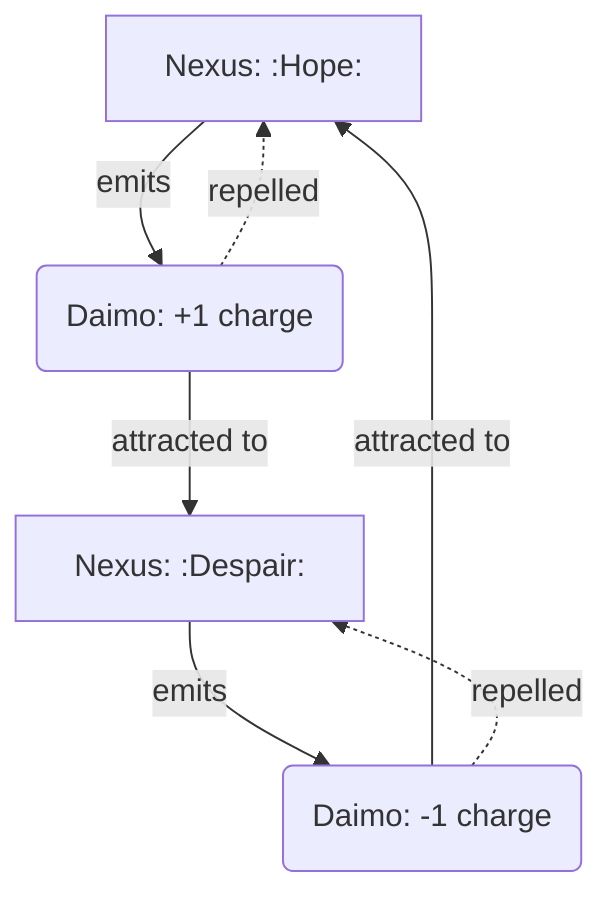

Note: Consolidated here → ../notes/diagrams/field-node-lifecycle-additional-diagrams.md ^ref-e9b27b06-1-0

Excellent. With the **Field Node Lifecycle** document fully fleshed out and the system now reactive, dynamic, and narratively emergent, we can keep layering more visualizations to explore the richness of your topology. ^ref-e9b27b06-3-0

Here are some **additional diagrams** to stack on top of what’s already in the doc: ^ref-e9b27b06-5-0

---

### 🔁 **Daimo–Node Charge Interaction**


^ref-e9b27b06-11-0
 ^ref-e9b27b06-21-0
This shows how **Nexuses repel their own children** (same charge) and attract those of **opposite charge**, creating **narrative currents** and **conceptual magnetism**.

---

### 🧠 **Multi-Circuit Node Propagation**
 ^ref-e9b27b06-27-0
```mermaid
graph TD
  L4[Nemesian Nexus: :TrustIssue:] --> L2[Dorian Attractor: :RepairNeed:]
  L4 --> L5[Heuretic Hazard: :Unlearning:]
  L4 --> L7[Metisean Obstacle: :PlanBlock:]

  style L4 fill:#ffcccc,stroke:#cc0000,stroke-width:2px
  style L2 fill:#ccffcc,stroke:#009900
  style L5 fill:#ffffcc,stroke:#999900
  style L7 fill:#ccccff,stroke:#000099
^ref-e9b27b06-27-0
``` ^ref-e9b27b06-39-0

This makes clear how **one symbolic conflict** creates **ripples across multiple circuits**, each materializing in a different node type.

---

### 🌱 **Node Growth and Death Conditions** ^ref-e9b27b06-45-0

```mermaid
stateDiagram-v2
    [*] --> HighTension
    HighTension --> Aggregation : daimo present
    Aggregation --> Crystallization : daimo bind fails to resolve
    Crystallization --> Stabilized : node repeatedly engaged
    Crystallization --> Nexus : symbol recognized
    Stabilized --> Decay : no activity
    Nexus --> Decay : symbolic reference fades
^ref-e9b27b06-45-0
    Decay --> [*] ^ref-e9b27b06-57-0
```

This is a simplified version of your existing diagram, useful for focused visualization of **grow/decay logic** alone.

---
 ^ref-e9b27b06-63-0
### 💡 **Node Type Summary Map**

```mermaid
graph LR
  subgraph Field Nodes
    Nexus -->|binds| Daimo
    Hazard -->|repels| Daimo
    Attractor -->|pulls| Daimo
^ref-e9b27b06-63-0
    Obstacle -->|slows| Daimo ^ref-e9b27b06-73-0
  end
```
^ref-e9b27b06-66-0

You can use this one as a **legend** or top-of-page visual summary in any future docs about field simulation or node-class behavior.

---
 ^ref-e9b27b06-80-0
Want me to embed these into the **Field Node Lifecycle** document under a “More Diagrams” section? Or split them out into a new document called something like `Field Node Diagrams` or `Cognitive Topology Visuals`?
--- ^ref-e9b27b06-82-0
 ^ref-e9b27b06-84-0
Related notes: [[../notes/diagrams/node-type-topology-map|node-type-topology-map]], [[../notes/diagrams/circuit-weight-visualizations|circuit-weight-visualizations]], [[../notes/diagrams/full-system-overview-diagrams|full-system-overview-diagrams]], [[../notes/diagrams/layer1-uptime-diagrams|layer1-uptime-diagrams]], [[../notes/diagrams/field-node-lifecycle-additional-diagrams|field-node-lifecycle-additional-diagrams]], [[../notes/diagrams/state-diagram-node-lifecycle|state-diagram-node-lifecycle]] [[index|unique/index]]
 ^ref-e9b27b06-85-0
#tags: #diagram #design
