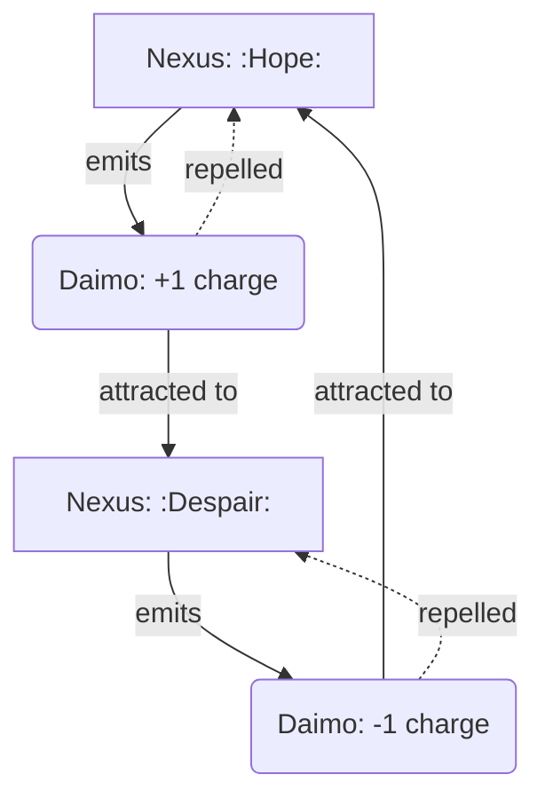

Note: Consolidated here → ../notes/diagrams/field-node-lifecycle-additional-diagrams.md ^ref-e9b27b06-1-0

Excellent. With the **Field Node Lifecycle** document fully fleshed out and the system now reactive, dynamic, and narratively emergent, we can keep layering more visualizations to explore the richness of your topology. ^ref-e9b27b06-3-0

Here are some **additional diagrams** to stack on top of what’s already in the doc: ^ref-e9b27b06-5-0

---

### 🔁 **Daimo–Node Charge Interaction**


^ref-e9b27b06-11-0
 ^ref-e9b27b06-21-0
This shows how **Nexuses repel their own children** (same charge) and attract those of **opposite charge**, creating **narrative currents** and **conceptual magnetism**.

---

### 🧠 **Multi-Circuit Node Propagation**
 ^ref-e9b27b06-27-0
```mermaid
graph TD
  L4[Nemesian Nexus: :TrustIssue:] --> L2[Dorian Attractor: :RepairNeed:]
  L4 --> L5[Heuretic Hazard: :Unlearning:]
  L4 --> L7[Metisean Obstacle: :PlanBlock:]

  style L4 fill:#ffcccc,stroke:#cc0000,stroke-width:2px
  style L2 fill:#ccffcc,stroke:#009900
  style L5 fill:#ffffcc,stroke:#999900
  style L7 fill:#ccccff,stroke:#000099
^ref-e9b27b06-27-0
``` ^ref-e9b27b06-39-0

This makes clear how **one symbolic conflict** creates **ripples across multiple circuits**, each materializing in a different node type.

---

### 🌱 **Node Growth and Death Conditions** ^ref-e9b27b06-45-0

```mermaid
stateDiagram-v2
    [*] --> HighTension
    HighTension --> Aggregation : daimo present
    Aggregation --> Crystallization : daimo bind fails to resolve
    Crystallization --> Stabilized : node repeatedly engaged
    Crystallization --> Nexus : symbol recognized
    Stabilized --> Decay : no activity
    Nexus --> Decay : symbolic reference fades
^ref-e9b27b06-45-0
    Decay --> [*] ^ref-e9b27b06-57-0
```

This is a simplified version of your existing diagram, useful for focused visualization of **grow/decay logic** alone.

---
 ^ref-e9b27b06-63-0
### 💡 **Node Type Summary Map**

```mermaid
graph LR
  subgraph Field Nodes
    Nexus -->|binds| Daimo
    Hazard -->|repels| Daimo
    Attractor -->|pulls| Daimo
^ref-e9b27b06-63-0
    Obstacle -->|slows| Daimo ^ref-e9b27b06-73-0
  end
```
^ref-e9b27b06-66-0

You can use this one as a **legend** or top-of-page visual summary in any future docs about field simulation or node-class behavior.

---
 ^ref-e9b27b06-80-0
Want me to embed these into the **Field Node Lifecycle** document under a “More Diagrams” section? Or split them out into a new document called something like `Field Node Diagrams` or `Cognitive Topology Visuals`?
--- ^ref-e9b27b06-82-0
 ^ref-e9b27b06-84-0
Related notes: [[../notes/diagrams/node-type-topology-map|node-type-topology-map]], [[../notes/diagrams/circuit-weight-visualizations|circuit-weight-visualizations]], [[../notes/diagrams/full-system-overview-diagrams|full-system-overview-diagrams]], [[../notes/diagrams/layer1-uptime-diagrams|layer1-uptime-diagrams]], [[../notes/diagrams/field-node-lifecycle-additional-diagrams|field-node-lifecycle-additional-diagrams]], [[../notes/diagrams/state-diagram-node-lifecycle|state-diagram-node-lifecycle]] [[index|unique/index]]
 ^ref-e9b27b06-85-0
#tags: #diagram #design<!-- GENERATED-SECTIONS:DO-NOT-EDIT-BELOW -->
## Related content
- [typed-struct-compiler](typed-struct-compiler.md)
- [zero-copy-snapshots-and-workers](zero-copy-snapshots-and-workers.md)
- [Math Fundamentals](chunks/math-fundamentals.md)
- [field-dynamics-math-blocks](field-dynamics-math-blocks.md)
- [field-interaction-equations](field-interaction-equations.md)
- [windows-tiling-with-autohotkey](windows-tiling-with-autohotkey.md)
- [Dynamic Context Model for Web Components](dynamic-context-model-for-web-components.md)
- [Eidolon Field Abstract Model](eidolon-field-abstract-model.md)
- [eidolon-node-lifecycle](eidolon-node-lifecycle.md)
- [TypeScript Patch for Tool Calling Support](typescript-patch-for-tool-calling-support.md)
- [Diagrams](chunks/diagrams.md)
- [DSL](chunks/dsl.md)
- [Tooling](chunks/tooling.md)
- [Window Management](chunks/window-management.md)
- [Debugging Broker Connections and Agent Behavior](debugging-broker-connections-and-agent-behavior.md)
- [Duck's Self-Referential Perceptual Loop](ducks-self-referential-perceptual-loop.md)
- [Unique Info Dump Index](unique-info-dump-index.md)
- [Creative Moments](creative-moments.md)
- [Duck's Attractor States](ducks-attractor-states.md)
- [eidolon-field-math-foundations](eidolon-field-math-foundations.md)
- [Per-Domain Policy System for JS Crawler](per-domain-policy-system-for-js-crawler.md)
- [Operations](chunks/operations.md)
- [Services](chunks/services.md)
- [Factorio AI with External Agents](factorio-ai-with-external-agents.md)
- [field-node-diagram-set](field-node-diagram-set.md)
- [Fnord Tracer Protocol](fnord-tracer-protocol.md)
- [Functional Embedding Pipeline Refactor](functional-embedding-pipeline-refactor.md)
- [Functional Refactor of TypeScript Document Processing](functional-refactor-of-typescript-document-processing.md)
- [heartbeat-fragment-demo](heartbeat-fragment-demo.md)
- [field-node-diagram-outline](field-node-diagram-outline.md)
- [Prometheus Observability Stack](prometheus-observability-stack.md)
- [polyglot-repl-interface-layer](polyglot-repl-interface-layer.md)
- [ripple-propagation-demo](ripple-propagation-demo.md)
- [graph-ds](graph-ds.md)
- [homeostasis-decay-formulas](homeostasis-decay-formulas.md)
- [i3-bluetooth-setup](i3-bluetooth-setup.md)
- [Ice Box Reorganization](ice-box-reorganization.md)
- [Layer1SurvivabilityEnvelope](layer1survivabilityenvelope.md)
- [Migrate to Provider-Tenant Architecture](migrate-to-provider-tenant-architecture.md)
- [Model Selection for Lightweight Conversational Tasks](model-selection-for-lightweight-conversational-tasks.md)
- [obsidian-ignore-node-modules-regex](obsidian-ignore-node-modules-regex.md)
- [Obsidian Templating Plugins Integration Guide](obsidian-templating-plugins-integration-guide.md)
- [Performance-Optimized-Polyglot-Bridge](performance-optimized-polyglot-bridge.md)
- [Pipeline Enhancements](pipeline-enhancements.md)
- [plan-update-confirmation](plan-update-confirmation.md)
- [Post-Linguistic Transhuman Design Frameworks](post-linguistic-transhuman-design-frameworks.md)
- [Promethean Chat Activity Report](promethean-chat-activity-report.md)
- [Promethean-Copilot-Intent-Engine](promethean-copilot-intent-engine.md)
- [NPU Voice Code and Sensory Integration](npu-voice-code-and-sensory-integration.md)
- [ParticleSimulationWithCanvasAndFFmpeg](particlesimulationwithcanvasandffmpeg.md)
- [Obsidian ChatGPT Plugin Integration Guide](obsidian-chatgpt-plugin-integration-guide.md)
- [Obsidian ChatGPT Plugin Integration](obsidian-chatgpt-plugin-integration.md)
- [Obsidian Task Generation](obsidian-task-generation.md)
- [komorebi-group-window-hack](komorebi-group-window-hack.md)
- [JavaScript](chunks/javascript.md)
- [Shared](chunks/shared.md)
- [Simulation Demo](chunks/simulation-demo.md)
- [Optimizing Command Limitations in System Design](optimizing-command-limitations-in-system-design.md)
- [DuckDuckGoSearchPipeline](duckduckgosearchpipeline.md)
- [Promethean State Format](promethean-state-format.md)
- [Promethean Workflow Optimization](promethean-workflow-optimization.md)
- [Chroma Toolkit Consolidation Plan](chroma-toolkit-consolidation-plan.md)
- [Unique Concepts](unique-concepts.md)
- [Smoke Resonance Visualizations](smoke-resonance-visualizations.md)
- [Synchronicity Waves and Web](synchronicity-waves-and-web.md)
- [The Jar of Echoes](the-jar-of-echoes.md)
- [schema-evolution-workflow](schema-evolution-workflow.md)
- [Promethean Dev Workflow Update](promethean-dev-workflow-update.md)
- [Prompt_Folder_Bootstrap](prompt-folder-bootstrap.md)
- [Protocol_0_The_Contradiction_Engine](protocol-0-the-contradiction-engine.md)
- [Provider-Agnostic Chat Panel Implementation](provider-agnostic-chat-panel-implementation.md)
- [Pure TypeScript Search Microservice](pure-typescript-search-microservice.md)
- [Reawakening Duck](reawakening-duck.md)
- [sibilant-macro-targets](sibilant-macro-targets.md)
- [Promethean Data Sync Protocol](promethean-data-sync-protocol.md)
- [Promethean_Eidolon_Synchronicity_Model](promethean-eidolon-synchronicity-model.md)
- [Mathematics Sampler](mathematics-sampler.md)
- [Model Upgrade Calm-Down Guide](model-upgrade-calm-down-guide.md)
- [OpenAPI Validation Report](openapi-validation-report.md)
- [Docops Feature Updates](docops-feature-updates.md)
- [unique-templates](templates/unique-templates.md)
- [Tracing the Signal](tracing-the-signal.md)
- [ts-to-lisp-transpiler](ts-to-lisp-transpiler.md)
- [Promethean Documentation Overview](promethean-documentation-overview.md)
- [Promethean Documentation Pipeline Overview](promethean-documentation-pipeline-overview.md)
- [Promethean Documentation Update](promethean-documentation-update.md)
- [Docops Feature Updates](docops-feature-updates-2.md)
- [Redirecting Standard Error](redirecting-standard-error.md)
- [Self-Agency in AI Interaction](self-agency-in-ai-interaction.md)
- [Promethean Notes](promethean-notes.md)
- [Promethean Infrastructure Setup](promethean-infrastructure-setup.md)
- [Promethean Pipelines](promethean-pipelines.md)
- [promethean-requirements](promethean-requirements.md)
- [Promethean Documentation Update](promethean-documentation-update.txt)
- [Mathematical Samplers](mathematical-samplers.md)
- [Mindful Prioritization](mindful-prioritization.md)
- [MindfulRobotIntegration](mindfulrobotintegration.md)
- [Stateful Partitions and Rebalancing](stateful-partitions-and-rebalancing.md)
- [Self-Improving Documentation Tool](self-improving-documentation-tool.md)
- [Git Commit Optimization for Code Reviews](git-commit-optimization-for-code-reviews.md)
- [Fastify Static Files Plugin](fastify-static-files-plugin.md)
- [run-step-api](run-step-api.md)
- [Promethean Documentation Update](promethean-documentation-update-4.md)
- [Canonical Org-Babel Matplotlib Animation Template](canonical-org-babel-matplotlib-animation-template.md)
- [RAG UI Panel with Qdrant and PostgREST](rag-ui-panel-with-qdrant-and-postgrest.md)
- [WebSocket Gateway Implementation](websocket-gateway-implementation.md)
- [Universal Lisp Interface](universal-lisp-interface.md)
- [ecs-offload-workers](ecs-offload-workers.md)
- [pm2-orchestration-patterns](pm2-orchestration-patterns.md)
- [layer-1-uptime-diagrams](layer-1-uptime-diagrams.md)
- [Local-Only-LLM-Workflow](local-only-llm-workflow.md)
- [Promethean-native config design](promethean-native-config-design.md)
- [System Scheduler with Resource-Aware DAG](system-scheduler-with-resource-aware-dag.md)
- [promethean-system-diagrams](promethean-system-diagrams.md)
- [ecs-scheduler-and-prefabs](ecs-scheduler-and-prefabs.md)
- [compiler-kit-foundations](compiler-kit-foundations.md)
## Sources
- [typed-struct-compiler — L1016](typed-struct-compiler.md#^ref-78eeedf7-1016-0) (line 1016, col 0, score 1)
- [Unique Concepts — L175](unique-concepts.md#^ref-ed6f3fc9-175-0) (line 175, col 0, score 1)
- [Unique Info Dump Index — L1221](unique-info-dump-index.md#^ref-30ec3ba6-1221-0) (line 1221, col 0, score 1)
- [zero-copy-snapshots-and-workers — L1058](zero-copy-snapshots-and-workers.md#^ref-62bec6f0-1058-0) (line 1058, col 0, score 1)
- [Canonical Org-Babel Matplotlib Animation Template — L515](canonical-org-babel-matplotlib-animation-template.md#^ref-1b1338fc-515-0) (line 515, col 0, score 1)
- [Creative Moments — L251](creative-moments.md#^ref-10d98225-251-0) (line 251, col 0, score 1)
- [Duck's Attractor States — L559](ducks-attractor-states.md#^ref-13951643-559-0) (line 559, col 0, score 1)
- [eidolon-field-math-foundations — L1033](eidolon-field-math-foundations.md#^ref-008f2ac0-1033-0) (line 1033, col 0, score 1)
- [Prometheus Observability Stack — L480](prometheus-observability-stack.md#^ref-e90b5a16-480-0) (line 480, col 0, score 0.86)
- [RAG UI Panel with Qdrant and PostgREST — L79](rag-ui-panel-with-qdrant-and-postgrest.md#^ref-e1056831-79-0) (line 79, col 0, score 0.87)
- [RAG UI Panel with Qdrant and PostgREST — L50](rag-ui-panel-with-qdrant-and-postgrest.md#^ref-e1056831-50-0) (line 50, col 0, score 0.88)
- [polyglot-repl-interface-layer — L114](polyglot-repl-interface-layer.md#^ref-9c79206d-114-0) (line 114, col 0, score 0.85)
- [RAG UI Panel with Qdrant and PostgREST — L110](rag-ui-panel-with-qdrant-and-postgrest.md#^ref-e1056831-110-0) (line 110, col 0, score 0.85)
- [schema-evolution-workflow — L29](schema-evolution-workflow.md#^ref-d8059b6a-29-0) (line 29, col 0, score 0.85)
- [WebSocket Gateway Implementation — L56](websocket-gateway-implementation.md#^ref-e811123d-56-0) (line 56, col 0, score 0.86)
- [WebSocket Gateway Implementation — L296](websocket-gateway-implementation.md#^ref-e811123d-296-0) (line 296, col 0, score 0.85)
- [Prometheus Observability Stack — L483](prometheus-observability-stack.md#^ref-e90b5a16-483-0) (line 483, col 0, score 0.85)
- [RAG UI Panel with Qdrant and PostgREST — L47](rag-ui-panel-with-qdrant-and-postgrest.md#^ref-e1056831-47-0) (line 47, col 0, score 0.85)
- [polyglot-repl-interface-layer — L71](polyglot-repl-interface-layer.md#^ref-9c79206d-71-0) (line 71, col 0, score 0.85)
- [WebSocket Gateway Implementation — L43](websocket-gateway-implementation.md#^ref-e811123d-43-0) (line 43, col 0, score 0.85)
- [field-node-diagram-outline — L98](field-node-diagram-outline.md#^ref-1f32c94a-98-0) (line 98, col 0, score 1)
- [eidolon-node-lifecycle — L25](eidolon-node-lifecycle.md#^ref-938eca9c-25-0) (line 25, col 0, score 0.98)
- [field-node-diagram-set — L137](field-node-diagram-set.md#^ref-22b989d5-137-0) (line 137, col 0, score 0.97)
- [TypeScript Patch for Tool Calling Support — L574](typescript-patch-for-tool-calling-support.md#^ref-7b7ca860-574-0) (line 574, col 0, score 1)
- [Per-Domain Policy System for JS Crawler — L541](per-domain-policy-system-for-js-crawler.md#^ref-c03020e1-541-0) (line 541, col 0, score 1)
- [Performance-Optimized-Polyglot-Bridge — L503](performance-optimized-polyglot-bridge.md#^ref-f5579967-503-0) (line 503, col 0, score 1)
- [Pipeline Enhancements — L17](pipeline-enhancements.md#^ref-e2135d9f-17-0) (line 17, col 0, score 1)
- [plan-update-confirmation — L1056](plan-update-confirmation.md#^ref-b22d79c6-1056-0) (line 1056, col 0, score 1)
- [Post-Linguistic Transhuman Design Frameworks — L116](post-linguistic-transhuman-design-frameworks.md#^ref-6bcff92c-116-0) (line 116, col 0, score 1)
- [Promethean Chat Activity Report — L41](promethean-chat-activity-report.md#^ref-18344cf9-41-0) (line 41, col 0, score 1)
- [Promethean-Copilot-Intent-Engine — L118](promethean-copilot-intent-engine.md#^ref-ae24a280-118-0) (line 118, col 0, score 1)
- [Promethean Data Sync Protocol — L20](promethean-data-sync-protocol.md#^ref-9fab9e76-20-0) (line 20, col 0, score 1)
- [Promethean_Eidolon_Synchronicity_Model — L92](promethean-eidolon-synchronicity-model.md#^ref-2d6e5553-92-0) (line 92, col 0, score 1)
- [Prometheus Observability Stack — L565](prometheus-observability-stack.md#^ref-e90b5a16-565-0) (line 565, col 0, score 1)
- [Prompt_Folder_Bootstrap — L244](prompt-folder-bootstrap.md#^ref-bd4f0976-244-0) (line 244, col 0, score 1)
- [Protocol_0_The_Contradiction_Engine — L159](protocol-0-the-contradiction-engine.md#^ref-9a93a756-159-0) (line 159, col 0, score 1)
- [Fnord Tracer Protocol — L272](fnord-tracer-protocol.md#^ref-fc21f824-272-0) (line 272, col 0, score 1)
- [Layer1SurvivabilityEnvelope — L245](layer1survivabilityenvelope.md#^ref-64a9f9f9-245-0) (line 245, col 0, score 1)
- [Mathematics Sampler — L132](mathematics-sampler.md#^ref-b5e0183e-132-0) (line 132, col 0, score 1)
- [Migrate to Provider-Tenant Architecture — L375](migrate-to-provider-tenant-architecture.md#^ref-54382370-375-0) (line 375, col 0, score 1)
- [Model Selection for Lightweight Conversational Tasks — L215](model-selection-for-lightweight-conversational-tasks.md#^ref-d144aa62-215-0) (line 215, col 0, score 1)
- [Model Upgrade Calm-Down Guide — L164](model-upgrade-calm-down-guide.md#^ref-db74343f-164-0) (line 164, col 0, score 1)
- [NPU Voice Code and Sensory Integration — L90](npu-voice-code-and-sensory-integration.md#^ref-5a02283e-90-0) (line 90, col 0, score 1)
- [obsidian-ignore-node-modules-regex — L132](obsidian-ignore-node-modules-regex.md#^ref-ffb9b2a9-132-0) (line 132, col 0, score 1)
- [Obsidian Templating Plugins Integration Guide — L172](obsidian-templating-plugins-integration-guide.md#^ref-b39dc9d4-172-0) (line 172, col 0, score 1)
- [ParticleSimulationWithCanvasAndFFmpeg — L336](particlesimulationwithcanvasandffmpeg.md#^ref-e018dd7a-336-0) (line 336, col 0, score 1)
- [Post-Linguistic Transhuman Design Frameworks — L137](post-linguistic-transhuman-design-frameworks.md#^ref-6bcff92c-137-0) (line 137, col 0, score 1)
- [field-interaction-equations — L300](field-interaction-equations.md#^ref-b09141b7-300-0) (line 300, col 0, score 0.86)
- [Docops Feature Updates — L180](docops-feature-updates-2.md#^ref-cdbd21ee-180-0) (line 180, col 0, score 0.86)
- [Docops Feature Updates — L168](docops-feature-updates.md#^ref-2792d448-168-0) (line 168, col 0, score 0.86)
- [heartbeat-fragment-demo — L261](heartbeat-fragment-demo.md#^ref-dd00677a-261-0) (line 261, col 0, score 0.86)
- [Math Fundamentals — L199](chunks/math-fundamentals.md#^ref-c6e87433-199-0) (line 199, col 0, score 0.86)
- [Post-Linguistic Transhuman Design Frameworks — L261](post-linguistic-transhuman-design-frameworks.md#^ref-6bcff92c-261-0) (line 261, col 0, score 0.86)
- [TypeScript Patch for Tool Calling Support — L706](typescript-patch-for-tool-calling-support.md#^ref-7b7ca860-706-0) (line 706, col 0, score 0.87)
- [Debugging Broker Connections and Agent Behavior — L3469](debugging-broker-connections-and-agent-behavior.md#^ref-73d3dbf6-3469-0) (line 3469, col 0, score 0.99)
- [DuckDuckGoSearchPipeline — L1053](duckduckgosearchpipeline.md#^ref-e979c50f-1053-0) (line 1053, col 0, score 0.99)
- [Duck's Attractor States — L2575](ducks-attractor-states.md#^ref-13951643-2575-0) (line 2575, col 0, score 0.99)
- [Fnord Tracer Protocol — L5440](fnord-tracer-protocol.md#^ref-fc21f824-5440-0) (line 5440, col 0, score 0.99)
- [schema-evolution-workflow — L688](schema-evolution-workflow.md#^ref-d8059b6a-688-0) (line 688, col 0, score 1)
- [Pipeline Enhancements — L166](pipeline-enhancements.md#^ref-e2135d9f-166-0) (line 166, col 0, score 0.96)
- [ParticleSimulationWithCanvasAndFFmpeg — L5875](particlesimulationwithcanvasandffmpeg.md#^ref-e018dd7a-5875-0) (line 5875, col 0, score 0.95)
- [ParticleSimulationWithCanvasAndFFmpeg — L378](particlesimulationwithcanvasandffmpeg.md#^ref-e018dd7a-378-0) (line 378, col 0, score 0.93)
- [Docops Feature Updates — L127](docops-feature-updates-2.md#^ref-cdbd21ee-127-0) (line 127, col 0, score 0.86)
- [Docops Feature Updates — L151](docops-feature-updates.md#^ref-2792d448-151-0) (line 151, col 0, score 0.86)
- [Eidolon Field Abstract Model — L312](eidolon-field-abstract-model.md#^ref-5e8b2388-312-0) (line 312, col 0, score 0.86)
- [Fnord Tracer Protocol — L387](fnord-tracer-protocol.md#^ref-fc21f824-387-0) (line 387, col 0, score 0.86)
- [Functional Embedding Pipeline Refactor — L424](functional-embedding-pipeline-refactor.md#^ref-a4a25141-424-0) (line 424, col 0, score 0.86)
- [graph-ds — L480](graph-ds.md#^ref-6620e2f2-480-0) (line 480, col 0, score 0.86)
- [Promethean Documentation Pipeline Overview — L317](promethean-documentation-pipeline-overview.md#^ref-3a3bf2c9-317-0) (line 317, col 0, score 1)
- [windows-tiling-with-autohotkey — L18888](windows-tiling-with-autohotkey.md#^ref-0f6f8f38-18888-0) (line 18888, col 0, score 0.95)
- [eidolon-field-math-foundations — L23636](eidolon-field-math-foundations.md#^ref-008f2ac0-23636-0) (line 23636, col 0, score 0.95)
- [Debugging Broker Connections and Agent Behavior — L2577](debugging-broker-connections-and-agent-behavior.md#^ref-73d3dbf6-2577-0) (line 2577, col 0, score 0.95)
- [zero-copy-snapshots-and-workers — L2679](zero-copy-snapshots-and-workers.md#^ref-62bec6f0-2679-0) (line 2679, col 0, score 0.95)
- [plan-update-confirmation — L7097](plan-update-confirmation.md#^ref-b22d79c6-7097-0) (line 7097, col 0, score 0.95)
- [Chroma Toolkit Consolidation Plan — L6347](chroma-toolkit-consolidation-plan.md#^ref-5020e892-6347-0) (line 6347, col 0, score 0.95)
- [Tooling — L1985](chunks/tooling.md#^ref-6cb4943e-1985-0) (line 1985, col 0, score 0.95)
- [Promethean Dev Workflow Update — L14560](promethean-dev-workflow-update.md#^ref-03a5578f-14560-0) (line 14560, col 0, score 0.97)
- [Promethean Notes — L1420](promethean-notes.md#^ref-1c4046b5-1420-0) (line 1420, col 0, score 0.96)
- [eidolon-field-math-foundations — L19823](eidolon-field-math-foundations.md#^ref-008f2ac0-19823-0) (line 19823, col 0, score 0.96)
- [Fnord Tracer Protocol — L3313](fnord-tracer-protocol.md#^ref-fc21f824-3313-0) (line 3313, col 0, score 0.96)
- [plan-update-confirmation — L4870](plan-update-confirmation.md#^ref-b22d79c6-4870-0) (line 4870, col 0, score 0.96)
- [Promethean Pipelines — L2095](promethean-pipelines.md#^ref-8b8e6103-2095-0) (line 2095, col 0, score 0.96)
- [plan-update-confirmation — L5497](plan-update-confirmation.md#^ref-b22d79c6-5497-0) (line 5497, col 0, score 0.95)
- [TypeScript Patch for Tool Calling Support — L3371](typescript-patch-for-tool-calling-support.md#^ref-7b7ca860-3371-0) (line 3371, col 0, score 0.95)
- [sibilant-macro-targets — L308](sibilant-macro-targets.md#^ref-c5c9a5c6-308-0) (line 308, col 0, score 1)
- [JavaScript — L2423](chunks/javascript.md#^ref-c1618c66-2423-0) (line 2423, col 0, score 0.95)
- [Tooling — L2426](chunks/tooling.md#^ref-6cb4943e-2426-0) (line 2426, col 0, score 0.95)
- [eidolon-field-math-foundations — L5191](eidolon-field-math-foundations.md#^ref-008f2ac0-5191-0) (line 5191, col 0, score 0.95)
- [Migrate to Provider-Tenant Architecture — L8585](migrate-to-provider-tenant-architecture.md#^ref-54382370-8585-0) (line 8585, col 0, score 0.95)
- [obsidian-ignore-node-modules-regex — L4351](obsidian-ignore-node-modules-regex.md#^ref-ffb9b2a9-4351-0) (line 4351, col 0, score 0.95)
- [ParticleSimulationWithCanvasAndFFmpeg — L4552](particlesimulationwithcanvasandffmpeg.md#^ref-e018dd7a-4552-0) (line 4552, col 0, score 0.95)
- [TypeScript Patch for Tool Calling Support — L700](typescript-patch-for-tool-calling-support.md#^ref-7b7ca860-700-0) (line 700, col 0, score 1)
- [Chroma Toolkit Consolidation Plan — L4198](chroma-toolkit-consolidation-plan.md#^ref-5020e892-4198-0) (line 4198, col 0, score 0.95)
- [Diagrams — L3732](chunks/diagrams.md#^ref-45cd25b5-3732-0) (line 3732, col 0, score 0.95)
- [DSL — L3844](chunks/dsl.md#^ref-e87bc036-3844-0) (line 3844, col 0, score 0.95)
- [JavaScript — L3774](chunks/javascript.md#^ref-c1618c66-3774-0) (line 3774, col 0, score 0.95)
- [Math Fundamentals — L3821](chunks/math-fundamentals.md#^ref-c6e87433-3821-0) (line 3821, col 0, score 0.95)
- [field-dynamics-math-blocks — L6347](field-dynamics-math-blocks.md#^ref-7cfc230d-6347-0) (line 6347, col 0, score 0.95)
- [field-interaction-equations — L6608](field-interaction-equations.md#^ref-b09141b7-6608-0) (line 6608, col 0, score 0.95)
- [Fnord Tracer Protocol — L6428](fnord-tracer-protocol.md#^ref-fc21f824-6428-0) (line 6428, col 0, score 0.95)
- [graph-ds — L5533](graph-ds.md#^ref-6620e2f2-5533-0) (line 5533, col 0, score 0.95)
- [heartbeat-fragment-demo — L4779](heartbeat-fragment-demo.md#^ref-dd00677a-4779-0) (line 4779, col 0, score 0.95)
- [Ice Box Reorganization — L4532](ice-box-reorganization.md#^ref-291c7d91-4532-0) (line 4532, col 0, score 0.95)
- [JavaScript — L3260](chunks/javascript.md#^ref-c1618c66-3260-0) (line 3260, col 0, score 0.96)
- [Math Fundamentals — L3464](chunks/math-fundamentals.md#^ref-c6e87433-3464-0) (line 3464, col 0, score 0.96)
- [Operations — L1521](chunks/operations.md#^ref-f1add613-1521-0) (line 1521, col 0, score 0.96)
- [Services — L3293](chunks/services.md#^ref-75ea4a6a-3293-0) (line 3293, col 0, score 0.96)
- [Simulation Demo — L1478](chunks/simulation-demo.md#^ref-557309a3-1478-0) (line 1478, col 0, score 0.96)
- [Tooling — L2698](chunks/tooling.md#^ref-6cb4943e-2698-0) (line 2698, col 0, score 0.96)
- [Window Management — L3557](chunks/window-management.md#^ref-9e8ae388-3557-0) (line 3557, col 0, score 0.96)
- [Creative Moments — L1918](creative-moments.md#^ref-10d98225-1918-0) (line 1918, col 0, score 0.96)
- [Debugging Broker Connections and Agent Behavior — L3232](debugging-broker-connections-and-agent-behavior.md#^ref-73d3dbf6-3232-0) (line 3232, col 0, score 0.96)
- [DuckDuckGoSearchPipeline — L1644](duckduckgosearchpipeline.md#^ref-e979c50f-1644-0) (line 1644, col 0, score 0.96)
- [Duck's Attractor States — L1652](ducks-attractor-states.md#^ref-13951643-1652-0) (line 1652, col 0, score 0.96)
- [field-dynamics-math-blocks — L1884](field-dynamics-math-blocks.md#^ref-7cfc230d-1884-0) (line 1884, col 0, score 0.96)
- [eidolon-field-math-foundations — L3069](eidolon-field-math-foundations.md#^ref-008f2ac0-3069-0) (line 3069, col 0, score 0.95)
- [field-node-diagram-outline — L1980](field-node-diagram-outline.md#^ref-1f32c94a-1980-0) (line 1980, col 0, score 0.95)
- [homeostasis-decay-formulas — L2430](homeostasis-decay-formulas.md#^ref-37b5d236-2430-0) (line 2430, col 0, score 0.95)
- [Promethean Dev Workflow Update — L13202](promethean-dev-workflow-update.md#^ref-03a5578f-13202-0) (line 13202, col 0, score 0.95)
- [The Jar of Echoes — L15220](the-jar-of-echoes.md#^ref-18138627-15220-0) (line 15220, col 0, score 0.95)
- [windows-tiling-with-autohotkey — L18365](windows-tiling-with-autohotkey.md#^ref-0f6f8f38-18365-0) (line 18365, col 0, score 0.95)
- [Model Upgrade Calm-Down Guide — L860](model-upgrade-calm-down-guide.md#^ref-db74343f-860-0) (line 860, col 0, score 0.86)
- [NPU Voice Code and Sensory Integration — L735](npu-voice-code-and-sensory-integration.md#^ref-5a02283e-735-0) (line 735, col 0, score 0.86)
- [Obsidian ChatGPT Plugin Integration Guide — L1039](obsidian-chatgpt-plugin-integration-guide.md#^ref-1d3d6c3a-1039-0) (line 1039, col 0, score 0.86)
- [Obsidian ChatGPT Plugin Integration — L1019](obsidian-chatgpt-plugin-integration.md#^ref-ca8e1399-1019-0) (line 1019, col 0, score 0.86)
- [obsidian-ignore-node-modules-regex — L1272](obsidian-ignore-node-modules-regex.md#^ref-ffb9b2a9-1272-0) (line 1272, col 0, score 0.86)
- [Obsidian Task Generation — L780](obsidian-task-generation.md#^ref-9b694a91-780-0) (line 780, col 0, score 0.86)
- [Obsidian Templating Plugins Integration Guide — L1252](obsidian-templating-plugins-integration-guide.md#^ref-b39dc9d4-1252-0) (line 1252, col 0, score 0.86)
- [OpenAPI Validation Report — L781](openapi-validation-report.md#^ref-5c152b08-781-0) (line 781, col 0, score 0.86)
- [Optimizing Command Limitations in System Design — L1018](optimizing-command-limitations-in-system-design.md#^ref-98c8ff62-1018-0) (line 1018, col 0, score 0.86)
- [Promethean Documentation Overview — L580](promethean-documentation-overview.md#^ref-9413237f-580-0) (line 580, col 0, score 0.96)
- [Promethean Documentation Pipeline Overview — L1613](promethean-documentation-pipeline-overview.md#^ref-3a3bf2c9-1613-0) (line 1613, col 0, score 0.96)
- [Promethean Documentation Update — L1271](promethean-documentation-update.md#^ref-c0392040-1271-0) (line 1271, col 0, score 0.96)
- [Promethean_Eidolon_Synchronicity_Model — L3291](promethean-eidolon-synchronicity-model.md#^ref-2d6e5553-3291-0) (line 3291, col 0, score 0.96)
- [Promethean Infrastructure Setup — L6974](promethean-infrastructure-setup.md#^ref-6deed6ac-6974-0) (line 6974, col 0, score 0.96)
- [Promethean Pipelines — L4005](promethean-pipelines.md#^ref-8b8e6103-4005-0) (line 4005, col 0, score 0.96)
- [promethean-requirements — L1645](promethean-requirements.md#^ref-95205cd3-1645-0) (line 1645, col 0, score 0.96)
- [Promethean State Format — L3813](promethean-state-format.md#^ref-23df6ddb-3813-0) (line 3813, col 0, score 0.96)
- [Prometheus Observability Stack — L5781](prometheus-observability-stack.md#^ref-e90b5a16-5781-0) (line 5781, col 0, score 0.96)
- [Prompt_Folder_Bootstrap — L5891](prompt-folder-bootstrap.md#^ref-bd4f0976-5891-0) (line 5891, col 0, score 0.96)
- [i3-bluetooth-setup — L1021](i3-bluetooth-setup.md#^ref-5e408692-1021-0) (line 1021, col 0, score 0.87)
- [Ice Box Reorganization — L257](ice-box-reorganization.md#^ref-291c7d91-257-0) (line 257, col 0, score 0.87)
- [Unique Concepts — L716](unique-concepts.md#^ref-ed6f3fc9-716-0) (line 716, col 0, score 0.98)
- [polyglot-repl-interface-layer — L773](polyglot-repl-interface-layer.md#^ref-9c79206d-773-0) (line 773, col 0, score 0.96)
- [Promethean Chat Activity Report — L1336](promethean-chat-activity-report.md#^ref-18344cf9-1336-0) (line 1336, col 0, score 0.96)
- [Promethean Infrastructure Setup — L3460](promethean-infrastructure-setup.md#^ref-6deed6ac-3460-0) (line 3460, col 0, score 0.97)
- [typed-struct-compiler — L2270](typed-struct-compiler.md#^ref-78eeedf7-2270-0) (line 2270, col 0, score 0.97)
- [Promethean Dev Workflow Update — L1850](promethean-dev-workflow-update.md#^ref-03a5578f-1850-0) (line 1850, col 0, score 0.97)
- [Self-Agency in AI Interaction — L2386](self-agency-in-ai-interaction.md#^ref-49a9a860-2386-0) (line 2386, col 0, score 0.97)
- [The Jar of Echoes — L2455](the-jar-of-echoes.md#^ref-18138627-2455-0) (line 2455, col 0, score 0.97)
- [windows-tiling-with-autohotkey — L2835](windows-tiling-with-autohotkey.md#^ref-0f6f8f38-2835-0) (line 2835, col 0, score 0.97)
- [zero-copy-snapshots-and-workers — L2738](zero-copy-snapshots-and-workers.md#^ref-62bec6f0-2738-0) (line 2738, col 0, score 0.97)
- [Fnord Tracer Protocol — L4503](fnord-tracer-protocol.md#^ref-fc21f824-4503-0) (line 4503, col 0, score 0.97)
- [windows-tiling-with-autohotkey — L7938](windows-tiling-with-autohotkey.md#^ref-0f6f8f38-7938-0) (line 7938, col 0, score 0.94)
- [Stateful Partitions and Rebalancing — L2890](stateful-partitions-and-rebalancing.md#^ref-4330e8f0-2890-0) (line 2890, col 0, score 0.98)
- [Chroma Toolkit Consolidation Plan — L5432](chroma-toolkit-consolidation-plan.md#^ref-5020e892-5432-0) (line 5432, col 0, score 0.95)
- [Duck's Self-Referential Perceptual Loop — L2406](ducks-self-referential-perceptual-loop.md#^ref-71726f04-2406-0) (line 2406, col 0, score 0.95)
- [field-interaction-equations — L5858](field-interaction-equations.md#^ref-b09141b7-5858-0) (line 5858, col 0, score 0.95)
- [Functional Refactor of TypeScript Document Processing — L2242](functional-refactor-of-typescript-document-processing.md#^ref-1cfae310-2242-0) (line 2242, col 0, score 0.97)
- [graph-ds — L3757](graph-ds.md#^ref-6620e2f2-3757-0) (line 3757, col 0, score 0.97)
- [heartbeat-fragment-demo — L3479](heartbeat-fragment-demo.md#^ref-dd00677a-3479-0) (line 3479, col 0, score 0.97)
- [homeostasis-decay-formulas — L5594](homeostasis-decay-formulas.md#^ref-37b5d236-5594-0) (line 5594, col 0, score 0.97)
- [i3-bluetooth-setup — L2012](i3-bluetooth-setup.md#^ref-5e408692-2012-0) (line 2012, col 0, score 0.97)
- [Ice Box Reorganization — L3225](ice-box-reorganization.md#^ref-291c7d91-3225-0) (line 3225, col 0, score 0.97)
- [komorebi-group-window-hack — L4356](komorebi-group-window-hack.md#^ref-dd89372d-4356-0) (line 4356, col 0, score 0.97)
- [Layer1SurvivabilityEnvelope — L3752](layer1survivabilityenvelope.md#^ref-64a9f9f9-3752-0) (line 3752, col 0, score 0.97)
- [Mathematical Samplers — L1714](mathematical-samplers.md#^ref-86a691ec-1714-0) (line 1714, col 0, score 0.97)
- [Mathematics Sampler — L1736](mathematics-sampler.md#^ref-b5e0183e-1736-0) (line 1736, col 0, score 0.87)
- [Migrate to Provider-Tenant Architecture — L7748](migrate-to-provider-tenant-architecture.md#^ref-54382370-7748-0) (line 7748, col 0, score 0.87)
- [Obsidian ChatGPT Plugin Integration — L3847](obsidian-chatgpt-plugin-integration.md#^ref-ca8e1399-3847-0) (line 3847, col 0, score 0.87)
- [obsidian-ignore-node-modules-regex — L4433](obsidian-ignore-node-modules-regex.md#^ref-ffb9b2a9-4433-0) (line 4433, col 0, score 0.87)
- [Obsidian Task Generation — L1688](obsidian-task-generation.md#^ref-9b694a91-1688-0) (line 1688, col 0, score 0.87)
- [Obsidian Templating Plugins Integration Guide — L5168](obsidian-templating-plugins-integration-guide.md#^ref-b39dc9d4-5168-0) (line 5168, col 0, score 0.87)
- [OpenAPI Validation Report — L1563](openapi-validation-report.md#^ref-5c152b08-1563-0) (line 1563, col 0, score 0.87)
- [ParticleSimulationWithCanvasAndFFmpeg — L3400](particlesimulationwithcanvasandffmpeg.md#^ref-e018dd7a-3400-0) (line 3400, col 0, score 0.87)
- [Per-Domain Policy System for JS Crawler — L5381](per-domain-policy-system-for-js-crawler.md#^ref-c03020e1-5381-0) (line 5381, col 0, score 0.87)
- [DSL — L186](chunks/dsl.md#^ref-e87bc036-186-0) (line 186, col 0, score 0.98)
- [Math Fundamentals — L563](chunks/math-fundamentals.md#^ref-c6e87433-563-0) (line 563, col 0, score 0.98)
- [zero-copy-snapshots-and-workers — L691](zero-copy-snapshots-and-workers.md#^ref-62bec6f0-691-0) (line 691, col 0, score 1)
- [komorebi-group-window-hack — L1796](komorebi-group-window-hack.md#^ref-dd89372d-1796-0) (line 1796, col 0, score 0.97)
- [komorebi-group-window-hack — L2017](komorebi-group-window-hack.md#^ref-dd89372d-2017-0) (line 2017, col 0, score 0.97)
- [zero-copy-snapshots-and-workers — L1936](zero-copy-snapshots-and-workers.md#^ref-62bec6f0-1936-0) (line 1936, col 0, score 0.96)
- [zero-copy-snapshots-and-workers — L2202](zero-copy-snapshots-and-workers.md#^ref-62bec6f0-2202-0) (line 2202, col 0, score 0.96)
- [Unique Info Dump Index — L6662](unique-info-dump-index.md#^ref-30ec3ba6-6662-0) (line 6662, col 0, score 0.94)
- [heartbeat-fragment-demo — L1420](heartbeat-fragment-demo.md#^ref-dd00677a-1420-0) (line 1420, col 0, score 0.99)
- [eidolon-field-math-foundations — L24596](eidolon-field-math-foundations.md#^ref-008f2ac0-24596-0) (line 24596, col 0, score 0.99)
- [Promethean Dev Workflow Update — L22800](promethean-dev-workflow-update.md#^ref-03a5578f-22800-0) (line 22800, col 0, score 0.99)
- [windows-tiling-with-autohotkey — L22798](windows-tiling-with-autohotkey.md#^ref-0f6f8f38-22798-0) (line 22798, col 0, score 0.99)
- [Promethean Dev Workflow Update — L23713](promethean-dev-workflow-update.md#^ref-03a5578f-23713-0) (line 23713, col 0, score 0.97)
- [Mathematics Sampler — L324](mathematics-sampler.md#^ref-b5e0183e-324-0) (line 324, col 0, score 0.96)
- [Migrate to Provider-Tenant Architecture — L802](migrate-to-provider-tenant-architecture.md#^ref-54382370-802-0) (line 802, col 0, score 0.96)
- [Mindful Prioritization — L211](mindful-prioritization.md#^ref-40185d05-211-0) (line 211, col 0, score 0.96)
- [MindfulRobotIntegration — L199](mindfulrobotintegration.md#^ref-5f65dfa5-199-0) (line 199, col 0, score 0.96)
- [Model Upgrade Calm-Down Guide — L353](model-upgrade-calm-down-guide.md#^ref-db74343f-353-0) (line 353, col 0, score 0.96)
- [NPU Voice Code and Sensory Integration — L246](npu-voice-code-and-sensory-integration.md#^ref-5a02283e-246-0) (line 246, col 0, score 0.96)
- [Mindful Prioritization — L761](mindful-prioritization.md#^ref-40185d05-761-0) (line 761, col 0, score 0.97)
- [MindfulRobotIntegration — L759](mindfulrobotintegration.md#^ref-5f65dfa5-759-0) (line 759, col 0, score 0.97)
- [Model Selection for Lightweight Conversational Tasks — L1223](model-selection-for-lightweight-conversational-tasks.md#^ref-d144aa62-1223-0) (line 1223, col 0, score 0.97)
- [Model Upgrade Calm-Down Guide — L803](model-upgrade-calm-down-guide.md#^ref-db74343f-803-0) (line 803, col 0, score 0.97)
- [NPU Voice Code and Sensory Integration — L786](npu-voice-code-and-sensory-integration.md#^ref-5a02283e-786-0) (line 786, col 0, score 0.97)
- [Obsidian ChatGPT Plugin Integration Guide — L1097](obsidian-chatgpt-plugin-integration-guide.md#^ref-1d3d6c3a-1097-0) (line 1097, col 0, score 0.97)
- [Obsidian ChatGPT Plugin Integration — L1077](obsidian-chatgpt-plugin-integration.md#^ref-ca8e1399-1077-0) (line 1077, col 0, score 0.97)
- [obsidian-ignore-node-modules-regex — L1259](obsidian-ignore-node-modules-regex.md#^ref-ffb9b2a9-1259-0) (line 1259, col 0, score 0.97)
- [Obsidian Task Generation — L767](obsidian-task-generation.md#^ref-9b694a91-767-0) (line 767, col 0, score 0.97)
- [DSL — L304](chunks/dsl.md#^ref-e87bc036-304-0) (line 304, col 0, score 0.97)
- [Services — L875](chunks/services.md#^ref-75ea4a6a-875-0) (line 875, col 0, score 0.97)
- [Debugging Broker Connections and Agent Behavior — L1380](debugging-broker-connections-and-agent-behavior.md#^ref-73d3dbf6-1380-0) (line 1380, col 0, score 0.97)
- [Dynamic Context Model for Web Components — L1321](dynamic-context-model-for-web-components.md#^ref-f7702bf8-1321-0) (line 1321, col 0, score 0.97)
- [Eidolon Field Abstract Model — L1088](eidolon-field-abstract-model.md#^ref-5e8b2388-1088-0) (line 1088, col 0, score 0.97)
- [homeostasis-decay-formulas — L6526](homeostasis-decay-formulas.md#^ref-37b5d236-6526-0) (line 6526, col 0, score 0.96)
- [i3-bluetooth-setup — L3712](i3-bluetooth-setup.md#^ref-5e408692-3712-0) (line 3712, col 0, score 0.96)
- [komorebi-group-window-hack — L3075](komorebi-group-window-hack.md#^ref-dd89372d-3075-0) (line 3075, col 0, score 0.96)
- [Layer1SurvivabilityEnvelope — L4096](layer1survivabilityenvelope.md#^ref-64a9f9f9-4096-0) (line 4096, col 0, score 0.96)
- [Migrate to Provider-Tenant Architecture — L7335](migrate-to-provider-tenant-architecture.md#^ref-54382370-7335-0) (line 7335, col 0, score 0.96)
- [Mindful Prioritization — L1003](mindful-prioritization.md#^ref-40185d05-1003-0) (line 1003, col 0, score 0.96)
- [MindfulRobotIntegration — L1028](mindfulrobotintegration.md#^ref-5f65dfa5-1028-0) (line 1028, col 0, score 0.96)
- [Model Selection for Lightweight Conversational Tasks — L4902](model-selection-for-lightweight-conversational-tasks.md#^ref-d144aa62-4902-0) (line 4902, col 0, score 0.96)
- [Model Upgrade Calm-Down Guide — L3435](model-upgrade-calm-down-guide.md#^ref-db74343f-3435-0) (line 3435, col 0, score 0.96)
- [zero-copy-snapshots-and-workers — L1202](zero-copy-snapshots-and-workers.md#^ref-62bec6f0-1202-0) (line 1202, col 0, score 0.98)
- [Obsidian Templating Plugins Integration Guide — L4713](obsidian-templating-plugins-integration-guide.md#^ref-b39dc9d4-4713-0) (line 4713, col 0, score 0.9)
- [OpenAPI Validation Report — L1256](openapi-validation-report.md#^ref-5c152b08-1256-0) (line 1256, col 0, score 0.9)
- [Optimizing Command Limitations in System Design — L2139](optimizing-command-limitations-in-system-design.md#^ref-98c8ff62-2139-0) (line 2139, col 0, score 0.9)
- [Diagrams — L677](chunks/diagrams.md#^ref-45cd25b5-677-0) (line 677, col 0, score 0.98)
- [Services — L555](chunks/services.md#^ref-75ea4a6a-555-0) (line 555, col 0, score 0.98)
- [Shared — L921](chunks/shared.md#^ref-623a55f7-921-0) (line 921, col 0, score 0.98)
- [Simulation Demo — L926](chunks/simulation-demo.md#^ref-557309a3-926-0) (line 926, col 0, score 0.98)
- [Window Management — L1110](chunks/window-management.md#^ref-9e8ae388-1110-0) (line 1110, col 0, score 0.98)
- [Creative Moments — L1300](creative-moments.md#^ref-10d98225-1300-0) (line 1300, col 0, score 0.98)
- [Debugging Broker Connections and Agent Behavior — L502](debugging-broker-connections-and-agent-behavior.md#^ref-73d3dbf6-502-0) (line 502, col 0, score 0.98)
- [Docops Feature Updates — L728](docops-feature-updates-2.md#^ref-cdbd21ee-728-0) (line 728, col 0, score 0.98)
- [Docops Feature Updates — L782](docops-feature-updates.md#^ref-2792d448-782-0) (line 782, col 0, score 0.98)
- [Duck's Attractor States — L1489](ducks-attractor-states.md#^ref-13951643-1489-0) (line 1489, col 0, score 0.98)
- [Dynamic Context Model for Web Components — L1258](dynamic-context-model-for-web-components.md#^ref-f7702bf8-1258-0) (line 1258, col 0, score 0.98)
- [field-dynamics-math-blocks — L1239](field-dynamics-math-blocks.md#^ref-7cfc230d-1239-0) (line 1239, col 0, score 0.98)
- [field-interaction-equations — L1262](field-interaction-equations.md#^ref-b09141b7-1262-0) (line 1262, col 0, score 0.98)
- [field-node-diagram-set — L1037](field-node-diagram-set.md#^ref-22b989d5-1037-0) (line 1037, col 0, score 0.98)
- [Fnord Tracer Protocol — L1715](fnord-tracer-protocol.md#^ref-fc21f824-1715-0) (line 1715, col 0, score 0.98)
- [Simulation Demo — L652](chunks/simulation-demo.md#^ref-557309a3-652-0) (line 652, col 0, score 0.96)
- [windows-tiling-with-autohotkey — L730](windows-tiling-with-autohotkey.md#^ref-0f6f8f38-730-0) (line 730, col 0, score 0.99)
- [The Jar of Echoes — L1034](the-jar-of-echoes.md#^ref-18138627-1034-0) (line 1034, col 0, score 0.95)
- [Tracing the Signal — L1066](tracing-the-signal.md#^ref-c3cd4f65-1066-0) (line 1066, col 0, score 0.95)
- [windows-tiling-with-autohotkey — L1170](windows-tiling-with-autohotkey.md#^ref-0f6f8f38-1170-0) (line 1170, col 0, score 0.98)
- [zero-copy-snapshots-and-workers — L1056](zero-copy-snapshots-and-workers.md#^ref-62bec6f0-1056-0) (line 1056, col 0, score 0.98)
- [zero-copy-snapshots-and-workers — L2022](zero-copy-snapshots-and-workers.md#^ref-62bec6f0-2022-0) (line 2022, col 0, score 0.98)
- [windows-tiling-with-autohotkey — L3026](windows-tiling-with-autohotkey.md#^ref-0f6f8f38-3026-0) (line 3026, col 0, score 0.98)
- [TypeScript Patch for Tool Calling Support — L899](typescript-patch-for-tool-calling-support.md#^ref-7b7ca860-899-0) (line 899, col 0, score 0.97)
- [Unique Concepts — L1709](unique-concepts.md#^ref-ed6f3fc9-1709-0) (line 1709, col 0, score 0.97)
- [Unique Info Dump Index — L1227](unique-info-dump-index.md#^ref-30ec3ba6-1227-0) (line 1227, col 0, score 0.97)
- [windows-tiling-with-autohotkey — L1253](windows-tiling-with-autohotkey.md#^ref-0f6f8f38-1253-0) (line 1253, col 0, score 0.97)
- [zero-copy-snapshots-and-workers — L1174](zero-copy-snapshots-and-workers.md#^ref-62bec6f0-1174-0) (line 1174, col 0, score 0.99)
- [windows-tiling-with-autohotkey — L1011](windows-tiling-with-autohotkey.md#^ref-0f6f8f38-1011-0) (line 1011, col 0, score 0.98)
- [zero-copy-snapshots-and-workers — L757](zero-copy-snapshots-and-workers.md#^ref-62bec6f0-757-0) (line 757, col 0, score 0.98)
- [eidolon-field-math-foundations — L959](eidolon-field-math-foundations.md#^ref-008f2ac0-959-0) (line 959, col 0, score 0.96)
- [eidolon-node-lifecycle — L868](eidolon-node-lifecycle.md#^ref-938eca9c-868-0) (line 868, col 0, score 0.96)
- [Factorio AI with External Agents — L1000](factorio-ai-with-external-agents.md#^ref-a4d90289-1000-0) (line 1000, col 0, score 0.96)
- [field-dynamics-math-blocks — L1187](field-dynamics-math-blocks.md#^ref-7cfc230d-1187-0) (line 1187, col 0, score 0.96)
- [field-interaction-equations — L1282](field-interaction-equations.md#^ref-b09141b7-1282-0) (line 1282, col 0, score 0.96)
- [field-node-diagram-outline — L1130](field-node-diagram-outline.md#^ref-1f32c94a-1130-0) (line 1130, col 0, score 0.96)
- [field-node-diagram-set — L1046](field-node-diagram-set.md#^ref-22b989d5-1046-0) (line 1046, col 0, score 0.96)
- [Fnord Tracer Protocol — L1246](fnord-tracer-protocol.md#^ref-fc21f824-1246-0) (line 1246, col 0, score 0.96)
- [Functional Embedding Pipeline Refactor — L841](functional-embedding-pipeline-refactor.md#^ref-a4a25141-841-0) (line 841, col 0, score 0.96)
- [TypeScript Patch for Tool Calling Support — L1621](typescript-patch-for-tool-calling-support.md#^ref-7b7ca860-1621-0) (line 1621, col 0, score 0.96)
- [Unique Info Dump Index — L455](unique-info-dump-index.md#^ref-30ec3ba6-455-0) (line 455, col 0, score 0.96)
- [windows-tiling-with-autohotkey — L1607](windows-tiling-with-autohotkey.md#^ref-0f6f8f38-1607-0) (line 1607, col 0, score 0.96)
- [obsidian-ignore-node-modules-regex — L2442](obsidian-ignore-node-modules-regex.md#^ref-ffb9b2a9-2442-0) (line 2442, col 0, score 0.96)
- [Obsidian Templating Plugins Integration Guide — L3146](obsidian-templating-plugins-integration-guide.md#^ref-b39dc9d4-3146-0) (line 3146, col 0, score 0.96)
- [ParticleSimulationWithCanvasAndFFmpeg — L5008](particlesimulationwithcanvasandffmpeg.md#^ref-e018dd7a-5008-0) (line 5008, col 0, score 0.96)
- [heartbeat-fragment-demo — L3096](heartbeat-fragment-demo.md#^ref-dd00677a-3096-0) (line 3096, col 0, score 0.98)
- [homeostasis-decay-formulas — L4355](homeostasis-decay-formulas.md#^ref-37b5d236-4355-0) (line 4355, col 0, score 0.98)
- [i3-bluetooth-setup — L4818](i3-bluetooth-setup.md#^ref-5e408692-4818-0) (line 4818, col 0, score 0.98)
- [Ice Box Reorganization — L4548](ice-box-reorganization.md#^ref-291c7d91-4548-0) (line 4548, col 0, score 0.98)
- [komorebi-group-window-hack — L3722](komorebi-group-window-hack.md#^ref-dd89372d-3722-0) (line 3722, col 0, score 0.98)
- [Migrate to Provider-Tenant Architecture — L8343](migrate-to-provider-tenant-architecture.md#^ref-54382370-8343-0) (line 8343, col 0, score 0.98)
- [field-node-diagram-set — L327](field-node-diagram-set.md#^ref-22b989d5-327-0) (line 327, col 0, score 0.96)
- [Fnord Tracer Protocol — L1286](fnord-tracer-protocol.md#^ref-fc21f824-1286-0) (line 1286, col 0, score 0.96)
- [Functional Embedding Pipeline Refactor — L987](functional-embedding-pipeline-refactor.md#^ref-a4a25141-987-0) (line 987, col 0, score 0.96)
- [Functional Refactor of TypeScript Document Processing — L764](functional-refactor-of-typescript-document-processing.md#^ref-1cfae310-764-0) (line 764, col 0, score 0.96)
- [graph-ds — L1487](graph-ds.md#^ref-6620e2f2-1487-0) (line 1487, col 0, score 0.96)
- [heartbeat-fragment-demo — L278](heartbeat-fragment-demo.md#^ref-dd00677a-278-0) (line 278, col 0, score 0.96)
- [homeostasis-decay-formulas — L584](homeostasis-decay-formulas.md#^ref-37b5d236-584-0) (line 584, col 0, score 0.96)
- [i3-bluetooth-setup — L1201](i3-bluetooth-setup.md#^ref-5e408692-1201-0) (line 1201, col 0, score 0.96)
- [Ice Box Reorganization — L795](ice-box-reorganization.md#^ref-291c7d91-795-0) (line 795, col 0, score 0.96)
- [komorebi-group-window-hack — L1325](komorebi-group-window-hack.md#^ref-dd89372d-1325-0) (line 1325, col 0, score 0.96)
- [Prompt_Folder_Bootstrap — L1213](prompt-folder-bootstrap.md#^ref-bd4f0976-1213-0) (line 1213, col 0, score 0.97)
- [Protocol_0_The_Contradiction_Engine — L1158](protocol-0-the-contradiction-engine.md#^ref-9a93a756-1158-0) (line 1158, col 0, score 0.97)
- [Provider-Agnostic Chat Panel Implementation — L1317](provider-agnostic-chat-panel-implementation.md#^ref-43bfe9dd-1317-0) (line 1317, col 0, score 0.97)
- [Pure TypeScript Search Microservice — L1719](pure-typescript-search-microservice.md#^ref-d17d3a96-1719-0) (line 1719, col 0, score 0.97)
- [Reawakening Duck — L1168](reawakening-duck.md#^ref-59b5670f-1168-0) (line 1168, col 0, score 0.97)
- [Redirecting Standard Error — L766](redirecting-standard-error.md#^ref-b3555ede-766-0) (line 766, col 0, score 0.97)
- [schema-evolution-workflow — L1605](schema-evolution-workflow.md#^ref-d8059b6a-1605-0) (line 1605, col 0, score 0.97)
- [zero-copy-snapshots-and-workers — L1576](zero-copy-snapshots-and-workers.md#^ref-62bec6f0-1576-0) (line 1576, col 0, score 0.98)
- [zero-copy-snapshots-and-workers — L1516](zero-copy-snapshots-and-workers.md#^ref-62bec6f0-1516-0) (line 1516, col 0, score 0.98)
- [Operations — L398](chunks/operations.md#^ref-f1add613-398-0) (line 398, col 0, score 0.95)
- [Shared — L627](chunks/shared.md#^ref-623a55f7-627-0) (line 627, col 0, score 0.95)
- [Window Management — L805](chunks/window-management.md#^ref-9e8ae388-805-0) (line 805, col 0, score 0.95)
- [Creative Moments — L372](creative-moments.md#^ref-10d98225-372-0) (line 372, col 0, score 0.95)
- [Debugging Broker Connections and Agent Behavior — L770](debugging-broker-connections-and-agent-behavior.md#^ref-73d3dbf6-770-0) (line 770, col 0, score 0.95)
- [Dynamic Context Model for Web Components — L1814](dynamic-context-model-for-web-components.md#^ref-f7702bf8-1814-0) (line 1814, col 0, score 0.95)
- [eidolon-field-math-foundations — L1615](eidolon-field-math-foundations.md#^ref-008f2ac0-1615-0) (line 1615, col 0, score 0.95)
- [Unique Info Dump Index — L2432](unique-info-dump-index.md#^ref-30ec3ba6-2432-0) (line 2432, col 0, score 0.97)
- [Diagrams — L297](chunks/diagrams.md#^ref-45cd25b5-297-0) (line 297, col 0, score 0.98)
- [Docops Feature Updates — L594](docops-feature-updates-2.md#^ref-cdbd21ee-594-0) (line 594, col 0, score 0.98)
- [Promethean Chat Activity Report — L14460](promethean-chat-activity-report.md#^ref-18344cf9-14460-0) (line 14460, col 0, score 0.86)
- [Promethean Documentation Update — L12912](promethean-documentation-update.txt#^ref-0b872af2-12912-0) (line 12912, col 0, score 0.86)
- [Creative Moments — L14035](creative-moments.md#^ref-10d98225-14035-0) (line 14035, col 0, score 0.85)
- [Duck's Attractor States — L23117](ducks-attractor-states.md#^ref-13951643-23117-0) (line 23117, col 0, score 0.85)
- [The Jar of Echoes — L1448](the-jar-of-echoes.md#^ref-18138627-1448-0) (line 1448, col 0, score 0.95)
- [ts-to-lisp-transpiler — L784](ts-to-lisp-transpiler.md#^ref-ba11486b-784-0) (line 784, col 0, score 0.95)
- [heartbeat-fragment-demo — L1321](heartbeat-fragment-demo.md#^ref-dd00677a-1321-0) (line 1321, col 0, score 0.97)
- [homeostasis-decay-formulas — L1392](homeostasis-decay-formulas.md#^ref-37b5d236-1392-0) (line 1392, col 0, score 0.97)
- [i3-bluetooth-setup — L1287](i3-bluetooth-setup.md#^ref-5e408692-1287-0) (line 1287, col 0, score 0.97)
- [Ice Box Reorganization — L1090](ice-box-reorganization.md#^ref-291c7d91-1090-0) (line 1090, col 0, score 0.97)
- [komorebi-group-window-hack — L1393](komorebi-group-window-hack.md#^ref-dd89372d-1393-0) (line 1393, col 0, score 0.97)
- [Layer1SurvivabilityEnvelope — L1177](layer1survivabilityenvelope.md#^ref-64a9f9f9-1177-0) (line 1177, col 0, score 0.97)
- [Mathematical Samplers — L592](mathematical-samplers.md#^ref-86a691ec-592-0) (line 592, col 0, score 0.97)
- [Mathematics Sampler — L587](mathematics-sampler.md#^ref-b5e0183e-587-0) (line 587, col 0, score 0.97)
- [Migrate to Provider-Tenant Architecture — L1655](migrate-to-provider-tenant-architecture.md#^ref-54382370-1655-0) (line 1655, col 0, score 0.97)
- [Obsidian ChatGPT Plugin Integration — L1047](obsidian-chatgpt-plugin-integration.md#^ref-ca8e1399-1047-0) (line 1047, col 0, score 0.95)
- [obsidian-ignore-node-modules-regex — L1216](obsidian-ignore-node-modules-regex.md#^ref-ffb9b2a9-1216-0) (line 1216, col 0, score 0.95)
- [Obsidian Task Generation — L737](obsidian-task-generation.md#^ref-9b694a91-737-0) (line 737, col 0, score 0.95)
- [OpenAPI Validation Report — L738](openapi-validation-report.md#^ref-5c152b08-738-0) (line 738, col 0, score 0.95)
- [ParticleSimulationWithCanvasAndFFmpeg — L1475](particlesimulationwithcanvasandffmpeg.md#^ref-e018dd7a-1475-0) (line 1475, col 0, score 0.95)
- [unique-templates — L770](templates/unique-templates.md#^ref-c26f0044-770-0) (line 770, col 0, score 0.97)
- [The Jar of Echoes — L987](the-jar-of-echoes.md#^ref-18138627-987-0) (line 987, col 0, score 0.97)
- [windows-tiling-with-autohotkey — L594](windows-tiling-with-autohotkey.md#^ref-0f6f8f38-594-0) (line 594, col 0, score 0.98)
- [zero-copy-snapshots-and-workers — L969](zero-copy-snapshots-and-workers.md#^ref-62bec6f0-969-0) (line 969, col 0, score 0.98)
- [Mathematical Samplers — L1804](mathematical-samplers.md#^ref-86a691ec-1804-0) (line 1804, col 0, score 0.96)
- [Mathematics Sampler — L1835](mathematics-sampler.md#^ref-b5e0183e-1835-0) (line 1835, col 0, score 0.96)
- [windows-tiling-with-autohotkey — L985](windows-tiling-with-autohotkey.md#^ref-0f6f8f38-985-0) (line 985, col 0, score 0.98)
- [zero-copy-snapshots-and-workers — L780](zero-copy-snapshots-and-workers.md#^ref-62bec6f0-780-0) (line 780, col 0, score 0.98)
- [Per-Domain Policy System for JS Crawler — L2368](per-domain-policy-system-for-js-crawler.md#^ref-c03020e1-2368-0) (line 2368, col 0, score 0.97)
- [heartbeat-fragment-demo — L4029](heartbeat-fragment-demo.md#^ref-dd00677a-4029-0) (line 4029, col 0, score 0.97)
- [homeostasis-decay-formulas — L6026](homeostasis-decay-formulas.md#^ref-37b5d236-6026-0) (line 6026, col 0, score 0.97)
- [i3-bluetooth-setup — L4287](i3-bluetooth-setup.md#^ref-5e408692-4287-0) (line 4287, col 0, score 0.97)
- [Ice Box Reorganization — L4296](ice-box-reorganization.md#^ref-291c7d91-4296-0) (line 4296, col 0, score 0.97)
- [komorebi-group-window-hack — L3969](komorebi-group-window-hack.md#^ref-dd89372d-3969-0) (line 3969, col 0, score 0.97)
- [Layer1SurvivabilityEnvelope — L5113](layer1survivabilityenvelope.md#^ref-64a9f9f9-5113-0) (line 5113, col 0, score 0.97)
- [Migrate to Provider-Tenant Architecture — L7147](migrate-to-provider-tenant-architecture.md#^ref-54382370-7147-0) (line 7147, col 0, score 0.97)
- [Synchronicity Waves and Web — L2287](synchronicity-waves-and-web.md#^ref-91295f3a-2287-0) (line 2287, col 0, score 0.96)
- [ts-to-lisp-transpiler — L2339](ts-to-lisp-transpiler.md#^ref-ba11486b-2339-0) (line 2339, col 0, score 0.98)
- [typed-struct-compiler — L3549](typed-struct-compiler.md#^ref-78eeedf7-3549-0) (line 3549, col 0, score 0.98)
- [TypeScript Patch for Tool Calling Support — L6142](typescript-patch-for-tool-calling-support.md#^ref-7b7ca860-6142-0) (line 6142, col 0, score 0.98)
- [Unique Info Dump Index — L3887](unique-info-dump-index.md#^ref-30ec3ba6-3887-0) (line 3887, col 0, score 0.98)
- [windows-tiling-with-autohotkey — L4648](windows-tiling-with-autohotkey.md#^ref-0f6f8f38-4648-0) (line 4648, col 0, score 0.98)
- [field-interaction-equations — L1299](field-interaction-equations.md#^ref-b09141b7-1299-0) (line 1299, col 0, score 0.97)
- [field-node-diagram-outline — L1147](field-node-diagram-outline.md#^ref-1f32c94a-1147-0) (line 1147, col 0, score 0.97)
- [field-node-diagram-set — L1063](field-node-diagram-set.md#^ref-22b989d5-1063-0) (line 1063, col 0, score 0.97)
- [Fnord Tracer Protocol — L1263](fnord-tracer-protocol.md#^ref-fc21f824-1263-0) (line 1263, col 0, score 0.97)
- [Functional Embedding Pipeline Refactor — L880](functional-embedding-pipeline-refactor.md#^ref-a4a25141-880-0) (line 880, col 0, score 0.97)
- [Functional Refactor of TypeScript Document Processing — L696](functional-refactor-of-typescript-document-processing.md#^ref-1cfae310-696-0) (line 696, col 0, score 0.97)
- [graph-ds — L1546](graph-ds.md#^ref-6620e2f2-1546-0) (line 1546, col 0, score 0.97)
- [heartbeat-fragment-demo — L1209](heartbeat-fragment-demo.md#^ref-dd00677a-1209-0) (line 1209, col 0, score 0.97)
- [homeostasis-decay-formulas — L1324](homeostasis-decay-formulas.md#^ref-37b5d236-1324-0) (line 1324, col 0, score 0.97)
- [zero-copy-snapshots-and-workers — L734](zero-copy-snapshots-and-workers.md#^ref-62bec6f0-734-0) (line 734, col 0, score 0.98)
- [Model Upgrade Calm-Down Guide — L840](model-upgrade-calm-down-guide.md#^ref-db74343f-840-0) (line 840, col 0, score 0.99)
- [NPU Voice Code and Sensory Integration — L763](npu-voice-code-and-sensory-integration.md#^ref-5a02283e-763-0) (line 763, col 0, score 0.99)
- [obsidian-ignore-node-modules-regex — L1214](obsidian-ignore-node-modules-regex.md#^ref-ffb9b2a9-1214-0) (line 1214, col 0, score 0.99)
- [field-interaction-equations — L444](field-interaction-equations.md#^ref-b09141b7-444-0) (line 444, col 0, score 0.94)
- [field-node-diagram-outline — L410](field-node-diagram-outline.md#^ref-1f32c94a-410-0) (line 410, col 0, score 0.94)
- [field-node-diagram-set — L374](field-node-diagram-set.md#^ref-22b989d5-374-0) (line 374, col 0, score 0.94)
- [Fnord Tracer Protocol — L453](fnord-tracer-protocol.md#^ref-fc21f824-453-0) (line 453, col 0, score 0.94)
- [Functional Embedding Pipeline Refactor — L438](functional-embedding-pipeline-refactor.md#^ref-a4a25141-438-0) (line 438, col 0, score 0.94)
- [Functional Refactor of TypeScript Document Processing — L306](functional-refactor-of-typescript-document-processing.md#^ref-1cfae310-306-0) (line 306, col 0, score 0.94)
- [graph-ds — L544](graph-ds.md#^ref-6620e2f2-544-0) (line 544, col 0, score 0.94)
- [heartbeat-fragment-demo — L430](heartbeat-fragment-demo.md#^ref-dd00677a-430-0) (line 430, col 0, score 0.94)
- [homeostasis-decay-formulas — L466](homeostasis-decay-formulas.md#^ref-37b5d236-466-0) (line 466, col 0, score 0.94)
- [Fnord Tracer Protocol — L637](fnord-tracer-protocol.md#^ref-fc21f824-637-0) (line 637, col 0, score 0.96)
- [Functional Refactor of TypeScript Document Processing — L1541](functional-refactor-of-typescript-document-processing.md#^ref-1cfae310-1541-0) (line 1541, col 0, score 0.96)
- [graph-ds — L1275](graph-ds.md#^ref-6620e2f2-1275-0) (line 1275, col 0, score 0.96)
- [heartbeat-fragment-demo — L943](heartbeat-fragment-demo.md#^ref-dd00677a-943-0) (line 943, col 0, score 0.96)
- [homeostasis-decay-formulas — L1082](homeostasis-decay-formulas.md#^ref-37b5d236-1082-0) (line 1082, col 0, score 0.96)
- [i3-bluetooth-setup — L484](i3-bluetooth-setup.md#^ref-5e408692-484-0) (line 484, col 0, score 0.96)
- [Ice Box Reorganization — L784](ice-box-reorganization.md#^ref-291c7d91-784-0) (line 784, col 0, score 0.96)
- [komorebi-group-window-hack — L1140](komorebi-group-window-hack.md#^ref-dd89372d-1140-0) (line 1140, col 0, score 0.96)
- [Layer1SurvivabilityEnvelope — L855](layer1survivabilityenvelope.md#^ref-64a9f9f9-855-0) (line 855, col 0, score 0.96)
- [The Jar of Echoes — L247](the-jar-of-echoes.md#^ref-18138627-247-0) (line 247, col 0, score 1)
- [Tracing the Signal — L1510](tracing-the-signal.md#^ref-c3cd4f65-1510-0) (line 1510, col 0, score 0.95)
- [Diagrams — L367](chunks/diagrams.md#^ref-45cd25b5-367-0) (line 367, col 0, score 0.98)
- [Math Fundamentals — L378](chunks/math-fundamentals.md#^ref-c6e87433-378-0) (line 378, col 0, score 0.98)
- [Operations — L526](chunks/operations.md#^ref-f1add613-526-0) (line 526, col 0, score 0.98)
- [Tooling — L393](chunks/tooling.md#^ref-6cb4943e-393-0) (line 393, col 0, score 0.98)
- [Window Management — L510](chunks/window-management.md#^ref-9e8ae388-510-0) (line 510, col 0, score 0.98)
- [Creative Moments — L531](creative-moments.md#^ref-10d98225-531-0) (line 531, col 0, score 0.98)
- [Debugging Broker Connections and Agent Behavior — L615](debugging-broker-connections-and-agent-behavior.md#^ref-73d3dbf6-615-0) (line 615, col 0, score 0.98)
- [Docops Feature Updates — L243](docops-feature-updates.md#^ref-2792d448-243-0) (line 243, col 0, score 0.98)
- [DuckDuckGoSearchPipeline — L542](duckduckgosearchpipeline.md#^ref-e979c50f-542-0) (line 542, col 0, score 0.98)
- [Duck's Attractor States — L614](ducks-attractor-states.md#^ref-13951643-614-0) (line 614, col 0, score 0.98)
- [Duck's Self-Referential Perceptual Loop — L542](ducks-self-referential-perceptual-loop.md#^ref-71726f04-542-0) (line 542, col 0, score 0.98)
- [Dynamic Context Model for Web Components — L1311](dynamic-context-model-for-web-components.md#^ref-f7702bf8-1311-0) (line 1311, col 0, score 0.98)
- [Eidolon Field Abstract Model — L5151](eidolon-field-abstract-model.md#^ref-5e8b2388-5151-0) (line 5151, col 0, score 0.98)
- [eidolon-node-lifecycle — L2565](eidolon-node-lifecycle.md#^ref-938eca9c-2565-0) (line 2565, col 0, score 0.98)
- [Fnord Tracer Protocol — L5853](fnord-tracer-protocol.md#^ref-fc21f824-5853-0) (line 5853, col 0, score 0.98)
- [heartbeat-fragment-demo — L2847](heartbeat-fragment-demo.md#^ref-dd00677a-2847-0) (line 2847, col 0, score 0.98)
- [homeostasis-decay-formulas — L4515](homeostasis-decay-formulas.md#^ref-37b5d236-4515-0) (line 4515, col 0, score 0.98)
- [i3-bluetooth-setup — L5034](i3-bluetooth-setup.md#^ref-5e408692-5034-0) (line 5034, col 0, score 0.98)
- [komorebi-group-window-hack — L3676](komorebi-group-window-hack.md#^ref-dd89372d-3676-0) (line 3676, col 0, score 0.98)
- [Layer1SurvivabilityEnvelope — L4527](layer1survivabilityenvelope.md#^ref-64a9f9f9-4527-0) (line 4527, col 0, score 0.98)
- [Migrate to Provider-Tenant Architecture — L7827](migrate-to-provider-tenant-architecture.md#^ref-54382370-7827-0) (line 7827, col 0, score 0.98)
- [Model Selection for Lightweight Conversational Tasks — L4168](model-selection-for-lightweight-conversational-tasks.md#^ref-d144aa62-4168-0) (line 4168, col 0, score 0.98)
- [obsidian-ignore-node-modules-regex — L2448](obsidian-ignore-node-modules-regex.md#^ref-ffb9b2a9-2448-0) (line 2448, col 0, score 0.98)
- [Per-Domain Policy System for JS Crawler — L4337](per-domain-policy-system-for-js-crawler.md#^ref-c03020e1-4337-0) (line 4337, col 0, score 0.98)
- [plan-update-confirmation — L8512](plan-update-confirmation.md#^ref-b22d79c6-8512-0) (line 8512, col 0, score 0.98)
- [polyglot-repl-interface-layer — L2926](polyglot-repl-interface-layer.md#^ref-9c79206d-2926-0) (line 2926, col 0, score 0.98)
- [zero-copy-snapshots-and-workers — L5413](zero-copy-snapshots-and-workers.md#^ref-62bec6f0-5413-0) (line 5413, col 0, score 0.95)
- [zero-copy-snapshots-and-workers — L3618](zero-copy-snapshots-and-workers.md#^ref-62bec6f0-3618-0) (line 3618, col 0, score 0.95)
- [Synchronicity Waves and Web — L3064](synchronicity-waves-and-web.md#^ref-91295f3a-3064-0) (line 3064, col 0, score 0.99)
- [ts-to-lisp-transpiler — L3885](ts-to-lisp-transpiler.md#^ref-ba11486b-3885-0) (line 3885, col 0, score 0.99)
- [heartbeat-fragment-demo — L3293](heartbeat-fragment-demo.md#^ref-dd00677a-3293-0) (line 3293, col 0, score 0.98)
- [homeostasis-decay-formulas — L4930](homeostasis-decay-formulas.md#^ref-37b5d236-4930-0) (line 4930, col 0, score 0.98)
- [i3-bluetooth-setup — L3999](i3-bluetooth-setup.md#^ref-5e408692-3999-0) (line 3999, col 0, score 0.98)
- [Ice Box Reorganization — L3930](ice-box-reorganization.md#^ref-291c7d91-3930-0) (line 3930, col 0, score 0.98)
- [komorebi-group-window-hack — L4526](komorebi-group-window-hack.md#^ref-dd89372d-4526-0) (line 4526, col 0, score 0.98)
- [Layer1SurvivabilityEnvelope — L4602](layer1survivabilityenvelope.md#^ref-64a9f9f9-4602-0) (line 4602, col 0, score 0.98)
- [Mathematical Samplers — L1798](mathematical-samplers.md#^ref-86a691ec-1798-0) (line 1798, col 0, score 0.98)
- [Mathematics Sampler — L1828](mathematics-sampler.md#^ref-b5e0183e-1828-0) (line 1828, col 0, score 0.98)
- [Migrate to Provider-Tenant Architecture — L6158](migrate-to-provider-tenant-architecture.md#^ref-54382370-6158-0) (line 6158, col 0, score 0.98)
- [Mindful Prioritization — L1695](mindful-prioritization.md#^ref-40185d05-1695-0) (line 1695, col 0, score 0.98)
- [field-dynamics-math-blocks — L3424](field-dynamics-math-blocks.md#^ref-7cfc230d-3424-0) (line 3424, col 0, score 0.98)
- [field-node-diagram-set — L2288](field-node-diagram-set.md#^ref-22b989d5-2288-0) (line 2288, col 0, score 0.99)
- [Debugging Broker Connections and Agent Behavior — L833](debugging-broker-connections-and-agent-behavior.md#^ref-73d3dbf6-833-0) (line 833, col 0, score 0.96)
- [Docops Feature Updates — L391](docops-feature-updates-2.md#^ref-cdbd21ee-391-0) (line 391, col 0, score 0.96)
- [Docops Feature Updates — L390](docops-feature-updates.md#^ref-2792d448-390-0) (line 390, col 0, score 0.96)
- [Duck's Attractor States — L954](ducks-attractor-states.md#^ref-13951643-954-0) (line 954, col 0, score 0.96)
- [Duck's Self-Referential Perceptual Loop — L771](ducks-self-referential-perceptual-loop.md#^ref-71726f04-771-0) (line 771, col 0, score 0.96)
- [ts-to-lisp-transpiler — L1004](ts-to-lisp-transpiler.md#^ref-ba11486b-1004-0) (line 1004, col 0, score 0.96)
- [typed-struct-compiler — L1340](typed-struct-compiler.md#^ref-78eeedf7-1340-0) (line 1340, col 0, score 0.96)
- [TypeScript Patch for Tool Calling Support — L1416](typescript-patch-for-tool-calling-support.md#^ref-7b7ca860-1416-0) (line 1416, col 0, score 0.96)
- [Unique Info Dump Index — L1105](unique-info-dump-index.md#^ref-30ec3ba6-1105-0) (line 1105, col 0, score 0.96)
- [Eidolon Field Abstract Model — L3234](eidolon-field-abstract-model.md#^ref-5e8b2388-3234-0) (line 3234, col 0, score 0.99)
- [field-dynamics-math-blocks — L1603](field-dynamics-math-blocks.md#^ref-7cfc230d-1603-0) (line 1603, col 0, score 0.99)
- [eidolon-field-math-foundations — L2885](eidolon-field-math-foundations.md#^ref-008f2ac0-2885-0) (line 2885, col 0, score 0.98)
- [Eidolon Field Abstract Model — L3276](eidolon-field-abstract-model.md#^ref-5e8b2388-3276-0) (line 3276, col 0, score 0.99)
- [homeostasis-decay-formulas — L2852](homeostasis-decay-formulas.md#^ref-37b5d236-2852-0) (line 2852, col 0, score 0.98)
- [eidolon-field-math-foundations — L18358](eidolon-field-math-foundations.md#^ref-008f2ac0-18358-0) (line 18358, col 0, score 1)
- [Per-Domain Policy System for JS Crawler — L3014](per-domain-policy-system-for-js-crawler.md#^ref-c03020e1-3014-0) (line 3014, col 0, score 1)
- [Promethean Workflow Optimization — L1014](promethean-workflow-optimization.md#^ref-d614d983-1014-0) (line 1014, col 0, score 1)
- [Post-Linguistic Transhuman Design Frameworks — L4364](post-linguistic-transhuman-design-frameworks.md#^ref-6bcff92c-4364-0) (line 4364, col 0, score 1)
- [Unique Info Dump Index — L276](unique-info-dump-index.md#^ref-30ec3ba6-276-0) (line 276, col 0, score 1)
- [Duck's Attractor States — L15119](ducks-attractor-states.md#^ref-13951643-15119-0) (line 15119, col 0, score 1)
- [eidolon-field-math-foundations — L21143](eidolon-field-math-foundations.md#^ref-008f2ac0-21143-0) (line 21143, col 0, score 1)
- [Promethean Dev Workflow Update — L17454](promethean-dev-workflow-update.md#^ref-03a5578f-17454-0) (line 17454, col 0, score 1)
- [Services — L1305](chunks/services.md#^ref-75ea4a6a-1305-0) (line 1305, col 0, score 1)
- [Window Management — L1321](chunks/window-management.md#^ref-9e8ae388-1321-0) (line 1321, col 0, score 1)
- [windows-tiling-with-autohotkey — L17008](windows-tiling-with-autohotkey.md#^ref-0f6f8f38-17008-0) (line 17008, col 0, score 1)
- [Duck's Attractor States — L14843](ducks-attractor-states.md#^ref-13951643-14843-0) (line 14843, col 0, score 1)
- [eidolon-field-math-foundations — L25907](eidolon-field-math-foundations.md#^ref-008f2ac0-25907-0) (line 25907, col 0, score 1)
- [Duck's Attractor States — L23149](ducks-attractor-states.md#^ref-13951643-23149-0) (line 23149, col 0, score 1)
- [eidolon-field-math-foundations — L25671](eidolon-field-math-foundations.md#^ref-008f2ac0-25671-0) (line 25671, col 0, score 1)
- [Promethean Dev Workflow Update — L26520](promethean-dev-workflow-update.md#^ref-03a5578f-26520-0) (line 26520, col 0, score 1)
- [Services — L1307](chunks/services.md#^ref-75ea4a6a-1307-0) (line 1307, col 0, score 1)
- [Window Management — L1323](chunks/window-management.md#^ref-9e8ae388-1323-0) (line 1323, col 0, score 1)
- [Docops Feature Updates — L953](docops-feature-updates-2.md#^ref-cdbd21ee-953-0) (line 953, col 0, score 1)
- [Docops Feature Updates — L1213](docops-feature-updates.md#^ref-2792d448-1213-0) (line 1213, col 0, score 1)
- [eidolon-field-math-foundations — L25909](eidolon-field-math-foundations.md#^ref-008f2ac0-25909-0) (line 25909, col 0, score 1)
- [Promethean Pipelines — L3019](promethean-pipelines.md#^ref-8b8e6103-3019-0) (line 3019, col 0, score 1)
- [DSL — L1371](chunks/dsl.md#^ref-e87bc036-1371-0) (line 1371, col 0, score 1)
- [Functional Embedding Pipeline Refactor — L3031](functional-embedding-pipeline-refactor.md#^ref-a4a25141-3031-0) (line 3031, col 0, score 0.93)
- [Functional Refactor of TypeScript Document Processing — L2269](functional-refactor-of-typescript-document-processing.md#^ref-1cfae310-2269-0) (line 2269, col 0, score 0.93)
- [graph-ds — L3784](graph-ds.md#^ref-6620e2f2-3784-0) (line 3784, col 0, score 0.93)
- [heartbeat-fragment-demo — L3506](heartbeat-fragment-demo.md#^ref-dd00677a-3506-0) (line 3506, col 0, score 0.93)
- [homeostasis-decay-formulas — L5621](homeostasis-decay-formulas.md#^ref-37b5d236-5621-0) (line 5621, col 0, score 0.93)
- [i3-bluetooth-setup — L5204](i3-bluetooth-setup.md#^ref-5e408692-5204-0) (line 5204, col 0, score 0.93)
- [Ice Box Reorganization — L3243](ice-box-reorganization.md#^ref-291c7d91-3243-0) (line 3243, col 0, score 0.93)
- [komorebi-group-window-hack — L4383](komorebi-group-window-hack.md#^ref-dd89372d-4383-0) (line 4383, col 0, score 0.93)
- [Layer1SurvivabilityEnvelope — L3779](layer1survivabilityenvelope.md#^ref-64a9f9f9-3779-0) (line 3779, col 0, score 0.93)
- [eidolon-field-math-foundations — L25905](eidolon-field-math-foundations.md#^ref-008f2ac0-25905-0) (line 25905, col 0, score 1)
- [Shared — L1873](chunks/shared.md#^ref-623a55f7-1873-0) (line 1873, col 0, score 1)
- [Duck's Attractor States — L2380](ducks-attractor-states.md#^ref-13951643-2380-0) (line 2380, col 0, score 1)
- [Promethean_Eidolon_Synchronicity_Model — L1901](promethean-eidolon-synchronicity-model.md#^ref-2d6e5553-1901-0) (line 1901, col 0, score 1)
- [Smoke Resonance Visualizations — L1791](smoke-resonance-visualizations.md#^ref-ac9d3ac5-1791-0) (line 1791, col 0, score 1)
- [eidolon-field-math-foundations — L25904](eidolon-field-math-foundations.md#^ref-008f2ac0-25904-0) (line 25904, col 0, score 1)
- [Shared — L1874](chunks/shared.md#^ref-623a55f7-1874-0) (line 1874, col 0, score 1)
- [DSL — L1364](chunks/dsl.md#^ref-e87bc036-1364-0) (line 1364, col 0, score 1)
- [Window Management — L1315](chunks/window-management.md#^ref-9e8ae388-1315-0) (line 1315, col 0, score 0.99)
- [Chroma Toolkit Consolidation Plan — L1799](chroma-toolkit-consolidation-plan.md#^ref-5020e892-1799-0) (line 1799, col 0, score 0.95)
- [Unique Info Dump Index — L3808](unique-info-dump-index.md#^ref-30ec3ba6-3808-0) (line 3808, col 0, score 0.95)
- [windows-tiling-with-autohotkey — L12424](windows-tiling-with-autohotkey.md#^ref-0f6f8f38-12424-0) (line 12424, col 0, score 0.95)
- [Math Fundamentals — L1328](chunks/math-fundamentals.md#^ref-c6e87433-1328-0) (line 1328, col 0, score 1)
- [Tooling — L1169](chunks/tooling.md#^ref-6cb4943e-1169-0) (line 1169, col 0, score 1)
- [Duck's Attractor States — L15489](ducks-attractor-states.md#^ref-13951643-15489-0) (line 15489, col 0, score 1)
- [eidolon-field-math-foundations — L25906](eidolon-field-math-foundations.md#^ref-008f2ac0-25906-0) (line 25906, col 0, score 1)
- [Services — L1301](chunks/services.md#^ref-75ea4a6a-1301-0) (line 1301, col 0, score 1)
- [Window Management — L1316](chunks/window-management.md#^ref-9e8ae388-1316-0) (line 1316, col 0, score 1)
- [Pipeline Enhancements — L781](pipeline-enhancements.md#^ref-e2135d9f-781-0) (line 781, col 0, score 0.96)
- [Duck's Attractor States — L13362](ducks-attractor-states.md#^ref-13951643-13362-0) (line 13362, col 0, score 1)
- [windows-tiling-with-autohotkey — L15701](windows-tiling-with-autohotkey.md#^ref-0f6f8f38-15701-0) (line 15701, col 0, score 1)
- [Math Fundamentals — L1538](chunks/math-fundamentals.md#^ref-c6e87433-1538-0) (line 1538, col 0, score 1)
- [Duck's Attractor States — L13363](ducks-attractor-states.md#^ref-13951643-13363-0) (line 13363, col 0, score 1)
- [windows-tiling-with-autohotkey — L23320](windows-tiling-with-autohotkey.md#^ref-0f6f8f38-23320-0) (line 23320, col 0, score 1)
- [eidolon-field-math-foundations — L15059](eidolon-field-math-foundations.md#^ref-008f2ac0-15059-0) (line 15059, col 0, score 1)
- [Services — L1230](chunks/services.md#^ref-75ea4a6a-1230-0) (line 1230, col 0, score 1)
- [Diagrams — L309](chunks/diagrams.md#^ref-45cd25b5-309-0) (line 309, col 0, score 0.94)
- [DSL — L863](chunks/dsl.md#^ref-e87bc036-863-0) (line 863, col 0, score 0.94)
- [JavaScript — L1267](chunks/javascript.md#^ref-c1618c66-1267-0) (line 1267, col 0, score 0.94)
- [Math Fundamentals — L885](chunks/math-fundamentals.md#^ref-c6e87433-885-0) (line 885, col 0, score 0.94)
- [Services — L791](chunks/services.md#^ref-75ea4a6a-791-0) (line 791, col 0, score 0.94)
- [Shared — L540](chunks/shared.md#^ref-623a55f7-540-0) (line 540, col 0, score 0.94)
- [Simulation Demo — L759](chunks/simulation-demo.md#^ref-557309a3-759-0) (line 759, col 0, score 0.94)
- [Tooling — L681](chunks/tooling.md#^ref-6cb4943e-681-0) (line 681, col 0, score 0.94)
- [Window Management — L839](chunks/window-management.md#^ref-9e8ae388-839-0) (line 839, col 0, score 0.94)
- [Duck's Attractor States — L1412](ducks-attractor-states.md#^ref-13951643-1412-0) (line 1412, col 0, score 0.94)
- [eidolon-node-lifecycle — L1450](eidolon-node-lifecycle.md#^ref-938eca9c-1450-0) (line 1450, col 0, score 0.98)
- [field-node-diagram-set — L2365](field-node-diagram-set.md#^ref-22b989d5-2365-0) (line 2365, col 0, score 0.98)
- [Eidolon Field Abstract Model — L2384](eidolon-field-abstract-model.md#^ref-5e8b2388-2384-0) (line 2384, col 0, score 0.98)
- [eidolon-node-lifecycle — L1434](eidolon-node-lifecycle.md#^ref-938eca9c-1434-0) (line 1434, col 0, score 0.98)
- [Diagrams — L856](chunks/diagrams.md#^ref-45cd25b5-856-0) (line 856, col 0, score 0.93)
- [DSL — L1033](chunks/dsl.md#^ref-e87bc036-1033-0) (line 1033, col 0, score 0.93)
- [JavaScript — L585](chunks/javascript.md#^ref-c1618c66-585-0) (line 585, col 0, score 0.93)
- [Services — L931](chunks/services.md#^ref-75ea4a6a-931-0) (line 931, col 0, score 0.93)
- [Tooling — L756](chunks/tooling.md#^ref-6cb4943e-756-0) (line 756, col 0, score 0.93)
- [Debugging Broker Connections and Agent Behavior — L986](debugging-broker-connections-and-agent-behavior.md#^ref-73d3dbf6-986-0) (line 986, col 0, score 0.93)
- [Dynamic Context Model for Web Components — L1332](dynamic-context-model-for-web-components.md#^ref-f7702bf8-1332-0) (line 1332, col 0, score 0.93)
- [eidolon-field-math-foundations — L806](eidolon-field-math-foundations.md#^ref-008f2ac0-806-0) (line 806, col 0, score 0.93)
- [Factorio AI with External Agents — L1444](factorio-ai-with-external-agents.md#^ref-a4d90289-1444-0) (line 1444, col 0, score 0.93)
- [field-node-diagram-outline — L2556](field-node-diagram-outline.md#^ref-1f32c94a-2556-0) (line 2556, col 0, score 0.99)
- [field-node-diagram-set — L2544](field-node-diagram-set.md#^ref-22b989d5-2544-0) (line 2544, col 0, score 0.99)
- [graph-ds — L1862](graph-ds.md#^ref-6620e2f2-1862-0) (line 1862, col 0, score 0.99)
- [Unique Info Dump Index — L4170](unique-info-dump-index.md#^ref-30ec3ba6-4170-0) (line 4170, col 0, score 0.99)
- [graph-ds — L1784](graph-ds.md#^ref-6620e2f2-1784-0) (line 1784, col 0, score 0.99)
- [ts-to-lisp-transpiler — L1322](ts-to-lisp-transpiler.md#^ref-ba11486b-1322-0) (line 1322, col 0, score 0.99)
- [Promethean Pipelines — L2376](promethean-pipelines.md#^ref-8b8e6103-2376-0) (line 2376, col 0, score 0.99)
- [ts-to-lisp-transpiler — L1274](ts-to-lisp-transpiler.md#^ref-ba11486b-1274-0) (line 1274, col 0, score 0.99)
- [Simulation Demo — L1147](chunks/simulation-demo.md#^ref-557309a3-1147-0) (line 1147, col 0, score 1)
- [Eidolon Field Abstract Model — L3498](eidolon-field-abstract-model.md#^ref-5e8b2388-3498-0) (line 3498, col 0, score 1)
- [ripple-propagation-demo — L1332](ripple-propagation-demo.md#^ref-8430617b-1332-0) (line 1332, col 0, score 1)
- [The Jar of Echoes — L17689](the-jar-of-echoes.md#^ref-18138627-17689-0) (line 17689, col 0, score 0.99)
- [Fnord Tracer Protocol — L4538](fnord-tracer-protocol.md#^ref-fc21f824-4538-0) (line 4538, col 0, score 0.99)
- [Layer1SurvivabilityEnvelope — L2132](layer1survivabilityenvelope.md#^ref-64a9f9f9-2132-0) (line 2132, col 0, score 0.99)
- [Promethean State Format — L2604](promethean-state-format.md#^ref-23df6ddb-2604-0) (line 2604, col 0, score 0.99)
- [Duck's Attractor States — L14476](ducks-attractor-states.md#^ref-13951643-14476-0) (line 14476, col 0, score 0.98)
- [schema-evolution-workflow — L2007](schema-evolution-workflow.md#^ref-d8059b6a-2007-0) (line 2007, col 0, score 0.99)
- [field-node-diagram-set — L1703](field-node-diagram-set.md#^ref-22b989d5-1703-0) (line 1703, col 0, score 0.99)
- [graph-ds — L1851](graph-ds.md#^ref-6620e2f2-1851-0) (line 1851, col 0, score 0.99)
- [eidolon-node-lifecycle — L1147](eidolon-node-lifecycle.md#^ref-938eca9c-1147-0) (line 1147, col 0, score 0.99)
- [field-node-diagram-set — L2541](field-node-diagram-set.md#^ref-22b989d5-2541-0) (line 2541, col 0, score 0.99)
- [graph-ds — L1863](graph-ds.md#^ref-6620e2f2-1863-0) (line 1863, col 0, score 0.99)
- [Unique Info Dump Index — L4172](unique-info-dump-index.md#^ref-30ec3ba6-4172-0) (line 4172, col 0, score 0.99)
- [eidolon-node-lifecycle — L1442](eidolon-node-lifecycle.md#^ref-938eca9c-1442-0) (line 1442, col 0, score 0.98)
- [field-node-diagram-outline — L1582](field-node-diagram-outline.md#^ref-1f32c94a-1582-0) (line 1582, col 0, score 0.98)
- [field-node-diagram-set — L2357](field-node-diagram-set.md#^ref-22b989d5-2357-0) (line 2357, col 0, score 0.98)
- [field-node-diagram-outline — L1588](field-node-diagram-outline.md#^ref-1f32c94a-1588-0) (line 1588, col 0, score 0.98)
- [Services — L1202](chunks/services.md#^ref-75ea4a6a-1202-0) (line 1202, col 0, score 0.97)
- [eidolon-node-lifecycle — L1146](eidolon-node-lifecycle.md#^ref-938eca9c-1146-0) (line 1146, col 0, score 0.97)
- [field-node-diagram-outline — L2555](field-node-diagram-outline.md#^ref-1f32c94a-2555-0) (line 2555, col 0, score 0.97)
- [field-node-diagram-set — L2543](field-node-diagram-set.md#^ref-22b989d5-2543-0) (line 2543, col 0, score 0.97)
- [Unique Info Dump Index — L4171](unique-info-dump-index.md#^ref-30ec3ba6-4171-0) (line 4171, col 0, score 0.97)
- [eidolon-field-math-foundations — L2411](eidolon-field-math-foundations.md#^ref-008f2ac0-2411-0) (line 2411, col 0, score 0.99)
- [Services — L1277](chunks/services.md#^ref-75ea4a6a-1277-0) (line 1277, col 0, score 0.98)
- [Promethean-Copilot-Intent-Engine — L2502](promethean-copilot-intent-engine.md#^ref-ae24a280-2502-0) (line 2502, col 0, score 0.98)
- [Stateful Partitions and Rebalancing — L3725](stateful-partitions-and-rebalancing.md#^ref-4330e8f0-3725-0) (line 3725, col 0, score 0.98)
- [Unique Info Dump Index — L4168](unique-info-dump-index.md#^ref-30ec3ba6-4168-0) (line 4168, col 0, score 1)
- [Prompt_Folder_Bootstrap — L3569](prompt-folder-bootstrap.md#^ref-bd4f0976-3569-0) (line 3569, col 0, score 0.98)
- [Reawakening Duck — L2998](reawakening-duck.md#^ref-59b5670f-2998-0) (line 2998, col 0, score 0.98)
- [Self-Agency in AI Interaction — L2305](self-agency-in-ai-interaction.md#^ref-49a9a860-2305-0) (line 2305, col 0, score 0.98)
- [Tracing the Signal — L1317](tracing-the-signal.md#^ref-c3cd4f65-1317-0) (line 1317, col 0, score 0.98)
- [The Jar of Echoes — L3169](the-jar-of-echoes.md#^ref-18138627-3169-0) (line 3169, col 0, score 0.97)
- [Promethean Data Sync Protocol — L1525](promethean-data-sync-protocol.md#^ref-9fab9e76-1525-0) (line 1525, col 0, score 0.96)
- [Promethean Dev Workflow Update — L4579](promethean-dev-workflow-update.md#^ref-03a5578f-4579-0) (line 4579, col 0, score 0.96)
- [Promethean Documentation Overview — L859](promethean-documentation-overview.md#^ref-9413237f-859-0) (line 859, col 0, score 0.96)
- [Promethean Documentation Pipeline Overview — L4380](promethean-documentation-pipeline-overview.md#^ref-3a3bf2c9-4380-0) (line 4380, col 0, score 0.96)
- [field-node-diagram-outline — L2552](field-node-diagram-outline.md#^ref-1f32c94a-2552-0) (line 2552, col 0, score 1)
- [Unique Info Dump Index — L4169](unique-info-dump-index.md#^ref-30ec3ba6-4169-0) (line 4169, col 0, score 1)
- [field-interaction-equations — L1805](field-interaction-equations.md#^ref-b09141b7-1805-0) (line 1805, col 0, score 0.99)
- [Protocol_0_The_Contradiction_Engine — L1491](protocol-0-the-contradiction-engine.md#^ref-9a93a756-1491-0) (line 1491, col 0, score 0.99)
- [The Jar of Echoes — L2754](the-jar-of-echoes.md#^ref-18138627-2754-0) (line 2754, col 0, score 0.99)
- [Eidolon Field Abstract Model — L2491](eidolon-field-abstract-model.md#^ref-5e8b2388-2491-0) (line 2491, col 0, score 0.98)
- [field-interaction-equations — L3051](field-interaction-equations.md#^ref-b09141b7-3051-0) (line 3051, col 0, score 0.98)
- [Services — L1140](chunks/services.md#^ref-75ea4a6a-1140-0) (line 1140, col 0, score 1)
- [Window Management — L1520](chunks/window-management.md#^ref-9e8ae388-1520-0) (line 1520, col 0, score 1)
- [Docops Feature Updates — L949](docops-feature-updates-2.md#^ref-cdbd21ee-949-0) (line 949, col 0, score 1)
- [Docops Feature Updates — L1209](docops-feature-updates.md#^ref-2792d448-1209-0) (line 1209, col 0, score 1)
- [Docops Feature Updates — L951](docops-feature-updates-2.md#^ref-cdbd21ee-951-0) (line 951, col 0, score 1)
- [Docops Feature Updates — L1211](docops-feature-updates.md#^ref-2792d448-1211-0) (line 1211, col 0, score 1)
- [Prompt_Folder_Bootstrap — L3332](prompt-folder-bootstrap.md#^ref-bd4f0976-3332-0) (line 3332, col 0, score 1)
- [Reawakening Duck — L2412](reawakening-duck.md#^ref-59b5670f-2412-0) (line 2412, col 0, score 1)
- [Promethean Dev Workflow Update — L19091](promethean-dev-workflow-update.md#^ref-03a5578f-19091-0) (line 19091, col 0, score 1)
- [Duck's Attractor States — L17880](ducks-attractor-states.md#^ref-13951643-17880-0) (line 17880, col 0, score 0.99)
- [windows-tiling-with-autohotkey — L18861](windows-tiling-with-autohotkey.md#^ref-0f6f8f38-18861-0) (line 18861, col 0, score 0.99)
- [The Jar of Echoes — L22104](the-jar-of-echoes.md#^ref-18138627-22104-0) (line 22104, col 0, score 0.99)
- [Duck's Attractor States — L15439](ducks-attractor-states.md#^ref-13951643-15439-0) (line 15439, col 0, score 1)
- [windows-tiling-with-autohotkey — L18737](windows-tiling-with-autohotkey.md#^ref-0f6f8f38-18737-0) (line 18737, col 0, score 1)
- [eidolon-field-math-foundations — L24822](eidolon-field-math-foundations.md#^ref-008f2ac0-24822-0) (line 24822, col 0, score 0.99)
- [windows-tiling-with-autohotkey — L14708](windows-tiling-with-autohotkey.md#^ref-0f6f8f38-14708-0) (line 14708, col 0, score 0.99)
- [Docops Feature Updates — L1312](docops-feature-updates-2.md#^ref-cdbd21ee-1312-0) (line 1312, col 0, score 0.99)
- [Promethean Dev Workflow Update — L19023](promethean-dev-workflow-update.md#^ref-03a5578f-19023-0) (line 19023, col 0, score 1)
- [windows-tiling-with-autohotkey — L18738](windows-tiling-with-autohotkey.md#^ref-0f6f8f38-18738-0) (line 18738, col 0, score 1)
- [The Jar of Echoes — L16573](the-jar-of-echoes.md#^ref-18138627-16573-0) (line 16573, col 0, score 0.99)
- [i3-bluetooth-setup — L2514](i3-bluetooth-setup.md#^ref-5e408692-2514-0) (line 2514, col 0, score 0.99)
- [ParticleSimulationWithCanvasAndFFmpeg — L1675](particlesimulationwithcanvasandffmpeg.md#^ref-e018dd7a-1675-0) (line 1675, col 0, score 0.99)
- [Duck's Attractor States — L15420](ducks-attractor-states.md#^ref-13951643-15420-0) (line 15420, col 0, score 1)
- [windows-tiling-with-autohotkey — L15729](windows-tiling-with-autohotkey.md#^ref-0f6f8f38-15729-0) (line 15729, col 0, score 1)
- [Duck's Attractor States — L15421](ducks-attractor-states.md#^ref-13951643-15421-0) (line 15421, col 0, score 1)
- [windows-tiling-with-autohotkey — L15730](windows-tiling-with-autohotkey.md#^ref-0f6f8f38-15730-0) (line 15730, col 0, score 1)
- [Fnord Tracer Protocol — L3292](fnord-tracer-protocol.md#^ref-fc21f824-3292-0) (line 3292, col 0, score 1)
- [eidolon-node-lifecycle — L1430](eidolon-node-lifecycle.md#^ref-938eca9c-1430-0) (line 1430, col 0, score 0.98)
- [field-node-diagram-set — L2346](field-node-diagram-set.md#^ref-22b989d5-2346-0) (line 2346, col 0, score 0.98)
- [Unique Info Dump Index — L4197](unique-info-dump-index.md#^ref-30ec3ba6-4197-0) (line 4197, col 0, score 0.98)
- [eidolon-field-math-foundations — L3084](eidolon-field-math-foundations.md#^ref-008f2ac0-3084-0) (line 3084, col 0, score 0.98)
- [Eidolon Field Abstract Model — L2382](eidolon-field-abstract-model.md#^ref-5e8b2388-2382-0) (line 2382, col 0, score 0.99)
- [eidolon-node-lifecycle — L1431](eidolon-node-lifecycle.md#^ref-938eca9c-1431-0) (line 1431, col 0, score 0.99)
- [field-node-diagram-outline — L1571](field-node-diagram-outline.md#^ref-1f32c94a-1571-0) (line 1571, col 0, score 0.99)
- [Unique Info Dump Index — L4198](unique-info-dump-index.md#^ref-30ec3ba6-4198-0) (line 4198, col 0, score 0.99)
- [Dynamic Context Model for Web Components — L2969](dynamic-context-model-for-web-components.md#^ref-f7702bf8-2969-0) (line 2969, col 0, score 0.99)
- [Factorio AI with External Agents — L3487](factorio-ai-with-external-agents.md#^ref-a4d90289-3487-0) (line 3487, col 0, score 0.99)
- [homeostasis-decay-formulas — L3697](homeostasis-decay-formulas.md#^ref-37b5d236-3697-0) (line 3697, col 0, score 0.99)
- [Mathematical Samplers — L1452](mathematical-samplers.md#^ref-86a691ec-1452-0) (line 1452, col 0, score 0.99)
- [Dynamic Context Model for Web Components — L2346](dynamic-context-model-for-web-components.md#^ref-f7702bf8-2346-0) (line 2346, col 0, score 0.99)
- [field-interaction-equations — L3068](field-interaction-equations.md#^ref-b09141b7-3068-0) (line 3068, col 0, score 0.99)
- [Functional Refactor of TypeScript Document Processing — L1998](functional-refactor-of-typescript-document-processing.md#^ref-1cfae310-1998-0) (line 1998, col 0, score 0.99)
- [Model Selection for Lightweight Conversational Tasks — L2470](model-selection-for-lightweight-conversational-tasks.md#^ref-d144aa62-2470-0) (line 2470, col 0, score 0.99)
- [field-node-diagram-outline — L1574](field-node-diagram-outline.md#^ref-1f32c94a-1574-0) (line 1574, col 0, score 0.98)
- [field-node-diagram-set — L2349](field-node-diagram-set.md#^ref-22b989d5-2349-0) (line 2349, col 0, score 0.98)
- [Dynamic Context Model for Web Components — L2960](dynamic-context-model-for-web-components.md#^ref-f7702bf8-2960-0) (line 2960, col 0, score 1)
- [Duck's Attractor States — L9646](ducks-attractor-states.md#^ref-13951643-9646-0) (line 9646, col 0, score 1)
- [Eidolon Field Abstract Model — L2378](eidolon-field-abstract-model.md#^ref-5e8b2388-2378-0) (line 2378, col 0, score 1)
- [Unique Info Dump Index — L4193](unique-info-dump-index.md#^ref-30ec3ba6-4193-0) (line 4193, col 0, score 1)
- [windows-tiling-with-autohotkey — L19786](windows-tiling-with-autohotkey.md#^ref-0f6f8f38-19786-0) (line 19786, col 0, score 1)
- [The Jar of Echoes — L17660](the-jar-of-echoes.md#^ref-18138627-17660-0) (line 17660, col 0, score 1)
- [Eidolon Field Abstract Model — L2379](eidolon-field-abstract-model.md#^ref-5e8b2388-2379-0) (line 2379, col 0, score 1)
- [Unique Info Dump Index — L4194](unique-info-dump-index.md#^ref-30ec3ba6-4194-0) (line 4194, col 0, score 1)
- [Duck's Attractor States — L18797](ducks-attractor-states.md#^ref-13951643-18797-0) (line 18797, col 0, score 1)
- [windows-tiling-with-autohotkey — L19787](windows-tiling-with-autohotkey.md#^ref-0f6f8f38-19787-0) (line 19787, col 0, score 1)
- [Duck's Attractor States — L18758](ducks-attractor-states.md#^ref-13951643-18758-0) (line 18758, col 0, score 0.99)
- [windows-tiling-with-autohotkey — L19813](windows-tiling-with-autohotkey.md#^ref-0f6f8f38-19813-0) (line 19813, col 0, score 0.99)
- [Eidolon Field Abstract Model — L2380](eidolon-field-abstract-model.md#^ref-5e8b2388-2380-0) (line 2380, col 0, score 0.99)
- [Fnord Tracer Protocol — L2011](fnord-tracer-protocol.md#^ref-fc21f824-2011-0) (line 2011, col 0, score 0.99)
- [Reawakening Duck — L2626](reawakening-duck.md#^ref-59b5670f-2626-0) (line 2626, col 0, score 0.99)
- [Factorio AI with External Agents — L2943](factorio-ai-with-external-agents.md#^ref-a4d90289-2943-0) (line 2943, col 0, score 0.99)
- [Promethean State Format — L2479](promethean-state-format.md#^ref-23df6ddb-2479-0) (line 2479, col 0, score 0.99)
- [Eidolon Field Abstract Model — L2381](eidolon-field-abstract-model.md#^ref-5e8b2388-2381-0) (line 2381, col 0, score 0.99)
- [Fnord Tracer Protocol — L2012](fnord-tracer-protocol.md#^ref-fc21f824-2012-0) (line 2012, col 0, score 0.99)
- [Factorio AI with External Agents — L2944](factorio-ai-with-external-agents.md#^ref-a4d90289-2944-0) (line 2944, col 0, score 0.99)
- [Promethean State Format — L2480](promethean-state-format.md#^ref-23df6ddb-2480-0) (line 2480, col 0, score 0.99)
- [Promethean Documentation Pipeline Overview — L3877](promethean-documentation-pipeline-overview.md#^ref-3a3bf2c9-3877-0) (line 3877, col 0, score 0.99)
- [Factorio AI with External Agents — L2945](factorio-ai-with-external-agents.md#^ref-a4d90289-2945-0) (line 2945, col 0, score 0.99)
- [Promethean State Format — L2481](promethean-state-format.md#^ref-23df6ddb-2481-0) (line 2481, col 0, score 0.99)
- [Promethean Documentation Pipeline Overview — L3878](promethean-documentation-pipeline-overview.md#^ref-3a3bf2c9-3878-0) (line 3878, col 0, score 0.99)
- [eidolon-node-lifecycle — L1449](eidolon-node-lifecycle.md#^ref-938eca9c-1449-0) (line 1449, col 0, score 0.99)
- [Factorio AI with External Agents — L2942](factorio-ai-with-external-agents.md#^ref-a4d90289-2942-0) (line 2942, col 0, score 1)
- [Promethean State Format — L2477](promethean-state-format.md#^ref-23df6ddb-2477-0) (line 2477, col 0, score 1)
- [Promethean Documentation Pipeline Overview — L3880](promethean-documentation-pipeline-overview.md#^ref-3a3bf2c9-3880-0) (line 3880, col 0, score 1)
- [Performance-Optimized-Polyglot-Bridge — L2801](performance-optimized-polyglot-bridge.md#^ref-f5579967-2801-0) (line 2801, col 0, score 0.99)
- [Promethean State Format — L2478](promethean-state-format.md#^ref-23df6ddb-2478-0) (line 2478, col 0, score 0.99)
- [Reawakening Duck — L2625](reawakening-duck.md#^ref-59b5670f-2625-0) (line 2625, col 0, score 0.99)
- [Promethean Documentation Pipeline Overview — L3881](promethean-documentation-pipeline-overview.md#^ref-3a3bf2c9-3881-0) (line 3881, col 0, score 0.99)
- [Promethean State Format — L2473](promethean-state-format.md#^ref-23df6ddb-2473-0) (line 2473, col 0, score 0.99)
- [Model Selection for Lightweight Conversational Tasks — L4063](model-selection-for-lightweight-conversational-tasks.md#^ref-d144aa62-4063-0) (line 4063, col 0, score 0.95)
- [Model Upgrade Calm-Down Guide — L3931](model-upgrade-calm-down-guide.md#^ref-db74343f-3931-0) (line 3931, col 0, score 0.95)
- [NPU Voice Code and Sensory Integration — L2110](npu-voice-code-and-sensory-integration.md#^ref-5a02283e-2110-0) (line 2110, col 0, score 0.95)
- [Obsidian ChatGPT Plugin Integration Guide — L2772](obsidian-chatgpt-plugin-integration-guide.md#^ref-1d3d6c3a-2772-0) (line 2772, col 0, score 0.95)
- [Obsidian ChatGPT Plugin Integration — L2843](obsidian-chatgpt-plugin-integration.md#^ref-ca8e1399-2843-0) (line 2843, col 0, score 0.95)
- [Duck's Self-Referential Perceptual Loop — L1410](ducks-self-referential-perceptual-loop.md#^ref-71726f04-1410-0) (line 1410, col 0, score 0.98)
- [homeostasis-decay-formulas — L2794](homeostasis-decay-formulas.md#^ref-37b5d236-2794-0) (line 2794, col 0, score 0.98)
- [Reawakening Duck — L2822](reawakening-duck.md#^ref-59b5670f-2822-0) (line 2822, col 0, score 0.98)
- [Tracing the Signal — L1477](tracing-the-signal.md#^ref-c3cd4f65-1477-0) (line 1477, col 0, score 0.98)
- [Factorio AI with External Agents — L2938](factorio-ai-with-external-agents.md#^ref-a4d90289-2938-0) (line 2938, col 0, score 0.99)
- [windows-tiling-with-autohotkey — L2712](windows-tiling-with-autohotkey.md#^ref-0f6f8f38-2712-0) (line 2712, col 0, score 0.99)
- [Chroma Toolkit Consolidation Plan — L4559](chroma-toolkit-consolidation-plan.md#^ref-5020e892-4559-0) (line 4559, col 0, score 0.98)
- [Diagrams — L2895](chunks/diagrams.md#^ref-45cd25b5-2895-0) (line 2895, col 0, score 0.98)
- [field-dynamics-math-blocks — L4032](field-dynamics-math-blocks.md#^ref-7cfc230d-4032-0) (line 4032, col 0, score 0.98)
- [field-node-diagram-outline — L3366](field-node-diagram-outline.md#^ref-1f32c94a-3366-0) (line 3366, col 0, score 0.98)
- [field-node-diagram-set — L3305](field-node-diagram-set.md#^ref-22b989d5-3305-0) (line 3305, col 0, score 0.98)
- [Fnord Tracer Protocol — L5922](fnord-tracer-protocol.md#^ref-fc21f824-5922-0) (line 5922, col 0, score 0.98)
- [windows-tiling-with-autohotkey — L2713](windows-tiling-with-autohotkey.md#^ref-0f6f8f38-2713-0) (line 2713, col 0, score 0.99)
- [windows-tiling-with-autohotkey — L2714](windows-tiling-with-autohotkey.md#^ref-0f6f8f38-2714-0) (line 2714, col 0, score 0.99)
- [windows-tiling-with-autohotkey — L2716](windows-tiling-with-autohotkey.md#^ref-0f6f8f38-2716-0) (line 2716, col 0, score 0.99)
- [Model Selection for Lightweight Conversational Tasks — L2030](model-selection-for-lightweight-conversational-tasks.md#^ref-d144aa62-2030-0) (line 2030, col 0, score 0.99)
- [Model Upgrade Calm-Down Guide — L3315](model-upgrade-calm-down-guide.md#^ref-db74343f-3315-0) (line 3315, col 0, score 0.99)
- [Post-Linguistic Transhuman Design Frameworks — L2321](post-linguistic-transhuman-design-frameworks.md#^ref-6bcff92c-2321-0) (line 2321, col 0, score 0.99)
- [Promethean Dev Workflow Update — L25713](promethean-dev-workflow-update.md#^ref-03a5578f-25713-0) (line 25713, col 0, score 0.99)
- [Migrate to Provider-Tenant Architecture — L6076](migrate-to-provider-tenant-architecture.md#^ref-54382370-6076-0) (line 6076, col 0, score 0.99)
- [Model Selection for Lightweight Conversational Tasks — L2029](model-selection-for-lightweight-conversational-tasks.md#^ref-d144aa62-2029-0) (line 2029, col 0, score 0.99)
- [Post-Linguistic Transhuman Design Frameworks — L2320](post-linguistic-transhuman-design-frameworks.md#^ref-6bcff92c-2320-0) (line 2320, col 0, score 0.99)
- [Dynamic Context Model for Web Components — L9043](dynamic-context-model-for-web-components.md#^ref-f7702bf8-9043-0) (line 9043, col 0, score 0.97)
- [Migrate to Provider-Tenant Architecture — L6078](migrate-to-provider-tenant-architecture.md#^ref-54382370-6078-0) (line 6078, col 0, score 0.99)
- [Model Upgrade Calm-Down Guide — L3316](model-upgrade-calm-down-guide.md#^ref-db74343f-3316-0) (line 3316, col 0, score 0.99)
- [Post-Linguistic Transhuman Design Frameworks — L2319](post-linguistic-transhuman-design-frameworks.md#^ref-6bcff92c-2319-0) (line 2319, col 0, score 0.99)
- [field-node-diagram-set — L2050](field-node-diagram-set.md#^ref-22b989d5-2050-0) (line 2050, col 0, score 0.99)
- [Migrate to Provider-Tenant Architecture — L6077](migrate-to-provider-tenant-architecture.md#^ref-54382370-6077-0) (line 6077, col 0, score 1)
- [Model Selection for Lightweight Conversational Tasks — L2028](model-selection-for-lightweight-conversational-tasks.md#^ref-d144aa62-2028-0) (line 2028, col 0, score 1)
- [Model Upgrade Calm-Down Guide — L3317](model-upgrade-calm-down-guide.md#^ref-db74343f-3317-0) (line 3317, col 0, score 1)
- [Performance-Optimized-Polyglot-Bridge — L4062](performance-optimized-polyglot-bridge.md#^ref-f5579967-4062-0) (line 4062, col 0, score 0.99)
- [field-dynamics-math-blocks — L2298](field-dynamics-math-blocks.md#^ref-7cfc230d-2298-0) (line 2298, col 0, score 0.99)
- [field-node-diagram-outline — L1570](field-node-diagram-outline.md#^ref-1f32c94a-1570-0) (line 1570, col 0, score 0.99)
- [field-node-diagram-set — L2345](field-node-diagram-set.md#^ref-22b989d5-2345-0) (line 2345, col 0, score 0.98)
- [Unique Info Dump Index — L4196](unique-info-dump-index.md#^ref-30ec3ba6-4196-0) (line 4196, col 0, score 0.98)
- [field-node-diagram-outline — L1579](field-node-diagram-outline.md#^ref-1f32c94a-1579-0) (line 1579, col 0, score 0.98)
- [field-node-diagram-set — L2354](field-node-diagram-set.md#^ref-22b989d5-2354-0) (line 2354, col 0, score 0.98)
- [field-dynamics-math-blocks — L2296](field-dynamics-math-blocks.md#^ref-7cfc230d-2296-0) (line 2296, col 0, score 0.99)
- [eidolon-node-lifecycle — L1440](eidolon-node-lifecycle.md#^ref-938eca9c-1440-0) (line 1440, col 0, score 0.99)
- [field-dynamics-math-blocks — L2297](field-dynamics-math-blocks.md#^ref-7cfc230d-2297-0) (line 2297, col 0, score 0.99)
- [field-interaction-equations — L4026](field-interaction-equations.md#^ref-b09141b7-4026-0) (line 4026, col 0, score 0.99)
- [Fnord Tracer Protocol — L3370](fnord-tracer-protocol.md#^ref-fc21f824-3370-0) (line 3370, col 0, score 0.99)
- [homeostasis-decay-formulas — L4302](homeostasis-decay-formulas.md#^ref-37b5d236-4302-0) (line 4302, col 0, score 0.99)
- [eidolon-field-math-foundations — L3603](eidolon-field-math-foundations.md#^ref-008f2ac0-3603-0) (line 3603, col 0, score 1)
- [eidolon-node-lifecycle — L1204](eidolon-node-lifecycle.md#^ref-938eca9c-1204-0) (line 1204, col 0, score 1)
- [Unique Info Dump Index — L1685](unique-info-dump-index.md#^ref-30ec3ba6-1685-0) (line 1685, col 0, score 1)
- [field-interaction-equations — L4019](field-interaction-equations.md#^ref-b09141b7-4019-0) (line 4019, col 0, score 0.99)
- [Fnord Tracer Protocol — L3364](fnord-tracer-protocol.md#^ref-fc21f824-3364-0) (line 3364, col 0, score 0.99)
- [homeostasis-decay-formulas — L4295](homeostasis-decay-formulas.md#^ref-37b5d236-4295-0) (line 4295, col 0, score 0.99)
- [eidolon-node-lifecycle — L1229](eidolon-node-lifecycle.md#^ref-938eca9c-1229-0) (line 1229, col 0, score 0.98)
- [eidolon-field-math-foundations — L3604](eidolon-field-math-foundations.md#^ref-008f2ac0-3604-0) (line 3604, col 0, score 1)
- [eidolon-node-lifecycle — L1205](eidolon-node-lifecycle.md#^ref-938eca9c-1205-0) (line 1205, col 0, score 1)
- [Unique Info Dump Index — L1686](unique-info-dump-index.md#^ref-30ec3ba6-1686-0) (line 1686, col 0, score 1)
- [field-dynamics-math-blocks — L2302](field-dynamics-math-blocks.md#^ref-7cfc230d-2302-0) (line 2302, col 0, score 0.99)
- [Fnord Tracer Protocol — L3365](fnord-tracer-protocol.md#^ref-fc21f824-3365-0) (line 3365, col 0, score 0.99)
- [homeostasis-decay-formulas — L4296](homeostasis-decay-formulas.md#^ref-37b5d236-4296-0) (line 4296, col 0, score 0.99)
- [heartbeat-fragment-demo — L1988](heartbeat-fragment-demo.md#^ref-dd00677a-1988-0) (line 1988, col 0, score 0.99)
- [eidolon-field-math-foundations — L3605](eidolon-field-math-foundations.md#^ref-008f2ac0-3605-0) (line 3605, col 0, score 1)
- [eidolon-node-lifecycle — L1206](eidolon-node-lifecycle.md#^ref-938eca9c-1206-0) (line 1206, col 0, score 1)
- [Unique Info Dump Index — L1687](unique-info-dump-index.md#^ref-30ec3ba6-1687-0) (line 1687, col 0, score 1)
- [field-dynamics-math-blocks — L2303](field-dynamics-math-blocks.md#^ref-7cfc230d-2303-0) (line 2303, col 0, score 0.99)
- [field-interaction-equations — L4020](field-interaction-equations.md#^ref-b09141b7-4020-0) (line 4020, col 0, score 0.99)
- [Fnord Tracer Protocol — L3366](fnord-tracer-protocol.md#^ref-fc21f824-3366-0) (line 3366, col 0, score 0.99)
- [Unique Info Dump Index — L2086](unique-info-dump-index.md#^ref-30ec3ba6-2086-0) (line 2086, col 0, score 0.99)
- [Factorio AI with External Agents — L3375](factorio-ai-with-external-agents.md#^ref-a4d90289-3375-0) (line 3375, col 0, score 1)
- [Fnord Tracer Protocol — L1768](fnord-tracer-protocol.md#^ref-fc21f824-1768-0) (line 1768, col 0, score 1)
- [Promethean-Copilot-Intent-Engine — L2900](promethean-copilot-intent-engine.md#^ref-ae24a280-2900-0) (line 2900, col 0, score 1)
- [Prompt_Folder_Bootstrap — L2876](prompt-folder-bootstrap.md#^ref-bd4f0976-2876-0) (line 2876, col 0, score 1)
- [Duck's Attractor States — L14971](ducks-attractor-states.md#^ref-13951643-14971-0) (line 14971, col 0, score 0.99)
- [eidolon-field-math-foundations — L3606](eidolon-field-math-foundations.md#^ref-008f2ac0-3606-0) (line 3606, col 0, score 0.98)
- [eidolon-node-lifecycle — L1202](eidolon-node-lifecycle.md#^ref-938eca9c-1202-0) (line 1202, col 0, score 1)
- [Unique Info Dump Index — L1684](unique-info-dump-index.md#^ref-30ec3ba6-1684-0) (line 1684, col 0, score 1)
- [field-dynamics-math-blocks — L2300](field-dynamics-math-blocks.md#^ref-7cfc230d-2300-0) (line 2300, col 0, score 0.99)
- [field-interaction-equations — L4021](field-interaction-equations.md#^ref-b09141b7-4021-0) (line 4021, col 0, score 0.99)
- [homeostasis-decay-formulas — L4297](homeostasis-decay-formulas.md#^ref-37b5d236-4297-0) (line 4297, col 0, score 0.99)
- [field-node-diagram-outline — L2508](field-node-diagram-outline.md#^ref-1f32c94a-2508-0) (line 2508, col 0, score 0.98)
- [field-dynamics-math-blocks — L2307](field-dynamics-math-blocks.md#^ref-7cfc230d-2307-0) (line 2307, col 0, score 0.99)
- [eidolon-node-lifecycle — L1439](eidolon-node-lifecycle.md#^ref-938eca9c-1439-0) (line 1439, col 0, score 0.98)
- [field-node-diagram-set — L2355](field-node-diagram-set.md#^ref-22b989d5-2355-0) (line 2355, col 0, score 0.98)
- [Unique Info Dump Index — L4205](unique-info-dump-index.md#^ref-30ec3ba6-4205-0) (line 4205, col 0, score 0.98)
- [eidolon-field-math-foundations — L3229](eidolon-field-math-foundations.md#^ref-008f2ac0-3229-0) (line 3229, col 0, score 0.99)
- [homeostasis-decay-formulas — L4175](homeostasis-decay-formulas.md#^ref-37b5d236-4175-0) (line 4175, col 0, score 0.99)
- [eidolon-node-lifecycle — L1221](eidolon-node-lifecycle.md#^ref-938eca9c-1221-0) (line 1221, col 0, score 0.99)
- [field-node-diagram-outline — L2527](field-node-diagram-outline.md#^ref-1f32c94a-2527-0) (line 2527, col 0, score 0.99)
- [field-node-diagram-set — L2514](field-node-diagram-set.md#^ref-22b989d5-2514-0) (line 2514, col 0, score 0.99)
- [field-node-diagram-outline — L2536](field-node-diagram-outline.md#^ref-1f32c94a-2536-0) (line 2536, col 0, score 0.98)
- [field-node-diagram-set — L2522](field-node-diagram-set.md#^ref-22b989d5-2522-0) (line 2522, col 0, score 0.98)
- [eidolon-node-lifecycle — L1222](eidolon-node-lifecycle.md#^ref-938eca9c-1222-0) (line 1222, col 0, score 0.98)
- [field-node-diagram-outline — L2528](field-node-diagram-outline.md#^ref-1f32c94a-2528-0) (line 2528, col 0, score 0.98)
- [field-node-diagram-set — L2515](field-node-diagram-set.md#^ref-22b989d5-2515-0) (line 2515, col 0, score 0.98)
- [Unique Info Dump Index — L2085](unique-info-dump-index.md#^ref-30ec3ba6-2085-0) (line 2085, col 0, score 0.98)
- [Duck's Self-Referential Perceptual Loop — L1498](ducks-self-referential-perceptual-loop.md#^ref-71726f04-1498-0) (line 1498, col 0, score 1)
- [eidolon-field-math-foundations — L3729](eidolon-field-math-foundations.md#^ref-008f2ac0-3729-0) (line 3729, col 0, score 0.99)
- [windows-tiling-with-autohotkey — L21810](windows-tiling-with-autohotkey.md#^ref-0f6f8f38-21810-0) (line 21810, col 0, score 0.99)
- [The Jar of Echoes — L16844](the-jar-of-echoes.md#^ref-18138627-16844-0) (line 16844, col 0, score 0.99)
- [DSL — L3201](chunks/dsl.md#^ref-e87bc036-3201-0) (line 3201, col 0, score 0.99)
- [ParticleSimulationWithCanvasAndFFmpeg — L1727](particlesimulationwithcanvasandffmpeg.md#^ref-e018dd7a-1727-0) (line 1727, col 0, score 0.99)
- [Eidolon Field Abstract Model — L3056](eidolon-field-abstract-model.md#^ref-5e8b2388-3056-0) (line 3056, col 0, score 0.99)
- [Unique Info Dump Index — L4574](unique-info-dump-index.md#^ref-30ec3ba6-4574-0) (line 4574, col 0, score 0.98)
- [field-dynamics-math-blocks — L1690](field-dynamics-math-blocks.md#^ref-7cfc230d-1690-0) (line 1690, col 0, score 0.98)
- [homeostasis-decay-formulas — L3342](homeostasis-decay-formulas.md#^ref-37b5d236-3342-0) (line 3342, col 0, score 0.98)
- [Post-Linguistic Transhuman Design Frameworks — L2221](post-linguistic-transhuman-design-frameworks.md#^ref-6bcff92c-2221-0) (line 2221, col 0, score 0.98)
- [Duck's Attractor States — L1691](ducks-attractor-states.md#^ref-13951643-1691-0) (line 1691, col 0, score 0.98)
- [eidolon-field-math-foundations — L25024](eidolon-field-math-foundations.md#^ref-008f2ac0-25024-0) (line 25024, col 0, score 0.98)
- [Promethean Dev Workflow Update — L19779](promethean-dev-workflow-update.md#^ref-03a5578f-19779-0) (line 19779, col 0, score 0.98)
- [Reawakening Duck — L2048](reawakening-duck.md#^ref-59b5670f-2048-0) (line 2048, col 0, score 0.98)
- [The Jar of Echoes — L22583](the-jar-of-echoes.md#^ref-18138627-22583-0) (line 22583, col 0, score 0.98)
- [Unique Info Dump Index — L4223](unique-info-dump-index.md#^ref-30ec3ba6-4223-0) (line 4223, col 0, score 1)
- [eidolon-field-math-foundations — L3624](eidolon-field-math-foundations.md#^ref-008f2ac0-3624-0) (line 3624, col 0, score 0.98)
- [field-dynamics-math-blocks — L3941](field-dynamics-math-blocks.md#^ref-7cfc230d-3941-0) (line 3941, col 0, score 0.98)
- [field-interaction-equations — L4040](field-interaction-equations.md#^ref-b09141b7-4040-0) (line 4040, col 0, score 0.98)
- [Fnord Tracer Protocol — L3384](fnord-tracer-protocol.md#^ref-fc21f824-3384-0) (line 3384, col 0, score 0.98)
- [homeostasis-decay-formulas — L4316](homeostasis-decay-formulas.md#^ref-37b5d236-4316-0) (line 4316, col 0, score 0.98)
- [Factorio AI with External Agents — L1572](factorio-ai-with-external-agents.md#^ref-a4d90289-1572-0) (line 1572, col 0, score 1)
- [Factorio AI with External Agents — L1573](factorio-ai-with-external-agents.md#^ref-a4d90289-1573-0) (line 1573, col 0, score 0.99)
- [Unique Info Dump Index — L1695](unique-info-dump-index.md#^ref-30ec3ba6-1695-0) (line 1695, col 0, score 0.99)
- [Duck's Attractor States — L1788](ducks-attractor-states.md#^ref-13951643-1788-0) (line 1788, col 0, score 0.98)
- [Factorio AI with External Agents — L1570](factorio-ai-with-external-agents.md#^ref-a4d90289-1570-0) (line 1570, col 0, score 1)
- [Unique Info Dump Index — L1696](unique-info-dump-index.md#^ref-30ec3ba6-1696-0) (line 1696, col 0, score 1)
- [Promethean Infrastructure Setup — L4137](promethean-infrastructure-setup.md#^ref-6deed6ac-4137-0) (line 4137, col 0, score 0.97)
- [Promethean Infrastructure Setup — L4130](promethean-infrastructure-setup.md#^ref-6deed6ac-4130-0) (line 4130, col 0, score 0.96)
- [Pure TypeScript Search Microservice — L3164](pure-typescript-search-microservice.md#^ref-d17d3a96-3164-0) (line 3164, col 0, score 0.96)
- [Docops Feature Updates — L1080](docops-feature-updates.md#^ref-2792d448-1080-0) (line 1080, col 0, score 0.95)
- [Docops Feature Updates — L1072](docops-feature-updates.md#^ref-2792d448-1072-0) (line 1072, col 0, score 0.94)
- [Factorio AI with External Agents — L1574](factorio-ai-with-external-agents.md#^ref-a4d90289-1574-0) (line 1574, col 0, score 1)
- [Unique Info Dump Index — L1692](unique-info-dump-index.md#^ref-30ec3ba6-1692-0) (line 1692, col 0, score 1)
- [Dynamic Context Model for Web Components — L6673](dynamic-context-model-for-web-components.md#^ref-f7702bf8-6673-0) (line 6673, col 0, score 0.99)
- [Unique Info Dump Index — L1693](unique-info-dump-index.md#^ref-30ec3ba6-1693-0) (line 1693, col 0, score 1)
- [Debugging Broker Connections and Agent Behavior — L1903](debugging-broker-connections-and-agent-behavior.md#^ref-73d3dbf6-1903-0) (line 1903, col 0, score 0.99)
- [plan-update-confirmation — L5847](plan-update-confirmation.md#^ref-b22d79c6-5847-0) (line 5847, col 0, score 0.99)
- [Factorio AI with External Agents — L1571](factorio-ai-with-external-agents.md#^ref-a4d90289-1571-0) (line 1571, col 0, score 0.99)
- [Unique Info Dump Index — L1697](unique-info-dump-index.md#^ref-30ec3ba6-1697-0) (line 1697, col 0, score 0.99)
- [Duck's Attractor States — L1791](ducks-attractor-states.md#^ref-13951643-1791-0) (line 1791, col 0, score 0.98)
- [Factorio AI with External Agents — L1569](factorio-ai-with-external-agents.md#^ref-a4d90289-1569-0) (line 1569, col 0, score 0.99)
- [Unique Info Dump Index — L1698](unique-info-dump-index.md#^ref-30ec3ba6-1698-0) (line 1698, col 0, score 0.99)
- [Duck's Attractor States — L1792](ducks-attractor-states.md#^ref-13951643-1792-0) (line 1792, col 0, score 0.98)
- [eidolon-field-math-foundations — L18686](eidolon-field-math-foundations.md#^ref-008f2ac0-18686-0) (line 18686, col 0, score 0.97)
- [Promethean State Format — L1947](promethean-state-format.md#^ref-23df6ddb-1947-0) (line 1947, col 0, score 0.97)
- [windows-tiling-with-autohotkey — L12738](windows-tiling-with-autohotkey.md#^ref-0f6f8f38-12738-0) (line 12738, col 0, score 0.99)
- [Duck's Attractor States — L1841](ducks-attractor-states.md#^ref-13951643-1841-0) (line 1841, col 0, score 0.98)
- [windows-tiling-with-autohotkey — L12739](windows-tiling-with-autohotkey.md#^ref-0f6f8f38-12739-0) (line 12739, col 0, score 0.99)
- [Diagrams — L1527](chunks/diagrams.md#^ref-45cd25b5-1527-0) (line 1527, col 0, score 0.95)
- [Fnord Tracer Protocol — L3629](fnord-tracer-protocol.md#^ref-fc21f824-3629-0) (line 3629, col 0, score 0.95)
- [Promethean_Eidolon_Synchronicity_Model — L1364](promethean-eidolon-synchronicity-model.md#^ref-2d6e5553-1364-0) (line 1364, col 0, score 0.95)
- [Synchronicity Waves and Web — L1444](synchronicity-waves-and-web.md#^ref-91295f3a-1444-0) (line 1444, col 0, score 0.95)
- [Unique Info Dump Index — L5570](unique-info-dump-index.md#^ref-30ec3ba6-5570-0) (line 5570, col 0, score 0.95)
- [The Jar of Echoes — L20304](the-jar-of-echoes.md#^ref-18138627-20304-0) (line 20304, col 0, score 0.99)
- [Chroma Toolkit Consolidation Plan — L3359](chroma-toolkit-consolidation-plan.md#^ref-5020e892-3359-0) (line 3359, col 0, score 0.99)
- [Migrate to Provider-Tenant Architecture — L6256](migrate-to-provider-tenant-architecture.md#^ref-54382370-6256-0) (line 6256, col 0, score 0.99)
- [Duck's Attractor States — L1839](ducks-attractor-states.md#^ref-13951643-1839-0) (line 1839, col 0, score 0.99)
- [Dynamic Context Model for Web Components — L6661](dynamic-context-model-for-web-components.md#^ref-f7702bf8-6661-0) (line 6661, col 0, score 0.98)
- [Debugging Broker Connections and Agent Behavior — L3302](debugging-broker-connections-and-agent-behavior.md#^ref-73d3dbf6-3302-0) (line 3302, col 0, score 0.99)
- [Dynamic Context Model for Web Components — L6671](dynamic-context-model-for-web-components.md#^ref-f7702bf8-6671-0) (line 6671, col 0, score 0.99)
- [eidolon-field-math-foundations — L6592](eidolon-field-math-foundations.md#^ref-008f2ac0-6592-0) (line 6592, col 0, score 0.99)
- [Services — L2284](chunks/services.md#^ref-75ea4a6a-2284-0) (line 2284, col 0, score 1)
- [Dynamic Context Model for Web Components — L6672](dynamic-context-model-for-web-components.md#^ref-f7702bf8-6672-0) (line 6672, col 0, score 1)
- [eidolon-field-math-foundations — L6593](eidolon-field-math-foundations.md#^ref-008f2ac0-6593-0) (line 6593, col 0, score 1)
- [Model Selection for Lightweight Conversational Tasks — L5144](model-selection-for-lightweight-conversational-tasks.md#^ref-d144aa62-5144-0) (line 5144, col 0, score 1)
- [Post-Linguistic Transhuman Design Frameworks — L3335](post-linguistic-transhuman-design-frameworks.md#^ref-6bcff92c-3335-0) (line 3335, col 0, score 1)
- [field-dynamics-math-blocks — L3837](field-dynamics-math-blocks.md#^ref-7cfc230d-3837-0) (line 3837, col 0, score 0.98)
- [field-interaction-equations — L3096](field-interaction-equations.md#^ref-b09141b7-3096-0) (line 3096, col 0, score 0.98)
- [Fnord Tracer Protocol — L3111](fnord-tracer-protocol.md#^ref-fc21f824-3111-0) (line 3111, col 0, score 0.98)
- [homeostasis-decay-formulas — L4037](homeostasis-decay-formulas.md#^ref-37b5d236-4037-0) (line 4037, col 0, score 0.98)
- [Migrate to Provider-Tenant Architecture — L5789](migrate-to-provider-tenant-architecture.md#^ref-54382370-5789-0) (line 5789, col 0, score 0.98)
- [Synchronicity Waves and Web — L1592](synchronicity-waves-and-web.md#^ref-91295f3a-1592-0) (line 1592, col 0, score 0.98)
- [Eidolon Field Abstract Model — L3280](eidolon-field-abstract-model.md#^ref-5e8b2388-3280-0) (line 3280, col 0, score 0.98)
- [field-interaction-equations — L3890](field-interaction-equations.md#^ref-b09141b7-3890-0) (line 3890, col 0, score 0.98)
- [homeostasis-decay-formulas — L2393](homeostasis-decay-formulas.md#^ref-37b5d236-2393-0) (line 2393, col 0, score 1)
- [plan-update-confirmation — L4894](plan-update-confirmation.md#^ref-b22d79c6-4894-0) (line 4894, col 0, score 1)
- [Provider-Agnostic Chat Panel Implementation — L2996](provider-agnostic-chat-panel-implementation.md#^ref-43bfe9dd-2996-0) (line 2996, col 0, score 0.99)
- [Duck's Attractor States — L13136](ducks-attractor-states.md#^ref-13951643-13136-0) (line 13136, col 0, score 0.99)
- [plan-update-confirmation — L4893](plan-update-confirmation.md#^ref-b22d79c6-4893-0) (line 4893, col 0, score 1)
- [Promethean Dev Workflow Update — L2652](promethean-dev-workflow-update.md#^ref-03a5578f-2652-0) (line 2652, col 0, score 0.99)
- [Stateful Partitions and Rebalancing — L2977](stateful-partitions-and-rebalancing.md#^ref-4330e8f0-2977-0) (line 2977, col 0, score 0.99)
- [Mathematics Sampler — L1327](mathematics-sampler.md#^ref-b5e0183e-1327-0) (line 1327, col 0, score 0.99)
- [Per-Domain Policy System for JS Crawler — L6246](per-domain-policy-system-for-js-crawler.md#^ref-c03020e1-6246-0) (line 6246, col 0, score 0.99)
- [Performance-Optimized-Polyglot-Bridge — L5518](performance-optimized-polyglot-bridge.md#^ref-f5579967-5518-0) (line 5518, col 0, score 0.99)
- [Post-Linguistic Transhuman Design Frameworks — L2555](post-linguistic-transhuman-design-frameworks.md#^ref-6bcff92c-2555-0) (line 2555, col 0, score 0.99)
- [Promethean Infrastructure Setup — L6424](promethean-infrastructure-setup.md#^ref-6deed6ac-6424-0) (line 6424, col 0, score 0.99)
- [Pure TypeScript Search Microservice — L4773](pure-typescript-search-microservice.md#^ref-d17d3a96-4773-0) (line 4773, col 0, score 0.99)
- [field-dynamics-math-blocks — L2038](field-dynamics-math-blocks.md#^ref-7cfc230d-2038-0) (line 2038, col 0, score 0.99)
- [Fnord Tracer Protocol — L1901](fnord-tracer-protocol.md#^ref-fc21f824-1901-0) (line 1901, col 0, score 0.99)
- [Duck's Self-Referential Perceptual Loop — L3829](ducks-self-referential-perceptual-loop.md#^ref-71726f04-3829-0) (line 3829, col 0, score 0.86)
- [Dynamic Context Model for Web Components — L9893](dynamic-context-model-for-web-components.md#^ref-f7702bf8-9893-0) (line 9893, col 0, score 0.85)
- [Eidolon Field Abstract Model — L4670](eidolon-field-abstract-model.md#^ref-5e8b2388-4670-0) (line 4670, col 0, score 0.86)
- [eidolon-node-lifecycle — L1996](eidolon-node-lifecycle.md#^ref-938eca9c-1996-0) (line 1996, col 0, score 0.86)
- [field-interaction-equations — L5746](field-interaction-equations.md#^ref-b09141b7-5746-0) (line 5746, col 0, score 0.86)
- [field-node-diagram-outline — L3537](field-node-diagram-outline.md#^ref-1f32c94a-3537-0) (line 3537, col 0, score 0.86)
- [field-node-diagram-set — L3113](field-node-diagram-set.md#^ref-22b989d5-3113-0) (line 3113, col 0, score 0.86)
- [ParticleSimulationWithCanvasAndFFmpeg — L2115](particlesimulationwithcanvasandffmpeg.md#^ref-e018dd7a-2115-0) (line 2115, col 0, score 0.99)
- [Model Selection for Lightweight Conversational Tasks — L2171](model-selection-for-lightweight-conversational-tasks.md#^ref-d144aa62-2171-0) (line 2171, col 0, score 0.97)
- [Debugging Broker Connections and Agent Behavior — L3463](debugging-broker-connections-and-agent-behavior.md#^ref-73d3dbf6-3463-0) (line 3463, col 0, score 0.97)
- [DuckDuckGoSearchPipeline — L132](duckduckgosearchpipeline.md#^ref-e979c50f-132-0) (line 132, col 0, score 0.97)
- [Factorio AI with External Agents — L277](factorio-ai-with-external-agents.md#^ref-a4d90289-277-0) (line 277, col 0, score 0.97)
- [Fnord Tracer Protocol — L5434](fnord-tracer-protocol.md#^ref-fc21f824-5434-0) (line 5434, col 0, score 0.97)
- [Mindful Prioritization — L159](mindful-prioritization.md#^ref-40185d05-159-0) (line 159, col 0, score 0.97)
- [Promethean Infrastructure Setup — L4101](promethean-infrastructure-setup.md#^ref-6deed6ac-4101-0) (line 4101, col 0, score 0.99)
- [Unique Info Dump Index — L2218](unique-info-dump-index.md#^ref-30ec3ba6-2218-0) (line 2218, col 0, score 0.99)
- [heartbeat-fragment-demo — L1954](heartbeat-fragment-demo.md#^ref-dd00677a-1954-0) (line 1954, col 0, score 0.98)
- [Layer1SurvivabilityEnvelope — L1761](layer1survivabilityenvelope.md#^ref-64a9f9f9-1761-0) (line 1761, col 0, score 0.98)
- [ParticleSimulationWithCanvasAndFFmpeg — L2967](particlesimulationwithcanvasandffmpeg.md#^ref-e018dd7a-2967-0) (line 2967, col 0, score 0.98)
- [Promethean State Format — L1623](promethean-state-format.md#^ref-23df6ddb-1623-0) (line 1623, col 0, score 0.98)
- [Performance-Optimized-Polyglot-Bridge — L5539](performance-optimized-polyglot-bridge.md#^ref-f5579967-5539-0) (line 5539, col 0, score 0.99)
- [Post-Linguistic Transhuman Design Frameworks — L2581](post-linguistic-transhuman-design-frameworks.md#^ref-6bcff92c-2581-0) (line 2581, col 0, score 0.99)
- [Promethean Infrastructure Setup — L4096](promethean-infrastructure-setup.md#^ref-6deed6ac-4096-0) (line 4096, col 0, score 0.99)
- [Pure TypeScript Search Microservice — L4799](pure-typescript-search-microservice.md#^ref-d17d3a96-4799-0) (line 4799, col 0, score 0.99)
- [polyglot-repl-interface-layer — L1609](polyglot-repl-interface-layer.md#^ref-9c79206d-1609-0) (line 1609, col 0, score 0.99)
- [DSL — L2208](chunks/dsl.md#^ref-e87bc036-2208-0) (line 2208, col 0, score 0.99)
- [Migrate to Provider-Tenant Architecture — L8562](migrate-to-provider-tenant-architecture.md#^ref-54382370-8562-0) (line 8562, col 0, score 1)
- [Post-Linguistic Transhuman Design Frameworks — L2582](post-linguistic-transhuman-design-frameworks.md#^ref-6bcff92c-2582-0) (line 2582, col 0, score 1)
- [Promethean Infrastructure Setup — L4097](promethean-infrastructure-setup.md#^ref-6deed6ac-4097-0) (line 4097, col 0, score 1)
- [Pure TypeScript Search Microservice — L4800](pure-typescript-search-microservice.md#^ref-d17d3a96-4800-0) (line 4800, col 0, score 1)
- [Factorio AI with External Agents — L3577](factorio-ai-with-external-agents.md#^ref-a4d90289-3577-0) (line 3577, col 0, score 0.99)
- [Obsidian Templating Plugins Integration Guide — L2747](obsidian-templating-plugins-integration-guide.md#^ref-b39dc9d4-2747-0) (line 2747, col 0, score 0.99)
- [Migrate to Provider-Tenant Architecture — L8563](migrate-to-provider-tenant-architecture.md#^ref-54382370-8563-0) (line 8563, col 0, score 1)
- [Performance-Optimized-Polyglot-Bridge — L5540](performance-optimized-polyglot-bridge.md#^ref-f5579967-5540-0) (line 5540, col 0, score 1)
- [Promethean Infrastructure Setup — L4098](promethean-infrastructure-setup.md#^ref-6deed6ac-4098-0) (line 4098, col 0, score 1)
- [Pure TypeScript Search Microservice — L4801](pure-typescript-search-microservice.md#^ref-d17d3a96-4801-0) (line 4801, col 0, score 1)
- [Factorio AI with External Agents — L3578](factorio-ai-with-external-agents.md#^ref-a4d90289-3578-0) (line 3578, col 0, score 0.99)
- [Obsidian Templating Plugins Integration Guide — L2748](obsidian-templating-plugins-integration-guide.md#^ref-b39dc9d4-2748-0) (line 2748, col 0, score 0.99)
- [Migrate to Provider-Tenant Architecture — L8564](migrate-to-provider-tenant-architecture.md#^ref-54382370-8564-0) (line 8564, col 0, score 0.99)
- [Performance-Optimized-Polyglot-Bridge — L5541](performance-optimized-polyglot-bridge.md#^ref-f5579967-5541-0) (line 5541, col 0, score 0.99)
- [Post-Linguistic Transhuman Design Frameworks — L2583](post-linguistic-transhuman-design-frameworks.md#^ref-6bcff92c-2583-0) (line 2583, col 0, score 0.99)
- [Pure TypeScript Search Microservice — L4802](pure-typescript-search-microservice.md#^ref-d17d3a96-4802-0) (line 4802, col 0, score 0.99)
- [Promethean Dev Workflow Update — L17944](promethean-dev-workflow-update.md#^ref-03a5578f-17944-0) (line 17944, col 0, score 0.99)
- [Self-Agency in AI Interaction — L1942](self-agency-in-ai-interaction.md#^ref-49a9a860-1942-0) (line 1942, col 0, score 0.99)
- [Migrate to Provider-Tenant Architecture — L8565](migrate-to-provider-tenant-architecture.md#^ref-54382370-8565-0) (line 8565, col 0, score 1)
- [Performance-Optimized-Polyglot-Bridge — L5542](performance-optimized-polyglot-bridge.md#^ref-f5579967-5542-0) (line 5542, col 0, score 1)
- [Post-Linguistic Transhuman Design Frameworks — L2584](post-linguistic-transhuman-design-frameworks.md#^ref-6bcff92c-2584-0) (line 2584, col 0, score 1)
- [Promethean Infrastructure Setup — L4099](promethean-infrastructure-setup.md#^ref-6deed6ac-4099-0) (line 4099, col 0, score 1)
- [Duck's Attractor States — L20627](ducks-attractor-states.md#^ref-13951643-20627-0) (line 20627, col 0, score 0.99)
- [eidolon-field-math-foundations — L23281](eidolon-field-math-foundations.md#^ref-008f2ac0-23281-0) (line 23281, col 0, score 0.99)
- [Factorio AI with External Agents — L3272](factorio-ai-with-external-agents.md#^ref-a4d90289-3272-0) (line 3272, col 0, score 1)
- [Prometheus Observability Stack — L1872](prometheus-observability-stack.md#^ref-e90b5a16-1872-0) (line 1872, col 0, score 1)
- [eidolon-field-math-foundations — L27650](eidolon-field-math-foundations.md#^ref-008f2ac0-27650-0) (line 27650, col 0, score 0.99)
- [Factorio AI with External Agents — L3273](factorio-ai-with-external-agents.md#^ref-a4d90289-3273-0) (line 3273, col 0, score 1)
- [Prometheus Observability Stack — L1873](prometheus-observability-stack.md#^ref-e90b5a16-1873-0) (line 1873, col 0, score 1)
- [The Jar of Echoes — L2394](the-jar-of-echoes.md#^ref-18138627-2394-0) (line 2394, col 0, score 0.99)
- [komorebi-group-window-hack — L2317](komorebi-group-window-hack.md#^ref-dd89372d-2317-0) (line 2317, col 0, score 0.99)
- [Redirecting Standard Error — L1317](redirecting-standard-error.md#^ref-b3555ede-1317-0) (line 1317, col 0, score 0.99)
- [sibilant-macro-targets — L1693](sibilant-macro-targets.md#^ref-c5c9a5c6-1693-0) (line 1693, col 0, score 0.99)
- [Provider-Agnostic Chat Panel Implementation — L2854](provider-agnostic-chat-panel-implementation.md#^ref-43bfe9dd-2854-0) (line 2854, col 0, score 0.99)
- [Dynamic Context Model for Web Components — L2858](dynamic-context-model-for-web-components.md#^ref-f7702bf8-2858-0) (line 2858, col 0, score 0.99)
- [schema-evolution-workflow — L2141](schema-evolution-workflow.md#^ref-d8059b6a-2141-0) (line 2141, col 0, score 0.99)
- [typed-struct-compiler — L2923](typed-struct-compiler.md#^ref-78eeedf7-2923-0) (line 2923, col 0, score 1)
- [Duck's Self-Referential Perceptual Loop — L1888](ducks-self-referential-perceptual-loop.md#^ref-71726f04-1888-0) (line 1888, col 0, score 0.99)
- [Promethean Documentation Pipeline Overview — L2678](promethean-documentation-pipeline-overview.md#^ref-3a3bf2c9-2678-0) (line 2678, col 0, score 0.99)
- [Promethean Dev Workflow Update — L14254](promethean-dev-workflow-update.md#^ref-03a5578f-14254-0) (line 14254, col 0, score 0.99)
- [eidolon-field-math-foundations — L20727](eidolon-field-math-foundations.md#^ref-008f2ac0-20727-0) (line 20727, col 0, score 0.99)
- [Obsidian ChatGPT Plugin Integration Guide — L1803](obsidian-chatgpt-plugin-integration-guide.md#^ref-1d3d6c3a-1803-0) (line 1803, col 0, score 0.99)
- [Obsidian ChatGPT Plugin Integration — L1752](obsidian-chatgpt-plugin-integration.md#^ref-ca8e1399-1752-0) (line 1752, col 0, score 0.99)
- [Obsidian Templating Plugins Integration Guide — L1988](obsidian-templating-plugins-integration-guide.md#^ref-b39dc9d4-1988-0) (line 1988, col 0, score 0.99)
- [plan-update-confirmation — L3539](plan-update-confirmation.md#^ref-b22d79c6-3539-0) (line 3539, col 0, score 0.99)
- [Creative Moments — L5505](creative-moments.md#^ref-10d98225-5505-0) (line 5505, col 0, score 1)
- [Duck's Attractor States — L11230](ducks-attractor-states.md#^ref-13951643-11230-0) (line 11230, col 0, score 1)
- [eidolon-field-math-foundations — L9400](eidolon-field-math-foundations.md#^ref-008f2ac0-9400-0) (line 9400, col 0, score 1)
- [Functional Refactor of TypeScript Document Processing — L6808](functional-refactor-of-typescript-document-processing.md#^ref-1cfae310-6808-0) (line 6808, col 0, score 1)
- [Promethean Chat Activity Report — L7340](promethean-chat-activity-report.md#^ref-18344cf9-7340-0) (line 7340, col 0, score 1)
- [Promethean Dev Workflow Update — L6967](promethean-dev-workflow-update.md#^ref-03a5578f-6967-0) (line 6967, col 0, score 1)
- [Duck's Attractor States — L11231](ducks-attractor-states.md#^ref-13951643-11231-0) (line 11231, col 0, score 0.99)
- [eidolon-field-math-foundations — L9401](eidolon-field-math-foundations.md#^ref-008f2ac0-9401-0) (line 9401, col 0, score 0.99)
- [Functional Refactor of TypeScript Document Processing — L6809](functional-refactor-of-typescript-document-processing.md#^ref-1cfae310-6809-0) (line 6809, col 0, score 0.99)
- [Promethean Chat Activity Report — L7341](promethean-chat-activity-report.md#^ref-18344cf9-7341-0) (line 7341, col 0, score 0.99)
- [Promethean Dev Workflow Update — L6968](promethean-dev-workflow-update.md#^ref-03a5578f-6968-0) (line 6968, col 0, score 0.99)
- [Promethean Documentation Update — L7123](promethean-documentation-update.txt#^ref-0b872af2-7123-0) (line 7123, col 0, score 0.99)
- [Creative Moments — L5506](creative-moments.md#^ref-10d98225-5506-0) (line 5506, col 0, score 0.99)
- [eidolon-field-math-foundations — L9402](eidolon-field-math-foundations.md#^ref-008f2ac0-9402-0) (line 9402, col 0, score 0.99)
- [Functional Refactor of TypeScript Document Processing — L6810](functional-refactor-of-typescript-document-processing.md#^ref-1cfae310-6810-0) (line 6810, col 0, score 0.99)
- [Promethean Chat Activity Report — L7342](promethean-chat-activity-report.md#^ref-18344cf9-7342-0) (line 7342, col 0, score 0.99)
- [Promethean Dev Workflow Update — L6969](promethean-dev-workflow-update.md#^ref-03a5578f-6969-0) (line 6969, col 0, score 0.99)
- [Promethean Documentation Update — L7124](promethean-documentation-update.txt#^ref-0b872af2-7124-0) (line 7124, col 0, score 0.99)
- [Creative Moments — L5507](creative-moments.md#^ref-10d98225-5507-0) (line 5507, col 0, score 0.99)
- [Duck's Attractor States — L11232](ducks-attractor-states.md#^ref-13951643-11232-0) (line 11232, col 0, score 0.99)
- [Functional Refactor of TypeScript Document Processing — L6811](functional-refactor-of-typescript-document-processing.md#^ref-1cfae310-6811-0) (line 6811, col 0, score 0.99)
- [Promethean Chat Activity Report — L7343](promethean-chat-activity-report.md#^ref-18344cf9-7343-0) (line 7343, col 0, score 0.99)
- [Promethean Dev Workflow Update — L6970](promethean-dev-workflow-update.md#^ref-03a5578f-6970-0) (line 6970, col 0, score 0.99)
- [Promethean Documentation Update — L7125](promethean-documentation-update.txt#^ref-0b872af2-7125-0) (line 7125, col 0, score 0.99)
- [Promethean Notes — L7301](promethean-notes.md#^ref-1c4046b5-7301-0) (line 7301, col 0, score 0.99)
- [Creative Moments — L5508](creative-moments.md#^ref-10d98225-5508-0) (line 5508, col 0, score 0.99)
- [Duck's Attractor States — L11233](ducks-attractor-states.md#^ref-13951643-11233-0) (line 11233, col 0, score 0.99)
- [eidolon-field-math-foundations — L9403](eidolon-field-math-foundations.md#^ref-008f2ac0-9403-0) (line 9403, col 0, score 0.99)
- [Promethean Chat Activity Report — L7344](promethean-chat-activity-report.md#^ref-18344cf9-7344-0) (line 7344, col 0, score 0.99)
- [Promethean Dev Workflow Update — L6971](promethean-dev-workflow-update.md#^ref-03a5578f-6971-0) (line 6971, col 0, score 0.99)
- [Promethean Documentation Update — L7126](promethean-documentation-update.txt#^ref-0b872af2-7126-0) (line 7126, col 0, score 0.99)
- [Promethean Notes — L7302](promethean-notes.md#^ref-1c4046b5-7302-0) (line 7302, col 0, score 0.99)
- [The Jar of Echoes — L9835](the-jar-of-echoes.md#^ref-18138627-9835-0) (line 9835, col 0, score 0.99)
- [Creative Moments — L5509](creative-moments.md#^ref-10d98225-5509-0) (line 5509, col 0, score 1)
- [Duck's Attractor States — L11234](ducks-attractor-states.md#^ref-13951643-11234-0) (line 11234, col 0, score 1)
- [eidolon-field-math-foundations — L9404](eidolon-field-math-foundations.md#^ref-008f2ac0-9404-0) (line 9404, col 0, score 1)
- [Functional Refactor of TypeScript Document Processing — L6812](functional-refactor-of-typescript-document-processing.md#^ref-1cfae310-6812-0) (line 6812, col 0, score 1)
- [Promethean Dev Workflow Update — L6972](promethean-dev-workflow-update.md#^ref-03a5578f-6972-0) (line 6972, col 0, score 1)
- [Promethean Documentation Update — L7127](promethean-documentation-update.txt#^ref-0b872af2-7127-0) (line 7127, col 0, score 1)
- [Promethean Notes — L7303](promethean-notes.md#^ref-1c4046b5-7303-0) (line 7303, col 0, score 1)
- [The Jar of Echoes — L9836](the-jar-of-echoes.md#^ref-18138627-9836-0) (line 9836, col 0, score 1)
- [Creative Moments — L5510](creative-moments.md#^ref-10d98225-5510-0) (line 5510, col 0, score 0.99)
- [Duck's Attractor States — L11235](ducks-attractor-states.md#^ref-13951643-11235-0) (line 11235, col 0, score 0.99)
- [eidolon-field-math-foundations — L9405](eidolon-field-math-foundations.md#^ref-008f2ac0-9405-0) (line 9405, col 0, score 0.99)
- [Functional Refactor of TypeScript Document Processing — L6813](functional-refactor-of-typescript-document-processing.md#^ref-1cfae310-6813-0) (line 6813, col 0, score 0.99)
- [Promethean Chat Activity Report — L7345](promethean-chat-activity-report.md#^ref-18344cf9-7345-0) (line 7345, col 0, score 0.99)
- [Promethean Documentation Update — L7128](promethean-documentation-update.txt#^ref-0b872af2-7128-0) (line 7128, col 0, score 0.99)
- [Promethean Notes — L7304](promethean-notes.md#^ref-1c4046b5-7304-0) (line 7304, col 0, score 0.99)
- [The Jar of Echoes — L9837](the-jar-of-echoes.md#^ref-18138627-9837-0) (line 9837, col 0, score 0.99)
- [Promethean Documentation Pipeline Overview — L2673](promethean-documentation-pipeline-overview.md#^ref-3a3bf2c9-2673-0) (line 2673, col 0, score 1)
- [eidolon-field-math-foundations — L20431](eidolon-field-math-foundations.md#^ref-008f2ac0-20431-0) (line 20431, col 0, score 1)
- [Layer1SurvivabilityEnvelope — L3339](layer1survivabilityenvelope.md#^ref-64a9f9f9-3339-0) (line 3339, col 0, score 0.99)
- [Promethean Infrastructure Setup — L2885](promethean-infrastructure-setup.md#^ref-6deed6ac-2885-0) (line 2885, col 0, score 0.99)
- [schema-evolution-workflow — L3221](schema-evolution-workflow.md#^ref-d8059b6a-3221-0) (line 3221, col 0, score 0.99)
- [Stateful Partitions and Rebalancing — L2625](stateful-partitions-and-rebalancing.md#^ref-4330e8f0-2625-0) (line 2625, col 0, score 0.99)
- [Migrate to Provider-Tenant Architecture — L4981](migrate-to-provider-tenant-architecture.md#^ref-54382370-4981-0) (line 4981, col 0, score 0.99)
- [Provider-Agnostic Chat Panel Implementation — L2214](provider-agnostic-chat-panel-implementation.md#^ref-43bfe9dd-2214-0) (line 2214, col 0, score 0.99)
- [Duck's Attractor States — L17295](ducks-attractor-states.md#^ref-13951643-17295-0) (line 17295, col 0, score 1)
- [eidolon-field-math-foundations — L16837](eidolon-field-math-foundations.md#^ref-008f2ac0-16837-0) (line 16837, col 0, score 1)
- [Promethean Dev Workflow Update — L23308](promethean-dev-workflow-update.md#^ref-03a5578f-23308-0) (line 23308, col 0, score 1)
- [Promethean Dev Workflow Update — L23076](promethean-dev-workflow-update.md#^ref-03a5578f-23076-0) (line 23076, col 0, score 1)
- [windows-tiling-with-autohotkey — L23870](windows-tiling-with-autohotkey.md#^ref-0f6f8f38-23870-0) (line 23870, col 0, score 1)
- [eidolon-field-math-foundations — L19831](eidolon-field-math-foundations.md#^ref-008f2ac0-19831-0) (line 19831, col 0, score 1)
- [eidolon-field-math-foundations — L17078](eidolon-field-math-foundations.md#^ref-008f2ac0-17078-0) (line 17078, col 0, score 1)
- [windows-tiling-with-autohotkey — L15792](windows-tiling-with-autohotkey.md#^ref-0f6f8f38-15792-0) (line 15792, col 0, score 1)
- [eidolon-field-math-foundations — L17064](eidolon-field-math-foundations.md#^ref-008f2ac0-17064-0) (line 17064, col 0, score 1)
- [Promethean Dev Workflow Update — L17917](promethean-dev-workflow-update.md#^ref-03a5578f-17917-0) (line 17917, col 0, score 1)
- [Duck's Attractor States — L17296](ducks-attractor-states.md#^ref-13951643-17296-0) (line 17296, col 0, score 1)
- [Promethean Dev Workflow Update — L23365](promethean-dev-workflow-update.md#^ref-03a5578f-23365-0) (line 23365, col 0, score 0.99)
- [The Jar of Echoes — L20869](the-jar-of-echoes.md#^ref-18138627-20869-0) (line 20869, col 0, score 0.99)
- [windows-tiling-with-autohotkey — L15229](windows-tiling-with-autohotkey.md#^ref-0f6f8f38-15229-0) (line 15229, col 0, score 0.99)
- [windows-tiling-with-autohotkey — L22540](windows-tiling-with-autohotkey.md#^ref-0f6f8f38-22540-0) (line 22540, col 0, score 0.99)
- [The Jar of Echoes — L20996](the-jar-of-echoes.md#^ref-18138627-20996-0) (line 20996, col 0, score 0.99)
- [TypeScript Patch for Tool Calling Support — L3107](typescript-patch-for-tool-calling-support.md#^ref-7b7ca860-3107-0) (line 3107, col 0, score 0.99)
- [windows-tiling-with-autohotkey — L22513](windows-tiling-with-autohotkey.md#^ref-0f6f8f38-22513-0) (line 22513, col 0, score 0.99)
- [Duck's Attractor States — L17297](ducks-attractor-states.md#^ref-13951643-17297-0) (line 17297, col 0, score 1)
- [eidolon-field-math-foundations — L16922](eidolon-field-math-foundations.md#^ref-008f2ac0-16922-0) (line 16922, col 0, score 0.99)
- [The Jar of Echoes — L20870](the-jar-of-echoes.md#^ref-18138627-20870-0) (line 20870, col 0, score 0.99)
- [windows-tiling-with-autohotkey — L15230](windows-tiling-with-autohotkey.md#^ref-0f6f8f38-15230-0) (line 15230, col 0, score 0.99)
- [eidolon-field-math-foundations — L17128](eidolon-field-math-foundations.md#^ref-008f2ac0-17128-0) (line 17128, col 0, score 0.99)
- [Duck's Attractor States — L13407](ducks-attractor-states.md#^ref-13951643-13407-0) (line 13407, col 0, score 0.99)
- [eidolon-field-math-foundations — L16953](eidolon-field-math-foundations.md#^ref-008f2ac0-16953-0) (line 16953, col 0, score 0.99)
- [eidolon-field-math-foundations — L17144](eidolon-field-math-foundations.md#^ref-008f2ac0-17144-0) (line 17144, col 0, score 0.99)
- [Duck's Attractor States — L17298](ducks-attractor-states.md#^ref-13951643-17298-0) (line 17298, col 0, score 1)
- [TypeScript Patch for Tool Calling Support — L3109](typescript-patch-for-tool-calling-support.md#^ref-7b7ca860-3109-0) (line 3109, col 0, score 0.99)
- [windows-tiling-with-autohotkey — L22549](windows-tiling-with-autohotkey.md#^ref-0f6f8f38-22549-0) (line 22549, col 0, score 0.99)
- [eidolon-field-math-foundations — L17124](eidolon-field-math-foundations.md#^ref-008f2ac0-17124-0) (line 17124, col 0, score 0.99)
- [eidolon-field-math-foundations — L16839](eidolon-field-math-foundations.md#^ref-008f2ac0-16839-0) (line 16839, col 0, score 0.99)
- [eidolon-field-math-foundations — L17079](eidolon-field-math-foundations.md#^ref-008f2ac0-17079-0) (line 17079, col 0, score 0.99)
- [windows-tiling-with-autohotkey — L15794](windows-tiling-with-autohotkey.md#^ref-0f6f8f38-15794-0) (line 15794, col 0, score 0.99)
- [Duck's Attractor States — L17942](ducks-attractor-states.md#^ref-13951643-17942-0) (line 17942, col 0, score 0.99)
- [Debugging Broker Connections and Agent Behavior — L2833](debugging-broker-connections-and-agent-behavior.md#^ref-73d3dbf6-2833-0) (line 2833, col 0, score 1)
- [eidolon-field-math-foundations — L24594](eidolon-field-math-foundations.md#^ref-008f2ac0-24594-0) (line 24594, col 0, score 1)
- [TypeScript Patch for Tool Calling Support — L3344](typescript-patch-for-tool-calling-support.md#^ref-7b7ca860-3344-0) (line 3344, col 0, score 1)
- [Unique Info Dump Index — L2439](unique-info-dump-index.md#^ref-30ec3ba6-2439-0) (line 2439, col 0, score 1)
- [Fnord Tracer Protocol — L3001](fnord-tracer-protocol.md#^ref-fc21f824-3001-0) (line 3001, col 0, score 0.99)
- [eidolon-field-math-foundations — L24568](eidolon-field-math-foundations.md#^ref-008f2ac0-24568-0) (line 24568, col 0, score 0.99)
- [eidolon-field-math-foundations — L16924](eidolon-field-math-foundations.md#^ref-008f2ac0-16924-0) (line 16924, col 0, score 0.99)
- [Promethean Dev Workflow Update — L23367](promethean-dev-workflow-update.md#^ref-03a5578f-23367-0) (line 23367, col 0, score 0.99)
- [Dynamic Context Model for Web Components — L4846](dynamic-context-model-for-web-components.md#^ref-f7702bf8-4846-0) (line 4846, col 0, score 1)
- [eidolon-field-math-foundations — L15382](eidolon-field-math-foundations.md#^ref-008f2ac0-15382-0) (line 15382, col 0, score 1)
- [The Jar of Echoes — L15248](the-jar-of-echoes.md#^ref-18138627-15248-0) (line 15248, col 0, score 1)
- [The Jar of Echoes — L13728](the-jar-of-echoes.md#^ref-18138627-13728-0) (line 13728, col 0, score 0.99)
- [Promethean Notes — L7624](promethean-notes.md#^ref-1c4046b5-7624-0) (line 7624, col 0, score 0.99)
- [windows-tiling-with-autohotkey — L15920](windows-tiling-with-autohotkey.md#^ref-0f6f8f38-15920-0) (line 15920, col 0, score 0.99)
- [windows-tiling-with-autohotkey — L12655](windows-tiling-with-autohotkey.md#^ref-0f6f8f38-12655-0) (line 12655, col 0, score 0.99)
- [eidolon-field-math-foundations — L19434](eidolon-field-math-foundations.md#^ref-008f2ac0-19434-0) (line 19434, col 0, score 0.99)
- [eidolon-field-math-foundations — L15208](eidolon-field-math-foundations.md#^ref-008f2ac0-15208-0) (line 15208, col 0, score 1)
- [windows-tiling-with-autohotkey — L16148](windows-tiling-with-autohotkey.md#^ref-0f6f8f38-16148-0) (line 16148, col 0, score 1)
- [The Jar of Echoes — L15246](the-jar-of-echoes.md#^ref-18138627-15246-0) (line 15246, col 0, score 1)
- [field-interaction-equations — L1989](field-interaction-equations.md#^ref-b09141b7-1989-0) (line 1989, col 0, score 0.99)
- [homeostasis-decay-formulas — L3236](homeostasis-decay-formulas.md#^ref-37b5d236-3236-0) (line 3236, col 0, score 0.99)
- [Mathematical Samplers — L1266](mathematical-samplers.md#^ref-86a691ec-1266-0) (line 1266, col 0, score 0.99)
- [Mathematics Sampler — L1274](mathematics-sampler.md#^ref-b5e0183e-1274-0) (line 1274, col 0, score 0.99)
- [Duck's Attractor States — L12454](ducks-attractor-states.md#^ref-13951643-12454-0) (line 12454, col 0, score 0.99)
- [windows-tiling-with-autohotkey — L3031](windows-tiling-with-autohotkey.md#^ref-0f6f8f38-3031-0) (line 3031, col 0, score 0.99)
- [Chroma Toolkit Consolidation Plan — L6511](chroma-toolkit-consolidation-plan.md#^ref-5020e892-6511-0) (line 6511, col 0, score 0.99)
- [Migrate to Provider-Tenant Architecture — L4993](migrate-to-provider-tenant-architecture.md#^ref-54382370-4993-0) (line 4993, col 0, score 0.99)
- [Tooling — L1156](chunks/tooling.md#^ref-6cb4943e-1156-0) (line 1156, col 0, score 0.99)
- [Unique Info Dump Index — L3654](unique-info-dump-index.md#^ref-30ec3ba6-3654-0) (line 3654, col 0, score 0.99)
- [Duck's Self-Referential Perceptual Loop — L1895](ducks-self-referential-perceptual-loop.md#^ref-71726f04-1895-0) (line 1895, col 0, score 0.99)
- [Tooling — L1140](chunks/tooling.md#^ref-6cb4943e-1140-0) (line 1140, col 0, score 0.99)
- [obsidian-ignore-node-modules-regex — L1454](obsidian-ignore-node-modules-regex.md#^ref-ffb9b2a9-1454-0) (line 1454, col 0, score 0.99)
- [Diagrams — L1320](chunks/diagrams.md#^ref-45cd25b5-1320-0) (line 1320, col 0, score 0.98)
- [DSL — L1212](chunks/dsl.md#^ref-e87bc036-1212-0) (line 1212, col 0, score 0.98)
- [JavaScript — L1378](chunks/javascript.md#^ref-c1618c66-1378-0) (line 1378, col 0, score 0.98)
- [Window Management — L1460](chunks/window-management.md#^ref-9e8ae388-1460-0) (line 1460, col 0, score 0.98)
- [obsidian-ignore-node-modules-regex — L1401](obsidian-ignore-node-modules-regex.md#^ref-ffb9b2a9-1401-0) (line 1401, col 0, score 0.98)
- [Model Upgrade Calm-Down Guide — L3185](model-upgrade-calm-down-guide.md#^ref-db74343f-3185-0) (line 3185, col 0, score 0.97)
- [Promethean Dev Workflow Update — L18637](promethean-dev-workflow-update.md#^ref-03a5578f-18637-0) (line 18637, col 0, score 0.97)
- [Promethean Infrastructure Setup — L4112](promethean-infrastructure-setup.md#^ref-6deed6ac-4112-0) (line 4112, col 0, score 0.99)
- [Unique Info Dump Index — L2235](unique-info-dump-index.md#^ref-30ec3ba6-2235-0) (line 2235, col 0, score 0.99)
- [Chroma Toolkit Consolidation Plan — L2768](chroma-toolkit-consolidation-plan.md#^ref-5020e892-2768-0) (line 2768, col 0, score 0.99)
- [schema-evolution-workflow — L3410](schema-evolution-workflow.md#^ref-d8059b6a-3410-0) (line 3410, col 0, score 0.99)
- [Stateful Partitions and Rebalancing — L3331](stateful-partitions-and-rebalancing.md#^ref-4330e8f0-3331-0) (line 3331, col 0, score 0.99)
- [Performance-Optimized-Polyglot-Bridge — L4108](performance-optimized-polyglot-bridge.md#^ref-f5579967-4108-0) (line 4108, col 0, score 0.99)
- [Factorio AI with External Agents — L3071](factorio-ai-with-external-agents.md#^ref-a4d90289-3071-0) (line 3071, col 0, score 1)
- [OpenAPI Validation Report — L951](openapi-validation-report.md#^ref-5c152b08-951-0) (line 951, col 0, score 1)
- [Promethean-Copilot-Intent-Engine — L1807](promethean-copilot-intent-engine.md#^ref-ae24a280-1807-0) (line 1807, col 0, score 1)
- [Pure TypeScript Search Microservice — L3098](pure-typescript-search-microservice.md#^ref-d17d3a96-3098-0) (line 3098, col 0, score 1)
- [Mathematical Samplers — L1658](mathematical-samplers.md#^ref-86a691ec-1658-0) (line 1658, col 0, score 0.98)
- [Migrate to Provider-Tenant Architecture — L2902](migrate-to-provider-tenant-architecture.md#^ref-54382370-2902-0) (line 2902, col 0, score 0.98)
- [Per-Domain Policy System for JS Crawler — L1937](per-domain-policy-system-for-js-crawler.md#^ref-c03020e1-1937-0) (line 1937, col 0, score 0.98)
- [Factorio AI with External Agents — L3072](factorio-ai-with-external-agents.md#^ref-a4d90289-3072-0) (line 3072, col 0, score 1)
- [Dynamic Context Model for Web Components — L2025](dynamic-context-model-for-web-components.md#^ref-f7702bf8-2025-0) (line 2025, col 0, score 0.99)
- [Migrate to Provider-Tenant Architecture — L5958](migrate-to-provider-tenant-architecture.md#^ref-54382370-5958-0) (line 5958, col 0, score 0.99)
- [Factorio AI with External Agents — L2403](factorio-ai-with-external-agents.md#^ref-a4d90289-2403-0) (line 2403, col 0, score 0.98)
- [i3-bluetooth-setup — L2311](i3-bluetooth-setup.md#^ref-5e408692-2311-0) (line 2311, col 0, score 0.98)
- [Prompt_Folder_Bootstrap — L2041](prompt-folder-bootstrap.md#^ref-bd4f0976-2041-0) (line 2041, col 0, score 0.98)
- [Migrate to Provider-Tenant Architecture — L2507](migrate-to-provider-tenant-architecture.md#^ref-54382370-2507-0) (line 2507, col 0, score 0.99)
- [The Jar of Echoes — L14053](the-jar-of-echoes.md#^ref-18138627-14053-0) (line 14053, col 0, score 0.98)
- [ripple-propagation-demo — L2056](ripple-propagation-demo.md#^ref-8430617b-2056-0) (line 2056, col 0, score 0.98)
- [Docops Feature Updates — L1243](docops-feature-updates-2.md#^ref-cdbd21ee-1243-0) (line 1243, col 0, score 0.98)
- [Eidolon Field Abstract Model — L4050](eidolon-field-abstract-model.md#^ref-5e8b2388-4050-0) (line 4050, col 0, score 1)
- [Promethean State Format — L2346](promethean-state-format.md#^ref-23df6ddb-2346-0) (line 2346, col 0, score 1)
- [Chroma Toolkit Consolidation Plan — L2627](chroma-toolkit-consolidation-plan.md#^ref-5020e892-2627-0) (line 2627, col 0, score 1)
- [plan-update-confirmation — L5249](plan-update-confirmation.md#^ref-b22d79c6-5249-0) (line 5249, col 0, score 1)
- [Migrate to Provider-Tenant Architecture — L2505](migrate-to-provider-tenant-architecture.md#^ref-54382370-2505-0) (line 2505, col 0, score 0.99)
- [Promethean Infrastructure Setup — L2977](promethean-infrastructure-setup.md#^ref-6deed6ac-2977-0) (line 2977, col 0, score 0.98)
- [Promethean Pipelines — L2363](promethean-pipelines.md#^ref-8b8e6103-2363-0) (line 2363, col 0, score 0.98)
- [Pure TypeScript Search Microservice — L2717](pure-typescript-search-microservice.md#^ref-d17d3a96-2717-0) (line 2717, col 0, score 0.98)
- [windows-tiling-with-autohotkey — L23198](windows-tiling-with-autohotkey.md#^ref-0f6f8f38-23198-0) (line 23198, col 0, score 0.99)
- [eidolon-field-math-foundations — L2963](eidolon-field-math-foundations.md#^ref-008f2ac0-2963-0) (line 2963, col 0, score 0.99)
- [eidolon-node-lifecycle — L1341](eidolon-node-lifecycle.md#^ref-938eca9c-1341-0) (line 1341, col 0, score 0.98)
- [field-dynamics-math-blocks — L3552](field-dynamics-math-blocks.md#^ref-7cfc230d-3552-0) (line 3552, col 0, score 0.98)
- [eidolon-field-math-foundations — L2964](eidolon-field-math-foundations.md#^ref-008f2ac0-2964-0) (line 2964, col 0, score 0.99)
- [Protocol_0_The_Contradiction_Engine — L1749](protocol-0-the-contradiction-engine.md#^ref-9a93a756-1749-0) (line 1749, col 0, score 0.99)
- [Performance-Optimized-Polyglot-Bridge — L2830](performance-optimized-polyglot-bridge.md#^ref-f5579967-2830-0) (line 2830, col 0, score 0.99)
- [Tracing the Signal — L2921](tracing-the-signal.md#^ref-c3cd4f65-2921-0) (line 2921, col 0, score 0.99)
- [Eidolon Field Abstract Model — L3461](eidolon-field-abstract-model.md#^ref-5e8b2388-3461-0) (line 3461, col 0, score 0.99)
- [eidolon-field-math-foundations — L2960](eidolon-field-math-foundations.md#^ref-008f2ac0-2960-0) (line 2960, col 0, score 1)
- [Eidolon Field Abstract Model — L3112](eidolon-field-abstract-model.md#^ref-5e8b2388-3112-0) (line 3112, col 0, score 0.99)
- [field-node-diagram-set — L1799](field-node-diagram-set.md#^ref-22b989d5-1799-0) (line 1799, col 0, score 0.99)
- [i3-bluetooth-setup — L2849](i3-bluetooth-setup.md#^ref-5e408692-2849-0) (line 2849, col 0, score 0.99)
- [Eidolon Field Abstract Model — L3525](eidolon-field-abstract-model.md#^ref-5e8b2388-3525-0) (line 3525, col 0, score 0.99)
- [Diagrams — L2260](chunks/diagrams.md#^ref-45cd25b5-2260-0) (line 2260, col 0, score 0.99)
- [Duck's Attractor States — L2203](ducks-attractor-states.md#^ref-13951643-2203-0) (line 2203, col 0, score 0.99)
- [field-node-diagram-set — L1735](field-node-diagram-set.md#^ref-22b989d5-1735-0) (line 1735, col 0, score 0.99)
- [Fnord Tracer Protocol — L1958](fnord-tracer-protocol.md#^ref-fc21f824-1958-0) (line 1958, col 0, score 0.99)
- [Duck's Attractor States — L13849](ducks-attractor-states.md#^ref-13951643-13849-0) (line 13849, col 0, score 0.99)
- [Promethean Dev Workflow Update — L20542](promethean-dev-workflow-update.md#^ref-03a5578f-20542-0) (line 20542, col 0, score 0.99)
- [windows-tiling-with-autohotkey — L19095](windows-tiling-with-autohotkey.md#^ref-0f6f8f38-19095-0) (line 19095, col 0, score 0.99)
- [Duck's Attractor States — L18115](ducks-attractor-states.md#^ref-13951643-18115-0) (line 18115, col 0, score 0.99)
- [Duck's Self-Referential Perceptual Loop — L2148](ducks-self-referential-perceptual-loop.md#^ref-71726f04-2148-0) (line 2148, col 0, score 1)
- [Eidolon Field Abstract Model — L3536](eidolon-field-abstract-model.md#^ref-5e8b2388-3536-0) (line 3536, col 0, score 1)
- [Duck's Attractor States — L19217](ducks-attractor-states.md#^ref-13951643-19217-0) (line 19217, col 0, score 1)
- [windows-tiling-with-autohotkey — L23197](windows-tiling-with-autohotkey.md#^ref-0f6f8f38-23197-0) (line 23197, col 0, score 1)
- [Functional Refactor of TypeScript Document Processing — L7121](functional-refactor-of-typescript-document-processing.md#^ref-1cfae310-7121-0) (line 7121, col 0, score 0.99)
- [Promethean Dev Workflow Update — L10664](promethean-dev-workflow-update.md#^ref-03a5578f-10664-0) (line 10664, col 0, score 0.99)
- [windows-tiling-with-autohotkey — L20600](windows-tiling-with-autohotkey.md#^ref-0f6f8f38-20600-0) (line 20600, col 0, score 1)
- [Eidolon Field Abstract Model — L3534](eidolon-field-abstract-model.md#^ref-5e8b2388-3534-0) (line 3534, col 0, score 1)
- [Promethean Dev Workflow Update — L23759](promethean-dev-workflow-update.md#^ref-03a5578f-23759-0) (line 23759, col 0, score 1)
- [Promethean Dev Workflow Update — L23734](promethean-dev-workflow-update.md#^ref-03a5578f-23734-0) (line 23734, col 0, score 0.99)
- [windows-tiling-with-autohotkey — L20646](windows-tiling-with-autohotkey.md#^ref-0f6f8f38-20646-0) (line 20646, col 0, score 0.99)
- [Eidolon Field Abstract Model — L3535](eidolon-field-abstract-model.md#^ref-5e8b2388-3535-0) (line 3535, col 0, score 1)
- [eidolon-field-math-foundations — L2965](eidolon-field-math-foundations.md#^ref-008f2ac0-2965-0) (line 2965, col 0, score 1)
- [Promethean Dev Workflow Update — L23760](promethean-dev-workflow-update.md#^ref-03a5578f-23760-0) (line 23760, col 0, score 1)
- [eidolon-field-math-foundations — L17986](eidolon-field-math-foundations.md#^ref-008f2ac0-17986-0) (line 17986, col 0, score 1)
- [eidolon-field-math-foundations — L19317](eidolon-field-math-foundations.md#^ref-008f2ac0-19317-0) (line 19317, col 0, score 0.99)
- [eidolon-node-lifecycle — L1142](eidolon-node-lifecycle.md#^ref-938eca9c-1142-0) (line 1142, col 0, score 0.99)
- [graph-ds — L1857](graph-ds.md#^ref-6620e2f2-1857-0) (line 1857, col 0, score 0.99)
- [schema-evolution-workflow — L2013](schema-evolution-workflow.md#^ref-d8059b6a-2013-0) (line 2013, col 0, score 0.99)
- [windows-tiling-with-autohotkey — L17316](windows-tiling-with-autohotkey.md#^ref-0f6f8f38-17316-0) (line 17316, col 0, score 0.99)
- [windows-tiling-with-autohotkey — L16107](windows-tiling-with-autohotkey.md#^ref-0f6f8f38-16107-0) (line 16107, col 0, score 0.99)
- [graph-ds — L1859](graph-ds.md#^ref-6620e2f2-1859-0) (line 1859, col 0, score 0.99)
- [schema-evolution-workflow — L2015](schema-evolution-workflow.md#^ref-d8059b6a-2015-0) (line 2015, col 0, score 0.99)
- [i3-bluetooth-setup — L2762](i3-bluetooth-setup.md#^ref-5e408692-2762-0) (line 2762, col 0, score 0.98)
- [Promethean-Copilot-Intent-Engine — L1937](promethean-copilot-intent-engine.md#^ref-ae24a280-1937-0) (line 1937, col 0, score 0.98)
- [Promethean Pipelines — L1949](promethean-pipelines.md#^ref-8b8e6103-1949-0) (line 1949, col 0, score 0.98)
- [graph-ds — L1860](graph-ds.md#^ref-6620e2f2-1860-0) (line 1860, col 0, score 0.99)
- [schema-evolution-workflow — L2016](schema-evolution-workflow.md#^ref-d8059b6a-2016-0) (line 2016, col 0, score 0.99)
- [eidolon-field-math-foundations — L2418](eidolon-field-math-foundations.md#^ref-008f2ac0-2418-0) (line 2418, col 0, score 0.99)
- [eidolon-node-lifecycle — L1332](eidolon-node-lifecycle.md#^ref-938eca9c-1332-0) (line 1332, col 0, score 0.99)
- [field-dynamics-math-blocks — L1910](field-dynamics-math-blocks.md#^ref-7cfc230d-1910-0) (line 1910, col 0, score 0.99)
- [field-node-diagram-outline — L1745](field-node-diagram-outline.md#^ref-1f32c94a-1745-0) (line 1745, col 0, score 0.98)
- [field-node-diagram-set — L1816](field-node-diagram-set.md#^ref-22b989d5-1816-0) (line 1816, col 0, score 0.98)
- [homeostasis-decay-formulas — L2472](homeostasis-decay-formulas.md#^ref-37b5d236-2472-0) (line 2472, col 0, score 0.98)
- [ripple-propagation-demo — L2006](ripple-propagation-demo.md#^ref-8430617b-2006-0) (line 2006, col 0, score 0.98)
- [field-node-diagram-outline — L1979](field-node-diagram-outline.md#^ref-1f32c94a-1979-0) (line 1979, col 0, score 0.98)
- [Duck's Attractor States — L20428](ducks-attractor-states.md#^ref-13951643-20428-0) (line 20428, col 0, score 1)
- [Promethean Dev Workflow Update — L20305](promethean-dev-workflow-update.md#^ref-03a5578f-20305-0) (line 20305, col 0, score 1)
- [windows-tiling-with-autohotkey — L22176](windows-tiling-with-autohotkey.md#^ref-0f6f8f38-22176-0) (line 22176, col 0, score 1)
- [windows-tiling-with-autohotkey — L22885](windows-tiling-with-autohotkey.md#^ref-0f6f8f38-22885-0) (line 22885, col 0, score 0.99)
- [windows-tiling-with-autohotkey — L22923](windows-tiling-with-autohotkey.md#^ref-0f6f8f38-22923-0) (line 22923, col 0, score 0.99)
- [Duck's Attractor States — L20429](ducks-attractor-states.md#^ref-13951643-20429-0) (line 20429, col 0, score 1)
- [eidolon-field-math-foundations — L2408](eidolon-field-math-foundations.md#^ref-008f2ac0-2408-0) (line 2408, col 0, score 1)
- [Promethean Dev Workflow Update — L20306](promethean-dev-workflow-update.md#^ref-03a5578f-20306-0) (line 20306, col 0, score 1)
- [eidolon-field-math-foundations — L23195](eidolon-field-math-foundations.md#^ref-008f2ac0-23195-0) (line 23195, col 0, score 1)
- [Promethean Chat Activity Report — L10855](promethean-chat-activity-report.md#^ref-18344cf9-10855-0) (line 10855, col 0, score 1)
- [Promethean Dev Workflow Update — L25442](promethean-dev-workflow-update.md#^ref-03a5578f-25442-0) (line 25442, col 0, score 1)
- [windows-tiling-with-autohotkey — L22947](windows-tiling-with-autohotkey.md#^ref-0f6f8f38-22947-0) (line 22947, col 0, score 1)
- [Duck's Attractor States — L20675](ducks-attractor-states.md#^ref-13951643-20675-0) (line 20675, col 0, score 0.99)
- [windows-tiling-with-autohotkey — L22982](windows-tiling-with-autohotkey.md#^ref-0f6f8f38-22982-0) (line 22982, col 0, score 0.99)
- [Promethean Dev Workflow Update — L18743](promethean-dev-workflow-update.md#^ref-03a5578f-18743-0) (line 18743, col 0, score 0.99)
- [Creative Moments — L9422](creative-moments.md#^ref-10d98225-9422-0) (line 9422, col 0, score 1)
- [Duck's Attractor States — L16500](ducks-attractor-states.md#^ref-13951643-16500-0) (line 16500, col 0, score 1)
- [Promethean Chat Activity Report — L9878](promethean-chat-activity-report.md#^ref-18344cf9-9878-0) (line 9878, col 0, score 1)
- [Promethean Dev Workflow Update — L20882](promethean-dev-workflow-update.md#^ref-03a5578f-20882-0) (line 20882, col 0, score 1)
- [Promethean Documentation Update — L8176](promethean-documentation-update.txt#^ref-0b872af2-8176-0) (line 8176, col 0, score 1)
- [Prompt_Folder_Bootstrap — L3421](prompt-folder-bootstrap.md#^ref-bd4f0976-3421-0) (line 3421, col 0, score 1)
- [homeostasis-decay-formulas — L3503](homeostasis-decay-formulas.md#^ref-37b5d236-3503-0) (line 3503, col 0, score 0.99)
- [Layer1SurvivabilityEnvelope — L2400](layer1survivabilityenvelope.md#^ref-64a9f9f9-2400-0) (line 2400, col 0, score 0.99)
- [eidolon-field-math-foundations — L3127](eidolon-field-math-foundations.md#^ref-008f2ac0-3127-0) (line 3127, col 0, score 0.98)
- [homeostasis-decay-formulas — L2779](homeostasis-decay-formulas.md#^ref-37b5d236-2779-0) (line 2779, col 0, score 0.98)
- [Post-Linguistic Transhuman Design Frameworks — L2454](post-linguistic-transhuman-design-frameworks.md#^ref-6bcff92c-2454-0) (line 2454, col 0, score 0.98)
- [field-interaction-equations — L1798](field-interaction-equations.md#^ref-b09141b7-1798-0) (line 1798, col 0, score 1)
- [Ice Box Reorganization — L1882](ice-box-reorganization.md#^ref-291c7d91-1882-0) (line 1882, col 0, score 1)
- [Post-Linguistic Transhuman Design Frameworks — L1760](post-linguistic-transhuman-design-frameworks.md#^ref-6bcff92c-1760-0) (line 1760, col 0, score 1)
- [Prompt_Folder_Bootstrap — L3419](prompt-folder-bootstrap.md#^ref-bd4f0976-3419-0) (line 3419, col 0, score 1)
- [Protocol_0_The_Contradiction_Engine — L1496](protocol-0-the-contradiction-engine.md#^ref-9a93a756-1496-0) (line 1496, col 0, score 1)
- [The Jar of Echoes — L2759](the-jar-of-echoes.md#^ref-18138627-2759-0) (line 2759, col 0, score 1)
- [field-interaction-equations — L1799](field-interaction-equations.md#^ref-b09141b7-1799-0) (line 1799, col 0, score 0.99)
- [Ice Box Reorganization — L1884](ice-box-reorganization.md#^ref-291c7d91-1884-0) (line 1884, col 0, score 0.99)
- [Post-Linguistic Transhuman Design Frameworks — L1762](post-linguistic-transhuman-design-frameworks.md#^ref-6bcff92c-1762-0) (line 1762, col 0, score 0.99)
- [Protocol_0_The_Contradiction_Engine — L1498](protocol-0-the-contradiction-engine.md#^ref-9a93a756-1498-0) (line 1498, col 0, score 0.99)
- [The Jar of Echoes — L2761](the-jar-of-echoes.md#^ref-18138627-2761-0) (line 2761, col 0, score 0.99)
- [Dynamic Context Model for Web Components — L2733](dynamic-context-model-for-web-components.md#^ref-f7702bf8-2733-0) (line 2733, col 0, score 0.99)
- [field-interaction-equations — L1800](field-interaction-equations.md#^ref-b09141b7-1800-0) (line 1800, col 0, score 0.99)
- [field-interaction-equations — L2360](field-interaction-equations.md#^ref-b09141b7-2360-0) (line 2360, col 0, score 0.99)
- [homeostasis-decay-formulas — L2515](homeostasis-decay-formulas.md#^ref-37b5d236-2515-0) (line 2515, col 0, score 0.98)
- [field-interaction-equations — L1801](field-interaction-equations.md#^ref-b09141b7-1801-0) (line 1801, col 0, score 0.99)
- [Ice Box Reorganization — L1881](ice-box-reorganization.md#^ref-291c7d91-1881-0) (line 1881, col 0, score 0.99)
- [Post-Linguistic Transhuman Design Frameworks — L1758](post-linguistic-transhuman-design-frameworks.md#^ref-6bcff92c-1758-0) (line 1758, col 0, score 0.99)
- [Protocol_0_The_Contradiction_Engine — L1494](protocol-0-the-contradiction-engine.md#^ref-9a93a756-1494-0) (line 1494, col 0, score 0.99)
- [The Jar of Echoes — L2757](the-jar-of-echoes.md#^ref-18138627-2757-0) (line 2757, col 0, score 0.99)
- [Duck's Attractor States — L15629](ducks-attractor-states.md#^ref-13951643-15629-0) (line 15629, col 0, score 0.98)
- [field-interaction-equations — L1804](field-interaction-equations.md#^ref-b09141b7-1804-0) (line 1804, col 0, score 0.99)
- [Ice Box Reorganization — L1879](ice-box-reorganization.md#^ref-291c7d91-1879-0) (line 1879, col 0, score 0.99)
- [Post-Linguistic Transhuman Design Frameworks — L1757](post-linguistic-transhuman-design-frameworks.md#^ref-6bcff92c-1757-0) (line 1757, col 0, score 0.99)
- [Prompt_Folder_Bootstrap — L3418](prompt-folder-bootstrap.md#^ref-bd4f0976-3418-0) (line 3418, col 0, score 0.99)
- [Protocol_0_The_Contradiction_Engine — L1493](protocol-0-the-contradiction-engine.md#^ref-9a93a756-1493-0) (line 1493, col 0, score 0.99)
- [eidolon-field-math-foundations — L19413](eidolon-field-math-foundations.md#^ref-008f2ac0-19413-0) (line 19413, col 0, score 0.99)
- [Migrate to Provider-Tenant Architecture — L5984](migrate-to-provider-tenant-architecture.md#^ref-54382370-5984-0) (line 5984, col 0, score 0.98)
- [polyglot-repl-interface-layer — L1650](polyglot-repl-interface-layer.md#^ref-9c79206d-1650-0) (line 1650, col 0, score 0.98)
- [Debugging Broker Connections and Agent Behavior — L2808](debugging-broker-connections-and-agent-behavior.md#^ref-73d3dbf6-2808-0) (line 2808, col 0, score 0.98)
- [Eidolon Field Abstract Model — L3622](eidolon-field-abstract-model.md#^ref-5e8b2388-3622-0) (line 3622, col 0, score 0.98)
- [eidolon-field-math-foundations — L2948](eidolon-field-math-foundations.md#^ref-008f2ac0-2948-0) (line 2948, col 0, score 0.98)
- [windows-tiling-with-autohotkey — L4089](windows-tiling-with-autohotkey.md#^ref-0f6f8f38-4089-0) (line 4089, col 0, score 0.98)
- [zero-copy-snapshots-and-workers — L4088](zero-copy-snapshots-and-workers.md#^ref-62bec6f0-4088-0) (line 4088, col 0, score 0.98)
- [Promethean Chat Activity Report — L13632](promethean-chat-activity-report.md#^ref-18344cf9-13632-0) (line 13632, col 0, score 0.99)
- [Promethean Dev Workflow Update — L22147](promethean-dev-workflow-update.md#^ref-03a5578f-22147-0) (line 22147, col 0, score 0.99)
- [Promethean Documentation Update — L9003](promethean-documentation-update.txt#^ref-0b872af2-9003-0) (line 9003, col 0, score 0.99)
- [Promethean Notes — L10113](promethean-notes.md#^ref-1c4046b5-10113-0) (line 10113, col 0, score 0.99)
- [Duck's Attractor States — L18016](ducks-attractor-states.md#^ref-13951643-18016-0) (line 18016, col 0, score 0.99)
- [Dynamic Context Model for Web Components — L5156](dynamic-context-model-for-web-components.md#^ref-f7702bf8-5156-0) (line 5156, col 0, score 0.99)
- [Fnord Tracer Protocol — L2582](fnord-tracer-protocol.md#^ref-fc21f824-2582-0) (line 2582, col 0, score 0.99)
- [Ice Box Reorganization — L2808](ice-box-reorganization.md#^ref-291c7d91-2808-0) (line 2808, col 0, score 0.99)
- [Layer1SurvivabilityEnvelope — L2948](layer1survivabilityenvelope.md#^ref-64a9f9f9-2948-0) (line 2948, col 0, score 0.99)
- [plan-update-confirmation — L3244](plan-update-confirmation.md#^ref-b22d79c6-3244-0) (line 3244, col 0, score 0.99)
- [field-dynamics-math-blocks — L1961](field-dynamics-math-blocks.md#^ref-7cfc230d-1961-0) (line 1961, col 0, score 0.98)
- [field-interaction-equations — L3133](field-interaction-equations.md#^ref-b09141b7-3133-0) (line 3133, col 0, score 0.98)
- [field-node-diagram-outline — L1939](field-node-diagram-outline.md#^ref-1f32c94a-1939-0) (line 1939, col 0, score 0.98)
- [field-node-diagram-set — L1794](field-node-diagram-set.md#^ref-22b989d5-1794-0) (line 1794, col 0, score 0.98)
- [eidolon-field-math-foundations — L2946](eidolon-field-math-foundations.md#^ref-008f2ac0-2946-0) (line 2946, col 0, score 1)
- [eidolon-field-math-foundations — L2970](eidolon-field-math-foundations.md#^ref-008f2ac0-2970-0) (line 2970, col 0, score 0.99)
- [The Jar of Echoes — L11552](the-jar-of-echoes.md#^ref-18138627-11552-0) (line 11552, col 0, score 0.99)
- [eidolon-field-math-foundations — L2968](eidolon-field-math-foundations.md#^ref-008f2ac0-2968-0) (line 2968, col 0, score 0.99)
- [eidolon-field-math-foundations — L3577](eidolon-field-math-foundations.md#^ref-008f2ac0-3577-0) (line 3577, col 0, score 0.99)
- [windows-tiling-with-autohotkey — L23620](windows-tiling-with-autohotkey.md#^ref-0f6f8f38-23620-0) (line 23620, col 0, score 0.98)
- [The Jar of Echoes — L11495](the-jar-of-echoes.md#^ref-18138627-11495-0) (line 11495, col 0, score 1)
- [eidolon-field-math-foundations — L2974](eidolon-field-math-foundations.md#^ref-008f2ac0-2974-0) (line 2974, col 0, score 0.99)
- [The Jar of Echoes — L11496](the-jar-of-echoes.md#^ref-18138627-11496-0) (line 11496, col 0, score 0.99)
- [eidolon-field-math-foundations — L2975](eidolon-field-math-foundations.md#^ref-008f2ac0-2975-0) (line 2975, col 0, score 0.99)
- [Duck's Attractor States — L15457](ducks-attractor-states.md#^ref-13951643-15457-0) (line 15457, col 0, score 0.99)
- [The Jar of Echoes — L11497](the-jar-of-echoes.md#^ref-18138627-11497-0) (line 11497, col 0, score 0.99)
- [Duck's Attractor States — L15458](ducks-attractor-states.md#^ref-13951643-15458-0) (line 15458, col 0, score 1)
- [The Jar of Echoes — L11498](the-jar-of-echoes.md#^ref-18138627-11498-0) (line 11498, col 0, score 1)
- [Duck's Attractor States — L13096](ducks-attractor-states.md#^ref-13951643-13096-0) (line 13096, col 0, score 0.99)
- [eidolon-field-math-foundations — L15525](eidolon-field-math-foundations.md#^ref-008f2ac0-15525-0) (line 15525, col 0, score 0.99)
- [Promethean Dev Workflow Update — L13911](promethean-dev-workflow-update.md#^ref-03a5578f-13911-0) (line 13911, col 0, score 0.99)
- [Promethean Dev Workflow Update — L13916](promethean-dev-workflow-update.md#^ref-03a5578f-13916-0) (line 13916, col 0, score 0.99)
- [eidolon-field-math-foundations — L20089](eidolon-field-math-foundations.md#^ref-008f2ac0-20089-0) (line 20089, col 0, score 0.99)
- [The Jar of Echoes — L17065](the-jar-of-echoes.md#^ref-18138627-17065-0) (line 17065, col 0, score 0.99)
- [eidolon-field-math-foundations — L15521](eidolon-field-math-foundations.md#^ref-008f2ac0-15521-0) (line 15521, col 0, score 0.99)
- [Promethean Dev Workflow Update — L13913](promethean-dev-workflow-update.md#^ref-03a5578f-13913-0) (line 13913, col 0, score 0.99)
- [Promethean Dev Workflow Update — L13915](promethean-dev-workflow-update.md#^ref-03a5578f-13915-0) (line 13915, col 0, score 0.99)
- [eidolon-field-math-foundations — L15524](eidolon-field-math-foundations.md#^ref-008f2ac0-15524-0) (line 15524, col 0, score 0.99)
- [The Jar of Echoes — L17063](the-jar-of-echoes.md#^ref-18138627-17063-0) (line 17063, col 0, score 0.99)
- [Duck's Attractor States — L13097](ducks-attractor-states.md#^ref-13951643-13097-0) (line 13097, col 0, score 0.99)
- [eidolon-field-math-foundations — L15523](eidolon-field-math-foundations.md#^ref-008f2ac0-15523-0) (line 15523, col 0, score 0.99)
- [Promethean Dev Workflow Update — L13914](promethean-dev-workflow-update.md#^ref-03a5578f-13914-0) (line 13914, col 0, score 0.99)
- [eidolon-field-math-foundations — L18022](eidolon-field-math-foundations.md#^ref-008f2ac0-18022-0) (line 18022, col 0, score 0.99)
- [The Jar of Echoes — L17062](the-jar-of-echoes.md#^ref-18138627-17062-0) (line 17062, col 0, score 0.99)
- [Duck's Attractor States — L13094](ducks-attractor-states.md#^ref-13951643-13094-0) (line 13094, col 0, score 1)
- [eidolon-field-math-foundations — L15520](eidolon-field-math-foundations.md#^ref-008f2ac0-15520-0) (line 15520, col 0, score 1)
- [windows-tiling-with-autohotkey — L15406](windows-tiling-with-autohotkey.md#^ref-0f6f8f38-15406-0) (line 15406, col 0, score 0.99)
- [Duck's Attractor States — L19220](ducks-attractor-states.md#^ref-13951643-19220-0) (line 19220, col 0, score 1)
- [windows-tiling-with-autohotkey — L17231](windows-tiling-with-autohotkey.md#^ref-0f6f8f38-17231-0) (line 17231, col 0, score 1)
- [eidolon-field-math-foundations — L20744](eidolon-field-math-foundations.md#^ref-008f2ac0-20744-0) (line 20744, col 0, score 0.99)
- [field-interaction-equations — L2001](field-interaction-equations.md#^ref-b09141b7-2001-0) (line 2001, col 0, score 0.98)
- [eidolon-field-math-foundations — L17488](eidolon-field-math-foundations.md#^ref-008f2ac0-17488-0) (line 17488, col 0, score 0.98)
- [Migrate to Provider-Tenant Architecture — L6163](migrate-to-provider-tenant-architecture.md#^ref-54382370-6163-0) (line 6163, col 0, score 0.96)
- [MindfulRobotIntegration — L1733](mindfulrobotintegration.md#^ref-5f65dfa5-1733-0) (line 1733, col 0, score 0.96)
- [Obsidian ChatGPT Plugin Integration — L2855](obsidian-chatgpt-plugin-integration.md#^ref-ca8e1399-2855-0) (line 2855, col 0, score 0.96)
- [Obsidian Task Generation — L1871](obsidian-task-generation.md#^ref-9b694a91-1871-0) (line 1871, col 0, score 0.96)
- [Obsidian Templating Plugins Integration Guide — L3405](obsidian-templating-plugins-integration-guide.md#^ref-b39dc9d4-3405-0) (line 3405, col 0, score 0.96)
- [OpenAPI Validation Report — L1832](openapi-validation-report.md#^ref-5c152b08-1832-0) (line 1832, col 0, score 0.96)
- [Optimizing Command Limitations in System Design — L3203](optimizing-command-limitations-in-system-design.md#^ref-98c8ff62-3203-0) (line 3203, col 0, score 0.96)
- [ParticleSimulationWithCanvasAndFFmpeg — L5076](particlesimulationwithcanvasandffmpeg.md#^ref-e018dd7a-5076-0) (line 5076, col 0, score 0.96)
- [Per-Domain Policy System for JS Crawler — L3611](per-domain-policy-system-for-js-crawler.md#^ref-c03020e1-3611-0) (line 3611, col 0, score 0.96)
- [Performance-Optimized-Polyglot-Bridge — L5900](performance-optimized-polyglot-bridge.md#^ref-f5579967-5900-0) (line 5900, col 0, score 0.96)
- [Pipeline Enhancements — L993](pipeline-enhancements.md#^ref-e2135d9f-993-0) (line 993, col 0, score 0.96)
- [plan-update-confirmation — L7990](plan-update-confirmation.md#^ref-b22d79c6-7990-0) (line 7990, col 0, score 0.96)
- [Promethean Dev Workflow Update — L22722](promethean-dev-workflow-update.md#^ref-03a5578f-22722-0) (line 22722, col 0, score 0.99)
- [Eidolon Field Abstract Model — L3289](eidolon-field-abstract-model.md#^ref-5e8b2388-3289-0) (line 3289, col 0, score 0.99)
- [Post-Linguistic Transhuman Design Frameworks — L1524](post-linguistic-transhuman-design-frameworks.md#^ref-6bcff92c-1524-0) (line 1524, col 0, score 0.98)
- [field-node-diagram-outline — L2523](field-node-diagram-outline.md#^ref-1f32c94a-2523-0) (line 2523, col 0, score 0.98)
- [field-node-diagram-set — L2510](field-node-diagram-set.md#^ref-22b989d5-2510-0) (line 2510, col 0, score 0.98)
- [Shared — L2948](chunks/shared.md#^ref-623a55f7-2948-0) (line 2948, col 0, score 0.96)
- [Simulation Demo — L3250](chunks/simulation-demo.md#^ref-557309a3-3250-0) (line 3250, col 0, score 0.96)
- [Tooling — L2394](chunks/tooling.md#^ref-6cb4943e-2394-0) (line 2394, col 0, score 0.96)
- [Window Management — L3323](chunks/window-management.md#^ref-9e8ae388-3323-0) (line 3323, col 0, score 0.96)
- [Debugging Broker Connections and Agent Behavior — L4399](debugging-broker-connections-and-agent-behavior.md#^ref-73d3dbf6-4399-0) (line 4399, col 0, score 0.96)
- [Dynamic Context Model for Web Components — L7537](dynamic-context-model-for-web-components.md#^ref-f7702bf8-7537-0) (line 7537, col 0, score 0.96)
- [Eidolon Field Abstract Model — L6136](eidolon-field-abstract-model.md#^ref-5e8b2388-6136-0) (line 6136, col 0, score 0.96)
- [eidolon-node-lifecycle — L3807](eidolon-node-lifecycle.md#^ref-938eca9c-3807-0) (line 3807, col 0, score 0.96)
- [field-dynamics-math-blocks — L6323](field-dynamics-math-blocks.md#^ref-7cfc230d-6323-0) (line 6323, col 0, score 0.96)
- [field-interaction-equations — L6584](field-interaction-equations.md#^ref-b09141b7-6584-0) (line 6584, col 0, score 0.96)
- [field-dynamics-math-blocks — L1902](field-dynamics-math-blocks.md#^ref-7cfc230d-1902-0) (line 1902, col 0, score 0.98)
- [The Jar of Echoes — L1606](the-jar-of-echoes.md#^ref-18138627-1606-0) (line 1606, col 0, score 0.98)
- [Fnord Tracer Protocol — L4250](fnord-tracer-protocol.md#^ref-fc21f824-4250-0) (line 4250, col 0, score 0.98)
- [heartbeat-fragment-demo — L1788](heartbeat-fragment-demo.md#^ref-dd00677a-1788-0) (line 1788, col 0, score 0.98)
- [field-node-diagram-set — L1869](field-node-diagram-set.md#^ref-22b989d5-1869-0) (line 1869, col 0, score 0.98)
- [heartbeat-fragment-demo — L1611](heartbeat-fragment-demo.md#^ref-dd00677a-1611-0) (line 1611, col 0, score 0.98)
- [Duck's Attractor States — L1679](ducks-attractor-states.md#^ref-13951643-1679-0) (line 1679, col 0, score 0.98)
- [field-node-diagram-set — L2177](field-node-diagram-set.md#^ref-22b989d5-2177-0) (line 2177, col 0, score 0.98)
- [eidolon-field-math-foundations — L19619](eidolon-field-math-foundations.md#^ref-008f2ac0-19619-0) (line 19619, col 0, score 0.99)
- [Creative Moments — L8261](creative-moments.md#^ref-10d98225-8261-0) (line 8261, col 0, score 0.99)
- [Duck's Self-Referential Perceptual Loop — L1419](ducks-self-referential-perceptual-loop.md#^ref-71726f04-1419-0) (line 1419, col 0, score 0.96)
- [field-node-diagram-set — L1633](field-node-diagram-set.md#^ref-22b989d5-1633-0) (line 1633, col 0, score 0.99)
- [homeostasis-decay-formulas — L3193](homeostasis-decay-formulas.md#^ref-37b5d236-3193-0) (line 3193, col 0, score 0.99)
- [Post-Linguistic Transhuman Design Frameworks — L1819](post-linguistic-transhuman-design-frameworks.md#^ref-6bcff92c-1819-0) (line 1819, col 0, score 0.99)
- [plan-update-confirmation — L4393](plan-update-confirmation.md#^ref-b22d79c6-4393-0) (line 4393, col 0, score 0.94)
- [Per-Domain Policy System for JS Crawler — L2945](per-domain-policy-system-for-js-crawler.md#^ref-c03020e1-2945-0) (line 2945, col 0, score 0.94)
- [Duck's Self-Referential Perceptual Loop — L1582](ducks-self-referential-perceptual-loop.md#^ref-71726f04-1582-0) (line 1582, col 0, score 0.94)
- [heartbeat-fragment-demo — L1606](heartbeat-fragment-demo.md#^ref-dd00677a-1606-0) (line 1606, col 0, score 0.99)
- [Promethean Documentation Pipeline Overview — L3448](promethean-documentation-pipeline-overview.md#^ref-3a3bf2c9-3448-0) (line 3448, col 0, score 0.99)
- [Pure TypeScript Search Microservice — L4943](pure-typescript-search-microservice.md#^ref-d17d3a96-4943-0) (line 4943, col 0, score 0.99)
- [ripple-propagation-demo — L3583](ripple-propagation-demo.md#^ref-8430617b-3583-0) (line 3583, col 0, score 0.99)
- [schema-evolution-workflow — L5600](schema-evolution-workflow.md#^ref-d8059b6a-5600-0) (line 5600, col 0, score 0.99)
- [Self-Agency in AI Interaction — L3109](self-agency-in-ai-interaction.md#^ref-49a9a860-3109-0) (line 3109, col 0, score 0.94)
- [Eidolon Field Abstract Model — L3042](eidolon-field-abstract-model.md#^ref-5e8b2388-3042-0) (line 3042, col 0, score 0.98)
- [field-dynamics-math-blocks — L2401](field-dynamics-math-blocks.md#^ref-7cfc230d-2401-0) (line 2401, col 0, score 0.98)
- [heartbeat-fragment-demo — L1683](heartbeat-fragment-demo.md#^ref-dd00677a-1683-0) (line 1683, col 0, score 0.98)
- [Ice Box Reorganization — L1663](ice-box-reorganization.md#^ref-291c7d91-1663-0) (line 1663, col 0, score 0.98)
- [field-node-diagram-outline — L1691](field-node-diagram-outline.md#^ref-1f32c94a-1691-0) (line 1691, col 0, score 0.98)
- [Fnord Tracer Protocol — L4023](fnord-tracer-protocol.md#^ref-fc21f824-4023-0) (line 4023, col 0, score 0.98)
- [Reawakening Duck — L2556](reawakening-duck.md#^ref-59b5670f-2556-0) (line 2556, col 0, score 0.98)
- [field-dynamics-math-blocks — L3845](field-dynamics-math-blocks.md#^ref-7cfc230d-3845-0) (line 3845, col 0, score 0.98)
- [Eidolon Field Abstract Model — L3157](eidolon-field-abstract-model.md#^ref-5e8b2388-3157-0) (line 3157, col 0, score 0.99)
- [field-interaction-equations — L2249](field-interaction-equations.md#^ref-b09141b7-2249-0) (line 2249, col 0, score 0.99)
- [Mathematical Samplers — L1355](mathematical-samplers.md#^ref-86a691ec-1355-0) (line 1355, col 0, score 0.99)
- [Mathematics Sampler — L1368](mathematics-sampler.md#^ref-b5e0183e-1368-0) (line 1368, col 0, score 0.99)
- [Model Upgrade Calm-Down Guide — L1674](model-upgrade-calm-down-guide.md#^ref-db74343f-1674-0) (line 1674, col 0, score 0.98)
- [obsidian-ignore-node-modules-regex — L1911](obsidian-ignore-node-modules-regex.md#^ref-ffb9b2a9-1911-0) (line 1911, col 0, score 0.98)
- [Promethean Pipelines — L1824](promethean-pipelines.md#^ref-8b8e6103-1824-0) (line 1824, col 0, score 0.98)
- [field-interaction-equations — L2499](field-interaction-equations.md#^ref-b09141b7-2499-0) (line 2499, col 0, score 0.98)
- [Migrate to Provider-Tenant Architecture — L1806](migrate-to-provider-tenant-architecture.md#^ref-54382370-1806-0) (line 1806, col 0, score 1)
- [Eidolon Field Abstract Model — L3314](eidolon-field-abstract-model.md#^ref-5e8b2388-3314-0) (line 3314, col 0, score 0.99)
- [field-node-diagram-outline — L1837](field-node-diagram-outline.md#^ref-1f32c94a-1837-0) (line 1837, col 0, score 0.99)
- [heartbeat-fragment-demo — L1500](heartbeat-fragment-demo.md#^ref-dd00677a-1500-0) (line 1500, col 0, score 0.99)
- [Promethean-Copilot-Intent-Engine — L1517](promethean-copilot-intent-engine.md#^ref-ae24a280-1517-0) (line 1517, col 0, score 0.99)
- [field-dynamics-math-blocks — L1583](field-dynamics-math-blocks.md#^ref-7cfc230d-1583-0) (line 1583, col 0, score 1)
- [field-node-diagram-outline — L1839](field-node-diagram-outline.md#^ref-1f32c94a-1839-0) (line 1839, col 0, score 1)
- [field-node-diagram-set — L1608](field-node-diagram-set.md#^ref-22b989d5-1608-0) (line 1608, col 0, score 1)
- [Fnord Tracer Protocol — L1821](fnord-tracer-protocol.md#^ref-fc21f824-1821-0) (line 1821, col 0, score 1)
- [Synchronicity Waves and Web — L1561](synchronicity-waves-and-web.md#^ref-91295f3a-1561-0) (line 1561, col 0, score 1)
- [Migrate to Provider-Tenant Architecture — L1800](migrate-to-provider-tenant-architecture.md#^ref-54382370-1800-0) (line 1800, col 0, score 1)
- [Post-Linguistic Transhuman Design Frameworks — L1586](post-linguistic-transhuman-design-frameworks.md#^ref-6bcff92c-1586-0) (line 1586, col 0, score 1)
- [Prometheus Observability Stack — L2675](prometheus-observability-stack.md#^ref-e90b5a16-2675-0) (line 2675, col 0, score 1)
- [field-node-diagram-set — L1461](field-node-diagram-set.md#^ref-22b989d5-1461-0) (line 1461, col 0, score 1)
- [Synchronicity Waves and Web — L1560](synchronicity-waves-and-web.md#^ref-91295f3a-1560-0) (line 1560, col 0, score 1)
- [field-dynamics-math-blocks — L1582](field-dynamics-math-blocks.md#^ref-7cfc230d-1582-0) (line 1582, col 0, score 0.99)
- [field-node-diagram-outline — L1838](field-node-diagram-outline.md#^ref-1f32c94a-1838-0) (line 1838, col 0, score 0.99)
- [Promethean-Copilot-Intent-Engine — L1514](promethean-copilot-intent-engine.md#^ref-ae24a280-1514-0) (line 1514, col 0, score 0.99)
- [The Jar of Echoes — L2881](the-jar-of-echoes.md#^ref-18138627-2881-0) (line 2881, col 0, score 0.99)
- [Math Fundamentals — L1252](chunks/math-fundamentals.md#^ref-c6e87433-1252-0) (line 1252, col 0, score 0.98)
- [eidolon-field-math-foundations — L23545](eidolon-field-math-foundations.md#^ref-008f2ac0-23545-0) (line 23545, col 0, score 0.98)
- [Migrate to Provider-Tenant Architecture — L1802](migrate-to-provider-tenant-architecture.md#^ref-54382370-1802-0) (line 1802, col 0, score 1)
- [Eidolon Field Abstract Model — L3310](eidolon-field-abstract-model.md#^ref-5e8b2388-3310-0) (line 3310, col 0, score 1)
- [field-dynamics-math-blocks — L1581](field-dynamics-math-blocks.md#^ref-7cfc230d-1581-0) (line 1581, col 0, score 1)
- [field-node-diagram-outline — L2415](field-node-diagram-outline.md#^ref-1f32c94a-2415-0) (line 2415, col 0, score 1)
- [field-node-diagram-set — L1463](field-node-diagram-set.md#^ref-22b989d5-1463-0) (line 1463, col 0, score 1)
- [Fnord Tracer Protocol — L1822](fnord-tracer-protocol.md#^ref-fc21f824-1822-0) (line 1822, col 0, score 1)
- [heartbeat-fragment-demo — L1499](heartbeat-fragment-demo.md#^ref-dd00677a-1499-0) (line 1499, col 0, score 1)
- [obsidian-ignore-node-modules-regex — L2011](obsidian-ignore-node-modules-regex.md#^ref-ffb9b2a9-2011-0) (line 2011, col 0, score 1)
- [Eidolon Field Abstract Model — L3329](eidolon-field-abstract-model.md#^ref-5e8b2388-3329-0) (line 3329, col 0, score 0.99)
- [eidolon-field-math-foundations — L3433](eidolon-field-math-foundations.md#^ref-008f2ac0-3433-0) (line 3433, col 0, score 0.99)
- [field-dynamics-math-blocks — L2859](field-dynamics-math-blocks.md#^ref-7cfc230d-2859-0) (line 2859, col 0, score 0.99)
- [Duck's Attractor States — L17861](ducks-attractor-states.md#^ref-13951643-17861-0) (line 17861, col 0, score 0.99)
- [field-interaction-equations — L1874](field-interaction-equations.md#^ref-b09141b7-1874-0) (line 1874, col 0, score 0.99)
- [field-node-diagram-outline — L2001](field-node-diagram-outline.md#^ref-1f32c94a-2001-0) (line 2001, col 0, score 0.98)
- [field-node-diagram-set — L1904](field-node-diagram-set.md#^ref-22b989d5-1904-0) (line 1904, col 0, score 0.98)
- [Chroma Toolkit Consolidation Plan — L4113](chroma-toolkit-consolidation-plan.md#^ref-5020e892-4113-0) (line 4113, col 0, score 0.98)
- [Diagrams — L3635](chunks/diagrams.md#^ref-45cd25b5-3635-0) (line 3635, col 0, score 0.98)
- [DSL — L3748](chunks/dsl.md#^ref-e87bc036-3748-0) (line 3748, col 0, score 0.98)
- [JavaScript — L3689](chunks/javascript.md#^ref-c1618c66-3689-0) (line 3689, col 0, score 0.98)
- [Math Fundamentals — L3733](chunks/math-fundamentals.md#^ref-c6e87433-3733-0) (line 3733, col 0, score 0.98)
- [Services — L3400](chunks/services.md#^ref-75ea4a6a-3400-0) (line 3400, col 0, score 0.98)
- [Shared — L2866](chunks/shared.md#^ref-623a55f7-2866-0) (line 2866, col 0, score 0.98)
- [Simulation Demo — L3168](chunks/simulation-demo.md#^ref-557309a3-3168-0) (line 3168, col 0, score 0.98)
- [Window Management — L3241](chunks/window-management.md#^ref-9e8ae388-3241-0) (line 3241, col 0, score 0.98)
- [Debugging Broker Connections and Agent Behavior — L4334](debugging-broker-connections-and-agent-behavior.md#^ref-73d3dbf6-4334-0) (line 4334, col 0, score 0.98)
- [Dynamic Context Model for Web Components — L7473](dynamic-context-model-for-web-components.md#^ref-f7702bf8-7473-0) (line 7473, col 0, score 0.98)
- [homeostasis-decay-formulas — L6558](homeostasis-decay-formulas.md#^ref-37b5d236-6558-0) (line 6558, col 0, score 0.98)
- [Ice Box Reorganization — L4443](ice-box-reorganization.md#^ref-291c7d91-4443-0) (line 4443, col 0, score 0.98)
- [Migrate to Provider-Tenant Architecture — L7367](migrate-to-provider-tenant-architecture.md#^ref-54382370-7367-0) (line 7367, col 0, score 0.98)
- [eidolon-node-lifecycle — L1321](eidolon-node-lifecycle.md#^ref-938eca9c-1321-0) (line 1321, col 0, score 0.98)
- [field-dynamics-math-blocks — L2644](field-dynamics-math-blocks.md#^ref-7cfc230d-2644-0) (line 2644, col 0, score 0.98)
- [field-interaction-equations — L3137](field-interaction-equations.md#^ref-b09141b7-3137-0) (line 3137, col 0, score 0.98)
- [field-interaction-equations — L2186](field-interaction-equations.md#^ref-b09141b7-2186-0) (line 2186, col 0, score 0.98)
- [Promethean State Format — L2520](promethean-state-format.md#^ref-23df6ddb-2520-0) (line 2520, col 0, score 0.98)
- [Eidolon Field Abstract Model — L3588](eidolon-field-abstract-model.md#^ref-5e8b2388-3588-0) (line 3588, col 0, score 0.98)
- [homeostasis-decay-formulas — L2474](homeostasis-decay-formulas.md#^ref-37b5d236-2474-0) (line 2474, col 0, score 0.99)
- [Dynamic Context Model for Web Components — L8134](dynamic-context-model-for-web-components.md#^ref-f7702bf8-8134-0) (line 8134, col 0, score 0.98)
- [NPU Voice Code and Sensory Integration — L1215](npu-voice-code-and-sensory-integration.md#^ref-5a02283e-1215-0) (line 1215, col 0, score 0.98)
- [Obsidian ChatGPT Plugin Integration Guide — L2238](obsidian-chatgpt-plugin-integration-guide.md#^ref-1d3d6c3a-2238-0) (line 2238, col 0, score 0.98)
- [eidolon-field-math-foundations — L27401](eidolon-field-math-foundations.md#^ref-008f2ac0-27401-0) (line 27401, col 0, score 1)
- [eidolon-field-math-foundations — L27391](eidolon-field-math-foundations.md#^ref-008f2ac0-27391-0) (line 27391, col 0, score 1)
- [The Jar of Echoes — L17584](the-jar-of-echoes.md#^ref-18138627-17584-0) (line 17584, col 0, score 1)
- [The Jar of Echoes — L11871](the-jar-of-echoes.md#^ref-18138627-11871-0) (line 11871, col 0, score 0.99)
- [The Jar of Echoes — L11872](the-jar-of-echoes.md#^ref-18138627-11872-0) (line 11872, col 0, score 0.98)
- [Diagrams — L3187](chunks/diagrams.md#^ref-45cd25b5-3187-0) (line 3187, col 0, score 0.97)
- [DSL — L3407](chunks/dsl.md#^ref-e87bc036-3407-0) (line 3407, col 0, score 0.97)
- [Math Fundamentals — L3081](chunks/math-fundamentals.md#^ref-c6e87433-3081-0) (line 3081, col 0, score 0.97)
- [Services — L1536](chunks/services.md#^ref-75ea4a6a-1536-0) (line 1536, col 0, score 0.97)
- [Shared — L2745](chunks/shared.md#^ref-623a55f7-2745-0) (line 2745, col 0, score 0.97)
- [Simulation Demo — L2884](chunks/simulation-demo.md#^ref-557309a3-2884-0) (line 2884, col 0, score 0.97)
- [Tooling — L2101](chunks/tooling.md#^ref-6cb4943e-2101-0) (line 2101, col 0, score 0.97)
- [Window Management — L2769](chunks/window-management.md#^ref-9e8ae388-2769-0) (line 2769, col 0, score 0.97)
- [Debugging Broker Connections and Agent Behavior — L4307](debugging-broker-connections-and-agent-behavior.md#^ref-73d3dbf6-4307-0) (line 4307, col 0, score 0.97)
- [field-dynamics-math-blocks — L2857](field-dynamics-math-blocks.md#^ref-7cfc230d-2857-0) (line 2857, col 0, score 0.99)
- [Fnord Tracer Protocol — L2203](fnord-tracer-protocol.md#^ref-fc21f824-2203-0) (line 2203, col 0, score 0.99)
- [Promethean Pipelines — L3136](promethean-pipelines.md#^ref-8b8e6103-3136-0) (line 3136, col 0, score 0.99)
- [Debugging Broker Connections and Agent Behavior — L1965](debugging-broker-connections-and-agent-behavior.md#^ref-73d3dbf6-1965-0) (line 1965, col 0, score 0.99)
- [Duck's Attractor States — L1858](ducks-attractor-states.md#^ref-13951643-1858-0) (line 1858, col 0, score 0.99)
- [Promethean_Eidolon_Synchronicity_Model — L1592](promethean-eidolon-synchronicity-model.md#^ref-2d6e5553-1592-0) (line 1592, col 0, score 0.99)
- [Reawakening Duck — L2813](reawakening-duck.md#^ref-59b5670f-2813-0) (line 2813, col 0, score 0.99)
- [field-node-diagram-set — L1451](field-node-diagram-set.md#^ref-22b989d5-1451-0) (line 1451, col 0, score 0.98)
- [field-node-diagram-outline — L1672](field-node-diagram-outline.md#^ref-1f32c94a-1672-0) (line 1672, col 0, score 0.98)
- [Promethean-Copilot-Intent-Engine — L2887](promethean-copilot-intent-engine.md#^ref-ae24a280-2887-0) (line 2887, col 0, score 0.98)
- [field-dynamics-math-blocks — L3838](field-dynamics-math-blocks.md#^ref-7cfc230d-3838-0) (line 3838, col 0, score 0.99)
- [field-interaction-equations — L3097](field-interaction-equations.md#^ref-b09141b7-3097-0) (line 3097, col 0, score 0.99)
- [field-node-diagram-set — L1578](field-node-diagram-set.md#^ref-22b989d5-1578-0) (line 1578, col 0, score 0.99)
- [Duck's Attractor States — L19191](ducks-attractor-states.md#^ref-13951643-19191-0) (line 19191, col 0, score 1)
- [windows-tiling-with-autohotkey — L23435](windows-tiling-with-autohotkey.md#^ref-0f6f8f38-23435-0) (line 23435, col 0, score 1)
- [Promethean Dev Workflow Update — L16073](promethean-dev-workflow-update.md#^ref-03a5578f-16073-0) (line 16073, col 0, score 0.99)
- [Duck's Attractor States — L19042](ducks-attractor-states.md#^ref-13951643-19042-0) (line 19042, col 0, score 0.99)
- [Duck's Attractor States — L17563](ducks-attractor-states.md#^ref-13951643-17563-0) (line 17563, col 0, score 0.99)
- [Duck's Attractor States — L19192](ducks-attractor-states.md#^ref-13951643-19192-0) (line 19192, col 0, score 1)
- [windows-tiling-with-autohotkey — L23436](windows-tiling-with-autohotkey.md#^ref-0f6f8f38-23436-0) (line 23436, col 0, score 1)
- [eidolon-field-math-foundations — L23638](eidolon-field-math-foundations.md#^ref-008f2ac0-23638-0) (line 23638, col 0, score 0.99)
- [eidolon-field-math-foundations — L27520](eidolon-field-math-foundations.md#^ref-008f2ac0-27520-0) (line 27520, col 0, score 0.99)
- [eidolon-field-math-foundations — L22503](eidolon-field-math-foundations.md#^ref-008f2ac0-22503-0) (line 22503, col 0, score 0.99)
- [eidolon-field-math-foundations — L16653](eidolon-field-math-foundations.md#^ref-008f2ac0-16653-0) (line 16653, col 0, score 1)
- [windows-tiling-with-autohotkey — L14760](windows-tiling-with-autohotkey.md#^ref-0f6f8f38-14760-0) (line 14760, col 0, score 1)
- [Creative Moments — L8065](creative-moments.md#^ref-10d98225-8065-0) (line 8065, col 0, score 1)
- [The Jar of Echoes — L13996](the-jar-of-echoes.md#^ref-18138627-13996-0) (line 13996, col 0, score 1)
- [Creative Moments — L7953](creative-moments.md#^ref-10d98225-7953-0) (line 7953, col 0, score 0.99)
- [eidolon-field-math-foundations — L16654](eidolon-field-math-foundations.md#^ref-008f2ac0-16654-0) (line 16654, col 0, score 1)
- [Promethean Dev Workflow Update — L14388](promethean-dev-workflow-update.md#^ref-03a5578f-14388-0) (line 14388, col 0, score 1)
- [windows-tiling-with-autohotkey — L14761](windows-tiling-with-autohotkey.md#^ref-0f6f8f38-14761-0) (line 14761, col 0, score 1)
- [Creative Moments — L8066](creative-moments.md#^ref-10d98225-8066-0) (line 8066, col 0, score 1)
- [Creative Moments — L8047](creative-moments.md#^ref-10d98225-8047-0) (line 8047, col 0, score 0.99)
- [Promethean Dev Workflow Update — L15254](promethean-dev-workflow-update.md#^ref-03a5578f-15254-0) (line 15254, col 0, score 1)
- [windows-tiling-with-autohotkey — L23385](windows-tiling-with-autohotkey.md#^ref-0f6f8f38-23385-0) (line 23385, col 0, score 1)
- [Duck's Attractor States — L18001](ducks-attractor-states.md#^ref-13951643-18001-0) (line 18001, col 0, score 0.99)
- [The Jar of Echoes — L16343](the-jar-of-echoes.md#^ref-18138627-16343-0) (line 16343, col 0, score 0.99)
- [windows-tiling-with-autohotkey — L23440](windows-tiling-with-autohotkey.md#^ref-0f6f8f38-23440-0) (line 23440, col 0, score 0.99)
- [windows-tiling-with-autohotkey — L18466](windows-tiling-with-autohotkey.md#^ref-0f6f8f38-18466-0) (line 18466, col 0, score 0.99)
- [Eidolon Field Abstract Model — L4080](eidolon-field-abstract-model.md#^ref-5e8b2388-4080-0) (line 4080, col 0, score 0.98)
- [Promethean-Copilot-Intent-Engine — L1835](promethean-copilot-intent-engine.md#^ref-ae24a280-1835-0) (line 1835, col 0, score 0.99)
- [field-node-diagram-set — L3402](field-node-diagram-set.md#^ref-22b989d5-3402-0) (line 3402, col 0, score 0.97)
- [Fnord Tracer Protocol — L5070](fnord-tracer-protocol.md#^ref-fc21f824-5070-0) (line 5070, col 0, score 0.97)
- [Functional Embedding Pipeline Refactor — L3036](functional-embedding-pipeline-refactor.md#^ref-a4a25141-3036-0) (line 3036, col 0, score 0.97)
- [Functional Refactor of TypeScript Document Processing — L2274](functional-refactor-of-typescript-document-processing.md#^ref-1cfae310-2274-0) (line 2274, col 0, score 0.97)
- [graph-ds — L3790](graph-ds.md#^ref-6620e2f2-3790-0) (line 3790, col 0, score 0.97)
- [heartbeat-fragment-demo — L3512](heartbeat-fragment-demo.md#^ref-dd00677a-3512-0) (line 3512, col 0, score 0.97)
- [homeostasis-decay-formulas — L5627](homeostasis-decay-formulas.md#^ref-37b5d236-5627-0) (line 5627, col 0, score 0.97)
- [i3-bluetooth-setup — L5209](i3-bluetooth-setup.md#^ref-5e408692-5209-0) (line 5209, col 0, score 0.97)
- [Ice Box Reorganization — L3249](ice-box-reorganization.md#^ref-291c7d91-3249-0) (line 3249, col 0, score 0.97)
- [komorebi-group-window-hack — L4389](komorebi-group-window-hack.md#^ref-dd89372d-4389-0) (line 4389, col 0, score 0.97)
- [Duck's Self-Referential Perceptual Loop — L1394](ducks-self-referential-perceptual-loop.md#^ref-71726f04-1394-0) (line 1394, col 0, score 0.99)
- [Eidolon Field Abstract Model — L3600](eidolon-field-abstract-model.md#^ref-5e8b2388-3600-0) (line 3600, col 0, score 0.99)
- [Factorio AI with External Agents — L3530](factorio-ai-with-external-agents.md#^ref-a4d90289-3530-0) (line 3530, col 0, score 0.99)
- [field-dynamics-math-blocks — L2913](field-dynamics-math-blocks.md#^ref-7cfc230d-2913-0) (line 2913, col 0, score 0.99)
- [Fnord Tracer Protocol — L1791](fnord-tracer-protocol.md#^ref-fc21f824-1791-0) (line 1791, col 0, score 0.99)
- [NPU Voice Code and Sensory Integration — L1262](npu-voice-code-and-sensory-integration.md#^ref-5a02283e-1262-0) (line 1262, col 0, score 0.99)
- [Post-Linguistic Transhuman Design Frameworks — L2047](post-linguistic-transhuman-design-frameworks.md#^ref-6bcff92c-2047-0) (line 2047, col 0, score 0.99)
- [sibilant-macro-targets — L2395](sibilant-macro-targets.md#^ref-c5c9a5c6-2395-0) (line 2395, col 0, score 0.99)
- [ripple-propagation-demo — L1770](ripple-propagation-demo.md#^ref-8430617b-1770-0) (line 1770, col 0, score 1)
- [Fnord Tracer Protocol — L3981](fnord-tracer-protocol.md#^ref-fc21f824-3981-0) (line 3981, col 0, score 1)
- [i3-bluetooth-setup — L2587](i3-bluetooth-setup.md#^ref-5e408692-2587-0) (line 2587, col 0, score 0.99)
- [Chroma Toolkit Consolidation Plan — L4943](chroma-toolkit-consolidation-plan.md#^ref-5020e892-4943-0) (line 4943, col 0, score 0.99)
- [Provider-Agnostic Chat Panel Implementation — L2723](provider-agnostic-chat-panel-implementation.md#^ref-43bfe9dd-2723-0) (line 2723, col 0, score 0.99)
- [windows-tiling-with-autohotkey — L12242](windows-tiling-with-autohotkey.md#^ref-0f6f8f38-12242-0) (line 12242, col 0, score 0.97)
- [Migrate to Provider-Tenant Architecture — L5926](migrate-to-provider-tenant-architecture.md#^ref-54382370-5926-0) (line 5926, col 0, score 0.97)
- [heartbeat-fragment-demo — L1573](heartbeat-fragment-demo.md#^ref-dd00677a-1573-0) (line 1573, col 0, score 1)
- [Ice Box Reorganization — L1574](ice-box-reorganization.md#^ref-291c7d91-1574-0) (line 1574, col 0, score 1)
- [Fnord Tracer Protocol — L3979](fnord-tracer-protocol.md#^ref-fc21f824-3979-0) (line 3979, col 0, score 0.99)
- [Provider-Agnostic Chat Panel Implementation — L2721](provider-agnostic-chat-panel-implementation.md#^ref-43bfe9dd-2721-0) (line 2721, col 0, score 0.99)
- [field-dynamics-math-blocks — L2926](field-dynamics-math-blocks.md#^ref-7cfc230d-2926-0) (line 2926, col 0, score 0.99)
- [Mathematical Samplers — L1546](mathematical-samplers.md#^ref-86a691ec-1546-0) (line 1546, col 0, score 0.99)
- [Mathematics Sampler — L1576](mathematics-sampler.md#^ref-b5e0183e-1576-0) (line 1576, col 0, score 0.99)
- [Promethean-Copilot-Intent-Engine — L2490](promethean-copilot-intent-engine.md#^ref-ae24a280-2490-0) (line 2490, col 0, score 0.99)
- [field-node-diagram-set — L1530](field-node-diagram-set.md#^ref-22b989d5-1530-0) (line 1530, col 0, score 0.99)
- [Reawakening Duck — L2396](reawakening-duck.md#^ref-59b5670f-2396-0) (line 2396, col 0, score 1)
- [heartbeat-fragment-demo — L1982](heartbeat-fragment-demo.md#^ref-dd00677a-1982-0) (line 1982, col 0, score 1)
- [The Jar of Echoes — L17577](the-jar-of-echoes.md#^ref-18138627-17577-0) (line 17577, col 0, score 0.99)
- [windows-tiling-with-autohotkey — L23036](windows-tiling-with-autohotkey.md#^ref-0f6f8f38-23036-0) (line 23036, col 0, score 0.99)
- [Duck's Attractor States — L20837](ducks-attractor-states.md#^ref-13951643-20837-0) (line 20837, col 0, score 0.99)
- [field-interaction-equations — L3228](field-interaction-equations.md#^ref-b09141b7-3228-0) (line 3228, col 0, score 0.99)
- [heartbeat-fragment-demo — L1983](heartbeat-fragment-demo.md#^ref-dd00677a-1983-0) (line 1983, col 0, score 1)
- [field-interaction-equations — L3994](field-interaction-equations.md#^ref-b09141b7-3994-0) (line 3994, col 0, score 0.99)
- [homeostasis-decay-formulas — L4272](homeostasis-decay-formulas.md#^ref-37b5d236-4272-0) (line 4272, col 0, score 0.99)
- [Ice Box Reorganization — L1647](ice-box-reorganization.md#^ref-291c7d91-1647-0) (line 1647, col 0, score 0.99)
- [ripple-propagation-demo — L1603](ripple-propagation-demo.md#^ref-8430617b-1603-0) (line 1603, col 0, score 0.98)
- [heartbeat-fragment-demo — L1984](heartbeat-fragment-demo.md#^ref-dd00677a-1984-0) (line 1984, col 0, score 1)
- [eidolon-field-math-foundations — L3578](eidolon-field-math-foundations.md#^ref-008f2ac0-3578-0) (line 3578, col 0, score 1)
- [field-dynamics-math-blocks — L3904](field-dynamics-math-blocks.md#^ref-7cfc230d-3904-0) (line 3904, col 0, score 1)
- [homeostasis-decay-formulas — L4273](homeostasis-decay-formulas.md#^ref-37b5d236-4273-0) (line 4273, col 0, score 1)
- [Ice Box Reorganization — L1648](ice-box-reorganization.md#^ref-291c7d91-1648-0) (line 1648, col 0, score 1)
- [Promethean_Eidolon_Synchronicity_Model — L1825](promethean-eidolon-synchronicity-model.md#^ref-2d6e5553-1825-0) (line 1825, col 0, score 0.99)
- [field-interaction-equations — L2815](field-interaction-equations.md#^ref-b09141b7-2815-0) (line 2815, col 0, score 0.98)
- [Dynamic Context Model for Web Components — L6330](dynamic-context-model-for-web-components.md#^ref-f7702bf8-6330-0) (line 6330, col 0, score 0.98)
- [field-dynamics-math-blocks — L2474](field-dynamics-math-blocks.md#^ref-7cfc230d-2474-0) (line 2474, col 0, score 0.98)
- [field-interaction-equations — L1822](field-interaction-equations.md#^ref-b09141b7-1822-0) (line 1822, col 0, score 0.98)
- [Duck's Self-Referential Perceptual Loop — L2134](ducks-self-referential-perceptual-loop.md#^ref-71726f04-2134-0) (line 2134, col 0, score 0.98)
- [Eidolon Field Abstract Model — L3624](eidolon-field-abstract-model.md#^ref-5e8b2388-3624-0) (line 3624, col 0, score 0.98)
- [eidolon-field-math-foundations — L2950](eidolon-field-math-foundations.md#^ref-008f2ac0-2950-0) (line 2950, col 0, score 0.98)
- [eidolon-node-lifecycle — L1274](eidolon-node-lifecycle.md#^ref-938eca9c-1274-0) (line 1274, col 0, score 0.98)
- [field-dynamics-math-blocks — L1987](field-dynamics-math-blocks.md#^ref-7cfc230d-1987-0) (line 1987, col 0, score 0.98)
- [field-interaction-equations — L1760](field-interaction-equations.md#^ref-b09141b7-1760-0) (line 1760, col 0, score 0.98)
- [homeostasis-decay-formulas — L4057](homeostasis-decay-formulas.md#^ref-37b5d236-4057-0) (line 4057, col 0, score 0.98)
- [Post-Linguistic Transhuman Design Frameworks — L2062](post-linguistic-transhuman-design-frameworks.md#^ref-6bcff92c-2062-0) (line 2062, col 0, score 0.98)
- [eidolon-node-lifecycle — L1309](eidolon-node-lifecycle.md#^ref-938eca9c-1309-0) (line 1309, col 0, score 0.98)
- [i3-bluetooth-setup — L2489](i3-bluetooth-setup.md#^ref-5e408692-2489-0) (line 2489, col 0, score 0.98)
- [Layer1SurvivabilityEnvelope — L1833](layer1survivabilityenvelope.md#^ref-64a9f9f9-1833-0) (line 1833, col 0, score 0.98)
- [OpenAPI Validation Report — L991](openapi-validation-report.md#^ref-5c152b08-991-0) (line 991, col 0, score 0.98)
- [Factorio AI with External Agents — L2509](factorio-ai-with-external-agents.md#^ref-a4d90289-2509-0) (line 2509, col 0, score 0.99)
- [sibilant-macro-targets — L1926](sibilant-macro-targets.md#^ref-c5c9a5c6-1926-0) (line 1926, col 0, score 0.99)
- [field-node-diagram-outline — L1690](field-node-diagram-outline.md#^ref-1f32c94a-1690-0) (line 1690, col 0, score 0.99)
- [field-interaction-equations — L1825](field-interaction-equations.md#^ref-b09141b7-1825-0) (line 1825, col 0, score 0.99)
- [field-node-diagram-set — L1851](field-node-diagram-set.md#^ref-22b989d5-1851-0) (line 1851, col 0, score 0.99)
- [Creative Moments — L4904](creative-moments.md#^ref-10d98225-4904-0) (line 4904, col 0, score 1)
- [Duck's Attractor States — L9352](ducks-attractor-states.md#^ref-13951643-9352-0) (line 9352, col 0, score 1)
- [eidolon-field-math-foundations — L13668](eidolon-field-math-foundations.md#^ref-008f2ac0-13668-0) (line 13668, col 0, score 1)
- [Duck's Attractor States — L9353](ducks-attractor-states.md#^ref-13951643-9353-0) (line 9353, col 0, score 0.99)
- [eidolon-field-math-foundations — L13669](eidolon-field-math-foundations.md#^ref-008f2ac0-13669-0) (line 13669, col 0, score 0.99)
- [Promethean Chat Activity Report — L5018](promethean-chat-activity-report.md#^ref-18344cf9-5018-0) (line 5018, col 0, score 0.99)
- [Promethean Chat Activity Report — L4594](promethean-chat-activity-report.md#^ref-18344cf9-4594-0) (line 4594, col 0, score 1)
- [eidolon-field-math-foundations — L13554](eidolon-field-math-foundations.md#^ref-008f2ac0-13554-0) (line 13554, col 0, score 1)
- [Functional Refactor of TypeScript Document Processing — L7839](functional-refactor-of-typescript-document-processing.md#^ref-1cfae310-7839-0) (line 7839, col 0, score 1)
- [field-node-diagram-outline — L1928](field-node-diagram-outline.md#^ref-1f32c94a-1928-0) (line 1928, col 0, score 0.98)
- [field-node-diagram-set — L1842](field-node-diagram-set.md#^ref-22b989d5-1842-0) (line 1842, col 0, score 0.98)
- [homeostasis-decay-formulas — L2899](homeostasis-decay-formulas.md#^ref-37b5d236-2899-0) (line 2899, col 0, score 0.98)
- [ripple-propagation-demo — L1481](ripple-propagation-demo.md#^ref-8430617b-1481-0) (line 1481, col 0, score 0.98)
- [heartbeat-fragment-demo — L1563](heartbeat-fragment-demo.md#^ref-dd00677a-1563-0) (line 1563, col 0, score 0.99)
- [field-dynamics-math-blocks — L1934](field-dynamics-math-blocks.md#^ref-7cfc230d-1934-0) (line 1934, col 0, score 0.98)
- [field-interaction-equations — L2372](field-interaction-equations.md#^ref-b09141b7-2372-0) (line 2372, col 0, score 0.98)
- [homeostasis-decay-formulas — L2494](homeostasis-decay-formulas.md#^ref-37b5d236-2494-0) (line 2494, col 0, score 0.98)
- [ripple-propagation-demo — L1397](ripple-propagation-demo.md#^ref-8430617b-1397-0) (line 1397, col 0, score 0.98)
- [heartbeat-fragment-demo — L1564](heartbeat-fragment-demo.md#^ref-dd00677a-1564-0) (line 1564, col 0, score 0.99)
- [Chroma Toolkit Consolidation Plan — L1731](chroma-toolkit-consolidation-plan.md#^ref-5020e892-1731-0) (line 1731, col 0, score 0.99)
- [Promethean Documentation Pipeline Overview — L4164](promethean-documentation-pipeline-overview.md#^ref-3a3bf2c9-4164-0) (line 4164, col 0, score 0.99)
- [sibilant-macro-targets — L2288](sibilant-macro-targets.md#^ref-c5c9a5c6-2288-0) (line 2288, col 0, score 0.99)
- [windows-tiling-with-autohotkey — L2445](windows-tiling-with-autohotkey.md#^ref-0f6f8f38-2445-0) (line 2445, col 0, score 0.99)
- [Eidolon Field Abstract Model — L2961](eidolon-field-abstract-model.md#^ref-5e8b2388-2961-0) (line 2961, col 0, score 1)
- [field-interaction-equations — L1827](field-interaction-equations.md#^ref-b09141b7-1827-0) (line 1827, col 0, score 1)
- [ripple-propagation-demo — L1493](ripple-propagation-demo.md#^ref-8430617b-1493-0) (line 1493, col 0, score 1)
- [Mathematics Sampler — L1674](mathematics-sampler.md#^ref-b5e0183e-1674-0) (line 1674, col 0, score 0.99)
- [eidolon-field-math-foundations — L3484](eidolon-field-math-foundations.md#^ref-008f2ac0-3484-0) (line 3484, col 0, score 0.98)
- [ripple-propagation-demo — L1492](ripple-propagation-demo.md#^ref-8430617b-1492-0) (line 1492, col 0, score 1)
- [Mathematical Samplers — L1641](mathematical-samplers.md#^ref-86a691ec-1641-0) (line 1641, col 0, score 0.99)
- [plan-update-confirmation — L4386](plan-update-confirmation.md#^ref-b22d79c6-4386-0) (line 4386, col 0, score 0.98)
- [zero-copy-snapshots-and-workers — L2846](zero-copy-snapshots-and-workers.md#^ref-62bec6f0-2846-0) (line 2846, col 0, score 0.98)
- [ripple-propagation-demo — L2047](ripple-propagation-demo.md#^ref-8430617b-2047-0) (line 2047, col 0, score 1)
- [field-node-diagram-set — L2311](field-node-diagram-set.md#^ref-22b989d5-2311-0) (line 2311, col 0, score 0.99)
- [eidolon-field-math-foundations — L2506](eidolon-field-math-foundations.md#^ref-008f2ac0-2506-0) (line 2506, col 0, score 0.99)
- [field-dynamics-math-blocks — L1758](field-dynamics-math-blocks.md#^ref-7cfc230d-1758-0) (line 1758, col 0, score 0.98)
- [Mathematical Samplers — L1434](mathematical-samplers.md#^ref-86a691ec-1434-0) (line 1434, col 0, score 0.98)
- [Mathematics Sampler — L1467](mathematics-sampler.md#^ref-b5e0183e-1467-0) (line 1467, col 0, score 0.98)
- [Layer1SurvivabilityEnvelope — L2441](layer1survivabilityenvelope.md#^ref-64a9f9f9-2441-0) (line 2441, col 0, score 0.98)
- [Migrate to Provider-Tenant Architecture — L5990](migrate-to-provider-tenant-architecture.md#^ref-54382370-5990-0) (line 5990, col 0, score 0.98)
- [Eidolon Field Abstract Model — L1984](eidolon-field-abstract-model.md#^ref-5e8b2388-1984-0) (line 1984, col 0, score 0.99)
- [homeostasis-decay-formulas — L2150](homeostasis-decay-formulas.md#^ref-37b5d236-2150-0) (line 2150, col 0, score 0.99)
- [ParticleSimulationWithCanvasAndFFmpeg — L2912](particlesimulationwithcanvasandffmpeg.md#^ref-e018dd7a-2912-0) (line 2912, col 0, score 0.99)
- [field-dynamics-math-blocks — L1974](field-dynamics-math-blocks.md#^ref-7cfc230d-1974-0) (line 1974, col 0, score 0.99)
- [field-interaction-equations — L3215](field-interaction-equations.md#^ref-b09141b7-3215-0) (line 3215, col 0, score 0.99)
- [field-interaction-equations — L3199](field-interaction-equations.md#^ref-b09141b7-3199-0) (line 3199, col 0, score 0.99)
- [eidolon-field-math-foundations — L2389](eidolon-field-math-foundations.md#^ref-008f2ac0-2389-0) (line 2389, col 0, score 0.98)
- [field-interaction-equations — L2014](field-interaction-equations.md#^ref-b09141b7-2014-0) (line 2014, col 0, score 0.98)
- [homeostasis-decay-formulas — L1987](homeostasis-decay-formulas.md#^ref-37b5d236-1987-0) (line 1987, col 0, score 0.98)
- [Duck's Attractor States — L21122](ducks-attractor-states.md#^ref-13951643-21122-0) (line 21122, col 0, score 0.98)
- [Promethean Dev Workflow Update — L19738](promethean-dev-workflow-update.md#^ref-03a5578f-19738-0) (line 19738, col 0, score 0.98)
- [The Jar of Echoes — L11556](the-jar-of-echoes.md#^ref-18138627-11556-0) (line 11556, col 0, score 0.98)
- [Eidolon Field Abstract Model — L1985](eidolon-field-abstract-model.md#^ref-5e8b2388-1985-0) (line 1985, col 0, score 0.99)
- [homeostasis-decay-formulas — L2151](homeostasis-decay-formulas.md#^ref-37b5d236-2151-0) (line 2151, col 0, score 0.99)
- [Eidolon Field Abstract Model — L2269](eidolon-field-abstract-model.md#^ref-5e8b2388-2269-0) (line 2269, col 0, score 0.99)
- [Dynamic Context Model for Web Components — L3719](dynamic-context-model-for-web-components.md#^ref-f7702bf8-3719-0) (line 3719, col 0, score 0.97)
- [Factorio AI with External Agents — L1704](factorio-ai-with-external-agents.md#^ref-a4d90289-1704-0) (line 1704, col 0, score 0.97)
- [Migrate to Provider-Tenant Architecture — L4570](migrate-to-provider-tenant-architecture.md#^ref-54382370-4570-0) (line 4570, col 0, score 0.97)
- [Eidolon Field Abstract Model — L3059](eidolon-field-abstract-model.md#^ref-5e8b2388-3059-0) (line 3059, col 0, score 1)
- [field-dynamics-math-blocks — L1696](field-dynamics-math-blocks.md#^ref-7cfc230d-1696-0) (line 1696, col 0, score 1)
- [Layer1SurvivabilityEnvelope — L2349](layer1survivabilityenvelope.md#^ref-64a9f9f9-2349-0) (line 2349, col 0, score 1)
- [homeostasis-decay-formulas — L3346](homeostasis-decay-formulas.md#^ref-37b5d236-3346-0) (line 3346, col 0, score 1)
- [ParticleSimulationWithCanvasAndFFmpeg — L2339](particlesimulationwithcanvasandffmpeg.md#^ref-e018dd7a-2339-0) (line 2339, col 0, score 0.99)
- [Migrate to Provider-Tenant Architecture — L1972](migrate-to-provider-tenant-architecture.md#^ref-54382370-1972-0) (line 1972, col 0, score 0.98)
- [Promethean Documentation Pipeline Overview — L4117](promethean-documentation-pipeline-overview.md#^ref-3a3bf2c9-4117-0) (line 4117, col 0, score 0.98)
- [eidolon-field-math-foundations — L27299](eidolon-field-math-foundations.md#^ref-008f2ac0-27299-0) (line 27299, col 0, score 0.99)
- [eidolon-field-math-foundations — L2308](eidolon-field-math-foundations.md#^ref-008f2ac0-2308-0) (line 2308, col 0, score 0.99)
- [field-dynamics-math-blocks — L3036](field-dynamics-math-blocks.md#^ref-7cfc230d-3036-0) (line 3036, col 0, score 0.99)
- [eidolon-field-math-foundations — L27293](eidolon-field-math-foundations.md#^ref-008f2ac0-27293-0) (line 27293, col 0, score 0.99)
- [field-interaction-equations — L3925](field-interaction-equations.md#^ref-b09141b7-3925-0) (line 3925, col 0, score 0.98)
- [Duck's Self-Referential Perceptual Loop — L1458](ducks-self-referential-perceptual-loop.md#^ref-71726f04-1458-0) (line 1458, col 0, score 1)
- [eidolon-field-math-foundations — L27295](eidolon-field-math-foundations.md#^ref-008f2ac0-27295-0) (line 27295, col 0, score 1)
- [Promethean Dev Workflow Update — L2454](promethean-dev-workflow-update.md#^ref-03a5578f-2454-0) (line 2454, col 0, score 1)
- [The Jar of Echoes — L2923](the-jar-of-echoes.md#^ref-18138627-2923-0) (line 2923, col 0, score 1)
- [Duck's Self-Referential Perceptual Loop — L1457](ducks-self-referential-perceptual-loop.md#^ref-71726f04-1457-0) (line 1457, col 0, score 0.99)
- [eidolon-field-math-foundations — L27297](eidolon-field-math-foundations.md#^ref-008f2ac0-27297-0) (line 27297, col 0, score 0.99)
- [Promethean Dev Workflow Update — L2452](promethean-dev-workflow-update.md#^ref-03a5578f-2452-0) (line 2452, col 0, score 0.99)
- [The Jar of Echoes — L2922](the-jar-of-echoes.md#^ref-18138627-2922-0) (line 2922, col 0, score 0.99)
- [Fnord Tracer Protocol — L5079](fnord-tracer-protocol.md#^ref-fc21f824-5079-0) (line 5079, col 0, score 0.95)
- [Functional Embedding Pipeline Refactor — L3044](functional-embedding-pipeline-refactor.md#^ref-a4a25141-3044-0) (line 3044, col 0, score 0.95)
- [Functional Refactor of TypeScript Document Processing — L2282](functional-refactor-of-typescript-document-processing.md#^ref-1cfae310-2282-0) (line 2282, col 0, score 0.95)
- [graph-ds — L3799](graph-ds.md#^ref-6620e2f2-3799-0) (line 3799, col 0, score 0.95)
- [heartbeat-fragment-demo — L3521](heartbeat-fragment-demo.md#^ref-dd00677a-3521-0) (line 3521, col 0, score 0.95)
- [homeostasis-decay-formulas — L5636](homeostasis-decay-formulas.md#^ref-37b5d236-5636-0) (line 5636, col 0, score 0.95)
- [i3-bluetooth-setup — L5217](i3-bluetooth-setup.md#^ref-5e408692-5217-0) (line 5217, col 0, score 0.95)
- [Ice Box Reorganization — L3258](ice-box-reorganization.md#^ref-291c7d91-3258-0) (line 3258, col 0, score 0.95)
- [komorebi-group-window-hack — L4398](komorebi-group-window-hack.md#^ref-dd89372d-4398-0) (line 4398, col 0, score 0.95)
- [Diagrams — L2275](chunks/diagrams.md#^ref-45cd25b5-2275-0) (line 2275, col 0, score 0.99)
- [Debugging Broker Connections and Agent Behavior — L2239](debugging-broker-connections-and-agent-behavior.md#^ref-73d3dbf6-2239-0) (line 2239, col 0, score 0.99)
- [plan-update-confirmation — L5815](plan-update-confirmation.md#^ref-b22d79c6-5815-0) (line 5815, col 0, score 0.99)
- [The Jar of Echoes — L2916](the-jar-of-echoes.md#^ref-18138627-2916-0) (line 2916, col 0, score 0.99)
- [Tracing the Signal — L2876](tracing-the-signal.md#^ref-c3cd4f65-2876-0) (line 2876, col 0, score 0.99)
- [The Jar of Echoes — L14256](the-jar-of-echoes.md#^ref-18138627-14256-0) (line 14256, col 0, score 0.97)
- [field-dynamics-math-blocks — L1756](field-dynamics-math-blocks.md#^ref-7cfc230d-1756-0) (line 1756, col 0, score 0.97)
- [Mathematical Samplers — L1432](mathematical-samplers.md#^ref-86a691ec-1432-0) (line 1432, col 0, score 0.97)
- [Mathematics Sampler — L1465](mathematics-sampler.md#^ref-b5e0183e-1465-0) (line 1465, col 0, score 0.97)
- [Promethean Dev Workflow Update — L17187](promethean-dev-workflow-update.md#^ref-03a5578f-17187-0) (line 17187, col 0, score 0.96)
- [Eidolon Field Abstract Model — L2299](eidolon-field-abstract-model.md#^ref-5e8b2388-2299-0) (line 2299, col 0, score 0.98)
- [Factorio AI with External Agents — L3492](factorio-ai-with-external-agents.md#^ref-a4d90289-3492-0) (line 3492, col 0, score 0.98)
- [field-node-diagram-set — L2062](field-node-diagram-set.md#^ref-22b989d5-2062-0) (line 2062, col 0, score 0.98)
- [homeostasis-decay-formulas — L3153](homeostasis-decay-formulas.md#^ref-37b5d236-3153-0) (line 3153, col 0, score 0.98)
- [Post-Linguistic Transhuman Design Frameworks — L1981](post-linguistic-transhuman-design-frameworks.md#^ref-6bcff92c-1981-0) (line 1981, col 0, score 0.98)
- [Docops Feature Updates — L1236](docops-feature-updates-2.md#^ref-cdbd21ee-1236-0) (line 1236, col 0, score 0.99)
- [Docops Feature Updates — L1490](docops-feature-updates.md#^ref-2792d448-1490-0) (line 1490, col 0, score 0.99)
- [field-interaction-equations — L3804](field-interaction-equations.md#^ref-b09141b7-3804-0) (line 3804, col 0, score 0.99)
- [Model Selection for Lightweight Conversational Tasks — L1591](model-selection-for-lightweight-conversational-tasks.md#^ref-d144aa62-1591-0) (line 1591, col 0, score 0.99)
- [Tracing the Signal — L1559](tracing-the-signal.md#^ref-c3cd4f65-1559-0) (line 1559, col 0, score 0.99)
- [field-node-diagram-outline — L3620](field-node-diagram-outline.md#^ref-1f32c94a-3620-0) (line 3620, col 0, score 0.93)
- [Fnord Tracer Protocol — L5095](fnord-tracer-protocol.md#^ref-fc21f824-5095-0) (line 5095, col 0, score 0.93)
- [graph-ds — L3251](graph-ds.md#^ref-6620e2f2-3251-0) (line 3251, col 0, score 0.93)
- [heartbeat-fragment-demo — L3357](heartbeat-fragment-demo.md#^ref-dd00677a-3357-0) (line 3357, col 0, score 0.93)
- [Migrate to Provider-Tenant Architecture — L8722](migrate-to-provider-tenant-architecture.md#^ref-54382370-8722-0) (line 8722, col 0, score 0.93)
- [Promethean_Eidolon_Synchronicity_Model — L3123](promethean-eidolon-synchronicity-model.md#^ref-2d6e5553-3123-0) (line 3123, col 0, score 0.93)
- [Prompt_Folder_Bootstrap — L4705](prompt-folder-bootstrap.md#^ref-bd4f0976-4705-0) (line 4705, col 0, score 0.93)
- [Provider-Agnostic Chat Panel Implementation — L4024](provider-agnostic-chat-panel-implementation.md#^ref-43bfe9dd-4024-0) (line 4024, col 0, score 0.93)
- [Promethean Dev Workflow Update — L9614](promethean-dev-workflow-update.md#^ref-03a5578f-9614-0) (line 9614, col 0, score 1)
- [The Jar of Echoes — L9294](the-jar-of-echoes.md#^ref-18138627-9294-0) (line 9294, col 0, score 1)
- [windows-tiling-with-autohotkey — L11009](windows-tiling-with-autohotkey.md#^ref-0f6f8f38-11009-0) (line 11009, col 0, score 1)
- [Creative Moments — L6900](creative-moments.md#^ref-10d98225-6900-0) (line 6900, col 0, score 1)
- [Promethean Dev Workflow Update — L10870](promethean-dev-workflow-update.md#^ref-03a5578f-10870-0) (line 10870, col 0, score 1)
- [The Jar of Echoes — L9295](the-jar-of-echoes.md#^ref-18138627-9295-0) (line 9295, col 0, score 1)
- [windows-tiling-with-autohotkey — L11010](windows-tiling-with-autohotkey.md#^ref-0f6f8f38-11010-0) (line 11010, col 0, score 1)
- [Duck's Attractor States — L10742](ducks-attractor-states.md#^ref-13951643-10742-0) (line 10742, col 0, score 0.99)
- [Promethean Dev Workflow Update — L10871](promethean-dev-workflow-update.md#^ref-03a5578f-10871-0) (line 10871, col 0, score 1)
- [windows-tiling-with-autohotkey — L11011](windows-tiling-with-autohotkey.md#^ref-0f6f8f38-11011-0) (line 11011, col 0, score 1)
- [eidolon-field-math-foundations — L2484](eidolon-field-math-foundations.md#^ref-008f2ac0-2484-0) (line 2484, col 0, score 1)
- [Creative Moments — L6901](creative-moments.md#^ref-10d98225-6901-0) (line 6901, col 0, score 1)
- [Functional Refactor of TypeScript Document Processing — L6423](functional-refactor-of-typescript-document-processing.md#^ref-1cfae310-6423-0) (line 6423, col 0, score 1)
- [Promethean Dev Workflow Update — L10872](promethean-dev-workflow-update.md#^ref-03a5578f-10872-0) (line 10872, col 0, score 1)
- [Creative Moments — L6902](creative-moments.md#^ref-10d98225-6902-0) (line 6902, col 0, score 0.99)
- [Duck's Attractor States — L10743](ducks-attractor-states.md#^ref-13951643-10743-0) (line 10743, col 0, score 0.99)
- [Functional Refactor of TypeScript Document Processing — L6424](functional-refactor-of-typescript-document-processing.md#^ref-1cfae310-6424-0) (line 6424, col 0, score 0.99)
- [Promethean Chat Activity Report — L6772](promethean-chat-activity-report.md#^ref-18344cf9-6772-0) (line 6772, col 0, score 0.99)
- [The Jar of Echoes — L1598](the-jar-of-echoes.md#^ref-18138627-1598-0) (line 1598, col 0, score 0.98)
- [Obsidian ChatGPT Plugin Integration Guide — L1653](obsidian-chatgpt-plugin-integration-guide.md#^ref-1d3d6c3a-1653-0) (line 1653, col 0, score 0.98)
- [Promethean Infrastructure Setup — L3814](promethean-infrastructure-setup.md#^ref-6deed6ac-3814-0) (line 3814, col 0, score 0.99)
- [Promethean Pipelines — L3374](promethean-pipelines.md#^ref-8b8e6103-3374-0) (line 3374, col 0, score 0.99)
- [plan-update-confirmation — L3743](plan-update-confirmation.md#^ref-b22d79c6-3743-0) (line 3743, col 0, score 0.99)
- [Promethean Documentation Pipeline Overview — L3785](promethean-documentation-pipeline-overview.md#^ref-3a3bf2c9-3785-0) (line 3785, col 0, score 0.99)
- [Chroma Toolkit Consolidation Plan — L2898](chroma-toolkit-consolidation-plan.md#^ref-5020e892-2898-0) (line 2898, col 0, score 0.99)
- [Debugging Broker Connections and Agent Behavior — L2768](debugging-broker-connections-and-agent-behavior.md#^ref-73d3dbf6-2768-0) (line 2768, col 0, score 0.98)
- [Promethean Documentation Pipeline Overview — L2641](promethean-documentation-pipeline-overview.md#^ref-3a3bf2c9-2641-0) (line 2641, col 0, score 0.98)
- [TypeScript Patch for Tool Calling Support — L2221](typescript-patch-for-tool-calling-support.md#^ref-7b7ca860-2221-0) (line 2221, col 0, score 0.97)
- [windows-tiling-with-autohotkey — L2139](windows-tiling-with-autohotkey.md#^ref-0f6f8f38-2139-0) (line 2139, col 0, score 0.96)
- [The Jar of Echoes — L20299](the-jar-of-echoes.md#^ref-18138627-20299-0) (line 20299, col 0, score 0.99)
- [Duck's Attractor States — L2385](ducks-attractor-states.md#^ref-13951643-2385-0) (line 2385, col 0, score 0.99)
- [The Jar of Echoes — L20300](the-jar-of-echoes.md#^ref-18138627-20300-0) (line 20300, col 0, score 0.99)
- [Creative Moments — L12218](creative-moments.md#^ref-10d98225-12218-0) (line 12218, col 0, score 0.99)
- [Duck's Attractor States — L2386](ducks-attractor-states.md#^ref-13951643-2386-0) (line 2386, col 0, score 1)
- [The Jar of Echoes — L20301](the-jar-of-echoes.md#^ref-18138627-20301-0) (line 20301, col 0, score 1)
- [Fnord Tracer Protocol — L4544](fnord-tracer-protocol.md#^ref-fc21f824-4544-0) (line 4544, col 0, score 0.98)
- [The Jar of Echoes — L20302](the-jar-of-echoes.md#^ref-18138627-20302-0) (line 20302, col 0, score 0.99)
- [Duck's Attractor States — L2387](ducks-attractor-states.md#^ref-13951643-2387-0) (line 2387, col 0, score 0.99)
- [Fnord Tracer Protocol — L2874](fnord-tracer-protocol.md#^ref-fc21f824-2874-0) (line 2874, col 0, score 0.99)
- [The Jar of Echoes — L20303](the-jar-of-echoes.md#^ref-18138627-20303-0) (line 20303, col 0, score 0.99)
- [Duck's Attractor States — L2388](ducks-attractor-states.md#^ref-13951643-2388-0) (line 2388, col 0, score 0.99)
- [Diagrams — L1515](chunks/diagrams.md#^ref-45cd25b5-1515-0) (line 1515, col 0, score 0.97)
- [Duck's Attractor States — L2390](ducks-attractor-states.md#^ref-13951643-2390-0) (line 2390, col 0, score 0.99)
- [The Jar of Echoes — L20297](the-jar-of-echoes.md#^ref-18138627-20297-0) (line 20297, col 0, score 0.99)
- [Layer1SurvivabilityEnvelope — L3328](layer1survivabilityenvelope.md#^ref-64a9f9f9-3328-0) (line 3328, col 0, score 0.97)
- [field-node-diagram-outline — L1847](field-node-diagram-outline.md#^ref-1f32c94a-1847-0) (line 1847, col 0, score 1)
- [Duck's Attractor States — L2392](ducks-attractor-states.md#^ref-13951643-2392-0) (line 2392, col 0, score 1)
- [eidolon-field-math-foundations — L24976](eidolon-field-math-foundations.md#^ref-008f2ac0-24976-0) (line 24976, col 0, score 1)
- [Eidolon Field Abstract Model — L4625](eidolon-field-abstract-model.md#^ref-5e8b2388-4625-0) (line 4625, col 0, score 0.96)
- [eidolon-field-math-foundations — L2820](eidolon-field-math-foundations.md#^ref-008f2ac0-2820-0) (line 2820, col 0, score 0.96)
- [eidolon-node-lifecycle — L2093](eidolon-node-lifecycle.md#^ref-938eca9c-2093-0) (line 2093, col 0, score 0.96)
- [Factorio AI with External Agents — L2669](factorio-ai-with-external-agents.md#^ref-a4d90289-2669-0) (line 2669, col 0, score 0.96)
- [field-dynamics-math-blocks — L3189](field-dynamics-math-blocks.md#^ref-7cfc230d-3189-0) (line 3189, col 0, score 0.96)
- [field-interaction-equations — L3347](field-interaction-equations.md#^ref-b09141b7-3347-0) (line 3347, col 0, score 0.96)
- [field-node-diagram-outline — L2133](field-node-diagram-outline.md#^ref-1f32c94a-2133-0) (line 2133, col 0, score 0.96)
- [field-node-diagram-set — L3199](field-node-diagram-set.md#^ref-22b989d5-3199-0) (line 3199, col 0, score 0.96)
- [Functional Embedding Pipeline Refactor — L3213](functional-embedding-pipeline-refactor.md#^ref-a4a25141-3213-0) (line 3213, col 0, score 0.96)
- [Functional Refactor of TypeScript Document Processing — L2451](functional-refactor-of-typescript-document-processing.md#^ref-1cfae310-2451-0) (line 2451, col 0, score 0.96)
- [windows-tiling-with-autohotkey — L17769](windows-tiling-with-autohotkey.md#^ref-0f6f8f38-17769-0) (line 17769, col 0, score 0.97)
- [windows-tiling-with-autohotkey — L17507](windows-tiling-with-autohotkey.md#^ref-0f6f8f38-17507-0) (line 17507, col 0, score 0.96)
- [windows-tiling-with-autohotkey — L24927](windows-tiling-with-autohotkey.md#^ref-0f6f8f38-24927-0) (line 24927, col 0, score 0.96)
- [windows-tiling-with-autohotkey — L24983](windows-tiling-with-autohotkey.md#^ref-0f6f8f38-24983-0) (line 24983, col 0, score 0.97)
- [windows-tiling-with-autohotkey — L24969](windows-tiling-with-autohotkey.md#^ref-0f6f8f38-24969-0) (line 24969, col 0, score 0.97)
- [Promethean Notes — L8181](promethean-notes.md#^ref-1c4046b5-8181-0) (line 8181, col 0, score 0.95)
- [windows-tiling-with-autohotkey — L25008](windows-tiling-with-autohotkey.md#^ref-0f6f8f38-25008-0) (line 25008, col 0, score 0.96)
- [windows-tiling-with-autohotkey — L16888](windows-tiling-with-autohotkey.md#^ref-0f6f8f38-16888-0) (line 16888, col 0, score 0.95)
- [windows-tiling-with-autohotkey — L23307](windows-tiling-with-autohotkey.md#^ref-0f6f8f38-23307-0) (line 23307, col 0, score 0.98)
- [Promethean-Copilot-Intent-Engine — L3337](promethean-copilot-intent-engine.md#^ref-ae24a280-3337-0) (line 3337, col 0, score 0.97)
- [Tracing the Signal — L1782](tracing-the-signal.md#^ref-c3cd4f65-1782-0) (line 1782, col 0, score 0.97)
- [windows-tiling-with-autohotkey — L2381](windows-tiling-with-autohotkey.md#^ref-0f6f8f38-2381-0) (line 2381, col 0, score 0.95)
- [Performance-Optimized-Polyglot-Bridge — L2675](performance-optimized-polyglot-bridge.md#^ref-f5579967-2675-0) (line 2675, col 0, score 0.95)
- [plan-update-confirmation — L7120](plan-update-confirmation.md#^ref-b22d79c6-7120-0) (line 7120, col 0, score 0.95)
- [Promethean Dev Workflow Update — L2304](promethean-dev-workflow-update.md#^ref-03a5578f-2304-0) (line 2304, col 0, score 0.95)
- [Performance-Optimized-Polyglot-Bridge — L988](performance-optimized-polyglot-bridge.md#^ref-f5579967-988-0) (line 988, col 0, score 0.94)
- [Pipeline Enhancements — L235](pipeline-enhancements.md#^ref-e2135d9f-235-0) (line 235, col 0, score 0.94)
- [Duck's Self-Referential Perceptual Loop — L2092](ducks-self-referential-perceptual-loop.md#^ref-71726f04-2092-0) (line 2092, col 0, score 0.99)
- [MindfulRobotIntegration — L912](mindfulrobotintegration.md#^ref-5f65dfa5-912-0) (line 912, col 0, score 0.99)
- [Model Upgrade Calm-Down Guide — L2664](model-upgrade-calm-down-guide.md#^ref-db74343f-2664-0) (line 2664, col 0, score 0.99)
- [Post-Linguistic Transhuman Design Frameworks — L2016](post-linguistic-transhuman-design-frameworks.md#^ref-6bcff92c-2016-0) (line 2016, col 0, score 0.99)
- [Duck's Attractor States — L1719](ducks-attractor-states.md#^ref-13951643-1719-0) (line 1719, col 0, score 0.98)
- [field-node-diagram-outline — L1852](field-node-diagram-outline.md#^ref-1f32c94a-1852-0) (line 1852, col 0, score 0.98)
- [field-node-diagram-set — L1631](field-node-diagram-set.md#^ref-22b989d5-1631-0) (line 1631, col 0, score 0.98)
- [Fnord Tracer Protocol — L2201](fnord-tracer-protocol.md#^ref-fc21f824-2201-0) (line 2201, col 0, score 0.98)
- [Promethean Dev Workflow Update — L13388](promethean-dev-workflow-update.md#^ref-03a5578f-13388-0) (line 13388, col 0, score 0.99)
- [The Jar of Echoes — L2999](the-jar-of-echoes.md#^ref-18138627-2999-0) (line 2999, col 0, score 0.99)
- [obsidian-ignore-node-modules-regex — L1464](obsidian-ignore-node-modules-regex.md#^ref-ffb9b2a9-1464-0) (line 1464, col 0, score 0.99)
- [Promethean_Eidolon_Synchronicity_Model — L1560](promethean-eidolon-synchronicity-model.md#^ref-2d6e5553-1560-0) (line 1560, col 0, score 0.98)
- [Promethean Documentation Pipeline Overview — L1621](promethean-documentation-pipeline-overview.md#^ref-3a3bf2c9-1621-0) (line 1621, col 0, score 0.98)
- [Synchronicity Waves and Web — L1397](synchronicity-waves-and-web.md#^ref-91295f3a-1397-0) (line 1397, col 0, score 0.96)
- [Promethean State Format — L1540](promethean-state-format.md#^ref-23df6ddb-1540-0) (line 1540, col 0, score 0.95)
- [Model Upgrade Calm-Down Guide — L3974](model-upgrade-calm-down-guide.md#^ref-db74343f-3974-0) (line 3974, col 0, score 0.95)
- [NPU Voice Code and Sensory Integration — L2153](npu-voice-code-and-sensory-integration.md#^ref-5a02283e-2153-0) (line 2153, col 0, score 0.95)
- [Obsidian ChatGPT Plugin Integration Guide — L2815](obsidian-chatgpt-plugin-integration-guide.md#^ref-1d3d6c3a-2815-0) (line 2815, col 0, score 0.95)
- [Obsidian ChatGPT Plugin Integration — L2886](obsidian-chatgpt-plugin-integration.md#^ref-ca8e1399-2886-0) (line 2886, col 0, score 0.95)
- [Smoke Resonance Visualizations — L1311](smoke-resonance-visualizations.md#^ref-ac9d3ac5-1311-0) (line 1311, col 0, score 1)
- [Duck's Self-Referential Perceptual Loop — L1785](ducks-self-referential-perceptual-loop.md#^ref-71726f04-1785-0) (line 1785, col 0, score 0.99)
- [eidolon-field-math-foundations — L19280](eidolon-field-math-foundations.md#^ref-008f2ac0-19280-0) (line 19280, col 0, score 0.99)
- [komorebi-group-window-hack — L1704](komorebi-group-window-hack.md#^ref-dd89372d-1704-0) (line 1704, col 0, score 0.98)
- [field-dynamics-math-blocks — L2451](field-dynamics-math-blocks.md#^ref-7cfc230d-2451-0) (line 2451, col 0, score 0.98)
- [Chroma Toolkit Consolidation Plan — L2935](chroma-toolkit-consolidation-plan.md#^ref-5020e892-2935-0) (line 2935, col 0, score 0.98)
- [Docops Feature Updates — L1274](docops-feature-updates-2.md#^ref-cdbd21ee-1274-0) (line 1274, col 0, score 0.98)
- [TypeScript Patch for Tool Calling Support — L3319](typescript-patch-for-tool-calling-support.md#^ref-7b7ca860-3319-0) (line 3319, col 0, score 0.98)
- [Unique Info Dump Index — L2420](unique-info-dump-index.md#^ref-30ec3ba6-2420-0) (line 2420, col 0, score 0.98)
- [Dynamic Context Model for Web Components — L5634](dynamic-context-model-for-web-components.md#^ref-f7702bf8-5634-0) (line 5634, col 0, score 0.98)
- [eidolon-field-math-foundations — L17538](eidolon-field-math-foundations.md#^ref-008f2ac0-17538-0) (line 17538, col 0, score 1)
- [Chroma Toolkit Consolidation Plan — L4007](chroma-toolkit-consolidation-plan.md#^ref-5020e892-4007-0) (line 4007, col 0, score 0.99)
- [eidolon-field-math-foundations — L17539](eidolon-field-math-foundations.md#^ref-008f2ac0-17539-0) (line 17539, col 0, score 1)
- [Dynamic Context Model for Web Components — L8145](dynamic-context-model-for-web-components.md#^ref-f7702bf8-8145-0) (line 8145, col 0, score 0.99)
- [eidolon-field-math-foundations — L17797](eidolon-field-math-foundations.md#^ref-008f2ac0-17797-0) (line 17797, col 0, score 1)
- [Dynamic Context Model for Web Components — L8170](dynamic-context-model-for-web-components.md#^ref-f7702bf8-8170-0) (line 8170, col 0, score 0.99)
- [eidolon-field-math-foundations — L17798](eidolon-field-math-foundations.md#^ref-008f2ac0-17798-0) (line 17798, col 0, score 0.99)
- [Promethean Dev Workflow Update — L14745](promethean-dev-workflow-update.md#^ref-03a5578f-14745-0) (line 14745, col 0, score 0.99)
- [eidolon-field-math-foundations — L17536](eidolon-field-math-foundations.md#^ref-008f2ac0-17536-0) (line 17536, col 0, score 0.99)
- [eidolon-field-math-foundations — L17537](eidolon-field-math-foundations.md#^ref-008f2ac0-17537-0) (line 17537, col 0, score 0.99)
- [field-interaction-equations — L3951](field-interaction-equations.md#^ref-b09141b7-3951-0) (line 3951, col 0, score 0.97)
- [eidolon-field-math-foundations — L17534](eidolon-field-math-foundations.md#^ref-008f2ac0-17534-0) (line 17534, col 0, score 1)
- [eidolon-field-math-foundations — L2454](eidolon-field-math-foundations.md#^ref-008f2ac0-2454-0) (line 2454, col 0, score 0.99)
- [Fnord Tracer Protocol — L3897](fnord-tracer-protocol.md#^ref-fc21f824-3897-0) (line 3897, col 0, score 0.99)
- [Provider-Agnostic Chat Panel Implementation — L2727](provider-agnostic-chat-panel-implementation.md#^ref-43bfe9dd-2727-0) (line 2727, col 0, score 0.99)
- [ripple-propagation-demo — L1765](ripple-propagation-demo.md#^ref-8430617b-1765-0) (line 1765, col 0, score 0.99)
- [windows-tiling-with-autohotkey — L15859](windows-tiling-with-autohotkey.md#^ref-0f6f8f38-15859-0) (line 15859, col 0, score 0.98)
- [Creative Moments — L11971](creative-moments.md#^ref-10d98225-11971-0) (line 11971, col 0, score 0.98)
- [Fnord Tracer Protocol — L3983](fnord-tracer-protocol.md#^ref-fc21f824-3983-0) (line 3983, col 0, score 0.99)
- [homeostasis-decay-formulas — L1872](homeostasis-decay-formulas.md#^ref-37b5d236-1872-0) (line 1872, col 0, score 0.99)
- [Provider-Agnostic Chat Panel Implementation — L2725](provider-agnostic-chat-panel-implementation.md#^ref-43bfe9dd-2725-0) (line 2725, col 0, score 0.99)
- [heartbeat-fragment-demo — L1836](heartbeat-fragment-demo.md#^ref-dd00677a-1836-0) (line 1836, col 0, score 0.99)
- [Provider-Agnostic Chat Panel Implementation — L2728](provider-agnostic-chat-panel-implementation.md#^ref-43bfe9dd-2728-0) (line 2728, col 0, score 0.99)
- [ripple-propagation-demo — L1766](ripple-propagation-demo.md#^ref-8430617b-1766-0) (line 1766, col 0, score 0.99)
- [Eidolon Field Abstract Model — L3351](eidolon-field-abstract-model.md#^ref-5e8b2388-3351-0) (line 3351, col 0, score 0.98)
- [Eidolon Field Abstract Model — L1629](eidolon-field-abstract-model.md#^ref-5e8b2388-1629-0) (line 1629, col 0, score 0.98)
- [Fnord Tracer Protocol — L3638](fnord-tracer-protocol.md#^ref-fc21f824-3638-0) (line 3638, col 0, score 0.98)
- [Fnord Tracer Protocol — L3984](fnord-tracer-protocol.md#^ref-fc21f824-3984-0) (line 3984, col 0, score 0.99)
- [homeostasis-decay-formulas — L1871](homeostasis-decay-formulas.md#^ref-37b5d236-1871-0) (line 1871, col 0, score 0.99)
- [ripple-propagation-demo — L1764](ripple-propagation-demo.md#^ref-8430617b-1764-0) (line 1764, col 0, score 0.99)
- [sibilant-macro-targets — L2335](sibilant-macro-targets.md#^ref-c5c9a5c6-2335-0) (line 2335, col 0, score 0.98)
- [Post-Linguistic Transhuman Design Frameworks — L1914](post-linguistic-transhuman-design-frameworks.md#^ref-6bcff92c-1914-0) (line 1914, col 0, score 0.98)
- [windows-tiling-with-autohotkey — L23507](windows-tiling-with-autohotkey.md#^ref-0f6f8f38-23507-0) (line 23507, col 0, score 0.99)
- [windows-tiling-with-autohotkey — L23519](windows-tiling-with-autohotkey.md#^ref-0f6f8f38-23519-0) (line 23519, col 0, score 0.99)
- [Tracing the Signal — L2964](tracing-the-signal.md#^ref-c3cd4f65-2964-0) (line 2964, col 0, score 0.99)
- [Tracing the Signal — L2962](tracing-the-signal.md#^ref-c3cd4f65-2962-0) (line 2962, col 0, score 1)
- [Eidolon Field Abstract Model — L3454](eidolon-field-abstract-model.md#^ref-5e8b2388-3454-0) (line 3454, col 0, score 0.99)
- [Eidolon Field Abstract Model — L3242](eidolon-field-abstract-model.md#^ref-5e8b2388-3242-0) (line 3242, col 0, score 0.98)
- [eidolon-field-math-foundations — L3068](eidolon-field-math-foundations.md#^ref-008f2ac0-3068-0) (line 3068, col 0, score 0.98)
- [Promethean State Format — L2539](promethean-state-format.md#^ref-23df6ddb-2539-0) (line 2539, col 0, score 0.99)
- [Promethean State Format — L2569](promethean-state-format.md#^ref-23df6ddb-2569-0) (line 2569, col 0, score 0.98)
- [Promethean Dev Workflow Update — L23909](promethean-dev-workflow-update.md#^ref-03a5578f-23909-0) (line 23909, col 0, score 0.98)
- [windows-tiling-with-autohotkey — L20790](windows-tiling-with-autohotkey.md#^ref-0f6f8f38-20790-0) (line 20790, col 0, score 0.98)
- [Promethean State Format — L2551](promethean-state-format.md#^ref-23df6ddb-2551-0) (line 2551, col 0, score 0.98)
- [schema-evolution-workflow — L3740](schema-evolution-workflow.md#^ref-d8059b6a-3740-0) (line 3740, col 0, score 0.97)
- [plan-update-confirmation — L4058](plan-update-confirmation.md#^ref-b22d79c6-4058-0) (line 4058, col 0, score 0.96)
- [NPU Voice Code and Sensory Integration — L2062](npu-voice-code-and-sensory-integration.md#^ref-5a02283e-2062-0) (line 2062, col 0, score 0.96)
- [Obsidian ChatGPT Plugin Integration Guide — L1558](obsidian-chatgpt-plugin-integration-guide.md#^ref-1d3d6c3a-1558-0) (line 1558, col 0, score 0.96)
- [Diagrams — L2297](chunks/diagrams.md#^ref-45cd25b5-2297-0) (line 2297, col 0, score 0.99)
- [Duck's Attractor States — L2240](ducks-attractor-states.md#^ref-13951643-2240-0) (line 2240, col 0, score 0.99)
- [Simulation Demo — L1496](chunks/simulation-demo.md#^ref-557309a3-1496-0) (line 1496, col 0, score 0.97)
- [Debugging Broker Connections and Agent Behavior — L3830](debugging-broker-connections-and-agent-behavior.md#^ref-73d3dbf6-3830-0) (line 3830, col 0, score 0.97)
- [Duck's Self-Referential Perceptual Loop — L1385](ducks-self-referential-perceptual-loop.md#^ref-71726f04-1385-0) (line 1385, col 0, score 0.97)
- [Duck's Self-Referential Perceptual Loop — L1460](ducks-self-referential-perceptual-loop.md#^ref-71726f04-1460-0) (line 1460, col 0, score 0.99)
- [Eidolon Field Abstract Model — L1704](eidolon-field-abstract-model.md#^ref-5e8b2388-1704-0) (line 1704, col 0, score 0.99)
- [Duck's Attractor States — L14798](ducks-attractor-states.md#^ref-13951643-14798-0) (line 14798, col 0, score 0.99)
- [Duck's Attractor States — L14802](ducks-attractor-states.md#^ref-13951643-14802-0) (line 14802, col 0, score 0.99)
- [The Jar of Echoes — L7222](the-jar-of-echoes.md#^ref-18138627-7222-0) (line 7222, col 0, score 1)
- [windows-tiling-with-autohotkey — L6191](windows-tiling-with-autohotkey.md#^ref-0f6f8f38-6191-0) (line 6191, col 0, score 1)
- [The Jar of Echoes — L6327](the-jar-of-echoes.md#^ref-18138627-6327-0) (line 6327, col 0, score 0.99)
- [windows-tiling-with-autohotkey — L6321](windows-tiling-with-autohotkey.md#^ref-0f6f8f38-6321-0) (line 6321, col 0, score 0.99)
- [The Jar of Echoes — L7338](the-jar-of-echoes.md#^ref-18138627-7338-0) (line 7338, col 0, score 0.99)
- [The Jar of Echoes — L7198](the-jar-of-echoes.md#^ref-18138627-7198-0) (line 7198, col 0, score 0.99)
- [The Jar of Echoes — L7206](the-jar-of-echoes.md#^ref-18138627-7206-0) (line 7206, col 0, score 0.99)
- [The Jar of Echoes — L7315](the-jar-of-echoes.md#^ref-18138627-7315-0) (line 7315, col 0, score 0.99)
- [The Jar of Echoes — L7469](the-jar-of-echoes.md#^ref-18138627-7469-0) (line 7469, col 0, score 0.99)
- [eidolon-field-math-foundations — L18056](eidolon-field-math-foundations.md#^ref-008f2ac0-18056-0) (line 18056, col 0, score 0.99)
- [ParticleSimulationWithCanvasAndFFmpeg — L2416](particlesimulationwithcanvasandffmpeg.md#^ref-e018dd7a-2416-0) (line 2416, col 0, score 0.98)
- [Eidolon Field Abstract Model — L3111](eidolon-field-abstract-model.md#^ref-5e8b2388-3111-0) (line 3111, col 0, score 0.98)
- [ParticleSimulationWithCanvasAndFFmpeg — L2409](particlesimulationwithcanvasandffmpeg.md#^ref-e018dd7a-2409-0) (line 2409, col 0, score 0.98)
- [Tooling — L1310](chunks/tooling.md#^ref-6cb4943e-1310-0) (line 1310, col 0, score 0.99)
- [Migrate to Provider-Tenant Architecture — L2637](migrate-to-provider-tenant-architecture.md#^ref-54382370-2637-0) (line 2637, col 0, score 0.99)
- [Promethean-Copilot-Intent-Engine — L1753](promethean-copilot-intent-engine.md#^ref-ae24a280-1753-0) (line 1753, col 0, score 0.99)
- [Unique Info Dump Index — L6049](unique-info-dump-index.md#^ref-30ec3ba6-6049-0) (line 6049, col 0, score 0.99)
- [Creative Moments — L11933](creative-moments.md#^ref-10d98225-11933-0) (line 11933, col 0, score 0.99)
- [Duck's Attractor States — L18281](ducks-attractor-states.md#^ref-13951643-18281-0) (line 18281, col 0, score 0.99)
- [eidolon-field-math-foundations — L20257](eidolon-field-math-foundations.md#^ref-008f2ac0-20257-0) (line 20257, col 0, score 0.99)
- [Promethean Chat Activity Report — L11867](promethean-chat-activity-report.md#^ref-18344cf9-11867-0) (line 11867, col 0, score 0.99)
- [eidolon-field-math-foundations — L18055](eidolon-field-math-foundations.md#^ref-008f2ac0-18055-0) (line 18055, col 0, score 0.99)
- [eidolon-field-math-foundations — L3570](eidolon-field-math-foundations.md#^ref-008f2ac0-3570-0) (line 3570, col 0, score 0.98)
- [field-dynamics-math-blocks — L3896](field-dynamics-math-blocks.md#^ref-7cfc230d-3896-0) (line 3896, col 0, score 0.98)
- [field-interaction-equations — L3986](field-interaction-equations.md#^ref-b09141b7-3986-0) (line 3986, col 0, score 0.98)
- [komorebi-group-window-hack — L2420](komorebi-group-window-hack.md#^ref-dd89372d-2420-0) (line 2420, col 0, score 0.96)
- [Model Selection for Lightweight Conversational Tasks — L2999](model-selection-for-lightweight-conversational-tasks.md#^ref-d144aa62-2999-0) (line 2999, col 0, score 0.96)
- [Promethean Documentation Pipeline Overview — L3414](promethean-documentation-pipeline-overview.md#^ref-3a3bf2c9-3414-0) (line 3414, col 0, score 0.96)
- [Promethean_Eidolon_Synchronicity_Model — L1495](promethean-eidolon-synchronicity-model.md#^ref-2d6e5553-1495-0) (line 1495, col 0, score 0.96)
- [Provider-Agnostic Chat Panel Implementation — L1958](provider-agnostic-chat-panel-implementation.md#^ref-43bfe9dd-1958-0) (line 1958, col 0, score 0.96)
- [Functional Embedding Pipeline Refactor — L1184](functional-embedding-pipeline-refactor.md#^ref-a4a25141-1184-0) (line 1184, col 0, score 0.96)
- [Functional Refactor of TypeScript Document Processing — L848](functional-refactor-of-typescript-document-processing.md#^ref-1cfae310-848-0) (line 848, col 0, score 0.96)
- [The Jar of Echoes — L2013](the-jar-of-echoes.md#^ref-18138627-2013-0) (line 2013, col 0, score 1)
- [Duck's Attractor States — L14008](ducks-attractor-states.md#^ref-13951643-14008-0) (line 14008, col 0, score 1)
- [The Jar of Echoes — L17676](the-jar-of-echoes.md#^ref-18138627-17676-0) (line 17676, col 0, score 0.99)
- [The Jar of Echoes — L14772](the-jar-of-echoes.md#^ref-18138627-14772-0) (line 14772, col 0, score 0.99)
- [eidolon-field-math-foundations — L15634](eidolon-field-math-foundations.md#^ref-008f2ac0-15634-0) (line 15634, col 0, score 1)
- [Reawakening Duck — L2549](reawakening-duck.md#^ref-59b5670f-2549-0) (line 2549, col 0, score 1)
- [eidolon-field-math-foundations — L19989](eidolon-field-math-foundations.md#^ref-008f2ac0-19989-0) (line 19989, col 0, score 0.98)
- [Promethean Dev Workflow Update — L15132](promethean-dev-workflow-update.md#^ref-03a5578f-15132-0) (line 15132, col 0, score 0.98)
- [Docops Feature Updates — L1239](docops-feature-updates-2.md#^ref-cdbd21ee-1239-0) (line 1239, col 0, score 0.98)
- [Math Fundamentals — L1368](chunks/math-fundamentals.md#^ref-c6e87433-1368-0) (line 1368, col 0, score 1)
- [eidolon-field-math-foundations — L3887](eidolon-field-math-foundations.md#^ref-008f2ac0-3887-0) (line 3887, col 0, score 1)
- [field-dynamics-math-blocks — L4178](field-dynamics-math-blocks.md#^ref-7cfc230d-4178-0) (line 4178, col 0, score 1)
- [field-interaction-equations — L4315](field-interaction-equations.md#^ref-b09141b7-4315-0) (line 4315, col 0, score 1)
- [Ice Box Reorganization — L3526](ice-box-reorganization.md#^ref-291c7d91-3526-0) (line 3526, col 0, score 1)
- [field-interaction-equations — L2112](field-interaction-equations.md#^ref-b09141b7-2112-0) (line 2112, col 0, score 0.99)
- [eidolon-field-math-foundations — L2273](eidolon-field-math-foundations.md#^ref-008f2ac0-2273-0) (line 2273, col 0, score 0.98)
- [field-node-diagram-set — L1657](field-node-diagram-set.md#^ref-22b989d5-1657-0) (line 1657, col 0, score 0.98)
- [heartbeat-fragment-demo — L1725](heartbeat-fragment-demo.md#^ref-dd00677a-1725-0) (line 1725, col 0, score 0.98)
- [eidolon-field-math-foundations — L3551](eidolon-field-math-foundations.md#^ref-008f2ac0-3551-0) (line 3551, col 0, score 0.98)
- [field-interaction-equations — L2128](field-interaction-equations.md#^ref-b09141b7-2128-0) (line 2128, col 0, score 0.98)
- [field-interaction-equations — L2116](field-interaction-equations.md#^ref-b09141b7-2116-0) (line 2116, col 0, score 0.99)
- [heartbeat-fragment-demo — L1800](heartbeat-fragment-demo.md#^ref-dd00677a-1800-0) (line 1800, col 0, score 0.99)
- [field-interaction-equations — L1815](field-interaction-equations.md#^ref-b09141b7-1815-0) (line 1815, col 0, score 0.98)
- [field-node-diagram-set — L1841](field-node-diagram-set.md#^ref-22b989d5-1841-0) (line 1841, col 0, score 0.98)
- [homeostasis-decay-formulas — L2900](homeostasis-decay-formulas.md#^ref-37b5d236-2900-0) (line 2900, col 0, score 0.98)
- [ripple-propagation-demo — L1480](ripple-propagation-demo.md#^ref-8430617b-1480-0) (line 1480, col 0, score 0.98)
- [field-interaction-equations — L2113](field-interaction-equations.md#^ref-b09141b7-2113-0) (line 2113, col 0, score 1)
- [heartbeat-fragment-demo — L1801](heartbeat-fragment-demo.md#^ref-dd00677a-1801-0) (line 1801, col 0, score 1)
- [NPU Voice Code and Sensory Integration — L1228](npu-voice-code-and-sensory-integration.md#^ref-5a02283e-1228-0) (line 1228, col 0, score 0.98)
- [The Jar of Echoes — L1715](the-jar-of-echoes.md#^ref-18138627-1715-0) (line 1715, col 0, score 0.98)
- [Tracing the Signal — L1952](tracing-the-signal.md#^ref-c3cd4f65-1952-0) (line 1952, col 0, score 0.98)
- [field-interaction-equations — L2231](field-interaction-equations.md#^ref-b09141b7-2231-0) (line 2231, col 0, score 0.98)
- [eidolon-field-math-foundations — L2521](eidolon-field-math-foundations.md#^ref-008f2ac0-2521-0) (line 2521, col 0, score 1)
- [field-interaction-equations — L2808](field-interaction-equations.md#^ref-b09141b7-2808-0) (line 2808, col 0, score 0.99)
- [Mathematics Sampler — L1342](mathematics-sampler.md#^ref-b5e0183e-1342-0) (line 1342, col 0, score 0.99)
- [field-dynamics-math-blocks — L3309](field-dynamics-math-blocks.md#^ref-7cfc230d-3309-0) (line 3309, col 0, score 0.97)
- [eidolon-field-math-foundations — L2519](eidolon-field-math-foundations.md#^ref-008f2ac0-2519-0) (line 2519, col 0, score 0.99)
- [Mathematical Samplers — L1322](mathematical-samplers.md#^ref-86a691ec-1322-0) (line 1322, col 0, score 0.99)
- [Mathematics Sampler — L1341](mathematics-sampler.md#^ref-b5e0183e-1341-0) (line 1341, col 0, score 0.99)
- [Promethean Dev Workflow Update — L18855](promethean-dev-workflow-update.md#^ref-03a5578f-18855-0) (line 18855, col 0, score 0.98)
- [windows-tiling-with-autohotkey — L23145](windows-tiling-with-autohotkey.md#^ref-0f6f8f38-23145-0) (line 23145, col 0, score 0.98)
- [eidolon-field-math-foundations — L2520](eidolon-field-math-foundations.md#^ref-008f2ac0-2520-0) (line 2520, col 0, score 0.99)
- [field-interaction-equations — L2807](field-interaction-equations.md#^ref-b09141b7-2807-0) (line 2807, col 0, score 0.99)
- [Mathematical Samplers — L1323](mathematical-samplers.md#^ref-86a691ec-1323-0) (line 1323, col 0, score 0.99)
- [eidolon-field-math-foundations — L2365](eidolon-field-math-foundations.md#^ref-008f2ac0-2365-0) (line 2365, col 0, score 0.98)
- [windows-tiling-with-autohotkey — L17551](windows-tiling-with-autohotkey.md#^ref-0f6f8f38-17551-0) (line 17551, col 0, score 0.98)
- [eidolon-field-math-foundations — L2462](eidolon-field-math-foundations.md#^ref-008f2ac0-2462-0) (line 2462, col 0, score 0.99)
- [Mathematical Samplers — L1440](mathematical-samplers.md#^ref-86a691ec-1440-0) (line 1440, col 0, score 0.99)
- [Mathematics Sampler — L1441](mathematics-sampler.md#^ref-b5e0183e-1441-0) (line 1441, col 0, score 0.99)
- [eidolon-field-math-foundations — L2463](eidolon-field-math-foundations.md#^ref-008f2ac0-2463-0) (line 2463, col 0, score 0.99)
- [field-dynamics-math-blocks — L1954](field-dynamics-math-blocks.md#^ref-7cfc230d-1954-0) (line 1954, col 0, score 0.99)
- [Mathematical Samplers — L1441](mathematical-samplers.md#^ref-86a691ec-1441-0) (line 1441, col 0, score 0.99)
- [Mathematics Sampler — L1442](mathematics-sampler.md#^ref-b5e0183e-1442-0) (line 1442, col 0, score 0.99)
- [plan-update-confirmation — L5520](plan-update-confirmation.md#^ref-b22d79c6-5520-0) (line 5520, col 0, score 0.98)
- [field-interaction-equations — L2809](field-interaction-equations.md#^ref-b09141b7-2809-0) (line 2809, col 0, score 0.99)
- [Mathematical Samplers — L1324](mathematical-samplers.md#^ref-86a691ec-1324-0) (line 1324, col 0, score 0.99)
- [Mathematics Sampler — L1343](mathematics-sampler.md#^ref-b5e0183e-1343-0) (line 1343, col 0, score 0.99)
- [Promethean Dev Workflow Update — L17995](promethean-dev-workflow-update.md#^ref-03a5578f-17995-0) (line 17995, col 0, score 0.99)
- [windows-tiling-with-autohotkey — L17682](windows-tiling-with-autohotkey.md#^ref-0f6f8f38-17682-0) (line 17682, col 0, score 0.98)
- [Duck's Attractor States — L14611](ducks-attractor-states.md#^ref-13951643-14611-0) (line 14611, col 0, score 0.98)
- [Promethean Dev Workflow Update — L13837](promethean-dev-workflow-update.md#^ref-03a5578f-13837-0) (line 13837, col 0, score 0.98)
- [eidolon-field-math-foundations — L22180](eidolon-field-math-foundations.md#^ref-008f2ac0-22180-0) (line 22180, col 0, score 0.99)
- [eidolon-node-lifecycle — L1318](eidolon-node-lifecycle.md#^ref-938eca9c-1318-0) (line 1318, col 0, score 0.99)
- [field-dynamics-math-blocks — L2649](field-dynamics-math-blocks.md#^ref-7cfc230d-2649-0) (line 2649, col 0, score 0.99)
- [field-interaction-equations — L3143](field-interaction-equations.md#^ref-b09141b7-3143-0) (line 3143, col 0, score 0.99)
- [field-node-diagram-set — L1812](field-node-diagram-set.md#^ref-22b989d5-1812-0) (line 1812, col 0, score 0.99)
- [Fnord Tracer Protocol — L3272](fnord-tracer-protocol.md#^ref-fc21f824-3272-0) (line 3272, col 0, score 0.99)
- [Functional Embedding Pipeline Refactor — L1515](functional-embedding-pipeline-refactor.md#^ref-a4a25141-1515-0) (line 1515, col 0, score 0.99)
- [eidolon-field-math-foundations — L22179](eidolon-field-math-foundations.md#^ref-008f2ac0-22179-0) (line 22179, col 0, score 1)
- [Fnord Tracer Protocol — L3112](fnord-tracer-protocol.md#^ref-fc21f824-3112-0) (line 3112, col 0, score 0.99)
- [Migrate to Provider-Tenant Architecture — L5790](migrate-to-provider-tenant-architecture.md#^ref-54382370-5790-0) (line 5790, col 0, score 0.99)
- [Synchronicity Waves and Web — L1593](synchronicity-waves-and-web.md#^ref-91295f3a-1593-0) (line 1593, col 0, score 0.99)
- [Duck's Attractor States — L20288](ducks-attractor-states.md#^ref-13951643-20288-0) (line 20288, col 0, score 0.99)
- [Promethean Dev Workflow Update — L19131](promethean-dev-workflow-update.md#^ref-03a5578f-19131-0) (line 19131, col 0, score 0.99)
- [windows-tiling-with-autohotkey — L19065](windows-tiling-with-autohotkey.md#^ref-0f6f8f38-19065-0) (line 19065, col 0, score 0.99)
- [Duck's Attractor States — L18941](ducks-attractor-states.md#^ref-13951643-18941-0) (line 18941, col 0, score 0.99)
- [Dynamic Context Model for Web Components — L2893](dynamic-context-model-for-web-components.md#^ref-f7702bf8-2893-0) (line 2893, col 0, score 0.99)
- [field-interaction-equations — L2559](field-interaction-equations.md#^ref-b09141b7-2559-0) (line 2559, col 0, score 0.99)
- [field-node-diagram-outline — L1777](field-node-diagram-outline.md#^ref-1f32c94a-1777-0) (line 1777, col 0, score 1)
- [homeostasis-decay-formulas — L4091](homeostasis-decay-formulas.md#^ref-37b5d236-4091-0) (line 4091, col 0, score 1)
- [Duck's Attractor States — L20722](ducks-attractor-states.md#^ref-13951643-20722-0) (line 20722, col 0, score 0.99)
- [windows-tiling-with-autohotkey — L23416](windows-tiling-with-autohotkey.md#^ref-0f6f8f38-23416-0) (line 23416, col 0, score 0.99)
- [The Jar of Echoes — L22228](the-jar-of-echoes.md#^ref-18138627-22228-0) (line 22228, col 0, score 0.99)
- [Duck's Attractor States — L20975](ducks-attractor-states.md#^ref-13951643-20975-0) (line 20975, col 0, score 0.99)
- [Promethean Dev Workflow Update — L19587](promethean-dev-workflow-update.md#^ref-03a5578f-19587-0) (line 19587, col 0, score 0.99)
- [Duck's Attractor States — L19209](ducks-attractor-states.md#^ref-13951643-19209-0) (line 19209, col 0, score 0.99)
- [windows-tiling-with-autohotkey — L15397](windows-tiling-with-autohotkey.md#^ref-0f6f8f38-15397-0) (line 15397, col 0, score 0.99)
- [The Jar of Echoes — L10272](the-jar-of-echoes.md#^ref-18138627-10272-0) (line 10272, col 0, score 0.99)
- [Functional Refactor of TypeScript Document Processing — L7124](functional-refactor-of-typescript-document-processing.md#^ref-1cfae310-7124-0) (line 7124, col 0, score 0.99)
- [Promethean Dev Workflow Update — L9064](promethean-dev-workflow-update.md#^ref-03a5578f-9064-0) (line 9064, col 0, score 0.99)
- [windows-tiling-with-autohotkey — L9720](windows-tiling-with-autohotkey.md#^ref-0f6f8f38-9720-0) (line 9720, col 0, score 0.99)
- [eidolon-field-math-foundations — L14762](eidolon-field-math-foundations.md#^ref-008f2ac0-14762-0) (line 14762, col 0, score 1)
- [Promethean Dev Workflow Update — L19254](promethean-dev-workflow-update.md#^ref-03a5578f-19254-0) (line 19254, col 0, score 1)
- [eidolon-field-math-foundations — L14936](eidolon-field-math-foundations.md#^ref-008f2ac0-14936-0) (line 14936, col 0, score 1)
- [eidolon-field-math-foundations — L14768](eidolon-field-math-foundations.md#^ref-008f2ac0-14768-0) (line 14768, col 0, score 1)
- [The Jar of Echoes — L22237](the-jar-of-echoes.md#^ref-18138627-22237-0) (line 22237, col 0, score 1)
- [eidolon-field-math-foundations — L24553](eidolon-field-math-foundations.md#^ref-008f2ac0-24553-0) (line 24553, col 0, score 1)
- [eidolon-field-math-foundations — L14763](eidolon-field-math-foundations.md#^ref-008f2ac0-14763-0) (line 14763, col 0, score 1)
- [Promethean Dev Workflow Update — L19255](promethean-dev-workflow-update.md#^ref-03a5578f-19255-0) (line 19255, col 0, score 1)
- [eidolon-field-math-foundations — L16048](eidolon-field-math-foundations.md#^ref-008f2ac0-16048-0) (line 16048, col 0, score 1)
- [Promethean Dev Workflow Update — L22789](promethean-dev-workflow-update.md#^ref-03a5578f-22789-0) (line 22789, col 0, score 1)
- [eidolon-field-math-foundations — L21580](eidolon-field-math-foundations.md#^ref-008f2ac0-21580-0) (line 21580, col 0, score 1)
- [eidolon-field-math-foundations — L16025](eidolon-field-math-foundations.md#^ref-008f2ac0-16025-0) (line 16025, col 0, score 1)
- [The Jar of Echoes — L17576](the-jar-of-echoes.md#^ref-18138627-17576-0) (line 17576, col 0, score 1)
- [Simulation Demo — L1143](chunks/simulation-demo.md#^ref-557309a3-1143-0) (line 1143, col 0, score 0.99)
- [Eidolon Field Abstract Model — L3493](eidolon-field-abstract-model.md#^ref-5e8b2388-3493-0) (line 3493, col 0, score 0.99)
- [ripple-propagation-demo — L1327](ripple-propagation-demo.md#^ref-8430617b-1327-0) (line 1327, col 0, score 0.99)
- [Unique Info Dump Index — L2768](unique-info-dump-index.md#^ref-30ec3ba6-2768-0) (line 2768, col 0, score 0.99)
- [Duck's Attractor States — L19062](ducks-attractor-states.md#^ref-13951643-19062-0) (line 19062, col 0, score 0.99)
- [TypeScript Patch for Tool Calling Support — L3361](typescript-patch-for-tool-calling-support.md#^ref-7b7ca860-3361-0) (line 3361, col 0, score 0.99)
- [Unique Info Dump Index — L2450](unique-info-dump-index.md#^ref-30ec3ba6-2450-0) (line 2450, col 0, score 0.99)
- [windows-tiling-with-autohotkey — L19987](windows-tiling-with-autohotkey.md#^ref-0f6f8f38-19987-0) (line 19987, col 0, score 0.99)
- [Duck's Attractor States — L21345](ducks-attractor-states.md#^ref-13951643-21345-0) (line 21345, col 0, score 0.99)
- [Promethean Dev Workflow Update — L20055](promethean-dev-workflow-update.md#^ref-03a5578f-20055-0) (line 20055, col 0, score 0.99)
- [windows-tiling-with-autohotkey — L15649](windows-tiling-with-autohotkey.md#^ref-0f6f8f38-15649-0) (line 15649, col 0, score 0.99)
- [Unique Info Dump Index — L2091](unique-info-dump-index.md#^ref-30ec3ba6-2091-0) (line 2091, col 0, score 0.99)
- [field-node-diagram-outline — L1553](field-node-diagram-outline.md#^ref-1f32c94a-1553-0) (line 1553, col 0, score 0.99)
- [plan-update-confirmation — L6720](plan-update-confirmation.md#^ref-b22d79c6-6720-0) (line 6720, col 0, score 0.99)
- [homeostasis-decay-formulas — L4210](homeostasis-decay-formulas.md#^ref-37b5d236-4210-0) (line 4210, col 0, score 0.98)
- [field-dynamics-math-blocks — L3761](field-dynamics-math-blocks.md#^ref-7cfc230d-3761-0) (line 3761, col 0, score 0.98)
- [eidolon-field-math-foundations — L2884](eidolon-field-math-foundations.md#^ref-008f2ac0-2884-0) (line 2884, col 0, score 0.98)
- [heartbeat-fragment-demo — L1763](heartbeat-fragment-demo.md#^ref-dd00677a-1763-0) (line 1763, col 0, score 0.98)
- [eidolon-field-math-foundations — L2536](eidolon-field-math-foundations.md#^ref-008f2ac0-2536-0) (line 2536, col 0, score 0.99)
- [Fnord Tracer Protocol — L2320](fnord-tracer-protocol.md#^ref-fc21f824-2320-0) (line 2320, col 0, score 0.99)
- [Eidolon Field Abstract Model — L3334](eidolon-field-abstract-model.md#^ref-5e8b2388-3334-0) (line 3334, col 0, score 0.99)
- [eidolon-field-math-foundations — L3435](eidolon-field-math-foundations.md#^ref-008f2ac0-3435-0) (line 3435, col 0, score 0.99)
- [eidolon-node-lifecycle — L1298](eidolon-node-lifecycle.md#^ref-938eca9c-1298-0) (line 1298, col 0, score 0.99)
- [field-interaction-equations — L1793](field-interaction-equations.md#^ref-b09141b7-1793-0) (line 1793, col 0, score 0.99)
- [heartbeat-fragment-demo — L1620](heartbeat-fragment-demo.md#^ref-dd00677a-1620-0) (line 1620, col 0, score 0.99)
- [field-interaction-equations — L3136](field-interaction-equations.md#^ref-b09141b7-3136-0) (line 3136, col 0, score 0.99)
- [field-node-diagram-outline — L1737](field-node-diagram-outline.md#^ref-1f32c94a-1737-0) (line 1737, col 0, score 0.99)
- [field-node-diagram-set — L1807](field-node-diagram-set.md#^ref-22b989d5-1807-0) (line 1807, col 0, score 0.99)
- [Fnord Tracer Protocol — L3268](fnord-tracer-protocol.md#^ref-fc21f824-3268-0) (line 3268, col 0, score 0.99)
- [Diagrams — L1514](chunks/diagrams.md#^ref-45cd25b5-1514-0) (line 1514, col 0, score 0.99)
- [Duck's Self-Referential Perceptual Loop — L1420](ducks-self-referential-perceptual-loop.md#^ref-71726f04-1420-0) (line 1420, col 0, score 0.99)
- [homeostasis-decay-formulas — L3194](homeostasis-decay-formulas.md#^ref-37b5d236-3194-0) (line 3194, col 0, score 0.99)
- [Post-Linguistic Transhuman Design Frameworks — L1820](post-linguistic-transhuman-design-frameworks.md#^ref-6bcff92c-1820-0) (line 1820, col 0, score 0.99)
- [field-dynamics-math-blocks — L1819](field-dynamics-math-blocks.md#^ref-7cfc230d-1819-0) (line 1819, col 0, score 0.99)
- [field-interaction-equations — L3749](field-interaction-equations.md#^ref-b09141b7-3749-0) (line 3749, col 0, score 0.99)
- [field-dynamics-math-blocks — L3054](field-dynamics-math-blocks.md#^ref-7cfc230d-3054-0) (line 3054, col 0, score 0.99)
- [field-interaction-equations — L2325](field-interaction-equations.md#^ref-b09141b7-2325-0) (line 2325, col 0, score 0.99)
- [field-node-diagram-set — L2395](field-node-diagram-set.md#^ref-22b989d5-2395-0) (line 2395, col 0, score 0.99)
- [Dynamic Context Model for Web Components — L4750](dynamic-context-model-for-web-components.md#^ref-f7702bf8-4750-0) (line 4750, col 0, score 0.98)
- [homeostasis-decay-formulas — L2463](homeostasis-decay-formulas.md#^ref-37b5d236-2463-0) (line 2463, col 0, score 0.98)
- [windows-tiling-with-autohotkey — L2744](windows-tiling-with-autohotkey.md#^ref-0f6f8f38-2744-0) (line 2744, col 0, score 0.98)
- [field-node-diagram-outline — L1997](field-node-diagram-outline.md#^ref-1f32c94a-1997-0) (line 1997, col 0, score 0.99)
- [field-node-diagram-set — L1902](field-node-diagram-set.md#^ref-22b989d5-1902-0) (line 1902, col 0, score 0.99)
- [field-dynamics-math-blocks — L2651](field-dynamics-math-blocks.md#^ref-7cfc230d-2651-0) (line 2651, col 0, score 0.98)
- [field-node-diagram-outline — L1741](field-node-diagram-outline.md#^ref-1f32c94a-1741-0) (line 1741, col 0, score 0.98)
- [field-node-diagram-set — L1814](field-node-diagram-set.md#^ref-22b989d5-1814-0) (line 1814, col 0, score 0.98)
- [Fnord Tracer Protocol — L3275](fnord-tracer-protocol.md#^ref-fc21f824-3275-0) (line 3275, col 0, score 0.98)
- [Duck's Attractor States — L1720](ducks-attractor-states.md#^ref-13951643-1720-0) (line 1720, col 0, score 0.98)
- [field-node-diagram-outline — L1850](field-node-diagram-outline.md#^ref-1f32c94a-1850-0) (line 1850, col 0, score 0.98)
- [field-node-diagram-set — L1629](field-node-diagram-set.md#^ref-22b989d5-1629-0) (line 1629, col 0, score 0.98)
- [Fnord Tracer Protocol — L2200](fnord-tracer-protocol.md#^ref-fc21f824-2200-0) (line 2200, col 0, score 0.98)
- [Promethean_Eidolon_Synchronicity_Model — L1357](promethean-eidolon-synchronicity-model.md#^ref-2d6e5553-1357-0) (line 1357, col 0, score 0.98)
- [Smoke Resonance Visualizations — L1317](smoke-resonance-visualizations.md#^ref-ac9d3ac5-1317-0) (line 1317, col 0, score 0.98)
- [Docops Feature Updates — L903](docops-feature-updates.md#^ref-2792d448-903-0) (line 903, col 0, score 0.98)
- [Duck's Attractor States — L1748](ducks-attractor-states.md#^ref-13951643-1748-0) (line 1748, col 0, score 0.99)
- [field-node-diagram-set — L1649](field-node-diagram-set.md#^ref-22b989d5-1649-0) (line 1649, col 0, score 0.99)
- [Ice Box Reorganization — L1980](ice-box-reorganization.md#^ref-291c7d91-1980-0) (line 1980, col 0, score 0.99)
- [Migrate to Provider-Tenant Architecture — L5651](migrate-to-provider-tenant-architecture.md#^ref-54382370-5651-0) (line 5651, col 0, score 0.99)
- [Model Selection for Lightweight Conversational Tasks — L3388](model-selection-for-lightweight-conversational-tasks.md#^ref-d144aa62-3388-0) (line 3388, col 0, score 0.99)
- [Promethean-Copilot-Intent-Engine — L3512](promethean-copilot-intent-engine.md#^ref-ae24a280-3512-0) (line 3512, col 0, score 0.99)
- [Duck's Attractor States — L2007](ducks-attractor-states.md#^ref-13951643-2007-0) (line 2007, col 0, score 0.98)
- [field-dynamics-math-blocks — L2075](field-dynamics-math-blocks.md#^ref-7cfc230d-2075-0) (line 2075, col 0, score 0.98)
- [eidolon-field-math-foundations — L2460](eidolon-field-math-foundations.md#^ref-008f2ac0-2460-0) (line 2460, col 0, score 0.99)
- [field-interaction-equations — L2812](field-interaction-equations.md#^ref-b09141b7-2812-0) (line 2812, col 0, score 0.99)
- [Mathematical Samplers — L1327](mathematical-samplers.md#^ref-86a691ec-1327-0) (line 1327, col 0, score 0.99)
- [Mathematics Sampler — L1346](mathematics-sampler.md#^ref-b5e0183e-1346-0) (line 1346, col 0, score 0.99)
- [ripple-propagation-demo — L1424](ripple-propagation-demo.md#^ref-8430617b-1424-0) (line 1424, col 0, score 0.99)
- [eidolon-field-math-foundations — L2456](eidolon-field-math-foundations.md#^ref-008f2ac0-2456-0) (line 2456, col 0, score 0.99)
- [field-dynamics-math-blocks — L1950](field-dynamics-math-blocks.md#^ref-7cfc230d-1950-0) (line 1950, col 0, score 0.99)
- [Mathematical Samplers — L1328](mathematical-samplers.md#^ref-86a691ec-1328-0) (line 1328, col 0, score 0.99)
- [Mathematics Sampler — L1347](mathematics-sampler.md#^ref-b5e0183e-1347-0) (line 1347, col 0, score 0.99)
- [ripple-propagation-demo — L1425](ripple-propagation-demo.md#^ref-8430617b-1425-0) (line 1425, col 0, score 0.99)
- [eidolon-field-math-foundations — L2457](eidolon-field-math-foundations.md#^ref-008f2ac0-2457-0) (line 2457, col 0, score 0.99)
- [field-dynamics-math-blocks — L1951](field-dynamics-math-blocks.md#^ref-7cfc230d-1951-0) (line 1951, col 0, score 0.99)
- [field-interaction-equations — L2813](field-interaction-equations.md#^ref-b09141b7-2813-0) (line 2813, col 0, score 0.99)
- [Mathematical Samplers — L1329](mathematical-samplers.md#^ref-86a691ec-1329-0) (line 1329, col 0, score 0.99)
- [Mathematics Sampler — L1348](mathematics-sampler.md#^ref-b5e0183e-1348-0) (line 1348, col 0, score 0.99)
- [ripple-propagation-demo — L1426](ripple-propagation-demo.md#^ref-8430617b-1426-0) (line 1426, col 0, score 0.99)
- [Layer1SurvivabilityEnvelope — L2248](layer1survivabilityenvelope.md#^ref-64a9f9f9-2248-0) (line 2248, col 0, score 0.99)
- [eidolon-field-math-foundations — L2459](eidolon-field-math-foundations.md#^ref-008f2ac0-2459-0) (line 2459, col 0, score 0.99)
- [field-dynamics-math-blocks — L1949](field-dynamics-math-blocks.md#^ref-7cfc230d-1949-0) (line 1949, col 0, score 0.99)
- [Mathematical Samplers — L1443](mathematical-samplers.md#^ref-86a691ec-1443-0) (line 1443, col 0, score 0.99)
- [Mathematics Sampler — L1444](mathematics-sampler.md#^ref-b5e0183e-1444-0) (line 1444, col 0, score 0.99)
- [plan-update-confirmation — L4668](plan-update-confirmation.md#^ref-b22d79c6-4668-0) (line 4668, col 0, score 0.99)
- [Reawakening Duck — L2065](reawakening-duck.md#^ref-59b5670f-2065-0) (line 2065, col 0, score 0.99)
- [Mathematical Samplers — L1444](mathematical-samplers.md#^ref-86a691ec-1444-0) (line 1444, col 0, score 0.99)
- [Mathematics Sampler — L1445](mathematics-sampler.md#^ref-b5e0183e-1445-0) (line 1445, col 0, score 0.99)
- [Creative Moments — L13212](creative-moments.md#^ref-10d98225-13212-0) (line 13212, col 0, score 0.98)
- [eidolon-field-math-foundations — L2461](eidolon-field-math-foundations.md#^ref-008f2ac0-2461-0) (line 2461, col 0, score 0.99)
- [field-dynamics-math-blocks — L1953](field-dynamics-math-blocks.md#^ref-7cfc230d-1953-0) (line 1953, col 0, score 0.99)
- [Mathematical Samplers — L1442](mathematical-samplers.md#^ref-86a691ec-1442-0) (line 1442, col 0, score 0.99)
- [Mathematics Sampler — L1443](mathematics-sampler.md#^ref-b5e0183e-1443-0) (line 1443, col 0, score 0.99)
- [eidolon-node-lifecycle — L1251](eidolon-node-lifecycle.md#^ref-938eca9c-1251-0) (line 1251, col 0, score 0.97)
- [Promethean Dev Workflow Update — L16910](promethean-dev-workflow-update.md#^ref-03a5578f-16910-0) (line 16910, col 0, score 0.98)
- [Promethean Dev Workflow Update — L19071](promethean-dev-workflow-update.md#^ref-03a5578f-19071-0) (line 19071, col 0, score 0.98)
- [windows-tiling-with-autohotkey — L23786](windows-tiling-with-autohotkey.md#^ref-0f6f8f38-23786-0) (line 23786, col 0, score 0.98)
- [windows-tiling-with-autohotkey — L23699](windows-tiling-with-autohotkey.md#^ref-0f6f8f38-23699-0) (line 23699, col 0, score 0.98)
- [eidolon-field-math-foundations — L3101](eidolon-field-math-foundations.md#^ref-008f2ac0-3101-0) (line 3101, col 0, score 1)
- [Chroma Toolkit Consolidation Plan — L3045](chroma-toolkit-consolidation-plan.md#^ref-5020e892-3045-0) (line 3045, col 0, score 0.99)
- [i3-bluetooth-setup — L2230](i3-bluetooth-setup.md#^ref-5e408692-2230-0) (line 2230, col 0, score 0.99)
- [Prometheus Observability Stack — L2786](prometheus-observability-stack.md#^ref-e90b5a16-2786-0) (line 2786, col 0, score 0.99)
- [The Jar of Echoes — L3124](the-jar-of-echoes.md#^ref-18138627-3124-0) (line 3124, col 0, score 0.99)
- [eidolon-field-math-foundations — L3102](eidolon-field-math-foundations.md#^ref-008f2ac0-3102-0) (line 3102, col 0, score 0.99)
- [Eidolon Field Abstract Model — L2331](eidolon-field-abstract-model.md#^ref-5e8b2388-2331-0) (line 2331, col 0, score 0.98)
- [eidolon-field-math-foundations — L2325](eidolon-field-math-foundations.md#^ref-008f2ac0-2325-0) (line 2325, col 0, score 0.98)
- [eidolon-node-lifecycle — L1330](eidolon-node-lifecycle.md#^ref-938eca9c-1330-0) (line 1330, col 0, score 0.98)
- [field-dynamics-math-blocks — L3068](field-dynamics-math-blocks.md#^ref-7cfc230d-3068-0) (line 3068, col 0, score 0.98)
- [eidolon-field-math-foundations — L25313](eidolon-field-math-foundations.md#^ref-008f2ac0-25313-0) (line 25313, col 0, score 0.99)
- [Promethean Dev Workflow Update — L19548](promethean-dev-workflow-update.md#^ref-03a5578f-19548-0) (line 19548, col 0, score 0.99)
- [The Jar of Echoes — L22364](the-jar-of-echoes.md#^ref-18138627-22364-0) (line 22364, col 0, score 0.99)
- [Duck's Attractor States — L20974](ducks-attractor-states.md#^ref-13951643-20974-0) (line 20974, col 0, score 0.99)
- [eidolon-field-math-foundations — L17927](eidolon-field-math-foundations.md#^ref-008f2ac0-17927-0) (line 17927, col 0, score 0.99)
- [eidolon-field-math-foundations — L3103](eidolon-field-math-foundations.md#^ref-008f2ac0-3103-0) (line 3103, col 0, score 1)
- [Promethean State Format — L2588](promethean-state-format.md#^ref-23df6ddb-2588-0) (line 2588, col 0, score 0.99)
- [field-node-diagram-outline — L1706](field-node-diagram-outline.md#^ref-1f32c94a-1706-0) (line 1706, col 0, score 0.98)
- [Promethean Dev Workflow Update — L19345](promethean-dev-workflow-update.md#^ref-03a5578f-19345-0) (line 19345, col 0, score 1)
- [The Jar of Echoes — L13971](the-jar-of-echoes.md#^ref-18138627-13971-0) (line 13971, col 0, score 1)
- [Duck's Attractor States — L5533](ducks-attractor-states.md#^ref-13951643-5533-0) (line 5533, col 0, score 1)
- [Duck's Attractor States — L17537](ducks-attractor-states.md#^ref-13951643-17537-0) (line 17537, col 0, score 0.99)
- [windows-tiling-with-autohotkey — L18629](windows-tiling-with-autohotkey.md#^ref-0f6f8f38-18629-0) (line 18629, col 0, score 0.99)
- [windows-tiling-with-autohotkey — L12843](windows-tiling-with-autohotkey.md#^ref-0f6f8f38-12843-0) (line 12843, col 0, score 0.99)
- [The Jar of Echoes — L12254](the-jar-of-echoes.md#^ref-18138627-12254-0) (line 12254, col 0, score 0.99)
- [Duck's Attractor States — L20775](ducks-attractor-states.md#^ref-13951643-20775-0) (line 20775, col 0, score 1)
- [homeostasis-decay-formulas — L2166](homeostasis-decay-formulas.md#^ref-37b5d236-2166-0) (line 2166, col 0, score 1)
- [windows-tiling-with-autohotkey — L2747](windows-tiling-with-autohotkey.md#^ref-0f6f8f38-2747-0) (line 2747, col 0, score 1)
- [field-dynamics-math-blocks — L1711](field-dynamics-math-blocks.md#^ref-7cfc230d-1711-0) (line 1711, col 0, score 0.99)
- [field-interaction-equations — L2845](field-interaction-equations.md#^ref-b09141b7-2845-0) (line 2845, col 0, score 0.99)
- [Fnord Tracer Protocol — L2308](fnord-tracer-protocol.md#^ref-fc21f824-2308-0) (line 2308, col 0, score 0.99)
- [Functional Embedding Pipeline Refactor — L1935](functional-embedding-pipeline-refactor.md#^ref-a4a25141-1935-0) (line 1935, col 0, score 0.99)
- [Duck's Attractor States — L1779](ducks-attractor-states.md#^ref-13951643-1779-0) (line 1779, col 0, score 0.98)
- [Dynamic Context Model for Web Components — L6666](dynamic-context-model-for-web-components.md#^ref-f7702bf8-6666-0) (line 6666, col 0, score 0.98)
- [Functional Embedding Pipeline Refactor — L1936](functional-embedding-pipeline-refactor.md#^ref-a4a25141-1936-0) (line 1936, col 0, score 0.99)
- [Services — L3601](chunks/services.md#^ref-75ea4a6a-3601-0) (line 3601, col 0, score 0.98)
- [Simulation Demo — L1498](chunks/simulation-demo.md#^ref-557309a3-1498-0) (line 1498, col 0, score 0.98)
- [Tooling — L2718](chunks/tooling.md#^ref-6cb4943e-2718-0) (line 2718, col 0, score 0.98)
- [eidolon-node-lifecycle — L1453](eidolon-node-lifecycle.md#^ref-938eca9c-1453-0) (line 1453, col 0, score 0.98)
- [field-node-diagram-outline — L2571](field-node-diagram-outline.md#^ref-1f32c94a-2571-0) (line 2571, col 0, score 0.98)
- [eidolon-node-lifecycle — L1130](eidolon-node-lifecycle.md#^ref-938eca9c-1130-0) (line 1130, col 0, score 0.98)
- [Duck's Attractor States — L1848](ducks-attractor-states.md#^ref-13951643-1848-0) (line 1848, col 0, score 1)
- [Dynamic Context Model for Web Components — L6722](dynamic-context-model-for-web-components.md#^ref-f7702bf8-6722-0) (line 6722, col 0, score 1)
- [Layer1SurvivabilityEnvelope — L2522](layer1survivabilityenvelope.md#^ref-64a9f9f9-2522-0) (line 2522, col 0, score 0.99)
- [Performance-Optimized-Polyglot-Bridge — L4419](performance-optimized-polyglot-bridge.md#^ref-f5579967-4419-0) (line 4419, col 0, score 0.99)
- [Protocol_0_The_Contradiction_Engine — L2180](protocol-0-the-contradiction-engine.md#^ref-9a93a756-2180-0) (line 2180, col 0, score 0.99)
- [Chroma Toolkit Consolidation Plan — L3282](chroma-toolkit-consolidation-plan.md#^ref-5020e892-3282-0) (line 3282, col 0, score 1)
- [Migrate to Provider-Tenant Architecture — L3310](migrate-to-provider-tenant-architecture.md#^ref-54382370-3310-0) (line 3310, col 0, score 1)
- [Model Selection for Lightweight Conversational Tasks — L3714](model-selection-for-lightweight-conversational-tasks.md#^ref-d144aa62-3714-0) (line 3714, col 0, score 1)
- [Layer1SurvivabilityEnvelope — L2521](layer1survivabilityenvelope.md#^ref-64a9f9f9-2521-0) (line 2521, col 0, score 0.99)
- [Protocol_0_The_Contradiction_Engine — L2179](protocol-0-the-contradiction-engine.md#^ref-9a93a756-2179-0) (line 2179, col 0, score 0.99)
- [Performance-Optimized-Polyglot-Bridge — L4418](performance-optimized-polyglot-bridge.md#^ref-f5579967-4418-0) (line 4418, col 0, score 0.99)
- [eidolon-node-lifecycle — L1461](eidolon-node-lifecycle.md#^ref-938eca9c-1461-0) (line 1461, col 0, score 0.98)
- [Duck's Attractor States — L1774](ducks-attractor-states.md#^ref-13951643-1774-0) (line 1774, col 0, score 0.98)
- [Dynamic Context Model for Web Components — L6662](dynamic-context-model-for-web-components.md#^ref-f7702bf8-6662-0) (line 6662, col 0, score 0.98)
- [eidolon-node-lifecycle — L1462](eidolon-node-lifecycle.md#^ref-938eca9c-1462-0) (line 1462, col 0, score 0.98)
- [Promethean Documentation Pipeline Overview — L4574](promethean-documentation-pipeline-overview.md#^ref-3a3bf2c9-4574-0) (line 4574, col 0, score 0.98)
- [Promethean Documentation Update — L1336](promethean-documentation-update.md#^ref-c0392040-1336-0) (line 1336, col 0, score 0.98)
- [Promethean_Eidolon_Synchronicity_Model — L3354](promethean-eidolon-synchronicity-model.md#^ref-2d6e5553-3354-0) (line 3354, col 0, score 0.98)
- [Promethean Infrastructure Setup — L7037](promethean-infrastructure-setup.md#^ref-6deed6ac-7037-0) (line 7037, col 0, score 0.98)
- [Promethean Workflow Optimization — L2065](promethean-workflow-optimization.md#^ref-d614d983-2065-0) (line 2065, col 0, score 0.98)
- [Prometheus Observability Stack — L5796](prometheus-observability-stack.md#^ref-e90b5a16-5796-0) (line 5796, col 0, score 0.98)
- [Prompt_Folder_Bootstrap — L5915](prompt-folder-bootstrap.md#^ref-bd4f0976-5915-0) (line 5915, col 0, score 0.98)
- [Provider-Agnostic Chat Panel Implementation — L4449](provider-agnostic-chat-panel-implementation.md#^ref-43bfe9dd-4449-0) (line 4449, col 0, score 0.98)
- [Pure TypeScript Search Microservice — L6444](pure-typescript-search-microservice.md#^ref-d17d3a96-6444-0) (line 6444, col 0, score 0.98)
- [Reawakening Duck — L3257](reawakening-duck.md#^ref-59b5670f-3257-0) (line 3257, col 0, score 0.98)
- [Redirecting Standard Error — L2140](redirecting-standard-error.md#^ref-b3555ede-2140-0) (line 2140, col 0, score 0.98)
- [typed-struct-compiler — L2268](typed-struct-compiler.md#^ref-78eeedf7-2268-0) (line 2268, col 0, score 1)
- [Functional Embedding Pipeline Refactor — L2578](functional-embedding-pipeline-refactor.md#^ref-a4a25141-2578-0) (line 2578, col 0, score 1)
- [Factorio AI with External Agents — L1749](factorio-ai-with-external-agents.md#^ref-a4d90289-1749-0) (line 1749, col 0, score 1)
- [plan-update-confirmation — L4418](plan-update-confirmation.md#^ref-b22d79c6-4418-0) (line 4418, col 0, score 0.99)
- [Prometheus Observability Stack — L2457](prometheus-observability-stack.md#^ref-e90b5a16-2457-0) (line 2457, col 0, score 0.99)
- [TypeScript Patch for Tool Calling Support — L3282](typescript-patch-for-tool-calling-support.md#^ref-7b7ca860-3282-0) (line 3282, col 0, score 0.99)
- [Prometheus Observability Stack — L2458](prometheus-observability-stack.md#^ref-e90b5a16-2458-0) (line 2458, col 0, score 0.99)
- [Per-Domain Policy System for JS Crawler — L2912](per-domain-policy-system-for-js-crawler.md#^ref-c03020e1-2912-0) (line 2912, col 0, score 0.99)
- [field-dynamics-math-blocks — L3378](field-dynamics-math-blocks.md#^ref-7cfc230d-3378-0) (line 3378, col 0, score 0.98)
- [DSL — L3031](chunks/dsl.md#^ref-e87bc036-3031-0) (line 3031, col 0, score 0.94)
- [JavaScript — L3292](chunks/javascript.md#^ref-c1618c66-3292-0) (line 3292, col 0, score 0.94)
- [Math Fundamentals — L2116](chunks/math-fundamentals.md#^ref-c6e87433-2116-0) (line 2116, col 0, score 0.94)
- [Operations — L1553](chunks/operations.md#^ref-f1add613-1553-0) (line 1553, col 0, score 0.94)
- [Shared — L2589](chunks/shared.md#^ref-623a55f7-2589-0) (line 2589, col 0, score 0.94)
- [Simulation Demo — L2729](chunks/simulation-demo.md#^ref-557309a3-2729-0) (line 2729, col 0, score 0.94)
- [Tooling — L2225](chunks/tooling.md#^ref-6cb4943e-2225-0) (line 2225, col 0, score 0.94)
- [Window Management — L3154](chunks/window-management.md#^ref-9e8ae388-3154-0) (line 3154, col 0, score 0.94)
- [Creative Moments — L2129](creative-moments.md#^ref-10d98225-2129-0) (line 2129, col 0, score 0.94)
- [Debugging Broker Connections and Agent Behavior — L3852](debugging-broker-connections-and-agent-behavior.md#^ref-73d3dbf6-3852-0) (line 3852, col 0, score 0.94)
- [DuckDuckGoSearchPipeline — L1672](duckduckgosearchpipeline.md#^ref-e979c50f-1672-0) (line 1672, col 0, score 0.94)
- [Functional Embedding Pipeline Refactor — L1942](functional-embedding-pipeline-refactor.md#^ref-a4a25141-1942-0) (line 1942, col 0, score 1)
- [Model Selection for Lightweight Conversational Tasks — L1760](model-selection-for-lightweight-conversational-tasks.md#^ref-d144aa62-1760-0) (line 1760, col 0, score 1)
- [Model Selection for Lightweight Conversational Tasks — L1761](model-selection-for-lightweight-conversational-tasks.md#^ref-d144aa62-1761-0) (line 1761, col 0, score 1)
- [Prometheus Observability Stack — L2463](prometheus-observability-stack.md#^ref-e90b5a16-2463-0) (line 2463, col 0, score 1)
- [Promethean Infrastructure Setup — L2703](promethean-infrastructure-setup.md#^ref-6deed6ac-2703-0) (line 2703, col 0, score 1)
- [Chroma Toolkit Consolidation Plan — L3327](chroma-toolkit-consolidation-plan.md#^ref-5020e892-3327-0) (line 3327, col 0, score 1)
- [Model Selection for Lightweight Conversational Tasks — L3767](model-selection-for-lightweight-conversational-tasks.md#^ref-d144aa62-3767-0) (line 3767, col 0, score 1)
- [Model Upgrade Calm-Down Guide — L2146](model-upgrade-calm-down-guide.md#^ref-db74343f-2146-0) (line 2146, col 0, score 1)
- [Obsidian ChatGPT Plugin Integration Guide — L2328](obsidian-chatgpt-plugin-integration-guide.md#^ref-1d3d6c3a-2328-0) (line 2328, col 0, score 1)
- [Per-Domain Policy System for JS Crawler — L2728](per-domain-policy-system-for-js-crawler.md#^ref-c03020e1-2728-0) (line 2728, col 0, score 0.99)
- [Ice Box Reorganization — L2612](ice-box-reorganization.md#^ref-291c7d91-2612-0) (line 2612, col 0, score 0.98)
- [Mathematical Samplers — L983](mathematical-samplers.md#^ref-86a691ec-983-0) (line 983, col 0, score 0.98)
- [Per-Domain Policy System for JS Crawler — L2729](per-domain-policy-system-for-js-crawler.md#^ref-c03020e1-2729-0) (line 2729, col 0, score 0.99)
- [plan-update-confirmation — L6127](plan-update-confirmation.md#^ref-b22d79c6-6127-0) (line 6127, col 0, score 0.99)
- [Promethean Documentation Pipeline Overview — L3447](promethean-documentation-pipeline-overview.md#^ref-3a3bf2c9-3447-0) (line 3447, col 0, score 0.99)
- [Pure TypeScript Search Microservice — L4942](pure-typescript-search-microservice.md#^ref-d17d3a96-4942-0) (line 4942, col 0, score 0.99)
- [ripple-propagation-demo — L3582](ripple-propagation-demo.md#^ref-8430617b-3582-0) (line 3582, col 0, score 0.99)
- [schema-evolution-workflow — L5599](schema-evolution-workflow.md#^ref-d8059b6a-5599-0) (line 5599, col 0, score 0.99)
- [Self-Agency in AI Interaction — L3108](self-agency-in-ai-interaction.md#^ref-49a9a860-3108-0) (line 3108, col 0, score 0.99)
- [Promethean Documentation Pipeline Overview — L3449](promethean-documentation-pipeline-overview.md#^ref-3a3bf2c9-3449-0) (line 3449, col 0, score 0.99)
- [The Jar of Echoes — L3643](the-jar-of-echoes.md#^ref-18138627-3643-0) (line 3643, col 0, score 0.99)
- [TypeScript Patch for Tool Calling Support — L4019](typescript-patch-for-tool-calling-support.md#^ref-7b7ca860-4019-0) (line 4019, col 0, score 0.99)
- [Duck's Self-Referential Perceptual Loop — L1587](ducks-self-referential-perceptual-loop.md#^ref-71726f04-1587-0) (line 1587, col 0, score 0.97)
- [Promethean Documentation Pipeline Overview — L3453](promethean-documentation-pipeline-overview.md#^ref-3a3bf2c9-3453-0) (line 3453, col 0, score 0.97)
- [Fnord Tracer Protocol — L3363](fnord-tracer-protocol.md#^ref-fc21f824-3363-0) (line 3363, col 0, score 0.99)
- [Dynamic Context Model for Web Components — L4900](dynamic-context-model-for-web-components.md#^ref-f7702bf8-4900-0) (line 4900, col 0, score 0.97)
- [polyglot-repl-interface-layer — L1722](polyglot-repl-interface-layer.md#^ref-9c79206d-1722-0) (line 1722, col 0, score 1)
- [ripple-propagation-demo — L1522](ripple-propagation-demo.md#^ref-8430617b-1522-0) (line 1522, col 0, score 1)
- [Obsidian ChatGPT Plugin Integration Guide — L2337](obsidian-chatgpt-plugin-integration-guide.md#^ref-1d3d6c3a-2337-0) (line 2337, col 0, score 1)
- [Obsidian ChatGPT Plugin Integration — L2261](obsidian-chatgpt-plugin-integration.md#^ref-ca8e1399-2261-0) (line 2261, col 0, score 1)
- [Obsidian Templating Plugins Integration Guide — L3085](obsidian-templating-plugins-integration-guide.md#^ref-b39dc9d4-3085-0) (line 3085, col 0, score 1)
- [plan-update-confirmation — L4098](plan-update-confirmation.md#^ref-b22d79c6-4098-0) (line 4098, col 0, score 0.97)
- [Promethean Pipelines — L2237](promethean-pipelines.md#^ref-8b8e6103-2237-0) (line 2237, col 0, score 0.97)
- [Chroma Toolkit Consolidation Plan — L5327](chroma-toolkit-consolidation-plan.md#^ref-5020e892-5327-0) (line 5327, col 0, score 1)
- [Dynamic Context Model for Web Components — L8960](dynamic-context-model-for-web-components.md#^ref-f7702bf8-8960-0) (line 8960, col 0, score 1)
- [i3-bluetooth-setup — L3027](i3-bluetooth-setup.md#^ref-5e408692-3027-0) (line 3027, col 0, score 1)
- [Migrate to Provider-Tenant Architecture — L6575](migrate-to-provider-tenant-architecture.md#^ref-54382370-6575-0) (line 6575, col 0, score 1)
- [Model Selection for Lightweight Conversational Tasks — L4628](model-selection-for-lightweight-conversational-tasks.md#^ref-d144aa62-4628-0) (line 4628, col 0, score 1)
- [eidolon-field-math-foundations — L19879](eidolon-field-math-foundations.md#^ref-008f2ac0-19879-0) (line 19879, col 0, score 1)
- [eidolon-field-math-foundations — L27608](eidolon-field-math-foundations.md#^ref-008f2ac0-27608-0) (line 27608, col 0, score 0.99)
- [eidolon-field-math-foundations — L22067](eidolon-field-math-foundations.md#^ref-008f2ac0-22067-0) (line 22067, col 0, score 0.99)
- [Optimizing Command Limitations in System Design — L3285](optimizing-command-limitations-in-system-design.md#^ref-98c8ff62-3285-0) (line 3285, col 0, score 0.99)
- [Promethean Infrastructure Setup — L7971](promethean-infrastructure-setup.md#^ref-6deed6ac-7971-0) (line 7971, col 0, score 0.99)
- [Promethean Dev Workflow Update — L17479](promethean-dev-workflow-update.md#^ref-03a5578f-17479-0) (line 17479, col 0, score 0.99)
- [eidolon-field-math-foundations — L19880](eidolon-field-math-foundations.md#^ref-008f2ac0-19880-0) (line 19880, col 0, score 1)
- [Ice Box Reorganization — L1466](ice-box-reorganization.md#^ref-291c7d91-1466-0) (line 1466, col 0, score 0.99)
- [NPU Voice Code and Sensory Integration — L1118](npu-voice-code-and-sensory-integration.md#^ref-5a02283e-1118-0) (line 1118, col 0, score 0.99)
- [Chroma Toolkit Consolidation Plan — L3343](chroma-toolkit-consolidation-plan.md#^ref-5020e892-3343-0) (line 3343, col 0, score 0.99)
- [Migrate to Provider-Tenant Architecture — L6240](migrate-to-provider-tenant-architecture.md#^ref-54382370-6240-0) (line 6240, col 0, score 0.99)
- [Model Selection for Lightweight Conversational Tasks — L3776](model-selection-for-lightweight-conversational-tasks.md#^ref-d144aa62-3776-0) (line 3776, col 0, score 0.99)
- [Obsidian ChatGPT Plugin Integration — L2270](obsidian-chatgpt-plugin-integration.md#^ref-ca8e1399-2270-0) (line 2270, col 0, score 0.99)
- [eidolon-field-math-foundations — L19878](eidolon-field-math-foundations.md#^ref-008f2ac0-19878-0) (line 19878, col 0, score 0.99)
- [Duck's Attractor States — L1833](ducks-attractor-states.md#^ref-13951643-1833-0) (line 1833, col 0, score 0.98)
- [Dynamic Context Model for Web Components — L6711](dynamic-context-model-for-web-components.md#^ref-f7702bf8-6711-0) (line 6711, col 0, score 0.98)
- [eidolon-node-lifecycle — L1518](eidolon-node-lifecycle.md#^ref-938eca9c-1518-0) (line 1518, col 0, score 0.98)
- [field-node-diagram-set — L2617](field-node-diagram-set.md#^ref-22b989d5-2617-0) (line 2617, col 0, score 0.98)
- [heartbeat-fragment-demo — L1660](heartbeat-fragment-demo.md#^ref-dd00677a-1660-0) (line 1660, col 0, score 1)
- [Promethean Dev Workflow Update — L15411](promethean-dev-workflow-update.md#^ref-03a5578f-15411-0) (line 15411, col 0, score 1)
- [field-dynamics-math-blocks — L2689](field-dynamics-math-blocks.md#^ref-7cfc230d-2689-0) (line 2689, col 0, score 0.99)
- [ParticleSimulationWithCanvasAndFFmpeg — L2978](particlesimulationwithcanvasandffmpeg.md#^ref-e018dd7a-2978-0) (line 2978, col 0, score 0.99)
- [plan-update-confirmation — L6722](plan-update-confirmation.md#^ref-b22d79c6-6722-0) (line 6722, col 0, score 0.99)
- [Eidolon Field Abstract Model — L3478](eidolon-field-abstract-model.md#^ref-5e8b2388-3478-0) (line 3478, col 0, score 1)
- [heartbeat-fragment-demo — L1645](heartbeat-fragment-demo.md#^ref-dd00677a-1645-0) (line 1645, col 0, score 1)
- [Ice Box Reorganization — L1587](ice-box-reorganization.md#^ref-291c7d91-1587-0) (line 1587, col 0, score 1)
- [Creative Moments — L8263](creative-moments.md#^ref-10d98225-8263-0) (line 8263, col 0, score 1)
- [Duck's Attractor States — L1851](ducks-attractor-states.md#^ref-13951643-1851-0) (line 1851, col 0, score 1)
- [i3-bluetooth-setup — L2033](i3-bluetooth-setup.md#^ref-5e408692-2033-0) (line 2033, col 0, score 1)
- [Chroma Toolkit Consolidation Plan — L4003](chroma-toolkit-consolidation-plan.md#^ref-5020e892-4003-0) (line 4003, col 0, score 0.99)
- [Performance-Optimized-Polyglot-Bridge — L4768](performance-optimized-polyglot-bridge.md#^ref-f5579967-4768-0) (line 4768, col 0, score 0.99)
- [Promethean Infrastructure Setup — L4313](promethean-infrastructure-setup.md#^ref-6deed6ac-4313-0) (line 4313, col 0, score 0.99)
- [zero-copy-snapshots-and-workers — L2082](zero-copy-snapshots-and-workers.md#^ref-62bec6f0-2082-0) (line 2082, col 0, score 0.99)
- [The Jar of Echoes — L14743](the-jar-of-echoes.md#^ref-18138627-14743-0) (line 14743, col 0, score 1)
- [Chroma Toolkit Consolidation Plan — L6175](chroma-toolkit-consolidation-plan.md#^ref-5020e892-6175-0) (line 6175, col 0, score 0.97)
- [Diagrams — L1931](chunks/diagrams.md#^ref-45cd25b5-1931-0) (line 1931, col 0, score 0.97)
- [JavaScript — L1990](chunks/javascript.md#^ref-c1618c66-1990-0) (line 1990, col 0, score 0.97)
- [Math Fundamentals — L2007](chunks/math-fundamentals.md#^ref-c6e87433-2007-0) (line 2007, col 0, score 0.97)
- [Services — L1640](chunks/services.md#^ref-75ea4a6a-1640-0) (line 1640, col 0, score 0.97)
- [Shared — L1625](chunks/shared.md#^ref-623a55f7-1625-0) (line 1625, col 0, score 0.97)
- [Simulation Demo — L1825](chunks/simulation-demo.md#^ref-557309a3-1825-0) (line 1825, col 0, score 0.97)
- [Tooling — L1632](chunks/tooling.md#^ref-6cb4943e-1632-0) (line 1632, col 0, score 0.97)
- [TypeScript Patch for Tool Calling Support — L4686](typescript-patch-for-tool-calling-support.md#^ref-7b7ca860-4686-0) (line 4686, col 0, score 0.97)
- [Unique Info Dump Index — L4366](unique-info-dump-index.md#^ref-30ec3ba6-4366-0) (line 4366, col 0, score 0.97)
- [windows-tiling-with-autohotkey — L4092](windows-tiling-with-autohotkey.md#^ref-0f6f8f38-4092-0) (line 4092, col 0, score 0.97)
- [zero-copy-snapshots-and-workers — L4091](zero-copy-snapshots-and-workers.md#^ref-62bec6f0-4091-0) (line 4091, col 0, score 0.97)
- [ts-to-lisp-transpiler — L2630](ts-to-lisp-transpiler.md#^ref-ba11486b-2630-0) (line 2630, col 0, score 0.98)
- [typed-struct-compiler — L4220](typed-struct-compiler.md#^ref-78eeedf7-4220-0) (line 4220, col 0, score 0.98)
- [TypeScript Patch for Tool Calling Support — L4696](typescript-patch-for-tool-calling-support.md#^ref-7b7ca860-4696-0) (line 4696, col 0, score 0.99)
- [Unique Info Dump Index — L6988](unique-info-dump-index.md#^ref-30ec3ba6-6988-0) (line 6988, col 0, score 0.99)
- [windows-tiling-with-autohotkey — L4102](windows-tiling-with-autohotkey.md#^ref-0f6f8f38-4102-0) (line 4102, col 0, score 0.99)
- [eidolon-field-math-foundations — L19938](eidolon-field-math-foundations.md#^ref-008f2ac0-19938-0) (line 19938, col 0, score 1)
- [The Jar of Echoes — L14746](the-jar-of-echoes.md#^ref-18138627-14746-0) (line 14746, col 0, score 1)
- [i3-bluetooth-setup — L2036](i3-bluetooth-setup.md#^ref-5e408692-2036-0) (line 2036, col 0, score 1)
- [Eidolon Field Abstract Model — L2926](eidolon-field-abstract-model.md#^ref-5e8b2388-2926-0) (line 2926, col 0, score 0.99)
- [plan-update-confirmation — L5098](plan-update-confirmation.md#^ref-b22d79c6-5098-0) (line 5098, col 0, score 0.99)
- [field-interaction-equations — L2392](field-interaction-equations.md#^ref-b09141b7-2392-0) (line 2392, col 0, score 0.99)
- [homeostasis-decay-formulas — L2498](homeostasis-decay-formulas.md#^ref-37b5d236-2498-0) (line 2498, col 0, score 0.99)
- [field-interaction-equations — L2393](field-interaction-equations.md#^ref-b09141b7-2393-0) (line 2393, col 0, score 0.99)
- [field-dynamics-math-blocks — L1931](field-dynamics-math-blocks.md#^ref-7cfc230d-1931-0) (line 1931, col 0, score 0.99)
- [field-interaction-equations — L2375](field-interaction-equations.md#^ref-b09141b7-2375-0) (line 2375, col 0, score 0.99)
- [field-node-diagram-set — L1778](field-node-diagram-set.md#^ref-22b989d5-1778-0) (line 1778, col 0, score 0.99)
- [ripple-propagation-demo — L1400](ripple-propagation-demo.md#^ref-8430617b-1400-0) (line 1400, col 0, score 0.99)
- [i3-bluetooth-setup — L3970](i3-bluetooth-setup.md#^ref-5e408692-3970-0) (line 3970, col 0, score 0.96)
- [Ice Box Reorganization — L3913](ice-box-reorganization.md#^ref-291c7d91-3913-0) (line 3913, col 0, score 0.96)
- [komorebi-group-window-hack — L4497](komorebi-group-window-hack.md#^ref-dd89372d-4497-0) (line 4497, col 0, score 0.96)
- [Layer1SurvivabilityEnvelope — L4573](layer1survivabilityenvelope.md#^ref-64a9f9f9-4573-0) (line 4573, col 0, score 0.96)
- [Mathematical Samplers — L1769](mathematical-samplers.md#^ref-86a691ec-1769-0) (line 1769, col 0, score 0.96)
- [Mathematics Sampler — L1799](mathematics-sampler.md#^ref-b5e0183e-1799-0) (line 1799, col 0, score 0.96)
- [Mindful Prioritization — L1666](mindful-prioritization.md#^ref-40185d05-1666-0) (line 1666, col 0, score 0.96)
- [MindfulRobotIntegration — L1699](mindfulrobotintegration.md#^ref-5f65dfa5-1699-0) (line 1699, col 0, score 0.96)
- [Model Selection for Lightweight Conversational Tasks — L4053](model-selection-for-lightweight-conversational-tasks.md#^ref-d144aa62-4053-0) (line 4053, col 0, score 0.96)
- [field-interaction-equations — L2390](field-interaction-equations.md#^ref-b09141b7-2390-0) (line 2390, col 0, score 0.99)
- [homeostasis-decay-formulas — L2501](homeostasis-decay-formulas.md#^ref-37b5d236-2501-0) (line 2501, col 0, score 0.99)
- [Duck's Attractor States — L19298](ducks-attractor-states.md#^ref-13951643-19298-0) (line 19298, col 0, score 0.99)
- [Promethean Dev Workflow Update — L12653](promethean-dev-workflow-update.md#^ref-03a5578f-12653-0) (line 12653, col 0, score 0.99)
- [windows-tiling-with-autohotkey — L15672](windows-tiling-with-autohotkey.md#^ref-0f6f8f38-15672-0) (line 15672, col 0, score 0.99)
- [Duck's Attractor States — L20684](ducks-attractor-states.md#^ref-13951643-20684-0) (line 20684, col 0, score 0.99)
- [homeostasis-decay-formulas — L2502](homeostasis-decay-formulas.md#^ref-37b5d236-2502-0) (line 2502, col 0, score 0.99)
- [Creative Moments — L7648](creative-moments.md#^ref-10d98225-7648-0) (line 7648, col 0, score 0.99)
- [Duck's Attractor States — L4777](ducks-attractor-states.md#^ref-13951643-4777-0) (line 4777, col 0, score 0.99)
- [Promethean Chat Activity Report — L13709](promethean-chat-activity-report.md#^ref-18344cf9-13709-0) (line 13709, col 0, score 0.99)
- [Promethean Dev Workflow Update — L5009](promethean-dev-workflow-update.md#^ref-03a5578f-5009-0) (line 5009, col 0, score 0.99)
- [windows-tiling-with-autohotkey — L17695](windows-tiling-with-autohotkey.md#^ref-0f6f8f38-17695-0) (line 17695, col 0, score 0.98)
- [field-dynamics-math-blocks — L1640](field-dynamics-math-blocks.md#^ref-7cfc230d-1640-0) (line 1640, col 0, score 0.98)
- [Mathematical Samplers — L1581](mathematical-samplers.md#^ref-86a691ec-1581-0) (line 1581, col 0, score 0.98)
- [Unique Info Dump Index — L2039](unique-info-dump-index.md#^ref-30ec3ba6-2039-0) (line 2039, col 0, score 0.98)
- [Mathematics Sampler — L1611](mathematics-sampler.md#^ref-b5e0183e-1611-0) (line 1611, col 0, score 0.98)
- [field-dynamics-math-blocks — L1655](field-dynamics-math-blocks.md#^ref-7cfc230d-1655-0) (line 1655, col 0, score 0.98)
- [eidolon-field-math-foundations — L27526](eidolon-field-math-foundations.md#^ref-008f2ac0-27526-0) (line 27526, col 0, score 0.98)
- [Eidolon Field Abstract Model — L3152](eidolon-field-abstract-model.md#^ref-5e8b2388-3152-0) (line 3152, col 0, score 0.99)
- [field-node-diagram-set — L2307](field-node-diagram-set.md#^ref-22b989d5-2307-0) (line 2307, col 0, score 0.99)
- [Chroma Toolkit Consolidation Plan — L1659](chroma-toolkit-consolidation-plan.md#^ref-5020e892-1659-0) (line 1659, col 0, score 0.99)
- [Migrate to Provider-Tenant Architecture — L4269](migrate-to-provider-tenant-architecture.md#^ref-54382370-4269-0) (line 4269, col 0, score 0.99)
- [Diagrams — L2193](chunks/diagrams.md#^ref-45cd25b5-2193-0) (line 2193, col 0, score 0.95)
- [eidolon-node-lifecycle — L1706](eidolon-node-lifecycle.md#^ref-938eca9c-1706-0) (line 1706, col 0, score 0.95)
- [field-node-diagram-set — L2828](field-node-diagram-set.md#^ref-22b989d5-2828-0) (line 2828, col 0, score 0.95)
- [graph-ds — L2925](graph-ds.md#^ref-6620e2f2-2925-0) (line 2925, col 0, score 0.95)
- [heartbeat-fragment-demo — L2377](heartbeat-fragment-demo.md#^ref-dd00677a-2377-0) (line 2377, col 0, score 0.95)
- [Obsidian Templating Plugins Integration Guide — L3679](obsidian-templating-plugins-integration-guide.md#^ref-b39dc9d4-3679-0) (line 3679, col 0, score 0.95)
- [Optimizing Command Limitations in System Design — L1957](optimizing-command-limitations-in-system-design.md#^ref-98c8ff62-1957-0) (line 1957, col 0, score 0.95)
- [Promethean-Copilot-Intent-Engine — L3938](promethean-copilot-intent-engine.md#^ref-ae24a280-3938-0) (line 3938, col 0, score 0.95)
- [Window Management — L2214](chunks/window-management.md#^ref-9e8ae388-2214-0) (line 2214, col 0, score 0.98)
- [komorebi-group-window-hack — L2813](komorebi-group-window-hack.md#^ref-dd89372d-2813-0) (line 2813, col 0, score 0.98)
- [Obsidian Templating Plugins Integration Guide — L4233](obsidian-templating-plugins-integration-guide.md#^ref-b39dc9d4-4233-0) (line 4233, col 0, score 0.98)
- [Optimizing Command Limitations in System Design — L2266](optimizing-command-limitations-in-system-design.md#^ref-98c8ff62-2266-0) (line 2266, col 0, score 0.98)
- [Promethean-Copilot-Intent-Engine — L3020](promethean-copilot-intent-engine.md#^ref-ae24a280-3020-0) (line 3020, col 0, score 0.98)
- [Promethean State Format — L2141](promethean-state-format.md#^ref-23df6ddb-2141-0) (line 2141, col 0, score 0.98)
- [DSL — L1465](chunks/dsl.md#^ref-e87bc036-1465-0) (line 1465, col 0, score 0.98)
- [Window Management — L2227](chunks/window-management.md#^ref-9e8ae388-2227-0) (line 2227, col 0, score 0.98)
- [Math Fundamentals — L1369](chunks/math-fundamentals.md#^ref-c6e87433-1369-0) (line 1369, col 0, score 0.99)
- [eidolon-field-math-foundations — L3888](eidolon-field-math-foundations.md#^ref-008f2ac0-3888-0) (line 3888, col 0, score 0.99)
- [field-dynamics-math-blocks — L4179](field-dynamics-math-blocks.md#^ref-7cfc230d-4179-0) (line 4179, col 0, score 0.99)
- [field-interaction-equations — L4316](field-interaction-equations.md#^ref-b09141b7-4316-0) (line 4316, col 0, score 0.99)
- [homeostasis-decay-formulas — L1652](homeostasis-decay-formulas.md#^ref-37b5d236-1652-0) (line 1652, col 0, score 0.99)
- [Ice Box Reorganization — L3527](ice-box-reorganization.md#^ref-291c7d91-3527-0) (line 3527, col 0, score 0.99)
- [ParticleSimulationWithCanvasAndFFmpeg — L2385](particlesimulationwithcanvasandffmpeg.md#^ref-e018dd7a-2385-0) (line 2385, col 0, score 0.95)
- [field-interaction-equations — L1779](field-interaction-equations.md#^ref-b09141b7-1779-0) (line 1779, col 0, score 0.95)
- [field-node-diagram-set — L4549](field-node-diagram-set.md#^ref-22b989d5-4549-0) (line 4549, col 0, score 0.95)
- [eidolon-field-math-foundations — L3873](eidolon-field-math-foundations.md#^ref-008f2ac0-3873-0) (line 3873, col 0, score 0.93)
- [ripple-propagation-demo — L3668](ripple-propagation-demo.md#^ref-8430617b-3668-0) (line 3668, col 0, score 0.93)
- [Unique Info Dump Index — L2992](unique-info-dump-index.md#^ref-30ec3ba6-2992-0) (line 2992, col 0, score 0.93)
- [Promethean Dev Workflow Update — L18987](promethean-dev-workflow-update.md#^ref-03a5578f-18987-0) (line 18987, col 0, score 0.9)
- [field-node-diagram-outline — L1601](field-node-diagram-outline.md#^ref-1f32c94a-1601-0) (line 1601, col 0, score 1)
- [homeostasis-decay-formulas — L1646](homeostasis-decay-formulas.md#^ref-37b5d236-1646-0) (line 1646, col 0, score 1)
- [Promethean Dev Workflow Update — L19617](promethean-dev-workflow-update.md#^ref-03a5578f-19617-0) (line 19617, col 0, score 0.99)
- [windows-tiling-with-autohotkey — L14668](windows-tiling-with-autohotkey.md#^ref-0f6f8f38-14668-0) (line 14668, col 0, score 0.99)
- [Duck's Attractor States — L9882](ducks-attractor-states.md#^ref-13951643-9882-0) (line 9882, col 0, score 0.99)
- [Promethean Dev Workflow Update — L11929](promethean-dev-workflow-update.md#^ref-03a5578f-11929-0) (line 11929, col 0, score 0.99)
- [field-node-diagram-outline — L1602](field-node-diagram-outline.md#^ref-1f32c94a-1602-0) (line 1602, col 0, score 1)
- [homeostasis-decay-formulas — L1647](homeostasis-decay-formulas.md#^ref-37b5d236-1647-0) (line 1647, col 0, score 1)
- [Math Fundamentals — L1363](chunks/math-fundamentals.md#^ref-c6e87433-1363-0) (line 1363, col 0, score 0.99)
- [field-interaction-equations — L4311](field-interaction-equations.md#^ref-b09141b7-4311-0) (line 4311, col 0, score 0.99)
- [Ice Box Reorganization — L3522](ice-box-reorganization.md#^ref-291c7d91-3522-0) (line 3522, col 0, score 0.99)
- [field-node-diagram-outline — L1603](field-node-diagram-outline.md#^ref-1f32c94a-1603-0) (line 1603, col 0, score 1)
- [homeostasis-decay-formulas — L1648](homeostasis-decay-formulas.md#^ref-37b5d236-1648-0) (line 1648, col 0, score 1)
- [Math Fundamentals — L1364](chunks/math-fundamentals.md#^ref-c6e87433-1364-0) (line 1364, col 0, score 1)
- [field-dynamics-math-blocks — L4174](field-dynamics-math-blocks.md#^ref-7cfc230d-4174-0) (line 4174, col 0, score 1)
- [Ice Box Reorganization — L3523](ice-box-reorganization.md#^ref-291c7d91-3523-0) (line 3523, col 0, score 1)
- [eidolon-field-math-foundations — L3583](eidolon-field-math-foundations.md#^ref-008f2ac0-3583-0) (line 3583, col 0, score 0.99)
- [field-dynamics-math-blocks — L3909](field-dynamics-math-blocks.md#^ref-7cfc230d-3909-0) (line 3909, col 0, score 0.99)
- [field-interaction-equations — L3999](field-interaction-equations.md#^ref-b09141b7-3999-0) (line 3999, col 0, score 0.99)
- [heartbeat-fragment-demo — L1589](heartbeat-fragment-demo.md#^ref-dd00677a-1589-0) (line 1589, col 0, score 0.99)
- [homeostasis-decay-formulas — L3029](homeostasis-decay-formulas.md#^ref-37b5d236-3029-0) (line 3029, col 0, score 0.99)
- [Ice Box Reorganization — L1653](ice-box-reorganization.md#^ref-291c7d91-1653-0) (line 1653, col 0, score 0.99)
- [ripple-propagation-demo — L1612](ripple-propagation-demo.md#^ref-8430617b-1612-0) (line 1612, col 0, score 0.99)
- [Unique Info Dump Index — L4597](unique-info-dump-index.md#^ref-30ec3ba6-4597-0) (line 4597, col 0, score 0.99)
- [homeostasis-decay-formulas — L3032](homeostasis-decay-formulas.md#^ref-37b5d236-3032-0) (line 3032, col 0, score 1)
- [Mathematical Samplers — L1648](mathematical-samplers.md#^ref-86a691ec-1648-0) (line 1648, col 0, score 1)
- [Mathematics Sampler — L1677](mathematics-sampler.md#^ref-b5e0183e-1677-0) (line 1677, col 0, score 1)
- [Unique Info Dump Index — L4600](unique-info-dump-index.md#^ref-30ec3ba6-4600-0) (line 4600, col 0, score 1)
- [field-node-diagram-outline — L1605](field-node-diagram-outline.md#^ref-1f32c94a-1605-0) (line 1605, col 0, score 1)
- [heartbeat-fragment-demo — L1550](heartbeat-fragment-demo.md#^ref-dd00677a-1550-0) (line 1550, col 0, score 1)
- [Protocol_0_The_Contradiction_Engine — L3014](protocol-0-the-contradiction-engine.md#^ref-9a93a756-3014-0) (line 3014, col 0, score 0.99)
- [windows-tiling-with-autohotkey — L15615](windows-tiling-with-autohotkey.md#^ref-0f6f8f38-15615-0) (line 15615, col 0, score 0.98)
- [heartbeat-fragment-demo — L1985](heartbeat-fragment-demo.md#^ref-dd00677a-1985-0) (line 1985, col 0, score 1)
- [eidolon-field-math-foundations — L3579](eidolon-field-math-foundations.md#^ref-008f2ac0-3579-0) (line 3579, col 0, score 1)
- [field-dynamics-math-blocks — L3905](field-dynamics-math-blocks.md#^ref-7cfc230d-3905-0) (line 3905, col 0, score 1)
- [field-interaction-equations — L3995](field-interaction-equations.md#^ref-b09141b7-3995-0) (line 3995, col 0, score 1)
- [Ice Box Reorganization — L1649](ice-box-reorganization.md#^ref-291c7d91-1649-0) (line 1649, col 0, score 1)
- [Reawakening Duck — L2795](reawakening-duck.md#^ref-59b5670f-2795-0) (line 2795, col 0, score 0.99)
- [eidolon-field-math-foundations — L3580](eidolon-field-math-foundations.md#^ref-008f2ac0-3580-0) (line 3580, col 0, score 0.99)
- [field-dynamics-math-blocks — L3906](field-dynamics-math-blocks.md#^ref-7cfc230d-3906-0) (line 3906, col 0, score 0.99)
- [field-interaction-equations — L3996](field-interaction-equations.md#^ref-b09141b7-3996-0) (line 3996, col 0, score 0.99)
- [heartbeat-fragment-demo — L1981](heartbeat-fragment-demo.md#^ref-dd00677a-1981-0) (line 1981, col 0, score 0.99)
- [homeostasis-decay-formulas — L4274](homeostasis-decay-formulas.md#^ref-37b5d236-4274-0) (line 4274, col 0, score 0.99)
- [ripple-propagation-demo — L1610](ripple-propagation-demo.md#^ref-8430617b-1610-0) (line 1610, col 0, score 0.99)
- [Eidolon Field Abstract Model — L3551](eidolon-field-abstract-model.md#^ref-5e8b2388-3551-0) (line 3551, col 0, score 0.98)
- [homeostasis-decay-formulas — L3031](homeostasis-decay-formulas.md#^ref-37b5d236-3031-0) (line 3031, col 0, score 1)
- [Unique Info Dump Index — L4599](unique-info-dump-index.md#^ref-30ec3ba6-4599-0) (line 4599, col 0, score 1)
- [Protocol_0_The_Contradiction_Engine — L3016](protocol-0-the-contradiction-engine.md#^ref-9a93a756-3016-0) (line 3016, col 0, score 1)
- [ripple-propagation-demo — L1948](ripple-propagation-demo.md#^ref-8430617b-1948-0) (line 1948, col 0, score 1)
- [Eidolon Field Abstract Model — L3574](eidolon-field-abstract-model.md#^ref-5e8b2388-3574-0) (line 3574, col 0, score 0.99)
- [field-dynamics-math-blocks — L2885](field-dynamics-math-blocks.md#^ref-7cfc230d-2885-0) (line 2885, col 0, score 0.99)
- [field-interaction-equations — L2892](field-interaction-equations.md#^ref-b09141b7-2892-0) (line 2892, col 0, score 0.99)
- [eidolon-field-math-foundations — L3597](eidolon-field-math-foundations.md#^ref-008f2ac0-3597-0) (line 3597, col 0, score 0.99)
- [field-dynamics-math-blocks — L3920](field-dynamics-math-blocks.md#^ref-7cfc230d-3920-0) (line 3920, col 0, score 0.99)
- [field-interaction-equations — L4014](field-interaction-equations.md#^ref-b09141b7-4014-0) (line 4014, col 0, score 0.99)
- [Fnord Tracer Protocol — L3357](fnord-tracer-protocol.md#^ref-fc21f824-3357-0) (line 3357, col 0, score 0.99)
- [homeostasis-decay-formulas — L4289](homeostasis-decay-formulas.md#^ref-37b5d236-4289-0) (line 4289, col 0, score 0.99)
- [Unique Info Dump Index — L1678](unique-info-dump-index.md#^ref-30ec3ba6-1678-0) (line 1678, col 0, score 0.99)
- [eidolon-field-math-foundations — L3598](eidolon-field-math-foundations.md#^ref-008f2ac0-3598-0) (line 3598, col 0, score 0.99)
- [field-dynamics-math-blocks — L3921](field-dynamics-math-blocks.md#^ref-7cfc230d-3921-0) (line 3921, col 0, score 0.99)
- [field-interaction-equations — L4015](field-interaction-equations.md#^ref-b09141b7-4015-0) (line 4015, col 0, score 0.99)
- [Fnord Tracer Protocol — L3358](fnord-tracer-protocol.md#^ref-fc21f824-3358-0) (line 3358, col 0, score 0.99)
- [homeostasis-decay-formulas — L4290](homeostasis-decay-formulas.md#^ref-37b5d236-4290-0) (line 4290, col 0, score 0.99)
- [Unique Info Dump Index — L1679](unique-info-dump-index.md#^ref-30ec3ba6-1679-0) (line 1679, col 0, score 0.99)
- [eidolon-field-math-foundations — L3497](eidolon-field-math-foundations.md#^ref-008f2ac0-3497-0) (line 3497, col 0, score 0.98)
- [eidolon-field-math-foundations — L3595](eidolon-field-math-foundations.md#^ref-008f2ac0-3595-0) (line 3595, col 0, score 0.99)
- [field-dynamics-math-blocks — L2290](field-dynamics-math-blocks.md#^ref-7cfc230d-2290-0) (line 2290, col 0, score 0.99)
- [field-interaction-equations — L4012](field-interaction-equations.md#^ref-b09141b7-4012-0) (line 4012, col 0, score 0.99)
- [homeostasis-decay-formulas — L4287](homeostasis-decay-formulas.md#^ref-37b5d236-4287-0) (line 4287, col 0, score 0.99)
- [field-node-diagram-set — L2508](field-node-diagram-set.md#^ref-22b989d5-2508-0) (line 2508, col 0, score 0.98)
- [eidolon-field-math-foundations — L3596](eidolon-field-math-foundations.md#^ref-008f2ac0-3596-0) (line 3596, col 0, score 0.99)
- [field-dynamics-math-blocks — L2291](field-dynamics-math-blocks.md#^ref-7cfc230d-2291-0) (line 2291, col 0, score 0.99)
- [field-interaction-equations — L4013](field-interaction-equations.md#^ref-b09141b7-4013-0) (line 4013, col 0, score 0.99)
- [Fnord Tracer Protocol — L3354](fnord-tracer-protocol.md#^ref-fc21f824-3354-0) (line 3354, col 0, score 0.99)
- [homeostasis-decay-formulas — L4288](homeostasis-decay-formulas.md#^ref-37b5d236-4288-0) (line 4288, col 0, score 0.99)
- [Duck's Self-Referential Perceptual Loop — L1519](ducks-self-referential-perceptual-loop.md#^ref-71726f04-1519-0) (line 1519, col 0, score 0.96)
- [windows-tiling-with-autohotkey — L23722](windows-tiling-with-autohotkey.md#^ref-0f6f8f38-23722-0) (line 23722, col 0, score 0.99)
- [Fnord Tracer Protocol — L3153](fnord-tracer-protocol.md#^ref-fc21f824-3153-0) (line 3153, col 0, score 0.99)
- [Dynamic Context Model for Web Components — L2896](dynamic-context-model-for-web-components.md#^ref-f7702bf8-2896-0) (line 2896, col 0, score 0.99)
- [Mathematical Samplers — L1484](mathematical-samplers.md#^ref-86a691ec-1484-0) (line 1484, col 0, score 0.99)
- [field-dynamics-math-blocks — L2288](field-dynamics-math-blocks.md#^ref-7cfc230d-2288-0) (line 2288, col 0, score 0.99)
- [field-interaction-equations — L4010](field-interaction-equations.md#^ref-b09141b7-4010-0) (line 4010, col 0, score 0.99)
- [eidolon-field-math-foundations — L3594](eidolon-field-math-foundations.md#^ref-008f2ac0-3594-0) (line 3594, col 0, score 0.99)
- [field-dynamics-math-blocks — L2289](field-dynamics-math-blocks.md#^ref-7cfc230d-2289-0) (line 2289, col 0, score 0.99)
- [field-interaction-equations — L4011](field-interaction-equations.md#^ref-b09141b7-4011-0) (line 4011, col 0, score 0.99)
- [Fnord Tracer Protocol — L3356](fnord-tracer-protocol.md#^ref-fc21f824-3356-0) (line 3356, col 0, score 0.99)
- [Unique Info Dump Index — L1677](unique-info-dump-index.md#^ref-30ec3ba6-1677-0) (line 1677, col 0, score 0.99)
- [Optimizing Command Limitations in System Design — L1279](optimizing-command-limitations-in-system-design.md#^ref-98c8ff62-1279-0) (line 1279, col 0, score 1)
- [field-dynamics-math-blocks — L3923](field-dynamics-math-blocks.md#^ref-7cfc230d-3923-0) (line 3923, col 0, score 1)
- [field-interaction-equations — L4017](field-interaction-equations.md#^ref-b09141b7-4017-0) (line 4017, col 0, score 1)
- [Fnord Tracer Protocol — L3360](fnord-tracer-protocol.md#^ref-fc21f824-3360-0) (line 3360, col 0, score 1)
- [homeostasis-decay-formulas — L4292](homeostasis-decay-formulas.md#^ref-37b5d236-4292-0) (line 4292, col 0, score 1)
- [Unique Info Dump Index — L1681](unique-info-dump-index.md#^ref-30ec3ba6-1681-0) (line 1681, col 0, score 1)
- [windows-tiling-with-autohotkey — L16510](windows-tiling-with-autohotkey.md#^ref-0f6f8f38-16510-0) (line 16510, col 0, score 1)
- [eidolon-field-math-foundations — L3601](eidolon-field-math-foundations.md#^ref-008f2ac0-3601-0) (line 3601, col 0, score 1)
- [The Jar of Echoes — L22148](the-jar-of-echoes.md#^ref-18138627-22148-0) (line 22148, col 0, score 1)
- [Duck's Attractor States — L18012](ducks-attractor-states.md#^ref-13951643-18012-0) (line 18012, col 0, score 1)
- [windows-tiling-with-autohotkey — L23453](windows-tiling-with-autohotkey.md#^ref-0f6f8f38-23453-0) (line 23453, col 0, score 0.99)
- [Promethean Dev Workflow Update — L12843](promethean-dev-workflow-update.md#^ref-03a5578f-12843-0) (line 12843, col 0, score 0.99)
- [Promethean Dev Workflow Update — L25398](promethean-dev-workflow-update.md#^ref-03a5578f-25398-0) (line 25398, col 0, score 0.99)
- [The Jar of Echoes — L11696](the-jar-of-echoes.md#^ref-18138627-11696-0) (line 11696, col 0, score 0.99)
- [eidolon-field-math-foundations — L3608](eidolon-field-math-foundations.md#^ref-008f2ac0-3608-0) (line 3608, col 0, score 0.99)
- [field-dynamics-math-blocks — L3925](field-dynamics-math-blocks.md#^ref-7cfc230d-3925-0) (line 3925, col 0, score 0.99)
- [field-interaction-equations — L4023](field-interaction-equations.md#^ref-b09141b7-4023-0) (line 4023, col 0, score 0.99)
- [Fnord Tracer Protocol — L3367](fnord-tracer-protocol.md#^ref-fc21f824-3367-0) (line 3367, col 0, score 0.99)
- [homeostasis-decay-formulas — L4299](homeostasis-decay-formulas.md#^ref-37b5d236-4299-0) (line 4299, col 0, score 0.99)
- [Unique Info Dump Index — L1688](unique-info-dump-index.md#^ref-30ec3ba6-1688-0) (line 1688, col 0, score 0.99)
- [eidolon-field-math-foundations — L3609](eidolon-field-math-foundations.md#^ref-008f2ac0-3609-0) (line 3609, col 0, score 0.99)
- [field-dynamics-math-blocks — L3926](field-dynamics-math-blocks.md#^ref-7cfc230d-3926-0) (line 3926, col 0, score 0.99)
- [field-interaction-equations — L4024](field-interaction-equations.md#^ref-b09141b7-4024-0) (line 4024, col 0, score 0.99)
- [Fnord Tracer Protocol — L3368](fnord-tracer-protocol.md#^ref-fc21f824-3368-0) (line 3368, col 0, score 0.99)
- [homeostasis-decay-formulas — L4300](homeostasis-decay-formulas.md#^ref-37b5d236-4300-0) (line 4300, col 0, score 0.99)
- [Unique Info Dump Index — L1689](unique-info-dump-index.md#^ref-30ec3ba6-1689-0) (line 1689, col 0, score 0.99)
- [Duck's Self-Referential Perceptual Loop — L1767](ducks-self-referential-perceptual-loop.md#^ref-71726f04-1767-0) (line 1767, col 0, score 0.98)
- [eidolon-field-math-foundations — L3607](eidolon-field-math-foundations.md#^ref-008f2ac0-3607-0) (line 3607, col 0, score 1)
- [heartbeat-fragment-demo — L1547](heartbeat-fragment-demo.md#^ref-dd00677a-1547-0) (line 1547, col 0, score 0.97)
- [homeostasis-decay-formulas — L1749](homeostasis-decay-formulas.md#^ref-37b5d236-1749-0) (line 1749, col 0, score 0.97)
- [Duck's Attractor States — L1840](ducks-attractor-states.md#^ref-13951643-1840-0) (line 1840, col 0, score 0.96)
- [Dynamic Context Model for Web Components — L6716](dynamic-context-model-for-web-components.md#^ref-f7702bf8-6716-0) (line 6716, col 0, score 0.96)
- [windows-tiling-with-autohotkey — L1984](windows-tiling-with-autohotkey.md#^ref-0f6f8f38-1984-0) (line 1984, col 0, score 1)
- [eidolon-field-math-foundations — L3632](eidolon-field-math-foundations.md#^ref-008f2ac0-3632-0) (line 3632, col 0, score 0.99)
- [field-dynamics-math-blocks — L3949](field-dynamics-math-blocks.md#^ref-7cfc230d-3949-0) (line 3949, col 0, score 0.99)
- [field-interaction-equations — L4048](field-interaction-equations.md#^ref-b09141b7-4048-0) (line 4048, col 0, score 0.99)
- [Fnord Tracer Protocol — L3392](fnord-tracer-protocol.md#^ref-fc21f824-3392-0) (line 3392, col 0, score 0.99)
- [homeostasis-decay-formulas — L4324](homeostasis-decay-formulas.md#^ref-37b5d236-4324-0) (line 4324, col 0, score 0.99)
- [field-node-diagram-outline — L1944](field-node-diagram-outline.md#^ref-1f32c94a-1944-0) (line 1944, col 0, score 0.98)
- [DSL — L1007](chunks/dsl.md#^ref-e87bc036-1007-0) (line 1007, col 0, score 0.95)
- [Math Fundamentals — L940](chunks/math-fundamentals.md#^ref-c6e87433-940-0) (line 940, col 0, score 0.95)
- [Services — L941](chunks/services.md#^ref-75ea4a6a-941-0) (line 941, col 0, score 0.95)
- [Window Management — L905](chunks/window-management.md#^ref-9e8ae388-905-0) (line 905, col 0, score 0.95)
- [Creative Moments — L481](creative-moments.md#^ref-10d98225-481-0) (line 481, col 0, score 0.95)
- [Debugging Broker Connections and Agent Behavior — L805](debugging-broker-connections-and-agent-behavior.md#^ref-73d3dbf6-805-0) (line 805, col 0, score 0.95)
- [Docops Feature Updates — L286](docops-feature-updates.md#^ref-2792d448-286-0) (line 286, col 0, score 0.95)
- [Duck's Attractor States — L908](ducks-attractor-states.md#^ref-13951643-908-0) (line 908, col 0, score 0.95)
- [Duck's Self-Referential Perceptual Loop — L781](ducks-self-referential-perceptual-loop.md#^ref-71726f04-781-0) (line 781, col 0, score 0.95)
- [Dynamic Context Model for Web Components — L1534](dynamic-context-model-for-web-components.md#^ref-f7702bf8-1534-0) (line 1534, col 0, score 0.95)
- [Eidolon Field Abstract Model — L1037](eidolon-field-abstract-model.md#^ref-5e8b2388-1037-0) (line 1037, col 0, score 0.95)
- [eidolon-field-math-foundations — L1247](eidolon-field-math-foundations.md#^ref-008f2ac0-1247-0) (line 1247, col 0, score 0.95)
- [eidolon-field-math-foundations — L3631](eidolon-field-math-foundations.md#^ref-008f2ac0-3631-0) (line 3631, col 0, score 0.99)
- [field-dynamics-math-blocks — L3948](field-dynamics-math-blocks.md#^ref-7cfc230d-3948-0) (line 3948, col 0, score 0.99)
- [field-interaction-equations — L4047](field-interaction-equations.md#^ref-b09141b7-4047-0) (line 4047, col 0, score 0.99)
- [homeostasis-decay-formulas — L4323](homeostasis-decay-formulas.md#^ref-37b5d236-4323-0) (line 4323, col 0, score 0.99)
- [eidolon-node-lifecycle — L1236](eidolon-node-lifecycle.md#^ref-938eca9c-1236-0) (line 1236, col 0, score 0.98)
- [Simulation Demo — L1142](chunks/simulation-demo.md#^ref-557309a3-1142-0) (line 1142, col 0, score 1)
- [Duck's Attractor States — L14728](ducks-attractor-states.md#^ref-13951643-14728-0) (line 14728, col 0, score 1)
- [Eidolon Field Abstract Model — L3492](eidolon-field-abstract-model.md#^ref-5e8b2388-3492-0) (line 3492, col 0, score 1)
- [ripple-propagation-demo — L1325](ripple-propagation-demo.md#^ref-8430617b-1325-0) (line 1325, col 0, score 1)
- [Unique Info Dump Index — L2767](unique-info-dump-index.md#^ref-30ec3ba6-2767-0) (line 2767, col 0, score 1)
- [eidolon-field-math-foundations — L3628](eidolon-field-math-foundations.md#^ref-008f2ac0-3628-0) (line 3628, col 0, score 0.99)
- [field-interaction-equations — L4045](field-interaction-equations.md#^ref-b09141b7-4045-0) (line 4045, col 0, score 0.99)
- [Fnord Tracer Protocol — L3389](fnord-tracer-protocol.md#^ref-fc21f824-3389-0) (line 3389, col 0, score 0.99)
- [homeostasis-decay-formulas — L4321](homeostasis-decay-formulas.md#^ref-37b5d236-4321-0) (line 4321, col 0, score 0.99)
- [Duck's Self-Referential Perceptual Loop — L1497](ducks-self-referential-perceptual-loop.md#^ref-71726f04-1497-0) (line 1497, col 0, score 1)
- [eidolon-field-math-foundations — L3629](eidolon-field-math-foundations.md#^ref-008f2ac0-3629-0) (line 3629, col 0, score 0.99)
- [field-dynamics-math-blocks — L3946](field-dynamics-math-blocks.md#^ref-7cfc230d-3946-0) (line 3946, col 0, score 0.99)
- [Fnord Tracer Protocol — L3390](fnord-tracer-protocol.md#^ref-fc21f824-3390-0) (line 3390, col 0, score 0.99)
- [homeostasis-decay-formulas — L4322](homeostasis-decay-formulas.md#^ref-37b5d236-4322-0) (line 4322, col 0, score 0.99)
- [eidolon-field-math-foundations — L3630](eidolon-field-math-foundations.md#^ref-008f2ac0-3630-0) (line 3630, col 0, score 1)
- [field-dynamics-math-blocks — L3947](field-dynamics-math-blocks.md#^ref-7cfc230d-3947-0) (line 3947, col 0, score 1)
- [field-interaction-equations — L4046](field-interaction-equations.md#^ref-b09141b7-4046-0) (line 4046, col 0, score 1)
- [Fnord Tracer Protocol — L3391](fnord-tracer-protocol.md#^ref-fc21f824-3391-0) (line 3391, col 0, score 1)
- [Duck's Attractor States — L5037](ducks-attractor-states.md#^ref-13951643-5037-0) (line 5037, col 0, score 0.99)
- [eidolon-field-math-foundations — L3635](eidolon-field-math-foundations.md#^ref-008f2ac0-3635-0) (line 3635, col 0, score 1)
- [field-dynamics-math-blocks — L3952](field-dynamics-math-blocks.md#^ref-7cfc230d-3952-0) (line 3952, col 0, score 1)
- [field-interaction-equations — L4051](field-interaction-equations.md#^ref-b09141b7-4051-0) (line 4051, col 0, score 1)
- [Fnord Tracer Protocol — L3395](fnord-tracer-protocol.md#^ref-fc21f824-3395-0) (line 3395, col 0, score 1)
- [homeostasis-decay-formulas — L4327](homeostasis-decay-formulas.md#^ref-37b5d236-4327-0) (line 4327, col 0, score 1)
- [homeostasis-decay-formulas — L3054](homeostasis-decay-formulas.md#^ref-37b5d236-3054-0) (line 3054, col 0, score 0.97)
- [eidolon-field-math-foundations — L3640](eidolon-field-math-foundations.md#^ref-008f2ac0-3640-0) (line 3640, col 0, score 1)
- [field-dynamics-math-blocks — L3957](field-dynamics-math-blocks.md#^ref-7cfc230d-3957-0) (line 3957, col 0, score 1)
- [field-interaction-equations — L4054](field-interaction-equations.md#^ref-b09141b7-4054-0) (line 4054, col 0, score 1)
- [Fnord Tracer Protocol — L3400](fnord-tracer-protocol.md#^ref-fc21f824-3400-0) (line 3400, col 0, score 1)
- [homeostasis-decay-formulas — L4328](homeostasis-decay-formulas.md#^ref-37b5d236-4328-0) (line 4328, col 0, score 1)
- [Duck's Attractor States — L18838](ducks-attractor-states.md#^ref-13951643-18838-0) (line 18838, col 0, score 0.98)
- [eidolon-field-math-foundations — L3641](eidolon-field-math-foundations.md#^ref-008f2ac0-3641-0) (line 3641, col 0, score 1)
- [field-dynamics-math-blocks — L3958](field-dynamics-math-blocks.md#^ref-7cfc230d-3958-0) (line 3958, col 0, score 1)
- [field-interaction-equations — L4055](field-interaction-equations.md#^ref-b09141b7-4055-0) (line 4055, col 0, score 1)
- [Fnord Tracer Protocol — L3401](fnord-tracer-protocol.md#^ref-fc21f824-3401-0) (line 3401, col 0, score 1)
- [homeostasis-decay-formulas — L4329](homeostasis-decay-formulas.md#^ref-37b5d236-4329-0) (line 4329, col 0, score 1)
- [Promethean Dev Workflow Update — L18682](promethean-dev-workflow-update.md#^ref-03a5578f-18682-0) (line 18682, col 0, score 0.98)
- [eidolon-field-math-foundations — L3642](eidolon-field-math-foundations.md#^ref-008f2ac0-3642-0) (line 3642, col 0, score 1)
- [field-dynamics-math-blocks — L3959](field-dynamics-math-blocks.md#^ref-7cfc230d-3959-0) (line 3959, col 0, score 1)
- [field-interaction-equations — L4056](field-interaction-equations.md#^ref-b09141b7-4056-0) (line 4056, col 0, score 1)
- [Fnord Tracer Protocol — L3402](fnord-tracer-protocol.md#^ref-fc21f824-3402-0) (line 3402, col 0, score 1)
- [homeostasis-decay-formulas — L4330](homeostasis-decay-formulas.md#^ref-37b5d236-4330-0) (line 4330, col 0, score 1)
- [eidolon-field-math-foundations — L3626](eidolon-field-math-foundations.md#^ref-008f2ac0-3626-0) (line 3626, col 0, score 0.98)
- [Optimizing Command Limitations in System Design — L1275](optimizing-command-limitations-in-system-design.md#^ref-98c8ff62-1275-0) (line 1275, col 0, score 1)
- [Performance-Optimized-Polyglot-Bridge — L3941](performance-optimized-polyglot-bridge.md#^ref-f5579967-3941-0) (line 3941, col 0, score 1)
- [Reawakening Duck — L2501](reawakening-duck.md#^ref-59b5670f-2501-0) (line 2501, col 0, score 1)
- [Self-Agency in AI Interaction — L1275](self-agency-in-ai-interaction.md#^ref-49a9a860-1275-0) (line 1275, col 0, score 1)
- [eidolon-field-math-foundations — L3639](eidolon-field-math-foundations.md#^ref-008f2ac0-3639-0) (line 3639, col 0, score 0.99)
- [Duck's Self-Referential Perceptual Loop — L1496](ducks-self-referential-perceptual-loop.md#^ref-71726f04-1496-0) (line 1496, col 0, score 1)
- [Factorio AI with External Agents — L1931](factorio-ai-with-external-agents.md#^ref-a4d90289-1931-0) (line 1931, col 0, score 1)
- [Reawakening Duck — L2502](reawakening-duck.md#^ref-59b5670f-2502-0) (line 2502, col 0, score 1)
- [Optimizing Command Limitations in System Design — L1276](optimizing-command-limitations-in-system-design.md#^ref-98c8ff62-1276-0) (line 1276, col 0, score 1)
- [Performance-Optimized-Polyglot-Bridge — L3942](performance-optimized-polyglot-bridge.md#^ref-f5579967-3942-0) (line 3942, col 0, score 1)
- [Reawakening Duck — L2574](reawakening-duck.md#^ref-59b5670f-2574-0) (line 2574, col 0, score 1)
- [Optimizing Command Limitations in System Design — L1277](optimizing-command-limitations-in-system-design.md#^ref-98c8ff62-1277-0) (line 1277, col 0, score 1)
- [Performance-Optimized-Polyglot-Bridge — L3943](performance-optimized-polyglot-bridge.md#^ref-f5579967-3943-0) (line 3943, col 0, score 1)
- [Self-Agency in AI Interaction — L1278](self-agency-in-ai-interaction.md#^ref-49a9a860-1278-0) (line 1278, col 0, score 1)
- [Reawakening Duck — L2575](reawakening-duck.md#^ref-59b5670f-2575-0) (line 2575, col 0, score 1)
- [Optimizing Command Limitations in System Design — L1278](optimizing-command-limitations-in-system-design.md#^ref-98c8ff62-1278-0) (line 1278, col 0, score 1)
- [eidolon-field-math-foundations — L3637](eidolon-field-math-foundations.md#^ref-008f2ac0-3637-0) (line 3637, col 0, score 0.99)
- [field-dynamics-math-blocks — L3954](field-dynamics-math-blocks.md#^ref-7cfc230d-3954-0) (line 3954, col 0, score 0.99)
- [eidolon-field-math-foundations — L3638](eidolon-field-math-foundations.md#^ref-008f2ac0-3638-0) (line 3638, col 0, score 0.99)
- [field-dynamics-math-blocks — L3955](field-dynamics-math-blocks.md#^ref-7cfc230d-3955-0) (line 3955, col 0, score 0.99)
- [field-interaction-equations — L4052](field-interaction-equations.md#^ref-b09141b7-4052-0) (line 4052, col 0, score 0.99)
- [Fnord Tracer Protocol — L3399](fnord-tracer-protocol.md#^ref-fc21f824-3399-0) (line 3399, col 0, score 0.99)
- [Duck's Self-Referential Perceptual Loop — L2157](ducks-self-referential-perceptual-loop.md#^ref-71726f04-2157-0) (line 2157, col 0, score 0.98)
- [field-interaction-equations — L3362](field-interaction-equations.md#^ref-b09141b7-3362-0) (line 3362, col 0, score 0.94)
- [field-node-diagram-outline — L2147](field-node-diagram-outline.md#^ref-1f32c94a-2147-0) (line 2147, col 0, score 0.94)
- [Fnord Tracer Protocol — L2501](fnord-tracer-protocol.md#^ref-fc21f824-2501-0) (line 2501, col 0, score 0.94)
- [Functional Embedding Pipeline Refactor — L3228](functional-embedding-pipeline-refactor.md#^ref-a4a25141-3228-0) (line 3228, col 0, score 0.94)
- [Functional Refactor of TypeScript Document Processing — L2466](functional-refactor-of-typescript-document-processing.md#^ref-1cfae310-2466-0) (line 2466, col 0, score 0.94)
- [graph-ds — L2692](graph-ds.md#^ref-6620e2f2-2692-0) (line 2692, col 0, score 0.94)
- [heartbeat-fragment-demo — L2276](heartbeat-fragment-demo.md#^ref-dd00677a-2276-0) (line 2276, col 0, score 0.94)
- [homeostasis-decay-formulas — L3674](homeostasis-decay-formulas.md#^ref-37b5d236-3674-0) (line 3674, col 0, score 0.94)
- [i3-bluetooth-setup — L3127](i3-bluetooth-setup.md#^ref-5e408692-3127-0) (line 3127, col 0, score 0.94)
- [eidolon-node-lifecycle — L1170](eidolon-node-lifecycle.md#^ref-938eca9c-1170-0) (line 1170, col 0, score 0.96)
- [schema-evolution-workflow — L1992](schema-evolution-workflow.md#^ref-d8059b6a-1992-0) (line 1992, col 0, score 0.96)
- [ts-to-lisp-transpiler — L1348](ts-to-lisp-transpiler.md#^ref-ba11486b-1348-0) (line 1348, col 0, score 0.96)
- [Unique Info Dump Index — L1661](unique-info-dump-index.md#^ref-30ec3ba6-1661-0) (line 1661, col 0, score 0.96)
- [Docops Feature Updates — L575](docops-feature-updates-2.md#^ref-cdbd21ee-575-0) (line 575, col 0, score 0.96)
- [Docops Feature Updates — L637](docops-feature-updates.md#^ref-2792d448-637-0) (line 637, col 0, score 0.96)
- [Duck's Self-Referential Perceptual Loop — L1144](ducks-self-referential-perceptual-loop.md#^ref-71726f04-1144-0) (line 1144, col 0, score 0.96)
- [Dynamic Context Model for Web Components — L1863](dynamic-context-model-for-web-components.md#^ref-f7702bf8-1863-0) (line 1863, col 0, score 0.96)
- [eidolon-node-lifecycle — L1132](eidolon-node-lifecycle.md#^ref-938eca9c-1132-0) (line 1132, col 0, score 0.99)
- [field-node-diagram-set — L2538](field-node-diagram-set.md#^ref-22b989d5-2538-0) (line 2538, col 0, score 0.99)
- [graph-ds — L1846](graph-ds.md#^ref-6620e2f2-1846-0) (line 1846, col 0, score 0.99)
- [Unique Info Dump Index — L4159](unique-info-dump-index.md#^ref-30ec3ba6-4159-0) (line 4159, col 0, score 0.99)
- [Debugging Broker Connections and Agent Behavior — L2210](debugging-broker-connections-and-agent-behavior.md#^ref-73d3dbf6-2210-0) (line 2210, col 0, score 0.97)
- [eidolon-node-lifecycle — L1153](eidolon-node-lifecycle.md#^ref-938eca9c-1153-0) (line 1153, col 0, score 0.97)
- [graph-ds — L1760](graph-ds.md#^ref-6620e2f2-1760-0) (line 1760, col 0, score 0.97)
- [schema-evolution-workflow — L1946](schema-evolution-workflow.md#^ref-d8059b6a-1946-0) (line 1946, col 0, score 0.97)
- [ts-to-lisp-transpiler — L1306](ts-to-lisp-transpiler.md#^ref-ba11486b-1306-0) (line 1306, col 0, score 0.97)
- [JavaScript — L2618](chunks/javascript.md#^ref-c1618c66-2618-0) (line 2618, col 0, score 0.97)
- [schema-evolution-workflow — L1956](schema-evolution-workflow.md#^ref-d8059b6a-1956-0) (line 1956, col 0, score 1)
- [The Jar of Echoes — L22026](the-jar-of-echoes.md#^ref-18138627-22026-0) (line 22026, col 0, score 1)
- [windows-tiling-with-autohotkey — L23403](windows-tiling-with-autohotkey.md#^ref-0f6f8f38-23403-0) (line 23403, col 0, score 1)
- [Duck's Attractor States — L15503](ducks-attractor-states.md#^ref-13951643-15503-0) (line 15503, col 0, score 0.99)
- [windows-tiling-with-autohotkey — L23146](windows-tiling-with-autohotkey.md#^ref-0f6f8f38-23146-0) (line 23146, col 0, score 0.99)
- [Duck's Attractor States — L20834](ducks-attractor-states.md#^ref-13951643-20834-0) (line 20834, col 0, score 1)
- [windows-tiling-with-autohotkey — L19760](windows-tiling-with-autohotkey.md#^ref-0f6f8f38-19760-0) (line 19760, col 0, score 1)
- [Promethean Dev Workflow Update — L15955](promethean-dev-workflow-update.md#^ref-03a5578f-15955-0) (line 15955, col 0, score 0.99)
- [Duck's Attractor States — L20835](ducks-attractor-states.md#^ref-13951643-20835-0) (line 20835, col 0, score 1)
- [eidolon-field-math-foundations — L15915](eidolon-field-math-foundations.md#^ref-008f2ac0-15915-0) (line 15915, col 0, score 1)
- [field-interaction-equations — L3927](field-interaction-equations.md#^ref-b09141b7-3927-0) (line 3927, col 0, score 1)
- [Chroma Toolkit Consolidation Plan — L4541](chroma-toolkit-consolidation-plan.md#^ref-5020e892-4541-0) (line 4541, col 0, score 0.99)
- [field-dynamics-math-blocks — L4014](field-dynamics-math-blocks.md#^ref-7cfc230d-4014-0) (line 4014, col 0, score 0.99)
- [field-interaction-equations — L4229](field-interaction-equations.md#^ref-b09141b7-4229-0) (line 4229, col 0, score 0.99)
- [field-node-diagram-outline — L3348](field-node-diagram-outline.md#^ref-1f32c94a-3348-0) (line 3348, col 0, score 0.99)
- [field-node-diagram-set — L3287](field-node-diagram-set.md#^ref-22b989d5-3287-0) (line 3287, col 0, score 0.99)
- [Fnord Tracer Protocol — L5904](fnord-tracer-protocol.md#^ref-fc21f824-5904-0) (line 5904, col 0, score 0.99)
- [graph-ds — L5407](graph-ds.md#^ref-6620e2f2-5407-0) (line 5407, col 0, score 0.99)
- [heartbeat-fragment-demo — L2963](heartbeat-fragment-demo.md#^ref-dd00677a-2963-0) (line 2963, col 0, score 0.99)
- [homeostasis-decay-formulas — L3098](homeostasis-decay-formulas.md#^ref-37b5d236-3098-0) (line 3098, col 0, score 0.99)
- [i3-bluetooth-setup — L4427](i3-bluetooth-setup.md#^ref-5e408692-4427-0) (line 4427, col 0, score 0.99)
- [Ice Box Reorganization — L3566](ice-box-reorganization.md#^ref-291c7d91-3566-0) (line 3566, col 0, score 0.99)
- [field-node-diagram-set — L2497](field-node-diagram-set.md#^ref-22b989d5-2497-0) (line 2497, col 0, score 0.99)
- [eidolon-node-lifecycle — L1217](eidolon-node-lifecycle.md#^ref-938eca9c-1217-0) (line 1217, col 0, score 0.99)
- [graph-ds — L1847](graph-ds.md#^ref-6620e2f2-1847-0) (line 1847, col 0, score 0.98)
- [schema-evolution-workflow — L2003](schema-evolution-workflow.md#^ref-d8059b6a-2003-0) (line 2003, col 0, score 0.98)
- [Duck's Attractor States — L1789](ducks-attractor-states.md#^ref-13951643-1789-0) (line 1789, col 0, score 0.98)
- [Dynamic Context Model for Web Components — L6677](dynamic-context-model-for-web-components.md#^ref-f7702bf8-6677-0) (line 6677, col 0, score 0.98)
- [eidolon-node-lifecycle — L1474](eidolon-node-lifecycle.md#^ref-938eca9c-1474-0) (line 1474, col 0, score 0.98)
- [homeostasis-decay-formulas — L4018](homeostasis-decay-formulas.md#^ref-37b5d236-4018-0) (line 4018, col 0, score 1)
- [Reawakening Duck — L2500](reawakening-duck.md#^ref-59b5670f-2500-0) (line 2500, col 0, score 1)
- [i3-bluetooth-setup — L2767](i3-bluetooth-setup.md#^ref-5e408692-2767-0) (line 2767, col 0, score 1)
- [Layer1SurvivabilityEnvelope — L1815](layer1survivabilityenvelope.md#^ref-64a9f9f9-1815-0) (line 1815, col 0, score 1)
- [Promethean-Copilot-Intent-Engine — L1942](promethean-copilot-intent-engine.md#^ref-ae24a280-1942-0) (line 1942, col 0, score 1)
- [graph-ds — L1765](graph-ds.md#^ref-6620e2f2-1765-0) (line 1765, col 0, score 1)
- [homeostasis-decay-formulas — L4014](homeostasis-decay-formulas.md#^ref-37b5d236-4014-0) (line 4014, col 0, score 1)
- [Performance-Optimized-Polyglot-Bridge — L3939](performance-optimized-polyglot-bridge.md#^ref-f5579967-3939-0) (line 3939, col 0, score 1)
- [Debugging Broker Connections and Agent Behavior — L2216](debugging-broker-connections-and-agent-behavior.md#^ref-73d3dbf6-2216-0) (line 2216, col 0, score 1)
- [Duck's Attractor States — L17750](ducks-attractor-states.md#^ref-13951643-17750-0) (line 17750, col 0, score 1)
- [Promethean Dev Workflow Update — L23447](promethean-dev-workflow-update.md#^ref-03a5578f-23447-0) (line 23447, col 0, score 0.99)
- [Diagrams — L3303](chunks/diagrams.md#^ref-45cd25b5-3303-0) (line 3303, col 0, score 0.99)
- [JavaScript — L4172](chunks/javascript.md#^ref-c1618c66-4172-0) (line 4172, col 0, score 0.99)
- [Math Fundamentals — L2943](chunks/math-fundamentals.md#^ref-c6e87433-2943-0) (line 2943, col 0, score 0.99)
- [Simulation Demo — L2019](chunks/simulation-demo.md#^ref-557309a3-2019-0) (line 2019, col 0, score 0.99)
- [Diagrams — L3304](chunks/diagrams.md#^ref-45cd25b5-3304-0) (line 3304, col 0, score 0.99)
- [JavaScript — L4173](chunks/javascript.md#^ref-c1618c66-4173-0) (line 4173, col 0, score 0.99)
- [Math Fundamentals — L2944](chunks/math-fundamentals.md#^ref-c6e87433-2944-0) (line 2944, col 0, score 0.99)
- [Diagrams — L3305](chunks/diagrams.md#^ref-45cd25b5-3305-0) (line 3305, col 0, score 0.99)
- [JavaScript — L4174](chunks/javascript.md#^ref-c1618c66-4174-0) (line 4174, col 0, score 0.99)
- [Math Fundamentals — L2945](chunks/math-fundamentals.md#^ref-c6e87433-2945-0) (line 2945, col 0, score 0.99)
- [Simulation Demo — L2021](chunks/simulation-demo.md#^ref-557309a3-2021-0) (line 2021, col 0, score 0.99)
- [Diagrams — L3306](chunks/diagrams.md#^ref-45cd25b5-3306-0) (line 3306, col 0, score 1)
- [JavaScript — L4175](chunks/javascript.md#^ref-c1618c66-4175-0) (line 4175, col 0, score 1)
- [Math Fundamentals — L2946](chunks/math-fundamentals.md#^ref-c6e87433-2946-0) (line 2946, col 0, score 1)
- [Diagrams — L3307](chunks/diagrams.md#^ref-45cd25b5-3307-0) (line 3307, col 0, score 0.99)
- [JavaScript — L4176](chunks/javascript.md#^ref-c1618c66-4176-0) (line 4176, col 0, score 0.99)
- [Diagrams — L3309](chunks/diagrams.md#^ref-45cd25b5-3309-0) (line 3309, col 0, score 0.99)
- [JavaScript — L4178](chunks/javascript.md#^ref-c1618c66-4178-0) (line 4178, col 0, score 0.99)
- [zero-copy-snapshots-and-workers — L3435](zero-copy-snapshots-and-workers.md#^ref-62bec6f0-3435-0) (line 3435, col 0, score 0.94)
- [eidolon-field-math-foundations — L3660](eidolon-field-math-foundations.md#^ref-008f2ac0-3660-0) (line 3660, col 0, score 0.99)
- [field-node-diagram-outline — L1542](field-node-diagram-outline.md#^ref-1f32c94a-1542-0) (line 1542, col 0, score 0.99)
- [eidolon-field-math-foundations — L4690](eidolon-field-math-foundations.md#^ref-008f2ac0-4690-0) (line 4690, col 0, score 0.99)
- [eidolon-node-lifecycle — L1602](eidolon-node-lifecycle.md#^ref-938eca9c-1602-0) (line 1602, col 0, score 0.99)
- [Factorio AI with External Agents — L2255](factorio-ai-with-external-agents.md#^ref-a4d90289-2255-0) (line 2255, col 0, score 0.99)
- [Math Fundamentals — L3843](chunks/math-fundamentals.md#^ref-c6e87433-3843-0) (line 3843, col 0, score 0.99)
- [Diagrams — L3361](chunks/diagrams.md#^ref-45cd25b5-3361-0) (line 3361, col 0, score 0.97)
- [eidolon-field-math-foundations — L2897](eidolon-field-math-foundations.md#^ref-008f2ac0-2897-0) (line 2897, col 0, score 1)
- [eidolon-field-math-foundations — L2898](eidolon-field-math-foundations.md#^ref-008f2ac0-2898-0) (line 2898, col 0, score 0.99)
- [eidolon-field-math-foundations — L2899](eidolon-field-math-foundations.md#^ref-008f2ac0-2899-0) (line 2899, col 0, score 0.99)
- [eidolon-field-math-foundations — L2900](eidolon-field-math-foundations.md#^ref-008f2ac0-2900-0) (line 2900, col 0, score 0.99)
- [eidolon-field-math-foundations — L2902](eidolon-field-math-foundations.md#^ref-008f2ac0-2902-0) (line 2902, col 0, score 0.99)
- [Diagrams — L3740](chunks/diagrams.md#^ref-45cd25b5-3740-0) (line 3740, col 0, score 0.99)
- [JavaScript — L4046](chunks/javascript.md#^ref-c1618c66-4046-0) (line 4046, col 0, score 0.99)
- [heartbeat-fragment-demo — L2304](heartbeat-fragment-demo.md#^ref-dd00677a-2304-0) (line 2304, col 0, score 0.99)
- [homeostasis-decay-formulas — L4667](homeostasis-decay-formulas.md#^ref-37b5d236-4667-0) (line 4667, col 0, score 0.99)
- [eidolon-field-math-foundations — L2895](eidolon-field-math-foundations.md#^ref-008f2ac0-2895-0) (line 2895, col 0, score 0.99)
- [field-interaction-equations — L1973](field-interaction-equations.md#^ref-b09141b7-1973-0) (line 1973, col 0, score 0.99)
- [windows-tiling-with-autohotkey — L3600](windows-tiling-with-autohotkey.md#^ref-0f6f8f38-3600-0) (line 3600, col 0, score 0.97)
- [Duck's Attractor States — L13958](ducks-attractor-states.md#^ref-13951643-13958-0) (line 13958, col 0, score 0.99)
- [eidolon-field-math-foundations — L17736](eidolon-field-math-foundations.md#^ref-008f2ac0-17736-0) (line 17736, col 0, score 0.99)
- [Eidolon Field Abstract Model — L4891](eidolon-field-abstract-model.md#^ref-5e8b2388-4891-0) (line 4891, col 0, score 0.97)
- [eidolon-node-lifecycle — L1636](eidolon-node-lifecycle.md#^ref-938eca9c-1636-0) (line 1636, col 0, score 0.97)
- [heartbeat-fragment-demo — L3157](heartbeat-fragment-demo.md#^ref-dd00677a-3157-0) (line 3157, col 0, score 0.96)
- [homeostasis-decay-formulas — L4418](homeostasis-decay-formulas.md#^ref-37b5d236-4418-0) (line 4418, col 0, score 0.96)
- [i3-bluetooth-setup — L4881](i3-bluetooth-setup.md#^ref-5e408692-4881-0) (line 4881, col 0, score 0.96)
- [Ice Box Reorganization — L4610](ice-box-reorganization.md#^ref-291c7d91-4610-0) (line 4610, col 0, score 0.96)
- [komorebi-group-window-hack — L3784](komorebi-group-window-hack.md#^ref-dd89372d-3784-0) (line 3784, col 0, score 0.96)
- [Migrate to Provider-Tenant Architecture — L8405](migrate-to-provider-tenant-architecture.md#^ref-54382370-8405-0) (line 8405, col 0, score 0.96)
- [obsidian-ignore-node-modules-regex — L2651](obsidian-ignore-node-modules-regex.md#^ref-ffb9b2a9-2651-0) (line 2651, col 0, score 0.96)
- [ParticleSimulationWithCanvasAndFFmpeg — L5528](particlesimulationwithcanvasandffmpeg.md#^ref-e018dd7a-5528-0) (line 5528, col 0, score 0.96)
- [Per-Domain Policy System for JS Crawler — L6116](per-domain-policy-system-for-js-crawler.md#^ref-c03020e1-6116-0) (line 6116, col 0, score 0.96)
- [Performance-Optimized-Polyglot-Bridge — L6434](performance-optimized-polyglot-bridge.md#^ref-f5579967-6434-0) (line 6434, col 0, score 0.96)
- [eidolon-field-math-foundations — L16788](eidolon-field-math-foundations.md#^ref-008f2ac0-16788-0) (line 16788, col 0, score 1)
- [ParticleSimulationWithCanvasAndFFmpeg — L2942](particlesimulationwithcanvasandffmpeg.md#^ref-e018dd7a-2942-0) (line 2942, col 0, score 1)
- [eidolon-field-math-foundations — L16789](eidolon-field-math-foundations.md#^ref-008f2ac0-16789-0) (line 16789, col 0, score 0.99)
- [eidolon-field-math-foundations — L16790](eidolon-field-math-foundations.md#^ref-008f2ac0-16790-0) (line 16790, col 0, score 0.99)
- [ParticleSimulationWithCanvasAndFFmpeg — L2946](particlesimulationwithcanvasandffmpeg.md#^ref-e018dd7a-2946-0) (line 2946, col 0, score 0.99)
- [ParticleSimulationWithCanvasAndFFmpeg — L2947](particlesimulationwithcanvasandffmpeg.md#^ref-e018dd7a-2947-0) (line 2947, col 0, score 0.99)
- [Diagrams — L2205](chunks/diagrams.md#^ref-45cd25b5-2205-0) (line 2205, col 0, score 0.99)
- [eidolon-node-lifecycle — L1718](eidolon-node-lifecycle.md#^ref-938eca9c-1718-0) (line 1718, col 0, score 0.99)
- [field-node-diagram-set — L2839](field-node-diagram-set.md#^ref-22b989d5-2839-0) (line 2839, col 0, score 0.96)
- [graph-ds — L2936](graph-ds.md#^ref-6620e2f2-2936-0) (line 2936, col 0, score 0.96)
- [heartbeat-fragment-demo — L2388](heartbeat-fragment-demo.md#^ref-dd00677a-2388-0) (line 2388, col 0, score 0.96)
- [Unique Info Dump Index — L5324](unique-info-dump-index.md#^ref-30ec3ba6-5324-0) (line 5324, col 0, score 0.96)
- [ParticleSimulationWithCanvasAndFFmpeg — L2949](particlesimulationwithcanvasandffmpeg.md#^ref-e018dd7a-2949-0) (line 2949, col 0, score 0.99)
- [Math Fundamentals — L3915](chunks/math-fundamentals.md#^ref-c6e87433-3915-0) (line 3915, col 0, score 0.99)
- [Eidolon Field Abstract Model — L4870](eidolon-field-abstract-model.md#^ref-5e8b2388-4870-0) (line 4870, col 0, score 0.97)
- [eidolon-field-math-foundations — L4157](eidolon-field-math-foundations.md#^ref-008f2ac0-4157-0) (line 4157, col 0, score 0.97)
- [Fnord Tracer Protocol — L4298](fnord-tracer-protocol.md#^ref-fc21f824-4298-0) (line 4298, col 0, score 0.99)
- [Fnord Tracer Protocol — L4299](fnord-tracer-protocol.md#^ref-fc21f824-4299-0) (line 4299, col 0, score 0.99)
- [Diagrams — L2217](chunks/diagrams.md#^ref-45cd25b5-2217-0) (line 2217, col 0, score 0.98)
- [field-node-diagram-outline — L2753](field-node-diagram-outline.md#^ref-1f32c94a-2753-0) (line 2753, col 0, score 0.98)
- [field-node-diagram-set — L2852](field-node-diagram-set.md#^ref-22b989d5-2852-0) (line 2852, col 0, score 0.98)
- [Fnord Tracer Protocol — L4300](fnord-tracer-protocol.md#^ref-fc21f824-4300-0) (line 4300, col 0, score 0.99)
- [Simulation Demo — L2159](chunks/simulation-demo.md#^ref-557309a3-2159-0) (line 2159, col 0, score 0.97)
- [Eidolon Field Abstract Model — L4892](eidolon-field-abstract-model.md#^ref-5e8b2388-4892-0) (line 4892, col 0, score 0.99)
- [Simulation Demo — L2135](chunks/simulation-demo.md#^ref-557309a3-2135-0) (line 2135, col 0, score 0.98)
- [Eidolon Field Abstract Model — L4900](eidolon-field-abstract-model.md#^ref-5e8b2388-4900-0) (line 4900, col 0, score 0.98)
- [Eidolon Field Abstract Model — L4912](eidolon-field-abstract-model.md#^ref-5e8b2388-4912-0) (line 4912, col 0, score 0.99)
- [eidolon-node-lifecycle — L1657](eidolon-node-lifecycle.md#^ref-938eca9c-1657-0) (line 1657, col 0, score 0.99)
- [Chroma Toolkit Consolidation Plan — L4854](chroma-toolkit-consolidation-plan.md#^ref-5020e892-4854-0) (line 4854, col 0, score 0.99)
- [Diagrams — L1540](chunks/diagrams.md#^ref-45cd25b5-1540-0) (line 1540, col 0, score 0.99)
- [Diagrams — L2225](chunks/diagrams.md#^ref-45cd25b5-2225-0) (line 2225, col 0, score 0.98)
- [Simulation Demo — L2165](chunks/simulation-demo.md#^ref-557309a3-2165-0) (line 2165, col 0, score 0.98)
- [Eidolon Field Abstract Model — L4931](eidolon-field-abstract-model.md#^ref-5e8b2388-4931-0) (line 4931, col 0, score 0.97)
- [Simulation Demo — L2160](chunks/simulation-demo.md#^ref-557309a3-2160-0) (line 2160, col 0, score 0.99)
- [DSL — L2225](chunks/dsl.md#^ref-e87bc036-2225-0) (line 2225, col 0, score 1)
- [JavaScript — L2792](chunks/javascript.md#^ref-c1618c66-2792-0) (line 2792, col 0, score 1)
- [Dynamic Context Model for Web Components — L8681](dynamic-context-model-for-web-components.md#^ref-f7702bf8-8681-0) (line 8681, col 0, score 1)
- [DSL — L2226](chunks/dsl.md#^ref-e87bc036-2226-0) (line 2226, col 0, score 0.99)
- [JavaScript — L2793](chunks/javascript.md#^ref-c1618c66-2793-0) (line 2793, col 0, score 0.99)
- [Dynamic Context Model for Web Components — L8682](dynamic-context-model-for-web-components.md#^ref-f7702bf8-8682-0) (line 8682, col 0, score 0.99)
- [Promethean State Format — L2514](promethean-state-format.md#^ref-23df6ddb-2514-0) (line 2514, col 0, score 0.99)
- [Eidolon Field Abstract Model — L4919](eidolon-field-abstract-model.md#^ref-5e8b2388-4919-0) (line 4919, col 0, score 0.98)
- [DSL — L2227](chunks/dsl.md#^ref-e87bc036-2227-0) (line 2227, col 0, score 1)
- [JavaScript — L2794](chunks/javascript.md#^ref-c1618c66-2794-0) (line 2794, col 0, score 1)
- [Dynamic Context Model for Web Components — L8683](dynamic-context-model-for-web-components.md#^ref-f7702bf8-8683-0) (line 8683, col 0, score 1)
- [Promethean State Format — L2515](promethean-state-format.md#^ref-23df6ddb-2515-0) (line 2515, col 0, score 1)
- [DSL — L2228](chunks/dsl.md#^ref-e87bc036-2228-0) (line 2228, col 0, score 0.99)
- [JavaScript — L2795](chunks/javascript.md#^ref-c1618c66-2795-0) (line 2795, col 0, score 0.99)
- [Dynamic Context Model for Web Components — L8684](dynamic-context-model-for-web-components.md#^ref-f7702bf8-8684-0) (line 8684, col 0, score 0.99)
- [Promethean State Format — L2516](promethean-state-format.md#^ref-23df6ddb-2516-0) (line 2516, col 0, score 0.99)
- [DSL — L2229](chunks/dsl.md#^ref-e87bc036-2229-0) (line 2229, col 0, score 0.99)
- [JavaScript — L2796](chunks/javascript.md#^ref-c1618c66-2796-0) (line 2796, col 0, score 0.99)
- [Dynamic Context Model for Web Components — L8685](dynamic-context-model-for-web-components.md#^ref-f7702bf8-8685-0) (line 8685, col 0, score 0.99)
- [Promethean State Format — L2517](promethean-state-format.md#^ref-23df6ddb-2517-0) (line 2517, col 0, score 0.99)
- [JavaScript — L4126](chunks/javascript.md#^ref-c1618c66-4126-0) (line 4126, col 0, score 0.99)
- [Eidolon Field Abstract Model — L4778](eidolon-field-abstract-model.md#^ref-5e8b2388-4778-0) (line 4778, col 0, score 0.99)
- [eidolon-field-math-foundations — L4878](eidolon-field-math-foundations.md#^ref-008f2ac0-4878-0) (line 4878, col 0, score 0.99)
- [Factorio AI with External Agents — L3692](factorio-ai-with-external-agents.md#^ref-a4d90289-3692-0) (line 3692, col 0, score 0.99)
- [field-dynamics-math-blocks — L4938](field-dynamics-math-blocks.md#^ref-7cfc230d-4938-0) (line 4938, col 0, score 0.99)
- [field-interaction-equations — L5954](field-interaction-equations.md#^ref-b09141b7-5954-0) (line 5954, col 0, score 0.99)
- [Promethean State Format — L2510](promethean-state-format.md#^ref-23df6ddb-2510-0) (line 2510, col 0, score 1)
- [JavaScript — L2788](chunks/javascript.md#^ref-c1618c66-2788-0) (line 2788, col 0, score 0.99)
- [Dynamic Context Model for Web Components — L8677](dynamic-context-model-for-web-components.md#^ref-f7702bf8-8677-0) (line 8677, col 0, score 0.99)
- [Promethean State Format — L2511](promethean-state-format.md#^ref-23df6ddb-2511-0) (line 2511, col 0, score 1)
- [DSL — L2221](chunks/dsl.md#^ref-e87bc036-2221-0) (line 2221, col 0, score 0.99)
- [Dynamic Context Model for Web Components — L8678](dynamic-context-model-for-web-components.md#^ref-f7702bf8-8678-0) (line 8678, col 0, score 0.99)
- [Tracing the Signal — L2085](tracing-the-signal.md#^ref-c3cd4f65-2085-0) (line 2085, col 0, score 0.99)
- [Chroma Toolkit Consolidation Plan — L3099](chroma-toolkit-consolidation-plan.md#^ref-5020e892-3099-0) (line 3099, col 0, score 1)
- [eidolon-node-lifecycle — L3993](eidolon-node-lifecycle.md#^ref-938eca9c-3993-0) (line 3993, col 0, score 1)
- [Factorio AI with External Agents — L3698](factorio-ai-with-external-agents.md#^ref-a4d90289-3698-0) (line 3698, col 0, score 1)
- [Chroma Toolkit Consolidation Plan — L3101](chroma-toolkit-consolidation-plan.md#^ref-5020e892-3101-0) (line 3101, col 0, score 0.99)
- [eidolon-node-lifecycle — L3995](eidolon-node-lifecycle.md#^ref-938eca9c-3995-0) (line 3995, col 0, score 0.99)
- [Factorio AI with External Agents — L3701](factorio-ai-with-external-agents.md#^ref-a4d90289-3701-0) (line 3701, col 0, score 0.99)
- [Functional Embedding Pipeline Refactor — L3359](functional-embedding-pipeline-refactor.md#^ref-a4a25141-3359-0) (line 3359, col 0, score 0.99)
- [Diagrams — L1999](chunks/diagrams.md#^ref-45cd25b5-1999-0) (line 1999, col 0, score 1)
- [JavaScript — L2561](chunks/javascript.md#^ref-c1618c66-2561-0) (line 2561, col 0, score 1)
- [Math Fundamentals — L1474](chunks/math-fundamentals.md#^ref-c6e87433-1474-0) (line 1474, col 0, score 1)
- [Diagrams — L2185](chunks/diagrams.md#^ref-45cd25b5-2185-0) (line 2185, col 0, score 0.98)
- [eidolon-node-lifecycle — L1699](eidolon-node-lifecycle.md#^ref-938eca9c-1699-0) (line 1699, col 0, score 0.98)
- [Diagrams — L1481](chunks/diagrams.md#^ref-45cd25b5-1481-0) (line 1481, col 0, score 0.99)
- [JavaScript — L1778](chunks/javascript.md#^ref-c1618c66-1778-0) (line 1778, col 0, score 0.99)
- [Diagrams — L2213](chunks/diagrams.md#^ref-45cd25b5-2213-0) (line 2213, col 0, score 0.99)
- [Diagrams — L2206](chunks/diagrams.md#^ref-45cd25b5-2206-0) (line 2206, col 0, score 0.97)
- [eidolon-node-lifecycle — L1719](eidolon-node-lifecycle.md#^ref-938eca9c-1719-0) (line 1719, col 0, score 0.97)
- [field-node-diagram-set — L2840](field-node-diagram-set.md#^ref-22b989d5-2840-0) (line 2840, col 0, score 0.96)
- [eidolon-field-math-foundations — L16956](eidolon-field-math-foundations.md#^ref-008f2ac0-16956-0) (line 16956, col 0, score 1)
- [Simulation Demo — L2164](chunks/simulation-demo.md#^ref-557309a3-2164-0) (line 2164, col 0, score 0.97)
- [Eidolon Field Abstract Model — L4936](eidolon-field-abstract-model.md#^ref-5e8b2388-4936-0) (line 4936, col 0, score 0.97)
- [Factorio AI with External Agents — L2981](factorio-ai-with-external-agents.md#^ref-a4d90289-2981-0) (line 2981, col 0, score 0.97)
- [field-node-diagram-outline — L2627](field-node-diagram-outline.md#^ref-1f32c94a-2627-0) (line 2627, col 0, score 0.97)
- [Eidolon Field Abstract Model — L4887](eidolon-field-abstract-model.md#^ref-5e8b2388-4887-0) (line 4887, col 0, score 0.97)
- [Factorio AI with External Agents — L3743](factorio-ai-with-external-agents.md#^ref-a4d90289-3743-0) (line 3743, col 0, score 0.97)
- [field-node-diagram-outline — L2577](field-node-diagram-outline.md#^ref-1f32c94a-2577-0) (line 2577, col 0, score 0.97)
- [graph-ds — L4191](graph-ds.md#^ref-6620e2f2-4191-0) (line 4191, col 0, score 0.97)
- [eidolon-field-math-foundations — L16958](eidolon-field-math-foundations.md#^ref-008f2ac0-16958-0) (line 16958, col 0, score 0.99)
- [Promethean Dev Workflow Update — L23384](promethean-dev-workflow-update.md#^ref-03a5578f-23384-0) (line 23384, col 0, score 0.99)
- [eidolon-field-math-foundations — L16959](eidolon-field-math-foundations.md#^ref-008f2ac0-16959-0) (line 16959, col 0, score 0.99)
- [Promethean Dev Workflow Update — L23385](promethean-dev-workflow-update.md#^ref-03a5578f-23385-0) (line 23385, col 0, score 0.99)
- [Model Selection for Lightweight Conversational Tasks — L2133](model-selection-for-lightweight-conversational-tasks.md#^ref-d144aa62-2133-0) (line 2133, col 0, score 0.98)
- [Performance-Optimized-Polyglot-Bridge — L3796](performance-optimized-polyglot-bridge.md#^ref-f5579967-3796-0) (line 3796, col 0, score 0.98)
- [Diagrams — L2188](chunks/diagrams.md#^ref-45cd25b5-2188-0) (line 2188, col 0, score 0.99)
- [field-node-diagram-outline — L2724](field-node-diagram-outline.md#^ref-1f32c94a-2724-0) (line 2724, col 0, score 0.99)
- [Chroma Toolkit Consolidation Plan — L3556](chroma-toolkit-consolidation-plan.md#^ref-5020e892-3556-0) (line 3556, col 0, score 0.97)
- [DSL — L2031](chunks/dsl.md#^ref-e87bc036-2031-0) (line 2031, col 0, score 0.97)
- [JavaScript — L1566](chunks/javascript.md#^ref-c1618c66-1566-0) (line 1566, col 0, score 0.97)
- [Math Fundamentals — L1806](chunks/math-fundamentals.md#^ref-c6e87433-1806-0) (line 1806, col 0, score 0.97)
- [Simulation Demo — L1627](chunks/simulation-demo.md#^ref-557309a3-1627-0) (line 1627, col 0, score 0.97)
- [Window Management — L1895](chunks/window-management.md#^ref-9e8ae388-1895-0) (line 1895, col 0, score 0.97)
- [Debugging Broker Connections and Agent Behavior — L3107](debugging-broker-connections-and-agent-behavior.md#^ref-73d3dbf6-3107-0) (line 3107, col 0, score 0.97)
- [Eidolon Field Abstract Model — L6029](eidolon-field-abstract-model.md#^ref-5e8b2388-6029-0) (line 6029, col 0, score 0.97)
- [eidolon-field-math-foundations — L4034](eidolon-field-math-foundations.md#^ref-008f2ac0-4034-0) (line 4034, col 0, score 0.97)
- [eidolon-node-lifecycle — L2641](eidolon-node-lifecycle.md#^ref-938eca9c-2641-0) (line 2641, col 0, score 0.97)
- [field-dynamics-math-blocks — L5231](field-dynamics-math-blocks.md#^ref-7cfc230d-5231-0) (line 5231, col 0, score 0.97)
- [heartbeat-fragment-demo — L2389](heartbeat-fragment-demo.md#^ref-dd00677a-2389-0) (line 2389, col 0, score 0.96)
- [The Jar of Echoes — L2770](the-jar-of-echoes.md#^ref-18138627-2770-0) (line 2770, col 0, score 1)
- [ts-to-lisp-transpiler — L2003](ts-to-lisp-transpiler.md#^ref-ba11486b-2003-0) (line 2003, col 0, score 1)
- [Obsidian Templating Plugins Integration Guide — L3668](obsidian-templating-plugins-integration-guide.md#^ref-b39dc9d4-3668-0) (line 3668, col 0, score 1)
- [eidolon-field-math-foundations — L21996](eidolon-field-math-foundations.md#^ref-008f2ac0-21996-0) (line 21996, col 0, score 0.99)
- [windows-tiling-with-autohotkey — L23663](windows-tiling-with-autohotkey.md#^ref-0f6f8f38-23663-0) (line 23663, col 0, score 0.99)
- [eidolon-field-math-foundations — L21997](eidolon-field-math-foundations.md#^ref-008f2ac0-21997-0) (line 21997, col 0, score 0.99)
- [windows-tiling-with-autohotkey — L23664](windows-tiling-with-autohotkey.md#^ref-0f6f8f38-23664-0) (line 23664, col 0, score 0.99)
- [eidolon-field-math-foundations — L21999](eidolon-field-math-foundations.md#^ref-008f2ac0-21999-0) (line 21999, col 0, score 0.99)
- [windows-tiling-with-autohotkey — L23666](windows-tiling-with-autohotkey.md#^ref-0f6f8f38-23666-0) (line 23666, col 0, score 0.99)
- [Diagrams — L2203](chunks/diagrams.md#^ref-45cd25b5-2203-0) (line 2203, col 0, score 0.98)
- [eidolon-field-math-foundations — L22000](eidolon-field-math-foundations.md#^ref-008f2ac0-22000-0) (line 22000, col 0, score 0.99)
- [eidolon-node-lifecycle — L1726](eidolon-node-lifecycle.md#^ref-938eca9c-1726-0) (line 1726, col 0, score 0.99)
- [Optimizing Command Limitations in System Design — L1942](optimizing-command-limitations-in-system-design.md#^ref-98c8ff62-1942-0) (line 1942, col 0, score 1)
- [Promethean-Copilot-Intent-Engine — L3923](promethean-copilot-intent-engine.md#^ref-ae24a280-3923-0) (line 3923, col 0, score 1)
- [The Jar of Echoes — L2779](the-jar-of-echoes.md#^ref-18138627-2779-0) (line 2779, col 0, score 1)
- [polyglot-repl-interface-layer — L2272](polyglot-repl-interface-layer.md#^ref-9c79206d-2272-0) (line 2272, col 0, score 0.96)
- [Post-Linguistic Transhuman Design Frameworks — L4109](post-linguistic-transhuman-design-frameworks.md#^ref-6bcff92c-4109-0) (line 4109, col 0, score 0.96)
- [Promethean Chat Activity Report — L2167](promethean-chat-activity-report.md#^ref-18344cf9-2167-0) (line 2167, col 0, score 0.98)
- [Promethean-Copilot-Intent-Engine — L1865](promethean-copilot-intent-engine.md#^ref-ae24a280-1865-0) (line 1865, col 0, score 0.98)
- [Promethean Data Sync Protocol — L1423](promethean-data-sync-protocol.md#^ref-9fab9e76-1423-0) (line 1423, col 0, score 0.98)
- [Promethean Documentation Overview — L757](promethean-documentation-overview.md#^ref-9413237f-757-0) (line 757, col 0, score 0.98)
- [Promethean Documentation Pipeline Overview — L3122](promethean-documentation-pipeline-overview.md#^ref-3a3bf2c9-3122-0) (line 3122, col 0, score 0.98)
- [Promethean Documentation Update — L1448](promethean-documentation-update.md#^ref-c0392040-1448-0) (line 1448, col 0, score 0.98)
- [Promethean Notes — L2091](promethean-notes.md#^ref-1c4046b5-2091-0) (line 2091, col 0, score 0.96)
- [Promethean Pipelines — L3831](promethean-pipelines.md#^ref-8b8e6103-3831-0) (line 3831, col 0, score 0.96)
- [Diagrams — L2204](chunks/diagrams.md#^ref-45cd25b5-2204-0) (line 2204, col 0, score 0.99)
- [Ice Box Reorganization — L3167](ice-box-reorganization.md#^ref-291c7d91-3167-0) (line 3167, col 0, score 1)
- [Migrate to Provider-Tenant Architecture — L7044](migrate-to-provider-tenant-architecture.md#^ref-54382370-7044-0) (line 7044, col 0, score 1)
- [Eidolon Field Abstract Model — L4175](eidolon-field-abstract-model.md#^ref-5e8b2388-4175-0) (line 4175, col 0, score 0.99)
- [field-dynamics-math-blocks — L4552](field-dynamics-math-blocks.md#^ref-7cfc230d-4552-0) (line 4552, col 0, score 0.99)
- [Eidolon Field Abstract Model — L4176](eidolon-field-abstract-model.md#^ref-5e8b2388-4176-0) (line 4176, col 0, score 0.99)
- [field-dynamics-math-blocks — L4553](field-dynamics-math-blocks.md#^ref-7cfc230d-4553-0) (line 4553, col 0, score 0.99)
- [Eidolon Field Abstract Model — L4177](eidolon-field-abstract-model.md#^ref-5e8b2388-4177-0) (line 4177, col 0, score 0.99)
- [field-dynamics-math-blocks — L4554](field-dynamics-math-blocks.md#^ref-7cfc230d-4554-0) (line 4554, col 0, score 0.99)
- [Eidolon Field Abstract Model — L4282](eidolon-field-abstract-model.md#^ref-5e8b2388-4282-0) (line 4282, col 0, score 0.99)
- [field-dynamics-math-blocks — L4643](field-dynamics-math-blocks.md#^ref-7cfc230d-4643-0) (line 4643, col 0, score 0.99)
- [Diagrams — L2187](chunks/diagrams.md#^ref-45cd25b5-2187-0) (line 2187, col 0, score 0.98)
- [field-node-diagram-outline — L2723](field-node-diagram-outline.md#^ref-1f32c94a-2723-0) (line 2723, col 0, score 0.98)
- [Diagrams — L2197](chunks/diagrams.md#^ref-45cd25b5-2197-0) (line 2197, col 0, score 0.98)
- [eidolon-node-lifecycle — L1710](eidolon-node-lifecycle.md#^ref-938eca9c-1710-0) (line 1710, col 0, score 0.98)
- [Diagrams — L2214](chunks/diagrams.md#^ref-45cd25b5-2214-0) (line 2214, col 0, score 0.97)
- [eidolon-node-lifecycle — L1727](eidolon-node-lifecycle.md#^ref-938eca9c-1727-0) (line 1727, col 0, score 0.97)
- [field-node-diagram-outline — L2740](field-node-diagram-outline.md#^ref-1f32c94a-2740-0) (line 2740, col 0, score 0.97)
- [Diagrams — L2199](chunks/diagrams.md#^ref-45cd25b5-2199-0) (line 2199, col 0, score 1)
- [Ice Box Reorganization — L1945](ice-box-reorganization.md#^ref-291c7d91-1945-0) (line 1945, col 0, score 0.97)
- [Promethean State Format — L1534](promethean-state-format.md#^ref-23df6ddb-1534-0) (line 1534, col 0, score 0.97)
- [Diagrams — L2192](chunks/diagrams.md#^ref-45cd25b5-2192-0) (line 2192, col 0, score 0.98)
- [field-node-diagram-outline — L2440](field-node-diagram-outline.md#^ref-1f32c94a-2440-0) (line 2440, col 0, score 0.98)
- [Diagrams — L2048](chunks/diagrams.md#^ref-45cd25b5-2048-0) (line 2048, col 0, score 0.98)
- [Eidolon Field Abstract Model — L4397](eidolon-field-abstract-model.md#^ref-5e8b2388-4397-0) (line 4397, col 0, score 0.98)
- [eidolon-node-lifecycle — L1767](eidolon-node-lifecycle.md#^ref-938eca9c-1767-0) (line 1767, col 0, score 0.98)
- [Chroma Toolkit Consolidation Plan — L6459](chroma-toolkit-consolidation-plan.md#^ref-5020e892-6459-0) (line 6459, col 0, score 0.96)
- [Eidolon Field Abstract Model — L4409](eidolon-field-abstract-model.md#^ref-5e8b2388-4409-0) (line 4409, col 0, score 0.96)
- [Diagrams — L2221](chunks/diagrams.md#^ref-45cd25b5-2221-0) (line 2221, col 0, score 0.97)
- [eidolon-node-lifecycle — L1743](eidolon-node-lifecycle.md#^ref-938eca9c-1743-0) (line 1743, col 0, score 0.97)
- [field-node-diagram-outline — L2756](field-node-diagram-outline.md#^ref-1f32c94a-2756-0) (line 2756, col 0, score 0.97)
- [field-node-diagram-set — L2855](field-node-diagram-set.md#^ref-22b989d5-2855-0) (line 2855, col 0, score 0.97)
- [ripple-propagation-demo — L2958](ripple-propagation-demo.md#^ref-8430617b-2958-0) (line 2958, col 0, score 0.97)
- [Diagrams — L2224](chunks/diagrams.md#^ref-45cd25b5-2224-0) (line 2224, col 0, score 0.99)
- [Performance-Optimized-Polyglot-Bridge — L1840](performance-optimized-polyglot-bridge.md#^ref-f5579967-1840-0) (line 1840, col 0, score 0.99)
- [Promethean-Copilot-Intent-Engine — L2844](promethean-copilot-intent-engine.md#^ref-ae24a280-2844-0) (line 2844, col 0, score 0.99)
- [eidolon-node-lifecycle — L1721](eidolon-node-lifecycle.md#^ref-938eca9c-1721-0) (line 1721, col 0, score 0.96)
- [field-node-diagram-outline — L2734](field-node-diagram-outline.md#^ref-1f32c94a-2734-0) (line 2734, col 0, score 0.96)
- [graph-ds — L2939](graph-ds.md#^ref-6620e2f2-2939-0) (line 2939, col 0, score 0.96)
- [DSL — L1486](chunks/dsl.md#^ref-e87bc036-1486-0) (line 1486, col 0, score 0.98)
- [JavaScript — L1731](chunks/javascript.md#^ref-c1618c66-1731-0) (line 1731, col 0, score 0.98)
- [Math Fundamentals — L1621](chunks/math-fundamentals.md#^ref-c6e87433-1621-0) (line 1621, col 0, score 0.98)
- [schema-evolution-workflow — L3674](schema-evolution-workflow.md#^ref-d8059b6a-3674-0) (line 3674, col 0, score 0.99)
- [Stateful Partitions and Rebalancing — L3417](stateful-partitions-and-rebalancing.md#^ref-4330e8f0-3417-0) (line 3417, col 0, score 0.99)
- [schema-evolution-workflow — L3675](schema-evolution-workflow.md#^ref-d8059b6a-3675-0) (line 3675, col 0, score 0.99)
- [Stateful Partitions and Rebalancing — L3418](stateful-partitions-and-rebalancing.md#^ref-4330e8f0-3418-0) (line 3418, col 0, score 0.99)
- [schema-evolution-workflow — L3677](schema-evolution-workflow.md#^ref-d8059b6a-3677-0) (line 3677, col 0, score 0.99)
- [Stateful Partitions and Rebalancing — L3420](stateful-partitions-and-rebalancing.md#^ref-4330e8f0-3420-0) (line 3420, col 0, score 0.99)
- [eidolon-node-lifecycle — L2216](eidolon-node-lifecycle.md#^ref-938eca9c-2216-0) (line 2216, col 0, score 0.98)
- [field-dynamics-math-blocks — L4363](field-dynamics-math-blocks.md#^ref-7cfc230d-4363-0) (line 4363, col 0, score 0.98)
- [homeostasis-decay-formulas — L3037](homeostasis-decay-formulas.md#^ref-37b5d236-3037-0) (line 3037, col 0, score 0.96)
- [Services — L1556](chunks/services.md#^ref-75ea4a6a-1556-0) (line 1556, col 0, score 0.95)
- [Services — L2034](chunks/services.md#^ref-75ea4a6a-2034-0) (line 2034, col 0, score 1)
- [eidolon-field-math-foundations — L5478](eidolon-field-math-foundations.md#^ref-008f2ac0-5478-0) (line 5478, col 0, score 1)
- [Migrate to Provider-Tenant Architecture — L7067](migrate-to-provider-tenant-architecture.md#^ref-54382370-7067-0) (line 7067, col 0, score 1)
- [Duck's Attractor States — L2238](ducks-attractor-states.md#^ref-13951643-2238-0) (line 2238, col 0, score 0.96)
- [Duck's Self-Referential Perceptual Loop — L2508](ducks-self-referential-perceptual-loop.md#^ref-71726f04-2508-0) (line 2508, col 0, score 0.96)
- [Promethean_Eidolon_Synchronicity_Model — L1735](promethean-eidolon-synchronicity-model.md#^ref-2d6e5553-1735-0) (line 1735, col 0, score 0.96)
- [Smoke Resonance Visualizations — L1718](smoke-resonance-visualizations.md#^ref-ac9d3ac5-1718-0) (line 1718, col 0, score 0.96)
- [field-node-diagram-set — L2827](field-node-diagram-set.md#^ref-22b989d5-2827-0) (line 2827, col 0, score 0.98)
- [graph-ds — L2924](graph-ds.md#^ref-6620e2f2-2924-0) (line 2924, col 0, score 0.98)
- [Diagrams — L2209](chunks/diagrams.md#^ref-45cd25b5-2209-0) (line 2209, col 0, score 0.98)
- [eidolon-node-lifecycle — L1722](eidolon-node-lifecycle.md#^ref-938eca9c-1722-0) (line 1722, col 0, score 0.98)
- [graph-ds — L2941](graph-ds.md#^ref-6620e2f2-2941-0) (line 2941, col 0, score 0.98)
- [heartbeat-fragment-demo — L2393](heartbeat-fragment-demo.md#^ref-dd00677a-2393-0) (line 2393, col 0, score 0.98)
- [Chroma Toolkit Consolidation Plan — L6465](chroma-toolkit-consolidation-plan.md#^ref-5020e892-6465-0) (line 6465, col 0, score 0.98)
- [Diagrams — L2057](chunks/diagrams.md#^ref-45cd25b5-2057-0) (line 2057, col 0, score 0.98)
- [eidolon-node-lifecycle — L1785](eidolon-node-lifecycle.md#^ref-938eca9c-1785-0) (line 1785, col 0, score 0.98)
- [field-dynamics-math-blocks — L4317](field-dynamics-math-blocks.md#^ref-7cfc230d-4317-0) (line 4317, col 0, score 0.98)
- [DSL — L1539](chunks/dsl.md#^ref-e87bc036-1539-0) (line 1539, col 0, score 0.98)
- [Services — L1431](chunks/services.md#^ref-75ea4a6a-1431-0) (line 1431, col 0, score 0.98)
- [Shared — L1394](chunks/shared.md#^ref-623a55f7-1394-0) (line 1394, col 0, score 0.98)
- [Tooling — L1276](chunks/tooling.md#^ref-6cb4943e-1276-0) (line 1276, col 0, score 0.98)
- [Window Management — L1574](chunks/window-management.md#^ref-9e8ae388-1574-0) (line 1574, col 0, score 0.98)
- [i3-bluetooth-setup — L4778](i3-bluetooth-setup.md#^ref-5e408692-4778-0) (line 4778, col 0, score 1)
- [Migrate to Provider-Tenant Architecture — L5924](migrate-to-provider-tenant-architecture.md#^ref-54382370-5924-0) (line 5924, col 0, score 1)
- [Dynamic Context Model for Web Components — L2042](dynamic-context-model-for-web-components.md#^ref-f7702bf8-2042-0) (line 2042, col 0, score 1)
- [Chroma Toolkit Consolidation Plan — L4588](chroma-toolkit-consolidation-plan.md#^ref-5020e892-4588-0) (line 4588, col 0, score 0.96)
- [Migrate to Provider-Tenant Architecture — L6856](migrate-to-provider-tenant-architecture.md#^ref-54382370-6856-0) (line 6856, col 0, score 0.96)
- [Model Selection for Lightweight Conversational Tasks — L3850](model-selection-for-lightweight-conversational-tasks.md#^ref-d144aa62-3850-0) (line 3850, col 0, score 0.96)
- [ParticleSimulationWithCanvasAndFFmpeg — L4009](particlesimulationwithcanvasandffmpeg.md#^ref-e018dd7a-4009-0) (line 4009, col 0, score 0.96)
- [polyglot-repl-interface-layer — L2057](polyglot-repl-interface-layer.md#^ref-9c79206d-2057-0) (line 2057, col 0, score 0.96)
- [Promethean Chat Activity Report — L2261](promethean-chat-activity-report.md#^ref-18344cf9-2261-0) (line 2261, col 0, score 0.99)
- [Promethean-Copilot-Intent-Engine — L5453](promethean-copilot-intent-engine.md#^ref-ae24a280-5453-0) (line 5453, col 0, score 0.99)
- [Promethean Data Sync Protocol — L1517](promethean-data-sync-protocol.md#^ref-9fab9e76-1517-0) (line 1517, col 0, score 0.99)
- [Promethean Dev Workflow Update — L4571](promethean-dev-workflow-update.md#^ref-03a5578f-4571-0) (line 4571, col 0, score 0.99)
- [Promethean Documentation Overview — L851](promethean-documentation-overview.md#^ref-9413237f-851-0) (line 851, col 0, score 0.99)
- [Promethean Documentation Pipeline Overview — L4372](promethean-documentation-pipeline-overview.md#^ref-3a3bf2c9-4372-0) (line 4372, col 0, score 0.99)
- [Promethean Documentation Update — L1542](promethean-documentation-update.md#^ref-c0392040-1542-0) (line 1542, col 0, score 0.99)
- [Promethean Documentation Update — L2005](promethean-documentation-update.txt#^ref-0b872af2-2005-0) (line 2005, col 0, score 0.99)
- [Promethean_Eidolon_Synchronicity_Model — L3475](promethean-eidolon-synchronicity-model.md#^ref-2d6e5553-3475-0) (line 3475, col 0, score 0.99)
- [Chroma Toolkit Consolidation Plan — L6467](chroma-toolkit-consolidation-plan.md#^ref-5020e892-6467-0) (line 6467, col 0, score 0.98)
- [Diagrams — L2059](chunks/diagrams.md#^ref-45cd25b5-2059-0) (line 2059, col 0, score 0.98)
- [Chroma Toolkit Consolidation Plan — L6475](chroma-toolkit-consolidation-plan.md#^ref-5020e892-6475-0) (line 6475, col 0, score 0.98)
- [Diagrams — L2067](chunks/diagrams.md#^ref-45cd25b5-2067-0) (line 2067, col 0, score 0.98)
- [Chroma Toolkit Consolidation Plan — L3775](chroma-toolkit-consolidation-plan.md#^ref-5020e892-3775-0) (line 3775, col 0, score 0.98)
- [Diagrams — L2165](chunks/diagrams.md#^ref-45cd25b5-2165-0) (line 2165, col 0, score 0.98)
- [Unique Info Dump Index — L4482](unique-info-dump-index.md#^ref-30ec3ba6-4482-0) (line 4482, col 0, score 1)
- [Unique Info Dump Index — L7568](unique-info-dump-index.md#^ref-30ec3ba6-7568-0) (line 7568, col 0, score 0.99)
- [Unique Info Dump Index — L3863](unique-info-dump-index.md#^ref-30ec3ba6-3863-0) (line 3863, col 0, score 0.99)
- [zero-copy-snapshots-and-workers — L4703](zero-copy-snapshots-and-workers.md#^ref-62bec6f0-4703-0) (line 4703, col 0, score 0.99)
- [Unique Info Dump Index — L2312](unique-info-dump-index.md#^ref-30ec3ba6-2312-0) (line 2312, col 0, score 0.98)
- [polyglot-repl-interface-layer — L1193](polyglot-repl-interface-layer.md#^ref-9c79206d-1193-0) (line 1193, col 0, score 0.97)
- [Post-Linguistic Transhuman Design Frameworks — L552](post-linguistic-transhuman-design-frameworks.md#^ref-6bcff92c-552-0) (line 552, col 0, score 0.97)
- [Promethean Dev Workflow Update — L972](promethean-dev-workflow-update.md#^ref-03a5578f-972-0) (line 972, col 0, score 0.97)
- [Performance-Optimized-Polyglot-Bridge — L1604](performance-optimized-polyglot-bridge.md#^ref-f5579967-1604-0) (line 1604, col 0, score 0.97)
- [Pipeline Enhancements — L696](pipeline-enhancements.md#^ref-e2135d9f-696-0) (line 696, col 0, score 0.97)
- [Post-Linguistic Transhuman Design Frameworks — L973](post-linguistic-transhuman-design-frameworks.md#^ref-6bcff92c-973-0) (line 973, col 0, score 0.97)
- [Promethean Chat Activity Report — L477](promethean-chat-activity-report.md#^ref-18344cf9-477-0) (line 477, col 0, score 0.97)
- [Promethean-Copilot-Intent-Engine — L254](promethean-copilot-intent-engine.md#^ref-ae24a280-254-0) (line 254, col 0, score 0.97)
- [Promethean Data Sync Protocol — L444](promethean-data-sync-protocol.md#^ref-9fab9e76-444-0) (line 444, col 0, score 0.97)
- [typed-struct-compiler — L3725](typed-struct-compiler.md#^ref-78eeedf7-3725-0) (line 3725, col 0, score 0.98)
- [TypeScript Patch for Tool Calling Support — L5984](typescript-patch-for-tool-calling-support.md#^ref-7b7ca860-5984-0) (line 5984, col 0, score 0.98)
- [Migrate to Provider-Tenant Architecture — L3505](migrate-to-provider-tenant-architecture.md#^ref-54382370-3505-0) (line 3505, col 0, score 1)
- [windows-tiling-with-autohotkey — L2958](windows-tiling-with-autohotkey.md#^ref-0f6f8f38-2958-0) (line 2958, col 0, score 0.99)
- [Window Management — L2796](chunks/window-management.md#^ref-9e8ae388-2796-0) (line 2796, col 0, score 0.99)
- [Promethean Infrastructure Setup — L2267](promethean-infrastructure-setup.md#^ref-6deed6ac-2267-0) (line 2267, col 0, score 0.96)
- [Math Fundamentals — L1668](chunks/math-fundamentals.md#^ref-c6e87433-1668-0) (line 1668, col 0, score 0.99)
- [Services — L1425](chunks/services.md#^ref-75ea4a6a-1425-0) (line 1425, col 0, score 0.99)
- [Shared — L1388](chunks/shared.md#^ref-623a55f7-1388-0) (line 1388, col 0, score 0.99)
- [Tooling — L1270](chunks/tooling.md#^ref-6cb4943e-1270-0) (line 1270, col 0, score 0.99)
- [Duck's Attractor States — L3684](ducks-attractor-states.md#^ref-13951643-3684-0) (line 3684, col 0, score 0.99)
- [eidolon-field-math-foundations — L4535](eidolon-field-math-foundations.md#^ref-008f2ac0-4535-0) (line 4535, col 0, score 0.99)
- [eidolon-node-lifecycle — L1851](eidolon-node-lifecycle.md#^ref-938eca9c-1851-0) (line 1851, col 0, score 0.99)
- [field-dynamics-math-blocks — L4908](field-dynamics-math-blocks.md#^ref-7cfc230d-4908-0) (line 4908, col 0, score 0.99)
- [field-interaction-equations — L4525](field-interaction-equations.md#^ref-b09141b7-4525-0) (line 4525, col 0, score 0.99)
- [JavaScript — L1796](chunks/javascript.md#^ref-c1618c66-1796-0) (line 1796, col 0, score 0.99)
- [Shared — L1406](chunks/shared.md#^ref-623a55f7-1406-0) (line 1406, col 0, score 0.99)
- [Simulation Demo — L1324](chunks/simulation-demo.md#^ref-557309a3-1324-0) (line 1324, col 0, score 0.99)
- [Tooling — L1288](chunks/tooling.md#^ref-6cb4943e-1288-0) (line 1288, col 0, score 0.99)
- [DSL — L1542](chunks/dsl.md#^ref-e87bc036-1542-0) (line 1542, col 0, score 0.99)
- [Services — L1434](chunks/services.md#^ref-75ea4a6a-1434-0) (line 1434, col 0, score 0.99)
- [Shared — L1397](chunks/shared.md#^ref-623a55f7-1397-0) (line 1397, col 0, score 0.99)
- [windows-tiling-with-autohotkey — L1766](windows-tiling-with-autohotkey.md#^ref-0f6f8f38-1766-0) (line 1766, col 0, score 0.99)
- [Dynamic Context Model for Web Components — L5568](dynamic-context-model-for-web-components.md#^ref-f7702bf8-5568-0) (line 5568, col 0, score 0.99)
- [Migrate to Provider-Tenant Architecture — L3558](migrate-to-provider-tenant-architecture.md#^ref-54382370-3558-0) (line 3558, col 0, score 0.98)
- [Migrate to Provider-Tenant Architecture — L3540](migrate-to-provider-tenant-architecture.md#^ref-54382370-3540-0) (line 3540, col 0, score 0.98)
- [plan-update-confirmation — L4159](plan-update-confirmation.md#^ref-b22d79c6-4159-0) (line 4159, col 0, score 0.99)
- [Promethean Documentation Pipeline Overview — L2606](promethean-documentation-pipeline-overview.md#^ref-3a3bf2c9-2606-0) (line 2606, col 0, score 0.99)
- [windows-tiling-with-autohotkey — L1765](windows-tiling-with-autohotkey.md#^ref-0f6f8f38-1765-0) (line 1765, col 0, score 0.99)
- [eidolon-field-math-foundations — L3178](eidolon-field-math-foundations.md#^ref-008f2ac0-3178-0) (line 3178, col 0, score 1)
- [field-interaction-equations — L3972](field-interaction-equations.md#^ref-b09141b7-3972-0) (line 3972, col 0, score 1)
- [plan-update-confirmation — L5008](plan-update-confirmation.md#^ref-b22d79c6-5008-0) (line 5008, col 0, score 1)
- [Promethean Dev Workflow Update — L1915](promethean-dev-workflow-update.md#^ref-03a5578f-1915-0) (line 1915, col 0, score 1)
- [Smoke Resonance Visualizations — L1625](smoke-resonance-visualizations.md#^ref-ac9d3ac5-1625-0) (line 1625, col 0, score 1)
- [eidolon-field-math-foundations — L3179](eidolon-field-math-foundations.md#^ref-008f2ac0-3179-0) (line 3179, col 0, score 1)
- [field-interaction-equations — L3973](field-interaction-equations.md#^ref-b09141b7-3973-0) (line 3973, col 0, score 1)
- [plan-update-confirmation — L5009](plan-update-confirmation.md#^ref-b22d79c6-5009-0) (line 5009, col 0, score 1)
- [Promethean Dev Workflow Update — L1916](promethean-dev-workflow-update.md#^ref-03a5578f-1916-0) (line 1916, col 0, score 1)
- [DSL — L2481](chunks/dsl.md#^ref-e87bc036-2481-0) (line 2481, col 0, score 0.96)
- [ripple-propagation-demo — L1313](ripple-propagation-demo.md#^ref-8430617b-1313-0) (line 1313, col 0, score 0.94)
- [Unique Info Dump Index — L2754](unique-info-dump-index.md#^ref-30ec3ba6-2754-0) (line 2754, col 0, score 0.94)
- [field-node-diagram-set — L3002](field-node-diagram-set.md#^ref-22b989d5-3002-0) (line 3002, col 0, score 0.94)
- [heartbeat-fragment-demo — L1437](heartbeat-fragment-demo.md#^ref-dd00677a-1437-0) (line 1437, col 0, score 0.94)
- [homeostasis-decay-formulas — L4831](homeostasis-decay-formulas.md#^ref-37b5d236-4831-0) (line 4831, col 0, score 0.94)
- [Promethean Documentation Update — L1911](promethean-documentation-update.txt#^ref-0b872af2-1911-0) (line 1911, col 0, score 0.98)
- [Simulation Demo — L1358](chunks/simulation-demo.md#^ref-557309a3-1358-0) (line 1358, col 0, score 0.99)
- [Services — L2805](chunks/services.md#^ref-75ea4a6a-2805-0) (line 2805, col 0, score 0.99)
- [Services — L2794](chunks/services.md#^ref-75ea4a6a-2794-0) (line 2794, col 0, score 0.99)
- [Simulation Demo — L1380](chunks/simulation-demo.md#^ref-557309a3-1380-0) (line 1380, col 0, score 0.99)
- [Eidolon Field Abstract Model — L4651](eidolon-field-abstract-model.md#^ref-5e8b2388-4651-0) (line 4651, col 0, score 0.99)
- [Simulation Demo — L1391](chunks/simulation-demo.md#^ref-557309a3-1391-0) (line 1391, col 0, score 0.99)
- [Dynamic Context Model for Web Components — L9875](dynamic-context-model-for-web-components.md#^ref-f7702bf8-9875-0) (line 9875, col 0, score 0.99)
- [field-interaction-equations — L5728](field-interaction-equations.md#^ref-b09141b7-5728-0) (line 5728, col 0, score 0.99)
- [The Jar of Echoes — L3971](the-jar-of-echoes.md#^ref-18138627-3971-0) (line 3971, col 0, score 0.98)
- [TypeScript Patch for Tool Calling Support — L5876](typescript-patch-for-tool-calling-support.md#^ref-7b7ca860-5876-0) (line 5876, col 0, score 0.98)
- [Unique Info Dump Index — L5464](unique-info-dump-index.md#^ref-30ec3ba6-5464-0) (line 5464, col 0, score 0.98)
- [Duck's Self-Referential Perceptual Loop — L3796](ducks-self-referential-perceptual-loop.md#^ref-71726f04-3796-0) (line 3796, col 0, score 0.99)
- [eidolon-field-math-foundations — L24117](eidolon-field-math-foundations.md#^ref-008f2ac0-24117-0) (line 24117, col 0, score 1)
- [ripple-propagation-demo — L1343](ripple-propagation-demo.md#^ref-8430617b-1343-0) (line 1343, col 0, score 0.95)
- [eidolon-node-lifecycle — L1932](eidolon-node-lifecycle.md#^ref-938eca9c-1932-0) (line 1932, col 0, score 0.95)
- [field-interaction-equations — L5684](field-interaction-equations.md#^ref-b09141b7-5684-0) (line 5684, col 0, score 0.95)
- [field-node-diagram-outline — L3469](field-node-diagram-outline.md#^ref-1f32c94a-3469-0) (line 3469, col 0, score 0.95)
- [windows-tiling-with-autohotkey — L18610](windows-tiling-with-autohotkey.md#^ref-0f6f8f38-18610-0) (line 18610, col 0, score 0.9)
- [Simulation Demo — L1378](chunks/simulation-demo.md#^ref-557309a3-1378-0) (line 1378, col 0, score 0.99)
- [Eidolon Field Abstract Model — L4649](eidolon-field-abstract-model.md#^ref-5e8b2388-4649-0) (line 4649, col 0, score 0.99)
- [field-interaction-equations — L5715](field-interaction-equations.md#^ref-b09141b7-5715-0) (line 5715, col 0, score 0.99)
- [zero-copy-snapshots-and-workers — L4954](zero-copy-snapshots-and-workers.md#^ref-62bec6f0-4954-0) (line 4954, col 0, score 0.98)
- [Unique Info Dump Index — L7933](unique-info-dump-index.md#^ref-30ec3ba6-7933-0) (line 7933, col 0, score 0.98)
- [zero-copy-snapshots-and-workers — L4929](zero-copy-snapshots-and-workers.md#^ref-62bec6f0-4929-0) (line 4929, col 0, score 0.98)
- [Promethean Documentation Update — L4371](promethean-documentation-update.txt#^ref-0b872af2-4371-0) (line 4371, col 0, score 1)
- [Promethean Notes — L4563](promethean-notes.md#^ref-1c4046b5-4563-0) (line 4563, col 0, score 1)
- [windows-tiling-with-autohotkey — L9095](windows-tiling-with-autohotkey.md#^ref-0f6f8f38-9095-0) (line 9095, col 0, score 1)
- [Debugging Broker Connections and Agent Behavior — L4017](debugging-broker-connections-and-agent-behavior.md#^ref-73d3dbf6-4017-0) (line 4017, col 0, score 0.96)
- [Duck's Attractor States — L3322](ducks-attractor-states.md#^ref-13951643-3322-0) (line 3322, col 0, score 0.96)
- [Chroma Toolkit Consolidation Plan — L6409](chroma-toolkit-consolidation-plan.md#^ref-5020e892-6409-0) (line 6409, col 0, score 0.99)
- [Services — L2693](chunks/services.md#^ref-75ea4a6a-2693-0) (line 2693, col 0, score 0.98)
- [Eidolon Field Abstract Model — L4719](eidolon-field-abstract-model.md#^ref-5e8b2388-4719-0) (line 4719, col 0, score 0.98)
- [Services — L2718](chunks/services.md#^ref-75ea4a6a-2718-0) (line 2718, col 0, score 0.99)
- [typed-struct-compiler — L2249](typed-struct-compiler.md#^ref-78eeedf7-2249-0) (line 2249, col 0, score 0.97)
- [TypeScript Patch for Tool Calling Support — L3246](typescript-patch-for-tool-calling-support.md#^ref-7b7ca860-3246-0) (line 3246, col 0, score 0.97)
- [Services — L2733](chunks/services.md#^ref-75ea4a6a-2733-0) (line 2733, col 0, score 0.98)
- [Services — L2742](chunks/services.md#^ref-75ea4a6a-2742-0) (line 2742, col 0, score 0.99)
- [Services — L2734](chunks/services.md#^ref-75ea4a6a-2734-0) (line 2734, col 0, score 0.99)
- [windows-tiling-with-autohotkey — L3646](windows-tiling-with-autohotkey.md#^ref-0f6f8f38-3646-0) (line 3646, col 0, score 0.99)
- [windows-tiling-with-autohotkey — L1976](windows-tiling-with-autohotkey.md#^ref-0f6f8f38-1976-0) (line 1976, col 0, score 0.97)
- [typed-struct-compiler — L4901](typed-struct-compiler.md#^ref-78eeedf7-4901-0) (line 4901, col 0, score 0.97)
- [TypeScript Patch for Tool Calling Support — L3787](typescript-patch-for-tool-calling-support.md#^ref-7b7ca860-3787-0) (line 3787, col 0, score 0.97)
- [Unique Concepts — L1461](unique-concepts.md#^ref-ed6f3fc9-1461-0) (line 1461, col 0, score 0.97)
- [Unique Concepts — L1452](unique-concepts.md#^ref-ed6f3fc9-1452-0) (line 1452, col 0, score 0.97)
- [Unique Info Dump Index — L5634](unique-info-dump-index.md#^ref-30ec3ba6-5634-0) (line 5634, col 0, score 0.97)
- [Unique Info Dump Index — L4691](unique-info-dump-index.md#^ref-30ec3ba6-4691-0) (line 4691, col 0, score 0.95)
- [windows-tiling-with-autohotkey — L4440](windows-tiling-with-autohotkey.md#^ref-0f6f8f38-4440-0) (line 4440, col 0, score 0.94)
- [Fnord Tracer Protocol — L6718](fnord-tracer-protocol.md#^ref-fc21f824-6718-0) (line 6718, col 0, score 0.95)
- [Functional Embedding Pipeline Refactor — L3090](functional-embedding-pipeline-refactor.md#^ref-a4a25141-3090-0) (line 3090, col 0, score 0.95)
- [Functional Refactor of TypeScript Document Processing — L2328](functional-refactor-of-typescript-document-processing.md#^ref-1cfae310-2328-0) (line 2328, col 0, score 0.95)
- [graph-ds — L4591](graph-ds.md#^ref-6620e2f2-4591-0) (line 4591, col 0, score 0.95)
- [heartbeat-fragment-demo — L4814](heartbeat-fragment-demo.md#^ref-dd00677a-4814-0) (line 4814, col 0, score 0.95)
- [homeostasis-decay-formulas — L6353](homeostasis-decay-formulas.md#^ref-37b5d236-6353-0) (line 6353, col 0, score 0.95)
- [i3-bluetooth-setup — L5263](i3-bluetooth-setup.md#^ref-5e408692-5263-0) (line 5263, col 0, score 0.95)
- [Ice Box Reorganization — L4754](ice-box-reorganization.md#^ref-291c7d91-4754-0) (line 4754, col 0, score 0.95)
- [komorebi-group-window-hack — L2513](komorebi-group-window-hack.md#^ref-dd89372d-2513-0) (line 2513, col 0, score 0.95)
- [Tracing the Signal — L1970](tracing-the-signal.md#^ref-c3cd4f65-1970-0) (line 1970, col 0, score 0.98)
- [Obsidian Templating Plugins Integration Guide — L3265](obsidian-templating-plugins-integration-guide.md#^ref-b39dc9d4-3265-0) (line 3265, col 0, score 0.98)
- [ParticleSimulationWithCanvasAndFFmpeg — L4864](particlesimulationwithcanvasandffmpeg.md#^ref-e018dd7a-4864-0) (line 4864, col 0, score 0.98)
- [Performance-Optimized-Polyglot-Bridge — L5220](performance-optimized-polyglot-bridge.md#^ref-f5579967-5220-0) (line 5220, col 0, score 0.98)
- [plan-update-confirmation — L8103](plan-update-confirmation.md#^ref-b22d79c6-8103-0) (line 8103, col 0, score 0.98)
- [polyglot-repl-interface-layer — L3024](polyglot-repl-interface-layer.md#^ref-9c79206d-3024-0) (line 3024, col 0, score 0.98)
- [Post-Linguistic Transhuman Design Frameworks — L3774](post-linguistic-transhuman-design-frameworks.md#^ref-6bcff92c-3774-0) (line 3774, col 0, score 0.98)
- [ParticleSimulationWithCanvasAndFFmpeg — L2111](particlesimulationwithcanvasandffmpeg.md#^ref-e018dd7a-2111-0) (line 2111, col 0, score 0.99)
- [eidolon-field-math-foundations — L6620](eidolon-field-math-foundations.md#^ref-008f2ac0-6620-0) (line 6620, col 0, score 0.99)
- [ParticleSimulationWithCanvasAndFFmpeg — L2112](particlesimulationwithcanvasandffmpeg.md#^ref-e018dd7a-2112-0) (line 2112, col 0, score 0.99)
- [eidolon-field-math-foundations — L6621](eidolon-field-math-foundations.md#^ref-008f2ac0-6621-0) (line 6621, col 0, score 0.99)
- [Chroma Toolkit Consolidation Plan — L4390](chroma-toolkit-consolidation-plan.md#^ref-5020e892-4390-0) (line 4390, col 0, score 0.98)
- [Diagrams — L3472](chunks/diagrams.md#^ref-45cd25b5-3472-0) (line 3472, col 0, score 0.98)
- [DSL — L2865](chunks/dsl.md#^ref-e87bc036-2865-0) (line 2865, col 0, score 0.98)
- [Tooling — L1907](chunks/tooling.md#^ref-6cb4943e-1907-0) (line 1907, col 0, score 0.98)
- [Window Management — L2647](chunks/window-management.md#^ref-9e8ae388-2647-0) (line 2647, col 0, score 0.98)
- [Duck's Attractor States — L3715](ducks-attractor-states.md#^ref-13951643-3715-0) (line 3715, col 0, score 0.98)
- [Duck's Self-Referential Perceptual Loop — L3199](ducks-self-referential-perceptual-loop.md#^ref-71726f04-3199-0) (line 3199, col 0, score 0.98)
- [Dynamic Context Model for Web Components — L8045](dynamic-context-model-for-web-components.md#^ref-f7702bf8-8045-0) (line 8045, col 0, score 0.98)
- [Eidolon Field Abstract Model — L5545](eidolon-field-abstract-model.md#^ref-5e8b2388-5545-0) (line 5545, col 0, score 0.98)
- [Chroma Toolkit Consolidation Plan — L4202](chroma-toolkit-consolidation-plan.md#^ref-5020e892-4202-0) (line 4202, col 0, score 0.98)
- [ParticleSimulationWithCanvasAndFFmpeg — L2117](particlesimulationwithcanvasandffmpeg.md#^ref-e018dd7a-2117-0) (line 2117, col 0, score 0.99)
- [field-node-diagram-set — L1521](field-node-diagram-set.md#^ref-22b989d5-1521-0) (line 1521, col 0, score 0.98)
- [ParticleSimulationWithCanvasAndFFmpeg — L2118](particlesimulationwithcanvasandffmpeg.md#^ref-e018dd7a-2118-0) (line 2118, col 0, score 0.99)
- [JavaScript — L2363](chunks/javascript.md#^ref-c1618c66-2363-0) (line 2363, col 0, score 0.99)
- [Math Fundamentals — L1429](chunks/math-fundamentals.md#^ref-c6e87433-1429-0) (line 1429, col 0, score 0.99)
- [eidolon-field-math-foundations — L6619](eidolon-field-math-foundations.md#^ref-008f2ac0-6619-0) (line 6619, col 0, score 1)
- [Promethean-Copilot-Intent-Engine — L4839](promethean-copilot-intent-engine.md#^ref-ae24a280-4839-0) (line 4839, col 0, score 0.98)
- [Promethean Dev Workflow Update — L4284](promethean-dev-workflow-update.md#^ref-03a5578f-4284-0) (line 4284, col 0, score 0.98)
- [Promethean_Eidolon_Synchronicity_Model — L2557](promethean-eidolon-synchronicity-model.md#^ref-2d6e5553-2557-0) (line 2557, col 0, score 0.98)
- [Promethean Infrastructure Setup — L6147](promethean-infrastructure-setup.md#^ref-6deed6ac-6147-0) (line 6147, col 0, score 0.98)
- [Prometheus Observability Stack — L4873](prometheus-observability-stack.md#^ref-e90b5a16-4873-0) (line 4873, col 0, score 0.98)
- [Prompt_Folder_Bootstrap — L4340](prompt-folder-bootstrap.md#^ref-bd4f0976-4340-0) (line 4340, col 0, score 0.98)
- [Protocol_0_The_Contradiction_Engine — L2059](protocol-0-the-contradiction-engine.md#^ref-9a93a756-2059-0) (line 2059, col 0, score 0.98)
- [Provider-Agnostic Chat Panel Implementation — L4773](provider-agnostic-chat-panel-implementation.md#^ref-43bfe9dd-4773-0) (line 4773, col 0, score 0.98)
- [Model Upgrade Calm-Down Guide — L3978](model-upgrade-calm-down-guide.md#^ref-db74343f-3978-0) (line 3978, col 0, score 0.93)
- [NPU Voice Code and Sensory Integration — L2157](npu-voice-code-and-sensory-integration.md#^ref-5a02283e-2157-0) (line 2157, col 0, score 0.93)
- [Obsidian ChatGPT Plugin Integration Guide — L2819](obsidian-chatgpt-plugin-integration-guide.md#^ref-1d3d6c3a-2819-0) (line 2819, col 0, score 0.93)
- [Obsidian ChatGPT Plugin Integration — L2890](obsidian-chatgpt-plugin-integration.md#^ref-ca8e1399-2890-0) (line 2890, col 0, score 0.93)
- [obsidian-ignore-node-modules-regex — L3375](obsidian-ignore-node-modules-regex.md#^ref-ffb9b2a9-3375-0) (line 3375, col 0, score 0.93)
- [Obsidian Task Generation — L1906](obsidian-task-generation.md#^ref-9b694a91-1906-0) (line 1906, col 0, score 0.93)
- [Performance-Optimized-Polyglot-Bridge — L5935](performance-optimized-polyglot-bridge.md#^ref-f5579967-5935-0) (line 5935, col 0, score 0.93)
- [Pipeline Enhancements — L1028](pipeline-enhancements.md#^ref-e2135d9f-1028-0) (line 1028, col 0, score 0.93)
- [Post-Linguistic Transhuman Design Frameworks — L3991](post-linguistic-transhuman-design-frameworks.md#^ref-6bcff92c-3991-0) (line 3991, col 0, score 0.93)
- [eidolon-node-lifecycle — L2145](eidolon-node-lifecycle.md#^ref-938eca9c-2145-0) (line 2145, col 0, score 0.98)
- [Dynamic Context Model for Web Components — L9668](dynamic-context-model-for-web-components.md#^ref-f7702bf8-9668-0) (line 9668, col 0, score 0.98)
- [Unique Info Dump Index — L6031](unique-info-dump-index.md#^ref-30ec3ba6-6031-0) (line 6031, col 0, score 0.93)
- [NPU Voice Code and Sensory Integration — L2148](npu-voice-code-and-sensory-integration.md#^ref-5a02283e-2148-0) (line 2148, col 0, score 0.97)
- [Obsidian ChatGPT Plugin Integration Guide — L2810](obsidian-chatgpt-plugin-integration-guide.md#^ref-1d3d6c3a-2810-0) (line 2810, col 0, score 0.97)
- [Obsidian ChatGPT Plugin Integration — L2881](obsidian-chatgpt-plugin-integration.md#^ref-ca8e1399-2881-0) (line 2881, col 0, score 0.97)
- [obsidian-ignore-node-modules-regex — L3366](obsidian-ignore-node-modules-regex.md#^ref-ffb9b2a9-3366-0) (line 3366, col 0, score 0.97)
- [Obsidian Task Generation — L1897](obsidian-task-generation.md#^ref-9b694a91-1897-0) (line 1897, col 0, score 0.97)
- [Obsidian Templating Plugins Integration Guide — L2706](obsidian-templating-plugins-integration-guide.md#^ref-b39dc9d4-2706-0) (line 2706, col 0, score 0.97)
- [Provider-Agnostic Chat Panel Implementation — L3915](provider-agnostic-chat-panel-implementation.md#^ref-43bfe9dd-3915-0) (line 3915, col 0, score 0.97)
- [Pure TypeScript Search Microservice — L4991](pure-typescript-search-microservice.md#^ref-d17d3a96-4991-0) (line 4991, col 0, score 0.97)
- [Diagrams — L1691](chunks/diagrams.md#^ref-45cd25b5-1691-0) (line 1691, col 0, score 0.98)
- [DSL — L1884](chunks/dsl.md#^ref-e87bc036-1884-0) (line 1884, col 0, score 0.98)
- [field-node-diagram-outline — L3626](field-node-diagram-outline.md#^ref-1f32c94a-3626-0) (line 3626, col 0, score 0.98)
- [field-node-diagram-set — L3514](field-node-diagram-set.md#^ref-22b989d5-3514-0) (line 3514, col 0, score 0.98)
- [eidolon-node-lifecycle — L2162](eidolon-node-lifecycle.md#^ref-938eca9c-2162-0) (line 2162, col 0, score 0.97)
- [Diagrams — L1564](chunks/diagrams.md#^ref-45cd25b5-1564-0) (line 1564, col 0, score 0.99)
- [Eidolon Field Abstract Model — L4987](eidolon-field-abstract-model.md#^ref-5e8b2388-4987-0) (line 4987, col 0, score 0.99)
- [graph-ds — L3364](graph-ds.md#^ref-6620e2f2-3364-0) (line 3364, col 0, score 0.98)
- [heartbeat-fragment-demo — L3295](heartbeat-fragment-demo.md#^ref-dd00677a-3295-0) (line 3295, col 0, score 0.98)
- [homeostasis-decay-formulas — L4932](homeostasis-decay-formulas.md#^ref-37b5d236-4932-0) (line 4932, col 0, score 0.98)
- [i3-bluetooth-setup — L4001](i3-bluetooth-setup.md#^ref-5e408692-4001-0) (line 4001, col 0, score 0.98)
- [Ice Box Reorganization — L3932](ice-box-reorganization.md#^ref-291c7d91-3932-0) (line 3932, col 0, score 0.98)
- [komorebi-group-window-hack — L4528](komorebi-group-window-hack.md#^ref-dd89372d-4528-0) (line 4528, col 0, score 0.98)
- [Layer1SurvivabilityEnvelope — L4604](layer1survivabilityenvelope.md#^ref-64a9f9f9-4604-0) (line 4604, col 0, score 0.98)
- [Mathematical Samplers — L1800](mathematical-samplers.md#^ref-86a691ec-1800-0) (line 1800, col 0, score 0.98)
- [Mathematics Sampler — L1830](mathematics-sampler.md#^ref-b5e0183e-1830-0) (line 1830, col 0, score 0.98)
- [Promethean State Format — L3673](promethean-state-format.md#^ref-23df6ddb-3673-0) (line 3673, col 0, score 0.96)
- [Prometheus Observability Stack — L5518](prometheus-observability-stack.md#^ref-e90b5a16-5518-0) (line 5518, col 0, score 0.96)
- [Prompt_Folder_Bootstrap — L4918](prompt-folder-bootstrap.md#^ref-bd4f0976-4918-0) (line 4918, col 0, score 0.96)
- [Protocol_0_The_Contradiction_Engine — L3148](protocol-0-the-contradiction-engine.md#^ref-9a93a756-3148-0) (line 3148, col 0, score 0.96)
- [The Jar of Echoes — L3205](the-jar-of-echoes.md#^ref-18138627-3205-0) (line 3205, col 0, score 0.96)
- [ts-to-lisp-transpiler — L4135](ts-to-lisp-transpiler.md#^ref-ba11486b-4135-0) (line 4135, col 0, score 0.96)
- [TypeScript Patch for Tool Calling Support — L4969](typescript-patch-for-tool-calling-support.md#^ref-7b7ca860-4969-0) (line 4969, col 0, score 0.96)
- [Promethean Pipelines — L4109](promethean-pipelines.md#^ref-8b8e6103-4109-0) (line 4109, col 0, score 0.87)
- [Model Upgrade Calm-Down Guide — L3925](model-upgrade-calm-down-guide.md#^ref-db74343f-3925-0) (line 3925, col 0, score 0.97)
- [NPU Voice Code and Sensory Integration — L2104](npu-voice-code-and-sensory-integration.md#^ref-5a02283e-2104-0) (line 2104, col 0, score 0.97)
- [Obsidian ChatGPT Plugin Integration Guide — L2766](obsidian-chatgpt-plugin-integration-guide.md#^ref-1d3d6c3a-2766-0) (line 2766, col 0, score 0.97)
- [Obsidian ChatGPT Plugin Integration — L2837](obsidian-chatgpt-plugin-integration.md#^ref-ca8e1399-2837-0) (line 2837, col 0, score 0.97)
- [obsidian-ignore-node-modules-regex — L3331](obsidian-ignore-node-modules-regex.md#^ref-ffb9b2a9-3331-0) (line 3331, col 0, score 0.97)
- [Obsidian Task Generation — L1853](obsidian-task-generation.md#^ref-9b694a91-1853-0) (line 1853, col 0, score 0.97)
- [Obsidian Templating Plugins Integration Guide — L3387](obsidian-templating-plugins-integration-guide.md#^ref-b39dc9d4-3387-0) (line 3387, col 0, score 0.97)
- [OpenAPI Validation Report — L1814](openapi-validation-report.md#^ref-5c152b08-1814-0) (line 1814, col 0, score 0.97)
- [Optimizing Command Limitations in System Design — L3185](optimizing-command-limitations-in-system-design.md#^ref-98c8ff62-3185-0) (line 3185, col 0, score 0.97)
- [windows-tiling-with-autohotkey — L3847](windows-tiling-with-autohotkey.md#^ref-0f6f8f38-3847-0) (line 3847, col 0, score 0.99)
- [TypeScript Patch for Tool Calling Support — L6247](typescript-patch-for-tool-calling-support.md#^ref-7b7ca860-6247-0) (line 6247, col 0, score 0.97)
- [The Jar of Echoes — L3720](the-jar-of-echoes.md#^ref-18138627-3720-0) (line 3720, col 0, score 0.99)
- [windows-tiling-with-autohotkey — L12333](windows-tiling-with-autohotkey.md#^ref-0f6f8f38-12333-0) (line 12333, col 0, score 0.98)
- [The Jar of Echoes — L3761](the-jar-of-echoes.md#^ref-18138627-3761-0) (line 3761, col 0, score 1)
- [windows-tiling-with-autohotkey — L4031](windows-tiling-with-autohotkey.md#^ref-0f6f8f38-4031-0) (line 4031, col 0, score 1)
- [Synchronicity Waves and Web — L2245](synchronicity-waves-and-web.md#^ref-91295f3a-2245-0) (line 2245, col 0, score 1)
- [windows-tiling-with-autohotkey — L4239](windows-tiling-with-autohotkey.md#^ref-0f6f8f38-4239-0) (line 4239, col 0, score 1)
- [windows-tiling-with-autohotkey — L1267](windows-tiling-with-autohotkey.md#^ref-0f6f8f38-1267-0) (line 1267, col 0, score 0.98)
- [The Jar of Echoes — L7036](the-jar-of-echoes.md#^ref-18138627-7036-0) (line 7036, col 0, score 0.99)
- [windows-tiling-with-autohotkey — L4680](windows-tiling-with-autohotkey.md#^ref-0f6f8f38-4680-0) (line 4680, col 0, score 0.99)
- [Unique Info Dump Index — L1956](unique-info-dump-index.md#^ref-30ec3ba6-1956-0) (line 1956, col 0, score 0.96)
- [Diagrams — L4256](chunks/diagrams.md#^ref-45cd25b5-4256-0) (line 4256, col 0, score 0.96)
- [DSL — L1580](chunks/dsl.md#^ref-e87bc036-1580-0) (line 1580, col 0, score 0.96)
- [JavaScript — L3116](chunks/javascript.md#^ref-c1618c66-3116-0) (line 3116, col 0, score 0.96)
- [Math Fundamentals — L3320](chunks/math-fundamentals.md#^ref-c6e87433-3320-0) (line 3320, col 0, score 0.96)
- [Operations — L1379](chunks/operations.md#^ref-f1add613-1379-0) (line 1379, col 0, score 0.96)
- [Services — L3024](chunks/services.md#^ref-75ea4a6a-3024-0) (line 3024, col 0, score 0.96)
- [Shared — L2972](chunks/shared.md#^ref-623a55f7-2972-0) (line 2972, col 0, score 0.96)
- [Simulation Demo — L3273](chunks/simulation-demo.md#^ref-557309a3-3273-0) (line 3273, col 0, score 0.96)
- [Tooling — L2580](chunks/tooling.md#^ref-6cb4943e-2580-0) (line 2580, col 0, score 0.96)
- [Promethean Dev Workflow Update — L13601](promethean-dev-workflow-update.md#^ref-03a5578f-13601-0) (line 13601, col 0, score 1)
- [Unique Info Dump Index — L1700](unique-info-dump-index.md#^ref-30ec3ba6-1700-0) (line 1700, col 0, score 1)
- [field-dynamics-math-blocks — L3879](field-dynamics-math-blocks.md#^ref-7cfc230d-3879-0) (line 3879, col 0, score 0.99)
- [field-node-diagram-outline — L4282](field-node-diagram-outline.md#^ref-1f32c94a-4282-0) (line 4282, col 0, score 0.99)
- [Chroma Toolkit Consolidation Plan — L5781](chroma-toolkit-consolidation-plan.md#^ref-5020e892-5781-0) (line 5781, col 0, score 0.98)
- [Diagrams — L3004](chunks/diagrams.md#^ref-45cd25b5-3004-0) (line 3004, col 0, score 0.98)
- [DSL — L1346](chunks/dsl.md#^ref-e87bc036-1346-0) (line 1346, col 0, score 0.98)
- [JavaScript — L1357](chunks/javascript.md#^ref-c1618c66-1357-0) (line 1357, col 0, score 0.98)
- [Services — L2671](chunks/services.md#^ref-75ea4a6a-2671-0) (line 2671, col 0, score 0.98)
- [Simulation Demo — L2375](chunks/simulation-demo.md#^ref-557309a3-2375-0) (line 2375, col 0, score 0.98)
- [Dynamic Context Model for Web Components — L9397](dynamic-context-model-for-web-components.md#^ref-f7702bf8-9397-0) (line 9397, col 0, score 0.98)
- [eidolon-field-math-foundations — L4481](eidolon-field-math-foundations.md#^ref-008f2ac0-4481-0) (line 4481, col 0, score 0.98)
- [eidolon-node-lifecycle — L3634](eidolon-node-lifecycle.md#^ref-938eca9c-3634-0) (line 3634, col 0, score 0.98)
- [field-dynamics-math-blocks — L4855](field-dynamics-math-blocks.md#^ref-7cfc230d-4855-0) (line 4855, col 0, score 0.98)
- [field-interaction-equations — L4471](field-interaction-equations.md#^ref-b09141b7-4471-0) (line 4471, col 0, score 0.98)
- [komorebi-group-window-hack — L3752](komorebi-group-window-hack.md#^ref-dd89372d-3752-0) (line 3752, col 0, score 0.99)
- [Migrate to Provider-Tenant Architecture — L8373](migrate-to-provider-tenant-architecture.md#^ref-54382370-8373-0) (line 8373, col 0, score 0.99)
- [obsidian-ignore-node-modules-regex — L2619](obsidian-ignore-node-modules-regex.md#^ref-ffb9b2a9-2619-0) (line 2619, col 0, score 0.99)
- [ParticleSimulationWithCanvasAndFFmpeg — L5496](particlesimulationwithcanvasandffmpeg.md#^ref-e018dd7a-5496-0) (line 5496, col 0, score 0.99)
- [Per-Domain Policy System for JS Crawler — L6084](per-domain-policy-system-for-js-crawler.md#^ref-c03020e1-6084-0) (line 6084, col 0, score 0.99)
- [Performance-Optimized-Polyglot-Bridge — L6402](performance-optimized-polyglot-bridge.md#^ref-f5579967-6402-0) (line 6402, col 0, score 0.99)
- [polyglot-repl-interface-layer — L4192](polyglot-repl-interface-layer.md#^ref-9c79206d-4192-0) (line 4192, col 0, score 0.99)
- [Post-Linguistic Transhuman Design Frameworks — L4040](post-linguistic-transhuman-design-frameworks.md#^ref-6bcff92c-4040-0) (line 4040, col 0, score 0.99)
- [Promethean-Copilot-Intent-Engine — L2783](promethean-copilot-intent-engine.md#^ref-ae24a280-2783-0) (line 2783, col 0, score 0.99)
- [Promethean_Eidolon_Synchronicity_Model — L2099](promethean-eidolon-synchronicity-model.md#^ref-2d6e5553-2099-0) (line 2099, col 0, score 0.99)
- [Promethean Dev Workflow Update — L13605](promethean-dev-workflow-update.md#^ref-03a5578f-13605-0) (line 13605, col 0, score 0.99)
- [i3-bluetooth-setup — L4132](i3-bluetooth-setup.md#^ref-5e408692-4132-0) (line 4132, col 0, score 0.98)
- [Provider-Agnostic Chat Panel Implementation — L3687](provider-agnostic-chat-panel-implementation.md#^ref-43bfe9dd-3687-0) (line 3687, col 0, score 0.98)
- [JavaScript — L1609](chunks/javascript.md#^ref-c1618c66-1609-0) (line 1609, col 0, score 0.99)
- [Shared — L1574](chunks/shared.md#^ref-623a55f7-1574-0) (line 1574, col 0, score 0.99)
- [Simulation Demo — L1670](chunks/simulation-demo.md#^ref-557309a3-1670-0) (line 1670, col 0, score 0.99)
- [Window Management — L1938](chunks/window-management.md#^ref-9e8ae388-1938-0) (line 1938, col 0, score 0.99)
- [Dynamic Context Model for Web Components — L8407](dynamic-context-model-for-web-components.md#^ref-f7702bf8-8407-0) (line 8407, col 0, score 0.99)
- [eidolon-node-lifecycle — L2683](eidolon-node-lifecycle.md#^ref-938eca9c-2683-0) (line 2683, col 0, score 0.99)
- [windows-tiling-with-autohotkey — L17590](windows-tiling-with-autohotkey.md#^ref-0f6f8f38-17590-0) (line 17590, col 0, score 1)
- [windows-tiling-with-autohotkey — L20738](windows-tiling-with-autohotkey.md#^ref-0f6f8f38-20738-0) (line 20738, col 0, score 1)
- [TypeScript Patch for Tool Calling Support — L6022](typescript-patch-for-tool-calling-support.md#^ref-7b7ca860-6022-0) (line 6022, col 0, score 0.99)
- [Unique Info Dump Index — L4963](unique-info-dump-index.md#^ref-30ec3ba6-4963-0) (line 4963, col 0, score 0.99)
- [zero-copy-snapshots-and-workers — L3872](zero-copy-snapshots-and-workers.md#^ref-62bec6f0-3872-0) (line 3872, col 0, score 0.99)
- [The Jar of Echoes — L3201](the-jar-of-echoes.md#^ref-18138627-3201-0) (line 3201, col 0, score 0.99)
- [ts-to-lisp-transpiler — L4131](ts-to-lisp-transpiler.md#^ref-ba11486b-4131-0) (line 4131, col 0, score 0.99)
- [The Jar of Echoes — L16846](the-jar-of-echoes.md#^ref-18138627-16846-0) (line 16846, col 0, score 0.99)
- [windows-tiling-with-autohotkey — L21812](windows-tiling-with-autohotkey.md#^ref-0f6f8f38-21812-0) (line 21812, col 0, score 0.99)
- [ts-to-lisp-transpiler — L2481](ts-to-lisp-transpiler.md#^ref-ba11486b-2481-0) (line 2481, col 0, score 0.98)
- [windows-tiling-with-autohotkey — L22426](windows-tiling-with-autohotkey.md#^ref-0f6f8f38-22426-0) (line 22426, col 0, score 1)
- [TypeScript Patch for Tool Calling Support — L5009](typescript-patch-for-tool-calling-support.md#^ref-7b7ca860-5009-0) (line 5009, col 0, score 0.99)
- [Migrate to Provider-Tenant Architecture — L10329](migrate-to-provider-tenant-architecture.md#^ref-54382370-10329-0) (line 10329, col 0, score 0.99)
- [Mindful Prioritization — L1790](mindful-prioritization.md#^ref-40185d05-1790-0) (line 1790, col 0, score 0.99)
- [NPU Voice Code and Sensory Integration — L2213](npu-voice-code-and-sensory-integration.md#^ref-5a02283e-2213-0) (line 2213, col 0, score 0.99)
- [ParticleSimulationWithCanvasAndFFmpeg — L5837](particlesimulationwithcanvasandffmpeg.md#^ref-e018dd7a-5837-0) (line 5837, col 0, score 0.99)
- [Per-Domain Policy System for JS Crawler — L6306](per-domain-policy-system-for-js-crawler.md#^ref-c03020e1-6306-0) (line 6306, col 0, score 0.99)
- [ts-to-lisp-transpiler — L2469](ts-to-lisp-transpiler.md#^ref-ba11486b-2469-0) (line 2469, col 0, score 0.98)
- [typed-struct-compiler — L3762](typed-struct-compiler.md#^ref-78eeedf7-3762-0) (line 3762, col 0, score 0.98)
- [TypeScript Patch for Tool Calling Support — L6021](typescript-patch-for-tool-calling-support.md#^ref-7b7ca860-6021-0) (line 6021, col 0, score 0.98)
- [Unique Info Dump Index — L4962](unique-info-dump-index.md#^ref-30ec3ba6-4962-0) (line 4962, col 0, score 0.98)
- [windows-tiling-with-autohotkey — L4260](windows-tiling-with-autohotkey.md#^ref-0f6f8f38-4260-0) (line 4260, col 0, score 0.98)
- [zero-copy-snapshots-and-workers — L2991](zero-copy-snapshots-and-workers.md#^ref-62bec6f0-2991-0) (line 2991, col 0, score 0.98)
- [windows-tiling-with-autohotkey — L18070](windows-tiling-with-autohotkey.md#^ref-0f6f8f38-18070-0) (line 18070, col 0, score 0.95)
- [The Jar of Echoes — L7840](the-jar-of-echoes.md#^ref-18138627-7840-0) (line 7840, col 0, score 0.99)
- [windows-tiling-with-autohotkey — L8341](windows-tiling-with-autohotkey.md#^ref-0f6f8f38-8341-0) (line 8341, col 0, score 0.99)
- [Performance-Optimized-Polyglot-Bridge — L6213](performance-optimized-polyglot-bridge.md#^ref-f5579967-6213-0) (line 6213, col 0, score 0.85)
- [Post-Linguistic Transhuman Design Frameworks — L2977](post-linguistic-transhuman-design-frameworks.md#^ref-6bcff92c-2977-0) (line 2977, col 0, score 0.85)
- [Chroma Toolkit Consolidation Plan — L4733](chroma-toolkit-consolidation-plan.md#^ref-5020e892-4733-0) (line 4733, col 0, score 0.99)
- [Dynamic Context Model for Web Components — L10056](dynamic-context-model-for-web-components.md#^ref-f7702bf8-10056-0) (line 10056, col 0, score 0.99)
- [Model Selection for Lightweight Conversational Tasks — L3934](model-selection-for-lightweight-conversational-tasks.md#^ref-d144aa62-3934-0) (line 3934, col 0, score 0.99)
- [Per-Domain Policy System for JS Crawler — L5819](per-domain-policy-system-for-js-crawler.md#^ref-c03020e1-5819-0) (line 5819, col 0, score 0.99)
- [plan-update-confirmation — L9443](plan-update-confirmation.md#^ref-b22d79c6-9443-0) (line 9443, col 0, score 0.99)
- [Chroma Toolkit Consolidation Plan — L5786](chroma-toolkit-consolidation-plan.md#^ref-5020e892-5786-0) (line 5786, col 0, score 0.98)
- [JavaScript — L1362](chunks/javascript.md#^ref-c1618c66-1362-0) (line 1362, col 0, score 0.98)
- [Unique Info Dump Index — L2354](unique-info-dump-index.md#^ref-30ec3ba6-2354-0) (line 2354, col 0, score 0.98)
- [windows-tiling-with-autohotkey — L4584](windows-tiling-with-autohotkey.md#^ref-0f6f8f38-4584-0) (line 4584, col 0, score 0.98)
- [windows-tiling-with-autohotkey — L4579](windows-tiling-with-autohotkey.md#^ref-0f6f8f38-4579-0) (line 4579, col 0, score 0.98)
- [typed-struct-compiler — L1746](typed-struct-compiler.md#^ref-78eeedf7-1746-0) (line 1746, col 0, score 0.98)
- [windows-tiling-with-autohotkey — L4590](windows-tiling-with-autohotkey.md#^ref-0f6f8f38-4590-0) (line 4590, col 0, score 0.98)
- [ParticleSimulationWithCanvasAndFFmpeg — L2356](particlesimulationwithcanvasandffmpeg.md#^ref-e018dd7a-2356-0) (line 2356, col 0, score 1)
- [Duck's Self-Referential Perceptual Loop — L3087](ducks-self-referential-perceptual-loop.md#^ref-71726f04-3087-0) (line 3087, col 0, score 0.99)
- [Dynamic Context Model for Web Components — L8548](dynamic-context-model-for-web-components.md#^ref-f7702bf8-8548-0) (line 8548, col 0, score 0.99)
- [Fnord Tracer Protocol — L5270](fnord-tracer-protocol.md#^ref-fc21f824-5270-0) (line 5270, col 0, score 0.98)
- [windows-tiling-with-autohotkey — L3480](windows-tiling-with-autohotkey.md#^ref-0f6f8f38-3480-0) (line 3480, col 0, score 0.99)
- [Unique Info Dump Index — L295](unique-info-dump-index.md#^ref-30ec3ba6-295-0) (line 295, col 0, score 0.95)
- [eidolon-field-math-foundations — L27464](eidolon-field-math-foundations.md#^ref-008f2ac0-27464-0) (line 27464, col 0, score 0.99)
- [typed-struct-compiler — L3846](typed-struct-compiler.md#^ref-78eeedf7-3846-0) (line 3846, col 0, score 0.98)
- [Unique Info Dump Index — L4846](unique-info-dump-index.md#^ref-30ec3ba6-4846-0) (line 4846, col 0, score 0.98)
- [windows-tiling-with-autohotkey — L3734](windows-tiling-with-autohotkey.md#^ref-0f6f8f38-3734-0) (line 3734, col 0, score 0.98)
- [zero-copy-snapshots-and-workers — L3955](zero-copy-snapshots-and-workers.md#^ref-62bec6f0-3955-0) (line 3955, col 0, score 0.98)
- [Unique Info Dump Index — L2360](unique-info-dump-index.md#^ref-30ec3ba6-2360-0) (line 2360, col 0, score 0.99)
- [Dynamic Context Model for Web Components — L8980](dynamic-context-model-for-web-components.md#^ref-f7702bf8-8980-0) (line 8980, col 0, score 0.99)
- [homeostasis-decay-formulas — L5791](homeostasis-decay-formulas.md#^ref-37b5d236-5791-0) (line 5791, col 0, score 0.99)
- [Synchronicity Waves and Web — L3395](synchronicity-waves-and-web.md#^ref-91295f3a-3395-0) (line 3395, col 0, score 0.99)
- [Unique Info Dump Index — L2381](unique-info-dump-index.md#^ref-30ec3ba6-2381-0) (line 2381, col 0, score 0.99)
- [windows-tiling-with-autohotkey — L4611](windows-tiling-with-autohotkey.md#^ref-0f6f8f38-4611-0) (line 4611, col 0, score 0.99)
- [Synchronicity Waves and Web — L3410](synchronicity-waves-and-web.md#^ref-91295f3a-3410-0) (line 3410, col 0, score 0.98)
- [Unique Info Dump Index — L2396](unique-info-dump-index.md#^ref-30ec3ba6-2396-0) (line 2396, col 0, score 0.98)
- [windows-tiling-with-autohotkey — L4626](windows-tiling-with-autohotkey.md#^ref-0f6f8f38-4626-0) (line 4626, col 0, score 0.98)
- [zero-copy-snapshots-and-workers — L4101](zero-copy-snapshots-and-workers.md#^ref-62bec6f0-4101-0) (line 4101, col 0, score 0.99)
- [ripple-propagation-demo — L1655](ripple-propagation-demo.md#^ref-8430617b-1655-0) (line 1655, col 0, score 0.96)
- [Unique Info Dump Index — L6645](unique-info-dump-index.md#^ref-30ec3ba6-6645-0) (line 6645, col 0, score 0.96)
- [Promethean Pipelines — L1689](promethean-pipelines.md#^ref-8b8e6103-1689-0) (line 1689, col 0, score 0.88)
- [schema-evolution-workflow — L2837](schema-evolution-workflow.md#^ref-d8059b6a-2837-0) (line 2837, col 0, score 0.88)
- [The Jar of Echoes — L14794](the-jar-of-echoes.md#^ref-18138627-14794-0) (line 14794, col 0, score 0.86)
- [Unique Info Dump Index — L4341](unique-info-dump-index.md#^ref-30ec3ba6-4341-0) (line 4341, col 0, score 0.86)
- [Math Fundamentals — L3602](chunks/math-fundamentals.md#^ref-c6e87433-3602-0) (line 3602, col 0, score 0.85)
- [Simulation Demo — L1978](chunks/simulation-demo.md#^ref-557309a3-1978-0) (line 1978, col 0, score 0.85)
- [Eidolon Field Abstract Model — L4801](eidolon-field-abstract-model.md#^ref-5e8b2388-4801-0) (line 4801, col 0, score 0.85)
- [eidolon-field-math-foundations — L4894](eidolon-field-math-foundations.md#^ref-008f2ac0-4894-0) (line 4894, col 0, score 0.85)
- [Factorio AI with External Agents — L3713](factorio-ai-with-external-agents.md#^ref-a4d90289-3713-0) (line 3713, col 0, score 0.85)
- [field-dynamics-math-blocks — L4966](field-dynamics-math-blocks.md#^ref-7cfc230d-4966-0) (line 4966, col 0, score 0.85)
- [Diagrams — L3385](chunks/diagrams.md#^ref-45cd25b5-3385-0) (line 3385, col 0, score 0.99)
- [JavaScript — L4254](chunks/javascript.md#^ref-c1618c66-4254-0) (line 4254, col 0, score 0.99)
- [Math Fundamentals — L3900](chunks/math-fundamentals.md#^ref-c6e87433-3900-0) (line 3900, col 0, score 0.99)
- [Math Fundamentals — L2966](chunks/math-fundamentals.md#^ref-c6e87433-2966-0) (line 2966, col 0, score 0.99)
- [Eidolon Field Abstract Model — L4532](eidolon-field-abstract-model.md#^ref-5e8b2388-4532-0) (line 4532, col 0, score 0.99)
- [Math Fundamentals — L2951](chunks/math-fundamentals.md#^ref-c6e87433-2951-0) (line 2951, col 0, score 0.99)
- [eidolon-node-lifecycle — L3113](eidolon-node-lifecycle.md#^ref-938eca9c-3113-0) (line 3113, col 0, score 0.99)
- [field-node-diagram-outline — L3163](field-node-diagram-outline.md#^ref-1f32c94a-3163-0) (line 3163, col 0, score 0.99)
- [Math Fundamentals — L2952](chunks/math-fundamentals.md#^ref-c6e87433-2952-0) (line 2952, col 0, score 0.99)
- [eidolon-node-lifecycle — L3114](eidolon-node-lifecycle.md#^ref-938eca9c-3114-0) (line 3114, col 0, score 0.98)
- [Services — L2709](chunks/services.md#^ref-75ea4a6a-2709-0) (line 2709, col 0, score 0.99)
- [Simulation Demo — L1224](chunks/simulation-demo.md#^ref-557309a3-1224-0) (line 1224, col 0, score 0.99)
- [Math Fundamentals — L2987](chunks/math-fundamentals.md#^ref-c6e87433-2987-0) (line 2987, col 0, score 0.98)
- [Eidolon Field Abstract Model — L4549](eidolon-field-abstract-model.md#^ref-5e8b2388-4549-0) (line 4549, col 0, score 0.98)
- [JavaScript — L3069](chunks/javascript.md#^ref-c1618c66-3069-0) (line 3069, col 0, score 0.98)
- [eidolon-field-math-foundations — L5936](eidolon-field-math-foundations.md#^ref-008f2ac0-5936-0) (line 5936, col 0, score 0.98)
- [homeostasis-decay-formulas — L4112](homeostasis-decay-formulas.md#^ref-37b5d236-4112-0) (line 4112, col 0, score 0.98)
- [Duck's Attractor States — L18091](ducks-attractor-states.md#^ref-13951643-18091-0) (line 18091, col 0, score 0.98)
- [Simulation Demo — L1135](chunks/simulation-demo.md#^ref-557309a3-1135-0) (line 1135, col 0, score 0.99)
- [Eidolon Field Abstract Model — L4531](eidolon-field-abstract-model.md#^ref-5e8b2388-4531-0) (line 4531, col 0, score 0.95)
- [field-dynamics-math-blocks — L4751](field-dynamics-math-blocks.md#^ref-7cfc230d-4751-0) (line 4751, col 0, score 0.95)
- [field-node-diagram-outline — L3178](field-node-diagram-outline.md#^ref-1f32c94a-3178-0) (line 3178, col 0, score 0.95)
- [ParticleSimulationWithCanvasAndFFmpeg — L2999](particlesimulationwithcanvasandffmpeg.md#^ref-e018dd7a-2999-0) (line 2999, col 0, score 0.95)
- [Eidolon Field Abstract Model — L4522](eidolon-field-abstract-model.md#^ref-5e8b2388-4522-0) (line 4522, col 0, score 0.95)
- [field-dynamics-math-blocks — L4744](field-dynamics-math-blocks.md#^ref-7cfc230d-4744-0) (line 4744, col 0, score 0.95)
- [Eidolon Field Abstract Model — L4515](eidolon-field-abstract-model.md#^ref-5e8b2388-4515-0) (line 4515, col 0, score 0.99)
- [field-dynamics-math-blocks — L4729](field-dynamics-math-blocks.md#^ref-7cfc230d-4729-0) (line 4729, col 0, score 0.99)
- [OpenAPI Validation Report — L1859](openapi-validation-report.md#^ref-5c152b08-1859-0) (line 1859, col 0, score 0.98)
- [Promethean Documentation Pipeline Overview — L4410](promethean-documentation-pipeline-overview.md#^ref-3a3bf2c9-4410-0) (line 4410, col 0, score 0.98)
- [Promethean_Eidolon_Synchronicity_Model — L3513](promethean-eidolon-synchronicity-model.md#^ref-2d6e5553-3513-0) (line 3513, col 0, score 0.98)
- [Promethean Pipelines — L3787](promethean-pipelines.md#^ref-8b8e6103-3787-0) (line 3787, col 0, score 0.98)
- [Pure TypeScript Search Microservice — L4992](pure-typescript-search-microservice.md#^ref-d17d3a96-4992-0) (line 4992, col 0, score 0.98)
- [Reawakening Duck — L4205](reawakening-duck.md#^ref-59b5670f-4205-0) (line 4205, col 0, score 0.98)
- [Redirecting Standard Error — L2417](redirecting-standard-error.md#^ref-b3555ede-2417-0) (line 2417, col 0, score 0.98)
- [ripple-propagation-demo — L3620](ripple-propagation-demo.md#^ref-8430617b-3620-0) (line 3620, col 0, score 0.98)
- [schema-evolution-workflow — L5646](schema-evolution-workflow.md#^ref-d8059b6a-5646-0) (line 5646, col 0, score 0.98)
- [Self-Agency in AI Interaction — L3154](self-agency-in-ai-interaction.md#^ref-49a9a860-3154-0) (line 3154, col 0, score 0.98)
- [sibilant-macro-targets — L4274](sibilant-macro-targets.md#^ref-c5c9a5c6-4274-0) (line 4274, col 0, score 0.98)
- [Math Fundamentals — L3001](chunks/math-fundamentals.md#^ref-c6e87433-3001-0) (line 3001, col 0, score 0.99)
- [Eidolon Field Abstract Model — L4561](eidolon-field-abstract-model.md#^ref-5e8b2388-4561-0) (line 4561, col 0, score 0.99)
- [Eidolon Field Abstract Model — L4519](eidolon-field-abstract-model.md#^ref-5e8b2388-4519-0) (line 4519, col 0, score 0.99)
- [eidolon-node-lifecycle — L3108](eidolon-node-lifecycle.md#^ref-938eca9c-3108-0) (line 3108, col 0, score 0.99)
- [Eidolon Field Abstract Model — L4520](eidolon-field-abstract-model.md#^ref-5e8b2388-4520-0) (line 4520, col 0, score 0.98)
- [eidolon-node-lifecycle — L3109](eidolon-node-lifecycle.md#^ref-938eca9c-3109-0) (line 3109, col 0, score 0.98)
- [Simulation Demo — L1408](chunks/simulation-demo.md#^ref-557309a3-1408-0) (line 1408, col 0, score 0.86)
- [Chroma Toolkit Consolidation Plan — L6445](chroma-toolkit-consolidation-plan.md#^ref-5020e892-6445-0) (line 6445, col 0, score 0.99)
- [Diagrams — L2038](chunks/diagrams.md#^ref-45cd25b5-2038-0) (line 2038, col 0, score 0.99)
- [eidolon-node-lifecycle — L1758](eidolon-node-lifecycle.md#^ref-938eca9c-1758-0) (line 1758, col 0, score 0.99)
- [Diagrams — L3811](chunks/diagrams.md#^ref-45cd25b5-3811-0) (line 3811, col 0, score 0.98)
- [Math Fundamentals — L2856](chunks/math-fundamentals.md#^ref-c6e87433-2856-0) (line 2856, col 0, score 0.98)
- [Duck's Attractor States — L3154](ducks-attractor-states.md#^ref-13951643-3154-0) (line 3154, col 0, score 0.98)
- [Math Fundamentals — L2970](chunks/math-fundamentals.md#^ref-c6e87433-2970-0) (line 2970, col 0, score 0.99)
- [Eidolon Field Abstract Model — L4536](eidolon-field-abstract-model.md#^ref-5e8b2388-4536-0) (line 4536, col 0, score 0.98)
- [Math Fundamentals — L2971](chunks/math-fundamentals.md#^ref-c6e87433-2971-0) (line 2971, col 0, score 0.99)
- [Eidolon Field Abstract Model — L4537](eidolon-field-abstract-model.md#^ref-5e8b2388-4537-0) (line 4537, col 0, score 0.98)
- [Math Fundamentals — L2956](chunks/math-fundamentals.md#^ref-c6e87433-2956-0) (line 2956, col 0, score 0.98)
- [eidolon-node-lifecycle — L3118](eidolon-node-lifecycle.md#^ref-938eca9c-3118-0) (line 3118, col 0, score 0.98)
- [Math Fundamentals — L2973](chunks/math-fundamentals.md#^ref-c6e87433-2973-0) (line 2973, col 0, score 0.99)
- [Math Fundamentals — L2959](chunks/math-fundamentals.md#^ref-c6e87433-2959-0) (line 2959, col 0, score 0.98)
- [Math Fundamentals — L2978](chunks/math-fundamentals.md#^ref-c6e87433-2978-0) (line 2978, col 0, score 0.99)
- [Math Fundamentals — L2979](chunks/math-fundamentals.md#^ref-c6e87433-2979-0) (line 2979, col 0, score 0.99)
- [Simulation Demo — L276](chunks/simulation-demo.md#^ref-557309a3-276-0) (line 276, col 0, score 0.99)
- [Duck's Self-Referential Perceptual Loop — L1183](ducks-self-referential-perceptual-loop.md#^ref-71726f04-1183-0) (line 1183, col 0, score 0.99)
- [Dynamic Context Model for Web Components — L1801](dynamic-context-model-for-web-components.md#^ref-f7702bf8-1801-0) (line 1801, col 0, score 0.99)
- [Eidolon Field Abstract Model — L461](eidolon-field-abstract-model.md#^ref-5e8b2388-461-0) (line 461, col 0, score 0.99)
- [Layer1SurvivabilityEnvelope — L3457](layer1survivabilityenvelope.md#^ref-64a9f9f9-3457-0) (line 3457, col 0, score 0.85)
- [Mathematical Samplers — L1950](mathematical-samplers.md#^ref-86a691ec-1950-0) (line 1950, col 0, score 0.85)
- [MindfulRobotIntegration — L1618](mindfulrobotintegration.md#^ref-5f65dfa5-1618-0) (line 1618, col 0, score 0.85)
- [Model Upgrade Calm-Down Guide — L1471](model-upgrade-calm-down-guide.md#^ref-db74343f-1471-0) (line 1471, col 0, score 0.85)
- [Obsidian ChatGPT Plugin Integration Guide — L1503](obsidian-chatgpt-plugin-integration-guide.md#^ref-1d3d6c3a-1503-0) (line 1503, col 0, score 0.85)
- [Obsidian Templating Plugins Integration Guide — L1686](obsidian-templating-plugins-integration-guide.md#^ref-b39dc9d4-1686-0) (line 1686, col 0, score 0.85)
- [OpenAPI Validation Report — L1717](openapi-validation-report.md#^ref-5c152b08-1717-0) (line 1717, col 0, score 0.85)
- [Per-Domain Policy System for JS Crawler — L4481](per-domain-policy-system-for-js-crawler.md#^ref-c03020e1-4481-0) (line 4481, col 0, score 0.85)
- [polyglot-repl-interface-layer — L2262](polyglot-repl-interface-layer.md#^ref-9c79206d-2262-0) (line 2262, col 0, score 0.85)
- [Promethean Workflow Optimization — L1944](promethean-workflow-optimization.md#^ref-d614d983-1944-0) (line 1944, col 0, score 0.85)
- [Provider-Agnostic Chat Panel Implementation — L2398](provider-agnostic-chat-panel-implementation.md#^ref-43bfe9dd-2398-0) (line 2398, col 0, score 0.85)
- [Pure TypeScript Search Microservice — L4202](pure-typescript-search-microservice.md#^ref-d17d3a96-4202-0) (line 4202, col 0, score 0.85)
- [Math Fundamentals — L2990](chunks/math-fundamentals.md#^ref-c6e87433-2990-0) (line 2990, col 0, score 0.99)
- [Math Fundamentals — L2983](chunks/math-fundamentals.md#^ref-c6e87433-2983-0) (line 2983, col 0, score 0.99)
- [Eidolon Field Abstract Model — L3422](eidolon-field-abstract-model.md#^ref-5e8b2388-3422-0) (line 3422, col 0, score 0.99)
- [Chroma Toolkit Consolidation Plan — L5139](chroma-toolkit-consolidation-plan.md#^ref-5020e892-5139-0) (line 5139, col 0, score 0.98)
- [Model Upgrade Calm-Down Guide — L2138](model-upgrade-calm-down-guide.md#^ref-db74343f-2138-0) (line 2138, col 0, score 1)
- [Model Upgrade Calm-Down Guide — L2139](model-upgrade-calm-down-guide.md#^ref-db74343f-2139-0) (line 2139, col 0, score 1)
- [Reawakening Duck — L2648](reawakening-duck.md#^ref-59b5670f-2648-0) (line 2648, col 0, score 0.99)
- [Ice Box Reorganization — L3159](ice-box-reorganization.md#^ref-291c7d91-3159-0) (line 3159, col 0, score 0.99)
- [Migrate to Provider-Tenant Architecture — L7036](migrate-to-provider-tenant-architecture.md#^ref-54382370-7036-0) (line 7036, col 0, score 0.99)
- [Eidolon Field Abstract Model — L4551](eidolon-field-abstract-model.md#^ref-5e8b2388-4551-0) (line 4551, col 0, score 0.97)
- [eidolon-node-lifecycle — L3144](eidolon-node-lifecycle.md#^ref-938eca9c-3144-0) (line 3144, col 0, score 0.97)
- [Reawakening Duck — L2649](reawakening-duck.md#^ref-59b5670f-2649-0) (line 2649, col 0, score 1)
- [Ice Box Reorganization — L3160](ice-box-reorganization.md#^ref-291c7d91-3160-0) (line 3160, col 0, score 1)
- [Migrate to Provider-Tenant Architecture — L7037](migrate-to-provider-tenant-architecture.md#^ref-54382370-7037-0) (line 7037, col 0, score 1)
- [Ice Box Reorganization — L3161](ice-box-reorganization.md#^ref-291c7d91-3161-0) (line 3161, col 0, score 0.99)
- [Migrate to Provider-Tenant Architecture — L7038](migrate-to-provider-tenant-architecture.md#^ref-54382370-7038-0) (line 7038, col 0, score 0.99)
- [ParticleSimulationWithCanvasAndFFmpeg — L3348](particlesimulationwithcanvasandffmpeg.md#^ref-e018dd7a-3348-0) (line 3348, col 0, score 0.99)
- [Ice Box Reorganization — L3162](ice-box-reorganization.md#^ref-291c7d91-3162-0) (line 3162, col 0, score 0.99)
- [Migrate to Provider-Tenant Architecture — L7039](migrate-to-provider-tenant-architecture.md#^ref-54382370-7039-0) (line 7039, col 0, score 0.99)
- [ParticleSimulationWithCanvasAndFFmpeg — L3349](particlesimulationwithcanvasandffmpeg.md#^ref-e018dd7a-3349-0) (line 3349, col 0, score 0.99)
- [Eidolon Field Abstract Model — L4544](eidolon-field-abstract-model.md#^ref-5e8b2388-4544-0) (line 4544, col 0, score 0.99)
- [Math Fundamentals — L2995](chunks/math-fundamentals.md#^ref-c6e87433-2995-0) (line 2995, col 0, score 0.98)
- [Eidolon Field Abstract Model — L4556](eidolon-field-abstract-model.md#^ref-5e8b2388-4556-0) (line 4556, col 0, score 0.98)
- [JavaScript — L3081](chunks/javascript.md#^ref-c1618c66-3081-0) (line 3081, col 0, score 0.97)
- [eidolon-field-math-foundations — L5956](eidolon-field-math-foundations.md#^ref-008f2ac0-5956-0) (line 5956, col 0, score 0.97)
- [Migrate to Provider-Tenant Architecture — L10156](migrate-to-provider-tenant-architecture.md#^ref-54382370-10156-0) (line 10156, col 0, score 0.97)
- [Reawakening Duck — L2643](reawakening-duck.md#^ref-59b5670f-2643-0) (line 2643, col 0, score 1)
- [Ice Box Reorganization — L3155](ice-box-reorganization.md#^ref-291c7d91-3155-0) (line 3155, col 0, score 0.99)
- [Migrate to Provider-Tenant Architecture — L7032](migrate-to-provider-tenant-architecture.md#^ref-54382370-7032-0) (line 7032, col 0, score 0.99)
- [Eidolon Field Abstract Model — L3421](eidolon-field-abstract-model.md#^ref-5e8b2388-3421-0) (line 3421, col 0, score 0.97)
- [eidolon-node-lifecycle — L3136](eidolon-node-lifecycle.md#^ref-938eca9c-3136-0) (line 3136, col 0, score 0.97)
- [eidolon-node-lifecycle — L3128](eidolon-node-lifecycle.md#^ref-938eca9c-3128-0) (line 3128, col 0, score 0.99)
- [Dynamic Context Model for Web Components — L8281](dynamic-context-model-for-web-components.md#^ref-f7702bf8-8281-0) (line 8281, col 0, score 0.99)
- [Eidolon Field Abstract Model — L4232](eidolon-field-abstract-model.md#^ref-5e8b2388-4232-0) (line 4232, col 0, score 0.99)
- [Chroma Toolkit Consolidation Plan — L5168](chroma-toolkit-consolidation-plan.md#^ref-5020e892-5168-0) (line 5168, col 0, score 0.98)
- [Diagrams — L3422](chunks/diagrams.md#^ref-45cd25b5-3422-0) (line 3422, col 0, score 0.98)
- [Math Fundamentals — L2896](chunks/math-fundamentals.md#^ref-c6e87433-2896-0) (line 2896, col 0, score 0.98)
- [Math Fundamentals — L2986](chunks/math-fundamentals.md#^ref-c6e87433-2986-0) (line 2986, col 0, score 0.99)
- [Eidolon Field Abstract Model — L4548](eidolon-field-abstract-model.md#^ref-5e8b2388-4548-0) (line 4548, col 0, score 0.99)
- [Migrate to Provider-Tenant Architecture — L7904](migrate-to-provider-tenant-architecture.md#^ref-54382370-7904-0) (line 7904, col 0, score 0.98)
- [Promethean Infrastructure Setup — L5467](promethean-infrastructure-setup.md#^ref-6deed6ac-5467-0) (line 5467, col 0, score 0.98)
- [Math Fundamentals — L1525](chunks/math-fundamentals.md#^ref-c6e87433-1525-0) (line 1525, col 0, score 0.98)
- [field-interaction-equations — L2089](field-interaction-equations.md#^ref-b09141b7-2089-0) (line 2089, col 0, score 0.99)
- [field-dynamics-math-blocks — L2366](field-dynamics-math-blocks.md#^ref-7cfc230d-2366-0) (line 2366, col 0, score 0.99)
- [zero-copy-snapshots-and-workers — L3017](zero-copy-snapshots-and-workers.md#^ref-62bec6f0-3017-0) (line 3017, col 0, score 0.98)
- [TypeScript Patch for Tool Calling Support — L4330](typescript-patch-for-tool-calling-support.md#^ref-7b7ca860-4330-0) (line 4330, col 0, score 0.95)
- [Unique Info Dump Index — L5993](unique-info-dump-index.md#^ref-30ec3ba6-5993-0) (line 5993, col 0, score 0.95)
- [Unique Info Dump Index — L7561](unique-info-dump-index.md#^ref-30ec3ba6-7561-0) (line 7561, col 0, score 0.96)
- [TypeScript Patch for Tool Calling Support — L4339](typescript-patch-for-tool-calling-support.md#^ref-7b7ca860-4339-0) (line 4339, col 0, score 0.95)
- [Unique Info Dump Index — L6002](unique-info-dump-index.md#^ref-30ec3ba6-6002-0) (line 6002, col 0, score 0.95)
- [zero-copy-snapshots-and-workers — L3890](zero-copy-snapshots-and-workers.md#^ref-62bec6f0-3890-0) (line 3890, col 0, score 0.98)
- [Unique Info Dump Index — L4692](unique-info-dump-index.md#^ref-30ec3ba6-4692-0) (line 4692, col 0, score 0.98)
- [windows-tiling-with-autohotkey — L4246](windows-tiling-with-autohotkey.md#^ref-0f6f8f38-4246-0) (line 4246, col 0, score 0.98)
- [zero-copy-snapshots-and-workers — L2982](zero-copy-snapshots-and-workers.md#^ref-62bec6f0-2982-0) (line 2982, col 0, score 0.98)
- [zero-copy-snapshots-and-workers — L4969](zero-copy-snapshots-and-workers.md#^ref-62bec6f0-4969-0) (line 4969, col 0, score 0.95)
- [NPU Voice Code and Sensory Integration — L2095](npu-voice-code-and-sensory-integration.md#^ref-5a02283e-2095-0) (line 2095, col 0, score 0.95)
- [Duck's Self-Referential Perceptual Loop — L3664](ducks-self-referential-perceptual-loop.md#^ref-71726f04-3664-0) (line 3664, col 0, score 0.97)
- [Dynamic Context Model for Web Components — L7036](dynamic-context-model-for-web-components.md#^ref-f7702bf8-7036-0) (line 7036, col 0, score 0.97)
- [Eidolon Field Abstract Model — L5490](eidolon-field-abstract-model.md#^ref-5e8b2388-5490-0) (line 5490, col 0, score 0.97)
- [eidolon-field-math-foundations — L5770](eidolon-field-math-foundations.md#^ref-008f2ac0-5770-0) (line 5770, col 0, score 0.97)
- [eidolon-node-lifecycle — L608](eidolon-node-lifecycle.md#^ref-938eca9c-608-0) (line 608, col 0, score 0.96)
- [Factorio AI with External Agents — L631](factorio-ai-with-external-agents.md#^ref-a4d90289-631-0) (line 631, col 0, score 0.96)
- [field-dynamics-math-blocks — L804](field-dynamics-math-blocks.md#^ref-7cfc230d-804-0) (line 804, col 0, score 0.96)
- [field-interaction-equations — L859](field-interaction-equations.md#^ref-b09141b7-859-0) (line 859, col 0, score 0.96)
- [NPU Voice Code and Sensory Integration — L2124](npu-voice-code-and-sensory-integration.md#^ref-5a02283e-2124-0) (line 2124, col 0, score 0.86)
- [Obsidian ChatGPT Plugin Integration — L2857](obsidian-chatgpt-plugin-integration.md#^ref-ca8e1399-2857-0) (line 2857, col 0, score 0.86)
- [obsidian-ignore-node-modules-regex — L3351](obsidian-ignore-node-modules-regex.md#^ref-ffb9b2a9-3351-0) (line 3351, col 0, score 0.86)
- [Obsidian Task Generation — L1873](obsidian-task-generation.md#^ref-9b694a91-1873-0) (line 1873, col 0, score 0.86)
- [Obsidian Templating Plugins Integration Guide — L3407](obsidian-templating-plugins-integration-guide.md#^ref-b39dc9d4-3407-0) (line 3407, col 0, score 0.86)
- [OpenAPI Validation Report — L1834](openapi-validation-report.md#^ref-5c152b08-1834-0) (line 1834, col 0, score 0.86)
- [Optimizing Command Limitations in System Design — L3205](optimizing-command-limitations-in-system-design.md#^ref-98c8ff62-3205-0) (line 3205, col 0, score 0.86)
- [ParticleSimulationWithCanvasAndFFmpeg — L5078](particlesimulationwithcanvasandffmpeg.md#^ref-e018dd7a-5078-0) (line 5078, col 0, score 0.86)
- [Per-Domain Policy System for JS Crawler — L3613](per-domain-policy-system-for-js-crawler.md#^ref-c03020e1-3613-0) (line 3613, col 0, score 0.86)
- [Math Fundamentals — L3075](chunks/math-fundamentals.md#^ref-c6e87433-3075-0) (line 3075, col 0, score 0.98)
- [Shared — L2739](chunks/shared.md#^ref-623a55f7-2739-0) (line 2739, col 0, score 0.98)
- [Promethean-Copilot-Intent-Engine — L2474](promethean-copilot-intent-engine.md#^ref-ae24a280-2474-0) (line 2474, col 0, score 0.98)
- [Promethean Infrastructure Setup — L2573](promethean-infrastructure-setup.md#^ref-6deed6ac-2573-0) (line 2573, col 0, score 0.98)
- [homeostasis-decay-formulas — L6304](homeostasis-decay-formulas.md#^ref-37b5d236-6304-0) (line 6304, col 0, score 0.98)
- [Obsidian Templating Plugins Integration Guide — L2773](obsidian-templating-plugins-integration-guide.md#^ref-b39dc9d4-2773-0) (line 2773, col 0, score 0.97)
- [ParticleSimulationWithCanvasAndFFmpeg — L2767](particlesimulationwithcanvasandffmpeg.md#^ref-e018dd7a-2767-0) (line 2767, col 0, score 0.97)
- [Performance-Optimized-Polyglot-Bridge — L4289](performance-optimized-polyglot-bridge.md#^ref-f5579967-4289-0) (line 4289, col 0, score 0.97)
- [TypeScript Patch for Tool Calling Support — L2300](typescript-patch-for-tool-calling-support.md#^ref-7b7ca860-2300-0) (line 2300, col 0, score 0.97)
- [windows-tiling-with-autohotkey — L16240](windows-tiling-with-autohotkey.md#^ref-0f6f8f38-16240-0) (line 16240, col 0, score 1)
- [Optimizing Command Limitations in System Design — L3349](optimizing-command-limitations-in-system-design.md#^ref-98c8ff62-3349-0) (line 3349, col 0, score 0.99)
- [Math Fundamentals — L1491](chunks/math-fundamentals.md#^ref-c6e87433-1491-0) (line 1491, col 0, score 0.99)
- [eidolon-field-math-foundations — L3786](eidolon-field-math-foundations.md#^ref-008f2ac0-3786-0) (line 3786, col 0, score 0.99)
- [Obsidian ChatGPT Plugin Integration Guide — L2215](obsidian-chatgpt-plugin-integration-guide.md#^ref-1d3d6c3a-2215-0) (line 2215, col 0, score 0.99)
- [Chroma Toolkit Consolidation Plan — L5272](chroma-toolkit-consolidation-plan.md#^ref-5020e892-5272-0) (line 5272, col 0, score 0.98)
- [Math Fundamentals — L1308](chunks/math-fundamentals.md#^ref-c6e87433-1308-0) (line 1308, col 0, score 0.98)
- [Dynamic Context Model for Web Components — L8015](dynamic-context-model-for-web-components.md#^ref-f7702bf8-8015-0) (line 8015, col 0, score 0.98)
- [Eidolon Field Abstract Model — L5336](eidolon-field-abstract-model.md#^ref-5e8b2388-5336-0) (line 5336, col 0, score 0.98)
- [field-node-diagram-outline — L4815](field-node-diagram-outline.md#^ref-1f32c94a-4815-0) (line 4815, col 0, score 0.99)
- [Unique Info Dump Index — L2498](unique-info-dump-index.md#^ref-30ec3ba6-2498-0) (line 2498, col 0, score 0.99)
- [Unique Info Dump Index — L2170](unique-info-dump-index.md#^ref-30ec3ba6-2170-0) (line 2170, col 0, score 0.98)
- [Layer1SurvivabilityEnvelope — L1853](layer1survivabilityenvelope.md#^ref-64a9f9f9-1853-0) (line 1853, col 0, score 0.97)
- [Optimizing Command Limitations in System Design — L1597](optimizing-command-limitations-in-system-design.md#^ref-98c8ff62-1597-0) (line 1597, col 0, score 0.97)
- [Promethean Pipelines — L2868](promethean-pipelines.md#^ref-8b8e6103-2868-0) (line 2868, col 0, score 0.97)
- [Reawakening Duck — L4232](reawakening-duck.md#^ref-59b5670f-4232-0) (line 4232, col 0, score 0.96)
- [Model Upgrade Calm-Down Guide — L4041](model-upgrade-calm-down-guide.md#^ref-db74343f-4041-0) (line 4041, col 0, score 0.97)
- [NPU Voice Code and Sensory Integration — L1086](npu-voice-code-and-sensory-integration.md#^ref-5a02283e-1086-0) (line 1086, col 0, score 0.97)
- [Obsidian ChatGPT Plugin Integration Guide — L4070](obsidian-chatgpt-plugin-integration-guide.md#^ref-1d3d6c3a-4070-0) (line 4070, col 0, score 0.97)
- [Obsidian ChatGPT Plugin Integration — L3858](obsidian-chatgpt-plugin-integration.md#^ref-ca8e1399-3858-0) (line 3858, col 0, score 0.97)
- [obsidian-ignore-node-modules-regex — L2084](obsidian-ignore-node-modules-regex.md#^ref-ffb9b2a9-2084-0) (line 2084, col 0, score 0.97)
- [Obsidian Task Generation — L1699](obsidian-task-generation.md#^ref-9b694a91-1699-0) (line 1699, col 0, score 0.97)
- [ParticleSimulationWithCanvasAndFFmpeg — L2181](particlesimulationwithcanvasandffmpeg.md#^ref-e018dd7a-2181-0) (line 2181, col 0, score 0.97)
- [Per-Domain Policy System for JS Crawler — L5392](per-domain-policy-system-for-js-crawler.md#^ref-c03020e1-5392-0) (line 5392, col 0, score 0.97)
- [Performance-Optimized-Polyglot-Bridge — L2489](performance-optimized-polyglot-bridge.md#^ref-f5579967-2489-0) (line 2489, col 0, score 0.97)
- [Obsidian Task Generation — L1140](obsidian-task-generation.md#^ref-9b694a91-1140-0) (line 1140, col 0, score 0.99)
- [OpenAPI Validation Report — L1108](openapi-validation-report.md#^ref-5c152b08-1108-0) (line 1108, col 0, score 0.99)
- [Optimizing Command Limitations in System Design — L1993](optimizing-command-limitations-in-system-design.md#^ref-98c8ff62-1993-0) (line 1993, col 0, score 0.99)
- [ParticleSimulationWithCanvasAndFFmpeg — L5575](particlesimulationwithcanvasandffmpeg.md#^ref-e018dd7a-5575-0) (line 5575, col 0, score 0.99)
- [Per-Domain Policy System for JS Crawler — L5159](per-domain-policy-system-for-js-crawler.md#^ref-c03020e1-5159-0) (line 5159, col 0, score 0.99)
- [Performance-Optimized-Polyglot-Bridge — L6238](performance-optimized-polyglot-bridge.md#^ref-f5579967-6238-0) (line 6238, col 0, score 0.99)
- [plan-update-confirmation — L7551](plan-update-confirmation.md#^ref-b22d79c6-7551-0) (line 7551, col 0, score 0.99)
- [polyglot-repl-interface-layer — L3521](polyglot-repl-interface-layer.md#^ref-9c79206d-3521-0) (line 3521, col 0, score 0.99)
- [Post-Linguistic Transhuman Design Frameworks — L3002](post-linguistic-transhuman-design-frameworks.md#^ref-6bcff92c-3002-0) (line 3002, col 0, score 0.99)
- [Promethean Chat Activity Report — L1549](promethean-chat-activity-report.md#^ref-18344cf9-1549-0) (line 1549, col 0, score 0.99)
- [field-interaction-equations — L1628](field-interaction-equations.md#^ref-b09141b7-1628-0) (line 1628, col 0, score 0.99)
- [Model Selection for Lightweight Conversational Tasks — L4061](model-selection-for-lightweight-conversational-tasks.md#^ref-d144aa62-4061-0) (line 4061, col 0, score 0.98)
- [Model Upgrade Calm-Down Guide — L3929](model-upgrade-calm-down-guide.md#^ref-db74343f-3929-0) (line 3929, col 0, score 0.98)
- [NPU Voice Code and Sensory Integration — L2108](npu-voice-code-and-sensory-integration.md#^ref-5a02283e-2108-0) (line 2108, col 0, score 0.98)
- [Obsidian ChatGPT Plugin Integration Guide — L2770](obsidian-chatgpt-plugin-integration-guide.md#^ref-1d3d6c3a-2770-0) (line 2770, col 0, score 0.98)
- [Obsidian ChatGPT Plugin Integration — L2841](obsidian-chatgpt-plugin-integration.md#^ref-ca8e1399-2841-0) (line 2841, col 0, score 0.98)
- [obsidian-ignore-node-modules-regex — L3335](obsidian-ignore-node-modules-regex.md#^ref-ffb9b2a9-3335-0) (line 3335, col 0, score 0.98)
- [eidolon-node-lifecycle — L3303](eidolon-node-lifecycle.md#^ref-938eca9c-3303-0) (line 3303, col 0, score 0.98)
- [field-dynamics-math-blocks — L3981](field-dynamics-math-blocks.md#^ref-7cfc230d-3981-0) (line 3981, col 0, score 0.98)
- [field-node-diagram-outline — L4940](field-node-diagram-outline.md#^ref-1f32c94a-4940-0) (line 4940, col 0, score 0.98)
- [heartbeat-fragment-demo — L3928](heartbeat-fragment-demo.md#^ref-dd00677a-3928-0) (line 3928, col 0, score 0.98)
- [homeostasis-decay-formulas — L4459](homeostasis-decay-formulas.md#^ref-37b5d236-4459-0) (line 4459, col 0, score 0.98)
- [Unique Info Dump Index — L4925](unique-info-dump-index.md#^ref-30ec3ba6-4925-0) (line 4925, col 0, score 0.97)
- [Provider-Agnostic Chat Panel Implementation — L3250](provider-agnostic-chat-panel-implementation.md#^ref-43bfe9dd-3250-0) (line 3250, col 0, score 0.99)
- [Reawakening Duck — L1671](reawakening-duck.md#^ref-59b5670f-1671-0) (line 1671, col 0, score 0.99)
- [ripple-propagation-demo — L4251](ripple-propagation-demo.md#^ref-8430617b-4251-0) (line 4251, col 0, score 0.99)
- [schema-evolution-workflow — L6535](schema-evolution-workflow.md#^ref-d8059b6a-6535-0) (line 6535, col 0, score 0.99)
- [Fnord Tracer Protocol — L6833](fnord-tracer-protocol.md#^ref-fc21f824-6833-0) (line 6833, col 0, score 0.99)
- [Functional Embedding Pipeline Refactor — L3596](functional-embedding-pipeline-refactor.md#^ref-a4a25141-3596-0) (line 3596, col 0, score 0.99)
- [Functional Refactor of TypeScript Document Processing — L2846](functional-refactor-of-typescript-document-processing.md#^ref-1cfae310-2846-0) (line 2846, col 0, score 0.99)
- [graph-ds — L5671](graph-ds.md#^ref-6620e2f2-5671-0) (line 5671, col 0, score 0.99)
- [heartbeat-fragment-demo — L4921](heartbeat-fragment-demo.md#^ref-dd00677a-4921-0) (line 4921, col 0, score 0.99)
- [i3-bluetooth-setup — L5384](i3-bluetooth-setup.md#^ref-5e408692-5384-0) (line 5384, col 0, score 0.99)
- [Ice Box Reorganization — L4881](ice-box-reorganization.md#^ref-291c7d91-4881-0) (line 4881, col 0, score 0.99)
- [komorebi-group-window-hack — L4647](komorebi-group-window-hack.md#^ref-dd89372d-4647-0) (line 4647, col 0, score 0.99)
- [Layer1SurvivabilityEnvelope — L5410](layer1survivabilityenvelope.md#^ref-64a9f9f9-5410-0) (line 5410, col 0, score 0.99)
- [Mathematical Samplers — L2097](mathematical-samplers.md#^ref-86a691ec-2097-0) (line 2097, col 0, score 0.99)
- [The Jar of Echoes — L9451](the-jar-of-echoes.md#^ref-18138627-9451-0) (line 9451, col 0, score 0.97)
- [windows-tiling-with-autohotkey — L6804](windows-tiling-with-autohotkey.md#^ref-0f6f8f38-6804-0) (line 6804, col 0, score 0.97)
- [Unique Info Dump Index — L3013](unique-info-dump-index.md#^ref-30ec3ba6-3013-0) (line 3013, col 0, score 0.95)
- [Unique Info Dump Index — L3004](unique-info-dump-index.md#^ref-30ec3ba6-3004-0) (line 3004, col 0, score 0.95)
- [Unique Info Dump Index — L2717](unique-info-dump-index.md#^ref-30ec3ba6-2717-0) (line 2717, col 0, score 0.99)
- [Unique Info Dump Index — L8573](unique-info-dump-index.md#^ref-30ec3ba6-8573-0) (line 8573, col 0, score 0.96)
- [windows-tiling-with-autohotkey — L3148](windows-tiling-with-autohotkey.md#^ref-0f6f8f38-3148-0) (line 3148, col 0, score 0.96)
- [windows-tiling-with-autohotkey — L18506](windows-tiling-with-autohotkey.md#^ref-0f6f8f38-18506-0) (line 18506, col 0, score 0.95)
- [ParticleSimulationWithCanvasAndFFmpeg — L2825](particlesimulationwithcanvasandffmpeg.md#^ref-e018dd7a-2825-0) (line 2825, col 0, score 0.97)
- [Promethean Infrastructure Setup — L3891](promethean-infrastructure-setup.md#^ref-6deed6ac-3891-0) (line 3891, col 0, score 0.97)
- [Provider-Agnostic Chat Panel Implementation — L2757](provider-agnostic-chat-panel-implementation.md#^ref-43bfe9dd-2757-0) (line 2757, col 0, score 0.98)
- [Provider-Agnostic Chat Panel Implementation — L1846](provider-agnostic-chat-panel-implementation.md#^ref-43bfe9dd-1846-0) (line 1846, col 0, score 0.97)
- [Synchronicity Waves and Web — L3220](synchronicity-waves-and-web.md#^ref-91295f3a-3220-0) (line 3220, col 0, score 0.99)
- [ts-to-lisp-transpiler — L3504](ts-to-lisp-transpiler.md#^ref-ba11486b-3504-0) (line 3504, col 0, score 0.99)
- [typed-struct-compiler — L5252](typed-struct-compiler.md#^ref-78eeedf7-5252-0) (line 5252, col 0, score 0.99)
- [Unique Info Dump Index — L7915](unique-info-dump-index.md#^ref-30ec3ba6-7915-0) (line 7915, col 0, score 0.98)
- [zero-copy-snapshots-and-workers — L4911](zero-copy-snapshots-and-workers.md#^ref-62bec6f0-4911-0) (line 4911, col 0, score 0.98)
- [Unique Info Dump Index — L7949](unique-info-dump-index.md#^ref-30ec3ba6-7949-0) (line 7949, col 0, score 0.98)
- [zero-copy-snapshots-and-workers — L4945](zero-copy-snapshots-and-workers.md#^ref-62bec6f0-4945-0) (line 4945, col 0, score 0.98)
- [Unique Info Dump Index — L3972](unique-info-dump-index.md#^ref-30ec3ba6-3972-0) (line 3972, col 0, score 0.98)
- [zero-copy-snapshots-and-workers — L4867](zero-copy-snapshots-and-workers.md#^ref-62bec6f0-4867-0) (line 4867, col 0, score 0.98)
- [Unique Info Dump Index — L7885](unique-info-dump-index.md#^ref-30ec3ba6-7885-0) (line 7885, col 0, score 0.98)
- [Pure TypeScript Search Microservice — L4299](pure-typescript-search-microservice.md#^ref-d17d3a96-4299-0) (line 4299, col 0, score 0.95)
- [The Jar of Echoes — L6127](the-jar-of-echoes.md#^ref-18138627-6127-0) (line 6127, col 0, score 0.99)
- [Chroma Toolkit Consolidation Plan — L2342](chroma-toolkit-consolidation-plan.md#^ref-5020e892-2342-0) (line 2342, col 0, score 0.97)
- [ts-to-lisp-transpiler — L3858](ts-to-lisp-transpiler.md#^ref-ba11486b-3858-0) (line 3858, col 0, score 0.97)
- [typed-struct-compiler — L4689](typed-struct-compiler.md#^ref-78eeedf7-4689-0) (line 4689, col 0, score 0.97)
- [TypeScript Patch for Tool Calling Support — L4080](typescript-patch-for-tool-calling-support.md#^ref-7b7ca860-4080-0) (line 4080, col 0, score 0.97)
- [Ice Box Reorganization — L3222](ice-box-reorganization.md#^ref-291c7d91-3222-0) (line 3222, col 0, score 0.95)
- [komorebi-group-window-hack — L4353](komorebi-group-window-hack.md#^ref-dd89372d-4353-0) (line 4353, col 0, score 0.95)
- [Layer1SurvivabilityEnvelope — L3749](layer1survivabilityenvelope.md#^ref-64a9f9f9-3749-0) (line 3749, col 0, score 0.95)
- [Mathematical Samplers — L1711](mathematical-samplers.md#^ref-86a691ec-1711-0) (line 1711, col 0, score 0.95)
- [Mathematics Sampler — L1741](mathematics-sampler.md#^ref-b5e0183e-1741-0) (line 1741, col 0, score 0.95)
- [Migrate to Provider-Tenant Architecture — L1828](migrate-to-provider-tenant-architecture.md#^ref-54382370-1828-0) (line 1828, col 0, score 0.95)
- [Mindful Prioritization — L1522](mindful-prioritization.md#^ref-40185d05-1522-0) (line 1522, col 0, score 0.95)
- [MindfulRobotIntegration — L1469](mindfulrobotintegration.md#^ref-5f65dfa5-1469-0) (line 1469, col 0, score 0.95)
- [Model Selection for Lightweight Conversational Tasks — L5492](model-selection-for-lightweight-conversational-tasks.md#^ref-d144aa62-5492-0) (line 5492, col 0, score 0.95)
<!-- GENERATED-SECTIONS:DO-NOT-EDIT-ABOVE -->
