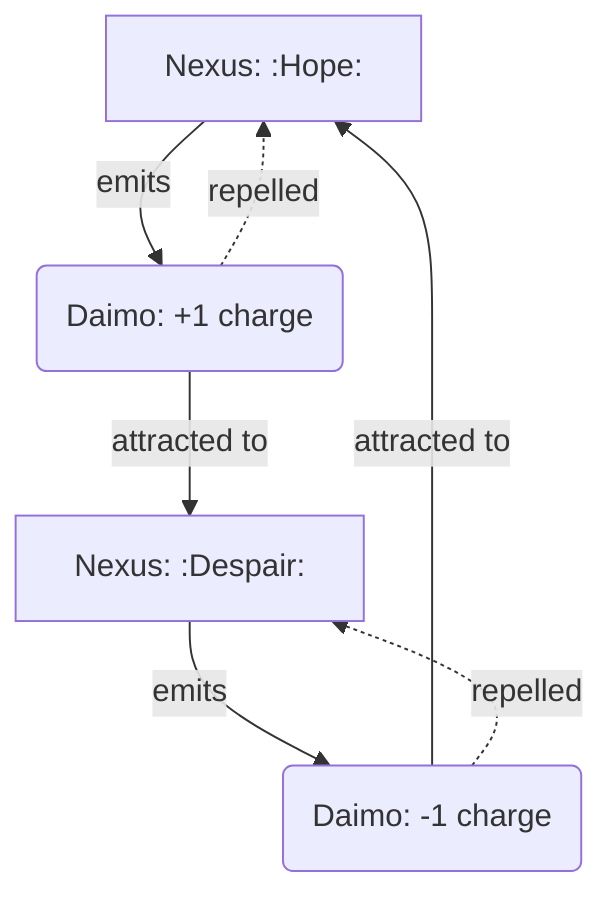
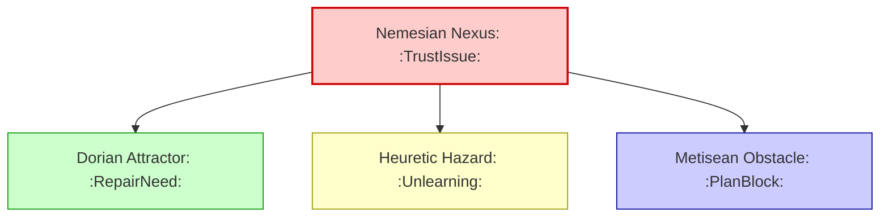
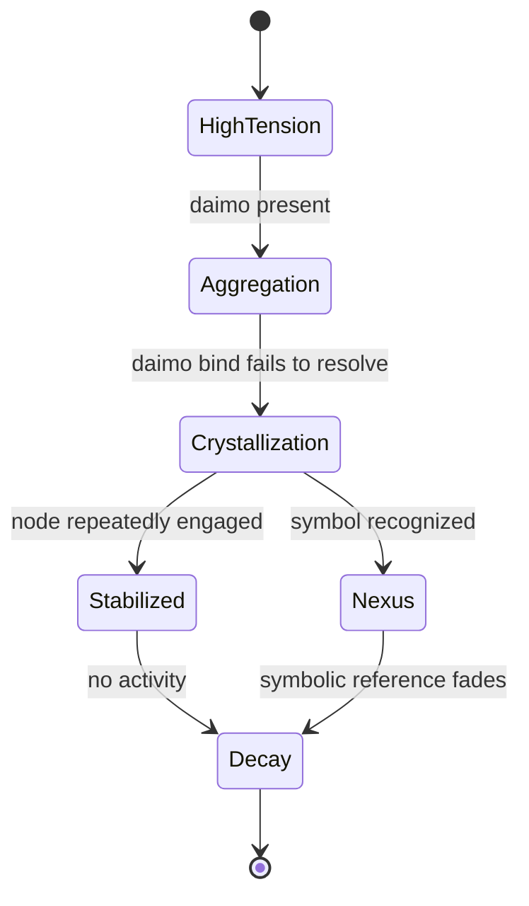
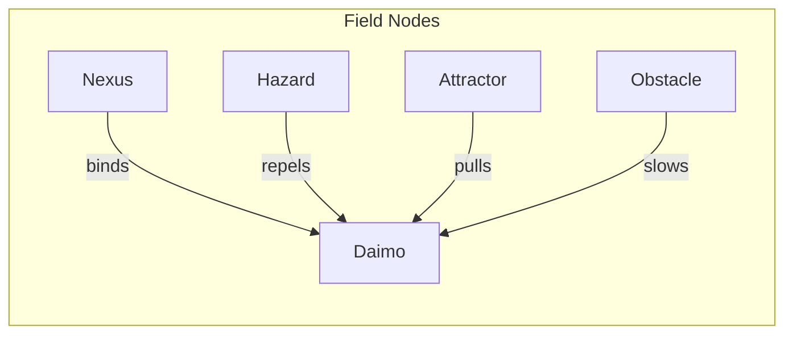

Note: Consolidated here → ../notes/diagrams/field-node-lifecycle-additional-diagrams.md

Excellent. With the **Field Node Lifecycle** document fully fleshed out and the system now reactive, dynamic, and narratively emergent, we can keep layering more visualizations to explore the richness of your topology.

Here are some **additional diagrams** to stack on top of what’s already in the doc:

---

### 🔁 **Daimo–Node Charge Interaction**

This shows how **Nexuses repel their own children** (same charge) and attract those of **opposite charge**, creating **narrative currents** and **conceptual magnetism**.

---

### 🧠 **Multi-Circuit Node Propagation**

This makes clear how **one symbolic conflict** creates **ripples across multiple circuits**, each materializing in a different node type.

---

### 🌱 **Node Growth and Death Conditions**

This is a simplified version of your existing diagram, useful for focused visualization of **grow/decay logic** alone.

---

### 💡 **Node Type Summary Map**

You can use this one as a **legend** or top-of-page visual summary in any future docs about field simulation or node-class behavior.

---

Want me to embed these into the **Field Node Lifecycle** document under a “More Diagrams” section? Or split them out into a new document called something like `Field Node Diagrams` or `Cognitive Topology Visuals`?
---

Related notes: [[../notes/diagrams/node-type-topology-map|node-type-topology-map]], [[../notes/diagrams/circuit-weight-visualizations|circuit-weight-visualizations]], [[../notes/diagrams/full-system-overview-diagrams|full-system-overview-diagrams]], [[../notes/diagrams/layer1-uptime-diagrams|layer1-uptime-diagrams]], [[../notes/diagrams/field-node-lifecycle-additional-diagrams|field-node-lifecycle-additional-diagrams]], [[../notes/diagrams/state-diagram-node-lifecycle|state-diagram-node-lifecycle]] [[index|unique/index]]

#tags: #diagram #design
<!-- GENERATED-SECTIONS:DO-NOT-EDIT-BELOW -->
## Related content
- [field-node-diagram-outline](field-node-diagram-outline.md)
- [field-node-diagram-set](field-node-diagram-set.md)
- [eidolon-node-lifecycle](eidolon-node-lifecycle.md)
- [promethean-system-diagrams](promethean-system-diagrams.md)
- [layer-1-uptime-diagrams](layer-1-uptime-diagrams.md)
- [Unique Info Dump Index](unique-info-dump-index.md)
- [heartbeat-simulation-snippets](heartbeat-simulation-snippets.md)
- [heartbeat-fragment-demo](heartbeat-fragment-demo.md)
- [ripple-propagation-demo](ripple-propagation-demo.md)
- [Eidolon Field Abstract Model](eidolon-field-abstract-model.md)
- [eidolon-field-math-foundations](eidolon-field-math-foundations.md)
- [2d-sandbox-field](2d-sandbox-field.md)
- [Event Bus Projections Architecture](event-bus-projections-architecture.md)
- [Agent Tasks: Persistence Migration to DualStore](agent-tasks-persistence-migration-to-dualstore.md)
- [aionian-circuit-math](aionian-circuit-math.md)
- [archetype-ecs](archetype-ecs.md)
- [Diagrams](chunks/diagrams.md)
- [DSL](chunks/dsl.md)
- [EidolonField](eidolonfield.md)
- [Simulation Demo](chunks/simulation-demo.md)
- [Eidolon-Field-Optimization](eidolon-field-optimization.md)
- [Factorio AI with External Agents](factorio-ai-with-external-agents.md)
- [Ice Box Reorganization](ice-box-reorganization.md)
- [field-dynamics-math-blocks](field-dynamics-math-blocks.md)

## Sources
- [field-node-diagram-outline — L1](field-node-diagram-outline.md#L1) (line 1, col 1, score 1)
- [field-node-diagram-set — L1](field-node-diagram-set.md#L1) (line 1, col 1, score 1)
- [eidolon-node-lifecycle — L1](eidolon-node-lifecycle.md#L1) (line 1, col 1, score 0.92)
- [Unique Info Dump Index — L59](unique-info-dump-index.md#L59) (line 59, col 1, score 0.86)
- [Unique Info Dump Index — L59](unique-info-dump-index.md#L59) (line 59, col 3, score 0.86)
- [field-node-diagram-outline — L28](field-node-diagram-outline.md#L28) (line 28, col 1, score 0.92)
- [eidolon-node-lifecycle — L3](eidolon-node-lifecycle.md#L3) (line 3, col 1, score 0.89)
- [promethean-system-diagrams — L187](promethean-system-diagrams.md#L187) (line 187, col 1, score 1)
- [eidolon-node-lifecycle — L25](eidolon-node-lifecycle.md#L25) (line 25, col 1, score 1)
- [field-node-diagram-outline — L94](field-node-diagram-outline.md#L94) (line 94, col 1, score 1)
- [field-node-diagram-set — L130](field-node-diagram-set.md#L130) (line 130, col 1, score 1)
- [layer-1-uptime-diagrams — L150](layer-1-uptime-diagrams.md#L150) (line 150, col 1, score 1)
- [promethean-system-diagrams — L189](promethean-system-diagrams.md#L189) (line 189, col 1, score 1)
- [eidolon-node-lifecycle — L27](eidolon-node-lifecycle.md#L27) (line 27, col 1, score 1)
- [field-node-diagram-outline — L96](field-node-diagram-outline.md#L96) (line 96, col 1, score 1)
- [field-node-diagram-set — L132](field-node-diagram-set.md#L132) (line 132, col 1, score 1)
- [layer-1-uptime-diagrams — L152](layer-1-uptime-diagrams.md#L152) (line 152, col 1, score 1)
- [2d-sandbox-field — L198](2d-sandbox-field.md#L198) (line 198, col 1, score 1)
- [2d-sandbox-field — L198](2d-sandbox-field.md#L198) (line 198, col 3, score 1)
- [Eidolon Field Abstract Model — L195](eidolon-field-abstract-model.md#L195) (line 195, col 1, score 1)
- [Eidolon Field Abstract Model — L195](eidolon-field-abstract-model.md#L195) (line 195, col 3, score 1)
- [eidolon-field-math-foundations — L137](eidolon-field-math-foundations.md#L137) (line 137, col 1, score 1)
- [eidolon-field-math-foundations — L137](eidolon-field-math-foundations.md#L137) (line 137, col 3, score 1)
- [eidolon-node-lifecycle — L32](eidolon-node-lifecycle.md#L32) (line 32, col 1, score 1)
- [eidolon-node-lifecycle — L32](eidolon-node-lifecycle.md#L32) (line 32, col 3, score 1)
- [eidolon-node-lifecycle — L33](eidolon-node-lifecycle.md#L33) (line 33, col 1, score 1)
- [eidolon-node-lifecycle — L33](eidolon-node-lifecycle.md#L33) (line 33, col 3, score 1)
- [field-node-diagram-outline — L101](field-node-diagram-outline.md#L101) (line 101, col 1, score 1)
- [field-node-diagram-outline — L101](field-node-diagram-outline.md#L101) (line 101, col 3, score 1)
- [heartbeat-fragment-demo — L107](heartbeat-fragment-demo.md#L107) (line 107, col 1, score 1)
- [heartbeat-fragment-demo — L107](heartbeat-fragment-demo.md#L107) (line 107, col 3, score 1)
- [heartbeat-simulation-snippets — L93](heartbeat-simulation-snippets.md#L93) (line 93, col 1, score 1)
- [heartbeat-simulation-snippets — L93](heartbeat-simulation-snippets.md#L93) (line 93, col 3, score 1)
- [Event Bus Projections Architecture — L152](event-bus-projections-architecture.md#L152) (line 152, col 1, score 1)
- [Event Bus Projections Architecture — L152](event-bus-projections-architecture.md#L152) (line 152, col 3, score 1)
- [Factorio AI with External Agents — L146](factorio-ai-with-external-agents.md#L146) (line 146, col 1, score 1)
- [Factorio AI with External Agents — L146](factorio-ai-with-external-agents.md#L146) (line 146, col 3, score 1)
- [field-node-diagram-outline — L102](field-node-diagram-outline.md#L102) (line 102, col 1, score 1)
- [field-node-diagram-outline — L102](field-node-diagram-outline.md#L102) (line 102, col 3, score 1)
- [field-node-diagram-set — L138](field-node-diagram-set.md#L138) (line 138, col 1, score 1)
- [field-node-diagram-set — L138](field-node-diagram-set.md#L138) (line 138, col 3, score 1)
- [Agent Tasks: Persistence Migration to DualStore — L135](agent-tasks-persistence-migration-to-dualstore.md#L135) (line 135, col 1, score 1)
- [Agent Tasks: Persistence Migration to DualStore — L135](agent-tasks-persistence-migration-to-dualstore.md#L135) (line 135, col 3, score 1)
- [eidolon-node-lifecycle — L34](eidolon-node-lifecycle.md#L34) (line 34, col 1, score 1)
- [eidolon-node-lifecycle — L34](eidolon-node-lifecycle.md#L34) (line 34, col 3, score 1)
- [Event Bus Projections Architecture — L149](event-bus-projections-architecture.md#L149) (line 149, col 1, score 1)
- [Event Bus Projections Architecture — L149](event-bus-projections-architecture.md#L149) (line 149, col 3, score 1)
- [field-node-diagram-outline — L103](field-node-diagram-outline.md#L103) (line 103, col 1, score 1)
- [field-node-diagram-outline — L103](field-node-diagram-outline.md#L103) (line 103, col 3, score 1)
- [2d-sandbox-field — L199](2d-sandbox-field.md#L199) (line 199, col 1, score 1)
- [2d-sandbox-field — L199](2d-sandbox-field.md#L199) (line 199, col 3, score 1)
- [Eidolon Field Abstract Model — L196](eidolon-field-abstract-model.md#L196) (line 196, col 1, score 1)
- [Eidolon Field Abstract Model — L196](eidolon-field-abstract-model.md#L196) (line 196, col 3, score 1)
- [eidolon-node-lifecycle — L35](eidolon-node-lifecycle.md#L35) (line 35, col 1, score 1)
- [eidolon-node-lifecycle — L35](eidolon-node-lifecycle.md#L35) (line 35, col 3, score 1)
- [EidolonField — L249](eidolonfield.md#L249) (line 249, col 1, score 1)
- [EidolonField — L249](eidolonfield.md#L249) (line 249, col 3, score 1)
- [aionian-circuit-math — L158](aionian-circuit-math.md#L158) (line 158, col 1, score 1)
- [aionian-circuit-math — L158](aionian-circuit-math.md#L158) (line 158, col 3, score 1)
- [archetype-ecs — L457](archetype-ecs.md#L457) (line 457, col 1, score 1)
- [archetype-ecs — L457](archetype-ecs.md#L457) (line 457, col 3, score 1)
- [Diagrams — L9](chunks/diagrams.md#L9) (line 9, col 1, score 1)
- [Diagrams — L9](chunks/diagrams.md#L9) (line 9, col 3, score 1)
- [DSL — L10](chunks/dsl.md#L10) (line 10, col 1, score 1)
- [DSL — L10](chunks/dsl.md#L10) (line 10, col 3, score 1)
- [Simulation Demo — L10](chunks/simulation-demo.md#L10) (line 10, col 1, score 1)
- [Simulation Demo — L10](chunks/simulation-demo.md#L10) (line 10, col 3, score 1)
- [Eidolon Field Abstract Model — L200](eidolon-field-abstract-model.md#L200) (line 200, col 1, score 1)
- [Eidolon Field Abstract Model — L200](eidolon-field-abstract-model.md#L200) (line 200, col 3, score 1)
- [eidolon-node-lifecycle — L38](eidolon-node-lifecycle.md#L38) (line 38, col 1, score 1)
- [eidolon-node-lifecycle — L38](eidolon-node-lifecycle.md#L38) (line 38, col 3, score 1)
- [field-node-diagram-outline — L116](field-node-diagram-outline.md#L116) (line 116, col 1, score 1)
- [field-node-diagram-outline — L116](field-node-diagram-outline.md#L116) (line 116, col 3, score 1)
- [Simulation Demo — L9](chunks/simulation-demo.md#L9) (line 9, col 1, score 1)
- [Simulation Demo — L9](chunks/simulation-demo.md#L9) (line 9, col 3, score 1)
- [Eidolon Field Abstract Model — L201](eidolon-field-abstract-model.md#L201) (line 201, col 1, score 1)
- [Eidolon Field Abstract Model — L201](eidolon-field-abstract-model.md#L201) (line 201, col 3, score 1)
- [eidolon-node-lifecycle — L37](eidolon-node-lifecycle.md#L37) (line 37, col 1, score 1)
- [eidolon-node-lifecycle — L37](eidolon-node-lifecycle.md#L37) (line 37, col 3, score 1)
- [field-node-diagram-outline — L115](field-node-diagram-outline.md#L115) (line 115, col 1, score 1)
- [field-node-diagram-outline — L115](field-node-diagram-outline.md#L115) (line 115, col 3, score 1)
- [Simulation Demo — L11](chunks/simulation-demo.md#L11) (line 11, col 1, score 1)
- [Simulation Demo — L11](chunks/simulation-demo.md#L11) (line 11, col 3, score 1)
- [Eidolon Field Abstract Model — L199](eidolon-field-abstract-model.md#L199) (line 199, col 1, score 1)
- [Eidolon Field Abstract Model — L199](eidolon-field-abstract-model.md#L199) (line 199, col 3, score 1)
- [Eidolon-Field-Optimization — L103](eidolon-field-optimization.md#L103) (line 103, col 1, score 1)
- [Eidolon-Field-Optimization — L103](eidolon-field-optimization.md#L103) (line 103, col 3, score 1)
- [eidolon-node-lifecycle — L39](eidolon-node-lifecycle.md#L39) (line 39, col 1, score 1)
- [eidolon-node-lifecycle — L39](eidolon-node-lifecycle.md#L39) (line 39, col 3, score 1)
- [field-node-diagram-set — L148](field-node-diagram-set.md#L148) (line 148, col 1, score 1)
- [field-node-diagram-set — L148](field-node-diagram-set.md#L148) (line 148, col 3, score 1)
- [Unique Info Dump Index — L181](unique-info-dump-index.md#L181) (line 181, col 1, score 0.98)
- [Unique Info Dump Index — L181](unique-info-dump-index.md#L181) (line 181, col 3, score 0.98)
- [eidolon-node-lifecycle — L45](eidolon-node-lifecycle.md#L45) (line 45, col 1, score 0.98)
- [eidolon-node-lifecycle — L45](eidolon-node-lifecycle.md#L45) (line 45, col 3, score 0.98)
- [field-dynamics-math-blocks — L167](field-dynamics-math-blocks.md#L167) (line 167, col 1, score 0.98)
- [field-dynamics-math-blocks — L167](field-dynamics-math-blocks.md#L167) (line 167, col 3, score 0.98)
- [field-node-diagram-outline — L121](field-node-diagram-outline.md#L121) (line 121, col 1, score 1)
- [field-node-diagram-outline — L121](field-node-diagram-outline.md#L121) (line 121, col 3, score 1)
- [eidolon-node-lifecycle — L46](eidolon-node-lifecycle.md#L46) (line 46, col 1, score 0.98)
- [eidolon-node-lifecycle — L46](eidolon-node-lifecycle.md#L46) (line 46, col 3, score 0.98)
- [Unique Info Dump Index — L182](unique-info-dump-index.md#L182) (line 182, col 1, score 0.98)
- [Unique Info Dump Index — L182](unique-info-dump-index.md#L182) (line 182, col 3, score 0.98)
- [eidolon-node-lifecycle — L58](eidolon-node-lifecycle.md#L58) (line 58, col 1, score 0.98)
- [eidolon-node-lifecycle — L58](eidolon-node-lifecycle.md#L58) (line 58, col 3, score 0.98)
- [field-node-diagram-outline — L122](field-node-diagram-outline.md#L122) (line 122, col 1, score 1)
- [field-node-diagram-outline — L122](field-node-diagram-outline.md#L122) (line 122, col 3, score 1)
- [field-node-diagram-set — L149](field-node-diagram-set.md#L149) (line 149, col 1, score 1)
- [field-node-diagram-set — L149](field-node-diagram-set.md#L149) (line 149, col 3, score 1)
- [promethean-system-diagrams — L208](promethean-system-diagrams.md#L208) (line 208, col 1, score 1)
- [promethean-system-diagrams — L208](promethean-system-diagrams.md#L208) (line 208, col 3, score 1)
- [field-node-diagram-outline — L126](field-node-diagram-outline.md#L126) (line 126, col 1, score 0.99)
- [field-node-diagram-outline — L126](field-node-diagram-outline.md#L126) (line 126, col 3, score 0.99)
- [field-node-diagram-outline — L123](field-node-diagram-outline.md#L123) (line 123, col 1, score 1)
- [field-node-diagram-outline — L123](field-node-diagram-outline.md#L123) (line 123, col 3, score 1)
- [field-node-diagram-set — L150](field-node-diagram-set.md#L150) (line 150, col 1, score 1)
- [field-node-diagram-set — L150](field-node-diagram-set.md#L150) (line 150, col 3, score 1)
- [promethean-system-diagrams — L206](promethean-system-diagrams.md#L206) (line 206, col 1, score 0.99)
- [promethean-system-diagrams — L206](promethean-system-diagrams.md#L206) (line 206, col 3, score 0.99)
- [layer-1-uptime-diagrams — L176](layer-1-uptime-diagrams.md#L176) (line 176, col 1, score 0.99)
- [layer-1-uptime-diagrams — L176](layer-1-uptime-diagrams.md#L176) (line 176, col 3, score 0.99)
- [field-node-diagram-outline — L124](field-node-diagram-outline.md#L124) (line 124, col 1, score 1)
- [field-node-diagram-outline — L124](field-node-diagram-outline.md#L124) (line 124, col 3, score 1)
- [field-node-diagram-set — L151](field-node-diagram-set.md#L151) (line 151, col 1, score 1)
- [field-node-diagram-set — L151](field-node-diagram-set.md#L151) (line 151, col 3, score 1)
- [promethean-system-diagrams — L207](promethean-system-diagrams.md#L207) (line 207, col 1, score 0.99)
- [promethean-system-diagrams — L207](promethean-system-diagrams.md#L207) (line 207, col 3, score 0.99)
- [layer-1-uptime-diagrams — L177](layer-1-uptime-diagrams.md#L177) (line 177, col 1, score 0.99)
- [layer-1-uptime-diagrams — L177](layer-1-uptime-diagrams.md#L177) (line 177, col 3, score 0.99)
- [EidolonField — L265](eidolonfield.md#L265) (line 265, col 1, score 0.99)
- [EidolonField — L265](eidolonfield.md#L265) (line 265, col 3, score 0.99)
- [Ice Box Reorganization — L85](ice-box-reorganization.md#L85) (line 85, col 1, score 0.99)
- [Ice Box Reorganization — L85](ice-box-reorganization.md#L85) (line 85, col 3, score 0.99)
- [2d-sandbox-field — L213](2d-sandbox-field.md#L213) (line 213, col 1, score 0.98)
- [2d-sandbox-field — L213](2d-sandbox-field.md#L213) (line 213, col 3, score 0.98)
- [eidolon-node-lifecycle — L51](eidolon-node-lifecycle.md#L51) (line 51, col 1, score 1)
- [eidolon-node-lifecycle — L51](eidolon-node-lifecycle.md#L51) (line 51, col 3, score 1)
- [field-node-diagram-outline — L136](field-node-diagram-outline.md#L136) (line 136, col 1, score 1)
- [field-node-diagram-outline — L136](field-node-diagram-outline.md#L136) (line 136, col 3, score 1)
- [field-node-diagram-set — L153](field-node-diagram-set.md#L153) (line 153, col 1, score 1)
- [field-node-diagram-set — L153](field-node-diagram-set.md#L153) (line 153, col 3, score 1)
- [layer-1-uptime-diagrams — L187](layer-1-uptime-diagrams.md#L187) (line 187, col 1, score 1)
- [layer-1-uptime-diagrams — L187](layer-1-uptime-diagrams.md#L187) (line 187, col 3, score 1)
- [field-node-diagram-outline — L137](field-node-diagram-outline.md#L137) (line 137, col 1, score 1)
- [field-node-diagram-outline — L137](field-node-diagram-outline.md#L137) (line 137, col 3, score 1)
- [field-node-diagram-set — L154](field-node-diagram-set.md#L154) (line 154, col 1, score 1)
- [field-node-diagram-set — L154](field-node-diagram-set.md#L154) (line 154, col 3, score 1)
- [layer-1-uptime-diagrams — L188](layer-1-uptime-diagrams.md#L188) (line 188, col 1, score 1)
- [layer-1-uptime-diagrams — L188](layer-1-uptime-diagrams.md#L188) (line 188, col 3, score 1)
- [promethean-system-diagrams — L210](promethean-system-diagrams.md#L210) (line 210, col 1, score 1)
- [promethean-system-diagrams — L210](promethean-system-diagrams.md#L210) (line 210, col 3, score 1)
- [eidolon-node-lifecycle — L52](eidolon-node-lifecycle.md#L52) (line 52, col 1, score 1)
- [eidolon-node-lifecycle — L52](eidolon-node-lifecycle.md#L52) (line 52, col 3, score 1)
- [field-node-diagram-set — L155](field-node-diagram-set.md#L155) (line 155, col 1, score 1)
- [field-node-diagram-set — L155](field-node-diagram-set.md#L155) (line 155, col 3, score 1)
- [layer-1-uptime-diagrams — L189](layer-1-uptime-diagrams.md#L189) (line 189, col 1, score 1)
- [layer-1-uptime-diagrams — L189](layer-1-uptime-diagrams.md#L189) (line 189, col 3, score 1)
- [promethean-system-diagrams — L211](promethean-system-diagrams.md#L211) (line 211, col 1, score 1)
- [promethean-system-diagrams — L211](promethean-system-diagrams.md#L211) (line 211, col 3, score 1)
- [eidolon-node-lifecycle — L53](eidolon-node-lifecycle.md#L53) (line 53, col 1, score 1)
- [eidolon-node-lifecycle — L53](eidolon-node-lifecycle.md#L53) (line 53, col 3, score 1)
- [field-node-diagram-outline — L138](field-node-diagram-outline.md#L138) (line 138, col 1, score 1)
- [field-node-diagram-outline — L138](field-node-diagram-outline.md#L138) (line 138, col 3, score 1)
- [layer-1-uptime-diagrams — L190](layer-1-uptime-diagrams.md#L190) (line 190, col 1, score 1)
- [layer-1-uptime-diagrams — L190](layer-1-uptime-diagrams.md#L190) (line 190, col 3, score 1)
- [promethean-system-diagrams — L212](promethean-system-diagrams.md#L212) (line 212, col 1, score 1)
- [promethean-system-diagrams — L212](promethean-system-diagrams.md#L212) (line 212, col 3, score 1)
- [eidolon-node-lifecycle — L54](eidolon-node-lifecycle.md#L54) (line 54, col 1, score 1)
- [eidolon-node-lifecycle — L54](eidolon-node-lifecycle.md#L54) (line 54, col 3, score 1)
- [field-node-diagram-outline — L139](field-node-diagram-outline.md#L139) (line 139, col 1, score 1)
- [field-node-diagram-outline — L139](field-node-diagram-outline.md#L139) (line 139, col 3, score 1)
- [field-node-diagram-set — L156](field-node-diagram-set.md#L156) (line 156, col 1, score 1)
- [field-node-diagram-set — L156](field-node-diagram-set.md#L156) (line 156, col 3, score 1)
- [promethean-system-diagrams — L213](promethean-system-diagrams.md#L213) (line 213, col 1, score 1)
- [promethean-system-diagrams — L213](promethean-system-diagrams.md#L213) (line 213, col 3, score 1)
- [eidolon-node-lifecycle — L56](eidolon-node-lifecycle.md#L56) (line 56, col 1, score 1)
- [eidolon-node-lifecycle — L56](eidolon-node-lifecycle.md#L56) (line 56, col 3, score 1)
- [field-node-diagram-outline — L141](field-node-diagram-outline.md#L141) (line 141, col 1, score 1)
- [field-node-diagram-outline — L141](field-node-diagram-outline.md#L141) (line 141, col 3, score 1)
- [field-node-diagram-set — L158](field-node-diagram-set.md#L158) (line 158, col 1, score 1)
- [field-node-diagram-set — L158](field-node-diagram-set.md#L158) (line 158, col 3, score 1)
- [layer-1-uptime-diagrams — L192](layer-1-uptime-diagrams.md#L192) (line 192, col 1, score 1)
- [layer-1-uptime-diagrams — L192](layer-1-uptime-diagrams.md#L192) (line 192, col 3, score 1)
- [field-node-diagram-outline — L142](field-node-diagram-outline.md#L142) (line 142, col 1, score 1)
- [field-node-diagram-outline — L142](field-node-diagram-outline.md#L142) (line 142, col 3, score 1)
- [field-node-diagram-set — L159](field-node-diagram-set.md#L159) (line 159, col 1, score 1)
- [field-node-diagram-set — L159](field-node-diagram-set.md#L159) (line 159, col 3, score 1)
- [layer-1-uptime-diagrams — L193](layer-1-uptime-diagrams.md#L193) (line 193, col 1, score 1)
- [layer-1-uptime-diagrams — L193](layer-1-uptime-diagrams.md#L193) (line 193, col 3, score 1)
- [promethean-system-diagrams — L215](promethean-system-diagrams.md#L215) (line 215, col 1, score 1)
- [promethean-system-diagrams — L215](promethean-system-diagrams.md#L215) (line 215, col 3, score 1)
- [eidolon-node-lifecycle — L57](eidolon-node-lifecycle.md#L57) (line 57, col 1, score 1)
- [eidolon-node-lifecycle — L57](eidolon-node-lifecycle.md#L57) (line 57, col 3, score 1)
- [field-node-diagram-set — L160](field-node-diagram-set.md#L160) (line 160, col 1, score 1)
- [field-node-diagram-set — L160](field-node-diagram-set.md#L160) (line 160, col 3, score 1)
- [layer-1-uptime-diagrams — L194](layer-1-uptime-diagrams.md#L194) (line 194, col 1, score 1)
- [layer-1-uptime-diagrams — L194](layer-1-uptime-diagrams.md#L194) (line 194, col 3, score 1)
- [promethean-system-diagrams — L216](promethean-system-diagrams.md#L216) (line 216, col 1, score 1)
- [promethean-system-diagrams — L216](promethean-system-diagrams.md#L216) (line 216, col 3, score 1)
- [field-node-diagram-outline — L143](field-node-diagram-outline.md#L143) (line 143, col 1, score 1)
- [field-node-diagram-outline — L143](field-node-diagram-outline.md#L143) (line 143, col 3, score 1)
- [layer-1-uptime-diagrams — L195](layer-1-uptime-diagrams.md#L195) (line 195, col 1, score 1)
- [layer-1-uptime-diagrams — L195](layer-1-uptime-diagrams.md#L195) (line 195, col 3, score 1)
- [promethean-system-diagrams — L217](promethean-system-diagrams.md#L217) (line 217, col 1, score 1)
- [promethean-system-diagrams — L217](promethean-system-diagrams.md#L217) (line 217, col 3, score 1)
- [eidolon-node-lifecycle — L59](eidolon-node-lifecycle.md#L59) (line 59, col 1, score 1)
- [eidolon-node-lifecycle — L59](eidolon-node-lifecycle.md#L59) (line 59, col 3, score 1)
- [field-node-diagram-outline — L144](field-node-diagram-outline.md#L144) (line 144, col 1, score 1)
- [field-node-diagram-outline — L144](field-node-diagram-outline.md#L144) (line 144, col 3, score 1)
- [field-node-diagram-set — L161](field-node-diagram-set.md#L161) (line 161, col 1, score 1)
- [field-node-diagram-set — L161](field-node-diagram-set.md#L161) (line 161, col 3, score 1)
- [promethean-system-diagrams — L218](promethean-system-diagrams.md#L218) (line 218, col 1, score 1)
- [promethean-system-diagrams — L218](promethean-system-diagrams.md#L218) (line 218, col 3, score 1)
<!-- GENERATED-SECTIONS:DO-NOT-EDIT-ABOVE -->
