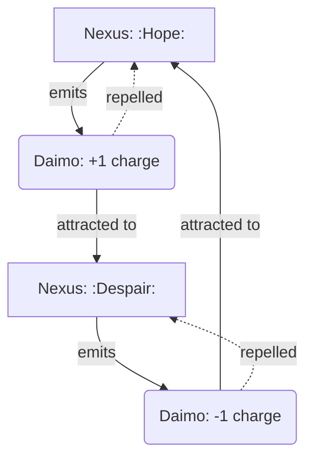
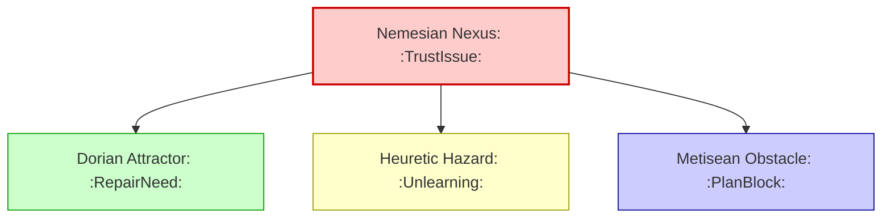
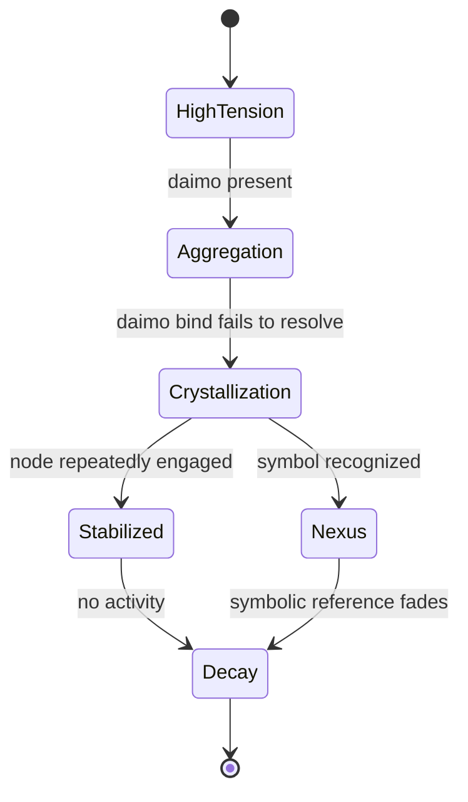
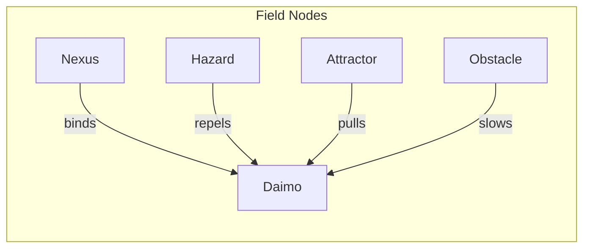

Note: Consolidated here → ../notes/diagrams/field-node-lifecycle-additional-diagrams.md

Excellent. With the **Field Node Lifecycle** document fully fleshed out and the system now reactive, dynamic, and narratively emergent, we can keep layering more visualizations to explore the richness of your topology.

Here are some **additional diagrams** to stack on top of what’s already in the doc:

---

### 🔁 **Daimo–Node Charge Interaction**

This shows how **Nexuses repel their own children** (same charge) and attract those of **opposite charge**, creating **narrative currents** and **conceptual magnetism**.

---

### 🧠 **Multi-Circuit Node Propagation**

This makes clear how **one symbolic conflict** creates **ripples across multiple circuits**, each materializing in a different node type.

---

### 🌱 **Node Growth and Death Conditions**

This is a simplified version of your existing diagram, useful for focused visualization of **grow/decay logic** alone.

---

### 💡 **Node Type Summary Map**

You can use this one as a **legend** or top-of-page visual summary in any future docs about field simulation or node-class behavior.

---

Want me to embed these into the **Field Node Lifecycle** document under a “More Diagrams” section? Or split them out into a new document called something like `Field Node Diagrams` or `Cognitive Topology Visuals`?
---

Related notes: [[../notes/diagrams/node-type-topology-map|node-type-topology-map]], [[../notes/diagrams/circuit-weight-visualizations|circuit-weight-visualizations]], [[../notes/diagrams/full-system-overview-diagrams|full-system-overview-diagrams]], [[../notes/diagrams/layer1-uptime-diagrams|layer1-uptime-diagrams]], [[../notes/diagrams/field-node-lifecycle-additional-diagrams|field-node-lifecycle-additional-diagrams]], [[../notes/diagrams/state-diagram-node-lifecycle|state-diagram-node-lifecycle]] [[index|unique/index]]

#tags: #diagram #design<!-- GENERATED-SECTIONS:DO-NOT-EDIT-BELOW -->
## Related content
- [field-node-diagram-outline](field-node-diagram-outline.md)
- [field-node-diagram-set](field-node-diagram-set.md)
- [eidolon-node-lifecycle](eidolon-node-lifecycle.md)
- [promethean-system-diagrams](promethean-system-diagrams.md)
- [layer-1-uptime-diagrams](layer-1-uptime-diagrams.md)
- [Unique Info Dump Index](unique-info-dump-index.md)
- [heartbeat-simulation-snippets](heartbeat-simulation-snippets.md)
- [heartbeat-fragment-demo](heartbeat-fragment-demo.md)
- [ripple-propagation-demo](ripple-propagation-demo.md)
- [Eidolon Field Abstract Model](eidolon-field-abstract-model.md)
- [eidolon-field-math-foundations](eidolon-field-math-foundations.md)
- [2d-sandbox-field](2d-sandbox-field.md)
- [Event Bus Projections Architecture](event-bus-projections-architecture.md)
- [Agent Tasks: Persistence Migration to DualStore](agent-tasks-persistence-migration-to-dualstore.md)
- [aionian-circuit-math](aionian-circuit-math.md)
- [archetype-ecs](archetype-ecs.md)
- [Diagrams](chunks/diagrams.md)
- [DSL](chunks/dsl.md)
- [EidolonField](eidolonfield.md)
- [Simulation Demo](chunks/simulation-demo.md)
- [Eidolon-Field-Optimization](eidolon-field-optimization.md)
- [Factorio AI with External Agents](factorio-ai-with-external-agents.md)
- [Ice Box Reorganization](ice-box-reorganization.md)
- [field-dynamics-math-blocks](field-dynamics-math-blocks.md)
## Sources
- _None_
<!-- GENERATED-SECTIONS:DO-NOT-EDIT-ABOVE -->
