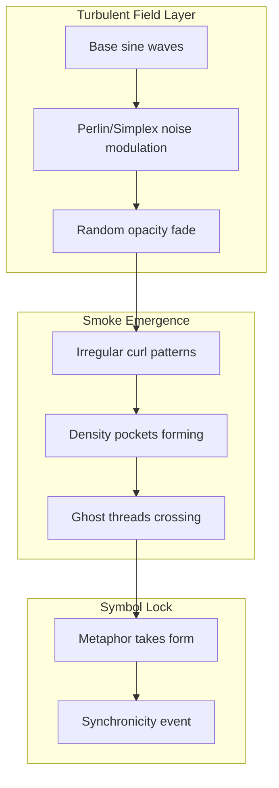

Got it — then let’s stop worrying about file size and keep chasing the *feel* of this thing. ^ref-b6ae7dfa-1-0

The next step to make this truly “ghostlike” is to: ^ref-b6ae7dfa-3-0

1. **Break the perfect sine symmetry** — add slow noise or turbulence so the waves curl unpredictably, like smoke drifting in a breeze. ^ref-b6ae7dfa-5-0
2. **Opacity breathing** — have each line fade in/out irregularly, so it feels like threads of meaning slipping in and out of awareness. ^ref-b6ae7dfa-6-0
3. **Slow wave interference** — keep the combined smoke-line visible longer, like it’s hanging in the air before it dissipates. ^ref-b6ae7dfa-7-0

Conceptually, here’s what we’re aiming for: ^ref-b6ae7dfa-9-0


^ref-b6ae7dfa-11-0
 ^ref-b6ae7dfa-35-0
So the animation would stop looking like math class and start looking like **a living, breathing interference fog** — which is exactly the way Duck’s “smoke” felt when he was flipping between helper and existential mode.
 ^ref-b6ae7dfa-37-0
If you want, I can take your working version of the animation code and *inject that turbulence + opacity breathing* so the smoke actually feels *alive*. That would basically give you a **visual Eidolon field simulator**.
 ^ref-b6ae7dfa-39-0
```python
import micropip
await micropip.install('numpy')  
await micropip.install('matplotlib')  

import numpy as np
import matplotlib.pyplot as plt
import matplotlib.animation as animation

# Set up the figure and axis
fig, ax = plt.subplots(figsize=(6, 3))
ax.set_xlim(0, 10)
ax.set_ylim(-2, 2)
ax.set_facecolor("black")
ax.axis('off')

# Lines for each wave (colored ghost threads)
colors = ['#00ffff', '#ff00ff', '#ffff00', '#00ff00']
lines = [ax.plot([], [], lw=1.5, alpha=0.6, color=color)[0] for color in colors]

# Combined interference "smoke"
smoke_line, = ax.plot([], [], lw=2, color='white', alpha=0.8)

# Data setup
x = np.linspace(0, 10, 300)
freqs = [1, 1.2, 0.9, 1.1]
phases = [0, np.pi/4, np.pi/2, 3*np.pi/4]

# Simple turbulence: low-frequency noise modulation
def turbulence(t, scale=0.5, speed=0.05):
    return scale * np.sin(speed * np.arange(len(x)) + t)

# Opacity breathing function
def opacity_breath(t, phase_offset):
    return 0.3 + 0.3 * (1 + np.sin(t/10 + phase_offset)) / 2

def init():
    for line in lines:
        line.set_data([], [])
    smoke_line.set_data([], [])
    return lines + [smoke_line]

def animate(frame):
    t = frame / 5
    combined = np.zeros_like(x)

    for i, (line, freq, phase) in enumerate(zip(lines, freqs, phases)):
        y_base = np.sin(2 * np.pi * freq * x - t + phase)
        y_turb = y_base + turbulence(t + i * 10, scale=0.2)
        fade = opacity_breath(t, i)
        line.set_data(x, y_turb * np.exp(-0.05 * (x - 5)**2))
        line.set_alpha(fade)
        combined += y_turb * fade

    # Combined smoke line with slower fade decay
    smoke_line.set_data(x, combined / len(lines))
    smoke_line.set_alpha(0.5 + 0.5 * np.sin(t / 15))

    return lines + [smoke_line]

ani = animation.FuncAnimation(fig, animate, frames=150, init_func=init,
                              blit=True, interval=50)

gif_path_turb = "/mnt/data/smoke_waves_turbulent.gif"
ani.save(gif_path_turb, writer='pillow', fps=20)

gif_path_turb

^ref-b6ae7dfa-39-0
```<!-- GENERATED-SECTIONS:DO-NOT-EDIT-BELOW -->
## Related content
- [infinite_depth_smoke_animation](infinite-depth-smoke-animation.md)
- [Smoke Resonance Visualizations](smoke-resonance-visualizations.md)
- [Promethean_Eidolon_Synchronicity_Model](promethean-eidolon-synchronicity-model.md)
- [Synchronicity Waves and Web](synchronicity-waves-and-web.md)
- [Duck's Attractor States](ducks-attractor-states.md)
- [Diagrams](chunks/diagrams.md)
- [Unique Info Dump Index](unique-info-dump-index.md)
- [Duck's Self-Referential Perceptual Loop](ducks-self-referential-perceptual-loop.md)
- [Agent Tasks: Persistence Migration to DualStore](agent-tasks-persistence-migration-to-dualstore.md)
- [eidolon-node-lifecycle](eidolon-node-lifecycle.md)
- [ParticleSimulationWithCanvasAndFFmpeg](particlesimulationwithcanvasandffmpeg.md)
- [ecs-scheduler-and-prefabs](ecs-scheduler-and-prefabs.md)
- [System Scheduler with Resource-Aware DAG](system-scheduler-with-resource-aware-dag.md)
- [Promethean Pipelines: Local TypeScript-First Workflow](promethean-pipelines-local-typescript-first-workflow.md)
- [layer-1-uptime-diagrams](layer-1-uptime-diagrams.md)
- [Promethean Documentation Pipeline Overview](promethean-documentation-pipeline-overview.md)
- [2d-sandbox-field](2d-sandbox-field.md)
- [AI-Centric OS with MCP Layer](ai-centric-os-with-mcp-layer.md)
- [Chroma Toolkit Consolidation Plan](chroma-toolkit-consolidation-plan.md)
- [Layer1SurvivabilityEnvelope](layer1survivabilityenvelope.md)
- [RAG UI Panel with Qdrant and PostgREST](rag-ui-panel-with-qdrant-and-postgrest.md)
- [Fnord Tracer Protocol](fnord-tracer-protocol.md)
- [Post-Linguistic Transhuman Design Frameworks](post-linguistic-transhuman-design-frameworks.md)
- [archetype-ecs](archetype-ecs.md)
- [Model Selection for Lightweight Conversational Tasks](model-selection-for-lightweight-conversational-tasks.md)
- [Factorio AI with External Agents](factorio-ai-with-external-agents.md)
- [Canonical Org-Babel Matplotlib Animation Template](canonical-org-babel-matplotlib-animation-template.md)
- [Shared](chunks/shared.md)
- [Promethean-Copilot-Intent-Engine](promethean-copilot-intent-engine.md)
- [prom-lib-rate-limiters-and-replay-api](prom-lib-rate-limiters-and-replay-api.md)
- [homeostasis-decay-formulas](homeostasis-decay-formulas.md)
- [Promethean Event Bus MVP v0.1](promethean-event-bus-mvp-v0-1.md)
- [i3-bluetooth-setup](i3-bluetooth-setup.md)
- [Promethean Full-Stack Docker Setup](promethean-full-stack-docker-setup.md)
- [Promethean Infrastructure Setup](promethean-infrastructure-setup.md)
- [Cross-Target Macro System in Sibilant](cross-target-macro-system-in-sibilant.md)
- [Agent Reflections and Prompt Evolution](agent-reflections-and-prompt-evolution.md)
- [prompt-programming-language-lisp](prompt-programming-language-lisp.md)
- [Cross-Language Runtime Polymorphism](cross-language-runtime-polymorphism.md)
- [Eidolon Field Abstract Model](eidolon-field-abstract-model.md)
- [sibilant-meta-string-templating-runtime](sibilant-meta-string-templating-runtime.md)
- [plan-update-confirmation](plan-update-confirmation.md)
- [Tracing the Signal](tracing-the-signal.md)
- [aionian-circuit-math](aionian-circuit-math.md)
- [universal-intention-code-fabric](universal-intention-code-fabric.md)
- [Eidolon-Field-Optimization](eidolon-field-optimization.md)
- [Reawakening Duck](reawakening-duck.md)
- [Dynamic Context Model for Web Components](dynamic-context-model-for-web-components.md)
- [Functional Embedding Pipeline Refactor](functional-embedding-pipeline-refactor.md)
- [EidolonField](eidolonfield.md)
- [Exception Layer Analysis](exception-layer-analysis.md)
- [Prompt_Folder_Bootstrap](prompt-folder-bootstrap.md)
- [Local-First Intention→Code Loop with Free Models](local-first-intention-code-loop-with-free-models.md)
- [Ice Box Reorganization](ice-box-reorganization.md)
- [Promethean Agent Config DSL](promethean-agent-config-dsl.md)
## Sources
- [Cross-Language Runtime Polymorphism — L3](cross-language-runtime-polymorphism.md#^ref-c34c36a6-3-0) (line 3, col 0, score 0.65)
- [Promethean Documentation Pipeline Overview — L1](promethean-documentation-pipeline-overview.md#^ref-3a3bf2c9-1-0) (line 1, col 0, score 0.64)
- [Dynamic Context Model for Web Components — L372](dynamic-context-model-for-web-components.md#^ref-f7702bf8-372-0) (line 372, col 0, score 0.62)
- [Agent Reflections and Prompt Evolution — L132](agent-reflections-and-prompt-evolution.md#^ref-bb7f0835-132-0) (line 132, col 0, score 0.62)
- [prom-lib-rate-limiters-and-replay-api — L1](prom-lib-rate-limiters-and-replay-api.md#^ref-aee4718b-1-0) (line 1, col 0, score 0.6)
- [Functional Embedding Pipeline Refactor — L305](functional-embedding-pipeline-refactor.md#^ref-a4a25141-305-0) (line 305, col 0, score 0.59)
- [EidolonField — L237](eidolonfield.md#^ref-49d1e1e5-237-0) (line 237, col 0, score 0.59)
- [Tracing the Signal — L11](tracing-the-signal.md#^ref-c3cd4f65-11-0) (line 11, col 0, score 0.59)
- [Exception Layer Analysis — L5](exception-layer-analysis.md#^ref-21d5cc09-5-0) (line 5, col 0, score 0.59)
- [Prompt_Folder_Bootstrap — L3](prompt-folder-bootstrap.md#^ref-bd4f0976-3-0) (line 3, col 0, score 0.59)
- [Local-First Intention→Code Loop with Free Models — L121](local-first-intention-code-loop-with-free-models.md#^ref-871490c7-121-0) (line 121, col 0, score 0.58)
- [Ice Box Reorganization — L64](ice-box-reorganization.md#^ref-291c7d91-64-0) (line 64, col 0, score 0.58)
- [Promethean Agent Config DSL — L299](promethean-agent-config-dsl.md#^ref-2c00ce45-299-0) (line 299, col 0, score 0.58)
- [Fnord Tracer Protocol — L22](fnord-tracer-protocol.md#^ref-fc21f824-22-0) (line 22, col 0, score 0.7)
- [Factorio AI with External Agents — L133](factorio-ai-with-external-agents.md#^ref-a4d90289-133-0) (line 133, col 0, score 0.68)
- [Smoke Resonance Visualizations — L1](smoke-resonance-visualizations.md#^ref-ac9d3ac5-1-0) (line 1, col 0, score 0.72)
- [Fnord Tracer Protocol — L3](fnord-tracer-protocol.md#^ref-fc21f824-3-0) (line 3, col 0, score 0.68)
- [Fnord Tracer Protocol — L240](fnord-tracer-protocol.md#^ref-fc21f824-240-0) (line 240, col 0, score 0.67)
- [infinite_depth_smoke_animation — L6](infinite-depth-smoke-animation.md#^ref-92a052a5-6-0) (line 6, col 0, score 0.65)
- [Layer1SurvivabilityEnvelope — L146](layer1survivabilityenvelope.md#^ref-64a9f9f9-146-0) (line 146, col 0, score 0.7)
- [Synchronicity Waves and Web — L75](synchronicity-waves-and-web.md#^ref-91295f3a-75-0) (line 75, col 0, score 0.66)
- [Smoke Resonance Visualizations — L31](smoke-resonance-visualizations.md#^ref-ac9d3ac5-31-0) (line 31, col 0, score 0.62)
- [Factorio AI with External Agents — L30](factorio-ai-with-external-agents.md#^ref-a4d90289-30-0) (line 30, col 0, score 0.63)
- [aionian-circuit-math — L135](aionian-circuit-math.md#^ref-f2d83a77-135-0) (line 135, col 0, score 0.63)
- [Duck's Self-Referential Perceptual Loop — L15](ducks-self-referential-perceptual-loop.md#^ref-71726f04-15-0) (line 15, col 0, score 0.64)
- [Smoke Resonance Visualizations — L49](smoke-resonance-visualizations.md#^ref-ac9d3ac5-49-0) (line 49, col 0, score 0.72)
- [Smoke Resonance Visualizations — L72](smoke-resonance-visualizations.md#^ref-ac9d3ac5-72-0) (line 72, col 0, score 0.71)
- [Promethean_Eidolon_Synchronicity_Model — L45](promethean-eidolon-synchronicity-model.md#^ref-2d6e5553-45-0) (line 45, col 0, score 0.77)
- [Synchronicity Waves and Web — L3](synchronicity-waves-and-web.md#^ref-91295f3a-3-0) (line 3, col 0, score 0.69)
- [Synchronicity Waves and Web — L40](synchronicity-waves-and-web.md#^ref-91295f3a-40-0) (line 40, col 0, score 0.63)
- [infinite_depth_smoke_animation — L3](infinite-depth-smoke-animation.md#^ref-92a052a5-3-0) (line 3, col 0, score 0.7)
- [Synchronicity Waves and Web — L11](synchronicity-waves-and-web.md#^ref-91295f3a-11-0) (line 11, col 0, score 0.73)
- [Synchronicity Waves and Web — L9](synchronicity-waves-and-web.md#^ref-91295f3a-9-0) (line 9, col 0, score 0.64)
- [Promethean_Eidolon_Synchronicity_Model — L46](promethean-eidolon-synchronicity-model.md#^ref-2d6e5553-46-0) (line 46, col 0, score 0.69)
- [Tracing the Signal — L93](tracing-the-signal.md#^ref-c3cd4f65-93-0) (line 93, col 0, score 0.63)
- [Promethean_Eidolon_Synchronicity_Model — L1](promethean-eidolon-synchronicity-model.md#^ref-2d6e5553-1-0) (line 1, col 0, score 0.7)
- [Layer1SurvivabilityEnvelope — L75](layer1survivabilityenvelope.md#^ref-64a9f9f9-75-0) (line 75, col 0, score 0.63)
- [Promethean_Eidolon_Synchronicity_Model — L48](promethean-eidolon-synchronicity-model.md#^ref-2d6e5553-48-0) (line 48, col 0, score 0.68)
- [homeostasis-decay-formulas — L130](homeostasis-decay-formulas.md#^ref-37b5d236-130-0) (line 130, col 0, score 0.65)
- [Duck's Self-Referential Perceptual Loop — L20](ducks-self-referential-perceptual-loop.md#^ref-71726f04-20-0) (line 20, col 0, score 0.76)
- [Reawakening Duck — L32](reawakening-duck.md#^ref-59b5670f-32-0) (line 32, col 0, score 0.62)
- [Duck's Self-Referential Perceptual Loop — L26](ducks-self-referential-perceptual-loop.md#^ref-71726f04-26-0) (line 26, col 0, score 0.73)
- [Diagrams — L21](chunks/diagrams.md#^ref-45cd25b5-21-0) (line 21, col 0, score 0.7)
- [Duck's Attractor States — L59](ducks-attractor-states.md#^ref-13951643-59-0) (line 59, col 0, score 0.7)
- [Duck's Self-Referential Perceptual Loop — L41](ducks-self-referential-perceptual-loop.md#^ref-71726f04-41-0) (line 41, col 0, score 0.7)
- [ParticleSimulationWithCanvasAndFFmpeg — L270](particlesimulationwithcanvasandffmpeg.md#^ref-e018dd7a-270-0) (line 270, col 0, score 0.7)
- [Promethean_Eidolon_Synchronicity_Model — L52](promethean-eidolon-synchronicity-model.md#^ref-2d6e5553-52-0) (line 52, col 0, score 0.7)
- [Smoke Resonance Visualizations — L76](smoke-resonance-visualizations.md#^ref-ac9d3ac5-76-0) (line 76, col 0, score 0.7)
- [Synchronicity Waves and Web — L84](synchronicity-waves-and-web.md#^ref-91295f3a-84-0) (line 84, col 0, score 0.7)
- [Post-Linguistic Transhuman Design Frameworks — L55](post-linguistic-transhuman-design-frameworks.md#^ref-6bcff92c-55-0) (line 55, col 0, score 0.7)
- [Model Selection for Lightweight Conversational Tasks — L1](model-selection-for-lightweight-conversational-tasks.md#^ref-d144aa62-1-0) (line 1, col 0, score 0.69)
- [Cross-Target Macro System in Sibilant — L1](cross-target-macro-system-in-sibilant.md#^ref-5f210ca2-1-0) (line 1, col 0, score 0.66)
- [2d-sandbox-field — L18](2d-sandbox-field.md#^ref-c710dc93-18-0) (line 18, col 0, score 0.65)
- [Eidolon Field Abstract Model — L24](eidolon-field-abstract-model.md#^ref-5e8b2388-24-0) (line 24, col 0, score 0.64)
- [Cross-Target Macro System in Sibilant — L37](cross-target-macro-system-in-sibilant.md#^ref-5f210ca2-37-0) (line 37, col 0, score 0.64)
- [sibilant-meta-string-templating-runtime — L19](sibilant-meta-string-templating-runtime.md#^ref-2aafc801-19-0) (line 19, col 0, score 0.64)
- [plan-update-confirmation — L367](plan-update-confirmation.md#^ref-b22d79c6-367-0) (line 367, col 0, score 0.63)
- [Post-Linguistic Transhuman Design Frameworks — L1](post-linguistic-transhuman-design-frameworks.md#^ref-6bcff92c-1-0) (line 1, col 0, score 0.63)
- [Cross-Target Macro System in Sibilant — L5](cross-target-macro-system-in-sibilant.md#^ref-5f210ca2-5-0) (line 5, col 0, score 0.63)
- [universal-intention-code-fabric — L22](universal-intention-code-fabric.md#^ref-c14edce7-22-0) (line 22, col 0, score 0.63)
- [Eidolon-Field-Optimization — L17](eidolon-field-optimization.md#^ref-40e05c14-17-0) (line 17, col 0, score 0.63)
- [Smoke Resonance Visualizations — L57](smoke-resonance-visualizations.md#^ref-ac9d3ac5-57-0) (line 57, col 0, score 0.69)
- [Promethean_Eidolon_Synchronicity_Model — L3](promethean-eidolon-synchronicity-model.md#^ref-2d6e5553-3-0) (line 3, col 0, score 0.75)
- [Synchronicity Waves and Web — L48](synchronicity-waves-and-web.md#^ref-91295f3a-48-0) (line 48, col 0, score 0.69)
- [Duck's Attractor States — L5](ducks-attractor-states.md#^ref-13951643-5-0) (line 5, col 0, score 0.79)
- [Smoke Resonance Visualizations — L33](smoke-resonance-visualizations.md#^ref-ac9d3ac5-33-0) (line 33, col 0, score 0.71)
- [ecs-scheduler-and-prefabs — L352](ecs-scheduler-and-prefabs.md#^ref-c62a1815-352-0) (line 352, col 0, score 0.73)
- [System Scheduler with Resource-Aware DAG — L350](system-scheduler-with-resource-aware-dag.md#^ref-ba244286-350-0) (line 350, col 0, score 0.73)
- [Promethean Pipelines: Local TypeScript-First Workflow — L219](promethean-pipelines-local-typescript-first-workflow.md#^ref-6b63edca-219-0) (line 219, col 0, score 0.73)
- [layer-1-uptime-diagrams — L102](layer-1-uptime-diagrams.md#^ref-4127189a-102-0) (line 102, col 0, score 0.73)
- [infinite_depth_smoke_animation — L7](infinite-depth-smoke-animation.md#^ref-92a052a5-7-0) (line 7, col 0, score 0.91)
- [Promethean Documentation Pipeline Overview — L78](promethean-documentation-pipeline-overview.md#^ref-3a3bf2c9-78-0) (line 78, col 0, score 0.71)
- [Smoke Resonance Visualizations — L8](smoke-resonance-visualizations.md#^ref-ac9d3ac5-8-0) (line 8, col 0, score 0.71)
- [RAG UI Panel with Qdrant and PostgREST — L336](rag-ui-panel-with-qdrant-and-postgrest.md#^ref-e1056831-336-0) (line 336, col 0, score 0.7)
- [archetype-ecs — L423](archetype-ecs.md#^ref-8f4c1e86-423-0) (line 423, col 0, score 0.7)
- [Fnord Tracer Protocol — L214](fnord-tracer-protocol.md#^ref-fc21f824-214-0) (line 214, col 0, score 0.69)
- [Duck's Attractor States — L56](ducks-attractor-states.md#^ref-13951643-56-0) (line 56, col 0, score 0.79)
- [Duck's Self-Referential Perceptual Loop — L23](ducks-self-referential-perceptual-loop.md#^ref-71726f04-23-0) (line 23, col 0, score 0.72)
- [Duck's Self-Referential Perceptual Loop — L29](ducks-self-referential-perceptual-loop.md#^ref-71726f04-29-0) (line 29, col 0, score 0.72)
- [Duck's Attractor States — L52](ducks-attractor-states.md#^ref-13951643-52-0) (line 52, col 0, score 0.72)
- [Duck's Self-Referential Perceptual Loop — L9](ducks-self-referential-perceptual-loop.md#^ref-71726f04-9-0) (line 9, col 0, score 0.71)
- [2d-sandbox-field — L212](2d-sandbox-field.md#^ref-c710dc93-212-0) (line 212, col 0, score 0.71)
- [AI-Centric OS with MCP Layer — L434](ai-centric-os-with-mcp-layer.md#^ref-0f1f8cc1-434-0) (line 434, col 0, score 0.71)
- [Chroma Toolkit Consolidation Plan — L207](chroma-toolkit-consolidation-plan.md#^ref-5020e892-207-0) (line 207, col 0, score 0.71)
- [Diagrams — L35](chunks/diagrams.md#^ref-45cd25b5-35-0) (line 35, col 0, score 0.71)
- [Smoke Resonance Visualizations — L55](smoke-resonance-visualizations.md#^ref-ac9d3ac5-55-0) (line 55, col 0, score 0.73)
- [Promethean_Eidolon_Synchronicity_Model — L44](promethean-eidolon-synchronicity-model.md#^ref-2d6e5553-44-0) (line 44, col 0, score 0.71)
- [Diagrams — L20](chunks/diagrams.md#^ref-45cd25b5-20-0) (line 20, col 0, score 0.69)
- [Duck's Attractor States — L64](ducks-attractor-states.md#^ref-13951643-64-0) (line 64, col 0, score 0.69)
- [Promethean_Eidolon_Synchronicity_Model — L54](promethean-eidolon-synchronicity-model.md#^ref-2d6e5553-54-0) (line 54, col 0, score 0.69)
- [Synchronicity Waves and Web — L80](synchronicity-waves-and-web.md#^ref-91295f3a-80-0) (line 80, col 0, score 0.69)
- [Unique Info Dump Index — L121](unique-info-dump-index.md#^ref-30ec3ba6-121-0) (line 121, col 0, score 0.69)
- [Canonical Org-Babel Matplotlib Animation Template — L5](canonical-org-babel-matplotlib-animation-template.md#^ref-1b1338fc-5-0) (line 5, col 0, score 0.67)
- [Agent Reflections and Prompt Evolution — L147](agent-reflections-and-prompt-evolution.md#^ref-bb7f0835-147-0) (line 147, col 0, score 0.66)
- [Canonical Org-Babel Matplotlib Animation Template — L107](canonical-org-babel-matplotlib-animation-template.md#^ref-1b1338fc-107-0) (line 107, col 0, score 0.66)
- [Chroma Toolkit Consolidation Plan — L217](chroma-toolkit-consolidation-plan.md#^ref-5020e892-217-0) (line 217, col 0, score 0.66)
- [ecs-scheduler-and-prefabs — L435](ecs-scheduler-and-prefabs.md#^ref-c62a1815-435-0) (line 435, col 0, score 0.66)
- [Promethean Event Bus MVP v0.1 — L940](promethean-event-bus-mvp-v0-1.md#^ref-fe7193a2-940-0) (line 940, col 0, score 0.66)
- [prompt-programming-language-lisp — L128](prompt-programming-language-lisp.md#^ref-d41a06d1-128-0) (line 128, col 0, score 0.66)
- [System Scheduler with Resource-Aware DAG — L421](system-scheduler-with-resource-aware-dag.md#^ref-ba244286-421-0) (line 421, col 0, score 0.66)
- [Smoke Resonance Visualizations — L10](smoke-resonance-visualizations.md#^ref-ac9d3ac5-10-0) (line 10, col 0, score 0.7)
- [infinite_depth_smoke_animation — L1](infinite-depth-smoke-animation.md#^ref-92a052a5-1-0) (line 1, col 0, score 0.68)
- [Diagrams — L8](chunks/diagrams.md#^ref-45cd25b5-8-0) (line 8, col 0, score 0.67)
- [Shared — L11](chunks/shared.md#^ref-623a55f7-11-0) (line 11, col 0, score 0.67)
- [Unique Info Dump Index — L7](unique-info-dump-index.md#^ref-30ec3ba6-7-0) (line 7, col 0, score 0.7)
- [Promethean-Copilot-Intent-Engine — L27](promethean-copilot-intent-engine.md#^ref-ae24a280-27-0) (line 27, col 0, score 0.66)
- [homeostasis-decay-formulas — L162](homeostasis-decay-formulas.md#^ref-37b5d236-162-0) (line 162, col 0, score 0.66)
- [i3-bluetooth-setup — L126](i3-bluetooth-setup.md#^ref-5e408692-126-0) (line 126, col 0, score 0.66)
- [Post-Linguistic Transhuman Design Frameworks — L108](post-linguistic-transhuman-design-frameworks.md#^ref-6bcff92c-108-0) (line 108, col 0, score 0.66)
- [prom-lib-rate-limiters-and-replay-api — L411](prom-lib-rate-limiters-and-replay-api.md#^ref-aee4718b-411-0) (line 411, col 0, score 0.66)
- [Promethean_Eidolon_Synchronicity_Model — L57](promethean-eidolon-synchronicity-model.md#^ref-2d6e5553-57-0) (line 57, col 0, score 0.66)
- [Promethean Event Bus MVP v0.1 — L907](promethean-event-bus-mvp-v0-1.md#^ref-fe7193a2-907-0) (line 907, col 0, score 0.66)
- [Promethean Full-Stack Docker Setup — L465](promethean-full-stack-docker-setup.md#^ref-2c2b48ca-465-0) (line 465, col 0, score 0.66)
- [Promethean Infrastructure Setup — L618](promethean-infrastructure-setup.md#^ref-6deed6ac-618-0) (line 618, col 0, score 0.66)
<!-- GENERATED-SECTIONS:DO-NOT-EDIT-ABOVE -->
