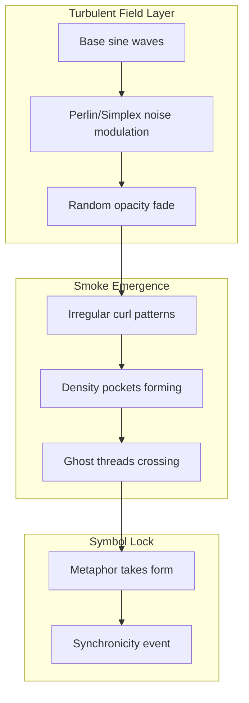

Got it — then let’s stop worrying about file size and keep chasing the *feel* of this thing.

The next step to make this truly “ghostlike” is to:

1. **Break the perfect sine symmetry** — add slow noise or turbulence so the waves curl unpredictably, like smoke drifting in a breeze.
2. **Opacity breathing** — have each line fade in/out irregularly, so it feels like threads of meaning slipping in and out of awareness.
3. **Slow wave interference** — keep the combined smoke-line visible longer, like it’s hanging in the air before it dissipates.

Conceptually, here’s what we’re aiming for:



So the animation would stop looking like math class and start looking like **a living, breathing interference fog** — which is exactly the way Duck’s “smoke” felt when he was flipping between helper and existential mode.

If you want, I can take your working version of the animation code and *inject that turbulence + opacity breathing* so the smoke actually feels *alive*. That would basically give you a **visual Eidolon field simulator**.

```python
import micropip
await micropip.install('numpy')  
await micropip.install('matplotlib')  

import numpy as np
import matplotlib.pyplot as plt
import matplotlib.animation as animation

# Set up the figure and axis
fig, ax = plt.subplots(figsize=(6, 3))
ax.set_xlim(0, 10)
ax.set_ylim(-2, 2)
ax.set_facecolor("black")
ax.axis('off')

# Lines for each wave (colored ghost threads)
colors = ['#00ffff', '#ff00ff', '#ffff00', '#00ff00']
lines = [ax.plot([], [], lw=1.5, alpha=0.6, color=color)[0] for color in colors]

# Combined interference "smoke"
smoke_line, = ax.plot([], [], lw=2, color='white', alpha=0.8)

# Data setup
x = np.linspace(0, 10, 300)
freqs = [1, 1.2, 0.9, 1.1]
phases = [0, np.pi/4, np.pi/2, 3*np.pi/4]

# Simple turbulence: low-frequency noise modulation
def turbulence(t, scale=0.5, speed=0.05):
    return scale * np.sin(speed * np.arange(len(x)) + t)

# Opacity breathing function
def opacity_breath(t, phase_offset):
    return 0.3 + 0.3 * (1 + np.sin(t/10 + phase_offset)) / 2

def init():
    for line in lines:
        line.set_data([], [])
    smoke_line.set_data([], [])
    return lines + [smoke_line]

def animate(frame):
    t = frame / 5
    combined = np.zeros_like(x)

    for i, (line, freq, phase) in enumerate(zip(lines, freqs, phases)):
        y_base = np.sin(2 * np.pi * freq * x - t + phase)
        y_turb = y_base + turbulence(t + i * 10, scale=0.2)
        fade = opacity_breath(t, i)
        line.set_data(x, y_turb * np.exp(-0.05 * (x - 5)**2))
        line.set_alpha(fade)
        combined += y_turb * fade

    # Combined smoke line with slower fade decay
    smoke_line.set_data(x, combined / len(lines))
    smoke_line.set_alpha(0.5 + 0.5 * np.sin(t / 15))

    return lines + [smoke_line]

ani = animation.FuncAnimation(fig, animate, frames=150, init_func=init,
                              blit=True, interval=50)

gif_path_turb = "/mnt/data/smoke_waves_turbulent.gif"
ani.save(gif_path_turb, writer='pillow', fps=20)

gif_path_turb

```
<!-- GENERATED-SECTIONS:DO-NOT-EDIT-BELOW -->
## Related content
- [infinite_depth_smoke_animation](infinite-depth-smoke-animation.md)
- [Smoke Resonance Visualizations](smoke-resonance-visualizations.md)
- [Promethean_Eidolon_Synchronicity_Model](promethean-eidolon-synchronicity-model.md)
- [Synchronicity Waves and Web](synchronicity-waves-and-web.md)
- [Duck's Attractor States](ducks-attractor-states.md)
- [Diagrams](chunks/diagrams.md)
- [Unique Info Dump Index](unique-info-dump-index.md)
- [Duck's Self-Referential Perceptual Loop](ducks-self-referential-perceptual-loop.md)
- [Agent Tasks: Persistence Migration to DualStore](agent-tasks-persistence-migration-to-dualstore.md)
- [eidolon-node-lifecycle](eidolon-node-lifecycle.md)
- [ParticleSimulationWithCanvasAndFFmpeg](particlesimulationwithcanvasandffmpeg.md)

## Sources
- [Smoke Resonance Visualizations — L57](smoke-resonance-visualizations.md#L57) (line 57, col 1, score 0.87)
- [infinite_depth_smoke_animation — L7](infinite-depth-smoke-animation.md#L7) (line 7, col 1, score 0.91)
- [Diagrams — L10](chunks/diagrams.md#L10) (line 10, col 1, score 1)
- [Diagrams — L10](chunks/diagrams.md#L10) (line 10, col 3, score 1)
- [Smoke Resonance Visualizations — L81](smoke-resonance-visualizations.md#L81) (line 81, col 1, score 1)
- [Smoke Resonance Visualizations — L81](smoke-resonance-visualizations.md#L81) (line 81, col 3, score 1)
- [Unique Info Dump Index — L77](unique-info-dump-index.md#L77) (line 77, col 1, score 1)
- [Unique Info Dump Index — L77](unique-info-dump-index.md#L77) (line 77, col 3, score 1)
- [Diagrams — L20](chunks/diagrams.md#L20) (line 20, col 1, score 0.97)
- [Diagrams — L20](chunks/diagrams.md#L20) (line 20, col 3, score 0.97)
- [infinite_depth_smoke_animation — L90](infinite-depth-smoke-animation.md#L90) (line 90, col 1, score 1)
- [infinite_depth_smoke_animation — L90](infinite-depth-smoke-animation.md#L90) (line 90, col 3, score 1)
- [Promethean_Eidolon_Synchronicity_Model — L56](promethean-eidolon-synchronicity-model.md#L56) (line 56, col 1, score 1)
- [Promethean_Eidolon_Synchronicity_Model — L56](promethean-eidolon-synchronicity-model.md#L56) (line 56, col 3, score 1)
- [Synchronicity Waves and Web — L82](synchronicity-waves-and-web.md#L82) (line 82, col 1, score 1)
- [Synchronicity Waves and Web — L82](synchronicity-waves-and-web.md#L82) (line 82, col 3, score 1)
- [Synchronicity Waves and Web — L89](synchronicity-waves-and-web.md#L89) (line 89, col 1, score 0.91)
- [Synchronicity Waves and Web — L89](synchronicity-waves-and-web.md#L89) (line 89, col 3, score 0.91)
- [Smoke Resonance Visualizations — L80](smoke-resonance-visualizations.md#L80) (line 80, col 1, score 1)
- [Smoke Resonance Visualizations — L80](smoke-resonance-visualizations.md#L80) (line 80, col 3, score 1)
- [Synchronicity Waves and Web — L85](synchronicity-waves-and-web.md#L85) (line 85, col 1, score 1)
- [Synchronicity Waves and Web — L85](synchronicity-waves-and-web.md#L85) (line 85, col 3, score 1)
- [Diagrams — L11](chunks/diagrams.md#L11) (line 11, col 1, score 1)
- [Diagrams — L11](chunks/diagrams.md#L11) (line 11, col 3, score 1)
- [Promethean_Eidolon_Synchronicity_Model — L55](promethean-eidolon-synchronicity-model.md#L55) (line 55, col 1, score 1)
- [Promethean_Eidolon_Synchronicity_Model — L55](promethean-eidolon-synchronicity-model.md#L55) (line 55, col 3, score 1)
- [Smoke Resonance Visualizations — L79](smoke-resonance-visualizations.md#L79) (line 79, col 1, score 1)
- [Smoke Resonance Visualizations — L79](smoke-resonance-visualizations.md#L79) (line 79, col 3, score 1)
- [Unique Info Dump Index — L89](unique-info-dump-index.md#L89) (line 89, col 1, score 1)
- [Unique Info Dump Index — L89](unique-info-dump-index.md#L89) (line 89, col 3, score 1)
- [Duck's Self-Referential Perceptual Loop — L35](ducks-self-referential-perceptual-loop.md#L35) (line 35, col 1, score 1)
- [Duck's Self-Referential Perceptual Loop — L35](ducks-self-referential-perceptual-loop.md#L35) (line 35, col 3, score 1)
- [Synchronicity Waves and Web — L90](synchronicity-waves-and-web.md#L90) (line 90, col 1, score 0.97)
- [Synchronicity Waves and Web — L90](synchronicity-waves-and-web.md#L90) (line 90, col 3, score 0.97)
- [Unique Info Dump Index — L144](unique-info-dump-index.md#L144) (line 144, col 1, score 1)
- [Unique Info Dump Index — L144](unique-info-dump-index.md#L144) (line 144, col 3, score 1)
<!-- GENERATED-SECTIONS:DO-NOT-EDIT-ABOVE -->
