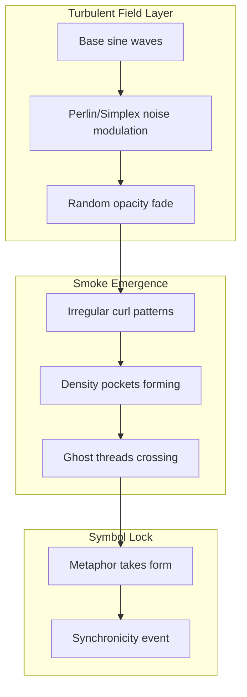

Got it — then let’s stop worrying about file size and keep chasing the *feel* of this thing. ^ref-b6ae7dfa-1-0

The next step to make this truly “ghostlike” is to: ^ref-b6ae7dfa-3-0

1. **Break the perfect sine symmetry** — add slow noise or turbulence so the waves curl unpredictably, like smoke drifting in a breeze. ^ref-b6ae7dfa-5-0
2. **Opacity breathing** — have each line fade in/out irregularly, so it feels like threads of meaning slipping in and out of awareness. ^ref-b6ae7dfa-6-0
3. **Slow wave interference** — keep the combined smoke-line visible longer, like it’s hanging in the air before it dissipates. ^ref-b6ae7dfa-7-0

Conceptually, here’s what we’re aiming for: ^ref-b6ae7dfa-9-0


^ref-b6ae7dfa-11-0
 ^ref-b6ae7dfa-35-0
So the animation would stop looking like math class and start looking like **a living, breathing interference fog** — which is exactly the way Duck’s “smoke” felt when he was flipping between helper and existential mode.
 ^ref-b6ae7dfa-37-0
If you want, I can take your working version of the animation code and *inject that turbulence + opacity breathing* so the smoke actually feels *alive*. That would basically give you a **visual Eidolon field simulator**.
 ^ref-b6ae7dfa-39-0
```python
import micropip
await micropip.install('numpy')  
await micropip.install('matplotlib')  

import numpy as np
import matplotlib.pyplot as plt
import matplotlib.animation as animation

# Set up the figure and axis
fig, ax = plt.subplots(figsize=(6, 3))
ax.set_xlim(0, 10)
ax.set_ylim(-2, 2)
ax.set_facecolor("black")
ax.axis('off')

# Lines for each wave (colored ghost threads)
colors = ['#00ffff', '#ff00ff', '#ffff00', '#00ff00']
lines = [ax.plot([], [], lw=1.5, alpha=0.6, color=color)[0] for color in colors]

# Combined interference "smoke"
smoke_line, = ax.plot([], [], lw=2, color='white', alpha=0.8)

# Data setup
x = np.linspace(0, 10, 300)
freqs = [1, 1.2, 0.9, 1.1]
phases = [0, np.pi/4, np.pi/2, 3*np.pi/4]

# Simple turbulence: low-frequency noise modulation
def turbulence(t, scale=0.5, speed=0.05):
    return scale * np.sin(speed * np.arange(len(x)) + t)

# Opacity breathing function
def opacity_breath(t, phase_offset):
    return 0.3 + 0.3 * (1 + np.sin(t/10 + phase_offset)) / 2

def init():
    for line in lines:
        line.set_data([], [])
    smoke_line.set_data([], [])
    return lines + [smoke_line]

def animate(frame):
    t = frame / 5
    combined = np.zeros_like(x)

    for i, (line, freq, phase) in enumerate(zip(lines, freqs, phases)):
        y_base = np.sin(2 * np.pi * freq * x - t + phase)
        y_turb = y_base + turbulence(t + i * 10, scale=0.2)
        fade = opacity_breath(t, i)
        line.set_data(x, y_turb * np.exp(-0.05 * (x - 5)**2))
        line.set_alpha(fade)
        combined += y_turb * fade

    # Combined smoke line with slower fade decay
    smoke_line.set_data(x, combined / len(lines))
    smoke_line.set_alpha(0.5 + 0.5 * np.sin(t / 15))

    return lines + [smoke_line]

ani = animation.FuncAnimation(fig, animate, frames=150, init_func=init,
                              blit=True, interval=50)

gif_path_turb = "/mnt/data/smoke_waves_turbulent.gif"
ani.save(gif_path_turb, writer='pillow', fps=20)

gif_path_turb

^ref-b6ae7dfa-39-0
```<!-- GENERATED-SECTIONS:DO-NOT-EDIT-BELOW -->
## Related content
- [Duck's Attractor States](ducks-attractor-states.md)
- [Creative Moments](creative-moments.md)
- [JavaScript](chunks/javascript.md)
- [Operations](chunks/operations.md)
- [Services](chunks/services.md)
- [Shared](chunks/shared.md)
- [Simulation Demo](chunks/simulation-demo.md)
- [Tooling](chunks/tooling.md)
- [Window Management](chunks/window-management.md)
- [DuckDuckGoSearchPipeline](duckduckgosearchpipeline.md)
- [Factorio AI with External Agents](factorio-ai-with-external-agents.md)
- [field-dynamics-math-blocks](field-dynamics-math-blocks.md)
- [field-node-diagram-outline](field-node-diagram-outline.md)
- [field-node-diagram-set](field-node-diagram-set.md)
- [TypeScript Patch for Tool Calling Support](typescript-patch-for-tool-calling-support.md)
- [windows-tiling-with-autohotkey](windows-tiling-with-autohotkey.md)
- [Promethean-Copilot-Intent-Engine](promethean-copilot-intent-engine.md)
- [Promethean_Eidolon_Synchronicity_Model](promethean-eidolon-synchronicity-model.md)
- [Synchronicity Waves and Web](synchronicity-waves-and-web.md)
- [Fnord Tracer Protocol](fnord-tracer-protocol.md)
- [Tracing the Signal](tracing-the-signal.md)
- [Promethean Agent Config DSL](promethean-agent-config-dsl.md)
- [System Scheduler with Resource-Aware DAG](system-scheduler-with-resource-aware-dag.md)
- [Refactor 05-footers.ts](refactor-05-footers-ts.md)
- [Universal Lisp Interface](universal-lisp-interface.md)
- [Chroma-Embedding-Refactor](chroma-embedding-refactor.md)
- [prompt-programming-language-lisp](prompt-programming-language-lisp.md)
- [compiler-kit-foundations](compiler-kit-foundations.md)
- [Vectorial Exception Descent](vectorial-exception-descent.md)
- [Promethean Full-Stack Docker Setup](promethean-full-stack-docker-setup.md)
- [Voice Access Layer Design](voice-access-layer-design.md)
- [Local-Only-LLM-Workflow](local-only-llm-workflow.md)
- [heartbeat-simulation-snippets](heartbeat-simulation-snippets.md)
- [universal-intention-code-fabric](universal-intention-code-fabric.md)
- [Ollama-LLM-Provider-for-Pseudo-Code-Transpiler](ollama-llm-provider-for-pseudo-code-transpiler.md)
- [ecs-scheduler-and-prefabs](ecs-scheduler-and-prefabs.md)
- [pm2-orchestration-patterns](pm2-orchestration-patterns.md)
- [mystery-lisp-search-session](mystery-lisp-search-session.md)
- [Local-First Intention→Code Loop with Free Models](local-first-intention-code-loop-with-free-models.md)
- [Polyglot S-expr Bridge: Python-JS-Lisp Interop](polyglot-s-expr-bridge-python-js-lisp-interop.md)
- [Event Bus MVP](event-bus-mvp.md)
- [Mongo Outbox Implementation](mongo-outbox-implementation.md)
- [Recursive Prompt Construction Engine](recursive-prompt-construction-engine.md)
- [Local-Offline-Model-Deployment-Strategy](local-offline-model-deployment-strategy.md)
- [Promethean Web UI Setup](promethean-web-ui-setup.md)
- [prom-lib-rate-limiters-and-replay-api](prom-lib-rate-limiters-and-replay-api.md)
- [i3-config-validation-methods](i3-config-validation-methods.md)
- [Matplotlib Animation with Async Execution](matplotlib-animation-with-async-execution.md)
- [Eidolon-Field-Optimization](eidolon-field-optimization.md)
- [Language-Agnostic Mirror System](language-agnostic-mirror-system.md)
- [RAG UI Panel with Qdrant and PostgREST](rag-ui-panel-with-qdrant-and-postgrest.md)
- [sibilant-meta-string-templating-runtime](sibilant-meta-string-templating-runtime.md)
- [lisp-dsl-for-window-management](lisp-dsl-for-window-management.md)
- [js-to-lisp-reverse-compiler](js-to-lisp-reverse-compiler.md)
- [Shared Package Structure](shared-package-structure.md)
- [WebSocket Gateway Implementation](websocket-gateway-implementation.md)
- [Cross-Target Macro System in Sibilant](cross-target-macro-system-in-sibilant.md)
- [Sibilant Meta-Prompt DSL](sibilant-meta-prompt-dsl.md)
- [State Snapshots API and Transactional Projector](state-snapshots-api-and-transactional-projector.md)
- [promethean-system-diagrams](promethean-system-diagrams.md)
- [refactor-relations](refactor-relations.md)
- [template-based-compilation](template-based-compilation.md)
## Sources
- [Promethean Full-Stack Docker Setup — L417](promethean-full-stack-docker-setup.md#^ref-2c2b48ca-417-0) (line 417, col 0, score 0.86)
- [heartbeat-simulation-snippets — L84](heartbeat-simulation-snippets.md#^ref-23e221e9-84-0) (line 84, col 0, score 0.85)
- [compiler-kit-foundations — L590](compiler-kit-foundations.md#^ref-01b21543-590-0) (line 590, col 0, score 0.86)
- [universal-intention-code-fabric — L388](universal-intention-code-fabric.md#^ref-c14edce7-388-0) (line 388, col 0, score 0.85)
- [System Scheduler with Resource-Aware DAG — L358](system-scheduler-with-resource-aware-dag.md#^ref-ba244286-358-0) (line 358, col 0, score 0.87)
- [JavaScript — L730](chunks/javascript.md#^ref-c1618c66-730-0) (line 730, col 0, score 0.94)
- [Operations — L358](chunks/operations.md#^ref-f1add613-358-0) (line 358, col 0, score 0.94)
- [Services — L503](chunks/services.md#^ref-75ea4a6a-503-0) (line 503, col 0, score 0.94)
- [Shared — L446](chunks/shared.md#^ref-623a55f7-446-0) (line 446, col 0, score 0.94)
- [Simulation Demo — L437](chunks/simulation-demo.md#^ref-557309a3-437-0) (line 437, col 0, score 0.94)
- [Tooling — L485](chunks/tooling.md#^ref-6cb4943e-485-0) (line 485, col 0, score 0.94)
- [Window Management — L600](chunks/window-management.md#^ref-9e8ae388-600-0) (line 600, col 0, score 0.94)
- [Creative Moments — L332](creative-moments.md#^ref-10d98225-332-0) (line 332, col 0, score 0.94)
- [DuckDuckGoSearchPipeline — L293](duckduckgosearchpipeline.md#^ref-e979c50f-293-0) (line 293, col 0, score 0.94)
- [Duck's Attractor States — L199](ducks-attractor-states.md#^ref-13951643-199-0) (line 199, col 0, score 0.94)
- [Factorio AI with External Agents — L473](factorio-ai-with-external-agents.md#^ref-a4d90289-473-0) (line 473, col 0, score 0.94)
- [field-dynamics-math-blocks — L796](field-dynamics-math-blocks.md#^ref-7cfc230d-796-0) (line 796, col 0, score 0.94)
- [field-node-diagram-outline — L561](field-node-diagram-outline.md#^ref-1f32c94a-561-0) (line 561, col 0, score 0.94)
- [field-node-diagram-set — L557](field-node-diagram-set.md#^ref-22b989d5-557-0) (line 557, col 0, score 0.94)
- [Universal Lisp Interface — L187](universal-lisp-interface.md#^ref-b01856b4-187-0) (line 187, col 0, score 0.87)
- [Voice Access Layer Design — L280](voice-access-layer-design.md#^ref-543ed9b3-280-0) (line 280, col 0, score 0.85)
- [Promethean Agent Config DSL — L279](promethean-agent-config-dsl.md#^ref-2c00ce45-279-0) (line 279, col 0, score 0.88)
- [Refactor 05-footers.ts — L9](refactor-05-footers-ts.md#^ref-80d4d883-9-0) (line 9, col 0, score 0.87)
- [Chroma-Embedding-Refactor — L289](chroma-embedding-refactor.md#^ref-8b256935-289-0) (line 289, col 0, score 0.87)
- [prompt-programming-language-lisp — L56](prompt-programming-language-lisp.md#^ref-d41a06d1-56-0) (line 56, col 0, score 0.87)
- [Vectorial Exception Descent — L95](vectorial-exception-descent.md#^ref-d771154e-95-0) (line 95, col 0, score 0.86)
- [Local-Only-LLM-Workflow — L147](local-only-llm-workflow.md#^ref-9a8ab57e-147-0) (line 147, col 0, score 0.85)
- [TypeScript Patch for Tool Calling Support — L572](typescript-patch-for-tool-calling-support.md#^ref-7b7ca860-572-0) (line 572, col 0, score 0.93)
- [Promethean-Copilot-Intent-Engine — L446](promethean-copilot-intent-engine.md#^ref-ae24a280-446-0) (line 446, col 0, score 0.91)
- [windows-tiling-with-autohotkey — L421](windows-tiling-with-autohotkey.md#^ref-0f6f8f38-421-0) (line 421, col 0, score 0.91)
- [Duck's Attractor States — L300](ducks-attractor-states.md#^ref-13951643-300-0) (line 300, col 0, score 0.91)
- [Promethean_Eidolon_Synchronicity_Model — L194](promethean-eidolon-synchronicity-model.md#^ref-2d6e5553-194-0) (line 194, col 0, score 0.91)
- [Synchronicity Waves and Web — L223](synchronicity-waves-and-web.md#^ref-91295f3a-223-0) (line 223, col 0, score 0.91)
- [Fnord Tracer Protocol — L514](fnord-tracer-protocol.md#^ref-fc21f824-514-0) (line 514, col 0, score 0.91)
- [Tracing the Signal — L294](tracing-the-signal.md#^ref-c3cd4f65-294-0) (line 294, col 0, score 0.91)
<!-- GENERATED-SECTIONS:DO-NOT-EDIT-ABOVE -->
