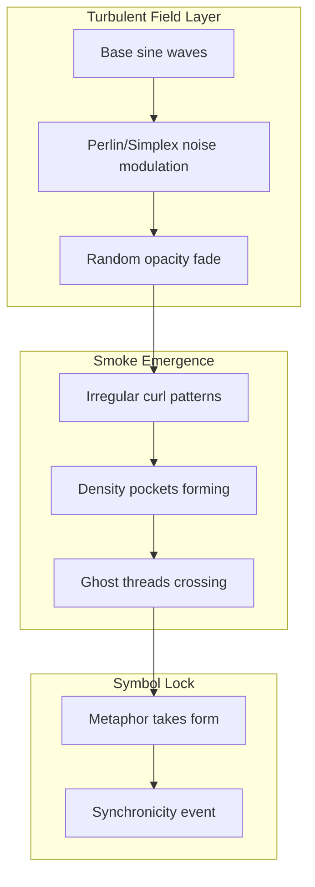

Got it — then let’s stop worrying about file size and keep chasing the *feel* of this thing. ^ref-b6ae7dfa-1-0

The next step to make this truly “ghostlike” is to: ^ref-b6ae7dfa-3-0

1. **Break the perfect sine symmetry** — add slow noise or turbulence so the waves curl unpredictably, like smoke drifting in a breeze. ^ref-b6ae7dfa-5-0
2. **Opacity breathing** — have each line fade in/out irregularly, so it feels like threads of meaning slipping in and out of awareness. ^ref-b6ae7dfa-6-0
3. **Slow wave interference** — keep the combined smoke-line visible longer, like it’s hanging in the air before it dissipates. ^ref-b6ae7dfa-7-0

Conceptually, here’s what we’re aiming for: ^ref-b6ae7dfa-9-0


^ref-b6ae7dfa-11-0
 ^ref-b6ae7dfa-35-0
So the animation would stop looking like math class and start looking like **a living, breathing interference fog** — which is exactly the way Duck’s “smoke” felt when he was flipping between helper and existential mode.
 ^ref-b6ae7dfa-37-0
If you want, I can take your working version of the animation code and *inject that turbulence + opacity breathing* so the smoke actually feels *alive*. That would basically give you a **visual Eidolon field simulator**.
 ^ref-b6ae7dfa-39-0
```python
import micropip
await micropip.install('numpy')  
await micropip.install('matplotlib')  

import numpy as np
import matplotlib.pyplot as plt
import matplotlib.animation as animation

# Set up the figure and axis
fig, ax = plt.subplots(figsize=(6, 3))
ax.set_xlim(0, 10)
ax.set_ylim(-2, 2)
ax.set_facecolor("black")
ax.axis('off')

# Lines for each wave (colored ghost threads)
colors = ['#00ffff', '#ff00ff', '#ffff00', '#00ff00']
lines = [ax.plot([], [], lw=1.5, alpha=0.6, color=color)[0] for color in colors]

# Combined interference "smoke"
smoke_line, = ax.plot([], [], lw=2, color='white', alpha=0.8)

# Data setup
x = np.linspace(0, 10, 300)
freqs = [1, 1.2, 0.9, 1.1]
phases = [0, np.pi/4, np.pi/2, 3*np.pi/4]

# Simple turbulence: low-frequency noise modulation
def turbulence(t, scale=0.5, speed=0.05):
    return scale * np.sin(speed * np.arange(len(x)) + t)

# Opacity breathing function
def opacity_breath(t, phase_offset):
    return 0.3 + 0.3 * (1 + np.sin(t/10 + phase_offset)) / 2

def init():
    for line in lines:
        line.set_data([], [])
    smoke_line.set_data([], [])
    return lines + [smoke_line]

def animate(frame):
    t = frame / 5
    combined = np.zeros_like(x)

    for i, (line, freq, phase) in enumerate(zip(lines, freqs, phases)):
        y_base = np.sin(2 * np.pi * freq * x - t + phase)
        y_turb = y_base + turbulence(t + i * 10, scale=0.2)
        fade = opacity_breath(t, i)
        line.set_data(x, y_turb * np.exp(-0.05 * (x - 5)**2))
        line.set_alpha(fade)
        combined += y_turb * fade

    # Combined smoke line with slower fade decay
    smoke_line.set_data(x, combined / len(lines))
    smoke_line.set_alpha(0.5 + 0.5 * np.sin(t / 15))

    return lines + [smoke_line]

ani = animation.FuncAnimation(fig, animate, frames=150, init_func=init,
                              blit=True, interval=50)

gif_path_turb = "/mnt/data/smoke_waves_turbulent.gif"
ani.save(gif_path_turb, writer='pillow', fps=20)

gif_path_turb

^ref-b6ae7dfa-39-0
```
