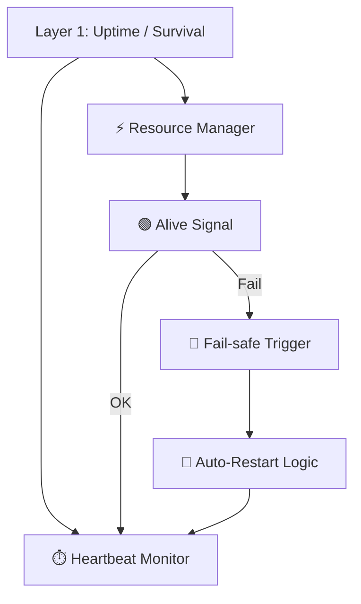

Note: Consolidated here → ../notes/diagrams/layer1-uptime-diagrams.md ^ref-4127189a-1-0

Hell yes. Let's model **Layer 1: Uptime / Survival** in several forms: functional flow, state machine, resource feedback loop, and how it binds to Daimoi. All diagrams will be Obsidian-compatible and help us break this down from multiple perspectives. ^ref-4127189a-3-0

---

## 🧠 Layer 1: Functional Overview


^ref-4127189a-9-0

---

## ⚙️ Layer 1: Finite State Machine
 ^ref-4127189a-29-0
```mermaid
stateDiagram-v2
  [*] --> Booting
  Booting --> Alive : heartbeat detected
  Alive --> Starving : energy below threshold
  Starving --> Dead : no recovery
  Starving --> Recovering : resources restored
  Recovering --> Alive
  Alive --> Dead : external kill or timeout
  Dead --> Restarting : uptime agent kicks in
  Restarting --> Booting
^ref-4127189a-29-0
```

---

## 🔄 Layer 1: Resource Feedback Loop ^ref-4127189a-46-0

```mermaid
graph TD
  Inputs["🧩 Inputs (Audio, Messages, Prompts)"]
  Load["⚖️ Load Estimator"]
  Heart["❤️ Heartbeat / Loop Timer"]
  Budget["🔋 Resource Budget"]
  Decision["🔍 Throttle or Process?"]
  Outputs["📤 Processed Output"]

  Inputs --> Load --> Heart --> Budget --> Decision
  Decision -->|Throttle| Heart
^ref-4127189a-46-0
  Decision -->|Process| Outputs
```

---
 ^ref-4127189a-64-0
## 🔗 Layer 1 ↔ Daimoi Binding

```mermaid
graph TD
  Daimo["✨ Daimo"]
  Bind["🔗 Binds to Field"]
  Feed["🌡️ Feeds off Uptime Layer"]
  Loop["♻️ Loop Execution"]
  Death["☠️ Dies if starved"]

  Daimo --> Bind --> Feed --> Loop
^ref-4127189a-64-0
  Loop --> Feed
  Feed -->|Insufficient| Death
```

--- ^ref-4127189a-81-0

## 🧱 Internal Component Model (Layer 1)

```mermaid
graph TD
  Heartbeat["🫀 Pulse Generator"]
  Watchdog["👁️ Alive Watchdog"]
  Timeouts["⏲️ Timeout Handler"]
  Memory["📦 Short-Term Cache"]
  Reactor["⚙️ Frame Execution Logic"]
  Logger["📓 Loop Logger"]

  Heartbeat --> Reactor
  Reactor --> Watchdog
  Watchdog --> Timeouts
^ref-4127189a-81-0
  Timeouts --> Heartbeat
  Reactor --> Memory
  Reactor --> Logger
```
 ^ref-4127189a-102-0
---

## 🧬 Eidolon Field: Axis 1 Dynamics (Layer 1)

```mermaid
flowchart TD
  Field["Eidolon Field"]
  Axis1["Axis 1: Survival / Uptime"]
  Influence["⬆️ Influence: Loop Frequency"]
  Particle["🧪 Particles: Daimoi w/ low mass"]
  Binding["🧷 Bound to survival state"]
  Pulse["🫀 Pulse energy from system"]

  Field --> Axis1
^ref-4127189a-102-0
  Axis1 --> Influence
  Influence --> Particle
  Particle --> Binding
  Binding --> Pulse
```
^ref-4127189a-122-0

---

## 🕸️ Layer 1 ↔ Promethean System Loop

```mermaid
sequenceDiagram
  participant Layer1 as L1: Uptime
  participant Cephalon
  participant Eidolon
  participant Services
  participant Agent

  Note over Layer1: Main loop tick
^ref-4127189a-122-0
  Layer1->>Services: Check process status
  Layer1->>Eidolon: Update axis-1 energy levels
  Layer1->>Cephalon: Emit context signal: "alive" ^ref-4127189a-140-0
  Layer1->>Agent: Permit or deny outbound actions
  Layer1->>Layer1: Loop with adjusted rate
^ref-4127189a-143-0 ^ref-4127189a-144-0
^ref-4127189a-140-0
``` ^ref-4127189a-143-0 ^ref-4127189a-146-0
^ref-4127189a-143-0
^ref-4127189a-140-0
^ref-4127189a-129-0
^ref-4127189a-143-0 ^ref-4127189a-150-0
^ref-4127189a-140-0
 ^ref-4127189a-144-0
--- ^ref-4127189a-150-0
 ^ref-4127189a-146-0
Would you like: ^ref-4127189a-150-0 ^ref-4127189a-155-0
 ^ref-4127189a-156-0
* The **LaTeX math** version of the feedback model?
* A **real-time throttling policy** example? ^ref-4127189a-150-0 ^ref-4127189a-155-0
* A **binding mechanism** for Layer 1 Daimoi in code or pseudocode? ^ref-4127189a-156-0
 ^ref-4127189a-155-0 ^ref-4127189a-160-0
Just say the word and we’ll expand it. ^ref-4127189a-156-0 ^ref-4127189a-161-0

--- ^ref-4127189a-155-0 ^ref-4127189a-160-0
 ^ref-4127189a-156-0 ^ref-4127189a-161-0
Related notes: [[../notes/diagrams/node-type-topology-map|node-type-topology-map]], [[../notes/diagrams/circuit-weight-visualizations|circuit-weight-visualizations]], [[../notes/diagrams/full-system-overview-diagrams|full-system-overview-diagrams]], [[../notes/diagrams/layer1-uptime-diagrams|layer1-uptime-diagrams]], [[../notes/diagrams/field-node-lifecycle-additional-diagrams|field-node-lifecycle-additional-diagrams]], [[../notes/diagrams/state-diagram-node-lifecycle|state-diagram-node-lifecycle]] [[index|unique/index]] ^ref-4127189a-160-0
 ^ref-4127189a-161-0 ^ref-4127189a-166-0
#tags: #diagram #design<!-- GENERATED-SECTIONS:DO-NOT-EDIT-BELOW -->
## Related content
- [promethean-system-diagrams](promethean-system-diagrams.md)
- [eidolon-node-lifecycle](eidolon-node-lifecycle.md)
- [field-node-diagram-visualizations](field-node-diagram-visualizations.md)
- [field-node-diagram-outline](field-node-diagram-outline.md)
- [field-node-diagram-set](field-node-diagram-set.md)
- [field-dynamics-math-blocks](field-dynamics-math-blocks.md)
- [Vectorial Exception Descent](vectorial-exception-descent.md)
- [Eidolon Field Abstract Model](eidolon-field-abstract-model.md)
- [Exception Layer Analysis](exception-layer-analysis.md)
- [2d-sandbox-field](2d-sandbox-field.md)
- [EidolonField](eidolonfield.md)
- [Ice Box Reorganization](ice-box-reorganization.md)
- [Unique Info Dump Index](unique-info-dump-index.md)
- [ripple-propagation-demo](ripple-propagation-demo.md)
- [heartbeat-fragment-demo](heartbeat-fragment-demo.md)
- [heartbeat-simulation-snippets](heartbeat-simulation-snippets.md)
- [Event Bus Projections Architecture](event-bus-projections-architecture.md)
- [Fnord Tracer Protocol](fnord-tracer-protocol.md)
- [aionian-circuit-math](aionian-circuit-math.md)
- [Promethean Event Bus MVP v0.1](promethean-event-bus-mvp-v0-1.md)
- [eidolon-field-math-foundations](eidolon-field-math-foundations.md)
- [Agent Tasks: Persistence Migration to DualStore](agent-tasks-persistence-migration-to-dualstore.md)
- [archetype-ecs](archetype-ecs.md)
- [Diagrams](chunks/diagrams.md)
- [DSL](chunks/dsl.md)
- [Simulation Demo](chunks/simulation-demo.md)
- [Eidolon-Field-Optimization](eidolon-field-optimization.md)
- [Factorio AI with External Agents](factorio-ai-with-external-agents.md)
- [Math Fundamentals](chunks/math-fundamentals.md)
- [sibilant-metacompiler-overview](sibilant-metacompiler-overview.md)
- [Cross-Language Runtime Polymorphism](cross-language-runtime-polymorphism.md)
- [api-gateway-versioning](api-gateway-versioning.md)
- [JavaScript](chunks/javascript.md)
- [field-interaction-equations](field-interaction-equations.md)
- [Cross-Target Macro System in Sibilant](cross-target-macro-system-in-sibilant.md)
- [Event Bus MVP](event-bus-mvp.md)
- [Chroma Toolkit Consolidation Plan](chroma-toolkit-consolidation-plan.md)
- [Board Walk – 2025-08-11](board-walk-2025-08-11.md)
- [Agent Reflections and Prompt Evolution](agent-reflections-and-prompt-evolution.md)
- [Canonical Org-Babel Matplotlib Animation Template](canonical-org-babel-matplotlib-animation-template.md)
- [compiler-kit-foundations](compiler-kit-foundations.md)
- [Admin Dashboard for User Management](admin-dashboard-for-user-management.md)
- [State Snapshots API and Transactional Projector](state-snapshots-api-and-transactional-projector.md)
- [template-based-compilation](template-based-compilation.md)
- [sibilant-meta-string-templating-runtime](sibilant-meta-string-templating-runtime.md)
- [sibilant-macro-targets](sibilant-macro-targets.md)
- [Sibilant Meta-Prompt DSL](sibilant-meta-prompt-dsl.md)
- [System Scheduler with Resource-Aware DAG](system-scheduler-with-resource-aware-dag.md)
- [ts-to-lisp-transpiler](ts-to-lisp-transpiler.md)
- [typed-struct-compiler](typed-struct-compiler.md)
- [AI-Centric OS with MCP Layer](ai-centric-os-with-mcp-layer.md)
- [Dynamic Context Model for Web Components](dynamic-context-model-for-web-components.md)
- [ecs-scheduler-and-prefabs](ecs-scheduler-and-prefabs.md)
- [Duck's Self-Referential Perceptual Loop](ducks-self-referential-perceptual-loop.md)
- [Layer1SurvivabilityEnvelope](layer1survivabilityenvelope.md)
- [Duck's Attractor States](ducks-attractor-states.md)
- [Services](chunks/services.md)
- [Shared](chunks/shared.md)
- [plan-update-confirmation](plan-update-confirmation.md)
- [Migrate to Provider-Tenant Architecture](migrate-to-provider-tenant-architecture.md)
- [js-to-lisp-reverse-compiler](js-to-lisp-reverse-compiler.md)
- [ecs-offload-workers](ecs-offload-workers.md)
- [markdown-to-org-transpiler](markdown-to-org-transpiler.md)
- [Ollama-LLM-Provider-for-Pseudo-Code-Transpiler](ollama-llm-provider-for-pseudo-code-transpiler.md)
- [graph-ds](graph-ds.md)
- [Obsidian ChatGPT Plugin Integration Guide](obsidian-chatgpt-plugin-integration-guide.md)
- [Obsidian ChatGPT Plugin Integration](obsidian-chatgpt-plugin-integration.md)
- [Obsidian Templating Plugins Integration Guide](obsidian-templating-plugins-integration-guide.md)
- [ParticleSimulationWithCanvasAndFFmpeg](particlesimulationwithcanvasandffmpeg.md)
- [polymorphic-meta-programming-engine](polymorphic-meta-programming-engine.md)
- [Tooling](chunks/tooling.md)
- [Window Management](chunks/window-management.md)
- [Debugging Broker Connections and Agent Behavior](debugging-broker-connections-and-agent-behavior.md)
- [Matplotlib Animation with Async Execution](matplotlib-animation-with-async-execution.md)
- [Model Selection for Lightweight Conversational Tasks](model-selection-for-lightweight-conversational-tasks.md)
- [Mongo Outbox Implementation](mongo-outbox-implementation.md)
- [obsidian-ignore-node-modules-regex](obsidian-ignore-node-modules-regex.md)
- [AI-First-OS-Model-Context-Protocol](ai-first-os-model-context-protocol.md)
- [balanced-bst](balanced-bst.md)
- [Promethean_Eidolon_Synchronicity_Model](promethean-eidolon-synchronicity-model.md)
- [Prompt_Folder_Bootstrap](prompt-folder-bootstrap.md)
- [Promethean Infrastructure Setup](promethean-infrastructure-setup.md)
- [prompt-programming-language-lisp](prompt-programming-language-lisp.md)
- [Promethean Web UI Setup](promethean-web-ui-setup.md)
- [Board Automation Improvements](board-automation-improvements.md)
- [Promethean-native config design](promethean-native-config-design.md)
- [Protocol_0_The_Contradiction_Engine](protocol-0-the-contradiction-engine.md)
- [Creative Moments](creative-moments.md)
- [Local-First Intention→Code Loop with Free Models](local-first-intention-code-loop-with-free-models.md)
- [Lispy Macros with syntax-rules](lispy-macros-with-syntax-rules.md)
- [Local-Only-LLM-Workflow](local-only-llm-workflow.md)
- [Local-Offline-Model-Deployment-Strategy](local-offline-model-deployment-strategy.md)
- [Polyglot S-expr Bridge: Python-JS-Lisp Interop](polyglot-s-expr-bridge-python-js-lisp-interop.md)
- [Operations](chunks/operations.md)
- [homeostasis-decay-formulas](homeostasis-decay-formulas.md)
- [lisp-dsl-for-window-management](lisp-dsl-for-window-management.md)
- [i3-bluetooth-setup](i3-bluetooth-setup.md)
- [Chroma-Embedding-Refactor](chroma-embedding-refactor.md)
- [schema-evolution-workflow](schema-evolution-workflow.md)
- [prom-lib-rate-limiters-and-replay-api](prom-lib-rate-limiters-and-replay-api.md)
- [Pure-Node Crawl Stack with Playwright and Crawlee](pure-node-crawl-stack-with-playwright-and-crawlee.md)
- [Per-Domain Policy System for JS Crawler](per-domain-policy-system-for-js-crawler.md)
- [Prometheus Observability Stack](prometheus-observability-stack.md)
- [Provider-Agnostic Chat Panel Implementation](provider-agnostic-chat-panel-implementation.md)
- [Promethean Workflow Optimization](promethean-workflow-optimization.md)
- [Shared Package Structure](shared-package-structure.md)
- [Lisp-Compiler-Integration](lisp-compiler-integration.md)
- [Language-Agnostic Mirror System](language-agnostic-mirror-system.md)
- [observability-infrastructure-setup](observability-infrastructure-setup.md)
- [Promethean Agent Config DSL](promethean-agent-config-dsl.md)
- [Self-Agency in AI Interaction](self-agency-in-ai-interaction.md)
- [Pure TypeScript Search Microservice](pure-typescript-search-microservice.md)
- [Interop and Source Maps](interop-and-source-maps.md)
- [komorebi-group-window-hack](komorebi-group-window-hack.md)
- [RAG UI Panel with Qdrant and PostgREST](rag-ui-panel-with-qdrant-and-postgrest.md)
- [set-assignment-in-lisp-ast](set-assignment-in-lisp-ast.md)
- [shared-package-layout-clarification](shared-package-layout-clarification.md)
- [DuckDuckGoSearchPipeline](duckduckgosearchpipeline.md)
- [Recursive Prompt Construction Engine](recursive-prompt-construction-engine.md)
- [Ghostly Smoke Interference](ghostly-smoke-interference.md)
- [Synchronicity Waves and Web](synchronicity-waves-and-web.md)
- [WebSocket Gateway Implementation](websocket-gateway-implementation.md)
- [Smoke Resonance Visualizations](smoke-resonance-visualizations.md)
- [Stateful Partitions and Rebalancing](stateful-partitions-and-rebalancing.md)
- [Promethean-Copilot-Intent-Engine](promethean-copilot-intent-engine.md)
- [Promethean State Format](promethean-state-format.md)
- [Reawakening Duck](reawakening-duck.md)
- [The Jar of Echoes](the-jar-of-echoes.md)
- [universal-intention-code-fabric](universal-intention-code-fabric.md)
## Sources
- [Unique Info Dump Index — L54](unique-info-dump-index.md#^ref-30ec3ba6-54-0) (line 54, col 0, score 0.67)
- [promethean-system-diagrams — L1](promethean-system-diagrams.md#^ref-b51e19b4-1-0) (line 1, col 0, score 0.82)
- [eidolon-node-lifecycle — L1](eidolon-node-lifecycle.md#^ref-938eca9c-1-0) (line 1, col 0, score 0.77)
- [2d-sandbox-field — L197](2d-sandbox-field.md#^ref-c710dc93-197-0) (line 197, col 0, score 0.66)
- [Agent Tasks: Persistence Migration to DualStore — L178](agent-tasks-persistence-migration-to-dualstore.md#^ref-93d2ba51-178-0) (line 178, col 0, score 0.66)
- [Chroma Toolkit Consolidation Plan — L216](chroma-toolkit-consolidation-plan.md#^ref-5020e892-216-0) (line 216, col 0, score 0.66)
- [Diagrams — L17](chunks/diagrams.md#^ref-45cd25b5-17-0) (line 17, col 0, score 0.66)
- [Eidolon Field Abstract Model — L194](eidolon-field-abstract-model.md#^ref-5e8b2388-194-0) (line 194, col 0, score 0.66)
- [eidolon-node-lifecycle — L33](eidolon-node-lifecycle.md#^ref-938eca9c-33-0) (line 33, col 0, score 0.7)
- [EidolonField — L247](eidolonfield.md#^ref-49d1e1e5-247-0) (line 247, col 0, score 0.7)
- [Event Bus MVP — L580](event-bus-mvp.md#^ref-534fe91d-580-0) (line 580, col 0, score 0.7)
- [promethean-system-diagrams — L3](promethean-system-diagrams.md#^ref-b51e19b4-3-0) (line 3, col 0, score 0.74)
- [ripple-propagation-demo — L3](ripple-propagation-demo.md#^ref-8430617b-3-0) (line 3, col 0, score 0.66)
- [field-interaction-equations — L3](field-interaction-equations.md#^ref-b09141b7-3-0) (line 3, col 0, score 0.71)
- [Event Bus Projections Architecture — L149](event-bus-projections-architecture.md#^ref-cf6b9b17-149-0) (line 149, col 0, score 0.7)
- [promethean-system-diagrams — L34](promethean-system-diagrams.md#^ref-b51e19b4-34-0) (line 34, col 0, score 0.67)
- [aionian-circuit-math — L70](aionian-circuit-math.md#^ref-f2d83a77-70-0) (line 70, col 0, score 0.7)
- [Vectorial Exception Descent — L16](vectorial-exception-descent.md#^ref-d771154e-16-0) (line 16, col 0, score 0.7)
- [Layer1SurvivabilityEnvelope — L84](layer1survivabilityenvelope.md#^ref-64a9f9f9-84-0) (line 84, col 0, score 0.61)
- [heartbeat-fragment-demo — L65](heartbeat-fragment-demo.md#^ref-dd00677a-65-0) (line 65, col 0, score 0.68)
- [heartbeat-simulation-snippets — L57](heartbeat-simulation-snippets.md#^ref-23e221e9-57-0) (line 57, col 0, score 0.68)
- [field-node-diagram-outline — L11](field-node-diagram-outline.md#^ref-1f32c94a-11-0) (line 11, col 0, score 0.7)
- [field-node-diagram-outline — L46](field-node-diagram-outline.md#^ref-1f32c94a-46-0) (line 46, col 0, score 0.77)
- [eidolon-node-lifecycle — L3](eidolon-node-lifecycle.md#^ref-938eca9c-3-0) (line 3, col 0, score 0.67)
- [field-node-diagram-set — L102](field-node-diagram-set.md#^ref-22b989d5-102-0) (line 102, col 0, score 0.66)
- [field-node-diagram-visualizations — L45](field-node-diagram-visualizations.md#^ref-e9b27b06-45-0) (line 45, col 0, score 0.73)
- [field-node-diagram-set — L24](field-node-diagram-set.md#^ref-22b989d5-24-0) (line 24, col 0, score 0.7)
- [promethean-system-diagrams — L116](promethean-system-diagrams.md#^ref-b51e19b4-116-0) (line 116, col 0, score 0.81)
- [heartbeat-fragment-demo — L50](heartbeat-fragment-demo.md#^ref-dd00677a-50-0) (line 50, col 0, score 0.67)
- [heartbeat-simulation-snippets — L44](heartbeat-simulation-snippets.md#^ref-23e221e9-44-0) (line 44, col 0, score 0.67)
- [aionian-circuit-math — L57](aionian-circuit-math.md#^ref-f2d83a77-57-0) (line 57, col 0, score 0.66)
- [Layer1SurvivabilityEnvelope — L156](layer1survivabilityenvelope.md#^ref-64a9f9f9-156-0) (line 156, col 0, score 0.66)
- [Event Bus Projections Architecture — L54](event-bus-projections-architecture.md#^ref-cf6b9b17-54-0) (line 54, col 0, score 0.7)
- [heartbeat-fragment-demo — L35](heartbeat-fragment-demo.md#^ref-dd00677a-35-0) (line 35, col 0, score 0.65)
- [Duck's Attractor States — L5](ducks-attractor-states.md#^ref-13951643-5-0) (line 5, col 0, score 0.71)
- [field-node-diagram-set — L9](field-node-diagram-set.md#^ref-22b989d5-9-0) (line 9, col 0, score 0.7)
- [Layer1SurvivabilityEnvelope — L11](layer1survivabilityenvelope.md#^ref-64a9f9f9-11-0) (line 11, col 0, score 0.69)
- [Promethean-Copilot-Intent-Engine — L40](promethean-copilot-intent-engine.md#^ref-ae24a280-40-0) (line 40, col 0, score 0.67)
- [Admin Dashboard for User Management — L24](admin-dashboard-for-user-management.md#^ref-2901a3e9-24-0) (line 24, col 0, score 0.66)
- [Synchronicity Waves and Web — L48](synchronicity-waves-and-web.md#^ref-91295f3a-48-0) (line 48, col 0, score 0.65)
- [Ghostly Smoke Interference — L11](ghostly-smoke-interference.md#^ref-b6ae7dfa-11-0) (line 11, col 0, score 0.73)
- [AI-Centric OS with MCP Layer — L432](ai-centric-os-with-mcp-layer.md#^ref-0f1f8cc1-432-0) (line 432, col 0, score 1)
- [Services — L29](chunks/services.md#^ref-75ea4a6a-29-0) (line 29, col 0, score 0.68)
- [Simulation Demo — L8](chunks/simulation-demo.md#^ref-557309a3-8-0) (line 8, col 0, score 0.68)
- [field-node-diagram-set — L41](field-node-diagram-set.md#^ref-22b989d5-41-0) (line 41, col 0, score 0.69)
- [field-node-diagram-visualizations — L63](field-node-diagram-visualizations.md#^ref-e9b27b06-63-0) (line 63, col 0, score 0.75)
- [homeostasis-decay-formulas — L115](homeostasis-decay-formulas.md#^ref-37b5d236-115-0) (line 115, col 0, score 0.74)
- [field-node-diagram-set — L71](field-node-diagram-set.md#^ref-22b989d5-71-0) (line 71, col 0, score 0.73)
- [homeostasis-decay-formulas — L117](homeostasis-decay-formulas.md#^ref-37b5d236-117-0) (line 117, col 0, score 0.66)
- [field-dynamics-math-blocks — L87](field-dynamics-math-blocks.md#^ref-7cfc230d-87-0) (line 87, col 0, score 0.7)
- [field-dynamics-math-blocks — L120](field-dynamics-math-blocks.md#^ref-7cfc230d-120-0) (line 120, col 0, score 0.67)
- [homeostasis-decay-formulas — L30](homeostasis-decay-formulas.md#^ref-37b5d236-30-0) (line 30, col 0, score 0.69)
- [field-node-diagram-set — L120](field-node-diagram-set.md#^ref-22b989d5-120-0) (line 120, col 0, score 0.69)
- [homeostasis-decay-formulas — L11](homeostasis-decay-formulas.md#^ref-37b5d236-11-0) (line 11, col 0, score 0.61)
- [aionian-circuit-math — L24](aionian-circuit-math.md#^ref-f2d83a77-24-0) (line 24, col 0, score 0.69)
- [Cross-Language Runtime Polymorphism — L233](cross-language-runtime-polymorphism.md#^ref-c34c36a6-233-0) (line 233, col 0, score 1)
- [Cross-Target Macro System in Sibilant — L214](cross-target-macro-system-in-sibilant.md#^ref-5f210ca2-214-0) (line 214, col 0, score 0.68)
- [Dynamic Context Model for Web Components — L430](dynamic-context-model-for-web-components.md#^ref-f7702bf8-430-0) (line 430, col 0, score 1)
- [ecs-scheduler-and-prefabs — L429](ecs-scheduler-and-prefabs.md#^ref-c62a1815-429-0) (line 429, col 0, score 1)
- [Eidolon Field Abstract Model — L198](eidolon-field-abstract-model.md#^ref-5e8b2388-198-0) (line 198, col 0, score 1)
- [eidolon-node-lifecycle — L36](eidolon-node-lifecycle.md#^ref-938eca9c-36-0) (line 36, col 0, score 1)
- [Event Bus MVP — L571](event-bus-mvp.md#^ref-534fe91d-571-0) (line 571, col 0, score 1)
- [field-node-diagram-outline — L61](field-node-diagram-outline.md#^ref-1f32c94a-61-0) (line 61, col 0, score 0.66)
- [Eidolon Field Abstract Model — L124](eidolon-field-abstract-model.md#^ref-5e8b2388-124-0) (line 124, col 0, score 0.7)
- [Promethean_Eidolon_Synchronicity_Model — L3](promethean-eidolon-synchronicity-model.md#^ref-2d6e5553-3-0) (line 3, col 0, score 0.7)
- [aionian-circuit-math — L116](aionian-circuit-math.md#^ref-f2d83a77-116-0) (line 116, col 0, score 0.69)
- [Smoke Resonance Visualizations — L57](smoke-resonance-visualizations.md#^ref-ac9d3ac5-57-0) (line 57, col 0, score 0.69)
- [Ice Box Reorganization — L16](ice-box-reorganization.md#^ref-291c7d91-16-0) (line 16, col 0, score 0.69)
- [ripple-propagation-demo — L52](ripple-propagation-demo.md#^ref-8430617b-52-0) (line 52, col 0, score 0.69)
- [Eidolon Field Abstract Model — L178](eidolon-field-abstract-model.md#^ref-5e8b2388-178-0) (line 178, col 0, score 0.68)
- [Fnord Tracer Protocol — L214](fnord-tracer-protocol.md#^ref-fc21f824-214-0) (line 214, col 0, score 0.78)
- [WebSocket Gateway Implementation — L296](websocket-gateway-implementation.md#^ref-e811123d-296-0) (line 296, col 0, score 0.71)
- [Promethean Event Bus MVP v0.1 — L197](promethean-event-bus-mvp-v0-1.md#^ref-fe7193a2-197-0) (line 197, col 0, score 0.69)
- [Stateful Partitions and Rebalancing — L328](stateful-partitions-and-rebalancing.md#^ref-4330e8f0-328-0) (line 328, col 0, score 0.69)
- [schema-evolution-workflow — L224](schema-evolution-workflow.md#^ref-d8059b6a-224-0) (line 224, col 0, score 0.68)
- [State Snapshots API and Transactional Projector — L162](state-snapshots-api-and-transactional-projector.md#^ref-509e1cd5-162-0) (line 162, col 0, score 0.68)
- [promethean-system-diagrams — L9](promethean-system-diagrams.md#^ref-b51e19b4-9-0) (line 9, col 0, score 0.67)
- [Promethean State Format — L34](promethean-state-format.md#^ref-23df6ddb-34-0) (line 34, col 0, score 0.67)
- [Event Bus MVP — L434](event-bus-mvp.md#^ref-534fe91d-434-0) (line 434, col 0, score 0.67)
- [Reawakening Duck — L58](reawakening-duck.md#^ref-59b5670f-58-0) (line 58, col 0, score 0.66)
- [ripple-propagation-demo — L74](ripple-propagation-demo.md#^ref-8430617b-74-0) (line 74, col 0, score 0.66)
- [Fnord Tracer Protocol — L99](fnord-tracer-protocol.md#^ref-fc21f824-99-0) (line 99, col 0, score 0.65)
- [Vectorial Exception Descent — L142](vectorial-exception-descent.md#^ref-d771154e-142-0) (line 142, col 0, score 0.96)
- [Synchronicity Waves and Web — L78](synchronicity-waves-and-web.md#^ref-91295f3a-78-0) (line 78, col 0, score 0.72)
- [sibilant-metacompiler-overview — L42](sibilant-metacompiler-overview.md#^ref-61d4086b-42-0) (line 42, col 0, score 0.7)
- [template-based-compilation — L56](template-based-compilation.md#^ref-f8877e5e-56-0) (line 56, col 0, score 0.65)
- [template-based-compilation — L79](template-based-compilation.md#^ref-f8877e5e-79-0) (line 79, col 0, score 0.59)
- [The Jar of Echoes — L108](the-jar-of-echoes.md#^ref-18138627-108-0) (line 108, col 0, score 0.58)
- [universal-intention-code-fabric — L390](universal-intention-code-fabric.md#^ref-c14edce7-390-0) (line 390, col 0, score 0.57)
- [sibilant-meta-string-templating-runtime — L114](sibilant-meta-string-templating-runtime.md#^ref-2aafc801-114-0) (line 114, col 0, score 0.55)
- [Recursive Prompt Construction Engine — L112](recursive-prompt-construction-engine.md#^ref-babdb9eb-112-0) (line 112, col 0, score 0.55)
- [Promethean-Copilot-Intent-Engine — L38](promethean-copilot-intent-engine.md#^ref-ae24a280-38-0) (line 38, col 0, score 0.54)
- [Recursive Prompt Construction Engine — L154](recursive-prompt-construction-engine.md#^ref-babdb9eb-154-0) (line 154, col 0, score 0.54)
- [Self-Agency in AI Interaction — L31](self-agency-in-ai-interaction.md#^ref-49a9a860-31-0) (line 31, col 0, score 0.54)
- [prom-lib-rate-limiters-and-replay-api — L367](prom-lib-rate-limiters-and-replay-api.md#^ref-aee4718b-367-0) (line 367, col 0, score 0.53)
- [sibilant-macro-targets — L95](sibilant-macro-targets.md#^ref-c5c9a5c6-95-0) (line 95, col 0, score 0.53)
- [Prompt_Folder_Bootstrap — L68](prompt-folder-bootstrap.md#^ref-bd4f0976-68-0) (line 68, col 0, score 0.52)
- [aionian-circuit-math — L165](aionian-circuit-math.md#^ref-f2d83a77-165-0) (line 165, col 0, score 1)
- [api-gateway-versioning — L319](api-gateway-versioning.md#^ref-0580dcd3-319-0) (line 319, col 0, score 1)
- [Canonical Org-Babel Matplotlib Animation Template — L116](canonical-org-babel-matplotlib-animation-template.md#^ref-1b1338fc-116-0) (line 116, col 0, score 1)
- [Chroma Toolkit Consolidation Plan — L209](chroma-toolkit-consolidation-plan.md#^ref-5020e892-209-0) (line 209, col 0, score 1)
- [DSL — L13](chunks/dsl.md#^ref-e87bc036-13-0) (line 13, col 0, score 1)
- [Math Fundamentals — L16](chunks/math-fundamentals.md#^ref-c6e87433-16-0) (line 16, col 0, score 1)
- [Services — L16](chunks/services.md#^ref-75ea4a6a-16-0) (line 16, col 0, score 1)
- [Shared — L5](chunks/shared.md#^ref-623a55f7-5-0) (line 5, col 0, score 1)
- [Simulation Demo — L12](chunks/simulation-demo.md#^ref-557309a3-12-0) (line 12, col 0, score 1)
- [plan-update-confirmation — L886](plan-update-confirmation.md#^ref-b22d79c6-886-0) (line 886, col 0, score 0.64)
- [Migrate to Provider-Tenant Architecture — L144](migrate-to-provider-tenant-architecture.md#^ref-54382370-144-0) (line 144, col 0, score 0.63)
- [State Snapshots API and Transactional Projector — L216](state-snapshots-api-and-transactional-projector.md#^ref-509e1cd5-216-0) (line 216, col 0, score 0.62)
- [State Snapshots API and Transactional Projector — L130](state-snapshots-api-and-transactional-projector.md#^ref-509e1cd5-130-0) (line 130, col 0, score 0.62)
- [field-interaction-equations — L126](field-interaction-equations.md#^ref-b09141b7-126-0) (line 126, col 0, score 0.62)
- [Pure-Node Crawl Stack with Playwright and Crawlee — L413](pure-node-crawl-stack-with-playwright-and-crawlee.md#^ref-d527c05d-413-0) (line 413, col 0, score 0.61)
- [Layer1SurvivabilityEnvelope — L75](layer1survivabilityenvelope.md#^ref-64a9f9f9-75-0) (line 75, col 0, score 0.61)
- [Fnord Tracer Protocol — L52](fnord-tracer-protocol.md#^ref-fc21f824-52-0) (line 52, col 0, score 0.6)
- [Per-Domain Policy System for JS Crawler — L458](per-domain-policy-system-for-js-crawler.md#^ref-c03020e1-458-0) (line 458, col 0, score 0.59)
- [Sibilant Meta-Prompt DSL — L82](sibilant-meta-prompt-dsl.md#^ref-af5d2824-82-0) (line 82, col 0, score 0.59)
- [field-interaction-equations — L96](field-interaction-equations.md#^ref-b09141b7-96-0) (line 96, col 0, score 0.71)
- [field-node-diagram-set — L49](field-node-diagram-set.md#^ref-22b989d5-49-0) (line 49, col 0, score 0.69)
- [field-node-diagram-outline — L59](field-node-diagram-outline.md#^ref-1f32c94a-59-0) (line 59, col 0, score 0.68)
- [field-interaction-equations — L94](field-interaction-equations.md#^ref-b09141b7-94-0) (line 94, col 0, score 0.68)
- [eidolon-field-math-foundations — L93](eidolon-field-math-foundations.md#^ref-008f2ac0-93-0) (line 93, col 0, score 0.67)
- [lisp-dsl-for-window-management — L81](lisp-dsl-for-window-management.md#^ref-c5c5ff1c-81-0) (line 81, col 0, score 0.66)
- [field-dynamics-math-blocks — L62](field-dynamics-math-blocks.md#^ref-7cfc230d-62-0) (line 62, col 0, score 0.65)
- [Eidolon Field Abstract Model — L182](eidolon-field-abstract-model.md#^ref-5e8b2388-182-0) (line 182, col 0, score 0.63)
- [sibilant-metacompiler-overview — L49](sibilant-metacompiler-overview.md#^ref-61d4086b-49-0) (line 49, col 0, score 0.73)
- [template-based-compilation — L41](template-based-compilation.md#^ref-f8877e5e-41-0) (line 41, col 0, score 0.72)
- [eidolon-field-math-foundations — L105](eidolon-field-math-foundations.md#^ref-008f2ac0-105-0) (line 105, col 0, score 0.67)
- [Event Bus MVP — L543](event-bus-mvp.md#^ref-534fe91d-543-0) (line 543, col 0, score 0.66)
- [EidolonField — L11](eidolonfield.md#^ref-49d1e1e5-11-0) (line 11, col 0, score 0.65)
- [Cross-Target Macro System in Sibilant — L37](cross-target-macro-system-in-sibilant.md#^ref-5f210ca2-37-0) (line 37, col 0, score 0.65)
- [Exception Layer Analysis — L5](exception-layer-analysis.md#^ref-21d5cc09-5-0) (line 5, col 0, score 0.64)
- [js-to-lisp-reverse-compiler — L386](js-to-lisp-reverse-compiler.md#^ref-58191024-386-0) (line 386, col 0, score 0.64)
- [Promethean Infrastructure Setup — L558](promethean-infrastructure-setup.md#^ref-6deed6ac-558-0) (line 558, col 0, score 0.64)
- [aionian-circuit-math — L141](aionian-circuit-math.md#^ref-f2d83a77-141-0) (line 141, col 0, score 0.63)
- [2d-sandbox-field — L18](2d-sandbox-field.md#^ref-c710dc93-18-0) (line 18, col 0, score 0.63)
- [ecs-offload-workers — L446](ecs-offload-workers.md#^ref-6498b9d7-446-0) (line 446, col 0, score 0.63)
- [ecs-scheduler-and-prefabs — L379](ecs-scheduler-and-prefabs.md#^ref-c62a1815-379-0) (line 379, col 0, score 0.63)
- [markdown-to-org-transpiler — L289](markdown-to-org-transpiler.md#^ref-ab54cdd8-289-0) (line 289, col 0, score 0.63)
- [Ollama-LLM-Provider-for-Pseudo-Code-Transpiler — L153](ollama-llm-provider-for-pseudo-code-transpiler.md#^ref-b362e12e-153-0) (line 153, col 0, score 0.63)
- [System Scheduler with Resource-Aware DAG — L377](system-scheduler-with-resource-aware-dag.md#^ref-ba244286-377-0) (line 377, col 0, score 0.63)
- [eidolon-node-lifecycle — L25](eidolon-node-lifecycle.md#^ref-938eca9c-25-0) (line 25, col 0, score 1)
- [field-node-diagram-outline — L94](field-node-diagram-outline.md#^ref-1f32c94a-94-0) (line 94, col 0, score 1)
- [field-node-diagram-set — L130](field-node-diagram-set.md#^ref-22b989d5-130-0) (line 130, col 0, score 1)
- [field-node-diagram-visualizations — L80](field-node-diagram-visualizations.md#^ref-e9b27b06-80-0) (line 80, col 0, score 1)
- [promethean-system-diagrams — L187](promethean-system-diagrams.md#^ref-b51e19b4-187-0) (line 187, col 0, score 1)
- [field-node-diagram-outline — L1](field-node-diagram-outline.md#^ref-1f32c94a-1-0) (line 1, col 0, score 0.78)
- [field-node-diagram-set — L1](field-node-diagram-set.md#^ref-22b989d5-1-0) (line 1, col 0, score 0.78)
- [field-node-diagram-visualizations — L1](field-node-diagram-visualizations.md#^ref-e9b27b06-1-0) (line 1, col 0, score 0.78)
- [Unique Info Dump Index — L59](unique-info-dump-index.md#^ref-30ec3ba6-59-0) (line 59, col 0, score 0.73)
- [eidolon-node-lifecycle — L29](eidolon-node-lifecycle.md#^ref-938eca9c-29-0) (line 29, col 0, score 0.73)
- [Event Bus Projections Architecture — L167](event-bus-projections-architecture.md#^ref-cf6b9b17-167-0) (line 167, col 0, score 0.73)
- [Factorio AI with External Agents — L145](factorio-ai-with-external-agents.md#^ref-a4d90289-145-0) (line 145, col 0, score 0.73)
- [promethean-system-diagrams — L189](promethean-system-diagrams.md#^ref-b51e19b4-189-0) (line 189, col 0, score 1)
- [homeostasis-decay-formulas — L162](homeostasis-decay-formulas.md#^ref-37b5d236-162-0) (line 162, col 0, score 0.76)
- [i3-bluetooth-setup — L126](i3-bluetooth-setup.md#^ref-5e408692-126-0) (line 126, col 0, score 0.76)
- [Prometheus Observability Stack — L538](prometheus-observability-stack.md#^ref-e90b5a16-538-0) (line 538, col 0, score 0.76)
- [Prompt_Folder_Bootstrap — L213](prompt-folder-bootstrap.md#^ref-bd4f0976-213-0) (line 213, col 0, score 0.76)
- [prompt-programming-language-lisp — L126](prompt-programming-language-lisp.md#^ref-d41a06d1-126-0) (line 126, col 0, score 0.76)
- [Provider-Agnostic Chat Panel Implementation — L250](provider-agnostic-chat-panel-implementation.md#^ref-43bfe9dd-250-0) (line 250, col 0, score 0.76)
- [Pure-Node Crawl Stack with Playwright and Crawlee — L458](pure-node-crawl-stack-with-playwright-and-crawlee.md#^ref-d527c05d-458-0) (line 458, col 0, score 0.76)
- [Pure TypeScript Search Microservice — L556](pure-typescript-search-microservice.md#^ref-d17d3a96-556-0) (line 556, col 0, score 0.76)
- [Recursive Prompt Construction Engine — L217](recursive-prompt-construction-engine.md#^ref-babdb9eb-217-0) (line 217, col 0, score 0.76)
- [Agent Tasks: Persistence Migration to DualStore — L133](agent-tasks-persistence-migration-to-dualstore.md#^ref-93d2ba51-133-0) (line 133, col 0, score 1)
- [Diagrams — L19](chunks/diagrams.md#^ref-45cd25b5-19-0) (line 19, col 0, score 1)
- [eidolon-node-lifecycle — L32](eidolon-node-lifecycle.md#^ref-938eca9c-32-0) (line 32, col 0, score 1)
- [Event Bus Projections Architecture — L147](event-bus-projections-architecture.md#^ref-cf6b9b17-147-0) (line 147, col 0, score 1)
- [field-node-diagram-outline — L101](field-node-diagram-outline.md#^ref-1f32c94a-101-0) (line 101, col 0, score 1)
- [field-node-diagram-set — L137](field-node-diagram-set.md#^ref-22b989d5-137-0) (line 137, col 0, score 1)
- [field-node-diagram-visualizations — L87](field-node-diagram-visualizations.md#^ref-e9b27b06-87-0) (line 87, col 0, score 1)
- [graph-ds — L363](graph-ds.md#^ref-6620e2f2-363-0) (line 363, col 0, score 1)
- [2d-sandbox-field — L202](2d-sandbox-field.md#^ref-c710dc93-202-0) (line 202, col 0, score 1)
- [Agent Tasks: Persistence Migration to DualStore — L144](agent-tasks-persistence-migration-to-dualstore.md#^ref-93d2ba51-144-0) (line 144, col 0, score 1)
- [aionian-circuit-math — L182](aionian-circuit-math.md#^ref-f2d83a77-182-0) (line 182, col 0, score 1)
- [Chroma-Embedding-Refactor — L333](chroma-embedding-refactor.md#^ref-8b256935-333-0) (line 333, col 0, score 1)
- [Diagrams — L16](chunks/diagrams.md#^ref-45cd25b5-16-0) (line 16, col 0, score 1)
- [JavaScript — L45](chunks/javascript.md#^ref-c1618c66-45-0) (line 45, col 0, score 1)
- [Math Fundamentals — L38](chunks/math-fundamentals.md#^ref-c6e87433-38-0) (line 38, col 0, score 1)
- [Simulation Demo — L15](chunks/simulation-demo.md#^ref-557309a3-15-0) (line 15, col 0, score 1)
- [2d-sandbox-field — L196](2d-sandbox-field.md#^ref-c710dc93-196-0) (line 196, col 0, score 1)
- [Agent Tasks: Persistence Migration to DualStore — L137](agent-tasks-persistence-migration-to-dualstore.md#^ref-93d2ba51-137-0) (line 137, col 0, score 1)
- [Diagrams — L34](chunks/diagrams.md#^ref-45cd25b5-34-0) (line 34, col 0, score 1)
- [JavaScript — L46](chunks/javascript.md#^ref-c1618c66-46-0) (line 46, col 0, score 1)
- [Math Fundamentals — L41](chunks/math-fundamentals.md#^ref-c6e87433-41-0) (line 41, col 0, score 1)
- [Simulation Demo — L16](chunks/simulation-demo.md#^ref-557309a3-16-0) (line 16, col 0, score 1)
- [Duck's Attractor States — L75](ducks-attractor-states.md#^ref-13951643-75-0) (line 75, col 0, score 1)
- [Duck's Self-Referential Perceptual Loop — L48](ducks-self-referential-perceptual-loop.md#^ref-71726f04-48-0) (line 48, col 0, score 1)
- [Eidolon Field Abstract Model — L193](eidolon-field-abstract-model.md#^ref-5e8b2388-193-0) (line 193, col 0, score 1)
- [eidolon-field-math-foundations — L135](eidolon-field-math-foundations.md#^ref-008f2ac0-135-0) (line 135, col 0, score 1)
- [Agent Tasks: Persistence Migration to DualStore — L139](agent-tasks-persistence-migration-to-dualstore.md#^ref-93d2ba51-139-0) (line 139, col 0, score 1)
- [Simulation Demo — L17](chunks/simulation-demo.md#^ref-557309a3-17-0) (line 17, col 0, score 1)
- [Eidolon Field Abstract Model — L203](eidolon-field-abstract-model.md#^ref-5e8b2388-203-0) (line 203, col 0, score 1)
- [eidolon-node-lifecycle — L31](eidolon-node-lifecycle.md#^ref-938eca9c-31-0) (line 31, col 0, score 1)
- [Event Bus Projections Architecture — L156](event-bus-projections-architecture.md#^ref-cf6b9b17-156-0) (line 156, col 0, score 1)
- [Factorio AI with External Agents — L146](factorio-ai-with-external-agents.md#^ref-a4d90289-146-0) (line 146, col 0, score 1)
- [field-node-diagram-outline — L99](field-node-diagram-outline.md#^ref-1f32c94a-99-0) (line 99, col 0, score 1)
- [field-node-diagram-visualizations — L85](field-node-diagram-visualizations.md#^ref-e9b27b06-85-0) (line 85, col 0, score 1)
- [aionian-circuit-math — L152](aionian-circuit-math.md#^ref-f2d83a77-152-0) (line 152, col 0, score 1)
- [Math Fundamentals — L11](chunks/math-fundamentals.md#^ref-c6e87433-11-0) (line 11, col 0, score 1)
- [Cross-Target Macro System in Sibilant — L196](cross-target-macro-system-in-sibilant.md#^ref-5f210ca2-196-0) (line 196, col 0, score 1)
- [Eidolon Field Abstract Model — L192](eidolon-field-abstract-model.md#^ref-5e8b2388-192-0) (line 192, col 0, score 1)
- [eidolon-field-math-foundations — L121](eidolon-field-math-foundations.md#^ref-008f2ac0-121-0) (line 121, col 0, score 1)
- [EidolonField — L245](eidolonfield.md#^ref-49d1e1e5-245-0) (line 245, col 0, score 1)
- [Exception Layer Analysis — L149](exception-layer-analysis.md#^ref-21d5cc09-149-0) (line 149, col 0, score 1)
- [field-interaction-equations — L149](field-interaction-equations.md#^ref-b09141b7-149-0) (line 149, col 0, score 1)
- [field-node-diagram-outline — L103](field-node-diagram-outline.md#^ref-1f32c94a-103-0) (line 103, col 0, score 1)
- [2d-sandbox-field — L193](2d-sandbox-field.md#^ref-c710dc93-193-0) (line 193, col 0, score 1)
- [Eidolon Field Abstract Model — L190](eidolon-field-abstract-model.md#^ref-5e8b2388-190-0) (line 190, col 0, score 1)
- [EidolonField — L242](eidolonfield.md#^ref-49d1e1e5-242-0) (line 242, col 0, score 1)
- [Exception Layer Analysis — L145](exception-layer-analysis.md#^ref-21d5cc09-145-0) (line 145, col 0, score 1)
- [field-dynamics-math-blocks — L144](field-dynamics-math-blocks.md#^ref-7cfc230d-144-0) (line 144, col 0, score 1)
- [field-node-diagram-outline — L105](field-node-diagram-outline.md#^ref-1f32c94a-105-0) (line 105, col 0, score 1)
- [Ice Box Reorganization — L69](ice-box-reorganization.md#^ref-291c7d91-69-0) (line 69, col 0, score 1)
- [js-to-lisp-reverse-compiler — L417](js-to-lisp-reverse-compiler.md#^ref-58191024-417-0) (line 417, col 0, score 1)
- [js-to-lisp-reverse-compiler — L418](js-to-lisp-reverse-compiler.md#^ref-58191024-418-0) (line 418, col 0, score 1)
- [Layer1SurvivabilityEnvelope — L164](layer1survivabilityenvelope.md#^ref-64a9f9f9-164-0) (line 164, col 0, score 1)
- [Migrate to Provider-Tenant Architecture — L289](migrate-to-provider-tenant-architecture.md#^ref-54382370-289-0) (line 289, col 0, score 1)
- [Obsidian ChatGPT Plugin Integration Guide — L44](obsidian-chatgpt-plugin-integration-guide.md#^ref-1d3d6c3a-44-0) (line 44, col 0, score 1)
- [Obsidian ChatGPT Plugin Integration — L42](obsidian-chatgpt-plugin-integration.md#^ref-ca8e1399-42-0) (line 42, col 0, score 1)
- [Obsidian Templating Plugins Integration Guide — L101](obsidian-templating-plugins-integration-guide.md#^ref-b39dc9d4-101-0) (line 101, col 0, score 1)
- [ParticleSimulationWithCanvasAndFFmpeg — L248](particlesimulationwithcanvasandffmpeg.md#^ref-e018dd7a-248-0) (line 248, col 0, score 1)
- [plan-update-confirmation — L1007](plan-update-confirmation.md#^ref-b22d79c6-1007-0) (line 1007, col 0, score 1)
- [polymorphic-meta-programming-engine — L221](polymorphic-meta-programming-engine.md#^ref-7bed0b9a-221-0) (line 221, col 0, score 1)
- [aionian-circuit-math — L169](aionian-circuit-math.md#^ref-f2d83a77-169-0) (line 169, col 0, score 1)
- [api-gateway-versioning — L290](api-gateway-versioning.md#^ref-0580dcd3-290-0) (line 290, col 0, score 1)
- [Board Walk – 2025-08-11 — L135](board-walk-2025-08-11.md#^ref-7aa1eb92-135-0) (line 135, col 0, score 1)
- [Chroma Toolkit Consolidation Plan — L180](chroma-toolkit-consolidation-plan.md#^ref-5020e892-180-0) (line 180, col 0, score 1)
- [Cross-Target Macro System in Sibilant — L185](cross-target-macro-system-in-sibilant.md#^ref-5f210ca2-185-0) (line 185, col 0, score 1)
- [Dynamic Context Model for Web Components — L402](dynamic-context-model-for-web-components.md#^ref-f7702bf8-402-0) (line 402, col 0, score 1)
- [Eidolon Field Abstract Model — L191](eidolon-field-abstract-model.md#^ref-5e8b2388-191-0) (line 191, col 0, score 1)
- [eidolon-node-lifecycle — L53](eidolon-node-lifecycle.md#^ref-938eca9c-53-0) (line 53, col 0, score 1)
- [EidolonField — L243](eidolonfield.md#^ref-49d1e1e5-243-0) (line 243, col 0, score 1)
- [field-dynamics-math-blocks — L145](field-dynamics-math-blocks.md#^ref-7cfc230d-145-0) (line 145, col 0, score 1)
- [promethean-system-diagrams — L207](promethean-system-diagrams.md#^ref-b51e19b4-207-0) (line 207, col 0, score 1)
- [Promethean Web UI Setup — L633](promethean-web-ui-setup.md#^ref-bc5172ca-633-0) (line 633, col 0, score 1)
- [Promethean Workflow Optimization — L20](promethean-workflow-optimization.md#^ref-d614d983-20-0) (line 20, col 0, score 1)
- [Prometheus Observability Stack — L543](prometheus-observability-stack.md#^ref-e90b5a16-543-0) (line 543, col 0, score 1)
- [Prompt_Folder_Bootstrap — L216](prompt-folder-bootstrap.md#^ref-bd4f0976-216-0) (line 216, col 0, score 1)
- [prompt-programming-language-lisp — L116](prompt-programming-language-lisp.md#^ref-d41a06d1-116-0) (line 116, col 0, score 1)
- [Protocol_0_The_Contradiction_Engine — L156](protocol-0-the-contradiction-engine.md#^ref-9a93a756-156-0) (line 156, col 0, score 1)
- [Provider-Agnostic Chat Panel Implementation — L238](provider-agnostic-chat-panel-implementation.md#^ref-43bfe9dd-238-0) (line 238, col 0, score 1)
- [Pure-Node Crawl Stack with Playwright and Crawlee — L445](pure-node-crawl-stack-with-playwright-and-crawlee.md#^ref-d527c05d-445-0) (line 445, col 0, score 1)
- [Shared Package Structure — L195](shared-package-structure.md#^ref-66a72fc3-195-0) (line 195, col 0, score 1)
- [2d-sandbox-field — L194](2d-sandbox-field.md#^ref-c710dc93-194-0) (line 194, col 0, score 1)
- [Chroma Toolkit Consolidation Plan — L194](chroma-toolkit-consolidation-plan.md#^ref-5020e892-194-0) (line 194, col 0, score 1)
- [Diagrams — L41](chunks/diagrams.md#^ref-45cd25b5-41-0) (line 41, col 0, score 1)
- [Math Fundamentals — L29](chunks/math-fundamentals.md#^ref-c6e87433-29-0) (line 29, col 0, score 1)
- [compiler-kit-foundations — L649](compiler-kit-foundations.md#^ref-01b21543-649-0) (line 649, col 0, score 1)
- [Cross-Language Runtime Polymorphism — L225](cross-language-runtime-polymorphism.md#^ref-c34c36a6-225-0) (line 225, col 0, score 1)
- [Cross-Target Macro System in Sibilant — L192](cross-target-macro-system-in-sibilant.md#^ref-5f210ca2-192-0) (line 192, col 0, score 1)
- [Duck's Attractor States — L74](ducks-attractor-states.md#^ref-13951643-74-0) (line 74, col 0, score 1)
- [Duck's Self-Referential Perceptual Loop — L47](ducks-self-referential-perceptual-loop.md#^ref-71726f04-47-0) (line 47, col 0, score 1)
- [Dynamic Context Model for Web Components — L406](dynamic-context-model-for-web-components.md#^ref-f7702bf8-406-0) (line 406, col 0, score 1)
- [Eidolon Field Abstract Model — L195](eidolon-field-abstract-model.md#^ref-5e8b2388-195-0) (line 195, col 0, score 1)
- [2d-sandbox-field — L198](2d-sandbox-field.md#^ref-c710dc93-198-0) (line 198, col 0, score 1)
- [Math Fundamentals — L30](chunks/math-fundamentals.md#^ref-c6e87433-30-0) (line 30, col 0, score 1)
- [Eidolon Field Abstract Model — L196](eidolon-field-abstract-model.md#^ref-5e8b2388-196-0) (line 196, col 0, score 1)
- [eidolon-node-lifecycle — L52](eidolon-node-lifecycle.md#^ref-938eca9c-52-0) (line 52, col 0, score 1)
- [EidolonField — L239](eidolonfield.md#^ref-49d1e1e5-239-0) (line 239, col 0, score 1)
- [Exception Layer Analysis — L152](exception-layer-analysis.md#^ref-21d5cc09-152-0) (line 152, col 0, score 1)
- [field-dynamics-math-blocks — L147](field-dynamics-math-blocks.md#^ref-7cfc230d-147-0) (line 147, col 0, score 1)
- [field-node-diagram-outline — L108](field-node-diagram-outline.md#^ref-1f32c94a-108-0) (line 108, col 0, score 1)
- [field-node-diagram-visualizations — L89](field-node-diagram-visualizations.md#^ref-e9b27b06-89-0) (line 89, col 0, score 1)
- [graph-ds — L373](graph-ds.md#^ref-6620e2f2-373-0) (line 373, col 0, score 1)
- [heartbeat-fragment-demo — L99](heartbeat-fragment-demo.md#^ref-dd00677a-99-0) (line 99, col 0, score 1)
- [heartbeat-simulation-snippets — L86](heartbeat-simulation-snippets.md#^ref-23e221e9-86-0) (line 86, col 0, score 1)
- [homeostasis-decay-formulas — L154](homeostasis-decay-formulas.md#^ref-37b5d236-154-0) (line 154, col 0, score 1)
- [Interop and Source Maps — L518](interop-and-source-maps.md#^ref-cdfac40c-518-0) (line 518, col 0, score 1)
- [komorebi-group-window-hack — L205](komorebi-group-window-hack.md#^ref-dd89372d-205-0) (line 205, col 0, score 1)
- [Lisp-Compiler-Integration — L558](lisp-compiler-integration.md#^ref-cfee6d36-558-0) (line 558, col 0, score 1)
- [lisp-dsl-for-window-management — L219](lisp-dsl-for-window-management.md#^ref-c5c5ff1c-219-0) (line 219, col 0, score 1)
- [Simulation Demo — L32](chunks/simulation-demo.md#^ref-557309a3-32-0) (line 32, col 0, score 1)
- [Tooling — L26](chunks/tooling.md#^ref-6cb4943e-26-0) (line 26, col 0, score 1)
- [Window Management — L36](chunks/window-management.md#^ref-9e8ae388-36-0) (line 36, col 0, score 1)
- [compiler-kit-foundations — L639](compiler-kit-foundations.md#^ref-01b21543-639-0) (line 639, col 0, score 1)
- [Creative Moments — L10](creative-moments.md#^ref-10d98225-10-0) (line 10, col 0, score 1)
- [Cross-Language Runtime Polymorphism — L258](cross-language-runtime-polymorphism.md#^ref-c34c36a6-258-0) (line 258, col 0, score 1)
- [Cross-Target Macro System in Sibilant — L215](cross-target-macro-system-in-sibilant.md#^ref-5f210ca2-215-0) (line 215, col 0, score 1)
- [Debugging Broker Connections and Agent Behavior — L50](debugging-broker-connections-and-agent-behavior.md#^ref-73d3dbf6-50-0) (line 50, col 0, score 1)
- [DuckDuckGoSearchPipeline — L16](duckduckgosearchpipeline.md#^ref-e979c50f-16-0) (line 16, col 0, score 1)
- [Services — L28](chunks/services.md#^ref-75ea4a6a-28-0) (line 28, col 0, score 1)
- [Simulation Demo — L7](chunks/simulation-demo.md#^ref-557309a3-7-0) (line 7, col 0, score 1)
- [ecs-scheduler-and-prefabs — L428](ecs-scheduler-and-prefabs.md#^ref-c62a1815-428-0) (line 428, col 0, score 1)
- [Eidolon Field Abstract Model — L199](eidolon-field-abstract-model.md#^ref-5e8b2388-199-0) (line 199, col 0, score 1)
- [eidolon-node-lifecycle — L35](eidolon-node-lifecycle.md#^ref-938eca9c-35-0) (line 35, col 0, score 1)
- [Event Bus MVP — L570](event-bus-mvp.md#^ref-534fe91d-570-0) (line 570, col 0, score 1)
- [field-interaction-equations — L173](field-interaction-equations.md#^ref-b09141b7-173-0) (line 173, col 0, score 1)
- [field-node-diagram-outline — L113](field-node-diagram-outline.md#^ref-1f32c94a-113-0) (line 113, col 0, score 1)
- [Duck's Self-Referential Perceptual Loop — L57](ducks-self-referential-perceptual-loop.md#^ref-71726f04-57-0) (line 57, col 0, score 1)
- [field-node-diagram-outline — L114](field-node-diagram-outline.md#^ref-1f32c94a-114-0) (line 114, col 0, score 1)
- [EidolonField — L257](eidolonfield.md#^ref-49d1e1e5-257-0) (line 257, col 0, score 1)
- [Event Bus MVP — L558](event-bus-mvp.md#^ref-534fe91d-558-0) (line 558, col 0, score 1)
- [Factorio AI with External Agents — L147](factorio-ai-with-external-agents.md#^ref-a4d90289-147-0) (line 147, col 0, score 1)
- [field-node-diagram-outline — L116](field-node-diagram-outline.md#^ref-1f32c94a-116-0) (line 116, col 0, score 1)
- [field-node-diagram-set — L147](field-node-diagram-set.md#^ref-22b989d5-147-0) (line 147, col 0, score 1)
- [field-node-diagram-visualizations — L96](field-node-diagram-visualizations.md#^ref-e9b27b06-96-0) (line 96, col 0, score 1)
- [Fnord Tracer Protocol — L249](fnord-tracer-protocol.md#^ref-fc21f824-249-0) (line 249, col 0, score 1)
- [graph-ds — L368](graph-ds.md#^ref-6620e2f2-368-0) (line 368, col 0, score 1)
- [heartbeat-fragment-demo — L115](heartbeat-fragment-demo.md#^ref-dd00677a-115-0) (line 115, col 0, score 1)
- [heartbeat-simulation-snippets — L104](heartbeat-simulation-snippets.md#^ref-23e221e9-104-0) (line 104, col 0, score 1)
- [Agent Tasks: Persistence Migration to DualStore — L151](agent-tasks-persistence-migration-to-dualstore.md#^ref-93d2ba51-151-0) (line 151, col 0, score 1)
- [Chroma Toolkit Consolidation Plan — L189](chroma-toolkit-consolidation-plan.md#^ref-5020e892-189-0) (line 189, col 0, score 1)
- [Event Bus MVP — L561](event-bus-mvp.md#^ref-534fe91d-561-0) (line 561, col 0, score 1)
- [Event Bus Projections Architecture — L159](event-bus-projections-architecture.md#^ref-cf6b9b17-159-0) (line 159, col 0, score 1)
- [Promethean Event Bus MVP v0.1 — L886](promethean-event-bus-mvp-v0-1.md#^ref-fe7193a2-886-0) (line 886, col 0, score 1)
- [Fnord Tracer Protocol — L170](fnord-tracer-protocol.md#^ref-fc21f824-170-0) (line 170, col 0, score 0.72)
- [Fnord Tracer Protocol — L149](fnord-tracer-protocol.md#^ref-fc21f824-149-0) (line 149, col 0, score 0.7)
- [Fnord Tracer Protocol — L168](fnord-tracer-protocol.md#^ref-fc21f824-168-0) (line 168, col 0, score 0.69)
- [Fnord Tracer Protocol — L24](fnord-tracer-protocol.md#^ref-fc21f824-24-0) (line 24, col 0, score 0.63)
- [Diagrams — L13](chunks/diagrams.md#^ref-45cd25b5-13-0) (line 13, col 0, score 1)
- [DSL — L15](chunks/dsl.md#^ref-e87bc036-15-0) (line 15, col 0, score 1)
- [JavaScript — L18](chunks/javascript.md#^ref-c1618c66-18-0) (line 18, col 0, score 1)
- [Math Fundamentals — L14](chunks/math-fundamentals.md#^ref-c6e87433-14-0) (line 14, col 0, score 1)
- [Services — L14](chunks/services.md#^ref-75ea4a6a-14-0) (line 14, col 0, score 1)
- [Shared — L7](chunks/shared.md#^ref-623a55f7-7-0) (line 7, col 0, score 1)
- [Simulation Demo — L10](chunks/simulation-demo.md#^ref-557309a3-10-0) (line 10, col 0, score 1)
- [Tooling — L9](chunks/tooling.md#^ref-6cb4943e-9-0) (line 9, col 0, score 1)
- [Window Management — L15](chunks/window-management.md#^ref-9e8ae388-15-0) (line 15, col 0, score 1)
- [Agent Tasks: Persistence Migration to DualStore — L135](agent-tasks-persistence-migration-to-dualstore.md#^ref-93d2ba51-135-0) (line 135, col 0, score 1)
- [ecs-offload-workers — L481](ecs-offload-workers.md#^ref-6498b9d7-481-0) (line 481, col 0, score 1)
- [ecs-scheduler-and-prefabs — L418](ecs-scheduler-and-prefabs.md#^ref-c62a1815-418-0) (line 418, col 0, score 1)
- [eidolon-node-lifecycle — L49](eidolon-node-lifecycle.md#^ref-938eca9c-49-0) (line 49, col 0, score 1)
- [Event Bus MVP — L545](event-bus-mvp.md#^ref-534fe91d-545-0) (line 545, col 0, score 1)
- [Event Bus Projections Architecture — L148](event-bus-projections-architecture.md#^ref-cf6b9b17-148-0) (line 148, col 0, score 1)
- [Fnord Tracer Protocol — L242](fnord-tracer-protocol.md#^ref-fc21f824-242-0) (line 242, col 0, score 1)
- [i3-bluetooth-setup — L104](i3-bluetooth-setup.md#^ref-5e408692-104-0) (line 104, col 0, score 1)
- [Local-First Intention→Code Loop with Free Models — L147](local-first-intention-code-loop-with-free-models.md#^ref-871490c7-147-0) (line 147, col 0, score 1)
- [Matplotlib Animation with Async Execution — L78](matplotlib-animation-with-async-execution.md#^ref-687439f9-78-0) (line 78, col 0, score 1)
- [field-node-diagram-outline — L111](field-node-diagram-outline.md#^ref-1f32c94a-111-0) (line 111, col 0, score 1)
- [field-node-diagram-set — L144](field-node-diagram-set.md#^ref-22b989d5-144-0) (line 144, col 0, score 1)
- [field-node-diagram-visualizations — L94](field-node-diagram-visualizations.md#^ref-e9b27b06-94-0) (line 94, col 0, score 1)
- [Fnord Tracer Protocol — L258](fnord-tracer-protocol.md#^ref-fc21f824-258-0) (line 258, col 0, score 1)
- [graph-ds — L398](graph-ds.md#^ref-6620e2f2-398-0) (line 398, col 0, score 1)
- [heartbeat-fragment-demo — L110](heartbeat-fragment-demo.md#^ref-dd00677a-110-0) (line 110, col 0, score 1)
- [heartbeat-simulation-snippets — L99](heartbeat-simulation-snippets.md#^ref-23e221e9-99-0) (line 99, col 0, score 1)
- [homeostasis-decay-formulas — L151](homeostasis-decay-formulas.md#^ref-37b5d236-151-0) (line 151, col 0, score 1)
- [i3-bluetooth-setup — L119](i3-bluetooth-setup.md#^ref-5e408692-119-0) (line 119, col 0, score 1)
- [Pure TypeScript Search Microservice — L538](pure-typescript-search-microservice.md#^ref-d17d3a96-538-0) (line 538, col 0, score 1)
- [RAG UI Panel with Qdrant and PostgREST — L374](rag-ui-panel-with-qdrant-and-postgrest.md#^ref-e1056831-374-0) (line 374, col 0, score 1)
- [ripple-propagation-demo — L120](ripple-propagation-demo.md#^ref-8430617b-120-0) (line 120, col 0, score 1)
- [schema-evolution-workflow — L502](schema-evolution-workflow.md#^ref-d8059b6a-502-0) (line 502, col 0, score 1)
- [Self-Agency in AI Interaction — L53](self-agency-in-ai-interaction.md#^ref-49a9a860-53-0) (line 53, col 0, score 1)
- [set-assignment-in-lisp-ast — L161](set-assignment-in-lisp-ast.md#^ref-c5fba0a0-161-0) (line 161, col 0, score 1)
- [shared-package-layout-clarification — L185](shared-package-layout-clarification.md#^ref-36c8882a-185-0) (line 185, col 0, score 1)
- [Shared Package Structure — L181](shared-package-structure.md#^ref-66a72fc3-181-0) (line 181, col 0, score 1)
- [sibilant-macro-targets — L173](sibilant-macro-targets.md#^ref-c5c9a5c6-173-0) (line 173, col 0, score 1)
- [Sibilant Meta-Prompt DSL — L194](sibilant-meta-prompt-dsl.md#^ref-af5d2824-194-0) (line 194, col 0, score 1)
- [Exception Layer Analysis — L172](exception-layer-analysis.md#^ref-21d5cc09-172-0) (line 172, col 0, score 1)
- [field-dynamics-math-blocks — L154](field-dynamics-math-blocks.md#^ref-7cfc230d-154-0) (line 154, col 0, score 1)
- [field-interaction-equations — L164](field-interaction-equations.md#^ref-b09141b7-164-0) (line 164, col 0, score 1)
- [field-node-diagram-outline — L120](field-node-diagram-outline.md#^ref-1f32c94a-120-0) (line 120, col 0, score 1)
- [field-node-diagram-set — L149](field-node-diagram-set.md#^ref-22b989d5-149-0) (line 149, col 0, score 1)
- [field-node-diagram-visualizations — L99](field-node-diagram-visualizations.md#^ref-e9b27b06-99-0) (line 99, col 0, score 1)
- [graph-ds — L365](graph-ds.md#^ref-6620e2f2-365-0) (line 365, col 0, score 1)
- [heartbeat-fragment-demo — L111](heartbeat-fragment-demo.md#^ref-dd00677a-111-0) (line 111, col 0, score 1)
- [heartbeat-simulation-snippets — L101](heartbeat-simulation-snippets.md#^ref-23e221e9-101-0) (line 101, col 0, score 1)
- [Language-Agnostic Mirror System — L538](language-agnostic-mirror-system.md#^ref-d2b3628c-538-0) (line 538, col 0, score 1)
- [Lisp-Compiler-Integration — L550](lisp-compiler-integration.md#^ref-cfee6d36-550-0) (line 550, col 0, score 1)
- [lisp-dsl-for-window-management — L223](lisp-dsl-for-window-management.md#^ref-c5c5ff1c-223-0) (line 223, col 0, score 1)
- [Lispy Macros with syntax-rules — L406](lispy-macros-with-syntax-rules.md#^ref-cbfe3513-406-0) (line 406, col 0, score 1)
- [Local-First Intention→Code Loop with Free Models — L168](local-first-intention-code-loop-with-free-models.md#^ref-871490c7-168-0) (line 168, col 0, score 1)
- [Local-Only-LLM-Workflow — L201](local-only-llm-workflow.md#^ref-9a8ab57e-201-0) (line 201, col 0, score 1)
- [markdown-to-org-transpiler — L323](markdown-to-org-transpiler.md#^ref-ab54cdd8-323-0) (line 323, col 0, score 1)
- [Per-Domain Policy System for JS Crawler — L496](per-domain-policy-system-for-js-crawler.md#^ref-c03020e1-496-0) (line 496, col 0, score 1)
- [ripple-propagation-demo — L118](ripple-propagation-demo.md#^ref-8430617b-118-0) (line 118, col 0, score 1)
- [schema-evolution-workflow — L492](schema-evolution-workflow.md#^ref-d8059b6a-492-0) (line 492, col 0, score 1)
- [Agent Tasks: Persistence Migration to DualStore — L173](agent-tasks-persistence-migration-to-dualstore.md#^ref-93d2ba51-173-0) (line 173, col 0, score 1)
- [Diagrams — L33](chunks/diagrams.md#^ref-45cd25b5-33-0) (line 33, col 0, score 1)
- [DSL — L40](chunks/dsl.md#^ref-e87bc036-40-0) (line 40, col 0, score 1)
- [JavaScript — L30](chunks/javascript.md#^ref-c1618c66-30-0) (line 30, col 0, score 1)
- [Math Fundamentals — L27](chunks/math-fundamentals.md#^ref-c6e87433-27-0) (line 27, col 0, score 1)
- [Services — L39](chunks/services.md#^ref-75ea4a6a-39-0) (line 39, col 0, score 1)
- [Cross-Language Runtime Polymorphism — L248](cross-language-runtime-polymorphism.md#^ref-c34c36a6-248-0) (line 248, col 0, score 1)
- [Eidolon Field Abstract Model — L205](eidolon-field-abstract-model.md#^ref-5e8b2388-205-0) (line 205, col 0, score 1)
- [eidolon-field-math-foundations — L172](eidolon-field-math-foundations.md#^ref-008f2ac0-172-0) (line 172, col 0, score 1)
- [aionian-circuit-math — L162](aionian-circuit-math.md#^ref-f2d83a77-162-0) (line 162, col 0, score 1)
- [Math Fundamentals — L18](chunks/math-fundamentals.md#^ref-c6e87433-18-0) (line 18, col 0, score 1)
- [Simulation Demo — L18](chunks/simulation-demo.md#^ref-557309a3-18-0) (line 18, col 0, score 1)
- [Eidolon Field Abstract Model — L202](eidolon-field-abstract-model.md#^ref-5e8b2388-202-0) (line 202, col 0, score 1)
- [eidolon-field-math-foundations — L137](eidolon-field-math-foundations.md#^ref-008f2ac0-137-0) (line 137, col 0, score 1)
- [eidolon-node-lifecycle — L51](eidolon-node-lifecycle.md#^ref-938eca9c-51-0) (line 51, col 0, score 1)
- [field-dynamics-math-blocks — L153](field-dynamics-math-blocks.md#^ref-7cfc230d-153-0) (line 153, col 0, score 1)
- [field-interaction-equations — L160](field-interaction-equations.md#^ref-b09141b7-160-0) (line 160, col 0, score 1)
- [markdown-to-org-transpiler — L313](markdown-to-org-transpiler.md#^ref-ab54cdd8-313-0) (line 313, col 0, score 1)
- [Matplotlib Animation with Async Execution — L79](matplotlib-animation-with-async-execution.md#^ref-687439f9-79-0) (line 79, col 0, score 1)
- [Migrate to Provider-Tenant Architecture — L299](migrate-to-provider-tenant-architecture.md#^ref-54382370-299-0) (line 299, col 0, score 1)
- [Model Selection for Lightweight Conversational Tasks — L151](model-selection-for-lightweight-conversational-tasks.md#^ref-d144aa62-151-0) (line 151, col 0, score 1)
- [Mongo Outbox Implementation — L587](mongo-outbox-implementation.md#^ref-9c1acd1e-587-0) (line 587, col 0, score 1)
- [obsidian-ignore-node-modules-regex — L77](obsidian-ignore-node-modules-regex.md#^ref-ffb9b2a9-77-0) (line 77, col 0, score 1)
- [Obsidian Templating Plugins Integration Guide — L120](obsidian-templating-plugins-integration-guide.md#^ref-b39dc9d4-120-0) (line 120, col 0, score 1)
- [Ollama-LLM-Provider-for-Pseudo-Code-Transpiler — L179](ollama-llm-provider-for-pseudo-code-transpiler.md#^ref-b362e12e-179-0) (line 179, col 0, score 1)
- [ParticleSimulationWithCanvasAndFFmpeg — L282](particlesimulationwithcanvasandffmpeg.md#^ref-e018dd7a-282-0) (line 282, col 0, score 1)
- [aionian-circuit-math — L174](aionian-circuit-math.md#^ref-f2d83a77-174-0) (line 174, col 0, score 1)
- [DSL — L25](chunks/dsl.md#^ref-e87bc036-25-0) (line 25, col 0, score 1)
- [compiler-kit-foundations — L610](compiler-kit-foundations.md#^ref-01b21543-610-0) (line 610, col 0, score 1)
- [Cross-Language Runtime Polymorphism — L203](cross-language-runtime-polymorphism.md#^ref-c34c36a6-203-0) (line 203, col 0, score 1)
- [Cross-Target Macro System in Sibilant — L169](cross-target-macro-system-in-sibilant.md#^ref-5f210ca2-169-0) (line 169, col 0, score 1)
- [field-dynamics-math-blocks — L158](field-dynamics-math-blocks.md#^ref-7cfc230d-158-0) (line 158, col 0, score 1)
- [field-interaction-equations — L175](field-interaction-equations.md#^ref-b09141b7-175-0) (line 175, col 0, score 1)
- [lisp-dsl-for-window-management — L235](lisp-dsl-for-window-management.md#^ref-c5c5ff1c-235-0) (line 235, col 0, score 1)
- [Math Fundamentals — L34](chunks/math-fundamentals.md#^ref-c6e87433-34-0) (line 34, col 0, score 1)
- [Services — L22](chunks/services.md#^ref-75ea4a6a-22-0) (line 22, col 0, score 1)
- [Shared — L29](chunks/shared.md#^ref-623a55f7-29-0) (line 29, col 0, score 1)
- [Simulation Demo — L23](chunks/simulation-demo.md#^ref-557309a3-23-0) (line 23, col 0, score 1)
- [Tooling — L16](chunks/tooling.md#^ref-6cb4943e-16-0) (line 16, col 0, score 1)
- [Window Management — L25](chunks/window-management.md#^ref-9e8ae388-25-0) (line 25, col 0, score 1)
- [compiler-kit-foundations — L627](compiler-kit-foundations.md#^ref-01b21543-627-0) (line 627, col 0, score 1)
- [Cross-Target Macro System in Sibilant — L171](cross-target-macro-system-in-sibilant.md#^ref-5f210ca2-171-0) (line 171, col 0, score 1)
- [Duck's Attractor States — L81](ducks-attractor-states.md#^ref-13951643-81-0) (line 81, col 0, score 1)
- [AI-Centric OS with MCP Layer — L420](ai-centric-os-with-mcp-layer.md#^ref-0f1f8cc1-420-0) (line 420, col 0, score 1)
- [aionian-circuit-math — L177](aionian-circuit-math.md#^ref-f2d83a77-177-0) (line 177, col 0, score 1)
- [Board Automation Improvements — L18](board-automation-improvements.md#^ref-ac60a1d6-18-0) (line 18, col 0, score 1)
- [Board Walk – 2025-08-11 — L140](board-walk-2025-08-11.md#^ref-7aa1eb92-140-0) (line 140, col 0, score 1)
- [Canonical Org-Babel Matplotlib Animation Template — L118](canonical-org-babel-matplotlib-animation-template.md#^ref-1b1338fc-118-0) (line 118, col 0, score 1)
- [Diagrams — L47](chunks/diagrams.md#^ref-45cd25b5-47-0) (line 47, col 0, score 1)
- [JavaScript — L35](chunks/javascript.md#^ref-c1618c66-35-0) (line 35, col 0, score 1)
- [Math Fundamentals — L33](chunks/math-fundamentals.md#^ref-c6e87433-33-0) (line 33, col 0, score 1)
- [Services — L31](chunks/services.md#^ref-75ea4a6a-31-0) (line 31, col 0, score 1)
- [compiler-kit-foundations — L640](compiler-kit-foundations.md#^ref-01b21543-640-0) (line 640, col 0, score 1)
- [Promethean_Eidolon_Synchronicity_Model — L74](promethean-eidolon-synchronicity-model.md#^ref-2d6e5553-74-0) (line 74, col 0, score 1)
- [Promethean Event Bus MVP v0.1 — L929](promethean-event-bus-mvp-v0-1.md#^ref-fe7193a2-929-0) (line 929, col 0, score 1)
- [Promethean Infrastructure Setup — L597](promethean-infrastructure-setup.md#^ref-6deed6ac-597-0) (line 597, col 0, score 1)
- [Promethean-native config design — L421](promethean-native-config-design.md#^ref-ab748541-421-0) (line 421, col 0, score 1)
- [promethean-system-diagrams — L217](promethean-system-diagrams.md#^ref-b51e19b4-217-0) (line 217, col 0, score 1)
- [Promethean Web UI Setup — L629](promethean-web-ui-setup.md#^ref-bc5172ca-629-0) (line 629, col 0, score 1)
- [Prompt_Folder_Bootstrap — L193](prompt-folder-bootstrap.md#^ref-bd4f0976-193-0) (line 193, col 0, score 1)
- [prompt-programming-language-lisp — L107](prompt-programming-language-lisp.md#^ref-d41a06d1-107-0) (line 107, col 0, score 1)
- [aionian-circuit-math — L151](aionian-circuit-math.md#^ref-f2d83a77-151-0) (line 151, col 0, score 1)
- [Cross-Target Macro System in Sibilant — L175](cross-target-macro-system-in-sibilant.md#^ref-5f210ca2-175-0) (line 175, col 0, score 1)
- [Dynamic Context Model for Web Components — L397](dynamic-context-model-for-web-components.md#^ref-f7702bf8-397-0) (line 397, col 0, score 1)
- [Eidolon Field Abstract Model — L208](eidolon-field-abstract-model.md#^ref-5e8b2388-208-0) (line 208, col 0, score 1)
- [eidolon-field-math-foundations — L122](eidolon-field-math-foundations.md#^ref-008f2ac0-122-0) (line 122, col 0, score 1)
- [eidolon-node-lifecycle — L54](eidolon-node-lifecycle.md#^ref-938eca9c-54-0) (line 54, col 0, score 1)
- [EidolonField — L263](eidolonfield.md#^ref-49d1e1e5-263-0) (line 263, col 0, score 1)
- [field-dynamics-math-blocks — L136](field-dynamics-math-blocks.md#^ref-7cfc230d-136-0) (line 136, col 0, score 1)
- [field-node-diagram-outline — L135](field-node-diagram-outline.md#^ref-1f32c94a-135-0) (line 135, col 0, score 1)
- [field-node-diagram-set — L160](field-node-diagram-set.md#^ref-22b989d5-160-0) (line 160, col 0, score 1)
- [field-node-diagram-visualizations — L111](field-node-diagram-visualizations.md#^ref-e9b27b06-111-0) (line 111, col 0, score 1)
- [Lispy Macros with syntax-rules — L408](lispy-macros-with-syntax-rules.md#^ref-cbfe3513-408-0) (line 408, col 0, score 1)
- [Local-First Intention→Code Loop with Free Models — L182](local-first-intention-code-loop-with-free-models.md#^ref-871490c7-182-0) (line 182, col 0, score 1)
- [Local-Offline-Model-Deployment-Strategy — L307](local-offline-model-deployment-strategy.md#^ref-ad7f1ed3-307-0) (line 307, col 0, score 1)
- [Local-Only-LLM-Workflow — L210](local-only-llm-workflow.md#^ref-9a8ab57e-210-0) (line 210, col 0, score 1)
- [markdown-to-org-transpiler — L320](markdown-to-org-transpiler.md#^ref-ab54cdd8-320-0) (line 320, col 0, score 1)
- [Migrate to Provider-Tenant Architecture — L272](migrate-to-provider-tenant-architecture.md#^ref-54382370-272-0) (line 272, col 0, score 1)
- [Model Selection for Lightweight Conversational Tasks — L136](model-selection-for-lightweight-conversational-tasks.md#^ref-d144aa62-136-0) (line 136, col 0, score 1)
- [Mongo Outbox Implementation — L583](mongo-outbox-implementation.md#^ref-9c1acd1e-583-0) (line 583, col 0, score 1)
- [Obsidian ChatGPT Plugin Integration — L48](obsidian-chatgpt-plugin-integration.md#^ref-ca8e1399-48-0) (line 48, col 0, score 1)
- [Obsidian Templating Plugins Integration Guide — L109](obsidian-templating-plugins-integration-guide.md#^ref-b39dc9d4-109-0) (line 109, col 0, score 1)
- [Polyglot S-expr Bridge: Python-JS-Lisp Interop — L529](polyglot-s-expr-bridge-python-js-lisp-interop.md#^ref-63a1cc28-529-0) (line 529, col 0, score 1)
- [Protocol_0_The_Contradiction_Engine — L138](protocol-0-the-contradiction-engine.md#^ref-9a93a756-138-0) (line 138, col 0, score 1)
- [Agent Reflections and Prompt Evolution — L145](agent-reflections-and-prompt-evolution.md#^ref-bb7f0835-145-0) (line 145, col 0, score 1)
- [Migrate to Provider-Tenant Architecture — L291](migrate-to-provider-tenant-architecture.md#^ref-54382370-291-0) (line 291, col 0, score 1)
- [Model Selection for Lightweight Conversational Tasks — L155](model-selection-for-lightweight-conversational-tasks.md#^ref-d144aa62-155-0) (line 155, col 0, score 1)
- [Mongo Outbox Implementation — L550](mongo-outbox-implementation.md#^ref-9c1acd1e-550-0) (line 550, col 0, score 1)
- [observability-infrastructure-setup — L368](observability-infrastructure-setup.md#^ref-b4e64f8c-368-0) (line 368, col 0, score 1)
- [obsidian-ignore-node-modules-regex — L72](obsidian-ignore-node-modules-regex.md#^ref-ffb9b2a9-72-0) (line 72, col 0, score 1)
- [Ollama-LLM-Provider-for-Pseudo-Code-Transpiler — L201](ollama-llm-provider-for-pseudo-code-transpiler.md#^ref-b362e12e-201-0) (line 201, col 0, score 1)
- [polymorphic-meta-programming-engine — L246](polymorphic-meta-programming-engine.md#^ref-7bed0b9a-246-0) (line 246, col 0, score 1)
- [prom-lib-rate-limiters-and-replay-api — L384](prom-lib-rate-limiters-and-replay-api.md#^ref-aee4718b-384-0) (line 384, col 0, score 1)
- [Promethean Agent Config DSL — L329](promethean-agent-config-dsl.md#^ref-2c00ce45-329-0) (line 329, col 0, score 1)
- [Promethean Event Bus MVP v0.1 — L879](promethean-event-bus-mvp-v0-1.md#^ref-fe7193a2-879-0) (line 879, col 0, score 1)
- [Math Fundamentals — L31](chunks/math-fundamentals.md#^ref-c6e87433-31-0) (line 31, col 0, score 1)
- [Tooling — L19](chunks/tooling.md#^ref-6cb4943e-19-0) (line 19, col 0, score 1)
- [compiler-kit-foundations — L634](compiler-kit-foundations.md#^ref-01b21543-634-0) (line 634, col 0, score 1)
- [Cross-Language Runtime Polymorphism — L212](cross-language-runtime-polymorphism.md#^ref-c34c36a6-212-0) (line 212, col 0, score 1)
- [Cross-Target Macro System in Sibilant — L180](cross-target-macro-system-in-sibilant.md#^ref-5f210ca2-180-0) (line 180, col 0, score 1)
- [Debugging Broker Connections and Agent Behavior — L56](debugging-broker-connections-and-agent-behavior.md#^ref-73d3dbf6-56-0) (line 56, col 0, score 1)
- [Duck's Self-Referential Perceptual Loop — L45](ducks-self-referential-perceptual-loop.md#^ref-71726f04-45-0) (line 45, col 0, score 1)
- [Dynamic Context Model for Web Components — L384](dynamic-context-model-for-web-components.md#^ref-f7702bf8-384-0) (line 384, col 0, score 1)
- [ecs-offload-workers — L468](ecs-offload-workers.md#^ref-6498b9d7-468-0) (line 468, col 0, score 1)
- [ecs-scheduler-and-prefabs — L413](ecs-scheduler-and-prefabs.md#^ref-c62a1815-413-0) (line 413, col 0, score 1)
- [Eidolon Field Abstract Model — L214](eidolon-field-abstract-model.md#^ref-5e8b2388-214-0) (line 214, col 0, score 1)
- [AI-Centric OS with MCP Layer — L427](ai-centric-os-with-mcp-layer.md#^ref-0f1f8cc1-427-0) (line 427, col 0, score 1)
- [AI-First-OS-Model-Context-Protocol — L13](ai-first-os-model-context-protocol.md#^ref-618198f4-13-0) (line 13, col 0, score 1)
- [api-gateway-versioning — L288](api-gateway-versioning.md#^ref-0580dcd3-288-0) (line 288, col 0, score 1)
- [archetype-ecs — L480](archetype-ecs.md#^ref-8f4c1e86-480-0) (line 480, col 0, score 1)
- [balanced-bst — L301](balanced-bst.md#^ref-d3e7db72-301-0) (line 301, col 0, score 1)
- [Chroma Toolkit Consolidation Plan — L178](chroma-toolkit-consolidation-plan.md#^ref-5020e892-178-0) (line 178, col 0, score 1)
- [Diagrams — L39](chunks/diagrams.md#^ref-45cd25b5-39-0) (line 39, col 0, score 1)
- [DSL — L41](chunks/dsl.md#^ref-e87bc036-41-0) (line 41, col 0, score 1)
- [JavaScript — L40](chunks/javascript.md#^ref-c1618c66-40-0) (line 40, col 0, score 1)
- [Math Fundamentals — L40](chunks/math-fundamentals.md#^ref-c6e87433-40-0) (line 40, col 0, score 1)
- [Services — L38](chunks/services.md#^ref-75ea4a6a-38-0) (line 38, col 0, score 1)
- [Agent Reflections and Prompt Evolution — L138](agent-reflections-and-prompt-evolution.md#^ref-bb7f0835-138-0) (line 138, col 0, score 1)
- [Chroma Toolkit Consolidation Plan — L193](chroma-toolkit-consolidation-plan.md#^ref-5020e892-193-0) (line 193, col 0, score 1)
- [Diagrams — L43](chunks/diagrams.md#^ref-45cd25b5-43-0) (line 43, col 0, score 1)
- [Services — L41](chunks/services.md#^ref-75ea4a6a-41-0) (line 41, col 0, score 1)
- [ecs-scheduler-and-prefabs — L417](ecs-scheduler-and-prefabs.md#^ref-c62a1815-417-0) (line 417, col 0, score 1)
- [eidolon-node-lifecycle — L62](eidolon-node-lifecycle.md#^ref-938eca9c-62-0) (line 62, col 0, score 1)
- [Event Bus MVP — L583](event-bus-mvp.md#^ref-534fe91d-583-0) (line 583, col 0, score 1)
- [Event Bus Projections Architecture — L182](event-bus-projections-architecture.md#^ref-cf6b9b17-182-0) (line 182, col 0, score 1)
- [Fnord Tracer Protocol — L266](fnord-tracer-protocol.md#^ref-fc21f824-266-0) (line 266, col 0, score 1)
- [i3-bluetooth-setup — L128](i3-bluetooth-setup.md#^ref-5e408692-128-0) (line 128, col 0, score 1)
- [Local-First Intention→Code Loop with Free Models — L181](local-first-intention-code-loop-with-free-models.md#^ref-871490c7-181-0) (line 181, col 0, score 1)
- [sibilant-macro-targets — L172](sibilant-macro-targets.md#^ref-c5c9a5c6-172-0) (line 172, col 0, score 1)
- [Sibilant Meta-Prompt DSL — L205](sibilant-meta-prompt-dsl.md#^ref-af5d2824-205-0) (line 205, col 0, score 1)
- [sibilant-meta-string-templating-runtime — L137](sibilant-meta-string-templating-runtime.md#^ref-2aafc801-137-0) (line 137, col 0, score 1)
- [sibilant-metacompiler-overview — L90](sibilant-metacompiler-overview.md#^ref-61d4086b-90-0) (line 90, col 0, score 1)
- [State Snapshots API and Transactional Projector — L366](state-snapshots-api-and-transactional-projector.md#^ref-509e1cd5-366-0) (line 366, col 0, score 1)
- [System Scheduler with Resource-Aware DAG — L394](system-scheduler-with-resource-aware-dag.md#^ref-ba244286-394-0) (line 394, col 0, score 1)
- [template-based-compilation — L104](template-based-compilation.md#^ref-f8877e5e-104-0) (line 104, col 0, score 1)
- [ts-to-lisp-transpiler — L8](ts-to-lisp-transpiler.md#^ref-ba11486b-8-0) (line 8, col 0, score 1)
- [typed-struct-compiler — L384](typed-struct-compiler.md#^ref-78eeedf7-384-0) (line 384, col 0, score 1)
- [eidolon-node-lifecycle — L63](eidolon-node-lifecycle.md#^ref-938eca9c-63-0) (line 63, col 0, score 1)
- [EidolonField — L269](eidolonfield.md#^ref-49d1e1e5-269-0) (line 269, col 0, score 1)
- [Event Bus MVP — L566](event-bus-mvp.md#^ref-534fe91d-566-0) (line 566, col 0, score 1)
- [Event Bus Projections Architecture — L185](event-bus-projections-architecture.md#^ref-cf6b9b17-185-0) (line 185, col 0, score 1)
- [Exception Layer Analysis — L165](exception-layer-analysis.md#^ref-21d5cc09-165-0) (line 165, col 0, score 1)
- [Factorio AI with External Agents — L160](factorio-ai-with-external-agents.md#^ref-a4d90289-160-0) (line 160, col 0, score 1)
- [field-dynamics-math-blocks — L165](field-dynamics-math-blocks.md#^ref-7cfc230d-165-0) (line 165, col 0, score 1)
- [field-interaction-equations — L184](field-interaction-equations.md#^ref-b09141b7-184-0) (line 184, col 0, score 1)
- [field-node-diagram-outline — L132](field-node-diagram-outline.md#^ref-1f32c94a-132-0) (line 132, col 0, score 1)
- [Diagrams — L50](chunks/diagrams.md#^ref-45cd25b5-50-0) (line 50, col 0, score 1)
- [DSL — L44](chunks/dsl.md#^ref-e87bc036-44-0) (line 44, col 0, score 1)
- [Math Fundamentals — L43](chunks/math-fundamentals.md#^ref-c6e87433-43-0) (line 43, col 0, score 1)
- [Operations — L15](chunks/operations.md#^ref-f1add613-15-0) (line 15, col 0, score 1)
- [Shared — L31](chunks/shared.md#^ref-623a55f7-31-0) (line 31, col 0, score 1)
- [Simulation Demo — L34](chunks/simulation-demo.md#^ref-557309a3-34-0) (line 34, col 0, score 1)
- [Window Management — L38](chunks/window-management.md#^ref-9e8ae388-38-0) (line 38, col 0, score 1)
- [compiler-kit-foundations — L651](compiler-kit-foundations.md#^ref-01b21543-651-0) (line 651, col 0, score 1)
- [Creative Moments — L15](creative-moments.md#^ref-10d98225-15-0) (line 15, col 0, score 1)
- [Cross-Language Runtime Polymorphism — L263](cross-language-runtime-polymorphism.md#^ref-c34c36a6-263-0) (line 263, col 0, score 1)
- [Cross-Target Macro System in Sibilant — L219](cross-target-macro-system-in-sibilant.md#^ref-5f210ca2-219-0) (line 219, col 0, score 1)
<!-- GENERATED-SECTIONS:DO-NOT-EDIT-ABOVE -->
